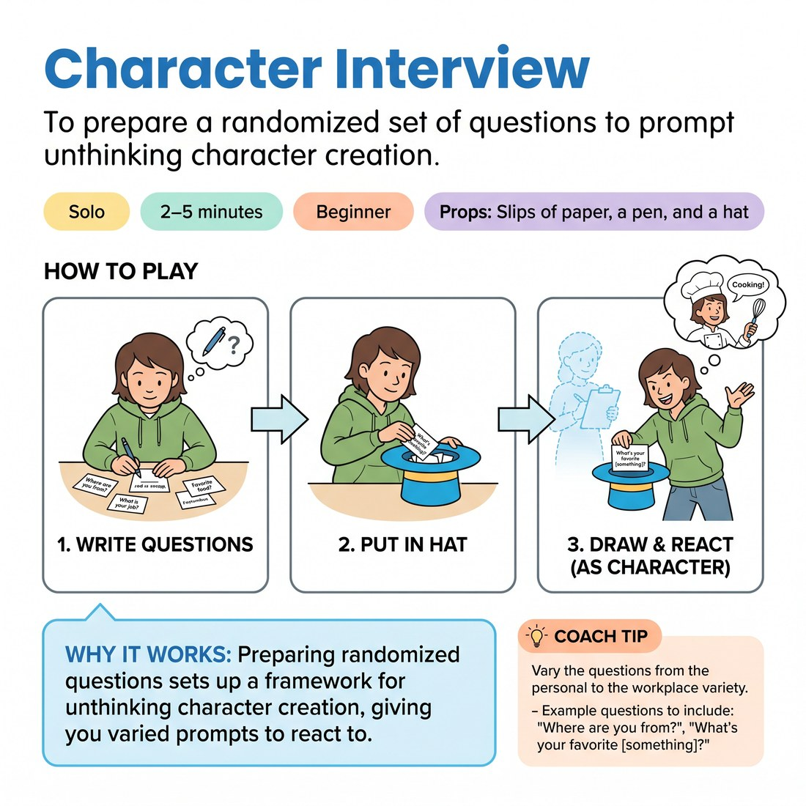

# 🎭 Character Interview
> *To prepare a randomized set of questions to prompt unthinking character creation.*

{ .infographic }

`🧑 Solo` · `⏱️ 2–5 minutes` · `📈 Beginner` · `🎒 Slips of paper, a pen, and a hat`

**Trains:** Unthinking character creation

## 🎯 Objective
To prepare a randomized set of questions to prompt unthinking character creation.

## ▶️ How to play
1. Write about ten to fifteen varied questions on slips of paper — mix the personal, the everyday and the workplace — and drop them all in a hat.
2. Sit down with the hat within reach and pick a character: give them a voice, a posture and a clear point of view.
3. Draw a question from the hat and answer it **fully in character**, justifying whatever comes out of your mouth as true for this person.
4. Keep drawing and answering, staying in the same character the whole time and letting each answer reveal a little more about who they are.
5. When you have run one character for a while, swap to a brand-new one and work through the hat again.

!!! tip "Closely related"
    This is the companion drill to [Character Questions in a Hat](07_character-questions-in-a-hat.md) — prepare your questions here, then use that page's monologue-then-questions format to perform them.

## 💡 Why it works
Preparing randomized questions sets up a framework for unthinking character creation, giving you varied prompts to react to.

## 🎓 Coach's tips
- Vary the questions from the personal to the workplace variety.
- Example questions to include: "Where are you from?", "What's your favorite ice cream and why?", "What is a sad moment in your childhood?", and "What are you reading now?"

---
`Solo Practice` · Theme: **Character & Point of View**  
[← Back to all solo exercises](index.md)

⬅️ *Prev:* [Solo Character Switches](05_solo-character-switches.md) · *Next:* [Character Questions in a Hat](07_character-questions-in-a-hat.md) ➡️
