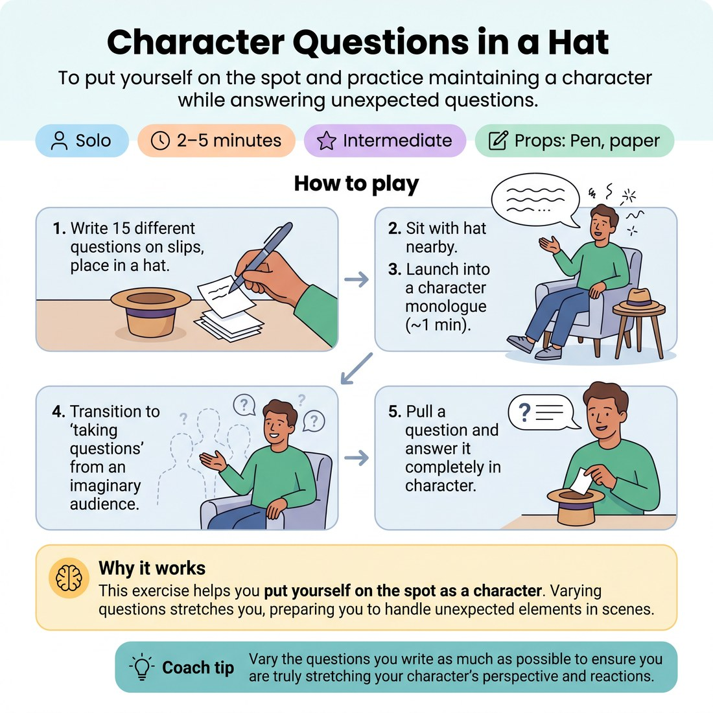

# 🎭 Character Questions in a Hat
> *To put yourself on the spot and practice maintaining a character while answering unexpected questions.*

{ .infographic }

`🧑 Solo` · `⏱️ 2–5 minutes` · `📈 Intermediate` · `🎒 Pen, paper`

**Trains:** Character development · spontaneity · justification

## 🎯 Objective
To put yourself on the spot and practice maintaining a character while answering unexpected questions.

## ▶️ How to play
1. Write about fifteen different questions on slips of paper and place them in a hat.
2. Sit in a chair with the hat close by.
3. Launch into a character monologue and let it go for about a minute.
4. Transition to "taking questions" from an imaginary audience.
5. Pull a question out of the hat and answer it completely in character.

## 💡 Why it works
This exercise helps you put yourself on the spot as a character. The more you vary the questions, the more you practice stretching yourself, which prepares you to better handle any variety of unexpected elements that come your way in an improv scene.

## 🎓 Coach's tips
- Vary the questions you write as much as possible to ensure you are truly stretching your character's perspective and reactions.

---
`Solo Practice` · Theme: **Character & Point of View**  
[← Back to all solo exercises](index.md)

⬅️ *Prev:* [Character Interview](06_character-interview.md) · *Next:* [Styles and Genres in a Hat](08_styles-and-genres-in-a-hat.md) ➡️
