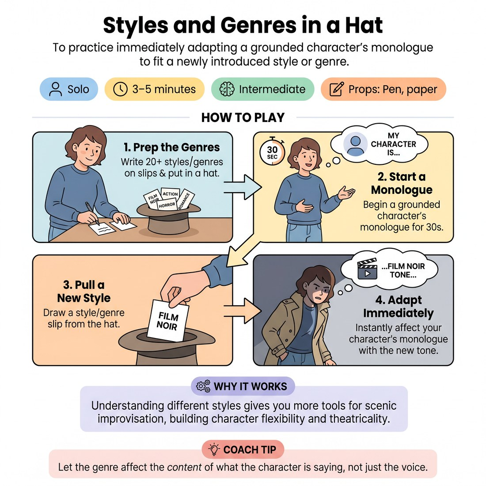

# 🎭 Styles and Genres in a Hat
> *To practice immediately adapting a grounded character's monologue to fit a newly introduced style or genre.*

{ .infographic }

`🧑 Solo` · `⏱️ 3–5 minutes` · `📈 Intermediate` · `🎒 Pen, paper`

**Trains:** Genre adaptation · character flexibility · theatricality

## 🎯 Objective
To practice immediately adapting a grounded character's monologue to fit a newly introduced style or genre.

## ▶️ How to play
1. Write twenty different styles and genres (e.g., film noir, action film, horror, romance) on slips of paper and put them in a hat.
2. Start a character monologue and let it get on solid ground for about thirty seconds.
3. Pull a style or genre out of the hat.
4. Have your character immediately be affected by the style or genre, adapting their monologue to fit the new tone.

## 🔁 Variations
- Once you feel comfortable with simple styles and genres, challenge yourself by throwing in specific book authors and playwrights.

## 💡 Why it works
Styles, genres, and the distinct voices of well-known authors and playwrights are often used to inspire improvisation. Understanding them gives you more tools to use as a scenic improviser and helps with an assortment of improv games. Learning different styles and genres also raises your reference level and brings more theatricality and variety to your work.

## 🎓 Coach's tips
- Let the genre affect the *content* of what the character is saying. For example, if your character is a mechanic and you pull "romance novel," the mechanic could immediately begin talking about his *passion* and *love* for cars.
- Take the time to familiarize yourself with different authors and playwrights to expand your repertoire—it will only help your improv.

---
`Solo Practice` · Theme: **Character & Point of View**  
[← Back to all solo exercises](index.md)

⬅️ *Prev:* [Character Questions in a Hat](07_character-questions-in-a-hat.md) · *Next:* [Non-Fiction Summary](09_non-fiction-summary.md) ➡️
