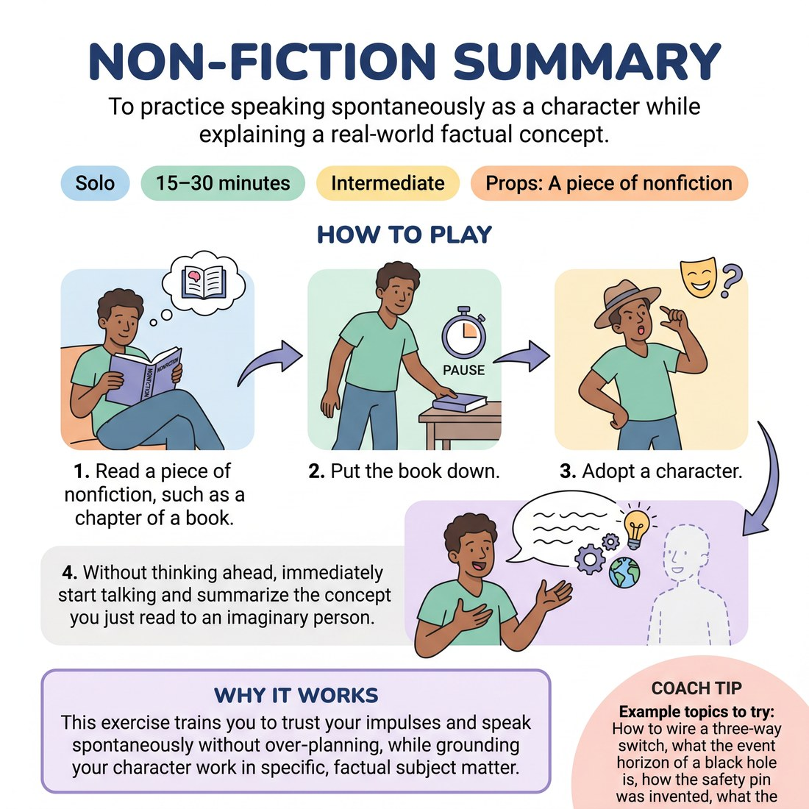

# 🎭 Non-Fiction Summary
> *To practice speaking spontaneously as a character while explaining a real-world factual concept.*

{ .infographic }

`🧑 Solo` · `⏱️ 15–30 minutes` · `📈 Intermediate` · `🎒 A piece of nonfiction`

**Trains:** Character work · spontaneity · monologue · incorporating factual information

## 🎯 Objective
To practice speaking spontaneously as a character while explaining a real-world factual concept.

## ▶️ How to play
1. Read a piece of nonfiction, such as a chapter of a book.
2. Put the book down.
3. Adopt a character.
4. Without thinking ahead, immediately start talking and summarize the concept you just read to an imaginary person.

## 💡 Why it works
This exercise trains you to trust your impulses and speak spontaneously without over-planning, while grounding your character work in specific, factual subject matter.

## 🎓 Coach's tips
- Example topics to try: How to wire a three-way switch, what the event horizon of a black hole is, how the safety pin was invented, what the War of 1812 was about, or how a water heater works.
- Don't think ahead or pre-plan your summary. Just put the book down and start talking.
- Think of this as *teaching* the subject matter to the imaginary person, even if "teach" can sometimes feel like a naughty word in improvisation.

---
`Solo Practice` · Theme: **Character & Point of View**  
[← Back to all solo exercises](index.md)

⬅️ *Prev:* [Styles and Genres in a Hat](08_styles-and-genres-in-a-hat.md) · *Next:* [Gibberish Scene](10_gibberish-scene.md) ➡️
