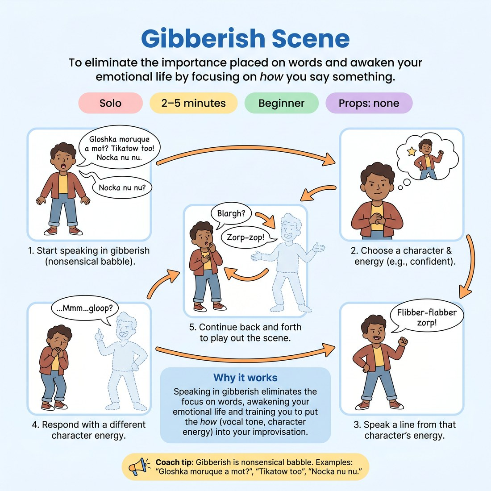

# 🗣️ Gibberish Scene
> *To eliminate the importance placed on words and awaken your emotional life by focusing on *how* you say something.*

{ .infographic }

`🧑 Solo` · `⏱️ 2–5 minutes` · `📈 Beginner` · `🎒 none`

**Trains:** Emotional expression · character energy · point of view · vocal tone

## 🎯 Objective
To eliminate the importance placed on words and awaken your emotional life by focusing on *how* you say something.

## ▶️ How to play
1. Start speaking in gibberish (nonsensical, non-English babble).
2. Choose a character with a particular point of view or energy.
3. Speak a line of gibberish from that character's energy.
4. Respond, in gibberish, playing a second character who has a very different energy or point of view.
5. Continue back and forth to play out a full gibberish scene.

## 💡 Why it works
Speaking in gibberish allows us to eliminate the importance we usually place on words. Notice that in gibberish, your emotional life is awakened. By practicing gibberish scenes, you are practicing putting the *how* into your improvisation—that is, *how* someone says something versus *what* they say.

## 🎓 Coach's tips
- Gibberish is nonsensical babble. Examples include: "Gloshka moruque a mot?", "Tikatow too", or "Nocka nu nu."
- Make sure the two characters have very different energies or points of view to create a clear dynamic.

---
`Solo Practice` · Theme: **Voice & Sound**  
[← Back to all solo exercises](index.md)

⬅️ *Prev:* [Non-Fiction Summary](09_non-fiction-summary.md) · *Next:* [Sound to Dialogue](11_sound-to-dialogue.md) ➡️
