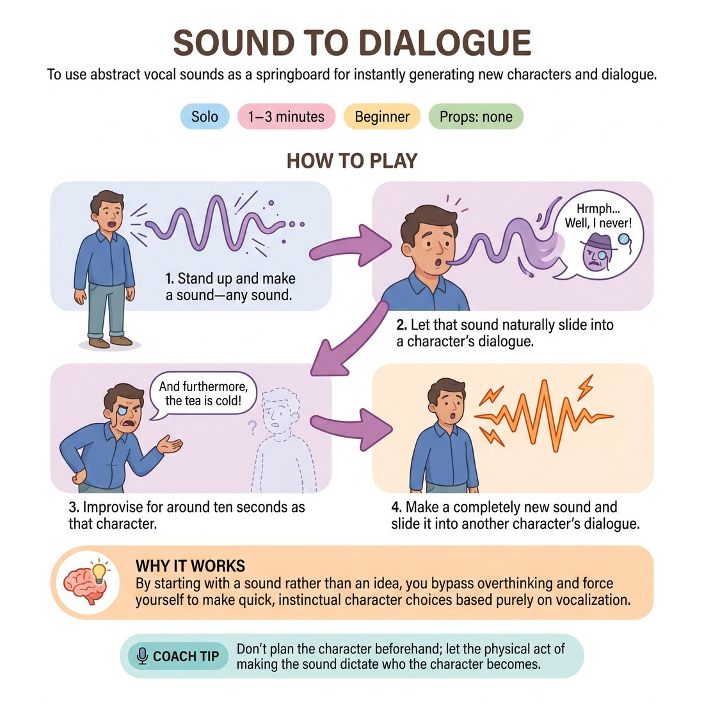

# 🗣️ Sound to Dialogue
> *To use abstract vocal sounds as a springboard for instantly generating new characters and dialogue.*

{ .infographic }

`🧑 Solo` · `⏱️ 1–3 minutes` · `📈 Beginner` · `🎒 none`

**Trains:** Vocal variety · character generation · spontaneity

## 🎯 Objective
To use abstract vocal sounds as a springboard for instantly generating new characters and dialogue.

## ▶️ How to play
1. Stand up and make a sound—any sound.
2. Let that sound naturally slide into a character's dialogue.
3. Improvise for around ten seconds as that character.
4. Make a completely new sound and slide it into another character's dialogue.

## 💡 Why it works
By starting with a sound rather than an idea, you bypass overthinking and force yourself to make quick, instinctual character choices based purely on vocalization.

## 🎓 Coach's tips
- Don't plan the character beforehand; let the physical act of making the sound dictate who the character becomes.

---
`Solo Practice` · Theme: **Voice & Sound**  
[← Back to all solo exercises](index.md)

⬅️ *Prev:* [Gibberish Scene](10_gibberish-scene.md) · *Next:* [Sound to Character](12_sound-to-character.md) ➡️
