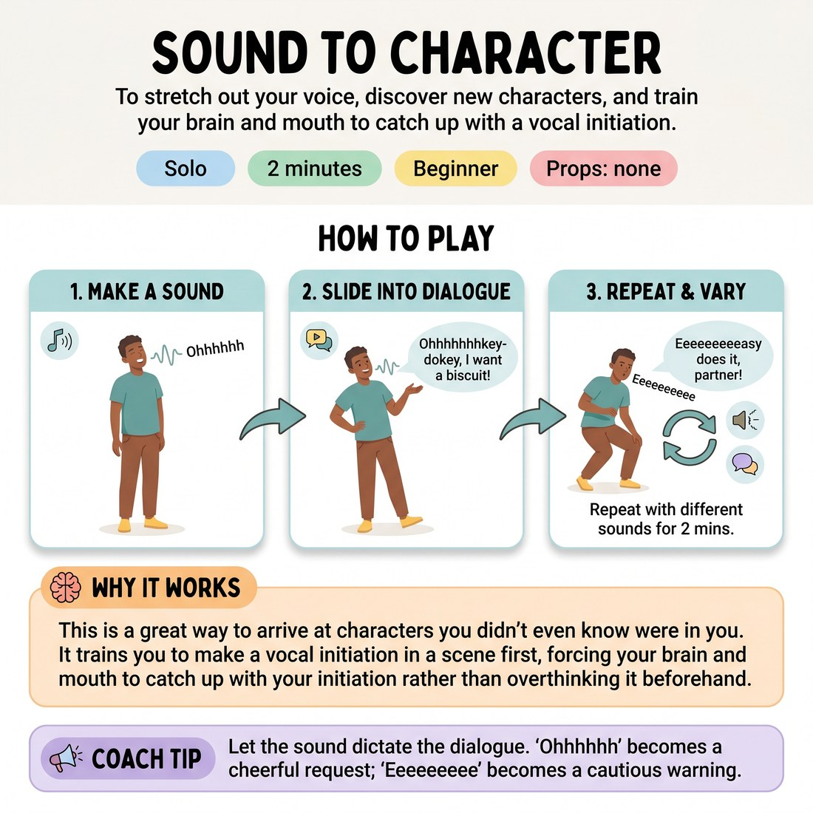

# 🗣️ Sound to Character
> *To stretch out your voice, discover new characters, and train your brain and mouth to catch up with a vocal initiation.*

{ .infographic }

`🧑 Solo` · `⏱️ 2 minutes` · `📈 Beginner` · `🎒 none`

**Trains:** Vocal initiation · character creation · spontaneity

## 🎯 Objective
To stretch out your voice, discover new characters, and train your brain and mouth to catch up with a vocal initiation.

## ▶️ How to play
1. Make a sustained, abstract sound (for example, "Ohhhhhh").
2. Let that sound slide naturally into a character's voice and a line of dialogue. 
3. Repeat this process with different sounds and lines for about two minutes.

## 💡 Why it works
This is a great way to arrive at characters you didn't even know were in you. It trains you to make a vocal initiation in a scene first, forcing your brain and mouth to catch up with your initiation rather than overthinking it beforehand.

## 🎓 Coach's tips
- Let the sound dictate the dialogue. For example, "Ohhhhhh" can become "Ohhhhhhhkey-dokey, I want a biscuit!" or "Eeeeeeeeeee" can become "Eeeeeeeeeeeeasy does it! Don't come any closer."
- Keep it brief! Two minutes is the sweet spot; don't exhaust yourself by doing it for six hours.

---
`Solo Practice` · Theme: **Voice & Sound**  
[← Back to all solo exercises](index.md)

⬅️ *Prev:* [Sound to Dialogue](11_sound-to-dialogue.md) · *Next:* [Songs](13_songs.md) ➡️
