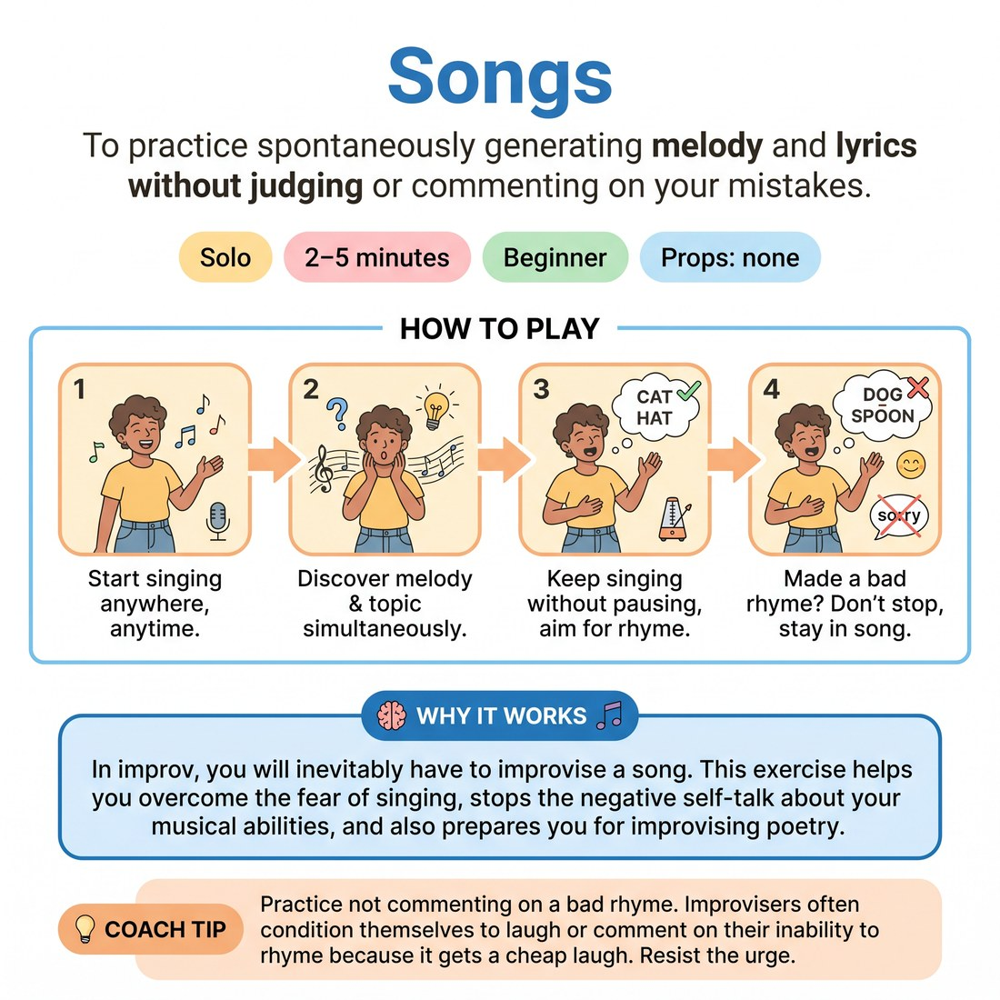

# 🗣️ Songs
> *To practice spontaneously generating melody and lyrics without judging or commenting on your mistakes.*

{ .infographic }

`🧑 Solo` · `⏱️ 2–5 minutes` · `📈 Beginner` · `🎒 none`

**Trains:** Musical improv · melody creation · rhyming · commitment

## 🎯 Objective
To practice spontaneously generating melody and lyrics without judging or commenting on your mistakes.

## ▶️ How to play
1. While at home or strolling down the street, simply start singing.
2. Discover the melody and what the song is about simultaneously as you sing.
3. Keep singing without pausing, whether you rhyme or not (though you should aim to learn to rhyme over time).
4. If you make a bad rhyme, do not pause or comment on it; just stay in the song.

## 💡 Why it works
In improv, you will inevitably have to improvise a song. This exercise helps you overcome the fear of singing, stops the negative self-talk about your musical abilities, and also prepares you for improvising poetry.

## 🎓 Coach's tips
- Practice not commenting on a bad rhyme. Improvisers often condition themselves to laugh or comment on their inability to rhyme because it gets a laugh, but this reinforces bad behavior. Find the fun in rhyming well instead.
- Consider taking singing classes for an extra edge in your improv toolkit.

---
`Solo Practice` · Theme: **Voice & Sound**  
[← Back to all solo exercises](index.md)

⬅️ *Prev:* [Sound to Character](12_sound-to-character.md) · *Next:* [Environment](14_environment.md) ➡️
