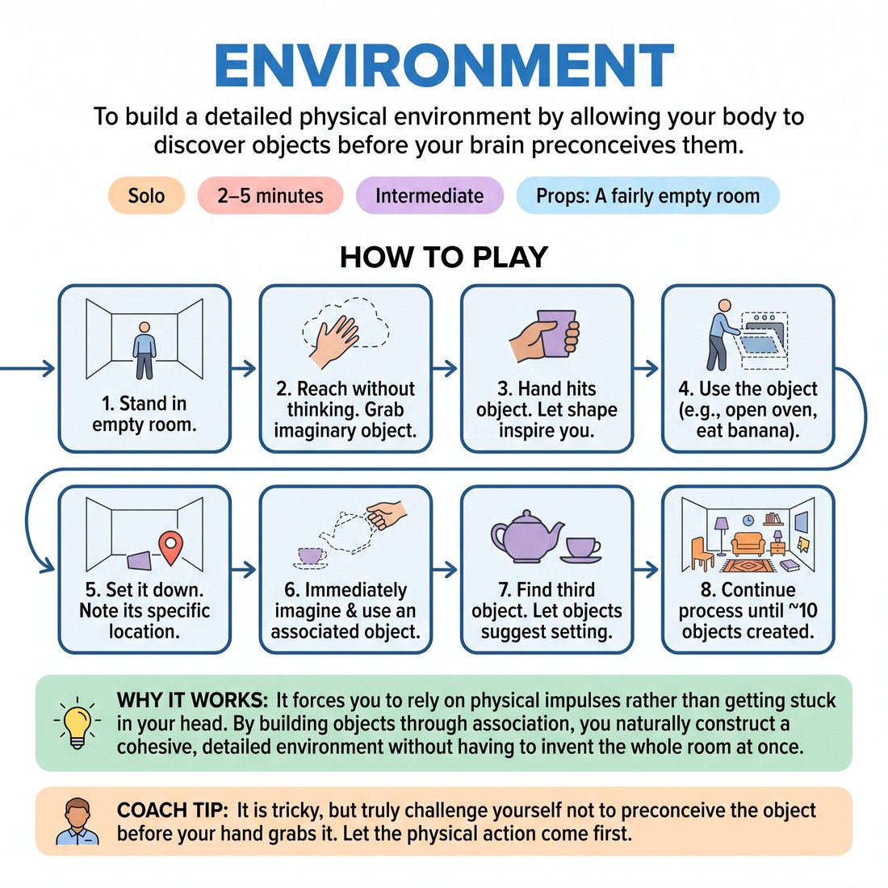

# 🤸 Environment
> *To build a detailed physical environment by allowing your body to discover objects before your brain preconceives them.*

{ .infographic }

`🧑 Solo` · `⏱️ 2–5 minutes` · `📈 Intermediate` · `🎒 A fairly empty room`

**Trains:** Object work · environment building · physical spontaneity · association

## 🎯 Objective
To build a detailed physical environment by allowing your body to discover objects before your brain preconceives them.

## ▶️ How to play
1. Stand in the middle of a fairly empty room.
2. *Without thinking*, reach out into the air and grab an imaginary object. Do not plan what the object is before you reach for it.
3. The second your hand hits the object, let its physical shape inspire you to choose what it is. 
4. Go ahead and use the object (e.g., if it's an oven, open and close the door; if it's a banana, peel and eat it).
5. Set down or leave the object, taking specific note of where it is in the room.
6. Immediately imagine another object that is somehow associated with the first object, pick it up, and use it.
7. Find a third object that might be appropriate to the first two. At this point, let the objects inspire an idea of where you are (your setting).
8. Let the setting inspire you to find a fourth object, and continue this process until you've created about ten objects.

## 🔁 Variations
- **Bonus Points:** After creating your environment, see if you can physically revisit and interact with all ten of the objects you have created in the space.

## 💡 Why it works
It forces you to rely on physical impulses rather than getting stuck in your head. By building objects through association, you naturally construct a cohesive, detailed environment without having to invent the whole room at once.

## 🎓 Coach's tips
- It is tricky, but truly challenge yourself *not* to preconceive the object before your hand grabs it. Let the physical action come first.
- Allow the environment to reveal itself organically. For example: grab a torch and walk with it, put it in a torch holder, pick up a wine bottle, find an old trunk, realize you are in an old cellar, and then find an old dress.

---
`Solo Practice` · Theme: **Physicality, Object & Environment**  
[← Back to all solo exercises](index.md)

⬅️ *Prev:* [Songs](13_songs.md) · *Next:* [Reaching Out](15_reaching-out.md) ➡️
