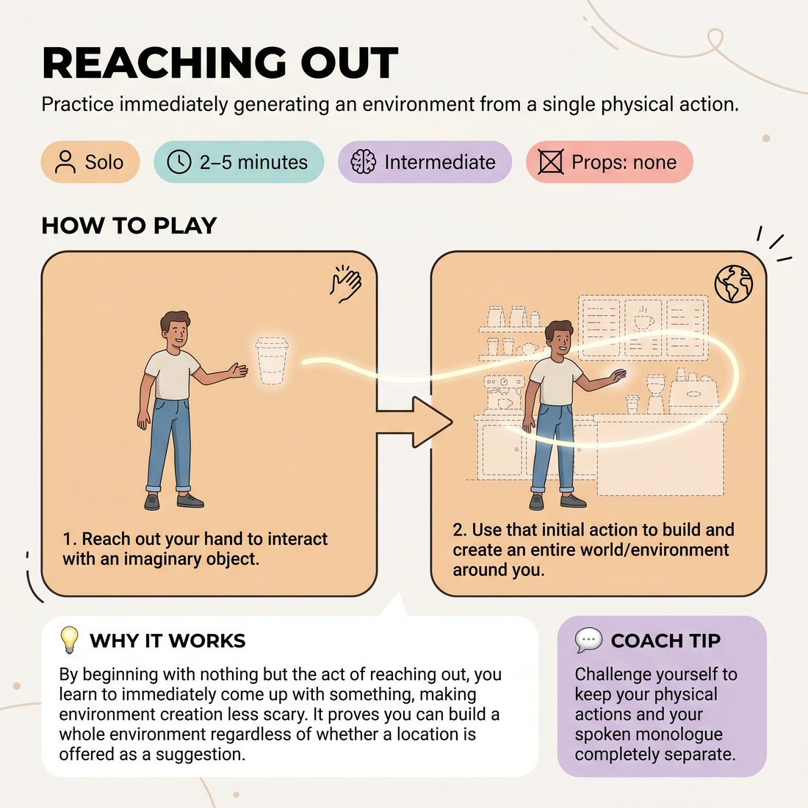

# 🤸 Reaching Out
> *Practice immediately generating an environment from a single physical action.*

{ .infographic }

`🧑 Solo` · `⏱️ 2–5 minutes` · `📈 Intermediate` · `🎒 none`

**Trains:** Environment creation · object work · character monologue

## 🎯 Objective
Practice immediately generating an environment from a single physical action.

## ▶️ How to play
1. Reach out your hand to interact with an imaginary object.
2. Use that initial action to build and create an entire world/environment around you.

## 🔁 Variations
- Create the environment while delivering a character monologue. Begin talking from the very first second you reach for the first object, but do *not* talk about what you are doing physically.

## 💡 Why it works
By beginning with nothing but the act of reaching out, you learn to immediately come up with something, making environment creation less scary. It proves you can build a whole environment regardless of whether a location is offered as a suggestion.

## 🎓 Coach's tips
- Challenge yourself to keep your physical actions and your spoken monologue completely separate.

---
`Solo Practice` · Theme: **Physicality, Object & Environment**  
[← Back to all solo exercises](index.md)

⬅️ *Prev:* [Environment](14_environment.md) · *Next:* [Body Parts](16_body-parts.md) ➡️
