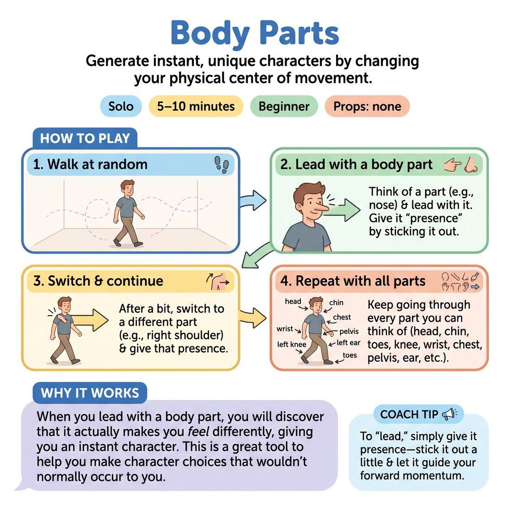

# 🤸 Body Parts
> *Generate instant, unique characters by changing your physical center of movement.*

{ .infographic }

`🧑 Solo` · `⏱️ 5–10 minutes` · `📈 Beginner` · `🎒 none`

**Trains:** Character creation · physicality · movement

## 🎯 Objective
Generate instant, unique characters by changing your physical center of movement.

## ▶️ How to play
1. Walk at random around a room.
2. Think of a body part (such as a nose) and lead with it. Give it "presence" by sticking it out a little and walking forward.
3. After a bit, switch to a different body part (like your right shoulder) and give that presence as you continue forward.
4. Keep doing this until you have gone through every part you can think of (head, chin, toes, left knee, wrist, chest, pelvis, left ear, etc.).

## 🔁 Variations
- **Add Sounds:** Do the exercise again, but this time make character sounds that feel like the character you have embodied.
- **Add Words:** As a third challenge, bring each character to words by starting to talk in character.

## 💡 Why it works
When you lead with a body part, you will discover that it actually makes you *feel* differently, giving you an instant character. This is a great tool to help you make character choices that wouldn't normally occur to you.

## 🎓 Coach's tips
- To "lead" with a body part, simply give it presence—stick it out a little and let it guide your forward momentum.

---
`Solo Practice` · Theme: **Physicality, Object & Environment**  
[← Back to all solo exercises](index.md)

⬅️ *Prev:* [Reaching Out](15_reaching-out.md) · *Next:* [Breakfast](17_breakfast.md) ➡️
