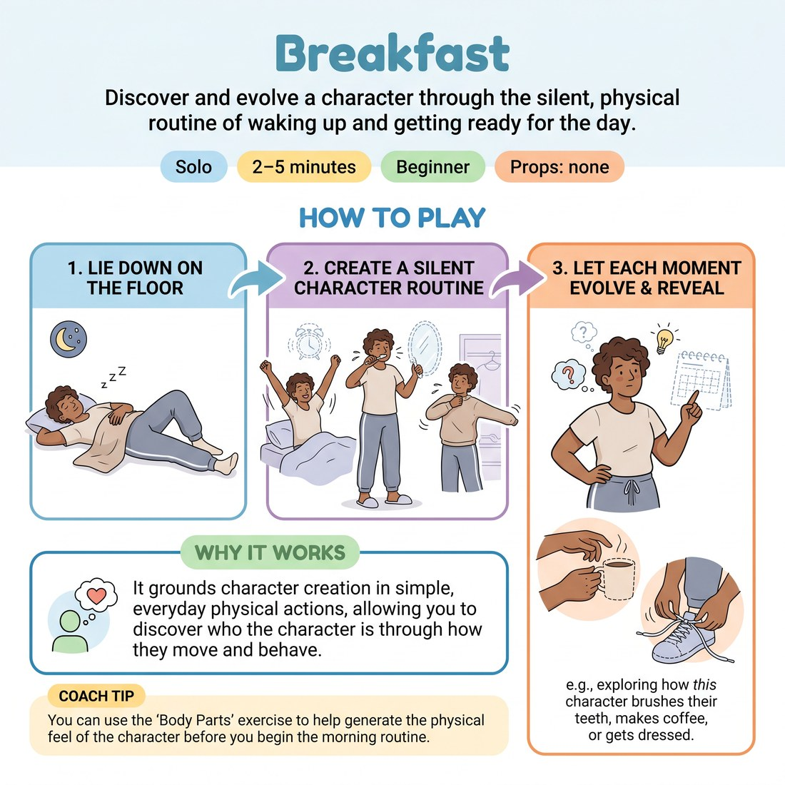

# 🤸 Breakfast
> *Discover and evolve a character through the silent, physical routine of waking up and getting ready for the day.*

{ .infographic }

`🧑 Solo` · `⏱️ 2–5 minutes` · `📈 Beginner` · `🎒 none`

**Trains:** Character development · pantomime · object work

## 🎯 Objective
Discover and evolve a character through the silent, physical routine of waking up and getting ready for the day.

## ▶️ How to play
1. Lie down on the floor.
2. Without using words, create a character who wakes up, gets dressed, and gets ready for the day.
3. Have each moment evolve naturally, learning more about the character as you go along (e.g., exploring how that specific character brushes their teeth).

## 💡 Why it works
It grounds character creation in simple, everyday physical actions, allowing you to discover who the character is through how they move and behave.

## 🎓 Coach's tips
- You can use the "Body Parts" exercise to help generate the physical feel of the character before you begin the morning routine.

---
`Solo Practice` · Theme: **Physicality, Object & Environment**  
[← Back to all solo exercises](index.md)

⬅️ *Prev:* [Body Parts](16_body-parts.md) · *Next:* [Character Morning Routine](18_character-morning-routine.md) ➡️
