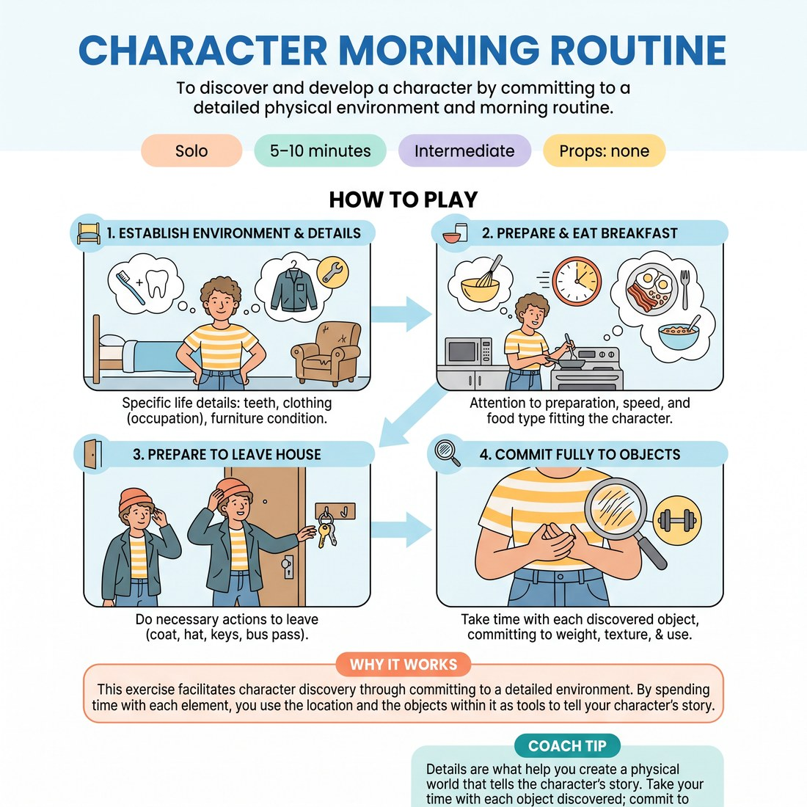

# 🤸 Character Morning Routine
> *To discover and develop a character by committing to a detailed physical environment and morning routine.*

{ .infographic }

`🧑 Solo` · `⏱️ 5–10 minutes` · `📈 Intermediate` · `🎒 none`

**Trains:** Character discovery · environment building · object work · pantomime

## 🎯 Objective
To discover and develop a character by committing to a detailed physical environment and morning routine.

## ▶️ How to play
1. Establish the specific details of your character's life and environment (e.g., their teeth, clothing based on occupation, and the condition of their bedroom furniture).
2. Have the character prepare and eat breakfast, paying close attention to the preparation, speed, and type of food that fits this specific character.
3. Have the character do whatever is necessary to leave the house or apartment (e.g., putting on a coat or hat, grabbing car keys or a bus pass).
4. Take your time with each object you discover, committing fully to its weight, texture, and use.

## 🔁 Variations
- Set up infinite subsequent scenarios for your character using the same attention to detail, such as having them arrive at work, go to the park, and so forth.

## 💡 Why it works
This exercise facilitates character discovery through committing to a detailed environment. By spending time with each element, you use the location and the objects within it as tools to tell your character's story.

## 🎓 Coach's tips
- Details are what help you create a physical world that tells the character's story.
- Take your time with each object discovered; commit to its weight, texture, and use.

---
`Solo Practice` · Theme: **Physicality, Object & Environment**  
[← Back to all solo exercises](index.md)

⬅️ *Prev:* [Breakfast](17_breakfast.md) · *Next:* [Object Monologue](19_object-monologue.md) ➡️
