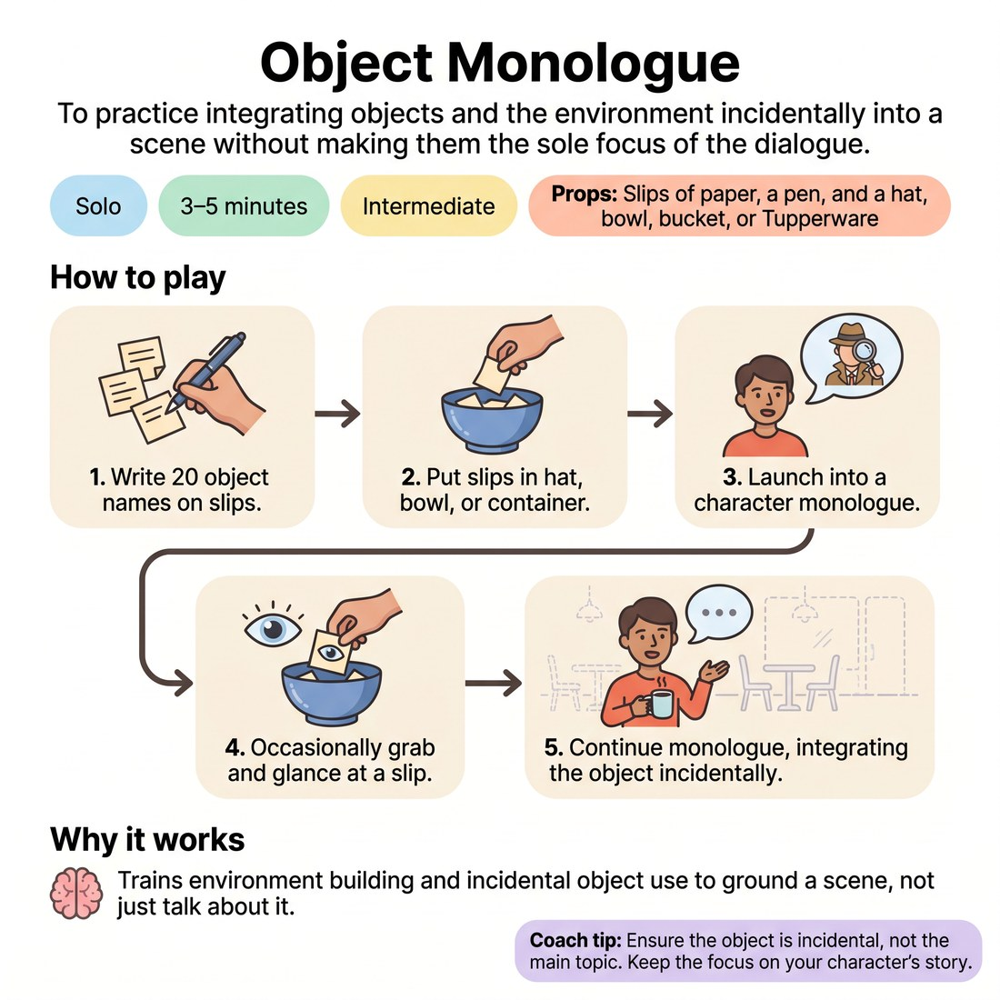

# 🤸 Object Monologue
> *To practice integrating objects and the environment incidentally into a scene without making them the sole focus of the dialogue.*

{ .infographic }

`🧑 Solo` · `⏱️ 3–5 minutes` · `📈 Intermediate` · `🎒 Slips of paper, a pen, and a hat, bowl, bucket, or Tupperware`

**Trains:** Monologuing · object work · environment building · multitasking

## 🎯 Objective
To practice integrating objects and the environment incidentally into a scene without making them the sole focus of the dialogue.

## ▶️ How to play
1. Write the names of twenty objects on slips of paper.
2. Put the slips into a hat, bowl, bucket, or Tupperware.
3. Launch into a character monologue of your choice.
4. Every once in a while, grab a slip of paper and glance at the object written on it.
5. Continue the character monologue as you integrate the object into the scene.

## 💡 Why it works
This provides practice with creating an environment and reaching out into it while improvising a scene. It trains you to make the environment incidental rather than the main topic of conversation, which is invaluable for grounding a scene.

## 🎓 Coach's tips
- A common mistake for beginners is merely talking about the environment or the object they are holding.
- Ensure the object is incidental or used to accentuate the content of the monologue, rather than focusing on or talking directly about the object itself.

---
`Solo Practice` · Theme: **Physicality, Object & Environment**  
[← Back to all solo exercises](index.md)

⬅️ *Prev:* [Character Morning Routine](18_character-morning-routine.md) · *Next:* [Dance](20_dance.md) ➡️
