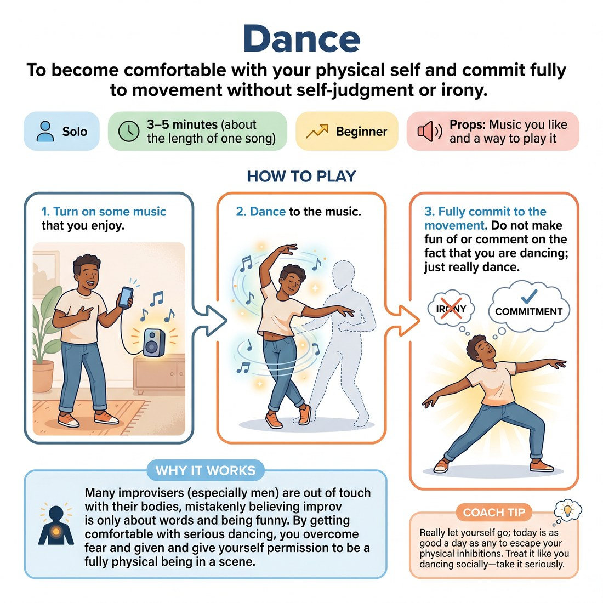

# 🤸 Dance
> *To become comfortable with your physical self and commit fully to movement without self-judgment or irony.*

{ .infographic }

`🧑 Solo` · `⏱️ 3–5 minutes (about the length of one song)` · `📈 Beginner` · `🎒 Music you like and a way to play it`

**Trains:** Physicality · commitment · body awareness · overcoming fear

## 🎯 Objective
To become comfortable with your physical self and commit fully to movement without self-judgment or irony.

## ▶️ How to play
1. Turn on some music that you enjoy.
2. Dance to the music.
3. Fully commit to the movement. Do not make fun of or comment on the fact that you are dancing; just really dance.

## 💡 Why it works
Many improvisers (especially men) are out of touch with their bodies, mistakenly believing improv is only about words and being funny. By getting comfortable with serious dancing, you overcome fear and give yourself permission to be a fully physical being in an improv scene. It helps you escape the bonds of how you perceive your physical self and teaches you something about yourself.

## 🎓 Coach's tips
- Really let yourself go; today is as good a day as any to escape your physical inhibitions.
- Treat it like you are dancing socially—take it seriously and commit.
- As a bonus, this skill will come in handy if you ever get a date!

---
`Solo Practice` · Theme: **Physicality, Object & Environment**  
[← Back to all solo exercises](index.md)

⬅️ *Prev:* [Object Monologue](19_object-monologue.md) · *Next:* [Scene with Emotional Shift](21_scene-with-emotional-shift.md) ➡️
