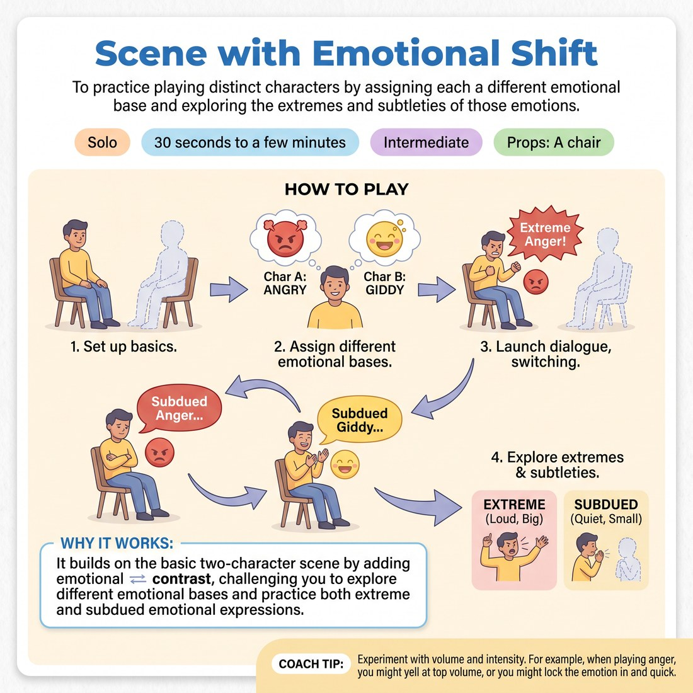

# ❤️ Scene with Emotional Shift
> *To practice playing distinct characters by assigning each a different emotional base and exploring the extremes and subtleties of those emotions.*

{ .infographic }

`🧑 Solo` · `⏱️ 30 seconds to a few minutes` · `📈 Intermediate` · `🎒 A chair`

**Trains:** Emotional choices · character distinction · emotional range

## 🎯 Objective
To practice playing distinct characters by assigning each a different emotional base and exploring the extremes and subtleties of those emotions.

## ▶️ How to play
1. Set up exactly as you would for the basic "Scene" exercise.
2. Assign a different emotional base to each character (for example, one character might be angry and the other giddy).
3. Launch into a dialogue, switching back and forth between the two characters and their respective emotions.
4. Practice playing both the extremes of the emotions and subdued expressions of them.

## 💡 Why it works
It builds on the basic two-character scene by adding emotional contrast, challenging you to explore different emotional bases and practice both extreme and subdued emotional expressions.

## 🎓 Coach's tips
- Experiment with volume and intensity. For example, when playing anger, you might yell at top volume, or you might lock the emotion in and quietly whisper through clenched teeth.

---
`Solo Practice` · Theme: **Emotion & Status**  
[← Back to all solo exercises](index.md)

⬅️ *Prev:* [Dance](20_dance.md) · *Next:* [Emotional Range Challenge](22_emotional-range-challenge.md) ➡️
