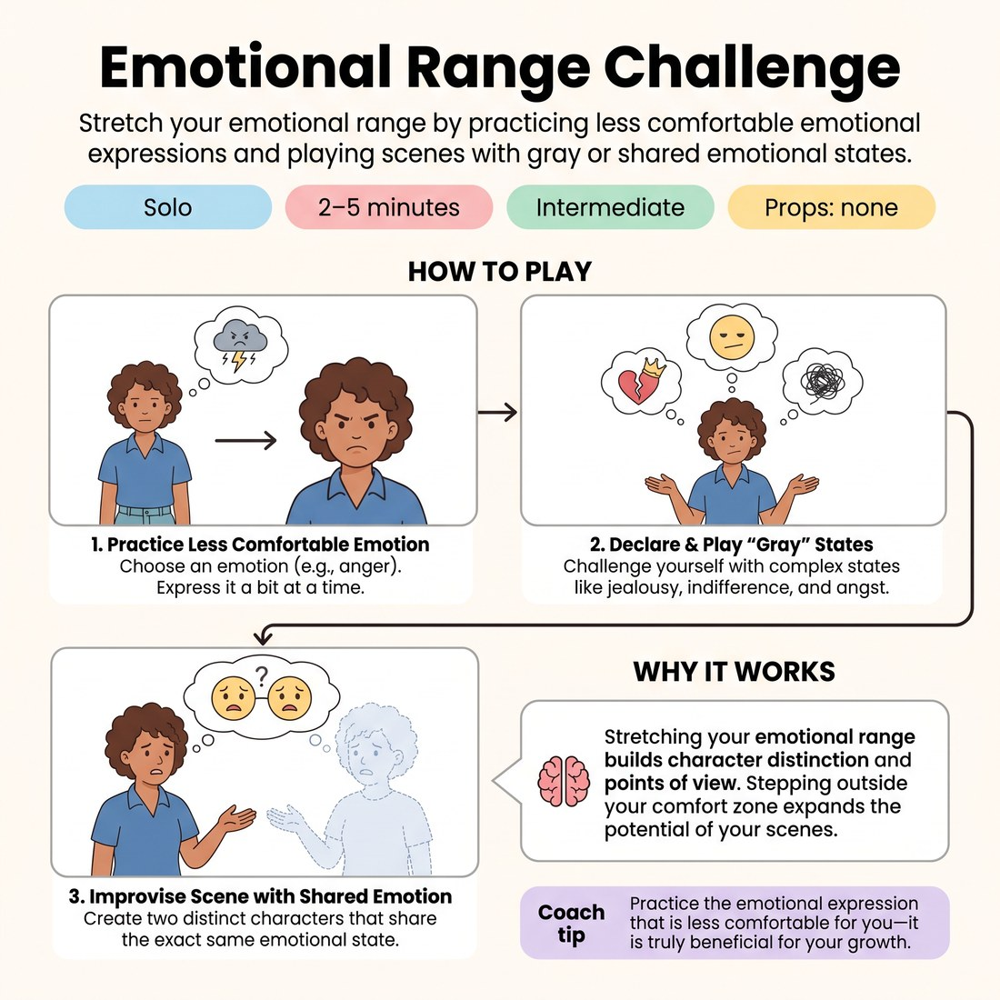

# ❤️ Emotional Range Challenge
> *Stretch your emotional range by practicing less comfortable emotional expressions and playing scenes with gray or shared emotional states.*

{ .infographic }

`🧑 Solo` · `⏱️ 2–5 minutes` · `📈 Intermediate` · `🎒 none`

**Trains:** Emotional range · character distinction · point of view

## 🎯 Objective
Stretch your emotional range by practicing less comfortable emotional expressions and playing scenes with gray or shared emotional states.

## ▶️ How to play
1. Choose an emotion (like anger) and practice expressing it in a way that is less comfortable for you (e.g., letting it out a bit at a time).
2. Once you feel confident, challenge yourself by declaring and playing more "gray" emotional states, such as jealousy, indifference, and angst.
3. Improvise a scene by yourself where the two characters are distinct but share the exact same emotional state.

## 💡 Why it works
Anything you can do to stretch your emotional range while improvising is valuable. The emotional states you pull from, and the way you play them, inform what a scene is about and the characters' points of view. Most people stay within their own comfort range; opening that up now will bring you great rewards later.

## 🎓 Coach's tips
- Practice the emotional expression that is less comfortable for you—it is truly beneficial for your growth as a performer.

---
`Solo Practice` · Theme: **Emotion & Status**  
[← Back to all solo exercises](index.md)

⬅️ *Prev:* [Scene with Emotional Shift](21_scene-with-emotional-shift.md) · *Next:* [Scenes of Status Shift](23_scenes-of-status-shift.md) ➡️
