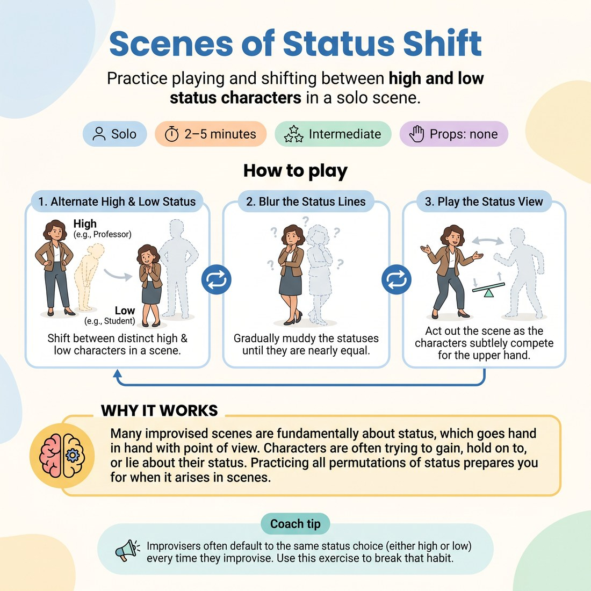

# ❤️ Scenes of Status Shift
> *Practice playing and shifting between high and low status characters in a solo scene.*

{ .infographic }

`🧑 Solo` · `⏱️ 2–5 minutes` · `📈 Intermediate` · `🎒 none`

**Trains:** Status · character dynamics · point of view

## 🎯 Objective
Practice playing and shifting between high and low status characters in a solo scene.

## ▶️ How to play
1. Improvise a scene by yourself where you shift between a distinctly high-status character (e.g., a professor) and a distinctly low-status character (e.g., a student).
2. As you create more scenes, muddy the line between statuses until you create two characters with nearly the same status.
3. Play out the scene and watch as the two characters vie for the upper hand.

## 💡 Why it works
Many improvised scenes are fundamentally about status, which goes hand in hand with point of view. Characters are often trying to gain, hold on to, or lie about their status. Practicing all permutations of status prepares you for when it arises in scenes.

## 🎓 Coach's tips
- Improvisers often default to the same status choice (either high or low) every time they improvise. Use this exercise to break that habit.
- Analytical people tend to default to high status, often objectifying what is happening in the scene. Be aware of this tendency if you are an analytical player.

---
`Solo Practice` · Theme: **Emotion & Status**  
[← Back to all solo exercises](index.md)

⬅️ *Prev:* [Emotional Range Challenge](22_emotional-range-challenge.md) · *Next:* [Scene](24_scene.md) ➡️
