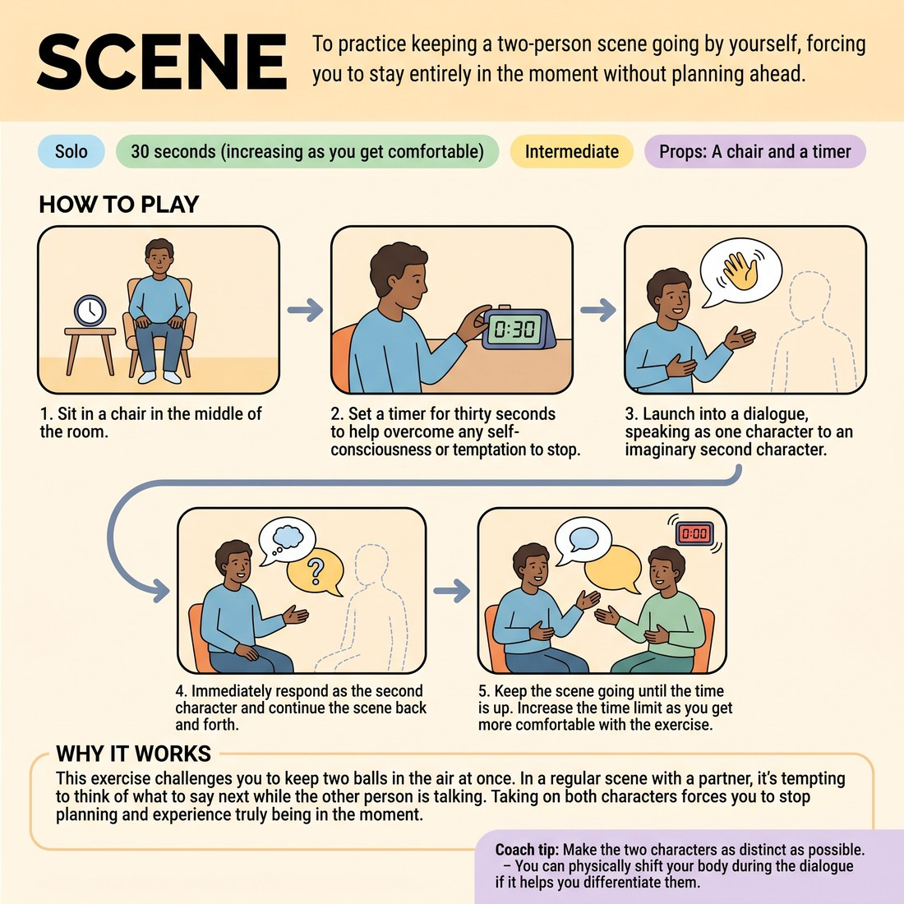

# 🎞️ Scene
> *To practice keeping a two-person scene going by yourself, forcing you to stay entirely in the moment without planning ahead.*

{ .infographic }

`🧑 Solo` · `⏱️ 30 seconds (increasing as you get comfortable)` · `📈 Intermediate` · `🎒 A chair and a timer`

**Trains:** Scenic improvisation · character distinction · being in the moment

## 🎯 Objective
To practice keeping a two-person scene going by yourself, forcing you to stay entirely in the moment without planning ahead.

## ▶️ How to play
1. Sit in a chair in the middle of the room.
2. Set a timer for thirty seconds to help overcome any self-consciousness or temptation to stop.
3. Launch into a dialogue, speaking as one character to an imaginary second character.
4. Immediately respond as the second character and continue the scene back and forth.
5. Keep the scene going until the time is up. Increase the time limit as you get more comfortable with the exercise.

## 💡 Why it works
This exercise challenges you to keep two balls in the air at once. In a regular scene with a partner, it's tempting to think of what to say next while the other person is talking. Taking on both characters forces you to stop planning and experience truly being in the moment. As you practice, your scenes will evolve from simple question-and-answer exchanges into complex scenes where each character has a distinct point of view.

## 🎓 Coach's tips
- Make the two characters as distinct as possible.
- You can physically shift your body during the dialogue if it helps you differentiate the characters, but it is entirely optional.
- Think of this exercise as a "vocal-mind-momentum thing."

---
`Solo Practice` · Theme: **Solo Scene-Work & Heightening**  
[← Back to all solo exercises](index.md)

⬅️ *Prev:* [Scenes of Status Shift](23_scenes-of-status-shift.md) · *Next:* [Heightening](25_heightening.md) ➡️
