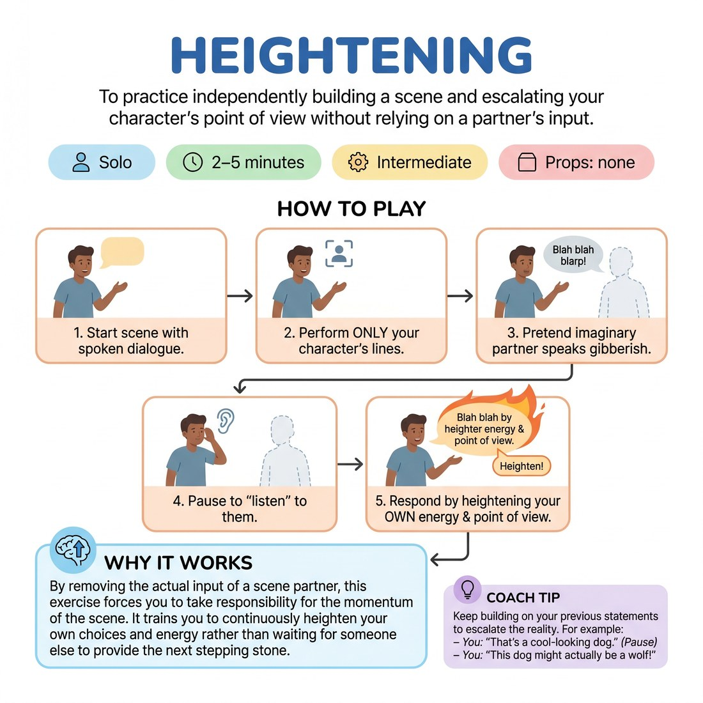

# 🎞️ Heightening
> *To practice independently building a scene and escalating your character's point of view without relying on a partner's input.*

{ .infographic }

`🧑 Solo` · `⏱️ 2–5 minutes` · `📈 Intermediate` · `🎒 none`

**Trains:** Heightening · maintaining point of view · scene building · self-reliance

## 🎯 Objective
To practice independently building a scene and escalating your character's point of view without relying on a partner's input.

## ▶️ How to play
1. Stand up and start a scene using spoken dialogue.
2. Perform only your own character's lines.
3. Pretend there is another character in the scene speaking gibberish.
4. Pause after your lines to "listen" to the other imaginary improviser's dialogue.
5. Respond by constantly putting fuel on your own fire—adding to and heightening the energy or point of view you have already created.

## 💡 Why it works
By removing the actual input of a scene partner, this exercise forces you to take responsibility for the momentum of the scene. It trains you to continuously heighten your own choices and energy rather than waiting for someone else to provide the next stepping stone.

## 🎓 Coach's tips
- Keep building on your previous statements to escalate the reality. For example:
  - *You:* "That's a cool-looking dog." *(Pause)*
  - *You:* "Three-legged dogs are rare." *(Pause)*
  - *You:* "Damn thing's name is Rexy?" *(Pause)*
  - *You:* "It's standing next to a cat with one ear." *(Pause)*
  - *You:* "Never seen a green cat and a three-legged wiener dog." *(Pause)*

---
`Solo Practice` · Theme: **Solo Scene-Work & Heightening**  
[← Back to all solo exercises](index.md)

⬅️ *Prev:* [Scene](24_scene.md) · *Next:* [Improvising Your Half of the Scene](26_improvising-your-half-of-the-scene.md) ➡️
