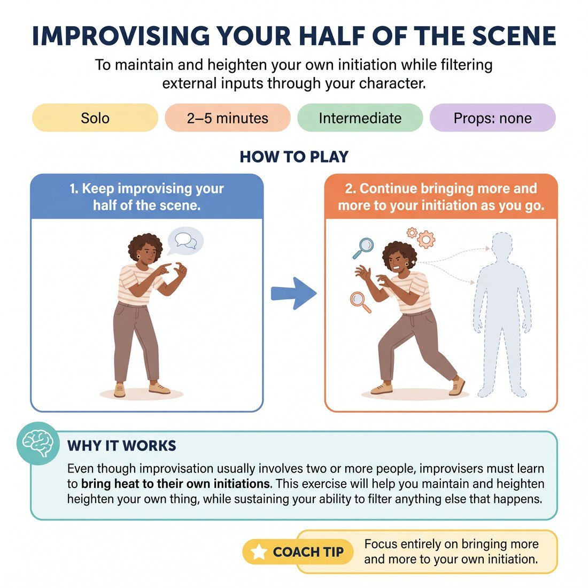

# 🎞️ Improvising Your Half of the Scene
> *To maintain and heighten your own initiation while filtering external inputs through your character.*

{ .infographic }

`🧑 Solo` · `⏱️ 2–5 minutes` · `📈 Intermediate` · `🎒 none`

**Trains:** Initiations · heightening · maintaining character point of view · filtering

## 🎯 Objective
To maintain and heighten your own initiation while filtering external inputs through your character.

## ▶️ How to play
1. Keep improvising your half of the scene.
2. Continue bringing more and more to your initiation as you go.

## 💡 Why it works
Even though improvisation usually involves two or more people, improvisers must learn to bring heat to their own initiations. This exercise will help you maintain and heighten your own thing, while sustaining your ability to filter anything else that happens in the scene, or anything your partner says and does, through your character.

## 🎓 Coach's tips
- Focus entirely on bringing more and more to your own initiation.

---
`Solo Practice` · Theme: **Solo Scene-Work & Heightening**  
[← Back to all solo exercises](index.md)

⬅️ *Prev:* [Heightening](25_heightening.md) · *Next:* [Film Dialogue](27_film-dialogue.md) ➡️
