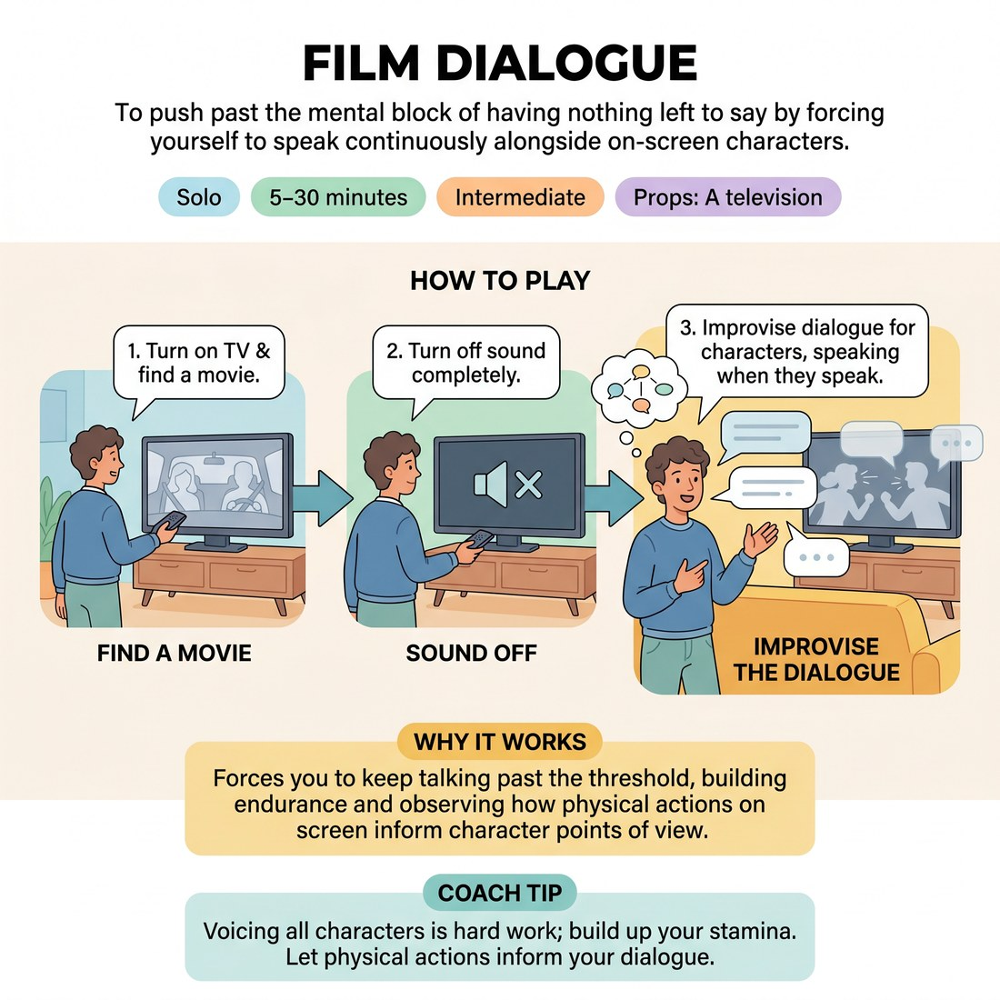

# 🎞️ Film Dialogue
> *To push past the mental block of having nothing left to say by forcing yourself to speak continuously alongside on-screen characters.*

{ .infographic }

`🧑 Solo` · `⏱️ 5–30 minutes` · `📈 Intermediate` · `🎒 A television`

**Trains:** Sustaining dialogue · maintaining point of view · heightening · endurance

## 🎯 Objective
To push past the mental block of having nothing left to say by forcing yourself to speak continuously alongside on-screen characters.

## ▶️ How to play
1. Turn on your television and find a movie.
2. Turn off the sound completely.
3. Improvise the dialogue for the characters on screen, speaking whenever they speak.

## 🔁 Variations
- Start by improvising only one character's dialogue, then work your way up to voicing all of the characters for a half hour or so.
- After trying a movie or two, switch the format and try dubbing sitcoms, the news, cooking shows, and so on.

## 💡 Why it works
This exercise forces you to keep going. Improvisers often feel they've reached a threshold where they can't do or say anything else, but here you must keep talking as long as the film characters talk. It also helps you observe how characters' points of view remain intact and are heightened throughout a scene.

## 🎓 Coach's tips
- Voicing all the characters for an extended period is hard work; build up your stamina.
- Notice how the physical actions on screen can inform the characters' points of view.

---
`Solo Practice` · Theme: **Solo Scene-Work & Heightening**  
[← Back to all solo exercises](index.md)

⬅️ *Prev:* [Improvising Your Half of the Scene](26_improvising-your-half-of-the-scene.md) · *Next:* [Read a Character from a Play Out Loud](28_read-a-character-from-a-play-out-loud.md) ➡️
