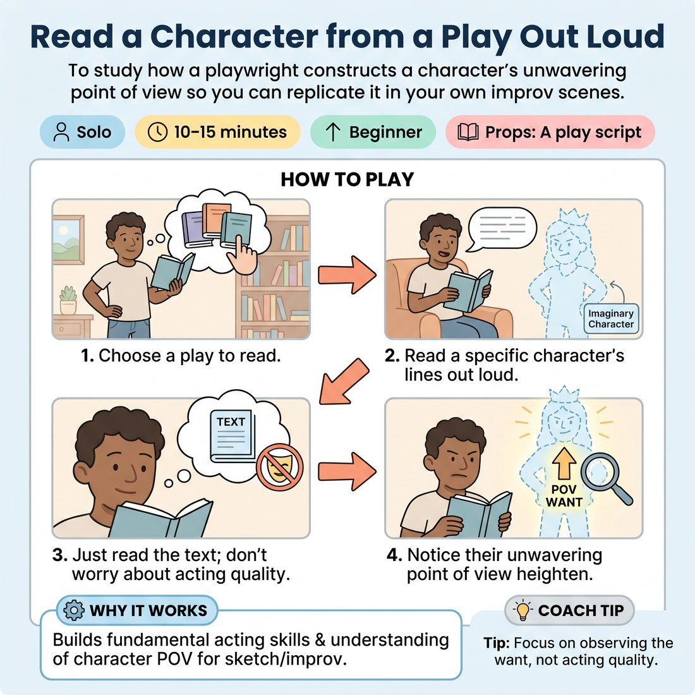

# 🎬 Read a Character from a Play Out Loud
> *To study how a playwright constructs a character's unwavering point of view so you can replicate it in your own improv scenes.*

{ .infographic }

`🧑 Solo` · `⏱️ 10–15 minutes` · `📈 Beginner` · `🎒 A play script`

**Trains:** Scene construction · character attributes · acting skills · maintaining a point of view

## 🎯 Objective
To study how a playwright constructs a character's unwavering point of view so you can replicate it in your own improv scenes.

## ▶️ How to play
1. Choose a play to read.
2. Read a specific character's lines out loud.
3. Do not worry about how well you are acting; just read the text.
4. As you read, notice how the character's point of view (their *superobjective* or *want*) heightens, flourishes, and remains unwavering.

## 💡 Why it works
Reading plays is incredibly valuable for gaining an edge in improvisation because it builds fundamental acting skills. Professional improvisation companies often lean toward sketch comedy, which requires playing roles—an acting job first and foremost. Understanding how a playwright builds a character's point of view helps you understand scene construction and character attributes, which are essential because continued success in improv always comes back to acting.

## 🎓 Coach's tips
- Don't worry about the quality of your acting while reading; the focus is purely on observing the character's unwavering want.
- Remember that in improv, you must create the point of view yourself, just as the playwright does on the page.
- Start building your acting skills this afternoon—they are the true edge for continued success in long form, games, and professional sketch comedy.

---
`Solo Practice` · Theme: **Study & Performance Craft**  
[← Back to all solo exercises](index.md)

⬅️ *Prev:* [Film Dialogue](27_film-dialogue.md) · *Next:* [Counting to One Hundred](29_counting-to-one-hundred.md) ➡️
