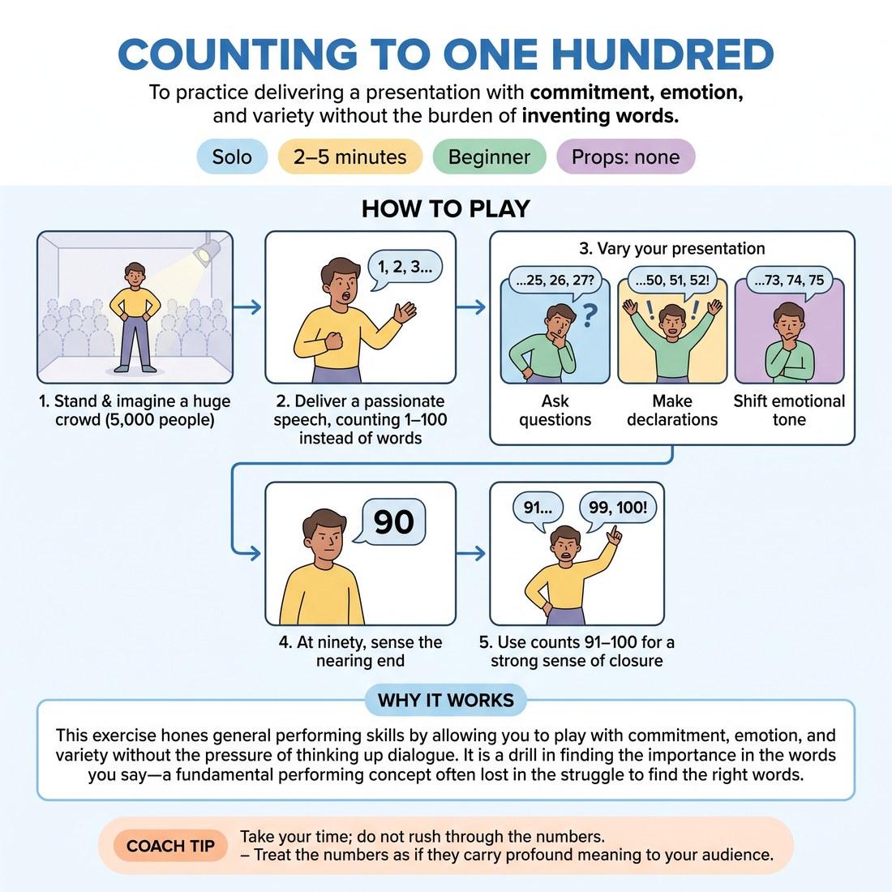

# 🎬 Counting to One Hundred
> *To practice delivering a presentation with commitment, emotion, and variety without the burden of inventing words.*

{ .infographic }

`🧑 Solo` · `⏱️ 2–5 minutes` · `📈 Beginner` · `🎒 none`

**Trains:** Commitment · emotional variety · vocal variety · stage presence

## 🎯 Objective
To practice delivering a presentation with commitment, emotion, and variety without the burden of inventing words.

## ▶️ How to play
1. Stand in the middle of a room and pretend you are a great speaker addressing a gathered crowd of 5,000 people.
2. Deliver a passionate speech, but instead of using words, count out loud from one to one hundred.
3. Vary your presentation as you count: ask questions, make declarations, and shift your emotional tone.
4. As you reach the count of ninety, recognize that you are nearing the end of your speech.
5. Use the final ten counts (91–100) to provide a strong sense of closure to your presentation.

## 💡 Why it works
This exercise hones general performing skills by allowing you to play with commitment, emotion, and variety without the pressure of thinking up dialogue. It is a drill in finding the importance in the words you say—a fundamental performing concept often lost in improvisation when actors forget to make their character's words truly matter.

## 🎓 Coach's tips
- Take your time; do not rush through the numbers.
- Treat the numbers as if they carry profound meaning to your audience.

---
`Solo Practice` · Theme: **Study & Performance Craft**  
[← Back to all solo exercises](index.md)

⬅️ *Prev:* [Read a Character from a Play Out Loud](28_read-a-character-from-a-play-out-loud.md) · *Next:* [Notes on Good Acting](30_notes-on-good-acting.md) ➡️
