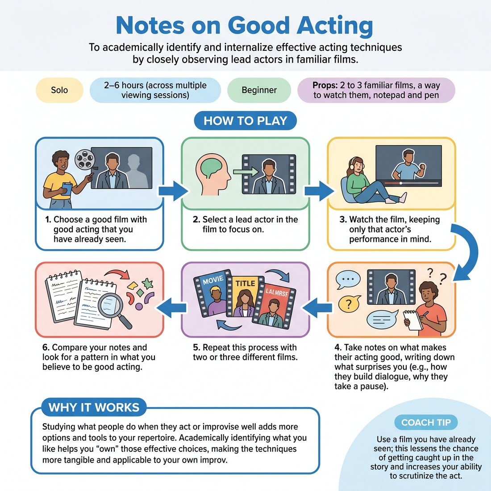

# 🎬 Notes on Good Acting
> *To academically identify and internalize effective acting techniques by closely observing lead actors in familiar films.*

{ .infographic }

`🧑 Solo` · `⏱️ 2–6 hours (across multiple viewing sessions)` · `📈 Beginner` · `🎒 2 to 3 familiar films, a way to watch them, notepad and pen`

**Trains:** Observation · acting analysis · character study

## 🎯 Objective
To academically identify and internalize effective acting techniques by closely observing lead actors in familiar films.

## ▶️ How to play
1. Choose a good film with good acting that you have already seen.
2. Select a lead actor in the film to focus on.
3. Watch the film, keeping only that actor's performance in mind.
4. Take notes on what makes their acting good, writing down what surprises you (e.g., how they build dialogue, why they take a pause).
5. Repeat this process with two or three different films.
6. Compare your notes and look for a pattern in what you believe to be good acting.

## 💡 Why it works
Studying what people do when they act or improvise well adds more options and tools to your repertoire. Academically identifying what you like helps you "own" those effective choices, making the techniques more tangible and applicable to your own improv.

## 🎓 Coach's tips
- Use a film you have already seen; this lessens the chance of getting caught up in the story and increases your ability to scrutinize the acting.
- Pay special attention to surprising choices, such as the kinds of builds the actor creates in their dialogue or their deliberate use of pauses.

---
`Solo Practice` · Theme: **Study & Performance Craft**  
[← Back to all solo exercises](index.md)

⬅️ *Prev:* [Counting to One Hundred](29_counting-to-one-hundred.md)
