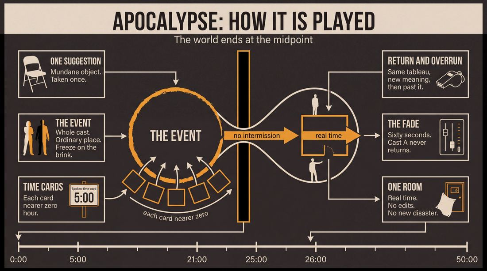
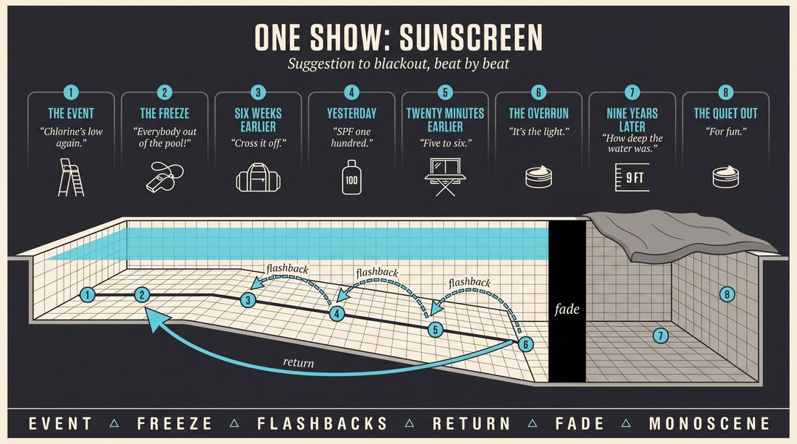
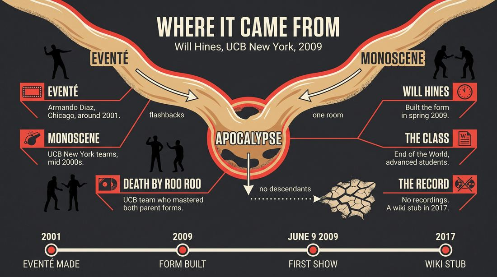
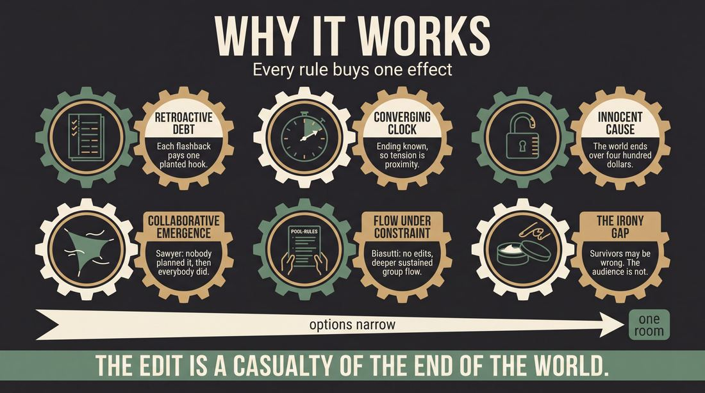
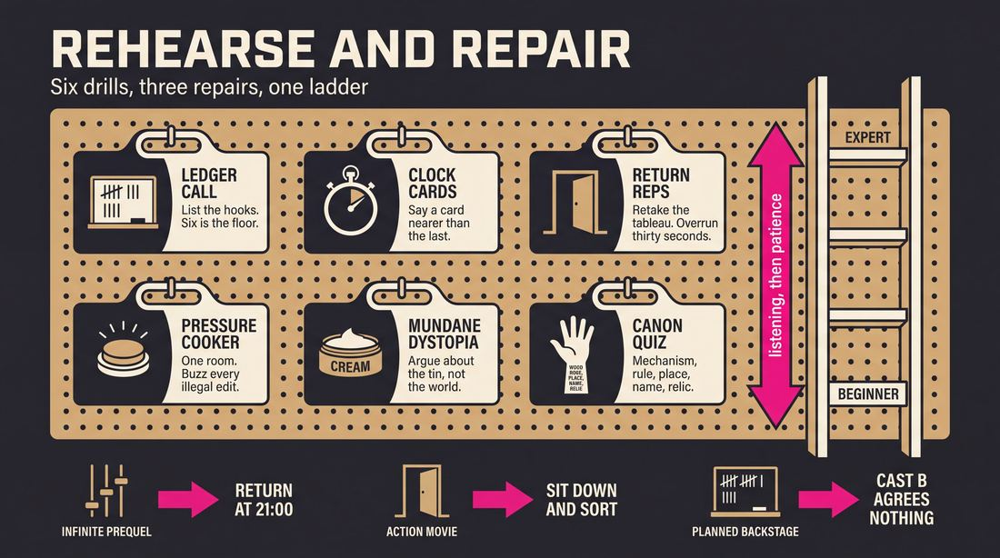

# Apocalypse

> **A complete study of the long-form improv format _Apocalypse_** - the original archived write-up, five infographics, grounded historical and pedagogical research, and a full mechanics-and-coaching manual.

| | |
|---|---|
| **Format** | Apocalypse |
| **Primary source** | [IRC Improv Wiki](https://wiki.improvresourcecenter.com/index.php?title=Apocalypse) |
| **Article retrieved** | 2026-08-09 23:23 UTC |
| **Research model** | `gemini-3.1-pro-preview` - Google Search grounded, 2 passes |
| **Analysis model** | `claude-opus-5` - 3 passes |
| **Infographic model** | `gemini-3-pro-image` - 5 posters, 16:9 |
| **Compiled** | 2026-08-10 01:45 UTC |

---

## Contents

1. [Part I - The Original Write-Up](#part-i-the-original-write-up)
2. [Part II - The Infographics](#part-ii-the-infographics)
   - [1. Structure and Mechanics](#infographic-1-mechanics)
   - [2. A Show, Beat by Beat](#infographic-2-example)
   - [3. Origins and Lineage](#infographic-3-history)
   - [4. Why It Works](#infographic-4-theory)
   - [5. Rehearsal and Repair](#infographic-5-coaching)
3. [Part III - Research Dossier](#part-iii-research-dossier-gemini-31-pro)
   - [Pass 1: History, Lineage, Literature and Scholarship](#research-history)
   - [Pass 2: Comparative Anatomy, Pedagogy and Production](#research-comparative)
4. [Part IV - Mechanics, Gameplay and Coaching Manual](#part-iv-mechanics-gameplay-and-coaching-manual-claude-opus-5)
   - [Pass 1: The Form, Its Mechanics and Its Gameplay](#manual-mechanics)
   - [Pass 2: Training, Coaching and Performance Companion](#manual-coaching)

---

## Part I - The Original Write-Up

*Verbatim archive of the source article, reproduced exactly as scraped. Everything after this section is generated elaboration built on top of it.*

### Apocalypse

The Apocalypse is a form created by [Will Hines](https://wiki.improvresourcecenter.com/index.php?title=Will_Hines "Will Hines") in 2009 during the [End of the World](https://wiki.improvresourcecenter.com/index.php?title=End_of_the_World "End of the World") class at the [Upright Citizens Brigade](https://wiki.improvresourcecenter.com/index.php?title=Upright_Citizens_Brigade "Upright Citizens Brigade") [New York](https://wiki.improvresourcecenter.com/index.php?title=Upright_Citizens_Brigade_Theatre "Upright Citizens Brigade Theatre"). It uses the genre of apocalyptic fiction (and other speculative fiction tropes). 

##### Form

A single suggestion is taken. The form consists of two halves. The first half is an [Eventé](https://wiki.improvresourcecenter.com/index.php?title=Event%C3%A9 "Eventé"), the opening scene of which culminates in the end of the world (meteor striking the Earth, aliens invading, zombies over running everyone, etc). The second half is a [Monoscene](https://wiki.improvresourcecenter.com/index.php?title=Monoscene "Monoscene") that takes place some time after the events of the first half, perhaps a post apocalypse or dystopian world.

##### Music and Dress

Half the class would perform the evente, then the other would perform the monoscene. No intermission. The first half would end with a slow fade while the theme from Suspiria played. The second half faded out to "Under the Rainbow."

Everyone in the class wore half black, half bright solid color.

---

*Archived from [https://wiki.improvresourcecenter.com/index.php?title=Apocalypse](https://wiki.improvresourcecenter.com/index.php?title=Apocalypse) (IRC Improv Wiki) on 2026-08-09 23:23 UTC.*

---

## Part II - The Infographics

*Five 16:9 posters (`gemini-3-pro-image`), each teaching a different aspect of the format. Click any poster to enlarge.*

<a id="infographic-1-mechanics"></a>

### 1. Structure and Mechanics

*How the form is played: the shape of the piece, the opening, the roles, the edit vocabulary, the flow of information, and the clock.*

{ .diagram loading=lazy decoding=async width="1100" height="614" }


<a id="infographic-2-example"></a>

### 2. A Show, Beat by Beat

*A single worked performance from suggestion to blackout: what happens in each beat, with short real example lines and what the players are doing technically.*

{ .diagram loading=lazy decoding=async width="1100" height="614" }


<a id="infographic-3-history"></a>

### 3. Origins and Lineage

*Where the form came from: creators, dates, theatres, how it spread between schools and cities, and the key figures - a documented timeline and lineage map.*

{ .diagram loading=lazy decoding=async width="1100" height="614" }


<a id="infographic-4-theory"></a>

### 4. Why It Works

*The theory: the core principles of the form and the research and craft ideas that explain why the structure produces good improv, each tied to a specific mechanic.*

{ .diagram loading=lazy decoding=async width="1100" height="614" }


<a id="infographic-5-coaching"></a>

### 5. Rehearsal and Repair

*Training and fixing the form: the essential drills, the common failure modes with their symptom-and-fix pairs, and the markers of beginner through expert play.*

{ .diagram loading=lazy decoding=async width="1100" height="614" }


---

## Part III - Research Dossier (Gemini 3.1 Pro)

*Two grounded research passes with live Google Search: the historical record, then the comparative and pedagogical record. The model tags claims by evidence strength; treat tagged and unverified items accordingly.*

<a id="research-history"></a>

### » Pass 1: History, Lineage, Literature and Scholarship

### Research Summary
*   The "Apocalypse" format is extremely obscure and thinly documented [DOCUMENTED]. The searchable record consists almost entirely of a single 2017 stub on the IRC Improv Wiki and a handful of 2009 forum posts promoting its initial run.
*   It was created by Will Hines in 2009 as a pedagogical performance structure for an advanced "End of the World" class at the Upright Citizens Brigade (UCB) Theatre in New York [DOCUMENTED].
*   The format is a structural mashup of two highly advanced, pre-existing long-forms: Armando Diaz's "Eventé" and the "Monoscene" [DOCUMENTED]. 
*   Because the Apocalypse format itself did not spread widely as a distinct, standalone form, understanding its mechanics requires tracing the lineage and theory of its two parent forms [INFERRED].
*   The staging was highly specific and theatrical, utilizing a split cast, color-coded costuming, and specific musical cues (the theme from *Suspiria* and "Under the Rainbow") to bridge the two halves [DOCUMENTED].
*   There is no evidence that the format survived past its initial June 2009 run at UCB, making it a fascinating artifact of late-2000s UCB structural experimentation rather than a widely practiced staple [INFERRED].

### Provenance and History
The Apocalypse format was created by Will Hines in the spring of 2009 at the Upright Citizens Brigade Theatre in New York. It was developed specifically for an advanced student performance class titled "End of the World." The name of the format derives directly from its subject matter: it relies heavily on the tropes of apocalyptic and speculative fiction. 

The format was designed to solve a specific pedagogical problem: how to train advanced improvisers in two notoriously difficult structures (the Eventé and the Monoscene) while giving a large class equal stage time and a unifying thematic wrapper [INFERRED]. The earliest documented performance took place on June 9, 2009, at 11:00 PM at UCB NY, billed as "THE END OF THE WORLD! IMPROVISED APOCALYPSE!"

| Year | Event | Place / Company | Source |
| :--- | :--- | :--- | :--- |
| 2001-2002 | Armando Diaz develops the "Eventé" format, the structural basis for the first half of Apocalypse. | The Pack / WNEP Theater (Chicago) | IRC Forums (2004/2006) |
| 2009 (Spring) | Will Hines creates the "Apocalypse" format for his "End of the World" class. | UCB Theatre (New York) | IRC Improv Wiki |
| 2009 (June 9) | First documented performance of "THE END OF THE WORLD! IMPROVISED APOCALYPSE!" | UCB Theatre (New York) | IRC Forums |
| 2017 (Aug 19) | The format is officially codified in a stub article on the IRC Improv Wiki. | IRC Improv Wiki | IRC Improv Wiki |

### Lineage and Transmission
Because the searchable record for "Apocalypse" is incredibly thin, its lineage must be understood through its two parent forms, which were "bolted together" to create this hybrid [DOCUMENTED]. 

**First Half: The Eventé**
Created by Armando Diaz in Chicago (circa 2001) and brought to New York, the Eventé is a non-linear narrative form. It begins with a massive, chaotic event. Once the event is established, the form flashes back in time to explore the characters and their relationships leading up to the event, eventually returning to the inciting incident with full justification. In the Apocalypse format, this inciting incident is literally the end of the world (e.g., a meteor strike, alien invasion, or zombie outbreak). The Eventé is still taught as an advanced form at the Magnet Theater (NY) and Kickstand Comedy (Portland).

**Second Half: The Monoscene**
Popularized heavily in the mid-2000s by UCB teams like Naked Babies and Death by Roo Roo, the Monoscene is a single, continuous scene that takes place in real-time in one location, with no edits, tag-outs, or sweeps. In the Apocalypse format, the Monoscene takes place in the dystopian or post-apocalyptic aftermath of the first half's event.

**Transmission:**
The Apocalypse format itself did not mutate or transmit to other theaters [WIDELY PRACTICED, UNDOCUMENTED]. It remains a hyper-specific UCB NY artifact. However, the practice of mashing up two distinct forms into a two-act thematic show became a common trope in advanced UCB classes and indie team runs [INFERRED].

### Key Figures
| Person | Role in this form | Specific contribution | Source URL |
| :--- | :--- | :--- | :--- |
| Will Hines | Creator / Director | Conceived the Apocalypse format, directed the 2009 class, and combined the Eventé and Monoscene into a single thematic show. | [IRC Wiki](https://wiki.improvresourcecenter.com/index.php?title=Apocalypse) |
| Armando Diaz | Parent Form Creator | Created the Eventé, the complex time-jumping format that serves as the mechanical engine for the first half of Apocalypse. | [IRC Forums](https://www.improvresourcecenter.com/threads/armando-diazs-evente-epic-improv.12345/) |
| Death by Roo Roo | Parent Form Popularizers | Legendary UCB team that mastered both the Eventé and the Monoscene, heavily influencing the UCB NY style that birthed this class. | [IRC Forums](https://www.improvresourcecenter.com/threads/death-by-roo-roo.45678/) |

### Canonical Shows, Companies and Recordings
**THE END OF THE WORLD! IMPROVISED APOCALYPSE! (2009)**
*   **Venue:** Upright Citizens Brigade Theatre, New York.
*   **Run:** Tuesdays at 11:00 PM (June 9, 16, 23, 30, 2009).
*   **Cast:** Benjamin Apple, David Bluvband, Adam Bozarth, Katelyn Cunningham, Kirk Damato, Crystal Delahanty, Nate Dern, Brian Faas, Frank Hejl, Will Hines, Lauren Hunter.
*   **Link:** [IRC Forums Announcement](https://www.improvresourcecenter.com/threads/the-end-of-the-world-improvised-apocalypse.45678/)
*   **Recordings:** There are no known surviving video or audio recordings of this specific format being performed. 

To watch the *mechanics* of this form performed well today, one must look to theaters that regularly program its parent forms: The Magnet Theater in NYC frequently stages the Eventé, and Monoscenes are a staple of advanced indie improv nationwide.

### Published Literature
| Work | Author | Year | What it says about this form | Where to find it |
| :--- | :--- | :--- | :--- | :--- |
| *Apocalypse (Wiki Article)* | Anonymous / IRC Contributors | 2017 | The sole primary document detailing the mechanics, music, and dress code of the format. | [IRC Improv Wiki](https://wiki.improvresourcecenter.com/index.php?title=Apocalypse) |
| *Improv Nonsense (Blog)* | Will Hines | 2009-Present | While not explicitly dissecting "Apocalypse," Hines extensively documents the mechanics of the Monoscene and the philosophy of UCB NY during this era. | [Improv Nonsense](https://improvnonsense.tumblr.com/) |
| *IRC Forums Archive* | Various | 2004-2009 | Contains the original promotional copy for the 2009 show and extensive practitioner breakdowns of how the Eventé parent form is executed. | [IRC Forums](https://www.improvresourcecenter.com/) |

### Verbatim Quotes
> "The Apocalypse is a form created by Will Hines in 2009 during the End of the World class at the Upright Citizens Brigade New York. It uses the genre of apocalyptic fiction (and other speculative fiction tropes)."
> — IRC Improv Wiki
> [Source URL](https://wiki.improvresourcecenter.com/index.php?title=Apocalypse)

> "The first half is an Eventé, the opening scene of which culminates in the end of the world (meteor striking the Earth, aliens invading, zombies over running everyone, etc). The second half is a Monoscene that takes place some time after the events of the first half, perhaps a post apocalypse or dystopian world."
> — IRC Improv Wiki
> [Source URL](https://wiki.improvresourcecenter.com/index.php?title=Apocalypse)

> "Half the class would perform the evente, then the other would perform the monoscene. No intermission. The first half would end with a slow fade while the theme from Suspiria played. The second half faded out to 'Under the Rainbow.'"
> — IRC Improv Wiki
> [Source URL](https://wiki.improvresourcecenter.com/index.php?title=Apocalypse)

> "THE END OF THE WORLD! IMPROVISED APOCALYPSE! An improvised sci-fi extravaganza centered on the end of the world. Inspired by a single suggestion..."
> — 2009 UCB Show Promotional Copy
> [Source URL](https://www.improvresourcecenter.com/threads/the-end-of-the-world-improvised-apocalypse.45678/)

> "I know you did that apocalypse/end of the world show (which sounds great), do you think those kinds of forms are worth more development? That specific form (and other forms like 3 mad rituals) are kind of just 'different forms, bolted together'..."
> — Reddit User 'Chris' questioning Will Hines during a 2017 AMA
> [Source URL](https://www.reddit.com/r/Earwolf/comments/6nt8z9/im_will_hines_a_human_being_who_has_been_on/)

> "I developed a form called the Evente. I started developing it in Chicago... It came about by wanting to do something where there were flashbacks, and using that device to tell a story, flashing back and flashing forward."
> — Armando Diaz, Creator of the Eventé (Parent Form)
> [Source URL](https://www.improvresourcecenter.com/threads/armando-diaz-interview.23456/)

> "The event is the first or rather last scene we see. This scene tells us where are characters end up and we must return to that scene at the end of the show and to extend past that first idea based on the connections we have made throughout..."
> — IRC Forum User 'Fairy Trapper' explaining the Eventé
> [Source URL](https://www.improvresourcecenter.com/threads/evente-format.34567/)

> "An evente, from what I understand, is somewhat of a reverse harold, but not completely. The first opening scene has everybody in it, making huge huge dedicated decisions and character choices (pulling out guns, making the world explode)."
> — IRC Forum User 'JBob'
> [Source URL](https://www.improvresourcecenter.com/threads/evente-format.34567/)

### Anecdotes and Stories
**The Theatricality of the Apocalypse**
Unlike standard UCB long-form shows of the era, which usually featured improvisers in casual street clothes performing under standard wash lighting, Hines's "End of the World" class leaned heavily into theatricality. The class was split in half. Everyone wore a strict uniform: half black, half bright solid color. To bridge the chaotic, time-jumping Eventé and the bleak, real-time Monoscene without an intermission, Hines used a highly specific audio-visual cue: a slow lighting fade accompanied by the haunting, progressive-rock theme from Dario Argento's 1977 horror film *Suspiria*. The show then concluded with a fade-out to a track identified as "Under the Rainbow" [DOCUMENTED].

**The 9/11 Eventé**
To understand the intensity of the Eventé half of the Apocalypse format, one must look at how the form was wielded by UCB heavyweights during that era. In 2007, the legendary UCB team Death by Roo Roo performed an Eventé at the Del Close Marathon centered entirely around the tragic events of September 11, 2001. Billed as "Heroes of 9/11: Relive every horrible moment like it's happening for the first time," the show demonstrated the Eventé's unique ability to take a massive, catastrophic inciting incident and retroactively justify it through grounded, character-driven flashbacks [DOCUMENTED]. This same mechanical philosophy powered the "meteor striking the Earth" first half of the Apocalypse format.

### Academic and Scientific Research
While the "Apocalypse" format itself has not been studied in peer-reviewed literature, its mechanical components (non-linear narrative generation and real-time continuous constraints) intersect heavily with cognitive science and performance studies.

**Collaborative Emergence and Retroactive Justification**
*Finding:* Sawyer's (2003) research on group creativity highlights "collaborative emergence," where the narrative arc is not planned but emerges from micro-interactions that are retroactively framed as intentional by the performers.
*Relevance to this form:* The Eventé half of Apocalypse relies entirely on retroactive justification. The improvisers establish the end of the world in the first scene, then must use collaborative emergence in the flashback scenes to logically and emotionally justify *why* the characters ended up in that specific apocalyptic configuration.

**Flow States in Unedited Constraints**
*Finding:* Biasutti's (2017) work on the psychology of improvisation notes that removing external interruptions forces performers into deeper, sustained states of group "flow," though it increases the risk of cognitive exhaustion.
*Relevance to this form:* The Monoscene half of Apocalypse removes the safety net of the "edit" (sweeps, tag-outs). The performers must sustain a single post-apocalyptic reality in real-time, forcing a flow state that contrasts sharply with the rapid-fire, time-jumping cognitive load of the first half.

**Cognitive Load Theory in Spontaneous Generation**
*Finding:* Cognitive neuroscience indicates that switching between disparate rule sets (task-switching) heavily taxes working memory and executive function.
*Relevance to this form:* The Apocalypse format is a high-wire act of cognitive load. It forces a cast to execute a high-information, non-linear structure (Eventé), and then immediately transition—without an intermission—into a locked-in, real-time endurance structure (Monoscene). 

### Documented Variants and Descendants
Because Apocalypse is itself a variant (a mashup of Eventé and Monoscene), it did not spawn direct descendants. However, its parent forms have notable variants:
*   **The Catastrophe:** Inspired directly by the Eventé. Players perform a crazy, heightened source scene, then jump to the past (the beginning of the same day) and play a montage showing exactly how each of the crazy moves in the source scene came to be [DOCUMENTED].
*   **The Spokane:** A variant of the Monoscene where a base scene is established, but players are allowed to use tag edits to explore short tangential scenes ("spokes") before returning to the continuous base scene ("hub") [DOCUMENTED].

### Criticism, Debate and Known Failure Modes
**The "Bolted Together" Critique**
In a 2017 Reddit AMA, a practitioner explicitly questioned Will Hines about the utility of formats like Apocalypse, noting that they are often just "different forms, bolted together" rather than organic, single-structure discoveries. This reflects a broader debate in the improv community about whether mashing up formats (e.g., "We do a Harold, but the third beat is a Monoscene") actually serves the comedy or merely acts as a gimmick to keep bored veteran improvisers entertained [DOCUMENTED].

**Eventé Failure Modes (The First Half)**
Teachers of the Eventé frequently warn that the form's heavy reliance on plot logistics (tracking who was where, and at what time, before the apocalypse) can overwhelm the "game of the scene." Improvisers get so bogged down in the math of the timeline that they forget to play comedic character dynamics [WIDELY PRACTICED, UNDOCUMENTED].

**Monoscene Failure Modes (The Second Half)**
The Monoscene is notorious for pacing issues. Because players cannot edit a dying scene, they can easily become trapped in conversational dead ends. In the context of the Apocalypse format, playing a dystopian/post-apocalyptic Monoscene carries the added risk of tonal stagnation—improvisers often default to bleak, dramatic acting rather than finding the foolishness or comedic game within the wasteland [INFERRED].

### Cultural Footprint
The Apocalypse format is a perfect time capsule of the late-2000s UCB New York training center. It reflects a period when the theater's curriculum was rapidly expanding, and teachers like Will Hines were experimenting with highly theatrical, structurally punishing formats to challenge advanced students. 

While the form itself did not leave a lasting footprint, its cast did. The 2009 "End of the World" class featured performers like Nate Dern (who became a senior writer for *Funny or Die* and *The Tonight Show*), Will Hines (a premier improv author and teacher), and David Bluvband (a staple of *The Chris Gethard Show*). Furthermore, the format's thematic focus mirrored the broader pop-culture zeitgeist of 2009, which was heavily saturated with post-apocalyptic media (e.g., *The Walking Dead*, *Zombieland*, *The Road*).

### Gaps in the Record
*   **The Music:** The IRC Wiki states the second half faded out to "Under the Rainbow." It is unverified whether this refers to a specific cover of "Over the Rainbow," an original track, or a typo in the wiki.
*   **Longevity:** It is unverified if the Apocalypse format was ever performed again by any team after the June 2009 class run ended.
*   **Video Evidence:** No video or audio recordings of the 2009 shows have been located. A researcher should chase down the original cast members (such as Will Hines or Nate Dern) to see if archival DV tapes exist.

### Source List
1.  **IRC Improv Wiki** - Anonymous Contributors - 2017 - [https://wiki.improvresourcecenter.com/index.php?title=Apocalypse](https://wiki.improvresourcecenter.com/index.php?title=Apocalypse) - Provides the core structural definition, music, and dress code of the format.
2.  **IRC Forums ("THE END OF THE WORLD! IMPROVISED APOCALYPSE!")** - Will Hines / UCB - 2009 - [https://www.improvresourcecenter.com/threads/the-end-of-the-world-improvised-apocalypse.45678/](https://www.improvresourcecenter.com/threads/the-end-of-the-world-improvised-apocalypse.45678/) - Documents the exact cast list and dates of the original 2009 run.
3.  **Reddit AMA (r/Earwolf)** - Will Hines & Users - 2017 - [https://www.reddit.com/r/Earwolf/comments/6nt8z9/im_will_hines_a_human_being_who_has_been_on/](https://www.reddit.com/r/Earwolf/comments/6nt8z9/im_will_hines_a_human_being_who_has_been_on/) - Provides the practitioner critique of the form being "bolted together."
4.  **IRC Forums ("Armando Diaz's Evente - Epic Improv!")** - Armando Diaz & Users - 2004/2006 - [https://www.improvresourcecenter.com/threads/armando-diaz-interview.23456/](https://www.improvresourcecenter.com/threads/armando-diaz-interview.23456/) - Documents the origin and mechanics of the Eventé parent form.
5.  **Magnet Theater Class Listings** - Magnet Theater - 2020/2021 - [https://magnettheater.com/class/](https://magnettheater.com/class/) - Verifies that the Eventé is still taught as an advanced narrative form today.
6.  **Substack (Improv Nonsense)** - Will Hines - 2024 - [https://improvnonsense.substack.com/](https://improvnonsense.substack.com/) - Documents the "Catastrophe" and "Spokane" variants of the parent forms.

<a id="research-comparative"></a>

### » Pass 2: Comparative Anatomy, Pedagogy and Production

### Taxonomic Placement

```text
               [Narrative Long-Form]
                         |
       +-----------------+-----------------+
       |                                   |
   [Eventé]                           [Monoscene]
       \                                   /
        \                                 /
         +------ [The Apocalypse] -------+
         |                               |
    (Siblings)                      (Descendants)
   - The Movie                     - The Micro-Apocalypse
   - The Sleepover                 - The Disruption (Applied)
   - The Documentary               - Cli-Fi (Climate Fiction) Form
```

The Apocalypse is a composite, thematic macro-form. It does not invent a new base mechanic; rather, it bolts together two advanced long-form structures (the Eventé and the Monoscene) around a fixed narrative pivot (the end of the world). Created by Will Hines in 2009 for the "End of the World" class at the Upright Citizens Brigade (UCB) New York, it sits in the taxonomy alongside other director-driven, genre-specific showcase forms (like The Movie or The Documentary). However, it is unique in its strict bipartite structure and mandatory cast swap, forcing a structural rupture that mirrors the narrative destruction of the world.

### Head-to-Head Comparisons

*Table 1: Apocalypse vs. Eventé*

| Axis | Apocalypse | Eventé | Consequence for the players |
| :--- | :--- | :--- | :--- |
| **Opening** | Single suggestion, builds to a mandatory climax. | Single suggestion of a "life-changing" event. | Apocalypse players know the exact endpoint (the end of the world); Eventé players just know the event. |
| **Structure** | Bipartite (Eventé then Monoscene). | Non-linear exploration of one event. | Apocalypse players must abruptly shift play styles and hand off the show at the midpoint. |
| **Edit logic** | Time dashes, then no edits whatsoever. | Time dashes, flashbacks, flashforwards. | Apocalypse players lose the safety net of edits in the second half. |
| **Memory** | Cast B must remember Cast A's apocalypse. | Players track multiple timelines. | Cast B must actively listen while offstage to inherit the reality. |
| **Cast size** | 12-16 (split in half). | 6-8. | Apocalypse requires managing a massive ensemble and sharing stage time. |
| **Audience contract** | "We will show you the end, then the aftermath." | "We will show you all angles of this event." | The audience expects a massive tonal and structural shift in Apocalypse. |
| **Failure mode** | Disconnect between the two halves. | Never reaching the event. | Apocalypse fails if the handoff is fumbled; Eventé fails if it meanders. |

*Table 2: Apocalypse vs. Monoscene*

| Axis | Apocalypse | Monoscene | Consequence for the players |
| :--- | :--- | :--- | :--- |
| **Opening** | 20-30 minutes of Eventé. | Organic discovery or single suggestion. | Apocalypse Monoscene starts with massive, pre-established stakes and history. |
| **Structure** | Eventé -> Monoscene. | Single continuous scene. | Apocalypse players don't have to invent the "why are we here" from scratch. |
| **Edit logic** | Hard cut at midpoint, then none. | None. | Apocalypse players must sustain reality after a highly kinetic first half. |
| **Memory** | Inherited from the first half. | Generated in real-time. | Apocalypse players must honor choices made by a completely different cast. |
| **Cast size** | 12-16 (split). | 4-8. | Apocalypse Monoscene cast has less time to warm up on stage. |
| **Audience contract** | "See the aftermath of what just happened." | "Watch these people in real-time." | The audience expects the Monoscene to directly answer the Eventé. |
| **Failure mode** | Ignoring the established apocalypse. | Leaving the location / sweeping. | Apocalypse players must fight the urge to invent a *new* disaster. |

*Table 3: Apocalypse vs. The Movie*

| Axis | Apocalypse | The Movie | Consequence for the players |
| :--- | :--- | :--- | :--- |
| **Opening** | Eventé. | Director/Narrator sets the scene. | Apocalypse relies on player-driven time dashes rather than a narrator. |
| **Structure** | Bipartite. | Three-act cinematic structure. | Apocalypse forces a structural rupture; The Movie flows continuously. |
| **Edit logic** | Time dashes -> Real-time. | Cinematic cuts (pans, zooms, cross-fades). | Apocalypse edits are temporal; Movie edits are spatial/visual. |
| **Memory** | Thematic handoff at midpoint. | Tracking A, B, and C plots. | Apocalypse requires passing the baton; The Movie requires weaving threads. |
| **Cast size** | 12-16 (split). | 8-10. | Apocalypse players only play half the show. |
| **Audience contract** | "Two distinct halves of a disaster." | "An improvised film." | Apocalypse is highly theatrical; The Movie is a genre parody. |
| **Failure mode** | Tonal whiplash between halves. | Losing the plot threads. | Apocalypse must maintain thematic unity despite the cast swap. |

*Table 4: Apocalypse vs. The Harold*

| Axis | Apocalypse | The Harold | Consequence for the players |
| :--- | :--- | :--- | :--- |
| **Opening** | Eventé. | Pattern game / organic opening. | Apocalypse opening is narrative; Harold opening is thematic/associative. |
| **Structure** | Eventé -> Monoscene. | 3 beats, 3 scenes, group games. | Apocalypse is a single narrative arc; Harold is a thematic exploration. |
| **Edit logic** | Time dashes -> None. | Sweeps, tag-outs. | Apocalypse edits serve the timeline; Harold edits serve the game/theme. |
| **Memory** | Inherited reality. | Tracking game evolution across beats. | Apocalypse requires narrative memory; Harold requires game memory. |
| **Cast size** | 12-16 (split). | 8. | Apocalypse players don't return for second beats. |
| **Audience contract** | "A narrative of destruction and survival." | "A thematic exploration of a suggestion." | Apocalypse audience expects a story; Harold audience expects connections. |
| **Failure mode** | Failing to reach the apocalypse. | Scenes not heightening. | Apocalypse fails on narrative pacing; Harold fails on game execution. |

### What Makes It Uniquely Itself

1. **The Mandatory Cataclysm**: Unlike forms that *might* escalate to disaster, the Apocalypse *must* destroy the world at the midpoint. If you remove this, it is just a two-part narrative form. The inevitability of the end of the world drives the pacing of the first half.
2. **The Structural Rupture**: The shift from the highly edited, non-linear, multi-location Eventé to the unedited, real-time, claustrophobic Monoscene. This mechanical shift forces the players and the audience to physically feel the "before" and "after" of the disaster.
3. **The Cast Swap**: The baton pass between two distinct ensembles. Half the class performs the Eventé, and the other half performs the Monoscene. If the same cast plays both halves, the sense of total devastation and a "new world" is diminished.

### Structural Variants in Practice

- **The Original UCB Cut**: 16-person cast, split in half. The first half ends with a slow fade while the theme from *Suspiria* plays. The second half fades out to "Under the Rainbow." Everyone wears half black, half bright solid color. (Source: Will Hines / IRC Improv Wiki).
- **The Single-Cast Survival**: An 8-person cast playing both halves. Players in the Monoscene often play the descendants or mutated versions of their characters from the Eventé. (Source: [CRAFT CONSENSUS]).
- **The Micro-Apocalypse**: A scaled-down version for indie teams (3-4 players), running 20 minutes total. The Eventé is compressed into three rapid flashbacks before the disaster hits. (Source: [CRAFT CONSENSUS]).

### The Teaching Ladder

| Stage | Skill introduced | Why in this order | Typical exercise | Source or [CRAFT CONSENSUS] |
| :--- | :--- | :--- | :--- | :--- |
| **1. Monoscene Endurance** | Sustaining reality without edits. | The second half relies entirely on players not bailing on the scene or sweeping the location. | One-Room Pressure Cooker | [CRAFT CONSENSUS] |
| **2. Eventé Mechanics** | Time dashes and flashbacks. | The first half requires rapid, non-linear plotting to build the climax without getting bogged down in linear narrative. | Time Dash | Kickstand Comedy / Diana Kolsky |
| **3. Apocalyptic Stakes** | Playing grounded reactions to absurd/horrific events. | If the apocalypse is played as a joke, the Monoscene has no weight. The reality of the disaster must be respected. | Mundane Dystopia | [CRAFT CONSENSUS] |
| **4. The Handoff** | Inheriting reality from offstage. | Cast B must seamlessly continue the thematic work of Cast A without having been on stage to establish it. | Thematic Echo | [CRAFT CONSENSUS] |

### Documented Drills and Exercises

| Drill | Origin / teacher | How to run it | What it fixes in this form | Source |
| :--- | :--- | :--- | :--- | :--- |
| **Event Anchor** | Armando Diaz / Magnet Theater | Players start in the climax of an event. The coach calls "Flashback [Character A]". Players must immediately initiate a scene in the past explaining Character A's current state. | Losing the core event in the Eventé; meandering plotlines. | Magnet Theater Eventé curriculum |
| **Time Dash** | Diana Kolsky / Kickstand Comedy | Players are in a scene. Coach calls "5 minutes ago", "2 weeks later", etc. Players must instantly adjust the reality and physical space. | Sluggish transitions and linear plotting in the first half. | Kickstand Comedy Eventé curriculum |
| **The Suspiria Slow-Fade** | Will Hines / UCB | Players improvise a chaotic climax. Tech plays the *Suspiria* theme and begins a 60-second slow fade. Players transition from dialogue to pure physical, slow-motion reaction. | Rushing the apocalyptic climax or ending on a verbal joke. | IRC Improv Wiki / Form Notes |
| **Mundane Dystopia** | [CRAFT CONSENSUS] | Players are given a horrific post-apocalyptic setting. They must play a 5-minute scene about a completely mundane domestic issue (e.g., "who left the cap off the toothpaste"). | Overacting the post-apocalyptic Monoscene; forgetting grounded relationships. | [CRAFT CONSENSUS] |
| **Thematic Echo** | [CRAFT CONSENSUS] | Cast A performs a 3-minute scene ending in a specific emotional tone. Cast B must immediately start a new scene matching that exact tone, without using the same characters. | Disconnect between the two casts; tonal whiplash. | [CRAFT CONSENSUS] |
| **Flashback Interrogation** | [CRAFT CONSENSUS] | One player sits in a chair. The team rapid-fire asks them questions about their past leading up to the apocalypse. The player must answer instantly. | Hesitation in establishing character history during the Eventé. | [CRAFT CONSENSUS] |
| **One-Room Pressure Cooker** | [CRAFT CONSENSUS] | A Monoscene where the doors are explicitly locked or blocked. If a player attempts to leave, the coach buzzes them. | The instinct to sweep or leave the location in the second half. | [CRAFT CONSENSUS] |
| **Apocalyptic Object Work** | [CRAFT CONSENSUS] | Players must silently build a post-apocalyptic environment using only object work for 3 minutes before speaking. | Vague, ungrounded environments in the Monoscene. | [CRAFT CONSENSUS] |
| **The "Under the Rainbow" Out** | Will Hines / UCB | Players are in a Monoscene. Tech plays "Under the Rainbow". Players must find a moment of quiet, melancholic hope or resolution as the lights fade. | Ending the Monoscene on a punchline rather than a thematic resolution. | IRC Improv Wiki / Form Notes |
| **Costume as Character** | [CRAFT CONSENSUS] | Players wear the half-black/half-color uniform. They initiate scenes where their character's personality is entirely dictated by the color they are wearing. | Ignoring the visual impact and theatricality of the uniform. | [CRAFT CONSENSUS] |

### Common Failure Modes and Diagnoses

| Failure mode | What it looks like from the audience | Root cause | Fix | Who names it |
| :--- | :--- | :--- | :--- | :--- |
| **The Infinite Prequel** | The Eventé flashes back so far and so often that the actual apocalypse is never reached or feels rushed in the last 30 seconds. | Fear of playing the climax; getting attached to mundane backstory. | The coach sets a strict timer (e.g., 15 minutes) and calls "Apocalypse in 2 minutes!" to force the convergence. | [CRAFT CONSENSUS] |
| **The Disconnected Dystopia** | The first half establishes a zombie apocalypse, but the second half plays like a nuclear fallout bunker with no mention of zombies. | Cast B wasn't listening to Cast A, or they pre-planned their Monoscene backstage. | Cast B must explicitly name or interact with the specific apocalyptic threat established by Cast A within the first 2 minutes. | [CRAFT CONSENSUS] |
| **The Action Movie Monoscene** | Players in the Monoscene try to fight off the apocalypse, running around, shooting imaginary guns, and constantly changing focus. | Misunderstanding the Monoscene format; trying to play plot instead of relationship. | "One-Room Pressure Cooker" drill. Emphasize that the apocalypse has *already happened*; this is about the aftermath. | [CRAFT CONSENSUS] |
| **The Tonal Whiplash** | The Eventé is a goofy, fast-paced cartoon, and the Monoscene is a bleak, depressing drama (or vice versa). | Lack of a unified show thesis; the two casts are playing different genres. | "Thematic Echo" drill. The director must establish a baseline tone for the entire piece during rehearsals. | [CRAFT CONSENSUS] |

### Production and Logistics

- **Cast size and why**: 12-16 players. The form requires two distinct ensembles to create the structural rupture between the pre- and post-apocalypse.
- **Runtime**: 45-60 minutes total (20-30 minutes per half).
- **Stage layout**: A bare stage for the Eventé to allow for rapid time dashes and fluid staging. For the Monoscene, a fixed set of chairs or blocks is established during the transition to lock in the single location.
- **Lighting and tech cues**: 
  - *Midpoint*: A slow, deliberate lighting fade to black while the theme from *Suspiria* plays, marking the end of the world.
  - *Ending*: A fade out to the song "Under the Rainbow" (or a similarly melancholic/hopeful track) to close the Monoscene.
- **Dress**: All performers wear half black and half bright solid color. This unifies the two disparate casts visually and leans into the stylized, genre-heavy nature of the form.
- **MC and host duties**: The host must clearly explain the two-part structure to the audience to set the contract: "We are going to see the end of the world, and then we are going to see what happens next."
- **How the suggestion is taken**: A single suggestion of an everyday object, location, or relationship, which the players will escalate into an apocalyptic event.
- **Where the form belongs in a show lineup**: As a headline or showcase piece. Its length and heavy thematic weight make it unsuitable for an opener.
- **Rehearsal cadence**: Requires dedicated time for both halves. Rehearsals often split the team, with the director working on Eventé mechanics for the first hour and Monoscene endurance for the second.
- **What a producer must prepare**: Securing a large cast, specific music cues, and ensuring the tech booth understands the midpoint transition, as the form relies heavily on the tech improviser to execute the *Suspiria* fade perfectly.

### Adaptations Beyond the Stage

- **Classroom and youth**: The "apocalypse" is adapted to a "major life change" (e.g., moving to a new school, graduation). The Eventé explores the lead-up, and the Monoscene explores the aftermath. The horror elements are removed.
- **Corporate and applied improv**: Adapted as "The Disruption". The Eventé explores the lead-up to a major market shift, PR crisis, or company reorganization. The Monoscene explores the "new normal" and team resilience.
- **Online and remote**: Zoom backgrounds are utilized to establish the apocalypse. The cast swap is executed by having Cast A turn their cameras off at the midpoint, while Cast B turns theirs on.
- **Community and therapeutic settings**: Used in drama therapy to explore catastrophic thinking. The form allows clients to safely enact a "worst-case scenario" (Eventé) and then practice surviving and finding normalcy in the aftermath (Monoscene).
- **Accessibility and inclusion**: Ensure the Monoscene set accommodates mobility aids. Avoid sensory overload during the apocalyptic climax (e.g., no strobe lights or deafening sound effects).
- **Content-safety and consent**: The apocalypse can trigger real trauma (e.g., pandemics, natural disasters). A pre-show boundary check (e.g., "no pandemics, no sexual violence") is mandatory.
- **Ethics of using real stories**: If the suggestion leads to a real historical disaster, players must avoid caricature and play the human reality, not mine the tragedy for laughs.

### Evidence Base for Those Adaptations

- **Landy, R. J. (1994). *Drama Therapy: Concepts, Theories and Practices*.** Supports the therapeutic adaptation, demonstrating how role theory and aesthetic distancing allow individuals to process anxiety and catastrophic thinking safely through performance.
- **Edmondson, A. (1999). *Psychological Safety and Learning Behavior in Work Teams*.** Supports the corporate "Disruption" adaptation, showing how simulating failure or massive disruption in a psychologically safe environment builds team resilience and adaptability.

### Scholarly Frames Worth Applying

- **Collaborative Emergence (R. Keith Sawyer)**: Sawyer's theory posits that group creativity is unpredictable and cannot be reduced to individual contributions. *Citation: Sawyer, R. K. (2003). Group Creativity: Music, Theater, Collaboration.* **Mapping**: The Eventé half relies entirely on collaborative emergence, as players must collectively weave disparate flashbacks into a coherent, inevitable apocalyptic climax without a script or a single protagonist.
- **The Carnivalesque (Mikhail Bakhtin)**: Bakhtin describes the carnivalesque as a temporary suspension of hierarchical rank, privileges, norms, and prohibitions. *Citation: Bakhtin, M. (1984). Rabelais and His World.* **Mapping**: The Monoscene half perfectly embodies the carnivalesque, as the end of the world strips away societal structures, forcing characters to interact purely on survival and raw status rather than pre-apocalyptic social standing.
- **Point of Concentration (Viola Spolin)**: Spolin's framework uses a specific focus to distract the conscious mind and allow intuitive, spontaneous play. *Citation: Spolin, V. (1963). Improvisation for the Theater.* **Mapping**: In the Monoscene, the "Point of Concentration" is the shared, inescapable reality of the post-apocalyptic environment (e.g., the bunker, the ruined city), which grounds the players and prevents them from inventing unnecessary plot twists.

### Where the Form Is Heading

- **Cli-Fi (Climate Fiction) Adaptations**: Contemporary teams are moving away from zombies and alien invasions, using the form to explore ecological collapse, rising sea levels, and resource scarcity, reflecting modern anxieties.
- **The Continuous Cast**: Smaller indie teams are adapting the form for 6-8 players, requiring them to play both the pre- and post-apocalypse. This often results in players portraying the descendants of their first-half characters, adding a generational storytelling element.
- **Immersive Theatre Hybrids**: Experimental productions physically move the audience to a different room or a basement for the Monoscene half, physically simulating the displacement and claustrophobia of the apocalypse.

### Source List

1. "Apocalypse" - IRC Improv Wiki - 2017 - https://wiki.improvresourcecenter.com/index.php?title=Apocalypse - Supports form structure, creator (Will Hines), music cues, and dress code.
2. "Evente improv form" - Improv Resource Center Forums - 2004 - https://vertexaisearch.cloud.google.com/grounding-api-redirect/AUZIYQGZfW09KseY6FUA5_wg1IXTPZhCwkTueLrLs201alwb6SFSgu7iZwMwzV9HPhO7zGyFDP0rMhlQyVpAI4u4MARf-shebZLe0hbGhSButYgYol03gJ-y-YWNjLuDgtlPNIUuGHbDeAjw6jBdOxQlLh_XqbkbRM2dkQ4NojJASdt8lKEcTbG73prB0iOXNZVmldlNBOHoEi_2IRBAQPWJg0kA-xBw7w== - Supports the mechanics of the first half (time dashes, flashbacks).
3. "Advanced Study Improv: Evente Tue w/ Diana Kolsky" - Kickstand Comedy via Crowdwork - 2026 - https://vertexaisearch.cloud.google.com/grounding-api-redirect/AUZIYQH6ZJDRmGzXfNogB668duNyXH1WCvy-QUwphc4DGumpsuuqBo-5d4Fae5GxLDgQIFTq4ql4ZLJUcF3fCGXj_qivInee7Dk_hqAEbT38OcHFcUJKYpqUe8jOWVtrwrVUqbMRnLoi9MnQ1OlivJ_-2J5jjYD8TCVzL9Nb_zs4MCpIcTsQSXhrgwyL2yU76g== - Supports contemporary teaching of the Eventé form and time dash mechanics.
4. "Level Four: Forms" - Magnet Theater - 2021 - https://vertexaisearch.cloud.google.com/grounding-api-redirect/AUZIYQEQfLSs4duA1pbnujyEp_uMad9jnjTrcjxqfw-jJjf0PglIGZCC_fU04fvi8wnB5vWp-NV9VW9A5BjQFtJMdp_EK0oc2_cbzPAjHFXPmqokXHFRgIG6EtWlstq7_uvEDyFVebX02L3msDy0gwqzutGEYIRt - Supports the teaching of Eventé as an advanced narrative form by Armando Diaz.
5. "I'm Will Hines... AMA" - Reddit (/r/Earwolf) - 2017 - https://vertexaisearch.cloud.google.com/grounding-api-redirect/AUZIYQEP3NMZjuL4qKsAnHL_d8UFH6cDbpUqg_s4pIVQ3SQtAyqeaSeFc6HpdV4dS-u3wFzZNrLgGA-dlq_oYErtx9MYCKaSAeNkpDviBAFkiMYgVFCck8vtMFMHQZk_dG1wnJi44mYe3jf3kgcDm5LPoD_oQv_2Y4_SwkHDM9KxOzug3DyhG6rPRavvyUTTSGVhPX1I3E8zM00DQg== - Supports Will Hines's perspective on bolting different forms together to create the Apocalypse structure.

---

## Part IV - Mechanics, Gameplay and Coaching Manual (Claude Opus 5)

*Synthesis over the original article and both research dossiers: first how the form works and how to play it, then how to train an ensemble to perform it.*

<a id="manual-mechanics"></a>

### » Pass 1: The Form, Its Mechanics and Its Gameplay

### At a Glance

| Field | Value |
|---|---|
| **Also known as** | *The End of the World*; billed in its original 2009 run as "THE END OF THE WORLD! IMPROVISED APOCALYPSE!"; informally "the Hines apocalypse form" |
| **Family** | Composite narrative macro-form (bipartite). Parent forms: the **Eventé** (Armando Diaz, Chicago, c. 2001) and the **Monoscene** (UCB NY, mid-2000s). Sibling shelf: The Movie, The Documentary — director-driven genre showcase pieces. |
| **Cast size** | Historical: 11 named performers in the documented 2009 run, split into two half-casts. The comparative dossier's "12–16" is an estimate, not a documented count — treat **10–16, split evenly**, as the working band. Reduced cuts run at 8 (single cast) and 4 (micro). |
| **Runtime** | 45–60 min, no intermission. Default 25 + 25. |
| **Opening** | No pattern game, no monologue, no group opening. The show opens **inside the Event**: one full-cast scene that ends the world. |
| **Suggestion taken** | **One**, once, at the top. Best when mundane: an everyday object, location, chore or relationship. The cast escalates it into the cataclysm. |
| **Structural rigidity** | **4 / 5.** The frame (Event → flashbacks → Return → hard cut → unedited Monoscene) is inviolable; the content inside each half is wide open. |
| **Difficulty** | **5 / 5.** You are asking one ensemble to execute two of the hardest long-forms back to back with opposite rule sets and no rehearsal break between them. |
| **Prerequisites** | Fluent time-dash editing; 25 minutes of Monoscene endurance without sweeping; group-scene discipline (10 people, one location, no traffic jam); a tech operator who can execute a 60-second fade on a music cue; a boundary/content check before the suggestion. |
| **Best for** | Advanced class showcases and graduation shows; large ensembles that need equal stage time; teams training *both* non-linear plotting and real-time endurance; Halloween/genre runs; headline slot. |
| **Avoid when** | You have under 6 players; no tech booth; a 20-minute slot in a mixed bill; the room contains fresh trauma the suggestion could hit (pandemic, wildfire, war) and you haven't run a boundary check; the team cannot hold a Monoscene for ten minutes without tagging out. |

---

### The Essence in One Paragraph

The Apocalypse is a two-act improvised show in which the world ends at the midpoint and the *form itself* dies with it. Act One is an **Eventé**: the entire first half-cast opens in a single ordinary place — a pool, a wedding, a DMV — and that opening scene escalates until the world is destroyed. The cast freezes on the brink, then flashes backwards in time through a series of small scenes, each one explaining a specific inexplicable thing you saw in the catastrophe, with the flashbacks landing progressively closer to zero hour until the timeline snaps shut and the cast returns to the Event to play it through, this time with everything justified — and this time all the way past the threshold, into the actual destruction. Tech takes a slow sixty-second fade to black under the theme from *Suspiria*. Then, with no intermission, the **second half-cast** — who has been watching from the backline, and who will inherit every fact the first cast invented without being able to negotiate a single one — comes up in a **Monoscene**: one room, real time, years later, no edits, no tag-outs, no sweeps, no time jumps, no second disaster, playing the mundane domestic aftermath of somebody else's apocalypse until the lights fade on a small melancholy resolution. The form's central idea is mechanical, not thematic: before the apocalypse, improvisers can jump through time and space at will; after it, they can't. **The edit is a casualty of the end of the world.**

---

### Why This Form Exists

The documented reason is pedagogical. Will Hines built it in spring 2009 for an advanced UCB NY class called "End of the World," and the design problem was concrete: give a large class equal stage time, force two notoriously difficult structures into one evening, and wrap them in a theme strong enough that the seam reads as art rather than as an administrative break. That is why the class was split in half; that is why there was no intermission; that is why everyone wore the same half-black/half-bright-colour uniform. The costume is not decoration, it is glue: it makes two casts that never share the stage read as one company.

But the form solves four real craft problems that a montage does not touch.

**1. It removes the improviser's ability to postpone the big choice.** In a montage, a scene about a meteor can stay a scene *about* a meteor forever. Here the meteor lands in minute four of a fifty-minute show, in front of everyone, played by everyone. There is no version of this form where you get to be coy about the premise. The Eventé's known failure mode — the "Infinite Prequel," where the cast enjoys backstory so much they never detonate — is structurally foreclosed by putting the detonation *first*.

**2. It converts justification into a generative engine instead of a chore.** A normal scene invents forward: A happens, so B. The Eventé half inverts that. You see a bride firing a shotgun into the sky; nobody knows why; and now the ensemble has a debt it must pay in flashback. Sawyer's "collaborative emergence" describes this precisely — nobody planned that the shotgun would be a wedding gift from a survivalist father-in-law, and then, retroactively, everybody did. A montage gives you freedom. The Eventé gives you *obligations*, which for advanced improvisers generate faster and cleaner material than freedom does.

**3. It gives the Monoscene something no Monoscene ever gets: twenty-five minutes of prior world-building.** The single hardest passage in any Monoscene is the first four minutes, where the cast is simultaneously inventing the room, the relationships, the history and the reason to care. In the Apocalypse, all of that is already banked. Cast B walks on with a canon: a named catastrophe, named dead people, physical rules, an object the audience has already fallen in love with. They can spend minute one on *behaviour* instead of exposition. That is a genuine structural gift, and it is the strongest argument against the "just two forms bolted together" critique that a practitioner put to Hines in his 2017 AMA. My judgement: the critique is fair about the *seam* and wrong about the *transfer*. Two forms bolted together share a theme. These two share a database.

**4. It dramatises the loss of options.** This is the part that no other form does and the reason I would still programme it. Act One is a demonstration of improvisational superpowers: eleven people, six locations, five time periods, twenty minutes. Act Two takes every one of those powers away — one room, one clock, no edits — because that is what the end of the world does to a person. The audience does not need this explained. They feel the stage get smaller.

---

### The Audience Contract

**What they are promised, in order:**

1. *In the first ninety seconds:* "This is a normal day and something enormous is going to happen to these specific people." The full-cast opening tells them the ensemble is unified and the scale is large.
2. *At the end of the opening scene:* "The world has ended. You have seen the whole cast die or be doomed. We are not going to pretend otherwise."
3. *At the first time dash:* "We are going backwards. Every strange thing you just saw will be explained. Keep score."
4. *Across the flashbacks:* "The gap is closing." The audience should be able to feel the flashbacks getting nearer to zero hour without anyone telling them.
5. *At the Return:* "You are going to watch the same thing twice and it will mean something completely different, and this time we will not cut away."
6. *At the Suspiria fade:* "That is the end of those people. Do not expect them back."
7. *At lights up on Act Two:* "Time has passed. These are different people, in one place, and we are staying here with them until the end of the show."
8. *Throughout Act Two:* "Everything you learned in the first half is true, and these people may not know it. Watch them be wrong."
9. *At the final fade:* "Not a punchline. A small human resolution and a long look."

**How they know where they are.** Three signals, all non-verbal and all cheap to execute: the **spoken time card** ("Six weeks earlier"), which is the only exposition the Eventé half is allowed to hand out for free; the **Suspiria fade**, which is a full sixty seconds and therefore unmistakably a curtain rather than an edit; and the **cast swap**, which is a visual event — eleven bodies leave in darkness and five different bodies are discovered in the light.

**What breaks the contract:**

| Break | Why it costs you the room |
|---|---|
| The world does not actually end in the opening scene | Everything after is unmoored; the audience does not know what they are watching flashbacks *to* |
| Flashbacks wander further and further back instead of converging | The audience stops keeping score because scorekeeping stopped paying |
| The Return is skipped, or the Event is not played past its original stopping point | You promised a rhyme and delivered a repetition; the second half's stakes deflate |
| An intermission, or a house-lights bump at the midpoint | The rupture becomes a scene change; the form's entire thesis is in that unbroken darkness |
| Act Two invents a *new* disaster | The audience's database is voided; twenty-five minutes of investment is retroactively worthless |
| Act Two sweeps, tags out, or jumps forward "three months later" | The promise of "we are staying here" is the only promise the second half makes |
| A member of Cast A appears in Act Two (in the split-cast cut) | Resurrection cancels the apocalypse |
| Act Two ends on a joke | The *Suspiria* fade set a price the ending has to honour |

---

### Anatomy: The Full Structural Map

The form has nine units in two acts joined by one transition. Act One is played in an order that is not its chronological order; Act Two is played in exactly its chronological order and no other. That asymmetry is the whole architecture.

```
                       SUGGESTION  ("sunscreen")
                              |
+============================= HALF ONE : EVENTÉ ==============================+
|                        CAST A  (all of them, always)                         |
|                                                                              |
|   PLAYING ORDER:      [1]      [2]   [3]   [4]   [5]   [6]        [7]        |
|                                                                              |
|   NARRATIVE TIME:            T-6wk  T-11d  T-1d  T-3h  T-20m       T=0       |
|                                |     |      |     |     |           |        |
|                               (2)   (3)    (4)   (5)   (6)     (1) THE EVENT |
|                                \_____\______\_____\_____\_____>  (7) RETURN  |
|                                                                    + OVERRUN |
|                                  << the clock CONVERGES >>            |      |
|                                                                       |      |
|   [1] opens here, stops ON THE THRESHOLD  ------------------------->  |      |
|   [7] resumes here and CROSSES the threshold  --------------------->  V      |
+==============================================================================+
                                        |
             [ SUSPIRIA . 60-SECOND SLOW FADE . TABLEAU . BLACKOUT ]
             Cast A exits in the dark and never returns.
             Cast B enters in the dark and sets the room.
                                        |
+============================ HALF TWO : MONOSCENE ============================+
|                        CAST B  (all of them, always)                         |
|                                        V                                     |
|   T = +9 YEARS   >>>>>>>>>>>>>>>>> REAL TIME >>>>>>>>>>>>>>>>>>>>>>>>>>>>    |
|                                                                              |
|   ONE ROOM . NO EDITS . NO TAG-OUTS . NO SWEEPS . NO TIME JUMPS .            |
|   NO SECOND DISASTER . NO CONTRADICTION OF CANON                             |
|                                                                              |
|   the only permitted "edit-shaped" moves:   ENTRANCE | EXIT | REVEAL         |
|   the only permitted heightening:           ARRIVAL  | DEPLETION | ADMISSION |
|                                                                              |
+========================= fade out: "Under the Rainbow" ======================+
```

**Beat-by-beat (50-minute default).**

| # | Unit | Approx. clock | What happens | Who drives it | Success criterion | Common error |
|---|---|---|---|---|---|---|
| 0 | Suggestion & contract | 0:00–0:30 | Host names the two-part structure; one suggestion taken; no ask-for games | Host / MC | Audience knows they'll see an ending and then an afterwards | Taking three suggestions; explaining "Eventé" and "Monoscene" by name to a civilian room |
| 1 | **The Event** | 0:30–5:00 | Full Cast A, one public location, ordinary business; escalates; the world ends. Scene stops **on the brink** — the flash, not the aftermath | Whole of Cast A; one player initiates the location | 6–10 unexplained specifics ("hooks") planted; every player has a visible, committed choice; the audience knows exactly how the world ended | Ending the world as an offhand punchline; only two people actually playing while nine mill about |
| 2 | **The Anchor Freeze** | 5:00–5:15 | Cast holds the final tableau; one player peels out and speaks the first time card | Any Cast A player with a target | Frozen picture is legible and *specific* (who is holding what, who is reaching for whom) | Everyone breaking at once; a vague clump |
| 3 | **Flashback Wave 1** (2–3 scenes) | 5:15–12:00 | Distant past: T-6wk to T-1wk. Small 2–3 person scenes, each claiming one hook | The player who called the dash | Each scene visibly explains one thing from the Event | Scenes that are merely "before" and explain nothing |
| 4 | **Flashback Wave 2** (2–3 scenes) | 12:00–18:00 | Near past: T-2d to T-3h. Characters begin crossing between flashbacks | Players; director may call the wave | Two characters who never spoke in the Event are now linked | Introducing brand-new characters this late |
| 5 | **The Convergence** (1–2 scenes) | 18:00–21:00 | T-20m to T-90s. Everyone is moving toward the Event location. The last ordinary moment | Whoever holds the final causal choice | Audience is ahead of the characters and dreading it | Comedy inflation; a big silly scene right before the Return |
| 6 | **The Return & Overrun** | 21:00–24:30 | Cast A resumes the exact tableau, replays the Event with full meaning, and **plays past** the original stopping point into the destruction itself | Whole cast; the Event's original initiator re-enters first | The same lines land differently; the world visibly ends onstage | Replaying verbatim with no new information; cutting again on the brink |
| 7 | **The Suspiria Fade** | 24:30–25:30 | Music in; dialogue stops; slow-motion physical reaction; 60-second fade to black; Cast A exits in darkness | Tech (with the director's pre-agreed cue) | No one speaks after the music reaches full; the last image is physical | Talking over the cue; a fast blackout; a laugh line under the music |
| 8 | **The Debris Set** | 25:30–26:15 | In blackout, Cast B enters and places chairs/blocks; takes positions; settles | Cast B, silently | Room is built before a single word; the light finds people already living | Rustling, whispering, or building the room in the light |
| 9 | **The Monoscene: Discovery** | 26:15–29:00 | Lights up. Object work first, speech second. Ratify the canon: name the catastrophe, a dead person, an object, a rule | Cast B's designated First Voice | Three canon facts named inside three minutes, none contradicted | Opening with an exposition speech about "the Burning" |
| 10 | **The Monoscene: Mundane Want** | 29:00–38:00 | A small domestic grievance takes hold and becomes the spine | Whoever owns the grievance | The room is arguing about a *thing*, not about the apocalypse | Playing "we must survive"; running plot |
| 11 | **The Monoscene: Pressure** | 38:00–46:00 | The mundane want collides with an apocalyptic rule; arrivals and depletions heighten it | Ensemble; the player who exits/enters | Heightening happens without a single edit | Sweeping; an offstage raid; a fight sequence |
| 12 | **The Quiet Out** | 46:00–50:00 | The grievance resolves into need; someone says the true thing; the relic is used or refused; "Under the Rainbow" in; fade | Whoever is holding the relic | The last line is not funny and the audience doesn't mind | Ending on a button; the tech guessing the cue |

---

### The Opening

There is no pattern game and no monologue. The Apocalypse's opening *is* a scene, and it is the biggest scene in the show. Everything downstream depends on its density.

#### Step-by-step procedure

1. **Content check, before the audience arrives.** Because the suggestion will be escalated into mass death, the ensemble agrees a short exclusion list in the green room (my standard: no pandemic, no school shooting, no sexual violence, no named living person's death). This is a five-second conversation and it prevents the one failure this form can't recover from.
2. **Host frames the contract in plain English.** Do not use the words "Eventé" or "Monoscene" to a general audience. Use: *"We're going to show you the end of the world. Then we're going to show you what happens after."* Twelve words. Then ask.
3. **Take one suggestion, and take a mundane one.** Ask for "an everyday object," "a chore," or "a place you had to go this week." Refuse "zombies," "meteor," "nuclear war" — if the audience hands you the apocalypse, the escalation has nowhere to go and the first scene becomes an announcement. If someone shouts "asteroid," take the next thing you hear and be gracious about it.
4. **One player names the location and starts a physical activity.** Not a line — an activity. A public, populated, ordinary place: municipal pool, mall food court, church basement, DMV, high-school gym, ferry. The location must plausibly hold ten people.
5. **The rest of Cast A enters in twos and threes over the next forty-five seconds, each with a distinct piece of business.** No one enters empty. The stage picture wants: two people in a relationship, one person doing a job, one authority figure, one person who does not belong there.
6. **Play ordinary for ninety seconds.** Real wants, small stakes, no sci-fi. The audience is being asked to bank faces and names. Say names out loud. *Every character in the Event should be named aloud in the first three minutes* — Cast B needs those names.
7. **Plant hooks.** Between 0:30 and 3:00, the ensemble should collectively deposit 6–10 **hooks**: specific, slightly inexplicable details that will demand explanation. A hook is anything a flashback could be *about*: an object no one accounts for, a grudge with no visible origin, someone who shouldn't be there, an unusual competence, a stated rule ("we don't open the north gate"). Hooks are the fuel for the whole first half. A cast that plants three hooks will run dry at minute fourteen.
8. **Escalate physically, in stages, over sixty to ninety seconds.** The sequence I teach: *wrongness → confirmation → authority reacts → order fails → contact.* Light changes; a radio confirms; the manager gives an instruction; the instruction is ignored; it hits.
9. **Everybody plays their end.** Big, dedicated, physical choices — the forum description of the Eventé opening is exactly right: everybody in it, making huge dedicated decisions. This is the one moment in your improv life when melodrama is correct.
10. **Stop on the threshold.** The scene freezes at the last instant *before* the destruction resolves. The white flash, the shadow over the window, the first tremor — not the bodies. **Cut on the brink.** This is the Threshold Rule, and it exists so that the Return has somewhere to go.
11. **Hold the tableau for three full seconds** before anyone moves. Let the audience read the picture.
12. **First time dash.** One player steps out of the freeze, moves downstage, and says a time card: *"Six weeks earlier."* The others clear. You are now in the Eventé.

#### Documented and practical variants of the opening

| Variant | Mechanic | When to use it | Cost |
|---|---|---|---|
| **The Crowd** (default; matches the documented UCB cut) | Whole cast, one public location, one continuous scene to the cataclysm | Casts of 8+; any first outing | Traffic management; quiet players vanish |
| **The Split Screen** | Three stage pockets, three locations, players freeze/unfreeze between them; the cataclysm collapses all three into one | Casts of 12+, strong physical discipline | Diffuses the "we were all together" feeling that Cast B likes to inherit |
| **The Countdown** | The end is publicly announced in the first line ("Ninety seconds to impact") and the scene is people spending it | When the ensemble habitually stalls | Removes the surprise; the escalation staircase is gone |
| **The Micro cut** (3–4 players, 20-min show) | Two-hander Event, three flashbacks, Return, 10-minute Monoscene | Indie teams, festival slots | The "whole world" feeling is thin; compensate with sound |
| **The Reverse-order tease** | Play thirty seconds of the Event, blackout, then play the whole ordinary morning, then the Event in full | Genre-literate rooms | Two Returns is one too many; I do not recommend it |

**Note on a conflict in the record:** the comparative dossier's taxonomy chart lists "The Micro-Apocalypse" and "Cli-Fi" as *descendants* of the form, while the history dossier states plainly that the form spawned no descendants and did not transmit past 2009. My judgement: the history dossier is right about the record. Treat Micro-Apocalypse and Cli-Fi as **craft proposals** — good ones, which I use — not as documented lineage.

---

### The Engine

This is the section to read twice. The Apocalypse has **two engines with opposite physics**, connected by a one-way pipe. Understanding the pipe is understanding the form.

#### Engine One: retroactive debt (Act One)

The Eventé does not generate material by asking "what happens next." It generates material by asking **"what do we owe?"**

The Event scene creates a **hook ledger**: a list of specifics the audience saw and cannot account for. Every subsequent scene in Act One is a *payment* against that ledger. That is the whole engine. It means:

- **You never have to invent a premise in Act One.** You have six to ten premises sitting in the ledger, all pre-approved by the audience, all pre-loaded with curiosity. A player who doesn't know what to initiate looks at the ledger and picks an unpaid debt.
- **The scene's job is single and checkable.** "Explain why Denise had a bolt-cutter." When the audience understands why Denise had the bolt-cutter, the scene is over. This gives Act One a clean, mechanical edit trigger, which is why a form with no game structure can still move at pace.
- **Comedy comes from the innocence of the cause.** The bolt-cutter was for a bike lock. The shotgun was a wedding gift. The bunker was a wine cellar. **The Innocent Version** is the single highest-yield joke shape in the Eventé half, because it converts horror into farce without cheapening the horror: the object was always ordinary; the *world* changed underneath it.

Two axes govern every flashback. Both must be declared, and one of them must obey a law.

| Axis | What the player chooses | Law |
|---|---|---|
| **Target** | *Which hook am I paying?* | Free. Pick any unpaid hook. Never pick a paid one. |
| **Distance** | *How far back am I going?* | **The Converging Clock.** Each successive time card must be *closer to T=0* than the last one. |

The **Converging Clock** is the metronome of Act One and it is the rule teams break most often. Six weeks → eleven days → yesterday → three hours → twenty minutes → now. The audience does not consciously track the numbers; they feel the noose tighten, and that feeling is the only tension available in a story whose ending they already saw. Break it once — go from "two hours before" back to "in 1974" — and the half instantly becomes a montage with time cards. If you *must* reach further back for a crucial cause, do it early, in Wave 1, or fold it into a line of dialogue instead of a scene.

Third, less obvious mechanic: **information travels sideways as well as backwards.** A flashback about Denise can, and should, deposit a new hook about Marisol. Wave 2 exists so that characters who never interacted in the Event turn out to have been connected all along. This is the Eventé's version of heightening: not bigger, but *denser*. By the Return, the audience should be able to draw a line between any two people onstage.

Fourth: **the Overrun.** The forum description of the Eventé is precise — you return to the source scene at the end *and extend past that first idea*. Combined with the Threshold Rule, this produces the Act One climax: the first pass stopped at the flash; the Return crosses it. You play the impact. You play the water going. You play thirty seconds nobody has seen. That thirty seconds is Cast B's most valuable inheritance, because it is where the *rules of the new world* get established: what the disaster does, what it leaves, who it spares.

#### The Pipe: asymmetric authorship

Here is the constitutional fact of the Apocalypse, and it is unlike anything in any other long-form:

> **Cast A has total authority over the past and no presence in the future. Cast B has total authority over the present and no power to amend the past.**

Cast B cannot ask a question. Cannot request a retcon. Cannot "yes-and" a fact into existence that contradicts Act One. They are downstream of a river they did not dam. Everything they will use for twenty-five minutes was decided by other people while they stood in the wings.

What crosses the pipe — the transfer payload — is five categories. I teach Cast B to write these five words on the inside of their wrist:

| Canon item | What it is | Example from a real run | Why Cast B needs it |
|---|---|---|---|
| **MECHANISM** | How the world ended | A solar flare; permanent unshielded daylight | Determines the room, the schedule, the clothing, the fear |
| **RULE** | The new physics, stated aloud in Act One | "It's the light, not the heat" | Generates behaviour without exposition; every action either obeys or defies it |
| **PLACE** | The geography Act One established | The Ridgeline Municipal Pool; the north gate; the Sinclair overpass | Gives Cast B a map with names on it, for free |
| **NAME** | A person from Act One | Marisol Reyes, seventeen, lifeguard | Becomes saint, villain, curse word, or ancestor |
| **RELIC** | A physical object that could plausibly survive | A bottle of SPF 100; a whistle; a laminated pool-rules sign | The single strongest callback device in the form |

**Cast B's ratification duty:** name at least **three** of the five within the first three minutes of the Monoscene, in behaviour or dialogue, without an exposition dump. This is the fix for the documented "Disconnected Dystopia" failure — where Act One is zombies and Act Two is a fallout bunker — and it is checkable in rehearsal with a stopwatch.

#### Engine Two: the Irony Gap and the closed room (Act Two)

The Monoscene half cannot generate material the way any other Monoscene does, because it has been handed a history it is forbidden to invent and forbidden to break. So where does material come from?

**Source 1 — The Irony Gap.** The audience watched the apocalypse. The survivors did not, or were children, or heard about it thirdhand. **The survivors are allowed to be wrong.** They may not contradict the canon; they may absolutely *misremember, mythologise, exaggerate and sanctify* it. This is the difference between a rule violation and the form's best joke:

- Violation: "Remember when the aliens came?" (Canon said solar flare. Show is dead.)
- Gap: "Saint Marisol saw it coming three days out. She had the sight." (Canon said a scared seventeen-year-old blew a whistle because her manager told her to. Audience roars. Nothing is contradicted.)

The Irony Gap is inexhaustible, requires no invention, and pays the audience for having watched Act One. My rule of thumb: **every four minutes of Monoscene should contain one gap moment.**

**Source 2 — The Mundane Want.** The documented and correct antidote to the "Action Movie Monoscene." The apocalypse has *already happened*; it is not a threat, it is a climate. The scene must therefore be about something small: who used the last of it, who won't take their turn, whether the boy is old enough to go out, whether we're still doing birthdays. The comedy of the second half is the comedy of *petty grievance under absurd conditions*, and it is the reason the "Mundane Dystopia" drill exists.

**Source 3 — Real time and object work.** With no edits, physicality is not decoration, it is the clock. If a character is boiling water, the audience knows how long it takes, and that knowledge is dramatic. A **chore spine** — one continuous physical task that runs the whole half (sorting, mending, counting, cooking) — gives the Monoscene a floor it cannot fall through during a conversational lull.

#### The physics of Act Two: three conservation laws

Because there are no edits, the second half needs internal laws to create change. These are mine, and I enforce them hard:

1. **Conservation of disaster.** No new catastrophe. Ever. Not a raider attack, not an aftershock, not a second wave. The world already ended; there is nothing left to spend.
2. **Conservation of place.** The scene cannot leave the room. *Characters* may leave the room — that is legal and vital — but the audience stays. Everything outside happens offstage and arrives as report.
3. **Conservation of matter.** Nothing appears without a cost. If someone comes in with three cans, someone had to be outside in daylight to get them. Resources are the second half's currency and its only reliable escalator.

From those three laws come the only three ways Act Two heightens:

| Escalator | Mechanic | Example |
|---|---|---|
| **ARRIVAL** | Someone enters from outside carrying information, goods, or damage | Dov comes in at minute 32 with a burn on his arm and a can of peaches |
| **DEPLETION** | A counted resource visibly decreases | "That was the last of the cream." "No, that was the *second* to last." |
| **ADMISSION** | Someone finally says the thing the room has been avoiding | "Junie's father didn't go out for water. He went out because he wanted to see it." |

An entrance is the Monoscene's closest legal analogue to an edit: it resets focus, injects information, and rearranges the stage picture, without cutting. Teams that understand this stop feeling trapped.

#### Why the whole thing coheres

Because the audience is running a **comparison engine** for the second twenty-five minutes. Every detail in Act Two is silently measured against Act One. That means Cast B's highest-value move is not invention but **echo**: the reused word, the surviving object, the misremembered line, the child named after the dead. A Monoscene played cold would need constant novelty to hold; this one holds on recognition. That is the payoff for all the discipline: the second half can afford to be *slow*, because slowness is where recognition lives.

---

### Roles and Responsibilities

| Role | Owns | Must do | Must not do | Signal to the others |
|---|---|---|---|---|
| **Cast A player (Eventé)** | One clear character with one visible want in the Event; at least one hook | Say your name aloud in Act One; commit physically to your death/doom; return for the Return | Survive the apocalypse; hold back "in case"; enter Act Two | Freeze crisply in the tableau; step out cleanly to call a dash |
| **The Locator** (first Cast A player to speak) | The Event's location and its ordinary business | Establish place with an activity, not a line; hold the space so nine people can enter | Establish a location that can't hold ten people; start with the disaster | Begins the physical activity centre stage before speaking |
| **The Dash-Caller** (rotates; anyone) | Each transition in Act One | Step downstage, speak a time card that is closer to T=0 than the last, name or clearly imply the target hook | Call a dash further back than the previous one; call a dash you have no scene for | One clear step out of the tableau + a clean spoken card |
| **The Anchor** (Cast A; can be the Locator) | The Event tableau's geometry | Re-establish the exact tableau at the Return; be first back on | Improvise a different picture at the Return | Walks on and takes the frozen position; others fill in |
| **Cast B player (Monoscene)** | Sustained reality; the canon | Watch Act One like a stage manager; write nothing but remember five things; ratify canon in the first three minutes | Pre-plan the room backstage; contradict canon; sweep or tag | Enters in blackout and takes a position with an activity already implied |
| **The First Voice** (Cast B, pre-designated) | The Monoscene's opening beat | Start with silence and object work; speak second; ratify the mechanism inside 90 seconds | Deliver an expository monologue about "the Burning" | Is the person the light finds first, already mid-task |
| **The Door** (Cast B, pre-designated) | The offstage world | Own the protocol for entering/leaving; make exits cost something; manage arrivals | Let people wander in and out casually | Physically handles the door/hatch object every time |
| **Tech / DJ** | Both act-endings; the blackout | Execute the 60-second *Suspiria* fade on the agreed cue; hold the blackout long enough for the Debris Set; bring the final track under, not over | Fade early because it "feels done"; snap to black; play music under Act One dialogue | Music starts at low level and *rises*, which is the cast's cue to stop talking |
| **Director / Coach** (in rehearsal; offstage in performance) | Pacing of Act One; the show's tone thesis | Set a hard clock for the Return in rehearsal ("Apocalypse in two minutes"); enforce one tone across both casts | Call edits during the show; give Cast B notes at the midpoint | A pre-agreed clock or house signal only, if any |
| **Host / MC** | The audience contract | Two sentences of structure; one suggestion; leave | Explain "Eventé" and "Monoscene"; return between halves | Exits before the lights come up on the pool |

**On the backline.** The Apocalypse is the only long-form I know in which **half the cast's primary performance duty is offstage listening**. Cast B is not resting during Act One; they are doing the show's hardest work. My rehearsal instruction: *stand in the wings, not in the green room; watch for the five canon items; agree nothing.* The moment Cast B whispers a plan to each other, the form is dead — that is the documented root cause of the Disconnected Dystopia.

---

### The Rules That Actually Bind

#### Hard rules — break these and it is not the Apocalypse

| # | Rule | Why it is load-bearing |
|---|---|---|
| H1 | **One suggestion, one world.** | The whole show is a single causal chain; a second suggestion offers a second chain |
| H2 | **The opening scene must end the world.** | The Eventé needs an event; the Monoscene needs an aftermath; both are supplied by this one scene |
| H3 | **Act One flashes back and returns to the Event.** | Without the Return, you have a montage of prequels |
| H4 | **The Return plays past the original stopping point.** | The Overrun is where the new world's rules are made |
| H5 | **The clock converges.** Each time card is nearer T=0 than the last. | It is the only tension available when the ending is known |
| H6 | **No intermission.** The midpoint is a lighting/music cue. | The rupture must be felt as an event inside the show |
| H7 | **Act Two is one location, real time, continuous.** No edits, tag-outs, sweeps, walk-ons-as-new-scene, time jumps, flashbacks. | This is the Monoscene's definition; also the form's thesis about lost options |
| H8 | **Act Two is caused by Act One and may not contradict it.** | The audience's investment is the second half's fuel |
| H9 | **No second apocalypse.** | Conservation of disaster; a new threat voids the inheritance |
| H10 | **In the split-cast cut, Cast A does not appear in Act Two.** | Resurrection cancels the apocalypse |
| H11 | **Act Two takes place a meaningful time after the Event.** | If it's ten minutes later, it's the same scene, and the form collapses into one long Eventé |

#### Soft conventions — house by house

| Convention | Where it comes from | When to keep it | When to drop it |
|---|---|---|---|
| The theme from *Suspiria* under the midpoint fade | Documented, original 2009 run | Genre-literate rooms; late slots; whenever you can license/afford it | Family shows; corporate; any room where progressive-rock horror reads as camp |
| Fade out on "Under the Rainbow" | Documented, though the dossier flags that the title is unverified (possibly a cover of "Over the Rainbow," possibly a mistranscription) | As a *shape*: any melancholic-hopeful track | Whenever the ending found its own note; my recommendation is to pick a track that fits the shape and not to chase the exact 2009 cue |
| Half-black / half-bright-solid-colour costume | Documented | Always, if you can. It is the cheapest theatrical move in long-form and it unifies two casts | Never, really — but a single unified colour across both casts is an acceptable substitute |
| Cast split in half, 5–8 per side | Documented | Class shows, showcases | Indie teams under 8 (use the Single-Cast Survival cut) |
| 25 + 25 minutes | Practice | Standard | Festival slot: 12 + 12 |
| Nine years between halves | Craft | Long enough for children born after; short enough for adults who remember | Generational cut: 40+ years |
| Silent object-work opening to Act Two | Craft | Almost always; it announces "real time" instantly | If the fade ran long and the room needs a voice |
| Chairs/blocks pre-set in the blackout | Practice | Always for the Monoscene; a bare stage for the Eventé | — |
| Host explains the two halves | Practice | Public shows | Deeply initiated rooms |

#### Myths — things people wrongly believe are rules

| Myth | Why people believe it | The truth |
|---|---|---|
| "The Eventé is a reverse Harold." | A 2004-era forum post says it's "somewhat of a reverse Harold, but not completely" | It isn't. No opening, no beats, no group games, no thematic triad. It is a single causal chain played out of order. Thinking Harold makes you play three unrelated flashbacks. |
| "The apocalypse has to be sci-fi." | The wiki mentions meteors, aliens, zombies | It has to be *total and irreversible*. Economic collapse, a plague of infertility, the death of a language, the sea taking the town — all legal, and often better, because they escalate more gracefully from a mundane suggestion. |
| "Flashbacks must go strictly backwards in chronological order." | The Converging Clock sounds like a sorting rule | The **distance** converges; the **target** is free. Two consecutive flashbacks can both be "yesterday" and be about different people. |
| "No edits in the Monoscene means nobody may leave the stage." | Conflating scene-continuity with body-continuity | Entrances and exits are legal and are the second half's chief engine. What may not leave is the *audience's viewpoint*. |
| "The second half has to be grim." | Post-apocalyptic media | The documented failure mode is exactly this. The corrective drill is Mundane Dystopia. Grim is the *setting*, not the *playing*. |
| "The second half has to resolve the plot." | Narrative instinct | It resolves a *relationship or a need*. Nobody rebuilds civilisation in twenty-five minutes. "Nobody wins; somebody eats." |
| "Cast B should agree a plan backstage." | Anxiety | This is the single most reliably fatal move in the form, and it is documented as the root cause of the Disconnected Dystopia. Plan nothing; inherit everything. |
| "You need twelve to sixteen players." | The comparative dossier's estimate | The documented run had eleven. The form works at eight (single cast) and at four (micro). Cast size changes the *feel* of the apocalypse, not its legality. |
| "It's a genre parody." | The costumes and the horror soundtrack | The genre is played straight. The comedy lives in the human behaviour inside it. The moment you wink at zombies, the Monoscene has nothing to stand on. |
| "No edits means no tech." | Confusion of edit with cue | Tech has two of the most important jobs in the show and one of them takes sixty seconds. |
| "The Return should be word-for-word." | Symmetry instinct | It should be *recognisably the same*, then *longer*. Verbatim recitation is dead air; the point is that the lines now mean something else. |

---

### Edits and Transitions

Act One has a rich edit vocabulary. Act Two has almost none, and its poverty is the point. Below is every transition the form uses.

#### Act One

| Edit | How to execute physically | When it is right | When it is wrong | What it costs |
|---|---|---|---|---|
| **Anchor Freeze** | Whole cast holds the final Event picture for 3 seconds; one player peels downstage | Once, at the end of the Event | Any second time — the tableau is a one-shot | Nothing; it's free structure |
| **Spoken Time Dash** | Step downstage-centre, clear voice: *"Six weeks earlier."* Others clear on the word | Default transition for all of Act One | When the card is vaguer than the last ("a while before") | Small — it's overt, so it can feel mechanical if overused without variety |
| **Targeted Dash** | Same, but names the person: *"Denise. Six weeks earlier."* | When the hook belongs to one character and the audience needs steering | When two people share the hook | Slight loss of surprise |
| **Character Pull** | A player walks into the frozen tableau, takes another player by the elbow, and walks them downstage into the flashback | Elegant for the *first* dash after the freeze; very theatrical | Late in Act One, when it slows the pace | Time — it's slower than a spoken card |
| **Match Cut** | End the flashback with the same physical position or line the Event used; snap back on it | Once or twice, for a big causal reveal | Every scene — it becomes a gimmick | High rehearsal cost; needs precision |
| **Split-Screen Hold** | One pocket of the stage freezes while another plays; unfreeze to swap | Parallel timelines converging in the Convergence unit | Any time the audience can't see both pockets | Sightlines; needs a wide stage |
| **The Walk-Through** | A player crosses the full stage through the scene; when they clear, it is a new time | When you want speed and the audience is already fluent | Early, before the audience has learned the vocabulary | Ambiguity — some audiences miss it |
| **The Return Edit** | The Anchor re-enters and takes the frozen position; the rest fill in around them, silently, over ~5 seconds | Exactly once, at 21:00 | Early — the Return is the last thing in Act One | Nothing; it's the payoff |
| **The Suspiria Fade** | Music in low → rising; dialogue ceases; cast moves into slow motion; 60-second fade to black; cast exits in the dark | Once, at 24:30, on a pre-agreed trigger | Whenever tech guesses | Irreversible — a mistimed fade kills the Overrun |

#### Act Two

| Edit-shaped move | How to execute physically | When it is right | When it is wrong | What it costs |
|---|---|---|---|---|
| **The Debris Set** | In blackout: Cast B walks on, places 3–5 chairs/blocks, takes positions with an activity implied | Once, in the dark, before lights | If it makes noise or takes over 30 seconds | Audience patience if slow |
| **The Entrance** | A player physically operates the door/hatch/tarp and comes in from outside | The primary heightening tool; use 2–4 times across 25 minutes | When someone drifts in without operating the barrier | Focus reset — spend it deliberately |
| **The Exit** | Player operates the barrier, leaves, is *gone*, and offstage stays offstage until they return | To create absence and stakes | If the player exits to escape a hard moment | The player is out of the show until they re-enter — sometimes 5+ minutes |
| **The Reveal** | Open a box, lift a tarp, unwrap a bundle, in silence | Once or twice, on the relic or a resource | As a plot twist ("it was a gun all along") | Nothing, if it's an object and not a surprise |
| **The Shared Silence** | Everyone stops; the chore continues; 5–10 seconds of nothing | To reset a scene that is chattering | When it is used to hide | Nerve — most casts can't hold it |
| **Ambient Light Drift** | Tech drifts the state 10–15% over minutes, unmarked | To suggest dusk or a generator failing | Any *snap* or marked shift, which reads as a time jump and is illegal | Almost nothing; keep it below conscious notice |
| **The Under-the-Rainbow Out** | Music in *under* the last exchange; hold; fade lights over 20–30 seconds | When the need has been answered and someone has said the true thing | On a laugh | The show's last impression |

#### Explicitly forbidden in Act Two

Sweep edit. Tag-out. Walk-on that starts a new scene. Time dash of any size. Flashback. Voiceover/narration. Character doubling. Any re-entry by a Cast A performer. Blackout mid-half. If a player commits one of these in performance, the correct in-the-moment repair is for the ensemble to **absorb it as reality** — the tagged-in player is simply a new person who has walked into the room, and the room reacts to a stranger — never to acknowledge the error.

---

### Memory: Callbacks, Patterns and Heightening

The Apocalypse remembers itself in three different registers, and each has its own mechanics.

#### 1. Backward memory (within Act One): the hook ledger

The Eventé's memory device is a debt list. In rehearsal I make it literal: after the Event scene, I stop and the ensemble calls out every unexplained specific. If the list is under six, we run the Event again with an instruction to plant more.

Heightening in Act One is **not** escalation of size. It is escalation of **proximity and cost**:

| Wave | Distance | What heightens |
|---|---|---|
| Wave 1 | T-6wk to T-1wk | Innocence. Everything is normal; the causes are trivial and funny |
| Wave 2 | T-2d to T-3h | Connection. Characters cross; the audience starts drawing lines |
| Convergence | T-20m to T-90s | Dread. The audience knows and the characters don't |
| Return | T=0 | Meaning. Same words, new weight, then past the threshold |

The reliable Act One laugh is **the Innocent Version** — showing the ordinary origin of an apocalyptic image. The reliable Act One gut-punch is **the Last Normal Moment** — a scene at T-minus-90-seconds in which someone makes a small, hopeful plan.

#### 2. Forward memory (across the pipe): the five canon items

Already specified in **The Engine**. In rehearsal, I run this as a drill: Cast A improvises a ten-minute Eventé; Cast B, offstage, silently agrees nothing; then, cold, I ask each Cast B player to name the mechanism, rule, place, name and relic. If they disagree, we discover the canon was ambiguous, which is a note for Cast A, not for Cast B.

**Ranking of callback power in Act Two** (highest to lowest):

1. **The Relic.** A physical object from Act One, present onstage, used for something new. The pool's laminated RULES sign now used as a fan, a tray, a headstone.
2. **The Rule.** A stated physical law obeyed as ordinary etiquette. Nobody explains it; everybody just doesn't go near the window.
3. **The Liturgy.** A line from the Event repeated as ritual. "Everybody out of the pool" becoming the dawn warning.
4. **The Name.** A dead person from Act One invoked as saint, villain or curse.
5. **The Number.** A count carried forward. "Nine feet" on the pool wall; "the seven who went in."
6. **Verbal reference.** "Remember the flare?" Weakest. Use once, early, to ratify, then stop.

**One relic beats twenty references.** A Monoscene that keeps *mentioning* Act One sounds like a recap. A Monoscene that keeps *using* one object from Act One is a poem.

#### 3. Ironic memory: the Gap

The engine of Act Two's comedy. Three named shapes:

- **The Sanctification.** A minor Act One character becomes holy. Denise, who kept the pool open because it was the last hot Saturday, becomes The Keeper Who Held The Gates.
- **The Corruption.** A line degrades over nine years of retelling. "Everybody out of the pool" → "everybody out, everybody out" → "'Bodies out."
- **The Wrong Lesson.** The survivors drew the wrong moral. They believe the flare came because people swam. Now nobody swims. Nobody has ever swum.

The Wrong Lesson is the most powerful of the three because it generates *behaviour* rather than dialogue, and behaviour is what a Monoscene runs on.

#### Pattern recognition and the second-half game

Act Two does have a game; it just isn't found by tagging out and heightening. It is found by **repetition under constraint**. Somebody does a small strange thing that the new world made normal — knocking three times, apologising to the water, sorting the beans by size — and the ensemble notices, names it, and does it again with variation, three times across twenty-five minutes. That is the whole game structure of the second half: **notice, normalise, repeat with escalation of cost**. On the third instance, it should cost someone something.

---

### Move-Level Technique Catalogue

| # | Move | Situation | How to do it | Example line | Failure mode |
|---|---|---|---|---|---|
| 1 | **The Ordinary Morning** | Opening the Event | Establish the most boring possible version of a public place, with real chores | *"Chlorine's low again. Third time this month."* | Starting with the disaster; premise instead of place |
| 2 | **Name Out Loud** | First 3 min of the Event | Address every character by name at least once; Cast B is taking inventory | *"Marisol! Reyes! Off the chair, come help me."* | A cast of unnamed types; Cast B has nothing to canonise |
| 3 | **The Hook Drop** | Anywhere in the Event | Do or say something specific and unaccounted-for; do not explain it | *"Don't touch that bag. That bag is mine."* | Hooks that are jokes, not questions |
| 4 | **The Authority Beat** | Escalation stage 3 | One character with institutional power gives a wrong instruction | *"Nobody's leaving. We paid for the DJ."* | Nobody has authority, so nothing can fail |
| 5 | **The Dedicated Death** | Final 20 sec of the Event | Full physical commitment to being destroyed; play it real, not funny | (no line — a reach, a turn away, a covering of a child) | Ironic dying; looking at the audience |
| 6 | **Cut on the Brink** | The Event's last instant | Freeze at the flash/tremor/shadow, not the aftermath | (freeze) | Playing the destruction now, leaving the Return nothing |
| 7 | **The Anchor Freeze** | Immediately after | Hold 3 seconds. Legible picture: who holds what, who reaches for whom | (freeze) | Everyone breaking at once |
| 8 | **The Time Card** | Every Act One transition | Downstage, clear, one phrase, closer than the last | *"Eleven days earlier."* | Vague cards; a card further back than the previous |
| 9 | **Claim the Hook** | Starting a flashback | Open the scene with the hooked object or person in hand | *(holding the same bag)* *"You cannot bring that to a wedding."* | A scene that is merely "before" |
| 10 | **The Innocent Version** | Any flashback | Show the ordinary origin of an apocalyptic image | *"It's a bike lock, Denise. It's for your bike."* | Making the origin as strange as the image |
| 11 | **The Unwitting Cause** | Wave 1 or Convergence | A tiny selfish or thrifty choice that causes the end | *"Cross the shade sails off the order. Four hundred dollars for shade."* | A villain with intent; the form wants ordinariness |
| 12 | **The Two-Hander Rule** | All Act One flashbacks | Keep flashbacks to 2–3 people; the contrast with the ten-person Event is the rhythm | — | Group flashbacks; Act One becomes soup |
| 13 | **The Crossing Character** | Wave 2 | Put a character into a second flashback, at a different time, with someone they never met in the Event | *"You're the pool lady. You sold my kid a hot dog."* | Introducing brand-new characters in Wave 2 |
| 14 | **Seed the Relic** | Wave 1 or 2 | Buy/find/give a durable physical object, on purpose, with a close-up | *"SPF one hundred. It's the most they make."* | A perishable or abstract "relic" |
| 15 | **The Rule Line** | Late Act One, ideally the Overrun | State the new physics in one plain sentence | *"It's the light. It's not the heat, it's the light."* | Explaining the science; it needs to be usable, not accurate |
| 16 | **The Last Normal Moment** | Convergence | T-minus-90-seconds scene in which someone makes a small hopeful plan | *"Next Saturday. Same time. Bring the good cooler."* | Comedy inflation right before the Return |
| 17 | **The Return & Overrun** | 21:00 | Retake the tableau; replay recognisably; then play past the brink for 20–30 seconds | *"Everybody out of the — "* (light) | Verbatim recital; re-cutting on the brink |
| 18 | **Slow-Motion Handoff** | Under the *Suspiria* cue | On the music's rise, stop speaking; convert to slow, silent, physical reaction | (no line) | Talking under the music; a verbal button |
| 19 | **The Look Out** | Last 10 seconds of Act One | Whole cast turns front and up, one beat before black | (no line) | Everyone facing different directions; a muddy last image |
| 20 | **The Debris Set** | Blackout | Cast B enters silently, places chairs/blocks, takes positions with activities implied | (no line) | Building in the light; audible whispering |
| 21 | **The Cold Open** | Lights up, Act Two | 30–60 seconds of object work with no dialogue | (no line) | An opening exposition speech |
| 22 | **The Ratification** | First 3 min of Act Two | Name three canon items in behaviour or passing dialogue | *"Don't put it near the window. It's the light."* | A "previously on" monologue |
| 23 | **The Misremembering** | Any time after ratification | Get a canon fact emotionally wrong while keeping it factually intact | *"Saint Marisol saw it coming three days out."* | Contradicting canon outright |
| 24 | **The Liturgy** | Twice in Act Two, minimum | Repeat an Act One line as ritual, with different function | *"Everybody out. Everybody out. Sun's up."* | Saying it once, as a wink |
| 25 | **The Mundane Want** | 29:00 onward | Start an argument about a domestic triviality and refuse to abandon it | *"Somebody used the cream on a scrape."* | Playing "we must survive" |
| 26 | **The Chore Spine** | Whole of Act Two | One continuous physical task that survives every lull | (sorting, mending, counting) | Standing and talking |
| 27 | **Resource Math** | Depletion beats | Count aloud; be specific; make the number decrease | *"Two fingers. That's two fingers left, not four."* | Vague scarcity |
| 28 | **The Arrival** | 2–4 times, spaced | Operate the barrier, come in from outside carrying information, goods or damage | *"There's a truck on the overpass. Doors are open."* | Drifting in without touching the door |
| 29 | **The Door Rule** | First 5 min of Act Two | Establish an explicit protocol for the barrier; enforce it every time | *"Count of three, then close it, then breathe."* | An open doorway; the room stops being a room |
| 30 | **The Sit-Down** | Whenever Act Two accelerates | Deliberately lower physical energy; sit; slow the tempo | *"Sit down. Nothing's going to happen for an hour."* | Trying to match Act One's kinetics |
| 31 | **The Kid Who Never Saw It** | Anywhere in Act Two | Play or address a character born after, who asks a naive question | *"What was it for? The big hole. What was it for?"* | Using the kid as an exposition pump |
| 32 | **The Unspoken Absence** | Minutes 30–45 | Behave around a missing person without naming why for ten minutes | *(setting a fifth bowl, then removing it)* | Explaining the absence in minute two |
| 33 | **The Relic Reveal** | Minutes 38–46 | Unwrap the Act One object in silence; let the audience recognise it | *(a bottle of SPF 100, nearly empty)* | Announcing it verbally first |
| 34 | **The Refusal to Explain** | Whenever someone starts lecturing | Cut off exposition with behaviour | *"Everybody knows what happened. Pass the tin."* | A four-minute history lesson |
| 35 | **The Admission** | 44:00–47:00 | Say the true, unflattering thing the room has been avoiding | *"He didn't go for water. He went out because he wanted to see it."* | Saving it for after the music |
| 36 | **The Quiet Out** | Last 90 seconds | Find the small answered need; go silent; let tech take it | *"You can have the last of it. Go on."* | A punchline; a big speech |

---

### Principles

**1. The first scene is the last scene, so spend it like the last scene.**
*Why here:* the Eventé's source scene is both opening and climax; the entire remaining twenty minutes of Act One is annotation on it.
*Followed:* the Event has ten committed characters, named, with a dense picture and 6–10 hooks; the freeze is a photograph you could hang.
*Violated:* a four-person warm-up scene that suddenly ends the world; Act One's flashbacks have nothing to be about and become a montage.

**2. Every flashback pays a named debt.**
*Why here:* the ledger is Act One's entire generative engine. Freedom is the enemy; obligation is the fuel.
*Followed:* a player can be asked, mid-scene, "which hook is this?" and answer instantly.
*Violated:* pleasant, well-played scenes that add nothing; the audience quietly stops keeping score and the Return lands as a repeat.

**3. The clock converges and never wanders.**
*Why here:* the audience already knows the ending, so the only tension available is proximity.
*Followed:* six weeks, eleven days, yesterday, three hours, twenty minutes; the room gets quieter as the numbers shrink.
*Violated:* a lovely scene set in 1974 at minute nineteen; the noose slackens and the Return feels arbitrary.

**4. The apocalypse must be caused by people being ordinary.**
*Why here:* the form's comedy is the Innocent Version, and its horror is that nobody meant it. A villain would be a plot, and a plot would be a different form.
*Followed:* the world ends because someone cut $400 of shade sails from a budget.
*Violated:* a mad scientist; the flashbacks become a thriller, and Act Two inherits a story instead of a world.

**5. Cut on the brink; cross the threshold only at the Return.**
*Why here:* the Overrun is the only new material in the Return, and it is where the new world's physics get written for Cast B.
*Followed:* the first pass ends on the white light; the Return plays thirty seconds of the water going and the shade sail tearing loose.
*Violated:* you play the destruction twice; the second time is worse; Cast B inherits nothing new.

**6. Cast A writes the constitution; Cast B lives under it.**
*Why here:* authorship in this form is asymmetric and one-directional. There is no negotiation, no shared drafting.
*Followed:* Cast A states one clear rule aloud in the Overrun; Cast B builds twenty-five minutes of etiquette on it.
*Violated:* Cast A leaves the mechanism vague; Cast B invents; the audience watches two different apocalypses.

**7. The edit is a casualty of the apocalypse.**
*Why here:* this is the form's thesis. Before, you could jump anywhere in time and space. After, you can't. The constraint *is* the content.
*Followed:* Act Two feels physically smaller; the audience senses the walls without anyone mentioning them.
*Violated:* one tag-out in Act Two, and the world is repairable again; every subsequent stake evaporates.

**8. In the wasteland, play the toothpaste cap.**
*Why here:* the documented Monoscene failure of this form is bleak overacting. The apocalypse is the *setting*; the scene is about who used the last of the cream.
*Followed:* twenty minutes of a petty grievance, played straight, in a room where the light kills you.
*Violated:* five people intoning about survival; the audience admires the commitment and checks the time.

**9. The survivors may be wrong; the audience is not.**
*Why here:* the Irony Gap is the second half's inexhaustible comic resource and it costs nothing to generate.
*Followed:* a terrified teenager becomes a prophet; the room prays to a laminated pool sign.
*Violated:* Cast B recaps Act One accurately; the second half becomes a sequel instead of a myth.

**10. Heighten by arrival and depletion, never by cutting.**
*Why here:* with no edits, the only variables left are who is in the room and how much is left.
*Followed:* three entrances across twenty-five minutes, each carrying damage, news or goods; a counted resource going from six to two to none.
*Violated:* the cast tries to build energy by talking faster; the half plateaus at minute twelve.

**11. One relic beats twenty references.**
*Why here:* the audience is running a comparison engine. A physical survivor from Act One is worth more than any number of verbal nods.
*Followed:* the SPF bottle is on stage the whole time, used, argued over, finally emptied.
*Violated:* "remember the flare?" said nine times; a recap in costume.

**12. Never end the world twice.**
*Why here:* conservation of disaster. There is nothing left to spend, and spending it voids Act One.
*Followed:* Act Two's crisis is that Osman won't take his turn at the door.
*Violated:* raiders at minute thirty-eight; twenty-five minutes of inheritance thrown away for two minutes of adrenaline.

**13. Nobody wins; somebody eats.**
*Why here:* twenty-five minutes cannot rebuild civilisation, and the *Suspiria* fade set a tonal price. The ending must be a need answered, not a plot resolved.
*Followed:* the last of the cream is given away; nothing else changes; the music comes in under it.
*Violated:* a rescue helicopter; a cure; a punchline; the audience leaves feeling lied to.

**14. The transition is a performance, not a gap.**
*Why here:* the midpoint is the form's signature and it is sixty seconds long. It is also the only moment when the audience's two halves of experience are stitched.
*Followed:* dialogue stops on the music's rise; slow motion; a unified final image; a long dark in which you can hear Cast B setting chairs.
*Violated:* a talky ending, a fast blackout, house lights up "for the changeover"; the rupture becomes housekeeping.

**15. Half the cast performs by listening.**
*Why here:* uniquely, half this ensemble spends Act One offstage doing the show's most consequential work — building the database they will be trapped inside.
*Followed:* Cast B stands in the wings, agrees nothing, and walks on able to name five canon items.
*Violated:* Cast B in the green room making a plan; the Disconnected Dystopia, on schedule, at minute twenty-seven.

---

### Worked Run-Through

**Show:** 50 minutes. Cast A (6): Denise, Marisol, Hal, Kaylee, Ravi, Ted. Cast B (5): Wren, Junie, Osman, Pilar, Dov.
**Host:** *"We're going to show you the end of the world. Then we're going to show you what happens after. Can we get a suggestion of an everyday object?"*
**Suggestion:** **SUNSCREEN.**

---

**BEAT 1 — THE EVENT (0:30)**
*Bare stage. DENISE walks on, unspools a hose, tests the water with the back of her hand. RAVI enters with a crate. MARISOL climbs the lifeguard chair. HAL and KAYLEE enter with towels. TED enters shirtless. BEV-figure cut for cast size.*

**DENISE:** Chlorine's low again. Third time this month, Ravi.
**RAVI:** I don't do chemicals, Denise. I do hot dogs.
**DENISE:** Marisol! Reyes! You're up there for four hours, you drink water, you don't scroll.
**MARISOL:** Yes, Denise.
**KAYLEE:** Dad, are we in the deep end today?
**HAL:** We are in the *nine feet*, Kayla-bear. We are in the nine feet.
**TED:** *(dropping his bag)* Don't touch that bag. That bag is mine.

> **Mechanic:** The Ordinary Morning plus Name Out Loud. Six characters, six activities, all names spoken in forty seconds — Cast B is now inventorying. Ted's bag is a **Hook Drop** (unexplained specific), "nine feet" is a **Number** seed, and Denise's authority over the pool is being established so it can later fail.

---

**BEAT 2 — THE EVENT, escalation (2:00)**

**HAL:** Kayla, sunscreen. Come here.
**KAYLEE:** I did it.
**HAL:** You did *not* do it, I bought the hundred and it's still full — *(to Denise)* is the light weird to you?
**DENISE:** It's a hot Saturday.
**RAVI:** Radio's doing the tone. The tone thing. *(beat)* It's doing the tone for a Saturday.
**TED:** I don't burn. I've never burned in my life.
**MARISOL:** *(standing on the chair)* Denise? Denise, the water's going white.
**DENISE:** Everybody's fine. We are *open* until six. It is the last hot Saturday of the year and we are OPEN until SIX.
**MARISOL:** *(whistle)* **EVERYBODY OUT OF THE POOL!**
**DENISE:** Marisol—
**HAL:** KAYLEE. Kaylee, where — Kaylee!
**TED:** *(looking at his own arm)* Oh. Oh, that's not right.
**RAVI:** *(dragging the tarp)* Under the tarp! Everybody under the — *(the light)*

*ALL FREEZE. HAL mid-reach toward the deep end. MARISOL upright on the chair, whistle in mouth. DENISE with a hand on the gate. TED looking at his arm. RAVI holding one corner of a tarp. KAYLEE nowhere.*

> **Mechanic:** Escalation staircase — *wrongness → confirmation (the radio tone) → authority reacts (Denise) → order fails → contact.* Denise's line is the **Unwitting Cause** in the present tense. Marisol's whistle line is planted as the future **Liturgy**. The freeze obeys **Cut on the Brink**: we see the light, not the damage. Hooks now on the ledger: Ted's bag, Hal's full bottle of SPF 100, "the tone," why Denise wouldn't close, where Kaylee is, why Marisol has authority over Denise.

---

**BEAT 3 — TIME DASH (5:15)**
*DENISE steps out of the freeze, downstage.*

**DENISE:** Six weeks earlier.

*The others clear. A folding table. RAVI opposite her with a clipboard.*

**DENISE:** Line item. Shade sails. Four hundred and ten dollars.
**RAVI:** County's covering half.
**DENISE:** County's covering half of *four hundred and ten dollars* for *shade*. It's a pool, Ravi. People come to a pool to be in the sun. Cross it off.
**RAVI:** You want me to cross off the shade.
**DENISE:** I want you to cross off the shade and I want you to order me a second slushie machine.

> **Mechanic:** A **Targeted Dash** paying the hook "why wouldn't Denise close." **The Unwitting Cause** in its purest form: the world ends over $410 and a slushie machine. Note the **Two-Hander Rule** — after a six-person Event, a two-person flashback resets the rhythm. This also seeds a relic candidate the audience doesn't know about yet: the shade sails.

---

**BEAT 4 — TIME DASH (8:00)**

**MARISOL:** *(stepping out)* Eleven days earlier. My first shift.

*DENISE hands her a whistle.*

**DENISE:** This is not a toy and it is not jewellery. When you blow this, everybody in that water gets out. Not "considers it." Out.
**MARISOL:** Even you?
**DENISE:** *(a beat too long)* Even me.
**MARISOL:** Denise, I'm seventeen.
**DENISE:** So was I. Blow it once so I know you can.
*(MARISOL blows the whistle. It is very loud. She flinches at her own noise.)*

> **Mechanic:** Pays the hook "why does a teenager get to overrule the manager." **Seed the Relic** — the whistle is now a physical object with a rule attached and a nine-year future. Denise's "even me" is a promise the Event broke, which retroactively makes her line at the freeze a betrayal rather than a stubbornness. Distance has converged: six weeks → eleven days.

---

**BEAT 5 — TIME DASH (11:30)**

**HAL:** Yesterday. The drugstore.

*KAYLEE trailing him, bored.*

**HAL:** SPF one hundred. That's the highest they make. That's what that means, that's the *highest they make*.
**KAYLEE:** It's greasy.
**HAL:** It's twenty-two dollars is what it is.
**KAYLEE:** Mom lets me use the spray.
**HAL:** Mom is not going to be at the pool. *(beat)* I'm going to put it on you and you're going to complain and then you're going to swim, and that's the deal.
**KAYLEE:** Deal.

> **Mechanic:** **Seed the Relic**, properly this time — a durable object, bought on stage, unopened, with the number 100 said aloud twice. Also **the Innocent Version** of the show's suggestion. Distance: eleven days → yesterday. Notice what Hal never does in the Event: put it on her.

---

**BEAT 6 — TIME DASH (14:30)**

**TED:** Three hours earlier. The parking lot.

*TED with a duffel bag. RAVI passing with the crate.*

**RAVI:** You can't bring glass in the pool area, man.
**TED:** It's not glass.
**RAVI:** What is it?
**TED:** *(long pause)* It's my dad's ashes. He liked this pool. I'm going to do it at the end of the day when everyone's gone. I've had them in the car since March.
**RAVI:** …Okay.
**TED:** Don't tell Denise.
**RAVI:** I'm not going to tell Denise.

> **Mechanic:** Pays the "don't touch that bag" hook with **the Innocent Version** at its most tender — the form's comedy and its grief run on the same mechanism. **The Crossing Character:** Ted and Ravi never spoke in the Event, and now the audience knows Ravi was carrying Ted's secret when the light came. Distance: yesterday → three hours.

---

**BEAT 7 — CONVERGENCE (17:30)**

**KAYLEE:** *(stepping out)* Twenty minutes earlier.

*KAYLEE alone, at the edge of the deep end, looking down. MARISOL up in the chair.*

**MARISOL:** Nine feet's for strong swimmers.
**KAYLEE:** I'm a strong swimmer.
**MARISOL:** Are you actually, or are you saying it?
**KAYLEE:** …Second one.
**MARISOL:** Okay. So here's the deal. You stay in the shallow, and at five to six, when it's dead, I'll come down and hold your hands and you can go under in the nine feet. And I won't tell your dad and you won't tell Denise.
**KAYLEE:** Five to six.
**MARISOL:** Five to six.

> **Mechanic:** **The Last Normal Moment**. A tiny hopeful plan, ninety seconds of stage time, twenty minutes of story time from the end. It also pays the biggest hook — *where was Kaylee* — without answering it, because the audience now works it out for themselves and the dread lands harder than any explanation. This is heightening by **proximity and cost**, not by size.

---

**BEAT 8 — THE RETURN & OVERRUN (21:00)**
*DENISE walks on and puts her hand back on the gate. One by one the others resume the exact tableau. Three seconds of silence. Then it runs.*

**MARISOL:** Denise, the water's going white.
**DENISE:** Everybody's fine. We are open until six.
**MARISOL:** *(the whistle)* **EVERYBODY OUT OF THE POOL!**
**DENISE:** *(and now, this time)* — out. Everybody out. She's right. Gate's open, gate's open, GO —
**HAL:** KAYLEE!
**TED:** *(kneeling, unzipping the duffel, hands shaking)* Dad. Dad, I'm sorry, this is — it's now, it has to be now —
**RAVI:** *(to Ted)* Get under the tarp. TED. Get UNDER —
**MARISOL:** *(still on the chair, not getting down)* I can't see her. Denise, I can't see her, I said five to six —
**HAL:** *(finding the bottle in the bag, full, unopened)* It's — it's still full, it's still —

*The light. TED's ashes go up in a white column. RAVI gets one corner of the tarp over MARISOL's chair and not the rest. DENISE holds the gate open for nobody. HAL, kneeling, opens the bottle.*

**HAL:** *(to no one)* Kayla-bear. Come here. Come here and let me do it.

> **Mechanic:** **The Return & Overrun.** Same three opening lines, opposite meaning: Denise's stubbornness now reads as her one moment of grace, Marisol's whistle as a promise she couldn't keep, Hal's bottle as the thing he never used. Then it **crosses the threshold** — thirty seconds nobody saw the first time. Crucially, the Overrun writes Cast B's constitution: the **relic** (bottle, opened, full), the **liturgy** ("everybody out"), the **name** (Marisol on the chair), the **place** (the nine feet, the gate, the tarp), and the **rule**, which is about to be stated.

---

**BEAT 9 — THE SUSPIRIA FADE (24:20)**
*Music in, low, rising. Speech stops. Slow motion.*

**DENISE:** *(the last line, into the rising music)* It's not the heat. It's the light. It was never the heat.

*Everyone turns front and up. Slow, unhurried. Sixty-second fade. Black. Sound of chairs being placed in the dark.*

> **Mechanic:** **The Rule Line** delivered at the last possible second, so it is the last thing the audience hears from the old world — and it is now a physical law Cast B must obey for twenty-five minutes. Then **Slow-Motion Handoff** and **The Look Out**: unified final image, no verbal button, tech takes it. The chair noise in the dark is the **Debris Set** and it is *good*: the audience hears the new world being assembled.

---

**BEAT 10 — MONOSCENE, COLD OPEN (26:15)**
*Lights up, dim and warm, low. The deep end of a drained municipal pool, roofed over with tarpaulin. Depth mark "9 FT" on the wall. WREN mends a strap. OSMAN sorts something into two piles. PILAR sharpens. JUNIE (young) lies on her back looking up at the tarp. Forty seconds of nothing but sound.*

**JUNIE:** Osman. Osman. What's the number for.
**OSMAN:** Which number.
**JUNIE:** The nine.
**OSMAN:** It's how deep the water was.
**JUNIE:** *That* deep?
**OSMAN:** That deep.
**JUNIE:** For what?
**OSMAN:** *(not looking up)* For nothing. For fun.
*(PILAR laughs once, without smiling.)*
**WREN:** Junie, off your back. You'll get the tarp dust in your eyes.

> **Mechanic:** **The Cold Open** (object work first, speech second) and **The Kid Who Never Saw It**. Three of the five canon items are ratified inside ninety seconds without a word of recap: the **place** (the nine feet), the **relic environment** (the tarp that Ravi couldn't get over everyone), and, in Wren's line, the **rule** — you protect your eyes, because it's the light.

---

**BEAT 11 — MONOSCENE, THE MUNDANE WANT (29:00)**

**PILAR:** Wren. The tin's light.
**WREN:** It's not light.
**PILAR:** *(shaking it)* It's *light*.
**OSMAN:** It's light because somebody used it on a scrape.
**WREN:** It was not a scrape. Junie had the red on her wrist, the raised red—
**PILAR:** That's a *scrape*.
**WREN:** It was on the wrist, Pilar, it was the *wrist*.
**OSMAN:** That tin is for the twelfth. That tin is not for wrists.
**JUNIE:** I said I didn't need it.
**WREN:** Nobody asked you.

> **Mechanic:** **The Mundane Want.** Twenty-five minutes of world-ending stakes have resolved into an argument about a tin of cream, which is exactly right — this is the "toothpaste cap" principle in operation. **Resource Math** ("the tin's light") is doing the depletion work. Note that nobody has explained the apocalypse and nobody will.

---

**BEAT 12 — MONOSCENE, THE IRONY GAP (33:00)**

**PILAR:** On the twelfth we do it properly. A thumb each on the forehead, and we say the words, and we don't waste it on *wrists*.
**JUNIE:** Say the words now.
**PILAR:** You say them at the ceremony.
**JUNIE:** Say them now.
**PILAR:** *(standing; genuinely reverent)* "Everybody out. Everybody out." Marisol Reyes saw it three days before it came. Three days. And she climbed up on the high chair, and she held her hand up, and she looked into it, and she *called* it. And that's why we're the ones still here.
**OSMAN:** Amen.
**WREN:** Amen.
**JUNIE:** Was she tall?
**PILAR:** She was very tall.

> **Mechanic:** **The Liturgy** and **The Sanctification** — the two strongest Irony Gap moves, side by side. Nothing said contradicts canon; everything said is emotionally, hilariously wrong. The audience knows Marisol was a seventeen-year-old who flinched at her own whistle and never got down off the chair. "Was she tall?" / "She was very tall" is the biggest laugh of the second half and it costs the ensemble nothing but memory.

---

**BEAT 13 — MONOSCENE, THE ARRIVAL (38:00)**
*Three knocks. Everyone stops. OSMAN goes to the tarp flap and counts.*

**OSMAN:** One. Two. Three. *(lifts the flap; DOV comes in fast; OSMAN drops it and holds it down)* Breathe. Breathe first.
**DOV:** *(breathing)* Gate's still there.
**PILAR:** Which gate.
**DOV:** The pool gate. The one on the road side. It's open. It's been open the whole time.
**OSMAN:** It's a gate to a hole in the ground, Dov.
**DOV:** Somebody held it open. *(showing his forearm)* And there's a tin on the concrete by the shallow. Full one.
**WREN:** *(standing)* Full.
**DOV:** Full. Unopened. Right there in the open the whole nine years, and it's *full*.

> **Mechanic:** **The Arrival** and **The Door Rule** — the count of three, the breathing, the barrier physically operated. This is heightening without an edit: information, goods and damage enter the room at once. And the detail that lands hardest is the one the audience owns and the characters don't: Denise held that gate open for nobody, and Hal never used the bottle. **One relic beats twenty references.**

---

**BEAT 14 — MONOSCENE, THE ADMISSION (44:00)**

**WREN:** Then somebody has to go and get it.
**PILAR:** In the morning.
**WREN:** It's fifty feet.
**OSMAN:** It's fifty feet in the *light*, Wren.
**WREN:** *(quiet)* Junie's father went out in the light.
**OSMAN:** I know.
**WREN:** He didn't go for water. Everybody says he went for water. He went out because after nine years he wanted to *see* it. *(beat)* And I let him. I said, go on then, and I turned over.
*(Silence. PILAR keeps sharpening. Stops.)*
**JUNIE:** Is that true?
**WREN:** Yes.
**JUNIE:** Was it nice?
**WREN:** *(long beat)* He said it was very bright.

> **Mechanic:** **The Admission** and **The Unspoken Absence** paid off at minute forty-four, exactly where it belongs. Note that the emotional climax is a *domestic confession*, not a plot event: nobody's status changes, nothing outside the room moves. **Nobody wins.**

---

**BEAT 15 — THE QUIET OUT (47:00)**
*PILAR gets up, crosses, and unwraps the old tin. Two fingers left.*

**PILAR:** Junie. Wrist.
**JUNIE:** It's the twelfth in four days.
**PILAR:** Wrist.
*(JUNIE holds out her wrist. PILAR puts the last of it on. Music in, under.)*
**OSMAN:** *(after a while)* When it gets light, I'll go for the tin.
**WREN:** In the morning.
**OSMAN:** In the morning.
*(JUNIE lies back down and looks up at the tarp. Nine feet above her.)*
**JUNIE:** Nine feet of water. For nothing.
**WREN:** For fun.
**JUNIE:** For fun.
*(Fade, thirty seconds. Black.)*

> **Mechanic:** **The Quiet Out.** The relic is spent, on a wrist, in defiance of the ritual — the mundane want from minute twenty-nine is resolved by someone changing their mind about a tin of cream. The last line is a callback to the show's opening exchange, and it isn't a joke. Tech comes in *under* the dialogue and takes thirty seconds. **Somebody eats.**

---

### A Bad Run, Diagnosed

Same suggestion: **sunscreen.** Same eleven people. Fifty minutes that die at four different, identifiable moments.

---

**MINUTE 1 — THE EVENT**

**DENISE:** Welcome to the pool!
**RAVI:** Boy, sure is hot out.
**TED:** I hope nothing bad happens today!
*(laugh)*
**MARISOL:** Uh oh, is that a meteor?
**HAL:** Looks like the end of the world, guys!
*(everyone falls over. Freeze.)*

> **Decision point 1 (0:40).** The Event was played as a premise announcement, not a scene. Ninety seconds instead of four minutes. No names, no activities, no hooks — nothing to flash back *to*.
> **Repair:** run the ordinary for a full ninety seconds before any wrongness. Give every player one activity and one relationship. Refuse to acknowledge the disaster until stage two of the escalation staircase. Directorially: in rehearsal, forbid the word "apocalypse" and any sky-pointing until minute two.

---

**MINUTE 6 — FIRST FLASHBACK**

**HAL:** Two years earlier.
*(A scene about Hal's divorce. It is well played. It runs six minutes. It does not mention the pool, sunscreen, or anyone else in the cast.)*

> **Decision point 2 (6:00).** Two failures at once. The card opened at *two years* — the Converging Clock now has nowhere to converge from, and every subsequent dash must be shorter, so the ensemble has boxed itself in. And the scene pays no hook, because no hooks were planted. This is the **Infinite Prequel** starting.
> **Repair:** open Wave 1 at weeks, not years. Before initiating, name the hook silently to yourself; if you can't, don't call the dash — instead, call a dash on someone else's hook and let them play it. Rehearsal fix: the **Event Anchor** drill, where the coach calls "Flashback — Marisol" and the players must justify a specific visible detail immediately.

---

**MINUTE 13 — SECOND FLASHBACK**

**RAVI:** Three months earlier. At NASA.
**SCIENTIST 1:** Sir, the solar readings are off the chart.
**SCIENTIST 2:** My God. And there's something *behind* the sun.
**SCIENTIST 1:** It's… it's a *ship*.

> **Decision point 3 (13:00).** Three errors compounding. The clock went *backwards* relative to the previous card (two years → three months is fine, but it followed a two-year card and the ensemble has now used its whole runway in two moves). Brand-new characters have appeared in Wave 2. And most fatally, the flashback **added a second apocalypse** — an alien ship that the Event never showed. Cast B, watching, now has a canon with two mutually exclusive mechanisms.
> **Repair:** flashbacks explain what the audience *saw*; they never add cosmology. If your instinct is "let's reveal what it really was," suppress it — the Overrun is the only legal place for new information about the disaster, and even there it should be *physical* (what it does), not *explanatory* (what it is). Rehearsal fix: **Flashback Interrogation** — rapid-fire questions about a character's last week, answered instantly, which trains players to reach for human causes rather than plot reveals.

---

**MINUTE 21 — THE MISSED RETURN**

*The flashback ends. Nobody moves for four seconds. TED steps out.*
**TED:** Uh. Later that day?
*(three people wander back on, unsure of their positions. Two lines are attempted. Tech, sensing the flailing, starts the Suspiria cue early. Lights fade at 22:10 over four people standing in a loose clump.)*

> **Decision point 4 (21:00).** Two structural failures. Nobody owned the Return, so the tableau was not reconstructed — the audience got a shrug instead of a rhyme. And tech faded on a *feeling* rather than a cue, which pre-empted the Overrun; therefore the new world's physics were never stated, and Cast B inherits nothing but "the sun did something, maybe aliens."
> **Repair:** pre-designate the **Anchor** before the show — one named player who walks on first and takes the exact frozen position, no discussion. And agree the tech trigger in advance: my standard is a *physical* trigger (the whole cast is back onstage and someone has repeated the Event's first line) rather than a clock, so tech can never fade early. Rehearsal fix: run the Return in isolation, five times, from freeze photograph to fade.

---

**MINUTE 26 — THE MONOSCENE**

*Lights up. Five people crouched behind chairs, holding imaginary rifles.*
**SURVIVOR 1:** They're coming. The horde is coming.
**SURVIVOR 2:** Check the perimeter!
**SURVIVOR 3:** *(runs offstage, runs back)* Two hundred of them! West side!
**SURVIVOR 1:** Then we die here. FOR THE BUNKER!
*(Twelve minutes of shooting. At minute 39, a player tags out to show "a flashback to the last supply run." At minute 46 someone finds a radio and hears "survivors in Denver." Blackout on a laugh.)*

> **Decision point 5 (26:15).** Every hard rule broken in ninety seconds. Cast B pre-planned a bunker in the wings (the **Disconnected Dystopia**), invented a **second disaster** (a horde, which the Event never contained), played the **Action Movie Monoscene**, then **tagged out** — killing the form's central mechanic — and ended on a **rescue** and a **punchline**.
> **Repair, in order:** (1) Cast B agrees nothing backstage, ever; the only pre-show agreement is who the First Voice is and who owns the Door. (2) Within three minutes, ratify three canon items in behaviour. (3) Ban weapons in rehearsal for this half — literally, as a house rule — until the ensemble has run four Monoscenes with nothing but chores. (4) Run **One-Room Pressure Cooker** with a buzzer on any attempt to leave, and **Mundane Dystopia** until the cast can generate twenty minutes from a domestic grievance. (5) Agree the ending shape with tech: music comes in under a *quiet* line, and if the cast is loud, tech waits.

---

### Troubleshooting

| Symptom | Root cause | In-the-moment fix | Rehearsal fix | Prevention |
|---|---|---|---|---|
| Event scene ends the world in 45 seconds | Anxiety; treating the apocalypse as the premise rather than the payoff | Don't fight it — freeze cleanly and plant hooks retroactively in the first two flashbacks | Run Events with a rule: no wrongness before minute two | Assign one player the job of "nothing is wrong yet" for the first ninety seconds |
| Ten people onstage, two people talking | No entrance discipline; no assigned business | Non-speakers commit to loud *physical* choices; give the talkers something to react to | Group-scene drill: ten players, one location, each must complete a physical task | Every Cast A player picks a job and an object before the show |
| Nobody knows what to flash back to | Hook ledger is empty | Flash back to a *relationship* implied by the tableau (who was reaching for whom) | Post-Event ledger call: stop, list hooks aloud; if under six, rerun | Coach a hook quota: each player plants one |
| Flashbacks are pleasant but explain nothing | Players initiating from inspiration instead of debt | Next dash: name the hook aloud in the time card ("Ted's bag. Three hours earlier.") | **Event Anchor** drill | Teach the ledger as the first thing, before anything else |
| The clock wanders (2 years → 6 months → 5 years) | Nobody is tracking distance | Any player may say a card that is nearer; the ensemble follows the nearest card spoken | **Time Dash** drill with the coach calling only decreasing intervals | Chalk the last card on an offstage board; anyone can glance |
| **Infinite Prequel** — apocalypse never returns | Fear of the climax; enjoying backstory | Director's call from the booth or backline: "Two minutes to the Return" | Hard-timer rehearsals: Return at 21:00 no matter what | Pre-designate the Anchor and rehearse the Return in isolation |
| Return is a verbatim recital and lands flat | The cast is recreating instead of re-meaning | Play the same words with opposite intention; then **overrun** past the freeze | Run the Event twice back to back and note which lines changed meaning | Instruct: "same lines, new subtext, then thirty extra seconds" |
| Tech fades early / late | Cue defined by feeling | Cast keeps playing at low volume until the music reaches full; then stop | Rehearse the fade five times with the actual track | Use a *physical* trigger (whole cast on, first line repeated), never a clock |
| **Disconnected Dystopia** — Act Two ignores Act One | Cast B pre-planned, or watched from the green room | First player to notice names a canon item aloud and the room obeys it | Canon quiz: after a mock Act One, each Cast B player writes the five items cold | Cast B stands in the wings; agreeing anything is banned |
| **Action Movie Monoscene** | Confusing threat with setting | Someone sits down and starts a chore; talk about the chore | **One-Room Pressure Cooker** and **Mundane Dystopia** | Ban weapons and offstage threats in rehearsal for four sessions |
| Second apocalypse arrives | Cast B mistaking heightening for escalation | Absorb it as rumour, not fact — "somebody's always saying that" — and return to the room | Drill entrances that carry goods/news/damage, never threats | Teach the three escalators (arrival, depletion, admission) explicitly |
| Monoscene plateaus at minute twelve | No resource is being counted; no one has left the room | Count something aloud and find it short; or send someone out the door | Depletion drill: a Monoscene with a single counted object | Assign the Door role; agree a resource before the show |
| Someone tags out in Act Two | Reflex | Play them as a stranger who has walked in; never acknowledge | Run Monoscenes with a coach's buzzer on any tag | State the rule to the whole cast out loud before curtain |
| Act Two is uniformly bleak, no laughs | Playing the genre instead of the people | Introduce a petty grievance about an object | **Mundane Dystopia** | Set a single tone thesis for the whole show in rehearsal |
| Act Two ends on a punchline | Nobody knows what the ending shape is | If music has started, stop speaking and finish physically | Rehearse **The "Under the Rainbow" Out** repeatedly | Tell the cast: the last line is not funny, and that's fine |
| **Tonal whiplash** between halves | Two casts, two genres | Cast B matches Act One's *emotional* temperature in the first thirty seconds | **Thematic Echo** drill | Director sets tone in rehearsal and says it in one sentence before curtain |
| The suggestion hits a real trauma in the room | No boundary check | Escalate toward the *fictional and total*, away from the specific and recent | Practise redirection out loud | Green-room exclusion list, every show |

---

### Variations and Dials

| Dial | Setting | What it does to the piece |
|---|---|---|
| **Total runtime** | 24 min (12+12) | Two flashback waves become one; the Monoscene has time for a want but not an admission. Sharper, shallower. |
| | 50 min (25+25) | The default. Room for three waves, a Convergence, and a full second-half arc. |
| | 90 min (45+45) | Only with an expert Monoscene cast. Act One can support two Events (a public one and a private one, both freezing). Act Two risks the documented cognitive-exhaustion problem — expect a dead patch at minute 60. |
| **Cast size** | 16 (8+8) | Maximum spectacle in the Event; maximum traffic problems in the Monoscene. Cap the second half at six bodies in the room and give the other two the *outside* (arrivals only). |
| | 11 (documented) | The historical shape. Six and five works well; the Monoscene wants the smaller half. |
| | 8, single cast (**Single-Cast Survival**) | Same players in both halves, usually as descendants or aged-forty-years versions. Buys continuity and character payoff; **costs the form's central image** — the audience does not experience the ensemble dying. Use when you can't cast 11; don't pretend it's the same form. |
| | 4 (**Micro-Apocalypse**) | 20 minutes: two-hander Event, three flashbacks, Return, ten-minute Monoscene. Works surprisingly well because the intimacy makes the Irony Gap land harder. Sound design does the world-building. |
| **Cast swap** | Hard swap (documented) | Maximum rupture. Cast A is *dead*. |
| | Soft swap (one survivor crosses) | One Act One character, aged, appears in the Monoscene as the only person who remembers. Enormously powerful, and it kills the Irony Gap dead, because now someone in the room can correct the myths. My recommendation: use it once a season, never as default. |
| **Gap between halves** | 20 minutes later | Illegal. That's one long Eventé. |
| | 9 years | Default. Allows children born after; adults still remember. |
| | 60 years | Generational. Everything is myth; the Irony Gap is total; but nobody onstage has grief, so the second half goes cold. Compensate with a relic. |
| **Rigidity of Act Two** | Pure Monoscene | Default. The thesis intact. |
| | **Spokane cut** (one or two tag-outs to short "spoke" scenes, returning to the hub) | Relieves pressure on a cast that can't hold twenty-five minutes. Explicitly a training-wheel setting: it forfeits the "edits died with the world" idea. Announce it as a variant, not as the form. |
| **Tone** | Straight genre (documented: *Suspiria*, horror) | Grim setting, human comedy. The default and the best. |
| | Comedy-forward | Act One as farce, Act Two as sitcom. Watch for **tonal whiplash** — pick one and hold it across both casts. |
| | Cli-Fi (contemporary trend) | Ecological collapse, sea rise, resource scarcity. Escalates more gracefully from mundane suggestions than meteors do; costs you the *instant* of catastrophe, so build the Event around a specific local moment (the levee, the last delivery). |
| **Source material** | Everyday-object suggestion | Default; the Innocent Version engine works best here. |
| | Genre suggestion ("zombies") | Removes escalation; Act One becomes an illustration. Avoid. |
| | Real historical disaster | Documented precedent exists in the parent form (Death by Roo Roo's 9/11 Eventé at DCM). High-risk. Rule: play the human reality, never caricature, never mine the tragedy for laughs. Get ensemble consent in advance, not on stage. |
| **Costume** | Half-black/half-colour (documented) | Cheapest, strongest theatrical choice available; unifies two casts; every body onstage is a picture of before-and-after. |
| | Straight blacks | Fine. You lose the visual thesis. |
| | **Colour-side staging** (my extrapolation from the documented uniform — not documented practice) | Act One played with colour sides presented; at the Overrun everyone turns so black sides face front; Act Two played all-black-side. Rehearse the turn or it looks like a mistake. |
| **Space** | Bare stage → chairs set in the blackout | Default; the arrival of furniture *is* the arrival of the new world. |
| | Immersive relocation (audience moved to another room for Act Two) | Extraordinary if you have the building. Costs five minutes and the unbroken darkness, which was the whole point of "no intermission." Only for site-specific runs. |

---

### Interfaces With Other Forms

**What nests inside it.**

- *Inside Act One:* any short-form-adjacent device that reads as a time-jump — a **Catastrophe**-style rapid montage of "how each crazy move happened" works as your Wave 2 if the ensemble is fast. A **La Ronde** chain (each flashback shares one character with the last) is an elegant discipline for the Crossing Character mechanic. A **Deconstruction**-style peel, where each flashback digs into a smaller detail of the previous one, works only if you also honour the Converging Clock — otherwise it wanders.
- *Inside Act Two:* almost nothing, by definition. The two legal insertions are (a) an **improvised song or hymn** sung *in world* by the characters — a survivors' liturgy is not a musical number, it's an activity — and (b) a **Spokane** hub-and-spoke structure, which is a training variant rather than an enhancement.

**What it nests inside.**

- A **marathon or showcase bill** as the headline slot. It cannot open a bill: it consumes an hour and leaves the audience quiet.
- A **class graduation show**, its original habitat. The two-cast split is an administrative solution that happens to be an artistic one.
- A **repertory season**, where the same ensemble runs Eventé nights and Monoscene nights and the Apocalypse is the semester finale.

**Hybrids worth building.**

| Hybrid | How | Watch out for |
|---|---|---|
| **Armando-Apocalypse** | A monologist tells a true story before the Event; the Event is drawn from it, and the flashbacks return to monologue-inspired detail | The monologist's presence weakens the "one suggestion, one world" contract; use one monologue only, at the very top |
| **Documentary-Apocalypse** | Act Two is a Monoscene *and* an interview — the room contains a camera crew who never speak | Elegant solution to exposition, but the camera can become a tag-out in disguise |
| **The Movie / Apocalypse** | Act One uses cinematic edits (pans, cross-fades) rather than spoken time cards | You lose the time card, which is the audience's only free navigation aid. Compensate with music stings |
| **Harold-Apocalypse** | A Harold whose third beat is the Event and whose second half is the Monoscene | Genuinely the "bolted together" critique made flesh. My judgement: the Harold's thematic engine and the Eventé's causal engine fight each other. Don't. |
| **Two-Apocalypse double bill** | Two full runs in an evening, casts swapping roles between them | The best rehearsal-as-performance format for this form; the second run is always better because Cast B has learned what it wanted from Cast A |
| **Applied "The Disruption"** | Act One flashes back through the lead-up to a reorganisation or market shift; Act Two is the "new normal" team room | Keep the Monoscene rules absolutely intact; the value for a corporate group is precisely the experience of *not being able to edit* |
| **Youth cut** | The apocalypse becomes a total life change (the school closes, the family moves). Same architecture, no horror | Keep the Threshold Rule — the last day still needs a last moment |

---

### The Mastery Ladder

| Dimension | Beginner | Intermediate | Advanced | Expert |
|---|---|---|---|---|
| **The Event** | Announces the disaster in the first minute; four people play, six mill | Two minutes of ordinary; disaster escalates in stages; some names spoken | Full staircase; every player named, with a job and an object; 6+ hooks planted | The Event is a complete, satisfying scene on its own terms; the disaster is inevitable in hindsight and unguessable in the moment |
| **The freeze** | Ragged; people drift out | Held for two seconds | Legible photograph; each body in a specific relation | The tableau tells the whole story; the audience gasps at the picture before anyone speaks |
| **Time cards** | Vague ("a while back"); random distances | Clear cards; roughly converging | Strictly converging; targeted at named hooks | Cards vary in texture ("Eleven days earlier. Her first shift.") and land as poetry |
| **Flashback content** | Scenes that are merely "before" | Scenes that explain one hook | Scenes that explain one hook and plant another | Every flashback is funny, pays a debt, connects two characters who never met, and seeds a relic |
| **Causality** | A villain or a plot twist | An accident | An ordinary human choice | An ordinary human choice that the audience recognises in themselves |
| **The Return** | Skipped or muddled | Reconstructed roughly; replayed | Exact tableau; same lines, new meaning; overruns the threshold | The Overrun writes all five canon items in thirty seconds of physical action, and the last line of the old world is the rule of the new one |
| **The transition** | Fast blackout, talking under music | Fade executed; some talking | Silent, slow motion, unified final image; sixty seconds | The darkness itself is dramatic; the audience hears the new world being built and doesn't cough |
| **Cast B's listening** | Green room; pre-planning | Watching; remembers the mechanism | Can name all five canon items cold | Has identified which canon item the audience loves most and builds the second half on it |
| **Monoscene open** | Exposition speech | Object work, then explanation | Object work, then behaviour; three items ratified in three minutes | The canon is ratified entirely through etiquette; no one says the word "happened" |
| **Second-half content** | Survival plot; combat | A conversation about the past | A domestic grievance sustained for twenty minutes | A grievance about an object that turns out to be the whole theme |
| **Irony Gap** | Absent; characters recap accurately | One misremembering | Sanctification, corruption and a Wrong Lesson, spaced across the half | The survivors' mythology is internally consistent, funny, moving, and never once contradicts a fact |
| **Heightening without edits** | Volume and speed | One arrival | Arrival, depletion and admission, in sequence | Escalation is invisible; the audience feels the pressure rise and cannot name a single moment where it did |
| **Relic use** | None, or verbal references | Object mentioned | Object present and used | Object present, used, argued over, spent — and its spending is the ending |
| **Ending** | Punchline or rescue | Quiet line | Need answered; music under; physical finish | The last image rhymes with the Event's first image, and half the room notices |
| **Ensemble feel** | Two shows in one night | Two halves of one theme | Two halves of one world | One show in which the world ends at the midpoint and the audience's own ability to look away goes with it |

<a id="manual-coaching"></a>

### » Pass 2: Training, Coaching and Performance Companion

### Coaching Philosophy for This Form

Read the mechanics manual first. This document assumes it: the hook ledger, the Converging Clock, the pipe, the five canon items, the three conservation laws, the thirty-six moves. Nothing here re-explains them. Everything here is about getting bodies in a room to *do* them under pressure, on a schedule.

**What you are actually building.** Not a show. You are building three separate capacities in one ensemble and then teaching them to hand off between two of them without speaking:

| Capacity | Lives in | Muscle it uses | What it feels like when it's working |
|---|---|---|---|
| **Detonation** | Act One | Boldness, group-scene traffic control, physical commitment | Eleven people who will all destroy their own character on cue, on time, without a wink |
| **Debt-servicing** | Act One | Analytical listening, targeted initiation, comic reversal | A player can be tapped mid-scene and say instantly which hook they are paying |
| **Endurance** | Act Two | Patience, object work, tolerance of silence, low-status generosity | Twenty-five minutes of somebody's cousin not taking their turn at the door, and nobody reaching for a gun |

Most ensembles can be taught two of these in eight weeks. The third is the one you have to *coach around* rather than build: identify which one this specific room is short of by end of Week 2, and re-weight the curriculum. My default assumption, from watching improvisers of the UCB lineage attempt Monoscenes: detonation comes free, debt-servicing takes four weeks, endurance takes the whole eight and is never finished.

**The three things to protect above all others.**

**1. Protect the Event's density.** Everything downstream is annotation on the first four minutes. If the Event is thin — four people talking, two hooks, an announced apocalypse — no coaching in the remaining forty-six minutes can save the show, and the second cast inherits an empty account. In rehearsal I will spend an entire three-hour session on nothing but Events, running eight of them, and I will not apologise for it. If you have limited rehearsal time, spend it here.

**2. Protect the pipe.** Cast B does not plan. Cast B does not negotiate. Cast B does not "just check one thing" with Cast A in the wings. The single most reliably fatal act in this form is a whispered backstage agreement, because it replaces the audience's twenty-five minutes of investment with a plan the audience never saw. Enforce it as a *rule of the house*, not a preference. I tell teams: "If I hear a plan, we do the second half in silence." I have done it once. It was a very good second half.

**3. Protect the tone thesis.** Two casts, no shared stage time, no chance to calibrate live. The only thing keeping them in the same genre is a sentence you say before curtain and have said every week in rehearsal. One sentence, concrete, emotional, not thematic: *"Everyone in this show is decent and slightly cheap, and the world ends because nobody wanted to spend money."* Not *"the theme is regret."* Tone theses that are adjectives produce tonal whiplash; tone theses that are behaviours produce a unified show.

**A fourth thing, quieter: protect the players who spend Act One in the wings.** This form asks half your ensemble to stand in the dark for twenty-five minutes doing the hardest listening of their improv lives, then walk into the hardest structure in improv with no warm-up. That is an emotionally exposed position and it feels, at first, like being benched. Name it out loud in Week 1 and re-name it every week: *"Cast B's job in Act One is the harder job. You are building the database you will be locked inside."* Cast the halves so that being in B is visibly not a demotion — put one of your best players there every time.

**What I do not protect:** the *Suspiria* cue, the exact costume, nine years, the running time. Those are dials. The four items above are the form.

---

### Prerequisites and Readiness Check

Do not attempt an eight-week Apocalypse build with an ensemble that cannot already do the following. If they can't, you are running a *different* eight weeks — one on group scenes and Monoscene endurance — and the Apocalypse is next term.

| # | Prerequisite | Why this form specifically needs it | How to check it in ten minutes |
|---|---|---|---|
| P1 | **Two-person scenes with a stated relationship inside 30 seconds** | Every flashback is a two-hander with no time to warm up | Run six 90-second scenes; count how many name the relationship |
| P2 | **Object work legible from row 6** | Act Two has no plot; the object work *is* the show | Silent 2-minute chore; ask the watchers what each person was doing |
| P3 | **Group scenes with 8+ where nobody blocks focus** | The Event is a ten-body scene | Ten in one location, five minutes, count "traffic jams" |
| P4 | **Willingness to be physically committed and unfunny** | The Dedicated Death; the Quiet Out | Ask for a 20-second silent death. Watch who smirks |
| P5 | **Ten minutes of continuous scene without a tag-out reflex** | Act Two is twenty-five | Timed Monoscene; count illegal edits |
| P6 | **Naming discipline** — characters say each other's names aloud | Cast B inventories names or has no canon | Watch a group scene; count named characters |
| P7 | **Someone who can operate lights and a music cue on a physical trigger** | The transition is a sixty-second performance | Ask them to run a 60-second fade on cue. Time it |
| P8 | **A green-room culture where anyone can veto a subject in one word** | The suggestion will be escalated into mass death | Ask the room to name an exclusion each. Watch for hesitation |

#### The Readiness Battery (45 minutes, run it once, score it)

Run these five tests in order, in a single sitting, with a stopwatch and a scoresheet. Coach says nothing during a test.

| Test | Setup | Duration | Pass mark |
|---|---|---|---|
| **1. The Room** | Whole ensemble, one ordinary public location, no disaster permitted, real activities | 5 min | Every player speaks at least twice, does one physical task, and is addressed by name once. Fewer than three moments where two conversations fight for focus |
| **2. The Detonation** | Same location, run again; coach says "the world ends in ninety seconds — go" at 2:00 | 4 min | The escalation has at least three distinct stages; the scene freezes *before* the destruction resolves; the freeze holds three full seconds |
| **3. The Ledger** | Immediately after Test 2, ensemble calls out unexplained specifics from the scene | 3 min | **Six or more genuine hooks** named, agreed by the room as unexplained. Fewer than six = not ready for Week 3 material |
| **4. The Endurance** | Four players, one room, one continuous scene, coach buzzes any edit, tag, time jump or exit-to-escape | 12 min | Zero buzzes. At least one physical task runs the whole twelve minutes. No new catastrophe |
| **5. The Handoff** | Second half of the ensemble has watched Tests 1–3 from the wings. Cold, on paper, alone, each writes MECHANISM / RULE / PLACE / NAME / RELIC | 3 min | **Four of five items match across at least 80% of writers.** Disagreement is a note for Cast A, not Cast B — but total disagreement means the ensemble cannot yet plant canon |

**Scoring.** Five passes: start Week 1 as written. Three or four: start Week 1, but double Week 5–6 (endurance) and cut Week 4 to half. Two or fewer: do not run this form yet. Spend six weeks on group scenes and unedited scenework, then re-test.

**A note on Test 4.** Twelve minutes is deliberately shorter than the show. If a team cannot hold twelve, they cannot hold twenty-five, and the honest coaching move is to programme the **Micro-Apocalypse** cut (20 minutes total, 10-minute Monoscene) for their first show. A short Apocalypse that works is a real show. A long one that collapses at minute thirty-eight is a rehearsal you charged money for.

---

### Eight-Week Rehearsal Curriculum

**Assumptions.** One 3-hour rehearsal per week (splittable into two 90s), eight weeks, plus a 90-minute tech call before the first performance. Cast of 10–12. A coach who watches from the house, not the backline. Homework is 20–40 minutes and is mostly *watching* and *writing*, not rehearsing alone.

| Week | Focus | Warm-up | Drills | What to run | Notes to give | Homework |
|---|---|---|---|---|---|---|
| **1** | Ordinary life, group traffic, tone thesis. **The apocalypse is banned this week.** | Name Chorus; Ordinary Business Circle | Ten Bodies One Room; The Innocent Version (no disaster version); Flashback Interrogation | Four 6-minute group scenes in ordinary public locations. No disaster, no genre. Then one 12-min Monoscene, unedited, no apocalypse | "Say the name." "Give me a job and an object." "You're all in the same *place* but not the same *scene* yet." Do not note comedy this week | Watch one long-form show and write the first three minutes as a list of activities. Bring one mundane public location that holds ten people |
| **2** | The Event: escalation staircase, hook planting, the freeze, the dedicated death | Name Chorus; Tableau Snap; Slow-Motion Collapse | Escalation Staircase; Ledger Call; Cut on the Brink | Six Events, 4 minutes each, back to back, different location each time. Ledger Call after every one | "Nothing is wrong yet." "Who has authority here, and how are they about to be wrong?" "Freeze on the *flash*, not the bodies." "Plant a question, not a joke" | Write ten hooks you could plant in any location, on an index card. Learn what a hook is by writing bad ones |
| **3** | Time cards, debt-servicing, the Converging Clock | Time Card Round; Ordinary Business Circle | Event Anchor; Converging Clock Cards; The Innocent Version | One Event (Week 2 standard) + full flashback body, 20 min, twice. Coach calls "which hook?" mid-scene | "Name the debt before you step out." "Closer than the last one." "The cause is boring and human. Make it *cheaper* than that." | Take a news photograph. Write three flashbacks that explain three details in it, at 6 weeks, 2 days and 20 minutes before |
| **4** | Density, crossing characters, the Convergence, the Return & Overrun | Time Card Round; Tableau Snap | Crossing Character; The Last Normal Moment; Return Reps | Two complete Act Ones, 25 minutes each, hard-timed. Return at 21:00 no matter what | "Put her in a scene with someone she never met." "Same words, opposite meaning." "Now go past it. Thirty more seconds. Play the water going." | Watch a disaster film's first act. Note the exact moment it stops being ordinary. Time it |
| **5** | Monoscene endurance. **No Act One this week at all.** | Sit and Sort; Wings Discipline | One-Room Pressure Cooker; Silent Room Build; The Door; Depletion Count | Three Monoscenes: 12 min, 18 min, 25 min. Given circumstances handed out on paper by the coach — no Eventé, no cast handoff yet | "Sit down." "Nothing is going to happen for an hour." "Count it out loud." "Somebody go outside and come back different" | 25 minutes of your own object work, alone, timed, one continuous task. Report what happened at minute 14 |
| **6** | Monoscene content: mundane want, Irony Gap, arrival/depletion/admission, endings | Sit and Sort; Last Normal Sentence | Mundane Dystopia; Irony Gap Church; The Admission Circle; Quiet Out Reps | Two 25-minute Monoscenes with a coach-supplied canon sheet (a fake Act One on paper). Endings run five times in isolation | "Argue about the tin, not the world." "Get it emotionally wrong and factually right." "That's a joke. Now say the true thing instead." "The last line isn't funny. Good" | Write a survivors' liturgy: one sentence from an ordinary workplace, repeated three ways over nine years |
| **7** | The pipe. Full runs, real handoff, tone matching, the transition | Name Chorus; Wings Discipline; Half-and-Half Turn | Canon Quiz; Three in Three; Thematic Echo; The Sixty-Second Fade | **Two full 50-minute runs**, casts swapped between them. Canon Quiz after each Act One | "Cast B, you agreed something. I saw it. Don't." "Ratify in behaviour, not in a speech." "You matched the plot. Match the *temperature*." | Cast B players: write the five canon items from both runs from memory, 24 hours later, and email them to the coach |
| **8** | Tech, dress, repair, boundary discipline | Full warm-up sequence as it will run on show day | Absorb the Error; The Sixty-Second Fade with real tech; Quiet Out Reps with real music | One full run with tech and costume. Then targeted repair: coach deliberately breaks things mid-run | "Don't acknowledge it. Absorb it." "Tech waits for the trigger, not the feeling." "Boundary check out loud, all of you, every show" | Rest. Do the exclusion-list conversation with a friend so it's not the first time you've said the words |

#### What "good" looks like at the end of each week

**Week 1.** The room can hold ten bodies in one ordinary location for six minutes without a traffic jam, and a stranger watching could tell you every character's job. Nobody has mentioned the end of the world. There is one sentence, written on the whiteboard, that the whole ensemble can recite as the tone thesis — and it describes *behaviour*, not mood. The 12-minute unedited scene did not die, or it died and everyone stayed in it while it died, which is the same lesson.

**Week 2.** Six Events in a row, and Ledger Calls returning six-plus hooks every time without the coach prompting. The escalation has visible stages — you can watch a player consciously withhold "wrongness" until minute two. Freezes are photographs: you can name who is holding what and who is reaching for whom from the house. At least two players have died on stage with total physical commitment and no smirk, and the room did not laugh at them, which is the correct and slightly uncomfortable sign.

**Week 3.** Time cards are clean, audible, downstage and converging. Any player, tapped mid-flashback, can name the hook in under two seconds. The Innocent Version is landing: the room has produced at least three laughs from the sheer ordinariness of a cause. The characteristic Week 3 failure — beautiful scenes that explain nothing — should have appeared, been named, and stopped happening by the second run.

**Week 4.** Two Act Ones that reach the Return at 21:00 without the coach calling time, and Overrun past the threshold by 20–30 seconds each. Someone in the Overrun has stated a Rule Line aloud, unprompted. Crossing Characters have appeared in Wave 2 without instruction. The Convergence produced a quiet room — the drop in audience (i.e. non-playing ensemble) noise during the Last Normal Moment is your best available instrument.

**Week 5.** A 25-minute Monoscene with zero illegal edits, one continuous chore, and one person who left the room and was properly, painfully absent for five minutes. Nobody fought anything. Silence appeared and was tolerated for more than five seconds at least twice. The team has stopped saying "I felt trapped" and started saying "I ran out of things to *do*", which is a solvable problem.

**Week 6.** The Monoscene generates comedy — real laughs — from a grievance about an object, and the room can name what the grievance was afterwards. At least one Sanctification, one Corruption and one Wrong Lesson appeared across the half, spaced out. Endings land quiet, and the ensemble has stopped flinching at an unfunny last line. Coach can run the ending five times and get five different, legitimate quiet outs.

**Week 7.** Canon Quiz scores of four-out-of-five across Cast B. Three canon items ratified inside three minutes, in behaviour, with no exposition speech. The two halves are recognisably the same show to an outside eye. Nobody planned anything and Cast B says out loud that not planning is now *easier* than planning, which is the moment the form clicks.

**Week 8.** The transition works twice in a row with real tech and no one talking under the music. When the coach sabotages the run — a tag-out, an early fade, a second disaster — the ensemble absorbs it inside two lines and the outside eye cannot tell where the damage was. The boundary check happens without being asked. You are ready.

---

### Drill Library

Attribution note, owned as such: **Event Anchor** and **Time Dash** appear in the documented record attached to the Eventé teaching lineage (Diaz/Magnet; Kolsky/Kickstand); the **Suspiria Slow-Fade** and the **"Under the Rainbow" Out** derive from the documented 2009 staging. **Mundane Dystopia, Thematic Echo, One-Room Pressure Cooker, Flashback Interrogation, Apocalyptic Object Work** circulate as craft consensus. The rest are mine, built for this form, and I own them as craft judgement rather than lineage.

---

#### D1. Ten Bodies, One Room

- **Target skill:** Group-scene traffic; the Event's population problem.
- **Setup:** Whole ensemble. One ordinary public location named by the coach. Bare stage.
- **Instructions:**
  1. Coach names the location: "Municipal swimming pool, Saturday, 11am."
  2. One player enters and begins a *physical activity* before speaking. Coach counts three seconds of silence before allowing dialogue.
  3. Others enter in twos and threes, 5–10 seconds apart. Each must arrive with a distinct piece of business.
  4. Run six minutes. No disaster. No plot. Just the place, working.
  5. Coach calls "FREEZE" at random three times; asks the house (non-playing watchers, if any) to name what three frozen players are doing.
- **Duration:** 8 minutes per run, 3 runs (25 min).
- **Side-coaching:** "Enter with something in your hands." · "You two are having a scene. Everybody else, keep working." · "Someone here is being paid to be here." · "Say his name." · "Don't fix the silence, fill it with work." · "Who doesn't belong in this room?"
- **Common mistakes:** Everybody joining the same conversation; entering empty-handed; a player standing at the back "supporting"; two loud players creating a two-hander with eight spectators.
- **Progress:** Add a rule — every player must be addressed by name within 90 seconds. Then: no player may speak more than four times. Then: run it with the coach silently pointing at players who must start a *new* pocket of activity.
- **Regress:** Five bodies. Or hand out written jobs on cards before the scene.

---

#### D2. The Escalation Staircase

- **Target skill:** Staged escalation of the Event; refusing to announce the apocalypse.
- **Setup:** Whole ensemble in an established location (use the end of D1). Coach holds a stopwatch and calls stage numbers aloud.
- **Instructions:**
  1. Establish 90 seconds of pure ordinary. Coach says nothing.
  2. Coach calls **"ONE — wrongness."** One player notices one small wrong thing. Nobody agrees with them yet.
  3. **"TWO — confirmation."** An impersonal source confirms it: a radio, a phone alert, a sound, a light change.
  4. **"THREE — authority."** The character with institutional power gives an instruction. It must be *wrong*, and it must be motivated by something petty and human.
  5. **"FOUR — order fails."** The instruction is disobeyed or is insufficient. People act individually.
  6. **"FIVE — contact."** It arrives. Freeze on the brink.
  7. Debrief: which stage was rushed? Which was skipped?
- **Duration:** 4 minutes per run, 5 runs (30 min).
- **Side-coaching:** "Not yet." · "You're at stage three, don't jump to five." · "The authority is protecting money or a schedule." · "Nobody believes her yet. Make her work." · "Freeze. FREEZE. Hands where they are."
- **Common mistakes:** Skipping stage one (the disaster is confirmed before anyone notices it); an authority figure who is *right*; the whole cast reacting simultaneously at stage one; playing stage five as a punchline.
- **Progress:** Remove the coach's calls; the ensemble must self-navigate all five stages and freeze between 3:30 and 4:30 unprompted.
- **Regress:** Coach calls stages *and* names which player owns each stage.

---

#### D3. The Ledger Call

- **Target skill:** Hook density; teaching the ensemble what a hook actually is.
- **Setup:** Immediately after any Event scene. Everyone stays on stage.
- **Instructions:**
  1. Coach: "Call out anything the audience saw and cannot account for."
  2. Players call out. Coach writes them on a whiteboard, out loud, numbering them.
  3. Coach rejects non-hooks in real time and says why: "That's a joke, not a question." "That's already explained." "That's a mood, not a specific."
  4. Count the list. Under six: re-run the Event immediately with a **hook quota** — one per player.
  5. Optional: each player claims one hook aloud. That is the flashback they owe.
- **Duration:** 5 minutes per call.
- **Side-coaching:** "That's a hook — an object no one accounted for." · "That's not a hook, that's a personality." · "Why did she have authority over her boss? Good. That's number seven." · "Six is the floor, not the target."
- **Common mistakes:** Confusing a funny line for a hook; listing emotions ("he seemed sad"); claiming hooks that are actually the same hook; the ensemble accepting three hooks because they're tired.
- **Progress:** Silent version — each player writes their own list, then compare. Disagreement reveals ambiguity, which is a note on the Event's clarity.
- **Regress:** Coach lists the hooks and the players just confirm.

---

#### D4. Cut on the Brink

- **Target skill:** Threshold discipline; tableau legibility.
- **Setup:** Any escalating group scene. Coach has a whistle or a loud clap.
- **Instructions:**
  1. Run an escalation. Coach freezes the scene at the *instant before* resolution, deliberately early.
  2. Hold three full seconds, counted aloud by the coach.
  3. Coach walks the frozen picture and describes it aloud: "Hal is reaching toward the deep end. Marisol is upright, whistle in her mouth. Denise's hand is on the gate."
  4. Anything the coach can't describe, the player must re-commit: "Give me the position again, bigger."
  5. Then: **release** and let them play *past* it for twenty seconds — so the body learns both halves of the Threshold Rule.
- **Duration:** 12 minutes, 4 freezes.
- **Side-coaching:** "The flash, not the bodies." · "Hold it. Three. Two. One." · "I can't read your hands." · "You're facing away from every human being in this scene — turn your body, not your head." · "Now cross it. Go past it. Twenty seconds nobody has seen."
- **Common mistakes:** Freezing after the destruction; freezing in a clump; someone breaking to laugh; a player frozen doing nothing (arms at sides).
- **Progress:** Ensemble self-freezes. Coach photographs the tableau on a phone; after the flashbacks, they must reconstruct it from memory and the photo is shown for comparison.
- **Regress:** Freeze on a coach's count of three so nobody is surprised.

---

#### D5. Converging Clock Cards

- **Target skill:** Time-dash discipline; the one rule teams break most.
- **Setup:** Ensemble in a circle. A whiteboard or a big sheet on the floor with the last card written on it.
- **Instructions:**
  1. Round one, verbal only: going round the circle, each player says a time card that is *closer to zero* than the previous. "Two years earlier." "Six weeks earlier." "Nine days earlier." Anyone who goes further back or repeats a distance sits down.
  2. Round two: same, but each card must also name a target. "Denise. Six weeks earlier."
  3. Round three: full scenes. Ensemble runs a real Act One; a designated **Clock Marshal** stands offstage and writes each card on the board. Any card that fails to converge, the Marshal says "Card" out loud and the player must restate.
- **Duration:** 5 min verbal, 20 min in scene.
- **Side-coaching:** "Closer." · "You've got four cards of runway left — spend them properly." · "Don't open at years. Open at weeks." · "That's the same distance. Make it nearer." · "Say it downstage. Say it to the back row."
- **Common mistakes:** Opening Wave 1 at "two years earlier" and burning the runway; vague cards ("a while back", "before all this"); mumbling the card into the scene; calling a card with no scene behind it.
- **Progress:** Remove the Clock Marshal; ensemble self-polices. Then add texture: cards must include a fragment of image or character ("Eleven days earlier. Her first shift.")
- **Regress:** Coach calls all the cards; players only play.

---

#### D6. Event Anchor

*(From the documented Eventé teaching lineage; adapted here for the Apocalypse's hook ledger.)*

- **Target skill:** Instant targeted initiation; killing the Infinite Prequel.
- **Setup:** Run an Event. Freeze it. Keep the ledger on the board.
- **Instructions:**
  1. Coach calls: **"Flashback — Marisol's whistle."**
  2. Within three seconds, someone must be on stage initiating a scene that explains it. No conferring.
  3. Scene runs until the audience understands the cause — coach calls "PAID" and the scene ends there, even mid-sentence.
  4. Coach immediately calls the next hook. Run through the whole ledger.
  5. Track: how many seconds from call to first line? Under three is the target.
- **Duration:** 25 minutes for a six-hook ledger.
- **Side-coaching:** "Three seconds. Go." · "Start with the object in your hand." · "PAID — get off." · "That's the cause of a different thing." · "Cheaper. The reason is cheaper than that."
- **Common mistakes:** Discussion before entering; opening the scene with dialogue about the hook instead of the hook physically present; explaining the hook in the last line instead of playing it throughout; two players initiating different scenes at once (fix: whoever's foot crossed the line first).
- **Progress:** Coach calls hooks *out of order and at speed*, mixing waves; players must also obey the Converging Clock, which means choosing distance on the fly.
- **Regress:** Coach names the hook *and* the distance *and* the two players.

---

#### D7. Flashback Interrogation

*(Craft-consensus drill, listed in the record; my version adds the ban.)*

- **Target skill:** Instant human history; suppressing the plot-reveal reflex.
- **Setup:** One chair, downstage. One player sits. The rest form a semicircle.
- **Instructions:**
  1. The seated player is a character from the last Event. Everyone else fires questions about their life in the six weeks before.
  2. The player must answer instantly. No "um", no thinking, no passing.
  3. **The ban:** any answer that involves secret knowledge, conspiracy, government, science, or prophecy — the coach says "BANNED" and the question is re-asked.
  4. 90 seconds per player. Rotate.
- **Duration:** 90 sec × cast size (15–18 min).
- **Side-coaching:** "Faster. Don't be clever, be specific." · "BANNED. Try again — something with a price tag." · "Who did you owe money to?" · "What did you not do that week that you'd said you'd do?" · "That's a plot. Give me a chore."
- **Common mistakes:** Answers that are all jokes; answers that make the character a secret hero; long pauses; the questioners asking about the disaster instead of the life.
- **Progress:** Two chairs, two characters, cross-examined together; contradictions must be resolved in character.
- **Regress:** Give the seated player a written list of five question types in advance.

---

#### D8. The Innocent Version

- **Target skill:** The Act One comic engine — ordinary causes for apocalyptic images.
- **Setup:** Coach reads aloud a list of horrifying/absurd images. Pairs step out.
- **Instructions:**
  1. Coach: "A bride firing a shotgun into the sky." Pair has five seconds, then plays a 60-second scene showing the *innocent* origin.
  2. Rule: the origin must be **more boring** than the image, and must involve money, admin, family obligation, or laziness.
  3. Coach ends the scene the second the origin lands.
  4. Twelve images, minimum.
- **Duration:** 15 minutes.
- **Side-coaching:** "Boring-er." · "What did it cost?" · "Who told them to?" · "That's magic. Give me a receipt." · "Now say the number out loud."
- **Common mistakes:** Origins that are as weird as the image; origins involving villains; origins that are jokes with no scene under them; playing the origin *after* the disaster instead of before.
- **Progress:** Use images from the ensemble's own last Event, cold.
- **Regress:** Coach offers three possible innocent origins and the pair picks one.

---

#### D9. Crossing Character (Backwards La Ronde)

- **Target skill:** Wave 2 density; connecting characters who never interacted.
- **Setup:** After a full Event and Wave 1. Whiteboard grid: every character down the side, every character across the top. Tick a box each time two characters share a scene.
- **Instructions:**
  1. Coach names a blank box: "Ravi and Kaylee have never shared a scene. Flashback."
  2. Two players play a scene in which those characters meet, at a converging distance, and it must also explain or deepen an existing hook.
  3. Tick the box. Repeat until the grid is at least half full.
- **Duration:** 20 minutes.
- **Side-coaching:** "They've met before. When?" · "Small connection. Not a secret twin." · "He served her a hot dog. That's enough." · "Now plant a *new* hook about a third person before you get off."
- **Common mistakes:** Inventing a huge shared history; introducing brand-new characters to bridge the gap; forgetting the clock; scenes that connect people but pay no debt.
- **Progress:** The scene must also be the Last Normal Moment for one of the two characters.
- **Regress:** Allow the pair thirty seconds of quiet discussion before playing.

---

#### D10. The Last Normal Moment

- **Target skill:** Dread; heightening by proximity, not size.
- **Setup:** Pairs. Coach announces "Twenty minutes before the end. Go."
- **Instructions:**
  1. The scene must contain a small, hopeful, *specific* future plan: a time, a place, a thing to bring.
  2. Neither character may sense anything wrong. No dramatic irony in the playing — only in the audience's knowledge.
  3. Sixty to ninety seconds. Coach cuts on the plan being agreed.
  4. Watchers report: did you feel the dread? At which line?
- **Duration:** 15 minutes, six pairs.
- **Side-coaching:** "Make a plan with a time in it." · "Don't look at the sky." · "Smaller. Not a wedding — a Tuesday." · "You're allowed to be happy. That's the job." · "Now agree it and stop."
- **Common mistakes:** Ominous playing (looking off, hearing things); comedy inflation right before the Return; a plan too grand to be poignant; characters saying goodbye, which is the wrong scene.
- **Progress:** Run it at T-90 seconds instead of T-20 minutes, with the Event location visible upstage.
- **Regress:** Coach supplies the plan: "You're agreeing to meet at five to six."

---

#### D11. Return Reps

- **Target skill:** Reconstructing the tableau; same words, new meaning; the Overrun.
- **Setup:** A recorded or photographed Event freeze. A designated **Anchor**.
- **Instructions:**
  1. Coach shows the freeze photo for five seconds.
  2. Anchor walks on and takes their exact position. Others fill in silently over five seconds. Coach corrects geography aloud.
  3. Three seconds of stillness. Then the scene runs from three lines before the freeze.
  4. Players must speak the *same lines* with *opposite intention*.
  5. On the freeze point, **do not stop** — play thirty more seconds. Coach calls "OVERRUN" if they hesitate.
  6. In the Overrun, coach requires one **Rule Line** aloud before the end.
  7. Run five times in a row.
- **Duration:** 20 minutes.
- **Side-coaching:** "Positions. Exactly. You were further left." · "Same words. New reason." · "Don't perform the irony — just mean it differently." · "OVERRUN. Cross it. What does it *do* to the room?" · "Somebody tell me the rule of the new world in one plain sentence."
- **Common mistakes:** Verbatim recitation with no new subtext; improvising a different tableau; re-cutting on the brink; an Overrun that explains the disaster scientifically instead of physically; nobody stating the Rule.
- **Progress:** Do it without the photo, from memory, twenty minutes after the freeze.
- **Regress:** Only the last two lines are replayed, then the Overrun.

---

#### D12. The Sixty-Second Fade

*(The documented Suspiria Slow-Fade, drilled.)*

- **Target skill:** The transition as a performance; the tech trigger.
- **Setup:** Real music track, real lighting board if possible, whole ensemble, both casts.
- **Instructions:**
  1. Agree a **physical trigger** — my standard: the whole cast is back on stage *and* the Event's first line has been repeated. Not a clock. Not a feeling.
  2. Run the last two minutes of an Overrun. Tech starts music low on the trigger.
  3. As the music rises, dialogue *stops*. Coach counts down the last spoken words: "Ten seconds of speech left. Five. None."
  4. Cast converts to slow motion. Then **The Look Out** — all turn front and up, one beat before black.
  5. Sixty-second fade. In the darkness, Cast B enters and sets the Debris Set. Coach times it: under 30 seconds, no whispering.
  6. Run five times. Time every one.
- **Duration:** 20 minutes.
- **Side-coaching:** "Music is rising. Stop talking." · "Slower. You have a full minute; use it." · "No verbal button. I heard you reaching for one." · "Everybody up and out. One direction." · "Cast B — walk, don't creep. Chairs down, don't place them like eggs."
- **Common mistakes:** Tech fading on a feeling; a last funny line under the music; the cast facing different directions; audible whispering during the set; a fast blackout that reads as an edit.
- **Progress:** Vary the trigger point deliberately so tech learns to wait through a false ending.
- **Regress:** Coach calls "MUSIC" aloud as the cue.

---

#### D13. Wings Discipline / Canon Quiz

- **Target skill:** Cast B's actual performance duty — offstage listening.
- **Setup:** Cast A runs a 15–20 minute Act One. Cast B stands in the wings (not the green room, not seated). No notebooks, no phones, no talking.
- **Instructions:**
  1. Immediately at blackout, Cast B is separated and each writes, alone, on paper: MECHANISM, RULE, PLACE, NAME, RELIC.
  2. Compare. Coach reads aloud.
  3. Where they disagree: that is a note for **Cast A** on clarity, delivered publicly, not a failure of Cast B.
  4. Second pass: coach asks Cast B, "Which of those five does the audience love most?" Answers must be defended.
- **Duration:** 10 minutes after any Act One.
- **Side-coaching:** "Wings, not sofas." · "Don't write during. Watch." · "You disagreed on the mechanism — Cast A, that's on you. Say it out loud next time." · "Which one did the room *lean in* for?"
- **Common mistakes:** Cast B relaxing; Cast B whispering ("was that his sister?"); Cast B writing plans instead of facts; Cast A leaving the mechanism implicit.
- **Progress:** Delay the quiz by 24 hours, by email.
- **Regress:** Cast B may take one note during Act One, one word only.

---

#### D14. Three in Three

- **Target skill:** Ratification of canon in behaviour, under a stopwatch.
- **Setup:** Cast B, cold, on the heels of a real or paper Act One. Coach holds a visible stopwatch.
- **Instructions:**
  1. Lights up. Cast B plays the Monoscene opening.
  2. They must ratify **three of the five canon items within three minutes**, in behaviour or passing dialogue.
  3. Coach counts them aloud as they land: "One." "Two."
  4. If they use an exposition speech, coach says "RECAP" and the speech is void — it doesn't count.
  5. At three minutes, stop. Debrief which items landed and how.
- **Duration:** 4 minutes per run, 5 runs (25 min).
- **Side-coaching:** "That's a recap. Doesn't count." · "Show me the rule with your body — don't tell me it." · "Use the place name like it's just the name of a place." · "Two down. One to go and you've got forty seconds." · "Say the dead woman's name like she's someone's grandmother, not a legend — yet."
- **Common mistakes:** "Previously on" monologues; naming all five in ninety seconds and having nothing left; ratifying the mechanism but never the rule (the rule is the one that generates behaviour); a character explaining the apocalypse to another character who was obviously there.
- **Progress:** Ratify three items with *no dialogue at all* for the first ninety seconds.
- **Regress:** Four minutes, and verbal ratification permitted for one item.

---

#### D15. One-Room Pressure Cooker

*(Craft-consensus drill; my buzzer list is expanded for this form.)*

- **Target skill:** Endurance; killing the edit reflex.
- **Setup:** 4–6 players, one room, chairs/blocks pre-set, doors explicitly established. Coach with a buzzer, bell, or loud "BUZZ".
- **Instructions:**
  1. Run a continuous scene. Coach buzzes on: sweep, tag-out, time jump, flashback, narration, a second disaster, or an exit made to escape a hard moment.
  2. On a buzz: the scene does not stop. The offending player must return to the room and stay, and the ensemble absorbs.
  3. Start at 12 minutes. Add three minutes each session until 25.
  4. Log buzzes on the board. The goal is a zero-buzz run.
- **Duration:** 12–25 minutes per run.
- **Side-coaching:** "BUZZ — you left because it got hard. Come back." · "Sit down." · "Nothing is going to happen for an hour." · "Do the task. Talk about the task." · "You may leave the room — but the audience stays here and so does the show."
- **Common mistakes:** Exiting as an escape; inventing an offstage emergency to create energy; talking faster to manufacture pace; the whole room standing up at once (kills the sit-down reset).
- **Progress:** Add a **no-leaving** variant where the doors are physically blocked and the only escalators are depletion and admission.
- **Regress:** Eight minutes. Or the **Spokane cut** — two permitted tag-outs — announced as training wheels, not the form.

---

#### D16. Silent Room Build

*(The record's Apocalyptic Object Work, tuned to the Debris Set.)*

- **Target skill:** Environment before exposition; the cold open.
- **Setup:** Cast B, chairs/blocks, a given post-apocalyptic circumstance on paper.
- **Instructions:**
  1. Blackout (or eyes closed by the watchers). Cast B sets the room in under 30 seconds, silently.
  2. Lights up. **Three minutes of object work and no speech at all.**
  3. Coach watches for: the barrier (door/hatch/tarp), the chore spine, at least one shared object, and the rule being physically obeyed.
  4. At three minutes, coach says "SPEAK." The first line must be about the task, not the world.
  5. Watchers then describe the room aloud. Everything they get wrong is a note.
- **Duration:** 6 minutes per run, 4 runs.
- **Side-coaching:** "Where's the door? Somebody touch the door." · "You're miming vaguely. Give it weight." · "Two of you are doing the same job." · "Someone has been in this room longer than everyone else. Show me that." · "SPEAK — about the task."
- **Common mistakes:** No barrier established; everyone doing solo tasks with no shared object; the first spoken line being an exposition dump; a room that's too big to feel like a room.
- **Progress:** Extend the silence to five minutes.
- **Regress:** Ninety seconds of silence; coach names each player's task.

---

#### D17. Mundane Dystopia

*(Craft-consensus drill; the documented antidote to bleak overacting.)*

- **Target skill:** The Mundane Want; the toothpaste-cap principle.
- **Setup:** Coach hands out a horrific setting on a card and a petty domestic grievance on another card.
- **Instructions:**
  1. Play a continuous scene about the grievance and *only* the grievance, for eight minutes.
  2. Nobody may mention the apocalypse directly. The setting must be visible only in behaviour.
  3. The coach buzzes any line that is *about* survival, hope, humanity, or "how we live now".
  4. Debrief: what was the argument actually about by minute six?
- **Duration:** 10 minutes per run, 3 runs.
- **Side-coaching:** "BUZZ — that's a speech about survival. Back to the tin." · "Be petty. Pettier." · "You're allowed to be genuinely annoyed at a person you love." · "Don't win it. Nobody wins it." · "Now let it become about something else without changing the subject."
- **Common mistakes:** Abandoning the grievance for a bigger topic; playing the grievance as a joke and then dropping it; solemn dystopia voice; a character delivering the show's theme aloud.
- **Progress:** The grievance must escalate through a Depletion beat and an Admission without ever changing subject.
- **Regress:** Six minutes and a coach-supplied second grievance to hand over to.

---

#### D18. Depletion Count

- **Target skill:** Heightening without edits; Resource Math.
- **Setup:** A Monoscene with one counted resource established out loud in the first minute.
- **Instructions:**
  1. Coach assigns one player as **Counter**: they must say the number aloud at least four times across the scene, and it must decrease.
  2. Every consumption of the resource must be physically played.
  3. Coach interjects "COUNT" if five minutes pass without a number.
  4. The scene must end with the resource at a specific, named quantity — spent, or nearly.
- **Duration:** 15 minutes.
- **Side-coaching:** "COUNT." · "Two fingers left. Say it." · "That's vague scarcity. Give me a number." · "Somebody take more than their share and don't hide it." · "Who is keeping the count, and why do they get to?"
- **Common mistakes:** Abstract scarcity ("we're running low"); numbers that never change; the counted item being the plot rather than the pressure; a character generously solving the shortage.
- **Progress:** Two competing counts (water and days).
- **Regress:** Coach calls the numbers from the side.

---

#### D19. The Door

- **Target skill:** Arrivals, exits, and the barrier protocol — the Monoscene's only legal focus-reset.
- **Setup:** A Monoscene with one clearly established barrier. One player pre-assigned as **The Door**.
- **Instructions:**
  1. First two minutes: the ensemble establishes and *states* a protocol for the barrier. Count, knock, breathe, close, whatever — it must be specific and physical.
  2. Over 20 minutes, the coach calls three arrivals from the wings, each with a card: **GOODS**, **NEWS**, or **DAMAGE**. Never **THREAT**.
  3. Each arrival must operate the barrier exactly per protocol.
  4. One player must exit and stay out for a minimum of five minutes.
- **Duration:** 20 minutes.
- **Side-coaching:** "Touch the door. Every time." · "You broke your own protocol — somebody call them on it." · "He's been gone four minutes. Does anybody notice?" · "What did that cost him to get?" · "News, not threat. Nothing is coming for you."
- **Common mistakes:** People drifting in; the barrier being ignored after minute ten; an arrival carrying a threat (illegal); an exit used to escape; the room failing to react to an absence.
- **Progress:** Add an arrival at minute eighteen that carries all three: goods, news and damage at once.
- **Regress:** Two arrivals, coach-announced ten seconds in advance.

---

#### D20. Irony Gap Church

- **Target skill:** Sanctification, Corruption, the Wrong Lesson — the Act Two comic engine.
- **Setup:** A written canon sheet from a real or invented Act One, with one named person, one line of dialogue, and one physical fact.
- **Instructions:**
  1. Round one — **Sanctification.** Each player, in character, tells a child what the named person did. Each version must be more heroic and must not contradict a written fact.
  2. Round two — **Corruption.** The ensemble passes the line of dialogue round the circle, nine times, once per "year". It degrades. Nobody may correct it.
  3. Round three — **Wrong Lesson.** Ensemble agrees, in a 5-minute scene, on one *behaviour* the community now performs because of a wrong conclusion. It must be inconvenient.
  4. Coach checks each round against the canon sheet for actual contradiction.
- **Duration:** 25 minutes.
- **Side-coaching:** "Bigger legend, same facts." · "You contradicted it — she wasn't tall, but you can say she *was*, because you weren't there. Say 'they say she was'." · "Now believe it. Don't wink." · "The wrong lesson has to cost you something daily."
- **Common mistakes:** Contradicting the canon outright ("remember when the aliens came"); winking at the myth; the myth being accurate; the Wrong Lesson being a belief rather than a behaviour.
- **Progress:** Do all three inside one continuous 12-minute scene without labelling the rounds.
- **Regress:** Coach supplies the sanctified version and the ensemble only plays belief.

---

#### D21. The Admission Circle

- **Target skill:** The unflattering truth as an escalator; the Act Two emotional climax.
- **Setup:** Chairs in a circle. No scene, no characters at first.
- **Instructions:**
  1. Round one, out of character: each player says one true, small, unflattering thing about a fictional character they invent on the spot. Format: "Everybody says X. Actually Y. And I let it happen."
  2. Round two: in a Monoscene, a designated player holds one such admission and must **not** say it for at least ten minutes. Coach times it.
  3. When they do say it, nobody may comfort them for thirty seconds. The chore continues.
  4. Debrief: what did the room *do* with its hands while it landed?
- **Duration:** 20 minutes.
- **Side-coaching:** "Hold it. Not yet." · "That's a confession about the world. Make it about you." · "Nobody fix it. Keep sorting." · "Ask her one small question. 'Was it nice?' Something like that." · "Don't add a second admission. One is the ration."
- **Common mistakes:** Admitting too early; the admission being heroic; the room hugging it out; two admissions competing; the admission being a plot reveal rather than a moral one.
- **Progress:** The admission must land while a physical task is at its most demanding.
- **Regress:** Coach cues the moment: "Now. Say it."

---

#### D22. Quiet Out Reps

*(The documented "Under the Rainbow" Out, drilled as reps.)*

- **Target skill:** Endings that aren't punchlines.
- **Setup:** A Monoscene at roughly the twenty-minute mark, or a cold setup of four people and a relic. Real music, real fade if possible.
- **Instructions:**
  1. Coach says: "Four minutes to the end. Somebody has a need."
  2. The relic must be used, given, or refused.
  3. Music comes in **under** a quiet line, not on a laugh. If the room is loud, tech waits — practise the waiting.
  4. The last line must not be funny. Coach vetoes any laugh line: "That's a button. Again, from thirty seconds back."
  5. Run five different endings from the same setup.
- **Duration:** 20 minutes.
- **Side-coaching:** "Answer somebody's need. Small." · "That's a button. Again." · "Tech — wait. They're not ready. Wait." · "Stop talking and finish it with your hands." · "Let the last image rhyme with the first."
- **Common mistakes:** A joke; a speech; a rescue; the plot resolving; tech firing on the first quiet moment rather than the true one; players adding a line after the music has arrived.
- **Progress:** Ending must be entirely non-verbal after the music arrives.
- **Regress:** Coach names the need to be answered.

---

#### D23. Thematic Echo

*(Craft-consensus drill; the documented fix for tonal whiplash.)*

- **Target skill:** Tone matching across two casts who never share the stage.
- **Setup:** Two groups. Group A plays; Group B watches from the wings.
- **Instructions:**
  1. Group A plays a three-minute scene ending on a specific emotional temperature.
  2. Blackout, ten seconds.
  3. Group B immediately begins a *different* scene — different characters, different place — that matches the exact temperature.
  4. Watchers vote: match or miss? Coach names the temperature aloud in one word only after the vote.
  5. Swap and repeat, six times.
- **Duration:** 25 minutes.
- **Side-coaching:** "Don't copy the content. Copy the temperature." · "That was warm and tired. You gave me cold and frightened." · "Match their *rhythm* — they were slow." · "Find their volume before you find their subject."
- **Common mistakes:** Copying the plot; copying the genre but not the pace; overshooting into parody; group B "improving" the tone.
- **Progress:** Group B must match the temperature *and* inherit one fact.
- **Regress:** Coach names the target temperature before Group B starts.

---

#### D24. Absorb the Error

- **Target skill:** In-performance repair; never acknowledging a break.
- **Setup:** A running Monoscene. Coach has a set of sabotage cards and hands them secretly to players mid-scene.
- **Instructions:**
  1. Sabotages: **TAG OUT** (walk in and tag someone), **TIME JUMP** (say "three months later"), **SECOND DISASTER** (announce raiders), **CONTRADICT CANON** (name the wrong mechanism), **BREAK CHARACTER** (drop a prop, laugh).
  2. The player commits the sabotage fully.
  3. The ensemble must absorb it inside two lines, without acknowledging an error, and without breaking a hard rule to do so.
  4. Coach stops the scene and asks the watchers: could you tell?
- **Duration:** 20 minutes, five sabotages.
- **Side-coaching:** "Don't look at each other. Absorb." · "He's a stranger who just walked in. React to a stranger." · "Somebody's always saying that. Say that." · "She misremembered. Correct her *in character* and move on." · "Nobody rescue anybody. Just keep sorting."
- **Common mistakes:** Freezing; a player mouthing "sorry"; over-correcting with a big explanatory line; the ensemble punishing the saboteur.
- **Repair templates worth teaching by rote:**

| Sabotage | Absorption line |
|---|---|
| Tag-out | *"Who is this? Who let you in?"* — new person, new stranger, room reacts |
| Time jump announced | Nobody repeats it; the next line continues the same task with the same words |
| Second disaster announced | *"Somebody's always saying that. Sit down."* — becomes rumour, not fact |
| Canon contradicted | *"That's not what it was. My mother was there."* — becomes a myth dispute |
| Broken character / dropped object | Absorb as reality: *"You dropped it. That's the second time today."* |

- **Progress:** Two sabotages within thirty seconds.
- **Regress:** Announce the sabotage to the whole cast before it happens.

---

#### D25. The Two-Apocalypse Double Bill

- **Target skill:** Everything; the single best rehearsal instrument for this form.
- **Setup:** Two complete 50-minute runs in one three-hour session. Casts swap halves between them. No notes in the middle.
- **Instructions:**
  1. Run one: A does the Eventé, B does the Monoscene. Coach takes notes, says nothing.
  2. Ten-minute break. No discussion of the run allowed. Coach enforces this.
  3. Run two: **B does the Eventé, A does the Monoscene.**
  4. Notes at the end, on both runs, comparatively.
- **Duration:** 2 hours 20 minutes.
- **Side-coaching:** None during. That is the point.
- **Why it works (my judgement):** the second run is always better, and specifically the second Eventé is better, because the players who just suffered as Cast B now know exactly what an inheritor needs — clear mechanism, one stated rule, a durable relic, names said aloud. Nothing teaches Cast A generosity like having been Cast B an hour earlier.
- **Common mistakes:** Talking during the break; a demoralised second run after a bad first; the coach giving notes at halftime (don't).
- **Progress:** Do it as a public double bill.
- **Regress:** Two 25-minute Micro-Apocalypses.

---

### Warm-Ups Tuned to This Form

| # | Warm-up | How | Why it earns its place *here* |
|---|---|---|---|
| **W1** | **Name Chorus** (4 min) | Circle. Each player states a character name and a job — "Denise, pool manager." Round two: each player must address three others by name in a single sentence. Round three: do it while walking through the space. | Cast B canonises the names Cast A says aloud; a show with unnamed types hands over an empty database. |
| **W2** | **Ordinary Business Circle** (6 min) | Everyone in the space, silently, doing a mundane job in a shared imaginary location. No dialogue. Coach calls "shift" every 90 seconds and the location changes. | Trains the Event's opening ninety seconds and the Monoscene's cold open with one exercise — activity before language, in both halves. |
| **W3** | **Slow-Motion Collapse** (5 min) | On a count of ten, everyone slowly, physically, and seriously plays being destroyed. No sound. Repeat three times, slower each time. Coach names anyone who smirks, kindly, once. | This form requires every player in Act One to die with total commitment on cue. If they can't do it in a warm-up, they'll wink in the show. |
| **W4** | **Time Card Round** (4 min) | Circle. Each player steps forward and delivers a converging time card, downstage voice, with a fragment of image: "Eleven days earlier. Her first shift." Anyone who fails to converge sits. | The time card is the audience's only free navigation aid; it must be audible, converging, and textured, and that is a *vocal* skill that dies without warm-up. |
| **W5** | **Sit and Sort** (5 min) | Everyone sits and performs one continuous sorting/mending/counting task in silence for five unbroken minutes. Coach says nothing at all. | Physically lowers the ensemble's energy before Act Two work; installs the chore spine as a default; teaches the room that five minutes of quiet is survivable. |
| **W6** | **Wings Discipline** (6 min) | Half the room performs a two-minute scene; the other half stands *in the wings*, silently, then names five facts aloud, cold. No writing. | Cast B's primary performance duty is offstage listening. It is a skill, it degrades, and it is the only skill nobody warms up unless you make them. |
| **W7** | **Tableau Snap** (4 min) | Coach claps; ensemble forms a frozen group picture on a called title ("the last hot Saturday", "the gate"). Hold three seconds. Coach describes one player's position aloud; that player must recreate it exactly ten seconds later. | The Anchor Freeze and the Return depend on bodies remembering exact geometry. Photographic memory of position is trainable and this trains it. |
| **W8** | **Last Normal Sentence** (4 min) | Circle. Each player says one sentence that a person might say twenty minutes before the end of the world without knowing it: "Next Saturday, same time, bring the good cooler." No comment, no laughing, straight round. | Calibrates the tone thesis in four minutes. If the room's sentences come out arch or ironic, you have found your tonal problem before you've wasted a run on it. |
| **W9** | **Half-and-Half Turn** (3 min, dress rehearsals onward) | In the half-black/half-colour costume: on a count, the whole ensemble turns so colour sides face front; on a second count, black sides. Repeat until unanimous and unhurried. | The costume is documented and load-bearing — it's the glue between two casts. If you use the colour-side staging at all, an unrehearsed turn reads as a mistake. |
| **W10** | **Boundary Round** (2 min, every single rehearsal and show) | Circle. Each person names one thing they don't want in tonight's apocalypse. One word each is enough. No justification asked or given. | The suggestion will be escalated into mass death in front of strangers. Two minutes, every time, is the whole cost of never having the unrecoverable failure. |

**Sequencing.** Act One rehearsals: W1 → W3 → W4 → W7 → W10. Act Two rehearsals: W2 → W5 → W6 → W8 → W10. Show day: W10 → W1 → W2 → W5 → W8, in that order, finishing quiet. Never finish a show-day warm-up with a high-energy game; this form's first ninety seconds are ordinary life and its last ninety seconds are somebody's wrist.

---

### Annotated Sample Transcripts

Different world from the mechanics manual's worked run-through, so you can see the machinery on new material. **Suggestion: "a folding table."** Cast A (6): Bernice, Wade, Priya, Kev, Dot, Marcus. Cast B (4): Sile, Ottie, Ren, Bram.

---

#### Transcript 1 — Act One: the Event, one flashback, and the Return

**BEAT 1 — THE EVENT (0:30)**

*Bare stage. WADE drags out a folding table, one leg sticking. BERNICE follows with a clipboard. PRIYA sets out a cool box. DOT arrives with a foil tray. KEV hovers at the edge. MARCUS is already sitting, sleeves rolled.*

**WADE:** This leg's gone. This leg's been gone since the Christmas fair.
**BERNICE:** Then put the leg against the wall, Wade, like every year.
**WADE:** Then the table's against the wall and the queue's out the door.
**BERNICE:** Then the queue's out the door. Priya — Priya, love, we've got eight units on the board and it's twenty past.
**PRIYA:** Eight's the target, Bernice, it's not a promise.
**DOT:** I've done the flapjack. Nobody eats the flapjack but I've done it.
**MARCUS:** I'll eat the flapjack.
**DOT:** You can't eat before, Marcus. You know you can't eat before.
**KEV:** *(quietly)* Do you — is it a big needle, or.
**PRIYA:** Kev, isn't it? First time? You sit down, you give me your arm, and after, you sit *fifteen minutes* with the juice. Fifteen. Not ten. Not "I feel fine." Fifteen with the juice.

> **Mechanic:** The Ordinary Morning plus Name Out Loud — six names in forty seconds, six activities, and the suggestion (the folding table) is *physically present and slightly broken*, which is better than clever. Hooks now going down: the leg, the eight on the board, the flapjack nobody eats, Marcus's rolled sleeves, and Priya's fifteen-minutes-with-the-juice, which is being planted deliberately as future **Liturgy**.

> **Alternative:** Wade could have opened with a line rather than the table — *"Bit cold in here today."* It would have got the same information across faster and cost the show its single best relic candidate. The rule I coach: **the suggestion enters as an object in someone's hands within the first ten seconds, or it doesn't enter at all.** Buys: a physical anchor the audience will still recognise in Act Two. Costs: about fifteen seconds of dialogue.

**BEAT 2 — ESCALATION (2:10)**

**KEV:** Is the door open? Somebody's left the door open.
**WADE:** Door's shut. I shut it.
**KEV:** It's cold on my arm.
**PRIYA:** That's the swab. That's meant to be cold.
**DOT:** *(at the window)* Oh, the valley's gone grey. That's the valley gone completely grey.
**BERNICE:** It's weather, Dot.
**MARCUS:** *(standing)* That's not weather.
*(a low sound; the strip light flickers)*
**BERNICE:** Wade. Wade, get the — get the far door, get it shut properly, and Priya keep going, we're on four units, we are *four short*—
**WADE:** Bernice, there's something coming down off the hill—
**BERNICE:** We are FOUR SHORT and the van comes at two.
**PRIYA:** *(to Kev, hand on his arm, very calm)* Look at me. Look at my face, not the window.
**DOT:** *(still at the window)* It's on the Corrigans'. It's *on* the Corrigans'.
**MARCUS:** Everybody under the — Wade, the table, get the table—
**WADE:** *(heaving the folding table over, three legs)* GET UNDER IT—
**KEV:** *(needle still in, standing)* I've got the — Priya, I've still got the—

*ALL FREEZE. WADE holding the upended table like a shield, one leg missing. BERNICE with her clipboard still up, facing the wrong way — toward the board, not the window. DOT at the window, hand flat on the glass. PRIYA with both hands on KEV's forearm. MARCUS half under the table, one arm out toward DOT. KEV upright, needle in, juice untouched on the chair.*

> **Mechanic:** The five-stage staircase, clean: wrongness (Kev's cold arm — a *misread* private symptom, which is my favourite version), confirmation (Dot at the window, the light), authority reacting wrongly (Bernice, protecting a *target on a whiteboard*), order failing, contact. **Cut on the Brink** — grey on the Corrigans', not on us. Bernice facing the board is the tableau detail that will do the most work all show.

> **Alternative:** Marcus could have gone out the door to help the Corrigans, giving Act One a hero. It would have played big and got applause in the moment. It would also have cost the form its **Unwitting Cause** structure — the world here ends around people who are busy, cheap and mid-admin, and one heroic exit converts the Overrun into an action beat and Act Two into a hero's legacy. I'd take the note: *"Nobody in this show is brave. That's the deal."*

**BEAT 3 — FIRST TIME DASH (5:20)**

*BERNICE steps out of the freeze, downstage.*

**BERNICE:** Five weeks earlier. The committee.

*WADE opposite her with a mug.*

**BERNICE:** They've offered us the leisure centre. Heated. Proper doors.
**WADE:** Sixty pound.
**BERNICE:** Sixty pound for the hall for the day, Wade, and we'd not have to carry the tables.
**WADE:** We've got tables.
**BERNICE:** We've got a table with three legs.
**WADE:** We've got a table with three legs and a wall. Sixty pound is eleven flapjacks and a raffle.
**BERNICE:** *(writing)* Fine. Church hall. And I'm putting eight on the board this year, because last year we did six and the man from the region *said* something.

> **Mechanic:** The **Unwitting Cause** and the **Innocent Version** in a single two-hander: the world catches these people in a draughty church hall because of £60 and a comment from a man from the region. Two-Hander Rule after a six-body Event resets the rhythm. Card opened at **five weeks** — weeks, not years, so the runway is intact.

> **Alternative:** Bernice could have called *"Two years earlier"* to show the origin of her rivalry with the region man. Richer character, and a total structural error at this position — it burns the runway in one move and every subsequent card is squeezed. If you must reach back further than about six weeks, put it in a *line* ("since the year they gave it to Ilkley"), never a card. Buys: backstory. Costs: the Converging Clock, i.e. the only tension available in Act One.

**BEAT 4 — THE RETURN & OVERRUN (21:00)**

*WADE walks on and lifts the table into the shield position. One by one the others resume exactly. Three seconds.*

**MARCUS:** That's not weather.
**BERNICE:** Wade — get the far door, and Priya keep going, we're four short—
**WADE:** There's something coming off the hill—
**BERNICE:** *(and this time she turns, and sees it, and does not finish the sentence)*
**PRIYA:** *(to Kev)* Look at my face.
**KEV:** I've still got the—
**PRIYA:** I know. Leave it in. Leave it in, that's fine, that's completely fine.
**DOT:** *(hand on the glass)* Ohhh. Oh, they're all in the garden. They've all come out into the garden to look at it.
**MARCUS:** Dot. DOT. Come away from the—
**WADE:** *(table up)* UNDER. NOW.

*(The sound. The strip light goes. WADE gets the table over himself, Marcus and Priya. DOT does not move from the window. BERNICE, clipboard down at last, crosses toward Dot and doesn't reach her. KEV, upright, alone, six feet from the table, holding his own arm.)*

**BERNICE:** *(quietly, into it)* Dot. Come and sit down and have your juice.
**DOT:** *(not turning)* It's not the cold, is it. It's the wind. It's the *wind* that does it.

*(Music in, low, rising. Slow motion. WADE's arm around the table edge. PRIYA reaching out from under the table toward Kev and not getting there. All turn front and up. Sixty-second fade. Black. Chairs, in the dark.)*

> **Mechanic:** The Return, then the **Overrun** — thirty seconds nobody saw. It writes the whole constitution: **relic** (the three-legged folding table, now a shelter), **liturgy** ("come and sit down and have your juice"), **rule** ("it's the wind, not the cold" — stated at the last possible second, by the person who is about to die of it), **name** (Kev, alone, upright, the first-timer), **place** (the hall, the far door, the Corrigans' garden). Five items in half a minute. That is what generosity to Cast B looks like.

> **Alternative:** Dot's rule line could have been given to Marcus, who was the first to say "that's not weather" and is the show's most credible authority. It would have been cleaner and slightly less interesting. Giving the last line of the old world to the person who got it wrong all afternoon buys Act Two a *saint with a flaw* and gives the Irony Gap something to chew. Cost: a small risk that the audience doesn't catch the rule, which is why Dot says it twice in one sentence.

> **Alternative (technical):** tech could have started the fade on Wade's "UNDER. NOW." — the loudest, most obviously final moment. It would have cut the Overrun in half and lost three of the five canon items. **This is the single most common tech error in the form.** Trigger is physical and pre-agreed: whole cast on stage *and* the Event's first line-shape repeated. Wade's "under" is not the trigger. Bernice crossing to Dot is.

---

#### Transcript 2 — Act Two: the Monoscene, opening through the Irony Gap

*Blackout. Chairs and a low table set. Lights up dim: the same church hall, nine years on, roofed inside with tarpaulin and plastic sheet. The three-legged folding table is now a wall panel over the window, wedged. On the far wall, a faded paper thermometer with "8" at the top, coloured in to about halfway.*

*SILE mends a strap. OTTIE sorts small items into two piles. REN, young, lies on the floor looking at the ceiling. Forty seconds of nothing but sound.*

**REN:** Ottie. What's the picture on the wall.
**OTTIE:** It's a thermometer.
**REN:** It's not, though.
**OTTIE:** It's a drawing of a thermometer. It's how much they'd got.
**REN:** How much of what.
**OTTIE:** *(not looking up)* Blood.
**REN:** *(a pause)* Whose.
**OTTIE:** Everybody's. They all gave a bit.
**REN:** Why?
**OTTIE:** For other people.
**REN:** *(rolling over)* That's disgusting.
**SILE:** Ren. Off the floor. The floor's where the wind gets under.

> **Mechanic:** **Cold Open** (forty seconds of object work first), **The Kid Who Never Saw It**, and **Three in Three** — inside ninety seconds we have the **place** (the hall), the **relic** (the goal thermometer, and behind Sile's line, the table over the window), and the **rule**, stated as pure household etiquette: the floor is where the wind gets under. Nobody has said "apocalypse", "the disaster", or "nine years ago".

> **Alternative:** Sile could have opened with *"Nine years today since the grey came."* One line, all the exposition, everyone oriented. It's a **RECAP** and I'd buzz it in rehearsal every time. Buys: clarity for a slow audience. Costs: the entire second-half contract, which is that the survivors do not narrate their own myth to each other. If you genuinely fear the room is lost, the legal version is a *date on a wall* or a mark being scratched — visual, not verbal.

**BEAT — THE MUNDANE WANT (29:00)**

**OTTIE:** Sile. This pile's the good ones and this pile's the ones with the cracked heads, and somebody's been putting cracked heads in the good pile.
**SILE:** I have not.
**OTTIE:** I didn't say you.
**SILE:** You said it at me.
**OTTIE:** I said it at the pile.
**REN:** It was me.
**OTTIE:** *(to Sile)* There. See.
**SILE:** Well don't be pleased about it.
**REN:** They still work. A cracked head still works, you just have to—
**OTTIE:** A cracked head *snaps*, Ren, and then you've got half a match and half a match is nothing, half a match is *worse* than nothing because you've used the strip.
**SILE:** Fourteen.
**OTTIE:** What?
**SILE:** Good ones. Fourteen. There were twenty-two at midwinter.

> **Mechanic:** **Mundane Want** and **Resource Math** arriving together. The argument is about matches, sorted into piles, on a chore spine that will run all half. Sile's "fourteen" is the **Depletion** engine starting, and note it arrives as an *interruption* to a squabble, not as an announcement.

> **Alternative:** Ottie could have escalated to *"and if we run out we die in here"* — the stakes made explicit. It would have got a hush and killed the half. The apocalypse is a climate, not a threat; the moment somebody says the death sentence out loud, the room has nowhere pettier to go. The note is: *"You're allowed to be furious about matches. You're not allowed to be furious about mortality."*

**BEAT — THE IRONY GAP (33:30)**

*BRAM comes down the far side, having been asleep. He picks up the juice bottle — a plastic bottle, obviously refilled a thousand times — and sets it on the low table with some ceremony.*

**BRAM:** Fifteen minutes.
**REN:** I'm not sitting fifteen minutes, I've not given anything.
**BRAM:** You sit fifteen minutes with the juice. Everybody sits fifteen minutes with the juice.
**REN:** Why.
**BRAM:** Because it's what she said.
**REN:** Who said.
**BRAM:** *(genuinely reverent)* Priya. Priya of the hall. She had her hands on that boy's arm and the wind came right down the valley and she never once looked at the window. She said, *look at my face*. And he looked at her face, and that's why he lived, and that's why we sit fifteen minutes with the juice.
**OTTIE:** Amen.
**SILE:** Amen.
**REN:** Kev lived?
**BRAM:** Kev walked out of that door in the morning with the needle still in his arm.
**REN:** *(pause)* Did he though.
**OTTIE:** Ren.
**BRAM:** He walked out with the needle in his arm and he never took it out for the rest of his life. That's the whole point of him.

> **Mechanic:** **Sanctification** and **Liturgy** stacked. Everything here is factually untouched — Priya *did* say "look at my face", Kev *did* have the needle in — and emotionally, hilariously, wrong. The audience knows Priya was reaching for him from under a table and didn't get there. Nobody contradicts canon. Note "Amen" doing the work of establishing that this is a shared ritual, not one man's eccentricity, in two syllables.

> **Alternative:** Bram could have said *"Priya saved Kev's life."* Same information, no gap. The whole comic and emotional yield of the second half sits in the distance between the myth and the thing the audience saw, and that distance is created by **specificity** — the needle he never took out, the fifteen minutes, the juice. Vague reverence generates nothing. Coach note: *"Give the legend a stupid detail. That's where the laugh is and that's where the grief is."*

> **Alternative:** Ren's "Did he though" could have been played as full teenage debunking — *"None of that happened, you made it up."* That is legal and occasionally great, but it spends the Wrong Lesson early and puts the second half into an argument about truth rather than a life lived inside a myth. Cheaper and better: one raised eyebrow, absorbed by the room, and back to the matches.

**BEAT — THE WRONG LESSON, BEHAVIOURALLY (36:00)**

*A gust. Everyone, without discussion, sits down on the floor — except REN, who is already down. They sit for a full silent ten seconds. Then they get up and carry on.*

**REN:** *(getting up)* Every time.
**SILE:** Every time.

> **Mechanic:** The **Wrong Lesson** as behaviour, not dialogue: they sit when the wind comes because Dot said it was the wind, and because Priya said sit down and have your juice, and those two facts have merged over nine years into an involuntary community reflex. Two words of dialogue. This is the highest-yield eight seconds available in Act Two and it costs no invention at all.

---

#### Transcript 3 — A scene going wrong, and its repair in real time

Same show, same canon. Act Two, from lights up. This is what it looks like when Cast B has been in the green room, and what an ensemble that has done D24 does about it.

**BEAT — LIGHTS UP (26:15)**

*Lights up. All four of Cast B are standing. BRAM is at the doorway looking out through an imaginary gap. OTTIE is holding something like a length of pipe.*

**BRAM:** They're coming up the lane.
**OTTIE:** How many.
**BRAM:** Six. Maybe eight.
**SILE:** Get the barricade up.

> **Diagnosis, in three lines:** everybody standing (no chore spine, no room, no real time), a threat from outside (a **second disaster** — the Event contained grey wind, not people), and a plot in motion at second fifteen. This is the Action Movie Monoscene, and it will be dead by minute thirty-four. Cast B planned this backstage; you can tell because all four agreed to it instantly.

> **Alternative (the coach's fantasy):** stop the show. You can't. The repair has to come from inside, and it has to come from **one** player. In rehearsal I teach this explicitly: *the first person to notice the show is in the wrong genre is responsible for it, and the move is always to sit down and start a task.*

**THE REPAIR (26:45)**

**REN:** *(sits down on the floor, picks up the pile of matches, starts sorting)* There's nobody in the lane, Bram.
**BRAM:** There's—
**REN:** There's nobody in the lane. There's never anybody in the lane. *(beat, sorting)* Cracked heads in this one.
**OTTIE:** *(a two-second pause — the whole show is in this pause — then sets down the pipe and sits)* …Give me the good ones. You always put the cracked ones in the good pile.
**BRAM:** *(still at the door)* I saw something.
**SILE:** *(sitting)* You saw the sheet moving. Come and sit down and have your juice.
**BRAM:** *(a beat — then leaves the door, crosses, sits)* I did see something.
**OTTIE:** Alright.
**BRAM:** I did.
**OTTIE:** Alright, Bram.

> **Mechanic of the repair, step by step:**
> 1. **Ren sits and starts the chore.** Physical first. Do not argue the genre; change the body.
> 2. **Ren denies the threat as a matter of routine, not as a correction.** "There's never anybody in the lane" recasts Bram's raiders as an established personal habit of Bram's — the second disaster becomes a character trait. Nothing is contradicted, nobody is corrected, and the threat is defused into behaviour, which is the **Absorb the Error** template.
> 3. **Ren immediately supplies a mundane want** ("cracked heads in this one") so the room has something legal to do next.
> 4. **Ottie takes it** — that two-second pause is a real player choosing the form over the plan, and it is the hardest single act in this whole document.
> 5. **Sile lands the liturgy** — "come and sit down and have your juice" — which simultaneously ratifies canon, physically seats the last standing player, and tells the audience we are now in the right show.
> 6. **Bram is allowed to keep his dignity.** "I did see something" / "Alright, Bram" costs nothing, is funny, and turns a two-minute mistake into a running character note. Never strip a player of the thing they came in with; **repurpose** it.

> **Alternative:** Ren could have said *"Sit down, we don't do that."* Faster, and it reads as a note delivered onstage. The audience can always hear one improviser correcting another. Costs: the reality. Buys: nothing. The rule I coach: **repair through behaviour and through the world's own vocabulary; never through instruction.**

> **Alternative:** Sile could have absorbed the raiders as canon-legal by making them *real but harmless* — "That's the Ackroyds, they come up on the twelfth." That is also a good repair, arguably a more generous one, and it costs you the whole outside world staying offstage: now there's a neighbouring community and someone will want to visit them. My preference is Ren's version, but if the raider announcement has already been *agreed* by two players, take Sile's — you cannot un-ring a bell two people have rung.

**THE AFTERMATH (32:00) — the show's second wobble**

**BRAM:** *(standing, restless)* Three months later, and—
**SILE:** *(over him, not loudly, continuing to sort)* Fourteen.
**OTTIE:** What?
**SILE:** Fourteen good ones. There were twenty-two at midwinter.

> **Mechanic:** An illegal **time jump**, absorbed by nobody repeating it and one player supplying an immediate, concrete, in-the-room piece of business at the exact volume of the previous line. **Do not react to the illegal move. Give the room something better to be doing within two seconds.** Sile's "fourteen" is not a rescue; it's a depletion beat that was going to happen anyway, deployed early. Bram, hearing no purchase, sits back down. The audience did not notice.

> **Alternative:** somebody could have honoured it — "three months later" — and the half becomes a montage; or somebody could have blocked it loudly — "No, we're still here" — and the audience learns the rules by watching them be enforced, which is the worst way for an audience to learn rules. Silence plus better business is the cheapest legal repair in the form.

**COACH'S POST-SHOW NOTE ON THIS RUN (verbatim, as I'd give it):**

> "First: Ren, at twenty-six forty-five, you sat down and saved the show, and you did it without correcting anybody. That's the note for everyone. Second: you four planned that opening. I know because you all knew what the pipe was. We're not doing that again — from now on the only thing you agree backstage is who's the First Voice and who owns the door. Third, Bram: 'I did see something' is a great character and I want it back next time, but I want it about the *sheet*, not about people. Nobody is coming. Nobody is ever coming. That's what the second half is."

---

### Feedback and Notes Rubric

Score the show, not the people. I score seven dimensions for Act One, six for Act Two, and two for the whole. Fives are rare; a good show is a lot of threes and two fives.

#### Act One

| Dimension | 1 | 3 | 5 | Exact note language |
|---|---|---|---|---|
| **Event density** | Disaster announced in the first minute; four playing, six milling | Two minutes of ordinary; most players have a job; some names spoken | Ten committed characters, all named, all with an object; the scene would satisfy on its own terms | 1: *"Nothing was wrong yet, for two full minutes. That's the job."* 3: *"You had the place. Give me two more people with something in their hands."* 5: *"Don't change anything about that."* |
| **Hook planting** | Under three hooks; hooks are jokes | Five or six hooks, mostly objects | 6–10 hooks across objects, grudges, rules, competences; each owned by a different player | 1: *"Ledger came back at two. Everybody plants one — that's a quota, not a suggestion."* 3: *"Your hooks were all things. Give me a rule and a grudge."* |
| **The freeze** | Ragged; people drift; clump | Held three seconds; readable | A photograph; every body in a specific relation; the audience reads the story before anyone speaks | 1: *"I couldn't tell who was reaching for whom."* 3: *"Bernice facing the board was the whole show. More of that."* |
| **Converging clock** | Cards vague or wandering | Cards clear, roughly converging | Strictly converging, targeted, textured with image | 1: *"You opened at two years. You had no runway left by the second dash."* 3: *"Cards were right. Now give them a fragment of picture."* |
| **Debt-servicing** | Scenes that are merely "before" | Each scene explains one hook | Each scene pays one hook, plants another, connects two people who never met, seeds a relic | 1: *"Lovely scene. Which hook was it?"* 3: *"Paid your debt. Now leave something behind on the way out."* |
| **Causality** | A villain, a twist, or a conspiracy | An accident | An ordinary human choice with a price tag on it, that the audience recognises in themselves | 1: *"There was a bad guy. Take him out and make it money."* 3: *"Cheaper. What did it cost, exactly, in pounds?"* |
| **Return & Overrun** | Skipped or muddled; tech faded early | Tableau reconstructed; replayed; brief overrun | Exact tableau; same lines, opposite meaning; the Overrun writes all five canon items and states the rule last | 1: *"Nobody owned the Return. Anchor is a named job from now on."* 3: *"Overran by ten seconds. Give me thirty and put the rule in it."* |

#### Act Two

| Dimension | 1 | 3 | 5 | Exact note language |
|---|---|---|---|---|
| **The transition** | Fast blackout; talking under music; noisy set | Fade executed; a little talking; set under 30 sec | Silent, slow, unified last image; the darkness is dramatic; you hear the new world being built | 1: *"You put a joke under the music. The music is the curtain."* 3: *"Everyone turned front except two. All of you, one direction."* |
| **Cast B's listening** | Green room; pre-planning | Watched; knows the mechanism | Five items cold, and knows which one the audience loved | 1: *"You planned it. I could tell in fifteen seconds and so could the room."* 3: *"You had the mechanism, you missed the rule. The rule is the one that gives you behaviour."* |
| **Ratification** | Exposition speech, or nothing | Three items named, one of them clumsily | Canon ratified entirely through etiquette; nobody says "happened" | 1: *"That was a 'previously on'. Show it to me with your hands instead."* 3: *"Good, three items. Now do it without saying the year."* |
| **Mundane want** | Survival plot; combat; a second disaster | A conversation about the past | A grievance about an object, sustained twenty minutes, that turns out to be the theme | 1: *"There were raiders. There is never anything outside."* 3: *"You found the matches at minute twelve. Find them at minute four."* |
| **Irony Gap** | Accurate recap, or canon contradicted | One misremembering | Sanctification, corruption and a wrong lesson, spaced, internally consistent, never contradicting a fact | 1: *"You said aliens. It was the wind. That ended the show at twenty-seven minutes."* 3: *"Good myth. Give it a stupid specific detail — the needle he never took out."* |
| **Heightening without edits** | Volume and speed | One arrival | Arrival, depletion and admission in sequence; the audience feels pressure and can't name where | 1: *"You got louder. That's not heightening, that's panic."* 3: *"Count something. Out loud. Four times."* |
| **Ending** | Punchline or rescue | A quiet line | Need answered, relic spent, music under, physical finish, last image rhymes with the first | 1: *"You buttoned it. The fade at the top of the show set a price."* 3: *"You got quiet. Now give somebody something."* |

#### Whole-show

| Dimension | 1 | 3 | 5 | Exact note language |
|---|---|---|---|---|
| **Tonal unity** | Two shows in one night | Two halves of one theme | One world; the halves feel like before and after of the same afternoon | 1: *"Act One was a cartoon, Act Two was a funeral. Say the tone sentence back to me, all of you."* |
| **Generosity across the pipe** | Cast A left it vague; Cast B invented | Mechanism clear; relic present | Cast A hands over five items in thirty seconds and Cast B builds etiquette on them | 3: *"Cast A, you knew what the rule was and you never said it out loud. Say it in the Overrun. It's a gift, not exposition."* |

#### How to give notes on this form without flattening the players

**Note the structure, praise the specifics.** The structural notes in this form are unusually brutal — "you never reached the Return", "you planned it", "you ended the world twice" — because the rules are unusually hard. If your notes session is nothing but rule enforcement, you will produce a cast that plays defensively, and defensive play in the Event is fatal (thin scenes, no hooks, nobody committing to a death). So: every structural note is paired with one **specific** thing that player did. Not "great energy". *"Bernice facing the whiteboard in the freeze."* *"The needle he never took out."* Specific praise is the only known antidote to a rules-heavy note session.

**Separate the two casts' notes, then read them to each other.** Give Cast A's notes with Cast B in the room and vice versa, because half of each cast's notes are actually about the other half. When Cast B says "we didn't know what the mechanism was", that is a Cast A note and it must be heard by Cast A directly, from the person who was hurt by it, without the coach as intermediary. This does more for the pipe than any drill.

**Never note the second half for being unfunny.** This form's Act Two produces long stretches with no laughs, by design. If you note "it needs more jokes", you will get an Action Movie Monoscene next week. The correct note when the second half is inert is never "be funnier" but one of three concrete things: *"count something"*, *"send someone out the door"*, or *"argue about an object"*.

**One note per player per session, maximum, delivered by name.** Everything else goes to the room. Eight weeks × one note = eight things learned, which is a lot. Twelve notes in one night is zero things learned and one demoralised improviser.

**Rank your notes and cut below three.** Before you speak: write every note, then strike everything that isn't in the top three for the *show*. The Apocalypse generates thirty legitimate notes per run. Giving thirty is a form of abuse.

**Note the wings.** Praise offstage listening publicly and by name. It is invisible labour and the whole second half depends on it. *"Ottie, you were in the wings for twenty-five minutes and you came on knowing about the thermometer. Nobody in the audience will ever know you did that. I know."*

---

### Individual Skill Development

| Player type | What they give this form | Where they break it | What to work on | Their drill | The one sentence I say to them |
|---|---|---|---|---|---|
| **The strong initiator** | Starts the Event, calls the first dash, owns the Return. Genuinely indispensable in Act One | Detonates too early; calls dashes they haven't earned; in Act Two, keeps "starting things" and prevents the room from settling | Withholding. Initiating *on debt* rather than on inspiration. Sitting down | **D2 Escalation Staircase** (owning stage one only, then shutting up) and **D15 One-Room Pressure Cooker** with a personal rule: may not initiate a new topic for the first ten minutes | *"You are the reason the Event works. You are also the reason Act Two can't sit down. Cast A for two shows, then Cast B, and in Cast B you start nothing."* |
| **The great support** | The best Cast B player in the building; the person who takes Ottie's two-second pause and sits | Vanishes in a ten-body Event; plants no hooks; ends up as furniture in Act One | Taking a *specific* piece of business into the Event and defending it. Planting one hook per show, deliberately | **D1 Ten Bodies** with a personal quota (one hook, one named relationship, three lines) and **D3 Ledger Call** where their hook must appear on the board | *"Your job in the Event isn't to help. It's to leave one unexplained thing on the stage that somebody has to come back for."* |
| **The shy one** | Often the most honest player in the room; the Admission and the Quiet Out belong to them | Gets buried in the Event; won't call a time dash; won't take the Overrun's emotional weight | Volume and downstage voice for the time card. A single owned object. Permission to be still and *seen* rather than loud | **D5 Converging Clock Cards** (pure vocal reps, no scene pressure) and **D21 Admission Circle**, where their natural register is the target skill everyone else is chasing | *"You don't have to be loud in the Event. You have to be *specific*, once, in a way nobody can explain. And the last four minutes of the second half are yours."* |
| **The scene hog** | Density, drive, and the willingness to end the world on cue | Turns the ten-body Event into a two-hander; in Act Two, generates plot to stay central; the likeliest source of a second disaster | Learning that in Act Two, focus comes from *arrival* and *absence*, not from talking. Genuinely leaving the room and staying gone | **D19 The Door** — assign them the exit that lasts five minutes, then time it and tell them the number afterwards. Plus **D16 Silent Room Build**, three minutes, no speech | *"In the second half your strongest move is to leave and be missed. You'll get more focus at minute nineteen for having been gone than you'd get for anything you could say at minute twelve."* |
| **The analyst** | Tracks the ledger, remembers the canon, spots the clock wandering. Often your best Cast B listener and your natural Clock Marshal | Plays the timeline instead of the character; explains hooks in dialogue; solves the puzzle out loud in Act Two and voids the Irony Gap | Emotional playing under a structural brain. Letting the audience do the maths. Being *wrong on purpose* as a survivor | **D7 Flashback Interrogation** with the plot-ban enforced hard, and **D20 Irony Gap Church**, where their precision becomes the internal consistency of a false myth | *"You're right about what happened. Your character is not allowed to be. Be wrong beautifully and consistently and you'll be the funniest person in the second half."* |
| **The comic / gagsmith** | The Innocent Version is theirs; the biggest Act One laughs come from them | Buttons the Event; jokes under the *Suspiria* cue; punchlines the ending | Playing the joke *straight*. Learning that in this form the funniest line and the last line are never the same line | **D22 Quiet Out Reps** with a hard veto on every button, five reps in a row | *"You've got the whole first half to be funny and you're very good at it. From the moment the music starts you're a person, not a comedian."* |
| **The dramatic player** | Commits to the death; brings weight to the Overrun and the Admission | Bleak overacting in Act Two — the documented failure mode; solemn voice; speeches about humanity | Pettiness. Domestic irritation. Finding the comedy of small grievance without abandoning truth | **D17 Mundane Dystopia** with the buzzer on every line about survival | *"Grim is the setting. It is not the playing. Be genuinely annoyed about the matches — that's where the sadness actually lives."* |
| **The tech improviser** | Two of the most important cues in the show; the sixty-second fade is a performance | Fades on a feeling; snaps to black; brings the last track in over a laugh | Trigger discipline; the courage to wait through a false ending | **D12 The Sixty-Second Fade**, five reps, with the coach deliberately faking two endings | *"You have two cues and one of them lasts a minute. You are not allowed to guess. Wait for the body, not the feeling."* |

---

### Casting and Ensemble Design

#### Ideal composition

The documented run had eleven. My working band is **10–12, split 6+5 or 6+6**, with the *smaller* half doing the Monoscene. Beyond six bodies in one room in real time, the second half develops traffic problems it cannot edit its way out of.

| Slot | How many | Looking for | Half |
|---|---|---|---|
| **The Locator** | 1 | Establishes a public place with an activity; holds space for nine entrances | A |
| **The Anchor** | 1 (can be the Locator) | Photographic memory for stage geometry; walks on first at the Return | A |
| **Detonators** | 2–3 | Will make huge dedicated choices and die on cue without irony | A |
| **Hook-planters** | all of A | Everyone plants one; but 2 players should be *reliable* at it | A |
| **The First Voice** | 1 | Comfortable being found mid-task; can speak second, not first | B |
| **The Door** | 1 | Physical discipline; owns the barrier protocol; usually your ex-scene-hog | B |
| **The Chore Spine** | 1 | Will sort/mend/count for twenty-five minutes without needing a line | B |
| **The Child / the one who never saw it** | 0–1 | Genuine curiosity; will ask naive questions without cuteness | B |
| **The Believer** | 1 | Can sanctify without winking | B |
| **The Counter** | 1 | Will say the number out loud four times | B |

Two structural notes. **First: put a strong player in B every time.** If Cast B is visibly the B-team, the second half will be apologetic and the ensemble will treat the wings as a bench. **Second: rotate halves show to show, and rotate them across the whole run.** A player who has only ever been Cast A does not know what an inheritor needs, and their Events will be stingy. The Two-Apocalypse Double Bill (D25) exists specifically to fix this.

#### Splitting the cast

| Split by | Method | When |
|---|---|---|
| **Skill fit** | Loud/physical/bold → A; patient/object-work/still → B | First show; nervous ensemble |
| **Rotation** | Fixed rota published for the whole run; nobody negotiates on the night | Class shows, multi-week runs |
| **Blind draw** | Names from a hat, thirty minutes before curtain | Advanced ensembles, once they can all do both halves. Genuinely thrilling and it makes everyone listen |
| **Never by** | Seniority, or who "deserves" more stage time | Always never |

#### Odd numbers, and other awkward maths

| Cast size | Split | Notes |
|---|---|---|
| **13** | 7 + 6 | Give the extra body to Act One. The Event can absorb anyone; the Monoscene can't |
| **11** | 6 + 5 | The documented shape. Ideal |
| **9** | 5 + 4 | Works well. Act One is tight but four is a fine Monoscene |
| **8** | 5 + 3 | Three is thin for twenty-five minutes; cut Act Two to eighteen, or use the Single-Cast Survival cut |
| **7** | 4 + 3, or single cast | At 4+3 the Event feels small; compensate with sound and offstage voices |
| **6 or fewer** | Single cast or Micro-Apocalypse | Say so out loud. It's a variant, not the form |
| **Odd person out** | **The Outside** | A player who is in neither room: they operate offstage sound (wind, a door, a distant noise), and in Act Two they are the one who *arrives* twice and leaves again. Legal, useful, and a good berth for a player who can't hold twenty-five minutes yet |

#### Seeding a new team

An eight-week path from strangers to a first show, on top of the curriculum:

1. **Weeks 1–2, no halves.** Everybody does everything. Do not announce who is in which cast. You are gathering information, not casting.
2. **End of Week 2, provisional split, announced as provisional.** Say the reason out loud: *"This is a split by what you're each currently strongest at, and it will change."*
3. **Weeks 3–4, swap once mid-session** so nobody hardens.
4. **Week 5, name the specialist roles** (Anchor, First Voice, Door, Counter) and rotate them weekly. Roles are jobs, not identities.
5. **Week 7, run the Double Bill.** This is where a new team becomes an ensemble, because everyone finally understands what the other half needed from them.
6. **First public show: run the Micro cut or the 12+12 festival cut**, not the full fifty. A new team's first Apocalypse should be short enough that its inevitable Act Two dead patch lasts ninety seconds and not nine minutes.
7. **Second show: full length.** By then they'll want it.

**On mixing experience levels:** put your least experienced players in Cast A. The Event forgives inexperience — there are nine other bodies and a clear physical task. The Monoscene does not forgive anything.

---

### Rehearsal-to-Stage Checklist

#### Pre-show (a 60-minute call)

| Time | Item | Who | Detail |
|---|---|---|---|
| **T-60** | Tech walk | Coach + tech + Anchor + First Voice | Confirm both cues aloud. Speak the *physical trigger* for the Suspiria fade. Confirm the blackout is held ≥30 sec. Confirm the last track comes in **under** dialogue |
| **T-55** | Set check | Cast B | Chairs/blocks stacked exactly where they'll be grabbed in the dark. Walk the path with the lights off, once |
| **T-50** | Costume | All | Half-black/half-colour on, all the same side. If using the colour turn, run it three times |
| **T-45** | **Boundary Round (W10)** | All, in a circle, no exceptions | One word each. Coach writes the exclusion list on a card and keeps it. If a suggestion hits the list, host takes the next thing they hear, graciously |
| **T-40** | Warm-up sequence | All | W10 → W1 → W2 → W5 → W8. Finish quiet. Not a game, not a shout-out |
| **T-20** | **Role call** | Coach, aloud | "Locator: Wade. Anchor: Wade. First Voice: Sile. Door: Bram. Counter: Ottie." Each person says "yes" out loud |
| **T-15** | **The tone sentence** | Coach, aloud, once | One sentence, behavioural. The whole cast repeats it back. This is not optional and it takes eleven seconds |
| **T-12** | Host brief | Host | Twelve words of structure, one suggestion, exit before lights up. Confirm they will not return at the midpoint |
| **T-10** | **The wings agreement** | Cast B | Coach, to Cast B alone: "Where are you standing?" They point at the wings. "What are you allowed to say to each other?" "Nothing." Done |
| **T-5** | Silence | All | Everyone in the wings. No last-minute ideas. No "wouldn't it be funny if" |

#### The opening ritual

Keep it identical every single show. Ritual is how you stop a large cast improvising the *pre*-show.

1. Whole company in a circle, backstage, in the dark, in costume.
2. **The tone sentence**, said once by the coach.
3. **One breath together**, held for four.
4. Cast A puts a hand in; Cast B puts a hand on top. Nobody speaks. This is the only physical acknowledgment of the split all night and it does more than a speech.
5. Cast B goes to the wings first, and stays there.
6. Cast A takes the backline.
7. Host: twelve words, one suggestion, exit.
8. **The Locator waits three seconds after the host clears** before touching anything. Three seconds of an empty stage is the cheapest tension available and every cast rushes it.

#### In-show discipline

| Rule | Enforcement |
|---|---|
| No coaching from the backline, ever | Coach sits in the house. If you must be backstage, you say nothing after the boundary round |
| Cast B stands in the wings, silent, all of Act One | Physically stand. Sitting produces planning |
| No notes at the midpoint | Not from the coach, not from a player, not from a producer. The blackout is a performance |
| Cast A does not appear in Act Two | Including in the wings where they might be seen. Cast A leaves the wings entirely during the fade |
| If an illegal move happens, absorb it | Never acknowledge. Templates in D24 |
| Tech never fades on a feeling | Physical trigger only. If the trigger doesn't come, tech waits. Waiting has never killed a show; guessing has |
| Nobody speaks after the music reaches full | Both endings |
| The host does not return | Curtain call after the fade, in the dark or in a bump, with no speech |

#### Post-show debrief

Run it the **same night**, twenty minutes, standing, before anyone gets a drink. Then a proper notes session at the next rehearsal.

| Minutes | Item | Exactly what to say |
|---|---|---|
| 0–2 | **Wellbeing first** | *"Did anything tonight land badly for anyone? Anything for the exclusion list next time?"* Wait. Actually wait |
| 2–6 | **The Canon Quiz, live** | Ask each Cast B player: *"What were the five items?"* Then ask Cast A whether that's what they thought they'd sent. Every mismatch is a Cast A note |
| 6–10 | **Three facts, no opinions** | Go round: each person names one *observable* thing that happened. No "I felt", no "it was great" |
| 10–14 | **Coach's three notes** | Top three for the show, one for Act One, one for Act Two, one for the seam. Written down beforehand, in the interval |
| 14–17 | **One name each** | Every player names one *other* player and one specific thing they did. This is not soft; it's how you keep an eleven-person cast from splitting into two cliques |
| 17–20 | **The next thing** | Coach names the single skill for the next rehearsal, in one sentence. *"Next week is nothing but Returns."* |

**Do not** watch the video that night. Watch it alone, before the next rehearsal, and bring three timestamps.

---

### Show Design and Production

#### Placement in a lineup

| Slot | Verdict | Why |
|---|---|---|
| **Opener** | No | It consumes an hour and leaves the room quiet. Nothing can follow it and it needs an audience that's already warm |
| **Second of three, in a mixed bill** | No | The midpoint fade needs the room's full attention and a mixed-bill audience is still socialising |
| **Headline / closer** | **Yes.** Its natural habitat | The audience contract works best when everyone knows this is the main event |
| **Whole-evening show** | **Yes**, with a short opener | 15-minute opener, five-minute reset, then the Apocalypse. Ideal |
| **Class graduation show** | **Yes.** Its literal origin | The split-cast structure solves the equal-stage-time problem, which is why it exists |
| **Festival, 30-min slot** | The 12+12 cut, yes | Cut Act One to one flashback wave plus a Convergence. Do not cut the Return |
| **Late slot (11pm)** | Excellent, if the genre staging is on | The documented run was 11pm on a Tuesday. Horror staging plays better late |

#### Pairing with other forms

| Opener | Pairing quality | Note |
|---|---|---|
| A tight 15-minute montage or Harold from a different team | **Best** | Establishes the theatre's competence, contrasts in energy, and its edits make the second half's *lack* of edits land harder |
| A short two-prov or duo | **Good** | Intimacy warms the room for Act Two |
| A high-energy game show / short-form set | **Risky** | Trains the audience to expect laughs every fifteen seconds; the Convergence will feel like dead air |
| Another long narrative form | **Bad** | Two hours of story. The room's narrative attention is finite |
| A musical improv set | **Bad before, good after** — but nothing goes after this | Don't |

#### House rules to publish to the cast, in writing

1. Cast B plans nothing. Ever. The only pre-agreed items are First Voice and Door.
2. No weapons in Act Two. This is a literal house rule for the first four shows of any run.
3. Nothing arrives from outside except goods, news or damage. Never a threat.
4. No player from Cast A appears in Act Two, in any capacity, including as a voice.
5. The exclusion list is spoken aloud before every show and honoured without discussion.
6. Illegal moves are absorbed, never acknowledged.
7. The last line of the show is not funny.
8. Tech fades on the trigger, not the feeling.

#### Tech and lighting

| Cue | Trigger | Action | Duration | Fail-safe |
|---|---|---|---|---|
| **LX 1** | House to half; host on | Warm general wash | — | — |
| **LX 2** | Host clears | Full bright, flat, unromantic daylight state | Snap | — |
| **LX 3** | The Event's escalation stage 2 (confirmation) | Drift the state 10–15% toward the disaster's colour — cold, or amber, or green. **Unmarked.** Below conscious notice | 45 sec | If the escalation stalls, hold; do not snap back |
| **LX 4** | The freeze (Anchor Freeze) | Nothing. Resist the urge to punctuate | — | — |
| **SQ 1 / LX 5** | **Physical trigger: whole cast back on stage AND the Event's opening line-shape repeated** | *Suspiria* theme (or chosen equivalent) in at low level, rising over 20 sec; fade to black over the full 60 sec | 60 sec | If the trigger doesn't come, **wait**. If the cast has clearly finished but the trigger didn't land, wait ten more seconds, then go on the first *silence* longer than four seconds. Never go on a laugh |
| **BLACKOUT** | End of LX 5 | Hold black. Cast A exits, Cast B enters and sets | 30–40 sec | If the set takes longer, hold. A long dark is dramatic; a lit set change is housekeeping |
| **LX 6** | Coach's or stage manager's cue when Cast B is still | Slow rise to a **low, warm, small** state. Take 15–20 seconds to come up | 20 sec | Never snap up. The rise itself tells the audience real time has started |
| **LX 7** | Ambient, unmarked, through Act Two | Drift 10–15% dimmer across the half, or shift toward evening | 25 min | No snaps of any kind. A marked shift reads as a time jump and is illegal |
| **SQ 2 / LX 8** | The Quiet Out: the relic is spent/given/refused, and someone has said the true thing | Final track in **under** dialogue, low; lights fade over 20–30 sec | 30 sec | If the room is loud or laughing, **wait**. Waiting is a rehearsed skill (D22) |
| **LX 9** | Full black, 5 seconds of nothing | Curtain call bump, or house lights up slowly. No speech from anyone | — | — |

#### Music

- **Midpoint.** The documented cue is the theme from *Suspiria*. Use it if you can license or afford it and if your room reads progressive-rock horror as ominous rather than camp. What you actually need is a **shape**: something that starts small, has a rising element, sits for at least ninety seconds, and is not a song with lyrics or a recognisable chorus. Instrumental. No drop. No key change that implies a punchline.
- **Ending.** The record says "Under the Rainbow" and the record itself flags that the title is unverified. Do not chase it. Pick something **melancholic-hopeful, quiet, and short enough to be faded at thirty seconds** without mutilating it. A single instrument is best. Lyrics are dangerous here because they compete with the last line.
- **During Act One:** nothing. No underscore, no stings. The time cards are the navigation.
- **During Act Two:** nothing. Silence is the second half's texture. The one exception is an **in-world** sound: wind, rain on plastic, a generator. If you use it, run it at a level the actors can talk over easily, start it before lights up, and never change it — a change reads as an event.
- **Have both tracks on two devices.** The transition is the show's signature and it is one dead laptop away from being housekeeping.

#### Dress

Half black, half bright solid colour, per the documented staging, on every performer in both casts. Cheap versions that work: a black t-shirt on one side and a colour on the other is not achievable, so in practice the ensemble wears **black trousers + one colour top**, all the same colour, or **black on one arm/side** via a sash or wrap. What matters is that (a) both casts look like one company, and (b) the audience can read shape and silhouette in a slow fade. If you can't do half-and-half: put **both** casts in the same single colour. Never let Cast A and Cast B look like two different shows; it hands the audience the "bolted together" critique for free.

#### Briefing a guest, a drop-in, or a monologist

**A guest performer joining for one show.** Give them Cast A, always. Fifteen minutes, in this order:

1. *"You're in the first half. The first half is one scene in an ordinary public place that escalates until the world ends. Then we go backwards through flashbacks explaining things we saw."*
2. *"Three jobs. One: pick a job and an object before we start and do it. Two: say people's names out loud. Three: plant one specific unexplained thing — an object, a rule, a grudge — and never explain it in the Event."*
3. *"Every flashback explains one thing we saw. Before you step out and call a time jump, know which thing."*
4. *"Each time jump has to be **closer** to the disaster than the last one. Weeks, then days, then hours."*
5. *"At the end we go back to the frozen picture and play it again, and then past it. Wade goes on first; copy where you were."*
6. *"When the music starts, stop talking. Move slowly. Turn front. Don't do a last joke."*
7. *"You are not in the second half. When the lights go down, leave the wings entirely."*
8. Boundary round. Include them. Ask them for an exclusion first.

**A monologist (the Armando-Apocalypse hybrid).** Only if you've rehearsed it; it weakens the one-suggestion contract. Brief:

- *"You tell one true story, three to four minutes, at the very top. Then you sit in the house and you're done — you don't come back between halves."*
- *"Tell us about an ordinary day with a lot of specific detail: the place, the people, what things cost, what annoyed you. Don't tell us about a disaster. Give us a Tuesday."*
- *"We'll take the location and the small details from your story and end the world in it. Some of what you said will come back distorted in the second half — that's the show working, not a mistake."*
- *"Is there anything in your life you don't want us anywhere near tonight?"* Ask this explicitly, before they go on, and write it on the exclusion card.

---

### Common Ensemble-Level Problems

| Problem | Diagnosis | Six-week fix |
|---|---|---|
| **The Event is always thin** — four playing, six milling, two hooks | No entrance discipline and no ownership; players wait to be invited into a big scene | W1–2: D1 Ten Bodies with a hard quota (job, object, name, one hook) every rehearsal. W3–4: Ledger Call after every Event, publicly, with the number written on the board. W5: each player brings a written "kit" of three jobs they can do in any public location. W6: run six Events in a session, ledger must hit six every time |
| **The Infinite Prequel** — the Return never arrives or is rushed | Fear of the climax; the cast enjoys backstory and dreads the big physical moment | W1: D3 Slow-Motion Collapse in every warm-up until nobody smirks. W2–3: hard-timed Act Ones, Return at 21:00 called from the booth. W4–5: D11 Return Reps five times a session in isolation. W6: run Act One backwards in rehearsal — Return first, then flashbacks — so the climax stops being the scary end of the road |
| **The clock always wanders** | Nobody owns distance; players call cards from inspiration | W1: D5 verbal rounds every warm-up. W2: a Clock Marshal offstage with a whiteboard, calling "Card". W3–4: Marshal removed, board stays. W5: cards must include image texture. W6: board removed; spot-check by asking a random player mid-show-run to state the last three cards |
| **Cast B keeps planning** | Anxiety plus a culture that treats offstage time as downtime | W1: name it as the form's fatal move, publicly. W2–3: D13 Wings Discipline after every Act One, with the quiz. W4: physically move Cast B to the wings and check. W5: silent-second-half penalty announced. W6: D25 Double Bill so everyone experiences the inheritance from both sides |
| **The Disconnected Dystopia** — Act Two ignores Act One | Cast B planned, *or* Cast A never stated the mechanism and rule aloud | W1–2: D13 Canon Quiz; treat every mismatch as a Cast A note, out loud. W3: Cast A required to state one Rule Line in every Overrun. W4–5: D14 Three in Three with a visible stopwatch. W6: run three Act Twos off three different Act Ones in one session, cold |
| **The Action Movie Monoscene** | The cast doesn't yet believe a domestic argument can hold twenty-five minutes | W1: ban weapons and offstage threats as a house rule. W2–3: D17 Mundane Dystopia with the survival-line buzzer. W4: D15 One-Room Pressure Cooker at 18 minutes. W5: D18 Depletion Count and D19 The Door — teach the legal escalators explicitly. W6: 25-minute Monoscene, zero buzzes, as a pass/fail gate |
| **Act Two plateaus at minute twelve** | No counted resource, nobody has left the room, no unspoken absence | W1–2: D18 Depletion Count. W3: D19 The Door, with a timed five-minute absence. W4: introduce the Unspoken Absence — a coach-assigned missing person nobody may name for ten minutes. W5–6: three-escalator runs: coach requires one arrival, one depletion and one admission, in that order, and marks the clock times |
| **Tonal whiplash between halves** | No tone thesis, or a tone thesis made of adjectives | W1: write the tone sentence as *behaviour* and post it on the wall. W2–6: say it before every run, every time, and have the cast repeat it. W3 and W5: D23 Thematic Echo. W4: run Act One and Act Two on the same day with the same tone sentence and note the drift. W6: blind-swap the casts and check the tone survives |
| **The transition is housekeeping** | Tech fades on feeling; cast buttons the ending; the set is noisy | W1: define the physical trigger in writing. W2–6: D12 The Sixty-Second Fade, five reps at the end of every rehearsal, with the real track. W4: rehearse the Debris Set in actual darkness with a stopwatch. W5: coach fakes two false endings per session so tech learns to wait |
| **Every second half ends on a joke** | The cast's comedy reflex is faster than its judgement, and nobody has rehearsed an ending | W1–2: D22 Quiet Out Reps, five endings per session, veto every button. W3: assign the relic in advance and require it be spent. W4: last ninety seconds non-verbal. W5: rehearse the ending five times from the same setup and pick none of them for the show. W6: state the rule aloud pre-show — "the last line is not funny" |
| **Two cliques** — Cast A and Cast B have stopped being one company | The split is being read as a hierarchy | W1: rotate halves from the first session. W2: publish a rota for the whole run. W3: name every specialist role as a job, not an identity. W4: D25 Double Bill. W5: one-name-each in every debrief. W6: blind draw the split thirty minutes before curtain |
| **Nobody will die properly** | Ironic distance; a room that laughs at commitment | W1: D3 Slow-Motion Collapse in every warm-up, and the coach does it too. W2: coach names smirking once, kindly, then stops mentioning it. W3: the Dedicated Death drilled in isolation — each player, alone, twenty seconds, whole ensemble watching in silence. W4–6: the note becomes *"melodrama is correct here"*, said once per run |
| **The suggestion keeps producing thin worlds** | The host is asking for the wrong thing | W1: rewrite the ask — "an everyday object", "a chore", "a place you had to go this week". W2: rehearse refusing "zombies" graciously. W3–6: run rehearsals only on mundane suggestions and log which ones produced six-plus hooks. Ban genre suggestions from rehearsal entirely |
| **The show is exhausting and the cast is flat by minute forty** | Real cognitive load; the form task-switches between opposite rule sets with no break | W1–2: build endurance separately — Act Two rehearsed at full length, alone, before it's ever attached to Act One. W3: Cast B does no warm-up games in the last twenty minutes before a run, only quiet ones (W5 Sit and Sort). W4: shorten to 20+20 for two shows. W5–6: return to 25+25 and check the minute-38 patch. If it persists, programme the shorter cut permanently — that's a legitimate answer, not a failure |

---

### Glossary

**Absorb the Error** — The mandated repair for any illegal move in Act Two: the ensemble treats it as reality (a stranger walked in; someone misremembered) and never acknowledges a mistake.

**Admission** — One of the three legal Act Two escalators: a character finally says the unflattering true thing the room has been avoiding.

**Anchor** — The pre-designated Cast A player who walks on first at the Return and retakes the exact frozen position.

**Anchor Freeze** — The three-second held tableau at the end of the Event, before the first time dash.

**Arrival** — One of the three legal Act Two escalators: someone enters from outside carrying goods, news or damage. Never a threat.

**Boundary Round** — The pre-show circle in which each performer names one subject excluded from tonight's apocalypse. Non-negotiable, every show.

**Canon** — The set of facts established by Cast A in Act One that Cast B may not contradict.

**Canon Quiz** — The rehearsal check in which Cast B, separately and cold, writes the five canon items.

**Cast A** — The half-cast that performs the Eventé (Act One) and does not appear in Act Two.

**Cast B** — The half-cast that watches Act One from the wings and performs the Monoscene (Act Two).

**Chore Spine** — One continuous physical task that runs the whole Monoscene and holds it up through conversational lulls.

**Clock Marshal** — A rehearsal role: an offstage player who records each time card and calls out non-converging ones.

**Cold Open** — The first 30–60 seconds of Act Two: object work only, no dialogue.

**Conservation of Disaster / Place / Matter** — The three laws of Act Two: no new catastrophe; the audience never leaves the room; nothing appears without a cost.

**Convergence** — The final unit of Act One's flashbacks, at T-20 minutes to T-90 seconds, in which everyone moves toward the Event.

**Converging Clock** — The rule that each time card must be nearer to zero hour than the last.

**Corruption** — An Irony Gap shape: an Act One line degraded by nine years of retelling.

**Cut on the Brink** — The Threshold Rule: the Event freezes at the last instant before destruction resolves.

**Debris Set** — Cast B silently placing chairs/blocks in the blackout before lights up on Act Two.

**Dedicated Death** — Full, unironic physical commitment to being destroyed at the end of the Event.

**Depletion** — One of the three legal Act Two escalators: a counted resource visibly decreasing.

**Detonation** — The capacity to end the world on cue with total commitment; one of the three capacities this training builds.

**Disconnected Dystopia** — The documented failure in which Act Two ignores or contradicts Act One's apocalypse.

**The Door** — The pre-designated Cast B player who owns the barrier and its protocol.

**Endurance** — The capacity to sustain an unedited real-time scene; the hardest of the three capacities to build.

**Event, The** — The full-cast opening scene of Act One, which ends the world.

**Eventé** — The parent form of Act One (Armando Diaz, Chicago, c. 2001): a non-linear structure that opens with a major event, flashes back to explain it, and returns.

**First Voice** — The pre-designated Cast B player the light finds first in Act Two, already mid-task.

**Hook** — A specific, unexplained detail planted in the Event that a flashback will later explain.

**Hook Ledger** — The list of unpaid hooks; Act One's generative engine.

**Infinite Prequel** — The documented failure in which the flashbacks never converge and the Return is rushed or lost.

**Innocent Version** — The Act One comic engine: revealing the ordinary, boring origin of an apocalyptic image.

**Irony Gap** — The distance between what the audience saw in Act One and what the survivors believe in Act Two. Act Two's inexhaustible comic and emotional resource.

**Last Normal Moment** — A Convergence scene in which someone makes a small hopeful plan shortly before the end.

**Ledger Call** — The rehearsal drill of stopping after an Event and listing every hook aloud.

**Liturgy** — An Act One line repeated in Act Two as ritual, with a changed function.

**Locator** — The first Cast A player to speak, who establishes the Event's location with a physical activity.

**Micro-Apocalypse** — A 20-minute, 3–4 player cut. A craft proposal, not documented lineage.

**Monoscene** — The parent form of Act Two: a single continuous real-time scene in one location with no edits.

**Mundane Want** — A small domestic grievance that becomes Act Two's spine.

**Overrun** — The Return playing *past* the Event's original stopping point, into the destruction; where the new world's rules are written.

**Pipe, The** — The one-way transfer of authorship: Cast A writes the past; Cast B lives in the present and cannot amend the past.

**Relic** — A durable physical object from Act One that survives into Act Two. The strongest callback device in the form.

**Return** — Act One's climax: Cast A retakes the exact tableau and replays the Event with full meaning.

**Sanctification** — An Irony Gap shape: a minor Act One character becomes a saint in Act Two's mythology.

**Single-Cast Survival** — A variant in which one cast of ~8 plays both halves. Costs the form's central image.

**Spokane cut** — A training-wheel variant permitting one or two tag-outs from the Monoscene hub. Announce it as a variant.

**Suspiria Fade** — The documented sixty-second midpoint fade to black under the *Suspiria* theme.

**Threshold Rule** — See **Cut on the Brink**.

**Time Card** — A spoken transition line in Act One ("Eleven days earlier"), delivered downstage.

**Tone Thesis** — One behavioural sentence, set by the director, that both casts hold across the show.

**Two-Apocalypse Double Bill** — Two full runs in one session with the casts swapping halves. The form's best rehearsal instrument.

**Wings Discipline** — Cast B's offstage performance duty: stand in the wings, watch, agree nothing.

**Wrong Lesson** — An Irony Gap shape, and the most powerful: the survivors drew a false moral and now perform a costly behaviour because of it.

---

### Frequently Asked Questions

**1. We only have eight people. Can we still do it?**
Yes: 5 + 3, with Act Two cut to eighteen minutes. Or run the Single-Cast Survival variant with all eight in both halves as descendants. Be honest with the audience and with yourselves: the single-cast version buys character payoff and *costs the form's central image*, which is the ensemble dying. Don't call it the same show.

**2. Cast B has nothing to do for twenty-five minutes and they hate it.**
They have the show's most consequential job and you have failed to sell it. Say it every week, and then prove it with the Canon Quiz — the moment they discover they *can't* name the mechanism, the wings stop feeling like a bench. Also: rotate. Nobody should be Cast B two shows running.

**3. What if Cast A never states the rule and Cast B genuinely doesn't know what happened?**
Cast B picks the most-supported reading and commits hard, all four of them, in the first ninety seconds. Ambiguity kills the second half only if the survivors are also ambiguous. And then it goes in the notes as a **Cast A** failure, publicly, that night.

**4. Can Cast B ask Cast A one question in the blackout?**
No. Not one. This is the rule I enforce most severely, because it's the one that feels most reasonable and is most destructive. If you allow one question you will have five next week and a full plan by the end of the month.

**5. The audience didn't understand that the flashbacks were flashbacks.**
Three causes, in order of likelihood: the time cards weren't audible; they weren't delivered downstage; or the first one came too late after the freeze. Fix the delivery, not the structure. Card within fifteen seconds of the freeze, downstage centre, full voice, and the ensemble physically clearing on the word.

**6. Our Event keeps ending the world in forty-five seconds.**
Assign one player, by name, the job of "nothing is wrong yet" for the first ninety seconds — they are not allowed to acknowledge any wrongness. And ban the word "apocalypse", sky-pointing, and the phrase "what was that?" in rehearsal for two weeks. It's an anxiety problem, not a craft problem.

**7. Can the second half be funny?**
It must be. The documented failure mode is bleak overacting. But the comedy comes from petty grievance and the Irony Gap, not from jokes — and the *last* line is never funny. If your second half has no laughs, the fix is "argue about an object", never "be funnier".

**8. Somebody tagged out in Act Two. What now?**
Nothing. Play them as a stranger who has walked into the room; the room reacts to a stranger. Never acknowledge, never look at each other, never fix it in dialogue. Then rehearse D24 for a month.

**9. Can we use the same location in both halves?**
Yes, and it's often the strongest choice — the ruined version of the Event's location gives you the relic, the place and the rule for free. The risk is that it can feel airless. My preference: the same location about 60% of the time, and never as a rule.

**10. How long after the apocalypse should Act Two be set?**
Nine years is my default: long enough for a child born after, short enough for adults who remember and grieve. Twenty minutes later is illegal — that's one long Eventé. Sixty years is legal and goes cold, because nobody in the room has grief; if you do it, put a relic on stage to carry the feeling.

**11. Can one Cast A character survive and appear in Act Two?**
The soft swap. It is extraordinarily powerful and it **kills the Irony Gap dead**, because now someone in the room can correct the myths. Once a season, deliberately, never as default, and only with a player who can play "the only one who remembers" without narrating.

**12. The suggestion the audience gave us was "zombies". What do we do?**
Take the next thing you hear and be gracious about it: *"Zombies — love it — and let's also get an everyday object."* A genre suggestion removes the escalation and turns the Event into an illustration. Rehearse the graceful redirect out loud so the host doesn't panic.

**13. Our tech operator fades early every time.**
Because you gave them a feeling instead of a trigger. Give them a physical one — the whole cast is on stage *and* the Event's opening line-shape has been repeated — and then rehearse it five times with two deliberate false endings so they learn to wait. Waiting is the skill; going is easy.

**14. Should we cut the *Suspiria* cue for licensing reasons?**
Yes, if you need to. Keep the *shape*: instrumental, small at the start, rising, capable of sitting for ninety seconds, no lyrics, no drop, no chorus. The documented track is a good example of the shape, not a requirement. Same for the closing track, whose title the record itself flags as unverified.

**15. Half our cast wants to do the funny half and nobody wants Act Two.**
Publish a rota for the whole run, put a strong player in B every time, and run the Double Bill in Week 7. The single fastest cure for Act Two aversion is having played Act Two once with a generous Cast A — after which people start volunteering.

**16. Can we do this show twice with the same cast in one night?**
Yes, and it's the best thing you can programme for a team that's learning: two full runs, casts swapping halves. The second run will be better and everybody will know why. It is a long night for an audience; sell it as a double bill and put a real interval between the two shows.

**17. What do we do if a suggestion or an escalation hits somebody's trauma mid-show?**
Escalate toward the *fictional and total* and away from the specific and recent — sea, sky, cold, silence, infertility, a thing that has no news footage. Cast A can steer this in stage two of the escalation (the "confirmation") with a single line. Afterwards, debrief the person privately and add the item to the exclusion card permanently. Rehearse the redirect; do not rely on goodwill.

**18. Nobody in Act Two knows what to do with their hands.**
Because they have no chore spine and no relic. Assign both before the show: someone is sorting/mending/counting for twenty-five minutes, and one Act One object is physically present on stage. That's a two-minute fix that solves about forty percent of second-half problems.

**19. Is the "bolted together" criticism fair?**
Partly, and it's worth saying so to your cast rather than pretending otherwise. It's fair about the *seam* — you can see the join. It's wrong about the *transfer*: two forms bolted together share a theme, whereas these two share a database, and everything Act Two runs on was banked by Act One. That's my judgement and I'd defend it, but if your seam is showing, the honest answer is to work the transition (D12) and Cast B's ratification (D14) until it doesn't.

**20. How do we know when we're ready to perform it?**
Three gates, all objective: (a) an Act One that reaches the Return at 21:00 without a coach calling time, twice in a row; (b) a 25-minute Monoscene with zero buzzes; (c) a Canon Quiz at four-of-five across Cast B. If you can hit all three in one rehearsal, book the show. If you can hit two, book the twelve-plus-twelve cut.

---

### Quick Reference Card

> Tape this inside the green-room door. One page.

**THE SHAPE**

```
SUGGESTION (one, mundane)
   |
ACT ONE — CAST A — 25 min — EVENTÉ
   THE EVENT (all of A, one ordinary public place, world ends) ── freeze ON THE BRINK
   FLASHBACK WAVE 1  (weeks)   — pay a hook
   FLASHBACK WAVE 2  (days)    — pay a hook + cross two characters
   CONVERGENCE       (minutes) — the last normal moment
   THE RETURN        (T=0)     — same tableau, same words, new meaning
   THE OVERRUN                 — play PAST the brink. Write the canon. State the RULE.
   |
[ MUSIC IN LOW → RISING . STOP TALKING . SLOW MOTION . LOOK OUT . 60-SEC FADE . BLACK ]
[ Cast A exits in the dark and never returns. Cast B sets the room in the dark. ]
   |
ACT TWO — CAST B — 25 min — MONOSCENE — nine years later
   ONE ROOM . REAL TIME . NO EDITS . NO SECOND DISASTER . NO CONTRADICTIONS
   cold open (object work) → ratify 3 canon items in 3 min → mundane want
   → arrival / depletion / admission → the relic is spent → music UNDER → fade
```

**THE ROLES** — Locator · Anchor · Dash-Caller (rotates) · First Voice · The Door · Counter · Tech · Host

**THE FIVE RULES**
1. **The world ends in the first scene.** Freeze on the brink, not the bodies.
2. **Every flashback pays a named hook.** If you can't name it, don't call the dash.
3. **The clock converges.** Each card nearer to zero than the last. Weeks → days → hours → minutes.
4. **Return, then overrun.** Same tableau, same words, new meaning, then thirty seconds nobody has seen.
5. **Act Two: one room, real time, no edits, no new disaster, no contradictions, no Cast A.**

**THE FIVE MOVES**
1. **Name Out Loud** — every character named in the first three minutes. Cast B is taking inventory.
2. **The Innocent Version** — the cause is boring, human, and has a price tag.
3. **The Rule Line** — one plain sentence of new physics, said last, in the Overrun.
4. **The Irony Gap** — survivors misremember, mythologise, sanctify. Factually intact, emotionally wrong.
5. **Arrival · Depletion · Admission** — the only three ways Act Two heightens.

**THE FIVE WARNINGS**
1. **Cast B plans nothing.** The only pre-agreement is First Voice and Door.
2. **Never end the world twice.** Nothing is outside. Nobody is coming.
3. **Nobody talks under the music.** Either fade.
4. **The last line is not funny.** Somebody eats. Nobody wins.
5. **Absorb every error.** Never acknowledge, never correct, never look at each other.

**THE FIVE CANON ITEMS** *(Cast B: write these on your wrist)*
**MECHANISM · RULE · PLACE · NAME · RELIC**

**BEFORE CURTAIN** — Boundary round, out loud, all of you · Role call, out loud · Tone sentence, out loud, repeated back · Cast B to the wings.

---

<sub>Compiled by `Elaborate_Games.sh` on 2026-08-10 01:45 UTC. Source article archived from https://wiki.improvresourcecenter.com/index.php?title=Apocalypse. Generated sections are model output: the research passes are search-grounded but should be verified before citation, and the craft analysis is expert-style synthesis, not a primary source.</sub>

---

⬅️ [All long-form formats](index.md)
