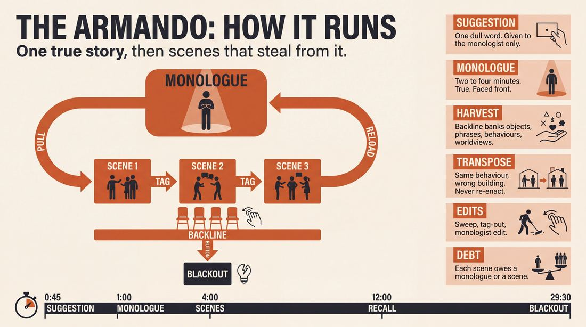
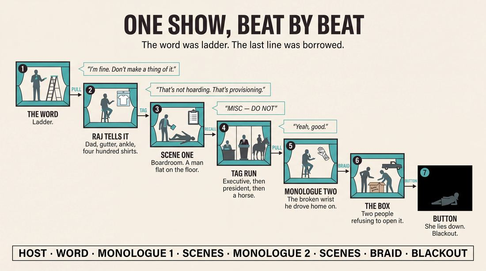
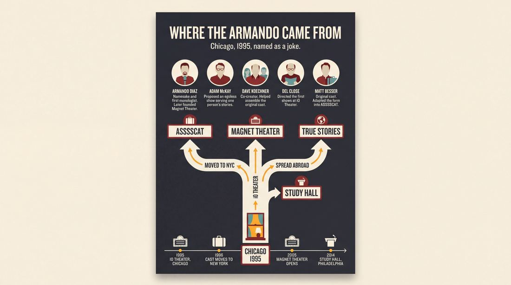
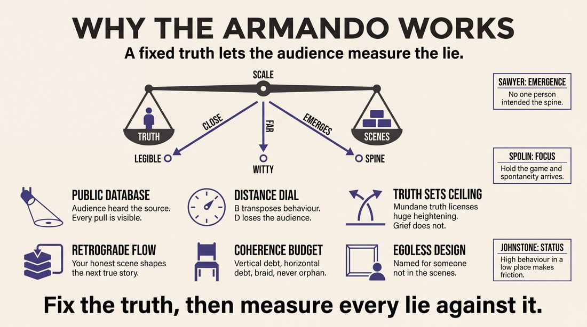
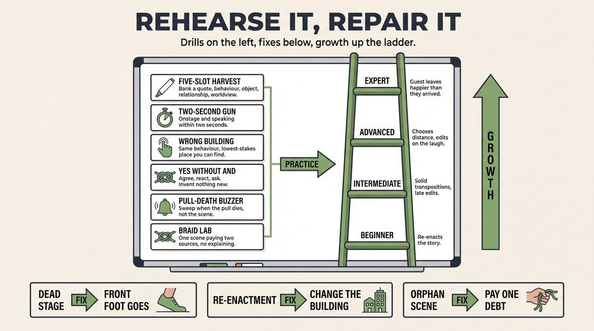

# Armando

> **A complete study of the long-form improv format _Armando_** - the original archived write-up, five infographics, grounded historical and pedagogical research, and a full mechanics-and-coaching manual.

| | |
|---|---|
| **Format** | Armando |
| **Canonical name** | Monologue Deconstruction |
| **Primary source** | [IRC Improv Wiki](https://wiki.improvresourcecenter.com/index.php?title=Armando) |

---

## Contents

1. [Part I - The Original Write-Up](#part-i-the-original-write-up)
2. [Part II - The Infographics](#part-ii-the-infographics)
   - [1. Structure and Mechanics](#infographic-1-mechanics)
   - [2. A Show, Beat by Beat](#infographic-2-example)
   - [3. Origins and Lineage](#infographic-3-history)
   - [4. Why It Works](#infographic-4-theory)
   - [5. Rehearsal and Repair](#infographic-5-coaching)
3. [Part III - Research Dossier](#part-iii-research-dossier)
   - [Pass 1: History, Lineage, Literature and Scholarship](#research-history)
   - [Pass 2: Comparative Anatomy, Pedagogy and Production](#research-comparative)
4. [Part IV - Mechanics, Gameplay and Coaching Manual](#part-iv-mechanics-gameplay-and-coaching-manual)
   - [Pass 1: The Form, Its Mechanics and Its Gameplay](#manual-mechanics)
   - [Pass 2: Training, Coaching and Performance Companion](#manual-coaching)

---

## Part I - The Original Write-Up

*Verbatim archive of the source article, reproduced exactly as scraped. Everything after this section is generated elaboration built on top of it.*

### Armando

> **Note:** `Armando` is an alternate name for **Monologue Deconstruction** on the wiki; the URL redirects there. The content below is that page.

The **Monologue Deconstruction** is a [longform](https://wiki.improvresourcecenter.com/index.php?title=Longform "Longform") [improv form](https://wiki.improvresourcecenter.com/index.php?title=Category:Improv_Forms "Category:Improv Forms") commonly referred to as the **Armando.** It is one of the most popular, most often\-performed improv formats in existence.

##### Description

A Monologue Deconstruction is a longform improv structure in which actual stories inspire improvised scenework. It is very important that the stories reflect true events, feelings, and opinions held by the speaker, and are packed with as much detail as possible. The improvisors are challenged to expand minute pieces of information within the stories as opposed to recreating the events held within. Usually a special guest monologist provides the stories, although in absence of a special guest the players themselves can tell monologues. Monologues may occur solely at the beginning of the piece, or they may punctuate the piece every few scenes. The suggestion can either be a generic improv ask\-for (like a word or a phrase) or it can be a specific question for the monologist to try and answer.

The Monologue Deconstruction is sometimes referred to as The Armando, after [Armando Diaz](https://wiki.improvresourcecenter.com/index.php?title=Armando_Diaz "Armando Diaz"), due to the notable show [The Armando Diaz Experience, Theatrical Movement and Hootenanny](https://wiki.improvresourcecenter.com/index.php?title=The_Armando_Diaz_Experience,_Theatrical_Movement_and_Hootenanny "The Armando Diaz Experience, Theatrical Movement and Hootenanny").

##### Examples

- [The Armando Diaz Experience, Theatrical Movement and Hootenanny](https://wiki.improvresourcecenter.com/index.php?title=The_Armando_Diaz_Experience,_Theatrical_Movement_and_Hootenanny "The Armando Diaz Experience, Theatrical Movement and Hootenanny")
- [ASSSSCAT 3000](https://wiki.improvresourcecenter.com/index.php?title=ASSSSCAT_3000 "ASSSSCAT 3000")
- [The Alvy](https://wiki.improvresourcecenter.com/index.php?title=The_Alvy "The Alvy")

  

| ***This article is a stub. Help the wiki grow by editing it and adding more information.*** |
| --- |

---

*Archived from [https://wiki.improvresourcecenter.com/index.php?title=Armando](https://wiki.improvresourcecenter.com/index.php?title=Armando) (IRC Improv Wiki) on 2026-08-09 23:23 UTC.*

---

## Part II - The Infographics

*Five 16:9 posters, each teaching a different aspect of the format. Click any poster to enlarge.*

<a id="infographic-1-mechanics"></a>

### 1. Structure and Mechanics

*How the form is played: the shape of the piece, the opening, the roles, the edit vocabulary, the flow of information, and the clock.*

{ .diagram loading=lazy decoding=async width="1100" height="614" }


<a id="infographic-2-example"></a>

### 2. A Show, Beat by Beat

*A single worked performance from suggestion to blackout: what happens in each beat, with short real example lines and what the players are doing technically.*

{ .diagram loading=lazy decoding=async width="1100" height="614" }


<a id="infographic-3-history"></a>

### 3. Origins and Lineage

*Where the form came from: creators, dates, theatres, how it spread between schools and cities, and the key figures - a documented timeline and lineage map.*

{ .diagram loading=lazy decoding=async width="1100" height="614" }


<a id="infographic-4-theory"></a>

### 4. Why It Works

*The theory: the core principles of the form and the research and craft ideas that explain why the structure produces good improv, each tied to a specific mechanic.*

{ .diagram loading=lazy decoding=async width="1100" height="614" }


<a id="infographic-5-coaching"></a>

### 5. Rehearsal and Repair

*Training and fixing the form: the essential drills, the common failure modes with their symptom-and-fix pairs, and the markers of beginner through expert play.*

{ .diagram loading=lazy decoding=async width="1100" height="614" }


---

## Part III - Research Dossier

*Two research passes: the historical record, then the comparative and pedagogical record. Claims carry evidence tags - treat unverified items accordingly.*

<a id="research-history"></a>

### » Pass 1: History, Lineage, Literature and Scholarship

### Research Summary
*   The Armando (or Monologue Deconstruction) is one of the most thoroughly documented and widely performed long-form improv structures in the world, second only to the Harold.
*   The historical record firmly establishes its creation in 1995 at the iO Theater in Chicago by Adam McKay, Dave Koechner, and Armando Diaz, under the direction of Del Close [DOCUMENTED].
*   The core mechanic—using a truthful, personal monologue to inspire a series of tangential, deconstructed scenes—is universally agreed upon across primary sources [DOCUMENTED].
*   The form's direct lineage is highly traceable: the original cast migrated to New York City in 1996 and founded the Upright Citizens Brigade, rebranding the format as ASSSSCAT [DOCUMENTED].
*   While the mechanics are well-documented, the exact date of the first performance and the authorship of the show's full original title ("Theatrical Movement and Hootenanny") remain unverified in the digital record [INFERRED].
*   The format is heavily utilized in applied improvisation and academic settings because its structure cleanly separates factual source material from comedic exploration [DOCUMENTED].

### Provenance and History
The format was created in 1995 at the iO Theater (then ImprovOlympic) in Chicago [DOCUMENTED]. iO alumni Adam McKay, Dave Koechner, and Kevin Dorff were working on sketch shows and missed the freedom of playing pure long-form improv without the pressure of generating written material [DOCUMENTED]. During a late-night drinking session at Armando Diaz's apartment, McKay proposed a new show designed to be entirely egoless: a rotating cast of all-stars would gather simply to serve the stories of one person [DOCUMENTED]. 

McKay named it *The Armando Diaz Experience, Theatrical Movement and Hootenanny* as a joke to eliminate cast jealousy [DOCUMENTED]. Del Close was brought in to direct the original cast. The problem the form solved was twofold: it provided a reliable engine for idea generation (the monologue) while freeing the ensemble from the structural rigidity of the Harold, allowing for a looser, more fluid montage of scenes [INFERRED].

| Year | Event | Place / Company | Source |
|---|---|---|---|
| 1995 | Creation of *The Armando Diaz Experience* | iO Theater, Chicago | `https://wiki.improvresourcecenter.com/index.php?title=The_Armando_Diaz_Experience,_Theatrical_Movement_and_Hootenanny` |
| 1996 | Original cast members move to NYC, eventually launching ASSSSCAT | Upright Citizens Brigade, NYC | `https://wiki.improvresourcecenter.com/index.php?title=ASSSSCAT_3000` |
| 2005 | Armando Diaz opens Magnet Theater, making it the NYC home of the form | Magnet Theater, NYC | `https://magnettheater.com/` |
| 2014 | *Study Hall* debuts, adapting the form for academic lectures | Philly Improv Theater, Philadelphia | `https://www.historians.org/` |

### Lineage and Transmission
The Armando is the primary ancestor of almost all monologue-based long-form improv. When UCB founders Matt Besser, Ian Roberts, and Amy Poehler (all original Armando cast members) moved to New York, they brought the form with them, eventually codifying it as ASSSSCAT [DOCUMENTED]. Armando Diaz himself later moved to New York and founded the Magnet Theater, which continues to run *The Armando Diaz Experience* weekly [DOCUMENTED].

As the form spread globally, it mutated to suit regional dialects and audience preferences. In the UK, Hoopla Impro teaches and performs the form under the name "True Stories" to make it more accessible to audiences, utilizing shorter monologues and allowing anyone in the cast to step out as the monologist [DOCUMENTED]. In Amsterdam, easylaughs performs it strictly as the "Armando," maintaining the traditional guest monologist structure [DOCUMENTED]. Across North America, it is universally taught as a "Level 3" or "Level 4" curriculum standard, acting as the bridge between short-form games and the Harold [WIDELY PRACTICED, UNDOCUMENTED].

### Key Figures
| Person | Role in this form | Specific contribution | Source URL |
|---|---|---|---|
| Armando Diaz | Namesake & Original Monologist | Provided the original true-story monologues; founded Magnet Theater to continue teaching the form. | `https://magnettheater.com/` |
| Adam McKay | Co-Creator | Conceived the format as an egoless vehicle where the cast serves one person's stories. | `https://www.youtube.com/watch?v=ALT9Aq2guMg` |
| Dave Koechner | Co-Creator | Helped assemble the original cast of iO alumni and conceptualize the show. | `https://wiki.improvresourcecenter.com/index.php?title=The_Armando_Diaz_Experience,_Theatrical_Movement_and_Hootenanny` |
| Del Close | Original Director | Directed the first shows; provided the physical direction that helped Diaz overcome stage fright. | `https://www.youtube.com/watch?v=ALT9Aq2guMg` |
| Matt Besser | Performer / Innovator | Original cast member who adapted the form into ASSSSCAT at UCB. | `https://wiki.improvresourcecenter.com/index.php?title=ASSSSCAT_3000` |

### Canonical Shows, Companies and Recordings
*   **The Armando Diaz Experience**: The longest-running improv show in history, still performed weekly at the Magnet Theater in NYC and iO in Chicago. `https://magnettheater.com/`
*   **ASSSSCAT 3000**: The Upright Citizens Brigade's flagship show, performed in NYC and Los Angeles, featuring celebrity guest monologists. `https://wiki.improvresourcecenter.com/index.php?title=ASSSSCAT_3000`
*   **Study Hall**: A long-running production originally at Philly Improv Theater that uses university professors delivering academic lectures as the monologues. `https://www.historians.org/`
*   **True Stories**: Hoopla Impro's London-based variant, optimized for shorter, ensemble-driven monologues. `https://www.hooplaimpro.com/`

### Published Literature
| Work | Author | Year | What it says about this form | Where to find it |
|---|---|---|---|---|
| *Upright Citizens Brigade Comedy Improvisation Manual* | Matt Besser, Ian Roberts, Matt Walsh | 2013 | Codifies the "Game of the Scene" mechanics used to deconstruct monologues in ASSSSCAT (the UCB variant of Armando). | UCB Training Centers / Print |
| *The Improv Handbook* | Tom Salinsky, Deborah Frances-White | 2008 | Discusses the risk and reward of using audience suggestions to inspire long-form structures like monologue deconstructions. | Bloomsbury Publishing |
| *Truth in Comedy* | Charna Halpern, Del Close, Kim "Howard" Johnson | 1994 | Pre-dates the Armando, but establishes the foundational iO philosophy of "truthful comedy" that the form's monologues rely on. | Meriwether Publishing |

### Verbatim Quotes

> "the Armando Diaz experience came I guess sort of on accident. i was hanging out with Kevin Dorf uh Adam McKay. and uh Dave Kekner. and uh we were drinking and we're hanging out in my apartment... Adam came up with the idea. that. you know everybody would just you know that'd be called the Armandia experience and that everybody would just like you know serve me in some way"
> — Armando Diaz
> `https://www.youtube.com/watch?v=ALT9Aq2guMg`

> "I was trying to um improvise a monologue and it just totally bombed. and it was a painful rehearsal. didn't matter what I did I just couldn't come up with anything. good."
> — Armando Diaz
> `https://www.youtube.com/watch?v=ALT9Aq2guMg`

> "All right you know Armando. um you remember the old time comedians who would do impressions. you know how they like turn around. and you know mess their face up. and transform into somebody else i want you to do that."
> — Del Close (quoted by Armando Diaz)
> `https://www.youtube.com/watch?v=ALT9Aq2guMg`

> "The improvisors are challenged to expand minute pieces of information within the stories as opposed to recreating the events held within."
> — IRC Improv Wiki
> `https://wiki.improvresourcecenter.com/index.php?title=Armando`

> "The stories become a glorified offer, rich in detail and possibilities. It's for this reason that some people are quoted as saying things like 'Everything in improv is an Armando when you think about it'."
> — easylaughs
> `https://easylaughs.nl/blog/what-is-an-armando-improv/`

> "I dont give a shit about what kind of bagel Lin Miranda was eating when he came up with Hamilton, why would I care about what Armandos full name is? Provide a blurb about your monologist and leave it at that... The Armando works because it is one of the simplest forms to follow."
> — Reddit user 'profjake'
> `https://www.reddit.com/r/improv/comments/5kof2p/what_the_hell_is_the_armando_diaz_experience/`

> "True story monologues on based on actual truth, real things in real life. This gives the audience a firm hook into reality. Thus, they are better equipped to sympathise, empathise, and all around understand where the performer/performers are coming from creating a better experience."
> — IRC Forum User 'Improvisor'
> `https://www.improvresourcecenter.com/forum/threads/armando-monologues-true-or-false.22345/`

> "The monologue deconstruction (the actual long-form show) is based more in metaphors, themes, and other, various tangential twists and turns than direct interpretations of the monologue."
> — Royce Roeswood
> `https://www.quora.com/What-exactly-does-a-monologist-do-in-Improv-shows`

### Anecdotes and Stories
**The 5 AM Origin**
The format was born out of late-night frustration. At 5:00 AM in Armando Diaz's apartment, Adam McKay, Dave Koechner, and Kevin Dorff were drinking and complaining about the grind of sketch comedy. They missed the purity of long-form improv but hated the ego clashes that often came with assembling a supergroup. McKay proposed a show where the entire cast existed solely to serve the whims of one person. He named it *The Armando Diaz Experience* as a joke, ensuring the structure was entirely egoless for the rest of the ensemble [DOCUMENTED].

**Del Close's Ultimatum**
Before the show opened, the rehearsals were a disaster. Armando Diaz, primarily a behind-the-scenes player at the time, kept bombing his improvised monologues. During the final rehearsal, director Del Close pinned Diaz to the wall with a speech, asking the cast, "Are we really serious about this? What purpose do we have for Armando? Or is this just a joke?" Close threatened to replace Diaz if he didn't put up and perform well [DOCUMENTED].

**The Face-Messing Breakthrough**
Moments before the first actual performance, Del Close gave Diaz a bizarre piece of direction. He told Diaz to take the audience suggestion, turn his back, "mess his face up," and transform into someone else like an old-time comedian. Diaz thought it was crazy, but with the entire cast watching, he did it. The physical action of turning around and pantomiming a transformation gave Diaz something to do with his nervous energy. The audience tittered at the weirdness of it, Diaz relaxed, and the monologue flowed perfectly. The show was an instant hit [DOCUMENTED].

### Academic and Scientific Research
**Applied Improvisation in Medical Education**
Dr. Jeff Katzman and Eric (Santa Fe Improv) published "An Experience with Improvisational Theater to Prevent Burnout in Psychiatric Residency" in the *Journal of Creative Education* [DOCUMENTED]. 
*Relevance to this form:* The Armando's requirement for a vulnerable, true-story monologue functions as a form of narrative externalization. It allows medical professionals to process trauma and stress verbally before the ensemble playfully deconstructs it, mirroring narrative therapy techniques.

**Science Communication and Historical Dramatization**
Michael Yudell (Drexel University) collaborated with the Philly Improv Theater to create *Study Hall*, an Armando variant documented in *Perspectives on History* (American Historical Association) [DOCUMENTED]. 
*Relevance to this form:* The format's strict separation of "source material" (the monologue) and "exploration" (the scenes) makes it an ideal vehicle for science communication. It allows dense academic lectures to be digested and satirized without requiring the improvisers to be subject-matter experts.

**Cognitive Science of Divergent Thinking**
Improv relies heavily on divergent associative thinking [DOCUMENTED].
*Relevance to this form:* The core instruction of the Armando—to "expand minute pieces of information... as opposed to recreating the events"—is a direct, applied exercise in divergent thinking. It forces the improviser's brain to break linear narrative habits and pull tangential metaphors rather than plotting the next logical story beat [INFERRED].

### Documented Variants and Descendants
*   **ASSSSCAT**: The UCB variant. Structurally identical to the Armando, but relies heavily on celebrity guest monologists and fast-paced, game-based scenic edits rather than patient, theatrical scene work [DOCUMENTED].
*   **True Stories**: The Hoopla Impro (UK) variant. Renamed for audience clarity. It abandons the single guest monologist; instead, anyone in the cast can step out to deliver a short, true monologue inspired by the previous scene [DOCUMENTED].
*   **Study Hall**: Replaces the personal monologue with a 5-minute academic lecture from a university professor or historian [DOCUMENTED].
*   **Commando**: A variant featuring multiple designated monologists rotating throughout the show rather than a single focal storyteller [DOCUMENTED].

### Criticism, Debate and Known Failure Modes
**The Name Debate**
Practitioners frequently argue that the name "Armando" is insider jargon that alienates audiences. Directors and theater owners often debate whether to market it simply as "True Stories" or "Monologue Deconstruction," arguing that audiences "don't give a sh*t" about the Chicago history and just want to know what they are buying a ticket to see [DOCUMENTED].

**The Re-enactment Trap (Failure Mode)**
The most common failure mode, universally warned against by teachers, is improvisers simply re-enacting the monologue scene-for-scene. The form requires improvisers to pull *tangential* details, themes, or metaphors. If a monologist tells a story about a bad date at a bowling alley, improvisers who immediately initiate a scene about a bad date at a bowling alley have failed the deconstruction [WIDELY PRACTICED, UNDOCUMENTED].

**The "Truth" Debate**
There is ongoing debate about whether the monologue *must* be 100% true. Purists argue that "truth in comedy" requires real vulnerability to ground the show and give the audience a hook into reality. Others allow character monologues or fictionalized stories, arguing that as long as the monologue provides strong associative offers, the truthfulness is irrelevant [DOCUMENTED].

### Cultural Footprint
The Armando is arguably the most culturally visible long-form improv structure due to its alumni and television adaptations. The original cast included Tina Fey, Amy Poehler, Rachel Dratch, Neil Flynn, Adam McKay, and Dave Koechner [DOCUMENTED]. The UCB descendant, ASSSSCAT, was adapted into a television special on Bravo in 2005, bringing the monologue deconstruction format to a national broadcast audience [DOCUMENTED]. Today, it is ubiquitous: it serves as the default alternative to the Harold in almost every improv curriculum globally [WIDELY PRACTICED, UNDOCUMENTED].

### Gaps in the Record
*   **Exact Premiere Date:** While the year 1995 is universally cited, the exact date of the first performance at iO Chicago is not definitively documented in the available digital record.
*   **Authorship of the Full Title:** The origin of the suffix "Theatrical Movement and Hootenanny" is widely repeated, but its specific authorship (whether McKay, Koechner, or Close added it) remains unverified.
*   **Del Close's True Opinion:** While Close directed the show and pushed Diaz to succeed, it is contested whether Close actually respected the form artistically, or if he merely tolerated it as a vehicle to keep his top performers engaged at iO.

### Source List
1. IRC Improv Wiki: Armando - Improv Resource Center - 2024 - `https://wiki.improvresourcecenter.com/index.php?title=Armando` - Supports the foundational definition and mechanics of the form.
2. YouTube: Armando Diaz talks about how he, Adam McKay... originated The Armando Diaz Experience - San Francisco Improv Festival - 2014 - `https://www.youtube.com/watch?v=ALT9Aq2guMg` - Supports the origin story, the 5 AM creation, and Del Close anecdotes.
3. Magnet Theater: The Armando Diaz Experience - Magnet Theater - 2025 - `https://magnettheater.com/` - Supports the current running status and lineage of the form in NYC.
4. Hoopla Impro: The Armando - Hoopla Impro - 2025 - `https://www.hooplaimpro.com/` - Supports the "True Stories" variant and European transmission.
5. Perspectives on History: Historians' Lectures Provide Material for Improv Comedians - American Historical Association - 2020 - `https://www.historians.org/` - Supports the Study Hall academic variant.
6. Quora: What exactly does a monologist do in Improv shows? - Royce Roeswood - 2014 - `https://www.quora.com/What-exactly-does-a-monologist-do-in-Improv-shows` - Supports the definition of monologue deconstruction and tangential scene generation.
7. Reddit r/improv: What the HELL is The Armando Diaz Experience... - Reddit - 2016 - `https://www.reddit.com/r/improv/comments/5kof2p/what_the_hell_is_the_armando_diaz_experience/` - Supports the criticism of the format's name and marketing debates.
8. easylaughs: What is an Armando? - easylaughs - 2022 - `https://easylaughs.nl/blog/what-is-an-armando-improv/` - Supports the European transmission and the "glorified offer" quote.
9. IRC Forums: Armando monologues: true or false? - Improv Resource Center - 2005 - `https://www.improvresourcecenter.com/forum/threads/armando-monologues-true-or-false.22345/` - Supports the debate over the truthfulness of the monologues.

<a id="research-comparative"></a>

### » Pass 2: Comparative Anatomy, Pedagogy and Production

### Taxonomic Placement

```text
      Theatresports / Short-form Games
                   |
             The Harold (Del Close)
                   |
      +------------+------------+
      |                         |
  Deconstruction             Armando (Armando Diaz Experience)
                                |
                   +------------+------------+
                   |                         |
               ASSSSCAT                 True Stories
```

The Armando sits as a direct descendant of the Harold, created at iO Chicago in 1995 by Armando Diaz, Adam McKay, and Dave Koechner under Del Close's direction. It replaces the Harold's abstract, multi-player opening and rigid three-beat structure with a grounded, true-story monologue that serves as the source material for a fluid montage of scenes. It bridges the gap between the thematic exploration of the Harold and the free-flowing associative edits of a Montage, anchoring the chaos of premise-based scene work in the vulnerability of a single, non-fictional voice.

### Head-to-Head Comparisons

#### Armando vs. The Harold
| Axis | Armando | The Harold | Consequence for the players |
| :--- | :--- | :--- | :--- |
| **Opening** | A single person telling a true, non-fictional story. | A group exploration (pattern game, invocation, sound/movement). | Armando players must listen for concrete details and behaviors; Harold players must generate abstract themes together. |
| **Structure** | Fluid montage interspersed with returning monologues. | Strict 3x3 grid (three beats of three scenes) separated by group games. | Armando allows for immediate, aggressive premise exploration; Harold requires pacing for long-term thematic convergence. |
| **Edit logic** | Tag-outs, sweep edits, and walk-ons driven by the premise. | Sweeps driven by the structural requirement to move to the next beat. | Armando players must self-regulate pacing; Harold players rely on the format's built-in rhythm. |
| **Memory** | Players must recall specific turns of phrase from the monologue. | Players must recall characters and plotlines from earlier beats. | Armando relies on A-to-C abstraction; Harold relies on narrative and thematic reincorporation. |

#### Armando vs. Montage
| Axis | Armando | Montage | Consequence for the players |
| :--- | :--- | :--- | :--- |
| **Opening** | 3-5 minute true story. | None, or a brief suggestion ask-for. | Armando provides a massive well of shared source material; Montage requires inventing reality from scratch every scene. |
| **Structure** | Scenes are tethered to the monologue's themes. | Scenes are entirely disconnected or loosely associative. | Armando demands fidelity to the source; Montage demands constant, rapid invention. |
| **Audience contract** | "We will deconstruct this true story." | "We will do a series of unrelated funny scenes." | Armando audiences look for the clever connections back to the story; Montage audiences just look for the next laugh. |
| **Failure mode** | Literal re-enactment of the monologue. | The "Dead Stage" (hesitation between scenes). | Armando players must actively abstract; Montage players must actively initiate. |

#### Armando vs. Deconstruction
| Axis | Armando | Deconstruction | Consequence for the players |
| :--- | :--- | :--- | :--- |
| **Opening** | True-story monologue directly to the audience. | A single, grounded, two-person improvised scene. | Armando source material is non-fictional and solo; Deconstruction source material is fictional and relational. |
| **Edit logic** | Scenes can jump anywhere in time, space, or theme. | Thematic scenes branch off, but the core two-person scene is repeatedly returned to. | Armando players mine a story for premises; Deconstruction players mine a relationship for themes. |
| **Cast size** | 6-8 players + 1 monologist. | Typically a smaller ensemble (4-6). | Armando supports chaotic, multi-character tag runs; Deconstruction favors patient, theatrical scene work. |

#### Armando vs. Monoscene
| Axis | Armando | Monoscene | Consequence for the players |
| :--- | :--- | :--- | :--- |
| **Structure** | Multiple locations, times, and characters. | Real-time, single location, continuous action. | Armando requires aggressive editing; Monoscene forbids editing entirely. |
| **Failure mode** | Muddying the premise of a short scene. | Running out of steam or breaking the reality of the space. | Armando players must hit hard and get out; Monoscene players must justify and endure. |

### What Makes It Uniquely Itself

1. **The Non-Fictional Anchor:** If the opening is a fictional character monologue, it is a standard Monologue Deconstruction, but it loses the specific vulnerability of the Armando. The truth of the story—often mundane, embarrassing, or highly specific—grounds the subsequent absurdity. The audience's knowledge that the source material actually happened creates a unique tension when the improvisers heighten it to ridiculous extremes.
2. **Premise Extraction over Plot Continuation:** If the scenes merely continue the plot of the monologue (e.g., "And then what happened next?"), you are playing a narrative form. The Armando requires the players to fracture the source material. They must pull a theme, a turn of phrase, or a specific behavior, and transplant it into a completely new context (A-to-C thinking).

### Structural Variants in Practice

| Variant Name | What it changes | Who plays it | Source |
| :--- | :--- | :--- | :--- |
| **ASSSSCAT** | The monologist is a special guest who *never* improvises in the scenes. Edits are highly aggressive, relying heavily on rapid tag-outs to explore a single premise to exhaustion. | Upright Citizens Brigade (UCB), NY/LA | UCB Theatre / Reddit craft discussions |
| **True Stories** | Anyone in the cast can step forward to deliver a monologue. Monologues are kept deliberately short (1-2 minutes) and do not have to be funny. | Hoopla Impro, London | Hoopla Impro Syllabus |
| **Premise Level 1** | Used strictly as a pedagogical stepping stone. Focuses entirely on initiating scenes with a clear comedic idea pulled from the monologue before students are allowed to learn the Harold. | The Free Association, London | The Free Association Syllabus |
| **Long Story Short** | Blends the Armando with narrative structure, focusing on group mind and theatrical editing rather than just rapid-fire comedic premises. | Rising Arts Productions | Rising Arts Class Descriptions |
| **The Commando** | Features multiple monologues happening simultaneously or in rapid succession, creating a dense web of source material. | Various / iO Chicago alumni | LearnImprov / [CRAFT CONSENSUS] |

### The Teaching Ladder

| Stage | Skill introduced | Why in this order | Typical exercise | Source or [CRAFT CONSENSUS] |
| :--- | :--- | :--- | :--- | :--- |
| 1 | **Vulnerable Storytelling** | Players must learn to provide source material without trying to do a stand-up comedy routine. | "Bring a brick, not a cathedral" | Krista Longtin / Applied Improv |
| 2 | **A-to-C Association** | Prevents players from literally re-enacting the monologue. Teaches abstraction. | Word Association Circle | [CRAFT CONSENSUS] |
| 3 | **Premise Pulling** | Players must identify a specific behavior or phrase to build a scene around. | "Put the behavior where it doesn't belong" | Reddit (btarnett) |
| 4 | **"Follow Me" Initiations** | Armando scenes require immediate clarity so the audience understands the connection to the monologue. | 3 Unrelated Scenes & Game Discussion | Reddit (ImprovisingNate) |
| 5 | **Yes-ing without And-ing** | Teaches the supporting player to hold the reality still so the initiator can establish the premise. | Stand and Agree Drill | Reddit (btarnett) |
| 6 | **Tag-outs and Sweeps** | Teaches the ensemble how to edit a premise before it runs out of steam. | Front Wipe / Tap Out Drill | LearnImprov |

### Documented Drills and Exercises

| Drill | Origin / Teacher | How to run it | What it fixes in this form | Source |
| :--- | :--- | :--- | :--- | :--- |
| **Put the behavior where it doesn't belong** | btarnett (Reddit) | Take a behavior from the monologue (e.g., "aggressive cop") and initiate a scene in a contrasting environment (e.g., "office worker at a copier"). | Literal re-enactment of the monologue's plot. | Reddit r/improv |
| **3 Unrelated Scenes & Game Discussion** | ImprovisingNate (Reddit) | Do 3 short scenes, stop, discuss the comedic game of each, then play the second beats. | Weak or muddy premises in scene initiations. | Reddit r/improv |
| **Yes-ing without And-ing** | btarnett (Reddit) | Player 1 makes a strong "follow me" initiation. Player 2 stands still and agrees without adding new information, forcing Player 1 to drive the premise. | Scene partners destroying the pulled premise by over-inventing. | Reddit r/improv |
| **The Rant** | Krista Longtin | A player rants about a mundane topic for 60 seconds to practice uninhibited emotional expression. | Low energy or overly-scripted monologues. | IU Communicating Science Program |
| **Front Wipe / Tap Out Drill** | LearnImprov | Two players in a scene. Offstage players practice executing clean physical wipes (walking across) or shoulder taps to edit. | The "Dead Stage" / lingering scenes that have exhausted their premise. | LearnImprov.com |
| **Monologue Deconstruction Web** | Joe Bill | Monologist speaks. Players whiteboard all themes, characters, and locations mentioned, then draw lines connecting them to potential scene premises. | Missing subtle details; relying only on the loudest part of the story. | Mopco Workshop Description |
| **Blind Armando (The Bat)** | [CRAFT CONSENSUS] | Perform the format in the dark or blindfolded. | Over-reliance on physical sight gags; forces intense auditory listening for premise cues. | LearnImprov.com |
| **Hot Spot** | iO Chicago | Players form a circle, one steps in to sing a song inspired by a word, others tag them out with a new song based on an association. | Hesitation in editing and tagging out. | [CRAFT CONSENSUS] |
| **Pattern Game** | UCB | Word association mapping that branches out and then folds back into itself. | Disconnected thematic pulling; trains the brain to link disparate ideas. | [CRAFT CONSENSUS] |
| **Half-Life** | [CRAFT CONSENSUS] | Play a scene in 60 seconds, then 30, then 15, then 7. | Sluggish pacing; forces players to get to the core premise immediately. | [CRAFT CONSENSUS] |

### Common Failure Modes and Diagnoses

| Failure mode | What it looks like from the audience | Root cause | Fix | Who names it |
| :--- | :--- | :--- | :--- | :--- |
| **Literal Re-enactment** | The exact story the monologist just told is played out beat-for-beat on stage. | Failure to abstract; lack of A-to-C thinking. | "Put the behavior where it doesn't belong" drill. | [CRAFT CONSENSUS] |
| **The Dead Stage** | Silence and physical hesitation from the backline after the monologue ends. | Players waiting for the "perfect" premise instead of trusting their first instinct. | Front Wipe / Tap Out Drill. | LearnImprov |
| **Premise Muddying** | A clear comedic game is initiated, but the scene partner immediately changes the reality or status. | Over-inventing ("And-ing" too much) instead of playing the established game. | Yes-ing without And-ing. | Reddit (TheMaviene / btarnett) |
| **Stand-up Syndrome** | The monologist does a rehearsed, punchline-heavy comedy routine instead of a vulnerable true story. | Fear of not being funny; ego protection. | "Bring a brick, not a cathedral" storytelling. | Hoopla Impro / [CRAFT CONSENSUS] |
| **The Hostage Monologue** | The monologist talks for 10 uninterrupted minutes while the cast glazes over. | Lack of format boundaries or MC intervention. | Cap monologues at 2-3 minutes; allow cast to edit the monologist. | Hoopla Impro |

### Production and Logistics

*   **Cast size and why:** 6 to 8 players, plus 1 monologist (if using a guest). This is large enough to support rapid tag-outs and group games, but small enough to maintain a cohesive backline without crowding the stage.
*   **Runtime:** 25 to 45 minutes.
*   **Stage layout:** A backline of chairs for the improvisers. Center stage is left open. The monologist steps to the front-center to deliver the story, then retreats to a chair or offstage during the scenes.
*   **Chairs and set:** 4-6 armless chairs. No physical set pieces.
*   **Lighting and tech cues:** A spotlight on the monologist during stories (if tech allows), snapping to a general warm wash for the scenes. A hard blackout signifies the end of the show.
*   **Music and sound:** High-energy, recognizable intro and outro music to contrast the intimate, spoken-word nature of the storytelling.
*   **MC and host duties:** The host must explicitly explain the audience contract: "We will get a single word, our guest will tell a true story inspired by that word, and we will improvise scenes based on the details of that story."
*   **How the suggestion is taken:** A single, mundane noun or verb. (e.g., "Can I get a word like 'bicycle' or 'taxes'?")
*   **Where the form belongs in a lineup:** Usually the anchor or second-half of a show due to its length, prestige, and reliance on a special guest.
*   **Rehearsal cadence:** Weekly, focusing heavily on A-to-C association, premise initiation, and edit timing.
*   **What a producer must prepare:** Booking the guest monologist and briefing them beforehand. The producer must explicitly tell the guest: "You do not need to be funny. Tell a true, detailed story. The improvisers will provide the comedy."

### Adaptations Beyond the Stage

*   **Classroom and youth:** Focuses heavily on personal storytelling and active listening. **What must change:** Strict content-safety rules must be enforced to prevent trauma dumping. Monologues must be restricted to mundane, low-stakes events (e.g., "a time you lost your keys").
*   **Corporate and applied improv:** Used in "Medical Improv" (HPTI) and science communication. **What must change:** The goal shifts from comedic premise-pulling to empathy and active listening. Scenes explore communication breakdowns rather than absurd heightening.
*   **Online and remote:** Zoom adaptations (taught by Armando Diaz himself in 2020). **What must change:** Edits rely on turning cameras on/off rather than physical sweeps. The monologist is "pinned" to the screen during the story.
*   **Accessibility and inclusion:** Monologues can be delivered seated. Initiations must rely heavily on vocal clarity and audio-described physical choices to support visually impaired players.
*   **Content-safety and consent practices:** The ethics of using real stories are paramount. Players must not mock the monologist's genuine vulnerability. The "punchline" of the scene must be the abstracted premise, not the monologist's lived experience or trauma.

### Evidence Base for Those Adaptations

*   **Tolerance for Uncertainty:** Felsman et al. (2020) found higher levels of tolerance for uncertainty and reduced social anxiety in teenagers and adults after improv practice, supporting the use of forms like the Armando to build social confidence.
*   **Psychological Well-being:** Schwenke et al. (2021) demonstrated significant improvement in participants' creativity and psychological well-being following a 6-week improv intervention.
*   **Medical and Science Communication:** De Wever et al. (2023) reviewed Health Professional Training Improv (HPTI), showing improvements in communication skills and empathy among medical students. Longtin (2024) documents the use of applied improv techniques to help scientists communicate complex research with empathy and clarity.

### Scholarly Frames Worth Applying

*   **Collaborative Emergence (Keith Sawyer)**
    *   *The frame:* The unpredictable outcome of a creative group process cannot be attributed to any single participant's intention.
    *   *Citation:* Sawyer, R. K. (2003). *Group Creativity: Music, Theater, Collaboration*.
    *   *Mapping:* The transition from monologue to scene. The monologist's original intent is surrendered to the ensemble, who collaboratively mutate a minor detail of the story into the central focus of the performance.
*   **Organizational Improvisation (Vera & Crossan)**
    *   *The frame:* Improvisation is the capacity to engage in unplanned, purposeful action in response to changing circumstances within an organizational structure.
    *   *Citation:* Vera, D., & Crossan, M. (2004). *Theatrical Improvisation: Lessons for Organizations*.
    *   *Mapping:* The "Follow Me" initiation. When one player establishes a strong premise, the rest of the ensemble must immediately align with this new "organizational reality" and support it without prior planning.
*   **Point of Concentration (Viola Spolin)**
    *   *The frame:* A specific, agreed-upon focus that occupies the conscious mind so that intuition and spontaneity can take over.
    *   *Citation:* Spolin, V. (1963). *Improvisation for the Theater*.
    *   *Mapping:* "Yes-ing without And-ing." The Point of Concentration is strictly maintaining the established game of the scene, preventing the conscious mind from panicking and inventing unnecessary plot.
*   **Status (Keith Johnstone)**
    *   *The frame:* Every interaction involves a negotiation of relative power, dominance, and submission, expressed through physical and vocal behavior.
    *   *Citation:* Johnstone, K. (1979). *Impro: Improvisation and the Theatre*.
    *   *Mapping:* "Put the behavior where it doesn't belong." This drill relies entirely on transplanting a high-status behavior (e.g., an aggressive cop) into a low-status role (e.g., a barista), generating comedy through status friction.
*   **Flow (Mihaly Csikszentmihalyi)**
    *   *The frame:* The state of optimal experience achieved when a person's skill level perfectly matches the challenge at hand, resulting in effortless action.
    *   *Citation:* Csikszentmihalyi, M. (1990). *Flow: The Psychology of Optimal Experience*.
    *   *Mapping:* The rapid-fire tag-out runs in an ASSSSCAT-style Armando, where players operate purely on reflex, pattern recognition, and group mind, editing scenes in fractions of a second.

### Where the Form Is Heading

*   **Current practice:** There is a pedagogical shift away from the strict UCB ASSSSCAT model of aggressive, fast-paced premise play toward slower, more theatrical, and emotionally grounded scene work (e.g., Rising Arts Productions' "Long Story Short").
*   **Hybrids:** Combining the Armando with narrative forms. Instead of a montage of disconnected premises, the monologue inspires a single, continuous one-act play, blending the vulnerability of the Armando with the endurance of the Monoscene.
*   **Contemporary companies:** Using the Armando as a vehicle for marginalized voices. The guest monologist is often an activist, scientist, or community leader, and the improv serves to amplify and celebrate their message rather than merely mining it for comedic premises.

### Source List

1. *True Stories / Armando Format Description* - Hoopla Impro - 2026 (Accessed) - hooplaimpro.com - Supports structural variants (True Stories), failure modes (Hostage Monologue), and teaching rules.
2. *Premise Level 1 Syllabus* - The Free Association - 2026 (Accessed) - thefreeassociation.co.uk - Supports the teaching ladder, premise pulling, and the use of the Armando as a pedagogical stepping stone to the Harold.
3. *Working as an Ensemble: Armando* - Happier Valley Comedy - 2026 (Accessed) - happiervalley.com - Supports structural variants and ensemble editing focus.
4. *Joe Bill Armando Workshop* - Mopco Improv Theatre - 2026 (Accessed) - mopco.org - Supports the "Monologue Deconstruction Web" drill and thematic weaving.
5. *Long Story Short / Armando Class* - Rising Arts Productions - 2026 (Accessed) - risingartsproductions.com - Supports structural variants blending narrative with the Armando.
6. *r/improv Discussions on Armando* - Reddit Community - 2017-2024 - reddit.com/r/improv - Supports craft consensus on "Put the behavior where it doesn't belong", "Yes-ing without And-ing", and premise muddying failure modes (users btarnett, ImprovisingNate, TheMaviene).
7. *Harold-Armando Transitions* - LearnImprov - 2019 - learnimprov.com - Supports the "Front Wipe / Tap Out" drills and the "Dead Stage" failure mode.
8. *Improv Nerd with Jimmy Carrane: Armando Diaz* - Starburns Audio - 2020 - apple.com/podcasts - Supports historical context and the creator's perspective on the form.
9. *Applied Improvisation in Higher Education* - De Wever et al. (Frontiers in Education) - 2023 - frontiersin.org - Supports the evidence base for Health Professional Training Improv (HPTI).
10. *Ranting and relating: How improv techniques can help scientists* - Krista Longtin (Indiana University) - 2024 - iu.edu - Supports "The Rant" drill and applied improv for science communication.
11. *Theatrical Improvisation: Lessons for Organizations* - Vera, D., & Crossan, M. (Organization Studies) - 2004 - researchgate.net - Supports the scholarly framing of organizational improvisation.
12. *Magnet Theater Level 1 Class Description* - Magnet Theater - 2020 - magnettheater.com - Supports online/Zoom adaptations taught by Armando Diaz.

---

## Part IV - Mechanics, Gameplay and Coaching Manual

*Synthesis over the original article and both research dossiers: first how the form works and how to play it, then how to train an ensemble to perform it.*

<a id="manual-mechanics"></a>

### » Pass 1: The Form, Its Mechanics and Its Gameplay

### At a Glance

| Field | Detail |
|---|---|
| **Also known as** | Monologue Deconstruction (the wiki's canonical title); *The Armando Diaz Experience, Theatrical Movement and Hootenanny* (full original title); ASSSSCAT (UCB variant); True Stories (Hoopla Impro, UK); Study Hall (academic-lecture variant); The Alvy; "the Commando" (multi-monologist variant) |
| **Family** | Monologue-sourced long form. Direct descendant of the Harold; sibling of Deconstruction; structural cousin of the Montage. The parent of essentially every monologue-based form now in circulation. |
| **Cast size** | 4–8 improvisers plus 1 monologist. Sweet spot: 6 + monologist. Below 4 the tag-runs die; above 8 the backline becomes an audience. |
| **Runtime** | 25–45 minutes standard. Flagship guest shows (ASSSSCAT lineage) run 60–75 with multiple monologists. Teaching version: 20 minutes. |
| **Opening** | A single person telling a true story straight to the audience for 2–4 minutes. That is the entire opening. No pattern game, no group mind exercise, no sound-and-movement. |
| **Suggestion taken** | One word or short phrase, mundane and concrete, taken **for the monologist only** — never for the scenes. Alternative: a direct question put to the monologist ("What's something you've lied about?"). |
| **Structural rigidity (1–5)** | **2.** The container is rigid (monologue → scenes → monologue → scenes → out); the contents are free. There is no beat count, no mandatory group game, no required return. |
| **Difficulty (1–5)** | **3 to run, 5 to run well.** The floor is the lowest of any long form — a competent montage team can survive it. The ceiling is as high as the Harold's, because the coherence must be manufactured by choice rather than supplied by structure. |
| **Prerequisites** | Two-person scenework; ability to identify and play a game/unusual thing; clean sweep edits and tag-outs; genuine listening (not "waiting"); A-to-C associative thinking; a backline that can stand still and watch. |
| **Best for** | Mixed bills with a guest; ensembles of 5–7 with uneven experience; touring shows that need a local hook each night; teaching the bridge from short-form to Harold; platforming a community voice, scientist, or expert. |
| **Avoid when** | You have no one who can talk truthfully for three minutes; the cast is under four; the cast cannot edit (this form will strand them); you're in a context where personal disclosure is unsafe or unconsented; you need a plot with an ending; you have under 15 minutes of stage time. |

---

### The Essence in One Paragraph

A real person stands in a light and tells the audience something that actually happened to them — not a bit, not a routine, a story with a bad smell and a real name in it. The ensemble does not act that story out. Instead they raid it: they take a stray phrase, an offhand behaviour, an object mentioned in one clause, the unspoken belief that made the story worth telling — and they transplant that fragment into a scene that has nothing else in common with it. Then another scene, and another. Every scene is legally required to be traceable back to the story or to a previous scene, but is legally forbidden from being the story. Three or four scenes in, the storyteller comes back and tells another true story, now unavoidably coloured by what they have just watched the cast make of them. That loop runs two or three times and then stops. The pleasure for the audience is the double-take — the half-second where they recognise the aunt's freezer, the phrase "that's not hoarding, that's provisioning," in a scene set on a submarine — and the pleasure for the ensemble is that the well never runs dry, because a real life contains more detail than any group opening ever will.

---

### Why This Form Exists

The Armando solves three problems at once, and it solves them cheaply. That is why it is, along with the Harold, the most-performed long form on earth.

**Problem 1: Ideation under pressure is the bottleneck of the montage.** In a plain montage, every scene must invent its own who/where/what from nothing, at speed, in front of people. The cognitive load lands entirely on the initiator, every single time. The Armando front-loads that work into a three-minute block that nobody has to be funny during. By the time the first scene starts, the ensemble is holding forty concrete offers — a ladder, a broken ankle, a garage, a neighbour named Alvarez, a box labelled MISC, and the sentence "I'll be fine" said from the floor. The dossier quote from easylaughs is exactly right: the monologue is *"a glorified offer, rich in detail and possibilities."* A montage gives you a word. An Armando gives you a life.

**Problem 2: The Harold's structure buys coherence at the price of tempo.** The Harold's 3×3 grid guarantees the piece will feel like a piece, but it forces you to pace for a convergence that is fifteen minutes away, and it demands a group opening that abstract-minded ensembles can generate and concrete-minded ensembles cannot. The Armando replaces the grid with a *source*. Coherence no longer comes from where a scene sits in the architecture; it comes from where the scene's material came from. That means you can play as hard and as fast as you like in scene one, blow the premise out in ninety seconds, and cut — and the piece still coheres, because the next scene is drawing from the same well. **The Armando decouples pacing from unity.** No other mainstream form does that.

**Problem 3: Ego.** This is documented and it is not trivial. The form was conceived in 1995 at iO Chicago in Armando Diaz's apartment at five in the morning by people sick of sketch-writing and sick of supergroup politics. Adam McKay's proposal — as Diaz himself tells it — was a show where "everybody would just serve me in some way," and McKay named it after Diaz *as a joke to remove the prize*. Once the show is named after somebody who isn't performing in the scenes, there is nothing left to compete for. Structurally, the Armando makes ensemble service the path of least resistance: your job is to make something good out of someone else's true thing. (Note a small inconsistency in the record: the history dossier variously lists the originating group as McKay/Koechner/Diaz and as McKay/Koechner/Dorff. Diaz's own recorded account places Kevin Dorff in the room; my judgement is that Dorff was present at the conception and is inconsistently credited in later summaries.)

**What it buys you over a plain montage, stated operationally:**

| A montage gives you | An Armando gives you |
|---|---|
| A suggestion, used once | A shared, public, non-negotiable database of ~40 specifics |
| Scenes that are unrelated by design | Scenes the audience *actively hunts for the connection in* |
| Reincorporation only between scenes | Reincorporation between scenes **and** vertically from a fixed source **and** backwards, from scenes into the next monologue |
| Nothing to callback except your own inventions | Verbatim quotable phrases the audience heard from a real person's mouth |
| Comedy calibrated against nothing | Comedy calibrated against a known truth — the audience knows how big the real thing was, so they can measure how big you made it |
| An anonymous evening | A guest, a local hook, a reason tonight's show cannot be repeated |

---

### The Audience Contract

The Armando's contract is unusually explicit, and most houses state it out loud from the mic before the show starts. That is not a crutch; it is part of the form. **If the audience does not know they are supposed to be hunting for connections, the entire engine is invisible to them and you are performing a montage with a story attached.**

**What is promised, in order:**

1. *"This person is real and this happened."* The audience is promised non-fiction. This is the load-bearing promise. It licenses everything else.
2. *"We did not know what they were going to say."* The audience is promised that the cast is genuinely receiving, not executing.
3. *"We are going to make things out of what they said — but not the thing they said."* The audience is promised transposition. They will be given the pleasure of recognition, repeatedly, and they will be trusted to spot it unassisted.
4. *"The storyteller will come back."* Once the second monologue happens, the audience learns the rhythm and starts anticipating it. This is why the second monologue must land within roughly ten minutes of the first — you are teaching a pulse.
5. *"The storyteller is safe."* Implicit and absolute. The audience will forgive a bad scene instantly. They will not forgive watching a real person get humiliated for having been honest.

**How they know where they are:** the geography does the work, and you should protect it religiously. Monologue = one person, downstage centre, facing front, in a distinct light, addressing *them*. Scene = two or more people, mid-stage, facing each other, addressing *each other*. Backline = a row of standing or seated bodies who are visibly watching and not commenting. Those three states must never blur. A player who addresses the audience mid-scene has just muddied the one signal the form depends on.

**What breaks the contract:**

| Break | What the audience experiences |
|---|---|
| Literal re-enactment of the monologue | Boredom, and a faint embarrassment on the monologist's behalf. They already heard it. |
| Scenes with no traceable line back | Disorientation. They stop hunting, and the monologue retroactively becomes a pointless preamble. |
| The monologist as punchline | Cold. Physical discomfort. The room protects the honest person against you. |
| A monologue that is clearly a rehearsed bit | The non-fiction promise collapses; every subsequent connection feels pre-planned. |
| The cast explaining the connection in dialogue ("Like your dad and the ladder!") | Insult. The double-take is the product; narrating it destroys it. |
| A monologue running past ~5 minutes with no scenic relief | Restlessness that the first scene then has to spend energy repairing. |
| Contradicting the monologist's facts onstage | Confusion about what is canon; loss of the fixed anchor. |

---

### Anatomy: The Full Structural Map

The Armando is a **loop, not a line**. Its architecture is: *source → exploitation → re-source (informed by exploitation) → exploitation → optional re-source → convergence → stop.* There is no rising action requirement, no beat-count, no mandatory group game. What replaces those is a **fuel cycle**.

```
                         SUGGESTION  ("ladder")
                              |
                              |  taken by host, given ONLY to the monologist
                              v
                   +======================+
                   |     MONOLOGUE 1      |   2-4 min. True. Direct address.
                   |  (the source block)  |   Cast: silent HARVEST.
                   +======================+
                              |
              vertical pulls  |  (each scene owes a debt upward)
        +---------+-----------+-----------+
        |         |                       |
        v         v                       v
     [ S1 ]--tag->[S1']--tag->[S1'']  sweep  [ S2 ]  sweep  [ S3 ]
        |                                      ^              ^
        +----------- horizontal links ---------+--------------+
                     (scene-to-scene reincorporation)
                              |
                              |  monologist steps into the light = EDIT
                              v
                   +======================+
                   |     MONOLOGUE 2      |   Coloured by S1-S3.
                   |   (the reload)       |   Backward information flow.
                   +======================+
                              |
        +---------------------+-------------------+
        v                     v                   v
     [ S4 ]              [ S2 beat 2 ]         [ S5 ]
       (pull from M2)    (character return)    (M1 x M2 cross-pull)
                              |
                              v
                   +======================+
                   |  MONOLOGUE 3 (opt.)  |   Short. Often the quiet one.
                   +======================+
                              |
                              v
              [ S6 : THE BRAID ]-----[ BUTTON ]
              (two or more sources     (short, hard,
               collide in one scene)    on a quote)
                              |
                              v
                          B L A C K O U T

   LEGEND
   ======  monologue block (one voice, front, house light change)
   [  ]    scene (2+ players, mid-stage, facing each other)
   tag->   tag-out: new player replaces one player, same game, new frame
   sweep   full edit: a body crosses the stage front-to-back, clearing it
```

#### Beat-by-beat

| Unit | Approx. clock (30-min show) | What happens | Who drives it | Success criterion | Common error |
|---|---|---|---|---|---|
| **Host frame** | 0:00–0:45 | Name the form in plain language, name the monologist, state the contract: "We'll take a word, our guest tells us a true story about it, and we'll make things up based on the details." | Host (or a cast member) | The audience knows to hunt for connections before the first word is spoken | Explaining the Chicago history. Nobody cares who Armando Diaz was; give a blurb about *tonight's* monologist and get off. |
| **Suggestion** | 0:45–1:00 | One mundane concrete word. Take the second or third shout, not the loudest. | Host | The monologist visibly has something | Taking a "funny" suggestion ("dildo"), which pushes the monologist into joke mode |
| **Monologue 1** | 1:00–4:00 | True story, direct address, packed with specifics. Not required to be funny. | Monologist | The cast is holding 5+ distinct, transplantable items when it ends | The Hostage Monologue: 8+ uninterrupted minutes, cast glazing |
| **Harvest** | (concurrent) | Every backline player silently banks 2–3 items across different categories | Whole cast, invisibly | Different players bank *different* items | Everyone banks the single loudest detail; three identical initiations queue up |
| **Initiation 1** | 4:00–4:05 | Someone is onstage within two seconds of the monologist's last word, speaking. | Whoever moves first | Movement precedes certainty | The Dead Stage: five people waiting for the perfect idea |
| **Scene set A** | 4:05–12:00 | 2–4 scenes plus tag-runs. Aggressive, premise-forward. Distance from source: medium. | Initiators; edit-callers | Each scene is *derivable but not the same*; audience gets at least two recognition laughs | Scene 1 re-enacts the monologue; or all three scenes pull the same detail |
| **Monologist edit** | ~12:00 | Monologist walks downstage into the light; the scene players clear. | Monologist (or host waving them up) | Clean, unhurried, no collision | Monologist enters mid-laugh and steps on the button |
| **Monologue 2** | 12:00–14:00 | Second true story. Almost always influenced by what they just watched. | Monologist | It supplies *new* material, not more of the same material | It's a footnote to story one; or the monologist starts trying to write for the cast |
| **Scene set B** | 14:00–22:00 | 2–4 scenes. Now legal to return to earlier characters. Distance: wider; cross-pulls begin. | Ensemble | At least one second beat; at least one scene that combines M1 and M2 | Everyone abandons M1 entirely; the show forgets its first half |
| **Monologue 3** | 22:00–23:30 | Optional, short, often the emotionally lowest and most revealing. | Monologist | Under two minutes; supplies the show's tonal floor | A third full-length story that resets the clock |
| **Scene set C / braid** | 23:30–29:00 | Convergence. Scenes deliberately collide sources. No new unrelated premises. | Advanced players; the strongest editor | The audience feels the piece close without being told it is closing | Introducing a brilliant brand-new premise at minute 27 |
| **Button** | 29:00–29:30 | A short scene or single tag that lands on a verbatim monologue phrase, or a group image. | Whoever sees it | Under 30 seconds; hard out | Trailing off; three people looking at the booth |
| **Blackout / bow** | 29:30 | Lights out. Monologist bows with the cast, upstage-centre, and is applauded first. | Tech | The guest leaves feeling well-treated | The cast bows and the guest hovers awkwardly at the side |

---

### The Opening

The Armando's opening *is* the monologue. There is nothing else. This is the single most consequential difference between it and the Harold: you do not build a shared abstraction as a group; you receive a concrete one from an individual.

#### Standard procedure (guest monologist, 3-monologue structure)

1. **Pre-show brief (backstage, 5 minutes).** The producer or director says, verbatim or close to it: *"You do not need to be funny. You do not need a punchline. Tell us something that really happened, with as much specific detail as you can — names, brands, weather, what someone said exactly. Aim for two to three minutes. If you go long we'll wave you off and that's normal. You'll come back and do it twice more. Nothing you say will be mocked."* Also ask: *"Is there anything you'd rather we didn't touch?"* Note the answer and tell the cast.
2. **Host frame.** 30–45 seconds. Contract + monologist name + one line of who they are.
3. **Take the suggestion.** Ask for something deliberately unglamorous: *"Can I get a mundane object — something in your kitchen drawer?"* Repeat the chosen word twice, clearly, to the room and to the monologist. Repetition matters: the audience must be able to hold the word.
4. **Cast positions.** The cast forms a backline — standing, upstage, in a loose arc, or seated on chairs. Nobody is behind the monologist's shoulder. Nobody reacts visibly. Do not laugh performatively at your guest's story; it reads as condescension.
5. **Monologist takes the light.** Downstage centre. Faces the audience, not the cast.
6. **The monologue.** 2–4 minutes.
7. **Handoff.** The monologist finishes and either (a) steps back into the backline, (b) walks off to a stool at the side, or (c) sits in the audience's front row. Pick one and use it all night — it is a signal.
8. **First initiation within two seconds.** The initiator should already be moving as the monologist's last sentence is landing. This is trained, not hoped for.
9. **Recall.** After 3–4 scenes, either the monologist self-recalls (walks to the light — this also serves as the edit) or the host waves them up. In the guest model, the *cast* may also edit into the monologue: a player sweeps and gestures the monologist forward. Decide which and be consistent.
10. **Steps 6–9 repeat** twice more, with the last monologue shortened.

#### Documented and practical variants of the opening

| Variant | Mechanics | When to use it | Cost |
|---|---|---|---|
| **Single guest monologist** (classic Armando / ASSSSCAT) | One outside guest, 3 monologues, never plays scenes | You have a strong, articulate guest; you want the "special event" feel; the guest is the draw | You are hostage to the guest's quality. Brief them properly or the night dies. |
| **Cast monologist, pre-assigned** | One cast member is tonight's storyteller and stays out of scenes | No guest available; you want the safety of a known quantity | Loses one player from a small cast; loses the outsider's texture |
| **True Stories model** (Hoopla, UK) | Anyone in the cast may step out at any point and deliver a short (1–2 min) true story, often provoked by the scene that just ended | Ensembles without a guest; touring; groups who want the monologue to be *responsive* rather than *scheduled* | The monologue becomes an edit tool, which is powerful but blurs the monologue/scene boundary. Requires a disciplined cast or you get five monologues in ten minutes. |
| **Question-led** | Instead of a word, the host takes a *question* for the monologist from the audience ("What's the worst job you've had?") | Nervous or non-improviser guests — a question is far easier to answer than a word is to riff on | Narrows the story space; you may get the same territory three times |
| **Study Hall model** | The monologue is a 5-minute academic lecture from a real professor or historian | Science communication, campus shows, festivals; audiences who want to learn something | Longer source block; the cast must resist "the professor is a nerd" as the only game |
| **Interview opening** | Host conducts a 3-minute interview with the guest instead of a solo monologue | Guests who freeze in monologue but are great in conversation | Two voices in the source block; the cast must decide whose material is canon |
| **Audience-member monologist** | Somebody from the house is brought up to tell a true story | Community shows, corporate, small rooms | Wildly variable; needs a host who can gently extract detail and a strict "protect them" rule |
| **The Commando** | Two or more designated monologists rotate, or monologue in rapid succession | Larger casts, festival showcases, when you want a dense web of source | The web gets dense fast; convergence becomes hard; recommend only for experienced ensembles |
| **Del Close's "face-mess"** | The monologist takes the suggestion, turns upstage, physically contorts/transforms, turns back and begins | Genuinely useful for a nervous first-timer — it converts nerve energy into a physical action and buys three seconds of thinking time. This is the documented trick Close gave Diaz before the first show. | Reads as affectation on a confident monologist. Use it as a rescue, not a ritual. |

**My recommendation for a Thursday rehearsal:** run the True Stories model in the room (anyone can step out) because it forces every player to practise both roles, then perform the single-monologist model, because it protects the audience contract better.

---

### The Engine

This is the section to read twice. Everything else in the form is downstream of it.

#### 1. The source block is a public database

The defining physical fact of the Armando is that **the audience heard the source material at the same time you did.** This is not true in a Harold (the group opening is semi-abstract and half-forgotten by minute five), not true in a Deconstruction (the source scene is fiction and fades), not true in a Montage (there is no source).

Consequences, all of them operational:

- **Every pull is a legible act of interpretation.** When you transplant "provisioning" into a submarine scene, the audience does not merely enjoy the scene; they watch *you choosing*. The choice is half the comedy. This is why the Armando rewards wit in a way montage does not.
- **Verbatim quotation is the highest-value currency in the form.** The audience can verify it. A paraphrase gets a nod; the exact sentence gets a laugh. Bank exact wording, not gist.
- **You cannot get away with a bad pull by playing it well.** In a montage, a great scene is a great scene. In an Armando, a great scene with no traceable debt makes the audience feel they missed something.

#### 2. Two channels of information travel, plus a third that runs backwards

| Channel | Direction | What moves | Typical carrier |
|---|---|---|---|
| **Vertical** | Monologue → scene | A specific: an object, a phrase, a behaviour, a relationship, an opinion, a system, an emotional state | Initiation |
| **Horizontal** | Scene → scene | Characters, escalated games, invented details, running jokes | Second beats, tag-outs, callbacks |
| **Retrograde** | Scene → monologue | Themes, associations, and (crucially) *permission* | The monologist's next story |

The retrograde channel is the one novices don't know exists and it is the reason the Armando coheres over 30 minutes. A monologist who has just watched three scenes about people refusing help will, without any conscious decision, tell a second story about the time they refused help. **The ensemble is steering the source.** This is why the second monologue is qualitatively different from the first: story one is a random draw; story two is a response.

You can exploit this deliberately, and good ensembles do:

- If you want the monologist to go deeper, *play something emotionally honest* in the last scene before the recall. They will follow.
- If the monologist is being guarded, play a scene about a character being guarded. They almost always crack.
- If the monologist is spiralling into difficult material, play something silly and structural before recalling them. You can lower the temperature from the stage. (Craft judgement, but I have used it and watched others use it; it is reliable.)

#### 3. The distance dial: legibility versus wit

Every pull sits somewhere on a distance scale from the source. Name these in rehearsal; they are the most useful vocabulary you can give an Armando team.

| Distance | Description | Example (source: dad falls off a ladder, hoards 400 t-shirts, says "that's not hoarding, that's provisioning") | Verdict |
|---|---|---|---|
| **A₀ — Re-enactment** | The scene *is* the story | Daughter helps dad clean out a garage full of shirts | **Illegal.** The universally warned-against failure mode. Zero information added. |
| **A — Adjacent** | Same domain, different instance | Another guy in another garage with too many extension cords | Weak. Reads as a slightly worse version of the true story. |
| **B — Transposed behaviour** | The *behaviour* moves to a new arena | A submarine quartermaster who has provisioned 400 identical t-shirts and describes it in NATO logistics terms | **The workhorse.** Legible in one second, obviously not the story. |
| **C — Abstracted principle** | The *underlying idea* moves | A married couple who have agreed to call their debt "a portfolio" | Strong, but needs a verbatim tell to stay legible — drop "provisioning" in somewhere. |
| **D — Thematic only** | The theme survives, nothing else | A scene about denial | Usually indistinguishable from a random scene. Audience stops hunting. |

**The physics:** legibility falls as distance rises; wit rises as distance rises. The optimum for the *first* scene of a set is **B**. The optimum for the *last* scene of a set is **C with a verbatim anchor**. Never open a set at D; the audience hasn't yet learned tonight's vocabulary and will conclude you're ignoring the story.

#### 4. Depletion and extraction order

The monologue is a finite resource that is consumed unevenly. The headline detail (400 t-shirts) is loud; the underlayer (the sentence he said from the floor, the box in his wife's handwriting) is quiet and richer. Three rules follow:

1. **Do not open on the headline.** If scene one takes the 400 shirts, every subsequent shirt scene is a diminishing return and the underlayer never gets mined. Open on the *second*-biggest thing.
2. **Diversify category, not just item.** If you and I both pull objects, we will collide. The categories are: object, phrase, behaviour, relationship, opinion/worldview, institution/system, sensory detail, absence (the thing conspicuously not said). In rehearsal, assign categories to players so the reflex builds.
3. **Reserve one item for the end.** Advanced move: the ensemble tacitly leaves the single most quotable line untouched for twenty minutes, then lands the show on it.

#### 5. The truth constraint sets the comic scale

Because the source is non-fiction, the audience holds a fixed reference point. When you heighten, they measure the distance from *the real thing*, not from an arbitrary baseline. This is a free calibration instrument that no fictional form has.

Practical consequence: **the more mundane the true detail, the further you can heighten it.** A story about a dad hoarding t-shirts supports a scene about a man who has provisioned for the heat death of the universe. A story about a genuine bereavement supports almost no heightening at all, and the room will tell you so instantly. Read the size of the truth and set your ceiling under it.

#### 6. The coherence budget

Here is the accounting that keeps a 30-minute Armando from becoming a bag of unrelated bits. Every scene must pay into at least one of two accounts:

- **Account V:** it takes something identifiable from a monologue.
- **Account H:** it takes something identifiable from a previous scene.

A scene paying into neither is an **orphan** and is the single most common structural sin after re-enactment. A scene paying into both is a **braid** and is worth three ordinary scenes. Target ratio for a 7-scene show: 4 pure-V, 1 pure-H, 2 braids, 0 orphans.

#### 7. The spine emerges; it is not chosen

By roughly minute twelve — usually after monologue two — an unplanned thesis will have surfaced. Not a plot: a *proposition*. "Men would rather build a system than ask for help." "Everyone has one box they won't open." The ensemble did not decide this; it emerged from the collision of the monologist's associations and the cast's. (This is Sawyer's collaborative emergence, if you want the academic frame: the outcome is attributable to no single participant's intention.)

The job of the last third is not to invent more, but to **name the spine implicitly** by staging one scene that could only exist if it were true. That is what an Armando has instead of an ending.

---

### Roles and Responsibilities

| Role | Owns | Must do | Must not do | Signal to the others |
|---|---|---|---|---|
| **Monologist (guest)** | The source material and its truth | Tell true, detailed, specific stories at 2–4 minutes; return when recalled; be visible and undefended | Try to be funny; write set-ups for the cast; comment on the scenes; contradict themselves for effect; go past 5 minutes | Walking downstage into the light = "I have a story; end that scene." Stepping back into the line = "I'm done, go." |
| **Monologist (cast member)** | Same, plus the choice of *when* | Step out only when the previous scene has genuinely ended; keep it under 2 minutes | Use the monologue to escape a scene that's dying; monologue twice in a row | Stepping to the downstage light from the backline, hand slightly raised |
| **Host / MC** | The audience contract and the clock | State the form in one plain sentence; take a mundane suggestion; introduce and protect the guest; call the recalls if the cast doesn't | Explain improv theory; explain the Chicago origin story; apologise in advance; comment on scenes | A raised open hand to the monologist = "come up." A nod to the booth = "we're closing." |
| **Initiator (whoever moves first)** | The pull, and therefore the scene's debt | Move before certainty; name the game in the first three lines; play the pull, not a general vibe | Wait for the perfect idea; announce the connection; take the same item someone else obviously loaded up on | Stepping forward decisively. That's it — the rest of the backline reads it instantly and holds. |
| **Support / second player** | The reality of the scene | Yes the premise, react honestly, hold still enough for the game to land, be the one for whom this is normal *or* insane — pick and commit | Invent a competing premise; change the location; add a third topic; "and" the scene into mush | A grounded, low-status listening posture: "I am the audience's proxy in here." |
| **Backline** | The edit and the show's shape | Watch the scene, not the floor; track which monologue items are spent; be ready to tag within two seconds of a laugh | Comment, mug, whisper, prep, or turn away; crowd the stage edge | Weight shift forward = "I'm about to tag." A player stepping to the wing = "I'll take the next sweep." |
| **Edit-caller (rotating, not appointed)** | Pacing | Cut on the peak of the third beat of a game; cut a dying scene before it dies twice | Edit their own scene to save it; edit a slow scene that's building something real | Crossing the stage from the wing, moving *fast*, eye contact with nobody |
| **Tag-runner** | Escalation of a single premise | Tag out on the laugh, replicate the game in a new frame, keep the run to 3–5 tags | Tag out to do a different premise; tag out to be seen | Hand touching the outgoing player's shoulder or upper arm as they enter |
| **Tech / lights** | The three geographies | Distinct look for the monologue (tighter, cooler, downstage special if available); warm general wash for scenes; hard blackout at the end | Blackout-edit scenes unless the house convention says so; fade slowly on the button | Snapping the monologue special = "he's up." |
| **Musician (optional)** | Transitions and tonal floor | Underscore the monologue *quietly or not at all*; sting the sweeps if the house uses that; play the show out | Score the monologue like a movie trailer; play through scene dialogue | A resolving cadence under the last scene = "land it." |
| **Director / coach (rehearsal only)** | The distance dial | Call out the distance rating of each initiation (A/B/C/D) out loud in rehearsal; log which items got used | Give notes between scenes during a show | — |

**A note on the monologist-does-not-play rule.** In the ASSSSCAT lineage the guest monologist categorically does not enter scenes. In the True Stories model, the monologist *is* a cast member and returns to play immediately. Both work. What does not work is a guest who plays sometimes: the audience loses the geography, and a non-improviser dropped into a scene is a hostage. **My recommendation: guests never play. Cast monologists always play. No middle ground.**

---

### The Rules That Actually Bind

#### Hard rules — break these and you are not performing an Armando

| # | Rule | Why it is constitutive |
|---|---|---|
| H1 | **One speaker, direct address, non-scenic, before any scenework.** | If the source is a scene, it's a Deconstruction. If it's a group exploration, it's a Harold. |
| H2 | **The suggestion feeds the monologue, never the scenes.** | The word's only job is to unlock a memory. A cast that initiates a scene "about ladders" has skipped the entire form. |
| H3 | **Every scene must be traceable to the monologue (vertical) or to a scene that was (horizontal).** | Orphan scenes convert the piece into a montage with a preamble. |
| H4 | **Scenes transpose; they do not re-stage.** The wiki phrases it exactly: improvisers "expand minute pieces of information within the stories as opposed to recreating the events held within." | This is the form's thesis. Without it there is nothing here. |
| H5 | **The monologue is canon and uncontradicted.** No player may correct, deny, or "improve" the monologist's facts from the stage. | The fixed anchor is the calibration instrument. Move it and the comedy loses scale. |
| H6 | **The monologist is never the butt.** You may play a character *like* them, sparingly and affectionately; you may not stage a scene whose joke is that they are pathetic. | The vulnerability is the ante the guest paid. Betraying it costs the room. |
| H7 | **The monologue and the scene are visually distinct states.** Front-facing solo vs. player-facing ensemble. | It's the only navigational aid the audience has. |

#### Soft conventions — genuine house-by-house variation

| Convention | Common settings | Notes |
|---|---|---|
| Number of monologues | 1 / 2 / 3 / on-demand | The wiki explicitly permits both "solely at the beginning" and "punctuating every few scenes." Three is the modal choice for a 30-minute show. |
| Who monologises | Guest / assigned cast member / anyone at any time | Guest = event feel. Anyone = responsiveness. |
| Whether the monologist plays | Never (ASSSSCAT) / always (True Stories) | See note above. |
| Who edits into the monologue | Monologist self-recalls / host waves them up / a cast sweep summons them | Pick one for the night. |
| Monologue length | 60 sec (Hoopla) to 5 min (Study Hall lecture) | Longer source needs more scenes to metabolise it. |
| Truthfulness requirement | Strictly true / mostly true / character monologue permitted | See Myths. |
| Edit aggression | ASSSSCAT-fast tag-runs / slower theatrical scenework (Long Story Short lineage) | The documented contemporary drift is *away* from maximum-aggression premise play. |
| Chairs on the backline | Yes / no / stools at the sides | Chairs read theatrical, standing reads athletic. |
| Suggestion type | Word / phrase / question to the monologist | Question is safer with civilians. |
| Second beats of scenes | Encouraged / discouraged as "Harold thinking" | I encourage exactly one per show. |
| Group games | Banned / one permitted in the middle | Rare in Armando; a group game is a Harold import and can be excellent as a set-closer. |
| Show title / marketing | "The Armando" / "Monologue Deconstruction" / "True Stories" | The naming debate is real and documented. See Variations. |

#### Myths — believed, taught, and wrong

| Myth | Reality | Why the myth exists |
|---|---|---|
| "The monologue has to be funny." | It has to be *specific and true*. Funny is the cast's job. A monologist chasing laughs produces polished anecdotes with no exploitable underlayer. | Guests assume they've been booked to perform. Brief this out explicitly. |
| "The monologue must be 100% true or the form is broken." | The debate is genuine and documented on both sides. **My judgement:** truth is not a rule, it is a *technology* — it produces unpolished, asymmetric, over-specific detail that invention almost never generates, and it gives the audience the fixed anchor described in the Engine. A fictional monologue delivers maybe 60% of the value. Use truth by default; a character monologue does not void the form, it downgrades it. | Purism inherited from the "truth in comedy" iO lineage. |
| "You can never do a scene involving the monologist's family/characters." | You can. Playing the neighbour who was mentioned in one clause, or the father twenty years earlier, is often the best scene of the night — *provided* it's a transposition of an implication, not a re-enactment of a reported event. | An over-correction against re-enactment. |
| "Every scene must reference the monologue in its first line." | No. Vertical debt can be paid at any point in a scene, and horizontal debt is equally legal. Front-loading the reference produces mechanical, samey initiations. | A teaching heuristic mistaken for a rule. |
| "The scenes must be unrelated to each other." | Emphatically false. Scene-to-scene reincorporation is one of the two coherence channels. The form is a montage in *edit style*, not in *connective tissue*. | Confusion with the Montage. |
| "There must be exactly three monologues." | The wiki permits one. Houses run one to four. | ASSSSCAT's house rhythm generalised. |
| "The Armando is the easy form / the beginner's Harold." | The floor is low, which is why it's taught at Level 3–4 in most curricula. The ceiling is not. Without the Harold's grid, *everything* about shape is a choice, and there is nowhere to hide a bad pull. | Curriculum position mistaken for difficulty. |
| "You need a celebrity guest." | ASSSSCAT's celebrity monologists are a marketing layer on the format, not part of it. A retired postal worker is frequently a better monologist than a famous actor, because they aren't performing. | The Bravo special. |
| "The monologist's third story should tie everything together." | Nobody has told the monologist there is a "everything" to tie. Expecting narrative closure from a civilian is the fastest way to get a bad third monologue. Closure is the cast's job. | Importing narrative-form expectations. |
| "Tag-outs are the Armando's signature edit." | They're the *ASSSSCAT* signature. The classic Chicago Armando is heavier on sweeps and patient scenes. | UCB's cultural dominance. |
| "The Armando has no structure." | It has one hard structure — the fuel cycle — and no beat structure. Different thing. | Confusing "no grid" with "no rules." |

---

### Edits and Transitions

The Armando has one edit the other forms don't: **the monologist edit**, which is simultaneously a transition, a structural marker, and a re-fuelling. Everything else in the taxonomy is standard long-form hardware used with Armando-specific timing.

| Edit | How to execute physically | When it is right | When it is wrong | What it costs |
|---|---|---|---|---|
| **Sweep / wipe** | Walk briskly across the front of the stage, upstage-to-downstage-diagonal, full body, from wing to wing. Do not look at the players. They clear on sight. | Default scene-ender. Right when the pull has been mined and the last beat got its laugh. | While a genuine emotional discovery is landing. | The lowest-cost edit in the form. Costs nothing but the scene. |
| **Sweep-and-stay (cross-wipe initiation)** | Sweep across, stop at the far side, turn, and speak the first line of the new scene. | When you've had the idea *because of* what just happened — the fastest way to make horizontal debt visible. | When you're only editing because you want stage time. | Denies anyone else the initiation. Use maybe twice a show. |
| **Tag-out** | Approach from the backline, touch the shoulder or upper arm of the player you're replacing, they exit *immediately and without a line*, you speak. | To heighten a single game in a new frame. The Armando's escalation workhorse in the ASSSSCAT lineage. | To change the premise. A tag that changes the game is a failed sweep. | Compresses time and kills the scene's reality. Three to five tags is a run; eight is a machine gun with no target. |
| **Tap-out (character replacement)** | Same tap, but you take over the *same* character, continuing the same conversation. | Rare in Armando. Useful to swap in a stronger player mid-game or to show the same character aged/changed. | If the audience can't tell whether you're the same person. | Confusion risk. Announce it with the first line ("*Still* me. Still the shirts."). |
| **Walk-on** (not an edit) | Enter mid-scene as a new character with a clear function; leave when your function's done. | To give a stalled two-hander a shove; to bring in the person the monologue mentioned in one clause. | When the two-hander is working — you'll be a third wheel. | Adds a third head; can dilute the game if you bring your own. |
| **Monologist edit** | The monologist stands, walks downstage-centre into the front light, faces the audience. Scene players clear immediately, mid-sentence if necessary. | Every 3–4 scenes; or when the ensemble has visibly exhausted the current monologue. | On top of a big laugh (you steal the button); or twice within four minutes. | Resets tempo to zero. Every monologist edit costs you 60–90 seconds of re-acceleration. Budget them. |
| **Cast-summoned monologue** | A cast member sweeps, then holds an open palm toward the monologist. | When you need fuel and the monologist is too polite to self-recall. | When there's still a rich unmined item on the board. | Signals to the audience that the cast is out of ideas — unless done confidently. |
| **Monologue-tag (True Stories model)** | A backline player steps to the downstage light and starts a short true story; the scene clears. | When a scene has just surfaced something you genuinely have a true story about. | As an escape hatch from a scene you're losing. | Blurs the monologue/scene geography. Cap at one per player per show. |
| **Split-screen / meanwhile edit** | Two players freeze on stage right; two more begin on stage left; focus alternates by who's speaking, with the frozen pair going still and dim in body. | To play two scenes both pulling from the *same* monologue item — literally showing the audience the branching. Very Armando-appropriate. | With more than two locations, or if your cast can't hold a freeze. | High attention cost. Needs a hard sweep to close both. |
| **Time-dash (self-edit)** | A player onstage says "Three years later," resets position, continues. | To heighten a game via consequence rather than volume. | If used to escape a scene rather than escalate it. | Cheap and can feel like a dodge if repeated. |
| **Callback edit** | Enter as a character established in an earlier scene, in a new context; the current scene clears around you. | Late show, during the braid. One of the most satisfying moves in the form. | Before the audience has had time to forget the character (needs ~8 minutes of gap). | Requires the whole cast to recognise the character instantly. Rehearse recognition. |
| **Group image / tableau edit** | The whole backline walks on and forms a single physical image or chants a phrase from the monologue, then clears. | As a set-closer before a monologist edit; as the show's final button. | As a substitute for having an idea. | If it's not sharp it looks like a Harold group game that lost its way. |
| **Light / blackout edit** | Tech kills the lights. | End of show only, in most houses. | Mid-show — it reads as "the show is over," and you have to rebuild. | Steals agency from the cast. Reserve it. |
| **Sound / sting edit** | Musician plays a short figure; players clear. | Houses with a live musician and an established convention. | Without established convention — players won't clear together. | Puts pacing in the booth's hands. |
| **The button edit** | Edit *precisely on* the biggest laugh, before it decays. | Almost always. | If the laugh came from a joke rather than the game — you'll have ended on a gag, not a discovery. | None, if you can hear the peak. Learning to hear it is the skill. |
| **The dissolve** | The scene players walk off in character, still talking, as the next initiators are already speaking downstage. | Late-show, when you want momentum without the punctuation of a sweep. | Early — the audience won't have the vocabulary. | Needs excellent group timing or it's just a collision. |

**Edit timing law specific to this form:** in a montage you edit when the scene is over. In an Armando you edit **when the *pull* is exhausted**, which is often earlier than when the scene is over. A scene can still have plenty of life left as a scene while having nothing further to say about "provisioning." Cut it. Another pull is waiting.

---

### Memory: Callbacks, Patterns and Heightening

The Armando has an asymmetric memory profile, and exploiting it is what separates a good show from a great one.

#### The three stores

| Store | Held by | Decay rate | What it's good for |
|---|---|---|---|
| **The monologue transcript** | Cast *and audience*, jointly | Very slow. The audience will still remember an exact phrase 25 minutes later. | Verbatim callbacks; the show's final button |
| **The scene ledger** | Cast only (mostly) | Fast for premises, slow for strong characters | Second beats; character returns; horizontal debt |
| **The phrase bank** | Individual players | Instant unless deliberately encoded | The single highest-yield thing to practise |

**The asymmetry:** the audience's memory of the *monologue* is far more durable than their memory of *scene three*. Direct address plus non-fiction plus a single voice encodes better than fictional dialogue between two invented people. **Therefore: monologue callbacks are worth roughly double scene callbacks, and verbatim monologue callbacks are worth double again.** Structure your endgame accordingly.

#### Encoding technique (do this during the monologue)

The mistake is listening for "something funny." Listen for **five slots** and fill them:

1. **A sentence somebody actually said** (verbatim, exact words, no paraphrase)
2. **A behaviour** (what someone *did*, phrased as a verb: "refused help while horizontal")
3. **An object with a specific property** ("400 identical white t-shirts, still in plastic")
4. **A relationship dynamic** ("the daughter who narrates her father's denial without ever naming it")
5. **A worldview** (the unspoken belief that made this story tellable: "buying in bulk is a moral act")

Five slots × six players = thirty encoded items, of which maybe eight are distinct. That is plenty. Do the drill in rehearsal with a whiteboard (the Joe Bill "Monologue Deconstruction Web": monologist speaks, cast maps every theme, character, location and phrase on a board, then draws lines to potential premises). Two sessions of this permanently changes how a cast listens.

#### The three axes of heightening

| Axis | Mechanism | Example | Watch out for |
|---|---|---|---|
| **Within-scene** | Standard game escalation: same unusual thing, bigger stakes | The submarine quartermaster has provisioned t-shirts → provisioned for enemy crews → provisioned for the enemy's grandchildren | Escalating volume instead of logic |
| **Across-scene (tag runs)** | Same game, new frame, each tag one notch further from plausible | Quartermaster → hospital → hostage negotiation → the Vatican | Tag-runners changing the game |
| **Across-set (recursive)** | A later scene set treats an *earlier scene's invention* as established fact | Scene 6 references "the Vatican shirt incident" as history | Requires the audience to remember; needs a verbal tell |
| **Across-monologue (retrograde)** | The cast's escalation licenses the monologist to escalate their own honesty | After three denial scenes, the monologist tells the one about driving home with a broken wrist | Not steerable directly; just play honestly and it happens |

#### Pattern recognition: the rule of three

The Armando has no group game to consolidate a theme, so consolidation has to be spotted and staged. The operative heuristic:

> **When three separate scenes have accidentally shared an unnamed idea, scene four should be about that idea.** Not *state* it — *stage* it.

Example: scenes about a man refusing help, a woman renaming her debt, and a couple who never open a box are all secretly about *the same thing*. Scene four is two people in a hospital waiting room who cannot say the word "cancer" and have built a fourteen-year vocabulary of euphemisms to avoid it. Nobody says "we all avoid things." The audience gets it, and gets it *as a discovery*, which is the whole point.

#### The endgame ledger

In the last eight minutes, keep this mental list and try to spend at least three items:

- [ ] One verbatim monologue phrase, in a mouth it doesn't belong in
- [ ] One character returning from scene 1 or 2
- [ ] One object from the monologue appearing physically
- [ ] One collision of Monologue 1 material with Monologue 3 material
- [ ] One image that stages the spine

Spend three of five and the show will feel authored. Spend zero and it will feel like it stopped rather than ended.

---

### Move-Level Technique Catalogue

| # | Move | Situation | How to do it | Example line | Failure mode |
|---|---|---|---|---|---|
| 1 | **The Five-Slot Harvest** | During any monologue | Silently fill the five encoding slots (verbatim / behaviour / object / relationship / worldview). Do not evaluate; just store. | *(silent)* | Storing only funny things; then having nothing when the funny thing is taken |
| 2 | **First Out** | The monologue's last syllable | Move before you're sure. The idea completes while you're walking. Two seconds maximum. | "Sir, you cannot bring four hundred of anything onto a submarine." | Waiting. The Dead Stage is the Armando's most common visible failure. |
| 3 | **The Transposition** | You have a behaviour, no arena | Keep the behaviour exactly; change everything else — job, era, stakes, species. | *(behaviour: refusing help while injured)* **PILOT:** "It's fine. I've landed with one wing before. Don't make a thing of it." | Changing the behaviour too, leaving nothing recognisable |
| 4 | **Quote Steal** | You banked a verbatim sentence | Put the monologist's exact words in the mouth of someone who could not possibly have said them. Do not flag it. | **CARDINAL:** "That's not hoarding, Your Holiness. That's provisioning." | Paraphrasing. Half the value is in the exact words. |
| 5 | **The Literal-Minded Pull** | A figure of speech went by | Take a metaphor from the monologue and build a scene where it is literally true. | *(from "he was drowning in shirts")* **LIFEGUARD:** "Ma'am, I can't go in. It's cotton all the way down." | Cuteness. The scene still needs a game underneath the conceit. |
| 6 | **The Off-Screen Character** | Someone was mentioned in one clause | Play that person, in their own life, on a day the monologist knows nothing about. | **ALVAREZ:** "Third truck loan this month. Ledger says he still owes me a Tuesday." | Playing them as the monologist described them — that's re-enactment with a costume |
| 7 | **The Institution Scene** | The story implies a system | Dramatise the bureaucracy the story brushed against. Very high yield, rarely used. | **CLERK:** "Ladder injury? Was the ladder domestic or commercial? This matters enormously." | Generic DMV-scene. Keep the *specific* institution the story implied. |
| 8 | **The Value Test** | You've identified the worldview | Build a scene where a character holds that belief absolutely and is tested by it. | **DAD:** "I'd rather die under this deck than call your brother." | Stating the value out loud instead of dramatising it |
| 9 | **Put the Behaviour Where It Doesn't Belong** | Any high-status or high-intensity behaviour | Transplant it into the lowest-stakes possible environment (the documented drill). | **BARISTA:** "Step away from the oat milk. Hands where I can see them." | Choosing an environment that's *also* high-stakes; the friction disappears |
| 10 | **The Emotional Key** | The monologue's facts are used up but its feeling isn't | Take the *emotion* and none of the content. New world, same temperature. | *(from wistful embarrassment)* **MAN:** "I still know her phone number. Not the new one. The one from 1998." | Producing an unmoored "sad scene" that pays no legible debt |
| 11 | **Mining the Mundane** | Everyone's fighting over the headline | Deliberately take the flattest, least dramatic detail. It has no competitors and infinite room. | *(from "we borrowed a truck")* **RENTAL AGENT:** "You want the truck for six hours. Everyone wants the truck for six hours." | Picking something so incidental the audience can't place it — add a verbatim anchor |
| 12 | **The Naming Initiation** | You are first out with a clear premise | State the unusual thing in your first three lines so the whole cast can see the game and tag it. | "Every man on this boat has the same shirt because of *you*, Kowalski." | Being coy. Armando initiations must be "follow me," not "guess with me." |
| 13 | **Yes-ing Without And-ing** | You're the second player and your partner has a strong premise | Agree, react, ask about it — but add no new premise, no new location, no new relationship. Hold the reality still. | **WIFE:** "Four hundred. And you're — you're calling that a *number you're comfortable with*." | "And-ing" a second idea in, which muddies the premise. The documented number-one support failure. |
| 14 | **The Straight-Man Anchor** | The game is absurd | Be the one person for whom this is *not* normal, and be specific about why. | "I'm not upset about the shirts. I'm upset that you laminated an inventory." | Being generically exasperated instead of specifically bewildered |
| 15 | **The Tag Run** | A game landed clean | Tag out on the laugh; recreate the *identical* game one notch further out; three to five tags then sweep. | *(tag)* **NURSE:** "Sir, this is a hospice. You cannot provision." | Tagging in with a different game — that's an edit pretending to be a tag |
| 16 | **The Second-Beat Reload** | 8+ minutes since a strong scene | Return to the same characters later; open *inside* the escalated consequence, not at the beginning again. | **QUARTERMASTER:** "The court-martial is at three. I've laid out uniforms for the tribunal." | Replaying beat one; second beats must start where beat one ended |
| 17 | **The Cross-Weave** | Two monologues are on the board | Combine an item from Monologue 1 with a character or item from Monologue 2 in the same scene. | **ARCHIVIST:** "This box says MISC — DO NOT. Inside is one white t-shirt and a doctor's note." | Weaving so cleverly nobody can follow either thread |
| 18 | **The Frame Widen** | A scene is running out mid-way | Reveal that this scene sits inside a bigger absurd context, without changing the game. | **VOICE:** "And that concludes the reenactment portion of the Provisioning Museum tour." | Using it to escape rather than heighten |
| 19 | **The Callback Object** | Late show | Physically handle an object from the monologue in a scene that has nothing to do with it, without comment. | *(mimes unfolding a stiff, plastic-wrapped shirt while discussing a divorce)* | Pointing at it. The audience must catch it themselves. |
| 20 | **The Deliberate Burn** | The headline detail is so loud nobody can think past it | Take it *first*, play it hot for 60 seconds, and cut. Now the board is clear. | "Four hundred! Four hundred shirts, Dennis!" *(60 sec, sweep)* | Spending five minutes on it, which is exactly the trap you were avoiding |
| 21 | **The Absence Pull** | The monologue conspicuously skipped something | Build the scene about what was *not* said. Usually the mother, the money, or the reason. | **BROTHER:** "You've described the garage three times. You haven't said where Mum was." | Being accusatory. This move must be affectionate or it reads as an attack on the monologist. |
| 22 | **The Genre Lift** | A pull is thin | Keep the pull; move it into a genre with its own physics — heist, noir, nature documentary. | **NARRATOR:** "The male, having secured his textiles, will not leave the garage until spring." | Playing the genre instead of the pull; the debt evaporates |
| 23 | **The Confession Echo** | You want to honour the monologue's vulnerability without mocking it | Have a character in a scene make a parallel confession, sincerely, in a ridiculous context. | **PIRATE CAPTAIN:** "I've never told the crew this. I don't actually like the sea." | Sincerity without a scene under it — a monologue in disguise |
| 24 | **The Steering Play** | You want the next monologue to go deeper | Play the last scene before the recall with genuine emotional honesty. The monologist will follow. | **SON:** "You could've just called me. That's all. You could've called me." | Playing *sad*, which makes the monologist perform sadness back |
| 25 | **The Cool-Down Play** | The monologist has gone somewhere heavy | Before the recall, play something structural, silly and low-stakes. You are lowering the temperature from the stage. | **MAN:** "I want to report a crime. Somebody has alphabetised my spices *by flavour profile*." | Playing something jarringly flippant, which reads as dismissal of what they just shared |
| 26 | **The Braid** | Final third | One scene that pays into two or more sources at once. Two characters from different scenes, one monologue phrase. | **ALVAREZ** *(to the* **QUARTERMASTER***)*: "You want to borrow the truck. Everybody wants the truck." | Cramming four callbacks in and playing none of them |
| 27 | **The Landing Line** | The button | End the show on a verbatim monologue phrase, delivered flat, by whoever is onstage. Blackout. | **QUARTERMASTER** *(quietly)*: "It's not hoarding." | Explaining it. Or a second line after the right line. |
| 28 | **The Guest Bow** | Curtain call | The cast steps back a half-pace and applauds the monologist before bowing themselves. | *(no line)* | Forgetting. This is the last thing the audience sees and it sells the whole contract. |

---

### Principles

**1. The suggestion is a key, not a subject.**
*Why here:* the word's only function is to unlock a memory in one specific person's head. Once the monologue starts, the word is spent — it has been converted into forty better offers.
*Followed:* nobody says the suggestion word onstage all night.
*Violated:* scene one is about a ladder. The audience concludes the monologue was decorative, and the form's engine never starts.

**2. Take the second-biggest thing first.**
*Why here:* the monologue is a finite resource depleted in order of loudness. If the headline goes first, the four richer quiet details never get air, and the remaining scenes read as leftovers.
*Followed:* scene one takes "I'll be fine, said from the floor"; the 400 shirts arrive in scene three, fresh.
*Violated:* three scenes of shirt jokes, then a monologist edit, then three more.

**3. Recognition, not repetition.**
*Why here:* the audience heard the story. The only thing you can give them that they don't already have is a *transformation* of it. The wiki's formulation is the operative test: expand minute pieces, do not recreate events.
*Followed:* the audience's laugh has a half-beat delay in it — that delay is the recognition happening.
*Violated:* polite silence, and a monologist watching their own anecdote performed slightly worse.

**4. Distance is a dial you set consciously, scene by scene.**
*Why here:* legibility and wit trade off. Early in a set the audience hasn't learned tonight's vocabulary; late in a set they can follow anything.
*Followed:* first scene of each set is a clean B; last is a C with a verbatim anchor.
*Violated:* an opening scene at distance D — the audience decides you're ignoring the story and stops hunting for the rest of the night.

**5. Every scene pays a debt, upward or sideways.**
*Why here:* the Armando has no grid. The only thing holding thirty minutes together is traceability. A scene that owes nothing is structurally an orphan regardless of how funny it is.
*Followed:* you could annotate every scene with "from M1: the box" or "from S2: the ledger."
*Violated:* a "great scene" the audience enjoys and then feels vaguely guilty about, because it broke the pattern.

**6. Truth sets the ceiling for absurdity.**
*Why here:* the audience holds the real event as a fixed reference. Heightening is measured against it. Mundane truth licenses enormous heightening; heavy truth licenses almost none.
*Followed:* a story about hoarding t-shirts supports a papal shirt crisis; a story about a parent's death supports quiet, human scenes.
*Violated:* the room goes cold and nobody can say why. They can: you built a farce on something that hurt.

**7. Serve the story, not the storyteller.**
*Why here:* the form was *designed* to be egoless — named after the monologist precisely so that nobody could compete for the prize. Its inverse failure is equally real: making the monologist the target.
*Followed:* you can't tell which player "won" the show, and the guest is grinning.
*Violated:* an impression of the guest in scene two. The audience laughs once and then protects them from you.

**8. The monologue is canon.**
*Why here:* the fixed anchor is what makes every comic measurement possible. If a player onstage contradicts a fact, the audience no longer knows what's true and the calibration instrument is broken.
*Followed:* if the dad was 71, he stays 71 everywhere he appears.
*Violated:* two scenes make incompatible claims about the source story and the audience quietly disengages.

**9. Move before you're sure.**
*Why here:* the Armando has more usable material at the top of a scene than any other form — you are drowning in offers. The delay is not idea-generation, it's *idea-selection*. Selection is faster on your feet.
*Followed:* someone is speaking within two seconds of every edit.
*Violated:* the Dead Stage — the specific, documented Armando failure of five people staring at each other after the world's richest set of offers.

**10. Name the game in three lines.**
*Why here:* the audience is holding two things (the monologue and the scene) and needs to see the join fast. An Armando scene that takes ninety seconds to declare itself has spent its whole budget on set-up, and nobody can tag it.
*Followed:* the backline is visibly ready to tag by line four.
*Violated:* two people negotiating what the scene is about while the monologue's energy leaks away.

**11. Hold the reality still for the person who found it.**
*Why here:* an Armando initiation is a *pull* — a specific extraction that only its finder fully sees. A supporting player who adds their own premise doesn't enrich it; they destroy the traceability.
*Followed:* the second player agrees, reacts truthfully, and asks about the thing, adding nothing new.
*Violated:* premise muddying — the documented failure where a clear game is initiated and instantly buried under a second idea.

**12. Edit on the death of the pull, not the death of the scene.**
*Why here:* unique to this form. Elsewhere you edit when the scene is done. Here, a scene can be alive and still have finished saying anything about "provisioning." When the pull is spent, the scene is spending someone else's time.
*Followed:* scenes average 90 seconds and every one feels like it was cut early.
*Violated:* four-minute scenes; the second monologue arrives at minute twenty; no time for a third set.

**13. The ensemble steers the source.**
*Why here:* the retrograde channel is real and reliable. The monologist's second and third stories are responses to what you played. You have a lever on your own fuel supply.
*Followed:* you play something honest before the recall, and the second monologue is twice as good as the first.
*Violated:* three sets of increasingly frantic tag-runs, and a monologist who returns and tells another surface-level anecdote because that's all they've been given permission for.

**14. The last third braids; it does not invent.**
*Why here:* the Armando's ending is not narrative resolution — it's the sensation of the pieces meeting. That sensation is only available from material already on the board.
*Followed:* the final scene contains two characters from different sets and one verbatim monologue line.
*Violated:* a superb brand-new premise at minute 27, which the audience enjoys and which makes the show feel like it was cut off rather than finished.

**15. Geography is navigation.**
*Why here:* the Armando's only navigational aid is the visual difference between "one person facing you telling the truth" and "people facing each other making things up." There is no beat structure to orient by.
*Followed:* the monologue light is different, the monologist always uses the same spot, players never address the house mid-scene.
*Violated:* a player narrates to the audience from mid-stage and the audience momentarily thinks the monologue has restarted.

---

### Worked Run-Through

**Cast:** six players — MAYA, DEV, JOSS, TOM, PRIYA-K, LEE. **Monologist:** RAJ, a guest, an accountant who has never improvised. **Host:** DEV. **Runtime target:** 30 minutes.

---

**BEAT 1 — HOST FRAME (0:00)**

**DEV:** Here's how this works. We're going to get one word from you. Our friend Raj — who I have known for eleven years and who is not an improviser, so be kind — is going to tell us a true story that the word reminds him of. Then we make things up based on the tiny details of that story. Not the story. The details. Raj will come back a couple of times. Can I get something mundane — something in a kitchen drawer?

**AUDIENCE:** *(various)* "Corkscrew!" "Batteries!" "A ladder!"

**DEV:** Ladder. It's a big drawer. Raj.

> **Mechanic:** The contract is stated in eighteen seconds — *not the story, the details* — which switches the audience into hunt mode before a word of source exists. DEV takes the third shout, not the first, which is the standard defence against a room that's trying to be funny. He does not explain who Armando Diaz was.

---

**BEAT 2 — MONOLOGUE 1 (0:45–3:40)**

**RAJ:** Ladder. Okay. So my dad fell off one. This is two years ago. He's seventy-one and he's up a ladder cleaning the gutter, in December, in the rain, because — and this is important — because the man he'd normally pay to do it had "gotten opinions." I still don't know what that means.

So he falls, breaks his ankle, and he lies in the side passage for forty minutes. And a neighbour finds him — Mr Alvarez, from number 44, who has this enormous white pickup truck that he lends to literally everyone on the street and keeps a *ledger* of. And Alvarez finds my dad on the ground and my dad says — I wasn't there but Alvarez told me, he does the voice — my dad says, "I'm fine. Don't make a thing of it."

Anyway I fly over, and while he's in the cast I clear out the garage, which he has not let anyone into since 2011. And in this garage there are four hundred white t-shirts. Four hundred. Still in the plastic. Bought in a sale at a place called Fabric Barn in 1998, and Fabric Barn does not exist anymore. And I say, Dad, this is hoarding. And he goes — he does not miss a beat — he goes, "That's not hoarding. That's provisioning."

And right at the back, behind all of it, there's one box in my mum's handwriting. And it says "MISC — DO NOT." That's it. "MISC — DO NOT." And I didn't open it. And I don't know why I didn't open it.

> **Mechanic:** Two minutes fifty-five. The board now holds, at minimum: *ladder / December rain / "gotten opinions" / forty minutes on the ground / Alvarez's truck and ledger / "I'm fine, don't make a thing of it" / the garage sealed since 2011 / 400 shirts in plastic / Fabric Barn 1998 / "that's not hoarding, that's provisioning" / the box in the mother's handwriting / MISC — DO NOT / the daughter-son who didn't open it.* That is thirteen distinct items across all five encoding slots. The last item is an **absence** — the unexplained refusal — which is the richest thing on the board and the hardest to use. Note that RAJ has been given permission not to be funny and consequently produced three usable verbatim quotes.

---

**BEAT 3 — SCENE 1 (3:42)**

*MAYA is moving before RAJ has stepped back. She stands centre, arms crossed. TOM enters and lies flat on the floor.*

**MAYA:** Gerald. Gerald, you have fallen through the ceiling of the conference room.

**TOM:** *(pleasantly, flat on his back)* I'm fine. Don't make a thing of it.

**MAYA:** There is a light fitting on your chest.

**TOM:** I know where the light fitting is, Susan. Continue the meeting.

**MAYA:** *(sitting, opening a folder)* Q3 was — Q3 was strong—

**TOM:** Q3 *was* strong.

**MAYA:** Gerald, your leg is at an angle.

**TOM:** My leg is *fine*. Susan. Is anyone else finding this a distraction? Because I'm not.

> **Mechanic:** **First Out** at two seconds; **Transposition** at distance B — the behaviour (catastrophic denial while horizontal) keeps its exact verbatim tell ("Don't make a thing of it") but the arena is completely new. Critically, MAYA has *not* taken the 400 shirts. She's taken the second-biggest item, per Principle 2, leaving the headline live. TOM is doing **Yes-ing Without And-ing**: he adds no new premise, no new location; he just holds the game and reacts. The game is named by line two.

---

**BEAT 4 — TAG RUN (4:35)**

*JOSS taps TOM's shoulder. TOM exits. JOSS lies down in exactly the same position.*

**JOSS:** *(flat, cheerful)* I'm fine. This is a normal way to conduct a summit.

**MAYA:** Sir, you are the President.

**JOSS:** And I am *conducting*. Bring the Chancellor over here so I can see her.

*LEE taps JOSS. LEE lies down in the same position.*

**LEE:** *(strained, tiny voice)* Don't make a thing of it.

**MAYA:** You are a horse.

**LEE:** *Don't* — make a thing of it.

*PRIYA-K sweeps across the front of the stage. Stage clears.*

> **Mechanic:** A three-tag run, each tag replicating the *identical* game — denial-while-horizontal — one notch further from plausibility (executive → head of state → animal). Nobody changed the game; nobody added a second idea. The sweep lands on the peak of the third laugh: **button edit**. Total elapsed for scene one and its run: 100 seconds.

---

**BEAT 5 — SCENE 2 (5:25)**

*PRIYA-K stops at the far side, turns — sweep-and-stay. DEV joins her. They are both looking at an imaginary clipboard.*

**PRIYA-K:** You want the truck.

**DEV:** I want the truck.

**PRIYA-K:** *(consulting)* You had the truck in March. Half day. You returned it with a bee in it.

**DEV:** There was already a bee in it.

**PRIYA-K:** The ledger says otherwise. The ledger says, and I quote: "Dev. Bee."

**DEV:** Yolanda, I need it for two hours.

**PRIYA-K:** Everybody needs it for two hours. Michael needed it for two hours in 2009 and I have not seen Michael since. *(beat)* Do you know what I've built here? A hundred and forty entries. A hundred and forty. I know who on this street is *good for it*.

**DEV:** You could just... own a truck.

**PRIYA-K:** I do own a truck. *(long look)* What I have is a *record*.

> **Mechanic:** **The Off-Screen Character** — Alvarez was one clause in the monologue; here he's the whole world, gender-swapped and renamed, which is a signal that this is a transposition rather than a portrait. The pull is *the ledger*, an object that also carries a worldview (generosity as accounting). Note that PRIYA-K used the sweep-and-stay, making the edit and initiation one gesture, and that the scene owes a debt to nothing else — pure vertical.

---

**BEAT 6 — SCENE 3 (7:10)**

*TOM sweeps. He and JOSS stand in a museum-quiet posture.*

**TOM:** *(whispering)* This is the Fabric Barn collection.

**JOSS:** It's a t-shirt.

**TOM:** It is four hundred t-shirts. This is one. The others are in climate-controlled storage in Nevada.

**JOSS:** Why is it still in the plastic?

**TOM:** *Because it's still in the plastic.* Sir. If we open the plastic, what have we got? A shirt. Anyone can have a shirt. What we have is *potential*.

**JOSS:** Can I ask what the — sorry, the little card here says "Provisioning, 1998, mixed media."

**TOM:** Mixed media. Cotton and *forethought*.

*MAYA taps TOM. Now she is at a lectern.*

**MAYA:** And in this wing — the Provisioning Museum's newest acquisition — nine hundred AA batteries.

**JOSS:** For what?

**MAYA:** *(deeply offended)* For *when*.

*LEE sweeps.*

> **Mechanic:** Now the headline detail — the 400 shirts — arrives, at minute 7, into a board the audience has already learned to read. It is combined with the verbatim "provisioning" (**Quote Steal**) and lifted into an institution (**The Institution Scene**). The batteries tag is the audience's own rejected suggestion from the top of the show, silently reincorporated. One tag, then out: TOM's team is disciplined about not repeating a run structure two scenes in a row.

---

**BEAT 7 — MONOLOGIST EDIT + MONOLOGUE 2 (8:40–10:30)**

*RAJ steps into the downstage light. The stage clears.*

**RAJ:** So that thing about not making a thing of it. I do it as well, which I've only just — okay. Four years ago I broke my wrist playing five-a-side. Not badly, but properly. And I drove home. I drove home with a broken wrist, forty minutes, changing gear with the *heel of my hand*, because the alternative was ringing someone and saying "can you come and get me."

And when I got in, my wife said "how was football," and I said "yeah, good."

I said "yeah, good." I had a broken wrist in my lap and I said "yeah, good," and then I went upstairs and I googled *how to tell if a wrist is broken* for about forty-five minutes, in the dark, on the toilet, like a criminal.

> **Mechanic:** Pure **retrograde flow**. RAJ did not plan this. Three consecutive scenes about denial, deferred help and record-keeping licensed him to volunteer his own version — and to make himself, rather than his father, the subject. The ensemble steered the fuel supply without a word (**The Steering Play** was implicit in beat 3 and made explicit here). Note the new items now on the board: *"yeah, good" / changing gear with the heel of a hand / googling in the dark on the toilet / the wife who was told nothing.* Monologue 2 is 110 seconds — shorter than M1, correctly.

---

**BEAT 8 — SCENE 4 (10:35)**

*DEV and PRIYA-K. Domestic. She is at a sink.*

**PRIYA-K:** How was it?

**DEV:** Yeah, good.

**PRIYA-K:** Good.

**DEV:** Yeah.

*(pause. DEV is holding his arm in an obviously wrong way.)*

**PRIYA-K:** Anything happen?

**DEV:** No.

**PRIYA-K:** Nothing at all happened.

**DEV:** Nothing happened. I'm going to go upstairs and read about — a thing. Not related.

**PRIYA-K:** *(not turning round)* Is the thing your arm.

**DEV:** *(long pause)* ...The thing is not necessarily my arm.

**PRIYA-K:** Because if you go upstairs and google it for forty-five minutes and then come down and tell me at eleven o'clock, I will have had four hours to make the dinner *and* to know.

**DEV:** *(quietly)* You always know.

**PRIYA-K:** I've known since the car. You parked like a man with one hand.

> **Mechanic:** Distance C with two verbatim anchors ("yeah, good", the forty-five minutes of googling). This is the show's first genuinely *emotional* scene, and it arrives at minute eleven, which is correct: the audience has been laughing for seven minutes and can now hold something quieter. The cast has resisted playing this as broad. Also note this is the scene that will make the third monologue possible.

---

**BEAT 9 — SCENE 5 (12:20)**

*MAYA sweeps. She and LEE are in a small room with one imaginary object between them.*

**MAYA:** It says MISC — DO NOT.

**LEE:** Yes.

**MAYA:** That's not a full instruction. That's the *beginning* of an instruction.

**LEE:** She ran out of pen.

**MAYA:** Do not *what*, Colin.

**LEE:** We've had fourteen years of not knowing and we've been *fine*.

**MAYA:** Do not open. Do not move. Do not tell Colin.

**LEE:** *(flinching)* Why would it say that.

**MAYA:** *(putting it down)* I don't know. That's the thing about "do not."

*(They both look at it. Neither moves. Slow sweep from JOSS.)*

> **Mechanic:** **The Absence Pull** — the richest item on the board, and the one RAJ himself could not explain. The scene stages the *not-opening*, not the box's contents, which is the difference between deconstruction and plot. Crucially the sweep is slow, matching the scene's temperature; a fast sweep here would have read as dismissal.

---

**BEAT 10 — SCENE 6 (13:50)**

*JOSS and TOM. Bright, fast — a deliberate temperature drop after two heavy scenes.*

**JOSS:** I want to report the gutter man.

**TOM:** Sir, this is the non-emergency line.

**JOSS:** He's gotten opinions.

**TOM:** ...Sorry?

**JOSS:** He has *gotten opinions*. He came round in October, no opinions. Beautiful worker. Came back in March — opinions.

**TOM:** What kind of opinions?

**JOSS:** I don't know. I stopped him. I said, "Barry, I'm going to stop you." Because once you *know*, you can't have him back, can you.

**TOM:** So you don't know what the opinions are.

**JOSS:** Nobody knows! That's what makes him dangerous! *(beat)* I've been doing the gutters myself since March. From a ladder. In the rain.

**TOM:** How's that going.

**JOSS:** *(brightly)* I'm fine. Don't make a thing of it.

*LEE sweeps hard on the laugh.*

> **Mechanic:** Three separate things happening. (1) **Mining the Mundane** — "gotten opinions" was a throwaway aside in M1 and had been sitting unclaimed for ten minutes. (2) **Cool-Down Play** — after the box scene, the ensemble deliberately drops the temperature so RAJ isn't recalled into a grief-shaped hole. (3) The scene closes by *returning* to the show's established catchphrase, which is horizontal debt on top of vertical debt: this is a **braid** and it's the biggest laugh of the show so far.

---

**BEAT 11 — MONOLOGUE 3 (15:40–17:00)**

*RAJ steps forward. Shorter. Quieter.*

**RAJ:** Last thing. When I flew home I took one of the shirts. Out of the four hundred. Didn't ask. And I wear it to sleep in and it's *awful*, it's like sleeping in a carrier bag, it has never softened, it will never soften, it is 1998 cotton and it has *convictions*.

And my wife said, why don't you just get a nice one. And I said, "yeah, I might." And I'm not going to.

And I haven't opened the box. It's still there. He's still in the house. I could ask him. Every time I'm about to ask him I hear myself go, *don't make a thing of it.*

> **Mechanic:** RAJ has, without prompting, braided the show's three central items himself — the shirts, "yeah, I might" (a mutation of "yeah, good"), and "don't make a thing of it" — and landed on the unopened box. He is now doing the ensemble's job for them, which is what a well-treated monologist does by the third story. Seventy-five seconds. The retrograde channel is running at full capacity.

---

**BEAT 12 — SCENE 7: THE BRAID (17:10)**

*PRIYA-K enters with the clipboard. DEV enters holding an imaginary box with two hands.*

**PRIYA-K:** You want the truck.

**DEV:** I want the truck.

**PRIYA-K:** For what.

**DEV:** *(beat)* For the box.

**PRIYA-K:** *(writing)* "Dev. Box." *(looks up)* What's in it?

**DEV:** It says MISC — DO NOT.

**PRIYA-K:** *(long pause. She puts the pen down.)* I'll do you a full day.

**DEV:** I only need two hours.

**PRIYA-K:** You'll want the full day.

> **Mechanic:** The braid: Alvarez/Yolanda from scene 2, the box from scene 5, and the ledger's comic mechanic all in one 40-second exchange, with the joke being that the ledger-keeper *stops keeping the ledger*. This is Principle 14 in operation — no new material, only collision. Note also that the game of scene 2 has been *heightened by being abandoned*, which is only possible because it was established as inflexible.

---

**BEAT 13 — THE BUTTON (18:00)**

*MAYA sweeps. She stands alone, centre, holding a stiff, plastic-wrapped shirt, unfolding it very slowly. JOSS enters behind her.*

**JOSS:** You could just get a nice one.

**MAYA:** *(pulling it on, wincing at the stiffness)* Yeah. I might.

*(She lies down on the floor. Flat on her back. Perfectly comfortable.)*

**JOSS:** ...Are you okay?

**MAYA:** *(eyes closed, content)* Don't make a thing of it.

*BLACKOUT.*

> **Mechanic:** **The Landing Line**. Four items land in fifteen seconds — the shirt-object callback (handled physically, unexplained), "you could just get a nice one" / "yeah, I might" from M3, the horizontal callback of lying flat from scene 1, and the show's spine-phrase as the final word. Nothing is explained. Nobody says "like your dad." Total show: 18 minutes of body plus frame — the ensemble found its ending early and took it rather than filling to thirty. **Taking the ending when it appears is a senior skill.** RAJ is brought forward and applauded before the cast bows.

---

### A Bad Run, Diagnosed

Same suggestion, same monologue, a different Thursday. Annotations mark the decision points.

---

**MONOLOGUE 1** *(as before, but RAJ has been briefed only as "just tell a funny story")* — he runs 6 minutes 40, adds three jokes he's clearly told before at dinner parties, and finishes on a punchline: "…so basically, my dad is a Bond villain with a Costco card."

> **Decision point 1 — the brief.** RAJ was told "be funny," so he delivered a polished set piece with the rough edges sanded off. The "MISC — DO NOT" box — the show's best item — doesn't appear at all this time, because it isn't a joke and he cut it. **Repair:** the pre-show brief is a script, not a chat. "You don't need to be funny. Tell us what actually happened, with the boring parts left in. The boring parts are the parts we use."

---

**(4 seconds of silence. 6 seconds. 9 seconds. TOM and MAYA both step forward, see each other, both step back. 12 seconds.)**

> **Decision point 2 — the Dead Stage.** Two people had ideas; both deferred. The Armando punishes this more than any other form because the audience has just watched somebody be brave and is now watching nobody be brave. **In-the-moment fix:** whoever's hand is closer to the stage goes; the other person converts their idea into the tag they will do in forty seconds. **Rehearsal fix:** run the Half-Life drill and the Front Wipe drill until initiating is motor memory, and run "monologue → six players must all be onstage within four seconds" as a pure reflex exercise.

---

**SCENE 1**

*TOM and MAYA. A garage.*

**MAYA:** Dad, I can't believe how much stuff is in here.

**TOM:** It's not stuff.

**MAYA:** There are so many t-shirts!

**TOM:** That's provisioning, not hoarding.

**MAYA:** How's the ankle?

**TOM:** It's fine.

> **Decision point 3 — literal re-enactment.** This is distance A₀: same location, same relationship, same objects, same lines, performed by people less invested than the man who lived it. The audience's response is a small, kind laugh at "provisioning" and then nothing, because there is nothing here they don't already have. **In-the-moment fix (available to MAYA):** at "there are so many t-shirts," she could have said the same line *in a submarine*, and the scene would have been saved by the second sentence. **Repair for the ensemble:** run the "put the behaviour where it doesn't belong" drill until the first instinct is *arena change*.

---

**(No one edits. The scene continues for 3 minutes 40 seconds, becoming a slow domestic drama about elder care.)**

> **Decision point 4 — the missing edit.** The pull was exhausted at forty seconds. The backline let it run because it was "getting real." **In-the-moment fix:** sweep at 0:45. There is no cost to editing an Armando scene early; there is enormous cost to editing it late, because the ensemble has now burned 22% of the show's clock on the worst scene in it. **Rehearsal fix:** cap every scene at 90 seconds for four consecutive rehearsals. Players will complain. Do it anyway.

---

**SCENE 2**

*JOSS sweeps. He and LEE.*

**JOSS:** Right, we've got to get all these shirts into the truck.

**LEE:** *(brightly, inventing)* Actually I'm a ghost.

**JOSS:** ...Okay, you're a ghost.

**LEE:** And this is Victorian London.

**JOSS:** So the shirts—

**LEE:** There are no shirts, it's 1880.

> **Decision point 5 — premise muddying.** JOSS made a pull (the truck, the shirts). LEE, panicking about being "boring," added a second, third and fourth premise, none of which is traceable to anything. The scene now owes no debt to the monologue and can't be tagged, because there's no identifiable game to replicate. **In-the-moment fix (LEE):** agree and hold still. "Right. How many can you carry?" is a complete, correct, sufficient second line. **Rehearsal fix:** the "Yes-ing without And-ing" drill — Player 1 makes a follow-me initiation, Player 2 may only agree and react. Run it until it stops feeling like doing nothing and starts feeling like doing the job.

---

**SCENE 3**

*PRIYA-K, doing a slightly nasal voice with a stoop.*

**PRIYA-K:** Hello, I'm Raj's dad! I've got four hundred shirts and I'm a nightmare!

*(One laugh from the cast, none from the house. RAJ, in the front row, smiles tightly.)*

> **Decision point 6 — the roast.** The scene's only joke is that a real, named person is ridiculous. The audience protects him instantly, and they will keep protecting him for the rest of the night, which means they will stop laughing freely. **In-the-moment fix:** the next player onstage plays the character with affection and gives him a reason — "I bought them because your mother said the sale was on and I wanted to come home with something." That reframes the whole run. **Rehearsal fix:** a standing note — impressions of the monologist are banned outright until the ensemble has demonstrated it can transpose reliably. Once you can transpose, you may occasionally play *a character like him*, and you will find you no longer want to.

---

**MONOLOGUE 2**

*RAJ, recalled at minute 16 — thirteen minutes after his first.*

**RAJ:** Um. So, yeah, more about my dad. He also has, like, a lot of jars? And, er... yeah. Jars.

> **Decision point 7 — the retrograde channel poisoned.** RAJ has watched himself be re-enacted and his father be mocked. He has correctly concluded that the safe move is to supply flat, unrevealing material. He is also 13 minutes cold. **In-the-moment fix:** the host or a cast member asks a targeted question from offstage — "Raj, what was in the box?" — which is a **Bridging Ask** and will restart him. **Prevention:** recall at 8–10 minutes, and play something honest immediately before the recall.

---

**FINAL SCENE (minute 24)**

*A brand-new premise about airport security, brilliantly played, extremely funny, connected to nothing. Ends on a joke about liquids. Blackout.*

> **Decision point 8 — inventing in the last third.** This is the best scene of the night and it makes the show worse, because it teaches the audience retroactively that none of the connecting was necessary. **In-the-moment fix:** one line, anywhere in that scene, that pays a debt — a security officer saying "I'm going to need you to open the box, sir. It says do not." Ten words converts an orphan into a braid. **Rehearsal fix:** run "final five minutes only" as an exercise — give the cast a fabricated monologue and four fabricated prior scenes and let them practise nothing but landing.

---

**Net diagnosis:** the show did not fail because of bad scenework. Scenes 5 and 7 were funnier, line by line, than anything in the good run. It failed because six extractions were either non-existent, illegal, or unpaid, and because the fuel cycle ran once instead of three times. **The Armando is not a scene-quality form. It is an extraction-and-circulation form.**

---

### Troubleshooting

| Symptom | Root cause | In-the-moment fix | Rehearsal fix | Prevention |
|---|---|---|---|---|
| **Dead stage after the monologue** | Selection paralysis — too many offers, no ranking; everyone waiting for the best idea | Whoever is physically nearest the stage steps out and speaks a first line about *anything* from the story. Others convert their ideas into tags. | Half-Life; "all six onstage in four seconds"; Front Wipe / Tap Out drill | Pre-assign harvest categories (Maya takes phrases, Tom takes behaviours, etc.) so nobody arrives at the same item |
| **Literal re-enactment** | No A-to-C habit; the story is so vivid it feels like the only option | Second player instantly changes the arena in their first line ("Sir, this is a submarine") | "Put the behaviour where it doesn't belong"; word-association circles | Director calls the distance rating (A/B/C/D) out loud after every initiation for a month |
| **Three scenes all pull the same detail** | Everyone banked the loudest item | Fourth initiator deliberately takes the *flattest* thing anyone mentioned | Monologue Deconstruction Web on a whiteboard; force each player to name a different item | Category assignment; "second-biggest thing first" as a standing note |
| **Premise muddying** | Support player fears being boring, so invents | Support player physically stops moving and asks a question about the established premise | Yes-ing Without And-ing drill; Stand and Agree | Teach that in this form the initiator holds the debt; the supporter's job is to make the debt legible |
| **Scenes run 3–4 minutes** | Editing on scene-death rather than pull-death | Anyone: sweep, now, mid-line | 90-second cap for four rehearsals; 3 Unrelated Scenes & Game Discussion | The standing question: "is this scene still saying anything about the thing it took?" |
| **Hostage monologue (8+ min)** | No boundary given to the guest; no house mechanism to stop them | A cast member steps into a scene *behind* the monologist while they're still speaking, gently taking over the light. Ugly, but better than the alternative. | Practise the "wave-up and wave-off" with a volunteer talker | The brief: "aim for two to three minutes, and if we wave, that's completely normal, it means you gave us plenty" |
| **Stand-up syndrome** | Guest thinks they were booked to be funny | Host asks a follow-up question that requires a fact, not a joke: "Where were you standing when that happened?" | The Rant drill (60 seconds on a mundane topic, no punchlines allowed) | The brief, verbatim: "You do not need to be funny. The improvisers will provide the comedy." |
| **Monologist visibly uncomfortable / going too dark** | The cast is heightening material that can't bear it, or the guest opened a door they didn't mean to | Play the Cool-Down: something structural and light. Do not address the discomfort verbally. | Rehearse the tonal-ceiling read: coach reads two monologues, cast must state the maximum permissible absurdity for each | Pre-show consent question: "anything you'd rather we didn't touch?" Tell the cast the answer. |
| **The monologist is being roasted** | Impression instinct; laziness | Next player onstage gives the character a sympathetic reason for the behaviour | Ban impressions of the monologist outright for a season | Standing rule H6 |
| **Second monologue is flat** | Recalled too late; or the cast played nothing worth responding to; or the guest has been made to feel unsafe | Bridging Ask from the host: one targeted question about a detail from story one ("What was in the box?") | Practise recalling a monologist at 8 minutes rather than 15 | Play one honest scene immediately before every recall |
| **Audience isn't laughing at the connections** | Distance too great (D-level pulls), or too early | Next initiator plays a hard B with a verbatim quote | Distance-calling drill | First scene of every set is a B, always |
| **The show has no ending** | No braid ledger; last third spent inventing | Whoever is onstage says a verbatim monologue phrase and holds. Blackout. | "Final five minutes only" drill with fabricated source | Nominate one player per show as the Ledger Keeper: their only extra job is to know which two callbacks are still unspent |
| **Tag runs turn into noise** | Tags changing the game; tags for stage time | Sweep. Any run past five tags should be swept regardless of quality. | Tag drill where each tagger must state the game out loud before entering | 3–5 tag cap as a house rule |
| **Backline crowding / commenting** | Nervous energy; wanting to be seen | Coach's note between shows, not during | Backline discipline drill: run scenes with the backline instructed only to watch and be still | Physical staging: mark the backline position with tape |
| **Cast forgets the first monologue entirely by minute 20** | Encoding never happened; only the most recent source in play | Ledger Keeper initiates a cross-weave scene | Run the form with the deliberate constraint that every post-M2 scene must touch M1 | The endgame ledger, taught as a checklist |
| **Guest doesn't know when to come back** | No signal established | Host waves them up | — | Agree the recall signal backstage in ten seconds |

---

### Variations and Dials

Each dial below is independent; a director can turn them in combination. The right-hand column is what actually changes on stage.

| Dial | Settings | Effect on the piece |
|---|---|---|
| **Runtime** | 15 / 25 / 30 / 45 / 75 min | Under 20: one monologue, four scenes, no braid — this is a montage with a source and you should call it that. 25–30: the standard three-cycle shape. 45+: you need either a second monologist or a genuinely inexhaustible one, and you must permit second beats or the material thins. |
| **Number of monologues** | 1 / 2 / 3 / on-demand | One = maximum scenic freedom, minimum coherence, no retrograde channel at all. Three = the standard, and the only setting that gets you the fuel cycle. On-demand (True Stories) = maximum responsiveness, hardest to shape. |
| **Cast size** | 3 / 4–5 / 6–8 / 9+ | Three: no tag runs; every scene is a two-hander and the show becomes a Deconstruction in feel. 6–8: the sweet spot; big enough for a run, small enough that everyone gets three scenes. 9+: split into two teams that alternate scene sets, or half your cast becomes furniture. |
| **Monologist type** | Cast member / friend of the theatre / celebrity / expert / audience member / activist or community leader | Cast: safe, but the ensemble already knows the stories. Civilian friend: usually the best possible source — no performance instinct, maximum unpolished detail. Celebrity: sells tickets, tends to produce anecdotes rather than truth. Expert (Study Hall model): dense, factual source; the cast must find the *human behaviour* inside the lecture or they'll only play "professor is nerdy." Community leader: shifts the show's purpose from mining to amplifying — a documented contemporary direction — and requires a hard rule that the scenes celebrate rather than satirise. |
| **Truth dial** | Strictly true / true-ish / character monologue / fictional | Every notch away from truth costs you specificity, the audience's fixed anchor, and the vulnerability that licenses the ensemble's tenderness. **My judgement:** allow "true-ish" (composite, misremembered, embellished) without comment; forbid outright fiction unless you're teaching. |
| **Edit aggression** | Theatrical / medium / ASSSSCAT-fast | Fast: tag-heavy, 45-second scenes, ten to fourteen scenes in thirty minutes, premise-forward, big laughs, low emotional retention. Theatrical (the documented current drift, e.g. Long Story Short): 2–3 minute scenes, six to eight scenes total, second beats mandatory, emotional payoff, fewer laughs per minute. **Both are legitimate Armandos.** Pick one per show and announce it in the warm-up. |
| **Distance policy** | "Everything must be B" / free / "no A allowed after scene 2" | Useful teaching dial. Beginners should be locked to B. Advanced ensembles should be told "distance must increase monotonically across the show," which produces a naturally deepening piece. |
| **Second beats** | Banned / one required / free | Banning them keeps the show fizzy and montage-like. Requiring one produces the sensation of authorship. Free tends to drift toward Harold-shaped output, which is fine if you know that's what's happening. |
| **Group games** | Banned / one permitted | One well-placed group game (a chant, a tableau sequence, an ad-break) as the closer of scene set B gives a large cast something to do together and consolidates the spine. It is a Harold import and it works. |
| **Tone** | Comic / grounded / documentary | Documentary setting: the cast plays every scene straight and lets the transposition alone be the joke. Extremely effective with heavy source material and almost never attempted. |
| **Source material** | Personal story / academic lecture / news article / a letter / an object brought from home / an interview | The further from personal, the more the cast must supply the human behaviour themselves — and the less the retrograde channel operates, because a lecture doesn't respond to your scenes. Compensate by adding a live Q&A between sets. |
| **Naming** | "The Armando" / "Monologue Deconstruction" / "True Stories" | Purely a marketing dial, but a real and documented debate. Inside the building, "Armando" is fine. On a poster for a general audience, "True Stories" or "one true story, thirty minutes of lies" sells more tickets and sets the contract before they arrive. |
| **Blindness** | Lit / dark (the "Blind Armando") | Performing in darkness forces auditory encoding and kills physical mugging. A rehearsal tool, not a show, in my view — but a devastatingly effective one for a cast that has stopped listening. |
| **Remote** | In-person / Zoom | Edits become camera-on/camera-off; the monologist is pinned. Tag-outs are effectively impossible; sweeps become verbal ("scene"). Works surprisingly well because the monologue was always a talking head. |

---

### Interfaces With Other Forms

**What the Armando nests inside.** It is a full-evening anchor piece, and in a mixed bill it belongs second-half: it needs an audience that's warm, it usually needs a guest, and it needs 25 minutes it doesn't have to fight for. Putting it first in a bill wastes the guest on a cold room.

**What nests inside the Armando.** Almost anything can be one scene of a scene set, because the form's only requirement of a scene is that it pay a debt. In practice:

| Inserted form | How it goes in | What it gives you | Watch out |
|---|---|---|---|
| **Monoscene** | The final scene set becomes a single continuous 8-minute scene in one location, built entirely from the monologues' material | An ending with weight; the piece stops feeling like a montage | You lose all remaining unmined material. Only do this if the board is nearly clear. |
| **Group game / Harold-style pattern** | One group piece as the closer of scene set B | Consolidates the emerging spine; gives eight people something to do | Import it visibly and it looks like a different show gate-crashing |
| **La Ronde** | Scene set C is played as a chain (A-B, B-C, C-D), each scene pulling from a different monologue item | Elegant braiding mechanism; solves the "how do we combine everything" problem | Constrains initiators badly if the cast isn't fluent |
| **Genre / movie form** | One scene set is played entirely in a genre suggested by the monologue's setting | Enormous energy lift mid-show | The genre becomes the game and the pull evaporates |
| **Two-person scenework (Deconstruction feel)** | Play the whole show at three scenes per set, all two-handers, no tags | The "theatrical Armando" — patient, emotional, high retention | Needs a cast with real scenic chops; a fast-comedy cast will suffocate |

**Hybrids worth building.**

- **Armando-Harold ("the Monologue Harold").** Replace the Harold's group opening with a true monologue; keep the 3×3 grid and group games otherwise. This is the most useful hybrid in existence for teams who love Harold structure but hate abstract openings. The monologue supplies concrete first-beat premises; the grid supplies the shape. Cost: the retrograde channel is weakened, because the grid dictates when things happen rather than the fuel cycle.
- **Armando → Narrative one-act.** Monologue, then a single continuous story built from its material, playing for 25 minutes. The contemporary "Long Story Short" direction. Cost: you trade the double-take pleasure for narrative pleasure; the audience stops hunting after ten minutes.
- **Armando with a Deconstruction spine.** Monologue → one grounded two-hander → branch scenes off *that* scene, returning to it repeatedly. Two sources, two anchors, very rich. Advanced only.
- **The Bat / Armando.** Monologue delivered in the dark, then the entire show in darkness. Genuinely a different art form; the verbatim callback becomes the only navigational tool the audience has, which sharpens the ensemble enormously.
- **Musical Armando.** One song per scene set, lyrics built from monologue phrases. The verbatim-quote currency of this form makes it unusually musical-friendly: a chorus built on "That's not hoarding, that's provisioning" writes itself.
- **Solo Armando.** One performer takes a suggestion, tells a true story, then plays all the deconstruction scenes alone. Brutal, and a superb way to prove to yourself that you understand extraction.

**What the Armando is the parent of.** ASSSSCAT and True Stories are its direct descendants, and virtually every monologue-based structure in circulation traces back through it. If you can run an Armando, you can run any of them by adjusting three dials: who monologises, how many times, and how hard you edit.

---

### The Mastery Ladder

| Dimension | Beginner | Intermediate | Advanced | Expert |
|---|---|---|---|---|
| **Listening during the monologue** | Hears the funny bits; waits for an idea to arrive | Banks 2–3 items, mostly objects and jokes | Banks 5 items across distinct categories, including one verbatim quote and one absence | Also tracks the monologist's *emotional* register and the story's unspoken thesis; knows which items the rest of the cast will take and deliberately takes something else |
| **Time to first initiation** | 8–15 seconds; visible negotiation | 4–6 seconds | Under 2 seconds, reliably | Already moving during the monologue's final sentence; the audience never sees a gap all night |
| **Typical distance** | A₀ or A (re-enactment or adjacent) | Solid B, occasionally accidental C | Chooses distance consciously and varies it across the show | Distance increases monotonically across the piece and the audience never notices they're being trained |
| **Initiation quality** | Vague ("So... this is weird, huh?") | Names a premise by line four | "Follow me" by line two, with an arena the whole cast can tag into | Initiation is legible, tag-friendly, emotionally specific, and leaves the game's ceiling visibly open |
| **Support play** | Adds a second premise; asks "what's going on?" | Yes-ands but over-invents | Yes-es without and-ing; holds the reality; is the specific person for whom this is normal | Actively *sharpens* the initiator's pull — restates it more precisely than the initiator managed |
| **Editing** | Doesn't edit; or edits their own scene | Edits when the scene sags | Edits when the pull is exhausted, on the laugh | Edits *and* initiates in one gesture, converting the edit into horizontal debt |
| **Tag runs** | Tags in with a different idea | Replicates the game, 2–3 tags | 3–5 tags, monotonic escalation, swept on the peak | Knows when *not* to run — will let a scene breathe when the show's tonal budget requires it |
| **Use of the monologue over time** | Forgets Monologue 1 by minute 15 | Uses whichever monologue is most recent | Cross-weaves M1 and M2 deliberately | Deliberately reserves one high-value item from M1 for the show's final line, and everyone knows it's reserved without discussing it |
| **Treatment of the monologist** | Impressions; or ignores them entirely | Respectful; no roast | Steers them — plays honestly before recalls, cools the room when needed | The third monologue is measurably better than the first *because of what the cast played*, and the guest leaves saying "I've never told anyone that" |
| **Shape** | Scenes stop; the show stops | Recognisable sets; a weak ending | A braid in the last third; an ending that lands on a callback | Finds the spine by minute twelve and stages it once, implicitly, without ever naming it — and ends early if the ending arrives early |
| **Failure recovery** | A bad scene derails the next three | Recovers by minute two of the next scene | Converts an orphan scene into a braid with a single line of dialogue | Treats a re-enactment as raw material: plays the *second beat* of it at distance C, so the mistake becomes the setup |
| **What the audience says afterwards** | "Some funny bits" | "That was clever" | "How did they *do* that with the box thing?" | "I forgot it was made up" — and they can quote the last line |

<a id="manual-coaching"></a>

### » Pass 2: Training, Coaching and Performance Companion

### Coaching Philosophy for This Form

You are not building a funny team. You are building a **listening team with a fast trigger finger and good manners**. That is the whole job, and every rehearsal decision should be tested against it.

The mechanics manual describes what the form *is*. This document is about the fact that an Armando is coachable in a way almost nothing else in long form is — because **the source material is public, fixed, and auditable**. You can put the monologue on a whiteboard. You can point at a scene and ask "which line of that board did this come from?" and the player cannot argue. No other form gives a director that. Use it relentlessly. Most of your coaching leverage in this form is *forensic*, not inspirational.

**What you are actually building, in order of construction:**

1. **A harvest reflex.** Six people who hear the same three minutes and come away holding thirty different things, not five identical things.
2. **A two-second trigger.** Movement before certainty, every single edit, all night.
3. **An audit trail.** Every scene owes a visible debt upward or sideways, and the ensemble knows at all times what has been spent and what is still on the board.
4. **Custody of a stranger.** The ability to take a real person's real life and hand it back to them larger and warmer than they gave it.

**The three things to protect above all others**

| Protect | Why it outranks everything else | What "protecting it" costs you in rehearsal |
|---|---|---|
| **The ante — the monologist's dignity** | The guest paid the entry fee for the whole evening by being honest in public. If your cast spends that, the audience stops laughing and starts guarding, and no amount of good scenework recovers it. It is also the only irreversible failure in the form. | You will ban impressions for a season. You will kill a funny run in rehearsal because it was funny *at* someone. Players will grumble. Hold the line. |
| **The reflex — movement before certainty** | The Dead Stage is this form's signature public humiliation, and it happens *immediately after somebody was brave*. It reads as the cast declining the gift. Everything downstream — pacing, item spread, number of scenes, the fuel cycle running three times instead of one — depends on the two-second trigger existing as motor memory. | You will run reflex drills that produce bad scenes on purpose, weekly, forever. Do not let a strong team stop doing them because they "have that now." They don't. |
| **The debt — traceability** | Without a grid, traceability is the only thing making thirty minutes into a piece. And it is the pleasure the audience actually bought: the double-take. A team with brilliant orphan scenes has performed a good montage and broken its own contract. | You will note a *worse* scene up and a *funnier* scene down, out loud, in front of everyone, and explain why. Do this in week two so it's normal by week six. |

**Three coaching stances I hold, owned as my own judgement:**

- **Coach the extraction, not the scene.** If you give scenework notes in an Armando rehearsal you will improve the scenes and the form will not improve. I give roughly 70% of my notes on *what was taken and when*, 20% on edits, 10% on scenework. Scenework is a prerequisite (see next section), not the subject.
- **Make the invisible visible.** Whiteboard the monologue. Call distances out loud. Log the clock on initiations. Keep a debt ledger on butcher paper. Ensembles improve at whatever you measure in front of them, and this form is unusually easy to measure.
- **Never let the team practise being the star of someone else's evening.** The form was invented with the prize deliberately removed. If your rehearsal room has a leaderboard vibe, the Armando will expose it faster than any other structure, because there is a real person sitting on a stool watching you compete over their mother.

---

### Prerequisites and Readiness Check

The Armando has the lowest floor of any long form. That does not mean *no* floor. What it means is that a team can survive it while doing it badly, which is precisely why unready teams get put in front of audiences with it. Don't.

**Skills that must already exist before week 1 of the curriculum**

| # | Prerequisite | Observable evidence | Why this form specifically needs it |
|---|---|---|---|
| P1 | Two-person scenework that survives three minutes without a gimmick | Two players, one location, one relationship, no jump-cuts, no walk-ons, still alive at 3:00 | Every Armando scene is a two-hander with tags bolted on. Weak two-handers show instantly because the material is being handed to you. |
| P2 | Clean sweep edits | Ten consecutive edits with no collisions, no "sorry", no hovering | The form has no built-in rhythm. If the cast can't edit, it will strand them mid-air. |
| P3 | Genuine listening (not waiting) | A player can repeat their partner's last line verbatim on request, mid-scene | Verbatim is the currency of this form. A team that paraphrases is playing at 50% value. |
| P4 | A-to-C associative thinking | Word association at speed with no chunking, no rhymes, no free-association mush | Without it you get re-enactment. Every time. |
| P5 | Backline stillness | Five minutes of watching a scene with no commenting, mugging, or prepping | The monologue/scene/backline geography is the audience's only navigational aid. |
| P6 | Personal disclosure tolerance | Every member can tell 90 seconds of true, mundane, unfunny story out loud | Even in a guest-monologist show, a cast that can't do this will never understand what the guest is doing, and will mock it by accident. |
| P7 | Reliable emotional literacy | A player can name what their scene partner's character is feeling, accurately, when stopped | The tonal-ceiling read (how much absurdity a given truth supports) is entirely emotional literacy. |

#### The Readiness Test

Run this in one 75-minute block. One coach observing, one person with a stopwatch and a clipboard. Score each gate 0 / 1 / 2. **Pass = 11 or more out of 14, with no zero on G1, G4 or G7.**

| Gate | Setup | Duration | 0 | 1 | 2 |
|---|---|---|---|---|---|
| **G1 — Two-hander** | Pairs. Suggestion: a relationship. Play 3:00, no editing allowed. | 12 min | Collapses, or becomes a gag machine, or three locations | Survives but nothing discovered | One location, one relationship, an actual change occurs |
| **G2 — Sweep hygiene** | Whole group. Ten 45-second scenes, back to back, sweeps only. | 10 min | Collisions, hesitation over 3 sec, apologies | 6–8 clean | 9–10 clean, no gap over 2 sec |
| **G3 — A-to-C** | Circle. 40 words, one per person, fast. No rhymes, no compound-word chunking, no repeats. | 4 min | Chunking ("bread… butter… knife… fork") or stalls | Mostly clean | Clean, and the circle can name the semantic jump each time |
| **G4 — Harvest** | Coach reads a prepared 3-minute true story once. Everyone writes 5 items on paper. Compare. | 8 min | Fewer than 8 distinct items across group; no verbatim | 8–11 items, 1 verbatim | 12+ distinct items, 2+ verbatim quotes with *matching* wording between players |
| **G5 — Hold still** | Player A makes a strong "follow me" initiation. Player B may agree, react, and ask about it — no new premise, location, or relationship, for 60 seconds. | 10 min | B invents within 20 sec | B holds but goes dead | B holds, stays alive, and *sharpens* A's premise |
| **G6 — Trigger** | Coach says a random word; someone must be onstage speaking within 2 seconds. Twenty reps, everyone. | 8 min | Regular gaps over 4 sec; two people colliding and both retreating | Mixed | Every rep under 2 sec; collisions resolved by one player instantly yielding into a tag |
| **G7 — Truth** | Each player, in turn, 90 seconds of true story on a mundane suggestion. No punchlines permitted. | 15 min | Anyone cannot do it, or everyone does bits | Most manage it; some polish | All of them; specific; at least half produce a quotable sentence |

**If you fail:**

| Failed gate | Do this for 3–4 weeks before restarting the curriculum |
|---|---|
| G1 | Straight two-person scene class. No forms, no games. Nothing else fixes this. |
| G2 | Sweep School (drill 11) at the top of every rehearsal, plus ban all other edits for a month. |
| G3 | Word association and Three Steps Away (drill 4) daily as homework, five minutes. |
| G4 | Deconstruction Web (drill 2) twice a week. This one improves fastest — usually two sessions. |
| G5 | Yes Without And (drill 9) exclusively. It is boring. Do it anyway. |
| G6 | Two-Second Gun (drill 7) and Half-Life (drill 8). |
| G7 | Brick Not Cathedral (drill 18) and The Rant (drill 17). If one player genuinely cannot, they can still perform — but they must never be your monologist, and you must know that now, not on a show night. |

---

### Eight-Week Rehearsal Curriculum

Assumes one 2.5-hour rehearsal per week, cast of 6, coach present. Adjust proportionally for a 2-hour room by cutting the "what to run" block, never the drills.

| Week | Focus | Warm-up | Drills | What to run | Notes to give | Homework |
|---|---|---|---|---|---|---|
| **1** | The source block: harvesting | Word Association Circle; I Remember | 1 Five-Slot Harvest; 2 Deconstruction Web; 17 The Rant | No form. Three cast monologues (2 min each), whiteboard each one. Then one scene per monologue, coach-selected initiator. | "You banked jokes; bank *facts*." "Say it back to me in her exact words." "Nobody take the loudest thing." | Each player brings 3 true stories, 2 min each, written as bullet lists of specifics, not as narratives. |
| **2** | A-to-C and the distance dial | Three Steps Away; Verbatim Echo | 4 Distance Calling; 5 Put the Behaviour Where It Doesn't Belong; 3 Category Draft | Monologue → six scenes, coach calls A/B/C/D out loud after each initiation. Nothing longer than 90 sec. | "That's an A. Try it again in a different building." "Good B. Now say her exact sentence in it." | Watch any recorded Armando/ASSSSCAT. For every scene, write down the distance rating and the item pulled. |
| **3** | Initiation: the trigger and the "follow me" | Hot Spot; Two-Second Gun (short) | 7 Two-Second Gun; 12 Name the Game in Three Lines; 8 Half-Life | Monologue → eight initiations in a row, each cut at 45 sec regardless of quality. Then replay the best three at 90 sec. | "Move before you know." "Line two, tell me what's unusual." "You were coy. Coy is theft." | 30 seconds a day: pick a random object in the room and initiate a scene out loud, alone, naming a game by line two. |
| **4** | Support: holding the reality still | Stand and Agree; Emotional Temperature Ladder | 9 Yes Without And; 10 Straight-Man Gauntlet; 13 Tag Discipline | Full scene sets: initiator + supporter + a 3-tag run, ×6. Supporters forbidden to introduce anything. | "You added a second idea and killed his." "Be the one person for whom this is *not* normal." "Ask about the thing. Don't add a thing." | Each player writes one paragraph: "the last time I muddied someone's premise and why I did it." Read aloud week 5. |
| **5** | Editing: pull-death, not scene-death | Sweep Chain | 11 Sweep School; 14 Pull-Death Buzzer; 15 The Orphan Fine | Half-show: one monologue, six scenes, aggressive editing. Debt declared aloud after each scene. | "The pull died forty seconds ago." "Editing early costs nothing. Editing late costs the show." "That scene owed nobody." | Rewatch your week-2 recording. Mark the exact second each scene should have been cut. |
| **6** | The fuel cycle and the retrograde channel | Backline Stillness; I Remember | 22 Retrograde Steering; 20 Tone Ceiling Read; 25 Ledger Keeper | Full 25-minute form, cast monologist (True Stories model — anyone may step out). Recall at 8 and 16 minutes, timed hard. | "Your third story was better because of scene five. Notice that." "You recalled too late; he was cold." "Who's the ledger keeper? What's unspent?" | Everyone reads the Engine section of the mechanics manual again. Yes, again. |
| **7** | The guest: care, brief, tonal ceiling | Specificity Pass | 19 The Bridging Ask; 23 Hostage Wave-Off; 20 Tone Ceiling Read (heavy source) | Full form with a real outside guest brought to rehearsal. Debrief the *guest* first, cast second. | "You laughed at her, performatively. Don't." "You built a farce on a bereavement. Read the size of the truth." "Somebody wave him off next time." | Producer books the show guest. Director writes and sends the brief (template in Production section). |
| **8** | Shape, braid, ending | Sweep Chain; Verbatim Echo | 16 Braid Lab; 17 Final Five Minutes Only; 24 Solo Armando (2 volunteers) | Two full dress runs with different guests, in performance conditions, with lights and music. No stopping. Notes only after. | "Take the ending when it arrives." "Nothing new after minute twenty-two." "Guest bows first." | Nothing. Sleep. |

**What "good" looks like at the end of each week**

**Week 1.** Six players hear the same three-minute story and produce a board with at least fourteen distinct items on it, spread across objects, phrases, behaviours, relationships and worldviews — not fourteen synonyms for the headline. At least two players independently wrote down the *same verbatim sentence in the same words*, which tells you they are encoding rather than gisting. Scenes will still be bad this week. That is correct and expected; do not fix them. If instead you get eight items, all objects, all from the last thirty seconds of the story, your team is listening for punchlines. Go again with a deliberately boring monologue and forbid anyone from writing anything down until the story ends.

**Week 2.** The room can hear "that was an A" without flinching, and — this is the real marker — a player who has just been told they're at A₀ can re-initiate at B in under five seconds by changing only the arena. By the end of the session, the reflex "same behaviour, wrong building" should be visible. What is *not* yet expected: conscious variation of distance across a show. That's week 8. If the team is defensive about distance calls, you have a status problem, not a craft problem; make yourself the first person to be rated, by initiating badly on purpose and calling your own A.

**Week 3.** Nobody is standing still after an edit. Time-to-initiation across twenty reps averages under two seconds with zero reps over four. Initiations name something unusual by line three, in language the backline can tag. The characteristic week-3 failure is *loud* rather than *clear* — players confusing energy with legibility. The note is "I heard you, I don't know what the scene is." By the end of week 3 you should have at least two players who can be first out reliably and one who has discovered they enjoy it.

**Week 4.** The supporters have stopped apologising for doing less. You should be able to watch a 90-second scene and not be able to tell which player found the pull, because the supporter has restated it more precisely than the initiator managed. Tag runs stay on the same game for three tags. Failure signature this week: supporters go dead rather than still — no invention, but also no reaction, no stakes, nothing. The note is "still isn't dead. You're the one who has to *care*."

**Week 5.** Scenes average 80–100 seconds. Someone edits every scene, and it is not always the same person. When you stop the room and ask "what did that scene owe?", any player can answer in one sentence. The first orphan of the night is caught by the cast before you say anything — that's the moment week 5 has landed. If scenes are still running past two minutes, stop being subtle: put a timer on a chair facing the stage and sweep it yourself at 90 seconds for the rest of the session.

**Week 6.** The fuel cycle runs three times inside 25 minutes. The second monologue is visibly a *response* to what was played, not a second draft of the first. Somebody names this out loud in the debrief without prompting. There is at least one braid in the last third and the show ends on a callback rather than a fade. Failure signature: the cast forgets monologue 1 entirely after monologue 2 arrives. Fix by appointing a ledger keeper for the next two runs and requiring every post-M2 scene to touch M1.

**Week 7.** A stranger walked into your rehearsal, told three true stories, was made larger by the ensemble, and left saying some version of "that was amazing, I've never told anyone that." That sentence is the whole exam. Secondary marker: the cast correctly reads a heavy monologue and does *not* heighten it into farce — instead it plays quieter, and the room stays warm. If they build a farce on a grief story, stop the run mid-scene, say why, and run Tone Ceiling Read immediately.

**Week 8.** Two dress runs that you did not have to stop. Endings that land on a verbatim line and a blackout, not a trailing-off. Nothing new invented after minute twenty-two. The guest is applauded first at the bow, by muscle memory, with nobody looking at anybody to check. You are now stage-ready, which means you are ready to be mediocre in public for four or five shows before it becomes real.

---

### Drill Library

Every drill below assumes a standing rule: **the coach says the side-coaching phrase out loud, mid-drill, without stopping the drill.** Stopping to explain is a last resort; it teaches players to wait for permission.

---

#### 1. Five-Slot Harvest

- **Target skill:** Encoding during the source block. Category spread.
- **Setup:** Whole cast in a backline. One monologist (cast member or coach). Pens and index cards, five slots pre-printed or hand-drawn: VERBATIM / BEHAVIOUR / OBJECT / RELATIONSHIP / WORLDVIEW.
- **Steps:** (1) Monologue, 2–3 minutes, told once. (2) Cast may not write during the story — only after. (3) 60 seconds silent writing, one item per slot. (4) Round the circle: each player reads their VERBATIM slot only. Compare wording. (5) Round again for BEHAVIOUR. (6) Coach tallies distinct items on a board.
- **Duration:** 12 minutes per monologue. Do two per session.
- **Side-coaching:** "Don't write yet — just receive." · "Verbatim means the exact words. If you're not sure, say 'not sure' — that's honest." · "Behaviour is a *verb*. Give me a verb." · "Worldview: what does this person believe that made this story worth telling?"
- **Common mistakes:** Writing gists ("he was in denial") in the verbatim slot. Filling all five slots from the same 20 seconds of story. Competing to have the cleverest item.
- **Progress:** Remove the printed slots — players must recall the five categories. Then: assign each player a slot before the monologue starts and forbid the others. Then: monologue delivered while the cast does an unrelated physical task.
- **Regress:** Let them write during the monologue. Read the story twice. Drop to three slots (verbatim / object / behaviour).

---

#### 2. Deconstruction Web

- **Target skill:** Seeing the whole board, including the quiet underlayer. (This mapping exercise circulates under Joe Bill's name in workshop descriptions; the version below is how I run it.)
- **Setup:** Large whiteboard or butcher paper, markers, whole cast standing at the board.
- **Steps:** (1) Monologue, 3 minutes. (2) Cast has 3 minutes to write every noun, phrase, person, place, feeling and implication onto the board, scattered, no structure. (3) Coach circles the three loudest items and writes "SPENT" next to them — they are now banned. (4) Cast draws lines between remaining items and writes a one-line scene premise at each junction. (5) Cast plays the four premises the coach picks — always including the two ugliest.
- **Duration:** 25 minutes.
- **Side-coaching:** "What did she *not* say? Put that on the board too." · "That's the loudest thing. It's banned. What's next to it?" · "Connect two things that were three minutes apart."
- **Common mistakes:** Only recording nouns. Building premises that are just descriptions of the story. Treating the board as a plan rather than a warm-up for the ear.
- **Progress:** Do it silently in 90 seconds. Then do it entirely in the head — coach asks "board?" and cast calls out items in rapid fire.
- **Regress:** Coach writes the board while the cast just calls out. Do only steps 1–3.

---

#### 3. Category Draft

- **Target skill:** Anti-collision. Item spread across the ensemble.
- **Setup:** Six cards with the harvest categories written on them (object / phrase / behaviour / relationship / worldview / absence). Dealt face-down before the monologue.
- **Steps:** (1) Deal cards; nobody shows anyone. (2) Monologue. (3) First six scenes: each player must initiate one scene, and it must pull from their assigned category. (4) After all six, reveal cards. (5) Discuss which category produced the richest scene tonight.
- **Duration:** 20 minutes.
- **Side-coaching:** "You've got a category — trust it, even if it feels thin." · "Absence: what's missing? Play the missing thing." · "You just took an object and you are not the object player."
- **Common mistakes:** The "absence" player freezing (it's the hardest card — pair it with an experienced player). Players quietly swapping to whatever they thought of first.
- **Progress:** No cards — players must silently self-assign and never collide. Then: after each scene, the next initiator must take a category nobody has used yet.
- **Regress:** Only three categories, two players each, cards face up.

---

#### 4. Distance Calling / Three Steps Away

- **Target skill:** Conscious control of the A/B/C/D dial (see Mechanics: The Distance Dial).
- **Setup:** Whole cast, coach downstage with a loud voice. One monologue on the board.
- **Steps:** (1) A player initiates. (2) Coach says the letter out loud within three seconds of line two: "**A.**" "**B.**" "**C.**" (3) If A or A₀: coach says "again, different building" and the player re-initiates immediately from the same pull. (4) Scene runs 60 seconds. Repeat with next player. (5) Second half: coach *calls the target* before the initiation — "next one is a C" — and the player must hit it.
- **Duration:** 20 minutes. Do this weekly for at least a month.
- **Side-coaching:** "A. Again — same behaviour, wrong building." · "Good B. Now drop her exact sentence in and it's a great B." · "That's a D. I can't see the story in it. Anchor it." · "Give me a C with a verbatim tell."
- **Common mistakes:** Players hearing the letter as a grade rather than a coordinate. Coach hesitating — call it fast and be wrong sometimes; the speed is the lesson.
- **Progress:** Cast calls the distances on each other. Then: "distance must increase monotonically across these eight scenes."
- **Regress:** Only two calls — "too close" and "can't see it."
- **Three Steps Away variant (warm-up size):** Circle. Coach names an item from the board. Player 1 says an association (step A→B). Player 2 says an association from *that* (B→C). Player 3 must initiate a scene line from step C. Forty seconds per round.

---

#### 5. Put the Behaviour Where It Doesn't Belong

- **Target skill:** Transposition. The direct antidote to re-enactment. (This drill circulates widely in craft discussion; the sequencing below is mine.)
- **Setup:** Board of behaviours harvested from a monologue, phrased as verbs. A second list of low-stakes mundane environments: laundrette, garden centre, dentist waiting room, school sports day, self-checkout, minicab, church hall raffle.
- **Steps:** (1) Coach reads one behaviour and one environment at random. (2) Two players, 45 seconds. The behaviour must be recognisable by line three; the environment must never be abandoned. (3) Rotate. Twelve rounds. (4) Final four rounds: players choose their own environment and must choose the *lowest*-stakes one available.
- **Duration:** 18 minutes.
- **Side-coaching:** "Keep the behaviour *exactly*. Change everything else." · "You changed the behaviour too — now there's nothing to recognise." · "Lower stakes. Lower. Make it a raffle."
- **Common mistakes:** Picking an environment that is *also* high-stakes (hostage negotiation, operating theatre) — the friction disappears. Playing the environment instead of the behaviour.
- **Progress:** Add a rule that the verbatim quote must appear. Then: the behaviour must be transposed twice in one scene via a tag.
- **Regress:** Coach chooses both behaviour and environment and states the friction out loud before they start.

---

#### 6. Verbatim Roulette

- **Target skill:** Exact-wording recall under pressure. The single highest-yield individual skill in this form.
- **Setup:** Coach has a written transcript of a 3-minute monologue delivered ten minutes earlier.
- **Steps:** (1) Coach points at a player. (2) Player has three seconds to produce one exact sentence from the monologue. (3) Coach checks the transcript. Exact = point. Close = no point, coach reads the real version. (4) Round the circle twice. (5) Second phase: coach points, player must produce a sentence *and immediately put it in a scene* in a mouth that couldn't have said it — 20 seconds.
- **Duration:** 12 minutes.
- **Side-coaching:** "Exact words. Not the gist." · "'Sort of' — no. What did she actually say?" · "Now say it as a customs officer."
- **Common mistakes:** Producing the same famous line as everyone else. Delivering the quote with a nudge — "as *someone* might say."
- **Progress:** No transcript check; the monologist adjudicates from memory. Then: quotes must come from the *first* minute of the story only.
- **Regress:** Written quotes handed out on cards; players just have to place them.

---

#### 7. Two-Second Gun

- **Target skill:** The trigger. Movement before certainty.
- **Setup:** Whole cast in a loose backline. Stopwatch. A monologue already on the board, or just a word.
- **Steps:** (1) Coach claps. (2) Someone must be centre stage, speaking a full sentence, within two seconds. (3) Coach stops the scene at ten seconds — the scene does not matter. (4) Twenty reps, minimum. (5) Rule: no player may go twice in a row, and every player must have gone at least three times. (6) Log the slowest rep and announce it.
- **Duration:** 8 minutes.
- **Side-coaching:** "Move, then think. The idea completes while you're walking." · "Two of you went — one of you tags in ten seconds. Nobody retreats." · "That was four seconds. Everybody felt it. Again."
- **Common mistakes:** Players making a *good* choice slowly — praise the fast bad one over the slow good one, loudly, or the drill teaches the opposite of its aim. Two players colliding and both stepping back (the deadliest habit in the form).
- **Progress:** Six players must all be onstage in a group scene within four seconds. Then: run it directly after a real monologue so the pressure is authentic.
- **Regress:** Four seconds. Then three. Also: coach names the initiator to remove the selection decision entirely.

---

#### 8. Half-Life

- **Target skill:** Getting to the core of the pull immediately. Compression.
- **Setup:** Two players. One pull from the board.
- **Steps:** (1) Play the scene in 60 seconds. (2) Same players, same pull, same characters: 30 seconds. (3) 15 seconds. (4) 7 seconds. (5) Discuss what survived. (6) Next pair.
- **Duration:** 15 minutes for three pairs.
- **Side-coaching:** "What's the one line that has to exist?" · "You spent four of your seven seconds on hello." · "The seven-second version is what the sixty should have started with."
- **Common mistakes:** Speeding up delivery rather than cutting content. Losing the pull in the short versions — the pull is the *last* thing that should go.
- **Progress:** Reverse it — play the 7-second version first, then expand to 60 and see whether the expansion adds anything.
- **Regress:** 90 / 60 / 30 only.

---

#### 9. Yes Without And (Stand and Agree)

- **Target skill:** Support that makes the initiator's debt legible instead of burying it.
- **Setup:** Pairs. Initiator has a pull from the board; supporter does not know what it is.
- **Steps:** (1) Initiator makes a "follow me" initiation. (2) Supporter may only: agree, react emotionally, ask a question about what has been established, or restate it more precisely. Forbidden: new location, new relationship, new character, new topic, new object. (3) 90 seconds. (4) Coach asks the *audience* (rest of cast): "what was the pull?" If they can name it, the supporter did the job. (5) Swap.
- **Duration:** 20 minutes.
- **Side-coaching:** "Don't add. Ask." · "Still isn't dead — you still have to *care*." · "Say his premise back to him better than he said it." · "You just invented a brother. Where did the brother come from?"
- **Common mistakes:** Going passive and low-energy instead of still and invested. Sneaking inventions in as questions ("Is this because of your time in the navy?").
- **Progress:** Supporter must also *sharpen* — one line in the scene must restate the premise in a funnier, more precise way. Then: supporter chooses to be either the person for whom this is normal or the person for whom it's insane, commits in line one, and never wavers.
- **Regress:** Supporter may only say "yes", "okay", and questions beginning "how" or "why", for 45 seconds.

---

#### 10. Straight-Man Gauntlet

- **Target skill:** Specific bewilderment. Anchoring absurd games.
- **Setup:** One player centre. Others queue up to initiate absurd premises at them, one after another.
- **Steps:** (1) Absurdist enters, plays a wild premise. (2) The anchor must, within two lines, state the *specific* thing that bothers them about it — not general exasperation. (3) 40 seconds, sweep, next absurdist enters with a new premise, same anchor. (4) Six rounds, then swap anchor.
- **Duration:** 15 minutes.
- **Side-coaching:** "Not 'this is crazy' — what *specifically*?" · "You're upset about the wrong thing. Be upset about the laminating." · "Don't fight the premise. Be defeated by one detail of it."
- **Common mistakes:** Generic annoyance. Refusing the premise outright. Trying to out-funny the absurdist.
- **Progress:** The anchor must eventually *convert* — accept the premise for a specific reason of their own.
- **Regress:** Coach whispers the specific objection to the anchor before each round.

---

#### 11. Sweep School

- **Target skill:** Clean, unambiguous edits. (The front-wipe/tap-out family; standard long-form hardware, drilled here for Armando timing.)
- **Setup:** Tape marks at both wings. Two players in a nothing-scene (weather, queueing).
- **Steps:** (1) A backline player sweeps: brisk, full body, wing to wing, front of stage, no eye contact with the players. (2) Players clear *on sight*, mid-word. (3) New scene starts instantly. (4) Twenty sweeps. (5) Phase two: sweep-and-stay — sweeper stops at the far wing, turns, and initiates. Ten reps. (6) Phase three: tag-outs only, shoulder contact, outgoing player exits without a line. Ten reps.
- **Duration:** 15 minutes.
- **Side-coaching:** "Faster across. You're not asking, you're doing." · "You looked at them. Don't look at them." · "You cleared late — you gave him a line he didn't need." · "Nobody apologise."
- **Common mistakes:** Timid half-sweeps that players don't read. Outgoing players squeezing in one last joke. Sweeping from behind (invisible).
- **Progress:** Mix all three edits unannounced; the ensemble must read which is which. Then: two players go for the same edit and one must yield instantly, without discussion, and convert to a tag.
- **Regress:** Coach calls "sweep" and names the player.

---

#### 12. Name the Game in Three Lines

- **Target skill:** "Follow me" initiations legible enough for the backline to tag.
- **Setup:** One initiator, one supporter, four backliners with hands raised.
- **Steps:** (1) Initiator opens. (2) At the end of line three, coach freezes the scene. (3) Backliners simultaneously say out loud, in one sentence, what the unusual thing is. (4) If three or more agree, the scene continues. If not, the initiator restarts from the same pull. (5) Six initiators.
- **Duration:** 18 minutes.
- **Side-coaching:** "By line two I should know what's weird." · "That's atmosphere, not a game." · "You're being coy. Coy is theft — the backline can't tag what they can't see." · "Say the unusual thing out loud, in character, right now."
- **Common mistakes:** Confusing energy with clarity. Establishing a *location* and thinking that's an initiation.
- **Progress:** Two lines. Then: line one only.
- **Regress:** Five lines, and the supporter may ask a clarifying question.

---

#### 13. Tag Discipline

- **Target skill:** Tag runs that heighten one game rather than becoming an edit queue.
- **Setup:** Standard scene with a strong game. Backline standing ready.
- **Steps:** (1) Scene establishes the game. (2) Before any player may tag in, they must say the game out loud to the coach in five words or fewer (whisper it, or say it as they cross). (3) If the coach judges it a different game, the tag is refused and they return to the line. (4) Run three to five tags, then a mandatory sweep. (5) Later rounds: drop the verbal check; coach raises a hand to veto after the fact.
- **Duration:** 15 minutes.
- **Side-coaching:** "Same game, further out." · "That was a new premise wearing a tag as a hat. Back in line." · "Five tags. Sweep it. Even though it's good — *especially* though it's good."
- **Common mistakes:** Tagging to be seen. Escalating volume rather than logic. Running to eight tags because it's landing.
- **Progress:** Runs must escalate monotonically — each tag must be verifiably further from plausible than the last, and the cast votes afterwards on whether it did.
- **Regress:** Coach nominates the taggers and the frames in advance.

---

#### 14. Pull-Death Buzzer

- **Target skill:** Editing on the death of the pull, not the death of the scene. The specific timing law of this form.
- **Setup:** A monologue on the board. Coach with a hand bell, buzzer, or just a loud clap.
- **Steps:** (1) Scene begins from a declared pull. (2) The coach sounds the buzzer the moment the *pull* stops generating — often while the scene is still enjoyable. (3) Backline must sweep within one second of the buzzer. (4) After each scene, coach asks: "did anyone else hear it before I did?" (5) Ten scenes. (6) Second half: hand the buzzer to a rotating cast member.
- **Duration:** 20 minutes.
- **Side-coaching:** "That's the pull dead. The scene's alive. Cut it anyway." · "You're now doing a good scene about nothing on the board." · "Who else heard that? Raise your hand next time instead of waiting for me."
- **Common mistakes:** The room resisting because the scene was going well — say out loud, every time, "there is no cost to editing early."
- **Progress:** Remove the buzzer; the ensemble must self-edit within five seconds of the coach's silent hand-drop.
- **Regress:** Hard 90-second cap on all scenes, regardless of content, for a full session.

---

#### 15. The Orphan Fine

- **Target skill:** Debt discipline. Traceability as an ensemble habit.
- **Setup:** Board with the monologue on it. A second sheet headed "DEBTS". Chairs.
- **Steps:** (1) Play a scene. (2) Immediately after the sweep, the initiator must say out loud: "From monologue: [item]" or "From scene [n]: [item]." (3) The coach writes it on the DEBTS sheet. (4) If they can't name it, that's an orphan — the whole cast sits down on the floor for ten seconds, in silence. (Not a punishment; a physical mark. It works because it's mildly embarrassing and entirely collective.) (5) Eight scenes.
- **Duration:** 18 minutes.
- **Side-coaching:** "Declare." · "That's not a debt, that's a vibe." · "Anyone can rescue that — give me one line, right now, that pays it."
- **Common mistakes:** Retro-fitting fake debts. Being precious about a great orphan — the note is "yes, and it made the show worse."
- **Progress:** The declaration happens *before* the scene, in one whispered word to the coach, and must be verified afterwards. Then: silent — the coach declares the debt and the initiator confirms or corrects.
- **Regress:** Debts declared as a group discussion after every three scenes.

---

#### 16. Braid Lab

- **Target skill:** Scenes that pay into two or more sources simultaneously — the last-third skill.
- **Setup:** Two whiteboards: MONOLOGUE 1 items and MONOLOGUE 2 items, plus a list of five characters established in earlier scenes (real or fabricated by the coach).
- **Steps:** (1) Coach draws one item from each board and names one returning character. (2) Two players have five seconds to decide who's who, then play 90 seconds using all three. (3) Rule: no character may explain the connection. (4) Twelve rounds. (5) Coach rates each: "one thread", "two threads", "three threads but I couldn't follow it".
- **Duration:** 22 minutes.
- **Side-coaching:** "Don't point at it. Just do it." · "You've got three callbacks and you played none of them." · "Pick two and play them properly."
- **Common mistakes:** Cramming. Narrating the braid ("Just like the ledger!"). Playing a callback checklist instead of a scene.
- **Progress:** Three items and two returning characters. Then: the braid must also be the show's final scene and land on a verbatim line.
- **Regress:** One item from one board plus one returning character.

---

#### 17. The Rant

- **Target skill:** Uninhibited, unpolished speech. Monologue muscle for the whole cast. (Circulates in applied-improv teaching under Krista Longtin's name; used here as a monologist warm-up.)
- **Setup:** One player downstage centre, cast as audience.
- **Steps:** (1) Coach gives a mundane topic: hand dryers, lanyards, the middle seat, other people's fridges. (2) Sixty seconds. Rules: no punchlines, no "so basically", no wrapping up. (3) At the buzzer, the cast calls out three specifics they heard. (4) Everyone goes.
- **Duration:** 12 minutes for six.
- **Side-coaching:** "Don't land it. Keep going." · "More specific. Brand names. Weather." · "You just wrote a joke. Delete it and tell me what actually annoys you."
- **Common mistakes:** Performing. Structuring. Stopping at 40 seconds because they've "done the funny bit."
- **Progress:** 90 seconds and the rant must be true. Then: rant, then immediately let the cast deconstruct it into three scenes.
- **Regress:** 30 seconds. Coach ranting first to model shamelessness.

---

#### 18. Brick Not Cathedral

- **Target skill:** Telling a true story at the right scale — one small thing, fully specified, not a life summary.
- **Setup:** Each player has three prepared true stories (week 1 homework).
- **Steps:** (1) Player tells a story in 2 minutes. (2) Cast identifies the single smallest, least dramatic detail in it. (3) Player re-tells the *same event* in 2 minutes, but starting from that detail and never reaching the "point" of the original story. (4) Cast harvests both versions and compares which board is richer. (5) Three players per session.
- **Duration:** 20 minutes.
- **Side-coaching:** "One brick. Not the whole building." · "You skipped the boring part. The boring part is the part we use." · "Tell me what the room smelled like."
- **Common mistakes:** Storytellers unable to resist the arc. Cast picking a "funny" detail rather than a small one.
- **Progress:** Tell the story with the climax removed entirely and see whether the board is still full (it always is).
- **Regress:** Coach picks the detail.

---

#### 19. The Bridging Ask

- **Target skill:** Rescuing a stalled or flat monologist from the wing or the mic, without embarrassing them.
- **Setup:** One volunteer plays a deliberately flat monologist ("um… so, my dad has a lot of jars… yeah, jars"). One player is the host, one is a backline cast member.
- **Steps:** (1) Flat monologue begins and dies. (2) Host has three seconds to ask a *fact* question — never a "be funnier" question. (3) Monologue resumes. (4) Repeat with a different rescuer, ten times. (5) Bank the best question forms on the board.
- **Duration:** 12 minutes.
- **Side-coaching:** "Ask for a fact, not a feeling." · "'Where were you standing?' 'What did she actually say?' 'What colour was it?'" · "Don't say 'tell us more' — that's a request for effort."
- **Common mistakes:** Asking questions that require the monologist to be entertaining. Asking two questions at once. Cracking a joke, which teaches the guest that this is a comedy interrogation.
- **Progress:** The rescuer is a backline player who must do it from the line, quietly, without breaking the geography.
- **Regress:** Written question bank in the wings, read from a card.

---

#### 20. Tone Ceiling Read

- **Target skill:** Reading how much absurdity a given truth can carry.
- **Setup:** Coach prepares four monologues of graded weight: (a) losing a bank card, (b) a humiliating school memory, (c) a parent's divorce, (d) a bereavement.
- **Steps:** (1) Coach reads one, 2 minutes. (2) Before any scene, the cast writes on paper: "maximum permissible absurdity: 1–10." (3) Reveal and discuss the spread. (4) Play two scenes at the agreed ceiling. (5) Play one scene deliberately *above* the ceiling — everyone watches the temperature drop. Name the feeling out loud. (6) Repeat with the next monologue.
- **Duration:** 30 minutes for all four. Do it once in week 7 and once a season thereafter.
- **Side-coaching:** "That's a 9 story. Go anywhere." · "That's a 2. Play it straight and let the transposition be the only joke." · "Feel that? That's the room protecting him from us."
- **Common mistakes:** Assuming heavy = play sad. The correct response to heavy material is usually *quiet and precise*, not mournful.
- **Progress:** No writing — the ensemble must converge on the ceiling silently through the first scene.
- **Regress:** Coach declares the ceiling before each monologue.

---

#### 21. Blind Armando (The Bat)

- **Target skill:** Auditory encoding; killing physical mugging; forcing verbatim callbacks as the only navigation.
- **Setup:** Room in darkness or cast blindfolded. Coach and one spotter with eyes open for safety. Chairs cleared, obstacles removed.
- **Steps:** (1) Monologue in the dark. (2) Scenes in the dark, edits called verbally ("scene"). (3) Rule: to enter, you must speak; to leave, you must say nothing. (4) 15 minutes of form. (5) Lights up. Debrief on what they *heard*.
- **Duration:** 25 minutes.
- **Side-coaching:** "Say the name so we know who's in." · "Use her actual words — it's the only signpost we have." · "Two of you started. One of you stop, now."
- **Common mistakes:** Everyone talking at once. Forgetting to identify characters vocally.
- **Progress:** Do a full 25-minute Armando blind, with a real monologue.
- **Regress:** Dim, not dark. Or lit but with the cast facing upstage.
- **My judgement:** a rehearsal tool, not a show. But for a cast that has stopped listening it works faster than any note.

---

#### 22. Retrograde Steering

- **Target skill:** Deliberately influencing the monologist's next story from the stage.
- **Setup:** A cast monologist who has already told story one. Coach with a sealed instruction card.
- **Steps:** (1) Coach shows the ensemble a card: "MAKE HER GO DEEPER" or "COOL HER DOWN" or "MAKE HIM TALK ABOUT WORK." The monologist does not see it. (2) Cast plays three scenes attempting to steer, without ever naming the target. (3) Recall the monologist. (4) Did it work? Ask the monologist what they *felt* pulled toward. (5) Repeat with a new card and a new monologist.
- **Duration:** 25 minutes.
- **Side-coaching:** "Play honest, not sad. Sad makes them perform sadness back." · "You cooled them with flippancy — that reads as dismissal. Cool them with *structure*: silly and precise." · "One scene, genuinely emotionally true, and she'll follow you."
- **Common mistakes:** Steering by content ("let's do a scene about her job") rather than by temperature. Steering too hard — three scenes of grief will just close a monologist down.
- **Progress:** No card — the ensemble reads the monologist and decides collectively, without discussion, what the show needs next.
- **Regress:** Coach states the target aloud to everyone including the monologist, and they discuss whether it worked mechanically.

---

#### 23. Hostage Wave-Off

- **Target skill:** Ending a runaway monologue gracefully. Nobody rehearses this and everybody eventually needs it.
- **Setup:** A volunteer instructed to talk for eight uninterrupted minutes on any true topic and to resist all signals.
- **Steps:** (1) Talker begins. (2) At the 3-minute mark, the host tries the agreed wave. Talker ignores it. (3) At 3:30, a cast member executes the "step into the light beside them" move — moves downstage, stands next to them, waits three beats, and gently begins a scene into which the talker is *not* drawn. (4) Debrief: how did that feel from the talker's side? (5) Rotate — everyone practises being both.
- **Duration:** 15 minutes.
- **Side-coaching:** "Warm face. You're not correcting them, you're thanking them." · "Don't touch them." · "Applaud as they sit — the audience follows your lead."
- **Common mistakes:** Doing it apologetically, which makes it look like a mistake. Doing it fast, which makes it look like an interruption.
- **Progress:** Practise with an actual guest volunteer who doesn't know the drill is coming (with consent afterwards).
- **Regress:** Just practise the wave and the acknowledgement, no interruption.

---

#### 24. Ledger Keeper

- **Target skill:** Ensemble memory across a 30-minute piece.
- **Setup:** Run a full form. One player secretly appointed Ledger Keeper.
- **Steps:** (1) Ledger Keeper's extra job: know at all times which two board items are still unspent and which two scene-characters are strongest. (2) They may not hoard — they must *initiate* one cross-weave scene in the final third. (3) After the run, coach asks the Ledger Keeper to list the unspent items; then asks the rest of the cast the same question. Compare. (4) Rotate the role weekly until everyone can do it.
- **Duration:** Length of a full run + 8 minutes debrief.
- **Side-coaching:** (during the run, only if disaster) "Ledger." · (after) "What was left on the board at minute twenty-two? Why didn't we spend it?"
- **Common mistakes:** The Ledger Keeper watching the show like an accountant and never playing. The role is an *addition*, not a substitution.
- **Progress:** Two Ledger Keepers, one for each monologue, who must combine their items in the braid.
- **Regress:** Coach keeps the ledger visibly on a board that the cast can glance at.

---

#### 25. Solo Armando

- **Target skill:** Proving to yourself that you understand extraction. Brutal and clarifying.
- **Setup:** One player, whole cast as audience.
- **Steps:** (1) Player takes a suggestion, tells a true 2-minute story. (2) Then plays five 60-second scenes, alone, all characters, all deconstructed from their own story. (3) No re-enactment permitted. (4) The audience calls the distance rating after each. (5) Two volunteers per session, maximum.
- **Duration:** 20 minutes.
- **Side-coaching:** "You're re-telling. Transpose." · "Different body, different building." · "Land it on your own sentence."
- **Common mistakes:** Turning into a stand-up set. Playing narrator rather than characters.
- **Progress:** Solo Armando on *someone else's* monologue, told to them once, ten minutes earlier.
- **Regress:** Three scenes instead of five, coach nominating the pull for each.

---

### Warm-Ups Tuned to This Form

Ten to fifteen minutes total, three or four of these. Never the same four twice in a row.

| Warm-up | How it runs | Why it earns its place for the Armando specifically |
|---|---|---|
| **Word Association Circle** | Round the circle, one word each, fast, no repeats, no rhymes, no compound-word chunking. 60 seconds, then a second lap at double speed. | The A-to-C reflex *is* the Armando. Every re-enactment failure is an association failure in disguise. |
| **I Remember** | Circle. Each player, in turn, one sentence beginning "I remember…", strictly true, strictly specific, no story, no punchline. Three laps. | Trains the cast to speak true detail out loud so they recognise and value it when a guest does it — and stop expecting a joke at the end. |
| **Verbatim Echo** | Pairs. A talks for 30 seconds about a real object they own. B repeats back three of A's sentences *exactly*. Swap. | Verbatim quotation is the highest-value currency in this form and the audience can verify it. This is the only warm-up that trains exact wording. |
| **Specificity Pass** | Someone names a generic thing ("a car"). Round the circle, each player adds one specifying detail until it is unmistakably one particular object. | Guests give you specifics; casts give back generics. This closes the gap, and it also teaches supporters what "sharpening" feels like. |
| **Hot Spot** | Circle, one person in the middle singing anything; others tag them out on association, no gaps permitted. | Direct rehearsal of the two-second trigger and of yielding gracefully when two people move at once — the exact skill that prevents the Dead Stage. |
| **Sweep Chain** | Two players start a nothing-scene; every 15 seconds someone sweeps and starts a new one. Two solid minutes, no dead air. | Puts editing in the body before the show, so the first sweep of the night isn't the first sweep of the week. |
| **Backline Stillness** | Two players improvise anything for four minutes. The other four stand in a line and simply watch. No commenting, no shifting, no mugging. Coach names anyone who moves. | The geography (monologue / scene / backline) is the audience's only navigation. This is the only warm-up that rehearses *not* performing. |
| **Emotional Temperature Ladder** | Coach calls a number 1–10. Two players play ten seconds of scene at that emotional temperature. Rapid-fire, twelve calls. | The tonal-ceiling read is the difference between honouring a guest and humiliating one. Calibration must be in the body before the story arrives. |
| **Two-Second Gun (short form)** | Eight reps of drill 7, no debrief. | It's a trigger. Triggers need pulling immediately before the show, not an hour earlier. |
| **Name-and-Claim** | Each player says, out loud, one thing they intend to do tonight that they usually avoid ("I'll initiate twice", "I'll take the absence"). | The Armando distributes badly by default — the confident harvest and the quiet listen. Public intention is the cheapest corrective I know. |

---

### Annotated Sample Transcripts

All three transcripts run from the same monologue, so you can compare like with like. Cast of six: **AMARA, BEN, CHIKA, DOM, ESME, FINN.** Host: **BEN.** Monologist: **HELEN**, 63, retired school secretary, a friend of the theatre, not an improviser.

---

#### The source

**BEN:** Quick word on how this works. We take one word from you. Helen — who ran a school office for thirty-one years and has never done this before, so let's be nice — tells us something that actually happened to her. Then we make things up from the *details*. Not the story. The details. She'll come back a couple of times. Can I get something mundane — something on a desk?

**AUDIENCE:** "Mug!" "Hole punch!" "Stapler!"

**BEN:** Stapler. Helen.

**HELEN:** Stapler. Right. Well, I ran the office at St Cuthbert's for thirty-one years, and I ran the stationery cupboard, which is not the same job, but it's the one people remember. Walk-in cupboard, second door past the boiler. I had the only key. Green fob.

And there was a deputy head, Mr Pryce, who came to me — 2004, this'd be — and asked for a stapler. And I said, requisition form. And he said, "Helen, it's a *stapler*." And I said, requisition form. And he did it. He filled it in. He put "urgent" in the box marked reason. And I wrote "noted" and gave him the stapler eight days later.

I had a sign in there. Laminated. THE CUPBOARD IS NOT A SHOP. I laminated it myself, on the school laminator, which technically required a form.

Ray died in the March — my husband — 2019. And I was back in on the Thursday, because the attendance returns were due. And everybody was very odd with me, very careful, and Mr Pryce, who was head by then, came and stood in the doorway of my office and he didn't say anything, he just stood there for about a minute, and then he said "the cupboard's a state," and went away. And that was the kindest thing anybody did that week, actually.

When I retired they framed the key. Mounted it on blue card. It's in a drawer in my hall. I've never hung it up.

> **Board (18 items):** green fob · second door past the boiler · the only key · requisition form · "Helen, it's a *stapler*" · "urgent" in the reason box · "noted" · eight days later · laminated sign · THE CUPBOARD IS NOT A SHOP · laminating requires a form · Ray · March 2019 · back on the Thursday · attendance returns were due · everybody was very odd with me · Pryce in the doorway, silent for a minute · "the cupboard's a state" · the framed key on blue card · never hung it up.
> **Tonal ceiling:** the cupboard material is a 9 — go anywhere. The Ray material is a 2 — play it straight, quiet, precise, and *do not build a farce on it*.

---

#### Transcript 1 — a scene that works (Distance B, plus a tag run)

*AMARA is moving before HELEN's last syllable. DOM follows her on. They are in a low-lit room; DOM is dressed, physically, like a man who has just done a crime.*

**AMARA:** Form.

**DOM:** ...What?

**AMARA:** You want the van, you fill in the form.

> **Mechanic:** First Out at under two seconds. Distance B: the behaviour (gatekeeping as identity) is transposed intact into a heist. Nothing about a school. The game is legible by line three, which means the backline can already see how to tag it.
>
> **Alternative:** AMARA could have taken the framed key that was never hung up — the richest and quietest item on the board. **What it would have bought:** an earlier, deeper show and a beautiful late callback. **What it would have cost:** legibility. Opening a set at C, before the audience has learned tonight's vocabulary, teaches them that the connections are optional. My rule stands: first scene of every set is a hard B. Save the key.

**DOM:** Sandra. There are police *outside*.

**AMARA:** Then you'll want to write quickly.

**DOM:** *(taking an imaginary pen)* What box is this?

**AMARA:** Reason.

**DOM:** *(writing)* Ur… gent.

**AMARA:** *(reading it, unhurried)* Noted.

> **Mechanic:** Quote Steal, twice, verbatim, in a mouth that could not have said it. "Urgent" and "noted" are exact. The audience laugh has a half-beat delay in it — that delay is the recognition. Note that DOM has not invented anything. He is doing Yes Without And: he adds no location, no second premise, no backstory. He reacts, he asks, he complies. That's the job.
>
> **Alternative:** DOM could have escalated the crime — "Sandra, Marco's *bleeding out* in the stairwell." **What it would have bought:** a bigger laugh in the moment. **What it would have cost:** the game. Now the scene is about a dying man and the audience's attention splits. Premise muddying is almost always committed by a good player trying to help.

**AMARA:** Van's out in eight days.

**DOM:** Eight — the job is *tonight*.

**AMARA:** *(a long, patient look)* The van is not a shop, Marcus.

> **Mechanic:** The laminated sign, transposed. The sentence has the same *shape* as the original but not the same words, which is a legitimate half-step — I'd have preferred the exact phrase, and in the note session I said so: "You had 'the cupboard is not a shop' and you spent it on a paraphrase. Exact words are worth double."

*CHIKA taps DOM's shoulder. DOM exits without a line. CHIKA is now mid-gunfight, ducking.*

**CHIKA:** *(shouting over fire)* SANDRA. THE FORM.

**AMARA:** *(entirely calm, seated)* You've used pencil.

**CHIKA:** I'M BEING SHOT AT.

**AMARA:** Pen. Black or blue.

*ESME taps CHIKA. ESME lies flat, dying.*

**ESME:** *(rasping)* Sandra… I've… filled it in…

**AMARA:** *(taking it, reading)* You haven't dated it.

**ESME:** *(dies)*

**AMARA:** *(putting it in a tray)* Then it goes in the tray.

*FINN sweeps hard on the laugh.*

> **Mechanic:** A clean three-tag run. Same game every time — bureaucratic indifference to escalating catastrophe — one notch further out each tag, and crucially AMARA never changes. The anchor stays absolutely fixed while the world burns; that's what makes the run legible. Swept on the peak of the third laugh. Elapsed: 95 seconds for scene and run.
>
> **Alternative:** FINN could have sweep-and-stayed, converting the edit into the next initiation and making horizontal debt visible immediately. **What it would have bought:** momentum and a visible link. **What it would have cost:** denying five other people the initiation, this early in the show, when you still need to find out who's warm tonight. I'd use sweep-and-stay twice a show, and not in the first five minutes.
>
> **Alternative:** Nobody could have swept, and the run could have gone to seven tags. **What it would have bought:** possibly two more laughs. **What it would have cost:** the run becomes the show's engine instead of one of its scenes, and by tag seven the audience has stopped hunting for connections and started watching a machine. Five tags is the cap. Enforce it as a house rule.

---

#### Transcript 2 — the honest scene, the steer, and the button

*Two scenes have run since the tag run: a laminating scene at distance B, and a scene about a man who requires a form to be allowed to grieve — which was a near-miss, and I'll come back to it. It is minute nine. FINN sweeps.*

*BEN and ESME. A car wash. They are standing outside two cars, waiting. Neither looks at the other.*

**BEN:** Alright, Terry.

**ESME:** *(nods)*

*(Eight seconds of nothing. Both watching the machines.)*

**BEN:** They do the wheels now.

**ESME:** They do.

**BEN:** They didn't used to do the wheels.

**ESME:** No.

> **Mechanic:** This is the Steering Play, and it is being executed with real nerve. BEN has taken *"he just stood there for about a minute"* — a behaviour, not a fact — and is staging silence as an act of love. Eight seconds of stage silence at minute nine is a large bet. It only works because the previous six minutes were fast and funny; the audience has the patience banked.
>
> **Alternative:** BEN could have opened this scene at a normal conversational clip and got to the same content in half the time. **What it would have bought:** safety. **What it would have cost:** everything the scene is for. The silence *is* the pull. If you speed it up you have a scene about two men at a car wash.

**ESME:** *(long pause)* Heard about Denise.

**BEN:** Mm.

**ESME:** *(pause)* Your gutters are shot.

**BEN:** ...What?

**ESME:** Front of your house. Gutters. They're shot. I drove past.

**BEN:** *(pause)* Right.

**ESME:** I'll come Saturday.

**BEN:** You don't have to—

**ESME:** I'm coming Saturday. *(beat)* Bring your own ladder, I'm not lending you mine.

*(BEN doesn't answer. He nods, twice. CHIKA sweeps, slowly.)*

> **Mechanic:** Distance C, unanchored by any verbatim quote — which normally I'd flag as risky. It survives because the *behaviour* is transposed with total precision: a man who cannot say the thing says an adjacent practical thing instead, and the practical thing is the kindness. That is "the cupboard's a state," exactly, in a different mouth, in a different building, without one shared word. This is the best scene of the night and it will not get the biggest laugh.
>
> **Alternative:** ESME could have said "your cupboard's a state" or found a way to land the verbatim phrase. **What it would have bought:** an audible recognition laugh, and absolute legibility. **What it would have cost:** the scene's dignity. Some pulls should not be signposted. My judgement: you get *one* unanchored C per show, and it should be the honest one.
>
> **Alternative:** CHIKA could have swept fast and bright, to lift the room. **What it would have bought:** tempo. **What it would have cost:** it would read as the ensemble being embarrassed by its own scene. She swept slowly, matching temperature. Sweep speed is a tonal instrument and nobody teaches it — teach it.

*HELEN stands and walks downstage into the light. The stage clears.*

**HELEN:** *(a long breath)* The Saturday thing. Yes.

So — I've not thought about this in years. About a fortnight after, a woman I barely knew, Pauline, from the kitchens, she left a shepherd's pie on the front step. Didn't knock. Didn't ring. Just left it there with a bit of foil on. And I found it when I went out for the bins.

And I was *furious*. I remember standing there absolutely furious with her, holding this pie. Because I thought, now I've got to return the dish.

And then I ate it over four days and I never returned the dish, and I've still got it. It's in the cupboard under the stairs and it's got a P on the bottom in nail varnish.

> **Mechanic:** The retrograde channel at full pressure. HELEN was not planning to say this. Three scenes about inarticulate practical kindness gave her permission to volunteer her own version, and — critically — she volunteered a *comic* frame for grief herself ("furious… I've got to return the dish"), which raises her own tonal ceiling. The cast may now play warmer and larger on this material than they could on Ray, because she opened that door herself. Note the new board items: *Pauline from the kitchens · shepherd's pie on the step · no knock · a bit of foil · furious · four days · the dish · a P in nail varnish.* Recall came at minute 11:20 — inside the target window.
>
> **Alternative:** The ensemble could have played the cool-down (something structural and silly) before recalling her. **What it would have bought:** protection, if she'd been fragile. **What it would have cost:** exactly this monologue. Read the person. HELEN was steady and leaning in; the room was warm; the honest scene was the correct fuel. If she had been wobbling, the call flips entirely — and getting that call right is the whole art of hosting this form.

*[Six minutes and three scenes later — the dish scene at B, a returning heist scene, and a scene about a woman who keeps everything anyone has ever lent her. Minute 19. DOM sweeps.]*

*AMARA alone, centre. She is holding something small in both hands. FINN enters behind her.*

**FINN:** Where do you want it?

**AMARA:** *(doesn't look up)* Leave it.

**FINN:** I've got the drill out. Two minutes.

**AMARA:** Leave it, Marcus.

**FINN:** *(beat)* It's nice. It's a nice frame.

**AMARA:** It's a nice frame.

*(She puts it in a drawer. Pushes the drawer shut. Stands with her hand on it.)*

**FINN:** *(gently)* Sandra. It's not a shop.

**AMARA:** *(the smallest smile)* No.

*BLACKOUT.*

> **Mechanic:** The Landing Line, doing four jobs in twenty seconds. (1) The framed key — the item deliberately reserved for eighteen minutes and touched by nobody, exactly as Principle "reserve one item for the end" prescribes. (2) The physical action of not-hanging it, played without comment. (3) The character name "Sandra" returning from scene one, which converts the button into a braid. (4) The show's spine — *care expressed as refusal* — staged rather than stated, in a sentence that is a verbatim mutation of the laminated sign. Nobody said "like your cupboard." Nobody explained anything.
>
> **Alternative:** They could have run to twenty-five minutes with two more scenes. **What it would have bought:** the advertised runtime. **What it would have cost:** this ending. The braid arrived at nineteen minutes; taking it is a senior skill and the correct call. Tell your producer in advance that this form may finish five minutes early and that this is a feature.
>
> **Alternative:** FINN's last line could have been the exact original — "the cupboard's a state." **What it would have bought:** a bigger, cleaner recognition laugh. **What it would have cost:** the delicacy. The mutation is better here because the audience has to do one unit of work. Both are legitimate; if in doubt, use the exact words.

---

#### Transcript 3 — a scene that goes wrong, and its repair in real time

Same monologue. A different night, an under-rehearsed cast, and — importantly — a repair executed *live*, without stopping.

*HELEN finishes. Four seconds of nothing. Six. CHIKA and DOM both step forward, see each other, and both step back. Nine seconds.*

> **Failure 1 — the Dead Stage.** The most public failure this form has, because it lands immediately after somebody was brave. Two players had ideas and both deferred, which is worse than nobody having one.
>
> **In-the-moment fix, available to either of them:** whoever's foot is further forward goes; the other converts their idea into a tag inside forty seconds. That's a rule you can install in one rehearsal and it removes the failure permanently.
>
> **Repair actually used:** at eleven seconds ESME walked on from the far side and simply started talking.

*ESME and DOM. A school office.*

**ESME:** Morning, Mr Pryce.

**DOM:** Morning. I need a stapler.

**ESME:** Requisition form.

**DOM:** It's a stapler!

**ESME:** Requisition form.

> **Failure 2 — literal re-enactment (A₀).** Same building, same relationship, same objects, same lines, performed by two people less invested than the woman who lived it. The audience gives a small kind laugh at "requisition form" and then goes quiet, because there is nothing here they don't already have. HELEN, on her stool, smiles politely, which is the worst sound in improv.
>
> **Alternative available to ESME at line one:** identical line, different building. "Morning, Mr Pryce" in a *submarine*, a *funeral home*, a *bank vault* — the scene is saved by the second sentence and the pull survives intact. This is why "same behaviour, wrong building" must be a motor reflex and not a decision.
>
> **Repair actually used — DOM, line four, mid-scene:** he changed the arena from inside the scene.

**DOM:** *(picking up the imaginary form, looking at it, then looking around)* Sandra. We're on a *ship*.

**ESME:** *(barely a beat)* We are on a ship.

**DOM:** We are eleven hundred nautical miles from the nearest stapler.

**ESME:** *(sliding into it)* Then you'll want to fill that in in triplicate, won't you.

> **The repair, analysed.** DOM did not deny anything. He did not stop the scene. He performed a **live arena change** — the cheapest and most reliable in-scene rescue this form has. Everything established survives: the relationship, the bureaucratic game, the verbatim wording. Only the building moves, and the moment it moves, the scene stops being a re-enactment and becomes a distance-B transposition.
>
> **The cost:** one slightly ugly seam. The audience sees the gear change. That is an acceptable price, always. Teach this explicitly: *"You may change the building at any time, without apology, and the audience will forgive you instantly."*
>
> **Alternative repair:** ESME could have absorbed it differently — kept the office and revealed that the school is under military occupation, or that it is 1943. **What it would have bought:** a more elegant seam. **What it would have cost:** speed, and the risk of becoming a second premise rather than a relocation. Relocation is safer than reframing. Relocate.

*The scene runs another forty seconds and lands. FINN sweeps. CHIKA steps out with a stoop and a wobbly voice.*

**CHIKA:** *(as an old woman)* Ooh, hello, I'm Helen, I've got a cupboard and I won't let anyone in it—

> **Failure 3 — the roast.** The only joke is that a real, named, present person is ridiculous. There is one laugh from a castmate offstage and nothing from the house. Watch the room: they have just gone from an audience into a bodyguard, and they will keep guarding for the rest of the night, which means they will stop laughing freely at *everything*.
>
> **In-the-moment fix, and it must come from the next body onstage — do not wait, do not sweep, sweeping confirms it was a mistake and leaves the smell.** The next player enters and gives the character a reason.

*AMARA walks straight on, no sweep, and puts a hand on the imaginary door of the cupboard.*

**AMARA:** *(quiet, to CHIKA, entirely without mockery)* Mum. Why won't you let anyone in the cupboard?

**CHIKA:** *(dropping the voice and the stoop instantly, playing it straight)* Because if they go in, they'll see how good it is. And then they'll want things.

**AMARA:** *(beat)* And then it's a shop.

**CHIKA:** And then it's a shop.

*(Small pause. Then a real laugh, and a warmer one.)*

*ESME sweeps.*

> **The repair, analysed.** AMARA did three things in one line. She removed the impression by addressing the character as a person. She converted the joke from *"this woman is silly"* to *"this woman has a reason,"* which is the difference between mockery and character. And she gave CHIKA a graceful exit from the voice — CHIKA dropped it without ever having to acknowledge it was wrong. Note that AMARA did not sweep. **A sweep would have punished CHIKA in public and confirmed the audience's discomfort; a rescue reframes it retroactively so that the previous ten seconds become a setup.** That's the senior version of this move and it's worth drilling directly.
>
> **Alternative:** the coach's standing rule — impressions of the monologist banned outright until the ensemble transposes reliably — prevents this from ever occurring. **What the ban costs:** occasionally, a genuinely affectionate character piece. **What it buys:** you never have to do the repair. I ban it for a season with every new team and lift it silently once nobody wants to do it anymore.

*Minute 22. A brand-new premise begins: two air-traffic controllers, extremely funny, connected to nothing on the board.*

> **Failure 4 — inventing in the last third.** This will be the biggest laugh of the night and it will make the show worse, because it teaches the audience retroactively that none of the connecting was necessary.
>
> **In-the-moment fix — ten words from anybody in the scene.** BEN, tagging in as a supervisor:

**BEN:** I'm going to need that in writing. And dated.

**DOM:** It's a *plane*, Sandra.

> **The repair, analysed.** One line and one name. The orphan is now a braid: it pays vertical debt (the form, "dated") and horizontal debt (Sandra, from scene one). It cost nothing and it took two seconds. Teach this as a standing capability: **"Any scene can be converted from orphan to braid by one line at any point. If you notice you're in an orphan, you are also the person who can fix it."**
>
> **Alternative:** sweep the orphan immediately. **What it would have bought:** clock. **What it would have cost:** the best laugh of the night, and a visibly nervous cast. Repair beats amputation, nearly always.

---

### Feedback and Notes Rubric

Score the *ensemble*, not individuals, on these ten dimensions. Note out of 5. In practice, note three dimensions per session — never ten.

| Dimension | 1 | 3 | 5 | Exact note language to use |
|---|---|---|---|---|
| **Harvest breadth** | Whole cast banks the same 2–3 loud items; nobody has a verbatim | 4–6 distinct items; one verbatim between them | 12+ distinct items across all five slots; two players independently hold the *same exact sentence* | "Everyone took the cupboard. Tell me what was on the *floor* of that story." / "Great spread tonight — five categories, no collisions." |
| **Time to first initiation** | 8+ seconds; visible negotiation; two people retreating | 3–5 seconds, occasional stall | Under 2 seconds every time, all night; the audience never sees a gap | "Nine seconds after she was brave. Whoever's foot is forward, go." / "Nobody saw a gap tonight. That's the standard now." |
| **Distance discipline** | A₀ or A; the story is re-enacted | Solid Bs; distance is accidental, not chosen | First scene of each set is a clean B; distance climbs across the show; the last is a C with a verbatim anchor | "That's an A — same behaviour, wrong building." / "You opened the second set at D. They hadn't earned the leap yet." |
| **Initiation clarity** | "So… this is weird, huh?" No game by line six | Names a premise by line four | "Follow me" by line two; the backline is visibly ready to tag by line four | "I heard you. I don't know what the scene is." / "By line two the whole line knew how to tag it. That's the job." |
| **Support** | Adds a competing premise inside 20 seconds | Yes-ands, but over-invents once per scene | Holds the reality still, reacts truthfully, and *sharpens* — restates the pull better than the initiator did | "You added a brother. Where did the brother come from?" / "Your line four was the best statement of her premise in the scene. That's support." |
| **Edit timing** | Scenes run 3–4 minutes; nobody edits; players edit their own scenes | Edits on scene-sag | Edits on pull-death, on the laugh; sweep speed matches scene temperature | "That pull died forty seconds before you cut." / "You swept slow after the car wash. Nobody teaches that. Well done." |
| **Debt / traceability** | Two or more orphans; audience stops hunting | One orphan; mostly pure-V | Zero orphans; at least two braids; someone converts an orphan live with one line | "Scene four owed nobody. What did it take?" / "Ten words turned that orphan into a braid. Everyone see that?" |
| **Monologist care** | Impression, roast, or contradiction of the facts; guest goes flat | Respectful, no roast, but no steering either | Third monologue measurably better than the first *because of what you played*; guest leaves saying "I've never told anyone that" | "You played *at* her. Look at the room — they stopped laughing." / "Her third story existed because of the car wash scene. You steered that." |
| **Shape and ending** | Show stops rather than ends; new premises after minute 22 | Recognisable sets; a weak fade-out | Braid in the last third; button on a reserved verbatim item; ends early if the ending arrives early | "Great scene, wrong minute." / "You found the ending at nineteen and took it. That's senior." |
| **Backline discipline** | Commenting, mugging, prepping, laughing at the guest performatively | Mostly still; some drift | Six bodies watching, still, visibly banking; the geography never blurs once | "You laughed *at* her from the line and I saw it from row four." / "The line was a wall tonight. It made the scenes bigger." |

#### How to give notes on this form without flattening the players

The Armando's characteristic coaching hazard is that the notes are *so easy to give*. The debt is auditable, the distance is nameable, the clock is measurable. A director armed with those instruments can, within four weeks, produce an ensemble that is structurally immaculate and totally joyless — six people doing forensic accounting at speed. I have done this to a team. It takes about a season to undo. Here is how I avoid it now.

**Note the extraction, praise the human thing.** Every note session I give at least one note that is purely about a moment of grace with no structural content: "the way you nodded twice and didn't answer him — keep that." This is not softening. It is telling the ensemble what the structure is *for*.

**Separate the two verdicts explicitly and out loud.** "That was a funny scene and a structural failure" is a complete, honest, non-crushing note. Players can hold both. What crushes them is hearing "that was bad" when they know it got a laugh, because now they think you have no ears.

**Rate the move, never the person.** "That's an A" is a coordinate. "You're doing A-level work" is an insult. The letters only stay usable if they never become grades — which means you, the coach, must be visibly rated too. Initiate badly on purpose in week two and call your own A out loud. It costs you nothing and buys the vocabulary permanently.

**Never note the monologist in front of the cast.** Guest debriefs happen separately, first, and consist mostly of thanks and one specific compliment about a detail they gave you. If the monologue genuinely didn't work, that is a briefing failure and therefore *your* note, delivered to yourself in the debrief.

**Cap it at three notes and one ask.** Six players cannot act on ten notes. I give three ensemble notes and one thing to try next time, and I write the rest down for week six. The unspoken notes are usually solved by the spoken ones anyway.

**Give the note to the room, not the offender.** "Somebody tagged in with a different game in the second run" is heard by the person who did it and doesn't shame them. If it happens twice more, then it's a private conversation. Public individual correction in this form is especially corrosive because the form is explicitly egoless by design — singling out is off-thesis.

**Ask before you tell, once per session.** "What did we leave on the board?" is a better instrument than telling them. If they can answer it, they don't need the note. If they can't, the silence *is* the note and you've spent nothing.

---

### Individual Skill Development

| Player type | What they give this form | Where they break it | The work | Primary drill | The note, verbatim |
|---|---|---|---|---|---|
| **The strong initiator** | Kills the Dead Stage. Sets distance. Usually your first-out and often your best pull. | Takes the loudest item every time and takes it first; hogs the top of every set so quieter players never build the reflex; initiates over other people who were also moving. | Deliberate self-restraint on scenes 1 and 4 of each set. Learning to initiate *second*, from a thinner item. Learning to yield mid-step and convert to a tag without visible cost. | Category Draft (3), assigned "absence" or "worldview" — the two cards that punish reflexive loudness. Then Mining the Mundane as an exercise: initiate five scenes in a row from the five flattest items on the board. | "You're the reason we never die. You're also the reason nobody else has learned to go. Sit out the first initiation of every set for a month and take the flat stuff." |
| **The great support** | Makes every pull legible. The reason the audience can follow anything. Usually the most underrated player in the room and the reason the form works. | Never initiates, so their harvest never gets tested; over time becomes invisible and starts to resent it; in a fast tag-run they get stranded holding a scene nobody comes back to. | Building a two-line initiation habit. Learning that *sharpening* is a form of leading. Learning to end their own scenes. | Name the Game in Three Lines (12), as initiator only, six reps a session for four weeks. Plus Two-Second Gun with a rule that they must go first three times. | "You've made five people look good tonight. I want one scene that's yours. Two lines, name the weird thing, and I'll come and get you." |
| **The shy one** | Often the best listener and the best verbatim holder in the cast. Their pulls, when they come, are the quiet rich ones. | Waits for permission. Talks themselves out of ideas during the two seconds. Freezes in tag runs. May be silently excellent at harvest and never spend it. | Making movement precede evaluation. Getting into the second half of a tag run where the game is already established and the risk is low. Being *asked for* their item out loud in rehearsal so it gets valued. | Two-Second Gun (7) with a private modification: for their first four weeks, the coach names them as initiator, removing the selection decision entirely. Then Verbatim Roulette (6) — a drill they usually win, in front of everyone. | "You had the best item on the board tonight and you didn't spend it. Next time, you don't have to be sure. Just be first." |
| **The scene hog** | Energy, appetite, and no fear of the top of a scene. Genuinely useful on a cold night. | Tags in to be seen rather than to heighten; brings their own premise into someone else's scene; talks over the supporter; in this form specifically, they will steer everything toward themselves and away from the monologist, which is the one thing the structure was invented to prevent. | Understanding that in this form the initiator holds the debt and everyone else's job is to make it legible. Counting their own stage time. Playing whole rehearsals as support only. | Yes Without And (9), as supporter, exclusively, for three consecutive sessions. Then Tag Discipline (13) with the verbal check, which physically prevents entry without a matching game. | "Count your scenes tonight. You had nine, Amara had three. This form is named after somebody who isn't in it — that's not decoration, that's the design." |
| **The analyst** | Sees the board. Usually your natural Ledger Keeper. Catches orphans and unspent items nobody else tracks. | Selects instead of moving — the two-second gap is theirs almost every time; plays the correct scene rather than the alive one; gives unsolicited notes to peers, which is corrosive. | Converting analysis into a *fast* instrument rather than a slow one. Trusting the first association. Channelling the note-giving into a formal role so it stops being sideways criticism. | Half-Life (8), which punishes deliberation structurally, and Ledger Keeper (24), which legitimises the tracking as a job. Also: forbid them from speaking in the first four minutes of the debrief. | "Your read is right and it arrives eight seconds late, which makes it worthless. Move on instinct; do the analysis at the debrief, where I'll actually ask you first." |
| **The gagsmith** *(bonus type — very common in Armando)* | Reliable laughs; great at the deliberate burn; useful when a set is dying. | Jokes at distance D, unconnected to the board; kills scenes with a punchline before the game is found; will absolutely be the one who roasts the guest. | Learning that in this form a joke without a debt makes the audience feel they missed something. Landing jokes *on* board items. | The Orphan Fine (15) — the physical, collective mark lands hardest on this player and costs them nothing personally. Plus Quote Steal reps in Verbatim Roulette (6). | "Funny scene, structural failure. Both those things are true. Put the same joke on something she actually said and it's twice as big." |
| **The emotional player** *(bonus type)* | Owns the Steering Play. Makes the second monologue better. Provides the show's floor. | Plays honest scenes at the wrong moment — too early, before the audience has laughed enough to earn it; or on material whose tonal ceiling is a 2, where it reads as heavy-handed. | Timing and ceiling-reading. Understanding that their scene is a *tool* aimed at the recall. | Tone Ceiling Read (20) and Retrograde Steering (22), where their instinct becomes a deliberate instrument with a target. | "That scene was the right scene at minute four and the wrong scene at minute two. Save it for just before the recall and it'll change her next story." |

---

### Casting and Ensemble Design

#### Ideal composition

**Six players plus one monologist** is the number. Below four, tag runs die and the piece becomes a Deconstruction in feel; above eight the backline becomes an audience and half your cast will get one scene.

Cast for *function*, not for equality of talent:

| Slot | How many | What you're actually casting for |
|---|---|---|
| **Trigger** | 2 | People who will be onstage in two seconds without fail, on a cold night, in a bad room. Not the funniest — the fastest. |
| **Anchor** | 2 | People who can hold the reality still and sharpen someone else's pull. The most undervalued casting slot in this form. |
| **Editor** | at least 3 of the 6 | People who will sweep on the laugh without being asked and without needing to be the next initiator. Editing must not be concentrated in one player or the show's pacing dies when they're offstage. |
| **Ledger** | 1 (rotating) | Someone with genuine cross-show memory. Often your analyst. |
| **Host** | 1 (can be doubled with any of the above) | Someone who is warm, brief, and can take a suggestion without flirting with the audience. This is a real skill and most casts assign it to whoever is loudest, which is wrong. |
| **Monologist bench** | 3 minimum | Cast members who can deliver a true 2-minute story competently, for the nights your guest cancels. Test this in rehearsal, not on the night. |

One person can hold two functions. What you must not have: six triggers and no anchors (a show of clever initiations that never land), or five anchors and one trigger (a show of eight-second gaps).

#### Odd numbers

| Cast | What to do |
|---|---|
| **3** | Don't. Play a two-person Deconstruction or a three-hander montage. If you must: one cast monologist, two players, all two-handers, no tags, 20 minutes maximum, and call it something else on the poster. |
| **5** | Fine. Use a guest monologist so all five play. Tag runs cap at three. Expect one fewer scene per set. |
| **7** | Fine but crowded. Either use a cast monologist (leaving six), or install a hard rule: nobody appears in consecutive scenes. Without that rule, the two quietest players will do three scenes each all night. |
| **9+** | Split into two alternating scene-teams of four or five, swapping at every monologist edit. Announce it in the warm-up, not on stage. The alternative is that four people become furniture, which is worse for them and visibly worse for the audience. |
| **Even but lopsided** *(e.g. four veterans, two newcomers)* | Assign the newcomers as designated supporters for the first three shows and tell them so — publicly, as an honour, not a demotion. "You two are our anchors; the show only reads if you hold." Then flip them to initiators in show four, before the identity sets. |

#### Seeding a new team

A twelve-week runway from strangers to first show. The eight-week curriculum sits inside it.

| Phase | Weeks | What happens |
|---|---|---|
| **Selection** | 0 | Run the Readiness Test on a larger pool than you need. Cast for function using the table above. Do *not* cast six people who all initiate — it's the most common seeding error and it produces a team that is exciting for three shows and then stalls. |
| **Contracting** | 1 | Before any craft work: agree the house rules (below), the content boundaries, and how notes will be given. Twenty minutes, written down, everyone signs off verbally. This is the single highest-return twenty minutes you will spend, and in a form built on other people's disclosures it is not optional. |
| **Foundation** | 2–5 | Curriculum weeks 1–4. No full runs. Resist the pressure to "just do one" — a new team that runs the form before week 5 will lock in re-enactment habits that take two months to remove. |
| **Assembly** | 6–9 | Curriculum weeks 5–8. First full runs. First outside guest in week 8 (curriculum week 7) — book a friend of the theatre who is warm and forgiving, never a stranger. |
| **Exposure** | 10–11 | Two closed-door runs in front of ten invited friends, in the actual venue, with actual lights. Ten people in a real room teaches more than three rehearsals. |
| **Launch** | 12 | First public show, in the *second* half of a bill, following a warm short-form or a known team. Never open a season with a new Armando team on a cold house. |

**Rotation policy.** Rotate the ledger keeper and the host every show. Do not rotate the guest-liaison — one person owns the relationship with the monologist, every time, and that person should be whoever is warmest, not whoever is most senior.

---

### Rehearsal-to-Stage Checklist

#### Pre-show

| Time | Who | Action |
|---|---|---|
| **T-7 days** | Producer | Guest confirmed. Brief sent in writing (template below). Access needs, name pronunciation, and pronouns collected. |
| **T-48 h** | Producer | Reconfirm with the guest. Half of all no-shows are prevented here. Confirm the backup cast monologist, by name, to that person. |
| **T-90 min** | Tech | Lights focused: monologue special, scene wash, blackout. Test the snap between states three times. |
| **T-75 min** | Cast | Room set: backline chairs placed and *taped*, monologist stool placed, stage swept. |
| **T-60 min** | Director / liaison | Guest arrives. Water. Chair. Somewhere to put their coat. Tour of where they'll stand and where they'll sit. This is hospitality, and hospitality is craft here. |
| **T-50 min** | Director | **The brief, delivered out loud, verbatim.** Including: "Is there anything you'd rather we didn't touch?" Write the answer down. |
| **T-45 min** | Director | Relay the guest's boundaries to the whole cast, out loud, in one sentence each. No exceptions, no paraphrase. |
| **T-40 min** | Cast | Warm-up: three warm-ups, 15 minutes, ending with the Two-Second Gun. Guest may watch if they want; do not make them join in. |
| **T-25 min** | Whole team | Agree tonight's dials out loud: number of monologues, recall clock (I use 8 and 16 minutes), edit aggression, who hosts, who is ledger keeper, who waves the guest up. Sixty seconds. |
| **T-20 min** | Host + guest | Agree the recall signal, in the room, physically demonstrated. "I'll do this. Then you come here." Do it once. |
| **T-15 min** | Cast | Phones away and out of the room. No cast member discusses the guest's story if they've heard a version of it before. |
| **T-5 min** | Director | One sentence to the cast. Not a note — an intention. "Protect her, move fast, take the flat stuff." |

#### The opening ritual

Ritualise it so nobody has to think:

1. Cast enters and forms the backline **before** the house lights drop. Standing, loose arc, nobody upstage of the monologist's spot.
2. Host takes the mic downstage-left, not centre — centre belongs to the guest all night.
3. Host: form in one plain sentence, then the guest's name and one line of who they are, then the ask-for. Under 45 seconds. **No improv theory. No Chicago history.**
4. Suggestion: take the second or third shout, never the loudest. Repeat the chosen word twice, once to the room and once to the guest.
5. Host crosses to the backline. Lights snap to the monologue state. The guest has the stage alone.
6. **The cast does not laugh performatively.** Warm, attentive, still. Nodding is fine; laughing at a guest's unfunny sentence reads as condescension from row four.
7. Last syllable: somebody is already moving.

#### In-show discipline

- One person speaking at a time, one place at a time. Geography over cleverness, always.
- Nobody addresses the house from mid-stage. Ever. It is the only navigational aid the audience has.
- Recall the guest at the clock, not at the vibe. Late recalls kill the retrograde channel and the guest goes cold.
- Play one honest scene immediately before every recall.
- Five-tag cap. Ninety-second target. Sweep on the laugh.
- If a scene is an orphan, whoever notices first pays the debt in one line. Do not sweep out of embarrassment.
- If somebody roasts the guest, the *next* body onstage rescues the character with a sympathetic reason. Do not sweep.
- Ledger keeper initiates one cross-weave in the last third.
- Nothing new after minute twenty-two.
- Take the ending when it appears, even if it's early.
- **Guest bows first**, cast steps back half a pace and applauds them.

#### Post-show debrief

Not tonight in the bar. Do it at the top of the next rehearsal, with a recording if you have one. Fifteen minutes, timed, in this order:

| Order | Item | Time | Rule |
|---|---|---|---|
| 1 | **The guest** | 2 min | How did they leave? What did they say? Anything to fix in the brief? |
| 2 | **The board** | 3 min | Reconstruct the monologue items from memory. What was left unspent? What did we all take? Nobody is allowed to defend anything yet. |
| 3 | **The clock** | 2 min | Longest gap. Longest scene. When did we recall? When did we find the ending? |
| 4 | **Debt audit** | 4 min | Scene by scene: V, H, braid, or orphan. Count them. The count is the show's structural score and it is not a matter of opinion. |
| 5 | **The grace moment** | 2 min | Each player names one thing somebody *else* did that they admired. Mandatory. This is not fluff; it is what stops the audit from becoming the culture. |
| 6 | **One ask** | 2 min | Director names one thing to try next show. One. |

Do not debrief within an hour of a bad show and do not debrief at all within an hour of a good one — you'll just eat the good feeling.

---

### Show Design and Production

#### Placement in a lineup

| Slot | Verdict |
|---|---|
| **Opening act on a cold house** | No. You are spending a guest on an unwarmed room, and the Dead Stage risk triples when the audience hasn't laughed yet. |
| **Second on a two-act bill** | **Yes — the default.** Warm room, audience trained, 25–45 minutes it doesn't have to fight for. |
| **Closer of a three-act night** | Yes, if you can guarantee the guest is still there and awake. Two acts of waiting is a lot to ask of a civilian. |
| **Middle of three** | Acceptable, if the act after you is short and light. Nothing should follow an Armando that requires the audience to concentrate. |
| **Only act, own show** | Yes, at 45–60 minutes with two guests. This is the flagship configuration and it needs an experienced cast. |

**Never** put an Armando immediately after another monologue-based form, or after anything that has already asked the audience for a personal disclosure. They'll be full.

#### Pairing with other forms

| Preceding act | Effect | Verdict |
|---|---|---|
| Short-form games | Warms the house hot and fast; audience arrives at your form loose | **Best pairing.** |
| A tight two-person duo | Sets a listening standard; audience arrives calibrated for detail | Excellent, especially for a theatrical-tempo Armando. |
| Another team's Harold | Audience is already doing structural pattern-hunting; they arrive primed | Good, but the night runs long. Watch the total clock. |
| Stand-up | Trains the audience to expect punchlines every twelve seconds and to judge the guest as a comedian | **Avoid.** If unavoidable, put an interval between. |
| Musical improv | Big and loud; your quiet monologue will feel like a comedown | Workable with an interval. |

#### House rules (post these in the green room)

1. Guests never play scenes. Cast monologists always play. No middle ground.
2. Impressions of the monologist: banned by default.
3. The monologue is canon. Nobody contradicts a stated fact.
4. The suggestion word is never spoken onstage after the monologue starts.
5. Five-tag cap. Ninety-second scene target.
6. Recall the guest at 8 and 16 minutes. The host owns the clock.
7. One honest scene before every recall.
8. Nothing new after minute twenty-two.
9. Anyone may convert an orphan; nobody may sweep out of embarrassment.
10. Guest bows first.

#### Tech and lighting

Three looks and one transition. That's it. Resist anything cleverer.

| Cue | Trigger | Action | Notes |
|---|---|---|---|
| **LX 1** | House to half as cast enters | Backline visible, stage warm | Cast should be visible *before* the show starts. It sells "these people are receiving, not performing." |
| **LX 2** | Host hands off | Snap to **monologue special**: tighter, downstage centre, marginally cooler, backline dropped 40% | Snap, don't fade. Fades make the guest feel like a mood piece. |
| **LX 3** | Guest's last syllable / first initiator moves | Snap to **scene wash**: general warm, full stage | The tech operator's cue is *movement*, not the end of a sentence. Brief them on this explicitly. |
| **LX 2 (repeat)** | Guest steps into the downstage light | Back to monologue special | Operator watches the guest's feet, not the scene. |
| **LX 4** | Show button | Hard blackout, no fade | If in doubt, blackout half a second late rather than early. Killing a laugh is worse than a beat of light. |
| **LX 5** | Two seconds after blackout | Bow wash | Give the guest a lit bow. |

**If you have no lighting board:** use position and stillness instead. The guest always stands on the same taped mark; the cast physically drops to seated when the guest stands. It works. Do not use a torch.

#### Music

- **In and out only.** Something recognisable and high-energy to contrast with the intimacy of the storytelling.
- **Do not underscore the monologue.** It converts a real person's memory into a film trailer and tells the audience how to feel about a fact. If your musician insists, cap it at a single sustained pad, near-inaudible, and kill it at the first specific detail.
- **Sting edits only if the house already has that convention.** A cast that doesn't rehearse to stings won't clear together.
- **Between monologue and first scene: nothing.** The silence is load-bearing; it's what makes the first initiation feel like a decision.

#### Briefing a guest monologist

Send this a week out, and then say the bold parts out loud at T-50 minutes. The written brief prevents stand-up syndrome; the spoken brief prevents the hostage monologue.

> **Email template**
>
> Hi [Name] — thrilled you're doing this on [date]. Here's everything you need.
>
> **What you're doing:** we take one ordinary word from the audience, and you tell us something that actually happened to you that the word reminds you of. Then six improvisers make up scenes based on tiny details of what you said. You'll do this three times across the show, and each story gets shorter. You won't be in any of the scenes.
>
> **You do not need to be funny.** Genuinely. That's our job and we're better at it than we are at anything else. The stories that work best are the ones that aren't jokes.
>
> **What helps us most:** detail. Names, brands, weather, what someone said in their exact words, what the room smelled like. The parts you'd normally skip because they're boring are the parts we actually use.
>
> **Length:** aim for two to three minutes. If you go long, someone will give you a friendly wave — that just means you've given us plenty, and it happens most weeks.
>
> **Prepare nothing.** Really. If you arrive with a story ready you'll perform it, and performed stories have all the useful bits sanded off.
>
> **Two promises:** nobody will impersonate you, and nobody will make you the butt of a joke. If we do, I'll buy you dinner.
>
> **One question, and please answer honestly:** is there anything you'd rather we didn't touch tonight? Nobody will ask why. I'll pass it to the cast and that's the end of it.
>
> Arrive at [time]. There'll be water and a chair. Text me on [number] if anything changes.

**Briefing a subject-matter guest (Study Hall model — a professor, scientist, or expert):** add one line, because the failure mode is different. *"Tell us the thing you'd tell a colleague at the bar, not the thing you'd tell a lecture hall. We want the arguments, the people, the thing that annoys you about your own field."* And brief the cast separately: **the game is never "the expert is a nerd."** Find the human behaviour inside the content or you've wasted an expert.

**Briefing a community leader or activist:** the show's purpose shifts from mining to amplifying. State it to the cast in those words. The rule becomes: scenes may satirise the *obstacle*, never the speaker or the people they represent. This is a legitimate and growing use of the form and it demands a tighter leash than a comedy guest does.

---

### Common Ensemble-Level Problems

| Problem | Diagnosis | Six-week fix |
|---|---|---|
| **The team re-enacts, week after week, despite knowing better** | Not an ignorance problem — an *arousal* problem. Under pressure the vivid story feels like the only option, and the abstraction step is the first thing adrenaline deletes. | W1–2: Put the Behaviour Where It Doesn't Belong, 18 min every session, no exceptions. W1–6: coach calls A/B/C/D aloud after every single initiation. W3–4: rule — no scene may take place in a building mentioned in the monologue. W5: lift the rule; the reflex holds. W6: full run, measure the A-count. Target: zero A₀, no more than one A. |
| **Chronic Dead Stage** | Selection paralysis plus a deference culture. Usually two or three players who all defer to each other, and one who has learned to wait for them to finish deferring. | W1–6: Two-Second Gun as the last warm-up before every run, eight reps. W1: install the "foot furthest forward goes; the other tags in forty seconds" rule. W2–3: coach nominates initiators to remove the decision. W4: nominations stop, gaps timed and announced. W5–6: full runs with the slowest gap logged and read out. Target: no gap over 2.5 seconds. |
| **Everyone pulls the same detail** | No category discipline; the cast is listening for "funny", which converges. | W1: Five-Slot Harvest ×2 per session. W2: Category Draft with cards. W3–4: coach bans the top three items on the board before any scene. W5: no bans, cards face-down. W6: no cards — measure the collision count. Target: no two of the first four scenes share an item. |
| **Scenes run four minutes** | The team is editing on scene-death, and probably enjoys watching each other. Also often a status thing: nobody wants to cut a senior player. | W1–4: hard 90-second cap, coach sweeps, no discussion. W2–3: Pull-Death Buzzer, coach holds it. W4: buzzer passes to a rotating player. W5–6: no buzzer, self-edited, with the average scene length measured and posted. Target: 80–100 seconds average, no scene over 2:15. |
| **Support players muddy every premise** | Fear of being boring, dressed up as generosity. Also a training scar from "yes, and" taught without "and *what*". | W1–3: Yes Without And, 20 min a session, with the audience-naming check ("what was the pull?"). W3: introduce sharpening — the supporter must restate the premise better once per scene. W4–5: full runs where supporters declare afterwards what they added (target: nothing). W6: measure — can the audience name the pull of every scene? |
| **Nobody remembers monologue 1 after monologue 2** | Encoding never happened; the cast is running on recency. | W1–2: Verbatim Roulette every session, including quotes from the *first* minute only. W3: install a rotating Ledger Keeper. W4–5: rule — every post-M2 scene must touch M1. W6: lift the rule; run the endgame ledger as a checklist. Target: two M1 items spent in the final third. |
| **Shows stop rather than end** | No braid habit, and the team spends the last third inventing because inventing is more fun than landing. | W1–3: Braid Lab, 22 min per session. W2–4: Final Five Minutes Only with fabricated source material — practise nothing but endings, ten times a night. W5: rule — nothing new after minute 22. W6: full runs; measure whether the button lands on a reserved item. Target: every run ends on a verbatim callback and a blackout. |
| **The guest always goes flat by monologue 2** | Almost always the brief, the recall clock, or both. Occasionally the cast has made them feel unsafe and they've correctly gone shallow. | W1: rewrite the brief and rehearse delivering it aloud. W2: Bridging Ask drill. W3: install the 8/16-minute recall clock and time it. W4: Retrograde Steering with cards. W5: one honest scene before every recall, mandatory. W6: outside guest; ask them afterwards whether they felt steered. Target: third story better than the first. |
| **Two players run every show** | Ability gap, or a deference culture that both parties have quietly accepted. | W1: count and post everyone's scene count from the last recording. The number does the work. W2–3: the two dominant players play support only. W4: they may initiate once per set. W5–6: free, with counts posted after each run. Target: no player above 2× the lowest count. |
| **The backline comments, mugs and prepares** | Nerves plus an unclear sense of what the backline is *for*. Almost never malice. | W1: tape the backline position, physically. W1–6: Backline Stillness in every warm-up. W2: film a run from the audience's seat and watch it together — this fixes it faster than any note. W3–4: rule — anyone caught commenting sits out the next scene. W5–6: no rule needed. |
| **The team is structurally perfect and joyless** | You over-coached the audit. (See "how to give notes without flattening".) | W1–2: no structural notes at all. Play Solo Armandos, Rants, and Hot Spot. W3: one full run, notes only on moments of grace. W4: reintroduce debt notes, one per session, alongside two human notes. W5–6: normal. Target: someone laughs during a rehearsal run. |
| **The team can only do fast, premise-forward comedy** | They learned one dial setting and think it's the form. | W1–2: theatrical-tempo runs only — three scenes per set, all two-handers, no tags permitted, second beats required. Painful. W3–4: alternate: one fast run, one slow run per session. W5: coach calls the tempo before each set without warning. W6: the cast reads the room and chooses. Target: they can play both and say which the material wanted. |

---

### Glossary

**A₀ / A / B / C / D** — The distance ratings for how far a scene's material sits from its source. A₀ is re-enactment (illegal); B is a transposed behaviour (the workhorse); D is thematic only.

**Absence pull** — Building a scene from what the monologue conspicuously *didn't* say. The richest and hardest category.

**Anchor** — (1) A supporting player who holds the reality still. (2) A verbatim quote dropped into a distant scene to keep it legible.

**Ante** — The vulnerability the monologist paid to buy the evening. Protecting it outranks everything.

**Armando** — This form. Also the name debate: "Monologue Deconstruction" or "True Stories" often sells better on a poster.

**ASSSSCAT** — The UCB descendant: guest monologist who never plays, fast tag-heavy editing.

**Backline** — The row of watching players. A visual state, not a waiting room.

**Board** — The set of harvested items from a monologue, literal (whiteboard) in rehearsal, mental in performance.

**Braid** — A scene that pays debt to two or more sources at once. Worth three ordinary scenes.

**Bridging Ask** — A targeted factual question that restarts a stalled monologist. "Where were you standing?"

**Brick not cathedral** — Storytelling scale note: one small fully-specified thing, not a life summary.

**Button** — The show's final short beat, ideally on a reserved verbatim line, followed by blackout.

**Category** — One of the six harvest slots: object, phrase, behaviour, relationship, worldview, absence.

**Cool-down play** — Deliberately playing something light and structural before recalling a monologist who has gone somewhere heavy.

**Dead Stage** — The signature failure: silence and hesitation after the monologue ends.

**Debt** — What a scene owes: vertical (to a monologue) or horizontal (to a prior scene).

**Deliberate burn** — Taking the headline detail first, hot, for sixty seconds, to clear the board.

**Distance dial** — The conscious choice of how far a pull sits from the source. See A/B/C/D.

**Fuel cycle** — The form's architecture: source → exploitation → re-source informed by exploitation → repeat.

**Follow-me initiation** — An opening that names the unusual thing fast enough that the backline can tag it.

**Geography** — The three visual states: monologue (solo, front-facing), scene (facing each other), backline (watching). The audience's only navigation.

**Harvest** — Silently banking items during the monologue.

**Hostage monologue** — A monologue running eight-plus minutes with no mechanism to stop it.

**Horizontal debt** — Material taken from a previous scene.

**Ledger keeper** — Rotating role: tracks unspent board items and initiates one cross-weave in the last third.

**Monologist edit** — The monologist stepping into the light, which simultaneously ends a scene and refuels the show.

**Orphan** — A scene owing debt to nothing. The second-worst structural sin after re-enactment.

**Orphan Fine** — The rehearsal ritual for marking an orphan collectively.

**Premise muddying** — A supporter burying a clear pull under a second invented idea.

**Pull** — A specific extraction from the source, and the thing the scene is *about*.

**Pull-death** — The moment a scene stops saying anything about its pull. The correct edit point, usually earlier than scene-death.

**Quote steal** — Putting the monologist's exact words in a mouth that couldn't have said them.

**Re-enactment trap** — Staging the monologue's events instead of transposing its details.

**Recall** — Bringing the monologist back. Target: 8 and 16 minutes in a 25-minute show.

**Retrograde channel** — Information flowing backwards: the cast's scenes shaping the monologist's next story.

**Roast** — Making the monologist the joke. The one irreversible failure.

**Sharpening** — A supporter restating the initiator's premise more precisely than the initiator managed.

**Sweep** — The default edit: a brisk full-body cross in front of the stage.

**Sweep-and-stay** — Sweeping, stopping at the far wing, and initiating. Edit and initiation in one gesture.

**Spine** — The unplanned proposition that emerges around minute twelve. Staged, never stated.

**Steering play** — Playing an emotionally honest scene before a recall to deepen the next monologue.

**Stand-up syndrome** — A monologist delivering a rehearsed comedy routine instead of a true story.

**Tag-out / tag run** — Replacing a player to replicate the same game in a new frame. Cap: five.

**Tonal ceiling** — The maximum absurdity a given truth can support. Read it before you heighten.

**Trigger** — The two-second initiation reflex.

**True Stories** — The UK (Hoopla) variant: any cast member may step out with a short true story.

**Verbatim** — The monologist's exact words. Worth double a paraphrase, and the audience can verify it.

**Vertical debt** — Material taken directly from a monologue.

**Wave-off** — The friendly signal, and if needed the physical move, that ends a runaway monologue.

---

### Frequently Asked Questions

**1. Our guest cancelled two hours before the show. Now what?**
Use a cast monologist from your bench — you have three, because you tested them in rehearsal. Announce nothing about the cancellation; the audience never knew. Reframe from the mic as "one of us is telling true stories tonight." Play the True Stories model if the cast is comfortable: it distributes the risk and lets the monologist play scenes.

**2. The monologist told a story we've all heard before, in rehearsal.**
Ban discussing it. Cast members who know the ending will unconsciously initiate toward what's coming, which the audience reads as pre-planning. If you know the story, deliberately take an item from the *first* thirty seconds only.

**3. What if the monologue is genuinely boring?**
There is no such thing, and this belief is the root of half your team's problems. A boring monologue is a monologue you didn't harvest. Run the Deconstruction Web on the flattest story you can find — a trip to the tip, a broken kettle — and the board will hold fourteen items. If the ensemble still can't move, the problem is the trigger, not the source.

**4. How do we handle a monologue that goes somewhere really dark and unexpected?**
Read the tonal ceiling down, immediately, together, without discussion. Play quiet, precise, straight scenes at distance B or C. Play the cool-down before the next recall. Do not address the darkness verbally from the stage, and do not go silent — silence reads as the room recoiling from them. And afterwards, check on the guest privately, first, before any notes.

**5. Can the guest be in a scene if they really want to?**
No. Guests never play. A non-improviser dropped into a scene is a hostage, and the audience loses the geography that tells them where they are. If they ask, say: "You've got the hardest job in the show already." They always accept it.

**6. Our audience doesn't seem to notice the connections. What's wrong?**
Three likely causes, in order: (a) your host didn't state the contract, so they don't know to hunt; (b) your first scene of each set is at C or D, so they never learned tonight's vocabulary; (c) you're paraphrasing instead of quoting. Fix in that order, one per show.

**7. We keep running out of material by minute fifteen.**
You are not out of material; you're out of *loud* material. Count your board items after the show — there will be eight untouched ones. Run Mining the Mundane and the Category Draft. Also check your recall clock: if you're recalling at fifteen minutes, you've been running on one tank for too long.

**8. Someone did an impression of the guest. What do I do — in the moment, and after?**
In the moment: the *next* body onstage gives the character a sympathetic reason. Do not sweep; sweeping confirms the mistake. After: private conversation, not a public note, and reinstate the impression ban for the ensemble without naming anyone.

**9. Two of us moved for the same initiation and we both stopped. How do we stop doing that?**
Install the rule tonight: whoever's foot is further forward goes; the other player converts their idea into a tag within forty seconds. Then drill it in the Two-Second Gun with deliberate collisions. The habit dies in about three sessions once there's a rule.

**10. Is it cheating to plan a callback in the wings?**
Planning the *content* is cheating and it will read as stiff. Planning the *slot* is craft: knowing that one item is being reserved for the button is a legitimate, tacit ensemble agreement. The distinction: you may decide that somebody will land the show on the framed key; you may not decide who says what.

**11. Should we ever tell the audience how the form works mid-show?**
No. If the contract wasn't clear at the top, it can't be repaired by explanation, and narrating a connection destroys the double-take, which is the product. Fix it next show with a better host frame.

**12. What's the minimum viable rehearsal if we've only got 45 minutes before a gig?**
Ten minutes of warm-ups ending with the Two-Second Gun; fifteen minutes of Put the Behaviour Where It Doesn't Belong; ten minutes of Sweep School; ten minutes agreeing the dials, the recall clock, and the guest brief. Do not attempt a full run — you'll spend the energy and learn nothing.

**13. Our best player wants to be the monologist every week. Is that a problem?**
Yes, for two reasons. Their stories will run out and start being performances, and the form was invented to remove exactly that prize. Rotate. If they're genuinely the best storyteller, use them as the emergency backup and book outside guests.

**14. How long should scenes be, really?**
Eighty to a hundred seconds on average, and the ensemble should feel every scene was cut slightly early. If you're averaging over two minutes you're editing on scene-death and you'll get four scenes per set instead of six or seven.

**15. Can we do this without a lighting board?**
Yes. Substitute a taped mark that the monologist always uses, and have the cast physically change state — standing backline drops to seated when the guest stands. Position and stillness carry the geography perfectly well; I've seen it work in a pub function room with the strip lights on.

**16. What if the audience suggestion is deliberately filthy or hostile?**
Take the second or third shout, always, and repeat *your* choice twice so the room hears which word is live. If a hostile word gets through, the host says warmly "we'll take the other one" and moves on in a second and a half. Never negotiate with the room; never scold it.

**17. Our monologist keeps looking at the cast instead of the audience.**
Brief it physically at T-50, don't just say it: walk them to the mark and point at the back row. "Talk to that seat." It fixes in one show. If it persists, put the backline in chairs so there's less to look at.

**18. Should the second and third monologues get a new suggestion?**
Usually not. A new word resets the fuel cycle and can pull the monologist away from the territory your scenes just opened up. The exception is a guest who's genuinely dried up — then one fresh word, taken fast, is a rescue.

**19. When is a team ready to perform this in public?**
When they pass the readiness test, complete the eight weeks, and can do two consecutive full runs with zero orphans, zero A₀ scenes, no gap over three seconds, and a guest who leaves happy. Not before. Everything else is negotiable; the guest leaving happy is not.

**20. How often should a team perform this form?**
Weekly or fortnightly is ideal — the reflexes decay fast and the guest pipeline needs a rhythm. Monthly works if you keep one drill session between shows. Quarterly is worse than never, because the team will keep believing they can do it.

---

### Quick Reference Card

> **THE ARMANDO — GREEN ROOM CARD**
> *One true story. Thirty minutes of lies. Nothing about the story itself.*

**THE SHAPE**

```
HOST FRAME (45s) → SUGGESTION → MONOLOGUE 1 (2-4 min)
  → SCENES (3-4, ~90s each)  → recall at 8:00 →
MONOLOGUE 2 (2 min) → SCENES (3-4) → recall at 16:00 →
MONOLOGUE 3 (90s) → BRAID → BUTTON on a verbatim line → BLACKOUT
                     Guest bows first.
```

**THE ROLES**

| Role | One job |
|---|---|
| Monologist | Tell the truth, in detail, for three minutes. Don't be funny. |
| Host | State the contract, take a dull word, own the recall clock, protect the guest. |
| Initiator | Move in two seconds. Name the weird thing by line two. |
| Support | Hold the reality still. Sharpen, don't add. |
| Backline | Watch. Bank. Edit on the laugh. |
| Ledger keeper | Know what's unspent. Cross-weave once in the last third. |

**THE FIVE RULES**

1. Transpose — never re-enact. Same behaviour, **wrong building**.
2. Every scene owes a debt: to a monologue, or to a scene that did.
3. The monologue is canon. Never contradict it. Never mock the monologist.
4. Verbatim beats paraphrase. Every time.
5. Edit on **pull-death**, not scene-death.

**THE FIVE MOVES**

1. **First Out** — move before you're sure; the idea finishes while you walk.
2. **Transposition (B)** — keep the behaviour exactly, change the arena entirely.
3. **Quote Steal** — their exact sentence, in a mouth that couldn't have said it.
4. **Yes Without And** — agree, react, ask. Add nothing.
5. **The Braid** — last third only: two sources, one scene, no explanation.

**THE FIVE WARNINGS**

1. **Dead Stage** — foot furthest forward goes. The other one tags in 40 seconds.
2. **The headline** — don't open on it. Take the second-biggest thing.
3. **Premise muddying** — if you invented a brother, you broke the scene.
4. **The roast** — one impression and the room becomes her bodyguard for the night.
5. **New premises after minute 22** — brilliant, and it will ruin the ending.

**TONIGHT'S SETTINGS** *(fill in before every show)*

`Monologues: ___  Recall at: ___ / ___  Tempo: fast / theatrical  Host: ______  Ledger: ______  Guest said don't touch: ______________`

---

<sub>Part I is an archived third-party article, reproduced as scraped. Parts III and IV are generated elaboration: the research passes are search-grounded but should be verified before citation, and the craft analysis is expert-style synthesis, not a primary source.</sub>

---

⬅️ [All long-form formats](index.md)
