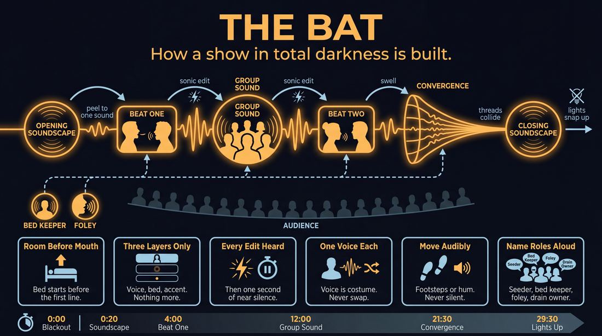
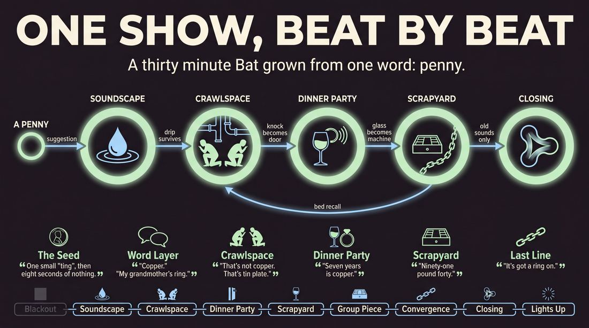
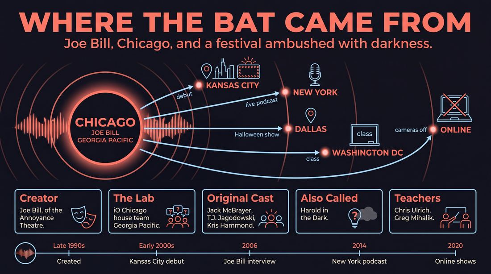
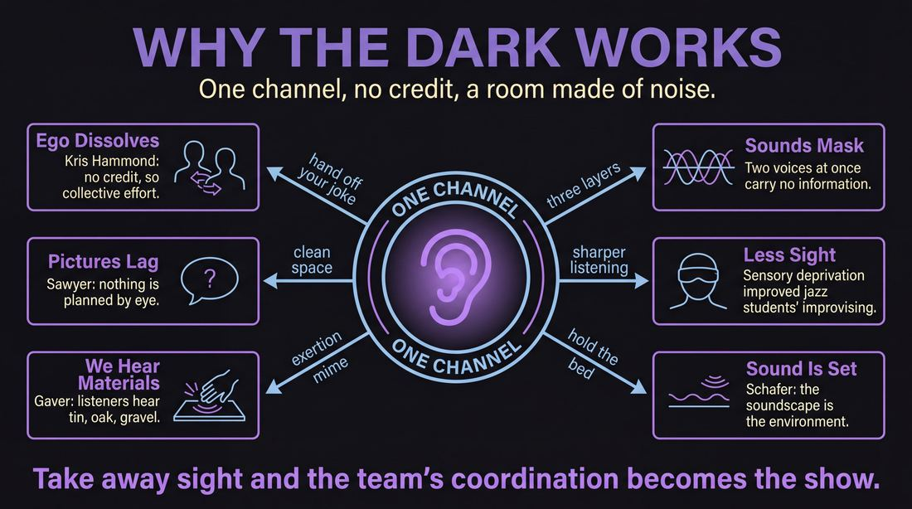
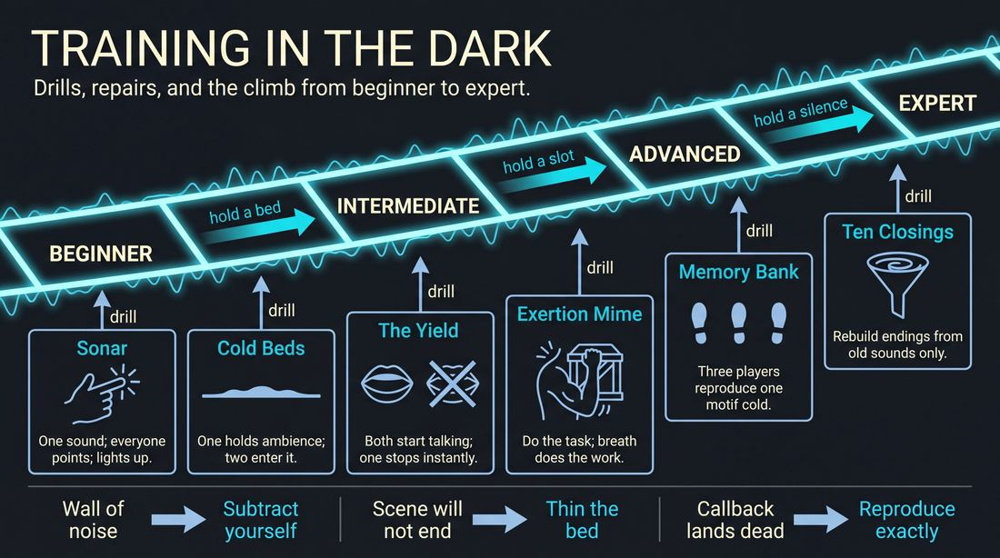

# Bat

> **A complete study of the long-form improv format _Bat_** - the original archived write-up, five infographics, grounded historical and pedagogical research, and a full mechanics-and-coaching manual.

| | |
|---|---|
| **Format** | Bat |
| **Primary source** | [IRC Improv Wiki](https://wiki.improvresourcecenter.com/index.php?title=Bat) |
| **Article retrieved** | 2026-08-09 23:23 UTC |
| **Research model** | `gemini-3.1-pro-preview` - Google Search grounded, 2 passes |
| **Analysis model** | `claude-opus-5` - 3 passes |
| **Infographic model** | `gemini-3-pro-image` - 5 posters, 16:9 |
| **Compiled** | 2026-08-10 01:15 UTC |

---

## Contents

1. [Part I - The Original Write-Up](#part-i-the-original-write-up)
2. [Part II - The Infographics](#part-ii-the-infographics)
   - [1. Structure and Mechanics](#infographic-1-mechanics)
   - [2. A Show, Beat by Beat](#infographic-2-example)
   - [3. Origins and Lineage](#infographic-3-history)
   - [4. Why It Works](#infographic-4-theory)
   - [5. Rehearsal and Repair](#infographic-5-coaching)
3. [Part III - Research Dossier](#part-iii-research-dossier-gemini-31-pro)
   - [Pass 1: History, Lineage, Literature and Scholarship](#research-history)
   - [Pass 2: Comparative Anatomy, Pedagogy and Production](#research-comparative)
4. [Part IV - Mechanics, Gameplay and Coaching Manual](#part-iv-mechanics-gameplay-and-coaching-manual-claude-opus-5)
   - [Pass 1: The Form, Its Mechanics and Its Gameplay](#manual-mechanics)
   - [Pass 2: Training, Coaching and Performance Companion](#manual-coaching)

---

## Part I - The Original Write-Up

*Verbatim archive of the source article, reproduced exactly as scraped. Everything after this section is generated elaboration built on top of it.*

### Bat

Also known as **Harold in the Dark** or **Blind Harold'**, the Bat is a long form structure performed entirely in the dark.

##### Structure

Performed as a normal Harold except that there are no visual or movement cues to signal edits, behavior or other actions by the performers.

The format was created by Joe Bill of Annoyance Theatre in Chicago.

  

##### Videos

- [The Bat at IO West by English Speaking Moose](http://vimeo.com/10845896)

  

| ***This article is a stub. Help the wiki grow by editing it and adding more information.*** |
| --- |

---

*Archived from [https://wiki.improvresourcecenter.com/index.php?title=Bat](https://wiki.improvresourcecenter.com/index.php?title=Bat) (IRC Improv Wiki) on 2026-08-09 23:23 UTC.*

---

## Part II - The Infographics

*Five 16:9 posters (`gemini-3-pro-image`), each teaching a different aspect of the format. Click any poster to enlarge.*

<a id="infographic-1-mechanics"></a>

### 1. Structure and Mechanics

*How the form is played: the shape of the piece, the opening, the roles, the edit vocabulary, the flow of information, and the clock.*

{ .diagram }


<a id="infographic-2-example"></a>

### 2. A Show, Beat by Beat

*A single worked performance from suggestion to blackout: what happens in each beat, with short real example lines and what the players are doing technically.*

{ .diagram }


<a id="infographic-3-history"></a>

### 3. Origins and Lineage

*Where the form came from: creators, dates, theatres, how it spread between schools and cities, and the key figures - a documented timeline and lineage map.*

{ .diagram }


<a id="infographic-4-theory"></a>

### 4. Why It Works

*The theory: the core principles of the form and the research and craft ideas that explain why the structure produces good improv, each tied to a specific mechanic.*

{ .diagram }


<a id="infographic-5-coaching"></a>

### 5. Rehearsal and Repair

*Training and fixing the form: the essential drills, the common failure modes with their symptom-and-fix pairs, and the markers of beginner through expert play.*

{ .diagram }


<details>
<summary>Designer's notes returned with the image</summary>

Generation complete.

</details>


---

## Part III - Research Dossier (Gemini 3.1 Pro)

*Two grounded research passes with live Google Search: the historical record, then the comparative and pedagogical record. The model tags claims by evidence strength; treat tagged and unverified items accordingly.*

<a id="research-history"></a>

### » Pass 1: History, Lineage, Literature and Scholarship

### Research Summary
*   **Documentation Level:** Highly documented. The form has a clear creator, a specific originating team, and a traceable lineage through major training centres (iO Chicago, Annoyance Theatre) to international workshops and podcasts.
*   **Core Mechanic:** The Bat is a long-form improv structure performed entirely in pitch darkness. Performers rely exclusively on auditory cues, voice acting, and vocalised soundscapes to build scenes and execute edits. [DOCUMENTED]
*   **Origin:** Created by Joe Bill in collaboration with the iO Chicago house team Georgia Pacific. [DOCUMENTED]
*   **Structural Deviation:** While widely known as "Harold in the Dark," its creator explicitly designed it to break the rigid three-beat Harold structure, incorporating opening and closing soundscapes and a chaotic, fluid scene progression. [DOCUMENTED]
*   **Psychological Impact:** Practitioners note that removing the visual element dissolves performer ego, prevents physical stage-hogging, and forces a hyper-focused "group mind." [DOCUMENTED]
*   **Modern Evolution:** The format naturally mutated into the audio-only improv podcast boom and became a staple of virtual improv during the COVID-19 pandemic. [DOCUMENTED]
*   **Accessibility:** It is uniquely accessible to blind and visually impaired performers and audience members, levelling the playing field by removing visual sight gags and physical cues. [DOCUMENTED]

### Provenance and History
The Bat was developed at iO Chicago by improv teacher and Annoyance Theatre co-founder Joe Bill, alongside the legendary improv ensemble Georgia Pacific (whose roster included future comedy staples Jack McBrayer, T.J. Jagodowski, and Kris Hammond). [DOCUMENTED] 

The format was born out of a mischievous impulse. Joe Bill wanted to test the limits of an audience's patience and imagination by forcing them to sit in complete darkness for thirty minutes. The format debuted at the Kansas City Improv Festival, where it was a massive success. [DOCUMENTED] By stripping away the visual layer, the form forced improvisers to rely entirely on active listening, vocal modulation, and collaborative soundscapes, effectively creating a live, unscripted radio play.

| Year | Event | Place / Company | Source |
| :--- | :--- | :--- | :--- |
| Late 1990s | Creation of the format | iO Chicago / Georgia Pacific | [Northwestern University Magazine](https://magazine.northwestern.edu/features/kris-hammond-artificial-intelligence-chatgpt/) |
| Early 2000s | Debut performance | Kansas City Improv Festival | [IRC Improv Wiki](https://wiki.improvresourcecenter.com/index.php?title=Interview_with_Joe_Bill) |
| 2006 | Joe Bill details the form's creation in a major interview | IRC Improv Wiki | [IRC Improv Wiki](https://wiki.improvresourcecenter.com/index.php?title=Interview_with_Joe_Bill) |
| 2014 | "The Bat - Improv in the Dark" live podcast begins | The Creek & Cave, NYC | [Weebly Archive](https://thebatpodcast.weebly.com/) |
| 2020 | Transition to virtual/audio-only platforms during COVID-19 | OozeBear / Improv Cincinnati | [Reddit / Leap Events](https://www.reddit.com/r/improv/comments/gdbq2m/learn_the_bat_from_joe_bill_cocreator_of_the_bat/) |

### Lineage and Transmission
The Bat spread globally primarily through the touring workshops of Joe Bill, who refers to the format as "one of my babies." [DOCUMENTED] Because it requires no special equipment other than the ability to turn off the theatre lights, it was easily adopted by indie teams and regional theatres looking to train deep listening skills. 

*   **Chicago Lineage:** Originated at iO Chicago and the Annoyance Theatre. It became a staple exercise for breaking teams out of "talking head" visual ruts. [DOCUMENTED]
*   **Regional Dialects & Adopters:**
    *   *Dallas (Stomping Ground Comedy):* Taught by Greg Mihalik and performed as a seasonal Halloween sensory experience. [DOCUMENTED]
    *   *Washington D.C. (DC Improv):* Taught by Chris Ulrich as "The Bat: A Harold in the Dark," focusing on the traditional Harold beats translated to audio. [DOCUMENTED]
    *   *Seattle (Bandit Theater):* Adapted into a livestream/audio broadcast format during the pandemic, leaning heavily into the "golden age of radio" aesthetic. [DOCUMENTED]
    *   *Australia (Improv QLD):* Taught as a full-day intensive by Joe Bill, focusing on the connective tissue of the opening and closing soundscapes. [DOCUMENTED]

### Key Figures
| Person | Role in this form | Specific contribution | Source URL |
| :--- | :--- | :--- | :--- |
| **Joe Bill** | Creator / Teacher | Conceived the format, integrated the soundscape mechanics, and exported it globally via touring workshops. | [IRC Improv Wiki](https://wiki.improvresourcecenter.com/index.php?title=Interview_with_Joe_Bill) |
| **Kris Hammond** | Original Performer | Member of Georgia Pacific; later applied the ego-dissolving mechanics of The Bat to academic research on Artificial Intelligence. | [Northwestern University](https://magazine.northwestern.edu/features/kris-hammond-artificial-intelligence-chatgpt/) |
| **Jack McBrayer** | Original Performer | Member of Georgia Pacific who helped originate and refine the form's early mechanics at iO Chicago. | [Northwestern University](https://magazine.northwestern.edu/features/kris-hammond-artificial-intelligence-chatgpt/) |
| **T.J. Jagodowski** | Original Performer | Member of Georgia Pacific; his mastery of patient, grounded scene work was forged partly in these dark sets. | [Northwestern University](https://magazine.northwestern.edu/features/kris-hammond-artificial-intelligence-chatgpt/) |
| **Chris Ulrich** | Teacher | Formalised the curriculum for "The Bat: A Harold in the Dark" at DC Improv. | [DC Improv](https://dcimprov.com/comedy-school/improv-level-4) |

### Canonical Shows, Companies and Recordings
*   **Georgia Pacific (iO Chicago):** The foundational ensemble. While no known audio recordings of their original 1990s runs are publicly archived, they are the canonical originators. [DOCUMENTED]
*   **The Bat - Improv in the Dark (The Creek & Cave, NYC):** A 2014 live podcast that recorded fully improvised shows in a pitch-black theatre, proving the format's viability as a recorded audio medium. [DOCUMENTED]
*   **Devil's Daughter: The Bat (Podcast):** A 2021 podcast project by Nicole Werth and Alan Giles that reunited defunct iO Chicago Harold teams to perform audio-only sets in the dark. [DOCUMENTED]
*   **Stomping Ground Comedy's "The Bat" (Dallas, TX):** A recurring Halloween mainstage production marketed as a "sensory adventure" using foley and vocal soundscapes. [DOCUMENTED]

### Published Literature
| Work | Author | Year | What it says about this form | Where to find it |
| :--- | :--- | :--- | :--- | :--- |
| *Interview with Joe Bill* | Josh / IRC Improv Wiki | 2006 | Details the origin of the form, the Kansas City debut, and its structural differences from a standard Harold. | [IRC Improv Wiki](https://wiki.improvresourcecenter.com/index.php?title=Interview_with_Joe_Bill) |
| *Improv as a Blueprint* | Northwestern University Magazine | 2023 | Discusses Georgia Pacific's use of The Bat and how stripping away visuals dissolves ego and fosters collective intelligence. | [Northwestern University](https://magazine.northwestern.edu/features/kris-hammond-artificial-intelligence-chatgpt/) |
| *Harold-The Bat* | LearnImprov.com | 2019 | Defines the form as an "Unblindfolded Harold in the dark" and details how offstage ensemble members must dictate wipes and transitions vocally. | [LearnImprov](https://learnimprov.com/harold-the-bat/) |
| *Improv Encyclopedia: The Bat* | Improv Encyclopedia | 2024 | Categorises it as a limitation and performance game based on Blind Harold. | [Improv Encyclopedia](http://improvencyclopedia.org/games/The_Bat.html) |

### Verbatim Quotes
> "The Bat came from my perverse desire to make a festival audience to watch an improv show in the dark for half an hour. When we did it first at Kansas City Improv festival, it fucking killed."
> — **Joe Bill**  
> [Source: IRC Improv Wiki](https://wiki.improvresourcecenter.com/index.php?title=Interview_with_Joe_Bill)

> "The Bat is basically a blind Harold with a soundscape at the beginning and end, and permission to explore more than just three scenes, scene A, scene B, scene C, and a game. I like chaos."
> — **Joe Bill**  
> [Source: IRC Improv Wiki](https://wiki.improvresourcecenter.com/index.php?title=Interview_with_Joe_Bill)

> "Without the visual element, ego dissolves. You cannot get credit for any of your choices, so it's more of a collective effort."
> — **Kris Hammond**  
> [Source: Northwestern University Magazine](https://magazine.northwestern.edu/features/kris-hammond-artificial-intelligence-chatgpt/)

> "Improvisational comedy hinges on teamwork. It demands active listening, agreement and building upon each other's ideas."
> — **Kris Hammond**  
> [Source: Northwestern University Magazine](https://magazine.northwestern.edu/features/kris-hammond-artificial-intelligence-chatgpt/)

> "The Bat is an amazing soundscape of sounds, words, images, and associations, a performance piece that takes place in the mind of the audience and offers an incredible sense of freedom for the performer."
> — **Stomping Ground Comedy Course Syllabus**  
> [Source: Stomping Ground Comedy](https://stompinggroundcomedy.org/)

> "The Bat is an audio-only improv format that explores how to create a dynamic soundscape that stimulates the senses and allows us to use that soundscape as source material for scenes."
> — **Improv QLD Workshop Description**  
> [Source: Improv QLD](https://improvqld.com.au/)

> "Performed as a normal Harold except that there are no visual or movement cues to signal edits, behavior or other actions by the performers."
> — **IRC Improv Wiki**  
> [Source: IRC Improv Wiki](https://wiki.improvresourcecenter.com/index.php?title=Bat)

> "Getting rid of all sensory input allows the 'constantly-make-sure-you're-not-dying' part of your brain to chill out for a second, allowing the creative, relaxed part of your brain to come out and play."
> — **Graham Talley** (On sensory deprivation, applied to dark environments)  
> [Source: Buffer / Floatation Therapy Research](https://buffer.com/resources/how-to-boost-your-creativity-with-sensory-deprivation/)

### Anecdotes and Stories
**The Kansas City Ambush**
When Joe Bill and Georgia Pacific first developed The Bat, it wasn't born out of a high-minded theatrical thesis, but rather a punk-rock impulse. Bill admitted he had a "perverse desire" to force a festival audience to sit in pitch blackness for a full thirty minutes. They unleashed the format at the Kansas City Improv Festival, unsure if the audience would revolt or walk out. Instead, the sensory deprivation heightened the audience's imagination, and according to Bill, "it fucking killed." [DOCUMENTED]

**The AI Epiphany**
Kris Hammond, a professor of computer science at Northwestern University, spent nearly two decades performing with Georgia Pacific. He credits performing The Bat alongside Jack McBrayer and T.J. Jagodowski as a foundational experience for his later work in Artificial Intelligence. Because the stage was completely dark, the audience couldn't see who was making a joke or initiating a soundscape. Hammond realised that "without the visual element, ego dissolves," creating a pure, collective intelligence—a framework he now uses to model how humans and AI can "think" together collaboratively rather than competitively. [DOCUMENTED]

**The Guide Dog in the Dark**
When DC Improv ran a class called "The Bat: A Harold in the Dark," a blind student enrolled with his guide dog, Hogan. Before the class began, the student called the comedy school principal and joked, "Since this is in the dark, would it be like cheating for me?" The student noted that while sighted improvisers often struggle with the sudden loss of visual cues, the format inherently levelled the playing field, allowing him to participate seamlessly in the "improv canon" of making his scene partners look good purely through auditory support. [DOCUMENTED]

### Academic and Scientific Research
**Sensory Deprivation and Technical Improvisation**
A 2011 study by Oshin Vartanian (University of Toronto) and Peter Suedfeld (University of British Columbia) published in *Music and Medicine* tested the effects of sensory deprivation (via float tanks) on jazz improvisation students. The researchers found that removing external visual and auditory stimuli significantly increased the students' technical improvisation abilities and grades compared to a control group. 
*Relevance to this form:* The Bat plunges performers into darkness, removing visual stimuli. This sensory restriction lowers cortisol and shifts brain activity away from visual processing, enhancing auditory focus, divergent thinking, and spontaneous verbal generation. [DOCUMENTED]

**Ego Dissolution and Collective Intelligence**
Research by Kris Hammond at Northwestern University links the visual anonymity of The Bat to the dissolution of ego, fostering a purely collaborative "group mind" where individual credit is impossible to assign. 
*Relevance to this form:* Because the audience cannot see who is speaking or making sound effects, performers in The Bat cannot rely on physical mugging, facial expressions, or visual stage-hogging. This forces true ensemble mechanics; the scene succeeds or fails entirely on the group's ability to weave a cohesive auditory narrative. [DOCUMENTED]

### Documented Variants and Descendants
*   **Blind Harold:** A precursor/variant where performers are seated and blindfolded, but the theatre lights remain on for the audience. It is primarily used as a classroom listening exercise rather than a mainstage performance. [DOCUMENTED]
*   **Audio-Only / Virtual Bat:** During the COVID-19 pandemic, The Bat naturally mutated into virtual formats on platforms like OozeBear, Discord, and Zoom. Because the form already relied entirely on audio, it survived the transition to remote performance better than any visual format. [DOCUMENTED]
*   **Narrative Improv Podcasts:** The mechanics of The Bat directly foreshadowed and influenced the boom of improv podcasts (e.g., the Earwolf network). Shows like *Devil's Daughter: The Bat* explicitly use the format's name and rules to record audio-only sets. [DOCUMENTED]

### Criticism, Debate and Known Failure Modes
*   **Failure Mode: Audio Clutter and Trampling.** Without visual cues (like eye contact, pointing, or stepping forward) to signal edits or entrances, improvisers can easily talk over one another. [WIDELY PRACTICED, UNDOCUMENTED]
*   **Failure Mode: The Foley Trap.** Performers can get so distracted by the novelty of making chaotic sound effects (wind, footsteps, animal noises) that they forget to build grounded, relationship-based scenes. [INFERRED]
*   **Debate: Is it just a Harold?** While the IRC Wiki and many training centres bill it as "Harold in the Dark," creator Joe Bill explicitly pushes back against this rigidity. He notes that The Bat gives "permission to explore more than just three scenes... and a game," making it looser and more chaotic than a strict UCB-style Harold. [DOCUMENTED]
*   **Audience Discomfort:** Sitting in pitch darkness for 30 to 45 minutes can make some audience members uncomfortable, sleepy, or restless, requiring the performers to maintain high vocal energy to keep the crowd engaged. [INFERRED]

### Cultural Footprint
*   **Notable Alumni:** The format served as a training ground for highly successful comedic actors, most notably Jack McBrayer (*30 Rock*) and T.J. Jagodowski (*TJ & Dave*, Sonic commercials), who honed their legendary patience and listening skills in the dark with Georgia Pacific. [DOCUMENTED]
*   **Influence on Podcasting:** The Bat proved that long-form improv does not require a visual component to succeed, laying the conceptual groundwork for the massive success of the comedy podcasting industry in the 2010s and 2020s. [DOCUMENTED]
*   **Accessibility:** The form is celebrated for its inherent accessibility. It removes the visual biases of traditional theatre, allowing visually impaired performers to improvise on a completely equal footing with sighted performers. [DOCUMENTED]

### Gaps in the Record
*   **Exact Debut Date:** The specific year of the Kansas City Improv Festival where The Bat debuted is undocumented in the available text (it is broadly placed in the late 1990s or early 2000s).
*   **Georgia Pacific's Internal Dynamics:** Whether the ensemble Georgia Pacific invented the form collaboratively with Joe Bill, or if Joe Bill directed them to do it top-down, is slightly blurred in the historical record, though Joe Bill claims it as "one of my babies."
*   **Structural Specifics of the Soundscape:** While Joe Bill mentions a "soundscape at the beginning and end," the exact rules of how these soundscapes are initiated, modulated, and used to transition into scenes are not rigorously codified in published manuals, relying instead on oral transmission in workshops.

### Source List
1. *Interview with Joe Bill* - IRC Improv Wiki - 2006 - https://wiki.improvresourcecenter.com/index.php?title=Interview_with_Joe_Bill - Supports the origin story, the Kansas City debut, and Joe Bill's structural definition of the form.
2. *Improv as a Blueprint* - Northwestern University Magazine - 2023 - https://magazine.northwestern.edu/features/kris-hammond-artificial-intelligence-chatgpt/ - Supports the involvement of Georgia Pacific, Jack McBrayer, T.J. Jagodowski, and the ego-dissolving psychology of the form.
3. *Bat* - IRC Improv Wiki - 2020 - https://wiki.improvresourcecenter.com/index.php?title=Bat - Supports the alternate names (Blind Harold, Harold in the Dark) and basic mechanics.
4. *The Bat (Full Day Intensive) with Chicago Improv Legend Joe Bill* - Improv QLD - 2024 - https://improvqld.com.au/ - Supports the modern global transmission of the form and its focus on dynamic soundscapes.
5. *The Bat Improv Class* - Stomping Ground Comedy - 2024 - https://stompinggroundcomedy.org/ - Supports the regional teaching of the form and its use of dream symbols and foley.
6. *The Bat: A Harold in the Dark Improv Class* - Guide Dog Tales - 2020 - https://guidedogtales.org/ - Supports the accessibility of the form for blind improvisers at DC Improv.
7. *Harold-The Bat* - LearnImprov.com - 2019 - https://learnimprov.com/harold-the-bat/ - Supports the technical mechanics of offstage vocal wipes.
8. *Sensory Deprivation and Jazz Improvisation* - Pacific Standard (psmag.com) - 2011 - https://psmag.com/ - Supports the scientific link between sensory deprivation and heightened technical improvisation skills.

<a id="research-comparative"></a>

### » Pass 2: Comparative Anatomy, Pedagogy and Production

### Taxonomic Placement

```text
          [Long-Form Improvisation]                 [Audio Drama / Radio]
                  |                                           |
      +-----------+-----------+                               |
      |                       |                               |
  [Harold]              [Freeform]                            |
      |                       |                               |
      +-----------+-----------+-------------------------------+
                  |
              [The Bat]
                  |
      +-----------+-----------+
      |                       |
[Blind Harold]        [Virtual / Audio-Only Improv]
```

The Bat sits at the intersection of the classic Chicago Harold and the traditions of improvised radio drama. While it inherits the multi-scene, thematic exploration of the Harold (utilizing an opening, three beats of scenes, and group games), it entirely strips away the visual channel. This forces the ensemble to rely on auditory mechanics—soundscapes, vocal proximity, and Foley—to establish environment, character, and edits. It is a direct descendant of Del Close's structural teachings but was uniquely operationalized by Joe Bill and the team Georgia Pacific at the Annoyance Theatre to exploit sensory deprivation as a generative tool.

### Head-to-Head Comparisons

#### The Bat vs. Harold
| Axis | The Bat | Harold | Consequence for the players |
| :--- | :--- | :--- | :--- |
| **Opening** | Auditory soundscape, overlapping vocal associations, dream symbols. | Visual group game, pattern game, or physical invocation. | Players must establish themes purely through vocal tone, rhythm, and overlapping dialogue. |
| **Structure** | Fluid, often blending scenes via crossfades; beats are marked by sound. | Rigid 3x3 grid (typically) separated by distinct group games. | The Bat feels more like a continuous auditory hallucination; the Harold feels like a structured showcase. |
| **Edit Logic** | Sonic wipes, loud Foley noises, or ambient sound swells. | Visual sweeps (running across the stage) or lighting blackouts. | Players offstage must actively monitor the audio mix and inject sound to terminate scenes. |
| **Memory** | Tracking voices, accents, and specific Foley sounds to recall characters. | Tracking physical stage positions, postures, and visual object work. | A character in The Bat ceases to exist if they stop making noise; silence equals absence. |
| **Failure Mode** | "The Audio Pile-On" (unintelligible noise). | "The Plot Heavy Scene" (ignoring the theme for narrative). | Bat players must aggressively yield the vocal floor to maintain clarity. |

#### The Bat vs. Improvised Radio Play
| Axis | The Bat | Improvised Radio Play | Consequence for the players |
| :--- | :--- | :--- | :--- |
| **Audience Contract** | The audience is in pitch black, sharing the sensory deprivation. | The audience watches players at microphones creating a radio show. | Bat players can move around the stage to create spatial audio depth; Radio Play players are anchored to mics. |
| **Structure** | Thematic, associative, dream-logic (Harold-based). | Usually narrative, genre-based (e.g., Noir, Sci-Fi). | The Bat allows for surreal, non-linear jumps in time and space; Radio Play demands linear storytelling. |
| **Set/Props** | Pitch black, empty stage. | Scripts (fake), Foley tables, visible microphones. | Bat players must generate Foley using their bodies and the empty floor; Radio Play uses literal props. |

#### The Bat vs. Monoscene
| Axis | The Bat | Monoscene | Consequence for the players |
| :--- | :--- | :--- | :--- |
| **Edit Logic** | Constant auditory edits, location shifts, and time jumps. | No edits; real-time continuous action in one location. | Bat players must constantly build and destroy environments; Monoscene players must sustain one. |
| **Cast Size** | 6–8 (offstage players provide Foley). | 4–8 (all players usually onstage). | Bat players spend significant time offstage acting as the "sound department." |
| **Environment** | Infinite, rapidly shifting, defined by sound. | Singular, highly detailed, defined by visual object work. | The Bat requires rapid establishment of location via ambient noise (e.g., wind, traffic) before dialogue begins. |

### What Makes It Uniquely Itself

1. **The Shared Sensory Void**: If the audience can see the players (even if the players are blindfolded), it is *Blind Harold*, not *The Bat*. The form requires the theater to be pitch black, making the performance a shared auditory hallucination between performer and spectator.
2. **Soundscape as Connective Tissue**: If scenes are just talking heads separated by silence, it is merely a scene in the dark. The Bat requires ambient, player-generated audio (wind, machinery, abstract vocalizations) to bridge beats and serve as the structural glue.
3. **Sonic Editing Logic**: Edits cannot be visual sweeps. They must be auditory. If a player cannot terminate a scene using a vocal wipe, a loud Foley sound, or an ambient swell, the form's structural integrity collapses.

### Structural Variants in Practice

| Variant Name | What It Changes | Who Plays It | Source |
| :--- | :--- | :--- | :--- |
| **The Bat (Classic)** | Unblindfolded, theater is pitch black, players move freely. | Annoyance Theatre, Joe Bill, Stomping Ground Comedy | Improv Encyclopedia / Joe Bill |
| **Blind Harold** | Players are seated and blindfolded; theater lights remain on for the audience. | Training centers focusing on listening skills before full Bat performance. | LearnImprov.com |
| **The Virtual Bat** | Performed on audio-only platforms (OozeBear, Discord) with international casts. | Remote improvisers, Improv Cincinnati. | Improv Cincinnati (2020) |
| **The Bat: A Harold in the Dark** | Integrated into standard curriculum as a Level 4 graduation show format. | DC Improv (Chris Ulrich). | DC Improv |

### The Teaching Ladder

| Stage | Skill Introduced | Why In This Order | Typical Exercise | Source |
| :--- | :--- | :--- | :--- | :--- |
| **1. Sensory Acclimatization** | Moving and speaking without sight safely. | Panic reduction and physical safety must precede scene work. | Echolocation / Marco Polo | [CRAFT CONSENSUS] |
| **2. Auditory Object Work** | Conveying physical action through breath and vocal strain. | Prevents "Talking Heads" syndrome where characters sound like floating voices. | Exertion Mime | [CRAFT CONSENSUS] |
| **3. Sonic Editing** | Executing the "Audio Wipe" and soundscape crossfades. | The Harold structure requires edits; without visual sweeps, players must use sound. | Soundscape Swell | Greg Mihalik / Stomping Ground |
| **4. Spatial Audio Mixing** | Projecting from the back vs. whispering at the front. | Creates a three-dimensional audio experience for the audience. | Distance and Proximity | Chris Ulrich / DC Improv |
| **5. Dream Logic & Association** | Fluid transitions based on surreal sound associations. | Capitalizes on the lack of visual grounding to create rapid, non-linear jumps. | Dream Symbol Association | Joe Bill / Improv QLD |

### Documented Drills and Exercises

| Drill | Origin / Teacher | How To Run It | What It Fixes In This Form | Source |
| :--- | :--- | :--- | :--- | :--- |
| **Soundscape Swell** | Greg Mihalik | Players create continuous ambient noise; one player steps forward to initiate a scene, others fade out. | Fixes clunky transitions and dead air between beats. | Stomping Ground Comedy |
| **Dream Symbol Association** | Joe Bill | Word association in the dark, focusing on surreal imagery, following tangents, and deep listening. | Fixes overly literal scene initiations and grounds the opening. | Improv QLD / Joe Bill |
| **Seated Blind Harold** | LearnImprov | Playing the form seated in chairs to remove the variable of movement. | Fixes physical safety concerns during early audio training. | LearnImprov.com |
| **Distance and Proximity** | Chris Ulrich | Players practice projecting from the back of the stage vs. whispering at the front to create depth. | Fixes flat, one-dimensional audio mixing. | DC Improv |
| **The Audio Wipe** | [CRAFT CONSENSUS] | A player offstage makes a loud, distinct sound (swoosh, door slam) to cut the current scene. | Fixes missed visual edits and dragging scenes. | [CRAFT CONSENSUS] |
| **Exertion Mime** | [CRAFT CONSENSUS] | Players must perform a physically demanding task in the dark, conveying the action purely through breath. | Fixes "Talking Heads" syndrome. | [CRAFT CONSENSUS] |
| **Overlap Yielding** | [CRAFT CONSENSUS] | Two players deliberately start talking at once; one must yield immediately without breaking reality. | Fixes "The Void" (players talking over each other). | [CRAFT CONSENSUS] |
| **Foley Accompaniment** | [CRAFT CONSENSUS] | Two players do a scene, two others provide all the sound effects from the sides. | Fixes lack of environment in audio-only scenes. | [CRAFT CONSENSUS] |
| **Echolocation** | [CRAFT CONSENSUS] | Players move around the space making a specific sound to map where everyone is. | Fixes bumping into each other and spatial disorientation. | [CRAFT CONSENSUS] |
| **Blindfolded Pass the Sound** | [CRAFT CONSENSUS] | Players stand in a circle blindfolded, passing a specific sound and adjusting its volume/pitch. | Fixes spatial awareness and volume control. | [CRAFT CONSENSUS] |

### Common Failure Modes and Diagnoses

| Failure Mode | What It Looks Like From The Audience | Root Cause | Fix | Who Names It |
| :--- | :--- | :--- | :--- | :--- |
| **The Audio Pile-On** | A wall of chaotic noise where dialogue is completely unintelligible. | Too many offstage players attempting to provide Foley or soundscape at once. | Limit Foley/ambient support to two offstage players at a time. | [CRAFT CONSENSUS] |
| **Missed Sweeps / The Endless Scene** | Scenes drag on past their peak, losing energy and focus. | Players are subconsciously waiting for a visual cue (a player running across stage) to edit. | Train aggressive "Audio Wipes" and soundscape swells. | [CRAFT CONSENSUS] |
| **Talking Heads / Floating Voices** | Characters sound like they are floating in a void with no physical bodies or environment. | Players stop doing physical object work because they know the audience can't see them. | Enforce "Exertion Mime"; players must physically do the action in the dark. | [CRAFT CONSENSUS] |
| **Teleportation** | A character's voice suddenly jumps from stage left to stage right without explanation. | Players moving silently in the dark to reposition themselves. | Require continuous vocalization, Foley footsteps, or "anchor points" when moving. | [CRAFT CONSENSUS] |

### Production and Logistics

*   **Cast Size**: 6 to 8 players. Any more creates audio clutter and makes voice identification difficult; any fewer makes generating rich soundscapes exhausting.
*   **Runtime**: 25 to 45 minutes.
*   **Stage Layout**: The stage must be entirely cleared of all trip hazards. Chairs, props, and set pieces are pushed to the absolute perimeter or removed entirely.
*   **Lighting and Tech Cues**: Pitch black. Exit signs are taped or covered (only if local fire codes permit) or the audience is provided with blindfolds. The tech booth only controls the master blackout cue at the top and the lights-up cue at the end.
*   **Music and Sound**: None from the booth. All music, ambient noise, and sound effects must be generated live by the players' voices and bodies.
*   **MC and Host Duties**: The host must explicitly explain the format, manage audience expectations regarding the dark (warning for nyctophobia), acquire the suggestion (usually a single word or sound), and signal the tech booth to kill the lights.
*   **Lineup Placement**: Usually the closing act of a show. Turning the lights back on after 30 minutes of darkness is a jarring, climactic moment that is difficult to follow with a standard visual set.
*   **Rehearsal Cadence**: Requires dedicated dark rehearsals. It cannot be casually thrown together by a team that only rehearses with the lights on.
*   **Producer Prep**: Must check venue fire codes regarding exit lights, prepare audience warnings, and ensure the stage floor is swept and free of debris.

### Adaptations Beyond the Stage

*   **Classroom and Youth**: Instead of turning off the lights (which presents supervision and safety hazards), students are given blindfolds. This maintains the sensory limitation while allowing the teacher to monitor physical safety.
*   **Corporate and Applied Improv**: Adapted to focus on active listening, removing visual biases (e.g., judging a speaker by appearance or body language), and vocal tone analysis. Often played seated.
*   **Online and Remote**: Adapted for platforms like Discord, Zoom (cameras off), or OozeBear. Requires strict microphone etiquette, latency management, and the use of panning/spatial audio software if available.
*   **Accessibility and Inclusion**: The Bat is highly accessible for blind and low-vision performers. For example, DC Improv successfully integrated a blind student and their guide dog into a Bat class, as the format entirely levels the visual playing field.
*   **Content-Safety and Consent**: Physical boundaries must be explicitly negotiated *before* the lights go out. Strict "no touch" rules are often enforced in the dark to prevent accidental injury or non-consensual contact.

### Evidence Base for Those Adaptations

*   **Ecological Acoustics**: Research by William W. Gaver (1993) on how humans perceive physical events through sound supports the necessity of Foley and "Exertion Mime" in The Bat. Listeners do not hear abstract frequencies; they hear *materials interacting*. This justifies the pedagogical focus on making physical noise rather than just talking.
*   **Sensory Deprivation and Focus**: Studies on sensory restriction (e.g., Zuckerman et al., 1962) demonstrate that removing visual stimuli heightens auditory acuity but can also induce anxiety. This supports the necessity of Stage 1 (Sensory Acclimatization) in the teaching ladder and the requirement for audience warnings.

### Scholarly Frames Worth Applying

*   **Acoustic Ecology (R. Murray Schafer)**
    *   *The Frame*: The study of the relationship between human beings and their environment through sound, emphasizing that environments are defined by their "soundscapes."
    *   *Citation*: Schafer, R. M. (1977). *The Tuning of the World*. Knopf.
    *   *Mapping*: Explains how the ambient, player-generated audio in The Bat functions as the physical environment, entirely replacing the visual set and grounding the audience in a shared reality.
*   **Collaborative Emergence (R. Keith Sawyer)**
    *   *The Frame*: The process by which a group creates a performance that cannot be reduced to the sum of its parts, driven entirely by unpredictable, moment-to-moment interaction.
    *   *Citation*: Sawyer, R. K. (2003). *Group Creativity: Music, Theater, Collaboration*. Lawrence Erlbaum Associates.
    *   *Mapping*: In the dark, players cannot pre-plan visual gags, make eye contact, or signal intentions. This forces pure, immediate vocal emergence, as every initiation must be dealt with exactly as it is heard.
*   **Ecological Approach to Auditory Perception (William W. Gaver)**
    *   *The Frame*: The theory that humans hear physical events (e.g., a hollow wooden door slamming) rather than abstract acoustic properties (e.g., a sudden spike in low-frequency noise).
    *   *Citation*: Gaver, W. W. (1993). What in the world do we hear?: An ecological approach to auditory event perception. *Ecological Psychology*, 5(1), 1-29.
    *   *Mapping*: Justifies the specific mechanic of "Exertion Mime" and Foley; the audience needs to hear the *materiality* of the scene (footsteps, breathing, object manipulation) to believe the environment exists.

### Where the Form Is Heading

*   **Podcast and Audio Drama Integration**: With the boom in narrative podcasting, The Bat is increasingly used not just as a live stage show, but as a generative rehearsal tool for scripting audio dramas.
*   **Spatial Audio and Binaural Tech**: Contemporary companies are experimenting with performing The Bat around a central binaural microphone, allowing audiences (listening via headphones) to experience true 3D spatial audio improv.
*   **Virtual Resurgence**: Post-pandemic, the form has found a permanent home on audio-only platforms (like OozeBear), allowing international casts to perform The Bat without geographic constraints, relying entirely on vocal mixing and digital soundboards.

### Source List

1. *Bat* - IRC Improv Wiki - 2020 - https://wiki.improvresourcecenter.com/index.php?title=Bat - Supports basic definition, Annoyance Theatre origin, and Joe Bill attribution.
2. *Harold-Blind* - LearnImprov.com - 2019 - https://learnimprov.com/harold-blind/ - Supports the Blind Harold variant, seated mechanics, and transition wipe definitions.
3. *The Bat* - Improv Encyclopedia - 2024 - https://improvencyclopedia.org/games/The_Bat.html - Supports the distinction between Blind Harold and The Bat, and Annoyance Theatre origins.
4. *The Bat (Full Day Intensive) with Joe Bill* - Improv QLD - 2024 - https://improvqld.com.au/ - Supports Joe Bill's pedagogy, the focus on dynamic soundscapes, and the Georgia Pacific team origin.
5. *The BAT Workshop: An Improv Format in the Dark!* - Stomping Ground Comedy - 2023 - https://stompinggroundcomedy.org/ - Supports Greg Mihalik's teaching, the focus on dream symbols, and deep listening mechanics.
6. *Improv Level 4B: The Bat: A Harold in the Dark* - DC Improv - 2020 - https://dcimprov.com/ - Supports Chris Ulrich's curriculum and the use of the form as an advanced graduation format.
7. *The Bat: A Harold in the Dark Improv Class* - Guide Dog Tales - 2020 - https://guidedogtales.org/ - Supports accessibility adaptations, specifically the integration of blind performers and guide dogs into the format.
8. *Learn The Bat from Joe Bill* - Improv Cincinnati / Reddit - 2020 - https://www.reddit.com/r/improv/ - Supports the online/remote adaptation of the form via the OozeBear platform during the pandemic.

---

## Part IV - Mechanics, Gameplay and Coaching Manual (Claude Opus 5)

*Synthesis over the original article and both research dossiers: first how the form works and how to play it, then how to train an ensemble to perform it.*

<a id="manual-mechanics"></a>

### » Pass 1: The Form, Its Mechanics and Its Gameplay

### At a Glance

| Field | Detail |
|---|---|
| **Also known as** | The Bat; Harold in the Dark; Improv in the Dark; *Blind Harold* (contested — see note) |
| **Family** | Harold-descended long form, audio-native branch; sits at the join between Chicago long form and improvised radio drama |
| **Cast size** | 6–8 optimal. 5 is thin (nobody spare to hold the ambient bed); 9+ makes voice-identification unreliable |
| **Runtime** | 25–45 minutes; 30 is the classic length. Under 20 the darkness never stops being a gimmick; over 45 the audience's attention degrades faster than you can feed it |
| **Opening** | A collective, player-generated **soundscape** built in pitch black from the suggestion — abstract noise, breath, rhythm and spoken associations — which then narrows to a single sound that becomes the first scene's environment |
| **Suggestion taken** | One word, or (better) one *sound* the audience is asked to name. Some houses take a household object. Taken in the light, before blackout |
| **Structural rigidity** | **2/5 narratively** (Joe Bill's design explicitly licenses more than three scenes and a game) / **5/5 procedurally** (the audio protocols are absolute) |
| **Difficulty** | 4/5. Individually easy to do badly, collectively hard to do well; the failure modes are loud and instant |
| **Prerequisites** | Reliable two-person scene work; a team that has rehearsed *in the dark* at least three times; a venue that can actually go black; explicit pre-negotiated touch/movement boundaries |
| **Best for** | Ensembles stuck in visual/physical mugging; teams with strong listeners and weak stage-hogs; festival closers; audio-recorded work; casts including blind or low-vision performers |
| **Avoid when** | The venue cannot achieve real darkness; the cast has never worked together; the bill needs another act after you; the room contains steps, cables, an uncovered orchestra pit, or an audience you cannot warn in advance |

*Record conflict (1):* the archived IRC wiki treats **Blind Harold** as a synonym; the comparative record treats it as a distinct training variant (players blindfolded, house lights **up**). **My judgement:** they are different forms. The Bat's defining feature is that the *audience* is in the dark too. Blindfolded players in a lit room is a rehearsal drill, not a Bat.

### The Essence in One Paragraph

The Bat is a long-form improv piece performed with the theatre in genuine pitch blackness, in which everything a set, a body, a costume, an entrance, an exit and an edit would normally do must instead be done with sound made by the performers' own mouths, breath, hands and feet. The ensemble opens by building a collective soundscape out of the audience's one-word suggestion — layered noise, rhythm and spoken associations — and then lets that soundscape narrow down to a single sound which becomes the environment of the first scene. From there the piece runs as a loose Harold: recurring characters, recurring themes, group sound pieces where a beat of the Harold would sit, and a convergence at the end — except that every transition is executed by *audio*: a wipe sound, a swelling ambience, a slammed door, a chorus swallowing a scene. The piece closes by reassembling the opening soundscape with all of the show's accumulated sonic material folded in, draining to one last sound and a held silence before the lights return. Because nobody can see who spoke, credit is unassignable and ego is structurally impossible; because a character who stops making noise ceases to exist, the form enforces the most brutal version of "be present" in all of improv.

### Why This Form Exists

Improvisers cheat with their eyes, constantly, and mostly without knowing it. In a lit show you can hold a scene by standing centre stage with an interesting face; you can edit by walking in and pointing; you can support by miming a chainsaw in the background; you can steal focus by being tall and near the front. You can also *coordinate* with your eyes — the flick of a look that says "you go," the half-step forward that reserves the next edit. All of it is invisible to the audience as technique and visible to the players as a private channel.

The Bat deletes that private channel. There is exactly one bus, and both the ensemble and the audience are listening to it. That is the specific problem the form solves: **it makes the ensemble's coordination happen in public, in the same medium as the show.** A team cannot silently negotiate; every negotiation must be an artistic choice, because the audience hears the negotiation. The half-step forward becomes a footstep the audience hears; the look becomes a line of dialogue; the "I'll take this one" becomes a rising ambience the audience experiences as weather.

What that buys you over a plain montage in the light:

1. **Forced ensemble physics.** In a montage, a lazy player can stand backline and contribute nothing while appearing supportive. In The Bat, backline contributes the entire environment of every scene or there is no environment. Support is not a virtue here; it is a load-bearing structural element.
2. **Ego dissolution as a mechanic, not a slogan.** Kris Hammond, who performed the form for years with Georgia Pacific at iO Chicago, put it exactly: *"Without the visual element, ego dissolves. You cannot get credit for any of your choices, so it's more of a collective effort."* This is not aspirational. In the dark, if you write a beautiful line and the audience assigns it to another player's voice, there is nothing you can do. Players stop protecting bits within one show, because bits cannot be owned.
3. **Free surrealism.** In the light, a location change costs the audience a reset: they watch the same four people rearrange chairs. In the dark, a location change costs one sound. The Bat can jump from the inside of a kettle to a highway to the year 1911 in three seconds, and the audience will follow, because they were already rendering the image themselves. Joe Bill's own framing: *"The Bat is basically a blind Harold with a soundscape at the beginning and end, and permission to explore more than just three scenes... I like chaos."*
4. **Higher-resolution sets than any theatre can build.** The audience is doing the design work. Say "the crawlspace" plus a drip plus knee-scuffs on dirt and every audience member has a crawlspace, theirs, better lit in their heads than any set you could rent.
5. **A real training effect that persists.** Teams come out of Bat rehearsals with better listening in their lit shows, because they have spent thirty minutes unable to fake attention.

*Record conflict (2):* the wiki attributes the form to "Joe Bill of Annoyance Theatre"; the history dossier places its development at **iO Chicago with the house team Georgia Pacific** (a roster including Jack McBrayer, T.J. Jagodowski and Kris Hammond), with Bill an Annoyance figure. **My judgement:** both are true and not in tension — Bill is the author, the iO team was the lab. He calls it "one of my babies." The debut was at the Kansas City Improv Festival; the exact year is not in the record (late 1990s to early 2000s).

*Record conflict (3):* the wiki says it is "performed as a normal Harold"; Bill explicitly rejects the three-beats-and-a-game rigidity. **My judgement:** follow the creator for performance and follow the wiki for pedagogy. Teach the Harold spine to a first-time cast because it gives them somewhere to put their hands, then loosen it once they can hold a bed and land a sonic edit.

### The Audience Contract

The Bat asks more of an audience than any other long form, and it must therefore promise more precisely.

**What the audience is promised, explicitly (by the host, in the light):**

- The lights will go fully out and stay out for roughly thirty minutes.
- Nobody will touch them. Nobody will come into the house. No one will be brought onstage.
- There will be no recorded sound, no music from the booth, no lighting effects. Every sound they hear is being made by a human being with a body in the room.
- The exits are *there* (point), and if anyone needs to leave, a member of staff will meet them with a torch at the back — leaving is fine and expected.
- If the piece is loud, it will not be *sudden-loud without warning* — or, if your house does do jump-scares, say so now.

**What the audience is promised implicitly, by the form:**

- **That sound will always tell them where they are.** They accept the total absence of visual information on the condition that they are never lost. The contract is: *we will always give you the room before we give you the dialogue.*
- **That voices are stable.** They agree to track four to eight characters by ear only, which they can do — but only if a voice means one person for the whole show.
- **That the darkness is dramatised, not merely endured.** They have paid a genuine sensory cost. The piece must use it: intimacy, scale, dread, the pleasure of an image assembled in your own head.
- **That the piece is a piece.** They know they are in the dark; they are counting on a shape. Openings and closings that rhyme sonically are how they feel the shape land.

**How they know where they are, moment to moment (the location cues, ranked by reliability):**

| Cue | What it tells them | Reliability |
|---|---|---|
| Ambient bed (rain, fridge hum, freeway) | Location, indoor/outdoor, scale | Highest — carries continuously |
| Reverb in the voice (chest vs. cathedral placement) | Room size | High |
| Foley of materials (wood, tin, gravel) | Surfaces, objects, period | High |
| Distance/direction of a voice on stage | Who's near whom | Medium — degrades fast if unrenewed |
| Named nouns in dialogue | Specific facts | Medium — decays in ~30 seconds without sonic reinforcement |
| Silence | Between-scenes, or dread | High if *held*, catastrophic if accidental |

**What breaks the contract:**

| Break | Why it's fatal here |
|---|---|
| Any light leak (phone, exit sign, booth monitor, watch face) | Every eye in the room locks to it. The shared void is the form; a single pixel of light restores the visual hierarchy |
| Recorded sound or booth music | Instantly relocates the audience from "these people are conjuring this" to "this is a soundtrack." The wonder is human-generated |
| A voice changing owner | The audience's entire character map collapses; they stop tracking and start decoding |
| Dead air with no intention | Distinguishable from held silence within one second. Dead air reads as *the performers have lost it*, and in the dark, the audience's only response to that is anxiety |
| An unexplained teleport (voice at stage left, then stage right) | Reads as a mistake, not a move, and retroactively unpicks the spatial map |
| Visual jokes ("look at his face") | Reminds them they can't, which is a joke about the audience's deprivation, not with it |
| Overrun | At 45 minutes the room gets restless and slightly sleepy; at 55 you have an audience with sore eyes resenting you |

### Anatomy: The Full Structural Map

The Bat has three nested architectures running at once, and you must be able to see all three at rehearsal.

1. **The narrative architecture** — a loose Harold: three or more thematic threads, revisited, converging.
2. **The sonic architecture** — the frame: opening soundscape → scene beds → group sound pieces → closing soundscape. This is the layer that makes it The Bat rather than "a Harold with the lights off."
3. **The dynamics architecture** — the loud/quiet/dense/sparse curve that keeps a blind audience awake. This is the layer beginners never plan and always lose.

```
THE BAT — STRUCTURAL MAP (30-minute standard)

  LIGHT │  DARK                                                        │ LIGHT
────────┼──────────────────────────────────────────────────────────────┼───────
  HOST  │ ░░ OPENING SOUNDSCAPE ░░                                     │ BOW
  +SUGG │   seed → layer → motif → words → peak → DRAIN → one sound    │
        │                          │                                   │
        │                          ▼                                   │
        │        ┌──── BEAT 1 ────┐  ┌─GRP─┐ ┌──── BEAT 2 ────┐ ┌GRP2┐  │
        │        │ A1 ▸ B1 ▸ C1   │  │SOUND│ │ A2 ▸ B2 ▸ C2   │ │CHAOS│ │
        │        └────────────────┘  │PIECE│ └────────────────┘ └────┘  │
        │            (sonic edits)   └─────┘     (sonic edits)          │
        │                                                  │            │
        │                                                  ▼            │
        │                                    ┌── CONVERGENCE ──┐        │
        │                                    │ short scenes,    │       │
        │                                    │ threads collide, │       │
        │                                    │ beds overlap     │       │
        │                                    └────────┬─────────┘       │
        │                                             ▼                 │
        │                          ░░ CLOSING SOUNDSCAPE ░░             │
        │             all show material re-woven → DRAIN → ONE SOUND    │
        │                          → 3 SEC HELD SILENCE                 │
────────┴──────────────────────────────────────────────────────────────┴───────
```

```
DYNAMICS CURVE — plot this at rehearsal. Never two adjacent peaks, never two adjacent troughs.

LOUD  ┤          ╭─╮                     ╭───╮                ╭────╮
      │      ╭───╯ ╰──╮        ╭───╮     │   ╰──╮      ╭──╮   │    ╰╮
MID   ┤   ╭──╯        ╰──╮  ╭──╯   ╰──╮  │      ╰──╮╭──╯  ╰───╯     ╰─╮
      │ ╭─╯              ╰──╯         ╰──╯         ╰╯                 ╰╮
QUIET ┼─╯                                                              ╰──────
      └───────────────────────────────────────────────────────────────────────
       0:00   4:00   7:00  9:30  12:00 13:30 16:00 18:00 20:00 21:30 26:30 29:30
       BLK   OPEN    A1    B1     C1   GRP    A2    B2    C2   GRP2  CONV  CLOSE
```

**Beat-by-beat table (30-minute standard, 7 players):**

| Unit | Approx. clock | What happens | Who drives it | Success criterion | Common error |
|---|---|---|---|---|---|
| Pre-show contract | −2:00 to 0:00 (lights up) | Host explains the darkness, the exits, the no-touch rule, phobia warning; takes one word | Host | Nobody is surprised by anything that follows; suggestion is a *concrete noun or sound*, not a concept | Host takes "love" or "Tuesday"; abstract suggestions produce a mush soundscape |
| Blackout & settle | 0:00–0:20 | Tech kills everything. Full silence. Nobody moves | Tech, then whole cast | The room goes properly quiet; you can hear the audience stop rustling | Someone makes a sound at 0:02 out of nerves and steals the most valuable silence in the piece |
| Opening soundscape | 0:20–4:00 | One player seeds a sound; others layer; a rhythm/motif emerges; spoken associations from the suggestion enter over the top; builds to a peak; drains | Whole ensemble; one player owns the drain | A *motif* has been established (a repeatable 2–4 second sonic figure) and at least six words are now in the room as raw material | Random unconnected noises for three minutes; no motif; nothing anyone can call back |
| The Peel | ~4:00 | Everything drops except one sound, which stays and becomes the environment of Scene A | One player holds the last sound; two players walk into it | The audience hears the ambience *before* the first line of dialogue | Full stop, then a cold "So, honey…" — location undefined, talking heads from line one |
| Scene A1 | 4:00–7:00 | First two-hander. Establish two names, a relationship, one signature sound per character | 2 scene players + 1 bed keeper | By 60 seconds the audience could tell you both names, the location and one physical activity | Three players in the scene; the third is inaudible and confusing |
| Sonic edit | 3–6 sec | Audible wipe, swell, hard foley, or match-cut; 1–2 seconds of clean space; new bed rises | An offstage player, usually the bed keeper | The audience feels *moved*, not merely interrupted | Two players edit simultaneously; both stop; two seconds of horror |
| Scene B1 | 7:00–9:30 | Second thread. Deliberately different acoustic world (if A was tight/indoor, make B wide/outdoor) | New pair + new bed keeper | The audience knows in one second that this is a *different place*, before they know who's in it | Same acoustic register as A; the show sounds like one long scene |
| Scene C1 | 9:30–12:00 | Third thread. Introduce the third distinct voice-pair; the theme is now triangulated | New pair | Three thematically related but factually independent worlds now exist | C is thematically a restatement of A; nothing new is on the board |
| Group sound piece 1 | 12:00–13:30 | The whole ensemble becomes one thing: a machine, a crowd, a weather system, a chant on a word from the opening | All 7 | It is *composed*, not chaotic: entries staggered, one clear rhythm, a peak and an exit | Seven people shouting different things; "The Audio Pile-On" |
| Scene A2 | 13:30–16:00 | Return to thread A, later/deeper. Return the *exact* signature sound from A1 | Original A pair | The audience recognises the characters from the voice and the sound before either name is said | Players re-explain who they are; the callback is approximate and lands dead |
| Scene B2 | 16:00–18:00 | Heighten B. The theme's pressure increases | Original B pair | Something has changed since B1; the scene isn't a rerun | Same scene again with more volume |
| Scene C2 | 18:00–20:00 | Heighten C, often the surreal or genre-broken one | Original C pair | The dream logic is now doing work the lit stage couldn't do | C2 becomes a plot scene explaining the whole show |
| Group piece 2 / the Collapse | 20:00–21:30 | Denser, faster, or *inverted* (whispered instead of loud). Often the show's structural climax | All | The audience feels the piece tip over | An exact repeat of group piece 1 |
| Convergence | 21:30–26:30 | Three to six short units: threads cross, characters meet, beds bleed into each other, tags fire fast | Everyone; edits accelerate | Two threads audibly share a room for the first time | Nobody dares collide; three more normal-length scenes; the show has no third act |
| Closing soundscape | 26:30–29:00 | Rebuild the opening motif with the show's accumulated sounds — the drip, the ring on glass, the chant — woven in. Peak, then drain | All; one player owns the final sound | Every returning sound is *identical* to its first appearance | A brand-new soundscape; the frame never closes |
| Final sound + silence | 29:00–29:30 | One sound, alone. Then three full seconds of nothing | One player | Nobody in the cast breathes audibly during the silence | Someone giggles; someone says "and… scene" |
| Lights up | 29:30 | Tech restores light. Bow | Tech | The audience's eyes adjust to a group of people who have clearly been working hard | Slow fade-up; the moment needs to be a snap |

### The Opening

The opening soundscape is the single most diagnostic passage of a Bat. If it is good, the show has a vocabulary, a motif, a spoken word-bank and a group tempo. If it is bad, the show has thirty minutes of scenes that could have been done in the light.

**Step-by-step procedure (standard soundscape opening, 3–4 minutes):**

1. **Take the suggestion in the light.** Host asks for *a single concrete thing you could hear or touch* — "a household object," "something in your pocket," "a place." Say the word back twice, clearly. Cast has already spread across the stage with at least a metre of clearance each and has picked mental anchor points.
2. **Blackout.** Tech snaps to black on the host's exit. Hold **fifteen to twenty seconds of total silence.** This is not dead time — it is the audience adjusting to having no eyes. Nobody moves.
3. **The seed.** One player — and *only* one — makes a single sound related to the suggestion. It should be small, repeatable and rhythmically neutral: a drip, a breath, a scrape, a hum, a click. My recommendation: designate a **seeder** in rehearsal for each show so this never becomes a race.
4. **The second layer (wait 8–10 seconds).** One other player adds a sound that *relates* to the seed rather than competing with it — a different frequency band, a different rhythm. Two things now exist and they must be distinguishable.
5. **Layer to four or five sonic elements, no more.** Each new player finds an unoccupied frequency band. Rule of thumb the ensemble should know cold: **one low drone, one mid texture, one high accent, one rhythm, one human breath.** When all five slots are full, the next person to enter must *replace* rather than add.
6. **Find the motif.** Someone locks a 2–4 second repeatable figure — three metallic taps, a two-note hum, a phrase of breath. The group locks to it. This motif is the show's signature and will return at the end. Everyone must be able to reproduce it exactly.
7. **The word layer.** Over the established bed, players begin speaking single words and short images drawn from the suggestion — free association, dream-symbol logic (this is Joe Bill's own drill, *Dream Symbol Association*). Words are spoken *into* the rhythm, not over each other. Six to twelve words total, with silence between them.
   > **Dev:** *(low hum)* … **Cleo:** Copper. … **Ben:** The taste of a penny. … **Esme:** Pipes in the wall. … **Farid:** Green. Everything green. … **Ana:** My grandmother's wedding ring. … **Gwen:** *(a single metallic ting)*
8. **The peak.** Density and volume rise over about twenty seconds — words overlap, the motif accelerates. Do not exceed roughly ten seconds at peak; the audience's ear fatigues fast in the dark.
9. **The drain.** One player takes responsibility for the drop. The reliable technique: the drain-owner *hard-cuts their own layer to silence*, which the ensemble hears as a cue and follows, peeling out one at a time over three or four seconds — highest frequencies out first, lowest last.
10. **The Peel.** One sound remains alone for two or three seconds. Two players walk into that sound and start a scene inside it. **The remaining sound becomes the first scene's bed** — it does not stop; it lowers.

**Documented and practical opening variants:**

| Variant | Mechanics | When to use it |
|---|---|---|
| **Classic soundscape** (Joe Bill) | As above: abstract sound build with associated words layered in, drain to one sound | Default. Use for any performance Bat |
| **Word-first / Dream Symbol** (Joe Bill, taught at Improv QLD, Stomping Ground) | Association *first* — pure spoken word-chain in the dark, surreal and tangential, for 90 seconds — and only then does sound accrete underneath it | Casts with weak sound-making but strong associative brains; also the best classroom opening |
| **Single-source expansion** | One player makes one sound. Others must make sounds that are *physically caused by* the first (a drip → a bucket → a leak → a ceiling → a house → a street) | Teaches causality; produces very coherent worlds; slower to a peak |
| **Environmental cold-open** | No abstract build at all: the ensemble builds one enormous fully-realised location (a train station, a storm) and the first scene simply happens inside it | Good for genre Bats and for large casts; costs you the abstract motif |
| **The Held Dark** | 45–60 seconds of *nothing* after blackout before the seed | Horror-tone Bats; a very confident ensemble; a house that has done this before. Extremely effective and genuinely nerve-testing |
| **Chorus opening** | Everyone speaks the suggestion word at once, then it fragments into syllables, then the syllables become the sound bed | Musical or a cappella-inclined casts |
| **Foley table opening** (drifts toward radio play) | A prepared table of real objects at the perimeter; the opening is built with props | Only if you accept the hybrid; it costs you the "everything is a human body" wonder |

**What the opening must hand off to the show, checklist form:**

- [ ] One repeatable motif everyone can reproduce exactly
- [ ] A shared tempo
- [ ] Six-plus spoken words on the board as raw scene material
- [ ] One sound that survives into Scene A as its bed
- [ ] Proof to the audience that the darkness is going to be *used*

### The Engine

This is the section to read twice. Everything else in the chapter is downstream of it.

#### 1. The channel is monophonic. Everything else follows.

In a lit show the audience has two parallel channels: they watch a tableau while they listen to a line. Backline can build a whole visual world *underneath* dialogue at zero cost to comprehension. In The Bat there is one channel, and simultaneous signals do not stack — they **mask**. Two people talking is not twice the information; it is roughly zero information plus anxiety.

The ensemble is therefore a mixing desk with **no faders except self-restraint**. The operating discipline is the **Rule of Three Layers**:

| Layer | Owner | Relative level | Function | Example |
|---|---|---|---|---|
| **Dialogue** | 1 voice (occasionally 2, alternating) | Loudest | Carries plot, relationship, jokes | "Hand me the wrench, Dean." |
| **Bed** | 1 offstage player | Quiet, continuous, unchanging | Location, mood, continuity | Low water-drip and a fridge hum |
| **Accent/Foley** | 1 offstage or onstage player | Brief, punctuating, medium | Events, objects, materiality | A wrench dropping on concrete |

**Three layers is the ceiling.** A fourth simultaneous element must displace one of the three. Group sound pieces are the deliberate, framed exception, and in those *nobody speaks dialogue at all* — the group piece is what happens when the ensemble spends its whole bandwidth on the bed layer at once. That's why they feel enormous.

This is the root cause of the form's signature failure, **The Audio Pile-On**: not that people are bad, but that four supportive players each add one reasonable thing. Cap the sound department at two active contributors at any moment; the third and fourth stand by *ready to replace*, not to add.

#### 2. Existence requires emission.

A character who is not making sound does not exist. This is not a metaphor. Practical consequences you must drill:

- **You have about eight seconds.** Enter a scene and vocalise (a word, a cough, a footstep, a sigh) within eight seconds or the audience has already written you out, and your later line will land as a jump-scare.
- **Exits are free and silent.** You can leave any scene by simply going quiet and stepping back. No wipe needed, no doorway to mime. The Bat has the cheapest exits in improv — use them.
- **Presence must be renewed.** A character standing silently listening for forty seconds evaporates. Renew presence with *sub-dialogue*: breath, a hum, a shift of weight, a small object sound. This is the single most useful habit to build; in practice, teams find it also fixes the perennial problem of players "waiting for their line."
- **The three-hander is expensive.** Three characters in a scene requires each to renew presence, which consumes bandwidth. Two is the default. A third must be paying for their frequency with something the scene needs.

#### 3. Acoustic canon: what's heard is true, permanently and immediately.

The audience renders an image instantly and cannot see a correction. If you establish a wooden door and then say "steel shutter," you have not revised — you have produced two doors and a broken world. **There is no retconning in the dark.** Therefore:

- Specify materials early and once. Gaver's ecological account of hearing is exactly right for this form: people don't hear frequencies, they hear *events involving materials*. "A hollow wooden door in a damp frame" is a different sound from "an office door," and your mouth can make both.
- Prefer sonic reinforcement to verbal repetition. Don't say "we're still in the basement." Drip.
- Contradiction is a hard error; **addition** is free. You cannot un-establish the drip, but you can add a boiler igniting.

#### 4. Voice is costume, face and casting all at once.

The audience is running a real-time voice-to-character lookup table with six to eight entries. Their capacity is limited and their tolerance for collisions is zero.

**Ensemble voice discipline, negotiated at rehearsal, not in the show:**

| Slot | Description | Who takes it |
|---|---|---|
| Low/slow | Chest, unhurried | Assign to your lowest natural voice |
| Low/fast | Chest, clipped | — |
| Mid/warm | Neutral, the "everyman" | — |
| Mid/nasal or mid/breathy | Distinct timbre, not just pitch | — |
| High/bright | — | — |
| High/rough or character | Croak, whine, rasp | — |

Rules that follow: **no two characters in the same scene may share a slot.** If you hear that your partner has taken your slot, *you* change on your next line — silently deciding to move up a fifth is a legitimate, invisible, generous act. And **a voice, once assigned to a character, is that character for the whole show.** If you need a second character, take an unmistakably different slot and hang a signature tic on it.

#### 5. Space is information, and movement must be sonified.

Your physical position on the stage is genuine spatial audio. Distance from the front row, being upstage vs. downstage, facing towards or away, standing vs. crouching, hands cupped or open — all of these are audible to the audience and are the only "camera" the form has.

- **Downstage centre, quiet = close-up.** The most intimate available effect in improv. A whisper from two feet away in pitch dark is physically thrilling.
- **Upstage, projected = another room / far away.**
- **Turned away = off-mic**, i.e. someone speaking into the next room.
- **Crouched/floor level = small, hidden, child, animal, underneath.**

And the hard corollary: **silent movement is teleportation and teleportation is a bug.** If you cross the stage, your feet must be part of the fiction — footsteps, a dragged chair, a hummed thought, dialogue delivered on the move. Otherwise the audience's map is wrong and their trust is gone.

#### 6. The transport layer: how information travels between scenes.

This is the mechanism that makes The Bat cohere rather than merely happen. Information moves across an edit on one of five carriers:

| Carrier | Mechanism | Example | Why it works in the dark specifically |
|---|---|---|---|
| **The sound token** | A sound present at the end of scene X is the first sound of scene Y, recontextualised | The plumber's pipe-knock becomes a knock at a front door | The audience is rendering images from sound; identical input to two different contexts creates a match-cut they *feel* as causality. In the light this needs staging; here it's free |
| **The word** | A noun spoken in scene X becomes the location or object of scene Y | "It tastes like a penny" → a coin-counting machine | Words in the dark are unusually salient — there is nothing else to attend to. A repeated noun is heard as a chime |
| **The voice** | The same vocal signature appears in a new context | The scrapyard buyer turns out to be the husband from thread B | Voice-recognition is the audience's primary tracking activity; using it as a reveal weaponises the thing they've been doing all show |
| **The bed** | Two locations share an ambience, which implies they share a world | The same distant freeway hum under three different scenes | Beds carry continuously and subliminally; a repeated bed is the cheapest possible "these are connected" |
| **The motif** | The opening figure recurs under an unrelated scene | The three metallic taps under a hospital scene | The audience has been holding the motif since minute one; its return is felt as structure, not coincidence |

**The transport rule:** every edit should carry *at least one* of these five. An edit that carries none is just a stop and a start, and in the dark that reads as the show losing the thread.

#### 7. Render lag: give the audience two beats to change the picture.

In a lit show, a sweep edit resets the image instantly because the eye is faster than the mind. In the dark, the audience's mental picture has **inertia** — they need roughly one to two seconds of clean signal to dismantle the old room and build the new one. Hence the universal Bat transition shape:

```
   [scene ends]  →  EDIT SOUND (0.5–1.5s)  →  CLEAN SPACE (1–2s)  →  NEW BED  →  first line
```

Skipping the clean space is the most common technical error in the form. The new scene's first line lands inside the old scene's picture and the audience spends fifteen seconds catching up.

#### 8. The attention floor.

A blind audience in a warm dark room is on a countdown. My working figures, from running this: **novelty must arrive roughly every 60–90 seconds** — a new sound, a change of dynamic, a shift of spatial position — or attention starts to slide toward drowsiness. Not necessarily *loudness*; contrast. A sudden drop to whisper is as re-engaging as a shout, and cheaper.

The practical tool is the dynamics curve. Plot it. A Bat where every scene is two people talking at conversational volume with a light bed is a Bat that dies at minute eighteen even if the writing is good.

#### 9. Ego dissolution as a working mechanic.

Because credit is unassignable, three things become possible that are difficult in the light:

- **Hand off your own joke.** If the funnier voice for a line is somebody else's, feed them the setup and let it land in their mouth. Nobody, including your castmates, will remember who authored it.
- **Sacrifice screen time without cost.** Ten minutes on the bed is not "not being in the show" — the audience does not know who is on the bed, and they experience the bed as the world.
- **Total structural honesty.** The only way to be a star in The Bat is for the show to be good, because that is the only thing anyone can perceive. This is why teams that struggle with a dominant player often come out of a Bat rehearsal fixed.

#### 10. Silence is the form's strongest instrument, and its most dangerous.

Silence in the dark is *loud*. Three seconds of genuine held silence after a line lands harder than any button. But the audience can distinguish held silence from lost silence in under a second — the tell is whether anybody is *breathing in the shape of the scene*. Held silence has audible presence underneath it (breath, a small shift, the bed at near-zero). Dropped silence is acoustically empty.

**Craft rule I teach:** never let the bed go fully to zero unless you mean it. A bed at 5% is a floor under the silence, and it means the ensemble can hold a pause for six seconds without the audience thinking the show has broken.

### Roles and Responsibilities

The Bat has more distinct job functions than almost any other long form, and they rotate scene by scene. In rehearsal, name them out loud before each run: "Ana's on the bed, Farid's on foley, Cleo and Ben are up."

| Role | Owns | Must do | Must not do | Signal to the others |
|---|---|---|---|---|
| **Scene players (2)** | The dialogue layer | Name each other in the first three lines; establish a signature sound per character; renew presence with breath and object sound; hold a stable vocal slot | Compete with the bed; make foley for their own scene while speaking (split attention is audible); add a third voice to their own scene | The natural button-shaped fall in their line — the ensemble's cue that an edit is welcome |
| **Bed keeper (1)** | The ambience layer and the scene's *continuity* | Start the bed *before* the first line; hold it steady for the scene's whole length; breathe in staggered halves if partnered; drop it cleanly on the edit | Change the bed mid-scene without a fictional reason; get louder because they're bored; run out of breath audibly | A slow swell in the bed = "I'm going to edit in about ten seconds." A sudden drop to zero = "edit now" |
| **Foley operator (1)** | Events, objects, materiality | Sound the objects the dialogue names, within a second of the naming; keep foley *short*; match material to what was established | Volunteer sound effects nobody asked for; extend a foley bit into a solo; make comedy noises that comment on the scene | A single sharp, out-of-world sound = "I am editing this scene" |
| **Edit caller (rotating)** | The clock and the transition | Execute a clean edit with sound; hold the clean space; hand the new bed to whoever is taking the next scene | Edit at the same time as someone else — if you hear another edit starting, **kill yours instantly and completely** | The edit sound itself. There is no other signal available; that is the point |
| **The Anchor (1, designated per show)** | Spatial order and safety | Stay at a fixed known point (usually upstage centre or downstage-left corner); hum or breathe audibly at low level so lost players can re-orient; be the person who never has to guess where they are | Leave the anchor position without telling the group through sound | Their continuous low presence is the signal — it's a lighthouse |
| **Seeder (1, designated per show)** | The opening's first sound | Make the first sound after the settle silence, and only them | Wait, hesitate, or make it big | The seed |
| **Drain owner (1, designated per show)** | The end of the opening soundscape and the end of the closing soundscape | Hard-cut their own layer to signal the peel; take the final sound of the show and hold it alone | Fade instead of cut; the fade is ambiguous in the dark | Their abrupt stop |
| **Host / MC** | The audience contract | Explain the dark, the runtime, the exits, the no-touch policy, the light warning; take the suggestion; make sure the tech has it; get offstage cleanly | Joke about the audience being scared in a way that raises anxiety; take an abstract suggestion; stay in the space | Their exit line is the tech's blackout cue |
| **Tech** | Two cues and the safety of the room | Kill *everything* — booth monitors, work lights, standby LEDs, phone; hold black for the full runtime; snap up (never fade) on the cue; know the emergency procedure and the abort word | Play any sound; provide "helpful" mood lighting; fade up slowly | The blackout snap is the show's actual start signal |
| **House staff (1)** | Audience welfare in the dark | Stand at the back with a shaded torch; escort anyone leaving; watch for distress | Use the torch pointed anywhere near the stage | — |
| **Musician (optional, in the dark)** | An instrumental layer | Play *acoustically*, in the room, as a peer to the vocal bed; take the same bandwidth discipline as anyone else | Underscore everything; become the de facto lighting designer | A held chord = "I'm supporting a swell edit" |

**On the monologist:** the classic Bat has none. A monologist variant exists and works (see *Variations and Dials*) — in the dark, a single storytelling voice with the ensemble building an ambient world under them is one of the most beautiful things you can do — but it changes the form's engine from collective emergence to source-and-response.

### The Rules That Actually Bind

#### Hard rules — break these and it is not The Bat

| # | Rule | Why it's constitutive |
|---|---|---|
| H1 | **The house is genuinely dark and the audience is in the dark with the performers.** | This is the definitional line between The Bat and Blind Harold. The shared sensory void is the form |
| H2 | **All sound is generated live by the performers' bodies.** No recorded music, no booth effects, no soundboard | The audience's central pleasure is knowing that a human mouth made a thunderstorm |
| H3 | **Every edit is audible.** No visual sweeps, no silent shifts | If an edit is not heard, it did not happen |
| H4 | **The piece opens and closes with a soundscape.** | Joe Bill's own definition of the form; the sonic frame is what distinguishes it from "some scenes in the dark" |
| H5 | **One voice per character, for the whole show.** | The audience's only casting tool |
| H6 | **Movement is sonified.** No silent repositioning | Otherwise the spatial map — the form's only staging — is noise |
| H7 | **Physical boundaries are negotiated in the light, before blackout, and no-touch is the default.** | Safety and consent are not aesthetics; darkness removes every ordinary safeguard |
| H8 | **No visual jokes and no reference to what anyone can see.** | Reminds the audience of their deprivation instead of using it |
| H9 | **Scene environments are established by sound before dialogue.** | Without this you have a radio drama with no locations and the audience is nowhere |

#### Soft conventions — vary by house, choose deliberately

| Convention | Common positions | My recommendation |
|---|---|---|
| Number of beats | Strict 3×3 Harold (DC Improv's "A Harold in the Dark") vs. Joe Bill's "more than three scenes and a game" chaos | Rehearse with the 3×3 spine; perform with permission to break it. Beginners drown without a spine |
| Group pieces | Two (Harold-style) / one at the midpoint / none, just soundscape washes | Two, and make the second one a *contrast* to the first — if the first was loud, whisper the second |
| Players seated or free-moving | Seated (Blind Harold heritage, safe) vs. free-moving (classic Bat, spatially richer) | Free-moving in performance, seated for the first three rehearsals |
| Audience blindfolds | Some houses hand out blindfolds when exit signs can't be covered | Blindfolds are a legitimate fallback and the audience quite likes them; announce it as part of the ritual |
| Suggestion type | Single word / a sound the audience makes / an object from someone's pocket | A sound from the audience is the strongest and the most on-form: you then *quote* the audience in the opening |
| Runtime | 25 / 30 / 45 | 30 for a general audience, 45 only for a room that has seen the form before |
| Bill position | Closer (dominant) vs. opener | Closer, always. The lights-up moment is a climax and nothing survives following it |
| Direct address / narration | Some houses permit a "voice of the dark" narrator | Permit it *once* per show, unplanned. Twice and you've written a radio play |
| Curtain call | Bow in light / speak one final line in the dark then light | Bow in light. The audience needs to see whose bodies did that |

#### Myths — commonly believed, actually wrong

| Myth | Why people believe it | Why it's wrong |
|---|---|---|
| "It's just a Harold with the lights off." | The wiki says "performed as a normal Harold"; several schools teach it as such | The creator explicitly disagrees. The soundscape frame and the licence to break three-beat structure are the design, not a garnish |
| "The performers are blindfolded." | Confusion with Blind Harold | In The Bat performers are unblindfolded and free-moving; the room is what's dark |
| "You need a lot of sound effects." | The novelty of foley is seductive | The **Foley Trap** is one of the form's two great killers. Foley is punctuation. A scene needs one bed and roughly one object sound per thirty seconds. More is mush |
| "You can't do object work if nobody can see it." | Seems logical | Exactly backwards. Physically performing the action produces the breath, strain and contact sounds that make the audience believe in bodies. **Do the object work harder than you would in the light** |
| "You must say your character's name constantly." | Fear of confusion | Two names in the first three lines, then let voice do the work. Constant naming sounds like a soap opera and eats bandwidth |
| "Silence is dangerous — keep the sound going." | Fear of dead air | Silence is the most powerful tool in the form. What's dangerous is *dropped* silence with no floor under it |
| "Everyone should be making sound at all times." | Misreading "support" | Three layers is the ceiling. Half your cast should be silent at any given moment |
| "It's really a listening exercise, not a show." | Its use as a training tool | It debuted at a festival and, in Joe Bill's words, "it fucking killed." It is a performance form that happens to train listening |
| "You need a big cast to fill the sound." | Soundscapes feel like they need volume | 6–8 is optimal; 10+ is *worse*, because voice-identification collapses |
| "The dark means you can be as weird as you like." | The surrealism licence is real | Dream logic works because it's anchored to consistent sound. Unanchored weirdness in the dark is just noise nobody can picture |

### Edits and Transitions

Every one of these is executed with sound. The physical column tells you what to actually do with your body.

| Edit | How to execute physically | When it is right | When it is wrong | What it costs |
|---|---|---|---|---|
| **Audio wipe** | Step to the front edge of the stage; make a fast, wide "shhhWWOOP" with the mouth while sweeping the head across the audience's field, so the sound pans left to right | Default edit. Any time you need a clean, neutral cut | When you've used it three times in a row and it's now punctuation the audience predicts | Neutrality — it carries no information. Cheap and slightly bland |
| **Hard foley cut** | A single, violent, specific sound at close range: a slammed hollow door (palm on chest + a vocal "bLAMM"), a clap, a struck pot | On a strong button; when the outgoing line deserves an exclamation mark | On a delicate scene — it demolishes tenderness | Startle. Uses up one of your limited jump moments |
| **Soundscape swell** | The bed keeper slowly raises volume and thickens texture over 4–6 seconds; other offstage players join; dialogue is swallowed | When a scene has said what it has to say but is still lovely; when moving to a group piece | When the scene is at a peak — swelling under a peak reads as burying it | Six seconds of clock. The most expensive edit and the most beautiful |
| **Drain edit** | Bed decays to zero over 3 seconds; two full seconds of nothing; new bed rises from nothing | End of a beat; before a tonal shift; before the convergence | Twice in a row — the show starts to feel like it keeps stopping | Momentum. Use it to *reset* energy deliberately |
| **Match-cut edit** | Take a sound the outgoing scene is making, keep making it, and let the incoming scene reinterpret it as a different object | Whenever the two threads share an object or an idea. The signature move of the form | When the sounds aren't actually similar — a forced match-cut is confusing, not clever | Nothing. This is the form's free lunch. Use often |
| **Echo/tag edit** | An offstage player repeats the outgoing scene's last line, in a different voice, at a different volume, immediately | Thematic rhyme; irony; starting a run of tags in the convergence | Early in the show, before the audience knows who's who | Clarity — the audience must do work to place the new voice |
| **Split-focus crossfade** | Two beds run simultaneously for 3 seconds; one keeper raises, the other lowers | Convergence section; when two threads should feel adjacent | Beat 1 — the audience isn't holding two worlds yet | Bandwidth. Momentarily breaks the Rule of Three |
| **Silence edit** | Everyone hard-cuts to absolute zero on a heard cue (usually the outgoing scene's last stressed word). Hold 2–3 seconds | After a devastating line; after a laugh has crested | When someone might fill it out of nerves. Only use if the cast has drilled the hold | Nerve. And it's unrepeatable — twice and it's a tic |
| **Sonic intrusion** | An off-world sound invades the current scene at increasing volume until the scene can't continue: sirens, a choir, a swarm | When a scene is out of gas and needs to be *destroyed* rather than concluded | When it's the third weird interruption; the surreal has to stay rationed | Realism. It punctures the scene's world |
| **Chorus swallow** | Three-plus players start a chant/hum, staggered entries, growing; the scene players fold their voices into it and stop being characters | Transition into a group piece; a heightening moment | As a routine scene edit — it's a heavy tool | 8–10 seconds and considerable ensemble coordination |
| **Voice-jump / continuous-character edit** | A character keeps talking through the transition while the bed changes underneath them | Time jumps for one character; montage passages | When it's a different character than the audience thinks | Nothing. Extremely efficient. Underused |
| **Time-dilation edit** | A rhythmic sound (clock, dripping, footsteps, heartbeat) accelerates or decelerates dramatically, then resolves into the new bed | "Three hours later"; dream states; ageing | Twice in a show — it's a signature and signatures blunt | A few seconds; slight preciousness |
| **Walk-out edit** | One character audibly leaves (footsteps out, door); the remaining character holds silence for 2 seconds; the bed dies | Ending on someone alone. Devastating in the dark | When you needed a button, not an ache | Energy — it deliberately deflates |
| **Vocal sting** | A single sharp vocal hit from the whole ensemble: a struck chord, a hiss, an inhale | Comedy button; genre punctuation | Every time; it becomes a laugh-track | Needs the whole cast alert; risky if only three join |
| **Breath edit** | A single, large, close-up inhale from downstage, then the new scene | Intimate transitions; horror; a scene that should be quieter than the last | Loud sections — nobody will hear it | Nothing. The cheapest good edit in the form |
| **Radio-tuning edit** | A player produces static and "scans," letting fragments of two or three imaginary channels flick past before settling on the new scene | Convergence montages; comedy; establishing multiple worlds fast | Beat 1; it's a self-aware move | Reality — it frames the show as a broadcast |
| **Spatial pull-focus** | Current dialogue continues but recedes (players turn away/move upstage) while a second pair, downstage, come up in volume | Extraordinary for showing two conversations in one world | When both conversations are important — the audience will only get one | Very high skill; sounds like a mess if the volume trade isn't clean |
| **Bed recall (re-entry)** | Reinstate a *previous* scene's exact bed with no other announcement | Returning to thread A in beat 2 — the highest-value use of the bed | If the bed wasn't distinctive the first time | Nothing. The single most elegant way to say "we're back" |
| **Object handoff edit** | The last object sound of the outgoing scene is caught and continued by a player in the incoming scene as a different object | Dream logic; theme; ownership passing between threads | When the object's material changes without acknowledgement | Nothing, if the material stays honest |
| **The Peel** | All layers hard-stop except one, which persists into the next unit as its bed | Out of the opening soundscape and out of both group pieces | Mid-beat; it's a structural transition, not a scene edit | Nothing. Learn this one first |

**The two absolute edit disciplines:**

1. **Collision protocol.** If you begin an edit and hear another edit starting, **stop instantly and go completely silent.** Do not trail off, do not soften. In the dark, two half-edits are worse than one bad edit. In rehearsal, drill this until yielding is reflexive. The version I use: the ensemble deliberately double-edits five times in a row and the yielder must be silent within a quarter of a second.
2. **The clean space.** Edit sound → **one to two seconds of near-nothing** → new bed → first line. Non-negotiable, for the render-lag reason in the Engine.

### Memory: Callbacks, Patterns and Heightening

The Bat remembers itself differently from any lit form, and understanding why makes the difference between an evocative show and a pile of scenes.

**In a lit show, memory is multi-modal.** The audience recalls a character by a hat, a posture, a place on the stage. Even a poorly reproduced callback triggers recognition because the visual anchor is doing the work.

**In The Bat, memory is purely acoustic, and acoustic memory is precise but narrow.** The audience remembers a *sound*, quite exactly, and will not accept an approximation. A callback that is 80% right reads as a *new* sound and lands dead. This gives the form one iron law:

> **Callbacks must be reproductions, not references.** If the drip was three beats and a pause, it is three beats and a pause every time for thirty minutes.

#### The memory objects of the form

| Object | What it is | How the audience stores it | How to bring it back |
|---|---|---|---|
| **The motif** | The 2–4 second figure established in the opening soundscape | Very strongly — they've heard it for two minutes at the top | Under a scene, at low volume, unmentioned. Then again in the closing soundscape at full |
| **Character signature sound** | One sound owned by one character: an asthmatic in-breath, keys, a knuckle crack, a hummed tune | Strongly, second only to voice | Sound it *before* the character speaks in their second beat. The audience says "oh, him" before the dialogue arrives — a specific pleasure the light can't buy |
| **The bed** | A location's ambience | Subliminally but reliably | Reinstate it exactly; the audience is back in the crawlspace before anyone says a word |
| **The word** | A noun from the opening word-layer | Well, if it was distinctive | Say it in a wholly different context. In the dark a repeated noun rings like a bell |
| **The vocal slot** | Register, accent, tempo | Extremely strongly — it's their casting system | Reveal that two threads share a voice. Best single structural surprise available to the form |
| **The rhythm** | A tempo established in a group piece | Moderately | Re-establish the tempo under an unrelated scene; the audience feels the earlier moment without being able to name it |

#### Heightening in the dark: the four axes

Heightening a Bat is not primarily about escalating what characters *say*. There are four dials and the good shows turn all four:

| Axis | Beat 1 | Beat 2 | Convergence |
|---|---|---|---|
| **Density** | 1 bed + occasional foley | Bed + continuous foley + a second textural layer | Full ensemble, layered |
| **Dynamics** | Conversational | Wider range: whisper to shout inside a single scene | Extremes and violent contrasts |
| **Space** | Two players, mid-stage, static | Players use distance; entrances from the back of the house | Voices from everywhere; the audience is surrounded |
| **Reality** | Grounded, literal | Slight slippage; a sound behaves impossibly | Full dream logic; the pipes speak |

The reality axis is the one unique to this form. In the light, moving from a plumber's basement to talking pipes requires enormous commitment and looks silly. In the dark, the pipes just *speak*, and the audience — who have been imagining the pipes for twenty minutes — accept it without a blink. **Save the reality dial for beat 3.** It is the form's most powerful and most easily squandered asset.

#### Pattern recognition mechanics

Because the audience is listening with unusual intensity, patterns register faster in The Bat than in any lit form. My rule of thumb: **a Bat audience clocks a pattern on the second instance; a lit audience needs the third.** This has a practical consequence — do not do three-beat runs at the length you'd use in the light. Establish, repeat, then *break or escalate*. A third identical instance is a beat too many, and in the dark that spare beat is where attention drops.

#### The closing soundscape as an act of remembering

The closing soundscape is not "a soundscape at the end." It is the show's index, performed. Procedure:

1. Someone re-seeds the **opening motif**, alone.
2. One at a time, players add **sounds the show made** — the exact drip, the exact ring-on-glass, the chant syllable from group piece 2, a character's signature breath. Nothing new enters.
3. Optionally, single words return — the same words from the opening word-layer, now loaded with everything the show did to them.
4. Peak: all of it at once, briefly.
5. **Drain** to the motif alone. Then to a single sound. Then silence.

Done well, the audience experiences a montage of the entire show in ninety seconds, assembled in their own heads out of nothing but noise. It is the strongest ending available in long-form improv and it is available only in this form.

### Move-Level Technique Catalogue

| Move | Situation | How to do it | Example line | Failure mode |
|---|---|---|---|---|
| **Seed and Bed** | Starting any scene | Before you speak, make (or have your bed keeper make) three seconds of the location's ambience | *(low fridge hum, a fluorescent tick)* **Marguerite:** "God, it's colder in here than outside." | Speaking first; the audience is in a void and never catches up |
| **Vocal Slate** | First 10 seconds of a scene | Your first line names your partner and gives one relationship fact | **Dean:** "Marguerite, you've got the good torch again." | Naming in line six, by which point the audience has invented wrong names |
| **Signature Sound** | On introducing a character | Attach one repeatable non-verbal sound to your character in their first 30 seconds | *(a wet, adenoidal sniff)* **Dean:** "…sorry. Damp gets in me." | Choosing a sound you can't reproduce, or one that clashes with the bed's frequency |
| **Exertion Mime** | Any physical activity | Actually do the action, full effort, in the dark. Let the breath and contact noises be the object work | **Marguerite:** *(strained)* "Nnn— it's— *ah* — seized. Give me the— " *(metal on metal grind)* | Describing the effort in words while making no effort sound. "Wow, this is heavy" from a relaxed larynx |
| **The Materiality Line** | Establishing an object | Name what it's *made of*, not what it is, then sound it | **Dean:** "That's not copper, that's tin plate." *(dull tink, not a ring)* | Naming a material your mouth can't distinguish from another |
| **Proximity Play** | Two characters at different distances | Physically walk to where the fiction says you are; project or drop accordingly | **Marguerite:** *(from upstage, projected)* "I'm in the second chamber! Can you hear me?" | Standing next to your partner and pretending distance with volume alone — the room acoustics betray you |
| **The Approach** | Entering a scene | Enter with six audible footsteps that get closer, then speak | *(gravel steps approaching)* **Gwen:** "Nobody told me there'd be a hole in my kitchen." | Materialising with a line from nowhere |
| **The Ghost Line** | Surreal or a reveal | Deliver a line from the back of the auditorium or an unexpected height | *(from the very back of the house)* **Voice:** "Copper remembers everything it's touched." | Doing it more than once; it becomes a gimmick, and it also requires you to get back |
| **Reverb Voice** | Establishing room size | Place the voice: chest-forward and dry for a small room; slower, louder, with a held final vowel for a large one | **Farid:** "HELLO———" *(letting the O hang)* | Using words to say "this is a big room" instead of sounding like it |
| **Cupped Timbre** | Phones, radios, machines, otherworldliness | Cup both hands tightly around the mouth and speak nasally at slightly raised volume | **Esme:** *(cupped)* "Unit four, we have a reading in the wall cavity." | Cupping so hard you're unintelligible; the audience has no lip-reading fallback |
| **Turn-Away Off-Mic** | Someone speaking from the next room | Physically turn 180° from the audience and speak at normal volume | **Gwen:** *(away)* "It's the plumbers again!" | Turning and *also* dropping volume; that's two cues and it reads as leaving |
| **The Yield** | You and someone else start speaking at once | Stop instantly, mid-word if necessary. If you can, absorb it in character | **Dean:** "I said—" **Marguerite:** "I said the—" **Dean:** "Go on." | Both trailing off politely; the "no, you" is audible and puts the audience outside the fiction |
| **The Handoff** | Holding a long bed | Two bed keepers overlap breaths: B starts their inhale-sound before A runs out | *(rain, seamless, for four minutes)* | Both breathing in at once; the world flickers off |
| **Bed Decay** | You want to be edited | As bed keeper, thin the ambience by 30% over ten seconds. Ensemble reads it as "this scene is ending" | *(drip slows, hum thins)* | Cutting to zero, which is an edit, not an invitation |
| **Sound Pun / Match Cut** | Any edit | Find a sound in the current scene that could be a different object elsewhere. Keep making it across the edit | pipe-knock *(knock knock knock)* → **Gwen:** "It's open!" | Forcing a match between sounds that aren't actually alike |
| **Word-to-World** | You need a scene initiation | Take a noun from the opening word-layer and make it the *location* rather than the topic | Opening word: "grandmother's ring." Scene C1: a jeweller's ultrasonic cleaner *(high whine)* | Making the word the *subject* of the dialogue, which is just talking about it |
| **The Whisper Close-Up** | Intimacy, dread, confession | Move to the very downstage edge, within a metre of front row; speak at true whisper volume | **Marguerite:** *(whispered, inches from the audience)* "There's someone else down here." | Whispering from upstage; nobody hears it and the moment is spent |
| **The Naming of the Dark** | Once per show, maximum | Make the darkness a scenic fact — a blackout, a mine, blindness, night | **Dean:** "Kill your torch. Just for a second. Listen." | Doing it twice. The second time it's a bit; the third it's the show's crutch |
| **The Blackout Aside** | Comedy or intimacy | A character speaks a thought directly to the audience, unheard by their scene partner, at a distinctly different distance and volume | **Gwen:** *(stepping downstage, flat)* "I have known for eleven years that the ring is fake." | Failing to change spatial position, so it sounds like a line to the partner |
| **Sonic Callback** | Recalling any earlier element | Reproduce the sound *exactly* — same rhythm, same pitch, same duration | *(three metallic taps, precisely as at 0:40)* | Approximating. The audience hears a new sound and the callback dies silently |
| **Bed Recall** | Returning to a thread | Reinstate the earlier scene's bed with no dialogue for two seconds before anyone speaks | *(fridge hum + fluorescent tick returns)* … **Dean:** "…still cold." | Adding a new bed element "to freshen it," which erases the recognition |
| **Chorus Swarm** | Group piece; crowds; machines; weather | Three-plus players, staggered entries three seconds apart, all on the *same* rhythmic figure, differentiated only by pitch | ALL: "*green… green… everything goes green…*" | Everyone entering at once on different figures — instant pile-on |
| **The Count-In** | Synchronising the group with no conductor | One player establishes a clear pulse (foot, hand, tongue click) and holds it unchanged for four bars before anyone joins | *(steady: tk. tk. tk. tk.)* | Starting the pulse and immediately embellishing it; nobody can lock on |
| **Frequency Slot Check** | Joining any soundscape | Before making a sound, identify which register is *unoccupied* and go there | *(three low drones running → you add a high, dry tick)* | Adding a fourth low drone; the bed turns to mud |
| **Object Handoff** | Proving two characters share a space | Character A makes the object's sound; Character B picks up the identical sound a beat later | **Marguerite:** *(chain rattles)* "Take it." **Dean:** *(same chain, rattling in a different rhythm)* "Christ, it's warm." | B making a slightly different sound; the audience now thinks there are two chains |
| **Freeze-Breath** | Tension | Both players audibly stop breathing; the bed drops to 5%; hold three seconds | *(two sharp inhales, then nothing but a very distant drip)* | Actual full silence, which reads as a technical failure |
| **Tell–Sound–React** | Making an object undeniable | Name it, sound it, then react to the sound | **Dean:** "Sledgehammer." *(HUFF—CRACK)* "…oh, that's not brick." | Any two of the three; the triple is what makes the audience *see* it |
| **Kill Your Own Layer** | You've been on a bed too long, or you're the drain owner | Hard-stop your sound completely and immediately | *(hum stops dead)* | Fading, which in the dark is ambiguous and half the cast will misread |
| **The Two-Name Handshake** | Opening a scene with two strangers to the audience | Both players name each other within the first exchange, in different vocal slots | **Ana:** "You're late, Boyd." **Boyd:** "It's a Tuesday, Hettie." | Both names in one player's mouth; the audience can't map name to voice |
| **Spatial Reveal** | The moment a character turns out to be near | Speak the first half of a line from upstage and the second half from just behind your scene partner, moving audibly | **Farid:** *(distant)* "Are you alone down there…" *(steps, closer, closer)* "…because I'm not." | Silent movement; the reveal reads as a teleport bug |

### Principles

**1. Sound is the set; silence is the strike.**
*Why here:* there is no lighting state and no furniture. A location exists only while somebody is making it exist. **Followed:** every scene has a bed running under it from before the first line to after the last, and the bed changing *is* the scenery moving. **Violated:** scenes float in an undefined nowhere, the audience stops picturing anything, and the show becomes an audiobook of dialogue.

**2. If you are not making sound, you are not in the scene.**
*Why here:* the audience has no way to perceive a silent presence. **Followed:** characters breathe, shift, handle objects, and hum between lines; you can feel two bodies in the crawlspace. **Violated:** a player pipes up after fifty seconds of silence and the audience physically jolts — they had written that character out and now the world's population is wrong.

**3. Three layers, no more.**
*Why here:* the medium is monophonic; simultaneous sounds mask rather than stack. **Followed:** dialogue clear, one steady bed, one crisp punctuating foley, and half the cast standing perfectly still. **Violated:** The Audio Pile-On — a wall of well-intentioned noise where nobody's words survive, and the audience's only remaining activity is enduring.

**4. Move audibly or don't move.**
*Why here:* your position on stage is the only camera the form has; a silent reposition corrupts the audience's spatial map. **Followed:** entrances arrive on footsteps, distances are heard as distances, and the space feels three-dimensional. **Violated:** Teleportation — a voice snaps from stage left to stage right and the audience quietly stops believing anything they hear about space.

**5. Your voice is a costume you do not change.**
*Why here:* voice is the audience's entire casting system; they hold a lookup table of six to eight entries and cannot check it against a face. **Followed:** in beat two, a character speaks and the audience recognises them before the name arrives — the specific pleasure of this form. **Violated:** the audience gives up tracking, and every scene becomes an unrelated fragment.

**6. Establish the room before the mouth.**
*Why here:* render lag — the audience needs sound to build the picture, and dialogue lands wrongly inside the *previous* picture. **Followed:** two or three seconds of bed, then the first line, which the audience hears as coming from somewhere. **Violated:** talking heads in a void; scenes take fifteen seconds each to become locatable and the show loses five minutes across a set.

**7. Callbacks must be reproductions, not references.**
*Why here:* acoustic memory is exact and unforgiving; there's no visual anchor to carry an approximate recall. **Followed:** the drip comes back with the same rhythm and the room reacts before they know why. **Violated:** a "callback" that was close-but-different registers as new material and dies without anyone knowing why.

**8. Foley is punctuation, not content.**
*Why here:* the novelty of mouth-made sound effects is intoxicating and the Foley Trap is one of the two great killers of this form. **Followed:** roughly one object sound per thirty seconds, each one naming a material and serving a line. **Violated:** a two-minute horse, a virtuoso rainstorm, and no relationship anywhere in the piece — the audience is impressed and unmoved.

**9. Edit with the world, not with a joke.**
*Why here:* the only available transition device is sound, and sound belongs to the environment layer, not the dialogue layer. **Followed:** a rising ambience or a match-cut carries the audience from one place to another and makes the two places feel related. **Violated:** the show becomes a sequence of blackouts on punchlines, which in the dark is literally indistinguishable from the show having stopped.

**10. Hold the silence; never drop it.**
*Why here:* silence in a dark room is enormous, but the audience can distinguish an intentional pause from a collapse in under a second, and the tell is whether there's a floor under it. **Followed:** the bed sits at 5%, two people breathe, and a four-second pause becomes the most tense moment of the night. **Violated:** true zero, one nervous giggle from the wings, and the spell is gone for good.

**11. Dynamics are the structure the audience actually feels.**
*Why here:* a blind audience in a dark warm room has a falling attention curve, and contrast — not volume — is what resets it. **Followed:** a whispered scene follows a chorus swarm; the show has a shape you could draw. **Violated:** forty minutes at conversational level; the writing may be excellent and the room will still be drowsy by minute eighteen.

**12. Two voices in a scene; a third must buy its frequency.**
*Why here:* every character must continually renew their presence with sound, so a third body costs a third of your bandwidth permanently. **Followed:** clean two-handers with the ensemble doing the world. **Violated:** three characters, each half-present, none clearly named, and the audience spends the scene doing forensic voice analysis instead of laughing.

**13. Nobody owns a laugh.**
*Why here:* the audience cannot assign authorship — Kris Hammond's point that "you cannot get credit for any of your choices" is a structural fact, not an ethic. **Followed:** players feed their best lines to whichever voice is right, and take ten minutes on the bed without resentment. **Violated:** someone plays for individual credit they can never receive, gets louder to be identifiable, and the pile-on begins.

**14. Save the reality dial for late.**
*Why here:* the dark makes surrealism nearly free, which means it is the one resource you can spend all at once by accident. **Followed:** grounded plumbers in beat 1; pipes that speak in beat 3, and the audience accepts it completely because they've been imagining those pipes for twenty minutes. **Violated:** talking pipes in minute five, nothing left to escalate to, and a piece that is weird from the start and therefore never gets weirder.

**15. Close the frame with the show's own sounds.**
*Why here:* Joe Bill built the opening and closing soundscapes into the definition, and the closing one is the only mechanism the form has for making thirty minutes of blind material feel like a whole. **Followed:** the last ninety seconds replay the whole show in the audience's head using nothing but noise. **Violated:** an unrelated new soundscape or a fade to nothing, and the audience leaves with a bag of fragments and no shape.

### Worked Run-Through

**Cast (7):** Ana (mid/warm), Ben (low/slow), Cleo (high/bright), Dev (low/fast), Esme (mid/breathy), Farid (mid/nasal), Gwen (high/rough).
**Suggestion:** the host asks for *a single object you can hear*. Someone shouts **"A penny."** Host: "A penny. Thank you. The exits are here and here; nobody will touch you; there is no recorded sound in this show; every single thing you're about to hear is made by a person in this room. Lights, please."

---

**1. Blackout, 0:00–0:18.** Snap to black. Nothing. Eighteen seconds. Somebody in the third row laughs at nothing and stops.

> **Mechanic:** The Settle. Held silence buys the audience's dark-adaptation and, more importantly, teaches them that this ensemble is not afraid of nothing-happening. That lesson pays for every silence later in the show.

---

**2. The seed, 0:18.**

> **DEV:** *(a single small metallic* ting *— fingernail on tooth resonance, high and dry)*
> *(eight seconds of nothing)*
> **DEV:** *ting*
> **ESME:** *(a slow, low water drip, roughly every two seconds)*

> **Mechanic:** Seed and Frequency Slot Check. Dev takes the high/dry band; Esme deliberately takes low/wet. Two elements, maximally distinguishable, no competition. Dev's eight-second gap before the second *ting* establishes a tempo the whole ensemble can lock to.

---

**3. Layering to the motif, 0:35–1:40.**

> **BEN:** *(a low hum, sustained, almost sub-vocal)*
> **GWEN:** *(a fast dry scrape — thumbnail across corduroy)*
> **DEV:** *ting. ting-ting.* *(pause)* *ting. ting-ting.*
> *(the ensemble locks: the three-tap figure repeats every four seconds under everything)*

> **Mechanic:** The Motif. Dev converts a random sound into a repeatable 2-second figure — *ting, ting-ting* — and the ensemble locks to it. This is now the show's index card. Note that the ensemble stopped at four layers and no one added a fifth.

---

**4. The word layer, 1:40–3:10.** Spoken into the gaps, never over each other.

> **CLEO:** Copper.
> *(motif)*
> **ANA:** The taste of blood in your mouth.
> **FARID:** Pipes. In the walls. Behind the plaster.
> *(motif)*
> **GWEN:** Everything goes green in the end.
> **BEN:** Seventh anniversary. Copper.
> **ESME:** My grandmother's ring.
> *(motif)*
> **CLEO:** Wire. Someone's taking the wire.
> **ANA:** *(quietly)* Listen to the house.

> **Mechanic:** Dream Symbol Association. Nine images on the board, all one association-step from "penny," none of them literal about pennies. Crucially they're spoken *into* the motif's gaps — the rhythm is doing traffic control so nobody collides.

---

**5. Peak and drain, 3:10–3:50.**

> *(the motif accelerates; the drip speeds up; Ben's hum rises; Gwen's scrape becomes a rhythmic rasp; voices overlap on "copper — copper — green — wire — the house — listen to the house" for eight seconds at full volume)*
> **DEV:** *(hard-cuts to silence)*
> *(Gwen out. Ben out. Voices out over three seconds.)*
> **ESME:** *(the drip, alone. Slow. Two seconds. Three.)*

> **Mechanic:** The Drain and The Peel. Dev, the designated drain owner, kills his own layer as the cue — a *cut*, not a fade, so it's unambiguous. Esme's drip survives alone and is now the bed of Scene A. The audience is somewhere wet and enclosed before anyone has said a word.

---

**6. Scene A1 — the crawlspace, 3:55.**

> *(drip continues, low. Two sets of knees on dirt, dragging. Laboured breathing.)*
> **BEN:** *(strained, close to the ground)* Marguerite. Marguerite, stop a second.
> **CLEO:** *(also low, ahead of him, slightly further from the audience)* We're nearly at the stack.
> **BEN:** *(a wet, adenoidal sniff)* Sorry. Damp gets in me.
> **CLEO:** Twenty-two years and the damp gets in you.
> **BEN:** *(sniff)* Twenty-two years of *your* crawlspaces, Cleo—
> **CLEO:** *Marguerite.*
> **BEN:** Marguerite. *(drags forward)* God, it's colder in here than outside.

> **Mechanic:** Seed and Bed → Vocal Slate → Signature Sound → Exertion Mime. The bed was running before the dialogue. Both names land in the first six lines, in two different vocal slots (Ben low/slow, Cleo high/bright). Ben has installed his signature — the adenoidal sniff — inside ten seconds. Both players are actually on the floor, so the knee-drag and the breath are real. Note the deliberate self-correction "Cleo/Marguerite" — a scripted-feeling wobble that in performance would be a genuine slip absorbed in character; keeping it is honest and it double-underlines both names.

---

**7. Scene A1 continues, 4:30–6:45.**

> **CLEO:** *(pipe rings under a knuckle: tunk)* Here.
> **BEN:** That's not copper. That's tin plate. *(dull tink — pointedly not a ring)*
> **CLEO:** The whole run's tin plate. Someone's had the copper out.
> **BEN:** Out of the *wall*?
> **CLEO:** Out of the wall, out of the roof, out of the boiler. *(pause)* Somebody's been eating this house.
> *(drip)*
> **BEN:** *(sniff)* …Do you hear that?
> **CLEO:** It's the drip.
> **BEN:** It isn't the drip.
> *(silence. The drip drops to almost nothing. Two people not breathing.)*
> **DEV:** *(from far upstage, very quiet — three metallic taps: ting, ting-ting)*
> **CLEO:** *(whispered)* That's inside the wall.

> **Mechanic:** The Materiality Line ("tin plate," with the mouth making a *dull tink* rather than a ring — the sound proves the line). Then Freeze-Breath, with Esme's drip dropping to 5% rather than zero, giving a floor under a four-second pause. Then the show's first **Sonic Callback**: the opening motif, reproduced exactly, now diegetic. The audience recognises it instantly and it is genuinely frightening.

---

**8. Edit into B1, 6:45.**

> **DEV:** *(the three taps again, louder, closer)* — *tunk tunk tunk*
> *(the drip cuts. Two seconds of near-nothing.)*
> **GWEN:** *(bright, from the other side of the stage)* It's open! Just come in, it's open!
> **ANA:** *(bed rising: a small dinner party — cutlery, a low radio hum of chat, a chair scraping)*

> **Mechanic:** Match Cut plus clean space. The knock inside the wall becomes a knock at a door — the same physical sound reinterpreted. One-and-a-half seconds of near-silence lets the audience dismantle the crawlspace before the dining room arrives. Ana's bed starts *before* the second line.

---

**9. Scene B1 — the anniversary, 6:50–9:20.**

> **GWEN:** *(rough, high, warm)* Boyd, they're here, put the — Boyd, the *lamb*.
> **FARID:** *(nasal, unhurried)* The lamb is fine, Hettie.
> **GWEN:** Seven years. Seven years is copper. That's what the card said, copper.
> **FARID:** It said bronze.
> **GWEN:** It said copper. *(a ring taps a wine glass: tink… tink)* Everyone — everyone, sorry — Boyd wants to say something.
> **FARID:** I don't.
> **GWEN:** He does. *(tink)*
> **FARID:** *(pause)* Seven years ago I married a woman who has never once, in her life, let a sentence of mine finish.
> *(laughter from the party bed — Ana, Esme, Dev, three staggered chuckles at different pitches)*
> **GWEN:** *(tink tink)* And I'd do it again.

> **Mechanic:** Two-Name Handshake in lines one and two; deliberate acoustic contrast with A1 (that was low, wet, two voices, enclosed; this is bright, dry, populated, mid-height). The ring-on-glass *tink* is Gwen's Signature Sound and it is also, deliberately, a cousin of Dev's *ting* — the show's sonic vocabulary is consolidating. The party laughter is three staggered voices, not five, because the Rule of Three Layers is being respected even for a crowd.

---

**10. Edit into C1, 9:20.**

> **GWEN:** *(tink)*
> **ESME:** *(catching the same tink, harder, mechanical, repeating fast: tink-tink-tink-tink — a coin-counting machine)*
> *(party bed drops out. Machine continues. New bed: a big cold warehouse — a distant fan, a corrugated roof)*

> **Mechanic:** Object Handoff across an edit. The wine-glass ring is *caught* by Esme and reinterpreted as machinery. No wipe was needed; the object did the transport. This is the cheapest and best edit the form has, and it also carries theme (the ring → money) without anyone stating it.

---

**11. Scene C1 — the scrapyard, 9:25–11:50.**

> **DEV:** *(fast, low, unbothered)* Ninety-one pound forty.
> **ANA:** *(mid, warm, and suddenly not warm)* For all of it.
> **DEV:** For all of it. *(a heap of wire being shoved across a metal counter — Farid, on foley: a long dragging rasp)*
> **ANA:** That's the wiring of an entire house.
> **DEV:** That's ninety-one pound forty.
> **ANA:** *(a beat)* Do you ever ask?
> **DEV:** Ask what.
> **ANA:** Where it's from.
> **DEV:** *(the cash drawer: Farid, a fat mechanical* ka-CHUNK*)* Ninety-one forty.

> **Mechanic:** Three distinct voice slots now in play across three threads with zero collisions, which is only possible because the ensemble negotiated slots in rehearsal. Farid is doing all the foley for a scene he is not in — the correct division of labour. The cash-drawer *ka-CHUNK* is a hard, satisfying button that the ensemble can and will use later.

---

**12. Group sound piece 1 — the House, 11:50–13:30.**

> **BEN:** *(low hum, the boiler)*
> **CLEO:** *(a slow creak, wood settling)*
> **ESME:** *(the drip returns — the exact rhythm from the crawlspace)*
> **GWEN:** *(a faint tink)*
> **DEV:** *(ting, ting-ting)*
> **ALL, staggered whispers, on the motif's pulse:** "…in the walls… behind the plaster… in the walls… somebody's eating the house… in the walls…"
> *(builds for twenty seconds; whispers become one word)*
> **ALL:** *"Listen."*
> *(hard cut. Silence. Two seconds.)*

> **Mechanic:** Chorus Swarm built entirely from **existing** material — every element is a callback (boiler, drip, tink, motif, and Ana's opening line "listen to the house"). This is what a group game becomes in this form: not a pattern game, but the assembly of the show's own sonic index. It also delivers the Density and Dynamics heightening the piece needed at the twelve-minute mark.

---

**13. Scene A2 — deeper in the crawlspace, 13:35.**

> **ESME:** *(the drip, alone, exactly as before. Two seconds.)*
> **BEN:** *(sniff)*
> **CLEO:** …Don't.
> **BEN:** I didn't say anything.
> **CLEO:** You sniffed at me.
> **BEN:** *(pause)* I want to go up.
> **CLEO:** *(sound of a blade on plaster, scoring)* Two more feet.

> **Mechanic:** Bed Recall plus Signature Sound as an entrance. The audience knows exactly who and where they are before a single name or noun is used — the drip and the sniff did it in four seconds. This is the form's highest-efficiency re-entry, unavailable in a lit show.

---

**14. A2 continues, 14:10–16:00.**

> **CLEO:** *(plaster gives: a dry crumbling collapse — Ana and Farid both on it, one high crumble, one low thud)*
> **BEN:** *(sharp inhale)*
> **CLEO:** …That's not wire.
> **BEN:** What is it.
> **CLEO:** *(long pause; the drip)* It's warm.
> **BEN:** Marguerite—
> **CLEO:** *(a chain rattles — she has it in her hands)* It's warm, Dean.
> **BEN:** *(the same chain, a different rhythm, now in his hands)* Christ.

> **Mechanic:** Object Handoff *within* a scene — the identical chain sound passes between two players in different rhythms, which is the only available way to prove that two invisible bodies are handling one invisible object. Also the reality dial has moved one click: something in the wall is warm. Not yet supernatural; just wrong.

---

**15. Edit into B2, 16:00.**

> **GWEN:** *(from across the stage, over the chain: tink… tink…)*
> *(crawlspace drops away; dinner party bed comes back but *thinner* — no chatter now, two people and a clock)*
> **FARID:** Are you going to do that all night.
> **GWEN:** Do what.
> **FARID:** *(imitating: tink)*
> **GWEN:** *(pause)* It tastes like a penny.
> **FARID:** What does.
> **GWEN:** My mouth. All week. *(tink)* Like I've been sucking a penny.

> **Mechanic:** Sonic Callback used as an edit — Gwen's *tink* cuts through the chain and pulls us. Note the bed **changed** for the return: same location, fewer people, later. That's how you say "hours later, everyone's gone" with nothing but ambience. And "the taste of a penny" is Word-to-World: Ana's opening association is now a symptom.

---

**16. Scene C2 — the scrapyard, 18:00.**

> **FARID:** *(the counter drag)*
> **DEV:** Ninety-one pound forty.
> **ANA:** I haven't put anything down.
> **DEV:** *(pause)* No.
> **ANA:** I've got nothing left to bring you.
> **DEV:** *(the cash drawer: ka-CHUNK)* Ninety-one forty.
> **ANA:** *(a beat)* …I'll take it.
> *(she takes the money. Then: three metallic taps from the money itself — ting, ting-ting)*

> **Mechanic:** Heightening on the Reality axis, executed sonically. Nothing surreal is *said*; the drawer simply opens for nothing, and the motif comes out of the cash. In the dark this reads as ominous rather than silly, which is precisely the licence the form grants.

---

**17. Group piece 2 — the Green, 20:00–21:30.** Inverted dynamics: this one is whispered.

> **CLEO:** *(barely audible)* Green.
> **BEN:** Green.
> **ESME:** It comes off on your hands.
> **GWEN:** *(tink, very soft)*
> **ALL, overlapping whispers, all of them moving slowly downstage toward the audience:** "green… on your hands… on the coins… on the pipes… on the statue… on the roof… on the wall… green… green…"
> *(nearest voices are now a metre from the front row)*
> **ALL:** *(one sharp collective inhale — then nothing)*

> **Mechanic:** Contrast heightening. Group piece 1 was loud and full; group piece 2 is quiet and *close*. The ensemble physically approaching the audience in pitch darkness is the single most potent spatial move the form has, and it costs nothing but nerve. The collective inhale is a Vocal Sting used as a full stop.

---

**18. Convergence, 21:35–26:30.** Short units, fast edits.

> *(crawlspace drip)*
> **CLEO:** It's a hand.
> **BEN:** It's a *pipe*—
> **CLEO:** It's a hand, Dean.
> *(hard cut)*
> **FARID:** *(dinner bed, thin)* Hettie. Where's your ring.
> **GWEN:** *(silence)*
> **FARID:** Hettie.
> *(hard cut)*
> **DEV:** *(scrapyard)* Ninety-one pound forty.
> **GWEN:** *(from the scrapyard now — her first appearance in thread C)* It's copper, isn't it. It's proper copper.
> **DEV:** *(pause)* Where's it from.
> **GWEN:** *(a beat)* You never ask.
> *(cash drawer: ka-CHUNK)*
> *(hard cut)*
> **CLEO:** *(crawlspace)* Get the torch on it. Get the torch — *(a click)* — oh.
> **BEN:** *(sniff)*
> **CLEO:** *(quietly)* It's got a ring on.

> **Mechanic:** Voice-as-carrier convergence. Gwen crosses from thread B into thread C using nothing but her voice — no explanation, no line of exposition — and the audience, who have been running voice-recognition for twenty-two minutes, get it instantly. This is the payoff of Principle 5 and it is only available because voice discipline was maintained from minute four. The scene lengths have also halved, which is the audible signature of a third act in this form.

---

**19. Closing soundscape, 26:30–29:00.**

> **DEV:** *(alone: ting, ting-ting)*
> **ESME:** *(the drip, exact)*
> **BEN:** *(boiler hum)*
> **ANA:** *(the counter drag)*
> **FARID:** *(ka-CHUNK)*
> **GWEN:** *(tink)*
> **CLEO:** *(the chain)*
> *(all seven, layered, building for fifteen seconds. Then, over the top, single words:)*
> **ANA:** Copper.
> **CLEO:** In the walls.
> **FARID:** Ninety-one forty.
> **BEN:** It's warm.
> **GWEN:** *(whispered)* Everything goes green in the end.
> *(peak: four seconds of everything at once)*
> *(Dev hard-cuts. The others fall away, high frequencies first.)*
> **ESME:** *(the drip. Alone. Four times.)*
> *(silence — three full seconds)*
> **GWEN:** *(tink)*
> *(silence. Lights snap up.)*

> **Mechanic:** The closing frame. Nothing new enters — every sound and every word is a reproduction, so the audience experiences the entire thirty minutes as a compressed montage in their own heads. The drain leaves the drip, the show's oldest sound, alone; and then the *last* sound is the ring, which is the object the whole show turned out to be about. The snap up (never a fade) makes the return of light a punchline.

---

**20. Bow.** The audience sees seven people who have been on their knees in the dirt, blinking.

> **Mechanic:** The lights-up as climax. This is why The Bat closes a bill: nothing can follow the physical sensation of a room's eyes reopening.

### A Bad Run, Diagnosed

Same suggestion, same cast, a Bat that only sort of works. Annotations mark the decision points.

---

> *(Blackout. 0:00.)*
> **DEV:** *(immediately, at 0:02)* *ting*
> **BEN:** *(at 0:03)* *(low hum)*
> **CLEO:** *(at 0:04)* *(a whistle)*
> **GWEN:** *(at 0:04)* *(a scrape)*
> **ESME + ANA + FARID:** *(at 0:06, all at once)* *(three unrelated sounds)*

**Where it went off:** everybody entered inside six seconds because silence in the dark felt unbearable. Seven layers, no seed, no slot discipline, no tempo.
**Repair:** designate a seeder. Nobody makes a sound for the first fifteen seconds; the second layer waits eight seconds after the first; nobody may become the fifth layer. Drill it as **Blindfolded Pass the Sound** until entering late feels safe.

---

> *(the soundscape churns for ninety seconds; nothing repeats; no motif forms)*
> **CLEO:** COPPER!
> **BEN:** PENNIES!
> **GWEN:** COINS!
> **ANA:** MONEY!

**Where it went off:** the word layer is four synonyms shouted over a noise wall. No motif was established, so the words have no rhythm to sit in and no gaps to land in; and synonyms are not associations, so the show now has one idea instead of nine.
**Repair:** the motif is mandatory — someone must lock a repeatable figure before words are permitted. And run **Dream Symbol Association** in rehearsal until players reflexively jump *sideways* (penny → the taste of blood → your grandmother's mouth) rather than *along* (penny → coin → money).

---

> *(the soundscape stops dead. Total silence. Four seconds. Five.)*
> **BEN:** So, honey, what do you want to do this weekend?

**Where it went off:** two errors in one line. First, the soundscape ended with a full stop instead of a Peel, so there was no bed handed to the scene. Second, Ben initiated with dialogue into a void — no location, no name, no relationship, no sound. The audience is nowhere, listening to two people who might be anywhere.
**Repair:** one player owns the drain and one sound must survive it. Then the incoming scene's rule: **the room before the mouth.** Ben's line becomes: *(a kitchen bed: kettle, a radio murmur)* **Ben:** "Sit down, Marguerite. Leave the kettle."

---

> **CLEO:** I don't know, what do *you* want to do?
> **BEN:** I mean, we could go out, or we could stay in—
> **CLEO:** We always stay in.
> **BEN:** We don't always stay in.
> *(no sound of any kind for forty seconds except two voices)*

**Where it went off:** talking heads with no bed and no bodies — the pure "floating voices" failure. There is no evidence of physicality, so the audience has no picture at all. Also, the backline is doing nothing because nobody claimed the bed keeper role.
**Repair:** assign the bed keeper *before* the run, per scene. And enforce Exertion Mime: whatever these two are doing — washing up, packing, fixing a hinge — must be audible, and one of them should be at a different distance from the audience than the other.

---

> *(at 3:20 into this scene, no edit has come)*
> **ESME + FARID:** *(both start a wipe simultaneously)* — "SHHW—" / "SHHW—"
> *(both stop)*
> *(two seconds of nothing)*
> **ESME:** *(alone, tentatively)* "…shhwoop."

**Where it went off:** two errors. The Endless Scene — offstage players were waiting for a visual cue that was never coming, and by three minutes the scene had been over for ninety seconds. Then the double-edit, and worse, the *both-stopped* recovery, which makes the mistake audible as a mistake.
**Repair:** the bed keeper owns the clock and thins the bed at the two-minute mark as an invitation. For the collision: drill the collision protocol — first to hear another edit kills theirs instantly and completely, and the survivor does not hesitate. In performance, the correct recovery from a double wipe is for **both to commit and make it a bigger sound**, not for both to shrink.

---

> **GWEN:** *(new scene — bright, high)* Boyd, they're here!
> **FARID:** The lamb is fine, Hettie.
> *(90 seconds later)*
> **GWEN:** *(now mid-range, flattened, tired of the character)* I just think seven years is a long time, you know?

**Where it went off:** the voice drifted. Gwen dropped out of the high/rough slot and into her own speaking register mid-scene. The audience's lookup table is now corrupted, and when Gwen appears again in beat two, they will not recognise her.
**Repair:** anchor the voice to a *physical* cause, not a mental one — a raised soft palate, a jaw position, a body posture — so it doesn't decay with fatigue. In rehearsal, run the **Voice Slot Check**: at random moments the director calls "SLOT," and every player must state their current register in one word without breaking.

---

> **ANA:** *(scrapyard scene)* Ninety-one pounds forty.
> **DEV:** *(who has been silently making horse noises for the previous scene and has now drifted to stage right)* That's the wiring of a whole house.
> *(his voice is coming from three metres from where it was)*

**Where it went off:** Teleportation. Dev moved silently between scenes. And separately — the horse. Nobody in the previous scene needed a horse. That's the Foley Trap: virtuoso noise-making that isn't serving anyone's scene.
**Repair:** movement is sonified, always — Dev's footsteps or a hummed thought must cover the cross. And the foley discipline: **you may only make a sound an onstage player has named, is about to need, or is already implying.** Sound effects are answers, not offers.

---

> *(at 22 minutes)*
> **CLEO:** *(trying a callback)* Do you hear that? *(makes a metallic sound roughly like the opening motif — two taps, wrong pitch, wrong rhythm)*
> *(nothing. The audience does not react.)*

**Where it went off:** approximate callback. The audience stored an exact figure — *ting, ting-ting* — and received a different sound. They heard a new noise, not a return.
**Repair:** in rehearsal, after each run, name the show's motifs out loud and have each player reproduce them cold. If a sound cannot be reproduced exactly by three different players, it is not a usable motif; simplify it until it is.

---

> *(at 28 minutes)*
> **BEN:** *(a scene simply ends)*
> *(seven seconds of silence)*
> *(lights up, slow fade over four seconds)*

**Where it went off:** no closing soundscape, so the frame never closed and the piece is a bag of scenes; and a fade-up instead of a snap, which turns the return of light from an event into a dimmer test.
**Repair:** rehearse the closing soundscape as a *set piece* — the drain owner's job is to start it whenever the show hits its time cue, and the whole ensemble's job is to add only sounds the show already made. Tell the tech: **snap, never fade.** Give them a hard time cue and a visible-to-them cue (the drain owner's final sound) so the light comes up on the silence, not into it.

### Troubleshooting

| Symptom | Root cause | In-the-moment fix | Rehearsal fix | Prevention |
|---|---|---|---|---|
| **Unintelligible wall of noise** (Audio Pile-On) | More than two offstage contributors adding simultaneously | Anyone who can hear three or more sound layers kills their own layer instantly. Rule: when in doubt, be the one who stops | Run scenes with a hard cap: one nominated bed keeper, one nominated foley, everyone else physically holds a hand over their own mouth | Assign bed and foley roles per scene, out loud, before the run |
| **Scenes drag past their peak** | Offstage players unconsciously waiting for a visual sweep cue | Bed keeper thins the bed 30% as an invitation; if no one takes it in ten seconds, bed keeper edits | Time scenes with a stopwatch in the dark; players call out the moment they *felt* the peak, then compare to the clock | Give the bed keeper explicit authority over the clock for their scene |
| **Two people edit at once** | No collision protocol | First to hear another edit goes silent within a quarter-second; the survivor commits *louder* | Drill deliberate double-edits ten in a row until yielding is reflex | Rotate the edit right — an informal convention that the bed keeper of the current scene has right of first refusal |
| **Characters sound like floating voices** | Players stopped doing physical work because "nobody can see it" | Whoever notices first should make a physical exertion sound and force a reaction: pick something up and grunt | Exertion Mime drill: perform genuinely demanding tasks in the dark and convey them purely through breath | Give every scene an activity at initiation, the way you'd give a lit scene a location |
| **Voices jump around the stage** (Teleportation) | Silent repositioning | The mover immediately hangs a lantern in-fiction: "…I've come round the other side." | Echolocation drill; require a hum or footfall on every cross | Establish anchor points at the top of every rehearsal and never move without sound |
| **Audience can't tell characters apart** | Two players in the same vocal slot, or a voice drifting | The player who notices moves their register a fifth on their next line | Voice-slot mapping exercise: the whole cast lines up their registers and audibly claims one each | Do the slot negotiation at the start of every rehearsal, and again in the green room before the show |
| **Audience goes quiet, restless, sleepy** | Flat dynamics; too long at conversational level | Next transition, invert: whisper close-up, or a full chorus swarm. Change the *distance*, not just the volume | Chart the dynamics curve of a recorded run and find the flat stretch | Plan the shape: no more than three scenes at the same dynamic before a group piece |
| **Nobody is initiating; long dead air** | Everyone waiting for a cue that can't be given | Anyone may seed a *bed*, alone, and hold it. A bed is a cheaper offer than a scene and someone will walk into it | Practise "cold beds": one player creates an ambience and holds it for twenty seconds; two others must enter | Nominate a "floor" — a player whose standing job is to start a bed if two seconds of silence occur outside a designed pause |
| **A player is doing a five-minute solo sound effect** (Foley Trap) | Novelty seduction | An onstage player names the sound and *ends* it: "Would somebody shoot that horse." | Foley Accompaniment drill with an explicit rule: only sounds the scene named | Teach "foley is punctuation" in the very first Bat rehearsal |
| **Offstage giggling breaks the world** | Corpsing is amplified in the dark; the audience hears the wings | Bed keeper swells to swallow it, then edit | Make backline discipline explicit: hands over mouths is fine and invisible | Position the offstage players *at the sides of the stage*, not behind, so they're in the acoustic world and behave accordingly |
| **Players collide physically** | No spatial map | Both should immediately absorb it in fiction: a bump, a "sorry" in character | Marco Polo / Echolocation until the cast can locate each other by ear | Sweep the stage; set anchor points; a designated Anchor player who never moves |
| **The show has no ending** | The closing soundscape wasn't rehearsed as a discrete unit | Any player may start the motif alone; the cast's standing obligation is to recognise it and add only old material | Rehearse closings on their own — ten closings back to back off imaginary shows | Give the drain owner a hard time cue (e.g., "start it at 27 minutes no matter what") |
| **Audience member leaves distressed** | Insufficient warning; nyctophobia | The show does not stop; house staff handle it with a shaded torch at the back | — | The host's pre-show contract must name the dark, the duration and the exits explicitly |
| **Light leak from an exit sign / booth** | Venue reality | Nothing in the moment | — | Producer checks fire code first; if the signs can't be covered, hand out audience blindfolds and make it part of the ritual |
| **Everyone is playing the same energy** | No dynamic role assignment | Whoever is next up deliberately initiates at the opposite energy to what just happened | Run a set where each scene is assigned a dynamic in advance (whisper / loud / distant / close) | Build the dynamics curve into your team's shared plan |

### Variations and Dials

| Dial | Settings | What it does to the piece |
|---|---|---|
| **Runtime** | 10–15 min ("Batlet") / 25–30 (standard) / 45 (long) | Short: one soundscape, three scenes, one group piece, closing scape — no second beat. Good as a slot in a mixed bill. Long: needs a third group piece and a genuinely varied dynamics curve, or the attention floor collapses around minute 33 |
| **Cast size** | 4 / 6–8 / 10+ | Four: everyone is always working; the beds get thin and the sound department is exhausted; use short runtimes. Six to eight: the sweet spot. Ten-plus: voice identification becomes unreliable and the pile-on risk doubles; if you must, split into two fixed "shifts" that alternate every five minutes |
| **Structural rigidity** | Strict 3×3 Harold / loose Harold / free-form chaos | Strict is the DC Improv teaching position and is the right setting for a first performance — the beats give a frightened cast a map. Loose is Joe Bill's design and what the form actually wants. Free-form works only with a cast who can hold beds and land sonic edits without thinking |
| **Blindness** | House fully dark / audience blindfolded / performers blindfolded, lights up | Fully dark is The Bat. Audience blindfolds are a legitimate fallback for venues with uncoverable exit signs and add a nice ritual. Performers blindfolded with lights up is **Blind Harold** — a different, primarily pedagogical form; the audience watches people grope, which is a comedy of the body rather than a theatre of the ear |
| **Seating** | Free-moving / seated in a line / seated in a circle | Free-moving gives you spatial audio (the form's staging) and costs you safety margin. Seated removes teleportation risk entirely and flattens the show to a single acoustic plane; use it for classes and corporate work |
| **Suggestion type** | Word / object / *sound made by an audience member* | The sound suggestion is the strongest: the ensemble's first move can be to reproduce the audience's own noise, which establishes the form's whole premise in three seconds |
| **Tone lock** | None / horror / noir / domestic / sci-fi | Genre-locking is unusually effective here because genre is largely a *sonic* proposition. A noir Bat needs rain, a room tone and one voice with a cigarette in it. Horror is the natural default and should therefore be used sparingly — the dark is already doing it |
| **Reality dial timing** | Grounded throughout / slippage from beat 2 / surreal from the top | Grounded-throughout Bats are quietly powerful and rarely attempted. Surreal-from-the-top has nowhere to escalate to. Slippage from beat 2 is the reliable shape |
| **Narration** | None / one "voice of the dark" / a full monologist | A single narrating voice in the dark is gorgeous and dangerous: it converts the audience from imaginers to listeners. Rationing it to one intervention per show keeps the imaginative work with the audience |
| **Music** | None (canonical) / one acoustic instrument in the dark / a cappella score | An instrument in the room changes the promise from "human bodies made all of this" to "a band is playing." If you add one, make the instrumentalist a full ensemble member subject to the Rule of Three Layers |
| **Foley source** | Bodies only (canonical) / bodies plus a small object table | An object table gives you crisper materiality and pushes the form toward improvised radio play. My recommendation: keep bodies only for performance and allow a table in rehearsal so players *learn* what materials sound like before imitating them |
| **The single light** | No light ever / one moment of light | One deliberate lit moment — a struck match, a torch, the final second — is a nuclear option. Used once, at the exact right beat, it is the most theatrically powerful thing in the whole tradition. Used twice, you've made a lighting design and lost the form |
| **Recording** | Live only / recorded / binaural mic in the centre of the stage | Recording changes player behaviour: everyone drifts toward the mic. A central binaural rig, with headphone playback, reproduces the spatial staging faithfully and is where the form is heading |
| **Platform** | Stage / audio-only online (Discord, OozeBear, Zoom cameras off) | The Virtual Bat survived the pandemic better than any visual form because its channel was already audio. What you lose is genuine spatial staging (you get level, not direction, unless you have panning); what you gain is international casts. Latency makes soundscapes and choral pieces nearly impossible — plan for sequential rather than simultaneous sound |
| **Audience size** | 20 / 80 / 200 | Small rooms let you use the Whisper Close-Up and the audience-adjacent chorus, which are the form's best moves. Large rooms force projection, which flattens dynamics — in a 200-seat house, consider a central binaural or ambient mic reinforcement, accepting the compromise |

### Interfaces With Other Forms

**What The Bat can nest inside:**

- **A mixed bill.** It closes. Full stop. The lights-up snap is a climax that flattens whatever follows. Producers who put a Bat in the middle of a bill find the next team playing to a room whose eyes hurt.
- **A lit form's final act.** The "Dusk" move: run a conventional Harold or montage in the light for twenty minutes, then kill the lights for the last eight and play the convergence in the dark. Extraordinarily effective, because the audience already has faces and characters loaded and the dark supplies them for free. It also cheats past the hardest part of the form (establishing voices from cold).
- **A festival slot.** Its origin. Cheap to tour (no tech but a blackout), instantly distinctive on a programme of visual shows.

**What can nest inside The Bat:**

- **A monoscene.** The **Dark Monoscene**: one location, real time, thirty minutes, no edits — with the ensemble maintaining a single evolving bed. Punishingly hard and beautiful. Everything that makes monoscene difficult (sustaining one environment) becomes the ensemble's shared job rather than the scene players' burden.
- **An Armando/monologist beat.** A true story told in the dark, with the ensemble scoring it with sound as it happens, then scenes off it. The monologue *is* the opening soundscape's word layer.
- **La Ronde.** Ideal fit: La Ronde's chain (A–B, B–C, C–D) is a chain of *voices*, and voice is already the audience's tracking device. The handoff becomes purely acoustic — one voice stays, one leaves, the bed changes.
- **A deconstruction.** Take one long opening scene in the dark, then explode it — but note that deconstruction relies heavily on returning to the "same" moment, which in this form means reproducing the same bed and the same foley exactly. Only attempt with a cast that has drilled precise reproduction.
- **A pattern/organic group game.** Yes, but it must be *rhythmic* rather than *visual*. Any group game whose engine is watching each other's bodies (mirror, machine-with-shapes) is unplayable; any whose engine is call-and-response, chant or rhythm is enhanced.

**Direct hybrids worth building:**

| Hybrid | How it works | What to watch for |
|---|---|---|
| **Bat + improvised radio play** | Genre-locked, with a narrator and a foley table | You will drift into script-shaped storytelling and lose the associative Harold engine. Keep the opening soundscape |
| **Bat + musical improv** | Fully a cappella; songs emerge out of soundscapes and drain back into them | Songs are the loudest thing in the show; they will dominate the dynamics curve. Cap at two |
| **Bat + Living Room / conversation form** | Slow, low-stakes, whispered, intimate | The best-kept secret of the form. Ninety per cent of Bats go loud; a whispered Bat about small things is devastating |
| **The Dawn** | Play the opening soundscape in the dark and bring the lights up as the first scene begins; play the rest lit; kill the lights again for the closing soundscape | A genuinely useful gateway for teams and audiences who aren't ready for thirty minutes of black. The two soundscapes still frame the piece |
| **Bat + physical form (e.g., a Bat inside a movement piece)** | Don't | The two forms fight over the same resource — the audience's ability to perceive bodies |

### The Mastery Ladder

| Marker | Beginner | Intermediate | Advanced | Expert |
|---|---|---|---|---|
| **Opening soundscape** | Seven sounds within five seconds; no motif; ends with a full stop | One seed, layers build, a motif emerges, ends with a drain | Motif is memorable and reproducible; word layer sits *inside* the rhythm; the Peel hands a live bed to Scene A | The opening is composed in real time as a piece of music with a discernible A–B–A shape, and it already contains three of the show's eventual images |
| **Beds** | Scenes have no ambience or an ambience that starts after the dialogue | Every scene has a bed, started before the first line | Beds are handed off between two keepers without a flicker and evolve with the scene's emotion | Beds carry information — the same location's bed *changes* to tell you time has passed, and the audience feels it without noticing |
| **Edits** | Missed; then two people edit at once; then a tentative wipe | Clean wipes and swells with a proper clean space after | A varied edit vocabulary; match-cuts and object handoffs appear; edits carry theme | Edits are indistinguishable from content — the audience never notices a transition, only a change of world |
| **Voice** | Registers drift; two characters in one scene share a slot | Slots are held for a whole scene | Slots hold for the whole show; each character carries a signature sound | A voice reappearing in a new thread is used as a deliberate structural reveal, and the room gasps |
| **Foley** | Either none, or a two-minute horse | Named objects are sounded within a second | Materiality is precise — you can hear the difference between tin and copper | Foley does dramaturgy: the sound of an object *contradicts* what a character says about it, and that's the scene |
| **Physicality** | Players stand still and talk | Exertion is audible; breath carries effort | Distance and direction are used deliberately; entrances arrive on footsteps | The stage picture is legible in the dark — you could draw where everybody is, and the players use that map to stage the show |
| **Silence** | Terrified of it; every gap is filled | Can hold two seconds | Holds four to six seconds with a 5% bed floor underneath | Uses silence as the loudest event in the show, and the audience doesn't breathe |
| **Dynamics** | Flat; everything at conversational level | Some loud/quiet contrast between beats | A planned curve; group pieces are contrasted rather than repeated | Dynamics *are* the story — the piece's emotional arc is legible from the volume graph alone |
| **Memory** | Callbacks are approximate and land dead | Exact reproduction of one or two motifs | Multiple motifs tracked and reproduced across thirty minutes by any player | The closing soundscape is a full, precise index of the show, assembled without discussion |
| **Ensemble bandwidth** | Everyone contributing all the time | Roles assigned per scene | Roles fluid and self-correcting; someone always yields | Nobody ever collides, and no one can afterwards say who decided anything — the condition Kris Hammond described as ego dissolving into collective effort |
| **Use of the dark** | The darkness is a constraint they're coping with | The darkness is a novelty they're enjoying | The darkness is a tool: intimacy, scale, dread, surrealism | The darkness is the subject; the piece could not exist in any other medium, and the audience leaves having *seen* something |

<a id="manual-coaching"></a>

### » Pass 2: Training, Coaching and Performance Companion

### Coaching Philosophy for This Form

Read the mechanics manual first; this document assumes it. Nothing below re-explains the Rule of Three Layers, the transport carriers, the edit catalogue or the structural map. This is the floor plan for getting a cold room of eight people to the point where they can execute that manual under performance pressure, in the dark, at thirty minutes.

**What you are actually building.** Not "a team that can do a show in the dark." You are building a *self-regulating mix*. Eight people who each carry, at all times, an accurate live model of what the room currently sounds like, and who each know — without being told, without being able to see anyone — whether their next contribution would add information or destroy it. Everything else in this form is downstream of that single capacity. A team that has it will produce a decent Bat with almost no structural coaching. A team that lacks it will produce a wall of noise no amount of Harold theory will fix.

The second thing you are building is **a group that has renegotiated its relationship with silence**. In the light, a pause is an absence. In the dark, a pause is an object with a shape, and the whole ensemble has to be willing to hold it. Most rehearsal time in weeks one to three is not spent teaching people to make sound. It is spent making them comfortable *not* making sound while the show continues without them.

**The three things to protect above all others.**

| Protect | Why it comes first | What it costs you if you let it slip |
|---|---|---|
| **Physical safety and consent in the dark** | You have removed every ordinary safeguard a stage has. One collision, one unexpected hand on a shoulder, and the ensemble's trust — which is the only thing holding the form together — is gone for months | An injured player, a boundary breach you cannot undo, and a team that from then on plays the dark tentatively, which is audible |
| **Bandwidth discipline** | This is the form's constitutive skill and the hardest to build. Everything charming about a Bat happens in the gaps | The Audio Pile-On, which is not a mistake you can note away in the moment. It is a habit and it takes six weeks to unlearn |
| **Unassignable credit** | Kris Hammond's observation is a structural fact of the form, not a value you impose. But it is fragile in the *rehearsal room*, where the lights are on afterwards and people know who did what | The instant a player learns they can be praised for a specific sound, they start playing to be identifiable, get louder, and the pile-on begins |

**Three coaching commitments that follow from that.**

1. **Coach from a recording, not from the room.** Put one mic at the middle of the front row. Everything you *think* you heard while standing at the side of the stage is wrong: you have visual information the audience will never have, and you are in the wrong acoustic position. Play back the run before you give a single note. This is the single biggest change most directors have to make for this form.
2. **Give notes to the mix, not to the mouth.** Default note language is "at minute nine there were four things happening," not "Priya, you were too loud." Name individuals for *safety*, *voice slots*, and *assigned roles*. Name the mix for everything else. This is not softness; it is consistency with the form's own physics.
3. **Never rehearse the dark with the lights on.** A team can do all the listening drills in the world in a lit room and still panic at blackout. Darkness itself is a skill. Budget for it: minimum three genuinely dark rehearsals before anyone talks about a show, and the rehearsal room must be able to reach the same blackness as the venue.

**One thing to be relaxed about.** Structure. Joe Bill's licence — more than three scenes and a game, "I like chaos" — means you can be genuinely loose about narrative shape and still have a Bat. You cannot be loose about the audio protocols. Tighten the procedure, loosen the story. Teams get this backwards and rehearse the Harold beats while their beds collapse.

---

### Prerequisites and Readiness Check

**Non-negotiable prerequisites before week one.**

| Prerequisite | Why | How you verify it |
|---|---|---|
| Reliable two-person scene work in the light | The dark amplifies weak scene work; it does not disguise it. A team that can't establish a relationship in sixty seconds lit will produce thirty minutes of floating voices | Watch three montages. If more than one scene in five is a transaction with no relationship, do six weeks of lit scene work first |
| A room that can go genuinely black | Everything in this curriculum from week two on requires it | Stand in the room, lights out, for ninety seconds. If after ninety seconds you can see your own hand, it is not dark enough. Fix or find another room |
| Written, explicit touch and movement boundaries | See mechanics manual, hard rule H7 | Each player has stated theirs out loud to the whole group, and the director has them written down |
| Cast of 6–8 who will actually attend | Voice slots are assigned per person. A rotating cast destroys the audience's — and the ensemble's — lookup table | Attendance commitment before week one |
| One recording device and someone who will actually press record | The recording is your only honest witness | — |
| A swept, cleared floor with taped or removed hazards | — | Do it as a group ritual in week one so everyone learns the room |

**The readiness test.** Run this as a single 45-minute block at the end of week one, and again at the end of week four as a re-check. Everything is done in full darkness. Score each task 0 (fail), 1 (partial), 2 (clean). **A team needs 14/20 to proceed past week four, and 17/20 before you book a show.**

| # | Task | How to run it | Pass condition (score 2) |
|---|---|---|---|
| 1 | **The Ninety-Second Settle** | Blackout. Nobody makes any sound for 90 seconds | Zero vocalisations, zero giggles, zero shuffles for the full duration |
| 2 | **Sonar Location** | Each player in turn makes one short sound; every other player silently points at them; lights up | At least 6 of 8 players pointing within 45° of the source |
| 3 | **Four-Minute Bed** | Two nominated players hold a single rain bed for four minutes, handing off breaths | No audible gap, no drift into a different weather, no volume creep |
| 4 | **Slot Roll-Call** | Director calls "SLOT" mid-scene. Every player states their register in one word, in character | All eight distinct; no two players claim the same slot |
| 5 | **The Yield** | Director cues six deliberate simultaneous initiations | Yielder is silent within a quarter-second all six times; no "no, you go" |
| 6 | **Cold Bed Entry** | One player holds an unannounced ambience for 20 seconds; two others must enter and start a scene inside it | Bed is *named or implied* by the first two lines; nobody speaks before the bed is legible |
| 7 | **Reproduce Cold** | Director names a motif established 20 minutes earlier; three random players reproduce it separately | All three reproductions match in rhythm, pitch and duration well enough that the others can't tell who's who |
| 8 | **Exertion Read** | One player performs a demanding physical task in the dark, silently except for breath and contact; the rest write down what it was | 5 of 7 guesses in the right family (lifting / dragging / climbing / digging) |
| 9 | **Three-Layer Hold** | Run a three-minute scene. Count layers on the recording | Never more than three simultaneous elements, for the whole three minutes |
| 10 | **Drain and Peel** | Build a 90-second soundscape, drain it, peel to one sound, start a scene | One clean sound survives; the scene's first line comes on top of it, not after it |

**What to do with a failing team.** Do not proceed and hope. Map failures to weeks: 1–2 failing → repeat week one. 3, 6, 9 failing → the team is a pile-on team; run weeks two and three twice. 4, 7 failing → memory and voice discipline; add the Memory Bank drill to every warm-up. 5 failing → the team has a dominance problem, not a listening problem; go to the Individual Skill Development section before you go anywhere else.

---

### Eight-Week Rehearsal Curriculum

Assumes one 2.5-hour rehearsal per week plus homework. If you have three hours, extend the "what to run" block, never the drill block — drills go stale after forty minutes.

| Week | Focus | Warm-up | Drills | What to run | Notes to give | Homework |
|---|---|---|---|---|---|---|
| **1** | Darkness, safety, spatial map | Floor Sweep and Boundary Call (15 min) · The Sixty-Second Settle | Anchor Points and the Dark Walk · Sonar · Blindfolded Pass the Sound | Nothing. No scenes this week. Two 10-minute pure soundscapes, seated | Only safety and comfort notes. "Nobody was hurt and nobody guessed. That is week one." | Ten minutes a night, eyes closed, list every sound you can hear and its distance. Write the list down |
| **2** | The bed; room before the mouth | Room Tone Circle · Slot Roll-Call (introduce) | Frequency Slot Ladder · Cold Beds · Bed Handoff Relay · Room Before the Mouth | Six two-handers, each with a nominated bed keeper, 3 min max, edited by the director's clap | "Every scene had a room. Two of them had a room that arrived late." | Record a 3-minute bed of a location on your phone. Bring it. It must be one location |
| **3** | Voice, character, existence-by-emission | Slot Roll-Call · Breath Ladder | Voice Slot Auction · Signature Sound Draft · Two-Name Handshake Sprints · Exertion Mime | Eight two-handers with assigned slots; each character must have a signature sound inside 30 seconds | "I could tell four of you apart with my eyes shut. That's the number. We need eight." | Build and rehearse two characters with fixed slots and reproducible signature sounds. Be able to do them cold |
| **4** | Sonic editing and the clean space | Motif Pass · Name and Yield | The Yield Drill · Double-Edit Collision Protocol · Clean Space Metronome · Edit Roulette | A 12-minute montage in the dark: nine short scenes, every edit a different type from the catalogue | "Four of your nine edits carried nothing. An edit that carries nothing is a stop." | Learn five edits from the catalogue cold, including how you physically execute them |
| **5** | The opening soundscape and the frame | Motif Pass · Whisper Line | Dream Symbol Association · Soundscape Swell, Drain and Peel · Ten Closings (first pass) | Five openings back to back, 3 min each, each with a different suggestion; then five closings off imagined shows | "Motif in three of five. Word layer sat *on top of* the rhythm in all five. Get inside it." | Free-associate for two minutes a day off a random noun, out loud, recording yourself. Listen for the moment you go sideways instead of along |
| **6** | Group pieces, dynamics, convergence | Room Tone Circle · Chorus Count-In | Chorus Swarm with Count-In · Dynamics Dice · Hold the Silence · Proximity Theatre | Two 18-minute half-Bats: opening, three scenes, group piece, three second-beats, closing. Stop the clock, no convergence yet | "Both group pieces were loud. The second one has to be a *contrast*, and the cheapest contrast is quiet and close." | Draw the dynamics curve of last week's recording from memory, then check it against the tape |
| **7** | Full runs, memory, convergence | Slot Roll-Call · Memory Bank | Memory Bank · Match-Cut Chain · Ten Closings (second pass) | Two full 30-minute Bats, back to back, with a 20-minute listen-back between them | "Your convergence was three more normal scenes. Halve the lengths and let two beds share a room." | Listen to the whole recording once. Write down every sound the show made. Bring the list |
| **8** | Tech, contract, dress, performance | The Sixty-Second Settle · Slot Roll-Call · Floor Sweep | Light-leak hunt · Host script run · Abort-word drill | Two full dress runs *in the venue*, with the host, the tech and the house staff, lights and all | Almost none. Confirm roles, confirm cues, get out of the way | Sleep. Do not add anything new |

**Week 1 — what "good" looks like.** By the end of week one, nobody flinches at the blackout, everybody can find the upstage-centre anchor by ear within five seconds, and the team has held ninety seconds of complete silence without a single nervous noise. Somebody will say "that felt like ten minutes" — that is the correct reaction and worth naming. The two soundscapes will be bad. They will be seven layers thick with no motif. Let them be bad. Do not fix soundscapes in week one; you are only proving the room is survivable.

**Week 2 — what "good" looks like.** Every scene has a bed running before the first line, held by a person whose name was said out loud before the scene started. The team can hold a four-minute bed with two keepers handing off and you cannot hear the join. Listening back, you can identify the location of at least five of six scenes from the first three seconds of tape alone. Scenes will still be talking heads — that's week three's job — but they are talking heads *in a room*, which is a genuine and audible improvement.

**Week 3 — what "good" looks like.** On playback, you can name every character in every scene from voice alone, with your list of slot assignments in front of you. Each character has a signature sound and it is the *same* sound each time. Exertion is audible: somebody drags something and you believe it's heavy. The tell that the week has landed is a moment where a player enters a scene, makes only their signature sound, and everyone in the room — coach included — knows who it is before a word is spoken. When that happens, stop and name it: "That. That's the form."

**Week 4 — what "good" looks like.** Edits are clean and varied. No double-edit survives more than a quarter-second. There is a clean space after every edit — you can hear the audience's picture change. The team has stopped defaulting to the audio wipe for everything. Crucially, at least two edits in the twelve-minute montage should have *carried* something: a match-cut, a bed recall, a word. If zero carried anything, do not proceed to week five; run the montage again with the sole rule that every edit must reuse material.

**Week 5 — what "good" looks like.** Every opening produces a motif within ninety seconds that three random players can reproduce cold at the end of rehearsal. The word layer sits in the gaps, not over the top. The drain is a cut, not a fade, and it's owned by one person. The peel hands a living bed to the first scene. Closings should still be shaky — ten closings in one night is deliberately more than anyone can do well — but by the tenth, somebody will instinctively re-seed the motif alone, and the rest will add only old material. That instinct is what you're growing.

**Week 6 — what "good" looks like.** The two group pieces in each half-Bat are *different from each other* in dynamic, density and distance. The team can hold a five-second silence with a 5% bed floor and nobody fills it. On the recording, you can hear a shape: loud, quiet, close, far. If you draw the dynamics curve, it should not be a flat line with two spikes. The most common week-six failure is that the second group piece is the first one again but faster; the fix is to assign the contrast in advance for two runs, then remove the assignment.

**Week 7 — what "good" looks like.** Two thirty-minute shows in one night is exhausting and revealing. Good looks like: the second run is better than the first, and better in the specific way you noted. The convergence has short units — under ninety seconds — and at least one thread crosses into another using nothing but a voice. The closing soundscape contains only material the show made, and the last sound is meaningful rather than whoever was slowest to stop. If the team can produce one show this week where you'd say "an audience would have got that," you are ready.

**Week 8 — what "good" looks like.** Nothing new. The dress runs should be slightly *worse* than week seven's best — that's normal and you should say so out loud, because a nervous cast reads a flat dress as disaster. What must be perfect in week eight is not the art but the apparatus: the host's contract is word-perfect, the tech snaps and never fades, there is no light leak anywhere in the room including the booth monitor and the fire panel, house staff have a shaded torch and know the abort word, and every player can state their slot, their assigned show role (seeder, drain owner, anchor) and their boundaries without hesitation.

---

### Drill Library

Every drill here is run in genuine darkness unless the setup says otherwise. Blindfolds with the lights up are a legitimate substitute for the first three drills only; after that you need real dark, because the panic-management skill is separate from the listening skill.

---

#### 1. Anchor Points and the Dark Walk

- **Target skill:** spatial confidence; eliminating collision fear so it stops eating attention.
- **Setup:** swept empty floor. Perimeter walls identified. Six to eight players.
- **Instructions:**
  1. Lights on. Every player walks the perimeter of the playing space with a hand on the wall, out loud counting paces. 3 min.
  2. Each player chooses and physically stands in an **anchor point** — a specific spot they can find blind. Name them aloud: "Priya, downstage-left corner."
  3. Lights out. Everyone walks slowly, arms *down* (arms out causes face-height collisions), to the centre and back to their anchor. Repeat three times.
  4. Add: on the coach's clap, freeze; each player says their name and their believed position ("Priya, downstage left"). Coach lights up and checks.
  5. Final round: everyone crosses to the anchor *diagonally opposite* theirs, making a continuous low hum as they move.
- **Duration:** 12–15 min. First rehearsal only, then 4 min as a refresher for the first month.
- **Side-coaching:** "Arms down. Feet find it, not hands." · "Hum on the move. If you go quiet you have vanished." · "Slower than feels necessary. Nobody is watching, so nobody is impressed by speed."
- **Common mistakes:** shuffling with arms outstretched; going silent to concentrate; walking fast to prove confidence; players quietly opting out and standing still all session.
- **Progress:** add two chairs as obstacles; add the requirement that anchors change every 30 seconds on a call. **Regress:** seated in a circle, hands on knees, only turn and point.

---

#### 2. Sonar

- **Target skill:** locating a voice by ear; building the ensemble's shared spatial map.
- **Setup:** dark, players scattered, standing still.
- **Instructions:**
  1. Coach calls a name. That player makes one short sound (a click, a "ha") and stops.
  2. Everyone else points at them, silently, and holds.
  3. Coach calls "SHOW" and hits the lights. Everyone sees their own error.
  4. Repeat twelve times, varying sound length, volume and height (crouched, standing, arms up).
  5. Round two: the sounding player moves two steps *before* sounding.
- **Duration:** 10 min.
- **Side-coaching:** "Don't guess, wait. You'll hear it hit the back wall." · "Height matters. He's on the floor and you're all pointing at his head." · "Whoever's laughing is now the loudest thing in the room and I know exactly where you are."
- **Common mistakes:** pointing at where someone *was* twenty minutes ago; sounds too long (a long sound lets you turn your head and cheat, which is fine in a show but defeats the drill).
- **Progress:** two players sound simultaneously; point at both. **Regress:** seated circle, and the sounding player says a full sentence.

---

#### 3. Blindfolded Pass the Sound

- **Target skill:** entering late; volume matching; the discipline of one sound at a time.
- **Setup:** circle, blindfolds or dark, arm's length apart.
- **Instructions:**
  1. Player A makes a sound. Silence for a count of three.
  2. Any player may take it — they reproduce it exactly, then alter *one* parameter (volume, pitch, tempo, or texture) and hold it.
  3. Silence for three. Next taker.
  4. Twenty passes. No two players may take consecutively.
  5. Round two: the count of three becomes a count of eight. This is the harder version and the point of the drill.
- **Duration:** 12 min.
- **Side-coaching:** "Three full seconds. Count them." · "You changed two things. One." · "Somebody take it. Nobody take it. Let it be empty a moment longer." · "That was a new sound, not that sound."
- **Common mistakes:** taking too fast, which is nerves; changing everything at once; the same two extroverts taking eighteen of the twenty passes — if that happens, ration: everyone must take exactly two.
- **Progress:** the sound must pass around the circle in order, with no visual cue, meaning each player must recognise their turn by ear. **Regress:** coach names the taker each time.

---

#### 4. Frequency Slot Ladder

- **Target skill:** the five-slot bed; preventing mud.
- **Setup:** dark. Coach announces the five slots aloud before starting: low drone, mid texture, high accent, rhythm, human breath.
- **Instructions:**
  1. Coach names a location ("a laundrette at midnight").
  2. One player takes the low drone. Wait eight seconds.
  3. One player takes the mid texture. Wait eight. High accent. Wait eight. Rhythm. Wait eight. Breath.
  4. All five hold for sixty seconds. Nobody else may enter.
  5. Coach calls a slot name — that player drops out and a *different* player must fill the empty slot within four seconds.
  6. Repeat six times, then drain on the coach's word.
- **Duration:** 15 min for three locations.
- **Side-coaching:** "That's a second mid. Go up or go home." · "Whoever's about to be sixth — don't. Wait for a vacancy." · "Breath is a slot, not a filler. Make it a *person* breathing."
- **Common mistakes:** everyone hearing "drone" and doing a hum; the high accent player accenting continuously (an accent is intermittent); nobody wanting the breath slot because it feels like doing nothing.
- **Progress:** remove the coach's slot calls — players must self-manage vacancies. Then: run it under a two-person scene. **Regress:** three slots only, with the coach assigning by name.

---

#### 5. Cold Beds

- **Target skill:** offering a bed as an invitation; entering someone else's world.
- **Setup:** dark, whole team available.
- **Instructions:**
  1. Any one player, unprompted, begins a bed and holds it. Nobody else makes any sound.
  2. At twenty seconds, two players walk into it and begin a scene. They may not ask what the location is; they must *name it or imply it* in their first two lines.
  3. Scene runs 90 seconds. Coach edits with a clap.
  4. Immediately, a different player starts a new cold bed. Twelve rounds.
  5. Rule: nobody may start a cold bed twice until everyone has started one.
- **Duration:** 20 min.
- **Side-coaching:** "Twenty seconds is long. Hold it." · "Don't ask her what it is. Tell her." · "You named a place the bed contradicts. The bed wins — the audience already heard it."
- **Common mistakes:** the bed-starter embellishing after three seconds because it feels sparse; enterers waiting for a "clearer" bed and letting forty seconds go; enterers naming the location in dialogue that comments on it ("Wow, it's raining") rather than living in it.
- **Progress:** the bed-starter must build a bed that is deliberately ambiguous (could be two locations) and the enterers choose. **Regress:** the coach whispers the location to the bed-starter *and* the enterers.

---

#### 6. Room Before the Mouth

- **Target skill:** the three-second discipline; killing talking-heads openings.
- **Setup:** dark, pairs, one nominated bed keeper each.
- **Instructions:**
  1. Coach names a suggestion word. The pair has three seconds of silent thinking.
  2. The bed keeper starts. The pair must not speak until the coach snaps their fingers, which the coach does at a randomly varied 3–8 seconds.
  3. Scene runs two minutes.
  4. Repeat with a new pair. Eight rounds.
  5. Final two rounds: remove the snap. The pair must self-judge the wait.
- **Duration:** 20 min.
- **Side-coaching:** "Wait. Wait. Still wait." · "You're breathing like someone about to talk. Breathe like someone in a warehouse." · "Now — and your first line is *inside* that room, not about it."
- **Common mistakes:** the pair fidgeting audibly during the wait; the first line being an announcement of the location; the bed keeper stopping once dialogue begins.
- **Progress:** bed keeper starts the bed *wrong* on purpose (a bed that doesn't match the suggestion) and the pair must accept the bed over the suggestion. **Regress:** coach says the location aloud in the dark first.

---

#### 7. Exertion Mime

- **Target skill:** bodies in the dark; breath as object work.
- **Setup:** dark, floor clear, one player performing, rest listening.
- **Instructions:**
  1. Coach whispers a physical task to one player: drag a wardrobe; climb a ladder with a bucket; dig; crawl through a gap; carry someone.
  2. Player performs it fully, for real, for 45 seconds. Speech forbidden. Only breath, contact and material sound.
  3. Listeners write down what they heard.
  4. Reveal. Repeat with everyone.
  5. Round two: the same tasks, but now with one line of dialogue permitted — and the line must not name the task.
- **Duration:** 20 min for a cast of seven.
- **Side-coaching:** "Do it properly. You are miming to nobody; there is no one to impress with the shape of your hands." · "Your breath is doing nothing. It's heavy. Let it cost you." · "Feet. Where are your feet? I can't hear you take the weight."
- **Common mistakes:** performing the *idea* of effort with a relaxed throat; making a cartoon "hnnngh" instead of real strained breath; forgetting the floor is an instrument.
- **Progress:** two players share one task (carrying a table) and must coordinate audibly. **Regress:** lights on, blindfolded listeners.

---

#### 8. Materiality Ladder

- **Target skill:** making objects specific by material; killing generic foley.
- **Setup:** lights **on** for the first half — this is one of two drills where light helps — then dark.
- **Instructions:**
  1. Coach names an object family: "a door." Players in turn must produce, with mouth and body only, a *different material* door: hollow interior door, heavy oak, steel fire door, car door, glass sliding door.
  2. The group votes on which were distinguishable. Discuss what makes them different (attack, resonance, decay).
  3. Repeat for: a cup being put down, footsteps on a surface, a container being opened, something breaking.
  4. Lights out. Coach names a material and a player must sound it; the group names the material back.
- **Duration:** 20 min.
- **Side-coaching:** "That's a door-shaped noise. What's it made of?" · "The difference is the ending, not the hit. Let the oak one ring." · "Say the material out loud, then make it. Tell–sound–react."
- **Common mistakes:** all doors sounding like the same "bam"; players reaching for volume instead of texture; using a real object on the floor and calling it foley (allowed in rehearsal, banned in performance).
- **Progress:** two players must make the same object sound identically so it can pass between them. **Regress:** allow a small object table so players learn what materials genuinely sound like before imitating.

---

#### 9. Voice Slot Auction

- **Target skill:** ensemble voice discipline; conscious register ownership.
- **Setup:** lights on, everyone standing in a line, then repeated in the dark.
- **Instructions:**
  1. Write the six slots from the mechanics manual on a wall: low/slow, low/fast, mid/warm, mid/nasal or breathy, high/bright, high/rough.
  2. Each player speaks the same neutral sentence ("I told you it was going to rain") in their natural register. The group assigns them a slot by consensus.
  3. Collisions are resolved by auction: the two colliding players each demonstrate a *moved* version; the group picks who moves.
  4. Write the final map down. Photograph it. It is the team's document.
  5. Now in the dark: coach calls "SLOT" at random during a scene and every player states theirs in one word without dropping character.
- **Duration:** 25 min first time; 5 min as a warm-up thereafter.
- **Side-coaching:** "That's the same slot as his. One of you moves — and it's not a pitch change, it's a *timbre* change." · "You've drifted back to your own voice. Find the physical cause: jaw, palate, chest." · "Anchor it in your body, not your head. Head voices fade at minute twenty."
- **Common mistakes:** treating slots as accents (they aren't; an accent is a decoration on a slot); assigning slots and never checking them again; players choosing a slot they can't sustain for thirty minutes.
- **Progress:** each player must hold *two* slots for two different characters, switching on demand. **Regress:** four slots only, two players per slot but never in the same scene.

---

#### 10. Signature Sound Draft

- **Target skill:** the character-identifying non-verbal sound.
- **Setup:** dark. Each player has already chosen a slot.
- **Instructions:**
  1. Each player invents a non-verbal signature sound for a character: a knuckle crack, a wet sniff, a hummed three-note phrase, keys, a click of the tongue, a shallow asthmatic in-breath.
  2. Round the circle: each performs theirs three times. The group checks it's (a) reproducible, (b) frequency-distinct from the others, (c) usable while walking and talking.
  3. Collisions are re-drafted.
  4. **Test:** coach calls a random name; that player must make *someone else's* signature. If the group can't identify whose, the signature is too vague.
  5. Run four two-handers in which each character must sound their signature before their first line, and once more before the scene ends.
- **Duration:** 20 min.
- **Side-coaching:** "Before you speak. Let them know who's arrived." · "That signature is a bit. Signatures are habits, not jokes." · "Can you do it while lifting something? Then it doesn't work."
- **Common mistakes:** choosing something too loud (it competes with the bed); choosing something that's actually a comedy noise, which stops being character and starts being commentary; forgetting it entirely after the first beat.
- **Progress:** signature sounds must be usable as *transport* — one character's signature becomes the edit into another thread. **Regress:** assign signatures from a list.

---

#### 11. Two-Name Handshake Sprints

- **Target skill:** naming fast, cleanly, in two mouths.
- **Setup:** dark, pairs rotating.
- **Instructions:**
  1. Coach calls a location. Bed keeper starts.
  2. Pair has **four lines total** to establish: both names (one in each mouth), the relationship, and one physical activity. Coach edits hard at line four with a clap.
  3. Immediately, next pair. Twenty sprints.
  4. Second half: same but the names must be delivered without vocative address ("You're late, Boyd" is easy; "Boyd's here, everyone" from a third mouth is harder and better).
- **Duration:** 15 min.
- **Side-coaching:** "Both names in your mouth — I can't map them. Give one away." · "You've named her twice and yourself never." · "One activity. Not a topic. Something with a sound."
- **Common mistakes:** using all four lines on setup and none on relationship; a name delivered so fast it's inaudible; both players naming each other in the same line and the audience mishearing which is which.
- **Progress:** three lines. Then two. **Regress:** six lines and the coach prompts "name" out loud.

---

#### 12. The Yield Drill

- **Target skill:** instant, reflexive yielding; killing the "no, you" collapse.
- **Setup:** dark, pairs, then whole ensemble.
- **Instructions:**
  1. Two players run a scene. On the coach's clap, **both must begin a line simultaneously**.
  2. One yields — instantly, mid-word, silent. Not softened, not trailed.
  3. The survivor completes their line without acknowledging.
  4. Fifteen collisions per pair. Nobody decides in advance who yields; if both yield, that's a fail and you run it again.
  5. Advanced round: the yielder must *absorb* the collision in character on their next line ("Sorry. Go on.") without it sounding like an improv note.
- **Duration:** 12 min.
- **Side-coaching:** "Silence. Not quieter — silence." · "Both of you yielded. That's worse. Someone has to survive." · "Don't apologise as a person. Apologise as the character or not at all."
- **Common mistakes:** politeness fade-out; the survivor hesitating out of guilt, which wastes the yield; players pre-agreeing by feel who is dominant, which is the exact hierarchy the form is meant to dissolve — rotate deliberately.
- **Progress:** three-way collisions, two must yield. **Regress:** coach names the yielder before the clap.

---

#### 13. Double-Edit Collision Protocol

- **Target skill:** edit collisions; the two absolute edit disciplines.
- **Setup:** dark, a scene running, four players offstage with edit authority.
- **Instructions:**
  1. Scene runs. Coach whispers "GO" to two offstage players simultaneously (tap on the shoulder — this is the one place a light touch is used, negotiated in advance).
  2. Both begin an edit. First to *hear* the other kills theirs within a quarter-second; the survivor **commits louder**.
  3. Ten collisions.
  4. Round two: rehearse the alternative recovery — both commit and *merge* the two sounds into one bigger sound. Practise both, so the team has two legitimate outs.
  5. Round three: no coach taps. Natural collisions only. Count them on the recording.
- **Duration:** 15 min.
- **Side-coaching:** "Kill it. Dead. Not fading." · "Survivor: you got quieter because you felt bad. Get *louder*." · "That was two half-edits. Two half-edits is worse than a bad edit."
- **Common mistakes:** both shrinking; the survivor apologising with tone; the ensemble becoming so afraid of collision that nobody edits at all for the next ten minutes — watch for this and note it.
- **Progress:** run a whole ten-minute montage; the only note afterwards is the collision count. **Regress:** assign edit rights to two named players only.

---

#### 14. Clean Space Metronome

- **Target skill:** render lag; the 1–2 second gap after every edit.
- **Setup:** dark, coach with a stopwatch or a silent hand count.
- **Instructions:**
  1. Run a montage of eight 60-second scenes.
  2. After every edit sound, the coach counts two full seconds *out loud in the dark* ("one… two…") before allowing the new bed.
  3. Second pass: coach counts silently and calls out only when the gap was under one second — a single word: "short."
  4. Third pass: no coach. Time the gaps on the recording afterwards and show the team the numbers.
- **Duration:** 18 min.
- **Side-coaching:** "Short." · "You put the new line inside the old room. Everyone's still in the kitchen." · "Two seconds is very long and it is not long enough."
- **Common mistakes:** filling the clean space with a "helpful" transitional noise, which defeats it; the incoming pair starting the bed *and* the line in the same half-second.
- **Progress:** vary deliberately — some edits with 1 second, some with 3 — and discuss which felt right where. **Regress:** the coach makes every edit personally.

---

#### 15. Edit Roulette

- **Target skill:** edit vocabulary breadth; killing the wipe habit.
- **Setup:** dark. Coach has the edit catalogue. Before blackout, each offstage player draws a slip naming one edit type.
- **Instructions:**
  1. Run a montage. Each player must execute their drawn edit, once, at a moment they judge correct.
  2. If two players hold the same edit type, they may not use it consecutively.
  3. After the run, lights on, and each player says which edit they had and where they used it. Group discusses whether it *fitted* the moment or was imposed.
  4. Second round: redraw, and the rule becomes "you may only use your edit if the scene earns it — if it never earns it, you don't edit at all."
- **Duration:** 25 min.
- **Side-coaching:** "That's a swell on a peak. You buried a good line." · "You've been holding a match-cut for six minutes waiting for the perfect object. Take the imperfect one." · "Third wipe in a row and I can predict you."
- **Common mistakes:** forcing the assigned edit into a hostile moment; treating the drill as a checklist and rushing; forgetting the clean space because they're concentrating on the edit type.
- **Progress:** no slips — players must simply not repeat any edit type across a whole show. **Regress:** three edit types only (wipe, swell, match-cut) drilled to fluency first.

---

#### 16. Match-Cut Chain

- **Target skill:** transport by sound token; the form's signature move.
- **Setup:** dark, whole ensemble, no scenes at first.
- **Instructions:**
  1. Player A makes an object sound and names it ("a coin in a tin").
  2. Player B reproduces the *identical* sound and renames it as a different object ("a filling in a tooth"). No dialogue.
  3. Player C takes B's sound, reproduces it exactly, renames it. Chain of twelve.
  4. Round two: same chain, but each renaming is accompanied by two lines of dialogue in the new world, then the next player cuts in on the sound.
  5. Round three: run a real montage where at least four of the seven edits are match-cuts.
- **Duration:** 20 min.
- **Side-coaching:** "You changed the sound to fit your idea. Take the sound as it is and find the idea." · "That's not the same sound, that's a cousin." · "Don't explain the new object. Sound it and live in it."
- **Common mistakes:** altering the sound to make the pun work — this destroys the effect entirely, because the audience hears a new sound; going for cleverness over material honesty.
- **Progress:** chains where the object *material* must stay honest across the cut. **Regress:** lights on, using real objects.

---

#### 17. Soundscape Swell, Drain and Peel

- **Target skill:** the frame mechanics; the structural transitions.
- **Setup:** dark. Designate a seeder and a drain owner by name, out loud.
- **Instructions:**
  1. Seeder makes one sound. Eight-second gap. Second layer. Eight-second gap. Layers to five. No sixth.
  2. Someone locks a 2–4 second motif. Ensemble locks to it.
  3. Word layer: six to twelve associations, spoken into the gaps.
  4. Peak: 20 seconds of build, max 10 seconds at peak.
  5. Drain owner **hard-cuts their own layer**. Others peel out, high frequencies first, over 3–4 seconds.
  6. One sound survives. Two players enter and play 60 seconds inside it.
  7. Repeat five times with different seeders and drain owners.
- **Duration:** 30 min for five.
- **Side-coaching:** "Nobody is the sixth. Sit down." · "That's not a motif, that's a noise you did twice. Lock it." · "Cut, don't fade. Half of them can't tell what you're doing." · "The bed didn't survive. Who's holding it? Nobody. There's your problem."
- **Common mistakes:** everyone entering in the first four seconds; the word layer becoming synonyms; the drain being a group fade that nobody leads; the peel dropping to zero, leaving the incoming scene naked.
- **Progress:** remove the designations — the seeder and drain owner must emerge. **Regress:** coach conducts by calling "layer," "motif," "words," "peak," "drain."

---

#### 18. Dream Symbol Association

- **Target skill:** going sideways, not along; the word layer's raw material.
- **Setup:** dark, circle, seated is fine.
- **Instructions:**
  1. Coach gives a concrete noun.
  2. Round the circle, each player gives one association. Rule: **no synonyms, no categories, no plurals of the same idea.** "Penny → coin → money" is banned. "Penny → the taste of blood → your grandmother's mouth → a bus ticket in a coat pocket" is the target.
  3. Any synonym is called out instantly: coach says "along" and that player goes again.
  4. Three laps, then a lap of *images with sound in them* only ("a bus ticket going soft in a wet pocket").
  5. Final lap: each association must be spoken *and* accompanied by one sound.
- **Duration:** 15 min.
- **Side-coaching:** "Along." · "That's a definition, not a dream." · "Give me a place, not a concept. Where is it, what's it made of?" · "Sensory. If I can't hear it or taste it, don't say it."
- **Common mistakes:** cleverness (associations designed to be funny, which are always along rather than sideways); abstractions ("nostalgia"); competitive speed.
- **Progress:** two-word constraints; each association must connect to the one *two* places back. **Regress:** the coach models a full chain first.

---

#### 19. Chorus Swarm with Count-In

- **Target skill:** group pieces that are composed, not chaotic.
- **Setup:** dark, whole ensemble.
- **Instructions:**
  1. One player establishes a pulse and **holds it unembellished for four bars**. Nobody joins.
  2. Players enter one at a time, three seconds apart, all on the *same* rhythmic figure, differentiated only by pitch and timbre.
  3. When everyone is in, the group builds for 20 seconds, peaks for 8, and exits in reverse order of entry.
  4. Repeat with a spoken word instead of a pulse.
  5. Repeat *whispered*, with the whole ensemble physically walking downstage as it builds.
- **Duration:** 20 min.
- **Side-coaching:** "Four bars, unchanged. You're already decorating." · "Same figure. You've invented your own and now we have two songs." · "Peak's over. Somebody has to be first out — be it."
- **Common mistakes:** everyone entering at once; the pulse-setter embellishing immediately so nobody can lock on; a peak that never ends because nobody wants to be first to stop.
- **Progress:** two simultaneous choruses at different tempos that resolve into one. **Regress:** coach conducts entries by name.

---

#### 20. Dynamics Dice

- **Target skill:** the contrast curve; escaping conversational-level flatness.
- **Setup:** dark. Before the run, coach assigns each upcoming scene a dynamic on a card read out in the light: WHISPER / SHOUT / DISTANT / CLOSE / SPARSE / DENSE.
- **Instructions:**
  1. Run eight scenes, each locked to its assigned dynamic for its whole length.
  2. Rule: no two consecutive scenes may share a dynamic.
  3. Listen back. Draw the curve on a whiteboard.
  4. Second run: no assignments, but the same rule applies and players must self-manage.
  5. Third run (later week): players may *change* dynamic within a scene, once.
- **Duration:** 25 min.
- **Side-coaching:** "That's a whisper scene and you're at a mumble. True whisper — no voice at all." · "Distant means *go upstage*. You're two feet from her pretending." · "You've done three mids in a row. The next one is extreme."
- **Common mistakes:** whisper scenes drifting up to conversational within thirty seconds; "loud" being interpreted as shouting the dialogue rather than a dense loud world; DISTANT being played with volume rather than actual physical distance.
- **Progress:** assign the whole show's curve in advance and see if the team can hit it. **Regress:** two dynamics only, alternating.

---

#### 21. Hold the Silence

- **Target skill:** the held pause with a 5% floor.
- **Setup:** dark, a scene running, one bed keeper.
- **Instructions:**
  1. Scene runs normally. Coach calls "HOLD" (a single quiet word).
  2. Both scene players stop speaking. The bed keeper drops the bed to a *just-audible* floor. Everyone breathes in the shape of the scene.
  3. Hold until the coach says "GO." Start at three seconds; extend to five, seven, ten.
  4. Round two: the *scene players* choose their own holds and the coach counts them on the recording.
  5. Round three: run a hold to zero — no floor — for comparison, and let the team hear the difference on playback.
- **Duration:** 15 min.
- **Side-coaching:** "Floor. Somebody give me a floor." · "You're holding your breath. Hold the *scene's* breath." · "Nobody fill it. Nobody. Good." · "Ten seconds. That was ten seconds and it was the best thing you did tonight."
- **Common mistakes:** somebody giggling; the bed keeper cutting to zero out of confusion; a player filling with a "meaningful" sigh that reads as a joke.
- **Progress:** the team must generate a ten-second hold with no coach cue at all in a full run. **Regress:** three seconds, with the coach counting aloud.

---

#### 22. Bed Handoff Relay

- **Target skill:** continuous ambience across breaths and across people.
- **Setup:** dark, four players nominated, one location.
- **Instructions:**
  1. Player 1 starts a bed. Player 2 joins on Player 1's *exhale*, matching timbre exactly.
  2. Player 1 drops out. Player 2 holds alone. Player 3 joins on Player 2's exhale. And so on, for four minutes.
  3. Listeners raise a hand every time they hear a join. Lights up; compare.
  4. Round two: hand off between two *different* location beds — the join must be a deliberate crossfade over four seconds.
- **Duration:** 15 min.
- **Side-coaching:** "You came in on the inhale. Come in underneath the sound that's already there." · "You're louder than her. Match, don't improve." · "Somebody's about to run out of air and I can hear the panic."
- **Common mistakes:** the incoming keeper "improving" the bed; both keepers inhaling simultaneously, producing a one-second world-flicker; volume creep across the relay.
- **Progress:** relay while a scene runs on top. **Regress:** two players only, thirty-second holds.

---

#### 23. Memory Bank

- **Target skill:** exact reproduction; callbacks that land.
- **Setup:** dark, at any point during a rehearsal, and again cold at the end.
- **Instructions:**
  1. During the first half of rehearsal, the coach silently logs six sounds the team made (motifs, signatures, beds, foley).
  2. At the end, in the dark, the coach describes each one in words only ("the thing Marc did with the tin in the second scene").
  3. Three randomly named players must each reproduce it, in turn, without conferring.
  4. Listeners vote: same sound or three different sounds?
  5. Any sound that fails the test is declared **unusable** and the team simplifies it until it passes.
- **Duration:** 12 min.
- **Side-coaching:** "Three sounds. That means it's not a motif, it's a mood." · "Simplify it. Two taps, not five." · "Same *rhythm*. You've got the pitch and lost the rhythm, and the rhythm is what they stored."
- **Common mistakes:** players reproducing their *impression* of the sound; motifs that were too elaborate to begin with; the original maker being the only one who can do it, which makes the show fragile.
- **Progress:** run it 48 hours later at the top of the next rehearsal. **Regress:** the original maker demonstrates first, then the others copy.

---

#### 24. Proximity Theatre

- **Target skill:** spatial staging; the whisper close-up; the ghost line.
- **Setup:** dark, playing space marked with taped lines the players learned in the light: DOWNSTAGE EDGE, MID, UPSTAGE, and one position at the back of the house.
- **Instructions:**
  1. One player delivers the same line from all four positions. Listeners describe what each version *meant* ("intimate," "in the next room," "shouting from a hill").
  2. Two-handers where the coach calls positions mid-scene: "downstage / upstage." Players must move audibly and adjust delivery.
  3. Whisper close-up: a scene played entirely from the downstage edge at true whisper. Listeners sit in the front row.
  4. The Approach: entrances with six audible footsteps closing distance before the first line. Ten repetitions.
  5. One ghost line from the back of the house, and a discussion of how the player gets back.
- **Duration:** 20 min.
- **Side-coaching:** "You changed volume but not position. The room acoustics gave you away instantly." · "That's a stage whisper. I want a real one. Come closer instead." · "How do you get back? Plan it now, not in the show."
- **Common mistakes:** faking distance with volume; whispering from upstage where nobody can hear; the ghost line becoming a party trick used three times.
- **Progress:** two simultaneous conversations at different distances (spatial pull-focus). **Regress:** three positions, coach-called only.

---

#### 25. Ten Closings

- **Target skill:** the closing soundscape as a rehearsed set piece.
- **Setup:** dark. Before each round, the coach reads out a fictional show's inventory of six sounds and four words.
- **Instructions:**
  1. Coach reads the inventory aloud once. Players have thirty seconds of dark silence to memorise.
  2. The named drain owner re-seeds the motif alone.
  3. Others add only inventory items, one at a time.
  4. Words return over the top. Peak four seconds.
  5. Drain to motif, to one sound, to three seconds of silence. Coach says "lights."
  6. Ten times, with a different drain owner each round.
- **Duration:** 30 min. Brutal and the most valuable half-hour in the curriculum.
- **Side-coaching:** "That's new material. Nothing new in a closing." · "Who's the drain owner? Then own it." · "Last sound. Make it the *right* one — what was this show about?" · "Three seconds. Nobody breathe. Count it."
- **Common mistakes:** somebody adding a lovely new sound; the drain becoming a mush; the final sound being whoever happened to be slowest; the silence being two seconds and feeling unfinished.
- **Progress:** run closings off the team's *own* shows, from memory, 24 hours later. **Regress:** coach conducts each addition by name.

---

#### 26. The Foley Diet

- **Target skill:** curing the Foley Trap.
- **Setup:** dark. One nominated foley operator per scene.
- **Instructions:**
  1. Run six three-minute scenes. The foley operator is allowed **exactly six sounds** per scene. They count them on their fingers.
  2. Rule: a sound may only be made if an onstage player has named it, is about to need it, or is already implying it.
  3. After each scene, the foley operator reports how many they used and which one they'd cut.
  4. Second half: allowance drops to three.
- **Duration:** 20 min.
- **Side-coaching:** "Nobody asked for a bird." · "You've got two left. Spend them well." · "That one was a comment, not an object."
- **Common mistakes:** operators making a sound because a silence felt long; operators embellishing a named sound into a solo; scene players ignoring the foley they were given, which teaches the operator their work is decorative.
- **Progress:** unlimited allowance but any unnamed sound is called out on playback. **Regress:** two sounds, both pre-agreed.

---

### Warm-Ups Tuned to This Form

Run 15–20 minutes of warm-up before every rehearsal and before every show. Always include one silence warm-up and one voice warm-up.

| Warm-up | How it runs (3 min unless stated) | Why it earns its place *here* |
|---|---|---|
| **Floor Sweep and Boundary Call** | The whole cast physically sweeps and walks the stage together, then each player says one sentence about their touch/movement boundary for tonight | It is the only warm-up in improv where the physical safety ritual and the consent ritual are the same act, and in this form both are load-bearing. |
| **The Sixty-Second Settle** | Lights out. Sixty seconds of nothing. Nobody speaks. Then one person says "ready" | Trains the team to survive the most valuable and most frequently squandered silence in the form: the opening blackout hold. |
| **Slot Roll-Call** | Circle, dark. Each player says one sentence in their assigned slot, and the group confirms distinctness | The audience's entire casting system is set here; five minutes of maintenance stops the week-seven drift that ruins beat two. |
| **Room Tone Circle** | Coach names a location. All eight build the bed in five slots. Hold sixty seconds. Coach names a new location; the room *crossfades* without stopping | Rehearses the single most-used skill in a Bat — a bed that starts before it's needed and changes without a gap. |
| **Breath Ladder** | Standing, dark. Silent breath → audible breath → strained breath → exertion breath → panicked breath → back down. 20 seconds a rung | Breath is the only object work the audience can perceive. Warming it up as a *sound instrument* rather than a support system changes how it's used all night. |
| **Motif Pass** (5 min) | One player invents a 3-second motif. Everyone in the circle reproduces it exactly, one after another. Any drift and it goes back to the start | Callbacks in this form must be reproductions, not references; this is the muscle, warmed. |
| **Name and Yield** (4 min) | Pairs, dark, deliberately start speaking at the same time on a clap; one yields silently; swap | Puts the collision protocol into the body before the show, so the first collision of the night isn't the first of the week. |
| **Whisper Line** (4 min) | The cast stands in a line downstage; one at a time, each whispers a sentence to the empty house at true whisper volume; the coach sits in the back row and reports what carried | Calibrates the whisper close-up to the actual room, which changes with every venue and every audience size. |
| **Cupped Hands Choir** (3 min) | Everyone hums one pitch, hands open; on a cue, all cup hands and the choir becomes a radio; uncup; recup | Warms the cupped-timbre technique and, incidentally, gets everyone breathing together, which is how a group piece starts well. |
| **The Inventory** (4 min, pre-show only) | Standing in a circle in the light, each player states out loud: their slot, their signature sounds, their role for tonight (seeder / drain owner / anchor), and their boundary | Every avoidable disaster in this form traces back to something nobody said out loud before the blackout. |

---

### Annotated Sample Transcripts

Notation: **bold** = player name; *(italics)* = sound made, not spoken; `[COACH]` = side-coaching in a rehearsal context; blockquote alternatives mark decision points.

---

#### Transcript One — Opening through Scene A1 (rehearsal, week five, suggestion: "a swimming pool")

Cast of seven: **Nadia** (mid/warm), **Tom** (low/slow), **Priya** (high/bright), **Marc** (low/fast), **Jo** (mid/breathy), **Ife** (high/rough), **Sam** (mid/nasal). Seeder: Marc. Drain owner: Nadia. Anchor: Sam.

```
0:00  BLACKOUT
```

*(Silence. Fourteen seconds. Somebody in the group shifts their weight and stops.)*

> **Annotation:** Fourteen is short of the recommended fifteen-to-twenty, and it was the weight-shift that broke it, not a decision. In performance this is fine; nobody notices. In rehearsal, note the shift, because in a show it will be a nervous laugh instead.

**MARC:** *(a single flat slap of a palm on the thigh — a wet, dead slap, low)*

*(nine seconds of nothing)*

**MARC:** *(the same slap)*

> **Annotation:** Correct seeding. Small, repeatable, rhythmically neutral, and he waited. Note that he chose a *sound of the thing* rather than a sound *about* the thing — this is a body hitting water, not a swimming-pool-shaped idea.

> **Alternative:** Marc could have seeded with a long high whistle-tone (a lifeguard's whistle, or the ringing of tiled reverb). That would have been more evocative and more immediately legible as "swimming pool" — and it would have cost the ensemble the *rhythm*. A sustained tone gives nobody a pulse to lock to, and this opening's motif came directly out of the slap's tempo. Rule of thumb worth teaching: **seed rhythm, not atmosphere.** Atmosphere is layer two.

**JO:** *(a low, wide, hollow room tone — mouth open, throat relaxed, almost sub-vocal)*

**PRIYA:** *(a very high, thin, intermittent squeak — a wet finger on tile)*

> **Annotation:** Textbook frequency slot discipline. Low drone, high accent, and Marc's rhythm. Three slots occupied, two free, nobody has piled in.

**TOM:** *(a distant, blurred crowd murmur — the sound of voices heard underwater)*

**MARC:** *(slap. slap-slap.)* *(pause)* *(slap. slap-slap.)*

> **Annotation:** There's the motif. Marc converted his seed into a repeatable four-second figure and the room can lock to it. Everything in the closing soundscape twenty-eight minutes from now depends on this being simple enough that all seven can reproduce it cold.

`[COACH, quietly from the side]` "Lock it."

*(the ensemble settles onto the motif's pulse; five layers running, nobody adds a sixth)*

**IFE:** Chlorine.

*(motif)*

**SAM:** The bit at the deep end where the light doesn't go.

**NADIA:** My father's watch, still on.

*(motif)*

**PRIYA:** Everyone's a different colour under there.

**TOM:** Verruca socks. God.

*(motif)*

**JO:** The whistle means get out.

**IFE:** *(quietly)* Somebody's counting.

> **Annotation:** Seven images, all one association-step sideways from "swimming pool," none of them a synonym for it. Spoken *into* the motif's gaps — no collisions in ninety seconds, which is not luck; it's the rhythm doing traffic control. Note Nadia's "my father's watch, still on," which is an image with a *person* in it. That's the one that becomes a scene.

> **Alternative:** Ife could have started the word layer with "water," and the group would very likely have followed with "swimming," "pool," "diving board" — a synonym chain. It would have cost them the entire show. The word layer is the show's raw material bank; if the words are all the same word, the ensemble has ninety minutes of scenes about swimming pools and nowhere to go. When you hear the first word of a word layer go *along*, note it in the moment: `[COACH]` "along" — the team will self-correct within two words.

*(density rises: motif accelerates, Tom's murmur becomes agitated, Priya's squeak becomes continuous, voices overlap on "chlorine — the deep end — somebody's counting — get out — get out —" for eight seconds at full)*

**NADIA:** *(hard-cuts her own layer to nothing)*

*(Priya out. Ife out. Tom out. Jo out — over three seconds, high frequencies first)*

**MARC:** *(the slap, alone. slap. slap-slap. pause. slap.)*

> **Annotation:** Drain and peel, clean. Nadia's cut is unambiguous because it's a *stop*, not a fade. And crucially, the surviving sound is the *motif itself*, which means the first scene is going to be played inside the show's signature figure. That's an elegant, slightly risky choice.

> **Alternative:** Jo's hollow room tone could have been the survivor instead — a more conventional peel, giving Scene A a big tiled reverberant *place* rather than a rhythm. That would have bought clearer location and cost the motif's early establishment as a diegetic thing. Both are legitimate. What is *not* legitimate is two sounds surviving; the peel is to one.

*(0:20 into the peel)*

**TOM:** *(from the floor, breath tight, water-slapping continues under)* Right. Feet on the wall.

**PRIYA:** *(above him, closer to the audience, brisk)* Feet on the wall, Bernard, and this time don't look at me.

**TOM:** I wasn't looking at you.

**PRIYA:** You were looking at me the whole length.

**TOM:** *(a long, wheezing in-breath through a blocked nose — his signature)* I was looking for the *end*, Denise.

> **Annotation:** Room before the mouth: the bed was already running. Two-name handshake: Bernard from Priya's mouth, Denise from Tom's, in four lines. Signature sound installed at line five. Two clearly distinct slots. Physical positions differentiated — Tom is on the floor and Priya is standing, and you can hear it.

> **Alternative:** Tom's first line could have been "God, this water's cold." That names the environment explicitly and would feel safer to a nervous player. It would have cost them the *activity*. "Feet on the wall" tells you it's a swimming lesson, that one of them is teaching, that there's a wall, and that something is about to be attempted — four facts in four words, and none of them describe the room, because the room was already sounding. **Coaching principle: when the bed is doing the location, the dialogue is free to do the relationship.** Most teams waste their opening lines re-describing what the bed already said.

**PRIYA:** Push. *(a sudden explosive water-thrash — Jo and Ife both on it, one high splash, one low churn)*

**TOM:** *(genuinely straining, breath ragged)* Nnn— *(splash, going wrong)* — nn— *(coughing)*

**PRIYA:** *(closer, crouched now — you can hear her get lower)* Stand up. Bernard. Stand up, you can stand up.

**TOM:** *(gasping)* I know I can stand up.

*(the water settles; the room tone widens; distant crowd murmur returns very low)*

**PRIYA:** *(pause)* You could stand up the whole time.

> **Annotation:** Exertion mime doing the whole job — nobody said "you're struggling." Note that the foley (Jo and Ife) is two contributors, not four, and it stops the instant it's no longer needed. Then Priya's physical move to a crouch is *audible*, which lets the scene get intimate without a word about intimacy. The silence before her last line has the room tone under it at maybe 5%, so it's a hold, not a hole.

> **Alternative:** At the coughing, an offstage player could have executed a hard foley cut — a whistle blast — and edited straight out. It would have been a strong, funny button and it would have cost the scene its actual content, which arrived nine seconds later. Coaching note to give afterwards: "There was a whistle available at 5:40 and nobody took it. Good. That scene hadn't happened yet." Teach the team that **the availability of a clean edit is not an obligation.**

`[COACH]` "Bed keeper, thin it."

*(Jo reduces the room tone by about a third over eight seconds)*

**MARC:** *(offstage, downstage-left, takes the motif and turns it into a hand slapping a wet tiled floor, approaching — slap. slap-slap. slap.)*

*(room tone cuts. One and a half seconds of near-nothing.)*

**IFE:** *(new bed: a strip light buzzing, a mop bucket's castors, a much smaller and drier room)*

**SAM:** *(nasal, tired)* Mind the wet.

> **Annotation:** Match-cut edit. The palm-on-water motif became a palm on a wet floor, and the transport was free. Clean space of 1.5 seconds, and then the new bed arrives *before* dialogue. This edit carries the motif, which is the strongest of the five transport carriers this early in a show.

---

#### Transcript Two — A group piece and the turn into beat two (same show, 12:00–14:20)

**JO:** *(the room tone returns, but bigger — the empty pool at night, huge reverb)*

**MARC:** *(one slap. Alone. Very loud, very wet, and it takes almost two seconds to decay)*

> **Annotation:** The count-in. Marc has re-established the motif as the group piece's pulse, and he's given it four full seconds of space so everyone can lock on. This is the single most-skipped step in group pieces and its absence is the cause of ninety per cent of pile-ons.

**MARC:** *(slap. slap-slap.)* *(pause)* *(slap. slap-slap.)*

**TOM:** *(joining on the pulse, low)* Counting.

*(three seconds)*

**IFE:** *(joining, high, on the same figure)* Counting.

*(three seconds)*

**NADIA:** *(mid)* Somebody's counting.

**PRIYA, SAM, JO:** *(entering staggered over six seconds, same figure, differentiated by pitch)* Counting… counting… somebody's counting…

> **Annotation:** Staggered entries, three seconds apart, all on the *same* rhythmic figure. Compare this to the pile-on version, where all seven enter within two seconds on seven different figures. The material is 100% recycled — "somebody's counting" was Ife's word from the opening at 2:50.

*(builds for eighteen seconds; the counting fragments into actual numbers, overlapping, all on the pulse)*

**ALL:** *(overlapping)* "…forty-one… forty-two… twelve… twelve… ninety… forty-three…"

**PRIYA:** *(cutting across, alone, at full volume)* **OUT.**

*(everything stops dead. Two seconds of absolute nothing.)*

> **Annotation:** A vocal sting as a full stop. The whole ensemble hard-cut on a single word, which they can only do because they drilled it. Two seconds of nothing after a peak is enormous in the dark.

> **Alternative:** Instead of the hard stop, the group could have *drained* into the next scene — peeling out over four seconds, leaving one sound as a bed. That is the gentler, more musical move, and it would have bought a smoother transition into beat two while costing the shock. Which you want depends entirely on where you are on the dynamics curve. Here, the show had been mid-loud for four minutes and needed a wall, not a slope. **Teach the team to make this choice by asking one question: has the audience had a shock in the last five minutes?**

*(2.5 seconds of silence)*

**MARC:** *(a single slap — but now it's soft, and it's a hand on a shoulder)*

**JO:** *(a small bed: a car interior, rain on a roof, an engine off, the tick of cooling metal)*

**TOM:** *(the wheezing in-breath)*

> **Annotation:** Beat two entry via signature sound. The audience knows Bernard is in the car before a word. Note the bed *changed the whole acoustic register* — from vast tiled reverb to a tiny padded box — which in this form is the equivalent of a full set change and costs one second.

**PRIYA:** *(very close, small)* You can't tell them.

**TOM:** *(sniff)* I'm not going to tell them.

**PRIYA:** You'll tell them by Tuesday.

**TOM:** *(long pause; rain; the tick of the engine)* He was counting. That's the bit I can't— he was counting out loud the whole way down.

> **Annotation:** Bed recall in reverse — this is a *new* location for the A thread, which is the correct way to say "later, elsewhere, and something has changed." And "counting" is the transport: the group piece's word arrives in the scene loaded with everything the group piece did to it. The audience doesn't analyse this; they just feel that the show is about something.

> **Alternative:** The team could have returned to the pool bed exactly — a straight bed recall — for a scene at the same location later that day. Cheaper, cleaner, and the audience recognition would have been instant. What it would have cost: the sense of *consequence*. Bed recall says "we're back." A new bed for a known pair says "time has passed and it has cost them something." Both are correct moves; the second is the beat-two move.

---

#### Transcript Three — A run that goes wrong, and the repair, in real time

Week seven, full run, suggestion: "moths." Cast of seven. This is transcribed from the recording, and the repairs are all executed by the players, not the coach — that is the point of showing it.

```
0:00  BLACKOUT
```

**SAM:** *(at 0:03, a fluttering lip-trill)*

**IFE:** *(at 0:04, a high whine)*

**MARC:** *(at 0:04, a low hum)*

**PRIYA:** *(at 0:05, a scrape)*

**JO, NADIA, TOM:** *(at 0:06, three unrelated sounds)*

> **What went wrong:** Everybody in by six seconds. No settle, no seed, no slot discipline, seven layers. Sam jumped because silence in the dark is unbearable when you're nervous, and the rest followed because a rushing sound feels like a train you have to catch.

**Repair, executed at 0:11 by Nadia:** *(she stops dead, completely)*

*(within two seconds, Tom stops. Then Jo. Then Priya.)*

**MARC:** *(holds the low hum, unchanged)*

**IFE:** *(drops the whine, waits four seconds, re-enters with a single high tick, intermittent)*

> **How the repair worked, and why it's the one to teach:** No one announced anything. Nadia applied the single most useful in-show reflex in this form — **when the mix is broken, subtract yourself** — and the ensemble read the subtraction as a cue, because in the dark a stop is as legible as a start. Within eight seconds they were at three layers with a clear low, a clear high, and space. The recovery is audible on the tape as a *deliberate* thinning, not as a collapse.
>
> The team's standing rule after this run: **if you can hear four things, you are one of them.** Whoever counts to four first stops. Nobody negotiates. Two people stopping is fine; the mix survives two people stopping and does not survive nobody stopping.

> **Alternative:** Somebody could have tried to *lead* — establishing a loud clear pulse over the top and pulling the group onto it. Occasionally this works and it is thrilling when it does. But it requires being the loudest thing in a room that is already too loud, which pushes the mix up rather than down, and if two people try it simultaneously you now have a wall of noise with two conductors. **Subtract first, lead second.** Teach the subtraction as the default and reserve the pulse-grab for a player who has proved they can do it.

*(the soundscape recovers; a motif emerges at 1:30 — Ife's tick, in a group of three: tick-tick-tick)*

**PRIYA:** Porch light.

**JO:** Wool.

**MARC:** Dust on your fingers.

**NADIA:** Moths.

> **What went wrong:** Nadia said the suggestion itself. In the dark, the suggestion word is the one word the audience is already holding; saying it aloud in the word layer adds nothing and signals that the team is out of associations.

**Repair, executed immediately by Sam:** The thing my grandmother said was the soul of somebody.

> **Annotation:** Sam took the dead word and gave it a body and a speaker — turning a nothing-offer into the show's best image. This is the second key in-show repair: **you cannot delete a bad offer in this form, because it's already in the audience's head; you can only make it mean something.** Additions are free; contradictions are fatal. Sam added.

*(peak, drain, peel — the tick survives)*

*(2:50)*

**TOM:** *(no bed has been handed over; the tick is alone and very sparse)* So what did the doctor actually say?

**PRIYA:** He said it's probably nothing.

**TOM:** Probably nothing.

**PRIYA:** Probably.

*(forty seconds pass with two voices, one tick, and no location of any kind)*

> **What went wrong:** Two errors compounding. The peel left a sound so sparse it wasn't a bed, and Tom initiated with a talking-heads exchange that could be anywhere. This is the pure floating-voices failure, and the recording is unlistenable — you can hear the audience's imagination getting no purchase.

**Repair, executed at 3:38 by Jo, from offstage:** *(a fluorescent tube's hum and tick, then a distant tannoy, muffled and unintelligible)*

**TOM:** *(taking it instantly)* …Are we allowed to sit down here? Or is this a corridor.

**PRIYA:** It's a corridor with chairs in it, Ruth. That's what a waiting room is.

> **Annotation:** Three things to teach off this repair. **One:** Jo did not ask permission or wait for a gap; she built a room *underneath* dialogue that was already running, which is always legal and always welcome. **Two:** she chose a bed consistent with what had already been said ("the doctor"), so it read as revelation rather than contradiction. **Three:** Tom *acknowledged the new information in his very next line* and Priya's response delivered a name, the relationship's texture and the location in eleven words. The scene went from a void to a place in nine seconds.
>
> The standing rule the team wrote after this: **any offstage player may build a bed under a bedless scene at any time, without invitation, and the scene players must accept it in their next line.** This is the single most useful house rule I know for this form.

> **Alternative:** Tom could have repaired it himself — "God, these hospital chairs" — which is faster and costs nothing but puts the location in the *dialogue* rather than in the *world*. It works, and it is the emergency version. It is weaker because a location stated in words decays in about thirty seconds without sonic reinforcement, whereas a fluorescent hum carries indefinitely. Teach both, and teach the priority: **someone offstage fixes it with sound; if nobody does within fifteen seconds, the scene players fix it with words.**

*(6:20 — the scene has been running four minutes and has said what it has to say)*

**JO:** *(thins the fluorescent hum by a third over eight seconds)*

*(nothing happens for twelve seconds)*

**MARC and IFE:** *(both begin an audio wipe simultaneously)* "shhhWO—" / "shhhWO—"

*(both stop dead)*

*(1.8 seconds of nothing)*

> **What went wrong:** The endless scene, then the collision, then — worse — the double-stop. Both players applied the collision protocol at the same instant, which is the protocol's one failure mode.

**Repair, executed at 6:34 by Ife:** *(re-commits, alone, at nearly double the previous volume)* "**shhhWOOOP**"

*(clean space, 1.5 seconds. Marc starts the new bed.)*

> **Annotation:** The correct recovery from a mutual stop is for **one player to re-commit bigger**, immediately, without hesitation and without apology in the tone. The audience hears one slightly emphatic edit, not a mistake. Ife's instinct — the second player to speak after the stop wins the floor — is the convention I recommend teams adopt explicitly, because "whoever moves first" is a race and "whoever is braver" is a hierarchy. Make it a rule so nobody has to decide.
>
> Note also what didn't happen: nobody laughed. Offstage corpsing after a collision is the thing that actually tells the audience something went wrong. The edit itself is recoverable; the giggle is not.

> **Alternative:** Both could have re-committed and merged into one larger sound — a bigger, messier wipe. This is legitimate and it's the version I'd drill for teams whose problem is timidity rather than collision. It costs precision and buys energy. Never teach both as equally available in the moment; pick one as your team's convention and drill it, because in the dark you cannot negotiate which convention you're using.

*(14:00 — a callback attempt)*

**SAM:** *(trying to bring back the opening motif — two ticks, slightly slower, slightly lower)*

*(nothing. No one responds. The scene continues over the top.)*

> **What went wrong:** Approximate callback. The motif was three ticks at a specific tempo; Sam produced two at a different one. The ensemble didn't recognise it, so nobody supported it, so it died in public.

**Repair, executed at 14:20 by Ife:** *(three ticks, at the exact original tempo and pitch)*

**SAM:** *(immediately taking it back, now correct)* *(tick-tick-tick)*

**NADIA:** *(in scene, stopping)* …Turn the porch light off.

> **Annotation:** Ife *corrected the callback by performing it properly*, which is the only available repair in this form — you cannot say "no, it goes like this." The team's rule after this run: **if you hear a callback attempt that's wrong, do it right, immediately and once.** Sam then had the presence to abandon his version and copy Ife's, which is the ego dissolution the form is famous for, working in real time under pressure.
>
> The rehearsal-level fix is upstream: run **Memory Bank** and, if a motif can't be reproduced cold by three players, simplify it until it can. Three ticks was borderline. Two ticks would have been safer.

---

### Feedback and Notes Rubric

Score each dimension 1–5 off the **recording**, not off memory. Give three notes maximum per session and always name the timestamp.

| Dimension | What a 1 looks like | What a 3 looks like | What a 5 looks like | Exact note language to use |
|---|---|---|---|---|
| **Bed discipline** | Scenes have no ambience, or it arrives after the first line | Every scene has a bed, started before dialogue, held steady | Beds are handed off invisibly, evolve with the scene's emotion, and *change* to indicate time passing | "Listen to 4:10. The line lands before the room does, and I'm nowhere for eight seconds. Room before the mouth, every time." |
| **Bandwidth / three layers** | Four-plus simultaneous elements for long stretches; dialogue masked | Three layers held most of the time; occasional four-layer spill at transitions | Never exceeds three; the ensemble visibly *subtracts* when density rises; group pieces are the only exception and they're framed | "From 9:00 to 9:40 I count four things and I can't hear the scene. Whoever hears four should be one of the things that stops." |
| **Voice discipline** | Registers drift; two characters share a slot in one scene | Slots hold for a whole scene; some drift by minute twenty | Slots hold for thirty minutes; a returning voice is recognised before any name; a shared voice is used as a deliberate reveal | "The character at 18:00 is in a different register from the same character at 6:00. Anchor it physically — jaw, chest — because it's fatigue, not choice." |
| **Edits and clean space** | Missed edits, double edits, no gap after the cut | Clean single edits with a real clean space; mostly wipes and swells | Varied vocabulary; at least half the edits carry a transport (sound, word, voice, bed, motif); indistinguishable from content | "Six of your nine edits carried nothing. An edit that carries nothing is a stop and a start. Find the object that's in both rooms." |
| **Physicality and exertion** | Talking heads; no breath, no contact sound | Some exertion; activity audible in most scenes | You can hear bodies, weight, surfaces, distance; effort costs the voice | "Nobody's carrying anything at 11:30. You said it was heavy in a completely relaxed throat. Do it for real; the breath is the object work." |
| **Dynamics** | Flat conversational for the whole run | Some contrast; group pieces louder than scenes | A drawable curve; contrast every 60–90 seconds; a whispered passage and a close passage as well as loud ones | "Draw me the volume graph of that run. It's a line. Three scenes at the same level in a row means we're asleep by minute eighteen." |
| **Memory and callbacks** | Callbacks approximate; nothing recurs | One or two motifs return, roughly | Multiple sounds reproduced exactly across thirty minutes by any player; recall is instant | "That callback at 21:00 was two taps and the original was three. The room heard a new noise. Reproduce, don't reference." |
| **The frame** | No motif in the opening; no closing soundscape, or a brand-new one | Motif exists; closing exists but includes new material | Closing is a precise index of the show; drain owned; last sound is the *right* sound; three seconds of silence held | "The closing had a lovely new sound in it. Nothing new after 26 minutes. The closing is the show's index, not its encore." |
| **Ensemble yielding** | Collisions, double-stops, audible negotiation | Collisions resolved within a second | No collisions; nobody can say afterwards who decided anything | "Two half-edits at 6:30 and then a hole. Whoever's second to stop, re-commit louder. Decide that convention now, not in the show." |
| **Use of the dark** | The dark is a constraint being coped with; visual habits leaking through | The dark is a novelty being enjoyed; a lot of foley | The dark is a tool: intimacy, scale, dread, surrealism, and the piece couldn't exist lit | "Nothing in that run needed to be in the dark. Where's the whisper from a metre away? Where's the thing we'd never believe with the lights on?" |
| **Safety and contract** | Collisions; someone touched without agreement; boundaries not stated | Stated and mostly observed | Stated aloud every session; anchors used; no incidents; nobody plays tentatively | "Two bumps tonight. That's not a note about art. Anchor points at the top of every run and hum on every cross." |

**How to give notes on this form without flattening the players.**

1. **Play the tape before you talk.** Fifteen minutes of listening back with nobody speaking is worth an hour of notes. Ninety per cent of the notes will be given by the recording itself, and self-diagnosed notes don't wound.
2. **Address the mix, not the mouth, for everything except safety, slots and assigned roles.** "At 9:00 there were four things" is a note the whole room can act on. "Priya, you were the fourth thing" is technically more precise, less useful, and it teaches Priya to be quiet forever rather than to count. If a specific player has a persistent habit, take it to them privately between sessions, not in the room.
3. **Never praise a specific sound in the group note.** This is counter-intuitive and important. The instant a player learns that a particular noise gets director-praise, they start playing for identifiability, get louder, and the pile-on begins. Praise *the room* ("the crawlspace was genuinely frightening") and praise *behaviours you want repeated* ("somebody subtracted at 0:11 and saved the opening — that's the reflex"), and let the individual credit stay unassignable, exactly as it is for the audience.
4. **Note in the form's own vocabulary.** "Room before the mouth," "subtract yourself," "reproduce, don't reference," "who owned the drain." Shared, short phrases are usable at speed in the dark; paragraphs are not. Your notes vocabulary should be small enough to fit on the quick reference card.
5. **Rank your notes by cost of failure, not by how much they annoyed you.** Order: safety → contract → bandwidth → bed → voice → edits → everything else. A team that fixes bandwidth fixes six other things for free.
6. **Give one note that is a permission, not a correction, every session.** "You are allowed to do nothing for four minutes." "You are allowed a ten-second silence." "You are allowed to hand your joke to someone else." This form is unusually punishing for anxious players, and a permission does more work than a prohibition.
7. **Do not note the writing much.** In the dark, the technical layer determines whether the writing is even perceptible. A team with clean beds and clean edits will write better next week without you saying anything about content, because they'll finally be able to hear each other.
8. **End every notes session with the inventory.** Each player states their slot and their role for next time out loud. It's a closing ritual, it takes ninety seconds, and it converts notes into commitments.

---

### Individual Skill Development

| Player type | What they bring | How this form punishes them | What to work on | Their drill | Their private note |
|---|---|---|---|---|---|
| **The strong initiator** | Scenes start, energy arrives, nothing dies of hesitation | They initiate into the void — dialogue before bed, name before room — and their speed means they win every collision, so the ensemble stops offering | Waiting; initiating with *sound* rather than dialogue; deliberately losing collisions | **Cold Beds** (they may only *start beds*, never enter scenes, for a full session) plus **The Yield Drill** with an instruction to lose ten of fifteen | "You are the fastest person in the room and in this form fast is a cost. Your new job is to make the room, not to be first in it. If you start three of eight scenes tonight, that's two too many." |
| **The great support** | Beds, foley, the entire environment, uncomplaining | They are so good at the bed that they end up holding it for thirty minutes, are never in a scene, and the team unconsciously lets them; also, being unassignable, their contribution is invisible even to the ensemble | Taking scenes; initiating; being the drain owner and the seeder, which are high-status structural jobs | **Two-Name Handshake Sprints** with them in every pair, plus a rotation rule: nobody may hold a bed twice in a row | "The show cannot exist without what you did. That is a real sentence and also a trap. You're seeding next week and you're in the A thread. The bed will survive without you." |
| **The shy one** | Careful listening, exactness, no clutter | The dark should liberate them and often does — but they can also disappear completely, because silence is free here and nobody can see them not participating | Existence-by-emission; occupying a frequency slot deliberately; entering scenes on a bed rather than on a line | **Frequency Slot Ladder** (they must take a named slot every round) and **Blindfolded Pass the Sound** with a ration: everyone takes exactly two | "The dark is on your side. Nobody can see you, which means nobody is judging the shape of your face while you decide. But if you make no sound you are not in the show. One sound. Small is fine. Small is better." |
| **The scene hog** | Commitment, drive, willingness to carry | The form removes their tools — they cannot mug, cannot stand centre, cannot get credit — so they compensate with *volume and frequency of speech*, which is the exact behaviour that breaks the mix. Their instinct is to fill silence | Yielding; holding a bed; handing away lines; tolerating a ten-second hold | **Hold the Silence** with them as the bed keeper every round, plus a run in which they may speak dialogue in only two of eight scenes | "You can't be seen here, so you're getting louder to be *heard*, and it isn't working — the audience doesn't know it's you and never will. The only way you win in this form is if the show is good. That's the whole deal and it's a good deal for you." |
| **The analyst** | Structure, callbacks, pattern, they know where the show is | They narrate structure instead of playing it; they wait to identify the correct move and the moment passes; in the dark, thinking looks exactly like absence | Acting on the first instinct; sensory rather than conceptual association; making a sound *before* deciding what it means | **Dream Symbol Association** with a hard one-second response rule, plus **Match-Cut Chain** (which rewards their pattern brain while forcing immediate physical output) | "You're right about the show. You're right about it four seconds after it would have helped. Make the sound and find out what it was afterwards — in this form the sound is the thought." |

**Two more worth naming, because most teams have them:**

- **The virtuoso foley player.** Genuinely gifted at noise, and therefore the single greatest threat to the form after the pile-on. Put them on **The Foley Diet** at three sounds per scene, and give them the highest-status structural jobs (drain owner, closing soundscape lead) so their skill is spent on the frame rather than on solos. Note: *"You can make any sound in the world, so you're the only person here who has to be disciplined about it. Six sounds. Choose the six."*
- **The nervous laugher.** Corpses offstage, which the audience hears. Not a character flaw; a physical response to darkness and tension. Fix physically: position them at the side of the stage in the acoustic world (not behind, where they feel offstage), give them a bed to hold at all times so their breath is occupied, and let them know that a hand over the mouth is invisible and entirely allowed.

---

### Casting and Ensemble Design

**Ideal composition: seven.** Six works. Eight is the ceiling. The reasoning is the audience's voice lookup table, which reliably holds six to eight entries and collapses past that.

| Slot | How many | Notes |
|---|---|---|
| Low/slow | 1 | Your anchor voice; often the best bed keeper too |
| Low/fast | 1 | — |
| Mid/warm | 1–2 | Two is acceptable only if one has a strong secondary marker (accent, tempo) |
| Mid/nasal or mid/breathy | 1 | The most useful and most under-cast slot; actively recruit for it |
| High/bright | 1 | — |
| High/rough | 1 | — |

**Beyond voice, cast for four functions.** A team can be brilliant and still fail if it lacks these:

| Function | What they do | How many you need | Symptom of absence |
|---|---|---|---|
| **Bed engine** | Can hold a four-minute ambience without drifting, and enjoys it | At least two | Scenes start naked; the bed keeper role gets hot-potatoed |
| **Editor** | Comfortable terminating things; hears when a scene is over | At least two | The endless scene; every run overruns |
| **Composer ear** | Hears the whole mix and instinctively finds the empty slot | At least one, ideally two | Mud; nobody notices the fourth layer |
| **Nerve** | Will hold a ten-second silence, will whisper to the front row, will walk to the back of the house | At least one | A competent, forgettable show |

**Odd numbers, and awkward numbers.**

| Cast size | What to do |
|---|---|
| **5** | Run 20 minutes, not 30. Two threads, not three. One group piece. Assign the fifth player as a permanent floating bed keeper so no scene is ever naked, and rotate that job every beat so it isn't a punishment |
| **7 (odd, ideal)** | The odd player is a feature: one person is always spare, which means someone is always available to subtract, to catch a match-cut, or to build a rescue bed. Designate them explicitly each beat: "Sam's spare this beat" |
| **9 or 10** | Split into two fixed shifts of four to five that alternate every five to six minutes. Each shift owns its own threads. The audience's lookup table only ever holds one shift at a time. Announce nothing; the audience will simply experience a wider world |
| **Even numbers** | Slightly worse than odd for this form, because pairing is the default and an even cast pairs off completely, leaving nobody spare. With six or eight, formally designate one player as spare per beat |
| **A player drops out on the day** | Reassign slots aloud in the green room, redistribute the seeder / drain owner / anchor jobs, cut one thread, and shorten by five minutes. Do not attempt the same show with one fewer person |

**How to seed a new team.**

1. **Recruit for ear, not for funny.** In an audition or a workshop, the most predictive exercise is Blindfolded Pass the Sound. Watch for who waits, who matches volume, and who takes their turn twice. Funny arrives later; a bad ear never leaves.
2. **Deliberately unbalance the voices.** A team of seven pleasant mid-range voices will be indistinguishable in the dark and there is nothing you can coach around it. If you have a choice, take the croaky one and the very deep one over the two better improvisers with identical registers.
3. **Cast at least one person who is genuinely comfortable in the dark** — a caver, a night-shift worker, someone with a sensory background — and at least one who is genuinely *un*comfortable and says so. The second person will keep your safety practice honest.
4. **Recruit blind and low-vision performers actively, and not as a gesture.** This form levels the field more completely than any other in improv; a player who navigates by ear daily has spent years developing the exact capacity you are trying to build in eight weeks. Adapt your rehearsal room accordingly (consistent furniture positions, verbal orientation as standard, spoken rather than written notes) and note that these adaptations improve the room for everyone.
5. **First rehearsal, first hour: safety and boundaries, then a ten-minute soundscape, then go home.** Do not do scenes in the first session. The team's relationship with the darkness is the thing being cast.
6. **Fix the roster before you fix the show.** Rotating guest players is fatal here in a way it isn't in a montage — every substitution invalidates the voice map and every signature sound. If you must use a sub, run a full slot auction and give them the bed for the whole first beat.

---

### Rehearsal-to-Stage Checklist

#### Pre-show

| When | Who | Item |
|---|---|---|
| T−7 days | Producer | Venue blackout test *at night*, in performance conditions. Sit in the room ten minutes. Log every light source: exit signs, fire panel, booth monitor, EPOS terminal, fridge in the bar, the glow under the door |
| T−7 days | Producer | Fire officer / venue manager conversation about exit signage. If they can't be covered, order blindfolds for the house and rewrite the host's script |
| T−7 days | Producer | Front-of-house copy and ticketing page carry the darkness warning. Nobody should discover this at the door |
| T−3 hours | Producer | Blindfolds counted; shaded torch charged; a chair by each exit for staff |
| T−90 | Cast + tech | Full stage sweep, physically, together. Remove everything. Tape down anything that can't go. Walk the perimeter |
| T−80 | Cast | Anchor points assigned and walked, in the dark, three times |
| T−70 | Tech + cast | Blackout rehearsal: tech kills everything, cast stands in it for two minutes, and every person reports any light they can see |
| T−60 | Cast | Warm-up: Floor Sweep and Boundary Call · Slot Roll-Call · Motif Pass · Whisper Line calibrated to *this* room |
| T−40 | Cast | **The Inventory**, out loud, in a circle: name, slot, signature sounds, tonight's role (seeder / drain owner / anchor / floor), tonight's boundary |
| T−30 | Host + tech | Host script run, verbatim, including the exact blackout cue line, and the abort word |
| T−20 | Whole company | Abort drill: someone says the abort word; tech has lights up within two seconds; everyone knows where they go |
| T−15 | Cast | Phones: not silenced — **off**, and out of the building's stage area. A silenced phone still lights up |
| T−10 | Cast | Watches, fitness trackers, lit trainers, illuminated logos: removed. Anything that glows |
| T−5 | Cast | Water. Everybody drinks. Thirty minutes of continuous vocalising is an athletic event |
| T−2 | Cast | Positions in the dark of the wings; one shared breath; silence from here |

#### The opening ritual

Do this identically every time. In the dark, ritual is the only thing that substitutes for a stage manager.

1. **Host, in the light:** the contract, in this order — the dark and how long; nobody will touch you and nobody comes into the house; every sound is made by a human in this room, nothing is recorded; the exits are *there* and *there*, and staff will meet you with a torch if you need to go, which is fine; the loudness policy; then the suggestion.
2. **Host repeats the suggestion twice, clearly**, then says the cue line and leaves. The cue line is fixed, the same every show, and the tech's only trigger.
3. **Snap to black.** Never a fade. A fade lets the audience watch it happen; a snap makes it an event.
4. **The Settle: fifteen to twenty seconds of nothing.** The cast's job in this window is to not move.
5. **The seeder seeds.** One sound. Only them. The whole ensemble knows who it is because it was said aloud at T−40.

#### In-show discipline

| Rule | The behaviour |
|---|---|
| Count to four | If you can hear four things, you are one of them. Stop |
| Subtract first | When the mix breaks, remove yourself before you try to lead |
| Losers re-commit | On a mutual edit stop, the second person to break silence wins and goes bigger |
| Move audibly, always | Footsteps, hum, or a line delivered on the move. No exceptions, including offstage repositioning |
| Hands over mouths | Offstage corpsing is audible. A hand over your mouth is invisible and permitted |
| Beds are never zero | Unless you mean it. A 5% floor is what lets the ensemble hold a pause |
| Any bedless scene may be furnished | Any offstage player, unasked, at any time. The scene players accept it next line |
| Callbacks are corrected by performing them right | Once, immediately, no comment |
| Nobody says a character's name to fix confusion twice | Two names in the first three lines, then let the voice work |
| The drain owner starts the close on the clock | At the agreed minute, regardless of what's happening. The ensemble follows |
| Abort word | Known by all; spoken by anyone; tech has lights up in two seconds; no discussion, no shame, no continuing |

#### Post-show debrief

**Do not debrief on the night.** In the dark, everyone's sense of what happened is unreliable and everyone is over-adrenalised. On the night, do exactly two things:

1. **Safety sweep, immediately, in the light:** anybody hurt, anybody's boundary crossed, anything in the room that shouldn't have been. Sixty seconds, out loud, before anyone leaves the stage.
2. **The Inventory of the show:** in a circle, each player names one sound the show made. Nothing evaluative. This takes two minutes and it is the raw material for the next rehearsal's Memory Bank.

**Then, within 72 hours, a listen-back session.** Full recording, no talking, phones away. Afterwards, in this order:

| Order | Question | Time |
|---|---|---|
| 1 | Where did you hear four layers? Timestamps only | 5 min |
| 2 | Where was a scene without a room? Timestamps only | 5 min |
| 3 | Which callbacks landed and which ones did the room ignore? | 5 min |
| 4 | Draw the dynamics curve together on a board | 5 min |
| 5 | What did the darkness *do* tonight that light couldn't? If the answer is nothing, that's the show's only real note | 10 min |
| 6 | Director's three notes, with timestamps, ranked by cost of failure | 10 min |
| 7 | The Inventory for next time: slots, roles, one thing each person is working on | 5 min |

---

### Show Design and Production

**Placement in a lineup.** Close. Always. The lights-up snap after thirty minutes is a physical event for the audience — pupils, orientation, the sudden return of other people's faces — and nothing survives following it. A team put in the middle of a bill will find the next act playing to a room with sore eyes and no appetite. If a producer insists on a middle slot, negotiate a fifteen-minute interval immediately after, and accept that you have lost the ending.

**Pairing with other forms.**

| Pairs well with | Why | Watch for |
|---|---|---|
| A short, bright, visual, physical opener (20 min) | Maximum contrast; the audience arrives visually satisfied and is then deprived on purpose | Don't follow a form that has already exhausted the room's ears (loud musical improv) |
| A two-person lit long form | Small cast, quiet, intimate — then the Bat scales up the world without scaling up the volume | — |
| A narrative or genre lit form on the same suggestion | The audience gets to hear a world they've already seen | Beware duplication; brief both teams to take different threads |
| **Poor pairings** | Anything with a blackout gimmick; anything using a soundboard heavily (it primes the audience to expect recorded sound); another audio-led form | — |
| **The Dusk** (see mechanics manual) as a gateway | Lit form for twenty minutes, lights out for the last eight | Rehearse the transition to blackout; it's the hardest cue in the evening |

**House rules to publish and enforce.**

1. Doors close at the top and do not reopen; late arrivals are held and seated at the interval or not at all. (One opened door is a light leak *and* a sightline through to a lit foyer.)
2. All audience phones off, not silent. Announce it twice and mean it. A single screen at row F ruins the piece for forty people.
3. Nobody enters the house during the show except a staff member with a shaded torch escorting someone out.
4. No latecomer torch, no usher torch, no phone torch. The house torch is red-gelled or heavily shaded, pointed at the floor, and never toward the stage.
5. Content and safety: the darkness warning is on the ticket page, the door, and in the host's mouth. Name nyctophobia specifically. State the runtime.
6. Declare your jump-scare policy in the host speech, either way. "There is nothing sudden and loud in this show" is a promise you must then keep for thirty minutes.

**Tech and lighting cues.** There are exactly two, and a third for emergencies.

| Cue | Trigger | Execution | Notes |
|---|---|---|---|
| **LX 1 — Blackout** | The host's fixed exit line | Snap to black. Everything: house, stage, work lights, booth monitor dimmed to nothing or covered, standby LEDs taped, phone in a drawer | Tech operates the rest of the show in the dark. Give them a shaded task light *behind* a blackout curtain or nothing at all |
| **LX 2 — Lights up** | The drain owner's final sound, plus a three-count of silence | **Snap.** Never a fade. Stage plus house together | Give tech a hard backup time cue (e.g. "if nothing has happened by 33:00, go") and agree it with the cast |
| **LX 3 — Abort** | The abort word, spoken by anyone | House lights up within two seconds | Rehearse this. It is the only cue that matters |

**Music.** Canonically none, and the canon is right: the audience's central pleasure is knowing a human mouth made the thunderstorm, and a booth cue destroys it in a second. If you want music, it is a cappella from the ensemble or one acoustic instrument physically in the dark with everyone else, subject to the same three-layer discipline. An instrumentalist who underscores continuously becomes the de facto lighting designer of the piece and flattens everything.

**Briefing a guest or a monologist.** The classic Bat has neither. If you use one:

*For a guest improviser:* run a full slot auction with them present, at least ninety minutes before doors. Give them a signature sound and make them demonstrate it three times. Assign them a fixed anchor point and tell them to stay near it. Their brief: *"Hold one bed for the first five minutes and don't initiate a scene until the second beat. You'll want to prove yourself and the way you do that here is by being the room."* Tell them the collision convention and the abort word explicitly.

*For a monologist:* they speak in the dark, alone, with the ensemble scoring underneath. Brief them on four things.

1. **Their story is the word layer.** Sensory detail, materials, places and sounds — not a well-shaped anecdote with a punchline. Ask them for the smell and the noise of the thing.
2. **They will hear the ensemble building underneath them and must not react to it.** Not comment, not pause for it, not race it. The score is not an audience response.
3. **Where they stand.** Fixed position, downstage centre, and they do not move. Their voice is the audience's compass for the whole show.
4. **Length and cue.** Two to three minutes maximum, and they finish on a fixed final line that the ensemble uses as the cue to swell. Rehearse the ending, not the story.

Also brief the *ensemble*: the score under a monologue is two layers, not five, and nobody makes a joke sound under a true story.

**Room and audience size.** Under 60 seats is where this form is best — you can use the whisper close-up and walk the chorus to the front row. Over 150, you lose the whisper entirely; consider a central ambient mic with light reinforcement, and accept that you have traded intimacy for legibility. Binaural recording with headphone playback is the direction the form is moving and is worth a producer's attention, but it changes rehearsal: players drift toward the mic and must be coached not to.

**Recording.** Record every show on one mic at the middle of the front row. Not for release — for the team. It is the only thing that tells you what actually happened.

---

### Common Ensemble-Level Problems

| Problem | Diagnosis | Six-week fix |
|---|---|---|
| **Every run turns into a wall of noise by minute ten** | No shared count of layers; everyone's definition of "supporting" is "adding." Usually a team with strong generosity and no mix awareness | W1–2: Frequency Slot Ladder every session, plus a hard cap of one bed keeper and one foley named aloud per scene. W3: run a full montage where four of seven players are physically silent throughout, rotating. W4: introduce the "count to four, subtract yourself" rule and count violations on tape. W5–6: remove the caps; measure whether the layer count stays at three unassisted. Success metric: a 20-minute run with fewer than three four-layer moments |
| **Scenes never end; every run overruns by ten minutes** | Offstage players are waiting for a visual cue that cannot come, and nobody has been given clock authority | W1: give the bed keeper explicit clock authority and drill Bed Decay as an invitation. W2: stopwatch runs — players call out when they *felt* the peak, then compare to the tape. W3–4: Edit Roulette, so editing stops being one brave person's job. W5: run with a hard 2:30 scene cap enforced by the coach. W6: remove the cap and measure average scene length; target under 2:30 with three under 90 seconds |
| **Talking heads; nothing has a body or a room** | The team believes object work is visual, and there's no assigned bed role | W1–2: Room Before the Mouth and Exertion Mime every session, twenty minutes each. W3: every scene must open with an activity, assigned by the coach from a list. W4: Materiality Ladder. W5–6: run full pieces where the note is only "which scenes had no room." Success metric: on playback, a stranger can name the location of every scene from the first three seconds |
| **Nobody can tell the characters apart on the recording** | Voice slots never negotiated, or negotiated once and never maintained; also often two mid-range players who won't move | W1: full Voice Slot Auction, written down and photographed. W2 onwards: Slot Roll-Call in every warm-up and one "SLOT" call per run. W3: Signature Sound Draft. W4–5: recordings played to someone outside the team who must identify characters. W6: the reveal exercise — deliberately use a shared voice as a structural surprise, which is only possible once discipline is real |
| **The team is technically clean and completely boring** | Bandwidth was solved and dynamics were never addressed. Very common at week six of a good curriculum | W1: Dynamics Dice with assigned dynamics. W2: Proximity Theatre — the team has probably never used the front metre of the stage. W3: Hold the Silence, to ten seconds. W4: a whispered run — the entire show below conversational level. W5: a run where the coach's only note is "where's the shock?" W6: unassigned, and draw the curve. Success metric: a drawable curve with at least one whispered passage and one silence over six seconds |
| **A dominant player is running the show and everyone is deferring** | The form has removed their visual tools so they're compensating vocally, and the ensemble has learned to wait | W1–2: The Yield Drill with them losing deliberately, plus a run where they hold the bed for every scene. W3: they are the seeder and drain owner — high-status structural jobs that require restraint. W4: a run where they may speak dialogue in two scenes only. W5: private conversation with the tape, showing line-count. W6: unrestricted, and count initiations. Target: no player initiating more than a quarter of scenes |
| **Great scenes, no show — thirty minutes of unrelated fragments** | No transport across edits, and no memory discipline; each pair is playing their own two-hander | W1: Match-Cut Chain until the whole team can do it cold. W2: a montage where every edit must reuse an existing sound, word, voice, bed or motif. W3: Memory Bank at the end of every session. W4: Ten Closings. W5: full runs with the only note being "which edits carried nothing." W6: measure — half of all edits should carry a transport |
| **The team is scared of the dark and it's audible** | Insufficient acclimatisation; probably went to scenes too fast in week one; possibly an unaddressed near-miss | Stop the curriculum. W1: back to Anchor Points, Sonar, seated work, and an honest conversation about who is uncomfortable. W2: seated-only scenes, no movement at all. W3: reintroduce movement with mandatory humming. W4: standing, free-moving, short runs. W5–6: normal work. Do not shortcut this; a tentative cast produces a tentative show and no amount of note-giving fixes fear |
| **The opening soundscape is different every time and usually bad** | Nobody owns the seed or the drain; the team treats the opening as a free-for-all warm-up rather than a composed unit | W1–2: designated seeder and drain owner, named aloud, every single run. W3: five openings per session with rotating owners. W4: Dream Symbol Association until sideways is automatic. W5: openings assessed only on "can three people reproduce the motif twenty minutes later." W6: remove designations and see if roles emerge. Success metric: a reproducible motif in five of five openings |
| **Shows die at minute eighteen** | The attention floor. Flat dynamics plus no novelty in the middle third | W1: chart three past recordings and find the flat stretch — it's always the same place. W2: the mid-show group piece becomes a rehearsed set piece, contrasted with the first. W3: Proximity Theatre, applied specifically to the 15–20 minute window. W4: a rule that the beat-two scenes must each differ in acoustic register. W5: the reality dial — one impossible thing at minute nineteen. W6: full runs, and check that the middle third has three distinct novelties |
| **The ensemble is polite and nothing risky happens** | Fear of collision has over-corrected into universal deference; often follows heavy collision drilling | W1: a run where the coach requires eight deliberate collisions. W2: reinstate the "second to speak wins" convention so bravery has a rule behind it. W3–4: assign one player per beat as "the intruder," obliged to break into a scene with a sonic intrusion. W5: Ghost Line practice. W6: normal runs; count how many moves nobody planned |
| **Everyone loves rehearsal and the show is worse than every rehearsal** | Adrenaline plus the pressure of a real audience pushes the whole ensemble up in volume and speed — a universal, predictable phenomenon in this form | W1–3: rehearse in front of three or four invited listeners, every week, no exceptions. W4: rehearse with the house lights of the venue and the real room's acoustic. W5: two dress runs in the venue. W6: performance. Also give one standing show-day note: "You will be twenty per cent louder and twenty per cent faster than you think. Aim below where you'd aim." |

---

### Glossary

**Abort word** — A pre-agreed word any performer or staff member can say to bring the lights up within two seconds, no discussion.

**Accent (layer)** — The brief, punctuating, high-frequency element in a soundscape; intermittent by definition.

**Along (association)** — A word association that stays in the same category (penny → coin → money); banned in the word layer. Opposite of *sideways*.

**Anchor (role)** — A player at a fixed known position who emits a low continuous sound so others can re-orient.

**Anchor point** — A specific stage location a player can find in the dark, chosen and walked in the light.

**Attention floor** — The point at which a dark audience's attention starts to slide toward drowsiness; requires novelty roughly every 60–90 seconds.

**Audio Pile-On** — The form's signature failure: four or more simultaneous well-intentioned sound contributions, producing unintelligible noise.

**Audio wipe** — The default neutral edit: a fast wide mouth-made "shhWOOP" swept across the audience's field.

**Bandwidth** — The total simultaneous sonic information the audience can process; capped at three layers.

**Bat, The** — The form: long-form improv in genuine total darkness, with the audience in the dark too.

**Bed** — The continuous quiet ambience that establishes and sustains a scene's location.

**Bed decay** — Thinning the bed by roughly a third over ten seconds, as an invitation to edit.

**Bed keeper** — The player who owns a scene's ambience and its continuity, and holds clock authority for that scene.

**Bed recall** — Reinstating a previous scene's exact bed with no dialogue, to signal a return to that thread.

**Blind Harold** — The distinct precursor variant: players blindfolded, house lights up. A training drill, not this form.

**Chorus swarm** — A group piece in which three or more players enter staggered on the *same* rhythmic figure.

**Clean space** — The one to two seconds of near-nothing between an edit sound and the new bed; non-negotiable.

**Collision protocol** — On simultaneous edits, the first to hear the other stops instantly and completely; the survivor commits louder.

**Contract, the audience** — The host's explicit pre-show promises about the dark, the exits, touch, and recorded sound.

**Count-in** — Establishing an unembellished pulse for four bars before anyone joins a group piece.

**Cupped timbre** — Hands cupped around the mouth for phones, radios, machines and otherworldliness.

**Dark Monoscene** — A Bat variant: one location, real time, no edits, with an evolving shared bed.

**Dawn, The** — Hybrid: opening soundscape in the dark, lights up for the middle, dark again for the closing.

**Drain** — The end of a soundscape: the drain owner hard-cuts their own layer and the rest peel out, high frequencies first.

**Drain owner** — The designated player who signals and owns the drain and the show's final sound.

**Dream Symbol Association** — Joe Bill's associative drill: surreal, sideways, sensory word chains in the dark.

**Dusk, The** — Hybrid: a lit form for the first two thirds, then blackout for the convergence.

**Dynamics curve** — The plotted loud/quiet/dense/sparse shape of a show; the structure a blind audience actually feels.

**Edit caller** — Whoever executes a given transition; a rotating rather than a fixed role.

**Existence requires emission** — The principle that a character not making sound does not exist for the audience.

**Exertion mime** — Genuinely performing a physical action in the dark so that breath and contact noise do the object work.

**Floating voices** — Failure mode: characters with no bodies, environment or physicality; also "talking heads."

**Floor (bed floor)** — A bed held at roughly 5% under a silence, so a pause reads as held rather than dropped.

**Floor (role)** — A player whose standing job is to start a bed if unintended silence occurs.

**Foley** — Event and object sounds; punctuation, not content; roughly one per thirty seconds of scene.

**Foley Diet** — Drill capping a foley operator at three to six sounds per scene.

**Foley Trap** — Failure mode: virtuoso sound-making that serves nobody's scene.

**Frequency slot** — One of five bands in a soundscape: low drone, mid texture, high accent, rhythm, human breath.

**Ghost line** — A line delivered from an unexpected position, usually the back of the auditorium; once per show maximum.

**Group sound piece** — The ensemble spending its entire bandwidth on the bed layer at once; the form's group game.

**Held silence** — An intentional pause with an audible floor and breathing under it; distinct from dead air.

**Inventory, The** — The pre-show ritual in which each player states slot, signature sounds, role and boundary aloud.

**Match cut** — Carrying a sound across an edit and letting the new scene reinterpret it as a different object.

**Memory Bank** — Drill testing whether three random players can reproduce a motif cold.

**Mix, the** — The current total sound of the room, as modelled by every player at all times.

**Motif** — The 2–4 second repeatable figure established in the opening soundscape; the show's index.

**Peel, The** — The transition where all layers stop except one, which persists as the next unit's bed.

**Proximity play** — Using actual physical distance from the audience as the form's camera.

**Reality dial** — The axis from grounded to surreal; reserved for late in the show.

**Render lag** — The one to two seconds a dark audience needs to dismantle one mental picture and build another.

**Reproduce, don't reference** — The callback law: an approximate callback registers as new material and dies.

**Rule of Three Layers** — Dialogue, bed, accent. A fourth element must displace one of the three.

**Seed** — The single first sound after the settle silence.

**Seeder** — The designated player who makes the seed.

**Settle, The** — The fifteen-to-twenty seconds of total silence immediately after blackout.

**Sideways (association)** — An association that jumps category into sensory or personal territory; the target of the word layer.

**Signature sound** — One repeatable non-verbal sound owned by one character.

**Slot (voice)** — A register-and-timbre position owned by one player; the audience's casting system.

**Slot Roll-Call** — Warm-up in which every player states and demonstrates their register.

**Sonar** — Drill for locating a sound source by ear.

**Sonic edit** — Any transition executed by audible means; the only kind this form has.

**Sonic intrusion** — An off-world sound invading a scene until it can't continue.

**Soundscape** — Collective player-generated ambient composition; opens and closes the form.

**Spare (player)** — A player formally designated as uncommitted in a given beat, available to subtract, rescue or catch.

**Subtract yourself** — The in-show reflex: when the mix is broken, remove your own layer before trying to lead.

**Transport carrier** — One of five things an edit can carry across: sound token, word, voice, bed, motif.

**Teleportation** — Failure mode: a voice moving position without audible movement.

**Two-name handshake** — Both players naming each other within the opening exchange, one name per mouth.

**Virtual Bat** — Audio-only remote variant on Discord, Zoom cameras off, or similar platforms.

**Whisper close-up** — A true whisper delivered from the downstage edge, a metre from the front row.

**Word layer** — Spoken associations laid into the gaps of an established soundscape rhythm.

**Yield, The** — Stopping instantly and silently mid-word when two players start together.

---

### Frequently Asked Questions

**1. Our rehearsal room can't get properly dark. Can we still train?**
Yes for weeks one to four, using blindfolds, and no for weeks five to eight. Blindfolds train listening; they do not train the specific experience of being in a dark room with an audience who are also in the dark, and they let players cheat by half-opening their eyes. Find one night in the actual venue, or a windowless room, or rehearse at night with blackout material taped over the windows. Budget for at least three genuinely dark sessions before you perform.

**2. How dark is dark enough?**
Stand in the room for ninety seconds — dark adaptation takes that long. If you can then see the outline of your own hand at arm's length, it isn't dark enough. Common culprits, in order of frequency: exit signs, the glow under a door, a booth monitor, a fire alarm panel LED, a fridge in the bar, and someone's watch.

**3. Someone in the cast is genuinely afraid of the dark. What do we do?**
Say so out loud in week one, and design around it rather than around them. Give them a fixed anchor point they never leave, put them next to a wall, make them the anchor role so their own continuous hum is their orientation, and give them the abort word first. Many players find the fear resolves in two or three sessions. If it doesn't, that is legitimate and they should not perform the form; there is no version of this where a frightened player produces good work.

**4. How do we stop people talking over each other?**
Not by asking them to be careful. Three structural fixes, in order of effect: name the bed keeper and the foley operator aloud before every scene so everybody else knows they are *off*; teach "count to four, subtract yourself" as a reflex; and drill the yield until it's physical rather than considered. A team that has done fifty deliberate collisions will have almost none accidentally.

**5. How long should scenes be?**
Shorter than in the light. Two to two and a half minutes in the first two beats, and ninety seconds or less in the convergence. A dark audience clocks a pattern on the second instance rather than the third, so scenes reach their point faster and then sit there. If your average scene is over three minutes, your bed keepers aren't using their clock authority.

**6. Do we have to do a Harold?**
No. Joe Bill designed the form explicitly to break the three-beats-and-a-game rigidity. But rehearse with the spine anyway, because a first-time cast in the dark needs somewhere to put their hands, and then loosen it once the team can hold beds and land sonic edits without thinking. Tighten the procedure, loosen the story.

**7. Can we use a soundboard, or a bit of pre-recorded rain?**
You can, and it will cost you the thing the audience came for. Their central pleasure is knowing a human mouth made the storm. The moment a recorded sound enters, the frame changes from "these people are conjuring this" to "this has a soundtrack," and it does not change back.

**8. What about an instrument?**
One acoustic instrument, physically in the room, played by a full ensemble member subject to the same three-layer discipline, is legitimate and can be beautiful. An instrumentalist who underscores continuously becomes the de facto lighting designer and flattens the dynamics curve. Cap the number of songs at two if you're going musical at all.

**9. How do we take a suggestion?**
In the light, before blackout, and ask for something concrete: a household object, a place, something in your pocket, or — best of all — *a sound*, made by an audience member. A sound suggestion lets your first move be to reproduce the audience's own noise, which teaches them the whole form in three seconds. Never take an abstract concept; "love" produces a mush soundscape and three scenes about relationships.

**10. Nobody edits and scenes go on forever. How do we fix it in one rehearsal?**
Give clock authority to the bed keeper explicitly, and drill Bed Decay as an invitation: at two minutes, thin the bed by a third; if nobody takes it in ten seconds, the bed keeper edits themselves. This converts editing from an act of courage into a job someone has been given.

**11. What if two people edit at once during a show?**
Pick your team's convention now and drill it. Either: first to hear the other kills theirs instantly and the survivor commits *louder*; or: both commit and merge into one bigger sound. Both work. What doesn't work is having no convention, or having two, because you cannot negotiate in the dark. And in the mutual-stop case, the second person to break silence wins and goes big.

**12. How do we handle an audience member who needs to leave?**
Plan for it and it's a non-event. House staff at the back with a red-gelled or heavily shaded torch pointed at the floor, one per exit, and the host has already told the audience that leaving is fine and expected. The show does not stop, does not acknowledge it, and does not slow down. Rehearse the staff on where they stand and where they point.

**13. Can we perform this with five people?**
Yes, at twenty minutes, with two threads and one group piece, and with one player formally assigned as a floating bed keeper so no scene is ever naked. Rotate that job by beat so it isn't a punishment. Do not attempt thirty minutes with five; your bed keepers will be vocally exhausted by minute eighteen and you will hear it.

**14. Our closings are always a mess. Why?**
Because you've never rehearsed one as a discrete unit. Openings get rehearsed because they come first; closings get whatever's left of the night. Run Ten Closings — ten in a session, off imaginary inventories — and give the drain owner a hard time cue they act on regardless of what's happening onstage. The closing is a set piece, not a mood.

**15. How do we know if a callback will land?**
Test it in rehearsal with Memory Bank: name the sound in words only and have three random players reproduce it separately. If the three reproductions differ audibly, the sound is unusable as a motif and you should simplify it until they don't. Complexity is the enemy; three taps beats a seven-note figure every time.

**16. Should the players be blindfolded?**
No. That's Blind Harold, and it's a different thing — a rehearsal drill, or a lit show in which the audience watches people grope, which is a comedy of the body rather than a theatre of the ear. In the Bat, the performers' eyes are open and useless, and the room is what's dark.

**17. How do we handle physical contact?**
Default is no touch, negotiated in the light, restated at the top of every rehearsal and every show as part of the Inventory. If a scene wants contact, the players involved must have agreed it explicitly beforehand, and the form gives you a better option anyway: proximity and breath read as more intimate in the dark than an actual hand does.

**18. Our audience laughs less than at a lit show. Are we failing?**
Probably not. Dark audiences laugh less and *lean in* more, because a lot of what they'd normally laugh at is being replaced by imagining. Judge by the quality of the silences, not the volume of the laughs. If the room is genuinely still and nobody's shifting in their seat, you have them. Restlessness and coughing are your real warning signs.

**19. How do we brief a venue that's never done this?**
Three conversations: the fire officer or venue manager about exit signage and whether it can legally be covered; the tech about the two cues and the fact that they will be operating in the dark; and front of house about the door policy, the warning copy, the torches and the escort procedure. Do all three at least a week out, because the exit sign question can kill the show and you need time for the blindfold fallback.

**20. Can we do this online?**
Yes — the form survived the pandemic better than any visual format because its channel was already audio. Cameras off, strict mic etiquette, and one crucial adjustment: latency makes simultaneous soundscapes and choral pieces nearly impossible, so plan for *sequential* sound. Layers get added one at a time and held; group pieces become call-and-response rather than chorus. What you lose is genuine spatial staging; you get level, not direction.

**21. How often should we perform it?**
Not weekly. The form asks a lot of an audience and a lot of a cast's voices, and both wear. Monthly at most for a resident team, or as a festival and special-event piece. Meanwhile keep one dark rehearsal a month even when you're not performing it; the listening it builds shows up in every lit show you do.

**22. One player is clearly better at this than everyone else. What do I do with them?**
Give them the structural jobs — drain owner, closing lead, anchor — which require restraint and are invisible, and stop them from taking scenes. Their skill in this form is most valuable spent on the frame. And do not praise their specific sounds in the notes room; you will teach the rest of the team to defer, and deference in the dark sounds exactly like a team with nothing to say.

---

### Quick Reference Card

> **THE BAT — GREEN ROOM CARD**

**THE SHAPE** — Contract in the light · Blackout snap · 15–20s settle · Opening soundscape (seed → layers → motif → words → peak → drain → peel) · Beat 1: A / B / C · Group piece · Beat 2: A / B / C · Group piece (contrast) · Convergence (short units) · Closing soundscape (old material only) · One sound · 3s silence · Lights **snap** up · Bow.

**THE ROLES — say them out loud before every run**
Scene players (2) · Bed keeper (1, owns the clock) · Foley (1, six sounds) · Edit caller (rotating) · Anchor (fixed, hums) · Seeder (opening's first sound) · Drain owner (both drains, final sound) · Spare (rescue) · Host · Tech (2 cues) · House staff (shaded torch).

**THE FIVE RULES**
1. **Room before the mouth.** Bed runs before the first line. Always.
2. **Three layers, no more.** Dialogue, bed, accent. If you hear four, you are one of them — stop.
3. **One voice, one character, all show.** No slot sharing in a scene.
4. **Move audibly or don't move.** Footsteps, hum, or a line on the move.
5. **Every edit is heard, then a clean space of 1–2 seconds.**

**THE FIVE MOVES**
1. **Match cut** — keep the sound, change the object.
2. **Bed recall** — reinstate the old ambience, say nothing for two seconds.
3. **Signature sound entrance** — sound before speech; they know who it is.
4. **Whisper close-up** — downstage edge, true whisper, one metre from row A.
5. **Peel** — everything stops but one sound, which becomes the next bed.

**THE FIVE WARNINGS**
1. **Pile-on** — four supportive people is a wall. Subtract yourself first, lead second.
2. **Foley Trap** — nobody asked for a horse. Sound only what's named or needed.
3. **Approximate callback** — 80% right lands as a new noise. Reproduce, don't reference.
4. **Dropped silence** — never let the bed hit zero unless you mean it. 5% floor.
5. **Teleport** — silent crossing corrupts the map. Feet, hum, or breath.

**IN-SHOW REFLEXES** — Mutual edit stop: second to speak wins, go bigger. · Bedless scene: any offstage player furnishes it unasked; scene players accept next line. · Wrong callback: perform it right, once, no comment. · Corpsing: hand over mouth. · Trouble: say the abort word.

**BEFORE BLACKOUT** — Phones off (not silent) · Watches and lit trainers off · Floor swept · Anchors walked · Slots and signatures stated · Roles named · Boundaries stated · Water drunk · Abort word confirmed.

---

### INFOGRAPHIC BRIEF

- Poster title text, exact: **THE BAT**
- Subtitle text, exact: **Long-form improv in total darkness, where sound is the only set.**
- Central visual metaphor: a single glowing sound-wave line travels left to right across a pitch-black stage, swelling into rooms, splitting into scenes, and gathering back into one wave at the end.
- Flow diagram, drawn across the poster's middle band on a near-black field: a wide rounded rectangle labelled DARK STAGE, with a smaller arc of seated audience silhouettes below it labelled AUDIENCE, both inside the same black area to show they share the dark. Inside the stage rectangle, left to right: a glowing circle labelled OPENING SOUNDSCAPE, then three stacked rounded boxes labelled SCENE A, SCENE B, SCENE C, then a large circle labelled GROUP SOUND, then a converging funnel shape labelled CONVERGENCE, then a glowing circle labelled CLOSING SOUNDSCAPE. Arrows: from OPENING SOUNDSCAPE to SCENE A, labelled "peel to one sound"; between the three scene boxes, curved arrows labelled "sonic edit"; from SCENE C to GROUP SOUND, labelled "swell"; from GROUP SOUND to CONVERGENCE, labelled "threads collide"; from CONVERGENCE to CLOSING SOUNDSCAPE, labelled "reuse old sounds"; from CLOSING SOUNDSCAPE out to the right edge, labelled "lights snap up". A dashed line runs under the whole diagram from a small speaker-mouth icon labelled BED KEEPER and a hand-clap icon labelled FOLEY, showing they feed every scene.
- Six panels in two rows of three below the diagram, each a bordered box with a heading and one body line:
  - Heading: Sound First — Body: Build the room with sound before anyone speaks.
  - Heading: Three Layers Only — Body: One voice, one bed, one effect. Nothing more.
  - Heading: Edit With Sound — Body: Wipes, swells, match cuts. Unheard edits never happened.
  - Heading: One Voice Each — Body: Your voice is your costume. Never change it.
  - Heading: Move Audibly — Body: Footsteps or humming. Silent crossings read as teleporting.
  - Heading: Close The Frame — Body: Final soundscape rebuilds the show from its own sounds.
- Timeline strip along the bottom, a horizontal bar with tick marks and labels in order: 0:00 Blackout · 0:20 Opening Soundscape · 4:00 Beat One · 12:00 Group Sound · 13:30 Beat Two · 21:30 Convergence · 26:30 Closing Soundscape · 29:30 Lights Up.
- Small warning strip, bottom right, headed WATCH OUT FOR, three items: Everyone talking at once · Scenes with no bed · Callbacks that sound different.
- Iconography to draw: flat performer silhouettes with open mouths and visible breath curves; a pair of silhouettes crouched low to show floor work; cupped hands around a mouth; concentric sound rings radiating from mouths; a light bulb crossed out; a stopwatch; three stacked horizontal bars for the three layers; a footprint trail; a speech bubble with three dots inside for held silence; a lightning-bolt burst for the edit sound; a semicircle of seated audience heads.
- Colour and typography: near-black background; one warm amber for glowing sound waves and headings; one cool pale blue for arrows and diagram outlines; soft off-white for body text; nothing else. Clean geometric sans-serif throughout, heavy weight for headings, regular for body, generous letter spacing, no serifs, no script, no textures.
- Every text string that must appear, exactly: THE BAT · Long-form improv in total darkness, where sound is the only set. · DARK STAGE · AUDIENCE · OPENING SOUNDSCAPE · SCENE A · SCENE B · SCENE C · GROUP SOUND · CONVERGENCE · CLOSING SOUNDSCAPE · BED KEEPER · FOLEY · peel to one sound · sonic edit · swell · threads collide · reuse old sounds · lights snap up · Sound First · Build the room with sound before anyone speaks. · Three Layers Only · One voice, one bed, one effect. Nothing more. · Edit With Sound · Wipes, swells, match cuts. Unheard edits never happened. · One Voice Each · Your voice is your costume. Never change it. · Move Audibly · Footsteps or humming. Silent crossings read as teleporting. · Close The Frame · Final soundscape rebuilds the show from its own sounds. · 0:00 Blackout · 0:20 Opening Soundscape · 4:00 Beat One · 12:00 Group Sound · 13:30 Beat Two · 21:30 Convergence · 26:30 Closing Soundscape · 29:30 Lights Up · WATCH OUT FOR · Everyone talking at once · Scenes with no bed · Callbacks that sound different. No other text should appear.

---

<sub>Compiled by `Elaborate_Games.sh` on 2026-08-10 01:15 UTC. Source article archived from https://wiki.improvresourcecenter.com/index.php?title=Bat. Generated sections are model output: the research passes are search-grounded but should be verified before citation, and the craft analysis is expert-style synthesis, not a primary source.</sub>

---

⬅️ [All long-form formats](index.md)
