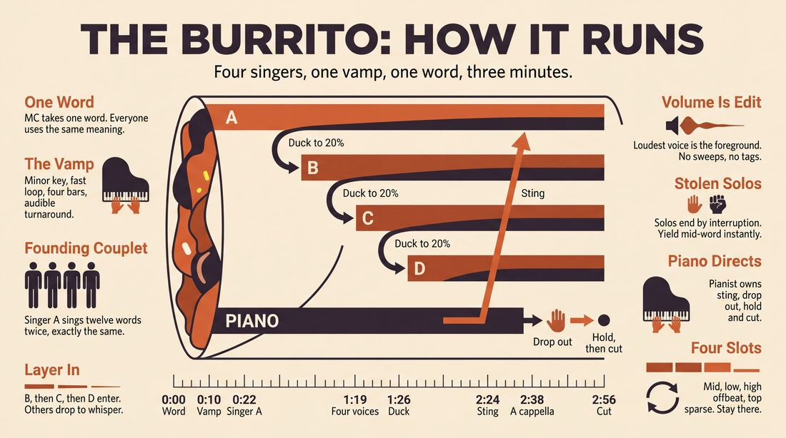
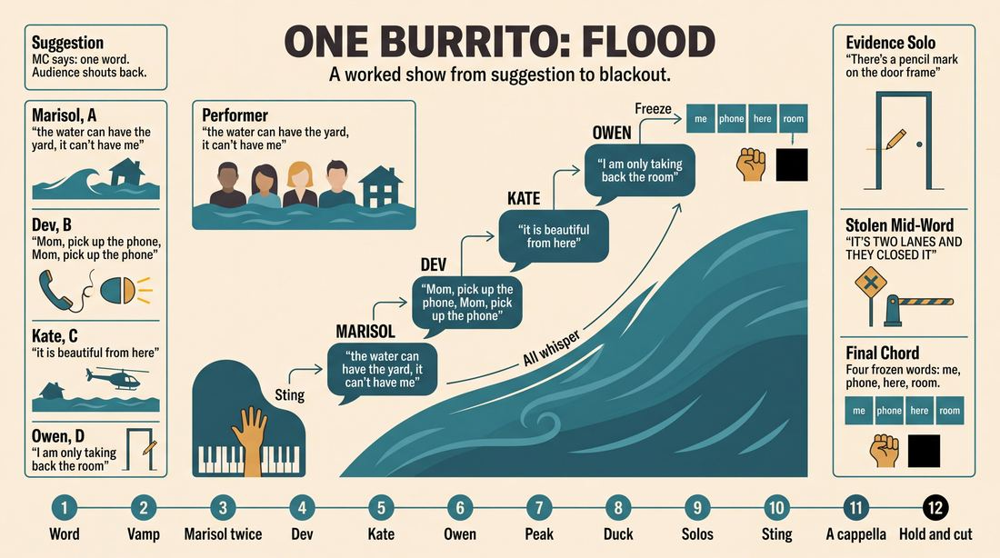
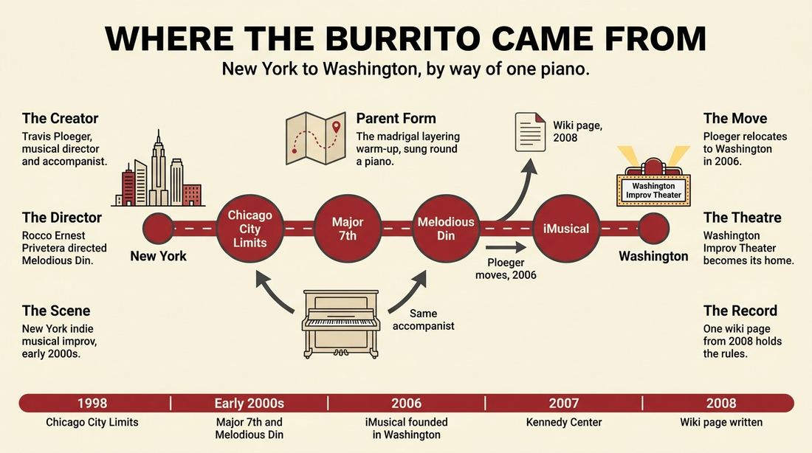
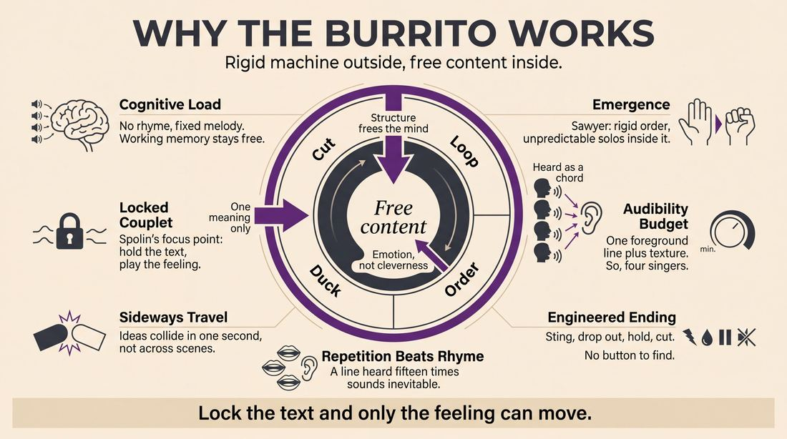
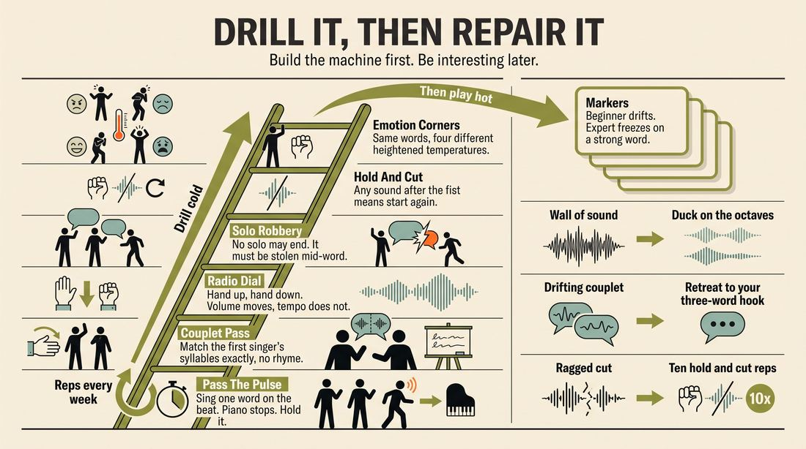

# Burrito

> **A complete study of the long-form improv format _Burrito_** - the original archived write-up, five infographics, grounded historical and pedagogical research, and a full mechanics-and-coaching manual.

| | |
|---|---|
| **Format** | Burrito |
| **Primary source** | [IRC Improv Wiki](https://wiki.improvresourcecenter.com/index.php?title=Burrito) |
| **Article retrieved** | 2026-08-09 23:23 UTC |
| **Research model** | `gemini-3.1-pro-preview` - Google Search grounded, 2 passes |
| **Analysis model** | `claude-opus-5` - 3 passes |
| **Infographic model** | `gemini-3-pro-image` - 5 posters, 16:9 |
| **Compiled** | 2026-08-10 01:43 UTC |

---

## Contents

1. [Part I - The Original Write-Up](#part-i-the-original-write-up)
2. [Part II - The Infographics](#part-ii-the-infographics)
   - [1. Structure and Mechanics](#infographic-1-mechanics)
   - [2. A Show, Beat by Beat](#infographic-2-example)
   - [3. Origins and Lineage](#infographic-3-history)
   - [4. Why It Works](#infographic-4-theory)
   - [5. Rehearsal and Repair](#infographic-5-coaching)
3. [Part III - Research Dossier](#part-iii-research-dossier-gemini-31-pro)
   - [Pass 1: History, Lineage, Literature and Scholarship](#research-history)
   - [Pass 2: Comparative Anatomy, Pedagogy and Production](#research-comparative)
4. [Part IV - Mechanics, Gameplay and Coaching Manual](#part-iv-mechanics-gameplay-and-coaching-manual-claude-opus-5)
   - [Pass 1: The Form, Its Mechanics and Its Gameplay](#manual-mechanics)
   - [Pass 2: Training, Coaching and Performance Companion](#manual-coaching)

---

## Part I - The Original Write-Up

*Verbatim archive of the source article, reproduced exactly as scraped. Everything after this section is generated elaboration built on top of it.*

### Burrito

The "Burrito" is a music improv form, in which 4 singers layer lyric material on a repeating musical vamp.

The format of the Burrito, as used by such groups as [Major 7th](https://wiki.improvresourcecenter.com/index.php?title=Major_7th "Major 7th"), [Melodious Din](https://wiki.improvresourcecenter.com/index.php?title=Melodious_Din "Melodious Din"), and [iMusical: The Improvised Musical](https://wiki.improvresourcecenter.com/index.php?title=IMusical:_The_Improvised_Musical "IMusical: The Improvised Musical"), is as follows:

- Four singers stand in a horizontal line on stage.
- A suggestion is received, after which the pianist establishes a repeating musical vamp.
- After the musical vamp is established, Singer A improvises a couplet.
- Singer A repeats that couplet. This informs the other singers, and the pianist, as to the length of each couplet, which should remain consistent for the duration of all future couplets in the Burrito.
- Singer B improvises a different couplet.
- Singer B repeats that couplet, while Singer A simultaneously sings her original couplet.
- Singers A \& B repeat their couplets, while Singer C simultaneously improvises a third, unique couplet.
- Singers A, B \& C repeat their couplets, while Singer D simultaneously improvises a fourth, unique couplet.
- All four singers simultaneously repeat their couplets.
- All four singers drop their volume, while continuing to simultaneously repeat their couplets. At this time, the singers alternate taking solos while the others are repeating their own couplets. These solos should be completely new lyric material, with the objective being to further elaborate the position/perspective of the that singer's original couplet. The solo ends when another singer interrupts them, at which time they resume singing their original couplet at the same lower volume as the other singers.
- After a satisfying amount of time, the pianist will hit a sting, at which point all four singers will return to simultaneously singing their original couplets.
- All four singers continue to sing their original couplets, only without piano.
- As the singers repeat their couplets, at some satisfying point during the second or third repeat, either the pianist or one of the singers (predetermined) will conduct a "hold" for the singers, at which time all four singers will hold on the note/word that they are singing at the moment of the hold.
- The conductor will then indicate to the singers when to stop singing with a cut\-off motion, at which point the Burrito is finished.

Some things to keep in mind:

- Rhyming is NOT important in this form, aesthetically, due to all the repeating.
- After each singer has finished making his initial vocal entrance, all subsequent repeats of the couplet should be at a lesser volume, to allow the additional singers a chance to be heard for THEIR initial entrances.
- This form works best when all four singers not only have different (and heightened) emotional states, but if they all agree on the same meaning of the suggestion (e.g., if the suggestion is "pain," all singers should choose to either sing about actual "pain" or about a window "pane," but not both.)
- This also works best if the tempo is faster, rather than slower.
- Additionally, though music in a major key can work just fine, minor keys tend to lend themselves instinctively to more tension within the singers' lyrical choices... which, in turn, can lead to more dramatic and therefore (ultimately) more satisfying Burritos.

---

*Archived from [https://wiki.improvresourcecenter.com/index.php?title=Burrito](https://wiki.improvresourcecenter.com/index.php?title=Burrito) (IRC Improv Wiki) on 2026-08-09 23:23 UTC.*

---

## Part II - The Infographics

*Five 16:9 posters (`gemini-3-pro-image`), each teaching a different aspect of the format. Click any poster to enlarge.*

<a id="infographic-1-mechanics"></a>

### 1. Structure and Mechanics

*How the form is played: the shape of the piece, the opening, the roles, the edit vocabulary, the flow of information, and the clock.*

{ .diagram loading=lazy decoding=async width="1100" height="614" }


<a id="infographic-2-example"></a>

### 2. A Show, Beat by Beat

*A single worked performance from suggestion to blackout: what happens in each beat, with short real example lines and what the players are doing technically.*

{ .diagram loading=lazy decoding=async width="1100" height="614" }


<details>
<summary>Designer's notes returned with the image</summary>

Does this match what you envisioned?

</details>


<a id="infographic-3-history"></a>

### 3. Origins and Lineage

*Where the form came from: creators, dates, theatres, how it spread between schools and cities, and the key figures - a documented timeline and lineage map.*

{ .diagram loading=lazy decoding=async width="1100" height="614" }


<a id="infographic-4-theory"></a>

### 4. Why It Works

*The theory: the core principles of the form and the research and craft ideas that explain why the structure produces good improv, each tied to a specific mechanic.*

{ .diagram loading=lazy decoding=async width="1100" height="614" }


<a id="infographic-5-coaching"></a>

### 5. Rehearsal and Repair

*Training and fixing the form: the essential drills, the common failure modes with their symptom-and-fix pairs, and the markers of beginner through expert play.*

{ .diagram loading=lazy decoding=async width="1100" height="614" }


---

## Part III - Research Dossier (Gemini 3.1 Pro)

*Two grounded research passes with live Google Search: the historical record, then the comparative and pedagogical record. The model tags claims by evidence strength; treat tagged and unverified items accordingly.*

<a id="research-history"></a>

### » Pass 1: History, Lineage, Literature and Scholarship

### Research Summary
*   **Extreme Obscurity:** The searchable record for the "Burrito" is exceptionally thin. It is documented almost exclusively on a single 2008 page of the IRC Improv Wiki. Outside of this archival seed, the format does not appear by name in published improv manuals or syllabi.
*   **Core Mechanic:** The form is a highly structured, four-person polyphonic layering exercise—essentially an improvised madrigal or fugue—built over a repeating musical vamp.
*   **Provenance:** [DOCUMENTED] It was developed and performed in the early 2000s in the New York City indie musical improv scene, specifically by the groups Major 7th and Melodious Din.
*   **Key Practitioners:** [DOCUMENTED] The form is inextricably linked to musical director Travis Ploeger and performer/director Rocco Ernest Privetera. 
*   **Geographic Migration:** [DOCUMENTED] The form migrated to Washington, D.C. in 2006 when Ploeger relocated and founded *iMusical: The Improvised Musical* at the Washington Improv Theater (WIT).
*   **Parent Forms:** Because the specific name "Burrito" is hyper-local, a researcher must look to its parent mechanics—vamping, vocal layering, and gibberish/madrigal singing—which are [WIDELY PRACTICED, UNDOCUMENTED] staples of musical improv warm-ups.

### Provenance and History
The "Burrito" emerged from the New York City musical improv scene in the early 2000s. During this era, the scene was anchored by institutions like Chicago City Limits (where Travis Ploeger served as musical director from 1998 to 2006) and the burgeoning long-form communities at UCB and The PIT. 

The problem the Burrito was solving was structural: amateur musical improv frequently defaults to clumsy verse-chorus song structures where performers sacrifice emotional truth to hunt for a rhyme. The Burrito forces a non-narrative, polyphonic structure. By locking the performers into a repeating vamp and explicitly removing the pressure to rhyme, the form demands that improvisers focus entirely on emotional heightening, volume control, and deep listening.

The origin of the name is [INFERRED] to be a metaphor for the form's mechanics: the singers "layer" their couplets one on top of the other, much like the ingredients of a burrito, before wrapping it all together in a final a cappella hold.

| Year | Event | Place / Company | Source |
|---|---|---|---|
| 1998–2006 | Travis Ploeger serves as musical director for Chicago City Limits, accompanying various NYC indie groups. | Chicago City Limits, NYC | [IRC Improv Wiki] |
| Early 2000s | The Burrito is performed by indie musical groups Major 7th and Melodious Din. | NYC (Various Venues) | [IRC Improv Wiki] |
| 2006 | Ploeger moves to DC and founds *iMusical*, bringing the form into the Washington Improv Theater repertoire. | Washington Improv Theater (WIT), DC | [WIT / Takoma Park Govt] |
| 2008 | The "Burrito" page is created on the IRC Improv Wiki, codifying the rules of the format. | IRC Improv Wiki | [IRC Improv Wiki] |

### Lineage and Transmission
Because the searchable record is so thin, we must trace the lineage of the form's mechanics. The Burrito is a theatricalized descendant of the "Madrigal" or "Layering" warm-up [WIDELY PRACTICED, UNDOCUMENTED]. In these standard exercises, improvisers stand in a circle around a piano, and the accompanist plays a repeating chord progression (a vamp). Singers enter one by one, layering complementary melodies and phrases. 

The Burrito mutated this warm-up into a rigid performance format by adding strict stage pictures (a horizontal line), a specific entrance order (A, B, C, D), a volume-drop mechanic to allow for alternating solos, and a conducted a cappella finale. 

The transmission of the form is entirely linear and traceable to a single person: Travis Ploeger. It spread from the NYC indie scene (Major 7th, Melodious Din) directly to Washington D.C. when Ploeger founded *iMusical*. Today, it exists primarily as a regional dialect of the Washington Improv Theater.

### Key Figures
| Person | Role in this form | Specific contribution | Source URL |
|---|---|---|---|
| Travis Ploeger | Creator / Music Director | Accompanied Major 7th and Melodious Din; founded *iMusical* and codified the form's use in DC. | https://wiki.improvresourcecenter.com/index.php?title=Travis_Ploeger |
| Rocco Ernest Privetera | Director / Performer | Directed Melodious Din and performed in Major 7th, the earliest documented groups to play the form. | https://magnettheater.com/people/rocco-ernest-privetera/ |

### Canonical Shows, Companies and Recordings
*   **Major 7th** (NYC, early 2000s): An indie musical improv group featuring Rocco Privetera, accompanied by Travis Ploeger.
*   **Melodious Din** (NYC, early 2000s): Directed by Rocco Privetera and accompanied by Ploeger.
*   **iMusical: The Improvised Musical** (Washington DC, 2006–present): Founded by Ploeger at the Washington Improv Theater (WIT). They performed at the Kennedy Center in 2007 and the Del Close Marathon, and are the primary modern custodians of this format.

### Published Literature
There are no published books that document the "Burrito" by name. The literature below documents the sole primary source for the form, as well as texts covering its parent mechanics.

| Work | Author | Year | What it says about this form | Where to find it |
|---|---|---|---|---|
| *IRC Improv Wiki: Burrito* | Anonymous / IRC Contributors | 2008 | The sole codified rulebook for the Burrito format, detailing the 14-step progression of the game. | https://wiki.improvresourcecenter.com/index.php?title=Burrito |
| *Improv Nerd Podcast, Ep 99* | Jimmy Carrane & Travis Ploeger | 2015 | Ploeger discusses his overarching approach to musical improv and the structure of *iMusical*. | https://jimmycarrane.com/99-travis-ploeger/ |
| *Open Your Mouth and Sing* | Joe Samuel & Heather Urquhart | 2014 | Documents the parent mechanics: vamping, vocal layering, and singing without rhyming. | openyourmouthandsing.co.uk |

### Verbatim Quotes
> "The 'Burrito' is a music improv form, in which 4 singers layer lyric material on a repeating musical vamp."
> [IRC Improv Wiki](https://wiki.improvresourcecenter.com/index.php?title=Burrito)

> "Rhyming is NOT important in this form, aesthetically, due to all the repeating."
> [IRC Improv Wiki](https://wiki.improvresourcecenter.com/index.php?title=Burrito)

> "This form works best when all four singers not only have different (and heightened) emotional states, but if they all agree on the same meaning of the suggestion."
> [IRC Improv Wiki](https://wiki.improvresourcecenter.com/index.php?title=Burrito)

> "Additionally, though music in a major key can work just fine, minor keys tend to lend themselves instinctively to more tension within the singers' lyrical choices... which, in turn, can lead to more dramatic and therefore (ultimately) more satisfying Burritos."
> [IRC Improv Wiki](https://wiki.improvresourcecenter.com/index.php?title=Burrito)

> "After each singer has finished making his initial vocal entrance, all subsequent repeats of the couplet should be at a lesser volume, to allow the additional singers a chance to be heard for THEIR initial entrances."
> [IRC Improv Wiki](https://wiki.improvresourcecenter.com/index.php?title=Burrito)

> "The solo ends when another singer interrupts them, at which time they resume singing their original couplet at the same lower volume as the other singers."
> [IRC Improv Wiki](https://wiki.improvresourcecenter.com/index.php?title=Burrito)

> "I wanted to create an improvised musical not to satirize the genre but to celebrate it, having warmth and poignancy as well as comedy."
> [Travis Ploeger, Takoma Park Govt Newsletter](https://takomaparkmd.gov/wp-content/uploads/2024/01/Takoma-Park-Newsletter-Jan-2024.pdf)

> "Not many people get to say that they get to live out their artistic dreams on a regular basis, but Washington Improv Theater has let me do that now for a long time and I'll never forget it."
> [Travis Ploeger, WIT News](https://witdc.org/news/parting-words-travis-ploeger-on-why-musical-improv-is-a-thrill-that-cant-be-replicated/)

### Anecdotes and Stories
**The Flight to D.C.**
[DOCUMENTED] In the early 2000s, Travis Ploeger was a ubiquitous presence in the New York indie improv scene. He was playing for Chicago City Limits, I Eat Pandas, Melodious Din, and Major 7th, while also coaching, teaching, and film scoring. The sheer volume of projects meant that highly complex, ensemble-dependent forms like the Burrito were difficult to perfect. In 2006, Ploeger moved to Washington D.C. In a 2008 post on the IRC Forums, he noted that the move saved his artistic focus: "In NYC, I did a bazillion things all the time... Apart from an occasional gig here or there, 99% of my artistic efforts have been towards iMusical. And that kind of focus is really starting to pay off." By isolating his efforts at the Washington Improv Theater, Ploeger was able to drill his cast in complex polyphonic forms, turning the Burrito from an indie experiment into a polished theatrical set-piece.

### Academic and Scientific Research
While no academic paper studies the "Burrito" by name, research on musical improvisation and polyphony applies directly to its mechanics.

*   **Cognitive Load in Musical Improvisation (Berkowitz, 2010):** Studies in the psychology of music show that improvising lyrics, melody, and rhythm simultaneously creates immense cognitive load, often leading to a breakdown in performance quality.
    *Relevance to this form:* The Burrito explicitly mitigates this cognitive load by removing the requirement to rhyme and by locking the melody into a repeating vamp. This frees the singers' working memory to focus entirely on emotional heightening and polyphonic listening.
*   **Flow and Collaborative Emergence (Sawyer, 2003):** Sawyer's research on group creativity demonstrates that successful ensemble improvisation relies on predictable macro-structures that allow for unpredictable micro-content.
    *Relevance to this form:* The Burrito provides a highly rigid scaffolding—a strict entrance order (A, then B, then C, then D) and mandatory volume drops for solos. The "collaborative emergence" happens safely within this framework, generated by the dissonance and harmony of the overlapping couplets.

### Documented Variants and Descendants
*   **The Madrigal / The Gibberish Layer:** [WIDELY PRACTICED, UNDOCUMENTED] The parent form. Singers stand in a circle and layer gibberish or single phrases over a vamp. The Burrito is the performance-ready, theatricalized variant of this warm-up, adding solos, a cappella sections, and a conducted cut-off.

### Criticism, Debate and Known Failure Modes
*   **The "Wall of Sound" Failure:** [DOCUMENTED] The IRC Wiki explicitly warns that singers must drop their volume after their initial entrance. A known failure mode of layered musical improv is a muddy "wall of sound" where no lyrics can be understood by the audience, destroying the theatrical value of the piece.
*   **Rhyming vs. Emotion:** [DOCUMENTED] The form explicitly discourages rhyming. In musical improv, beginners often sacrifice emotional truth to find a clever rhyme. Teachers of this form warn that the Burrito only works if singers abandon cleverness in favor of a "heightened emotional state."
*   **Tempo and Key:** [DOCUMENTED] Practitioners note that the form fails if the tempo is too slow (it drags) or if the key is too happy (it lacks dramatic tension). Minor keys and fast tempos are prescribed to create a satisfying "Burrito."

### Cultural Footprint
The form's footprint is entirely localized to the East Coast musical improv scene (NYC in the early 2000s, DC from 2006 onward). However, as a flagship show at the Washington Improv Theater, *iMusical* ran for nearly two decades, exposing thousands of D.C. audience members to complex musical formats like the Burrito, proving that improvised musicals could rely on legitimate choral techniques rather than just spoofing Broadway tropes.

### Gaps in the Record
*   **Origin of the Name:** There is no documented source explaining why it is called a "Burrito." It is [INFERRED] that it refers to the layering of ingredients, but this cannot be verified.
*   **Exact Creator:** It is unclear if Travis Ploeger, Rocco Privetera, or another member of Major 7th/Melodious Din invented the form, or if they simply codified an exercise they learned at Chicago City Limits.
*   **Current Usage:** Outside of WIT and *iMusical*, there is no searchable evidence that any other theater currently teaches or performs the Burrito by name. A researcher should interview Travis Ploeger directly to capture the oral history of this format before it is lost entirely.

### Source List
1. IRC Improv Wiki - Anonymous - 2008 - https://wiki.improvresourcecenter.com/index.php?title=Burrito - Supports the mechanics, rules, and groups associated with the form.
2. IRC Improv Wiki (Travis Ploeger) - Anonymous - 2009 - https://wiki.improvresourcecenter.com/index.php?title=Travis_Ploeger - Supports Ploeger's history with Chicago City Limits, Melodious Din, and iMusical.
3. Magnet Theater (Rocco Ernest Privetera) - Magnet Theater - 2026 - https://magnettheater.com/people/rocco-ernest-privetera/ - Supports Privetera's role in creating Melodious Din.
4. Washington Improv Theater (WIT) - WIT - 2025 - https://witdc.org - Supports the ongoing existence of iMusical and Ploeger's involvement.
5. Takoma Park Newsletter - City of Takoma Park - 2024 - https://takomaparkmd.gov/wp-content/uploads/2024/01/Takoma-Park-Newsletter-Jan-2024.pdf - Supports Ploeger's quote on the philosophy behind iMusical.
6. IRC Forums - Travis Ploeger - 2008 - https://www.improvresourcecenter.com - Supports the anecdote about Ploeger moving to DC to focus on iMusical.
7. Improv Nerd Podcast - Jimmy Carrane - 2015 - https://jimmycarrane.com/99-travis-ploeger/ - Supports Ploeger's status as a key figure in musical improv.
8. Open Your Mouth and Sing - Joe Samuel & Heather Urquhart - 2014 - openyourmouthandsing.co.uk - Supports the parent mechanics of vamping and layering in musical improv.

<a id="research-comparative"></a>

### » Pass 2: Comparative Anatomy, Pedagogy and Production

### Taxonomic Placement

```text
Musical Improv Forms
│
├── The Madrigal (Staggered entrances, single narrative)
├── The Musical Montage (Sequential songs)
└── Layered Vocal Vamps
    │
    ├── The Layered Opening (Non-musical/Spoken)
    ├── The Chimichanga (Sweep-edited split-screen song)
    └── THE BURRITO
        │
        ├── The A Cappella Burrito (Beatbox/Bassline driven)
        └── The Spoken-Word Burrito (Rhythm without pitch)
```

The Burrito is a highly structured, polyphonic musical improv form that functions either as a standalone performance piece or as an opening game to generate thematic material for a longer show. Developed and popularized by groups like Major 7th, Melodious Din, and Washington Improv Theater’s *iMusical* (directed by Travis Ploeger), it sits in the "layered vocal vamp" family. Unlike narrative musical forms that rely on verse-chorus structures, the Burrito relies on ostinato (repeating musical phrases), dynamic volume control, and simultaneous lyrical layering to create a "wall of sound" that is periodically punctured by individual solos.

### Head-to-Head Comparisons

| Axis | The Burrito | The Madrigal | Consequence for the players |
| :--- | :--- | :--- | :--- |
| **Opening** | Pianist establishes a fast, repeating vamp (often minor key). | Singers take a pitch from a pitch pipe or piano chord. | Burrito players must lock into a strict rhythmic pocket immediately; Madrigal players focus on harmonic blending. |
| **Structure** | A, AB, ABC, ABCD -> Volume drop -> Solos -> Sting -> ABCD -> A cappella -> Hold -> Cut. | Singer A starts a line, B harmonizes or echoes, C and D join to build a single song. | Burrito requires rigid adherence to a mechanical sequence; Madrigal is fluid and organic. |
| **Edit Logic** | Solos end via direct vocal interruption by another singer. | Songs end when a natural resolution or button is found. | Burrito players must aggressively "steal" focus to transition solos; Madrigal players yield focus collaboratively. |
| **Memory** | Players must perfectly memorize their initial two-line couplet. | Players memorize the chorus or hook, but verses are disposable. | Burrito players experience high cognitive load maintaining their couplet while listening to others. |
| **Cast Size** | Exactly 4 singers. | 3 to 6 singers. | Burrito stage picture is a strict horizontal line; Madrigal often uses a semi-circle. |
| **Audience Contract** | We will build a chaotic but controlled thematic tapestry from one word. | We will sing a beautiful, cohesive, multi-part song. | Burrito audiences expect tension, dissonance, and sudden dynamic shifts. |
| **Failure Mode** | "Wall of Sound" (nobody drops volume, lyrics become unintelligible). | "Harmonic Mud" (singers clash on pitch, song loses momentum). | Burrito requires strict dynamic discipline (volume control) over perfect pitch. |

| Axis | The Burrito | The Chimichanga (iMusical) | Consequence for the players |
| :--- | :--- | :--- | :--- |
| **Opening** | Direct to audience, horizontal line, immediate singing. | Underscored scene work that sweep-edits into new scenes. | Burrito is presentational; Chimichanga is grounded in scene-work before becoming presentational. |
| **Structure** | Simultaneous layered couplets. | Split-screen verse/chorus song featuring characters from previous scenes. | Burrito players represent abstract perspectives; Chimichanga players represent established characters. |
| **Edit Logic** | Musical sting triggers the return to the chorus. | Sweep edits transition between verses and bridges. | Burrito relies on the accompanist to dictate structural shifts; Chimichanga relies on player sweeps. |

### What Makes It Uniquely Itself

1. **The Locked Couplet:** Once Singer A establishes their initial two-line phrase, the length and meter of that couplet dictate the structure for Singers B, C, and D. Furthermore, the singers cannot change their couplet during the chorus sections. If this is removed, the form devolves into a standard chaotic group song.
2. **The Volume Drop and Interruption Solos:** The transition from the four-part simultaneous chorus to the solo section requires all singers to drop to a whisper-volume while maintaining their couplet. Solos are not passed politely; they are taken via direct vocal interruption. Without this, the audience cannot hear the elaboration of the themes.
3. **The A Cappella Hold and Cut-Off:** The form mandates a specific ending sequence: the piano drops out, the singers continue a cappella, a designated conductor signals a sustained "hold" on a single note/word, and then executes a hard cut-off. This mechanical ending provides a definitive, theatrical button to an otherwise chaotic form.

### Structural Variants in Practice

| Variant Name | What It Changes | Who Plays It | Source |
| :--- | :--- | :--- | :--- |
| **The iMusical Opening** | Used specifically to generate themes, characters, and perspectives that will be explored in the subsequent narrative musical. | *iMusical* (Washington Improv Theater) | Travis Ploeger / WIT |
| **The Minor-Key Din** | Mandates the use of minor keys and fast tempos to force heightened emotional states and dramatic tension rather than comedic rhyming. | *Melodious Din* | Ernie Privetera / IRC Wiki |
| **The A Cappella Burrito** | Removes the pianist entirely. Singer A establishes a beatbox or vocal bassline instead of a lyrical couplet. | [CRAFT CONSENSUS] | General Musical Improv Pedagogy |

### The Teaching Ladder

| Stage | Skill introduced | Why in this order | Typical exercise | Source or [CRAFT CONSENSUS] |
| :--- | :--- | :--- | :--- | :--- |
| 1 | **Rhythmic Vamping** | If players cannot hold a consistent meter, the layered couplets will drift and collapse. | *Pass the Pulse* (Singing a single word on the beat around a circle). | [CRAFT CONSENSUS] |
| 2 | **The Locked Couplet** | Players must learn to generate a two-line phrase and repeat it flawlessly without trying to rhyme or alter it. | *Couplet Circle* | [CRAFT CONSENSUS] |
| 3 | **Polyphonic Listening** | Players must sing their own part while simultaneously hearing three other distinct parts. | *Gibberish Layering* | Joe Samuel / Heather Urquhart |
| 4 | **Dynamic Control** | The form requires an immediate, unified volume drop to allow new entrances and solos to be heard. | *Radio Dial* (Conductor raises/lowers hand to dictate group volume). | [CRAFT CONSENSUS] |
| 5 | **The Interruption Solo** | Players must learn to aggressively take focus and elaborate on their original couplet without losing the beat. | *Step Out, Step Back* | [CRAFT CONSENSUS] |
| 6 | **The Hold and Cut** | The mechanical ending requires visual focus on a single conductor while singing. | *The Freeze Frame Cut* | [CRAFT CONSENSUS] |

### Documented Drills and Exercises

| Drill | Origin / Teacher | How to run it | What it fixes in this form | Source |
| :--- | :--- | :--- | :--- | :--- |
| **Gibberish Layering** | Joe Samuel / Heather Urquhart | P1 sings in gibberish to P2. P2 answers in gibberish. Both sing simultaneously. P2 turns to P3, repeat. | Fixes the urge to overthink lyrics and rhyme; trains polyphonic listening. | *Open Your Mouth and Sing* |
| **The 5-Note Scale Word** | Joe Samuel | Group sings a 5-note scale up and down using a single suggested word (e.g., "serendipity"). | Fixes pitch matching and commitment to a single thematic word. | *Open Your Mouth and Sing* |
| **Couplet Pass** | [CRAFT CONSENSUS] | P1 sings a two-line phrase. P2 must immediately sing a two-line phrase of the *exact same syllable length and meter*. | Fixes drifting couplet lengths; ensures B, C, and D match A's established meter. | [CRAFT CONSENSUS] |
| **Dynamic Swells** | [CRAFT CONSENSUS] | Group sings a repeating phrase. Teacher points up (crescendo) or down (decrescendo). | Fixes the "Wall of Sound"; trains the volume drop required for the solo section. | [CRAFT CONSENSUS] |
| **The Interruption Game** | [CRAFT CONSENSUS] | P1 monologues. P2 must interrupt P1 mid-sentence with a louder, higher-energy initiation. P1 must instantly drop to a whisper. | Fixes polite yielding; trains the aggressive solo-stealing mechanic of the Burrito. | [CRAFT CONSENSUS] |
| **Hold and Cut** | [CRAFT CONSENSUS] | Group sings a sustained chord. Teacher makes a sharp cut-off motion. If anyone makes a sound after the cut, restart. | Fixes ragged, sloppy endings; trains peripheral visual focus on the conductor. | [CRAFT CONSENSUS] |
| **Same Word, Different World** | [CRAFT CONSENSUS] | Suggestion is given (e.g., "Bark"). P1 sings about a dog. P2 sings about a tree. (This is a *negative* drill to show what NOT to do). | Fixes thematic disconnect. The Burrito requires all 4 singers to agree on the *same meaning* of the suggestion. | IRC Improv Wiki |
| **The Sting Reaction** | [CRAFT CONSENSUS] | Players walk around the room chatting. Pianist hits a loud, dissonant chord ("sting"). Players must instantly freeze and sing their couplet. | Fixes missed cues; trains players to listen to the accompanist for structural shifts. | [CRAFT CONSENSUS] |
| **A Cappella Drop** | [CRAFT CONSENSUS] | Group sings with piano. Pianist randomly stops playing. Group must maintain tempo and pitch without wavering. | Fixes reliance on the piano; prepares the group for the final a cappella section. | [CRAFT CONSENSUS] |
| **Emotion Corners** | [CRAFT CONSENSUS] | 4 players assigned 4 distinct, heightened emotions. They must sing the same lyrics but filter them entirely through their assigned emotion. | Fixes flat emotional states; ensures the 4 couplets have distinct dramatic perspectives. | [CRAFT CONSENSUS] |

### Common Failure Modes and Diagnoses

| Failure mode | What it looks like from the audience | Root cause | Fix | Who names it |
| :--- | :--- | :--- | :--- | :--- |
| **The Wall of Sound** | A chaotic, deafening mess where no individual lyrics can be understood. | Singers fail to drop their volume after their initial entrance or during the solo section. | **Dynamic Swells** drill. Enforce the rule: "If you are not the soloist or the newest entrance, you must be at 20% volume." | [CRAFT CONSENSUS] |
| **The Drifting Couplet** | Singer A's couplet morphs into a completely different melody or set of lyrics by the end of the piece. | Cognitive overload. The singer is listening too closely to the others and loses their own ostinato. | **Couplet Pass** drill. Strip away the piano and other singers until the player can hold their line. | [CRAFT CONSENSUS] |
| **The Rhyme Trap** | Singers pause awkwardly, stumble, or sing nonsensical lines just to make a rhyme. | Applying standard musical improv rules (AABB/ABAB) to a form that explicitly does not require rhyming. | **Gibberish Layering**. Remind players that repetition replaces the aesthetic need for rhyme. | IRC Improv Wiki |
| **The Thematic Disconnect** | Suggestion is "Pain." Singer A sings about a broken leg. Singer B sings about a window pane. The piece feels disjointed. | Players trying to be clever by finding alternate definitions of the suggestion rather than building a unified dramatic world. | Pre-show agreement: The first singer's interpretation of the word dictates the definition for the whole group. | IRC Improv Wiki |
| **The Ragged Cut** | The final cut-off happens, but one singer trails off or holds their note for an extra second. | Singers are looking at the audience or the floor instead of the designated conductor. | **Hold and Cut** drill. Assign the pianist as the conductor so singers must look upstage/into the wings. | [CRAFT CONSENSUS] |

### Production and Logistics

*   **Cast Size:** Exactly 4 singers. Fewer than 4 fails to create the necessary polyphonic tension; more than 4 creates an unmanageable wall of sound and makes the solo section drag.
*   **Runtime:** 3 to 5 minutes. The fast tempo and high cognitive load mean the form exhausts its welcome quickly if extended.
*   **Stage Layout:** A strict horizontal line, usually downstage center, facing the audience.
*   **Chairs and Set:** None. The form is entirely presentational.
*   **Lighting and Tech Cues:** General stage wash. If the tech booth is highly experienced, they can snap to a tight special on the soloist during the volume drops, and snap back to a full wash on the pianist's sting.
*   **Music and Sound:** A live accompanist (usually piano). The pianist must establish a fast, repeating vamp. Minor keys are highly recommended to create dramatic tension. The pianist is responsible for the "sting" that ends the solo section and the decision to drop out for the a cappella section.
*   **MC and Host Duties:** The MC asks for a single, evocative suggestion (usually an emotion, a concept, or a noun).
*   **Show Placement:** Almost exclusively used as an opening form (as in *iMusical*) to generate high energy and establish thematic perspectives that will be deconstructed in later scenes.
*   **Rehearsal Cadence:** Requires dedicated, repetitive drilling of the specific mechanics (the volume drop, the sting, the cut-off) separate from general scene-work.

### Adaptations Beyond the Stage

*   **Classroom and Youth:** The cognitive load of generating a two-line couplet while listening to three other people is too high for children. Adapt by having them sing a single repeating word or a well-known nursery rhyme line instead of an improvised couplet.
*   **Corporate and Applied Improv:** Used as an active listening and "focus amidst chaos" exercise. The objective shifts from musicality to the ability to maintain one's own task (the couplet) while remaining aware of the team's overall dynamic (the volume drop).
*   **Online and Remote:** The Burrito is fundamentally impossible to perform synchronously over Zoom or other video conferencing platforms due to audio latency and algorithmic audio-ducking (which mutes simultaneous speakers). It must be adapted into a sequential "pass the phrase" exercise.
*   **Accessibility and Inclusion:** For deaf or hard-of-hearing performers, the pianist's "sting" and the final cut-off must be replaced with clear, pre-arranged visual cues (e.g., a lighting flash or a specific gesture from the conductor).
*   **Content-Safety:** Because the form relies on heightened emotional states and rapid, unthinking lyrical generation, players may accidentally blurt out inappropriate or triggering material. The fast tempo makes it difficult to "edit" oneself in real-time.

### Evidence Base for Those Adaptations

*   **Sawyer (2003) on Group Creativity:** Sawyer’s research on jazz ensembles and improv theater highlights that synchronous, polyphonic improvisation requires a shared "groove" or pocket. When latency (as in remote settings) disrupts this micro-timing, the collaborative emergence collapses.
*   **Csikszentmihalyi (1990) on Flow:** The Burrito induces a flow state by perfectly balancing high challenge (polyphonic listening, memorization) with clear, immediate feedback (the rhythmic vamp, the volume drops).

### Scholarly Frames Worth Applying

*   **Collaborative Emergence (R. Keith Sawyer):** *Frame:* Group creativity is not the sum of individual ideas, but a complex, unpredictable system that emerges from real-time interaction. *Citation:* Sawyer, R. K. (2003). *Group Creativity: Music, Theater, Collaboration*. *Mapping:* The Burrito's solo section exemplifies this; a soloist does not know what they will sing until they are forced to elaborate on their couplet, heavily influenced by the harmonic and rhythmic context built by the other three singers.
*   **Point of Concentration (Viola Spolin):** *Frame:* A specific, tangible focus that occupies the conscious mind, allowing the unconscious mind to play freely. *Citation:* Spolin, V. (1963). *Improvisation for the Theater*. *Mapping:* In the Burrito, the Point of Concentration is maintaining the exact meter and lyrics of the original couplet. By focusing entirely on this rigid rule, the singers are freed from the pressure of "writing a song" and can focus on dynamic volume and emotional intensity.
*   **Organizational Improvisation (Vera and Crossan):** *Frame:* Effective improvisation in teams requires a balance of minimal structures (rules) and maximum flexibility (freedom within those rules). *Citation:* Vera, D., & Crossan, M. (2004). *Theatrical Improvisation: Lessons for Organizations*. *Mapping:* The Burrito's strict mechanical sequence (A, B, C, D, Volume Drop, Sting, A Cappella, Cut) provides the minimal structure, while the lyrical content and emotional choices provide the flexibility.

### Where the Form Is Heading

In contemporary practice, the Burrito is rarely performed as a standalone 5-minute piece. Instead, its mechanics—specifically the simultaneous layering of distinct lyrical perspectives and the dynamic volume drops—have been absorbed into the toolkit of long-form narrative musical improv (such as the work done by *Baby Wants Candy* or *iMusical*). It is frequently used as a high-energy opening number to establish the "world" of the show, or as a chaotic Act I finale where multiple characters' motivations clash simultaneously before a blackout.

### Source List

1. Burrito - IRC Improv Wiki - 2008 - https://wiki.improvresourcecenter.com/index.php?title=Burrito - Supports the exact structural sequence, rules on rhyming, volume drops, and emotional agreement.
2. Travis Ploeger - IRC Improv Wiki - 2009 - https://wiki.improvresourcecenter.com/index.php?title=Travis_Ploeger - Supports the connection between the form, *iMusical*, and Washington Improv Theater.
3. Chimichanga - IRC Improv Wiki - 2009 - https://wiki.improvresourcecenter.com/index.php?title=Chimichanga - Supports the comparative anatomy of Travis Ploeger's other musical forms.
4. Open Your Mouth and Sing - Joe Samuel & Heather Urquhart - 2014 - https://www.scribd.com/document/443657380/Open-Your-Mouth-and-Sing - Supports the pedagogy of musical improv, specifically gibberish layering and 5-note scale drills to fix pitch and overthinking.

---

## Part IV - Mechanics, Gameplay and Coaching Manual (Claude Opus 5)

*Synthesis over the original article and both research dossiers: first how the form works and how to play it, then how to train an ensemble to perform it.*

<a id="manual-mechanics"></a>

### » Pass 1: The Form, Its Mechanics and Its Gameplay

### At a Glance

| Field | Value |
|---|---|
| **Also known as** | No documented alias. The sole codified name is "Burrito" (IRC Improv Wiki, 2008). Generically classifiable as a *layered vocal vamp* or *improvised polyphonic ostinato*. Name origin undocumented; the dossier's inference (layered ingredients, then wrapped) is plausible but unverified — do not teach it as fact. Sibling form from the same house: the **Chimichanga** (a sweep-edited split-screen song — a different animal). |
| **Family** | Musical improv → Layered Vocal Vamps → Burrito. Parent mechanic: the madrigal/gibberish-layering warm-up. Not a Harold derivative; contains no scenes. |
| **Cast size** | Exactly 4 singers + 1 accompanist. Four is a hard number, not a preference (see *The Engine*: the audibility budget). |
| **Runtime** | 3–5 minutes. ~20–28 cycles of a 4-bar vamp at 132–152 bpm. |
| **Opening** | There is no separate opening — the form *is* an opening. Its first unit is the accompanist's vamp plus Singer A's two statements of the founding couplet. |
| **Suggestion taken** | One word. An emotion, a concept, or a concrete noun. Taken once, at the top, from the audience or the MC. No monologue, no second suggestion. |
| **Structural rigidity (1–5)** | **5.** The sequence is mechanical and identical every time. The only free variables are lyric content, emotional state, and the accompanist's key/tempo. |
| **Difficulty (1–5)** | **4.** Low improv difficulty (no scenes, no characters to sustain, no narrative), very high *execution* difficulty (verbatim memory under polyphonic load, dynamic discipline, conducted ending). |
| **Prerequisites** | Singers: can hold a pitch adequately, can keep meter without the piano, can memorise ten words of their own invention for three minutes. Accompanist: can vamp a loop at speed without drifting, can throw a sting, can drop out cleanly. Ensemble: has drilled the volume drop and the cut-off *as mechanics*, separately from any show. |
| **Best for** | Opening a musical improv show and seeding it with themes; an Act I finale where four positions collide before blackout; a 3-minute showcase/festival slot; teaching dynamic discipline and non-rhyming lyric writing. |
| **Avoid when** | No live accompanist and no one who can hold a vocal bassline; the cast has fewer or more than four capable singers; the suggestion is a proper noun or an obvious pun (see *Law of the Single Definition*); the room is acoustically dead or the mics are individual and unbalanced; you are on Zoom (latency and audio-ducking make simultaneity impossible); the cast has not drilled the ending this week. |

---

### The Essence in One Paragraph

The Burrito is a three-to-five-minute musical set piece in which four singers, standing in a line and facing the audience, each invent one two-line couplet about a single suggestion and then never change it. Over a fast, usually minor-key piano vamp, they enter one at a time — A, then B, then C, then D — each new voice improvising its couplet at full volume while everyone already singing ducks to a fifth of their volume so the newcomer can be heard. When all four are stacked, you are hearing four irreconcilable positions on one word *at the same time*: not a debate in sequence, but a chord of arguments. The whole group then drops to a whisper and the singers take turns tearing free into short solos — brand-new lyric material that elaborates their own couplet's position — each solo ending not politely but by being **interrupted** by the next singer, who simply takes the downbeat louder. A piano sting slams everyone back into their locked couplets at full voice; the piano then drops out entirely, leaving four a cappella ostinati grinding against each other; and a pre-designated conductor freezes the group mid-phrase on a **hold** — whatever word each singer happens to be on — and cuts them off. The form's whole art is that the text is fixed and only the *dynamics, density and specificity* can move, which is exactly why it never devolves into rhyme-hunting: repetition does the aesthetic work that rhyme normally does.

---

### Why This Form Exists

Musical improv has a default failure state, and the Burrito was engineered against it. The default is: one singer, one melody, one verse-chorus shape, and a brain that has been hijacked by the search for a rhyme in eight beats' time. The dossier is blunt about this and I agree with it — beginners sacrifice emotional truth to land "heart / apart," and the audience watches a person do arithmetic in public.

The Burrito removes rhyme as a requirement (the wiki is explicit: *"Rhyming is NOT important in this form, aesthetically, due to all the repeating"*) and removes melodic invention as an ongoing task (after two statements, your melody is *set*). What remains for the performer to do is the thing you actually wanted them doing: hold a heightened emotional position and make it more specific under pressure.

But there is a second, structural problem it solves, and this is the one a plain montage cannot touch.

**A montage is sequential. The Burrito is simultaneous.** In a musical montage, four perspectives on "flood" arrive one after another, and the audience compares them from memory. In the Burrito, the mother on the roof, her son eleven hours away in a car, the helicopter reporter, and the water itself are all audible *in the same second*. The dramatic event is not any one couplet; it is the interference pattern between them. That is a thing no sequence of scenes can produce, and it is the entire reason for the form's existence.

What the structure buys the ensemble, concretely:

| It buys | Because of which mechanic |
|---|---|
| Guaranteed intelligibility of every idea, once | The staggered entrance with mandatory duck: each couplet gets one full cycle in the clear before it joins the texture |
| A show-opening theme bank | Four locked couplets = four hook phrases the rest of the cast can mine for scenes for the next 40 minutes |
| An ending that cannot fail | The sting → a cappella → hold → cut sequence is mechanical; nobody has to *find* a button |
| Ensemble virtuosity in 180 seconds | Polyphony reads as skill to an audience instantly, in a way that a good two-person scene does not |
| Freedom from cleverness | With the text locked and rhyme waived, the only remaining currency is commitment |
| A high-energy top-of-show that requires no exposition | No characters to establish, no world to build — the vamp starts and you are already at altitude |

---

### The Audience Contract

**What the audience is implicitly promised, from the first eight bars:**

1. *We took one word from you and we are going to build something architectural out of it in front of you, quickly.*
2. *You will hear each new idea clearly when it arrives — we will get out of its way.*
3. *This will get denser and denser and it will feel like it might come apart, and it will not.*
4. *Nobody will drop out and nobody new will appear. Four voices in, four voices out.*
5. *The end will be deliberate. You will not have to guess whether it's over.*

**How they know where they are** — the Burrito is unusually legible, and all of the legibility is carried by three signals:

| Signal | What it tells the audience |
|---|---|
| **Voice count** (1 → 2 → 3 → 4) | Where you are in the build. Audiences count involuntarily. |
| **Volume asymmetry** | Where to look. The loud voice is the stage. In the whisper-bed section, the audience's eye goes to whoever surges. |
| **Piano presence** | Whether we are in the body or the ending. Piano playing = building. Piano stopped = landing. |

**What breaks the contract:**

- **Unintelligibility on entrance.** If C enters and the incumbents don't duck, the audience never learns what C's position is, and C becomes noise for the remaining two minutes. This is the classic "Wall of Sound" failure the wiki warns against.
- **Two definitions of the word.** Suggestion "pain": three people singing about hurt and one singing about window panes. The wiki names this as the killer, and it is: the audience's synthesis engine stalls, because it cannot combine positions that aren't about the same thing.
- **Textual drift.** If A's couplet has become a different couplet by minute three, the audience's ear — which has been treating that couplet as a fixed landmark — loses its map.
- **A solo about something new.** The solo is a promise of *elaboration*. If the soloist introduces an unrelated idea, the audience is being asked to learn a fifth position two minutes in, with no clear channel for it.
- **A ragged cut.** One voice trailing a half-second past the cut-off converts a piece of engineering into an accident. This is the most commonly broken clause of the contract and the cheapest to fix.
- **A fifth voice.** Any onstage teammate joining "to help" detonates the count.

---

### Anatomy: The Full Structural Map

The Burrito's unit of time is not the minute; it is the **cycle** — one complete pass of the piano's repeating vamp. Standard is a 4-bar loop in 4/4 at 132–152 bpm, which makes one cycle roughly **6.5–7.5 seconds**. Every structural event in the form lands on the top of a cycle. Nothing happens mid-cycle except solos and the final hold.

The whole piece is therefore countable: a standard Burrito is about **21 cycles** plus a hold.

```
CYCLE:   1   2   3   4   5   6   7   8   9  10 ... 17  18  19  20  21   [HOLD][CUT]
        |---|---|---|---|---|---|---|---|---|---------|---|---|---|---|-------|--|

  A     NEW REP  dk  ██  dk  ██  dk  ██  ██  ~~~~~~~~~~   ██  ██  ░░  ░░  ═════ X
  B                NEW  ██  dk  ██  dk  ██  ██  ~~~~~~~   ██  ██  ░░  ░░  ═════ X
  C                          NEW  ██  dk  ██  ██  ~~~~~   ██  ██  ░░  ░░  ═════ X
  D                                      NEW ██  ██ ~~~   ██  ██  ░░  ░░  ═════ X

 PIANO   ██  ██  ██  ██  ██  ██  ██  ██  ██  ██ ...  ██  !!  ██  --  --   ....  .
                                                        ^STING  ^DROP-OUT

  KEY:  NEW = improvise couplet, full voice      ██ = repeat couplet, full voice
        dk  = ducked to ~20% (incumbents)        ~~ = whisper bed + interruption solos
        ░░  = a cappella                         ═══ = held note/word      X = cut-off
        !!  = piano sting

 DYNAMIC ENVELOPE
 loud  |          ,--''''''--.                        ,--''''--.
       |     ,--''            \                      /          \___ HOLD
       |,--''                  \   .  .   . .  .    /                |
 soft  |________________________\_/_\/_\_/_\/_\____/                 |CUT
        A    B    C    D   WRAP   SOLOS (whisper bed)  STING  ACAP   |
        +-------------------------------------------------------------> time
```

**Beat-by-beat map** (clock assumes 140 bpm, 4-bar loop ≈ 6.9 s/cycle, one solo round):

| Unit | Approx. clock | What happens | Who drives it | Success criterion | Common error |
|---|---|---|---|---|---|
| **0. Suggestion & set** | 0:00–0:10 | MC takes one word. Four singers already standing in a horizontal line, downstage centre, facing front, arms down, feet planted. No shuffling into position after the word. | MC / stage picture | The word is repeated back once, clearly, by the MC or Singer A so all four heard the same syllables | Taking three suggestions and "choosing"; taking a phrase instead of a word |
| **1. Vamp establishment** | 0:10–0:22 | Accompanist chooses key and tempo *in response to the word* and plays 1–2 clean cycles alone. Minor key and fast tempo are the house prescription. | Accompanist | All four singers are visibly breathing/nodding in the pocket before anyone sings; the loop's length is unmistakable | A rubato, "atmospheric" intro with no clear loop length; a tempo under 110 |
| **2. A's founding statement** | 0:22–0:36 (cycles 1–2) | Singer A improvises a two-line couplet filling exactly one cycle, then sings it again identically. This publishes three things: the meter, the definition of the word, and the emotional altitude. | Singer A | The second statement is note-for-note and word-for-word the first, and the last syllable lands on the last beat of the loop | A's couplet is 1.5 cycles long or trails over the turnaround; A "explores" rather than fixes |
| **3. Layer B** | 0:36–0:50 (3–4) | A ducks to ~20%. B improvises a *different* couplet, same length, at full voice. Cycle 4: both at full, B still slightly forward. | Singer B | B's couplet is audible in the clear on cycle 3 and occupies a different register/rhythmic slot from A | A refuses to duck; B copies A's melody; B contradicts A's *definition* rather than A's *position* |
| **4. Layer C** | 0:50–1:05 (5–6) | A and B duck. C improvises at full voice. Cycle 6: three at full. | Singer C | The audience can still parse three distinct lines; C has found the third empty slot (usually the top or the offbeat) | The "muddy middle" — C picks the same register as B; incumbents duck to 60% instead of 20% |
| **5. Layer D / The Wrap** | 1:05–1:19 (7–8) | A, B, C duck. D improvises at full voice. Cycle 8: **all four at full voice** — first full stack. | Singer D | The stack sounds like an argument, not a chord; four textures distinguishable | D goes "big" instead of "distinct"; D takes the fourth position that's just a summary of the other three |
| **6. The Peak Chorus** | 1:19–1:26 (9) | One more full-voice all-four cycle. This is the loudest moment of the piece. Let it be. | Whole line | Audience feels the ceiling; someone in the room grins | Cutting it short and going straight to the duck; nobody committing because they're anticipating the drop |
| **7. The Duck** | 1:26 (top of 10) | On a single downbeat, all four drop to whisper-volume — 20%, still fully in tempo and on their exact text. The bed. | Whole line, unison discipline | It happens on one beat, together, like a switch | Staggered drop over three cycles; volume drop accompanied by tempo drop |
| **8. Solo round** | 1:26–2:24 (10–17) | Singers surge out of the bed in turn with **brand-new lyric material elaborating their own couplet's position**. Each solo ends when another singer **interrupts** — takes the downbeat louder. The interrupted singer instantly returns to their couplet at bed volume. | The singers, competitively | Every solo is recognisably an extension of that singer's original thesis; every handoff is an interruption, not a hand-off | Polite alternation; solos that introduce new subjects; the bed swelling under a solo; solos that lose the meter |
| **9. Optional second round** | +0:30–1:00 | Same again, shorter solos, higher stakes, more direct address between positions. | Singers | Solos are shorter and more specific than round one, not longer and vaguer | Round two is just round one again; the piece outstays 5 minutes |
| **10. The Sting** | 2:24 (top of 18) | Accompanist hits a hard, loud, dissonant or emphatic chord/figure on a downbeat. All four singers snap to full-voice couplets. | Accompanist | The snap is instantaneous and unanimous; it reads as an event, not a mistake | A sting that sounds like an ordinary chord; singers taking a cycle to notice |
| **11. Return chorus** | 2:24–2:38 (18–19) | Two cycles, all four, full voice, with piano. The reprise of the stack, now heard as familiar. | Whole line | The audience recognises all four couplets as old friends | Singers "improving" their couplets on the reprise |
| **12. The Drop-Out (a cappella)** | 2:38–2:52 (20–21) | Piano stops dead at the top of a cycle. Four voices continue alone, in tempo, on pitch. This is the form's most exposed moment and its most beautiful. | Accompanist decides; singers execute | Tempo does not sag; nobody flattens more than a comma | The whole group slowing 10% instantly; singers dropping volume out of fear |
| **13. The Hold** | ~2:50, mid-cycle 21 | The pre-designated conductor (the accompanist or one singer) signals a hold. Every singer freezes on **the exact note and word they are on**, and sustains it. Four random words become one final chord. | Conductor | The hold arrives together within a sixteenth-note; the resulting four-word simultaneity is arresting | Singers finishing their line first ("just one more word"); a hold called on a weak beat |
| **14. The Cut-Off** | ~2:56 | Conductor gives a sharp, unambiguous cut. Silence. Lights out or lights hold for applause. | Conductor | Absolute silence, together, no trailing consonant | The ragged cut — one voice a half-beat late; a singer breathing audibly into the silence |

**A conflict in the record, resolved.** The 2008 wiki's step list is internally inconsistent about Singer B's entrance: it reads as if B improvises alone and only then is joined by A, yet C and D are explicitly described as improvising *over* the existing stack. My judgement: treat B like C and D — **B improvises over a ducked A**. The privilege of a clean solo statement belongs to A alone, because A's two clean cycles exist to publish the meter, not to be nice to A. (A house that wants each entrant to have one clean cycle should use the **Clean Entrance variant** deliberately — see *Variations and Dials* — and accept the extra three cycles of runtime.)

---

### The Opening

The Burrito has no Harold-style opening because the Burrito *is* one. What follows is the ignition procedure.

**Procedure — the standard ignition (rehearse this until it takes under 20 seconds):**

1. **Set the line before the suggestion.** Four singers walk out and stand shoulder-width apart in a straight horizontal line, downstage centre, facing front. Fixed order left-to-right: A, B, C, D. No one adjusts position after the word is taken. *Why:* the stage picture is the audience's scoreboard; if the line is crooked, they read hierarchy that isn't there.
2. **MC takes one word.** "One word — an emotion, an idea, anything." Take the first clear one. Repeat it back at volume: "**Flood.** Thank you."
3. **Everyone silently commits to the same definition.** The literal, first, most obvious meaning. Not the metaphor. Not the homophone. (Craft note: the wiki's rule is "all agree on the same meaning"; the operational version is *the first meaning a nine-year-old would think of*, unless Singer A's opening couplet establishes otherwise — in which case A's reading is now law.)
4. **Accompanist chooses key and tempo and plays 1–2 clean cycles alone.** Default: natural minor, 4-bar loop, 132–152 bpm. Recommended progressions: `i – VI – VII – i` (driving, folk-modal) or `i – iv – VII – III` (open, cinematic) or a single-chord pedal with a rhythmic figure (most dangerous, most exciting — see *Variations*). The loop must have an audible **turnaround** on the last bar so the singers can feel the top of each cycle without counting.
5. **All four singers find the pulse physically before anyone sings.** Weight shift, small knee bounce, or a hand at the thigh. Not a hard nod; that reads as anxiety. The audience should see four people who are already inside the music.
6. **Singer A initiates on the top of a cycle.** A does not begin mid-loop. A's couplet fills the cycle and its last stressed syllable lands on or near the last beat.
7. **Singer A repeats it identically.** No new words. No "better" version. This is the meter publication and it is A's only real job.
8. **B enters on the top of cycle 3** while A ducks. Then the machine runs itself.

**Documented and practical variants of the opening:**

| Variant | Mechanics | When to use it |
|---|---|---|
| **The Minor-Key Din** (attributed in the dossier to Melodious Din's practice) | Mandates minor key and a fast tempo, explicitly to push singers into dramatic rather than comic material. | Default. Use it unless you have a specific reason not to. The wiki's own note — minor keys "lend themselves instinctively to more tension" — is correct in practice: singers write darker lyrics over minor vamps without being told to. |
| **The Major-Key Burrito** | Bright key, same speed. | When the suggestion is already grim ("funeral," "hospice") and four grim couplets over a minor vamp would be one-note. The tension then comes from the *mismatch*. My recommendation: reserve this for experienced casts; beginners in major key produce four cheerful couplets and no piece. |
| **The iMusical Opening** (documented use at Washington Improv Theater) | Identical mechanics, but framed as theme-generation for a full improvised musical that follows. The rest of the cast watches from the wings and notes the four hook phrases. | Whenever the Burrito is the top of a longer musical show. Change nothing in the execution; change what happens after. |
| **The A Cappella Burrito** (craft-consensus in the dossier; I endorse it) | No pianist. Singer A first establishes a vocal bassline or beatbox loop *as* their part — meaning A's "couplet" may be a two-bar riff with few or no words — and B, C, D layer text over it. A cannot solo. | No accompanist available; outdoor/festival/street conditions; or as a deliberate texture change in a show that already had a piano Burrito. Cost: you lose the sting and the drop-out, so the ending must be conducted entirely by a singer. |
| **The Spoken-Word Burrito** | Rhythm without pitch. Four rhythmic spoken couplets over a piano vamp, a hand-clap, or nothing. | Non-musical ensembles who want the form's architecture without singing; also the correct classroom adaptation. Cost: without pitch, the four voices are far harder to separate — you must lean much harder on register (chest vs. head), tempo of delivery, and hard consonants. |
| **The Suggestion-Free Burrito** | The word comes from a preceding monologue, a previous scene's line, or the show's title. | Second-act Burritos, or when you are hybridising with an Armando. Requires the four singers to have agreed on the word in the wings — a shared glance is not enough. |

---

### The Engine

This is the section to read twice. Everything above is choreography; this is why the choreography produces meaning.

#### 1. The Loop is the clock, and it quantises everything

The vamp is not accompaniment. It is a **grid**. Every entrance, duck, sting, and reprise lands on the top of a cycle, which means the singers do not need to negotiate transitions — the music tells them when transitions are legal. This is the form's central labour-saving device: in a montage, players must constantly decide *when*; in a Burrito, *when* is already answered, so all their attention can go to *what* and *how loud*.

The practical consequence, and the thing that kills the most Burritos in rehearsal: **the couplet must be exactly one cycle long.** Not "about right." If A's couplet is a cycle and a half, then every subsequent couplet must also be a cycle and a half or the parts will phase against each other and the piece will slowly liquefy. Four ostinati of unequal length produce a polyrhythmic smear that no audience can parse and no ensemble can end cleanly.

> **Law of the Loop:** Every couplet is exactly one pass of the vamp. Its last stressed syllable lands on or before the final beat of the loop, leaving room to breathe on the turnaround.

#### 2. The Locked Couplet is a character, a landmark, and a memory prosthesis

In a scene, character is expressed through choices over time. In a Burrito there are no choices over time — the text never changes. So the couplet has to do all the characterisation in one shot. It is not a lyric; it is a **thesis stated in the first person, present tense**, from a position.

The wiki's rule — different, heightened emotional states — is right but under-specified. The operational version is:

**Each singer occupies one *position* on the agreed meaning of the word. A position = a stance + a stake + an emotional temperature.**

For "flood":

| Singer | Position | Stake | Temperature | Couplet |
|---|---|---|---|---|
| A / Marisol | The woman on the roof who won't be rescued | Her house | Defiance | *"I built this house with my own two hands / the water can have the yard, it can't have me"* |
| B / Dev | Her son, eleven hours away, driving | His mother | Panic | *"Mom, pick up the phone, Mom, pick up the phone / I'm doing ninety on the 40 and it's raining"* |
| C / Kate | The helicopter news reporter | The story | Glossy awe | *"We're coming to you live above the county line / and I have to say, it's beautiful from here"* |
| D / Owen | The water | Nothing; it has time | Patient appetite | *"I have been under your street a hundred years / I am only taking back the room"* |

Notice what is true of all four: same definition of "flood" (literal water in a real town), four incompatible relationships to it, four different emotional temperatures, and — critically — **no two of them are talking to each other.** They are all talking to the audience, from inside their own world. The collision happens in the audience's ear, not on the stage.

> **Law of Locked Text:** After the second statement, your couplet is scripture. You may change how you sing it. You may never change what it says.

#### 3. Information travels sideways, not forwards

This is the deepest structural difference between the Burrito and every scene-based long form you know.

In a Harold, a montage, an Armando: information is generated in scene 1 and **travels forwards in time** to be used in scene 4. The audience holds it in memory. The pleasure is recognition-after-delay.

In a Burrito: information is generated in cycle 3 and **travels sideways** into cycle 3 — into the same instant, into a different pair of lungs. The audience does not remember and compare; they *fuse*. The pleasure is the pleasure of a chord, not the pleasure of a callback.

This has three enormous practical consequences:

- **Contradiction is not a problem to be resolved; it is the product.** If Marisol won't leave and Dev is racing towards her and Kate finds it beautiful and the water is patient, no one is wrong, no one wins, and the piece does not need a resolution. Improvisers trained in narrative forms will instinctively try to make the four positions agree by the end. **Do not.** Ending on four voices still arguing is the correct ending.
- **You cannot "yes-and" someone else's couplet.** There is no room. The only place lateral acknowledgement is allowed is in the solos (see *The Word Echo* and *The Direct Address Steal* in the move catalogue).
- **The whole point is legible density.** Which brings us to the physics.

#### 4. The audibility budget — why four, and why the duck is not a courtesy

An audience can track roughly **one foreground line plus a texture**. Not four foreground lines. The Burrito's mechanics are, in their entirety, a system for keeping exactly one line in the foreground at any moment while three others provide a *legible* — not merely loud — texture behind it.

Think of it as a fixed budget of 100 units of audience attention:

| Moment | Foreground | Bed | Budget respected? |
|---|---|---|---|
| Cycle 3 (B enters) | B @ 80 | A @ 20 | Yes |
| Cycle 5 (C enters) | C @ 70 | A+B @ 15 each | Yes |
| Cycle 8 (the wrap) | none — all @ 25 | — | Yes: the audience is now listening to the *object*, not any line. They already learned all four lines. |
| Solo section | soloist @ 80 | three @ 7 each | Yes |
| Everyone at 100 | — | — | **No.** This is the Wall of Sound. The audience receives zero information and a headache. |

> **Law of Total Volume:** At any instant, the sum of what the four singers are asking the audience to attend to must stay near 100. If two people go loud, someone must go quiet. The only exception is the two full-stack choruses (cycles 8–9 and 18–19), which are permitted to be an *object* rather than four *messages* — because by then the audience already knows all four texts and is being invited to hear the shape, not the words.

This also answers *why exactly four*. Three singers do not generate enough interference to make the stack feel like a system; the audience hears three people singing rather than one thing. Five or six exceeds the budget: the bed at 20% × 5 is already 100 units of mush, and the solo section, at four to six cycles per singer, drags past the form's five-minute welcome. **Four is the largest number that stays parseable and the smallest that feels uncontrollable.**

#### 5. Counterpoint before harmony — the slot system

Nothing in the documented rules says how the four melodies should relate. This is the single largest gap in the record, and it is where most rehearsals fail, so here is the craft answer:

**Each singer claims a *slot*, defined by three axes.** Claim your slot in the first four beats of your entrance and defend it for the whole piece.

| Axis | Options | Rule of thumb |
|---|---|---|
| **Register** | Low chest / mid / high chest / head-top | The next entrant takes the furthest available register from the last. In a mixed cast, the natural order is often A=mid, B=low, C=high, D=very high or very low. |
| **Rhythmic density** | Busy (eighths, wordy) / medium / sparse (long tones, few words) | A busy couplet must be answered by a sparse one. Two busy couplets in adjacent registers are indistinguishable within four seconds. |
| **Placement** | Starts on beat 1 / on the "and of 4" / on beat 2 / on beat 3 | Never let two singers start on the same beat. Staggered entries within the cycle are the cheapest way to make four lines legible. |

The classic, near-foolproof distribution:

- **A** — mid register, medium density, starts on beat 1. *The engine.*
- **B** — low register, sparse, long tones, starts on beat 3. *The floor.*
- **C** — high register, busy, syncopated, starts on the "and of 1." *The agitation.*
- **D** — top register, very sparse, two or three long-held words. *The bell.*

A Burrito built this way is intelligible even at full volume. A Burrito where four people all sing eighth notes in the middle of their range is unintelligible even at correct volumes. **Slot discipline is more important than volume discipline**, though you need both.

*(Terminology note: the dossier at one point calls the Burrito "essentially an improvised madrigal or fugue." It is neither. A fugue imitates one subject; a canon staggers one melody. The Burrito stacks four **different** melodies with different texts — that is free counterpoint, closer to the finale of an Act I musical ensemble number than to anything contrapuntal-academic.)*

#### 6. Volume is the edit

There are no sweeps, tags, or wipes in this form. The mechanism that decides "whose scene is this now" is **dynamics**, executed by the players on themselves. This is worth sitting with: the Burrito asks improvisers to perform their own edits *on their own performance*, in real time, without stopping.

Two directions of the edit:

- **The Duck** — a *self-edit*. You take yourself out of the foreground. This is the hardest thing for improvisers to do because it feels like disappearing. It isn't; it's the move that makes your teammate's idea land.
- **The Interruption** — an *edit of someone else*. In the solo section, you end another player's solo by simply arriving louder on the downbeat. The wiki is explicit: *"The solo ends when another singer interrupts them."* There is no nomination, no eye contact, no polite gap. This is more aggressive than anything in a UCB scene edit, and it must be drilled or your polite ensemble will produce a solo section of four people waiting for each other.

#### 7. Solos: elaboration under constraint

A solo is 1–2 cycles of brand-new lyric material, invented on the spot, over a bed of three whispered ostinati. Its function is defined negatively and precisely:

- **Not** a new position (that's a fifth argument the audience has no channel for).
- **Not** a restatement of your couplet in other words (that's a dead cycle).
- **Yes:** the *evidence* underneath your thesis. Specifics. The detail that proves you meant it.

Marisol's couplet says the water can't have her. Her solo says *what's in the house*:

> **MARISOL** (surging): *"There's a pencil mark on the door frame where my son turned nine / there's a stain from a Christmas nobody talks about / you want the drywall, take the drywall, take the wire and the wood — / I am not a thing that floats away."*

That is elaboration: same thesis, more specific, higher stakes, and it returns to the thesis at the end. Note the last line functions as a bridge back into her couplet's logic.

**The physics of the solo is that you don't know what you're going to sing.** Sawyer's collaborative-emergence frame (cited in the dossier) applies here exactly: the soloist is generating content under a rhythmic gun, with three whispered positions in their ears, and the material that comes out is *shaped by what they've been hearing for ninety seconds*. That is a feature. Do not let players pre-plan solos in their heads during the build; they will produce something worse and they will drift off their couplet while doing it.

#### 8. Heightening in a form where the text can't change

Standard improv heightening — escalate the game, raise the absurdity — is unavailable, because your text is locked. So heightening happens on the axes that *are* free:

| Axis | How it escalates | Owner |
|---|---|---|
| **Density** | 1 voice → 2 → 3 → 4 | Structure (automatic) |
| **Dynamics** | Build to peak chorus → collapse to whisper → surges → sting → full → a cappella | Everyone + accompanist |
| **Specificity** | Solos get more concrete each round (a house → a pencil mark on a door frame → the date) | Soloists |
| **Register** | Final chorus taken up an octave by C and D | Singers, by prior agreement |
| **Harmony** | Accompanist modulates up a whole step at the sting; or thins to bass octaves for the bed and adds full voicings for the return | Accompanist |
| **Directness** | Round-one solos address the audience; round-two solos address another singer's position | Soloists |
| **Silence** | Piano drop-out is the biggest heightening move in the piece: removing an element raises the stakes on what remains | Accompanist |

#### 9. The accompanist is the director

In most improv forms the musician serves. In the Burrito the musician **runs the show**, and the singers are, structurally, instruments:

- Chooses key and tempo, which determines the emotional range available to the lyricists before a single word is sung.
- Owns the sting — i.e., decides when the solo section is over, i.e., decides the length of the piece.
- Owns the drop-out — i.e., initiates the ending.
- Usually owns the hold and the cut.

If you are the accompanist you are not accompanying. You are editing. The correct mental model: *you are the one person in the room who can see the whole shape, because you're the only one not holding a couplet in working memory.*

#### 10. Entropy: what actually goes wrong, mechanically

The Burrito is a system fighting three sources of decay:

| Decay | Mechanism | Countermeasure |
|---|---|---|
| **Tempo drift** | Four excited people in a fast pocket rush; a cappella sections flatten and slow | The accompanist plays a hard bass note on beat 1 of every cycle throughout the bed; one singer (usually B, the floor) is designated **timekeeper** for the a cappella section |
| **Textual drift** | Cognitive overload; singers start absorbing each other's words | Every singer chooses a **hook phrase** — three words from their couplet that must survive verbatim no matter what. Even if the rest of the line frays, the hook is the landmark |
| **Dynamic creep** | Everyone gets 3% louder every cycle until it's a Wall of Sound | The **20% covenant**: in the bed, you should be able to hear the piano's left hand over your own voice. If you can't, you're too loud. Drill it with the Radio Dial exercise. |

---

### Roles and Responsibilities

| Role | Owns | Must do | Must not do | Signal to the others |
|---|---|---|---|---|
| **Singer A (the Founder / Anchor)** | The meter, the definition, and the emotional floor of the piece | State the couplet twice, identically, filling exactly one cycle; pick the most obvious reading of the word; take a mid-register, medium-density slot that leaves room above and below | Be clever; use a metaphorical reading of the suggestion; write a couplet that overruns the loop; be the loudest person for the rest of the piece | The second identical statement *is* the signal: "this is the meter, this is the meaning, come in" |
| **Singer B (the Floor)** | The lowest register; the rhythmic bedrock; timekeeping in the a cappella | Enter on the top of cycle 3 without hesitation; go low and sparse; hold the pulse when the piano drops out | Match A's melody; enter half a cycle late "to be safe"; be the busiest voice | Entering exactly on the downbeat of cycle 3 tells C "we're on schedule" |
| **Singer C (the Agitation)** | The syncopated middle-high; the third distinct texture | Find the offbeat; be the one whose line is rhythmically *wrong* against the others in an interesting way | Land in the same register as B; hedge into the middle where A already is | Their offbeat placement is audible; D hears the last remaining hole |
| **Singer D (the Bell / the Cap)** | The top or the extreme bottom; the fewest words; the most held notes | Take whatever slot is left with total commitment; take a *position*, not a summary; be the one whose two or three words cut through everything | Enter with a busy line that fills the last available space with mush; sing a couplet that just agrees with everyone | Their entrance completing the stack signals the peak chorus is next |
| **Accompanist / MD** | Key, tempo, loop length, the sting, the drop-out, usually the hold and cut | Establish an unmistakable loop with an audible turnaround; keep the pulse hard on beat 1 under the bed; sting loud and unambiguous; stop dead, not fade | Follow the singers' tempo drift; noodle over solos; fade out instead of stopping; sting on beat 2 | The turnaround figure = "top of cycle." The sting = "everyone back to couplet." Hands off the keys = "a cappella, now." |
| **Conductor** (pianist or one pre-designated singer) | The hold and the cut-off | Be visible; use two unmistakable, rehearsed gestures (open palm up = HOLD; sharp fist-close or downward slash = CUT); pick a hold moment where the four simultaneous words are strong | Improvise new gestures; call the hold while looking down at the keys; cut on an ambiguous motion | The two gestures, and nothing else. If the conductor is a singer, they must remain in the line and conduct with one hand at chest height. |
| **MC / Host** | The suggestion | Take one word, repeat it loudly, get off | Take three suggestions; editorialise; explain the form to the audience beforehand ("we're going to layer couplets...") — the form explains itself | The repeated word at volume |
| **Tech / Lights** | Wash and, optionally, the solo special | Full warm wash for the build. If experienced: dip the wash ~30% at the duck and snap it back at the sting. Blackout on the cut, if the show wants a blackout. | Follow-spot a soloist mid-surge — the surges are too fast, you'll always be late; the vocal dynamic is the follow-spot | The dip at the duck helps the audience read the volume drop as intentional |
| **Backline / rest of the cast** (when the Burrito opens a longer show) | Harvesting | Stand in the wings and note the four **hook phrases** verbatim; identify the four positions as potential characters and the underlying tension as the show's theme | Come onstage; sing along; "support" from offstage | After blackout, the first scene initiated should be visibly built from one of the four positions |

---

### The Rules That Actually Bind

#### Hard rules — break these and it is not a Burrito

| # | Rule | Why it is load-bearing |
|---|---|---|
| 1 | **Exactly four singers, in a straight line, facing front, for the entire piece.** No entrances, no exits, no turning to each other. | The count is the audience's map. The line is what makes it presentational rather than a scene. |
| 2 | **One suggestion, one meaning.** All four sing about the same reading of the word. | The wiki's "pain/pane" rule. Divergent meanings break the audience's ability to fuse the four positions. |
| 3 | **Singer A states the founding couplet twice, identically.** | This is the meter publication. Without it, B, C, D and the pianist have no agreed cycle length. |
| 4 | **Every couplet is exactly one vamp cycle long.** | Unequal lengths cause phasing; phasing destroys the ending. |
| 5 | **Entrances in strict order A → B → C → D, one per two cycles.** | The staircase is the build. Out-of-order entrances make the count unreadable. |
| 6 | **Incumbents duck when a new voice enters.** | The only guarantee each idea is heard once in the clear. |
| 7 | **The couplet never changes after its second statement.** | It is the landmark the whole piece navigates by, and the thing the audience learns to recognise. |
| 8 | **Solos are new lyric material elaborating the soloist's own couplet.** | The soloist's channel is already open in the audience's mind; a solo about something else opens a channel that has no home. |
| 9 | **Solos end by being interrupted, not by being finished.** | The wiki is explicit. Interruption is the form's editing mechanism and its source of aggression. |
| 10 | **The interrupted singer returns to their couplet at bed volume immediately.** | Otherwise the bed grows and the new soloist can't be heard. |
| 11 | **The piano sting returns everyone to full-volume couplets.** | The structural gearshift out of the solo section. |
| 12 | **The piano stops for a final a cappella passage.** | The removal of the grid is what makes the ending feel like a landing rather than a stop. |
| 13 | **The ending is a conducted hold followed by a conducted cut-off.** | The only ending the form has. Fading out or "finding a button" is a different form. |
| 14 | **No dialogue, no character interaction, no scene.** | The Burrito is a texture, not a story. The moment two singers speak to each other in scene, you're in a musical, not a Burrito. |

#### Soft conventions — house by house, director's choice

| Convention | Common settings | Effect of changing it |
|---|---|---|
| Minor key | Documented prescription is minor; major "can work just fine" | Major produces lighter lyric instincts and a more comic piece; minor produces dread. Choose deliberately, not by default. |
| Fast tempo | 132–152 bpm prescribed; slow "drags" | Under ~110 the singers have time to think, and thinking produces rhyme-hunting and cleverness. Speed is a *content* control, not just an energy control. |
| Who conducts | Pianist (most common) or a pre-designated singer | Pianist-conducted forces singers to keep peripheral focus upstage, which reads as ensemble; singer-conducted allows a Burrito with no piano. |
| Number of solo rounds | One (3-min piece) or two (4–5 min) | Two rounds only work if round two is *shorter and more specific*. |
| Clean entrance for each singer | Some houses give B, C, D one clear cycle each before the incumbents rejoin | Adds ~3 cycles; much more legible; slightly less thrilling. Correct default for a new cast. |
| Couplet = two lines vs. one long phrase | Two lines is standard | A single sustained phrase is legitimate for Singer D (the Bell) and produces excellent contrast. |
| Physical movement on solos | Step forward on the surge, step back on the yield | Enormously helpful for audiences; slightly less pure as a stage picture. My recommendation: **use it**, with a small half-step, not a stride. |
| Final chorus octave lift | C and D go up an octave for cycles 18–19 | Big payoff; requires vocal capability and prior agreement. |
| Whether the accompanist modulates at the sting | Up a semitone or whole step | Very effective once. Never twice. |
| Length of the hold | 3–6 seconds | Longer than 8 seconds and it becomes a stunt. |

#### Myths — things people wrongly believe are rules

| Myth | Why people believe it | Why it's false here |
|---|---|---|
| "You have to rhyme." | Every other musical improv form rewards it | The wiki explicitly says rhyme is not aesthetically important, *because of the repetition*. A line you hear fifteen times acquires the sense of inevitability that rhyme normally supplies. Chasing a rhyme in this form costs you emotional truth and gains you nothing. |
| "It's a round / a canon / a fugue." | It looks like *Frère Jacques* on paper | A round is one melody staggered. The Burrito is four *different* melodies with four *different* texts. If two singers share a melody the piece loses a position. |
| "You should harmonise with each other." | Choral instinct | The goal is counterpoint and interference, not blend. Deliberate dissonance between D and A is more valuable than a pretty third. Harmony can happen accidentally; do not pursue it. |
| "The soloist should be handed the solo." | Every improv class teaches yielding | Solos are *stolen* by interruption. Politeness produces a dead solo section with gaps. |
| "More singers = bigger Burrito." | More is more | Five voices exceed the audibility budget and lengthen the solo section past the form's welcome. Four is a hard structural number. |
| "You need trained singers." | It's a music form | You need people who can hold a pitch adequately and a *meter* perfectly. Rhythmic discipline is the actual prerequisite; a beautiful voice that drifts off the beat is worse than a mediocre voice locked in. |
| "It needs a story or a resolution." | Narrative training | The Burrito's ending is four unresolved positions frozen mid-sentence. Resolution is a category error. |
| "The loudest singer is winning." | It's loud | The loudest singer is *the current foreground*, and it should be a different person every eight seconds. If it's the same person throughout, that person is failing. |
| "The pianist follows the singers." | Standard accompaniment ethic | The pianist drives the structure: sting, drop-out, hold, cut. Following produces a Burrito with no ending. |
| "The suggestion should be interpreted creatively." | Improv rewards the unexpected reading | The one thing the Burrito cannot survive is four different creative readings. Take the boring meaning; be interesting about your *position*, not your definition. |
| "The volume drop is a courtesy to the newcomer." | It looks like manners | It is the form's edit function. Ducking is as structurally significant as a sweep edit in a Harold. |
| "It's an exercise, not a performance form." | Its parent is a warm-up | The added stage picture, entrance order, solo section, sting and conducted ending are precisely what convert the madrigal warm-up into a theatrical set piece. |

---

### Edits and Transitions

Every transition in the Burrito is either a **dynamic event** (executed by singers on themselves) or a **musical event** (executed by the accompanist). There are no physical edits.

| Edit | How to execute physically | When it is right | When it is wrong | What it costs |
|---|---|---|---|---|
| **The Layer-In** (entrance edit) | On the top of a cycle, the next singer in order lifts their chin, takes a visible breath on the turnaround, and sings their new couplet at full voice. Incumbents drop simultaneously. | Every two cycles, in order, exactly as scheduled | Never late "to let them enjoy it"; never early | Nothing. This is the free structural edit. |
| **The Duck** (self-edit) | On one downbeat, drop to roughly 20% — breath support unchanged, volume cut. Chin stays up. Keep exact tempo and text. | Whenever anyone else is the foreground: a new entrance, a solo | If you duck during the two full choruses, the stack loses a quarter of its mass | Nothing, if done on the beat. If staggered over two cycles, it costs the newcomer their clean statement. |
| **The Interruption Steal** | On a downbeat, arrive **louder and higher** than the current soloist, with the first word of your new solo material. Optionally a half-step forward. No look, no gap. | Any time in the solo section when the current solo has made its point, roughly after 1–2 cycles | On the very first downbeat of someone's solo (you've eaten the idea); mid-cycle (breaks the grid); on the same beat as another interrupter | Costs the previous soloist their button — which is the point. Two people interrupting at once costs a cycle of confusion; resolve by both dropping to bed and letting the *quieter* one re-take. |
| **The Yield Snap** | The interrupted singer stops the solo instantly, mid-word if necessary, and resumes their locked couplet at bed volume from wherever the cycle currently is. | Immediately upon being interrupted | Never "finish the thought" | Costs you your last line. Take the loss; the snap is more theatrical than the sentence. |
| **The Sting** | Accompanist plays a hard accented chord or a loud descending figure on beat 1 of a cycle — dissonant, unambiguous, at least 3× the bed volume. Singers snap to full-voice couplets on that beat. | After the solo section has delivered every singer at least once and preferably twice; when you can feel the audience has enough | Mid-cycle; too quiet to notice; while a strong solo is still climbing | Costs whatever solo was in progress. Correct: sting *over* a solo, so the return feels like being overruled rather than being finished. |
| **The Modulation** (optional, at the sting) | Sting up a semitone or whole step; the return chorus is now higher and harder | Once, in a five-minute Burrito, at the sting | Twice; or when the cast can't transpose their couplets and will just sing the old pitches | Costs pitch security. High payoff, high risk. |
| **The Drop-Out** (a cappella edit) | Accompanist stops playing entirely at the top of a cycle. Hands off the keys, visibly. | After 1–2 full-voice return choruses | Fading out rather than stopping; dropping out while the tempo is already sagging; dropping out before the audience has re-heard the stack | Costs the grid. You have bought maybe two cycles of stable tempo — plan the hold inside that window. |
| **The Hold** | Conductor raises an open palm to chest/shoulder height, clearly in the singers' peripheral vision. Every singer freezes on the *current* note and word and sustains it. | Mid-cycle, on the second or third a cappella pass, ideally on a downbeat or a strong beat | On a weak beat; while a singer is mid-consonant; after the tempo has already collapsed | Costs the singers their lines. Its whole value is the four random simultaneous words — never "help" the hold by finishing your phrase first. |
| **The Cut-Off** | Conductor closes the open hand into a fist, or executes a sharp downward slash, on a clear count. Absolute silence. | 3–6 seconds after the hold | Ambiguous gesture; conductor looking away | Costs nothing if clean. A ragged cut costs the whole piece's credibility. |
| **The Vamp Question** (accompanist's soft signal) | Accompanist adds one unexpected chord or a rising bass line for one cycle | To tell the singers "something is about to change" — usually before an early sting | As decoration | Cheap, useful, almost invisible to the audience. |
| **The Bed Swell** | All three non-soloists lift from 20% to 40% for one cycle, then drop | Once, late in the solo section, to signal the end is coming | Repeatedly (it becomes the Wall of Sound in slow motion) | Costs the soloist some clarity. Use once. |
| **The Double Steal** (advanced) | Two singers interrupt simultaneously and briefly duet, competing, for one cycle before one yields | Round two of solos only, and only when the two positions are directly opposed (e.g., Marisol vs. the water) | Any time you can't guarantee both singers will resolve within a cycle | Costs intelligibility for one cycle in exchange for the piece's biggest dramatic moment. Rehearse it. |

---

### Memory: Callbacks, Patterns and Heightening

Most long forms remember by *retrieval* — you fetch a thing from ten minutes ago. The Burrito remembers by **persistence**: the callback never stops happening. This changes the mechanics entirely.

**1. The couplet is a continuous callback.** By cycle 12, the audience has heard Marisol's line eleven times. It has stopped being information and become an *object* — something with a shape they recognise instantly at 20% volume under someone else's solo. This is the form's superpower and the reason the locked-text rule is absolute: you are building a landmark by repetition, and moving a landmark makes it a different landmark.

**2. The hook phrase.** Practical technique: each singer nominates, silently, three words of their couplet as the hook. Marisol's is *"it can't have me."* Dev's is *"pick up the phone."* Kate's is *"beautiful from here."* Owen's is *"taking back the room."* The hook must survive verbatim even if the surrounding words fray under load. Two payoffs: (a) it is the phrase the audience will hum on the way out; (b) it is the phrase the rest of the cast harvests for the show that follows.

**3. Heightening is vertical, not horizontal.** You cannot escalate your text. So the escalation ladder is:

| Round | Marisol's material | What escalated |
|---|---|---|
| Couplet (fixed) | *"I built this house with my own two hands / the water can have the yard, it can't have me"* | — |
| Solo 1 | *"There's a pencil mark on the door frame where my son turned nine"* | Specificity |
| Solo 2 | *"You send another boat up here I will put a hole in it"* | Stakes + directness |
| Final chorus | Same couplet, up an octave, at full voice | Register |
| Hold | Freezes on the word **"me"** | Distillation |

**4. The Word Echo — the only lateral callback available.** In a solo, you may steal one word from another singer's couplet and use it inside your own position. Kate, the reporter, echoing Owen's water: *"they're telling us the water is 'taking back the room' — that's a quote, that's what the man said —"*. This is the Burrito's version of a Harold's second-beat callback, and it is enormously satisfying because the audience hears the echoed phrase *simultaneously in its original location*, still being sung at 20% by Owen. Ration it: one or two Word Echoes in a piece; four is a gimmick.

**5. The Hold as final image.** This is the most under-taught mechanic in the form and the biggest source of mastery-level payoff. Because the hold catches each singer on whatever syllable they happen to be on, the last thing the audience hears is a four-word simultaneous chord — effectively a randomly generated final line. Advanced singers **steer** it: in the a cappella passage, you subtly adjust your phrasing (lengthen a syllable, breathe a beat earlier) so that the conductor's likely hold window catches you on a strong word. Advanced conductors **hunt** it: listening across the two a cappella cycles for the moment where the four words will land well, and holding *there*.

In our worked example the hold lands on:

> MARISOL: **"…me—"**  DEV: **"…phone—"**  KATE: **"…here—"**  OWEN: **"…room—"**

*me / phone / here / room.* Four words that, stacked, are the entire play. That is not luck; that is a conductor listening.

**6. Cross-show memory (when the Burrito opens a longer piece).** The four hook phrases and the four positions become the show's raw material. Standard iMusical-style harvesting protocol:

1. The backline notes the four hook phrases verbatim during the Burrito.
2. The first scene after the blackout should belong to one of the four positions — not a literal continuation, but the same *relationship to the theme* (e.g., someone who refuses to leave something).
3. Later in the show, a song may quote one hook phrase melodically. One. Not four.
4. The show's final number may restack all four hook phrases as a coda — the "reheated Burrito," which I would use once a season, not once a show.

---

### Move-Level Technique Catalogue

All examples use the suggestion **FLOOD**, cast: MARISOL (A), DEV (B), KATE (C), OWEN (D).

| # | Move | Situation | How to do it | Example line | Failure mode |
|---|---|---|---|---|---|
| 1 | **The Meter Stamp** | You are Singer A, cycle 1 | Write a couplet whose last stressed syllable lands on beat 4 of bar 4, then stop dead on the turnaround so the loop length is unmistakable | MARISOL: *"I built this house with my own two hands / the water can have the yard, it can't have **me**"* [stops on beat 4] | Trailing into the next cycle; the meter is now unclear and B guesses wrong |
| 2 | **The Two-Bar Split** | Composing any couplet | Line 1 = bars 1–2, line 2 = bars 3–4. Breathe on the bar-2 downbeat. | DEV: *"Mom, pick up the phone, Mom, pick up the phone /* [breath] */ I'm doing ninety on the 40 and it's raining"* | One line eats three bars; you have no breath and your part frays by cycle 9 |
| 3 | **The Empty Bar** | You are D, entering into a busy stack | Deliberately leave a full bar of rest inside your couplet. Silence is your slot. | OWEN: *"I have been under your street—"* [full bar of nothing] *"—a hundred years"* | Filling every beat because silence feels like failure; the stack goes opaque |
| 4 | **The Slot Claim** | Your entrance, first four beats | Before you open your mouth, identify the emptiest register and start there and stay there | KATE enters a full sixth above Marisol and stays high all piece | Entering in the "safe" middle where two people already are |
| 5 | **The Offbeat Entry** | You are C or D | Start your couplet on the "and of 1" or on beat 3, not beat 1 | KATE starts her line a half-beat behind the downbeat all night | Everyone starting on beat 1; four downbeats in unison read as one thick voice |
| 6 | **The Long Tone** | The stack is getting busy | Build your couplet out of two or three long-held notes with very few words | OWEN: *"I—— am—— only taking back the room"* (five beats on "am") | Long tones with no support; you go flat and drag the a cappella down |
| 7 | **The Consonant Hook** | You need to cut through at 20% | Load your hook phrase with hard consonants — plosives and sibilants punch through a bed that vowels can't | DEV: *"**p**ick u**p** the **ph**one"* survives at whisper volume | A hook made of open vowels ("ooooh how the water flowwws") that vanishes in the mix |
| 8 | **Name Your Position** | Writing your couplet | First person, present tense, one clear stance, one clear stake | MARISOL: *"…it can't have me"* — the whole position in four words | Third-person description: *"There's a town where the water came"* — nobody's position, nothing to collide |
| 9 | **The Anti-Rhyme** | You feel your brain hunting a rhyme | Deliberately end the second line on a word that could not possibly rhyme with the first | *"…hands" / "…it can't have me"* | Landing on "sands," pausing a half beat to find it, and losing the pocket |
| 10 | **The Half-Second Duck** | A new singer just entered | Drop on the *same* downbeat as their first note. Not one beat later. | (dynamic move, no line) | Ducking over two cycles; the newcomer's clean statement is half-eaten |
| 11 | **The Step-Forward** | Taking a solo | Half a pace forward on the interrupting downbeat; back on the yield | (physical) | Striding out of the line and breaking the stage picture; or forgetting to step back |
| 12 | **The Interruption Steal** | Someone's solo has landed | Arrive on the downbeat louder and a third higher with the first word already going | KATE, over Dev: *"**WE ARE GETTING WORD** that the National Guard is—"* | Waiting for a gap. There are no gaps. |
| 13 | **The Yield Snap** | You've been interrupted | Cut mid-word, back to your couplet at 20%, on the next available beat | DEV: *"—I'm eleven hours away and I ca—"* [snap to couplet, whisper] | Finishing your sentence over the new soloist |
| 14 | **The Evidence Solo** | Your first solo | Do not restate your thesis. Give one physical, specific detail that proves it. | MARISOL: *"There's a pencil mark on the door frame where my son turned nine"* | *"I really don't want to leave my house because it's mine"* — restatement, dead cycle |
| 15 | **The Escalation Solo** | Your second solo | Same position, higher stakes, shorter, and now it costs something | MARISOL: *"You send another boat up here, I will put a hole in it"* | Round-two solo longer and vaguer than round one |
| 16 | **The Direct Address Steal** | Late solo section, two opposed positions | Aim your solo at another singer's position without turning to face them (stay front) | OWEN, the water: *"Lady on the roof — I am not in a hurry"* | Turning and playing a scene; the form dies instantly |
| 17 | **The Word Echo** | Anywhere in solos, once or twice | Steal exactly one word or phrase from another couplet into your own | KATE: *"the man from the county says it's 'taking back the room' — I'm quoting"* | Echoing four times; it stops being a callback and becomes a mash-up |
| 18 | **The Emphasis Shift** | Your text is locked but you want to escalate | Same words, different stressed word, each chorus | *"it can't have **me**"* → *"it **can't** have me"* → *"**it** can't have me"* | Changing the words instead. Never change the words. |
| 19 | **The Under-Sing** | The bed is creeping loud | Go dramatically quieter than the others for one cycle to create a hole the audience leans into | (dynamic) | Under-singing so far you lose your pitch and can't get back |
| 20 | **The Unison Grab** | You notice you and another singer land on the same word each cycle | On one chorus, hit that word hard together, then release | MARISOL: *"…the **water** can have the yard"* / OWEN: *"…under your street a hundred **years**"* — if both hit a shared *"water"*, bang it | Manufacturing unisons that aren't there; you'll fall off your own line |
| 21 | **The Hook Compression** | End of a solo you can feel about to be interrupted | Land your solo's last phrase back on your hook so the return to the couplet is seamless | KATE: *"…and honest to God, it is beautiful from here"* → straight into the couplet | Ending your solo on a brand-new image, then jarringly reappearing on old text |
| 22 | **The Pitch Anchor** | Preparing for the a cappella | One singer (usually B, the Floor) silently locks the tonic in their ear during the last piano cycles and sings dead-centre when the piano stops | (technique) | The whole group drifting a semitone flat and finishing in a different key |
| 23 | **The Breath Sync** | The moment the piano drops out | All four take an audible unison breath on the turnaround into the a cappella | (technique — the audience hears it and it reads as intention) | Four ragged staggered breaths; the a cappella starts as a mess |
| 24 | **The Timekeeper Foot** | A cappella section | Designated timekeeper keeps a small, low, visible weight-shift on beats 1 and 3 | (physical) | Everyone slowing 10% the second the piano vanishes |
| 25 | **The Hold Steer** | The last a cappella cycle | Adjust phrasing so a strong word — a noun, a verb, a name — sits under the conductor's likely hold window | MARISOL slightly lengthens the approach so she is on *"me"* not *"the"* | Sitting on "and" or "the" at the hold; four function words is a limp final chord |
| 26 | **The Cut Eye** | Throughout the ending | Keep the conductor in soft peripheral vision — never turn your head, never stare | (technique) | Turning to watch the pianist and breaking the front-facing picture |
| 27 | **The Sting Snap** | The sting lands | Full voice on that exact beat, chin up, no run-up | (technique) | Taking a cycle to realise the sting happened |
| 28 | **The Octave Lift** | Return chorus, cycles 18–19, by prior agreement | C and D take their couplets up an octave | KATE and OWEN lift; the ceiling jumps | Lifting into a register you can't sustain for four cycles including the a cappella |
| 29 | **The Dissonance Lean** | You want tension in the stack | Deliberately hold a note a semitone or a tritone from the chord tone the loudest singer is on | OWEN sits on the flat-5 under Marisol's tonic | Doing it constantly; the piece becomes an ordeal |
| 30 | **The Bed Swell** | Once, late in the solo section | All three non-soloists lift to 40% for one cycle, then drop back | (dynamic) | Swelling and never coming back down |

---

### Principles

**1. The loop is the clock; the couplet is the character.**
*Why here:* the form has no scenes and no time, only cycles; and it has no character development, only a fixed text. Everything you'd normally build over five minutes must be present in one seven-second phrase.
*Followed:* every entrance, duck, sting and reprise lands on the top of a cycle; every couplet reads as a person with a stake.
*Violated:* transitions happen "whenever"; the couplets are descriptions of weather rather than positions, and the audience has no one to care about.

**2. Publish the meter before you publish the idea.**
*Why here:* Singer A's second, identical statement is the only mechanism by which the other three learn the couplet length. There is no other channel.
*Followed:* A repeats verbatim; B enters exactly on the top of cycle 3 without hesitation.
*Violated:* A "improves" the couplet on the repeat; B enters a beat late and a beat long; by cycle 9 the four parts are phasing and the ending is unlandable.

**3. One word, one meaning, four positions.**
*Why here:* the audience's job is to fuse four simultaneous statements. They can only fuse statements about the same thing.
*Followed:* four incompatible relationships to *one* literal flood.
*Violated:* the pain/pane split. The piece becomes a list of puns, and the density that should feel like a chord feels like a crowded room.

**4. Your couplet is a thesis, not a sentence.**
*Why here:* you will sing it fifteen times. A sentence dies on the third repetition; a stance gets *more* true.
*Followed:* first person, present tense, one clear want. *"It can't have me."*
*Violated:* narrative couplets ("and then the levee broke at four"), which become nonsense on loop because they describe a moment rather than a stance.

**5. Volume is the edit button, and you press it on yourself.**
*Why here:* there are no sweeps, tags or wipes. The duck and the interruption are the entire editing grammar.
*Followed:* the foreground changes owner every 6–14 seconds and the change is instantaneous.
*Violated:* the Wall of Sound. Everything is audible and nothing is heard.

**6. Counterpoint before harmony.**
*Why here:* four singers sharing a register and a rhythmic density are, acoustically, one thick voice — and the form's whole value proposition is four distinguishable voices.
*Followed:* mid/low/high-syncopated/top-sparse; four different starting beats; the stack is legible at full volume.
*Violated:* four medium voices in eighth notes in the middle of their range. Pretty for two seconds, mush thereafter.

**7. Never revise the text.**
*Why here:* the couplet is the landmark the audience navigates by, and it is the show's later raw material.
*Followed:* by minute three the audience recognises all four lines at whisper volume under a solo.
*Violated:* the Drifting Couplet. The audience's map dissolves; the backline harvests nothing usable; the reprise has no recognition payoff.

**8. Solos are evidence, not new claims.**
*Why here:* each singer has exactly one open channel in the audience's head, established by their couplet. New material arriving through that channel is heard as depth; unrelated material is heard as noise.
*Followed:* "the pencil mark on the door frame" makes Marisol's *"it can't have me"* retroactively heavier every subsequent time she sings it.
*Violated:* a solo about the mayor, the weather service, a shark. The audience files it nowhere and the couplet stops accumulating meaning.

**9. Take focus by force; give it back on the downbeat.**
*Why here:* the form's only handoff mechanism is interruption. Politeness produces silence, because everyone is waiting.
*Followed:* solos overlap by a quarter-beat and end mid-word; the section feels like an argument.
*Violated:* four courteous solos with two-beat gaps and a bed that swells uncertainly between them. The section sags exactly where it should peak.

**10. Rhyme is a tax you don't have to pay.**
*Why here:* repetition supplies the inevitability that rhyme normally supplies. This is the form's explicit, documented licence.
*Followed:* couplets that land emotionally on the first hearing and structurally on the tenth.
*Violated:* the Rhyme Trap — a half-beat hesitation, then "…and my heart was torn apart." The audience hears the hesitation, not the heart.

**11. Heighten in the dimensions you're allowed.**
*Why here:* text is locked, melody is locked, structure is fixed. Only dynamics, register, specificity, harmony and directness remain free.
*Followed:* solo two is more specific and more dangerous than solo one; the return chorus is an octave up; the piano modulates once.
*Violated:* the piece plateaus at cycle 9 and everything after is the same size, so the sting feels arbitrary and the ending feels administrative.

**12. The accompanist directs; the singers are instruments.**
*Why here:* the pianist owns the sting, the drop-out and usually the hold — that is, the length, the shape and the ending of the piece. And they are the only person not holding a couplet in working memory.
*Followed:* a sting that overrules a strong solo mid-flight; a drop-out that arrives while the stack is still hot.
*Violated:* an accompanist who waits for the singers to seem finished. The solo section runs ninety seconds long and the audience checks out before the ending they were promised.

**13. The ending is engineered, not found.**
*Why here:* unlike a scene, this piece has no natural resolution point — four unresolved positions will run forever. The sting/a cappella/hold/cut sequence is the only exit.
*Followed:* the audience experiences the ending as three deliberate gear changes and applauds the silence.
*Violated:* the group tries to "find a button," the piano ritards, someone sings a big last note, and a rigorous piece finishes like a karaoke number.

**14. Density is a budget; rests are content.**
*Why here:* four simultaneous ostinati fill the acoustic space completely. The only way to create space is for someone to *not sing*.
*Followed:* D's couplet has a bar of silence in it, and that silence is where the audience hears A's hook clearly for the twentieth time.
*Violated:* every beat of every bar occupied by someone; there is no window through which any individual line can be heard, and the piece is loud and boring at once.

**15. Land on a word you'd be happy to freeze.**
*Why here:* the hold catches you mid-phrase, and whatever syllable you're on becomes one quarter of the piece's final image, sustained for five seconds.
*Followed:* *me / phone / here / room.* Four nouns and pronouns that summarise the whole argument.
*Violated:* *the / and / of / uh.* A rigorous three minutes ending on a chord of function words, or worse, one singer scrambling to reach a "good word" and arriving late to the hold.

---

### Worked Run-Through

**Show:** an improvised musical. The Burrito is the opening number.
**Cast:** MARISOL (A, mezzo), DEV (B, baritone), KATE (C, soprano), OWEN (D, bass-baritone). **TRAV** at the piano.
**Suggestion:** taken by the MC.

---

**MC:** One word, please — anything at all.
**AUDIENCE MEMBER:** Flood!
**MC:** **Flood.** Thank you.

> **Mechanic:** One word, taken once, repeated at volume. No editorialising and no explanation of the form — the staircase build will explain itself in twenty seconds.

---

**TRAV** plays two cycles alone: 4/4, 144 bpm, A minor, `Am – F – G – Am`, driving left-hand octaves, a clear rising turnaround on bar 4. The four singers, already in a line downstage centre, settle their weight into the pulse.

> **Mechanic:** Vamp establishment. Minor key and fast tempo per the house prescription — the tempo is a *content* control: at 144 bpm nobody has time to hunt a rhyme. The audible turnaround publishes the loop length before anyone sings.

---

**CYCLE 1 — MARISOL** (mid-register, medium density, on beat 1):
> *"I built this house with my own two hands —
> the water can have the yard, it can't have me."*

**CYCLE 2 — MARISOL,** identically.

> **Mechanic:** The Meter Stamp and the founding statement. Two things are now law: the loop is four bars, and "flood" means *literal water in a real place*. Note she landed the last stressed syllable — **me** — on beat 4 of bar 4 and then stopped, so the loop length is unmistakable. Note also: no rhyme, first person, present tense, a stake (the house) and a temperature (defiance). This is a thesis, not a sentence.

---

**CYCLE 3 — MARISOL drops to 20% on the downbeat. DEV enters full voice, low register, starting on beat 3, sparse:**
> *"Mom, pick up the phone, Mom, pick up the phone —
> I'm doing ninety on the 40 and it's raining."*

> **Mechanic:** The Layer-In plus the Duck, executed on the same beat. Dev claims the low slot and an offbeat entry point, so his line is separable from Marisol's even when both are at full volume. He takes a *different position on the same flood* — not an argument with her, a different relationship to it. And his hook, *"pick up the phone,"* is loaded with plosives, so it will survive at whisper volume for the next two minutes.

---

**CYCLE 4 — MARISOL and DEV, both full voice.**

> **Mechanic:** The first two-part stack. This cycle exists to let the audience hear the interference — a woman refusing to leave and a son racing towards her, simultaneously, neither aware of the other. Nothing is negotiated onstage; the collision happens in the audience's ear. This is the sideways travel of information that a montage cannot do.

---

**CYCLE 5 — both drop to 15%. KATE enters full voice, high, syncopated, on the "and of 1":**
> *"We're coming to you live above the county line —
> and I have to say, it is beautiful from here."*

> **Mechanic:** Slot Claim. Kate is a full sixth above Marisol, rhythmically busy, and entering off the beat — a third fully distinguishable texture. Her emotional temperature (glossy professional awe) is the first one that is not fear, which makes her the piece's moral irritant.

---

**CYCLE 6 — MARISOL, DEV, KATE at full voice.**

**CYCLE 7 — all three drop to 15%. OWEN enters full voice, bottom of his range, three long tones, a full bar of rest inside the couplet:**
> *"I have been under your street —"* [bar of silence] *" — a hundred years.
> I am only taking back the room."*

> **Mechanic:** The Empty Bar and the Long Tone. Owen is the last entrant into the most crowded acoustic space, so he takes the *fewest notes*: two phrases and a hole. That hole is what will let the audience hear Marisol's hook cleanly for the rest of the piece. He is also the piece's fourth position — the flood itself, patient, without malice — which reframes the other three retroactively.

---

**CYCLE 8 — ALL FOUR, FULL VOICE. The Wrap.**
**CYCLE 9 — ALL FOUR, FULL VOICE.** Trav adds full right-hand voicings. Peak.

> **Mechanic:** The peak chorus. This is the only sanctioned moment where the audibility budget is spent as an *object* rather than as messages — all four texts are already known, so the audience is invited to hear the shape. Two cycles, not four: hold this too long and it becomes the Wall of Sound by attrition.

---

**TOP OF CYCLE 10 — THE DUCK.** All four drop, on one beat, to a hard whisper. Trav thins to left-hand octaves only.

> **Mechanic:** The Duck as a unison mechanical event. It reads to the audience as a lid coming off. Note the tempo does *not* drop with the volume — a whisper at 144 bpm is a different instruction from a whisper at 100 bpm, and confusing them is the commonest rehearsal error.

---

**CYCLES 10–11 — MARISOL surges out of the bed:**
> *"There's a pencil mark on the door frame where my son turned nine,
> there's a stain on the carpet from a Christmas nobody talks about —
> you want the drywall, take the drywall, take the wire and the wood —
> I am not a thing that floats away."*

> **Mechanic:** The Evidence Solo. Same thesis, new material, radically more specific. Note she never restates *"it can't have me"* — she *proves* it. Note also the last line does the Hook Compression: it lands back inside her couplet's logic, so her return will be seamless.

---

**CYCLE 12, BEAT 1 — DEV interrupts, louder, higher, no gap. MARISOL snaps back to her couplet at 20% mid-thought:**
> **DEV:** *"— IT'S TWO LANES AND THEY CLOSED IT,
> there's a guy in a poncho with a flashlight saying turn around,
> I said that's my mother, he said sir, that's my point —"*

> **Mechanic:** The Interruption Steal and the Yield Snap. There was no handoff, no eye contact, no gap; Dev simply took the downbeat. Marisol dropped mid-line without finishing. This aggression is the form's editing grammar and it must be drilled, because trained improvisers will otherwise wait politely and the section will sag.

---

**CYCLE 13 — OWEN interrupts, very low, very slow, dead calm, against the tempo's urgency:**
> *"There is no hurry.
> The road you are driving on is mine by Thursday."*

> **Mechanic:** Contrast as escalation. Owen escalates by getting *smaller and slower* while everything around him is frantic. Because his position is patient, the only heightening available to him is more patience. This is the moment the piece stops being about a weather event.

---

**CYCLE 14 — KATE interrupts, bright, fast, professional:**
> *"We're getting word — we're getting word the Guard is on the ground,
> and if you're just joining us, what you're looking at is the high school,
> that's the roof of the high school, and yes, those are the lights still on —
> honest to God, it is beautiful from here."*

> **Mechanic:** Hook Compression again — she lands on her own hook. Also a Word Echo in embryo: "the lights still on" will read against Marisol's house. Kate's solo is the longest because it's the last of round one and Trav has decided to let the section breathe once before tightening.

---

**CYCLES 15–17 — ROUND TWO, shorter, overlapping harder:**

> **MARISOL** (surging over Kate's tail): *"You send another boat up here, I will put a hole in it."*
> **OWEN** (immediately, under her): *"Lady on the roof — I am not in a hurry."*
> **DEV** (cutting across both): *"MOM. PICK UP. I can see the water from the overpass."*
> **KATE** (on the downbeat, over Dev): *"They are telling us it is — quote — 'taking back the room.' That's what the man said."*

> **Mechanic:** Four moves at once. (a) Escalation Solos: each is a single line, shorter and more dangerous than round one. (b) The Direct Address Steal: Owen aims at Marisol's position without turning his head — the only lateral contact the form permits. (c) Dev's line quotes his own locked hook at full volume, which is a permitted intensification because the text is unchanged. (d) The Word Echo: Kate lifts Owen's phrase *"taking back the room"* while Owen is audibly still singing it at 20% underneath her. The audience hears the callback and its source in the same second — the Burrito's signature pleasure, unavailable in any sequential form.

---

**TOP OF CYCLE 18 — THE STING.** Trav slams a fortissimo `Am` with a dissonant added ninth, doubled in octaves. All four singers snap to full-voice couplets on that beat. Kate and Owen take theirs up an octave.

> **Mechanic:** The Sting, thrown deliberately *over* Kate's rising solo rather than after it, so the return feels like being overruled by the piece itself. The Octave Lift raises the ceiling above where cycle 9 sat, so the reprise is bigger than the peak, not a repeat of it.

---

**CYCLE 19 — ALL FOUR, FULL VOICE, WITH PIANO.**

> **Mechanic:** The recognition chorus. Every couplet is now an old friend; the audience is hearing the same stack they heard at cycle 9, but they know all four positions from the inside because of the solos. Nothing has changed textually; everything has changed in meaning. This is what "heightening without changing the text" buys you.

---

**TOP OF CYCLE 20 — THE DROP-OUT.** Trav lifts both hands off the keys, visibly. Four voices alone. All four take an audible unison breath on the turnaround. Dev keeps a small weight-shift on beats 1 and 3.

> **Mechanic:** The Drop-Out plus Breath Sync plus Timekeeper Foot. Removing the grid is the largest single escalation in the piece — the audience physically leans in. Dev, the Floor, is the designated Pitch Anchor and timekeeper; the group has roughly two cycles of stable tempo before entropy wins, and Trav knows it.

---

**CYCLE 21, mid-phrase, beat 3 — TRAV raises an open palm above the piano lid.** All four freeze on the syllable they are on and sustain:

> **MARISOL:** *"…**me**——"*
> **DEV:** *"…**phone**——"*
> **KATE:** *"…**here**——"*
> **OWEN:** *"…**room**——"*

Five seconds. The chord is an unresolved Am add9 with a suspended fourth from Kate. Nobody moves.

> **Mechanic:** The Hold, steered and hunted. Trav has been listening across both a cappella cycles for a window where the four simultaneous words would land, and took beat 3 of cycle 21 because he heard them coming. The singers have steered their phrasing marginally so that strong words — a pronoun, two nouns, an adverb of place — sat under that window. *Me / phone / here / room* is, effectively, an improvised final line generated by four people who did not coordinate it. This is the top of the form's ceiling.

---

**TRAV closes his hand into a fist.** Silence, absolute, together. Blackout.

> **Mechanic:** The Cut-Off. The whole three minutes is retroactively credited as engineering rather than luck by that one clean edge. Note that the four positions were never reconciled — Marisol never left, Dev never arrived, Kate never stopped narrating, the water never stopped rising. Resolution would have been a category error.

---

*(Show note: the backline, watching from the wings, has written down four hook phrases —* it can't have me / pick up the phone / beautiful from here / taking back the room *— and the first scene after the blackout is a woman refusing to be relocated from a nursing home.)*

---

### A Bad Run, Diagnosed

Same suggestion. Same cast names. Everything that can go wrong at the level of *decision*, not talent.

---

**MC:** One word! …I'm hearing "flood," "banana," "flood" — let's do **banana flood**? No — **flood.**

> **Decision point 1.** Two suggestions offered, one composite floated, one finally chosen, and the audience isn't sure which. Three seconds of drift at the top costs the piece its authority.
> **Repair:** MC takes the first clear word and repeats it once at volume. Nothing else.

---

**TRAV** plays a slow, pretty, rubato D-minor arpeggio figure with a ritardando in bar 4. It is beautiful. It has no discernible loop length.

> **Decision point 2.** No grid. The singers cannot feel a cycle top, so no entrance can be scheduled and the couplets will not match length.
> **Repair:** the vamp's only job is to be a *loop with an audible turnaround*, at 132–152 bpm. Beauty is optional; the grid is not. If in doubt, put hard left-hand octaves on every beat 1.

---

**MARISOL** (cycle 1): *"The flood is like a metaphor for everything we're feeling now, and every heart in this whole town is drowning in a way, and — "* (still going as the loop turns over)

> **Decision point 3.** Three failures at once: no position (she is describing the general situation, not standing anywhere), a metaphorical reading of the suggestion, and a couplet that has overrun the loop. She has published a meter of "unknown" and a definition of "flood means feelings."
> **Repair:** Marisol's job is the Meter Stamp and the definition. One stance, first person, present tense, last stressed syllable on beat 4 of bar 4, then stop. *"I built this house with my own two hands / the water can have the yard, it can't have me."*

---

**MARISOL** (cycle 2): *"The flood is like a metaphor for all the things we feel, and every heart in town is going under, more or less — "*

> **Decision point 4.** The repeat is not identical. The Drifting Couplet has begun in cycle 2, which means there is no landmark for the entire remaining piece and the backline will harvest nothing.
> **Repair:** if you cannot remember what you just sang, sing something shorter next time. Nominate a three-word hook the instant you finish cycle 1 and defend it above all else.

---

**DEV** (cycle 3, entering at medium volume in the middle of his range, on beat 1): *"My inbox is flooded, I've got emails up to here, I'm drowning in the paperwork this year — "*
Marisol stays at 80%.

> **Decision point 5.** Three separate breaks. (a) *Thematic disconnect* — Dev has taken a different meaning of the word, so the audience can no longer fuse the positions; this is the pain/pane failure the source rules warn about specifically. (b) *No slot* — same register, same density, same starting beat as Marisol. (c) *No duck* — Marisol did not drop, so Dev's clean statement is eaten and the audience never learns his line at all.
> **Repair:** take the boring meaning; take the empty register; and — the non-negotiable one — Marisol drops to 20% on the same downbeat Dev opens his mouth. The duck is not manners, it is the edit.

---

**KATE** (cycle 5): *"We're reporting from the county line up high / and the water's rising, oh me oh my — "* [half-beat stall while she finds the rhyme]

> **Decision point 6.** The Rhyme Trap. She had a real position — the reporter — and traded it for "oh me oh my." The audience heard the stall.
> **Repair:** the licence exists precisely for this: rhyme is not aesthetically required *because of the repetition*. The correct instinct at the moment of the stall is to land on the true word, not the rhyming one. *"…and I have to say, it is beautiful from here."*

---

**OWEN** (cycle 7): *"So many people suffering tonight, so much water everywhere, the whole town's underwater and it's more than they can bear — "* — busy, medium register, every beat filled, sung at 100%. Nobody else drops.

> **Decision point 7.** Owen has taken the fourth position as a *summary of the other three*. He has also filled the last acoustic hole with eighth notes in the crowded middle. The stack is now four wordy voices at full volume: the Wall of Sound. From the audience: noise, then a slow disengagement.
> **Repair:** the last entrant takes the fewest notes and the strangest position. *"I have been under your street—"* [rest] *"—a hundred years."* Also: A, B and C duck to 15% on Owen's downbeat.

---

**CYCLES 8–13.** The full-voice stack continues for six cycles. Nobody initiates the duck; each singer is waiting for someone else to be quieter first.

> **Decision point 8.** The Duck is a unison event with no assigned trigger, so it never happens. The piece has plateaued at maximum volume with no information reaching the audience.
> **Repair:** assign the trigger. Either the accompanist thins to left-hand octaves on the top of cycle 10 (which is an unmistakable instruction), or one singer is designated the duck-caller. In rehearsal, run *Dynamic Swells* until the group drops on one beat as a reflex.

---

**SOLO SECTION.** Marisol surges. She finishes her thought. There is a two-beat gap. Kate looks at Dev. Dev looks at Kate. Dev starts. Two beats in, Kate starts too. Both stop. Owen starts.

> **Decision point 9.** Polite yielding. The Burrito's only handoff mechanism is interruption; without it you get gaps, collisions and negotiation — all of which read to the audience as *the performers do not know what happens next*.
> **Repair:** solos end *only* by being interrupted. Drill the Interruption Game until taking the downbeat off a teammate feels normal. When two people do collide, the rule is: both drop to bed on the next beat; the one who was *quieter* re-takes.

---

**KATE'S SOLO:** *"You know what's crazy is that this reminds me of that time the pipes burst at my grandmother's, and she had this dog — "*

> **Decision point 10.** New material, but not evidence for her thesis. She has opened a fifth channel two minutes in. The audience files it nowhere.
> **Repair:** solos elaborate *your own couplet's position*, with specifics that make the couplet heavier when it returns. A reporter's evidence is what she can see from the helicopter, not her grandmother's dog.

---

**TRAV** waits for a natural pause and, when one comes, plays a soft resolving `Dm`. Two singers notice; two do not.

> **Decision point 11.** The sting was not a sting. It resolved instead of interrupting, and it was quieter than the bed.
> **Repair:** the sting must be loud, accented, unambiguous, and thrown *over* someone's solo, on beat 1. Rehearse it with the Sting Reaction drill until the snap is a reflex.

---

**ENDING.** Trav fades the volume gradually over four cycles. The singers, not sure whether this is the a cappella section, get quieter with him. Marisol sings a big improvised last note over the top. Kate holds. Dev stops. Owen sings one more word after everyone else has finished. Blackout, half a second late.

> **Decision point 12.** The engineered ending was replaced by a found one, and a found ending in this form is always a ragged ending. The fade removed the *event* of the drop-out; the big last note is a soloist's instinct imported from a different genre; and no one was watching a conductor.
> **Repair, in order:** (1) The piano **stops**, hands off the keys, on a downbeat — it does not fade. (2) Nobody changes their text or adds a note in the a cappella section. (3) The conductor is designated *before the show*, uses the two rehearsed gestures, and is in everyone's peripheral vision. (4) Run the Hold and Cut drill: sustained chord, sharp cut; if anyone makes a sound afterwards, restart. Five minutes of this every rehearsal permanently fixes the most visible failure in the form.

---

### Troubleshooting

| Symptom | Root cause | In-the-moment fix | Rehearsal fix | Prevention |
|---|---|---|---|---|
| **Wall of Sound** — dense, loud, no lyric intelligible | Nobody drops after their entrance; each singer 3% louder per cycle | Accompanist thins to bare left-hand octaves — the singers will instinctively follow the texture down; or one singer drops to *nothing* for a cycle, which is contagious | Dynamic Swells (conductor's hand dictates group volume); then run the whole build with the rule "if you can't hear the piano's left hand over yourself, you're too loud" | Assign an explicit duck trigger (the accompanist's texture change at cycle 10) rather than hoping for consensus |
| **Drifting Couplet** — A's line is a different line by cycle 15 | Cognitive overload from polyphonic listening | Retreat to your three-word hook and sing only that, on the beat, until you can rebuild | Couplet Pass drill; then strip the piece back — one singer holds their couplet against one, then two, then three others | Nominate a hook phrase immediately after cycle 1. Write shorter couplets: 9–12 syllables per line, not 16 |
| **Phasing** — the four parts slide out of alignment | Couplets of unequal length; someone's line runs 1.25 cycles | Everyone find the piano's turnaround and restart their line at the next cycle top; drop a word if you must | Couplet Pass with strict syllable matching to A's line | A must Meter Stamp — land the last stressed syllable on beat 4 of bar 4 and stop |
| **Thematic disconnect** — someone's on the pun | Cleverness; no agreed definition | The odd singer out drops their metaphor mid-piece and re-aims their *solos* at the literal meaning; do not change the couplet | Same Word, Different World (run it as a negative drill so the failure is visible) | Standing rule: Singer A's reading is law. Take the first, most obvious meaning. |
| **Muddy stack** — four voices, one sound | Register/density collision; everyone in the middle in eighth notes | The two most similar voices: one goes up an octave for the rest of the piece, one goes long-tone | Run the build four times with assigned slots (mid / low-sparse / high-syncopated / top-rests) until slot-claiming is automatic | Teach the slot system before you ever teach the sequence |
| **Dead solo section** — gaps, glances, collisions | Polite yielding; no interruption reflex | Whoever notices the gap first takes the *next* downbeat loud, whether or not it's "their turn" | The Interruption Game; then a full solo section where the note is "no solo may end without being cut off" | Say it out loud in the pre-show: "solos end when someone takes them from you" |
| **Solos wandering off-thesis** | Soloists treating the solo as a free song | Land your final line back on your hook phrase; the return will cover it | Solos-only drill: each player takes three consecutive 1-cycle solos on the same couplet, each more specific than the last | Frame the solo as "the evidence under your claim," never as "your bit" |
| **Rhyme Trap** — stalls, nonsense lines | Imported habit from other musical forms | Land on the true word; the meter matters more than the rhyme | Gibberish Layering, then couplets with a hard ban on rhyme | Tell the cast the licence explicitly and often; it does not stick after one telling |
| **Tempo collapse in a cappella** | No timekeeper; fear-driven ritard | Designated timekeeper makes their weight-shift bigger and slightly audible (heel) | A Cappella Drop drill: the pianist stops at random and the group must hold tempo and pitch for two cycles | Nominate the timekeeper and the pitch anchor by name before the show, every show |
| **Flat by the end** | No pitch anchor; the whole group drifts down | Pitch anchor pushes their tonic slightly bright; the others will follow | 5-Note Scale Word drill; then A Cappella Drop with the pianist re-entering to reveal how far you drifted | Keep the a cappella section to two cycles maximum; the drift is exponential |
| **Ragged cut** | Singers watching the audience or the floor | Conductor makes the cut gesture *bigger* and slower next time, with a visible preparatory beat | Hold and Cut drill: any sound after the cut = restart | Conductor designated pre-show; two gestures only; conductor placed where all four can see them in soft peripheral vision |
| **Missed sting** | Sting too quiet or on a weak beat | Accompanist immediately repeats it, louder, on the next downbeat | Sting Reaction drill (players milling, sting, instant freeze into couplet) | Sting on beat 1, fortissimo, dissonant, doubled in octaves. If it sounds like the vamp, it isn't a sting. |
| **Piece runs long / audience disengages** | Accompanist waiting for a "natural" moment to sting | Sting *now*, over whoever is soloing | Time your Burritos in rehearsal with a stopwatch; internalise what 3:30 feels like | The accompanist counts solos: every singer solos twice, then sting. That's it. |
| **Four voices, one emotion** | Everyone matched A's temperature | On your solo, push your emotional state one notch away from whoever you sound most like | Emotion Corners (four assigned heightened emotions, same lyrics) | In the pre-show note: "different meanings of the word is fatal; different *feelings* about it is the point" |
| **Nothing to harvest for the show after** | Couplets were descriptive, not positional; hooks not memorable | Backline picks the strongest *image* rather than the strongest phrase | Run Burritos in rehearsal purely as theme-generators and immediately improvise a scene from each hook | Write couplets in first person with a stake — those convert to characters; weather reports don't |

---

### Variations and Dials

| Dial | Settings | What it does to the piece |
|---|---|---|
| **Runtime** | 3:00 (one solo round, ~21 cycles) / 4:30 (two rounds) / 6:00+ | The form has a hard welcome limit. Past five minutes the locked text starts to feel like a limitation rather than a discipline. My recommendation: one round of solos in a mixed showcase, two rounds when the Burrito is the opening of your own show and the audience is committed. |
| **Tempo** | 110 / 132–152 (default) / 170+ | Tempo is a *content* control. Slow lets singers think, and thinking produces rhymes and cleverness. Above ~170 the couplets must shrink to five or six words each, which produces a chant-like, almost primal Burrito — thrilling, but the solos become nearly impossible. |
| **Key/mode** | Natural minor (default) / Dorian / major / modal drone | Minor is prescribed and it works because it *biases the lyric writing* before anyone has written anything. Dorian gives you minor gravity with less mourning. Major requires an already-dark suggestion or you get four cheerful positions and no piece. |
| **Harmonic motion** | 4-chord loop (default) / 2-chord / single-chord drone with a rhythmic figure | Fewer chords = more freedom for the singers' melodies to be genuinely independent, and more danger of monotony. The drone Burrito is the most contrapuntally free and the hardest to end; reserve for advanced casts. |
| **Loop length** | 4 bars (default) / 8 bars / 2 bars | 8 bars gives room for real couplets with images in them, but doubles the memory load and lengthens everything by ~40%. 2 bars gives you hook-length fragments — closer to a chant. |
| **Entrance protocol** | Overlapping (default) / **Clean Entrance** (each entrant gets one clear cycle before incumbents rejoin) | Clean Entrance costs three cycles and buys total intelligibility. Correct default for a first-time cast, for large or acoustically difficult rooms, and for spoken-word versions. |
| **Cast** | 4 (canonical) / 3 / 5–6 | Three is a different, thinner form — the interference doesn't feel systemic. Five or six blows the audibility budget and makes the solo section drag. If you have six people who want to sing, run two Burritos, not one. |
| **Instrumentation** | Piano (default) / guitar / full band / **a cappella** (Singer A lays a vocal bassline or beatbox and cannot solo) / none (spoken word) | Band Burritos are loud and glorious but the drop-out becomes a whole-band event requiring rehearsal. A cappella Burritos lose the sting and drop-out, so a singer must conduct — and they gain an intimacy the piano version can't reach. |
| **Text mode** | Sung couplets (default) / spoken rhythmic couplets / **gibberish layer** (no text at all — a pure texture, 90 seconds) | The gibberish version is a legitimate 90-second opener that generates *mood* rather than themes. Useful before a non-musical show. |
| **Tone** | Dramatic (default) / comic / documentary | Comic Burritos are possible but need a suggestion with an absurd literal meaning ("brunch," "HOA") and a major key — and even then the four positions must be *sincere within the absurdity*. Winking kills the density. |
| **Source material** | Audience word (default) / a line from a preceding scene / a headline / the show's title / a monologist's story | Sourcing from a prior scene makes the Burrito an act-break rather than an opening: the four positions become four established characters' motivations colliding, which the dossier identifies as a modern use. |
| **Physical staging** | Static line (default) / half-step forward on solos / line reorders once at the sting | The half-step is nearly free legibility; take it. Reordering the line is a gimmick that costs the audience their count — I'd avoid it. |
| **Ending** | Hold + cut (default) / hold + cut + one voice sustains alone / hard cut with no hold | The single sustained voice after the cut is beautiful once per season and must be assigned in advance. Hard-cut-no-hold is punchier and much easier for beginners — a legitimate training-wheel setting. |
| **Modulation** | None (default) / up a semitone or tone at the sting | One modulation converts the return chorus from a repeat into a climax. Two makes it a stunt. |
| **Lighting** | Full wash / wash + 30% dip at the duck / individual specials | The dip is worth the cue. Specials on soloists are almost always too slow for interruption-speed handoffs — don't try. |

---

### Interfaces With Other Forms

**What the Burrito nests inside:**

| Host | Where the Burrito goes | How to make the seam work |
|---|---|---|
| **Improvised musical (iMusical-style)** | Opening number, before any scene | The documented native habitat. The four hook phrases become the show's theme bank; the first scene after blackout should be recognisably *one of the four positions* in human form. Do not have a character sing a couplet again until the finale. |
| **Improvised musical, Act I finale** | Immediately before the interval or the darkest point | Reassign the four positions to four *established characters* and use each character's existing want as their couplet. The Burrito then functions as the ensemble number where every motivation is audible at once and nothing resolves — structurally perfect for a mid-show low point. |
| **Musical montage / revue** | Third or fourth number, when the audience needs a texture change | Coming after two solo songs, the Burrito's density reads as escalation. Never open a revue with it and then follow with three solo ballads — you've spent your ceiling. |
| **Harold (non-musical)** | As the opening, in **spoken-word** form | Replace the piano with a group-generated rhythm (claps, foot, one player vocalising a bassline). Four rhythmic couplets on the suggestion give you four thematic positions instead of a word association — a much richer harvest than a pattern game. Keep it to 90 seconds. |
| **Armando / monologue form** | Between monologue and first scene, or between beats | Take the couplets from *four different images in the monologue*. Restriction: they must still all be about the same thing, or you're back at pain/pane. |
| **Deconstruction** | As the deconstructing engine after the opening scene | Each singer takes one element of the opening scene (a want, an object, a line, the setting) as their position. The stack literally *is* the deconstruction, delivered in three minutes instead of thirty. |
| **Corporate/applied workshops** | Standalone exercise | The objective changes from musicality to "maintain your own task while tracking the group's dynamic." Use spoken-word mode, a clapped pulse, and Clean Entrance. |

**What nests inside the Burrito:**

Almost nothing — it is a nearly atomic form. There is exactly one interior slot: **the solo**. Things that can legitimately live there:

- A 1-cycle character voice (the soloist adopts an accent or a persona for their evidence) — legal, effective once.
- A brief spoken line inside a sung solo — jarring in a good way, once per piece.
- A **Double Steal** duet between two opposed positions for a single cycle.
- A direct-address line aimed at another singer's position (never a two-way exchange — that's a scene, and scenes are prohibited).

Things that must not go inside it: a scene, an aside, a tag-out, a walk-on, an audience interaction, a fifth voice.

**Hybrids worth building:**

- **Burrito → Chimichanga.** Open with a Burrito on the audience word; later in the show, run a Chimichanga (split-screen sweep-edited song) using the same four *positions* now embodied as characters. The audience gets the abstract version first and the human version second, which is a genuinely satisfying dramaturgical arc. (Note: the dossiers describe these as sibling forms from the same house; I have found no documentation that they were designed to be played in sequence — this is my construction.)
- **The Reheated Burrito.** The show's finale restacks the four original couplets, now sung by four *characters* from the show who happen to fit those positions. Devastating when it lands, cheap if used often. Once a season.
- **The Burrito Button.** Any long form's final 60 seconds: four players, one hook phrase each drawn from the show, stacked over a vamp, held and cut. A universal ending device stolen from this form.

**A note on the record:** the dossiers disagree slightly about the Burrito's typical deployment — the 2008 wiki describes it as a self-contained set piece with its own beginning and end, while the comparative dossier says it is "rarely performed as a standalone" and functions "almost exclusively as an opening form." My judgement: both are true at different times. It was built as a standalone piece and is *currently used* mostly as an opener. Teach it as a standalone — the conducted ending only makes sense if the piece is complete in itself — and then deploy it wherever you like.

---

### The Mastery Ladder

| Marker | Beginner | Intermediate | Advanced | Expert |
|---|---|---|---|---|
| **Singer A's founding couplet** | Overruns the loop; describes the situation in third person | Fits the loop; states a position | Fits the loop, states a position, and lands its last stressed syllable on beat 4 with a breath left over | The couplet is a whole character in twelve words, and it deliberately leaves the *other three* positions obvious and available |
| **Meter** | Drifts within four cycles | Holds with the piano | Holds without the piano | Holds without the piano while soloing, and can re-enter the grid mid-cycle after being interrupted |
| **Slot discipline** | Sings in whatever register is comfortable | Notices the register is crowded and moves | Claims register, density and starting-beat inside the first four beats of the entrance | Actively re-slots mid-piece when the texture changes — drops to long tones when the bed gets busy, without discussion |
| **The duck** | Doesn't happen | Happens over 1–2 cycles | Happens on one downbeat, tempo unchanged | Ducks *before* being asked — reads the incoming entrance a beat early and clears the space in advance |
| **Text integrity** | Couplet has drifted by cycle 10 | Hook survives, edges fray | Verbatim to the cut-off | Verbatim to the cut-off *and* can quote another singer's couplet accurately in a solo |
| **Solos** | Restate the couplet in other words | Introduce specific detail | Escalate in specificity round to round and land back on the hook | Are shaped by what has been sung in the last thirty seconds — genuinely emergent, and land a Word Echo without losing the pocket |
| **Handoffs** | Polite gaps and collisions | Interruptions happen, half a beat late | Interruptions on the downbeat, mid-word, no eye contact | Interruptions timed to *rob the previous soloist of their best line*, which is dramatically better than letting them finish it |
| **Emotional distinctness** | Four people, one temperature | Four temperatures, all in the same key of "intense" | Four genuinely different relationships to the word, one of which is calm | One singer escalates by getting quieter and slower while everything else accelerates |
| **Rhyme** | Hunts rhymes, stalls | Avoids rhyming self-consciously | Doesn't think about rhyme at all | Occasionally allows an accidental rhyme and does nothing to protect it |
| **Accompanist** | Plays a pretty pattern; follows | Holds the loop and tempo; throws a sting | Stings *over* a solo, times the drop-out while the stack is hot, modulates once | Runs the piece's whole dynamic arc as an editor; the singers' choices visibly change because of harmonic decisions |
| **The a cappella** | Slows and flattens immediately | Holds two cycles roughly | Holds two cycles in tempo and in tune | Gains energy when the piano leaves; the group is audibly *more* precise unaccompanied |
| **The hold** | Called at random; two people finish their line first | Unanimous within a beat | Unanimous within a sixteenth | Steered by the singers and hunted by the conductor: the four frozen words form a final image |
| **The cut** | Ragged, someone trails | Clean | Clean, with an audible edge to the silence | Clean, and the silence is held long enough that the audience's applause is a decision rather than a reflex |
| **What the audience takes away** | "That was loud" | "That was impressive" | "I understood all four of them and I couldn't stop listening" | Four hook phrases they can still repeat in the car, and an argument they're still having |

<a id="manual-coaching"></a>

### » Pass 2: Training, Coaching and Performance Companion

### Coaching Philosophy for This Form

You are not directing a piece. You are building a **machine with four people inside it**, and then — only in the last three weeks — teaching those people to be interesting while the machine runs.

That inversion is the whole job, and it is why so many good improv directors fail at this form. The instinct of a good improv director is to protect play, defer structure, and trust the ensemble to find shape. That instinct is correct for a Harold and actively destructive here. In the Burrito, the shape is pre-decided (see *Anatomy* in the mechanics manual) and the *only* thing the ensemble has to find is content. So the director's contract runs backwards from normal: **drill the mechanics until they are reflexes that survive panic, then hand the cast complete freedom in the only place freedom exists — the couplet, the temperature, and the solo.**

The practical model I use: for the first four weeks I am a metronome and a volume knob. For the last four I am an audience.

**What you are actually building, in order of construction:**

| Layer | What it is | Time to build | Fails as |
|---|---|---|---|
| Meter reflex | Four people who can hold one cycle without the piano | 2 weeks | Phasing, unlandable ending |
| Dynamic reflex | A group volume drop on one downbeat | 2 weeks | Wall of Sound |
| Aggression reflex | Taking a downbeat off a teammate without apology | 2–3 weeks | Dead solo section |
| Ending reflex | Sting → a cappella → hold → cut, cold, every time | 1 week, then maintained forever | The ragged cut |
| Content craft | Positions, evidence, distinct temperatures | 3–4 weeks, never finished | Four descriptions of weather |
| Accompanist authority | The pianist editing, not following | 4 weeks | A piece with no ending |

**The three things to protect above all others.**

**1. Protect the duck.** Every other error is survivable in front of an audience. Unintelligibility is not, because it converts a piece of engineering into noise, and noise cannot be repaired mid-flight by anyone except the accompanist. Protect it by making it *mechanical and assigned*, never consensual. A duck that four people have to agree on will never happen. A duck that happens because the piano thins to left-hand octaves happens every time.

**2. Protect the locked text.** Improvisers hate this rule more than any other in the form, because it feels like the opposite of improvising. It is not: it is the thing that *creates* the improvisation, by clearing working memory for the solos. When a player says "but I thought of a better line," the answer is always the same and you should say it the same way every week: *"You're not writing. You're being a landmark."*

**3. Protect the players' nerve while you drill.** This is the one nobody warns you about. Ten weeks of metronome coaching will produce four accurate, terrified, emotionally dead singers, and a technically perfect Burrito is a bad Burrito. My rule: **never drill mechanics and content in the same exercise.** Mechanics get drilled cold, on nonsense words and gibberish, with binary pass/fail feedback and no emotional stakes. Content gets rehearsed hot, with real suggestions, and during those runs I do not correct meter at all — I write it down and give it later. Mixing the two teaches players that being emotionally alive gets them stopped.

A fourth, smaller protection: **protect the accompanist's authority in public.** If you overrule the pianist in front of the singers, you have removed the piece's only editor and appointed yourself, and you will not be in the room on show night.

---

### Prerequisites and Readiness Check

The Burrito has low improv difficulty and very high execution difficulty. This means a team of brilliant scene players can be catastrophically unready, and a mediocre-but-musical team can be ready in six weeks. Test the executional skills, not the improv ones.

**Ensemble-level prerequisites (before week 1):**

| Requirement | Why it is non-negotiable |
|---|---|
| A live accompanist who can loop for four minutes without drifting | The vamp is the clock. A drifting clock cannot be compensated for by singers. |
| Four people who can hold a pitch approximately and a pulse exactly | Rhythm is the actual prerequisite; a beautiful voice off the beat is worse than a plain voice on it. |
| A room where four voices can be heard unamplified from 15 feet | You cannot calibrate a 20% bed in a room where 20% is inaudible. |
| At least 90 minutes of uninterrupted rehearsal, weekly, for eight weeks | The reflexes decay in about ten days. Fortnightly rehearsal will not build this form. |
| Willingness to be told "again" fifteen times | This is a choral rehearsal wearing an improv hat. Say this out loud in week 1. |

**Individual prerequisites:**

- Can invent a twelve-word statement about a random word in under six seconds.
- Can repeat that statement verbatim thirty seconds later.
- Can sing at a whisper *with breath support* — quiet, not weak.
- Can be interrupted mid-word and stop, without visible irritation.
- Can stand still, facing front, for four minutes.

**Accompanist prerequisites:**

- A 4-bar loop at 132–152 bpm held within ±3 bpm over 20 cycles.
- An audible turnaround figure in bar 4.
- A sting that is unmistakably not part of the vamp.
- A dead stop (hands off the keys), not a fade.
- The temperament to overrule a good solo.

#### The Readiness Test (30 minutes, run it as a rehearsal)

Run these seven gates in order. Score each pass/fail. Write results on the wall.

| # | Gate | Setup | Pass threshold |
|---|---|---|---|
| 1 | **Pulse survival** | Piano vamps 4 bars at 144, then stops. Group sings one word on beat 1 of each bar for 8 more bars. Piano re-enters. | Group is within half a beat of the piano on re-entry. |
| 2 | **Cold couplet** | Coach says a random word. Player has 6 seconds, then sings a couplet filling exactly one 4-bar cycle. | Fits the cycle, last stressed syllable on or before beat 4 of bar 4. All four players pass individually. |
| 3 | **Verbatim recall** | Same couplet, sung again after 45 seconds of unrelated talking. | Word-for-word identical. Three of four players must pass. |
| 4 | **One-beat duck** | Group sings a shared phrase at full voice. Coach drops a flat hand on a downbeat. | All four at whisper on that beat, tempo unchanged. Two consecutive successes. |
| 5 | **The steal** | Player 1 solos. On the coach's point, Player 2 must interrupt mid-word, louder. Player 1 yields to bed volume within one beat. | No gap, no apology, no eye contact. Every pairing tested once. |
| 6 | **Hold and cut** | Group sings a sustained chord. Conductor holds, then cuts. | Three clean cuts out of four attempts. Any sound after the cut = fail that attempt. |
| 7 | **Definition lock** | Coach says an ambiguous word ("bark", "pitch", "current"). Each player writes their reading on paper. Reveal. | All four wrote the same reading, or all four correctly identified the most obvious one. |

**Scoring and what to do with it:**

| Score | Verdict | Action |
|---|---|---|
| 7/7 | Performance-ready mechanics | Start the curriculum at Week 3. You still need the content weeks. |
| 5–6/7 | Normal starting point | Run the full eight weeks. |
| 3–4/7 | Musically underpowered | Run the eight weeks with a doubled dose of Drills 1, 2 and 9, and use the **Clean Entrance** variant in performance. |
| 0–2/7 | Not this form yet | Six weeks of general musical improv (group songs, tag-out songs, one-line-at-a-time songs) first. Or play the **Spoken-Word Burrito**, which removes pitch and passes almost any cast. |

Gate 1 and Gate 6 are the two that predict show-night outcomes. If a team can hold pulse without piano and cut clean, everything else is coachable in front of an audience. If they cannot, no amount of good couplet-writing will save the piece.

---

### Eight-Week Rehearsal Curriculum

Assumes a weekly 2.5-hour rehearsal with the accompanist present every week. (If you have 2 hours, cut the "What to run" section by one run, not the drills.) Warm-ups are named in the *Warm-Ups* section below; drills are numbered per the *Drill Library*.

#### Week 1 — Pulse, Pocket, and the Twelve-Word Couplet

| Week | Focus | Warm-up | Drills | What to run | Notes to give | Homework |
|---|---|---|---|---|---|---|
| 1 | Meter as the only prerequisite. Couplet length. Anti-rhyme licence. | Foot-and-Breath Pocket (5 min)<br>Five-Note Scale Word (5 min)<br>Nonsense Twelve (5 min) | **D1** Pass the Pulse (10)<br>**D2** The Twelve-Word Diet (15)<br>**D3** Couplet Pass / Meter Stamp (20)<br>**D5** Gibberish Layering (15) | Two-voice Burritos only: A and B, entrance, duck, four cycles, stop. Run 8 pairings. No solos, no ending. | Length before content. "Cut three words." "You landed past the turnaround." Never note the meaning of a couplet this week. | Every day: pick a word off a street sign, invent a 12-word couplet aloud, repeat it verbatim 3× while walking. 60 seconds. |

#### Week 2 — Slots: Making Four Voices Legible

| Week | Focus | Warm-up | Drills | What to run | Notes to give | Homework |
|---|---|---|---|---|---|---|
| 2 | Register / density / placement. The Empty Bar. Consonants that survive. | Register Ladder (6)<br>Consonant Gun (4)<br>Cut-Off Ritual (2) | **D6** Slot Auction (20)<br>**D7** The Empty Bar (12)<br>**D3** Couplet Pass, reprise (10)<br>**D21** The Blind Stack (12) | Full four-voice build, **Clean Entrance** variant, ending at the peak chorus. Stop there. Run 5×, rotating who is A. | "What register did you take and why?" "Two of you are in the same room; one of you move." "Fewer notes, not more." | Listen to any four-part vocal arrangement and write down, for each voice, its register, density, and starting beat. |

#### Week 3 — The Duck and the Bed

| Week | Focus | Warm-up | Drills | What to run | Notes to give | Homework |
|---|---|---|---|---|---|---|
| 3 | Volume as the edit. Dynamic reflex on one downbeat. Bed calibration. | Whisper Chorus (6)<br>Foot-and-Breath Pocket (4) | **D8** Radio Dial (12)<br>**D9** One-Beat Duck (15)<br>**D10** The 20% Covenant / Piano Test (12)<br>**D8** Radio Dial again, eyes closed (8) | Full build through peak chorus → duck → 6 cycles of bed with *no solos at all*, just the whispered stack. Run 4×. | "The duck is not a retreat, it's an edit." "Tempo stayed, volume moved — good." "You ducked to sixty percent. That's a lie." | Sing your couplet at whisper volume in a moving car with the window open, keeping support. Ninety seconds. |

#### Week 4 — The Interruption Solo

| Week | Focus | Warm-up | Drills | What to run | Notes to give | Homework |
|---|---|---|---|---|---|---|
| 4 | Stealing focus. Yield Snap. Solos as evidence. | One-Word Emotional Wheel (6)<br>Consonant Gun (3) | **D11** The Interruption Game, spoken (12)<br>**D12** Solo Robbery (18)<br>**D13** Evidence Ladder (18) | Build → duck → **two full solo rounds** → stop (no ending yet). Run 4×. Ban all polite gaps; a gap = restart. | "There are no gaps. Take it." "That solo restated your couplet. Give me the object in the room." "You finished your sentence. Don't." | Write, in prose, three pieces of physical evidence for a belief you hold. No arguments — objects only. |

#### Week 5 — The Ending

| Week | Focus | Warm-up | Drills | What to run | Notes to give | Homework |
|---|---|---|---|---|---|---|
| 5 | Sting reflex. A cappella survival. Hold and cut. | Cut-Off Ritual (4)<br>Turnaround Hunt (5) | **D15** Sting Reaction (12)<br>**D16** A Cappella Drop (15)<br>**D17** Hold and Cut (12)<br>**D18** Hold Hunt (15) | Full pieces, top to cut, one solo round. Run 5×. Time each with a stopwatch and call the number out loud. | "Two seconds after the sting is a missed sting." "Who is the pitch anchor? Say the name." "That cut was ragged. Again." | Nominate your hook phrase for a random word each day and say it at three different emphases. |

#### Week 6 — Full Runs and the Accompanist as Director

| Week | Focus | Warm-up | Drills | What to run | Notes to give | Homework |
|---|---|---|---|---|---|---|
| 6 | Handing the piece to the pianist. Runtime discipline. | Full standard warm-up sequence, exactly as it will be on show day (12) | **D22** Stopwatch Burrito (25)<br>**D14** Word Echo Hunt (12) | 5 complete Burritos on cold audience-style words, back to back, 8 minutes apart. Coach says nothing during runs. Notes only between. | To the pianist: "You waited. Sting over the good solo, not after it." To singers: "Your job is inside the machine; the machine's job is his." | Accompanist: practise stinging over a recording of a solo. Singers: nothing. Rest your voices. |

#### Week 7 — Content: Positions, Definitions, Temperature

| Week | Focus | Warm-up | Drills | What to run | Notes to give | Homework |
|---|---|---|---|---|---|---|
| 7 | Four incompatible positions on one meaning. Distinct emotional temperatures. Harvestability. | One-Word Emotional Wheel (8)<br>Nonsense Twelve (4) | **D19** Definition Lock / Same Word, Different World (15)<br>**D20** Emotion Corners (18)<br>**D23** Harvest Drill (20) | 3 full Burritos, each followed immediately by a 3-minute scene built from one hook phrase. | Content notes only. One per player. "Your couplet described the weather; give me somebody who wants something." "Three of you were angry." | Watch one Burrito recording from Week 6 with the sound at 30% and write down every word you can still identify. |

#### Week 8 — Performance Conditions

| Week | Focus | Warm-up | Drills | What to run | Notes to give | Homework |
|---|---|---|---|---|---|---|
| 8 | Stress-proofing. Tech. Variants. Recovery. | Show-day ritual, twice, timed (10) | **D24** Sabotage Run (20)<br>**D17** Hold and Cut, cold, no warm-up (6) | 3 full Burritos in the actual venue, with lights, with an MC taking words from a friend in the seats. Then one deliberately broken run for repair practice. | Only two notes per run, both mechanical. Everything else goes in an email. | Sleep. Learn nothing new this week. |

#### What "Good" Looks Like, Week by Week

**Week 1.** By the end of the first rehearsal, every player can produce a couplet that fits one cycle without being told to shorten it, and can say it back verbatim after a distraction. Nobody rhymes on purpose. The room understands, viscerally, that a twelve-word line is *long* at 144 bpm. Good sounds like eight two-voice runs in a row where B enters exactly on the top of cycle 3 without a hesitation breath. You will still hear no artistry at all this week, and that is correct.

**Week 2.** Good is a four-voice stack you can *transcribe* — you can hear all four lines at full volume and write them down. The tell is the moment a player says, unprompted, "I'm going up, June's already down there." Slot claiming has moved from instruction to reflex. Expect the couplets to be dull; you have banned content notes for two weeks and the price is dull couplets. Pay it.

**Week 3.** Good is a duck that happens on one beat with nobody's face changing. Test it by ducking without warning mid-run and watching whether the tempo dips with the volume — if it does, you are not there yet. By the end of week 3 the bed should sound like a *room* rather than four mumbles: intelligible, rhythmic, and quiet enough that the piano's left hand is clearly the loudest thing in the space.

**Week 4.** Good is a solo section that feels slightly rude. Solos overlap by a fraction; nobody gets a button; someone gets robbed of their best line and does not look annoyed about it. The second tell: solos contain nouns. "The pencil mark on the door frame," not "I feel so strongly about my home." If your solo section is still polite at the end of week 4, do not proceed — run **D11** and **D12** for another full rehearsal, because a polite solo section is the one failure the mechanics cannot mask.

**Week 5.** Good is four consecutive clean cut-offs from a cold start, and an a cappella section that does not slow. Measure it: record the a cappella with the piano re-entering after two cycles and let the team hear how far they drifted. The emotional marker of a good week 5 is that the team stops fearing the ending and starts *anticipating* it — the hold becomes the thing they look forward to rather than the thing they survive.

**Week 6.** Good is five Burritos that all land between 3:00 and 4:00 without anyone checking a clock, and a pianist who has stopped asking permission. You should see at least one sting thrown over a solo that was going well, and you should watch the singers' faces register the overrule and then *enjoy* it. If the accompanist is still waiting for a natural pause, that is your only note this week, and you should give it fifteen times.

**Week 7.** Good is four positions on one meaning that the backline can convert into scenes without discussion. Test it brutally: after the run, ask a cast member who was *not* in the Burrito to name all four positions. If they can name four, you have a piece. If they can name two and "someone else was sad," your slots or your definitions failed. Also good: one singer whose heightening was to get quieter and slower.

**Week 8.** Good is boring. The team executes under lights, with a bad suggestion, in a cold room, and nothing interesting happens mechanically. They can absorb one deliberate act of sabotage — a late entrance, a missed sting, a singer who forgets their line — and the audience cannot tell. On show night you want a team that is bored of the machine and hungry for the words.

---

### Drill Library

#### D1 — Pass the Pulse

- **Target skill:** Meter lock; feeling the top of a cycle without counting.
- **Setup:** Circle. Piano vamps a 4-bar loop at 144 bpm with a hard turnaround.
- **Steps:** (1) Each player, in circle order, sings one word (the day's suggestion) on beat 1 of each bar — so the "pass" travels one bar at a time. (2) After two laps, pass on beat 1 of each *cycle* only — four bars of silence between passes. (3) Piano drops out; keep passing on cycle tops. (4) Piano returns and reveals the drift.
- **Duration:** 8–10 minutes.
- **Side-coaching:** "Don't count out loud, feel the turnaround." "You're early because you're nervous — breathe on bar four." "Piano's coming back in three... two... hold your pocket."
- **Common mistakes:** Counting visibly on fingers; rushing after the piano leaves; singing the word softly out of uncertainty (uncertainty is inaudible if you commit).
- **Progress:** Two words travelling in opposite directions simultaneously. **Regress:** Piano plays every beat, not just the loop.

#### D2 — The Twelve-Word Diet

- **Target skill:** Couplet length; the Meter Stamp.
- **Setup:** Piano loops. Players in a line. Coach holds a list of random nouns.
- **Steps:** (1) Coach calls a word. (2) The first player has one cycle of thinking time, then sings a couplet of **no more than twelve words total** that ends its last stressed syllable on beat 4 of bar 4. (3) Coach immediately says "count" and the player counts their words aloud. Over twelve = do it again shorter. (4) Move down the line. Three laps.
- **Duration:** 12–15 minutes.
- **Side-coaching:** "Twelve. Not thirteen." "You went past the turnaround — cut the adjective." "Say it again with three fewer words and see if it got better." (It usually does.)
- **Common mistakes:** Long conjunctive lines ("and then... and so..."); front-loading so the second line trails; hunting a rhyme and blowing the word budget on the rhyme's set-up.
- **Progress:** Nine-word limit; then 8-bar loop with an 18-word limit. **Regress:** Give them the first line and let them only invent the second.

#### D3 — Couplet Pass (Meter Stamp Matching)

- **Target skill:** Matching Singer A's established meter exactly.
- **Setup:** Piano loops. Four players in the performance line.
- **Steps:** (1) A improvises a couplet and repeats it identically. (2) B must sing a **different** couplet of the *same syllable count and stress pattern*, alone, twice. (3) C, then D, same. (4) Coach or a spare player counts syllables aloud after each and calls the discrepancy. (5) Repeat with a new A.
- **Duration:** 15–20 minutes.
- **Side-coaching:** "Same shape, different content." "You were two syllables long — where did they go?" "Copy the *skeleton*, not the melody."
- **Common mistakes:** Copying A's melody as well as A's meter (that costs a position); matching the syllable count but starting on a different beat and then correcting mid-line.
- **Progress:** B, C, D must also each start on a *different beat* while matching length. **Regress:** Coach claps A's stress pattern aloud before B enters.

#### D4 — Hook Nomination and Hook Defence

- **Target skill:** Text integrity under polyphonic load.
- **Setup:** Four players with locked couplets from a previous run. Piano loops.
- **Steps:** (1) Each player says aloud the three words that are their hook. Coach writes them on a whiteboard. (2) Full four-voice stack for six cycles while the coach walks behind the line shouting distractions: unrelated words, other players' hooks, numbers. (3) At the coach's cut, each player writes down their couplet exactly. (4) Compare to the original recording.
- **Duration:** 12 minutes.
- **Side-coaching:** "Whatever else goes, the hook survives." "You just sang June's word. Get back on your own line." "If you're lost, sing only the hook, on the beat, until you can rebuild."
- **Common mistakes:** Absorbing a neighbour's rhythm; "improving" the line under stress; going silent when lost instead of retreating to the hook.
- **Progress:** Coach sings a *fifth* couplet at full volume from behind the line. **Regress:** Drop to two-voice stacks.

#### D5 — Gibberish Layering

- **Target skill:** Polyphonic listening; killing the rhyme reflex; slot instinct without words.
- **Setup:** Piano loops. Four players.
- **Steps:** (1) A sings a one-cycle gibberish phrase, twice. (2) B lays a different gibberish phrase over the top, in a different register. (3) C, D. (4) Peak, duck, gibberish "solos", sting, a cappella, hold, cut — the entire form, wordless.
- **Duration:** 12–15 minutes; use it as a full-form rehearsal whenever content is getting in the way.
- **Side-coaching:** "No words, all shape." "That's English — you cheated." "Notice you're all doing eighth notes. Someone go long."
- **Common mistakes:** Gibberish that is really just mumbled English; four identical rhythmic textures because there's no lyric to differentiate them (this is diagnostic — it reveals your slot discipline is carried by *words*, not by music).
- **Progress:** Gibberish with assigned emotional temperatures. **Regress:** One shared nonsense syllable ("da"), varying only rhythm and pitch.

#### D6 — Slot Auction

- **Target skill:** Register, density and placement discipline.
- **Setup:** Whiteboard with a 4×3 grid: rows A/B/C/D, columns Register / Density / Start beat. Piano loops.
- **Steps:** (1) Before singing, each player claims a cell combination aloud: "Low, sparse, beat three." No two players may match on more than one axis. (2) Coach writes it up. (3) Run the build. (4) Immediately after, the coach reads back the *heard* slots. Where heard ≠ claimed, the player runs their entrance again alone.
- **Duration:** 20 minutes.
- **Side-coaching:** "Claim it out loud before you sing it." "You bid low and sang middle." "D, everything's taken except silence — take silence."
- **Common mistakes:** Everybody defaulting to comfortable mid-register; claiming a slot then drifting toward the middle by cycle 8 (fatigue drift is real and audible).
- **Progress:** Remove the whiteboard; players claim slots in the first four beats of their entrance with no discussion. **Regress:** Coach assigns slots in advance.

#### D7 — The Empty Bar

- **Target skill:** Rests as content; making room in a full stack.
- **Setup:** Four players, piano loops.
- **Steps:** (1) Everyone builds a couplet that contains **one full bar of silence**. (2) Build the stack. (3) Coach points at one player per cycle; that player must double the length of their silence for one cycle. (4) Discuss what became audible during the holes.
- **Duration:** 10–12 minutes.
- **Side-coaching:** "Silence is your slot." "Don't fill it — that's the whole exercise." "What did you hear in the hole?"
- **Common mistakes:** Filling the silence with breath noise or a hum; shortening the silence as the stack gets loud (exactly backwards).
- **Progress:** D's couplet becomes only three words plus three bars of rest. **Regress:** Silence as half a bar.

#### D8 — Radio Dial (Dynamic Swells)

- **Target skill:** Continuous group volume control decoupled from tempo.
- **Setup:** Coach stands where all four can see, hand at chest height. Piano loops. Everyone sings their locked couplet.
- **Steps:** (1) Hand up = louder; hand down = quieter; flat palm = freeze at current level. (2) Move gradually, then in sudden jumps. (3) Introduce individual dials: point at one player and move only their volume. (4) Repeat with the group's eyes closed and the *piano* as the dial — singers must match the piano's dynamic within a beat.
- **Duration:** 10–12 minutes.
- **Side-coaching:** "Volume down, energy up." "You slowed down when you got quiet — separate those." "That's not twenty percent, that's sixty."
- **Common mistakes:** Tempo sagging with volume; breath support collapsing at low volume so pitch drops; the loud players ignoring the dial because they can't hear themselves.
- **Progress:** Coach dials two players opposite directions simultaneously. **Regress:** Only three levels — full, half, whisper — signalled with fingers.

#### D9 — One-Beat Duck

- **Target skill:** The duck as a mechanical, unanimous, single-downbeat event.
- **Setup:** Full stack, piano loops.
- **Steps:** (1) Coach counts "and — DROP" on the turnaround; group drops on the next downbeat. (2) Repeat 10×, tightening. (3) Remove the verbal count; the coach's flat hand only. (4) Remove the coach: the *piano thinning to left-hand octaves* is the trigger. (5) Remove the trigger: a designated singer's duck is the trigger and the others match within a beat.
- **Duration:** 15 minutes.
- **Side-coaching:** "One beat. Not a fade." "Somebody was late — I heard a tail." "The piano just told you. Listen down, not sideways."
- **Common mistakes:** Fading across two cycles; ducking and then creeping back up over four cycles; one player "helping" by ducking early.
- **Progress:** Duck and *un*-duck alternately every two cycles. **Regress:** Duck on a loud verbal cue.

#### D10 — The 20% Covenant (Piano Test)

- **Target skill:** Calibrating bed volume objectively.
- **Setup:** Full stack, piano playing left hand only, quite softly.
- **Steps:** (1) Group ducks to bed volume. (2) Rule: *if you cannot clearly hear the piano's left hand over your own voice, you are too loud.* (3) Coach taps each singer on the shoulder in turn; the tapped singer raises a hand if they can hear the left hand. (4) Anyone who can't, halves their volume and re-tests. (5) Run for eight cycles and re-test at the end to expose creep.
- **Duration:** 10–12 minutes.
- **Side-coaching:** "Can you hear his left hand? Then you're fine. No? Halve it." "Eight cycles in and three of you are back up. That's the creep." "Quiet is a technique, not an apology."
- **Common mistakes:** Confusing "quiet" with "unsupported"; the lowest voice believing the rule doesn't apply to them (it applies most to them).
- **Progress:** Piano plays left hand at half volume. **Regress:** Piano plays left hand loudly.

#### D11 — The Interruption Game (spoken)

- **Target skill:** Taking focus by force; instant yield.
- **Setup:** No music. Two players, then four. Everyone standing.
- **Steps:** (1) P1 monologues on any subject. (2) P2 must interrupt mid-sentence, louder and higher, with new content. (3) P1 stops mid-word and immediately begins murmuring their first sentence over and over at whisper volume. (4) Rotate rapidly; no interruption may come at a sentence end. (5) Four-player version: whoever wants it, takes it, and no one may hold focus for more than 8 seconds.
- **Duration:** 10–12 minutes.
- **Side-coaching:** "You waited for a full stop. There are no full stops." "Cut him off in the middle of the word." "Don't apologise with your face."
- **Common mistakes:** Interrupting on a breath (that's a gap, not a steal); the interrupted player looking wounded; the interrupter starting quiet and getting loud.
- **Progress:** Interrupt only when the previous speaker has said something *good* — steal their best line, not their worst. **Regress:** Coach points at who interrupts next.

#### D12 — Solo Robbery

- **Target skill:** The Interruption Steal and Yield Snap inside the music.
- **Setup:** Full stack in bed volume, piano at left-hand octaves.
- **Steps:** (1) Anyone may surge. (2) A solo may last a maximum of two cycles; it must be ended by a steal, never by finishing. (3) If a solo reaches the end of cycle two unstolen, the whole run restarts. (4) Every player must be robbed at least twice and must rob at least twice. (5) Add the rule: the stolen singer must be back on their exact couplet within one beat.
- **Duration:** 18 minutes.
- **Side-coaching:** "Gap! Restart." "You took it half a beat late — take the downbeat, not the space after it." "You finished your thought. Lose the thought."
- **Common mistakes:** Eye contact before stealing (nomination is not interruption); two simultaneous steals with no recovery rule — enforce the house rule: **both drop to bed on the next beat; the one who was quieter re-takes**.
- **Progress:** Add the Double Steal (two singers duet-compete for one cycle before one yields). **Regress:** Coach points at the thief.

#### D13 — Evidence Ladder

- **Target skill:** Solos as elaboration, not restatement or new claims.
- **Setup:** One player, one locked couplet, piano loops. Others in bed.
- **Steps:** (1) The player takes three consecutive one-cycle solos. (2) Solo 1 must contain a **physical object**. Solo 2 must contain a **specific number or date**. Solo 3 must contain a **threat, cost, or thing they would lose**. (3) None may restate the couplet's words. (4) Rotate through all four players.
- **Duration:** 18 minutes.
- **Side-coaching:** "That's your thesis again. Give me the thing in the room." "Name it. Brand, colour, year." "What does it cost you? Now sing that."
- **Common mistakes:** Abstract intensification ("I feel it so deeply"); introducing an unrelated story (the grandmother's dog problem); solos getting longer as they get later — they must get shorter.
- **Progress:** Third solo must land its last phrase back on the hook (Hook Compression). **Regress:** Coach supplies the object.

#### D14 — Word Echo Hunt

- **Target skill:** The single lateral callback the form permits.
- **Setup:** Full stack, bed, solos live.
- **Steps:** (1) Each player must, once per run, steal exactly one word or phrase from another singer's couplet and use it inside their own position. (2) Coach counts echoes aloud after the run. (3) Second run: a maximum of **two** echoes total for the whole ensemble — players must compete for the privilege.
- **Duration:** 10–12 minutes.
- **Side-coaching:** "Steal it while he's still singing it." "That's a quote, not an echo — put it inside your world." "Four echoes is a mash-up. Ration."
- **Common mistakes:** Echoing and then abandoning your own position; echoing a function word ("the water" is an echo; "the" is not).
- **Progress:** Echo must be sung on the same beat as the original singer is singing it. **Regress:** Coach nominates the word to be echoed.

#### D15 — Sting Reaction

- **Target skill:** Instantaneous unanimous response to the accompanist.
- **Setup:** Players milling around the room chatting normally. Piano vamping under.
- **Steps:** (1) At an unpredictable moment the pianist throws a sting. (2) Every player freezes where they are and sings their locked couplet at full voice on that beat. (3) Coach notes anyone who took more than a beat. (4) Second phase: players in the line, in bed, soloing; sting lands over the top of a strong solo.
- **Duration:** 12 minutes.
- **Side-coaching:** (to the pianist) "Louder. If it sounds like the vamp, it isn't a sting." (to singers) "You needed a cycle to notice — the audience noticed you noticing." "Snap. No run-up."
- **Common mistakes:** Pianist stinging on a weak beat or resolving instead of interrupting; singers waiting for the top of the next cycle out of politeness.
- **Progress:** Sting is a *quieter but harmonically wrong* chord — trains ears rather than reflexes. **Regress:** Pianist announces "sting coming" one cycle ahead.

#### D16 — A Cappella Drop

- **Target skill:** Tempo and pitch survival without the grid.
- **Setup:** Full stack, piano loops, one designated timekeeper and one designated pitch anchor named aloud.
- **Steps:** (1) Piano stops dead at an unannounced cycle top. (2) Group continues for two cycles. (3) Piano re-enters at its original tempo and pitch — the mismatch is the feedback. (4) Repeat until the re-entry is seamless three times running. (5) Extend to four cycles to show players how fast the drift becomes exponential.
- **Duration:** 15 minutes.
- **Side-coaching:** "Breathe together on the turnaround — I want to hear it." "Timekeeper, bigger foot." "You went flat because you got quiet. Support it."
- **Common mistakes:** Volume dropping out of fear the instant the piano leaves; the group slowing 10% immediately; the pitch anchor lowering to blend with the drift instead of holding.
- **Progress:** Piano drops out during the *solo* section. **Regress:** Piano keeps playing beat 1 of each cycle only.

#### D17 — Hold and Cut

- **Target skill:** The ending, as pure mechanics.
- **Setup:** Group sings anything — a chord, a hummed unison, the locked stack. Conductor visible.
- **Steps:** (1) Conductor raises an open palm: everyone freezes on their current note/word and sustains. (2) Conductor closes to a fist: absolute silence. (3) **Any** sound after the fist — a trailing consonant, a breath, a laugh — means restart from the top. (4) Ten repetitions. (5) Repeat with the conductor placed upstage so singers must use peripheral vision, never turning their heads.
- **Duration:** 10–12 minutes, and it should appear in every rehearsal forever.
- **Side-coaching:** "Someone's 'sss' arrived after the cut. Again." "Don't turn your head. Soft focus." "Hold is a note, not a decision."
- **Common mistakes:** Finishing your word before holding; singers watching the conductor's face rather than the hand; the conductor cutting on an ambiguous wave.
- **Progress:** Conductor gives no preparatory movement at all. **Regress:** Conductor counts "hold — two — three — cut."

#### D18 — Hold Hunt

- **Target skill:** Steering and hunting the final four-word chord.
- **Setup:** A cappella stack, conductor listening, whiteboard.
- **Steps:** (1) Run two a cappella cycles; the conductor holds wherever they like. (2) Immediately write the four frozen words on the board. (3) Judge them together: strong or weak? (4) Run again; singers may subtly adjust phrasing (lengthen a syllable, breathe a beat early) to place a strong word under the likely window; the conductor listens ahead and hunts. (5) Aim for four hunts in a row that produce at least three content words.
- **Duration:** 15 minutes.
- **Side-coaching:** "You landed on 'the'. Steer." "Conductor — you're taking whatever comes. Hear it coming." "Read those four words back. Is that the play, or is it noise?"
- **Common mistakes:** Singers scrambling to reach a "good word" and arriving late to the hold (worse than a weak word); the conductor holding on a weak beat.
- **Progress:** Conductor must announce their target words before the run and hit three of four. **Regress:** Conductor holds only on beat 1.

#### D19 — Definition Lock (and Same Word, Different World)

- **Target skill:** One suggestion, one meaning.
- **Setup:** Slips of paper, pens, deliberately ambiguous words (bark, current, pitch, draft, spring, charge, pain).
- **Steps:** (1) **Negative pass:** coach gives "bark" and *assigns* four different meanings. Run a 60-second build. Stop it. Ask the audience-side players what it was about. Let the silence land. (2) **Positive pass:** new word; all four write their reading; reveal; if they differ, the rule is invoked aloud — *Singer A's reading is law*. (3) Run again with the lock. (4) Repeat with three words.
- **Duration:** 15 minutes.
- **Side-coaching:** "What was that about? Anyone?" "Boring meaning. Interesting position." "A has decided. Everyone else, follow."
- **Common mistakes:** Players believing the pun version is funnier (it is, for four seconds, and then it's nothing); A choosing a metaphorical reading and thereby making everyone's job harder.
- **Progress:** Deliberately abstract suggestions ("integrity") where the "obvious" reading must be *invented* by A in the first couplet. **Regress:** Coach names the meaning before the run.

#### D20 — Emotion Corners

- **Target skill:** Four distinct temperatures; heightening downwards.
- **Setup:** Four cards face-down: e.g. *defiance / panic / glee / patience*. Piano loops.
- **Steps:** (1) Each player draws a card, unseen by the others. (2) Everyone sings the **same** locked couplet, filtered entirely through their temperature. (3) The others guess each temperature. (4) Second pass: each player writes their own couplet in that temperature. (5) Third pass, hardest: the player holding *patience* or *cold* must escalate by getting **quieter and slower** while the others accelerate.
- **Duration:** 18 minutes.
- **Side-coaching:** "Three of you are angry. Somebody be delighted." "Escalate down. Smaller. Slower. Now you're the scariest thing here." "That's volume, not emotion."
- **Common mistakes:** All four defaulting to "intense"; equating heightening with loudness; abandoning the temperature during solos.
- **Progress:** Draw a card, then commit to it for a full performance run. **Regress:** Coach assigns temperatures openly and demonstrates one.

#### D21 — The Blind Stack

- **Target skill:** Listening as the only navigation tool.
- **Setup:** Four players in the line, eyes closed. Piano loops.
- **Steps:** (1) Full build with eyes shut. (2) Duck, bed, and one solo round, all blind. (3) The conductor's hold is replaced by the pianist playing a single high note. (4) Open eyes and discuss what you *heard* rather than saw.
- **Duration:** 12 minutes.
- **Side-coaching:** "You can hear the entrance coming — clear the space before it arrives." "Nobody's watching. Stop performing at the audience and listen."
- **Common mistakes:** Volume drifting up because visual reassurance is gone; players losing their starting beat.
- **Progress:** Blind, plus the piano at half volume. **Regress:** Eyes open, but everyone faces the back wall.

#### D22 — Stopwatch Burrito

- **Target skill:** Runtime discipline, mostly for the accompanist.
- **Setup:** Full form, cold word, coach with a visible stopwatch.
- **Steps:** (1) Announce a target: 3:15. (2) Run it. (3) Call the actual time out loud immediately, with no comment. (4) Run again, target 3:15. (5) Repeat five times. (6) Final run with a hidden target, and the accompanist must guess their own time within 15 seconds.
- **Duration:** 25 minutes.
- **Side-coaching:** (mostly to the pianist) "Four fifty. Sting a full round earlier." "You waited for a good moment. There isn't one — make one." "Every singer solos twice, then sting. That's the whole rule."
- **Common mistakes:** Accompanist letting round two of solos double in length; singers slowing the piece down by lengthening solos when they sense the end coming.
- **Progress:** Target 2:45 (one round only), then 4:30 (two tight rounds). **Regress:** Coach calls the sting.

#### D23 — Harvest Drill

- **Target skill:** Making the Burrito useful to the show that follows.
- **Setup:** Four singers, the rest of the cast as backline with notebooks.
- **Steps:** (1) Run a full Burrito. (2) Backline writes down four hook phrases verbatim, plus each singer's *position* in six words. (3) Compare notes: any disagreement is a legibility failure, and the singer whose line was misheard runs their entrance again. (4) Backline immediately improvises a 3-minute scene generated from one hook — not a literal continuation, but the same relationship to the theme. (5) Repeat with a new word.
- **Duration:** 20 minutes.
- **Side-coaching:** "Read me the four hooks. All four." "Nobody caught D's line. D, that's a slot problem, not a volume problem." "Don't dramatise the flood. Dramatise *refusing to leave*."
- **Common mistakes:** Backline transcribing gist rather than verbatim; the first scene being a literal illustration of the couplet.
- **Progress:** Backline must generate four scene premises in 60 seconds. **Regress:** Coach reads the hooks aloud.

#### D24 — Sabotage Run

- **Target skill:** In-flight repair.
- **Setup:** Full performance run. Coach privately assigns one player a sabotage before the run.
- **Steps:** Sabotage menu: (a) enter a cycle late; (b) sing a couplet 1.25 cycles long; (c) refuse to duck; (d) forget your couplet entirely at cycle 12; (e) pianist misses the sting; (f) pianist drops out three cycles early. (1) Run the piece; nobody but the saboteur and coach knows. (2) Do not stop. (3) Afterwards, ask the group to name the sabotage and describe the repair that happened or should have happened.
- **Duration:** 20 minutes for three runs.
- **Side-coaching:** Nothing during. Afterwards: "What did you do about it?" "What could the piano have done?" "The audience only noticed because you looked at each other."
- **Common mistakes:** Stopping; looking at the saboteur (this is the single biggest tell); over-correcting so that two problems exist instead of one.
- **Progress:** Two simultaneous sabotages. **Regress:** Announce the sabotage before the run and rehearse the repair openly.

---

### Warm-Ups Tuned to This Form

| Warm-up | Run it like this | Why it earns its place *here* |
|---|---|---|
| **Foot-and-Breath Pocket** (4 min) | Piano vamps at 144. Everyone shifts weight on 1 and 3, breathes in for a bar, out for a bar, no sound. Then hum on cycle tops only. | The form's only true prerequisite is meter, and meter lives in the body — this puts the loop in their knees before it's in their heads. |
| **Five-Note Scale Word** (4 min) | Group sings a five-note scale up and down on one polysyllabic suggested word, three keys ascending. | Fixes pitch matching *and* rehearses total commitment to a single word, which is exactly what the suggestion demands ten minutes later. |
| **Consonant Gun** (3 min) | Whisper volume only. Everyone repeats "pick up the packet, tip the bucket" (or any plosive-heavy phrase) at 144 bpm, aiming consonants at the back wall. | Hooks have to survive at 20% volume under three other voices, and only consonants do that — vowels vanish in the bed. |
| **Register Ladder** (5 min) | Each singer sings the same four-word phrase in their lowest usable chest, mid, high chest and head-top. Coach names each. | Players cannot claim a slot they have never located; this is the map they'll navigate by in their first four beats onstage. |
| **Whisper Chorus** (5 min) | Group sings a familiar song at full support and 15% volume, then at 100%, then 15% again on a single downbeat switch. | The duck is a *technique*, not a retreat; this teaches quiet-with-support, which is the difference between a bed and a mumble. |
| **Nonsense Twelve** (4 min) | Coach fires random words; each player answers with a twelve-word non-rhyming statement in first person, present tense. No music. | Directly trains the couplet's grammar — short, positional, unrhymed — and starves the rhyme reflex before it can wake up. |
| **One-Word Emotional Wheel** (5 min) | All four sing the same word on the same pitch, cycling through eight temperatures called by the coach: dread, glee, boredom, appetite, grief, contempt, awe, patience. | Four distinct temperatures is a documented requirement of the form and the one thing casts most reliably fail; this makes temperature a dial rather than a mood. |
| **Turnaround Hunt** (4 min) | Pianist plays loops of varying length (3, 4, 5, 8 bars). Players raise a hand on every cycle top. | The whole form is scheduled on cycle tops; this proves the ensemble can find one in an unfamiliar vamp, which is what show night actually is. |
| **The Cut-Off Ritual** (90 sec) | End *every* warm-up, always, with a hummed chord, a hold, and a cut. Any trailing sound, do it again. | Makes the form's most visible failure — the ragged cut — into a group habit performed thirty times a month rather than a manoeuvre attempted once a show. |

House sequence for show day, in this order, 12 minutes flat: Foot-and-Breath Pocket → Five-Note Scale Word → Consonant Gun → Whisper Chorus → One-Word Emotional Wheel → Cut-Off Ritual.

---

### Annotated Sample Transcripts

#### Transcript 1 — A coached rehearsal build (Week 4)

**Suggestion:** CURFEW. **Cast:** RAY (A, mid), JUNE (B, low), PRIYA (C, high), TOMÁS (D, bell). **NELL** at the piano. **DIRECTOR** side-coaching.

---

**DIRECTOR:** Cold word. Curfew. Nell, when you're ready.

**NELL** plays two cycles: 4/4, 148 bpm, D minor, `Dm – B♭ – C – Dm`, hard left-hand octaves, a rising turnaround in bar 4.

> **Coaching note:** She gave two cycles, not four. Four cycles of intro at this tempo is eleven seconds of nothing and the singers start composing instead of listening. If your pianist habitually gives four, ask for two and watch the couplets get shorter and better.

**CYCLE 1 — RAY** (mid, on beat 1):
> *"They put a clock on my own front door —
> I was seventeen and I am still seventeen."*

**CYCLE 2 — RAY,** identically.

> **Mechanic:** Meter Stamp. Twelve words, last stressed syllable on beat 4 of bar 4, dead stop. He has also, in one line, fixed the definition (a literal municipal curfew, remembered) and the temperature (frozen grievance).

> **Alternative:** Ray could have taken the *enforcer's* position first — *"I lock this town at ten o'clock, and I sleep fine."* That would have bought a colder, more objective floor and left the whole emotional range open above it. It would have cost the piece its most obvious human centre, and the three entering singers would have had to find warmth against a cold anchor, which is harder. Either is legitimate; A's choice sets everyone's difficulty level, which is why A is a casting decision, not a rota.

---

**CYCLE 3 — JUNE** enters low and sparse on beat 3. **RAY** ducks — but only to about 50%.

> *"Ten o'clock. Ten o'clock. — Somebody's mother is awake."*

**DIRECTOR** (over the vamp, not stopping): "Ray, twenty. **Twenty.**"

Ray drops.

> **Coaching note:** Side-coach the duck *during* the run, every time, in one word. Do not stop for it. Stopping for a volume error teaches the cast that volume errors are catastrophic, and then they perform the duck anxiously. One word, mid-flight, no drama.

> **Alternative:** I could have let it go and noted it afterwards. That buys an uninterrupted run and honest data about their default behaviour — useful in weeks 6–8. In week 4, it costs a rep of the correct reflex, and reps are what week 4 is for.

---

**CYCLE 5 — PRIYA** enters, high, syncopated, on the "and of 1":
> *"I have thirteen minutes, thirteen minutes, thirteen —
> and I am not going home, I am going the other way."*

> **Mechanic:** Slot Claim executed properly: a sixth above Ray, busy, off the downbeat. Note the numeral. Numbers cut through a bed better than adjectives.

---

**CYCLE 7 — TOMÁS** enters at the very bottom, two long tones and a full bar of rest:
> *"The street —"* [bar of silence] *"— belongs to me at night. I am the quiet."*

**DIRECTOR:** "Yes. Nobody fill his hole."

> **Mechanic:** The Empty Bar. Tomás has taken the fourth position as *the curfew itself* — the enforced silence, personified — which is the position that reframes the other three. He has also taken the fewest notes into the most crowded space, which is the correct instinct for D and the one D almost never has.

> **Alternative:** Tomás could have played the mother waiting up. That is a warmer, more castable position and the backline would find it easier to harvest. It would have cost the piece its non-human perspective — and in my experience the non-human or abstract fourth position is what lifts a competent Burrito into a memorable one, because it is the only one the audience cannot predict.

---

**CYCLES 8–9 — all four, full voice.** Nell adds right-hand voicings.

**TOP OF CYCLE 10 — Nell thins to left-hand octaves. All four drop on that downbeat.**

> **Mechanic:** The duck trigger is the piano's texture change, not a group decision. This is the single most valuable rehearsal-floor adjustment in the form: it removes the need for four people to agree, which they never will, in tempo.

---

**CYCLES 10–11 — PRIYA surges:**
> *"There's a bench behind the Esso where you can't be seen from the road,
> and Danny's got a radio and half a packet of something,
> and at eleven fifty-one a car goes past and we don't breathe —
> I am not going home."*

**CYCLE 12, BEAT 1 — JUNE interrupts, mid-word, louder:**
> *"— I HAVE CALLED HER PHONE NINE TIMES.
> The soup is on the stove and the soup has been on the stove since eight —"*

> **Mechanic:** Interruption Steal and Yield Snap. Priya cut on "home" and was back on her couplet at bed volume within a beat.

> **Alternative:** June could have waited two beats for Priya's phrase to close. It would have bought a cleaner, prettier handoff and cost the section its entire character — the solo section is supposed to feel like people talking over each other about the same night. Politeness here reads to an audience as under-rehearsal, not as courtesy.

---

**DIRECTOR** (during the run): "Tomás — take it. Now."

**CYCLE 13 — TOMÁS**, very low, very slow, half the energy of everyone else:
> *"I do not chase anybody.
> I just wait, and eventually everybody comes inside."*

> **Coaching note:** I called that one because Tomás had let two rounds pass. In week 4 I will name the thief out loud; by week 6 I will not, and if he still isn't taking, that is an individual note (see *Individual Skill Development*), not an ensemble one.

> **Mechanic:** Heightening downwards. Tomás escalated by getting smaller against three accelerating voices, which is the advanced move on the mastery ladder and the reason this run is worth keeping.

---

**CYCLE 14 — RAY interrupts:**
> *"They gave me a warning and a photocopied sheet with my own name spelled wrong —
> I kept it. It's in a drawer. It's been in a drawer for thirty-one years."*

**TOP OF CYCLE 15 — Nell throws the sting**, fortissimo `Dm` with an added ninth, doubled in octaves, straight over the top of Ray's last word. All four snap to full-voice couplets. Priya and Tomás take theirs up an octave.

> **Mechanic:** The sting thrown *over* a strong solo. Ray never got his button, and the piece is better for it.

> **Alternative:** Nell could have run a second solo round and stung at cycle 20. That buys the escalation round — shorter, more direct, position-to-position — and costs about 45 seconds. At 148 bpm with a cast in week 4, my call is the same as hers: one round, sting early, land under 3:20. Two rounds are a week-7 privilege.

---

**CYCLE 16 — full stack with piano. TOP OF CYCLE 17 — Nell lifts both hands off the keys, visibly.** Four voices alone. Audible unison breath on the turnaround. June, the designated timekeeper, shifts weight on 1 and 3.

**CYCLE 18, beat 3 — Nell raises an open palm above the piano lid.**

> RAY: *"…**seventeen**——"* JUNE: *"…**awake**——"* PRIYA: *"…**other way**——"* TOMÁS: *"…**quiet**——"*

**Fist. Silence.**

> **Mechanic:** Hold Hunt paid off — *seventeen / awake / other way / quiet.* Three content words and a phrase. Nell heard them approaching across the previous cycle and took beat 3 deliberately.

> **Alternative:** She could have taken beat 1 of cycle 19, which is safer for unanimity and would have caught *"clock / mother / minutes / street."* Also decent. The beat-3 hold is a slightly riskier grab for a better final image — worth taking once the cast can hold together within a sixteenth, and not before.

**DIRECTOR:** "Three-eleven. Nobody changed a word. Do it again with a new suggestion."

---

#### Transcript 2 — A live show that goes wrong, and is repaired in flight

**Suggestion:** DEBT. **Cast:** MARCUS (A), SOFIA (B), LIN (C), GABE (D). **NELL** at the piano. No director on the floor — everything here is repaired by the people onstage.

---

**MC:** One word — anything. …**Debt.** Thank you.

**NELL** plays two cycles: 152 bpm, G minor.

**CYCLE 1 — MARCUS:**
> *"I owe a man in Preston nine hundred pounds and I have owed it since the spring of ninety-nine —
> and every time the phone goes I am nineteen again."*

The line runs a beat and a half past the turnaround. He is still singing as cycle 2 begins.

> **Problem 1: the couplet overruns the loop.** Everything downstream is now unschedulable. In a rehearsal I'd stop. Onstage, there is exactly one legitimate move and Marcus finds it.

**CYCLE 2 — MARCUS,** *shortened by himself:*
> *"I have owed nine hundred pounds since ninety-nine —
> and every time the phone goes I am nineteen."*

> **Repair 1 — the self-amputation.** He cut nine words on the fly and landed on beat 4. Because he did it on the *second* statement — which is the meter publication, and before anyone has relied on the long version — the locked-text rule has not been broken; it has been *set later than usual*. This is the only sanctioned violation of A's repeat rule and every Singer A should be drilled in it.
>
> **Alternative:** He could have repeated the long version faithfully, making 1.5 cycles the house meter and forcing everyone else to write 1.5-cycle couplets. That buys textual integrity and costs the entire ensemble their schedule — B, C and D would each have to hear, measure and match an odd-length line in real time. I have seen a very good cast do it. I would not plan on it. Cut the words.

---

**CYCLE 3 — SOFIA** enters, low, on beat 3 — but she measured the *first* version and her couplet is long:
> *"They took the van and then they took the tools that were inside the van, and after that they stopped bothering to knock —"*

She lands halfway through cycle 4. **MARCUS ducks correctly.**

> **Problem 2: phasing.** Two ostinati of different lengths. From here the piece liquefies within six cycles unless somebody acts.

**CYCLE 4 — NELL hammers a bare, loud octave G on beat 1 and again on beat 1 of cycle 5**, dropping everything else out.

> **Repair 2 — re-publishing the grid.** The accompanist's job at this moment is not to accompany but to shout, in music, *here is the top of the cycle.* Sofia hears it and, on cycle 5, restarts her line from the top and drops the last six words:
>
> **SOFIA:** *"They took the van and then they took the tools —
> and after that they stopped bothering to knock."*
>
> **Alternative:** Nell could have adjusted the vamp to Sofia's longer length, making the loop six bars. That buys Sofia her full line and costs the piece its already-established relationship with Marcus's line, plus it hands Lin and Gabe a six-bar target they never heard published. In a form where the pianist is the clock, moving the clock to accommodate a singer is almost always the wrong trade.

---

**CYCLE 6 — LIN** enters high and busy. **Nobody ducks.** Marcus and Sofia, rattled by the last thirty seconds, are both at 80%. Lin's couplet is completely inaudible from row three.

> **Problem 3: the newcomer's clean statement is eaten.** The audience will never learn Lin's position, and she will be noise for two minutes.

**CYCLE 7 — GABE**, whose entrance is next, **does not enter.** Instead he drops to nothing and holds a hand flat at his thigh, low, out of the audience's sightline. Marcus sees it in peripheral vision and drops. Sofia follows a beat later.

**CYCLE 8 — NELL thins to left-hand octaves. LIN restates her couplet in the clear:**
> *"I keep a spreadsheet and I keep it colour-coded —
> and everyone I love is on it."*

> **Repair 3 — the Re-publish, and the delayed entrance.** Gabe sacrificed his own scheduled entrance to buy Lin one clean cycle. This is a house move worth teaching explicitly: **if a singer's entrance is eaten, the next singer delays and clears the space instead of entering.** It costs two cycles and one entrance's worth of momentum. It saves a whole position. Always take that trade.
>
> **Alternative:** Gabe could have entered on schedule as planned, accepting Lin as a lost line and letting the piece run as a three-position Burrito with one texture-voice. That is survivable and the audience would have felt only vague thickness. But Lin then has nothing to solo from, and the backline harvests three hooks instead of four. Worse trade.

**CYCLE 9 — GABE** enters, very low, three words and two bars of rest:
> *"I am the interest."* [rest] *"I never sleep."*

> **Mechanic:** Note how much space he leaves. He is entering into a texture that has just proved it can't self-regulate, so he takes almost no acoustic room at all. Good D-playing is largely an act of restraint under pressure.

---

**CYCLES 10–11 — full stack, both cycles, full voice. TOP OF CYCLE 12 — Nell thins; all four duck on the beat.** The mechanism holds this time.

**SOLO ROUND (cycles 12–17).** Lin surges first — Nell nods her in with a chin lift, an emergency nomination that the audience cannot see and that I would rather she never needed.

> **Coaching note for the debrief:** the nod is a legitimate rescue, and it is also a symptom. If your pianist has to nominate the first soloist, your team's interruption reflex is not built. Note it privately to the ensemble, not to the pianist.

Solos run: Lin → robbed by Marcus → robbed by Gabe → robbed by Sofia. One round only.

**TOP OF CYCLE 18 — sting**, over Sofia's second line. Full stack, one octave lift from Lin.

**CYCLE 19 — full stack with piano. TOP OF CYCLE 20 — drop-out.** Two a cappella cycles. The group flattens noticeably — perhaps a quarter tone by the end of cycle 21 — because everyone is quieter than they should be after a stressful three minutes.

**Cycle 21, beat 1 — Nell holds early, one beat sooner than she'd planned.**

> **Repair 4 — cutting the exposure short.** Pitch drift is exponential. Nell judged that a third a cappella cycle would land the piece a semitone down and took the hold at the first strong beat available. The frozen words — *nineteen / knock / love / sleep* — are decent, not perfect. Perfect was not available; landing was.
>
> **Alternative:** She could have hunted one more cycle for a better word chord. It would have bought a stronger final image and risked a visibly out-of-tune ending, which is the kind of failure an audience *hears as failure* rather than as art. When the choice is between a good image and a clean landing, land.

**Fist. Silence. Blackout.**

**Post-show debrief, 12 minutes later, in full:**

> **Director:** "Marcus — you cut nine words on the repeat and saved the piece. That's the note for everybody: the repeat is your last chance to shorten, and shortening is always legal there. Sofia, you measured the long version, which was the right instinct with the wrong data; when you heard Nell hammer the octaves you reset in one cycle, which is exactly right. Gabe, you gave up your entrance to buy Lin a clean cycle. That's the best decision anyone made tonight and I want everyone to be able to make it. Lin — nothing. You were eaten and you didn't panic. Nell, the chin-lift nomination: we're going to fix the reason you needed it. Mechanics on Thursday, not now. Go and have a drink."

---

#### Transcript 3 — Five minutes of ending clinic (verbatim coaching)

> **DIRECTOR:** Stack up. Anything, I don't care what the words are. …Nell, drop out on my hand. [*hand*] Good — breathe together. **Together.** Again. [*hand*] Better. June, foot. Bigger. …**Hold.** [*palm*] Tomás finished his word. Tomás, freeze *where you are*, even mid-syllable. Again from the drop-out. [*hand*] [*palm*] Yes. **Cut.** [*fist*]
>
> [*a single sibilant hangs in the air*]
>
> **DIRECTOR:** Whose "s"? …Doesn't matter. Again.
>
> [*third attempt, clean*]
>
> **DIRECTOR:** That's it. Do you hear the edge on the silence? That edge is what makes the last three minutes look deliberate. We're going to do that seven more times and then go home.

> **Coaching note:** Never identify the trailing voice. "Whose 's'? Doesn't matter. Again." keeps the ending a group mechanism rather than a personal failing, and it will still be fixed by rep four.

---

### Feedback and Notes Rubric

| Dimension | A 1 looks like | A 3 looks like | A 5 looks like | Exact note language |
|---|---|---|---|---|
| **Meter / loop discipline** | Couplet overruns; player is still singing as the loop turns | Fits the cycle with the piano's help | Fits the cycle, lands the last stress on beat 4, holds it without piano | "You're a beat and a half long. Cut three words — tell me which three." / "Perfect stamp. Don't change it." |
| **Couplet as position** | Third-person description of a situation | First person with a stance | A whole person, a stake and a temperature in twelve words, leaving the other three positions obvious | "That's the weather. Give me someone who wants something." / "Who are you and what will you lose?" |
| **Definition discipline** | Different meaning from A's | Same meaning, slightly abstracted | Same literal meaning, wildly different relationship to it | "You're on the pun. Take the boring meaning and be interesting about your position." |
| **Slot discipline** | Middle register, eighth notes, starts on beat 1, like everyone else | Notices the crowding and moves | Claims register, density and start-beat in the first four beats and defends it all piece | "You and Lin are in the same room. One of you go up an octave." / "Fewer notes. Take silence." |
| **The duck** | Doesn't happen, or fades over two cycles | Happens within a cycle | On one downbeat, tempo unchanged, and sometimes *before* the entrance arrives | "Twenty percent, one beat, no tempo change." / "You cleared the space early. That's the top of the ladder." |
| **Bed integrity** | Creeps up 3% per cycle until it's a wall | Stays low with reminders | Audible, articulate, consonant-forward, and still under the piano's left hand at cycle 20 | "Can you hear his left hand over yourself? No? Halve it." |
| **Interruption** | Waits for gaps; nominates with eye contact | Interrupts, half a beat late | Takes the downbeat mid-word, no look, and robs the previous soloist of their best line | "There are no gaps. Take it." / "You took his worst line. Take his best one." |
| **Yield** | Finishes the sentence over the new soloist | Stops within a beat or two | Snaps mid-word back to the couplet at bed volume, instantly, face unchanged | "Lose the thought. The snap is better than the sentence." |
| **Solo content** | Restates the couplet in other words, or opens a new subject | One specific detail | Escalating evidence — object, then number, then cost — landing back on the hook | "Give me the object in the room." / "What does it cost you? Sing that." |
| **Text integrity** | Line has drifted by cycle 10 | Hook survives; edges fray | Verbatim to the cut, and can quote someone else's couplet accurately | "By cycle twelve you'd rewritten it. Retreat to your hook next time." |
| **Emotional distinctness** | Four people, one temperature | Four temperatures, all "intense" | Four different relationships to the word, one of them calm, one escalating downwards | "Three of you were angry. Somebody be delighted, or bored, or patient." |
| **Ending execution** | Ragged cut; tempo collapse; big improvised last note | Clean cut; a cappella survives roughly | Clean cut with an edge on the silence; strong frozen words; a cappella gains precision | "Someone's consonant landed after the fist. Again." / "You landed on 'the'. Steer next time." |
| **Accompanist as director** | Plays prettily and follows | Holds the loop, throws a sting, stops dead | Stings over a rising solo, times the drop-out while the stack is hot, hunts the hold | "You waited for a good moment. Make one." / "Sting over the best solo, not after it." |
| **Harvestability** | Backline can name one position | Backline names three positions and two hooks | Backline reproduces four hooks verbatim and four positions in six words each | "Read me the four hooks. …That's the note." |

#### How to give notes on this form without flattening the players

The danger is specific: this is the most correctable improv form in existence. Almost every failure is binary and visible, which tempts a director into a note session that is a list of thirty defects. Do that for three weeks and you will have a cast that executes flawlessly and sounds like a fax machine.

Rules I hold myself to:

1. **Separate the two note types out loud.** "Mechanics first, three minutes, then content." Mechanics notes are impersonal, binary and fast: *late, long, loud, ragged.* Content notes are personal, slow, and given as *what I heard and what it bought.* Never interleave them; players cannot switch defensive postures that quickly.
2. **Mechanics notes get no adjectives.** "You were a beat late" — not "you were sloppy on the entrance." The absence of judgement is what makes fifteen mechanical corrections survivable.
3. **One content note per player per run.** The best one. Bank the rest.
4. **Never note pitch in public.** Ever. Pitch notes go one-to-one, privately, and framed as breath support ("you go flat when you go quiet — support it") rather than as ears.
5. **Note the run in the order the audience experienced it.** Chronology stops notes feeling like a ranking of people.
6. **Name what the machine did well before what the people did badly.** "The duck happened on one beat all three times" is a genuine, precise compliment that costs you nothing and buys the cast the sense that the machine is theirs.
7. **Side-coach the mechanics during the run; save content for after.** A player corrected mid-flight on volume learns a reflex. A player corrected mid-flight on the meaning of their couplet learns to stop taking risks.
8. **When the cast is dead, stop drilling and run something reckless.** A gibberish Burrito, a comic word, a Burrito at 180 bpm. Mechanics decay slowly; nerve decays fast.
9. **Give the accompanist their notes separately.** They are directing the piece; notes to them in front of the singers undermine an authority the singers need to obey on show night.
10. **Never note "be more emotional."** It is unactionable. Note the mechanism instead: *"Give the object,"* *"Go quieter than everyone,"* *"Sing it at half your speed."* Emotion in this form is produced by constraint, not by exhortation.

---

### Individual Skill Development

| Player type | What they do well here | What the form exposes | What to make them work on | Primary drill | Best slot |
|---|---|---|---|---|---|
| **The strong initiator** | Fearless Singer A; publishes meter with authority | Writes couplets they can't stop improving; dominates the solo section; stays the loudest voice for three minutes | Ducking. Specifically, ducking *first* and *lowest*, and going a whole solo round without taking one | **D9** One-Beat Duck, then a full run in which they are forbidden to solo until every other singer has soloed twice | A, then rotate them to D for a month |
| **The great support** | Ducks instantly, holds the bed, keeps time, protects everyone | Never takes a solo; their couplet is a summary of everyone else's; invisible to the audience | Taking a downbeat off a friend. Writing a position that *conflicts* rather than supports | **D11/D12** Interruption Game and Solo Robbery, with a hard quota: rob three times per run | B (they are usually your best timekeeper and pitch anchor) |
| **The shy one** | Often the best listener in the room; excellent slot instincts | Enters late "to be safe," sings at 60% on their clean cycle, apologises with their face | Volume on the *entrance only* — one loud cycle, then they may hide legitimately for the rest of the piece | **D7** The Empty Bar (three words, total commitment) plus solo entrances alone with the room's eyes closed | D — the fewest words, the most impact, the least sustained exposure |
| **The scene hog** | Enormous energy; makes the solo section feel dangerous | Solos that wander into new subjects; a bed that never gets quiet; interrupting on the first downbeat of everyone else's solo | Discipline as a source of power: heightening downwards, and the two-cycle solo maximum | **D20** Emotion Corners with the *patience* card assigned, plus **D13** Evidence Ladder to make solos land instead of sprawl | C, where syncopation gives their energy somewhere structural to go |
| **The analyst** | Superb meter; understands the machine faster than anyone; often your best conductor | Couplets that are arguments, not positions; visible thinking; solos that explain rather than evidence | Physical, sensory specifics. Concrete nouns. Getting out of the abstract | **D13** Evidence Ladder with the rule: every solo must contain something you could photograph | Conductor, or B; consider making them the harvest lead |
| **The trained singer** | Beautiful tone, reliable pitch, holds the a cappella together | Chases blend and harmony instead of counterpoint; makes it pretty when it should be an argument; over-sings the bed | Deliberate dissonance and ugliness on purpose; slot separation over blend | **D29-style dissonance work inside D6** Slot Auction: instruct them to sit a semitone off the loudest voice for a whole run | Whichever slot is emptiest — they can take any of them, which makes them your flex |
| **The non-singer** | Often the most rhythmically precise person in the room; consonants like gunfire | Believes they cannot do this; retreats to speech-singing at low volume | Two or three notes, held, loud. That's all they need | **D1** Pass the Pulse and **D7** The Empty Bar; a couplet of three sustained notes | D, or B on a drone |
| **The accompanist** | The person who can actually see the shape | Serving rather than editing; waiting for a natural pause; fading instead of stopping | Overruling. Timing. The sting over the good solo | **D22** Stopwatch Burrito and **D15** Sting Reaction, run *for them* | Piano, and usually conductor |

Two individual assignments I give almost universally:

- **The strong initiator plays D for a month.** Nothing rebuilds a dominant player's ear like being the last entrant into a full room with three words to spend.
- **The shy one plays A once, in rehearsal only, with the room's eyes closed.** They discover that publishing the meter is a technical job, not a charismatic one, and it is usually the moment the fear breaks.

---

### Casting and Ensemble Design

**The canonical unit: four singers plus an accompanist.** Four is structural, not stylistic — see the audibility budget in the mechanics manual. Do not cast five.

**Ideal composition, by function rather than by voice type:**

| Slot | Cast the person who… | Vocal ideal | Temperament |
|---|---|---|---|
| **A — the Founder** | Is reliably *unclever* under pressure and can shorten a line on the fly | Mid, comfortable, unremarkable | Steady. A's job is to be boring and correct in the first fourteen seconds. Charisma here is a liability. |
| **B — the Floor** | Has the best internal clock in the ensemble | Low, resonant, sustainable | Selfless; will happily be the least noticed. Make them timekeeper and pitch anchor. |
| **C — the Agitation** | Can sing off the beat without being dragged onto it | Bright, agile, upper register | Restless. Good slot for your highest-energy player. |
| **D — the Bell** | Can do almost nothing with total conviction | Any extreme — top or bottom | Nerve over technique. This is where a brave beginner outperforms a cautious veteran. |
| **Accompanist / MD** | Will overrule the cast | — | Decisive. The most important temperament decision in the whole ensemble. |

**Register rule:** you need at least three genuinely distinguishable registers across four people. Four mezzos will produce mud regardless of discipline. If you have four similar voices, mitigate with **density and placement** (one long-tone player, one syncopated player, four different starting beats) and use the **Clean Entrance** variant permanently.

**Odd numbers and other real-world situations:**

| Situation | What to do |
|---|---|
| **5 improvisers** | Four sing; the fifth is the **conductor and harvest lead**, standing at the piano. This is a real job, it is visible, and it is not a punishment — say so out loud. Rotate the fifth every run. Never put five in the line. |
| **6** | Two casts, A and B, alternating runs in rehearsal and alternating shows. Cross-train slots so any six can fill any four. |
| **7** | Four singers, one accompanist, one conductor, one MC/harvest lead. That is a complete production team. |
| **8+** | Run **two Burritos back to back** in rehearsal, never in performance. In performance, one Burrito, and the remaining cast is the backline that harvests. |
| **3 only** | Do not perform it. Three positions do not generate systemic interference. Run the two-voice and three-voice builds as training and wait. |
| **No accompanist** | The **A Cappella Burrito**: Singer A lays a vocal bassline or beatbox as their part and cannot solo; a singer conducts. Budget an extra two weeks — the ending is much harder without a piano to stop. |
| **A guest performer for one show** | Give them **C**, brief them for fifteen minutes (see *Show Design*), and run the Clean Entrance variant that night. Never give a guest A, D, or the conductor role. |

**How to seed a new team:**

1. **Week 0 — audition by drill, not by performance.** Run the Readiness Test on eight to ten people. You are looking for Gate 1 (pulse survival) and Gate 3 (verbatim recall). Ignore vocal beauty entirely.
2. **Cast by register map first, temperament second, seniority never.** Draw the four registers on paper and fill them.
3. **Fix the slots for the first three weeks.** New teams need to feel the machine work before they experience its flexibility.
4. **Rotate from week 4.** By week 6 everyone should have played A at least once in rehearsal. This is not egalitarianism; it is insurance for the night someone is ill.
5. **Appoint the accompanist as co-director on day one, publicly.** The singers must be in the habit of obeying the piano before anyone is watching.
6. **Name the three standing roles at every rehearsal, aloud:** conductor, timekeeper, pitch anchor. Never let them be assumed.
7. **Do not perform before week 6**, and when you do, perform the three-minute one-solo-round version with Clean Entrance. Grow the piece afterwards.

---

### Rehearsal-to-Stage Checklist

#### Pre-show

| When | Item | Owner |
|---|---|---|
| T-60 | Piano tuned/positioned; sightline check — every singer can see the conductor's hand in peripheral vision without turning their head | MD + stage manager |
| T-55 | Mark the line on the floor with spike tape: four positions, shoulder-width, downstage centre | SM |
| T-50 | Room acoustic check: one singer at 20% at the line; a colleague in the back row confirms audibility | Any singer |
| T-45 | Mic check if used — **matched levels only**; if you cannot match four mics, go unamplified | Tech |
| T-40 | Lighting cues confirmed: wash up, 30% dip on the duck, restore on the sting, blackout on the cut | Tech + MD |
| T-30 | Vocal warm-up sequence, 12 minutes, exactly as rehearsed | Whole cast |
| T-15 | **Mechanics rehearsal, 4 minutes:** one full build to peak on a nonsense word; one duck; one sting; three Hold-and-Cuts | Whole cast |
| T-10 | Name the three roles out loud: "Conductor: Nell. Timekeeper: June. Pitch anchor: June." | Director or MD |
| T-10 | Confirm tonight's dials: one solo round or two; Clean Entrance yes/no; modulation yes/no; octave lift yes/no | MD |
| T-8 | MC briefed: one word, take the first clear one, repeat it at volume, get off | MC |
| T-5 | Silence. No further notes. Nobody workshops a couplet in the wings. | Director |

#### The opening ritual (90 seconds, backstage, every show)

1. Four singers stand in the line formation *offstage*, in show order.
2. Hum a unison note, hold it, and the conductor cuts it. Once. Clean.
3. Each person says one word out loud: their intended **temperature** for tonight ("patient," "furious," "delighted," "cold"). No discussion, no adjustment — just four words in the air so nobody accidentally doubles.
4. The MD says the sentence, every time, unchanged: *"A's meaning is the meaning. Duck on the octaves. Solos get stolen. Watch my hand."*
5. Walk out already in the line. Do not assemble in front of the audience.

#### In-show discipline

- Set the line **before** the suggestion is taken. No shuffling afterwards.
- Nobody speaks onstage except in song.
- Nobody looks at a teammate who makes a mistake. This is the single biggest tell and the easiest to eliminate.
- If your entrance is eaten, do not repeat it uninvited — **the next singer clears the space and you restate.**
- If you lose your couplet, retreat to your hook, on the beat, at bed volume, until you rebuild. Do not go silent, and do not invent a new line.
- If two people steal a solo at once: both drop to bed on the next beat; the one who was *quieter* re-takes.
- If the sting is missed by anyone, the accompanist throws it again, louder, on the next downbeat. No shame, no glance.
- If the a cappella is drifting badly, the conductor holds at the next strong beat, whatever the words are. Land it.
- After the cut: nobody moves, nobody breaks, nobody smiles until the blackout or the applause has established itself.

#### Post-show debrief (12 minutes, same night, standing up)

Ask exactly these, in this order:

| # | Question | Why it's in this order |
|---|---|---|
| 1 | "What was the runtime?" | A number, not an opinion. Anchors everything else. |
| 2 | "Did the duck happen on one beat?" | Binary, most important mechanic. |
| 3 | "Which entrance, if any, wasn't heard in the clear?" | Names the audibility failure without blaming a volume. |
| 4 | "Did any solo end without being stolen?" | Names the politeness failure. |
| 5 | "Read me the four frozen words." | Tests whether anyone was steering, and gives you the hold-hunt note. |
| 6 | "Backline — read me the four hooks." | Tests legibility from the only honest vantage point in the building. |
| 7 | "One thing each, for Thursday." | Ends on forward motion, not autopsy. |

Content notes — couplet quality, positions, emotional range — go in an email or wait for the next rehearsal. Never the same night. Players cannot hear taste notes at 11pm with adrenaline in them.

---

### Show Design and Production

**Placement in a lineup.** The Burrito is an opener in almost every case. It requires no exposition, arrives at altitude in eight seconds, and reads as virtuosity before the audience has decided whether they trust you. My placement hierarchy:

| Placement | Verdict | Notes |
|---|---|---|
| Opening number of your own musical | Best use. The native habitat. | Harvest afterwards; the first scene should be one of the four positions in human form. |
| Act I finale / darkest point | Excellent, advanced. | Reassign the four positions to four established characters and use their existing wants as couplets. Nothing resolves — structurally perfect for a mid-show low. |
| Third or fourth piece in a mixed musical revue | Good. Reads as escalation after two solo songs. | Never follow it with three ballads; you've spent your ceiling. |
| Opening of a non-musical show, spoken-word version | Good, underused. | 90 seconds only. Four rhythmic positions harvest far richer than a word-association opening. |
| Closer | Avoid. | It ends on unresolved argument, which is a superb curtain-raiser and a frustrating curtain. |
| Second Burrito in the same show | Once a season, as a "Reheated Burrito" finale restacking the original four couplets. | Twice in a night is a gimmick. |

**Pairing with other forms.**

| Pair with | How the seam works |
|---|---|
| **A narrative improvised musical** | Burrito opens; hooks become the theme bank; one hook may be quoted melodically later; the finale may restack all four. One quotation, not four. |
| **A Chimichanga or other split-screen song** | Burrito's abstract positions first, the same four positions *embodied as characters* later. The audience gets the argument, then the people. My construction, not a documented tradition — but it lands. |
| **An Armando/monologue form** | Take the four couplets from four images in the monologue; they must still all be about the same thing. Place it after the monologue, before the first scene. |
| **A deconstruction** | Each singer takes one element of the opening scene (a want, an object, the setting) as their position. The Burrito *is* the deconstruction, in three minutes. |
| **A short-form set** | One Burrito per set, at position three of eight, as the "we can actually do this" moment. Brief the audience on nothing. |

**House rules to publish to your cast and never renegotiate mid-run:**

1. A's meaning is the meaning.
2. Duck on the octaves (the piano's texture change is the trigger).
3. Solos end when someone takes them.
4. Nobody adds a note in the a cappella.
5. Watch the hand.

**Tech and lighting cue sheet:**

| Cue | Trigger | State | Notes |
|---|---|---|---|
| LX 1 | Cast reaches the line | Warm full wash, ~80% | Up before the suggestion, not after. |
| LX 2 | Piano thins to left-hand octaves (the duck) | Dip wash to ~50%, 2-second fade | The audience reads the dip as intentional dynamics. Worth the cue every time. |
| LX 3 | The sting | Snap back to 100%, no fade | Snap, not fade. It should feel violent. |
| LX 4 | Piano drop-out | Optional: dip to ~70%, slow 3-second fade | Optional but lovely: the light leaving with the piano. |
| LX 5 | The cut-off (fist) | Blackout, zero count | Late blackouts are worse than no blackout. If your operator can't hit zero, hold the wash and let the applause come up in light. |

Do not attempt follow-spots or specials on soloists. Interruption handoffs are faster than any board operator or spot op can be, and a late special actively contradicts the audience's ear. The vocal dynamic *is* the lighting.

**Music and sound.** Live piano is the default and the best. If amplifying: four matched mics on stands at mouth height, or none at all — a mixed setup where one singer is on a headset and three are on the room will destroy the audibility budget more thoroughly than any performer error. Never compress the vocal channel; a compressor eliminates the volume drop, which eliminates the form. Tell the sound operator this in exactly those words: *"Do not compress. The volume changes are the show."*

**Briefing a guest.** The Burrito uses no monologist, but it does routinely absorb a guest singer or a guest accompanist. Fifteen minutes, using this card:

| Guest singer brief (15 min) |
|---|
| 1. "You are Singer C. You enter third. You will be told when." |
| 2. "Your couplet is two lines, twelve words, no rhyme. It must fit one pass of the loop and end on the last beat." |
| 3. "You will sing it maybe fifteen times. It never changes. Ever. Not one word." |
| 4. "Take the same meaning of the word as the first singer. Whatever they mean, you mean." |
| 5. "Sing high and off the beat. Don't sing in the middle — it's taken." |
| 6. "When someone else enters, you drop to a whisper on that beat, staying in tempo." |
| 7. "In the quiet section, sing something new that proves your original line. Get louder. You'll be cut off mid-word — when that happens, stop instantly and go back to your line at a whisper." |
| 8. "Loud crash on the piano means everyone goes full volume on their original line." |
| 9. "Piano stops, we keep singing. Watch her hand in the corner of your eye. Open palm = freeze on whatever word you're on. Fist = silence." |
| 10. Then run: one build, one duck, one steal, three hold-and-cuts. Do not run the whole form. |

| Guest accompanist brief (15 min) |
|---|
| 1. "Four bars, minor, 140-ish, hard turnaround on bar four. Two cycles of intro, then stop giving us anything new." |
| 2. "Thin to left-hand octaves at the top of the ninth or tenth cycle. That is our cue to drop volume — it's your job, not ours." |
| 3. "Sting when every singer has soloed twice. Loud, dissonant, beat one, and throw it *over* whoever's singing." |
| 4. "Two full cycles after the sting, then take your hands off the keys. Stop. Do not fade." |
| 5. "You conduct: open palm for the hold, fist for the cut. Hold on a strong beat, mid-phrase, and take the second or third a cappella pass, not the fourth." |
| 6. "Total runtime three to four minutes. You own the length." |
| 7. Then run: intro, build to peak, thin, one solo, sting, drop-out, hold, cut. Twice. |

---

### Common Ensemble-Level Problems

| Problem | Diagnosis | Six-week fix |
|---|---|---|
| **Everyone is polite; the solo section sags** | Trained-in yielding from scene work; nobody believes interruption is allowed | Wk1–2: **D11** spoken Interruption Game, 12 min every rehearsal, no music. Wk3–4: **D12** Solo Robbery with the restart rule for any unstolen solo. Wk5: full runs where the only note is "gap — again." Wk6: performance with the pre-show line "solos end when someone takes them from you" said out loud. |
| **Wall of Sound every single run** | The duck is consensual, therefore never happens; volume creep is invisible from inside | Wk1: **D8** Radio Dial to establish a dial exists. Wk2–3: **D9** One-Beat Duck 15 min per rehearsal until the piano's octaves are the trigger. Wk4: **D10** 20% Covenant tested at cycle 5 and again at cycle 20 to expose creep. Wk5–6: full runs recorded from the back of the room and played back at the top of each rehearsal. |
| **The ending is different every time** | The ending is being *found* rather than executed; no designated conductor | Wk1: designate a permanent conductor, name them aloud every rehearsal. Wk1–6: **D17** Hold and Cut, ten reps, at the end of every single rehearsal and every warm-up, forever. Wk3–4: add **D16** A Cappella Drop. Wk5: **D18** Hold Hunt. Wk6: cold endings with no warm-up. |
| **All four couplets are descriptions of the situation** | Cast is writing lyrics rather than taking positions; probably too much thinking time | Wk1: **D2** Twelve-Word Diet with a first-person, present-tense mandate. Wk2: every couplet must contain "I" and a stake. Wk3: raise the tempo to 160 to eliminate composition time. Wk4: **D20** Emotion Corners. Wk5–6: **D23** Harvest Drill — nothing exposes a non-positional couplet like a backline trying to build a scene from it. |
| **The pianist follows instead of directing** | Accompaniment ethic imported from other forms; often a directorial failure to grant authority | Wk1: publicly reassign the sting, drop-out and hold to the MD. Wk2–3: **D22** Stopwatch Burrito, five runs a rehearsal, times called aloud. Wk4: mandate one sting thrown over a great solo per rehearsal. Wk5: singers rehearse with instructions to *deliberately* signal they want more time — pianist must ignore them. Wk6: director gives no notes to the pianist in front of the cast. |
| **Muddy stack: four voices, one sound** | Register and density collision; casting problem masquerading as a technique problem | Wk1: **Register Ladder** warm-up, then **D6** Slot Auction with claims made aloud. Wk2: **D5** Gibberish Layering (removes lyric as a crutch and exposes musical sameness). Wk3: **D7** Empty Bar. Wk4: reassign slots by voice type permanently. Wk5–6: run Clean Entrance in performance until the ear improves. |
| **The team peaks in rehearsal and collapses onstage** | Reflexes are built for calm conditions only | Wk1–2: rehearse standing, in the line, no chairs, no stopping. Wk3: rehearse with an audience of one stranger. Wk4: **D24** Sabotage Run. Wk5: rehearse in the venue with lights. Wk6: three full runs back to back with eight minutes between, no notes. |
| **Nothing harvestable; the show after is unrelated** | Couplets are abstractions; hooks aren't memorable; backline isn't trained to listen | Wk1–2: **D23** Harvest Drill every rehearsal, backline transcribing verbatim. Wk3: rule — every couplet must name a place, an object or a person. Wk4: Consonant Gun in warm-up, so hooks survive the bed. Wk5: run Burritos purely as scene-generators, discarding the Burrito and keeping the scenes. Wk6: full show shape with the harvest live. |
| **One singer is always the loudest for three minutes** | Volume as a status habit; often the strongest performer, therefore unchallenged | Wk1: private conversation, not a group note. Wk2–3: assign them D (fewest words) for four weeks. Wk4: a run in which they may not solo until everyone has soloed twice. Wk5: **D10** with them tested first every time. Wk6: return them to A with the standing note "you set the ceiling; set it low." |
| **The cast dreads the form** | Over-drilling without content; ten weeks of being told they're late | Wk1: run one reckless gibberish Burrito at 170 bpm and nothing else. Wk2: comic suggestion, major key, permission to be silly. Wk3–4: content weeks only — **D13**, **D20** — with zero mechanical notes given aloud. Wk5: record and let them *listen* to a good one; casts rarely know when it worked. Wk6: perform it. Performance cures this and rehearsal cannot. |
| **Two people always take the same meaning of the word and two don't** | No spoken definition protocol | Wk1: **D19** Definition Lock, including the negative pass so the failure is heard. Wk2–6: the MD says "A's meaning is the meaning" in the pre-show ritual every single time. Add a written slip test once a fortnight. |
| **Solos are stand-up jokes** | Cast reaching for laughs because they don't trust the density to be interesting | Wk1–2: minor key only, dramatic suggestions only ("winter," "debt," "leaving"). Wk3: **D13** Evidence Ladder with a ban on any line intended to get a laugh. Wk4: **D20** with no comic temperatures on the cards. Wk5: allow one comic run at the end of each rehearsal as a release valve. Wk6: reintroduce comic suggestions with the rule "sincere within the absurdity." |

---

### Glossary

**A Cappella Burrito** — Variant with no accompanist; Singer A lays a vocal bassline or beatbox and cannot solo. A singer conducts.

**Accompanist (MD)** — The pianist. Structurally the director of the piece: owns key, tempo, sting, drop-out and usually the hold and cut.

**Audibility budget** — The craft principle that the audience can track roughly one foreground line plus a texture; the reason the form is capped at four singers.

**Backline** — Cast members not in the Burrito, watching from the wings to harvest hooks and positions for the show that follows.

**Bed** — The whispered texture of three or four locked couplets at roughly 20% volume, over which solos surge.

**Bed Swell** — All non-soloists briefly lifting to ~40% for one cycle to signal the section is ending. Use once.

**Burrito Button** — Borrowing the form's ending (stacked hooks, hold, cut) as the final 60 seconds of an unrelated long form.

**Clean Entrance** — Variant in which each entering singer gets one fully clear cycle before the incumbents rejoin. Costs ~3 cycles, buys total intelligibility. Correct default for new casts.

**Cold Couplet** — A couplet invented on a word the player has never heard before, with under six seconds of thinking time. The training standard.

**Conductor** — The pre-designated person (pianist or a singer) who executes the hold and the cut-off with two rehearsed gestures.

**Couplet** — The two-line, one-cycle, twelve-word-ish statement each singer invents and then never changes.

**Cut-Off** — The conductor's fist or downward slash ending the piece in absolute silence.

**Cycle** — One complete pass of the vamp; the form's unit of time (≈7 seconds at 140 bpm in 4/4 with a 4-bar loop).

**Definition Lock** — The rule and the drill enforcing that all four singers use the same meaning of the suggestion; Singer A's reading is law.

**Drifting Couplet** — Failure mode in which a singer's locked text mutates under cognitive load.

**Drop-Out** — The accompanist's dead stop at a cycle top, launching the a cappella passage.

**Duck** — The instantaneous drop to ~20% volume by incumbent singers when a new voice enters or a solo begins. The form's edit function.

**Duck Trigger** — The assigned, non-consensual cue that causes the duck; house standard is the piano thinning to left-hand octaves.

**Evidence Solo** — A solo that provides specific, physical proof of the soloist's couplet rather than restating it or introducing new claims.

**Harvest** — The backline's capture of the four hook phrases and positions for use in the following show.

**Hold** — The conducted freeze: every singer sustains whatever note and word they are on.

**Hold Hunt** — The conductor's practice of listening ahead across a cappella cycles to place the hold where the four frozen words form a strong final image.

**Hold Steer** — The singers' counterpart: subtly adjusting phrasing so a strong word sits under the likely hold window.

**Hook Phrase** — Three words of a couplet nominated as the part that must survive verbatim under any load; also the phrase the backline harvests.

**Interruption Steal** — Ending another singer's solo by arriving louder on the downbeat with new material. The only handoff mechanism the form has.

**Layer-In** — The scheduled entrance of the next singer at the top of a cycle.

**Line Ritual** — The 90-second pre-show sequence: unison hum, cut, four temperature words, the MD's five house rules.

**Loop / Vamp** — The repeating chord progression the accompanist plays; the piece's grid and clock.

**Meter Stamp** — Singer A's technique of landing the couplet's last stressed syllable on the final beat and stopping, so the loop length is unmistakable.

**Ostinato** — A short repeating musical phrase; each singer's locked couplet is one.

**Peak Chorus** — The two full-voice all-four cycles before the duck; the loudest moment of the piece.

**Phasing** — Ostinati of unequal length sliding out of alignment; the failure that makes an ending unlandable.

**Pitch Anchor** — The named singer responsible for holding the tonic during the a cappella section.

**Position** — A singer's stance + stake + emotional temperature regarding the agreed meaning of the suggestion. What a couplet expresses.

**Re-publish** — Emergency repair in which the accompanist hammers bare octaves on beat 1 to re-establish the cycle top after phasing begins.

**Reheated Burrito** — A show's finale restacking the original four couplets, sung by characters who fit those positions. Once a season.

**Rhyme Trap** — The imported habit of hunting rhymes, producing hesitation and nonsense. The form explicitly waives rhyme.

**Sabotage Run** — Rehearsal exercise in which one player is secretly assigned an error, to train in-flight repair.

**Self-Amputation** — Singer A shortening their couplet on the second statement to make it fit the loop. The only sanctioned change to the founding text.

**Slot** — A singer's claimed combination of register, rhythmic density and starting beat. Slot discipline is what makes four lines legible.

**Sting** — The accompanist's loud, dissonant, downbeat chord that returns all singers to full-voice couplets and ends the solo section.

**Timekeeper** — The named singer who keeps a visible weight-shift on beats 1 and 3 during the a cappella passage.

**Turnaround** — The audible figure in the loop's final bar that tells singers where the cycle top is.

**Twenty Percent Covenant** — The bed-volume rule: if you cannot hear the piano's left hand over your own voice, you are too loud.

**Wall of Sound** — The primary failure mode: everyone at full volume, no lyric intelligible, no information reaching the audience.

**Word Echo** — Stealing one word or phrase from another singer's couplet into your own solo; the form's only lateral callback. Ration to one or two.

**Yield Snap** — Cutting your solo mid-word the instant you're interrupted and returning to your couplet at bed volume.

---

### Frequently Asked Questions

**1. We have no pianist. Can we still do this?**
Yes, two ways. The **A Cappella Burrito** (Singer A lays a vocal bassline or beatbox and cannot solo; a singer conducts) or the **Spoken-Word Burrito** (rhythmic spoken couplets over claps or nothing). Both need an extra two weeks because the ending loses the piano's drop-out, which is your biggest structural signal. A backing track is technically possible and I'd advise against it: you lose the sting-over-a-solo and the timed drop-out, which is to say you lose the director.

**2. Our best singer cannot remember her line past cycle ten. What do we do?**
Shorter couplet. Nine words, not fourteen. Then nominate a three-word hook and drill **D4** Hook Defence. Memory failure in this form is almost always a length problem or a consonant problem, not a memory problem. If it persists, move her to D, where the couplet can be five words and two rests.

**3. Can we plan or pre-write couplets before a show?**
No — and it is the fastest way to kill the piece, because a pre-written couplet will not be about tonight's word and the singer will bend the word to fit the line. What you *can* pre-plan legitimately: your slot tendencies, your temperature, and the dials (one round or two, Clean Entrance, modulation). Pre-plan the machine, never the content.

**4. What if someone forgets their couplet entirely, mid-piece?**
Retreat to the hook, on the beat, at bed volume, and repeat only that until the full line comes back. Do not go silent (a missing voice detonates the count) and do not invent a new line (you've moved a landmark). If the hook is gone too, sing your position's most important single word on the downbeat of each cycle until the sting.

**5. How long before we can perform this?**
Six weeks of weekly rehearsal for a three-minute, one-solo-round, Clean-Entrance version. Eight for the full-fat version. Three weeks if your ensemble already passes 6 of 7 readiness gates and has a decisive MD.

**6. The audience gave us a proper noun / a joke word / a person's name.**
The MC's job is to take the first *clear* word, and clear excludes proper nouns and obvious puns. If one slips through: Singer A treats it as a concept ("Brenda" becomes *a person everybody in town has an opinion about*) and publishes that reading in the founding couplet. Everyone follows A. Never take a second suggestion; the audience reads it as you rejecting them.

**7. Can we do it with five singers if we're careful?**
No. Five blows the audibility budget — the bed alone becomes 100 units of mush — and the solo section runs past the form's welcome. If you have five people who all want to sing, cast four and give the fifth the conductor-and-harvest job, which is a real and visible role.

**8. Is it really wrong to rhyme?**
It is not forbidden; it is *untaxed*. An accidental rhyme is fine and you should do nothing to protect it. What's fatal is *hunting* one: the half-beat hesitation is audible, and the audience hears the arithmetic, not the emotion. Repetition supplies the inevitability rhyme normally supplies — which is the documented rationale, and it's true in the room.

**9. Should we harmonise?**
No. Chase counterpoint, not blend. Four distinguishable lines is the product; a pretty chord is a by-product you may enjoy when it happens. If two of you keep landing in thirds, one of you is in the wrong slot.

**10. Our tempo drops every time we duck. Why?**
Because your cast has bound volume and energy together. Fix it with **D8** Radio Dial while explicitly instructing "volume down, energy up," and by making the pianist keep hard left-hand octaves under the bed. A whisper at 144 bpm is a different instruction from a whisper at 100 bpm, and most casts have never been told they're two separate dials.

**11. Should we use microphones?**
Only if you can put four matched mics on four stands with matched levels and no compression. A mixed or unbalanced setup is worse than no amplification, because it overrides your volume dynamics — which are the form. Tell the operator: *"Do not compress. The volume changes are the show."*

**12. Someone in our cast genuinely cannot sing in tune. Can they play?**
Yes, in D or B, on two or three sustained notes, with a couplet of five words. Rhythmic precision matters far more than pitch here, and a slightly-off drone at the bottom of the texture reads as grit rather than error. What you cannot carry is a player who drifts off the beat. Alternatively, run the Spoken-Word variant, where the question doesn't arise.

**13. How does the accompanist know when to sting?**
Counting, not feeling. The rule is: *every singer has soloed twice, then sting* — or once, for the three-minute version. Throw it over the best available solo, not into a gap. If the MD is unsure, they are late; the piece is nearly always better 30 seconds shorter than the pianist's instinct.

**14. A solo went somewhere dark or offensive. What now?**
Two mechanisms, both pre-agreed. In flight: any singer may **interrupt immediately** — the form's own editing grammar is your safety mechanism, and an instant steal removes the material in under a second without breaking the piece. Structurally: the MD can sting early and go straight to the ending. Afterwards, address it in the debrief as a content decision, not a mechanical one. Because the tempo makes self-editing hard, I brief casts in advance: *"You will not have time to filter. So choose a position you'd be happy to defend before you open your mouth."*

**15. Can we repeat the form later in the same show?**
Once a season, as a Reheated Burrito finale restacking the original four couplets sung by characters. Twice in a night otherwise is a gimmick and the second one always reads as smaller than the first.

**16. Can we teach this in a single three-hour workshop?**
Yes, in this shape: 20 min warm-ups → 25 min **D1**+**D2** → 25 min **D3** → break → 30 min **D6**+**D5** → 25 min **D9**+**D8** → 20 min **D17** → 30 min two full Clean-Entrance runs with one solo round each. Skip the interruption drills if you must; skip the ending drill never. A workshop that doesn't produce a clean cut-off has taught nobody anything.

**17. What do we do if two people interrupt at the same time?**
House rule, drilled: both drop to bed on the next beat; whoever was *quieter* re-takes. Fixed in advance, this costs one cycle and looks deliberate. Unfixed, it costs four cycles of negotiation and looks like an accident.

**18. Our couplets keep being about the same feeling. How do we vary them without discussing it?**
The **temperature word** in the opening ritual: each singer says one word aloud backstage. Four spoken words prevent three-quarters of all doubling, cost nine seconds, and require no negotiation. Then, in the piece, the rule: if you sound like someone else, push one notch away from them on your first solo.

**19. Can the conductor be the MC?**
No. The MC must leave. A fifth body on or near the stage detonates the audience's count of four and confuses who is in the piece. If the MC also plays piano, they must be visibly *at* the instrument, not standing between the line and the audience.

**20. Should we rehearse with the same suggestion twice?**
For mechanics, yes — repeating a word lets you isolate a variable, and a second run on "curfew" with new couplets is a superb test of whether the cast can resist reusing lines. For content development, no; use cold words, because the six-second panic is the actual skill.

**21. Our audience doesn't applaud at the end. Are we doing it wrong?**
Usually the cut wasn't clean, or the blackout was late, or the hold was too short. An audience needs about three seconds of held silence to *decide* to applaud. Extend the hold to five seconds, cut absolutely clean, and hold the darkness or the stillness one beat longer than feels comfortable.

**22. Is this form ever funny?**
Yes, but only when the four positions are sincere within an absurd literal situation ("HOA," "brunch," "group chat"), in a major key, at speed. Winking kills it instantly, because the density stops being an argument and becomes four people doing bits at once. My advice for a first year: play it straight and let the laughs be accidents.

---

### Quick Reference Card

> **THE BURRITO — GREEN ROOM CARD**
> *4 singers · 1 accompanist · 3–5 minutes · one word*

**THE SHAPE**

`Vamp → A (×2) → +B → +C → +D → PEAK (2 cycles) → DUCK → solos (stolen) → STING → full chorus (2) → PIANO STOPS → a cappella → HOLD → CUT`

**THE ROLES**

| | Slot | Job |
|---|---|---|
| **A** | mid, medium, beat 1 | Publish the meter and the meaning. Be boring and correct. |
| **B** | low, sparse, beat 3 | The floor. Timekeeper. Pitch anchor. |
| **C** | high, busy, off-beat | The agitation. |
| **D** | top or bottom, almost nothing | The bell. Fewest words, most silence. |
| **MD** | piano | Directs: key, tempo, sting, drop-out, hold, cut. |

**THE FIVE RULES**

1. **A's meaning is the meaning.** Boring definition, interesting position.
2. **One couplet, one cycle, never changes.** Not one word.
3. **Duck on the octaves.** 20%, one beat, tempo unchanged.
4. **Solos are stolen, not given.** New evidence for your own line. Yield mid-word.
5. **Watch the hand.** Palm = freeze where you are. Fist = silence.

**THE FIVE MOVES**

1. **Meter Stamp** — last stressed syllable on beat 4, then stop.
2. **Slot Claim** — take the emptiest register, density and start-beat in your first four beats.
3. **Empty Bar** — leave a hole; the hole is where everyone else becomes audible.
4. **Evidence Solo** — the object, the number, the cost. Then land on your hook.
5. **Hold Steer** — phrase so a strong word sits under the hold. *me / phone / here / room*, not *the / and / of / uh*.

**THE FIVE WARNINGS**

1. **Wall of Sound** — nobody ducked. Nothing reached anybody.
2. **Pain / pane** — two meanings. The audience can't fuse them.
3. **Drift** — you rewrote your line; the audience lost their map.
4. **Polite solos** — gaps, glances, collisions. Take the downbeat.
5. **Ragged cut** — one trailing consonant turns engineering into an accident.

**PRE-SHOW, OUT LOUD:** *"Conductor: ___. Timekeeper: ___. Pitch anchor: ___. One round or two: ___. Clean entrance: y/n."*

**IF IT BREAKS:** lost your line → sing your hook on the beat · your entrance was eaten → next singer clears, you restate · two steals at once → both drop, quieter one re-takes · phasing → piano hammers octaves on beat 1 · everything wrong → sting early, one chorus, drop out, hold, **cut clean**.

---

<sub>Compiled by `Elaborate_Games.sh` on 2026-08-10 01:43 UTC. Source article archived from https://wiki.improvresourcecenter.com/index.php?title=Burrito. Generated sections are model output: the research passes are search-grounded but should be verified before citation, and the craft analysis is expert-style synthesis, not a primary source.</sub>

---

⬅️ [All long-form formats](index.md)
