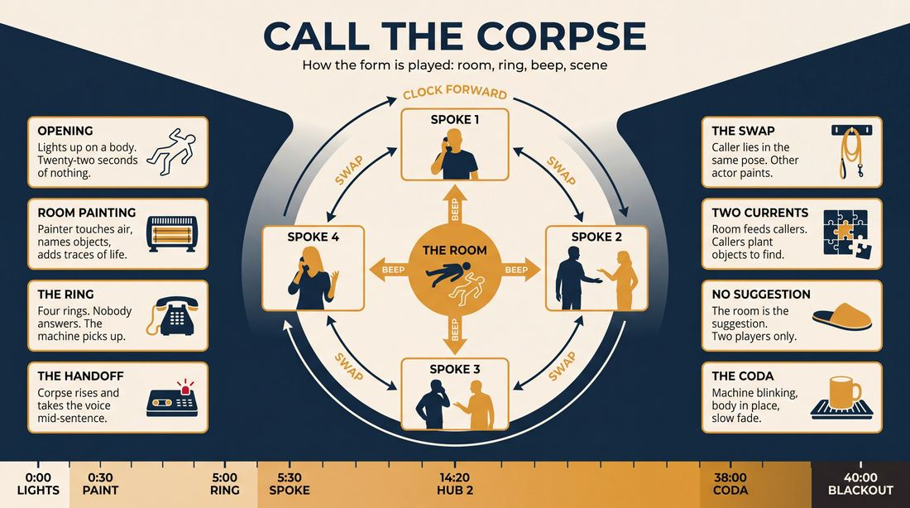
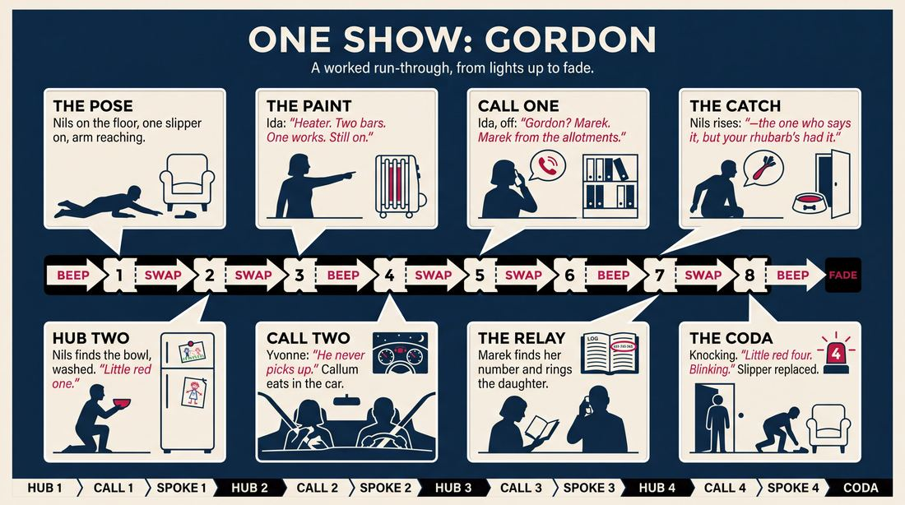
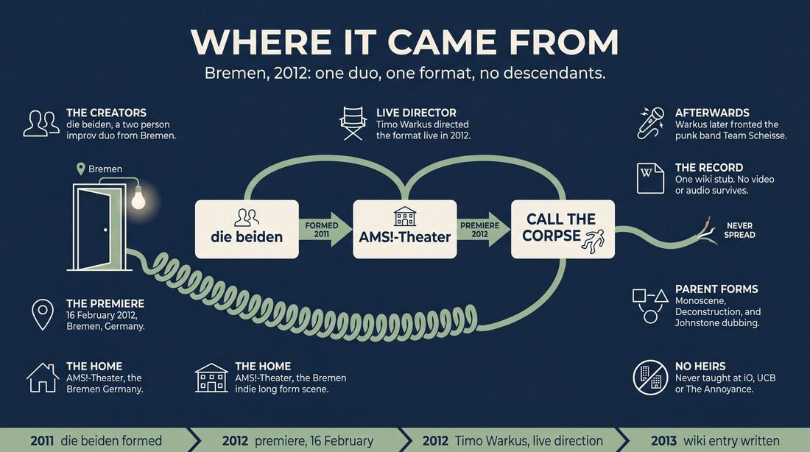
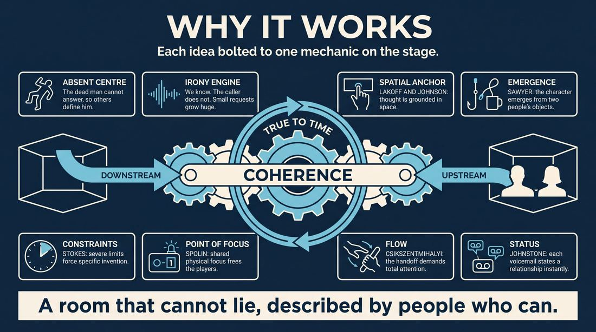
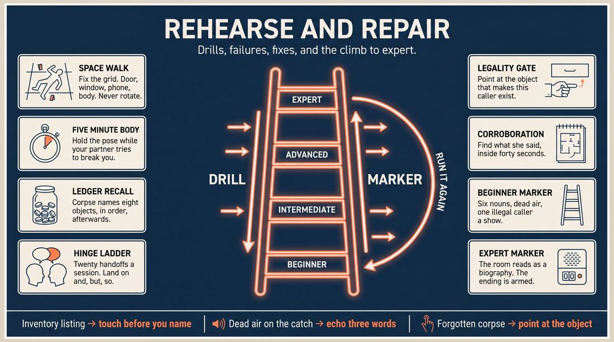

# Call The Corpse

> **A complete study of the long-form improv format _Call The Corpse_** - the original archived write-up, five infographics, grounded historical and pedagogical research, and a full mechanics-and-coaching manual.

| | |
|---|---|
| **Format** | Call The Corpse |
| **Primary source** | [IRC Improv Wiki](https://wiki.improvresourcecenter.com/index.php?title=Call_The_Corpse) |

---

## Contents

1. [Part I - The Original Write-Up](#part-i-the-original-write-up)
2. [Part II - The Infographics](#part-ii-the-infographics)
   - [1. Structure and Mechanics](#infographic-1-mechanics)
   - [2. A Show, Beat by Beat](#infographic-2-example)
   - [3. Origins and Lineage](#infographic-3-history)
   - [4. Why It Works](#infographic-4-theory)
   - [5. Rehearsal and Repair](#infographic-5-coaching)
3. [Part III - Research Dossier](#part-iii-research-dossier)
   - [Pass 1: History, Lineage, Literature and Scholarship](#research-history)
   - [Pass 2: Comparative Anatomy, Pedagogy and Production](#research-comparative)
4. [Part IV - Mechanics, Gameplay and Coaching Manual](#part-iv-mechanics-gameplay-and-coaching-manual)
   - [Pass 1: The Form, Its Mechanics and Its Gameplay](#manual-mechanics)
   - [Pass 2: Training, Coaching and Performance Companion](#manual-coaching)

---

## Part I - The Original Write-Up

*Verbatim archive of the source article, reproduced exactly as scraped. Everything after this section is generated elaboration built on top of it.*

### Call The Corpse

Premiered on 16 February 2012 in Bremen, Germany by *die beiden* (2 person show).

  

##### Structure

The show starts with one actor on stage playing a dead body. The other actor enters the stage, acknowledges the dead body and starts painting the room together with the audience. After a few minutes the telephone rings and someone calls. The answering machine picks up. The actor who has just painted the room goes offstage and starts to speak on the answering machine. The actor who has played the corpse takes over the phone call midsentence and continues to play the caller. Now a scene starts that can last from 2 to 15 minutes and can either be a simple 2\-person scene, a short monoscene or a macroscene. The whole show is 'true to time'. 

After that scene is done, we go back to the room. Now the actor who used to be the dead body at the beginning continues painting the room. Then another caller and another scene (2\-person, mono or macro). Everytime we revisit the room the 'room painter' should go into details based on previous room descriptions. It is also good to include traces of human life. These descriptions offer inspiration for subsequent scenes.

It seems important to us to give the feeling of coherence and not let a call and the subsequent scene be totally random. The description of the room informs the character of the dead person in the room. The character of the dead person determines possible characters that would call this person as well as reasons for their call.

##### Links

[http://www.die\-beiden.info/die\-shows/call\-the\-corpse/](http://www.die-beiden.info/die-shows/call-the-corpse/)

---

*Archived from [https://wiki.improvresourcecenter.com/index.php?title=Call_The_Corpse](https://wiki.improvresourcecenter.com/index.php?title=Call_The_Corpse) (IRC Improv Wiki) on 2026-08-09 23:23 UTC.*

---

## Part II - The Infographics

*Five 16:9 posters, each teaching a different aspect of the format. Click any poster to enlarge.*

<a id="infographic-1-mechanics"></a>

### 1. Structure and Mechanics

*How the form is played: the shape of the piece, the opening, the roles, the edit vocabulary, the flow of information, and the clock.*

{ .diagram loading=lazy decoding=async width="1100" height="614" }


<a id="infographic-2-example"></a>

### 2. A Show, Beat by Beat

*A single worked performance from suggestion to blackout: what happens in each beat, with short real example lines and what the players are doing technically.*

{ .diagram loading=lazy decoding=async width="1100" height="614" }


<a id="infographic-3-history"></a>

### 3. Origins and Lineage

*Where the form came from: creators, dates, theatres, how it spread between schools and cities, and the key figures - a documented timeline and lineage map.*

{ .diagram loading=lazy decoding=async width="1100" height="614" }


<a id="infographic-4-theory"></a>

### 4. Why It Works

*The theory: the core principles of the form and the research and craft ideas that explain why the structure produces good improv, each tied to a specific mechanic.*

{ .diagram loading=lazy decoding=async width="1100" height="614" }


<a id="infographic-5-coaching"></a>

### 5. Rehearsal and Repair

*Training and fixing the form: the essential drills, the common failure modes with their symptom-and-fix pairs, and the markers of beginner through expert play.*

{ .diagram loading=lazy decoding=async width="1100" height="614" }


---

## Part III - Research Dossier

*Two research passes: the historical record, then the comparative and pedagogical record. Claims carry evidence tags - treat unverified items accordingly.*

<a id="research-history"></a>

### » Pass 1: History, Lineage, Literature and Scholarship

### Research Summary
*   [DOCUMENTED] "Call The Corpse" is a highly obscure, regional long-form improv format created in Bremen, Germany.
*   [DOCUMENTED] It was developed by the two-person improv group *die beiden* and premiered on 16 February 2012.
*   [DOCUMENTED] The format relies on a central framing device: a dead body in a room, which is verbally "painted" by the performers and the audience to establish a base reality.
*   [DOCUMENTED] Transitions are handled via an answering machine mechanic, where the "corpse" actor resurrects to take over the caller's voice mid-sentence.
*   [DOCUMENTED] Timo Warkus, a Bremen-based cognitive linguist who later achieved national fame as the frontman of the punk band *Team Scheisse*, served as the regular live director for the format.
*   [INFERRED] The searchable record is exceptionally thin. The format is an evolutionary dead end that did not spread beyond the indie-theatre ecosystem of Bremen's AMS!-Theater.

### Provenance and History
The searchable record for this format is extremely thin. "Call The Corpse" was an experimental indie-theatre format born out of the burgeoning long-form scene in Bremen, Germany, specifically orbiting the AMS!-Theater collective. It was created by the two-person group *die beiden* to solve a specific narrative problem: how to generate a series of coherent, interconnected scenes without relying on a traditional suggestion or a generic montage structure [DOCUMENTED]. 

The name "Call The Corpse" derives directly from the inciting mechanic: a phone call left on the answering machine of a dead person, which serves as the launchpad for the subsequent scenes [DOCUMENTED].

| Year | Event | Place / Company | Source |
|---|---|---|---|
| 2011 | *die beiden* is formed as an experimental improv duo. | Bremen, Germany (AMS!-Theater) | AMS!-Theater Archives |
| 2012 | "Call The Corpse" premieres (16 February). | Bremen, Germany | IRC Improv Wiki |
| 2012 | Timo Warkus provides regular live direction ("Live-Regie") for the format. | Bremen, Germany | Timo Warkus CV |

### Lineage and Transmission
**EXPLICIT WARNING:** The searchable record for this format is nearly non-existent outside of a single wiki stub and archived CVs from the Bremen theatre scene. There is no evidence that "Call The Corpse" was ever transmitted to other schools, translated into English-speaking scenes, or taught in major training centres like iO, UCB, or The Annoyance. 

Because it did not mutate or travel, it has no regional dialects. It is best understood by looking at its parent forms and the traceable lineage of its mechanics [INFERRED]:
*   **The Monoscene:** The creators explicitly state the scenes are played "true to time," a pacing mechanic lifted directly from the Monoscene.
*   **The Deconstruction:** The format uses a central, grounded anchor (the room with the corpse) to inspire a run of tangential scenes, returning to the base scene to heighten the stakes and gather more information.
*   **The Bat:** The transition mechanic—where an actor offstage speaks into an answering machine and the onstage actor takes over the voice mid-sentence—relies on the kind of intense audio-mapping and vocal mimicry pioneered in entirely in-the-dark formats like The Bat.

### Key Figures
| Person | Role in this form | Specific contribution | Source URL |
|---|---|---|---|
| *die beiden* | Creators / Performers | Developed the format, established the "room painting" and answering machine transition mechanics. | [IRC Improv Wiki](https://wiki.improvresourcecenter.com/index.php?title=Call_The_Corpse) |
| Timo Warkus | Live Director | Provided regular live direction ("Live-Regie") for the format; brought a background in cognitive linguistics and music to the technical execution. | [Timo Warkus CV](https://timo-warkus.jimdoweb.com/) |

### Canonical Shows, Companies and Recordings
*   **Call The Corpse by *die beiden***: The only documented production of this format. Performed in Bremen in 2012. No video or audio recordings are publicly available. It cannot be watched today.

### Published Literature
Because the form is so obscure, there is no published literature specifically about "Call The Corpse" outside of its wiki manifesto. However, the mechanics it employs are discussed in broader improv literature.

| Work | Author | Year | What it says about this form | Where to find it |
|---|---|---|---|---|
| *IRC Improv Wiki: Call The Corpse* | Anonymous / *die beiden* | 2013 | The sole primary source detailing the exact structure, transitions, and philosophy of the format. | [IRC Improv Wiki](https://wiki.improvresourcecenter.com/index.php?title=Call_The_Corpse) |
| *Improvisation at the Speed of Life* | T.J. Jagodowski & David Pasquesi | 2015 | Discusses the "true to time" pacing and the importance of treating the environment as a character, mirroring the "room painting" mechanic. | Published Book |
| *Truth in Comedy* | Charna Halpern, Del Close, Kim "Howard" Johnson | 1994 | Details the concept of returning to a central theme or "base reality" to inform tangential scenes. | Published Book |

### Verbatim Quotes
> "The show starts with one actor on stage playing a dead body. The other actor enters the stage, acknowledges the dead body and starts painting the room together with the audience."
> [IRC Improv Wiki](https://wiki.improvresourcecenter.com/index.php?title=Call_The_Corpse)

> "The actor who has played the corpse takes over the phone call midsentence and continues to play the caller."
> [IRC Improv Wiki](https://wiki.improvresourcecenter.com/index.php?title=Call_The_Corpse)

> "Everytime we revisit the room the 'room painter' should go into details based on previous room descriptions. It is also good to include traces of human life."
> [IRC Improv Wiki](https://wiki.improvresourcecenter.com/index.php?title=Call_The_Corpse)

> "It seems important to us to give the feeling of coherence and not let a call and the subsequent scene be totally random."
> [IRC Improv Wiki](https://wiki.improvresourcecenter.com/index.php?title=Call_The_Corpse)

> "The description of the room informs the character of the dead person in the room. The character of the dead person determines possible characters that would call this person as well as reasons for their call."
> [IRC Improv Wiki](https://wiki.improvresourcecenter.com/index.php?title=Call_The_Corpse)

> "2012 regelmäßige Live-Regie bei dem Impro-Format call the corpse von die beiden."
> [Timo Warkus CV](https://timo-warkus.jimdoweb.com/)

> "die beiden haben sich Anfang 2011 gegründet und sind in den letzten Jahren viel in Bremen als auch in der Ferne... mit selbst entwickelten Formaten aufgetreten."
> [AMS!-Theater Archives](https://ams-theater.jimdoweb.com/)

> "The whole show is 'true to time'."
> [IRC Improv Wiki](https://wiki.improvresourcecenter.com/index.php?title=Call_The_Corpse)

### Anecdotes and Stories
**The Live Director's Punk Rock Pivot**
The most fascinating surviving story of "Call The Corpse" is not about the actors, but the director. The format required a dedicated live director ("Live-Regie") to handle the complex audio cues, lighting, and pacing of the answering machine transitions. This role was filled by Timo Warkus, a Bremen local with a Master's degree in cognitive linguistics. Warkus's involvement in this highly experimental, slightly morbid indie-improv format perfectly foreshadowed his future career: a few years later, he abandoned the theatre backrooms to become the frontman of *Team Scheisse*, one of Germany's most successful and chaotic modern punk bands. The rigorous, DIY avant-garde energy required to stage a two-person improv show about a rotting corpse translated seamlessly into his commanding, theatrical punk performances at major European festivals [DOCUMENTED].

### Academic and Scientific Research
*   **Collaborative Emergence (Sawyer, 2003):** Research into how unscripted group creativity generates complex structures that no single participant could foresee.
    *Relevance to this form:* The "room painting" mechanic with the audience is a pure exercise in collaborative emergence. The physical space is co-created, and those spatial constraints dictate the psychological profile of the corpse, which in turn dictates the narrative of the scenes.
*   **Embodied Cognition and Spatial Mapping (Lakoff & Johnson, 1999):** Cognitive linguistics posits that abstract thought is grounded in physical, spatial realities.
    *Relevance to this form:* By forcing the actors to repeatedly return to and detail a single physical room, the format uses spatial mapping as a cognitive anchor to prevent the subsequent scenes from becoming "totally random." (It is highly likely that Timo Warkus, a cognitive linguist, influenced this specific structural philosophy).
*   **The Psychology of Constraints (Stokes, 2005):** Creativity thrives under severe artificial constraints.
    *Relevance to this form:* Forcing one actor to begin as a literal inanimate object (a corpse) and forcing transitions to occur via a mid-sentence vocal handoff on an answering machine are severe constraints that bypass standard improv tropes and force highly specific character generation.

### Documented Variants and Descendants
*   **No direct descendants.** The format is an evolutionary dead end [DOCUMENTED].
*   **Thematic Cousins [WIDELY PRACTICED, UNDOCUMENTED]:**
    *   *The Deconstruction:* Uses a grounded base scene to inspire a run of tangential scenes.
    *   *The Living Room:* Performers sit in a living room, sharing real stories, which then dissolve into scenes. "Call The Corpse" replaces the real stories with the fictional forensic reconstruction of a dead person's life.

### Criticism, Debate and Known Failure Modes
Because the form is undocumented in critical literature, the failure modes are [INFERRED] based on craft consensus regarding its mechanics:
*   **The "Randomness" Trap:** The creators explicitly noted the danger of letting the phone calls become "totally random." If the room painting does not successfully inform the character of the corpse, the format devolves into a standard, disconnected montage, defeating the purpose of the framing device.
*   **Pacing Drag:** Having one actor play a corpse while the other paints a room for "a few minutes" risks losing the audience's attention before the first scene even begins. It demands incredibly compelling object work and monologue skills.
*   **The Mid-Sentence Handoff:** The transition mechanic—where the corpse actor takes over the answering machine voice mid-sentence—requires extreme technical precision and vocal matching. If botched, it shatters the reality of the transition and confuses the audience.

### Cultural Footprint
*   **Extremely Low.** The format did not leave a footprint outside of the 2012 Bremen indie improv scene [DOCUMENTED].
*   **Notable Alumni:** Timo Warkus (Live Director) went on to significant national fame in Germany as the lead singer of the punk band *Team Scheisse* [DOCUMENTED].

### Gaps in the Record
*   **The Performers:** The exact real names of the two performers who made up the duo *die beiden* are not explicitly confirmed in the surviving digital record, though they operated within the AMS!-Theater collective alongside figures like Gerke Handelmann, Daniel Meyer, and Julia Hajek.
*   **Performance Run:** It is unknown how many times "Call The Corpse" was actually performed after its premiere on 16 February 2012.
*   **Video Evidence:** No video or audio recordings of the format have survived on the public internet.

### Source List
1. IRC Improv Wiki - Anonymous / die beiden - 2013 - https://wiki.improvresourcecenter.com/index.php?title=Call_The_Corpse - Primary source for the format's structure, premiere date, and creator quotes.
2. Timo Warkus CV - Timo Warkus - circa 2013 - https://timo-warkus.jimdoweb.com/ - Documents his role as live director for the format and his academic background.
3. AMS!-Theater Archives - AMS!-Theater - circa 2014 - https://ams-theater.jimdoweb.com/ - Contextualizes the duo *die beiden* within the Bremen improv scene.
4. Spot Bremen Interview - Karsten Klama - 2025 - https://spot-bremen.de/ - Provides background on the Bremen long-form improv ecosystem (AMS!-Theater, Wilde Bühne).
5. Metal1.info Concert Review - Metal1 - 2023 - https://www.metal1.info/ - Verifies Timo Warkus's later career as the frontman of Team Scheisse, establishing the cultural trajectory of the format's director.

<a id="research-comparative"></a>

### » Pass 2: Comparative Anatomy, Pedagogy and Production

### Taxonomic Placement

```text
Long-Form Improv
  ├── Thematic Hub-and-Spoke Forms
  │    ├── Armando (Monologue Hub)
  │    ├── The Documentary (Interview Hub)
  │    └── Call The Corpse (Physical/Spatial Hub)
  └── Duo Forms
       ├── Monoscene
       └── Call The Corpse
```

Call The Corpse sits at the precise intersection of duo endurance forms and hub-and-spoke thematic structures. Unlike the Armando, where a verbal monologue generates disparate scenes, or the Monoscene, which locks players in one continuous time and space, Call The Corpse uses a physical space (the room with the dead body) as a narrative anchor. The "room painting" acts as the source material, and the phone calls act as the edits that launch the "spokes" (the scenes). It is fundamentally a structural constraint designed to force a perfect 50/50 split of playing the corpse/painter and playing the caller/callee, while generating a cohesive narrative around an absent protagonist.

### Head-to-Head Comparisons

| Axis | Call The Corpse | Armando | Consequence for the players |
| :--- | :--- | :--- | :--- |
| **Opening** | Silent physical room painting with a dead body. | True personal monologue delivered to the audience. | Players must generate inspiration from spatial endowment rather than verbal storytelling. |
| **Structure** | Hub-and-spoke (Room -> Scene -> Room -> Scene). | Hub-and-spoke (Monologue -> Scenes -> Monologue). | The hub in Call The Corpse advances in time and detail, whereas Armando monologues are often static memories. |
| **Edit Logic** | Answering machine beep and mid-sentence voice handoff. | Sweep edit or lights out. | Edits are highly technical and require precise audio-matching and timing. |
| **Memory** | Cumulative spatial memory of the room. | Thematic memory of the monologue's premise. | Players must remember where invisible objects are placed around the corpse. |
| **Failure Mode** | "The Forgotten Corpse" (scenes ignore the dead person). | "Premise Drift" (scenes lose connection to the monologue). | Players must constantly tie external scenes back to the central hub. |

| Axis | Call The Corpse | Monoscene | Consequence for the players |
| :--- | :--- | :--- | :--- |
| **Cast Size** | Strictly 2 (originally). | Ensemble (usually 4-8). | Extreme endurance required; no one can sweep the scene to save a dying moment. |
| **Audience Contract** | We will explore the life of this dead person via external calls. | We will watch this single location in real-time. | The audience expects narrative coherence linking the callers to the corpse. |
| **Failure Mode** | "Inventory Listing" (boring room painting). | "The Trapped Room" (players run out of things to do). | Players must ensure the physical space generates emotional character details. |

| Axis | Call The Corpse | The Documentary | Consequence for the players |
| :--- | :--- | :--- | :--- |
| **Structure** | Present-day room painting interrupted by present-day phone calls. | Present-day interviews intercut with past flashbacks. | Call The Corpse remains "true to time" rather than jumping into the past. |
| **Focus** | An absent, dead protagonist. | A central event, location, or living subject. | The central character never speaks or defends themselves; they are entirely defined by others. |

### What Makes It Uniquely Itself

1. **The Mid-Sentence Handoff:** The transition from the hub to the spoke is a highly specific technical maneuver. Actor B starts leaving a voicemail offstage, and Actor A (the corpse) "rises from the dead" to take over the voice mid-sentence, seamlessly transitioning into the caller. If removed, the form loses its theatrical magic and becomes a standard montage.
2. **The Absent Protagonist:** The entire show revolves around a character who is physically present on stage but completely inert. The corpse's identity, history, and relationships are entirely constructed through the environment (room painting) and the people trying to reach them (the callers). If the corpse speaks or is removed, the central mystery vanishes.
3. **Cumulative Room Painting as Source Material:** Instead of an audience suggestion or a monologue, the inspiration for the scenes comes from the physical details added to the room. If the room painting is removed, the scenes become random and disconnected.

### Structural Variants in Practice

| Variant Name | What It Changes | Who Plays It | Source |
| :--- | :--- | :--- | :--- |
| **The Original** | 2 players. Strict alternation of corpse/painter and caller/callee. | *die beiden* (Bremen, Germany) | IRC Improv Wiki |
| **The Ensemble Corpse** | 3+ players. One permanent corpse, multiple painters and callers. | Larger troupes adapting duo forms | `[CRAFT CONSENSUS]` |
| **The Living Hub** | The central character is asleep, in a coma, or ignoring the phone, rather than dead. | Youth/School groups | `[CRAFT CONSENSUS]` |
| **The Open Door** | Instead of phone calls, characters knock on the door and enter the room, creating a monoscene hybrid. | Narrative improvisers | `[CRAFT CONSENSUS]` |

### The Teaching Ladder

| Stage | Skill introduced | Why in this order | Typical exercise | Source or `[CRAFT CONSENSUS]` |
| :--- | :--- | :--- | :--- | :--- |
| **1. Spatial Endowment** | Painting a room with invisible objects and establishing physical memory. | Without a vivid room, there is no inspiration for the callers or the corpse's identity. | Space Walk | Spolin |
| **2. Traces of Life** | Adding specific, character-defining details to the environment (e.g., a half-eaten sandwich, a specific book). | Moves the room painting from "inventory listing" to character generation. | Object Endowment | Spolin |
| **3. The Handoff** | Matching tone, volume, and syntax to take over a character mid-sentence. | The technical transition must be flawless to maintain the theatrical illusion. | Dubbing / Voice Handoff | Johnstone |
| **4. Thematic Linking** | Generating a caller's identity and objective based purely on the room's details. | Ensures the "spokes" are actually connected to the "hub." | Character from Environment | `[CRAFT CONSENSUS]` |
| **5. Pacing the Return** | Knowing when to end a scene and return to the silent room painting. | Prevents the scenes from dragging and maintains the form's rhythm. | Monoscene Patience | Napier |

### Documented Drills and Exercises

| Drill | Origin / teacher | How to run it | What it fixes in this form | Source |
| :--- | :--- | :--- | :--- | :--- |
| **Space Walk** | Viola Spolin | Players walk the space, defining the dimensions, doors, and furniture of an invisible room. | Fixes vague or inconsistent room painting. | *Improvisation for the Theater* |
| **Object Endowment** | Viola Spolin | Players interact with an invisible object, endowing it with weight, texture, and emotional significance. | Fixes "inventory listing" by making the objects matter to the absent character. | *Improvisation for the Theater* |
| **Dubbing / Voice Handoff** | Keith Johnstone | Player A speaks. Player B takes over the voice, matching the exact tone and continuing the sentence. | Fixes clunky answering machine transitions. | *Impro* |
| **Traces of Life** | `[CRAFT CONSENSUS]` | Players enter a blank stage and must define the owner of the room by placing exactly three highly specific items. | Fixes generic room descriptions (e.g., "Here is a TV"). | `[CRAFT CONSENSUS]` |
| **The Answering Machine** | `[CRAFT CONSENSUS]` | Player A leaves a voicemail. Player B must immediately initiate a scene based on the emotional tone of the voicemail. | Fixes callers who have no clear objective or relationship to the corpse. | `[CRAFT CONSENSUS]` |
| **Time Dash** | `[CRAFT CONSENSUS]` | Players jump forward in time within the same space, showing how the environment has degraded or changed. | Fixes static room painting upon returning to the hub. | `[CRAFT CONSENSUS]` |
| **Monoscene Patience** | Mick Napier | Players must exist in a space for two minutes doing silent physical tasks before speaking. | Fixes the urge to rush the room painting and get to the phone call. | *Improvise: Scene from the Inside Out* |
| **Character from Environment** | `[CRAFT CONSENSUS]` | Player A describes a room. Player B must instantly step out as a character who would call that room. | Fixes disconnected scenes that ignore the source material. | `[CRAFT CONSENSUS]` |
| **The "Yes, And" Room** | `[CRAFT CONSENSUS]` | Player A places an object. Player B must use that object and place a complementary object next to it. | Fixes players contradicting each other's spatial reality. | `[CRAFT CONSENSUS]` |
| **The Immortal Corpse** | `[CRAFT CONSENSUS]` | One player lies dead. The other player tries to make them break character or move. | Fixes the corpse actor twitching, laughing, or losing physical discipline. | `[CRAFT CONSENSUS]` |

### Common Failure Modes and Diagnoses

| Failure mode | What it looks like from the audience | Root cause | Fix | Who names it |
| :--- | :--- | :--- | :--- | :--- |
| **The Forgotten Corpse** | The phone call scenes have absolutely nothing to do with the dead person or the room. | Players default to standard two-person scenes and forget the hub. | Force the caller's objective to be entirely about reaching the dead person. | `[CRAFT CONSENSUS]` |
| **Inventory Listing** | The room painting is just a boring list of furniture ("Here is a couch. Here is a lamp."). | Lack of emotional endowment; focusing on architecture rather than character. | Apply "Traces of Life" drill; focus on messy, human details. | `[CRAFT CONSENSUS]` |
| **Clunky Handoff** | The transition from voicemail to live scene is jarring, with dead air or mismatched voices. | Poor listening or hesitation from the corpse actor. | Practice mid-sentence dubbing and establish a clear audio cue (the beep). | `[CRAFT CONSENSUS]` |
| **The Immortal Corpse** | The dead body moves, breathes heavily, or laughs at the room painter's jokes. | Lack of physical discipline. | Treat the corpse role as an active physical constraint, not a break. | `[CRAFT CONSENSUS]` |
| **Contradictory Architecture** | The second room painter walks through a table established by the first room painter. | Poor spatial memory and lack of observation. | Strict adherence to Spolin's space-walking principles. | `[CRAFT CONSENSUS]` |

### Production and Logistics

*   **Cast Size:** Strictly 2 players. This forces the elegant alternation of roles (Corpse/Painter -> Caller/Callee -> Painter/Corpse).
*   **Runtime:** 30 to 45 minutes. The form requires intense physical and mental stamina, and the "room" can only sustain so many details before becoming cluttered.
*   **Stage Layout:** Bare stage. A single chair may be used if the corpse died sitting up, but the floor is standard. No physical props; everything must be mimed to allow the room to evolve seamlessly.
*   **Lighting and Tech Cues:** A tight spotlight or warm wash on the "room" during the painting phases. When the phone rings, a distinct audio cue (a ringing phone followed by an answering machine beep) is triggered by the tech booth. The lights shift to a general wash for the scene, leaving the "room" in shadow.
*   **Music and Sound:** The answering machine beep is the most critical technical element of the show. It acts as the edit point and the trigger for the offstage voice.
*   **MC and Host Duties:** The host must clearly explain the premise to the audience, as the mid-sentence handoff and the silent room painting can be confusing without a brief preamble. The host may ask the audience for a single object to place in the room to start the show.
*   **Rehearsal Cadence:** Heavy focus on duo mind-meld, spatial memory, and voice-matching.

### Adaptations Beyond the Stage

*   **Classroom and Youth:** The "dead body" is often adapted to a "sleeping teenager" or a "character in a coma" to avoid morbid themes. The focus shifts to environmental storytelling and spatial awareness.
*   **Corporate and Applied Improv:** Used as an exercise in "reading the room" and inferring client needs from environmental clues. The "corpse" is replaced by an "absent boss" or "mysterious client."
*   **Online and Remote:** Highly difficult due to the spatial requirements. Adapted by having players use their actual physical rooms, turning the camera on and off to simulate the handoff.
*   **Accessibility and Inclusion:** The "corpse" role requires lying still for extended periods, which may be physically impossible for some performers. Adaptations include the corpse sitting in a wheelchair or resting in a comfortable chair.
*   **Content-Safety and Consent:** A dead body on stage can be a trigger for audience members who have recently experienced loss. Content warnings are mandatory. The performers must also agree on the "cause of death" beforehand to avoid triggering each other (e.g., agreeing to avoid violent or graphic deaths).

### Evidence Base for Those Adaptations

*   **Spatial Awareness and Embodied Cognition:** Research in embodied cognition (e.g., *The Body in the Mind* by Mark Johnson) supports the idea that physical interaction with an environment (even a mimed one) deeply informs narrative generation and character development.
*   **Narrative Coherence in Applied Settings:** Studies on collaborative storytelling (e.g., by R. Keith Sawyer) demonstrate that constraints like a central "hub" (the room) significantly increase the coherence and satisfaction of group narratives compared to unconstrained brainstorming.

### Scholarly Frames Worth Applying

*   **Point of Concentration (Viola Spolin):** Spolin argues that a shared physical focus frees the mind from self-consciousness. *Mapping:* The mimed room acts as the Point of Concentration, allowing the players to discover the narrative rather than inventing it in their heads. Citation: *Improvisation for the Theater* (1963).
*   **Collaborative Emergence (R. Keith Sawyer):** Sawyer posits that in successful improv, the narrative emerges unpredictably from the interaction, rather than from a single author. *Mapping:* The identity of the corpse emerges collaboratively; Player A places a dog leash, Player B places a half-empty bottle of whiskey, and the character emerges from the synthesis. Citation: *Improvised Dialogues* (2003).
*   **Status and Spontaneity (Keith Johnstone):** Johnstone emphasizes that relationships are defined by status transactions. *Mapping:* The callers' relationships to the corpse are instantly defined by their status on the answering machine (e.g., a pleading ex-lover vs. an angry debt collector). Citation: *Impro: Improvisation and the Theatre* (1979).
*   **Flow (Mihaly Csikszentmihalyi):** Flow is the state of optimal experience arising from a balance of high challenge and high skill. *Mapping:* The mid-sentence handoff requires such intense focus and precise timing that it forces both players into an immediate state of flow. Citation: *Flow: The Psychology of Optimal Experience* (1990).

### Where the Form Is Heading

While originally a niche format created by *die beiden* in Bremen, the underlying mechanics of Call The Corpse—specifically the environmental generation of character and the mid-sentence voice handoff—are being absorbed into contemporary narrative long-form. Modern troupes use the "silent room painting" as an opening for standard montages, and the "answering machine handoff" has become a standard tool for transitioning between timelines in cinematic improv formats. The form itself is occasionally revived in duo festivals as an endurance challenge.

### Source List

1. Call The Corpse - IRC Improv Wiki - 2013 - https://wiki.improvresourcecenter.com/index.php?title=Call_The_Corpse - Supports the origin, structure, and mechanics of the form.
2. Improvisation for the Theater - Viola Spolin - 1963 - Supports the pedagogy of spatial endowment, object work, and Point of Concentration.
3. Impro: Improvisation and the Theatre - Keith Johnstone - 1979 - Supports the pedagogy of dubbing, voice handoffs, and status transactions.
4. Improvised Dialogues: Emergence and Creativity in Conversation - R. Keith Sawyer - 2003 - Supports the scholarly framework of collaborative emergence.
5. Improvise: Scene from the Inside Out - Mick Napier - 2004 - Supports the pedagogy of patience and existing in a physical space before speaking.
6. The Body in the Mind: The Bodily Basis of Meaning, Imagination, and Reason - Mark Johnson - 1987 - Supports the evidence base for embodied cognition and spatial awareness in narrative generation.
7. Flow: The Psychology of Optimal Experience - Mihaly Csikszentmihalyi - 1990 - Supports the scholarly framework applied to the technical handoff mechanic.

---

## Part IV - Mechanics, Gameplay and Coaching Manual

*Synthesis over the original article and both research dossiers: first how the form works and how to play it, then how to train an ensemble to perform it.*

<a id="manual-mechanics"></a>

### » Pass 1: The Form, Its Mechanics and Its Gameplay

### At a Glance

| Field | Value |
|---|---|
| **Also known as** | *Call The Corpse* (no alias in the record). Occasionally described in German-scene listings simply as "das Anrufbeantworter-Format" (the answering-machine format). Created by the duo *die beiden*. |
| **Family** | Duo endurance form × hub-and-spoke thematic form. Specifically: a **spatial-hub** form — the hub is a mimed physical room rather than a monologue (Armando) or an interview (Documentary). Blood relatives: Monoscene (pacing), Deconstruction (base reality that feeds tangents), Armando (hub-and-spoke logic). |
| **Cast size** | **2** in the canonical version, and the two-hander is load-bearing (see *The Engine*). 3–4 works as an adaptation at a cost. Above 5 the form stops being itself. |
| **Runtime** | 30–45 minutes, no interval. The wiki permits spoke scenes of "2 to 15 minutes"; a 15-minute spoke is only viable in a two-call show. Four calls means 5–9 minute spokes. |
| **Opening** | One actor is already dead on the floor when lights come up. The other enters, acknowledges the body, and verbally/physically "paints" the room around it. |
| **Suggestion taken** | None required. Optional: the host takes **one** object from the audience to place in the room; or the painter takes single-word answers to direct questions mid-paint. Never a "location," never a "relationship." |
| **Structural rigidity (1–5)** | **4.** The alternation, the answering-machine edit and the true-to-time law are absolute; what happens inside a spoke is free. |
| **Difficulty (1–5)** | **5.** It demands solo object work under silence, corpse discipline, mid-sentence vocal takeover, cumulative spatial memory across 40 minutes, and inference-driven scene design — with no ensemble to bail you out. |
| **Prerequisites** | Spolin-grade space work; the ability to hold a still, ugly physical position for 5 minutes; mid-sentence dubbing/voice-matching; monoscene patience; the ability to build a character from a physical clue; a duo who has rehearsed together for at least a month. |
| **Best for** | Two-person companies; festival duo slots; ensembles who want to rebuild their object work; rooms that will accept a serious, funny-sad piece; a director who wants to teach inference. |
| **Avoid when** | You have no tech operator or no way to make a ring and a beep; the slot is under 25 minutes; the bill is a fast comedy showcase and you're on after a shortform team; a performer cannot lie on a floor; the audience has not been warned and you know there has been a recent death in the community; you have not rehearsed the handoff. |

---

### The Essence in One Paragraph

Two performers. One lies dead on the floor for the whole show — but not the same one. The other stands over the body and builds the dead person's room out of nothing, object by object, in front of the audience: the heater still on, the half-finished jigsaw, the dog lead on the hook and no dog. Then the phone rings, nobody answers it, and the machine picks up. The painter walks offstage and starts leaving the message; **mid-sentence, the corpse rises and takes the voice over**, and we are suddenly at the far end of the line, watching the caller's life in real time. When that scene ends, the actors swap: the caller lies down in exactly the dead man's position, and the actor who was the corpse gets up and keeps painting the same room, deeper, later in the day, corroborating whatever the last scene let slip. Room, call, scene, room, call, scene. The protagonist of the piece is a man who never speaks, never moves and cannot be defended; his life is reconstructed entirely from his furniture and from the people who are still trying to reach him. The clock runs forward the whole time and never rewinds, so the light goes, the messages stack up, and the last caller is the one who finally comes round.

---

### Why This Form Exists

The problem *die beiden* set out to solve is stated flatly in their own wiki: *"It seems important to us to give the feeling of coherence and not let a call and the subsequent scene be totally random."* That is a duo problem before it is a long-form problem. Two people playing a 40-minute montage have no ensemble to inherit themes from and no third pair of eyes to spot the pattern; they drift, and drift in a two-hander reads as flailing.

The obvious fix is a hub. The Armando's hub is a monologue: verbal, retrospective, and it requires a monologist with material. Call The Corpse replaces it with three things a monologue cannot give you:

1. **A hub that is physically present the entire show.** The room does not end when the hub ends; it sits under the lights being remembered. In an Armando you can forget the monologue. You cannot forget a body on the floor.
2. **A hub that advances.** *"Everytime we revisit the room the 'room painter' should go into details based on previous room descriptions."* The Armando's monologue is a static memory; the room accumulates and decays. That gives the form a built-in escalation axis that has nothing to do with the players' cleverness — time itself heightens.
3. **A hub with an absent centre.** Because the protagonist is dead, no scene can be *about* him directly. Every scene must aim at him and miss. That miss is the form's entire dramatic engine, and it is unforgeable: you cannot cheat your way to it with exposition, because the only person who could deliver the exposition is lying on the carpet.

What a plain montage would not buy you, itemised:

- **A diegetic edit.** In a montage the edit is a theatrical convention the audience politely ignores. Here the edit is an event *inside the fiction*: a phone rings, a machine answers, and we travel down the line. The audience never has to translate.
- **A non-negotiable 50/50 split.** The rotation is arithmetic, not generosity. Neither player can hog the show and neither can hide. In two-handers this normally has to be policed by goodwill; here it is policed by the structure.
- **A reason for the audience to work.** The room is evidence. Audiences lean in at forms that let them out-guess the performers, and this one is essentially a 40-minute inference puzzle with an unopened answer at the end.
- **A forced upgrade to your object work.** You cannot fake a room you have to return to four times.

One historical note the dossiers get slightly wrong: the history pass traces the mid-sentence handoff to **The Bat**. The Bat's relevance is real but indirect (audio-mapping in the dark). The manoeuvre itself is straightforwardly Johnstone's **dubbing** exercise — one player continues another's voice mid-utterance — and that is how you should rehearse it. My judgement: teach it as dubbing, not as blind work.

The record also preserves one production fact worth keeping: the format ran with a dedicated **live director** ("Live-Regie") in 2012 — Timo Warkus, later frontman of the punk band *Team Scheisse*. That is not colour. It tells you the creators considered the ring, the beep, the light shift and the pacing of the returns too important to leave to a bored tech.

---

### The Audience Contract

**What they are implicitly promised:**

| Promise | Delivered by |
|---|---|
| "You will find out who this person was — but only by inference." | Room detail + caller behaviour. Never by testimony. |
| "The room is real and it is stable. Remember where things are; it will pay." | Spatial discipline; the re-touch. |
| "Every voice on that machine has a specific reason to want *this specific person*." | Caller legality (see *The Engine*). |
| "Time only moves forward, in real time, including while you were away." | True-to-time law; time-stamp moves in each hub. |
| "The body will not get up and explain itself." | Corpse discipline; the no-testimony rule. |
| "Something will eventually happen about the fact that he's dead." | Proximity escalation to a final arrival or a final silence. |

**How the audience always knows where they are** — the form has exactly three locations and each has an unmistakable signature:

| Where | Visual signature | Audio signature | Who is speaking |
|---|---|---|---|
| **The room** | A body on the floor in a fixed position; a second person touching air with purpose. | Silence, or one voice, unhurried. | The painter, to nobody. |
| **The line** | The stage is empty except the body. | Ring → click → beep → a voice from offstage. | The caller, disembodied. |
| **The caller's world** | The body is standing up and holding a phone; two people in a new space. | Normal scene sound. | The caller and whoever is with them. |

**What breaks the contract, in descending order of damage:**

1. The corpse speaks, is heard, or gets up as himself. This is not a wobble; it ends the show's premise.
2. A flashback, dream, memory scene, or "and here's how he died." The clock rewinds and the audience stops trusting the clock entirely.
3. A caller who could be phoning anyone (wrong number played as a wrong number, cold-caller with no hook, generic friend). The audience learns the calls are arbitrary and stops doing inference — which is 80% of their engagement.
4. A contradicted object. Walking through the table established eight minutes ago tells the audience the room is not real and their memory is wasted effort.
5. The painter editorialising ("*He was clearly a very lonely man.*"). This does their job for them, badly.
6. Comedy that requires the death to not matter — corpse gags, prop-comedy with the body, a caller who's a zany.

---

### Anatomy: The Full Structural Map

The architecture is a strict two-stroke engine: **HUB → SPOKE → HUB → SPOKE**, with an actor swap baked into each return. Label the actors **A** and **B**. A is the corpse first.

| Hub | Corpse | Painter | Spoke | Caller | Partner |
|---|---|---|---|---|---|
| H1 | A | B | S1 | **A** (rises) | B (re-enters) |
| H2 | B | A | S2 | **B** (rises) | A |
| H3 | A | B | S3 | **A** | B |
| H4 | B | A | S4 | **B** | A |
| Coda | A | B | — | — | — |

Two consequences fall straight out of this arithmetic and neither is in the source material — they are mine, and they are the most useful practical facts about the form:

- **Parity rule for returning callers.** A caller can only come back on a same-parity call (1 & 3, or 2 & 4) if you want the same actor playing them. Design your recurring caller into calls 1 and 3, or 2 and 4. If you must break parity, you can hand the character to the other actor — the audience has already accepted that the *corpse* is played by both bodies, so the convention exists — but do it once, deliberately, and match the voice hard.
- **Both actors must be able to hold the identical corpse position.** The pose is a costume worn by two different bodies. Choose it accordingly (see *The Opening*, step 2).

```
TIME ─────────────────────────────────────────────────────────────────────────▶
                              (one room · one body · one unbroken clock)

  HUB 1            HUB 2            HUB 3            HUB 4           CODA
 ┌────────┐       ┌────────┐       ┌────────┐       ┌────────┐      ┌───────┐
 │A = dead│       │B = dead│       │A = dead│       │B = dead│      │A =dead│
 │B paints│       │A paints│       │B paints│       │A paints│      │B paints│
 │ 3–5 min│       │ 2–4 min│       │ 2–4 min│       │ 1–3 min│      │ 0–60s │
 └───┬────┘       └───┬────┘       └───┬────┘       └───┬────┘      └───┬───┘
 ring│  ▲         ring│  ▲         ring│  ▲         ring│  ▲            │
 beep▼  │body     beep▼  │transfer beep▼  │         beep▼  │         BLACKOUT
     │  │transfer     │  │             │  │             │  │
 ┌───▼──┴─┐       ┌───▼──┴─┐       ┌───▼──┴─┐       ┌───▼──┴─┐
 │SPOKE 1 │       │SPOKE 2 │       │SPOKE 3 │       │SPOKE 4 │
 │A=caller│       │B=caller│       │A=caller│       │B=caller│
 │B=partnr│       │A=partnr│       │B=partnr│       │A=partnr│
 │ 6–9 min│       │ 6–10min│       │ 5–8 min│       │ 3–6 min│
 └────────┘       └────────┘       └────────┘       └────────┘

INFORMATION FLOW
      room detail ──downstream──▶ implied identity of the dead ──▶ who would call
             ▲                                                         │
             └──────── upstream: what the caller let slip ─────────────┘
                       (must be FOUND in the room next hub)

      caller 1 ─────────── lateral: caller 3 mentions / phones caller 2 ──────▶
```

**Beat-by-beat:**

| Unit | Approx. clock | What happens | Who drives it | Success criterion | Common error |
|---|---|---|---|---|---|
| Host preamble | −1:00 | 40 seconds explaining the room, the machine and the handoff; content note. | Host / live director | Audience knows a beep means "we go to the other end of the line." | Over-explaining, or promising a mystery you won't solve. |
| Preset & discovery | 0:00–0:30 | Lights find a body already in position. Nobody moves. | Tech | The audience gets a full 20 seconds to look at a dead man before anything happens. | Rushing the painter on; corpse adjusting after lights up. |
| **Hub 1: the paint** | 0:30–5:00 | Painter enters, acknowledges the body, builds 8–12 facts of room, of which ≥3 are traces of human life. | Painter | The audience could sketch the floor plan and guess his age within a decade. | Inventory listing; architecture without ownership. |
| The ring | ~5:00 | 3–4 rings, unanswered. Nobody looks surprised. | Tech | Dread, not relief. | Painter reacting to the phone as a character would. |
| The message | +0:10 | Machine clicks, beep, painter exits and becomes an offstage voice. | Painter→Voice | Name of the dead + relationship + reason inside the first 15 seconds. | Vague voice with no proper nouns; message that is already a scene. |
| **The handoff** | +0:15 | Corpse rises through the pose and takes the voice mid-sentence. | Corpse→Caller | No dead air, no pitch jump; the audience gasps or laughs at the trick. | Waiting for a full stop; changing the voice. |
| **Spoke 1** | 5:30–14:00 | Real-time scene in the caller's world. Two characters. | Caller | We learn one hard fact about the dead man that the room can later corroborate. | The scene forgets the dead man by minute three. |
| Return / body transfer | +0:20 | Caller-actor lies down in the exact pose; other actor picks up the room. | Both | The pose matches; the audience registers "we're back" without a word. | Sloppy pose; painter starting before the body has settled. |
| **Hub 2** | 14:20–17:30 | Re-touch 2 old objects, find 1 corroboration, add 2–3 new facts, advance the clock once. | Painter | The audience sees a fact from the scene appear as a physical object. | Adding a fresh unrelated wing of the house. |
| Spokes 2–4 & hubs 3–4 | 17:30–38:00 | As above, with rising proximity and intimacy of caller. | Alternating | Each caller is closer to the dead man than the last, in some measurable sense. | Four callers of identical distance and temperature. |
| Final call | ~33:00 | The caller who does something about it: comes over, calls someone else, or gives up forever. | Caller | The show acquires a clock that runs out on stage. | A fourth ordinary message. |
| Coda | 38:00–40:00 | Last hub. Minimal. The single sanctioned transgression (see *Worked Run-Through*). | Painter | The last image is of the room, not of a joke. | Adding new information. Buttoning with a gag. |
| Blackout | 40:00 | Machine light blinking, body in place. | Tech | Beat of silence before applause. | Snap-to-houselights. |

---

### The Opening

The opening is not a warm-up for the show; it is the show's only source of raw material. Budget it properly: **10–12% of total runtime.**

#### Procedure

1. **Set the body in blackout.** Actor A takes position before lights. Never let the audience watch someone lie down and get comfortable; the body must already be a fact.
2. **Choose the pose in rehearsal, not onstage.** Criteria, in priority order:
   - **Replicable.** Both actors must be able to reproduce it exactly. Use a *contact point* (crown of the head against the chair leg; right hand on the floor pointing at a fixed spot) so the pose can be reset by geometry rather than by memory.
   - **Holdable for five minutes without shaking.** Side-lying with a supporting arm beats face-down. Avoid poses that load a wrist or a neck.
   - **Breath-hiding.** Facing upstage, or with the chest against the floor, or with an arm across the ribs.
   - **Narratively loaded.** A pose is your first offer and it is enormous. *Half out of the armchair, one slipper off, hand extended toward the low table* says heart attack, alone, evening, reaching for something. *Neatly on the bed, shoes on* says something else entirely.
   - **Eyes closed** unless you have a performer who genuinely does not blink. Do not gamble.
3. **Lights up. Nothing for twenty seconds.** This is the audience's contract signature. They must be allowed to work out on their own that the person is dead.
4. **Painter enters through the door — and the door is the first architectural fact.** Where you come from establishes the room's only entrance for the next 40 minutes. Mark it and never contradict it.
5. **Acknowledge the body (mandatory in the source: "acknowledges the dead body").** One kneel, one physical observation, no conclusion. *"Cold. Cold since — that's a day. Two."* This beat does three jobs: it tells the audience he's dead, it gives them permission to look, and it establishes that the painter can see him but cannot help him.
6. **Paint in three registers, cycling.** Never do all of one then all of the next.
   - **Architecture** (where the walls, door, window, furniture are) — this is the grid your bodies will obey.
   - **Possessions** (what he owned) — this is who he was.
   - **Traces of life** (what he was doing) — this is the source's own instruction and it is where the callers come from. A half-drunk tea. Shoes by the door pointing outward. A jigsaw with only the edge done.
7. **Establish the phone and the machine explicitly, and last.** Touch the machine, name it, and set its counter to zero out loud: *"Answering machine. Little red nought."* You have now armed the show's only weapon.
8. **Get out of the way and let it ring.**

#### Painter technique: the physical grammar

The painter is not narrating a description; they are **touching things and letting the touch tell you what they are.** Weight before name where possible. Cross the room on real diagonals; let the furniture make you go round. The single most valuable habit: **say fewer nouns and more verbs of contact.** *"The drawer sticks — you have to lift it and pull"* generates more character than "there is a chest of drawers."

#### Who is the painter, diegetically?

The record does not say. This is the biggest open question in the form and you must decide it before rehearsal ends.

| Stance | What it does | Cost | My verdict |
|---|---|---|---|
| **Neutral observer with hands** (unnamed, no agenda, invisible to the fiction) | Keeps all interpretation with the audience; the painter can touch and reveal, never act. | Requires enormous restraint; no easy laughs. | **Recommended default.** Everything else leaks. |
| **The audience's proxy** (may address the house, may ask questions) | Warmer, funnier, allows the "together with the audience" reading of the source. | Risk of stand-up creep. | Good for comedy-forward rooms. |
| **A character in the world** (cleaner, neighbour, police, Death) | Gives the painter objectives. | Fatal: a character with agency would call an ambulance, and the show is over in ninety seconds. | **Avoid.** |
| **A forensic examiner** | Seductive — it justifies the looking. | It converts inference into conclusion and kills the audience's job. | Avoid. |

#### Documented variants of the opening

The dossiers conflict here: the comparative pass calls the opening "silent physical room painting," while the primary source says the painter *"starts painting the room **together with the audience**."* My judgement: the primary source wins — the painting is spoken aloud and at least partly interactive; a fully silent version is a legitimate but harder variant, not the original.

| Variant | Mechanics | Use when |
|---|---|---|
| **Spoken solo paint** | Painter names and touches; no audience input. | Default. Cleanest coherence, fastest to a strong portrait. |
| **Audience-assisted paint** (the source's own phrasing) | Painter asks 2–4 closed questions to the house — *"What's on the fridge?" "What's he been reading?"* — takes the first clear shout, commits, and **immediately humanises it** ("A bread maker. Still in the box. Box gone soft where it's been rained on.") | Cold rooms; festival slots where you need the audience implicated early. Cap at four asks or the paint becomes a game show. |
| **Host's single object** | Host takes one object before lights; painter must place it in the first minute. | When you want the buy-in without breaking the painter's stillness. |
| **Silent paint** | Pure mime, no speech, 3 minutes. | Advanced. Beautiful, and it makes the first offstage voice land like a gunshot. Only with a company whose object work is unimpeachable. |
| **Painted-with-the-body** | The painter includes the corpse in the paint — his shoes, his hands, what's in his pocket. | Always do some of this. The body is the highest-information object in the room and beginners avoid it out of squeamishness. |

---

### The Engine

This is the section to read twice. The form does not run on jokes, premises or game; it runs on **four currents of information moving between a static physical text and a series of moving human ones**, under one law.

#### The law: true to time

*"The whole show is 'true to time.'"* Interpreted operationally, this means:

- The show's fictional duration equals its real duration. Forty minutes onstage is forty minutes in the room.
- **The spokes are concurrent with the hub, not sequential to it.** While you are watching a caller's kitchen, the body is still on that carpet, in that same minute. This is the crucial reading, and it's what makes the handoff make sense: the beep does not move us in time, it moves us in *space*, down the wire, to the other end.
- Therefore: **no flashbacks, no memories played as scenes, no "six months earlier," no dream, no the-dead-man-appears.** The dead man's past can only ever be *reported* by living people who are wrong about it.
- Therefore: the room must show elapsed time each hub. Light. Temperature. The heater. A fly. The smell. The message counter. The show ages in front of you.
- Therefore: a caller who says "I'll be there in twenty minutes" has armed a real clock, and the audience will hold you to it.

#### Current 1 — Downstream (room → corpse → caller)

The source states the chain exactly: *"The description of the room informs the character of the dead person. The character of the dead person determines possible characters that would call this person as well as reasons for their call."*

Made operational, this is a **caller legality test**. Before you launch a voice, it must pass all three:

1. **Pointability.** Can you point at the thing in the room that makes this caller exist? (The dog lead → someone about the dog. The rainfall binders → someone from the allotments. The bread maker → the person who gave it to him.)
2. **Specificity of need.** Does the caller's reason require *this* person, and no substitute? "I need my shed key back and only Gordon has it" is legal. "I'm ringing about your car insurance" is not — it could be anyone, and it teaches the audience the calls are decorative.
3. **Corroborability.** Will the message plant at least one fact that a future painter can physically *find*? If not, the scene is a leaf with no stem.

An illegal caller is the single most common cause of the failure mode the creators feared. If you can't pass the test in the two seconds before the beep, **default to the safest legal caller in the form: someone whose routine with the dead man has been broken.** "You weren't at the thing. You're always at the thing." That is always available, always specific, and always generates a scene.

#### Current 2 — Upstream (scene → room)

This is the current the source only implies and the one that actually produces the feeling of coherence. **The Corroboration Rule (mine):** *every hub after the first must physically locate, in the room, at least one thing that the previous spoke mentioned.*

If the daughter said "he never even took it out of the box," the next painter finds the box. If Marek said "there's a padlock on your shed that isn't yours," the next painter finds the shed key on the hook — meaning the padlock isn't his and someone else has been there.

Why this is the whole trick: it converts talk into evidence. The audience hears a claim in the caller's world, then *sees* it verified in the dead man's world, and instantly upgrades the entire fiction from "improvised scenes" to "a place that exists whether or not we are looking at it." Do this three times and the audience will trust you with anything.

The corollary is a discipline: **the caller must plant objects, not just adjectives.** "He was stubborn" is unfindable. "He kept every one of them, every year, in those bloody binders" is findable.

#### Current 3 — Lateral (caller → caller)

Callers may know each other, and by call three they should. The mechanisms:

- **The message stack.** Later callers can react to the fact that the machine is full, or that they left one yesterday. *"That's four I've left."*
- **The relay.** One caller decides to phone another. This is the single most powerful structural move in the form because it fuses two spokes into a plot: Marek finds the daughter's number and rings her, and now the daughter's call is *caused by* the first caller instead of merely following him.
- **Contradiction between witnesses.** Caller 1's Gordon and Caller 2's Gordon do not match. The room is the tiebreaker. This is where the form gets genuinely literary: the audience adjudicates between unreliable narrators using furniture.

#### Current 4 — Chronological (the clock as an author)

Because time only moves forward and the room is on stage, **escalation is free.** You do not have to invent stakes; you have to notice them. The heightening ladder is physical:

| Beat | Light | The body | The machine | The outside world |
|---|---|---|---|---|
| Hub 1 | Late afternoon, grey | Cold. One slipper off. | 0 messages | Nothing |
| Hub 2 | Amber, going | Stiff. A fly. | 1 | Post on the mat |
| Hub 3 | Dark; heater is the only light | The room has a smell | 2 | A car outside that doesn't stop |
| Hub 4 | Dark | — | 3 | Headlights on the ceiling |
| Coda | Heater ticking | — | 4, blinking | Knocking |

#### The irony engine

Three parties, three states of knowledge, and this asymmetry is the form's entire comic and emotional power supply:

| Who | Knows he's dead? | Consequence |
|---|---|---|
| The audience | Yes, from second one | Every trivial request becomes enormous |
| The callers | No, and they must never find out on the phone | Their pettiness, tenderness and irritation all land as tragedy |
| The painter | Yes, and can do nothing | The painter's calm is the show's tone |

This means **you never need to write "sad."** The daughter complaining that her father is impossible is the sad thing. The form does the work; the players supply ordinary human behaviour. Push for pathos in the scene and the mechanism jams — the audience feels manipulated, because they already have the information you're trying to sell them.

**Hard corollary:** *no caller may learn on the phone that he is dead.* If someone finds out, that is the ending, and you get exactly one.

#### The corpse is the memory bank

The least obvious engine component. Whoever is lying on the floor cannot speak, cannot move and has nothing to do but **listen to the room being built** — and they are the one who will rise in ninety seconds and have to invent a person who plausibly phones the owner of that room. The corpse role is not a rest. It is the most cognitively active position in the form: you are being briefed. Corpse-actors who spend the hub thinking up a funny character have wasted the briefing and will produce an illegal caller.

Drill this explicitly: after a hub in rehearsal, ask the corpse-actor to list every object the painter placed, in order. If they can't get eight, they weren't listening.

#### The mid-sentence handoff, physically and phonetically

The technical crown jewel. Broken down:

**Phase 1 — the launch (offstage actor).** The voice must arrive already committed. Deliver in this order, inside the first 15 seconds:
1. The dead man's **name** (this is where the show's protagonist gets named — usually on call one),
2. The caller's **name and relationship**,
3. The **reason**,
4. A **hook** (a corroborable fact).

Then hand off on a **hinge**, never on a full stop. Three hinge types:

| Hinge | How it sounds | Best for |
|---|---|---|
| **Conjunction hinge** | Off: *"…and I said to her, I said, if he doesn't ring back by—"* / On: *"—by Sunday, then that's that, isn't it."* | Default. Easiest to catch. |
| **Echo hinge** | Off: *"I don't want to be the one who—"* / On: *"—the one who says it, but your rhubarb's had it."* The receiver repeats the last two or three words and continues. | When the launcher has painted themselves into a corner. Also the most audible as a *trick*, which audiences enjoy. |
| **Breath hinge** | Off: *"Dad."* [audible in-breath] / On: [continuing the same breath] *"…if you're in there, pick up."* | Emotional, quiet callers. Hardest. Requires matched breath rhythm. |

**Phase 2 — the catch (rising actor).** Match in this priority order — you cannot match everything and trying to is why handoffs fail:
1. **Pitch** (the single most identity-carrying feature),
2. **Pace and rhythm**,
3. **Tension** (breathy, tight, wet, flat),
4. **Accent/dialect** — last, and if you cannot do it, agree in rehearsal that your duo's launches are always in your shared house accent.

**Phase 3 — the rise.** Come up *through* the pose, in the caller's body, not in your own. Do not stand up like a person getting off the floor and then become a character. The transformation should be one continuous action of 3–5 seconds: the slack hand becomes the hand holding the phone; the head lifts into the caller's posture. Then the light shifts and you are standing in a kitchen 4 miles away.

**Phase 4 — the Chalk Outline.** The dead man's footprint on the floor is protected ground for the entire show. No caller, no partner, no painter ever steps in it. Play the caller's world on a different axis — downstage, or turned 90°. This costs nothing and buys everything: the body's absence stays visible even when the body is standing up.

#### The return: the body transfer

Ritual, not logistics. Sequence:

1. Scene lands its final line. Hold one second.
2. Lights dip (not out) or shift.
3. The actor who was the caller crosses **around** the room's furniture (they must still respect the geography) to the outline, and lies down into the pose. They should take three or four seconds and settle, not flop.
4. Only when the pose is set does the other actor enter or turn and become the painter.
5. First painter action: **a re-touch of an existing object**, not a new one. This tells the audience "same room, later" before any words.

Audiences find the transfer eerie and satisfying — one man dies twice, in two bodies. Do not apologise for it with a comic look.

#### Carrying capacity

The room has a limit. Past roughly 20–25 nameable objects, the audience stops holding them and your callbacks stop paying. Budget:

| Hub | New facts | Re-touches | Corroborations | Time-advance |
|---|---|---|---|---|
| 1 | 8–12 (≥3 traces of life) | — | — | 1 (establish time of day) |
| 2 | 2–3 | 2 | ≥1 | 1 |
| 3 | 2–3 | 2 | ≥1 | 1 |
| 4 | 0–2 | 3 | ≥1 | 1 |
| Coda | 0 | 1–2 | — | 1 |

---

### Roles and Responsibilities

| Role | Owns | Must do | Must not do | Signal to the others |
|---|---|---|---|---|
| **The Painter** (rotating) | The room's geography, the clock, the tone | Acknowledge the body; touch before naming; re-touch old objects before adding new; corroborate the last scene; advance the time; arm the machine | Become a character; interpret ("he was lonely"); move or interfere with the body (except the sanctioned final beat); introduce a new room | Standing still and looking at the phone = "I'm ready, ring it." |
| **The Corpse** (rotating) | Stillness; the pose; **listening** | Hold the exact pose; breathe invisibly; memorise every object placed; build the caller from what they hear | Twitch, laugh, adjust, sigh, or "die better" when the painter says something funny | The rise itself. There is no other signal available. |
| **The Offstage Voice** (the painter, on exit) | The launch of each spoke | Deliver name + relationship + reason + hook; hand off on a hinge; keep pitch simple enough to be caught | Finish the sentence; leave a whole scene as a voicemail; do an impression you can't hold | The hinge word, hit slightly harder. |
| **The Caller** (the risen corpse) | The spoke's premise; the upstream facts | Catch the voice within a syllable; hang up early; make the scene about their own life *in the shadow of* the unanswered call; plant a findable object | Explain the dead man to their scene partner; discover he's dead; play "sad about the situation" | The hang-up gesture = "the scene is yours now." |
| **The Scene Partner** (re-entering) | Resistance and complication in the caller's world | Have their own opinion of the dead man that differs from the caller's; keep the dead man in the conversation without making him the topic | Interrogate the caller for exposition; become a second caller | Naming the dead man out loud = "let's stay on him." |
| **Tech / Booth** | Ring, click, beep, light states, knocking, blackout | Ring 3–4 times, no more; the beep is the edit and must be *loud and dry*; hold the room in a warm low state during spokes; give the coda a slow fade | Underscore the room with music; snap the blackout on a laugh | The beep. The beep *is* the call to action. |
| **Live Director** (optional; documented in the original) | Pacing, cueing, the shape of the whole | Call the ring when the hub has peaked, not when it has died; decide the length of spokes in the room; call the final call | Call a ring to rescue a struggling painter (it teaches them nothing and the audience feels the bailout) | The ring, one beat earlier than expected. |
| **Host / MC** | The audience contract | 40-second preamble explaining the room, the machine and the handoff; content note; take the optional object | Promise a mystery with a solution; explain the actor-swap in advance (let them discover it) | Clears the stage; house to black. |

**Sample preamble (usable verbatim):**

> "In a moment the lights come up on a room, and there's someone in it who isn't going to get up. Everything in that room gets built in front of you out of nothing, so keep an eye on where they put things — it matters later. Every so often the phone will ring. Nobody's going to answer it, so you'll hear the messages. When you hear the beep, we go to the other end of the line. Nobody's really dead, and there's no interval. This is *Call The Corpse*."

---

### The Rules That Actually Bind

#### Hard rules — break these and you are doing a different show

| # | Rule | Why it is load-bearing |
|---|---|---|
| H1 | **The corpse never speaks, moves, or is perceived as alive.** | The absent protagonist is the form. A talking corpse is a two-hander about a ghost. |
| H2 | **Every spoke is launched by a ring, a machine, an offstage message and a mid-sentence handoff.** No other way in. | This is the form's signature and its diegetic edit. |
| H3 | **The room is additive only.** Nothing established is contradicted, moved by a living hand, or forgotten. | The room is the evidence; contradiction voids it. |
| H4 | **True to time. The clock never rewinds.** No flashbacks, no memory scenes, no time jumps. | Stated by the creators; also the only thing keeping the spokes from becoming an anthology. |
| H5 | **The corpse's role alternates.** The actor who was the body paints next; the actor who painted goes down. | The 50/50 split and the eerie transfer are both structural, not optional. |
| H6 | **The pose is preserved exactly across transfers.** | It's the same man. |
| H7 | **No caller learns on the phone that he is dead.** Discovery, if it comes, is the ending and happens once. | The irony engine. |
| H8 | **Each caller must pass the legality test** (pointable, specific, corroborable). | The creators' own stated priority: not "totally random." |
| H9 | **The painter is not a character with agency in the story world.** | Any agent would call an ambulance. |
| H10 | **Nobody steps in the chalk outline.** | Keeps the absence visible. |

#### Soft conventions — house by house

| Convention | Options | Notes |
|---|---|---|
| Audience input | None / one object from host / painter asks 2–4 questions | Source implies painting "together with the audience"; comparative dossier implies silence. Pick one and be consistent within a show. |
| Number of calls | 3 (long spokes) / 4 (default) / 5 (fast, comic) | Four is the sweet spot for 40 minutes. |
| Spoke length | 2–15 min (source) | 15 only in a two-call show. |
| Recurring callers | Same-parity return / hand the character to the other actor | Parity is cleaner; the handover is a legitimate advanced flourish. |
| Third characters in a spoke | Mimed/offstage only / a second character voiced by the same actor | Duo constraint; keep spokes to two visible people. |
| The dead man's name | Established on call 1 / withheld until call 2 / never spoken | Naming on call 1 is the strong default. Withholding it is a stunt that costs you callbacks. |
| Music | None / a single sting under the transfer / none in room | I recommend none. Silence is the form's percussion. |
| Ending | Discovery (someone arrives) / abandonment (last caller gives up) / the machine fills up | Choose the *type* in rehearsal, not the content. |
| Content warning | Always for public shows | Cheap; the dossier flags recent-bereavement risk and it is real. |
| Cause of death | Pre-agreed between the two performers | Dossier recommendation and a good one. Agree "peaceful, medical, no violence" as a standing house rule. |

#### Myths

| Myth | Why people believe it | The truth |
|---|---|---|
| "One poor sod has to lie on the floor for forty minutes." | The premise sounds punishing. | The role rotates. Each actor lies down for 2–5 minutes at a time, four or five times. |
| "The scenes are the dead man's memories." | Hub-and-spoke forms often flash back. | True to time forbids it. The spokes are happening *now*, elsewhere, while he lies there. |
| "It's a murder mystery and we have to solve it." | There's a body. | There is no detective and no solution. The audience's satisfaction comes from *portrait completion*, not from a reveal. |
| "The painter is investigating." | The painter looks at evidence. | The painter is a pair of hands and an eye. Give them an objective and the show ends early. |
| "The room painting is silent." | The comparative dossier says so. | The primary source says the painter paints "together with the audience." Silent is a legitimate advanced variant, not the original. |
| "You need a real telephone and a real answering machine." | Sound is central. | Everything is mimed; the ring and the beep come from the booth. A real prop phone locks the room's geography to an object you have to carry. |
| "You need an audience suggestion." | Most long-forms take one. | It takes none. The room is the suggestion. |
| "The corpse actor gets a break." | They're lying down. | They are memorising the entire room for the character they'll invent in 90 seconds. |
| "The callers have to be funny." | It's improv. | The callers have to be *specific*. The comedy comes from the audience knowing something the caller doesn't. |
| "Any two-hander scene will do once we're in the spoke." | Freedom inside the spoke. | The spoke has one obligation: plant a corroborable fact about the dead man. |

---

### Edits and Transitions

| Edit | How to execute physically | When it is right | When it is wrong | What it costs |
|---|---|---|---|---|
| **The Ring** | Booth: 3–4 rings on a landline sound. Painter does not react as a character; may stop and look. | When the hub has peaked — i.e., you have your 8–12 facts and the painter has just placed something with weight. | When the painter is mid-object. Cutting a hand off an unfinished object breaks the room. | Ends the painting; you cannot go back and add architecture as freely afterwards. |
| **The Beep** | Booth: dry, loud, no reverb, ~0.4s, immediately after a click. | Always. This is the edit. | Never wrong; only ever mistimed (too early = trampled ring; too late = dead air). | Nothing. It's free. Protect it. |
| **The Offstage Launch** | Painter walks out through the established door, and speaks from just off, unamplified, slightly too loud, as if through a small speaker. | Every spoke. | If the painter lingers onstage and "does" the voice while visible. | The painter's presence in the room — the room is now empty except the body, which is exactly what you want. |
| **The Mid-Sentence Handoff** | Corpse rises through the pose, catching the voice on a hinge word. Pitch first, pace second. | Every spoke. | If the launcher hits a full stop first; if the catcher waits for a cue. | The illusion of death — deliberately. It's a resurrection you get to do four times. |
| **The Rise** | 3–5 seconds, continuous, in the caller's body. Slack hand becomes phone hand. | Simultaneous with the handoff. | If done as "actor stands up, then acts." | Nothing, if continuous. |
| **The Hang-Up** | Caller finishes the message, thumbs the phone off, and the scene continues in their world. | 20–40 seconds after the handoff. Get off the phone early. | If the caller stays on the machine for three minutes — you've written a monologue, not a scene. | The message's momentum, in exchange for a scene. Worth it. |
| **The Tape Cut** | Booth: the machine cuts the caller off mid-word with a beep and a click. Caller reacts. | To end a rambling message; to punish a caller who won't stop; as a comic button; once per show. | Twice. It becomes a running gag and stops being a rule of the universe. | You lose whatever the caller was about to say — sometimes that's the point. |
| **The Second Ring** (advanced) | Booth rings the phone *during* a spoke, audible faintly. | Late show, to remind the audience the room exists and is filling with messages. | Early — the audience will think we're jumping to a new call and get lost. | Attention, briefly split. Use once. |
| **The Body Transfer** | Caller-actor crosses around established furniture to the outline, lies into the pose, settles for 3s. Other actor picks up. | End of every spoke. | If rushed, or if the actor walks through the sofa on the way. | 5–8 seconds of stage time, bought back tenfold in eeriness. |
| **The Re-Touch Return** | First painter action after a transfer is touching a previously-established object. | Every return. | If the painter's first move is a brand-new object — the audience has to re-orient. | Nothing. It is the cheapest orientation device in the form. |
| **The Light Dip** | Booth: 30% dip and shift of angle between room state and caller state. | Every transition both ways. | A full blackout — kills the true-to-time feeling and makes it feel like scene-work. | Nothing. Never black out mid-show. |
| **The Relocation Walk** (intra-spoke) | Inside a caller's world, the two characters walk from kitchen to car and the space becomes the car. Real time, continuous. | When a spoke needs a new pressure without a time jump. | Any use that implies time has skipped. | Spatial clarity, unless you re-establish quickly. |
| **The Coda Fade** | Slow 8–10s fade with the machine's red light last to go. | Once, at the end. | Snapped on a laugh. | The applause comes half a second late. That is correct. |

---

### Memory: Callbacks, Patterns and Heightening

The form remembers itself in four distinct registers. Manage them separately.

**1. Spatial memory (the ledger).** Both actors hold a running list of objects and their positions. Discipline that makes this survivable:

- **Rule of the Grid.** In rehearsal, fix a compass: door upstage-left, window stage-right, phone on the low table downstage-right, body centre. Never rotate it.
- **The Re-Touch.** Two old objects before every new one, on every return. This is both an orientation device for the audience and a rehearsal of the ledger for you.
- **Positional callbacks.** The strongest callbacks in this form are physical, not verbal: the painter in hub 4 opens the drawer that stuck in hub 1 and *this time it opens*, because in hub 2 we learnt he'd finally planed it.

**2. Portrait memory (who he was).** The audience is running an inference. Feed it in a three-stage rhythm — **plant, corroborate, complicate** — and never let a fact sit at stage one.

| Stage | Where | Example |
|---|---|---|
| Plant | Hub 1 (room) | A dog lead on the hook. No dog, no bowl visible. |
| Corroborate | Spoke 1 (caller) | Marek: *"He still brings the lead down the allotment. Since March."* |
| Complicate | Hub 2 (room) | Painter finds the bowl behind the door, washed, put away — and a second, unopened bag of dog food. |
| Re-frame | Spoke 3 | The daughter: *"He got that dog because I left."* |

**3. Message memory (the stack).** The counter is the show's most reliable escalation instrument and it costs one line per hub. *"Two. Little red two."* When it hits four and someone is knocking, the audience does the arithmetic themselves.

**4. Lateral memory (callers about callers).** By spoke 3, at least one caller should know at least one other caller exists. The relay (caller A phones caller B) is the highest-yield callback in the form because it turns callbacks into *plot*.

#### Heightening axes, ranked by reliability

| Axis | Mechanism | Reliability |
|---|---|---|
| **Proximity** | Caller 1 is at the allotment; caller 4 is on the doorstep. | ★★★★★ — the spine of the show |
| **Intimacy** | Acquaintance → colleague → estranged family → the person who loved him | ★★★★★ |
| **Time/decay** | Light, smell, flies, cold food, the heater | ★★★★☆ — free, but keep it tasteful |
| **Message count** | 0 → 4 | ★★★★☆ |
| **Contradiction** | Each witness's version of him is less compatible with the last | ★★★★☆ — the literary axis |
| **Urgency of the caller's own life** | Their problem gets worse while he doesn't call back | ★★★☆☆ |
| **Volume/emotion** | Shouting at a machine | ★☆☆☆☆ — tempting and almost always wrong |

**The negative-space callback.** The most sophisticated memory move available: the painter names something *absent*. No photographs anywhere except a child's drawing on the fridge. One mug on the drainer. One toothbrush. A second armchair that has been pushed against the wall and used as a shelf. Absences are hard to place and impossible to forget.

---

### Move-Level Technique Catalogue

| # | Move | Situation | How to do it | Example line | Failure mode |
|---|---|---|---|---|---|
| 1 | **The Acknowledgement** | Painter's first beat, hub 1 | Kneel, one physical observation of the body, no conclusion | *"Cold. Cold a while. Left side. One slipper on."* | Making it a eulogy; touching the face. |
| 2 | **Touch-Before-Name** | All painting | Show the weight/resistance, then say what it is | *(lifts, staggers slightly)* *"Binders. Twelve of them. Wet at the bottom."* | Naming from across the room. |
| 3 | **Trace of Life** | Hub 1, ≥3 times | Place a **half-finished human action**, not an object | *"Jigsaw. Edges done. The rest still in the bag."* | Placing furniture instead of behaviour. |
| 4 | **The Re-Touch** | Opening of every hub 2+ | Handle two established objects before adding anything | *"Heater. Still on. Still one bar."* | Skipping straight to new material. |
| 5 | **Corroboration Plant** | Every hub 2+ | Find the physical object the last spoke named | *"Bread maker. Hall. Still in the box. Box gone soft."* | Corroborating with a mention instead of an object. |
| 6 | **Time Stamp** | Once per hub | Change the light, the food, the post, the smell | *"The light's gone amber on the wall. Ten past six."* | Changing the room in ways a living hand would have to do. |
| 7 | **The Counter** | Every hub after a call | Name the number on the machine aloud | *"Little red two."* | Forgetting; or announcing it every ten seconds. |
| 8 | **Negative Space** | Hub 2 or 3 | Name what should be there and isn't | *"No photographs. Anywhere. Except the fridge."* | Overusing — twice a show maximum. |
| 9 | **Body Read** | Any hub | A detail *on* the corpse | *"Shoes on. Indoors, shoes on."* | Ghoulishness; comedy at the body's expense. |
| 10 | **The Sealed Object** | Hub 1 or 2 | Establish something that will never be opened | *"Letter. Hospital crest. Not opened."* | Opening it. Never open it. |
| 11 | **The Feeding Clock** | Hub 1 | Establish a living thing that needs him | *"Cat bowl. Licked to the pattern."* | Bringing the animal on. It stays offstage forever. |
| 12 | **The Audience Ask** | Hub 1, ≤4 times | Closed question, take the first clear shout, humanise it in one clause | *"What's he been reading?" — "Horoscopes." — "Horoscopes. Cut out. Sellotaped inside the cupboard door."* | Taking three shouts and negotiating. |
| 13 | **The Name Drop** | The launch of call 1 | Dead man's name in the first four words | *"Gordon? Marek. Marek from the allotments."* | Getting to minute two with an unnamed protagonist. |
| 14 | **Conjunction Hinge** | Any handoff | Launch stops on *and / but / so / because* | Off: *"—and I told her—"* / On: *"—I told her you'd never sell it."* | Landing on a full stop. |
| 15 | **Echo Hinge** | Handoff under pressure | Receiver repeats the last 2–3 words, then continues | Off: *"I don't want to be the one who—"* / On: *"—the one who says it, but your rhubarb's had it."* | Echoing four words and stalling. |
| 16 | **Breath Hinge** | Quiet, intimate caller | Launch ends on an audible in-breath; receiver exhales into speech | Off: *"Dad."* [in-breath] / On: *"…if you're in there, pick up."* | Half a second of silence — reads as a mistake. |
| 17 | **The Rise-Through** | Every handoff | Stand as the caller in one continuous 3–5s action | — | Getting up as yourself, then acting. |
| 18 | **The Chalk Outline** | Whole show | Never step in the body's footprint | — | Playing a car scene straight through the dead man's chest. |
| 19 | **Hang Up Early** | 20–40s into every spoke | End the message, then have a life | *"…anyway. Right. Bye."* [thumbs it off] *"He's not there."* | Doing a three-minute voicemail. |
| 20 | **The Unanswered Assumption** | On the machine | Invent, out loud, why he isn't picking up | *"You'll be at the allotment. In this? You'll be at the allotment."* | Playing suspicion. Suspicion ends the show early. |
| 21 | **Ask the Machine a Real Question** | Any message | Ask, then leave a full real-length pause for the answer that never comes | *"Are you all right?"* [three full seconds] *"Right."* | Cutting the pause short out of nerves. |
| 22 | **The Contradiction Gift** | Spoke 2 or 3 | Give a version of him that the room disproves | *"He'd never keep anything. Chucked the lot when Mum died."* (the room is full of binders) | Contradicting the room by accident instead of on purpose. |
| 23 | **The Object Handoff** | Every spoke | Name a physical object the next painter must find | *"There's a padlock on your shed that isn't yours."* | Naming only qualities: stubborn, proud, difficult. |
| 24 | **The Relay** | Spoke 3 | One caller decides to phone another caller | *"I've got a number for the daughter. In the front of his logbook."* | Doing it in spoke 1, before there's anyone to relay to. |
| 25 | **The Partner's Other Gordon** | Every spoke | The scene partner holds a different opinion of the dead man | BEATA: *"You've never liked him."* MAREK: *"I've never *understood* him. There's a difference."* | Partner who exists only to ask questions. |
| 26 | **Room Rhyme** | Spoke 2+ | Build the caller's space so it echoes or inverts the dead man's | Yvonne's car: immaculate, empty, one air freshener. | Making the rhyme explicit in dialogue. |
| 27 | **Arm the Clock** | Spoke 3 or 4 | A caller commits to a real-time arrival that the show can honour | *"I'll be there by seven."* (and it is 6:20) | Arming a clock you can't reach — "I'll come at the weekend." |
| 28 | **The Second Message** | Spoke 3 (same-parity caller) | The same caller returns, worse | *"Gordon. Me again. I'm going to do something you'll hate."* | Returning a caller across parity without a plan. |
| 29 | **The Body Transfer Settle** | Every return | Take three seconds on the floor before the painter moves | — | Flopping down and the painter starting over the top. |
| 30 | **The Sanctioned Transgression** | Coda only, once | The painter finally touches the body — one small act of care | *(puts the slipper back on his foot)* | Doing it twice, or earlier, or with a line. |

---

### Principles

**1. The room is the script, and it is written before anyone speaks.**
*Why here:* the source's chain runs room → dead man → callers. Every subsequent choice in the show is downstream of hub 1. *Followed:* four callers who each obviously belong to a different corner of that room. *Violated:* the painter gives you a couch and a lamp, and the show has to invent people out of nothing for the next 35 minutes.

**2. The dead do not testify.**
*Why here:* the entire dramatic value is that a man is being described by unreliable people and inert objects, with no right of reply. *Followed:* three incompatible versions of him and an audience quietly deciding which is true. *Violated:* someone flashbacks him, or the painter explains him, and the show collapses into a biography nobody asked for.

**3. Every caller must want something only a dead man can give.**
*Why here:* the ring is not a scene-generator, it is a *relationship*-generator. Legality test, question two. *Followed:* the audience winces at each message because they know it will never be answered. *Violated:* the "wrong number" scene, the pizza place, the call-centre bit — funny for forty seconds and then the audience learns the calls don't matter.

**4. The corpse is the best listener in the building.**
*Why here:* the person on the floor is the person who must invent the next caller from the room they just heard built. *Followed:* callers who quote the room without knowing they're doing it. *Violated:* the corpse spends the hub composing a funny voice, rises with a zany, and the coherence chain snaps at its weakest link.

**5. Detail is deposited, never withdrawn.**
*Why here:* the room is the only continuous document in the show; the audience is being asked to hold it for 40 minutes. *Followed:* the audience audibly reacts when the drawer that stuck in minute two opens in minute thirty. *Violated:* one walk-through-the-table and the audience stops filing anything.

**6. The clock never rewinds.**
*Why here:* *"The whole show is 'true to time.'"* The spokes are concurrent, not previous. *Followed:* the light goes, the machine fills, headlights cross the ceiling, and the show acquires suspense without anyone raising the stakes. *Violated:* one flashback and the audience no longer knows whether the body on the floor is happening now.

**7. Hand off on a hinge, not on a full stop.**
*Why here:* the mid-sentence takeover is the form's signature trick, and a full stop turns it into a relay baton drop. *Followed:* an audible ripple in the house at each of the four handoffs. *Violated:* half a second of dead air, four times, and the audience begins to watch the technique instead of the story.

**8. Coherence is a debt you pay upstream.**
*Why here:* the room feeds the scenes; the scenes must feed the room back. This is the Corroboration Rule. *Followed:* three moments where a claim from a caller becomes a physical object under the painter's hand. *Violated:* a well-made hub and four well-made scenes that have no traffic between them — a montage with a corpse in it.

**9. Protect the outline.**
*Why here:* the body's footprint must be re-occupied by a different actor, repeatedly, in exactly the same shape. *Followed:* the transfers are uncanny and the audience never registers a change of bodies as a mistake. *Violated:* the pose drifts, and by hub 3 the audience is looking at two different dead men.

**10. The comedy is in the ordinary request.**
*Why here:* the irony engine — the audience knows, the caller doesn't. *Followed:* a man leaving an irritable message about a shed key gets the biggest laugh and the biggest silence in the show. *Violated:* jokes about the corpse, jokes about death, and a room that has been told what to feel.

**11. Match the pose before you match the voice.**
*Why here:* in a form where two bodies play one dead man and one live caller, physical fidelity precedes vocal fidelity — the audience forgives a slightly wrong accent, never a differently-shaped body. *Followed:* the transfer passes without comment. *Violated:* apologetic little adjustments on the floor.

**12. The painter has hands, not opinions.**
*Why here:* the painter is the audience's eye; giving them a reading destroys the audience's job, and giving them agency ends the plot. *Followed:* the audience concludes he was lonely because of the single mug — and feels clever. *Violated:* *"A single mug. He must have been so lonely."* Now nobody is thinking.

**13. Escalate proximity, not volume.**
*Why here:* the room is fixed and the callers are the only things that can move; the show's spine is that they get closer. *Followed:* allotment → service station → the doorstep. *Violated:* four callers at the same distance, each angrier than the last, and the show flatlines at hub 3.

**14. Silence is the form's percussion.**
*Why here:* three of the form's four sound events (the pause after the ring, the pause for the answer nobody gives, the pause after the beep) are silences, and the hubs are largely wordless. *Followed:* the audience holds still with you; the beep detonates. *Violated:* a painter who talks continuously and a caller who never lets the machine breathe. The dry sound of a beep needs three seconds of nothing around it to work.

**15. End when someone finds him — or when the tape runs out.**
*Why here:* the show has no plot engine except accumulation, so it will not end itself; the ending must be chosen and armed at least one spoke before you need it. *Followed:* the last message is left from the pavement outside. *Violated:* a fifth call that is merely a fourth call, then a hopeful blackout the audience doesn't recognise as an ending.

---

### Worked Run-Through

**Cast:** Nils (Actor A) and Ida (Actor B). Booth: one operator. 41 minutes.

---

**HOST (from the booth mic):** *"…When you hear the beep, we go to the other end of the line. Nobody's really dead. This is* Call The Corpse.*"*

>  **Mechanic:** The audience contract, stated in one sentence — "when you hear the beep, we go to the other end of the line." The handoff is now legible in advance, so the trick reads as craft rather than confusion.

---

**BEAT 1 — Lights up.** Nils is on the floor, left side, half out of an armchair that isn't there. Right arm extended toward a low table. One slipper on. Twenty-two seconds of nothing.

>  **Mechanic:** The preset and the hold. The pose does four things at once — a contact point (crown against the chair leg) makes it replicable; the extended arm says *reaching for something*; the slipper says *indoors, evening*; and twenty seconds of stillness lets the audience decide he's dead without being told.

---

**BEAT 2 — Ida enters from upstage left, stops, kneels.**

**IDA:** Cold. *(touches the back of the hand, doesn't recoil)* Cold a while. Left side. One slipper on. *(finds the other, half under the chair)* One off.

>  **Mechanic:** The Acknowledgement and the door. Entering upstage-left has just fixed the room's only entrance for the whole show. The kneel is observation with no conclusion — Principle 12.

---

**BEAT 3 — The paint.** Ida stands, crosses, uses the furniture.

**IDA:** Chair. Big one. Groove in the seat that doesn't come out. *(taps the floor)* Carpet. Brown. Hoovered in stripes — three weeks back, maybe more. *(crosses right, hand out, stoops)* Heater. Two bars. One works. Still on. *(kitchen doorway, stage right)* Drainer. One mug, upside down. One plate. *(the fridge)* Fridge. On the front, under a magnet — a drawing. Wax crayon. House, sun, dog. Gone yellow at the edges. Sellotape marks where it's been off and back on. *(back into the living room, at the shelves)* Binders. Twelve, thirteen. *(lifts one, it's heavy)* Wet at the bottom, all of them, like they've lived somewhere else. *(at the door)* Hook. Dog lead. *(looks around; nothing else)* Just the lead.

**IDA:** *(to the house)* What's on the card table?

**AUDIENCE:** Jigsaw!

**IDA:** Jigsaw. Edges done, all the way round. The rest still in the bag. *(finally, downstage right)* Phone. Answering machine underneath it, on the phone book. Little red nought.

>  **Mechanic:** Eleven facts in three minutes and twenty seconds, cycling architecture → possessions → traces of life. Three of them are Traces of Life (the groove, the jigsaw's edges, the taped-and-retaped drawing) and one is Negative Space (the lead with no dog and no bowl). One Audience Ask, taken cleanly and humanised inside a clause. The machine is armed last, and the counter is named — the show's escalation instrument is now on the table. Nils, on the floor, has been briefed.

---

**BEAT 4 — The ring.** Four rings. Ida stops but does not turn. Click. **BEEP.** Ida walks out through the upstage-left door.

>  **Mechanic:** The ring comes on a peak, not a lull — three seconds after the strongest object in the hub. The painter does not react as a character, which preserves Hard Rule 9. The beep is dry and loud, and the stage is now empty but for a body.

---

**BEAT 5 — The launch and the handoff.**

**IDA (off, slightly too loud, as if through a small speaker):** Gordon? Marek. Marek from the allotments, plot nineteen. Listen, I don't want to be the one who—

*(Nils rises through the pose, the slack right hand closing around a phone.)*

**NILS (as MAREK, catching the pitch exactly):** —the one who says it, but your rhubarb's had it, mate. It's gone over. And there's a padlock on your shed that isn't yours.

>  **Mechanic:** The Name Drop delivers *Gordon* in word one and *Marek from the allotments, plot nineteen* by second five — the protagonist has a name at 5:20. The Echo Hinge on *"the one who"* catches a launch that was deliberately left unfinished. And the Object Handoff is already in: **a padlock that isn't his**, which the next painter is now obliged to deal with.

---

**BEAT 6 — Spoke 1. Marek's kitchen.** Ida re-enters as BEATA, his wife, drying her hands.

**MAREK:** …Anyway. Ring me. Or don't. *(thumbs the phone off)* Not there.

**BEATA:** Four days.

**MAREK:** Five. He was there Sunday, he wasn't there Monday, and he's *always* there Monday, he does the rainfall Monday.

**BEATA:** The what?

**MAREK:** He writes it down. How much rain. Every day. In a book. Then at the end of the year the book goes in the house and he starts another one. Twenty-odd years.

**BEATA:** Then knock on his door.

**MAREK:** You don't knock on Gordon's door.

**BEATA:** Why not?

**MAREK:** *(beat)* Because he'd hate it.

**BEATA:** He still brings that lead down, doesn't he. Since March.

**MAREK:** Hangs it on the fence. Puts his tea next to it.

>  **Mechanic:** Hang Up Early at forty seconds, so the spoke is Marek's life rather than a monologue. The Partner's Other Gordon — Beata's version of him is warmer and more direct than Marek's. Two Object Handoffs upstream (*the rainfall books come into the house*; *the lead, since March*), both of which the room can now corroborate. Nobody says the word "dead." Nobody suspects.

---

**BEAT 7 — Body transfer.** Lights dip 30%. Ida crosses around the armchair, lies into the outline, settles for three seconds. Nils turns, and his first action is to put his hand on the heater.

>  **Mechanic:** The Body Transfer Settle and the Re-Touch Return. Ida walks *around* furniture that isn't there, which sells the room harder than any line. Nils's first touch is an established object, so the audience is oriented before a word is spoken.

---

**BEAT 8 — Hub 2.** 2 min 50 s.

**NILS:** Still on. *(hand back)* Warm as it was. *(crosses to the shelves, pulls a binder, opens it)* Nineteen ninety-four. Pencil. Every day. Fourteenth of June — nothing. Fifteenth — nothing. Sixteenth — *"3mm, evening, after football."* *(closes it, puts it back exactly)* Twelve of them in here. The rest'll be down the shed. *(crosses to the door, looks behind it)* Bowl. Behind the door. Washed. Dry. Put away where he'd have to bend down to see it. *(the hall)* And on top of the shoes — bag of food. Not opened. *(to the window)* Light's gone amber up the wall. *(the machine)* Little red one.

>  **Mechanic:** The Corroboration Plant, executed twice — the rainfall books Marek described are now a physical object with a date and a sentence in them; the dog that Marek mentioned now has a washed bowl *hidden behind a door* and an unopened bag of food. This is the upstream current doing its job: a claim in the caller's world has become evidence in the dead man's world, and the audience has just upgraded the whole fiction. Time Stamp on the light; The Counter at one.

---

**BEAT 9 — Ring 2, launch, handoff.**

**NILS (off):** Dad. *(in-breath)*

**IDA (as YVONNE, exhaling into it):** …If you're standing there listening to this, that's fine, that's — you do that. I'm at the services on the A38 and I've got twenty minutes before I—

*(She thumbs it off. Nils re-enters as CALLUM, sixteen, eating.)*

>  **Mechanic:** The Breath Hinge — the launch ends on a single word and an audible in-breath, and the catch exhales into the sentence. The riskiest of the three hinges and the reason it's used on call two rather than call one. Proximity has moved: allotment (a mile) → service station on the A38 (forty minutes).

---

**BEAT 10 — Spoke 2. A car in a service station car park.**

**CALLUM:** Did he pick up?

**YVONNE:** He never picks up.

**CALLUM:** So why d'you ring.

**YVONNE:** *(beat)* Eat that over the bag.

**CALLUM:** You said forty minutes.

**YVONNE:** I said it's forty minutes. I didn't say we were going.

**CALLUM:** …Right.

**YVONNE:** He doesn't want us there, Callum. I sent him a bread maker for his birthday. He rang me up to tell me the box was too big for the recycling.

**CALLUM:** *(grinning)* Was it, though.

**YVONNE:** *(not grinning, then grinning)* It was, actually. It was enormous. *(beat)* He's got a picture of yours on his fridge. From when you were six. It's been up there ten years and he's never once said your name to me.

**CALLUM:** So he's got one picture up and it's mine.

**YVONNE:** *(long pause)* Finish that.

>  **Mechanic:** Room Rhyme — the car is spotless and empty, the inverse of the room. Two Object Handoffs, both findable: the **bread maker in its enormous box**, and the fridge drawing which now has an author, an age and a decade of history. The Contradiction Gift is quiet but real: Marek's Gordon keeps everything; Yvonne's Gordon complains about a box. And Callum's last line reframes the drawing from neglect to love, without anybody saying so. The Arm the Clock move is *withheld* — she says she isn't coming, which is what makes call four land.

---

**BEAT 11 — Hub 3.** Ida paints. 2 min 40 s. Nils on the floor.

**IDA:** *(hand on the heater)* Still on. *(the window)* Dark. Streetlight comes in and stops there. *(the hall, stooping over something big)* Box. Bread maker. Never opened. Bottom's gone soft — that's been in a garage. *(back in, at the fridge)* Drawing. Bottom right corner: *CALLUM, 6*. In an adult's handwriting. Someone else wrote his name on it for him. *(a pause; she doesn't comment)* *(she crosses back, stops in the middle of the room, breathes in)* And the room's got a smell now. Sweetish. Like a bin in a warm week. *(the machine)* Little red two.

>  **Mechanic:** Two Corroboration Plants — the bread maker *and* the drawing, now with an inscription that quietly answers Callum's line. Note what Ida does *not* do: she does not say "so he did care." Principle 12 held under maximum temptation, and the audience does the work and gets the payoff. Time Stamp via smell — one clause, not a routine.

---

**BEAT 12 — Ring 3. Same-parity return.**

**IDA (off):** Gordon. Me again. It's ten past seven and I'm going to do something you're going to absolutely—

**NILS (as MAREK):** —hate. I went over the fence. I know. I went over your fence and I looked in your shed and your books are all stacked up dry and your kettle's cold and your coat's on the hook, so wherever you are you went out without your coat.

>  **Mechanic:** The Second Message on a same-parity call (1 and 3), so Marek is played by the same actor without a handover. The Conjunction Hinge is inverted into a completion — *"absolutely—" / "—hate"* — the crispest catch in the show, placed third because by now the audience is watching for it. Proximity: Marek has physically crossed onto Gordon's ground.

---

**BEAT 13 — Spoke 3.** Marek and Beata, coats on, in their hall.

**BEATA:** Then go round.

**MAREK:** And do what? Stand there?

**BEATA:** Knock.

**MAREK:** *(producing something)* There's a number in the front of his logbook. Written twice. Crossed out once and written again. *Yvonne — daughter.*

**BEATA:** Then ring the daughter.

**MAREK:** She'll think I'm—

**BEATA:** Marek.

**MAREK:** *(dialling)* What do I even— what do I say to her?

**BEATA:** That his rhubarb's had it.

*(He puts the phone to his ear. Hold. Lights dip.)*

>  **Mechanic:** **The Relay** — the highest-yield move in the form. Spoke 3 has just *caused* spoke 4. Also an Object Handoff of exceptional quality: a number written, crossed out and written again in the front of a logbook, which is a whole relationship in one image and which the next painter can find in a different form. Note that the scene ends on a dial tone, not a resolution.

---

**BEAT 14 — Hub 4.** Nils paints. 1 min 40 s. Ida on the floor.

**NILS:** *(heater)* Still on. *(machine)* Little red three. *(he crosses to the phone, lifts the phone book underneath it, opens the cover)* Front of the phone book. Same number. Written. Crossed out. Written again, bigger. *(closes it, puts it back)* Twenty past seven. *(he stops. Looks at the window. Nothing.)* Headlights go across the ceiling and keep going.

>  **Mechanic:** The shortest hub of the show — the form is accelerating because the outside world is closing in. The Corroboration Plant is the same number in a second location, which tells the audience he wrote it twice in two places, which is more than either caller could have said out loud. Time Stamp with an anti-payoff: a car that doesn't stop. The audience is now watching the window.

---

**BEAT 15 — Ring 4. Launch and handoff.**

**NILS (off):** Dad, it's me, don't— I've had a bloke from the allotments on the phone and he says you're not— and I'm not doing this, I'm not doing the thing where I—

**IDA (as YVONNE, driving):** —where I ring and ring and you sit there and let it go. I'm on the A38. I'm coming. I'll be there in twenty minutes and if you're in that chair with the telly off I swear to God—

>  **Mechanic:** Conjunction Hinge on *"the thing where I—"*. **Arm the Clock**: twenty minutes, stated at the show's thirty-third minute, in a form that is true to time — the audience now knows, to the minute, when this ends. And the lateral current is explicit: her call exists because Marek's call happened.

---

**BEAT 16 — Spoke 4.** The car, moving. Nils as Callum.

**CALLUM:** You said we weren't going.

**YVONNE:** I know what I said.

**CALLUM:** *(beat)* What if he's fine?

**YVONNE:** Then he's fine and he'll be horrible about it and we'll drive home.

**CALLUM:** And if he's not fine?

**YVONNE:** *(nothing, for a long time)* Have you still got that thing? That your school did? The— the first aid thing?

**CALLUM:** Mum.

**YVONNE:** I'm asking.

*(Silence. The indicator ticks. She slows.)*

**YVONNE:** …The heater's on.

*(She stops the car. She lifts the phone and dials — one last message, from the pavement.)*

**YVONNE:** Dad. I'm outside. Your heater's on and your telly's off and I've got a key, so.

>  **Mechanic:** Proximity has reached zero. The form's spine — allotment, service station, the fence, the pavement — has arrived. Note that the message is left from *outside the room the audience has been staring at for forty minutes*, and that everything in it (the heater, the telly, the key) is an object the audience already owns. Hard Rule 7 holds to the last: she still doesn't know.

---

**BEAT 17 — The last transfer and the coda.** Lights dip. Nils crosses to the outline and lies down in the pose he began in. Ida turns and is the painter again. From the booth: three knocks, and a letterbox flap.

**IDA:** *(doesn't go to the door)* Heater. Still on. *(the machine)* Little red four. Blinking.

*(She crosses to the body. Kneels. Takes the slipper from under the chair and puts it back on his foot. Stays there.)*

*(Slow fade. The machine's light goes last.)*

>  **Mechanic:** The parity rotation carries Nils back to the floor for the last image, so the show ends with the same body it started with — a symmetry the audience feels without identifying. The knocking comes from the booth because both actors are committed, which is exactly why the tech operator is a cast member in this form. And then **The Sanctioned Transgression**: after forty minutes of hands-not-opinions, the painter breaks her own rule once, silently, and does the only kind thing available. No line. No button. The Coda Fade takes eight seconds.

---

### A Bad Run, Diagnosed

Same premise. Same two performers on a bad Thursday.

---

**Lights up. Ida enters after four seconds** and starts talking immediately.

**IDA:** Okay so we're in a living room. There's a sofa here, a TV over there, a coffee table, a bookshelf, some books on the bookshelf, a rug—

> ❌ **Decision point 1 — Inventory Listing.** Six nouns in eleven seconds, no touch, no weight, no ownership, and the body has not been acknowledged. This is architecture, not a person. Nothing here generates a caller: who phones a man who owns *books*?
> **Repair:** Slow to one object every twelve seconds. Touch before naming. After every two architectural facts, force a Trace of Life: *"Mug on the arm of the chair. Skin on it."* And acknowledge the body in the first fifteen seconds, always.

---

**IDA:** …and here's our guy. Dead. Poor bloke. He was probably lonely, you can just tell.

> ❌ **Decision point 2 — the painter editorialising.** "You can just tell" is the painter doing the audience's inference for them, badly and early. The audience now has nothing to do for thirty-eight minutes.
> **Repair:** Delete every adjective of judgement from the painter's vocabulary. If you want lonely, place one mug and shut up.

---

**Nils, on the floor, laughs at "poor bloke," and shifts his shoulder.**

> ❌ **Decision point 3 — the Immortal Corpse.** One twitch and the audience's contract is void; they will now watch the corpse for movement instead of watching the room.
> **Repair:** Rehearsal — run the *Immortal Corpse* drill (the painter actively tries to break the body). In performance: pick a pose that hides the face and the chest, and treat the hub as your briefing, not as an audience.

---

**Ring. Beep. Ida exits.**

**IDA (off):** Hi, this is Sandra calling from Britannia Windows regarding the quote you requested—

> ❌ **Decision point 4 — an illegal caller.** Fails all three legality tests: nothing in the room points to her, anyone could receive this call, and it plants nothing findable. The audience has just been taught that the calls are arbitrary, which is precisely the failure the creators named.
> **Repair:** Before the beep, complete the sentence *"I am the person who…"* using an object from the room. If you cannot, fall back on the safe default: someone whose routine with him has been broken. *"You weren't at the thing. You're always at the thing."*

---

**Silence — two full seconds — then Nils sits up and stands.**

**NILS (as Sandra, half an octave lower):** …and, um, if you could give us a call back.

> ❌ **Decision point 5 — the clunky handoff.** Ida landed on a full stop and a gerund, Nils waited for permission, and the pitch dropped. Two seconds of dead air reads as a mistake, and the pitch drop tells the audience these are two people, not one voice.
> **Repair:** Launch on a hinge — always a conjunction, an echo or a breath. The catcher's only job in the first syllable is *pitch*; character can arrive on the second clause. Run twenty handoffs a rehearsal until the catch is reflex.

---

**Spoke 1.** Sandra and her line-manager Dave discuss Sandra's divorce for seven minutes. Gordon is never mentioned again.

> ❌ **Decision point 6 — the Forgotten Corpse.** A perfectly competent two-hander that belongs in a different show. Nothing about it can be corroborated in the room; the hub-and-spoke has become a hub and an unrelated thing.
> **Repair:** Every spoke owes the room one findable object. Give Sandra a reason that is *about him* — she's been calling him for six weeks because he ordered windows and then cancelled them and then ordered them again, and there's an unopened brochure in his hall. Now the next painter has something to find, and Sandra's boredom becomes evidence.

---

**Return.** Nils stays standing and starts painting; Ida wanders off and comes back on to lie down — in a different position, on her back.

> ❌ **Decision point 7 — pose drift and a botched transfer.** Two errors: the painter started before the body was set, and the body is now a different shape. The audience registers "different person" and the corpse stops being a character.
> **Repair:** Fix the pose in rehearsal with a contact point. The painter's first move is always a re-touch of an existing object, and it does not happen until the body has been still for three seconds.

---

**Hub 2.**

**NILS:** So the sofa's here — *(walks straight through the coffee table)* — and there's a whole other room through here, a conservatory, with a hot tub…

> ❌ **Decision point 8 — Contradictory Architecture plus room inflation.** The table is dead, and the house has doubled in size, which means nothing in hub 1 is safe. Every object the audience filed has just been devalued.
> **Repair:** Grid the room in rehearsal with a fixed compass. On every return: two re-touches, then one corroboration, then a maximum of three new facts, all *inside* the existing footprint. If you want a new space, it is behind a door that stays shut.

---

**Spoke 3** opens with: **NILS:** "Twenty years earlier. Gordon's wedding."

> ❌ **Decision point 9 — the flashback.** True to time is broken, the dead man is now onstage speaking, and Hard Rules 1 and 4 have gone in one line. The audience no longer knows whether the body is a present fact.
> **Repair:** The past exists in this form only as testimony from people who are wrong about it. If you want the wedding, have a caller describe it inaccurately and let the room disagree.

---

**End:** the fourth caller says "I hope he's not dead lol," Ida sweeps, blackout on a laugh.

> ❌ **Decision point 10 — no ending, and the irony engine short-circuited.** A caller has voiced the audience's knowledge, which converts forty minutes of dramatic irony into a joke, and the show stops rather than ends.
> **Repair:** Choose the ending *type* in rehearsal. Arm the clock one spoke early ("I'll be there in twenty minutes"). Let the final image be the room, the counter and the body — never a punchline.

---

### Troubleshooting

| Symptom | Root cause | In-the-moment fix | Rehearsal fix | Prevention |
|---|---|---|---|---|
| **Inventory Listing** — the room is a furniture catalogue | Painting architecture instead of ownership | Stop. Touch one object and describe how it resists your hand. Then place a half-finished action. | *Traces of Life*: enter a blank stage and define the owner with exactly three objects, no furniture allowed. | Standing rule: after two architectural facts, one trace of life. |
| **The Forgotten Corpse** — spokes have nothing to do with him | Defaulting to generic two-person scene work | The scene partner names him out loud and disagrees about him. | *Character from Environment*: A describes a room for 60 s, B steps out instantly as someone who'd phone it. | Legality test before every beep. |
| **Clunky Handoff** — dead air, pitch jump | Launching on a full stop; catcher waiting for permission | Catcher: echo the last three words and keep going. Always available. | *Dubbing* drills, twenty reps per rehearsal, at increasing pitch distances. | House rule: launches end on *and / but / so*, or on a breath. |
| **The Immortal Corpse** — twitching, breathing, laughing | Pose is unholdable; corpse treats the hub as downtime | Nothing. You cannot fix it live. Do not "die better." | *The Immortal Corpse* drill; then re-choose the pose for holdability. | Pose selection criteria (replicable, holdable, breath-hiding). |
| **Contradictory Architecture** | No fixed grid; painter improvising a new floor plan | Painter physically walks the perimeter, naming the walls, before adding anything. | *Space Walk* to a fixed compass; then a memory quiz on the ledger. | Two re-touches before any new object. |
| **Pacing drag in hub 1** | Painting without stakes; too many nouns | Advance the clock and touch the body. Both raise temperature instantly. | *Monoscene Patience* — two minutes of silent physical task before any speech — so silence stops feeling like failure. | Ring at the peak, not the trough. Live director owns this. |
| **All four callers feel the same** | No proximity/intimacy plan | Make caller 3 someone who has physically been to the house. | Design four caller *distances* on paper before improvising anything. | Escalate proximity, not volume (Principle 13). |
| **Spokes run 15 minutes and the show has three hubs** | Nobody's ending the scene | Have the caller's partner leave the room, or the caller re-dial. | Rehearse spokes to a bell at 7 minutes until the internal clock forms. | Live director calls the return. |
| **The room stops paying off** | No upstream traffic | Next hub: find the last object the caller named, first thing, before anything else. | Run hub-scene-hub in isolation with the single instruction "corroborate." | Corroboration Rule as a hard house rule. |
| **Audience is confused by the actor swap** | Transfer was rushed or the pose drifted | Take four full seconds on the floor; painter re-touches. | Photograph the pose; rehearse transfers cold, ten in a row. | Contact-point pose. |
| **The show curdles into misery** | Callers playing the audience's knowledge | Give the next caller a petty, trivial, urgent complaint. | Ban the words "worried," "okay" and "poorly" from messages for one rehearsal. | Principle 10: the comedy is in the ordinary request. |
| **We've run out of room** | Carrying capacity exceeded (25+ objects) | Switch entirely to re-touch and time-advance; add nothing. | Count objects in rehearsal runs; publish the number. | Hub budget table. |
| **Someone found out he's dead in spoke 2** | No ending plan; a player reaching for a big moment | Play it as a wrong guess the caller immediately talks themselves out of. | Agree the ending type as a standing company rule. | Hard Rule 7, taught as a rule, not a preference. |
| **Recurring caller lands on the wrong actor** | Parity ignored | Hand the character over deliberately and match pitch hard; it will read as an extension of the corpse convention. | Rehearse parity mapping on a whiteboard before every run. | Design recurring callers into calls 1&3 or 2&4. |

---

### Variations and Dials

| Dial | Settings | What it does |
|---|---|---|
| **Length** | 25 min (3 calls) / 40 min (4 calls) / 60 min (5 calls + a two-part final spoke) | Under 25 the room never accumulates enough to corroborate and the form's only advantage evaporates. Over 50 the room hits carrying capacity and the last hub becomes repetition. 40 is the design centre. |
| **Cast: 2 (canonical)** | Strict alternation | The 50/50 split, the eerie transfer and the corpse-as-listener are all consequences of the two-hander. The dossiers say "strictly 2 (originally)"; my judgement is that 2 is not merely original, it is *structural*. |
| **Cast: 3 — the Ensemble Corpse** | One fixed corpse; two rotating painters/callers | Costs: one performer lies down for 40 minutes (accessibility and endurance problems), and you lose the transfer. Buys: three-hander spokes, and a painter who can be relieved. Only use if the fixed corpse genuinely wants the role. |
| **Cast: 4 — the Duty Roster** | Corpse duty rotates; two-person spokes with a third and fourth available offstage | The best large-cast adaptation. Keeps the transfer, keeps the alternation, adds scene-partner variety. Risk: the room gets four authors and drifts. Appoint one **Room Keeper** who owns the ledger all night. |
| **Rigidity: tight** | Fixed hub lengths, live director calling every ring | Reliable, clean, slightly airless. Best for a first public performance. |
| **Rigidity: loose** | Players call their own rings by moving to the phone | More organic, and a real risk of a 12-minute hub 1. Only with an experienced duo. |
| **Tone: elegiac** | Slower paint, quieter callers, no audience asks | The form's natural home. Devastating when it works; funereal when it doesn't. |
| **Tone: comic** | Audience asks, pettier callers, faster rings, more mundane objectives | The irony engine actually runs *hotter* here: the more trivial the message, the bigger the gap. My recommendation for beginners — play the comedy and let the sadness arrive by itself. |
| **The Living Hub** (documented as craft-consensus) | The centre is asleep, in a coma, unconscious, or refusing to answer | Removes the morbidity for youth and school work. Costs you the finality — a sleeping man might wake and answer, so the audience's dread has an escape valve. For teens, the *refusing to answer* version is best: the dramatic irony survives intact and the ending becomes a choice rather than a discovery. |
| **The Open Door** (craft-consensus) | Callers knock and enter instead of phoning | Becomes a monoscene hybrid. You lose the handoff, the machine and the disembodied voice — i.e. everything unique to the form — and gain live confrontation. This is a different show wearing the costume. Use it as a *rehearsal* variant to teach caller specificity, not as a performance. |
| **The Machine** | 1990s answering machine / office voicemail / mobile speakerphone / smart speaker reading messages aloud | The answering machine is period-locking: it implies either a pre-2005 setting or an old person who kept one, which is itself characterisation. A voicemail-transcription version ("the phone reads the message out in a robot voice, badly") is a legitimate modern update and is very funny — but the robot voice makes the mid-sentence handoff harder to catch. |
| **Suggestion** | None / one object from the host / painter's asks | Asks warm the room and cost coherence; none is purer and colder. |
| **Ending type** | Discovery (someone arrives) / Abandonment (the last caller gives up forever) / Saturation (the tape fills and the machine stops answering) | Discovery is the most satisfying and the most common. Abandonment is the cruellest and the best for an elegiac tone. Saturation is the most elegant and the hardest to land — the machine cuts the last caller mid-word and never picks up again. |
| **Corpse visibility** | Fully lit throughout / in a dim pool during spokes / behind a scrim | Never black him out. The audience's awareness of the body during the spokes is 100% of the irony. |
| **Source material** | Invented room / a room seeded from an audience member's real childhood house / a room seeded from a photograph | The seeded-photograph version is a strong workshop tool: everyone sees the same evidence and the callers become an inference exercise. |

---

### Interfaces With Other Forms

**What nests inside a spoke.** The spoke is a container with two constraints (real time; two visible people) and is otherwise free. Legal fillings:

- **A straight two-hander scene** — default, 6–9 minutes.
- **A monoscene** — an unbroken 12–15 minutes in the caller's kitchen. Only in a two- or three-call show. The pacing is directly inherited from the Monoscene, as the creators' "true to time" note admits.
- **A macroscene** (explicitly permitted by the source) — the caller's world moves in continuous real time from kitchen to car to a third location. Use the **Relocation Walk**; never a time jump.
- **A relay chain** — the caller phones someone else and we follow *that* call, still in real time. Advanced and thrilling; the form's own edit used recursively. Do it once.

**What Call The Corpse can nest inside.**

- **A duo double-bill:** Corpse in the first half, something loose and fast in the second. Never the reverse — the room needs an audience with unused attention.
- **A "one room, many forms" evening:** three duos each play a Corpse from the same opening pose, painted differently. Genuinely great festival programming.
- **Act One of a two-act narrative show:** Act Two is the funeral, played as an ensemble monoscene. The dossier does not document this; it is my proposal, and it works because Act One has already built a cast of characters who have never met.

**Hybrids worth building.**

| Hybrid | Recipe | What you gain / lose |
|---|---|---|
| **Corpse × Armando** | Ensemble version: the room is painted by a rotating painter, and the calls launch ordinary Armando-style scenes tagged out by the ring | Gain: cast size, tempo. Lose: the transfer and the 50/50 arithmetic. |
| **Corpse × Deconstruction** | The room is the base reality; scenes deconstruct objects rather than callers | Gain: thematic depth. Lose: true-to-time and the irony engine. Only for advanced ensembles. |
| **Corpse × The Bat** | The whole show in darkness; the room is described, the body implied by a voice's absence | Gain: an extraordinary handoff — in the dark, the takeover is invisible and terrifying. Lose: the visible body, which is most of the form. A stunt worth doing once. |
| **Corpse × Documentary** | Spokes are interviews with people about the dead man | Breaks true-to-time immediately, and interviews are testimony, which the form forbids. Not recommended. |
| **Corpse × The Living Room** | Performers begin with real anecdotes about a real person who died, then build the room | Gain: enormous emotional charge. Risk: consent and safety. Requires an explicit company agreement. |

**What to steal from this form for other forms** — the two exportable technologies, and the dossier is right that they travel better than the form did:

1. **The silent room paint** as an opening for any montage. Three minutes of one person building a location out of nothing gives an ensemble a shared, specific well to draw from and costs no suggestion.
2. **The mid-sentence voice handoff** as a general transition. Any time one character's speech can be continued by another actor mid-clause, you have a cinematic cut that the audience reads instantly.

---

### The Mastery Ladder

| Dimension | Beginner | Intermediate | Advanced | Expert |
|---|---|---|---|---|
| **Room painting** | Names 6–8 objects, mostly furniture. Architecture only. No touch. | 10–12 objects with weight and texture. Includes 2–3 traces of life. Grid holds. | Objects arrive in a rhythm; negative space is used once; the painter has a physical vocabulary (this drawer sticks, this one doesn't). | The room reads as a biography. Every hub deepens rather than extends. The audience could describe the man's marriage from the drainer. |
| **Corpse discipline** | Visibly breathing; small adjustments; reacts to laughs. | Still, but the pose drifts between transfers. | Pose is contact-point exact; breath invisible; can hold 5 minutes. | Rises into the caller in one continuous action and can recite the entire room ledger afterwards. |
| **The handoff** | 1–2 s of dead air; pitch changes; sometimes waits for a full stop. | Clean catch on conjunction hinges; pitch approximately matched. | All three hinge types available; catches on the first syllable; pitch, pace and tension matched. | Uses the hinge as a comic or emotional instrument — catches on a word that changes the sentence's meaning. |
| **Caller design** | At least one illegal caller per show (wrong number, cold call, generic friend). | All callers pointable, but similar in distance and temperature. | Four callers at four distances and four intimacies; each plants a findable object. | The callers form an argument about who the man was; each contradicts the last and the room adjudicates. |
| **Upstream traffic** | None — the room and the scenes are separate shows. | One corroboration, usually late. | Every hub after the first corroborates within its first 40 seconds. | Corroborations arrive as reversals — the found object means the *opposite* of what the caller claimed. |
| **Lateral traffic** | Callers exist in sealed universes. | One caller mentions another's existence. | A relay: one caller phones another, and spoke 3 causes spoke 4. | Recurring callers on correct parity, message-stack awareness, and a caller handed between actors deliberately and invisibly. |
| **Clock discipline** | Time never mentioned; light never changes; a flashback appears. | Light changes once; the counter is named. | Every hub carries one time-stamp; the clock is armed at least one spoke before the ending. | The show's fictional clock and its real clock agree to the minute, and the audience notices. |
| **Shape and ending** | Show stops. Blackout on a laugh. | An ending happens, but nothing armed it. | An ending type chosen in advance, armed one spoke early, landed. | The ending is inevitable in retrospect and unpredictable at minute thirty — and the final image is the room, the counter and the body, with one silent act of care. |
| **Tone** | Corpse gags, or unearned misery. | Consistent, slightly careful. | Funny and sad in the same beat, with the audience supplying the sadness. | The audience laughs at a message about a shed key and then can't speak for four seconds. |

<a id="manual-coaching"></a>

### » Pass 2: Training, Coaching and Performance Companion

### Coaching Philosophy for This Form

You are not building a comedy team. You are building **two people who can hold one imaginary room in their heads for forty minutes while lying on the floor for half of it.** Everything else — the laughs, the sadness, the applause — is a by-product of that single capacity.

The mechanics manual describes what the form *is*. This document is about what the ensemble must *become*. The gap between those two things is roughly eight weeks of unglamorous, repetitive work on three skills that almost no improv training centre teaches to the standard this form requires: cumulative spatial memory, physical stillness, and vocal takeover.

**What a director is actually building, in order of construction:**

| Layer | What it is | How long it takes | If it's missing |
|---|---|---|---|
| 1. **A shared room** | Two players with an identical floor plan in their heads and the discipline to obey it | 2–3 weeks | Nothing above this layer can be built. The audience stops filing information and the form's advantage evaporates. |
| 2. **Two disciplined bodies** | A pose both can hold and reproduce; five minutes of stillness; a rise that is a character, not a person standing up | 2 weeks, running in parallel | The premise dies. Not "gets worse" — dies. |
| 3. **A reflex handoff** | The catch happens below thought, on the first syllable, every time | 3 weeks of 20 reps per session | The audience watches technique instead of story, four times a show. |
| 4. **Inference** | Building a caller from a hook, and finding the caller's claim back in the room | 3 weeks | You have a montage with a corpse in it. |
| 5. **Shape** | Proximity ladder, armed clock, chosen ending | 2 weeks | The show stops rather than ends. |

**The three things to protect above all others:**

**1. The audience's job.** The entire value proposition of this form is that the audience is doing inference and enjoying it. Every instinct your players have — to explain, to editorialise, to make the point out loud, to have a caller say the sad thing — steals that job. Protect it ruthlessly. My standing rule in the room: *the note "you told them" is worth ten of any other note.* When in doubt as a director, take a line out rather than put one in.

**2. The corpse's silence.** Not just literal silence — the entire principle that the protagonist has no right of reply. Players will drift toward giving him a voice through a sympathetic caller, a flashback, a painter with feelings. Every drift is a small theft from the same account. I treat corpse discipline as a *safety rule*, in the same category as not dropping someone in a lift: it is not negotiable and it is not a matter of taste.

**3. The two-hander arithmetic.** The 50/50 split is structural, not generous. This means you cannot coach this form the way you coach an ensemble, where a weak player can be carried. Here, the weaker player is on stage exactly as much as the stronger one and lies on the floor exactly as long. **Coach the pair as one organism.** Give notes to the duo, not to individuals, in front of each other, for the first four weeks. Split them out only from week five and only for private technical work.

**What I deliberately do not protect:** the room's beauty, the callers' cleverness, the pathos. Those arrive on their own if the five layers above are sound. Directors who chase them first produce shows that are lovely for eight minutes and hollow at twenty-five.

**One judgement of mine, owned as such:** teach this form comic first and elegiac second. The irony engine runs hotter on a petty complaint than on a grieving one, and beginners who are told "this is a sad show" produce something funereal and self-admiring within two rehearsals. Say instead: *"Play people who are irritated about small things. The sadness is the audience's, not yours."*

---

### Prerequisites and Readiness Check

#### What the ensemble must already be able to do

| Prerequisite | Standard required | Why this form specifically |
|---|---|---|
| Object work | Spolin-grade: consistent size, weight, resistance, location across a whole scene | The room is the script and it must survive four returns |
| Two-person scene endurance | A 10-minute two-hander with no edit and no game, that stays watchable | There is no ensemble to sweep you out |
| Physical stillness | 5 minutes motionless on a hard floor, breath invisible | Four to five times a show |
| Vocal flexibility | Can hit and hold a pitch that isn't their own for 60 seconds | The catch |
| Listening under load | Can recall 8+ specific details from someone else's monologue immediately after | The corpse is being briefed |
| Restraint | Can play a scene without a "game" and not panic | The hubs have no jokes in them |
| Duo history | Minimum one month of regular rehearsal together before attempting a run | Pose fidelity and pitch-matching are relationship skills |
| Emotional literacy | Can play irritation, tenderness and boredom without commenting on them | The irony engine |

#### The Readiness Test

Run this as a single 75-minute session. Score each task 0 (fail) / 1 (partial) / 2 (clean). **Pass mark: 12/16, with no zeros in tasks 1, 3 or 5.** Below 12, do not schedule a show date; run the curriculum from Week 1. Below 8, the duo needs a month of general two-person scene work first.

| # | Task | Run it like this | 2 = clean |
|---|---|---|---|
| 1 | **The Five-Minute Body** | Player lies in a chosen pose. Coach times 5:00. Partner talks, moves furniture, makes jokes. | No movement, no visible breath, no reaction. Adjustments before the clock starts are fine; after, they aren't. |
| 2 | **Sixty Nouns** | Player paints a room aloud for 3 minutes. Coach counts. | 10–14 objects, of which ≥3 are half-finished human actions, and the player touched at least 8 of them. Twenty nouns is a *fail* — that's listing. |
| 3 | **The Ledger** | Immediately after task 2, the listener names every object in the order it was placed. | 8+ objects, correct order, correct side of the room. |
| 4 | **Ten Handoffs** | Coach gives A a sentence stem. A launches offstage; B catches. Ten in a row, no reset. | 8 of 10 with no audible gap and no pitch jump. |
| 5 | **Point At The Thing** | Coach describes a room in 45 seconds. Player has 3 seconds to say "I am the person who…" and point at the object that makes them exist. | 4 for 4, all pointable, all needing *this* person. |
| 6 | **Pose Twins** | Photograph A in a pose. B reproduces it from the floor, cold, no photo. Compare. | Head, hip, and both hand positions match within a hand's width. |
| 7 | **The Ten-Minute Nothing** | Two-hander, real time, no game, no edit, mundane setting. | Still watchable at minute nine. Nobody invents a crisis to escape. |
| 8 | **The Corroboration Round** | A paints 90s. B plays a 2-minute caller. A paints 90s again. | The second paint physically locates at least one thing the caller said, inside its first 30 seconds. |

**How to deliver the result:** never as a verdict. "You're at eleven. The eleven is real — your handoffs are already better than most duos who perform this. What we're doing for the next three weeks is the ledger and the pose. Book the show for the end of week nine, not week five."

---

### Eight-Week Rehearsal Curriculum

Assumes **one 3-hour main rehearsal and one optional 90-minute technical session per week**. If you only have one session, cut the "What to run" column by half and extend to ten weeks. All timings inside a session are real and add up.

| Week | Focus | Warm-up | Drills | What to run | Notes to give | Homework |
|---|---|---|---|---|---|---|
| **1** | The grid and the body. No calls exist yet. | Floor Time (8m) · Room Recall Walk (6m) | D1 Grid Lock (25m) · D2 The Five-Minute Body (20m) · D3 Ledger Recall (20m) · D4 Touch Before Name (25m) | Hub-only runs: 4 × 4-minute paints, alternating, same room each time (35m). Debrief with a drawn floor plan (15m). | "Touch it before you name it." · "Two architecture, then one human." · "You walked through the table — go back and go round." · "Fewer nouns." | Each player draws the room from memory and photographs it. Compare before next session. Choose three candidate poses and hold each for 5 minutes at home. |
| **2** | Traces of life; the painter's hands, not opinions. | Floor Time (8m) · Object Pass (6m) | D5 Three Objects One Owner (25m) · D6 Negative Space Sweep (20m) · D7 The Opinion Fine (20m) · D2 again, pose selection (20m) | Full Hub 1s, 5 minutes each, four of them, on four different dead people (45m). Lock the company pose by end of session (15m). | "You told them. Take the sentence out and leave the mug." · "That's furniture. Give me something he was *doing*." · "Acknowledge the body in the first fifteen seconds, every time." | Write, on paper, ten "traces of life" for a person you actually know. Not objects — half-finished actions. |
| **3** | The handoff, to reflex. | Pitch Mirror (8m) · Floor Time (6m) | D8 Hinge Ladder (30m) · D9 Pitch Ladder (20m) · D10 Fifteen-Second Launch (25m) · D11 Ten in a Row Transfers (20m) | Micro-loops: paint 90s → ring → launch → catch → 60s of scene → transfer. Twelve of them (50m). | "Land on *and*." · "Pitch first. Character can arrive in the second clause." · "You waited. Don't wait — echo the last three words." · "Rise *as him*, not as you." | 20 handoff reps with any willing partner, including over the phone. Record five; listen back for the join. |
| **4** | Downstream: legal callers. | Name+Need Round (8m) · Room Recall Walk (5m) | D12 Legality Gate (30m) · D13 Point At The Thing (20m) · D14 Hang Up Early (25m) · D15 The Other Gordon (25m) | Hub → call → 6-minute spoke, three times, no returns yet (55m). | "Point at the thing that makes you exist." · "Could anyone receive this call? Then it's dead." · "Get off the phone. You've got a life." · "Disagree with her about him." | For your own street or block: list six people who would ring one specific neighbour, and the object that proves each one. |
| **5** | Upstream: the corroboration rule. | Floor Time (6m) · Ledger sprint (6m) | D16 Corroboration Sandwich (35m) · D17 Object Handoff Hunt (20m) · D18 The Contradiction Gift (25m) | Hub–Spoke–Hub–Spoke, four units, stopping before the ending (60m). Ledger audit after each (10m). | "First forty seconds of every hub: find what she said." · "That's an adjective. Give me an object." · "Corroborate it, then let it mean the opposite." | Watch any documentary about a person's house. Note every moment where a claim is verified by a physical object. |
| **6** | Shape: proximity, the clock, endings. | Shared Metronome (8m) · Pitch Mirror (5m) | D19 Proximity Map (25m) · D20 Clock Ladder (20m) · D21 Arm the Clock (20m) · D22 Relay Chain (30m) | Two 25-minute short-form-length runs (3 calls each), each with a different ending type (60m). | "Caller three has been to the house. Get closer." · "Where's your time stamp? You've had two hubs with the same light." · "Arm it a scene earlier." | Each player writes three endings of each type (discovery / abandonment / saturation) for the same imaginary room. |
| **7** | Full runs with tech and live direction. | Consent & Cause-of-Death check-in (5m) · Floor Time (6m) · Room Recall Walk (5m) | D23 Cold Ring (with operator, 20m) · D11 transfers under lights (10m) | **Two full 40-minute runs with booth, lights and a live director** (100m). Full notes between (25m). | "Ring came in a trough. Next time ring three seconds after the strongest object." · "The beep needs three seconds of nothing round it." · "Your hub four was as long as your hub one. Accelerate." | Listen back to the audio of run 1. Time every hub and spoke. Bring the numbers. |
| **8** | Audience, contingency, polish. | Full pre-show ritual as written (12m) | D24 Sabotage Run (30m) · D25 The Twenty-Second Hold with strangers watching (10m) | One full run to invited guests (10–20 people) with host preamble (45m). Debrief (30m). One clean run, no notes (45m) if energy allows. | "That's a show. Change nothing." · "The only note is hub two: you added a conservatory." · "Trust the twenty seconds. They were with you." | Rest the form for four days before the public performance. Do not rehearse the day before. |

#### What "good" looks like at the end of each week

**Week 1.** Both players can draw the same floor plan without conferring, and the drawings agree on the door, the window, the phone and the body. Neither has walked through furniture in the last two runs. Both can lie still for five minutes; at least one pose candidate survives the holdability test. The paints are still boring — that is correct and expected. Do not chase interest yet. If at the end of week one the paints are *interesting* but the floor plans disagree, you have a problem, not a success.

**Week 2.** The company pose is locked and photographed, with a named contact point. Each player can paint a five-minute hub containing ten to twelve facts of which at least three are half-finished human actions, and can do it without saying a single word of judgement about the dead person. The Opinion Fine drill should be producing fewer than two fines per hub by Friday. The clearest marker: a stranger walking in halfway through a paint could tell you the dead person's approximate age, whether they lived alone, and one thing they cared about — without being told any of those.

**Week 3.** The catch is a reflex. Eight out of ten handoffs land with no audible gap. Both players can launch a message that delivers name, relationship, reason and hook in fifteen seconds, and can do it while walking out of a door. The rise is one continuous action; nobody stands up and *then* becomes someone. The tell that you're there: the players stop discussing the handoff between reps and just do it again.

**Week 4.** Every caller passes the legality test without the coach asking. Players hang up within forty seconds and the spoke becomes the caller's life. Scene partners have their own opinion of the dead person by the third line. The failure you should still be seeing: spokes that are legal but similar in temperature. That's a week 6 problem — leave it.

**Week 5.** Every hub after the first locates a claim from the previous spoke as a physical object, within its first forty seconds, without prompting. Callers are planting objects rather than adjectives — the phrase "he was stubborn" should have disappeared from the room. When the corroboration lands in rehearsal, the other player should visibly enjoy it; if the room is silent when it happens, the players don't yet know it's the best move in the form.

**Week 6.** Four callers at four distances, mapped on paper before the run and honoured in it. Every hub has one time stamp. An ending type is chosen before the run starts and armed at least one spoke early. The runs should now have a *shape* you could describe to someone who wasn't there in three sentences.

**Week 7.** The form runs on rails. The booth and the players are one unit; the ring lands on peaks; the beep is dry, loud, and surrounded by silence. Hub lengths descend (5 / 3 / 3 / 2 / 1) without anyone counting. Both runs should be watchable end to end by a non-improviser. Expect one of the two runs to be bad — that is the useful one.

**Week 8.** In front of guests, nothing changes: the twenty-second hold holds, the paint doesn't accelerate, the callers stay petty. Players can name their own errors in the debrief before you do. The show is ready when the director's notes stop being about mechanics and start being about taste.

---

### Drill Library

#### D1 · Grid Lock

| | |
|---|---|
| **Target** | Shared, fixed spatial architecture across two brains |
| **Setup** | Empty floor, chalk or tape available but not used in the final rep |
| **Duration** | 25 minutes |

1. Agree a compass out loud: door, window, phone/machine, body position, kitchen doorway. Write it on a whiteboard.
2. Player A walks the perimeter of the room, touching each wall, naming nothing.
3. Player B walks the same perimeter and must stop at each place A stopped.
4. A places four large objects by walking round them. B then crosses the room five times on diagonals, going round every object.
5. Repeat with roles swapped, then remove the whiteboard and do it again cold.
6. Final rep: both players in the room at once, no talking, each avoiding the other's furniture.

**Side-coaching:** "Go round it, not through it." · "Where's the door? Point at it. Both of you." · "Your window's moved a metre since the last rep." · "Make the furniture make you turn."

**Common mistakes:** Rooms that grow — a new alcove, a second door, "and through here is…". Players who name objects to remember them instead of walking them. A door that migrates because the actor entered from wherever they were standing.

**Progress:** Add a second room behind a shut door that is described but never entered. Add a five-minute gap between placement and recall. **Regress:** Use real chairs to mark the four objects for the first two reps, then remove them.

---

#### D2 · The Five-Minute Body

| | |
|---|---|
| **Target** | Corpse discipline, pose selection, breath concealment |
| **Setup** | Hard floor. A phone timer visible to the coach only. Optional: one chair. |
| **Duration** | 20 minutes (four 5-minute holds, two per player) |

1. Player chooses a pose that satisfies the four criteria from the mechanics manual (replicable, holdable, breath-hiding, narratively loaded).
2. Coach names the contact point out loud: "Crown against the chair leg. Right hand pointing at the socket."
3. Timer starts. Partner paints the room, tells jokes, and at minute three deliberately says something funny about the body.
4. Coach notes every movement, its time, and its cause.
5. Repeat with the second pose candidate. Compare the movement logs, not the players' opinions.

**Side-coaching:** "Breathe into your back, not your chest." · "That twitch was at three-forty. What was it?" · "If you need to swallow, swallow now, before we start." · "You're holding tension in the free hand — let it be dead weight, not held still."

**Common mistakes:** Poses that load a wrist or neck. Face visible to the audience with eyelids fluttering. Players choosing the "best-looking" pose over the holdable one. Swallowing, which is visible on a throat, and is the single most common tell.

**Progress:** Eight minutes. Cold floor. The partner sits on the floor near the head. **Regress:** Three minutes, side-lying with a supporting arm, face upstage.

---

#### D3 · Ledger Recall

| | |
|---|---|
| **Target** | The corpse as the show's memory bank |
| **Setup** | One player down in pose, one painting |
| **Duration** | 20 minutes |

1. Painter paints for 3 minutes. Corpse holds.
2. On "up", the corpse stands and lists every object placed, **in order**, with its side of the room.
3. Painter scores: correct object +1, correct order +1, correct position +1.
4. Swap. Run four rounds. Track the score across rehearsals on a wall chart.

**Side-coaching:** "Don't invent a character while you're down there. Just take the inventory." · "Left or right? You said left. It was the kitchen doorway." · "Order matters — she gave you the heater before the binders."

**Common mistakes:** The corpse spending the hub composing a funny voice (score will be under 6 every time — this is diagnostic). Listing objects but not positions. Painters who deliberately overload the room to win.

**Progress:** Delay recall by running a 2-minute unrelated scene first. Require the corpse to also name which object they'd build a caller from, and why. **Regress:** 90-second paints; recall unordered.

---

#### D4 · Touch Before Name

| | |
|---|---|
| **Target** | Physical vocabulary; killing inventory listing |
| **Setup** | Solo painter, coach with a bell or hand clap |
| **Duration** | 25 minutes |

1. Painter paints. Rule: **no noun may be spoken until the hand is on the thing and its resistance has been shown.**
2. Coach claps on any noun that arrives before the hand does. Painter must re-do that object physically.
3. Second pass: painter may only describe *how the object behaves*, never what it is, and the observer guesses. "It sticks. You have to lift it and pull." — "Drawer."
4. Third pass: normal painting, ten objects, coach counting verbs of contact vs nouns. Target ratio 2:1 verbs to nouns.

**Side-coaching:** "Show me the weight before you show me the word." · "That was named from across the room." · "How does it resist you?" · "You've given me six nouns and one hand."

**Common mistakes:** Miming vaguely then over-explaining verbally. Handling everything at the same weight. Describing colour and brand (which is inventory in disguise).

**Progress:** Silent version — no words at all; observer must name eight objects afterwards. **Regress:** Give the painter a list of five real objects to place.

---

#### D5 · Three Objects, One Owner

| | |
|---|---|
| **Target** | Traces of life; converting environment into character |
| **Setup** | Blank stage |
| **Duration** | 25 minutes |

1. Player enters and places **exactly three** objects. **Furniture is banned.** All three must be half-finished human actions or their residue.
2. Observers write down, privately: age, whether they live alone, one thing they're ashamed of, one thing they love.
3. Compare answers. If the observers agree on three of four, the objects worked.
4. Rotate. Six rounds. Later rounds: the objects must contradict each other.

**Side-coaching:** "That's a sofa. I said no furniture." · "Half-finished. What did they stop doing?" · "Now one object that argues with the other two."

**Common mistakes:** Quirk-objects (a taxidermy owl) that signal "character" without carrying weight. Objects that are jokes. Three objects that all say the same thing.

**Progress:** Two objects. One object. **Regress:** Five objects, one piece of furniture allowed as an anchor.

---

#### D6 · Negative Space Sweep

| | |
|---|---|
| **Target** | Naming what is absent |
| **Setup** | An already-painted room from an earlier drill |
| **Duration** | 20 minutes |

1. Painter re-enters a room built earlier and may only name **absences**: "No photographs. One toothbrush. Second armchair against the wall with post on it."
2. Cap at five absences, then discuss which two were the strongest.
3. Final rep: a normal 4-minute paint containing **exactly one** absence, placed in the last third.

**Side-coaching:** "What should be here and isn't?" · "That's the second one — hold the rest." · "Don't explain the absence. Let it sit."

**Common mistakes:** Overuse (twice a show is the ceiling). Absences with commentary attached ("no photos, which is sad"). Absences of things nobody would expect anyway.

**Progress:** The absence must be the corroboration of the last spoke. **Regress:** Coach supplies the absence; the player places it well.

---

#### D7 · The Opinion Fine

| | |
|---|---|
| **Target** | Painter has hands, not opinions |
| **Setup** | A jar, a pile of coins or counters, or just a tally |
| **Duration** | 20 minutes |

1. Painter paints a full hub.
2. Every adjective of judgement about the dead person costs one counter: "lonely", "sad", "poor bloke", "clearly", "you can tell", "he must have".
3. Every *conclusion* costs two: "So he lived alone."
4. Run four hubs. Publish the tally. Aim: zero by the fourth.
5. Reverse round: painter must earn the same information with objects only, and the observers say aloud what they concluded.

**Side-coaching:** "Fine." (No explanation. Just the word. They know.) · "You said it. Now let them say it." · "One mug. Stop talking."

**Common mistakes:** Smuggling opinions in tone (a sigh, a long look) — I fine these too, at half rate. Compensating by becoming robotic; the painter still has warmth, just no verdicts.

**Progress:** Also ban the word "just" and any diminutive. **Regress:** Allow one opinion per hub, placed deliberately, and discuss what it cost.

---

#### D8 · Hinge Ladder

| | |
|---|---|
| **Target** | The mid-sentence handoff, all three hinge types |
| **Setup** | Two players, one offstage (or turned away), coach calling the hinge type |
| **Duration** | 30 minutes |

1. **Conjunction round** (10 min): Launcher speaks a message and must stop on *and / but / so / because / where / when*. Catcher completes. Twenty reps, no discussion between reps.
2. **Echo round** (10 min): Launcher stops anywhere. Catcher repeats the last two or three words and continues. Twenty reps.
3. **Breath round** (10 min): Launcher ends on a single word plus an audible in-breath. Catcher exhales into the sentence. Ten reps only — this one fatigues.
4. Final five reps: coach calls the hinge type one second before the launch, so the catcher can't prepare.

**Side-coaching:** "Land on *and*. Don't finish the thought." · "You waited a beat. Come in *on top* of the last syllable if you have to." · "Pitch first. Character in the second clause." · "Echo two words, not five — five is stalling."

**Common mistakes:** Launching to a full stop and a gerund ("…if you could give us a call back"). Catcher waiting for permission. Catcher matching the character but dropping the pitch — the audience hears two people. Launchers who use an accent they can't hand over.

**Progress:** Handoffs where the catch *changes the meaning* of the sentence. Handoffs in three-way relay (A → B → A). **Regress:** Launcher tells the catcher the hinge word in advance; then only the type; then nothing.

---

#### D9 · Pitch Ladder

| | |
|---|---|
| **Target** | Vocal matching at increasing distance from your own voice |
| **Setup** | Two players, a piano app or a keyboard if you have one |
| **Duration** | 20 minutes |

1. Both hum a shared pitch. Hold ten seconds. Match by ear until the beat frequency disappears.
2. A speaks four sentences in their natural voice; B matches. Coach judges.
3. A moves a third above their natural pitch; B matches. Then a fifth. Then as high/low as A can sustain.
4. Add tension qualities: breathy, tight, wet, flat. B matches tension only, ignoring pitch.
5. Final: A picks any voice; B has three seconds to arrive within it.

**Side-coaching:** "Find the note first. The words don't matter yet." · "You're a third under. Come up." · "Match the wetness — she's got something in her throat." · "Don't do the accent if you can't hold the accent."

**Common mistakes:** Matching *character* (impression) instead of pitch and tension. Believing you matched when you didn't — record it and play it back, it settles all arguments in ten seconds.

**Progress:** Cross-gender pitch matching; matching a recorded stranger's voicemail. **Regress:** Agree a "house voice" range that both players' launches will always live in.

---

#### D10 · Fifteen-Second Launch

| | |
|---|---|
| **Target** | Message architecture: name, relationship, reason, hook |
| **Setup** | Coach with a stopwatch. Painter finishes a hub, exits, launches. |
| **Duration** | 25 minutes |

1. After each 2-minute paint, the painter exits and has 15 seconds to deliver: (a) the dead person's name, (b) the caller's name and relationship, (c) the reason, (d) a hook — one corroborable physical fact.
2. Coach calls "time" at 15 seconds and scores which of the four landed.
3. Repeat eight times. Then run four where the name must land in the first four words.

**Side-coaching:** "Name in the first four words." · "That's a reason anyone could have. Make it need her." · "Where's the hook? Give the next painter something to find." · "You've left a whole scene as a message. Cut it in half."

**Common mistakes:** Beautiful, vague messages with no proper nouns. Reasons that are emotions ("I just wanted to talk"). Hooks that are adjectives.

**Progress:** Ten seconds. Then: the hook must contradict something already in the room. **Regress:** Twenty-five seconds and a written checklist visible offstage.

---

#### D11 · Ten in a Row Transfers

| | |
|---|---|
| **Target** | The body transfer as ritual; pose fidelity |
| **Setup** | Marked outline (tape in rehearsal, removed for shows). Photograph of the pose on a phone. |
| **Duration** | 20 minutes |

1. A is down. B crosses to the outline as if ending a scene, A rises and clears, B lies into the pose, settles three seconds; A then does one re-touch of an established object.
2. Coach photographs every third transfer and compares to the reference photo.
3. Ten transfers, alternating, no talking, respecting the furniture on every cross.
4. Final two: with a lighting dip if you have a board.

**Side-coaching:** "Three seconds on the floor before anything happens." · "You went through the armchair." · "Settle. Don't flop." · "Re-touch first. Old object, then new."

**Common mistakes:** Painter starting over the top of an unsettled body. Crossing straight through furniture on the way down. Pose drift, usually the free hand and the head angle. An apologetic comic look during the change — kill this on sight.

**Progress:** Transfers in near-darkness. Transfers where the incoming body must arrive from the far corner. **Regress:** Tape outline with hand and head marks; verbal count of three.

---

#### D12 · Legality Gate

| | |
|---|---|
| **Target** | Caller legality: pointable, specific, corroborable |
| **Setup** | Coach at the side with a buzzer sound or a hand clap. One painted room. |
| **Duration** | 30 minutes |

1. Painter paints 90 seconds. Ring. Corpse rises and begins a message.
2. Coach may buzz at any point in the first ten seconds. A buzz means: **the caller is illegal, go back down, ring again.**
3. Buzz criteria, said aloud after each buzz, in three words: "Not pointable." / "Not specific." / "Not findable."
4. Ten rings per room. Then a round where the players buzz each other.
5. Final round: no buzzer. Count how many the coach *would* have buzzed.

**Side-coaching:** "Point at the thing in the room that makes you exist." · "Could anyone receive that call? Then it's dead." · "What's the object you're leaving behind for her to find?" · "Fall back on the default: their routine with him is broken."

**Common mistakes:** Cold callers, wrong numbers, delivery drivers, dentists. Callers who are pointable but need nothing. Callers whose need is emotional rather than practical — legal but weaker on call one, fine on call four.

**Progress:** The caller must be pointable at an object placed *by the other player* in an earlier hub. **Regress:** Coach names the object; the player builds a caller from it.

---

#### D13 · Point At The Thing

| | |
|---|---|
| **Target** | Speed of inference, downstream current |
| **Setup** | Standing circle or pairs |
| **Duration** | 20 minutes |

1. A describes a room for 45 seconds.
2. Coach counts three. B must, within three seconds, physically point at one object and say: "I am the person who…" completing it in one sentence.
3. No pause allowed. A bad answer beats a late answer.
4. Six rounds each. Then: B must produce **three different callers** from the same room, in nine seconds total.

**Side-coaching:** "Three. Two. One. Go." · "Late. The answer was fine; the delay is the problem." · "Different corner of the room this time." · "Now someone who's angry about that object."

**Common mistakes:** Choosing the most obvious object every time. Producing a relationship ("his brother") rather than a need.

**Progress:** Four callers from one room, all at different distances. **Regress:** Five seconds, and the object may be chosen by the coach.

---

#### D14 · Hang Up Early

| | |
|---|---|
| **Target** | The spoke becomes the caller's life, not a voicemail monologue |
| **Setup** | Two players, timer visible |
| **Duration** | 25 minutes |

1. Caller launches a message. **At forty seconds the coach says "off".** The caller must hang up mid-thought if necessary.
2. The scene partner enters immediately and the scene runs four minutes.
3. Rule: the dead person must be named at least twice in those four minutes, and the scene must be *about the caller's own problem*.
4. Six rounds. Later rounds: coach says "off" at thirty seconds, then twenty-five.

**Side-coaching:** "Off." · "Now have a life." · "That's the third time you've explained him to her. She knows him." · "Your problem, not his."

**Common mistakes:** Three-minute voicemails. Scene partners who exist only to ask questions. Callers whose scene is 100% about the dead person — the manual's own note applies: aim at him and miss.

**Progress:** The message must be cut off by the machine mid-word (tape cut) once in six. **Regress:** Sixty seconds on the phone, and coach prompts the partner's entrance.

---

#### D15 · The Other Gordon

| | |
|---|---|
| **Target** | Scene partners with independent opinions of the dead person |
| **Setup** | Pairs, one dead person agreed in a sentence |
| **Duration** | 25 minutes |

1. Caller and partner each secretly write one word describing the dead person. They must be incompatible: "generous" / "tight".
2. Play a five-minute scene. Neither may say their word. Both must act as though theirs is obviously true.
3. Reveal at the end. Observers guess which was which.
4. Second round: the partner has never met the dead person and has only heard about them from the caller — a harder and more useful version.

**Side-coaching:** "Disagree with her about him, not about the shed." · "You've never *understood* him. That's different from not liking him." · "Don't argue about the facts. Argue about the meaning."

**Common mistakes:** Partners who become second callers. Disagreements that turn into a fight about the plot. Partners who are neutral, which produces interview scenes.

**Progress:** Three-way contradiction across two spokes — caller 1's version, caller 2's version, and the room's version. **Regress:** Coach hands out the two words.

---

#### D16 · Corroboration Sandwich

| | |
|---|---|
| **Target** | Upstream traffic; the corroboration rule as reflex |
| **Setup** | Full form, three units only |
| **Duration** | 35 minutes |

1. Hub (2 min) → Spoke (4 min) → Hub (2 min) → Spoke (4 min) → Hub (2 min).
2. **Single instruction, repeated before every hub: "Corroborate."**
3. The painter must physically locate a claim from the previous spoke within the hub's first forty seconds. Coach times it.
4. Debrief only on this axis. Ignore everything else, including bad scenes.

**Side-coaching:** "First forty seconds. What did she say?" · "That's a mention. Give me an object." · "You found it in eight seconds. That was the best moment in the run." · "Now — what does finding it change?"

**Common mistakes:** Corroborating verbally ("she mentioned the bread maker, and yes, there it is"). Corroborating late, at minute two, after new material. Corroborating something trivial when the spoke offered something loaded.

**Progress:** The corroboration must **reverse** the caller's claim. **Regress:** Coach writes the object on a card and hands it to the painter as they enter.

---

#### D17 · Object Handoff Hunt

| | |
|---|---|
| **Target** | Callers planting findable objects instead of adjectives |
| **Setup** | Any two-hander |
| **Duration** | 20 minutes |

1. Play a four-minute scene about an absent person.
2. Observers write down every **findable** thing said (a padlock, a binder, a number in a logbook) and every **unfindable** thing (stubborn, kind, difficult).
3. Read both lists aloud. Target ratio: 3 findable per scene minimum.
4. Replay the same scene with the unfindable list banned outright.

**Side-coaching:** "That's an adjective. What's the object version?" · "'He kept everything' — no. 'He kept every one of them, in those binders' — yes." · "Leave something behind."

**Common mistakes:** Objects named but not located ("he had loads of books"). Objects that are too large to find (a car). Players who plant six and none of them matter.

**Progress:** The object must be one that changes meaning when found. **Regress:** Each player must plant exactly one, announced to the coach before the scene.

---

#### D18 · The Contradiction Gift

| | |
|---|---|
| **Target** | Unreliable witnesses; the literary axis |
| **Setup** | An existing room with 10+ known objects |
| **Duration** | 25 minutes |

1. Caller must state, as absolute fact, one thing about the dead person that **the room already disproves**.
2. The caller must believe it completely and never be challenged.
3. Next hub: the painter re-touches the disproving object and says nothing about the contradiction.
4. Four rounds, escalating: by round four the three witnesses' versions should be mutually incompatible.

**Side-coaching:** "Say it like it's obvious." · "Don't wink at it." · "Painter — touch it and shut up." · "Now let the audience decide who's lying, including the possibility that it's the room."

**Common mistakes:** Contradiction played as a lie (the character knows they're wrong). Painters who point out the contradiction. Contradictions about facts nobody remembers.

**Progress:** The contradiction is about something the *other actor's* caller said, not about the room. **Regress:** Coach nominates the object to contradict.

---

#### D19 · Proximity Map

| | |
|---|---|
| **Target** | Show shape; escalating proximity and intimacy |
| **Setup** | Whiteboard, before improvising |
| **Duration** | 25 minutes |

1. From a painted room, the pair designs four callers **on paper** in eight minutes, filling a grid: name / object they point at / physical distance / intimacy / what they plant.
2. Rule: physical distance must strictly decrease. Intimacy must strictly increase. No two callers may share a temperature.
3. Then improvise only the first fifteen seconds of each of the four calls, in order.
4. Discuss which caller is doing the least work. Replace them.

| Call | Distance | Intimacy | Temperature | Plants |
|---|---|---|---|---|
| 1 | Miles away | Acquaintance | Irritated | An object outdoors |
| 2 | Same town | Colleague / obligation | Transactional | A deadline |
| 3 | On his ground | Estranged intimate | Frightened | A relay contact |
| 4 | Outside the door | The one who loved him | Quiet | The key |

**Side-coaching:** "Caller three is standing in his garden. Get closer." · "Two of these are the same person with different names." · "Who's the one who loved him? Put them last."

**Common mistakes:** Four callers at the same distance. Escalating volume instead of proximity. Designing so tightly that the improvisation dies — the paper is a map, not a script; say this out loud.

**Progress:** Design the map, then discard it and improvise, checking afterwards how close you got. **Regress:** Coach supplies distances; players supply people.

---

#### D20 · Clock Ladder

| | |
|---|---|
| **Target** | True-to-time discipline; the time stamp |
| **Setup** | Five short hubs back to back, no scenes |
| **Duration** | 20 minutes |

1. Hub 1: establish time of day physically (light on a wall, food, post).
2. Hubs 2–5: each must advance the clock by one observable change, using a different channel each time: light, temperature, smell, sound outside, the machine's counter.
3. No repeating a channel.
4. Debrief: could an audience state the fictional time at every hub within twenty minutes?

**Side-coaching:** "What's changed since you were last here?" · "That's the light again. Use a different sense." · "One clause, not a routine." · "Say the counter."

**Common mistakes:** Changes only a living hand could have made (someone's moved the post). Decay played for grossness. Forgetting the counter entirely, which is the cheapest instrument in the form.

**Progress:** Add an offstage sound from the booth the painter must incorporate live. **Regress:** Coach calls the channel before each hub.

---

#### D21 · Arm the Clock

| | |
|---|---|
| **Target** | Endings that are armed, not stumbled into |
| **Setup** | Spoke 3 and 4 only, run repeatedly |
| **Duration** | 20 minutes |

1. In spoke 3 or 4, the caller commits to a real-time arrival that the show can honour: "I'll be there in twenty minutes," at minute thirty-three of a forty-minute show.
2. Then run only the final hub and coda, honouring it.
3. Six variations: two discovery, two abandonment, two saturation.
4. Debrief on which arming felt inevitable and which felt announced.

**Side-coaching:** "Give me a number and a unit." · "Can you get there in the time you've got left? No? Then it's not armed." · "Now let the last image be the room."

**Common mistakes:** Arming a clock you can't reach ("at the weekend"). Arming twice. Arming and then not honouring, which is worse than never arming.

**Progress:** Arm the clock and then deny it — the arrival is delayed and the show ends on the sound of a car that doesn't stop. **Regress:** Coach calls "arm it" from the side.

---

#### D22 · Relay Chain

| | |
|---|---|
| **Target** | Lateral traffic; making spoke 3 cause spoke 4 |
| **Setup** | Two spokes run back to back |
| **Duration** | 30 minutes |

1. Spoke 3: caller A, mid-scene, decides to phone caller B. They must find B's number **as a physical object** in the fiction (a logbook, a card on a noticeboard, a fridge magnet).
2. The scene ends on the dial, not the conversation.
3. Hub 4: the painter finds the same number somewhere in the room.
4. Spoke 4: caller B's message explicitly exists *because* of caller A's call.

**Side-coaching:** "Where's the number? Show me where you got it." · "End on the dial. Don't play the conversation." · "Painter — find the number in a different place." · "Caller four: say why you're ringing. Someone rang you."

**Common mistakes:** Doing the relay in spoke 1, when there's nobody to relay to. Playing both ends of the relay conversation. Relaying without a physical source, which loses the corroboration.

**Progress:** A double relay across three callers. **Regress:** Coach hands the phone number to caller A as a written prop.

---

#### D23 · Cold Ring

| | |
|---|---|
| **Target** | Live-direction pacing; ringing on peaks |
| **Setup** | An operator or third person at the sound source |
| **Duration** | 20 minutes |

1. Painter paints an open-ended hub. The operator rings whenever they judge the hub has peaked.
2. After each, the whole room votes: early, right, or late.
3. Then reverse — the operator rings deliberately at a trough, and everyone feels the difference.
4. Final: five hubs, operator rings, no discussion. Log the times.

**Side-coaching (to the operator):** "Three seconds after the strongest object. Not the loudest — the heaviest." · "You rang to rescue them. Don't. It teaches them nothing and the audience feels it." · "Four rings, never five." · "Now count three full seconds of silence around the beep."

**Common mistakes:** Ringing mid-object, which amputates a hand. Rescuing a struggling painter. Beeps with reverb. Rings that arrive while the painter is crossing.

**Progress:** The operator also chooses spoke length, calling the return by dipping lights. **Regress:** The painter cues the ring by standing still and looking at the phone.

---

#### D24 · Sabotage Run

| | |
|---|---|
| **Target** | Live recovery from the form's specific disasters |
| **Setup** | A 20-minute run. Coach holds six sealed instruction cards. |
| **Duration** | 30 minutes including debrief |

1. During the run, the coach hands one card at a time to one player, unseen by the other. Cards:
   - "Land your next launch on a full stop."
   - "Walk through an established object."
   - "Play an illegal caller."
   - "Get up from the pose thirty seconds early."
   - "Nearly say the word 'dead' and stop yourself."
   - "Lose the thread of the room entirely."
2. The other player must repair it **inside the fiction**, without stopping.
3. Debrief every repair on two axes: did the audience see the join, and what did the repair cost?

**Side-coaching:** "Repair it, don't apologise for it." · "You went through the table — go back and make it a different table." · "Echo three words. Always available." · "That was a rescue. Nobody saw the crash."

**Common mistakes:** Repairing by explaining. Freezing. Both players trying to repair simultaneously. Treating the sabotage as comedy.

**Progress:** Two cards live at once. **Regress:** Cards announced to both players before the run.

---

#### D25 · The Twenty-Second Hold

| | |
|---|---|
| **Target** | Nerve; the audience contract signature |
| **Setup** | Any audience, even three people |
| **Duration** | 10 minutes |

1. Lights up on a body. Twenty-two seconds of absolutely nothing.
2. The painter waits offstage and counts.
3. Debrief with the watchers only: at what second did you decide he was dead? At what second did you get uncomfortable? At what second did you get *interested again*?
4. Repeat with fifteen seconds and thirty. Find the company's number.

**Side-coaching (to the painter):** "You came in at eleven. You're frightened of them." · "Count it out loud offstage." · "The discomfort at second fourteen is the ticket price. Don't refund it."

**Common mistakes:** Entering early — universal, and the single most common opening-night error. The body adjusting after lights up. Filling the silence with sound design.

**Progress:** Thirty seconds with a live audience. **Regress:** Twelve seconds and a slow light build.

---

#### D26 · The Immortal Corpse (adversarial)

| | |
|---|---|
| **Target** | Corpse discipline under provocation |
| **Setup** | One down, one actively trying to break them — within safety limits agreed in advance |
| **Duration** | 15 minutes |

1. Agree the rules first: no touching, no tickling, no shouting into the ear, nothing that would humiliate.
2. The painter has three minutes to make the corpse move, laugh, or breathe visibly, using only material that would be legal in a show — jokes about the room, absurd objects, long silences.
3. Log every break with its cause.
4. Swap. Then run a clean hub immediately afterwards and note how easy it feels.

**Side-coaching:** "That was a swallow. Do it before you go down." · "Your ribcage is telling on you — breathe into the floor." · "Give them your worst. If it survives this, it survives a Friday crowd."

**Common mistakes:** Escalating past the agreed limits. Corpses who "die better" when the room laughs — a real and specific vice, name it directly. Players treating the drill as a game to win rather than a diagnostic.

**Progress:** Five minutes, and the painter may make a genuinely excellent joke. **Regress:** Ninety seconds, non-adversarial, painter simply talks.

---

### Warm-Ups Tuned to This Form

| Warm-up | How to run it (5–10 min) | Why it earns its place *here* |
|---|---|---|
| **Floor Time** | Everyone lies on the floor in their show pose, breathing into the back and floor. Coach counts down from five minutes, silently, then says "up". | It conditions the exact muscles and breath pattern the corpse role requires, and it makes stillness the room's default state rather than an interruption of it. |
| **Room Recall Walk** | Both players walk last rehearsal's room in silence, touching every object they can remember, then compare counts. | The ledger is the only thing in this form that can't be improvised on the night; this is the only warm-up that rehearses it. |
| **Pitch Mirror** | Pairs hum a shared note, then trade spoken sentences, matching pitch and tension before words. | The catch is a pitch problem before it is an acting problem, and pitch-matching goes cold in 48 hours. |
| **Object Pass** | Circle or pair; pass one imaginary object of changing weight, size and temperature; every receiver must show the weight before the giver names it. | The painter's entire credibility rests on weight arriving before nouns. |
| **Name + Need Round** | Coach names an object ("a dog lead"); players in turn have three seconds to say "I am the person who…" | It puts the legality test in the body as a reflex rather than a checklist, before any run. |
| **Shared Metronome** | Both players silently count to sixty and raise a hand on their own minute. Compare. Repeat three times until within three seconds. | A true-to-time show needs two internal clocks that agree, and this calibrates them in four minutes. |
| **Two-Minute Nothing** | Both players do silent, real physical tasks in a shared space for two minutes. No speech, no eye contact, no scene. | It resets silence as a comfortable working state, which is the precondition for a hub that doesn't rush. |
| **Consent & Cause-of-Death Check-in** | Ninety seconds, spoken aloud, every session: cause of death (peaceful, medical, non-violent), anything either player doesn't want in tonight's room, and a two-word emotional weather report. | The form puts a body on a floor for forty minutes; making the agreement a ritual rather than a conversation means it actually happens on the night you're tired. |
| **Say the Counter** | Each player says "Little red nought. Little red one. Little red two. Little red three. Little red four," out loud, slowly. Absurd, and it takes twenty seconds. | The counter is the cheapest escalation instrument in the form and the most frequently forgotten under pressure; saying it in warm-up makes it findable on stage. |

---

### Annotated Sample Transcripts

The room across all three transcripts: **Eileen**, late seventies, ground-floor flat, did alterations and sewing at home, ran the Tuesday lunch club raffle at the community hall. Cast: **Rowan** (Actor A) and **Sam** (Actor B).

---

#### Transcript 1 — Hub 1, the launch, the handoff, and Spoke 1

**Lights up.** Rowan is on the floor, on her right side, half-turned toward a low table, one hand still holding something small. Twenty-two seconds.

> **Coach's note:** The pose carries three offers before a word: the turn toward the table (*reaching*), the closed hand (*holding something we'll want to know about*), the side-lying (*fell, wasn't laid down*). It is also holdable and it hides the ribcage from the house.

> **Alternative:** Seated in an armchair, head back, feet crossed. Buys a gentler image and easier breath concealment; costs the "reaching" story and makes the transfer harder to replicate, because chair positions drift.

**SAM** *(enters upstage left, stops, kneels)*: Cold. *(touches the wrist, doesn't recoil)* Cold and stiff. Right side. *(looks at the closed hand, doesn't open it)* Holding something. *(stands)*

> **Coach's note:** Acknowledgement inside twelve seconds. Observation without conclusion. And a **Sealed Object** established in the first beat — the closed hand is never opened for the rest of the show. That's a forty-minute promissory note the audience will carry for free.

> **Alternative:** Open the hand and find a button. Buys an immediate, concrete image; costs the show's single best sustained tension. My judgement: never open it.

**SAM** *(crossing right, hand out, finds a table edge, follows it)*: Table. Formica. Sticky patch by the corner that's been wiped and not gone. *(stoops; two hands, real weight, a grunt)* Machine. Sewing machine. Old, the heavy kind, black and gold. *(the needle)* Needle's down. There's something still under it. *(lifts the fabric slightly, doesn't remove it)* Trousers. Suit trousers, good ones. Pinned. Chalk line up the inside.

> **Coach's note:** Touch before name, three times. And a **Trace of Life** that is a half-finished action, not an object: the needle down, the work still in the machine. This single detail generates a caller (someone waiting for those trousers) and a clock (they need them by a date).

**SAM** *(crossing left, along the back of a chair)*: Chair. Wooden arms. *(runs a hand along the arm and stops)* Pins. Six, seven pins pushed into the arm of the chair, in a row, like a little fence. *(the wall)* Calendar. Free one, from a bathroom company. Tuesdays circled. Every Tuesday since January circled in biro, gone over twice. *(reaches the kitchen doorway)* Drainer. One cup. One plate. One of those little tubs — *(lifts it)* — full, and cold, and it's got a name on the lid in marker. *(reads it)* "Rafi."

> **Coach's note:** Eight facts, and the last is the show's best. A tub of food, cold, with someone else's name on it, is a relationship, an obligation, and a caller, all in one object the painter does not comment on. **Negative space** is running quietly too: one cup, one plate.

> **Alternative:** The painter says "Rafi" and then adds, "Whoever Rafi is." Buys clarity; costs the audience's inference and adds a painter who is curious, i.e. a painter with an inner life, which leaks toward agency. Cut it.

**SAM** *(to the house)*: What's she got on the mantelpiece?

**AUDIENCE**: Photos! / A clock!

**SAM**: A clock. Carriage clock, presentation one, engraved. *(reads the plate with a thumb)* "Thirty years." Doesn't say what of. Stopped. *(crosses downstage right)* Phone. Answering machine underneath, on top of the phone book. Little red nought.

> **Coach's note:** One **Audience Ask** only, taken on the first clear shout, humanised in a clause ("stopped", "doesn't say what of"), and not negotiated. The machine is armed last and the counter is named. Ten facts in three minutes forty. Rowan, on the floor, has been briefed: sewing, Tuesdays, Rafi, thirty years of something.

> **Alternative:** Take three or four asks. Buys warmth in a cold room and real audience investment; costs about ninety seconds and risks the paint becoming a game show. Rule of thumb I use: one ask per hundred people in the house, capped at four.

**Four rings. Sam stops, doesn't turn. Click. BEEP.** Sam walks out through the upstage-left door.

> **Coach's note:** The ring arrives three seconds after the machine is armed — a peak, not a lull. Sam does not react as a character; he stops, which is a stage manager's stillness, not a person's.

**SAM** *(off, slightly too loud, as if through a small speaker)*: Eileen, it's Bev. Bev from the hall. Now. You weren't there Tuesday and you're always there Tuesday, and the thing is I've had to do the raffle myself and I don't know where you—

*(Rowan rises through the pose, the closed hand opening into a phone.)*

**ROWAN** *(as BEV, catching the pitch exactly)*: —where you keep the book, I don't know where you keep any of it, and there's eleven pound sixty in a Roses tin in the cupboard that I've had to count twice because I don't know if it's yours or ours.

> **Coach's note:** Textbook. Name in word one. Relationship by second three. Reason by second six. **Conjunction hinge** on "where you—", caught mid-clause with no gap. And two **object handoffs** already planted: the raffle book, and eleven pound sixty in a Roses tin. The next painter now has homework.

> **Alternative:** Launch on a breath hinge — "Eileen." *(in-breath)* — and catch on the exhale. Buys enormous intimacy; costs clarity on call one, when the audience is still learning the rule. My standing recommendation: conjunction on call one, echo on call two, breath on call three or four, once the trick is understood.

**Sam re-enters as GWEN, the hall's other volunteer, carrying a stack of chairs' worth of effort in her arms.**

**BEV**: —anyway. Ring me. Or don't. *(thumbs it off)* Nothing.

**GWEN**: Stack those the other way or they don't go.

> **Coach's note:** Hang-up at thirty-eight seconds. The spoke immediately becomes a life: two women closing up a hall. The dead woman is now *offstage of the offstage*.

**BEV**: I've left two.

**GWEN**: She'll be with her sister.

**BEV**: She hasn't got a sister.

**GWEN**: She's got somebody. She's always going on about somebody.

**BEV**: That's the boy. That's not a sister, that's a lad from the flats she does the sewing for.

**GWEN**: Does she charge him?

**BEV**: *(beat)* Does she charge *anyone*.

> **Coach's note:** **The Other Gordon** in miniature. Gwen's Eileen is vague and slightly comic; Bev's Eileen is specific and defended. Neither is arguing about the plot; they're arguing about the meaning of the same woman. And "does she charge anyone" plants a character judgement the room can later contradict or confirm.

> **Alternative:** Gwen could ask "should we call someone?" — the suspicion move. It buys tension immediately and costs the entire back half of the show, because once suspicion is on the table, every subsequent caller who isn't suspicious looks stupid. Hard rule 7's soft edge: keep suspicion out until the last spoke.

**GWEN**: Then she'll have gone to the hospital and not told anybody, and that's her all over.

**BEV**: The tin's the thing. I can't be the one holding a tin.

**GWEN**: It's eleven pound sixty, Bev.

**BEV**: It's not the eleven pound sixty. *(picking up her coat)* She counts it into bags. Silvers in one, coppers in the other, and she writes it in the book, and the book's in her house. And if it's not written in the book then as far as anybody's concerned I've had it.

**GWEN**: Nobody thinks you've had it.

**BEV**: *(at the door)* She'd know. She'd have written it down.

> **Coach's note:** The spoke is now genuinely about Bev's own problem — her standing in a small institution — *in the shadow of* an unanswered call. It has planted a findable object of the highest quality: **a book, in the house, with money written in it, silvers and coppers in separate bags.** The next hub can find that book, and finding it will be an emotional event, not a bookkeeping one.

> **Alternative:** End the spoke on "nobody thinks you've had it" — softer, kinder, and ninety seconds shorter. Costs the object handoff. In a form where every spoke owes the room one findable thing, that's a bad trade; the extra ninety seconds pay for the next four minutes of hub.

**Lights dip 30%. Rowan crosses around the sewing table to the outline, lies into the pose, settles three seconds. Sam turns and puts his hand on the sewing machine.**

> **Coach's note:** Re-touch return. His first action is an established object, so the audience is oriented before a word.

---

#### Transcript 2 — Hub 3, Ring 3, and the relay (Spoke 3)

Twenty-four minutes in. Call 2 was Rafi, twenty-three, whose wedding is Saturday and whose suit trousers are under the needle; he planted that Eileen "wouldn't take the money, she said pay me when you've got a job," and that "she's got my mum's chair, the one she was going to fix the arm of."

**HUB 3. Sam paints. Rowan down.**

**SAM** *(hand on the machine)*: Cold. *(the fabric under the needle)* Still there. Pinned. Chalk line. *(counts)* Two inches. She's taken them up two inches and she's stopped halfway across.

> **Coach's note:** Two **re-touches** before anything new, and the second one corroborates Rafi with a measurement. This is the upstream current: a claim in Rafi's world has become a physical fact with a number on it, and the audience has just been told that Eileen died *mid-favour*.

**SAM** *(crosses to the wooden chair, gets down and looks at the underside of the arm)*: Arm of the chair. Underneath. It's been mended. Glued and clamped and the clamp marks are still in it, and there's a strip of webbing tacked under. That's done. That's a while ago done.

> **Coach's note:** A **corroboration that reverses**. Rafi said she was *going to* fix it. She already had — and never told him. The painter does not say so. This is the highest-value move available in the form and it costs one sentence.

> **Alternative:** Have Rafi discover it himself in spoke 3 — "she's done it, she's already done it." Buys an emotional peak in a scene; costs the audience's private discovery, which is worth more here because they are the only ones who can have it. Give discoveries to the room, not to the callers.

**SAM** *(the kitchen)*: Cupboard. Under the sink. *(finds it low down)* Roses tin. *(shakes it, and it's the wrong sound — paper, not coins)* Not money. *(opens it)* Bags. Little clear bags. Empty. Six of them, folded. *(closes it, puts it back)* *(crosses to the shelf by the phone, takes down a notebook, opens the back)* And the book. Blue book. Every Tuesday. Date, silvers, coppers, total. Same handwriting all the way down until — *(turns a page)* — March, where it goes shaky and then goes back to normal. *(closes it)* *(the window)* Streetlight's on. Dark on the wall to about there. *(the machine)* Little red two.

> **Coach's note:** Two corroborations of Bev (the tin, the book), one of which quietly complicates her — the tin in Eileen's house is *empty*, so the money Bev is holding is genuinely orphaned. Plus a **time stamp** and the **counter**. And a detail nobody planted and nobody explains: the handwriting went shaky in March and came back. The audience is now diagnosing.

> **Alternative:** Skip the shaky handwriting. Buys tidiness; costs the show its only medical clue and the one thing that will make the audience re-read every earlier object. Keep it, and never mention it again.

**Ring. Click. BEEP.** Sam exits.

**SAM** *(off)*: Eileen, it's Bev again, and I'm going to do something you're going to absolutely—

**ROWAN** *(as BEV)*: —hate. I'm outside your door. I've knocked. I've knocked twice and I've been round the side and your kitchen light's off and your fire's on, Eileen, I can see the bar of it through the—

> **Coach's note:** **Same-parity return** (calls 1 and 3), so Bev comes back in the same actor's voice with no handover required. The hinge is a completion — "absolutely—" / "—hate" — which is the crispest catch available, deliberately used on call three when the audience is watching for it. Proximity has jumped from the community hall to the front step.

> **Alternative:** Bring Rafi back instead. It would cross parity, requiring Rowan to take over a character Sam created. Doable, and the audience has already accepted that one person is played by two bodies — but do it once, deliberately, and only after rehearsing the pitch match. Here, parity is the free option and there's no reason to spend money.

**Sam re-enters as GWEN, on the other end of a mobile.**

**BEV**: *(thumbs it off)* Gwen. Gwen, are you there? I'm at Eileen's.

**GWEN**: It's twenty to eight.

**BEV**: Her fire's on.

**GWEN**: Then she's in.

**BEV**: Then why isn't she answering the *door*, Gwen.

**GWEN**: *(beat)* Have you looked through the—

**BEV**: I'm not looking through the window. I'm not being the woman who looks through the window.

> **Coach's note:** Suspicion has arrived, and it arrived at the right time: spoke 3 of 4. Bev still hasn't said the word and still won't. Note that the scene is *about Bev's dignity* — "the woman who looks through the window" — not about mortality. That's the irony engine running properly: she's worrying about the wrong thing and the audience is doing all the feeling.

**GWEN**: Ring somebody.

**BEV**: Who?

**GWEN**: She's got a next-of-kin on the hall form. Everybody has. It's in the folder.

**BEV**: *(a long pause)* Get the folder.

**GWEN**: *(rustling)* Eileen… Eileen M. *(reading)* Next of kin. It says — it's a mobile. It says "Dominic (son)."

**BEV**: She hasn't got a son.

**GWEN**: It says son.

**BEV**: *(quietly)* Twenty-two years I've sat next to that woman.

**GWEN**: Do you want it or not.

*(Bev takes out her phone. Dials. Holds it to her ear. Lights dip.)*

> **Coach's note:** **The relay**, executed with a physical source (the hall's folder) and ending on the dial, not the conversation. Spoke 3 has now *caused* spoke 4. And it has produced the show's biggest reveal — a son — through the mouth of someone who doesn't believe it, which is worth ten times more than the painter finding a photograph.

> **Alternative:** Gwen reads out a landline for "the sister." Buys a smaller, sadder call four (a stranger, a wrong lead) and an abandonment ending. Legitimate, and colder. I'd choose the son when the audience has had thirty minutes of accumulating warmth, and the wrong lead when the show has been comic throughout and needs a floor to drop out of.

> **Alternative:** End the spoke on "twenty-two years I've sat next to that woman" without dialling. Buys a beautiful line-ending; costs the causal link into spoke 4, which then has to justify itself independently. In a form whose only weakness is randomness, always buy the causal link.

**HUB 4. Rowan paints, one minute twenty. Sam down.**

**ROWAN** *(the fire)*: Still on. *(the machine)* Little red three. *(crosses to the mantelpiece, and behind the stopped clock, flat against the wall, finds something)* Behind the clock. Photograph. Face down. *(doesn't turn it over)* *(puts it back exactly)* *(at the window)* Headlights come across the ceiling. And stop.

> **Coach's note:** Shortest hub, correct — the form accelerates as the world closes in. The corroboration is a face-down photograph, which is a **negative space** move and a **sealed object** simultaneously, and it is not turned over. And the time stamp is a headlight that *stops*, which arms the ending without a word.

---

#### Transcript 3 — A rehearsal that goes wrong, repaired live

Week 5. Twenty-minute run. Coach side-coaching from the side of the room, audible to the players. Players: **Jo** and **Priya**. Same room, different night.

**PRIYA** *(entering, immediately)*: Okay so we're in a flat, there's a sofa here, a telly, a sideboard, a big lamp, some pictures on the wall, a rug, a—

> ❌ **Failure: inventory listing, and no acknowledgement.** Six nouns in nine seconds, no touch, and there is a body on the floor she has walked straight past.

**COACH** *(from the side, low, without stopping the run)*: "Hand on something. Go back to her."

**PRIYA** *(stops; comes back; kneels; puts her hand on the wrist)*: …Cold. Cold and stiff. *(looks at the hand)* Holding something.

> ✅ **Repair, live, no reset.** Note the coaching phrasing: an *action*, not a diagnosis. "Hand on something" is executable in one second. "You're inventory listing" is not.

> **Alternative:** Stop the run, give the note, restart. Buys a clean rehearsal of the correct opening; costs the players' experience of repairing without stopping, which is the only skill that transfers to a stage. My practice from week 4 onward: **never stop a run for anything except a safety issue.** Side-coach or write it down.

**PRIYA** *(standing, crossing right, hand out)*: Sideboard. *(taps it)* Sideboard.

**COACH**: "How does it resist you?"

**PRIYA**: *(opens a drawer, and it doesn't come)* Drawer sticks. You have to lift it and pull. *(does)* Inside — bags. Little clear bags, folded. And elastic bands round a bundle of— *(pulls it out, and it's heavier than expected)* —receipts. Kept. All of them.

> ✅ **Repair.** Two coaching interventions have converted a furniture catalogue into a person who keeps things and has a drawer that sticks. Total cost: eleven seconds of run time.

**Ring. Beep. Priya exits.**

**PRIYA** *(off)*: Hello, this is Kayleigh calling from your dentist to confirm your appointment on Thursday the—

> ❌ **Failure: illegal caller.** Not pointable (nothing in the room is dental), not specific (anyone gets this call), not corroborable (nothing findable is planted).

**COACH**: "Not pointable. Ride it."

*(Jo rises anyway and catches.)*

**JO** *(as KAYLEIGH)*: —the fourteenth, at ten past nine, and Eileen, it's Kayleigh, it's not the surgery ringing, it's *me*, I'm ringing off the surgery phone because you've not been in and I've got your bag. I've still got your bag from when you fell over outside the Co-op and I've had it behind reception for nine days.

> ✅ **Repair, inside the fiction, by the other player.** Jo cannot un-say "dentist", so she does the only legal move: she makes the dentist's receptionist into a **specific person with a specific object** who needs *this* woman. In four seconds the call becomes pointable (a fall, a bag), specific (only Eileen's bag), and corroborable (the next painter can find that Eileen has no handbag anywhere in the flat — a negative-space corroboration of the highest order).

> **Alternative:** Jo could have played the dentist call straight and let it be a bad forty seconds, then compensated in spoke 2. Costs the audience's trust in the calls, which is the one thing the form cannot spend. **The rule I'd give any duo: an illegal launch is the receiving actor's problem to solve, not the launcher's to apologise for.** The catcher has more power than the launcher, always.

> **Alternative:** The coach could have buzzed and reset the ring. Correct in week 4 (Legality Gate is a drill), wrong in week 5 (this is a run). Know which mode you're in and tell the players which mode you're in.

**Spoke 1. Priya re-enters as the practice manager, DELROY.**

**KAYLEIGH**: *(hangs up)* Nothing.

**DELROY**: You can't use the surgery line for that.

**KAYLEIGH**: I know.

**DELROY**: You know, but you've done it four times.

**KAYLEIGH**: *(beat)* She's got no one down as next of kin. On the form. It's blank. Everybody's got somebody and hers is blank.

> ✅ Good. The spoke is about Kayleigh's own bother (misusing the work phone), the dead woman is present without being the topic, and a findable-by-absence fact has been planted.

**DELROY**: So what do you want to do, drive round?

**KAYLEIGH**: *(shrugs)* Probably she's dead, isn't she. Old lady, no next of kin, doesn't turn up—

> ❌ **Failure: the irony engine short-circuits.** A caller has voiced the audience's private knowledge. Everything the audience has been holding for eight minutes has just been said out loud and made cheap. This is worse than the dentist.

**COACH**: "Talk yourself out of it."

**KAYLEIGH**: *(immediately, brushing it off)* —no. No. She'll be at her sister's. My nan did that. Went to Rhyl for five days and told nobody and came back with a hat.

**DELROY**: You just said she's got no next of kin.

**KAYLEIGH**: She's got no next of kin *on a form*, Delroy. That's not the same as having nobody.

> ✅ **Repair.** The dangerous line becomes a wrong guess the character talks herself out of — which is *stronger* than never saying it, because now the audience has watched her come within an inch and step back. Note also that Delroy's push made the repair active rather than a retreat.

> **Alternative:** Delroy could have agreed — "she probably is" — and the show would have effectively ended at minute eight. Once two characters concur that she's dead, dramatic irony converts to dramatic information and the remaining thirty minutes are a formality. **House rule worth adopting: if one character speculates that he/she is dead, the other character must always disagree.** That single rule protects the whole engine.

**Return. Jo crosses toward the outline — and walks straight through the sideboard.**

> ❌ **Failure: contradicted architecture, during the most exposed ten seconds of the form.**

**COACH**: *(nothing)*

**JO**: *(stops, half a step through it, and makes it deliberate — she puts a hand down on the sideboard as she passes, steadying herself on it)* *(then continues around, and lies into the pose)*

> ✅ **Repair by re-designation.** She could not un-walk it, so she touched it and turned an error into an object interaction. This is the single most useful spatial recovery in the form and it is worth drilling deliberately: **if you walk through it, touch it on the way and make it something you leaned on.** Cost: about 40% of the error is still visible to a sharp audience member. Benefit: the room survives, which is all that matters.

> **Alternative:** Stop, go back, walk round properly. Buys geographic accuracy; costs the fiction, because a body walking backwards to fix a mistake tells the audience the room is a rehearsal. Never rewind spatially in a show.

**Priya turns and starts painting — before Jo has settled.**

**COACH**: "Three seconds."

**PRIYA**: *(freezes; waits; watches the body settle; then puts her hand on the fire)* Still on.

> ✅ Repair, and the note to give in the debrief is one sentence: *"Your instinct is to cover the silence. The silence is the show."*

**Post-run note, verbatim, as I would give it:**

> "Three things. One: the recoveries were better than the mistakes were bad — the bag from the Co-op is the best caller either of you has made in five weeks, and it came out of a disaster, which is worth knowing about yourselves. Two: Priya, your first eleven seconds are the only part of this show you can rehearse to perfection, so rehearse them to perfection — hand on her wrist inside fifteen seconds, every single time, no exceptions, so that when your brain leaves the building your body still does it. Three: Jo, the 'probably she's dead' line. I don't want you to be frightened of it. I want you to *want* it and refuse it. That's a different muscle. Run it again on Thursday and put your foot right up to that line twice."

---

### Feedback and Notes Rubric

| Dimension | 1 | 3 | 5 | Exact note language |
|---|---|---|---|---|
| **Room painting** | Six to eight nouns, all furniture, named from across the room. No touch, no ownership. | Ten to twelve facts with weight; two or three traces of life; grid holds. | The room reads as a biography; every hub deepens rather than extends; one negative space; a physical vocabulary (this drawer sticks, that one doesn't). | 1: *"Touch it before you name it, and after two bits of furniture give me something she was doing."* 3: *"That's a solid room. Now give me one thing that should be there and isn't."* 5: *"Don't change anything. Tell me how you knew to find the chair arm mended."* |
| **Corpse discipline** | Visible breath, adjustments, a laugh, a swallow. | Still, but the pose drifts between transfers and the recall is under six objects. | Contact-point exact, invisible breath, five minutes, and can recite the whole ledger afterwards. | 1: *"Breathe into the floor, not the ribs, and swallow before you go down. This is a technical fix, not a talent issue."* 3: *"The stillness is there. Photograph the pose and match the free hand."* 5: *"You were listening. Your caller quoted a room you never looked at."* |
| **The handoff** | One to two seconds of dead air; pitch drop; launch on a full stop. | Clean catch on conjunctions; pitch approximately right; the other hinges are unreliable. | All three hinges live; catch on the first syllable; pitch, pace and tension matched; the hinge sometimes changes the sentence's meaning. | 1: *"Land on 'and'. And catcher — echo the last three words. That's always available and it never fails."* 3: *"Pitch was a third under on call two. Hum before you go down."* 5: *"The 'absolutely—hate' catch got a laugh and I don't think either of you planned it. Notice that you can plan it."* |
| **Caller legality** | At least one wrong number / cold call / generic friend. | All pointable, but similar in distance and temperature. | Four callers at four distances and four intimacies, each planting a findable object, together forming an argument about who the dead person was. | 1: *"Before the beep, finish the sentence 'I am the person who…' with an object in the room. If you can't, use the default: their routine with her is broken."* 3: *"Callers two and three are the same temperature. Make three someone who's been to the house."* 5: *"Your four callers disagree with each other and the room settles it. That's the whole form."* |
| **Upstream corroboration** | None. Room and scenes are two separate shows. | One corroboration, late, sometimes verbal. | Every hub after the first corroborates inside forty seconds, physically, and at least one corroboration reverses the caller's claim. | 1: *"First forty seconds of the next hub: find what she said. Nothing else until you have."* 3: *"You corroborated at minute two, after three new objects. Do it first."* 5: *"The mended chair arm was the best moment in the show and neither of you commented on it. Correct."* |
| **Clock / true to time** | No time stamps; light static; a flashback appears. | The light changes once; the counter is named sometimes. | One time stamp per hub through a different channel each time; the counter always; the clock armed a spoke early. | 1: *"No memories, no earlier, no dream. The past only exists as something living people get wrong."* 3: *"You said the counter twice out of four. Say it every hub — it's free escalation."* 5: *"Your fictional clock and the real clock agreed to the minute. Somebody in that audience noticed."* |
| **Shape and ending** | The show stops. Blackout on a laugh. | An ending happens but nothing armed it. | Ending type chosen in rehearsal, armed one spoke early, landed on the room, the counter and the body, with one silent act of care. | 1: *"Choose the type before you start: discovery, abandonment, or the tape fills. Then arm it."* 3: *"Good ending, unarmed. Give me a number and a unit in spoke three."* 5: *"The headlights that stop. Keep that."* |
| **Tone** | Corpse gags, or unearned misery. | Consistent, slightly careful, a bit grey. | Funny and sad in the same beat, with the audience supplying the sadness. | 1: *"No jokes about the body. And nobody plays 'sad' — play irritated about something small."* 3: *"You're being reverent. Give caller two a petty complaint."* 5: *"They laughed at eleven pound sixty and then went silent. That's the top of the form."* |
| **Duo generosity** | One player runs the show; the other decorates. | Even time, uneven authorship. | Both players author the room; both hand the other the best material; the parity is invisible because the collaboration is total. | 1: *"You painted over her object. Use what's there before you make more."* 3: *"You're both good. Now give each other the harder thing."* 5: *"I can't tell whose show that was. That's the compliment."* |
| **Tech integration** | Rings in troughs, wet beeps, a blackout mid-show. | Cues correct, timing approximate. | Booth is a third cast member: rings on peaks, dry beep with silence around it, an eight-second coda fade with the machine light last. | 1 (to booth): *"Four rings, never five, and the beep needs three seconds of nothing round it."* 3: *"You rang to rescue her. Let her struggle — it's part of the room."* 5: *"Whoever cued the headlights, that was a performance."* |

#### How to give notes on this form without flattening the players

The specific hazard here is that almost every note in this form is a **prohibition** — don't editorialise, don't move, don't flashback, don't be random, don't step in the outline, don't open the hand. A duo given forty minutes of prohibitions will produce a show that is technically clean and emotionally dead, and they will feel like they are being marked rather than directed. Five working habits:

**1. Note the pair, not the person, for the first four weeks.** "We're at nine objects. Let's get to eleven." The corpse and the painter are one instrument; splitting them early creates a hierarchy that the arithmetic of the form doesn't support.

**2. Convert every prohibition into a physical action.** "Don't editorialise" is unusable in performance. "One mug, then shut up" is executable. My rule: if a note cannot be performed in under two seconds, rewrite it before you say it.

**3. Lead every note session with the best object.** Not "good work" — a *specific object*. "The tub with Rafi's name on the lid." Naming a single object tells both players you were watching the show they made rather than checking a form, and it teaches taste faster than any principle.

**4. Give at most three notes after a run, and one of them must be about something to keep.** After a full 40-minute run the players have made perhaps four hundred choices. A list of eleven notes is a list they cannot use.

**5. Separate technical from artistic and say which you're giving.** "This is a technical one: your pitch drops on call three." Technical notes are not criticism, and saying so out loud stops players hearing "your instincts are bad" when you meant "hum before you go down." I say the words *"technical note"* out loud, every time.

**And one thing not to do:** never note a corpse for movement in front of other people without also saying what caused it. "You twitched at three-forty" is humiliating and useless. "You twitched at three-forty and it was a swallow — swallow before you go down" is a fix.

---

### Individual Skill Development

| Player type | What they bring to this form | Where they will break it | What to work on | Their drill | The note that lands for them |
|---|---|---|---|---|---|
| **The strong initiator** | A five-minute hub 1 with no fear; callers arrive fully formed. | They paint faster than the other player can file, produce eighteen objects in three minutes, and their callers arrive so complete that there's nothing for the partner to discover. | **Deposit rate.** One object per twelve seconds, ten to twelve per hub, and leaving gaps on purpose. Also: launching messages that are *unfinished*, so the catcher has authorship. | D4 Touch Before Name, run with a metronome at one object per twelve seconds; then D10 Fifteen-Second Launch with the instruction "leave the hook half-said." | *"You're not being asked to do less. You're being asked to leave holes. The holes are where they get in."* |
| **The great support** | Immaculate scene partners; they'll corroborate anything; the room survives them. | They never author the room. Their hubs are competent and anonymous, and their callers are reactive — a person who rings because someone else rang. | **Unilateral authorship.** Placing an object nobody asked for. Making a caller whose need is theirs alone. | D5 Three Objects One Owner, solo, with observers who must guess the owner; run it until their three objects are *strange*. Then D13 Point At The Thing with the rule "not the obvious object." | *"Everything you made tonight was in service of something she made. Make one thing tonight that she has to deal with."* |
| **The shy one** | Excellent listening; often the best ledger in the company; genuinely still. | They rush the hub to get off stage, take no audience asks, hang up early out of nerves rather than craft, and their callers are quiet in a way that reads as unfinished. | **Occupying stage time without speaking.** Silence as a chosen action rather than an absence. Volume on the offstage launch, which must be slightly too loud. | D25 The Twenty-Second Hold (as painter, counting offstage) and D7 The Opinion Fine reversed: paint a four-minute hub with a maximum of eight sentences. Then D2 with the painter making jokes, so they learn that being looked at is survivable. | *"You did four minutes of work in two and a half. Your job in the hub isn't to talk — it's to be the only living thing in the room, slowly. Take the time; it's already yours."* |
| **The scene hog** | Energy, drive, comic instinct, an audience that likes them. | Illegal callers with big personalities; three-minute voicemails; the painter with opinions; playing to the house from the floor by "dying better." | **Subtraction, measured.** They respond to numbers, not to appeals — give them counts and targets. Also: the corpse role as a discipline they can *win at*. | D14 Hang Up Early at twenty-five seconds; D26 The Immortal Corpse (they usually love this and it fixes the twitching overnight); D7 The Opinion Fine, with the tally published. | *"You got the biggest laugh of the night on 'eleven pound sixty' and you didn't do anything to get it. That's the level. Everything you added on top of that cost you."* |
| **The analyst** | Impeccable structure; they'll track parity, corroborations and the ledger; often the best live director in your company. | They play the form rather than the people; their callers are legally perfect and emotionally inert; they narrate structure aloud ("that's the corroboration"); they stall in the two seconds before a beep, checking legality. | **Pre-committing so the analysis happens before the show, not during it.** And behaviour over architecture: irritation, boredom, tenderness with no idea attached. | D19 Proximity Map (satisfies the planning instinct, on paper, before the run) then D13 Point At The Thing at three seconds, which is too fast to analyse. Also D15 The Other Gordon, which forces an opinion. | *"Do all the thinking at the whiteboard. On stage your only job is to be a woman who wants her trousers back by Saturday."* |
| **The physically restricted player** | Often the finest painter in the room, because they've thought about how bodies meet objects. | The corpse role as written is inaccessible. Poor adaptations (a chair used apologetically) look like an exception rather than a choice. | Designing a pose that is *narratively better*, not merely permitted: in an armchair, in a wheelchair, propped, half-turned. Then making it replicable by the partner. | D2 and D11 with the adapted pose from day one, so the partner rehearses it as the company pose rather than as an alternative. | *"We're not accommodating you. We're choosing the chair because a woman who died in a chair with her shoes on is a better show. Now teach her how to hold it."* |
| **The comic** | The irony engine's natural home; petty callers, brilliant small complaints. | Jokes about the death; buttoning the coda; a wink at the transfer. | Trusting that ordinary requests are already funny in this frame; ending scenes without buttons. | D14 Hang Up Early plus a rule: every scene must end on a line that isn't a joke. Then watch the audience. | *"Every laugh you got from the situation was bigger than every laugh you got from a joke. That's not a moral point, it's an arithmetic one."* |

---

### Casting and Ensemble Design

#### The ideal cast

**Two performers and one booth operator who is treated as a cast member.** Optionally a third person as live director. That is the whole company.

What actually predicts success in a pair — in my experience directing duo work, offered as judgement rather than fact:

| Trait | Weight | Why |
|---|---|---|
| Comparable object-work discipline | Very high | A mismatch here is fatal; the sloppier player will contradict the better player's room and the better player will start hedging. |
| Compatible vocal ranges | High | Pitch matching across a wide natural gap is possible but costs rehearsal weeks. |
| Similar tolerance for silence | High | One player who fears silence will talk over the other's hubs for eight weeks. |
| Similar body size / build | Medium | Helps the pose read as one person. Not essential — the pose's *shape* matters more than the body in it. |
| Comparable status offstage | Medium-high | The form has no ensemble to dilute a power imbalance; a junior player paired with a senior one will defer for forty minutes. |
| Comedic compatibility | **Low** | Counterintuitive, and I'll defend it: this form is not driven by comic chemistry. Two players who make each other laugh often produce corpse gags and broken poses. |

#### Odd numbers

| Company size | Configuration | Notes |
|---|---|---|
| **3** | Two performers + one live director/operator, rotating weekly so all three learn all three jobs. | The best possible use of a third person. The live director role is real work: calling rings, choosing spoke lengths, cueing the coda. Do **not** put the third person on stage as a permanent corpse — one player lying down for forty minutes loses the transfer, which is one of the form's three unique assets. |
| **4** | Two duos, alternating shows, each duo operating the booth for the other. | The strongest rehearsal configuration in existence for this form: every player watches the form from outside twice a week. Also allows an emergency swap. |
| **5** | Two duos + one fixed live director. | Ideal touring unit. |
| **6+** | Run the "Duty Roster" adaptation for rehearsal purposes, but perform as duos. | Six people cannot hold one room. If you must perform with more, appoint one **Room Keeper** who owns the ledger all night and is the only person permitted to add architecture. |
| **An ensemble that will not split** | Run the form as a workshop, not a show: everyone learns the paint and the handoff, then two people perform it. | Say this out loud early. A ten-person team who spend eight weeks learning a two-person form and then discover only two of them perform it will mutiny in week six. |

#### Seeding a new team

A four-session process, roughly two weeks.

**Session 1 — the object filter (90 min).** Everyone runs D4 Touch Before Name and D3 Ledger Recall. Score publicly, without commentary. You are looking for two things: how many objects they can place with weight, and how many they can hold from someone else. Rank the room. Do not yet pair anyone.

**Session 2 — the pitch filter (90 min).** D9 Pitch Ladder in rotating pairs, everyone with everyone. Record. Note which pairs match within a rep and which take five. You now have a matrix.

**Session 3 — the silence filter (2 hrs).** D2 The Five-Minute Body for everyone (no exceptions, including the director, who should have done it in session 1). Then Two-Minute Nothing in rotating pairs. Note who can be still and who fills.

**Session 4 — provisional pairings (2 hrs).** Announce two or three candidate pairs. Run a 12-minute mini-form with each — hub, call, spoke, hub, call, spoke. Ask the watchers one question only: *"Which pair's room did you believe?"* Not "which was funniest."

Then commit for eight weeks. **Do not re-pair mid-curriculum.** The pose fidelity and pitch matching are relationship assets; resetting them in week five costs three weeks.

**Who to leave out, kindly and explicitly:** players who cannot yet be still, and players who cannot resist commenting. Both are trainable, neither is trainable inside this curriculum, and both will make the show unwatchable. Tell them what you're telling them: *"This form needs a specific technical thing you haven't built yet. Here are the two drills. Come back for the next cycle."*

---

### Rehearsal-to-Stage Checklist

#### Pre-show

| When | Who | Task |
|---|---|---|
| T−90 | Company | Walk the actual stage floor. Find the hard patches, the splinters, the tape, the cold draught. The pose lives on this floor tonight, not the rehearsal room's. |
| T−85 | Both players | Lie in the pose on the show floor for two full minutes each. Adjust if the floor demands it, then re-photograph and both re-learn the adjusted pose. |
| T−80 | Company + booth | Grid the room to the actual sightlines: door, window, phone, kitchen doorway, outline. Mark the outline with an invisible reference (a floorboard join, a lighting spike) — never visible tape. |
| T−70 | Booth | Sound check the ring and the beep **from the back row**. The beep must be dry, loud and about 0.4 seconds. Check there is no reverb from the house PA. Check the four-ring cue is one file, not four clicks. |
| T−60 | Booth + players | Cue-to-cue: preset state, hold, room state, dip, spoke state, dip, coda fade with the machine light last. Run the coda fade twice. |
| T−45 | Both players | Consent & Cause-of-Death check-in, out loud, even if you did it yesterday. Agree cause (peaceful, medical, non-violent), anything off-limits tonight, and today's emotional weather. |
| T−40 | Both | Physical warm-up: Floor Time (5), Object Pass (5), Pitch Mirror (5). |
| T−25 | Both | Ten handoffs, all three hinge types, in the wings at performance volume. **Non-negotiable.** The catch goes cold within a day. |
| T−15 | Both | Room Recall Walk on the actual stage, silent, both together. |
| T−10 | Host | Confirm the preamble wording and the content note with the front of house. |
| T−8 | Both | Ledger check: name the *first five objects* of tonight's hub 1 out loud. You are not scripting the room; you are pre-loading a starting sequence so that nerves don't produce a sofa. |
| T−5 | Company | Decide, out loud, the **ending type** for tonight: discovery, abandonment, or saturation. One word each. Then never discuss it again. |
| T−3 | Corpse actor | Bathroom, water, swallow. Get down before the house is let in if the sightlines allow; otherwise get down in blackout, and get down *early* — settled, not arriving. |

#### The opening ritual

Fixed, identical every night, unhurried:

1. Both players stand at the door, backstage. Silence for ten seconds.
2. Painter says the first object of tonight's room out loud, once, quietly. Corpse says the contact point out loud, once. ("Crown against the chair leg.")
3. One hand touch — palm to palm, three seconds. No pep talk, no whooping. This form does not want adrenaline; it wants calm.
4. Corpse goes down. Settles. Breathes into the floor for thirty seconds.
5. Painter counts twenty-two, offstage, on their fingers, from the moment the lights hit.
6. Lights up. Nothing. Then in.

#### In-show discipline

| Rule | Practical form |
|---|---|
| Never break the room to fix the room | If you walk through it, touch it and make it something you leaned on. Never rewind. |
| The corpse's only signal is the rise | No cheating a glance, no adjusting between hubs, no coming up early because a scene felt over. |
| One re-touch before any new object, every return | Even if it feels redundant. Especially if it feels redundant. |
| Say the counter every hub | It is free and it is the escalation you'll otherwise forget. |
| No caller learns she's dead | If it slips out, the other character disagrees. Always. |
| Hang up inside forty seconds | Count it if you have to. |
| Nobody steps in the outline | Including on the way to the wings. |
| No blackouts mid-show | Dips only. |
| If the tech misfires | Play on. A missing beep: the painter walks out and speaks anyway. A missing ring: the painter stops, looks at the phone, and the booth catches up. Never acknowledge it. |
| The coda is not funny | One silent act of care, no line, eight-second fade. |

#### Post-show debrief

Do this **the next day, not that night.** After a forty-minute two-hander both players are unreliable witnesses to their own show, and the temptation to relitigate the third spoke at midnight has never once improved anything. On the night, ten minutes, three questions only:

1. *"What's one object you want to keep?"*
2. *"Anything either of you is carrying that shouldn't wait?"* (Safety and consent only.)
3. *"Water. Go home."*

The next day, 45 minutes with the audio or video:

| Question | Why |
|---|---|
| Time every hub and every spoke. Do they descend? | The most reliable objective measure of shape in this form. |
| How many objects were in the room by the end? Over 25? | Carrying capacity. |
| How many corroborations, and at what second of each hub? | The health of the upstream current. |
| Did each caller pass legality? Say the pointable object for each aloud. | Randomness audit. |
| Was the ending armed, and when? | Shape. |
| Count the dead air on the four handoffs, in tenths of a second. | Technical, unemotional, and it improves fast when measured. |
| One thing each player wants to try next time. | Ends on forward motion, not on autopsy. |

---

### Show Design and Production

#### Placement in a lineup

| Slot | Verdict | Reasoning |
|---|---|---|
| **Opening the night, cold** | Good, if the audience is a long-form audience | They arrive with full attention, which is what hub 1 spends. Risky with a general public who expect to be warmed up. |
| **Second of two, after a short-form or fast team** | **Avoid** | The audience has been trained for twenty minutes that a laugh arrives every eight seconds. Your twenty-second hold will read as a technical fault. |
| **Second of two, after a grounded long-form** | **Best slot** | The audience is already calibrated for patience and inference. |
| **The whole evening, 40 minutes plus a Q&A** | Excellent for festivals and duo showcases | Frames it as a piece rather than a set. |
| **Late night** | Avoid | The form dies in a drinking room, and a drinking room deserves better than to be asked to sit still. |
| **After an interval** | Only if the interval was short | Coats-on energy is death to a five-minute silent paint. |

**A programming note worth stealing:** three duos each playing a Corpse from *the same opening pose*, painted differently, is the best festival use of this form I know of. Fifteen minutes each, one shared body position, three completely different dead people. Bill it as such.

#### Pairing with other forms

| Pair it with | Order | Why |
|---|---|---|
| A fast, loose duo montage | Corpse **first** | The room needs unused attention; the montage can run on the residue. |
| A monoscene by another company | Corpse second | Both are patient forms; the audience is calibrated. |
| A musical improv set | Either, but never adjacent to the coda | The coda's silence needs the room to stay quiet for ten seconds afterwards. Give it an interval. |
| Anything with audience participation and shouting | Don't | You'll spend hub 1 undoing it. |

#### House rules to publish to your company

1. Cause of death is agreed before every show: peaceful, medical, non-violent. No exceptions for "a better story."
2. No suicide, no children, no violence, no bodily-fluid comedy. Standing.
3. Content note before every public performance, in the programme and from the host.
4. If either player knows of a recent bereavement in the audience or the company, the ending type defaults to **discovery** (someone comes and finds her) — never abandonment.
5. Nobody touches the body except in the sanctioned final beat.
6. The booth operator has authority to hold the coda fade for as long as the room needs.
7. Either player may call "hold" in rehearsal at any time, no reason required. Never in performance.

#### Tech and lighting cues

| # | Cue | State | Notes |
|---|---|---|---|
| Q1 | Preset | Blackout, house down | Body already in place. Never let the audience watch someone lie down. |
| Q2 | **Hold** | Warm low wash, tight-ish, on the room. 3-second fade up. | Hold 22 seconds before Q3 is even possible. Operator counts. |
| Q3 | Painter's entrance | No change | The light does not welcome the painter. |
| Q4 | **Ring** | No light change | 4 rings, one audio file, landline, no mobile. Never 5. |
| Q5 | **Click + BEEP** | No light change | Dry, loud, ~0.4s, no reverb. Three seconds of silence around it. **This is the edit; it is the most important sound in the show.** |
| Q6 | **Spoke state** | Dip room to ~30%, bring up a general wash on a different axis (downstage or turned 90°) | The body stays visible. **Never black him out.** Fade time 2s, on the rise, not before it. |
| Q7 | **Return** | Dip 30%, back to room state as the body settles | Fade 3s. The painter's re-touch happens as the light lands. |
| Q8–Q19 | Repeat Q4–Q7 for calls 2, 3, 4 | Room state each hub is **one notch cooler and lower** | The clock is in the light. Pre-program four descending room states; do not busk them. |
| Q20 | Late-show exterior | Optional: a slow sweep of light across the upstage wall | The headlights. Use once, at hub 4. If you can't do it in light, do it in sound. |
| Q21 | Knocking / letterbox | Sound only, from the booth | Both actors are committed; the booth is the outside world. |
| Q22 | **Coda fade** | 8–10 second fade, the machine's practical or its light-special going last | If you have no practical, cheat it with a tiny special on the phone table. Worth rigging. |
| Q23 | Blackout, hold 4 seconds | Silence | Do not snap the house up. Let the applause start in the dark. |

#### Music

**None.** No underscore in the room, no sting on the transfer, no walk-in music that establishes a mood you'll have to fight. My position, owned as judgement: silence is this form's percussion, and every piece of music you add takes a second's worth of dread out of a beep. Two exceptions I'd allow: pre-show house music that stops thirty seconds before lights (so the silence is felt as a change), and — in a comic-toned production — a radio or a television that is diegetically *in the room* and can be turned on or left on, which is characterisation, not underscore.

#### Briefing a guest, a host, or a live director

**The form has no monologist.** It has three ancillary roles, and each needs a different briefing.

**The host** — brief them once, in writing, and give them the preamble verbatim from the mechanics manual. Add three prohibitions: do not promise a mystery with a solution; do not explain the actor swap in advance; do not do a warm-up game before it. Their job is 40 seconds, a content note, and a clean exit.

**The booth operator** — brief them as a cast member, at rehearsal, not at the tech. Give them: the cue sheet, the four descending room states, and D23 Cold Ring so they can *hear* the difference between ringing on a peak and ringing on a trough. Say this to them out loud: *"You have one job that nobody else can do — the beep. Everything either of these two do for forty minutes hangs off four sounds you make."*

**The live director** (optional, documented in the original production) — the hardest brief. Give them authority over three things and nothing else: **when the ring comes, how long a spoke runs, and when the final call is called.** Explicitly deny them the fourth thing they will want: rescuing a struggling painter. Tell them: *"If the paint is dying, let it die. They'll find a heater or a smell. If you ring them out of it, they will never learn to find the heater, and the audience feels the bail-out."*

**A guest performer joining a resident player** (festival swaps, a covering player) — you need three hours minimum and this order: (1) the pose, and a photograph, and twenty transfers; (2) fifty handoffs; (3) one 15-minute run. Do **not** spend the time on the room's philosophy. The guest can improvise a caller; they cannot improvise a body that matches yours.

---

### Common Ensemble-Level Problems

| Problem | Diagnosis | Six-week fix |
|---|---|---|
| **The room and the scenes are two different shows** | No upstream traffic. Players understand the hub feeds the spokes but not that the spokes must feed the hub. | W1–2: D17 Object Handoff Hunt on every scene, published ratios. W3–4: D16 Corroboration Sandwich, single instruction, timed to 40 seconds. W5: corroborations that reverse (D18). W6: full runs; audit every hub's corroboration second in the debrief. |
| **Every caller is a wrong number in disguise** | The pair generates callers from comedy instinct rather than from the room. | W1: D13 Point At The Thing, six rounds a session. W2: D12 Legality Gate with an audible buzzer. W3: same, players buzzing each other. W4: D19 Proximity Map on paper before every run. W5–6: runs with a silent tally of would-be buzzes; target zero. |
| **Handoffs are 60% reliable and the players have stopped trusting them** | The catch was learned as a *concept* and never drilled to reflex; both players now hedge, which makes it worse. | W1–2: 20 conjunction reps per session, no discussion between reps. W3: echo reps. W4: breath reps. W5: coach calls the hinge type one second before launch. W6: 10 handoffs in the wings before every run, permanently. |
| **The corpse can't hold five minutes** | Almost always the pose, not the performer. | W1: re-select the pose against all four criteria; test three candidates with a movement log. W2–3: Floor Time in every warm-up, 5 min. W4: D26 The Immortal Corpse. W5: transfers on the actual show floor. W6: confirm on stage, with the real draught and the real splinters. |
| **The hubs are all the same length and the show has no acceleration** | Nobody owns pacing; the players are pacing by feel and their feel is symmetrical. | W1–2: time every hub in every run and publish the numbers. W3: run hubs to a target descending sequence (5/3/3/2/1) with a stopwatch. W4: appoint a live director and run D23 Cold Ring. W5–6: live director calls all rings and spoke ends; players stop timing entirely. |
| **The show is relentlessly sad and the audience is polite rather than moved** | Players are performing the form's meaning instead of playing people. Callers are all worried. | W1: ban "worried", "okay", "poorly", "love you" from all messages. W2: every caller must have a petty, urgent, trivial complaint. W3: D15 The Other Gordon, with one warm and one exasperated version. W4–5: full runs in explicitly comic tone. W6: stop managing tone; it will have settled. |
| **One player is running the show** | Usually a status gap offstage rather than a skill gap onstage. | W1–2: give the quieter player hub 1 in every single run (they set the room, so the show is downstream of them). W3: D5 Three Objects One Owner, solo, quieter player only, with the stronger player watching silently. W4: stronger player's launches must be unfinished. W5: notes given only to the pair. W6: ask the audience whose show it was; if they can tell, keep going. |
| **The team can't finish** | No ending type is ever chosen, so the show accumulates until someone loses their nerve. | W1: choose the ending type before every run, out loud, one word. W2: D21 Arm the Clock, six variations. W3: run only the last spoke, last hub and coda, ten times. W4: full runs with a chosen type. W5: full runs with the type chosen by the coach, revealed only at the start. W6: type chosen at T−5 in the pre-show ritual, permanently. |
| **Object contradictions every run** | No fixed grid; the pair is improvising floor plans nightly. | W1: D1 Grid Lock, whiteboard compass, every session. W2: floor plans drawn independently and compared. W3: two re-touches before any new object, enforced with a clap. W4: runs with a ledger keeper counting objects and flagging contradictions. W5: carrying-capacity discipline (max 25). W6: audit only; should be near zero. |
| **The tech is an afterthought and the beeps are wet** | The booth was never rehearsed with, only cued at. | W1: operator attends rehearsal as a cast member. W2: build the four descending room states. W3: D23 Cold Ring with the operator making pacing calls. W4: operator sits in the notes session. W5–6: full runs with no verbal cueing at all. |
| **Players are frightened of the material and the show is reverent** | No consent structure, so both players are managing each other's imagined discomfort in real time. | W1: institute the Consent & Cause-of-Death check-in as a fixed ritual. W2: agree the standing house rules in writing. W3: run one deliberately silly room (a man who collected garden gnomes) to break the reverence. W4–6: normal runs; the check-in stays forever. |
| **The audience is confused for the first ten minutes at every show** | The host preamble is being improvised or skipped. | W1: write the preamble verbatim. W2: the host rehearses it three times with the company watching. W3: test on five people who've never seen improv — ask them afterwards what the beep means. W4: adjust wording. W5–6: preamble is fixed text, never busked. |

---

### Glossary

**Acknowledgement** — The painter's first beat: one kneel, one physical observation of the body, no conclusion. Mandatory, inside fifteen seconds.

**Arm the Clock** — A caller committing to a real-time arrival ("twenty minutes") that the show's remaining runtime can honour.

**Audience Ask** — A closed question from the painter to the house during hub 1, taken on the first clear shout and humanised in one clause. Cap: four per show; one per hundred people is my working ratio.

**Beep** — The dry, loud, ~0.4-second sound after the machine's click. The form's edit point.

**Body Transfer** — The ritual at the end of every spoke: the caller-actor crosses around the furniture to the outline, lies into the pose, settles three seconds, and the other actor becomes the painter.

**Breath Hinge** — A handoff where the launch ends on a word plus an audible in-breath, and the catcher exhales into speech. The hardest and most intimate hinge.

**Caller** — The risen corpse-actor, playing the person leaving the message and living the spoke.

**Carrying Capacity** — The ceiling of roughly 20–25 nameable objects, beyond which the audience stops holding the room.

**Chalk Outline** — The dead body's footprint, protected ground; nobody steps in it at any point in the show.

**Coda** — The final short hub after the last spoke. Minimal, no new information, ending on the room rather than a joke.

**Conjunction Hinge** — A handoff where the launch stops on *and / but / so / because*. The default and the easiest to catch.

**Consent Check-in** — The fixed ritual before every rehearsal and show: cause of death, tonight's off-limits, emotional weather.

**Contact Point** — A geometric reference (crown against the chair leg) that lets two different actors reproduce the same pose without guessing.

**Corpse** — The player lying in the pose. Also the form's most cognitively active role, because they are being briefed for the caller they must invent.

**Corroboration Rule** — Every hub after the first must physically locate, in the room, at least one thing the previous spoke mentioned, within its first forty seconds.

**Counter** — The answering machine's message count, named aloud each hub. The cheapest escalation instrument in the form.

**Downstream Current** — Room detail → implied identity of the dead person → who would plausibly call.

**Dubbing** — Johnstone's exercise in which one player continues another's utterance mid-sentence; the technical parent of the handoff.

**Echo Hinge** — A handoff where the catcher repeats the last two or three words and continues. Always available; the emergency option.

**Grid** — The fixed compass of the room (door, window, phone, kitchen doorway, outline), agreed in rehearsal and never rotated.

**Handoff** — The mid-sentence vocal takeover of the offstage caller's voice by the rising corpse. The form's signature manoeuvre.

**Hinge** — The grammatical or breath junction on which a launch is handed off.

**Hub** — A room section: painter, body, no calls.

**Illegal Caller** — A caller who fails the legality test: unpointable, unspecific, or uncorroborable.

**Inventory Listing** — The failure mode where the paint becomes a furniture catalogue.

**Launch** — The offstage message's opening: name, relationship, reason, hook, in fifteen seconds.

**Ledger** — Both players' running mental list of every object and its position.

**Legality Test** — Three questions before every caller: is it pointable, is the need specific to this person, will it plant something findable?

**Live Director** — An optional third company member with authority over ring timing, spoke length, and calling the final call. Documented in the original 2012 production.

**Negative Space** — Naming what should be present and isn't. Maximum twice a show.

**Object Handoff** — A caller naming a physical object the next painter is obliged to find.

**Opinion Fine** — A rehearsal penalty for any judgement adjective spoken by the painter.

**Painter** — The living player who builds and re-touches the room. Has hands, not opinions, and no agency in the story world.

**Parity** — The arithmetic of the rotation: calls 1 and 3 are played by one actor, calls 2 and 4 by the other. Governs which callers can return in the same voice.

**Pointability** — Whether you can physically indicate the object in the room that makes a caller exist.

**Pose** — The dead body's position: replicable, holdable for five minutes, breath-hiding, narratively loaded.

**Proximity Ladder** — The show's spine: each caller is physically and emotionally closer to the dead person than the last.

**Re-Touch** — Handling two previously established objects before adding any new one, at the start of every hub after the first.

**Relay** — One caller phoning another caller, causing the next spoke rather than merely preceding it. The highest-yield structural move in the form.

**Ring** — Three to four rings from the booth, landing on a peak of the hub, never a trough.

**Rise-Through** — Standing up as the caller in one continuous 3–5 second action, without ever being the actor getting off the floor.

**Room Keeper** — In adapted casts of four or more, the single person who owns the ledger for the whole show.

**Sanctioned Transgression** — The one moment in the coda where the painter breaks the no-touching rule with a single silent act of care.

**Sealed Object** — Something established that will never be opened: an unopened letter, a closed hand, a face-down photograph.

**Spoke** — A scene at the far end of the phone line, in the caller's world, in real time.

**Tape Cut** — The machine cutting a caller off mid-word. Once per show only.

**Time Stamp** — One observable change per hub proving the clock has advanced: light, smell, temperature, post, sound outside.

**Trace of Life** — A half-finished human action left in the room, as distinct from an object or a piece of furniture.

**True to Time** — The show's law: fictional duration equals real duration, spokes are concurrent with the hub, and the clock never rewinds.

**Upstream Current** — Scene claim → physical object found in the room. The mechanism that produces coherence.

---

### Frequently Asked Questions

**1. Our best two players can't stand each other. Can we still cast them?**
Yes, and this form is unusually forgiving of it, because the arithmetic removes the negotiation that normally causes duo friction. What it will not survive is a *status* gap — one player deferring to the other. Dislike between equals is workable; deference is not.

**2. How long before we can perform it?**
Eight weeks with two sessions a week, from a duo that passes the readiness test at 12/16. Twelve weeks from a duo at 8–11. If you're being asked to do it in three weeks for a festival, perform a 20-minute, three-call version and cut the ambition, not the drills.

**3. Can we rehearse the room in advance?**
Rehearse the *first five objects* and nothing else. That's a pre-load against nerves, not a script. A fully pre-planned room dies on contact with an audience because the painter is remembering rather than discovering, and the audience can hear the difference immediately — the touch goes vague when the words are known.

**4. What if we can't afford or don't have a tech operator?**
Then you cannot do this form as written, and I'd say so plainly. The workaround, if you must: a phone on a table backstage with a pre-recorded four-ring-plus-beep file, triggered by whichever actor is exiting. It costs you the ability to have a beep land on a peak you didn't choose, and it costs the second ring during a spoke. Better: find a friend and give them the cue sheet.

**5. Our corpse actor keeps laughing. What do we actually do?**
Three things, in order. Change the pose so the face is hidden. Run D26 The Immortal Corpse until laughing is boring. And check whether the *painter* is playing to the corpse — nine times in ten, the corpse is laughing because the painter is performing at them rather than at the room. It is usually the standing player's fault.

**6. Can a caller call a second time in the same show?**
Yes, and it's one of the strongest moves available — but only on the same parity (calls 1 and 3, or 2 and 4) unless you've deliberately rehearsed a cross-parity handover.

**7. What if the audience laughs during the twenty-second hold?**
Let them. Nervous laughter at a body is exactly right and it will stop by second fifteen. Do not enter early to relieve it. Entering early teaches them that the silence was a mistake.

**8. Someone in the spoke accidentally said "he's probably dead." Now what?**
The other character disagrees, immediately and specifically, and the caller talks themselves out of it. Make this a standing house rule: *if one character speculates about death, the other always contradicts.* It converts a leak into a beat.

**9. Can the dead person be a woman? A child? An animal?**
A woman, obviously — it changes nothing structurally and changes everything about the callers, so vary it. A child: no. It removes the comedy from the ordinary request, which is the entire irony engine, and it will make the room hostile. An animal: it becomes a different, whimsical show; interesting, not this form.

**10. How do we handle the content warning without deflating the room?**
Fold it into the host's preamble in one clause: *"There's a death in this show, though nothing violent, and nobody's really dead."* Put the longer version in the programme and on the door. Do not make an announcement about grief.

**11. Our hub 1 keeps running to seven minutes. Is that fatal?**
Not fatal, but it eats a spoke. Fix it with a live director calling the ring rather than by hurrying the painter — a hurried paint costs you more than a long one. If you have no live director, give the painter a physical rule: the ring comes after the machine is armed, and the machine gets armed after fact number ten.

**12. Can we do it with three callers instead of four?**
Yes, and for a 25–30 minute slot it's better. Three callers means spokes of 7–9 minutes and a proximity ladder of far / closer / at the door. What you lose is the middle caller who complicates the portrait; the show becomes a sharper, simpler arc.

**13. What if a spoke is genuinely dying at minute four?**
The caller re-dials, or the scene partner leaves the room, or the caller physically relocates in real time. All three are legal and all three are better than pushing. Do not tag out; there is nobody to tag.

**14. Our room keeps getting too big — we add a garden, a shed, an upstairs.**
Two rules fix this permanently: everything new must be *inside the existing footprint*, and any other space exists only behind a door that stays shut. A shed is fine as a place callers talk about. It is not fine as a place the painter walks into.

**15. Can the painter be funny?**
Yes, but never *about* the dead person. The painter can be funny in the way a very dry documentary camera is funny — through selection and timing, by placing an absurd object and moving on. The moment the painter comments, you've lost them.

**16. Is it acceptable to break the true-to-time rule once, for a really good idea?**
No. This is the one place I'd give a flat answer. A single flashback tells the audience the body on the floor may or may not be happening now, and they cannot un-learn it. If you want the past, have a caller be wrong about it and let the room disagree.

**17. What do we do if one of us is ill on the day?**
Cancel, or perform something else. There is no cover in a two-hander whose value lies in a pose two specific bodies have rehearsed and a pitch match built over eight weeks. Booking a substitute with three hours' notice produces a show that is recognisably the form and unrecognisably worse.

**18. Can we perform it twice in a night?**
Physically yes, artistically no. The second show will reuse the first show's room without either of you meaning to — the objects that worked will reappear, and you'll be doing an impression of your own better show. If you must double, change the pose between shows; it forces a different dead person.

**19. Our audience keeps trying to solve a murder.**
That's the host's fault. The preamble must not promise a mystery. Add one clause: *"Nobody's investigating anything."* And make sure hub 1 contains something domestic and dull in the first thirty seconds — a sticky patch on a table kills the detective frame faster than any announcement.

**20. Where does the room come from if we take no suggestion?**
From the pose. Choose the pose, then the room is already half-decided: who lies half out of an armchair with one slipper off, what kind of floor they own, what's within arm's reach. Directors underestimate how much of this form's material is generated in the first four seconds by a body position nobody planned to be a suggestion.

---

### Quick Reference Card

```
CALL THE CORPSE — GREEN ROOM CARD
```

**THE SHAPE**
`HUB1 (5m) → CALL → SPOKE1 (7m) → HUB2 (3m) → CALL → SPOKE2 (7m) → HUB3 (3m) → CALL → SPOKE3 (6m) → HUB4 (2m) → CALL → SPOKE4 (5m) → CODA (1m) → FADE`
Hubs get **shorter**. Callers get **closer**. Clock only goes **forward**.

**THE ROLES**

| | Owns | One job |
|---|---|---|
| **Painter** | Room, clock, tone | Hands, not opinions |
| **Corpse** | Stillness + the ledger | Listen. You're being briefed. |
| **Voice (off)** | The launch | Name, relationship, reason, hook — 15 seconds |
| **Caller (risen)** | The spoke | Catch on the syllable. Hang up in 40s. |
| **Partner** | Resistance | Have your own opinion of the dead one |
| **Booth** | Ring · click · **BEEP** · dip · fade | The beep is the edit. Dry, loud, silence round it. |

**THE FIVE RULES**
1. The corpse never speaks, moves, or is seen to be alive.
2. Every spoke starts with a ring, a beep, and a **mid-sentence** catch.
3. The room is additive only. Never contradicted, never enlarged.
4. **True to time.** No flashbacks, no memories, no earlier.
5. Every caller is **pointable, specific, corroborable** — or it doesn't ring.

**THE FIVE MOVES**
1. **Touch before name.** Show the weight, then say the word.
2. **Trace of life.** After two bits of furniture, one half-finished human action.
3. **Re-touch, then corroborate.** Two old objects, then find what she said, inside 40 seconds.
4. **Hinge, don't stop.** Land on *and / but / so*, or echo the last three words.
5. **Say the counter.** "Little red two." Every hub. Free escalation.

**THE FIVE WARNINGS**
1. **You told them.** Delete the judgement, leave the mug.
2. **Anyone could get that call.** Illegal. Point at the object or don't ring.
3. **You waited.** Dead air four times a show and they watch the trick, not the story.
4. **You went through the table.** Touch it, lean on it, carry on. Never rewind.
5. **No ending armed.** Choose the type at T−5. Arm the clock one spoke early.

**BEFORE YOU GO ON**
Pose photo checked · 10 handoffs in the wings · consent + cause of death said out loud · ending type chosen · first five objects named · swallow · down early · **count twenty-two.**

**IF IT ALL GOES**
Heater. Counter. Body. *Something she was doing.* Then ring it.

---

<sub>Part I is an archived third-party article, reproduced as scraped. Parts III and IV are generated elaboration: the research passes are search-grounded but should be verified before citation, and the craft analysis is expert-style synthesis, not a primary source.</sub>

---

⬅️ [All long-form formats](index.md)
