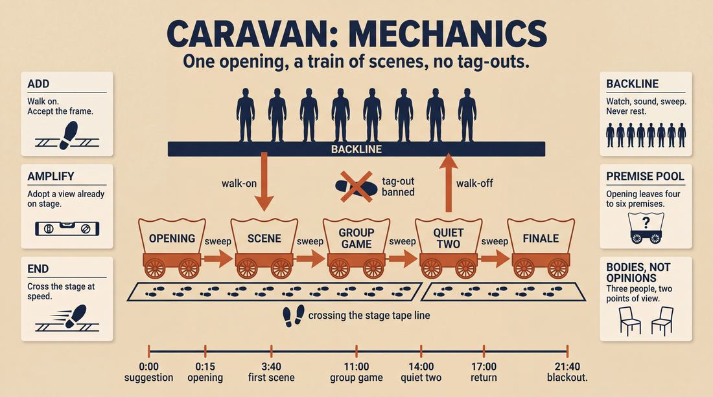
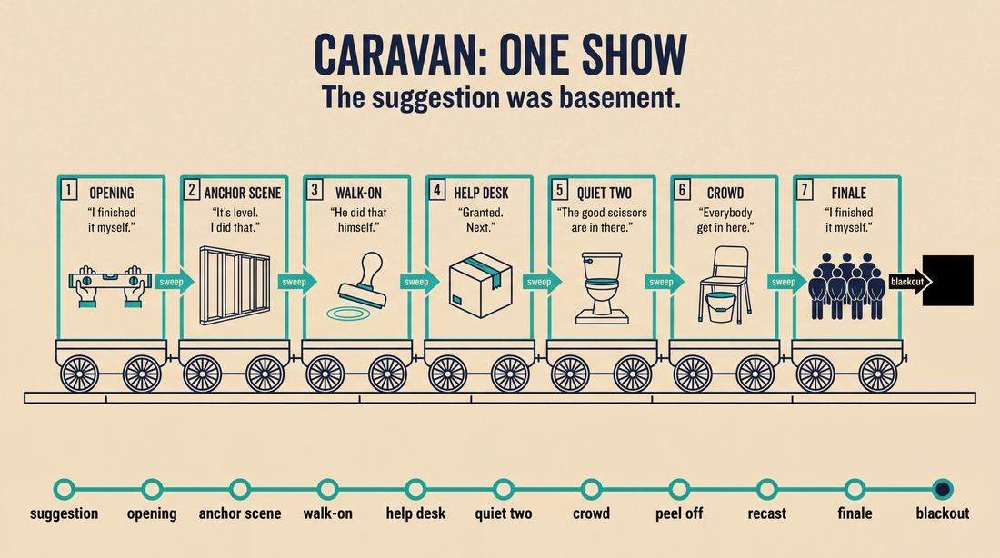
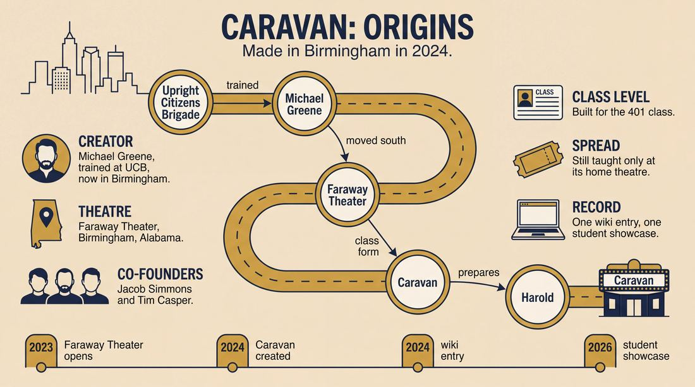
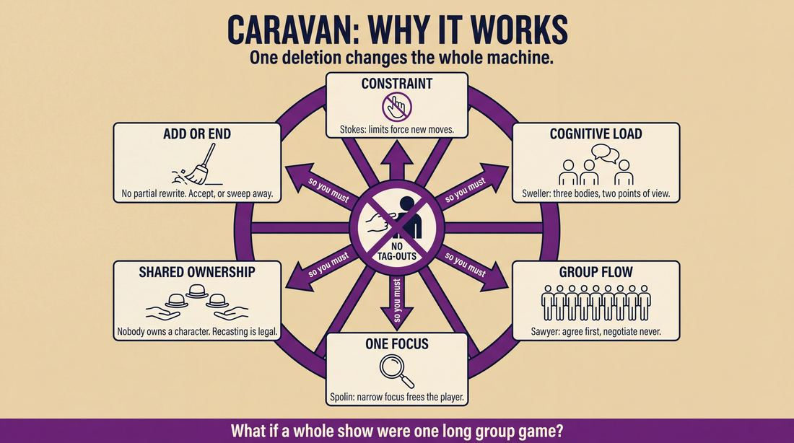
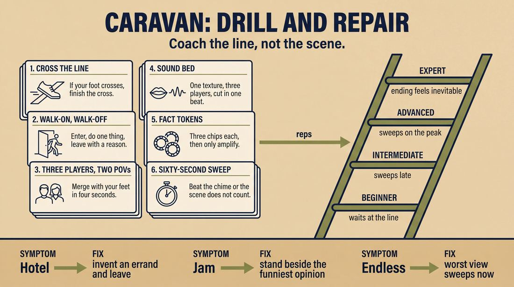

# Caravan

> **A complete study of the long-form improv format _Caravan_** - the original archived write-up, five infographics, grounded historical and pedagogical research, and a full mechanics-and-coaching manual.

| | |
|---|---|
| **Format** | Caravan |
| **Primary source** | [IRC Improv Wiki](https://wiki.improvresourcecenter.com/index.php?title=Caravan) |

---

## Contents

1. [Part I - The Original Write-Up](#part-i-the-original-write-up)
2. [Part II - The Infographics](#part-ii-the-infographics)
   - [1. Structure and Mechanics](#infographic-1-mechanics)
   - [2. A Show, Beat by Beat](#infographic-2-example)
   - [3. Origins and Lineage](#infographic-3-history)
   - [4. Why It Works](#infographic-4-theory)
   - [5. Rehearsal and Repair](#infographic-5-coaching)
3. [Part III - Research Dossier](#part-iii-research-dossier)
   - [Pass 1: History, Lineage, Literature and Scholarship](#research-history)
   - [Pass 2: Comparative Anatomy, Pedagogy and Production](#research-comparative)
4. [Part IV - Mechanics, Gameplay and Coaching Manual](#part-iv-mechanics-gameplay-and-coaching-manual)
   - [Pass 1: The Form, Its Mechanics and Its Gameplay](#manual-mechanics)
   - [Pass 2: Training, Coaching and Performance Companion](#manual-coaching)

---

## Part I - The Original Write-Up

*Verbatim archive of the source article, reproduced exactly as scraped. Everything after this section is generated elaboration built on top of it.*

### Caravan

##### The Caravan

The Caravan is a form created in 2024 by Michael Greene. It was created to introduce openings, premise, pattern based play, group games, and ensemble ownership of every aspect of the show to students in preparation for the Harold.

  

Structurally, the Caravan is simply any opening followed by a series of scenes. The only \*strict\* creative constraint is that "tag\-outs" are not allowed in the form.

Thematically, the Caravan aims to display a large variety of scene types and stage pictures.

  

When teaching the Caravan as a class, improvisers are exposed to traditional group game "templates" such as:

- Hey everybody, get in here
- Help Desk
- Pile On
- Peel Off
- Sound and Movement

  

Improvisers are however encouraged to initiate scenes with no particular structure in mind, and instead observe the following guiding principles:

- the number of people in a scene is not necessarily the same as the number of points of view. (3 person scenes are often 2 pov's)
- a scene only requires that the entire ensemble invests in what has already happened
- the entire ensemble has ownership of every character and every comedic idea

  

Because "tag\-outs" are prohibited, "walk\-ons" become an essential tool for the ensemble.

"Walk\-ons":

- Require the ensemble to manage sharing focus without the concrete edit that "tag\-outs" offer
- good "walk\-ons" have "walk\-offs"
- "walk\-ons" can be used to clarify base reality, point out unusually/funny behavior, or heighten established patterns
- This focus reinforces that every scene belongs equally to the improvisers in the scene \*\*and\*\* the backline.

  

While there is a strong focus on ensemble work, 2 person scenes are integral to the Caravan. The ensemble can support a 2\-person scene through scenic backline support such as soundscapes, or direct support via "walk\-ons". Finally, the ensemble is also encouraged to recognize when the best way to support a 2\-person scene is to simply sweep edit.

  

There is the well\-worn advice that group games should be 90% "yes" and 10% "and".

The Caravan asks, "What if an entire show followed this advice?"

---

*Archived from [https://wiki.improvresourcecenter.com/index.php?title=Caravan](https://wiki.improvresourcecenter.com/index.php?title=Caravan) (IRC Improv Wiki) on 2026-08-09 23:23 UTC.*

---

## Part II - The Infographics

*Five 16:9 posters, each teaching a different aspect of the format. Click any poster to enlarge.*

<a id="infographic-1-mechanics"></a>

### 1. Structure and Mechanics

*How the form is played: the shape of the piece, the opening, the roles, the edit vocabulary, the flow of information, and the clock.*

{ .diagram loading=lazy decoding=async width="1100" height="614" }


<a id="infographic-2-example"></a>

### 2. A Show, Beat by Beat

*A single worked performance from suggestion to blackout: what happens in each beat, with short real example lines and what the players are doing technically.*

{ .diagram loading=lazy decoding=async width="1100" height="614" }


<a id="infographic-3-history"></a>

### 3. Origins and Lineage

*Where the form came from: creators, dates, theatres, how it spread between schools and cities, and the key figures - a documented timeline and lineage map.*

{ .diagram loading=lazy decoding=async width="1100" height="614" }


<a id="infographic-4-theory"></a>

### 4. Why It Works

*The theory: the core principles of the form and the research and craft ideas that explain why the structure produces good improv, each tied to a specific mechanic.*

{ .diagram loading=lazy decoding=async width="1100" height="614" }


<a id="infographic-5-coaching"></a>

### 5. Rehearsal and Repair

*Training and fixing the form: the essential drills, the common failure modes with their symptom-and-fix pairs, and the markers of beginner through expert play.*

{ .diagram loading=lazy decoding=async width="1100" height="614" }


---

## Part III - Research Dossier

*Two research passes: the historical record, then the comparative and pedagogical record. Claims carry evidence tags - treat unverified items accordingly.*

<a id="research-history"></a>

### » Pass 1: History, Lineage, Literature and Scholarship

### Research Summary
*   **Documentation Level:** Extremely thin. The Caravan is a hyper-local, pedagogical format created in 2024. Outside of its home theater's syllabus and a single IRC Improv Wiki entry, it has virtually no searchable footprint in the broader improv community.
*   **Origin:** Created by UCB-trained improviser Michael Greene in 2024 for use at Faraway Theater in Birmingham, Alabama [DOCUMENTED].
*   **Purpose:** Designed specifically as a 401-level class format to bridge the gap between two-person scene work and the Harold, focusing on group mind, pattern recognition, and ensemble support [DOCUMENTED].
*   **Defining Constraint:** The form strictly prohibits "tag-outs" (the mechanic where an improviser taps a player on the shoulder to replace them and initiate a time/space jump or new scene) [DOCUMENTED].
*   **Mechanical Shift:** Because tag-outs are banned, the ensemble is forced to rely heavily on "walk-ons," "walk-offs," soundscapes, and sweep edits to support scenes and manage stage focus [DOCUMENTED].
*   **Philosophical Core:** It applies the traditional group-game advice of "90% yes and 10% and" to the entirety of the show, prioritizing hardcore agreement over complex negotiation [DOCUMENTED].
*   **Lineage:** It is a direct pedagogical descendant of the Upright Citizens Brigade (UCB) training structure, adapted for a developing regional market [INFERRED].

### Provenance and History
The Caravan was created in 2024 by Michael Greene, an improviser and actor who trained at the Upright Citizens Brigade in New York before relocating to Birmingham, Alabama [DOCUMENTED]. Greene, alongside Jacob Simmons and Tim Casper, founded the indie team "Gladys" and subsequently opened Faraway Theater in 2023 to build a UCB-style long-form community in a city that lacked one [DOCUMENTED]. 

The Caravan was developed to solve a specific pedagogical problem: preparing intermediate students (Faraway's 401 level) for the Harold. In traditional long-form training, students often use the "tag-out" as a crutch to abruptly alter scenes or inject themselves into the work without having to organically justify their presence. By strictly banning the tag-out, Greene forced students to master the "walk-on" (entering a scene in progress as a tertiary character) and the "walk-off" (leaving once the comedic purpose is served), thereby fostering true ensemble ownership of stage pictures [INFERRED]. 

The origin of the name "Caravan" is [UNVERIFIED]. It likely refers to the ensemble moving together as a single unit without leaving anyone behind, or it may be a nod to the jazz standard of the same name, but no primary source confirms this.

| Year | Event | Place / Company | Source |
| :--- | :--- | :--- | :--- |
| 2023 | Faraway Theater opens, establishing a new long-form curriculum. | Faraway Theater, Birmingham, AL | *Bham Now* (2023) |
| 2024 | The Caravan format is created by Michael Greene. | Faraway Theater, Birmingham, AL | IRC Improv Wiki |
| 2024 | The Caravan is documented on the IRC Improv Wiki. | IRC Improv Wiki | IRC Improv Wiki |
| 2026 | Documented performances of the Caravan by Faraway 401 students. | Faraway Theater, Birmingham, AL | Crowdwork / Faraway Theater listings |

### Lineage and Transmission
**EXPLICIT RECORD WARNING:** Because the Caravan was created in 2024, the searchable record of its transmission is virtually non-existent. It has not yet spread beyond its theater of origin. 

**Parent Form and Lineage:**
The Caravan is a direct descendant of the **Upright Citizens Brigade (UCB) Harold curriculum**. Its DNA is entirely rooted in UCB's "Game of the Scene" mechanics. The group games taught within the Caravan—"Hey everybody, get in here," "Help Desk," "Pile On," "Peel Off," and "Sound and Movement"—are canonical UCB and iO (ImprovOlympic) exercises [DOCUMENTED]. 

The form represents a fascinating mutation in transit: as UCB-trained improvisers like Greene moved to smaller regional markets post-2020, they had to build training centers from scratch. The Caravan is a bespoke "bridge" format, designed to teach UCB mechanics to students who do not have the benefit of watching mainstage Harolds every night [INFERRED].

### Key Figures
| Person | Role in this form | Specific contribution | Source URL |
| :--- | :--- | :--- | :--- |
| Michael Greene | Creator / Instructor | Designed the format in 2024; integrated it into the Faraway Theater curriculum. | [IRC Improv Wiki](https://wiki.improvresourcecenter.com/index.php?title=Caravan) |
| Jacob Simmons | Co-founder, Faraway Theater | Co-developed the theater and curriculum ecosystem where the form is taught. | [Bham Now](https://bhamnow.com/2023/09/01/5-birmingham-improv-groups-guaranteed-to-make-you-laugh/) |
| Tim Casper | Co-founder, Faraway Theater | Co-developed the theater and curriculum ecosystem where the form is taught. | [Bham Now](https://bhamnow.com/2023/09/01/5-birmingham-improv-groups-guaranteed-to-make-you-laugh/) |

### Canonical Shows, Companies and Recordings
Because the Caravan is a pedagogical tool rather than an indie-team calling card, there are no famous mainstage runs. The canonical performances are the **Faraway Theater 401 Student Showcases**. 
*   **401 Spring Student Showcase** (June 2, 2026) at Faraway Theater, Birmingham, AL. Billed as: "Get ready for anything to happen when our 401 students take the Faraway stage to put all their hard work on display as they use their class form The Caravan to create a never-before-seen long-form improv show right before your very eyes!" [DOCUMENTED].

There are currently no publicly available video recordings of the Caravan being performed.

### Published Literature
| Work | Author | Year | What it says about this form | Where to find it |
| :--- | :--- | :--- | :--- | :--- |
| *Caravan* (Wiki Article) | Anonymous / IRC Contributors | 2024 | Defines the structure, the ban on tag-outs, and the 90% yes / 10% and philosophy. | [IRC Improv Wiki](https://wiki.improvresourcecenter.com/index.php?title=Caravan) |
| *Faraway Theater 401 Syllabus* | Faraway Theater | 2026 | Describes the class focus on pattern recognition, group dynamics, and the Caravan showcase. | [Crowdwork / Faraway](https://farawaybham.com) |

### Verbatim Quotes
> "The Caravan is a form created in 2024 by Michael Greene. It was created to introduce openings, premise, pattern based play, group games, and ensemble ownership of every aspect of the show to students in preparation for the Harold."
> — *IRC Improv Wiki* (2024)
> [Source](https://wiki.improvresourcecenter.com/index.php?title=Caravan)

> "The only *strict* creative constraint is that 'tag-outs' are not allowed in the form."
> — *IRC Improv Wiki* (2024)
> [Source](https://wiki.improvresourcecenter.com/index.php?title=Caravan)

> "Because 'tag-outs' are prohibited, 'walk-ons' become an essential tool for the ensemble."
> — *IRC Improv Wiki* (2024)
> [Source](https://wiki.improvresourcecenter.com/index.php?title=Caravan)

> "There is the well-worn advice that group games should be 90% 'yes' and 10% 'and'. The Caravan asks, 'What if an entire show followed this advice?'"
> — *IRC Improv Wiki* (2024)
> [Source](https://wiki.improvresourcecenter.com/index.php?title=Caravan)

> "Our 401 class deals with group dynamics and the group mind. Where 201 and 301 were primarily focused on two-person scenes and grounded emotional points of view, our 401 will take a sharp turn as we dive deep into pattern recognition, playing the game of the scene, and using support moves to create something truly magical on stage."
> — *Faraway Theater 401 Class Description* (2026)
> [Source](https://farawaybham.com)

> "Get ready for anything to happen when our 401 students take the Faraway stage to put all their hard work on display as they use their class form The Caravan to create a never-before-seen long-form improv show right before your very eyes!"
> — *Faraway Theater Showcase Listing* (2026)
> [Source](https://farawaybham.com)

> "We all came from other regions of the country that had robust improv communities, and we didn't see a lot of that in Birmingham, so we were excited to foster that here."
> — *Michael Greene*, discussing the founding of Faraway Theater (2023)
> [Source](https://bhamnow.com/2023/09/01/5-birmingham-improv-groups-guaranteed-to-make-you-laugh/)

> "I'm not familiar with the Caravan but you can often find thematic associations by anthropomorphizing the suggestions a bit."
> — *Reddit User 'boredgamelad'* responding to a student asking about the form (2024)
> [Source](https://www.reddit.com/r/improv/comments/1b3a2x9/thematic_statements_for_an_invocation/)

### Anecdotes and Stories
**The Regional Translation of UCB Pedagogy**
The creation of the Caravan is a story of regional adaptation. Michael Greene, Jacob Simmons, and Tim Casper trained in New York, Chicago, and Los Angeles, respectively. When they found themselves in Birmingham, Alabama, they joined a local indie group called "Ugly Baby." Realizing the city lacked the rigorous, curriculum-driven long-form infrastructure they were used to, they formed their own team, "Gladys," and eventually opened Faraway Theater in 2023. The Caravan was born out of necessity a year later: Greene needed a way to force students to understand UCB-style ensemble support without relying on the aggressive, fast-paced "tag-out" runs that dominate coastal indie scenes. By stripping away the tag-out, Greene forced his Birmingham students to learn patience, stage-picture composition, and the delicate art of the walk-on.

**The Reddit Echo**
The hyper-local nature of the form is perfectly encapsulated by a February 2024 Reddit thread. An improv student posted asking for advice on making thematic "I am" statements for an Invocation-style opening, noting, "I think the form is called the Caravan?" The top response from a veteran improviser began, "I'm not familiar with the Caravan but..." This interaction highlights how bespoke training forms often leak onto the internet via confused students, only to be met with blank stares from the broader global improv community.

### Academic and Scientific Research
While there is no academic research on the Caravan itself, its specific mechanics align perfectly with established performance studies and cognitive science literature:

*   **Constraint-Induced Creativity:** Research by Patricia Stokes (*Creativity from Constraints*, 2005) demonstrates that introducing strict structural barriers forces subjects to abandon habitual pathways and discover novel solutions. 
    *   *Relevance to this form:* The Caravan's absolute ban on "tag-outs" acts as a generative constraint. Deprived of the easiest way to edit or heighten a scene, the ensemble must invent alternative support mechanisms (soundscapes, walk-ons, environmental embodiment).
*   **Cognitive Load Theory in Ensemble Performance:** Sweller's Cognitive Load Theory (1988) explores how working memory is limited. In improv, tracking multiple characters and games simultaneously often overwhelms novice performers.
    *   *Relevance to this form:* The Caravan explicitly teaches that "the number of people in a scene is not necessarily the same as the number of points of view (3 person scenes are often 2 pov's)." This principle directly reduces cognitive load, allowing a crowded stage to function smoothly by collapsing multiple actors into a single shared comedic premise.
*   **Group Flow and Collaborative Emergence:** Keith Sawyer's work on group creativity (*Group Genius*, 2007) emphasizes that peak collaborative flow requires immediate acceptance of offers without blocking or negotiation.
    *   *Relevance to this form:* The Caravan's guiding philosophy—that an entire show should operate on the "90% yes and 10% and" ratio usually reserved for group games—is a mechanical attempt to induce sustained group flow by removing the friction of narrative negotiation.

### Documented Variants and Descendants
As a format created in 2024, the Caravan has no documented variants or descendants. It is currently in its first generation of practice.

### Criticism, Debate and Known Failure Modes
Because the form is so new and localized, public debate is non-existent. However, based on its documented mechanics, practitioners of long-form [WIDELY PRACTICED, UNDOCUMENTED] would identify several inherent failure modes:

*   **The "Walk-On Hotel":** The wiki explicitly warns that "good 'walk-ons' have 'walk-offs'." Without the tag-out to cleanly wipe a character from the stage, a major failure mode of the Caravan is the stage becoming cluttered with tertiary characters who deliver a joke but fail to leave, muddying the base reality.
*   **Lack of Narrative Friction:** The form's thesis asks, "What if an entire show followed [the 90% yes / 10% and] advice?" While this creates highly supportive, fast-paced group games, applying it to two-person scenes can result in a lack of narrative friction. Conflict and negotiation (the "and" of "yes, and") are often required to ground a scene; a show that is 90% "yes" risks becoming a series of shallow, heightening agreements with no emotional stakes.
*   **Edit Paralysis:** Without tag-outs, the only way to end a scene is a sweep edit. If the backline is timid, scenes in the Caravan can drag on indefinitely, as players on stage cannot tag themselves out.

### Cultural Footprint
The Caravan's cultural footprint is currently restricted to the Birmingham, Alabama comedy scene. It serves as a fascinating case study in how major-market improv philosophies (UCB, iO) are being decentralized, codified, and rebranded by regional theater founders to serve the specific pedagogical needs of their local student bases.

### Gaps in the Record
*   **Origin of the Name:** It is entirely unverified why Michael Greene named the form "Caravan."
*   **Opening Mechanics:** The wiki states the form begins with "any opening," but it is unverified if Faraway Theater defaults to a specific opening (like an Invocation or Pattern Game) in practice.
*   **External Adoption:** It is unknown if any indie teams outside of the Faraway Theater student body have attempted to perform the Caravan.

### Source List
1. *Caravan* - IRC Improv Wiki - 2024 - https://wiki.improvresourcecenter.com/index.php?title=Caravan - Supports the structural rules, creation date, and philosophy of the form.
2. *5 Birmingham improv groups guaranteed to make you laugh* - Bham Now - 2023 - https://bhamnow.com/2023/09/01/5-birmingham-improv-groups-guaranteed-to-make-you-laugh/ - Supports the history of Faraway Theater, Michael Greene's background, and the regional context.
3. *401 Spring Student Showcase* - Crowdwork / Faraway Theater - 2026 - https://farawaybham.com (via Crowdwork ticketing) - Supports the active use of the form in Faraway's 401 curriculum.
4. *Faraway Theater Classes* - Crowdwork / Faraway Theater - 2026 - https://farawaybham.com (via Crowdwork ticketing) - Supports the pedagogical goals of the 401 class (pattern recognition, group mind).
5. *Thematic statements for an Invocation?* - Reddit (r/improv) - 2024 - https://www.reddit.com/r/improv/comments/1b3a2x9/thematic_statements_for_an_invocation/ - Supports the form's obscurity and hyper-local nature.

<a id="research-comparative"></a>

### » Pass 2: Comparative Anatomy, Pedagogy and Production

### Taxonomic Placement

```text
      Montage (Freeform)
             |
  +----------+----------+
  |                     |
Slacker              Caravan
(Tag-out driven)   (Walk-on driven)
                        |
                     Harold
               (Target destination)
```

The Caravan sits as a pedagogical bridge between the unstructured Montage and the highly structured Harold. Created by Michael Greene in 2024 at Faraway Theater, it is explicitly designed to train ensemble ownership, premise generation, and pattern-based play. By completely banning the tag-out—a crutch often used in freeform montages and the foundational mechanic of the Slacker—the Caravan forces players to rely on walk-ons, sweep edits, and shared points of view (POVs). These are the exact prerequisite skills needed to successfully execute Harold group games.

### Head-to-Head Comparisons

**Caravan vs. Montage**

| Axis | Caravan | Montage | Consequence for the players |
|---|---|---|---|
| Opening | Required (any type) | Optional | Caravan players must pull thematic premises from an opening rather than starting cold. |
| Structure | Opening followed by scenes | Series of scenes | Caravan has a defined starting boundary and thematic anchor. |
| Edit logic | Sweep edits only (Tag-outs banned) | Sweep edits, tag-outs, space work | Caravan players must physically enter and exit the stage to alter a scene, preventing "lazy" editing. |
| Memory | High (ensemble owns all characters) | Low to Medium | Caravan players must track all established comedic ideas to heighten them via walk-ons. |
| Cast size | 6-8 | 4-12 | Caravan requires enough players to execute "Pile On" or "Help Desk" group games. |
| Audience contract | Thematic exploration | Rapid-fire comedy | Caravan audiences expect patterns to heighten rather than narratives to resolve. |
| Failure mode | Orphaned walk-ons | Endless scenes | Caravan players must actively manage their stage time and exits. |

**Caravan vs. Harold**

| Axis | Caravan | Harold | Consequence for the players |
|---|---|---|---|
| Opening | Required | Required | Both use the opening to generate premises. |
| Structure | Unstructured series of scenes | Strict 3-beat structure with group games | Caravan removes the cognitive load of tracking beats (1A, 1B, 1C) to focus purely on pattern play. |
| Edit logic | No tag-outs | Tag-outs allowed (often in 2nd/3rd beats) | Caravan forces players to use walk-ons to heighten, whereas Harold players can tag out to explore tangents. |
| Memory | Ensemble ownership of ideas | Strict tracking of specific storylines | Caravan allows any player to play any character or heighten any idea, breaking the "my scene" mentality. |
| Cast size | 6-8 | 6-8 | Identical stage picture. |
| Audience contract | 90% Yes, 10% And | Woven narrative and thematic convergence | Caravan audiences watch a single idea get blown out, rather than waiting for disparate ideas to connect. |
| Failure mode | POV Traffic Jam | Forgetting the 3rd beat | Caravan players must actively merge POVs to avoid stage clutter. |

**Caravan vs. Slacker**

| Axis | Caravan | Slacker | Consequence for the players |
|---|---|---|---|
| Opening | Required | None | Caravan is premise-driven; Slacker is organically driven. |
| Structure | Series of scenes | Chain of tag-outs | Caravan is the structural antithesis of the Slacker. |
| Edit logic | Tag-outs strictly banned | Tag-outs are the only edit allowed | Caravan forces shared stage time; Slacker forces rapid isolation of characters. |
| Memory | Thematic | Character-based | Caravan tracks the "game"; Slacker tracks the "who". |
| Cast size | 6-8 | 4-8 | Similar cast size, entirely different deployment. |
| Audience contract | Pattern recognition | Character exploration | Caravan delivers escalating group games; Slacker delivers a character kaleidoscope. |
| Failure mode | Plot spiral | Dead-end characters | Caravan players must avoid narrative; Slacker players must avoid boring characters. |

**Caravan vs. Monoscene**

| Axis | Caravan | Monoscene | Consequence for the players |
|---|---|---|---|
| Opening | Required | None | Caravan generates premises externally; Monoscene generates them internally. |
| Structure | Multiple scenes/locations | Single location, continuous time | Caravan allows location jumping via sweep edits. |
| Edit logic | Sweep edits, walk-ons | Entrances and exits only | Caravan resets the base reality frequently; Monoscene never resets. |
| Memory | Thematic | Spatial and temporal | Caravan tracks ideas; Monoscene tracks physical objects and timeline. |
| Cast size | 6-8 | 4-8 | Similar cast size. |
| Audience contract | Variety of stage pictures | Real-time voyeurism | Caravan promises variety; Monoscene promises continuity. |
| Failure mode | Orphaned walk-ons | Dropped object work / trapped players | Caravan players must exit cleanly; Monoscene players must justify leaving the room. |

### What Makes It Uniquely Itself

1. **The Absolute Prohibition of Tag-Outs:** This is the defining negative constraint. By removing the ability to freeze a scene and replace a character, players are forced to use walk-ons, walk-offs, and sweep edits. This physically alters how the ensemble interacts with the stage, demanding higher spatial awareness and focus-sharing.
2. **Decoupled Player-to-POV Ratio:** The form explicitly codifies that the number of bodies on stage does not equal the number of perspectives. A three-person scene is expected to have only two POVs (two players sharing a single hive-mind perspective). This prevents the "crowded stage" pathology common in beginner group games.
3. **The 90% "Yes" / 10% "And" Show-Wide Philosophy:** While usually applied only to isolated group games, Caravan applies this ratio to the entire runtime. Players are instructed to almost exclusively agree and heighten existing patterns rather than introducing new information, turning the entire show into a macro-group game.

### Structural Variants in Practice

- **The Faraway Theater Level 4 Caravan (Birmingham, AL):** Taught by Michael Greene. Used as a strict pedagogical tool where students must explicitly deploy the five UCB-style group game templates (Hey everybody get in here, Help Desk, Pile On, Peel Off, Sound and Movement) throughout the show.
- **The Performance Caravan [CRAFT CONSENSUS]:** Played by experienced house teams. The strict adherence to the five templates is relaxed, allowing for organic, unstructured scenes, provided the core rules (no tag-outs, ensemble ownership, 90/10 Yes/And ratio) are maintained.

### The Teaching Ladder

| Stage | Skill introduced | Why in this order | Typical exercise | Source or [CRAFT CONSENSUS] |
|---|---|---|---|---|
| 1 | Walk-ons and Walk-offs | Because tag-outs are banned, players must first learn how to enter, heighten, and immediately exit without lingering. | Walk-on / Walk-off Drill | [CRAFT CONSENSUS] |
| 2 | Decoupling POV from Player Count | Prevents stage clutter before introducing full group games. Teaches players to adopt an existing perspective rather than inventing a new one. | 3 Players, 2 POVs | IRC Improv Wiki |
| 3 | Backline Support | Teaches the ensemble how to contribute to a 2-person scene without physically entering the stage. | Backline Soundscape | IRC Improv Wiki |
| 4 | Group Game Templates | Provides concrete structures for multi-person scenes once players understand shared POVs and walk-ons. | Help Desk / Pile On | IRC Improv Wiki |
| 5 | 90% Yes / 10% And | Shifts the focus from narrative plot to pattern-based heightening across the entire show. | The "No New Info" Scene | IRC Improv Wiki |

### Documented Drills and Exercises

| Drill | Origin / teacher | How to run it | What it fixes in this form | Source |
|---|---|---|---|---|
| Hey everybody, get in here | UCB Tradition / Michael Greene | Player 1 establishes a specific, unusual behavior. Player 1 yells "Hey everybody, get in here!" The entire backline enters and perfectly mimics the behavior. | Teaches the 90% Yes rule and immediate ensemble investment. | IRC Improv Wiki |
| Help Desk | UCB Tradition | Player 1 is a "straight man" behind a desk. The backline rotates in one by one as absurd characters with a shared thematic flaw. | Trains pattern recognition and clean walk-offs. | [CRAFT CONSENSUS] |
| Pile On | UCB Tradition | Two players establish a base reality. Backline players enter one at a time, adopting the exact same POV as one of the original players, physically piling onto the stage picture. | Reinforces the decoupled Player-to-POV ratio. | IRC Improv Wiki |
| Peel Off | UCB Tradition | A scene starts with the entire cast on stage sharing a chaotic premise. Players invent justifications to exit one by one until only two remain. | Fixes the "Endless Scene" by training players to edit themselves via walk-offs. | IRC Improv Wiki |
| Sound and Movement | Viola Spolin / UCB | Players stand in a circle. Player 1 makes an abstract sound and movement. Player 2 perfectly mimics it, then heightens it, passing it to Player 3. | Trains ensemble mind and non-verbal pattern heightening. | IRC Improv Wiki |
| The Walk-On / Walk-Off Drill | [CRAFT CONSENSUS] | Two players do a scene. A backline player must enter, deliver exactly one line or action that heightens the game, and immediately exit. | Fixes the "Orphaned Walk-On" pathology. | [CRAFT CONSENSUS] |
| 3 Players, 2 POVs | Michael Greene | Three players are assigned to a scene. Two of them must immediately identify each other and play as a single hive-mind with the exact same opinions. | Fixes the "POV Traffic Jam" on a crowded stage. | IRC Improv Wiki |
| Backline Soundscape | [CRAFT CONSENSUS] | Two players perform a silent physical scene. The backline provides all dialogue, sound effects, and environmental noise. | Trains the backline to support without needing a tag-out. | IRC Improv Wiki |
| The 60-Second Sweep | [CRAFT CONSENSUS] | Scenes are run with a strict 60-second time limit. The backline must execute a full-stage sweep edit before the timer rings. | Fixes the hesitation to edit caused by the lack of tag-outs. | [CRAFT CONSENSUS] |
| The 90/10 Scene | Michael Greene | Two players start a scene. After the first three lines of dialogue, no new factual information can be introduced; players may only agree and amplify what was already said. | Fixes "Plot Spirals" and forces pattern-based play. | IRC Improv Wiki |

### Common Failure Modes and Diagnoses

| Failure mode | What it looks like from the audience | Root cause | Fix | Who names it |
|---|---|---|---|---|
| The Orphaned Walk-On | A player enters to deliver a joke, but stays on stage silently, cluttering the scene. | Forgetting that "good walk-ons have walk-offs." | The player must invent an immediate physical justification to exit the stage. | Michael Greene / IRC Improv Wiki |
| The POV Traffic Jam | Four players on stage arguing four completely different perspectives, leading to noise and confusion. | Equating player count with POV count. | Two players must immediately drop their premise and adopt the POV of a third player. | Michael Greene / IRC Improv Wiki |
| The Endless Scene | A scene drags on past its comedic peak because the backline is waiting for a tag-out that is banned. | Fear of the sweep edit; reliance on tag-outs as a crutch. | The backline must aggressively run across the downstage line to sweep the scene. | [CRAFT CONSENSUS] |
| The Plot Spiral | The scene devolves into a complex narrative about what happens next, abandoning the comedic game. | Ignoring the 90% Yes / 10% And rule; introducing too much new information. | Players must stop adding facts and start heightening the emotional reaction to existing facts. | [CRAFT CONSENSUS] |

### Production and Logistics

- **Cast size and why:** 6 to 8 players. This provides enough bodies to execute large group games (like Pile On or Peel Off) while leaving enough players on the backline to provide soundscapes and walk-ons for 2-person scenes.
- **Runtime:** 20 to 25 minutes. The high-energy, pattern-heavy nature of the 90% Yes / 10% And philosophy burns out quickly if extended to a full hour.
- **Stage layout:** Standard bare stage with a defined backline. The downstage area must be kept clear for aggressive sweep edits.
- **Chairs and set:** 2 to 4 armless chairs, easily movable for rapid stage picture changes.
- **Lighting and tech cues:** Standard warm wash. A blackout is required on the final sweep edit to signal the end of the form.
- **Music and sound:** No external music required; the form relies heavily on the ensemble generating their own backline soundscapes.
- **MC and host duties:** Standard introduction. The host should briefly explain that the audience will see a series of interconnected scenes inspired by a single suggestion.
- **How the suggestion is taken:** A single, open-ended suggestion (e.g., a word, a proverb, or an object) is taken to inspire the opening.
- **Where the form belongs in a show lineup:** Ideal as the middle act of a three-team bill, or as the featured graduation show for an upper-level training center class.
- **Rehearsal cadence:** Weekly 2-to-3-hour sessions, heavily front-loaded with group game template drills and walk-on/walk-off mechanics.
- **What a producer must prepare:** A stage wide enough to accommodate 8 players standing in a straight backline without spilling into the wings, ensuring clean walk-ons.

### Adaptations Beyond the Stage

- **Classroom and youth:** The Caravan is highly effective for youth improv because the ban on tag-outs removes the aggressive, sometimes exclusionary mechanic of "cutting someone out" of a scene. It forces students to share the stage and practice active agreement.
- **Corporate and applied improv:** Used for team-building to demonstrate organizational alignment. The "3 Players, 2 POVs" mechanic teaches employees how to align with a colleague's perspective rather than competing for dominance.
- **Online and remote:** "Walk-ons" are executed by turning the camera on, delivering a line, and turning the camera off. Sweep edits are executed by all players turning their cameras off simultaneously.
- **Community and therapeutic settings:** The 90% Yes / 10% And rule provides a highly supportive environment for individuals with social anxiety, as the cognitive load of inventing new information is drastically reduced.
- **Accessibility and inclusion considerations:** For players with mobility impairments, the physical "walk-on" and "sweep edit" can be replaced with a clear verbal cue (e.g., saying "Walk-on" or "Sweep") or a lighting change.
- **Content-safety and consent practices:** Because the form relies on ensemble ownership, any player on the backline can execute a sweep edit to immediately terminate a scene that crosses a boundary, without needing to justify it narratively.
- **Ethics of using real stories:** If the opening uses personal monologues (like an Armando), the ensemble must ensure that walk-ons heighten the *theme* of the story rather than mocking the *vulnerability* of the storyteller.

### Evidence Base for Those Adaptations

- **Sawyer (2003):** Research on group creativity demonstrates that removing individual ownership of ideas (as seen in Caravan's ensemble ownership rule) increases the overall creative output of the group.
- **Spolin (1963):** Theater games research supports the use of strict negative constraints (like banning tag-outs) to force students out of habitual performance patterns and into genuine discovery.

### Scholarly Frames Worth Applying

- **Keith Sawyer on Collaborative Emergence:** Sawyer argues that true group creativity occurs when no single individual can predict the final outcome, and the performance emerges from continuous, unpredictable micro-interactions. *Mapping:* This maps directly to the Caravan's rule that the entire ensemble has ownership of every character and comedic idea, preventing any one player from dictating the plot.
- **Viola Spolin on Point of Concentration (POC):** Spolin posits that giving players a specific, narrow focus frees them from the pressure to "be funny" and allows organic play to occur. *Mapping:* The "90% Yes / 10% And" rule acts as the POC for the entire show, focusing the players entirely on heightening rather than inventing.
- **Mary Crossan on Organizational Improvisation:** Crossan explores how organizations must balance the structure of existing routines with the spontaneity of new ideas. *Mapping:* The Caravan balances this by using strict group game templates (Help Desk, Pile On) as the organizational routine, while the specific content of the scenes provides the spontaneity.

### Where the Form Is Heading

Currently, the Caravan is utilized primarily as a pedagogical stepping stone at Faraway Theater in Birmingham, AL, under the direction of Michael Greene. It serves as a "training wheels" format to prepare students for the Harold by isolating and drilling group games and ensemble support. As UCB-trained improvisers continue to open regional theaters, forms like the Caravan are emerging as necessary correctives to the "tag-out heavy" montage styles that dominated indie improv in the late 2010s. Contemporary companies are using it not just as a class show, but as a diagnostic tool in rehearsals to fix house teams that suffer from "POV Traffic Jams" or weak backline support.

### Source List

1. Caravan - IRC Improv Wiki - 2025 - https://wiki.improvresourcecenter.com/index.php?title=Caravan - Supports the creation date, creator (Michael Greene), the strict ban on tag-outs, the 90/10 Yes/And philosophy, and the specific group game templates taught.
2. Faraway Theater Is Making It Up As They Go - Carrie Rollwagen Podcast - 2024 - https://carrierollwagen.com/podcast-episodes/faraway-theater-is-making-it-up-as-they-go/ - Supports Michael Greene's background, his UCB training, and the pedagogical context of Faraway Theater in Birmingham, AL.
3. Group Creativity: Music, Theater, Collaboration - Keith Sawyer - 2003 - https://psycnet.apa.org/record/2003-04303-000 - Supports the scholarly frame of collaborative emergence and the evidence base for ensemble ownership.
4. Improvisation for the Theater - Viola Spolin - 1963 - https://archive.org/details/improvisationfor00spol - Supports the scholarly frame of Point of Concentration and the Sound and Movement drill.
5. Organizational Improvisation - Mary Crossan - 1998 - https://www.jstor.org/stable/259189 - Supports the scholarly frame of balancing structure (templates) with spontaneity.

---

## Part IV - Mechanics, Gameplay and Coaching Manual

*Synthesis over the original article and both research dossiers: first how the form works and how to play it, then how to train an ensemble to perform it.*

<a id="manual-mechanics"></a>

### » Pass 1: The Form, Its Mechanics and Its Gameplay

### At a Glance

| Field | Entry |
|---|---|
| **Also known as** | No alternate name on record. Referred to at its home theatre simply as "the 401 form" or "the class form." |
| **Family** | Montage family — specifically the *opening-plus-scenes* branch of UCB/Harold-preparatory pedagogy. A montage with one absolute prohibition bolted on. |
| **Cast size** | 6–8 (documented). Playable at 5; degrades above 10 because the backline stops being able to read each other's intent. |
| **Runtime** | 20–25 minutes. The 90/10 agreement economy exhausts a cast fast; a 45-minute Caravan is a different, worse show. |
| **Opening** | Required, type unspecified: "any opening." Pattern Game, Invocation, Living Room, monologue, sound-and-movement — director's choice. |
| **Suggestion taken** | One open-ended suggestion — a word, an object, a proverb — taken once, for the opening only. Never re-solicited mid-show. |
| **Structural rigidity** | **2 / 5** on skeleton (an opening, then scenes, in any order and number) but **5 / 5** on behaviour (one absolute prohibition governs every second of stage time). Score it 2 with an asterisk and read the Rules section. |
| **Difficulty** | **4 / 5.** Trivially easy to *start*; the difficulty is relocated from the players onstage to the players standing still. |
| **Prerequisites** | Competent two-person scene work; ability to name the game of a scene while watching it; physical courage to cross the stage; prior exposure to at least two group-game templates. |
| **Best for** | Classes bridging two-person work to the Harold; house teams with dead backlines; mixed-ability casts; youth and corporate work; rehearsal diagnostics. |
| **Avoid when** | Cast is under 5; the team's strength is narrative or relationship long-form; the slot demands a 45-minute headline piece; the venue's geometry means the backline can't see the stage or each other (traverse, in-the-round with a split backline). |

---

### The Essence in One Paragraph

The Caravan is a montage — an opening, then a run of scenes — with a single absolute prohibition: **no tag-outs**. You may never tap a player out and take their place. That one deletion removes the improviser's fastest tool for altering a scene from the outside, and everything distinctive about the form is the pressure wave from that deletion. Deprived of *replace*, the ensemble is left with exactly three verbs: **add** (walk on as a new body), **amplify** (adopt a point of view already on stage), and **end** (cross the whole stage and sweep). Because you can only ever add to a scene, never overwrite it, every player must invest in what has already happened rather than negotiating what should happen next — which is why the form runs on the group-game ratio of "90% yes, 10% and" applied to the entire show, and why the wiki frames the whole format as a question: *what if a show were one long group game?* The ensemble collectively owns every character and every comedic idea, so a premise established in minute four can be picked up by a different body in minute sixteen. The aesthetic goal is a wide variety of scene types and stage pictures — two-person scenes, eight-person pile-ons, silent scenes fed by a backline soundscape — cycling past the audience like a train of wagons, each one different, all going the same direction.

---

### Why This Form Exists

The Caravan was built by Michael Greene at Faraway Theater in Birmingham, Alabama in 2024, as a 401-level class form for students who had spent 201 and 301 on grounded two-person scenes and were about to meet the Harold. It solves a stack of specific pedagogical problems that a plain montage does not.

**Problem 1: In a plain montage, a scene belongs to the two people in it.** Everyone else becomes an audience with better sightlines. A montage will happily let a talented pair carry twenty minutes while six people stand still and think about lunch. The Caravan makes the backline structurally load-bearing: the *only* way a scene can end is if a backline player physically crosses the stage, and the only way a scene can get bigger is if a backline player walks on. Editing courage and support are no longer virtues; they are the transmission.

**Problem 2: The tag-out is a crutch that looks like a skill.** A tag-out lets you inject yourself into a scene without justifying your presence in that world, and lets you rewrite a scene's frame without having accepted the frame first. Students learn to *interrupt* fluently and never learn to *join*. Ban it and the student has exactly one way in: enter as a real, additional person, in this room, right now, with a reason to be here and a reason to leave. That is the walk-on, and the walk-on is a strictly harder skill that the tag-out lets you skip forever.

**Problem 3: The Harold asks a student to learn six things at once.** Beat structure (1A/1B/1C), group games, thematic weaving, callback discipline, premise, and pattern play arrive as one indigestible lump, and the student, overloaded, defaults to plot. The Caravan strips out the beat obligation entirely — there is no 1A, no third beat, no convergence requirement — and leaves the two ingredients Greene wanted isolated: **openings as a premise source**, and **group mind as a support technology**. It is a Harold with the timetable removed and the ensemble muscles kept.

**Problem 4: Beginners equate bodies with opinions.** Four players on stage becomes four arguments. The Caravan codifies the counter-rule — "the number of people in a scene is not necessarily the same as the number of points of view; 3 person scenes are often 2 pov's" — as a first-class principle rather than a note given after a bad group game.

**What it buys you that a montage does not:** a guaranteed premise pool from the opening; a stage population that is always a deliberate compositional choice; scenes that *complete their thought* because nothing can interrupt them except a total edit; and a diagnostic that makes a team's weakest link visible within four minutes. If a Caravan is dull, it is almost never the two people talking — it is the six people not moving. That's the point of the machine.

---

### The Audience Contract

The audience never hears the word "Caravan," never learns that tag-outs are banned, and should not need to. What they perceive is a set of promises made in the first ninety seconds and kept for twenty minutes.

**What they are promised**

1. **One suggestion, one world of ideas.** They gave a word; the opening visibly digests it; every scene that follows will smell of that word. They are not watching unrelated sketches.
2. **The whole cast is playing one thing.** Nobody on that back wall is off duty. When the audience glances at the backline (and they do, constantly, in a form with an eight-person line), they see eight people watching hard. That is a promise of competence.
3. **The moment you are watching will not be yanked away.** This is the Caravan's unique and under-appreciated gift. In tag-heavy improv the audience learns, subconsciously, not to invest in any given exchange because it can be deleted at any second. In a Caravan, once two people are talking, they will finish the thought. The audience relaxes into scenes.
4. **Variety of picture.** They are promised a train of different-shaped wagons: two people at a table, then eight people in a line, then one person alone with a wall of sound behind them. Not the same rectangle nine times.
5. **Recognition, not resolution.** The pleasure being sold is "oh — *that* again, bigger," not "and so the marriage was saved." Pattern gratification, delivered in escalating doses.

**How they know where they are**

- **The downstage line is the only door.** Everything that changes the stage picture happens by a human body crossing that line. The audience learns this by minute three without being told, and it becomes their grammar: body in = something is being added; body out = something is finished; body all the way across = we are somewhere new.
- **Population is punctuation.** Two people = a thought being examined. Five people = the thought being agreed with. Eight people = the thought at maximum volume. Back to two = the aftermath.
- **The opening is the glossary.** Any phrase repeated in the opening becomes a word the audience can now read. When it recurs in scene six, they get the private joy of translation.

**What breaks the contract**

| Break | What the audience actually experiences |
|---|---|
| An attempted tag-out | A visible hiccup. They don't know the rule, but they see one player reach for another, the machinery stutter, and the improvisers glance at each other. Trust drops. |
| The orphaned walk-on | Genuine confusion about where to look. A person is standing on stage, in frame, silent, and the audience cannot tell whether they matter. Every laugh gets 20% quieter. |
| A dead backline | The scene is being performed *for* the ensemble instead of *with* it. The audience mirrors the backline: if the eight people who know the show best look bored, so will row three. |
| Nine scenes in the same rectangle | The promise of variety was made by the opening's energy and then broken. Reads as "this team only knows one shape." |
| The opening never returning | The suggestion feels wasted. The audience filed those images away and was never asked to retrieve them. |
| A scene that outlives its peak by ninety seconds | The audience learns that nobody is driving. Every subsequent scene is watched with anxiety about when it will end. |

---

### Anatomy: The Full Structural Map

The documented structure is deliberately minimal: **any opening, then a series of scenes, no tag-outs.** That is the whole of the record. What follows is a recommended architecture — my shaping of a formless spec into something a director can actually rehearse on Thursday. Treat the *units* as real and the *clock* as a default to be violated on purpose.

**The three movements (craft recommendation, not doctrine)**

1. **The Unpacking (minutes 4–11).** Two or three mostly-two-person scenes that spend the opening's premise pool. Small pictures. The ensemble's job is to identify, from the backline, exactly what unusual behaviour each scene has put on the floor.
2. **The Crowd (minutes 11–17).** The first full-ensemble picture, grown out of a premise already established — not invented fresh. Then a deliberate contrast: a quiet two-person scene held by soundscape.
3. **The Return (minutes 17–22).** Recasting and pattern transplant. Ideas from movement 1 reappear in new worlds and new bodies. A final picture that puts the largest number of people on stage doing the smallest established thing, then a button.

```
 0:00   0:15                              4:00
  |      |                                 |
  v      v                                 v
[SUG]->[============ OPENING =============]
                       |
                       |  yields the PREMISE POOL:  P1  P2  P3  P4  P5
                       v
  BACKLINE ▓▓▓▓▓▓▓▓▓▓▓▓▓▓▓▓▓▓▓▓▓▓▓▓▓▓▓▓▓▓▓▓▓▓▓▓▓▓▓▓▓▓▓▓▓▓▓▓▓▓▓▓▓▓▓▓▓▓▓▓
            │ ↑        │ ↑          ↑↑↑↑↑↑        │ ↑        │  ↑    ╲
   walk-on  ↓ │walk-off↓ │          ││││││ peel   ↓ │        ↓  │     ╲
            │ │        │ │          ↓↓↓↓↓↓ off    │ │        │  │      ↘
  STAGE   [ SC1 ]▌[ SC2 ]▌[  GROUP GAME (8p→2p) ]▌[ SC4 ]▌[ SC5 ]▌[ FINALE ]▌
            2p+1    2p         "hey everybody"      2p+       recast    ALL
            ▲                                     soundscape    ▲        │
            │                                                   │      BLACKOUT
            └────── recast / pattern transplant ────────────────┘

  ▌  = SWEEP EDIT: one body crosses the entire stage, downstage, at speed
  ↓  = walk-on (add)        ↑ = walk-off (subtract)
  ▓  = backline: eight people, feet planted, eyes on the scene, always
  ✖  = TAG-OUT — does not exist in this diagram and never will
```

**Beat-by-beat**

| Unit | Approx. clock | What happens | Who drives it | Success criterion | Common error |
|---|---|---|---|---|---|
| Suggestion | 0:00–0:15 | Host or a player asks for one open word/object/proverb. Taken once. | Host or designated asker | The suggestion is concrete and has physical/social texture ("basement," not "love") | Taking three suggestions, or asking for "a relationship" — a suggestion that pre-loads narrative |
| Opening | 0:15–3:30 | Any opening. Its job is to deposit 4–6 reusable premises and at least two repeatable phrases into shared memory. | Whole ensemble | Every player can name, silently, two things they intend to play | Treating the opening as a warm-up rather than a pantry; ending with nothing anyone wants to play |
| The Step-Out | 3:30–3:40 | Opening resolves; one or two players step downstage. Backline resets to a straight line. | Any single player | Somebody moves within four seconds of the opening's last beat | Six people stepping out simultaneously; or a nine-second stare-off |
| **SC1 — Anchor scene** | 3:40–6:00 | Usually two people. Establishes one unusual behaviour clearly enough that the backline can name it in one sentence. | The two players; backline watches for the "thing" | A backline player could write the game on a card by 4:30 | Starting with plot ("we should sell the house") instead of behaviour |
| First walk-on | ~5:00 | One backline player enters, confirms or heightens the behaviour, and **leaves**. | The entering player | The entrance makes the existing game clearer, not different; the exit is justified | The walk-on introduces a fourth premise; the walk-on doesn't leave |
| Sweep 1 | ~6:00 | A backline player crosses the full downstage width at speed. Stage clears. | Any backline player | It lands within 10 seconds of the biggest laugh | Waiting for the scene to "finish," which it never will |
| SC2–SC3 | 6:00–11:00 | Two more scenes, ideally different shapes: one two-person, one three-person-two-POV. | Initiators; backline curates variety | The audience has now seen at least three distinct stage pictures | All three scenes are two people standing three feet apart |
| **First ensemble game** | 11:00–14:00 | A premise from SC1–SC3 escalates into a full-cast picture: Pile On, Help Desk, "Hey everybody, get in here." | Whichever player calls or opens the picture | The whole cast is playing **one or two** POVs, not eight | POV traffic jam — eight opinions, no game |
| Peel Off | 13:00–14:00 | The big picture is drained one justified exit at a time, often down to two players and a residue of feeling. | Each departing player | Every exit is a specific justification, not a shuffle | Everyone leaves at once, which is a sweep in disguise |
| **The Quiet Two** | 14:00–17:00 | A deliberate contrast: a small, grounded scene. Backline supplies soundscape rather than bodies. | Two players + backline sound | The audience leans in; the laugh rate drops and the attention rises | The backline "helps" by walking on and stomping the intimacy |
| The Return | 17:00–20:30 | Recast characters and transplanted patterns. Scene four's rule appears in a new world; scene one's character appears in a new body. | Any player claiming a previously established idea | Audience recognition audible on entrance, before the line | Callback as pure repetition — the same joke at the same size |
| Finale picture | 20:30–21:40 | Largest population doing the smallest established thing. Often a physical pattern with a verbal callback. | Ensemble; one player buttons it | The last line is a phrase the audience learned in the opening | An invented "ending" — a wedding, an explosion, a hug |
| Button + blackout | 21:40–22:00 | Sharp line, hold, lights out. | Tech, on a pre-agreed visual cue | The blackout arrives on the laugh, not after it | Lights fading through three more lines of improvising |

---

### The Opening

The record is explicit and thin: the Caravan begins with **"any opening."** Whether Faraway defaults to a specific one is unverified; a 2024 Reddit thread from a student working on "I am" statements for what they thought was the Caravan hints at Invocation-style openings in the classroom, but that is one confused student and not evidence. So the director chooses, and the choice matters more than in a Harold — because the Caravan has no beat structure to fall back on, **the opening is the only source of shared material the show gets.** Everything else must be generated by the ensemble reading each other in real time.

**What a Caravan opening must deliver (this is the spec, whatever form you use)**

1. **4–6 premises** — not topics. A premise is a *behaviour with an attitude attached*: "people are proud of home improvements that are visibly incomplete," not "houses."
2. **At least two repeatable phrases** — verbatim lines anyone can say later and everyone will recognise. These become the show's callback currency.
3. **At least one physical or vocal object** — a gesture, a posture, a sound. Non-verbal callbacks survive better under the 90/10 rule than verbal ones.
4. **A tonal floor.** The opening tells the cast how absurd this show is allowed to be. A dreamlike opening licenses dreamlike scenes; an observational one forbids them.

**Standard procedure (Pattern Game default — my recommended house choice for teaching)**

1. Cast stands in a loose arc, all facing out. No one hides at the ends.
2. Host takes one suggestion. A player repeats it aloud, once, cleanly.
3. **Round 1 — Association (30 sec).** Single words or short images from the suggestion. No sentences. Do not judge; do not connect yet.
4. **Round 2 — Statements (60 sec).** Full sentences with an opinion or an observation of behaviour. "Every basement stair is a little bit the wrong height." This is where premises are made.
5. **Round 3 — Patterning (60 sec).** Players echo, extend and heighten each other's *statements* rather than the suggestion. Two or three ideas will start to accumulate lines. Feed the ones that are accumulating.
6. **Round 4 — Crystallisation (30 sec).** Speech slows. The strongest phrase gets repeated by two or three players. Silence lands.
7. **The step-out.** One player steps downstage into a scene within four seconds. Everyone else forms a straight backline, downstage-facing, immediately.

> **Coaching note on step 7:** the fatal seam in this form is the four seconds after the opening. In a Harold, the cast knows 1A is next and someone is already prepped. In a Caravan, nothing is next by definition. Rehearse the step-out as its own drill twenty times. The rule I give teams: *if you counted to two and nobody moved, it's you.*

**Documented and viable variants**

| Opening | Procedure sketch | What it feeds a Caravan | Use when |
|---|---|---|---|
| **Pattern Game** | As above. | Cleanest premise pool; explicit phrases for callbacks. | Default. Classes, first ten Caravans a team ever plays. |
| **Invocation** | Address the suggestion in four movements: "You are…", "You are like…", "I am…", "We are…". | Heat, imagery, tonal ceiling; fewer literal premises. | Casts that go too literal; when the suggestion is abstract. |
| **Living Room / organic group opening** | A wordless-to-verbal ensemble exploration of the suggestion's world, with people entering and leaving a shared space. | Trains exactly the entrance/exit muscle the form needs. **Strong pedagogical fit** — the opening rehearses the show's core mechanic. | My recommendation once a team is past its first month. |
| **Monologue (Armando-style)** | A guest or a player tells a true story from the suggestion. | Rich, specific, grounded premises; a moral tone. | When the cast defaults to cartoon. Note the ethical rule from the record: walk-ons must heighten the *theme*, never mock the *teller*. |
| **Sound and Movement** | Circle; each player mimics the previous sound/gesture exactly, then heightens, then passes. | Physical vocabulary and non-verbal patterns; teaches "mimic exactly before you change." | When the team's walk-ons are all verbal jokes. Directly drills 90% yes. |
| **Document/text opening** | Read a real artefact (a menu, an HOA letter) and pattern off it. | Extremely concrete premises; specific language. | Corporate and applied contexts. |

**Openings I'd avoid in this form (craft judgement):** anything that ends in an assigned scene structure (e.g., a "deconstruction" opening that names three characters), because the Caravan's whole thesis is that ownership is collective and unassigned. Also avoid openings longer than four minutes — you have twenty-two, and the ensemble skills being trained live in the scenes.

---

### The Engine

This is where the form actually is. Everything above is scaffolding.

#### 1. The three legal verbs, and the missing fourth

A player who wants to affect the stage in a Caravan has exactly three moves:

| Verb | Mechanic | Cost | Effect on the frame |
|---|---|---|---|
| **ADD** | Walk on as a new person in this world | You must accept the existing frame completely | Frame preserved, expanded |
| **AMPLIFY** | Adopt a POV already on stage (from on- or off-stage: pile on, echo, soundscape) | You surrender your own idea | Frame preserved, intensified |
| **END** | Sweep — cross the full downstage width | Total; the scene is gone | Frame destroyed and replaced |

The missing verb is **REPLACE**. A tag-out is a *partial* frame rewrite: it keeps a player, deletes a player, and typically imports a new time, place, or premise onto the survivor. It is the only improv move that lets you change a scene *without accepting it*.

**That is the entire physics of the Caravan.** Because there is no partial rewrite, every change is either *additive within the accepted frame* or *total annihilation of the frame*. There is no middle setting. Six consequences fall out of this, and every distinctive rule in the form is one of them:

- **You cannot escape a premise you don't like.** So you had better invest in it. Hence: *"a scene only requires that the entire ensemble invests in what has already happened."*
- **You cannot fix a scene from outside cheaply.** The only cheap help is confirmation. Hence: **90% yes.**
- **You cannot jump time inside a scene** (time-dashing is a tag-out's signature use). So a Caravan scene is, by default, one continuous chunk of real time in one location. Craft judgement: onstage players *may* declare a jump verbally ("Two weeks later, and the hole's bigger") — it isn't a tag-out and isn't banned — but it should be rare, because it does with words what the form removed for a reason.
- **Heightening cannot be done by tag-run.** In a tag-heavy show you heighten by strobing eight eight-second versions of the joke. Here you heighten by **population** (more bodies doing it) and by **transplant** (the same rule in a later scene, new world, new bodies). Heightening is therefore slower, larger, and more visible.
- **The clock is a person.** Scenes end when someone chooses to be the one who ends them. Pacing is not a property of the form; it is a property of your bravest player.
- **The first thirty seconds are permanent.** Whatever the initiation establishes is load-bearing for the whole scene, because no one can come along and quietly re-found it.

#### 2. Where information comes from

Three sources, in descending order of reliability:

1. **The premise pool** laid down by the opening. Four to six behaviours-with-attitudes, held in eight heads. This is the show's endowment. Spend it deliberately; a Caravan that hasn't touched the pool by minute eight is running on the players' private ideas and will not cohere.
2. **The deposit** — the first thirty seconds of each scene, which by the physics above is irreversible. Practically: the initiator has enormous power and correspondingly heavy responsibility. The Caravan initiation should be a *behaviour, performed*, not a *situation, announced*.
3. **The read** — what the backline collectively decides the scene is about. This is real information, generated by the seven people not talking, and it becomes actionable the moment one of them steps in. In a tag form the read is optional. Here it is the fuel.

#### 3. How information travels

Four channels. Learn them by name; they are the form's plumbing.

| Channel | Mechanism | Latency | What it carries well | What it carries badly |
|---|---|---|---|---|
| **The body across the line** (walk-on) | A backline player enters as an additional person in the same world | Instant | Confirmation of base reality; a second data point on a behaviour; social pressure | New premises. A walk-on that brings its own premise is a small collision |
| **Sound** (backline soundscape, offstage voice) | Vocal/environmental support without entering | Instant | Location, mood, scale, comic punctuation | Anything requiring a face |
| **The recast** | A *different* player plays an already-established character in a later scene | One scene | The character's attitude, the audience's recognition | Continuity of relationship detail — don't try |
| **The transplant** | A later scene applies an earlier scene's *rule* to a new world with new characters | One or more scenes | Pattern, escalation, thematic reach | Emotional continuity |

And one channel that has been deliberately severed:

| **The instant reframe** (tag-out) | *Does not exist.* | — | — | — |

That severance is the design. When a team complains that the Caravan feels slow, what they mean is that they are used to moving information via reframes and have not yet learned to move it via the other four channels.

#### 4. The 90/10 economy, operationalised

The wiki's provocation — group games are 90% "yes" and 10% "and," so *what if a whole show were?* — is unusable as a slogan and extremely usable as an accounting rule. Here is the operational definition I teach:

> **New information** = a fact about the world that constrains future lines. Names, jobs, locations, timelines, relationships, offstage events, physical objects that must now exist.
> **Not new information** = emotional amplification, specificity about something already true, repetition, physical commitment, opinions about what is already on stage.

**Budget:** roughly one deposit of new information per *beat of heightening*, not per line. In a two-minute scene of ~40 exchanges, expect 3–5 genuinely new facts total. Everything else is confirmation with rising volume.

Worked micro-example. Base reality: RANDALL is proudly showing his obviously unfinished basement.

*50/50 line (wrong for this form):*
> **KEVIN:** Randall, the city's condemning this block on Thursday and my brother the contractor says the joists are shot, so I called your wife.

Three new facts, all of which steer the scene elsewhere. Randall must now negotiate. The scene becomes about a plot.

*90/10 line (right):*
> **KEVIN:** Randall. Randall. *(long look at a bare stud wall)* Is that a load-bearing… suggestion?

One tiny new fact (the wall is bare), delivered as an *opinion about something already established*. Randall doesn't have to negotiate; he only has to be prouder. The game gets bigger, not different.

**The 10% is a budget you can spend, and should.** Purists who spend zero produce a scene of mutual nodding. My rule: the 10% belongs to the person who can most usefully raise the stakes of what already exists, and it should be spent as **one clean fact, once**, at the moment the pattern flattens.

#### 5. The conservation law: population accumulates

Entering costs nothing. Leaving costs a justification. Therefore the natural drift of every Caravan scene is toward **crowding** — this is a structural tendency, not a discipline failure, and it is why the record's warning that "good walk-ons have walk-offs" is the most practically important sentence in the wiki.

Two mechanisms fight the drift:

- **The peel-off** (planned draining of a big picture, one justified exit at a time)
- **The sweep** (total reset)

If neither fires, you get the **Walk-On Hotel**: five tertiary characters standing in a basement, none of whom will ever speak again, all of whom the audience is still trying to track. Cognitive load without payoff.

**Design implication:** in a Caravan, *exiting is a skill with equal status to entering*, and should get equal rehearsal minutes. Teach the exit before the entrance.

#### 6. Focus economics: focus is granted, never taken

A tag-out *takes* focus by force. In the Caravan, focus can only be **granted** — by the players onstage stopping, turning, and receiving. This changes the negotiation:

- **To offer focus:** stop talking, physically open toward the new body, and let the audience's eyes travel.
- **To claim focus as a walk-on:** enter with a clear physical action *before* your line, and let the onstage players finish their sentence. Never enter mid-word.
- **The most common technical error in the entire form** is walking on and speaking simultaneously, which forces the scene players to either talk over you or visibly cede — both of which read as a mistake.

#### 7. Load-shedding: bodies ≠ points of view

Codified in the record: *3-person scenes are often 2 POVs.* This is a cognitive-load valve. A stage picture's difficulty scales with POV count, not headcount. Eight people with one POV (a mob, a congregation, a queue of identical complainers) is *easy* to watch and easy to play. Three people with three POVs is hard.

**The merge procedure**, executable in under two seconds:
1. Identify who on stage has the clearest, funniest opinion.
2. Physically align with them — same posture, same distance from the other party, shoulder to shoulder.
3. Your next line must *agree and specify*: same opinion, one degree more precise.
4. From now on you are one organism. You may finish their sentences. You may not disagree with them.

> **RANDALL:** I did this floor myself.
> **KEVIN:** *(stepping in beside Randall, matching his stance)* He did it himself.
> **RANDALL:** With a level.
> **KEVIN:** He owns a level.

Two bodies, one POV, zero negotiation, and the scene got funnier without getting more complicated.

#### 8. Why the whole thing coheres

Coherence in a Harold comes from beat structure. Coherence in a narrative form comes from plot. The Caravan has neither. Its coherence has three sources, and if you lose all three the show becomes a montage with extra rules:

1. **The premise pool** — every scene is a variation on 4–6 shared behaviours.
2. **Ensemble ownership** — because anyone can play any character and heighten any idea, ideas *recur with different bodies*, which reads to an audience as a single mind thinking rather than eight people taking turns.
3. **Picture variety as rhythm** — with no beats to mark time, the *sequence of stage populations* becomes the show's rhythm section: 2, 2, 3, 8→2, 2, 4, 8. That sequence is the form's equivalent of a drum pattern, and a director should shape it as consciously as a setlist.

---

### Roles and Responsibilities

The Caravan has no permanent roles. Every role below is a hat picked up and put down, sometimes within one scene. That is the point: *the entire ensemble has ownership of every character and every comedic idea.*

| Role | Owns | Must do | Must not do | Signal to the others |
|---|---|---|---|---|
| **Initiator** | The deposit — the first 30 seconds, which are permanent | Start with a behaviour performed, not a situation announced; be specific in under three lines | Ask "so what should we do today?"; initiate a premise nobody in the opening touched | Steps downstage decisively and starts *doing* before speaking |
| **Scene partner** | The reaction that names the game | Have an opinion about the initiator's behaviour within two lines; hold the base reality steady | Add a competing premise; become a second unusual person unless merging POV | Physically orients to the initiator; grounded stance |
| **Walk-on player** | One idea and one exit | Enter on a beat break; do one legible thing; leave with justification | Enter mid-sentence; bring a new premise; stay | The "lean" — half a step forward, weight on the front foot, means *I'm coming* |
| **Backline (everyone else)** | The read, and the show's pacing | Watch the scene, not the floor; react silently; hold the straight line; be ready to sweep from second 45 | Chat, prep, look at each other during a scene, laugh loudly at your own team | Eyes locked on stage; a step *back* means *I'm not coming, you go* |
| **Sweeper** (rotating, unassigned) | The end of a scene | Cross the entire downstage width at speed, from wing to wing, eyes front; commit absolutely | Half-cross; sweep tentatively; sweep and then apologise with your body | The full cross itself. Once you start, you finish |
| **Sound bed crew** (2–4 backline players) | The environment of a two-person scene | Establish one sustained texture (hum, rain, crowd) at low volume; drop out for the punchline | Sound-effect jokes; volume that competes with dialogue | One player starts a sound; others join within four seconds or not at all |
| **Straight man** (transient, inside group games) | The base reality of a crowded picture | Stay sane; ask the clarifying question the audience wants asked; be a fixed point | Join the absurdity; try to top the parade | Stationary posture, usually behind a desk or a line |
| **The caller** (transient) | The moment the stage becomes an ensemble picture | Say the thing that recruits everyone ("Hey everybody, get in here!"); make the invitation unmistakable | Call the crowd for a premise that isn't yet clear | The explicit verbal call, or a huge physical invitation |
| **The peeler** (transient) | Draining an oversized picture | Invent a specific reason to leave; go all the way off | Drift upstage and hover; leave without a reason | Announces the reason on the way out, one line max |
| **Tech / lights** | Only two cues: house-to-stage at the top, and the final blackout | Watch for the final picture and button; snap the blackout on the laugh | Use light edits mid-show (see below) | Pre-agreed: the button line, or a director's hand cue from the booth |
| **Host / MC** | The frame | Take one suggestion; tell the audience they'll see a series of connected scenes from one word; get off | Explain the rules; apologise for students | Standard |
| **Musician** (optional; the record says none is needed) | Nothing structural | If present: underscore only, no edit cues | **Never edit with a music sting** — it substitutes for the body-crossing and removes the ensemble's reason to be brave | — |

> **My ruling on light and music edits:** technically the wiki bans only tag-outs, so a light edit is legal. Practically, it is a loophole that defeats the form's purpose — the whole engine runs on players having to physically commit to ending a scene. Ban light and music edits in rehearsal and in class shows. Allow the final blackout, and nothing else.

---

### The Rules That Actually Bind

#### Hard rules — break these and it is not a Caravan

| # | Rule | Why it is load-bearing |
|---|---|---|
| H1 | **No tag-outs. Ever. Including freeze tags, tap-backs, and "tag to change the character."** | The single documented constraint. It is the entire delta between this form and a montage. |
| H2 | **There is an opening, and it happens before any scene.** | The Caravan has no other shared-material generator. Skip it and the show is a montage. |
| H3 | **The only way onto a scene is your own body crossing the downstage line as a person in that world.** | No narration into a scene, no disembodied reframes, no "meanwhile." Enforces the additive physics. |
| H4 | **No player owns a character or an idea.** Any player may play any established character and heighten any established idea. | Documented: "the entire ensemble has ownership of every character and every comedic idea." This is what makes recasting legal and coherence possible. |
| H5 | **The backline is on for the whole show.** Watching is a job, not a rest. | The read and the edit are both backline outputs. A backline that stops watching has switched the engine off. |
| H6 | **Scenes end by a body crossing the stage, not by the scene players stopping.** | Preserves the audience contract that a scene will complete its thought, and forces editing courage. |
| H7 | **Invest in what has already happened.** No retroactive denial of an established fact or behaviour. | Documented principle. Without REPLACE, denial has nowhere to go but stalemate. |

#### Soft conventions — house by house, and honest disagreement is fine here

| Convention | Typical form | When to break it |
|---|---|---|
| 20–25 minute runtime | Documented production norm | A 12-minute Caravan is a fine class exercise; a 40-minute one needs an interval of tone (see Dials) |
| 6–8 players | Documented | 5 works if everyone is fearless; 10 works only with a rehearsed "who's next" discipline |
| Two to four armless chairs, nothing else | Documented | A desk unit makes Help Desk cleaner but tempts you to run it twice |
| Use the five taught templates (Hey everybody / Help Desk / Pile On / Peel Off / Sound and Movement) | Faraway 401 classroom practice | **Contradiction in the record:** the comparative dossier says students "must explicitly deploy" the five templates, while the wiki says improvisers are "encouraged to initiate scenes with no particular structure in mind." My judgement: the templates are *taught as vocabulary and drilled in rehearsal*, and are not a performance checklist. Requiring all five in a show produces a template revue. Teach five, expect two to surface organically. |
| A big ensemble picture by roughly minute 12 | Craft consensus | If the two-person work is genuinely excellent, delay it; but do not skip it |
| No music, no light edits | Documented (no external music required) + my recommendation | Never, in class or student showcase |
| Blackout on the final sweep | Documented | — |
| Callback to an opening phrase as the last line | Craft consensus | If the show found a better organic button, take it |
| A scene runs 90 seconds to 3 minutes | Craft consensus | Two-person quiet scenes can justify 4 |
| One suggestion, taken once | Documented | Two-suggestion variants exist as a dial (see Dials) |

#### Myths — things people wrongly believe are rules

| Myth | Reality | Why the myth exists |
|---|---|---|
| "Sweep edits are the *only* legal edit." | False. The record bans only tag-outs. Cross-edits, swinging-door edits, organic clears and full-cast peel-offs are all legal, as is a walk-through that becomes a new scene. The comparative dossier's "sweep edits only" over-reads the source; my judgement is that any edit which does not *replace a player mid-scene* is in bounds. | Sweep is the most common legal edit, so people generalise. |
| "You can't do two-person scenes." | Flatly wrong. The record says two-person scenes are *integral*. The Caravan is a group-mind form, not a group-scene form. | People confuse "ensemble ownership" with "everybody on stage." |
| "90% yes means no conflict." | Wrong at the level that matters. The 90/10 rule constrains **players**, not **characters**. Characters may argue furiously; the *players* are agreeing about what the scene is. | The word "yes" doing double duty. |
| "You must play all five group-game templates." | No. They are class vocabulary. See the contradiction note above. | Class checklists leak into shows. |
| "The Caravan forbids narrative." | Not documented anywhere. The comparative dossier says players "must avoid narrative"; the wiki says nothing of the kind. My judgement: narrative isn't banned, it's *unrewarded* — the form gives you no structural tool for building or resolving one, so a story will simply cost you the heightening you'd otherwise get. A scene can have consequence; a show should not have a plot. | Anti-plot orthodoxy imported from Harold coaching. |
| "Walk-ons must be funny." | No. The record lists three legitimate jobs for a walk-on: clarify base reality, point out unusual/funny behaviour, or heighten an established pattern. Only one of those is a joke. Clarifying walk-ons are the most underused and most valuable. | Everyone wants their entrance to score. |
| "Walk-ons must leave immediately." | The record says "good walk-ons *have* walk-offs" — a walk-on may stay, if it has become a POV in the scene and has a reason to be there. What is banned is *lingering without function*. | Over-corrected teaching of the Orphaned Walk-On. |
| "The opening must be an Invocation." | Unverified and unnecessary. "Any opening." | One Reddit post. |
| "It's just a Harold without beats." | Partly true structurally, misleading practically: a Harold permits tag-outs, and a Harold's coherence comes from beat architecture. Strip beats *and* tags and you have a different machine with different failure modes. | Convenient shorthand. |
| "Because there's no tag-out, edits are slower." | Edits are *heavier*, not slower. A well-drilled Caravan can edit every 70 seconds. What changes is that the edit is a public act of will. | Confusing cost with duration. |

---

### Edits and Transitions

| Edit | How to execute physically | When it is right | When it is wrong | What it costs |
|---|---|---|---|---|
| **The Sweep** | From one wing, walk or run the full downstage width at performance speed, eyes front, arms neutral. Do not look at the players. Exit the far side or turn upstage into the backline. | The default. Within ~10 seconds of the game's biggest laugh, or the instant a scene starts repeating without growing. | Mid-sentence on a genuine emotional beat; twice in twenty seconds; from a player who has already swept three times tonight. | Nothing, if committed. A tentative sweep costs the audience's confidence for the next two scenes. |
| **The Double Sweep** | Two players cross simultaneously from opposite wings, passing each other centre. | Clearing a huge ensemble picture where one body is not enough to signal "all of that is over." | On a two-person scene — it's a sledgehammer. | Reads as slightly showy; use twice a show maximum. |
| **The Sweep-and-Initiate (cross-edit)** | Sweep as above, but instead of exiting, stop at the far side, turn, and begin a new scene on the spot. | When the sweeper already knows what the next scene is and momentum matters. | When you don't actually know what you're initiating — you'll deposit a weak first thirty seconds and they're permanent. | Denies anyone else the initiation; costs variety if the same player does it repeatedly. |
| **The Swinging Door** | A new pair walks on from opposite sides as the current pair walks off; the exchange happens in the same three seconds. | Between two scenes in the same world or with the same rhythm; produces a beautiful cinematic cut. | When the outgoing players haven't finished the beat — it reads as being shoved offstage. | Requires four people to agree wordlessly; high failure rate until drilled. |
| **The Organic Clear** | The onstage players justify leaving the space themselves, and the stage empties. | End of a scene whose base reality gives everyone a reason to go (the meeting ends, the bus arrives). | As a habit — it makes the backline lazy and slows the show, because scene players will always leave *after* the peak. | Removes the backline's editing responsibility; use sparingly in a form built to train it. |
| **The Peel Off (as an edit)** | Everyone on stage exits one at a time with a specific justification, until 0, 1 or 2 remain. | Draining a large ensemble picture down to the emotional residue; or ending the picture entirely. | When there are only three people on stage — the accounting is too visible. | Takes 20–40 seconds, which is a real cost in a 22-minute show. Budget it. |
| **The Walk-Off Cascade** | A rhythmic three-exit run, each on the same joke structure, then the last player alone. | When the exits themselves have become the game. | When only one of the three exits is funny. | Can bury a strong final image under exit jokes. |
| **The Button-and-Hold** | Final line, whole cast freezes, tech snaps to black. | Once, at the end of the show. | Anywhere else. | Nothing — but only if the button line was earned by the opening. |
| **~~The Tag-Out~~** | *Illegal.* | Never. | Always. | If you do it, you have left the form, and every player who has been rehearsing walk-ons for six weeks feels cheated. |
| **~~The Light Edit~~** | *Legal by the letter, banned by my recommendation.* | Only the final blackout. | Mid-show. | Removes the ensemble's reason to develop courage — i.e. the entire pedagogical payload. |

**Edge cases, adjudicated (my rulings, since the record is silent):**

| Situation | Ruling | Reasoning |
|---|---|---|
| A backline player enters and one onstage player leaves as a natural consequence (e.g., the boss arrives, the intern flees) | **Legal.** This is a walk-on plus a justified walk-off, in the fiction. | Nobody was replaced from outside; the world caused it. |
| A player exits, then re-enters the same scene as a different character | **Legal but expensive.** Change one huge physical thing on the way in. Use once a show. | Not a tag-out — but it strains the audience's tracking. |
| Two players swap who plays a character *between* scenes | **Legal and encouraged.** This is the recast, a core Caravan move. | Ensemble ownership, documented. |
| A backline player speaks a line without entering (offstage voice) | **Legal.** Treat as sound support. Must be a voice in the world, not a narrator. | Adds without replacing. |
| Narration from the backline that reframes the scene ("Little did Randall know…") | **Legal but discouraged.** It performs the reframe function that the tag-out ban removed. | Loophole. If you need it more than once, your initiations are underspecified. |
| A player onstage declares a time jump ("Three months later") | **Legal, rare.** | No tag involved; but it does the tag-out's favourite job. Once per show, maximum. |

---

### Memory: Callbacks, Patterns and Heightening

The Caravan has no beat architecture, so its memory is entirely *social*: the show remembers what eight people simultaneously choose to remember. Three tiers of memory, three mechanisms of recall.

**Tier 1 — The premise pool (opening memory).** Four to six behaviours plus two or three verbatim phrases. Every player should be able to recite this silently at any moment. In rehearsal, stop the show at minute ten and ask each player to name three items from the pool; if half the team can't, your openings are decorative.

**Tier 2 — The floor ledger (in-show memory).** Every unusual behaviour, character, object and phrase established in a *scene*. This grows during the show and is what walk-ons and recasts draw on. Craft term, mine: the **ledger**. A useful rehearsal aid is to have a coach literally write it on a whiteboard during a run and then read it back.

**Tier 3 — The picture ledger.** Which stage populations and configurations have already been used. Craft term, mine. This is the pacing memory: if the last three scenes were 2, 2, 2, the next one must not be 2. The wiki's stated thematic aim — "a large variety of scene types and stage pictures" — is only achievable if someone is tracking this, and in performance that someone is everyone.

**The four mechanics of recall, specific to this form**

1. **The Recast.** A previously established character walks back on, played by a different body. The audience recognises the *attitude* before they resolve the face, which produces a distinctive delayed double-laugh — first at the return, then at the swap. Requires the character to have a portable signature: one gesture, one vocal habit, one repeated phrase. *This is the Caravan's substitute for the second beat.*

2. **The Pattern Transplant.** Take the *rule* of an earlier scene, discard its characters and world, and apply it somewhere new. Basement pride → attic pride → operating-theatre pride. This is the form's primary heightening axis, because heightening by tag-run is unavailable. The transplant should raise the stakes of the *context*, not the volume of the behaviour: same pride, higher-consequence room.

3. **Heightening by Population.** The same behaviour performed by 1, then 3, then 8 people. This is heightening that only a walk-on form can do at this quality, and it is the Caravan's signature pleasure. The escalation is physical and instantly legible: the audience watches a private absurdity become a civic institution.

   ```
   Beat 1:  Randall is proud of a bare stud wall.        [1 body]
   Beat 2:  Kevin is proud of Randall's bare stud wall.  [2 bodies, 1 POV]
   Beat 3:  Six neighbours file in to admire the wall.   [8 bodies, 1 POV]
   ```

4. **The Non-Verbal Callback.** A gesture or sound from the opening, reproduced in a scene by anyone. Under the 90/10 rule, verbal callbacks are risky (a quoted line is often new information in a new context), whereas a physical callback is pure confirmation and costs nothing from the budget. **Prefer physical callbacks.** This is a genuine technical advantage of the form and almost nobody exploits it.

**The heightening clock.** Because population-heightening is slow (each escalation costs a walk-on and often a scene), a Caravan cannot sustain more than **two or three fully heightened patterns** in 22 minutes. Attempting five produces a show of first beats. My rule: by minute 12, the ensemble should have silently converged on the two ideas that will get big. Everything else is texture.

**The three-hit convention.** Establish, confirm, blow out — but in the Caravan the three hits are usually *distributed across different scenes and different bodies*, not stacked within one scene. Hit one in SC1 with two people; hit two in the group game with eight; hit three in a transplant at minute 18 in a world that makes it appalling.

---

### Move-Level Technique Catalogue

Names marked ★ are my coinages for moves the record describes without naming; the rest are standard vocabulary as used in this form.

| Move | Situation | How to do it | Example line | Failure mode |
|---|---|---|---|---|
| **The Behaviour Initiation** ★ | Starting any scene | Enter *doing* something specific and slightly wrong for ten seconds before speaking. Let the partner name it. | *(carefully levelling a picture frame on a wall that is visibly at 15°)* "Better?" | Announcing a situation instead ("So, welcome to my basement, which I finished") |
| **The Investment Walk-On** | Base reality is unclear or the scene is drifting | Enter as an ordinary person in that world who treats the weird thing as completely normal, one line, out. | **DELIVERY GUY:** "Sign here. Sorry about the stairs — everybody's stairs are like that." | Entering to *comment* on the weirdness from outside the world |
| **The Pointer** | The unusual behaviour has happened twice but hasn't been named | Enter, look directly at the behaviour, name it plainly, leave. | **NEIGHBOUR:** "You're doing the thing with the level again, Randall." | Naming it as a criticism, which invites the scene to defend rather than heighten |
| **POV Fusion (the Merge)** | Three or more bodies, more than two opinions | Physically align with the strongest POV, match posture, and agree-and-specify on your next line. | **KEVIN:** *(shoulder to shoulder with Randall)* "He owns a level." | Merging with the *straight man*, which leaves nobody to be normal |
| **The Hive Nod** ★ | Two walk-ons enter at once and both have ideas | Make eye contact on entry; whoever speaks second immediately becomes the first one's echo. | **A:** "This is a beautiful room." **B:** "This is the most beautiful room." | Both talking, producing four POVs and noise |
| **The Errand Exit** | You've done your walk-on job | Justify departure with a task, one line, and go all the way off. | "I gotta go flip my dehumidifier." | Drifting upstage and hovering in frame |
| **The Timed Door** ★ | You want to walk on but suspect you'll overstay | Declare your exit condition in your first line. | "I've got ninety seconds before my meter runs out, so — is that a toilet on a *platform*?" | Declaring it and then staying anyway, which is worse than not declaring |
| **The Silent Support** | A two-person scene needs an object of concentration | Enter, do a physical job in the space, say nothing, leave. | *(walks through, empties a bucket of water, exits)* | Mugging; making the silent job the joke |
| **The Sound Bed** | A two-person scene is intimate and location-hungry | Two to four backline players begin one sustained low texture within four seconds of each other. Cut out completely on the punchline. | *(furnace hum, water drip at 3-second intervals)* | Sound-effect gags; volume creep; a "soundscape" of eight competing ideas |
| **The Hush** ★ | The backline is making sound and a real moment arrives | Everyone drops to silence in one beat. | — | Fading out slowly, which draws attention to the fade |
| **The Offstage Voice** | You want to affect the scene without changing the picture | Speak one line from the backline as a person elsewhere in that world. | **VOICE (upstairs):** "Randall! Are you showing him the *room*?" | Narrating; using it more than twice a show |
| **"Hey everybody, get in here"** | A single player has found something the whole world should see | Establish the specific object/behaviour clearly first. Then call the ensemble by name of the world ("Neighbours!"). Backline enters and *mimics or reveres identically*. | **RANDALL:** "Everybody — everybody, come look at what I found behind the water heater." | Calling before the thing is clear, so eight people arrive to admire nothing |
| **Pile On** | Two players have a strong POV and the backline agrees | Enter one at a time, each adopting one of the two existing POVs exactly, adding one degree of specificity. | Fourth entrant: "I also have never opened my father's box." | Each entrant bringing a *variation* instead of the same POV |
| **Help Desk** | A pattern needs a machine to run through | One player anchors as a stationary straight person; backline queues and rotates through as absurd petitioners sharing one flaw. Each exits when served. | **CLERK MARGARET:** "Next." **HOMEOWNER 3:** "I'd like a permit to finish my sub-basement." | Petitioners with unrelated flaws; the clerk joining in |
| **Peel Off** | Stage is at maximum population and the game has topped out | Exit one at a time, each with a distinct one-line justification, in rhythm, until two remain. | "I'll go get the shop vac." / "I'll go get a second shop vac." | Everyone leaving at once (that's a sweep, and you wasted the picture) |
| **The Reduction** ★ | An eight-person picture is loud but there's a real feeling underneath | Peel down to the two people who care most, and let the room go quiet. | *(seven leave; Gail and Terry stand alone with the box)* | Peeling to the two funniest instead of the two most invested |
| **The Recast** | A character established earlier should return | A *different* player enters wearing the character's one portable signature (gesture, phrase, posture). | *(new body, same two-handed grip on an imaginary level)* "I did this myself." | Recasting a character with no portable signature, so nobody recognises them |
| **The Pattern Transplant** | An established rule needs its third hit in a bigger world | Initiate a new scene, new characters, new location, same rule, higher stakes. | **SURGEON:** "Residents — I built this theatre myself. Over the weekend." | Transplanting to a world that's absurd on its own, so the rule stops being visible |
| **The Prop Baton** ★ | You want continuity between scenes without narrative | Carry a physical object established earlier into an unrelated scene and treat it as normal. | *(sets down the same dented bucket in a boardroom)* | Explaining the object |
| **The Ledger Check** ★ | Three scenes in a row have been two people standing | Deliberately initiate a picture that has not been used yet — a line, a circle, a seated row, a silent scene. | *(five players sit in a row of chairs facing out; one stands)* | Initiating a shape with no premise, just to be different |
| **The One-Fact Deposit** ★ | A pattern has flattened and needs a raise | Spend your entire 10% budget on one clean new fact that raises the stakes of the existing behaviour. | **KEVIN:** "Randall — the appraiser's here." | Spending it on three facts, which turns into a plot |
| **The 90/10 Reply** ★ | Any line, most of the time | Respond with amplified emotion and increased specificity about something already true. Add nothing. | **DENISE:** "You *sanded* this?" **RANDALL:** "By hand. Twice. In the dark." | Adding a new location, person, or event |
| **The Frame Confirm** ★ | You're walking on and need to be legible instantly | Make your first line restate the scene's operating rule from a new mouth. | "Everybody on this street finishes their own basement." | An oblique joke that requires the audience to solve it |
| **The Straight-Line Anchor** ★ | A crowded picture is about to become noise | One player stops moving entirely and asks the question the audience wants asked. | **MARGARET:** "How deep is the hole currently." | Two people both trying to be the anchor |
| **The Escalating Population** | A behaviour has been confirmed twice | Each subsequent walk-on adds exactly one more person doing the identical thing, faster. | *(three neighbours file in, each carrying their own level)* | Adding people who each do a *different* thing |
| **The Chair Reset** ★ | A sweep has landed and the next scene needs a different shape | The sweeper (or one backline player) moves chairs into a new configuration during the sweep, then exits. | — | Rearranging furniture *after* the new scene has started |
| **The Ten-Second Commit** ★ | You've decided to sweep | Once your foot leaves the backline, you may not stop, slow, or apologise. | — | The aborted sweep — half a step out, then back. Poison; the team learns hesitation is acceptable |
| **The Anchor Phrase Plant** | During the opening | Say one short, repeatable, opinionated sentence and let two others echo it. | "Everything down here is a little bit lower and a little bit prouder." | Planting a phrase nobody echoes, so it isn't shared memory |
| **The Callback Button** | Final ten seconds of the show | End on the opening's anchor phrase, said by whoever earned it, then freeze. | **RANDALL:** "I finished it myself." | Inventing a new closing line, which tells the audience the opening didn't matter |

---

### Principles

**1. You may add, amplify, or end — never replace.**
*Why here:* the tag-out ban deletes the only partial-rewrite tool in improv, so every action is additive-within-frame or terminal.
*Followed:* players who dislike a premise make it *more* true and then sweep it.
*Violated:* a scene in which two people quietly negotiate what the scene is for ninety seconds, because someone is trying to steer a frame they can only accept or destroy.

**2. The backline is the edit; if you want it over, your body has to say so.**
*Why here:* no tag-out means there is no cheap way to end anything.
*Followed:* the show has a pulse — an edit every 70–150 seconds, from at least four different players.
*Violated:* the Endless Scene. Two players circling a dead game while six people silently agree that someone else should go.

**3. Enter with an exit.**
*Why here:* entering costs nothing and leaving costs a justification, so stage population accumulates unless you plan against it.
*Followed:* every walk-on's first line implies its last.
*Violated:* the Walk-On Hotel — five characters standing in a basement, the audience unable to allocate attention.

**4. Bodies are cheap; points of view are expensive.**
*Why here:* documented — "3 person scenes are often 2 pov's." POV count, not headcount, is what a scene can carry.
*Followed:* eight people, two opinions, perfectly legible.
*Violated:* the POV Traffic Jam — four people arguing four positions, which reads to the audience as a rehearsal.

**5. Invest in what has already happened; do not negotiate what should happen next.**
*Why here:* documented as the single requirement of a Caravan scene, and mechanically forced by the absence of REPLACE.
*Followed:* every new line is a deeper reading of an existing fact.
*Violated:* the Plot Spiral. "So what do we do about the appraiser?" — and now it's a play.

**6. The first thirty seconds are permanent.**
*Why here:* nothing exists that can quietly re-found a scene after it starts.
*Followed:* initiations that are physical, specific, and opinionated within three lines.
*Violated:* a scene spends its whole life trying to become the scene it should have been at second 10.

**7. Nobody owns a character.**
*Why here:* documented — "the entire ensemble has ownership of every character and every comedic idea." This is what makes the recast legal and makes the show read as one mind.
*Followed:* a different body plays Randall in minute 18 and the audience laughs twice.
*Violated:* players wait to be given permission to touch someone else's idea, and every good premise dies where it was born.

**8. Heighten by population and transplant, never by tag-run.**
*Why here:* tag-runs are the standard heightening engine and this form has none.
*Followed:* an idea gets bigger by getting more people, then a bigger room.
*Violated:* the same joke, same size, three scenes running — because the team is trying to heighten by repetition and has no tool to escalate.

**9. Spend the 10% once, on purpose.**
*Why here:* the form's thesis is a ratio, and a ratio is a budget.
*Followed:* one clean new fact at the moment the pattern flattens, and the pattern climbs.
*Violated (over-spend):* four premises in a two-minute scene, none developed. *Violated (under-spend):* pure mutual nodding, no stakes, the "shallow agreement" failure the record's critics predict.

**10. Vary the picture, not just the premise.**
*Why here:* the form's stated thematic aim is variety of scene types and stage pictures, and with no beats, the *sequence of stage populations* is the show's only rhythm section.
*Followed:* 2 → 3 → 8→2 → 2 (silent, soundscape) → 4 → all.
*Violated:* nine scenes of two people standing three feet apart. Even with good jokes, this reads as a team with one gear.

**11. Focus is granted, not taken.**
*Why here:* the tag-out was the taking mechanism; without it, the onstage players must give.
*Followed:* a walk-on enters, does a physical action, and the onstage players *stop and look* before the walk-on speaks.
*Violated:* entering on someone's word. Two lines collide, both die, and the audience files it as a mistake.

**12. Silence is a support move.**
*Why here:* the backline has four channels of contribution and two of them (watching hard, sustaining a sound bed) require not entering.
*Followed:* a quiet two-person scene held aloft by a furnace hum and seven pairs of eyes.
*Violated:* the "helpful" walk-on that flattens the only moment of feeling in the show.

**13. Sweep on the peak, not the plateau.**
*Why here:* because you cannot tag out of a decaying scene, the only alternative to a well-timed sweep is watching it decay in full.
*Followed:* the audience is still laughing when the stage clears.
*Violated:* three post-peak beats, each smaller, and the audience learns nobody is driving.

**14. The opening is the pantry, not the appetiser.**
*Why here:* the Caravan has no other source of shared material; there is no beat structure to reconnect ideas later.
*Followed:* by minute eight, three of the opening's premises are on the floor, and the last line of the show is an opening phrase.
*Violated:* a lovely opening followed by twenty minutes of unrelated invention. The show is a montage and the suggestion was decoration.

**15. Crowding is a choice, not an accident.**
*Why here:* the conservation law — population only decreases when someone spends a justification.
*Followed:* eight people on stage because someone *called* eight people, and a peel-off already planned.
*Violated:* eight people on stage because four walk-ons and two curious backliners forgot to leave.

---

### Worked Run-Through

**Cast (8):** MAYA, DEV, TASH, COLE, BREE, JUAN, SAM, PAT.
**Suggestion:** *Basement.*

---

**BEAT 0 — Suggestion and opening (0:15–3:30). Pattern Game.**

> **MAYA:** Basement.
> **DEV:** The stairs are always a little bit the wrong height.
> **TASH:** You buy a house and you get a room you didn't ask for.
> **COLE:** I finished it myself.
> **BREE:** *I finished it myself.*
> **JUAN:** There's a toilet down here in the open. Just a toilet, standing there.
> **SAM:** The toilet's on a platform. Like a throne.
> **PAT:** Everything down here is a little bit lower and a little bit prouder.
> **MAYA:** My dad's stuff is in a box down here. I've never opened it.
> **TASH:** The dehumidifier is full again.
> **COLE:** Somebody has to empty the dehumidifier.
> **BREE:** Nobody empties it.
> *(silence, three beats)*

> **Mechanic:** Rounds 2–3 of the Pattern Game produced a **premise pool** of five items — self-finished pride, the throne toilet, the unopened box, the dehumidifier nobody empties, the room you didn't ask for — plus two **anchor phrases** ("I finished it myself," "Nobody empties it") that were echoed by a second voice, which is what converts a line into shared memory. Pat's line is the tonal thesis. The three-beat silence is the crystallisation that licenses the step-out.

---

**BEAT 1 — SC1, the Anchor Scene (3:35–5:40). Two players.**

*COLE steps out, kneels, and presses his palm flat on the floor, checking it. DENISE (BREE) stands at the edge, coat on.*

> **RANDALL (COLE):** *(still on the floor)* Feel that.
> **DENISE (BREE):** I have my shoes on.
> **RANDALL:** Take them off and feel that.
> **DENISE:** *(does; pause)* It's the floor.
> **RANDALL:** It's *level*. I did that. I did that with a level.
> **DENISE:** The house came with a floor, Randall.
> **RANDALL:** The house came with a *situation*. *(stands, gestures at bare stud wall)* And this. Tell me about this.
> **DENISE:** It's… the wood inside a wall.
> **RANDALL:** That's *framing*. I framed that. Say "you framed that."
> **DENISE:** *(flat)* You framed that.
> **RANDALL:** *(eyes closed, taking it in)* Thank you.

> **Mechanic:** A **Behaviour Initiation** — Cole is *doing* something specific for six seconds before speaking, so the deposit is physical rather than announced. The game is legible by line six: *Randall presents unfinished work as completed work and demands specific praise.* Denise is a clean **Straight-Line Anchor** with a real opinion, not a heckler. The backline can now name the game in one sentence, which is the SC1 success criterion. Note the 90/10 discipline: no new facts about jobs, money, or the marriage have entered.

---

**BEAT 2 — First walk-on (5:40–6:10).**

*JUAN leans a half-step forward, then enters from the wing carrying a spirit level in both hands like a relic.*

> **KEVIN (JUAN):** *(from the stairs)* Randall. Randall, is the floor done.
> **RANDALL:** The floor is done.
> **KEVIN:** *(coming down, standing shoulder to shoulder with Randall, matching his stance)* He did that himself.
> **DENISE:** I know.
> **KEVIN:** With a level. *(holds it up)* We share a level.
> **RANDALL:** We share a level.
> **KEVIN:** I'm gonna go flip my dehumidifier. *(exits)*

> **Mechanic:** Three moves in twenty-five seconds. Juan uses **the lean** to claim the entrance without collision, then executes **POV Fusion** — physically aligning with Randall and agreeing-and-specifying rather than bringing a new opinion, converting a three-body scene into two POVs. His exit is an **Errand Exit** with a **callback** to the opening's dehumidifier, which costs zero of the 10% budget because the audience already owns the phrase. Good walk-on, good walk-off; the Hotel does not open.

---

**BEAT 3 — Sweep 1 (6:12).**

*TASH crosses the full downstage width at pace on the laugh after "We share a level."*

> **Mechanic:** **Sweep on the peak.** Tash goes ten seconds after the biggest laugh, not after the scene "finishes" — because in this form scenes never finish, they only get ended. Note it is not Juan (who just played) or Cole (who has just been onstage two minutes): edit responsibility is distributed, which is the visible evidence of a live backline.

---

**BEAT 4 — SC2, Help Desk (6:15–9:00). Full ensemble machine.**

*TASH does not exit; she stops at the far side, drags a chair centre, and sits behind an imaginary counter. This is a cross-edit.*

> **MARGARET (TASH):** *(deadpan, stamping)* Next.
> **HOMEOWNER 1 (SAM):** Permit to finish my basement.
> **MARGARET:** Finish it how.
> **SAM:** Level the floor.
> **MARGARET:** *(stamp)* Granted. Next.
> **HOMEOWNER 2 (PAT):** Permit to finish the room *under* my basement.
> **MARGARET:** *(pause; stamp)* Granted. Next.
> **HOMEOWNER 3 (MAYA):** Permit to finish the room under *that*.
> **MARGARET:** Is there a room under that.
> **MAYA:** There is now. I finished it myself.
> **MARGARET:** *(stamp)* Granted. Next.
> **HOMEOWNER 4 (DEV):** *(soaking wet)* Permit.
> **MARGARET:** For what.
> **DEV:** *(long beat)* I've reached water.
> **MARGARET:** Is it finished.
> **DEV:** *(with enormous dignity)* It's *level*.
> **MARGARET:** *(stamp)* Granted.

> **Mechanic:** A **Pattern Transplant** into an institutional world, run as **Help Desk**: one stationary straight man, a rotating queue, one shared flaw. Every petitioner is the *same POV* — eight bodies, two POVs, exactly as the record prescribes. Heightening is by **stakes of context** (deeper, wetter, more geological), not by volume. Dev's "It's level" is a **non-verbal-grade callback** — a phrase from SC1 recontextualised — and it lands because the audience owns it. Each petitioner **walks off** the instant they're stamped, so the picture never clogs; the stamp is doing the work of an exit justification.

---

**BEAT 5 — Peel and sweep (9:00–9:20).**

*Petitioners have self-cleared. BREE sweeps; TASH takes the chair with her on the way out.*

> **Mechanic:** The Help Desk drained itself via built-in exits, so only one body is left to clear — an efficient exit design. Bree's sweep plus the **Chair Reset** (removing the desk chair during the sweep, not after) means the next initiator inherits a clean, unambiguous space.

---

**BEAT 6 — SC3, the Quiet Two (9:25–12:30). Two players, backline soundscape.**

*MAYA and JUAN sit on the floor facing an imaginary cardboard box. Within four seconds: COLE begins a low furnace hum; SAM adds a water drip at three-second intervals; nobody else joins.*

> **GAIL (MAYA):** It's just paperwork.
> **TERRY (JUAN):** It's not just paperwork.
> **GAIL:** It's warranties. It's forty years of warranties for machines that don't exist.
> **TERRY:** *(nodding slowly)* And the good scissors.
> **GAIL:** *(quiet)* The good scissors are in there.
> **TERRY:** He kept the good scissors down here so nobody would take the good scissors.
> **GAIL:** And nobody took the good scissors.
> **TERRY:** *(beat)* Because nobody came down here.
> **GAIL:** *(long pause; drip)* Do you want to open it.
> **TERRY:** *(putting a hand flat on the lid, not opening)* It's fine as it is.
> **GAIL:** *(hand next to his)* It's finished.

*Sound cuts to nothing on "It's finished."*

> **Mechanic:** Deliberate **Ledger Check** on the picture ledger — after a two-hander and an eight-person machine, the next thing must be a *different* shape, and here it is: small, seated, low, slow. The backline chose **the Sound Bed** over walk-ons, correctly reading that this scene needed environment and not bodies; the **Hush** on the final line is a one-beat cut, not a fade. The 90/10 is near-perfect: after the initial premise (a box, a dead father) the players add zero facts about the man and only intensify what's already there. And the last line steals the opening's anchor phrase, transplanting "finished" from pride to grief — the same word doing new emotional work, which is the callback mechanic paying rent instead of just waving.

---

**BEAT 7 — Sweep and "Hey everybody, get in here" (12:35–15:40). Ensemble picture.**

*PAT sweeps. COLE re-enters as Randall, pulling back an imaginary curtain behind the water heater. He freezes.*

> **RANDALL (COLE):** *(quietly)* Denise.
> *(nothing)*
> **RANDALL:** *(louder, up the stairs)* Denise. Kevin. *Everybody. Everybody get in here.*
> *(the entire backline enters, one at a time, and each takes the same reverent half-crouch, hands clasped)*
> **DENISE (BREE):** *(whisper)* Is that a toilet.
> **KEVIN (JUAN):** *(whisper)* It's on a platform.
> **SAM:** *(whisper)* It's on a *plinth*.
> **MAYA:** Who finished this.
> **RANDALL:** *(shaking his head, overcome)* Nobody knows.
> **PAT:** *(removing an imaginary cap)* It's a little bit lower.
> **ALL:** *(quiet, unison-ish)* And a little bit prouder.

> **Mechanic:** Textbook **"Hey everybody, get in here"** — the object is established *before* the call, so the ensemble arrives to something specific. Eight bodies, **one POV** (reverence), which is why a full stage is legible rather than noisy. Entrances are staggered one at a time so the audience can absorb each addition — **Heightening by Population** made visible. The unison closing line is a **verbal callback** to Pat's opening thesis, and it's safe to use in unison precisely because it was echoed in the opening and is therefore public property.

---

**BEAT 8 — Peel Off (15:40–16:40).**

> **SAM:** I'm gonna go get my level. *(exits)*
> **MAYA:** I'm gonna go get *his* level. *(exits)*
> **DEV:** I'm gonna go get a bucket. *(exits)*
> **TASH:** I'm gonna go get a *second* bucket. *(exits)*
> **PAT:** I'm gonna go empty the dehumidifier. *(exits)*
> **JUAN:** *(watching him go)* He's not gonna do it.
> **BREE:** Nobody does it.
> *(Kevin exits. Randall and Denise alone.)*
> **RANDALL:** *(still crouched)* I could finish this.
> **DENISE:** I know.

> **Mechanic:** A **Peel Off** used as a heightening device, not just a clearing device — the exit justifications are themselves a rhythmic escalation (level → his level → bucket → second bucket), then Pat's exit triggers the "Nobody empties it" callback. The **Reduction** leaves the two people who carry actual feeling, and the last exchange is pure 90/10: no new facts, only the emotional truth of everything already established.

---

**BEAT 9 — Recast transplant (16:45–19:30).**

*DEV sweeps. SAM enters holding an imaginary spirit level exactly the way Juan held it, same two-handed grip, and addresses TASH, who is in a bridal posture.*

> **KEVIN (SAM):** *(the grip, the reverence)* So this is the venue.
> **BRIDE (TASH):** This is a basement.
> **KEVIN:** This is an *event space*. I finished it myself.
> **BRIDE:** There's a toilet in the middle of the room.
> **KEVIN:** That's the *unity platform*.
> **BRIDE:** It's a toilet.
> **KEVIN:** It's on a plinth. *(beat)* Say "you framed that."
> **BRIDE:** *(very long pause)* …You framed that.
> **KEVIN:** *(eyes closed)* Thank you.

> **Mechanic:** Two mechanics stacked. First, a **Recast**: Kevin is played by a different body, identifiable by his one portable signature — the two-handed level grip — which produces the double-laugh (recognition, then the swap). Second, a **Pattern Transplant** of Randall's rule (demanding scripted praise for unfinished work) into a higher-consequence world. Crucially, this is possible only because **nobody owns a character**; Sam did not need Juan's permission, and Cole's catchphrase migrated to another mouth. The scene also spends its 10% exactly once — "event space" is the sole new fact, and it does all the work.

---

**BEAT 10 — Finale (19:35–21:20). Whole ensemble, one behaviour.**

*MAYA sweeps. She then places a chair centre and sets an imaginary bucket beneath it: the dehumidifier. She looks at it, adjusts her sleeve, and walks past it and off.*

*One by one, in silence, every player enters, sees the dehumidifier, considers it, does one small unrelated task, and exits. The rhythm tightens. On the sixth pass, faster. On the seventh, faster still.*

*Finally COLE enters as Randall, alone. He kneels. He puts a palm flat on the floor.*

> **RANDALL:** *(to himself, satisfied)* Level.

*He stands, walks past the dehumidifier, and stops. Long pause. He looks at it. He picks it up. He carries it two steps. He sets it back down exactly where it was.*

> **RANDALL:** I finished it myself.

*Freeze. Blackout.*

> **Mechanic:** The finale puts the **largest population on the smallest established behaviour** — the form's signature shape. It is almost entirely non-verbal, which is the safest callback currency under 90/10. The rhythm accelerates by pure population and tempo, no new information at all. The button is the opening's anchor phrase, said by the character who earned it, on an action that ironises it. The blackout is on the freeze, not three lines later, because tech was watching for the phrase and not for a general vibe.

---

### A Bad Run, Diagnosed

Same cast, same suggestion. This is the version that happens in week two.

---

**Opening (0:15–2:00).**

> **MAYA:** Basement. **DEV:** Dark. **TASH:** Damp. **COLE:** Spiders. **BREE:** Boxes. **JUAN:** Christmas decorations. **SAM:** Laundry. **PAT:** Ping-pong table. **MAYA:** Storage. **DEV:** Mould.

*(Someone steps out.)*

> ❌ **Decision point 1 — the opening never left Round 1.** Ten nouns, zero opinions, zero echoes, zero repeated phrases. The premise pool is empty; the show has nothing to remember.
> **Repair:** the opening does not end until at least two statements have been echoed by a second voice. Whoever notices the list going flat says the first full-sentence *opinion* — "Every basement stair is the wrong height" — and the round changes. In rehearsal, ban single words after the first 30 seconds.

---

**SC1 (2:00–5:30).**

> **COLE:** So, what should we do about the basement?
> **BREE:** I don't know, it's your house.
> **COLE:** Well, my mom's coming Thursday.
> **BREE:** Do you think she'll want to stay down here?
> **COLE:** Depends if we get the mould fixed.
> **BREE:** Did you call the guy?
> **COLE:** I left a message.

> ❌ **Decision point 2 — a situation announced, no behaviour performed.** Nothing is being *done*; the deposit is a to-do list. And because the first thirty seconds are permanent in this form, the scene cannot be rescued from outside — there is no tag to re-found it.
> **Repair:** Cole initiates with an action and an attitude — the palm on the floor — and lets Bree name it. Failing that, Bree's second line must supply the opinion Cole didn't: "You're doing the voice you do when you've already spent the money."
> ❌ **Decision point 3 — the 10% budget is blown by line five.** Mom, Thursday, mould, the guy, the message: five facts, all pointing at a future none of them can play. This is the **Plot Spiral**.
> **Repair:** stop adding facts; amplify the one that already has heat. "You left a message" → "You left him a *long* message" → "You left him a message about the *stairs*."

---

**Walk-on (5:30).**

*JUAN enters.*

> **JUAN:** Hey, I'm the mould guy!
> **COLE:** Oh, great.
> **JUAN:** Yeah, so I got your message.
> *(nobody has a next line; Juan stands there. He stays for the remaining ninety seconds of the scene, saying two more small lines and then nothing.)*

> ❌ **Decision point 4 — the Orphaned Walk-On.** Juan entered to service the *plot* rather than the behaviour, which meant his entrance created a new obligation rather than confirming an existing one. Then he had no exit condition, so he became furniture in frame.
> **Repair, in the moment:** Juan's second line is his exit: "I gotta go get my meter out the truck." **Repair, structurally:** walk on to *confirm or heighten a behaviour*, never to resolve a plot problem. Better entrance: enter as a neighbour who also proudly presents an unfinished thing — a **Frame Confirm**, not a plot delivery.

---

**Attempted edit (6:20).**

*TASH steps out and reaches for Cole's shoulder. Cole flinches. Tash freezes, drops her hand, and walks back to the line.*

> ❌ **Decision point 5 — tag-out muscle memory, plus the aborted edit.** Two failures in three seconds: an illegal move, and then a visible retreat that teaches the whole backline that stepping out is dangerous.
> **Repair:** in rehearsal, drill the **Ten-Second Commit** — once your foot leaves the line, you finish the cross. If you find yourself walking out with no plan, *sweep*. A sweep is always a legal use of a body that has already committed. My rehearsal rule: for the first month, every accidental step-out must be converted into a sweep, no exceptions. It converts a shameful moment into a useful one and it kills the flinch.

---

**Endless scene (6:20–9:40).**

*The scene continues for another three minutes. Two more small laughs. Juan is still standing there.*

> ❌ **Decision point 6 — nobody will sweep, because everyone is waiting to be sure.** The peak was at 4:40. Everything since has been the audience being told that no one is driving.
> **Repair, in the moment:** *the person with the worst view of the scene should sweep.* If you can't see it well, you're not invested in it; go. **Rehearsal fix:** the 60-Second Sweep drill — run scenes with a hard 60-second cap that the backline must beat. Overshoot the cap and the scene doesn't count.

---

**Group game (9:40–13:00).**

*"Hey everybody, get in here!" All seven enter.*

> **SAM:** What's going on?
> **MAYA:** I found a raccoon!
> **PAT:** *(simultaneously)* Is this about the mould?
> **DEV:** I'm the health inspector, actually.
> **TASH:** Guys, my car is being towed.
> **BREE:** Should we call the mould guy back?
> *(Four separate conversations. Volume rises. Nothing is heard.)*

> ❌ **Decision point 7 — the POV Traffic Jam.** Seven bodies, six POVs. And the call happened *before* the thing being admired was clear, so people arrived with nothing to agree about and filled the gap with invention.
> **Repair, in the moment:** the two loudest players physically align with whoever has the funniest single opinion (the raccoon) and become that person's echo — "There's a raccoon." / "There's a raccoon and it's *level*." Within four seconds you have one POV and a legible picture. **Repair, structurally:** never call the ensemble in until the object of admiration has been shown for at least five seconds in silence.

---

**Finale (13:00–14:10).**

*Someone sweeps. Two players start a new scene about selling the house. It has no relationship to anything. Lights fade slowly during a line about a realtor.*

> ❌ **Decision point 8 — no return, no button.** Nothing from the opening, no callback, no established behaviour, and a fade instead of a button. The audience is told the last twenty minutes did not accumulate.
> **Repair:** by minute 15, someone must initiate a **Recast** or a **Pattern Transplant** of the show's strongest established behaviour. And agree with tech before the show: *the blackout is a snap, and it comes on a phrase from the opening.* If the show never produces one, the last player onstage should manufacture the moment by simply doing the show's signature physical action once, alone, and freezing.

**Overall diagnosis:** this run had no premise pool (the opening's fault), no behaviour to invest in (the initiation's fault), no editing courage (the backline's fault), and no accumulation (nobody's, and therefore everybody's). Note that only one of those four is fixable by the two people who were talking.

---

### Troubleshooting

| Symptom | Root cause | In-the-moment fix | Rehearsal fix | Prevention |
|---|---|---|---|---|
| **Orphaned Walk-On** — a body stands silently in frame | Entered without an exit condition; entered to service plot | The stranded player invents a physical errand and leaves on their next breath | Walk-On/Walk-Off Drill: enter, do exactly one thing, leave — 20 reps, no exceptions | Teach the exit before the entrance. Every walk-on rehearses its exit line first |
| **POV Traffic Jam** — four opinions, all noise | Equating headcount with POV count | Two players physically align with the strongest POV and agree-and-specify | "3 Players, 2 POVs" drill: three players, two must fuse within four seconds | Before entering a crowded picture, ask: *whose opinion am I joining?* If the answer is "mine," don't enter |
| **The Endless Scene** — three minutes past the peak | Editing courage is a distributed responsibility, so nobody owns it | Whoever has the worst sightline sweeps, now | The 60-Second Sweep: hard cap, backline must beat the timer | Rotate a "designated first sweeper" for each rehearsal run to break the freeze, then remove the role |
| **The Aborted Edit** — someone steps out and retreats | No committed plan; residual tag-out reflex | Convert every step-out into a completed sweep | Ten-Second Commit drill: once your foot crosses, you finish | House rule: an accidental step-out is always converted, never withdrawn |
| **Tag-out attempts** | Muscle memory from montage/Slacker training | Whoever is tagged simply doesn't leave; the tagger becomes a walk-on and justifies it | For two weeks, run all scene work with hands behind backs during walk-ons | Say the rule aloud before every run for the first month |
| **The Plot Spiral** | Overspent the 10% budget; adding facts instead of amplifying | Stop adding nouns. Next three lines must be opinions about existing nouns | The 90/10 Scene: after three lines, no new facts permitted | Coach the phrase "you already have enough" as a sideline call |
| **Shallow-agreement mush** — everyone nods, no stakes | Underspent the 10% budget; "yes" mistaken for "no conflict" | One player spends the entire budget on a single stakes-raising fact | Run the same scene twice: once at 100% yes, once at 90/10, and compare | Teach that the ratio constrains *players*, not *characters*; characters may fight |
| **Dead backline** — seven people looking at the floor | Nobody has a job while not in a scene | Someone starts a low sound bed; the rest join the *same* sound | Backline Soundscape drill; also run scenes where the backline must report the game afterwards | Assign, in early rehearsals, one "reporter" per scene who must name the game aloud after the sweep |
| **Same-picture syndrome** — nine two-person scenes | No one is tracking the picture ledger | The next initiator deliberately opens with an unused shape (a line, a row, a silent scene) | Run a show where the coach calls the required headcount before each scene | Keep a whiteboard picture ledger in rehearsal; the goal is no shape twice in a row |
| **Walk-on avalanche** — three people enter at once | Everybody read the same beat and nobody yielded | First to speak owns it; the other two either fuse POV instantly or back out and off | Drill the **lean** and **the drop**: half-step forward = coming; step back = yielding | Practise entrances with the rule "if you see another lean, you drop" |
| **Sweep collision** — two sweepers from opposite wings | Same as above | Let it become a Double Sweep — commit, pass centre, both exit | Same drill | Sweeps come from the wing nearest the *last* entrance; a soft convention that resolves 80% of collisions |
| **The opening never returns** | Premise pool wasn't consolidated | Next initiation must be an opening premise, played literally | Stop the run at minute 10 and ask every player to name three pool items | End every opening with a crystallised phrase that two players echo |
| **Group game with no anchor** | Everyone joined the absurdity | The player nearest the audience stops moving and asks the clarifying question | Help Desk drill with a rotating mandatory anchor | Convention: the person who *called* the crowd stays sane |
| **Show runs long (30+ min)** | Scenes not being ended; peel-offs overused | Sweep two scenes in a row within 60 seconds each to re-establish tempo | Run with a visible clock; target 8–10 scenes in 22 minutes | Peel-offs are budgeted at two per show, maximum |
| **Show runs short (14 min)** | Sweeping in panic before games develop | Let the next scene reach its *third* beat of the same idea before anyone leans | Run scenes at a 3-minute floor for one rehearsal to feel the far end | Teach "sweep on the peak," not "sweep on the first laugh" |
| **Soundscape swamps the scene** | Sound treated as performance rather than support | Cut all sound to zero for one beat; restart at a third of the volume | Backline Soundscape with a hard rule of one texture, three contributors max | Only join a sound bed within the first four seconds; after that, don't |
| **Callbacks land flat** | Repetition without escalation or recontextualisation | Next callback must appear in a *new world* or from a *new body* | Drill the Recast: play someone else's character with one portable signature | Give every recurring character exactly one portable signature at creation |

---

### Variations and Dials

| Dial | Settings | What it does to the piece |
|---|---|---|
| **Runtime** | 12 min / 20–25 min (default) / 35–40 min | 12 = a drill; you get an opening and four scenes, and no third hit on any pattern. 20–25 = the documented sweet spot; two patterns fully heightened. 35–40 = requires a deliberate tonal trough at minute 22 (a long quiet two-hander) or the 90/10 economy exhausts the cast and the show becomes a shouting montage. |
| **Cast size** | 4 / 6–8 (default) / 10–12 | 4 = no group games worth the name; the form collapses toward a walk-on montage and its pedagogy is lost. 6–8 = documented. 10–12 = pictures get spectacular but entrance discipline collapses; if you must, split the backline into two halves and forbid one half from entering during alternate scenes. |
| **Rigidity of templates** | Free / Two mandated / All five mandated | Free (the wiki's own guidance) = organic but risks a show of only two-handers. Two mandated = my recommendation for teaching; it guarantees picture variety without producing a revue. All five (the Faraway classroom variant per the comparative dossier) = a checklist show; excellent for assessment, poor as performance. |
| **Tone floor** | Grounded / Heightened-real / Absurd | The opening sets this and it is very hard to change mid-show, because you cannot reframe. Choose in the opening and defend it. A grounded Caravan is rarer and more impressive; an absurd one heightens faster and dies younger. |
| **Source material** | Word / Object / Proverb / Monologue / Real document | Monologue openings (a "Caravanmando") give the richest premises and the strongest ethical obligation: heighten the theme, never the teller. Documents give the most specific language and are the best corporate setting. |
| **Walk-on throttle** | Free / "None before scene 3" / "One per scene" | Throttling forces two-person scene quality and stops the ensemble treating the walk-on as a comedy vending machine. Excellent corrective for teams whose two-handers are thin. |
| **Sound policy** | Full soundscape / Sound only for silent scenes / No sound | "No sound" for one rehearsal is a brutal, useful constraint: it forces the backline to support with bodies and with visible attention alone. |
| **Recast mandate** | Off / "At least one recast after minute 15" | Turning this on is the fastest way to break the "my character" mentality in a stubborn team. |
| **Edit source** | Any player / "Not the last two people who played" | The second setting distributes editing courage and cures the team that has one designated sweeper. |
| **Silent Caravan** | Whole show wordless, backline provides all sound | Extreme dial. Teaches picture composition and entrance/exit rhythm faster than anything else. Not for an audience unless the team is very good. |
| **Two-suggestion Caravan** | Second suggestion taken at the halfway mark, feeding a mini-opening | Refreshes a flagging premise pool in longer runtimes. My judgement: a crutch. Fix the opening instead. |
| **Harold hat** | Add a soft obligation: "every premise gets three hits" | Turns the Caravan into a Harold's training rehearsal without beat labels. Good final step before a class graduates to the Harold. |

---

### Interfaces With Other Forms

**What nests inside a Caravan**

- **Group-game templates** (Help Desk, Pile On, Peel Off, "Hey everybody get in here," Sound and Movement). These are the native furniture, and they nest cleanly because each one has an exit design built in — a stamp, a peel, a dispersal. When you import a group game from elsewhere, audit it for its exit mechanism first; a game with no exit mechanism will produce the Walk-On Hotel.
- **A Monoscene, briefly.** One scene that survives four minutes without being swept, in a single continuous space, is a beautiful mid-show trough. It works because Caravan scenes are already real-time and single-location by default — the tag-out ban has already made them monoscene-shaped. Do it once.
- **An Invocation** or any other opening, entire.
- **A short narrative pair** — two scenes with the same characters, consecutive in time. Legal, but it costs you a picture-variety slot and gives you nothing structural in return. Spend the coin knowingly.

**What a Caravan nests inside**

- **A three-team bill**, as the middle act (documented production advice). It reads as the most *ensemble* act on the bill and makes whichever team follows look either warmer or more chaotic by contrast.
- **A class showcase**, which is its native habitat.
- **A rehearsal**, as a diagnostic. Run one Caravan and you will know precisely which of your players cannot end a scene and which cannot join one. This is arguably its highest-value application for existing house teams.
- **A Harold's first half.** Play an opening and then a Caravan-ruled montage for twelve minutes; then lift the tag-out ban and play beat three normally. The contrast teaches the tag-out's real, narrow value better than any lecture.

**Hybrids that work**

| Hybrid | How | Why it works |
|---|---|---|
| **Caravanmando** | Guest monologist opens; Caravan rules for the scenes | The monologue supplies a premise pool with unusually specific texture, and the no-tag rule stops the team turning the guest's life into a tag-run of jokes |
| **Caravan + La Ronde** | Each scene shares one character with the previous | Adds continuity without adding plot; the shared character can be **recast** each time, which is a lovely marriage of two forms' logic |
| **Caravan + Deconstruction** | Play a long organic first scene, then Caravan-rule everything mined from it | The opening is replaced by a scene; works, but you lose the ensemble-opening skill the form exists to teach. For performance, not for class |
| **Caravan + Living Room** | Living Room opening, Caravan scenes | Best pedagogical pairing: the opening rehearses the exact entrance/exit mechanic the show will run on |

**Hybrids that do not work**

- **Anything tag-run-based.** The Slacker (a chain of tag-outs), tag-heavy Movie forms, and Close Quarters-style tag structures are structurally incompatible: the Caravan is the Slacker's exact negation. You cannot alternate them within one piece without teaching the cast that the rule is optional, which destroys the ban's disciplinary value.
- **Musical long-form with a musician cueing edits.** The music director inevitably becomes the editor, which removes the ensemble's reason to be brave. If you must, the rule is: the musician may underscore but may never end anything.
- **Narrative forms with an act structure.** Not because narrative is banned, but because the Caravan gives you no tool to accelerate, compress or jump a story, and a story that cannot skip forward is a very long story.

---

### The Mastery Ladder

| Dimension | Beginner | Intermediate | Advanced | Expert |
|---|---|---|---|---|
| **Opening** | Lists nouns; produces no reusable material | Produces statements; one phrase gets echoed | Produces 4–6 premises and two anchor phrases, and the cast visibly knows which ones they'll play | The opening's last thirty seconds already contain the show's ending; the pool is consolidated without anyone deciding |
| **Initiation** | Announces a situation; asks "what should we do?" | Initiates with a behaviour, names it by line four | Initiates with a behaviour drawn from the pool, and the game is legible in two lines | Initiates a *shape* as well as a premise — the picture is a deliberate choice against the last three scenes |
| **Walk-on** | Enters with a joke and their own premise | Enters, heightens, exits with a justification | Uses all three walk-on jobs — clarify, point out, heighten — and picks the right one for the moment | Walk-on's first line restates the scene's operating rule from a new mouth, and the exit is funnier than the entrance |
| **Walk-off** | Forgets; lingers | Remembers, exits generically ("I gotta go") | Exit is specific and world-building | Exits become their own escalating pattern (the peel-off cascade) |
| **POV discipline** | Four bodies, four opinions | Notices the jam and fixes it after ten seconds | Merges within four seconds by physical alignment | Merges before the second person speaks; eight-person pictures are as clean as two-person ones |
| **Editing** | Waits; aborts step-outs; one designated sweeper | Sweeps, but late — after the peak | Sweeps on the peak; edits distributed across at least four players | Uses the whole edit taxonomy — swinging doors, cross-edits, reductions — chosen for what the *next* scene needs |
| **90/10 budget** | Overspends (plot) or underspends (mush) | Recognises new information when told about it | Spends once, deliberately, at the flattening point | Uses the 10% as a stakes-raiser that also sets up the finale |
| **Backline** | Looks at the floor; chats | Watches; occasional sound | Sound beds with one texture and a clean hush; reads the game accurately | Backline reactions are themselves part of the picture; the audience watches the line on purpose |
| **Memory** | No callbacks, or callbacks as pure repetition | Verbal callbacks that land | Recasts characters and transplants patterns into new worlds | Physical/non-verbal callbacks doing emotional work — the same word meaning something new at minute 20 |
| **Picture variety** | Nine two-handers | Two shapes: two-handers and one big game | Five or more distinct shapes, sequenced for rhythm | The population sequence is composed like a setlist and you can feel the show breathing |
| **Ensemble ownership** | "That's Cole's character" | Will play someone else's character if invited | Claims any established idea without hesitation | Characters migrate freely and the audience reads the cast as a single mind |
| **Ending** | Lights fade on a random scene | Callback line, roughly placed | Finale puts maximum population on a minimum established behaviour, buttoned on an opening phrase | The ending was inevitable from minute six and nobody planned it |

<a id="manual-coaching"></a>

### » Pass 2: Training, Coaching and Performance Companion

### Coaching Philosophy for This Form

You are not, in this form, primarily a scene coach. The mechanics manual makes the argument structurally; here is the coaching consequence: **in a Caravan, almost every fixable problem is standing still.** The two people talking can only be as good as the seven people watching allow them to be — they cannot be rescued, replaced, redirected, or ended by anyone except a body crossing the downstage line. So your eyeline in rehearsal should be *off* the scene at least half the time. Watch the line. Watch whose weight shifts forward. Watch who breaks eye contact with the stage. That is where your notes live.

What you are actually building over eight weeks is **a single nervous system with sixteen legs**. Not a set of scenes. Not eight good improvisers. A group that has agreed, physically, on how it will decide things without speaking: who goes, who yields, when it's over. Everything in the drill library is a way of installing that agreement in muscle rather than in conversation.

Three things to protect above all others.

**1. Editing courage.** Protect it savagely and protect it *early*, before anyone's taste has developed. A team that hesitates at the line in week two will be a team that hesitates at the line in month six, because hesitation is self-reinforcing: every aborted step-out teaches seven other people that going is dangerous. Your bias should be toward *early and wrong* over *late and right* for at least the first four weeks. Say it out loud, repeatedly: "I will never give you a note for sweeping too soon. I will give you that note in week seven. Not now." If you have to choose between a beautiful scene that ran ninety seconds long and a mediocre scene that was swept on the peak, praise the sweep.

**2. Legibility of the picture.** The audience must always be able to answer, without effort, *how many opinions are on this stage?* One, two — fine. Four is noise. The form's whole cognitive-load valve is the decoupling of bodies from points of view, and it is the single skill most likely to collapse under adrenaline in front of an audience. Protect it by making the merge a physical habit (align your body, then agree-and-specify) rather than an intellectual decision, because intellectual decisions don't survive a full house.

**3. Hot agreement, not polite agreement.** The 90/10 economy is the form's greatest gift and its most dangerous failure mode. A cast that hears "90% yes" and understands "be nice" will produce twenty-two minutes of mush — the exact criticism the record's sceptics predict. Agreement in this form is an *aggressive* act: you agree by getting more specific, more emotionally invested, more physically committed. The note that fixes it is never "have more conflict." It is **"agree harder."**

Two secondary protections worth naming because directors routinely sacrifice them: **protect the quiet two-person scene from the ensemble's helpfulness** (a team that has just learned walk-ons will stomp every intimate moment in the show for three weeks), and **protect the opening from being a warm-up** (see the manual's "pantry, not appetiser" — in coaching terms, this means you must be willing to stop a run *during the opening*, which most directors never do).

One structural note about your own role: the Caravan is the rare form where **the coach's voice is a rule-breaker**. Side-coaching a scene from the sidelines does, functionally, what a tag-out does — it reframes from outside. Use it in drills freely. Use it in full runs almost never. When you must, use a bell or a hand-clap and a single word, and treat it as a cost.

---

### Prerequisites and Readiness Check

The manual lists the prerequisites; here is how to *test* them in one 45-minute session before you commit eight weeks. Run this as "Week Zero." Do it with the whole ensemble present and a whiteboard. Score it openly — this form is about shared ownership, so a secret assessment contradicts the pedagogy.

#### What must already be true

| # | Prerequisite | Why it's non-negotiable here |
|---|---|---|
| P1 | Two players can sustain a 90-second scene with one clear unusual behaviour | Because nothing can re-found a scene after it starts, weak two-handers stay weak for their whole life |
| P2 | A watching player can name a scene's game in one sentence | The backline's read is the fuel; a backline that can't read can't walk on or sweep usefully |
| P3 | Players will physically commit to crossing a stage at speed | The edit is a physical act of will, not a decision |
| P4 | Players can adopt someone else's opinion without visible reluctance | Merging is the load valve; ego-attachment to your own premise breaks it |
| P5 | Prior exposure to at least two group-game shapes | So that the crowd picture in week six isn't the first crowd picture ever |
| P6 | Basic space-object work and physical specificity | Walk-ons are read physically before they're heard |
| P7 | Emotional availability — someone in the room can play sincere | Otherwise the quiet-two slot is unplayable and every show is one flavour |

#### The readiness battery (45 minutes, six stations)

| Station | Time | Exactly what you do | Pass | Borderline | Fail | If it fails |
|---|---|---|---|---|---|---|
| **1. The Read** | 8 min | Two players do a 90-sec scene. Everyone else writes the game on a card in one sentence, folded, no talking. Read aloud. | 6 of 8 cards name the same behaviour | 4–5 agree | ≤3 agree, or cards describe *plot* | Not ready. Spend two weeks on game identification before starting the curriculum. |
| **2. The Cross** | 6 min | Every player, one at a time, sweeps an empty stage at performance speed, wing to wing, eyes front. Then a second round during a live scene. | Everyone crosses full width, no slowing, no glance at players | One or two slow at centre | Anyone aborts, apologises with their body, or half-crosses | Runnable, but week 1 doubles the Cross the Line drill and you postpone full runs. |
| **3. The Merge** | 8 min | Three players; coach says "GO." Within four seconds, two must become one POV. Six repetitions, rotating. | 5 of 6 reps merge in ≤4 sec | 3–4 of 6 | Persistent three-way arguing | Runnable. Week 3 is the load-bearing week; do not skip it. |
| **4. The Enter-and-Leave** | 8 min | Two players scene; each backline player in turn walks on, does one thing, leaves. | Every entrance exits inside 20 sec with a stated reason | Two players linger | Half the team orphans | Runnable — this is exactly what the form teaches. Expect week 1–2 to be all of this. |
| **5. The Pattern Round** | 8 min | Three-minute Pattern Game on one word. Coach counts echoes. | ≥2 phrases echoed by a second voice; ≥4 opinion-statements | 1 echo | Pure noun list | Runnable, but move the openings week from 5 to 2. |
| **6. The Sincerity Check** | 7 min | Two players, coach's prompt: "Two people who both know something ended, and neither says so." No jokes allowed. | The room goes quiet and stays quiet | Nervous laughter | Players joke out within 20 sec | Runnable. Flag it; you'll need to protect the quiet-two slot hard. |

**Overall verdict rule.** Stations 1 and 2 are gates. Fail either and the eight weeks will not land — remediate first. Failing 3, 4, 5 or 6 is *not* a gate; those are literally what the curriculum builds. Say this to the team out loud, because a failed station in front of peers is a morale event and you should frame it before it lands: **"Stations three through six are the syllabus. If you'd already passed them, I'd have nothing to teach you."**

#### Room and kit readiness

| Item | Requirement | Why |
|---|---|---|
| Floor width | At least 18 feet of clear crossing width | A sweep that can't reach performance speed teaches hesitation |
| Backline space | Eight people in a straight line without touching, all with sightline to centre | The read requires seeing |
| Chairs | 4 armless, identical, light enough to move one-handed while crossing | Chair resets happen *during* the sweep |
| Whiteboard | Visible to all, on the backline side | For the ledger board and pool tests |
| Clock | Large, visible, silent — or a phone on a stool | The team must learn to feel 90 seconds without you |
| Timer with a soft chime | For capped drills | A harsh buzzer trains flinching |
| Tape | To spike the downstage line in rehearsal | Makes "crossing the line" a literal, checkable act |

---

### Eight-Week Rehearsal Curriculum

**Assumed session:** 150 minutes, once weekly, 6–8 players, one coach. Standard session shape unless a week says otherwise:

| Segment | Minutes | Content |
|---|---|---|
| Circle up + rule aloud | 0–5 | Someone other than the coach says the ban and the week's focus |
| Warm-up | 5–20 | Tuned warm-up (see next section) |
| Drill block A | 20–50 | The week's primary mechanic |
| Drill block B | 50–75 | Secondary mechanic or the same drill progressed |
| Break | 75–83 | Real break. No "let's just try one thing." |
| Run | 83–120 | Partial or full form under performance conditions |
| Notes + one re-run | 120–145 | Notes, then re-play one 3-minute stretch with the note applied |
| Homework + close | 145–150 | Assign, confirm, leave |

| Week | Focus | Warm-up | Drills | What to run | Notes to give | Homework |
|---|---|---|---|---|---|---|
| **1** | The line: crossing, entering, leaving. No scenes are precious yet. | Sweep Sprints; The Watch Party | Cross the Line; Walk-On/Walk-Off; The Lean and the Drop | **Scene Chunks only:** 8 × 2-min two-handers, each with mandatory 2 walk-ons and a sweep. No opening, no full show. | Only on entrances, exits and crossings. Zero notes on scene content. "Your foot left the line and then you thought about it." | Watch any long-form show and count: how many edits, by how many different people? Bring the numbers. |
| **2** | The deposit: behaviour initiations and the permanent first thirty seconds. | Ten Seconds of Doing; Yes-Echo Circle | Behaviour Initiations; Name the Game in One Sentence; The 90/10 Scene (fact tokens) | 10 × 2-min two-handers. Coach calls "CARD" at 60 sec; backline writes the game. Sweep at 90 sec regardless. | On line one and line two only. "You announced a situation. Show me the wrong-looking thing you're doing." | Write five behaviour initiations on index cards. Bring them. They will be used. |
| **3** | Bodies ≠ opinions. The merge, and load-shedding on a crowded stage. | Mirror Chain; Hive Pairs | Three Players Two POVs; Pile On Ladder; Hotel Cleanup | 6 × 3-min scenes that must reach 5+ bodies and drain back to 2. | On POV count and physical alignment. "You agreed with your mouth and disagreed with your feet." | Watch a crowd scene in any film. Count opinions, not people. One paragraph. |
| **4** | The backline as an instrument: sound, silence, offstage voice, the read. | The Hum; Ledger Recall | Backline Sound Bed + The Hush; Silent Caravan (5 min); Frame Confirm Gauntlet | 4 × 4-min quiet two-handers, backline forbidden from entering. Then 2 with entering permitted — see who resists. | On volume, on the four-second join window, on the hush. "You supported the scene right up until you decided to be in it." | Record 60 seconds of one room's ambient sound. Learn to reproduce it with your mouth. |
| **5** | Openings and the premise pool. | One-Word Opinion Pattern Game; Anchor Phrase Plant | The Pool Test; opening reps (Pattern Game ×3, Living Room ×2, Invocation ×1) | Opening + first three scenes only, four times. Stop at minute 11 every time. | On whether the pool is *usable*, and on the four-second step-out. "That was a lovely opening and I can't play any of it." | Bring three suggestions you think are good and three you think are bad, with reasons. |
| **6** | Group games as vocabulary with exit designs; picture variety. | Doorways; Sweep Sprints | Help Desk with a Stopwatch; Peel Off Cascade; Picture Ledger Roulette; The Straight-Man Chair | Two full 20-min runs. Ledger board live on the wall. | On exit mechanisms and shape sequence. "That game had no door. Where does anyone go when they're done?" | Draw the population sequence of the two runs as a bar chart. Bring it. |
| **7** | Memory: recast, transplant, heightening by population, and the ending. | Ledger Recall (hard mode); Portable Signature Circle | Recast Relay; Pattern Transplant Chain; The Ending Drill | Two full runs with a mandate: at least one recast after minute 12, and a planned finale shape. | On the third hit and on the button. "You called it back. You didn't *raise* it." | Each player writes the last line of a Caravan they'd want to be in. |
| **8** | Performance conditions. Pacing, tech, nerves, recovery. | Full pre-show ritual, exactly as it will be on the night | The Recovery Drill (sabotage runs); 60-Second Sweep as a wake-up | Two full runs with lights, an invited audience of 3–10, real host intro, real blackout. | Almost none during. All notes after, in the rubric's language, one per player. | Nothing. Rest the instrument. |

#### What "good" looks like at the end of each week

**Week 1.** Nobody flinches at the downstage line. Every single player has swept at least four times and none of those crossings slowed at centre. Walk-ons still bring their own premise and half of them still overstay — that's expected — but *nobody stands frozen mid-stage wondering what to do*, because you have installed the fallback: if you're out and you don't know why, complete a sweep. The visible marker of a good week 1 is that the team stops asking permission with their eyes before entering.

**Week 2.** Nine out of ten scene initiations begin with a body doing something specific for several seconds before anybody speaks. When you call "CARD," six of eight backline players write down the same behaviour. Fact tokens are still being overspent — players will blow all three chips in ninety seconds — but they now *notice* it happening, which is the whole point of the token. If by end of week 2 someone says "I burned my chips" unprompted, the concept has landed.

**Week 3.** A stage with five people on it is as quiet and legible as a stage with two. Merges happen physically — you can see shoulders align — inside four seconds, and at least once a merge happens *before* the second person speaks, which is the advanced form. Crowded pictures still tend to arrive without a reason, but they no longer turn into noise. The failure that should still be present: draining. Peel-offs will be mushy and simultaneous. Leave it; that's week 6.

**Week 4.** The team can hold three minutes of two people quietly talking without one body entering, and it doesn't feel like abandonment — it feels like six people carrying something. The sound bed is *one texture with three contributors*, comes up inside four seconds, and cuts to zero in a single beat rather than fading. The test I use: run a quiet scene, then ask the two onstage players "did you feel held or did you feel alone?" If they say "alone," the backline is watching the floor. If they say "crowded," the sound is too loud.

**Week 5.** The opening now ends with two phrases that at least two mouths have said, and a silence. Within four seconds of that silence, exactly one player steps out — not six, not none. Most importantly: stop the run at minute ten and ask each player to name three items from the pool, and at least six of eight can do it instantly. If they can't, your openings are decorative and you repeat week 5 rather than moving on. This is the one week I'd tell a director to repeat without shame.

**Week 6.** Two full runs happen and their population sequences are genuinely different from each other. Every group game the team plays has a visible door — a stamp, a bell, a dispersal, a shift ending — and the stage drains through it rather than being swept in bulk. The ledger board, read back at the end, contains 12–20 items and the team recognises most of them. What will still be missing: the third hit. Games will get two hits and die.

**Week 7.** A pattern gets its third hit in a new world, with a new body, and the audience-in-the-room (you, plus anyone watching) laughs *on the entrance, before the line*. That laugh-before-the-line is the single clearest diagnostic that recasting and portable signatures are working. Endings stop being fades and start being buttons. The team should now be able to say, after a run, which two ideas were the show's spine — and agree.

**Week 8.** The team runs the form twice in front of strangers and neither run collapses. Something goes wrong in each — it always does — and in at least one case the ensemble repairs it live without you. The team can articulate, unprompted, what they'd want to do differently. Crucially: the show is *between 19 and 25 minutes* both times, without anyone watching a clock. Pacing has moved from the coach into the group body. That's the deliverable.

---

### Drill Library

Twenty drills. Every one has been written to be run by a coach with a stopwatch and no other equipment except where noted. Side-coaching phrases are meant to be said *at volume, over the work, without stopping it.*

---

#### 1. Cross the Line

**Target skill:** Editing courage; the ten-second commit; killing the aborted edit.
**Setup:** Spike the downstage line with tape. Cast on the backline. Two volunteers ready to scene.
**Instructions:**
1. Round A (2 min): every player, in order, crosses the empty stage wing to wing at performance speed, eyes front. Coach says only "again" or "faster."
2. Round B (5 min): two players start any scene. Coach calls a player's name at random. That player must be fully across within three seconds of hearing their name. Scene stops, new pair, repeat.
3. Round C (8 min): no names called. Scenes run; anyone sweeps whenever they choose. Rule: **once your foot crosses the tape, you finish the cross.** Coach counts aborts aloud — "that's one."
4. Round D (5 min): "orphan conversion." A player deliberately steps out with no plan, and must convert it into a completed sweep.
**Duration:** 20 minutes.
**Side-coaching:** "Eyes front." — "Don't look at them, they're already gone." — "Full width. The wing, not the middle." — "That was an apology, do it again without the apology." — "If you don't know why you're out there, sweep."
**Common mistakes:** Crossing at half speed, which reads as walking through a scene; stopping at centre to check; sweeping and then miming *sorry* with the shoulders; only ever sweeping from the same wing.
**Progress:** Sweeps must alternate wings; no player may sweep twice in a row; add a chair reset during the cross. **Regress:** Drop to Round A only, and make the crossing a game — everyone crosses simultaneously and must not touch.

---

#### 2. Walk-On / Walk-Off (One Thing, Then Gone)

**Target skill:** The core mechanic of the form — enter with an exit.
**Setup:** Two players in a scene. Everyone else in a queue at one wing.
**Instructions:**
1. Two players establish a scene. Coach lets it run 45 seconds untouched.
2. First in the queue walks on. They may do **exactly one thing**: one line, or one physical action. Then they leave with a stated or clearly implied justification.
3. Twenty-second gap. Next in queue. Repeat until the queue is exhausted.
4. Debrief in one sentence per entrance: "clarify, point out, or heighten — which was it?" Anyone who can't answer did none of the three.
**Duration:** 15 minutes for eight players.
**Side-coaching:** "One thing." — "Now leave." — "Give me the reason on the way out, not before." — "You're at the door, keep going." — "That was a joke about the scene; give me a person in the scene."
**Common mistakes:** Entering with a new premise; entering mid-word; delivering the line then freezing; "I gotta go" with no world in it; entering *facing the audience* rather than facing the scene.
**Progress:** Ban the words "I gotta go" and "I'll be right back." Then: the exit must be funnier than the entrance. Then: the entrance must restate the scene's rule from a new mouth (see Frame Confirm Gauntlet).
**Regress:** Rehearse the exit *first* — the player states their exit line before entering, then goes in and finds a way to earn it.

---

#### 3. The Lean and the Drop

**Target skill:** Wordless traffic control; ending walk-on avalanches and sweep collisions.
**Setup:** Full backline. A two-person scene running.
**Instructions:**
1. Teach the two signals, physically, for 90 seconds: **the lean** = half-step forward, weight on the front foot, means *I'm coming*. **The drop** = a small step back, means *I'm yielding, you go.*
2. Scene runs. Rule: you must lean for at least two seconds before crossing. If you see another lean, one of you must drop. If both drop, neither goes and the scene continues — that is a legal outcome.
3. Coach freezes the room every 60 seconds and asks: "Who was leaning? Who saw it?" Count mismatches.
4. Round two: no freezing. Coach tallies collisions on the whiteboard.
**Duration:** 12 minutes.
**Side-coaching:** "Lean, don't lunge." — "Somebody drop." — "You both went, so neither of you went." — "Peripheral vision, not head-turns."
**Common mistakes:** Leaning with the head instead of the body (invisible from the line); dropping so subtly nobody sees; leaning permanently, which is just standing forward.
**Progress:** Add a third signal — a *hand flat behind the back* meaning "I'll take the next edit" — and see if the team can pre-allocate the next three moves silently.
**Regress:** Do it with only three players and a coach naming who goes.

---

#### 4. Three Players, Two POVs (The Merge)

**Target skill:** Load-shedding; physical alignment; killing the POV traffic jam.
**Setup:** Three players out. Coach with a stopwatch.
**Instructions:**
1. Coach gives a location only. Three players begin.
2. Within four seconds of the first line, two of them must fuse into one POV: same posture, same distance from the third, agree-and-specify.
3. Coach counts down aloud: "four, three, two —" and calls "JAM" if they haven't merged. On JAM, freeze; the two who should have merged physically walk into alignment and the scene resumes from there.
4. Six rotations. Then run it with four players / two POVs, then five / two.
**Duration:** 18 minutes.
**Side-coaching:** "Pick a side with your feet." — "Whose opinion is funnier? Go stand next to it." — "Agree and get more precise." — "Finish their sentence." — "You are one animal now."
**Common mistakes:** Merging verbally while standing apart (audience reads it as two POVs); both non-anchors merging with the *straight man*, leaving nobody normal; merging with someone who doesn't yet have a clear opinion.
**Progress:** Merge before the second person speaks. Then: eight bodies, two POVs, no coaching.
**Regress:** Assign the merge in advance — "Dev and Tash, you are one person; Cole, you are the other" — and just play scenes that way for ten minutes so the sensation is known.

---

#### 5. Pile On Ladder

**Target skill:** Heightening by population; adopting an existing POV exactly.
**Setup:** Two players; the rest in a wing queue.
**Instructions:**
1. Two players establish a scene with two clear opposed opinions in ≤45 seconds.
2. Queue enters one at a time, at ~10-second intervals. Each entrant must join one of the two existing POVs and add exactly **one degree of specificity** — nothing new, just more precise.
3. Continue until everyone is on. Coach counts POVs aloud at the end: "how many opinions are on this stage?" Target: two.
4. Do not drain. Just freeze, count, reset. (Draining is drill 7.)
**Duration:** 12 minutes, two rounds.
**Side-coaching:** "Same opinion, sharper." — "That's a variation, not a pile-on. Try again from the door." — "Say it like you've always believed it." — "Get physically close to who you agree with."
**Common mistakes:** Each entrant bringing "yes but with a twist," which is six POVs wearing a pile-on costume; entrants speaking immediately on entry instead of arriving first; entrants standing in a neutral clump instead of taking sides spatially.
**Progress:** Entrants may not speak — they must join by posture and action alone.
**Regress:** Only two entrants, and the coach tells each which side to join.

---

#### 6. Help Desk with a Stopwatch

**Target skill:** Group game with a built-in door; the straight-man anchor; clean walk-offs.
**Setup:** One chair centre. One player behind it as the anchor. Everyone else queued.
**Instructions:**
1. The anchor establishes a service, a stamp/bell/gesture, and total sanity, in two lines.
2. Petitioners enter one at a time. Each shares **the same flaw** as everyone before them, escalated in stakes not volume. Each exits the moment they are served.
3. Stopwatch rule: **no petitioner may exceed 25 seconds.** Coach chimes at 25; that petitioner leaves mid-sentence.
4. Full rotation. Then swap anchors and run again with a different service.
**Duration:** 18 minutes.
**Side-coaching:** "Same flaw, bigger consequence." — "Anchor, stay sane." — "You're served, go." — "Don't top the last one with weirdness, top them with stakes." — "Anchor: ask the question we all want asked."
**Common mistakes:** Petitioners with unrelated absurdities (that's a parade, not a game); anchor joining the absurdity; anchor doing bits; the queue bunching visibly in the wing so the audience sees the machinery.
**Progress:** Remove the stopwatch; the queue must self-regulate. Then: two petitioners who are one POV enter together.
**Regress:** Coach plays the anchor. Coach controls the pace and models the deadpan.

---

#### 7. Peel Off Cascade

**Target skill:** Draining a picture; exits as their own escalating pattern.
**Setup:** Whole cast on stage in an established chaotic picture (use any premise; quality doesn't matter).
**Instructions:**
1. Everyone is on stage sharing one situation.
2. On coach's "PEEL," players exit **one at a time**, each with a distinct one-line justification, in rhythm — roughly one exit every three seconds.
3. Rule: each justification must be *related to the previous one* and escalate. ("I'll get the mop." / "I'll get the second mop." / "I'll go where the mops are kept." / "I'll go find who's been taking the mops.")
4. Last two remain. They play four lines of quiet aftermath. Reset.
**Duration:** 12 minutes, four rounds.
**Side-coaching:** "One at a time." — "Related. Build on the last exit." — "All the way off, don't hover." — "Two left. Now be honest." — "That was a shuffle, not a reason."
**Common mistakes:** Two people leaving at once (turns the peel into a sweep); unrelated errands, which kills the pattern; the last two staying funny instead of going real; hovering upstage instead of exiting.
**Progress:** No coach cue — the cast decides when the peel begins. Then: the peel must be non-verbal.
**Regress:** Coach names who leaves next, in order.

---

#### 8. Sound and Movement (Mimic Before You Change)

**Target skill:** 90% yes as a physical reflex; non-verbal pattern vocabulary.
**Setup:** Circle.
**Instructions:**
1. Player 1 makes an abstract sound-and-movement. Player 2 **copies it exactly** — the coach's job is to be strict about "exactly" — until it is genuinely the same. Only then does Player 2 transform it slightly and pass to Player 3.
2. Two laps of pure copying, no transformation, first. Then two laps with transformation.
3. Third phase: transformation only by *increase* — the same shape, bigger.
**Duration:** 10 minutes.
**Side-coaching:** "Copy first. You changed it before you had it." — "Feel it in the same part of your body they did." — "Bigger, not different." — "Take the time to actually receive it."
**Common mistakes:** Approximating rather than copying (the single most common failure and the one that teaches the wrong lesson); transforming into your own comfortable shape; going faster to hide inaccuracy.
**Progress:** Do it walking through the space rather than in a circle, passing to anyone.
**Regress:** Sound only, no movement. Then movement only, no sound.

---

#### 9. Backline Sound Bed and The Hush

**Target skill:** Supporting without entering; the four-second join window; the one-beat cut.
**Setup:** Two players in a quiet scene. Backline in a line, forbidden to enter.
**Instructions:**
1. Two players begin a scene with a real location. Backline waits.
2. Within four seconds of the location being clear, one backline player begins **one sustained texture** at low volume. Up to two others may join *within four seconds of the first sound*. After that window, nobody joins.
3. Coach calls "HUSH" at a chosen moment: all sound stops in a single beat, not a fade.
4. Repeat with a different scene; this time the backline must find the hush themselves — the moment a real feeling arrives.
**Duration:** 15 minutes.
**Side-coaching:** "One texture." — "Under the dialogue, not through it." — "That's a sound effect, I asked for a room." — "Window's closed, you missed it, stay out." — "Hush. In one beat. No fade."
**Common mistakes:** Sound-effect jokes; volume creep (it always creeps — call it every time); eight people making eight different noises; fading out, which draws attention to itself.
**Progress:** Backline must change the texture once mid-scene to mark a time shift, with no verbal cue. Then: sound must supply an offstage character's single line.
**Regress:** Coach assigns the texture ("furnace hum") and the three contributors by name.

---

#### 10. The 90/10 Scene (Fact Tokens)

**Target skill:** The information budget, made physical.
**Setup:** Poker chips or coins. Two players. Each gets **three tokens**.
**Instructions:**
1. Explain the definition once, using the manual's split: a new fact is anything that constrains future lines — names, jobs, offstage events, timelines, new objects.
2. Scene begins. Every time a player deposits a new fact, they place a token on the floor at their feet. When out of tokens, they may only amplify: more emotion, more specificity about what's already true, more physical commitment.
3. Run the scene three minutes. If a player introduces a fact with no token left, coach says "no chips" and the line is retracted — the player must re-say the line as an amplification.
4. Debrief: count the chips spent, and identify the *best* chip.
**Duration:** 18 minutes, three pairs.
**Side-coaching:** "That's a chip." — "No chips. Say it again as an opinion." — "You have one left. Save it for when the pattern goes flat." — "Spend it now. Right now." — "That's not new, that's louder. Good."
**Common mistakes:** Spending all three in the first thirty seconds (universal in week 2, and useful — let it happen once); treating specificity as new information (it isn't — "twice, in the dark" costs nothing); becoming afraid to speak.
**Progress:** Two tokens between *both* players — they must negotiate silently. Then: one token, and the pair must sense the flattening point together.
**Regress:** Five tokens each, and the coach only calls chips out loud without retraction.

---

#### 11. Behaviour Initiations (Ten Seconds of Doing)

**Target skill:** The permanent deposit; behaviour over situation.
**Setup:** Cast in a queue. One person out at a time.
**Instructions:**
1. A player steps out and does something specific and slightly wrong for a full ten seconds. **No speaking.** Coach counts down the last three seconds aloud.
2. A partner enters and names or reacts to the behaviour in one line, with an opinion.
3. Play four more lines, then sweep. Rotate.
4. Second pass: same drill, but the behaviour must come from a card written in week 2's homework.
**Duration:** 20 minutes.
**Side-coaching:** "Don't tell me, show me the wrong thing." — "Ten seconds. You've got seven left." — "Slower. Let us see it." — "Partner: have an opinion, not a question." — "That's a situation. Give me a body doing something."
**Common mistakes:** Miming generically (washing dishes with no attitude); breaking the silence early; the partner asking "what are you doing?" instead of having a view; the behaviour being too weird to be a behaviour (it's a costume, not a habit).
**Progress:** Reduce the silent window to four seconds — the behaviour must be legible faster. Then: the initiator must draw the behaviour from a live premise pool.
**Regress:** Coach supplies the behaviour on a card: "you are re-folding something that is already folded."

---

#### 12. Name the Game in One Sentence

**Target skill:** The read — the backline's actual output.
**Setup:** Index cards and pens for the backline. Two players.
**Instructions:**
1. Two players do a scene. At 60 seconds, coach says "CARD." Backline writes the unusual behaviour in one sentence, folded, no conferring.
2. Scene continues to 2 minutes. Sweep.
3. Read all cards aloud. Tally agreement.
4. Second phase: after reading cards, the writer of the *clearest* card must walk on and confirm that game in one line.
**Duration:** 20 minutes, four scenes.
**Side-coaching (before, not during):** "Behaviour, not plot." — "If your sentence has the word 'because' in it, it's plot." — "One sentence. If it needs two, you haven't got it yet."
**Common mistakes:** Describing the situation ("they're at a wedding"); describing the joke instead of the pattern; writing what the scene *should* be about.
**Progress:** Call "CARD" at 30 seconds. Then: no cards, just a raised hand the moment you know — coach notes who raises first, consistently.
**Regress:** Coach writes a card too, reads it last, and talks through the difference.

---

#### 13. The 60-Second Sweep

**Target skill:** Breaking the hesitation habit; establishing that edits are cheap.
**Setup:** Timer with a chime. Full cast.
**Instructions:**
1. Announce: every scene must be swept before the 60-second chime. A scene that reaches the chime **does not count** and is not discussed.
2. Run 15 consecutive scenes back to back with no notes between.
3. Coach tallies: how many beat the chime, and how many *different* people swept.
4. Second block: 45 seconds.
**Duration:** 20 minutes.
**Side-coaching:** "Twenty seconds." — "Somebody's got to be the one." — "Don't wait to be sure. You'll never be sure." — "Different person this time."
**Common mistakes:** The same brave player sweeping twelve times (call it out and ban them for the second block); scenes racing to be funny fast because of the clock — remind them the clock is a *ceiling*, not a target; sweeping at 58 seconds every time, which is just the chime with extra steps.
**Progress:** Remove the timer but keep the tally, and target an edit every 70–150 seconds by feel. Then: nobody may sweep twice in a row, and the last two players onstage may not sweep next.
**Regress:** 90 seconds, and coach counts down the last ten aloud.

---

#### 14. Picture Ledger Roulette

**Target skill:** Variety of stage picture; shape as a deliberate choice.
**Setup:** Whiteboard with columns for headcount and configuration. Cast ready.
**Instructions:**
1. Before each scene, coach calls a shape: "TWO, SEATED." "FIVE, ONE LINE, FACING OUT." "ONE, ALONE, PLUS SOUND." "EIGHT, ONE POV." "THREE, TWO POVS, STANDING FAR APART."
2. Cast has three seconds to form the shape, then must find a premise **inside** it.
3. Record each shape on the board. Run 10 scenes. No shape may repeat.
4. Final phase: coach stops calling; the cast must self-select unused shapes.
**Duration:** 22 minutes.
**Side-coaching:** "Shape first, premise second." — "That's the same rectangle as the last one." — "Who has not been in a picture yet?" — "You have three shapes left on the board. Pick one you're scared of."
**Common mistakes:** Building the shape then abandoning it in ten seconds; treating the shape as the joke; forgetting POV discipline in the big shapes.
**Progress:** The shape must be *justified* by the premise rather than imposed. Then: run a whole 20-minute form where the sequence of shapes is pre-composed like a setlist and the cast improvises into it.
**Regress:** Only three shapes on rotation — two-person, five-person one-POV, and one-person-plus-sound.

---

#### 15. Recast Relay

**Target skill:** Ensemble ownership; portable signatures; breaking "my character."
**Setup:** Full cast.
**Instructions:**
1. Player A creates a character in a 60-second scene, then, in front of everyone, names their **one portable signature** aloud: a gesture, a vocal habit, or a phrase.
2. Sweep. Player B initiates a *new* scene, in a *new* world, playing that same character, entering with the signature before speaking.
3. Sweep. Player C does the same, third world, higher stakes.
4. Rotate so every player both creates and inherits at least twice.
**Duration:** 20 minutes.
**Side-coaching:** "Signature first, line second." — "That's an impression of the actor. Give me the character." — "Don't explain who you are, let the grip do it." — "New world. Not the same room with a different chair."
**Common mistakes:** Impersonating the previous player's mannerisms rather than the character's; recasting a character who never had a signature (unrecognisable); apologetic recasting — hedging the entrance.
**Progress:** No verbal naming of the signature; the inheritor must have observed it. Then: recast into a scene where the character's attitude is now inappropriate.
**Regress:** Coach names the signature aloud and points at who inherits next.

---

#### 16. Pattern Transplant Chain

**Target skill:** The third hit; heightening by context rather than volume.
**Setup:** Three scene slots. Whiteboard.
**Instructions:**
1. Two players play a 90-second scene. Coach writes the **rule** on the board in one sentence (e.g., "People present unfinished work as finished and demand scripted praise").
2. Sweep. A new pair plays the same rule in a different world with different characters. The rule must be recognisable within two lines. Coach marks whether the room laughed on recognition.
3. Sweep. A third pair transplants the rule into a world where it has *serious consequence* — a hospital, a courtroom, a cockpit.
4. Debrief: which hit was best, and why? Usually it's the third, and if it isn't, the second world was already absurd and swallowed the rule.
**Duration:** 20 minutes per chain; run two chains.
**Side-coaching:** "Same rule, bigger room." — "Don't make the world weird, the rule is the weird thing." — "I can't see the rule. Say it plainer." — "Higher consequence, same behaviour."
**Common mistakes:** Transplanting into a world that's inherently absurd, which makes the rule invisible; changing the rule slightly and thinking it's the same rule; escalating the *performance* rather than the *stakes of the setting*.
**Progress:** Four hits, and the fourth must be non-verbal. Then: the third hit must be an eight-person picture.
**Regress:** Coach chooses the second and third worlds.

---

#### 17. The Pool Test

**Target skill:** Consolidating the opening into shared memory.
**Setup:** Whiteboard hidden or turned away. Timer.
**Instructions:**
1. Run a three-minute opening on a suggestion.
2. Immediately, in silence, every player writes down **three premises and two phrases** from that opening.
3. Compare. Score: an item counts as "shared" if three or more players wrote it.
4. Target: at least four shared items. If fewer, run the opening again on the same suggestion with the instruction to echo more.
5. Then run three scenes; before each, the initiator must announce which pool item they're playing (rehearsal only, never in performance).
**Duration:** 20 minutes.
**Side-coaching (during the opening):** "That's a noun, give me an opinion." — "Somebody echo that." — "Slow down, we're going too fast to remember anything." — "Say the best sentence again."
**Common mistakes:** Opening ends with nobody having said anything twice; premises written as topics ("dogs") rather than behaviours-with-attitude; players writing what they *personally* found interesting rather than what the group amplified.
**Progress:** Do the pool test at minute ten of a full run instead of immediately after the opening — memory decays and this exposes it.
**Regress:** Coach calls out and writes the pool on the board during the opening, and reads it back.

---

#### 18. Silent Caravan

**Target skill:** Picture composition, entrance and exit rhythm, backline attention — all at once, with words removed.
**Setup:** Whole cast. Total ban on speech onstage. Backline may make sound.
**Instructions:**
1. Take a suggestion. Non-verbal opening (Sound and Movement) for 90 seconds.
2. Run six minutes of scenes with no words at all onstage. All edits by sweep. Walk-ons must be legible physically.
3. Backline provides all sound, still under the one-texture rule.
4. Debrief: "What was scene three about?" If people agree, it worked.
**Duration:** 15 minutes.
**Side-coaching:** "Bigger. We can't read you." — "Enter with an action." — "Sweep — it's over." — "Take three seconds before you do the thing."
**Common mistakes:** Charades (spelling out concepts); rushing entrances; the backline narrating with sound effects; performers mouthing words.
**Progress:** Run a full 20-minute silent Caravan. Painful and enormously effective once.
**Regress:** Allow three words per scene, total, shared between all players.

---

#### 19. Hotel Cleanup

**Target skill:** Curing the orphaned walk-on by making it happen on purpose.
**Setup:** Two players in a scene. Everyone else instructed to enter badly.
**Instructions:**
1. Deliberately build the Walk-On Hotel: five backline players enter one at a time, each with a joke, and **each stays**. Let it get bad. Let the audience-in-the-room feel the confusion.
2. Freeze. Ask the two original players: "Who can you still see? What's the scene about now?"
3. On "CLEAN," every orphan invents a specific physical justification and leaves, one at a time, without stopping the scene.
4. Reset and run the same scene properly: five entrances, five exits.
**Duration:** 15 minutes.
**Side-coaching:** "Stay. Don't help. Just stand there." — "Feel that? That's what the audience feels." — "Clean. One at a time. Give me a reason with a place in it." — "All the way off."
**Common mistakes:** Players enjoying the chaos rather than registering it; the cleanup happening in a bulk exodus; justifications that are apologies ("sorry, I'll go").
**Progress:** The cleanup must also be funny — the exits become the game.
**Regress:** Only three orphans.

---

#### 20. The Ending Drill

**Target skill:** Buttons, finales, and the shared decision to land.
**Setup:** Cast. A pre-agreed anchor phrase written on the board.
**Instructions:**
1. Coach declares: "We are at minute nineteen. There is one scene left." Cast plays a two-minute final sequence and must button it.
2. Requirements: the largest population of the run, the smallest established behaviour, and a final line that is the anchor phrase (or a deliberate silence).
3. Coach counts "three, two, one" for the freeze, then claps for the blackout. Rotate who buttons.
4. Run six endings back to back on six different pools from earlier in the session.
**Duration:** 18 minutes.
**Side-coaching:** "Smaller behaviour, more people." — "Who's saying the last line? Decide with your body." — "Freeze. Hold. Hold." — "That's a new idea; you don't have time for a new idea."
**Common mistakes:** Inventing a plot ending (a wedding, an explosion); the last line being an original joke rather than a callback; the freeze dribbling out; two people trying to button simultaneously.
**Progress:** No pre-agreed phrase — the cast must recognise their own best phrase in the moment.
**Regress:** Coach calls the final shape and names who says the last line.

---

### Warm-Ups Tuned to This Form

Fifteen minutes maximum. Pick two or three. Each earns its place because it rehearses something the Caravan specifically requires.

| Warm-up | How | Why it earns its place *here* |
|---|---|---|
| **Sweep Sprints** | 90 seconds. Cast in two wings; on a clap, one player crosses the full stage at speed, eyes front, and joins the far line. Continuous, accelerating. | Because the edit is a physical act and the body needs to have already crossed that stage eleven times before the show starts. |
| **The Watch Party** | 2 minutes. Two players improvise nonsense; everyone else stands in a straight backline and *only watches*, reacting silently and honestly. Coach photographs or describes the line back to them. | Because the backline is on stage for twenty-two minutes and most teams have never once practised what watching looks like from the seats. |
| **Yes-Echo Circle** | 4 minutes. Player A makes an opinionated statement. Player B says "Yes —" and repeats it more precisely. C does the same to B. Round the circle twice, no new topics. | Because it installs *hot* agreement — the 90% is specificity, not politeness, and this is the fastest way to feel the difference. |
| **The Hum** | 2 minutes. One player begins a low note. Everyone joins within four seconds. On a hand-drop, everyone stops in one beat, not a fade. Repeat four times. | Because the sound bed's whole discipline is the four-second join window and the one-beat hush, and both are muscle. |
| **Doorways** | 3 minutes. Two imaginary doorways at either wing. Players cross the stage continuously, each entering with a clear physical activity and exiting with a stated reason, one every two seconds. | Because entering-with-an-exit is the form's central habit and this makes it thoughtless. |
| **One-Word Opinion Pattern Game** | 4 minutes. Take a suggestion. Ban nouns after the first thirty seconds — everything must be a sentence with an opinion in it. | Because the difference between a usable pool and a decorative one is entirely the noun-to-opinion ratio. |
| **Ledger Recall** | 3 minutes. Coach reads out fifteen random items from last week's ledger board, one at a time; the team calls out which scene each came from. | Because the show's coherence is social memory, and social memory can be trained like any other memory. |
| **Mirror Chain** | 4 minutes. Pairs mirror each other for 60 seconds with no designated leader, then swap partners three times. | Because POV fusion is physical alignment first, verbal agreement second, and mirroring is that skill without the pressure of dialogue. |
| **Portable Signature Circle** | 3 minutes. Each player invents a character with exactly one gesture and one phrase, shows it once, and the person to their left immediately does it back. | Because recasting only works if signatures are portable, and most improvisers make characters with none. |
| **Hive Pairs** | 3 minutes. Pairs must speak as a single person, alternating words, answering the coach's questions ("What do you think of your neighbour's fence?"). | Because two bodies with one POV should feel like an organism, and this is the fastest route to that sensation. |

---

### Annotated Sample Transcripts

Annotations are the coach's-eye read, written as they'd be spoken in a notes session. Alternatives show a legitimate different move and its price.

---

#### Transcript 1 — The Anchor Scene and Its Walk-On

**Show suggestion:** *Casserole.* **Cast of seven:** NELL, OMAR, RAY, GIT (Bridget), HANK, PRIYA, DESMOND.

**Pool established in the opening:** grief food is competitive; the dish must be returned; nobody knows whose dish this is; a topping means you tried. **Anchor phrases:** *"It's got a topping"* and *"Whose is this."*

*OMAR steps out at three seconds. He is straightening a row of imaginary dishes on a long table, moving one forward by two inches, then back, then forward. He does this for nine seconds. NELL enters carrying a covered dish.*

> **Coach's eye:** Behaviour initiation, textbook. Nine seconds of doing, an activity that is obviously slightly wrong, and a partner who arrives with a physical fact (she's carrying something) rather than a question. The pool item — *grief food is competitive* — is legible from the arrangement of the table before a word is said.

**NELL:** Where do you want me.
**OMAR:** *(not looking up)* What have you got.
**NELL:** It's a chicken thing.
**OMAR:** *(finally looks)* Is it covered?
**NELL:** It's covered.
**OMAR:** *(takes it, weighs it in both hands, holds it up to the light)* Has it got a topping.

> **Coach's eye:** Six lines and the game is nameable — *Omar is running the funeral food table like a border checkpoint.* Note that Nell has not blocked, argued, or added a fact. Every line she's said constrains nothing. That's a 90/10 partner.

> **Alternative:** Nell could have entered *without* the dish, empty-handed, and made the scene about her not bringing anything. Legitimate, and it would have bought a clean status dynamic. It would have cost the physical object that the whole rest of this scene uses as a prop baton, and it would have made Nell the point of view rather than Omar's behaviour — the scene becomes about her shame instead of his system, which is a smaller and less transplantable rule.

**NELL:** It's got a — there's crumbs on it.
**OMAR:** Crumbs or topping.
**NELL:** *(pause)* Crumbs.
**OMAR:** *(sets it at the far end of the table, behind two others)* Okay.
**NELL:** That's the end.
**OMAR:** That's where it goes.
**NELL:** Priya's is at the front and Priya's is a *bag of rolls*.
**OMAR:** Priya's rolls are warm.

> **Coach's eye:** This is the exact right place for the scene's first genuine fact — the existence of a ranked table with named competitors. It cost one chip and it raised the stakes of everything already established. Notice what Omar does *not* do: he doesn't explain the ranking system. He just applies it. Explanation is where 90/10 scenes go to die.

> **Alternative:** Omar could have justified the system ("The family walks in from the left, so anything with a topping needs to catch the light"). That buys a laugh and an appealing internal logic. It costs the scene its opacity — once the system is explained, the audience knows the rules and there's nothing left to reveal but volume. My call: hold the explanation in reserve; if the scene flattens at ninety seconds, *then* spend it.

*RAY leans at the wing for two full seconds. PRIYA, also leaning, sees him and drops back a half-step.*

> **Coach's eye:** The lean-and-drop, working, and worth naming in notes because it's invisible to the audience and enormous to the show. Two people wanted in, one yielded in under a second, no collision. Praise this publicly — the drop is the harder and less glamorous of the two moves and nobody ever gets a note for it.

*RAY enters, holding nothing, at speed, and stops dead at the table.*

**RAY:** Is that mine?
**OMAR:** Which.
**RAY:** *(pointing at the third dish)* The blue one. Is that my blue one.
**OMAR:** *(not looking)* That's not yours.
**RAY:** It's got my — it's got a chip out the side.
**OMAR:** Everybody's has a chip out the side, Raymond. *(beat)* That's how they get to be at a funeral.

> **Coach's eye:** A Pointer walk-on, and it does two jobs at once — it heightens Omar's bureaucratic authority by giving him something to adjudicate, and it deposits the pool's second premise (*whose is this*) onto the floor of this scene, where it can be picked up later. Ray brought no new premise of his own. That restraint is the note I'd read aloud.

> **Alternative:** Ray could have entered *as another table official* and merged with Omar — shoulder to shoulder, agreeing and specifying, "Everybody's has a chip." That's a POV fusion and it would have bought an immediate escalation of the bureaucracy into an institution. It costs the friction that makes Omar's line land, and it makes the scene harder to walk out of, because a merged partner has less obvious reason to leave. Both are right; the difference is whether you want the scene *wider* or *deeper* at that moment. At forty seconds in, I'd take wider. At ninety seconds in, deeper.

**RAY:** So how do I get it back.
**OMAR:** You put your name on the bottom in tape.
**RAY:** There's no tape on the bottom.
**OMAR:** Then it's the church's now.
**RAY:** *(long pause, absorbing this)* …I'll go get tape.
*(RAY exits, all the way off.)*

> **Coach's eye:** Errand exit, six words, world-building, and it *seeds a return*. He's told the audience he's coming back with tape. That's a Timed Door in reverse and it's a gift to whoever wants to build the third hit later. Also: he went **all the way off**, past the wing, not to the upstage corner. Nine out of ten students hover. Note the ones who don't.

> **Alternative:** Ray could have stayed and become a second POV — the aggrieved dish owner who won't leave. Legitimate: it would buy a two-hander inside a two-hander and possibly a great scene about ownership and grief. It costs the picture (three people, three POVs, and Nell is now stranded holding nothing) and it costs the pattern, because Ray-with-tape is a much better second beat than Ray-arguing.

**NELL:** *(quietly, watching him go)* His mother made that.
**OMAR:** *(re-straightening the row)* His mother made a *lot* of things.

*GIT sweeps, full width, at pace, four seconds after the laugh.*

> **Coach's eye:** Sweep on the peak. Git had not been onstage and had not swept in the previous two scenes — distributed editing, which is the visible evidence of a live backline. She also took nothing with her and left the space clean; the table was imaginary so there was no chair reset needed, but she checked. Total scene: 1:55. Good length for an anchor scene in a twenty-two-minute show.

> **Alternative:** Nobody sweeps, and Nell's line becomes the pivot into a quiet two-hander about Ray's mother. That's a beautiful choice and I've seen it work. It costs the show one of its only two chances at picture variety in the first eight minutes, and it risks the Endless Scene, because the pivot to sincerity is exactly where inexperienced teams stop being able to find the door. If you take it, someone must be ready to sweep hard at three minutes.

---

#### Transcript 2 — The Quiet Two, With a Sound Bed and a Near-Miss Walk-On

*Same show, minute fourteen. The Help Desk group game has just been swept. PRIYA and DESMOND kneel on the floor with a stack of imaginary dishes between them. Within three seconds, HANK begins a low dishwasher hum. NELL adds a soft, irregular ceramic clink every few seconds. Nobody else joins.*

> **Coach's eye:** Two contributors, one texture plus one punctuation, inside the four-second window, at a volume you have to notice to hear. This is the correct answer and it is rarer than any other correct answer in this form. Also note the *shape*: after a nine-body machine, we're at two bodies, low, seated. The picture ledger is being managed by somebody.

**PRIYA:** This one's got the tape.
**DESMOND:** Whose.
**PRIYA:** *(turning it over)* It says "GLORIA."
**DESMOND:** Gloria's dead.
**PRIYA:** I know Gloria's dead.
**DESMOND:** *(beat)* So it's Gloria's.

> **Coach's eye:** The pool's "whose is this" and the tape from Ray's exit both arrive without ceremony. That's memory doing its job — it isn't a callback, it's *continuity of material*, which is quieter and better. Also: four lines, zero new facts except the name on the tape. The scene is running on one chip.

**PRIYA:** We could take it round to Terrence.
**DESMOND:** Terrence doesn't want a dish.
**PRIYA:** Somebody's got to want a dish.
**DESMOND:** *(picking one up, looking at the bottom)* This one's got no tape at all.
**PRIYA:** Then it's the church's.
**DESMOND:** *(putting it down carefully)* Yeah.

> **Coach's eye:** "Then it's the church's" is Omar's line, said by a different mouth, in a different room, meaning something completely different — administrative pettiness has become a way of saying *nobody's coming to claim this.* That's the same word doing new emotional work, which is the highest-value use of a callback in this form. Nobody planned it. It's available because the anchor phrase was made public property in the opening.

*RAY leans at the wing, holding an imaginary roll of tape. He is one step out. He stops. He steps back into the line.*

> **Coach's eye:** **This is the best decision in the show and it will get no laugh, no applause, and no credit unless you give it in notes.** Ray had a genuinely funny, genuinely earned walk-on — he told us he was getting tape twelve minutes ago and here he is with it. And he read the room, understood that the only sincere moment in the piece was three lines from landing, and put it back in his pocket. This is Principle 12 in the manual made flesh: silence is a support move. Name Ray. Name the moment. Describe what it protected.

> **Alternative:** Ray enters with the tape and says nothing — walks in, tapes the untaped dish, writes a name on it, and leaves. That's a Silent Support walk-on and it is *also* excellent; it might even be better, because it adds an image without adding a voice. The risk is entirely in the execution: at any volume above a whisper, or with any hint of playing for the laugh, it flattens the moment and the show loses its only tender thirty seconds. The rule I'd give: if you're not certain you can enter *below* the emotional volume of the scene, drop back.

> **Alternative:** Ray enters with the tape and *does* play it for the laugh. This buys a solid, real laugh and a satisfying pattern payoff. It costs the show its tonal range, and — this is the part teams underestimate — it costs the *ending*, because the tape gag has now been spent at minute fifteen and can't be the button.

**PRIYA:** *(long pause; the clink)* Do you want to just eat some of it.
**DESMOND:** *(considering)* Which one.
**PRIYA:** Gloria's.
**DESMOND:** *(nodding slowly)* Gloria's got a topping.

*The sound cuts to nothing in one beat. Three seconds of silence. HANK sweeps.*

> **Coach's eye:** The hush lands on the anchor phrase, which is the right instinct — cut the room out from under the line so it sits in dry air. And the sweeper is the man who was making the sound; he cut his own texture and then ended the scene, which is a two-move sequence I'd never teach explicitly but which reads beautifully. Three seconds of silence before the sweep is a risk — a beat longer and it becomes dead air — but it was earned.

---

#### Transcript 3 — It Goes Wrong, and Is Repaired Live

**Rehearsal, week six. Suggestion:** *Parking deck.* **Pool includes:** the sixth level is always empty; people reverse in for no reason; the attendant knows things.

*GIT and OMAR are in a scene. Git is an attendant in a booth; Omar is reversing into a space with enormous, slow precision.*

**GIT:** You don't need to reverse in.
**OMAR:** *(continuing)* I know.
**GIT:** Nobody's parked on six since March.
**OMAR:** *(continuing)* I know.

> **Coach's eye:** Fine. Clean two-hander, behaviour visible, straight man in a booth, one chip spent (March). Everything is well.

*HANK enters.*

**HANK:** Sir, I'm going to need to see your permit.

*Simultaneously, PRIYA enters from the other wing.*

**PRIYA:** Is this level six? I'm looking for my sister.

*RAY enters two seconds later.*

**RAY:** *(to the room)* This deck is scheduled for demolition.

> ❌ **The failure, named:** Three walk-ons in four seconds, three unrelated premises, no leans, no drops. This is the walk-on avalanche producing an instant POV traffic jam: we now have five bodies and five opinions, and one of them (demolition) is a plot bomb that would obligate everyone. Root cause: all three read the same beat as "the scene needs help" — which, note, it did **not**. It was ninety seconds old and working.

*NELL, from the backline, does nothing. DESMOND, from the backline, does nothing. Both are watching the collision.*

> **Coach's eye:** The backline's non-action here is not neutrality; it's paralysis. In the repair below, watch who solves it — it is not the coach and it is not the two original players.

**GIT:** *(to Hank)* …Permit?
**HANK:** For the — for parking.
**PRIYA:** Sorry, is there a sister here?
**OMAR:** *(still reversing)* I'm nearly in.

*Four seconds of overlapping noise.*

> **The repair, executed live, in three moves:**

*Move one.* PRIYA takes two steps and physically aligns beside HANK, shoulder to shoulder, matching his stance and his clipboard hand. Her next line:

**PRIYA:** He'll need to see the permit.
**HANK:** *(picking it up instantly)* We both will.
**PRIYA:** We're both permit.

> **Coach's eye:** POV fusion under fire. Priya abandoned her own premise — the sister, which was a perfectly good idea — inside four seconds, and did it *with her feet first*. Five bodies just became three POVs: the reverser, the booth, the permit organism. The line "we're both permit" is nonsense and it is exactly right, because it declares the merge to the audience in the language of the scene. **This is the single most coachable moment in the transcript. Play it back. Ask what she gave up.**

> **Alternative:** Priya could have merged with Omar instead — a second person reversing in, with equal precision. That's also two seconds of work and it buys a wonderful image (two cars reversing in slow motion on an empty deck). It costs the permit thread, which would leave Hank stranded alone with a bureaucratic premise and no ally — i.e. it solves this jam by creating a different one. The rule: **merge toward the crowd, not away from it.**

*Move two.* RAY, having brought the plot bomb, does not defend it.

**RAY:** *(to Hank and Priya)* Are you both permit?
**HANK & PRIYA:** *(together)* We're both permit.
**RAY:** Then I'll come back Thursday. *(exits, all the way off)*

> **Coach's eye:** The Errand Exit as an act of self-editing. Ray recognised that his premise had no home here, converted his entrance into a *confirmation* of the strongest thing on stage, and left inside twelve seconds. He also, quietly, preserved his idea — "Thursday" is now available for a transplant scene later, if anyone wants it. Notice that he did **not** apologise, hover, or shrink. He played a full-status exit on a discarded premise, which is the hardest version of this move.

> **Alternative:** Ray stays and becomes the straight man — the one person with the real information, watching the permit organism. This is legitimate and in a stronger week I'd endorse it: it gives the crowded picture an anchor. It costs the clean-up, because a four-body picture with a plot fact in the room tends to drift toward negotiating the plot. In week six, with this team, leaving was the right call.

> **Alternative (the one nobody took, and should have been available):** DESMOND or NELL sweeps at the four-second mark of the collision. Total reset, thirty seconds of material lost, and the show moves on. This is always a legal answer to a jam and teams forget it exists. It costs the scene entirely; it buys certainty. My rule: **if the jam is still a jam after one merge attempt, sweep it.** One attempt, then the door.

*Move three.* GIT, in the booth, stops moving completely.

**GIT:** *(flat, to the permit organism)* He's been reversing for eleven minutes.
**HANK:** *(pause)* Is that a permit issue.
**GIT:** I don't know what is anymore.
**OMAR:** *(from deep in the manoeuvre)* Nearly in.

*DESMOND sweeps.*

> **Coach's eye:** The Straight-Line Anchor. Git stopped moving and asked the question the audience wanted asked, which converts a recovering picture into a legible one. And Desmond finally swept — late, but he swept, and on a laugh rather than on the mess, which means the audience's last impression of that scene is a recovery rather than a car crash.

> **What I said in notes, in this order:** (1) Priya's merge, described in detail, with the question "what did that cost you and was it worth it?" (2) Ray's exit, and the fact that his idea survived. (3) The four seconds of nothing from the backline before the repair — framed as a systems problem, not a character flaw: *"Two of you saw it go wrong and neither of you had a move ready. The move is the sweep. It is always available and it is never the wrong answer to noise."* (4) Only then, last and briefly: the three simultaneous entrances, framed as a leaning problem, drilled next week. **Note the order.** The repair gets more airtime than the failure, because the repair is the thing I want repeated.

---

### Feedback and Notes Rubric

| Dimension | 1 | 3 | 5 | Exact note language to use |
|---|---|---|---|---|
| **Initiation** | Announces a situation; asks a question; opens with plot | Behaviour is present but named too late (line 5+) | Ten seconds of specific doing, game legible by line three, drawn from the pool | 1: "Show me the wrong thing you're doing before you tell me anything." 3: "You had it by line five. Get there by line two — start further in." 5: "Nine seconds of doing before a word. That's the whole note. Do that." |
| **Walk-on quality** | Enters mid-word with a new premise, or enters to fix plot | Enters cleanly, heightens, but only ever with a joke | Chooses the right job — clarify / point out / heighten — for that exact moment | 1: "You brought your own scene in with you. Bring theirs." 3: "That was a joke walk-on and it worked. Next time try the boring one — just confirm the rule and leave." 5: "You clarified the base reality and left. That's the hardest one. Say what you saw that told you to do that." |
| **Walk-off** | Lingers; becomes furniture; hovers upstage | Exits generically ("I gotta go") | Exit is specific, world-building, and often funnier than the entrance | 1: "You had one thing and then you rented a room. What was your exit?" 3: "Real exit, generic reason. Give me a reason with a place in it." 5: "'I'll go get tape' bought us a callback twelve minutes later. That's an exit doing two jobs." |
| **POV discipline** | Four bodies, four opinions, sustained | Notices the jam and fixes it after ~10 seconds | Merges physically inside four seconds, sometimes before speaking | 1: "How many opinions were on that stage? Count them." 3: "You fixed it — you fixed it slowly. The fix is your feet, not your line." 5: "You gave up a good idea in two seconds. That's the expensive move and you made it look cheap." |
| **Editing courage** | Never sweeps; aborts; waits for someone else | Sweeps, but late and always from the same person | Sweeps on the peak, distributed across four or more players | 1: "You stepped out and came back. From now on, if your foot crosses, you finish." 3: "Right sweep, ten seconds late. You were waiting to be sure. You'll never be sure." 5: "Four different people ended scenes tonight. That's a live backline. Keep the count." |
| **90/10 budget** | Plot spiral (five facts a minute) or mush (no stakes) | Recognises new information when asked about it afterwards | One clean fact, spent at the flattening point, raising stakes | 1: "You spent every chip in ninety seconds. Name the one fact you actually needed." 3: "You knew it was new when I said it. Next time know it as you say it." 5: "You held the chip for a minute and spent it at exactly the right second. Talk us through how you knew." |
| **Backline life** | Looking at the floor; chatting; laughing at own team | Watching; occasional sound; some reads | Backline reactions are part of the picture; sound is one texture with a clean hush | 1: "I could see you thinking about your next idea. Watch the scene instead — the idea will arrive." 3: "You were watching. Now let us see you watching." 5: "The line was as good to look at as the scene. That's a promise to the audience and you kept it." |
| **Opening and pool use** | Nouns only; nothing echoed; nothing played | Statements made; one phrase echoed; one item played | 4–6 premises, two echoed phrases, three items on the floor by minute eight | 1: "That was a list. Give me an opinion and let someone say it back." 3: "Great opening. Now play it. Whose scene came out of the pool?" 5: "The last line of the show was in the opening. Nobody planned that and everybody caused it." |
| **Memory (recast / transplant / callback)** | No recall, or callback as flat repetition | Verbal callbacks that land at the same size | Third hit in a new world, new body, higher stakes; physical callbacks | 1: "Nothing from minute four survived to minute fourteen. Pick one thing next time and carry it." 3: "You called it back. You didn't raise it. Same rule, bigger room." 5: "We laughed on the entrance, before the line. That's the recast working." |
| **Picture variety** | Nine two-handers | Two shapes: two-handers plus one big game | Five or more distinct shapes, sequenced with intent | 1: "Same rectangle nine times. Before you step out, ask what shape we haven't seen." 3: "Two shapes. Where's the silent one? Where's the row of chairs?" 5: "Two, three, eight-to-two, one-with-sound, five. I could feel the show breathing." |
| **Ending** | Fade on a random scene; invented plot ending | Callback line, roughly placed, adequate button | Maximum population on minimum behaviour, buttoned on an earned phrase, snap blackout | 1: "The lights told us it was over. You should have." 3: "Right line, loose landing. Freeze and hold — the hold is the button." 5: "That ending was inevitable from minute six and none of you decided it. That's the form working." |
| **Recovery** | A mistake derails the show; visible panic; apologising with the body | The mistake is absorbed but slowly | The repair is invisible to the audience and often better than the plan | 1: "Something went wrong and we all watched you know it. The audience only knows if you tell them." 3: "You fixed it in about eight seconds. Which of you had the move ready?" 5: "That collision became the best minute of the show. Say how." |

#### How to give notes on this form without flattening the players

**Note the system before the person.** The Caravan's failures are almost always distributed. When a scene dies at three minutes, the correct first sentence is not "Omar, you didn't find the game," it is "That scene needed a door at ninety seconds and nobody built one — who was closest?" This isn't diplomacy; it's accuracy. If you note the two people who were talking, you will train the whole team to believe that scenes are owned by the people in them, which is the precise belief this form exists to destroy.

**Note the backline first, always.** Literally start there. Ten weeks of "I want to talk about what the line was doing" reframes the entire team's sense of where the work happens.

**One note per player per run, and say the person's name once.** More than one and nobody remembers any. Write them down during the run; deliver them in order of the show, not in order of severity, so the notes are a walk back through the piece rather than a ranking of sins.

**Praise the invisible.** The drop, the merge that cost someone their good idea, the walk-on that didn't happen, the sound that stayed under, the sweep that gave away someone else's applause. These get no laugh and therefore no reward from the room; if you don't reward them, they extinguish. My working ratio: for every note about a *taking* move, give a note about a *yielding* move.

**Convert every diagnosis into a next-time instruction.** "That was an orphaned walk-on" is a label. "Next time, say your exit line in your head before your foot crosses the line" is a rehearsal. If you can't produce the instruction, hold the note.

**Never note a player's taste.** In a 90/10 form the temptation is enormous, because you can see exactly which choice you'd have made. Note the *mechanic* — the timing, the shape, the budget — and let the taste develop. A player who is corrected on taste stops offering; a player corrected on mechanics gets better at offering.

**Use the run, not the lecture.** The most efficient note in this form is: "Let's play that ninety seconds again, and this time Priya merges." Re-run the moment. The body learns and nobody has to be talked at.

**Give the hardest note to the strongest player, in front of everyone.** This is a form that requires the best improviser in the room to give things up. If your strongest player is never noted, everyone below them learns that seniority buys exemption from the ban, and the ensemble ownership principle becomes a fiction. Note them well and note them warmly, but note them.

---

### Individual Skill Development

| Player type | What they do brilliantly | What the Caravan exposes | What they must build | Primary drill | Note language that works on them |
|---|---|---|---|---|---|
| **The strong initiator** | Opens scenes with confidence, specificity, and a game inside twenty seconds | They initiate everything, so the team learns to wait for them; and their initiations are private ideas, not pool items | Initiating *from shared material*; initiating a **shape** as well as a premise; and going third or fourth | Picture Ledger Roulette + The Pool Test | "Your scenes are the best ones and they're all yours. Next run, every initiation must come from the opening — and you don't go first." |
| **The great support** | Reads the room, merges, sweeps, holds base reality, makes everyone look good | Never carries a premise; becomes invisible; the team stops expecting anything from them | Owning a deposit; being the one with the strange behaviour; making a claim | Behaviour Initiations (they go first, every rotation) | "You have made eleven scenes better tonight and started none. I want a scene that is your fault." |
| **The shy one** | Often the best watcher in the room; their reads are accurate | Physically won't cross the line; leans and never goes; the fear becomes structural | Crossing as a *mechanical* act, decoupled from having a good idea | Cross the Line (Round D — orphan conversion), then 60-Second Sweep with a personal quota | "You don't need an idea to sweep. Sweeping is the idea. Tonight your job is three sweeps and I don't care what's happening when you do them." |
| **The scene hog** | High energy, funny, unafraid, fills silences | Walk-ons that bring their own premise; won't merge; stays after their function ends; sweeps rarely because they're always on | Yielding; the drop; the exit; the merge as a status-neutral move | Walk-On/Walk-Off with a hard one-thing rule + Three Players Two POVs where they are always the merger | "Everything you did tonight worked. And you were on stage for fourteen of twenty-two minutes. This week your entrances have one line and your exits have to be funnier." |
| **The analyst** | Can name the game before anyone; excellent notes; understands the form intellectually | Watches instead of acting; their walk-ons are *commentary from outside the world*; hesitates while calculating | Acting on the read within two seconds; entering as a *person*, not a critic | Name the Game in One Sentence, progressed to "raise your hand the second you know," then immediately walk on | "You knew what that scene was at second forty. You entered at second ninety. The gap is the note. Same read, half the delay, and come in as somebody who lives there." |
| **The gagster** *(bonus type, extremely common)* | Reliable laughs, quick, punchy | Every walk-on is a punchline; never clarifies; kills quiet scenes | The clarifying walk-on; the silent support; the hush | Frame Confirm Gauntlet + a personal ban on jokes for one full run | "Do a run where you're not allowed to be funny. You'll hate it. You'll also find out you're the best base-reality player here." |
| **The grounded/emotional player** *(bonus type)* | Makes the quiet two work; the show has a floor because of them | Resists group games; treats big pictures as beneath them; can slow the show | Playing one POV inside a crowd; finding sincerity *at scale* | Pile On Ladder where they must join, then the Reduction (peel to them) | "You're the reason minute fourteen worked. Now bring that person into the eight-hander — the mob needs someone in it who means it." |

**How to run individual development without singling people out awkwardly:** assign each player a **season note** — one sentence, written down, that they carry for all eight weeks and that everyone else knows. Read them aloud in week one. ("Ray: your season note is *go earlier*. Nell: your season note is *start a scene that's your fault*.") It converts individual coaching from a series of embarrassments into a shared project, and it lets teammates coach each other in the language you've established — which in an ensemble-ownership form is the actual goal.

---

### Casting and Ensemble Design

#### Ideal composition

Cast size 7 is my preference over 8, for reasons I'll defend below. Compose by **function**, not by "level," because the form allocates function dynamically and you need every function to exist somewhere in the room.

| Function needed | How many | What they provide | Symptom if missing |
|---|---|---|---|
| **Anchor / straight player** | 2 | Stationary sanity in a crowded picture; the clarifying question; base reality in a two-hander | Group games become noise; nothing has a floor |
| **Caller** | 1–2 | Willing to say "everybody get in here" and mean it; comfortable being the reason eight people move | No ensemble pictures ever happen; the show is nine two-handers |
| **Editor-of-first-resort** | 2+ | Will cross the stage before they're sure | Endless scenes; the show runs 31 minutes |
| **Sound leader** | 1–2 | Starts textures inside four seconds and keeps them under | Quiet scenes feel abandoned; backline defaults to walking on |
| **Premise generator** | 2 | Produces opinionated statements in the opening; supplies pool items | Openings are noun lists; the show is unmoored from the suggestion |
| **Sincere player** | 1+ | Can play the reduction; can mean something | Every scene is one flavour; no tonal range; the ending has nothing to land on |
| **Physical/clown player** | 1 | Non-verbal callbacks; the silent support; makes pictures legible from row twelve | Everything is verbal; callbacks are quotations |

Most good improvisers cover two or three of these. You are looking for **coverage, not headcount.** Run the readiness battery and mark coverage on a grid; if a function has zero coverage, that's a casting decision, not a coaching problem.

#### Why 7, and what to do about odd numbers

The dossier documents 6–8. Within that range, **odd is better than even** in this specific form, for three reasons:

1. **Even casts pair-lock.** Eight players tend to form four habitual duos, and a form with lots of two-handers will let those duos run the show. Seven forces someone to be spare every scene, and the spare player is the one who watches best.
2. **Group games need an odd body.** Help Desk wants one anchor and a queue. Pile On wants two poles and an odd number of joiners so the sides never look balanced and negotiated. Even numbers keep producing symmetrical, argumentative pictures.
3. **Sweeps sort themselves.** With an even cast, two people frequently arrive at the same "it's my turn" logic. With seven, the arithmetic never resolves cleanly and people go on instinct — which is what you want them doing anyway.

Practical rules for odd numbers at each size:

| Size | Verdict | What to do |
|---|---|---|
| **5** | Playable, demanding | Group games max out at five bodies — lean on Help Desk (needs only anchor + queue) and skip Pile On. Every player will sweep 3–4 times a show. Shorten to 15–18 minutes. |
| **6** | Fine | Watch for pair-lock. Impose the rule "no two players may share more than two scenes per show." |
| **7** | Ideal | Nothing special. |
| **8** | Documented sweet spot; fine | Add the rule "if two of you lean, one drops" more strictly; eight leaners is a traffic problem. |
| **9** | Workable with discipline | Split the backline into halves; on alternate scenes, one half is sound-only and may not enter. Rotate the halves at the group game. |
| **10+** | Don't, for this form | If you must: run it as two Caravans of five, back to back, from the same opening. It's a better show than one Caravan of ten. |

**When someone is missing at rehearsal:** never cancel and never sub in the coach as a player. Run at whatever size you have, and *name the adaptation aloud* — "we're five tonight, so no Pile On and everyone sweeps twice." Teams that learn to reconfigure by size are teams that survive a no-show on performance night, which happens.

#### Seeding a new team

**Weeks −2 to 0: composition.** Cast for coverage using the grid. Deliberately mix experience levels — this is one of the few forms where a genuinely mixed-ability cast is an asset, because the least experienced player can contribute enormous value through sound, watching, and clean sweeps from day one, while the most experienced can be tested on yielding.

**Session one: install the ban and the fallback, in that order.** The first thing a new team learns is not the philosophy; it's *what to do with your body when you don't know what to do.* The answer is: sweep. Give them that answer before anything else and you have removed 60% of the anxiety this form generates.

**Session two to four: distribute the functions publicly.** Say out loud who you think the callers and sound leaders are, and then — critically — **rotate the assignments** so nobody calcifies. "Tonight, Nell is the only person allowed to call an ensemble picture. Next week it's Ray."

**No captain, one convenor.** The ensemble-ownership principle is undermined by an artistic director inside the cast. What you do need is one person responsible for logistics: booking, the ledger board, tech liaison, and starting the pre-show ritual. Make that role explicitly administrative and rotate it every season.

**Seed the culture with two rituals from day one:** (a) somebody other than the coach says the rule aloud before every run; (b) after every run, before notes, each player says one thing *another player* did that helped. Both of these take ninety seconds and both are load-bearing by week six.

---

### Rehearsal-to-Stage Checklist

#### Pre-show

| When | Who | What |
|---|---|---|
| T−90 | Convenor | Confirm cast count. If someone is out, decide the adaptation *now*, out loud, and say it twice. |
| T−75 | Whole cast | On the actual stage, in the actual light. Walk the downstage line. Find where the wings are and where "all the way off" actually is in this venue. |
| T−70 | Cast | **Sweep Sprints on the performance surface.** Non-negotiable. Every player crosses the real stage at real speed at least four times. Floors are different; nobody discovers a slippery centre during the show. |
| T−65 | Two players + LD | Set the chairs. Confirm exactly four, armless, and where they live when not in use. |
| T−60 | Convenor + tech | Tech check: the two cues, and only the two cues. Confirm the hand cue for blackout. Confirm no music, no light edits. Confirm house-to-stage timing. |
| T−45 | Cast | Warm-up block: The Hum, Yes-Echo Circle, Doorways, Ledger Recall on a past show. 15 minutes. |
| T−25 | Cast | **One three-minute opening** on a throwaway suggestion, played fully, ending in a step-out and thirty seconds of a scene. Then stop. You are proving the machine turns over, not rehearsing the show. |
| T−20 | Coach/convenor | The one-note briefing. **One** thing for tonight, said in one sentence, e.g. "Tonight, everybody sweeps once." Nothing else. Do not give notes from last week now. |
| T−15 | Cast | Quiet. Phones away. Water. |
| T−8 | Cast | The opening ritual (below). |
| T−2 | Cast | In position offstage. |

#### The opening ritual

Eight minutes, same every time, in a circle, standing. This is not superstition; each element loads a specific behaviour.

1. **The rule, aloud, by someone who isn't the coach.** "There are no tag-outs. Add, amplify, or end." *(Loads the ban into working memory under adrenaline.)*
2. **Round the circle: one sentence each, the thing you personally are protecting tonight.** "I'm sweeping early." "I'm not bringing my own premise in." *(Converts season notes into an in-the-moment commitment and lets the ensemble hold each other to it.)*
3. **The Hum, once, with a one-beat cut.** *(Physically synchronises breath and rehearses the hush.)*
4. **The vow of the second chance:** everyone says, together, "If it goes wrong, somebody crosses." *(Pre-authorises the recovery move so that nobody has to invent permission mid-show.)*
5. **Ten seconds of silence, eyes up.** *(Sets the tonal floor and stops the pre-show chatter energy from leaking onto the stage.)*
6. **Walk on.** No huddle scream. A Caravan that begins with a war cry begins at the wrong volume and spends four minutes finding its level.

#### In-show discipline

| Rule | Detail |
|---|---|
| **The line is straight and it is not a lounge** | Feet planted, weight even, eyes on the scene. No leaning on walls, no arms folded, no drifting into a curve. The line is visible; the audience reads it. |
| **No conferring** | Not a whisper. Ever. A whispered plan is a tag-out with extra steps, and the audience always sees it. |
| **No laughing at your own team above a smile** | Silent enjoyment reads as delight; audible laughter reads as an in-joke and steals the audience's laugh. |
| **If your foot crosses, you finish** | Universal. Convert every accident into a sweep. |
| **If two of you lean, one drops** | Instantly. If both drop, the scene continues and that is fine. |
| **One attempt at a merge, then the door** | If a jam survives one merge attempt, the next person sweeps. Don't nurse a jam. |
| **If someone tags out, nobody leaves** | The tagged player simply stays. The tagger becomes a walk-on and justifies their presence. Do not stop, do not acknowledge, do not glance at each other. The audience will never know. |
| **If a scene crosses a boundary** | Any player sweeps immediately. No justification required, no discussion, no apology onstage. Debrief after. |
| **Nobody edits twice in a row** | Soft rule; if it happens, fine. But the second sweeper should feel a tug. |
| **Sweeps come from the wing nearest the last entrance** | Soft convention. Resolves most collisions. |
| **The last two onstage do not initiate the next scene** | Forces distribution and gives them a breath. |
| **Tech does nothing but the blackout** | If the LD improvises a light change, the cast ignores it completely and keeps playing. |

#### Post-show debrief

**Immediately after (5 minutes, in the room, standing).** Only two things: (1) each player names one moment *someone else* made that they're glad about; (2) the convenor states the runtime. No analysis. Adrenaline makes everyone a bad judge of their own show and the notes given in this window are almost always wrong and disproportionately wounding.

**Within 48 hours (written, 300 words max, from the coach).** Structure: the population sequence of the show as a list of numbers; the two patterns that got three hits, or the reason none did; three things that worked, named with the player who caused them; one system note for the ensemble; one line each for no more than four players.

**Next rehearsal (25 minutes).** Open with the run-through of the recording if there is one, watched *in silence*, with everyone's job being to write down the ledger — every idea the show established. Compare lists. That comparison is the single most useful post-show exercise for this form, because it measures the thing the form runs on: shared memory. Then run the two-minute stretch that went worst, three times, with the fix.

---

### Show Design and Production

#### Placement in a lineup

| Slot | Verdict | Why |
|---|---|---|
| **Opener** | Risky | A cold audience takes ninety seconds to learn the grammar of the downstage line, and the Caravan's opening spends three of your first four minutes on abstraction. You'll get an ensemble picture landing at minute twelve into a room that isn't warm yet. If you must open, take a very concrete suggestion and cut the opening to 2:30. |
| **Middle of a three-team bill** | **Ideal** (and the documented production advice) | The audience is warm, the form's ensemble quality reads as generosity, and you have not yet asked the room for its last reserves of attention. |
| **Closer** | Works only if the preceding acts were small | The Caravan's peak is a big legible picture, which is a fine climax. But it cannot compete with a raucous tag-heavy closer for pure velocity; if the act before you was frantic, your first two-hander will read as a lull. |
| **Solo 25-minute bill with a support act** | Excellent — its native habitat as a showcase | A class showcase or a featured slot. Pair with something short and loud in front of it. |
| **90-minute single-team show** | No | The 90/10 economy exhausts a cast. Two Caravans with an interval is a worse idea than one Caravan plus two other forms. |

#### Pairing with other forms

| Pair it with | Effect | Watch out for |
|---|---|---|
| A short-form or game-based opener | Warms the room and makes the Caravan feel like a step up in craft | Don't let the games team be the same people |
| A two-person duo form (before) | Beautiful contrast: intimacy, then the same skill at scale | The duo will get the bigger individual laughs; brief your cast so they don't chase |
| A Harold (after) | The best educational bill there is — audience sees the ingredients, then the assembly | Overlapping cast is fine and actually instructive |
| A narrative long-form (after) | Contrast of pleasures: recognition, then resolution | Your show will look "small" in retrospect unless your ending is buttoned hard |
| A Slacker or tag-run form **on the same bill** | Fine for the audience, dangerous for your cast | Never with overlapping cast on the same night. The relapse rate is real. Put a different team in that slot. |
| Musical improv with a live band | Only if the band understands the ban | See tech below. A band that stings the edits has taken the form away from you. |

#### House rules to publish to the cast (pin them in the green room)

1. No tag-outs. No exceptions, no "just this once," no warm-up tags backstage.
2. No light edits, no music edits, no sound-cue edits. One blackout, at the end.
3. Nobody confers on the backline.
4. If your foot crosses the line, you finish the cross.
5. Every walk-on has an exit — plan it before you go.
6. If two lean, one drops.
7. One merge attempt on a jam, then somebody sweeps.
8. Any player may sweep any scene at any time for any reason, including "I don't like where this is going." No explanation required, then or ever.
9. Runtime target 20–25 minutes. The convenor calls it if you pass 26 in rehearsal; onstage, the cast owns it.
10. The last line of the show should be something the audience already knows.

#### Tech and lighting

**Total cues: two.** Say this to your LD in exactly these words, because lighting designers are trained to help and helping will break the form:

> "There are two cues in this show. Cue one: house down, stage up, warm general wash, at the top. Cue two: snap blackout at the end. Between those two cues, whatever it looks like we need, we don't. If someone falls over, if the stage is empty for ten seconds, if the whole cast leaves — hold the wash. There is no such thing as an edit in this show that you should support. The blackout is a **snap**, not a fade, and it comes on a freeze."

**Cueing the blackout.** Three options, in order of preference:

| Method | How | Risk |
|---|---|---|
| **Freeze cue** | The cast freezes completely for one full second. LD snaps to black. | LD must be watching, not reading. Rehearse it three times with them. |
| **Phrase cue** | Give the LD the anchor phrase, if the opening produced a strong one, plus the freeze as backup. | Anchor phrase may recur mid-show; specify "the phrase *plus* a full-cast freeze." |
| **Booth hand cue** | Convenor or coach in the booth gives a signal. | Only if the LD is inexperienced. It puts the ending outside the ensemble, which is philosophically wrong but practically safe on a first showcase. |

**Wash:** warm, general, flat, wide enough to cover both wings so a sweeper is lit for the whole cross. **Do not** light the backline dimmer than the stage. In this form the backline is performing and must be visible; a dim backline reads to the audience as eight people waiting, which is the exact opposite of the promise. If the venue's rig makes that impossible, move the backline forward until it's in the wash.

#### Music

Default: **none.** The record says none is required and I'd go further — a musician in this form will, within ten minutes, begin editing with stings, because that is what improv musicians are trained to do and it is enormously satisfying to do. That single reflex removes the ensemble's reason to cross the stage.

If you have a musician you're contractually or socially obliged to use, brief them like this: *"You may underscore. You may never end anything. If you think a scene should end, you're probably right — and it still has to be a body. Play under the quiet scenes and lay out completely for the group games; the cast makes their own noise there."* Pre-show and post-show music: yes, absolutely, and it's genuinely useful for setting the tonal floor of the room before the suggestion.

#### Briefing a guest or monologist (the Caravanmando variant)

If you use a monologue opening, the guest needs four minutes of briefing and nothing more. Here is what to say, close to verbatim:

> "You're going to tell us one true story, about three minutes, from a single word the audience gives us. Don't shape it, don't find a punchline, don't try to be funny — the specific details are what we need, so tell it the way you'd tell it to one friend. Names, places, the weather, what someone was wearing. Then you sit down over there and watch.
>
> Two things about what we do next. First: we're going to play scenes that come out of your story, but they won't be *about* you and they won't be your story acted out. We'll take an idea and go somewhere else with it. If you see something you recognise, that's the point; if you see yourself impersonated, we've made a mistake and you can tell us afterwards. Second: nobody here is going to make fun of you. We heighten the *idea*, never the teller. If any part of the story is off limits, tell me now and I'll tell the cast, and it simply won't appear."

Then tell the cast, in one line, before the show: **"We heighten the theme, never the teller."** If the monologist is a stranger, add: "and nobody plays the monologist."

Practical monologue notes: take the suggestion, let the guest speak for **three minutes maximum** (rehearse a signal — a raised hand from the backline — to land them), and give the cast a hard rule that the first scene must not begin in the story's location. That single rule stops the show being a dramatisation.

---

### Common Ensemble-Level Problems

| Problem | Diagnosis | Six-week fix |
|---|---|---|
| **One designated sweeper** | Editing courage has been informally outsourced to the bravest person; everyone else is relieved. It looks like generosity and is actually rot. | **W1:** Ban the sweeper from editing for a whole rehearsal; tally who steps up. **W2:** 60-Second Sweep with a per-person quota chart on the wall. **W3:** Rule — nobody may sweep twice in a row. **W4:** Cross the Line Round D for the two lowest-tally players, ten reps each. **W5:** Full runs; convenor tallies edits by player and reads the tally aloud after. **W6:** Remove all rules; check the distribution. Target: at least four different editors in a 22-minute show. |
| **Dead backline** | Nobody has been given a job while not in a scene, so the default job becomes "wait to be needed," which is indistinguishable from absence. | **W1:** The Watch Party; photograph the line and show them. **W2:** Assign a "reporter" per scene who must name the game aloud after the sweep — everyone reports at some point. **W3:** Backline Sound Bed, one texture, strict. **W4:** Run with a rule that the backline must supply *something* every scene — sound, a walk-on, or the edit. **W5:** Remove the rule, keep the reporting. **W6:** Full run; ask the two onstage players "did you feel held?" after each scene. |
| **Two stars, six spectators** | The strongest players initiate everything, so the rest learn that their job is to be an audience with better sightlines. Ensemble ownership exists on paper only. | **W1:** Stars are barred from initiating for the whole session. **W2:** Recast Relay — stars create characters, everyone else inherits them. **W3:** Stars may only enter as merges, never as new POVs. **W4:** Full run; stars have a three-scene maximum. **W5:** Season notes read aloud; "start a scene that's your fault" for every non-star. **W6:** Free run; count initiations per player. Target: no player initiates more than a third. |
| **The Walk-On Hotel, chronically** | The team has learned entering and never learned exiting, because entering gets laughs and exiting doesn't. | **W1:** Hotel Cleanup — build the hotel deliberately, let them feel it. **W2:** Walk-On/Walk-Off, twenty reps, exit line stated *before* entering. **W3:** Ban "I gotta go" and "I'll be right back"; exits must contain a place. **W4:** Rule — the exit must be funnier than the entrance. **W5:** Peel Off Cascade. **W6:** Full runs; count bodies on stage at 30-second intervals. |
| **POV traffic jams in every group game** | The team equates crowd with chaos, and merging feels like losing. | **W1:** Three Players, Two POVs, twelve reps. **W2:** Same drill at four and five bodies. **W3:** Pile On Ladder, with the POV count called aloud at the end of each. **W4:** Help Desk (a game that *structurally* enforces one POV). **W5:** Full runs; coach calls "JAM" once and only once per run, then hands the calling to the cast. **W6:** Free runs; check that a jam self-resolves in under four seconds. |
| **Openings that produce nothing** | The team treats the opening as a warm-up they must survive rather than a pantry they must stock. Usually caused by nobody ever echoing. | **W1:** One-Word Opinion Pattern Game; ban nouns after 30 seconds. **W2:** The Pool Test, three times, scored. **W3:** Rule — the opening cannot end until two phrases have been said by two mouths. **W4:** Try three different opening types on the same suggestion and compare pools. **W5:** Opening + three scenes only, with initiators announcing their pool item aloud. **W6:** Full runs; pool test at minute ten instead of minute four. |
| **The plot spiral** | The team is deploying story skills learned in earlier levels, and story is the most comfortable thing an improviser can do under pressure. | **W1:** The 90/10 Scene with fact tokens; let them overspend, then discuss. **W2:** Two tokens, then one. **W3:** Run the same scene twice — once at 100% yes, once at 90/10 — and let the room judge. **W4:** Ban all questions about the future ("what should we do," "then what," "when is"). **W5:** Full runs with a coach tally of new facts per scene; target 3–5. **W6:** Free runs; if a spiral starts, the ensemble sweeps within ten seconds. |
| **Shallow-agreement mush** | The team has heard "90% yes" as "be pleasant." No stakes, no heat, no reason to watch. | **W1:** Yes-Echo Circle, hard — every echo must be *more* specific and *more* opinionated. **W2:** Teach the ratio as a constraint on *players*, not characters; run three scenes of furious character argument with zero player disagreement. **W3:** The one-token scene — force the deliberate spend at the flattening point. **W4:** Emotional stakes drills: every scene must contain someone who wants something badly. **W5:** Full runs; coach names the flattening moment in each scene afterwards. **W6:** Free runs; the ask is "agree harder." |
| **Same-picture syndrome** | Nobody tracks the picture ledger, and two-handers are comfortable. | **W1:** Picture Ledger Roulette, ten shapes. **W2:** Ledger board live on the wall during runs. **W3:** Rule — no shape twice in a row. **W4:** Silent Caravan (shape becomes the only content). **W5:** Full runs; population sequence drawn on the board afterwards. **W6:** Cast pre-composes a target sequence before the run and tries to hit it without discussing it mid-show. |
| **Tag-out relapse** | Muscle memory, usually from a team member who is simultaneously playing in a tag-heavy form elsewhere. | **W1:** Say the ban aloud before every run; run all walk-ons with hands clasped behind the back. **W2:** Continue hands-behind-back; add the in-show protocol (tagged player stays, tagger justifies). **W3:** Hands free; coach calls every attempt aloud without stopping. **W4:** Attempt count posted. **W5:** Full runs; the ensemble, not the coach, absorbs any attempt invisibly. **W6:** Zero tolerance and zero incidents. If a specific player can't shake it, they should not be in Caravan and a tag form for the same season. |
| **Endings that fizzle** | The team has no shared concept of a button, and the last scene is treated as just another scene. | **W1:** The Ending Drill, six endings back to back. **W2:** Same, with the finale shape mandated (max population, min behaviour). **W3:** Practise the freeze and the hold — three seconds of stillness, physically. **W4:** Tech rehearsal of the snap blackout, ten reps. **W5:** Full runs; the ending is the only thing noted. **W6:** Free runs; the ending should be recognisable as an ending to a stranger. |
| **The show is 32 minutes** | Peel-offs overused, sweeps late, and the team enjoys itself too much to stop. | **W1:** Visible clock in rehearsal; target 8–10 scenes in 22 minutes. **W2:** Peel-off budget of two per show, enforced. **W3:** 60-Second Sweep block at the top of every rehearsal for four weeks. **W4:** Full run with the clock called aloud at minutes 10, 15, 20. **W5:** Full run with the clock hidden; guess the runtime, then check. **W6:** Two runs; both must land 20–25 without anyone watching the time. |
| **The show is 14 minutes** | Panic sweeping. Games are being killed at their first laugh. | **W1:** Three-minute floor on every scene for one whole rehearsal — nobody may edit before 3:00. **W2:** Sweep only after the *third* hit of the same idea. **W3:** Run scenes where the coach calls "that was the peak" aloud in real time to calibrate. **W4:** Return to free editing; discuss each sweep. **W5:** Full runs. **W6:** Target 20+ with edits still landing on peaks, not plateaus. |
| **Nobody will play sincere** | The team's culture rewards jokes, so vulnerability reads as risk. Usually one or two loud players setting the temperature. | **W1:** The Sincerity Check from the readiness battery, run for everyone. **W2:** Quiet-two scenes with backline forbidden from entering and jokes banned. **W3:** The Reduction — peel every big picture down to the two most invested, not the two funniest. **W4:** Sound bed and hush, so sincerity has a physical container. **W5:** Full runs with a mandated quiet-two slot around minute 14. **W6:** Free runs; if the sincere scene appears without a mandate, it's fixed. |

---

### Glossary

**90/10** — The information budget: roughly 90% of what players contribute confirms or amplifies existing material, 10% introduces new fact. A constraint on players, not on characters.

**Aborted edit** — A player steps out to sweep, loses nerve, and returns to the line. Teaches the whole backline that hesitation is acceptable; the single most contagious bad habit in the form.

**Agree and specify** — The mechanism of hot agreement: take the existing opinion and make it more precise rather than adding a new one.

**Anchor phrase** — A short, opinionated, repeatable sentence established in the opening and echoed by a second voice, becoming public property available for callbacks and the button.

**Anchor scene** — The first scene after the opening; establishes one unusual behaviour clearly enough that the backline can name it in a sentence.

**Backline** — The straight line of non-scene players, upstage, in light, watching. In this form a working position, not a rest position.

**Behaviour initiation** — Opening a scene by physically doing something specific and slightly wrong before speaking.

**Button** — The final line or image of the show, followed by a freeze and a snap blackout.

**Caller** — Transient role: the player who recruits the ensemble into a group picture, verbally or physically.

**Caravanmando** — Caravan with a monologue opening from a guest or player.

**Chair reset** — Rearranging furniture *during* the sweep, not after, so the next initiator inherits a clean space.

**Chip / fact token** — Rehearsal device: a physical token spent each time a player deposits new information; makes the 90/10 budget tangible.

**Convenor** — The cast member responsible for logistics, tech liaison, ledger board and starting the pre-show ritual. Administrative, rotating, not artistic.

**Cross-edit** — Sweeping and, instead of exiting, stopping at the far side and initiating the next scene.

**Deposit** — The first thirty seconds of a scene, which are permanent because nothing in the form can quietly re-found a scene.

**Downstage line** — The physical boundary that all changes to the stage picture must cross. Spiked with tape in rehearsal.

**Drop** — Half-step back, meaning "I'm yielding, you go." The counterpart to the lean.

**Endless scene** — A scene that continues well past its peak because nobody will cross the stage.

**Errand exit** — A walk-off justified by a specific task in the world.

**Frame confirm** — A walk-on whose first line restates the scene's operating rule from a new mouth.

**Function coverage** — Casting by role capability (anchor, caller, editor, sound leader, premise generator, sincere player, physical player) rather than by experience level.

**Group game** — A multi-person scene run on a shared template with a built-in exit design (Help Desk, Pile On, Peel Off, "Hey everybody get in here," Sound and Movement).

**Heightening by population** — Escalating an idea by having more bodies perform it, rather than by tag-run repetition.

**Help Desk** — Group game: one stationary sane anchor; a rotating queue of petitioners sharing a single flaw; each exits when served.

**Hive nod** — Two simultaneous walk-ons making eye contact so that the second becomes the first's echo rather than a competing POV.

**Hush** — Cutting all backline sound to zero in one beat, not a fade, to isolate a real moment.

**Jam** — Short for POV traffic jam.

**Lean** — Half-step forward with weight on the front foot, meaning "I'm coming." The entrance claim signal.

**Ledger (floor ledger)** — The running list of every behaviour, character, object and phrase established during the show. Written on a whiteboard in rehearsal, held in eight heads in performance.

**Ledger board** — The rehearsal whiteboard on which the coach or convenor records the ledger live.

**Merge (POV fusion)** — Two or more bodies collapsing into one point of view via physical alignment plus agree-and-specify.

**Orphaned walk-on** — A player who enters, delivers, and then remains onstage without function.

**Peel off** — Draining a large picture one justified exit at a time, ideally with the exits forming their own escalating pattern.

**Picture ledger** — The record of which stage populations and configurations have already been used; the form's pacing memory.

**Pile on** — Group game: entrants join one of two existing POVs, each adding one degree of specificity.

**Pointer** — A walk-on that names an unusual behaviour plainly and leaves.

**Pool (premise pool)** — The 4–6 behaviours-with-attitude and 2–3 anchor phrases deposited by the opening and held in shared memory.

**Pool test** — Rehearsal check: everyone writes down three premises and two phrases from the opening; items counted as shared if three or more players match.

**Portable signature** — The single gesture, vocal habit or phrase that makes a character recognisable when a different body plays them.

**POV (point of view)** — A distinct opinion or perspective on stage. The unit that determines a picture's difficulty, unlike headcount.

**POV traffic jam** — Multiple bodies each holding a different opinion, producing noise.

**Prop baton** — An established physical object carried into an unrelated later scene and treated as normal.

**Recast** — A previously established character played by a different body in a later scene.

**Reduction** — Peeling a big picture down to the two most invested players, not the two funniest.

**Reporter** — Rehearsal role: the backline player assigned to name a scene's game aloud after the sweep.

**Season note** — A single sentence of individual development assigned to each player for the whole term, known to the whole ensemble.

**Side-coaching** — Coach's voice over live work. Free in drills; near-banned in full runs because it performs the reframe function the tag-out ban removed.

**Sound bed** — One sustained low texture supplied by two to four backline players within a four-second join window.

**Step-out** — The move from opening into first scene, within four seconds of the opening's last beat.

**Straight-line anchor** — A player who stops moving entirely in a crowded picture and asks the question the audience wants asked.

**Sweep** — The edit: one body crossing the full downstage width at performance speed, eyes front.

**Sweep sprint** — Warm-up: continuous full-width crossings at speed.

**Swinging door** — A new pair entering as the outgoing pair exits, in the same three seconds.

**Tag-out** — Tapping a player out and replacing them. Banned absolutely; the form's defining constraint.

**Ten-second commit** — The rule that once your foot crosses the line, you finish the cross.

**Transplant (pattern transplant)** — Applying an earlier scene's rule to a new world with new characters and higher stakes.

**Walk-off** — A justified exit from a scene.

**Walk-on** — Entering a scene in progress as an additional person in that world.

**Watch Party** — Warm-up in which the backline practises watching and is shown what it looks like from the seats.

---

### Frequently Asked Questions

**1. Can we tag out in the warm-up, just to get loose?**
No, and this is the one place I'd be humourless about it. The ban's value is that it's absolute; a team that tags backstage will tag on stage in week five under adrenaline. Warm up with Doorways and Sweep Sprints instead — they loosen the same energy through the legal channel.

**2. Someone tagged out in the show. What do we do?**
Nothing visible. The tagged player stays exactly where they are; the tagger becomes a walk-on and immediately justifies being a person in that room. No glances, no acknowledgement, no adjustment of pace. The audience does not know the rule and will read a two-second oddity as staging. Debrief after the show, briefly, without shaming — and check whether that player is currently rehearsing a tag-heavy form elsewhere, because that's almost always the cause.

**3. How long should the opening be, really?**
Three to three-and-a-half minutes in a twenty-two-minute show. Under two and you won't get echoes; over four and you're spending scene time on abstraction. The reliable signal that it's over is not a clock — it's the crystallisation: speech slows, one phrase gets said by two or three people, and there's a three-beat silence. Train the cast to hear that silence and step out within four seconds.

**4. We only have five people. Can we still do it?**
Yes, at 15–18 minutes. Drop Pile On (it needs bodies to be impressive) and lean on Help Desk, which works with an anchor plus a queue of four. Expect every player to sweep three or four times. What you lose is the eight-body picture — the form's signature pleasure — so compensate with picture variety in other directions: silent scenes, seated rows, one-person-plus-sound.

**5. Our audience is a loud bar crowd. Does this form survive that?**
Partially. The quiet two-hander will not land, and the sound bed will be inaudible. Adapt: cut the show to 15 minutes, target three big pictures instead of two, and put your ensemble game earlier — minute eight rather than minute twelve. Do not try to force sincerity into a room that isn't giving it to you; a Caravan that's all population-heightening is a lesser show but still a good one.

**6. Can we use music at all?**
Pre-show and post-show, yes and gladly. During the show, no. The musician's reflex is to sting the edits, and one stung edit removes the ensemble's reason to be brave for the rest of the night. If you're contractually stuck with a band, the rule is: underscore only, never end anything.

**7. We have one player who will not sweep. Ever. What now?**
Give them a quota, not a lecture: "three sweeps tonight, and I don't care what's happening when you do them." Sweeping is not a taste judgement and shouldn't be taught as one. Run Cross the Line Round D with them — deliberately walking out with *no plan* and converting it into a sweep — because the fear is usually "I'll be out there with nothing," and the drill proves that's survivable. If it persists past four weeks, it's an anxiety issue rather than a skill issue and should be handled privately and kindly.

**8. Half the team is missing tonight. What do we rehearse?**
Almost everything in the drill library runs at four. Behaviour Initiations, 90/10 with tokens, Name the Game, Recast Relay, Pattern Transplant Chain, and Cross the Line all work with a small room. What you cannot rehearse is picture variety and group games. Do not run a "full show with four people and imagine the rest" — it teaches the wrong pacing.

**9. Is conflict actually allowed?**
Yes. The ratio constrains *players*, not *characters*. Two characters can be at war for three minutes while the two players agree perfectly about what the scene is. In fact the best Caravan two-handers usually have a character in violent disagreement with a behaviour — that's what makes the behaviour visible.

**10. We need a 45-minute set. Can we stretch it?**
You can, badly, or you can do the right thing: a 22-minute Caravan, a short break in the form (a monologue, a different form, a musical number), then a second 20-minute Caravan from a new suggestion. If you must run one continuous 40-minute piece, build in a deliberate tonal trough around minute 22 — a long quiet two-hander with sound — or the 90/10 economy will exhaust the cast and the last fifteen minutes will be shouting.

**11. How do we know when it's time for the big group game?**
Two conditions, both required. First, a behaviour has been confirmed twice by different bodies. Second, the behaviour is something more people could plausibly *do* or *revere*. If those are true, someone should call it. Timing-wise, around minute eleven or twelve in a twenty-two-minute show. If nothing qualifies by minute thirteen, take the strongest thing you have and call the crowd anyway — an imperfect ensemble picture beats a fifth two-hander.

**12. The suggestion was abstract — "love," "regret." Now what?**
Anthropomorphise or locate it. In the opening, force the abstraction into a place, an object, or a behaviour within the first thirty seconds: not "love," but "the drawer where you keep the things you can't throw out." Coach it as a rule: **the first three offers must be things you could photograph.** If the host is yours, brief them to ask for a place, an object, or a proverb rather than an emotion.

**13. Do we actually need chairs?**
Four armless chairs earn their place because they let you build shapes — a row facing out, a desk, a waiting area — that make picture variety physically possible. What you must avoid is a permanent desk unit, which will tempt you into Help Desk twice. Chairs live in a stack at one wing and are moved during sweeps, never after.

**14. Our two-person scenes are thin but our group games are great. Fix?**
Throttle the walk-ons. For three rehearsals, no walk-ons before scene three and a maximum of one per scene. The group games are strong precisely because the team has learned to escape a weak two-hander by populating it. Remove the escape and the two-handers get better in a fortnight. Then reintroduce walk-ons and you have both.

**15. Opposite problem: two-handers are lovely, group games are noise. Fix?**
Your problem is POV discipline, not group skill. Six weeks of Three Players Two POVs and Pile On Ladder, and Help Desk as the training-wheels group game because its structure enforces one POV whether you understand the principle or not.

**16. How many rehearsals before a first public show?**
Six, if the readiness battery came back clean, with weeks 7 and 8 as polish. Four is possible for an experienced house team using the Caravan as a diagnostic. Fewer than four and you'll get a show with a decorative opening, one designated sweeper and a fade for an ending — which is a fine class exercise and a bad audience experience.

**17. A player uses a wheelchair / has limited mobility. How do sweeps work?**
Three legitimate accommodations, and pick one as a house convention rather than improvising per player. (a) The cross happens at that player's speed and everyone else's crossings slow to match, permanently — the show's edit tempo simply becomes different and it's fine. (b) The edit is a **clear declared cue**: crossing the line and saying a single agreed word, or a raised hand held for two seconds, which the whole cast honours identically. (c) A "line touch" — reaching the downstage line and touching it counts as a full cross. Whatever you choose, apply it to *everyone*, not just the player who needs it; a special exception marks them out, a house convention doesn't.

**18. Can we run this online?**
Yes, and it's one of the better forms for it. Walk-ons are cameras coming on; walk-offs are cameras going off; a sweep is one person coming on full-screen and everyone else going dark simultaneously. Two adaptations are essential: agree a *visual* lean signal (a hand raised into frame) because peripheral vision doesn't exist online, and cut the runtime to 15 minutes because the attention economics are brutal.

**19. How do I coach a team I also perform with?**
Don't do both in the same run. Either you're on the backline or you're watching. If you must play, appoint a rotating outside eye for notes — even a novice with the rubric in hand is more useful than a director who was inside the show. Specifically for this form: your presence on the backline will quietly centralise the editing, because everyone will wait for you.

**20. Our callbacks land flat. Why?**
Almost always because you're repeating rather than raising. A callback in this form must arrive in a **new world**, from a **new body**, or at a **new size** — ideally two of the three. Also check whether your recurring characters have portable signatures; if the character is only recognisable by who played them, the recast can't happen and half your callback tools are gone.

**21. Is it cheating to plan the ending?**
Planning the *shape* is good practice; planning the *content* is not. Before the show, the cast can agree "the finale is maximum population on a minimum behaviour, buttoned on an opening phrase." That's a form, not a script, and having it agreed removes the most common cause of a fizzled ending — nobody knowing what an ending is supposed to look like.

**22. What do we do if a scene starts going somewhere genuinely unsafe or offensive?**
Any player sweeps. Immediately, without hesitation, without needing to justify it in the fiction. This is one of the form's real virtues: the edit belongs to everyone, so the boundary belongs to everyone. Say this explicitly in week one, and then — critically — praise the first person who uses it, so that everyone knows the door is real.

---

### Quick Reference Card

> **THE CARAVAN — GREEN ROOM CARD**
> *One suggestion. One opening. A train of scenes. No tag-outs.*

**THE SHAPE**

```
[SUG] → [OPENING 3 min] → 2p → 2p/3p → BIG PICTURE (8→2) → QUIET TWO + SOUND → RECAST/TRANSPLANT → FINALE (max bodies, min behaviour) → BUTTON → BLACKOUT
  0:00        0:15–3:30      3:30–11:00        11:00–17:00                            17:00–20:30            20:30–22:00
```

**THE ROLES** *(hats, not jobs — pick up, put down)*

| Initiator | Deposits the first 30 seconds. Behaviour, not situation. |
| :-- | :-- |
| **Partner** | Has an opinion by line two. Holds base reality. |
| **Walk-on** | One thing. Then gone. |
| **Backline** | Watches. Reads. Sounds. Sweeps. Never rests. |
| **Sweeper** | Full width, at speed, eyes front. |
| **Caller** | Recruits the crowd — after the thing is clear. |
| **Anchor** | Stops moving. Asks the sane question. |
| **Peeler** | Leaves with a reason, all the way off. |

**THE FIVE RULES**

1. **No tag-outs.** Add, amplify, or end. Nothing else exists.
2. **Enter with an exit.** Good walk-ons have walk-offs.
3. **Bodies are cheap. Opinions are expensive.** Merge with your feet in under four seconds.
4. **Invest in what already happened.** 90% yes. Spend the 10% once, on purpose.
5. **If your foot crosses the line, you finish the cross.**

**THE FIVE MOVES**

| Move | Do this |
| :-- | :-- |
| **Merge** | Align physically → agree → get more specific. You are one animal now. |
| **Frame confirm** | Walk on and restate the scene's rule from a new mouth. Then go. |
| **Sound bed** | One texture, three people, join in four seconds, cut in one beat. |
| **Recast** | Play someone else's character. Signature first, line second. |
| **Transplant** | Same rule, new world, higher stakes. That's the third hit. |

**THE FIVE WARNINGS**

| ⚠ | Symptom | Fix, now |
| :-- | :-- | :-- |
| **Hotel** | Bodies standing silent in frame | Invent an errand. Leave on your next breath. |
| **Jam** | Four bodies, four opinions | Two of you go stand next to the funniest one. One attempt, then sweep. |
| **Endless** | Ninety seconds past the peak | Whoever has the worst view — go. |
| **Spiral** | Names, dates, plans, "so what do we do" | Stop adding nouns. Next three lines are opinions. |
| **Mush** | Everyone nodding, nothing at stake | Agree *harder*. Then spend the chip. |

**BEFORE YOU GO ON:** Say the rule out loud. Sweep the real stage four times. Know your one thing for tonight.
**AT THE END:** Biggest picture. Smallest behaviour. A phrase we learned in the opening. Freeze. Hold. Black.

---

<sub>Part I is an archived third-party article, reproduced as scraped. Parts III and IV are generated elaboration: the research passes are search-grounded but should be verified before citation, and the craft analysis is expert-style synthesis, not a primary source.</sub>

---

⬅️ [All long-form formats](index.md)
