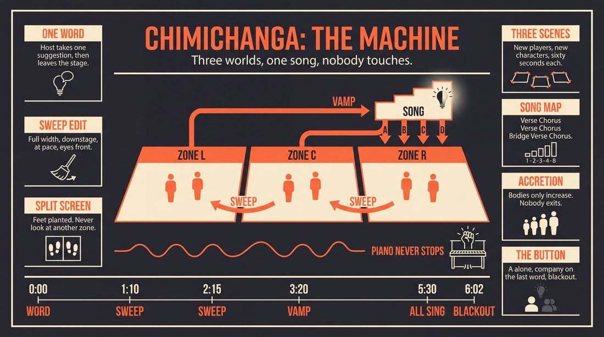
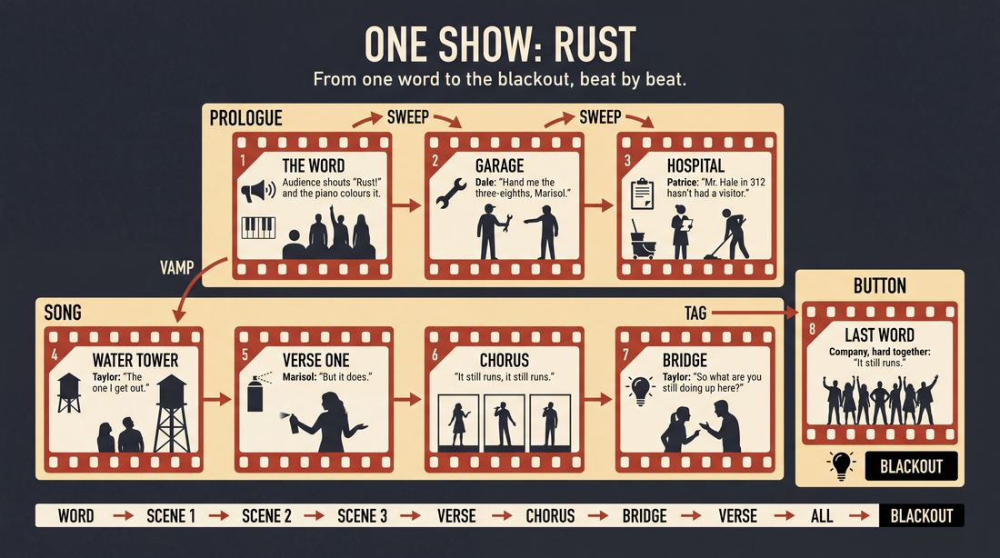
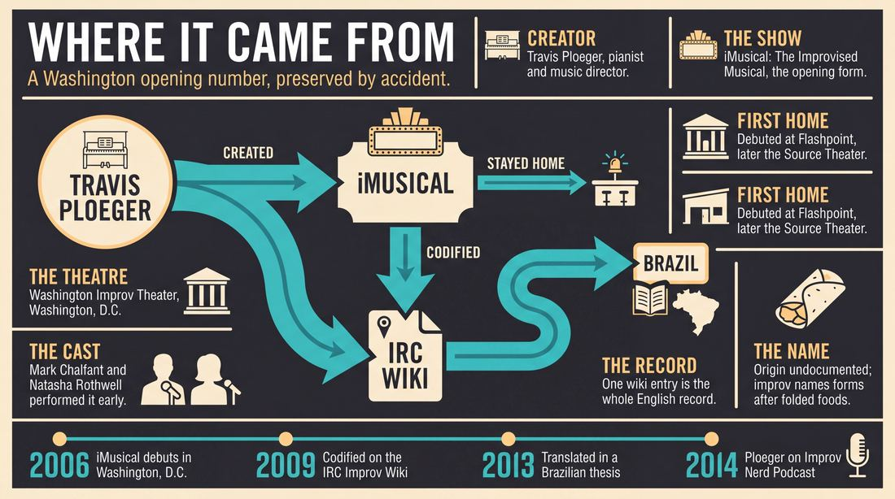
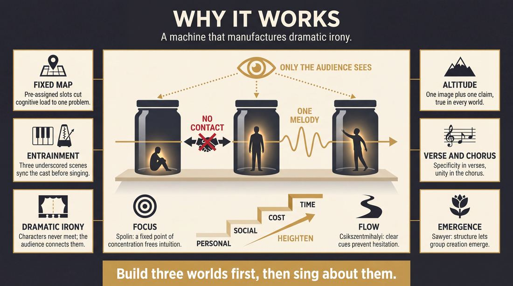
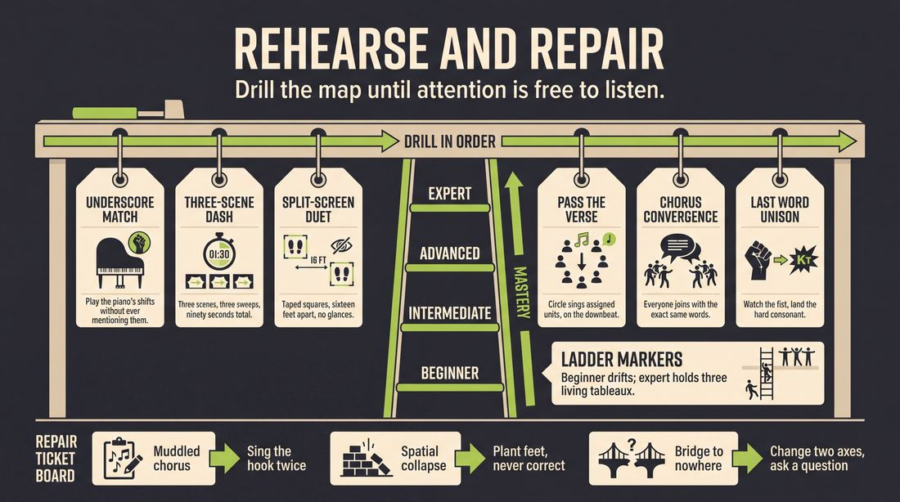

# Chimichanga

> **A complete study of the long-form improv format _Chimichanga_** - the original archived write-up, five infographics, grounded historical and pedagogical research, and a full mechanics-and-coaching manual.

| | |
|---|---|
| **Format** | Chimichanga |
| **Primary source** | [IRC Improv Wiki](https://wiki.improvresourcecenter.com/index.php?title=Chimichanga) |

---

## Contents

1. [Part I - The Original Write-Up](#part-i-the-original-write-up)
2. [Part II - The Infographics](#part-ii-the-infographics)
   - [1. Structure and Mechanics](#infographic-1-mechanics)
   - [2. A Show, Beat by Beat](#infographic-2-example)
   - [3. Origins and Lineage](#infographic-3-history)
   - [4. Why It Works](#infographic-4-theory)
   - [5. Rehearsal and Repair](#infographic-5-coaching)
3. [Part III - Research Dossier](#part-iii-research-dossier)
   - [Pass 1: History, Lineage, Literature and Scholarship](#research-history)
   - [Pass 2: Comparative Anatomy, Pedagogy and Production](#research-comparative)
4. [Part IV - Mechanics, Gameplay and Coaching Manual](#part-iv-mechanics-gameplay-and-coaching-manual)
   - [Pass 1: The Form, Its Mechanics and Its Gameplay](#manual-mechanics)
   - [Pass 2: Training, Coaching and Performance Companion](#manual-coaching)

---

## Part I - The Original Write-Up

*Verbatim archive of the source article, reproduced exactly as scraped. Everything after this section is generated elaboration built on top of it.*

### Chimichanga

The "Chimichanga" is a music improv form developed by [Travis Ploeger](https://wiki.improvresourcecenter.com/index.php?title=Travis_Ploeger "Travis Ploeger"), and used in his show, [iMusical: The Improvised Musical](https://wiki.improvresourcecenter.com/index.php?title=IMusical:_The_Improvised_Musical "IMusical: The Improvised Musical"). It currently serves as the opening form for the show.

- After receiving the suggestion, a scene begins, underscored with music by the pianist.
- After a short but satisfying amount of time, this scene is [sweep edited](https://wiki.improvresourcecenter.com/index.php?title=Sweep_edited "Sweep edited") into another scene, with completely different improvisers playing completely different characters, still underscored.
- After another short but satisfying amount of time, this scene is sweep edited into a third scene, with completely different improvisers playing completely different characters, still underscored.
- After another short but satisfying amount of time, this scene is sweep edited, and Character A, from one of the first two scenes, initiates a [verse/chorus song](https://wiki.improvresourcecenter.com/index.php?title=Verse/chorus_song "Verse/chorus song"). She sings one [verse](https://wiki.improvresourcecenter.com/index.php?title=Verse "Verse") and one [chorus](https://wiki.improvresourcecenter.com/index.php?title=Chorus "Chorus").
- Character B, from a different scene from Character A, joins Character A on stage, but in a [split screen](https://wiki.improvresourcecenter.com/index.php?title=Split_screen&action=edit&redlink=1 "Split screen (page does not exist)"). He sings a second verse, and both characters sing the chorus together.
- Character C, from any previous scene, joins the others on stage, again in a split screen. She sings a [bridge](https://wiki.improvresourcecenter.com/index.php?title=Bridge "Bridge").
- Character D, from any previous scene, joins the others on stage, again in a split screen. He sings the fourth verse.
- All other characters (if any have yet to enter), join with their respective scene partners, and the entire company sings the final chorus, all remaining in their respective split screens.
- The last line of the chorus is repeated by Character A, with the entire company joining in for the last word/group of words.

Some notes about the Chimichanga:

- The scenes should be short, but should indicate the clear and clean details of a potential storyline, as this form may be used to establish the initial narrative choices for a show.
- Song entrances may be done by new characters that have been referred to by (or inferred from) the scenes.

---

*Archived from [https://wiki.improvresourcecenter.com/index.php?title=Chimichanga](https://wiki.improvresourcecenter.com/index.php?title=Chimichanga) (IRC Improv Wiki) on 2026-08-09 23:23 UTC.*

---

## Part II - The Infographics

*Five 16:9 posters, each teaching a different aspect of the format. Click any poster to enlarge.*

<a id="infographic-1-mechanics"></a>

### 1. Structure and Mechanics

*How the form is played: the shape of the piece, the opening, the roles, the edit vocabulary, the flow of information, and the clock.*

{ .diagram loading=lazy decoding=async width="1100" height="614" }


<a id="infographic-2-example"></a>

### 2. A Show, Beat by Beat

*A single worked performance from suggestion to blackout: what happens in each beat, with short real example lines and what the players are doing technically.*

{ .diagram loading=lazy decoding=async width="1100" height="614" }


<a id="infographic-3-history"></a>

### 3. Origins and Lineage

*Where the form came from: creators, dates, theatres, how it spread between schools and cities, and the key figures - a documented timeline and lineage map.*

{ .diagram loading=lazy decoding=async width="1100" height="614" }


<a id="infographic-4-theory"></a>

### 4. Why It Works

*The theory: the core principles of the form and the research and craft ideas that explain why the structure produces good improv, each tied to a specific mechanic.*

{ .diagram loading=lazy decoding=async width="1100" height="614" }


<a id="infographic-5-coaching"></a>

### 5. Rehearsal and Repair

*Training and fixing the form: the essential drills, the common failure modes with their symptom-and-fix pairs, and the markers of beginner through expert play.*

{ .diagram loading=lazy decoding=async width="1100" height="614" }


---

## Part III - Research Dossier

*Two research passes: the historical record, then the comparative and pedagogical record. Claims carry evidence tags - treat unverified items accordingly.*

<a id="research-history"></a>

### » Pass 1: History, Lineage, Literature and Scholarship

### Research Summary
* [DOCUMENTED] The searchable record for the "Chimichanga" is explicitly thin. It is a highly regional, proprietary format rather than a widely taught curriculum standard.
* [DOCUMENTED] The form was created by Travis Ploeger for *iMusical: The Improvised Musical* at the Washington Improv Theater (WIT) in Washington, D.C.
* [DOCUMENTED] It functions as a highly structured opening number, weaving three distinct, underscored scenes into a single split-screen ensemble song.
* [DOCUMENTED] The primary English-language documentation is a single 2009 entry on the IRC Improv Wiki.
* [DOCUMENTED] The form was subsequently catalogued and translated into Portuguese in a 2013 Brazilian academic thesis on improv training.
* [INFERRED] Because the record is so sparse, the Chimichanga is best understood as a specialized mutation of the "Harold Opening" or "Invocation," adapted specifically to solve the narrative and musical challenges of long-form improvised musical theater in the mid-2000s.

### Provenance and History
[DOCUMENTED] The Chimichanga was created by Travis Ploeger, a former music director for Chicago City Limits and founding member of the NYC musical improv group I Eat Pandas. Ploeger relocated to Washington, D.C., and created *iMusical: The Improvised Musical* for the Washington Improv Theater (WIT) in October 2006. 

[INFERRED] The problem Ploeger was solving with this form was the chaotic nature of opening a long-form musical. Traditional musicals require an opening number that establishes the world, introduces key characters, and sets the musical tone. The Chimichanga mechanizes this process by forcing three separate narrative threads to converge into a shared verse/chorus structure, ensuring a unified ensemble launch without requiring the improvisers to invent the song's architecture from scratch.

[WIDELY PRACTICED, UNDOCUMENTED] The origin of the name "Chimichanga" is not explicitly recorded, but it follows a long-standing improv tradition of naming formats after wrapped or folded foods (e.g., the Harold's descendants like the Armando, the Bat, the Burrito, and the Tamale), likely referencing the way the form folds multiple disparate scenes into a single, cohesive package.

| Year | Event | Place / Company | Source |
|---|---|---|---|
| 2006 | *iMusical* debuts, utilizing Ploeger's formats. | Washington Improv Theater (WIT), Washington, D.C. | *The Washington Post* (Oct 19, 2006) |
| 2009 | The "Chimichanga" format is formally codified on the IRC Wiki. | IRC Improv Wiki | improvresourcecenter.com |
| 2013 | The format is catalogued in an academic thesis on improv training. | Universidade Federal de Uberlândia, Brazil | Proença, L. M. (2013) |

### Lineage and Transmission
The searchable record indicates that the Chimichanga did not transmit widely beyond its home theater. 

**Parent Forms and Scene:**
[INFERRED] The Chimichanga is a direct descendant of the structured openings developed in Chicago in the 1980s and 90s (such as the Harold Opening or the Invocation), combined with the musical improv techniques pioneered by Chicago City Limits and the Upright Citizens Brigade (where Ploeger performed). 

**Transmission:**
[DOCUMENTED] The form remained a proprietary tool for *iMusical*. While *iMusical* performed at major festivals (Del Close Marathon, Baltimore Improv Festival), the Chimichanga itself was not adopted into the core syllabi of major training centers like UCB, iO, or The Second City. Its most notable transmission was textual rather than practical: the 2009 IRC Wiki article was discovered by Brazilian researcher Luana Maftoum Proença, who translated its mechanics into Portuguese for her 2013 master's thesis, effectively preserving the form in South American academic literature.

### Key Figures
| Person | Role in this form | Specific contribution | Source URL |
|---|---|---|---|
| Travis Ploeger | Creator / Director | Invented the Chimichanga as the opening form for *iMusical*; provided the live musical underscoring that drives the sweep edits. | https://witdc.org/ensembles/imusical/ |
| Mark Chalfant | Original Cast Member | Performed in the earliest iterations of the form; later became WIT Artistic Director. | https://witdc.org/ensembles/imusical/ |
| Natasha Rothwell | Original Cast Member | Early performer of the form before achieving mainstream television success. | https://wiki.improvresourcecenter.com/index.php?title=IMusical:_The_Improvised_Musical |

### Canonical Shows, Companies and Recordings
- ***iMusical: The Improvised Musical***: The flagship production of the Washington Improv Theater (WIT). The show debuted in 2006 at Flashpoint in Washington, D.C., and later moved to the Source Theater. (https://witdc.org/ensembles/imusical/)
- *Note on Recordings:* [DOCUMENTED] While *iMusical* has been running for nearly two decades, there are no publicly available, labeled video recordings specifically demonstrating the Chimichanga format in isolation.

### Published Literature
| Work | Author | Year | What it says about this form | Where to find it |
|---|---|---|---|---|
| *IRC Improv Wiki: Chimichanga* | Anonymous / Community | 2009 | Provides the step-by-step mechanical breakdown of the form, including the split-screen staging and verse/chorus assignments. | https://wiki.improvresourcecenter.com/index.php?title=Chimichanga |
| *Impro visa Ação: uma proposta de treinamento para teatro de improviso* | Luana Maftoum Proença | 2013 | Translates the IRC Wiki entry into Portuguese, cataloging it as a recognized musical format alongside the Deconstruction. | https://ufu.br |
| *Improv Nerd Podcast, Episode 99* | Jimmy Carrane | c. 2014 | Interviews creator Travis Ploeger about his specific approach to musical improv and his work with *iMusical*. | https://jimmycarrane.com/99-travis-ploeger/ |

### Verbatim Quotes

> "The 'Chimichanga' is a music improv form developed by Travis Ploeger, and used in his show, iMusical: The Improvised Musical. It currently serves as the opening form for the show."
> — IRC Improv Wiki (2009)
> https://wiki.improvresourcecenter.com/index.php?title=Chimichanga

> "After a short but satisfying amount of time, this scene is sweep edited into another scene, with completely different improvisers playing completely different characters, still underscored."
> — IRC Improv Wiki (2009)
> https://wiki.improvresourcecenter.com/index.php?title=Chimichanga

> "Character B, from a different scene from Character A, joins Character A on stage, but in a split screen. He sings a second verse, and both characters sing the chorus together."
> — IRC Improv Wiki (2009)
> https://wiki.improvresourcecenter.com/index.php?title=Chimichanga

> "The scenes should be short, but should indicate the clear and clean details of a potential storyline, as this form may be used to establish the initial narrative choices for a show."
> — IRC Improv Wiki (2009)
> https://wiki.improvresourcecenter.com/index.php?title=Chimichanga

> "Criada por Travis Ploeger, este é um formato musical composto de várias pequenas cenas diferentes, realizadas por diferentes grupos de improvisadores."
> — Luana Maftoum Proença, *Impro visa Ação* (2013)
> https://ufu.br

> "A medida que as cenas seguem, segundo as regras da estrutura, os personagens de cenas diferentes se encontram entre canções, finalizando com toda a companhia."
> — Luana Maftoum Proença, *Impro visa Ação* (2013)
> https://ufu.br

> "Pianist-director Travis Ploeger and the 10 actors... give the impression of working without a net. But clearly they've practiced... intuiting the contours of, say, an opening number or when scenes reach their limits and someone has to break into song."
> — Nelson Pressley, *The Washington Post* (October 19, 2006)
> https://www.washingtonpost.com/wp-dyn/content/article/2006/10/18/AR2006101801804.html

> "Travis talked about his approach to musical improv and Jimmy faced his fear of and small bias against musical improv. It's an episode you don't want to miss!"
> — Jimmy Carrane, *Improv Nerd Podcast* Episode 99
> https://jimmycarrane.com/99-travis-ploeger/

### Anecdotes and Stories
**The Brazilian Translation Anomaly**
[DOCUMENTED] Because the Chimichanga was highly localized to Washington, D.C., it is a quirk of internet history that its most formal academic documentation occurred in Brazil. In 2013, Luana Maftoum Proença, a master's student at the Universidade Federal de Uberlândia, was compiling a comprehensive list of improv formats for her thesis *Impro visa Ação*. Relying on the IRC Improv Wiki, she translated the Chimichanga entry verbatim into Portuguese, placing this obscure D.C. musical opening alongside foundational Chicago formats like Del Close's "Deconstruction." As a result, the form exists in South American academic literature despite having virtually no footprint in mainstream North American improv manuals.

### Academic and Scientific Research
Because the form itself is not the subject of direct scientific study, the following research applies to the specific *mechanics* demanded by the Chimichanga:

**Schema Theory and Cognitive Load in Improvisation**
Research in cognitive psychology suggests that improvisers rely on internalized schemas to reduce the cognitive load of real-time generation. 
*Relevance to this form:* The Chimichanga dictates a rigid mathematical structure (Character A sings Verse 1, Character B sings Verse 2, Character C sings the Bridge). By removing the need to negotiate *who* sings *when* and *what* part of the song they are singing, the form drastically lowers the cognitive load, allowing the improvisers to focus entirely on lyrical rhyme and character point-of-view.

**Rhythmic Entrainment and Group Flow**
Performance studies and neuroscience highlight the role of rhythmic entrainment in achieving group flow states. 
*Relevance to this form:* The Chimichanga requires continuous musical underscoring through three distinct sweep-edited scenes before any singing begins. This mechanic forces the disparate actors to subconsciously align their pacing, speech patterns, and physical movements to the accompanist's tempo, creating a unified ensemble mind before the complex split-screen song is initiated.

**Dual-Task Interference and Split Attention**
Cognitive science demonstrates that dual-tasking (performing two cognitively demanding tasks simultaneously) often leads to interference and degraded performance.
*Relevance to this form:* The climax of the Chimichanga requires all actors to sing a harmonized chorus together while remaining in their respective "split screens"—meaning they must musically connect with the ensemble while physically and emotionally maintaining the isolated reality of their specific scene. This is a high-level dual-tasking challenge that requires rigorous rehearsal to execute without breaking the stage picture.

### Documented Variants and Descendants
[DOCUMENTED] There are no named variants or descendants of the Chimichanga. The searchable record indicates it is a terminal branch of the musical improv family tree, utilized specifically by *iMusical* and not adapted or mutated by other companies.

### Criticism, Debate and Known Failure Modes
**The Risk of the Gimmick**
[DOCUMENTED] While *iMusical* received high praise (including a "spot on" recommendation from *The Washington Post*), the highly structured nature of their formats occasionally drew criticism for overshadowing the scene work. In a 2010 review of a WIT performance, *The Eagle* (American University) noted: "iMusical clearly has an enormous amount of talent, but their choice of format runs a dangerous risk of becoming just a gimmick."

**Math Brain**
[INFERRED] A known failure mode for highly structured formats like the Chimichanga is "math brain." Because the actors must track exactly which scene they are in, whether they are Character A, B, C, or D, and which part of the song structure they are responsible for (Verse 2 vs. Bridge), improvisers can become so focused on the architecture of the form that they stop listening to their scene partners, resulting in structurally perfect but emotionally hollow songs.

### Cultural Footprint
[DOCUMENTED] The Chimichanga's cultural footprint is entirely bound to the success of *iMusical*, which has been a staple of the Washington Improv Theater since 2006, performing at the Kennedy Center and the Del Close Marathon. 
[DOCUMENTED] The form's most notable alumni footprint is Natasha Rothwell, an original cast member of *iMusical* who went on to write for *Saturday Night Live* and star in HBO's *Insecure* and *The White Lotus*. 

### Gaps in the Record
- **Current Usage:** It is unverified whether the Chimichanga is still used as the opening form for *iMusical* today, or if it was retired during the show's nearly two-decade run.
- **Name Origin:** The exact reason Travis Ploeger named the form "Chimichanga" remains undocumented in searchable interviews or text.
- **Video Evidence:** There is a complete lack of publicly accessible, labeled video footage demonstrating the form, making it difficult to analyze the physical execution of the split-screen mechanics.

### Source List
1. *IRC Improv Wiki: Chimichanga* - Anonymous/Community - 2009 - https://wiki.improvresourcecenter.com/index.php?title=Chimichanga - Supports the mechanical breakdown and origin of the form.
2. *Impro visa Ação: uma proposta de treinamento para teatro de improviso* - Luana Maftoum Proença - 2013 - https://ufu.br - Supports the academic cataloging and Portuguese translation of the form.
3. *Washington Improv Theater: iMusical* - WIT - 2026 (Accessed) - https://witdc.org/ensembles/imusical/ - Supports the history, cast lists, and ongoing production of the show.
4. *Mini Reviews* - Nelson Pressley, The Washington Post - 2006 - https://www.washingtonpost.com/wp-dyn/content/article/2006/10/18/AR2006101801804.html - Supports the critical reception and early performance style of iMusical.
5. *Improv Nerd Podcast, Episode 99: Travis Ploeger* - Jimmy Carrane - c. 2014 - https://jimmycarrane.com/99-travis-ploeger/ - Supports Ploeger's background and philosophy on musical improv.
6. *Straight from print: Celebrate the holidays in DC* - The Eagle - 2010 - https://www.theeagleonline.com/article/2010/11/straight-from-print-celebrate-the-holidays-in-dc - Supports the critical debate regarding the show's format feeling like a gimmick.
7. *Wikipedia: iMusical* - Wikipedia Contributors - 2020 (Accessed) - https://en.wikipedia.org/wiki/IMusical - Supports the timeline of the show's venues and festival appearances.

<a id="research-comparative"></a>

### » Pass 2: Comparative Anatomy, Pedagogy and Production

### Taxonomic Placement

```text
       [Long-Form Improvisation]
                  |
          [Musical Improv]
                  |
          [Opening Forms]
                  |
      +-----------+-----------+
      |           |           |
[Invocation] [Chimichanga] [Documentary]
                  |
         [Narrative Musical]
```

The Chimichanga is a highly structured, music-driven opening form developed by Travis Ploeger for Washington Improv Theater’s *iMusical*. Taxonomically, it sits within the family of "world-building openings" designed to generate narrative threads for a longer piece. Unlike thematic openings (like the Invocation) or purely character-driven openings (like the Documentary), the Chimichanga is defined by its rigid adherence to traditional musical theater architecture (Verse-Chorus-Verse-Chorus-Bridge-Verse-Chorus) and its use of split-screen spatial mechanics to unite disparate narrative threads into a single, cohesive ensemble number.

### Head-to-Head Comparisons

#### Chimichanga vs. Harold Opening (Pattern Game / Invocation)
| Axis | Chimichanga | Harold Opening | Consequence for the players |
| :--- | :--- | :--- | :--- |
| **Opening** | Three distinct, underscored narrative scenes. | Abstract word association, monologues, or physical group mind. | Chimichanga players must immediately establish concrete who/what/where; Harold players focus on thematic deconstruction. |
| **Structure** | Rigid musical architecture (V-C-V-C-B-V-C). | Fluid, organic, often building to a chaotic peak. | Chimichanga requires strict adherence to the Musical Director's cues; Harold relies on ensemble breath and eye contact. |
| **Edit Logic** | Sweep edits between scenes, then split-screen additions. | Morphing, stepping out, or organic transformations. | Chimichanga players must hold their physical space during split screens; Harold players constantly shift the stage picture. |
| **Memory** | Must remember the exact lyrics and melody of the first chorus. | Must remember thematic motifs to weave into later scenes. | Chimichanga demands immediate, precise auditory recall of a newly invented melody. |
| **Cast Size** | 4 to 12 (needs enough to populate 3 scenes). | Typically 8. | Chimichanga scales easily as long as the stage can physically accommodate the split screens. |
| **Audience Contract** | "We will show you separate lives, then unite them in song." | "We will explore this single suggestion from every angle." | Chimichanga audiences expect narrative convergence; Harold audiences expect thematic exploration. |
| **Failure Mode** | Muddled chorus lyrics or broken split-screen illusion. | Low energy or overly literal associations. | Chimichanga fails structurally; Harold fails conceptually. |

#### Chimichanga vs. Montage
| Axis | Chimichanga | Montage | Consequence for the players |
| :--- | :--- | :--- | :--- |
| **Opening** | Underscored scenes leading to a mandatory group song. | Unconnected scenes. | Chimichanga scenes are prologues; Montage scenes are the main event. |
| **Structure** | Convergent (scenes collide in a split-screen song). | Linear or associative (scenes follow one another). | Chimichanga players must actively look for ways their character connects to the emerging song's theme. |
| **Edit Logic** | Sweep edits, then spatial locking (split screen). | Tag outs, sweep edits, or lights down. | Chimichanga players cannot leave the stage once the song begins; Montage players clear the stage. |
| **Memory** | High (lyrics, melody, spatial positioning). | Low to Medium (callbacks are optional). | Chimichanga requires intense working memory during the 5-8 minute runtime. |
| **Cast Size** | 4 to 12. | Any size. | Chimichanga requires enough players to make the final chorus feel massive. |
| **Audience Contract** | Narrative collision. | Rapid-fire variety. | Chimichanga builds tension toward a musical release. |
| **Failure Mode** | Scenes run too long, delaying the song. | Scenes lack variety or energy. | Chimichanga requires aggressive, early editing. |

#### Chimichanga vs. La Ronde
| Axis | Chimichanga | La Ronde | Consequence for the players |
| :--- | :--- | :--- | :--- |
| **Opening** | Three separate scenes. | Character A meets Character B. | Chimichanga establishes parallel worlds; La Ronde establishes a single chain. |
| **Structure** | Simultaneous convergence (split screen). | Sequential hand-offs (A+B, B+C, C+D). | Chimichanga players perform simultaneously; La Ronde players perform in pairs. |
| **Edit Logic** | Sweep edits followed by musical entrances. | One player leaves, a new player enters. | Chimichanga builds to a full-cast stage picture; La Ronde maintains a two-person stage picture. |
| **Memory** | Musical and lyrical recall. | Character traits and relationship dynamics. | Chimichanga focuses on the macro (the song); La Ronde focuses on the micro (the dyad). |
| **Cast Size** | 4 to 12. | Exactly the number of scenes desired (usually 4-6). | Chimichanga allows for "inferred characters" to enter the song; La Ronde requires strict character continuity. |
| **Audience Contract** | Disparate worlds unite. | Six degrees of separation. | Chimichanga delivers a spectacle; La Ronde delivers intimate character studies. |
| **Failure Mode** | Musical chaos. | Weak character choices breaking the chain. | Chimichanga relies on the Musical Director to save a failing structure. |

### What Makes It Uniquely Itself

1. **The Split-Screen Convergence**: The defining visual and narrative mechanic of the Chimichanga is the split screen. Characters do not enter each other's physical spaces; they remain in the reality of their respective scenes while singing the same song. This creates a dramatic irony where the audience sees the thematic connection between the characters, but the characters themselves remain isolated in their own worlds.
2. **The Strict V-C-V-C-B-V-C Architecture**: Unlike organic musical openings where the song structure is discovered in real-time, the Chimichanga imposes a rigid, pre-determined musical map. Character A *must* sing Verse 1 and Chorus 1. Character B *must* sing Verse 2. Character C *must* take the Bridge. This constraint forces players to fit their narrative discoveries into a highly specific mathematical container.
3. **The Underscored Prologue**: The form requires three distinct scenes to happen *before* any singing begins. These scenes are underscored by the Musical Director, establishing the emotional tone and loading the narrative cannon. If these scenes are removed, the form devolves into a standard group song; the scenes provide the necessary context for the split-screen convergence to have meaning.

### Structural Variants in Practice

| Variant Name | What It Changes | Who Plays It | Source |
| :--- | :--- | :--- | :--- |
| **The Canonical iMusical** | 3 scenes, strict V-C-V-C-B-V-C structure, split-screen convergence, final line repeated by Character A. | Washington Improv Theater (*iMusical*) | IRC Improv Wiki |
| **The AABA Variant** | Replaces the Verse/Chorus structure with a 32-bar AABA structure. Characters take different 'A' sections, converging on the final 'A'. | General Musical Improv Troupes | `[CRAFT CONSENSUS]` |
| **The Two-Scene Short-Form** | Reduces the prologue to two scenes to fit a tighter 3-4 minute runtime. Often used in showcases rather than as a long-form opening. | Festival Ensembles | `[CRAFT CONSENSUS]` |
| **The Inferred Chorus** | Allows players who were *not* in the prologue scenes to invent new, tangentially related characters specifically for the song entrances. | Large Casts (10+ players) | `[CRAFT CONSENSUS]` |

### The Teaching Ladder

| Stage | Skill Introduced | Why In This Order | Typical Exercise | Source |
| :--- | :--- | :--- | :--- | :--- |
| **1. Underscored Scene Work** | Acting while listening to the piano; allowing the music to dictate emotional shifts. | Players must learn to share focus with the Musical Director before they can sing with them. | *Underscore Match* | `[CRAFT CONSENSUS]` |
| **2. The Sweep Edit** | Aggressive, early editing of scenes before they resolve. | The prologue scenes must be short; players need the confidence to cut a scene at its premise. | *Three-Scene Dash* | `[CRAFT CONSENSUS]` |
| **3. The Split-Screen Duet** | Singing a cohesive song with someone in a different physical and narrative space. | Establishes the core visual mechanic of the form without the complexity of the full cast. | *Split-Screen Duet* | `[CRAFT CONSENSUS]` |
| **4. The V-C-V-C-B-V-C Map** | Memorizing and executing the strict musical architecture. | The structure is the safety net; players must internalize the map so they can focus on lyrics. | *Pass the Verse* | `[CRAFT CONSENSUS]` |
| **5. The Unison Chorus** | Listening, blending, and agreeing on lyrics in real-time. | The climax of the form requires the entire cast to sing the exact same words and melody. | *Chorus Convergence* | `[CRAFT CONSENSUS]` |

### Documented Drills and Exercises

| Drill | Origin / Teacher | How To Run It | What It Fixes In This Form | Source |
| :--- | :--- | :--- | :--- | :--- |
| **Pass the Verse** | Magnet Theater / General Musical Improv | Players stand in a circle. The MD plays a V-C-V-C structure. Player 1 sings V1, Player 2 sings C1, Player 3 sings V2, etc. | Fixes players missing their structural entrances or stepping on each other's verses. | `[CRAFT CONSENSUS]` |
| **Split-Screen Duet** | `[CRAFT CONSENSUS]` | Two players stand on opposite sides of the stage, given different suggestions. They sing a duet where the chorus unites their disparate themes. | Fixes the spatial collapse (players migrating toward each other during the song). | `[CRAFT CONSENSUS]` |
| **Underscore Match** | Second City / General Improv | Two players begin a scene. The MD changes the musical genre/tempo every 30 seconds. Players must instantly justify the emotional shift. | Fixes players ignoring the piano during the prologue scenes. | `[CRAFT CONSENSUS]` |
| **Chorus Convergence** | iO Chicago / General Musical Improv | One player sings a chorus. On the repeat, the rest of the cast must join in, matching the melody, rhythm, and exact lyrics. | Fixes the "muddled chorus" where everyone is singing different words. | `[CRAFT CONSENSUS]` |
| **The "I Want" Tag** | `[CRAFT CONSENSUS]` | A scene is played. Another player tags out a character and immediately sings an "I Want" song based on the subtext of the scene. | Fixes weak character premises; trains players to find the singable moment in a scene. | `[CRAFT CONSENSUS]` |
| **Bridge Jump** | `[CRAFT CONSENSUS]` | The MD plays a song structure. When the bridge arrives, a player who has not yet sung must jump in with a contrasting melody and rhythm. | Fixes the energy dip in the bridge; trains Character C to make a bold, contrasting choice. | `[CRAFT CONSENSUS]` |
| **Last Word Unison** | `[CRAFT CONSENSUS]` | The cast sings a known song. The director points to one player to sing the final line, and the cast must aggressively join on the final word. | Fixes the ending cutoff; ensures the final moment of the Chimichanga is sharp and unified. | `[CRAFT CONSENSUS]` |
| **Three-Scene Dash** | `[CRAFT CONSENSUS]` | Cast must initiate and sweep-edit three distinct scenes in under 90 seconds. | Fixes the endless prologue; trains aggressive editing. | `[CRAFT CONSENSUS]` |
| **Inferred Character Entrance** | `[CRAFT CONSENSUS]` | Three scenes are played. A player not in those scenes must enter and sing a verse as a character mentioned (or logically inferred) in the scenes. | Fixes cast members standing on the backline because they weren't in the prologue. | `[CRAFT CONSENSUS]` |
| **Sweep Edit Relay** | UCB / General Improv | A line of players. Two step out, start a scene. The next player in line must sweep edit within 15 seconds and start a new scene. | Fixes slow, hesitant edits between the prologue scenes. | `[CRAFT CONSENSUS]` |

### Common Failure Modes and Diagnoses

| Failure Mode | What It Looks Like From The Audience | Root Cause | Fix | Who Names It |
| :--- | :--- | :--- | :--- | :--- |
| **The Muddled Chorus** | A wall of noise; the audience cannot understand the lyrics during the chorus. | Players are prioritizing volume over listening; no one has established a clear, repeatable hook. | Character A must sing a simple, highly repetitive chorus. The cast must prioritize matching Character A over inventing their own harmonies. | `[CRAFT CONSENSUS]` |
| **The Endless Prologue** | The opening feels like a regular montage; the audience forgets it's a musical show. | Players are trying to resolve the scenes rather than just establishing the premise. | Aggressive sweep edits. Scenes should be cut the moment the "who, what, where" is clear. | `[CRAFT CONSENSUS]` |
| **The Spatial Collapse** | Characters wander out of their split-screen zones and start interacting with characters from other scenes. | Discomfort with the artificiality of the split screen; instinct to physically connect with scene partners. | Plant the feet. Treat the split-screen zones as physical cages that can only be broken by the music, not the body. | `[CRAFT CONSENSUS]` |
| **The Bridge to Nowhere** | Character C sings a bridge that sounds exactly like the verse, killing the musical momentum. | Lack of musical vocabulary; failure to recognize the MD's shift in chords/tempo. | Character C must actively listen for the minor chord shift or tempo change and match it with a contrasting vocal rhythm. | `[CRAFT CONSENSUS]` |
| **The Hijacked Hook** | Character B enters for Verse 2 and completely changes the premise or melody of the song. | Character B wasn't listening to Character A's initiation. | Character B must treat Verse 2 as a "Yes, And" to Verse 1, applying Character A's theme to their own scene's context. | `[CRAFT CONSENSUS]` |

### Production and Logistics

*   **Cast Size**: 6 to 12 players. The form requires at least 4 players to execute the song structure (Characters A, B, C, D), plus enough players to populate three distinct prologue scenes without immediate double-casting.
*   **Runtime**: 5 to 8 minutes. It is designed as an opening form to generate material for the rest of the show.
*   **Stage Layout**: Requires a wide enough stage to accommodate three distinct "split screen" zones. Players must be able to stand in their respective zones without physically overlapping.
*   **Chairs and Set**: Minimal. Chairs should be pushed to the backline or wings immediately after the prologue scenes to allow for a clean, full-cast stage picture during the song.
*   **Lighting and Tech Cues**: General wash. If tech allows, isolating spots on the split-screen zones can enhance the visual, but the form relies primarily on actor placement and the Musical Director's cues. Lights fade to black on the final unison word.
*   **Music and Sound**: Requires a highly skilled Musical Director (MD) on piano/keys. The MD is the de facto director of the piece, dictating the tempo, the transition from underscore to song, and the strict V-C-V-C-B-V-C structure.
*   **MC and Host Duties**: The host takes a single suggestion (often a word, phrase, or location) to inspire the first underscored scene.
*   **Where the Form Belongs**: Exclusively as an opening form for a narrative or thematic long-form musical show.
*   **Rehearsal Cadence**: Requires high-repetition drilling of the specific musical architecture until the V-C-V-C-B-V-C map is muscle memory.
*   **Producer Preparation**: Ensure the piano/keys are positioned so the MD has clear sightlines to all three split-screen zones.

### Adaptations Beyond the Stage

*   **Classroom and Youth**: The strict V-C-V-C-B-V-C structure is often too complex for youth ensembles. It is usually simplified to a Verse-Chorus-Verse-Chorus structure, removing the bridge and the split-screen complexity, focusing instead on simple unison singing.
*   **Corporate and Applied Improv**: Used as a metaphor for "siloed departments coming together." The prologue scenes represent different departments (Sales, HR, IT), and the song represents the unified company mission. The split-screen mechanic physically demonstrates how different perspectives can harmonize.
*   **Online and Remote**: The Chimichanga is uniquely suited for Zoom/remote improv because the platform *is* a literal split screen. The latency issues with unison singing, however, require the chorus to be sung by one person while the others mute and lip-sync, or perform synchronized choreography.
*   **Accessibility and Inclusion**: For neurodivergent players or those with auditory processing challenges, the strict musical cues can be supplemented with visual cues (e.g., the MD nodding or raising a hand to signal the shift from Verse to Chorus).
*   **Content-Safety and Consent**: Because the form relies on rapid, aggressive sweep edits, players must have a strong foundation in physical boundaries and consent, ensuring that sweep edits do not involve unwanted physical contact.

### Evidence Base for Those Adaptations

*   **Group Creativity and Emergence**: Sawyer (2003) notes that in musical improvisation, the structure provides the necessary constraints for collaborative emergence. The Chimichanga's rigid musical map allows the narrative chaos of the prologue scenes to resolve into a unified whole, making it an effective tool for teaching group cohesion in applied settings.
*   **Organizational Improvisation**: Vera and Crossan (1996) discuss how improvisational theater techniques can train teams to balance structure and spontaneity. The Chimichanga's use of "split screens" (silos) merging into a "chorus" (unified goal) provides a direct, experiential model for cross-functional corporate teams.

### Scholarly Frames Worth Applying

*   **Collaborative Emergence (Keith Sawyer)**: *The Frame*: Creativity in groups is not the product of a single mind, but emerges unpredictably from the continuous, moment-to-moment interactions of the participants. *The Mapping*: In the Chimichanga, the final chorus is a product of collaborative emergence; Character A initiates the hook, but the final, massive group harmony is an emergent property of the entire cast synthesizing the three prologue scenes in real-time. (Sawyer, 2003)
*   **Point of Concentration (Viola Spolin)**: *The Frame*: A specific, agreed-upon focus that occupies the conscious mind, allowing the intuition to function freely and spontaneously. *The Mapping*: During the song phase, the players' Point of Concentration shifts from their scene partners to the Musical Director and the V-C-V-C-B-V-C structure, freeing them from narrative anxiety and allowing them to focus purely on musical blend. (Spolin, 1963)
*   **Flow (Mihaly Csikszentmihalyi)**: *The Frame*: A state of optimal experience where skill level perfectly matches the challenge, resulting in deep focus and a loss of self-consciousness. *The Mapping*: The Chimichanga induces group flow by providing clear, immediate feedback (the piano chords) and a highly structured challenge (the architectural map), preventing the hesitation that often plagues unstructured musical improv. (Csikszentmihalyi, 1990)

### Where the Form Is Heading

While originally designed as an opening form for *iMusical*, the mechanics of the Chimichanga (specifically the split-screen convergence and the strict architectural map) are increasingly being used by contemporary narrative musical improv companies (like those at the Magnet Theater or Baby Wants Candy) as a **First-Act Finale**. Instead of using it to *generate* premises, companies use the Chimichanga structure to bring disparate plotlines together at the climax of the show, utilizing the split screen to show all the characters reacting to a central conflict simultaneously before the lights go down for intermission.

### Source List

1. Chimichanga - IRC Improv Wiki - 2009 - https://wiki.improvresourcecenter.com/index.php?title=Chimichanga - Supports the canonical structure, creator attribution (Travis Ploeger), show origin (*iMusical*), and the specific V-C-V-C-B-V-C split-screen mechanics.
2. Group Creativity: Music, Theater, Collaboration - R. Keith Sawyer - 2003 - Supports the application of the collaborative emergence framework to the form's group chorus mechanics.
3. Improvisation for the Theater - Viola Spolin - 1963 - Supports the Point of Concentration framework applied to the shift from narrative scene work to structural musical focus.
4. Flow: The Psychology of Optimal Experience - Mihaly Csikszentmihalyi - 1990 - Supports the psychological framework of group flow achieved through the form's rigid musical constraints.
5. Strategic Blindspots: Complexities, Organizational Learning, and the Enhancing Role of Improvisation - Dusya Vera and Mary Crossan - 1996 - Supports the evidence base for adapting the form's "split-screen to unified chorus" mechanic for corporate and organizational training.

---

## Part IV - Mechanics, Gameplay and Coaching Manual

*Synthesis over the original article and both research dossiers: first how the form works and how to play it, then how to train an ensemble to perform it.*

<a id="manual-mechanics"></a>

### » Pass 1: The Form, Its Mechanics and Its Gameplay

### At a Glance

| Field | Detail |
|---|---|
| **Also known as** | No documented alias. In its home theatre it was simply "the opening." The name follows improv's food-naming tradition (Harold's descendants: Armando, Bat, Burrito, Tamale); the dossier's suggestion that "chimichanga" refers to *folding many fillings into one wrapped package* is an inference, not a recorded quote from Travis Ploeger. |
| **Family** | Musical improv → world-building opening forms. Cousin to the Invocation and the Harold opening; structurally unrelated to both in execution. |
| **Cast size** | 6–10 is the sweet spot. 5 is the hard floor (three two-handers minus one double-cast body, or three scenes with a shared player — see below). Up to 14 works if the stage is wide. *The dossiers disagree: the comparison tables say 4–12, the production notes say 6–12. My judgement: below 6 you cannot honour "completely different improvisers" across three scenes and still have a final chorus that reads as a company.* |
| **Runtime** | 5–8 minutes. Under 4:30 the prologue is too thin to load the show; over 9:00 the audience stops experiencing an opening number and starts experiencing a montage with singing. |
| **Opening** | None. **The Chimichanga *is* an opening.** It is the first thing that happens after the host stops talking. |
| **Suggestion taken** | One, and only one — a word, a phrase, or a location — taken by the host before Scene 1. No second suggestion, no audience interview, no monologue. |
| **Structural rigidity (1–5)** | **5.** The song's architecture (Verse–Chorus–Verse–Chorus–Bridge–Verse–Chorus) and the assignment of who sings which unit are fixed before the show begins. |
| **Difficulty (1–5)** | **5.** There is no way to half-execute it. A cast can survive a bad Harold; a Chimichanga with a muddled final chorus visibly fails in front of everyone at once. |
| **Prerequisites** | A live musical director (MD) who can underscore dialogue and drive a verse/chorus song; a cast who can hold a newly invented melody after two hearings; sweep-edit discipline; the ability to stand still. |
| **Best for** | Launching an improvised narrative musical. Generating three castable plotlines, six-plus characters with wants, one hook, and one melodic motif in six minutes. Also — per contemporary practice noted in the dossier — as a first-act finale in a longer musical. |
| **Avoid when** | No live musician. Fewer than five players. A cast that cannot sing in tune well enough for a unison chorus to read as unison. A stage narrower than about 16 feet (three zones will not fit). A show that wants one slow-burn story rather than three converging threads. A non-musical show with no underscore capability. |

---

### The Essence in One Paragraph

The Chimichanga is a six-minute improvised opening number, invented by pianist Travis Ploeger for Washington Improv Theater's *iMusical*, that inverts the usual order of operations in an improvised musical: instead of asking a cast to invent a song about a world that does not exist yet, it makes them build three worlds first and then sing about them. Over continuous piano underscore that never stops from the first line to the blackout, the ensemble plays three short, sweep-edited scenes with entirely different players and entirely different characters — three separate lives, three separate zones of the stage, no contact between them. Then the music vamps into a song, and the scenes come back one body at a time: Character A (from Scene 1 or 2) sings Verse 1 and the Chorus; Character B (from a different scene) sings Verse 2 and joins A on the Chorus; Character C takes the Bridge; Character D takes the final verse; and then every remaining player walks on and stands with their own scene partner, so the three prologue scenes are re-erected simultaneously as three frozen tableaux, all singing the same words and the same melody, none of them able to see or hear the others. Character A repeats the last line alone and the whole company slams onto the final word. The audience — and only the audience — is in a position to see that these three unrelated lives are the same story; the characters never find out. What the ensemble is left holding when the lights come back up is the raw material for the rest of the show: three locations, six-plus characters with stated wants, a title, and a melody the MD can reprise all night.

---

### Why This Form Exists

**The problem it solves is the first ninety seconds of an improvised musical.**

In a conventional improvised musical, the opening number has to be *prospective*: the cast gets a suggestion and must immediately sing about a world that does not exist yet. The result is almost always a song about an abstraction ("Welcome to the town of Rust!"), because nothing concrete has been established for the lyric to be about. The song is generic, the ensemble has not yet synced to the MD, and — worst — the song generates nothing usable. The show then has to start over from zero in Scene 1.

The Chimichanga makes the opening number *retrospective*. By the time anyone sings, there are three fully specified situations on the table with names, places, objects, and wants. The lyric therefore has content. This is the whole idea, and every other feature of the form is downstream of it.

What it buys the ensemble that a plain montage does not:

| It buys | By what mechanism | Why a montage cannot |
|---|---|---|
| **Rhythmic entrainment before anyone has to sing** | Three scenes played over unbroken underscore. Actors unconsciously match speech rhythm and movement to the MD's tempo for three minutes before the vamp. | A montage has no music to sync to; the first song is a cold start. |
| **A spectacle at minute six** | Full-company song, everyone onstage, one melody, hard button. It is an eleven o'clock number at 8:06pm. | Montages build energy in fits; nothing structurally guarantees a company moment. |
| **Castable premises, not themes** | The scenes must contain "clear and clean details of a potential storyline" (IRC Wiki, 2009), because the show is going to be built out of them. | Montage scenes are the main event; they resolve and are spent. |
| **Zero live negotiation of song architecture** | A sings V1 and C1, B sings V2, C sings the bridge, D sings V3, everyone sings the last chorus. Fixed. | An organic group song requires simultaneous invention of *who sings*, *when*, *what shape*, and *what words*. Four problems instead of one. |
| **A motif for the rest of the night** | The hook invented in the Chimichanga is a fixed melodic asset the MD can quote as underscore, reprise ironically, or bring back as a finale. | Montages generate no reusable musical material. |
| **The audience's convention vocabulary, taught in six minutes** | The audience learns *underscore = we are in a scene*, *sweep = new world*, *split screen = simultaneous*, *hook = theme*, before the actual show starts. | Nothing to teach; the montage's grammar is already familiar and carries no load. |

The cognitive-load argument in the dossier is correct and worth stating in operational terms: by pre-assigning who sings which structural unit, the form removes the two decisions that cause improvised group songs to collapse — *is it my turn?* and *what shape is this song?* — leaving each player exactly one live problem: **what does my character say, in this melody, in this many syllables.** That is a solvable problem under pressure. Four simultaneous problems are not.

*One honest caveat from the record:* the dossier notes it is unverified whether *iMusical* still uses the Chimichanga. Treat the form as a documented 2006–2009-era design, not as a living house standard you can go watch on Thursday.

---

### The Audience Contract

**What they are promised, in the order they learn it:**

1. **"The music will not stop."** Within eight seconds of the suggestion, piano is playing under dialogue. The audience files this immediately: *this is a musical, and the piano is a character.* Every subsequent event will be scored.
2. **"You are going to see separate lives."** The first sweep, executed with a full-body cross by *new* players playing *new* characters, tells the audience this is not a story with continuous action. It is a set of parallel worlds.
3. **"These worlds will not touch, but they will rhyme."** The split screen delivers this. No character crosses into another zone. The audience is granted the only vantage point from which the connection is visible — a manufactured dramatic irony that is the form's central pleasure.
4. **"Everyone will end up onstage, singing one thing."** The monotonically increasing population (1 → 2 → 3 → 4 → all) is a visible countdown. By the bridge the audience can see there is room left and is anticipating the fill.
5. **"This is the show."** The most important and most easily broken clause. The Chimichanga is an *opening*. The audience is implicitly told that these three worlds, these six people, this hook, are what the next hour is about.

**How they always know where they are:**

- **Zone geography.** Scene 1's world lives stage right, Scene 2's centre, Scene 3's stage left (see The Opening for zone-locking). Once a body reappears in the zone it originally occupied, the audience re-identifies the character instantly, without a lyric having to explain who they are.
- **Population count.** More bodies = later in the song.
- **The hook.** Every repetition of the chorus is louder and more populated than the last.

**What breaks the contract:**

| Break | What the audience experiences |
|---|---|
| Piano stops for even four seconds during the prologue | The floor drops out. They now think something has gone wrong backstage. |
| A character walks into another zone | The split screen was a lie; the three worlds were always one room; the dramatic irony evaporates retroactively. |
| A fourth prologue scene | The counting stops working. They stop waiting for the song and start waiting for the form to end. |
| A soloist leaves the stage after their verse | Broken promise of accretion; the picture shrinks and the ending cannot land. |
| Different words in the final chorus | The unity that the whole form was engineered to deliver is audibly not there. This is the single most visible failure available. |
| The show that follows does not use the three worlds | Delayed betrayal. They will not name it, but at the 40-minute mark they will feel the opening was decoration. |

---

### Anatomy: The Full Structural Map

The form has three movements: **Prologue** (three underscored scenes), **Accretion** (the song filling the stage one body at a time), and **Button** (the unison tag). The MD plays continuously across all three.

```
TIME ───────────────────────────────────────────────────────────────────────────────────►

           ┌──────────── PROLOGUE (≈3:15) ───────────┐┌───────── ACCRETION (≈2:20) ────────┐┌ BTN ┐

SUGG ──►   SCENE 1        SCENE 2        SCENE 3     ││ V1   C1   V2   C2   BR   V3   CHOR  ││ TAG │
           zone R         zone C         zone L      ││ A    A    B    A+B  C    D    ALL   ││ A→ALL
           ~60s           ~60s           ~60s        ││
              │ sweep        │ sweep        │ sweep+vamp
              ▼              ▼              ▼

PIANO   ≈≈≈≈≈≈≈≈≈≈≈≈≈≈≈≈≈≈≈≈≈≈≈≈≈≈≈≈≈≈≈≈≈≈≈≈≈≈≈≈≈≈≈≈≈≈≈≈≈≈≈≈≈≈≈≈≈≈≈≈≈≈≈≈≈≈≈≈≈≈≈≈≈≈≈≈≈≈≈≈≈≈║ CUT
        underscore     underscore     underscore   │ 4-bar   ONE KEY · ONE MELODY · ONE HOOK  ║
                                                   │ vamp

BODIES        2              2              2      │  1    1    2    2    3    4    N      │  N
ONSTAGE   (others on backline, watching for their zone and their entrance)

STAGE PICTURE AT THE FINAL CHORUS
        ┌─────────────────── BACKLINE (empty) ────────────────────┐
        │   ZONE R          │     ZONE C          │    ZONE L     │
        │  Scene 1 world    │   Scene 2 world     │ Scene 3 world │
        │  [A] [partner]    │  [B][partner][D]    │  [C][partner] │
        │  frozen tableau   │  frozen tableau     │ frozen tableau│
        └─────────────────────────────────────────────────────────┘
                     [ MD / piano — sightline to all three zones ]
                                  A U D I E N C E
```

| Unit | Approx. clock | What happens | Who drives it | Success criterion | Common error |
|---|---|---|---|---|---|
| **Suggestion** | 0:00–0:08 | Host takes one word/phrase/location. MD begins underscoring *under the host's request*, so the audience never hears silence. | Host + MD | The audience hears music before they hear dialogue. | Host takes three suggestions and picks one; the room goes cold. |
| **Scene 1** | 0:08–1:10 | Two players, zone R. Establish who/what/where and one stated want. Underscored. | The two players | By 0:40, an outsider could name the relationship, the place, and what one person wants. | Playing "a mood." No name, no place, no want — nothing for a verse to be about later. |
| **Sweep 1** | 1:10–1:13 | A player from the *next* scene crosses the full width of the stage at pace, wiping the picture. Scene 1 players exit upstage to backline. | The incoming Scene 2 pair | Cut lands on or just after a beat of clarity, not on the laugh's decay. | Waiting for resolution. There is nothing to resolve. |
| **Scene 2** | 1:13–2:15 | Two *different* players, *different* characters, zone C. Must contrast Scene 1 in tone, class, period, or tempo. | The Scene 2 pair | The audience registers "different world" within one line. | Scene 2 is tonally identical to Scene 1; the form now looks like one montage. |
| **Sweep 2** | 2:15–2:18 | As above, executed by the Scene 3 pair. | The incoming Scene 3 pair | Same speed and direction discipline as Sweep 1. | Hesitant half-cross that reads as an entrance, not an edit. |
| **Scene 3** | 2:18–3:20 | Two *different* players again, zone L. Third distinct world. Meanwhile, eligible players on the backline silently settle who is A. | The Scene 3 pair (onstage), the backline (covertly) | Three concrete worlds now exist; A is decided before Scene 3 ends. | Nobody has claimed A; the third sweep does not come. |
| **Sweep 3 / Vamp cue** | 3:20–3:30 | Character A sweeps Scene 3 out and plants in their own zone. The MD hears/sees this and drops the underscore into a clear 4-bar song intro in one key. | Character A *and* the MD (either may lead) | The audience feels the gear change. Underscore ≠ song, and they can tell. | The vamp starts but A is not ready; four bars of nothing. |
| **Verse 1 (A)** | 3:30–3:52 | A sings the specifics of their own scene. First person. Concrete nouns. | A | Every line is about A's world only. No universal statements yet. | A sings the theme instead of the scene ("Change is coming to us all"). Nothing left for the chorus to do. |
| **Chorus 1 (A)** | 3:52–4:08 | A sings the hook. Short, repetitive, ending on a held, easy note. | A | A listener could sing it back after one hearing. | Long, through-composed chorus with four different melodic ideas. Nobody can join. |
| **Verse 2 (B)** | 4:08–4:30 | B enters from backline into **their own** zone, plants, and sings the same melody with their scene's specifics. Never looks at A. | B | Same melody, same scansion, same syntactic frame, entirely different world. | B invents a new tune or hijacks the premise. |
| **Chorus 2 (A + B)** | 4:30–4:46 | A and B sing the hook together, identical words, from two zones. | A + B | Two voices, one lyric, two realities. Audience hears the connection for the first time. | B guesses at the words. Muddle. |
| **Bridge (C)** | 4:46–5:08 | C enters their zone. Musical contrast: new rhythm, new harmonic colour, often second person or the counter-argument. | C + MD | The song visibly *turns*. The bridge asks the question the last chorus will answer. | "The Bridge to Nowhere" — C sings a third verse to the verse melody, and the song flatlines. |
| **Verse 3 (D)** | 5:08–5:30 | D enters — from any scene, or as a character *inferred* from one — and sings the highest-stakes or most oblique verse. | D | The verse escalates rather than repeats. | D restates V1's content in new words. |
| **Final Chorus (company)** | 5:30–5:52 | Every remaining player walks on and joins **their own scene partner** in their **own zone**. Three tableaux, full company, one lyric. | The whole company; MD lifts dynamics | Every mouth is making the same word at the same time. Nobody has moved zones. | Half the cast is still on the backline; or the cast collapses into a centre-stage clump. |
| **Button / Tag** | 5:52–6:02 | A alone repeats the last line of the chorus. The company slams in on the final word (or last few words). | A leads, MD cuts | One breath, one word, dead stop. | Trailing off; company joins early; MD keeps noodling after the cut. |
| **Blackout / handoff** | 6:02 | Lights out. Cast clears. Show begins in one of the three worlds. | Lighting op / director | The first scene of the show picks up one of the three threads within 30 seconds. | The show ignores all three worlds. |

---

### The Opening

The Chimichanga has no separate opening ritual to perform; the prologue *is* the ritual. But the first ninety seconds have exact mechanics and they are the most commonly botched part of the form.

#### Step-by-step procedure

1. **Set the stage before house opens.** Chairs at the backline or struck entirely. Three notional zones marked in rehearsal with spike tape and memorised (do not tape for the show). Piano positioned with clear sightlines to all three zones — the MD cannot cue what they cannot see.
2. **Backline formation.** Whole company in a shallow arc upstage, not a straight line. Players should be able to step *forward and sideways* into a zone in two steps.
3. **Host takes one suggestion.** Recommended ask: *"One word — anything at all."* Not "a location," which pre-empts Scene 1's job. Not "a relationship," which pre-empts the characters. One word gives the widest aperture.
4. **MD begins underscoring during the ask.** The moment the host says "one word," the MD starts a low, tonally ambiguous bed. When the word arrives, the MD colours it. This is the form's first promise and it costs nothing.
5. **Scene 1 initiates within four seconds of the word.** Two players step into **zone R**. My recommendation: initiate with an activity plus a name (*"Hand me the three-eighths, Marisol"*), never with a question.
6. **Scene 1 plays 45–75 seconds.** The internal checklist, in this order: **name → place → relationship → object → want.** If all five are visible, the scene is done, regardless of whether it is funny.
7. **Sweep 1.** A player who intends to be in Scene 2 crosses the full stage width at walking-plus pace, downstage of the scene, and immediately initiates in **zone C** with their partner. The Scene 1 players walk off upstage, not through the sweeper.
8. **Scene 2 plays 45–75 seconds** with entirely new players and characters, deliberately contrasting Scene 1. Same five-item checklist.
9. **Sweep 2**, executed by a Scene 3 player, into **zone L**.
10. **During Scene 3**, the backline does the covert casting (see below).
11. **Sweep 3** is executed by Character A, who does not start a scene but plants in their own zone and takes a breath. The MD converts underscore to a four-bar intro. A sings.

#### The Sweeper's Bond (the rule that makes the casting work)

> **If you sweep, you are in the next unit.**

This holds all three times, and it is the reason the form self-casts without discussion. Sweep 1 and 2 are performed by players who are about to start the next scene. Sweep 3 is performed by Character A, who is by definition *not* in Scene 3 (the wiki restricts A to Scene 1 or 2) and is therefore free to cross. A cast that internalises the Sweeper's Bond never has an orphaned edit and never has two people initiating at once.

#### Zone-locking (craft judgement — not in the record)

The wiki does not say where the prologue scenes are played. **My recommendation: play each prologue scene in the exact zone that world will occupy during the song** — Scene 1 stage right, Scene 2 centre, Scene 3 stage left. Reasons:

- It pre-teaches the audience the geography, so the split screen reads instantly instead of needing a beat of decoding.
- It eliminates the single most common physical failure (spatial collapse), because nobody has to decide where to stand under pressure — they return to where they already were.
- It lets the MD associate a harmonic colour with a physical location and cue it with their eyes.

The cost: playing a scene stage-right rather than centre is slightly weaker staging for that scene. In practice this is an excellent trade — the prologue scenes are premises, not showcases.

#### Casting A, B, C and D

The wiki mandates only two constraints: **A comes from Scene 1 or Scene 2**, and **B comes from a different scene than A**. C and D are "from any previous scene."

**My recommended default, which the wiki permits but does not require:** *cover all three zones by the end of the bridge.*

| Slot | Wiki constraint | Recommended default | Why |
|---|---|---|---|
| A | Scene 1 or 2 | Whichever of Scenes 1/2 produced the strongest stated want | Excluding Scene 3 from the A slot is deliberate: it stops the song reading as a continuation of the scene that just ended, and reframes the number as a gathering of everything, not an extension of one thing. |
| B | Different scene from A | The other of Scenes 1/2 | Establishes the parallel-worlds premise on the very first crossover. |
| C | Any | Scene 3 | Guarantees three-zone coverage by the bridge; the bridge is the moment of maximum musical contrast, so give it to the freshest world. |
| D | Any | An **inferred character** (someone named but never seen), or a second character from any scene | Uses a backline body, expands the world, and lets the last verse escalate rather than repeat. |

**The covert casting protocol (craft):** during Scene 3, eligible players on the backline make eye contact. Whoever has a hook takes a visible half-step forward. That is a claim; everyone else stands down and re-sorts into B/C/D. This should take four seconds and be invisible from row three. Practise it silently as a drill until it is reliable — an unclaimed A slot is the most expensive silence in the form.

#### Documented and practical variants of the opening

| Variant | What changes | When to use it |
|---|---|---|
| **Canonical (three scenes, two-handers)** | As above. | Default. Full-length musical, cast of 6–10. |
| **Two-scene short form** *(dossier: craft consensus)* | Two prologue scenes, cut to 3–4 minutes; song becomes V1(A)–C–V2(B)–C–Bridge(C, inferred)–Chorus. | Festival slots, showcases, or a cast of 5. Note: it is a legitimate variant, not the form — the three-way convergence is what the form is for. |
| **Three-handed prologue scenes** | Nine players used in the prologue instead of six. | Casts of 11+. Cost: scenes take longer to establish and the checklist slips. |
| **Overlapping cast (small ensembles)** | With five players, one player appears in two prologue scenes as two distinct characters. | Emergency only. It muddies the "completely different improvisers" clause and confuses the tableau fill. |
| **Location suggestion** | Host asks for a place instead of a word. | When a cast keeps producing three tonally identical scenes; a place anchors difference by making the three scenes obviously different *rooms in one town*. |
| **First-line suggestion** | Host takes a line of dialogue, spoken verbatim as Scene 1's initiation. | When the cast is slow off the block. Costs some of Scene 1's freedom. |

---

### The Engine

This is what actually generates and moves material. Six laws. If you teach nothing else, teach these.

#### Law 1 — The Unbroken Underscore is the only thing all three worlds share

The piano is the sole continuous element from the suggestion to the blackout. It is not accompaniment; it is the **seam**. Because Worlds R, C and L never touch, the audience needs one perceptual thread proving that they belong to a single object, and the underscore is it.

Operational consequences:
- The MD **never lands** during the prologue — no cadences, no full stops. Underscore resolves only once, into the vamp.
- The MD should carry a small motif (three to five notes) across all three scenes, revoiced: chunky and rhythmic under Scene 1, sparse and high under Scene 2, driving under Scene 3. When A's hook later quotes that motif, the audience experiences the brand-new tune as *already remembered*. This is the single most powerful MD move available in the form.
- Actors must **play the underscore**. A minor shift under a line means the character just felt something. The dossier's drill *Underscore Match* exists for exactly this.

#### Law 2 — The Verse/Chorus split is a specificity valve

This is the physics of the whole song.

| Unit | Owns | Content rule | Person | Test |
|---|---|---|---|---|
| **Verse** | One character, one world | Proper nouns, objects, numbers, names from *your scene only* | First person singular | If another character could sing this verse unchanged, it is too vague. |
| **Chorus** | Everyone | No proper nouns; one image or one claim that is *literally true* in all three worlds | First person plural, or a bare statement | If one of the three scenes cannot honestly sing it, it is wrong. |
| **Bridge** | One character, but pointed outward | The counter-argument, the question, or the cost | Second person or interrogative | If it agrees with the chorus, it is a verse in disguise. |

Specificity lives in the verses. Unity lives in the chorus. A cast that puts specificity in the chorus gets a chorus only one scene can sing. A cast that puts universality in the verses gets four verses that are the same verse.

#### Law 3 — The Altitude Rule (Character A's real job)

A does not "start a song." A **sets the altitude of abstraction** for everyone else, and everyone else is locked to it. There are three altitudes and only one of them is right:

| Altitude | Example hook (suggestion: *Rust*) | Result |
|---|---|---|
| **Too low** (scene-locked) | *"This truck is gonna run again"* | B and C cannot sing it. They either lie or break the melody. |
| **Right** (image + claim, portable) | *"Rust and all, it still runs"* | A truck, a hospital, a water tower, a marriage, a town. All four can sing it honestly. |
| **Too high** (greeting-card) | *"Life goes on for everyone"* | Everyone can sing it and nobody means anything. The audience feels the size of the sound and none of the content. |

The practical test A should run in the two seconds before singing: **"Can I say this sentence about the scene I did *not* see the inside of?"** If yes, it is high enough. **"Does it contain an object?"** If yes, it is low enough.

#### Law 4 — Three information channels carry material between scenes

Because the characters cannot talk to each other, material must travel by other routes. There are exactly four, and a strong Chimichanga uses all of them:

1. **Musical.** The MD's motif carried across the prologue and quoted in the hook. Fastest channel, invisible, requires no lyric.
2. **Lyrical.** A word, object or image planted in a prologue scene reappearing in a later verse or in the chorus. *Rust*'s water tower is mentioned by teenagers in Scene 3 and then claimed by an old man from Scene 2's hospital bed in Verse 3 — the two worlds collide without a body moving.
3. **Spatial.** Zone-locking plus tableau fill. The final stage picture *is* an argument: three separate rectangles, one sound.
4. **Syntactic.** The **Mirror Image**: B reuses A's grammatical frame with new content ("*and a truck that shouldn't turn over — but it does*" → "*and a floor that shouldn't hold up — but it does*"). This makes the parallel audible even to a listener who missed the scenes.

#### Law 5 — Monotonic accretion

From the first sung note to the blackout, **the number of bodies onstage only increases and nobody changes zone.** This is not decoration; it is the form's clock. The audience uses population to know how far through the song they are, and it is the reason the final chorus lands as an event rather than as a fourth chorus.

Corollaries:
- No exits. If your verse went badly, you still stand there and sing the chorus.
- No zone migration. If someone accidentally lands in the wrong zone, they stay wrong for the rest of the song and adjust in notes. Correcting mid-song is far more visible than being wrong.
- Late entrances are always legal (an unused backline player can join a tableau on the final chorus). Early exits never are.

#### Law 6 — The cannon is loaded, not fired

The Chimichanga resolves nothing. It is exposition delivered as spectacle. Every scene ends *at* the premise. Every want is stated and unfulfilled. The bridge raises a question that the show, not the song, will answer.

What the form is contractually obliged to hand the show at the blackout:

| Deliverable | Minimum | Where it came from |
|---|---|---|
| Distinct locations | 3 | The three prologue scenes |
| Named characters with a stated want | 6 | Two per prologue scene |
| Additional named-but-unseen characters | 1–3 | Offstage references; the D-slot's inferred entrance |
| Title / hook line | 1 | Chorus |
| Melodic motif | 1 | A's chorus melody, reusable as underscore all night |
| Thematic question | 1 | The bridge |

**My recommendation:** the director or a stage manager writes these six items down in the wings during the button. A show that has this list on a card cannot get lost.

#### Why the split screen produces meaning rather than confusion

The dossier's framing is right and worth being exact about. Because the characters cannot perceive each other, the *only* entity in the room capable of connecting the three worlds is the audience. The form therefore manufactures dramatic irony out of pure staging. That is why the non-contact rule is a hard rule rather than a style preference: the instant one character acknowledges another zone, the audience's privileged position is revoked and the number becomes an ordinary group song about a theme.

---

### Roles and Responsibilities

| Role | Owns | Must do | Must not do | Signal to the others |
|---|---|---|---|---|
| **Musical Director (piano/keys)** | The whole piece. In this form the MD is the de facto director. | Underscore from before the suggestion to the button, without landing; carry one motif across three scenes; convert to a 4-bar vamp when Sweep 3 happens; hold structure when a player fumbles; cut hard on the final word. | Stop playing. Solo. Change key under a soloist. Let the chorus tempo drift up (it always wants to). | **Four-bar vamp** = prologue is over. **Raised left hand** = chorus next bar. **Palm-down flatten** = you are rushing. **Fist** = final word, cut. |
| **Character A** | The song's altitude, melody, hook lyric, and the button. | Claim the slot before Scene 3 ends; sweep Scene 3; sing a *portable* hook; **repeat the chorus lyric twice inside Chorus 1** so B can learn it; take a visible breath before the tag. | Sing the theme instead of the scene in V1. Invent an elaborate melody. Move from their zone. Look at B. | Half-step forward from the backline during Scene 3 = "I am A." Big breath + chin lift before the tag = "here comes the button." |
| **Character B** | The proof that the hook is portable. | Enter into their *own* zone; use A's melody, scansion and rhyme scheme; apply A's frame to their own scene; nail the exact chorus words. | Start a new melodic idea. Change the premise. Drift toward A. | Planting feet in their zone on the last bar of Chorus 1 = "I'm in on the downbeat." |
| **Character C (bridge)** | The turn. | Listen for the MD's harmonic shift and land on it; change rhythm and register; ask the question or state the cost. | Sing a third verse. Match the verse melody. Solve the problem. | Facing out, rather than into their scene — the bridge is the one moment the character may address the void. |
| **Character D (verse 3)** | Escalation and, usually, world expansion. | Enter as an inferred or previously offstage character; raise stakes or widen the frame; hand cleanly into the final chorus with a held note. | Recap V1. Enter as a fourth unrelated world. | Held final vowel = "everyone, chorus, now." |
| **Prologue non-soloists (scene partners)** | The tableau. | Watch from the backline; re-enter on the final chorus into their *own* zone with their *own* partner; resume a physical relationship (not just standing next to them); sing melody. | Enter early. Enter into the wrong zone. Improvise harmony they cannot hold. | Stepping forward together on the last two bars before the final chorus. |
| **Unused backline players** | The width of the final picture, and the inferred-character supply. | Track every offstage name mentioned in all three scenes; be ready to be D; join a tableau on the last chorus. | Stand on the backline through the final chorus. Invent a new fourth world. | Eye contact with the MD before stepping out. |
| **The sweeper (rotating)** | Pace. | Cross the whole stage, downstage, at pace, committed; then immediately initiate. | Half-cross. Sweep and then hesitate. Sweep a scene you are not going to replace. | The cross itself is the signal. |
| **Host / MC** | The aperture. | Take exactly one word; get off. | Interview the audience. Explain the form. Take a "location, relationship and object." | Stepping off = MD raises volume. |
| **Lighting op** | The frame. | General wash for the prologue; hold; hard blackout on the MD's cut. If available: three specials that come up as each zone is populated. | Fade lights between prologue scenes (kills the continuity). Fade slowly on the button. | Watch the MD's fist, not the actors. |
| **Director (offstage)** | The show's inheritance. | Write down the six deliverables during the button; choose which thread Scene 1 of the show picks up. | Give notes to the cast about the Chimichanga during the show. | — |

---

### The Rules That Actually Bind

#### Hard rules — break these and it is not a Chimichanga

| # | Rule | Source | Why it is load-bearing |
|---|---|---|---|
| H1 | The music never stops from the suggestion to the button. | Wiki (all scenes "still underscored") | It is the only element common to all three worlds. |
| H2 | Exactly three prologue scenes. | Wiki | Two is a duet; four breaks the audience's count and blows the runtime. |
| H3 | Each prologue scene uses **completely different improvisers playing completely different characters**. | Wiki, verbatim | Guarantees three genuinely parallel worlds and forces the whole company into play. |
| H4 | Scenes are separated by **sweep edits** only. | Wiki | Any other edit implies a relationship between the scenes that the form has not earned yet. |
| H5 | Character A comes from Scene 1 or Scene 2 — never Scene 3. | Wiki | Prevents the song reading as an extension of the most recent scene. |
| H6 | Character B comes from a different scene than A. | Wiki | The crossover must be visible on the first handoff, or the song is a solo with backup. |
| H7 | One song, one melody, one key: V–C–V–C–B–V–C. | Wiki + comparative dossier | The architecture is the safety net; improvising the shape defeats the purpose of the form. |
| H8 | All singing after A's entrance happens in **split screen**. Characters never enter another character's space or acknowledge them. | Wiki | The dramatic irony is the product. |
| H9 | The stage population only increases. No exits before the blackout. | Wiki (accretive entrances; "all other characters... join") | Population is the audience's clock and the source of the final image. |
| H10 | The final chorus is sung by the **entire company**, each with their own scene partners, in their own zones. | Wiki, verbatim | This is the payoff the whole form was built to deliver. |
| H11 | A repeats the last line of the chorus; the company joins on the last word or words. | Wiki, verbatim | Without the tag the form has no button and simply stops. |
| H12 | Nothing is resolved. The prologue plants; the show pays off. | Wiki ("indicate the clear and clean details of a *potential* storyline") | It is an opening. Resolving a thread destroys an hour of material. |

**One noted contradiction:** the wiki calls Character D's verse "the fourth verse," while the comparative dossier maps the form as V-C-V-C-B-V-C — i.e. D sings the *third* verse. **My judgement:** the dossier is right about the music and the wiki is right about the counting. The wiki is numbering *sung units* (A's verse = 1, B's verse = 2, the bridge = 3, D's verse = 4). Musically there are three verses. Call D's unit "the last verse" in rehearsal and the ambiguity disappears.

#### Soft conventions — vary by house, choose one and be consistent

| Convention | Options | My default and why |
|---|---|---|
| Zone-locking the prologue | Play scenes in their eventual zones / play all three centre | **Zone-lock.** Prevents spatial collapse and pre-teaches geography. |
| Where A sings V1 | A's own zone / centre stage, retreating to zone at V2 | **A's own zone.** The empty stage around A is a visible promise of the fill. |
| Prologue scene size | Two-handers / three-handers | **Two-handers** below a cast of 11. |
| Who triggers the transition | A sweeps and the MD follows / the MD vamps and A rides it | **Either, agreed in advance.** Rehearse both; agree which is the fallback if A hesitates past four seconds. |
| Final chorus texture | Strict unison / melody plus one improvised harmony line / arranged parts | **Unison, with a maximum of two confident singers on a third above.** The dossier's "harmonized chorus" is aspirational, not required by the wiki. |
| Chorus lyric evolution | Fixed after Chorus 1 / last chorus may add one new line | **Fixed.** Add the variation in dynamics, not words. |
| Inferred characters | Allowed / prologue characters only | **Allowed** — explicitly sanctioned by the wiki and the only way to use a big cast. |
| Lighting | General wash / three specials | Wash unless your op is excellent; a mistimed special is worse than no special. |
| Suggestion type | Word / location / phrase | **Word.** Widest aperture. |
| Song genre | MD chooses freely / genre locked pre-show | Free, but the MD should choose a genre with a *repeatable* chorus (folk, gospel, 6/8 anthem, mid-tempo pop). Avoid patter and avoid recitative. |
| Tempo | Whatever emerges | **Slightly slower than feels right.** Four voices learning a new lyric need room. |

#### Myths — believed, but not rules

| Myth | Reality | Why the myth exists |
|---|---|---|
| "Only four people sing." | A, B, C, D take the *solo* units. Everyone sings the last chorus, and the whole company must be onstage for it. | The wiki's letter-naming looks like a cast list. |
| "It's a Harold opening with songs." | A Harold opening delivers *themes*. The Chimichanga delivers *castable premises plus a hook*. Opposite outputs. | Both sit in the "opening forms" taxonomy. |
| "You have to have been in a prologue scene to sing." | The wiki explicitly permits entrances by "new characters that have been referred to by (or inferred from) the scenes." | Nobody reads the notes at the bottom. |
| "The three scenes must be connected." | They must be *connectable*. Connection is manufactured by the chorus, not planted in the scenes. Pre-connecting them makes the song redundant. | Improvisers pattern-match compulsively. |
| "The chorus has to rhyme properly." | Scansion and *identical words across the company* matter enormously. Perfect rhyme matters little. | Musical theatre training. |
| "The bridge must modulate." | The bridge must **contrast** — rhythm, register, harmonic colour, or point of view. Modulation is one of four tools. | Pop songwriting convention. |
| "You need a piano." | A live MD is a strong prerequisite; the *instrument* is not specified. Guitar works. A cappella (one player on a drone) is possible and much harder. | Ploeger was the pianist-director. |
| "The characters meet later in the show." | The form guarantees thematic unity, not plot convergence. Whether the three plots ever intersect is a decision for the show, not the opening. | Audiences want convergence; that is a separate craft choice. |
| "It's called a Chimichanga for a documented reason." | The name origin is **undocumented**. The folded-food-lineage explanation is an inference. | Improv loves an origin story. |
| "The scenes have to be funny." | They have to be *legible*. A prologue scene that is clear and unfunny is a success; one that is funny and vague is a failure. | Instinct. |

---

### Edits and Transitions

| Edit | How to execute physically | When it is right | When it is wrong | What it costs |
|---|---|---|---|---|
| **Sweep edit (prologue)** | Enter from a wing or the backline edge, cross the entire stage width downstage of the players at walking-plus pace, eyes forward, then plant in the next zone and initiate. The outgoing pair exits upstage behind you. | Between Scene 1→2 and Scene 2→3, at 45–75 seconds, on the beat *after* the who/what/where/want is legible. | Before the want is stated (nothing to sing later). After the scene has begun to resolve (you have spent material the show needed). | Nothing, if committed. A hesitant sweep costs the audience's belief that anyone is driving. |
| **Instant re-sweep (bail)** | Same cross, executed within 10–12 seconds of a scene starting, by a player who then initiates something different. | A prologue scene initiates as an obvious duplicate of the previous world, or dies on the vine in the first two lines. | More than once per show. Twice reads as panic. | The bailed players' confidence. Debrief in notes, never onstage. |
| **Song Sweep (Sweep 3)** | Character A crosses, wipes Scene 3, and — crucially — *does not exit the other side*. A stops in their own zone, turns out, breathes. | Exactly once, at ≈3:20. | Executed by anyone other than A, which orphans the melody. | If A crosses and keeps walking off, the MD is left vamping with nobody to sing. |
| **The Vamp Cue (musical edit)** | MD resolves the underscore, states a clear four-bar intro in one key with an unmistakable groove. | Simultaneous with or immediately after Sweep 3. Also as a *rescue*: if the third sweep hasn't come by 3:40, the MD vamps anyway and forces it. | Vamping before three scenes have played. Vamping ambiguously — a vamp the cast cannot tell from underscore is not a cue. | The MD's cue is the most reliable edit in the form. Using it early costs a whole world. |
| **Split-screen entrance (accretion, not an edit)** | Step from backline directly to *your* zone in two steps. Plant. Take the physical attitude of your prologue scene. Sing on the downbeat of your unit. Never cross the stage. | For B, C and D, one bar before their unit begins. | Sauntering across the stage to get somewhere; entering through another zone. | A diagonal walk-through of another tableau reads as an interaction and dents the split screen. |
| **Tableau fill** | Remaining players step forward, on the last two bars before the final chorus, straight to their partner in their zone, and adopt a *relationship* (hand on shoulder, back turned, held object) rather than a queue. | Once, at the top of the final chorus. | Trickling in during the bridge; joining the wrong zone; forming a chorus line. | A late trickle robs the final chorus of its single biggest visual beat. |
| **The Unison Tag (button)** | A repeats the chorus's last line alone. On the final word (or last three), everybody hits it together, cut off by the MD's fist. | Always. This is the ending. | Adding a second tag; extending into an outro; adding a "and scene" flourish. | A missed unison here is the last thing the audience hears and colours the entire opening. |
| **Blackout** | Hard, on the cut. Not a fade. | On the MD's fist. | Any earlier or later than the cut-off. | A slow fade turns a punch into a shrug. |
| ***Forbidden:*** **Tag-out** | — | Never in this form. | Always. | It implies characters can enter each other's scenes. |
| ***Forbidden:*** **Cross-zone contact** | — | Never. | Always. | Destroys the audience's exclusive vantage; the form's core product. |
| ***Forbidden:*** **Exit during the song** | — | Never. | Always. | Breaks monotonic accretion; the ending picture will be incomplete. |
| ***Forbidden:*** **Silence edit / lights-down between prologue scenes** | — | Never. | Always. | Breaks the unbroken underscore, the thing binding the three worlds. |

---

### Memory: Callbacks, Patterns and Heightening

The Chimichanga has an unusual memory problem: it asks the cast to memorise something that did not exist ninety seconds ago. The form is engineered to solve this with **structured repetition at increasing population**.

#### The learning ladder built into the song

| Hearing | Who sings the hook | Who is *learning* it | What they need |
|---|---|---|---|
| 1st (Chorus 1) | A alone | B (urgently), C, D, everyone | A must sing the hook line **twice** inside Chorus 1. This is not a stylistic choice; it is the teaching mechanism. |
| 2nd (Chorus 2) | A + B | C, D, and the tableau | B's correct delivery confirms the words for everyone else. If B guesses wrong, the whole company will inherit the error. |
| 3rd (Final chorus) | Whole company | — | Everyone has now heard it twice with two different voices. This is the minimum for a reliable unison. |
| 4th (Tag) | A alone, then all on the last word | — | The tag is a memory *test* the form is designed to pass, because the last word has now been sung three times. |

**Design implication for Character A:** the last line of the chorus should be the **title** and the **simplest** line — because it is the only line that will be sung solo, twice, and then hit in unison by nine people who are terrified.

#### The four memory channels, ranked by reliability

1. **Melodic shape.** A four-note descending hook is remembered by everyone. A leaping, syncopated hook is remembered by nobody. *Design your hook to be singable by a person who cannot sing.*
2. **Syntactic frame.** The Mirror Image ("*and a X that shouldn't Y — but it does*") means B, C and D do not memorise a sentence; they memorise a **template with two slots**. This is dramatically easier under pressure and produces the strongest audible pattern.
3. **Object callback.** A physical object from a prologue scene (the wrench, the badge, the spray can) reappearing in a later verse. The audience's recognition is immediate and requires no explanation.
4. **Proper noun callback.** Names of people and places. Reliable for the audience, risky for the cast — mishearing a name in Scene 1 and singing it wrong in Verse 3 is a common, visible error. **Fix in rehearsal:** the backline mouths unfamiliar names back to itself once, silently, when they are first said.

#### The heightening grammar (craft — not in the record, but the form demands one)

Four sung units in a row will feel like a list unless each one occupies a different *rung*. The most reliable ladder:

| Unit | Rung | What it widens | Test question |
|---|---|---|---|
| **Verse 1 (A)** | Personal | One person, one room, one object | "What is in my hands right now?" |
| **Verse 2 (B)** | Institutional / social | The same pressure, but bigger than one person — a workplace, a family, a town | "Who else is trapped by the same thing?" |
| **Bridge (C)** | Existential / oppositional | The counter-argument, the cost, the escape route | "What if we're wrong to keep going?" |
| **Verse 3 (D)** | Historical / ultimate | Time, mortality, origin, or the highest possible stakes | "Who did this before us, and how did it end?" |

Violate this and you get four verses that are all Rung 1: four people describing four rooms. The song will be pleasant and inert.

#### Memory *after* the Chimichanga

The form's biggest memory payload is discharged over the next hour, not the next minute.

- **The MD owns the reprise.** The hook melody becomes the show's harmonic vocabulary: quoted in minor when a plotline turns, quoted in fragments under dialogue, restated in full at the act break or curtain.
- **The zones persist.** If the show later plays Scene 1's world stage right again, the audience relocates instantly without exposition. This is free storytelling and almost nobody uses it.
- **The bridge is the show's thesis question.** Whatever C asked, the show should answer or refuse to answer by the end. Directors: write the bridge lyric down.
- **The unentered names are the show's supply cupboard.** Every offstage name mentioned in the prologue is a pre-approved character who can walk on in Act Two and be instantly legible.

---

### Move-Level Technique Catalogue

| # | Move | Situation | How to do it | Example line | Failure mode |
|---|---|---|---|---|---|
| 1 | **Name in Line One** | Initiating any prologue scene | Address your partner by name in your first sentence | DALE: *"Hand me the three-eighths, Marisol."* | Naming at 0:50, too late for the backline to log it. |
| 2 | **The Two-Line Where** | Prologue, first 15 seconds | Establish place with an object and a complaint, not with "here we are in…" | MARISOL: *"This garage still smells like 1988."* | Describing the set poetically and never naming it. |
| 3 | **Want Out Loud** | Prologue, by 0:45 | Say what your character wants in plain language | MARISOL: *"I've got a lease in Denver, Dad."* | Playing subtext only; the verse then has nothing to be about. |
| 4 | **The Nameable Third Party** | Prologue, any scene | Mention an offstage person by name — you are stocking the D slot | PATRICE: *"Mr. Hale in 312 hasn't had a visitor in nine days."* | Mentioning "someone" — an unnamed reference cannot be entered as a character. |
| 5 | **Title Drop** | Prologue, spoken not sung | Say a plain, portable phrase that could be a chorus | DALE: *"Rust and all, she still runs."* | Dropping five candidate phrases; A can't choose. |
| 6 | **Play the Underscore** | Whenever the MD's harmony shifts | Let the shift change your character's emotional state in real time; do not comment on it | *(minor chord)* DALE, quieter: *"...Your mother liked this truck."* | Talking straight through a modulation. |
| 7 | **Zone Claim** | Initiating Scene 2 or 3 | Plant in your assigned zone before your first line | — | Drifting to centre because centre is comfortable. |
| 8 | **The Contrast Initiation** | Starting Scene 2 or 3 | Change at least two of: tempo, class, period, indoor/outdoor, age | KENNY *(fast, urgent, fluorescent)* after a slow garage scene | Second scene is another quiet two-hander about family. |
| 9 | **Cut at the Premise** | Sweeping | Cross the instant name+place+relationship+want are legible, even mid-laugh | — | Waiting for a button. Prologue scenes do not have buttons. |
| 10 | **The Committed Cross** | Every sweep | Full width, downstage, eyes forward, at pace | — | Half-cross that reads as an entrance and confuses the outgoing pair. |
| 11 | **The Backline Claim** | During Scene 3 | Eligible A candidates make eye contact; the one with a hook takes a half-step forward | — | Two half-steps at once. Whoever moved second yields instantly. |
| 12 | **Altitude Check** | A, in the two seconds before singing | Ask: could I say this about a scene I wasn't in? Does it name an object? | *"Rust and all, it still runs"* — yes and yes | Singing a scene-locked line ("this truck") or a greeting card ("life goes on"). |
| 13 | **The Four-Word Hook** | A writing the chorus | Keep the repeated line at four words or fewer | *"It still runs"* | A twelve-word chorus line nobody can join. |
| 14 | **Repeat Before You Elaborate** | A, inside Chorus 1 | Sing the hook line, then sing it again, *then* add a new line | *"It still runs / it still runs / forty years of weather and it still runs"* | Four different lines in the chorus; B has nothing to grab. |
| 15 | **The Melodic Plateau** | A, ending the chorus | Land the last note long, on a comfortable mid-range pitch | — | Ending on a high leap only A can hit. |
| 16 | **Held Vowel Invitation** | End of any verse | Hold the final vowel two extra beats — it means "chorus, everyone, now" | *"...but it dooooes—"* | Clipping the last word; the company enters ragged. |
| 17 | **The Yes-And Verse** | B, entering | Accept A's frame absolutely; change only the world | PATRICE: *"They're closing the third floor Friday at noon."* | "Hijacked Hook" — B introduces a new melody or a new theme. |
| 18 | **The Mirror Image** | B, and again for D | Reuse A's exact syntactic frame with new content | *"a floor that shouldn't hold up — but it does"* | Paraphrasing the frame so the parallel is invisible. |
| 19 | **Scansion Match** | B, C, D | Count A's syllables in the first line and match within ±2 | — | Singing prose over the melody and dragging the MD. |
| 20 | **The Bridge Pivot** | C | Change rhythm *and* person; go from "I" to "you"; drop the melody entirely | TAYLOR: *"You could get in the car tonight and go."* | "Bridge to Nowhere" — C sings a verse. |
| 21 | **The Bridge Question** | C | End the bridge on an unanswered question | *"So what are you still doing up here?"* | Answering it, which makes the final chorus redundant. |
| 22 | **The Inferred Entrance** | D, or any tableau filler | Enter as someone named-but-unseen; identify yourself in your first sung line | MR. HALE: *"I built the water tower back in '61."* | Entering as a mystery; the audience spends the verse decoding. |
| 23 | **The Cross-World Object Grab** | D, or verse 3 | Claim an object from a *different* scene than your own | Hale (hospital) claims the water tower (teen scene) | Grabbing an object from your own scene — no collision occurs. |
| 24 | **Plant and Root** | Every singer, always | Feet fixed within a two-foot square from your entrance to the blackout | — | "Spatial collapse": drifting to centre to be closer to the person you're singing with. |
| 25 | **The Non-Look** | Every singer, always | Look at your own scene partner, your own object, or out front. Never at another zone. | — | A sympathetic glance at the person harmonising with you; the split screen dies in one second. |
| 26 | **Choreographic Rhyme** | Any singer, on a shared chorus word | Echo another zone's gesture on the same beat *without acknowledging it* | All three zones wipe their hands on the word "runs" | Turning to check whether the other zones did it too. |
| 27 | **Tableau Relationship** | Non-soloists, final chorus | Enter and take a *physical relationship* with your partner, not a position next to them | Dale puts a hand on the truck's fender behind Marisol | Standing in a line like a choir. |
| 28 | **The Unison Default** | Anyone unsure in the final chorus | Sing the melody. Harmony is opt-in for two confident people maximum. | — | Six people improvising six harmonies = the Muddled Chorus. |
| 29 | **Lyric Life Preserver** | You have lost the words mid-verse | Sing the hook. It always fits and it always sounds intentional. | *"...rust and all, it still runs"* | Stopping, or mumbling filler syllables. |
| 30 | **Sing Your Partner's Last Line** | Total blank | Sing the last thing said in your prologue scene, verbatim | *"Your mother liked this truck"* | Improvising a new idea while panicking. |
| 31 | **The Button Breath** | A, before the tag | Visible inhale, chin lift, half-beat of silence | — | Sliding into the tag with no signal; the company joins early. |
| 32 | **The Last-Word Pounce** | Whole company | Watch the MD's fist, not A's mouth. Hit consonants hard. | *"—it still RUNS."* | Trailing off; a soft, apologetic ending to a six-minute build. |

---

### Principles

**1. The piano is the seam; if it stops, the form stops.**
*Why here:* Three worlds that never touch have no other connective tissue. The underscore is the only continuous perceptual object in the piece.
*Followed:* You cannot find a gap in the sound from the host's ask to the blackout. Scene transitions feel like camera cuts, not scene changes.
*Violated:* Four seconds of silence during Sweep 2, and the audience stops seeing "three angles on one thing" and starts seeing "three unrelated sketches."

**2. Cut at the premise, not the punchline.**
*Why here:* The wiki demands scenes that are "short, but... indicate the clear and clean details of a potential storyline." A scene that resolves has spent material the show was supposed to inherit.
*Followed:* Sweeps land at 45–75 seconds, sometimes on a laugh's upswing. The audience leans forward.
*Violated:* The Endless Prologue. Three three-minute scenes, a nine-minute opening, and a song about a story that already finished.

**3. Everything you plant, someone is going to have to sing.**
*Why here:* Unlike a montage, the prologue's content is *literally consumed* as lyric within four minutes.
*Followed:* Prologue lines are concrete, nameable, singable: objects, numbers, names, wants.
*Violated:* Three atmospheric scenes about vibes, then four verses of "I feel a change coming."

**4. Character A sets the altitude, and everybody else is locked to it.**
*Why here:* B, C and D must apply A's frame to worlds A has never seen. The frame's height determines whether that is possible.
*Followed:* Three different lives sing the identical chorus and every one of them means it.
*Violated:* Too low, and B has to lie ("this truck" from a hospital corridor). Too high, and nine people sing "life goes on" very loudly.

**5. Specificity lives in the verse; unity lives in the chorus.**
*Why here:* The verse/chorus alternation *is* the form's argument — separate lives, shared condition.
*Followed:* Verses full of proper nouns, chorus full of none.
*Violated:* A chorus containing "the water tower" that the hospital nurse cannot honestly sing.

**6. Convergence is thematic, never physical.**
*Why here:* The split screen manufactures dramatic irony by making the audience the only party who can see the connection.
*Followed:* Three tableaux, one sound, zero eye contact between zones.
*Violated:* Someone drifts centre and sings *at* someone from another scene. The privileged vantage collapses; the whole thing becomes a group number about a topic.

**7. The stage picture only grows.**
*Why here:* Population is the audience's clock and the source of the final image.
*Followed:* 1 → 2 → 3 → 4 → everyone, with no exits, no zone changes and one big fill at the last chorus.
*Violated:* A soloist slinks off after a rough verse; the ending picture has a hole in it and the button lands on eight people who look like they lost someone.

**8. Repeat before you elaborate.**
*Why here:* The company must learn a brand-new melody in ninety seconds, and the wiki's structure gives them exactly three hearings.
*Followed:* The hook line appears twice inside Chorus 1. By Chorus 2 the whole backline is mouthing it.
*Violated:* An intricate, through-composed chorus. The Muddled Chorus is now guaranteed and will be audible from the back row.

**9. The bridge is the only permitted contrast — spend all of it.**
*Why here:* The architecture provides one and only one place where the song may turn. If you don't turn there, the number is four verses long and flat.
*Followed:* Tempo, rhythm, register and grammatical person all change at once; the audience's chest drops.
*Violated:* "The Bridge to Nowhere." C sings verse-shaped material to verse melody and the final chorus arrives with no lift left in it.

**10. The audience does the connecting; do not explain the connection.**
*Why here:* The form's product is the audience's realisation. Lyrics that state the parallel ("just like the nurse across town...") steal it.
*Followed:* Nobody ever mentions another scene. The parallel is delivered by rhyme, frame and staging.
*Violated:* A knowing lyric about "all of us, in our different ways" and the pleasure evaporates.

**11. Your job in the song is your scene's job, not your own joke.**
*Why here:* Each verse is the only representation its world will ever get. If you use it for a bit, that plotline arrives at the show underdefined.
*Followed:* Verse 2 tells us something we needed about the hospital.
*Violated:* Verse 2 is a funny couplet about the vending machine and the hospital thread dies before the show begins.

**12. When you are lost, do the next structural thing.**
*Why here:* The architecture is pre-agreed, which means there is always a correct next action even when you have no idea. This is what the rigidity is *for*.
*Followed:* A player with no lyric sings the hook, on the beat, in their zone, and the form absorbs it invisibly.
*Violated:* A player freezes and waits for inspiration; four bars of dead air the MD has to paper over.

**13. Load the cannon; fire it later.**
*Why here:* The Chimichanga is an opening. Its output is the show's input.
*Followed:* Six wants stated, none met; the show has an hour of fuel.
*Violated:* The prologue resolves the father-daughter relationship, and the show has to invent new material from scratch — the exact problem the form exists to prevent.

**14. Structure serves listening, not the other way round.**
*Why here:* The dossier names "math brain" as the form's signature failure — players so busy tracking whether they are B or C that they stop hearing A.
*Followed:* Players know their slot cold, which frees all remaining attention for the melody and the words.
*Violated:* A structurally flawless, emotionally inert song. Every entrance on time, nobody meaning anything, and a review that uses the word "gimmick."

**15. The last word is the whole show's first impression.**
*Why here:* The wiki mandates a specific ending — A alone, then the company on the final word — because it is the one moment where the three worlds are unmistakably one voice.
*Followed:* Silence, one breath, one line, one word hit by nine people, hard blackout.
*Violated:* A ragged, trailing, un-cued ending. Six good minutes and the audience applauds politely.

---

### Worked Run-Through

**Cast (8):** Nadia, Bo, Priya, Marcus, Jae, Ellen, Tom, Sasha.
**MD:** at the keys, sightlines to all three zones.
**Host:** *"One word — anything at all."*
**Audience:** *"Rust!"*

---

**BEAT 0 — The ask (0:00)**
The MD has been playing a low, ambiguous open fifth since the host started speaking. On "Rust!" the MD adds a flatted third and a slow, dragging quarter-note pulse.

> **Mechanic:** *Underscore before dialogue.* The audience's first datum is that this show is scored. The MD colours the suggestion harmonically before anyone speaks, so the word is already emotionally interpreted.

---

**BEAT 1 — Scene 1, Zone R (0:06–1:08)**
*Nadia and Bo step into stage right. Bo mimes leaning under a hood.*

**BO (DALE):** Hand me the three-eighths, Marisol.
**NADIA (MARISOL):** This is the half.
**BO (DALE):** Then hand me the three-eighths.
**NADIA (MARISOL):** Dad, it's eleven at night.
**BO (DALE):** She turned over twice today. Twice, on her own.
**NADIA (MARISOL):** She's a 1972 truck held together with duct tape and belief.
**BO (DALE):** *(pleased)* Duct tape and belief.
**NADIA (MARISOL):** My lease in Denver starts Monday. The job starts Monday. I told them yes.
*(MD drops to a minor sixth, softer.)*
**BO (DALE):** *(quieter, wiping hands)* Your mother liked this truck.
**NADIA (MARISOL):** I know she did.
**BO (DALE):** Rust and all, she still runs.

> **Mechanic:** Every checklist item landed inside sixty seconds — **name** (Marisol, Dale), **place** (a garage at night), **relationship** (father/daughter), **object** (a '72 truck), **want** (Marisol is leaving Monday). Bo executed a **Title Drop** on the last line, and Nadia **Played the Underscore** — the MD's minor sixth arrived and she dropped her volume rather than talking over it. Nothing is resolved: the cannon is loaded.

---

**BEAT 2 — Sweep 1 (1:08)**
*Priya crosses the full width of the stage downstage at pace, eyes front. Nadia and Bo peel off upstage behind her. Priya plants at centre with Marcus.*

> **Mechanic:** *The Sweeper's Bond.* Priya sweeps because Priya is in Scene 2. No negotiation, no eye contact, no orphaned edit. The MD does not resolve — the underscore thins to a high, sparse ostinato as the world changes.

---

**BEAT 3 — Scene 2, Zone C (1:11–2:12)**
*Priya carries a clipboard. Marcus pushes an invisible mop bucket. Fluorescent, fast, urgent.*

**PRIYA (PATRICE):** Kenny. Kenny. You're mopping the third floor.
**MARCUS (KENNY):** I'm mopping the third floor.
**PRIYA (PATRICE):** They're closing the third floor Friday at noon.
**MARCUS (KENNY):** Then I'm mopping it Friday at eleven-fifty.
**PRIYA (PATRICE):** *(not looking up)* My badge stopped scanning Tuesday. Nobody's fixed it. Nobody's going to.
**MARCUS (KENNY):** You want me to do 312?
**PRIYA (PATRICE):** Mr. Hale in 312 hasn't had a visitor in nine days.
**MARCUS (KENNY):** He talks to me about the water tower.
**PRIYA (PATRICE):** Everybody in this town talks about the water tower.

> **Mechanic:** **Contrast Initiation** — Scene 1 was slow, warm, private, outdoors-adjacent; Scene 2 is fast, cold, institutional. Priya executed a **Nameable Third Party** twice ("Mr. Hale in 312"), stocking the D slot. Marcus threw a **connective tissue seed** — the water tower — which the cast has not yet used and which will pay off in Verse 3. The want is stated obliquely and clearly: *the floor is closing and Patrice will not stop working it.*

---

**BEAT 4 — Sweep 2 (2:12)**
*Jae crosses at pace. Priya and Marcus exit upstage. Jae and Ellen plant stage left, both craning upward, hands shielding eyes.*

> **Mechanic:** Identical sweep vocabulary, second time. Once the audience has seen the same physical action twice, they have learned the form's grammar and will read the third sweep instantly as "something is about to change."

---

**BEAT 5 — Scene 3, Zone L (2:15–3:18)**
*Meanwhile, upstage in the dark, Nadia takes a half-step forward. Bo and Priya see it and stand down.*

**JAE (TAYLOR):** *(shaking a can)* Give me the red.
**ELLEN (JOJO):** That's the last red. If you waste the red—
**JAE (TAYLOR):** I'm not going to waste the red.
**ELLEN (JOJO):** Deputy Ray drives past here at midnight.
**JAE (TAYLOR):** Deputy Ray is asleep in the Sonic parking lot.
**ELLEN (JOJO):** What are you even writing?
**JAE (TAYLOR):** *(spraying)* "T-A-Y — " and then a year.
**ELLEN (JOJO):** Which year?
**JAE (TAYLOR):** The one I get out.
**ELLEN (JOJO):** *(after a beat)* You're not going to get out.
**JAE (TAYLOR):** *(still spraying)* I know.

> **Mechanic:** Third distinct world, third distinct tempo. **Want Out Loud** in the most efficient possible form ("the one I get out"). Nadia's **Backline Claim** happened silently during the first ten seconds of the scene — invisible to the audience, decisive for the cast. Note also the accidental gift: the water tower now belongs to two scenes, which sets up a cross-world collision in Verse 3.

---

**BEAT 6 — Sweep 3 and Vamp (3:18–3:28)**
*Nadia crosses the full stage, wiping Jae and Ellen off, and — instead of exiting — stops in Zone R, plants, and picks up an invisible wrench. The MD hears the crossing, resolves the underscore to the tonic, and lays down a four-bar 6/8 intro with an unmistakable groove.*

> **Mechanic:** *The Song Sweep and the Vamp Cue, together.* The MD's four bars are unmistakably different from three minutes of underscore; the audience's shoulders come down. Nadia is Character A and she is from Scene 1 — legal, since A must come from Scene 1 or 2. She is standing where her scene was, so we already know who she is before she opens her mouth.

---

**BEAT 7 — Verse 1 (Marisol / A) (3:28–3:52)**

> **MARISOL:**
> *Dad hands me a wrench like it's a wedding ring,*
> *Says the engine's mostly duct tape and belief.*
> *I got a lease in Denver and a job that starts on Monday—*
> *And a truck that shouldn't turn over.*
> *But it does.*

> **Mechanic:** Pure Rung 1. One person, one room, one object. Every noun is from her scene: wrench, engine, duct tape, Denver, Monday, truck. She has also, in the last two lines, minted the **syntactic frame** — *"and a [thing] that shouldn't [verb] / but it does"* — which is now available to B, C and D as a template with two blank slots. This is the single most generous thing an A can do.

---

**BEAT 8 — Chorus 1 (Marisol alone) (3:52–4:08)**

> **MARISOL:**
> *It still runs, it still runs,*
> *Forty years of weather and it still runs.*
> *Everything out here gets older,*
> *Nothing out here gets thrown away —*
> *Rust and all, it still runs.*

> **Mechanic:** **Four-Word Hook** ("it still runs"), and **Repeat Before You Elaborate** — the hook appears three times in five lines, twice in the first line alone. **Altitude Check** passes both ways: it names no proper nouns and no scene-locked object, but it is not a greeting card because it carries a hard image (rust, weather, thrown away). The last line is the title and the simplest line, which means it is safe for the button. The **Melodic Plateau** — she lands on a held, comfortable mid-range note — tells the MD and the cast where the phrase ends.

---

**BEAT 9 — Verse 2 (Patrice / B) (4:08–4:32)**
*Priya steps from the backline into Zone C in two steps. Plants. Picks up her invisible clipboard. Never looks stage right.*

> **PATRICE:**
> *They're closing the third floor Friday at noon,*
> *The vending machine's been broken since '09.*
> *I got a badge that won't scan and a boy on the night shift—*
> *And a floor that shouldn't hold up.*
> *But it does.*

> **Mechanic:** Four moves at once. **Yes-And Verse** (she accepts the frame absolutely). **Mirror Image** (the "*and a X that shouldn't Y / but it does*" template, filled with hospital nouns). **Scansion Match** (line-for-line, syllable-for-syllable with Marisol). **Non-Look** (she has not acknowledged Nadia's existence). She has also **heightened to Rung 2** — the pressure is now institutional, not personal. The audience has just felt the form's whole thesis land for the first time: two women, two worlds, one sentence.

---

**BEAT 10 — Chorus 2 (Marisol + Patrice) (4:32–4:48)**
*Both sing, identical words, identical melody, sixteen feet apart, each facing their own imaginary partner.*

> **Mechanic:** *The proof of concept.* Priya sang the words exactly as Nadia sang them — no improvised harmony, no variation. Because she did, the six people on the backline now have the lyric confirmed twice by two voices, which is the minimum for a reliable full-company unison later. This is the moment the split screen becomes the point rather than a staging quirk.

---

**BEAT 11 — Bridge (Taylor / C) (4:48–5:10)**
*Jae steps into Zone L, spray can still in hand. The MD drops to the relative minor, halves the bass movement, and pulls the 6/8 into a slower, flatter pulse. Jae abandons the verse melody entirely and half-speaks the first two lines on a low monotone.*

> **TAYLOR:**
> *You could go.*
> *You could get in that car tonight and go.*
> *Nobody in this whole town would even notice*
> *If one more thing out here fell down.*
> *So what are you still doing up here?*

> **Mechanic:** **Bridge Pivot** executed on all four axes at once — new rhythm, new harmony, new register, new grammatical person (second, not first). Rung 3: this is the counter-argument to everything the chorus claims. And it ends on the **Bridge Question**, unanswered, which is now the show's thesis. Note that Taylor is addressing "you" — a nobody, the void, himself — not any character in another zone. The split screen holds.

---

**BEAT 12 — Verse 3 (Mr. Hale / D) (5:10–5:34)**
*Tom, who has been on the backline all night, steps into Zone C — behind Priya and to her left, in the same world, not the same conversation. He stands very upright, one hand on an invisible bed rail.*

> **MR. HALE:**
> *I poured the footings on that water tower back in '61,*
> *Put my wife's initials up there near the top.*
> *Every kid that climbs it thinks that they're the first one—*
> *And a heart that shouldn't hold on.*
> *But it does.*

> **Mechanic:** Four things fire simultaneously. **Inferred Entrance** — Tom is playing a man named twice in Scene 2 and never seen, and he identifies himself in his first line by claiming an action. **Cross-World Object Grab** — he takes the water tower, which belongs to *Scene 3*, from inside *Scene 2's* world. Two of the three plots have now collided without a single body crossing a zone line. **Mirror Image** again, third time, so the frame reads as inevitable rather than clever. And **Rung 4**: history and mortality. The song can go no higher, which is exactly correct, because the next thing is the chorus.

---

**BEAT 13 — Tableau Fill and Final Chorus (5:34–5:58)**
*On the last two bars of Tom's verse, four bodies move at once. Bo joins Nadia in Zone R and puts a hand on the truck's fender. Marcus joins Priya in Zone C with his mop. Ellen joins Jae in Zone L, looking up at the tower. Sasha — who has been on the backline all show — steps into Zone L, downstage of the teenagers, thumbs in her belt, looking out: Deputy Ray, awake after all. Nobody crosses a zone line. Three separate tableaux, eight bodies, one sound.*

> **ALL:**
> *It still runs, it still runs,*
> *Forty years of weather and it still runs.*
> *Everything out here gets older,*
> *Nothing out here gets thrown away —*
> *Rust and all, it still runs.*

> **Mechanic:** **Tableau Fill** with **Tableau Relationship** — every entering player took a physical attitude toward their partner rather than standing beside them, so the audience is looking at three *pictures*, not a chorus line. Sasha executed a second **Inferred Entrance** (Deputy Ray, named once in Scene 3), which is how a big cast avoids leaving anybody on the backline. **Unison Default**: six of the eight sang straight melody, Priya and Tom took a third above. The **monotonic accretion** is complete — the stage has gone 2 → 1 → 2 → 3 → 4 → 8, and never shrunk.

---

**BEAT 14 — The Button (5:58–6:06)**
*The MD thins to a single sustained chord. Nadia takes a visible breath, lifts her chin.*

> **MARISOL** *(alone)*: *Rust and all—*
> **COMPANY** *(hard, together, consonant landed)*: ***It still runs.***

*The MD's fist. Cut. Blackout on the word.*

> **Mechanic:** **Button Breath** into **Last-Word Pounce.** The company watched the MD's hand, not Nadia's mouth, which is why the entry was clean. The final phrase has now been sung four times over three minutes, which is why eight people could land it in unison having never heard it before tonight.

---

**BEAT 15 — What the show inherited**
In the wings, the director writes:

| Deliverable | Content |
|---|---|
| Locations | A garage (R) · St. Brendan's third floor (C) · the water tower (L) |
| Characters | Dale, Marisol, Patrice, Kenny, Taylor, Jojo, Mr. Hale, Deputy Ray |
| Wants | Marisol: leave Monday · Dale: the truck runs · Patrice: the floor stays open · Taylor: get out |
| Hook / title | *It Still Runs* |
| Motif | Descending 6/8 figure, reusable as underscore |
| Thesis question | *"So what are you still doing up here?"* |

> **Mechanic:** *The cannon is loaded.* The show opens thirty seconds later with Marisol at the bus station, and the MD is already playing the hook in a minor key underneath it.

---

### A Bad Run, Diagnosed

Same suggestion. Same eight players. Everything technically legal, nothing working.

---

**Host:** *"Can I get a location? …and a relationship? …and an object?"* Audience shouts. Host picks "Rust."

> ✗ **Decision point 1.** Three suggestions, thirty seconds, and the MD hasn't started playing. The room is cold and the audience's first datum is that nobody is in charge.
> **Repair:** One word. MD underscores under the ask. Total elapsed: eight seconds.

---

**Scene 1 (Zone: centre, because nobody zone-locked).**

**BO (DALE):** Well, here we are in the garage again.
**NADIA:** Yep.
**BO:** Working on the old truck.
**NADIA:** The rusty one.
**BO:** *(laughs)* Rusty as heck.
*(This continues for 2:40. At 1:50 they have a genuine, moving moment about Bo's late wife. At 2:20 Nadia says she's decided to stay in town after all. At 2:35 they hug.)*

> ✗ **Decision point 2.** Nobody named anybody. Nobody stated a want until minute two, and then it was *resolved* at 2:20.
> ✗ **Decision point 3.** Nobody swept at 0:60. The scene was warm and everyone on the backline enjoyed watching it, which is precisely why nobody cut it.
> **Repair:** Sweeper's Bond, enforced in rehearsal with the *Three-Scene Dash* drill (three scenes, three sweeps, ninety seconds total). And a standing note: **you may not resolve a prologue scene.** Nadia deciding to stay killed the strongest plotline in the show before the show started.

---

**Sweep 1 at 2:40.** *Priya half-crosses to the centre-left and stops.* Bo and Nadia are still exiting *through* her.

> ✗ **Decision point 4.** A half-cross reads as an entrance, not an edit. For two seconds three people were onstage and the audience did not know whether Scene 1 was over.
> **Repair:** Full width, downstage, at pace, eyes front. Drill: *Sweep Edit Relay.*

---

**Scene 2 (also centre).**

**PRIYA:** So this old house has really gone downhill.
**MARCUS:** Yeah, everything's rusted out.
**PRIYA:** Reminds me of my grandfather.
**MARCUS:** He was rusty?
*(laugh)*
*(Scene runs 2:10. Slow, warm, two people in a domestic space talking about the past.)*

> ✗ **Decision point 5.** Tonally identical to Scene 1 — same tempo, same class, same nostalgia, same indoor-domestic register, and the same *literal* subject (rust). The audience has now seen the same scene twice.
> ✗ **Decision point 6.** "Everything's rusted out" is the suggestion said out loud. Three scenes about rust is not a Chimichanga; it is a themed sketch night.
> **Repair:** **Contrast Initiation** as a hard house rule — Scene 2 must change at least two of {tempo, class, period, indoor/outdoor, age}. And: the suggestion is a *lens*, not a subject. The good version had a truck, a hospital and a water tower, and only one of them was literally rusty.

---

**Scene 3.** *Runs 1:30. Two more people, another interior, another conversation about decline. At 6:20 total, the MD — who has been underscoring the same tempo for six minutes — is out of ideas and has started repeating.*

> ✗ **Decision point 7.** The MD has been reactive for six minutes and has offered the cast no motif and no cue. The underscore has never changed colour, so the actors have never had anything to play off.
> **Repair:** The MD carries one three-note motif and *revoices* it per scene. The MD also owns a rescue: **if the third sweep hasn't come by 3:40, vamp anyway.** In this run, a forced vamp at 3:40 would have saved three minutes and the whole opening.

---

**Sweep 3.** *Two people cross at once — Bo (from Scene 1) and Marcus (from Scene 2). They see each other mid-stage. Bo yields. Marcus, now flustered, sings.*

> ✗ **Decision point 8.** No covert casting during Scene 3. Also: Marcus was in Scene 2, which is legal for A — but *nobody had decided*, so the whole crossing looked like an accident.
> **Repair:** The **Backline Claim**. Half-step forward during Scene 3. Second mover always yields. Rehearse it silently twenty times.

---

**Verse 1 (Marcus / A):**

> *Sometimes the world just changes on you,*
> *And you can't ever go back to how it was before,*
> *And I think that's what growing up is really all about,*
> *And you have to learn to say goodbye.*

**Chorus 1:**

> *Time keeps moving on and on and on,*
> *And nothing lasts forever, so hold on to what you love,*
> *Because tomorrow is a brand new day,*
> *And the past is in the past now, let it go.*

> ✗ **Decision point 9.** **Altitude too high.** Not one object, not one proper noun, not one thing you could point at. Every scene can sing it, so it costs nothing to sing.
> ✗ **Decision point 10.** **No repeatable hook.** Four distinct lines, four distinct melodic ideas, no line repeated once. There is nothing for anybody to learn.
> **Repair:** *Altitude Check* — name an object; then check that a character from an unseen scene could still sing it honestly. And *Repeat Before You Elaborate* — the first line of the chorus must contain the hook and must be sung twice.

---

**Verse 2 (Priya / B).** *Priya enters and walks to a spot two feet from Marcus.*

> *(a different melody, in a different rhythm)*
> *I remember my grandfather's hands,*
> *And I think about him every day…*

> ✗ **Decision point 11.** **Hijacked Hook.** Priya wasn't listening — she was writing her own verse during Marcus's chorus. New tune, new premise, and the MD now has two songs to accompany.
> ✗ **Decision point 12.** **Spatial collapse.** She walked *to* him. The split screen is gone in the first four seconds it existed, and with it the only thing that made this form worth doing.
> **Repair:** Two rules, drilled separately. *Split-Screen Duet* (opposite sides of the stage, feet planted, cannot move) fixes the space. *Chorus Convergence* (one player sings a chorus, everyone joins on the repeat with the exact same words) fixes the melody. B's job is not to write; B's job is to *transpose*.

---

**Chorus 2.** *Marcus sings his chorus. Priya sings roughly 60% of the words, guessing at the rest, a beat behind.*

> ✗ **Decision point 13.** She never had the words because they were never repeated.
> **Repair:** Belongs to A, not B. **The Lyric Life Preserver** would have saved it in the moment — Priya should have dropped to whatever single line she was sure of and sung that on repeat.

---

**Bridge (Jae / C).** *Same melody as the verse, same tempo, same key. Content: "And I know that we'll get through it, 'cause that's what people do."*

> ✗ **Decision point 14.** **Bridge to Nowhere.** No contrast on any axis, and worse — it *agrees* with the chorus. There is now nothing left for the final chorus to release.
> **Repair:** Drill *Bridge Jump*: MD plays a structure, and on the bridge a player who hasn't sung must enter with a contrasting rhythm. Teach C the four-axis checklist (rhythm / register / harmony / person) and require at least two.

---

**Verse 3 (Ellen / D).** Ellen, who was in Scene 3, sings a fourth verse about how time passes. Two players remain on the backline throughout.

> ✗ **Decision point 15.** No inferred entrances. Two bodies never used, which means the final chorus is a six-person chorus in a room built for eight.
> **Repair:** Drill *Inferred Character Entrance*. Also, a standing backline job: **track every offstage name.** Nobody said one, which is a Scene-level failure, not a D-level one.

---

**Final chorus.** *The remaining two enter, but everyone has drifted into a rough semicircle at centre. Six people are singing three different sets of words. It is very loud.*

> ✗ **Decision point 16.** **The Muddled Chorus** and **Spatial Collapse** together — the two signature failures, and they have the same cause: nothing was ever fixed, so under pressure everyone reverted to the default improv behaviours of *find the group* and *make something up*.
> **Repair:** Zone-lock the prologue so there is a place to return to; fix the chorus lyric by singing it twice in Chorus 1; make unison the default and harmony opt-in.

---

**Button.** Marcus sings the last line. Three people join on the last three words, three join on the last word, one is a beat late. The MD arpeggiates for four more bars, unsure. Lights fade over six seconds.

> ✗ **Decision point 17.** No **Button Breath**, no MD cut, no hard blackout.
> **Repair:** *Last Word Unison* drill. Company watches the MD's fist, not the soloist. Hard out, not a fade.

**Total: 9:40.** The audience saw three warm scenes and heard one long sincere song about the passage of time, and the show that follows has inherited nothing it can use.

---

### Troubleshooting

#### The rehearsal-fix drill kit

Run in this order; each drill presupposes the one before it.

1. **Underscore Match** — two players scene; the MD changes genre and tempo every 30 seconds; players justify the shift instantly. *Teaches: sharing focus with the MD.*
2. **Three-Scene Dash** — the cast must initiate and sweep three distinct scenes in under 90 seconds total. *Teaches: cutting at the premise.*
3. **Sweep Edit Relay** — a line of players; two start a scene; the next in line must sweep within 15 seconds and start something new. *Teaches: committed crossing, Sweeper's Bond.*
4. **Split-Screen Duet** — two players, opposite sides, different suggestions, feet taped to the floor; they sing a duet whose chorus unites the two worlds. *Teaches: the split screen.*
5. **Pass the Verse** — circle; the MD plays V-C-V-C; players take assigned units in sequence. *Teaches: the architectural map, entrance timing.*
6. **Chorus Convergence** — one player invents a chorus; on the repeat the whole room joins with exact words and melody. *Teaches: unison, hook design.*
7. **Bridge Jump** — MD plays a structure; on the bridge, a silent player enters with contrasting rhythm and register. *Teaches: the turn.*
8. **Inferred Character Entrance** — three scenes are played; a player who was in none of them enters and sings as a named-but-unseen character. *Teaches: backline utilisation.*
9. **Last Word Unison** — cast sings a known song; the director points to one player for the final line; the cast slams the final word. *Teaches: the button.*
10. **Full run, no notes** — Chimichanga end to end, twice, with the director timing the sweeps out loud afterward.

#### Diagnostic table

| Symptom | Root cause | In-the-moment fix | Rehearsal fix | Prevention |
|---|---|---|---|---|
| **Endless prologue** (9+ min) | Players resolving scenes instead of establishing them | MD forces a vamp at 3:40 regardless of what's happening onstage | *Three-Scene Dash*; run prologues with a visible clock | Post the five-item checklist (name/place/relationship/object/want) in the greenroom; sweep the moment it's complete |
| **Muddled chorus** | A never repeated the hook; no one has the words | Everyone drops to the single line they're sure of and repeats it; harmony singers go to melody | *Chorus Convergence* | Hard rule: hook line twice in Chorus 1, four words or fewer, last line = title |
| **Spatial collapse** (drift to centre) | Discomfort with the artificiality of non-contact | Whoever notices first re-plants and stops moving; do not correct anyone else | *Split-Screen Duet* with taped floor positions | Zone-lock the prologue so returning bodies have a destination |
| **Hijacked hook** (B changes the tune) | B was composing during A's chorus instead of listening | MD abandons A's chords and follows B; the form survives, the parallel doesn't | *Pass the Verse*, with a rule that each singer must reuse the previous singer's first four notes | Coach B's job as *transposition*, never composition |
| **Bridge to nowhere** | C didn't hear the MD's harmonic shift; no contrast vocabulary | C stops singing melody and half-speaks two lines on one note | *Bridge Jump* | Four-axis checklist for C: rhythm, register, harmony, person — change at least two |
| **Three identical scenes** | The suggestion is being treated as a subject, not a lens | Scene 3 pair deliberately changes period or tempo, even if arbitrary | Run prologues where the director assigns Scene 2 and 3 an opposing tempo before they start | Contrast Initiation as a house hard rule |
| **No one claims A** | No covert casting protocol | MD vamps anyway; the first person to move is A, everybody yields | Silent Backline Claim drill, twenty reps | Pre-assign A in the first ten shows; go live-cast only when the ensemble is reliable |
| **Two people sweep at once** | Sweeper's Bond not internalised | Second mover yields instantly and joins the tableau later | *Sweep Edit Relay* | "If you sweep, you're in the next unit" — repeat it before every rehearsal |
| **Backline stranded** | No offstage names planted; no inferred-entrance habit | Stranded players join the nearest zone on the final chorus as unnamed bodies (a servant, a nurse, a neighbour) | *Inferred Character Entrance* | Standing prologue job: each scene must name one offstage person |
| **Nothing resolved but nothing planted either** | Scenes played for mood, not information | A sings a verse of pure concrete nouns to retroactively supply detail | Play prologues silently and have observers write down name/place/want; if they can't, the scene failed | The checklist |
| **Math brain** (accurate, hollow) | Players tracking architecture instead of listening | Sing about your own scene partner, by name, in your next line | Over-drill the map until it's muscle memory; then run one rehearsal where the *only* note is "mean it" | Structure should be automatic before it is performed |
| **Song is 90 seconds and over** | Tempo crept; verses truncated | MD pulls the tempo down at the top of the bridge | Rehearse with a metronome click in the MD's ear | Start the vamp slower than feels right |
| **Ending trails off** | No cut, company watching the soloist | Everyone watch the MD's hands; hit the consonant | *Last Word Unison* | MD's fist is the cue; lighting op watches the MD, not the stage |
| **The show ignores the opening** | Director didn't capture the deliverables | First scene of the show must start in one of the three zones with one of the eight characters | Debrief every run: "name the six deliverables" | A card in the wings, filled in during the button |
| **Audience confused about who's who in the song** | No zone-locking; characters returned to different positions | The MD thins texture so lyrics can be heard; singers use their own names in their verses | Zone-lock and drill re-entry positions | Play prologue scenes where the song will be sung |
| **MD out of material by minute five** | Reactive underscoring, no motif | Change key, not busyness | MD practises three-scene motif variation alone | MD prepares two or three motif shapes per genre before the run |

---

### Variations and Dials

| Dial | Settings | What it does to the piece |
|---|---|---|
| **Number of prologue scenes** | **2** (short form) / **3** (canonical) / **4** (not recommended) | 2 gets you to 3–4 minutes and works for a cast of five, but the convergence becomes a duet-plus and loses the "many lives, one condition" argument. 4 blows past eight minutes and the audience loses count of the worlds. |
| **Runtime** | 4 / 6 / 8 min | Shorten by cutting prologue scene length, never by cutting song units. The architecture is what the audience is tracking; a truncated song reads as a mistake, a fast prologue reads as confidence. |
| **Cast size** | 5 / 8 / 12 | At 5, one player double-casts in the prologue and the tableau is thin. At 8, the canonical shape. At 12, use three-handed prologue scenes plus three or four inferred entrances, and widen the zones — otherwise the tableaux merge visually. |
| **Rigidity of A/B/C/D casting** | Pre-assigned before the show / claimed live | Pre-assigning removes the covert-casting risk entirely and is the correct setting for a cast's first ten performances. Live claiming is better once reliable, because A can be whoever actually found a hook. |
| **Song architecture** | V-C-V-C-B-V-C (canonical) / **AABA 32-bar** (dossier: craft consensus) / V-C-V-C only (youth) | AABA suits jazz and standards-idiom MDs; the "release" (B section) replaces the bridge and the final A becomes the company unison. Note that AABA has no chorus, so the audience learns the melody rather than the words — this weakens the unison payoff and I would not use it as a default. |
| **Musical genre** | Free / locked pre-show | Locking (gospel, folk 6/8, country waltz, 80s power ballad) reduces cognitive load enormously and is a good training wheel. Cost: three different worlds all sound like one genre, which slightly undercuts their separateness. |
| **Tone** | Comic / dramatic / mixed | The form leans dramatic by construction — the split screen is a serious-theatre device and the chorus wants to be sincere. For comedy, put the joke in the **verses** (each world's absurd specifics) and keep the chorus straight. A comic chorus cannot be sung sincerely by four people and the unison dies. |
| **Suggestion source** | One word / a location / an audience member's true story / a title | A title suggestion is interesting: it pre-supplies the hook, which removes A's hardest job. Good for beginners; costs the discovery. |
| **Lighting** | Wash / three zone specials | Specials make the split screen unmistakable and are worth rehearsing with a good op. Risk: a late special contradicts an entrance and looks like an error. |
| **Instrumentation** | Solo piano / piano + bass + drums / guitar / a cappella | A band raises the ceiling on the final chorus and lowers the MD's ability to cue instantly. A cappella (one player holding a drone or a vocal ostinato) is possible and turns the form into a very difficult, very beautiful chamber piece — expert casts only. |
| **Placement in the show** | Opening (canonical) / first-act finale (contemporary practice, per the dossier) | As a finale, the three scenes are *replaced* by the three plotlines already running — no prologue needed; the cast simply takes their zones and sings. This is a genuinely strong use and requires no new skills beyond the ones the opening teaches. |
| **Inferred entrances** | Banned / permitted / mandatory | Making at least one inferred entrance *mandatory* is my recommendation for casts over eight, because it forces the prologue to name offstage people — which is good for the show regardless. |
| **Chorus texture** | Unison / melody + one third / arranged (soprano-alto-tenor) | Arrangement is the last dial to turn. Attempt only when the cast can nail unison ten times out of ten. |
| **Zone shape** | Three horizontal zones / two down, one up / diagonal | Horizontal is clearest. A raised or upstage third zone is beautiful for a "distant" world (heaven, memory, the future) but hurts the sightline for the MD's cues. |

---

### Interfaces With Other Forms

**What the Chimichanga nests inside**

- **An improvised narrative musical (native habitat).** The Chimichanga runs first; the show then follows one, two or all three threads. Three modes:
 1. *Braided* — the show cuts between all three plots and the MD reprises the hook at each transition. Highest fidelity to the opening.
 2. *Selected* — the show commits to one thread and lets the other two return as texture. Safest for casts new to narrative.
 3. *Convergent* — the three plots collide in Act Two, and the reprise of the chorus at the moment they finally meet is the show's biggest available moment. Hardest, best.
- **A musical Harold.** The Chimichanga replaces the opening; its three worlds become the Harold's three beat-one scenes, and its chorus becomes the thematic material for group games. The Harold's second and third beats then heighten the three worlds separately, and the Harold's final convergence is pre-earned by the opening.
- **A two-act show.** Chimichanga opens Act One; a second Chimichanga (using the *existing* plotlines, no prologue) closes Act One. Symmetry the audience will feel without naming.
- **A festival set.** As a self-contained 6-minute piece it works, but it is playing against its own design — the audience will be promised a show that never arrives. If you must, use the two-scene short form and let the button be the whole set's ending.

**What nests inside the Chimichanga**

- **Armando-style prologue scenes.** Take a short true monologue from a guest, and let the three prologue scenes be inspired by three different moments in it. Costs 90 seconds and buys enormous specificity.
- **A Deconstruction-flavoured prologue.** Play one longer scene, then let Scenes 2 and 3 be extractions from it (a minor character's private life; the offstage event). Note this weakens the "completely different characters" rule and yields three related worlds — a legitimate and quite moving variant, but no longer a strict Chimichanga.
- **Genre-locked prologue scenes.** Each of the three worlds gets a genre (noir, kitchen-sink, sci-fi). The chorus then has to be true in all three genres, which is the Altitude Rule on hard mode.

**Hybridising the mechanics elsewhere**

| Borrowed mechanic | Grafted onto | Effect |
|---|---|---|
| **Split-screen convergence** | La Ronde | The final link of the chain sings simultaneously with the first. Turns a sequential form into a simultaneous image. |
| **Monotonic accretion** | A montage | Instead of editing scenes away, let each new scene enter a new zone and stay frozen. The stage fills. Works once, spectacularly. |
| **Unbroken underscore across three sweeps** | A non-musical Harold | Costs you nothing and produces uncanny cohesion. The best low-effort steal in this document. |
| **The Sweeper's Bond** | Any montage | Kills orphaned edits permanently. |
| **The Spoken Chimichanga** *(my construction, untested against the record)* | A dramatic non-musical show | Same three scenes, same underscore, same accretion — but the "song" units are heightened, rhythmic **spoken** monologues sharing a repeated refrain line. The refrain does the chorus's job. Viable when you have an underscore-capable musician but no singers. |
| **Remote / Zoom** | — | The platform's grid *is* a split screen, and the form is unusually well-suited. Latency makes true unison impossible: have A sing the final chorus live while the company mouths it and performs synchronised gesture, then let everyone unmute and shout the final word — the ragged unison of the last word actually reads well over video. |

---

### The Mastery Ladder

| Dimension | Beginner | Intermediate | Advanced | Expert |
|---|---|---|---|---|
| **Prologue length** | 2–3 min per scene; scenes resolve | 60–90 sec; scenes stop but don't resolve | 45–70 sec; every scene stopped exactly at the premise | 45–70 sec; scenes stopped one beat *before* the audience wanted, so they lean in for the rest of the show |
| **Prologue content** | Mood, no names | Name, place, relationship | All five checklist items, plus one offstage name planted | Checklist items delivered *as behaviour*, not exposition; an object planted that will matter in Act Two |
| **Sweeps** | Late, half-crosses, occasional collisions | On time, committed, full width | Sweeper's Bond automatic; occasional bail-and-re-sweep used deliberately | Sweeps land on the exact beat of the underscore; the edit is musical as well as visual |
| **Casting A/B/C/D** | Pre-assigned; still confusion | Live-claimed with visible negotiation | Silent Backline Claim, invisible from row three | The claim goes to whoever actually found a hook; the cast can tell who that is without looking |
| **The hook** | Greeting-card abstraction or scene-locked literalism | Portable but bland | Correct altitude: one hard image plus one claim, four-word repeated line, last line = title | The hook also names the show's thesis, and the MD has already quoted its shape in the prologue underscore |
| **Melody learnability** | Nobody can join Chorus 2 | Chorus 2 is roughly together | Whole company nails the final chorus in unison | The company adds two clean harmony lines without discussion, and drops them for the tag |
| **Verse craft** | Prose over a tune; scansion drifts | Matched scansion, own-world specifics | Mirror Image frame reused with new content each time | Frame reused *and varied* — the fourth use of the frame breaks it deliberately, and the break is the point |
| **Heightening** | Four verses on the same rung | V2 bigger than V1 | Full ladder: personal → institutional → existential → historical | The ladder is invisible; it feels like a story rather than an escalation |
| **The bridge** | Verse in disguise | Contrasts on one axis | Contrasts on three axes and ends on the show's question | The bridge changes what the chorus *means* when it returns |
| **Split screen** | Drift, glances, eventual clumping | Feet planted, no crossing | Non-look absolute; Choreographic Rhyme on shared words | Three tableaux each with independent internal life; the audience can watch any one of them for the whole chorus and be satisfied |
| **Tableau fill** | Trickle; some players stranded | Everyone on, roughly in position | Everyone on in two bars, correct zones, physical relationships taken | Inferred entrances expand the world — the final picture contains characters the audience has heard of but never seen, and recognises instantly |
| **Button** | Trails off; ragged; slow fade | Together on the last two words | One breath, one word, MD's fist, hard blackout | The last word is the show's title, and the audience will still remember it at the curtain |
| **MD** | Reactive comping; underscore never changes colour | Distinct texture per scene; clean vamp cue | One motif carried and revoiced across three worlds; motif quoted in the hook | The MD is running the piece: rescuing lost lyrics with a chord, forcing the transition when the cast stalls, and holding a reprise in reserve for the finale an hour later |
| **What the show inherits** | Nothing usable | One thread and a title | Six characters with wants, three locations, a hook, a thesis question | All of the above, plus the audience's belief — before the show has begun — that these three unrelated lives are going to turn out to be one story |

<a id="manual-coaching"></a>

### » Pass 2: Training, Coaching and Performance Companion

### Coaching Philosophy for This Form

You are not directing a musical. You are building a **machine that manufactures dramatic irony**, and then teaching eight people to operate it while singing.

The mechanics manual describes what the machine does. This document is about the human beings you have to get inside it. Everything below assumes one uncomfortable fact: **the Chimichanga punishes rehearsal shortcuts more visibly than almost any long-form.** A shaky Harold looks like a slow night. A shaky Chimichanga produces a wall of nine people singing different words at each other, in the first six minutes, in front of everyone. There is no place to hide and no way to trim the ending short.

So the director's actual job here is narrower and stranger than usual:

**1. You are building automaticity, so that attention is free for listening.**
The dossier names *math brain* as the form's signature failure — players so busy tracking whether they are B or C that they stop hearing A. The counterintuitive cure is **more drilling, not less structure.** Structure only causes math brain when it is *half*-learned. Your target is that every player can execute their structural obligation while thinking about nothing but their scene partner. That takes six weeks of boring repetition and then one rehearsal where the only note you give is "mean it."

**2. You are building a shared musical memory in ninety seconds.**
The company must learn a melody that did not exist two minutes ago, well enough to sing it in unison, under lights, terrified. This is a *design* problem owned by Character A and the MD long before it is a *singing* problem owned by the company. Most casts try to fix the muddled chorus by rehearsing singing. That is the wrong lever. Rehearse **hook design** instead: four words, repeated twice inside Chorus 1, landing on a comfortable mid-range note. A hook designed correctly is sung correctly by people who cannot sing.

**3. You are building tolerance for artificiality.**
Improvisers are trained for eight years to look at each other, move toward each other, and physically connect. The split screen asks them to do the opposite while their body screams at them to close the distance. This is not a note you can give once. It is a physical habit that has to be installed with tape on the floor and repeated until standing sixteen feet away from someone you are harmonising with feels normal.

**The three things to protect above all others**, in priority order when they conflict:

| Priority | Protect | Because | What you sacrifice for it |
|---|---|---|---|
| **1** | **The unison of the final chorus and the button** | It is the product. It is what the audience remembers. It is the one failure everyone in the room can hear simultaneously. | Lyrical sophistication, harmony, clever verses. Take a dumb hook that eight people nail over a beautiful hook that four people nail. |
| **2** | **The non-contact split screen** | It is the *only* thing this form does that no other form does. The instant a body crosses a zone line, you have made an ordinary group song about a theme. | Warmth, physical comedy, the pleasure of two good improvisers playing together. |
| **3** | **The prologue's legibility (not its quality)** | The song is built out of prologue nouns. A vague prologue guarantees a vague song, four minutes later, irreversibly. | Beauty. Funniness. Depth. A clear, unfunny prologue scene is a success. |

Everything else — the bridge's sophistication, the heightening ladder, inferred entrances, harmony, choreographic rhyme — is *upside*. Protect the three, and a merely competent Chimichanga still lands. Lose any one of the three and the other twelve things you rehearsed cannot save it.

One more philosophical commitment, and it is the hardest to hold: **you must coach against your own good taste in scene work.** Your best scenic instincts — let it breathe, find the relationship, follow the laugh — are all actively wrong in the prologue. You will watch a genuinely moving father-daughter scene at 1:40 and your job is to be annoyed that it was not cut at 0:55. Train yourself first, then the cast.

---

### Prerequisites and Readiness Check

#### What must already be true

| Prerequisite | Level required | Why the form breaks without it | Non-negotiable? |
|---|---|---|---|
| **A live MD** who can underscore dialogue without landing, and drive a verse/chorus song from a vamp | Confident, not virtuosic | The unbroken underscore is the form's only connective tissue | **Yes.** No MD, no Chimichanga. |
| **Cast can hold a newly invented melody after two hearings** | Six of eight players; the other two can approximate | Chorus 2 is the last teaching opportunity before the full-company unison | **Yes** |
| **Cast can sing in tune well enough for unison to read as unison** | "Approximately in tune, together" — not "trained" | A ragged unison reads as failure; nine tuneless voices in agreement still reads as unity | **Yes** |
| **Sweep-edit discipline** | Can execute a full-width committed cross on cue | The prologue has three of them and they set the form's grammar | **Yes** |
| **Two-person scene initiation without a question** | Every player | 45–70 seconds is not enough time to negotiate a premise | **Yes** |
| **The ability to stand still** | Every player | Plant and Root is the physical spine of the split screen | **Yes** |
| **Basic rhyme and scansion under pressure** | Can match a partner's syllable count within ±2 | B, C and D transpose rather than compose | Strongly preferred |
| **A stage at least 16 feet wide** | — | Three zones must not visually merge | **Yes** |
| **6+ bodies** (5 in emergency) | — | "Completely different improvisers" across three scenes | **Yes** |
| **Ensemble trust for silent negotiation** | Can yield an initiation without resentment | The Backline Claim requires instant, unresented yielding | Strongly preferred |

#### The readiness test — 50 minutes, run it exactly

Run this before Week 1, and again as a checkpoint at the end of Week 4. Score each item pass/fail against the stated criterion. **Do not soften the criteria.** Announce scores to the room; this is a diagnostic, not an audition.

| # | Test | Setup | Pass criterion | Time |
|---|---|---|---|---|
| **1** | **Underscore hold** | MD underscores for 3 minutes with no landing, no cadence, three distinct colour changes. Cast just listens, eyes closed. | Ask each player afterwards: "Where were the three changes?" **6 of 8 must name at least two correctly.** | 5 min |
| **2** | **Five in Sixty** | Three pairs in turn. 60 seconds each. Establish name, place, relationship, object, want. Three observers write down all five, silently. | **All three observers write the same five items for at least two of the three pairs.** | 8 min |
| **3** | **Sweep gauntlet** | Line of players. Pair starts a scene; next in line sweeps within 15 seconds and starts a new one. Ten sweeps. | **Nine of ten sweeps are full-width, downstage, at pace, no collision, no hesitation.** One miss allowed. | 6 min |
| **4** | **Melody retention** | MD plays a brand-new 8-bar tune twice. Cast sings it back in unison, no words. | **Recognisably the same tune, entered together, ended together.** Pitch accuracy is not the test; agreement is. | 4 min |
| **5** | **Chorus convergence** | One player invents a 4-line chorus over an MD vamp. Sings it twice. Whole cast joins on the third. | **At least 6 of 8 sing the identical last line.** | 6 min |
| **6** | **The cage** | Tape two squares 16 feet apart. Two players, different suggestions, sing a duet. Feet must not leave the squares; no eye contact between squares. | **Zero foot-departures, zero cross-glances, 90 seconds.** | 6 min |
| **7** | **Unison button** | Cast sings a known song's last line; director points at one player to solo the line; company hits the last word. Five reps. | **Four of five reps land within a sixteenth-note of each other, hard consonant, no trailing.** | 5 min |
| **8** | **The silent claim** | Cast on backline. Director says "claim." One person half-steps forward. Ten reps. | **Ten reps, ten single claimants, no discussion, second mover always yields.** | 5 min |
| **9** | **Timed prologue** | Full cast runs three sweep-edited scenes, underscored. Director times only. | **Total under 3:45. Three tonally distinct worlds. Nothing resolved.** | 5 min |

**Scoring:**

| Result | Verdict | Action |
|---|---|---|
| 8–9 passes | Ready | Start Week 1; you will probably compress to six weeks. |
| 6–7 passes | Ready with a known hole | Start Week 1 but add the failed drill to *every* warm-up for four weeks. |
| 4–5 passes | Not ready | Spend two weeks on general musical improv and sweep discipline first. Re-test. |
| 0–3 passes | Wrong form for this ensemble right now | Build a musical montage show. Return in six months. Failing tests 1, 4 or 5 in particular means the *musical* foundation is absent, and the Chimichanga cannot be used to build it. |

**Special case:** if the ensemble passes everything except **test 6 (the cage)**, you are fine. That one is the most reliably fixable through repetition and the least predictive of anything else. If the ensemble passes everything except **test 5 (chorus convergence)**, stop — that is the form's central failure mode and you have found it before it found you.

---

### Eight-Week Rehearsal Curriculum

Assumes one 3-hour rehearsal per week plus the MD present at every single one. **The MD is not optional at any rehearsal.** Drilling this form to a click track or a phone speaker teaches habits that break in performance.

| Week | Focus | Warm-up | Drills | What to run | Notes to give | Homework |
|---|---|---|---|---|---|---|
| **1** | Underscore literacy & prologue legibility | Piano Follow · One Note Room | Underscore Match · Five in Sixty · Blind Witness | Six standalone underscored two-handers, 60s each, no sweeps, no song | "The piano just changed. You did not." · "Name them in your first sentence." · "What's in your hands?" · "You had a mood. I need a noun." | Each player writes three scene openers that contain a name and an object. Bring them. |
| **2** | Sweeps, contrast, and the whole prologue | Sweep Circle · Name Chain | Sweep Edit Relay · Contrast Roulette · Three-Scene Dash · Silent Backline Claim | Prologues only — five full prologues (3 scenes + 3 sweeps), timed aloud, no song | "Cut it. Cut it now. It was ready ten seconds ago." · "Full width, eyes front." · "That's Scene 1 again in a different hat." · "Who's sweeping? Nobody's sweeping." | Watch any film's first six minutes; write down how many worlds it establishes and how it cuts between them. |
| **3** | Character A: altitude, hook design, the vamp handoff | One Note Room · Hook Steal | Altitude Ladder · Four-Word Hook Factory · Chorus Convergence · Motif Carry (MD) | Prologue + V1 + C1 only. Stop after Chorus 1. Eight times, rotating A. | "Too low — the hospital can't sing that." · "Too high — nobody means it." · "Say it again before you say anything new." · "Land it low and hold it." | Every player brings two four-word hook lines built from a household object. |
| **4** | Character B: transposition, mirror frames, split screen | Zone Walk · Syllable Volley | Split-Screen Duet (caged) · Mirror Frame Factory · Scansion Metronome · The Non-Look | Prologue + V1 + C1 + V2 + C2. Stop after Chorus 2. Six times, rotating B. | "You composed. Your job is to transpose." · "Feet." · "You looked. Don't look." · "Same frame, new nouns." | Take any pop chorus; write a second verse to its exact scansion about your own week. |
| **5** | The bridge, the last verse, the heightening ladder | Piano Follow · Consonant Slam | Bridge Jump · Rung Ladder Relay · Inferred Character Entrance · Cross-World Grab | Full song, prologue included, but stop before the final chorus. Five times. | "That was a verse wearing a hat." · "Change two axes, not one." · "You answered it. Don't answer it." · "Who was named and never seen? Go be them." | Re-listen to three songs you know; identify what the bridge changes. Write it down in four words. |
| **6** | The fill, the unison, the button | Consonant Slam · Statue Breath | Tableau Snap · Chorus Convergence (full company) · Last Word Unison · Lyric Ambush | Full form, end to end, five times. No stopping mid-run. | "Two bars. Everybody. Go." · "You're in a line. Make a picture." · "Watch the fist, not the mouth." · "You lost the words and you stopped. Sing the hook." | Learn the hook from every run this week by heart; be able to sing them all on request in Week 7. |
| **7** | Live casting, failure recovery, the MD's rescues | Sweep Circle · Hook Steal · Statue Breath | Sabotage Runs · Silent Backline Claim (live) · Button Roulette · MD Rescue Set | Full runs with planted failures. Three clean runs to finish. | "You recovered. Nobody in row three knew. That's the standard." · "Second mover yields — instantly, no face." · "MD, you vamped at 3:52. Vamp at 3:40." | Each player writes the six deliverables from memory after each run and compares. |
| **8** | Stage conditions and handoff to the show | Full show warm-up sequence | Cannon Inventory · Dress-condition run | Two full dress runs in performance conditions, plus 15 minutes of the show that follows each one | "Don't note the opening; play the show it gave you." · "That's a note for next week, not for tonight." | Rest your voice. Reread the Quick Reference Card. |

#### What "good" looks like by the end of each week

**Week 1.** By the end of Week 1 the cast has stopped treating the piano as wallpaper. You will see it in one specific behaviour: when the MD drops to a minor sixth, somebody's volume drops without them mentioning it. Their scenes will still be too long and too vague; that is correct at this stage — do not fix pace yet. The measurable outcome is the Blind Witness test: three silent observers write down the same name, place, relationship, object and want for at least four of six scenes. If observers are still writing "some guys, somewhere, they seem sad," you are not done with Week 1, and you should repeat it rather than move on. Everything downstream is built out of prologue nouns.

**Week 2.** By the end of Week 2 the prologue exists as a unit. Total prologue time is consistently under 3:45 without you calling it. Sweeps are full-width and nobody collides. Most importantly, three scenes are *audibly different worlds* — you can hear the tempo change from the back of the room. The reliable sign that Week 2 has landed is that the cast starts complaining that the scenes feel unfinished. That complaint is the sound of the lesson working; say so out loud. If at the end of Week 2 the cast is still resolving scenes, do not proceed to song work — the song will be about resolved stories and there will be nothing to sing.

**Week 3.** By the end of Week 3 you have heard at least three hooks that pass the Altitude Check in both directions, and every player has been A at least once. The specific competence to look for is not lyrical quality; it is **repetition discipline** — A singing the hook line, then singing it again, before elaborating. When the cast starts doing this instinctively, you will notice something remarkable: people on the backline start mouthing the words during Chorus 1. That mouthing is the diagnostic. If nobody on the backline is mouthing along, the hook is not learnable and no amount of chorus rehearsal will fix it. Also by Week 3, your MD should be carrying one three-note motif across all three prologue scenes and quoting it in the vamp. Ask them to do it audibly enough that you can hear it too.

**Week 4.** By the end of Week 4 the split screen is a physical habit rather than a rule. Test it by removing the tape and running a caged duet: the feet should stay anyway. Character B's job should now be understood by the whole room as *transposition, not composition* — you should be able to say the word "transpose" and have everyone know exactly what you mean. Chorus 2 should be a genuine unison of two voices with identical words. The moment you know Week 4 has landed is when a B enters, plants, and delivers a mirror-frame verse without you having asked for one, and the room reacts audibly — because when it works, it is thrilling, and everyone can feel it.

**Week 5.** By the end of Week 5 the song has a shape rather than a list. The heightening ladder — personal, institutional, existential, historical — should be operating without being named mid-run. The bridge should reliably contrast on at least two axes and should end on an unanswered question. And you should be seeing inferred entrances: players who were in no prologue scene walking on as a person named once and never seen, and being instantly legible. The signature Week 5 success is a **cross-world object grab** happening spontaneously — someone from Scene 2's world claiming Scene 3's object in a lyric — and the room reacting to it. That is the form doing the thing it was invented to do.

**Week 6.** By the end of Week 6 the ending works. Tableau fill in two bars, everybody in their own zone with their own partner in a physical relationship, unison chorus, one breath, hard button. Run this to a standard, not to a feeling: five consecutive runs where the last word lands together. If you cannot get five, do not move to Week 7 — the button is the last thing the audience hears and it retroactively grades the whole opening. Also by Week 6 the Lyric Life Preserver should be reflexive: sabotage someone's verse and watch them drop into the hook without a visible flinch.

**Week 7.** By the end of Week 7 the ensemble can fail and recover invisibly. This is the week that separates a rehearsed cast from a performable one. Specific standard: you plant a failure (two simultaneous sweepers, a scene-locked hook, a dropped lyric, a stranded backline) and the run continues without a visible seam. Live casting of A should now be silent and reliable ten times out of ten. Your MD should have their rescue set automatic — the forced vamp at 3:40, the chord that catches a lost singer, the tempo pull at the top of the bridge.

**Week 8.** By the end of Week 8 the Chimichanga is boring to rehearse, which is exactly right. The cast's attention should be entirely on *the show that follows*, not on the opening. Run the opening and then immediately play fifteen minutes of the show it generated; note only the handoff. The final measure of readiness is the Cannon Inventory: after each dress run, every player independently writes the three locations, six characters, four wants, the hook and the thesis question — and the lists match. When the lists match, you are ready to perform, because the cast is now carrying the show's premise collectively rather than the director carrying it alone.

---

### Drill Library

Twenty-two drills. Run them in roughly the order given; each assumes the one before it. **Every drill in this library requires the MD except where noted.**

---

#### 1. Underscore Match

| Field | Detail |
|---|---|
| **Target skill** | Sharing focus with the MD; letting harmony change the actor's state without commentary |
| **Setup** | Two players, open stage. MD at the keys. No suggestion needed. |

**Instructions.** (1) Players begin any two-person scene. (2) Every 30 seconds the MD changes genre, tempo or harmonic colour without warning. (3) Players must let the change land on their *character's emotional state* within two lines, and must never mention the music. (4) Run 3 minutes, swap pairs. (5) Second pass: the MD changes every 15 seconds.

**Duration.** 15 minutes for a cast of eight.

**Side-coaching.**
> "The piano just changed. You did not."
> "Don't justify it. Feel it."
> "Lower. The music got smaller — you get smaller."
> "Don't tell me about the music. Let it be your idea."
> "That change was a thought your character just had. What was the thought?"

**Common mistakes.** Narrating the shift ("Well, things just got dark, didn't they"). Ignoring it entirely. Over-reacting into melodrama on every change. Waiting for the change instead of playing the scene and being *caught* by it.

**Progress.** MD changes on a single chord with no tempo cue. Add a third player. Require that the emotional shift be delivered through physical behaviour only, no line change.
**Regress.** MD announces the change out loud first ("going minor — now"). Reduce to one change in the middle of the scene.

---

#### 2. Blind Witness

| Field | Detail |
|---|---|
| **Target skill** | Prologue legibility — the checklist as information transfer, not as exposition |
| **Setup** | Two players scene; three observers seated with paper and pens, facing away from the stage (they listen only). |

**Instructions.** (1) Pair plays a 60-second underscored scene. (2) Observers, listening but not watching, write: name, name, place, relationship, object, want. (3) Compare the three sheets aloud. (4) Where sheets disagree or are blank, the pair identifies the exact line that should have carried it. (5) Immediately re-run the same scene with the same premise, fixing only the gaps.

**Duration.** 20 minutes.

**Side-coaching.** *(during the re-run)*
> "That's a name. Good. Now a place."
> "You just described the room beautifully and I still don't know what it is."
> "Say what you want, in plain English, like a person."
> "You've got twenty seconds and no object."

**Common mistakes.** Turning the checklist into an exposition dump in the first four lines. Establishing the want as pure subtext (observers, facing away, catch nothing). Confusing "an emotion" with "a want" — "I'm sad about the diner" is not a want; "I'm selling the diner on Friday" is.

**Progress.** Add a seventh requirement: one *named offstage person*. Then require all six items delivered as behaviour, with no sentence that exists solely to deliver information.
**Regress.** 90 seconds instead of 60. Observers watch as well as listen.

---

#### 3. Five in Sixty

| Field | Detail |
|---|---|
| **Target skill** | Speed of establishment |
| **Setup** | Pairs. Visible clock or phone timer projected/held up. |

**Instructions.** (1) Timer starts at 60. (2) Pair must land name, place, relationship, object, want. (3) Director calls out each item the moment it lands: "Name!" "Place!" (4) At 60 seconds, hard stop, regardless of state. (5) Rotate through all pairs, then run a second round at 45 seconds.

**Duration.** 15 minutes.

**Side-coaching.**
> "Name! ... Place! ... Still no object, thirty seconds."
> "Don't be clever. Be clear."
> "Stop asking questions. Tell them something."
> "Great — you're done at forty-eight. Notice how that felt. That's the sweep point."

**Common mistakes.** Opening with a question ("What are you doing here?"), which costs 8 seconds and hands the burden to the partner. Saving the want for a "reveal." Naming the partner but never being named oneself.

**Progress.** 40 seconds. Then: the same five items with no line longer than eight words.
**Regress.** 90 seconds; director prompts the missing item out loud.

---

#### 4. Sweep Edit Relay

| Field | Detail |
|---|---|
| **Target skill** | The committed cross; the Sweeper's Bond |
| **Setup** | Whole cast in a line at the back. MD underscoring continuously throughout the entire drill. |

**Instructions.** (1) First two players step out and start a scene. (2) The next player in line must sweep within 15 seconds — full width, downstage, at pace, eyes front — and immediately initiate a new scene with the player after them. (3) The outgoing pair exits *upstage, behind* the sweeper. (4) Continue for a full lap of the line, then two more laps. (5) The MD never lands; the underscore thins and thickens but does not stop.

**Duration.** 12 minutes.

**Side-coaching.**
> "Full width. You stopped at centre — that's an entrance, not an edit."
> "Eyes front. You looked at them and asked permission."
> "If you sweep, you're in the next scene. Every time."
> "Outgoing pair — upstage, not through the sweeper."
> "Faster than a walk, slower than a run. Yes. That."

**Common mistakes.** The half-cross. Looking at the outgoing players. Sweeping and then hesitating before initiating. Two people moving at once. Sweeping a scene you are not going to replace.

**Progress.** 8-second window. Then: sweeps must land on a downbeat of the underscore, so the edit is musical as well as visual.
**Regress.** 25-second window; the director calls "sweep!" out loud.

---

#### 5. Three-Scene Dash

| Field | Detail |
|---|---|
| **Target skill** | Cutting at the premise; whole-prologue pacing |
| **Setup** | Full cast, backline arc. Three zones taped. Stopwatch, out loud. |

**Instructions.** (1) Take one word. (2) Cast plays three sweep-edited scenes in three zones, **90 seconds total** for the first round. (3) Director calls the running time out loud every 15 seconds. (4) Hard stop at 90 whether or not Scene 3 got anywhere. (5) Second round: 2:30 total. Third round: 3:30 — the show-standard length. (6) After each round, Blind Witness the whole prologue: can observers list all three worlds' checklists?

**Duration.** 25 minutes.

**Side-coaching.**
> "Thirty. Sweep it."
> "You resolved that. Never resolve one of these."
> "Cut on the laugh's upswing, not its decay."
> "You've got the premise. That's the whole job. Go."
> "Sixty seconds — where's Scene 2?"

**Common mistakes.** Waiting for a button (prologue scenes have no buttons). Panicking at 90 seconds into gibberish rather than clarity — speed is not the point; *density* is. The third scene getting shortchanged because the first two ran long.

**Progress.** Run at 3:30 but add the requirement that each scene names one offstage person and no two scenes share a tempo.
**Regress.** Two scenes instead of three. Director sweeps the scenes themselves by calling "sweep."

---

#### 6. Contrast Roulette

| Field | Detail |
|---|---|
| **Target skill** | Making three genuinely parallel worlds instead of three versions of one |
| **Setup** | Cards or a written list on the wall with five axes: **tempo · class · period · indoor/outdoor · age**. |

**Instructions.** (1) Scene 1 pair plays a 60-second scene. (2) Before Scene 2 begins, the director points at two axes on the wall. (3) Scene 2 must invert both. (4) Before Scene 3, the director points at two *different* axes; Scene 3 must invert both relative to Scenes 1 *and* 2. (5) Run three full prologues this way. (6) Fourth prologue: no pointing — cast chooses their own two axes silently and the director guesses which afterwards.

**Duration.** 20 minutes.

**Side-coaching.**
> "You changed the room. You didn't change the world."
> "Faster. Actually faster — you said faster and played the same."
> "Different money. Different mouths."
> "That's Scene 1 again in a hat."
> "I could hear the difference from the back. That's the standard."

**Common mistakes.** Changing setting but not tempo (the audience hears tempo before they see setting). Treating the suggestion as a *subject* so all three scenes are literally about it. Making Scene 3 a compromise between 1 and 2.

**Progress.** Add genre-lock: each scene gets a genre (noir, kitchen-sink, sci-fi) and the eventual chorus must be true in all three.
**Regress.** Director assigns tempo only, before each scene starts, and nothing else.

---

#### 7. Silent Backline Claim

| Field | Detail |
|---|---|
| **Target skill** | Covert casting of A; instant yielding |
| **Setup** | Whole cast in a backline arc. No talking permitted at all during the drill. Director downstage watching from an audience seat. |

**Instructions.** (1) Director says "claim." (2) Exactly one player takes a visible half-step forward within three seconds. (3) If two move, **the second mover yields instantly**, with no expression change. (4) Repeat twenty times fast. (5) Round two: run it *during* a live Scene 3 played by two other players, so claimants must do it while the audience's attention is elsewhere. (6) Round three: add the criterion — only claim if you have a hook line ready; the director asks the claimant to say it aloud.

**Duration.** 12 minutes.

**Side-coaching.**
> "Claim. ... Two of you. Second mover — yield. No face. Again."
> "That was visible from row three. Smaller."
> "Don't claim because nobody else did. Claim because you've got something."
> "Four seconds of nobody claiming is the most expensive silence in this form."
> "Say the hook. ... Right — you had one. Good claim."

**Common mistakes.** Politeness paralysis (everybody waiting). Yielding with a visible apology, which is more distracting than the collision. Claiming out of duty with nothing prepared. Making eye contact with the whole line first — too slow.

**Progress.** Combine with a live prologue: the claim must happen inside the first ten seconds of Scene 3 and the claimant must sweep at 3:20 and sing.
**Regress.** Director pre-assigns A, and the drill becomes "who *would* have claimed?" — everyone raises a hand afterwards and compares.

---

#### 8. Altitude Ladder

| Field | Detail |
|---|---|
| **Target skill** | Character A's central judgement: the portable hook |
| **Setup** | Whole cast in a circle. Three prologue scenes have just been played (or use three written premises on the wall). No piano needed for round one. |

**Instructions.** (1) Director names a scene. (2) Going round the circle, each player offers a candidate chorus line, spoken not sung. (3) The room calls out "TOO LOW," "TOO HIGH," or "IN" after each. (4) The rule: **too low** = a character from another scene would have to lie to sing it; **too high** = contains no object and nobody means it. (5) Once a line is called IN, the next three players must sing it — testing whether it survives melody. (6) Repeat with fresh scenes.

**Duration.** 20 minutes.

**Side-coaching.**
> "Too low. The nurse can't sing 'this truck.'"
> "Too high. That's on a fridge magnet."
> "One hard image plus one claim. Try again."
> "Can you say that about a scene you didn't see the inside of?"
> "Does it have an object in it? No? Then it's weather."

**Common mistakes.** Treating "in" as "poetic." Confusing abstraction with portability — "we all struggle" is portable and worthless. Producing five candidates so nobody can choose; A must commit to one.

**Progress.** Add the four-word constraint and require the line to be the *last* line of the chorus.
**Regress.** Director supplies the object; players only supply the claim.

---

#### 9. Four-Word Hook Factory

| Field | Detail |
|---|---|
| **Target skill** | Hook design for learnability |
| **Setup** | MD vamping a simple 6/8 or mid-tempo groove in one key, continuously, for the whole drill. |

**Instructions.** (1) A player steps up and sings a hook line of **four words or fewer**, landing on a held, comfortable mid-range note. (2) The whole room immediately sings it back once. (3) If more than one person gets it wrong, the hook is rejected and the player tries again. (4) Rotate through the whole cast, twice. (5) Second pass: the player must sing the hook, sing it *again*, then add one new line, then return to the hook.

**Duration.** 20 minutes.

**Side-coaching.**
> "Four words. That was nine."
> "Land it low and hold it. Don't leap on the last note."
> "Say it again before you say anything new."
> "They got it in one hearing. That's a hook."
> "You wrote a lyric. I need a handle."

**Common mistakes.** Ending on a high note only the writer can hit. Syncopating the hook so the entry point is ambiguous. Writing four melodic ideas into one chorus. Making the hook a joke — a comic hook cannot be sung sincerely by nine people, and the unison dies.

**Progress.** Require the hook line to be the show's *title* and to name the thesis. Require the MD's prologue motif to be quoted in the hook's melody.
**Regress.** Director supplies the four words; the player only invents the melody.

---

#### 10. Chorus Convergence

| Field | Detail |
|---|---|
| **Target skill** | Company unison; hearing rather than inventing |
| **Setup** | Full cast standing in a wide arc, MD vamping. |

**Instructions.** (1) One player invents and sings a four-line chorus over the vamp. (2) They sing it a second time, alone. (3) On the third pass, the whole company joins — **identical words, identical melody, no harmony**. (4) The director stops it instantly if any two words diverge, and makes the originator sing it once more alone. (5) Rotate the originator through the whole cast. (6) Final round: the company joins on the *second* pass, not the third — replicating the real pressure of Chorus 2.

**Duration.** 25 minutes.

**Side-coaching.**
> "Words. Words. Everybody, exact words."
> "You harmonised. Nobody asked you to. Melody."
> "You're a beat behind because you're guessing. Sing only what you're sure of."
> "Originator — you changed it on the repeat. You can't. It's fixed after the first pass."
> "That was nine people and one word. That's the whole form."

**Common mistakes.** The originator improving their own lyric on the repeat (fatal — the company inherits two versions). Enthusiastic harmony from two singers who then drag two more off melody. Volume as a substitute for accuracy.

**Progress.** Company joins on the second pass, from three separate taped zones, with no eye contact. Then add a single agreed harmony line for exactly two named players.
**Regress.** Use a known song's chorus. Then a chorus the originator prepared before rehearsal.

---

#### 11. Mirror Frame Factory

| Field | Detail |
|---|---|
| **Target skill** | Character B's transposition; the syntactic frame |
| **Setup** | Pairs, seated, spoken not sung for round one. |

**Instructions.** (1) Player 1 speaks a sentence with a clear grammatical frame containing two variable slots — e.g. *"and a truck that shouldn't turn over — but it does."* (2) Player 2 immediately fills the same frame with nouns from a completely different world. (3) Player 3 does it again. Round the circle. (4) Any paraphrase — changing the frame's shape rather than its contents — is called out and the player goes again. (5) Round two: the same, sung, over the MD, with scansion matched within ±2 syllables.

**Duration.** 18 minutes.

**Side-coaching.**
> "Same frame. New nouns. That's all."
> "You paraphrased. Now the parallel is invisible."
> "Count her syllables. Match them."
> "Don't improve the frame. Inherit it."
> "That's it — I heard the rhyme between two worlds that have never met."

**Common mistakes.** Improving the sentence (destroys the audible parallel). Reusing the *nouns* rather than the *shape*. Losing the frame's final beat, which is the part the audience recognises.

**Progress.** Four players in sequence, each from a different taped zone, each singing. Then: the fourth player *breaks* the frame deliberately, and the break must be the point.
**Regress.** Director writes the frame on the wall with blanks.

---

#### 12. Scansion Metronome

| Field | Detail |
|---|---|
| **Target skill** | Matching syllable count and stress under pressure; tempo discipline |
| **Setup** | Metronome audible to the whole room, MD playing along with it. |

**Instructions.** (1) Player 1 sings a four-line verse over the click. (2) The director counts the syllables of line 1 aloud. (3) Player 2 sings a verse about a different world, matching each line within ±2 syllables. (4) The room counts along on fingers. (5) After four rotations, remove the click; MD only. (6) Note whether tempo crept — it always creeps upward.

**Duration.** 15 minutes.

**Side-coaching.**
> "Eleven syllables. You had nineteen. You're speaking, not singing."
> "Stress on the same beat, not just the same count."
> "Fewer words. Say one thing."
> "You're rushing. You're rushing because you're scared. Land back on the click."
> "MD — the tempo's up four points from where you started. Pull it."

**Common mistakes.** Cramming prose over the tune and dragging the MD. Compensating for too many syllables by accelerating. Matching the count but ignoring the stress pattern, which sounds wrong for reasons nobody can name.

**Progress.** Add rhyme scheme matching. Then remove the metronome and require four consecutive verses with no drift.
**Regress.** Two-line verses. Director claps the stresses.

---

#### 13. Split-Screen Duet (Caged)

| Field | Detail |
|---|---|
| **Target skill** | Physical non-contact; the artificiality tolerance |
| **Setup** | Two taped 2-foot squares, at least 16 feet apart. Two players, two *different* suggestions. |

**Instructions.** (1) Each player establishes a 20-second silent physical reality inside their square — an object, an attitude, a partner they can see and we cannot. (2) MD vamps. (3) Player 1 sings a verse and a chorus. (4) Player 2 sings a verse to the same melody, then both sing the chorus. (5) **Rules: feet never leave the square; no cross-glance; no acknowledgment of any kind.** (6) The director stands at the side, watching feet only, and calls "feet" the instant either player drifts.

**Duration.** 20 minutes for four pairs.

**Side-coaching.**
> "Feet."
> "You looked. One second, and the whole thing was a lie."
> "Look at your own partner. Look at your own object. Or look out front. Nowhere else."
> "You're leaning. Leaning is walking in slow motion."
> "Sing to your world. Let the audience do the connecting."

**Common mistakes.** The sympathetic glance during shared chorus — the single most common and most damaging. Body angling toward the other zone even when the feet hold. Losing the physical reality of one's own scene the instant the singing starts, so the tableau evaporates.

**Progress.** Remove the tape; feet must hold anyway. Add Choreographic Rhyme — both players make the same gesture on the same shared word, without checking whether the other did it.
**Regress.** Put the squares 25 feet apart (harder to drift together), and let players sing consecutively rather than simultaneously.

---

#### 14. The Non-Look

| Field | Detail |
|---|---|
| **Target skill** | Eye discipline in the split screen |
| **Setup** | Three zones, three pairs, all singing a chorus they already know. One "spotter" per zone, seated in the house. |

**Instructions.** (1) All six sing the chorus in unison from three zones. (2) Each spotter watches one zone and raises a hand the instant a performer's eyes cross a zone line. (3) Run four times. (4) Round two: the director deliberately provokes — walks between zones, drops something, makes a noise. Eyes must not follow. (5) Round three: one player is secretly told to sing a wrong word; the others must not look at them.

**Duration.** 12 minutes.

**Side-coaching.**
> "Hand up. That was a look."
> "Somebody made a mistake. You are not allowed to care visibly."
> "Your eyeline has three legal destinations. Partner, object, front."
> "If they're drowning, you cannot save them by looking at them."

**Common mistakes.** Checking on a struggling castmate — kind, and fatal. Looking at the MD (legal for cues, but only in the peripheral, and never mid-phrase). Scanning the audience to see if it's working.

**Progress.** Add the button — even the last-word slam is executed watching the MD's fist, not each other.
**Regress.** Fewer zones (two), and no provocation.

---

#### 15. Bridge Jump

| Field | Detail |
|---|---|
| **Target skill** | Character C's contrast; hearing the MD's harmonic turn |
| **Setup** | MD plays a full V-C-V-C-B structure. Cast standing by, silent. Four axes written on the wall: **rhythm · register · harmony · person**. |

**Instructions.** (1) Two players sing V1/C1 and V2/C2 (content unimportant). (2) At the bridge, a player who has not yet sung must enter and change **at least two** of the four axes. (3) They must end on an unanswered question. (4) The room calls out which axes changed. (5) If only one changed, run again immediately with a different player. (6) Second round: the MD's harmonic shift is deliberately subtle, so C must be listening rather than counting bars.

**Duration.** 18 minutes.

**Side-coaching.**
> "That was a verse in a hat."
> "Change two. Rhythm and person — go."
> "Stop singing the tune. Speak it on one note if you have to."
> "Second person. Say 'you.'"
> "End on a question. Don't answer it — the show answers it."
> "You agreed with the chorus. The bridge argues."

**Common mistakes.** Singing the verse melody with a new lyric. Contrasting only in volume. Resolving the argument, which leaves the last chorus nothing to release. Missing the MD's shift because the player was writing their lyric during Chorus 2.

**Progress.** Require all four axes. Require the bridge question to name the show's thesis, checkable afterwards against the prologue's wants.
**Regress.** MD announces "bridge" and modulates dramatically. Give C only the axis "person."

---

#### 16. Pass the Verse

| Field | Detail |
|---|---|
| **Target skill** | The structural map as muscle memory; entrance timing |
| **Setup** | Whole cast in a circle. MD plays V-C-V-C-B-V-C on loop. |

**Instructions.** (1) Assign slots round the circle: player 1 = V1, player 2 = C1, player 3 = V2, and so on through the full architecture. (2) MD plays; each player sings their unit on the downbeat, no gaps. (3) Content is irrelevant; **entering on time is the only criterion.** (4) Run the full architecture three times, shifting the starting player each time so everyone plays every slot. (5) Round two: each singer must reuse the previous singer's first four notes.

**Duration.** 20 minutes.

**Side-coaching.**
> "On the downbeat. Not after it, not when you're ready."
> "You missed it. Doesn't matter. Next person, go."
> "Whose is it? ... Yours. Sing something. Anything."
> "Reuse the last four notes. Don't invent."
> "Nobody stops. If someone freezes, the next unit still starts on time."

**Common mistakes.** Waiting to have something good. Two people entering at once (rehearse yielding here too). The chorus units getting sloppy because they feel less "owned."

**Progress.** Assign slots *silently* by the Backline Claim during the vamp. Then run it with real content and real characters.
**Regress.** Director calls each slot out loud one bar early. Slow the tempo.

---

#### 17. Inferred Character Entrance

| Field | Detail |
|---|---|
| **Target skill** | Backline utilisation; entering as a named-but-unseen person |
| **Setup** | Full prologue played by six; two or more players deliberately kept out of all three scenes. |

**Instructions.** (1) Prologue plays. **Standing requirement: each scene must name one offstage person.** (2) Unused players write down every offstage name they hear. (3) At the vamp, one unused player enters as one of those people and sings the last verse. (4) **They must identify themselves in their first sung line by claiming an action, not by announcing a name.** (5) The room afterwards confirms: did we know who that was by the end of line one? (6) Rotate.

**Duration.** 20 minutes.

**Side-coaching.**
> "Who got named and never seen? Go be them."
> "Claim an action, not a name. 'I built that tower' beats 'I'm Mr. Hale.'"
> "You entered as a mystery. We spent the whole verse decoding you instead of listening."
> "Which zone? Their zone — the world they belong to."
> "Grab an object from somebody else's scene. Collide the worlds without moving."

**Common mistakes.** Inventing a fourth unrelated world (illegal — the entrance must be *inferred*). Entering into an empty patch of stage rather than the correct zone. Nobody naming an offstage person in the prologue at all, which is a Scene-level failure, not a D-level one.

**Progress.** Require the inferred character to execute a Cross-World Object Grab and to be Rung 4 on the heightening ladder.
**Regress.** Director names the character out loud during the vamp: "You're Carl from booth three. Go."

---

#### 18. Tableau Snap

| Field | Detail |
|---|---|
| **Target skill** | The two-bar fill; physical relationships in the final picture |
| **Setup** | Three zones taped. Cast on backline. MD vamping. |

**Instructions.** (1) MD plays two bars. (2) On the downbeat of bar three, every player must be in their correct zone, with their correct partner, in a **physical relationship** — hand on shoulder, back turned, shared object, one looking at the other. (3) Director photographs or describes the picture aloud. (4) Reset. Repeat ten times. (5) Round two: from the backline, with two players assigned as inferred characters who must invent a place in a zone.

**Duration.** 15 minutes.

**Side-coaching.**
> "Two bars. Everybody. Go."
> "You're in a line. Make a picture."
> "Take a relationship, not a position."
> "Wrong zone. Stay wrong — never correct mid-song. Fix it in notes."
> "That's three pictures. I could watch any one of them for a minute."

**Common mistakes.** Trickling in over four bars. Forming a chorus line. Standing beside a partner with no physical relationship. Walking diagonally *through* another zone to reach one's own.

**Progress.** Add the sung chorus simultaneously. Then add the requirement that each tableau has independent internal life — a small continuing action in each zone.
**Regress.** Four bars. Zones marked with chairs.

---

#### 19. Last Word Unison

| Field | Detail |
|---|---|
| **Target skill** | The button |
| **Setup** | Whole cast, MD, and a visible fist cue. |

**Instructions.** (1) Cast sings the last line of any chorus (known song is fine to start). (2) Director points at one player, who repeats the line alone, taking a visible breath first. (3) The company slams the final word — **watching the MD's fist, not the soloist's mouth.** (4) MD cuts hard. (5) Ten reps. (6) Round two: invented hooks from the day's runs. (7) Round three: the soloist deliberately mistimes their breath; the company must still land on the fist.

**Duration.** 12 minutes.

**Side-coaching.**
> "Watch the fist, not the mouth."
> "Hit the consonant. 'Runs' has an S. Land the S together."
> "Breath first. I want to see the inhale from the back row."
> "Somebody was late. Nobody look at who. Again."
> "That's the last thing they hear all night. Again."

**Common mistakes.** Watching the soloist (creates a domino delay). Trailing off on a vowel. The MD noodling after the cut. Joining early because the phrasing was ambiguous.

**Progress.** Blackout on the cut, executed by the lighting op watching the MD's fist. Then add the full final chorus before it.
**Regress.** Director counts "and — now."

---

#### 20. Lyric Ambush (the Life Preserver)

| Field | Detail |
|---|---|
| **Target skill** | Recovery without a visible seam |
| **Setup** | A song is running with real content. Director has a whistle, a clap, or a raised hand. |

**Instructions.** (1) Mid-verse, the director claps once at a random singer. (2) That singer must **immediately lose their lyric** — go blank, on purpose. (3) Their only legal recoveries: sing the hook, or sing their prologue partner's last line verbatim. (4) They must do it on the beat with no flinch, no apology, no smile. (5) Everyone else continues as if nothing happened. (6) Six ambushes per run.

**Duration.** 15 minutes.

**Side-coaching.**
> "You lost it. Sing the hook. It always fits."
> "You flinched. The flinch is the only visible part."
> "Don't mumble syllables. Sing a real sentence you already know."
> "Everyone else — you did not notice that. Keep going."
> "Do it again and make me not be able to tell."

**Common mistakes.** Apologising with the face. Inventing new content while panicking (guaranteed to be worse). Other players "helping" by looking over — which announces the problem to the audience.

**Progress.** Ambush Character A during Chorus 1, which is the highest-stakes possible moment. Ambush two people at once.
**Regress.** Ambush is announced before the run starts, so the player knows it is coming.

---

#### 21. Motif Carry *(MD-focused; cast participates)*

| Field | Detail |
|---|---|
| **Target skill** | The MD's three-note motif carried and revoiced across three worlds, then quoted in the hook |
| **Setup** | MD alone at first; then with the cast. |

**Instructions.** (1) MD invents a three-to-five note motif. (2) Plays it four ways in 90 seconds: chunky and rhythmic; sparse and high; driving; ambiguous. (3) Cast, eyes closed, raises a hand each time they *recognise* it. (4) Then run a full prologue where the MD revoices the motif per scene. (5) Character A must then build a hook whose melody quotes the motif. (6) Cast reports: did the brand-new hook feel *already remembered*?

**Duration.** 20 minutes.

**Side-coaching.**
> *(to cast)* "Hands up when you recognise it. ... Only three of you. MD, make it plainer."
> *(to MD)* "That's a new tune, not a variation. Same shape, new clothes."
> *(to A)* "Steal her three notes. Start your hook on them."
> *(to MD)* "Don't land. Not once, until the vamp."
> *(to MD)* "You've been reactive for four minutes. Give them something to play."

**Common mistakes.** MD writing a *theme* rather than a motif — too long to recognise. Changing the motif so much it is no longer identifiable. MD landing on a cadence during the prologue, which reads as a scene ending and confuses the sweeps.

**Progress.** MD holds a reprise in reserve; after the run, plays the hook in minor under a scene from the show that follows.
**Regress.** MD writes the motif down before rehearsal and plays it identically each time.

---

#### 22. Cannon Inventory

| Field | Detail |
|---|---|
| **Target skill** | Ensuring the opening actually loads the show |
| **Setup** | Immediately after a full run. Paper and pens for everyone. Ninety seconds of silence. |

**Instructions.** (1) Every player independently writes: three locations, all named characters, at least four stated wants, the hook/title, the thesis question, and every named-but-unseen person. (2) No conferring. (3) Read them aloud, one item at a time, comparing. (4) Any item that fewer than six of eight people wrote down **did not exist in the show**, regardless of whether it was said onstage. (5) Then: immediately play the first fifteen minutes of the show that would follow, starting in one of the three zones.

**Duration.** 20 minutes including the show fragment.

**Side-coaching.**
> "Ninety seconds. No talking. Write."
> "Four of you have 'the diner.' Four have 'a restaurant.' It wasn't specific enough."
> "Nobody wrote a thesis question. That means the bridge didn't do its job."
> "Only two people know that character's name. Say names twice, always."
> "Now go play the show. Start in a zone we've already seen."

**Common mistakes.** Conferring. Writing what one *meant* rather than what was audibly established. Skipping the show fragment — which is the only real test of whether the opening loaded anything.

**Progress.** Have the director's list written during the button, in the wings, and compare it to the cast's.
**Regress.** Do it as a group discussion rather than independently.

---

### Warm-Ups Tuned to This Form

Twenty-five to thirty-five minutes total. Pick four to six; always include one entrainment warm-up and one unison warm-up.

| Warm-up | How | Why it earns its place *in this form* |
|---|---|---|
| **Piano Follow** | Cast walks the space. MD plays. Cast matches the music with their *walking tempo, weight and eyeline* only — no acting, no sound. Three minutes, four musical changes. | Installs rhythmic entrainment to the MD before anyone speaks — the exact mechanism that makes three separate scenes feel like one object. |
| **One Note Room** | Everyone hums one pitch given by the MD, eyes closed, for 60 seconds, adjusting toward the centre of the sound. Then the MD moves the pitch and the room follows. | The final chorus is a unison; unison is a listening skill, not a singing skill, and this is the fastest way to switch that listening on. |
| **Zone Walk** | Three taped zones. On a clap, everyone must be in a zone. On the next clap, in a *different* zone. Then: on a clap, everyone must be in the zone they were in first. | The whole form depends on bodies returning to a remembered patch of floor under pressure. This makes zone memory physical. |
| **Name Chain** | Circle. Each player says a full name plus one concrete object ("Ruben Ortega, a cracked snow shovel"). Round the circle twice; second time, each player must say the *previous* person's name and object first. | Proper nouns from the prologue get sung four minutes later; mishearing a name is a common, visible error. This is proper-noun memory drilled cold. |
| **Syllable Volley** | Pairs. One says an eleven-syllable sentence. The partner replies with a different sentence of exactly eleven syllables, on the same stresses. Speed up. | B, C and D transpose into a fixed scansion. This is that skill with the singing removed, which is where it should be learned. |
| **Sweep Circle** | Cast in a circle. One person crosses the circle at pace, eyes front, and takes someone's place; that person immediately crosses to someone else. No stopping, no hesitation, thirty crossings. | Puts the committed full-width cross into the body as an energy state before anyone has to justify it dramatically. |
| **Hook Steal** | MD vamps. One player sings four words. The next player sings the *same* four words with a different emotional intention. Round the circle without the words changing. | Teaches that the chorus lyric is fixed and the variation lives in intention and dynamics — the exact discipline the final chorus needs. |
| **Statue Breath** | Everyone freezes in a physical relationship with a partner, sixteen feet from another pair. Hold ninety seconds while breathing audibly together. Eyes on your partner or out front only. | The dual task at the heart of the form: hold an isolated physical reality while musically connected to people you are forbidden to look at. |
| **Consonant Slam** | Cast picks a one-syllable word ending in a hard consonant. Director counts in; everyone lands it. Twenty reps, varying the count-in length and adding a fake-out. | The button is a single unison consonant. It is a physical skill and it degrades within a week if not rehearsed. |

---

### Annotated Sample Transcripts

---

#### Transcript 1 — Rehearsal floor: a prologue scene, coached live

*Week 2. Suggestion taken from the room: **"Salt."** MD underscoring from before the suggestion. Coach is seated in the house, calling out. Zone R.*

**MD:** *(low open fifth, slow dragging pulse; adds a flat third on "salt")*

**DEB (Tanya):** Ruben. Count 'em again.
**RUBEN (Ola):** I counted 'em.
**DEB:** Count 'em again out loud so I believe you.
**RUBEN:** Four hundred and eleven.

> **Annotation.** Four lines, 0:09 elapsed, and we already have two names, a number, and a relationship with a power gradient. This is what "clear and clean details" looks like at speed. Tanya named Ola in line one — Move 1 in the manual's catalogue — which means the backline can log it.

> **Alternative:** Ola could have opened with *"How many do you want me to count?"* — a question. It is playable, and it is what most improvisers do. Cost: eight seconds, and the establishment burden shifts entirely onto Tanya, who now has to invent the number, the relationship and the place alone. In a 60-second scene, eight seconds is 13% of the runtime.

**DEB:** We're eighty short of a full barn and the county says Thursday.
**RUBEN:** Thursday's a guess.
**DEB:** Thursday's a guess I've been making for thirty winters.

> **COACH:** "Place! Good. Object — where's the object?"

> **Annotation.** The coach is calling the checklist out loud, live, in Week 2. This is deliberately intrusive. By Week 4 you stop doing it; by Week 6 you never do it. Early on, though, the checklist has to be audible in the room or it stays theoretical.

**RUBEN:** *(hefting)* This bag's split. There's salt all down the back of my neck.
**DEB:** Then get a different bag.
**RUBEN:** *(not moving)* Deb. About Thursday.
**DEB:** Mm.
**RUBEN:** If it's a real storm I want the whole double. Not the eight, the double.

> **Annotation.** Want Out Loud, at 0:34, in plain language, with a reason implied but not stated. **Ola has stated a want without explaining it**, which is the ideal: the show now has a question (why does Ruben need the money?) that the opening does not answer.

> **Alternative:** Ola could have explained — *"my sister's got a thing with her rent."* That buys specificity and a nameable offstage person, which is genuinely valuable for the D slot. It costs the mystery. My call in rehearsal: take the offstage name. In performance, either is fine, and the name is slightly better because it stocks the backline.

**MD:** *(drops to a minor sixth, thins)*

**DEB:** *(quieter, not looking at him)* Bill worked doubles his whole life.
**RUBEN:** I know.
**DEB:** Bill's not here to work 'em now.

> **Annotation.** Tanya **played the underscore** — the MD went minor and she dropped volume and subject without commenting on it. She also, unprompted, planted a nameable third party (Bill), which is exactly what the D slot lives on. Note that she has not explained who Bill is. The audience can infer; the show can decide.

> **Alternative:** She could have talked through the modulation and kept the scene's energy up. That would have been a legitimate comic choice and it would have kept the tempo distinct from the scenes to come. Cost: the MD's most useful offer of the scene goes unused, and the cast learns that the piano can be ignored. In rehearsal I would stop and re-run this. In performance I would let it go and note it after.

> **COACH:** "Object, name, place, relationship, want, offstage name. That's all six. Cut it."

**PRIYA** *(from the wing, crossing full width downstage at pace, eyes front)*

*(Tanya and Ola peel off upstage behind her. Priya plants in Zone C with Wes. 0:52.)*

> **Annotation.** Cut at 0:52, mid-beat, on a line that felt like it wanted a response. The room's instinct — visible on Ola's face — is that we robbed the scene. We did. That is the job. The audience leans forward and the show inherits an unanswered line.

> **Alternative:** Wait eight more seconds for Ola to reply to "Bill's not here to work 'em now." It would almost certainly have been a good line. It would also have moved the scene toward *resolution* — toward the two of them acknowledging the grief — and the manual's Law 6 says the cannon is loaded, not fired. Cost of waiting: you spend the show's best available Act Two scene in the first minute of the opening. **This is the single most common judgement error in the form and it always feels generous in the moment.**

> **COACH (after the sweep, not stopping the run):** "That's the standard. Fifty-two seconds. Nobody died. Scene 2 — different money, different mouths."

---

#### Transcript 2 — Full accretion: from Sweep 3 to the button

*Same run, continued. Cast of eight: Tanya, Ola (Zone R, salt barn), Priya, Wes (Zone C, a 4:40am diner), Jae, Marcus (Zone L, an icy lot at a driving test), plus Sasha and Tom on the backline. Suggestion: **Salt.***

*Prologue summary for reading: **Zone R** — Deb and Ruben, salt barn, storm Thursday, Bill mentioned. **Zone C** — Junie the owner and Wes the cook, the fryer's broken, the sign her father hung in '71, "Carl in booth three." **Zone L** — Tobin, 17, failing his driving test on an icy lot, and Examiner Nadel; Tobin has a bus ticket he says he won't need.*

**3:19 — SWEEP 3.**
*Priya crosses the full width, wipes Jae and Marcus off, and — crucially — does not exit. She stops in Zone C, plants, picks up an invisible coffee pot, breathes.*

> **Annotation.** Priya is Character A and she came from Scene 2 — legal (A must come from Scene 1 or 2). She claimed it with a half-step forward eleven seconds into Scene 3, and Tanya, who also had a hook, stood down instantly. Nobody in the house saw the negotiation.

> **Alternative:** Tanya (Scene 1) could have claimed. Her scene had the stronger stated want and the manual's default is to give A to whichever of Scenes 1/2 produced it. It would have been a good A. What Priya's claim buys instead: the diner is the *most portable* world of the three — everyone understands a room that stays open — and A's job is portability. Craft judgement: **claim on the strength of your hook, not the strength of your scene.**

**MD:** *(resolves the underscore to tonic; lays down four bars of mid-tempo 6/8 with an unmistakable groove, quoting the three-note descending motif he has carried through all three scenes)*

> **Annotation.** The gear change is audible from the back of the room. The audience's shoulders drop. This is the only place in six minutes where the MD is permitted to land, and it lands as a promise.

> **Alternative:** The MD could have waited for Priya to start singing and followed her. Cost: four bars of ambiguity where the audience doesn't know whether we're still in a scene. Rehearse both and agree which is the fallback; the manual's default — **either, agreed in advance** — is right, but "agreed in advance" is the load-bearing part.

**3:29 — VERSE 1 (Junie / A, Zone C)**

> **JUNIE:**
> *The eggs come Tuesday and the fryer's on the fritz,*
> *There's a sign out front my father hung in '71.*
> *Carl's in booth three at four in the morning—*
> *And a door that should've locked for good.*
> *But it's open.*

> **Annotation.** Rung 1, correctly. Every noun is from her scene: eggs, Tuesday, fryer, sign, '71, Carl, booth three, door. She has also minted the **syntactic frame** — *"and a [X] that should've [Y] / but it's open"* — a template with two blank slots, which is the most generous thing an A can do for the three people who follow. And she has named Carl in a lyric, which means Tom on the backline now has an inferred entrance handed to him on a plate.

> **Alternative:** She could have gone straight to a theme in V1 (*"Some places just refuse to die"*). It would have been a perfectly nice line and it would have destroyed the song, because the chorus would then have nothing left to do — the verse would already have said the general thing, and the chorus would have to get *more* general, which is the road to "life goes on." **Specificity lives in the verse. Unity lives in the chorus.**

**3:52 — CHORUS 1 (Junie alone)**

> **JUNIE:**
> *Open all winter, open all winter,*
> *Nobody plows for us — we're open all winter.*
> *Everything out here gets colder,*
> *Nothing out here gets to stop —*
> *Open all winter.*

> **Annotation.** Four-word hook. Sung three times in five lines, **twice in the first line alone** — that is the teaching mechanism, not a stylistic flourish. Altitude Check passes both ways: no proper nouns, no scene-locked object, but it carries a hard image (plows, cold) so it is not a fridge magnet. The last line is the title and the simplest line, which makes it safe for the button. She landed the final note low and held it, which tells the MD and the whole company exactly where the phrase ends.

> **Alternative:** A four-line chorus with four distinct ideas and no repetition. It would sound more sophisticated on first hearing and it would guarantee the Muddled Chorus ninety seconds later. There is no version of this form where lyrical sophistication in the chorus is worth the unison. If you want sophistication, put it in the bridge.

**4:09 — VERSE 2 (Deb / B, Zone R)**
*Tanya steps from the backline into Zone R in two steps. Plants. Picks up an invisible clipboard. Does not look stage-centre.*

> **DEB:**
> *We're eighty bags short and the county says it's Thursday,*
> *I've been calling weather for this town for thirty years.*
> *Ruben wants the double and I'm going to give it to him—*
> *And a barn that should've closed in '04.*
> *But it's open.*

> **Annotation.** Four things at once. **Yes-And Verse** — she accepted the frame absolutely. **Mirror Image** — identical template, hospital-free nouns. **Scansion Match** — line for line within a syllable. **Non-Look** — she has not acknowledged Priya's existence. And she heightened to Rung 2: the pressure is now institutional (a county, a town, a payroll) rather than personal. The audience has just felt the form's thesis land for the first time: two women, two buildings, one sentence.

> **Alternative:** She could have used the last line to reveal something about Bill — *"and a man who should've quit in '04."* Emotionally bigger, and it would have been a genuinely fine choice. Cost: it moves Rung 4 (mortality) into the second unit, leaving Carl's last verse nowhere to escalate to. The heightening ladder is a resource; spend it in order or you run out.

**4:32 — CHORUS 2 (Junie + Deb)**
*Both sing, identical words, sixteen feet apart, each facing their own invisible partner.*

> **Annotation.** The proof of concept, and the last teaching pass. Tanya sang the words exactly as Priya sang them — no improvised harmony, no "improvement." Because she did, six people on the backline now have the lyric confirmed by two voices, which is the minimum for a reliable full-company unison. Watch the backline here in rehearsal: if they are mouthing, you are safe. Tonight, all six were mouthing.

> **Alternative:** Tanya adds a harmony line on Chorus 2. It would sound better and it would cost the confirmation — the backline would hear two different melodic contours and inherit uncertainty. Harmony is the *last* dial you turn, and never before the final chorus.

**4:49 — BRIDGE (Tobin / C, Zone L)**
*Jae steps into Zone L, still holding an invisible steering wheel. The MD drops to the relative minor, halves the bass movement, flattens the 6/8 into a slower pulse. Jae abandons the melody and half-speaks the first two lines on one low note.*

> **TOBIN:**
> *You could go.*
> *Sixty in a straight line and you're gone before it's light.*
> *Nobody at the county line is holding a door for you—*
> *And nobody's holding one here.*
> *So who exactly are we keeping it open for?*

> **Annotation.** Bridge Pivot on all four axes simultaneously: new rhythm, new harmony, new register, new grammatical person (second, not first). Rung 3 — this is the counter-argument to everything the chorus claims. It ends on the **Bridge Question**, unanswered, and that question is now the show's thesis. Note that Tobin addresses "you" meaning nobody — himself, the void — and not any character in another zone. The split screen holds.

> **Alternative:** Jae could have used the bridge to reveal that Tobin has a bus ticket in his pocket. Concrete, moving, and *wrong here* — it answers the question rather than asking it, and it puts scene-specific content into the one unit that is supposed to speak outward. Save the ticket for Act One of the show; it is worth more there than it is worth here.

> **Alternative (structural):** C could have come from Scene 1 or 2 instead of Scene 3, which the wiki permits. Cost: Zone L would then have no voice until the tableau fill, and one of the three worlds would arrive at the show under-defined. The manual's default — **C takes Scene 3** — exists to guarantee three-zone coverage by the bridge, and I would break it only if Scene 3 produced nobody with a point of view.

**5:11 — LAST VERSE (Carl / D, Zone C)**
*Tom, who has been on the backline all night, steps into Zone C — behind and to the left of Priya, in the same world, not in the same conversation. He sits on an invisible booth bench, very upright.*

> **CARL:**
> *I plowed this county's roads for twenty-two winters,*
> *I know which hill takes salt and which one takes the sand.*
> *My wife'd have the coffee going at a quarter to five—*
> *And a chair that should've emptied out by now.*
> *But it's open.*

> **Annotation.** Four mechanisms firing together. **Inferred Entrance** — Tom plays a man named twice and never seen, and identifies himself in his first line by *claiming an action*, not announcing a name. **Cross-World Object Grab** — he takes the salt and the roads, which belong to Zone R, from inside Zone C's world. Two of the three plots have now collided without a single body crossing a zone line, which is the exact pleasure this form was built to manufacture. **Mirror Image** for the third time, so the frame now reads as inevitable rather than clever. And **Rung 4** — time, marriage, mortality. The song can go no higher, which is correct, because the next thing is the chorus.

> **Alternative:** Tom could have played a *new* character in Zone L, expanding the teen world. Legal, and it would have balanced the zones. Cost: no cross-world collision, and Carl — the most loaded offstage name in the prologue — goes unused. Craft judgement: **when the prologue has handed you a named ghost, take the ghost.**

**5:34 — TABLEAU FILL + FINAL CHORUS**
*On the last two bars of Tom's verse, four bodies move at once. Ola joins Tanya in Zone R and drops an invisible bag of salt at her feet. Wes joins Priya in Zone C with a spatula, back to her, working. Marcus joins Jae in Zone L, standing outside the car with a clipboard, arms folded. Sasha — backline all night — steps into Zone L downstage of them, buttoning a coat: she is Ruben's sister, named once in Scene 1. Nobody crosses a zone line.*

> **ALL (eight voices, unison melody; Priya and Tom take a third above):**
> *Open all winter, open all winter,*
> *Nobody plows for us — we're open all winter.*
> *Everything out here gets colder,*
> *Nothing out here gets to stop —*
> *Open all winter.*

> **Annotation.** Tableau Relationship in all three zones — each entering body took a physical attitude toward its partner rather than a position beside it, so the audience is looking at three *pictures*, not a chorus line. Sasha executed a second inferred entrance, which is how a cast of eight avoids leaving anyone on the backline. Six of eight sang straight melody; exactly two took a third, which is the maximum I permit. Population has gone 2 → 1 → 2 → 3 → 4 → 8 and has never shrunk.

> **Alternative:** Sasha stays on the backline. It is not a disaster — the picture is still full. But the manual is right that a stranded backline is a self-inflicted wound: the final image is the payoff, and one body standing in the dark outside it costs more than a slightly imperfect inferred character costs.

**5:57 — BUTTON**
*MD thins to one sustained chord. Priya takes a visible breath and lifts her chin.*

> **JUNIE** *(alone)*: *Nothing out here gets to stop—*
> **COMPANY** *(hard, together, consonant landed)*: ***Open all winter.***

*MD's fist. Cut. Blackout on the word.*

> **Annotation.** Button Breath into Last-Word Pounce. Everyone watched the MD's fist, not Priya's mouth, which is why the entry was clean. The final phrase has now been sung four times across three minutes, which is why eight people could land it in unison having never heard it before tonight.

> **Alternative:** A repeats the last *line* alone and the company joins on the last *word* only, rather than the whole phrase. That is closer to the wiki's letter and it is sharper. It is also harder — the smaller the unison target, the more visible a miss. My rule: **new casts join on the last three words; casts past Week 8 join on one.**

---

#### Transcript 3 — A run that goes wrong, and the real-time repair

*A performance, not a rehearsal. Suggestion: **"Ladder."** Cast of eight. Everything below actually recovers — that is the point of including it.*

*Prologue ran clean: **Zone R** — two window-cleaners, Fitz and Danny, forty storeys up, Danny quitting Friday. **Zone C** — a woman, Rosalind, and her adult son Gabe, clearing out her mother's house, an attic hatch they can't reach. **Zone L** — two hospital porters, Ines and Petra, moving a body, talking about the night shift's seniority list.*

**3:22 — SWEEP 3. Two people cross at once.**
*Fitz (Zone R) and Rosalind (Zone C) both step out. They meet at centre. A visible half-second. Rosalind stops; Fitz continues and plants in Zone R.*

> ✗ **What went wrong.** No claim was made during Scene 3. Both had a hook. Both were being responsible.
> ✓ **The repair, executed live:** Rosalind yielded in under half a second, with no expression change, and — crucially — **walked backwards to the backline rather than to a zone.** She did not become B by default; she left the decision open. From row three this read as two people crossing and one of them changing their mind, which the audience files as staging, not error.

> **Alternative:** Fitz could have yielded instead. Same cost. **The rule is not "the better singer wins," it is "the second mover yields."** Deciding *who is better* mid-stage takes two full seconds, and two seconds is a visible collapse.

**3:30 — VERSE 1 (Fitz / A, Zone R)**

> **FITZ:**
> *Danny, hold the ladder, we've got twelve more floors,*
> *There's a pigeon in the cradle and the winch is making noise.*
> *You said Friday's your last one and I don't believe you—*
> *And a rope that shouldn't hold this.*
> *But it does.*

> **Annotation.** V1 is fine. Rung 1, concrete, and he minted a usable frame. No problem yet.

**3:53 — CHORUS 1 (Fitz alone)**

> **FITZ:**
> *Hold the ladder steady, hold the ladder steady,*
> *Forty floors of nothing and you hold the ladder steady—*

> ✗ **What went wrong.** **Altitude too low.** "Hold the ladder" is an object from Zone R. There is no ladder in the hospital and no ladder in the attic — well, there *is* an attic hatch, but the hospital porters would have to lie. Fitz has just written a chorus that only his own scene can honestly sing, which is the failure the manual calls the scene-locked hook. He has about eight seconds to notice.

> ✓ **The repair, executed live.** Fitz heard it himself on the second repetition — you could see it. Rather than stopping, he used the elaboration lines to **migrate the hook upward**, and then repeated the *new* line:

> **FITZ (continuing, no break):**
> *—Somebody's got to hold the bottom,*
> *Somebody's got to hold the bottom,*
> *Nobody ever says thank you to the one who holds the bottom.*
> *Somebody's got to hold the bottom.*

> **Annotation on the repair.** Three things made this work. **(1) He did not stop or apologise.** **(2) He obeyed Repeat Before You Elaborate on the new line** — sang it twice immediately, so the company got a second hook with the same number of hearings as the first. **(3) He ended the chorus on the new line, making it the title.** The MD helped by leaning hard on the cadence under "bottom" and playing nothing at all under "hold the ladder steady" the second time — a small, decisive act of musical editorialising that told the company which line to keep.

> **Alternative:** Fitz could have plowed on with "hold the ladder steady" and let B lie about a ladder. Cost: B sings a sentence that isn't true in her world, the parallel becomes decorative rather than real, and the audience feels a vague wrongness they cannot name. **Alternative 2:** Fitz could have stopped and restarted. Cost: catastrophic — the form has no mechanism for a restart and the audience would watch a man think for four bars.

> **Alternative 3 (MD-side):** The MD could have modulated into a bridge-like colour to give Fitz cover to reset. Legitimate, but it spends the bridge's contrast four minutes early and leaves C with nowhere to go.

**4:12 — VERSE 2 (Rosalind / B, Zone C)**
*Rosalind steps into Zone C. She is holding an invisible box.*

> **ROSALIND:**
> *Gabe, get the step-stool, there's a hatch we've never opened,*
> *Fifty years of Christmas in a house we have to sell.*
> *You keep saying you'll come back and I don't believe you—*
> *And a floor that shouldn't take our weight.*
> *But it does.*

> **Annotation.** She caught the *frame* from V1 ("and a X that shouldn't Y — but it does") and she caught the *migrated hook* from Chorus 1. She also mirrored Fitz's third line almost exactly — "you keep saying / and I don't believe you" — which is a stronger parallel than the frame itself and got an audible reaction. **B did her job: transposition, not composition.**

> ✗ **What went wrong.** On her fourth line, Rosalind's feet moved. She took two steps toward Zone R.

> ✓ **The repair, executed live.** She noticed on "but it does," planted, and **stayed where she now was for the rest of the song.** Nobody else looked at her. She did not attempt to walk back.

> **Annotation on the repair.** This is exactly right and it is counterintuitive. The manual's Law 5 corollary: *if someone lands in the wrong zone, they stay wrong.* A two-foot drift is invisible. A two-foot drift followed by a correction is a person walking around on stage during a song. **Fix it in notes; never mid-song.**

**4:36 — CHORUS 2 (Fitz + Rosalind).** *Both sing "somebody's got to hold the bottom." Identical words. Six people on the backline are mouthing it.*

**4:53 — BRIDGE (Ines / C, Zone L)**
*Ines steps into Zone L. MD drops to the relative minor and pulls the tempo.*

> **INES:**
> *And who holds you?*
> *At four in the morning on the service lift with a stranger,*
> *Who exactly is holding the bottom for you?*
> *Nobody. That's who. Nobody.*
> *So why are we all still holding?*

> **Annotation.** A strong bridge that would not have existed without Fitz's repair — the migrated hook gave her something to argue with. Note that the accident produced a *better* song than the original hook would have: "hold the ladder steady" has no counter-argument in it; "somebody's got to hold the bottom" does. Say this out loud in notes. Recoveries that improve the material are the best possible evidence that the structure works.

**5:16 — LAST VERSE (D)**
*Tom steps into Zone C as "Auntie Vi," named once in Scene 2 as the person who has the attic key.*

> **AUNTIE VI:**
> *I carried your mother up those stairs when she was seven,*
> *I have had the key to that hatch since 1980-somethi—*
> *…*

> ✗ **What went wrong.** Tom blanked. Mid-word.

> ✓ **The repair, executed live.**

> **AUNTIE VI:** *(on the beat, no flinch)*
> *Somebody's got to hold the bottom.*
> *And a back that shouldn't take this—*
> *But it does.*

> **Annotation on the repair.** **Lyric Life Preserver**, textbook. He dropped to the hook, which always fits and always sounds intentional, then rejoined the frame for his last two lines and handed cleanly into the chorus with a held vowel. He lost two lines of content. Nobody in the house knew. This is the single most valuable thing you drill in Week 6, and it is the reason Lyric Ambush exists.

> **Alternative:** He could have sung his prologue partner's last line verbatim — Zone C's last spoken line was "then we'll have to break it open." That would also have worked and would have been *more* content-rich. Either is legal; the hook is the safer default because it requires no recall at all.

**5:38 — TABLEAU FILL + FINAL CHORUS.** *Everyone on in two bars. Rosalind is two feet out of position and it is invisible. Eight voices, one line, one word, MD's fist, blackout.*

**The note given afterwards, in full:**

> "Three things went wrong tonight and I want to name them and then I want to tell you what happened.
> One: nobody claimed A during Scene 3, and two people crossed. Rosalind, you yielded in half a second with no face, which is the whole skill. That's a pass.
> Two: Fitz, your first hook was scene-locked. Nobody in Zone L could have sung it honestly. You caught it and you migrated it inside the chorus, repeated the new line twice, and made it the title. That's not damage control, that's the highest-level move available in this form, and the song you ended up with was better than the one you started.
> Three: Tom, you blanked, and you sang the hook on the beat with no flinch, and I want everyone to understand that from the house that read as a *choice*.
> The only structural note is the claim. Twenty reps of Silent Backline Claim before every rehearsal until it's boring. Everything else was the machine working."

---

### Feedback and Notes Rubric

| Dimension | 1 | 3 | 5 | Exact note language |
|---|---|---|---|---|
| **Prologue legibility** | Mood, no names, no want. Blind witnesses write nothing. | Name, place, relationship land. Want is late or implied. | All five items plus one named offstage person, delivered as behaviour, inside 60 seconds. | 1: *"I couldn't have written down a single noun. Name them in your first sentence."* 3: *"Four out of five — your want arrived at fifty seconds. Get it to thirty."* 5: *"That was six items in fifty-one seconds and it still felt like people talking. That's the ceiling."* |
| **Sweep discipline** | Late, half-crosses, collisions, hesitation before initiating. | On time, full width, occasionally soft. | Sweeper's Bond automatic; edits land on the underscore's beat. | 1: *"Full width, downstage, eyes front. You stopped at centre — that's an entrance."* 3: *"Committed cross, good. It came at seventy-eight seconds; it was ready at fifty."* 5: *"You cut on the downbeat. The edit was musical. Do that again."* |
| **Underscore responsiveness** | Talks through modulations. Music is wallpaper. | Notices the big changes; reacts on the next line. | Harmonic shifts change state in real time, unremarked, as character thought. | 1: *"The piano changed four times and you didn't move once."* 3: *"You caught the minor. You caught it a line late."* 5: *"You got quieter before I knew why. That's playing the underscore."* |
| **Hook altitude and learnability** | Scene-locked ("this truck") or greeting-card ("life goes on"). No repetition. | Portable but bland; repeated once; joinable with effort. | Four words, one hard image plus one claim, repeated twice inside Chorus 1, lands low and held, becomes the title. | 1: *"The hospital can't sing that."* / *"That's on a fridge magnet."* 3: *"Everyone can sing it. Nobody means it yet. Give me an object."* 5: *"The backline was mouthing it by bar four. That's a hook."* |
| **Verse transposition (B/D)** | New melody, new premise, prose over the tune. | Same melody, own-world nouns, scansion drifts. | Mirror frame reused exactly, scansion within a syllable, heightened one rung. | 1: *"You composed. Your job is to transpose."* 3: *"Right frame, nineteen syllables against her eleven. Fewer words."* 5: *"Same shape, different life, and it went up a rung. That's the form working."* |
| **Bridge contrast** | Verse melody, verse content, agrees with the chorus. | Contrasts on one axis; ends on a statement. | Two-plus axes change; ends on the show's unanswered question. | 1: *"That was a verse in a hat."* 3: *"You changed the rhythm. Change the person too — say 'you.'"* 5: *"You changed what the chorus means when it comes back."* |
| **Split-screen integrity** | Drift to centre, cross-glances, eventual clumping. | Feet hold, occasional lean or glance. | Non-look absolute; independent internal life in each tableau; choreographic rhyme unacknowledged. | 1: *"You walked to her. The split screen lasted four seconds."* 3: *"Feet were good. You leaned on the chorus."* 5: *"I could have watched Zone L on its own for the whole chorus and been satisfied."* |
| **Accretion and tableau fill** | Trickle across four bars, wrong zones, players stranded on the backline. | Everyone on, roughly placed, standing beside partners. | Two bars, correct zones, physical relationships, inferred entrances filling the picture. | 1: *"Two of you never came on. The picture had a hole in it."* 3: *"You're in a line. Take a relationship, not a position."* 5: *"Three pictures, eight bodies, two bars. Nothing to say."* |
| **Unison and button** | Different words, different endings, trailing fade. | Together on the last two words, slightly soft. | One breath, one word, hard consonant, MD's fist, blackout on the word. | 1: *"Six people, three sets of words, very loud."* 3: *"You were together. Nobody landed the S."* 5: *"That's the last thing they hear all night and it was a punch."* |
| **Show inheritance** | Cast's Cannon Inventories don't match; nothing usable. | One thread and a title survive. | Six characters with wants, three locations, hook, motif, thesis question — and all eight lists match. | 1: *"Nobody wrote down a want. We opened a show about nothing."* 3: *"Everyone has the hook. Only three of you have Carl."* 5: *"Eight identical lists. You're carrying the show together."* |
| **Meaning it** | Structurally accurate, emotionally inert. Math brain. | Some units land; the singer is visibly counting in others. | Structure invisible; every unit is a person saying something they need to say. | 1: *"That was perfect and I felt nothing. You were doing arithmetic."* 3: *"Verse two was a person. Verse three was a slot being filled."* 5: *"I forgot there was a structure."* |

#### How to give notes on this form without flattening the players

The danger is specific and predictable. The Chimichanga's notes are almost all *mechanical* — feet, syllables, bar counts, zones — and a director who gives forty mechanical notes in a row produces a cast that executes flawlessly and means nothing. Math brain is often **director-induced.**

Six rules I hold myself to:

1. **Separate structural notes from artistic notes, out loud, by name.** Say "structural" or "artistic" before each note. Structural notes are non-negotiable and impersonal ("full width, always"). Artistic notes are offers ("I wonder if Carl knows he's dying"). Players relax enormously when they know which kind is coming, because they stop trying to defend taste against a note about feet.

2. **Give structural notes to the room, artistic notes to the individual.** "Everybody: two bars on the fill." Then, privately: "Your bridge was the best thing in the show and I don't think you know that."

3. **Never give more than three structural notes per run.** If there are nine, you have a curriculum problem, not a notes problem — pick the drill, not the list.

4. **Note the recovery, not the error, whenever a recovery happened.** "You blanked and you sang the hook on the beat" teaches the whole room something. "You blanked" teaches them to be afraid of blanking, which causes blanking.

5. **Once per rehearsal block, run something where the *only* note is "mean it."** No structural notes at all. Let the form be sloppy. This is not indulgence; it is the antidote to the specific poison this form produces. I schedule it — Week 5, last hour — so it does not get squeezed out.

6. **Name the invisible successes.** The Backline Claim, the silent yield, the Non-Look, the decision *not* to correct a wrong zone — these are the highest-skill acts in the form and they are all invisible by design. If you never name them, players learn that only visible things count, and they start making visible choices. Say, out loud: "Three of you yielded tonight and nobody in the house saw it. That's the ensemble."

One thing to avoid entirely: **do not note the hook's lyrical quality in front of the person who wrote it under pressure in two seconds.** Note its *altitude* and its *repeatability*, which are craft variables they can control, and say nothing about whether it was beautiful. Beauty is not the deliverable and treating it as one makes A-slot claiming terrifying, which produces the four-second silence that costs more than any bad hook ever will.

---

### Individual Skill Development

| Player type | What they do well here | What breaks in this form | The work | Their drill | The note that lands for them |
|---|---|---|---|---|---|
| **The strong initiator** | Starts prologue scenes cold with name, object and want. Claims A confidently. Invents hooks. | Claims A every single time. Sets an altitude nobody else can reach. Talks over the underscore. Fills the prologue's five items in their own lines, leaving the partner nothing. | **Yielding, and generosity of frame.** Their real growth is learning that A's job is to make the *next three people's* job easy — a hook is a gift, not a performance. | **Silent Backline Claim** (they must yield eight of ten reps) + **Mirror Frame Factory** (they must invent frames that other people fill easily) | *"Your hook was good. Was it easy? Could someone who's scared have joined it?"* |
| **The great support** | Perfect B. Transposes flawlessly. Nails the unison. Fills tableaux with real physical relationships. | Never claims A, so the ensemble's best listener never sets the altitude. Under-fills their own verse because they are busy serving. Defaults to melody when they could carry a harmony line the cast needs. | **Taking the front.** They must be forced into the A slot repeatedly until they discover they are good at it — which they usually are, because listeners write portable hooks. | **Four-Word Hook Factory** with the rule that they go first, every round + **Altitude Ladder** as the person who commits, not the person who evaluates | *"You've been B four weeks running. You are the best listener in this room, which is exactly the qualification for A. You're A tonight."* |
| **The shy one** | Precise. Reliable in unison. Never breaks the split screen. Excellent tableau presence. | Vanishes. Stays on the backline through the final chorus. Sings under the sound so their words can't be verified. Never takes an inferred entrance. Freezes in the D slot. | **A guaranteed, low-invention entry point.** The Chimichanga is unusually kind here: the inferred entrance has *pre-supplied* content — a name and a fact someone else already said. Give them that on purpose. | **Inferred Character Entrance** (as the designated inferred player for four consecutive runs) + **Lyric Ambush** at low stakes, so that being lost stops being catastrophic | *"You don't have to invent anyone. Someone already invented Carl for you. Go stand in Zone C and tell us one thing Carl did."* |
| **The scene hog** | Enormous energy. Great in the prologue's first thirty seconds. Never a dead moment. | Runs prologue scenes to 2:20. Resolves them. Takes A, B *and* D. Puts jokes in the chorus, which kills unison. Enters other zones because the impulse to connect is stronger than the rule. | **Subtraction as a skill.** They need to experience that cutting at 50 seconds gets a *bigger* reaction than playing to 2:20, and that the chorus is not a place for material. | **Five in Sixty** at 40 seconds + **The Non-Look** with a spotter assigned only to them + **Three-Scene Dash** where they are forbidden to be in more than one unit | *"Structural: one unit per show for the next month. Artistic: your fifty-second scene got a better response than your two-minute one and you know it."* |
| **The analyst** | Knows the map cold. Never misses an entrance. Excellent MD-cue reader. Great at Cannon Inventory. | Math brain incarnate. Structurally perfect, emotionally hollow. Composes their verse during someone else's chorus, so they don't hear the words and then can't sing the chorus. Corrects other people's zones mid-song. | **Deliberate abandonment of preparation.** Their fix is not less structure — they already have it — it is a rule that forbids advance composition. | **Lyric Ambush** aimed at them relentlessly + **Chorus Convergence** where they must sing back *someone else's* chorus immediately after hearing it once, with no time to plan | *"You were on time and on pitch and you weren't there. What is your character's name? ... Sing that."* |
| **The strong singer who can't act** *(bonus type; almost every musical cast has one)* | Beautiful tone. Reliable pitch. Can hold a harmony. Rescues a shaky chorus. | Sings *at* the audience. Elaborate melody in Chorus 1 that nobody can join. Adds harmony on Chorus 2, wrecking the confirmation pass. Abandons character the second the vamp starts. | **Serving the unison.** They must learn that in this form their voice is a liability until it is disciplined — the ceiling is set by the worst singer, not the best. | **Chorus Convergence** as the originator, with the rule that the hook must be singable by the *least* confident person in the room, checked by having that person sing it back | *"Your job is not to sound good. Your job is to be joinable. Sing it again, worse."* |
| **The MD** *(the most important individual in the form)* | — | Reactive comping. Underscore never changes colour. Late vamp cue. Follows the cast instead of driving them. Lets tempo creep. Noodles after the button. | **Directing from the keys.** The MD is the de facto director: they force the transition, they rescue lost lyrics with a chord, they carry the motif, they cut the ending. | **Motif Carry** solo, three times a week + **Underscore Match** where the cast is instructed to ignore them, so the MD must escalate until they cannot be ignored | *"You've been reactive for four minutes and you gave them nothing to play. Carry one motif and revoice it three times. And your vamp came at 3:52 — vamp at 3:40, every time, no matter what's happening."* |

---

### Casting and Ensemble Design

#### Ideal composition

| Count | Composition | Notes |
|---|---|---|
| **8 players** | 6 in prologue (three two-handers), 2 held for inferred entrances | The canonical shape. Everything in this document assumes 8 unless stated. |
| **Musical spread** | 2 confident singers who can hold a third above; 4 solid unison singers; 2 who can carry a tune approximately | You need *fewer* strong singers than people expect and *more* accurate listeners. A cast of eight excellent singers who all improvise harmony produces a worse chorus than this spread. |
| **Initiator spread** | 3–4 players comfortable initiating a prologue scene cold | Below three, the same faces open every scene and the three worlds start to rhyme tonally. |
| **A-slot pool** | Minimum 4 players who can write a portable four-word hook under pressure | If only one person can be A, you do not have a Chimichanga cast; you have a soloist with an ensemble. Build the pool before you perform. |
| **Vocal range spread** | At least two people whose comfortable mid-range is low | Character A sets the key by singing. If every A is a soprano, half the cast strains on every chorus, and strained singers sing quietly, and quiet singers sing wrong words. |
| **Physical spread** | Anyone can be still | Non-negotiable and cast-able for. |

#### Casting the slots on the night

| Slot | Who should be eligible | Who should not |
|---|---|---|
| **A** | Anyone in the A-pool who was in Scene 1 or 2 **and has a hook ready.** | Anyone who feels obliged. The four-second obligation-claim produces the worst hooks in the form. |
| **B** | Someone from the *other* of Scenes 1/2 who can transpose. | Composers. |
| **C** | Someone from Scene 3 with a point of view and a low speaking register. | Anyone who has never done Bridge Jump. |
| **D** | Preferably an unused backline player, as an inferred character. | Anyone who has already sung a unit, unless the cast is 5. |

#### Odd numbers and awkward sizes

| Cast size | What to do | Cost |
|---|---|---|
| **5** | Two-scene short form (V-C-V-C-B-C), or three scenes with one player double-cast as two distinct characters. A, B, C only. | The three-way convergence — the actual reason the form exists — is diminished. Acceptable for a festival slot; not a house show. |
| **6** | Three two-handers, zero spare. A/B/C from the prologue; **D must be an inferred entrance played by a prologue player from a different zone** — they simply become a second character in their own zone's world. | No unused backline, so no width in the final picture, and no rescue body if someone is offstage. Runs fine. |
| **7** | Three two-handers plus one held player, who is the designated D and inferred character. | Cleanest small-cast shape. Almost no cost. |
| **8** | Canonical. | — |
| **9** | Three two-handers plus three held. Two inferred entrances at the fill. | The best shape for a wide stage — the final picture is genuinely large. |
| **10–11** | Either one three-handed prologue scene, or four held players with three inferred entrances. | Three-handed scenes slow the checklist. My preference at 10–11: **keep two-handers and hold four.** More inferred entrances is a better problem than a slower prologue. |
| **12–14** | Three three-handed scenes plus held players. Widen the zones physically. Consider a fourth "zone" only if the stage genuinely supports it — but do **not** add a fourth prologue scene. | Tableaux visually merge on a narrow stage. Cap the show at the width of your stage, not the size of your roster. |
| **Odd number generally** | Never solve an odd number by making a scene a three-hander *by default.* Hold the extra body. Held bodies are an asset (inferred entrances, final-picture width, rescue capacity); a third person in a 60-second scene is a liability. | — |

#### Seeding a new team

Twelve-week build if you are starting from nothing:

| Phase | Weeks | What you are doing |
|---|---|---|
| **Recruit for stillness and pitch** | Pre-week | Audition with: a 60-second scene (Blind Witness scored), a caged split-screen hold (90 seconds, no drift), a melody sing-back after two hearings, and a chorus join-in. Do **not** audition with a solo song — it selects for the wrong thing. |
| **Weeks −4 to −1** | 4 | General musical improv and sweep discipline. No Chimichanga. Readiness test at the end. |
| **Weeks 1–8** | 8 | The curriculum above. |
| **First 10 shows** | — | **Pre-assign A before every show.** Turn on live claiming at show 11, and only if the Backline Claim drill has been clean for three consecutive rehearsals. |
| **Pair every new member with a zone, not a role** | ongoing | New members join as tableau-fill and inferred-entrance players for their first four shows. It is a real job with a real skill and it is low-catastrophe. |

**How to seed an A-pool deliberately:** rotate the A slot on a fixed list in rehearsal, one per run, until every player has been A at least three times. Do not let the pool self-select — it will produce two As and six people who quietly believe they cannot do it. The best Character A on most teams is the person who has never volunteered.

---

### Rehearsal-to-Stage Checklist

#### Pre-show (T-minus 90 minutes)

| When | Item | Owner |
|---|---|---|
| **T-90** | Piano positioned with **clear sightlines to all three zones**. Test by having the MD sit and point at each zone in turn. | Producer / MD |
| **T-85** | Walk the three zones. Note the actual edges against the wing lines and any furniture. Spike them in rehearsal only — **no tape for the show.** | Director |
| **T-80** | Chairs struck or at the backline. Nothing in the zones. | Cast |
| **T-75** | Lighting op briefed: general wash, no fades between prologue scenes, hard blackout **on the MD's fist**, not on the singing. Op watches the MD, not the stage. | Director / LX |
| **T-70** | MD and Character-A pool agree the fallback: does A sweep and the MD follow, or does the MD vamp and A ride it? **Agree tonight's answer out loud.** | MD + cast |
| **T-60** | Vocal warm-up: One Note Room, then a rising hum across the cast's range. Ten minutes. | Whole cast |
| **T-45** | Drill block, 15 minutes, non-negotiable: **Silent Backline Claim** ×20, **Tableau Snap** ×5, **Last Word Unison** ×10. | Whole cast |
| **T-30** | Host briefed on the exact ask, verbatim, out loud: *"One word — anything at all."* Confirm they will take **one** suggestion and get off. | Director / host |
| **T-25** | Confirm the A-slot policy for tonight: pre-assigned or live-claimed. Say it out loud so nobody is guessing. | Director |
| **T-20** | Director confirms who is holding the wings card for the Cannon Inventory. | Director / SM |
| **T-10** | Backline arc positions set, physically. Everyone knows their two-step path to each zone. | Cast |
| **T-5** | One sentence from the director. Not notes. See below. | Director |

#### The opening ritual

Keep it short and identical every time. The point is not motivation; it is loading three specific instructions into working memory in the last sixty seconds.

1. **The circle, 30 seconds.** Everyone touching shoulders, one breath in unison, three counts.
2. **The three sentences.** The director says exactly these, every show, in this order:
   > *"Cut at the premise."*
   > *"Stay in your zone."*
   > *"Watch the fist."*
   The cast says nothing back. Do not vary the wording; the value is that it is the same every time and it is doing memory work, not inspiration work.
3. **The MD's note.** The MD names the motif they will carry tonight by playing it once, three notes, on the piano, in the dark. The cast hears it. That is all.
4. **Break.** No group shout. A group shout raises energy, and this form's first ninety seconds need *precision*, not energy. Raise energy at the vamp, where it belongs.

#### In-show discipline

| Moment | Discipline |
|---|---|
| **From the host's ask** | Nobody on the backline moves, adjusts clothing, or scans the audience. The backline is visible and it is part of the picture. |
| **During any prologue scene** | Everyone on the backline is doing one job: logging names, objects, wants and **offstage names**. Not laughing. Not reacting. Logging. |
| **At 0:50, 1:55, 3:00** | The players in the *next* scene should be a half-step forward, ready to sweep. Sweeps come from readiness, not from decision. |
| **During Scene 3** | The A claim happens in the first ten seconds. If nobody has claimed by twenty seconds in, the eldest habit takes over: **the person who was in Scene 1 and spoke first claims.** Agree this fallback in rehearsal and never discuss it again. |
| **At 3:40** | If no third sweep, **the MD vamps regardless.** This is a standing instruction, not a judgement call. The first person to move is A. |
| **During the song** | No exits. No zone changes. No corrections. No looking. If somebody is drowning, you cannot help them by looking at them; you help them by continuing perfectly. |
| **If a lyric is lost** | Sing the hook. On the beat. No flinch. |
| **If two people sing the same unit** | Second voice drops out *instantly and completely*, mid-word if necessary. Do not trail off. Cut. |
| **If the tempo runs away** | Only the MD fixes tempo. Singers do not resist it; they follow. A singer fighting the MD's tempo produces two songs. |
| **At the fill** | Two bars. Own zone. Own partner. A physical relationship. |
| **At the button** | Watch the fist. Land the consonant. |
| **After the blackout** | Clear fast and silently. The show's first scene starts within thirty seconds, in one of the three zones. |

#### Post-show debrief

Run it the same night, within twenty minutes, **fifteen minutes maximum**, standing up.

| Step | Time | Content |
|---|---|---|
| **1. Cannon Inventory, silent** | 3 min | Everyone writes the three locations, all named characters, four wants, the hook, the thesis question. No conferring. |
| **2. Compare** | 4 min | Read aloud, one category at a time. Anything fewer than six people wrote down did not exist. Name that without blame — it is a design fact, not a person's fault. |
| **3. The three timings** | 2 min | Director reads out: prologue total, vamp time, total runtime. Numbers only, no commentary. Over three shows the numbers do the teaching. |
| **4. One structural note** | 2 min | One. To the room. Not three. |
| **5. One recovery named** | 2 min | Somebody recovered from something invisibly. Name it and name them. |
| **6. The handoff question** | 2 min | *"Did the show use what the opening gave it?"* Answer yes or no. If no three shows running, the problem is the show, not the Chimichanga. |

Things that do **not** belong in the debrief: hook quality critique, individual singing notes, anything artistic. Those go in the next rehearsal, when nobody's adrenaline is up and nobody hears a note about their voice as a note about their worth.

---

### Show Design and Production

#### Placement in a lineup

| Placement | Verdict | Reasoning |
|---|---|---|
| **First thing after the host, in your own show** | **Native habitat.** | It is an opening. Everything about the audience contract assumes the next hour uses what it generated. |
| **Opening a two-act musical, with a second Chimichanga (no prologue) closing Act One** | **Excellent.** | The Act One finale uses the plotlines already running instead of new prologue scenes: cast simply take their zones and sing. Symmetry the audience feels without naming. This is the contemporary use noted in the dossier and it is genuinely strong. |
| **First slot on a mixed improv lineup** | **Risky.** | You promise a show that never arrives. If you must, use the two-scene short form, make the button the end of your set, and have the host say nothing that implies more is coming. |
| **Second or third slot on a mixed bill, after a non-musical team** | **Poor.** | The audience has been taught a different grammar. The unbroken underscore reads as underscoring rather than as the seam. |
| **Closing a mixed bill** | **Bad.** | The form resolves nothing by design. Closing a night on an unfired cannon leaves the audience with the specific feeling of a beginning, which is the wrong last taste. |
| **As a teaching demo in a workshop** | **Good**, with the caveat that you must show the show it generates, or students learn the choreography and not the purpose. |

#### Pairing with other forms

| Pair with | How it works |
|---|---|
| **A narrative musical (braided)** | Show cuts between all three plots; MD reprises the hook at every transition. Highest fidelity. Hardest to steer. |
| **A narrative musical (selected)** | Commit to one thread; other two return as texture. Safest for casts new to narrative. |
| **A musical Harold** | The three worlds become the three beat-one scenes; the chorus becomes the thematic material for group games. The Harold's final convergence is pre-earned. |
| **A non-musical second half** | Works surprisingly well as a "prologue musical" if the MD keeps quoting the hook under the spoken show. Costs some coherence; buys novelty. |
| **A second, unrelated team's set** | Do not. The opening's promise is broken by anything that is not built from it. |

#### House rules to publish in the green room

Print this. Tape it up. These are the rules the cast agrees to before every show.

1. One suggestion. One word. The host gets off.
2. The music does not stop until the fist.
3. Three scenes. Three sweeps. If you sweep, you are in the next unit.
4. Cut at the premise. You may not resolve a prologue scene.
5. Every scene names one person we never see.
6. A comes from Scene 1 or 2. B comes from the other one. C takes Scene 3. D is a ghost.
7. Four-word hook. Sing it twice before you sing anything new.
8. Feet in your zone. Eyes on your partner, your object, or the front.
9. Nobody leaves. Nobody changes zone. Nobody corrects anything.
10. Lost? Sing the hook.
11. Watch the fist, not the mouth.
12. Whatever you plant, somebody has to sing.

#### Tech and lighting cues

| Cue | Trigger | Detail |
|---|---|---|
| **LX1 — house to stage** | Host steps on | General warm wash. Bring it up *under* the MD's first chord, not before. |
| **No cue** | Prologue scenes 1, 2, 3 | **Never fade between prologue scenes.** A light change reads as a chapter break and destroys the unbroken continuity that the underscore is establishing. This is the most common tech error in the form. |
| **LX2 (optional) — zone specials** | Each zone's *first* body in the accretion | Only if the op is excellent and has rehearsed at least four times. A special that comes up half a beat after an entrance looks like an error and is worse than no special. |
| **LX3 (optional) — full build** | Top of the final chorus | Bring the wash up 15–20% on the tableau fill. Subtle. The audience should feel it and not see it. |
| **LX4 — blackout** | **The MD's fist** | Hard out on the word. Not a fade. The op watches the MD's hands for the whole button, not the stage. Rehearse this cue six times in tech; it is the only cue that can single-handedly ruin the form. |
| **LX5 — show up** | 3–5 seconds after blackout | Lights up on the first scene of the show, ideally in one of the three zones. |
| **Sound** | — | If the room needs reinforcement, the MD needs a foldback so they can hear the cast, or they will play over the singers. Cast mics are unnecessary and actively harmful — they make ragged unison *more* audible, not less. |

#### Music

| Item | Guidance |
|---|---|
| **Instrument** | Solo piano or keys is the default. Guitar works. A small band raises the ceiling on the final chorus and lowers the MD's ability to cue instantly — only with a band that has rehearsed the vamp cue and the fist. |
| **Genre** | The MD chooses freely, but must choose a genre with a **repeatable chorus**: folk, gospel, mid-tempo pop, 6/8 anthem, country waltz. Never patter. Never recitative. |
| **Key** | Whatever A starts in. The MD's job is to find A's key inside one bar and then **never change key under a soloist.** |
| **Tempo** | Start the vamp slightly slower than feels right. Four people learning a new lyric need room. Assume it will creep up; plan to pull it back at the top of the bridge. |
| **The motif** | The MD carries one three-to-five note motif across all three prologue scenes, revoiced per world, and quotes it in the vamp. This is the single most powerful MD move in the form and it costs nothing. |
| **The reprise** | The hook belongs to the MD for the rest of the night: quoted in minor under a turn, in fragments under dialogue, in full at the act break or curtain. Agree in advance that the MD owns this decision. |
| **Genre-lock as a training wheel** | For a cast's first several shows, lock the genre pre-show. Cognitive load drops enormously. Cost: three worlds all sound like one genre, which slightly undercuts their separateness. Worth it early. |

#### Briefing a guest or monologist

The canonical Chimichanga uses no guest. But the manual notes a legitimate hybrid: an **Armando-style prologue**, where a guest's short true monologue seeds the three scenes. If you use it, brief the guest exactly like this, in the green room, in ninety seconds:

> "You're going to talk for about two minutes about [topic]. Just tell it as a story — what actually happened, where you were, who was there, what you could see. Names and objects are gold; opinions are less useful to us. When you finish, sit down over there and watch. We're going to pull three different moments out of what you said and play three separate short scenes, and none of them will be *about* you — they'll be inspired by details. Then we'll sing. You don't have to do anything after you sit down. If you hear us use something you said, that's on purpose. If you hear us use something you didn't say, that's also on purpose."

**Rules for the guest variant:**

| Rule | Why |
|---|---|
| **Monologue caps at 2:00.** | It pushes the runtime to 8 minutes; the prologue must then compress to 40-second scenes. |
| **The three scenes take three *different* moments.** | Otherwise all three worlds are the same anecdote and the split screen has nothing to converge. |
| **No scene may be *about* the guest.** | Playing the guest's life back at them is a different form and a consent problem. Take details, not the story. |
| **The guest never enters the song.** | Tempting and disastrous — they cannot hold a zone or a lyric. |
| **The host, not the guest, gives the suggestion cue.** | Guests will otherwise keep talking. |
| **Check content boundaries before, not during.** | Ask: "Anything in there you'd rather we didn't build a show out of?" |

---

### Common Ensemble-Level Problems

| Problem | Diagnosis | Six-week fix |
|---|---|---|
| **Every prologue runs 8+ minutes** | The cast is playing prologue scenes as *scenes*. They are being rewarded socially for good scene work and the form punishes it. | W1–2: Five in Sixty and Three-Scene Dash at 90 seconds, every rehearsal. W3: run prologues with the director calling elapsed time aloud. W4: institute the standing rule "you may not resolve a prologue scene" and enforce it with an instant re-sweep the moment resolution starts. W5–6: run prologues with no notes except the clock; post the timings on the wall so the ensemble competes with its own numbers. |
| **The chorus is a wall of noise every single time** | Hook design failure, not singing failure. Nobody has ever heard the words twice. | W1: Four-Word Hook Factory, every warm-up. W2: hard rule — hook line twice inside Chorus 1, four words or fewer, last line = title. W3–4: Chorus Convergence with the *stop-on-divergence* rule, brutally applied. W5: company joins on the second pass, not the third. W6: full runs where the only note given is on hook design, addressed to A. |
| **Everyone ends up clumped at centre by the last chorus** | Physical instinct beating a rule. The cast has never rehearsed with a destination. | W1–2: tape the zones; Zone Walk in every warm-up; zone-lock the prologue so bodies return to a place they already were. W3: Split-Screen Duet caged, feet-only coaching. W4: The Non-Look with spotters. W5: remove the tape; feet must hold anyway. W6: Tableau Snap ten reps per rehearsal until the two-bar fill is automatic. |
| **Structurally perfect, emotionally dead (math brain)** | The map is half-learned, so it consumes attention. Also frequently director-induced by mechanical-notes-only feedback. | W1–3: over-drill the map — Pass the Verse until entrances are boring. W4: Lyric Ambush, so being lost stops being frightening. W5: one full rehearsal hour where the *only* note is "mean it," with zero structural notes given. W6: alternate runs — one "clean," one "true" — and refuse to give both kinds of note about the same run. |
| **Three scenes that are all the same scene** | The cast is treating the suggestion as a subject rather than a lens; also, the same two initiators open every scene. | W1: Contrast Roulette with the director assigning axes. W2: rotate initiators on a fixed list so no player opens twice in a row. W3: hard house rule — Scene 2 and Scene 3 must each change two of {tempo, class, period, indoor/outdoor, age}. W4: genre-lock each scene. W5–6: remove the assignments; the director privately guesses the axes afterwards and the cast checks. |
| **Nobody claims A; the transition is always messy** | No protocol, plus a cast where claiming feels like ego. | W1–3: pre-assign A for every run and every show; remove the decision entirely. W2 onwards: Silent Backline Claim, twenty reps, before every rehearsal. W4: claims made during a live Scene 3. W5: the fallback rule agreed and named ("Scene 1's first speaker claims at twenty seconds"). W6: live claiming turned on, with the MD's forced vamp at 3:40 as the backstop. |
| **Two or three players never sing and never enter** | No offstage names are being planted, so there is nothing to be inferred *from*; and no habit of tracking them. | W1: standing prologue job — each scene must name one offstage person. W2: backline players write down every offstage name during runs and read them aloud after. W3–4: Inferred Character Entrance, with the quiet players designated as the inferred players every time. W5: make one inferred entrance mandatory per run. W6: the final picture is checked body-by-body; nobody may be on the backline at the button. |
| **The bridge always sounds like another verse** | No contrast vocabulary and no MD partnership. C is usually composing during Chorus 2 rather than listening for the harmonic shift. | W1–2: Bridge Jump with the four axes on the wall and the room calling out which changed. W3: MD deliberately makes the shift obvious, then progressively subtler. W4: require two axes minimum. W5: require the bridge to end on a question and require the cast to write that question down afterwards. W6: check that the show that follows actually answers it. |
| **The show that follows ignores the opening** | Nobody captured the deliverables, and the cast experiences the Chimichanga as a set-piece rather than as a source. | W1 onwards: Cannon Inventory after every single run, silent and independent. W2: the show's first scene must begin in one of the three zones with one of the named characters — mandatory for six weeks. W3–4: the MD must quote the hook within the show's first two minutes. W5: run 20 minutes of the show after each opening, every rehearsal. W6: debrief question — *"Did the show use it?"* — asked and answered yes/no aloud. |
| **The button is soft; the applause is polite** | Company watching the soloist; no MD cut rehearsed; light fading instead of cutting. | W1: Consonant Slam in every warm-up. W2–3: Last Word Unison, ten reps, with the MD's fist. W4: add the soloist's deliberate mistimings so the company learns to watch the fist and not the mouth. W5: tech rehearsal of the blackout with the LX op watching the MD. W6: five consecutive clean buttons required before the run counts as clean. |
| **The MD is drowning / going reactive** | The MD is being treated as accompaniment rather than as the piece's director, and is probably under-rehearsed relative to the cast. | W1: MD attends every rehearsal, no exceptions. W2: Motif Carry solo practice between rehearsals. W3: MD's rescue set defined in writing — forced vamp at 3:40, catch-chord for a lost singer, tempo pull at the bridge, fist. W4: run Underscore Match where the cast is told to ignore the MD, forcing escalation. W5: MD calls one rehearsal note themselves, to the cast, out loud. W6: MD holds a reprise in reserve for the show's finale. |
| **The cast is scared of the form and it shows** | Usually a cast that has performed it two or three times, badly, and now approaches it braced. | W1–2: nothing but drills; no full runs at all. Rebuild competence in pieces. W3–4: partial runs only (stop after Chorus 2). W5: full runs but with the explicit standing instruction that the director will not note the run. W6: three full runs in front of an invited audience of eight friends before returning to a paying house. Fear in this form is nearly always the memory of a specific failure; find out which one and drill only that. |

---

### Glossary

**A-pool** — The set of players on a team capable of claiming Character A and writing a portable hook under pressure. Should be at least four people.

**Accretion** — The second movement of the form: the song filling the stage one body at a time, 1 → 2 → 3 → 4 → all. Population only increases.

**Altitude** — The level of abstraction of the chorus lyric. Too low = scene-locked; too high = greeting card; right = one hard image plus one portable claim.

**Altitude Check** — Character A's two-second test before singing: *Can I say this about a scene I did not see the inside of? Does it contain an object?* Both must be yes.

**Backline Claim** — The silent, covert protocol by which Character A is chosen during Scene 3: a half-step forward; second mover yields instantly.

**Blind Witness** — A drill in which observers face away and write down the prologue checklist by ear alone, testing legibility rather than quality.

**Bridge** — The single unit of permitted musical and rhetorical contrast, sung by Character C. Should change at least two of rhythm, register, harmony, grammatical person, and end on an unanswered question.

**Bridge Question** — The unanswered question that ends the bridge and becomes the show's thesis.

**Bridge to Nowhere** — Failure mode in which C sings verse-shaped material to the verse melody, killing the song's momentum.

**Button** — The ending: A repeats the chorus's last line alone; the company slams the final word or words; the MD cuts; hard blackout.

**Button Breath** — A's visible inhale and chin lift before the tag, signalling the company to prepare.

**Cannon Inventory** — Post-run drill in which every player independently lists what the opening handed the show; matching lists prove the opening worked.

**Character A / B / C / D** — The four soloists. A sings Verse 1 and Chorus 1; B sings Verse 2 and joins Chorus 2; C sings the bridge; D sings the last verse.

**Choreographic Rhyme** — Two or more zones making the same gesture on the same shared chorus word, without acknowledging each other.

**Contrast Initiation** — Beginning Scene 2 or 3 by changing at least two of tempo, class, period, indoor/outdoor, age relative to what preceded it.

**Cross-World Object Grab** — A singer claiming an object that belongs to a *different* zone's scene, colliding two plots without a body moving.

**Fill / Tableau Fill** — The two-bar move at the top of the final chorus in which every remaining player enters their own zone and takes a physical relationship with their own scene partner.

**Five-item checklist** — Name, place, relationship, object, want. What every prologue scene must deliver, in under 75 seconds.

**Four-Word Hook** — The repeated chorus line, four words or fewer, landing on a comfortable held mid-range note.

**Held Vowel Invitation** — Holding a verse's final vowel two extra beats to signal that the chorus begins now.

**Hijacked Hook** — Failure mode in which Character B invents a new melody or premise instead of transposing A's.

**Hook** — The chorus's repeated line; also the show's title and the melodic asset the MD reprises all night.

**Inferred Entrance** — A player entering the song as a character named or implied in a prologue scene but never seen. Explicitly permitted by the wiki; essential for casts over eight.

**Lyric Life Preserver** — The standing recovery: when lost, sing the hook, on the beat, with no flinch. It always fits.

**Math Brain** — The form's signature failure: tracking architecture so hard that listening stops, producing structurally perfect, emotionally inert songs.

**MD (Musical Director)** — The pianist/musician who underscores, cues, drives the song and cuts the ending. In this form, the de facto director of the piece.

**Mirror Image** — Reusing the previous singer's exact syntactic frame with new content, making the parallel between worlds audible.

**Monotonic Accretion** — The rule that stage population only increases from the first sung note to the blackout. No exits, no zone changes.

**Motif** — The MD's three-to-five note figure carried and revoiced across all three prologue scenes and quoted in the hook.

**Motif Carry** — The MD drill for building and revoicing the motif.

**Muddled Chorus** — The form's most visible failure: the company singing different words simultaneously.

**Nameable Third Party** — An offstage person named in a prologue scene, stocking the supply of inferred characters.

**Non-Look** — The eye discipline of the split screen: legal eyelines are one's own partner, one's own object, or out front. Nothing else.

**Plant and Root** — Keeping the feet inside a two-foot square from entrance to blackout.

**Prologue** — The first movement: three short, sweep-edited, underscored scenes in three different zones with different players and different characters.

**Repeat Before You Elaborate** — A's obligation to sing the hook line, then sing it again, before adding anything new. The company's only teaching mechanism.

**Rung / Heightening Ladder** — The escalation across sung units: personal (V1) → institutional (V2) → existential (bridge) → historical (last verse).

**Sabotage Run** — A rehearsal run with planted failures, to build invisible recovery.

**Scansion Match** — Matching the previous singer's syllable count within ±2 and their stress pattern.

**Song Sweep (Sweep 3)** — The third sweep, executed by Character A, who does not exit but plants in their own zone.

**Spatial Collapse** — Failure mode in which players drift out of their zones toward each other, destroying the split screen.

**Split Screen** — The staging in which characters from different scenes sing simultaneously without ever seeing, hearing, acknowledging or entering each other's space.

**Sweeper's Bond** — *If you sweep, you are in the next unit.* The rule that makes the form self-cast without discussion.

**Sweep Edit** — The full-width, downstage, at-pace cross that ends one prologue scene and begins the next.

**Thesis Question** — See Bridge Question.

**Transposition (vs. Composition)** — Character B's job: applying A's melody, scansion and frame to a different world. Never inventing new material.

**Underscore** — Continuous piano beneath the entire piece, from before the suggestion to the button, never landing until the vamp.

**Vamp Cue** — The MD's four-bar song intro that converts underscore into song and tells the audience the prologue is over. Also the MD's rescue tool, forced at 3:40 if the third sweep has not come.

**V-C-V-C-B-V-C** — The fixed song architecture: Verse, Chorus, Verse, Chorus, Bridge, Verse, Chorus.

**Want Out Loud** — Saying what the character wants, in plain language, by 0:45 of a prologue scene.

**Zone** — One of three fixed areas of the stage (right, centre, left), each belonging to one prologue scene's world for the whole piece.

**Zone-Locking** — Playing each prologue scene in the exact zone that world will occupy during the song.

---

### Frequently Asked Questions

**1. We only have a guitarist, not a pianist. Can we do this?**
Yes. The manual is right that a live MD is the prerequisite and the *instrument* is not specified. A guitar underscores fine and vamps fine. Two practical adjustments: guitar underscore has less harmonic ambiguity than piano, so the MD must work harder to avoid landing during the prologue (use suspended chords and avoid the tonic); and the "fist" cue needs to become a raised guitar neck or a foot stomp, agreed in advance and rehearsed six times.

**2. Nobody in our cast can sing. Are we out?**
Probably, in the canonical form — unison must read as unison. But look at the manual's Spoken Chimichanga: same three scenes, same underscore, same accretion, with the "song" units replaced by heightened, rhythmic spoken monologues sharing a repeated refrain. The refrain does the chorus's job. This is a real and viable piece, it teaches everything except pitch, and it is a good place to spend two months while you build singing.

**3. How do we take the suggestion? Our host always takes three.**
Fix the host, not the form. Give them the exact wording: *"One word — anything at all."* Then they stop talking. Three suggestions costs thirty seconds of cold room and teaches the audience that nobody is in charge. Rehearse the host's ask with the MD underscoring underneath it — the MD starts playing the moment the host says "one word."

**4. What if the suggestion is a joke word, or something obscene?**
Take it and use it as a lens rather than a subject. The manual's principle holds: a good Chimichanga on "rust" contains a truck, a hospital and a water tower, only one of which is literally rusty. The same is true of a stupid word. If it is genuinely unusable for safety reasons, the host takes one more, once, with a light touch, and moves on in four seconds.

**5. Our prologue scenes keep resolving. How do we stop it?**
Make it a hard rule that can be enforced physically: **you may not resolve a prologue scene, and if you start to, someone sweeps you immediately.** In rehearsal, give one player the standing job of instant re-sweeping the moment resolution begins. Two weeks of that and the impulse dies. It is a habit, not a belief.

**6. What do we do if Character A sets the hook too low and nobody else can sing it?**
Three options in descending preference. **(a) A repairs it themselves**, inside Chorus 1, by migrating to a portable line in the elaboration and then repeating the *new* line twice, making it the title — see Transcript 3. **(b) B widens it** by singing the same melody with a slightly more portable version of the same line; risky, because it introduces two versions. **(c) Everyone lies**, which costs the audience a vague wrongness they cannot name. Never stop and restart.

**7. Two people started singing Verse 2 at the same time. What now?**
Second voice cuts out instantly and completely, mid-word if necessary. Do not fade out; cut. The one who continues finishes the verse. The one who stopped joins the tableau on the fill and, if there is still an open slot, may take the last verse. Rehearse this with Pass the Verse.

**8. Can Character A come from Scene 3?**
Not in the canonical form — the wiki restricts A to Scene 1 or 2, and the restriction is load-bearing: it stops the song reading as a continuation of the scene that just ended. If Scene 3 produced the only usable hook in the show, take it and accept the cost; a good hook from the wrong scene beats a bad hook from the right one. But do not let it become a habit, because it also means A cannot sweep Scene 3 cleanly.

**9. Can two characters from the same scene both sing solo units?**
Yes, and it is sometimes the right choice — the manual's default gives D to an inferred character, but D may come from any previous scene. The constraint that matters is that **B must come from a different scene than A.** Everything after that is judgement. What you are protecting is three-zone coverage by the bridge; if two units come from the same world, make sure the third zone gets one.

**10. Our stage is small. Can we do two zones instead of three?**
You can do the two-scene short form, and it works. Understand what you lose: the three-way convergence is the reason the form exists, and two worlds converging is a duet with staging. Below about 16 feet of usable width, three zones visually merge and the split screen stops reading, which is worse than doing the honest two-scene version.

**11. What if a player enters the wrong zone during the song?**
They stay wrong for the rest of the song. Full stop. A two-foot error is invisible; a two-foot error plus a correction is a person walking around during a song. Nobody else acknowledges it. Fix it in notes.

**12. Should we let people harmonise on the final chorus?**
Maximum two confident singers on a third above, and only once the cast can nail unison ten times out of ten. Harmony is the last dial you turn. In Chorus 2 specifically, **no harmony at all** — Chorus 2 is the last teaching pass and the company needs one melodic contour confirmed, not two.

**13. How long should this actually be?**
5:00–7:00 in performance. Under 4:30 the prologue is too thin to load the show. Over 9:00 the audience stops experiencing an opening and starts experiencing a montage with singing. Shorten by cutting prologue scene *length*, never by cutting song units — a truncated song reads as a mistake; a fast prologue reads as confidence.

**14. The show that follows keeps ignoring the opening. Whose problem is that?**
The director's, and it is fixable with one rule: **the show's first scene must begin in one of the three zones with one of the named characters, within thirty seconds of the blackout.** Enforce it for six weeks. Also, get the MD quoting the hook inside the show's first two minutes. Both are mechanical, both work, and both stop the opening being decoration.

**15. Can we use the Chimichanga as an Act One finale rather than an opening?**
Yes, and it is one of the best available uses. Drop the prologue entirely — the three plotlines are already running. The cast simply take their zones and sing, and the split screen shows every character reacting to a central conflict simultaneously before intermission. It requires no new skills beyond the ones the opening teaches, and the ability to sing the same hook you established an hour earlier makes it enormous.

**16. Somebody is always stranded on the backline. Is that really a problem?**
Yes. The final picture is the payoff and a body standing in the dark outside it costs more than a slightly imperfect inferred character costs. Two fixes, both mechanical: make it a standing prologue job that each scene names one offstage person, and make at least one inferred entrance mandatory in every run.

**17. How do we handle a cast member who genuinely cannot hold a melody?**
Cast them into jobs where pitch matters least and everything else matters most: prologue scene work, tableau fill, and inferred entrances *spoken* over the vamp rather than sung — the manual's frame allows for a half-spoken bridge, and a half-spoken last verse is an unusual, effective choice if it is committed to rather than apologised for. Keep them off the A slot. And put them next to a strong unison singer in the tableau; unison is contagious.

**18. We rehearsed it for eight weeks and it was great, and then it fell apart on stage. Why?**
Almost always one of three things. **The button** — you never rehearsed the blackout with the actual LX op, and a slow fade turned a punch into a shrug. **The zones** — you rehearsed on tape and performed without it, and nobody had walked the real edges of the real stage. **The claim** — you turned on live claiming for the first time under lights. All three are pre-show-checklist items, not craft items. Run the T-45 drill block before every show, forever; it is fifteen minutes and it is the difference.

**19. Can we do this on Zoom?**
Better than most forms — the platform's grid *is* a split screen, and non-contact is enforced by physics. Latency makes true unison impossible. The workable version: A sings the final chorus live while the company mouths it and performs synchronised gesture, then everyone unmutes and shouts the final word. The ragged unison of a single shouted word actually reads well over video, where a ragged sung chorus does not.

**20. Is it still a Chimichanga if we change things?**
The twelve hard rules in the manual are the boundary. Change the genre, the instrument, the cast size, the lighting, the tone, the placement — all fine. Change the number of prologue scenes, allow cross-zone contact, add an exit during the song, or let A come from Scene 3 habitually, and you have made something else. That something else may be good; just do not expect it to deliver what this form delivers, and do not diagnose its failures with this document.

---

### Quick Reference Card

> **THE CHIMICHANGA — GREEN ROOM CARD**
> *Three worlds. One song. Nobody touches. 5–7 minutes.*

**THE SHAPE**

```
SUGG → SCENE 1 (zone R) →sweep→ SCENE 2 (zone C) →sweep→ SCENE 3 (zone L)
       ~60s                      ~60s                     ~60s
                                                             │ A sweeps
                                                             ▼ MD vamps 4 bars
V1(A) · C1(A) · V2(B) · C2(A+B) · BRIDGE(C) · LAST VERSE(D) · CHORUS(ALL)
                                                             │
                                        TAG: A alone → COMPANY on last word
                                        MD's fist. Hard blackout.

BODIES:  2 → 2 → 2 │ 1 → 1 → 2 → 2 → 3 → 4 → EVERYONE.   Never fewer. Never move zones.
PIANO:   ≈≈≈≈ never stops, never lands, until the fist ≈≈≈≈
```

**THE ROLES**

| | |
|---|---|
| **MD** | Runs the piece. Underscores without landing. Carries one motif, three ways. Vamps at 3:40 no matter what. Cuts with a fist. |
| **A** | From Scene 1 or 2. Claims silently during Scene 3. Sweeps Scene 3, plants, sings V1 + C1. Sets the altitude. Owns the button. |
| **B** | From the *other* scene. Transposes — never composes. Same melody, same frame, own nouns. Exact chorus words. |
| **C** | From Scene 3. Changes two of: rhythm, register, harmony, person. Ends on a question. Does not answer it. |
| **D** | A ghost — someone named and never seen. Claims an action in line one. Grabs an object from another zone. |
| **Everyone else** | Log every name. Fill your own zone with your own partner in two bars, in a physical relationship. Sing melody. |

**THE FIVE RULES**
1. The music never stops.
2. Three scenes. Cut at the premise — never resolve one.
3. If you sweep, you're in the next unit.
4. Feet in your zone. Never look at another zone. Nobody leaves.
5. Four-word hook, sung twice before anything new. Same words from everybody, every time.

**THE FIVE MOVES**
1. **Name in line one.** Then place, relationship, object, want, and one person we never see.
2. **The committed cross.** Full width, downstage, at pace, eyes front.
3. **The mirror frame.** *"and a [X] that shouldn't [Y] — but it does."* Fill the slots; don't rewrite the sentence.
4. **The two-bar fill.** Your zone. Your partner. A relationship, not a position.
5. **Watch the fist.** Land the consonant.

**THE FIVE WARNINGS**
1. **Muddled chorus** — nobody repeated the hook. Drop to the one line you're sure of.
2. **Spatial collapse** — you drifted. Plant where you are. Never correct mid-song.
3. **Bridge to nowhere** — you sang a verse in a hat. Change two axes and ask a question.
4. **Math brain** — you were on time and you weren't there. Say your partner's name.
5. **Lost the words** — sing the hook. On the beat. No flinch.

**HANDOFF — write these in the wings during the button:**
3 locations · 6 named characters · 4 wants · the title · the motif · the bridge's question.

---

<sub>Part I is an archived third-party article, reproduced as scraped. Parts III and IV are generated elaboration: the research passes are search-grounded but should be verified before citation, and the craft analysis is expert-style synthesis, not a primary source.</sub>

---

⬅️ [All long-form formats](index.md)
