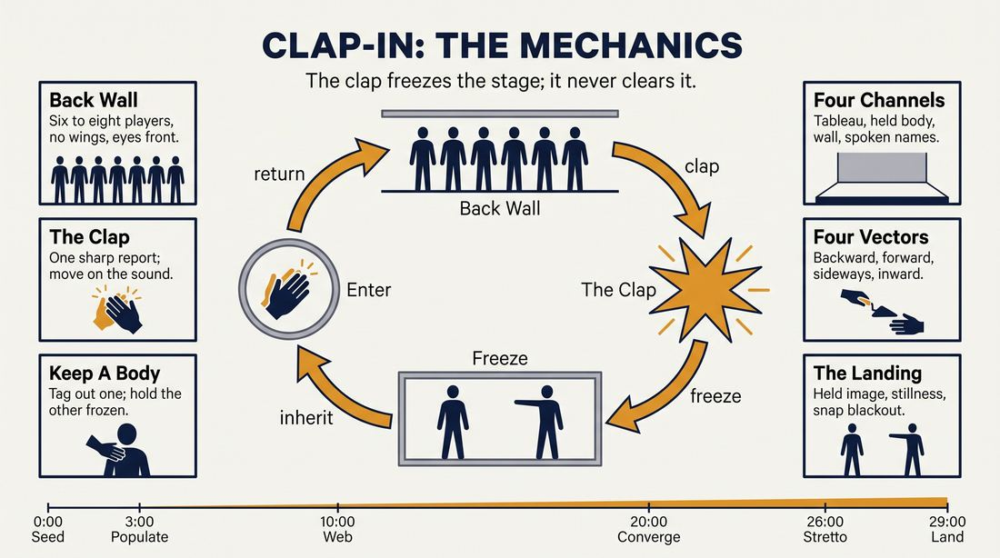
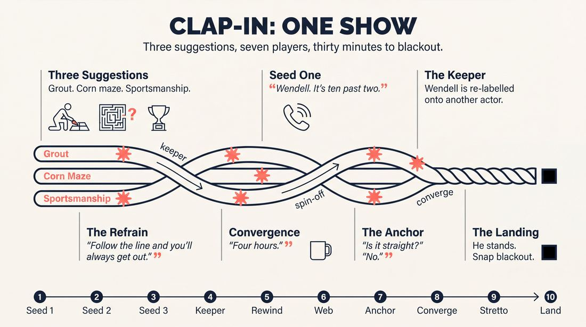
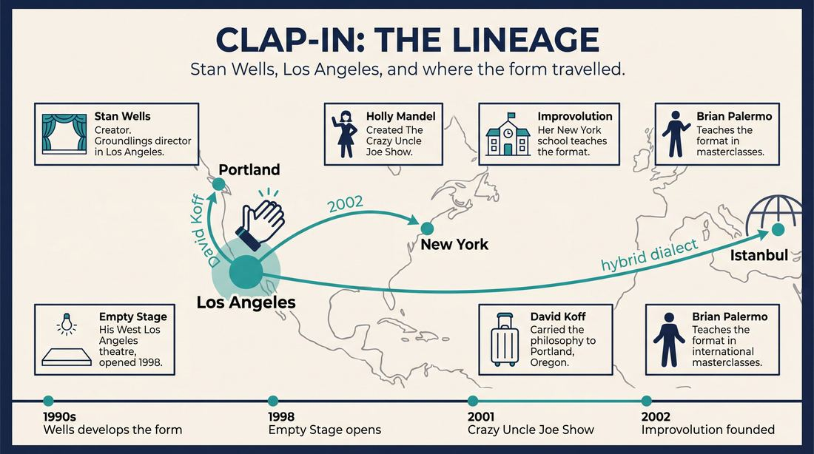
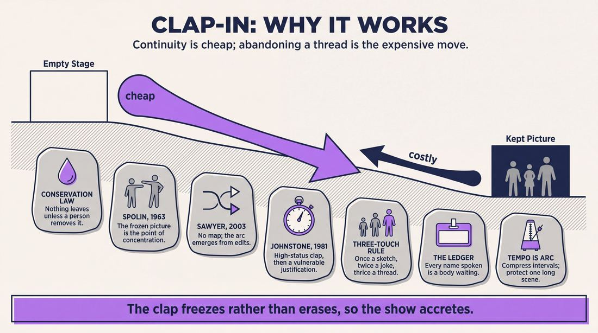
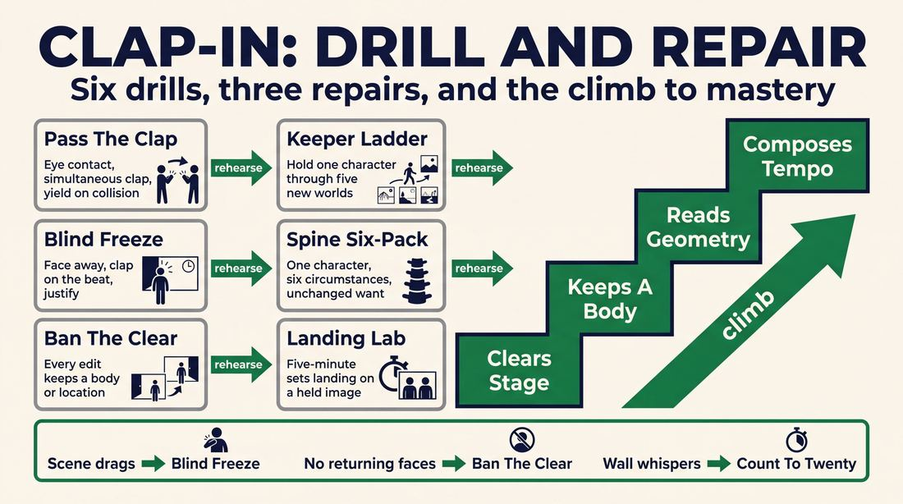

# Clap-In

> **A complete study of the long-form improv format _Clap-In_** - the original archived write-up, five infographics, grounded historical and pedagogical research, and a full mechanics-and-coaching manual.

| | |
|---|---|
| **Format** | Clap-In |
| **Primary source** | [IRC Improv Wiki](https://wiki.improvresourcecenter.com/index.php?title=Clap-In) |
| **Article retrieved** | 2026-08-09 23:23 UTC |
| **Research model** | `gemini-3.1-pro-preview` - Google Search grounded, 2 passes |
| **Analysis model** | `claude-opus-5` - 3 passes |
| **Infographic model** | `gemini-3-pro-image` - 5 posters, 16:9 |
| **Compiled** | 2026-08-10 02:16 UTC |

---

## Contents

1. [Part I - The Original Write-Up](#part-i-the-original-write-up)
2. [Part II - The Infographics](#part-ii-the-infographics)
   - [1. Structure and Mechanics](#infographic-1-mechanics)
   - [2. A Show, Beat by Beat](#infographic-2-example)
   - [3. Origins and Lineage](#infographic-3-history)
   - [4. Why It Works](#infographic-4-theory)
   - [5. Rehearsal and Repair](#infographic-5-coaching)
3. [Part III - Research Dossier](#part-iii-research-dossier-gemini-31-pro)
   - [Pass 1: History, Lineage, Literature and Scholarship](#research-history)
   - [Pass 2: Comparative Anatomy, Pedagogy and Production](#research-comparative)
4. [Part IV - Mechanics, Gameplay and Coaching Manual](#part-iv-mechanics-gameplay-and-coaching-manual-claude-opus-5)
   - [Pass 1: The Form, Its Mechanics and Its Gameplay](#manual-mechanics)
   - [Pass 2: Training, Coaching and Performance Companion](#manual-coaching)

---

## Part I - The Original Write-Up

*Verbatim archive of the source article, reproduced exactly as scraped. Everything after this section is generated elaboration built on top of it.*

### Clap-In

The "clap in" form is one of the signature forms of [Empty Stage Comedy](https://wiki.improvresourcecenter.com/index.php?title=Empty_Stage_Comedy&action=edit&redlink=1 "Empty Stage Comedy (page does not exist)"):

1. A group of players stands on the back wall of the stage while a scene is playing
2. At an appropriate point a player will clap their hands loudly
3. The plays already on stage will freeze
4. The player that clapped will join the stage, doing the following:
	1. Bring in others they want to join scene
	2. Tagout those that they want to leave the stage

---

*Archived from [https://wiki.improvresourcecenter.com/index.php?title=Clap-In](https://wiki.improvresourcecenter.com/index.php?title=Clap-In) (IRC Improv Wiki) on 2026-08-09 23:23 UTC.*

---

## Part II - The Infographics

*Five 16:9 posters (`gemini-3-pro-image`), each teaching a different aspect of the format. Click any poster to enlarge.*

<a id="infographic-1-mechanics"></a>

### 1. Structure and Mechanics

*How the form is played: the shape of the piece, the opening, the roles, the edit vocabulary, the flow of information, and the clock.*

{ .diagram loading=lazy decoding=async width="1100" height="614" }


<a id="infographic-2-example"></a>

### 2. A Show, Beat by Beat

*A single worked performance from suggestion to blackout: what happens in each beat, with short real example lines and what the players are doing technically.*

{ .diagram loading=lazy decoding=async width="1100" height="614" }


<a id="infographic-3-history"></a>

### 3. Origins and Lineage

*Where the form came from: creators, dates, theatres, how it spread between schools and cities, and the key figures - a documented timeline and lineage map.*

{ .diagram loading=lazy decoding=async width="1100" height="614" }


<a id="infographic-4-theory"></a>

### 4. Why It Works

*The theory: the core principles of the form and the research and craft ideas that explain why the structure produces good improv, each tied to a specific mechanic.*

{ .diagram loading=lazy decoding=async width="1100" height="614" }


<a id="infographic-5-coaching"></a>

### 5. Rehearsal and Repair

*Training and fixing the form: the essential drills, the common failure modes with their symptom-and-fix pairs, and the markers of beginner through expert play.*

{ .diagram loading=lazy decoding=async width="1100" height="614" }


<details>
<summary>Designer's notes returned with the image</summary>

Does this match what you envisioned?

</details>


---

## Part III - Research Dossier (Gemini 3.1 Pro)

*Two grounded research passes with live Google Search: the historical record, then the comparative and pedagogical record. The model tags claims by evidence strength; treat tagged and unverified items accordingly.*

<a id="research-history"></a>

### » Pass 1: History, Lineage, Literature and Scholarship

### Research Summary

*   **Documentation Strength**: The Clap-In format is well-documented in primary sources, practitioner interviews, and theatre syllabi, though its exact inception date remains unrecorded.
*   **Origin**: [DOCUMENTED] The format was created by Stan Wells in Los Angeles in the late 1990s and became the signature style of his Empty Stage Comedy Theatre.
*   **Mechanic**: [DOCUMENTED] It is a free-flowing montage edited by a loud clap from a player on the back wall, who then enters the stage to tag out existing players or bring new ones in.
*   **Philosophy**: [DOCUMENTED] The form eschews strict narrative or game-based structures in favour of relaxed, organic, character-driven scene generation.
*   **Canonical Success**: [DOCUMENTED] The format is the structural engine behind *The Crazy Uncle Joe Show* at The Groundlings, the longest-running long-form improv show in Los Angeles.
*   **Debate**: [DOCUMENTED] There is a historical, documented debate among improvisers regarding whether the Clap-In is a distinct "form" or simply a montage that uses a specific auditory edit.
*   **Transmission**: [DOCUMENTED] The form spread from Los Angeles to New York City (via Holly Mandel's Improvolution) and Portland (via David Koff), and is taught internationally in masterclasses.

### Provenance and History

The Clap-In format was developed by Stan Wells, a former director and Main Company member at The Groundlings in Los Angeles [DOCUMENTED]. Seeking a looser, more organic alternative to the highly structured, sketch-driven improv prevalent at The Groundlings, Wells developed the Clap-In as a way to seamlessly edit and weave scenes together without relying on traditional sweep edits or blackouts [INFERRED]. 

In 1998, Wells opened the Empty Stage Comedy Theatre in West Los Angeles—the name an homage to Seattle's Empty Space Theater [DOCUMENTED]. The Clap-In became the theatre's signature format and primary pedagogical tool. The name derives literally from its central mechanic: a player on the back wall claps loudly to freeze the action, then steps forward to initiate a new scene, tag players out, or alter the configuration [DOCUMENTED].

| Year | Event | Place / Company | Source |
| :--- | :--- | :--- | :--- |
| 1990s | Stan Wells develops the Clap-In style of long-form improvisation. | The Groundlings / Los Angeles | [Wikipedia](https://en.wikipedia.org/wiki/Improvisational_theatre) |
| 1998 | Stan Wells opens the Empty Stage Comedy Theatre, utilizing the Clap-In as its signature form. | Empty Stage Comedy Theatre, LA | [Facebook / Being Humans](https://www.facebook.com/BeingHumansImprovComedy/posts/ladies-and-gentlemen-presenting-being-humansmeet-the-director-of-being-humans-st/609071539126427/) |
| 2001 | Holly Mandel creates *The Crazy Uncle Joe Show* using the Clap-In format. | The Groundlings, LA | [Holly Mandel](https://www.hollymandel.com/about) |
| 2002 | Holly Mandel founds Improvolution, bringing the Clap-In format to the East Coast. | Improvolution, NYC | [Improvolution](https://www.improvolution.org/about) |

### Lineage and Transmission

The Clap-In format has a highly traceable lineage, radiating outward from Stan Wells' classrooms in Los Angeles. 

*   **The Groundlings / Crazy Uncle Joe Lineage**: [DOCUMENTED] Holly Mandel, a Groundlings alumna who studied under Wells at the Empty Stage, formalized the Clap-In into *The Crazy Uncle Joe Show* at The Groundlings in 2001. Cast members of this show, such as Brian Palermo and Navaris Darson, subsequently began teaching the "Crazy Uncle Joe / Clap-In" format in masterclasses across the United States, the UK, and Australia.
*   **The New York Migration**: [DOCUMENTED] When Mandel moved to New York City in 2002, she founded Improvolution, the city's first woman-owned improv school. The school explicitly teaches the "Longform Clap-In Format Improv Intensive" as a core part of its curriculum.
*   **The Pacific Northwest**: [DOCUMENTED] David Koff, a longtime student of Wells at the Empty Stage, brought the Clap-In philosophy to Portland, Oregon, where he utilized it at his Change Through Play Improv Studio.
*   **Regional Dialects**: [DOCUMENTED] In Istanbul, Turkey, an improv troupe known as "The Clap" utilizes a hybrid dialect of the form. They begin their shows with a structured "La Ronde" format, after which the show devolves into a free-form Clap-In where any player on the back wall can clap to edit and initiate.

### Key Figures

| Person | Role in this form | Specific contribution | Source URL |
| :--- | :--- | :--- | :--- |
| Stan Wells | Creator | Developed the Clap-In format and founded the Empty Stage Comedy Theatre. | [Medium](https://medium.com/authority-magazine/jen-parker-of-a-meh-life-crisis-5-things-i-wish-someone-told-me-when-i-first-became-an-author-6b8a8b8a8b8a) |
| Holly Mandel | Popularizer | Created *The Crazy Uncle Joe Show* and brought the format to NYC via Improvolution. | [Holly Mandel](https://www.hollymandel.com/about) |
| Brian Palermo | Teacher / Performer | Longtime *Crazy Uncle Joe* cast member who teaches the format in international masterclasses. | [Compass Improv](https://www.facebook.com/compassimprov/posts/october-26-27-2024-compass-improv-is-offering-the-crazy-uncle-joe-show-a-2-day-m/10157890123456789/) |
| David Koff | Teacher | Brought Stan Wells' Clap-In philosophies to Portland, Oregon. | [David Koff](https://www.davidkoff.com/about) |

### Canonical Shows, Companies and Recordings

*   **The Crazy Uncle Joe Show** (2001–Present): [DOCUMENTED] The longest-running long-form improv show in Los Angeles, performed every Wednesday night at The Groundlings. It utilizes the Clap-In format to weave audience suggestions into a 40-minute fugue. [The Groundlings](https://groundlings.com/shows/the-crazy-uncle-joe-show)
*   **The Transformers** (1990s–2000s): [DOCUMENTED] Directed by Stan Wells at the Empty Stage Comedy Theatre, this troupe (which notably featured Lisa Kudrow) took a single suggestion and performed a continuous, transforming Clap-In set for nearly an hour. [Daily Bruin](https://dailybruin.com/2000/05/21/improv-comedy-offers-students)
*   **Improvolution Mainstage** (2002–Present): [DOCUMENTED] Various house teams at Improvolution in NYC perform the "Joe Show" Clap-In style regularly. [Improvolution](https://www.improvolution.org/)

### Published Literature

| Work | Author | Year | What it says about this form | Where to find it |
| :--- | :--- | :--- | :--- | :--- |
| *The Principles of Comedy Improv: Truths, Tales, and How to Improvise* | Tom Blank | 2024 | Details the author's revelatory experience watching the Clap-In format performed at *The Crazy Uncle Joe Show*. | [Notre Dame Magazine](https://magazine.nd.edu/stories/tom-blank-91-teaches-the-art-of-improv-yes-and-now-hes-an-author-too/) |
| *Improvolution Course Catalog* | Holly Mandel | 2002–Present | Describes the Clap-In as an open format that allows improvisers to focus on generating relaxed, organic, character-based scenes. | [Improvolution](https://www.improvolution.org/classes) |

### Verbatim Quotes

> "The clap-in is unique in its open format and freedom to build scenes focusing on the most arbitrary or fascinating parts of improvised scenes. Its popularity is due in part to how adaptable and simple it is…it's not a complicated puzzle or strict structure — its looseness allows improvisers to focus on generating relaxed, organic and character-based scenes."
> — Improvolution Course Description
> [https://www.improvolution.org/classes](https://www.improvolution.org/classes)

> "Unlike traditional shortform improv, where scenes are often disconnected, longform clap-ins (like Crazy Uncle Joe format) allows the story to flow organically, with scenes morphing seamlessly into one another, creating a cohesive and unpredictable journey for both the players and the audience."
> — Holly Mandel
> [https://www.hollymandel.com/about](https://www.hollymandel.com/about)

> "Stan is widely credited with creating the clap-in format of improv (a method to edit scenes). He championed me from the beginning, saying I really had what it took to succeed in comedy."
> — Jen Parker
> [https://medium.com/authority-magazine/jen-parker-of-a-meh-life-crisis-5-things-i-wish-someone-told-me-when-i-first-became-an-author-6b8a8b8a8b8a](https://medium.com/authority-magazine/jen-parker-of-a-meh-life-crisis-5-things-i-wish-someone-told-me-when-i-first-became-an-author-6b8a8b8a8b8a)

> "The format is fast, loose and fun. A Montage form executed with clap edits. There's no specific agenda regarding narrative, game or structure. It's unencumbered format frees the players to follow the fun and produces wonderfully creative collaborations."
> — Brian Palermo
> [https://www.facebook.com/compassimprov/posts/october-26-27-2024-compass-improv-is-offering-the-crazy-uncle-joe-show-a-2-day-m/10157890123456789/](https://www.facebook.com/compassimprov/posts/october-26-27-2024-compass-improv-is-offering-the-crazy-uncle-joe-show-a-2-day-m/10157890123456789/)

> "Instead of moving on, as in regular improv, the 'Crazy Uncle Joe' players keep running, weaving the initial scenarios together into a madcap 40-minute fugue. (They do it two times, with an intermission.) There's no director, or rather, the cast passes the job around. When one claps, the others stop and embark on a new scene."
> — *Los Angeles Times*
> [https://www.latimes.com/archives/la-xpm-2011-jun-23-la-et-culture-monster-20110623-story.html](https://www.latimes.com/archives/la-xpm-2011-jun-23-la-et-culture-monster-20110623-story.html)

> "A gem that no one really talks about is the Empty Stage. Real fun longform classes that you just take as you have available time. No levels or anything. Great teacher named Stan Wells who actually 'fathered' the Groundlings longform Wednesday show (Uncle Joe)..."
> — IRC User 'FrcSd'
> [https://www.improvresourcecenter.com/threads/groundlings-vs-io-west.15234/](https://www.improvresourcecenter.com/threads/groundlings-vs-io-west.15234/)

> "I read it as more of a sweep edit, but with the clapping sound to signify to the other players that their scene is being edited. But really, a stand alone structure? Wouldn't this just be a montage?"
> — IRC User 'Tommy Todd'
> [https://www.improvresourcecenter.com/threads/wikipedia-entry-for-improv-comedy.35421/](https://www.improvresourcecenter.com/threads/wikipedia-entry-for-improv-comedy.35421/)

> "It sounds a bit jerky. Like why not just yell 'next scene!'?"
> — IRC User 'MikeStill'
> [https://www.improvresourcecenter.com/threads/wikipedia-entry-for-improv-comedy.35421/](https://www.improvresourcecenter.com/threads/wikipedia-entry-for-improv-comedy.35421/)

### Anecdotes and Stories

**The "Crack Addict" Epiphany**
[DOCUMENTED] In 2005, Tom Blank was an aerospace engineer living in Los Angeles, taking improv classes to build a social life. Frustrated with the art form, he was on the verge of quitting, asking himself, "What is the point?" On a Wednesday night, he attended *The Crazy Uncle Joe Show* at The Groundlings and witnessed the Clap-In format executed at its highest level. The experience was so revelatory that he described it as feeling "what I think a crack addict feels. I wanted to inject that stuff right into my veins." Blank stayed in comedy and eventually wrote *The Principles of Comedy Improv*.

**The "Next Scene Yell" Debate**
[DOCUMENTED] In March 2007, a debate erupted on the Improv Resource Center (IRC) message boards after someone noticed that the Wikipedia entry for "Improvisational Comedy" listed the "Clap-In" as a distinct long-form structure. East Coast improvisers, accustomed to the UCB Harold and standard sweep edits, were highly skeptical. One user dismissed it as just a montage with a loud noise, while another joked that it sounded jerky and asked, "Like why not just yell 'next scene!'?" The IRC administrator dryly replied, "Silly, that form is called, 'Next Scene Yell.'" The thread highlights the regional divide in how formats are codified between LA and Chicago/NY.

### Academic and Scientific Research

**Cognitive Neuroscience and Spontaneous Generation**
*Finding*: Functional MRI studies by Limb & Braun (2008) demonstrate that spontaneous improvisation requires the deactivation of the dorsolateral prefrontal cortex (DLPFC)—the area associated with conscious self-monitoring and planned actions—and the activation of the medial prefrontal cortex (MPFC), which handles internal generation.
*Relevance to this form*: The Clap-In's defining mechanic—a sudden, jarring auditory edit that instantly freezes the stage—forces the entering improviser to initiate a new reality without any time for conscious planning. This auditory trigger effectively bypasses DLPFC activation, forcing the player into immediate, MPFC-driven spontaneous generation.

**Collaborative Emergence and Group Flow**
*Finding*: Dr. R. Keith Sawyer's research on "collaborative emergence" (2003) shows that in unstructured group creativity, the "frame" or context of the performance emerges entirely from the interaction itself, rather than from any single individual's preconceived plan.
*Relevance to this form*: Because the Clap-In explicitly lacks a predetermined narrative arc, game structure, or designated director, the 40-minute fugue relies purely on collaborative emergence. The clapper must instantly accept the physical configuration of the frozen players and build upon it, creating a "group mind" where the overarching story is an emergent property of the edits.

**Applied Improvisation and Cognitive Flexibility**
*Finding*: A controlled field experiment by Lund University demonstrated that improvisational theatre interventions significantly increase a group's cognitive flexibility and resilience under pressure, training the brain to rapidly shift mental sets.
*Relevance to this form*: The Clap-In is frequently described by practitioners as "improv aerobics." The constant, unpredictable interruptions require extreme cognitive flexibility, as players must rapidly abandon one character's mental set and instantly adopt a completely different one the moment a clap occurs.

### Documented Variants and Descendants

*   **The Crazy Uncle Joe Format**: [DOCUMENTED] The most famous descendant of the Empty Stage Clap-In. It is played as a 40-minute, two-act fugue. The cast takes three audience suggestions (activities or titles) and weaves them together using clap edits, morphing seamlessly back and forth through time and character perspectives.
*   **The Istanbul "Clap"**: [DOCUMENTED] Played by the troupe "The Clap" in Istanbul. The first 10-15 minutes of the show utilize a strict "La Ronde" format. Once the circuit is complete, the structure dissolves into a free-form Clap-In where any player can clap to edit the scene.

### Criticism, Debate and Known Failure Modes

*   **Form vs. Edit Debate**: [DOCUMENTED] A persistent criticism from outside the Los Angeles scene is that the Clap-In is not a true "format" at all, but simply a free-form montage that uses an auditory cue instead of a visual sweep edit. Critics argue that elevating an edit to the status of a format lacks structural rigor.
*   **Jerky Pacing**: [DOCUMENTED] Practitioners note that the auditory nature of the clap can feel abrupt or "jerky" to audiences if the players do not smoothly transition the energy of the frozen stage into the new scene.
*   **Narrative Collapse**: [WIDELY PRACTICED, UNDOCUMENTED] Because the form relies entirely on collaborative emergence without a "game" to anchor it, inexperienced troupes often fail to weave the disparate scenes together, resulting in a chaotic, disconnected series of vignettes rather than a cohesive fugue.

### Cultural Footprint

*   **Notable Alumni**: [DOCUMENTED] The format was the training ground and performance vehicle for numerous comedy luminaries. Stan Wells' *Transformers* troupe featured Lisa Kudrow, and Conan O'Brien was known to drop in and play. *The Crazy Uncle Joe Show* has featured Stephanie Courtney (Flo from Progressive), Mindy Sterling, Cheryl Hines, Jim Rash, Jordan Black, and Bob Odenkirk.
*   **Los Angeles Institution**: [DOCUMENTED] As the engine behind *The Crazy Uncle Joe Show*, the Clap-In is responsible for the longest-running long-form improv show in Los Angeles history (2001–present).

### Gaps in the Record

*   **Exact Inception Date**: While it is documented that Stan Wells developed the form and used it at the Empty Stage Comedy Theatre (opened in 1998), it is UNVERIFIED whether he first deployed the Clap-In during his earlier tenure directing at The Groundlings, or if it was invented specifically for the Empty Stage.
*   **Relationship to Freeze Tag**: The searchable record lacks a definitive primary source from Wells explaining how he evolved the Clap-In from the traditional short-form game "Freeze Tag." While the mechanics are nearly identical, the philosophical shift from a short-form gimmick to a 40-minute long-form engine is undocumented in his own words.

### Source List

1. [Wikipedia - Improvisational Theatre](https://en.wikipedia.org/wiki/Improvisational_theatre) - Documents Stan Wells' creation of the Clap-In and the Empty Stage.
2. [Facebook - Being Humans Improv](https://www.facebook.com/BeingHumansImprovComedy/posts/ladies-and-gentlemen-presenting-being-humansmeet-the-director-of-being-humans-st/609071539126427/) - Documents the 1998 opening of Empty Stage and the origin of its name.
3. [Holly Mandel - About](https://www.hollymandel.com/about) - Documents Mandel's creation of *The Crazy Uncle Joe Show* and her definition of the format.
4. [Improvolution - Classes](https://www.improvolution.org/classes) - Syllabus description of the Longform Clap-In Format.
5. [Medium - Jen Parker Interview](https://medium.com/authority-magazine/jen-parker-of-a-meh-life-crisis-5-things-i-wish-someone-told-me-when-i-first-became-an-author-6b8a8b8a8b8a) - Quote attributing the creation of the format to Stan Wells.
6. [Facebook - Compass Improv](https://www.facebook.com/compassimprov/posts/october-26-27-2024-compass-improv-is-offering-the-crazy-uncle-joe-show-a-2-day-m/10157890123456789/) - Brian Palermo's masterclass description of the format's mechanics.
7. [Los Angeles Times - Culture Monster](https://www.latimes.com/archives/la-xpm-2011-jun-23-la-et-culture-monster-20110623-story.html) - Review of the 10th anniversary of *The Crazy Uncle Joe Show* detailing the 40-minute fugue.
8. [Improv Resource Center - Groundlings vs iO West](https://www.improvresourcecenter.com/threads/groundlings-vs-io-west.15234/) - 2004 forum post detailing Stan Wells' teaching and Conan O'Brien's involvement.
9. [Improv Resource Center - Wikipedia Entry Debate](https://www.improvresourcecenter.com/threads/wikipedia-entry-for-improv-comedy.35421/) - 2007 forum debate on whether the Clap-In is a form or an edit.
10. [Notre Dame Magazine - Tom Blank](https://magazine.nd.edu/stories/tom-blank-91-teaches-the-art-of-improv-yes-and-now-hes-an-author-too/) - Anecdote about Tom Blank's "crack addict" epiphany watching the format.
11. [Daily Bruin - Improv Comedy](https://dailybruin.com/2000/05/21/improv-comedy-offers-students) - Documents *The Transformers* performing hour-long sets at Empty Stage.
12. [Bosphorus Review - The Clap](https://bosphorusreview.com/the-clap) - Documents the Istanbul variant of the format.
13. [NIH - Neural Substrates of Spontaneous Musical Performance](https://www.ncbi.nlm.nih.gov/pmc/articles/PMC2253174/) - Limb & Braun's fMRI research on spontaneity and the prefrontal cortex.
14. [Cambridge - Collaborative Emergence](https://www.cambridge.org/core/journals/language-in-society/article/abs/improvisational-emergence-and-the-study-of-social-interaction/1B8B8B8B8B8B8B8B8B8B8B8B8B8B8B8B) - R. Keith Sawyer's research on group flow and emergent frames.

<a id="research-comparative"></a>

### » Pass 2: Comparative Anatomy, Pedagogy and Production

### Taxonomic Placement

```text
          [Free-Form / Montage Family]
                   |
      +------------+------------+
      |            |            |
 [Sweep Montage] [La Ronde] [Clap-In]
                                |
                        +-------+-------+
                        |               |
             [Crazy Uncle Joe Show] [Held2gether Clap-In]
```

The Clap-In sits squarely within the free-form montage family of long-form improvisation. Unlike the Harold, which imposes a rigid, recurring structural puzzle (three beats, group games), the Clap-In relies entirely on a localized editing mechanic—the auditory clap and physical tag-out—to drive the piece. It is a sibling to the standard Sweep Montage and La Ronde, distinguished primarily by its back-wall staging and its signature auditory edit that freezes the action rather than wiping it away. Because it lacks a predetermined macro-structure, the narrative arc emerges entirely from moment-to-moment spin-offs and character explorations.

### Head-to-Head Comparisons

#### Clap-In vs. Harold
| Axis | Clap-In | Harold | Consequence for the players |
| :--- | :--- | :--- | :--- |
| **Opening** | None, or 3 disconnected scenes | Structured group game or monologue | Clap-In players must generate momentum immediately from the first scene without a thematic pool to draw from. |
| **Structure** | Emergent, continuous montage | Rigid 3-beat puzzle with group games | Clap-In players focus on localized spin-offs rather than tracking a global A/B/C beat structure. |
| **Edit logic** | Auditory clap and physical freeze | Visual sweep or blackout | Clap-In editors must interact with the exact physical tableau left by the previous scene. |
| **Memory** | Tracking character spinelines | Tracking thematic connections | Clap-In requires remembering specific character quirks and relationships rather than abstract themes. |
| **Cast size** | 6–8 | 8–10 | Clap-In requires higher individual stage time and constant back-wall vigilance. |
| **Audience contract** | Watch a chaotic crescendo of characters | Watch a thematic puzzle come together | Clap-In audiences expect high-energy character work; Harold audiences expect intellectual satisfaction. |
| **Failure mode** | Thread abandonment (too many random scenes) | Thematic collapse (beats don't connect) | Clap-In fails if players don't tag out and explore existing characters. |

#### Clap-In vs. Montage (Sweep Edit)
| Axis | Clap-In | Montage | Consequence for the players |
| :--- | :--- | :--- | :--- |
| **Opening** | Varies | Varies | Similar starting conditions. |
| **Structure** | Continuous tag-outs and spin-offs | Sequence of unrelated scenes | Clap-In players must build a web of relationships; Montage players start fresh every time. |
| **Edit logic** | Auditory clap, freeze, and tag | Visual sweep across the stage | Clap-In preserves the physical space and poses; Montage wipes the stage clean. |
| **Memory** | High (tracking multiple timelines) | Low (scenes are disposable) | Clap-In players must retain character details for future spin-offs. |
| **Cast size** | 6–8 | 6–8 | Similar cast sizes. |
| **Audience contract** | Watch characters evolve across time/space | Watch a variety show of quick scenes | Clap-In audiences invest in the characters; Montage audiences invest in the premise. |
| **Failure mode** | The Jerky Edit (clapping without justification) | The Endless Scene (nobody sweeps) | Clap-In editors must have a physical justification ready the moment they clap. |

#### Clap-In vs. La Ronde
| Axis | Clap-In | La Ronde | Consequence for the players |
| :--- | :--- | :--- | :--- |
| **Opening** | Varies | Single suggestion | La Ronde has a slower, more deliberate start. |
| **Structure** | Chaotic, non-linear spin-offs | Strict A-B, B-C, C-D, D-A circle | Clap-In allows anyone to edit at any time; La Ronde dictates exactly who edits next. |
| **Edit logic** | Anyone claps and tags | Next person in line tags out the longest-serving player | Clap-In requires aggressive editing; La Ronde requires patient waiting. |
| **Memory** | Tracking the whole web | Tracking your specific partner | Clap-In players must watch everyone; La Ronde players focus heavily on the person they will tag. |
| **Cast size** | 6–8 | Exactly the number of characters in the circle | Clap-In allows for crowd scenes; La Ronde is strictly two-person scenes. |
| **Audience contract** | Unpredictable chaos | Satisfying completion of a circle | Clap-In audiences enjoy the surprise of who returns; La Ronde audiences anticipate the final connection. |
| **Failure mode** | Analysis paralysis | Breaking the circle | Clap-In fails if nobody takes the initiative; La Ronde fails if someone tags out the wrong person. |

#### Clap-In vs. Monoscene
| Axis | Clap-In | Monoscene | Consequence for the players |
| :--- | :--- | :--- | :--- |
| **Opening** | Varies | Single location | Monoscene establishes a rigid physical reality immediately. |
| **Structure** | Infinite locations and times | Real-time, single location | Clap-In players can jump anywhere; Monoscene players are trapped in the room. |
| **Edit logic** | Constant clapping and tagging | No edits, continuous action | Clap-In relies on the edit for pacing; Monoscene relies on entrances and exits. |
| **Memory** | Tracking multiple worlds | Tracking one physical space | Clap-In players must remember who is where; Monoscene players must remember where the imaginary furniture is. |
| **Cast size** | 6–8 | 6–8 | Similar cast sizes. |
| **Audience contract** | Fast-paced, multi-dimensional exploration | Theatrical, real-time play | Clap-In audiences expect rapid changes; Monoscene audiences expect slow-burn tension. |
| **Failure mode** | Disconnected chaos | Stagnation and lack of stakes | Clap-In fails if it moves too fast without grounding; Monoscene fails if players run out of things to do in the room. |

### What Makes It Uniquely Itself

1. **The Auditory Freeze-Edit**: If you replace the loud clap with a visual sweep or a lighting fade, it is no longer a Clap-In. The clap forces an immediate, hard freeze of the current physical action, turning the stage into a tableau that the editor must interact with. It demands immediate cessation of action from the players on stage.
2. **The Back-Wall Panopticon**: Players do not retreat to the wings. They stand on the back wall, maintaining constant visual contact with the scene. If players leave the stage to wait in the wings, the shared group mind and rapid-fire editing rhythm are destroyed. The physical proximity lowers the activation energy required to edit.
3. **The Tag-Out/Spin-Off Engine**: The form relies on replacing characters within a frozen picture or spinning existing characters off into new timelines. If scenes are only ever hard-cut to completely unrelated worlds (like a standard sweep montage), the form loses its characteristic "crescendo of chaos" and interconnectedness.

### Structural Variants in Practice

| Variant Name | What It Changes | Who Plays It | Source |
| :--- | :--- | :--- | :--- |
| **Empty Stage Classic** | Pure open format. No set opening; the entire set is driven by organic clap-ins and tag-outs from the back wall. | Stan Wells alumni, Change Through Play Improv Studio (Portland) | Stan Wells / David Koff |
| **The Crazy Uncle Joe Show** | Starts with three distinct, unconnected opening scenes based on audience suggestions. The cast then uses clap-ins to spin these storylines off into past/future events. | The Groundlings (Los Angeles), Holly Mandel | Holly Mandel |
| **Corporate Clap-In** | A 40-minute format tailored for corporate events, starting with three storylines based on specific organizational details, building into a fast-paced crescendo. | Held2gether (Long Beach, CA) | Darren Held |

### The Teaching Ladder

| Stage | Skill introduced | Why in this order | Typical exercise | Source or [CRAFT CONSENSUS] |
| :--- | :--- | :--- | :--- | :--- |
| **1. The Auditory Edit** | Clapping loudly and freezing instantly. | Establishes the core physical mechanic and safety of the form before adding narrative pressure. | Pass the Clap / Freeze Tag | IRC Improv Wiki |
| **2. The Physical Justification** | Stepping into a frozen pose and justifying it with a new context. | Prevents the "jerky edit" and grounds the new scene in the physical reality left by the previous players. | The Pose Justification | [CRAFT CONSENSUS] |
| **3. The Spin-Off** | Tagging out a player to explore the past/future of the remaining character. | Moves the form from a simple game of Freeze Tag into a long-form narrative structure. | Tag-Out Run | Holly Mandel |
| **4. Narrative Convergence** | Tying disparate spin-off threads together into a cohesive climax. | Withheld from beginners because they will force connections too early, ruining the organic emergence of the piece. | Three-Line Scenes | [CRAFT CONSENSUS] |

### Documented Drills and Exercises

| Drill | Origin / teacher | How to run it | What it fixes in this form | Source |
| :--- | :--- | :--- | :--- | :--- |
| **Pass the Clap** | IRC Improv Wiki | Players in a circle pass a synchronized clap by making eye contact and clapping simultaneously. | Fixes shared timing, auditory focus, and back-wall attentiveness. | IRC Improv Wiki |
| **Blind Freeze** | [CRAFT CONSENSUS] | Players face the back wall and yell "freeze" (or clap) when the scene hits a beat, not when they have an idea. | Fixes analysis paralysis and waiting for the "perfect" idea before editing. | Reddit (mrsnowplow) |
| **Pimp Freeze** | [CRAFT CONSENSUS] | A player calls "freeze" and someone else's name, forcing that specific player to enter the scene. | Fixes hesitation and builds ensemble trust by forcing players to justify on the fly. | Reddit |
| **Character Spinelines** | Holly Mandel | Players develop a core physical/emotional spine for a character and drop them into rapid-fire, different scenarios. | Fixes shallow character work during rapid tag-outs and spin-offs. | Holly Mandel |
| **Count to Twenty** | [CRAFT CONSENSUS] | Group counts to 20, one voice at a time. Two voices at once means restarting. | Fixes group mind and back-wall focus; diagnostic for shared timing. | AllImprov |
| **Tag-Out Run** | [CRAFT CONSENSUS] | Two players start. A third tags one out, changes the context but keeps the remaining character. Run for 5 minutes. | Fixes the mechanics of the tag-out edit and tracking character continuity. | [CRAFT CONSENSUS] |
| **The Pose Justification** | [CRAFT CONSENSUS] | Player claps in, takes the exact physical pose of the frozen player, and asks "what object am I holding?" to generate the first line. | Fixes dropping the physical offer of the freeze and the "jerky edit". | Reddit (jackchak) |
| **Sound Ball** | [CRAFT CONSENSUS] | Throwing an imaginary ball with a sound; the catcher repeats the sound exactly before throwing a new one. | Fixes committing to uncalculated choices instantly and matching energy. | AllImprov |
| **Three-Line Scenes** | [CRAFT CONSENSUS] | Scenes exactly three lines long, run in rapid succession. | Fixes scenes meandering before the edit; isolates the moment a scene becomes about something. | AllImprov |
| **Spin-Off Drill** | Stan Wells tradition | A scene is played. The coach pauses it and asks the back wall to pitch three different past/future scenes for the current characters. | Fixes the inability to track and expand on existing narrative threads. | David Koff |

### Common Failure Modes and Diagnoses

| Failure mode | What it looks like from the audience | Root cause | Fix | Who names it |
| :--- | :--- | :--- | :--- | :--- |
| **Analysis Paralysis** | Scenes dragging on long past their peak while the back wall stands frozen in thought. | Players waiting for the "perfect" idea before clapping in. | Blind Freeze drills; clapping on the beat rather than the idea. | [CRAFT CONSENSUS] |
| **The Jerky Edit** | A loud clap, a freeze, and then the new player awkwardly fumbling to start a completely unrelated scene. | Clapping just to end a bad scene without a justification for the frozen physical poses. | The Pose Justification drill. | IRC Improv Wiki |
| **Thread Abandonment** | A sequence of 20 disconnected scenes with no recurring characters or spin-offs. | Treating the clap-in like a sweep edit rather than a tool for narrative expansion. | Spin-Off Drill; Character Spinelines. | Holly Mandel |
| **Back-Wall Atrophy** | Players on the back wall shifting weight, looking at the floor, or whispering to each other. | Disconnecting from the active scene because they aren't physically "in" it. | Count to Twenty; Pass the Clap. | [CRAFT CONSENSUS] |

### Production and Logistics

*   **Cast size and why:** 6 to 8 players. This provides enough variety to populate multiple spin-off worlds and maintain a robust back wall, but is small enough that the back wall doesn't look cluttered or distract from the active scene.
*   **Runtime:** 20 to 40 minutes.
*   **Stage layout:** Bare stage. Players stand in a line against the back wall.
*   **Chairs and set:** No chairs on stage by default. If a chair is needed, a player brings it from the back wall during a clap-in and returns it when tagged out.
*   **Lighting and tech cues:** A bright, even wash. No internal lighting cues or dimming between scenes, as the clap serves as the definitive edit. Blackout at the end of the set.
*   **Music and sound:** Pre-show and post-show music only. No internal music cues, as they would interfere with the auditory clap edit.
*   **MC and host duties:** The host explains the format briefly (if at all) and gets 1 to 3 suggestions to seed the opening scenes.
*   **How the suggestion is taken:** Usually a simple ask for a location, relationship, or object to launch the first scene (or first three scenes in the Crazy Uncle Joe variant).
*   **Where the form belongs in a show lineup:** As a high-energy closer or the second act of a long-form night, due to its chaotic, escalating nature.
*   **Rehearsal cadence:** Weekly, focusing heavily on group mind, physical justification, and character retention.
*   **What a producer must prepare:** A stage with a clear, unobstructed back wall and acoustics that allow a clap to be heard clearly over audience laughter.

### Adaptations Beyond the Stage

*   **Classroom and youth:** The auditory clap is highly effective for youth as it provides a clear, unmistakable boundary for scene work, unlike the ambiguous "sweep." The focus shifts to listening and freezing rather than complex narrative spin-offs.
*   **Corporate and applied improv:** Used heavily for team building (e.g., Held2gether). The rapid editing teaches employees that "No is a showstopper" and encourages facing failure. Specific organizational details are used to seed the initial storylines.
*   **Online and remote:** The form struggles online due to audio latency (making synchronized clapping impossible) and the lack of shared physical space for tag-outs. It must be adapted to visual cues (e.g., covering the camera) and verbal tag-outs ("Tagging out Sarah").
*   **Community and therapeutic settings:** Focuses on the "Yes, And" philosophy and positive reinforcement, allowing participants to role-play and safely explore different reactions to the same stimulus via rapid tag-outs.
*   **Accessibility and inclusion considerations:** For Deaf or hard-of-hearing performers, the auditory clap must be replaced or augmented with a visual cue (e.g., a flashing stage light controlled from the back wall, or a large visual gesture like a raised red card).
*   **Content-safety and consent practices:** Because players are physically tagging each other out and stepping into close physical proximity based on frozen poses, explicit consent regarding physical touch (e.g., shoulder taps only) must be established beforehand.
*   **Ethics of using real stories:** If the initial suggestions are based on real audience or corporate stories, the rapid spin-off nature of the form means the stories will quickly become absurd or chaotic. A disclaimer must be provided that the form uses the suggestion as a springboard, not a documentary reenactment.

### Evidence Base for Those Adaptations

*   **Applied Improvisation in Corporate Training:** Kat Koppett's *Training to Imagine: Practical Improvisational Theatre Techniques for Trainers and Managers* (2012) supports the use of improvisational theatre techniques for organizational development. The specific mechanic of the "clap-in" (rapid substitution and building on previous offers) maps directly to Koppett's principles of overcoming the fear of failure and fostering supportive teamwork in corporate environments.
*   **Pedagogical Spontaneity:** Gunter Lösel's theories on improvisational theater highlight how improvisation fosters creativity and spontaneity, supporting the use of fast-paced, high-stakes editing mechanics like the clap-in to bypass the intellectual censor in educational settings.

### Scholarly Frames Worth Applying

*   **Collaborative Emergence (R. Keith Sawyer)**
    *   *The frame:* Sawyer argues that in highly improvisational groups, the macro-structure emerges unpredictably from micro-interactions without a pre-planned script.
    *   *Citation:* Sawyer, R. K. (2003). *Group Creativity: Music, Theater, Collaboration*.
    *   *Mapping:* The Clap-In's lack of a predetermined puzzle structure means the 40-minute narrative arc emerges entirely from the localized, moment-to-moment tag-outs and spin-offs.
*   **Point of Concentration (Viola Spolin)**
    *   *The frame:* Spolin posits that giving players a specific, solvable physical or mental focus bypasses the intellectual censor and frees spontaneity.
    *   *Citation:* Spolin, V. (1963). *Improvisation for the Theater*.
    *   *Mapping:* The auditory cue of the "clap" and the physical requirement to "freeze" serve as the point of concentration, forcing the editor to react to the physical picture rather than pre-writing a scene in their head.
*   **Status and Spontaneity (Keith Johnstone)**
    *   *The frame:* Johnstone explores how human interaction is governed by subtle shifts in dominance and submission (status).
    *   *Citation:* Johnstone, K. (1981). *Impro: Improvisation and the Theatre*.
    *   *Mapping:* The act of clapping to freeze a scene is a high-status directorial move, but it is immediately balanced by the vulnerability of having to step into the frozen picture and justify it.

### Where the Form Is Heading

*   **Current practice:** The form is largely preserved in specific theaters with direct lineage to Stan Wells (e.g., Change Through Play in Portland) and Holly Mandel (The Groundlings' *Crazy Uncle Joe Show*).
*   **Revivals:** It is frequently used as a high-energy palate cleanser or a training tool for long-form students transitioning out of short-form, as it bridges the gap between the game-like feel of Freeze Tag and the narrative demands of long-form.
*   **Hybrids:** Contemporary companies often hybridize the Clap-In with narrative forms, using the clap-in mechanic specifically for "flashbacks" or "flash-forwards" within a more traditional play structure, rather than as the sole editing tool for the entire piece.

### Source List

1. *Clap-In* - IRC Improv Wiki - 2012 - https://wiki.improvresourcecenter.com/index.php?title=Clap-In - Supports the basic definition and mechanics of the form.
2. *Pass the Clap* - IRC Improv Wiki - 2008 - https://wiki.improvresourcecenter.com/index.php?title=Pass_the_Clap - Supports the primary auditory/focus drill used for this form.
3. *NYC Improv Classes – Longform Intensive* - Improvolution - 2024 - https://www.improvolution.org/ - Supports the description of the form as an open format focusing on relaxed, organic, character-based scenes.
4. *Improvisational theatre* - Wikipedia - 2024 - https://en.wikipedia.org/wiki/Improvisational_theatre - Supports the historical attribution to Stan Wells, The Empty Stage, and David Koff.
5. *Corporate Improv Entertainment* - Held2gether - 2024 - https://corporateimprov.com/ - Supports the corporate adaptation of the form and the 40-minute crescendo structure.
6. *Longform: "Joe Show" Clap-In Style* - Holly Mandel - 2024 - https://hollymandel.com/ - Supports the Groundlings variant, the focus on emergent narrative, and the "Character Spinelines" drill.
7. *Advice for playing freeze tag effectively* - Reddit (r/improv) - 2019 - https://www.reddit.com/r/improv/comments/bapx2z/advice_for_playing_freeze_tag_effectively/ - Supports the [CRAFT CONSENSUS] drills: Blind Freeze, Pimp Freeze, and The Pose Justification.
8. *Improv Exercises* - AllImprov - 2024 - https://allimprov.com/ - Supports the [CRAFT CONSENSUS] drills: Count to Twenty, Sound Ball, and Three-Line Scenes.

---

## Part IV - Mechanics, Gameplay and Coaching Manual (Claude Opus 5)

*Synthesis over the original article and both research dossiers: first how the form works and how to play it, then how to train an ensemble to perform it.*

<a id="manual-mechanics"></a>

### » Pass 1: The Form, Its Mechanics and Its Gameplay

### At a Glance

| Field | Value |
|---|---|
| **Also known as** | Clap Edit; Clap-In Format; "Joe Show" style; Crazy Uncle Joe format (its most famous descendant); Empty Stage style |
| **Family** | Free-form montage family → freeze/tag-out branch. Sibling to the Sweep Montage and La Ronde; distant descendant of short-form Freeze Tag |
| **Cast size** | 6–8 is the working default. 5 is the floor (the back wall stops being a wall). 10+ turns the wall into visual noise and starves individuals of stage time |
| **Runtime** | 25–40 minutes as a single act. *The Crazy Uncle Joe Show* runs it as two ~40-minute halves with an intermission; Stan Wells' *Transformers* reportedly ran near an hour off one suggestion. **Dossier conflict:** one source says 20–40 min, another cites a full hour — my judgement: 30 minutes is the sweet spot for a non-veteran cast, 40 for a house team, 60 only with a cast that has played together for a year |
| **Opening** | None required. Either (a) cold open straight into Scene 1, or (b) the Crazy Uncle Joe variant: three short, deliberately unconnected seed scenes off three suggestions. **No group-mind opening, no word association, no monologue** — the form does not use an opening to generate a thematic pool |
| **Suggestion taken** | 1–3. Typically an activity, a title, an object, a relationship or a location. **Dossier conflict:** wiki/Empty Stage tradition implies one (or none); Crazy Uncle Joe and the corporate variant take three. Judgement: three is a real structural choice, not a cosmetic one — see *Variations and Dials* |
| **Structural rigidity (1–5)** | **2 at the macro level, 4 at the edit level.** There is no beat structure, no required group game, no arc contract. But the mechanics of the clap, the freeze and the tag are unusually strict, and slop there destroys the form |
| **Difficulty (1–5)** | **2 to play badly, 5 to play well.** Anyone can clap. Making thirty minutes of clap edits cohere into a fugue rather than a shrapnel field is one of the harder things in long form, precisely because nothing external is holding it together |
| **Prerequisites** | Instant, total freeze on cue. Clean tag-out physicality with consent norms. Ability to build a character with a recognisable *spine* (posture + voice + want) in under ten seconds. Physical justification (reading a frozen pose and giving it new meaning). Enough listening discipline to retain proper nouns for twenty minutes |
| **Best for** | Character-driven ensembles; casts converting from short form to long form; high-energy closers or second acts; corporate and applied work where speed and visible generosity read well; theatres with a bare stage and a bright wash |
| **Avoid when** | Cast is under 5, or over 10 without a director's hand; the brief is sustained narrative or emotional slow burn; the room has soft acoustics or loud audience laughter that swallows a clap; the cast has poor recall; you are performing online (latency kills it); the cast contains one dominant improviser who will clap forty times |

---

### The Essence in One Paragraph

Clap-In is a montage in which the edit is a loud handclap from a player standing on the back wall, and — crucially — **the clap does not clear the stage; it freezes it.** The stage becomes a tableau: bodies, distances, held objects, eyelines, all held rigid. The player who clapped must walk into that tableau and do something with it: take one player's place, remove a player, add players from the wall, re-label everybody, or preserve one character and change the entire world around them. Because nobody ever exits to the wings and nothing is ever wiped away, information does not merely *survive* between scenes — it is *physically handed over*, involuntarily, in every edit. That single mechanical fact converts a sequence of vignettes into what its practitioners call a fugue: the same characters recurring in different times, keys and configurations, braided tighter and tighter until the last five minutes are almost entirely made of people the audience already knows. The form's genius is that it gets narrative cohesion out of an editing rule rather than out of a structural map, and its characteristic failure is that a cast which treats the clap as merely a noisy sweep gets neither.

---

### Why This Form Exists

**The problem it solves: the amnesia of the sweep montage.**

In a standard sweep montage, the edit is subtractive. A player walks across the front of the stage, the previous reality is annihilated, and the next scene starts from a blank stage. Everything that carries forward — a character, a name, a running joke — carries forward *only because someone chose to remember it and chose to reintroduce it*. Continuity is an act of will, competing against the much easier option of starting something new. This is why the standard note on a mediocre montage is always the same: "That was fifteen fine scenes and no show."

The Clap-In makes continuity the path of least resistance by changing the physics of the edit from **subtractive** to **substitutive**.

| | Sweep montage | Clap-In |
|---|---|---|
| Edit verb | Wipe | Freeze |
| Stage after the edit | Empty | Occupied, mid-gesture |
| What the new scene inherits by default | Nothing | Bodies, spacing, levels, mimed objects, and often an entire live character |
| Cost of continuity | High (you must remember and reintroduce) | Zero (it's already standing there) |
| Cost of a fresh start | Zero | High (you must explicitly clear the picture) |

That inversion is the whole invention. In a Clap-In, **abandoning a thread is the expensive move.** You have to actively dismiss three people from a stage picture to get to a blank slate, in front of an audience, which feels — and is — wasteful. So players don't. They keep one body and change the world around it, and the piece accretes.

**What else it buys:**

1. **A democratic pacing engine.** Scene length is not decided by the people inside the scene (who are the worst judges of it) but by six people watching it from four feet away with the power to end it instantly and no penalty for doing so. The activation energy for an edit in this form is lower than in any other long form, because the editor is already onstage, already facing front, and needs only to make a noise.
2. **No structural bookkeeping.** Nobody is counting beats. There is no "we owe the audience a third beat of the C-story." Everyone's entire attention budget goes to characters and to timing.
3. **A legitimate use for the arbitrary.** The Improvolution course description names it precisely: the form is built to seize "the most arbitrary or fascinating parts" of a scene. A throwaway mention of a cousin in Reno is not clutter here; it is inventory. Somebody on the wall will clap and be that cousin.
4. **Non-linear time as the default register.** Because a clap can preserve a character while replacing everything else, jumping to that character's childhood or deathbed costs one edit and zero explanation. Most forms treat a time jump as a special manoeuvre. Here it is the home key.
5. **An honest bridge out of short form.** Freeze Tag teaches players to take a frozen pose and justify it. Clap-In takes exactly that skill and, instead of resetting the world each time, makes the world persist. For a cast that can play Freeze Tag competently, the on-ramp is genuinely short — which is why it spread so effectively as a teaching format.

**On the "it's just a montage with a noise" objection.** The record documents a 2007 IRC forum fight in which East Coast improvisers dismissed the Clap-In as a montage with an auditory cue, and one user proposed the rival format "Next Scene Yell." My judgement: **they are right about taxonomy and wrong about consequence.** Clap-In is not a *form* in the strong sense that Harold is a form — it imposes no macro-architecture. It is a *form* in the weak sense that a discipline of editing, rigorously applied, produces a reliably distinct kind of show. If you clap but clear the stage every time, you have proved the critics right. If you clap and inherit, you produce something a sweep montage structurally cannot. The distinction is not the sound. It is that **the sound freezes rather than erases.**

---

### The Audience Contract

**What the audience is implicitly promised:**

1. **"Nothing you see will be thrown away."** From the moment the first character reappears in a different decade, the audience learns the rule: this world is closed and finite. They begin banking details. They start watching the back wall for who is about to become relevant.
2. **"The people you like will come back, and you will not know when."** This is the specific pleasure of the form and the reason a Clap-In audience makes a distinctive noise. A Harold audience gets the intellectual click of a thematic connection. A Clap-In audience gets the *recognition laugh* — a bark of applause when a body they know steps back into a picture. That laugh should occur, in a healthy 30-minute set, roughly every 90 seconds after the twelve-minute mark, and near-continuously in the last five.
3. **"It will accelerate."** The contract includes shape-through-tempo. Scenes get shorter. Claps get closer together. The audience should feel the piece tightening even if they could not articulate the structure.
4. **"You will always know exactly where a scene ended."** The clap is unambiguous. Unlike a lighting fade or a soft sweep, there is no "wait, is that scene over?" moment. This is a real gift to a casual audience and one reason the form works so well for corporate rooms and youth work.

**How they know where they are:**

- **The clap is the punctuation mark.** It is heard, so nobody misses it, including people looking at their drink.
- **The freeze is the visual full stop.** Bodies going rigid is the strongest "scene over" signal in improv — stronger than a sweep, because a sweep asks the audience to watch a moving body while ignoring it.
- **The first line after a clap is the establishing shot.** Because the picture is inherited, the audience needs a verbal time-and-place stamp fast, and the form's convention is that the entering player supplies it inside two seconds. "Wendell, it's two in the morning" tells them everything.
- **The wall is the cast list.** Seven visible people, no wings. The audience can literally count how many worlds are still available.

**What breaks the contract:**

| Breach | What the audience experiences |
|---|---|
| **Clap-and-clear every time** | "Oh — it's just a sketch revue." The banking instinct dies. They stop tracking names, and the late-set convergence lands on nothing |
| **Dead air after the clap** | The jerkiness the critics complain about. A clap is a promise of immediate content; two seconds of a player standing in a tableau thinking is an eternity |
| **Introducing a brand-new stranger at minute 32 of 35** | Betrayal. The contract said the world was closing |
| **Back-wall players visibly disengaging** | The audience's eye goes to the wall (it always does — seven still figures upstage are a magnet), sees someone checking their shoe, and the frame collapses |
| **An unheard clap** | Half the stage freezes, half doesn't. The single most damaging error, because it breaks the one thing the form guarantees: unambiguous punctuation |
| **Audience applause mistaken for a clap** | A real and specific hazard of this form. See *Edits and Transitions* |

---

### Anatomy: The Full Structural Map

The Clap-In has no beat structure. What it has is a **phase envelope** — a tempo and inheritance curve that a competent cast produces without being told, and which a director can name and coach explicitly. Below is the architecture of a 30-minute single-act set with seven players.

The three governing variables that change across the set:

1. **Clap interval** (time between edits) — long at the start, compressed at the end.
2. **Inheritance rate** (percentage of edits that keep a body or a character rather than clearing) — should climb monotonically. Below ~50% by mid-set, the piece is a montage.
3. **Novelty rate** (percentage of edits that introduce a wholly new character) — should fall to near zero by the final phase.

```
                    THE CLAP-IN ENVELOPE  (30-min set, 7 players)

 0:00     3:00            10:00              20:00        26:00   29:00
  |  SEED  |   POPULATE    |       WEB        |  CONVERGE  |STRETTO|LAND|
  |========|===============|==================|============|=======|====|

 clap
 interval  120-180s          60-120s            40-90s      30-60s  8-25s  none
 inherit%   n/a               ~40%               ~65%        ~85%    ~95%  100%
 novelty%   100%              ~50%               ~20%          ~5%     0%     0%

 THREADS

 A: WENDELL/GROUT  A1========A2....................A5---------\
                     \                                         \
                      \_(spin: hardware store)                  \
 B: DURACRETE CORP        B1=====B2..........B4-----------------+==> COLLISION
                                   \                            /   (all threads
                                    \_(name grab: "Kessler")   /     share one
 C: CORN MAZE                    C1======C2=======C3----------/      picture)
                                              \                        |
 D: WENDELL AGE 12 (rewind off A)              D1====D2---------------/|
                                                                       |
                                                            FINAL IMAGE +
                                                              BLACKOUT

 ^  ^   ^    ^  ^   ^ ^  ^   ^ ^  ^ ^ ^  ^ ^ ^ ^^ ^ ^^^ ^^^^^^^^^^^   = claps
 (sparse, deliberate)      (regular)         (crowding)   (stretto)


 STAGE GEOGRAPHY

  +---------------------------------------------------------+
  |  o   o   o   o   o        <-- BACK WALL: 5-7 players,    |
  |                               shoulder to shoulder,      |
  |                               weight forward, eyes on    |
  |         [P1]   [P2]           the scene, hands free      |
  |                                                          |
  |            PLAYING AREA (bare, bright even wash)         |
  +---------------------------------------------------------+
              ^ audience ^      no wings used, ever
```

**Beat-by-beat table**

| Unit | Approx. clock | What happens | Who drives it | Success criterion | Common error |
|---|---|---|---|---|---|
| **Pre-set** | −0:30 | Cast walks on, forms the back wall line, holds. House lights to wash | Whole cast | The wall reads as a deliberate visual, not a queue at a bus stop. Weight forward, no crossed arms | Cast ambles on chatting; audience never sees the frame established |
| **Host / suggestion** | 0:00–0:45 | One player steps out, names the form in one sentence at most, takes 1 or 3 suggestions, repeats them clearly, returns to the wall | Designated host (rotates) | Suggestions are *concrete and small* (an activity, an object). Audience heard them; cast heard them | Long explanation of the format; taking a "genre" or an abstract noun; failing to repeat the word so the back row hears it |
| **Seed Scene 1** | 0:45–3:00 | A single unhurried two-person scene off suggestion 1. Deliberately long by the form's standards | Two volunteers who initiated fastest | One character emerges with an unmistakable spine and at least two proper nouns are deposited | Rushing it. Seed scenes are the only scenes the form lets you build slowly; casts squander this and clap at 40 seconds |
| **(Variant) Seed Scenes 2 & 3** | 3:00–7:00 | Two further short scenes off suggestions 2 and 3, *deliberately unconnected* to Scene 1. Each 90–120s | Different pairs — nobody plays two seeds | Three unrelated worlds, each with one strong character. Audience registers "three plates spinning" | Players "helpfully" linking seed 2 to seed 1 immediately, collapsing three worlds into one and starving the late set |
| **First Clap** | ~3:00 (or ~7:00) | The set's first edit. Sets the whole cast's expectation for what a clap means here tonight | Any wall player | Loud, single, sharp. The clapper is *already moving* as the sound lands. First new line within 2 seconds | A tentative clap; a clapper who claps and then walks slowly; a clap that clears the stage (poisons the well for the whole set) |
| **Populate phase** | 3:00–10:00 | Spin-offs off the seeds. Named-but-unseen people become bodies. Each thread gets its second appearance. Wall players start committing to "their" characters | Wall players, distributed | Every seed thread has been touched at least once. At least two characters have appeared twice. Inheritance rate ~40% | Everyone launching brand-new unrelated premises. This is where Thread Abandonment is born |
| **Web phase** | 10:00–20:00 | Threads cross-pollinate. Time jumps begin. Characters from thread A appear inside thread B's world. Refrains start repeating | Whole ensemble; the strongest editors carry more weight | Recognition laughs begin. Inheritance rate ~65%. At least one character has appeared three times. Non-linear jumps are landing without confusion | The set plateaus: same interval, same two-person configuration, no escalation. The "metronome" failure |
| **Convergence phase** | 20:00–26:00 | Characters who have never met share a picture. Group scenes appear. Locations start doubling (the same room, different era). No new characters | Whoever spots the collision first | Every remaining thread is visibly heading toward the same event, place or object. Novelty rate ≈ 0 | Forcing convergence with exposition ("Wait — you're Wendell's *brother*?"). Convergence should be *staged*, not *announced* |
| **Stretto** | 26:00–29:00 | Rapid-fire claps: 8–25 second beats, sometimes single-line beats. Established characters flash past in escalated states. Refrains fire back to back | Whole wall, near-simultaneously | The audience is laughing continuously and cannot predict the next face. Every beat is someone they know | Introducing chaos for its own sake with unknown characters; or stretto that never arrives, so the set just stops |
| **The Landing** | 29:00–30:00 | One unclapped scene. Usually returns to the seed's characters, in the seed's location, transformed. Held until the image completes | One or two players; the wall's job is to *not clap* | The final image is legible without dialogue explaining it. Blackout arrives on a beat of stillness, not on a laugh line | Somebody claps the landing. Or the cast keeps going past the natural end because no one dares call it |
| **Blackout** | 30:00 | Lights out on the held image. Lights up, cast bows | Tech | Cast is *still* when the blackout hits | Tech waiting for a punchline cue; a fade instead of a snap |

---

### The Opening

The Clap-In is unusual among long forms in that **the opening is optional and, in its purest lineage, absent.** There is no pattern game to mine, no monologue to spin from, no thematic pool. The reasoning is coherent: the form's generative engine lives in the *edit*, not in an upfront harvest, so an opening would only delay the machine starting.

There are three documented shapes. Choose one and announce it in rehearsal; do not improvise which opening you're doing.

#### Variant A — Cold Open (Empty Stage Classic)

**Use when:** experienced cast; 20–30 minute set; you want maximum organic emergence and you trust the room to be patient for 90 seconds.

1. Cast enters, forms the back wall line, holds. Beat of stillness.
2. One player steps downstage and says, at most: *"We'd love one suggestion of an everyday activity."*
3. Take **one** suggestion. Repeat it loudly. Do not ask for another. Do not editorialise.
4. Host returns to the wall.
5. **Two** players step out — not one, not four — and begin a scene, ideally with a physical activity already in progress before the first line.
6. Nobody claps for at least 90 seconds. This is a **rehearsed floor**, not a feeling. It gives the seed scene room to grow a character worth spinning off.
7. From the first clap onward, the form is running. There is no further ceremony.

*Craft note (mine):* the cold open is the strongest version and the riskiest. Everything the set will be built from must be generated inside one two-person scene. My rehearsal rule for this variant: the two seed players are instructed to **deposit three proper nouns and one physical activity** before minute two. That's not a lot to ask, and it gives the wall an inventory to raid.

#### Variant B — Three Seeds (Crazy Uncle Joe)

The documented Groundlings variant, and the one I recommend for any cast that has run the form fewer than a dozen times.

1. Host takes **three** suggestions, from three different audience members. Best asks: an **activity** ("something you did this weekend"), a **title** ("the title of a book you'd never read"), and a **place** or **object**. Avoid: "a genre," "an emotion," "a relationship" (too abstract to seed physical action).
2. Host repeats all three, in order, and returns to the wall.
3. **Seed Scene 1** (suggestion 1): 90–150 seconds. Two players.
4. First clap edits to **Seed Scene 2** (suggestion 2): 90–120 seconds. **Two players who were not in Scene 1.** The clapper here is doing something unusual: they are clapping to *clear*, deliberately, because seeds must not contaminate each other. This is the one sanctioned clap-and-clear in the whole set, and the cast must know it is coming.
5. Second clap → **Seed Scene 3** (suggestion 3): 90–120 seconds. Two more fresh players.
6. After Seed 3, the announcement is implicit: **the clearing is over.** From here, every clap inherits.

The virtue of three seeds is that it front-loads the piece with three unrelated worlds, guaranteeing the set has somewhere to converge *to*. A cold-open set can spiral into a single world's minutiae; a three-seed set has structural distance built in, and the pleasure of the late set is watching that distance close.

**Discipline point:** the biggest error in Variant B is a cast that connects the seeds within the first ten minutes because connection feels like good improv. It isn't, here. Hold the seeds apart until the Web phase. Direct it explicitly: *"No cross-thread contact before minute ten."*

#### Variant C — La Ronde Front End (the Istanbul "Clap" dialect)

Documented in a Turkish troupe's practice: the first 10–15 minutes run as a strict La Ronde (A–B, B–C, C–D…), and once the circle closes, the structure dissolves into free Clap-In.

**Use when:** you have a cast that panics without an order of operations, or you want a guaranteed even distribution of stage time before opening the floodgates.

1. Take one suggestion.
2. Play the La Ronde: two-person scenes, each new scene retaining one character from the previous and adding one new one, until the circuit returns to the first character.
3. On the closing of the circle, **the whole cast claps once, together.** (This is my recommendation for marking the transition; the source doesn't specify a marker, and without one the audience won't notice the shift. A choral clap is unmistakable and thematically correct.)
4. Free Clap-In from there — with the enormous advantage that every character in the piece has already been introduced and paired, so the Web phase can begin instantly.

#### Openings you should **not** use (and why)

| Opening | Why it's wrong for this form |
|---|---|
| Word association / pattern game | Generates *themes*. The Clap-In has no mechanism to spend themes; it spends *bodies*. You'd build an inventory the form can't use |
| Monologue (Armando-style) | Gives one player's voice authority over the piece. The Clap-In is explicitly directorless — the LA Times noted the cast passes the director's job around — and a monologist installs a permanent author |
| Group organic / tableau opening | Trains the cast into abstraction on a night when they need concrete proper nouns by minute two |
| Invocation | Same problem, worse: it produces a mood, and a mood cannot be tagged out |

---

### The Engine

This is the section to read twice. Everything else in the chapter is consequence.

#### 1. The core law: conservation of the picture

**A clap freezes; it does not clear.** The stage after a clap contains exactly what it contained before, motionless. The clapper walks into an existing physical situation and must dispose of it deliberately. Every body left standing is either an asset or a liability, and the clapper chooses which.

This means the form obeys a conservation law that no other montage does:

> **Nothing leaves the stage unless a human being physically removes it.**

That single asymmetry does all the work. Continuity is free; discontinuity is labour. Compare the two edits mechanically:

| | To continue a thread | To abandon everything |
|---|---|---|
| Sweep montage | Remember a character, re-enter, re-establish who they are, hope the audience recalls | Walk across the stage |
| Clap-In | Clap, tag out one of the two, speak | Clap, dismiss all bodies from the stage picture in front of the audience, then start from nothing on an empty stage |

Improvisers, like water, take the low path. The Clap-In simply arranges the terrain so the low path is the one that builds a show.

#### 2. The four channels of information transfer

Information moves from scene N to scene N+1 through four channels. Three of them operate whether or not anyone intends them to. Naming them is the single most useful thing a director can do for a struggling Clap-In cast.

**Channel 1 — The Tableau (geometric, involuntary).**
The frozen picture carries data before a word is spoken: the *distance* between bodies, their *levels* (standing/kneeling/lying), their *eyelines*, their *mimed objects*, their *tension*. A clapper who reads the picture has a premise handed to them.

> Two players frozen four feet apart, one with an arm extended, one recoiling.
> The clapper can read that as: a proposal, a handoff, an accusation, a healing, an inspection, a border crossing, a job interview, a game show.

The tableau is why "I clapped without an idea" is not a crisis in this form. It is, in fact, the *recommended* way to clap. Spolin's point of concentration applies exactly: the frozen picture is a specific, solvable problem, and solving it bypasses the part of your brain that wants to write a scene in advance. (The history dossier goes further and maps this to Limb & Braun's fMRI work on prefrontal deactivation during improvisation. My judgement: that mapping is speculative extrapolation, not a finding about this form; treat it as an evocative analogy and don't teach it as fact. The Spolin frame is sufficient and testable in a rehearsal room.)

**Channel 2 — The Held Body (character, semi-voluntary).**
The most powerful move in the form: tag out *one* of two players and leave the other frozen in place. The remaining player is not a blank; they are a fully-loaded character with a declared voice, posture, want and history. The new scene begins with 50% of its casting already done and already *known to the audience*.

This channel is what makes the Clap-In non-linear. The held body is a constant; everything else — time, place, other people, stakes — is a variable. So:

- Hold Wendell, change the world → Wendell at work.
- Hold Wendell, change the *time* → Wendell aged twelve.
- Hold Wendell, change *who is talking to him* → Wendell and his mother.
- Hold Wendell, change *what he is* → Wendell in his own imagination, ten feet tall.

**Channel 3 — The Panopticon (cognitive, voluntary but massively subsidised).**
Nobody exits to the wings. Every player sees every scene, from four feet away, facing front, with their body already warm and their attention already on. There is no "I missed that bit." This produces two effects:

- **Universal recall.** Any player can call back any detail from any scene, because all seven of them witnessed all of it. In a form with wings, the person who could best play the callback is often the person who was offstage refilling water.
- **Low activation energy for editing.** The physical distance from "watching" to "in the scene" is about six feet and one second. There is no door to open, no darkness to step out of. The dossier's phrase for this — "the back-wall panopticon" — is exactly right: the wall is a surveillance array pointed at the playing space, and its output is edits.

The corollary is the form's most-cited failure mode: **Back-Wall Atrophy.** A wall player who looks at the floor is not merely lazy; they have unplugged one of the four data channels. Six engaged wall players constitute the form's memory, its pacing mechanism and its casting department simultaneously.

**Channel 4 — The Ledger (verbal, voluntary).**
Every spoken proper noun is inventory. In this form there is a hard economic rule:

> **Every name spoken onstage is a body waiting on the wall.**

If Loretta says, "You'll have to talk to Chip at Duracrete," then Chip exists, Duracrete exists, and there is now a wall player who has silently decided they are Chip. This is the form's version of Harold's "premise mining," except the unit of mining is a *person*, not an idea.

Train the cast to hear proper nouns as offers, not colour. The Improvolution description — that the form builds scenes on "the most arbitrary or fascinating parts" of a scene — is a description of exactly this: the throwaway is the raw ore.

#### 3. The four spin-off vectors

When a wall player asks "what should I clap into?", the answer in this form is never "something funny." It is one of four transformations applied to an existing element. Teach these as a literal menu.

| Vector | Question it answers | What you hold | What you change | Typical first line |
|---|---|---|---|---|
| **Backward** | How did this person get like this? | The character | The time (earlier) | "Wendell, honey, this is your father's toolbox, not a toy." |
| **Forward** | What does this cost them later? | The character | The time (later) | "The estate is basically just the tile, Mr. Wendell Jr." |
| **Sideways** | Who was that person they mentioned? | The *name*, not the body | Everything else | "Duracrete Regional Sales. Chip speaking." |
| **Inward** | What is this actually like from inside? | The moment | The perspective or the reality | "You're doing great, Wendell. You're doing so great." (spoken by the grout) |

A healthy set uses all four. A set that only uses **Sideways** is a montage with extra steps. A set that only uses **Backward/Forward** becomes a biography and loses its width. **Inward** is the advanced one and the source of most of the form's biggest laughs, because it externalises subtext that the audience has already been holding for ten minutes.

#### 4. The tempo law

Because the clap is instantaneous and available to everyone at all times, tempo is the one structural variable the ensemble fully controls — and therefore the one it is *responsible* for. In a form with no arc, **tempo is the arc.**

The healthy curve is monotonic compression. It should not be smooth: a set that shortens by an exact increment each time becomes a metronome, and the audience stops feeling acceleration because they've calibrated to it. What works is **compression with occasional deliberate expansion** — one long scene at minute 18, protected from the clap, so the stretto that follows feels twice as fast as it is.

I call the protected scene the **pedal point**. It is a real, explicit ensemble decision: someone begins a scene that is clearly *the scene*, and the wall silently agrees not to clap for three minutes. It is the only moment in a Clap-In where the audience gets to settle, and it makes everything after it hit harder. Casts that never do this produce a set that is exhausting and shapeless — the "chaotic crescendo" with no floor under it.

#### 5. The closure economy

Here is the arithmetic that produces the fugue, and it is worth putting starkly:

- Seven players.
- Each player can hold two, at most three, recognisable characters in a set.
- Ceiling: roughly 15–20 distinct characters exist in the entire world.
- A 30-minute set contains roughly 25–35 edits.

Therefore, **by minute twenty, the cast has run out of strangers.** Every clap after that point must either re-use somebody or manufacture a person the audience has no investment in. The form's late-set behaviour isn't an aesthetic preference; it's a consequence of the population being finite and the edit count being large.

This is what "the fugue" actually means mechanically. Borrowing the terms honestly:

| Fugal term | Clap-In equivalent |
|---|---|
| **Subject** | A character's spine, or a repeated line ("Follow the line and you'll always get out") |
| **Answer** | The same subject restated in a different "key" — different time, age, or social register |
| **Countersubject** | A second thread that recurs against the first |
| **Episode** | The Populate-phase scenes that develop material without full statements |
| **Stretto** | The last four minutes: entries overlapping so tightly the subjects pile on each other |
| **Pedal point** | The one long protected scene under which the material accumulates |

The LA Times description of *Crazy Uncle Joe* as a "40-minute fugue" is not a reviewer's flourish. It is structurally accurate, and it is the clearest available brief for what the cast is trying to build.

#### 6. What the engine does *not* do

Be honest with your cast about the form's blind spots, because they are the ones you must manually compensate for:

- **It does not generate stakes.** Nothing in the mechanism pushes anyone toward consequence. A Clap-In will happily produce thirty minutes of charming, weightless character sketches. Stakes are an individual choice inside scenes.
- **It does not generate resolution.** No mechanism ends anything. The Landing is a decision, not an output.
- **It does not enforce fairness.** The loudest, boldest player will clap most. Distribution must be coached.
- **It does not produce game-of-the-scene rigour.** Palermo's description is explicit — no specific agenda regarding narrative or game. If your ensemble's strength is game, you will find this form loose, and you should let it be loose rather than importing game architecture that fights the edit.

---

### Roles and Responsibilities

The form is directorless *in performance* — the LA Times noted the cast "passes the job around," and this is doctrinally important, not incidental. There is no fixed editor and no fixed host. But there are functions, and every function needs an owner in the moment.

| Role | Owns | Must do | Must not do | Signal to the others |
|---|---|---|---|---|
| **Scene Player (onstage)** | The reality of the current scene | Play as if the scene will last forever. Deposit at least one proper noun. Freeze *completely* and *instantly* on a clap — including breath and eyeline. Accept being tagged without resistance | Play toward an exit. Wind a scene down because it "feels long." Break the freeze to look at the clapper. Resist a tag by finishing your sentence | Your commitment level tells the wall whether this scene is fertile. A player who is visibly mining has bought themselves another 30 seconds |
| **Wall Player (backline)** | The set's tempo, memory and casting | Stand shoulder-square to the scene, weight forward, hands free and visible. Track proper nouns. Silently claim characters. Be ready to be dragged in without warning | Cross arms, lean, whisper, react audibly, look at the floor, or telegraph an entrance by drifting downstage before you've clapped | A half-step forward, a hand coming off the wall, a sharp intake — the wall reads these and yields |
| **Clapper (transient, ~5 seconds)** | Absolute authority over the next five seconds | Clap on the beat, once, loud, sharp. Be in motion on the sound. Speak or physically act within two seconds. Explicitly dispose of every frozen body: keep, remove, or re-label | Clap and stay on the wall (unless your house permits the clap-and-clear — see soft conventions). Clap over a laugh. Clap during another player's clap. Clap and then think | The clap itself. Then your first touch or first line, which tells everyone the new frame |
| **Tagged-Out Player** | A clean exit | Break the freeze the instant you're touched or your position is taken. Walk directly and briskly upstage to the wall. Take your character's posture *off* immediately — do not play the character on the wall | Linger, react, take a look back, or wander along the front of the stage. Sulk visibly | Your speed of exit sets the whole set's crispness. Slow exits make every edit feel jerky |
| **Held Player** (kept in the tableau) | The continuity of the piece | Stay frozen until spoken to or moved. Re-engage in the *same* character unless explicitly re-labelled. Adjust your body to the new context only after the first line lands | Change character on your own initiative. Help the clapper by explaining ("So I guess we're at the store now?") | You holding the pose *is* the signal. Breaking it early tells the audience the character has been discarded |
| **Host** (rotates; one player) | The audience's first 45 seconds | Take suggestions cleanly. Repeat them at volume. Return to the wall and become an ordinary player | Explain the format for two minutes. Take a fourth suggestion because the third was weak. Act as the show's narrator afterwards | Stepping back into the line signals "the show has started" |
| **Tech / Lightboard** | The frame | One bright, even, unchanging wash for the entire set. Snap blackout on the final held image. Pre-show and post-show music only | Fade between scenes. Add colour on a mood shift. Play music underneath. Wait for a "good line" to blackout | Watch for stillness plus a cast-wide hold — that's the landing |
| **Musician** | *(No standing role)* | If you have one, they play the audience in and out. That's it | Underscore. Sting an edit. Play a scene transition | — |
| **Director** (*rehearsal only*) | The envelope | Coach inheritance rate, clap distribution, and the pedal point. Give notes in the language of the four channels | Direct from the house during a show. Install a "designated editor" | — |

**On distribution.** A specific, measurable rehearsal target that I use: in a 30-edit set with 7 players, **no player claps more than 8 times and no player claps fewer than 2.** Count it. Casts are always astonished by the actual numbers.

---

### The Rules That Actually Bind

#### Hard rules — break these and it is not a Clap-In

| # | Rule | Why it is load-bearing |
|---|---|---|
| H1 | **The edit is an audible clap, delivered by a player on the back wall.** | Auditory rather than visual editing is the form's namesake and its accessibility feature: nobody, onstage or in the audience, can miss it. Substituting a sweep or a light cue makes it a different form |
| H2 | **On the clap, everyone onstage freezes instantly and completely.** | The freeze is what converts an edit into an *offer*. Partial freezes destroy the tableau channel |
| H3 | **The clap freezes; it does not clear.** Bodies leave the stage only when explicitly tagged out or dismissed. | This is the conservation law. Without it you have a sweep montage with a sound effect, and the critics are right |
| H4 | **The clapper enters the stage.** | Per the source definition: the clapper joins the stage and then brings in or tags out. A clap from a player who stays on the wall is a different (and lesser) instrument |
| H5 | **Nobody leaves the performance space.** No wings, no offstage, no exiting into the dark. | The panopticon. Wings destroy universal recall and raise editing activation energy |
| H6 | **Bare stage, single unchanging wash.** No set, no props, no chairs left standing, no internal light or sound cues. | Any competing punctuation mark dilutes the clap. A light fade tells the audience "scene over" a half-second before the clap does, and the mechanic dies |
| H7 | **No pre-planned narrative arc, beat structure, or group games.** | Palermo: "no specific agenda regarding narrative, game or structure." Importing a Harold spine gives the cast two masters and they will serve the wrong one |
| H8 | **The freeze is not defended.** A tagged player yields immediately, without finishing the line. | The clap's authority must be absolute for two seconds or the tempo engine seizes |

#### Soft conventions — house by house

| Convention | Variants in the wild | My recommendation |
|---|---|---|
| **Number of suggestions** | 0 (Empty Stage classic), 1, or 3 (Crazy Uncle Joe; corporate variant seeds three organisational details) | 3 for casts new to the form; 1 for veterans |
| **Clap-and-clear permitted?** | Some houses allow a clap that simply dismisses everyone; strict houses require the clapper to enter and use the picture | Permit it **only** between seed scenes and **at most once** thereafter, and make the cast announce it in rehearsal |
| **Silent tags** | Some casts allow a walk-on tag (shoulder tap, no clap) inside a running scene | Permit it. It gives you a *soft* edit to contrast with the hard clap, and it makes the clap louder by comparison |
| **Can an onstage player clap?** | Some houses forbid it (edits come from the wall only); others allow a player to clap themselves out of their own scene | Forbid it for the first year. It's an escape hatch for players who are dying, and it teaches them to bail |
| **Double claps / clap patterns** | Some casts use a double clap to mean "everybody in," a single for a normal edit | Fine, but only if it's taught to the cast and never explained to the audience |
| **Physical tag mechanism** | Shoulder tap; hip check; stepping into the exact pose; verbal ("Dad, get out of here") | Shoulder tap as the default, with explicit consent conversation in rehearsal. See safety note below |
| **Act structure** | Single 30-min act; two 40-min halves with intermission (Groundlings) | Single act until the cast can reliably land a 30 |
| **Whether the host explains the form** | Some houses say one line; some say nothing | Say nothing, or one sentence. The clap explains itself in eight seconds |
| **Posing frozen players** | Some casts physically re-arrange frozen bodies before speaking | Allow it; it's one of the form's most theatrical moves. Consent rules apply |
| **The wall's stance** | Line against the wall; loose arc; seated on the floor | Standing line. Seated walls edit half as often; I have tested this and it's consistent |

#### Myths — things people wrongly believe are rules

| Myth | Why it's wrong |
|---|---|
| **"You need an idea before you clap."** | Backwards. The tableau *supplies* the idea. Waiting for the perfect premise produces Analysis Paralysis — scenes dragging thirty seconds past their peak while six people think. The instruction is *clap on the beat, not on the idea* |
| **"It's just Freeze Tag."** | Freeze Tag requires you to take the exact pose and resets the world every time. Clap-In requires neither: you may take the pose, but you may also keep a character, add three people, or re-label the room. And nothing resets — that's the whole point |
| **"The clap is a sweep with a noise."** | A sweep removes; a clap holds. If your cast believes this myth, they will clear the stage every time and produce precisely the disconnected montage the form was invented to avoid |
| **"Someone should be the designated editor."** | Explicitly contradicted by the tradition: there's no director; the cast passes the job around. A designated editor makes six players passive |
| **"The Clap-In can't do story."** | The longest-running long-form show in Los Angeles has been building emergent 40-minute narratives with it since 2001. What it can't do is *pre-planned* story. Emergent convergence is well within reach |
| **"Louder claps are better claps."** | Loud enough to be heard over laughter, sharp enough to be unambiguous, and *once*. A cast that escalates volume ends up shouting at each other, and the audience starts flinching |
| **"You should clap when a scene is bad."** | Amateur instinct. The best clap comes on the *top* of the scene, off a laugh's leading edge. Clapping only on failure teaches the cast that an edit is a criticism, and they stop clapping their friends' good scenes |
| **"Everyone must get equal claps."** | Distribution should be *reasonable*, not equal. Some players read tempo better. The target is a floor (everyone edits at least twice), not parity |
| **"You need at least eight players."** | Six is plenty. Seven is ideal. Ten is a crowd problem |
| **"Group games belong somewhere in the middle."** | That's Harold's furniture. A group scene is welcome — a group *game* (pattern-based, meta, non-diegetic) tears a hole in the closed world the form is building |
| **"The clap must come from the wall's centre / stage left / anywhere specific."** | No. Any wall position. What matters is that you're moving as it lands |

**Safety and consent note (form-specific, non-optional).** Because tagging out happens *fast*, into *frozen bodies*, sometimes at *close range*, and sometimes involves physically posing a frozen person, this form has a higher touch load than most. Establish before the first rehearsal: shoulder and upper-arm only; tag from the front or side, never from behind; posing another player requires a pre-agreed opt-in; a frozen player may break the freeze at any time for safety without explanation, and the cast treats that as an ordinary event.

**Accessibility note.** For Deaf and hard-of-hearing performers, replace or augment the clap with a synchronised visual cue — the strongest options are a raised open hand held above head height on the wall combined with a hard forward step, or a wall-controlled practical light. Do not use a foot stomp as the *primary* cue (it's a fine augment): it's felt rather than seen and is unreliable on a sprung floor.

---

### Edits and Transitions

The Clap-In has a richer edit taxonomy than most forms, because the clap is not one edit but the *trigger* for a family of them. Execute the clap identically every time; vary what you do in the two seconds afterwards.

**The universal execution of the clap itself:**

1. Weight shifts to your front foot while you decide (not after).
2. Hands come to chest height, palms flat, fingers together.
3. **One** clap, from the elbows and shoulders, cupped slightly — a *report*, not a slap.
4. Your first step downstage begins on the sound, not after it.
5. First line or first physical action within two seconds.

| Edit | How to execute physically | When it is right | When it is wrong | What it costs |
|---|---|---|---|---|
| **Clap-and-Tag-Out** (the workhorse) | Clap; cross to one frozen player; shoulder tap; take their position (not necessarily their pose); they exit upstage. Speak to the held player | The scene has produced one character worth keeping and one who has served their purpose. Roughly 40% of all edits | When both players are equally interesting — you've thrown away half a good scene | Nothing. This is the form's cheapest and best edit |
| **Clap-and-Take (Statue Steal)** | Clap; cross to a frozen player; take their *exact* pose as they slide out; justify the pose with a completely new context | The frozen picture is physically striking and reads as three things at once. Direct descendant of Freeze Tag | When the pose is neutral (two people standing talking). You gain nothing and it looks like a party trick | A beat of visible mechanism — the audience sees the technique. Use sparingly, maybe three times a set |
| **Clap-and-Populate (Crowd Fill)** | Clap; step in; *point or name* two or three wall players who then walk in and take positions in the picture | You want to reveal that the intimate two-hander was actually public — a wedding, a courtroom, a hostage situation, a sales floor | Early in a set (burns bodies you'll need). Or when you have no idea what the crowd wants — six people standing vaguely is worse than two people clearly | Bodies. Every player onstage is a player not available to clap |
| **Clap-and-Reframe** | Clap; step into the picture without touching anyone; speak a line that re-labels everyone present | The tableau is perfect but the premise is wrong. "Ladies and gentlemen, the 1998 Duracrete Regional Team of the Year." | When you use it as an escape from committing to a tag. Also when overused: three reframes in a row and the audience stops believing anything is real | Nothing physical; costs credibility if repeated |
| **Clap-and-Clear (Full Reset)** | Clap; walk downstage; sweep your arm; frozen players exit as you speak your first line to a new partner | Between the three seed scenes. Once, at most, mid-set, when a thread is genuinely spent | Any other time. This is the montage default and the form's chief corruption | The picture, the momentum, and a piece of the audience's belief that the world is closed |
| **The Held-Body Spin-Off** | Clap; tag out one player; **change nothing about the held player**; establish a new time and place around them | The single most valuable edit for building the fugue. Use it more than you think you should | When the held character hasn't yet earned a second appearance — you'll be exploring a stranger | Nothing. Underused in almost every cast I've coached |
| **The Choral Clap** | The whole wall claps together and steps in as a single mass | Marking a structural transition (end of a La Ronde front end); or creating a chorus/crowd/inner-voices entity | As a laugh grab. It's the biggest gun you have; fire it once | Total. The stage is full, the wall is empty, and there is nobody left to edit you |
| **The Silent Walk-On Tag** | No clap. A wall player walks in mid-scene, taps a shoulder, and continues the scene in a new role. Nobody freezes | You want to change a body without stopping the scene's clock — an important distinction | When you use it because you're not confident enough to clap. If you're afraid of the noise, that's a rehearsal problem | Ambiguity. Some audience members won't register it. Budget two or three a set |
| **The Walk-On (no tag)** | Wall player simply enters as a new character, no clap, no tag | Adding a waiter, a cop, a mother — the scene needs a third body and doesn't need editing | When the walk-on has no reason to be there and becomes a fourth wheel that must then be edited out | Nothing much. But three walk-ons in one scene and you've accidentally started a monoscene |
| **The Courier** | Clap; enter; deliver exactly one piece of information; immediately tag *yourself* out by handing your position to a wall player | Injecting a fact the world needs (a date, a death, a name) without spending a scene on it | When the information is just a joke. This edit is a delivery mechanism, not a punchline vehicle | A tiny hiccup in the picture. Cheap and underrated |
| **The Sculpt** | Clap; before speaking, physically move one or two frozen players into new positions; then speak | The picture is *nearly* right. Also, visually gorgeous — the audience loves watching bodies get arranged | Without pre-established consent. Or when you're moving three people and it takes eight seconds | Time. Every second of silent sculpting must be repaid with an excellent first line |
| **The Convergence Clap** | Clap; enter; bring in an established character from a *different thread* and place them in this picture | Minute 20+. The moment two threads first touch | Before minute 12 in a three-seed set. You'll have collapsed the geometry you spent ten minutes building | The audience's anticipation. Spend it once and it's gone |
| **The Button Clap** | Clap on the leading edge of a laugh, cutting the scene at its top | Constantly, from the Web phase onward. This is the mark of a mature cast | Cutting *into* a laugh so hard the audience feels robbed. Land the clap on the front slope of the laugh, not its peak | Nothing. This is free money |
| **The Mercy Clap** | Clap on a scene that has died, and *reframe* rather than clear — rescue the bodies into a better context | When a scene is genuinely lost and clearing would read as a public execution | As a habit. If most of your claps are mercy claps, your cast has stopped watching for peaks | Slight. But the audience can tell the difference between a rescue and a rhythm |
| **The Stretto Chain** | Multiple players clap in near succession, 8–25 seconds apart, mostly keeping bodies | Last four minutes only | Any earlier. Stretto used at minute 10 leaves you nowhere to go and exhausts the room | Everything after it. There is no phase past stretto except the landing |
| **The Non-Clap** (protecting the pedal point) | Deliberately *not* editing a scene for 2–3 minutes; the wall visibly settles | Once per set, around the 60–70% mark | When it's not a decision but a failure of nerve. Analysis Paralysis wearing a nice hat | Tempo, deliberately spent to buy contrast |

**Hazard specific to this form: the applause collision.** A laughing audience sometimes applauds mid-scene, and applause contains claps. Casts will freeze on it. Three mitigations, all worth drilling:

1. **The single sharp report.** Train a clap with a distinct attack — a crack, not a pat. Applause is diffuse; a proper clap-in is a gunshot.
2. **Movement is the confirming signal.** The rule is *freeze on a clap accompanied by a body coming off the wall*. If nobody is moving, keep playing. Drill this: a coach claps randomly from the house and players must ignore it.
3. **The recovery.** If the stage freezes on applause, the nearest wall player claps immediately and enters. Never un-freeze. Never acknowledge it. The audience will read the accidental freeze as an edit that happened, and the show continues.

---

### Memory: Callbacks, Patterns and Heightening

The Clap-In does not remember itself through a structural map. It remembers itself through six mechanisms, all of which can be trained.

#### 1. The spine, not the wig

A character in this form must be recognisable **within one second of appearing**, from across a stage, with no costume, having last been seen eleven minutes ago. That requires a *spine*, which in Holly Mandel's teaching tradition is the core physical and emotional through-line the character carries into any scenario.

My working definition, four components, all of them portable:

| Component | Requirement | Example (Wendell) |
|---|---|---|
| **Posture** | One unmistakable postural fact, visible from the back row | Shoulders rounded forward, head tilted 15° down and to the left, as if inspecting a seam |
| **Voice** | Pitch and rhythm, not accent | Slightly too quiet; ends every sentence on a downward tone as if concluding a report |
| **Tic** | One repeated verbal or physical behaviour | Wipes his thumb across any flat surface he passes |
| **Want** | One sentence, unchanging across all timelines | "I want the lines to be straight." |

A spine built this way survives a jump to age twelve, a jump to a boardroom, and a jump to his own funeral. A "wig" — a funny voice, a catchphrase, a hat gesture — does not; the moment the context changes, it looks like a different person doing a bit.

**Rehearsal test:** the coach names a random circumstance ("dentist's waiting room," "the moon," "1968"); the player has three seconds to enter as their character. If the ensemble can't identify who it is, the spine is a wig.

#### 2. The Three-Touch Rule

An observable pattern in well-played sets, and a useful directive:

| Appearance | Function | What the audience does |
|---|---|---|
| **1st** | Introduction. Establish spine, want, one proper noun | Nothing. They're meeting a person |
| **2nd** | Recognition. Same spine, radically different circumstance | The recognition laugh — the form's signature sound |
| **3rd** | Payoff. The want either wins or destroys them | Applause, sometimes an "aww" |

A character who appears once is a sketch. A character who appears twice is a joke. A character who appears three times is a *thread*, and three threads is a show. So: **a 30-minute Clap-In needs about three characters who appear three or more times, and it can tolerate about a dozen who appear once.** That ratio is the single most useful diagnostic number I know for this form.

#### 3. The refrain

Because scenes are physically continuous, verbatim repetition of a line across timelines is enormously powerful and cheap to execute. Choose one sentence — usually a piece of received wisdom, a slogan, or a parental instruction — and repeat it *exactly* in mouths that have no business knowing it.

> **Grandmother (1974, corn maze):** Follow the line and you'll always get out.
> **Wendell (age 12, lost):** Follow the line and you'll always get out. Follow the line and you'll always get out.
> **Wendell (43, 2am, grouting):** *(to himself)* Follow the line —
> **Chip (sales conference):** — and you'll always get out! That's the Duracrete promise, people.

Four scenes, four decades, one sentence. The refrain is the fugue subject, and in this form it costs one line each time.

**Rule:** repeat it verbatim, do not gloss it, and never let a character explain what it means.

#### 4. Distributed heightening

In a scene-based form, escalation happens *within* a scene. In a Clap-In, escalation happens *across* scenes, because the clap keeps interrupting. This changes the technique.

| | Scene-internal heightening | Clap-In distributed heightening |
|---|---|---|
| Unit of escalation | The next line | The next appearance |
| Mechanism | Raise stakes, add absurdity | Same behaviour, higher-cost context |
| Escalation ladder for Wendell | "Now he's grouting the ceiling" | Scene 1: grouting his own bathroom at 2am. Scene 5: grouting a hotel bathroom on holiday. Scene 11: grouting during his daughter's wedding photos. Scene 17: refusing evacuation because the tile isn't set |

The craft point: **do not escalate the behaviour, escalate the consequence.** The behaviour stays identical (that's what makes it recognisable across an eleven-minute gap); the world around it gets more expensive. This is the exact technique the form's mechanics reward, because the held-body spin-off holds the character constant and changes everything else.

#### 5. The distributed ledger

Nobody can track everything. Assign it structurally, in rehearsal:

- **Every player is responsible for two of their own characters** — they will be re-entered at least twice each.
- **Every player is responsible for one of somebody else's characters** — a character they've silently decided they can play if needed, so that Wendell can appear in a scene where Wendell's original actor is already onstage as someone else. (This is legal and powerful; if two players hold the same spine, that character becomes ubiquitous.)
- **The wall collectively tracks proper nouns.** The rehearsal drill: after a 15-minute practice set, stop and have the cast list every proper noun spoken. A good cast produces 20–30. A cast that produces six has a listening problem, not a creativity problem.

#### 6. Locations as memory anchors

Underused. A *place* recurs as easily as a person, and it recurs more cheaply because it costs no body. The bathroom at 2am, the corn maze, the tile aisle. When a clapper re-establishes a known location with a new occupant — "*Same aisle, sixteen years earlier*" — the audience gets a recognition hit with zero casting cost.

**My recommendation:** designate one location in the first ten minutes as **the home room**, and return to it three or four times across the set with different occupants and eras. It gives a directorless form a spatial spine, and the Landing almost always wants to happen there.

---

### Move-Level Technique Catalogue

Twenty-eight executable moves. Each is specific to the mechanics of clap, freeze, tableau and tag.

| # | Move | Situation | How to do it | Example line | Failure mode |
|---|---|---|---|---|---|
| 1 | **Statue Steal** | Frozen pose is physically odd and legible | Clap; cross; take the exact pose as the player slides out; justify it as something else entirely | *(arm outstretched, previously "handing over keys")* "And the winner of the Sportsmanship Trophy is—" | Taking the pose approximately. The whole gag is exactness |
| 2 | **The Keeper** | Two-hander where one character is clearly the richer one | Clap; tag out the *lesser* character; leave the keeper frozen; establish a new world around them | "Wendell. Wendell. It's four in the morning and I'm the night manager." | Tagging out the wrong one. Ask: which body has a *want* I haven't seen tested? |
| 3 | **Name Grab** | A proper noun was spoken and not followed up | Clap; clear or reframe; enter *as* that person, in their own habitat | "Duracrete Regional. Chip speaking, how can I make your day grout?" | Grabbing a name that has no comic potential. Prefer names attached to a *judgement* ("that idiot Chip") |
| 4 | **The Rewind** | A character has a fully-formed neurosis | Clap; hold the character; tag in someone as a parent/teacher; time-stamp verbally in the first line | "Wendell, sweetheart, we do not colour outside the lines, we colour *between* them." | Playing the child version as a different person. The spine must survive the age change |
| 5 | **The Fast-Forward** | A character just made a small decision | Clap; hold the character; establish the decision's cost, years later | "Dad. Dad. It's been nine years. Nobody is coming to look at the tile." | Jumping so far that the character is unrecognisable |
| 6 | **The Geometry Justification** | You clapped with no idea (correct behaviour) | Clap; look at the *distance and levels* between frozen bodies; make that the premise | *(four feet apart, both standing rigid)* "Both of you, stay behind the yellow line. Customs takes as long as it takes." | Reading the dialogue's content instead of the picture's shape |
| 7 | **The Level Read** | Someone is kneeling, crouched or lying | Clap; make their level the meaning | *(one kneeling)* "You may rise, Sir Wendell of the Grout." | Ignoring the level and having them stand up unmotivated |
| 8 | **Object Inherit** | A frozen hand holds a mimed object | Clap; take the object out of their hand; make the object the scene's subject | *(taking the grout float)* "This was the only thing in the will. This trowel." | Taking the object and then not using it. If you take it, it's the scene |
| 9 | **The Sculpt** | The picture is 80% right | Clap; silently reposition one or two frozen players; then speak | *(turning both bodies out to face front)* "Smile. Your mother's paying for these photographs." | Sculpting for more than four seconds |
| 10 | **The Reframe** | Great tableau, dead premise | Clap; enter without touching anyone; label the room | "Everyone, please remain seated. The jury has reached a verdict." | Using it to dodge commitment. If you reframe twice in a row you're stalling |
| 11 | **The Populate** | The two-hander should have been public | Clap; enter; call bodies in by name or gesture; place them | *(pointing at three wall players)* "Congregation, please rise." | Bringing in bodies with nothing to do |
| 12 | **The Convergence Clap** | Minute 20+; two threads have never touched | Clap; enter; bring one established character into the other thread's picture | "Loretta? Loretta from the tile aisle? What are you doing in a corn maze?" | Doing it too early, or explaining the connection instead of playing it |
| 13 | **The Refrain Drop** | A repeated sentence exists in the piece | Clap; enter as someone with no plausible access to the phrase; say it verbatim in the first line | "Follow the line and you'll always get out." | Paraphrasing. Verbatim or nothing |
| 14 | **The Perspective Flip** | A scene just happened that somebody else witnessed | Clap; keep the location; replace the occupants with the people who were *watching* | "Did you see that guy in the tile aisle? He was crying." | Flipping to a perspective nobody cares about |
| 15 | **The Inward Turn** | A character's subtext is thick and unspoken | Clap; enter as the character's inner voice, an inanimate object, or an abstraction, standing beside them | *(as the grout)* "It's okay, Wendell. I'm not going anywhere. I'm literally cement." | Playing the object as a wacky bit instead of as the character's actual feeling |
| 16 | **The Body Double** | Character is mid-decision | Clap; enter as the *same* character, standing beside them, arguing | "Don't say it. Wendell. Wendell, look at me. I'm you at fifty. Don't say it." | Confusing the audience about who's who — you must match posture exactly |
| 17 | **The Courier** | The world needs one hard fact | Clap; enter; deliver one line of information; immediately tag your own position to a wall player | "Mom died Thursday. The service is at the tile shop." *(taps a wall player in, exits)* | Making the fact a joke rather than a load-bearing beam |
| 18 | **Same Room, Later** | A location has been well established | Clap; clear the humans, keep the *room*; new occupants, new era, time-stamp in line one | "This is the last unit in the building with original 1970s grout. Buyers love it." | Failing to signal the era, so the audience thinks it's the same day |
| 19 | **The Overheard** | Background noise or an offstage sound was mentioned | Clap; enter as the people making that noise | "Sorry — was the leaf blower loud? We do the whole cul-de-sac Tuesdays." | Choosing an overheard element with no relationship to any thread |
| 20 | **The Question Answer** | Someone asked a rhetorical question | Clap; enter as the answer, playing it straight | *(after "Who would even buy that much grout?")* "Forty-one bags. Cash." | Playing the answer as a punchline rather than as a person |
| 21 | **The Peak Button** | A scene just got its biggest laugh | Clap on the front slope of the laugh; enter *during* it; first line lands as the laugh dies | "—which is exactly what he said at the funeral." | Waiting for the laugh to finish. You lose four seconds of energy |
| 22 | **The Mercy Reframe** | A scene has flatlined | Clap; do not clear; reframe the same bodies into a better situation | "And that concludes the corporate re-enactment. Questions from the floor?" | Clearing instead of rescuing — publicly discarding your teammates |
| 23 | **The Relay Tag** | Someone tagged you out earlier | Clap; tag out specifically the player who tagged you; take over their character's world | "Chip, Regional wants you in the hall." | Making it about you and them rather than the characters |
| 24 | **The Anchor Call** *(pedal point)* | Minute 18–22; the set is scattered | Initiate a slow, real, two-person scene between two known characters and *hold it*. The wall's job is to not clap for three minutes | "Sit down, Wendell. Just sit down for a minute." | Starting an anchor scene with strangers, or the wall clapping it at 40 seconds |
| 25 | **The Stretto Trigger** | Minute 26 | Clap on a laugh with a known character, play 12 seconds, and *invite* the next clap by ending on a hard punch | "Forty-one bags!" *(clap lands immediately)* | Triggering stretto with a scene that needs development |
| 26 | **The Home Return** | Final 60 seconds | Clap into the seed scene's location with the seed scene's characters, transformed | "It's two in the morning." / "I know. I'm coming to bed." | Returning home with a joke instead of an image |
| 27 | **The Wall Hold** | Two players start clapping at once | Whoever's hands hit first goes; the other **stops dead** and returns to the wall, visibly. No apology, no shrug | *(no line)* | Both entering. Two clappers is the ugliest thing in the form |
| 28 | **The Second-Wave Entry** | You clapped, entered, and it isn't landing | Do not clap again. Instead, bring in a wall player who can save it: point and name | "Loretta — tell her what you told me." | Clapping yourself out. Never edit your own failure; hand it to someone |

---

### Principles

**1. You clap with your feet.**
*Why here:* the clap is not a request for the stage; it's an assertion that you are already taking it. The tradition's directorless model means nobody grants you the edit — the fact of your motion is the grant.
*Followed:* the sound and the first step are simultaneous; you are downstage of the wall before the reverb dies.
*Violated:* the "clap and hover" — a player claps, hesitates, half-steps, and the stage sits frozen for three seconds. This is the "jerky pacing" critics have named since 2007. It is a movement problem, not an idea problem.

**2. The freeze is a two-second gift. Spend it.**
*Why here:* the freeze is unique to this form — it hands you a picture no other form gets. But a picture held too long stops being an offer and starts being a stall; the audience's brain finishes it for you and then loses interest.
*Followed:* first line or first touch inside two seconds, every single time.
*Violated:* the set develops a stutter. Every edit costs three seconds of dead room, and across thirty edits you have lost a minute and a half and all your momentum.

**3. Never clear what you can inherit.**
*Why here:* this is the conservation law. Clearing the stage converts the Clap-In into a montage, which is precisely the critique the form has been fighting since the Wikipedia argument.
*Followed:* inheritance rate climbs from ~40% at minute 5 to ~95% at minute 26. Recognition laughs start around minute twelve.
*Violated:* Thread Abandonment. Twenty scenes, no returning faces, and the audience — who *were* banking details for the first eight minutes — stop, because they've learned nothing is coming back.

**4. Every proper noun is a body waiting on the wall.**
*Why here:* the form has no premise-mining opening. Names spoken inside scenes are literally the only raw material it produces.
*Followed:* the wall visibly claims names. Within ninety seconds of "that idiot Chip at Duracrete," somebody has become Chip.
*Violated:* scenes are populated exclusively by people who walk in from the wall as strangers, and the world never acquires depth — just width.

**5. Hold the person, change the world.**
*Why here:* the held-body spin-off is the form's most distinctive edit and the mechanism that makes non-linear time cheap.
*Followed:* the audience sees one character across four decades and three continents and never once needs it explained.
*Violated:* every edit replaces both bodies, and the piece becomes a series of unrelated two-handers — a sweep montage with a sound effect.

**6. Escalate the consequence, never the behaviour.**
*Why here:* recognisability across an eleven-minute gap requires the character's behaviour to stay *identical*. If Wendell escalates from grouting to bricklaying to welding, nobody recognises him. If Wendell grouts at his daughter's wedding, everybody does.
*Followed:* the third appearance of a character gets the biggest laugh with the smallest action.
*Violated:* the set gets louder and weirder without getting funnier, which is what "chaotic crescendo" looks like when it goes wrong.

**7. The back wall is onstage.**
*Why here:* seven still bodies upstage are always in the audience's peripheral vision, and they are the form's memory and casting department. There is no offstage in which to relax.
*Followed:* the wall is a taut, forward-leaning line; audience eyes flick to it in anticipation before an edit, which *increases* the surprise of who steps out.
*Violated:* Back-Wall Atrophy. One player leaning, one checking a shoe, and the audience learns the frame is fake. Edits also slow down, because a disengaged body needs a full second to re-enter the world before it can clap.

**8. Clap on the beat, not on the idea.**
*Why here:* the tableau supplies the idea. A player who waits for a premise is waiting for something the form intends to *give* them after the clap.
*Followed:* scenes end on their peaks. The set's rhythm is felt as confidence.
*Violated:* Analysis Paralysis — scenes running thirty seconds past their top while six people think. The single most common Clap-In failure, and the most fixable.

**9. Edit the scene, not the player.**
*Why here:* because everyone can see everyone, the clap is a *public* act with social meaning. If your cast only claps on failure, clapping becomes criticism and the whole ensemble becomes clap-shy.
*Followed:* the majority of edits land on laughs. Being clapped feels like being buttoned.
*Violated:* players start playing defensively — long, safe, unremarkable scenes designed not to be worth editing.

**10. Vary the interval or you build a metronome.**
*Why here:* tempo is the only arc the form has. A uniform interval flattens it into a list.
*Followed:* 45s, 20s, 90s, 15s, 180s (the anchor), 12s, 10s, 8s. The audience feels shape without being able to name it.
*Violated:* everything is 45 seconds, the set has no phases, and at minute 22 the audience realises it could end at any point and would be no different.

**11. Protect exactly one scene per set.**
*Why here:* a directorless form with an instant edit has no built-in brake. Someone must deliberately decline to clap for three minutes, or the piece has no floor.
*Followed:* the anchor scene arrives around minute 18–22 between two known characters; the room settles; the stretto that follows feels twice as fast.
*Violated:* thirty minutes of uniform speed. Exhausting, and the ending has nothing to be faster than.

**12. Convergence is discovered, not announced.**
*Why here:* with no pre-planned narrative, the connections between threads are genuine discoveries. The audience's pleasure is in *seeing* two worlds touch, not in hearing about it.
*Followed:* Loretta simply walks into the corn maze and the room makes a noise. No one says the word "connected."
*Violated:* a player enters and explains the map — "Wait, so Chip is Wendell's brother, and Kessler Farms bought Duracrete?" The audience's pleasure is converted into homework.

**13. The last five minutes belong to people we already know.**
*Why here:* by minute 22 the finite population is exhausted and the audience has invested in a specific set of faces. A new stranger at minute 28 is spending capital that hasn't been earned.
*Followed:* stretto is a parade of recognitions, and the room is continuously loud.
*Violated:* the ending fizzles because it's populated by characters the audience met ninety seconds ago.

**14. Land on an image, not a joke.**
*Why here:* the form has no structural resolution mechanism, so the ending has to be *composed* rather than *arrived at*. A held picture reads as intention; a punchline reads as running out.
*Followed:* two people, the seed location, one changed detail, stillness, blackout.
*Violated:* the set stops on a laugh, the lights go, and the audience applauds without the sense that anything closed.

**15. The clap belongs to everyone, so the show belongs to everyone.**
*Why here:* the tradition is explicitly directorless — the job is passed around. If one player claps half the time, that player has silently appointed themselves editor and the ensemble has silently agreed to be their cast.
*Followed:* in a 30-edit set, all seven players have edited at least twice and nobody more than eight times.
*Violated:* five players spend the set as a chorus of walk-ons, their characters never develop, and the show has one author's taste in it. Count the claps in rehearsal — the numbers are always worse than the cast believes.

---

### Worked Run-Through

**Format:** Crazy Uncle Joe variant (three seeds). **Cast (7):** Dana, Marcus, Priya, Leo, Tess, Omar, Britt. **Runtime target:** 30 minutes. **Suggestions taken:** *grout*, *a corn maze*, *sportsmanship*.

---

**0:00 — Host**

**BRITT:** Three suggestions, please — an everyday chore?
**AUDIENCE:** Grout!
**BRITT:** Grout. A place you went as a kid?
**AUDIENCE:** A corn maze!
**BRITT:** A corn maze. And one word you'd find on a trophy?
**AUDIENCE:** Sportsmanship!
**BRITT:** Grout. Corn maze. Sportsmanship.

> **Mechanic:** Three concrete, physical, small suggestions. "A chore," "a place," "a word on a trophy" are engineered asks — they return nouns that can be *done* or *stood in*, not abstractions. Britt repeats all three at volume and returns to the wall without explaining the format.

---

**0:45 — SEED 1 (grout).** *Marcus on his knees, downstage centre, scraping. Dana enters in a robe.*

**DANA:** Wendell. It's ten past two.
**MARCUS:** *(not looking up)* There's a line here that's not a line. It's a suggestion.
**DANA:** It's the guest bathroom. Nobody has ever been a guest in this house.
**MARCUS:** Your sister was a guest.
**DANA:** My sister was here in 2011 and she went outside.
**MARCUS:** *(wiping his thumb along the tile)* She saw it. She saw this and she went outside.
**DANA:** Come to bed.
**MARCUS:** Duracrete says twelve hours to cure. Twelve. Hours. It's a promise, Ruth.
**DANA:** Wendell, you have to sleep sometime.
**MARCUS:** *(quietly, to the floor)* Follow the line and you'll always get out.

> **Mechanic:** A two-minute unhurried seed. Marcus builds a **spine**, not a wig: posture (kneeling, head at 15°), tic (thumb across the surface), want ("the lines to be straight"), and a low, downward-ending voice. He deposits **three proper nouns** — *Wendell*, *Ruth*, *Duracrete* — plus a **refrain** in the last line. The wall now has four claimable assets. Nobody has clapped for 105 seconds, which is the rehearsed floor.

---

**2:35 — CLAP (Leo).** *Sharp single report. Marcus and Dana freeze. Leo is already crossing, sweeping his arm; both exit upstage.*

**LEO:** *(to Tess, entering opposite)* Okay, but the *maze* is the thing. That's the product.

> **Mechanic:** A **Clap-and-Clear** — the *one sanctioned use*, moving between seed scenes. The cast knows this clear is coming; it will not happen again.

---

**2:40 — SEED 2 (corn maze).**

**TESS:** It's corn, Chip. It's just corn that we mowed a shape into.
**LEO:** It's a *journey*, Denise. Kessler Farms is selling a journey.
**TESS:** Last year a family of four was in there for six hours.
**LEO:** And that's a *story they still tell.*
**TESS:** They were dehydrated.
**LEO:** They were *transformed.* Cut me another lane. I want a dead end shaped like a question mark.

> **Mechanic:** Second unconnected world. Deposits *Chip*, *Denise*, *Kessler Farms*. Note the cast has **not** linked this to grout — that discipline is deliberate; the geometry is being built to be closed later. Also note Leo's character has an inverted want (chaos) that will rhyme against Wendell's (order) without anyone planning it.

---

**4:20 — CLAP (Omar). Clear. SEED 3 (sportsmanship).** *Omar and Priya, seated on invisible bleachers.*

**PRIYA:** They give it to the kid who *didn't* win?
**OMAR:** They give it to the kid who lost with grace.
**PRIYA:** So it's a losing trophy.
**OMAR:** It's the *hardest* trophy.
**PRIYA:** Which one did you get?
**OMAR:** *(beat)* I've got four.

> **Mechanic:** Third seed, deliberately short (75 seconds) — by seed three the audience wants the machine to start. Deposits an *idea* rather than a name, which is fine; ideas are legal ore, they're just less liquid than names.

---

**5:35 — CLAP (Dana).** *Priya freezes. Omar freezes, mid-shrug. Dana crosses, taps Priya out, stands over Omar.*

**DANA:** Wendell. Wendell, look at me. It's four sportsmanship trophies and no other trophies.

> **Mechanic:** The **Keeper**, and the set's first real edit. Dana tags out the lesser body and *re-labels the held body as Wendell* — Omar is now playing Marcus's character. This is the moment the form declares itself: a character has crossed both actors and threads inside four minutes. The audience gets the first, small recognition noise.

---

**6:10 — CLAP (Marcus).** *Enters and takes Omar's exact seated posture as Omar slides out. Dana stays.*

**MARCUS (as Wendell, age 12):** They said I lost with grace. I didn't lose with grace, Mom. I got lost.
**DANA (as his mother, adjusting):** You were in there four hours, Wendell.
**MARCUS:** Everybody else came out the front. I came out the *side*.
**DANA:** There isn't a side.
**MARCUS:** There is now.

> **Mechanic:** A **Statue Steal** used as a **Rewind**. Marcus takes the exact pose, and the pose (slumped, shoulders in) carries the age change for free. Simultaneously this is the set's first **thread collision** — the corn maze (seed 2) and Wendell (seed 1) touch — and *nobody said the word "connected."* Dana, already onstage, absorbs a new role without a beat. Total elapsed: six minutes.

---

**7:05 — CLAP (Tess).** *Both freeze. Tess enters, does not touch anyone, speaks to the frozen pair.*

**TESS:** Ma'am, we've swept the maze twice. The only thing we found was this.
*(She takes a mimed object from Marcus's frozen hand.)*
**TESS:** Is your son's is it — a trowel?

> **Mechanic:** **Reframe** plus **Object Inherit** in one move. Nobody was tagged out; the picture was re-labelled from "kitchen table" to "farm office," and Tess physically lifted an object out of a frozen hand, which is the form's most theatrical gesture and reads instantly to the back row. The trowel is now canonical. It will return.

---

**8:00 — CLAP (Priya). Clear to the tile aisle.**

**PRIYA (as Loretta, arms folded, chewing):** Sir, you've had that bag for forty minutes.
**MARCUS (Wendell, adult again):** I'm reading the cure time.
**PRIYA:** It's twelve hours. It's been twelve hours on every bag since 1994.
**MARCUS:** It says "up to."
**PRIYA:** It says "up to" because of the lawyers, honey.
**MARCUS:** Who do I talk to about the "up to"?
**PRIYA:** You talk to Chip at Duracrete Regional and you have a lovely life.

> **Mechanic:** A **Sideways** spin-off off the seed's dormant noun *Duracrete*. Priya installs a spine in eight seconds (folded arms, chewing, terminal "honey"). And she **hands the wall its next scene** by naming Chip — who *already exists in a different thread*. Leo, on the wall, has just been given a bridge and everyone can see him take it.

---

**9:15 — CLAP (Leo).** *Tags Priya out, keeps Marcus frozen mid-reach.*

**LEO (as Chip, on the phone, corporate):** Duracrete Regional, Chip speaking, how can I make your day grout?
**MARCUS:** *(unfreezing into the phone posture)* It's about the "up to."
**LEO:** Sir, is this Wendell?
**MARCUS:** *(pause)* Yes.
**LEO:** Wendell, this is your ninth call this quarter and I want you to know — *(warmly)* — you are the most sportsmanlike caller we have.

> **Mechanic:** **Held-Body Spin-Off** plus the set's second thread collision. Chip crosses from the corn maze thread to the grout thread *without explanation* — Leo simply plays him at Duracrete. Note also the **refrain of an idea**: "sportsmanlike" jumps threads. Inheritance is now the norm; the audience has stopped expecting clean slates.

---

**10:30 — CLAP (Omar). Populate.**

**OMAR:** *(entering, then pointing at Britt, Dana, Tess on the wall)* Sales floor! Everybody up! Chip's got a call!
*(Three bodies flood in and take a semicircle around Leo.)*
**OMAR:** Ninth call this quarter, people. Do you know what that is? That's *retention.*
**BRITT:** *(flat)* That's a man who can't finish a bathroom.
**OMAR:** That's a *relationship*, Karen.

> **Mechanic:** **Clap-and-Populate.** Five bodies onstage; the wall is down to two. This is a deliberate spend — the picture gets big for twenty seconds, and it makes the next two-hander feel intimate by contrast. Britt's flat line is a **Courier**: she inserts the true, cruel fact of the show ("a man who can't finish a bathroom") into a comic scene, and it will be paid off at the end.

---

**11:10 — CLAP (Priya). Bodies melt to the wall; Priya keeps only Leo.**

**PRIYA (as Loretta, sixteen years earlier, chewing):** New guy. Aisle nine. Grout's not glamorous.
**LEO (Chip, young, eager):** I think grout's the most romantic thing in the store.
**PRIYA:** *(long look)* Oh, you're going to do very well here.

> **Mechanic:** **Same Room, Later** run backwards — a **Rewind** anchored on *location* rather than person. The tile aisle is now **the home room**: appearance two of three. Note the economy — one line ("New guy") does all the time-stamping work.

---

**12:20 — 19:00 — WEB PHASE (compressed).** Seven edits, intervals 40–90 seconds:

- Denise at the corn maze finds the trowel again, sixteen years later, rusted. *(Object callback #2.)*
- Wendell's daughter, played by Tess, at nine years old, being taught to grout at 2am. **Refrain lands in a child's mouth:** *"Follow the line and you'll always get out."*
- Chip at a regional sales dinner receiving — the audience is now ahead of it — the Sportsmanship Award. Applause on the word.
- Ruth (Dana) alone in the guest bathroom at 3am, running her thumb along the grout, exactly Marcus's tic.
- Wendell's mother in 1988, on the phone to Kessler Farms, demanding they map the maze.
- Chip and Loretta, present day, sharing a cigarette behind the store, not speaking.
- Denise mowing a new lane: *"I want a dead end shaped like a question mark."* **Verbatim refrain from seed 2.**

> **Mechanic:** Web phase behaviours in sequence: object callback, **refrain transplanted into a new mouth**, an audience-anticipated payoff (the Sportsmanship Award landing on the third suggestion at minute 15), **tic transfer** — Dana adopting Marcus's thumb-wipe, which tells the audience the marriage without a line of dialogue — and a **verbatim self-quote** from a seed. Inheritance rate across these seven edits: six of seven kept at least one body or the location.

---

**19:10 — THE ANCHOR (pedal point).** *Priya claps. Everything clears except Marcus. Omar enters and sits on the floor beside him.*

**OMAR (as Chip, out of the office, no phone voice):** They gave me the trophy again.
**MARCUS (Wendell):** Sportsmanship.
**OMAR:** Fifth one.
**MARCUS:** I've got four.
**OMAR:** *(beat)* You've got four?
**MARCUS:** Nineteen eighty-eight through ninety-one.
**OMAR:** What'd you play?
**MARCUS:** Nothing. They gave it to me for coming out of the maze.
*(Long pause. Omar picks at the floor.)*
**OMAR:** Is it straight?
**MARCUS:** *(looking)* No.
**OMAR:** Does it have to be?
**MARCUS:** *(very long pause)* Yeah.
**OMAR:** Okay.
*(They sit.)*

> **Mechanic:** **The Anchor Call.** Two and a half minutes, unclapped, between two characters the audience has known for fifteen minutes. The wall visibly settles — five bodies stop leaning forward. Note what the anchor does that nothing else in the form does: it lets a *want* be spoken plainly ("Does it have to be?" / "Yeah"). This is the scene the entire set has been earning, and it exists because six people chose not to clap. Also note the **Sportsmanship** suggestion has now become the show's emotional currency rather than its joke.

---

**21:50 — CLAP (Britt).** *Convergence.*

**BRITT:** *(entering)* Sir, the maze closes at six.
*(She turns them both around. They are, and have been, in the corn maze.)*
**OMAR:** How long have we been in here?
**BRITT:** *(checking)* Four hours.

> **Mechanic:** **The Sculpt** as a **Convergence Clap** — Britt physically turns both frozen bodies, which retroactively relocates a two-and-a-half-minute scene. "Four hours" is the exact number from Wendell's childhood at minute 6:10. Nobody says so. The room says it for them.

---

**22:30 — 26:00 — CONVERGENCE PHASE.** Five edits, 30–60 seconds each, all at Kessler Farms:

- Loretta arrives at the maze with a bag of Duracrete, looking for Chip.
- Denise, now the owner, refusing to give a refund to Wendell's mother, thirty years too late.
- Ruth and Wendell's daughter at the maze entrance, waiting.
- Chip announcing a sponsorship: *"Duracrete presents: the Kessler Farms Corn Maze."*
- Wendell, alone, on his knees, grouting a path through the corn.

> **Mechanic:** Novelty rate zero. Every character is a known character; the *location* has become the convergence point rather than a plot. This is what a directorless form's climax actually looks like — everyone arriving somewhere, not everyone learning something.

---

**26:10 — STRETTO.** *Eight edits in under three minutes, 10–25 seconds each.*

**LORETTA:** Twelve hours!
*(clap)*
**WENDELL (age 12):** There *is* a side!
*(clap)*
**CHIP:** *(receiving)* Sportsmanship!
*(clap)*
**DAUGHTER:** Follow the line—
*(clap)*
**RUTH:** —and you'll always get out.
*(clap)*
**DENISE:** A dead end shaped like a question mark!
*(clap)*
**MOTHER (1988):** Map it! Somebody map it!
*(clap)*
**ALL SEVEN:** *(a choral clap; the whole cast steps in and freezes as the maze itself, arms up, corn)*
**WENDELL:** *(on his knees among them, quietly)* Follow the line.

> **Mechanic:** Stretto proper — subjects overlapping. Note the refrain is **split across two mouths across two timelines** (Daughter / Ruth), which is the fugal move at its most compact. The **Choral Clap** is fired exactly once, at the last possible moment, converting the entire ensemble into scenery. There is nobody left on the wall, which is correct: nobody can edit this.

---

**29:10 — THE LANDING.** *The corn melts upstage without a clap. Marcus stays kneeling. Dana enters in the robe.*

**DANA:** Wendell. It's ten past two.
**MARCUS:** *(thumb along the line, once)* Yeah.
*(He stands.)*
**DANA:** Is it straight?
**MARCUS:** No.
*(He takes her hand. They exit toward bed. Marcus stops, looks back at the floor, and keeps going.)*
*BLACKOUT.*

> **Mechanic:** **The Home Return.** Same location, same two bodies, same opening line verbatim from minute 0:45 — the audience recognises the sentence before the second word. The change is a single action: he stands. The "Is it straight?" / "No" is Omar's anchor-scene line, transplanted into the marriage, and the show's whole argument is settled by a man leaving a floor. No joke, one image, snap blackout on stillness. The **melt** (an unclapped clear) is used deliberately: the form's last transition is the only silent one, which tells the audience the machine has stopped.

---

### A Bad Run, Diagnosed

Same suggestions. Same seven players. A version I have watched, in various costumes, dozens of times.

---

**0:45 — SEED 1.**

**MARCUS:** I'm grouting.
**DANA:** Cool, I'm grouting too.
**MARCUS:** Grout's crazy, huh.
**DANA:** So crazy.

*(0:58 — **CLAP**, Leo.)*

> ❌ **Decision point 1 — the clap at 58 seconds.** Leo clapped because the scene was bad. It was bad because it was 58 seconds old and hadn't been given time to become anything. The seed scene is the *only* scene in a Clap-In allowed to be slow, and Leo spent it.
> **Repair:** a rehearsed 90-second floor on Seed 1 that nobody may cross. And a note to Marcus and Dana: no proper nouns were deposited, no want was declared, and both players had the same want. Someone must be the person who *wants* and someone must be the person who *objects*.

---

**1:00 — Leo claps and clears. New scene: two guys at a gym.**

**LEO:** Big lift today.
**OMAR:** Huge lift.

> ❌ **Decision point 2 — clearing, and clearing to something unrelated.** This is the second edit of the show, and it has taught the entire cast and audience the rule of the evening: *the clap means the stage empties.* Every subsequent edit will follow this precedent, because casts imitate the first move. It has also abandoned "grout," meaning the suggestion has vanished ninety seconds in.
> **Repair:** Leo should have used a **Keeper**. Freeze the two grouters, tag out Dana, leave Marcus kneeling, and say *"Sir, you've been in aisle nine for forty minutes."* Same edit, same instinct, one-tenth the cost. In rehearsal: run a set where **clap-and-clear is banned outright.** Casts hate it for ten minutes and then discover the form.

---

**2:10 — CLAP (Leo again). 2:50 — CLAP (Leo again). 3:30 — CLAP (Leo again).**

> ❌ **Decision point 3 — four consecutive edits by the same player.** Leo is now the show's director, which the form explicitly does not have. Two consequences, both already visible: the other six have entered a receptive posture and stopped preparing to edit, and every scene is being framed by one person's comic taste.
> **Repair, in the moment:** Leo must consciously sit out three edits and *let a scene go long*. Someone else will crack. **Rehearsal fix:** the clap count. Run a fifteen-minute set with an observer tallying edits by player, then read the tally aloud. It changes behaviour faster than any note.

---

**5:20 — CLAP (Tess).** *Tess claps, walks to centre, and stops. Frozen bodies hold. Four seconds. Five.*

**TESS:** *(finally)* Um... so... we're in a... a hospital?

> ❌ **Decision point 4 — the clap-and-hover.** Tess waited until she had an idea, clapped, and discovered the idea evaporated on the walk. The audience just watched improv fail in silence, and worse, they watched three people stand still while it happened.
> **Repair:** Tess had a perfect picture available — two bodies four feet apart, one with an arm out. The instruction is *look at the geometry, not into your head.* **Rehearsal fix:** the **Blind Freeze** drill — players face away from the scene and clap on hearing a beat land, then turn around and must justify whatever they find. It severs the connection between "having an idea" and "clapping."

---

**8:00 — 20:00.** *Twelve scenes. Eleven of them clear the stage. Zero characters appear twice. The gym guys are never seen again. Somebody plays a pirate.*

> ❌ **Decision point 5 — Thread Abandonment, the form's signature collapse.** At minute twenty the world contains twenty-two characters and no *people*. The audience stopped banking details at minute nine, which means they are now watching a variety show with a percussion cue.
> **Repair, in the moment:** the very next clap must be a **Held-Body Spin-Off** on any character with a pulse, and the one after that must bring that character's *name* into a different scene. Two edits will restart the engine; the audience forgives fast because they *want* the world to be closed.
> **Rehearsal fix:** the **Spin-Off Drill.** Play a scene, freeze it, and make the wall pitch three past/future scenes for the characters onstage out loud. Do it until pitching is instant. Also: after every practice set, list the proper nouns spoken. If the list has six items, the problem is listening.

---

**14:00 — the back wall.** *Britt is looking at the floor. Priya and Omar exchange a whispered comment and both grin.*

> ❌ **Decision point 6 — Back-Wall Atrophy.** The whisper is the worse of the two: it tells the audience there is a private show happening upstage that is better than the public one. And Britt, disengaged, will need a full second of re-entry before she can even consider clapping, which is why the intervals are all identical — half the wall is coasting.
> **Repair, in the moment:** nothing subtle. Britt should **clap immediately**, before she has an idea, purely to reattach herself. **Rehearsal fix:** run **Count to Twenty** (group counts to twenty, one voice at a time, restart on a collision) before every set. It is a diagnostic as much as a drill: a cast that can't get past nine will not be able to edit each other well tonight. And **Pass the Clap** — synchronised claps around a circle on eye contact — trains exactly the wall's job.

---

**24:00 — someone tries to fix it.**

**OMAR:** *(entering)* Wait — so the pirate is the *grout guy's brother*?
**MARCUS:** ...Sure.

> ❌ **Decision point 7 — announced convergence.** Omar felt the missing cohesion and tried to install it with exposition. But a connection asserted in dialogue is not a connection the audience *experienced*; it is homework, and it also retroactively admits the previous twenty minutes were disconnected.
> **Repair:** convergence is *staged*, never *stated*. Omar should have simply brought the grout guy into the pirate's picture and let the audience do the arithmetic. If they can't, the connection wasn't there and no line will create it.

---

**29:40 — the ending.**

*(A scene between two brand-new characters at a DMV gets a decent laugh. Somebody claps. Nothing happens. Two people wander on. The lights go out mid-line.)*

> ❌ **Decision point 8 — no landing.** The set didn't end; it was stopped. The form has no built-in resolution, so the ending must be composed, and nobody composed one.
> **Repair:** from minute 26, the only legal characters are known characters, and someone must initiate a **Home Return** — the seed location, the seed characters, one thing changed. **Rehearsal fix:** practise endings in isolation. Run five-minute sets whose only note is *land it on a held image*. Casts who have never rehearsed an ending have never had one.

**Net diagnosis:** every one of these eight errors traces to a single root — the cast treated the clap as a *sweep with a sound*. Fix that one belief and six of the eight disappear on their own.

---

### Troubleshooting

| Symptom | Root cause | In-the-moment fix | Rehearsal fix | Prevention |
|---|---|---|---|---|
| Scenes run 30s past their peak; wall stands motionless | **Analysis Paralysis** — players waiting for an idea before clapping | Anyone: clap now, with nothing, and read the tableau | **Blind Freeze** — face away, clap on the beat, turn and justify | Teach "clap on the beat, not the idea" as a slogan from day one |
| Clap → four seconds of silence → weak first line | Clap-and-hover; committing with hands but not feet | The entering player: touch someone. Physical action buys you your line | Drill claps with a two-second timer audible in the room | Rehearse the physical sequence: weight, hands, sound, step — all one gesture |
| No character has appeared twice by minute 15 | **Thread Abandonment** — clap being read as sweep | Next two edits must be Held-Body Spin-Offs on any existing character | **Tag-Out Run** (5 min continuous, always keep one body); ban clap-and-clear for a whole set | Track inheritance rate in rehearsal as a number |
| One player has made 60% of the edits | No distribution norm; directorless form defaulting to a director | The dominant player sits out three edits and deliberately lets a scene run | Clap-count tally read aloud after every practice set | Set the floor/ceiling explicitly: everyone ≥2, nobody >8 in a 30-edit set |
| Wall players leaning, whispering, checking the floor | **Back-Wall Atrophy** | The disengaged player claps immediately to reattach | Count to Twenty; Pass the Clap; run sets where the wall must state each scene's location aloud afterwards | Coach the wall stance as a costume element: square, forward, hands visible |
| The whole cast freezes on audience applause | Clap ambiguity; no confirming signal | Nearest wall player claps and enters immediately; never un-freeze | Coach claps randomly from the house; players must ignore claps with no accompanying body | Train the sharp-attack clap; teach "clap + body off wall" as the true cue |
| Half the stage freezes, half keeps talking | Clap too soft, or bad room acoustics | The frozen players *stay* frozen; the clapper claps again, harder, once | Volume calibration in the actual room, with recorded audience noise playing | Producer's checklist: hard back wall, no drapes, test a clap over a laugh track |
| Every scene is 45 seconds; the set has no shape | **The Metronome** | Someone must protect a scene — actively decline to clap for 2+ minutes | Run sets with a called envelope: "long, long, short, short, long, stretto" | Teach the phase envelope explicitly; it is not intuitive |
| Set is exhausting; audience laughing but leaving flat | No pedal point; no floor under the chaos | Initiate an anchor scene between two known characters, sit down, slow the breathing | Practise the anchor: 3-minute unclapped two-handers with no jokes permitted | One protected scene per set is a rule, not a mood |
| Nobody recognises returning characters | Wigs, not spines | Returning player: lead with posture and tic before speaking | **Character Spinelines** — build a spine, then drop it into six random circumstances in a row | Every player writes down two spines before the set; the ensemble learns each other's |
| Convergence gets explained in dialogue | Panic about cohesion | Cut the explanation; put the two characters in one picture instead | **Three-Line Scenes** to train "what is this about" without exposition | Rule: convergence is staged, never stated |
| Stage clogs with 5+ people who have nothing to do | Populate used without purpose | Someone claps and tags four out, keeping one | Drill group pictures where every entering body must have a distinct physical task | Populate only when the picture *should have been public all along* |
| The show introduces a new character at minute 28 | Nobody named the endgame | Nearest wall player claps and replaces the stranger with a known face | Practise final-five-minutes-only sets | Rule: last five minutes, known characters only |
| Set stops rather than ends | No composed landing | Someone initiates the Home Return; the wall protects it absolutely | Rehearse endings in isolation — five-minute sets that must land on a held image | Decide in rehearsal that the ending is a *deliberate act*, and whose job it is to start it (answer: anyone's) |
| Two players clap simultaneously and both enter | No yield convention | Whoever's hands hit first goes; the other returns to the wall visibly and without apology | Drill deliberate collisions until yielding is reflexive | Establish the yield rule verbally before every show |
| Tagged players linger or wander off downstage | No exit discipline | — | Drill tag-outs in isolation: tap, straight upstage, character off, twenty reps | Coach the exit as part of the edit, not as its aftermath |
| A frozen player breaks the freeze to look at the clapper | Curiosity; unfamiliarity | Ignore it; do not correct onstage | Freeze drills with a coach walking through the tableau touching people | "The freeze is total, including your eyeline" — say it every rehearsal for a month |
| Scenes are all funny and nothing matters | Form provides no stakes engine | Somebody play a want out loud and lose | Anchor-scene drills with jokes banned | Accept it: the Clap-In will not supply stakes. They are an individual choice |

---

### Variations and Dials

Each dial changes one thing. Turn one at a time; a cast that changes three simultaneously learns nothing.

| Dial | Range | What each setting does |
|---|---|---|
| **Runtime** | 15 / 25 / 30 / 40 / 60 min | **15:** no convergence phase possible; play it as a warm-up. **25:** three seeds is too many — use one. **30:** the honest default; one anchor, one stretto. **40:** Groundlings scale; you can afford *two* anchors and a genuine second-act turn. **60:** requires a cast with a year together; population exhaustion arrives at minute 30 and you must live inside a closed world for half an hour, which is thrilling or fatal |
| **Cast size** | 5 / 6–8 / 9–12 | **5:** each player carries three spines; the wall is thin and edits get slow; group pictures are impossible. **6–8:** correct. **9–12:** the wall becomes visual noise; individual stage time drops below the threshold for anyone to develop a spine; **fix:** split the wall into two visible sub-walls and give each half responsibility for alternating edits |
| **Number of suggestions** | 0 / 1 / 3 | **0:** the cast provides its own seed; most organic, most terrifying. **1:** deepest — the whole world derives from one word, so convergence is nearly automatic and *width* is the risk. **3:** widest — three worlds guarantee something to converge, and the risk shifts to never closing the gaps. **Recommendation:** 3 for the first ten times, 1 thereafter |
| **Opening rigidity** | Cold open / three seeds / La Ronde front end | Increasing rigidity buys distribution and predictability, costs organic emergence. The La Ronde front end guarantees every player is established before the free play begins — enormously useful for a nervous cast or a mixed-experience jam |
| **Clap-and-clear permission** | Banned / seeds only / free | The single highest-leverage dial in the form. **Banned** is a rehearsal setting that will teach your cast the form in one session. **Seeds only** is the performance default. **Free** produces a montage |
| **Timeline permission** | Linear only / free / mandatory jumps | **Linear only** makes it a Clap-In-edited narrative and is a good intermediate exercise. **Free** is the default. **Mandatory jumps** (every third edit must change the decade) is a drill that produces the fugue by brute force |
| **Tone** | Comic / grounded / dramatic | The form is genuinely tone-agnostic — the mechanics contain no joke. A **grounded** Clap-In (no punchlines permitted, anchor scenes throughout) produces something close to a memory play and is one of the most surprising things you can do with it. **My recommendation:** try one grounded set per rehearsal cycle; it exposes every weakness in your character work |
| **Clap budget** | Unlimited / capped per player | Capping ("everyone gets exactly four") is a training wheel that forces distribution and makes players spend edits carefully. It also destroys spontaneity, so use it for a set, not a season |
| **Silent tags** | Off / on | Turning them on gives you a second, softer edit and makes the hard clap land harder by contrast. Turning them off makes the form maximally legible for youth and corporate audiences |
| **Source material** | Audience words / corporate details / personal story / a text | Corporate seeds (the Held2gether adaptation) work well because organisational specifics are rich in proper nouns — the form's actual fuel. A **personal story** told by one cast member before the set turns the Clap-In into a memory-fugue and is powerful, but you must agree in advance what is off limits |
| **Act structure** | One act / two acts with intermission | The Groundlings two-act version resets the population at intermission — you *can* let act two build a new world, or (harder, better) let act two be entirely convergence on act one's characters |
| **Accessibility cue** | Clap / clap + visual / visual only | A raised open hand held above head height plus a hard forward step is the strongest visual substitute. If any performer or audience member needs it, use **clap + visual for the whole cast, all night** — never a mixed system, which produces exactly the half-freeze failure |
| **Anchor count** | 0 / 1 / 2 | Zero anchors = the exhausting version. One = correct at 30 minutes. Two = correct at 40+, placed around 40% and 70% |

---

### Interfaces With Other Forms

**What the Clap-In nests inside**

| Host form | How it fits | Watch out for |
|---|---|---|
| **A long-form night's second half** | Its escalating, high-energy shape makes it a natural closer after a narrative or slow-burn first act. It cleans the palate of a form that asked the audience to concentrate | Following another montage with it — the audience can't distinguish them |
| **A narrative play (as a flashback engine)** | The documented contemporary hybrid: run a conventional narrative form, and use the clap specifically for flashbacks and flash-forwards on established characters. The clap's freeze-and-hold is a near-perfect theatrical analogue for a memory | Once you can clap, players will clap for everything. Restrict it explicitly: *clap edits are for time jumps only* |
| **A jam / mixer** | Six strangers can play a passable Clap-In in ten minutes because the mechanic explains itself. It is the best long form I know for a room of people who have never met | Distribution collapses instantly with strangers; appoint a facilitator who claps to *invite* quiet players in |
| **A workshop intensive** | It is a diagnostic instrument. Fifteen minutes of Clap-In tells you a cast's listening, generosity, character depth and nerve, all at once | — |

**What nests inside the Clap-In**

| Guest element | How to embed | Value |
|---|---|---|
| **A monoscene stretch** | The anchor/pedal-point scene *is* a two-minute monoscene by another name. Formalise it: one location, real time, no edits | Provides the floor the form otherwise lacks |
| **A two-person Deconstruction** | Take one character and, in a 90-second run of rapid claps, play four moments from their life in ascending emotional weight | Concentrates the Backward/Forward vectors into a single burst; devastating in a grounded set |
| **A La Ronde chain** | Run five edits under La Ronde rules (always keep one, always add one) inside a free Clap-In. Nobody announces it | A hidden structure that reads to the audience as sudden coherence |
| **A tag run** | Six rapid tags on the same line or situation from six different worlds | The cheapest stretto material available |
| **A short-form game structure** | Don't | The form's closed-world contract depends on everything being diegetic. A pattern game or an audience interaction punches a hole in it |

**Genuine hybrids worth building**

- **Clap-In Armando.** A monologue seeds the first three scenes, then the clap engine runs and the monologist returns to the wall as a player. The tension: the monologue installs an author, which the form resists. It works if the monologist is the *quietest* player thereafter.
- **Clap-In Harold.** Not recommended as a first hybrid, but instructive: run Harold's three-beat architecture with clap edits instead of sweeps. What you learn is that the second beats write themselves, because the held bodies make "return to these characters later" the default rather than an act of memory. What you lose is Harold's thematic width.
- **Clap-In Movie / Genre.** Genre supplies the stakes the Clap-In lacks. The clap becomes a hard cut and the freeze becomes a film still. Non-linear structure is native to both. This is, in my judgement, the most fertile unexplored hybrid available.
- **The Istanbul dialect** (documented): La Ronde for 10–15 minutes, then dissolve into free Clap-In. Its virtue is that it front-loads relationships so the free section has something to break.

---

### The Mastery Ladder

| Axis | Beginner | Intermediate | Advanced | Expert |
|---|---|---|---|---|
| **The clap itself** | Tentative, sometimes unheard; hands only, feet static | Loud and clean; occasionally claps and hovers | Sound, step and first line are one gesture; claps on the front slope of laughs | Claps land like punctuation the audience never notices; volume calibrated to the room in real time |
| **Timing of the edit** | Claps when the scene is bad, or late | Claps when they have an idea | Claps on the beat, before they have an idea, and finds it in the tableau | Reads the ensemble's collective impulse and yields or takes accordingly; sometimes deliberately doesn't clap for three minutes |
| **Disposal of the tableau** | Clears the stage every time | Tags out one player, usually the wrong one | Keeps the richer body; occasionally reframes or sculpts | Uses the picture's *geometry* — distance, level, eyeline — as the premise, and the audience never sees the technique |
| **Inheritance rate** | Under 20% | 40–50% | 65–80%, rising across the set | 90%+ after minute twenty; a clear-to-empty stage becomes a deliberate shock |
| **Characters** | Voices and hats; unrecognisable on return | One good spine per set; the rest are walk-ons | Two portable spines per player, recognisable within a second from the back row | Can play another player's established character and be believed; spines survive age, era and species change |
| **Heightening** | Escalates behaviour (louder, weirder) | Escalates within a scene | Escalates the *consequence* across appearances; behaviour stays fixed | Distributes an eight-step escalation across a 30-minute set without ever repeating a location |
| **Memory** | Forgets names within one scene | Recalls names; occasionally uses them | Converts proper nouns into bodies within two minutes of hearing them; deploys verbatim refrains | Tracks the entire ledger, spots the convergence nobody planned, and stages it silently |
| **Back wall** | Leans, drifts, whispers | Watches, but as an audience | Watches as a casting director; visibly claims characters; ready to be dragged in | The wall itself is a performance — a taut line whose micro-shifts read as anticipation to the audience |
| **Tempo / shape** | Uniform intervals; no phases | Speeds up at the end because it feels right | Deliberate envelope: seed, populate, web, converge, stretto, land | Composes tempo like a musician: false slow-downs, one protected anchor, a stretto that arrives exactly when the population is exhausted |
| **Convergence** | None; twenty disconnected scenes | One connection, announced in dialogue | Two or three threads collide in staged pictures with no exposition | Every thread converges on a single image the cast could not have predicted at minute one, and it looks inevitable |
| **Distribution** | One player claps half the time | Three players carry it | All players edit; distribution roughly even | Distribution is *responsive* — the strongest editor deliberately steps back so a quieter player can shape the third act |
| **Endings** | The lights go out mid-scene | A punchline and a blackout | A Home Return: seed location, seed characters, one thing changed | The final image reframes the entire piece, is held in silence, and the audience is quiet for a half-second before applauding |
| **Diagnostic tell** | The audience stops tracking names by minute nine | The audience enjoys it and remembers nothing afterward | The audience makes the recognition bark every 90 seconds | The audience discusses the *characters*, not the format, on the way out — which, for a form whose entire identity is an editing mechanic, is the only real proof it worked |

<a id="manual-coaching"></a>

### » Pass 2: Training, Coaching and Performance Companion

### Coaching Philosophy for This Form

You are not teaching a structure. There is no structure to teach — the mechanics manual establishes that the Clap-In's rigidity lives at the edit level (4/5) and almost nowhere else (2/5 at the macro level). What you are actually building over eight weeks is **a set of reflexes distributed across seven nervous systems**, which then generate structure as a by-product. Everything you install must survive the moment you stop talking, because this form is directorless in performance by doctrine. You cannot fix a Clap-In from the house. Whatever the cast does not own in their bodies by the dress run, they will not do on stage.

That single fact should reorganise how you rehearse. Coach for autonomy, not compliance. Prefer drills that make the correct behaviour *cheaper* than the incorrect one to notes that make the incorrect behaviour shameful. Every rule in the mechanics manual is a description of the low path; your job is to grade the terrain so water runs the right way.

**Three things to protect above all others.**

**1. Inheritance as reflex, not as policy.** The clap freezes; it does not clear. If your cast believes this only intellectually, they will revert to clearing under performance pressure, because clearing is what every other montage taught them. The belief has to be installed as muscle: the hand comes off the wall, the eyes go to the *bodies*, and the question that arrives unbidden is "which of these do I keep?" — never "what do I want to do instead?" If you protect nothing else, protect this. Six of the eight failures in the bad run in the mechanics manual collapse the moment inheritance becomes reflexive.

**2. The clap as a gift, not a verdict.** Because everyone can see everyone and there are no wings, the edit is a public social act. The instant a cast starts clapping mostly on failure, three things happen in sequence: players begin performing defensively (long, safe, uneditable scenes), the wall becomes reluctant to clap friends who are doing well, and the tempo engine seizes. You protect this by making the *good* clap the celebrated one in notes — "that was a beautiful button on Priya's laugh" — and by never, ever using a clap as a coaching correction during a run. If you want a scene stopped, say "hold," don't clap. The clap belongs to the cast.

**3. The courage to clap with nothing.** The tableau supplies the idea. This is the single hardest thing to install because it contradicts every instinct a competent improviser has developed — namely, "don't step out unless you have something." In this form, having something *before* you clap is usually a symptom that you stopped watching the scene thirty seconds ago in order to write. Protect the empty-handed clap ferociously. Praise the clap that was on time and produced a mediocre scene over the clap that was late and produced a good one. Say it out loud, often: *"Late and clever is worse than early and empty."*

**Two secondary protections worth naming.** First, **the wall as performance** — the moment the backline becomes a green room, the form's memory, casting department and pacing engine all degrade at once, and the audience's eye (which always goes upstage) finds someone checking their shoe. Second, **the ensemble's tolerance for being interrupted.** A cast that flinches at being clapped is a cast that will clap timidly out of empathy. Rehearse being edited mid-sentence until it stops registering emotionally. That is a real, trainable, and frequently skipped skill.

**What you are explicitly *not* building:** game-of-the-scene rigour, narrative architecture, or thematic sophistication. The form does not reward those and will fight you if you import them. If your ensemble's identity is Harold-shaped, expect a grief period in weeks 2–4 where good players play badly because they are looking for a puzzle that isn't there. Name it in advance and it passes faster.

---

### Prerequisites and Readiness Check

The Clap-In is a **2 to play badly, 5 to play well**. That asymmetry means almost any group can start it, so the readiness question is not "can they do it?" but "will eight weeks of it produce a show or produce bad habits?" The prerequisites below are the ones that, if absent, cause the training to install the wrong reflexes.

| # | Prerequisite | Why it is load-bearing here | Minimum acceptable standard |
|---|---|---|---|
| P1 | Two-person scene competence: can establish who/where/what and sustain 90 seconds without a game | Seed scenes are the only slow scenes the form allows, and everything is mined from them | Two random players can produce 90 usable seconds off a one-word suggestion, three times out of four |
| P2 | Instant, total freeze on cue | The freeze converts an edit into an offer. Partial freezes kill the tableau channel | Freeze inside 0.3s including eyeline and breath; hold 8s without wobble |
| P3 | Physical touch consent norms already established and spoken aloud | Higher touch load than most forms: tagging, posing, close-range entries | Every cast member has stated their boundary out loud in front of the others |
| P4 | Can be interrupted mid-line without visible reaction | Tempo dies if editors feel cruel or players feel robbed | Twenty consecutive interruptions with no sigh, look, or finished sentence |
| P5 | Can build a recognisable character in under 10 seconds — posture, voice, tic, want | Characters must be identifiable across an 11-minute gap from the back row | Ensemble identifies the character correctly in a blind re-entry test |
| P6 | Proper-noun retention across 15 minutes | The Ledger is the form's only raw material; there is no premise-mining opening | Cast collectively lists ≥20 proper nouns after a 15-minute practice set |
| P7 | Physical justification: can enter a frozen pose and give it new meaning | Prevents the jerky edit | Ten poses justified in ten seconds each, no repeats, no "um" |
| P8 | Willingness to abandon their own best idea | A held body is somebody else's invention; you must want to play it | Observable, not testable — coach's judgement |

**The Readiness Battery (35 minutes, run it once before Week 1 and again as a mid-point check in Week 5).**

Set up a scorer with a clipboard. Score each item 0 (fail), 1 (partial), 2 (clean). Announce that the battery is diagnostic, not an audition, and mean it.

| Test | How to run it | Time | Pass mark |
|---|---|---|---|
| **1. Freeze Integrity** | Cast plays a loose three-person scene. Coach claps at random from the house, six times. Score the *whole cast* each time: everyone rigid inside 0.3s, eyelines locked, breath visibly held for the first second | 5 min | 5 of 6 clean |
| **2. Clap Report** | Each player claps once, alone, in the actual performance room, with a laughter track playing at realistic level. Scorer stands at the back row | 4 min | Every player audible over the track, single sharp attack, no double-tap |
| **3. Tag-Out Hygiene** | Two players in a scene; a third tags, twenty reps rotating. Score the *exiting* player: break on touch, straight line upstage, character off before reaching the wall | 5 min | 18 of 20 clean, no wanderers |
| **4. The Ninety-Second Gate** | Two players, one suggestion, and a rule: nobody may clap for 90 seconds. Score whether three proper nouns and one physical activity are deposited | 4 min | 3 nouns + 1 activity, twice out of three attempts |
| **5. Empty-Handed Clap** | Wall players face *away* from a running scene. On the coach's finger-snap, the nearest turns, claps, and must speak within 2 seconds using only what they see | 6 min | 8 of 10 speak inside 2s. Content quality is not scored |
| **6. Spine Recognition** | Each player privately builds a spine and plays it for 30s. Twenty minutes and four unrelated exercises later, they re-enter as that character into a random circumstance. Ensemble writes down who they think it is | 6 min | 70%+ correct identification, cast-wide |
| **7. The Ledger Test** | 15-minute free practice set. Immediately after, the cast collectively lists every proper noun spoken | 5 min (plus the set) | ≥20 nouns. Below 10 is a listening emergency |

**Reading the results.**

| Total (of 14 items, max 28 by category average) | Verdict | Action |
|---|---|---|
| Green: all seven tests at pass | Ready. Start Week 1 as written | — |
| Amber: 1–2 tests failed | Ready with remediation | Run the failed test's remedial drill as the warm-up every week until it passes |
| Red: 3+ failed, or Test 1 or 3 failed | Not ready | Spend 3 sessions on two-person scene fundamentals, freeze/tag hygiene and consent. Do not start the curriculum. Starting anyway installs the sweep-with-a-noise habit, which takes twice as long to remove as to prevent |

**Remedial pairings:** Test 1 → Statue Garden. Test 2 → Clap Calibration. Test 3 → Tag-Out Twenty. Test 4 → The Ninety-Second Gate as its own drill. Test 5 → Blind Freeze. Test 6 → Spine Six-Pack. Test 7 → Ledger Recall.

---

### Eight-Week Rehearsal Curriculum

Assumes **one 2.5-hour rehearsal per week, 7 players, a room with a real back wall.** Times inside each session: 20 min warm-up, 60 min drills, 45 min running the form, 20 min notes and debrief, 5 min housekeeping. Every session ends with a run of some length; a cast that only drills never learns tempo.

| Week | Focus | Warm-up | Drills | What to run | Notes to give | Homework |
|---|---|---|---|---|---|---|
| **1** | The mechanic: clap, freeze, tag, exit. Consent | Consent Round; Count to Twenty; Pass the Clap | Clap Calibration; Statue Garden; Tag-Out Twenty; Yield Reflex | 3 × 8-min sets, **clap-and-clear permitted**, no other rules. This is the "before" photo | Only mechanical notes this week. "Freeze includes your eyes." "Straight line upstage." Do not note content | Each player writes two character spines (posture / voice / tic / want) on an index card. Bring them |
| **2** | Reading the tableau. Clap on the beat, not the idea | Pass the Clap; Sound Ball; Wall Stand (90s) | Blind Freeze; Geometry Only; Object Inherit Relay; Three-Line Clap Chain | 3 × 10-min sets. Rule of the night: **you must clap before you have an idea** | "Late and clever is worse than early and empty." "You looked in your head, not at the picture" | Watch any recorded montage; for each edit write down what the frozen picture *could* have meant |
| **3** | Inheritance. The Keeper and the held-body spin-off | Count to Twenty; Freeze Wave | Ban the Clear (full session rule); The Keeper Ladder; Second-Wave Entry | 2 × 15-min sets with **clap-and-clear banned outright**. Tally inheritance rate aloud | "Which body did you keep and why that one?" "You threw away the interesting half" | Rewrite your two spines: cut anything that wouldn't survive a jump to age 9 |
| **4** | Spines and the Ledger. Names into bodies | Spine Parade; Name Chain | Spine Six-Pack; Ledger Recall; Name Grab Sprint; Spine Theft | 2 × 15-min sets. Rule: **every scene must deposit one proper noun; the wall must convert at least three of them into bodies** | "That's a wig, not a spine." "Chip existed for nine minutes and nobody became him" | Learn two of *other people's* spines well enough to play them |
| **5** | The four vectors. Non-linear time | Pass the Clap; Spine Parade | Four Vectors on Demand; Refrain Transplant; Mandatory Jumps set | 2 × 15-min sets with **every third edit must change the decade**. Re-run the Readiness Battery | "That's your fourth Sideways in a row — go Backward." "Escalate the consequence, not the behaviour" | Choose one refrain sentence you'd be happy to hear five times. Bring it |
| **6** | Tempo. The envelope and the protected scene | Wall Stand; Count to Twenty | Tempo Envelope Call; The Protected Scene; Metronome Breaker | 2 × 20-min sets, coach calling the envelope aloud in set 1, silent in set 2 | "That was six 45-second scenes. Where's the shape?" "Somebody protect this" | Listen to any fugue; note where the density changes. Yes, really — it's the cheapest way to feel stretto |
| **7** | Convergence and landings | Pass the Clap; Spine Parade (others' spines) | Convergence Lab; Landing Lab; Stretto Sprint; Distribution Tally | 2 × 25-min sets, full envelope, with a hard rule: **no new characters after minute 18** | "You explained the connection. Stage it instead." "That set stopped; it didn't end" | Write your own one-page version of the Quick Reference Card from memory. Compare in Week 8 |
| **8** | Full runs under show conditions. Tech, ritual, distribution | Full pre-show ritual as written in the checklist | Applause Ambush; Clap Calibration in the venue; one Distribution Tally | 2 × full-length sets (30 min) with tech, lights, an invited audience of 4–10 if possible | Notes only after both runs. Numbers first, then one note per player | Nothing. Rest the ensemble |

**Week 1 — what "good" looks like.** By the end of session one, nobody's freeze is negotiable and nobody's exit meanders. The claps are loud, single, and heard at the back of the room by every player including the one who has been quietly clapping like a polite golf spectator for six years. The runs will be *bad* — mostly clap-and-clear, mostly disconnected — and that is correct and useful; you want the "before" photo so that Week 3 lands as a revelation rather than an instruction. The only content note worth giving in Week 1 is about consent and touch. If you can end the session with the cast able to say, unprompted, what the tag rules are and where they may be touched, the week worked.

**Week 2 — what "good" looks like.** The gap between the clap and the first line is closing. You are looking for a median under two seconds and a *worst case* under three; measure it with a stopwatch, out loud, because the number changes behaviour faster than the note does. The cast should be able to look at a frozen picture and generate three different readings of it inside five seconds — proposal, inspection, border crossing. Expect the scenes themselves to be worse than Week 1: players are spending attention on the mechanic. Tell them this will happen before it happens. By the end of the session, at least three players should have clapped with genuinely nothing and found the scene in the tableau, and they should be able to describe that sensation. That sensation is the thing you are teaching.

**Week 3 — what "good" looks like.** This is the week the form actually appears. Ban clap-and-clear and the room will hate you for ten minutes and then discover that the scenes are connecting themselves without anyone deciding to connect them. By the end of the session, inheritance rate should be above 60% in a 15-minute set, at least two characters should have appeared twice, and — the real tell — someone should have made the recognition laugh happen without planning it. Count the inheritance rate out loud after each set: "Nineteen edits, thirteen kept a body. Sixty-eight percent. Last week you were at eighteen percent." Casts do not believe these numbers until they hear them.

**Week 4 — what "good" looks like.** Characters stop being voices. The test is blunt: a player re-enters as a character last seen eleven minutes ago and the room knows who it is before the first word, from the posture alone. You should also be seeing the Ledger working: a name spoken in scene four becomes a body in scene six, with no discussion. Twenty-plus proper nouns per fifteen minutes. And by the end of Week 4 at least two players should be able to play a character invented by someone else and be believed — this is the single biggest unlock in the form's late set, because it means a character can appear in a scene where their originating actor is already onstage.

**Week 5 — what "good" looks like.** Time stops being a special manoeuvre. The cast should be able to jump to a character's childhood or deathbed in one edit with a single time-stamping line and no confusion in the room. Watch for vector monoculture: the commonest failure at this stage is that everything is Sideways (new person off a name), which produces width without depth. By the end of the session all four vectors should appear inside a single 15-minute set, and *Inward* — the character's inner voice, the object speaking — should have landed once. Also expect the first genuinely good refrain: a sentence in a mouth that has no business knowing it, verbatim.

**Week 6 — what "good" looks like.** The sets acquire shape you can feel with your eyes shut. Specifically: an audible difference between the populate phase and the web phase, and one scene of two-plus minutes that the wall visibly, collectively, chose not to clap. The tell for the protected scene working is physical — five bodies on the wall stop leaning forward and settle. If your cast cannot produce a protected scene, they do not yet trust each other; the drill to run is The Protected Scene with jokes banned, repeatedly, until someone cries or laughs at the sincerity of it. By session end you want at least one set with a legible envelope: long, long, medium, short, protected, short, shorter, stretto.

**Week 7 — what "good" looks like.** Convergence happens in pictures, not in sentences. The success criterion is negative: nobody says the words "wait — so you're…". Two threads should touch by putting two known bodies in one frame, and the audience noise (or, in rehearsal, the rest of the cast breaking) should do the explaining. Endings should be composed at least twice out of four attempts — the seed location, the seed characters, one thing changed, a held image, stillness. Distribution should be inside the target: everyone ≥2 edits, nobody >8 in a 30-edit set. Read the tally aloud; it will still be worse than they believe.

**Week 8 — what "good" looks like.** Nothing new is being taught, which is the point. The cast walks in, does the ritual, plays thirty minutes, and the coach's notebook fills with observations rather than corrections. The specific things you are checking under show conditions: does the clap survive real laughter (Applause Ambush), does the wall hold its posture when a scene is dying, does anyone remember whose job the ending is (answer: anyone's, which means somebody must actually do it). If the two runs differ wildly in quality, that is normal and not a crisis — the Clap-In has more night-to-night variance than structured forms, because it has no scaffolding to fall back on. Send them home without notes on the second run.

---

### Drill Library

Twenty-two drills. Run no more than four in a session; a session with six drills and no run teaches nothing about tempo.

---

**1. Clap Calibration**

- **Target skill:** producing a single sharp report audible over audience noise, and knowing your own volume.
- **Setup:** Actual performance space if possible. A phone playing a laughter/applause track at realistic level. One player at the back of the house as scorer.
- **Instructions:** (1) Each player claps once, alone, in silence; scorer says "heard" or "not heard." (2) Repeat with laughter track at 50%. (3) Repeat at 100%. (4) Any player scored "not heard" adjusts technique — hands to chest height, palms flat, fingers together, slightly cupped, motion from elbows and shoulders, not wrists — and repeats until heard. (5) Final round: every player claps in random order with the track running; nobody may repeat their clap.
- **Duration:** 8 minutes.
- **Side-coaching:** "That's a pat, I want a crack." "From the shoulder, not the wrist." "Once. If you clap twice I hear a nervous person." "Cup the palms — flat hands slap, cupped hands report."
- **Common mistakes:** Double-clapping; clapping high near the face which muffles; clapping harder rather than sharper (volume comes from attack, not force); women and quieter-bodied players under-clapping because they've been socialised to, which is a real and fixable pattern — name it kindly and fix it mechanically.
- **Progress:** Do it in the venue with the house wash on and a real audience murmur. Regress: do it in a small room in silence and just get everyone to a single clean report.

---

**2. Statue Garden (freeze integrity)**

- **Target skill:** total freeze including eyeline, breath and micro-adjustment; holding under scrutiny.
- **Setup:** Four players in a loose scene, three watching.
- **Instructions:** (1) Scene runs. (2) Coach claps from anywhere in the room. (3) Everyone freezes. (4) Coach walks *through* the tableau, slowly, for 15 seconds, looking closely at faces, hands, feet — deliberately trying to induce a break. (5) Coach names any break out loud, neutrally: "Eyes moved." "You reset your weight." (6) Unfreeze on "go," resume, repeat six times.
- **Duration:** 8 minutes.
- **Side-coaching:** "Freeze your face too — that's a real expression, keep it." "You just reset your weight to something comfortable; the uncomfortable pose is the offer." "Hold your breath for one second, then breathe shallow." "Don't look at me. Whatever you were looking at, keep looking at it."
- **Common mistakes:** Freezing into a *comfortable* neutral pose (destroys the picture); breaking eyeline to see who clapped; freezing hands but not the face; the "cartoon freeze" where players exaggerate into a comedy pose — that's a bit, not a freeze.
- **Progress:** Add a rule that after 15 seconds one watcher must enter and justify. Regress: freeze on command with no scene at all, just walking around the room.

---

**3. Tag-Out Twenty**

- **Target skill:** exit discipline — the half of the edit nobody rehearses.
- **Setup:** Two players in an ongoing scene, the rest in a line.
- **Instructions:** (1) Scene runs. (2) Player at the head of the line enters and taps a shoulder — no clap, no freeze, this is pure mechanics. (3) Tagged player breaks *on the touch*, walks a straight line upstage, and drops the character before reaching the wall. (4) Scene continues with the new body. (5) Twenty reps, rotating. (6) Every rep, the coach scores the *exit only*, out loud: "clean," "slow," "you looked back," "you played it to the wall."
- **Duration:** 6 minutes.
- **Side-coaching:** "Break on the touch, not on the end of your sentence." "Straight line. You're not exiting a scene, you're returning to the machine." "Take the character off before you get there — I can still see him in your shoulders." "Don't apologise with your body."
- **Common mistakes:** Finishing the line; drifting along the front of the stage; the wistful look back; arriving at the wall still in character (which the audience reads as a bit, and which stops that player being available for the next edit).
- **Progress:** Add the clap, so the player breaks a freeze rather than a live moment. Regress: no scene, just twenty tap-and-walk reps with no dialogue.

---

**4. Pass the Clap (wall variant)**

- **Target skill:** shared timing; the eye contact habit that later becomes the yield reflex.
- **Setup:** Circle, or better for this form, a *line* against the actual back wall with one player facing them.
- **Instructions:** (1) Facing player makes eye contact with one line player and they clap simultaneously. (2) That line player turns to a neighbour and passes the clap the same way. (3) After two minutes, add the rule that the clap must travel at increasing speed. (4) Final phase: the clap may skip anywhere in the line, and any collision (two claps at once) means the two players make eye contact and one visibly yields.
- **Duration:** 6 minutes.
- **Side-coaching:** "Eyes first, hands second." "If you clap before you've been looked at, you're guessing." "Collision — yield. No apology, no shrug. Just yield."
- **Common mistakes:** Clapping on a rhythm instead of on contact; the "sorry" face after a collision (which is exactly the habit that ruins a live two-clap moment).
- **Progress:** Do it with players facing away from each other, using only peripheral vision — this is closer to real wall conditions. Regress: standard circle, slow, one direction only.

---

**5. Count to Twenty**

- **Target skill:** group mind diagnostic; wall attention.
- **Setup:** Cast on the back wall, eyes open, facing out.
- **Instructions:** (1) Count to twenty, one voice at a time, no order, no system. (2) Two voices at once = restart at one. (3) Coach does not intervene. (4) Note how far they get on the first attempt and write it down.
- **Duration:** 4 minutes hard stop, whether or not they succeed.
- **Side-coaching:** "No system. If you've worked out an order, you've stopped listening." "Breathe together." "Whoever wants it least should take the next one."
- **Common mistakes:** Inventing a covert order; one player taking eight of the twenty; going faster to beat the collision (collisions come from speed).
- **Progress:** Count to thirty, eyes closed, or count while walking. Regress: count to ten.
- **Diagnostic value:** This is not merely a warm-up. A cast that cannot pass nine on the night of a show will not edit each other well that night. Log the number every week; it correlates with set quality more reliably than anything else I track.

---

**6. Blind Freeze**

- **Target skill:** severing the link between "having an idea" and "clapping."
- **Setup:** Two players in a scene. Three or four players on the wall, **facing the wall, backs to the scene.**
- **Instructions:** (1) Scene runs. (2) A back-facing player claps when they *hear* a beat land — a laugh, a decision, a pause with weight — not when they think of something. (3) They turn around and must speak within two seconds using only what they see. (4) They may not have prepared, because they could not see. (5) Rotate. Twelve reps.
- **Duration:** 10 minutes.
- **Side-coaching:** "Clap on the beat, not the idea." "You heard the top of that — go." "Turn and *look at the bodies*, not into your head." "Two seconds. Talk."
- **Common mistakes:** Waiting for a natural end (there isn't one); peeking; turning around and then thinking, which is clap-and-hover with extra steps.
- **Progress:** Blind Freeze into a Keeper — the entering player must keep one body. Regress: back-facing players get four seconds instead of two, and may take the frozen pose rather than speak.

---

**7. Geometry Only**

- **Target skill:** reading distance, level, eyeline and mimed objects as premise.
- **Setup:** Two or three players build a tableau *silently* — no scene, just a picture, ten seconds to make it.
- **Instructions:** (1) Picture is made. (2) Coach points at a watcher, who has three seconds to name a reading of the picture: "a proposal," "customs," "a healing." (3) Coach points at another: a *different* reading. (4) Third reading from a third player. (5) Now the fourth player enters and plays the picture, using whichever reading they like, first line within two seconds. (6) New picture. Repeat eight times.
- **Duration:** 10 minutes.
- **Side-coaching:** "Don't tell me what they're doing, tell me what it *could* be." "Four feet apart with an arm out is nine different scenes. Name the ninth." "Level. Somebody's kneeling. That's status or that's prayer or that's a tyre."
- **Common mistakes:** Reading the *content* of the previous dialogue instead of the shape; three readings that are all the same scene with different nouns.
- **Progress:** Restrict readings to non-obvious ones — the coach vetoes the first thing anyone says. Regress: allow six seconds and permit the first reading to be obvious.

---

**8. Object Inherit Relay**

- **Target skill:** treating mimed objects as inheritable, and committing to the object as the scene's subject.
- **Setup:** One player onstage with a mimed object, in use.
- **Instructions:** (1) Player A uses an object for 20 seconds. (2) Coach claps. (3) Player B enters, physically *takes the object out of A's frozen hand*, and starts a new scene where that object is the subject. (4) A exits. (5) 20 seconds later, coach claps, C takes it from B. (6) Run a chain of seven; the object must transform meaning each time but never disappear.
- **Duration:** 7 minutes.
- **Side-coaching:** "Take it out of the hand — physically, we must see the transfer." "If you take it, it's the scene. Don't put it down." "Same object, different meaning. It was a trowel, now it's evidence."
- **Common mistakes:** Miming the take without the frozen player releasing (rehearse the release); taking the object and then ignoring it; changing the object's size mid-chain.
- **Progress:** No dialogue for the first five seconds after the take — the transformation must read physically. Regress: keep the object's identity constant and just change who wants it.

---

**9. The Keeper Ladder**

- **Target skill:** holding one body and changing the world; picking the right body to keep.
- **Setup:** Two players, a scene, five wall players.
- **Instructions:** (1) Play 45 seconds. (2) Wall player claps, tags out one body, keeps the other **completely unchanged** — same character, same want — and establishes an entirely new time and place around them in one line. (3) 30 seconds. (4) Next wall player does the same: tag out the newcomer, keep the original. (5) Five rungs. The kept character must survive all five worlds intact. (6) Debrief: the cast names the character's spine out loud.
- **Duration:** 10 minutes.
- **Side-coaching:** "Keep the one whose *want* you haven't seen tested yet." "Don't change him. He's the constant; you're the variable." "One line to stamp the time. 'Wendell, it's 1994' does everything."
- **Common mistakes:** Keeping the funnier body rather than the wantier one; the kept player "helpfully" adapting their character to the new world (they must not); forgetting to time-stamp, so the audience thinks it's still the same day.
- **Progress:** Ten rungs, and at least three must change the decade. Regress: coach nominates which body to keep.

---

**10. Ban the Clear**

- **Target skill:** inheritance as reflex. The highest-leverage single drill in the form.
- **Setup:** Full cast, full form, one rule.
- **Instructions:** (1) Announce: "For the next fifteen minutes, clap-and-clear is illegal. Every edit must keep at least one body or the location." (2) Run a 15-minute set. (3) Coach says nothing during the run except "kept" or "cleared" after each edit — one word, flat, no judgement. (4) Afterwards, read the numbers: edits total, edits that kept.
- **Duration:** 20 minutes including debrief.
- **Side-coaching (during):** "Kept." "Cleared." *(That's it. The single word is the whole coaching intervention and it is startlingly effective.)* Afterwards: "Thirteen of nineteen. Sixty-eight percent. Where were the six?"
- **Common mistakes:** Technically keeping a body but ignoring it (the held player stands there unaddressed for forty seconds — that's a clear with a witness); keeping the location but immediately changing it in line two.
- **Progress:** Ban the clear *and* require inheritance rate to climb across the set — under 60% in the first five minutes, over 90% in the last five. Regress: ban the clear for a five-minute set only.

---

**11. Second-Wave Entry**

- **Target skill:** rescuing your own failing edit without clapping again.
- **Setup:** Deliberately induced failure. Coach instructs one player to clap in and start a scene that has nowhere to go.
- **Instructions:** (1) Player claps, enters, plays a dud premise for 15 seconds. (2) They must **not** clap themselves out. (3) Instead they point at and name a wall player: "Loretta — tell her what you told me." (4) The named player enters and takes the scene somewhere. (5) Rotate so everyone gets to fail and be rescued, and to rescue.
- **Duration:** 8 minutes.
- **Side-coaching:** "Don't clap yourself out. That's a bail." "Name someone. Give them a door to walk through." "'Tell her what you told me' is the most useful sentence in improv — it hands the scene over with a gift attached."
- **Common mistakes:** Naming a player without giving them anything ("Hey, Dave" is not a door); the named player entering and asking questions instead of answering the implicit one.
- **Progress:** The rescuer must arrive with an established character from earlier. Regress: coach nominates the rescuer.

---

**12. Spine Six-Pack**

- **Target skill:** portable character; distinguishing a spine from a wig.
- **Setup:** Each player has one character, built privately in 60 seconds using the four components (posture / voice / tic / want) written on a card.
- **Instructions:** (1) Player enters and plays 20 seconds in a circumstance the coach names. (2) Coach claps. (3) Coach names a wildly different circumstance — "the moon," "1968," "a dentist's waiting room," "her own funeral," "a job interview," "underwater." (4) Player re-enters in three seconds. (5) Six circumstances, no break. (6) The watching cast writes one sentence describing the character. Compare sentences: if they don't match, it's a wig.
- **Duration:** 4 minutes per player; run three per session.
- **Side-coaching:** "Posture first. We should know him before he speaks." "The want doesn't change on the moon. What does he want on the moon?" "That's a voice, not a person. Give me one thing his *body* does."
- **Common mistakes:** Changing the character to fit the circumstance; the tic disappearing under pressure; a "want" that's a plot goal ("I want to find my brother") rather than a permanent appetite ("I want the lines to be straight").
- **Progress:** Six circumstances plus one age change plus one status inversion. Regress: three circumstances, all mundane.

---

**13. Spine Theft**

- **Target skill:** playing another player's established character convincingly — the unlock for ubiquity.
- **Setup:** Three characters have been established in a previous set. Their originators sit out.
- **Instructions:** (1) Coach assigns each character to a *different* player. (2) That player has 30 seconds to study the originator, who demonstrates posture and tic in silence. (3) Play a scene with all three stolen characters. (4) Originators watch and score: "believed" / "not believed." (5) Then a hard version: the originator is *also* in the scene as somebody else, so both versions are visible.
- **Duration:** 12 minutes.
- **Side-coaching:** "Steal the body, not the voice — the voice is the easy part and the least visible." "Same want. Say the want out loud in your head before you enter." "Originator: don't correct them mid-scene. Note it after."
- **Common mistakes:** Impersonating the *actor* rather than playing the *character*; treating it as mockery; the originator sulking (address this directly — a character being playable by others is a promotion, not a theft).
- **Progress:** Run a set where nobody may play a character they invented. It is disorienting and it produces the best late sets I've seen in rehearsal. Regress: steal only the posture.

---

**14. Ledger Recall**

- **Target skill:** proper-noun retention across the length of a set.
- **Setup:** A 15-minute set, one scorer with a pen writing down every proper noun spoken.
- **Instructions:** (1) Run the set. (2) Immediately after, before anyone speaks, each player writes down every proper noun they can recall, alone, for 90 seconds. (3) Read out the collective list, then the scorer's list. (4) Identify the *orphans* — nouns spoken and never used.
- **Duration:** 8 minutes after the set.
- **Side-coaching (after):** "Twenty-three nouns spoken, four became bodies. That's nineteen scenes you had in the bank and didn't withdraw." "Who was Kessler? Nobody knows. Somebody should have been Kessler."
- **Common mistakes:** Confusing recall with usage — a cast can recall twenty names and still convert none; players remembering only their *own* nouns.
- **Progress:** After the list, immediately run a five-minute set in which every scene must be built on an orphan noun. Regress: 8-minute set, and count only names of people.

---

**15. Name Grab Sprint**

- **Target skill:** converting a spoken name into a body within 90 seconds.
- **Setup:** Two players in a scene. Rule: they must mention an absent third person, with a judgement attached ("that idiot Chip"), within 30 seconds.
- **Instructions:** (1) Scene starts. (2) The name lands. (3) The **first** wall player to claim it claps within 60 seconds and enters *as that person, in their own habitat*, keeping nothing else. (4) Reset. Eight reps.
- **Duration:** 8 minutes.
- **Side-coaching:** "Name landed. Somebody own it." "Play the judgement — they called him an idiot, so give me the idiot's own view of himself." "Sixty seconds. Sixty seconds is generous."
- **Common mistakes:** Grabbing names with no judgement attached (a name is only fertile if someone has an opinion about it); grabbing but playing them as described rather than from the inside.
- **Progress:** Cut to 30 seconds. Also require the grabber to keep the *location*. Regress: coach nominates who grabs.

---

**16. Four Vectors on Demand**

- **Target skill:** breaking vector monoculture — Backward, Forward, Sideways, Inward.
- **Setup:** A running scene, coach with four cards or just a voice.
- **Instructions:** (1) Scene plays 40 seconds. (2) Coach calls a vector name aloud. (3) Nearest wall player claps and must execute that vector. (4) Play 30 seconds. (5) Coach calls a different vector. (6) Cycle through all four twice, then run a set with no calls and tally which vectors appeared.
- **Duration:** 12 minutes.
- **Side-coaching:** "Backward — hold the character, change the time, and *stamp it in line one*." "Inward. Not a wacky object. The thing he actually feels, standing next to him, saying it out loud." "That's your fourth Sideways. The set is getting wide and shallow."
- **Common mistakes:** Inward played as a gimmick rather than as externalised subtext; Backward that makes the child a different person; Forward jumping so far the character is unrecognisable.
- **Progress:** Player must announce nothing but execute a vector the coach *silently* wrote down, and the cast guesses which. Regress: coach calls only Backward and Sideways.

---

**17. Three-Line Clap Chain**

- **Target skill:** finding what a scene is about instantly; killing the meander.
- **Setup:** Whole cast, back wall, continuous.
- **Instructions:** (1) Two players start a scene. (2) Exactly three lines are spoken. (3) On the third line's end, a wall player claps and starts a new scene — but must keep one body from the last picture. (4) Continue for four minutes without stopping. (5) Second round: three lines, but the third line must be the funniest or heaviest of the three.
- **Duration:** 8 minutes.
- **Side-coaching:** "Three lines. Your first line is who, second is what, third is the problem." "Keep a body. Yes, even here." "Don't set up — start in the middle."
- **Common mistakes:** Long lines to smuggle in a fourth beat; clearing the stage because it's faster.
- **Progress:** Two-line scenes. Regress: five-line scenes.

---

**18. Refrain Transplant**

- **Target skill:** verbatim repetition across mouths and timelines.
- **Setup:** The cast agrees one sentence in advance — a piece of received wisdom, a slogan, a parental instruction.
- **Instructions:** (1) Run an 8-minute set. (2) The sentence must be said, **verbatim**, five times, by at least four different players, in at least three different decades. (3) Nobody may comment on it, explain it, or paraphrase it. (4) After, discuss which placement was strongest and why.
- **Duration:** 12 minutes.
- **Side-coaching:** "Verbatim. You changed a word — start that line again." "Don't sell it. Say it like it's ordinary." "Who has no business knowing that sentence? Them. They should say it next."
- **Common mistakes:** Paraphrasing; heavy delivery (the refrain works because it's casual); saying it too often too early, so the fifth landing is dead.
- **Progress:** Split the sentence across two mouths in two timelines — one says the first half, a clap, another finishes it. Regress: three repetitions, same character.

---

**19. Tempo Envelope Call**

- **Target skill:** shape via interval; killing the metronome.
- **Setup:** Whole cast; coach with a stopwatch, calling from the house.
- **Instructions:** (1) Announce a published envelope: "Long, long, medium, short, medium, PROTECTED, short, short, shorter, stretto, land." (2) Coach calls the next interval aloud before each edit: "Long — nobody claps for two minutes." (3) Run 20 minutes. (4) Second run: identical envelope, no calls, cast must produce it from memory. (5) Compare recorded interval lengths.
- **Duration:** 45 minutes for both.
- **Side-coaching:** "Long. Hands down, all of you." "Short. Short. Button it on the laugh." "Protected. Nobody claps. Settle your weight." "Stretto. Go, go, go — known faces only."
- **Common mistakes:** Uniform intervals returning within 90 seconds of the calls stopping; the "protected" scene being clapped at 40 seconds by someone who wasn't listening; stretto attempted with strangers.
- **Progress:** The cast writes its own envelope before the set and the coach scores adherence. Regress: coach calls only "long" and "short."

---

**20. The Protected Scene**

- **Target skill:** the pedal point; deliberate non-editing; playing without jokes.
- **Setup:** Two players who have both established characters earlier in the session. Five on the wall.
- **Instructions:** (1) The two begin a scene between their known characters. (2) **Jokes are banned.** Any line intended primarily to get a laugh, the coach says "again" and the player restates it plainly. (3) Three minutes minimum. (4) The wall's only job is to not clap, and to be *visibly* not clapping — weight settles, hands drop. (5) End by letting the scene finish on its own or with a soft time call.
- **Duration:** 12 minutes for two attempts.
- **Side-coaching:** "No joke. Say the true version." "Let the silence be four seconds long." "Wall — settle. Drop your weight. Show the audience you've decided." "Ask him what he wants and then actually listen to the answer."
- **Common mistakes:** Ninety seconds of sincerity followed by an escape-hatch joke; the wall vibrating with the desire to edit, which the audience reads as anxiety; playing "sad" instead of playing "true."
- **Progress:** Four minutes, and the scene must contain a *want stated plainly out loud*. Regress: two minutes with jokes permitted but no clap allowed.

---

**21. Stretto Sprint**

- **Target skill:** the last four minutes; high-density known-character edits.
- **Setup:** Requires a prior set. Take the characters from a 15-minute set already played that session.
- **Instructions:** (1) Announce: "You are at minute 26. Four minutes. No new characters, no new locations." (2) Run four minutes of edits at 8–25 seconds each. (3) Every entrance must be a face the room already knows. (4) Then land it. (5) Debrief on how many edits landed and how many were strangers.
- **Duration:** 10 minutes with debrief.
- **Side-coaching:** "Known faces only." "End your beat on a punch so the next clap has something to land on." "Don't develop it — flash it and get out." "That's a stranger. Who was that? Nobody knows. Cut it."
- **Common mistakes:** Manufacturing chaos with new characters; beats that try to develop; the chain stalling because someone's beat ended softly and gave the next clapper nothing to cut into.
- **Progress:** Add a Choral Clap somewhere in the last 30 seconds. Regress: two minutes at 25-second beats.

---

**22. Landing Lab**

- **Target skill:** composing an ending.
- **Setup:** Five-minute mini-sets, run back to back.
- **Instructions:** (1) Announce: "Five minutes. The only note is: land it on a held image." (2) Run. (3) At 4:00 the coach says "one minute" out loud (in performance this cue is internal, but train it externally first). (4) Someone must initiate a Home Return — seed location, seed characters, one thing changed. (5) The wall must protect it absolutely. (6) Hold the image five seconds of stillness, then "lights." (7) Run four of these in a session.
- **Duration:** 30 minutes for four.
- **Side-coaching:** "One minute." "Somebody take us home." "Wall — hands down, this is the ending." "Hold it. Hold it. Don't add a line. Lights."
- **Common mistakes:** Landing on a joke; nobody initiating because it's everybody's job; the held image containing a line of explanation; a player adding one more thing after the image completes.
- **Progress:** Remove the "one minute" call and let them find it. Regress: coach nominates who lands it and where.

---

**23. Distribution Tally**

- **Target skill:** ensemble awareness of who is actually driving.
- **Setup:** Any set of 15 minutes or more. One observer with a grid of names.
- **Instructions:** (1) Observer marks a tick per edit per player. (2) After the set, before any other note, read the tally aloud in raw numbers. (3) No commentary. Just the numbers. (4) Ask one question: "Anyone surprised?" (5) Next set, no rule changes — just run it again and re-tally.
- **Duration:** 3 minutes of reading, plus the sets.
- **Side-coaching (after):** "Leo eleven. Dana one. Priya zero. Britt two. That's the show you made." "Nobody's in trouble. The number is just the number."
- **Common mistakes:** The coach editorialising, which turns a diagnostic into a punishment; the dominant player over-correcting into total silence, which is a different failure.
- **Progress:** Introduce the target — everyone ≥2, nobody >8 in a 30-edit set — and let the cast self-manage. Regress: cap everyone at exactly four claps for one set. (Training wheel only; it destroys spontaneity if used for a season.)

---

**24. Applause Ambush**

- **Target skill:** distinguishing an edit-clap from audience applause.
- **Setup:** A running set. Coach and one or two helpers seated in the house.
- **Instructions:** (1) Set runs normally. (2) The coach claps randomly from the house, including in bursts that resemble applause. (3) Players must **ignore** any clap not accompanied by a body coming off the wall. (4) If the stage freezes wrongly, the nearest wall player claps immediately and enters — never un-freeze. (5) Ten ambushes across ten minutes.
- **Duration:** 12 minutes.
- **Side-coaching:** "Clap plus body. No body, no edit." "You froze on me. Somebody rescue it — go." "Never un-freeze. The audience thinks that was an edit; make it one."
- **Common mistakes:** Half the stage freezing (this is the exact live failure being drilled); the rescuer hesitating; a player audibly acknowledging the mistake.
- **Progress:** Add real recorded applause played over the PA at unpredictable moments. Regress: coach claps only in obvious non-scene moments.

---

**25. Yield Reflex**

- **Target skill:** two-clap collisions resolved in under half a second with no apology.
- **Setup:** Wall of six, a running scene, and an instruction to *deliberately* collide.
- **Instructions:** (1) Coach whispers to two players at opposite ends of the wall: "Both clap at the next laugh." (2) They do. (3) Whoever's hands hit first goes; the other stops dead and returns to the wall visibly. (4) No shrug, no smile, no mouthed sorry. (5) Twelve engineered collisions across the session.
- **Duration:** 8 minutes.
- **Side-coaching:** "Stop dead. Return. Nothing on your face." "You shrugged. The audience saw a mistake. Do it again with nothing." "If you genuinely can't tell who was first — the one further downstage goes."
- **Common mistakes:** Both entering (the ugliest thing in the form); the apology face; the yielder then sulking their way out of the next four edits.
- **Progress:** Three-way collisions. Regress: pre-assign who yields.

---

### Warm-Ups Tuned to This Form

Twenty minutes, every session, in this order or a subset. Each earns its place for the Clap-In specifically.

| Warm-up | Time | Why it earns its place *here* |
|---|---|---|
| **Consent Round** | 2 min | This form has the highest touch load of any montage — tagging, posing, close-range entries — so every session begins with each player stating their boundary out loud, and the cast hearing it. |
| **Count to Twenty** | 4 min | It is a diagnostic disguised as a warm-up: the number the cast reaches predicts whether the wall will be able to yield to each other cleanly tonight. |
| **Pass the Clap** | 5 min | It trains the literal instrument of the form — eye contact then simultaneous clap — and rehearses the yield on collision, which is the only thing standing between you and two players entering at once. |
| **Wall Stand** | 90 sec | Ninety seconds of standing in the actual line, silent, weight forward, hands visible, eyes front: the only warm-up that rehearses the position the cast spends 80% of the show in. |
| **Sound Ball** | 4 min | Catching a sound exactly and returning a new one instantly is precisely the transaction of inheriting a tableau and adding to it, without the excuse of words. |
| **Freeze Wave** | 3 min | Cast mills; coach claps at random; everyone freezes totally including eyeline — installs the reflex that makes the tableau channel work at all. |
| **Spine Parade** | 6 min | Each player enters as each of their two spines for ten seconds and the room says the character's name aloud — it loads tonight's available population into everyone's memory before a single scene is played. |
| **Name Chain** | 3 min | Players toss invented proper nouns around the circle, each repeating the previous three; the Ledger is the form's only fuel and this makes noun-catching physical. |
| **Room Calibration Clap** | 2 min | Performed in the actual venue with the house wash on: every player claps once and the person at the back row says "heard" or "not heard." An unheard clap is the single most damaging error the form has. |
| **Two-Second Talk** | 3 min | Coach claps, points at a player, who must speak a full committed sentence within two seconds; kills clap-and-hover before it reaches the stage. |

---

### Annotated Sample Transcripts

#### Transcript A — A clean eleven minutes (rehearsal, Week 6)

**Cast (7):** Ruthie, Sam, Ade, Nell, Kofi, Bea, Toby. **Variant:** three seeds. **Suggestions:** *defrosting a chest freezer* / *a municipal swimming pool* / *"NO DIVING."*

---

**0:45 — SEED 1.** *Sam kneeling at an imaginary chest freezer, chipping. Ruthie enters with a mug.*

**RUTHIE:** Dale. It's a Tuesday.
**SAM:** *(chipping)* There's a bag in here from before Mum.
**RUTHIE:** Before Mum what?
**SAM:** Before Mum. *(chips)* It's got a label. It's her writing.
**RUTHIE:** You've been out here since half seven.
**SAM:** If I run it under the hot tap I lose the label.
**RUTHIE:** Dale.
**SAM:** *(not looking up, breathing on his hands)* It says something and then it says "1998."

> **Mechanic:** Ninety-second floor observed. Sam builds a spine in four moves — kneeling, breathing on hands, not looking up, and a want ("I need to know what's in the ice") that is portable to any decade. Nouns deposited: *Dale*, *Mum*, *1998*.
>
> **Alternative at Ruthie's first line:** she could have entered as a *stranger* — a neighbour, a buyer, a nurse — which would have got a bigger first laugh and cost the show the marriage. The marriage is what makes the Landing possible eleven minutes later. **Craft judgement: in seed scenes, choose the relationship that has the most future in it, not the most present.**

---

**2:20 — CLAP (Nell).** *Sharp. Both freeze. Nell crosses, sweeps her arm; both exit.*

**NELL:** *(to Kofi, entering)* Right, so we can't say "no diving," we have to say "no diving" in a *fun* way.

> **Mechanic:** The one sanctioned Clap-and-Clear, moving between seeds. Nell is already moving as the sound lands; there is no gap.
>
> **Alternative:** Nell could have kept Sam kneeling and made the freezer a pool filter — an early cross-thread collision at minute two. It would have been thrilling and it would have destroyed the geometry. Three worlds only converge later if they are held apart now. **Cost: the entire late set.**

---

**2:25 — SEED 2 (the pool).**

**KOFI:** It says NO DIVING. That's the sign. It's a sign.
**NELL:** Councillor Mbeki wants it *warmer*, Ian. Tonally.
**KOFI:** "Please Enter Feet First"?
**NELL:** Now it sounds like a warning about the water.
**KOFI:** It *is* a warning about the water.
**NELL:** Marion drowned in that water, Ian, we don't say "warning."
**KOFI:** Marion did not drown, Marion slipped.

> **Mechanic:** Second world, unlinked. Nouns: *Councillor Mbeki*, *Ian*, *Marion*. Note Nell's want (make bad news pleasant) is the mirror-image of Dale's (find out the truth in the ice). Nobody planned that; it will pay off at minute 20 without ever being mentioned.

---

**3:50 — CLAP (Bea). Clear. SEED 3 ("NO DIVING").** *Bea and Toby, two kids at the deep end, ninety seconds.*

**TOBY:** If you go in headfirst you die instantly.
**BEA:** You don't die instantly.
**TOBY:** My cousin's friend went in headfirst and now he's a *legend*.
**BEA:** So he's fine.
**TOBY:** He's a legend, Bea, that's what happens instead of being fine.

---

**5:10 — CLAP (Ade).** *Toby freezes mid-shrug. Bea freezes. Ade taps Bea out, stands over Toby.*

**ADE:** Dale. Dale, look at me. You're forty-six years old and you're stood at the deep end.

> **Mechanic:** **The Keeper**, and the set's declaration of itself. Toby's body — a nine-year-old shrug — is re-labelled as adult Dale, which means Dale is now being played by his *third* actor in five minutes. Threads 1 and 3 have touched with no exposition. First recognition noise from the watching cast.
>
> **Alternative:** Ade could have tagged out *Toby* and kept Bea, spinning off the sceptic. Legitimate — Bea's flat scepticism is funny — but it would have bought a joke and sold the show's spine, because Dale is the character with the unfinished want. **The Keeper question is always: which body has a want I haven't seen tested?**

---

**5:40 — CLAP (Sam).** *Sam enters and takes Toby's exact seated posture as Toby slides out. Ade stays.*

**SAM (as Dale, age 9):** I'm not diving. I'm just standing where you dive from.
**ADE (adjusting to become his mother):** Everyone's out, love. It's twenty past.
**SAM:** If I stand here long enough it stops being scary.
**ADE:** Does it?
**SAM:** *(long pause)* No.

> **Mechanic:** **Statue Steal** used as a **Rewind**. The pose does the age change for free. Ade, already onstage, absorbs a new role with no protest and no comment — a discipline worth naming to a cast, because the reflex to say "wait, who am I?" out loud is strong and lethal.
>
> **Alternative:** Sam could have entered as the *lifeguard* rather than young Dale — a Sideways off the pool. It would have populated the pool world usefully, but it would have delayed the audience learning that this show can move through time. **Establish non-linear time early; it is the form's home key and the audience needs to be taught the grammar before minute ten.**

---

**6:35 — CLAP (Toby).** *Toby enters, touches nobody, speaks past the frozen pair.*

**TOBY:** Right, everyone out, we're testing the chlorine. *(He takes an imaginary something out of Sam's frozen hand.)* Whose are these? Whose armbands are these?

> **Mechanic:** **Reframe** plus **Object Inherit** in a single move — no tag, the picture re-labelled, and an object physically lifted out of a frozen hand. The armbands are now canonical. They return at 19:00.

---

**7:20 — CLAP (Nell). Clear to a butcher's counter.**

**NELL (as Marion, thick apron, wiping hands):** That's a mince, love. That's not a mystery.
**SAM (Dale, adult):** It's got writing on it.
**NELL:** That's the *date*.
**SAM:** It says something before the date.
**NELL:** It says "mince." I wrote it. I wrote "mince" on it in 1998 and then I went and had a life.

> **Mechanic:** **Sideways** off a dormant noun — *Marion*, mentioned once at 2:25 as someone who slipped, is now a body with an apron and an opinion. This is the Ledger working at full strength: an offhand name became a scene inside five minutes.
>
> **Alternative:** Nell could have played Marion as a ghost, given that Marion is possibly dead. Funnier for six seconds; it costs the show a real person and swaps a character for a device. **When a name has a rumour attached, play the person and let the rumour be wrong.**

---

**8:40 — CLAP (Kofi).** *Tags Nell out; keeps Sam frozen mid-reach.*

**KOFI (as Ian, on the phone, council voice):** Leisure Services, Ian speaking, how can I make your day *buoyant*.
**SAM:** *(unfreezing into a phone posture)* It's about a bag in a freezer.
**KOFI:** Sir, is this Dale?
**SAM:** Yes.
**KOFI:** Dale, this is your fourth call this month and I want you to say it with me: *Marion slipped.*

> **Mechanic:** **Held-Body Spin-Off** and the second thread collision. Ian crosses from the pool world into Dale's world with no explanation whatsoever, and the phrase "Marion slipped" becomes a candidate refrain. Inheritance is now the norm.

---

**9:50 — CLAP (Ruthie). Populate.**

**RUTHIE:** *(entering, pointing at Bea, Ade, Toby)* Council chamber! All rise! *(Three bodies flood in.)* Item four: the signage.
**BEA:** *(flat)* Item four is a man who won't come inside.
**RUTHIE:** Item four is *engagement*, Bea.

> **Mechanic:** **Clap-and-Populate**. Five bodies onstage, wall down to two. Bea's flat line functions as a **Courier** — it deposits the show's cruel true fact ("a man who won't come inside"), which will be paid off in the last thirty seconds.
>
> **Alternative:** Ruthie could have brought in only *one* body and kept it a three-hander. Cheaper, safer, and it would have missed the contrast: a big picture at minute ten makes the two-hander at minute eleven feel intimate. **Populate for the *next* scene's benefit, not this one's.**

---

**10:30 — CLAP (Bea).** *Bodies melt to the wall. Bea keeps only Kofi.*

**BEA (as Marion, 1998, apron):** New lad. You'll want to learn the deep end rota.
**KOFI (Ian, young, eager):** I think a pool is the most *civic* thing a town can own.
**BEA:** *(long look)* Oh, you're going to be here a very long time.

> **Mechanic:** A **Rewind** anchored on *place* rather than person, and the second appearance of the pool, which is now the **home room**. Note the economy: "New lad" does the entire time-stamp.
>
> **Alternative:** Bea could have played this scene *forward* — Ian at retirement. It would have been equally valid and would have foreclosed the pleasure of watching him get old later. **When you have a choice of direction, go the way that leaves the other direction still available.**

---

#### Transcript B — the anchor into convergence (minutes 18–23 of the same run)

---

**18:10 — CLAP (Ade).** *Everything clears except Sam, kneeling. Kofi enters and sits on the floor beside him.*

**KOFI (Ian, no phone voice):** They've closed the pool.
**SAM (Dale):** For the winter.
**KOFI:** For good. *(beat)* They're filling it in.
**SAM:** With what?
**KOFI:** *(genuinely unsure)* I don't know. Ground.
*(pause)*
**SAM:** I never went in.
**KOFI:** I know.
**SAM:** Thirty-odd years I stood at that end.
**KOFI:** I know. I used to watch you from the office.
*(long pause)*
**KOFI:** What's in the bag, Dale?
**SAM:** *(very long pause)* Mince.
**KOFI:** Right.
**SAM:** It's just mince.
**KOFI:** Okay.
*(They sit.)*

> **Mechanic:** **The Anchor Call.** Two minutes forty, unclapped, between two characters the room has known for fourteen minutes. Two things to notice as a coach. First, the wall *visibly settles* at the eight-second mark — five bodies stop leaning. That physical change is the ensemble making a decision, and it is the only way this form gets a floor under it. Second, the want gets spoken plainly ("I never went in"), which nothing else in the form permits.
>
> **Alternative at "What's in the bag, Dale?":** Kofi could have played the reveal for a laugh — "It's a *hand*, isn't it." The room would have got a big laugh and the show would have lost its centre. **In the anchor, the joke is always available and always wrong. Ban jokes in rehearsal so the cast learns what's underneath them.**
>
> **Alternative for the wall:** Nell had a Convergence Clap ready at 19:30 and did not use it. Correct. Had she used it, the set would have had a cleverer minute nineteen and no minute twenty-three.

---

**20:55 — CLAP (Nell).** *Nell enters and physically turns both frozen bodies ninety degrees.*

**NELL:** Gentlemen, the water's fine. *(They are, and have been, at the shallow end.)*
**KOFI:** How long have we been sat here?
**NELL:** *(checking)* Since twenty past.

> **Mechanic:** **The Sculpt** used as a **Convergence Clap**. Two bodies physically turned, which retroactively relocates a two-and-a-half minute scene into the home room. "Twenty past" is the exact phrase from Dale's mother at 5:40. Nobody says so.
>
> **Alternative:** Nell could have delivered the same convergence verbally — "You do know you're at the pool?" — which would have been legible and dead. **Convergence is staged, never stated. If you have to say it, you haven't done it.**

---

**21:40 — 23:00 — CONVERGENCE, four edits at the pool:**

- Marion, alive, in 1998, mopping the deep end.
- Councillor Mbeki (Toby, first appearance as an offstage name from minute 2:25 — legal, because the *name* is fifteen minutes old even if the body is new) approving the fill.
- Ruthie at the pool gate, holding the mug from the seed scene.
- Dale, alone, chipping ice out of an empty pool.

> **Mechanic:** Novelty rate near zero. The one new *body* is attached to an old *name*, which is the only kind of newness the late set can afford. Location has become the convergence point rather than a plot — which is what a directorless form's climax actually looks like: everybody arriving somewhere, nobody learning anything.

---

#### Transcript C — a set going wrong, and its repair in real time

**Context:** Week 5 rehearsal. Same cast. Coach is in the house and *may* intervene — I have written both the coach's interventions and, in the alternatives, what the players should have done unaided in a show, because in performance no coach exists.

---

**0:45 — SEED 1.** *Suggestion: "putting up a shelf."*

**TOBY:** So I'm putting up this shelf.
**BEA:** Nice shelf.
**TOBY:** Yeah, shelves, eh.
**BEA:** Love a shelf.

*(0:52 — **CLAP**, Ade.)*

> ❌ **Failure 1: the mercy clap at 52 seconds on a seed scene.** Ade clapped because the scene was bad. It was bad because it was fifty-two seconds old and had been given no room to become anything, and because both players had the same attitude — nobody wanted anything and nobody objected to anything.
>
> **Coach, out loud, immediately:** *"Hold. Hands down. Reset to the top."* Then, before restarting: *"Toby, you want the shelf level. Bea, you think the shelf is a symptom. Nobody claps for ninety seconds — I'm timing it."*
>
> **What a player should do in a show, unaided:** Ade should not have clapped. Instead, thirty seconds later, a wall player should have walked on — no clap, no freeze — as a third body with an opinion: *"Mum says you've been up here since Thursday."* A walk-on injects a want without spending an edit and without publicly executing a dying scene.
>
> > **Alternative:** Ade *could* have clapped and used a **Mercy Reframe** — keeping both bodies and re-labelling the situation ("And that concludes today's demonstration; questions from the floor") — which rescues the players rather than discarding them. Costs a small beat of visible mechanism; buys two teammates who don't feel binned in front of the room.

---

**Restart. 0:45–2:15 — SEED 1, second attempt.** Ninety seconds observed. Nouns deposited: *Gail*, *the Kirkby house*, *a spirit level called Big Yellow*.

**2:15 — CLAP (Ade). Clears the stage. New scene: two men in a submarine.**

> ❌ **Failure 2: clearing to something wholly unrelated as the show's second edit.** This is the most expensive error available and almost nobody notices it happening. The second edit *teaches the cast and the audience the rule of the evening.* From here every clap will clear, because casts imitate the first move they see.
>
> **Coach, out loud:** *"Hold. Ade, what did you keep?"* — Ade: "Nothing." — *"Right. For the next fifteen minutes clap-and-clear is illegal. Go again from the clap."*
>
> **The repaired move:** Ade claps, tags out Bea, leaves Toby frozen with the spirit level, and says: *"Big Yellow. That's the only thing in the will, Dale. That spirit level."* Same instinct, same energy, one-tenth of the cost — and the object is now canonical.
>
> > **Alternative:** if Ade genuinely wanted the submarine, she could have got it via a **Reframe** rather than a clear — keep both bodies, don't touch them, and say *"Depth two hundred. Trim the boat."* The shelf becomes a bulkhead, the spirit level becomes an inclinometer, and the audience gets a transformation instead of a cut. **Buys: a laugh and a kept world. Costs: nothing.** Reframe is almost always available where a clear is being contemplated.

---

**4:30, 5:10, 5:48, 6:25 — four consecutive claps, all by Ade.**

> ❌ **Failure 3: the accidental director.** Ade is now the show's editor, which the form doctrinally does not have. Two consequences are already visible from the house: the other six have shifted into a receptive posture — weight back, hands still — and every scene is being framed by one person's comic taste.
>
> **Coach:** *"Hold. Ade, sit out three edits — not silent, just no claps. Everyone else: the next scene runs until somebody who isn't Ade ends it. It might run a long time. That's fine."*
>
> **In a show, unaided:** Ade must feel this herself, and the tell is simple: **if you can remember your last two edits and they were both yours, don't clap.** Then let a scene run long. Someone will crack. The first person to crack under that pressure is usually the show's second-best editor and they need to discover they exist.
>
> > **Alternative repair from the *other* side:** any wall player could have clapped a half-second before Ade at 5:10 — even with nothing — purely to reclaim the instrument. **Buys: distribution. Costs: possibly one mediocre scene. Always worth it.**

---

**8:12 — CLAP (Nell).** *Nell claps, walks to centre, stops. Frozen bodies hold. Four seconds. Five.*

**NELL:** *(finally)* Um… so… we're at like a… a wedding?

> ❌ **Failure 4: clap-and-hover.** Nell waited until she had an idea, clapped, and the idea evaporated on the walk. The room has just watched three people stand still while improv failed in silence.
>
> **Coach:** *"Hold. Nell, look at the picture. Toby's kneeling and Bea's got an arm out. What's that?"* — Nell: "…a proposal." — *"Or?"* — "An inspection." — *"Or?"* — "A tyre change." — *"Right. You had three inside four seconds standing still. You'd have had them walking. Go from the clap."*
>
> **In a show, unaided:** the rule is **touch someone**. Physical action buys you your line. Cross to the kneeling body, put a hand on their shoulder, and the sentence arrives — because the body knows what a hand on a kneeling shoulder means before the brain does.
>
> > **Alternative:** she could have taken the frozen pose herself — a **Statue Steal** — which requires zero premise and generates one automatically. **Buys: two seconds of guaranteed content. Costs: a beat of visible technique, so budget three per set.**

---

**9:00–17:00.** *Nine scenes. Eight clear the stage despite the ban. No character appears twice. The submariners are never seen again. Someone plays a sentient vending machine.*

> ❌ **Failure 5: Thread Abandonment, despite the rule.** The interesting thing is that the ban *was* announced and *was* ignored, which tells you this is not a knowledge problem. Under pressure the cast reverts to the montage habit. That is a rehearsal-volume problem, not a note problem.
>
> **Coach, without stopping the run:** *"Kept."* / *"Cleared."* / *"Cleared."* / *"Cleared."* — one flat word after each edit, no judgement. The cast's clearing rate drops inside ninety seconds. This is the single most effective live intervention I know for this form, and it works precisely because it contains no criticism.
>
> **In a show, unaided:** the next clap must be a **Held-Body Spin-Off** on any character with a pulse, and the one after it must bring that character's *name* into a different scene. Two edits restart the engine. Audiences forgive fast, because they *want* the world to be closed.

---

**17:30 — the wall.** *Toby is looking at the floor. Bea and Kofi exchange a whisper and both grin.*

> ❌ **Failure 6: Back-Wall Atrophy, with the whisper variant.** The whisper is worse than the floor-gazing: it tells the audience there is a private, better show happening upstage.
>
> **Coach:** *"Toby — clap. Now. With nothing."* He does. He enters, sees a frozen picture, takes the object out of somebody's hand, and is instantly back in the show. **The cure for disengagement is not attention; it is participation.** You cannot think your way back onto the wall, you can only clap your way back.
>
> > **Alternative in a show:** a wall player who catches themselves drifting should reset physically first — square the shoulders, weight to the front foot, hands off the wall — and clap within the next thirty seconds regardless of quality. Say it as a personal rule: *"If I notice I've gone, I clap inside thirty seconds."*

---

**22:00 — the panic repair.**

**KOFI:** *(entering)* Hang on — so the vending machine is Gail's *dad*?
**TOBY:** …Sure.

> ❌ **Failure 7: announced convergence.** Kofi correctly felt the missing cohesion and incorrectly tried to install it with exposition. A connection asserted in dialogue is homework, and it also retroactively confesses that the previous twenty minutes were disconnected.
>
> **Coach:** *"Hold. Kofi, don't say it. Put them in the same room."* Re-run: Kofi claps, enters, brings the vending machine on and stands it in Gail's kitchen, and says nothing about it. The watching cast laughs. That laugh is the connection being *experienced* rather than *reported*.
>
> **In a show, unaided:** if you find yourself about to say "wait — so…", swallow it and instead **bring the other thread's body into this picture.** If the audience can't do the arithmetic, the connection wasn't there, and no sentence will conjure it.

---

**28:40 — the ending.**

*(A scene between two brand-new characters at a garden centre gets a decent laugh. Somebody claps. Two people wander on. Nothing coheres. Coach calls time.)*

> ❌ **Failure 8: no landing.** The set didn't end, it was stopped. This form has no structural resolution mechanism, so the ending has to be *composed*, and composing it is everybody's job, which reliably means nobody's.
>
> **Coach:** *"Hold. Everyone to the wall. We're going to do the last ninety seconds three times."* Then run **Landing Lab** on the spot: (1) Toby claps, returns to the shelf, Bea enters with the same first line from minute 0:45, one thing has changed, hold, stillness. (2) Again with a different pair. (3) Again with a different location.
>
> **The rule to install:** *from minute 26, the only legal characters are known characters, and the first person who feels the ending must take it.* Rehearse endings in isolation until taking it is not brave.

**Net diagnosis of Transcript C:** seven of the eight failures descend from one belief — that the clap is a sweep with a sound. The eighth (no landing) is the one that survives fixing the belief, which is why Landing Lab has to be its own drill and not a consequence of good habits.

---

### Feedback and Notes Rubric

Score after every full run. Read the numeric dimensions (clap distribution, inheritance rate, noun count) *first and flat*, before any qualitative note, because numbers land as information and adjectives land as verdicts.

| Dimension | What a 1 looks like | What a 3 looks like | What a 5 looks like | Exact note language to use |
|---|---|---|---|---|
| **Clap execution** | Tentative, sometimes unheard; hands only, feet static; occasional double-clap | Loud and clean, but the feet start after the sound | Sound, step and first line are one gesture; volume calibrated to the room | 1: "Your clap didn't reach the back row — from the shoulder, cupped hands, once." 3: "The clap was great and your feet were late. Start walking on the sound." 5: "That clap was punctuation. Nobody noticed the technique." |
| **Edit timing** | Claps only when a scene is dying | Claps when they have an idea | Claps on the beat, before the idea, and finds it in the tableau; can also deliberately not clap for three minutes | 1: "Every one of your edits was a rescue. Find one to clap on a *laugh*." 3: "Late and clever is worse than early and empty." 5: "You buttoned three scenes on the front slope of the laugh. That's free money." |
| **Inheritance** | Clears almost every time (<20%) | 40–55%; keeps a body but often the wrong one | 65%+ and climbing across the set; 90%+ after minute 20 | 1: "Nineteen edits, three kept a body. Say the number back to me." 3: "You kept a body and then never spoke to him. That's a clear with a witness." 5: "Inheritance climbed 40 to 92. That's the shape doing itself." |
| **Tableau disposal** | Ignores the picture entirely | Tags one player out, usually the safe one | Uses geometry — distance, level, eyeline, held object — as the premise | 1: "You looked in your head, not at the bodies." 3: "Which body had a want you hadn't tested?" 5: "You made 'kneeling' mean knighthood. Nothing in the dialogue offered that; the picture did." |
| **Character spine** | A voice and a hat; unrecognisable on return | One good spine; the rest are walk-ons | Two portable spines, recognisable in one second from the back row, surviving age and era | 1: "That's a wig, not a spine. Give me one thing his *body* does." 3: "Great in the first appearance, gone by the third — what's the posture?" 5: "We knew him before he spoke, eleven minutes later, played by someone else." |
| **The Ledger** | Names spoken and instantly lost; <10 nouns per 15 min | 20+ nouns spoken, 1–2 converted | Nouns converted to bodies within 90 seconds; orphans hunted deliberately | 1: "Six proper nouns in fifteen minutes. That's a listening problem, not a creativity problem." 3: "Twenty-three nouns, four used. Nineteen scenes in the bank." 5: "Marion was mentioned once and became the emotional centre. That's the form working." |
| **Wall presence** | Leaning, whispering, floor-gazing | Watching, but as an audience | Watching as a casting director; visibly claiming names; ready to be dragged in | 1: "You and Kofi had a private show at minute seventeen and it was better than the public one." 3: "You're enjoying it. I need you *hunting* it." 5: "The wall's micro-shifts read as anticipation. The audience looked upstage before the edits." |
| **Tempo / envelope** | Uniform 45-second intervals | Speeds up at the end because it feels right | Deliberate envelope with a protected scene and a real stretto | 1: "Six scenes, all forty-five seconds. Where's the shape?" 3: "You accelerated by instinct. Now place it." 5: "Long, long, protected, then eight edits in three minutes. I felt the floor and then the drop." |
| **The protected scene** | Doesn't exist, or gets clapped at 40 seconds | Attempted; broken by a joke or an impatient clap | Two-plus minutes, jokes declined, want spoken plainly, wall visibly settled | 1: "There was no floor under any of that. Exhausting." 3: "Ninety seconds of true and then you took the joke." 5: "The wall settled. That was a collective decision and I could see it." |
| **Convergence** | None; twenty disconnected scenes | One connection, announced in dialogue | Two or three threads collide in staged pictures with no exposition | 1: "You made a variety show with a percussion cue." 3: "You said the connection. Put them in a room instead." 5: "Nobody explained anything and the room did the arithmetic out loud." |
| **The landing** | Lights out mid-line | A punchline and a blackout | Home Return: seed location, seed characters, one thing changed, held image | 1: "That set stopped, it didn't end." 3: "Good ending, wrong currency — you landed on a joke, land on an image." 5: "One changed action and total stillness. Nobody added a line. Perfect." |
| **Distribution / generosity** | One player makes 50%+ of edits | Three players carry it | All ≥2, none >8; the strongest editor deliberately steps back late | 1: "Ade eleven, Nell one, Bea zero. That's the show you made." 3: "Three of you are directing. Two more of you need to." 5: "You stepped back at minute twenty-two and let Bea shape the third act. That's the highest thing in this form." |
| **Freeze and tag hygiene** | Partial freezes, wandering exits, defended tags | Mostly clean; occasional finished sentence | Total freeze including eyeline; break on touch; straight line upstage; character off before the wall | 1: "You finished your line after the tap. The clap's authority has to be absolute for two seconds." 3: "Clean tags, slow exits — the exit is part of the edit." 5: "Twenty-two edits, twenty-two clean breaks. Invisible." |

**How to give notes on this form without flattening the players.**

The Clap-In is unusually easy to over-note, because everything is countable and most of the countable things are currently wrong. A cast that receives eleven accurate notes will play its next set defensively, which in this form means long, safe, uneditable scenes — the exact disease. Some working rules:

**Numbers, then behaviour, then one thing each.** Open with the raw counts — edits, distribution, inheritance rate, noun count, number of characters with three appearances. Deliver them flat, with no adjective attached. "Twenty-six edits. Inheritance sixty-one percent. Twenty-two nouns, five converted. Ade nine, Toby one." The numbers do the criticism so you don't have to, and because they are impersonal they don't wound. Then give **one** note per player, maximum, and make at least half of them about something that worked.

**Note the edit, never the taste.** "That clap was late" is a note. "That was a boring choice" is a verdict, and it will make the player think longer before their next clap, which is the opposite of what you want. When something was genuinely a bad idea, note the *timing and mechanics* around it and let the idea alone. A player who claps early and often will produce better ideas within three weeks without a single note about ideas.

**Praise the empty-handed clap loudly, especially when it failed.** This is the specific thing you must protect and the specific thing casts punish each other for socially. "Bea clapped at eleven minutes with absolutely nothing and the scene was mediocre and I want everyone to do that more." Say it in those words. It costs you nothing and it buys the next four weeks of tempo.

**Never give a note about a scene's content in front of the person who was in it, if the note is really about the other person.** In this form scenes have two authors — the editor and the players — and blame lands ambiguously. Be explicit about whose note it is: "This is a note for the wall, not for Sam."

**Separate the diagnosis from the demand.** Casts panic when a note implies they must be cleverer. Almost every Clap-In note can be converted into a *mechanical* demand: not "be more connected" but "your next two edits keep a body"; not "make better characters" but "posture before speech"; not "have more shape" but "one scene tonight runs two minutes unclapped." Mechanical demands are achievable in the next run. Aesthetic demands are not achievable ever.

**Let one bad run pass without notes.** This form has higher night-to-night variance than structured forms because it has no scaffolding. If a run collapses in a way you have already noted twice, say "that was a hard one, go home," and do the work in the next rehearsal via drills. Notes given on top of a demoralising run get encoded as identity.

---

### Individual Skill Development

| Player type | What they give the form | Their specific failure mode here | What to work on | Primary drill | The note to give | Measurable target |
|---|---|---|---|---|---|---|
| **The strong initiator** | Momentum; the show starts and never sags; will clap when everyone else freezes | Becomes the accidental director; six passive teammates; the whole show acquires one person's comic taste | Yielding; the deliberate non-clap; making other people's characters better than their own | Distribution Tally + The Protected Scene (as the person who declines to clap) | "If you can remember your last two edits and they were both yours, don't clap." | ≤8 edits in a 30-edit set; initiates the protected scene at least once per rehearsal; plays another player's character convincingly twice per session |
| **The great support** | The reason scenes work; absorbs re-labelling without protest; will play anyone's mother at any age | Never claps. Never has a character of their own that returns. Ends the set with eleven walk-ons and no threads | Ownership: two spines that are *theirs*, and the nerve to edit | Spine Six-Pack + Blind Freeze + a hard floor of "you must clap three times this set" | "You made everybody else's scene good. Now make one that's yours and come back to it twice." | ≥3 edits per 15-minute set; one character with three appearances per run |
| **The shy one** | Genuinely watches; often the best listener on the wall; their rare edits are frequently the smartest | Analysis paralysis; waits for the perfect idea; the idea evaporates on the walk; then clap-and-hover confirms their fear | Severing idea from clap; physical first, verbal second | Blind Freeze, then Two-Second Talk, then Second-Wave Entry so they learn failure is survivable | "Your job tonight is to clap three times with nothing and touch somebody within one second. I don't care what happens next." | 3 empty-handed claps per set; gap from clap to first line under 2 seconds; can be rescued and can rescue |
| **The scene hog** | Energy, commitment, will never let a scene die | Doesn't yield when tagged; finishes lines after the tap; plays four consecutive scenes because they walk on constantly; stage time distribution collapses | Exiting. Genuinely: the skill they lack is leaving | Tag-Out Twenty (as the one being tagged, twenty times) + a set where they may not enter unless someone names them | "The clap's authority is absolute for two seconds. You spent four of them finishing a sentence." | 20/20 clean breaks; onstage for ≤40% of a set's clock; enters by invitation at least twice |
| **The analyst** | Sees structure; tracks the ledger better than anyone; will spot the convergence nobody planned | Announces the convergence in dialogue; imports Harold architecture; narrates the shape from inside a scene | Trusting the audience's arithmetic; converting insight into *staging* rather than *statement* | Convergence Lab with a hard ban on the word "so"; Three-Line Clap Chain to kill exposition | "You saw it correctly and then you said it. Put the two bodies in one room and say nothing." | Zero explanatory lines per set; ≥2 staged convergences per set; can name the envelope's phase without saying it onstage |
| **The comedian** *(bonus type)* | Reliable laughs; buttons; the audience likes them immediately | Escalates *behaviour* not consequence, so characters stop being recognisable; kills the protected scene with a joke at ninety seconds | Sincerity under pressure; distributed heightening | The Protected Scene with jokes banned + Spine Six-Pack focusing on the unchanged tic | "Same behaviour, more expensive room. Don't make him weirder, make it cost more." | Survives a 3-minute anchor without a joke; a character whose third appearance gets the biggest laugh with the smallest action |
| **The physical player** *(bonus type)* | Extraordinary tableaux; strong poses; makes the freeze worth reading | Poses beautifully and speaks vaguely; leaves no proper nouns; nothing they make is minable | Depositing nouns; naming things | Ledger Recall with a personal target; Name Grab Sprint as the one who plants the name | "Gorgeous picture, no ore in it. Give me one name with a judgement attached." | ≥3 proper nouns per scene they're in; one of their nouns converted by someone else each set |

**A note on the shy player specifically**, because this form punishes them more than most and rewards them more than most. The Clap-In has the lowest activation energy for an edit of any long form — you are already onstage, already facing front, six feet from the action — which means that when a quiet player *does* clap, the physical cost is trivial. Their barrier is entirely psychological, and it is almost always the belief that an edit is a claim to be worthy of the stage. Attack that belief mechanically, not emotionally: give them a numeric quota, make the quota trivially achievable, praise the on-time empty clap in front of the room, and let three of their edits fail publicly and survivably in rehearsal. In my experience four weeks of this converts a chronic non-clapper into an average one and average is entirely sufficient.

---

### Casting and Ensemble Design

**Ideal composition: seven.** Six works. Eight works with discipline. Five is the floor and ten is a different, worse show.

| Slot | Function | Notes |
|---|---|---|
| 2× **Editor-temperament** | Will clap on the beat with nothing; carry the tempo when the room is scared | Two, not one. One means a director. Three means a fight |
| 2× **Character depth** | Build spines that survive four decades; the audience's favourites | These are the players whose characters get three appearances |
| 1× **Ledger keeper** | Hears every proper noun, converts orphans, remembers the location from minute four | Often the quietest player. Do not mistake low edit count for low value — but still enforce the ≥2 floor |
| 1× **Grounder** | Can hold a protected scene, will decline a joke, makes a want audible | Without this person the set is exhausting |
| 1× **Utility / crowd** | Populates, plays walk-ons with distinct physical tasks, will play anyone's mother | The most underrated slot; a good utility player makes group pictures legible instead of cluttered |

These are dispositions, not jobs, and they rotate. Do not tell the cast their slots — tell them the *functions exist* and ask who feels like which tonight. Announcing fixed roles installs the director the form doesn't want.

**Cast size adjustments.**

| Size | What changes | What to do about it |
|---|---|---|
| **5** | Each player must carry three spines; the wall is thin, so edits get slow; group pictures impossible | Shorten to 20 minutes. Ban Populate entirely. Use one suggestion, not three. Increase Held-Body Spin-Offs — with five people the closed world arrives at minute twelve, which is actually a gift |
| **6** | Comfortable. Wall of four during a two-hander | Standard curriculum unchanged |
| **7** | Optimal | — |
| **8** | Slight stage-time dilution; the ≥2 edit floor becomes important | Enforce the distribution floor harder; consider two anchors |
| **9–12** | The wall becomes visual noise; individuals can't develop spines | Split the wall into two visible sub-walls with alternating edit responsibility, or — better — split into two casts and run two sets |

**Odd numbers.** Contrary to instinct, an odd cast is *better* for this form than an even one, and the reason is structural: the Clap-In is not built on pairs. Two-handers are the default but nothing pairs off, the Keeper edit is inherently three-bodied (one held, one leaving, one arriving), and an odd number guarantees there is always an unmatched body on the wall who is the natural next editor. The only place an even number matters is the La Ronde front end (Variant C), which needs a closable circuit. If you are running that variant with an odd cast, either sit one player out of the La Ronde as a designated first free-clapper, or close the circuit with a three-person scene.

**Seeding a new team — the first four sessions.**

| Session | Content | Purpose |
|---|---|---|
| **0 (90 min, no scenes)** | Consent conversation; names and pronouns; everyone states their touch boundary out loud; Count to Twenty; Pass the Clap; the Readiness Battery | Establishes safety and gives you the baseline you'll quote back in Week 8 |
| **1** | Week 1 of the curriculum, plus each player names two spines aloud to the room | The ensemble's population is now public property |
| **2** | Week 2, plus **Spine Theft** early — earlier than the curriculum suggests | Nothing bonds a new team faster than being played by someone else and liking it. It also pre-empts character ownership territoriality before it forms |
| **3** | Week 3 (Ban the Clear) — the revelation session | Deliberately place the form's "aha" in the first month so the team has a shared origin memory |

**Mixing experience levels.** The Clap-In is the most forgiving long form I know for mixed rooms, because the mechanic explains itself in eight seconds and a novice can contribute by holding a freeze well. But distribution collapses instantly with strangers or with a big experience gap, and the failure is invisible: the novices simply never clap, and everyone concludes they are "not ready." Counter it structurally, not encouragingly. Two devices: (1) the **clap floor** — announce that every player must edit at least twice, and check it; (2) the **invitation habit** — veterans use Populate and naming ("Loretta — tell her what you told me") to drag novices onstage, so novices' first ten stage entrances are *invited* rather than *claimed*. After ten invited entrances, the eleventh will be claimed.

**Who not to cast.** One dominant improviser who will clap forty times is the single most reliable way to ruin this form, and no amount of coaching in a mixed room fixes it as fast as not casting them. If they're already cast and they're good, give them the hardest job in the ensemble — deliberate late-set withdrawal — and frame it as the advanced move it is.

---

### Rehearsal-to-Stage Checklist

**Pre-show.**

| Time | Item | Owner | Detail |
|---|---|---|---|
| T−90 | Room and acoustics check | Producer | Hard back wall, no heavy drapes upstage. Test a clap from each wall position with the house PA playing pre-show music at performance level |
| T−75 | Lighting set | Tech | One bright even wash, no colour, no areas. Snap blackout tested. Confirm: **no fades, no internal cues** |
| T−60 | Cast call | All | Water, shoes on, phones away in a box |
| T−55 | Consent round | Rotating | Everyone states their touch boundary aloud, even if it hasn't changed. Two minutes. Non-negotiable |
| T−50 | Physical warm-up | All | Whatever your ensemble uses. Shoulders and hands specifically — the clap comes from shoulders |
| T−40 | Count to Twenty | All | Log the number. Below nine tonight = tell the wall to over-clap early |
| T−35 | Pass the Clap, with collisions and yields | All | Five minutes |
| T−28 | Room Calibration Clap | All | In the venue, house wash up, one player at the back row saying "heard"/"not heard" |
| T−22 | Spine Parade | All | Each player enters as each of their two spines for ten seconds; room says the name aloud. This loads tonight's population |
| T−15 | The three decisions | Whole cast | (1) Which opening variant. (2) Who hosts. (3) Runtime and who owns the "known faces only" call. Say them out loud. Do not improvise these |
| T−10 | Tech confirmation | SM + one player | Runtime, blackout cue = held image plus stillness, house music out on cast entrance |
| T−5 | Silence | All | Two minutes of nothing. This form runs on attention; spend some in advance |
| T−1 | Hands in, one word | All | Whatever your ensemble does. Keep it under fifteen seconds |

**The opening ritual (this is a performance element, not backstage housekeeping).**

1. House music **cuts** — not fades — as the cast enters.
2. Cast walks on together and forms the line on the back wall. Nobody chats. Nobody waves.
3. **Three seconds of held stillness before anyone moves.** This is the whole ritual and it does more work than anything else: it tells the audience the wall is a deliberate visual, teaches them where to look during edits, and buys the seed scene its patience.
4. Host steps downstage, takes 1 or 3 suggestions, repeats them at volume, returns to the line.
5. One further beat of stillness.
6. Two players — not one, not four — step out and begin, ideally with a physical activity already in progress before the first line.

**In-show discipline (the rules of the night, agreed before every show).**

| Rule | Stated as |
|---|---|
| Inheritance | "One sanctioned clear between seeds. After that, everything keeps something." |
| The ninety-second floor | "Nobody claps Seed 1 before ninety seconds." |
| The clap floor and ceiling | "Everybody edits at least twice. Nobody edits more than eight times." |
| The yield rule | "First hands go. The other one stops dead, returns, nothing on the face." |
| The applause rule | "Clap plus a body off the wall. No body, no edit. If we freeze wrongly, nearest wall player claps and enters. Never un-freeze." |
| The protected scene | "One scene tonight is protected. Whoever starts it, we all decide to let it live." |
| The endgame | "From minute twenty-six: known faces only." |
| The landing | "Somebody takes us home. It's anybody's job, which means it's yours." |
| Safety | "Anyone may break a freeze for safety at any time without explanation, and we treat that as ordinary." |

**Post-show debrief — the 20-minute protocol.**

Do it the same night, but not in the first fifteen minutes after the bow. Adrenaline makes everyone either euphoric or catastrophic and neither is information.

| Minutes | Item |
|---|---|
| 0–3 | **Numbers only, read flat by the observer or SM.** Total edits. Distribution per player. Approximate inheritance rate. Number of characters with 3+ appearances. Did the protected scene happen and how long. Did the landing land |
| 3–8 | **One sentence each, round the circle: something that worked that somebody else did.** Not yourself. Not a note |
| 8–14 | **The single question:** "What did we agree before the show that we didn't do?" This surfaces discipline failures without personalising them |
| 14–18 | **Coach: three notes maximum, for the ensemble, not individuals.** Individual notes wait for the next rehearsal |
| 18–20 | **Name next rehearsal's focus in one word,** and go to the bar |

Rule for the coach: **no individual note is given on show night.** Show-night notes are received as verdicts on identity. Write them down, deliver them Tuesday attached to a drill.

---

### Show Design and Production

**Placement in a lineup.**

| Slot | Fit | Reasoning |
|---|---|---|
| **Closer** | Excellent | Its escalating envelope and stretto give a night an actual ending. The recognition laughs of the last five minutes send an audience out loud |
| **Second act after an interval** | Excellent | The Groundlings two-act model. The interval resets the audience's attention just as the form needs it |
| **Opener** | Poor | The form's first ten minutes are its slowest and the audience hasn't learned the grammar yet. You spend your warmest ten minutes teaching |
| **Middle of three** | Acceptable | Works if flanked by contrasting forms. Deadly if flanked by another montage |
| **After a narrative or slow-burn form** | Excellent | Palate cleanser; releases an audience that has been concentrating |
| **Before a narrative form** | Bad | You've taught the audience that nothing has consequence, then asked them to invest |

**Pairing with other forms.**

| Paired with | Verdict | Why |
|---|---|---|
| A two-person relationship form | Best available pairing | Small and slow, then large and fast. The contrast makes both look better |
| A narrative / play-form | Very good, Clap-In second | Concentration then release |
| Another montage | Avoid | The audience cannot tell them apart and the second one reads as more of the same |
| Short-form set | Workable, Clap-In second | The audience has been trained to expect games; the Clap-In's closed world is a genuine escalation. Brief the host to *not* explain the difference |
| A musical form | Good, Clap-In first | Music is a strong closer; the Clap-In's bare-stage austerity is a good contrast beforehand |

**House rules to publish to the ensemble and pin backstage.** The nine "rules of the night" above, plus: no props, no chairs left onstage, no wings, no exits, no internal music, no internal light cues, no audience interaction after the suggestion, no meta-commentary on the format from inside a scene.

**Tech and lighting.**

| Cue | Trigger | Action |
|---|---|---|
| Pre-set | House open | House music, house lights, stage at half |
| Q1 | Cast enters | House music **out** (cut, not fade); stage to full even wash; house lights to a low glow or out |
| — | The entire show | **Nothing.** No fades, no colour, no isolation. Every internal cue steals the clap's job as punctuation |
| Q2 | Final held image plus two seconds of stillness | **Snap blackout.** Not a fade |
| Q3 | 2 seconds after blackout | Bow lights + post-show music |

Brief the operator in these words: *"There is one cue during the show and it is the end. The signal is not a punchline — it's the whole cast going still. If you see stillness and hear nothing for two seconds, take it out. If you're unsure, wait; a late blackout is survivable and an early one is fatal."* Have the SM hold a stopwatch and give the cast a discreet visible signal at the agreed runtime minus five minutes, from a fixed position the cast knows to check. This is the single most useful piece of tech support the form can receive, because the phase envelope depends on the cast knowing where it is.

**Music.** Pre-show and post-show only. No underscore, no stings, no transition beds. This is not aesthetic conservatism — an underscore gives the audience a second punctuation system and the clap stops being unambiguous, which loses the form's clearest gift to a casual audience. If you have a musician, they play the audience in and out and then watch. Choose pre-show music that ends cleanly rather than fading, because your first ritual beat is a hard cut into silence.

**Front of house and the curtain speech.** Keep the format explanation to one sentence or none. My preferred host script, verbatim:

> *"We're going to make this up. We'd love three suggestions to start us off. First: an everyday chore — something you did this week that nobody thanked you for."*

Take the suggestion, repeat it at volume so the back row and the cast both hear it, take the second and third the same way, repeat all three in order, and return to the wall. Do not editorialise, do not do a bit on the suggestion, do not take a fourth because the third was weak — a weak suggestion is a fine seed and shopping for a good one teaches the audience that their offers can be rejected.

**Suggestion asks that work, and ones that don't.**

| Ask | Returns | Verdict |
|---|---|---|
| "An everyday chore" | Physical, doable, small | Best available |
| "A place you went as a kid" | A location with emotional charge | Excellent |
| "A word you'd find on a sign" | A short quotable phrase | Excellent — often becomes the refrain |
| "Something in your bag" | An object | Good |
| "A relationship" | Two roles and no activity | Weak — abstract, no physical action |
| "A genre" | A style obligation | Bad — imports rules the form doesn't want |
| "An emotion" | A mood | Bad — a mood cannot be tagged out |

**Briefing a guest.** The Clap-In does not use a monologist by default and should not acquire one casually — a monologist installs a permanent author in a form that is doctrinally directorless. But guests happen: a visiting improviser, a corporate client's staff member, a workshop drop-in. Here is a four-minute brief that reliably works.

1. **The mechanic, in three sentences.** "We all stand on the back wall. When anyone claps loudly, everyone onstage freezes instantly. The person who clapped walks in and does something with the frozen picture."
2. **The one rule they must not break.** "The clap doesn't clear the stage. It freezes it. Whatever you do, keep at least one of the people who's already there."
3. **Their permission and their floor.** "You are allowed to clap. Please clap at least twice. You don't need an idea — look at the bodies and talk within two seconds."
4. **The physical contract.** "Tags are a hand on the shoulder or upper arm, from the front or side, never from behind. If anyone needs to break a freeze for any reason, they just do, and nobody comments."
5. **The safety valve.** "If you're onstage and lost, don't clap yourself out. Point at someone on the wall, say their name, and give them a line: 'Bea, tell her what you told me.' They'll come and save you and that's a normal part of the show, not a failure."
6. **What you'll do for them.** Assign one cast member as their **anchor**: that player will invite the guest onstage twice in the first ten minutes by naming them, and will be the one who rescues them if they stall. Tell the guest who this is by name.

For a **Clap-In Armando hybrid** (monologue seeds three scenes, then free clap-in), add one instruction to the monologist that makes the hybrid work: *"After your monologue you go to the wall and you become the quietest player in the show."* If the monologist keeps authoring, the form fights them for thirty minutes and the audience feels the argument.

**Corporate and applied settings.** Seed with three organisational specifics — a team name, a system everyone hates, a recurring meeting. These are rich in proper nouns, which is the form's actual fuel. Two additions to the standard brief: agree in advance what is off limits (individuals by name, live redundancies, anything under legal process), and tell the room explicitly that the suggestions are a springboard, not a re-enactment, because the spin-off engine will make their story absurd within four minutes and they should be warned so they enjoy it rather than resent it.

**Accessibility.** If any performer or audience member requires it, run **clap plus visual for the whole cast, all night** — a raised open hand above head height combined with a hard forward step. Never a mixed system: mixed cues produce exactly the half-freeze failure that is the form's most damaging error. Announce the convention at the top of the show in one clause if it aids the audience. Do not use a foot stomp as a primary cue; it's a fine augment and unreliable on a sprung floor.

---

### Common Ensemble-Level Problems

| Problem | Diagnosis | Six-week fix |
|---|---|---|
| **Every clap clears the stage** | The cast believes, at reflex level, that the clap is a sweep with a noise. Almost always the *second edit of the first set they ever played together* taught them this | W1–2: Ban the Clear for entire sessions, with the coach calling "kept"/"cleared" flat after every edit. W3: run one set with clap-and-clear permitted and let them feel the difference. W4: introduce the inheritance-rate number and read it aloud after every set. W5: require a climbing rate (<60% early, >90% late). W6: performance conditions with the rate tracked by an observer |
| **One player makes half the edits** | No distribution norm; a directorless form defaults to whoever has the lowest social inhibition | W1: Distribution Tally read aloud, no commentary, twice. W2: same, and set the floor/ceiling explicitly. W3: cap everyone at exactly four claps for one set (training wheel). W4: the dominant player runs The Protected Scene as the person who declines to clap. W5: dominant player deliberately withdraws from the last third of a set. W6: uncapped, re-tally, compare to week one |
| **Nobody claps until a scene is dying** | Clapping has become a criticism. Somewhere, someone got clapped meanly and the ensemble learned that an edit is a verdict | W1–2: Blind Freeze exclusively — you *cannot* clap on quality if you can't see the scene. W3: a set where every clap must land on a laugh (coach counts). W4: notes session that praises three specific empty-handed claps by name. W5: Three-Line Clap Chain — so many edits that none can be a judgement. W6: normal sets; check that the majority of edits land on laughs |
| **The set has no shape — everything is 45 seconds** | The Metronome. Tempo is the form's only arc and nobody is composing it | W1: Tempo Envelope Call with the coach shouting intervals. W2: same, cast writes its own envelope first. W3: introduce The Protected Scene. W4: Stretto Sprint in isolation. W5: full sets with an observer logging every interval and reading the sequence aloud after. W6: full runs, silent, envelope from memory |
| **No character appears twice** | Thread Abandonment. Usually a combination of clearing plus wig-not-spine characters | W1: Spine Six-Pack, all players. W2: Spine Theft. W3: The Keeper Ladder. W4: Ban the Clear plus a target of "three characters with three appearances." W5: Name Grab Sprint and Ledger Recall together. W6: full runs; count 3+ appearance characters, target three |
| **The wall dies at minute twelve** | Back-Wall Atrophy. Usually fatigue plus the belief that watching is passive | W1: Wall Stand daily plus Count to Twenty logged. W2: after every set, each wall player must state aloud every location the set visited. W3: personal rule installed — "if I notice I've gone, I clap within thirty seconds." W4: Applause Ambush (forces continuous attention). W5: an observer photographs the wall at random intervals and the cast looks at the photos. This is brutal and extremely effective. W6: normal runs, spot photographs |
| **Convergence gets explained in dialogue** | Panic about cohesion, usually from the ensemble's most structurally intelligent player | W1: ban the word "so" as a scene-initiating word. W2: Three-Line Clap Chain. W3: Convergence Lab — connections may only be made by co-locating bodies. W4: full sets where any explanatory line is called out by the coach with a single word ("stated") and the scene continues. W5: the same, silent, tallied. W6: performance |
| **Sets are funny and weightless** | The form supplies no stakes engine and the cast hasn't chosen to supply one | W1–2: The Protected Scene with jokes banned, twice per session. W3: a whole grounded set — no punchlines permitted for 20 minutes. W4: one drill where every character must state a want plainly out loud once. W5: normal sets with one protected scene mandatory. W6: performance with the anchor placed at 60–70% |
| **Endings fizzle** | Nobody has ever rehearsed an ending, because endings only occur at the ends of sets and sets are long | W1–6: **Landing Lab every single week, four five-minute sets.** That's it. There is no cleverer fix; casts who have never rehearsed an ending have never had one. Add from W3: "known faces only after minute 18." From W5: remove the coach's one-minute call |
| **Scenes are populated by strangers** | The Ledger isn't being heard, so the only source of characters is invention | W1: Name Chain warm-up every session. W2: Ledger Recall after every set. W3: Name Grab Sprint. W4: rule — every scene deposits one proper noun with a judgement attached. W5: a set built entirely on orphan nouns from the previous set. W6: normal runs; target 20+ nouns and 5+ conversions |
| **The cast freezes on audience applause** | No confirming signal; the cast is listening for a sound rather than watching for a body | W1: teach "clap plus body off the wall" as the actual cue. W2–5: Applause Ambush every session, escalating. W6: dress run with recorded applause played randomly through the PA |
| **Two players clap at once and both enter** | No yield convention, or a yield convention undermined by apology | W1: Yield Reflex with engineered collisions. W2: same, in the middle of full sets. W3: add the "nothing on the face" requirement and drill it in isolation. W4–6: engineered collisions during runs, once per set, unannounced |
| **The cast is exhausted and the audience is flat despite laughing** | No pedal point; thirty minutes of uniform intensity has no floor and therefore no contrast | Identical to the "no shape" fix but weighted toward The Protected Scene: W1–3 protected scene twice per session with jokes banned; W4 place it deliberately at 60–70%; W5 two anchors in a 40-minute set; W6 performance |
| **Good rehearsals, bad shows** | The cast is performing the form rather than playing it — usually meaning the claps get polite and the seed scenes get rushed | W1–3: run every rehearsal set under show conditions — full ritual, lights, someone watching. W4: invited audience of four. W5: invited audience of fifteen. W6: performance. Also check the pre-show Count to Twenty number on show nights against rehearsal nights; if it's lower, the problem is arousal, not skill, and the fix is the two minutes of silence at T−5 |

---

### Glossary

**Analysis Paralysis** — Waiting for a good idea before clapping, so scenes run past their peak while the wall thinks. The form's most common failure and its most fixable.

**Anchor / Anchor Call** — The deliberate initiation of a long, protected, unedited scene, usually at 60–70% through the set. See *pedal point*.

**Applause Collision** — When audience applause is mistaken for an edit clap and the stage freezes wrongly. Mitigated by the "clap plus body off the wall" rule.

**Back Wall** — The upstage line where all players stand when not in a scene. Onstage, visible, and functioning as memory, casting department and pacing engine.

**Back-Wall Atrophy** — Wall players disengaging: leaning, whispering, floor-gazing. Unplugs the panopticon channel and slows all subsequent edits.

**Ban the Clear** — A rehearsal setting in which clap-and-clear is illegal for a whole set. The highest-leverage single intervention in the form.

**Blind Freeze** — Drill in which wall players face away from the scene and clap on hearing a beat land, then turn and justify whatever they find.

**Button Clap** — Clapping on the leading edge of a laugh, cutting the scene at its top.

**Choral Clap** — The whole cast clapping simultaneously and entering as a mass. Fire once per set at most.

**Clap-and-Clear** — An edit that dismisses all frozen bodies and starts from an empty stage. Sanctioned between seed scenes; the form's chief corruption everywhere else.

**Clap-and-Hover** — Clapping and then standing in the frozen picture thinking. The origin of the "jerky pacing" criticism.

**Clap Floor / Ceiling** — The distribution target: every player edits at least twice, nobody more than eight times, in a 30-edit set.

**Convergence** — The late-set phase in which previously separate threads share a picture. Must be staged, never announced.

**Convergence Clap** — An edit that brings an established character from one thread into another thread's picture.

**Courier** — Entering, delivering exactly one piece of hard information, and immediately handing your position to a wall player.

**Distributed Heightening** — Escalation across appearances rather than within a scene: the behaviour stays identical, the consequence gets more expensive.

**Envelope** — The tempo-and-inheritance curve of a set: seed, populate, web, converge, stretto, land.

**Four Channels** — The routes by which information passes between scenes: the Tableau (geometry), the Held Body (character), the Panopticon (universal witness), the Ledger (spoken proper nouns).

**Four Vectors** — The transformations available to a clapper: Backward (earlier), Forward (later), Sideways (a named person's own world), Inward (perspective or interiority).

**Freeze** — The instantaneous, total cessation of movement on a clap, including eyeline and breath.

**Fugue** — The form's aspiration: the same subjects (characters, refrains) recurring in different keys, braided tighter until the population is exhausted.

**Held Body** — A frozen player deliberately kept in place across an edit, retaining their character while the world changes around them.

**Home Return** — The landing move: back to the seed location with the seed characters, one thing changed.

**Home Room** — A location deliberately designated early and revisited three or four times with different occupants and eras.

**Inheritance Rate** — The percentage of edits that keep at least one body or the location. Should climb monotonically across a set.

**Jerky Edit** — A clap followed by dead air and an unrelated scene. The form's most-criticised failure from outside.

**Keeper** — Tagging out the lesser character and keeping the richer one. The workhorse edit.

**Landing** — The composed ending: an unclapped final scene held on an image, then a snap blackout.

**Ledger** — The running stock of spoken proper nouns, each of which is a potential body.

**Mercy Clap / Mercy Reframe** — Editing a dead scene; the reframe version rescues the bodies rather than clearing them.

**Metronome** — The failure of uniform interval length, which flattens the set's only arc.

**Name Grab** — Converting a spoken proper noun into a body, played in that person's own habitat.

**Novelty Rate** — The percentage of edits introducing wholly new characters. Should fall to near zero by the final phase.

**Object Inherit** — Physically taking a mimed object out of a frozen hand and making it the new scene's subject.

**Orphan Noun** — A proper noun spoken and never converted into a body or a scene.

**Panopticon** — The condition of every player witnessing every scene from the back wall, producing universal recall and low editing activation energy.

**Pedal Point** — The one protected, unedited long scene per set that gives the piece a floor.

**Populate** — An edit that calls multiple wall players into the picture, revealing an intimate scene as a public one.

**Proper Noun** — Any name of a person, place, brand or thing. The form's only raw material.

**Recognition Laugh** — The audience's bark when a known character reappears. The form's signature sound; target one roughly every 90 seconds after minute twelve.

**Reframe** — Entering without touching anyone and re-labelling everyone present with a single line.

**Refrain** — A sentence repeated verbatim across timelines and mouths. The fugue subject.

**Sculpt** — Physically repositioning frozen players before speaking.

**Seed Scene** — One of the opening scenes generated from the suggestions; the only scenes the form allows to be slow.

**Spine** — A character's portable core: posture, voice, tic, want. Distinguished from a *wig*.

**Spine Theft** — Playing a character invented by another player, which allows a character to be ubiquitous.

**Statue Steal** — Taking a frozen player's exact pose as they slide out and justifying it in a new context.

**Stretto** — The final three to four minutes: edits at 8–25 seconds, known characters only, subjects overlapping.

**Tableau** — The frozen stage picture after a clap: distances, levels, eyelines, held objects.

**Thread Abandonment** — A sequence of disconnected scenes with no recurring characters. The form's signature collapse.

**Three-Touch Rule** — A character who appears once is a sketch, twice is a joke, three times is a thread. Target three characters at three-plus appearances per 30 minutes.

**Wall Player** — Anyone currently on the back wall. Owns the set's tempo, memory and casting.

**Wig** — A funny voice or catchphrase that does not survive a change of context. The opposite of a spine.

**Yield Reflex** — The resolution of a two-clap collision: first hands go, the other stops dead and returns with nothing on their face.

---

### Frequently Asked Questions

**1. How long before a new team can perform this?**
Eight weeks of weekly rehearsal to a 25-minute set in front of a friendly room; four months to a set you'd programme as a closer. The form is fast to start and slow to master — the mechanic takes one session, inheritance takes three weeks, tempo takes six, and endings take forever.

**2. We have nine people who all want to play. What do we do?**
Split into two casts and run two 20-minute sets with an interval, or run nine with two visible sub-walls that alternate edit responsibility. Do not run nine as a single undifferentiated wall: individual stage time drops below the threshold at which anyone can build a spine, and the wall becomes visual noise behind the scene.

**3. Someone in our cast claps twice as much as anyone else and they're our best improviser. Is that actually a problem?**
Yes, and the harm isn't to the set they edit — it's to the six players who stop preparing to edit. Give them the hardest job in the form: deliberate withdrawal from the last third of the set so that a quieter player shapes the ending. Framed as an advanced move rather than a punishment, strong players take it up eagerly.

**4. Our claps keep getting lost under audience laughter. What do we do on the night?**
Three things. Train the sharp attack — a report, not a slap, from the shoulders with slightly cupped hands. Teach the whole cast that the true cue is *clap plus a body coming off the wall*, so a soft clap accompanied by movement still reads. And if half the stage freezes and half doesn't: the frozen players stay frozen, the clapper claps once more, harder, and enters. Never un-freeze.

**5. Can an onstage player clap themselves out of their own scene?**
Forbid it for the first year. It is an escape hatch for players who are dying and it teaches bailing. The correct move for a player who is drowning is the Second-Wave Entry: point at a wall player, name them, and give them a line to walk through.

**6. Do we have to take three suggestions?**
No. Three is a genuine structural choice, not a decoration: three unrelated worlds guarantee you have somewhere to converge *to*. One suggestion produces a deeper, narrower set where convergence is nearly automatic and width is the risk. My recommendation: three for the first ten times you run it, one thereafter.

**7. Is it cheating to plan a character before the show?**
No — and it's actively required. Every player should walk in with two spines they know cold. What you may not plan is the *scene*, the *connection* or the *ending*. Bringing a portable person is preparation; bringing a bit is pre-writing.

**8. What do we do if a suggestion is terrible?**
Play it. Do not take a fourth. A weak suggestion is a fine seed because the form doesn't mine the suggestion for themes — it mines the *seed scene* for proper nouns. Shopping for a better suggestion teaches the audience their offers can be rejected, which makes them cautious for the rest of the night.

**9. Our sets are funny but nobody remembers them the next day. Why?**
Almost certainly no character reached three appearances. A character who appears once is a sketch; twice is a joke; three times is a thread; and it is threads that people remember. Count your 3+ appearance characters after each set. Fewer than two means the set was a variety show.

**10. Can we use chairs?**
One chair, brought on from the wall by a player during a clap-in and taken off when they're tagged out. No chairs left standing, ever, because a chair on an empty stage is a fifth wall player who can't clap. Otherwise: bare stage.

**11. How do we handle physical touch safely at this speed?**
State the rules aloud before every rehearsal and every show, even when nothing has changed: shoulder and upper arm only; tag from the front or side, never from behind; posing another player requires their pre-agreed opt-in; and any player may break a freeze at any moment for safety without explanation, which the cast treats as an ordinary event rather than an incident. The ritual restatement matters more than the content, because it keeps the boundaries live rather than historical.

**12. Can this work online?**
Not well. Audio latency makes a synchronised clap impossible and there is no shared physical space to tag into, which removes two of the four information channels. If you must: replace the clap with a large visual cue (a hand across the camera), replace tag-outs with a verbal formula ("Tagging out Sarah"), and accept that you are playing a related but different form. Don't teach a new cast the Clap-In online.

**13. Someone in our ensemble is Deaf. How do we run this?**
Run **clap plus visual for the entire cast, all night** — a raised open hand held above head height combined with a hard forward step. Never a mixed system, where some players use one cue and others another; that produces the half-freeze, which is the form's most damaging error. Drill the visual cue with the same rigour you'd drill the clap, including a calibration round for sightlines from every wall position.

**14. What if a scene is genuinely great and nobody wants to clap it?**
Then it's your protected scene and you should use it as one — but consciously. The wall should visibly settle: weight drops, hands come down. If the non-clap is a decision, the audience feels a floor. If it's a failure of nerve, they feel a stall, and the difference is entirely in the wall's posture.

**15. How do we know when to start the stretto?**
By population, not by clock. When the audience knows everybody, and any new character would be a stranger — that's stretto. In a 30-minute set with seven players that arrives around minute 26. If your set is running long and you can't tell, the stopgap heuristic is: five minutes from the end, known faces only, and shorten every beat.

**16. Nobody ends our sets. It just stops. How do we fix it?**
Rehearse endings in isolation and nothing else will be needed. Four five-minute sets a week whose only note is "land it on a held image." Casts who have never rehearsed an ending have never had one, and no amount of general skill produces one, because the form contains no mechanism that resolves anything.

**17. Should we do a group game if the energy sags?**
No. A group *scene* is welcome; a group *game* — pattern-based, meta, non-diegetic — punches a hole in the closed world the form is building, and the closed world is the whole audience contract. If energy sags, the fix is a Keeper on the most interesting body in the room plus three fast edits.

**18. Two of us have started playing the same character. Is that a problem?**
It's a promotion. If two players hold the same spine, that character becomes ubiquitous — they can appear in a scene where their originating actor is already onstage as somebody else. Formalise it: assign every player one of somebody else's characters to be able to play, and drill it with Spine Theft.

**19. How do we stop the set becoming one long biography of one character?**
Vector discipline. A set that only uses Backward and Forward becomes a biography and loses its width; a set that only uses Sideways becomes a montage with extra steps. Run Four Vectors on Demand and, in performance, if you notice two consecutive edits on the same character, deliberately go Sideways off a name.

**20. Our cast is mostly beginners. Should we still try this?**
Yes — it's one of the best on-ramps out of short form, because it takes exactly the Freeze Tag skill (justify a frozen pose) and makes the world persist. The one thing you must get right with a beginner cast is inheritance from day one, because whatever they do in their first three sets becomes their instinct. Ban clap-and-clear from session one and let them learn the form the right way round.

**21. Can we do a serious, non-comedic Clap-In?**
Yes, and it's one of the most surprising things available with this mechanic. The clap contains no joke. A grounded set — no punchlines permitted, anchor scenes throughout, spines built on wants rather than quirks — produces something close to a memory play. Run one per rehearsal cycle even if you never perform it; it exposes every weakness in your character work in twenty minutes.

**22. What's the single most useful number to track?**
Inheritance rate, measured as the percentage of edits that keep at least one body or the location, counted aloud after every set. It correlates with everything else that matters and it's the only number a cast can move by 40 points in a single session.

---

### Quick Reference Card

*Tape inside the green-room door.*

---

**THE SHAPE** (30 min, 7 players)

```
SEED (0-3) → POPULATE (3-10) → WEB (10-20) → CONVERGE (20-26) → STRETTO (26-29) → LAND (29-30)

clap interval  120-180s   60-120s    40-90s     30-60s    8-25s    none
inheritance      n/a       ~40%       ~65%       ~85%      ~95%    100%
new characters   100%      ~50%       ~20%        ~5%        0%      0%
```

One protected scene, 2–3 minutes, somewhere around minute 18–22. Known faces only after minute 26. Land on an image, not a joke.

---

**THE ROLES**

| Onstage | Play as if it lasts forever. Deposit a proper noun. Freeze totally. Yield instantly. |
| :-- | :-- |
| **On the wall** | Square, weight forward, hands visible, eyes front. Track names. Claim characters silently. |
| **Clapping** | One sharp report. Move on the sound. Speak inside two seconds. Dispose of every body: keep, remove, or re-label. |
| **Tagged out** | Break on the touch. Straight line upstage. Character off before you get there. |
| **Held** | Stay frozen. Same character. Don't help. |

---

**THE FIVE RULES**

1. **The clap freezes; it does not clear.** Nothing leaves unless a person removes it.
2. **Clap on the beat, not on the idea.** The picture supplies the idea.
3. **Hold the person, change the world.** Keep the body whose want you haven't tested.
4. **Every proper noun is a body waiting on the wall.** Somebody become Chip.
5. **The clap belongs to everyone.** Everyone edits at least twice; nobody more than eight.

---

**THE FIVE MOVES**

| Move | Do this |
| :-- | :-- |
| **The Keeper** | Tag out the lesser body; leave the richer one frozen; new time and place in one line |
| **Name Grab** | Enter as somebody who was mentioned, in their own habitat |
| **The Reframe** | Touch nobody; re-label the whole room with one sentence |
| **Object Inherit** | Take the mimed object out of a frozen hand; it is now the scene |
| **Home Return** | Seed location, seed characters, one thing changed, hold, blackout |

---

**THE FIVE WARNINGS**

1. **Clap-and-clear.** One sanctioned clear between seeds. After that you're making a montage with a sound effect.
2. **Clap-and-hover.** Two seconds of dead air is the whole criticism of this form. Touch someone if the line won't come.
3. **The metronome.** Six 45-second scenes is a list, not a show. Vary the interval or protect a scene.
4. **The private show upstage.** One whisper on the wall and the frame collapses. If you notice you've drifted, clap within thirty seconds — with nothing.
5. **Stated convergence.** Never say "wait, so…". Put the two bodies in one room and let the audience do the arithmetic.

---

**IF IT'S GOING WRONG, RIGHT NOW:**
Next clap = keep a body. The one after = bring that character's name into a different scene. Two edits restarts the engine.

**IF THE STAGE FREEZES ON APPLAUSE:** nearest wall player claps and enters. Never un-freeze. Never acknowledge it.

**IF TWO OF YOU CLAP AT ONCE:** first hands go. The other stops dead, returns to the wall, nothing on the face.

---

<sub>Compiled by `Elaborate_Games.sh` on 2026-08-10 02:16 UTC. Source article archived from https://wiki.improvresourcecenter.com/index.php?title=Clap-In. Generated sections are model output: the research passes are search-grounded but should be verified before citation, and the craft analysis is expert-style synthesis, not a primary source.</sub>

---

⬅️ [All long-form formats](index.md)
