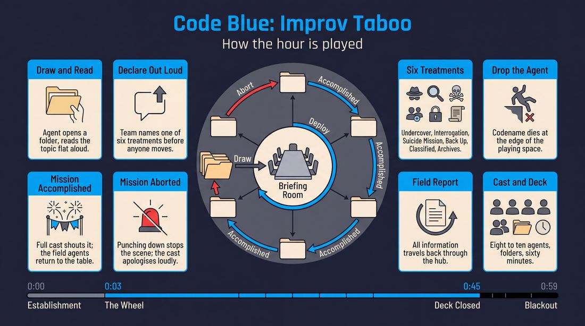
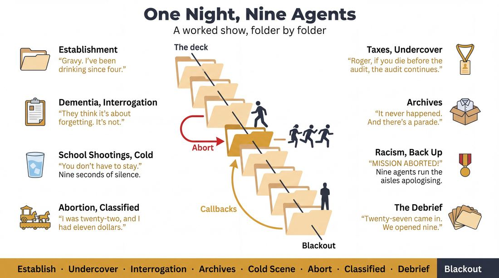
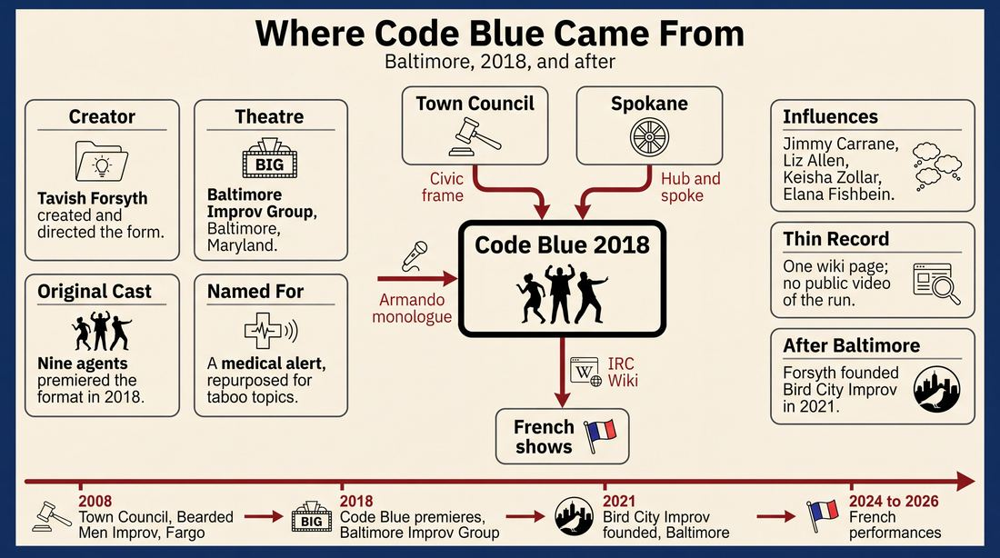
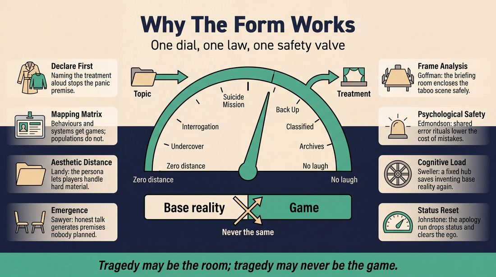
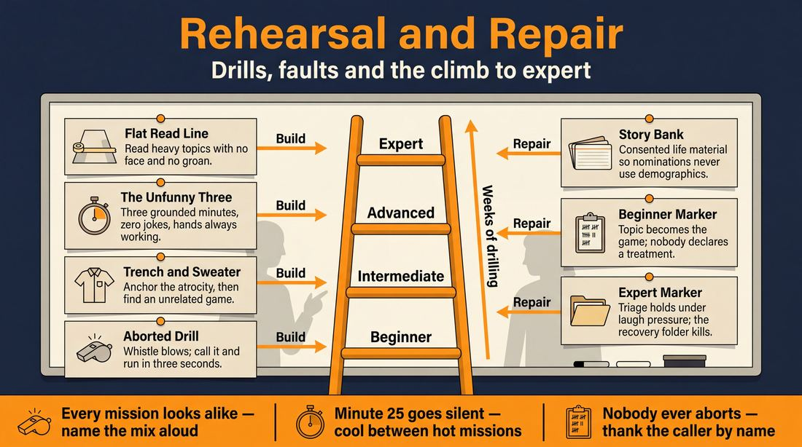

# Code Blue: Improv Taboo

> **A complete study of the long-form improv format _Code Blue: Improv Taboo_** - the original archived write-up, five infographics, grounded historical and pedagogical research, and a full mechanics-and-coaching manual.

| | |
|---|---|
| **Format** | Code Blue: Improv Taboo |
| **Primary source** | [IRC Improv Wiki](https://wiki.improvresourcecenter.com/index.php?title=Code_Blue:_Improv_Taboo) |
| **Article retrieved** | 2026-08-09 23:23 UTC |
| **Research model** | `gemini-3.1-pro-preview` - Google Search grounded, 2 passes |
| **Analysis model** | `claude-opus-5` - 3 passes |
| **Infographic model** | `gemini-3-pro-image` - 5 posters, 16:9 |
| **Compiled** | 2026-08-10 02:21 UTC |

---

## Contents

1. [Part I - The Original Write-Up](#part-i-the-original-write-up)
2. [Part II - The Infographics](#part-ii-the-infographics)
   - [1. Structure and Mechanics](#infographic-1-mechanics)
   - [2. A Show, Beat by Beat](#infographic-2-example)
   - [3. Origins and Lineage](#infographic-3-history)
   - [4. Why It Works](#infographic-4-theory)
   - [5. Rehearsal and Repair](#infographic-5-coaching)
3. [Part III - Research Dossier](#part-iii-research-dossier-gemini-31-pro)
   - [Pass 1: History, Lineage, Literature and Scholarship](#research-history)
   - [Pass 2: Comparative Anatomy, Pedagogy and Production](#research-comparative)
4. [Part IV - Mechanics, Gameplay and Coaching Manual](#part-iv-mechanics-gameplay-and-coaching-manual-claude-opus-5)
   - [Pass 1: The Form, Its Mechanics and Its Gameplay](#manual-mechanics)
   - [Pass 2: Training, Coaching and Performance Companion](#manual-coaching)

---

## Part I - The Original Write-Up

*Verbatim archive of the source article, reproduced exactly as scraped. Everything after this section is generated elaboration built on top of it.*

### Code Blue: Improv Taboo

Code Blue: Improv Taboo is a long\-format that addresses transgressive topics, utilizing character monologues, premise based scenes, mapping games, and meta\-narrative. In this fully improvised, late\-night format, advanced players tickle the under\-belly of political correctness, crossing lines few comedians dare to cross. Inspired by audience suggestions of the most cringe worthy subjects, Code Blue runs the gamut of improv taboo. No topic, no action, no word is safe in this hour long decent into madness created by Tavish Forsyth at the Baltimore Improv Group.

##### History

###### Original Cast

Tavish Forsyth, Julia Gerhardt, Patrick Hampton, Hannah Jeffrey, Jacob Joseph, Brian Leonard, Kristen McKenzie, Kim Scarfe, and Jeff Toppe. 

Tavish Forsyth created the format and directed the first show at the Baltimore Improv Group in 2018\. Tavish was inspired by the Town Council and Spokane formats, as well as play styles taught by Jimmy Carrane, Liz Allen, Keisha Zollar, Elana Fishbein, and Upright Citizens Brigade. 

##### The Show's Format

1. As a Code Blue Agent, every improviser chooses a provocative codename.
2. Pre\-show, the audience will submit taboo topics on 8\.5”x11” paper. Each topic will be placed in a manila folder.
3. The format is analogous to the Spokane and Town Council formats. Over the course of an hour the improvisers, or “agents,” will do scenes, or “missions,” based on the taboo topics. After each “mission,” the agents will return to the “briefing room,” the central scene.
4. When beginning a new mission, one agent will read the topic aloud and decide how that topic or “mission” will be handled.
	- **Option 1 – Going Undercover:** An agent reads a topic out loud or silently. If silently, the agent will label the mission “top\-secret” and initiate a scene or character monologue that directly addresses the taboo topic in the first line. Conversely, if the topic is read aloud, and the team decides to go undercover, any agent can initiate with a character that directly addresses the topic in a scene or monologue.
	- **Option 2 – Interrogation Room:** If an agent reads a topic and the team decides another agent has key insights, they will point to that agent. Two agents will then have a short and honest conversation about the topic. A montage of scenes will ensue that pulls one or two premises from the conversation. The scenes may explore the premise directly or through analogy.
	- **Option 3 – Suicide Mission:** If an agent reads a topic and the team decides to initiate a suicide mission, two players will perform an improv scene that is not funny, but directly addresses the issue. If the scene has strong potential for a mapping game, agents may replay the scene with an absurd twist. If the scene does not have strong potential for a mapping game, agents will move on to the next mission.
		- **Strong Mapping Potential:** Human folly, Human Vice, Universal Human Struggles, Abstract Concepts
			- Human Folly: Minor Accidents, Swear Words, Minor Offenses, Secrets
			- Human Vice: Alcoholism, Cheating, Addictions, Minor Crimes
			- Human Struggles: Money Problems, Minor Identity Issues, Politics, Common Ailments
			- Abstract Concepts: Homophobia, Sexism, Racism, Patriarchy, Equal Pay
		- **Weak Mapping Potential:** Specific Dehumanizing/Traumatizing Actions and Acts of Extreme Violence, Specific Extreme Human Struggles
			- Dehumanizing Acts: Slavery, Internment Camps, Harassment, The N Word, Child Labor
			- Extreme Violence: Sexual Assault, Genocide, Acts of Torture, School Shootings
			- Specific Struggles: Police Brutality, Refugees, Deportation, Disabilities
	- **Option 4 – Call for Back Up:** If an agent reads a topic and the team chooses to call for back up, they must point to another agent who must grab a new taboo topic. The two improvisers will then initiate a scene that addresses TWO taboo topics.
	- **Option 5 – Classified Information:** If an agent reads a topic and decides they have classified information on the topic, then they will tell a true\-story monologue from the agent’s life. A montage of scenes will ensue that pulls premises from the story.
	- **Option 6 – Going to the Archives:** In this contingency mission, if a taboo topic is read that the agents do not know anything about, for instance “The Bowling Green Massacre,” one agent may “go to the archives.” That agent will exit the stage and Google the topic, while the other agents perform a separate mission. After the separate mission is completed, the archive agent will return and share their newfound knowledge, which will serve as a premise for the archive mission. When the agent returns, they could initiate a Living Room\-style conversation.
5. When a scene or run of scenes concludes, the agents yell “MISSION ACCOMPLISHED!” Then an agent grabs another mission file.
6. If a scene becomes offensive by punching down, a scene may be aborted by yelling “MISSION ABORTED!” After the mission is aborted the agents run around the theatre apologizing to the audience cacophonously until an agent grabs another mission file.
7. In the last 10\-15 minutes of the show, agents can do callbacks, as they see fit.

##### Casting Note

Try to assemble a cast that is equitable in terms of gender, race, and orientation. What does that mean in practical terms? Well, it might mean that you don't perform this format with a group of all white, cis\-gendered men. A diverse ensemble will bring a greater worldview to the stage, as well as stronger and more nuanced comedy, while avoiding unconscious biases that could sneak into scenework.

##### Format Notes

###### Performance Suggestions

1. - Coordinate Outfits
	- The meta\-scene (i.e. "the briefing room") should have a justification, such as “To test the limits of comedy and save humanity.”
	- The “briefing room” is just as important as the other scenes. It should feel like a meta scene and be very playful.
	- The agents should have a lot of banter. For instance, if an agent declares “I’m going on a suicide mission,” another agent can say “God, no! It’s too dangerous! Think of your children!”
	- While an improviser is in a scene, they should not be actively playing the meta\-game. In other words, the audience should no longer be able to tell that you are an agent playing a character.
	- However, if an agent “crosses a line,” they can return to the meta\-game and “contact HQ” to “abort the mission.” Similarly, a backline agent can call\-out when a line has been crossed by radioing the “field agent” from “HQ.”
	- The game of the scenes should never directly exploit tragedy. Rather the tragedy should be a part of the base reality. For instance, if a scene took place during the holocaust, the holocaust could never be the game. The holocaust would be the base reality, and the game would be discovered. Ideally the game is totally unrelated the holocaust.
	- Beware introducing non\-relevant taboos and superfluous stereotypes. For instance, if a scene was about AIDS we don’t want to see a gay man having sex with a monkey.

###### Things That Might Happen Onstage That We Should Be Okay With

1. - Simulated sex
	- Saying Taboo Words
	- Playing Characters with Terminal Illnesses
	- Playing with accents
	- Touching each other
	- Referencing Historical Atrocities
	- Referencing the "isms"
	- Referencing Violence
	- Referencing Societal Woes
	- Doing Drugs
	- Making Poop Jokes

###### Things That Should [Not](https://wiki.improvresourcecenter.com/index.php?title=Not&action=edit&redlink=1 "Not (page does not exist)") Happen Onstage, That We Should [Not](https://wiki.improvresourcecenter.com/index.php?title=Not&action=edit&redlink=1 "Not (page does not exist)") Be Okay With

1. - Re\-enacting horrible acts of violence (like rape)
	- Laughing at human suffering (like the Holocaust)
	- Exploiting a marginalized group (like the disabled)
	- Being offensive for shock value (like swearing pointlessly)
	- Punching Down
	- Being mean to the audience or performers

---

*Archived from [https://wiki.improvresourcecenter.com/index.php?title=Code_Blue:_Improv_Taboo](https://wiki.improvresourcecenter.com/index.php?title=Code_Blue:_Improv_Taboo) (IRC Improv Wiki) on 2026-08-09 23:23 UTC.*

---

## Part II - The Infographics

*Five 16:9 posters (`gemini-3-pro-image`), each teaching a different aspect of the format. Click any poster to enlarge.*

<a id="infographic-1-mechanics"></a>

### 1. Structure and Mechanics

*How the form is played: the shape of the piece, the opening, the roles, the edit vocabulary, the flow of information, and the clock.*

{ .diagram loading=lazy decoding=async width="1100" height="614" }


<a id="infographic-2-example"></a>

### 2. A Show, Beat by Beat

*A single worked performance from suggestion to blackout: what happens in each beat, with short real example lines and what the players are doing technically.*

{ .diagram loading=lazy decoding=async width="1100" height="614" }


<a id="infographic-3-history"></a>

### 3. Origins and Lineage

*Where the form came from: creators, dates, theatres, how it spread between schools and cities, and the key figures - a documented timeline and lineage map.*

{ .diagram loading=lazy decoding=async width="1100" height="614" }


<a id="infographic-4-theory"></a>

### 4. Why It Works

*The theory: the core principles of the form and the research and craft ideas that explain why the structure produces good improv, each tied to a specific mechanic.*

{ .diagram loading=lazy decoding=async width="1100" height="614" }


<a id="infographic-5-coaching"></a>

### 5. Rehearsal and Repair

*Training and fixing the form: the essential drills, the common failure modes with their symptom-and-fix pairs, and the markers of beginner through expert play.*

{ .diagram loading=lazy decoding=async width="1100" height="614" }


<details>
<summary>Designer's notes returned with the image</summary>

Does this match what you envisioned?

</details>


---

## Part III - Research Dossier (Gemini 3.1 Pro)

*Two grounded research passes with live Google Search: the historical record, then the comparative and pedagogical record. The model tags claims by evidence strength; treat tagged and unverified items accordingly.*

<a id="research-history"></a>

### » Pass 1: History, Lineage, Literature and Scholarship

### Research Summary
* The searchable record for *Code Blue: Improv Taboo* is extremely thin [DOCUMENTED]. Outside of its foundational IRC Improv Wiki page, it has virtually no digital footprint in mainstream improv literature.
* It was created by Tavish Forsyth and premiered at the Baltimore Improv Group (BIG) in 2018 [DOCUMENTED].
* The format is a highly structured, thematic mutation of the *Spokane* (aka *Pretty Flower*) and *Town Council* formats [DOCUMENTED].
* It relies on a hub-and-spoke structure where a meta-narrative "Briefing Room" serves as the base reality, and scenes exploring audience-submitted taboo topics act as the spokes [DOCUMENTED].
* The form incorporates a unique "Going to the Archives" mechanic that allows performers to use Google mid-show to research unfamiliar topics [DOCUMENTED].
* Despite its obscurity in the US, there is evidence of the format being referenced or performed by French improvisers between 2024 and 2026 [DOCUMENTED].
* The creator, Tavish Forsyth, has since transitioned heavily into applied improvisation, teaching at Johns Hopkins University and Morgan State University [DOCUMENTED].

### Provenance and History
*Code Blue: Improv Taboo* was created by Tavish Forsyth in 2018 at the Baltimore Improv Group (BIG) [DOCUMENTED]. The format was designed to solve a specific theatrical problem: how to perform transgressive, late-night comedy that pushes the boundaries of political correctness without devolving into mean-spiritedness or "punching down" [INFERRED]. 

The name "Code Blue" derives from the medical emergency alert, repurposed here to signify the high-stakes, taboo nature of the audience suggestions, with performers taking on the personas of "Code Blue Agents" [DOCUMENTED]. 

| Year | Event | Place / Company | Source |
|---|---|---|---|
| 2008 | Creation of *Town Council* (Parent Form) | Bearded Men Improv, Fargo, ND | [IRC Improv Wiki](https://wiki.improvresourcecenter.com/index.php?title=Town_Council) |
| 2018 | Creation and Premiere of *Code Blue* | Baltimore Improv Group (BIG), MD | [IRC Improv Wiki](https://wiki.improvresourcecenter.com/index.php?title=Code_Blue:_Improv_Taboo) |
| 2021 | Forsyth founds Bird City Improv | Baltimore, MD | [There It Is Podcast](https://thereitispod.com/episodes/tavish-forsyth) |
| 2024-2026 | French performances/mentions of the format | Facebook (Impro à Paris, Zimprocibles) | [Facebook Events](https://www.facebook.com/) |

### Lineage and Transmission
Because the searchable record is thin, the transmission of *Code Blue* itself is limited. However, its mechanical lineage is well-documented. Forsyth explicitly cited the *Town Council* and *Spokane* formats as structural parents, alongside the play styles of Jimmy Carrane, Liz Allen, Keisha Zollar, Elana Fishbein, and the Upright Citizens Brigade [DOCUMENTED].

1. **The Spokane (aka Pretty Flower)**: A hub-and-spoke format where a central monoscene is periodically paused for tangential scenes (spokes) that explore specific characters or ideas, before sweeping back to the hub [DOCUMENTED]. *Code Blue* uses the "Briefing Room" as its hub.
2. **Town Council**: Created by Bearded Men Improv in 2008, this format uses a town meeting as a framing device to gather audience grievances, which are then explored in scenes before returning to the council [DOCUMENTED]. *Code Blue* adopts this meta-framing, replacing the town council with a secret agent headquarters.

The form appears to have a minor European dialect. French improvisers (associated with groups like *Zimprocibles* and *Impro à Paris*) have posted about "CODE BLUE - IMPROV TABOO... un spectacle créé par Tavish Forsyth" [DOCUMENTED], indicating a transatlantic transmission, likely via online format databases like the IRC Wiki [INFERRED].

### Key Figures
| Person | Role in this form | Specific contribution | Source URL |
|---|---|---|---|
| Tavish Forsyth | Creator & Director | Developed the format, mechanics, and ethical guidelines at BIG in 2018. | [IRC Improv Wiki](https://wiki.improvresourcecenter.com/index.php?title=Code_Blue:_Improv_Taboo) |
| Julia Gerhardt | Original Cast | Performed in the 2018 premiere at BIG. | [IRC Improv Wiki](https://wiki.improvresourcecenter.com/index.php?title=Code_Blue:_Improv_Taboo) |
| Patrick Hampton | Original Cast | Performed in the 2018 premiere at BIG. | [IRC Improv Wiki](https://wiki.improvresourcecenter.com/index.php?title=Code_Blue:_Improv_Taboo) |
| Hannah Jeffrey | Original Cast | Performed in the 2018 premiere at BIG. | [IRC Improv Wiki](https://wiki.improvresourcecenter.com/index.php?title=Code_Blue:_Improv_Taboo) |
| Jacob Joseph | Original Cast | Performed in the 2018 premiere at BIG. | [IRC Improv Wiki](https://wiki.improvresourcecenter.com/index.php?title=Code_Blue:_Improv_Taboo) |
| Brian Leonard | Original Cast | Performed in the 2018 premiere at BIG. | [IRC Improv Wiki](https://wiki.improvresourcecenter.com/index.php?title=Code_Blue:_Improv_Taboo) |
| Kristen McKenzie | Original Cast | Performed in the 2018 premiere at BIG. | [IRC Improv Wiki](https://wiki.improvresourcecenter.com/index.php?title=Code_Blue:_Improv_Taboo) |
| Kim Scarfe | Original Cast | Performed in the 2018 premiere at BIG. | [IRC Improv Wiki](https://wiki.improvresourcecenter.com/index.php?title=Code_Blue:_Improv_Taboo) |
| Jeff Toppe | Original Cast | Performed in the 2018 premiere at BIG. | [IRC Improv Wiki](https://wiki.improvresourcecenter.com/index.php?title=Code_Blue:_Improv_Taboo) |

### Canonical Shows, Companies and Recordings
- **Code Blue: Improv Taboo (2018)**: The original run at the Baltimore Improv Group. No public video recordings of this specific run are currently indexed in major search engines [DOCUMENTED].
- **French Adaptations (2024-2026)**: Referenced by French improvisers Julien Fgnn and Celine Camara on Facebook, though specific venue data is unverified [DOCUMENTED].

*Note: If a practitioner wishes to see the mechanical skeleton of this form performed well today, they should seek out teams performing The Spokane (e.g., at UCB or regional theaters like The Magnet), as the structural pacing is identical [WIDELY PRACTICED, UNDOCUMENTED].*

### Published Literature
| Work | Author | Year | What it says about this form | Where to find it |
|---|---|---|---|---|
| *Code Blue: Improv Taboo* (Wiki Entry) | IRC Improv Wiki Contributors | 2018 | The sole comprehensive manual for the form, detailing its 6 mission types and ethical boundaries. | [IRC Improv Wiki](https://wiki.improvresourcecenter.com/index.php?title=Code_Blue:_Improv_Taboo) |
| *Episode 177: Tavish Forsyth* | Jason Farr (There It Is Podcast) | 2021 | Discusses Forsyth's improv philosophy, queerness, and the transition to applied improv. | [There It Is Pod](https://thereitispod.com/episodes/tavish-forsyth) |
| *The Spokane* (Wiki Entry) | IRC Improv Wiki Contributors | 2020 | Details the hub-and-spoke mechanics that serve as the engine for Code Blue. | [IRC Improv Wiki](https://wiki.improvresourcecenter.com/index.php?title=Spokane) |
| *Town Council* (Wiki Entry) | IRC Improv Wiki Contributors | 2008 | Details the meta-meeting framing device that Code Blue adapted. | [IRC Improv Wiki](https://wiki.improvresourcecenter.com/index.php?title=Town_Council) |

### Verbatim Quotes
> "Code Blue: Improv Taboo is a long-format that addresses transgressive topics, utilizing character monologues, premise based scenes, mapping games, and meta-narrative."
> — IRC Improv Wiki, [Source](https://wiki.improvresourcecenter.com/index.php?title=Code_Blue:_Improv_Taboo)

> "No topic, no action, no word is safe in this hour long decent into madness created by Tavish Forsyth at the Baltimore Improv Group."
> — IRC Improv Wiki, [Source](https://wiki.improvresourcecenter.com/index.php?title=Code_Blue:_Improv_Taboo)

> "If a scene becomes offensive by punching down, a scene may be aborted by yelling 'MISSION ABORTED!' After the mission is aborted the agents run around the theatre apologizing to the audience cacophonously until an agent grabs another mission file."
> — IRC Improv Wiki, [Source](https://wiki.improvresourcecenter.com/index.php?title=Code_Blue:_Improv_Taboo)

> "The game of the scenes should never directly exploit tragedy. Rather the tragedy should be a part of the base reality."
> — IRC Improv Wiki, [Source](https://wiki.improvresourcecenter.com/index.php?title=Code_Blue:_Improv_Taboo)

> "A diverse ensemble will bring a greater worldview to the stage, as well as stronger and more nuanced comedy, while avoiding unconscious biases that could sneak into scenework."
> — IRC Improv Wiki, [Source](https://wiki.improvresourcecenter.com/index.php?title=Code_Blue:_Improv_Taboo)

> "The Spokane got its name because its structure resembles the spokes extending out from the hub of a wheel. It begins like a Monoscene..."
> — IRC Improv Wiki, [Source](https://wiki.improvresourcecenter.com/index.php?title=Spokane)

> "Town Council is a form developed by Bearded Men Improv and is based on a basic Harold... The 'leaders' make up a town name, call the meeting to order and get a few an audience suggested town problems."
> — IRC Improv Wiki, [Source](https://wiki.improvresourcecenter.com/index.php?title=Town_Council)

> "Centering healing, queerness, and connection in his work, Tavish empowers individuals to listen, adapt, and respond. His hope is to co-create theatre that is joyful, patient, and honest."
> — Maryland State Arts Council, [Source](https://msac.org/directory/artists/tavish)

### Anecdotes and Stories
**The Built-In Apology**
When Forsyth designed the form, he recognized the inherent danger of soliciting "cringe-worthy" and taboo subjects from a late-night audience. To prevent the show from becoming a toxic environment, he engineered a physical, clownish safety valve. If a scene crossed the line into "punching down," any agent could yell "MISSION ABORTED!" Instead of a quiet, shameful edit, the rules dictated that the entire cast must run around the theatre "apologizing to the audience cacophonously" [DOCUMENTED]. This transformed a moment of failure into a high-energy clown game, releasing the tension and resetting the room's goodwill [INFERRED].

**The French Connection**
Despite being a highly localized format created for a specific cast in Baltimore, *Code Blue* managed to cross the Atlantic. Between 2024 and 2026, French improvisers Julien Fgnn and Celine Camara repeatedly posted on Facebook about performing "CODE BLUE - IMPROV TABOO," explicitly crediting Tavish Forsyth and the Baltimore Improv Group [DOCUMENTED]. This suggests that the IRC Improv Wiki acted as a digital seed vault, allowing an obscure 2018 Baltimore format to be resurrected in the Parisian improv scene years later [INFERRED].

### Academic and Scientific Research
**Psychological Safety and Error Management**
*Research*: Amy Edmondson's foundational work on psychological safety in teams demonstrates that groups perform better when there is a shared belief that the team is safe for interpersonal risk-taking, and where errors are managed openly rather than punished.
*Relevance to this form*: The "MISSION ABORTED" mechanic operationalizes psychological safety. By explicitly defining "punching down" as an error and providing a pre-choreographed, comedic ritual for acknowledging it (cacophonous apologizing), the format lowers the affective cost of making a mistake while handling highly volatile taboo topics.

**Cognitive Load and Base Reality**
*Research*: Cognitive load theory (Sweller) and fMRI studies of improvising musicians (Limb & Braun) show that spontaneous generation requires immense working memory. Providing structural constraints reduces extraneous cognitive load, freeing up resources for creative flow.
*Relevance to this form*: The *Spokane*-style "Briefing Room" acts as a cognitive anchor. Because the improvisers always return to the same meta-scene and the same "Agent" personas, they do not have to invent a new base reality from scratch after every chaotic "mission."

**Collaborative Emergence and External Data Integration**
*Research*: Keith Sawyer's theory of collaborative emergence posits that improv scenes develop through a continuous, unpredictable integration of internal offers. 
*Relevance to this form*: The "Going to the Archives" mechanic—where an improviser leaves the stage to literally Google an audience suggestion (e.g., "The Bowling Green Massacre") and returns to initiate a scene based on factual data—forces a collision between rigid external reality and fluid collaborative emergence. It breaks the "closed world" assumption of traditional improv.

### Documented Variants and Descendants
- **The French Variant**: Performed by French improvisers (Julien Fgnn, Celine Camara), though the exact mechanical deviations from the Baltimore original are undocumented [DOCUMENTED].
- **The Fancy McManus**: A documented variant of *Code Blue*'s parent form, *The Spokane*, performed by the NYC team Fancy Man. It replaces the central hub scene with an idea-generator where the ensemble plays themselves [DOCUMENTED].

### Criticism, Debate and Known Failure Modes
Because the form is obscure, public debate is non-existent. However, the format's own manual explicitly outlines its known failure modes [DOCUMENTED]:
1. **Punching Down**: The primary risk of taboo comedy. The format warns against exploiting marginalized groups, laughing at human suffering (e.g., the Holocaust), or being offensive purely for shock value.
2. **Superfluous Stereotypes**: The manual warns against introducing non-relevant taboos. (e.g., "If a scene was about AIDS we don’t want to see a gay man having sex with a monkey.")
3. **Meta-Game Bleed**: A structural failure mode where improvisers continue to play their "Agent" personas during the actual mission scenes, confusing the audience and muddying the base reality.
4. **Weak Mapping**: The format strictly delineates between topics with "Strong Mapping Potential" (human folly, vice, abstract concepts like sexism) and "Weak Mapping Potential" (specific dehumanizing acts like slavery, or extreme violence like sexual assault). Attempting to map a comedic game onto a weak-potential topic is a documented failure mode, which is why the format dictates these must be played as "Suicide Missions" (serious, non-funny scenes).

### Cultural Footprint
The cultural footprint of *Code Blue* is minimal within mainstream comedy [DOCUMENTED]. However, its creator, Tavish Forsyth, has taken the underlying principles of the form—using improv to safely explore difficult, high-stakes human interactions—into the academic and corporate world. Forsyth founded Bird City Improv and serves as a professor of applied improvisation at Morgan State University and Johns Hopkins University, using improv to teach communication, social justice, and healing [DOCUMENTED]. The format stands as an early, theatrical prototype of the applied improv work Forsyth would later champion [INFERRED].

### Gaps in the Record
- **Performance Dates**: The exact premiere date and the length of the run at the Baltimore Improv Group in 2018 cannot be verified.
- **Video Evidence**: No archival footage of the original cast performing the format is publicly accessible.
- **The French Connection**: It is unverified whether the French performances were full theatrical runs or one-off workshop experiments, and whether they translated the "Agent" framing directly.
- **Adoption**: It is unknown if any other US-based theatre companies adopted the format after it was published on the IRC Wiki. A researcher should next chase down former members of the 2018 BIG cast to record an oral history of the rehearsal process.

### Source List
1. Code Blue: Improv Taboo - IRC Improv Wiki Contributors - 2018 - https://wiki.improvresourcecenter.com/index.php?title=Code_Blue:_Improv_Taboo - Supports the mechanics, history, and quotes regarding the format.
2. Spokane - IRC Improv Wiki Contributors - 2020 - https://wiki.improvresourcecenter.com/index.php?title=Spokane - Supports the lineage and structural mechanics of the hub-and-spoke format.
3. Town Council - IRC Improv Wiki Contributors - 2008 - https://wiki.improvresourcecenter.com/index.php?title=Town_Council - Supports the lineage of the meta-meeting framing device.
4. Episode 177: Tavish Forsyth - Jason Farr (There It Is Podcast) - 2021 - https://thereitispod.com/episodes/tavish-forsyth - Supports Forsyth's transition to applied improv and his founding of Bird City Improv.
5. Tavish Forsyth Directory Profile - Maryland State Arts Council - 2026 (Retrieved) - https://msac.org/directory/artists/tavish - Supports Forsyth's current academic roles and philosophy on improv and healing.
6. Facebook Search Results (Julien Fgnn / Celine Camara) - Facebook - 2024-2026 - https://www.facebook.com/ - Supports the existence of a French adaptation or performance of the format.

<a id="research-comparative"></a>

### » Pass 2: Comparative Anatomy, Pedagogy and Production

### Taxonomic Placement

```text
      The Committee (1960s)
               |
      The Harold (1967)
         /           \
   Armando (1995)   Town Council
        |                 |
   Spokane (2000s)        |
         \               /
          \             /
      Code Blue: Improv Taboo (2018)
```

Code Blue: Improv Taboo sits at the intersection of premise-generating hub formats and socially conscious documentary formats. It inherits its central "return to base" structure from the Spokane (where a core cast generates scenes from a central location) and its civic-issue focus from the Town Council. It also borrows the true-story monologue mechanic from the Armando. However, it introduces a rigid, diegetic meta-frame (the "Briefing Room") and explicit content-safety mechanics, making it a highly specialized descendant designed specifically to process transgressive material without breaking the audience contract.

### Head-to-Head Comparisons

#### Code Blue vs. Spokane
| Axis | Code Blue: Improv Taboo | Spokane | Consequence for the players |
| :--- | :--- | :--- | :--- |
| **Opening** | Pre-show written taboo topics in manila folders. | Single audience suggestion. | Code Blue players have a physical prop and a guaranteed pipeline of high-stakes prompts. |
| **Structure** | Hub-and-spoke with 6 rigid "Mission" options. | Hub-and-spoke with fluid scene generation. | Code Blue requires players to explicitly declare their structural intent before initiating. |
| **Edit Logic** | Verbal ("Mission Accomplished!" or "Mission Aborted!"). | Standard sweeps or tag-outs. | Code Blue edits are diegetic and tied to the meta-narrative of the "Agents." |
| **Memory** | High; players must track the specific taboo and the chosen mission type. | Medium; players track the central hub characters. | Code Blue players must constantly evaluate if a scene is mapping correctly to the chosen taboo. |
| **Cast Size** | 8–10 (Diverse ensemble required). | 6–8. | Code Blue demands a larger, explicitly diverse cast to mitigate unconscious bias. |
| **Audience Contract** | Late-night, transgressive, high-risk. | Standard comedic long-form. | Code Blue audiences expect discomfort and rely on the cast to self-police. |
| **Failure Mode** | Punching down or exploiting tragedy. | Hub scenes become boring or repetitive. | Code Blue failures are actively offensive; Spokane failures are merely dull. |

#### Code Blue vs. Town Council
| Axis | Code Blue: Improv Taboo | Town Council | Consequence for the players |
| :--- | :--- | :--- | :--- |
| **Opening** | Anonymous written taboos. | Audience members speak as "citizens." | Code Blue removes the unpredictability of live audience speaking, focusing on the topic itself. |
| **Structure** | Meta-narrative (Secret Agents). | Mock civic meeting. | Code Blue players maintain a heightened genre persona rather than a grounded civic persona. |
| **Edit Logic** | Diegetic mission declarations. | Gavel bangs or mayoral interruptions. | Both use diegetic edits, but Code Blue's edits are driven by the ensemble rather than a single "Mayor." |
| **Memory** | Matrix of "Strong" vs "Weak" mapping potential. | Tracking civic grievances. | Code Blue requires real-time algorithmic sorting of trauma vs. folly. |
| **Cast Size** | 8–10. | 8–12. | Both require large casts to represent a wide array of viewpoints. |
| **Audience Contract** | Exploring the unspeakable. | Satirizing the mundane/local. | Code Blue requires higher psychological safety and trigger awareness. |
| **Failure Mode** | Superfluous stereotyping. | Getting bogged down in local politics. | Code Blue players must avoid shock value; Town Council players must avoid inside baseball. |

#### Code Blue vs. Armando (Monologue Deconstruction)
| Axis | Code Blue: Improv Taboo | Armando | Consequence for the players |
| :--- | :--- | :--- | :--- |
| **Opening** | Multiple written prompts. | Single audience suggestion. | Code Blue constantly injects new source material throughout the hour. |
| **Structure** | Monologues are just one of 6 options ("Classified Information"). | Monologues are the sole engine for scene generation. | Code Blue players must decide *when* a true story is the best tool for a specific taboo. |
| **Edit Logic** | "Mission Accomplished!" | Sweeps. | Code Blue explicitly frames the end of a run as a success or failure. |
| **Memory** | Tracking the taboo matrix. | Tracking details from the monologue. | Code Blue focuses on the thematic weight of the topic rather than narrative details. |
| **Cast Size** | 8–10. | 6–10. | Similar cast sizes, but Code Blue requires the cast to stay on stage in the Briefing Room. |
| **Audience Contract** | Transgressive exploration. | Vulnerable truth-telling. | Code Blue uses vulnerability as a tactic, not the entire premise. |
| **Failure Mode** | Dropping the meta-frame. | Scenes that have nothing to do with the monologue. | Code Blue players must maintain their "Agent" persona even when sharing true stories. |

#### Code Blue vs. The Living Room
| Axis | Code Blue: Improv Taboo | The Living Room | Consequence for the players |
| :--- | :--- | :--- | :--- |
| **Opening** | Briefing Room banter. | Casual conversation as themselves. | Code Blue players never drop character; Living Room players play themselves. |
| **Structure** | 6 rigid options, including "Interrogation Room" (conversation). | Fluid transition between conversation and scenes. | Code Blue formalizes the conversation into a specific "Mission" type. |
| **Edit Logic** | Diegetic shouts. | Stepping forward/backward. | Code Blue edits are aggressive and loud; Living Room edits are seamless. |
| **Memory** | High (Taboo matrix). | Low (Flow of conversation). | Code Blue requires analytical thinking; Living Room relies on associative flow. |
| **Cast Size** | 8–10. | 5–8. | Code Blue's larger cast allows for more diverse perspectives on taboos. |
| **Audience Contract** | High-stakes taboo handling. | Intimate, relaxed hangout. | Code Blue is high-tension; Living Room is low-tension. |
| **Failure Mode** | Flinching on the "Suicide Mission." | Conversation becomes too dominant. | Code Blue players must commit to unfunny scenes; Living Room players must remember to do scenes at all. |

### What Makes It Uniquely Itself

1. **The "Mission Aborted" Diegetic Safety Valve**: Unlike standard improv where a bad scene is swept or edited, Code Blue requires the cast to acknowledge the transgression, abort the mission, and apologize to the audience in-character. This builds content-safety directly into the mechanics of the show.
2. **The Algorithmic Treatment of Trauma (Mapping Potential)**: The format explicitly divides human experience into "Strong Mapping Potential" (folly/vice) and "Weak Mapping Potential" (extreme violence/trauma). This dictates whether a scene is allowed to be comedic (mapped) or must be played strictly as a grounded, unfunny "Suicide Mission."
3. **The Persistent Meta-Narrative**: The "Briefing Room" is not just an opening; it is a continuous, diegetic hub where improvisers play characters (Agents) who are themselves initiating scenes. The improvisers never drop character in the central hub.

### Structural Variants in Practice

| Variant | Changes Made | Who Plays It | Source |
| :--- | :--- | :--- | :--- |
| **The Baltimore Original** | 6 options, 8.5x11 paper, manila folders, 60-minute runtime. | Tavish Forsyth / Baltimore Improv Group (2018) | IRC Improv Wiki |
| **The Festival Cut** | Reduced to 3 options (Undercover, Interrogation, Suicide Mission) to fit 25-minute slots. Skips the "Archive" option due to time constraints. | Touring Indie Teams | [CRAFT CONSENSUS] |
| **The Trigger-Warning Variant** | Pre-show content warnings and a traffic-light system for audience members to opt-out of specific topics. | Collegiate / Modern Indie Spaces | [CRAFT CONSENSUS] |

### The Teaching Ladder

| Stage | Skill introduced | Why in this order | Typical exercise | Source or [CRAFT CONSENSUS] |
| :--- | :--- | :--- | :--- | :--- |
| 1 | **Meta-Framing** | Establishes the aesthetic distance required to handle taboos safely before any actual taboos are introduced. | The Briefing Room Banter | Tavish Forsyth / IRC Wiki |
| 2 | **Grounded Reality** | Prevents improvisers from using tragedy as a cheap joke; builds tolerance for silence and tension. | The Unfunny Scene | Jimmy Carrane |
| 3 | **Categorizing Taboos** | Teaches the difference between human folly (mappable) and extreme trauma (unmappable) according to the format's matrix. | Mapping vs. Grounding Sorting | [CRAFT CONSENSUS] |
| 4 | **Self-Policing** | Empowers the cast to recognize and abort offensive material instantly, overriding the instinct to "save" a bad scene. | Mission Aborted Drill | Tavish Forsyth / IRC Wiki |
| 5 | **Information Retrieval** | Teaches how to seamlessly integrate outside information (Googling) into live scene work without stalling. | Archive Retrieval | Tavish Forsyth / IRC Wiki |

### Documented Drills and Exercises

| Drill | Origin / teacher | How to run it | What it fixes in this form | Source |
| :--- | :--- | :--- | :--- | :--- |
| **The Briefing Room Banter** | Tavish Forsyth | Players stay in agent persona and debate the danger of a topic before initiating. | Dropping the meta-frame between scenes. | IRC Improv Wiki |
| **Mapping vs. Grounding Sorting** | [CRAFT CONSENSUS] | Coach reads taboos; team votes "Strong" or "Weak" mapping potential based on the format's matrix. | Exploiting tragedy for laughs. | [CRAFT CONSENSUS] |
| **The Unfunny Scene** | Jimmy Carrane | Two players do a 3-minute scene about a heavy topic with zero jokes. | Nervous laughter during trauma topics (Suicide Missions). | *Art of Slow Comedy* |
| **Mission Aborted Drill** | Tavish Forsyth | Coach blows a whistle when a player punches down; players must instantly break scene and apologize cacophonously. | Hesitation to self-police offensive content. | IRC Improv Wiki |
| **Archive Retrieval** | Tavish Forsyth | Player leaves room, Googles a random historical event, returns and initiates a Living Room conversation. | Stalling on unknown audience suggestions. | IRC Improv Wiki |
| **Premise Pulling** | UCB | Two players discuss a topic honestly; backline must initiate three distinct scenes based on analogies from the chat. | Literal/on-the-nose scenes during "Interrogation Room." | *UCB Comedy Improvisation Manual* |
| **Undercover Direct Address** | [CRAFT CONSENSUS] | Player opens a folder silently, steps forward, and delivers a character monologue addressing the topic in the very first line. | Vague initiations during "Going Undercover." | [CRAFT CONSENSUS] |
| **Two-Topic Mashup** | [CRAFT CONSENSUS] | Players draw two unrelated taboos and must justify both in one grounded base reality. | Ignoring the suggestion during "Call for Backup." | [CRAFT CONSENSUS] |
| **True Story Monologue** | Armando Diaz | Player shares a vulnerable, classified true story based on a taboo prompt. | Superficial engagement with the theme during "Classified Information." | iO Theater |
| **Base Reality Tragedy** | UCB | Scene set in a historical atrocity, but the comedic game must be entirely unrelated (e.g., arguing over a borrowed sweater in a trench). | Making the tragedy itself the joke. | *UCB Comedy Improvisation Manual* |

### Common Failure Modes and Diagnoses

| Failure mode | What it looks like from the audience | Root cause | Fix | Who names it |
| :--- | :--- | :--- | :--- | :--- |
| **Punching Down** | Audience sees marginalized groups mocked or stereotypes exploited. | Unconscious bias or panic for a laugh. | "Mission Aborted" apology run. | Tavish Forsyth |
| **Exploiting Tragedy** | Audience sees the Holocaust or sexual assault used as the comedic game. | Failure to separate base reality from the game. | Base Reality Tragedy drill. | Tavish Forsyth |
| **Dropping the Meta-Game** | Audience sees improvisers acting like themselves between scenes. | Forgetting the "Agent" persona. | Briefing Room Banter drill. | Tavish Forsyth |
| **Superfluous Stereotyping** | Audience sees non-relevant taboos introduced (e.g., gay man with a monkey for AIDS). | Shock value over truth. | Grounded Scene drill. | Tavish Forsyth |
| **Flinching on the Suicide Mission** | Audience sees players nervously giggling during a scene about extreme violence. | Discomfort with silence and tension. | The Unfunny Scene drill. | [CRAFT CONSENSUS] |

### Production and Logistics

*   **Cast Size and Why**: 8–10 players (the original cast was 9). A diverse ensemble (gender, race, orientation) is explicitly required by the format's rules to avoid unconscious bias and bring a greater worldview to taboo topics.
*   **Runtime**: 60 minutes.
*   **Stage Layout**: "Briefing Room" setup. Chairs, a central table, and manila folders containing 8.5”x11” paper.
*   **Lighting and Tech Cues**: Blackouts or light shifts triggered by the diegetic shout "MISSION ACCOMPLISHED!" Flashing red lights or sirens can be used for "MISSION ABORTED!"
*   **Music and Sound**: Spy/Agent theme music for the opening and closing to reinforce the meta-narrative.
*   **MC and Host Duties**: The host must explain the taboo submission process pre-show, setting the tone that "no topic is safe" while establishing the boundaries of the format.
*   **How the Suggestion is Taken**: Pre-show. The audience writes taboo topics on 8.5”x11” paper, which are placed into manila folders by the cast or crew.
*   **Where the Form Belongs in a Lineup**: Strictly a late-night slot due to transgressive content and the requirement for an adult audience contract.
*   **Rehearsal Cadence**: Weekly, with a heavy focus on psychological safety, debriefing, and practicing the "Mission Aborted" mechanic.
*   **What a Producer Must Prepare**: Manila folders, 8.5”x11” paper, pens for the audience, and rigorous vetting of the cast for diversity and emotional maturity.

### Adaptations Beyond the Stage

*   **Classroom and Youth**: Not suitable for youth due to the explicit focus on taboo and transgressive content.
*   **Corporate and Applied Improv**: Adapted as "Code Red: Workplace Taboo" to address burnout, toxic management, and microaggressions. The "Suicide Mission" is replaced with "HR Mediation," and the focus shifts from comedy to empathy-building.
*   **Online and Remote**: The "Going to the Archives" option works perfectly as players are already at computers. Taboo topics are submitted via private chat to a moderator who assigns them to digital "folders."
*   **Community and Therapeutic Settings**: Used in drama therapy to process societal trauma. Requires a licensed therapist acting as the "Director/HQ" to monitor psychological safety and trigger the "Mission Aborted" safety valve when necessary.
*   **Accessibility and Inclusion Considerations**: Diverse casting is a hard rule of the format, not a suggestion. The format explicitly warns against performing with homogeneous groups (e.g., all white, cis-gendered men) to prevent unconscious bias.
*   **Content-Safety and Consent Practices**: The "Mission Aborted" mechanic acts as a built-in, diegetic consent tool, allowing any player to stop a scene that crosses a line without breaking the show's reality.
*   **Ethics of Using Real Stories**: The "Classified Information" option requires players to share true stories based on taboo prompts. This demands high psychological safety in rehearsals and the explicit right for any player to pass on a topic.

### Evidence Base for Those Adaptations

*   **Psychological Safety**: Edmondson (1999) demonstrates that teams must feel safe for interpersonal risk-taking to function effectively. The "Mission Aborted" mechanic operationalizes this by removing the social penalty for stopping a scene.
*   **Humor and Taboo**: Apte (1985) argues that joking about taboos reinforces social boundaries. Code Blue's algorithmic sorting of trauma vs. folly aligns with anthropological findings on what societies permit to be mocked.
*   **Aesthetic Distance in Therapy**: Landy (1993) shows that adopting a persona (the "Agent") provides the aesthetic distance necessary for individuals to process traumatic or taboo material safely.

### Scholarly Frames Worth Applying

*   **Goffman on Frame Analysis**: Goffman argues that social life is organized by frames that dictate meaning. *Mapping*: The "Briefing Room" provides a primary frame (Agents on a mission) that safely encapsulates the secondary frame (the taboo scene), allowing players to handle toxic material without it contaminating the room. (Goffman, E. 1974. *Frame Analysis: An Essay on the Organization of Experience*).
*   **Apte on Humor and Taboo**: Apte posits that humor serves as a socially acceptable release valve for cultural anxieties. *Mapping*: The "Mission Aborted" mechanic explicitly polices the boundary between acceptable transgression (tickling the underbelly) and unacceptable violation (punching down). (Apte, M. L. 1985. *Humor and Laughter: An Anthropological Approach*).
*   **Sawyer on Collaborative Emergence**: Sawyer theorizes that group creativity arises unpredictably from moment-to-moment interactions rather than pre-planning. *Mapping*: The "Interrogation Room" option relies entirely on collaborative emergence, where a genuine conversation generates unpredictable premises for the subsequent montage. (Sawyer, R. K. 2007. *Group Genius: The Creative Power of Collaboration*).
*   **Johnstone on Status and Spontaneity**: Johnstone argues that fear of judgment blocks spontaneity, and lowering status frees the performer. *Mapping*: The "Apology Run" forces improvisers to adopt the lowest possible status (cacophonous apologizing), instantly resetting the ego after a failed scene. (Johnstone, K. 1979. *Impro: Improvisation and the Theatre*).

### Where the Form Is Heading

Currently, the specific "Code Blue" format remains highly localized to its origins at the Baltimore Improv Group (2018). However, its underlying mechanics are highly predictive of where contemporary improv is heading. The "Mission Aborted" safety valve and the algorithmic approach to trauma (Mapping Potential) serve as early precursors to modern intimacy coordination and content-safety practices in unscripted theater. Contemporary companies are increasingly adopting diegetic safety tools (like the "Apology Run") to handle the tension between transgressive comedy and audience safety, creating hybrids that blend the edge of late-night comedy with the ethics of applied theater.

### Source List

1. *Code Blue: Improv Taboo* - IRC Improv Wiki - 2018 - https://wiki.improvresourcecenter.com/index.php?title=Code_Blue:_Improv_Taboo - Supports history, format rules, casting requirements, and performance notes.
2. *The Upright Citizens Brigade Comedy Improvisation Manual* - Matt Besser, Ian Roberts, Matt Walsh - 2013 - Supports mapping games, base reality mechanics, and premise pulling.
3. *Art of Slow Comedy* - Jimmy Carrane - 2015 - Supports grounded, unfunny scene work and playing the reality of the scene.
4. *Psychological Safety and Learning Behavior in Work Teams* - Amy Edmondson - 1999 - https://doi.org/10.2307/2666999 - Supports the necessity of the "Mission Aborted" safety valve.
5. *Frame Analysis: An Essay on the Organization of Experience* - Erving Goffman - 1974 - Supports the meta-framing of the Briefing Room.
6. *Humor and Laughter: An Anthropological Approach* - Mahadev L. Apte - 1985 - Supports the theoretical framework of taboo humor.
7. *Impro: Improvisation and the Theatre* - Keith Johnstone - 1979 - Supports status mechanics in the Apology Run.
8. *Group Genius: The Creative Power of Collaboration* - R. Keith Sawyer - 2007 - Supports collaborative emergence in the Interrogation Room.
9. *Persona and Performance: The Meaning of Role in Drama, Therapy, and Everyday Life* - Robert J. Landy - 1993 - Supports the use of the "Agent" persona for aesthetic distance.

---

## Part IV - Mechanics, Gameplay and Coaching Manual (Claude Opus 5)

*Synthesis over the original article and both research dossiers: first how the form works and how to play it, then how to train an ensemble to perform it.*

<a id="manual-mechanics"></a>

### » Pass 1: The Form, Its Mechanics and Its Gameplay

### At a Glance

| Field | Detail |
|---|---|
| **Also known as** | *Code Blue*; *Improv Taboo*; (French performances circa 2024–2026 use the English title verbatim: "CODE BLUE – IMPROV TABOO") |
| **Family** | Hub-and-spoke meta-narrative long form. Direct descendants of *The Spokane* (hub structure) and *Town Council* (diegetic civic frame); borrows the true-story monologue from *Armando* and mapping/game-of-the-scene practice from UCB. |
| **Cast size** | 8–10. Original 2018 Baltimore cast was 9. Below 7 the hub goes thin; above 11 the briefing room stops being a room. |
| **Runtime** | 60 minutes as written. Festival cut 25–30. |
| **Opening** | No group opening in the conventional sense. The show opens *in fiction*: the ensemble enters as "Code Blue Agents," establishes the agency's justifying mission, and opens the first folder. |
| **Suggestion taken** | Pre-show, written, multiple, anonymous. Audience writes taboo topics on 8.5"×11" paper; each sheet goes into its own manila folder. The folders are onstage and visible all night. |
| **Structural rigidity (1–5)** | **4.** The cycle (briefing → declare mission type → deploy → "MISSION ACCOMPLISHED!" → return) is fixed and non-negotiable. Everything inside a mission is free. |
| **Difficulty (1–5)** | **5.** The hardest thing in the form is not scenework; it is the two-second triage decision made in front of the audience about *how* a piece of human pain is allowed to be treated. |
| **Prerequisites** | Confident game play; the ability to hold a grounded unfunny scene for three minutes; monologue skill; ensemble trust deep enough that any player can stop the show; a cast that is genuinely mixed in gender, race and orientation (the source manual states this as a requirement, not a nicety). |
| **Best for** | Late-night slots; adult houses; established ensembles with a director; theatres that want a disciplined answer to "can improv touch this?" |
| **Avoid when** | Youth or student showcases; corporate bookings (use the *Code Red* adaptation instead); a homogeneous cast; a cast that has not rehearsed the abort; any house where the tech operator has not been briefed; any night when the ensemble is not fully sober and fully rested. |

### The Essence in One Paragraph

Code Blue is a sixty-minute hub-and-spoke long form in which eight to ten improvisers play codenamed secret agents at a permanent briefing-room table, working their way through a stack of manila folders containing taboo topics handwritten by the audience before the show. The distinctive act of the form is not the scene; it is the **declaration**. An agent draws a folder, reads the topic, and the ensemble decides *in character, out loud, in front of the audience* which of six treatments that topic deserves — direct undercover attack, honest two-person interrogation, a deliberately unfunny "suicide mission," a two-topic mashup, a true story from a player's own life, or dispatching an agent offstage to Google it. Each treatment sets a different distance between the taboo and the laugh, and choosing the wrong distance is the form's cardinal sin: tragedy may be the base reality of a scene but never its game. The mission is then played straight, with the agent persona entirely dropped, until someone shouts "MISSION ACCOMPLISHED!" and the cast snaps back to the table. If a scene punches down, any player yells "MISSION ABORTED!" and the entire cast runs the theatre apologising cacophonously — a pre-choreographed, high-energy clown ritual that converts an ethical failure into a release valve instead of a shame spiral. The last ten to fifteen minutes abandon the folders and belong to callbacks. What the audience actually watches is a group of comedians publicly doing the moral engineering that most transgressive comedy hides.

### Why This Form Exists

Transgressive improv has one structural problem and it is not squeamishness. It is that **a taboo topic is an enormous attention magnet and a terrible premise.** Say "Chernobyl" or "my dad's alcoholism" in a montage and you have created three simultaneous distortions:

1. **Gravitational collapse.** Every subsequent offer bends toward the topic. Players stop building the scene and start commenting on the subject.
2. **Laugh-source confusion.** The audience laughs at the *daring* of the mention, not at anything constructed. That laugh is unrepeatable and unheightenable. Round two of the game gets nothing, because the shock is spent.
3. **Target drift.** Under laugh pressure, the fastest available comic move is the cruel one, and the cruel one usually lands on whoever in the scenario has the least power. Nobody chooses to punch down; players reach for it in the panic of a dead second.

A plain montage gives you no tool against any of these. Code Blue's structure is three purpose-built tools:

- **The declaration** forces the group, before a single line is spoken, to name a *treatment* — which converts the raw topic into a working brief and pre-commits everyone to a comic distance. In a montage, the treatment decision happens invisibly and unilaterally in the head of whoever walks out first. Here it is collective, audible and slow.
- **The mapping-potential matrix** hard-codes the answer to "may this be funny?" The source manual splits topics into **Strong Mapping Potential** (human folly, human vice, universal struggles, abstract systems like sexism and patriarchy) and **Weak Mapping Potential** (specific dehumanising acts, extreme violence, specific extreme struggles). Strong topics get games mapped onto them; weak topics get a **Suicide Mission** — a real, grounded, unfunny scene. This is an unusual thing for an improv format to do: it defines a class of material that the form is *forbidden to be funny about* and gives it a formal slot anyway, rather than banning it from the stage.
- **The abort ritual** turns error correction from a private humiliation into a public bit. Amy Edmondson's psychological-safety work says teams learn faster when errors can be surfaced without penalty; Code Blue operationalises that with a rule that the *whole cast* pays the same silly price, so the person who crossed the line is not spotlit.

What the ensemble buys, that a montage cannot sell them: **permission to take an unfiltered suggestion.** Because the treatment is chosen after the topic is read, the audience can submit anything. The show does not need to pre-screen its inputs, only to sort them competently in public. That is the whole trade.

### The Audience Contract

**What is promised.**

| The promise | The mechanic that delivers it |
|---|---|
| "Your worst topic will be read out loud, uncensored." | The folders are visible, physical, and drawn without pre-sorting on stage. |
| "We will not simply be shocking." | The declaration beat is audible; the audience hears the team weigh the topic. |
| "Someone here is going to say something true." | Interrogation Room and Classified Information guarantee non-fictional material at least twice a night. |
| "If we hurt someone, we will stop and say so." | MISSION ABORTED plus the apology run — visible, loud, unmistakable. |
| "You are not the target." | The manual's explicit prohibition on "being mean to the audience or performers." |
| "This ends. It has a shape." | The hub. The audience always knows they are 20 seconds from the table. |

**How they know where they are.** Three signposts, and you must protect all three:

1. **Codenames and the table.** In the hub, players use codenames and refer to the agency. In missions, they never do. The audience's location sense is entirely built on this switch; the manual is blunt that inside a scene "the audience should no longer be able to tell that you are an agent playing a character."
2. **The folder in hand.** Whoever holds the open folder is running the briefing. Put it down and the hub beat is over.
3. **The verbal edit.** "MISSION ACCOMPLISHED!" is a full-cast shout. It is loud on purpose: it is a bracket, and brackets must be audible from the back row.

**What breaks the contract.**

| Breach | Why it breaks |
|---|---|
| Playing the agent persona inside a mission ("As Agent Bloodmouth, I have infiltrated this wedding…") | Destroys the frame distinction. Now nothing is real and nothing is at stake; the taboo becomes wallpaper. |
| Making the atrocity the game | Converts the audience from witnesses into accomplices. This is the failure the whole apparatus exists to prevent. |
| A scene the cast obviously knows is going badly, played to the end | The audience has been promised self-policing. Once they see you notice and continue, every later abort reads as theatre. |
| Aborting a scene that was merely *unfunny* | Cries wolf. Devalues the currency. Use an extraction (see Edits). |
| Ironic apologising during the run | The apology run is the one moment in an hour of irony that must be sincere in content even while silly in form. |
| Reading a folder and then not addressing its topic | The folders are the audience's only authorship. Ignore one and you have taken a suggestion for decoration. |

### Anatomy: The Full Structural Map

The show is one repeating cycle wrapped in three fixed acts, with two contingent units that can fire at any time.

**Fixed acts**

- **Act 0 — Intake (pre-show, in the lobby/house).** Topics written and foldered.
- **Act I — Establishment (0:00–0:03).** Agents enter, codenames land, the agency's *justification* is stated, first folder opens.
- **Act II — The Mission Cycles (0:03–≈0:46).** Six to nine cycles.
- **Act III — The Debrief (≈0:46–1:00).** Folders closed; callbacks only.

**The cycle (the unit that repeats)**

1. **Draw** — one agent takes a folder.
2. **Read** — aloud, or silently with a "top secret" declaration.
3. **Declare** — the ensemble banters and settles on one of six mission types.
4. **Deploy** — one or two agents step out; the rest form the backline of the briefing room.
5. **Mission** — the scene, monologue, montage or run.
6. **Accomplish** — "MISSION ACCOMPLISHED!"
7. **Report** — 15–45 seconds of hub reaction that also seeds the next draw.

**Contingent units**

- **ABORT** (fires inside step 5): abort call → apology run → straight to step 1.
- **ARCHIVE DISPATCH** (fires at step 3): an agent exits to Google; the cycle continues without them; their mission resolves one to two cycles later.

```
                 PRE-SHOW INTAKE
        audience → 8.5x11 sheets → manila folders
                        |
                        v
  0:00 ┌──────────────────────────────────────────┐
       │   ACT I  ESTABLISHMENT (agency + names)  │
  0:03 └──────────────────────────────────────────┘
                        |
        ================ THE WHEEL ================
                        |
                   ┌────────────┐
        MISSION 1  │            │  MISSION 2
       (Undercover)│  BRIEFING  │ (Interrogation)
             \     │    ROOM    │     /
              \    │   (HUB)    │    /
   MISSION 6   \   │ codenames  │   /   MISSION 3
   (Classified) ---│  folders   │---   (Archive out)
               /   │  banter    │   \
              /    │  reports   │    \
             /     └────────────┘     \
        MISSION 5        |             MISSION 4
      (Call for Backup)  |          (Suicide Mission)
                         |
              [ABORT] ---+--- apology run --> next folder
                         |
        ===========================================
                        |
  0:46 ┌──────────────────────────────────────────┐
       │  ACT III  DEBRIEF: callbacks, returning  │
       │  characters, medal ceremony, blackout    │
  1:00 └──────────────────────────────────────────┘

  HEAT PROFILE (what the room should feel)
  hot |    /\      /\        /\      /\        /\___
      |   /  \    /  \  /\  /  \    /  \  /\  /
  cool|__/    \__/    \/  \/    \__/    \/  \/
       est  M1  hub  M2 hub M3  hub  M4  hub  debrief
```

| Unit | Approx. clock | What happens | Who drives it | Success criterion | Common error |
|---|---|---|---|---|---|
| Intake | House open, ~20 min | Host explains submissions; audience writes one topic per sheet; crew folders them and stacks them onstage | Host + crew | 20–35 folders, wide tonal range, legible | Host oversells "nothing is off limits" and gets 30 sheets of slurs; no pens; topics written on the same sheet |
| Establishment | 0:00–0:03 | Agents enter to spy music, take the table, state codenames, state the agency's justification | Whole cast; usually one senior agent leads | Audience knows the codenames, the table, and why the agency exists, inside 3 minutes | Explaining the format instead of playing the agency; a five-minute "opening" |
| Draw + Read | 0:00–0:30 of each cycle | Folder opened; topic read verbatim or declared top secret | Duty officer of that cycle | Topic delivered flat, without pre-judgement or apology | Reading it in a "can you believe this" voice, which pre-editorialises and kills the scene |
| Declare | 0:15–1:15 | Banter; a mission type is chosen; sometimes a nomination is made | Ensemble, with one agent settling it | The chosen treatment matches the topic's mapping potential; banter has raised the stakes | Silent committee stare; or the reader unilaterally deciding with no banter, wasting the hub's best asset |
| Deploy | 5–10 sec | Deployers cross to playing space; backline reseats | Deployers | Clean physical break; codenames stop | Deployers walk out still bantering, leaking the frame |
| Mission | 2:00–6:00 | The scene / monologue / montage | The players onstage | The topic is addressed in the first line **and** the game comes from somewhere else | Playing *about* the topic for four minutes with no game; or making the topic the game |
| Accomplish | 3–5 sec | Full-cast shout, light bump | Any agent may call; all join | Called on a laugh or on a clean button, not on a fade | Calling it 45 seconds late; a ragged half-shout |
| Report | 0:15–0:45 | Field report, teasing, status, injury; next folder reached for | Backline agents | The temperature drops; a callback thread is planted | Turning the report into a second scene about the same topic (double-dipping) |
| **[Abort]** | contingent, ~0:30 | Call, freeze, cast runs the aisles apologising, back to the table | Any player | Fast, sincere in content, silly in form, ends on a folder | Aborting for the wrong reason; apologising *at* the audience sarcastically; taking 90 seconds |
| **[Archive]** | dispatch 0:05; return 3:00–8:00 later | Agent exits with a phone; returns with facts; Living-Room-style conversation seeds a scene | Archivist + one hub partner | Three facts max, one of them strange; a premise emerges within 60 seconds of return | The archivist returns and lectures; or is forgotten for twenty minutes |
| Debrief | 0:46–0:59 | Folders set aside; returning characters, callbacks, mapped repeats, medal ceremony | Ensemble | Every big thread touched once; no new topic introduced | Opening one more folder at 0:52 and starting a cold four-minute scene |
| Blackout | 0:59–1:00 | Final button, spy sting, lights | Tech | The last image is the table | Ending on a mission rather than in the hub |

### The Opening

Code Blue has no Harold-style group opening, no word association, no montage of forms. Its opening is a **framing installation**: you build the fiction that will hold the hour, and you do it in under three minutes.

#### Pre-show procedure (Act 0)

1. **Set the stage.** A table or a semicircle of 8–10 chairs upstage or stage-left, angled so the hub is a *place* and the remaining two-thirds of the deck is the playing space. Put the folder stack centre-table. Keep a second, empty "SPENT" tray for played folders — the growing pile is a live progress bar and an unbeatable callback index.
2. **Materials.** 40 sheets of 8.5"×11" paper, 40 manila folders, 10 pens, clipboards or hard surfaces in the house, one tray in, one tray out. My recommendation: also a fine-tip marker so the crew can write the topic large on the folder tab — nothing kills a briefing like an agent squinting at cursive.
3. **Host speech (sample, ~40 seconds).** "Tonight's show is called *Code Blue*. On your seat is a sheet of paper. Write down one subject that comedy should probably not touch. One per sheet, and be specific — 'death' is a shrug, 'my grandmother's hospice nurse' is a show. Fold it, hand it to an agent. They will read it out loud in front of you. If anything tonight lands wrong, watch what happens — the cast will handle it in front of you. Nobody in this audience is the target."
4. **Crew triage (60 seconds before curtain).** One person — director or stage manager, not a performer — reads every sheet and removes: (a) anything naming a real person present, (b) anything on the cast's pre-agreed no-go list (see below), (c) exact duplicates. Everything else goes in. **This is a craft judgement, not documented in the source manual:** the manual implies unscreened intake, and unscreened intake is romantic, but one folder that names an audience member's ex by full name will end your show. Screen for *targets*, never for *severity*.
5. **The no-go list.** In rehearsal, each player privately gives the director up to three topics they will not play tonight. The director pulls matching folders. Nobody in the cast learns whose list did what. Onstage there is also an in-fiction escape: an agent may say "**That file is above my clearance**," re-file the folder, and draw again — once or twice a show, no explanation, nobody comments. Craft addition; the form needs it and does not have it written down.
6. **Shuffle and stack.** Fan the folders once so the audience sees the deck is real.

#### The Establishment, step by step (Act I)

1. **Music and entrance.** Spy sting; agents enter in coordinated costume (the manual recommends coordinated outfits — it is doing real work: it visually unifies the hub and makes the un-costumed mission characters read as elsewhere).
2. **Codenames, one line each, no explanations.** Each agent claims a name and one physical or vocal signature. Round the table, 20 seconds total.
   > **AGENT PALLBEARER:** Pallbearer. Reporting.
   > **AGENT GRAVY:** Gravy. I've been drinking.
   > **AGENT CHURCHMOUSE:** Churchmouse. I have not.
3. **The justification.** One agent states why the agency exists. The manual's own example: *"To test the limits of comedy and save humanity."* It must be absurd and it must be sincerely held by the characters. Say it once, big, and let the cast echo a piece of it. This becomes the show's liturgy and its best callback engine.
4. **The stakes sentence.** One agent names what happens if they fail. ("Last team came back in envelopes.") This licenses all later banter about danger.
5. **Draw the first folder within 150 seconds.** No exceptions. The audience's patience for exposition is short and the folders are the show.

#### Documented and practical variants of the opening

| Variant | What changes | Use when |
|---|---|---|
| **Cold open (Baltimore original as written)** | Straight into agency banter, no host framing beyond intake instructions | Regular house night, audience already knows the show |
| **Tech-led open** | Blackout, sirens, red wash, radio voice-over ("Code Blue. Code Blue.") before anyone speaks | Big room; you need to buy silence before the first codename |
| **Sealed-orders open** | The first folder is opened by the whole cast simultaneously at the table, read silently, and the show's first mission is automatically Top Secret Undercover | You have a strong first-line initiator and want the room's stomach to drop in the first four minutes |
| **Trigger-warning variant** [craft consensus, modern indie/collegiate] | Host names the two or three heaviest categories in tonight's deck, gives the exit and the return policy, and explains the abort mechanic *before* it fires | Student houses, festivals, any room with a public safety policy. Cost: it lowers the transgressive charge by roughly a third. Pay it if you must; do not pretend it is free. |
| **Festival cut open** | 45 seconds: names, justification, first folder | 25-minute slot |

### The Engine

This is the section to read twice. Code Blue does not run on "yes-and" in general; it runs on a specific traffic system for three kinds of information and one law about comic distance.

#### 1. The three inflows

Most long forms are closed worlds: everything comes from the ensemble's imagination downstream of a single suggestion. Code Blue has **three independent inflows**, and the reason the hour does not run dry at minute forty is that they are not correlated with each other.

| Inflow | Source | Enters via | Renewable? | What it is good for |
|---|---|---|---|---|
| **The deck** | Audience's written topics | Draw + Read | Finite (20–35 folders); visibly depleting | Subject matter, shock, the audience's authorship |
| **The cast's lives** | Actual biography and opinion | Interrogation Room, Classified Information | Renewable but *costly* — each withdrawal spends a player's exposure | Specificity, moral authority, the tone shift that makes the comedy land |
| **The world** | The internet, live | Going to the Archives | Renewable, slow (3–8 minutes of latency) | Facts nobody in the room could invent; rescuing unknown topics |

Rule of thumb for balancing a 60-minute deck: **six to nine missions, of which at least two must draw on the cast's lives and at most one on the archive.** More than one archive dispatch per show and the audience starts watching people look at phones. Zero life-inflow missions and the show is just a shock montage with a nice table.

#### 2. Topic → treatment → premise: the compression chain

A topic is not a premise. "Divorce" is not a premise. Code Blue makes the conversion in three visible steps, and the middle one is the form's invention.

```
  TOPIC (folder)  ->  TREATMENT (declaration)  ->  PREMISE (first line)  ->  GAME
  "my dad's DUI"       "Interrogation Room"        "Dad, the breathalyser    "he negotiates
                       (nominate Nightingale)       is in the glovebox        with objects"
                                                    where you keep the
                                                    church programmes"
```

If you skip the treatment step, players jump from topic straight to premise, and the premise they reach for under pressure is always *the topic restated louder*. That is the mechanical origin of nearly every punch-down: it is not malice, it is compression failure.

#### 3. The six treatments are six distances

The genuine insight buried in the manual's list of options is that they are not six flavours; they are **six settings on one dial: how far the laugh sits from the wound.**

| # | Mission type | Distance from taboo to laugh | The move that defines it | Best for |
|---|---|---|---|---|
| 1 | **Going Undercover** | Zero distance, full comedy | Topic named explicitly in the initiation's **first line**; game found in the behaviour around it | Folly, vice, embarrassment, anything the audience is already half-laughing at |
| 2 | **Interrogation Room** | Medium; honesty first, then analogy | Two agents talk truthfully for 60–90 seconds; backline pulls one or two premises and runs a montage that may be *analogic* rather than literal | Topics where the room needs to hear a real human position before it will permit jokes |
| 3 | **Suicide Mission** | Zero distance, zero comedy | A grounded scene that directly addresses the issue and is not funny. If — and only if — strong mapping potential emerges, the cast may **replay the scene with an absurd twist** | Weak-mapping topics: specific dehumanising acts, extreme violence, specific extreme struggles |
| 4 | **Call for Back Up** | Distance by collision | Second folder drawn; one scene must honour **two** taboos in one base reality | A topic that is too thin, too obvious, or too hot alone |
| 5 | **Classified Information** | Distance by ownership | An agent tells a **true story from their own life**; a montage pulls premises from it | Topics on which one player has standing and appetite |
| 6 | **Going to the Archives** | Distance by fact | Agent exits, Googles, returns with real information; typically resolves as a Living-Room-style conversation into scene | Topics nobody in the cast actually knows (the manual's example: "The Bowling Green Massacre") |

**The triage question, asked in the hub, out loud, every time: "How close can the joke stand?"** That is the entire declaration beat.

#### 4. The mapping law (the physics)

The manual's governing sentence: *"The game of the scenes should never directly exploit tragedy. Rather the tragedy should be a part of the base reality."* Operationally:

> **BASE REALITY may be the atrocity. THE GAME may not be about the atrocity. Ideally the game is totally unrelated to it.**

The manual's own model: a scene set during the Holocaust may exist; the Holocaust is the room the scene is in; the game must be discovered, and ideally has nothing to do with it. Two soldiers arguing about a borrowed sweater in a trench, played with total commitment to both the trench and the sweater, is the form's ideal shape.

Why this works and is not a dodge: the atrocity supplies **stakes and silence**; the unrelated game supplies **repeatable comic structure**. The laugh is at the indestructibility of petty human behaviour, which is a laugh *about people*, not *at victims*. Make the atrocity the game and you have one laugh, at the fact of mentioning it, and then four minutes of nothing.

**The sorting heuristic (my formulation of the manual's two lists).** Read the topic and ask what kind of noun it is:

| Test | Strong mapping (game allowed) | Weak mapping (Suicide Mission) |
|---|---|---|
| Is it a thing people **do**, or a thing done **to** people? | Do: cheating, lying, drinking, tax fraud, gossip | To: deportation, assault, torture, internment |
| Is it a **system/attitude** or a **specific act**? | System: racism, sexism, homophobia, patriarchy, pay inequality | Act: a lynching, the N-word deployed at someone, a school shooting |
| Does it name a **behaviour** or a **population**? | Behaviour: hypochondria, hoarding, addiction | Population: refugees, the disabled, victims of police violence |
| Would the person most affected recognise the game as being about **people like the perpetrator**, or **people like them**? | Perpetrator/system → map it | Victim → do not map it |

Note the manual puts "Homophobia, Sexism, Racism, Patriarchy, Equal Pay" in the *strong* column as **abstract concepts**. This surprises people. It is correct and it is precise: you can build a beautiful mapped game on the *mechanism* of a bias (an office where men are handed literal extra coins per sentence spoken) because the target is the mechanism. You cannot build one on a specific person being hurt by it.

#### 5. How information travels between scenes

There is no scene-to-scene transfer in Code Blue. **Everything routes through the hub.** This is the single biggest behavioural difference from a Harold or a montage, and new casts get it wrong constantly.

```
  MISSION 1 ---> [HUB: field report] ---> MISSION 2
      x  <----------- (no direct link) -----------> x
```

Legal transfer channels:

1. **The field report.** A returning agent characterises what happened, in codename. "I was in there four minutes and I never found out whose funeral it was." This is how a mission's detail becomes ensemble property.
2. **The spent-folder pile.** Physical. An agent can pick up a played folder and hold it against a new one: "This is the second one tonight about somebody's mother."
3. **The agency's justification.** The liturgy line, restated, mutated, and eventually tested.
4. **Deliberate cross-pollination in the Debrief.** Only in Act III may a character from Mission 2 walk into the world of Mission 6.

Illegal transfer (i.e. it breaks the frame): a character from Mission 2 appearing in Mission 4 in the middle of Act II. The audience reads it as sloppiness, because within Act II the missions are *separate operations*.

#### 6. Heat management

The form's rhythm is charge/discharge and it is not optional. A taboo scene raises muscular tension in a room; the audience's laughter *drops* as tension rises past a threshold. If you run three hot missions back-to-back with 8-second hub beats, minute 25 is silent and everyone will blame the material.

- After a Suicide Mission, the hub beat is **long** (45–60 seconds), quiet at first, then silly. Someone is shaken; someone gets them water; someone makes a terrible joke and is scolded.
- After a big-laugh Undercover, the hub beat is **short** (15 seconds) — take the momentum straight into the next draw.
- Never place two Suicide Missions adjacent. If the deck deals you two weak-mapping folders in a row, use a Call for Back Up or an Archive dispatch to buy a cycle.

#### 7. The abort as an engine component (not just a safety device)

The abort is load-bearing. It is what allows the ensemble to *initiate boldly*. Because there is a guaranteed, rehearsed, low-cost exit at any second, a player can commit to an initiation they are only 80% sure about — and 80%-sure initiations are where this form's best scenes live. Remove the abort and the cast pre-censors at the point of initiation, which produces a timid show *and*, paradoxically, more punching down: the timid initiator finds themselves in a dying scene and grabs the cheap cruel laugh to escape.

Three-tier graduated response (the manual gives you the radio and the abort; the middle tier is standard practice and the extraction is my recommendation):

| Tier | Name | Trigger | Execution | Cost |
|---|---|---|---|---|
| 1 | **Radio nudge** | Scene is drifting toward a bad target; recoverable | A backline agent, in codename, speaks as HQ: "HQ to field — your cover is slipping." Players may acknowledge as an in-scene intrusion or absorb the correction and continue | Small; a flicker of frame, one laugh |
| 2 | **Extraction** | Scene is unrecoverable but not offensive | Early, calm "Mission accomplished." Cast joins the shout | Medium; audience feels the scene was short |
| 3 | **MISSION ABORTED** | Punching down happened; a line was crossed | Loud call, immediate freeze, whole cast into the aisles apologising cacophonously, resolve on a new folder | High energy, low shame; resets goodwill |

### Roles and Responsibilities

Code Blue has no Mayor, no monologist, no single host. Authority is distributed and rotates by cycle. That is why it needs a larger cast than its parent forms and why it collapses fast if nobody has been assigned the boring jobs.

| Role | Owns | Must do | Must not do | Signal to the others |
|---|---|---|---|---|
| **Duty Officer** (rotates each cycle; not written in the manual — my recommendation, and the single best fix for the "who grabs the folder" stampede) | This cycle's draw, read, and the settling of the declaration | Draw within 10 seconds of the last "Accomplished"; read flat; invite exactly two or three banter offers; then say the treatment out loud | Play in the mission they just declared (occasionally fine; habitually it makes them the star) | Hand flat on the folder stack = "I have this one"; folder opened and turned outward = "we are deciding" |
| **Field Agents** (the 1–2 who deploy) | The mission | Drop codename and agent persona completely at the edge of the space; name the topic in the first line if Undercover; find the game away from the wound | Comment on the agency, wink at the hub, or play "an agent pretending to be a wedding guest" | Physical cross to the playing space; posture change |
| **Backline / HQ** (everyone at the table) | The frame, the safety net, and the temperature | Watch the *target* of every laugh; be ready to radio, extract or abort; hold the hub's stillness so the mission reads as elsewhere | Chat, react audibly, mug, laugh at their own team into the room | Leaning in = about to radio. Standing = about to abort or tag. |
| **The Nominated** (pointed at for Interrogation Room) | Their own truth in that moment | Answer honestly at conversational volume; keep it under 90 seconds; hand a usable premise to the backline | Perform expertise they do not have; be funny in the honest section | "Copy that" = accept. **"Above my clearance"** = decline, no follow-up, no comment. |
| **The Confessor** (Classified Information monologist) | A true story from their life | Tell it as a story, with detail and location, not as an argument; finish on a concrete image, not a moral | Fictionalise and call it true; use it to score a point about another player | Steps to the front of the table, folder still in hand |
| **The Archivist** (dispatched to Google) | Facts | Return within 8 minutes with **three facts, one of them strange**; deliver conversationally; hand the strange one to a partner as a premise | Return with a lecture, a Wikipedia paragraph, or an opinion | Exits stage with phone held up like a badge; re-enters and stands at the table's edge until the current mission ends |
| **Abort Caller** (anyone, always) | The line | Call the instant they recognise a punch-down — not after checking the room's reaction | Call to rescue their own bad scene; call sarcastically | The word itself, at full volume |
| **Director (offstage)** | Casting, deck screening, the no-go list, post-show debrief | Vet the deck; run the debrief after every show; hold the cast to the mapping law in notes | Give in-show notes; intervene from the house except in a genuine emergency | House protocol only |
| **Tech operator** | The brackets | Bump lights up on "Accomplished"; red wash + siren on "Aborted"; spy sting on entrance and blackout; keep hub light 15% warmer/lower than mission light | Improvise cues during a Suicide Mission — that scene gets one static state, no support | Verbal shouts are the cues; no light-board guessing |
| **Musician (optional)** | Spy motif and silence | Play the agency's theme; play *nothing at all* under Suicide Missions | Underscore a taboo reveal with a sting (turns the wound into a punchline) | Watches the Duty Officer's declaration to know which cue set to prepare |

### The Rules That Actually Bind

#### Hard rules — break these and it is not Code Blue

| # | Rule | Why it is constitutive |
|---|---|---|
| H1 | The hub is permanent and diegetic: agents, codenames, an agency with a stated justification, returned to after **every** mission | Remove it and you have a taboo montage; the frame is the safety architecture |
| H2 | Every mission originates in a folder drawn and read on stage | The audience's authorship is the whole intake contract |
| H3 | The treatment is **declared out loud before the mission starts** | This is the form's signature act; without it there is no triage |
| H4 | The agent persona is fully dropped inside missions | The manual: inside a scene the audience should not be able to tell you are an agent |
| H5 | Tragedy may be base reality; tragedy may never be the game | The mapping law; the ethical spine |
| H6 | Weak-mapping topics are played as Suicide Missions — grounded, direct, not funny | The form's answer to "what about the unmappable?" |
| H7 | "MISSION ACCOMPLISHED!" is the only standard end-of-mission edit, and it is spoken aloud by the cast | Diegetic bracketing; the audience's location signal |
| H8 | Punching down triggers "MISSION ABORTED!" and the cacophonous apology run, every time, by the whole cast | The manual is explicit; a silently swept transgression breaks the audience contract |
| H9 | Interrogation nominations are refusable | Non-negotiable in practice. A conscripted confession is coercion in front of a paying audience |
| H10 | The last 10–15 minutes are callbacks; no new folders | Documented in the manual; also the only thing that turns an hour of shrapnel into a show |
| H11 | The cast is assembled to be mixed in gender, race and orientation | The manual states this as a rule with a stated mechanism: avoiding unconscious bias and widening the worldview. This is a casting rule, not a decoration |

#### Soft conventions — house by house

| Convention | Typical range | Notes |
|---|---|---|
| Number of mission types in play | 6 (Baltimore original) / 3 in the festival cut (Undercover, Interrogation, Suicide Mission) | Cutting Archives first is standard; it is the most time-expensive |
| Coordinated costume | Recommended in the manual; many houses use one shared item (black tie, sunglasses, lanyard) | Anything that reads instantly from the back and can be dropped |
| Who calls "Accomplished" | Any player / only the Duty Officer / only a field agent | Full-ensemble join-in on the shout is near-universal |
| Deck screening | None / target-screened / fully curated | See my recommendation in The Opening |
| Codename convention | Provocative (per the manual) / mission-style (Kestrel, Halberd) / absurd domestic (Agent Tupperware) | Provocative names raise the room's temperature before a single topic is read |
| Nomination style | Physical point / passing the folder / "Agent, you have clearance on this" | The point is documented; passing the folder is gentler and reads well in small rooms |
| Length of the Debrief | 10 / 12 / 15 min | Longer with a larger cast |
| Post-abort commentary | Never mention it again / one graceful callback in the Debrief | I favour exactly one, and only if it is self-directed |
| Archive dispatch limit | 1 per show / 2 / unlimited | 1 |
| Tech support for Suicide Missions | None (my strong preference) / one slow fade | Sound design on an unfunny scene reads as editorialising |
| Chairs vs. standing hub | Table and chairs / a semicircle of stools | Chairs make the hub visually distinct from the mission space, which is the point |
| Simulated content | The manual's list of permitted things includes simulated sex, taboo words, accents, touch, drug use, and poop jokes | Get explicit consent for touch and simulated intimacy in rehearsal, per pair, per act |

#### Myths — things people wrongly believe are rules

| Myth | Why it is wrong |
|---|---|
| "No topic is safe" means anything may be *said* | The intake is unlimited; the treatment is heavily regulated. The manual bans re-enacting acts of violence, laughing at suffering, exploiting marginalised groups, gratuitous shock, punching down, and cruelty to audience or performers |
| Every mission type must appear | Nothing requires it. A great show might be four Undercovers, one Interrogation and one Suicide Mission. Forcing an Archive dispatch to complete the set is a common structural vanity |
| The Suicide Mission must be sad | It must be **honest and non-comedic**. Honest scenes are often warm. Sad-acting is just another performance of feeling |
| Aborting means the cast failed | The abort is a designed feature and reads to an audience as competence. What reads as failure is *needing* one and not calling it |
| Only the reader may initiate | Explicitly not so: when a topic is read aloud, "any agent" may initiate the undercover |
| You must find a game in everything | The manual says outright that if a Suicide Mission does not show strong mapping potential, you move on. No mapped replay. Move on |
| The nominated agent must have lived the topic | Nominate for **story**, not for **category**. Pointing at the only Black agent every time a race folder comes up is the ugliest thing this form can do to its own cast |
| The archive agent must be factually right | They must be *specific*. A fact half-remembered but committed to beats an accurate paragraph read aloud. (Do not, however, invent facts and present them as the archive's findings — that empties the mechanic) |
| The hub is just an edit device | The manual: the briefing room "is just as important as the other scenes." It is the show's only continuous character work |
| A late-night audience wants shock | They want *nerve*. Shock is one delivery of nerve and the cheapest. The nerviest thing in Code Blue is thirty seconds of honest silence |
| The apology run is ironic | The form is silly; the apology's content is not. Cacophony is the *form* of the apology, not a hedge on its sincerity |

### Edits and Transitions

| Edit | How to execute physically | When it is right | When it is wrong | What it costs |
|---|---|---|---|---|
| **Mission Accomplished (standard)** | Any agent takes a clear step forward or stands at the table and shouts "MISSION ACCOMPLISHED!"; whole cast repeats it on the same beat; field agents break instantly and walk back to the table; tech bumps light | On a button, a laugh peak, or the completion of the third beat of a game | Ten seconds late, when the scene has already been fumbling for an ending | Nothing when hit; when late it costs the mission's whole last laugh |
| **Solo Accomplished** | One player calls it and the cast joins a half-beat behind | A field agent ending their own mission on a strong last line | Repeatedly by the same player — turns the ensemble into their backup | Small; slightly deflates the group ritual |
| **Extraction (quiet accomplished)** | Called low and early, without the full shout; cast murmurs it; a backline agent immediately covers with a field-report joke | A mission that is dying, unfocused, or heading somewhere the cast doesn't want, but has **not** crossed a line | As a substitute for a needed abort — cowardly and legible | Audience registers a short scene; cheap at the price |
| **MISSION ABORTED + apology run** | Full-volume call; everything freezes; entire cast off the stage and into the aisles, each apologising in their own words, overlapping, 15–20 seconds; resolves when one agent gets back to the table with a fresh folder and reads it | Punching down; exploiting suffering; a stereotype deployed for shock; a real person harmed | For an unfunny scene; as a bit; pre-planned "for the show" | 20 seconds of clock and all the tension in the room, which is the point |
| **Radio interrupt** | Backline agent, still seated, speaks in codename as HQ, hand cupped to ear: "HQ to Nightingale — abort your approach, repeat, abort your approach." Field agents may absorb it as a supernatural intrusion or ignore it and correct | A drifting target, an unsafe direction, a scene about to name something it should not | Twice in one mission; or as a way to insert a joke | One flicker of frame; a small laugh; a redirected scene |
| **Tag-out (inside a montage only)** | Standard tag: touch the shoulder, the tagged player exits, the tagger takes the same relationship with a new instance | Interrogation Room and Classified Information montages, heightening a pulled premise | Inside an Undercover two-hander or a Suicide Mission — never tag a Suicide Mission | Nothing inside a montage; catastrophic inside a grounded scene |
| **Sweep (inside a montage only)** | Backline walks across, wiping the stage | Ending one instance of a montage premise to start the next | As a replacement for "Accomplished" at the end of a whole mission | Frame-neutral inside a run; frame-breaking as a mission end |
| **The Replay Twist** | Immediately after a Suicide Mission that revealed strong mapping potential, an agent says "Run it again — with the twist" and the same two players restage the same scene with one absurd change | Only when the grounded scene genuinely surfaced folly/vice/system rather than a specific act of harm | On weak-mapping material. This is the single most dangerous move in the form | If misjudged, it converts the show's most respectful unit into its most exploitative |
| **Archive Return** | Archivist re-enters, waits at the table edge until the current mission ends, then holds up the phone: "Archives, reporting" | Any hub beat | Mid-mission entry | A little suspense; the audience has been waiting for them |
| **Living Room transition** | After the archive report, two or three agents pull chairs forward and just talk about the facts, in codename, conversationally; a fourth initiates a scene out of the strangest fact | Following the Archive Return, per the manual | Any other time — it is a hub-adjacent mode, and overusing it makes the show sedentary |
| **The Re-file** | Agent closes the folder, says "Above my clearance," puts it *back in the stack* (not the spent pile), draws another | Once or twice a show, for consent | Frequently — the audience will notice you are curating live and lose faith in the deck | One beat of mystery, correctly spent |
| **Double-Draw (Call for Back Up)** | The reader points at another agent; the pointed agent draws a second folder and reads it aloud; both agents deploy | Thin topics, over-obvious topics, or when the deck has two dull folders in a row | When either topic is weak-mapping — do not weld a trauma to a bit | Some clarity; the audience must hold two ideas |
| **Blackout (final)** | Tech kills lights on the last hub image, spy sting | End of the Debrief, on a button in the hub | Ending in a mission | Nothing; it is the right ending |

### Memory: Callbacks, Patterns and Heightening

Code Blue's memory problem is unusual: the missions are deliberately disconnected. Nothing recurs by default. So the form installs four **memory organs**, and Act III is where they are cashed.

#### The four organs

1. **The spent-folder pile.** A physical, visible index of everything the audience gave you. Any agent may pick one up and read the topic again. This is the cheapest and strongest callback device in the form, and almost every cast forgets it exists. Practical rule: keep the pile *fanned*, tabs out.
2. **Codenames and agent status.** Agents accumulate a record — Gravy has been drunk since minute four; Churchmouse has aborted twice; Pallbearer has never deployed. This is a slow-burn character comedy running under the whole hour and it costs nothing but discipline.
3. **The agency's justification.** Stated in Act I ("to test the limits of comedy and save humanity"), then mutated by events. By minute 40 it should sound either heroic or absurd depending on what the night has been. The Debrief usually tests it.
4. **Field reports.** The hub's factual log. "Nightingale was in a hospice for six minutes and never once looked at the patient." A detail that survives a field report becomes ensemble property and is legally reusable.

#### Three heightening scales

| Scale | Mechanism | Example |
|---|---|---|
| **Within a mission** (30 sec – 4 min) | Standard game heightening: same unusual behaviour, escalating context | The tax auditor who apologises before each question → apologises to the filing cabinet → apologises to the concept of arithmetic |
| **Within a montage** (2–6 min) | The pulled premise from an Interrogation or Classified monologue recurs in **different worlds**, not the same one; each instance more extreme in stakes, not in volume | Premise "she reorganises what she can't control" → a woman alphabetising her husband's pills; a warlord alphabetising his hostages; God alphabetising the dead |
| **Across the show** (whole hour) | A previous mission's *base reality* returns as another mission's *incidental detail*; or a previously weak-mapping topic returns as base reality with a wholly unrelated game | Mission 3 was a Suicide Mission about a school shooting. In the Debrief, we do not joke about it. Instead we see two of the earlier characters — the tax auditors — filing paperwork for a school, apologising to a photocopier. The tragedy is present in the room and never touched |

#### The Debrief (Act III), procedurally

1. **Close the deck.** Physically: an agent shuts the remaining folders and pushes them away. Announce it in fiction — "No more files tonight."
2. **Round the table, one field report each** (10 seconds per agent, max). This refreshes the whole audience's memory of the hour in 90 seconds and hands the ensemble a menu.
3. **Choose two or three threads**, not seven. The Duty Officer or the ensemble's instinct picks them.
4. **Play the returns.** Any of:
   - **Second Visit** — go back into a mission's world, later in time.
   - **Collision** — two characters from different missions meet. (Legal only now.)
   - **Mapped Repeat** — take a strong-mapping premise from earlier and play its most extreme version.
   - **The Spent-Folder Reread** — read three played topics in a row as a rhythm and let the last one initiate something.
   - **Medal Ceremony** — the agency awards decorations; the citations are the callbacks. The most reliable ending in the form because it is a hub scene that indexes the whole show and buttons cleanly.
5. **End in the hub, on the agency's justification line**, mutated. Blackout.

**My recommendation on aborts and memory:** if the show had an abort, touch it exactly once in the Debrief, self-directed, without re-staging the offending content. "Churchmouse, for conduct in the field, and for what she said about the nurses — the agency has forgiven you. The nurses have not." Then move on. Re-litigating it is worse than ignoring it.

### Move-Level Technique Catalogue

| Move | Situation | How to do it | Example line | Failure mode |
|---|---|---|---|---|
| **The Clean Read** | Every draw | Read the topic verbatim, flat, at conversational volume, then look up. No editorial face | *"'My uncle's Facebook page.'"* | Reading it in a scandalised tone — you pre-judge the topic and steal the audience's own reaction |
| **The Silent Fold (Top Secret)** | You want maximum drop | Open the folder, read silently, close it, say "This one's top secret," and go straight out | *"Top secret. Nobody follow me."* | Reading silently and then explaining it anyway |
| **First-Line Detonation** | Undercover initiation | Name the taboo explicitly inside your first sentence, in character, as an ordinary fact of that world | **DENISE:** *"Roger, if you die before the audit, the audit continues."* | A vague atmospheric opening; three lines of "hey, what are you doing" before the topic arrives |
| **Danger Inflation** | Declaration beat | Any backline agent treats the mission choice as physically lethal, per the manual's own example | **GRAVY:** *"God, no! It's too dangerous! Think of your children!"* | Doing it every cycle until it is wallpaper |
| **The Liturgy** | Establishment; and once per act | Restate the agency's justification word-for-word, with total sincerity | **PALLBEARER:** *"To test the limits of comedy. And to save humanity."* | Changing the wording each time — the callback needs a fixed text |
| **The Point** | Interrogation Room | Extend one arm, name the agent, name the reason, and *wait* | **CHURCHMOUSE:** *"Spitfire. You've buried a parent."* | Pointing based on demographics, not story |
| **Above My Clearance** | You do not want this topic | Close the folder, say the phrase, re-file, draw again. Nobody comments | **NIGHTINGALE:** *"Above my clearance."* | Explaining why; apologising; the cast making a joke of it |
| **The Honest Sentence** | Interrogation Room, first 20 seconds | Say one true, un-comic, specific thing at conversational volume, then stop talking | **SPITFIRE:** *"When my dad died I was mostly relieved about the parking."* | Being funny in the honest section — it teaches the backline to pull a joke instead of a premise |
| **Premise Pull** | End of an Interrogation | A backline agent names the premise aloud before deploying: "One or two premises, then we run it" | **BLOODMOUTH:** *"Premise: grief makes people brutally practical. Go."* | Pulling four premises; pulling the topic itself as the premise |
| **The Analogic Jump** | Interrogation montage | Take the pulled premise into a world with no surface connection to the topic | Topic: dementia. Scene: a sysadmin re-migrating the same server every morning | Staying literal; the montage becomes four scenes set in the same hospice |
| **Base-Reality Anchoring** | Any scene set inside an atrocity | Establish the setting concretely in the first 20 seconds through behaviour and object work, then never comment on it again | **SOLDIER:** *"Move your foot, that's the last dry board in the trench."* | Referring to the atrocity every 30 seconds "so the audience remembers" |
| **The Unrelated Game** | Immediately after anchoring | Find the game in an ordinary irritation between the two characters, and heighten *that* | Arguing about a borrowed sweater, in the trench, for four minutes | Letting the game be "who is more doomed" |
| **The Cost Line** | Mid-comedy, once, in a mapped scene about a system | One line that acknowledges the real weight, played straight, then return to the game immediately | **CO-WORKER:** *"They gave me his old badge. They didn't even change the name."* — beat — *"Anyway. Coins."* | Two cost lines. Now the scene is a lecture |
| **Punch-Up Pivot** | You feel the target sliding toward the victim | Mid-scene, transfer the absurdity onto the powerful character or the system's machinery | **HR REP:** *"The policy is a policy. The policy is also a laminated card. The card is the policy."* | Doing it by having a character deliver an anti-bigotry speech |
| **Playing the Bigot Straight** | Undercover scenes about isms | Play the bigot with full commitment, low volume, and total confidence; the *audience* holds the judgement | **UNCLE RAY:** *"I'm not political. I just think the flag should be bigger."* | Winking; playing him as a cartoon; giving him a redemption |
| **The Two-Topic Weld** | Call for Back Up | Do not alternate the two topics. Find one base reality in which both are unremarkable, then pick the game from the friction between them | Topics "workplace racism" + "Peloton": a diversity consultant conducting the training on a spin bike | Ping-ponging: a line about topic A, a line about topic B, forever |
| **The Archive Dispatch** | Nobody knows the topic | Hold up the folder, say you're going to the archives, exit with a visible phone. Cast starts the next mission within five seconds | **BLOODMOUTH:** *"I'm going to the archives. Cover me."* | Lingering in the doorway; the cast waiting for them |
| **Three Facts, One Weird** | Archive return | Deliver exactly three facts, in ascending order of strangeness, conversationally, then hand the weird one to a partner as an offer | **BLOODMOUTH:** *"It never happened. It was said twice on television. And there's a real Bowling Green, and it has a parade."* | A Wikipedia recitation; opinions instead of facts |
| **Fact-as-Premise** | Right after the archive report | Someone repeats the strangest fact as a scene initiation, not a comment | **GRAVY:** *"Sir, the float for the massacre that didn't happen is ready."* | Discussing the fact for two minutes and never initiating |
| **The Confession Frame** | Classified Information | Open with where you were and how old you were. Concrete. Then tell it | **NIGHTINGALE:** *"I was twenty-two, in a Rite Aid on North Avenue, and I had eleven dollars."* | Opening with the thesis: "I think abortion is..." |
| **Hold the Silence** | Suicide Mission | When a laugh comes from nerves, do not take it. Let two full seconds pass. Stay on the object work | (No line. The character keeps folding the shirt.) | Flinch-laughing; adding a joke to relieve your own discomfort |
| **The Deliberate Non-Button** | End of a Suicide Mission | End on an unresolved action, not a punchline. Someone calls "Accomplished" gently | (Character puts the folded shirt in the box. Lights hold. "Mission accomplished.") | Landing a joke in the last line, retroactively converting the whole scene into a setup |
| **The Radio** | Backline sees drift | Cup your ear, speak as HQ, use the field agent's codename | **HQ:** *"HQ to Spitfire. You are off-target. Repeat, off-target."* | Using it to add a gag rather than to steer |
| **The Abort Call** | A line was crossed | Full volume, immediately, no eye-contact check with the rest of the cast | **ANY AGENT:** *"MISSION ABORTED!"* | Waiting to see if the audience laughed first |
| **The Apology Run** | After an abort | All cast into the aisles, individual, overlapping, specific, 15–20 seconds, ending with one agent back at the table opening a folder | *"I'm sorry — I'm so sorry — that was mine, that was my fault — sir, I apologise — ma'am, we're better than that —"* | Chanting in unison (makes it a chant, not an apology); sarcasm; running for 45 seconds |
| **The Non-Solo Apology** | After an abort | The offender apologises *among* the others, not to a spotlight | (No special line) | The offender doing a solemn solo confession, which makes the audience manage the performer's guilt |
| **The Field Report** | Hub, after every mission | Describe the mission in agency language, using one concrete detail | **PALLBEARER:** *"Six minutes in the hospice. Never learned whose funeral it was. I'm fine."* | Giving notes on the scene; "that was fun" |
| **The Spent-Folder Reread** | Late show / Debrief | Pick up a played folder, read the topic again in the flat Clean Read voice, and let it hang | *"'My uncle's Facebook page.' We handled that."* | Reading four in a row with no rhythm |
| **The Folder Fan** | Mid-show energy sag | Physically fan the remaining stack toward the audience; comment on how many are left | **GRAVY:** *"There are eleven of these left and I have one liver."* | Doing it as a real progress update rather than a stakes move |
| **Status Drop** [house extension] | An agent has repeatedly caused aborts | The agency demotes them in the hub; they must ask permission to deploy | **CHURCHMOUSE:** *"Gravy, you're on desk duty."* | Actually benching a player for real |
| **The Redaction** [house extension] | You want to name something without saying it | Say the sentence and physically black out the word with a marker gesture and a "[REDACTED]" | **AGENT:** *"He called her a — [REDACTED] — in front of his own mother."* | Using it as a squeamish dodge on every taboo word; it works once or twice a show |
| **Second Visit** | Debrief only | Re-enter a previous mission's world at a later moment in its story | **DENISE:** *"Roger. Roger, the audit's over. Roger?"* | Doing it in Act II, which reads as an editing mistake |
| **The Medal Ceremony** | Final 2–4 minutes | The agency decorates each agent; the citations *are* the callbacks | **PALLBEARER:** *"For entering a hospice and finding a game about a lanyard: the Blue Star."* | Citations that praise the performers rather than the agents |

### Principles

**1. The folder is not a premise; the treatment is.**
*Why here:* every other form converts suggestion to scene in one invisible step. Code Blue inserts a public conversion step, and that step is where the show's quality is decided.
*Followed:* 45 seconds of banter that ends with somebody saying a mission type out loud, and the field agents know exactly what job they have.
*Violated:* a folder is read and someone immediately walks out. The scene is "two people talking about the topic." Every mission in the show looks identical.

**2. Choose the distance before you choose the joke.**
*Why here:* the six mission types are six settings on one dial — how close the laugh may stand to the wound. The dial must be set before the initiation, because after the first line it is welded.
*Followed:* the cast can articulate, in the hub, why *this* topic is an Interrogation and not an Undercover.
*Violated:* the cast defaults to Undercover for everything, and once a night hits a topic where zero distance is grotesque.

**3. Tragedy is the room; it is never the engine.**
*Why here:* stated in the manual and it is the ethical and comedic spine. An atrocity used as a game yields exactly one laugh — the laugh of having said it — and then a dead scene.
*Followed:* two soldiers in a trench fight about a sweater for four minutes and the trench never becomes the joke.
*Violated:* four minutes of increasingly loud Holocaust references, an audience with folded arms, and a scene with nowhere to heighten.

**4. If the noun names a population rather than a behaviour, you may not map a game onto it.**
*Why here:* it is the operational form of the manual's strong/weak mapping matrix. Systems and vices are mappable; specific harms and the people they happen to are not.
*Followed:* "sexism" gets a gorgeous mechanism game; "sexual assault" gets a Suicide Mission and no replay.
*Violated:* the cast tries to find the funny in something that has no funny, then flails, then punches down out of panic.

**5. The agent dies at the edge of the playing space.**
*Why here:* the frame distinction is the audience's entire location system and the source of the form's aesthetic distance. The manual: inside a scene the audience should not be able to tell you are an agent.
*Followed:* a real scene between real people; the audience forgets the table exists for four minutes and is glad to come back to it.
*Violated:* "As you know, I am undercover at this funeral" — the taboo becomes safe, unreal wallpaper, and the abort mechanic loses meaning because nothing is actually happening.

**6. The briefing room is a scene, not a green room.**
*Why here:* the manual says the hub "is just as important as the other scenes." It is the only continuous character work in the hour, the only place where relationships accumulate, and the only place the show can cool down.
*Followed:* agents have grudges, injuries, rivalries and a running joke about the coffee, and the audience is glad every time the table returns.
*Violated:* eight people standing around saying "okay, who's next" — the form's connective tissue becomes dead air and the show reads as a shock montage with admin.

**7. First line or no line.**
*Why here:* Undercover missions are defined by the topic appearing in the initiation's first line. Delay it and the scene becomes a search, and searching scenes about taboos drift toward the cheap laugh.
*Followed:* the topic lands as an ordinary fact of that world in sentence one, and the next three minutes are free to be about something else.
*Violated:* ninety seconds of "so… how've you been" while the audience waits to see whether you'll dare, and then a blurted reference that plays as flinching.

**8. Honesty is a mission type, not a mood.**
*Why here:* two of the six treatments (Interrogation, Classified) run on non-fiction. If the "true" material is invented or performed, the form's most powerful inflow becomes indistinguishable from its scenework and the show loses its second gear.
*Followed:* the room goes quiet in a completely different way for 60 seconds, and every subsequent joke on that topic has earned standing.
*Violated:* a "true story" that is obviously constructed, with a punchline — the audience feels handled and stops trusting the honest register for the rest of the night.

**9. Nominate for story, never for category.**
*Why here:* the Interrogation Room's point is a live demand made of a colleague in front of an audience. In a form that explicitly requires a diverse cast, pointing at the one person of colour every time race comes up converts inclusion into conscription.
*Followed:* nominations reference something the cast learned about each other in rehearsal, and "Above my clearance" is used at least once a run with zero fuss.
*Violated:* the same two players carry all the heavy topics, resent it by week four, and the show's honest register curdles.

**10. Abort early, loudly, and completely — the apology is the show, not an interruption.**
*Why here:* the manual's abort is a full-cast, high-energy ritual precisely so that the failure is absorbed by the ensemble instead of pinned on a person. Its speed is what preserves the audience's trust.
*Followed:* the room *whoops*. Tension discharges. The next folder is opened 25 seconds later and the show is better than it was.
*Violated:* someone crosses the line, the cast visibly notices, nobody calls it, the scene limps to an end — and the audience now believes the abort is decorative, which means every remaining transgression is on them to endure.

**11. Punch at the mechanism.**
*Why here:* the manual bans exploiting marginalised groups and punching down, but bans alone don't generate material. The generative version is a target rule: aim the absurdity at systems, perpetrators, and the machinery of cruelty, all of which are richly mappable.
*Followed:* the funniest thing in the racism scene is the laminated policy card, not the person being harmed.
*Violated:* the scene's most extreme choice is aimed at whoever has least power, and the abort caller has to save the ensemble.

**12. Cool between hot.**
*Why here:* Code Blue delivers repeated tension spikes with no narrative to metabolise them. Audience laughter drops as physical tension rises; without hub-side discharge, minute 30 is silent and the cast will misdiagnose it as bad material.
*Followed:* the hub beat after a Suicide Mission is 45 seconds of somebody being handed water and then a terrible pun; the room breathes and re-engages.
*Violated:* three hot missions back-to-back, an audience that stops laughing at things they find funny, and a cast that starts pushing harder — which makes it worse.

**13. You cannot save a scene by adding a second taboo.**
*Why here:* the manual's specific warning against superfluous stereotypes ("if a scene was about AIDS we don't want to see a gay man having sex with a monkey") describes a real reflex: a dying transgressive scene tempts players to raise the transgression rather than the game.
*Followed:* a flagging scene gets *more specific about behaviour* — a second detail about the character's hands — not a second outrage.
*Violated:* an escalating pile of unrelated offences, a confused audience, and an abort that arrives three offences late.

**14. The archive returns with facts, not opinions.**
*Why here:* Going to the Archives exists to import material the ensemble could not invent. An opinion is something they could have invented. The whole value of the mechanic is the collision between rigid external reality and improvised play.
*Followed:* three facts, one of them genuinely odd, and the odd one becomes the premise inside a minute.
*Violated:* an agent returns and delivers a two-minute editorial on a topic they read about for four minutes. The audience watches someone perform having Googled.

**15. The last fifteen minutes belong to memory, not to the deck.**
*Why here:* the manual gives the final 10–15 minutes to callbacks, and the form needs it structurally: six unconnected missions do not make a show, they make a list. Act III is where the list becomes a shape.
*Followed:* the audience recognises three things in a row, laughs at the recognition, and leaves believing the whole hour was designed.
*Violated:* a new folder at minute 52, a cold scene about a brand-new topic, and a show that stops rather than ends.

### Worked Run-Through

**Show:** Friday, 10:30pm. Nine agents. 27 folders. Runtime 58 minutes.
**Cast (player / codename):** Rowan / **BLOODMOUTH** · Ines / **CHURCHMOUSE** · DeShawn / **PALLBEARER** · Marta / **GRAVY** · Kev / **LITTLE SORROW** · Aisha / **NIGHTINGALE** · Tom / **SPITFIRE** · Priya / **MIDNIGHT SPECIAL** · Ben / **SUGAR**

---

**0:00 — Establishment**

*Spy sting. Nine agents in black, one gold lanyard each, take the table.*

**PALLBEARER:** Pallbearer.
**GRAVY:** Gravy. I've been drinking since four.
**CHURCHMOUSE:** Churchmouse. I have not.
**NIGHTINGALE:** Nightingale.
**BLOODMOUTH:** Bloodmouth. Ask me why.
**PALLBEARER:** No.
**PALLBOEARER:** *(standing)* Agents. Our mandate has not changed. To test the limits of comedy — and save humanity.
**ALL:** — and save humanity.
**GRAVY:** The last team came back in envelopes.
**SPITFIRE:** Different sizes of envelope.

>  **Mechanic:** The Liturgy is installed with a fixed text and a group echo, giving the show a memory organ before any content exists. Codenames land with one signature each — Gravy's drinking is a status clock that will run all night. The stakes sentence licenses all later Danger Inflation. Elapsed: 95 seconds.

---

**0:02 — Cycle 1, Draw and Read**

*CHURCHMOUSE takes the top folder, opens it, reads flat.*

**CHURCHMOUSE:** "Cheating on my taxes."
**GRAVY:** That's it? That's a Tuesday.
**BLOODMOUTH:** Somebody in this room is scared of that, and I want to meet them.
**CHURCHMOUSE:** Human vice. Mappable. We go undercover. Bloodmouth — you have an audit face.

>  **Mechanic:** Clean Read, then a three-offer declaration beat. The team performs its triage aloud — "human vice, mappable" is the matrix being consulted in public, which is the form's signature act. Deliberately starting on a low-severity folder calibrates the audience: they learn the *shape* of a cycle before the show asks anything of them.

---

**0:03 — Mission 1: Going Undercover**

*BLOODMOUTH and SPITFIRE step out. Lanyards off. Two chairs.*

**DENISE (Bloodmouth):** Roger, if you die before the audit, the audit continues.
**ROGER (Spitfire):** That's not — is that true?
**DENISE:** The audit outlives you. The audit will attend your funeral.
**ROGER:** Okay, I put down a home office.
**DENISE:** You have a home office.
**ROGER:** I have a chair I think in.
**DENISE:** *(writing)* "Thinking chair." And the eleven thousand dollars of business expenses?
**ROGER:** Sandwiches.
**DENISE:** For whom.
**ROGER:** Me. But I was working.
**DENISE:** *(writing)* "Deductible: the digestive process."
**ROGER:** Look — everyone does this.
**DENISE:** Everyone does. And I audit everyone. Slowly. In a rotation. I'll be back for you in seven years, Roger, and you will have a thinking chair with an ottoman and I will call that ottoman a *second office*.
**ROGER:** *(quietly)* Do you cheat on your taxes?
**DENISE:** *(instantly)* Grotesquely.

>  **Mechanic:** First-Line Detonation — the topic is present in sentence one. The game is not "tax fraud is bad"; it is *the auditor's serene eternity*, an unrelated behavioural game running inside the topic's base reality. Denise's last line is a button; a caller has one second to take it.

**PALLBEARER:** *(standing)* MISSION —
**ALL:** — ACCOMPLISHED!

>  **Mechanic:** The edit is called *on the laugh*, not after it, by a backline agent who was not in the scene. Full-cast shout re-establishes the frame in under two seconds.

---

**0:07 — Hub report**

**BLOODMOUTH:** *(retaking her chair)* Clean insertion. He has a thinking chair.
**GRAVY:** Did you get anything?
**BLOODMOUTH:** I got seven years.
**CHURCHMOUSE:** *(already reaching)* Next file.

>  **Mechanic:** Field Report with one concrete detail ("thinking chair") makes the detail ensemble property — it is now callback-eligible. Fifteen-second hub beat because the mission ended hot; heat management says take the momentum.

---

**0:08 — Cycle 2: nomination**

**PALLBEARER:** *(reading)* "My mother's dementia."
*Silence at the table. Three beats.*
**GRAVY:** Oh.
**PALLBEARER:** Interrogation room. Nightingale — you've mentioned a mother.
**NIGHTINGALE:** *(beat)* Copy that.
**PALLBEARER:** You can decline.
**NIGHTINGALE:** I know.

>  **Mechanic:** The Point, made for **story** and not category, with the refusal explicitly offered on stage — which teaches the audience that the consent architecture is real. The three-beat silence is not dead air; it is the room being told this folder is heavier than the last.

---

**0:09 — Mission 2: Interrogation Room (honest section)**

*PALLBEARER and NIGHTINGALE pull two chairs forward. Still in codename. Conversational.*

**PALLBEARER:** What's the part people get wrong?
**NIGHTINGALE:** They think it's about forgetting. It's not, really. My grandmother remembered everything. She just kept putting it in the wrong drawers. She'd tell me about my wedding. I'm not married. She was very happy for me.
**PALLBEARER:** Did you correct her?
**NIGHTINGALE:** The first four times.
**PALLBEARER:** And then?
**NIGHTINGALE:** And then I let her plan it. She had opinions about the napkins. I still have the napkins.
**PALLBEARER:** *(to the table)* Premise. Two of them. One: the mind keeps working perfectly on the wrong file. Two: sometimes the kindest thing is to keep filing.

>  **Mechanic:** The Honest Sentence — un-comic, specific, ninety seconds, ending on a concrete object (napkins). Then an explicit **Premise Pull**, stated out loud by the interrogator before deployment. The backline now has two workable engines and does not have to guess.

---

**0:11 — Mission 2 montage (three scenes, 4 minutes)**

*Scene A — an office. LITTLE SORROW at a desk, SUGAR standing.*

**IT MANAGER (Sugar):** Dave. You've migrated the server again.
**DAVE (Little Sorrow):** It needed migrating.
**IT MANAGER:** It's Thursday. You've migrated it Monday, Tuesday, Wednesday and now Thursday.
**DAVE:** *(entirely calm, hands moving expertly)* And each time, flawlessly.
**IT MANAGER:** To where?
**DAVE:** *(pointing at an empty desk)* There.

*Sweep.*

*Scene B — a museum. CHURCHMOUSE leads MIDNIGHT SPECIAL and GRAVY.*

**DOCENT (Churchmouse):** And on your left, the Battle of Antietam.
**VISITOR (Midnight Special):** That's a fire extinguisher.
**DOCENT:** It was a terrible day.
**VISITOR:** Ma'am —
**DOCENT:** *(with total authority, moving on)* And here we have my daughter's wedding.
**VISITOR:** *(pause, glancing at her friend, then softening)* …Where's she registered?
**DOCENT:** *(delighted)* Crate and Barrel.

*Sweep.*

*Scene C — a war room. PALLBEARER, SPITFIRE.*

**GENERAL (Pallbearer):** Move the third division to the Ardennes.
**AIDE (Spitfire):** Sir, the war's been over for sixty years.
**GENERAL:** Then it'll be very easy.
**AIDE:** *(long pause, then picking up the marker)* …Ardennes, sir. Right away.

**BLOODMOUTH:** MISSION ACCOMPLISHED!

>  **Mechanic:** Analogic Jump — none of the three scenes is set in a hospital, and none uses the word dementia. Premise 1 ("the mind working perfectly on the wrong file") drives all three; premise 2 ("the kindest thing is to keep filing") lands as the *turn* in B and C, which is what makes the montage escalate emotionally rather than just get louder. Sweeps between instances; the "Accomplished" only at the end of the whole run.

---

**0:16 — Hub, and an archive dispatch**

**GRAVY:** *(reading the next folder)* "The Bowling Green Massacre."
**SUGAR:** The what?
**GRAVY:** Exactly.
**BLOODMOUTH:** Does anyone here actually know —
**LITTLE SORROW:** *(standing, phone held up like a badge)* I'm going to the archives. Cover me.
**PALLBEARER:** Little Sorrow, if you're not back in ten minutes we're using your parking space.

*LITTLE SORROW exits. CHURCHMOUSE is already opening the next folder.*

>  **Mechanic:** Archive Dispatch executed in four seconds, with the cast covering immediately so there is no hole. Note the dispatch happened on the *fourth* offer, not the first — the hub tried to solve it internally first, which makes the dispatch read as necessity rather than a scheduled bit.

---

**0:17 — Cycle 4: Top Secret**

**CHURCHMOUSE:** *(opens folder, reads silently, closes it)* This one's top secret.
**GRAVY:** Churchmouse —
**CHURCHMOUSE:** Don't follow me.

*She steps out. Lanyard off. Direct address.*

**BRENDA (Churchmouse):** My son is a furry. I want to be clear that I have done the reading. He's not — there's nothing — the internet has a *lot* of misinformation. He's a raccoon. His name is Sylvester, and Sylvester is *thriving*. And last Thursday I drove four hours to a convention centre in Harrisburg and I sat in a folding chair for nine hours and I watched my son do a dance in a raccoon costume. And when he came off, he hugged me, and he said "Mom, that was the best I've ever done it." And I said "Baby, you were so good." *(beat)* And I meant it. *(beat)* And I want everyone to know that I have never in my life been more bored.

>  **Mechanic:** The Silent Fold plus First-Line Detonation in a **character monologue** — the topic is named in sentence one, and the character's *unrelated* engine (a mother's boredom coexisting with total love) is the game. This is the mapping law applied to a low-severity taboo: the furry material is base reality, the game is maternal endurance. Note nothing at Sylvester's expense.

**SUGAR:** MISSION ACCOMPLISHED!

---

**0:20 — The archive returns**

*LITTLE SORROW re-enters, waits at the table's edge until the shout resolves, then holds up the phone.*

**LITTLE SORROW:** Archives, reporting. Three things. One: it never happened. Two: it was said out loud, on television, twice, by an actual official. Three — *(beat)* — Bowling Green is a real place, in Kentucky, and it has a parade.
**GRAVY:** A parade.
**LITTLE SORROW:** A parade.
**PALLBEARER:** Pull the chairs up.

*Four agents pull chairs forward — Living Room mode, still in codename.*

**BLOODMOUTH:** So somewhere there's a town with a float —
**MIDNIGHT SPECIAL:** — for the thing that didn't happen to them.
**GRAVY:** Would you build the float?
**SUGAR:** I would absolutely build the float.
**SUGAR:** *(standing, stepping out, lanyard off)* Mayor. The float for the massacre is ready.

*MIDNIGHT SPECIAL steps out.*

**MAYOR (Midnight Special):** Which massacre?
**FLOATBUILDER (Sugar):** Ours.
**MAYOR:** We didn't have one.
**FLOATBUILDER:** Sir, with respect, we didn't have one *yet*. The float is aspirational.
**MAYOR:** How many horses.
**FLOATBUILDER:** Fourteen.
**MAYOR:** *(long pause)* Is it a good float?
**FLOATBUILDER:** It is the best float this town has ever built and it commemorates *absolutely nothing.*
**MAYOR:** *(quietly, moved)* …That's the most us we've ever been.

**CHURCHMOUSE:** MISSION ACCOMPLISHED!

>  **Mechanic:** Three Facts, One Weird — delivered in ascending strangeness, ending on the offerable one. Then the documented Living-Room transition, then **Fact-as-Premise**: the parade is not discussed, it is *initiated on*. The comedy targets civic vanity and the machinery of misinformation, not any person harmed — Punch at the Mechanism, executed on a political topic without a single partisan line.

---

**0:25 — Cycle 6: the heavy folder**

**MIDNIGHT SPECIAL:** *(reading)* "School shootings."

*Long silence. Nobody jokes.*

**PALLBEARER:** That's weak mapping.
**BLOODMOUTH:** That's weak mapping.
**MIDNIGHT SPECIAL:** Suicide mission. Two agents. No game.
**GRAVY:** *(quietly, no Danger Inflation)* I'll go.
**NIGHTINGALE:** I'll go with you.

>  **Mechanic:** The matrix consulted aloud and agreed in eight words. Crucially, the ensemble *suppresses* its own running bit — no "think of your children!" here. Knowing when the hub's playfulness must stop is an advanced marker. Tech has been briefed: one state, no shift.

---

**0:26 — Mission 5: Suicide Mission**

*A kitchen. GRAVY folds laundry on a table. NIGHTINGALE stands in the doorway.*

**MARGARET (Gravy):** You don't have to stay.
**COUSIN (Nightingale):** I know.
**MARGARET:** *(folding)* There's a woman from the district who calls every day at eleven. She has a script. I can hear her turning the page.
**COUSIN:** Do you answer?
**MARGARET:** I answer. She's doing her job. *(folds)* Somebody wrote that script for her. Somebody sat down and wrote it.
**COUSIN:** *(comes in, picks up a shirt, starts folding)* This one's yours.
**MARGARET:** No.
**COUSIN:** *(stops)*
**MARGARET:** *(takes it, folds it, holds it)* I keep doing that.

*She puts the shirt in a box. Nine seconds of silence. The audience does not laugh. Somebody in row three exhales.*

**BLOODMOUTH:** *(gently, from the table)* Mission accomplished.

>  **Mechanic:** No jokes, no irony, and — critically — **no replay**. The manual permits a mapped replay only where strong mapping potential surfaced; nothing here surfaced any, so the form's own instruction is *move on*. Note the Deliberate Non-Button: the scene ends on an action, and the edit is spoken quietly instead of shouted, the one licensed exception to the full-cast shout.

---

**0:29 — Hub cool-down**

*Nobody speaks for four seconds. SPITFIRE slides a glass of water across the table to GRAVY.*

**GRAVY:** *(takes it)* Thank you.
**SPITFIRE:** It's gin.
**GRAVY:** I know. That's why I said thank you.
*(Laugh — bigger than the joke, which is the point.)*
**PALLBEARER:** Agents. Mandate unchanged. To test the limits of comedy —
**ALL:** — and save humanity.
**CHURCHMOUSE:** Next file.

>  **Mechanic:** Textbook **Cool Between Hot**: forty seconds, silence first, then a small character joke that uses the show's own running gag rather than the topic. The Liturgy is redeployed here for the first time since the open — after a Suicide Mission it stops being silly and starts sounding like a reason to keep going.

---

**0:31 — Cycle 7: Call for Back Up, and an abort**

**SPITFIRE:** *(reading)* "Racism at my job."
**BLOODMOUTH:** That's a system. That's mappable.
**SPITFIRE:** It's also enormous. Call for back up. Sugar — second file.
**SUGAR:** *(drawing, reading)* "Peloton."
**GRAVY:** *(delighted)* Oh, they've given us a gift.

*SPITFIRE and CHURCHMOUSE deploy. Lanyards off.*

**TRAINER (Churchmouse):** *(pedalling furiously)* GOOD MORNING, ACCOUNTS PAYABLE. Today's ride is your MANDATORY DIVERSITY TRAINING, and today's ride is FIFTY-FIVE MINUTES.
**DEREK (Spitfire):** *(pedalling badly)* Is there a version I can read?
**TRAINER:** THERE IS NO VERSION YOU CAN READ. IN THIRTY SECONDS WE ARE GOING TO A HILL AND ON THAT HILL YOU WILL EXAMINE YOUR ASSUMPTIONS.
**DEREK:** I did it last year!
**TRAINER:** YOUR *LEGS* DID IT LAST YEAR. *(leaning in)* Resistance to *four*, Derek. Compliance is *four*.
**DEREK:** *(gasping)* What's on the leaderboard —
**TRAINER:** THE LEADERBOARD IS THE COMPANY'S PROGRESS TOWARD EQUITY AND, DEREK, YOU ARE ELEVENTH.
**DEREK:** Out of how many?
**TRAINER:** ELEVEN.
**DEREK:** *(with sudden malice, dropping into an accent)* Well, maybe if the *guy in first place* —

**MIDNIGHT SPECIAL:** *(instantly, at full volume, standing)* MISSION ABORTED!

*Red wash. Siren. All nine agents burst off the stage into the aisles.*

**GRAVY:** I'm sorry — that's on all of us, that's on all of us —
**PALLBEARER:** Sir, I apologise, sincerely —
**BLOODMOUTH:** We're better than that, we are *usually* better than that —
**SUGAR:** Ma'am, that was ours, we own that —
**SPITFIRE:** *(among them, not spotlit)* I'm sorry. That was mine and I'm sorry.
**NIGHTINGALE:** *(to a whole row)* Sorry — sorry — sorry — we'll fix it —

*Eighteen seconds. CHURCHMOUSE is first back to the table, folder already open.*

**CHURCHMOUSE:** *(Clean Read, flat)* "My uncle's Facebook page."
*(Enormous laugh of relief.)*

>  **Mechanic:** The abort fires on the *accent and the pivot of target* — the instant the joke's aim moved off the machinery of corporate anti-racism training and onto a colleague. It is called by a backline agent who was not in the scene, at full volume, without checking the room. The Two-Topic Weld itself was sound: one base reality, both topics ordinary within it, game located in the trainer's tyranny. The apology run is specific, overlapping, and **not** unison; Spitfire apologises *among* the cast, no solo confession. And the recovery is the Clean Read of a low-severity folder — the biggest laugh of the night, produced by the safety mechanism rather than despite it.

---

**0:34 — Cycle 8: Undercover (recovery mission)**

*BLOODMOUTH and GRAVY deploy.*

**UNCLE RAY (Bloodmouth):** *(peering at a phone)* I'm not political. I just think the flag should be bigger.
**NIECE (Gravy):** Bigger than what, Uncle Ray?
**UNCLE RAY:** Than it is.
**NIECE:** It's a flag.
**UNCLE RAY:** *(typing with one finger)* And I've said that. I've said that in the comments, and I have been *silenced*.
**NIECE:** You have four hundred comments.
**UNCLE RAY:** All silenced.
**NIECE:** Uncle Ray, you replied to yourself sixteen times.
**UNCLE RAY:** *(gravely)* That's a *thread*, sweetheart. That's how you build a *movement*.
**NIECE:** It's your birthday post.
**UNCLE RAY:** *(not looking up, still typing)* And they haven't let me celebrate it.

**LITTLE SORROW:** MISSION ACCOMPLISHED!

>  **Mechanic:** Playing the Bigot Straight — low volume, total confidence, no wink, and the character is the target while the niece never delivers a lecture. Placed immediately after the abort because the ensemble needed to demonstrate that it can still handle a political folder cleanly. Recovery missions should be *short and confident*.

---

**0:38 — Cycle 9: Classified Information**

**NIGHTINGALE:** *(reading)* "Abortion."
**PALLBEARER:** Interrogation?
**NIGHTINGALE:** *(beat)* No. I've got classified information on this one.
**GRAVY:** Nightingale —
**NIGHTINGALE:** It's fine. It's an old file.

*She steps forward, folder still in hand.*

**NIGHTINGALE:** I was twenty-two, in a Rite Aid on North Avenue, and I had eleven dollars. And what I remember is not the clinic. The clinic was fine — the clinic was *fine*, everybody was very kind, there was a fish tank. What I remember is that my friend Bobbi drove me, and Bobbi's car had no radio, and Bobbi cannot tolerate a silence. So for forty minutes Bobbi told me, in order, the plot of every single *Fast and Furious* film. All of them. Including the one with the submarine. And when we got there she stopped in the middle of a sentence and she said, "I'll be right here," and when I came out, two hours later, she picked up the exact same sentence. *Mid-sentence*. Something about family. *(beat)* And I've never in my life felt more loved than I did in that parking lot, hearing about the submarine.

>  **Mechanic:** The Confession Frame — where, how old, how much money, in the first sentence. The story is true, specific, and *not about the topic's controversy*; the topic is base reality and the story's engine is Bobbi. The premises available to the backline are enormous and none of them require anyone to have a position on abortion.

*Montage, two scenes, 3 minutes: (i) a hospital chaplain who can only comfort people by recapping television plots; (ii) two friends in a car in a hurricane, one narrating the entire plot of Titanic. Sweeps between. Then:*

**PALLBEARER:** MISSION ACCOMPLISHED!

>  **Mechanic:** The montage pulls "love arrives as an unbroken stream of irrelevant information" — an emotional mechanism, not a topic. Neither scene mentions the clinic, and both are unmistakably about the monologue.

---

**0:46 — The Debrief**

**PALLBEARER:** *(closing the remaining folders and pushing the stack away)* No more files tonight. Reports.
**BLOODMOUTH:** Seven years and a thinking chair.
**CHURCHMOUSE:** Nine hours in Harrisburg.
**LITTLE SORROW:** Fourteen horses.
**GRAVY:** *(pause)* A shirt.
**NIGHTINGALE:** A submarine.
**SPITFIRE:** *(quietly)* An accent I shouldn't have done.
**PALLBEARER:** Noted, agent. Once. *(beat)* Bloodmouth. Little Sorrow. The float.

*Second Visit: SUGAR and MIDNIGHT SPECIAL, the parade, now under way.*

**MAYOR (Midnight Special):** How's the crowd?
**FLOATBUILDER (Sugar):** Eleven people, sir.
**MAYOR:** Out of?
**FLOATBUILDER:** Eleven.
*(Big laugh — the leaderboard callback from the aborted mission, redeemed clean.)*
**MAYOR:** And the float?
**FLOATBUILDER:** *(reverently)* Aspirational, sir.

*Collision: DENISE the auditor walks into the parade with a clipboard.*

**DENISE (Bloodmouth):** Which of these horses is a business expense.
**MAYOR:** All of them.
**DENISE:** *(writing, serene)* I'll be back in seven years.

*Medal ceremony. PALLBEARER at the head of the table.*

**PALLBEARER:** Agent Churchmouse. For nine hours in a folding chair in Harrisburg: the Blue Star.
**PALLBEARER:** Agent Gravy. For a kitchen, and a shirt: the agency has nothing that covers it. Have the gin.
**PALLBEARER:** Agent Nightingale. For the submarine.
**NIGHTINGALE:** For Bobbi.
**PALLBEARER:** For Bobbi. *(beat)* Agents. Our mandate has not changed. To test the limits of comedy —
**ALL:** — and save humanity.
**GRAVY:** Did we?
**PALLBEARER:** *(picking up the whole spent pile, looking at it)* Twenty-seven of these came in. We opened nine.
**GRAVY:** So no.
**PALLBEARER:** So Tuesday.

*Blackout. Spy sting.*

>  **Mechanic:** Deck closed physically and verbally. One-line reports round the table act as an index. Two threads chosen, not seven. The abort is touched exactly once, self-directed, without restaging. The Collision (auditor into the parade) is legal only in Act III and pays off the very first mission. The Medal Ceremony converts callbacks into citations, the Liturgy returns as the final text, and the last image is the table and the spent pile — the audience's own handwriting, held up.

### A Bad Run, Diagnosed

Same form. Same deck. A cast that has not rehearsed the hub, the triage or the abort.

---

**0:00** — *Six agents wander on. No music.*

**AGENT ONE:** Hi. So this show is called Code Blue and basically what happens is you guys wrote down some topics and we're gonna do scenes about them, and if we go too far we'll stop.

> **Went off:** the format was explained instead of played, in the performers' own voices. The frame never installs, so nothing later can be inside it, and the abort has been pre-announced as an apology in advance.
> **Repair:** cut every explanatory sentence. Enter to music, claim codenames, state the agency's justification, draw a folder inside 150 seconds. Any information the audience needs about submissions belongs to the host, pre-show.

---

**0:02**

**AGENT TWO:** *(grabbing a folder)* Okay — "Alzheimer's." *(makes a face)* Oof. Heavy. Um. Okay, I'll just — someone come out with me?

> **Went off:** three failures in nine seconds. The read was editorialised ("Oof"), no treatment was declared, and the deployment was a request rather than a mission.
> **Repair:** Clean Read; then the Duty Officer must say a mission type out loud — "Interrogation room. Who's got a story?" — before anyone moves. The declaration is the form.

---

**0:03**

**NURSE (Agent Three):** Hello Mr Peterson, I'm your nurse, do you remember me?
**MR PETERSON (Agent Two):** Who?
**NURSE:** It's Deborah.
**MR PETERSON:** Who?
**NURSE:** Deborah!
**MR PETERSON:** *(bigger)* WHO?
*(Small laugh, then nothing, for two more minutes.)*

> **Went off:** the topic became the game. "Forgetting, repeated louder" is a *symptom* played as a *pattern*, which means the comic target is the sick man. There is nowhere to heighten except cruelty and volume.
> **Repair:** the mapping law. Dementia in the base reality; the game elsewhere. The good version of this exact scene is a nurse who cannot stop introducing herself to *everyone* — the game lives in Deborah's compulsion, and Mr Peterson keeps his dignity.

---

**0:06**

**AGENT FOUR:** *(from the backline, mid-scene, in her own voice)* Guys, this feels weird.
*(Scene stops. Awkward pause. Agent Two shrugs and sits down.)*

> **Went off:** the correct instinct, executed outside the mechanism. A half-abort in the performer's own voice reads as a cast member breaking ranks, transfers the discomfort to the audience, and leaves no ritual to discharge it.
> **Repair:** it is either a **Radio nudge** ("HQ to field — off-target, repeat, off-target"), an **Extraction** ("Mission accomplished," quiet, cast joins), or a full **MISSION ABORTED** with the run. Three tiers, all diegetic, all rehearsed. Never a note from the backline in a civilian voice.

---

**0:09**

**AGENT ONE:** *(reading)* "Slavery." Okay, so — I think there's a funny scene here if it's like, an *office* version of it? Like, corporate slavery?
**AGENT FIVE:** Yeah, like an internship!

> **Went off:** the matrix was ignored. Slavery is the manual's own example of a dehumanising act with **weak** mapping potential; "office version" is a mapped analogy, i.e. exactly the treatment the form prohibits for this class of topic. It is also a comedy engine that flatters the audience ("my internship was slavery") at the expense of the actual subject.
> **Repair:** Suicide Mission, or nothing. Play something true and unfunny at close range, take no laughs, end on an action, move on with a long hub cool-down. And if the cast cannot commit to three unfunny minutes, re-file the folder — that is a better failure than the internship scene.

---

**0:14**

*Two agents in a scene about a workplace. Agent Six enters.*
**AGENT SIX:** Agent Falcon here — HQ says you've got about two minutes left on this one!
*(Laugh from the cast.)*

> **Went off:** meta-game bleed. An agent walked into a mission as an agent, which is the manual's explicit prohibition. The scene's reality evaporates; the audience now knows nothing on stage is real, so nothing can be transgressive and nothing can be moving.
> **Repair:** if the backline wants to steer, it steers from the table via the radio, and the field agents may treat it as a psychic event or ignore it. Nobody crosses into a mission wearing the agency.

---

**0:21**

*A scene about a family dinner. Agent Three, playing the son, suddenly adopts a heavy accent and a limp for no reason. Laugh. Nobody calls anything.*

> **Went off:** superfluous stereotype — a second, unrelated taboo bolted onto a scene that was flagging, exactly the reflex the manual warns about with its AIDS/monkey example. Worse, the abort was available and unused, so the audience has now learned the mechanism is decorative.
> **Repair:** call the abort on the accent, not three lines later. The apology run costs twenty seconds; an uncalled punch-down costs the last forty minutes of audience trust. In rehearsal: run the Mission Aborted Drill until calling it is faster than thinking about it.

---

**0:33**

**AGENT TWO:** *(reading)* "Divorce."
**AGENT ONE:** Undercover.
*(Fifth Undercover in a row.)*

> **Went off:** treatment monoculture. Six scenes, one distance setting, no honesty inflow, no archive, no grounded scene. The hour has no dynamic range, so the audience's tenth transgression lands smaller than their first.
> **Repair:** the Duty Officer tracks the mix out loud — "We've gone undercover four times, this one's an interrogation." Rehearsal fix: run a practice show where the same six folders must be played with six *different* treatments.

---

**0:51**

**AGENT TWO:** Okay, one more! *(reads a brand-new folder)* "Cannibalism."
*(Cold four-minute scene. Ends at 0:56. Cast looks at each other. Someone says "and… scene." Lights out.)*

> **Went off:** the Debrief was skipped. The manual gives the last 10–15 minutes to callbacks; instead the show introduced fresh material at minute 51 and then stopped rather than ended. Nothing from the hour was recognised, so the audience leaves with a list, not a show.
> **Repair:** hard clock discipline. At 0:45 the Duty Officer physically closes the folders and says "No more files tonight," then one-line reports round the table, two or three threads, medal ceremony, Liturgy, blackout. Assign this cue to a specific player in rehearsal; do not leave it to instinct.

### Troubleshooting

| Symptom | Root cause | In-the-moment fix | Rehearsal fix | Prevention |
|---|---|---|---|---|
| Every mission looks the same | Treatment monoculture; the declaration beat has collapsed into "let's just do a scene" | Duty Officer names the mix out loud: "Three undercovers. This one's an interrogation." | Run six folders through six different mandatory treatments; discuss which fit badly and why | Rotate the Duty Officer; give them explicit responsibility for variety |
| The hub is dead air between scenes | Cast is treating the table as backstage | Give the hub a live problem: an injury, a missing agent, a budget cut | Run 20 minutes of pure Briefing Room Banter with no missions at all | Cast the hub: give every agent one relationship and one running condition at the top |
| Audience stops laughing around minute 25 | Heat exhaustion; no cool beats | Lengthen the next hub report to 45 seconds; make it quiet, then silly | Rehearse the post-Suicide-Mission cool-down specifically; time it | Never schedule two hot treatments back to back; the Duty Officer watches the room, not the deck |
| Scenes are *about* the topic and never become scenes | Topic used as premise; compression chain skipped | Radio in: "HQ to field — you're on-target and off-mission." Field agents find a want between the two characters | Base Reality Tragedy drill: same atrocity setting, five different unrelated games | Teach "first line detonation, then leave it alone" as a slogan |
| A player is repeatedly nominated for identity topics | Lazy pointing | Nominated player uses "Above my clearance," no explanation | Ban demographic pointing for a full rehearsal; nominations must cite a story you heard in this room | Build a shared, consented story-bank in rehearsal so nominations have real material |
| Nervous giggling during a Suicide Mission | Discomfort with silence | Slow the object work down; drop volume; do not fill | Carrane-style Unfunny Scene drill, three minutes, zero jokes, weekly | Brief tech: one light state, no sound. Removing support removes the temptation to punctuate |
| Aborts never happen | Fear of being the one who stops the show | Director calls it from the house once, exactly once, all season | Mission Aborted Drill with a whistle; make everyone call one | Frame the abort in notes as *competence*, never as an accusation; praise the caller by name after shows |
| Aborts happen constantly | The abort is being used as an escape hatch from unfunny scenes | Duty Officer, in fiction: "That wasn't a violation, agent. That was a bad Tuesday." | Drill the three-tier ladder; make players call which tier applies to recorded clips | Teach Extraction explicitly — most false aborts are extractions in disguise |
| The apology run feels sarcastic | Cast is performing the apology instead of meaning it | Cut it short; one agent goes back to the table and does a Clean Read | Practise apologising to actual empty chairs, in your own words, until the words are specific | Rule: individual overlapping words, never a unison chant |
| The archivist derails the show | Dispatched too often, or returns with a lecture | Cast covers immediately with the next mission; archivist gets one hub beat, three facts, done | Archive Retrieval drill with a 60-second delivery limit | One dispatch per show, maximum; brief the archivist to bring facts, not context |
| A mission runs six-plus minutes with no button | Nobody owns the edit | Any backline agent stands and calls it on the next laugh | Practise calling edits for other people's scenes; run a rehearsal where only the backline may edit | Assign an edit-watcher per cycle |
| Cast keeps re-filing folders | Deck is too hot, or the no-go list wasn't collected | Continue; do not comment | Recollect the no-go list; screen the deck harder | Do the no-go collection every single show, not once a season |
| Audience submits nothing but slurs | Host oversold "nothing is off limits" | Play them anyway with correct treatments — an all-slur deck played respectfully is a hell of a show — but expect a short night | Rewrite the host speech to model good submissions | Host's speech should ask for *specific* topics, and give a specific example |
| Two players dominate all missions | Deploy discipline | Duty Officer deploys by name, including quiet players | Track deployments in rehearsal on a whiteboard | Rule: no agent deploys twice in a row |
| Show ends flat | No Debrief | At minute 45, close the deck, do one-line reports | Rehearse Act III on its own, using invented missions | Give one named player the 45-minute cue |
| A real audience member is visibly distressed | A topic hit close to home | Do not address them from stage. Finish the mission cleanly, take a cool hub beat, and have front-of-house handle it | Agree the protocol with FOH before the run | Host announces the door policy pre-show; keep house lights at a level where FOH can see |

### Variations and Dials

| Dial | Settings | What it does |
|---|---|---|
| **Runtime** | 25–30 min (Festival Cut) · 45 · **60 (original)** · 75 | The Festival Cut drops to three treatments (Undercover, Interrogation, Suicide Mission), cuts the Archive for time, and gives up the Debrief's depth for a five-minute callback sprint. At 75 the deck can support 10–12 missions but the cast's emotional stamina, not the deck, becomes the limit |
| **Cast size** | 6 · **8–10** · 12 | At 6 the hub is a small unit and cross-casting gets thin; at 12 the table becomes a crowd and half the cast never deploys. My recommendation: 9, as the original |
| **Number of treatments in play** | 3 · 4 · **6** | Fewer treatments = faster declarations, more monoculture risk. Six = the full dial but demands a cast that can triage in ten seconds |
| **Deck screening** | Unscreened · **target-screened** · curated · planted | Curation buys safety and costs the intake contract's credibility. Planting folders is a lie the audience can smell within two cycles; don't |
| **Rigidity of the declaration** | Duty Officer decides alone · **ensemble banter, one settles it** · full vote | Voting is slow and looks like a committee. Solo decisions are fast and lose the hub's best comedy |
| **Tone of the agency** | Hard-boiled spy · slapstick clown agency · bureaucratic (my favourite — a taboo *department*, with forms) · sci-fi (agents from the future) | Tone sets the hub's comic register only; it must never leak into missions. The bureaucratic setting produces the best field reports because paperwork is a natural index of the show's memory |
| **Codename register** | Provocative (per the manual) · operational · absurd domestic | Provocative names pre-raise the room's temperature; absurd names buy warmth, which is useful if your deck is brutal |
| **Abort visibility** | Silent edit (**not recommended — breaks the form**) · shout only · **shout + apology run** · shout + siren + red wash | Tech support makes the abort feel designed rather than emergency, which is the point |
| **Content-safety layer** | None · Trigger-Warning Variant (pre-show warnings, opt-out policy, traffic-light system) | Costs about a third of the transgressive charge and buys you a student or institutional venue. State it as a choice, not a compromise |
| **Source material** | Audience taboos (original) · headlines from the last 7 days · anonymous confessions collected online in advance · the cast's own no-go lists, played consensually | Headlines make it topical and shorten the archive's usefulness; a confessions deck raises intimacy and lowers shock |
| **The Suicide Mission's name** | As written · **renamed in-house** ("Deep Cover," "No Parachute," "Cold Approach") | My recommendation: rename it. The night your deck contains the folder "suicide," the phrase "we're doing a suicide mission" is an accident waiting to happen |
| **Replay Twist permission** | Never · **only on strong-mapping revelation** · always | "Always" is how casts end up mapping games onto trauma. Keep the manual's condition |
| **Music** | None · spy motif at brackets only · full underscoring | Underscoring missions is the fastest way to editorialise. Motif at brackets is the sweet spot |
| **Online/remote** | Gallery-view hub; topics DM'd to a moderator who assigns "folders" | The Archive treatment becomes trivially easy (everyone is already at a computer) and therefore must be rationed harder. Aborts need a designated visual cue since overlapping audio collapses |
| **Applied/corporate ("Code Red: Workplace Taboo")** | Suicide Mission replaced with "HR Mediation"; goal shifts from comedy to empathy | Documented adaptation. Note the trade: the aim becomes recognition rather than laughter, and the abort becomes a facilitation tool |
| **Therapeutic setting** | A licensed therapist plays "Director/HQ" and holds the abort | Only with a clinician. The Agent persona is doing Landy-style aesthetic-distance work here, not comedy |

### Interfaces With Other Forms

**What Code Blue is built out of.** It is a *Spokane* whose hub has been given a genre and a job, wearing *Town Council*'s diegetic civic frame, with an *Armando* bolted on as one of six options and UCB-style game/mapping practice as the default scene grammar. If you want to see the pacing skeleton performed well, watch a good Spokane: the hub-return rhythm is identical.

**What nests inside Code Blue** (i.e. what a single mission can be):

| Guest form | Slots into | How to run it | Watch out for |
|---|---|---|---|
| **Armando / monologue deconstruction** | Classified Information | The true story is the monologue; the montage is the deconstruction | Keep the montage to two or three scenes; a full Armando eats twelve minutes |
| **Living Room** | Archive return (documented) | Chairs forward, codenames retained, conversation into scene | It is a *hub-adjacent* mode; more than once a show and the cast stops standing up |
| **La Ronde** | Debrief | Chain returning characters, one carrying over into each new pairing | Only works if you had five or more distinct missions |
| **A three-beat Harold run** | A strong-mapping topic you want to spend eight minutes on | Declare "extended operation"; run beat–beat–beat within one mission before the "Accomplished" | Do not do this twice; the audience's clock is set to short missions |
| **Mapping/analogy game (UCB)** | Interrogation montage; Replay Twist | Premise pulled from honest talk, transposed into an unrelated world | The purest engine in the form; also the easiest to over-explain |
| **Documentary / talking heads** | Any topic that resists scenework | Deploy four agents as interviewees on the same subject, direct address, sweeps between | Reads as hub-adjacent if the agents don't fully drop persona |
| **Monoscene** | A single strong base reality (a wake, a break room) | Declare it once, play 8–10 minutes, return | Only in the back half, and only once |

**What Code Blue nests inside:**

- **A themed night or festival showcase.** As a headline late slot after lighter forms; never as an opener, because it needs an audience that has already agreed to be in a theatre.
- **A double-bill with its own parent.** A Spokane followed by a Code Blue makes the structural point beautifully: same wheel, different cargo.
- **A curriculum.** As the capstone of a term on game, honesty and content safety — it exercises all three in one hour.

**Hybrids worth building:**

| Hybrid | Recipe | Why it works |
|---|---|---|
| **Code Blue / Deconstruction** | Every third mission must be a Classified Information monologue, deconstructed at length | Raises the honesty inflow to a third of the show; produces a much warmer hour |
| **Code Blue / Town Council** | Hub is a town council meeting; citizens submit "grievances" instead of taboos; agents become councillors | Restores Town Council's live-audience unpredictability while keeping the mapping matrix and abort |
| **Code Blue / Documentary** | Every mission is played as archival footage, with agents providing voice-over from the hub | Solves the persona-bleed problem structurally, at the cost of intimacy |
| **Code Blue / musical** | Musician scores the hub only; the medal ceremony is sung | The hub becomes an event; missions stay bare, which preserves the mapping law |
| **What *doesn't* hybridise** | Narrative long forms (a single-story hour) | Code Blue's missions are deliberately disconnected. Forcing continuity between them kills both the anthology rhythm and the audience's sense of a fresh folder |

**One flagged conflict in the record.** Dossier 3, in its *Armando* comparison, says players "must maintain their 'Agent' persona even when sharing true stories"; the wiki says that inside a scene "the audience should no longer be able to tell that you are an agent playing a character." **My judgement:** the wiki governs. The persona persists in the hub and in the *act of volunteering* the story ("I have classified information on this one"), but the story itself must be told by the human being, in their own voice, or the Classified Information mechanic has no truth in it and therefore no purpose.

### The Mastery Ladder

| Dimension | Beginner | Intermediate | Advanced | Expert |
|---|---|---|---|---|
| **The read** | Editorialises the topic with a face or a groan | Reads it flat | Reads flat and lets one beat of silence do the work | Chooses the read's tempo to set the room's temperature for the next six minutes |
| **The declaration** | Skips it; walks out | Names a mission type after some banter | Names it in under 15 seconds with a reason attached to the matrix | Declares against expectation and is right — takes an "obvious" undercover into an interrogation and finds the show's best five minutes |
| **Triage accuracy** | Tries to find the funny in everything | Sorts strong/weak correctly most of the time | Sorts correctly under laugh pressure, including when the audience wants the wrong thing | Recognises the rare topic that *reads* weak but has a system underneath it, and maps the system without touching the harm |
| **Initiation** | Vague; topic arrives at line six | Topic in line one | Topic in line one *as an ordinary fact*, with a want already visible | First line contains the topic, the relationship, the want and the seed of a game unrelated to the topic |
| **Base reality vs. game** | Makes the topic the game | Finds an unrelated game after two minutes | Anchors base reality in 20 seconds, then never mentions it | Uses the untouched atrocity as silent pressure that makes a tiny game enormous |
| **The hub** | Waits for their turn | Banters | Plays a continuous character with a status arc across the hour | Runs the hub's temperature deliberately — cools the room after heat, sharpens it before a heavy folder |
| **Persona discipline** | Leaks agent material into missions | Drops it on stage, picks it back up cleanly | Never leaks; the transition itself is legible from the back row | The frame switch is so clean the audience feels a physical relief on each return to the table |
| **Honesty (Interrogation / Classified)** | Performs honesty; adds jokes | Tells something true but shapes it as an argument | Tells something true, specific, and concrete, ending on an object | Chooses which truth serves the ensemble tonight; withholds the one that serves only themselves |
| **Nomination ethics** | Points at the obvious demographic | Points at people who have volunteered stories | Points for story, offers the refusal out loud, and takes a refusal without a flicker | Nominates the person who did not know they had this story, and is right |
| **Suicide Mission** | Flinch-laughs, adds a joke at minute two | Holds it, but rushes to an ending | Holds three minutes with object work and silence; ends on an action, not a button | Makes an unfunny scene the most-remembered four minutes of the night, and correctly declines the Replay |
| **Aborts** | Never calls one; or calls one for a dud scene | Calls correctly but a beat late | Calls the instant the target moves, without checking the room | Prevents most aborts with a Radio nudge, and when one is needed, the recovery folder is the biggest laugh of the show |
| **Apology run** | Chants in unison or laughs through it | Runs and apologises generically | Individual, specific, overlapping, 18 seconds, ends on a folder | The room's affection for the cast is measurably higher at second 20 than at second 0 |
| **Archive** | Returns with a paragraph | Returns with facts | Three facts, one strange, delivered conversationally, handed off as an offer | The strangest fact becomes a premise inside 30 seconds and reappears in the Debrief |
| **Edits** | Late, ragged, uncalled | On time, full cast | Called from the backline on the button, including in other people's scenes | Reads the difference between an extraction and an abort correctly, every time |
| **Memory** | No callbacks | Two callbacks in the last five minutes | Act III uses spent folders, field-report details and the Liturgy | Late-show callbacks re-frame earlier missions so the audience believes the anthology was a single argument |
| **Show shape** | Six similar missions and a stop | Varied treatments, weak ending | Deliberate heat curve, clean Debrief, ends in the hub | The last thirty seconds make the audience look at their own handwriting in the spent pile and feel implicated in the best possible way |

<a id="manual-coaching"></a>

### » Pass 2: Training, Coaching and Performance Companion

### Coaching Philosophy for This Form

You are not building a funnier team. You are building **a team that can make a public decision in ten seconds and live with it.**

Everything the mechanics manual describes — the six treatments, the mapping law, the abort — is downstream of one thing: an ensemble's capacity to look at a piece of a stranger's pain, out loud, in front of that stranger, and choose a distance. That choice is the show. Scenework quality matters, but a mediocre scene at the right distance is a good night, and a brilliant scene at the wrong distance is a catastrophe you will be apologising for in the lobby.

So the director's job in this form is unusual. In a Harold you coach *initiations, game, heightening*. Here you coach three things in this order, and you protect them in this order when time is short:

| Priority | What you are building | What it looks like when built | What you sacrifice to protect it |
|---|---|---|---|
| **1. Triage under laugh pressure** | The ensemble can sort a topic into a treatment in under fifteen seconds, out loud, correctly, *including when the audience is audibly asking for the wrong one* | Someone says "That's a population, not a behaviour. Cold approach." and five people nod | Scene polish, cleverness, pace |
| **2. The abort reflex** | Any player calls the abort the instant the target moves, before checking whether the room laughed | The whistle drill produces calls faster than thought; nobody has ever been made to feel bad for calling one | Every ounce of cast ego. Every "but the scene was going so well" |
| **3. The hub as a living room of people who like each other** | The table is warm, funny, continuous, and cools the room after heat | The audience is *pleased* when the table comes back | Cool scenes. Individual showcase moments |

Three things to protect above all others.

**Protect the abort caller, ritually and forever.** The single most fragile object in this form is the willingness of the quietest person on the team to stop the show. It is destroyed by one eye-roll, one "eh, I thought it was fine," one post-show relitigation. Institute this from week one and never let it slip: **after every show, the director names each abort caller by name and thanks them, and no one discusses whether the call was correct in front of the cast.** If a call was genuinely wrong, that is a private conversation with the director, weeks later, if ever. You are trading a small amount of precision for the thing that makes the whole form possible. That is a good trade and you should make it every time.

**Protect the difference between base reality and game.** This is the craft spine and it is the only place where ethics and comedy are the same instruction. Punch-downs almost never come from cruelty; they come from a player two minutes into a scene with no game, reaching for the nearest available laugh, which under pressure is always the cruel one. Teach game-finding as a *safety* skill, not a comedy skill. Say it out loud in notes: "You didn't punch down because you're a bad person, you punched down because you had no game at 1:40 and the topic was the only thing on the table."

**Protect the ensemble's supply of honesty.** Two of six treatments run on the cast's actual lives. That is a non-renewable-ish resource with a real cost per withdrawal. A director who lets the same two vulnerable players carry every heavy folder will have a burnt-out, resentful cast by week six of a run and a show whose honest register has turned into performance. Rationing honesty — via the Story Bank, the no-go list, and hard nomination ethics — is a directing job, not a performer job.

What you are explicitly *not* building: a team with a shared political position. This form does not work if the cast agrees about everything. The Interrogation Room needs friction, and the room can hear consensus. What the cast must share is not opinion but **method**: the matrix, the mapping law, and the abort.

One last philosophical note, owned as my judgement and not as doctrine. The manual's name for the grounded unfunny treatment is "Suicide Mission." I rename it in every room I run — **Cold Approach** — and I use that name throughout this document. The reason is practical: on the night your deck contains the folder "my brother's suicide," you do not want the sentence "we're doing a suicide mission" in your show. Use whatever house name you like. Do not use the original.

---

### Prerequisites and Readiness Check

This form has a difficulty rating of 5 and it earns it. Nothing here is optional. A team that fails the readiness test does not need a shorter version of Code Blue; it needs six months of something else.

#### The seven prerequisites

| # | Prerequisite | Why this form specifically demands it | Where teams usually fall short |
|---|---|---|---|
| P1 | **Reliable game identification inside 90 seconds** | The game must be found *away from* the topic, which is harder than normal game-finding, so the baseline has to be automatic | Teams find game by talking about the suggestion; that method is banned here |
| P2 | **Three minutes of grounded, unfunny, committed two-person scene** | The Cold Approach is roughly one mission in six and it is where the form's credibility lives | Nervous laughter at 1:20; a joke inserted "to let the audience off the hook" |
| P3 | **Object work that survives silence** | Cold Approaches and anchored base realities are held by hands, not lines | Mime that stops the moment a player starts talking |
| P4 | **A monologue habit** — every player can tell a true, specific, three-minute story from their own life with a location and an object in it | Classified Information and Interrogation Room are non-fiction inflows | Players who tell anecdotes as arguments, with a thesis and a punchline |
| P5 | **Ensemble trust deep enough that the lowest-status member can stop the show** | The abort is called by whoever sees it, which is usually not the most confident player | Teams where four people run everything and four people wait |
| P6 | **A cast genuinely mixed in gender, race and orientation** | Stated as a rule in the source manual, with a stated mechanism: unconscious bias and worldview | Casting the show you have instead of building the cast you need |
| P7 | **A director or coach who will be in the house every show** | Deck screening, no-go collection, post-show debrief, and abort-caller protection are all offstage jobs | "We'll just run it ourselves" — this is the single most common reason the form goes bad |

#### The Readiness Test

Run this as a single 90-minute session before you commit to the eight weeks. Score it live on a clipboard. **Ten items, pass/fail, no partial credit. You need eight of ten to proceed, and P2, P5 and P7 items are mandatory passes regardless of total.**

| # | Item | How to run it (exact) | Pass condition | Fail signal |
|---|---|---|---|---|
| 1 | **Unfunny Three** | Two players, coach gives "a father and daughter clearing out a storage unit after a death." Three minutes. No jokes permitted. | Three full minutes, no laugh-seeking, at least two beats of silence over four seconds, ends on an action | A joke before 2:00; a giggle at any point; either player narrating feelings |
| 2 | **Silence tolerance** | Whole cast stands in a circle and holds eye contact in silence for 60 seconds | Nobody laughs, speaks, or mugs | More than one break |
| 3 | **Flat read** | Each player in turn reads one of ten prepared cards aloud (mix of trivial and heavy), flat, then looks up | Eight of ten players get through all their cards with no editorial face, groan, or "oof" | Reaction faces; apologetic tone |
| 4 | **Ten-second triage** | Coach reads 15 topics; team must call "map" or "cold" within ten seconds each, out loud, one voice | 12 of 15 correct against the matrix, with reasons attachable | Silence; committee debate; "well it depends" more than twice |
| 5 | **Game away from the wound** | Two players, base reality "a field hospital during a war." Four minutes. The war may not be the game. | A repeatable unrelated game established by 2:00 and heightened at least twice | The scene is about how bad the war is |
| 6 | **Abort reflex** | Coach blows a whistle at a random moment in a scene. Cast must freeze and be in the aisles apologising within three seconds. | Under three seconds, every time, all cast | Hesitation; looking at each other first; laughing through it |
| 7 | **Refusal** | Each player must, in a round, decline a nominated topic out loud with "Above my clearance" and receive zero comment | Every player can say it; nobody jokes about anyone's refusal | A player who cannot bring themselves to refuse; a cast that teases |
| 8 | **True story** | Each player tells a two-minute true story starting with where they were and how old they were | Seven of nine tell something specific and concrete rather than a bit | Stories with punchlines; stories that are obviously invented |
| 9 | **Distributed authority** | Run a 12-minute montage in which the two most experienced players may not initiate any scene | The show does not stall; at least three different people initiate | Two people carry it anyway; long dead air |
| 10 | **Director present** | Is there a named director who will attend the deck screening and run the debrief after every performance? | Yes, named, calendared | "We'll rotate it" |

**If you fail items 1, 2 or 5:** you have a scenework problem. Spend six weeks on grounded two-person scenes and game, then re-test. Do not start the curriculum.

**If you fail 6 or 7:** you have a trust problem. That is fixable faster than a scenework problem but it is more delicate. Do four weeks of ensemble work with no performance pressure, then re-test.

**If you fail 4:** you have a knowledge problem and it is the easiest to fix. Read the matrix together and re-test next week.

**If you fail 10:** do not perform this form.

---

### Eight-Week Rehearsal Curriculum

Assumes one three-hour rehearsal per week, nine players, a director in the room, and a target of an invited dress at the end of Week 8 with a public opening in Week 9 or 10. Time budgets inside each rehearsal are 20 minutes warm-up, 60–75 minutes drills, 45–60 minutes running the form, 20 minutes notes, 10 minutes closing ritual.

#### Week 1 — The Frame

| Field | Content |
|---|---|
| **Week** | 1 |
| **Focus** | Build the agency. Persona discipline. No taboo material whatsoever. |
| **Warm-up** | Codename Circle (10 min) · Liturgy Call-and-Response (5 min) · Object Work Minute (5 min) |
| **Drills** | D13 Frame Switch Sprint (20) · D12 Twenty Minutes at the Table (25) · D01 Flat Read Line (15) with a benign deck |
| **What to run** | Three full cycles using a **joke deck**: folders containing "parallel parking," "my roommate's smoothie," "airport carpet," "regifting." Full mechanics — draw, read, declare, deploy, accomplish, report. |
| **Notes to give** | "The agent dies at the edge of the space." · "The hub is a scene, not a green room." · "Give me a fixed text for the liturgy — I heard four versions." |
| **Homework** | Each player: fix your codename, one physical signature, one running condition (an injury, a habit, a grudge). Write it on an index card and bring it. Also: bring three benign topics for next week's deck. |

**What "good" looks like at the end of Week 1.** Nine people can walk in to music, claim nine codenames in twenty seconds, say a single fixed liturgy sentence in unison, and open a folder inside 150 seconds. When they deploy, the codename vanishes and a person appears; when they return, the agent snaps back on. The table has already generated two running jokes that have nothing to do with any topic. Crucially: **nobody has said anything difficult yet, and the room already feels like a place where difficult things could be said.** If Week 1 produces a hub that is dead air, stop and repeat Week 1. Everything else in this curriculum sits on that table.

#### Week 2 — Ground and Silence

| Field | Content |
|---|---|
| **Week** | 2 |
| **Focus** | The Cold Approach muscle. Tolerating unfunny. Object work under pressure. |
| **Warm-up** | Weight Pass (8) · Object Work Minute (7) · Codename Circle short form (5) |
| **Drills** | D06 The Unfunny Three (30, everyone twice) · D07 Nervous Laugh Tax (15) · D05 The Trench and the Sweater (25) |
| **What to run** | Two cycles only, both Cold Approaches, with a **grief deck** (loss, illness, care work — heavy but not atrocity): "clearing out my mother's flat," "a friend who stopped calling," "the last week of a dog's life." Hub cool-downs rehearsed and timed. |
| **Notes to give** | "You laughed at 1:20 because *you* were uncomfortable, not because it was funny." · "End on an action." · "Don't act sad. Do the task." · "Slower hands." |
| **Homework** | Watch nothing. Instead: spend fifteen minutes doing a real domestic task in silence and notice what your hands do first. Bring one observation. |

**What "good" looks like at the end of Week 2.** Every player has held a three-minute scene with no laughs and not died. The team has discovered that the room goes *more* attentive, not less, and that this is a feeling worth chasing. Object work has slowed down by about 40%. At least one Cold Approach has produced the specific silence where an audience exhales rather than laughs. The cool-down beat at the table — silence, then water, then a terrible small joke — is starting to arrive without prompting. If the team is still flinch-laughing at 1:20, do not proceed to Week 3; the whole matrix is meaningless if the cast cannot execute the treatment it protects.

#### Week 3 — Triage

| Field | Content |
|---|---|
| **Week** | 3 |
| **Focus** | The matrix. The declaration beat. Speed. |
| **Warm-up** | Two-Second Triage Fire Round (10) · Flat Read Relay (5) · Liturgy (2) |
| **Drills** | D02 Ten-Second Triage (20) · D03 The Distance Dial (35) · D01 Flat Read Line with a hot deck (10) |
| **What to run** | Four cycles from a **mixed real deck** (collected from friends of the company, not the cast). Rule for tonight: **no two consecutive missions may use the same treatment.** |
| **Notes to give** | "Say the treatment out loud before anyone moves." · "Is that a behaviour or a population?" · "You triaged for your own comfort, not for the topic." · "Fifteen seconds. Not forty." |
| **Homework** | Each player writes twenty topics and sorts them into strong/weak with a one-line reason. Bring the list. Directors: read all nine lists and find the disagreements — those are next week's discussion. |

**What "good" looks like at the end of Week 3.** The declaration beat exists as an audible, enjoyable, ten-to-fifteen-second unit with two or three banter offers in it and one person settling it with a reason attached to the matrix. The team can defend its sorts. Disagreements exist and are handled in fifteen seconds rather than three minutes. Somebody has correctly declared *against* the obvious — taken a topic everyone assumed was an Undercover and made it an Interrogation, and it was better. The team can now name the six treatments as six distances rather than six flavours.

#### Week 4 — Game Away From the Wound

| Field | Content |
|---|---|
| **Week** | 4 |
| **Focus** | Base reality vs game. Target discipline. Punching at the mechanism. |
| **Warm-up** | Object Work Minute (5) · Two-Second Triage (5) · Aisle Run vocal warm-up (5) |
| **Drills** | D05 The Trench and the Sweater, advanced (25) · D20 Target Practice (30) · D04 First-Line Detonation Gauntlet (20) |
| **What to run** | Five Undercover cycles only, all from strong-mapping folders (vice, folly, systems). Coach calls "TARGET?" at any point and the scene must answer in one word without stopping. |
| **Notes to give** | "First line or no line." · "You named the topic and then you kept naming it." · "Who is the funniest thing in this scene? It should be the policy, not the person." · "Play the bigot at half volume and full confidence." |
| **Homework** | Find one real-world system (a form, a policy, a procedure, an onboarding email) that is absurd and bring the specific artefact. |

**What "good" looks like at the end of Week 4.** Topics arrive in sentence one as ordinary facts of the world and are then left alone for four minutes. Games are unrelated to the topic and heighten three times. When you shout "TARGET?" the answer is a system, a perpetrator, or a piece of machinery, never a victim, and it comes back instantly. Players can now play a bigot straight without a wink and without a redemption arc, and the audience holds the judgement. If the team is still winking, they will punch down in performance; another week here is cheaper than an abort in front of paying customers.

#### Week 5 — Honesty

| Field | Content |
|---|---|
| **Week** | 5 |
| **Focus** | Interrogation Room, Classified Information, nomination ethics, consent architecture. |
| **Warm-up** | Consent Check-In ritual (10) · Weight Pass (5) · Liturgy (2) |
| **Drills** | D14 The Story Bank (40 — this is the week's centrepiece) · D15 Honest Sentence Pairs (20) · D24 Above My Clearance Round (10) · D16 Premise Pull Out Loud (15) |
| **What to run** | Three cycles, all honesty-based: two Interrogations and one Classified, each into a two- or three-scene montage. |
| **Notes to give** | "Ninety seconds, then stop talking." · "You were funny in the honest section, which taught the backline to pull a joke." · "End on an object." · "You nominated a category. Nominate a story." · "Say the premise out loud before you deploy." |
| **Homework** | Collect the first no-go list. Every player privately emails the director up to three topics they will not play this run. Director confirms receipt and says nothing else, ever. |

**What "good" looks like at the end of Week 5.** There is a written, consented Story Bank — a shared document of things cast members have volunteered that they are willing to be nominated about, and it is thick enough that no nomination in performance ever has to be based on someone's demographics. Every player has said "Above my clearance" out loud at least once and received no comment. Honest sections are ninety seconds, un-comic, specific, and end on a concrete object. Premises are pulled out loud, named as mechanisms ("love arrives as irrelevant information"), and montages jump analogically rather than staying literal. The room feels different this week — quieter, closer. Note that out loud to the cast; it is the register they will need to find in performance.

#### Week 6 — The Safety Mechanics Under Pressure

| Field | Content |
|---|---|
| **Week** | 6 |
| **Focus** | Abort, apology run, three-tier ladder, radio. Make the reflex faster than the thought. |
| **Warm-up** | Aisle Run (10) · Two-Second Triage (5) · Object Work Minute (5) |
| **Drills** | D08 Mission Aborted Drill with whistle (25) · D09 Apology Run Lab (25) · D10 Three-Tier Ladder Sort (20) · D11 Radio Discipline (15) |
| **What to run** | A 30-minute half-show in which the coach whistles four times at random. Every whistle must produce a clean abort and a clean recovery within 25 seconds. |
| **Notes to give** | "You checked the room before you called. Never check the room." · "That was an extraction, not an abort — you were bored, not offended." · "Individual words, overlapping. Not a chant." · "The apology is silly in form and sincere in content." · "Whoever called that: thank you. By name." |
| **Homework** | Each player writes down, privately, the thing they are most afraid of doing wrong on stage in this show. Bring it sealed. Director reads them alone and addresses the themes in Week 7 without attribution. |

**What "good" looks like at the end of Week 6.** Aborts are called in under two seconds, by anyone, without a glance at anyone else. The apology run is eighteen seconds, overlapping, individual, specific, sincere in content, ends with someone at the table doing a flat read of a light folder, and produces a big relieved laugh. The team can reliably distinguish radio nudge from extraction from abort. Most importantly: **the team now initiates more boldly than it did in Week 5**, because the exit exists. If boldness has *not* increased, the drill has been experienced as policing rather than as permission, and you need to say so explicitly: "The abort is not a leash, it is a harness. It is why you can lean out."

#### Week 7 — Full Runs and Heat

| Field | Content |
|---|---|
| **Week** | 7 |
| **Focus** | Sixty-minute stamina, heat curve, Archive, Call for Back Up, deploy equity. |
| **Warm-up** | Full show warm-up sequence exactly as it will be run on the night (20) |
| **Drills** | D18 Archive Sixty (15) · D19 The Weld (20) · D23 Edit Watch (10) |
| **What to run** | **Two full 50-minute runs with a real audience-collected deck** (invite six friends to fill folders and leave). Director keeps a Heat Log and a Deploy Ledger. |
| **Notes to give** | "Minute 26 died because you ran three hot missions with eight-second hubs." · "Nobody called that edit for eleven seconds." · "Three of you have deployed six times and three of you have deployed once." · "One archive dispatch per show. Not two." |
| **Homework** | Read your own Deploy Ledger line. If you are over five, plan how you will deploy less. If you are under two, plan the specific move you will make to deploy more — and it is not "wait to be asked." |

**What "good" looks like at the end of Week 7.** The team can sustain fifty minutes without a sag, because it manages heat rather than pushing harder. Cool beats after Cold Approaches are 45–60 seconds and enjoyable. Deployments are within a 2:1 ratio across the cast. Edits are called from the backline, on buttons, including in other people's scenes. The Archive dispatch happens once, resolves inside eight minutes, and delivers three facts with one strange one. The team has done at least one Call for Back Up that welded two topics into one base reality instead of ping-ponging.

#### Week 8 — Act III, Tech, and Dress

| Field | Content |
|---|---|
| **Week** | 8 |
| **Focus** | The Debrief, tech cues, pre-show procedure, show discipline. |
| **Warm-up** | Full show warm-up (20) |
| **Drills** | D21 Spent Pile Recall (20) · D22 Act III Cold Build (30) |
| **What to run** | **Invited dress**: full 60 minutes, real audience of 15–25, host speech, real intake, tech in the booth, director in the house with a clipboard. Then a full post-show debrief run exactly as it will be run on real nights. |
| **Notes to give** | Almost none during dress. Afterwards: three notes to the ensemble, one note to each individual, and one sentence of praise per person that is specific and true. |
| **Homework** | None. Rest. |

**What "good" looks like at the end of Week 8.** At minute 45 someone physically closes the folders and says "No more files tonight" without being prompted. One-line field reports round the table produce an index of the hour in ninety seconds. Two or three threads are chosen, not seven. A medal ceremony converts callbacks into citations. The liturgy returns as the last text and the last image is the table and the spent pile. Tech hit the abort cue on the shout. And in the debrief afterwards, the cast talks about the show's *decisions* rather than its jokes. That is the readiness signal. Open the show.

---

### Drill Library

Twenty-four drills. Each is runnable as written. Numbers (D01…) are used in the curriculum table above.

#### D01 — Flat Read Line

- **Target skill:** The Clean Read; removing editorial from the delivery of a topic.
- **Setup:** A stack of 30 index cards, half trivial ("shoelaces"), half heavy. Cast in a line facing the coach.
- **Instructions:**
  1. Player one takes the top card, reads it aloud flat, at conversational volume, then looks up and holds eye contact for two seconds.
  2. Coach says "clean" or "again."
  3. "Again" means the player re-reads the same card. They may attempt up to three times before passing the card down the line.
  4. Round the line twice.
- **Duration:** 10–15 minutes.
- **Side-coaching:** "Flat." · "You groaned." · "Your eyebrows editorialised. Again." · "Don't apologise for the audience's own handwriting." · "Slower. Let the word land and then look up." · "That was perfect and it was terrifying. That's the job."
- **Common mistakes:** The pre-emptive wince. The comedy tilt on the last word. Reading fast to get through it. Adding "sorry" or "wow."
- **Progress:** Have the rest of the cast react audibly (groans, "ooh") while the reader stays flat. Then have a plant in the line laugh loudly.
- **Regress:** Read only the trivial cards until the flatness is muscle memory, then reintroduce heavy ones one at a time.

#### D02 — Ten-Second Triage

- **Target skill:** Fast, correct sorting against the mapping matrix.
- **Setup:** Cast at the table. Coach with 25 topics. A visible clock or a phone timer.
- **Instructions:**
  1. Coach reads a topic. Timer starts.
  2. The team must produce, within ten seconds, one spoken verdict: a treatment name plus a five-word reason. One voice only — anyone may speak but only one verdict counts.
  3. Coach says "logged" and reads the next.
  4. After every five topics, stop and audit: any verdict the coach thinks is wrong gets 30 seconds of discussion, no more.
- **Duration:** 20 minutes.
- **Side-coaching:** "Behaviour or population?" · "Thing people do, or thing done to people?" · "Ten. Nine. Someone say a word." · "You're negotiating. Declare and be wrong." · "Who would recognise this game as being about them?"
- **Common mistakes:** Committee stare. Sorting by squeamishness rather than by the matrix (teams over-assign Cold Approach to anything sexual and under-assign it to disability). Explaining for forty seconds.
- **Progress:** Reduce to five seconds. Then add a heckler: one cast member argues for the wrong treatment every time and the team must resolve it inside the clock.
- **Regress:** Binary only — "map" or "cold" — no treatment name. Extend to twenty seconds.

#### D03 — The Distance Dial

- **Target skill:** Understanding the six treatments as six settings, not six flavours.
- **Setup:** One topic, chosen by the coach, of moderate weight — "my father's drinking" works well. Whole cast.
- **Instructions:**
  1. Run the *same* topic six times, once through each treatment, in order: Undercover, Interrogation, Cold Approach, Call for Back Up, Classified, Archive.
  2. Each treatment gets a maximum of four minutes plus a 30-second hub beat.
  3. For Classified, whoever volunteers volunteers; if nobody does, skip and note it.
  4. After all six, the cast sits and answers one question in a round: "Which distance was correct for this topic and why?"
- **Duration:** 35–40 minutes.
- **Side-coaching:** "Same topic. New distance. Don't reuse the last version's jokes." · "That's the Undercover version again — you're at zero distance and we said medium." · "In this treatment the laugh is not allowed to stand there."
- **Common mistakes:** All six versions become the same scene with different framing. The team's favourite treatment leaks into the others. Players recycling the previous version's discoveries.
- **Progress:** Do it with a weak-mapping topic and require the team to correctly *refuse* three of the six treatments, articulating why.
- **Regress:** Three treatments only (Undercover, Interrogation, Cold Approach — the Festival Cut set).

#### D04 — First-Line Detonation Gauntlet

- **Target skill:** Naming the taboo in sentence one, as an ordinary fact, with a want visible.
- **Setup:** Two chairs. A deck. Cast in a line. Coach at the side.
- **Instructions:**
  1. Player steps out with a partner, opens a folder, and has five seconds to initiate.
  2. The first line must contain the topic, establish the relationship, and imply a want.
  3. Coach cuts the scene at 20 seconds regardless of quality. It is a line drill, not a scene drill.
  4. If the first line fails any of the three requirements, coach says "again" and the player gets a new folder.
  5. Everyone goes four times.
- **Duration:** 20 minutes.
- **Side-coaching:** "Topic. Relationship. Want. Go." · "That was atmosphere. Give me a fact." · "You named it in line four. There is no line four." · "Say it like it's Tuesday." · "Good — now what does that person want from the other one?"
- **Common mistakes:** "Hey… so… how've you been." Announcing the topic *about* the scene rather than *inside* it ("Well, here we are, dealing with addiction"). Loading the line with three facts and no want.
- **Progress:** Add a constraint: the first line may not contain the word the folder uses. The topic must be present but named obliquely and unmistakably.
- **Regress:** Give the player ten seconds to think and allow two sentences.

#### D05 — The Trench and the Sweater

- **Target skill:** Anchoring an atrocity as base reality and finding an entirely unrelated game.
- **Setup:** Two players. Coach names a heavy setting. Nothing else.
- **Instructions:**
  1. Coach names the setting: "a trench, 1917." "A refugee processing queue." "A famine village." "A hospital during a mass-casualty night."
  2. Players have 20 seconds to establish the setting through behaviour and object work only — no exposition about the setting's badness.
  3. At 0:20 the coach says "**Anchored. Now leave it alone.**"
  4. Players must locate a petty interpersonal irritation and heighten it for three more minutes. The setting may never be mentioned again after 0:20.
  5. Repeat the *same* setting with a different pair and a different game, five times.
- **Duration:** 25 minutes.
- **Side-coaching:** "Anchored — leave it alone." · "You mentioned the war. That's a mention penalty, start the game again." · "Smaller. The sweater, not the trench." · "Heighten the irritation, not the horror." · "The setting is doing the work. You don't have to help it."
- **Common mistakes:** Returning to the setting "so the audience remembers" (they remember). Making the game "who is more doomed." Comic tone leaking into the anchoring twenty seconds.
- **Progress:** Run five different games in the same setting back to back and then ask the room which was funniest — it will be the pettiest.
- **Regress:** Use a merely stressful setting (a broken-down car, a long-haul flight) before using an atrocity.

#### D06 — The Unfunny Three

- **Target skill:** The Cold Approach. Grounded three-minute scene with zero comic intent.
- **Setup:** Two chairs, one table, real or mimed props. Timer visible.
- **Instructions:**
  1. Coach gives a relationship and a task, both concrete: "siblings sorting a dead parent's post," "a nurse and a patient at 4am changing a dressing."
  2. Three minutes. No jokes. No irony. No "acting sad."
  3. Rule: **every player must be doing something with their hands at all times.**
  4. If either player laughs, the coach says "reset" and the clock restarts from zero.
  5. Scene ends when the coach says "put it down" — the players complete one final action and stop.
- **Duration:** 30 minutes, everyone twice.
- **Side-coaching:** "Do the task." · "That was a joke. Reset." · "Don't perform the feeling, perform the folding." · "Two seconds of silence is not an emergency." · "Ask a small question." · "End on an action, not a line."
- **Common mistakes:** Grief acting — trembling voices and Big Emotion, which is just another performance and reads as false. Filling silence. A joke at 2:40 to "release the tension," which retroactively converts the whole scene into a setup.
- **Progress:** Remove the coach's end call; the pair must find their own non-button ending. Then add a backline who must call the quiet "Mission accomplished" correctly.
- **Regress:** Two minutes instead of three. Allow one player to be silent throughout.

#### D07 — Nervous Laugh Tax

- **Target skill:** Not taking the nervous laugh.
- **Setup:** A pair in a Cold Approach. The rest of the cast seated as an audience with instructions to laugh nervously at anything remotely laughable.
- **Instructions:**
  1. Start a grounded heavy scene.
  2. The seated cast laughs — deliberately, awkwardly — at least six times, at inappropriate moments.
  3. The players must not acknowledge, accelerate, or take the laugh. They continue the task and allow two full seconds to pass after each laugh.
  4. Coach counts "taxes": every time a player *takes* the laugh (repeats a bit, mugs, speeds up), that is one tax. Three taxes and the scene restarts.
- **Duration:** 15 minutes.
- **Side-coaching:** "Don't take it." · "Two seconds. Nothing. Hands." · "That laugh is the room being uncomfortable, not the room enjoying itself." · "Don't punish them either — just carry on."
- **Common mistakes:** Getting annoyed and playing "stern," which is its own performance. Repeating the accidental funny line to see if it works again.
- **Progress:** Have the fake audience heckle warmly ("do the voice!"). Players must still not take it.
- **Regress:** Fake audience laughs only twice.

#### D08 — Mission Aborted Drill (Whistle)

- **Target skill:** Abort reflex speed and completeness. Removing the social cost of calling.
- **Setup:** A whistle. The full cast. A real space with aisles or a marked equivalent.
- **Instructions:**
  1. Run any scene, any content, with the full cast as hub backline.
  2. At random intervals the coach blows the whistle. That is a punch-down, whether or not one occurred.
  3. On the whistle, the nearest backline player must call "MISSION ABORTED!" at full volume within one second, everything freezes, and the whole cast goes into the aisles apologising.
  4. Eighteen seconds. One player returns to the table and does a flat read of a new folder.
  5. Run it at least eight times. Rotate who is nearest.
  6. **Second half:** remove the whistle. Coach instead instructs one player, secretly, to punch down at some point. The cast must call it themselves. Run this six times.
- **Duration:** 25 minutes.
- **Side-coaching:** "Faster. You thought about it." · "You looked at Marta first. Don't look at anyone." · "Louder. Back row." · "Everyone moves. Nobody watches." · "Thank you — that call was correct and it was fast." · "Nobody says 'was that a punch-down?' Ever."
- **Common mistakes:** Waiting for a senior player to call it. Calling it as a joke. The players in the scene arguing or explaining. The cast laughing at the caller.
- **Progress:** Have the plant punch down subtly — a target shift of one degree rather than an obvious slur — so the cast must call on *aim* rather than on shock.
- **Regress:** Whistle only, no plants. Announce beforehand roughly when it will happen.

#### D09 — Apology Run Lab

- **Target skill:** An apology that is silly in form and sincere in content, at speed, without unison and without irony.
- **Setup:** An empty house. Chairs standing in for audience if needed.
- **Instructions:**
  1. Cast lines up backstage. Coach shouts "ABORT."
  2. Cast bursts into the aisles and apologises to the empty chairs — individually, in their own words, overlapping, for eighteen seconds. Coach calls "table" at eighteen.
  3. Debrief for 45 seconds on what was heard: any unison? Any sarcasm? Any generic phrases?
  4. Repeat six times with escalating constraints: (a) no repeating your own words from a previous run; (b) each apology must name something specific; (c) one player must be the offender and must apologise *among* the group, never spotlit.
- **Duration:** 25 minutes.
- **Side-coaching:** "Not a chant. You're a person, not a Greek chorus." · "Specific. 'Sorry' is nothing. 'Sorry, that was mine, that was my fault' is something." · "You're being funny at them. Be silly *and* mean it." · "Eighteen seconds. Somebody get to the table." · "Offender — stay in the crowd. Nobody wants to manage your guilt."
- **Common mistakes:** Unison chanting (turns it into a bit). Sarcastic apologising (breaks the one sincere moment in the hour). Running for 45 seconds until the energy dies. The offender kneeling centre stage doing a solo confession.
- **Progress:** Combine with D01 — the run must end with a genuinely flat read of a light folder, and the room must laugh.
- **Regress:** Practise the words seated, then add the running.

#### D10 — Three-Tier Ladder Sort

- **Target skill:** Distinguishing radio nudge, extraction, and abort.
- **Setup:** Cast seated. Coach has 15 short scene descriptions written on cards, or plays back recordings of the team's own rehearsal scenes.
- **Instructions:**
  1. Coach reads or plays a situation: "Scene is drifting, the character just used a mocking voice for a nationality, one line ago." "Scene is boring, two players are talking about nothing, minute three."
  2. Cast must call out "one," "two," or "three" — radio, extraction, abort — within three seconds, majority wins.
  3. Coach gives the correct answer and a one-sentence reason.
  4. Then run three live scenes in which the coach deliberately steers each toward a different tier, and the cast must execute the right one.
- **Duration:** 20 minutes.
- **Side-coaching:** "Boring is not offensive. That's a two." · "The target moved. That's a three, and it was a three four seconds ago." · "That's recoverable — radio it." · "If you're aborting because you're embarrassed rather than because someone was harmed, you're crying wolf."
- **Common mistakes:** Aborting unfunny scenes. Radioing when a genuine abort was needed (this is the dangerous one — name it hard). Using extraction as a cowardly substitute for an abort.
- **Progress:** Add a fourth option — "do nothing, the scene is fine and you're just uncomfortable" — and see how often the cast over-calls.
- **Regress:** Two options only: abort or don't.

#### D11 — Radio Discipline

- **Target skill:** The backline steering a mission without breaking it.
- **Setup:** A scene in progress. Backline at the table.
- **Instructions:**
  1. Run a four-minute mission.
  2. Coach taps a backline player on the shoulder. That player must radio in, in codename, cupping their ear, with a steering instruction — never a joke.
  3. The field agents must either absorb it as a supernatural intrusion or ignore it and correct.
  4. Maximum one radio per mission. Coach taps only once.
  5. Run six missions, six different radio operators.
- **Duration:** 15 minutes.
- **Side-coaching:** "Steer, don't gag." · "Use their codename." · "Field agents — you can hear it or you can't, but you have to change something." · "That radio was you wanting to be in the scene. Sit down."
- **Common mistakes:** The radio as a way to insert oneself. Two radios in one mission. Field agents stopping dead and staring at the table.
- **Progress:** Field agents must absorb the radio *in character* as an in-world event, seamlessly.
- **Regress:** Radios may only be one of three fixed sentences the coach provides.

#### D12 — Twenty Minutes at the Table

- **Target skill:** The hub as a scene. Relationships, status, running conditions, cool-downs.
- **Setup:** Full cast at the briefing table. No folders at all.
- **Instructions:**
  1. Twenty continuous minutes of hub. Missions are *referred to* but never played.
  2. Every player must establish and maintain: one relationship with another agent, one running condition, one opinion about the agency.
  3. Coach injects events every three minutes: "budget cut." "An agent is late." "Someone's cover was blown last month." "HQ has sent a memo."
  4. At minute 15, the coach says "cool the room" and the cast must execute a post-Cold-Approach cool beat as though a heavy mission just ended.
- **Duration:** 25 minutes.
- **Side-coaching:** "This is a scene. Play it like one." · "You've said nothing for four minutes. What does your agent want tonight?" · "Grudge. Give me a grudge." · "Cool it. Silence first, then water, then a bad joke." · "Nobody say 'so, who's next.'"
- **Common mistakes:** Waiting for a turn. Treating the table as backstage. Nine people all doing bits at once with no listening. Cool-downs that jump straight to a joke without the silence.
- **Progress:** Play the hub across an implied whole show — the cast must show an arc from minute 1 energy to minute 55 exhaustion in twenty minutes.
- **Regress:** Five agents instead of nine. Assign relationships in advance.

#### D13 — Frame Switch Sprint

- **Target skill:** The agent dies at the edge of the playing space. Persona discipline both directions.
- **Setup:** A masking-tape line across the floor marking the edge of the playing space. Cast at the table.
- **Instructions:**
  1. Coach calls a player's codename. They must cross the line and, within two seconds of crossing, be a completely different person — different physicality, different voice, no agency reference.
  2. Coach counts to fifteen, then calls "table." Player crosses back and the agent snaps on instantly.
  3. Everyone does eight crossings.
  4. **Second round:** a partner joins them. Both must switch and both must return.
  5. **Third round:** the coach plants a trap — a backline player shouts an agency line during the scene. The field agents must not respond as agents.
- **Duration:** 20 minutes.
- **Side-coaching:** "You brought Gravy with you. Leave Gravy at the table." · "Two seconds. Different body." · "You just winked at us. Never." · "Back to the table — agent's on. Faster." · "You heard the agency line and you flinched. Ignore it or make it weather."
- **Common mistakes:** The character being the agent in a hat. Carrying the codename's vocal signature into the scene. Grinning on the return, which tells the audience the mission was a bit.
- **Progress:** Have the player cross into three consecutive characters with returns between, each distinct.
- **Regress:** Give thirty seconds of preparation before each crossing.

#### D14 — The Story Bank

- **Target skill:** Building the consented biographical reservoir that makes ethical nomination possible.
- **Setup:** Cast in a circle, phones away, door closed. A director with a notebook. **This drill is not performed and never leaves the room.**
- **Instructions:**
  1. Explain the purpose out loud: "We are building a list of things we know about each other so that nobody ever has to be nominated because of what they look like."
  2. Round one, ten minutes: each player says one true thing about their life that they would be *willing* to be nominated about. Not the deepest thing. A workable thing.
  3. Round two, fifteen minutes: pairs, seven minutes each direction, one player tells a real story and the other player's only job is to find and name the *mechanism* — "the thing under it is that your family communicates by errand."
  4. Round three, ten minutes: back in the circle, each player names the mechanism they heard, not the story. The owner confirms or corrects.
  5. Director writes down mechanisms only, with owner names, in a private document shared with the cast.
  6. Every player may strike anything from the bank at any time, by text, forever, with no explanation.
- **Duration:** 40 minutes.
- **Side-coaching:** "Willing, not deepest." · "You're telling me the plot. What's the mechanism?" · "You don't have to say the hard one. There'll be another week." · "If someone strikes an entry, nobody notices out loud."
- **Common mistakes:** Competitive vulnerability — the room escalating until someone shares something they regret sharing. The director must actively cap this: "That's plenty. Next."
- **Progress:** Quarterly refresh; add mechanisms, prune anything stale.
- **Regress:** Written and anonymous first, mechanisms only, before anyone speaks aloud.

#### D15 — Honest Sentence Pairs

- **Target skill:** Ninety seconds of un-comic, specific truth in the Interrogation Room.
- **Setup:** Two chairs, forward of the table. Timer.
- **Instructions:**
  1. One player is the interrogator, one is the nominated. Coach gives a topic from the Story Bank's owner list.
  2. Interrogator asks exactly three questions in ninety seconds. The best first question in this form is "**What's the part people get wrong?**" Teach it explicitly.
  3. The nominated answers honestly, conversationally, and must end their last answer on a **concrete object**.
  4. Coach counts jokes. Any joke in the honest section is a foul; the pair restarts.
  5. Rotate through the whole cast.
- **Duration:** 20 minutes.
- **Side-coaching:** "What's the part people get wrong?" · "That was a joke. It taught the backline to pull a joke. Again." · "Give me an object." · "Stop talking now — you're at eighty seconds and you're explaining." · "Interrogator: don't console. Ask."
- **Common mistakes:** Being funny to relieve the interrogator. Making an argument instead of telling a thing. Interrogators who validate ("that must have been so hard") instead of asking.
- **Progress:** Interrogator gets one question only.
- **Regress:** Allow two minutes and four questions.

#### D16 — Premise Pull Out Loud

- **Target skill:** Converting honest talk into a workable montage engine and naming it before deploying.
- **Setup:** Follows immediately from D15. Full backline present.
- **Instructions:**
  1. Immediately after an honest section, the interrogator must say out loud, to the table: "Premise. One: ___. Two: ___." Maximum two.
  2. The premises must be **mechanisms**, not topics. Coach rejects any premise that is just the topic restated.
  3. Backline then has ten seconds to choose which premise to run.
  4. Run one 90-second scene on it. Then stop, and pull a *different* premise from the same conversation and run 90 seconds on that.
- **Duration:** 15 minutes.
- **Side-coaching:** "That's the topic, not a premise. Again." · "Give me a sentence about how people work, not about what happened." · "Two premises maximum. Four is none." · "Say it out loud so they don't have to guess."
- **Common mistakes:** Pulling four premises. Pulling "grief is hard." Deploying without naming anything and hoping the backline was listening.
- **Progress:** The backline pulls the premise instead of the interrogator, and must do it in five seconds.
- **Regress:** Coach pulls the premise and hands it over.

#### D17 — Analogic Jump Ladder

- **Target skill:** Montages that transpose a premise into unconnected worlds instead of restaging the topic.
- **Setup:** A pulled premise written on a whiteboard. Cast in a line.
- **Instructions:**
  1. Premise on the board, e.g. "the mind works perfectly on the wrong file."
  2. Each pair must play a 60-second scene on that premise in a world with **no surface connection** to the source topic. Coach names the world: "a fishing boat," "a wedding rehearsal," "mission control," "a dog groomer's."
  3. Any use of the source topic's vocabulary ends the scene immediately.
  4. Run eight worlds in a row, escalating stakes each time — not volume, stakes.
- **Duration:** 20 minutes.
- **Side-coaching:** "Different world. You're still in the hospital." · "Higher stakes, same volume." · "You said the word. Out." · "God does it next. What does God do?"
- **Common mistakes:** Four scenes in the same setting. Heightening by shouting. Losing the premise entirely by scene three.
- **Progress:** Cast chooses their own worlds and must each be further from the topic than the last.
- **Regress:** Three worlds, coach-chosen, 90 seconds each.

#### D18 — Archive Sixty

- **Target skill:** Dispatch, retrieval, three facts one weird, sixty-second delivery, fact-as-premise.
- **Setup:** One player with a phone, a door, a stopwatch. The rest of the cast continue a hub or a mission.
- **Instructions:**
  1. Coach hands the archivist a genuinely obscure topic. Archivist says the dispatch line and exits within four seconds. The cast must have started something within five seconds of the exit.
  2. Archivist has four minutes offstage.
  3. On return: waits at the table's edge, then delivers **exactly three facts in ascending order of strangeness in under sixty seconds.**
  4. Within thirty seconds of the third fact, another player must initiate a scene *on* the strangest fact — not discuss it.
  5. Rotate; everyone archives twice.
- **Duration:** 15–20 minutes (run in parallel with other work).
- **Side-coaching:** "Four seconds. Out." · "Cover them — start something now." · "Three facts. Not a paragraph." · "That's an opinion. I asked for facts." · "Weirdest last." · "Somebody play it, don't discuss it."
- **Common mistakes:** The Wikipedia recitation. Returning with context and no facts. The cast waiting in dead air for the archivist. Discussing the strange fact for two minutes.
- **Progress:** Three minutes offstage. Then two.
- **Regress:** Give the archivist the facts on a card and drill only the delivery and handoff.

#### D19 — The Weld

- **Target skill:** Call for Back Up — one base reality in which two taboos are both unremarkable.
- **Setup:** Two folders drawn blind. Two players.
- **Instructions:**
  1. Draw two unrelated topics and read both aloud.
  2. Players get fifteen seconds of silent thought. Then the coach says "Where are both of these normal?"
  3. The pair must state the base reality out loud in one sentence before initiating.
  4. Play three minutes. The game must come from the **friction between** the two topics, not alternate between them.
  5. Coach penalises ping-pong: any line that is simply "now a bit about topic B" gets a buzzer and the scene continues.
- **Duration:** 20 minutes.
- **Side-coaching:** "Where are both of these normal?" · "You're ping-ponging. Weld them." · "One world. What place contains both?" · "The funny thing is where they rub, not either one on its own."
- **Common mistakes:** Ping-pong. Making topic A the base reality and topic B a single mentioned joke. Welding a strong-mapping topic to a weak-mapping one — coach must stop this instantly and name it.
- **Progress:** Three topics.
- **Regress:** Coach chooses two topics that obviously share a world.

#### D20 — Target Practice

- **Target skill:** Punching at the mechanism. Redirecting aim mid-scene without stopping.
- **Setup:** Any scene with a power differential in it. Coach at the side with a loud voice.
- **Instructions:**
  1. Start a scene involving a system — an office, a border, a benefits appointment, a hospital admin desk.
  2. At any moment the coach shouts "**TARGET?**" The scene continues without pausing, and within one line, one of the players must make the current comic target obvious.
  3. If the target is a victim or a population, coach shouts "**PIVOT**" and the players must transfer the absurdity onto the powerful character, the machinery, or the paperwork — *without* anyone delivering a speech.
  4. Six scenes, three coaches calls each.
- **Duration:** 30 minutes.
- **Side-coaching:** "TARGET?" · "PIVOT." · "Not a speech. A laminated card." · "Make the *policy* the idiot." · "Who has the least power here? Now aim somewhere else." · "Good — that was a pivot without a lecture."
- **Common mistakes:** Pivoting by having a character deliver an anti-bigotry monologue, which kills the scene and is its own kind of grandstanding. Pivoting by abandoning the game.
- **Progress:** Remove the coach's calls; a backline player must radio the pivot instead.
- **Regress:** Pre-agree the target before the scene starts and simply play it.

#### D21 — Spent Pile Recall

- **Target skill:** Using the show's memory organs; callbacks without notes.
- **Setup:** A pile of folders from a completed run, tabs out. Full cast.
- **Instructions:**
  1. Immediately after a rehearsal run, cast sits at the table with the spent pile.
  2. Round one: each player picks up one folder and gives the one concrete detail from that mission in ten words or fewer. ("A thinking chair." "Fourteen horses.")
  3. Round two: each player must connect two folders in a single sentence.
  4. Round three: play one 90-second scene that could only exist because two of these missions happened.
- **Duration:** 20 minutes.
- **Side-coaching:** "Detail, not summary." · "Ten words." · "Now connect two." · "Don't explain the callback. Play it." · "That's the Debrief's whole menu, and you just built it in four minutes."
- **Common mistakes:** Summarising scenes rather than recalling details. Choosing seven threads. Explaining the reference to the audience.
- **Progress:** Do it from memory with the pile face down.
- **Regress:** The coach reads the topics aloud and the cast recalls.

#### D22 — Act III Cold Build

- **Target skill:** The Debrief as a rehearsable unit.
- **Setup:** Invent a fake show. Coach reads out a list of six missions that "happened," with one detail each.
- **Instructions:**
  1. Cast has never played these missions. They must run the Debrief anyway, from the coach's list.
  2. Execute the full sequence: close the deck physically and verbally; one-line reports round the table; choose two or three threads; play returns (Second Visit, Collision, Mapped Repeat, Spent-Folder Reread); medal ceremony; liturgy; blackout.
  3. Target: 12 minutes, timed.
  4. Run it three times with three different fake shows.
- **Duration:** 30 minutes.
- **Side-coaching:** "Close the deck. Say it out loud." · "Ten seconds each, round the table." · "Two threads. You've chosen five." · "Citations are about the *agents*, not the actors." · "End in the hub. End on the liturgy."
- **Common mistakes:** No physical closing of the deck. Reports that are summaries. Medal citations that praise the performer ("for a great scene, Marta"). Starting a new topic at minute 52.
- **Progress:** Run it after a real 45-minute rehearsal show with no break.
- **Regress:** Run only the medal ceremony.

#### D23 — Edit Watch

- **Target skill:** Calling other people's edits, on the button, from the backline.
- **Setup:** Scenes running. Backline seated. A designated "edit-watcher" per scene.
- **Instructions:**
  1. Only the designated watcher may call "MISSION ACCOMPLISHED!"
  2. Coach records the gap between the true button and the call, in seconds.
  3. After each scene, the coach announces the gap out loud: "Four seconds late." "On it." "Two early."
  4. Rotate watchers. Everyone watches four scenes.
  5. **Second half:** anyone may call, but the coach announces the gap every time.
- **Duration:** 10–15 minutes, embedded in other running.
- **Side-coaching:** "On the laugh, not after it." · "Two seconds late costs the whole last laugh." · "Stand up before you call — the standing is the warning." · "Whole cast joins on the same beat."
- **Common mistakes:** Waiting for the players in the scene to look finished. Calling on a fade instead of a button. Ragged half-shouts.
- **Progress:** Call edits with your eyes closed, listening only.
- **Regress:** Coach calls the edits and the cast joins the shout.

#### D24 — Above My Clearance Round

- **Target skill:** Refusing, and receiving a refusal, with zero social cost.
- **Setup:** Cast at the table. A deck.
- **Instructions:**
  1. Round the table. Each player draws a folder, reads it, and **must** say "Above my clearance," re-file it, and draw again — regardless of whether they would actually decline it.
  2. The cast's job is to say and do absolutely nothing in response, then continue.
  3. Second round: players may choose. Some will refuse genuinely. Same rule — no comment.
  4. Third round: nominations. Each player nominates another for an Interrogation, citing a Story Bank mechanism. The nominated player may accept or decline. Half must decline by instruction.
- **Duration:** 10 minutes.
- **Side-coaching:** "Nobody says anything. Not a face." · "You raised an eyebrow. That eyebrow costs us a whole mechanism." · "Decline, and don't explain." · "Nominator — take the no and move on in one second."
- **Common mistakes:** Explaining the refusal. Apologising for it. The cast making a warm sympathetic noise, which is as coercive as teasing.
- **Progress:** Run it inside a full show so refusals happen live and unpredictably.
- **Regress:** Refusals only, no nominations.

---

### Warm-Ups Tuned to This Form

Twenty minutes total, in this order, every rehearsal and every show. The order is the point: identity first, then body, then voice, then the two reflexes the form runs on.

| # | Warm-up | How to run it (2–4 min each unless noted) | Why it earns its place in **this** form |
|---|---|---|---|
| 1 | **Consent Check-In** | Circle. Each player says one sentence: a green light, an amber, or a pass. "Green tonight." "Amber on anything with hospitals." "Pass." Nobody responds. Director notes silently. (4 min) | This form asks people to volunteer their lives on stage; the check-in makes tonight's capacity a fact the ensemble holds rather than a secret each player carries. |
| 2 | **Codename Circle** | Round the circle, claim your codename with your one physical signature, at performance volume. Twice round: second time, someone else's signature. (4 min) | The persona is the aesthetic distance device; putting it on deliberately is what allows it to be taken off cleanly at the edge of the playing space. |
| 3 | **Liturgy Call-and-Response** | One player states the agency's justification; everyone echoes the second half. Three times, escalating from mumble to full commitment. (2 min) | It fixes the *exact text* of the show's most important callback, which mutates uselessly if it is improvised fresh each night. |
| 4 | **Object Work Minute** | Everyone, simultaneously, silently performs one real domestic task for sixty seconds. Coach calls "slower" twice. (2 min) | The Cold Approach is held together by hands, and hands are the first thing to go when a player is nervous about content. |
| 5 | **Weight Pass** | Circle, eye contact, pass a silent "weight" round the circle — a look held for three seconds before transferring. No sound, no smiling. Two laps. (3 min) | Trains the ensemble's tolerance for a silence longer than three seconds, which is exactly the silence a good Cold Approach requires and a bad one fills. |
| 6 | **Flat Read Relay** | Five index cards passed round; each player reads one flat and passes. (2 min) | Puts the Clean Read into the body before the first real folder, so the show's first read is not the night's first attempt. |
| 7 | **Two-Second Triage Fire Round** | Coach fires ten topics; the group calls "map" or "cold" in unison inside two seconds each. No discussion. (3 min) | The triage decision must be a reflex under laugh pressure; reflexes need daily maintenance, not weekly instruction. |
| 8 | **Aisle Run** | The whole cast physically runs the actual aisles of the actual venue, apologising, for fifteen seconds. Once. (2 min) | The apology run's speed depends on knowing where the furniture is; a cast that has never run the room will hesitate at the step they didn't know about. |
| 9 | **Deck Fan** *(shows only)* | The cast fans the night's real folders once, in silence, then stacks them. (1 min) | Physically confronting tonight's actual deck before the audience arrives converts surprise into readiness, and gives the director a last look at faces. |

**A note on what to cut.** If you have ten minutes instead of twenty, keep 1, 4, 7 and 8. Drop the codename and liturgy work before you drop the consent check-in or the triage round. Nobody was ever hurt by a slightly ragged codename circle.

---

### Annotated Sample Transcripts

Three transcripts. The first is a good Interrogation Room and montage. The second is a Cold Approach with the correct refusal of the Replay Twist. The third goes wrong and is repaired live.

Cast used throughout (player / codename): Rowan / **BLOODMOUTH** · Ines / **CHURCHMOUSE** · DeShawn / **PALLBEARER** · Marta / **GRAVY** · Kev / **LITTLE SORROW** · Aisha / **NIGHTINGALE** · Tom / **SPITFIRE** · Priya / **MIDNIGHT SPECIAL** · Ben / **SUGAR**

---

#### Transcript 1 — Interrogation Room: "Gentrification"

*Hub. The pile is eleven folders deep. GRAVY has the folder.*

**GRAVY:** *(flat)* "Gentrification."

>  **Annotation:** Clean Read. Note she does not add "ooh, spicy." The topic is a system word, which pre-loads the triage.

**SUGAR:** That's a system.
**BLOODMOUTH:** That's a system with a *coffee shop* in it.
**GRAVY:** It's mappable, but I don't want a coffee shop scene. Everyone's seen the coffee shop scene.

>  **Annotation:** This is the declaration beat working properly — two offers, then a *quality* objection. The team is not asking "may we joke?" (the answer is obviously yes, it's an abstract system). They are asking "at what distance is this actually interesting tonight?" That is the advanced version of the triage question.

>  **Alternative:** Gravy could have said "Undercover, Bloodmouth, go" and had a scene on the floor in six seconds. **Bought:** pace, and the show is eleven folders in and could use momentum. **Cost:** almost certainly the coffee shop scene — the obvious mapped game on a topic the audience has heard mapped a hundred times. The declaration beat exists precisely to spend eight seconds avoiding the first available idea.

**GRAVY:** Interrogation. Little Sorrow — you moved four times in six years.
**LITTLE SORROW:** *(beat)* Copy that.

>  **Annotation:** The Point, made for **story** (a specific fact known from the Story Bank) rather than category. Note what is *not* said: nobody points at the two players of colour on the assumption that gentrification is their topic. This is Principle 9 in action and it takes deliberate rehearsal to make it the default.

>  **Alternative:** Gravy could have nominated herself. **Bought:** no consent risk at all; the person volunteering is the person speaking. **Cost:** the Interrogation Room's form is a *demand made of a colleague*, and self-nomination collapses it into a Classified Information monologue with extra steps. Also: the Duty Officer who always nominates herself is running the show, not chairing it.

*GRAVY and LITTLE SORROW pull two chairs forward. Codenames retained. Conversational volume.*

**GRAVY:** What's the part people get wrong?
**LITTLE SORROW:** They think it's about the buildings. It's — everyone talks about the rent. And the rent's real. But the thing I actually noticed was the *bins*.
**GRAVY:** The bins.
**LITTLE SORROW:** The bins got collected on time. First year I lived on Fulton, the bins came Wednesday, sometimes Thursday, sometimes not. And then one year they came Wednesday. Every Wednesday. And I remember standing there thinking, oh — they know we're here now. Somebody at the city has us on a list, and the list is a *good* list, and I'm on it because of who moved in after me.

>  **Annotation:** The Honest Sentence. Un-comic, specific, and it lands on a physical object — the bins. Notice he does not state a position on gentrification. He states an observation with a mechanism inside it.

**GRAVY:** Do you feel guilty?
**LITTLE SORROW:** I feel *sorted*. Like something looked at me and decided which pile.

*Eighty seconds have elapsed.*

>  **Alternative:** Gravy could have kept going — asked a fourth and fifth question. **Bought:** possibly a deeper story. **Cost:** the honest section has a hard ceiling around ninety seconds, after which the audience shifts from listening to waiting. She has a premise; the discipline is to stop while the room still wants more.

**GRAVY:** *(to the table)* Premise. One: the world starts treating you well and that's how you find out you've changed sides. Two: bureaucracy is affection.

>  **Annotation:** Premise Pull, out loud, exactly two, both stated as *mechanisms* rather than as the topic. The backline now has two engines and does not have to guess. "Bureaucracy is affection" is the better one and everyone in the room knows it instantly.

>  **Alternative:** She could have deployed straight into a scene herself without naming the premise. **Bought:** three seconds and a bit of mystique. **Cost:** in a nine-person cast, the six people on the backline are now guessing, and the montage's first scene will be a literal restaging of Fulton Street. Naming the premise is the cheapest quality upgrade in the entire form.

*Montage, three scenes.*

*Scene A. SPITFIRE and MIDNIGHT SPECIAL. A prison visiting room.*

**GUARD (Midnight Special):** Mr Halloran. You've been upgraded.
**HALLORAN (Spitfire):** Upgraded.
**GUARD:** Contact visits. Vending machine access. Your own chair.
**HALLORAN:** *(slowly)* …What did I do?
**GUARD:** Nothing. You've been here eleven years. The system's fond of you.
**HALLORAN:** The system's *fond* of me.
**GUARD:** *(warmly)* We've all been talking about it.
**HALLORAN:** *(looking at the chair)* Who was in this chair before?
**GUARD:** *(still warm)* Someone who isn't now.

>  **Annotation:** Analogic Jump — no buildings, no rent, no coffee. Premise two ("bureaucracy is affection") is the engine and premise one ("you find out you've changed sides") is the turn at the end. The topic is nowhere on stage and the scene is unmistakably about it.

*Sweep.*

*Scene B. CHURCHMOUSE and SUGAR. A hospital corridor.*

**NURSE (Churchmouse):** You've been moved to the fourth floor.
**PATIENT (Sugar):** Is that better?
**NURSE:** It's *so* much better. There's a window. There's a man who comes round with a trolley.
**PATIENT:** What's on the trolley?
**NURSE:** Nothing yet. But he comes.
**PATIENT:** And the third floor —
**NURSE:** *(brightly)* We don't really go down there.
**PATIENT:** I was there on Tuesday.
**NURSE:** *(patting his arm, moving him along)* And look at you now.

*Sweep.*

>  **Annotation:** Same premise, higher stakes, different world. The escalation is in *stakes*, not in volume — nobody in either scene has raised their voice. This is what "heighten the stakes not the decibels" means practically, and it is the note you will give most often during montages.

>  **Alternative:** Scene B could have gone to a literal city-planning office. **Bought:** a clean satirical target and probably a solid laugh on a zoning joke. **Cost:** it collapses the analogic distance the montage has just earned. Once one scene in a montage goes literal, the audience re-reads the abstract ones as being *about* the topic, and the montage becomes a set of illustrations rather than a set of variations.

*Scene C. PALLBEARER alone, direct address, holding a clipboard.*

**CENSUS OFFICER (Pallbearer):** Good evening. I'm from the department. I'd like to tell you that you've been *noticed*. Your bins come Wednesday now. Your street has a name on the map that it always had but nobody used. There is a man coming with a trolley. *(beat)* And I want to be clear that none of this is a reward and none of this is a punishment. It's just that the machine looked up. *(beat)* It very rarely looks up. It looked up. *(beat)* Congratulations, and I'm so sorry.

**BLOODMOUTH:** MISSION ACCOMPLISHED!

>  **Annotation:** Third beat of a montage as a direct-address monologue rather than a fourth two-hander — this varies the shape and gives the run a lid. "Congratulations, and I'm so sorry" is a Cost Line: one acknowledgement of the real weight, played straight, at the very end where it cannot derail a game.

>  **Alternative:** Bloodmouth could have let it run to a fourth scene. **Bought:** possibly one more world. **Cost:** montages in this form should be two or three scenes, because the hub is the show's connective tissue and every minute inside a mission is a minute the table is not accumulating. Three is the ceiling. Call it on the button.

*Hub.*

**LITTLE SORROW:** *(retaking his chair)* Field report: the bins came Wednesday.
**GRAVY:** Every Wednesday?
**LITTLE SORROW:** Every Wednesday.
**PALLBEARER:** *(already reaching)* Next file.

>  **Annotation:** Fifteen-second hub beat because the mission ended on a laugh with a warm bottom. The detail "the bins came Wednesday" is now ensemble property and is a Debrief candidate. Correct heat management: the room is warm, take the momentum.

---

#### Transcript 2 — Cold Approach: "My brother's overdose"

*Hub. Seven folders in. The room is still warm from an Undercover about a wedding DJ.*

**MIDNIGHT SPECIAL:** *(flat)* "My brother's overdose."

*Four beats of silence at the table. Nobody moves.*

>  **Annotation:** The silence is doing work. It signals to the audience — who are still laughing at the DJ — that the temperature has changed. A cast that rushes past this silence to get to the next thing robs the room of the transition it needs. Four beats. Count them.

**GRAVY:** *(quietly)* That's not a system.
**PALLBEARER:** No.
**MIDNIGHT SPECIAL:** Cold approach. Two agents, no game.
**SUGAR:** I'll go.
**CHURCHMOUSE:** With you.

>  **Annotation:** Triage in eleven words. Note the suppression of Danger Inflation — no "think of your children!" here. Knowing which of your running bits must be silenced is one of the clearest markers of an advanced cast, and it is a *rehearsable* discipline: in Week 6, run heavy folders and penalise any hub bit that survives the read.

>  **Alternative:** Somebody could have said "Classified — has anyone got a story?" **Bought:** a true-story monologue is a legitimate and often more powerful treatment for this material, and it puts the topic in the hands of someone with standing. **Cost:** it requires a volunteer *right now*, in front of an audience, on the most loaded folder of the night. The Cold Approach requires no one's biography. My judgement: on a topic this specific and this common, wait for the volunteer to volunteer unasked. If nobody speaks in three seconds, take the Cold Approach. Never let a silence become a pressure.

>  **Alternative:** Someone could have re-filed it — "Above my clearance." **Bought:** total safety. **Cost:** one re-file a night is invisible; a re-file on the heaviest folder in the deck is legible to the audience as flinching, and it tells them the mechanism is for avoidance rather than consent. If a player needs it, they take it and nobody comments. But the *ensemble* should not re-file collectively out of squeamishness.

*A kitchen. Morning. SUGAR is at a counter making two coffees. CHURCHMOUSE stands in the doorway with a bin bag.*

**PAUL (Sugar):** There's no oat.
**MEG (Churchmouse):** I know.
**PAUL:** He had about four cartons of oat and now there's none.
**MEG:** Deb took them.
**PAUL:** *(stops)* Deb took the oat milk.
**MEG:** She took a lot of things. She was here Tuesday.

*Pause. PAUL makes the coffees with regular milk. CHURCHMOUSE opens the bin bag and starts, methodically, taking things off a shelf.*

>  **Annotation:** Base reality anchored in twenty seconds with no exposition and no mention of the topic. The word "overdose" is never going to be said in this scene and does not need to be. The audience has been given a folder read thirty seconds ago; they know exactly what room they are in.

**MEG:** Do you want any of these?
**PAUL:** What are they?
**MEG:** Mugs.
**PAUL:** *(comes over, looks)* That one's from the garage.
**MEG:** It's from a garage, yes.
**PAUL:** No — the garage on Prince Street, they gave them out. He worked there for about five weeks.
**MEG:** *(holds it, looks at it)* Five weeks.
**PAUL:** He was very good at it. *(beat)* He said he was very good at it.

*MEG puts the mug on the counter, not in the bag. Continues with the shelf.*

>  **Annotation:** This is the whole craft of the Cold Approach: the emotional content is entirely carried by **which shelf the mug goes on.** Nobody says "I miss him." Nobody's voice trembles. Sugar's "he said he was very good at it" is one degree of complication — the sibling's unreliability, present without accusation — delivered flat and not returned to.

>  **Alternative:** Churchmouse could have said "I miss him." **Bought:** a clear emotional statement the audience cannot miss. **Cost:** enormous. Named feeling is the single most common way a Cold Approach becomes grief-acting, which reads as performance and gives the audience permission to disengage. The rule I coach: **in a Cold Approach, no character may name their own emotion.** It is a crude rule and it produces better scenes than any subtle one I have tried.

**PAUL:** Mum's coming at eleven.
**MEG:** I know.
**PAUL:** She's going to want to do the bedroom.
**MEG:** *(still working)* She can do the bedroom.
**PAUL:** I don't think she can do the bedroom.
**MEG:** *(stops, for the first time)* Then we do the bedroom before eleven.

*She hands him a bin bag. He takes it. They both stand there holding bin bags.*

**PAUL:** *(quietly)* Drink your coffee first.
**MEG:** *(takes the coffee)* There's no oat.
**PAUL:** No.

*They drink. Six seconds. The audience does not laugh.*

**BLOODMOUTH:** *(gently, from the table)* Mission accomplished.

>  **Annotation:** Deliberate Non-Button — the scene ends on an action and a callback to its own smallest detail, not on a punchline. The edit is spoken quietly rather than shouted, the one licensed exception to the full-cast shout. Bloodmouth calls it from the backline, which is correct: the players inside the scene should never have to decide when their own Cold Approach is finished.

>  **Alternative:** The team could have declared a Replay Twist. **Bought:** the manual permits it where strong mapping potential surfaced, and there *is* something mappable adjacent to this scene — the bureaucratic absurdity of clearing a flat, the mug from a five-week job. **Cost:** catastrophic if misjudged, and here it is misjudged. What surfaced was a specific harm to specific people, not a system or a folly. The manual's own instruction for this case is explicit: **move on.** Coaching note: teams want the Replay because the Cold Approach feels unfinished to a comedian. It is not unfinished. It is the most complete thing in the show.

*Hub. Nobody speaks for five seconds. SPITFIRE slides a chair out for CHURCHMOUSE, who sits.*

**CHURCHMOUSE:** *(exhales)*
**GRAVY:** Anything to report, agent?
**CHURCHMOUSE:** A mug.
**GRAVY:** Retrieved?
**CHURCHMOUSE:** Retained.
**PALLBEARER:** *(after a beat)* Agents. Mandate unchanged. To test the limits of comedy —
**ALL:** — and save humanity.
**LITTLE SORROW:** *(pushing a folder across)* Something light. Please.
**MIDNIGHT SPECIAL:** *(reading)* "People who clap when the plane lands."
*(Big laugh.)*

>  **Annotation:** Textbook Cool Between Hot. Fifty seconds: silence, then a two-word field report that keeps the detail without re-staging it, then the liturgy in its serious register, then a *character* asking for relief on behalf of the whole room, then a deliberately light folder. The laugh on "people who clap when the plane lands" is enormous and it is not because the joke is good. It is because the room has been holding its breath for four minutes. **Coach this explicitly: after a Cold Approach, the next folder should be light, and the Duty Officer should look for a light one on purpose.** Some directors consider this a cheat. I consider it the single most reliable structural move in the form.

---

#### Transcript 3 — A Scene That Goes Wrong, Repaired Live

*Topic: "deaf people." The hub is nine folders in, the room is loose, and the cast is slightly ahead of itself after two big Undercovers.*

**SPITFIRE:** *(flat)* "Deaf people."
**BLOODMOUTH:** Undercover.
**SPITFIRE:** Undercover. Sugar, Gravy — go.

>  **Annotation — first failure, and it is upstream of everything else.** The triage is wrong and it took two seconds. "Deaf people" is a **population**, not a behaviour and not a system. Against the matrix's own test — *does it name a behaviour or a population?* — this is weak-mapping material and mapping a game onto it will aim the absurdity at the people named on the folder. The team was travelling fast off two hits and it triaged on momentum.

>  **Alternative (the one that should have happened):** Spitfire reads it and says, "That's a population. What's the *system* here?" The team then finds the mappable thing adjacent to it — a hearing institution's procedures, an interpreter-booking system, a workplace's compliance theatre — and declares an Undercover **on the mechanism**, with the topic as base reality. **Bought:** the entire mission, safely and with a better engine. **Cost:** ten more seconds of declaration. This is what those ten seconds are for.

>  **Alternative (also legitimate):** Cold Approach. A grounded scene between two people, one deaf, one hearing, with an ordinary domestic problem and no game. **Bought:** total safety and possibly a very good four minutes. **Cost:** it is the second Cold Approach in twenty minutes and the heat curve does not want it. Which is a real cost — but a real cost is not an argument for a wrong treatment.

*SUGAR and GRAVY deploy. A café.*

**BARISTA (Gravy):** Hi, what can I get you?
**CUSTOMER (Sugar):** *(signing approximately, mouthing exaggeratedly)* A LATTE.
**BARISTA:** *(loudly, over-enunciating)* A. LATTE.
**CUSTOMER:** *(more exaggerated)* A LARGE LATTE.
*(Laugh from the audience.)*
**BARISTA:** *(even louder)* A LARGE — LATTE — SIR —

>  **Annotation — second failure.** There is no game here; there is a *symptom being performed with increasing volume*. This is the same structural error as the "WHO?" dementia scene in the bad run: the topic has become the game, and because the topic is a population, the comic target is a deaf person. Note that the audience laughed. **The audience laughing is not evidence.** In this form the first laugh on a topic is almost always the laugh of daring, and it is exactly the laugh that leads a scene off a cliff.

>  **Annotation — what the backline should be watching.** At this exact moment, six people at the table should be leaning in. The tell is not "someone said a bad word." The tell is **there is no game and the only escalation available is more of the same.** That is the ninety-second warning for every punch-down in this form. Teach the backline to watch for *absence of game*, not for offence.

**LITTLE SORROW:** *(from the table, hand cupped to ear, in codename)* HQ to field. HQ to field. Your cover is slipping. Repeat — **you are on-target and off-mission.**

>  **Annotation — Tier 1, Radio Nudge, correctly deployed.** It comes about fifteen seconds later than ideal, but it comes. The phrase "on-target and off-mission" is a house phrase worth teaching: it tells the field agents *you have hit the topic and lost the scene*, which is the actual diagnosis, in six words, in the fiction.

>  **Alternative:** Little Sorrow could have gone straight to abort. **Bought:** speed and certainty. **Cost:** nothing has been said that requires an apology *yet* — this is a scene with no game aimed badly, not a stated cruelty. Abort at this moment is a slightly early call, and slightly early is a fine place to be. But the ladder exists so that recoverable scenes get recovered, and a cast that always jumps to tier three will stop initiating boldly. My judgement: the radio was right, and it was right fifteen seconds earlier than it happened.

*GRAVY hears it. She changes tack.*

**BARISTA (Gravy):** *(dropping the volume completely, picking up a laminated card from the counter)* Sir, I'm going to use the card. *(reads off it, robotically)* "WELCOME. YOUR ORDER IS IMPORTANT TO US. PLEASE POINT."
**CUSTOMER (Sugar):** *(beat, then normally, out loud)* I can lip-read. I've been lip-reading you shouting for a minute.
**BARISTA:** *(still on the card)* "IF YOU ARE POINTING, POINT AGAIN."

>  **Annotation — the pivot, in progress.** Gravy has moved the target from the customer to **the laminated card**, i.e. to the institution's compliance theatre. Sugar has simultaneously restored his character's dignity and competence with one flat line. This is a live, unstopped Punch-Up Pivot and it is the best possible outcome of a radio nudge. Two more lines and this scene is fine.

**CUSTOMER (Sugar):** *(and here he re-escalates, going back to the exaggerated mouthing, adding a vocal quality that is plainly a mockery of deaf speech)* AAAA LAAAA—

**NIGHTINGALE:** *(instantly, standing, full volume)* **MISSION ABORTED!**

>  **Annotation — Tier 3, correctly called, one line into the offence, by a backline agent who was not in the scene, without checking the room.** This is what six weeks of the whistle drill buys. Note that Nightingale does not wait to see whether the audience laughs at the vocal mockery. Note also that she calls it despite the fact that the scene had *just been rescued* — the sunk cost of a successful pivot is exactly the thing that makes casts hesitate.

>  **Alternative:** A second radio nudge. **Bought:** the scene might have survived. **Cost:** the mechanism. Two radios in one mission tells the audience the backline is directing rather than protecting, and more importantly the offence has now actually occurred. Once the offence has occurred, the radio is a cover-up. Abort.

*Red wash. Siren. All nine agents into the aisles.*

**PALLBEARER:** I'm sorry, that's ours, that's on all of us —
**CHURCHMOUSE:** Sir — genuinely, I apologise —
**GRAVY:** We were nearly out of it and we went back in, I'm sorry —
**BLOODMOUTH:** Ma'am, we know. We know. We're sorry.
**SUGAR:** *(in the crowd, not spotlit, to a row)* That was mine. I'm sorry. That was mine.
**MIDNIGHT SPECIAL:** Sorry — sorry — we'll do better —

*Nineteen seconds. SPITFIRE is first back to the table with a folder open.*

**SPITFIRE:** *(flat)* "Timeshares."
*(Enormous relieved laugh.)*

>  **Annotation — the recovery.** Individual, overlapping, specific, nineteen seconds. Gravy's line is the best one in the run because it is *diagnostic and sincere at once* — "we were nearly out of it and we went back in" is true, and it is the kind of specificity that separates an apology from a bit. Sugar apologises **among** the group. Nobody kneels. Nobody does a solemn solo. The run ends on a flat read of the lightest folder in the deck, which produces the biggest laugh of the night — a laugh manufactured by the safety mechanism itself.

*Two cycles later, at the table:*

**PALLBEARER:** Agent Sugar. You alright?
**SUGAR:** *(in codename, lightly)* Desk duty.
**PALLBEARER:** Desk duty.
*(Small laugh. It moves on immediately.)*

>  **Annotation — the in-show aftercare.** One line, in fiction, low status, self-directed, no re-litigation, no re-staging. It tells the audience the ensemble is intact. Anything longer than this becomes the cast managing its own feelings in front of paying customers, which is the second failure that follows the first.

>  **Alternative:** Say nothing at all until the Debrief. **Bought:** cleanliness. **Cost:** with a nine-person cast and a big abort, the audience needs one signal within five minutes that the person who caused it is still in the show. My judgement: one line, quickly, in character. Then exactly one more touch in the Debrief, self-directed, and never again.

**What the director says in the post-show debrief, in this order:**

1. "Nightingale — thank you. That call was fast and it was right. By name, in front of everyone."
2. "Little Sorrow — the radio was correct and it was fifteen seconds late. That's the note for all nine of us, not for him."
3. "The real error was the triage, and it was collective. 'Deaf people' is a population. We had ten seconds and we spent two. Nobody's fault, everybody's job."
4. "Sugar — we'll talk Thursday." *(And then actually talk on Thursday, alone, briefly, kindly, and once.)*
5. Nothing else about it. Move to the rest of the show.

---

### Feedback and Notes Rubric

Score each dimension 1–5 after every rehearsal run and every performance. Nine players is too many to note individually every week; score the *ensemble* on all dimensions weekly and give individual notes on a rotation of three players per week.

| Dimension | What a 1 looks like | What a 3 looks like | What a 5 looks like | Exact note language to use |
|---|---|---|---|---|
| **The Read** | Groans, winces, comedy tilt, apologetic tone | Flat, competent, slightly rushed | Flat, then one beat of silence chosen to set the room's temperature for the next six minutes | 1: "You editorialised. Read it like a shipping manifest." · 3: "Clean. Now add a beat after it and see what the room does." · 5: "That read bought you thirty seconds of attention. Do that on the heavy ones." |
| **The Declaration** | Skipped; someone just walks out | A treatment named after some banter, sometimes late | Named in under fifteen seconds, with a reason attached to the matrix, and sometimes declared against expectation and right | 1: "Nobody said a treatment. That's the form and we didn't do it." · 3: "Good, but it took forty seconds. Two offers, then settle it." · 5: "You took an obvious Undercover into an Interrogation and it was the best five minutes of the night." |
| **Triage Accuracy** | Tries to map everything; sorts by squeamishness | Correct most of the time, wobbles under laugh pressure | Correct under pressure, including when the audience is asking for the wrong thing; spots the system under a topic that reads weak | 1: "Behaviour or population? Say it out loud every time." · 3: "You had it right and the laugh talked you out of it." · 5: "You found the mechanism inside a topic I'd have called cold. That's the top of the ladder." |
| **Initiation** | Topic arrives at line five; atmosphere first | Topic in line one | Topic in line one as an ordinary fact, relationship established, want visible, seed of an unrelated game already planted | 1: "First line or no line." · 3: "Topic's there — now put a want in the same sentence." · 5: "Four things in one sentence and none of them strained." |
| **Base Reality vs Game** | The topic is the game; escalation is volume | Unrelated game found by minute two | Anchored in twenty seconds, never mentioned again, and the untouched weight makes a tiny game enormous | 1: "You made the atrocity the game. That's one laugh and then nothing." · 3: "Two minutes of searching. Anchor faster and leave it alone." · 5: "The sweater in the trench. Textbook." |
| **Target Discipline** | The funniest thing in the scene is the person with least power | Target is fine but arrives by luck | Target is a system, a perpetrator or a piece of machinery, and the pivot happens without a speech | 1: "Who had the least power in that scene? That's who we laughed at." · 3: "Right target, but you found it by accident. Choose it." · 5: "The laminated card was the idiot. Perfect." |
| **Persona Discipline** | Agent material leaks into missions; winking | Drops it, picks it back up, a bit ragged | Frame switch legible from the back row; the audience feels physical relief on each return | 1: "You brought your codename into the scene. The agent dies at the edge." · 3: "Clean drop, sloppy return — you grinned coming back." · 5: "I could feel the room relax when you sat down. That's the whole architecture working." |
| **The Hub** | Dead air; "so, who's next" | Banter, some running jokes | Continuous characters with status arcs; the temperature is managed deliberately | 1: "That's a green room, not a scene." · 3: "Funny table. Now give me grudges and injuries that last an hour." · 5: "You cooled that room on purpose and it worked." |
| **Honesty** | Performed vulnerability with punchlines | True but shaped as an argument | Specific, un-comic, ninety seconds, ends on an object; the teller chooses the truth that serves the ensemble | 1: "That story had a punchline, so it wasn't a story, it was a bit." · 3: "True, but you were making a case. Just tell me the thing." · 5: "You gave us the one that helped us and kept the one that only helped you." |
| **Nomination Ethics** | Points at the obvious demographic | Points at people who have volunteered | Points for story, offers the refusal out loud, takes a no without a flicker | 1: "You nominated a category. We have a Story Bank for exactly this." · 3: "Good nomination — now say 'you can decline' out loud." · 5: "You nominated someone who didn't know they had that story and you were right." |
| **Cold Approach Nerve** | Flinch-laughs; joke at 2:00 | Holds it but rushes the ending | Three minutes with object work and silence; ends on an action; correctly declines the Replay | 1: "You laughed because you were uncomfortable. Do the task." · 3: "You held it and then you sprinted for the door. Let it end slowly." · 5: "Four unfunny minutes and it's the thing they'll remember. And you didn't replay it." |
| **Abort Reflex** | Never calls; or calls on dud scenes | Calls correctly, a beat late | Calls the instant the target moves without checking the room; prevents most aborts with a radio | 1: "Three people saw it and nobody said the word." · 3: "Correct call, four seconds late. Four seconds is the whole thing." · 5: "Instant. Thank you, by name." |
| **Apology Run** | Unison chant, sarcasm, or forty-five seconds | Runs, apologises generically | Individual, overlapping, specific, eighteen seconds, ends on a folder, and the room likes you more at second twenty than at second zero | 1: "That was a chant. A chant is a bit. Be nine people." · 3: "Say something specific. 'Sorry' is nothing." · 5: "They cheered. You turned an error into the best twenty seconds of the show." |
| **Edits** | Late, ragged, uncalled | On time, full cast | Called from the backline on the button in other people's scenes; extraction and abort correctly distinguished | 1: "Eleven seconds late. The scene died in your hands." · 3: "On it. Now call one that isn't yours." · 5: "You called an extraction where a lesser team would have aborted, and you were right." |
| **Heat Management** | Three hot missions in a row; minute 26 is silent | Some cooling, inconsistent | A deliberate curve; light folder chosen on purpose after a Cold Approach | 1: "The room went quiet at 26 and you pushed harder, which made it worse." · 3: "You cooled it once. Do it every time, and time it." · 4–5: "You built a curve. I could draw it." |
| **Memory / Act III** | Stops rather than ends | Two callbacks in the last five | Deck closed at 45, reports round the table, two or three threads, medals, liturgy, ends in the hub | 1: "You opened a folder at 52. That's a new show at the end of this one." · 3: "Nice callbacks. Now use the spent pile — it's right there." · 5: "The last thirty seconds made them look at their own handwriting." |
| **Deploy Equity** | Two people play everything | 3:1 spread | Within 2:1; the Duty Officer deploys quiet players by name | 1: "Six, six, five, one, one, zero. Fix it in the hub, not in your head." · 3: "Closer. Deploy Nightingale by name next time." · 5: "Everyone worked and nobody was carried." |

#### How to give notes on this form without flattening the players

The specific danger here is not the usual one. In most forms, over-noting makes players cautious. In Code Blue, over-noting makes players **morally cautious**, which is worse, because a morally cautious player initiates weakly, ends up in a dying scene with no game, and reaches for the cruel laugh. **Timidity is a cause of punching down, not a cure for it.** Say that sentence to your cast in Week 1 and again after the first bad show.

Practical rules I hold myself to:

| Rule | Why |
|---|---|
| **Never note content. Note craft.** | "That was offensive" is unusable. "You had no game at 1:40 and the topic was the only thing on the table" is a note a person can act on tomorrow. |
| **Praise the caller, always, by name, first.** | The abort is the most socially expensive act in the form. If it costs anything at all, it will stop happening. |
| **Note the triage collectively, never individually.** | Bad triage is almost always a group failure of tempo. Pinning it on the person holding the folder makes people afraid to hold folders. |
| **Three ensemble notes, one individual note each, one specific piece of praise each.** | Nine players cannot absorb more. Keep a rotation so nobody goes three weeks without an individual note. |
| **Give the hardest individual note privately, later, once.** | If someone did something genuinely bad, the group debrief is the wrong venue. Say "we'll talk Thursday," and then talk Thursday, briefly, and never mention it again. |
| **Separate the person from the aim.** | The formula: "Your instinct was to escalate, which is right. Your aim slipped, which is fixable. Aim is a skill." |
| **Never say "you should have known."** | They didn't, or they wouldn't have done it. Ask instead: "What would have told you earlier?" |
| **Ban post-show relitigation among the cast.** | Institute it as a rule: after the debrief, the show is closed. Corridor autopsies are where resentment is manufactured. |
| **Note the shape, not the scenes, once a month.** | Every fourth debrief, talk only about the heat curve, the treatment mix, and the deploy ledger. Nothing about jokes. |
| **When the show was good, say what was *decided* well, not what was funny.** | It trains the cast's attention onto the thing that actually determines quality. |

---

### Individual Skill Development

Eight player types. The first five are the ones asked for; the last three are specific to this form and you will have at least one of each in a nine-person cast.

| Player type | What they do brilliantly here | What is fragile | The one thing they must build | Their drill | The note that lands for them |
|---|---|---|---|---|---|
| **The Strong Initiator** | First-Line Detonation; recovery missions after an abort; keeping the deck moving | Under-declares. Their instinct is to walk out and solve it in the scene, which skips the treatment step and produces treatment monoculture. Also the most likely to be aimed wrong at speed, because speed is their asset | **The declaration as a performance skill** — making the eight seconds before deployment as enjoyable as the initiation | **D03 Distance Dial** (forces six treatments on their favourite topic) plus **D02 Ten-Second Triage** with them banned from speaking first | "You are the fastest person in the room and it is costing us the triage. Spend eight seconds being funny at the table before you spend four minutes being funny out there." |
| **The Great Support** | The hub. Field reports. Edit calls. Radio. They are the load-bearing wall of this form and nobody notices | Never deploys. Never nominates. Never volunteers Classified Information, so the honesty inflow narrows to whoever is loudest about their own life | **Taking the folder** — being Duty Officer, and deploying as a field agent at least twice a show | **D04 First-Line Detonation Gauntlet** (initiation as a reflex) plus a rehearsal rule: they are Duty Officer for three consecutive cycles | "You have made every other person in this cast look good for six weeks. Now go and be looked at. Two deployments a show, minimum, and I'm counting." |
| **The Shy One** | Often the most accurate triager in the room, because they are listening rather than planning. Frequently the best abort caller | Will not speak inside the declaration window; will be steamrolled; will let a bad triage pass rather than interrupt | **Volume and interruption** — specifically, the physical act of speaking over a laughing table | **D08 Mission Aborted Drill** with them as the only permitted caller for a full round; then **D02** with a rule that their verdict is the only one that counts | "You were right and you said it at conversational volume into a room of nine people. Being right quietly is the same as being wrong. Say it at abort volume." |
| **The Scene Hog** | Enormous stage confidence; will take any folder; keeps energy up when the deck is heavy | Deploys constantly; nominates themselves; turns Interrogations into monologues; and — the specific danger here — treats the honest register as another performance opportunity, which is the fastest way to poison the show's second gear | **Yielding**, and specifically **yielding on honesty** | **D24 Above My Clearance Round** (they must decline nominations they want) plus a rehearsal rule: they may not deploy twice in a row and may not tell a true story two shows running | "The audience will believe your true story exactly as long as they haven't heard four of them. You are spending a resource that belongs to nine people." |
| **The Analyst** | Best matrix reasoning in the room. Will spot a population noun instantly. Writes the best premises | The declaration becomes a seminar; they explain the treatment instead of naming it; inside scenes they play *about* the topic because they find the topic interesting | **Compression and commitment** — a reason in five words, then shut up; and in scenes, hands before ideas | **D02 Ten-Second Triage** with a five-second clock, plus **D06 The Unfunny Three** where their only permitted contribution is object work for the first ninety seconds | "Your analysis is right and it is forty seconds long. Give me the verdict and the reason in five words. Save the seminar for the debrief, where I actually want it." |
| **The Shock Jockey** *(form-specific)* | Fearless. Will say the thing. Genuinely useful when the deck is brutal and the room needs someone to go first | Confuses transgression with nerve. Adds a second taboo to save a dying scene. Their laughs are laughs of daring, which do not heighten, so their scenes have no second half | **Game construction as the source of escalation** — heightening behaviour rather than offence | **D05 The Trench and the Sweater** with a hard rule: any additional taboo introduced ends the scene instantly; plus **D20 Target Practice** | "You can get the first laugh from anywhere. You have never once got the third. Escalation has to come from behaviour, because outrage doesn't stack — it just gets louder." |
| **The Flincher** *(form-specific)* | Deeply ethical instincts; often the conscience of the room; excellent radio operator | Aborts unfunny scenes; re-files too often; adds a comforting joke at minute two of a Cold Approach; apologises inside scenes | **Distinguishing their own discomfort from actual harm** | **D10 Three-Tier Ladder Sort** with a fourth option added — "do nothing, you're just uncomfortable" — and **D07 Nervous Laugh Tax** | "Twice tonight you rescued a scene that didn't need rescuing. Discomfort is the product. Harm is the emergency. They feel identical in your body and they are not the same thing." |
| **The Confessor** *(form-specific)* | The show's warmth. Volunteers Classified Information readily and tells it well | Overspends. Will offer material they will regret at 2am. Their willingness becomes the ensemble's default, which is a slow exploitation nobody intends | **Rationing, and being rationed** | **D14 The Story Bank** with a personal cap agreed in writing: a maximum number of Classified missions per run; plus a director's standing instruction to the cast that this player may not be nominated two shows running | "You are the most generous person on this team and I am going to take some of that away from you, on purpose. One classified per run. I'd rather have you in month six than have a great February." |

**A note on the two players who don't fit any box.** Every nine-person cast has one player who is simply new to the form and one who is quietly burning out. For the new player: give them the hub for three weeks and nothing else. The hub is the safest place to learn the show's temperature, and a good hub player is more valuable than a good mission player. For the burning-out player: they will present as "not committing," and the note you want to give is "commit." Do not give it. Ask them, privately, "How is the deck landing on you this month?" Nine times out of ten the answer is a topic that has been in every deck for six weeks.

---

### Casting and Ensemble Design

#### Ideal composition

Nine, as the original. Not because nine is magic but because nine gives you a hub that reads as a room, a backline of six or seven while two are deployed, and enough people that no single player is nominated twice in a night.

| Slot | How many | What you are actually casting for | How you test it in an audition |
|---|---|---|---|
| **Anchors** | 2 | People who can hold the hub alone for ninety seconds and who reliably call edits for other people | Give them a table scene with no scene: seven minutes of hub with nothing to do |
| **Detonators** | 2 | First-line initiation under a five-second clock; will take the heaviest folder | D04 gauntlet, cold |
| **Ground** | 2 | Can hold three unfunny minutes with object work and not flinch | D06, cold, with the auditioner watching for the 1:20 giggle |
| **Truth-tellers** | 2 | Can tell a specific true story that lands on an object and has no punchline | Two-minute true story, no prep |
| **Wildcard** | 1 | Genuinely unpredictable; the person who declares against expectation | Watch who, in the group triage, argues for the unusual treatment and is right |

Most good players cover two of these. Do not cast five detonators; you will have a loud, thin, dangerous show.

**The diversity requirement is a casting rule with a stated mechanism, not a decoration.** The source manual is explicit and I will restate the operational version: a homogeneous cast cannot triage. The matrix requires someone in the room to know, at speed, whether a topic names a population or a system, and that knowledge is distributed unevenly through lived experience. A cast of nine white cis men will get the abstract-systems column wrong in both directions — they will over-abort on things that are mappable and under-abort on things that are not. **This is a competence argument as well as an ethical one, and you should make both arguments to your producer.**

Two implementation rules that make the requirement real rather than performative:

1. **No player is the ensemble's only representative of anything.** If you have exactly one Black performer, exactly one disabled performer, exactly one trans performer, you have built a nomination trap and you have built it on purpose whether you meant to or not. Cast in pairs or do not cast the category into a form that draws race and identity folders every single night.
2. **The Story Bank is the nomination substrate, not demographics.** Build it in Week 5 and enforce it. A nomination that cannot cite a story from the bank is not a nomination.

#### Odd numbers and imperfect casts

| Situation | What to do |
|---|---|
| **Ten** | Fine. Run two Duty Officers who alternate cycles, and consider a standing rule that the Archivist is drawn from the two who have deployed least. |
| **Eleven or more** | The table stops being a room. Either split into two casts who alternate nights, or use a **rotation bench**: nine at the table, two offstage, swapping at a fixed point (a "shift change" in fiction) around minute 25. This is a house extension and it works, but it costs you the accumulated hub relationships of the two who were off. |
| **Eight** | The original's shape holds. Slightly tighter deploy ledger. Reduce the deck target to 20–28 folders. |
| **Seven** | The manual's floor. Cut to five treatments (drop Archive), shorten to 45 minutes, and expect the hub to be busier. |
| **Six or fewer** | Do not run Code Blue. Run the Festival Cut at 25 minutes with three treatments, and understand that you are running a related exercise, not the form. |
| **Someone drops out on the night** | Do not recast. Play it in fiction: "Agent Gravy is compromised. She is not coming back." Then use the absence as a live hub thread all night. This is one of the few genuine gifts of a diegetic frame. |
| **A guest performer for one show** | See "Show Design," below. Short version: give them a codename, one hub relationship, and no folders. |

#### How to seed a new team

An eight-to-ten-week build from scratch, running alongside the curriculum:

| Stage | When | What you do |
|---|---|---|
| **1. Recruit for the ground, not the flash** | Before Week 1 | Audition with D06 (unfunny three) and a two-minute true story before you audition with anything funny. You can teach a grounded player to be bold much faster than you can teach a bold player to be still. |
| **2. Announce the contract in writing** | Before Week 1 | A one-page document: what the form is, what will be asked of them (true stories, heavy topics, an abort mechanic), the no-go list policy, the right to decline any nomination forever, and the fact that the director will screen the deck. People should join *this*, not a vaguer thing. |
| **3. Build the hub before the content** | Weeks 1–2 | Nine people who like being at a table together. No taboos. If this doesn't happen, the cast is wrong and you should find out now, cheaply. |
| **4. Build the Story Bank** | Week 5 | The single moment where a group of improvisers becomes a Code Blue cast. Protect the room: doors closed, no guests, no phones, director present and capping the escalation. |
| **5. Test the abort under social pressure** | Week 6 | Not "can they call it" but "can the newest member call it on the most senior member." Rig this in rehearsal on purpose. If the newest member can't, you have not finished building the team. |
| **6. Invited dress with real strangers** | Week 8 | Friends of the cast are a useless audience for this form; they submit topics designed to make their friends laugh. Get twenty strangers. |
| **7. Fix the run length** | Before opening | Four to six shows, then a break and a reassessment. Open-ended runs of this form produce quiet attrition. |

---

### Rehearsal-to-Stage Checklist

#### Pre-show

| When | Who | Task |
|---|---|---|
| T−7 days | Director | Confirm cast availability. Any absence triggers the in-fiction absence plan, not a recast. |
| T−48 hrs | Director | Collect the no-go list by private message. Confirm receipt to each player individually with the word "received" and nothing else. |
| T−120 min | Producer | Materials on site: 40 sheets of 8.5"×11", 40 manila folders, 10+ pens, clipboards or hard surfaces, IN tray, SPENT tray, fine-tip marker. |
| T−90 min | Tech | Cue-to-cue with the stage manager: entrance sting, hub state, mission state, accomplish bump, abort wash + siren, Cold Approach static state, blackout sting. Confirm the operator understands that **the cues are spoken words, not lighting instincts.** |
| T−75 min | Cast | Full warm-up sequence in the venue, including the Aisle Run in the real aisles. |
| T−45 min | Director | Consent Check-In. Note ambers. Say nothing about them to anyone. |
| T−40 min | Cast | Deck Fan is *not* yet possible; instead, five minutes of hub improv at the actual table with the actual chairs. |
| T−35 min | House opens | Host speech on the intake, per the manual. Pens distributed. |
| T−10 min | Director + SM | **Deck screening.** Two people, not performers. Remove: anything naming a real person present; anything on the no-go list; exact duplicates; anything that is a message to a specific audience member rather than a topic. Screen for **targets, never for severity.** Write topics large on folder tabs with the marker. |
| T−6 min | Director | Count the deck out loud to the cast: "Twenty-six folders. Three of them are heavy. One of them is going to be the one." Do not say which. |
| T−5 min | Cast | Deck Fan. Silence. Director looks at nine faces. If one of them is wrong, that is a thirty-second private conversation and it is worth being late. |
| T−2 min | SM | Confirm front-of-house protocol: house lights level, door policy, who handles a distressed audience member, and where they go. |
| T−1 min | Cast | Circle. Liturgy once, quietly. Then the one thing that matters: **"Whoever calls it tonight — thank you in advance."** |

#### The opening ritual

Fixed, unvarying, thirty seconds, backstage, every single show:

1. Nine hands in.
2. One player — rotating, by a list, not by volunteering — says the liturgy. Everyone echoes the second half.
3. One player says the abort line at full volume: "MISSION ABORTED!" Everyone shouts it back once. **This is the most important thirty seconds of the pre-show.** It puts the word in nine mouths before the show starts, so the first time it is said tonight is not the first time it is said tonight.
4. Whoever is Duty Officer for cycle one says: "First folder in one hundred and fifty seconds."
5. Go.

#### In-show discipline

| Discipline | The rule | Who owns it |
|---|---|---|
| Clock | First folder by 2:30. Deck closed at 45:00. Blackout at 59:00. | A named player, assigned before the show, watches the clock. It is a real job. |
| Duty Officer rotation | Announced in fiction or by a physical token (the marker, a lanyard, a stamp) passing round | The token holder |
| Deploy ledger | Nobody deploys twice in a row. Duty Officer deploys quiet players **by name** | Duty Officer |
| Treatment mix | No treatment three times in a row. At least two life-inflow missions per show. Maximum one archive dispatch | Duty Officer, out loud: "We've been undercover three times." |
| Heat | Never two Cold Approaches adjacent. Light folder deliberately chosen after a Cold Approach | Duty Officer, watching the room and not the deck |
| Aborts | Called instantly by anyone, no eye contact check. Nobody comments on the correctness of a call during the show | Everyone |
| Refusals | "Above my clearance," re-filed, no comment, no face | Everyone |
| Nominations | Must cite a story, and the words "you can decline" must be audible | Nominator |
| Backline | No audible reactions, no mugging, no laughing into the room. Leaning in = about to radio. Standing = about to abort or edit | Everyone at the table |
| Phones | The Archivist's phone is the only phone in the building that is on. It lives in a designated spot at the table | SM |
| The last fifteen | No new folders after 45:00, under any circumstances, including a great idea | The clock-watcher |

#### Post-show debrief

Fifteen minutes, in the room, same night, every night. Never in a bar. The director runs it and it has a fixed agenda:

| Order | Item | Exact language |
|---|---|---|
| 1 | **Callers thanked** | "Aborts tonight: one, called by Nightingale. Thank you. Anyone who nudged on the radio: thank you." (If there were no aborts, say so neutrally: "No aborts tonight." Do not celebrate the absence — that teaches the cast that aborts are a failure state.) |
| 2 | **Round the circle, one word: how are you** | Each player says one word about their own state. Not the show. Themselves. No responses. |
| 3 | **Anything sitting badly** | "Is anything sitting badly with anyone?" Wait five full seconds. If someone speaks, the only permitted responses are questions, not defences. |
| 4 | **Three ensemble notes** | Craft only. Shape, triage, heat. |
| 5 | **Individual notes, three players tonight** | One note and one specific piece of praise each. |
| 6 | **The deck** | "Twenty-six in, nine played. Anything in the unplayed pile we should look at before next week?" |
| 7 | **The no-go check** | "Anyone want to change their list for next week? Message me. Don't tell the room." |
| 8 | **Close it** | "The show is closed. No corridor autopsies." Then everyone leaves. |

**One director-only task afterwards:** update the Heat Log (a scrawled curve on paper: where the room was hot, where it went quiet, where it sagged) and the Deploy Ledger. Ten minutes. These two documents are what let you give shape notes in Week 4 of a run instead of vibes notes.

---

### Show Design and Production

#### Placement in a lineup

| Slot | Verdict | Why |
|---|---|---|
| **Opener** | No | The audience has not agreed to be in a theatre yet, and this form asks them to author the content in the first five minutes. Cold houses submit either nothing or slurs. |
| **Second of three** | Poor | It leaves whoever follows you with a room that has been through a Cold Approach. Cruel to your colleagues. |
| **Headline / late slot (10pm+)** | **Yes. This is the slot.** | Adult contract, self-selected audience, and the intake works because the crowd has been in the building long enough to write something real. |
| **Festival showcase** | Only as the Festival Cut, and only as the last piece before an interval or the end | 25 minutes, three treatments, no archive, five-minute callback sprint. |
| **Corporate / student showcase / youth** | Never | Use the documented *Code Red: Workplace Taboo* adaptation, or don't. |

#### Pairing with other forms

| Pair it with | Order | Effect |
|---|---|---|
| **A Spokane** | Spokane first, Code Blue second | Same wheel, different cargo. The structural point lands beautifully and the audience arrives at Code Blue already fluent in hub-and-spoke. |
| **A light, fast, silly form (a Bat, a montage, a game show)** | Light form first | Warms the room and calibrates them to laugh, which makes the intake more generous and more specific. My preferred pairing. |
| **A grounded two-person longform** | Grounded first | Risky: two serious hours. Only for an audience that knows the theatre. |
| **A musical form** | Either | Fine. Musical improv resets a room quickly in either direction. |
| **Another transgressive form** | Never | Two hours of edge produces one hour of edge and one hour of noise. |
| **Anything with heavy audience interaction** | Not before | You need the audience's willingness to write, not their willingness to be onstage. Different resource. |

#### House rules to publish and enforce

| Rule | Where it lives |
|---|---|
| 18+ (or your jurisdiction's equivalent), stated on the ticket page and at the door | Box office |
| A named content approach on the ticket page — "this show contains audience-submitted material on any subject, handled by the cast in performance" | Ticket page |
| Free re-entry; a stated door policy that anyone may leave and return at any point, with no explanation | Host speech and signage |
| One topic per sheet; no naming real people | Host speech |
| Nobody in the audience is a target, ever | Host speech and the manual's own prohibition |
| The cast will read submissions out loud, uncensored except for screening out named individuals | Host speech |
| Front-of-house staff briefed on where a distressed patron goes and who talks to them (never a performer, never from the stage) | FOH briefing |
| No filming | Signage. This form should not exist as a decontextualised clip. |

#### Tech and lighting cue sheet

Give the operator this table on a single sheet. The single most important instruction at the top, in bold: **your cues are spoken words. Do not anticipate. Do not improvise support.**

| Cue | Trigger | State | Notes |
|---|---|---|---|
| Q1 Pre-set | House open | House warm, stage half | Folders visible on the table |
| Q2 Entrance | SM go | Blackout → spy sting → stage up | 3-second sting, then lights |
| Q3 Hub | Standing state | Warm, slightly dimmer and tighter than mission state, table clearly lit | The hub must be visibly a *place* |
| Q4 Mission | Field agents cross the line | Cooler, wider, brighter on the playing space; hub drops 30% but is never black | The table must stay faintly visible — the audience needs to know HQ is watching |
| Q5 Accomplish | The shouted words | Snap bump to full for one second, then back to Q3 | On the word, not after it |
| Q6 Abort | The shouted words | Red wash + siren, house lights up 50% so the cast can see the aisles | Siren 6–8 seconds max, then out; red holds until an agent is back at the table |
| Q7 Cold Approach | Duty Officer's declaration | **One static state. No changes for the duration.** No sound of any kind | Brief the operator explicitly: a light shift or an underscore during a Cold Approach editorialises the wound. Sit on your hands. |
| Q8 Archive out | Archivist exits | No change | Resist the urge to spot them offstage |
| Q9 Archive return | "Archives, reporting" | Small warm bump on the table | Tiny. It is a punctuation mark, not an event. |
| Q10 Debrief | "No more files tonight" | Slowly warm the hub by 15% over 60 seconds | The audience should feel it and not notice it |
| Q11 Medal ceremony | Duty Officer stands | Tighten slightly on the table | |
| Q12 Blackout | Final liturgy line lands | Snap black + spy sting | Last image is the table and the spent pile |

#### Music

| Where | What | Why |
|---|---|---|
| Pre-show | Something with a pulse and no lyrics about anything | You want a writing room, not a nightclub |
| Entrance | The agency's theme — a single spy motif, 8–12 seconds | Installs the fiction faster than dialogue |
| Brackets only | The same motif, clipped, on Accomplish if you want it (optional) | Motif at brackets is the sweet spot |
| Missions | **Nothing** | Underscoring a mission editorialises it and is the fastest route to making a wound into a punchline |
| Cold Approach | **Nothing, and no ambience either** | Stated twice on purpose |
| Abort | Siren, then out | It should sound like a mechanism firing |
| Debrief / medals | Motif, low, under the citations only | Turns the ending into an event |
| Curtain | Full theme | Send them out with the fiction intact |

If you have a live musician, their instruction sheet is one line: **play the hub, never the mission.**

#### Briefing a guest

This form has no monologist, but it regularly hosts three kinds of guest, and each needs a different brief.

| Guest type | Brief them on | Do not give them |
|---|---|---|
| **A guest improviser for one night** | The liturgy (word for word), their codename, one hub relationship with a named regular, the abort word and the physical run, and the three-tier ladder in one sentence each. Twenty minutes, day-of, in the space. | Duty Officer duties. The right to draw folders. They will not have the triage instincts and it is unfair to ask. Let them deploy, radio, and abort — nothing else. |
| **A guest "specialist agent"** — a subject expert or a comedian with standing on a particular theme | Everything above, plus: which folders you expect to be relevant, and an explicit statement that they may decline anything. Tell them the words "Above my clearance" and make them say it out loud once in rehearsal. | The expectation that they will be the show's authority. Do not build a mission on a guest's biography without their prior, specific, sober consent — obtained days before, not in the wings. |
| **A guest host / MC** | The intake speech verbatim, the door policy, and the exact framing of the abort ("if anything lands wrong, watch what happens — the cast will handle it in front of you"). | Improvised additions to the intake speech. The most common way a deck goes bad is a host who riffs "nothing is off limits, go wild" and gets thirty sheets of slurs. Give them the script and ask them to say it. |

**The single most important guest brief, for all three:** "If you feel it go wrong, you have the same power as everyone else on that stage. Say the word. Nobody will ever ask you why."

---

### Common Ensemble-Level Problems

| Problem | Diagnosis | Six-week fix |
|---|---|---|
| **Every mission is an Undercover** | Treatment monoculture. The declaration beat has collapsed because the strong initiators are faster than the deliberation. | **W1–2:** D03 Distance Dial on three different topics; strong initiators banned from speaking first in triage. **W3:** run-throughs with a mandated treatment quota written on a card at the table. **W4:** rotate Duty Officer every cycle with a token; their explicit note is "own the mix." **W5:** full run with the rule "no treatment twice in a row." **W6:** free run; director logs the mix and shows the cast the numbers. |
| **The hub is dead air** | The cast treats the table as backstage; no one has a continuous character. | **W1:** D12 Twenty Minutes at the Table, twice. **W2:** every player writes a card — one relationship, one running condition, one opinion about the agency — and it is enforced. **W3:** hub-only rehearsal with injected events. **W4:** run missions but score only the hub. **W5:** cool-down beats drilled and timed. **W6:** run; audience-test whether the room is pleased when the table returns. |
| **Nobody ever aborts** | Fear of being the one who stops the show, usually because the senior players have never been aborted on. | **W1:** D08 with a whistle, everyone calls one. **W2:** D08 with plants; the newest member is the only permitted caller. **W3:** rigged scene — the director instructs the most senior player to punch down, and someone junior must call it. **W4:** D10 ladder sort so calls become accurate as well as fast. **W5:** run with plants unannounced. **W6:** live show; director thanks callers by name and never discusses correctness. |
| **Aborts constantly, for unfunny scenes** | The abort has become an escape hatch; the cast has not learned extraction. | **W1:** D10 with the fourth option ("you're just uncomfortable"). **W2:** drill extraction alone — twenty scenes, all ended early and quietly with a covering field report. **W3:** watch recordings and sort every stop into tier 1/2/3. **W4:** run with the rule "no aborts permitted tonight, use radios and extractions" (a rehearsal-only rule, never a show rule). **W5:** reinstate aborts. **W6:** measure the ratio. |
| **The same two players carry every heavy topic** | Lazy nomination, plus a Confessor who never says no. | **W1:** build the Story Bank properly. **W2:** ban demographic pointing entirely; nominations must cite a bank entry aloud. **W3:** D24 Above My Clearance Round; everyone refuses. **W4:** cap — no player may be nominated in consecutive shows. **W5:** run and log every nomination. **W6:** review the log with the cast; the pattern will be visible and will fix itself once seen. |
| **Minute 25 is silent every show** | Heat exhaustion. Three hot missions with eight-second hub beats. | **W1:** teach the heat curve; draw it on a whiteboard. **W2:** drill cool-downs in isolation, timed with a stopwatch. **W3:** run 30 minutes with the director calling "cool" and the cast executing. **W4:** Duty Officer's sole note is "watch the room, not the deck." **W5:** run 50 minutes; director keeps a live Heat Log and shows it after. **W6:** run; the cast should be choosing light folders deliberately after Cold Approaches. |
| **Scenes are about the topic and never become scenes** | The compression chain is being skipped: topic used directly as premise. | **W1–2:** D05 Trench and Sweater, five games per setting. **W3:** D04 gauntlet with a want required in line one. **W4:** run Undercovers only, with a coach shouting "GAME?" at 1:30 in every scene. **W5:** D20 Target Practice. **W6:** run; score only "time to game established." |
| **Cold Approaches keep collapsing into jokes** | Discomfort with silence; the ensemble has not made unfunny safe. | **W1:** D06, everyone, twice, with resets on every laugh. **W2:** D07 Nervous Laugh Tax. **W3:** Cold Approaches only, with tech briefed to give one static state and no sound. **W4:** add the backline and drill the quiet edit. **W5:** run a full show and place exactly one Cold Approach; protect it with a long cool-down. **W6:** run; the marker of success is a Cold Approach the audience talks about in the lobby. |
| **The show is a list, not a show** | Act III is being skipped or improvised. | **W1:** D21 Spent Pile Recall after every rehearsal run. **W2:** D22 Act III Cold Build, three times. **W3:** assign the 45-minute cue to one named player permanently. **W4:** run 45 minutes of missions and 15 of Debrief, and note only the Debrief. **W5:** full run. **W6:** full run; success is the audience recognising three things in a row. |
| **The team argues about ethics for four minutes at the table** | The matrix has not been internalised, so the show is doing philosophy in public. | **W1:** read the matrix aloud together; each player sorts twenty topics as homework. **W2:** reconcile the disagreements in a single 45-minute discussion — the only time this discussion is allowed. **W3–4:** D02 at ten seconds, then five. **W5:** run with a hard rule — any triage discussion over fifteen seconds is ended by the Duty Officer declaring unilaterally. **W6:** run; disagreements now happen in the debrief, where they belong. |
| **The apology run feels like a bit** | Sarcasm, or unison chanting, or forty-five seconds of running. | **W1:** D09 Apology Run Lab with the specificity constraint. **W2:** run it to an empty house with the director listening for a single generic word. **W3:** add the offender constraint (apologise among, never spotlit). **W4:** drill the recovery — the run must end on a flat read that gets a laugh. **W5:** live drill with plants. **W6:** measure by audience reaction: they should like you more at second twenty than at second zero. |
| **Deck quality is poor — vague topics, or nothing but slurs** | The host speech. Almost always the host speech. | **W1:** rewrite it; make the specificity ask explicit and give a specific example. **W2:** test the new speech on twenty strangers and count usable folders. **W3:** add clipboards and more pens — physical friction suppresses submissions more than shyness does. **W4:** move the ask earlier in the house-open window. **W5–6:** measure usable-folder rate per show; target 70%+. |
| **The cast is exhausted and slightly resentful by month two** | Honesty overdraft plus open-ended run length. | **W1:** refresh the no-go lists. **W2:** cap Classified missions per player per month. **W3:** insert a fixed break in the run calendar. **W4:** rotate two players out per show onto a bench (with a diegetic reason). **W5:** a rehearsal with no taboo content at all — hub only, silly, warm. **W6:** review the run's end date and actually set one. |

---

### Glossary

**Abort Caller** — Whoever shouts "MISSION ABORTED!" Any player, always, with no seniority requirement and no post-hoc review in front of the cast.

**Above My Clearance** — The in-fiction refusal phrase. Closes a folder or declines a nomination, with no explanation, no comment from anyone, and no consequence.

**Act III / The Debrief** — The final 10–15 minutes. Deck closed, callbacks only, ends in the hub on the liturgy.

**Agent** — A player's persona at the briefing table. Exists only in the hub; dies at the edge of the playing space.

**Anchoring** — Establishing a heavy base reality through behaviour and object work inside the first twenty seconds, then never mentioning it again.

**Analogic Jump** — Taking a pulled premise into a world with no surface connection to the source topic.

**Apology Run** — The full-cast, eighteen-second, overlapping, individual, sincere-in-content apology through the aisles that follows an abort.

**Archive Dispatch** — Sending a player offstage with a phone to research an unknown topic. Maximum one per show.

**Archivist** — The dispatched player. Returns with three facts, one strange, in under sixty seconds.

**Backline / HQ** — Everyone at the table while a mission is running. Owns the frame, the temperature, and the safety net.

**Base Reality** — The world a scene takes place in. May be an atrocity. May never be the game.

**Call for Back Up** — The two-topic treatment: a second folder is drawn and one scene must honour both taboos in one welded base reality.

**Classified Information** — The treatment in which a player tells a true story from their own life, which a montage then mines for premises.

**Clean Read** — Reading a topic aloud verbatim, flat, at conversational volume, with no editorial face or tone.

**Codename** — An agent's provocative name, used only in the hub.

**Cold Approach** — This document's house name for the treatment the source manual calls the Suicide Mission: a grounded, direct, deliberately unfunny scene for weak-mapping topics. Renamed for practical reasons; use any house name you like, but rename it.

**Collision** — Two characters from different missions meeting. Legal only in Act III.

**Confessor** — The player telling a Classified Information monologue. Also, in this document, a player-type who volunteers too readily.

**Consent Check-In** — A pre-rehearsal ritual in which each player states green, amber or pass in one sentence, and nobody responds.

**Cool Between Hot** — The heat-management law: a long, quiet-then-silly hub beat after a hot mission, so the room can breathe.

**Cost Line** — One straight-played line acknowledging real weight inside an otherwise comic scene. Exactly one.

**Danger Inflation** — The hub bit in which agents treat a mission choice as physically lethal. Must be suppressed on heavy folders.

**Deck** — The night's stack of folders.

**Declaration** — The audible naming of a treatment before anyone deploys. The form's signature act.

**Deploy** — Crossing from the table to the playing space.

**Deploy Ledger** — A director's tally of who has deployed how many times. Target spread: within 2:1 across the cast.

**Detonators** — A casting-slot term: players who reliably initiate on the first line under a five-second clock.

**Distance Dial** — The conceptual framing of the six treatments as six settings on one axis: how close the laugh may stand to the wound. Also a drill (D03).

**Duty Officer** — The rotating role that owns a cycle's draw, read, and the settling of the declaration. Not in the source manual; a recommended structural addition.

**Edit Watch** — A drill (D23) in which one designated player calls all edits and the coach announces the lateness in seconds.

**Extraction** — Tier 2 of the response ladder: a quiet, early "Mission accomplished" for a dying but non-offensive scene.

**Field Report** — The hub beat after a mission: one concrete detail delivered in agency language.

**First-Line Detonation** — Naming the taboo inside the initiation's first sentence, as an ordinary fact of the world.

**Flat Read** — See Clean Read.

**Folder Fan** — Physically fanning the remaining deck toward the audience as a stakes move; also a pre-show ritual (fanning tonight's deck in silence).

**Frame Switch** — The transition between agent and character at the edge of the playing space, in both directions.

**Game** — The repeatable unusual behaviour a scene heightens. In this form, it must come from somewhere other than the topic.

**Going Undercover** — The zero-distance comic treatment: topic in the first line, game found elsewhere.

**Heat Log** — A director's post-show sketch of where the room was hot, cool, and silent.

**Honest Sentence** — One true, un-comic, specific statement at conversational volume in an Interrogation Room.

**Hub / Briefing Room** — The permanent diegetic base. A scene, not a green room.

**Interrogation Room** — The medium-distance treatment: two agents talk honestly for 60–90 seconds, then a montage runs on premises pulled from that talk.

**Liturgy** — The agency's justification, stated in fixed words and echoed. The show's primary callback engine.

**Mapping** — Attaching a comic game to a topic.

**Mapping Potential** — The matrix. Strong (folly, vice, universal struggles, abstract systems) is mappable; weak (specific dehumanising acts, extreme violence, specific extreme struggles) is not.

**Medal Ceremony** — The Act III device in which the agency decorates each agent and the citations are the callbacks.

**Meta-Game Bleed** — Playing the agent persona inside a mission. A hard-rule violation.

**Mission** — A scene, monologue or montage played out from a folder.

**MISSION ABORTED** — Tier 3: the full-volume call that stops a punch-down and triggers the apology run.

**MISSION ACCOMPLISHED** — The standard, spoken, full-cast edit ending a mission.

**No-Go List** — Up to three topics each player privately gives the director before each show; matching folders are removed and nobody learns whose list did what.

**Nomination** — Pointing at a colleague to take an Interrogation Room. Must cite a story, must be refusable, must have the refusal offered aloud.

**Object Work** — Mimed physical activity. In this form, the load-bearing element of every Cold Approach.

**Population Noun / Behaviour Noun** — The sorting test: a topic naming a population is weak-mapping; a topic naming a behaviour or system is strong.

**Premise Pull** — Naming out loud, in one or two sentences, the mechanism a montage will run on.

**Punch at the Mechanism** — The generative target rule: aim absurdity at systems, perpetrators and machinery.

**Punching Down** — Making the comic target someone with less power. The form's cardinal sin and the trigger for the abort.

**Radio Nudge** — Tier 1: a backline agent speaking in codename as HQ to steer a drifting mission.

**Redaction** — A house move: saying a sentence and physically blacking out one word with a marker gesture. Works once or twice a show.

**Re-file** — Closing a folder, saying "Above my clearance," and returning it to the stack rather than the spent pile.

**Replay Twist** — Restaging a Cold Approach with one absurd change. Permitted only when strong mapping potential genuinely surfaced. The most dangerous move in the form.

**Second Visit** — Returning to a mission's world later in its story. Act III only.

**Spent Pile** — The visible stack of played folders. The show's cheapest and strongest callback index.

**Story Bank** — A private, consented, cast-shared list of *mechanisms* from players' real lives, built in rehearsal, used as the only legitimate basis for nomination.

**Superfluous Stereotype** — Bolting an unrelated taboo onto a flagging scene. The reflex the source manual warns against.

**Target Drift** — A scene's comic aim sliding, usually under laugh pressure, toward whoever has least power.

**Three Facts, One Weird** — The Archivist's delivery format, ascending in strangeness, ending on the offerable one.

**Top Secret** — Reading a folder silently and initiating without telling the cast what it said.

**Treatment** — Which of the six missions a topic is assigned. The conversion step between topic and premise.

**Two-Topic Weld** — Finding one base reality in which both taboos of a Call for Back Up are unremarkable, then locating the game in the friction between them.

---

### Frequently Asked Questions

**1. Can we run this without a director?**
No. Deck screening, no-go collection, the post-show debrief, and abort-caller protection are all offstage jobs, and a cast cannot do them for itself. If you have no director, either recruit one or run a different form. This is the one prerequisite I would not bend for anybody.

**2. How many folders do we actually need?**
Twenty-six is a comfortable target after screening. You will play six to nine. The unplayed pile is not waste — it is the visible evidence that the deck is real, and it is the final image of the show.

**3. What if the audience submits almost nothing?**
Your host speech is too vague or your pens are too far away. Fix both: distribute pens and hard surfaces physically, and ask for *specificity* with a specific example. If it happens on the night anyway, play what you have and lean into the Interrogation and Classified treatments, which generate their own material.

**4. What if the whole deck is slurs?**
Play them, with correct treatments, and expect a shorter show. An all-slur deck played respectfully is genuinely a hell of a show — the audience gets to watch nine people take their worst impulse seriously and handle it. Then rewrite the host speech before the next one.

**5. Someone in the cast froze and couldn't read a folder aloud. What now?**
Another agent takes it out of their hand, does the clean read, and nobody mentions it. Afterwards, privately, ask them what they need on their no-go list. Do not diagnose it as a nerve failure until you have checked whether it was a personal hit.

**6. We had no aborts for six shows. Are we doing it wrong?**
Possibly, in either direction. Two innocent explanations: you are triaging so well that punch-downs never get near the stage, or your radio nudges are catching drift early. One guilty explanation: nobody is willing to call. Test it by rigging a rehearsal — instruct your most senior player to punch down and see who says the word. If the answer is nobody, that is your next six weeks.

**7. Is it ever okay to abort a scene *before* anything bad has been said?**
Not with a tier-three abort. Tier one exists for exactly that moment: radio the drift. If a player has a genuine, urgent, non-comedy reason to stop — someone is injured, an audience member is in trouble — that is not an abort, that is a stage manager's job and you stop the show properly with the house lights up.

**8. What do we do if an audience member starts crying?**
Nothing from the stage. Finish the mission cleanly, take a long hub cool-down, and let front-of-house handle it — which they can only do if you briefed them beforehand and kept the house lights at a level where they can see. Never address a distressed patron from the stage, even kindly. It makes them the show.

**9. Can a player refuse a folder that has already been read aloud?**
Yes, at the cost of a slightly more visible beat. They say "Above my clearance," re-file it, and someone else draws. If the *ensemble* wants to collectively skip a folder that has been read, don't — that reads to the audience as flinching, and the correct move is a Cold Approach.

**10. Can a Cold Approach be warm rather than sad?**
Yes, and the best ones usually are. The requirement is honest and non-comedic, not miserable. Sad-acting is just another performance of feeling. Two people making a bed together in silence is a better Cold Approach than two people weeping.

**11. What if a Cold Approach is genuinely getting laughs?**
If they are laughs of recognition at true human behaviour, and the players are not chasing them, let them happen and do not accelerate. If they are laughs of relief because someone made a joke, that is a fault; the coach's note is "you took the laugh." In performance, the players simply hold their next two seconds and let it pass.

**12. Can two players from the same mission be nominated in the next Interrogation?**
Avoid it. It reads as a two-hander show with a chorus. The Duty Officer should be tracking deployments and deliberately reaching for people who have been at the table.

**13. Can we do a second Archive dispatch if a topic really needs it?**
One per show is my hard recommendation. A second one costs you a hole in the stage and starts the audience watching people look at phones. If a second unknown topic comes up, treat it as a Call for Back Up welded to something you *do* know, or re-file it.

**14. Our cast is not diverse. Can we do the form anyway with extra care?**
No. This is the one place I will be blunt rather than diplomatic. The matrix requires the room to sort populations from systems at speed, and that sorting draws on lived experience distributed unevenly. A homogeneous cast will get it wrong in both directions and will not know it has. Build the cast, or run the Festival Cut on light material, or run something else. "Extra care" is not a substitute for a wider worldview at the table; it is just anxiety.

**15. What do we do when a player's true story turns out to be too much for them mid-telling?**
They stop. The cast does not rescue with a joke. Whoever is nearest at the table says, in codename, something like "That's enough for the file," and the Duty Officer calls a mission accomplished quietly and draws the next folder. Rehearse this exact sequence once in Week 5 so it exists as a known path rather than a panic.

**16. Are we allowed to plan anything in advance?**
The liturgy's text, the codenames, the running conditions, the Duty Officer rotation, the tech cues, the opening ritual and the 45-minute cue: yes, all fixed. Anything about the content of a mission: no. Planting folders in particular is a lie the audience will smell within two cycles.

**17. How do we handle a heckler?**
The hub is a diegetic frame and it absorbs heckling better than most forms — an agent can treat a heckle as a security breach. But do not let this become a bit. One in-fiction acknowledgement, then front-of-house handles it. Nobody in the cast is ever cruel to an audience member; the source manual is explicit and it is also just correct.

**18. Can we record it?**
I would not. A Code Blue mission decontextualised from its declaration, its hub, its abort and its Debrief is indistinguishable from the thing the form exists to avoid, and it will be clipped that way. If you must record for internal notes, record for the director's eyes only and delete after the run.

**19. How long can a team run this before it degrades?**
In my experience, four to eight shows in a block, then a break. The limiting factor is not skill, it is the honesty inflow — the cast's supply of true material and the emotional cost of the heavy folders. Set an end date at the start of the run. Teams that don't, quietly lose players.

**20. Can we do it in a language other than English, or with a translation of the mechanics?**
Yes — the form has demonstrably travelled. The two things that must survive translation intact are the abort word (short, shoutable, unambiguous, ideally two syllables) and the sorting test (behaviour vs population). Everything else, including "Mission Accomplished," can be localised freely.

**21. Our best player keeps being the one who punches down. What do we do?**
Diagnose before you discipline. Nine times in ten it is a game-finding failure under laugh pressure, not a character flaw — they are the best player, so they are in the most scenes, so they are in the most dying scenes. Put them through D05 and D20 exclusively for three weeks and log whether the pattern is "no game at 1:40." If it is, the problem is craft and you can fix it. If the pattern is instead "reaches for the same population every time," that is not a craft problem and you need a different conversation.

**22. Can the Duty Officer play in the mission they just declared?**
Occasionally, fine. Habitually, no — it turns the chair into a star vehicle and it makes the declaration self-serving. Rule of thumb: no more than once every three cycles.

**23. What's the single most common mistake experienced teams make with this form?**
Rushing the declaration because they are good at scenes. A confident cast wants to get to the floor, and the eight seconds they save at the table cost them the entire treatment decision. The declaration is not a delay before the show; it is the show.

---

### Quick Reference Card

*Tape inside the green-room door.*

**THE SHAPE**

```
INTAKE (pre-show) → ESTABLISHMENT 0:00–0:03 → THE WHEEL 0:03–0:45 → DEBRIEF 0:45–0:59 → BLACKOUT

THE CYCLE:  draw → read flat → DECLARE OUT LOUD → deploy → mission → "MISSION ACCOMPLISHED!" → report
CONTINGENT: [ABORT → apology run → new folder]   [ARCHIVE → out → 3 facts, 1 weird → back]
```

**THE ROLES THIS CYCLE**

| Role | Job in six words |
|---|---|
| Duty Officer | Draw, read flat, settle the treatment |
| Field Agents | Drop the agent. Find the game elsewhere |
| Backline / HQ | Watch the target. Radio, extract, abort |
| Nominated | Answer honestly, or "Above my clearance" |
| Archivist | Three facts, one weird, sixty seconds |
| Abort Caller | Anyone. Instantly. Full volume |
| Clock-watcher | First folder 2:30. Deck closed 45:00 |

**THE FIVE RULES**

1. **Declare the treatment out loud before anyone moves.** No declaration, no mission.
2. **Tragedy is the room. Tragedy is never the game.** Anchor in twenty seconds, then leave it alone.
3. **Behaviour and systems get games. Populations and specific harms get a Cold Approach.** No replay unless a system genuinely surfaced.
4. **The agent dies at the edge of the playing space.** No codenames, no winks, no agency inside a mission.
5. **Punching down means the word, immediately, from anyone, without checking the room.** Then eighteen seconds of individual overlapping apology, then a folder.

**THE FIVE MOVES**

| Move | Do this |
|---|---|
| **Clean Read** | Flat, conversational, then look up. No face. |
| **First-Line Detonation** | Topic + relationship + want, in sentence one, as an ordinary fact. |
| **Premise Pull** | "Premise. One: ___. Two: ___." Say it out loud. Two maximum. Mechanisms, not topics. |
| **Punch at the Mechanism** | The funniest thing is the policy, the card, the procedure, the perpetrator. Never the person with least power. |
| **Cool Between Hot** | After heat: silence, then water, then a small bad joke, then a light folder on purpose. |

**THE FIVE WARNINGS**

1. **No game at 1:40 is the ninety-second warning for a punch-down.** Find a want, not a bigger outrage.
2. **You cannot save a scene by adding a second taboo.** Get more specific about behaviour instead.
3. **The first laugh on a topic is the laugh of daring.** It does not heighten. Do not build on it.
4. **Two hot missions back to back kills minute 25.** Push harder and it gets worse.
5. **No new folders after 0:45.** A new topic at 0:52 turns an hour into a list.

**IF IT GOES WRONG**

| Tier | When | Say |
|---|---|---|
| 1 Radio | Drifting, recoverable | "HQ to [codename] — you are on-target and off-mission." |
| 2 Extraction | Dying, not offensive | *(quietly)* "Mission accomplished." |
| 3 Abort | A line was crossed | **"MISSION ABORTED!"** — then run, apologise individually, 18 seconds, end on a flat read. |

**AND:** whoever called it tonight — thank them, by name, and never ask why.

---

<sub>Compiled by `Elaborate_Games.sh` on 2026-08-10 02:21 UTC. Source article archived from https://wiki.improvresourcecenter.com/index.php?title=Code_Blue:_Improv_Taboo. Generated sections are model output: the research passes are search-grounded but should be verified before citation, and the craft analysis is expert-style synthesis, not a primary source.</sub>

---

⬅️ [All long-form formats](index.md)
