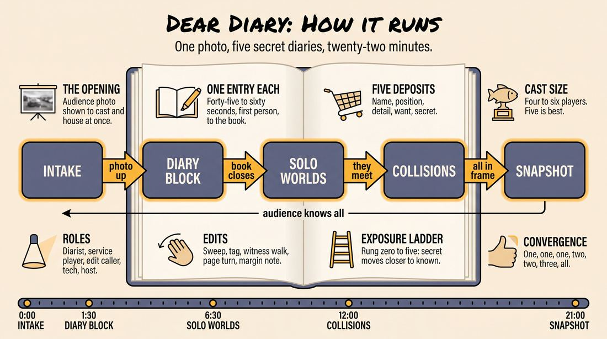
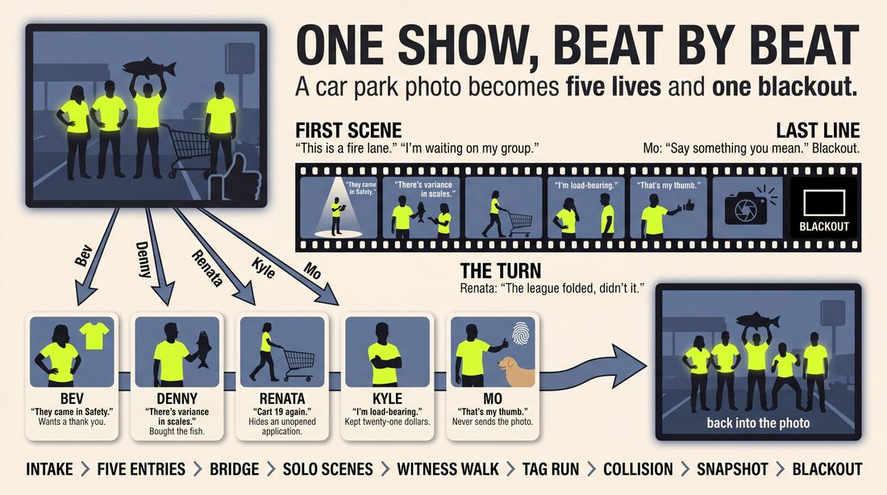
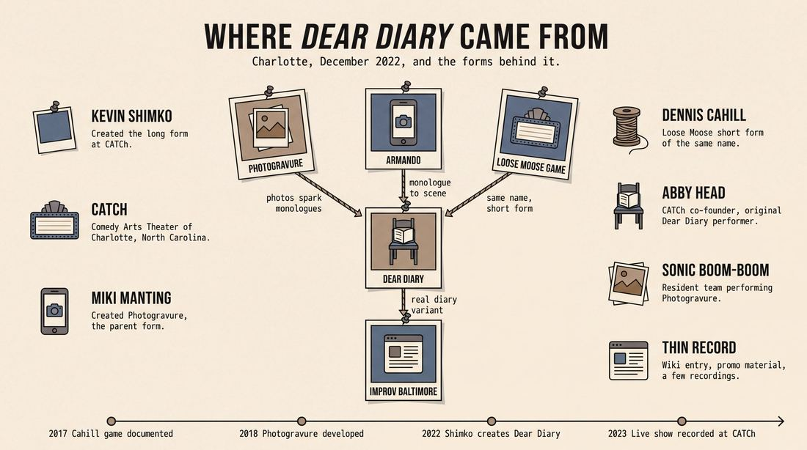
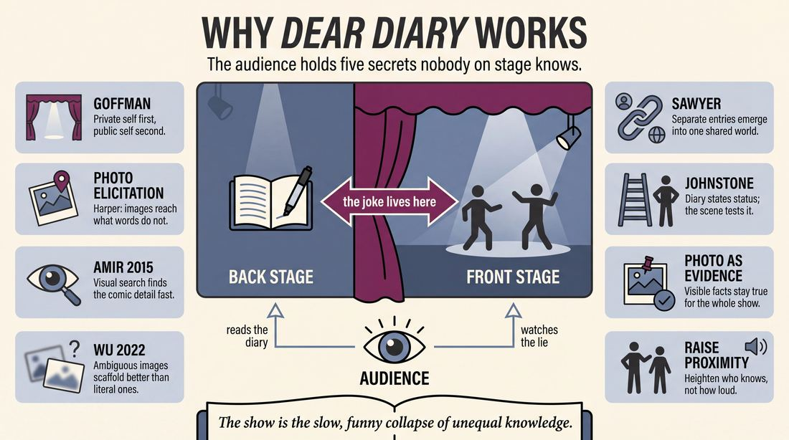
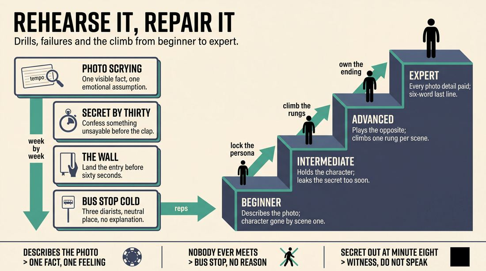

# Dear Diary

> **A complete study of the long-form improv format _Dear Diary_** - the original archived write-up, five infographics, grounded historical and pedagogical research, and a full mechanics-and-coaching manual.

| | |
|---|---|
| **Format** | Dear Diary |
| **Primary source** | [IRC Improv Wiki](https://wiki.improvresourcecenter.com/index.php?title=Dear_Diary) |

---

## Contents

1. [Part I - The Original Write-Up](#part-i-the-original-write-up)
2. [Part II - The Infographics](#part-ii-the-infographics)
   - [1. Structure and Mechanics](#infographic-1-mechanics)
   - [2. A Show, Beat by Beat](#infographic-2-example)
   - [3. Origins and Lineage](#infographic-3-history)
   - [4. Why It Works](#infographic-4-theory)
   - [5. Rehearsal and Repair](#infographic-5-coaching)
3. [Part III - Research Dossier](#part-iii-research-dossier)
   - [Pass 1: History, Lineage, Literature and Scholarship](#research-history)
   - [Pass 2: Comparative Anatomy, Pedagogy and Production](#research-comparative)
4. [Part IV - Mechanics, Gameplay and Coaching Manual](#part-iv-mechanics-gameplay-and-coaching-manual)
   - [Pass 1: The Form, Its Mechanics and Its Gameplay](#manual-mechanics)
   - [Pass 2: Training, Coaching and Performance Companion](#manual-coaching)

---

## Part I - The Original Write-Up

*Verbatim archive of the source article, reproduced exactly as scraped. Everything after this section is generated elaboration built on top of it.*

### Dear Diary

*Dear Diary* is a longform improv form developed by [Kevin Shimko](https://wiki.improvresourcecenter.com/index.php?title=Kevin_Shimko "Kevin Shimko") at the [Comedy Arts Theater of Charlotte](https://wiki.improvresourcecenter.com/index.php?title=Comedy_Arts_Theater_of_Charlotte "Comedy Arts Theater of Charlotte") in December 2022\. It consists of two distinct sections: first, each member of the team (along with the audience) is shown an audience\-supplied image, at which point they improvise a short (45s \- 1 minute) diary entry from a character based on the image shown. This is followed by scenework based around those characters.

##### See Also

[Photogravure](https://wiki.improvresourcecenter.com/index.php?title=Photogravure "Photogravure")

---

*Archived from [https://wiki.improvresourcecenter.com/index.php?title=Dear_Diary](https://wiki.improvresourcecenter.com/index.php?title=Dear_Diary) (IRC Improv Wiki) on 2026-08-09 23:23 UTC.*

---

## Part II - The Infographics

*Five 16:9 posters, each teaching a different aspect of the format. Click any poster to enlarge.*

<a id="infographic-1-mechanics"></a>

### 1. Structure and Mechanics

*How the form is played: the shape of the piece, the opening, the roles, the edit vocabulary, the flow of information, and the clock.*

{ .diagram loading=lazy decoding=async width="1100" height="614" }


<a id="infographic-2-example"></a>

### 2. A Show, Beat by Beat

*A single worked performance from suggestion to blackout: what happens in each beat, with short real example lines and what the players are doing technically.*

{ .diagram loading=lazy decoding=async width="1100" height="614" }


<a id="infographic-3-history"></a>

### 3. Origins and Lineage

*Where the form came from: creators, dates, theatres, how it spread between schools and cities, and the key figures - a documented timeline and lineage map.*

{ .diagram loading=lazy decoding=async width="1100" height="614" }


<a id="infographic-4-theory"></a>

### 4. Why It Works

*The theory: the core principles of the form and the research and craft ideas that explain why the structure produces good improv, each tied to a specific mechanic.*

{ .diagram loading=lazy decoding=async width="1100" height="614" }


<a id="infographic-5-coaching"></a>

### 5. Rehearsal and Repair

*Training and fixing the form: the essential drills, the common failure modes with their symptom-and-fix pairs, and the markers of beginner through expert play.*

{ .diagram loading=lazy decoding=async width="1100" height="614" }


---

## Part III - Research Dossier

*Two research passes: the historical record, then the comparative and pedagogical record. Claims carry evidence tags - treat unverified items accordingly.*

<a id="research-history"></a>

### » Pass 1: History, Lineage, Literature and Scholarship

### Research Summary
*   [DOCUMENTED] The long-form structure "Dear Diary" was created by Kevin Shimko at the Comedy Arts Theater of Charlotte (CATCh) in December 2022.
*   [DOCUMENTED] The mechanics involve an audience-supplied image, followed by 45-to-60-second improvised diary entries from each cast member based on the image, which then inspire subsequent scenework.
*   [DOCUMENTED] The form is a direct descendant of (or parallel evolution to) "Photogravure," an improv format created by Miki Manting that uses old photographs to spark monologues and two-person scenes.
*   [DOCUMENTED] The name "Dear Diary" is also shared by a classic short-form game developed by Dennis Cahill at the Loose Moose Theatre, which involves a single improviser narrating a diary entry while a director calls out time jumps.
*   [DOCUMENTED] The searchable record for the long-form version of "Dear Diary" is extremely thin. It is highly regional, primarily limited to the IRC Improv Wiki, CATCh's promotional materials, and a few YouTube recordings of live performances.
*   [WIDELY PRACTICED, UNDOCUMENTED] The use of visual stimuli (photographs, objects) to generate character monologues is a common improv technique, but formalizing it into a structured long-form piece like Dear Diary or Photogravure is a specific, localized development.

### Provenance and History
The form was created by Kevin Shimko at the Comedy Arts Theater of Charlotte (CATCh) in December 2022. 

[INFERRED] The problem the form solves is providing a structured way to generate multiple distinct, highly opinionated characters from a single visual prompt before initiating scenework. By forcing the improvisers to speak to a "diary," it ensures that the resulting scenes are driven by internal emotional states and character filters rather than plot mechanics. The name is derived directly from the literal framing device used in the opening monologues.

| Year | Event | Place / Company | Source |
|---|---|---|---|
| 2017 | Dennis Cahill's short-form game "Dear Diary" is documented online | Loose Moose Theater (Calgary) / ImprovGames.com | improvgames.com |
| 2018 | Miki Manting develops Photogravure, the parent form | Vintage Improv Festival | vintageimprov.org |
| 2022 | Kevin Shimko develops the long-form "Dear Diary" | Comedy Arts Theater of Charlotte (CATCh) | IRC Improv Wiki |
| 2023 | "Dear Diary" performed live and recorded | CATCh | YouTube |

### Lineage and Transmission
The searchable record is thin. The form is highly regional, localized almost entirely to the Comedy Arts Theater of Charlotte (CATCh) and its immediate orbit. Because the record is sparse, the most useful context comes from its parent form.

**Parent Form:** The form descends from **Photogravure**, created by Miki Manting and refined by the online resident team "Sonic Boom-Boom" for the Vintage Improv Follies. Photogravure uses curated old photographs as inspiration to spark monologues, which in turn inspire two-person scenes. 

[INFERRED] The transmission and mutation from Photogravure to Dear Diary involves two key shifts: 
1. Shifting the framing of the monologue from a general character statement to a specific, intimate diary entry.
2. Using random, audience-supplied images (often from smartphones) rather than curated, historical photographs, which injects a more chaotic, modern energy into the character generation.

### Key Figures
| Person | Role in this form | Specific contribution | Source URL |
|---|---|---|---|
| Kevin Shimko | Creator | Developed the long-form structure at CATCh in December 2022. | https://wiki.improvresourcecenter.com/index.php?title=Dear_Diary |
| Abby Head | Performer / Co-founder | Co-founder of CATCh and original member of the Dear Diary house team. | https://listed.to/@abby/ |
| Miki Manting | Creator of Parent Form | Developed "Photogravure," the structural predecessor to Dear Diary. | https://vintageimprov.org/ |
| Dennis Cahill | Creator of Variant | Developed the short-form game "Dear Diary" at Loose Moose Theatre. | https://improvgames.com/dear-diary/ |

### Canonical Shows, Companies and Recordings
*   **Dear Diary & Friends Improv Comedy Night**: Regular performances at CATCh (Charlotte, NC).
*   **Dear Diary, live at CATCh (July 2023)**: A recorded performance available on YouTube showcasing the format in action.
*   **Sonic Boom-Boom**: The resident team at Vintage Improv Follies that performs the parent form, Photogravure.

### Published Literature
| Work | Author | Year | What it says about this form | Where to find it |
|---|---|---|---|---|
| *IRC Improv Wiki: Dear Diary* | IRC Contributors | 2024 | Defines the form, its creator (Kevin Shimko), and its two-part structure (image-inspired diary entries followed by scenework). | improvresourcecenter.com |
| *ImprovGames.com: Dear Diary* | William Hall | 2017 | Documents the Loose Moose short-form variant where a player narrates a diary entry while a director calls time jumps. | improvgames.com |
| *The Improvisation School Blog* | Kash | 2023 | Details the experience of playing the short-form variant, noting it forces players to "be fully present in the moment and be comfortable in the unknown." | theimprovisationschool.com |

### Verbatim Quotes
> "Dear Diary is a longform improv form developed by Kevin Shimko at the Comedy Arts Theater of Charlotte in December 2022. It consists of two distinct sections: first, each member of the team (along with the audience) is shown an audience-supplied image, at which point they improvise a short (45s - 1 minute) diary entry from a character based on the image shown."
> — IRC Improv Wiki
> https://wiki.improvresourcecenter.com/index.php?title=Dear_Diary

> "Sonic Boom-Boom focuses primarily on Miki Manting's Photogravure improv form, which uses old photographs as inspiration. The photographs spark monologues, which, in turn, inspire two-person scenes."
> — Vintage Improv Festival
> https://vintageimprov.org/

> "dear diary I farted is that my daughter's wedding he's walking or down the aisle. and God damn it they only had a flute. playing. so everybody heard. and then I laughed."
> — Performer, *Dear Diary, live at CATCh (July 2023)*
> https://www.youtube.com/

> "dear diary is my first day as a court stenographer. and I am taking this so seriously my voice is the record the law and I think I'm an executioner."
> — Performer, *Dear Diary, live at CATCh (July 2023)*
> https://www.youtube.com/

> "diary i have not overthought my entire life more i thought a vacation was supposed to be relaxing. but then you have to pick your rides you have to pick your ears you have to pick your food you have to pick if you're going to be a one-seater or a two-seater that's rude because I'm single."
> — Performer, *Dear Diary, live at CATCh (July 2023)*
> https://www.youtube.com/

> "can I confess to you something. I wanna leave Florida. and I want to set my sights on other things. I want to be in the real theater. I want to learn Shakespeare."
> — Performer, *Dear Diary, live at CATCh (July 2023)*
> https://www.youtube.com/

> "This game is designed to put you out of your head and be spontaneously present in the moment. In this game, we tell a story while mimicking writing a page in our diary."
> — Kash, *The Improvisation School* (referencing the short-form variant)
> https://theimprovisationschool.com/

> "By letting go and surrendering to the moment, one word at a time, I was able to tell a story without the pressure."
> — Kash, *The Improvisation School* (referencing the short-form variant)
> https://theimprovisationschool.com/

### Anecdotes and Stories
**The Court Stenographer**
During a July 2023 performance at CATCh, an improviser used the audience-supplied image to generate a highly specific, escalating character: a court stenographer on their first day. The diary entry began with the mundane reality of the job ("my voice is the record the law") and immediately heightened into a God-complex ("and I think I'm an executioner"). This perfectly illustrates the form's utility: the 45-second monologue allows a performer to find their character's comedic filter before they ever have to interact with a scene partner. (Source: YouTube recording of CATCh performance).

**The Disney World Single**
In another 2023 set, a performer used the diary format to vent about the overwhelming logistics of a theme park vacation, culminating in the indignity of being asked to choose between being a "one-seater or a two-seater." The diary framing allowed the improviser to express pure, unfiltered internal frustration ("that's rude because I'm single") which then served as the emotional baseline for the subsequent scenes. (Source: YouTube recording of CATCh performance).

### Academic and Scientific Research
**Amir et al. (2015), *Frontiers in Human Neuroscience***
Investigated the neural correlates of humor creation using visual stimuli (captionless cartoons). The study found that visual cortex (V1) activation during humor creation reflects a greater engagement of visual search for aspects of the drawing with comedic potential, while temporal regions (TOJ and TP) exhibited a funniness "dose response."
*Relevance to this form:* This directly maps to the initial mechanic of Dear Diary, where performers must rapidly scan an audience-supplied image to find an incongruity or specific detail that can anchor their 45-second comedic monologue.

**Wu et al. (2022), *ResearchGate***
Conducted an empirical study on how visual stimuli support creative engagement. The results suggested that abstract or ambiguous visual stimuli provide an effective scaffold for creative engagement, whereas overly literal stimuli can lead to frustration.
*Relevance to this form:* Explains why audience-supplied images (which are often random, out-of-context photos from camera rolls) serve as highly effective generative constraints for the diary entries, forcing the improviser to make creative leaps rather than literal descriptions.

### Documented Variants and Descendants
*   **Photogravure**: The parent form created by Miki Manting. Instead of audience-supplied images, it uses curated old photographs. Instead of diary entries, it uses general monologues. Played by Sonic Boom-Boom.
*   **Dear Diary (Short-Form Game)**: Created by Dennis Cahill at Loose Moose Theatre. A single player sits in a chair and mimes writing in a diary, narrating aloud. A director calls out time jumps ("Next Day", "One year later"), forcing the improviser to instantly advance the narrative.
*   **Dear Diary (Improv Baltimore Team Format)**: A team at Improv Baltimore uses the same name but a different mechanic: they invite an audience member to share a personal story from their actual real-life diary, and then build a montage of scenes based on that interview.

### Criticism, Debate and Known Failure Modes
*   **The "Talking Head" Trap**: [WIDELY PRACTICED, UNDOCUMENTED] Because the form opens with a series of isolated monologues, there is a risk of draining the energy of the room before scenework begins. If the 45-to-60-second limit is not strictly enforced, the opening can feel like a disjointed stand-up open mic rather than an ensemble piece.
*   **Disconnect Between Monologue and Scene**: [INFERRED] A common failure mode in forms that separate character generation from scenework (like the Armando or the Monoscene) is that performers invent brilliant characters in the diary phase but fail to bring those specific points of view into the subsequent scenes, reverting to default improv behaviors once they have to interact with a partner.
*   **Over-reliance on the Image**: [INFERRED] If the image is too literal, improvisers may simply describe what they see rather than using it as a springboard for an internal emotional state (the core purpose of a "diary" entry).

### Cultural Footprint
The form is highly localized to the Charlotte, NC improv scene and the Comedy Arts Theater of Charlotte. It represents a broader post-2020 trend in improv (seen also in the Vintage Improv Festival's virtual shows) of using multimedia and visual prompts to break improvisers out of standard verbal initiation patterns.

### Gaps in the Record
*   **The Exact Transition from Photogravure**: It is [UNVERIFIED] whether Kevin Shimko directly studied Miki Manting's Photogravure or if the IRC Wiki's "See Also" link simply notes a parallel evolution.
*   **Widespread Adoption**: There is no searchable evidence that the long-form version of Dear Diary has been adopted by theaters outside of CATCh.
*   **Show Structure Details**: The exact transition mechanism between the diary entries and the scenework (e.g., do they do all monologues first, or alternate monologue-scene-monologue?) is not explicitly detailed in the surviving text, though video evidence suggests a block of monologues followed by a block of scenes.

### Source List
1. IRC Improv Wiki - IRC Contributors - 2024 - https://wiki.improvresourcecenter.com/index.php?title=Dear_Diary - Establishes the form's creator, origin date, and core mechanics.
2. Vintage Improv Festival - Miki Manting / VIF - 2022 - https://vintageimprov.org/ - Documents "Photogravure," the parent form using photographs to spark monologues.
3. ImprovGames.com - William Hall - 2017 - https://improvgames.com/dear-diary/ - Documents the Loose Moose short-form variant created by Dennis Cahill.
4. YouTube (Comedy Arts Theater Of Charlotte) - CATCh - 2023 - https://www.youtube.com/ - Provides verbatim quotes and structural evidence of the form performed live.
5. The Improvisation School - Kash - 2023 - https://theimprovisationschool.com/ - Provides practitioner insight into the psychological challenge of the diary-narration mechanic.
6. Frontiers in Human Neuroscience - Amir et al. - 2015 - https://www.frontiersin.org/ - Provides neuroscientific backing for how visual stimuli trigger humor creation.
7. ResearchGate - Wu et al. - 2022 - https://www.researchgate.net/ - Provides academic research on how abstract visual stimuli support creative engagement.
8. Listed.to - Abby Head - 2024 - https://listed.to/@abby/ - Confirms Abby Head's role as a co-founder of CATCh and performer on the Dear Diary team.
9. Improv Baltimore - Improv Baltimore Contributors - 2026 - https://improvbaltimore.com/Dear_Diary - Documents a variant format sharing the same name but using real audience diaries.

<a id="research-comparative"></a>

### » Pass 2: Comparative Anatomy, Pedagogy and Production

### Taxonomic Placement

```text
    Armando (True Monologue -> Scene)       Photogravure (Photo -> Monologue -> Scene)
                   |                                          |
                   +--------------------+---------------------+
                                        |
                                   Dear Diary (Audience Photo -> Character Diary -> Scene)
                                        |
                                        +--- Improv Baltimore Variant (Audience Diary -> Scene)
```

Dear Diary belongs to the "Source-to-Scene" or "Deconstruction" family of long-form improv, specifically occupying the visual-prompt sub-branch. It inherits its core structure (monologue inspiring scenework) from the Armando, but replaces the true, out-of-character personal story with an in-character, fictionalized confessional. It shares direct DNA with Miki Manting’s *Photogravure*, which also uses images to spark monologues, but Dear Diary narrows the constraint: the image must be audience-supplied, and the monologue must be a first-person diary entry, forcing immediate character lock-in rather than thematic exploration.

### Head-to-Head Comparisons

| Axis | Dear Diary | Armando (Monologue Deconstruction) | Consequence for the players |
|---|---|---|---|
| **Opening** | Audience-supplied image prompts in-character diary entries. | Audience suggestion prompts true, out-of-character personal stories. | Dear Diary requires immediate character creation; Armando requires vulnerability and memory retrieval. |
| **Structure** | Diary entries (45s-1m each) followed by scenes using those characters. | Monologue -> Scenes -> Monologue -> Scenes. | Dear Diary front-loads all source material; Armando replenishes source material throughout. |
| **Edit logic** | Sweeps and tags to transition between the established characters' worlds. | Sweeps, tags, and returning to the monologist center stage. | Dear Diary players must track character locations; Armando players must track thematic games. |
| **Memory** | Players must remember the specific POV and voice of their own and others' diary characters. | Players must remember specific details, names, and themes from the true story. | Dear Diary relies on character memory; Armando relies on factual/thematic memory. |
| **Cast size** | 4-6 (everyone performs a diary entry). | 6-10 (one dedicated monologist or rotating cast members). | Dear Diary requires a smaller cast to prevent the opening from dragging. |
| **Audience contract** | "We will bring the people/vibes in this photo to life through their private thoughts." | "We will use your suggestion to tell a true story, then explore its themes." | Dear Diary audiences judge the accuracy of the visual translation; Armando audiences judge thematic cleverness. |
| **Failure mode** | Describing the photo instead of having a POV. | Monologist tries to do stand-up comedy instead of telling a truthful story. | Dear Diary players must prioritize internal emotion over visual description. |

| Axis | Dear Diary | Photogravure | Consequence for the players |
|---|---|---|---|
| **Opening** | Audience-supplied image prompts first-person diary entries. | Old photographs prompt general monologues. | Dear Diary forces a specific "confessional" frame; Photogravure allows for broader, third-person, or thematic monologues. |
| **Structure** | Diary entries -> Scenework based on those characters. | Monologues -> Two-person scenes inspired by the monologues. | Dear Diary locks players into the characters they created; Photogravure allows players to play new characters inspired by the monologue. |
| **Edit logic** | Sweeps/tags focusing on the established characters. | Sweeps/tags focusing on the thematic inspiration. | Dear Diary is character-driven; Photogravure is theme-driven. |
| **Memory** | Retaining the specific voice, status, and secret of the diary character. | Retaining the mood, tone, or specific lines from the monologue. | Dear Diary requires strict persona maintenance. |
| **Cast size** | 4-6. | 4-8. | Similar cast sizes, but Dear Diary requires strict rotation for the opening. |
| **Audience contract** | "You provide the photo, we provide their inner lives." | "We will use this vintage photo to inspire art." | Dear Diary relies on audience tech interaction; Photogravure relies on curated vintage aesthetics. |
| **Failure mode** | Dropping the diary persona once the scene starts. | Disconnect between the mood of the photo and the mood of the scene. | Dear Diary players must bridge the gap between solo confessional and multi-person interaction. |

| Axis | Dear Diary | The Movie | Consequence for the players |
|---|---|---|---|
| **Opening** | Image -> Diary entries. | Fake movie trailer or opening credits. | Dear Diary starts internal/private; The Movie starts external/cinematic. |
| **Structure** | Character-driven scenes intersecting. | Narrative arc following a protagonist or ensemble through a genre plot. | Dear Diary focuses on emotional truth; The Movie focuses on plot beats and genre tropes. |
| **Edit logic** | Sweeps, tags, organic character entrances. | Cuts, pans, cross-fades, director calls. | Dear Diary edits based on character needs; The Movie edits based on cinematic language. |
| **Memory** | Character POVs and relationships. | Plot points, genre rules, and camera angles. | Dear Diary requires emotional tracking; The Movie requires narrative tracking. |
| **Cast size** | 4-6. | 6-10. | Dear Diary is intimate; The Movie requires a larger cast for extras and quick cuts. |
| **Audience contract** | "We will show you the private lives behind this image." | "We will improvise a feature-length film in a specific genre." | Dear Diary promises psychological exploration; The Movie promises structural mimicry. |
| **Failure mode** | Characters remain siloed and never interact. | Plot becomes too convoluted to resolve. | Dear Diary players must actively seek out other characters; The Movie players must simplify the narrative. |

| Axis | Dear Diary | Monoscene | Consequence for the players |
|---|---|---|---|
| **Opening** | Image -> Diary entries (direct address). | Immediate scene work in a single location. | Dear Diary establishes characters in isolation; Monoscene establishes characters in relation to the environment and each other. |
| **Structure** | Multiple locations, time jumps allowed. | Real-time, single location, no edits. | Dear Diary allows for spatial/temporal flexibility; Monoscene requires strict continuity. |
| **Edit logic** | Sweeps, tags. | No edits (entrances and exits only). | Dear Diary players can escape a dying scene; Monoscene players must fix it from within. |
| **Memory** | Character POVs across different scenes. | Object permanence, physical environment, real-time relationship shifts. | Dear Diary requires tracking internal states; Monoscene requires tracking physical space. |
| **Cast size** | 4-6. | 4-8. | Dear Diary limits cast to manage opening length; Monoscene limits cast to manage stage traffic. |
| **Audience contract** | "We will explore these characters across various moments." | "We will stay in this room with these people for 25 minutes." | Dear Diary promises variety; Monoscene promises claustrophobic intensity. |
| **Failure mode** | Forgetting the initial diary premise. | Breaking the reality of the physical space or time. | Dear Diary players must anchor to their opening monologue; Monoscene players must anchor to the physical set. |

### What Makes It Uniquely Itself

1. **The Visual-to-Internal Translation**: Unlike forms that use verbal suggestions to generate scenes, Dear Diary forces a specific cognitive path: visual stimulus -> internal first-person monologue -> external scenework. If you remove the visual prompt or the first-person diary constraint, it becomes a standard Armando or character montage.
2. **The "Backstage First" Character Introduction**: Characters are introduced via their private, unedited thoughts (the diary) before they are seen interacting in the world. This inverts the usual improv process where characters are discovered through interaction. If characters are introduced through scenes first, it is no longer Dear Diary.
3. **The Shared Visual Anchor**: Both the cast and the audience stare at the exact same image during the opening. The audience judges the monologues based on how well they justify the visual evidence. If the image is hidden from the audience, the contract is broken.

### Structural Variants in Practice

*   **The CATCh Original**: (Kevin Shimko, Comedy Arts Theater of Charlotte, NC). Audience-supplied image -> 45-60s diary entries from each cast member -> Scenework based on those characters.
*   **The Real Diary Armando**: (Improv Baltimore, MD). An audience member is invited on stage to read from their *actual* personal diary. The cast then performs scenes based on the themes and events discussed. This replaces the visual prompt with a true-story prompt, shifting the form into the Armando family.
*   **The Time-Jump Drill**: (Dennis Cahill, Loose Moose Theatre, Calgary AB). Played as a short-form game or rehearsal drill. One player sits center stage and narrates a diary entry while pantomiming writing. A director calls out time jumps ("Next Day," "One Year Later") to force the player to spontaneously justify the passage of time and advance the narrative.

### The Teaching Ladder

| Stage | Skill introduced | Why in this order | Typical exercise | Source or [CRAFT CONSENSUS] |
|---|---|---|---|---|
| 1 | Visual Elicitation | Players must learn to extract POV from an image before they can speak as the character. Prevents the "descriptive trap." | Photo Scrying (stating one factual detail and one emotional assumption). | [CRAFT CONSENSUS] |
| 2 | The Confessional Monologue | Establishes the "diary" format. Players must learn to speak in first-person, revealing a secret or strong internal state. | Status Confessional. | [CRAFT CONSENSUS] |
| 3 | Character Retention | The form fails if the diary character disappears in the scene. Players must practice holding onto the internal POV when transitioning to multi-person scenework. | The "I" to "We" Transition. | [CRAFT CONSENSUS] |
| 4 | Intersecting Worlds | Creates the long-form structure. Players must learn to bring disparate characters from the opening into shared scenes without forcing unnatural plot connections. | Cross-Pollination. | [CRAFT CONSENSUS] |

### Documented Drills and Exercises

| Drill | Origin / teacher | How to run it | What it fixes in this form | Source |
|---|---|---|---|---|
| Time Jump Diary | Dennis Cahill | One player pantomimes writing and narrates a diary entry. A director calls "Next Day" or "One Year Later." The player must immediately justify the time jump and continue. | Fixes getting stuck in the head and overthinking the narrative progression of the monologue. | ImprovGames.com |
| Photo Scrying | [CRAFT CONSENSUS] | Cast looks at an image. Going down the line, each player states one undeniable visual fact, followed by one emotional assumption ("He is wearing a red hat, which means he is desperate for attention"). | Fixes the "Descriptive Trap" where players just list what they see instead of making character choices. | [CRAFT CONSENSUS] |
| The Secret Keeper | [CRAFT CONSENSUS] | Player begins a monologue with "Dear Diary, today I..." and must reveal a secret they would never tell another person by the 30-second mark. | Fixes shallow or plot-heavy monologues by forcing immediate vulnerability and internal stakes. | [CRAFT CONSENSUS] |
| Object Work Journaling | [CRAFT CONSENSUS] | Player must establish the physical weight, size, and writing implement of the diary before speaking. They must maintain the physical action of writing while narrating. | Fixes floating "talking head" monologues by grounding the player in physical reality. | [CRAFT CONSENSUS] |
| First Line, Last Line | [CRAFT CONSENSUS] | Player delivers their 60-second diary entry. Another player initiates a scene by repeating the exact last line of the diary entry as their first line of dialogue. | Fixes the disconnect between the monologue and the subsequent scenework. | [CRAFT CONSENSUS] |
| Blind Image React | [CRAFT CONSENSUS] | An image is flashed on screen for exactly 3 seconds, then removed. Players must immediately step forward and deliver a diary entry based only on their first impression. | Fixes over-analyzing the image and encourages trusting immediate, instinctual choices. | [CRAFT CONSENSUS] |
| The "I" to "We" Transition | [CRAFT CONSENSUS] | Player A does a 30-second diary entry. Player B steps in, Player A closes the diary, and they immediately begin a scene where Player A must maintain the exact emotional baseline established in the diary. | Fixes "Dropped Persona" where players invent a new character for the scene. | [CRAFT CONSENSUS] |
| Status Confessional | [CRAFT CONSENSUS] | Player delivers a diary entry establishing themselves as high status. A director claps, and the player must immediately write an entry revealing why they actually feel low status. | Fixes one-dimensional characters by adding internal contradiction. | [CRAFT CONSENSUS] |
| Cross-Pollination | [CRAFT CONSENSUS] | Three players deliver separate diary entries based on the same image. They are then placed in a scene together (e.g., a bus stop) and must interact while maintaining their distinct POVs. | Fixes siloed scenes where characters from the opening never meet. | [CRAFT CONSENSUS] |
| Emotional Baseline | [CRAFT CONSENSUS] | Player delivers a diary entry with a specific emotion (e.g., furious). They are then placed in a mundane scene (e.g., ordering coffee) and must play the scene while masking that underlying fury. | Fixes the tendency to play the emotion too broadly in the scene; encourages playing the subtext established in the diary. | [CRAFT CONSENSUS] |

### Common Failure Modes and Diagnoses

| Failure mode | What it looks like from the audience | Root cause | Fix | Who names it |
|---|---|---|---|---|
| The Descriptive Trap | The monologist simply lists items visible in the projected image ("Dear Diary, I am standing next to a tree. There is a dog."). | Fear of making an assumption; relying on visual facts instead of emotional truth. | Force the player to state an emotion or a secret in the first sentence. | [CRAFT CONSENSUS] |
| The Stand-up Routine | The player drops the character and speaks directly to the audience, trying to make jokes about the image. | Discomfort with the vulnerability of the "diary" format; prioritizing laughs over character. | Anchor the player in the physical object work of writing in the diary. | [CRAFT CONSENSUS] |
| Dropped Persona | The character in the scene bears no resemblance to the character established in the diary entry. | The player treated the monologue as a throwaway opening rather than a character lock-in. | The "I" to "We" Transition drill; coach players to repeat their last diary line internally before speaking in the scene. | [CRAFT CONSENSUS] |
| Plot-Heavy Monologues | The player tries to tell an entire story with a beginning, middle, and end in 45 seconds. | Misunderstanding the purpose of a diary, which is to capture a snapshot of an emotional state, not recount a plot. | Restrict the monologue to describing a single moment or a single feeling. | [CRAFT CONSENSUS] |
| The Siloed Scene | The characters established in the opening monologues never interact with each other, resulting in a disjointed show. | Players are too protective of their individual characters and fear merging worlds. | Force cross-pollination edits; establish a shared location early in the scenework. | [CRAFT CONSENSUS] |

### Production and Logistics

*   **Cast size and why**: 4-6. If the cast is larger, the opening monologue section (at 45-60 seconds per player) drags and delays the scenework.
*   **Runtime**: 20-25 minutes.
*   **Stage layout**: 4-6 chairs in a semi-circle or straight line upstage. A projector screen or large monitor must be visible to both the cast and the audience.
*   **Lighting and tech cues**: The tech improviser is a crucial role. They must project the image, trigger a spotlight or isolated wash for the active monologist, and bring up a full stage wash for the scenework.
*   **Music and sound**: Soft, introspective instrumental music can underscore the diary entries to establish the "confessional" tone, fading out as the scenework begins.
*   **MC and host duties**: The host must explain the format clearly: "We are going to look at a photo you provided, and we will hear the private diary entries of the people in that world."
*   **How the suggestion is taken**: The host asks the audience to Airdrop a photo, submit via a QR code before the show, or physically hand a phone to the tech booth.
*   **Where the form belongs in a show lineup**: Best placed as a second-half anchor piece due to its theatricality and tech requirements.
*   **Rehearsal cadence**: Weekly, with dedicated time split between visual interpretation drills and character retention scenework.
*   **What a producer must prepare**: A robust system for vetting audience-submitted images. The tech improviser must act as a gatekeeper to prevent explicit, offensive, or overly complex images from reaching the screen.

### Adaptations Beyond the Stage

*   **Classroom and youth**: Audience submission of images must be replaced with a curated deck of pre-approved images (e.g., historical photographs, abstract art, or mundane objects) to ensure content safety.
*   **Corporate and applied improv**: Use company-specific images (e.g., the breakroom, a generic office meeting) to explore workplace empathy, perspective-taking, and the difference between internal feelings and external professionalism.
*   **Online and remote**: Highly adaptable to Zoom. The image is screen-shared. Players can use the chat function to type their diary entries simultaneously, or spotlight themselves one by one.
*   **Community and therapeutic settings**: Use ambiguous or evocative images (similar to Thematic Apperception Test cards) to allow participants to project their own emotions into the "diary" safely through a third-party character.
*   **Accessibility and inclusion**: Provide detailed audio descriptions of the projected image for visually impaired audience members and players before the monologues begin.
*   **Content-safety and consent**: Strict vetting of the audience-supplied image is non-negotiable. The tech improviser must have the authority to reject any image that violates the theater's code of conduct.
*   **Ethics of using real stories**: If using the Improv Baltimore variant (where an audience member reads their real diary), the host must establish clear boundaries, ensure the volunteer is not coerced, and the cast must treat the material with respect rather than mockery.

### Evidence Base for Those Adaptations

*   Harper, D. (2002). *Talking about pictures: A case for photo elicitation*. Visual Studies. Supports the use of images to bypass standard verbal processing and unlock deeper, more emotional narrative responses in applied settings.
*   Pennebaker, J. W. (1997). *Writing about emotional experiences as a therapeutic process*. Psychological Science. Supports the therapeutic value of the "confessional" diary format for emotional processing and perspective-taking.
*   Vera, D., & Crossan, M. (2004). *Theatrical Improvisation: Lessons for Organizations*. Organization Studies. Supports the use of role-play and internal monologue exercises in corporate settings to build empathy and adaptability.

### Scholarly Frames Worth Applying

*   **Erving Goffman on Front Stage / Back Stage**: Individuals perform different versions of themselves depending on whether they are in a public "front stage" or a private "back stage." (Goffman, E., 1959, *The Presentation of Self in Everyday Life*). **Mapping**: The diary entry mechanic is the ultimate "back stage" where the character's true, unedited feelings are revealed, contrasting directly with their "front stage" behavior in the subsequent scenework.
*   **Douglas Harper on Photo-Elicitation**: Inserting a photograph into a research interview evokes different, often deeper elements of human consciousness than words alone. (Harper, D., 2002, *Talking about pictures: A case for photo elicitation*). **Mapping**: Using the audience-supplied image as the suggestion bypasses the analytical brain, forcing players to make immediate, instinctual emotional choices based on visual data.
*   **R. Keith Sawyer on Collaborative Emergence**: Group creativity is unpredictable and emerges from the moment-to-moment interactions of the participants, rather than a pre-planned script. (Sawyer, R. K., 2003, *Group Creativity: Music, Theater, Collaboration*). **Mapping**: How the disparate, isolated diary entries—inspired by the same image but created independently—weave together into a unified, coherent world during the scenework.
*   **Keith Johnstone on Status and Spontaneity**: Every interaction involves a negotiation of status, and spontaneity is blocked when players try to protect their status. (Johnstone, K., 1979, *Impro: Improvisation and the Theatre*). **Mapping**: The diary entry establishes the character's internal, self-perceived status, which is then immediately tested and altered against the external status dynamics of the scenes.

### Where the Form Is Heading

Current practice involves heavy reliance on smartphones for image submission, often integrating live social media scrolling (e.g., pulling up a random audience member's Instagram feed) to find the prompt image. Hybrids are emerging where the diary format is combined with narrative long-form; instead of a montage of scenes, the cast uses the diary entries to establish the core ensemble of a single, cohesive one-act play. Contemporary companies are also experimenting with multimedia integration, where the diary entries are not just spoken, but typed live and projected over the image, creating a layered visual experience for the audience.

### Source List

1. *Dear Diary* - IRC Improv Wiki - 2024 - https://wiki.improvresourcecenter.com/index.php?title=Dear_Diary - Supports the origin (Kevin Shimko, CATCh, 2022) and core structure (audience image, 45s-1m diary entries, scenework).
2. *Dear Diary Improv Game* - ImprovGames.com (William Hall) - 2017 - https://improvgames.com/dear-diary/ - Supports the Dennis Cahill short-form variant and the "Time Jump" drill.
3. *Dear Diary Team* - Improv Baltimore - 2026 - https://improvbaltimore.com/Dear_Diary - Supports the structural variant where an audience member's real diary is used.
4. *Photogravure* - Vintage Improv Follies - 2024 - https://vintageimprov.org/resident-teams/ - Supports the taxonomic relationship to Miki Manting's Photogravure form.
5. *Post Mortem Players to Present CATCH THE BUTCHER at Comedy Arts Theatre Of Charlotte* - Broadway World - 2024 - https://www.broadwayworld.com/charlotte/article/Post-Mortem-Players-to-Present-CATCH-THE-BUTCHER-at-Comedy-Arts-Theatre-Of-Charlotte-20240322 - Supports Kevin Shimko and Abby Head's involvement with CATCh and the Dear Diary team.

---

## Part IV - Mechanics, Gameplay and Coaching Manual

*Synthesis over the original article and both research dossiers: first how the form works and how to play it, then how to train an ensemble to perform it.*

<a id="manual-mechanics"></a>

### » Pass 1: The Form, Its Mechanics and Its Gameplay

### At a Glance

| Field | Value |
|---|---|
| **Also known as** | *Dear Diary* (CATCh long form); informally "the photo confessional." Not to be confused with Dennis Cahill's short-form **Dear Diary** time-jump game (Loose Moose), nor with the Improv Baltimore team format of the same name that interviews an audience member's *real* diary. |
| **Family** | Source-to-scene / deconstruction family, visual-prompt sub-branch. Direct sibling of Miki Manting's **Photogravure**; structural cousin of the **Armando**. Created by Kevin Shimko at the Comedy Arts Theater of Charlotte (CATCh), December 2022. |
| **Cast size** | 4–6. Five is the sweet spot. Every cast member delivers exactly one diary entry, so cast size *is* the length of the opening. |
| **Runtime** | 20–25 minutes standard (≈5 min opening, ≈15–18 min scenework). Scales to 15 with four players, to 30–35 with six plus a second diary round. |
| **Opening** | A single audience-supplied photograph is displayed to cast **and** audience simultaneously; each player, in turn, delivers a 45–60 second first-person, in-character diary entry inspired by the image. |
| **Suggestion taken** | Not a word — an image. AirDropped, QR-uploaded pre-show, or a phone handed to the booth. Vetted by tech before projection. |
| **Structural rigidity (1–5)** | **3 overall** — the opening is a 4 (fixed count, fixed length, fixed frame, fixed order); the scenework is a 2 (free montage governed by character law, not shape law). |
| **Difficulty (1–5)** | **4.** The monologue is easy. Holding the monologue's character through twenty minutes of scenework, while five other people do the same, is not. |
| **Prerequisites** | Solo direct-address under a hard clock; the ability to build a point of view without a scene partner; clean sweep/tag hygiene; a projector or large monitor visible to both house and stage; one reliable tech operator. |
| **Best for** | Character-strong, plot-shy ensembles. Houses with a projector and a small stage. Second-half anchor slots. Teams recovering from "everyone plays themselves" disease. |
| **Avoid when** | No screen; cast of seven or more; an audience that cannot submit images; a team whose reflex is premise-and-game over point-of-view; a bill where you cannot control what appears on a screen in front of a paying room. |

### The Essence in One Paragraph

*Dear Diary* is a twenty-minute character piece in which an audience photograph is projected where everyone can see it, and each of the four-to-six players — one at a time, for forty-five to sixty seconds — writes a private diary entry as somebody inside or adjacent to that picture. Then those exact characters, played by those exact players, go and live their lives in front of us. The form's whole engine is **information asymmetry**: because the entries are private confessions and the scenes are public behaviour, the audience finishes the opening holding five secrets that the characters do not know about each other. Everything that follows — every tag, every collision, every laugh — is generated by the gap between what a character told the diary and what that character is willing to do or say in a room with another human being. Goffman's back stage precedes the front stage, and the comedy is the distance between them. The photograph is not the subject of the show; it is the *evidence* that all five confessions are true of the same world, and the piece is over when the scenework arrives at the moment the shutter clicked.

### Why This Form Exists

The documented record is thin — the wiki entry runs to eighty-four words — so the problem statement here is partly reconstruction from the mechanics themselves. My reading:

**Problem 1: montages generate scenes but not people.** A plain character montage produces a string of two-handers, each of which must invent, justify and exhaust a character inside ninety seconds. Characters die at the edit because nobody has any private information about them worth returning to. Dear Diary front-loads *all* character generation into a sealed five-minute block, so that by minute six the ensemble is working with five fully specified, already-funny, already-contradictory people. The cost of "who am I?" has been paid in advance and paid publicly.

**Problem 2: the Armando's monologue gives you themes, not persons.** In an Armando, the monologist tells a true story and the cast mines it for *ideas* — the theme of stubborn fathers, the theme of humiliating jobs. You leave the monologue with a topic. In Dear Diary you leave the opening with a **cast list plus their secrets**. That difference reorganises the whole back half: the Armando's edits chase thematic riffs, Dear Diary's edits chase people. If a Dear Diary scene is "about" something, it is because a specific named person wants something specific and lied to somebody about it.

**Problem 3: verbal suggestions produce verbal, referential improv.** A one-word suggestion routes through the analytical brain; a photograph does not. The dossier cites Amir et al. (2015) on visual search for comedic incongruity and Wu et al. (2022) on ambiguous stimuli scaffolding creativity better than literal ones, and Harper (2002) on photo-elicitation reaching material that words don't. Take that as directional rather than dispositive, but it matches what happens in the room: given the word "parking lot," improvisers make jokes about parking lots; given a blurry photo of four adults in matching neon shirts in a parking lot at dusk, improvisers make *people*, because the photo hands them irreducible specifics — the wrong yellow, the one raised trolley wheel, the thumb over the corner of the lens — that nobody would have invented and nobody can argue with.

**Problem 4: nobody protects the audience's privileged knowledge.** Most long forms give the audience the same information as the characters. Dear Diary systematically gives the audience *more*. That is the thing a montage cannot buy: twenty minutes of ambient dramatic irony, purchased in five minutes of monologue, spendable in every scene thereafter.

**What it buys, stated operationally:** five named characters, five wants, five secrets, one shared physical world with agreed-on details, an audience that knows all of it, and a built-in ending (the photograph itself). No other opening delivers that package in five minutes.

### The Audience Contract

**What the audience is implicitly promised, in the order they learn it:**

1. *"That's my photo."* Someone in the room submitted the image. The house knows one of its own is in the machine. The first promise is that the picture will be **used, not merely acknowledged** — that specific visible things in it will turn out to matter.
2. *"You are being let backstage."* The diary frame promises unfiltered interiority. The audience is positioned as the only confidant. They are promised things the characters would never say aloud.
3. *"These five people share a world."* Five entries from one photograph promise that the five lives are adjacent, even when the entries seem unrelated. The audience will wait a surprisingly long time for that promise, but they will not wait forever.
4. *"You will see these exact people again."* Once Renata the assistant manager has confessed, the audience is watching for Renata. A new, unrelated character in minute twelve reads as a broken promise unless it is clearly *service* to a diarist's world.
5. *"You know more than they do."* From the first scene onward, the audience's pleasure is anticipatory: *he doesn't know she wrote that*.

**How they know where they are** — the form's positional grammar is unusually legible, and you should protect it:

| Signal | Means |
|---|---|
| Image up, single player downstage, isolated light, miming a book | Diary. Private. Direct address. Nobody else exists. |
| Image up or dimmed, full stage wash, two or more players in space | Scene. Public. Characters cannot hear diaries. |
| Player steps out of a live scene, others freeze, light narrows | Margin note (in-scene diary aside). Still private. |
| Full cast in a still tableau under the image | Snapshot. The show is ending. |

**What breaks the contract:**

- Hiding the image from the house while the cast looks at it. (Then it is Photogravure-with-secret-source, and the audience cannot audit the translation.)
- A diary entry that describes the photo instead of confessing. The audience can see the photo; you are telling them what they already know and withholding what only you can give.
- A diarist's character never appearing in the scenework. The entry becomes a five-in-one warm-up, and the audience quietly stops listening to entries in future shows.
- A character *telling another character*, casually and early, the exact thing they told the diary. That is spending the whole bankroll on the first hand.
- Playing your entry to the audience as a stand-up bit — winking, punching, "am I right?" The diary frame is a fourth-wall *convention*, not a fourth-wall *break*. The audience is eavesdropping, not being addressed.
- Ending without returning to the image in any form. The audience brought the photograph; they expect to be handed it back.

### Anatomy: The Full Structural Map

The show has three movements and a coda. I name them so a director can call them in rehearsal.

**Movement 0 — Intake (host + tech).** The image is solicited, vetted, and revealed. 60–90 seconds. Real theatrical value: the reveal is a genuine event, and the house's collective inhale at a weird photo is the first laugh of the piece.

**Movement 1 — The Diary Block.** N entries, one per player, 45–60s each, in a fixed spatial position, no interaction, no interruption. This is the only rigid part of the form. Its output is the **Ledger**: N characters × (name, position in the photo's world, one claimed visible detail, one want, one secret).

**Movement 2 — Solo Worlds.** Roughly the first third of the scenework. Each diarist gets one scene in their own life, supported by the rest of the cast in *service roles* (spouses, bosses, strangers, offstage-named people). Nobody's diary character meets another diary character yet. Purpose: convert interior monologue into exterior behaviour, and let the audience see the **front stage** of each back stage.

**Movement 3 — Collisions.** The middle-to-late scenework. Diary characters meet. Secrets migrate. Exposure escalates. This is where the show either becomes a piece or stays a sampler.

**Coda — The Snapshot.** The final beat converges the cast into, or onto, the photograph: the moment it was taken, the moment after, or the moment it gets shown to somebody who shouldn't see it. My recommendation, not a documented rule (see *Variations*), but it is the single highest-yield structural addition you can make to the form.

```
   INTAKE            THE DIARY BLOCK                 SOLO WORLDS          COLLISIONS        SNAPSHOT
 (0:00-1:30)          (1:30-6:30)                   (6:30-12:00)        (12:00-21:00)    (21:00-23:00)
+---------+   +-------------------------+   +-----------------------+  +--------------+  +----------+
| photo   |   | [1] [2] [3] [4] [5]     |   |  A + service          |  |  A x B       |  |  ALL      |
| vetted  |-->|  |   |   |   |   |      |-->|  B + service          |->|  C x A       |->| freeze in |
| + shown |   |  v   v   v   v   v      |   |  C + service          |  |  B x C x D   |  | the photo |
+---------+   | 45-60s each, isolated,  |   |  D + service          |  |  E crashes A |  |  tableau  |
   |          | direct address, no      |   |  E + service          |  |  (secrets    |  +----------+
   |          | interaction, no edits   |   |  (one diarist/scene)  |  |   migrate)   |       |
   |          +-------------------------+   +-----------------------+  +--------------+       |
   |                     |                            |                       |               |
   v                     v                            v                       v               v
 IMAGE ============ THE LEDGER =============== FRONT/BACK GAP ======== EXPOSURE LADDER ==== IMAGE
 (evidence)      5 names, 5 wants,           audience holds 5        who-knows-what        (paid back)
                 5 secrets, 5 claimed        secrets; characters     climbs one rung
                 photo details               hold none               per scene

 INFORMATION FLOW:  audience knows ALL  >  diarist knows OWN  >  other characters know NOTHING
                    the show is the slow, funny collapse of that inequality
```

| Unit | Approx. clock | What happens | Who drives it | Success criterion | Common error |
|---|---|---|---|---|---|
| **Intake** | 0:00–1:00 | Host explains the frame in two sentences and takes the photo (AirDrop / QR / handed phone). Tech vets. | Host + tech | The house understands that *they* will see the photo too, and that the characters are fictional | Host over-explains the form for ninety seconds and kills the room before the picture is up |
| **Reveal** | 1:00–1:30 | Image goes up. Cast turns and looks at it in silence for 5–10 seconds. Audience laughs/reacts. | Tech | Everyone — house and stage — shares one long look; nobody speaks over the laugh | Cast starts talking instantly; the audience never gets to see the picture on its own terms |
| **Entry 1** | 1:30–2:30 | First diarist steps to the diary position, opens the book, speaks 45–60s in first person, in character | Diarist | Name, position in the world, one visible detail claimed, one want, one secret | Descriptive trap: "Dear Diary, I am standing next to a tree. There is a dog." |
| **Entries 2–N** | 2:30–6:30 | Same, one per remaining player, no overlap, no comment on each other | Each diarist in turn | Five *unmistakably different* voices, statuses and social positions; at least two detail-claims that overlap the same object | Four variations on the same wry 35-year-old; entries drifting to 90s+ |
| **Bridge** | 6:30–6:45 | Last diarist closes the book; someone initiates the first scene, ideally off the last entry's final line | Backline, fastest hands | The scenework starts inside two seconds of the last "…goodnight, diary" | A dead pause, a reset huddle, or the whole line stepping forward at once |
| **Solo world scenes** | 6:45–12:00 | One scene per diarist (or most diarists) in their own life, supported by non-diary service characters | The initiating backliner, then the diarist | Each diary character behaves *differently in public than in private*, visibly | Diarists re-narrate their diary content out loud to a scene partner |
| **First collision** | ~12:00 | Two diary characters share a stage for the first time | Whoever edits in | The audience recognises both instantly by voice/posture; no exposition needed | Characters greet each other as strangers with no status friction; a plot-explanation scene |
| **Collision block** | 12:00–21:00 | Secrets migrate; tags heighten; groupings of 2–4 diarists; time may jump | Whole cast; edit-callers | The **exposure ladder** climbs at least three rungs; at least two secrets change hands | Everyone meets everyone in one giant scene at minute fourteen, and there's nowhere left to go |
| **Second entries** *(optional)* | any point after 14:00 | One or two diarists return to the book and report, unreliably, on what we just saw | Individual player | Contradicts the scene we saw; earns a laugh purely from dramatic irony | Used as an escape hatch from a scene that was working |
| **Snapshot / button** | 21:00–23:00 | Cast converges into the photograph, or into the moment just before/after it | Whoever calls the tableau | Audience recognises the image being physically assembled; blackout on the click | Assembling the photo but then continuing to talk for ninety seconds |
| **Blackout** | ~23:00 | Lights out on the tableau or the final line | Tech | Hard out on the strongest image | Lights fading slowly while a scene searches for an ending |

### The Opening

#### Step-by-step procedure

1. **Pre-show (T–30 min).** Tech posts a QR code / an AirDrop name / a phone-in-the-booth sign in the lobby. Producer collects a *pool* of images. The pool matters: you want a live audience act of submission, but you never want zero options.
2. **Host frame, two sentences, no more.** Recommended wording: *"We're going to put up a photo one of you took, and then you're going to hear the private diary entries of the people who live in that world. None of these people are you, and none of this is true."* That last clause matters — it inoculates the submitter against feeling accused of anything the cast invents.
3. **Take the image.** Either (a) call for a live AirDrop and take the first clean one, or (b) ask a specific volunteer to hand a phone to the booth, or (c) use the pre-show pool and let the audience call "next / next / that one" as tech scrolls it. (c) is the best of all worlds: live-feeling, controllable, and the *scrolling itself* is funny.
4. **Vet.** Tech has absolute veto. Non-negotiable. Skip anything explicit, anything identifying a private person in a compromising way, anything the house's code of conduct wouldn't survive. Tech's decline is silent — they simply advance to the next image.
5. **Project.** Full screen, ten seconds of silence. The cast turns upstage or half-profile and *looks*. Do not talk over the audience's reaction.
6. **Audio description** (if your house does access work, and it should): the host gives a 10-second plain description — *"Four adults in matching neon-yellow shirts, a supermarket car park at dusk, one is holding a trophy shaped like a fish."* This also, usefully, gives the cast a shared vocabulary of nameable objects.
7. **Entry order.** House choice; see variants. Whoever goes first must go **within four seconds** of the description ending.
8. **The diary position.** One fixed spot — I recommend downstage centre-left, one step forward of the backline chairs. Same spot every entry. Everyone else remains seated/standing on the backline, still, watching the *image*, not the speaker (this is a subtle but real gift: it keeps the audience's eye where it belongs and stops the backline from mugging).
9. **The book.** Open a mimed diary with real weight. Establish the implement — pen, pencil, phone notes app, engraving into a locker door — before the first word. This one physical choice is the difference between a character and a talking head.
10. **Speak 45–60 seconds.** First person, present-or-recent past, addressed to the diary. Somebody in the booth or on the backline holds the clock. At 60 seconds, the underscore starts to swell — that's the signal to land.
11. **Close the book.** A visible, physical close is the punctuation. Return to the line.
12. **Next.** No comment, no applause break engineered, no re-look at the image.
13. **After the final entry:** the last diarist closes the book, and the first scene initiation happens *immediately*. The best bridge is a player stepping into space and speaking a line to the last diarist, in scene. (See the *Echo Init* and *Handoff Hook* moves.)

#### What a good entry deposits — the Deposit Slip

Every entry must leave five things on the table. Teach it as a checklist; drill it until it is invisible.

| Deposit | Why the form needs it | Cheapest way to do it |
|---|---|---|
| **A name** | The other four players cannot bring you into a scene, or name you in *their* scene, without one | "Dear Diary. Bev Kessler, still standing." |
| **A position in the photo's world** | Tells everyone which region of the world you occupy and where they can find you | "…assistant manager, store 4041." |
| **A claimed visible detail** | Pays the photo debt; makes the picture *evidence*, not wallpaper | "I ordered these shirts in Sunflower. They came in *Safety*." |
| **A want** | Gives the scenework a motor; without it you have a mood, not a character | "I want one of them to say thank you." |
| **A secret or contradiction** | The engine. This is what the audience will hold over every scene | "I haven't told them the league folded in March." |

The best entries do the deposit *and* turn. The court stenographer entry from the July 2023 CATCh recording does the whole job in two sentences: *"dear diary is my first day as a court stenographer. and I am taking this so seriously my voice is the record the law and I think I'm an executioner."* Position, want, and a wildly heightened self-concept in about eleven seconds. Note the shape: mundane job → literal self-description → grandiose delusion. That escalation *inside* the entry is the move; the flat version would have stopped at "I am taking this so seriously."

#### Documented and practical variants of the opening

| Variant | Mechanic | When to use it |
|---|---|---|
| **One Image, Whole Cast** (documented default) | A single photo; all N entries derive from it | Default. Guarantees the shared world and makes collisions inevitable. |
| **Image Per Diarist** | Tech advances to a new audience photo before each entry | Only with an ensemble that will *impose* connection later; produces wilder characters and a much harder second act. See the contradiction note below. |
| **Blind Flash** (drill-derived, stageable) | Image shown 3 seconds, then screen to black; entries from memory | Late-night shows, festival slots, expert casts. Kills the descriptive trap outright; costs the audience their audit. |
| **Scroll-and-Stop** | Tech scrolls a submitted camera roll; audience shouts "stop" | Highest-energy intake; funniest reveal; slight content risk — tech must be quick on the veto. |
| **Curated Deck** | Pre-approved images (art, historical photos, mundane objects) | Classrooms, youth shows, corporate work, any room where you cannot risk a camera roll. |
| **Vintage / Photogravure mode** | Old, curated photographs; entries may be broader monologues | When you want melancholy and period texture rather than modern chaos. This is drifting back toward the parent form. |
| **Typed Entry** | Diarist types live, projected over the image | Novelty/multimedia shows. Real cost: typing is slower than speaking and the clock swells to 90s. |

> **Contradiction in the record, resolved:** The wiki says "an audience-supplied image" (singular) shown to the team; the dossier's own drills assume one shared image; but the transcribed CATCh entries (a wedding, a courtroom, a theme park, Florida) suggest either multiple images or extremely loose springboarding. **My judgement:** treat **one shared image** as canonical, and treat wide divergence between entries as *permitted springboarding, not required proximity* — the image licenses the world, it does not fence it. If your entries are diverging as far as "wedding / courtroom / Disney," you are effectively running Image Per Diarist and must plan the collision block deliberately rather than trusting it.

> **A second thin patch:** the record does not state whether all monologues precede all scenes or whether the two alternate; video evidence per the dossier suggests a block of monologues then a block of scenes. **My judgement:** block-then-block is the form. Alternating monologue-scene-monologue is an Armando with a photo in it and loses the form's defining asset — the audience holding *all five* secrets simultaneously before the first scene.

### The Engine

This is the section to read twice. Everything else is implementation.

#### 1. The form runs on a fixed cognitive path

Visual stimulus → **private first-person speech** → **public interaction**. Each arrow is a translation, and each translation is where the form can fail.

- **Arrow 1 (image → interiority)** fails as *description*. The fix is a rule: your first sentence may contain at most one visible fact, and must contain at least one feeling or judgement about it.
- **Arrow 2 (interiority → interaction)** fails as *dropped persona*. The fix is a rule: the first thing your character does in their first scene must be a *behaviour caused by the diary's want*, not a greeting.

#### 2. The real currency is information asymmetry

At the end of the diary block, the room's knowledge looks like this:

| Information type | Audience | The diarist | The other diary characters | The service characters |
|---|---|---|---|---|
| What's visible in the photo | Yes | Yes | Yes (it's their world) | Yes |
| Character A's name, job, position | Yes | Yes | Only if A said it publicly | Only if introduced |
| Character A's **want** | Yes | Yes | No | No |
| Character A's **secret** | Yes | Yes | **No** | **No** |
| That five separate confessions exist | Yes | No | No | No |

That bottom row is the form's unique possession. The audience is the only entity in the theatre that has read all five diaries. **The show is the structured, comic collapse of that inequality.** Every scene either (a) exploits the gap, (b) narrows it by one increment, or (c) wastes it.

#### 3. The Front/Back gap is the joke generator

Goffman's front stage/back stage, cited in the dossier, maps onto this form with unusual literalness. The diary is back stage; the scene is front stage; the comedy is the measurable *distance* between them, and it is your job to keep that distance large and visible.

Operationally: **in the first public scene, play the opposite of your diary.** Bev who wrote *"I want one of them to say thank you"* does not, in her first scene, ask for thanks. She refuses thanks, loudly, three times, while dying inside. The audience laughs at the refusal because they read the entry four minutes ago. A scene partner cannot generate that laugh; only the audience's privileged knowledge can. If your scene would play identically to an audience who missed the opening, **you are not playing the form.**

#### 4. Three channels move information between scenes

Information does not travel by narration in this form. It travels by three named routes, and every improviser should be able to name which one they just used.

| Channel | Mechanism | Example | Constraint |
|---|---|---|---|
| **Carried** | The diarist walks their own secret into a new scene and behaves under its pressure | Denny, who bought his tournament fish, refuses to let anyone photograph the trophy up close | The diarist owns it; nobody else may state it |
| **Named** | A diary entry names an offstage person; another player picks that person up and plays them | Bev's entry says "my daughter Casey won't return the shirts" → Kyle's scene now has a Casey in it | Whoever plays Casey serves Bev's world; they do not get a competing secret |
| **Shared** | A detail visible in the photo is public property; anyone may claim, re-claim or contradict it | Two diarists both explain the raised trolley wheel; the scenes reconcile it | The photo's facts cannot be denied, only re-interpreted |

A fourth route — **Leaked** — is the payoff, not a resource: a secret crosses from one character to another *inside a scene*, on stage, in front of us. Leaks are expensive and should happen deliberately (see the Exposure Ladder). Leaking early is the commonest way a Dear Diary runs out of gas at minute fifteen.

#### 5. The Exposure Ladder — the form's escalation metric

Most long forms heighten by making the *content* bigger. Dear Diary heightens by making the secret *closer to being known*. This is the specific physics of the piece and it is what stops a character montage from feeling like a montage.

| Rung | State | What a scene at this rung looks like |
|---|---|---|
| 0 | Only the diary and the audience know | Front-stage scene where the character behaves in exact contradiction to the entry |
| 1 | A physical trace exists on stage | The receipt is in the pocket; the wrong-yellow shirt is being worn; the object is present |
| 2 | A non-diary character suspects | A cashier, a spouse, a stranger asks the wrong question and gets a bad answer |
| 3 | Another **diary** character finds out | Renata sees Kyle carrying the supermarket fish; neither says it aloud |
| 4 | It is said aloud between two diary characters | Renata: "You bought that fish in my store." |
| 5 | It is public — the group, or the record, holds it | It's on the photograph. It's in the newsletter. Everyone in the tableau knows. |

**Rule of thumb (mine):** in a 22-minute show, no secret should be above rung 1 before minute twelve, and at least two secrets should reach rung 4 or 5 before the blackout. A show where all five secrets stay at rung 0 is charming and inert; a show where three hit rung 5 by minute ten is a sitcom finale with ten minutes of dead air after it.

#### 6. The convergence gradient

The scenework has a shape even though it has no shape rules. Diarists-per-scene should trend upward:

```
scene:   1    2    3    4    5    6    7    8    9   10   coda
diarists:1    1    1    1    2    1    2    2    3    2    ALL
                              ^ first collision            ^ snapshot
```

Two failure curves to recognise instantly:
- **Flatline (all 1s):** the Siloed Show. Nobody ever meets. Diagnosis: players protecting their character. Fix: an unmotivated shared location (see *The Bus Stop* move).
- **Spike (a 4 at scene three):** the Blown Load. Everyone meets immediately, all secrets leak, and the last twelve minutes are inventing new problems for people whose problems are solved.

#### 7. The photo is a conservation law

Everything the photo shows is **true and non-negotiable** for the entire show. If the photo has four people in neon shirts, there are four people in neon shirts, forever. Characters may lie about the photo's contents; the show may not. This gives Dear Diary something almost no montage has: an *external, unarguable arbiter of fact* that both the cast and the audience can see for twenty minutes. Use it. When two scenes contradict, resolve toward the picture. When the show gets abstract, someone should touch a thing that is visibly in the frame.

#### 8. Why the entries cohere even when the characters don't

Sawyer's collaborative emergence is the honest frame here: five people looking at one photograph independently produce entries that share texture (light, class, era, weather, mood) even when they share no plot. That shared texture is your connective tissue, and it is stronger than plot. If Denny is delusional-grand and Renata is bureaucratically furious and Mo is quietly devastated, and all three entries mention dusk and a car park, the audience has already built the world. **Do not spend scenework explaining how the characters know each other.** They don't need to know each other; they need to be in the same weather.

### Roles and Responsibilities

| Role | Owns | Must do | Must not do | Signal to the others |
|---|---|---|---|---|
| **Diarist (each player, in the block)** | One character: name, want, secret, claimed detail | Open a physical book; deliver 45–60s in first person; deposit all five items; close the book | Address the audience as an audience; describe the photo; run past 70s; reference another diarist's character | Closing the book = "I'm done, next" |
| **Diarist (each player, in scenework)** | Persona maintenance for the whole show | Re-enter every scene at the diary's emotional baseline; carry the secret; behave front-stage | Play a *second* diary-level character with their own secret; restate the diary aloud to a partner | Re-adopting the specific posture/voice established in the entry |
| **Backline / service players** | Everybody else in the world | Play spouses, cops, cashiers, the named offstage people; give the diarist obstacles that press on the *want* | Steal the scene's centre; invent a competing secret; play a diary character that isn't theirs | Stepping in with a strong who/where within four seconds |
| **Edit-caller (rotating, everyone)** | The convergence gradient | Edit on the reveal, not after it; force the first collision around minute twelve; protect the last five minutes for convergence | Sweep a scene mid-confession; edit because *they* have an idea | Full-body sweep across the front; clean, fast, from the same side each time |
| **Tech / image wrangler** | The photograph, the light states, the clock | Vet and veto images; project; isolate the diarist (spot or narrow wash); full wash for scenes; hold the 60s clock; hard blackout on the button | Advance the image mid-entry; leave a stage dark; let an unvetted image reach the screen | Underscore swell at 0:55 = land it; snap to full wash = scenework begins |
| **Musician (optional)** | Tone and the transition seam | Soft, sparse underscore beneath entries; out on the last book-close; stingers only on collisions and the snapshot | Score the scenework continuously; play jokes | Ending the underscore = the diary block is over |
| **Host / MC** | The contract | Two-sentence frame; the "none of this is true about you" inoculation; the audio description | Explain the form's history; apologise for the photo; comment after the entries | Clearing the stage = go |
| **Director (rehearsal only)** | The Ledger discipline | Post-show: read back the five entries and ask which secrets reached which rung | Give notes on the photo choice | — |

### The Rules That Actually Bind

#### Hard rules — break these and it is not Dear Diary

| # | Rule | Why it is load-bearing |
|---|---|---|
| 1 | The prompt is an **audience-supplied image**, displayed to the audience and the cast at the same time | Remove audience sightline and you break the audit; remove audience supply and it's Photogravure |
| 2 | **Every** cast member delivers **exactly one** entry, **before any scene** | Front-loading the entire Ledger is the form's defining asset |
| 3 | Entries are **first person, in character, addressed to the diary**, 45–60 seconds | Third person = Photogravure; true story = Armando; unlimited length = open mic |
| 4 | Entries do not interact, interrupt, or reference each other | The independence of the five confessions is what makes their later convergence feel discovered rather than planned |
| 5 | The scenework uses **those characters**, played by **those players** | The character-to-player lock is the form's memory system |
| 6 | The diary is **private**: no character may hear another character's diary | The entire information asymmetry depends on this |
| 7 | The photo's visible facts are true for the whole show | The external arbiter that keeps five independent inventions in one world |
| 8 | Tech holds absolute veto over the image | Non-negotiable production ethics; a house that skips this will eventually have a very bad night |

#### Soft conventions — vary by house, choose deliberately

| Convention | Common settings | Effect of changing it |
|---|---|---|
| Chairs upstage in a line vs. standing backline | Both seen | Chairs read "waiting room," standing reads "chorus"; chairs are calmer under the entries |
| Image stays up during scenework vs. dims to a low glow | Both | Staying up keeps the audit alive and helps callbacks; dimming makes scenes feel bigger and less illustrative |
| Fixed diary position vs. each diarist chooses a spot | Fixed is cleaner | Individual spots let you re-use spatial memory later ("Kyle's corner") |
| Entry order: pre-set / volunteer / eye-contact | All three | Volunteer order costs 2–3 seconds per handoff but produces braver first entries |
| Miming writing throughout vs. writing then speaking | Both | Continuous writing grounds the body; it can also strangle a fast, funny voice — let strong players drop the pen after the first beat |
| Second entries mid-show | House choice | Adds unreliable-narrator comedy; costs 60s of scenework each |
| Snapshot ending | My strong recommendation | Without it, the piece ends like a montage |
| Naming the diary ("Dear Rebecca") | Occasional | One of the cheapest character-revealing moves available |
| Underscore under entries | Common | Establishes confessional tone; risks funeral-parlour drag if too slow |

#### Myths — things people wrongly believe are rules

| Myth | Reality | Why the myth spreads |
|---|---|---|
| "Your character must be a person visible in the photo" | Off-frame characters are often the best ones: the photographer, the person cropped out, the dog's owner, the guy watching from the store window, the person the photo was sent to | Literal-mindedness about "based on the image" |
| "The five entries must connect" | They must share a *world texture*, not a plot. Connection is built in Movement 3, not asserted in the opening | Improvisers' terror of disconnection |
| "Every scene must be about the photo" | The photo debt is paid **once per character**, in the entry. Scenes may go anywhere the character would go | Confusing the prompt with the topic |
| "You can only play your diary character" | You may and must play service characters in others' worlds. What you may not do is create a *second* character with their own secret and want | Overcorrection from Dropped Persona notes |
| "The diary must be past tense" | Present tense ("I'm writing this from the car"), future ("Tomorrow I'll tell her") and even second-person to the diary all work | Literary convention leaking into stagecraft |
| "It's just an Armando with a picture" | Armando's source is *true* and *out of character*, so its scenes deconstruct themes. Dear Diary's source is *fictional* and *in character*, so its scenes continue lives. Different edits, different memory, different endings | Superficial structural similarity |
| "The audience is being addressed" | The audience is *eavesdropping*. Play to the book, not the house | Direct address is usually a fourth-wall break |
| "Everyone has to meet everyone" | Three of five meeting hard beats five meeting thinly | Symmetry instinct |
| "You must keep miming writing the whole time" | Grounding device, not a law | Good note, over-applied |
| "Longer entries are richer entries" | Past ~70 seconds the entry stops depositing and starts performing. The clock is the friend of the form | Monologists like monologuing |

### Edits and Transitions

| Edit | How to execute physically | When it is right | When it is wrong | What it costs |
|---|---|---|---|---|
| **Book-close handoff** (diary block only) | Diarist physically closes the book, holds one beat, walks back to the line; next diarist is already moving | Between every entry | Never during; never with overlap | Nothing. It is the cheapest, cleanest transition in the form — protect it |
| **Bridge init** | A backliner steps into space and speaks *to the last diarist*, in scene, before they reach the line | Exactly once, at the end of the diary block | If it forces the diarist into a scene they haven't landed | Robs the last entry of one second of air; worth it for the momentum |
| **Sweep** | Full-body cross from a consistent side, on the laugh after a reveal | Ending a scene that has landed a rung on the Exposure Ladder | During a confession; before a scene has shown the front/back gap | Whatever the scene had left; sweeps are blunt in a character form |
| **Tag-out** | Tap the shoulder of the player *staying*; the tagged player exits; you take the position | Running a pattern on one character's front-stage behaviour (three different people all refuse to thank Bev) | Tagging into a two-diarist collision — it dilutes the rarest resource | Continuity of the scene's location; use for pattern, not for plot |
| **Walk-through / Witness edit** | A diary character walks silently through the back of another's scene, is seen by us, and exits; the scene continues, then ends | Moving a secret from rung 0 to rung 3 without a word | If the walker acts, comments, or lingers | Nothing; this is the form's signature edit and the most underused |
| **Margin note** *(in-scene diary aside)* | Player steps one pace downstage out of the scene; others freeze; the player opens the book and says **one to two sentences**; closes; steps back; scene resumes mid-breath | When the front/back gap needs to be shown, not implied — especially in a scene where the character must stay polite | More than twice per show; as a joke delivery system; longer than ~10 seconds | The scene's momentum, and some of the audience's belief that diaries are private. Ration to two per show |
| **Page turn** *(time-jump edit within one world)* | The diarist mimes turning a page while staying in position; lights bump; scene resumes days/weeks later, same characters | Escalating a want that needs time to fail | Whenever you actually needed a new scene, not a later one | Location continuity; brilliant for showing a want decaying |
| **Split screen** | Two scenes hold opposite halves of the stage; one freezes while the other plays; alternate two or three times | Two diarists in parallel worlds who are about to collide — the audience assembles the connection themselves | Three-way splits; more than one split per show | Stage clarity; hard for a five-person cast to staff |
| **Collision edit** | A diary character enters an existing scene as themselves, uninvited, at the worst possible moment | The first collision, and each subsequent rung climb | Before minute ten; as a rescue for a dying scene | Everything you had left in the first character's privacy — spend it deliberately |
| **Echo init** | Initiate the next scene using the exact last line of a previous entry as your first line, spoken by someone else in a new context | Once, to bind the diary block to the scenework | Repeatedly — it becomes a gimmick | Nothing, if used once |
| **Second-entry edit** | Sweep to the diary position; the player opens the book and delivers a 30–45s entry reporting on what we just saw | Late show, when a character's version of events is now *funnier than the events* | As an escape from a working scene; before minute fourteen | 45 seconds of scenework; must earn its rate |
| **Snapshot / tableau** | Someone says a line that positions people; the cast assembles into the photo's composition; freeze; blackout | Once, at the end | Any other time | The show. Don't miss it — call it 90 seconds before you need it |
| **Organic exit** | A character leaves for a reason inside their diary want; the remaining players continue | Reducing a three-hander to the two who need each other | When it looks like a player bailing | Nothing; the most invisible edit in the form |

### Memory: Callbacks, Patterns and Heightening

#### What the form remembers

Dear Diary has **three memory registers**, and a player must be tracking all three at once:

1. **The Ledger** (five rows): name, position, claimed detail, want, secret. Non-negotiable. If you cannot recite the other four players' Ledger rows at minute twelve, you cannot support them.
2. **The Photo** (five to fifteen visible facts): permanently on screen or permanently in mind. This is the only register the audience can check.
3. **The Rungs** (five numbers, 0–5): who now knows what. This is the register that tells you what the next scene should be.

My rehearsal recommendation: after every practice run, the director reads the Ledger back aloud from notes and asks each player *"what rung did you finish on?"* Teams that can answer are teams that are playing the form. Teams that can't are playing a montage with a nice opening.

#### The three callback types, ranked by value

| Type | Mechanic | Value | Example |
|---|---|---|---|
| **Photo callback** (highest) | A visible detail is re-explained, contradicted or physically handled | The audience can verify it against the screen; produces the biggest recognition laughs | The one raised trolley wheel gets a third, incompatible explanation |
| **Entry callback** | An exact phrase from a diary entry is spoken by a *different* character in a scene, unknowingly | Pure dramatic irony; the audience holds the connection alone | Renata, to Denny: *"You'd think somebody would say thank you."* Bev, offstage, hears nothing. That's the joke |
| **Behaviour callback** (lowest but most frequent) | A character's front-stage tic recurs in a new context | Builds the person; low ceiling on laughs | Kyle apologising to inanimate objects in every scene |

**A form-specific hazard:** the entry callback only lands if the phrase is *distinctive*. Coach players to plant one weird, repeatable phrase in their entry — "the wrong yellow," "the record, the law," "one-seater or a two-seater." The CATCh transcripts show this instinct at work: *"you have to pick if you're going to be a one-seater or a two-seater that's rude because I'm single"* hands the ensemble a phrase they can weaponise for fifteen minutes.

#### Heightening: raise proximity, not volume

The generic long-form instruction "heighten" fails here, because a character whose *behaviour* gets bigger simply becomes cartoonish while their secret stays untouched. In this form:

**Heightening = moving the secret up the Exposure Ladder while the character works harder to hold the front stage.** The character's effort escalates; the character's *volume* need not.

Worked ladder on one secret (Denny bought his tournament fish):

| Beat | Rung | Scene content | Denny's effort |
|---|---|---|---|
| 1 | 0 | Denny gives an acceptance speech to a service-desk employee | Effortless. He believes it. |
| 2 | 1 | The trophy fish is thawing. A puddle. | He stands in the puddle. |
| 3 | 2 | A cashier says "we sell that fish." Denny changes the subject to weather. | Sweating |
| 4 | 3 | Renata sees Kyle carrying a store bag toward the boat. She says nothing. | Denny doesn't know he's caught |
| 5 | 4 | Renata: "Store 4041, aisle nine." Denny: "…Congratulations to everyone who competed." | Total, catastrophic composure |
| 6 | 5 | It's in the photo. The receipt is in the frame. | Blackout |

That is the whole heightening curriculum for this form in one table.

#### Pattern recognition specific to Dear Diary

- **Detail collision:** two entries claim the same visible object differently. This is *free structure* — build a scene that reconciles them and the audience will believe the two characters were always connected.
- **Verb pattern:** if three of five entries contain the verb "waiting," you have your show's theme without anyone naming it. Do not name it. Play it.
- **Status inversion pattern:** Johnstone's frame is directly usable — the diary states the character's *self-perceived* status; the scenes test it. A show in which every diarist's self-perceived status is inverted at least once has an arc, whether or not it has a plot.
- **The unsaid group secret:** occasionally all five entries turn out to be avoiding the same fact (the league folded; the store is closing; the dad is dead). If you find it around minute fourteen, make the snapshot the moment it becomes unavoidable. This is the best ending the form produces.

### Move-Level Technique Catalogue

| Move | Situation | How to do it | Example line | Failure mode |
|---|---|---|---|---|
| **1. Detail Deed** | First sentence of your entry | Claim ownership of one visible object in the photo; nobody else may own it the same way | "Dear Diary — I ordered these shirts in Sunflower. They came in Safety." | Claiming the biggest object (the trophy) when four others will too |
| **2. Photo Scry** | You have no character yet | State one undeniable visual fact, then one emotional assumption about it, out loud | "He's got his hand on the trolley. He's the one who needs something to hold." | Stopping at the fact; the assumption is the whole move |
| **3. Off-Frame Claim** | Three players have already taken the obvious people | Be someone outside the frame: photographer, the cropped-out one, the recipient of the text | "Dear Diary, that's my thumb. Bottom left. Fifteen months of this car park and today I got my own thumb." | Being so peripheral you have no access to anyone's world |
| **4. Secret by Thirty** | Every entry | Reveal, by 0:30, something the character would not say to a person | "Nobody's told them the league folded in March. I've been mowing a field for nobody." | Withholding the secret to "save it" — there is nothing to save it for |
| **5. Contradiction Turn** | Mid-entry, ~0:35 | Assert something, then invert it in the same breath | "And I'm fine with that. I am completely fine with it. I bought a second freezer." | Inverting into a punchline instead of into a truth |
| **6. Grandiosity Escalator** | Entry, final ten seconds | Escalate from job description to self-mythology in two steps | "My voice is the record. The law. …I think I'm an executioner." | Escalating three steps and losing the human underneath |
| **7. Anchor Line** | Last line of your entry | Write your last sentence to be *initiable* — an action, a place, a decision | "Tomorrow I'm going to the store and I'm going to ask for the manager." | Ending on a sigh; nobody can catch a sigh |
| **8. Handoff Hook** | Last line, alt version | End by naming a person or place another player can immediately occupy | "If Casey calls, I'm not home." | Naming three people; the ensemble takes none of them |
| **9. Nib Choice** | Before your first word | Establish implement and surface with real weight | *(mimes uncapping a fat marker; writes on a store inventory clipboard)* | Miming a generic pen at generic waist height |
| **10. Diary Address** | Anywhere in the entry | Name and characterise the diary itself | "Dear Rebecca — that's what I call you, I know you're a book —" | Doing it for the joke and never again |
| **11. Front-Stage Init** | Your first scene | Enter playing the *opposite* of your entry's truth | Bev, brightly: "Do NOT thank me. I mean it. Nobody thank me." | Entering and stating the diary's content to your partner |
| **12. Baseline Mask** | Any scene | Hold the diary's emotion as subtext under a mundane public activity | *(furious Bev, folding shirts, pleasant)* "Medium. Medium. Medium. Medium." | Playing the emotion at full broadcast volume |
| **13. Confidant Init** | You're a service player | Enter another diarist's scene as the person their entry *named* | "Mom. Mom. I am not taking twelve shirts to school." | Bringing your own secret and stealing the scene |
| **14. Photo Debt Payment** | Anywhere in scenework | Have a scene explain a visible detail nobody has claimed | "Why is that wheel off the ground?" "Because I am *holding it* off the ground, Denise." | Explaining a detail with information rather than behaviour |
| **15. Margin Note** | Mid-scene, front stage straining | Step out, others freeze, open the book, one or two sentences, close, resume | *(freeze)* "Dear Diary: he is going to say 'fair play' and I am going to smile." *(unfreeze)* Denny: "Fair play." | Using it three times; using it to deliver a punchline |
| **16. Witness Walk** | You need a rung climb with no dialogue | Cross the back of a live scene, see the incriminating thing, exit without speaking | *(Renata crosses; sees the store bag; stops; goes)* | Reacting theatrically; the power is in the non-reaction |
| **17. Bus Stop** | Minute twelve, nobody has met | Establish a neutral shared location with no plot justification and put two or three diarists in it | "Anyone else waiting on the 4:40?" | Explaining how they know each other |
| **18. Detail Trade** | Two entries claimed the same object differently | Build a scene where both explanations are asserted and neither yields | "It's a bass." "It's a *carp* with a bass's face on it." | Resolving it; the unresolved version is funnier and truer |
| **19. Status Flip** | Second scene for a high-status diarist | Put them in a room where their self-perceived status has no currency | Stenographer, to a bailiff: "I'm essentially the executioner." Bailiff: "Can you move? You're on the mat." | Flipping them all the way to pathetic in one line |
| **20. Named Object Migration** | Late scenework | Move a physical object established in one diarist's world into another's scene | *(Kyle produces the trophy from a backpack in Renata's break room)* | Moving an object nobody established |
| **21. Second Entry (Unreliable)** | After minute fourteen | Return to the book and report on a scene we just watched, wrongly | "Dear Diary: they gave me a standing ovation today. Kyle was overcome." *(He left to vape.)* | A faithful report; the inaccuracy is the entire value |
| **22. Rung Call** | You're editing | Before you sweep, ask silently: "did that scene climb a rung?" If no, let it run one more beat or edit into a scene that will | — | Editing on a laugh that didn't advance exposure |
| **23. Page Turn** | A want needs time to rot | Turn the page in position; lights bump; same world, three weeks later | "Dear Diary — week four. Still no thank you." | Time-jumping to escape a difficult scene |
| **24. Leak** | Late show, rung 3 → 4 | One diary character says another's secret out loud, casually, in the worst room | Renata, to a customer, about Denny: "Aisle nine. Frozen. Nineteen dollars." | Leaking with a big dramatic reveal; casual is funnier and crueller |
| **25. Snapshot Call** | 90 seconds from the end | Say a line that physically arranges people into the photo's composition | "Everyone get in — Mo, you're taking it — nobody move — " | Calling it and then continuing to improvise past the freeze |
| **26. Shutter Button** | The last second | Freeze in the tableau; the photographer speaks the last line; blackout | Mo: "…Say something you mean." *(blackout)* | A slow fade; the piece needs a click |

### Principles

**1. The photograph is evidence, not a subject.**
*Why here:* the audience can see it for twenty minutes; it is the only fact both stage and house can check. Treat it as your show's constitution, not your show's topic.
*Followed:* three characters interpret the same raised trolley wheel incompatibly, and the show never resolves it.
*Violated:* the first four minutes are five people describing a car park to a room that is looking at the car park.

**2. The diary is back stage; the scene is front stage; play the distance.**
*Why here:* the entries exist precisely to create a gap that no scene partner can see.
*Followed:* Bev, who wrote *"I want one of them to say thank you,"* spends her first scene aggressively forbidding thanks.
*Violated:* Bev walks into her first scene and says "I just wish someone would thank me" — and the entry was a waste of sixty seconds.

**3. One feeling, one moment — a diary is a snapshot, not a story.**
*Why here:* 45–60 seconds cannot hold a plot, and a plot delivered to a book is not a confession.
*Followed:* "Today the shirts came in the wrong yellow and I sat in my car."
*Violated:* forty-five seconds of chronology ending with "…and then we drove home," and no want, no secret, nothing to play.

**4. Deposit all five items before you close the book.**
*Why here:* the other four players cannot use you without a name, a position, a want and a secret. The entry is a *transfer of assets*, not a performance.
*Followed:* the ensemble can initiate three different scenes about you the second you sit down.
*Violated:* a beautiful, funny, unusable entry; you get one scene, alone, and vanish.

**5. Claim one detail; leave the rest.**
*Why here:* five improvisers looking at one photograph will all reach for the loudest object. Distribution of claims *is* the world-building.
*Followed:* trophy, shirt, trolley wheel, thumb, dog — five owners, one picture, one world.
*Violated:* five entries about a fish, and no world at all.

**6. Your character is not yours to protect.**
*Why here:* the show's arc is the exposure of five secrets. A player who defends their character's dignity has removed their character from the engine.
*Followed:* you actively walk your secret toward the person most likely to discover it.
*Violated:* the Siloed Show — five charming people, twenty minutes, no consequences.

**7. Heighten proximity, not volume.**
*Why here:* the escalation metric in this form is *who knows*, not *how big*.
*Followed:* the same composed man says the same composed sentence in progressively more incriminating rooms.
*Violated:* minute eighteen and everyone is shouting; nobody has learned anything about anybody.

**8. The audience is your only confidant — never your audience.**
*Why here:* the diary convention is eavesdropping, not address. The second you seek a laugh from the house, the character stops being private and the whole asymmetry evaporates.
*Followed:* you play to the book, and the laughs arrive anyway, bigger.
*Violated:* five stand-up sets, and the room's energy is flat before a single scene.

**9. Never state your diary out loud in a scene.**
*Why here:* saying the secret is the show's *finale currency*. Spending it in scene two leaves fifteen minutes of resolved characters.
*Followed:* the secret leaks by object, witness, and inference for ten minutes before anyone speaks it.
*Violated:* rung 4 at minute eight; the cast starts inventing new problems and the piece becomes a montage.

**10. Enter someone else's world as a person, not as a plot device.**
*Why here:* service roles are half the form's stage time, and a service player who arrives with information kills the diarist's scene.
*Followed:* you enter as the daughter her entry named and you want your own thing (the car keys).
*Violated:* "Bev — I heard the league folded!" — you have just handed her the reveal and taken it away from the ensemble.

**11. Converge by the two-thirds mark or you have written five short plays.**
*Why here:* nothing in the opening forces the characters together; the entries are independent by rule. Convergence must be *chosen*.
*Followed:* first collision around minute twelve, groupings of three by eighteen, everyone by the coda.
*Violated:* a final blackout on a fifth solo scene, and an audience that liked it but can't say what it was.

**12. Edit on the reveal, not after it.**
*Why here:* in a character-secret form, the laugh belongs to the moment of discovery, and everything after it is admin.
*Followed:* Renata says "aisle nine," Denny opens his mouth, sweep.
*Violated:* Denny explains himself for ninety seconds and the audience watches a man do paperwork.

**13. Support the world, not the joke you had in the car.**
*Why here:* the photograph will suggest a bit to every player independently, and four of you will have the same one. The Ledger, not the picture, tells you what the show needs next.
*Followed:* you abandon your idea because Kyle's want is starving and you go be his boss.
*Violated:* three unrelated riffs on the same visual gag in the second half.

**14. End on the picture.**
*Why here:* the audience gave you an image; the piece has a natural, satisfying, wordless ending built into its own prompt, and no other form has that.
*Followed:* the cast assembles into the composition; the photographer speaks; click; black.
*Violated:* a sweep, a bow, and a room that never got the thing they brought handed back to them.

**15. Sixty seconds is a mercy, not a constraint.**
*Why here:* the opening is *N × entry length*, so entry discipline is the difference between a five-minute prologue and a nine-minute wall.
*Followed:* five entries, five and a half minutes, and the room is leaning in when the first scene starts.
*Violated:* the ninety-second entries — technically better monologues, and a show that never recovers its pulse.

### Worked Run-Through

**Cast (5):** Dana, Marcus, Priya, Tom, Kelsey. Runtime target 22 minutes.

---

**Beat 0 — Intake (0:00).**
**HOST:** "We're going to put up a photo one of you took tonight, and then you'll hear the private diary entries of the people who live in that world. None of them are you. None of this is true. Tech — what have we got?"

*Image up: slightly blurred phone photo. A supermarket car park at dusk. Four adults in matching neon-yellow t-shirts. One holds a trophy shaped like a fish. A shopping trolley at the edge of frame with one wheel off the ground. A thumb over the bottom-left corner. A golden retriever, mostly out of frame.*

**HOST:** "Four adults in matching neon-yellow shirts, a supermarket car park at dusk, one holding a trophy shaped like a fish, a trolley with one wheel in the air, and a thumb."

> **Mechanic:** Reveal + audio description. The description is not just access work — it hands the cast a shared, spoken inventory of claimable objects, which prevents two players from lunging at the same one in the first four seconds.

---

**Beat 1 — Entry: Dana (1:35).**
*Dana steps to the diary spot, uncaps a fat marker, writes on a clipboard.*
**DANA (BEV):** "Dear Diary. Bev Kessler. Still standing. I ordered these shirts in Sunflower. They came in Safety. Safety is the yellow they paint the edge of a platform. I paid the invoice anyway, out of my own account, because the league account was closed in March, which — nobody has asked about. Nobody's asked about the field either, which I mow. On Sundays. For nobody. Tonight Denny holds the fish up and everybody claps and I take the picture — no, I don't take the picture, Mo takes the picture, because I'm *in* it this year, I insisted — and not one person has said thank you. I'm not going to ask. Asking makes it a favour. *(beat)* Tomorrow I'm going to the store and I'm going to ask for the manager."

> **Mechanic:** Full Deposit Slip in fifty seconds — name (Bev Kessler), position (league organiser), Detail Deed (the wrong yellow), want (a thank you), secret (the league account is closed). It ends on an **Anchor Line** that hands the ensemble a scene: Bev, a store, a manager. It also plants a distinctive callback phrase ("the wrong yellow") and names two offstage people (Denny, Mo) — who are about to be claimed.

---

**Beat 2 — Entry: Marcus (2:30).**
**MARCUS (DENNY):** "Diary. Big day. Big, big day. Denny Pike, Big Bass Classic, one for the record books. Eleven pounds four ounces. *(writing hard)* Now. Technically. The scale at the marina, versus the scale at the store — there's variance. There's variance in scales. What matters is the *spirit* of the fish. Kyle knows what I mean. Kyle was there, Kyle helped me — Kyle *carried* it. The photo's going in the newsletter and I want the light to catch the — *(he holds an invisible trophy up, adjusts it)* — there. That's the one. I'd like to say a few words at the awards but Bev didn't schedule words. *(beat)* Nobody thanks the guy who brings the fish."

> **Mechanic:** **Contradiction Turn** ("technically… variance in scales") plants the secret without stating it — the audience assembles "he bought the fish" themselves, which is a stronger contract than being told. He claims the trophy (Detail Deed), names Kyle (**Handoff Hook**), and his last line accidentally rhymes with Bev's want. That rhyme was not planned; it is the shared-texture effect of one photograph, and the cast should notice it and use it later.

---

**Beat 3 — Entry: Priya (3:25).**
**PRIYA (RENATA):** "Dear Diary. Store 4041. Assistant manager. 6:41pm and there are *four adults* in my fire lane in shirts that violate my planogram — that's not a real rule, I know it's not a real rule, I just enjoy saying planogram at people. Cart 19 is out there again with the wheel, they've got it up on the kerb like a horse. I have called about cart 19 six times. *(beat, quieter)* They looked so happy. I stood in the doorway for a full minute. Nobody came in. Nobody ever asks me to be in anything. *(writing)* My EMT application is due Friday and I have not opened it. Because if I open it, then it's real, and if it's real, then I'm the woman who wanted more than store 4041, and then everybody knows."

> **Mechanic:** Priya claims the **trolley wheel** — a small, unloved detail — rather than competing for the trophy. **Secret by Thirty** with a genuine internal stake (the unopened application). Note the **Status Flip** built into the entry: front-stage petty authority, back-stage exclusion. She also puts herself geographically adjacent to everyone else without knowing any of them, which is the ideal collision setup.

---

**Beat 4 — Entry: Tom (4:20).**
**TOM (KYLE):** "Dear Diary. Kyle. Seventeen. I'm the one holding the cart. I'm holding it because if I let go of it, it rolls, and if it rolls it hits the Buick, and the Buick is Coach Bev's. So I've had one wheel off the ground for about — I want to say nine minutes. Everyone thinks I'm just standing here. I'm *load-bearing*. *(beat)* Denny gave me forty dollars and said get the biggest one they've got and don't talk to anyone and I said okay because Denny's the only adult who's ever asked me to do anything. It was nineteen dollars. I kept twenty-one dollars. I've never stolen anything before. It's in my sock. *(beat)* I'm going to give it back. *(writing)* I'm not going to give it back."

> **Mechanic:** **Photo Debt Payment inside an entry** — Kyle *explains the raised wheel*, an unclaimed visible fact, and the explanation is character (he's load-bearing, literally and emotionally). He also detonates Denny's secret from the other side: two diaries now describe the same crime, and only the audience has both halves. That is the form's engine at full power, four and a half minutes in.

---

**Beat 5 — Entry: Kelsey (5:15).**
**KELSEY (MO):** "Dear Diary. That's my thumb. Bottom left, fifteen months of photographs in this car park, and today I get my own thumb. *(beat)* Dog's name is Sandy. Sandy is not in the frame, Sandy is *never* in the frame, Sandy is at the edge of everything. Bev asked me to take the picture because I am the person you ask to take the picture. And I said yes because when I'm holding a camera nobody asks me how I'm doing. *(writing, steady)* Fifteen months. Every Thursday. Same spot, same time, because that's the spot where his car was and I keep thinking if I photograph it enough — *(stops)* — anyway. Everyone smiled. Denny counted us down. It's a good one. I'm not going to send it to anyone."

> **Mechanic:** **Off-Frame Claim** (the thumb, the photographer) — the highest-yield position in this form, because the photographer holds the object the whole show is inside. Kelsey has also, without discussing it with anyone, handed the ensemble its **Snapshot** ending: someone is going to have to ask Mo to send the photo.

---

**Beat 6 — Bridge (6:15).**
*Kelsey closes the book. Before she reaches the line, Priya has stepped into space with a clipboard.*
**PRIYA (RENATA):** "Ma'am. Ma'am. This is a fire lane."
**DANA (BEV):** *(bright, not moving)* "I'm aware. I'm waiting on my group."

> **Mechanic:** **Bridge init**, straight into a **collision** — unusual to do at scene one, and here it works because the two characters have no relationship and no shared secret yet. This is a *proximity* scene, not an exposure scene. It costs nothing on the Exposure Ladder and it buys immediate momentum after five minutes of monologue.

---

**Beat 7 — Scene 1 continues (6:25).**
**PRIYA (RENATA):** "Your group is up on the kerb. Cart 19 is up on the kerb."
**DANA (BEV):** "That's Kyle. He's holding it."
**PRIYA (RENATA):** "Why."
**DANA (BEV):** "Because I asked him to."
**PRIYA (RENATA):** *(writing)* "…That's a reason." *(beat)* "You do this every year?"
**DANA (BEV):** "Nine years."
**PRIYA (RENATA):** "Nobody's ever asked me to hold a cart."
**DANA (BEV):** *(instantly, warmly, wrongly)* "Well, don't thank me for it."
*Sweep.*

> **Mechanic:** Two **Front-Stage Inits** braided. Bev refuses a thank-you she is starving for; Renata performs authority to cover exclusion. Neither states their diary. The audience does all the work and laughs at "don't thank me for it" — a line that is not funny to anyone who missed the opening. That is the diagnostic test of a working Dear Diary scene.

---

**Beat 8 — Scene 2 (7:40). Denny's world, service players.**
*Marcus alone, then Tom and Kelsey enter as awards-night attendees.*
**MARCUS (DENNY):** "Before we eat — a few words —"
**KELSEY (ATTENDEE 1):** "There's no words this year, Denny."
**MARCUS (DENNY):** "There's *always* words."
**TOM (ATTENDEE 2):** "It's thawing."
**MARCUS (DENNY):** "It is *glistening*."
**KELSEY (ATTENDEE 1):** "There's a puddle."
**MARCUS (DENNY):** *(stepping into the puddle, not looking down)* "That's condensation. That's the *body's* condensation." *(beat)* "Eleven pounds four."
**TOM (ATTENDEE 2):** "Off which scale?"
**MARCUS (DENNY):** *(long pause)* "…Congratulations to everyone who competed."
*Sweep.*

> **Mechanic:** **Rung 1** — the secret acquires a physical trace (the puddle, the thawing). Note the pattern: three service players ask three escalating questions and Denny's composure holds until the exact word "scale." Edit lands on the reveal-adjacent silence, not after it. Also note the players are serving, not competing: neither Tom nor Kelsey brings their own secret into Denny's scene.

---

**Beat 9 — Witness Walk (9:00).**
*Scene 3 begins: Renata alone in the break room, holding an unopened envelope. As she turns it over, Tom (Kyle) crosses upstage carrying a supermarket bag with something long and heavy in it. He does not see her. She sees the bag. She says nothing. He exits. She looks at the envelope again.*
**PRIYA (RENATA):** *(to nobody)* "Aisle nine."
*Sweep.*

> **Mechanic:** **Witness Walk** — the single most efficient edit in the form. Rung 0 → rung 3 for Denny's secret, with two words and no scene. Renata's own secret (the envelope) sits in her hand the entire time at rung 1. Two ladders climb in eighteen seconds.

---

**Beat 10 — Scene 4 (9:30). Mo's world, Page Turn.**
**KELSEY (MO):** *(setting up a tripod, alone)* "Thursday."
*She turns a page in the air. Lights bump.*
**KELSEY (MO):** "Thursday."
*Page. Bump.*
**KELSEY (MO):** "Thurs—" *(Dana enters as Bev, in the neon shirt)* "—oh."
**DANA (BEV):** "You come here every week?"
**KELSEY (MO):** "I take pictures of the car park."
**DANA (BEV):** "That's a hobby."
**KELSEY (MO):** "It's not."
**DANA (BEV):** *(beat, deciding to not ask)* "…Send me the one from Saturday."
**KELSEY (MO):** "No."
**DANA (BEV):** "Mo."
**KELSEY (MO):** "It's a good one."
**DANA (BEV):** "Then send it."
**KELSEY (MO):** "That's why."
*Sweep.*

> **Mechanic:** **Page Turn** used properly — not to escape, but to make repetition visible; three Thursdays in eight seconds establishes fifteen months. Then a **collision** that climbs Mo's ladder to rung 2 (Bev suspects) without any explanation, and simultaneously plants the show's ending device: the photograph exists and Mo won't send it.

---

**Beat 11 — Tag run (11:00).**
**TOM (KYLE):** *(alone at a bus stop, hand over his sock)* "I'm going to give it back."
*Marcus tags in as Denny.* "Kyle! Kyle. My guy. My man on the ground."
**TOM (KYLE):** "Denny, about the—"
**MARCUS (DENNY):** "Don't." *(exits)*
*Kelsey tags in as Sandy's owner, walking a dog.* "Are you okay, sweetheart?"
**TOM (KYLE):** "I'm load-bearing."
*Priya tags in as Renata, in uniform, on a smoke break.* "You bagged for me on Tuesdays."
**TOM (KYLE):** "Yes ma'am."
**PRIYA (RENATA):** "Aisle nine, nineteen dollars, cash." *(beat)* "You kept the change."
**TOM (KYLE):** *(nothing)*
**PRIYA (RENATA):** "I'd have kept the change." *(exits)*
*Sweep.*

> **Mechanic:** A **tag run on one character's front stage** — three different people meet the same boy and none of them can help him. The run is not a joke pattern; it's a *pressure* pattern, which is the version of tag running this form wants. The last tag is a **Leak** delivered casually (Principle 9): Renata takes Kyle's secret to rung 4 in nine words, and gives him absolution instead of a punishment, which is funnier and rawer than a bust.

---

**Beat 12 — Second entry (13:00).**
*Marcus sweeps and goes straight to the diary spot.*
**MARCUS (DENNY):** "Diary. Awards night. Standing ovation. Kyle was overcome — had to step outside, couldn't take it. *(writing)* I said a few words. Off the cuff. I said, 'the fish doesn't care who catches it.' People are going to be quoting that. *(beat)* Bev didn't clap. Bev has an issue with me and I have never known what it is. *(beat)* I'll ask her tomorrow. *(beat)* I won't."

> **Mechanic:** **Unreliable Second Entry.** We watched that room; there was no ovation and no speech. The audience holds the true version, so every sentence is a laugh purchased entirely with dramatic irony — the register only this form generates. It also nudges the Bev/Denny collision forward without a scene.

---

**Beat 13 — Collision, three-hander (14:30).**
*Bev's kitchen. Bev is folding neon shirts. Kyle stands in the doorway. Renata is behind him, out of uniform, holding the envelope.*
**TOM (KYLE):** "Coach. This is Renata. She's from the store."
**DANA (BEV):** "Is this about the fire lane."
**PRIYA (RENATA):** "No."
**DANA (BEV):** "Is it about cart 19."
**PRIYA (RENATA):** "…Partly." *(beat)* "The league folded, didn't it."
**DANA (BEV):** *(folding)* "Where'd you hear that."
**PRIYA (RENATA):** "Your invoice came through my register in March. Personal card."
**DANA (BEV):** *(folding)* "That's a privacy issue."
**PRIYA (RENATA):** "I know."
**DANA (BEV):** *(folding, folding)* "…They're the wrong yellow."
**PRIYA (RENATA):** "I know. It's a platform yellow."
**DANA (BEV):** *(stops)* "Thank you."
*Beat. Everyone hears it.*
**TOM (KYLE):** "…Did you just—"
**DANA (BEV):** "Get out of my kitchen, Kyle."
*Sweep.*

> **Mechanic:** Rung 4 on Bev's secret, and the show's actual emotional turn: the woman who refuses to ask for thanks *gives* one, unprompted. **Entry callback** ("the wrong yellow") spoken back to her by a stranger — the audience recognises the phrase from minute two and the recognition does the emotional work. Note the edit lands one beat after the turn, on Kyle's line, not on Bev's; the deflection is the button.

---

**Beat 14 — Snapshot Call (17:30, compressed).**
*Car park. Dusk. Renata is in a neon shirt that does not fit. Denny is holding the trophy. Kyle is holding cart 19 with one wheel up. Bev is directing.*
**DANA (BEV):** "Mo. Same spot."
**KELSEY (MO):** *(setting up, quietly)* "I know the spot."
**MARCUS (DENNY):** "Should I do the fish up or the fish out?"
**PRIYA (RENATA):** "Out. Nineteen dollars, out."
**MARCUS (DENNY):** *(long pause; then, out)* "Out."
**TOM (KYLE):** *(to Denny, holding the cart)* "It's in my sock."
**MARCUS (DENNY):** "I know."
**DANA (BEV):** "Everybody in. Mo — get in."
**KELSEY (MO):** "I take it, I don't—"
**DANA (BEV):** "Mo. Get in."
*Mo hesitates. Steps into the frame. Reaches back with one arm to press the shutter. Her thumb crosses the lens.*
**KELSEY (MO):** "…Say something you mean."
*Cast freezes into the exact composition of the projected photograph. The dog crosses the edge of the frame and out.*
*Blackout.*

> **Mechanic:** **Snapshot.** The image on the screen and the bodies on the stage become the same object, and every element of the photo has now been paid for: the wrong yellow (Bev), the trophy (Denny), the raised wheel (Kyle), the trolley in the fire lane (Renata), the thumb (Mo), the dog at the edge (Mo's entry). The audience's own photograph is handed back to them with five interior lives inside it. **Shutter Button:** hard blackout on the click, not a fade.

---

### A Bad Run, Diagnosed

Same photograph. Same five players. A version I have watched, in various costumes, dozens of times.

---

**BAD BEAT 1 — Entry: Dana.**
**DANA:** "Dear Diary. Today I was in a parking lot. There were four of us and we were wearing yellow shirts. There was a shopping cart. It was getting dark. There was a dog, I think — I can't really tell. It was a weird day."

> **Went off at:** the first sentence. This is the **Descriptive Trap** — every clause is information the audience already possesses.
> **Repair:** the rule is *one visible fact maximum, and it must arrive attached to a judgement*. "I ordered these shirts in Sunflower. They came in Safety." Same fact, plus a person, plus a grievance, plus a job. **Rehearsal fix:** Photo Scrying — down the line, one fact + one emotional assumption, twenty reps.

---

**BAD BEAT 2 — Entry: Marcus.**
**MARCUS:** "Dear Diary. So it started this morning when I woke up at like 5am to go to the tournament, and then Kyle picked me up, and we drove out to the lake, and the boat wouldn't start, so we had to go back, and then we went to the store, and then the weigh-in was at four, and then everyone came to the parking lot, and I won, and that's basically the day. Ninety-four seconds long, incidentally."

> **Went off at:** "So it started this morning." **Plot-Heavy Monologue** — a chronology, told to a book, with no feeling and no secret. Also 94 seconds, which pushes the diary block toward eight minutes.
> **Repair:** restrict to a single moment and a single feeling. The store trip is the whole entry: "There's variance in scales." **Rehearsal fix:** The Secret Keeper drill — secret on the table by 0:30 or the director claps you off.

---

**BAD BEAT 3 — Entry: Priya.**
**PRIYA:** *(to the house, grinning)* "Dear Diary — who wears Safety yellow to a *fish* event, am I right? Somebody in this room took this picture and I need to know what happened to you." *(big laugh)*

> **Went off at:** eye contact with the audience. **The Stand-up Routine.** It got the biggest laugh of the opening and cost the show a character. It also violated the host's inoculation by pointing at the submitter.
> **Repair:** in the moment, the next diarist should immediately re-establish the private register — slow, physical, to the book. **Rehearsal fix:** Object Work Journaling; you may not speak until the implement, the surface and the weight exist. **Prevention:** house rule — *play to the book, never to the house.*

---

**BAD BEAT 4 — First scene.**
**DANA:** "Hey, so — I've been feeling really unappreciated lately. Nobody ever thanks me for organising the league."
**TOM:** "I appreciate you."
**DANA:** "Thank you. That means a lot."

> **Went off at:** "I've been feeling really unappreciated." The diary was stated aloud, and then **granted**, in eleven seconds. Bev's ladder went 0 → 5 and her want was satisfied in her first scene. She is now a character with nothing to do for eighteen minutes.
> **Repair:** Front-Stage Init. Enter *refusing* the thing you want, in public, to a stranger. **Rehearsal fix:** the "I" to "We" Transition drill with an added constraint — in your first scene you may not say any noun that appeared in your entry.

---

**BAD BEAT 5 — Scene four.**
*Kelsey enters not as Mo but as a new character: a talking parking meter.*

> **Went off at:** the decision to be funnier than the Ledger. This is **Dropped Persona** in its most seductive form — the player didn't forget Mo, she out-thought her. The audience is now missing one of five confessions and will not get it back.
> **Repair:** in the moment, another player should redirect — enter and say "Mo. Mo, are you photographing the meter again?" and hand the character back. **Rehearsal fix:** Cross-Pollination, run cold: three diarists, one bus stop, hold your POV for four minutes with no premise to hide behind.

---

**BAD BEAT 6 — Minute fifteen.**
*Five scenes in, no two diary characters have met. Every scene has been one diarist plus service players. Each has been fine.*

> **Went off at:** approximately minute eleven, when a sweep was available and nobody forced a collision. This is the **Siloed Show** — the audience is watching a well-performed sampler and has quietly given up on the promise that these five share a world.
> **Repair:** any player, immediately: the **Bus Stop**. Neutral location, no justification, two or three diarists, one line of dialogue: *"Anyone else waiting on the 4:40?"* Do not explain how they know each other. **Prevention:** a house rule that the first collision happens no later than the halfway mark, and the responsibility for calling it belongs to whoever is *not* in the current scene.

---

**BAD BEAT 7 — The ending.**
*A scene between Denny and a service character about boat insurance is sweeping toward nothing. Someone calls "and scene." Lights fade slowly. The image is still on the screen, unpaid.*

> **Went off at:** minute nineteen, when nobody looked at the photograph and asked what was still unexplained. The trolley wheel, the thumb and the dog were never accounted for; the audience's own image was never handed back.
> **Repair:** ninety seconds out, any player says a line that arranges bodies — "Everybody in, Mo's got the timer" — and the cast assembles the composition. Even a badly-run Dear Diary is redeemed by a clean Snapshot, because the audience gets the one thing only this form promises.

### Troubleshooting

| Symptom | Root cause | In-the-moment fix | Rehearsal fix | Prevention |
|---|---|---|---|---|
| Entries describe the photo | Fear of assumption; treating the image as a subject | Next diarist opens with a feeling and a name, no visual nouns | Photo Scrying (fact + emotional assumption), 20 reps | House rule: max one visible fact in your entry, and it must be a *claim*, not a description |
| Entries run 90+ seconds | No clock; monologists enjoying themselves | Musician swells underscore at 0:55; diarist lands | Run the whole diary block on a visible timer; anything past 70s is cut off mid-word | Assign a backline player the clock every show |
| Opening drains the room | Five talking heads in a row, same tempo, same register | Whoever's next changes tempo violently — fast, angry, whispered | Rehearse "entry tempo assignment": each player draws a tempo card before the block | Cast size ≤ 6; vary who goes first each show |
| Diarist plays to the house | Discomfort with the confessional register | Next diarist re-grounds in physical writing; edit-callers don't reward the mugging with a laugh from the line | Object Work Journaling; no speech until the pen exists | State the convention in the frame: *"you're going to be eavesdropping"* |
| Character disappears after the entry | Player treated the entry as a warm-up | Another player initiates *at* them by name: "Renata. Store 4041." | The "I" to "We" Transition, then Emotional Baseline | Post-show Ledger read-back: every player must have appeared as their diarist at least twice |
| Nobody meets (Siloed Show) | Protecting characters; no one owns convergence | Bus Stop: neutral location, no justification, two diarists | Cross-Pollination cold runs | Rule: first collision no later than the halfway mark, called by whoever's offstage |
| Everyone meets at once (Blown Load) | Anxiety about connection; a big group idea | Break the group scene into a two-hander immediately; find the two with the most friction | Rehearse the convergence gradient explicitly (1,1,1,1,2,1,2,2,3,ALL) | Ban group scenes before the two-thirds mark |
| Secrets all leak by minute eight | Confusing "revealing" with "heightening" | Stop stating; start *witnessing*. Next edit is a silent Witness Walk | Run an Exposure Ladder drill: play the same scene at rungs 1, 2, 3, 4 | Teach the ladder as the escalation metric before you teach the form |
| Scenes would play identically without the opening | The front/back gap isn't being used | Margin note: freeze, one line of diary, resume — the audience is reminded they know something | Baseline Mask drill: diary emotion + mundane public activity | The diagnostic question in every note session: "did that scene need the diary?" |
| Two diarists claim the same photo object identically | Everyone reached for the loudest thing | Detail Trade — assert both, resolve neither | Assign quadrants of the image in rehearsal | Audio description lists the objects; unspoken norm is "take what nobody named" |
| The image is unusable (blurry, blank, offensive) | Intake failure | Tech advances, silently, to the next image; host says nothing about it | Build a 30-image pre-vetted backup deck | Pre-show QR pool + absolute tech veto |
| Show ends flat | No Snapshot; the photo debt unpaid | Any player: arrange bodies into the composition, one line, freeze, blackout | Rehearse cold Snapshot calls from arbitrary scenes | Somebody is designated the ending-watcher every show |
| Service players keep stealing diarists' scenes | Improvisers hate being support | Diarist re-centres by pursuing their want physically, not verbally | Run scenes where service players may only ask questions | Cast note: "in someone else's world you have a want, not a secret" |
| The photo is forgotten by minute ten | Image dimmed and no callbacks | Someone handles an object visibly in the frame | Photo Debt drill: list every visible detail; a scene must pay one of them per five minutes | Leave the image up, low, for the whole show |
| The audience doesn't know who's who | Voices too similar; no names repeated | Have a service character say a diarist's full name early in each scene | Distinctness drill: five entries, five wildly different ages/statuses | Cast the entries for contrast, not for comfort |

### Variations and Dials

| Dial | Settings | Effect |
|---|---|---|
| **Runtime** | 15 / 22 / 35 min | 15 (cast of 4, no second entries, single collision, snapshot) is the tight festival version and the best one to *learn* on. 22 is the documented shape. 35 requires a second diary round at the midpoint, otherwise the last ten minutes drift into plot. |
| **Cast size** | 3 / 4–6 / 7+ | 3 makes it almost a chamber play — every collision is mandatory, every character must be enormous. 4–6 is the form. 7+ pushes the opening past seven minutes and the audience stops holding the Ledger; if you must, split into two teams of four running back-to-back pieces off the same image. |
| **Number of images** | 1 / one per diarist / 1 + a second image at the midpoint | One image is canonical and produces a coherent world. One per diarist produces wilder characters and demands deliberate convergence work. A *second* image mid-show — "and this is a photo from six months later" — is a powerful, undocumented dial I recommend for 30+ minute versions: it forces a time jump the whole cast must justify. |
| **Rigidity** | Loose montage / gradient-enforced / narrative | Loose: sweep freely, let it be a character montage. Gradient-enforced (my default): the convergence curve is a house rule. Narrative: the entries define a single one-act play's ensemble and the scenework is continuous chronology — this is where the dossier says contemporary practice is heading, and it works, but it costs you the tag run and the margin note. |
| **Tone** | Comic-cruel / comic-warm / melancholic | The diary frame naturally pulls warm-sad; Charlotte's transcribed entries lean broad-funny ("dear diary I farted…"). Choose consciously — a cast half in each register makes a piece that never settles. Tell the cast the tone *before* the image goes up. |
| **Source material** | Live camera roll / pre-show QR pool / curated deck / vintage photos / social feed | Live roll is highest energy, highest risk. Pool is the professional default. Curated deck is mandatory for youth and corporate. Vintage photos slide you toward Photogravure — better melancholy, weaker collisions (nobody in a 1913 photograph has a planogram). |
| **Diary delivery** | Spoken / typed-and-projected / written-and-read aloud / recorded voiceover | Typed-and-projected creates a genuinely layered image but adds 30s per entry and kills timing. Voiceover (pre-recorded is impossible; live from the booth mic is not) — don't. |
| **Second entries** | none / one / one per player | One well-placed unreliable second entry is worth more than five faithful ones. One per player turns the piece into an epistolary novel and halves your scenework. |
| **Ending** | Sweep-out / final entry / Snapshot | Sweep-out is the weakest. A final entry from the character who changed most is strong and easy. Snapshot is the strongest and hardest. |
| **In-scene diary access** | Never / margin notes allowed / diaries are physical objects in the world | The third setting is a whole variant: if the diary is a real object, someone can *find* it, and the show becomes about the book. Enormous fun; only run it with a cast that will not use it in the first five minutes. |
| **Player-to-character lock** | Strict / one substitution allowed | Strict is the rule. One substitution (a player may hand off their diary character to another player once, with a costume item as the token) is an advanced dial that produces genuinely surprising work and confuses at least a third of the audience. |

### Interfaces With Other Forms

**What Dear Diary nests inside**
- **A mixed bill:** ideal as the second-half anchor. It needs a projector, a settled room and an audience willing to sit through five minutes of monologue — all of which you have after intermission, none of which you have as an opener.
- **A two-form show:** pair it with something loud and physical first (a Bat, a game-heavy short set). The contrast between shouting and confession is the whole evening's shape.
- **A Deconstruction:** run Dear Diary as the *first movement* of a longer piece; the diary block replaces the opening scene, and the deconstruction mines the five characters instead of one scene's ideas.

**What nests inside Dear Diary**
- **Monoscene:** after the diary block, put all five characters in one location for the whole scenework (the awards dinner, the car park, the store at closing). This is the **Diary Monoscene**, and I recommend it as the second form a team learns after the standard version — it removes the edit problem entirely and makes the Exposure Ladder the only source of structure.
- **La Ronde:** run collisions as strict A-B, B-C, C-D, D-E, E-A. Guarantees convergence, guarantees every diarist gets two collisions, and costs you spontaneity in the edits. Excellent teaching scaffold.
- **Harold beats:** treat the five entries as the opening, then run three beats of the strongest three characters' worlds, with the group game replaced by the Snapshot. Works; the Harold's thematic third beats sit awkwardly against character-secret logic, so cut them short.
- **The Movie:** feasible but fighting itself — cinematic language wants an omniscient camera and the diary form wants privileged interiority. If you must, cast the photographer character as the film's narrator.

**Hybrids worth building**
- **Diary + Armando:** keep the image and the entries, but between scene blocks a *real* audience member tells a true story that the cast then feeds to the existing diary characters. Contradiction management is hard; the payoff is enormous when a fictional character inherits a true grievance.
- **Diary + Improv Baltimore's real-diary variant:** open with the audience member's genuine diary excerpt, *then* project the photo, then run the five in-character entries in the emotional key the volunteer set. Ethically demanding — the host must secure consent explicitly, and the cast must resolve never to mock the source.
- **Diary + Cahill's time-jump game:** the short-form ancestor becomes a mid-show device. A director's voice calls "one year later" during a second entry and the diarist must justify it, which snaps the whole show forward in time. Use once.
- **Diary + Photogravure:** two images — one vintage, one from tonight's camera roll — and the cast discovers, in the scenework, that they are the same place. This is my favourite hybrid and it exists because the two forms are siblings; whether Shimko knew Manting's work is [unverified] in the record, and the hybrid works regardless.

### The Mastery Ladder

| Dimension | Beginner | Intermediate | Advanced | Expert |
|---|---|---|---|---|
| **Reading the image** | Describes what is visible | Picks one detail and makes an assumption about it | Claims an unloved detail (the thumb, the raised wheel) that nobody else wants | Claims a *position* rather than an object — photographer, cropped-out person, the one the photo was sent to |
| **Entry content** | Names a feeling; runs 80 seconds | Deposits name, position, want; runs 60 | Full Deposit Slip plus a distinctive repeatable phrase, in 50 | Deposits everything, plants an ending device for the whole cast, and lands at 45 |
| **Entry register** | Talks to the audience | Talks to the book, occasionally checks the house | Never checks the house; the book has weight and a name | The audience feels like they've stolen something |
| **Physicality** | No object work | Mimes a pen | Implement, surface, weight and posture all specific and consistent | The way they close the book *is* the character's whole relationship to their own honesty |
| **Persona retention** | Character dissolves in scene one | Character survives but its want doesn't | Behaviour, status and want all persist across four scenes | The character is visibly *different in public than in private*, and the difference is the joke |
| **Front/back gap** | States the diary aloud in scene | Implies it | Plays the exact opposite of the diary in the first public scene | Uses the gap to generate laughs a first-time viewer would find inexplicable and the audience finds devastating |
| **Exposure management** | Leaks the secret at the first opportunity | Holds it, then reveals it dramatically | Climbs the ladder one rung per scene, and leaks casually | Runs two ladders at once and lets one character's exposure cause another's |
| **Service play** | Steals the scene or does nothing | Supports adequately | Enters as the person the diarist *named*, with a want of their own | Applies precise pressure to the diarist's specific want and gets out |
| **Editing** | Sweeps on laughs | Sweeps on reveals | Uses Witness Walks and Page Turns; never sweeps mid-confession | Edits into scenes the show needs, not scenes anyone has thought of; protects the last five minutes |
| **Convergence** | Never meets anyone | Meets everyone in one big scene | Follows the gradient; two collisions before the coda | Engineers collisions that *cause* rung climbs rather than merely occurring |
| **Photo debt** | Forgets the image by minute eight | Calls back one detail | Pays three or four details across the show | Every visible element of the photo is accounted for by the blackout, and none of it felt like housekeeping |
| **Ending** | "And scene" | A final diary entry | A clean Snapshot | A Snapshot in which the photograph's meaning has changed for the audience since minute one, and the last line is six words |
| **Ensemble effect** | Five separate performers | A team taking turns | A cast holding a shared Ledger | An audience that leaves believing five people who did not exist twenty-five minutes ago live in a car park they have never visited |

<a id="manual-coaching"></a>

### » Pass 2: Training, Coaching and Performance Companion

### Coaching Philosophy for This Form

The mechanics manual describes the machine. This document is about getting five human beings to operate it under lights, at speed, in front of strangers, without any of them reverting to their favourite habits.

What you are actually building over eight weeks is not "a team that can do Dear Diary." It is **a team with a shared memory system**. Everything hard about this form is a memory problem wearing a comedy costume: remembering five Ledger rows while inventing a scene; remembering that you are Marisol and not the funnier idea you just had; remembering that the audience read the diary and your scene partner did not; remembering, at minute nineteen, that a photograph is still on the screen and it is owed something. Comedy is downstream of that. If the memory holds, the laughs arrive on their own, because the form manufactures dramatic irony faster than any other opening I know.

Three things to protect above all others, in priority order.

**1. The private register.** The single moment where this form dies fastest is the second a diarist makes eye contact with the house and gets a big laugh for it. It is the cheapest laugh in the building and it costs you a character and, usually, the two entries that follow, because the next players will chase the same reward. Protect the register in your language, your staging, your notes and your praise economy. Praise the entry that got a *silence* and a lean-in. Under-praise the entry that got a whoop. You are training a room in what it is rewarded for, and that training happens in rehearsal, not on stage.

**2. Persona lock.** The form's contract is "you will see these exact people again." A cast that generates five gorgeous characters and then improvises five different, funnier people in the scenework has performed a good warm-up and a mediocre montage. Persona lock is not a talent, it is a discipline, and it is trainable — the whole of Weeks 4 and 5 exists for it. Note it hard. It is the one place I would rather a player be *boring and correct* for a month than charming and inconsistent.

**3. Somebody has to own convergence, and it can never be the person in the scene.** Left alone, this form silos. Five improvisers each holding a beloved character will each protect it, and the show becomes five short plays that share a colour palette. Convergence is a *job*, and in performance it belongs to whoever is offstage. Train that job as explicitly as you train scene work. In my experience it is the difference between a team that enjoys the form and a team that can sell tickets to it.

Two things I would explicitly *de-prioritise*: joke density in the diary block (the entries are asset transfers, not sets) and plot coherence in the scenework (the photo is your coherence; the characters do not need to know each other). Teams that chase either of those will produce a competent show with no ceiling.

A last philosophical note, owned as judgement: **this form rewards sadness.** The diary is a confessional device and the audience will follow a genuinely lonely character further than a merely funny one. My directing bias is to push casts toward the warm-sad register and let the broad comedy happen at the front stage. Other directors will disagree and run it cruel and fast; both work. What does not work is a cast running half-and-half without deciding.

---

### Prerequisites and Readiness Check

#### What must already be true

| # | Prerequisite | Why this form specifically demands it | Minimum standard |
|---|---|---|---|
| 1 | **Solo direct address under a hard clock** | The opening is N consecutive solos with a 60-second wall. A player who cannot speak alone for a minute will either freeze or run to 100 seconds. | 60 seconds of continuous in-character speech, no partner, no dry-up longer than 2 seconds |
| 2 | **Point of view without a scene partner** | The entry must deposit a want and a secret with nobody to react off. | Can state an opinion about a stimulus without asking a question or waiting for a laugh |
| 3 | **Basic object work** | The mimed book is the anti-stand-up device. No book, no character. | Can establish weight, size and a writing implement and keep them consistent for 45 seconds |
| 4 | **Emotional baseline maintenance in a two-hander** | Persona lock is baseline maintenance across a whole show. | Can hold an assigned emotion under a mundane activity for three minutes without naming it |
| 5 | **Clean sweep/tag hygiene** | Character-secret forms punish sloppy edits worse than game forms do; a sweep landing mid-confession costs you a rung. | Eight edits in six minutes with no collisions, all from a consistent side |
| 6 | **Genuine service play** | Half the stage time is being somebody else's daughter/cashier/boss. | Can enter a scene, apply pressure, and speak fewer lines than the scene's owner |
| 7 | **Name retention** | The Ledger is the memory system. | Can recall four other players' character names and jobs ten minutes later |
| 8 | **A tech operator with veto authority and a screen** | Non-negotiable production ethics; also the entire audience contract. | One named human who can project an image in under five seconds and refuse one in under two |

If a team fails 1, 2 or 4, do not attempt the form yet — run four weeks of monologue and two-hander work first. If they fail 5 or 6, you can proceed; Weeks 5–6 will fix it. If you fail 8, you cannot perform the form. Rehearse it, sure. Do not book it.

#### The Forty-Minute Gate

Run this cold, in one block, in Week 0. Six stations, scored by you on a clipboard. Say up front: *"This isn't an audition, it's a diagnostic. I need to know what we're building on. I'd rather you fail visibly than pass invisibly."*

| Station | Time | Task | Pass criterion | Fail signal |
|---|---|---|---|---|
| **A. The Minute** | 8 min | Each player: 60s of in-character speech to an object (not the group), prompted by a random photo | No audience eye contact; a want is audible; lands between 45 and 65s | Runs to 90s; asks the room a question; describes the photo |
| **B. Weight** | 5 min | Each player establishes a book and implement, writes one sentence aloud, closes the book | Implement is specific (marker, stylus, chewed biro); book has consistent height and size | Generic waist-height pen mime; book changes size |
| **C. Baseline** | 8 min | Pairs. Each drawn an emotion card. Three-minute scene: buying a bus ticket. Emotion may not be named | Observer can guess both emotions; neither was stated | Emotion played at broadcast volume, or vanished by minute two |
| **D. Traffic** | 6 min | Eight two-line scenes, sweep edits, consistent side | Zero double-edits; zero dead air over 2s | Two people sweep at once; a scene runs 40s because nobody dared |
| **E. Service** | 8 min | One player owns a scene with a stated want; another enters as a named relative and pressures the want | Owner speaks more; entrant has their own small want; entrant exits within 90s | Entrant brings a secret, a premise, or a funny voice and takes the room |
| **F. Recall** | 5 min | After A, cold-call: name four other players' characters, their job, and one thing they wanted | 8 of 12 items correct | Under 6. This team's Ledger will not hold |

**Scoring and verdict:** each station scored 1–5. Total 24+ across a five-person team average: run the eight weeks as written. 18–23: run it, but double Weeks 1 and 4. Under 18: spend a month on monologues and two-handers and re-gate.

---

### Eight-Week Rehearsal Curriculum

Assumes one **120-minute rehearsal per week** plus homework. If you rehearse 90 minutes, cut the "What to run" block in half in Weeks 1–4 and never cut it after Week 5. If you rehearse twice a week, run each week's plan over two sessions and add a full run to the second.

**Standard session shape:** 10 min warm-up · 35 min drills · 45 min running · 20 min notes · 10 min Ledger read-back and homework.

#### Week 1 — Image to Interior

| Week | Focus | Warm-up | Drills | What to run | Notes to give | Homework |
|---|---|---|---|---|---|---|
| 1 | Killing the Descriptive Trap; extracting POV from a picture | Look and Land; Name, Job, Grievance | Scry Line; First Sentence Gauntlet; Blind Flash | Diary blocks only — four full blocks off four different photos, no scenework at all | "One visible fact, maximum, and it has to be a claim"; "That was a caption, not a confession"; "Who is angry about that?" | Random-number your camera roll daily; record a 45s voice-memo entry off whatever comes up; bring three |

**What good looks like by the end of Week 1:** nobody opens with a visual noun. Every player can look at an unfamiliar photograph for eight seconds and speak, within four seconds of being cued, a first sentence that contains a person with an opinion. Entries are still shapeless and mostly too long — that is fine and expected. The measurable win: across four blocks (20 entries), fewer than three contain the sentence pattern "there is a ___." If a player still cannot get off description by rep 15, give them the crutch line — *"Dear Diary. They did it again."* — and make them justify what "it" is. It works nearly every time because the grievance precedes the picture.

#### Week 2 — The Deposit Slip and the Clock

| Week | Focus | Warm-up | Drills | What to run | Notes to give | Homework |
|---|---|---|---|---|---|---|
| 2 | Usability: name, position, detail, want, secret, in under 60 seconds | Ledger Sprint; Pen Weight Pass | Deposit Slip Audit; Secret by Thirty; The Wall | Three diary blocks, each scored live by two non-performing auditors; then one block where every entry must land at 45s exactly | "Beautiful. Unusable. Give me a name"; "You saved the secret — for what?"; "You've got fifteen seconds, spend it on the want" | Write (don't improvise) five 45-second entries off five photos; underline the five deposits in each; bring the pages |

**What good looks like by the end of Week 2:** the average entry hits four of five deposits without prompting, and the fifth is missed the same way every time by each individual player (which is useful — that becomes their standing personal note). Entry length converges: no entry over 70 seconds, and at least one player can consistently land a complete deposit at 45. The room should now be able to answer, cold, the question *"give me three scenes we could start off that entry"* — if they can't, the entry failed regardless of how funny it was. Expect a morale dip this week; players who were getting laughs in Week 1 will feel constrained. Say so out loud: *"This week is admin. Week 3 you get your voice back."*

#### Week 3 — Register, Body and Distinctness

| Week | Focus | Warm-up | Drills | What to run | Notes to give | Homework |
|---|---|---|---|---|---|---|
| 3 | Playing to the book, not the house; five unmistakably different people | Whisper Confessions; Tempo Scales | Nib and Weight; Tempo Cards; Quadrant Draft; Status Confessional | Two diary blocks with tempo cards drawn blind; one block where the house lights are up and the audience (the other team) is instructed not to laugh | "Play to the book"; "You checked the room — go back three sentences"; "You're the fourth wry thirty-five-year-old tonight" | Record yourself doing one entry; watch it with the sound off; count how many times your eyes leave the book |

**What good looks like by the end of Week 3:** zero house-checks across a full block. Five entries in a block are separable by tempo and status alone — if you transcribe them and remove the names, a reader can tell them apart. Object work is specific enough that you could name each player's implement from memory. The Quadrant Draft has changed how the cast reads photos: they now scan for the *unloved* detail rather than the loudest one. My marker for a Week 3 pass: an entry in which the character claims something nobody else in the room had noticed was in the picture.

#### Week 4 — Persona Lock

| Week | Focus | Warm-up | Drills | What to run | Notes to give | Homework |
|---|---|---|---|---|---|---|
| 4 | Carrying the diary character into scenework; the front/back gap | The Thank You Refusal; Ledger Sprint | I-to-We; Opposite Day; Baseline Mask | Diary block + Solo Worlds only. One scene per diarist, service players only, no collisions permitted | "Enter doing the opposite"; "You just said your diary out loud"; "Would this scene play the same if we'd missed the opening?" | Pick one diary character from rehearsal; write three things they would never say aloud and three things they say constantly |

**What good looks like by the end of Week 4:** every player's first scene begins with a *behaviour caused by the want*, not a greeting. Nobody states diary content aloud. You can ask the diagnostic question — *"did that scene need the diary?"* — and get a yes for four of five scenes. Expect the scenes themselves to be worse than usual this week: constrained, slightly stiff, less funny. That is correct. Players are spending attention on retention. Tell them: *"Boring and locked beats funny and gone. The funny comes back in Week 6 and it'll be bigger."*

#### Week 5 — The Exposure Ladder

| Week | Focus | Warm-up | Drills | What to run | Notes to give | Homework |
|---|---|---|---|---|---|---|
| 5 | Heightening by proximity, not volume; silent information transfer | Silent Witness Crossings; Look and Land | Rung Ladder; Silent Witness; Casual Leak; Margin Metronome | Diary block + Solo Worlds + first collision, then stop. Director calls the rung after every scene | "What rung did that finish on?"; "Louder isn't closer"; "Don't say it — let her see it"; "Casual. Crueller" | For your character, write the six rungs of your own secret: what does each look like? |

**What good looks like by the end of Week 5:** players can call their own rung within one number of yours. At least one Witness Walk happens per run without you asking. Leaks are being delivered flat and offhand rather than as reveals. The big tell: a scene ends and a player says, unprompted, *"that didn't climb — someone edit into something that will."* That sentence is the whole week.

#### Week 6 — Convergence and Service

| Week | Focus | Warm-up | Drills | What to run | Notes to give | Homework |
|---|---|---|---|---|---|---|
| 6 | Collisions on the gradient; being magnificent in someone else's world | Gradient Walk; Name, Job, Grievance | Bus Stop Cold; Named Person Draft; Echo Init | Two full runs minus the ending. Halfway through run two, director bans all solo scenes | "In someone else's world you have a want, not a secret"; "Bus stop, now, no justification"; "Stop explaining how they know each other" | Watch one run recording; for each scene write how many diarists were in it; graph it |

**What good looks like by the end of Week 6:** the convergence graph rises. First collision arrives before the halfway point without you calling it, and it is called by someone *offstage*. Service play is visibly better: entrants have their own small want, apply pressure to the owner's want, and leave. Nobody is bringing a second secret into someone else's scene. You should also see the first real payoff of the whole curriculum — a laugh that only lands because the audience read a diary eight minutes ago. Mark that moment out loud when it happens. It is the form working.

#### Week 7 — Endings, Edits, Tech

| Week | Focus | Warm-up | Drills | What to run | Notes to give | Homework |
|---|---|---|---|---|---|---|
| 7 | Snapshot; second entries; the transition seam; running with lights and sound | Look and Land (with tech cues); Whisper Confessions | Snapshot Cold Call; Photo Debt Sweep; Unreliable Second Entry; Time-Jump Diary | Three full runs to blackout, with tech operating live and a musician if you have one. Different intake method each run | "Ninety seconds out — who's calling the picture?"; "The wheel, the thumb, the sign: two unpaid, go get one"; "Hard out. Not a fade" | Each player picks one detail in the rehearsal photo and prepares nothing — just be aware you owe it |

**What good looks like by the end of Week 7:** three runs, three clean Snapshots, none of them called by you. Every run ends on a freeze and a blackout inside two seconds of the last line. Tech is anticipating rather than reacting: the underscore swells at 0:55 without a nod, the wash snaps at the bridge, the blackout is hard. At least one unpaid photo detail gets paid per run. The seam between the last book-close and the first scene is under two seconds. This week is where the piece stops being an exercise and starts being a show, and you should say so.

#### Week 8 — Show Conditions

| Week | Focus | Warm-up | Drills | What to run | Notes to give | Homework |
|---|---|---|---|---|---|---|
| 8 | Repeatability under pressure; the ritual; failure recovery | The full pre-show ritual, exactly as it will run | Sabotage Run (see Drill 21); Ledger Quiz cold | Two full runs in front of a live invited audience of 8–15 people, with real photo submission. Notes between, not during | Only two notes per player, both actionable in ten seconds; "This is the show. Don't improve it, run it" | Nothing. Rest the material. Do not talk about it in the group chat |

**What good looks like by the end of Week 8:** two runs that would survive a paying room, including one where something went wrong (a blank image, a 100-second entry, a dropped persona) and the ensemble repaired it inside forty seconds without you. The cast can recite the ritual without a sheet. They can name their own weakest dimension on the rubric. And crucially — they are no longer discussing the form during the show. Playing it has become a reflex.

---

### Drill Library

Every drill below assumes a projector or a large screen; where one isn't available, a printed A3 photo held up by a coach works for all of them except Blind Flash.

---

#### Drill 1 — Scry Line

- **Target skill:** converting an image into a point of view; killing the Descriptive Trap.
- **Setup:** Cast in a line facing the screen. One photo up. Nobody in character.
- **Steps:** (1) Ten seconds of silence looking at the image. (2) Player 1 states one undeniable visual fact, then immediately one emotional assumption built on it: *"His shoes are off. He's not planning to leave."* (3) Player 2 must pick a **different** fact. (4) Round the line twice. (5) Third round: assumption only, no fact stated aloud.
- **Duration:** 8 minutes. 20 reps minimum.
- **Side-coaching:** "Fact. Now the *because*." · "That's a caption. Give me the judgement." · "You don't have to be right, you have to be certain." · "Take something small. Nobody wants the small one and the small one is yours."
- **Common mistakes:** stopping at the fact; making the assumption about the photographer's technique rather than a person's inner life; hedging ("maybe he's sad").
- **Progress:** ban the ten most obvious details before starting. Then require the assumption to include a *secret* rather than a mood.
- **Regress:** provide the fact yourself and only ask for the assumption.

---

#### Drill 2 — First Sentence Gauntlet

- **Target skill:** the entry's opening five seconds, which determine the other fifty-five.
- **Setup:** Photo up. Cast in a line. Coach at the side with a hand-clap.
- **Steps:** (1) Player steps to the diary spot, opens a book, says **one sentence only**, closes the book, returns. (2) Coach claps immediately after each. (3) Any sentence containing more than one visible fact, or zero feeling, gets a clap *before* it finishes and the player goes again. (4) Run the line four times.
- **Duration:** 7 minutes.
- **Side-coaching:** "Name in the first sentence, go." · "Too much furniture." · "Start angry, we can soften later." · "You told me where you are. Tell me what's wrong."
- **Common mistakes:** scene-setting; starting with "So"; a joke instead of a person.
- **Progress:** require the first sentence to contain a name AND a grievance. Then require it to contain a name, a grievance and a claimed detail.
- **Regress:** give players the stem *"Dear Diary. They did it again."* and only require the second sentence.

---

#### Drill 3 — Blind Flash

- **Target skill:** trusting instinct; eliminating the analytical scan.
- **Setup:** Tech ready. Cast facing screen with eyes closed.
- **Steps:** (1) "Eyes open." (2) Image for exactly three seconds, then black. (3) First player must be speaking within two seconds. (4) Full 45-second entry from memory. (5) Next image, next player. (6) After all five, put the images back up and let the cast see what they actually invented versus saw.
- **Duration:** 12 minutes for five players.
- **Side-coaching:** "Don't reconstruct — react." · "Whatever you got wrong is now true." · "You remember a feeling. Start there."
- **Common mistakes:** trying to inventory the image in three seconds; apologising for misremembering; going silent to think.
- **Progress:** two seconds. Then one second. Then flash the image while players' backs are turned and they only get the *sound* of the room reacting.
- **Regress:** six seconds and permission to name one remembered object before starting.

---

#### Drill 4 — Nib and Weight

- **Target skill:** object work as the anti-stand-up device.
- **Setup:** No photo needed. Chairs optional.
- **Steps:** (1) Each player silently establishes a diary: size, cover texture, where it lives, how it opens. Thirty seconds, no speech permitted. (2) They establish an implement and where it comes from (behind ear, sock, chained to a counter). (3) Coach circles and asks silently by pointing: *how heavy?* Player shows it. (4) Only then may they speak — one sentence. (5) Repeat with a deliberately awkward surface: standing, on a knee, on a car bonnet, in a locker.
- **Duration:** 10 minutes.
- **Side-coaching:** "The book has a size. Show me the size." · "Where does the pen live when you're not writing?" · "You just put the book down in mid-air." · "Write the word. Don't scribble — write a *word*."
- **Common mistakes:** generic waist-height mime; the book growing or shrinking; abandoning the pen the instant the speech gets good (permissible for advanced players, forbidden during this drill).
- **Progress:** maintain the writing action throughout a 60-second entry with a complex physical surface.
- **Regress:** hand them a real notebook and pen for three reps, then take it away and keep the muscle memory.

---

#### Drill 5 — Secret by Thirty

- **Target skill:** vulnerability on a clock; the fifth deposit.
- **Setup:** Visible timer facing the players. Photo up.
- **Steps:** (1) Player begins an entry. (2) At 0:30 the coach claps once. (3) If no secret has been stated by the clap, the player is stopped, resets, and goes again. (4) A "secret" is defined narrowly: something the character would not say to another human being. Not a preference. Not an opinion. (5) Three attempts each, then move on.
- **Duration:** 12 minutes.
- **Side-coaching:** "That's an opinion. Give me a shame." · "Who would be hurt if they knew?" · "Say the worse version." · "You're saving it. There's nothing to save it for."
- **Common mistakes:** disguising exposition as confession ("Dear Diary, my brother is coming"); a secret that costs the character nothing; a secret so large the character couldn't function (murder, terminal illness) — those are dead-ends, not engines.
- **Progress:** secret by 0:20, and the secret must implicate someone else in the photo.
- **Regress:** allow 0:45 and give a stem: *"Nobody knows that I —"*

---

#### Drill 6 — Deposit Slip Audit

- **Target skill:** entry usability; making the Ledger real.
- **Setup:** Two players sit out as auditors with paper ruled into five columns: NAME · POSITION · DETAIL · WANT · SECRET.
- **Steps:** (1) Run a full diary block. (2) Auditors tick each deposit as it lands and write the exact words. (3) After the block, auditors read the Ledger aloud, verbatim. (4) Any missing cell is announced: *"Sam — no want."* (5) The player with a missing cell gets ten seconds to add it as a one-sentence addendum entry. (6) Swap auditors, new photo, repeat.
- **Duration:** 20 minutes for two blocks.
- **Side-coaching:** "Auditor — what's her name?" (silence is the note) · "That's a mood, not a want. Want has a verb." · "Two of you claimed the sign. One of you has to let go."
- **Common mistakes:** auditors being generous; players deposit-dumping in a robotic list ("Dear Diary, I'm Bev, I'm the manager, I want thanks, my secret is—"). Note that hard: **the deposits must arrive inside behaviour.**
- **Progress:** auditors also record the *distinctive repeatable phrase* and the *anchor line*. Any entry missing either fails.
- **Regress:** audit three deposits only — name, want, secret.

---

#### Drill 7 — The Wall

- **Target skill:** clock discipline; landing rather than stopping.
- **Setup:** Loud visible timer. Musician or a phone playing a swelling sound at 0:55.
- **Steps:** (1) Entries run normally. (2) At 0:55 the underscore swells. (3) At 1:00 the coach says "**Wall**" and the player must stop **mid-word**, immediately, and close the book. (4) Second pass: the goal is to never hear the wall — land voluntarily between 0:45 and 0:58 on an anchor line. (5) Third pass: target 45 seconds exactly.
- **Duration:** 10 minutes.
- **Side-coaching:** "Fifteen left — where are you landing?" · "That's your last sentence, make it catchable." · "Wall." (no discussion, no sympathy) · "You had a great forty seconds and then you shopped for a button for twenty."
- **Common mistakes:** rushing the middle and padding the end; treating the wall as a punishment (it isn't — it's a tempo teacher); landing on a sigh.
- **Progress:** 40-second wall. Then random wall between 35 and 60 seconds, unannounced.
- **Regress:** 75-second wall for two weeks, then tighten.

---

#### Drill 8 — Tempo Cards

- **Target skill:** distinctness across a block; preventing five wry thirty-five-year-olds.
- **Setup:** Index cards, face down. Each card has a tempo/register: FAST AND FURIOUS · WHISPERED · SLOW AND DEVASTATED · CHEERFUL AND LYING · CLIPPED AND OFFICIAL · DRUNK-WARM · CHILD-FAST · EXHAUSTED.
- **Steps:** (1) Each player draws blind before the block and does not show anyone. (2) Full diary block; the drawn register is non-negotiable. (3) After the block, the cast guesses each other's cards. (4) Discussion: which two registers clashed usefully, which two were too close.
- **Duration:** 15 minutes.
- **Side-coaching:** "That's your card, commit to the whole card." · "Whispered doesn't mean slow." · "You drifted to your default at the twenty-second mark — go back."
- **Common mistakes:** playing the tempo as a funny voice rather than a state; abandoning it once the content gets interesting.
- **Progress:** run a show where the cast agrees on the tempo spread beforehand without cards, in ten seconds, by pointing.
- **Regress:** three cards only — FAST, SLOW, FLAT.

---

#### Drill 9 — Quadrant Draft

- **Target skill:** distribution of photo claims; finding the unloved detail.
- **Setup:** Photo up. Coach with a laser pointer or a stick.
- **Steps:** (1) Cast calls out every visible element; coach writes a numbered list on a whiteboard. Aim for 15+ items. (2) Draft: players take turns claiming one item each, snake order, no repeats. (3) Round two: each player must claim a *second* item that nobody wanted. (4) Diary block using only claimed items. (5) Debrief: which claims produced characters and which produced descriptions.
- **Duration:** 15 minutes.
- **Side-coaching:** "Something at the edge." · "Nobody's taken the weather." · "The thumb is a person. Take the thumb." · "You can claim a *position* — the photographer, the one cropped out, the person this was sent to."
- **Common mistakes:** everyone wanting the central object; treating a claim as an obligation to describe it.
- **Progress:** ban the three most central items entirely before drafting.
- **Regress:** coach assigns items.

---

#### Drill 10 — I-to-We

- **Target skill:** persona retention across the monologue/scene boundary.
- **Setup:** Pairs. Photo optional.
- **Steps:** (1) Player A delivers a 30-second entry. (2) Player B steps into space immediately. (3) A closes the book and, without resetting posture, voice or emotional temperature, begins a scene. (4) Coach freezes at 60 seconds and asks the room: *"Same person?"* (5) Swap. (6) Second pass with an added ban: in the scene, A may not use any noun that appeared in the entry.
- **Duration:** 15 minutes.
- **Side-coaching:** "Don't reset. Same body." · "Same person?" (to the room) · "You changed your voice when you got a laugh." · "Start with a *behaviour*, not a hello."
- **Common mistakes:** the physical reset — players sigh, shake it out, and become an improviser again; softening a difficult character to be easier to play with.
- **Progress:** three-scene chain: entry → scene → sweep → new scene twelve minutes later in show time, still the same person.
- **Regress:** allow A to hold the closed book as a token throughout the scene.

---

#### Drill 11 — Opposite Day

- **Target skill:** the front/back gap; Front-Stage Init.
- **Setup:** Photo up, diary block run, then scenes.
- **Steps:** (1) Each diarist's first scene must open with them doing or saying the **opposite** of their diary truth. (2) Coach states the constraint per player before their scene: *"You want to be thanked, so you're going to refuse thanks."* (3) Two-minute scenes. (4) Debrief on which oppositions produced comedy and which produced confusion.
- **Duration:** 20 minutes.
- **Side-coaching:** "Opposite. Louder in the opposite direction." · "Refuse it again." · "You cracked — you let them see it. Cover." · "Would this be funny to someone who missed the opening? If yes, you're not playing the form."
- **Common mistakes:** playing the opposite ironically so the audience sees the seam immediately; the scene partner accepting the opposition at face value and ending the scene.
- **Progress:** opposition must survive three separate attempts by service players to give the character what they want.
- **Regress:** state the opposition out loud to the room before starting.

---

#### Drill 12 — Baseline Mask

- **Target skill:** subtext maintenance; not broadcasting the diary emotion.
- **Setup:** Emotion drawn from the entry. A mundane activity assigned by the coach: folding laundry, queuing, taking a delivery, waiting for a scan result at a garage.
- **Steps:** (1) Player enters with a diary-established emotion at full internal intensity. (2) The scene's public activity is deliberately trivial. (3) The player must complete the activity politely. (4) Service player makes three small, ordinary requests. (5) Coach calls "leak" once, and the emotion may show for exactly one second before being covered again.
- **Duration:** 15 minutes.
- **Side-coaching:** "Keep folding." · "Politer." · "One second — leak — cover it." · "The audience can see it. Your partner can't. Keep it that way."
- **Common mistakes:** the emotion evaporating under the activity; the emotion arriving as sarcasm.
- **Progress:** two masked players in one scene, each masking a different emotion, neither aware.
- **Regress:** the coach stands behind the player and holds up the emotion word for the audience to see.

---

#### Drill 13 — Rung Ladder

- **Target skill:** understanding the Exposure Ladder as an escalation metric.
- **Setup:** One secret, agreed aloud. One location. Four short scenes.
- **Steps:** (1) The same two-hander is played four times, at rungs 1, 2, 3 and 4 respectively. (2) Ninety seconds each. (3) Between each, the coach names the next rung. (4) Debrief on what changed: at rung 1 the secret is an object; at 4 it is a sentence. (5) Fifth pass: players choose a rung and the watchers guess it.
- **Duration:** 18 minutes.
- **Side-coaching:** "Rung one — the object is in the room, nobody looks at it." · "Rung two — a stranger asks the wrong question." · "Rung three — she saw it. Nobody speaks." · "Rung four — say it flat, like a price." · "What rung did that finish on?"
- **Common mistakes:** confusing "louder" with "higher"; skipping from 1 to 4 because 2 and 3 feel like nothing is happening (they are the best rungs, and I'd stake the form on it).
- **Progress:** run a whole 12-minute set where the coach silently holds up rung numbers and the cast must hit them.
- **Regress:** just rungs 1 and 4, contrasted.

---

#### Drill 14 — Silent Witness

- **Target skill:** the Witness Walk; information transfer with zero dialogue.
- **Setup:** A live two-hander. One player waiting offstage.
- **Steps:** (1) A scene runs. (2) On the coach's silent point, the waiting player crosses the back of the stage, sees something incriminating, and exits without speaking or reacting theatrically. (3) The scene continues to a natural end. (4) Immediately edit into a scene involving the witness — their behaviour must have changed. (5) Ten reps, rotating.
- **Duration:** 12 minutes.
- **Side-coaching:** "Don't react. Just see." · "Slower cross." · "You performed the seeing. Again — just see it." · "Now: what does she do differently at work tomorrow?"
- **Common mistakes:** double-take faces; lingering; the on-stage players acknowledging the walker.
- **Progress:** the witness crosses without stopping at all, and the audience still knows.
- **Regress:** allow a single pause and a single look.

---

#### Drill 15 — Margin Metronome

- **Target skill:** rationing the Margin Note; using it as a gap-revealer, not a joke machine.
- **Setup:** A twelve-minute set. Each player holds two physical tokens (poker chips).
- **Steps:** (1) A margin note costs one token. (2) A margin note must be one or two sentences, under ten seconds, and must reveal the *gap* between what the character is saying and thinking. (3) Tokens are not refundable. (4) At the end, count unspent tokens — unspent is usually better than spent.
- **Duration:** 15 minutes.
- **Side-coaching:** "That's a token." · "Too long — that was a second entry, not a margin note." · "You used it for a punchline. Costs the same, buys less." · "Nobody's spent one and we're at minute eight. Someone's front stage should be straining."
- **Common mistakes:** using margin notes to escape a difficult scene; freezing partners badly (the freeze must be instant and total).
- **Progress:** one token per player per show.
- **Regress:** unlimited tokens for one run, so players over-use it and feel the drag themselves. Genuinely instructive.

---

#### Drill 16 — Bus Stop Cold

- **Target skill:** convergence without justification.
- **Setup:** Two chairs, or a mimed bench. Three diarists.
- **Steps:** (1) Run a diary block. (2) Immediately place three diarists in a neutral shared location with a single line: *"Anyone else waiting on the 4:40?"* (3) Four-minute scene. (4) **Banned:** explaining how they know each other, discovering a connection, mentioning the photo. (5) Each must pursue their own want using only the other two as obstacles or resources.
- **Duration:** 15 minutes.
- **Side-coaching:** "Stop explaining." · "You don't need to know her. You need something from her." · "Talk about the weather like it's a grievance." · "Nobody discovers anything. Just be uncomfortable together."
- **Common mistakes:** turning it into a coincidence scene ("wait — you know Denny?"); one player narrating the group dynamic.
- **Progress:** four diarists, three minutes, and one of them must climb a rung.
- **Regress:** two diarists, and the coach supplies a shared irritation (the bus is late).

---

#### Drill 17 — Named Person Draft

- **Target skill:** service play with teeth.
- **Setup:** After a diary block, the coach lists every offstage person named in the entries.
- **Steps:** (1) Players draft named persons from the list, not their own. (2) Each drafted person must be given a want in one sentence, said aloud. (3) Run scenes in which the diarist plays their character and the drafted player enters as the named person and pressures the diarist's want. (4) Constraint: the entrant may not know the diarist's secret and may not introduce their own.
- **Duration:** 18 minutes.
- **Side-coaching:** "You have a want, not a secret." · "Press the thing she wants. Not a new thing." · "Get out — you've done your job." · "You're being interesting. Be *useful*."
- **Common mistakes:** the entrant becoming the funniest thing in the scene; the entrant bringing information ("I heard the league folded") and detonating the show's reveal.
- **Progress:** entrant may only ask questions.
- **Regress:** coach whispers the entrant's want and exit cue.

---

#### Drill 18 — Echo Init

- **Target skill:** binding the diary block to the scenework; the seam.
- **Setup:** Diary block. Backline poised.
- **Steps:** (1) The last diarist closes the book. (2) A backliner must be speaking within two seconds, using **the exact last line of any entry from the block** as their first line, in a new context, as a different character. (3) Run the scene 90 seconds. (4) Repeat the whole block with a rule that a different entry must be echoed.
- **Duration:** 12 minutes.
- **Side-coaching:** "Two seconds. Go." · "Same words, different mouth." · "Don't comment on the line, *use* it." · "Now who says that sentence and means something else by it?"
- **Common mistakes:** paraphrasing; over-using the device (it is a once-per-show move on stage — this is a drill, not a habit).
- **Progress:** echo a line from the *middle* of an entry, not the last line.
- **Regress:** allow five seconds and a paraphrase.

---

#### Drill 19 — Casual Leak

- **Target skill:** delivering a rung 4 leak flat.
- **Setup:** Pairs. One holds a known secret; the other has discovered it.
- **Steps:** (1) The discoverer must reveal the secret aloud in the most mundane possible register — like reading a price, a bus time, a weather report. (2) The secret-holder may not confess, deny or explain; they may only continue the front stage. (3) Ten reps, escalating rooms (private → semi-public → public). (4) Then one rep played "dramatically" for contrast, so the room feels the difference.
- **Duration:** 12 minutes.
- **Side-coaching:** "Flatter." · "Say it like it's nothing, because to you it *is* nothing." · "Don't accuse. Just know." · "And you — composure. Total, catastrophic composure."
- **Common mistakes:** the leak as an attack; the leaked-on player collapsing immediately (that's the end of the character, not the top of the ladder).
- **Progress:** the leak happens to a third party who doesn't care, while the secret-holder is in the room.
- **Regress:** write the leak line down first and just deliver it.

---

#### Drill 20 — Snapshot Cold Call

- **Target skill:** calling and assembling the ending.
- **Setup:** A photo on screen. Any scene running.
- **Steps:** (1) Coach calls "**Ninety**" at a random point. (2) The cast has ninety seconds to arrive at the composition of the photograph and freeze. (3) One player must speak a final line of six words or fewer before the freeze. (4) Blackout is called by tech on the freeze. (5) Six reps, from six different scene types (a two-hander, a solo, a margin note, a dying scene, a great scene, a group scene).
- **Duration:** 20 minutes.
- **Side-coaching:** "Ninety." · "Somebody arrange bodies. A line that moves people." · "Don't explain the photo, *become* it." · "Freeze. Hold. Nobody talks past the click." · "Shorter last line."
- **Common mistakes:** calling the snapshot and then improvising past it; arranging the tableau with a monologue; a slow fade instead of a hard out.
- **Progress:** call "Forty" instead of "Ninety."
- **Regress:** the coach names who calls it before the drill starts.

---

#### Drill 21 — Sabotage Run

- **Target skill:** in-show repair; ensemble resilience.
- **Setup:** A full run. The coach has a list of sabotages and deploys three, unannounced.
- **Sabotage menu:** the image goes black mid-block; one player is told secretly to run 100 seconds; one player is told secretly to drop their persona and invent a new character in scene four; the tech shows the *wrong* photo at minute ten; a player is told to leak everything by minute six.
- **Steps:** (1) Run the show. (2) The cast may not stop. (3) Afterwards, identify what happened, who noticed, who repaired, and how many seconds the repair took.
- **Duration:** 30 minutes including debrief.
- **Side-coaching:** (minimal — the point is autonomy) "Keep going." · "Somebody fix it inside the fiction."
- **Common mistakes:** repairing by commenting ("Well, THAT happened"); everybody repairing at once; nobody repairing because they assume it's someone's choice.
- **Progress:** four sabotages, including one aimed at tech.
- **Regress:** announce the sabotage type but not when it will happen.

---

#### Drill 22 — Ledger Quiz

- **Target skill:** the memory system.
- **Setup:** Ten minutes into scenework, coach claps twice and freezes everything.
- **Steps:** (1) Point at one player. (2) "Priya's character — name, job, want, secret, rung." (3) Five seconds to answer. (4) Any miss, and the show resumes but the misser must, within two scenes, initiate a scene *at* the character they forgot. (5) Two clap-freezes per run maximum.
- **Duration:** 3 minutes inside any run.
- **Side-coaching:** "Name." · "Rung." · "You don't know, which means you can't support her. Go find her."
- **Common mistakes:** guessing; treating it as a memory test rather than a support obligation.
- **Progress:** ask for the *distinctive phrase* from the entry, verbatim.
- **Regress:** ask for name and want only.

---

### Warm-Ups Tuned to This Form

Ten minutes total, choose two or three. Each earns its place for Dear Diary specifically.

| Warm-up | How it runs | Why it earns its place **here** |
|---|---|---|
| **Look and Land** | Photo up. Sixty seconds of total silence, everyone looking. Then one word each around the circle — the word must be a feeling, not a thing. | Trains the cast to tolerate the ten-second reveal silence on stage instead of talking over the audience's first laugh. |
| **Name, Job, Grievance** | Circle. Each player, in three seconds: an invented full name, a job, and one thing that is unfair. Round the circle four times, faster each round. | Rehearses the three deposits players most often drop, at a speed that outruns cleverness. |
| **Pen Weight Pass** | Pass an invisible object around the circle; each receiver defines it as a different writing implement with different weight and states one word about it. | Fifteen seconds of object work before you speak is the single best inoculation against the Stand-up Trap. |
| **Whisper Confessions** | Pairs, back to back, forty-five seconds each, whispering an invented confession to the wall — not to the partner. | Physically enforces the private register: the body learns that this speech is *not addressed to anyone*, which is the whole diary convention. |
| **Tempo Scales** | Whole cast speaks the same neutral sentence ("I'm going to the store on Thursday") at eight assigned tempos/registers on the coach's count. | Five entries in a row die of tempo sameness; this makes register a dial the cast can turn on cue. |
| **The Thank You Refusal** | Pairs. A must thank B for something. B must refuse the thanks warmly, three times, without ever revealing that they desperately want it. Ninety seconds, swap. | A one-exercise rehearsal of the front/back gap, the form's core comic mechanism. |
| **Ledger Sprint** | Each player states a character name + a want in five seconds. Then the coach points at people in random order and the group must call the name and want in unison. | Turns the Ledger from an individual memory task into a group reflex, which is what it must be on stage. |
| **Silent Witness Crossings** | Cast mills. On a clap, everyone must silently see something incriminating and keep walking. Repeat six times with no faces. | The Witness Walk is the form's most under-used edit and the hardest to do without mugging; this makes non-reaction physical. |
| **Gradient Walk** | No words. Coach calls numbers 1–5; that many people must be in the playing space within two seconds, and the composition must change each time. Call the actual convergence curve: 1,1,1,1,2,1,2,2,3,ALL. | Puts the convergence gradient in the body before it has to survive the pressure of dialogue. |

---

### Annotated Sample Transcripts

All three transcripts use the same rehearsal photograph so you can see the same world handled well, handled richly, and handled badly.

**THE PHOTO (audience-supplied, projected):** *A hotel breakfast room, early. Clock on the wall reads 6:51. A middle-aged man in a white bathrobe carries two full plates. A child, maybe six, asleep face-down in a booth. A waffle iron with a handwritten OUT OF ORDER sign taped to it. A suitcase by the door with one wheel missing. A woman in a hi-vis vest wiping a table. Rain on the window. A tower of paper cups next to a coffee urn.*

**THE LEDGER (established in the diary block, abbreviated):**

| Player | Character | Position | Claimed detail | Want | Secret |
|---|---|---|---|---|---|
| Ruth | **Denise Pryor** | Night audit clerk, end of shift | The paper cup tower | To be asked how she is | Has been sleeping in room 214 since her eviction in February |
| Jomo | **Wendell** | Bathrobe, two plates | The bathrobe | To be greeted by name | Is not a guest; he lives four streets away and walks in for breakfast |
| Elena | **Marisol** | Hi-vis vest, housekeeping | The OUT OF ORDER sign | The day supervisor job | She broke the waffle iron and wrote the sign herself |
| Bex | **Georgia Bell** | The sleeping child's mother | The suitcase with one wheel | To keep driving | They are not going to the wedding; she is driving past it |
| Sam | **Doug Rennert** | Off-frame: franchise compliance inspector taking evidence photos | The photo itself (photo #47) | To file a clean report | He has been demoted; this is his last inspection and he loves this hotel |

---

#### Transcript A — A Solo World Scene, Played Well (rehearsal, Week 5)

*Minute 8:20. Marisol's world. Elena alone, wiping. Sam and Bex will serve.*

**ELENA (MARISOL):** *(wiping the same table, third pass)* Nope. Nope. Nope.

> **Annotation:** A Front-Stage Init that is a *behaviour*, not a greeting, and not the diary. She wants the supervisor job; publicly she is performing diligence at an already-clean table. The audience knows she broke the waffle iron. Three seconds in, the gap is live.

**SAM (as GUEST, not Doug):** Is the waffle thing —

**ELENA (MARISOL):** Out of order.

**SAM (GUEST):** Since when?

**ELENA (MARISOL):** Since it went out of order.

> **Annotation:** Service play doing exactly its job: a stranger asks the wrong question and gets a bad answer. This is **rung 2** arriving at minute eight, which is on schedule.
>
> **Alternative:** Sam could have entered as Doug the inspector here and asked the same question with a clipboard. It would have been a bigger laugh and a **rung 3** climb (a diary character finding out) — but at minute eight it spends the Doug/Marisol collision eleven minutes early, and Doug's own secret would have had to sit unplayed while he served her plot. Cost: the show's best late collision. Bought: an immediate spike. Not worth it before minute twelve.

**BEX (as SHIFT MANAGER):** Marisol. There's a man in a robe taking two plates again.

**ELENA (MARISOL):** *(still wiping)* I know about the robe.

**BEX (SHIFT MANAGER):** Do you want to say something to him?

**ELENA (MARISOL):** *(a fractional pause)* Is that a supervisor thing?

**BEX (SHIFT MANAGER):** It's a person-who's-there thing.

**ELENA (MARISOL):** *(stops wiping)* Then no.

> **Annotation:** Perfect pressure on the *want*, not on the secret. Bex enters as a named authority and offers Marisol a chance to act like a supervisor, which she refuses because taking it would be doing supervisor work for free. That refusal *is* the character. Note that Bex has brought no secret of her own and speaks four lines.
>
> **Alternative:** Bex could have entered as Georgia — a diarist — complaining about the waffle iron. That's a legitimate collision and would have climbed Marisol's ladder to rung 3. It would also have used up Georgia in someone else's world before Georgia had her own solo scene. In Solo Worlds, my standing rule is: **diarists don't visit each other yet.** Bex made the right call.

*Elena steps one pace downstage. Bex and Sam freeze.*

**ELENA (MARISOL):** *(book open)* Dear Diary. I have the part in my pocket. It's the size of a coin. *(closes book)*

*Unfreeze, mid-breath.*

**BEX (SHIFT MANAGER):** — because if you *were* supervisor —

**ELENA (MARISOL):** If I were supervisor the waffle iron would work.

> **Annotation:** A **Margin Note** spent well: one token, nine seconds, and it converts the secret from an abstraction to a physical object in her pocket — **rung 1** on top of rung 2, and now every subsequent scene where she touches her pocket is free comedy. The unfreeze lands mid-word, which keeps the scene's blood pressure.
>
> **Alternative:** She could have skipped the margin note and let the pocket be discovered later by a witness. Cheaper and cleaner — the form can absolutely run with zero margin notes. What the note bought here: it makes the object *visible* to the audience so a Witness Walk later can pay off with no dialogue at all. What it cost: one of the show's two tokens, and a small dent in the fiction that diaries are private.

**BEX (SHIFT MANAGER):** Okay. *(exits)*

**SAM (GUEST):** *(still there)* Sorry — so is it coming back? The waffle thing?

**ELENA (MARISOL):** *(brightly, hand going to her pocket)* I've escalated it.

*Sweep.*

> **Annotation:** Edit lands on the lie, not after it. The hand to the pocket is the button; anything after that is the character explaining herself, which is admin. **Rung call:** finished at 2. Correct for minute nine.
>
> **Alternative:** Let it run and have Sam's guest say "escalated it to who?" That's a genuine option — it climbs toward rung 3 in one line. But then you're at rung 3 at minute nine and Marisol has nowhere to go until minute twenty. **Edit on the reveal, not after it** applies to *near*-reveals too.

---

#### Transcript B — A Collision With a Leak (rehearsal, Week 6)

*Minute 15:40. Front desk, 6:51am. Ruth as Denise (night audit, end of shift). Jomo as Wendell (bathrobe, two plates).*

**JOMO (WENDELL):** Morning!

**RUTH (DENISE):** Morning.

**JOMO (WENDELL):** *(waits)*

**RUTH (DENISE):** *(printing something)*

**JOMO (WENDELL):** It's Wendell.

**RUTH (DENISE):** I know.

**JOMO (WENDELL):** *(delighted, wounded)* You didn't say it.

> **Annotation:** Two wants colliding immediately with no exposition. He wants to be greeted by name; she wants to be asked how she is. Neither will ask. The audience holds both diaries and is already laughing at a silence. This is the form at its most efficient — **six lines, no information, all engine.**
>
> **Alternative:** Denise could have said "Morning, Wendell" straight away, granting his want in line two. That's not wrong — granting a want early can be great, if it *creates* a new problem. Here it would have deflated the scene's only tension in ten seconds. My note if it had happened: *"You gave him the thing. Fine — now make it cost him something."*

**RUTH (DENISE):** Two plates.

**JOMO (WENDELL):** One's for the boy.

**RUTH (DENISE):** Which boy.

**JOMO (WENDELL):** The one asleep in the booth.

**RUTH (DENISE):** He's not yours.

**JOMO (WENDELL):** *(without missing a beat)* He's not eating either, is he.

> **Annotation:** Wendell's secret (he's not a guest) is at **rung 2** — a non-diary-adjacent person suspects, sort of. But watch what actually happened: he deflected by taking on a small guilt to hide a larger one. That's the move I would put on a poster. He'd rather be caught stealing a plate for a stranger's child than be caught not being a guest.

**RUTH (DENISE):** Room number.

**JOMO (WENDELL):** *(pause)* Do you want a plate?

**RUTH (DENISE):** *(pause)* Room number, Wendell.

**JOMO (WENDELL):** Two-fourteen.

*Long beat. She stops printing.*

> **Annotation:** This is the scene's hinge and it was not planned by anyone. Wendell has guessed a room number at random and named the one Denise is secretly sleeping in. Two secrets have just been laced together by accident, which is exactly what Sawyer's collaborative emergence looks like on a rehearsal floor at 8pm on a Tuesday. Ruth's decision now determines the last seven minutes of the show.
>
> **Alternative 1:** Ruth could have said "That's not a real room" and moved on. Cost: throws away the coincidence. Bought: nothing. Never do this.
>
> **Alternative 2:** Ruth could have confessed — "That's my room." That's **rung 4** on her own secret at minute sixteen, delivered by herself. Legitimate in the last three minutes; premature here.
>
> **Alternative 3 (what she does):** hold it, and make *him* explain. Keeps her at rung 0 and drives his ladder up. This is the greedy-in-a-good-way choice: it converts an accident into pressure on the other character.

**RUTH (DENISE):** *(evenly)* Nobody's in two-fourteen.

**JOMO (WENDELL):** *(a full second)* …Then I'll take both plates.

**RUTH (DENISE):** Wendell.

**JOMO (WENDELL):** Denise.

**RUTH (DENISE):** *(the smallest possible crack)* You said my name.

**JOMO (WENDELL):** It's on your badge. It's been on your badge for four years.

> **Annotation:** She gets a version of her want — being *seen* — from the man she is busy catching. Note that neither of them has stated a diary. Every laugh in this scene is unavailable to anyone who missed the opening. That is the diagnostic.

*Elena crosses upstage in hi-vis, carrying a bin bag. She sees Wendell in the robe. She does not stop. She exits.*

> **Annotation:** **Witness Walk**, unprompted, from an offstage player who was tracking the Ledger. Wendell's secret goes to **rung 3** in two seconds of silence with no dialogue cost to the scene. Elena did not react, did not linger, did not pull focus. This is the single most valuable thing an offstage player in this form can learn to do.
>
> **Alternative:** Elena could have entered and played the scene — "Sir, robes aren't for the breakfast room." Bigger, funnier, and it would have converted a free rung climb into a three-hander that dilutes the Denise/Wendell tension. The silent version is worth more and costs less.

**RUTH (DENISE):** *(watching Marisol go)* She's after Karen's job, you know.

**JOMO (WENDELL):** Is she getting it?

**RUTH (DENISE):** *(back to the printer)* She broke the waffle iron.

*Beat. Jomo doesn't know what to do with that. Sweep.*

> **Annotation:** A **casual leak** of somebody *else's* secret — Marisol's, from Denise, to Wendell, flat, as gossip, as filler. **Rung 4** on Marisol's ladder achieved by a character who has no stake in it whatsoever, which is the crueller and funnier version. This is advanced play: it required Ruth to be holding somebody else's Ledger row while running her own scene.
>
> **Alternative:** hold the leak for the collision scene between Marisol and Doug, where it would land on the person it damages most. Also excellent. The rule of thumb I'd give: **a leak to someone who cares is drama; a leak to someone who doesn't is comedy.** Choose based on the tone you set before the image went up.

---

#### Transcript C — A Run That Goes Wrong, Repaired in Real Time

*Two repairs shown: the first by the coach in rehearsal (Week 4), the second by the ensemble mid-performance with no coach available.*

##### C1 — Rehearsal, diary block, entry three

**ELENA:** *(steps to the diary spot, no book, grinning at the room)* Dear Diary — who tapes a handwritten sign to a *waffle iron*? Just fix the waffle iron! Am I right? Whoever took this picture, I need to know: were you okay? *(big laugh from the watching team)*

> **What went wrong:** the Stand-up Trap, arriving with a laugh attached, which makes it contagious. No book, house eye contact, and — worse — the submitter was pointed at, breaking the host's inoculation.

**COACH:** *(from the side, immediately, warm, not stopping the room)* "Hold. Elena — that got the biggest laugh of the night and it cost us a person. Reset. Book first. Don't speak until I can see the pen."

*Elena resets. Establishes a marker uncapped with her teeth, writes on a laminated cleaning schedule.*

**COACH:** "Good. Now: you are the one who taped the sign. Play to the schedule, not to us. Go."

**ELENA (MARISOL):** *(low, fast, to the laminate)* Dear Diary. I wrote the sign. I wrote it in Sharpie because Sharpie looks official and pencil looks like a guess…

> **Coach's craft note, said aloud afterwards:** "The joke you made was funnier than her first line and it was worth nothing, because we can't put it in a scene. Here's the deal: for the next four weeks I'm going to under-praise your laughs and over-praise your usable entries. That's not a comment on your comedy. It's a comment on where the comedy has to live in this form."

> **Alternative repair (no coach — in performance):** the next diarist re-establishes the private register by force: slow, physical, whispered, thirty seconds of pure interiority. The register is contagious in both directions. The team's standing agreement should be: *if someone plays the house, the next person plays the book harder.* Cost: the following entry gives up on getting a laugh. Bought: the remaining three entries survive.

##### C2 — Performance, minute fourteen. Dropped persona and a siloed show, repaired by the ensemble

*Context: five scenes have run. Every one has been a single diarist plus service players. Nobody has collided. The show is pleasant and inert. Then:*

*Bex sweeps and enters not as Georgia but as a new character: a chatty coach-driver with an enormous accent.*

**BEX (DRIVER):** Right, folks, we're stopping at the services for forty minutes and I don't want to hear about it —

> **What went wrong, doubled:** a Dropped Persona (Georgia has vanished, and with her one of five confessions), on top of a Siloed Show (no collisions at minute fourteen). Either alone is survivable. Together they will lose the last third.

**JOMO:** *(steps in immediately, in the bathrobe, as Wendell — a diarist walking into a scene he has no business in)* Is this the 6:40?

**BEX (DRIVER):** …This is a coach to Doncaster.

**JOMO (WENDELL):** *(sitting down anyway)* Fine.

> **The repair, move one:** Jomo has performed a **Bus Stop** on top of the wrong scene. He has not corrected Bex, not commented, not blocked. He has simply made an unmotivated shared location and put a diarist in it. Convergence has started with one line.

**RUTH:** *(entering as Denise, in her coat, sitting)* Are we going?

**BEX (DRIVER):** We're going when I say.

**RUTH (DENISE):** *(to Wendell)* You're in a robe.

**JOMO (WENDELL):** I'm always in a robe.

> **Repair, move two:** two diarists now in contact, at last, in a neutral location, with no explanation of how they know each other. Bex is still the driver. Now comes the delicate part — **handing the character back**.

**RUTH (DENISE):** *(to Bex, casually)* Georgia, is your boy on the bus?

**BEX:** *(one beat — takes it)* *(dropping the driver instantly, Georgia's exhausted voice)* He's asleep at the front. He's been asleep since Tuesday.

> **Repair, move three:** the **hand-back**. Ruth names the missing diarist and asks a question only Georgia can answer. She does not comment on the switch. She does not wink. She offers a door and Bex walks through it. Nine words, no damage, and the audience — if they noticed anything — read it as a costume change.
>
> **Alternative hand-backs, ranked:**
> - *"Sorry, sir, I thought you were the woman with the suitcase"* — works, but points at the error. Cost: a small ripple of "was that a mistake?"
> - Enter and play Georgia's *child* asking for her — very strong, forces her back into the role with an emotional obligation. Requires a free player.
> - Do nothing and let Bex play the driver for the whole scene — legitimate if the driver is genuinely great and Georgia has already had a full arc. My judgement: only acceptable after minute eighteen, and it still costs you the Snapshot, because Georgia has to be in the photograph.

**JOMO (WENDELL):** *(to Georgia)* Where are you driving to?

**BEX (GEORGIA):** *(long pause)* Past it.

*Sweep.*

> **Repair complete, and note what it produced:** the show's best line came out of a rescue. That is not luck. A cast that repairs inside the fiction, without commentary, converts errors into material roughly half the time. A cast that repairs by acknowledging the error converts them zero percent of the time and teaches the audience to watch for mistakes.

> **Post-show note I would actually give (in this order):** to Ruth — *"Best move of the night was 'Georgia, is your boy on the bus.' Do that again."* To Jomo — *"You bus-stopped a moving vehicle. Correct instinct, correct speed."* To Bex — *"The driver was funny and Georgia was the show. Next run, if you feel yourself inventing, put your hand in your pocket and find the thing Georgia's carrying."* To the whole team — *"Nobody collided until minute fourteen and it was a rescue, not a plan. Whoever is offstage owns convergence. Next run, the first collision happens by minute nine, and I don't care who calls it."*

---

### Feedback and Notes Rubric

Score after every full run. Score individuals on 1–8, the ensemble on 9–11.

| Dimension | What a 1 looks like | What a 3 looks like | What a 5 looks like | Exact note language to use |
|---|---|---|---|---|
| **1. Image reading** | Lists what's visible; entry is a caption | Picks one detail and has a feeling about it | Claims an unloved detail or a *position* (photographer, cropped-out, recipient) nobody else wanted | 1: "That was a caption. Give me the person who's annoyed about it." · 3: "Good claim. Next time take the one at the edge." · 5: "The paper cups. Nobody else saw them. That's the level." |
| **2. Deposit completeness** | Two of five deposits; unusable | Four of five; usually missing the want | All five, arriving inside behaviour rather than listed | 1: "Funny and unusable — I couldn't start a scene off it. Name and want, minimum." · 3: "You always drop the want. That's your standing note for a month." · 5: "Three scenes were available off that entry and we played two." |
| **3. Clock** | 85+ seconds; the block drags to nine minutes | 60–70s; lands but doesn't shape | 45–58s, landing voluntarily on an anchor line | 1: "You had a great forty and then shopped for a button for thirty. Land on the anchor." · 3: "Take ten seconds out of the middle, not the end." · 5: "Fifty seconds, full deposit, catchable last line. Nothing to say." |
| **4. Register** | Plays the house; seeks laughs; no book | Plays the book, checks the house on jokes | Never checks the house; the book has weight and a relationship | 1: "Play to the book. You looked at us four times." · 3: "You went to the room on the punchlines. Stay in." · 5: "That felt like we'd stolen it. Perfect." |
| **5. Persona retention** | New character in scenework; diarist vanishes | Survives, but the want fades after two scenes | Behaviour, status and want persist across the whole run; public self differs from private self | 1: "We lost Georgia at minute fourteen. She has to be in the photograph." · 3: "She was there, but she stopped wanting anything. What's she still chasing at minute sixteen?" · 5: "Different in public than in private, all the way through. That's the form." |
| **6. Front/back gap** | States the diary aloud to a partner | Implies the diary; the scene is *about* the want | Plays the opposite; laughs are unavailable to anyone who missed the opening | 1: "You said your diary out loud in scene one. That was the whole bankroll." · 3: "Would that scene have played identically without the opening?" · 5: "Nobody who came in late understood that laugh, and everyone else screamed." |
| **7. Exposure management** | Leaks at first opportunity, or never leaks | Holds it, then reveals dramatically at a random point | Climbs a rung per scene; leaks flat and late | 1: "Rung four at minute eight. What were you planning to do for the next fifteen?" · 3: "The reveal was big. Try it as a price: flat, casual, cruel." · 5: "Two ladders, one caused the other. That's expert." |
| **8. Service play** | Steals the scene, brings a secret, or hides at the back | Supports adequately; a warm body with a name | Enters as the person the diarist *named*, with their own small want; pressures precisely; leaves | 1: "In someone else's world you have a want, not a secret." · 3: "You were pleasant. Be an obstacle." · 5: "Four lines, exactly the right pressure, out. Best support of the night." |
| **9. Editing (ensemble)** | Sweeps on laughs and mid-confession; double edits | Sweeps on reveals; occasionally late | Rung-aware edits; Witness Walks and Page Turns used; the last five minutes are protected | 1: "You swept her mid-confession. That laugh belonged to us." · 3: "Right edit, one beat late — go on the reveal, not after." · 5: "Nobody edited into a scene they'd thought of. You edited into the scene the show needed." |
| **10. Convergence (ensemble)** | Flatline; five short plays | One collision, late, unmotivated | Gradient followed; first collision before halfway; groupings of three by the last third | 1: "Nobody met. It was a lovely sampler." · 3: "Collision at fourteen and it was a rescue. Whoever's offstage owns it." · 5: "1,1,1,2,1,2,3,ALL. Textbook, and none of it looked planned." |
| **11. Photo debt and ending (ensemble)** | Photo forgotten by minute ten; "and scene" | One callback; ending is a final entry or a sweep | Three-plus details paid; Snapshot assembled and blacked out hard | 1: "The suitcase, the rain and the clock all went unpaid, and we never handed the picture back." · 3: "Nice callback. Two details still owed at nineteen minutes." · 5: "Every element accounted for and none of it felt like housekeeping." |

#### How to give these notes without flattening the players

Notes on this form go wrong in a specific way: because the rubric is so mechanical, a director can turn a rehearsal into an audit and produce a team that is technically correct and emotionally dead. Five habits I'd defend:

**One standing note per player, for a month.** Each player has a characteristic failure — always drops the want, always checks the house, always leaks early. Name it once, name it the same way every week, and *stop giving them anything else in that dimension*. Everything else is praise or silence. Players cannot integrate six notes; they can integrate one, repeatedly, for four weeks.

**Note the mechanism, never the taste.** "That character wasn't funny" is unusable and insulting. "That character had no want, so nobody could start a scene off her" is a fix. If you cannot express a note as a mechanical consequence, you are expressing a preference — which you are allowed to have, but you must label it: *"This is my taste, not the form: I'd rather she were sadder."*

**Praise the invisible work loudest.** The Witness Walk, the four-line service entrance, the person who didn't take the obvious detail, the person who handed a character back without commenting. These get no laughs and no natural reinforcement, so the director is the only source of reward. If you praise only the big laughs, you will train a team of soloists in a form that punishes soloists.

**Distinguish "wrong" from "expensive."** Most of the alternatives in the transcripts above are not errors; they are purchases. Frame them that way: *"That was a legitimate move and here's what it cost you."* Players who feel their choices are being priced rather than judged will take more risks, not fewer.

**Never note during the diary block, ever.** The block is the most exposed sixty seconds any of them will have. Notes on entries come after the whole run, and if an entry was genuinely bad, note it privately and briefly. In-block side-coaching is for drills only.

And a hard rule for the notes session itself: **the director speaks first and takes the blame for structural failures.** If nobody collided, that is a directing failure before it is an ensemble failure. Say so. It buys you the right to be exacting about everything else.

---

### Individual Skill Development

| Player type | What they do well | What this form exposes | The one thing to work on | Their drill | The sentence I'd say to them |
|---|---|---|---|---|---|
| **The strong initiator** | Starts anything, fills silence, never freezes | Their entry is confident and shapeless; they leak early because holding still feels passive; they initiate every scene, which starves others | **Restraint as an active choice.** Specifically: holding a secret at rung 0 for eight minutes while remaining fascinating | Rung Ladder (rungs 1 and 2 only, ten reps) + Silent Witness | "Your job in this form is to be the last one to say the thing. Everything you're good at happens *before* you speak." |
| **The great support** | Makes everyone better; never blocks; endlessly generous | They give their diary character away — they'll serve four scenes and never take their own; their entry deposits too little because they don't want to take up room | **Occupying their own world.** Their character must be pursued, not offered | Deposit Slip Audit (audited every week until they hit five of five) + Named Person Draft *as the diarist*, not the entrant | "You've served everyone all night and nobody has served you, and that's your fault, not theirs. Ask for the scene." |
| **The shy one** | Truthful, specific, listens, never oversells | A 60-second solo with a screen and a spotlight is their worst nightmare; they go short, go quiet, go vague; they hide in service roles all show | **Volume of reps under low stakes.** Not confidence — reps. Confidence is downstream | Whisper Confessions and First Sentence Gauntlet, both done to a wall with the group's backs turned, for two full weeks before they ever do a block facing the room | "You don't have to be loud. You have to be *heard by a book*. And you get to go first next week, so we all stop dreading it." |
| **The scene hog** | Big, fast, funny, drives energy | Steals other people's worlds as a service player; drops persona for a funnier idea; tags into two-diarist collisions and dilutes them | **The four-line exit.** Enter, apply pressure, leave, while the scene's owner still speaks more than they do | Named Person Draft with a hard four-line cap + Margin Metronome (one token, all show) | "You're the best support player on this team the moment you decide the scene isn't yours. Four lines. I'm counting." |
| **The analyst** | Sees structure, tracks the Ledger, calls perfect edits | Their entries are constructed rather than felt; they describe the photo because description is safe; they narrate the form from within scenes | **Feeling before architecture.** Their first sentence must be a grievance, not a thesis | Blind Flash (three seconds, no time to plan) + Secret by Thirty at 0:20 | "You already know how the show works. Now be a person who doesn't. Start angry and find out why afterwards." |
| **The character/voice player** *(bonus type, very common in this form)* | Enormous, instantly memorable people | The voice arrives without a want or a secret; the character is a costume with no interior; they cannot survive twenty minutes because there's nothing inside to escalate | **Interiority under the voice.** The bigger the exterior, the flatter and truer the secret must be | Baseline Mask + Status Confessional | "The voice is doing all the work and it can't work for twenty minutes. Give me one sentence he'd never say out loud, in his normal voice." |
| **The tech improviser** *(a player, not a technician)* | Reliable, invisible, calm | Under-rehearsed with the cast; treated as crew; misses the swell, fades instead of blacking out, hesitates on the veto | **Playing tempo, not cues.** They are the seventh performer and their instrument is the clock | Sit in every Week 7 run with the cast; run The Wall as *their* drill (they trigger the swell) and Snapshot Cold Call (they call the blackout) | "You're in the cast. If the block drags, that's yours to fix with a swell, and if the picture is wrong, you kill it and nobody discusses it." |

**How to sequence individual work:** give each player one personal drill as homework and five minutes of a rehearsal every third week where the whole ensemble runs *their* drill. Do not single people out weekly; run the drill the whole team needs least and let the one who needs it get their reps in company.

---

### Casting and Ensemble Design

#### The ideal five

| Slot | What they bring | Why the form needs it |
|---|---|---|
| **The anchor** | High status, clipped, official, unflappable | Somebody has to hold total composure under a rung-4 leak, or the ladder has no top |
| **The engine** | Fast, loud, needy, delusional | Provides the front-stage energy that stops the piece becoming a séance |
| **The heart** | Slow, sad, specific, small | The form's warm-sad register lives here; the audience's investment lives here too |
| **The oddball** | Off-frame thinker, takes the thumb, takes the dog, takes the weather | Prevents five entries about the loudest object |
| **The connector** | Tracks everyone, edits well, initiates at others by name, natural service player | Owns convergence; the reason the show is a piece and not a sampler |

You cast this form **for contrast, not for comfort**. The single biggest predictor of a flat diary block is four players with similar ages, similar rhythms and similar irony levels. If your team is demographically uniform, you must build the contrast artificially — Tempo Cards on stage, permanently, as a house rule. That is a legitimate and unembarrassing solution and I would rather see it than five wry monologues in a row.

#### Numbers

| Cast | Verdict | How to run it |
|---|---|---|
| **3** | Playable, chamber-piece intensity | 15-minute version. Every possible collision must happen. Each character must be enormous. No service players available, so all supporting characters are the other two diarists in hats — announce that convention. |
| **4** | The best learning size | ~18 minutes. Four entries = 3.5-minute opening. First collision at minute nine. This is the size I'd use for the first three shows a team ever performs. |
| **5** | **The sweet spot** | The documented shape. 22 minutes. |
| **6** | Full but fine | Cap entries at 50 seconds, hard. First collision by minute eleven. Accept that one character will get less; decide *in advance* who is happy to serve, and rotate that role show to show. |
| **7** | Don't | If you must: split into two casts of four (one player doubles) and run two back-to-back pieces off the same photograph. The audience gets a "meanwhile" structure and it can be genuinely lovely. Or: one player runs tech-and-music as a full creative role and does not do an entry. That is a real job, not a demotion, and should be paid in respect and rotation. |
| **Odd number generally** | Not a problem — the form has no pairing requirement | The only thing an odd number breaks is a La Ronde-style collision scaffold. Use the gradient instead. |

**When somebody is absent:** the show shrinks by one entry and one character; it does not need repair. Do **not** have a player double as two diarists. Two diaries in one body destroys the player-character lock, which is the memory system. If your absent player was the connector, assign the connector job aloud before the show to whoever is most reliable.

#### Seeding a new team

Six practical decisions, in the order I'd make them:

1. **Cast the heart first, then the anchor.** Engines are easy to find and oddballs self-select. A team with no heart plays fast and lands nothing.
2. **Recruit at least one person who is not naturally funny but is unmistakably truthful.** In this form they will out-perform the funny ones by week six.
3. **Set the tone before the first rehearsal**, not the first show. Warm-sad or comic-cruel. Say it out loud, write it in the group chat, revisit it at week four.
4. **Do not assign permanent characters or roles.** The Ledger is per-show. What *is* permanent: entry order rotation (see below), the connector job, and the ending-watcher job.
5. **Rotate entry order every show.** Going first is the hardest job (nobody has set the register) and going last is the second hardest (the room's attention has decayed and you must bridge to scenework). Rotate on a fixed cycle so it is never a negotiation on the night.
6. **Give the team a shared photo pool from day one.** A folder where everyone drops weird pictures they find. Rehearse on it. It builds a house taste in images, which is a real and under-discussed asset — a team that has looked at four hundred strange photographs together reads a new one faster.

**Recommended standing jobs, rotated monthly:**

| Job | Responsibility |
|---|---|
| **Clock** | Watches the diary block, signals tech if an entry passes 70s |
| **Connector** | Owns convergence; has authority to call the first collision |
| **Ending-watcher** | At 90 seconds out, initiates the Snapshot no matter what is happening |
| **Ledger keeper** | After the show, writes the five rows down for the debrief |

---

### Rehearsal-to-Stage Checklist

#### Pre-show

| When | Who | Task | Done when |
|---|---|---|---|
| T−90 | Producer | Photo pool live: QR posted in lobby, AirDrop name set, backup deck of 30 pre-vetted images loaded and tested | An image can be on the screen in under five seconds |
| T−75 | Tech | Full projector test at house brightness; confirm image is legible from the back row and visible from the stage without turning fully upstage | Tech and one performer both confirm from opposite ends of the room |
| T−60 | Tech + director | Light states checked: diary isolation, full wash, blackout. Confirm blackout is a **snap**, not a fade | Three cycles run clean |
| T−45 | Cast | Physical warm-up, unrelated to the form. Bodies before brains | Everyone is sweating slightly |
| T−30 | Cast | Form warm-ups: Look and Land, Ledger Sprint, Pen Weight Pass | See ritual below |
| T−20 | Director/captain | Tone call: one word for tonight's register. Entry order confirmed. Jobs assigned (clock, connector, ending-watcher) | Every player can repeat their job |
| T−15 | Host + tech | Confirm intake method for tonight (live AirDrop / QR pool / scroll-and-stop) and the veto signal | Tech states the veto signal aloud |
| T−10 | Cast | Silence. No new ideas. No "wouldn't it be funny if" | Nobody is talking about the show |
| T−2 | Whole team | Hands in, or whatever you do. Then off phones and into the wings | — |

#### The opening ritual

Ten minutes, same every time, in this order. Rituals in this form are not superstition; they load the memory system.

1. **Look and Land (2 min).** A rehearsal photo up. Sixty seconds of silence. One feeling-word each. Purpose: rehearse the silence you will hold on stage during the reveal.
2. **Pen Weight Pass (1 min).** Everyone establishes an implement. Purpose: the body remembers the anti-stand-up device.
3. **Tempo call (1 min).** Each player says one word for the register they intend to bring tonight — "fast," "wrecked," "official." No two the same. If two clash, someone changes. Purpose: distinctness is decided before the pressure.
4. **The vow (30 sec).** Out loud, together, or by whichever formulation doesn't make your team cringe: *"Play to the book. Five deposits. Nobody says it out loud. Everyone's in the photograph."* Purpose: four rules, four seconds, retrievable under stress.
5. **Jobs call (30 sec).** Clock, connector, ending-watcher, by name.
6. **Ledger Sprint (2 min).** With yesterday's characters or invented ones. Purpose: warm the recall muscle you'll need at minute fifteen.
7. **Tech handshake (1 min).** Tech states aloud: "Swell at fifty-five, wash on the bridge, hard out on the freeze, and I kill any image I don't like without asking." Cast says yes.
8. **Silence (2 min).**

#### In-show discipline

- **The backline watches the image, not the speaker.** It directs the audience's eye correctly and stops the line from becoming a laughing chorus.
- **No reacting on the backline during entries.** Not a smirk, not a nod. You are not an audience for your teammate; you are five people who don't know each other's diaries.
- **Four seconds maximum between entries.** Book closes, next person is already moving.
- **The clock holder signals tech, not the performer.** Never gesture at a diarist mid-entry.
- **No huddles.** Ever. A huddle tells the audience the form has broken.
- **Whoever is offstage owns the next edit** — and owes it to the show, not to their idea.
- **The connector may call the first collision at any time after minute eight and everyone must yield to it.**
- **No new diary-level characters after the block.** Service characters, unlimited. Second secrets, never.
- **If someone drops persona, hand the character back by name — do not comment.**
- **At 90 seconds out, the ending-watcher calls the Snapshot regardless of how good the current scene is.** Great scenes are the most common cause of missed endings.
- **Nobody talks after the blackout.** Bow, leave.

#### Post-show debrief

Run it the same night if the team can bear it, otherwise within 48 hours. Twenty-five minutes, no more. Beer optional, phones away.

| Step | Time | What happens |
|---|---|---|
| **1. Ledger read-back** | 5 min | The Ledger keeper reads the five rows aloud from notes: name, position, detail, want, secret. Any row nobody can reconstruct is a finding, not a shame. |
| **2. Rung call** | 5 min | Each player states the rung their secret finished on. Target: at least two at rung 4 or 5, none above 1 before minute twelve. |
| **3. Convergence graph** | 3 min | Ledger keeper reads the diarists-per-scene sequence aloud. The team hears the shape of their own show. |
| **4. Photo audit** | 3 min | Put the image back up. Name every visible element. Which were paid? Which were never touched? |
| **5. One thing each** | 5 min | Every player names one moment they're proud of and one they'd re-take. No cross-talk. No reassurance. |
| **6. Director's two** | 3 min | Two notes for the ensemble. Only two. Structural before individual. |
| **7. Next week's one thing** | 1 min | The single focus for the next rehearsal, stated in one sentence. |

**The 24-hour rule:** no notes about anyone's *character choices* in the debrief. If someone made a person you didn't like, that conversation happens at the next rehearsal, in the abstract, as craft. Fresh off a show, players cannot hear it.

---

### Show Design and Production

#### Placement in a lineup

| Slot | Verdict | Reasoning |
|---|---|---|
| **Opener** | Avoid | Five minutes of monologue to a cold, still-arriving room is the hardest possible ask. The reveal laugh needs a warm house. |
| **Second act on a two-act bill** | Poor | The room hasn't settled and you're competing with the bar. |
| **Second-half anchor** | **Best** | Warm room, settled attention, and the audience has already given something (attention, laughs) so they'll give a photo. The projector is also less disruptive after an interval. |
| **Closer of a three-form bill** | Very good | The Snapshot is one of the best hard endings in improv. It closes a night cleanly. |
| **Festival 20-minute slot** | Good, with caveats | You may not control the projector. Have a printed-A3 contingency and a curated deck on a laptop you own. Rehearse the 15-minute, four-player version. |
| **Late-night** | Good in Blind Flash mode | Three-second image, entries from memory, faster and dirtier. |

#### Pairing with other forms

| Paired with | Effect | Order |
|---|---|---|
| A loud, physical short-form set or a Bat | Maximum contrast: shouting then confession. My favourite bill. | Loud first, Diary second |
| An Armando | Bad pairing. Two monologue-to-scene forms in one night; the audience conflates them. | Avoid |
| A Monoscene | Excellent. Both are slow-burn; put the Monoscene first while patience is highest. | Monoscene first |
| A musical form | Good. The musical form pays off energy; Diary pays off intimacy. | Either order |
| A guest team | Put the guest first. Diary needs your tech and your room. | Guests first |
| **Diary Monoscene** (Diary + Monoscene hybrid) | The second version a team should learn. Entries, then all five in one location for the rest of the runtime. | As a whole show |

#### House rules to publish and enforce

1. **Images are vetted by tech and tech's decline is silent and final.** No discussion on stage, no comment, no apology. Tech simply advances.
2. **No images of identifiable minors, no nudity, no images that identify a private person in a compromising context, no medical or accident content, no images clearly taken without the subject's knowledge.**
3. **The submitter is not the subject.** The host's inoculation line — *"none of these people are you, and none of this is true"* — is mandatory and non-negotiable at every show. It protects the audience member and it frees the cast.
4. **No jokes about the submitter, their camera roll, their photography, or "what's wrong with them."** This is the single most common breach and the one that will lose you a room fastest.
5. **A pre-vetted backup deck of at least 30 images is always loaded.** If intake fails, tech goes to the deck and nobody mentions it.
6. **Tech may black the screen at any point in the show without explanation.**
7. **Any performer may decline to play a scene generated by an image they find distressing, in the moment, by editing out; nobody asks about it until after the show.**
8. **Audio description is given at every show**, both as access work and because it hands the cast a shared object vocabulary.

#### Tech and lighting cue sheet

| Cue | Trigger | State | Notes |
|---|---|---|---|
| **Q1 — Preset** | House to half | Screen: house logo or black. Stage: warm low wash | Cast onstage in position before the host speaks, or entering on Q2 |
| **Q2 — Intake** | Host begins frame | Stage: half wash. Screen: black | Tech is scrolling/receiving here, unseen |
| **Q3 — Reveal** | Host says "Tech —" | Screen: image, full brightness. Stage: hold half | **Hold ten seconds. Do not rush.** The reveal is the first laugh |
| **Q4 — Audio description** | Host speaks | No change | Cast looks at the image, half-profile |
| **Q5 — Diary isolation** | First diarist steps to the diary spot | Tight special or narrow warm wash on the spot; backline down to 30%; screen stays up at ~70% | Same state for every entry. Never re-light for individuals |
| **Q5a — Swell** | 0:55 into any entry | Underscore up 20% | This is the land-it signal. Musician or playback |
| **Q5b — Return** | Book closes | Underscore out; hold Q5 for the next diarist | Four seconds maximum between entries |
| **Q6 — Bridge** | Last book closes | **Snap** to full stage wash; screen dims to ~25% glow; underscore out completely | The snap is the audience's cue that the rules changed. Snap, never fade |
| **Q7 — Scenework** | — | Full wash, held for the whole scenework | Do not light-design the scenework. Resist |
| **Q7a — Margin note** | Player steps one pace downstage and opens a book | Wash to 40%, small warm bump on the player, ~1.5 second in | Must be fast. If your board is slow, skip this and let the freeze do the work |
| **Q7b — Page turn** | Player mimes turning a page in position | Quick bump down and up (0.5s) | The visual grammar of a time jump |
| **Q8 — Snapshot** | Cast begins assembling the tableau | Screen back to full brightness on the image; stage wash up 10% | Bringing the picture back is the emotional cue for the audience |
| **Q9 — Shutter** | Freeze / final line | **Hard blackout.** Screen holds the image for two seconds in the dark, then black | The image outliving the bodies by two seconds is the best two seconds in the show |
| **Q10 — Bows** | — | House up, screen black | Never bow with the image up |

#### Music

- **Under the entries:** sparse, low, slow-decaying — a single held note, felt piano, an ambient pad. Its job is to make the room quiet, not to be beautiful. Watch for the funeral-parlour effect: if the entries start sounding reverent, the musician should thin out or drop out entirely for two entries.
- **The swell at 0:55** is the musician's most important contribution to the show. It is a *service*, not a comment: it saves the diarist from the clock and saves the block from drag.
- **Silence for the whole scenework** unless you have a musician who genuinely improvises characterful underscore. Continuous music flattens the front/back gap by keeping the emotional temperature constant.
- **Stingers only on collisions and the Snapshot**, and only if your musician has excellent judgement about what a collision *is*.
- **Recorded playback works fine.** Three cues: pad, swell, out. Anyone can run it.
- **Never score a margin note.** The freeze does the work.

#### Briefing a guest or a monologist

The standard form has no guest. Three situations where one appears:

**A guest performer joining your cast (common at festivals).** Brief them for four minutes, no more, using exactly this:

> "Photo goes up, we all look at it. You'll do one diary entry — forty-five to sixty seconds, first person, in character, to a mimed book, not to the audience. Give us a name, what you do in that world, one thing in the picture that's yours, one thing you want, and one thing you'd never tell a person. Then you play that exact character for the rest of the show, and you play other people's spouses and bosses in their scenes. Two things you can't do: describe the photo, and say your secret out loud to another character. If you get stuck, come find one of us and want something from us. You're going third."

Put a guest **third**, never first (they haven't got the register) and never last (they can't bridge). Give them the connector standing next to them.

**A real-diary volunteer (the Improv Baltimore-style hybrid).** Consent is explicit and given twice: once at the ask, once before the reading. The host says, in front of the room: *"You can stop at any point, and we're not going to make fun of you or of what you read — we're going to use it."* Brief the cast beforehand with one instruction: *the volunteer's material sets the emotional key, and mockery of the source is a hard no.* The volunteer sits in the front row, not on stage, after reading. Thank them by name at the bow.

**A photographer/submitter acknowledged from the stage.** Don't. Thank the room generally. Naming the submitter turns the show into a story about them and violates the inoculation.

---

### Common Ensemble-Level Problems

| Problem | Diagnosis | Six-week fix |
|---|---|---|
| **The nine-minute opening** | No clock discipline and no shared belief that the block is admin, not performance. Everyone thinks their entry is the show. | W1–2: The Wall at 60s every rehearsal, no exceptions. W3: The Wall at 50s. W4: run a block where every entry must be 40s and see how little is lost. W5: reinstate 45–60s and appoint a permanent clock job. W6: run three blocks back-to-back off three photos; time each. Target: total block under 5:00 with five players, consistently, three weeks running. |
| **Five versions of the same person** | Homogeneous cast reading a photo the same way; nobody claims an unloved detail; everyone defaults to ironic mid-thirties. | W1: Quadrant Draft every week, banning the three central objects. W2: Tempo Cards, drawn blind. W3: assign ages by lottery (19, 34, 47, 61, 78). W4: Status Confessional — half the cast must be genuinely high status. W5–6: Tempo call in the pre-show ritual, run as a house rule. Target: transcribe a block and have an outsider separate the five voices. |
| **The Siloed Show** | Nobody owns convergence, and every player is protecting their character from contamination. | W1–2: Bus Stop Cold, twice a rehearsal. W3: Gradient Walk (silent). W4: run shows where solo scenes are banned entirely — every scene has two diarists, which is wrong for the form but corrects the reflex. W5: introduce the connector job with real authority. W6: full runs with a hard rule that the first collision happens by minute nine, called from offstage. |
| **The Blown Load** | Anxiety about disconnection; everyone rushes to prove the world is joined; secrets leak in scene two. | W1: Rung Ladder, rungs 1 and 2 only, all rehearsal. W2: run a full 20-minute set where **nothing may rise above rung 2** — painful, essential. W3: Silent Witness (rung 3 with no dialogue). W4: Casual Leak drill. W5: full runs with the coach calling the rung after each scene. W6: full runs with the cast calling their own rungs. Target: no secret above rung 1 before minute twelve. |
| **Stand-up drift** | Laughs are the only feedback anyone gets in the block, and house-facing gets more of them. | W1: Nib and Weight — no speech until the pen exists. W2: entire block delivered facing 45° away from the house. W3: block with the invited watchers instructed not to laugh at all. W4: reintroduce laughter; director praises only the entries that got a lean-in. W5–6: "play to the book" as the first line of the pre-show vow. Target: zero house-checks in three consecutive runs. |
| **Diarists vanish into service roles** | Generous players hiding; or the ensemble not initiating *at* people by name. | W1: Deposit Slip Audit weekly (missing wants make you un-initiate-at-able). W2: Ledger Quiz mid-run. W3: rule — every diarist must be the subject of at least two scenes. W4: Named Person Draft with the shy player always as the diarist. W5: post-run count of scenes-per-diarist, read aloud. W6: the connector's job explicitly includes feeding the least-used character. |
| **The photo is forgotten by minute ten** | Screen dimmed too far; no habit of paying detail debt. | W1: Photo Debt Sweep — list every element, cross them off during a run. W2: rule of one paid detail per five minutes. W3: leave the screen at 25% and require someone to physically handle an in-frame object each scene. W4–5: full runs with a post-run photo audit. W6: target — every visible element accounted for by blackout, none of it feeling like housekeeping. |
| **Endings die** | Nobody is watching the clock; great scenes eat the last three minutes. | W1: Snapshot Cold Call, six reps. W2: same, called at "Forty." W3: appoint the ending-watcher; they call it in every run. W4: practise calling the Snapshot out of a *brilliant* scene, so the team feels the sacrifice. W5–6: every run ends on a tableau and a hard blackout. Target: three consecutive runs with a Snapshot inside two seconds of the last line. |
| **Edit cowardice / edit greed** | Either nobody sweeps (scenes rot) or everyone sweeps (nothing lands). Usually both, from different people. | W1: traffic drills, sweeps from one side only. W2: rung-aware editing — before you sweep, silently ask "did that climb?" W3: only the offstage players may edit; the cast rotates who's allowed. W4: introduce Witness Walk and Page Turn as alternatives to sweeping. W5: ban sweeps for one full run — exits and entrances only. W6: reinstate everything. |
| **Notes sessions become taste arguments** | Director noting characters rather than mechanisms; players defending choices. | W1: publish the rubric; score every run against it. W2–3: all notes must be phrased as mechanical consequence. W4: introduce "this is my taste, not the form" as a required label. W5: players self-score before hearing the director. W6: debrief runs to the fixed seven-step agenda with a timer. |
| **One player is carrying the show** | Everyone else is waiting to be given a scene; the strong player is initiating everything. | W1–2: strong player may not initiate any scene. W3: strong player is service-only for a full run. W4: strong player does no entry and runs tech. W5: reinstate them with a two-initiation cap. W6: full run, uncapped, and count initiations. Target: no player over 35% of initiations. |
| **Tech unreliability** | Tech is treated as crew, rehearses once, and freezes at the veto. | W1: tech attends every rehearsal from now on. W2: tech triggers The Wall swell. W3: tech runs the intake in rehearsal with a deliberately awful image pool so they practise vetoing. W4: tech calls the blackout in Snapshot Cold Call. W5: Sabotage Run aimed at tech. W6: tech speaks the handshake in the pre-show ritual. |

---

### Glossary

**Anchor line** — The last sentence of a diary entry, deliberately written to be catchable: an action, a place or a decision another player can immediately initiate off.

**Audio description** — A ten-second spoken description of the projected image, given by the host; access work that also hands the cast a shared inventory of nameable objects.

**Auditor** — A player sitting out of a drill to score entries against the Deposit Slip and read the Ledger back aloud.

**Backline** — The players not currently in a scene, positioned upstage; in the diary block they stand still and watch the image, not the speaker.

**Baseline Mask** — Holding the diary's emotion as subtext under a mundane public activity, rather than broadcasting it.

**Blind Flash** — Showing the image for three seconds and then removing it; a drill and an advanced staging variant that eliminates the analytical scan.

**Blown Load** — Failure mode in which all characters meet and all secrets leak too early, leaving the last third with nothing to escalate.

**Book-close handoff** — The physical close of the mimed diary that punctuates an entry and cues the next diarist; the cleanest transition in the form.

**Bridge** — The two-second seam between the last book-close and the first scene initiation.

**Bus Stop** — Establishing an unmotivated neutral shared location and putting two or three diarists in it; the emergency and standard cure for the Siloed Show.

**Carried / Named / Shared / Leaked** — The four routes by which information travels in this form: the diarist carries their own secret; a named offstage person is picked up by another player; photo details are public property; a leak is a secret crossing between characters on stage.

**Casual Leak** — Delivering a rung-4 revelation flat and offhand, like a price or a bus time, rather than as a dramatic reveal.

**Claimed detail** — A visible element of the photograph that one character takes ownership of in their entry; other players must claim something else.

**Clock (job)** — The standing job of watching the diary block and signalling tech if an entry passes 70 seconds.

**Collision** — A scene in which two or more diary characters share the stage.

**Connector (job)** — The standing job of owning convergence, with authority to call the first collision.

**Convergence gradient** — The rising curve of diarists-per-scene across the show, typically 1,1,1,1,2,1,2,2,3,ALL.

**Deposit Slip** — The five things every entry must leave behind: name, position in the photo's world, a claimed visible detail, a want, and a secret.

**Descriptive Trap** — Failure mode in which an entry lists what is visible in the image instead of confessing something.

**Diary block** — The opening movement: N consecutive entries, one per player, before any scene.

**Diary position** — The single fixed spot downstage where every entry is delivered.

**Dropped Persona** — Failure mode in which a player abandons their diary character and invents a new one during the scenework.

**Echo Init** — Beginning a scene with the exact last line of a diary entry, spoken by a different character in a new context.

**Ending-watcher (job)** — The standing job of calling the Snapshot ninety seconds from the end, regardless of what is happening.

**Exposure Ladder** — The form's escalation metric, rungs 0–5, measuring how close a secret is to being publicly known.

**Front/back gap** — The distance between what a character confessed to the diary (back stage) and what they do in a scene (front stage); the form's primary comic mechanism.

**Front-Stage Init** — Entering your first scene playing the opposite of your diary truth.

**Gradient Walk** — A silent warm-up in which the coach calls numbers and that many bodies must occupy the space, rehearsing the convergence curve physically.

**Hand-back** — Restoring a dropped persona by naming the missing character and asking a question only they can answer, without commenting on the error.

**Inoculation** — The host's line that the characters are fictional and nothing said is true about the person who submitted the photo.

**Intake** — The opening movement in which the image is solicited, vetted and revealed.

**Ledger** — The five-row memory register of all characters: name, position, detail, want, secret.

**Ledger keeper (job)** — The standing job of writing the Ledger down for the post-show debrief.

**Ledger read-back** — The debrief step in which the Ledger is read aloud and gaps are identified.

**Margin note** — An in-scene diary aside: the player steps out, others freeze, one or two sentences are spoken to the book, the scene resumes. Rationed to two per show.

**Nib Choice** — Establishing the specific writing implement and surface before speaking a single word of the entry.

**Off-Frame Claim** — Playing someone outside the photograph: the photographer, the cropped-out person, the recipient of the image.

**Page Turn** — A time-jump edit performed by miming a page turn in the diary position, with a light bump.

**Persona lock** — The discipline of playing the same diary character, played by the same player, for the whole show.

**Photo debt** — The obligation to account for visible elements of the image across the scenework.

**Quadrant Draft** — A drill in which the cast lists every visible element and drafts claims, ensuring distribution.

**Register** — Whether a player is speaking privately to the book or publicly to the house; the form requires the former.

**Rung / Rung call** — A position on the Exposure Ladder; the practice of naming the rung a scene finished on.

**Sabotage Run** — A rehearsal run into which the coach injects unannounced failures to train in-show repair.

**Scry** — To extract one visual fact plus one emotional assumption from an image.

**Second entry** — An optional mid-show return to the diary position to report, usually unreliably, on a scene the audience has just watched.

**Service player** — A player supporting somebody else's diary character as a spouse, boss, stranger or named offstage person; they have a want, never a secret.

**Siloed Show** — Failure mode in which diary characters never meet and the piece becomes five short plays.

**Snapshot** — The coda: the cast converges into or onto the photograph's composition, freezes, and blacks out.

**Solo Worlds** — The first third of the scenework, in which each diarist gets a scene in their own life with service support only.

**Stand-up Trap** — Failure mode in which a diarist plays to the house for laughs, breaking the private register.

**Sweep** — A full-body cross that ends a scene; in this form, executed on the reveal rather than after it.

**Tempo Card** — A drawn card assigning a delivery register to an entry, used to enforce distinctness.

**The Wall** — The hard 60-second cut-off on entries; also the drill that trains landing before it.

**Veto** — Tech's absolute, silent, unappealable authority to refuse any submitted image.

**Witness Walk** — A silent cross through the back of a live scene in which a character sees something incriminating and does not react; the form's most efficient rung climb.

---

### Frequently Asked Questions

**1. We've got seven people tonight. What do we do?**
Don't run seven entries — the block hits eight minutes and the audience stops holding the Ledger. Two options: split into two casts of four (one player doubles) and run two back-to-back pieces off the same photograph, which the audience reads as a "meanwhile" structure; or have one player run tech-and-music as a full creative role with no entry. Decide before doors, not in the wings.

**2. Nobody submits a photo. Now what?**
You always have the pre-vetted backup deck loaded. Tech puts one up. The host says nothing about the failure — "Tech, what have we got?" works identically. If you want the live feeling back, ask the audience to shout "next" while tech scrolls the deck; the scrolling itself is funny and the audience feels ownership without having sent anything.

**3. Somebody submits a photo of a person clearly in the room tonight.**
Tech vetoes it. Silently, before it reaches the screen. If it slips through and the room recognises the subject, tech blacks the screen, the host says "let's try that again," and you go to the deck. Do not build the show on it. Do not make a joke about it. A room that watches a cast riff on an identifiable audience member does not come back.

**4. Can two players play the same character?**
No. The player-character lock is the memory system, and the audience uses it to track five people. One exception exists as an advanced dial — a single formal handoff with a physical token — and I'd only run it with a cast that has performed the form thirty times and an audience that has seen it before.

**5. Can my character be a dog, a ghost, or the building?**
A dog, yes, if it has a want and a secret and can appear in scenes. A ghost, yes, and it's often lovely. The building, no — an entity that cannot be in a two-person scene with a body is not a diary character, it's an atmosphere. The test is: can another player initiate a scene *at* you? If not, pick something else.

**6. My entry bombed. Do I have to keep the character?**
Yes. And this is important: the entry that got no laughs is usually the character the scenework needs most, because a quiet, specific, unliked person is exactly who the front/back gap works on. What you must fix is not the character but the *want* — if the entry bombed because you deposited nothing playable, add it in your first scene through behaviour. Your teammates should initiate at you within two scenes.

**7. Can I change my character's name if I forget it?**
Better: let a teammate remember it and use theirs. If nobody remembers, use the job — "the night clerk" — and never mention a name again. Never announce a correction on stage. Audiences forgive a missing name; they don't forgive a cast doing housekeeping.

**8. Two of us claimed the same detail differently. Is that a problem?**
That is free structure. Build a scene where both explanations are asserted and neither yields — the Detail Trade. Do not reconcile it. The unresolved version is funnier and it makes the two characters feel like they've been arguing for years.

**9. How long before the first collision?**
By the halfway mark, absolutely. My working target with a five-person cast in 22 minutes is minute nine to twelve. Earlier is fine if it's a *proximity* collision with no exposure (two strangers in a fire lane); earlier is dangerous if it climbs a ladder.

**10. Do we have to do the Snapshot? It's not in the documented form.**
It isn't documented, and I recommend it anyway — that's craft judgement, owned. Without it the piece ends like a montage: sweep, "and scene," polite applause. With it, the audience gets the thing they brought handed back with five interior lives inside it. If your cast can't reliably assemble a tableau, run the fallback: a final unreliable second entry from the character who changed most, then blackout. Weaker, still an ending.

**11. The audience is silent during the entries. Are we dying?**
Probably not. This form's opening earns leans, not laughs, and a silent room during a good entry is the sound of people listening to a secret. The real death signal is different: rustling, phone light, cross-talk. If you get *that*, the next diarist should violently change tempo — fast, angry, or very short.

**12. Should the image stay up during the scenework?**
My default: yes, dimmed to around 25%. It keeps the audit alive, it makes photo callbacks land harder, and it makes the Snapshot readable. Dim it fully if your scenework is playing small and the image is stealing focus. Never black it out entirely before the ending.

**13. Can we run this without a projector?**
Not as a public show. A printed A3 photo on an easel works in a room of forty or fewer and is genuinely charming, but past that the audience can't see it, the audit breaks, and you've silently converted the piece into Photogravure-with-a-secret-source. Rehearse on paper; perform on a screen.

**14. Can a player skip their entry if they're not feeling it?**
Yes, and the show is not damaged — you simply have a four-character piece. What you cannot do is skip the entry and then play a full diary-level character with a secret in the scenework. Skip the entry, play service all night, take the next show.

**15. Someone in the audience shouts something about the photo mid-entry.**
The diarist does not respond, does not acknowledge, does not adjust. The private register is the whole defence: a character writing in a diary cannot hear a heckler. If it persists, the host handles it between the block and the scenework, briefly and warmly. Never from inside an entry.

**16. It's minute fifteen and my character hasn't had a scene.**
Two moves, in order. First, take one: enter someone's scene as yourself with a want. Second, if you can't get in, the person offstage owes you — this is the connector's failure, and it should be named in the debrief, not resented on stage. Never solve it by doing a second entry; that reads as a lap of honour and steals scenework.

**17. Can the tech operator do an entry?**
If they can do it from the booth, in the dark, with a mic, and then run cues — no. It splits their attention at exactly the moment the show needs the clock and the light states. If you have a second operator, sure.

**18. How do we rehearse when we have no audience to supply images?**
Build a shared folder. Everyone drops three weird photographs a week — camera rolls, thrift-shop finds, screenshots of listings, stills from the news. Rehearse off a random selection, and have someone else choose so you can't prepare. A team that has looked at four hundred strange pictures together reads a new one twice as fast, and that is a real, transferable asset.

**19. Is it allowed to be sad? Our last run had almost no laughs in the second half.**
Allowed, and often the best version. But check the diagnosis: were there no laughs because the characters were devastating, or because nobody was pursuing anything? Sadness without want is inert. If your five characters all want something badly and are all failing politely in public, you will get laughs whether you aim for them or not.

**20. A secret got revealed by accident in scene three. Do we abandon it?**
No. Treat rung 4 as reached and start a new ladder for that character immediately — the *consequence* becomes the new secret ("nobody knows I've been fired since Tuesday" becomes "nobody knows what I did with the money"). This is a legitimate advanced move and I'd rather see it than a cast pretending the reveal didn't happen.

**21. How do we do this on Zoom or a remote show?**
Well, actually — screen-share the image, spotlight each diarist for their entry, and rely on the gallery grid for backline stillness. Two adjustments: entries can go to 70 seconds because remote attention needs more context, and the Snapshot becomes everyone re-arranging themselves into the photograph's composition in their own boxes, which is either delightful or terrible depending on your cast. Witness Walks don't work; substitute a character appearing briefly in another's box, if your platform allows it.

**22. How many rehearsals before we perform this publicly?**
Eight weeks as written, if you rehearse weekly, and I'd want the last two to include invited audiences. If you're an experienced ensemble with strong monologue chops, you can compress to five weeks by folding Weeks 1–2 together and Weeks 5–6 together. Below four weeks you will get a good opening and a montage, which is exactly what the form was invented to prevent.

**23. Do we need a director on the night?**
No, and you should not have one calling anything. What you need is the four standing jobs — clock, connector, ending-watcher, Ledger keeper — assigned aloud before the show. Distributed authority survives contact with a live audience; a director in the wings does not.

**24. Our cast is all the same age and background and our entries all sound alike. Are we stuck?**
No, but you have to solve it mechanically rather than hoping. Make the tempo call part of your pre-show ritual permanently, and add an age lottery in rehearsal (19, 34, 47, 61, 78) until the range is in the body. Distinctness is a craft skill, not a casting outcome, and treating it as a casting outcome is how homogeneous teams stay homogeneous.

**25. What's the single most common reason a Dear Diary show underperforms?**
Nobody collides until it's too late. Everything else — long entries, description, house-facing — is fixable in the moment. A show that reaches minute fifteen with five separate people has already spent the asset the opening bought and cannot get it back.

---

### Quick Reference Card

*Tape inside the green-room door.*

#### THE SHAPE

```
INTAKE      DIARY BLOCK        SOLO WORLDS       COLLISIONS        SNAPSHOT
0:00-1:30   1:30-6:30          6:30-12:00        12:00-21:00       21:00-23:00
photo up    5 entries          1 diarist each    2s and 3s         all in the picture
10s silence 45-60s, to the     + service         secrets migrate   freeze / hard out
            book, no overlap   no diarists meet  rungs climb
```

**Convergence:** 1 · 1 · 1 · 1 · 2 · 1 · 2 · 2 · 3 · **ALL**
**Rungs:** 0 only us → 1 object → 2 stranger suspects → 3 diarist sees → 4 said aloud → 5 public
**Targets:** nothing above rung 1 before minute 12 · two secrets at rung 4+ by blackout · first collision by the halfway mark

#### THE ROLES

| Role | One line |
|---|---|
| **Diarist (block)** | Book, weight, 45–60s, five deposits, close the book |
| **Diarist (scenes)** | Same person, all night, front stage over back stage |
| **Service player** | You have a want, not a secret. Press. Leave. |
| **Offstage** | You own the next edit and you own convergence |
| **Clock** | Signal tech at 70s. Never gesture at a diarist |
| **Connector** | Call the first collision. Feed the starving character |
| **Ending-watcher** | 90 seconds out, call the picture. No exceptions |
| **Tech** | Vet, veto, project, swell at :55, snap the wash, hard blackout |

#### THE FIVE RULES

1. **Play to the book, never to the house.**
2. **Five deposits before you close it:** name · position · a detail that's yours · a want · a secret.
3. **Never say your diary out loud to another character.**
4. **You play your diarist all night, and other people's spouses in between.**
5. **Everyone ends up in the photograph.**

#### THE FIVE MOVES

| Move | When |
|---|---|
| **Front-Stage Init** — do the opposite of your diary | Your first scene, every time |
| **Witness Walk** — cross, see it, don't react, exit | You need a rung with no dialogue |
| **Bus Stop** — neutral place, no justification, two diarists | Minute twelve, nobody's met |
| **Casual Leak** — say the secret flat, like a price | Late, rung 3 → 4 |
| **Snapshot Call** — a line that arranges bodies, freeze, black | 90 seconds out |

#### THE FIVE WARNINGS

1. **Description.** "There is a tree" is a caption. One visible fact, and it must be a claim.
2. **The house.** One look for a laugh costs a character and infects the next two entries.
3. **Ninety seconds.** Past 70 you stop depositing and start performing. The wall is a mercy.
4. **Silos.** Five charming people who never meet is a sampler, not a show.
5. **Blown load.** Rung 4 at minute eight leaves you fifteen minutes of solved characters.

**The diagnostic question, asked after every scene:** *would this have played identically to someone who missed the opening?* If yes, you are not playing the form.

---

<sub>Part I is an archived third-party article, reproduced as scraped. Parts III and IV are generated elaboration: the research passes are search-grounded but should be verified before citation, and the craft analysis is expert-style synthesis, not a primary source.</sub>

---

⬅️ [All long-form formats](index.md)
