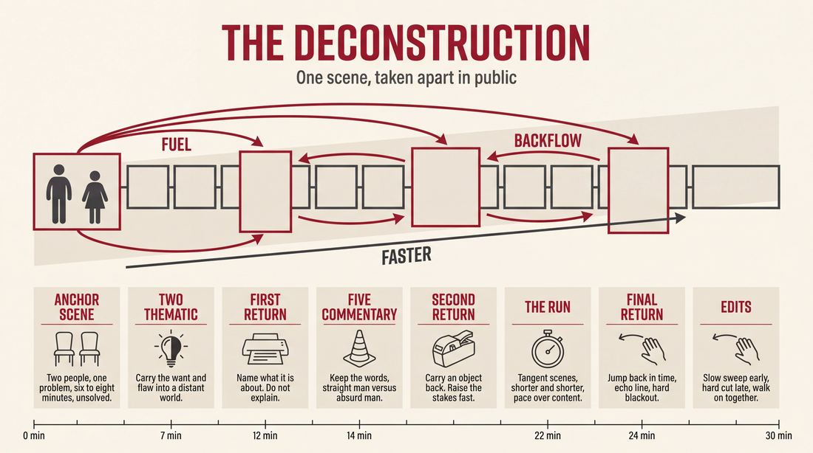
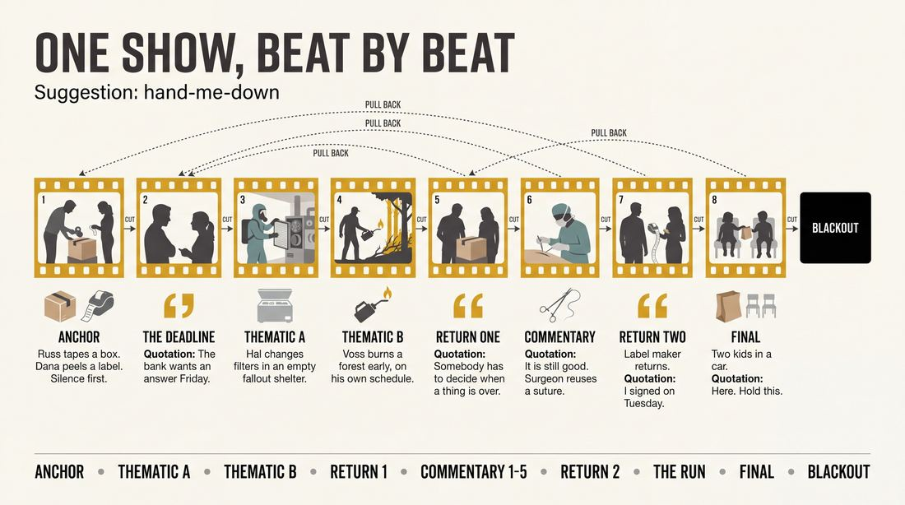
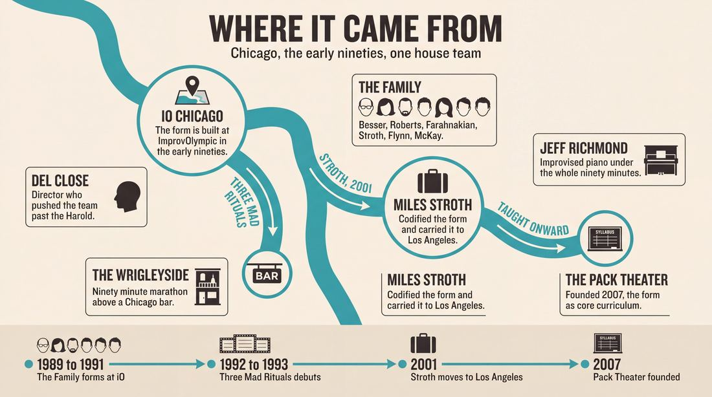
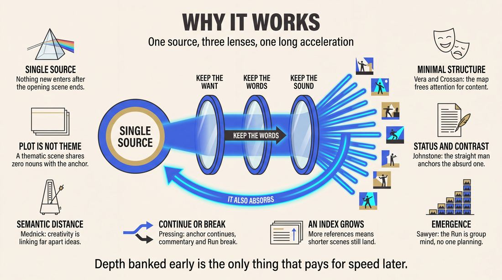
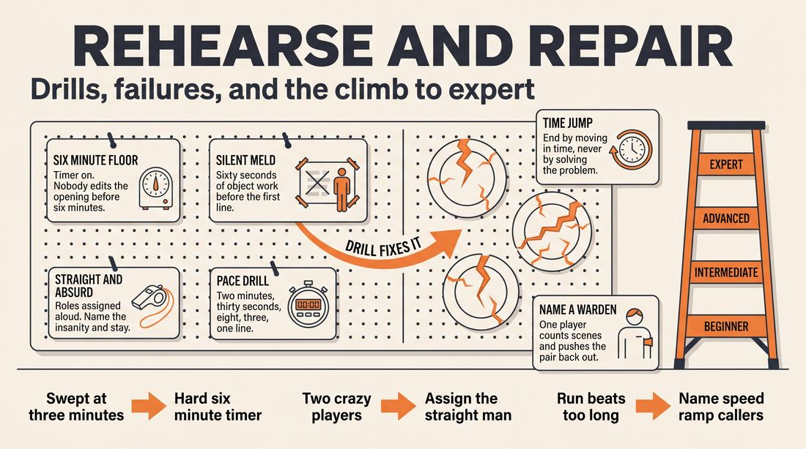

# Deconstruction

> **A complete study of the long-form improv format _Deconstruction_** - the original archived write-up, five infographics, grounded historical and pedagogical research, and a full mechanics-and-coaching manual.

| | |
|---|---|
| **Format** | Deconstruction |
| **Primary source** | [IRC Improv Wiki](https://wiki.improvresourcecenter.com/index.php?title=Deconstruction) |

---

## Contents

1. [Part I - The Original Write-Up](#part-i-the-original-write-up)
2. [Part II - The Infographics](#part-ii-the-infographics)
   - [1. Structure and Mechanics](#infographic-1-mechanics)
   - [2. A Show, Beat by Beat](#infographic-2-example)
   - [3. Origins and Lineage](#infographic-3-history)
   - [4. Why It Works](#infographic-4-theory)
   - [5. Rehearsal and Repair](#infographic-5-coaching)
3. [Part III - Research Dossier](#part-iii-research-dossier)
   - [Pass 1: History, Lineage, Literature and Scholarship](#research-history)
   - [Pass 2: Comparative Anatomy, Pedagogy and Production](#research-comparative)
4. [Part IV - Mechanics, Gameplay and Coaching Manual](#part-iv-mechanics-gameplay-and-coaching-manual)
   - [Pass 1: The Form, Its Mechanics and Its Gameplay](#manual-mechanics)
   - [Pass 2: Training, Coaching and Performance Companion](#manual-coaching)

---

## Part I - The Original Write-Up

*Verbatim archive of the source article, reproduced exactly as scraped. Everything after this section is generated elaboration built on top of it.*

### Deconstruction

The Deconstruction is a long form structure developed by [Del Close](https://wiki.improvresourcecenter.com/index.php?title=Del_Close "Del Close") and [The Family](https://wiki.improvresourcecenter.com/index.php?title=The_Family "The Family").

##### Structure

OPENING SCENE: A long (6\-8min) two person scene that is all about providing information that will be used in the rest of the piece. This scene is all about relationship and exploring the problem that is presented (but not solved) in this opening scene.

TWO (2\) THEMATIC SCENES (2\-3mins): Each THEMATIC SCENE is dedicated to exploring what the opening scene was ABOUT by taking what one of the Opening Scene's characters did and exploring their WANTS/FLAWS (this is where you explore what, as [Miles Stroth](https://wiki.improvresourcecenter.com/index.php?title=Miles_Stroth "Miles Stroth") describes, "is it about that character that will ultimately lead them to live the rest of their life unhappy?”). Example: The opening scene was about a married couple on the edge of divorce. They’re disagreeing about their future; one of them wants to sell their possessions and travel the world,while the other is ready to settle down and have a family. The first thematic scene could be about someone else who desires freedom (i.e. two prisoners willing to risk their lives by escaping Alcatraz), and the second thematic scene could be about someone else who wants to stay put or invest in the future (i.e. Greenpeace activists who have chained themselves to a redwood).

RETURN TO THE OPENING SCENE (1 1/2\-2mins): After seeing how others perceived the characters of the opening scene, the Opening Scene (and the improvisers who played them) return and expand on that idea. This is the time to clarify/solidify what the rest of the piece is ABOUT. This is where you will discover if the show is going to be about a larger THEME (i.e. Freedom, War, Racism, etc.)

FIVE (5\) COMMENTARY SCENES (1 1/2\-2mins long): These scenes are to COMMENT on, in Miles' words, “what was fucked up about what those two people said in the Opening Scene?" These scenes are extremely game heavy and should focus on "bits" \- straight man vs. absurd man. The easiest way to go about this is what Miles calls the "doctor/priest/president" phenomenon. 

If the OPENING SCENE was about the aforementioned couple arguing about the way their future is going to unfold, the thematic scenes might have dealt with the Theme of “freedom.” If, in the opening, the first character mentioned that he wanted to sell his Chevy Silverado to buy first\-class tickets to India, a COMMENTARY SCENE could deal with mapping the idea of “someone who would give something up in order to get another thing” in an absurd way (i.e. a person who sells both of their kidneys in order to buy alcohol for a party).

RETURN TO THE OPENING SCENE AGAIN (1 \- 1 1/2 min): This is a quick return to the opening scene and the characters in it as a way to HEIGHTEN the stakes brought up by the Commentary scenes. In our example, perhaps the second character turns down a drink which leads her to reveal that she “might already be pregnant, Tom.” This would be a direct "pull" from the commentary scene where the man is trying to buy alcohol (while also heightening the base). This scene is technically the first scene of "THE RUN".

THE RUN: The run is an intense series of ever\-shorter scenes. In THE RUN, pace is as important, if not more important, than content. Anything goes in this portion of the Deconstruction. In our above example, “Chevy Silverado“ is a TANGENT. Tangents are any trigger words from earlier scenes that made you think of something and therefore belong in the Run. They can be story arcs from the Commentary scenes, complete nonsense, it doesn't matter! As long as you consistently pick up the pace until you reach a breakneck pace it will work. Even if two players get out on stage and have nothing, someone will edit it FAST and those two can return again and look blankly at each other later in the Run and it will be funny. It will become what Miles calls "a runner". When you can't go any faster…

OPENING SCENE RETURNS/FINAL: The Opening Scene returns to wrap up the show for about 1 1/2 \- 2mins. A surefire way to get a response/ending for your piece is to go back in time. If the first scene was about the couple deciding what they’d be doing with their future, here we could go back in time to the couple's third date: they’re enamored with one another, and the first character is talking about how much he wants to travel the world. Taking his hand, the second character leans in, kisses him, and says, “that sounds like exactly what I need, Tom. Whenever you’re ready to go… I’ll be right next to you with my suitcase.” This will register with the audience because they understand the juxtaposition between these characters’ expectation for their lives and where they currently are.

##### Videos

- [Happy Time Rainbow Bunny Squad at IO West](http://vimeo.com/7634619)
- [Happy Time Rainbow Bunny Squad at IO West](http://vimeo.com/7635505)
- [The Deconstruction at IO West by English Speaking Moose \#1](http://vimeo.com/10318781)
- [The Deconstruction at IO West by English Speaking Moose \#2](http://vimeo.com/10146569)
- [The Deconstruction at IO West by English Speaking Moose \#3](http://vimeo.com/9949008)
- [Gravid Water Deconstruction at iO Chicago by Keystone Improv](https://www.youtube.com/watch?v=Nb-Yyno8OsU&t=5s)
- [Oops! All Runs Deconstruction at iO Chicago by Keystone Improv](https://www.youtube.com/watch?v=pjzGFJ426hU)
- [Cryclips Deconstruction at iO Chicago by Keystone Improv](https://www.youtube.com/watch?v=zqit23DVwvQ)
- [Reverse Deconstruction at iO Chicago by Keystone Improv](https://www.youtube.com/watch?v=XbDifk0e_gI)
- [d9 Deconstruction at iO Chicago by Keystone Improv](https://www.youtube.com/watch?v=0iSrJIrrDjc&t=6s)
- [Deconstruction at iO Chicago by Keystone Improv](https://youtu.be/ReoBxFot5qg?si=NGtHYx34wDIUXeje)

##### References

Description adapted from a [post](https://improvresourcecenter.com/forums/index.php?threads/the-deconstruction.36683/) on the improv resource center forums.

---

*Archived from [https://wiki.improvresourcecenter.com/index.php?title=Deconstruction](https://wiki.improvresourcecenter.com/index.php?title=Deconstruction) (IRC Improv Wiki) on 2026-08-09 23:23 UTC.*

---

## Part II - The Infographics

*Five 16:9 posters, each teaching a different aspect of the format. Click any poster to enlarge.*

<a id="infographic-1-mechanics"></a>

### 1. Structure and Mechanics

*How the form is played: the shape of the piece, the opening, the roles, the edit vocabulary, the flow of information, and the clock.*

{ .diagram loading=lazy decoding=async width="1100" height="614" }


<a id="infographic-2-example"></a>

### 2. A Show, Beat by Beat

*A single worked performance from suggestion to blackout: what happens in each beat, with short real example lines and what the players are doing technically.*

{ .diagram loading=lazy decoding=async width="1100" height="614" }


<a id="infographic-3-history"></a>

### 3. Origins and Lineage

*Where the form came from: creators, dates, theatres, how it spread between schools and cities, and the key figures - a documented timeline and lineage map.*

{ .diagram loading=lazy decoding=async width="1100" height="614" }


<a id="infographic-4-theory"></a>

### 4. Why It Works

*The theory: the core principles of the form and the research and craft ideas that explain why the structure produces good improv, each tied to a specific mechanic.*

{ .diagram loading=lazy decoding=async width="1100" height="614" }


<a id="infographic-5-coaching"></a>

### 5. Rehearsal and Repair

*Training and fixing the form: the essential drills, the common failure modes with their symptom-and-fix pairs, and the markers of beginner through expert play.*

{ .diagram loading=lazy decoding=async width="1100" height="614" }


---

## Part III - Research Dossier

*Two research passes: the historical record, then the comparative and pedagogical record. Claims carry evidence tags - treat unverified items accordingly.*

<a id="research-history"></a>

### » Pass 1: History, Lineage, Literature and Scholarship

### Research Summary

*   **Documentation Status:** The Deconstruction is well-documented in practitioner wikis, theater syllabi, and oral histories (podcasts, blogs), but is virtually absent from peer-reviewed academic theatre literature. It survives primarily as a pedagogical "mother sauce" passed down through specific lineages.
*   The form was created in the early 1990s at ImprovOlympic (iO) in Chicago by director Del Close and the legendary house team "The Family."
*   It was designed to solve a specific structural problem: breaking away from the rigid three-beat structure of the Harold to explore how many different ways an ensemble could be inspired by a single, grounded base scene.
*   The format is highly structured, moving from a long, dramatic base scene into thematic explorations, comedic commentary, and a rapid-fire associative "Run," before returning to the base scene for closure.
*   While The Family's alumni (Matt Besser, Ian Roberts) went on to found the Upright Citizens Brigade (UCB) and popularized the Harold, the Deconstruction was primarily kept alive and codified by Miles Stroth, who made it the foundational curriculum of The Pack Theater in Los Angeles.
*   The form is widely considered an advanced technique; it forces improvisers to differentiate between *plot* (what happens) and *theme* (what it is about), a notoriously difficult cognitive leap for novice performers.
*   The searchable record is robust regarding the form's mechanics and rules, but thin regarding the exact dates of its inception and the specific individual contributions of The Family's members.

### Provenance and History

The Deconstruction was developed in the early 1990s (circa 1992–1993) at ImprovOlympic (iO) in Chicago. Under the direction of improv guru Del Close, the iO house team "The Family" (Matt Besser, Ian Roberts, Ali Farahnakian, Miles Stroth, Neil Flynn, and Adam McKay) began experimenting with new ways to generate material. [DOCUMENTED] 

The problem they were solving was the predictability of the Harold. Del Close wanted to push the boundaries of long-form by asking: how many different ways can performers be inspired by a single scene? [DOCUMENTED] The Deconstruction was born as a way to extract every possible permutation of scene approach—thematic, comedic, and surreal—from one grounded reality. 

The name "Deconstruction" is literal: the ensemble takes a single, long opening scene and systematically deconstructs it. They isolate the characters' flaws, the underlying themes, and the absurdities of the dialogue, mapping them onto entirely new characters and situations in subsequent scenes. [DOCUMENTED]

The form debuted as part of a legendary 90-minute marathon show called *Three Mad Rituals*, performed upstairs at a Chicago bar called The Wrigleyside (later Abner's Yard). The show consisted of The Deconstruction, The Movie, and The Harold, all performed back-to-back off a single suggestion. [DOCUMENTED]

| Year | Event | Place / Company | Source |
| :--- | :--- | :--- | :--- |
| 1989–1991 | "The Family" forms and becomes the house team at iO. | ImprovOlympic, Chicago | [IRC Wiki](https://wiki.improvresourcecenter.com/index.php?title=The_Family) |
| c. 1992–1993 | *Three Mad Rituals* debuts, premiering The Deconstruction. | The Wrigleyside, Chicago | [IRC Forums](https://www.improvresourcecenter.com/forums/index.php?threads/the-deconstruction.36683/) |
| 2001 | Miles Stroth moves to Los Angeles, bringing the form to iO West. | iO West, Los Angeles | [VoyageLA](http://voyagela.com/interview/meet-miles-stroth-pack-theater-hollywood/) |
| 2007 | Miles Stroth Workshop (later The Pack Theater) is founded, centering the Deconstruction in its curriculum. | Los Angeles | [VoyageLA](http://voyagela.com/interview/meet-miles-stroth-pack-theater-hollywood/) |

### Lineage and Transmission

The Deconstruction has a highly specific geographic and pedagogical lineage. While the Harold spread globally via UCB and iO, the Deconstruction traveled a narrower path. 

When Matt Besser and Ian Roberts moved to New York to found UCB, they focused their curriculum on the Harold and the Armando (ASSSSCAT). The Deconstruction was left in the hands of Miles Stroth, who moved to Los Angeles in 2001. Stroth taught the form at iO West and eventually founded the Miles Stroth Workshop (now The Pack Theater), where the Deconstruction became the "mother sauce" of the curriculum. [DOCUMENTED]

**Regional Dialects and Carriers:**
*   **The Pack Theater Dialect (Los Angeles):** Taught by Miles Stroth and Brian James O'Connell. This is the most codified version of the form, treating it as a rigorous, almost mathematical exercise in thematic mapping and game extraction. [DOCUMENTED]
*   **The Second City Dialect (Chicago):** Taught by David Montgomery (who learned it from Rush Howell of iO's Super Dreamers). Here, it is used as an advanced training tool for improvisers to learn group mind and pattern recreation, rather than a primary performance format. [DOCUMENTED]
*   **The Leela Dialect (San Francisco):** Taught by Christopher DeJong, focusing on the form as a "tool box" for exploring performance pace, style, and narrative arc. [DOCUMENTED]

### Key Figures

| Person | Role in this form | Specific contribution | Source URL |
| :--- | :--- | :--- | :--- |
| **Del Close** | Director / Guru | Directed The Family; pushed the ensemble to break the Harold and invent the Deconstruction. | [Wikipedia](https://en.wikipedia.org/wiki/Del_Close) |
| **Miles Stroth** | Co-Creator / Teacher | Codified the form's mechanics; made it the foundational curriculum of The Pack Theater in LA. | [VoyageLA](http://voyagela.com/interview/meet-miles-stroth-pack-theater-hollywood/) |
| **The Family** | Co-Creators | The iO house team (Besser, Roberts, Flynn, McKay, Farahnakian, Stroth) that collectively invented and perfected the format. | [IRC Wiki](https://wiki.improvresourcecenter.com/index.php?title=The_Family) |
| **Brian James O'Connell** | Evangelist / Teacher | Pack Theater co-founder who tours globally teaching the Deconstruction as the "single most important long form ever created." | [Highwire Improv](https://www.highwireimprov.com/boc-tour/) |
| **Craig Cackowski** | Historian / Performer | iO veteran whose forum posts provide the primary historical record of *Three Mad Rituals*. | [IRC Forums](https://www.improvresourcecenter.com/forums/index.php?threads/the-deconstruction.36683/) |

### Canonical Shows, Companies and Recordings

*   ***Three Mad Rituals*** (Early 1990s): The Family's legendary 90-minute marathon at The Wrigleyside in Chicago. [DOCUMENTED]
*   ***English Speaking Moose*** (Late 2000s): A legendary iO West team that regularly performed the Deconstruction. [Video Record](http://vimeo.com/10318781)
*   ***Harpoon*** (2018–Present): An independent Chicago team performing the Deconstruction at The Annoyance and Bughouse Theater. [The Annoyance](https://www.theannoyance.com/events/harpoon)
*   ***Craigslist Playdate*** (2010s): A Chicago troupe composed of former Second City students specifically trained in the Deconstruction by David Montgomery. [Second City](https://www.secondcity.com/classes/chicago/the-deconstruction-with-david-montgomery)
*   ***Keystone Improv*** (2020s): A contemporary iO Chicago team that performs the Deconstruction and its experimental variants. [Video Record](https://www.youtube.com/watch?v=Nb-Yyno8OsU)

### Published Literature

| Work | Author | Year | What it says about this form | Where to find it |
| :--- | :--- | :--- | :--- | :--- |
| *Upright Citizens Brigade Comedy Improvisation Manual* | Matt Besser, Ian Roberts, Matt Walsh | 2013 | Briefly acknowledges the Deconstruction as a form inspired by the Harold, developed during The Family era. | [UCB Store](https://ucbstore.com/) |
| *The Deconstruction* (Wiki Entry) | IRC Community | 2008 | The most comprehensive structural breakdown of the form's mechanics (Base, Thematic, Commentary, Run). | [IRC Wiki](https://wiki.improvresourcecenter.com/index.php?title=Deconstruction) |
| *An Introduction To The Four Scene Types* | Miles Stroth | 2015 | Breaks down the pedagogical theory behind the scene types used in the Deconstruction. | [Pack Theater Blog (Archived)](https://peopleandchairs.com/2015/12/03/read-all-about-it-the-improv-blog-round-up/) |

### Verbatim Quotes

> "What is it about that character that will ultimately lead them to live the rest of their life unhappy?"
> — **Miles Stroth**, explaining the goal of the Thematic Scenes.
> [Source: IRC Wiki](https://wiki.improvresourcecenter.com/index.php?title=Deconstruction)

> "What was fucked up about what those two people said in the Opening Scene?"
> — **Miles Stroth**, explaining the goal of the Commentary Scenes.
> [Source: IRC Wiki](https://wiki.improvresourcecenter.com/index.php?title=Deconstruction)

> "Created by The Family, and under the direction of Del Close himself, The Deconstruction is the single most important long form ever created as it contains every single possible permutation of scene approach and thematic development."
> — **Brian James O'Connell**, Pack Theater Co-Founder.
> [Source: ImprovCon](https://improvcon.com/workshops/the-deconstruction/)

> "We changed the way long-form was seen, broke the Harold – the signature form Del created with Charna Halpern – and invented new forms like the Deconstruction that continue to play at theatres around the world."
> — **Miles Stroth**, on the legacy of The Family.
> [Source: VoyageLA](http://voyagela.com/interview/meet-miles-stroth-pack-theater-hollywood/)

> "The Deconstruction and The Movie had been kicking around Dels classes for a while but The Family perfected them into the forms we know (or dont know) today."
> — **Craig Cackowski**, iO Chicago veteran.
> [Source: IRC Forums](https://www.improvresourcecenter.com/forums/index.php?threads/the-deconstruction.36683/)

> "As Jazz Freddy was slow, The Family was fast."
> — **Anonymous iO Historian**, on the pacing that defined The Family and the Deconstruction's "Run".
> [Source: IRC Wiki](https://wiki.improvresourcecenter.com/index.php?title=The_Family)

> "The Deconstruction format leads improvisors to explore concepts, performance pace and style, and narrative arc, all in the space of a single performance. It builds a tool box useful for any long form performance."
> — **Christopher DeJong**, Leela Improv Instructor.
> [Source: Leela SF](https://leela-sf.com/improv-5c/)

> "An improviser's comprehension of the 'work' will never be the same after being exposed to 'Decon'; whether you perform short form, improvised Shakespeare or are merely a writer looking to improve character & structure, learning these skills will radically improve and raise your level of play."
> — **Brian James O'Connell**, Pack Theater Co-Founder.
> [Source: ImprovCon](https://improvcon.com/workshops/the-deconstruction/)

### Anecdotes and Stories

**The Marathon of Three Mad Rituals**
In the early 1990s, long-form improv was still an underground phenomenon performed mostly for other improvisers. The Family performed *Three Mad Rituals* upstairs at a Chicago bar called The Wrigleyside. Del Close would ask the audience for a single line of poetry. From that one suggestion, The Family would perform The Deconstruction, The Movie, and The Harold back-to-back, totaling 90 minutes of unbroken improvisation. The only transition was the lights fading to black and immediately coming back up. To add to the spectacle, future *30 Rock* composer Jeff Richmond improvised a full, cinematic piano score for the entire 90 minutes. [DOCUMENTED]

**Miles Stroth's Leg Braces**
Miles Stroth, the man who would eventually codify and champion the Deconstruction, almost didn't have an improv career. Shortly after taking his first class in 1987, he was the victim of a hit-and-run accident that shattered both of his shins. He was laid up for a year, but his dedication to the craft was so intense that he auditioned for the Second City Training Center while still wearing heavy protective leg braces. He passed, eventually making his way to iO to study under Del Close and join The Family. [DOCUMENTED]

### Academic and Scientific Research

While the Deconstruction itself is not named in cognitive science literature, the specific mechanics it demands map perfectly onto established psychological and neuroscientific models of creativity.

**Associative Reach and Semantic Distance**
Sarnoff Mednick’s associative hierarchy theory demonstrates that creative output correlates with the ability to forge links across wide semantic distances. [DOCUMENTED]
*Relevance to this form:* The "Thematic Scenes" of the Deconstruction require improvisers to perform extreme semantic stretching. If the base scene is about a failing marriage, the improviser must extract the abstract theme (e.g., "feeling trapped") and map it to a semantically distant reality (e.g., prisoners escaping Alcatraz). 

**Mnemonic Improvisation and Stigmergic Notes**
Cognitive biology proposes that memory recall is an active rebuilding process where past information is remapped onto new contexts to maintain salience. [DOCUMENTED]
*Relevance to this form:* During "The Run," improvisers rely on "Tangents"—trigger words or micro-details from the base scene. They do not simply repeat the detail; they actively remap it into a barrage of rapid-fire, disconnected scenes, using the original detail as a stigmergic anchor to maintain group cohesion at breakneck speeds.

**The LIDA Cognitive Architecture (Pressing's Model)**
Jeff Pressing’s cognitive model of improvisation suggests that improvisers execute real-time plans to either continue current events via association or break them via interruption. [DOCUMENTED]
*Relevance to this form:* The Deconstruction is a structural manifestation of this model. The Base Scene is the "continue" phase (slow, grounded, associative), while the Commentary Scenes and The Run are the "break" phases (interruptive, absurd, rapid-fire).

### Documented Variants and Descendants

*   **The Monologue Deconstruction (The Armando):** Created by Armando Diaz at iO. Instead of a 6-8 minute improvised base scene, a guest monologist tells a true story. The improvisers then deconstruct the monologue, extracting themes and tangents for their scenes. [DOCUMENTED]
*   **Reverse Deconstruction:** An experimental variant performed by Keystone Improv at iO Chicago, presumably inverting the structural pacing (starting with a chaotic Run and coalescing into a single, grounded base scene). [DOCUMENTED]
*   **Oops! All Runs Deconstruction:** Another Keystone Improv variant that abandons the slow, thematic mapping entirely in favor of sustaining the breakneck, associative pacing of "The Run" for the duration of the piece. [DOCUMENTED]

### Criticism, Debate and Known Failure Modes

**Failure Mode: Plot vs. Theme**
The most common failure mode in the Deconstruction is the inability of novice improvisers to differentiate between plot and theme. During the "Thematic Scenes," inexperienced players will often just initiate a scene about the *same characters* or the *same location* as the base scene, rather than extracting the abstract emotional core. Teachers warn that this turns the Deconstruction into a standard narrative play, defeating the purpose of the form. [WIDELY PRACTICED, UNDOCUMENTED]

**Debate: Structural Rigidity**
The Deconstruction is the most strictly constructed of all long-form structures. It dictates exact scene types, exact timings (e.g., "Two thematic scenes, 2-3 mins each"), and an exact sequence. Critics argue that this represents an "arbitrary set of house rules" that can make the performance feel like a math equation. As one practitioner noted, "One may feel that performing this structure can only result in it being done wrong." [DOCUMENTED]

**Failure Mode: The Run Fizzles**
In "The Run," pace is more important than content. If the ensemble hesitates, tries to build narrative, or fails to accelerate the edits to a breakneck speed, the energy of the piece dies before the final return to the base scene. [DOCUMENTED]

### Cultural Footprint

The Deconstruction is the "mother sauce" of thematic long-form improvisation. While the Harold taught improvisers how to weave three separate storylines together, the Deconstruction taught them how to mine a single reality for infinite comedic premises. 

Its cultural footprint is largely carried by its alumni. The Family included Adam McKay (Oscar-winning director of *The Big Short* and *Succession*), Neil Flynn (*Scrubs*), and Matt Besser and Ian Roberts (founders of the Upright Citizens Brigade). The rapid-fire editing, "game of the scene" focus, and thematic mapping developed during the Deconstruction directly informed the UCB training manual and the comedic pacing of modern American sketch television. [INFERRED]

### Gaps in the Record

*   **Exact Premiere Date:** The searchable record universally cites "the early 90s" for the debut of *Three Mad Rituals* and the Deconstruction, but no primary source provides a specific month or year.
*   **Individual Contributions:** The form is credited jointly to "Del Close and The Family." It is historically unclear which specific mechanics (e.g., who invented the "Commentary" scene vs. who invented "The Run") belong to which performer, as the group-mind ethos of iO discouraged individual credit.
*   **Academic Erasure:** Despite being a foundational pedagogical tool in Los Angeles and Chicago, the Deconstruction is entirely absent from peer-reviewed performance studies literature, existing strictly in oral tradition, forum archives, and theater syllabi.

### Source List

1. *The Deconstruction* - IRC Improv Wiki - 2023 - [URL](https://wiki.improvresourcecenter.com/index.php?title=Deconstruction) - Supports the structural breakdown and Miles Stroth quotes.
2. *The Family* - IRC Improv Wiki - 2024 - [URL](https://wiki.improvresourcecenter.com/index.php?title=The_Family) - Supports the cast list and the quote regarding The Family's fast pacing.
3. *Meet Miles Stroth* - VoyageLA - 2019 - [URL](http://voyagela.com/interview/meet-miles-stroth-pack-theater-hollywood/) - Supports Stroth's history, the hit-and-run anecdote, and the founding of The Pack Theater.
4. *The Deconstruction* - ImprovCon / Brian James O'Connell - 2026 - [URL](https://improvcon.com/workshops/the-deconstruction/) - Supports BOC's quotes and the form's status as a "mother sauce."
5. *Three Mad Rituals Thread* - IRC Forums (Craig Cackowski) - 2014 - [URL](https://www.improvresourcecenter.com/forums/index.php?threads/the-deconstruction.36683/) - Supports the history of the 90-minute marathon and Jeff Richmond's piano accompaniment.
6. *The Deconstruction with David Montgomery* - The Second City - 2024 - [URL](https://www.secondcity.com/classes/chicago/the-deconstruction-with-david-montgomery) - Supports the form's transmission to Second City and the existence of Craigslist Playdate.
7. *Improv 5c: Form and Structures* - Leela Improv (Christopher DeJong) - 2026 - [URL](https://leela-sf.com/improv-5c/) - Supports the form's presence in San Francisco and DeJong's quote.
8. *Harpoon* - The Annoyance Theatre - 2024 - [URL](https://www.theannoyance.com/events/harpoon) - Supports the contemporary performance of the form in Chicago.
9. *Deconstruction* - LearnImprov - 2019 - [URL](https://learnimprov.com/deconstruction/) - Supports the criticism regarding the form's rigid "house rules."
10. *Monologue Deconstruction* - IRC Improv Wiki - 2024 - [URL](https://wiki.improvresourcecenter.com/index.php?title=Monologue_Deconstruction) - Supports the Armando variant.
11. *The gradual shortening of associative reach* - Medium (Cognitive Science) - 2025 - [URL](https://medium.com/) - Supports the psychological concept of semantic distance applied to Thematic Scenes.
12. *Musical Improvisation in LIDA* - Frontiers in Psychology - 2022 - [URL](https://www.ncbi.nlm.nih.gov/pmc/articles/PMC9354789/) - Supports Pressing's cognitive model of improvisation applied to The Run.
13. *Mnemonic Improvisation* - ThoughtForms - 2024 - [URL](https://thoughtforms.life/) - Supports the cognitive biology of remapping information applied to Tangents.
14. *Del Close* - Wikipedia - 2024 - [URL](https://en.wikipedia.org/wiki/Del_Close) - Supports Del Close's role as director and guru.

<a id="research-comparative"></a>

### » Pass 2: Comparative Anatomy, Pedagogy and Production

### Taxonomic Placement

```text
  The Harold (Thematic exploration)    Two-Person Scene (Relationship focus)
                  \                      /
                   \                    /
                    \                  /
                     The Deconstruction
                    /                  \
                   /                    \
         The Spokane (Single scene)   The Slacker (Pacing/Tangents)
```

The Deconstruction sits at the intersection of patient, grounded relationship play and high-speed thematic exploration. Where the Harold uses three distinct storylines that eventually weave together, the Deconstruction uses a single "anchor" scene to generate all subsequent material. It isolates the two primary ways improvisers pull information from a scene—exploring the *flaws and wants* of the characters (thematic) versus heightening the *absurdity* of the world (commentary)—and structurally separates them. This makes it a bridge between the slow, realistic two-person scene and the fast-paced, game-heavy montage, culminating in a structural acceleration ("The Run") that forces collaborative emergence.

### Head-to-Head Comparisons

#### The Deconstruction vs. The Harold
| Axis | The Deconstruction | The Harold | Consequence for the players |
| :--- | :--- | :--- | :--- |
| **Opening** | A single 6-8 minute grounded, realistic two-person scene. | A group game, monologue, or pattern-based opening. | Deconstruction players must sustain a single reality for much longer before the form "opens up." |
| **Structure** | Linear acceleration: slow anchor scene $\rightarrow$ thematic scenes $\rightarrow$ commentary scenes $\rightarrow$ rapid-fire run. | Cyclical: 3 beats of 3 distinct scenes, separated by group games. | Deconstruction players manage pacing as a continuous escalation rather than a repeating rhythm. |
| **Edit Logic** | Dictated by the specific phase of the form (e.g., thematic pulls vs. commentary pulls). | Dictated by the beat structure and finding the "next step" for three separate worlds. | Deconstruction requires players to consciously switch their analytical brains between "what is the theme?" and "what is the game?" |

#### The Deconstruction vs. The Monoscene
| Axis | The Deconstruction | The Monoscene | Consequence for the players |
| :--- | :--- | :--- | :--- |
| **Cast Size** | 6-8 players, allowing for rapid edits and multiple new characters. | Usually the entire cast on stage or entering/exiting a single location. | Deconstruction players spend significant time on the backline analyzing the anchor scene. |
| **Memory** | Players must remember specific lines, wants, and flaws from the first 8 minutes to use 20 minutes later. | Players must remember the physical space, established relationships, and real-time plot. | Deconstruction relies on thematic memory; Monoscene relies on spatial and narrative memory. |
| **Failure Mode** | "Bailing on the opening" (editing the anchor scene too early because it lacks laughs). | "Talking heads" (standing in a semi-circle doing nothing but talking). | Deconstruction requires trust that the opening doesn't need to be a comedy powerhouse. |

#### The Deconstruction vs. Armando (Monologue Deconstruction)
| Axis | The Deconstruction | Armando | Consequence for the players |
| :--- | :--- | :--- | :--- |
| **Source Material** | An improvised, grounded two-person scene. | A true, personal monologue from a cast member or guest. | Deconstruction players must generate the source material collaboratively, risking a weak foundation. |
| **Audience Contract** | "Watch us dissect the psychology and absurdity of these two fictional people." | "Watch us map the themes of this true story onto fictional worlds." | Deconstruction audiences invest in the anchor characters; Armando audiences invest in the monologist. |
| **Structure** | Highly rigid sequence of scene types (Thematic $\rightarrow$ Commentary $\rightarrow$ Run). | Loose montage of scenes inspired by the monologue, returning to the monologist as needed. | Deconstruction players must track where they are in the structural map at all times. |

### What Makes It Uniquely Itself

1. **The Anchor Scene**: A single, continuous relationship scene that grounds the entire piece. Unlike a montage where scenes are disposable, the opening scene of a Deconstruction is the DNA for the entire show. The original characters return periodically to update the audience on their reality, acting as a structural spine. If removed, the form is simply a montage.
2. **Structural Acceleration**: The form is deliberately engineered to increase in speed. It begins with a 6-8 minute scene, moves to 2-3 minute scenes, then 1.5-minute scenes, and finally "The Run," where scenes might last only seconds. If removed, the form loses its chaotic, flow-state climax.
3. **Separation of Thematic and Commentary Pulls**: The form explicitly divides scenes that explore character wants/flaws (thematic) from scenes that mock or heighten the absurdity of the world/statements (commentary). If removed, the players lose the specific analytical lens that defines the middle of the form, turning it into a generic premise-pulling exercise.

### Structural Variants in Practice

| Variant | What it changes | Who plays it / Source |
| :--- | :--- | :--- |
| **The Original / iO Style** | Strict adherence to the sequence: Opening (6-8m) $\rightarrow$ 2 Thematic $\rightarrow$ Return $\rightarrow$ 5 Commentary $\rightarrow$ Return $\rightarrow$ The Run $\rightarrow$ Final Return. | Del Close, The Family, iO Chicago, Kevin Mullaney. |
| **The Pack Theater Method** | Heavy emphasis on "Four Scene Types" and strict Straight/Absurd dynamics during the commentary phase. Focuses on position play. | Miles Stroth, Brian O'Connell, The Pack Theater (LA). |
| **The Hoopla "Highlights Tour"** | Blends emotional realism with satirical/social commentary. Uses the form as a pedagogical tool to teach different improv genres within one show. | Chris Mead, Hoopla Impro (UK). |
| **The Second City / Thematic Pattern** | Focuses heavily on thematic exploration, group mind, and recreating patterns rather than strict structural timing. | David Montgomery, Craigslist Playdate (Chicago). |

### The Teaching Ladder

| Stage | Skill introduced | Why in this order | Typical exercise | Source or [CRAFT CONSENSUS] |
| :--- | :--- | :--- | :--- | :--- |
| 1 | **The Grounded Anchor** | Players must learn to sustain a reality without relying on jokes before they can deconstruct it. | *Silent Activity Melding*: Build a physical reality for 2 minutes before speaking. | Kevin Mullaney / IRC |
| 2 | **Thematic Pulls** | Teaches players to identify the core human *want* or *flaw* rather than just the plot. | *Want Mapping*: Watch a scene, identify the want, initiate a new scene with different characters but the exact same want. | [CRAFT CONSENSUS] |
| 3 | **Commentary Pulls** | Introduces game-heavy, premise-based play once the thematic foundation is laid. | *Doctor/Priest/President*: Map an absurd premise from the opening onto a high-status archetype. | Miles Stroth |
| 4 | **The Run** | Teaches pacing, rapid editing, and trusting tangents without overthinking. | *Pace Drill*: Edit scenes faster and faster until they are only one line long. | [CRAFT CONSENSUS] |
| 5 | **The Wrap-Up** | Teaches synthesis and how to provide emotional closure to the anchor characters. | *Time Jump*: End a scene by explicitly jumping backward to a first date or forward 10 years. | [CRAFT CONSENSUS] |

### Documented Drills and Exercises

| Drill | Origin / Teacher | How to run it | What it fixes in this form | Source |
| :--- | :--- | :--- | :--- | :--- |
| **Mullaney's Opening Drill** | Kevin Mullaney | Two players start separate physical activities. One initiates a non-sequitur. The other responds with a non-sequitur. This continues until the two realities meld into one grounded scene. | Fixes rushed openings and forces players to establish physical reality before plot. | IRC Forums |
| **Doctor/Priest/President** | Miles Stroth | Take a mundane but slightly flawed logic from a scene and map it onto a high-stakes profession (a doctor, priest, or president) to heighten the absurdity. | Fixes weak commentary scenes by providing an immediate, high-contrast context for the game. | Miles Stroth / IRC |
| **Straight/Absurd Drill** | Brian O'Connell | One player is assigned the "Straight" role (justifying the relationship, attacking the absurdity), the other is "Absurd" (heightening the weirdness). | Fixes muddy commentary scenes where both players are crazy, destroying the game. | Pack Theater / Reddit |
| **Uncomfortable Topics** | Emily (Pack Theater) | Players are forced to initiate and play scenes dealing with highly controversial or uncomfortable topics safely and grounded. | Prepares players for when the 8-minute anchor scene accidentally wanders into dark territory. | Pack Theater / Reddit |
| **Three-Beat Deconstruction** | Kevin Mullaney | Do an opening scene. Do 3 scenes based on it. Do 3 *more* scenes based on the *second* set of scenes, moving further away from the source. | Trains the brain to pull tangents and trust associative leaps for "The Run." | IRC Forums |
| **Thematic Pull Drill** | [CRAFT CONSENSUS] | Watch a 2-minute scene. The coach pauses and asks the backline: "What is the core flaw?" The backline must initiate a new scene exploring only that flaw. | Fixes "plotting" (doing the next chronological beat of the story instead of exploring the theme). | [CRAFT CONSENSUS] |
| **Tangent Word Association** | [CRAFT CONSENSUS] | A player says a single word from the previous scene. The next two players step out and do a scene entirely based on that word, ignoring the previous context. | Trains players to execute "The Run" without feeling tied to the anchor scene's narrative. | [CRAFT CONSENSUS] |
| **The Pace Drill** | [CRAFT CONSENSUS] | Run a montage where the coach calls out decreasing time limits: 2 minutes, 1 minute, 30 seconds, 10 seconds, 1 line. | Fixes the "Pacing Plateau" where The Run fails to accelerate. | [CRAFT CONSENSUS] |
| **Time Jump Wrap-up** | [CRAFT CONSENSUS] | Two players do a relationship scene. The coach yells "Wrap it up." The players must immediately initiate a scene in the past or future that recontextualizes the relationship. | Gives players a reliable tool to end the Deconstruction with emotional resonance. | [CRAFT CONSENSUS] |
| **Silent Activity Melding** | Kevin Mullaney | Players must engage in a detailed object-work activity for 60 seconds before the first line of dialogue is spoken. | Fixes "talking heads" in the anchor scene by forcing a physical environment. | IRC Forums |

### Common Failure Modes and Diagnoses

| Failure mode | What it looks like from the audience | Root cause | Fix | Who names it |
| :--- | :--- | :--- | :--- | :--- |
| **Bailing on the Opening** | The first scene is edited after 2 minutes because the backline panics that there are no laughs. | Fear of silence; treating the anchor scene like a standard comedy sketch rather than a foundation. | Coach enforces a strict 6-minute minimum timer on the opening scene during rehearsal. | [CRAFT CONSENSUS] |
| **Plotting instead of Thematic** | The second scene features the boss of the character from the first scene, continuing the narrative. | Inability to abstract. Players are thinking literally ("what happens next?") instead of thematically ("what does this mean?"). | Stop the scene. Ask the players to identify the *flaw*, then initiate with entirely new characters. | [CRAFT CONSENSUS] |
| **Muddy Commentary** | Two characters arguing about something absurd, but neither is grounded. The scene spins out of control. | Lack of position play. Both players are trying to be the "funny" one. | Assign strict Straight/Absurd roles before the scene starts. | Miles Stroth / Brian O'Connell |
| **Pacing Plateau** | "The Run" consists of three 2-minute scenes. The energy sags and the show feels long. | Players are trying to build full narratives in the final phase instead of trusting quick hits and blackouts. | Run the "Pace Drill." Teach the backline to edit on the first laugh or the first recognizable pattern. | [CRAFT CONSENSUS] |
| **Losing the Anchor** | The original two characters never return, and the show ends on a random tangent. | Poor backline memory; players get too distracted by the fun of the commentary scenes. | Assign a "Director" on the backline whose only job is to track the anchor characters and push them back out. | [CRAFT CONSENSUS] |

### Production and Logistics

*   **Cast Size**: 6 to 8 players. This is large enough to sustain the rapid-fire edits and multiple characters required in "The Run," but small enough that players can track the themes and share a unified group mind.
*   **Runtime**: 25 to 30 minutes. The opening scene takes up roughly a quarter of the show, requiring a longer runtime to allow the structural acceleration to breathe.
*   **Stage Layout**: Standard bare stage with two chairs. The chairs are crucial for the grounded opening scene to establish a physical reality.
*   **Lighting and Tech Cues**: Standard wash for the opening and middle. The tech booth must be highly attentive during "The Run" to execute rapid blackouts or cross-fades, and must be ready to hit the final blackout on the emotional climax of the final return scene.
*   **Music and Sound**: Pre-show and post-show music. Sound effects are rarely used, as the form relies heavily on dialogue and thematic mapping.
*   **MC and Host Duties**: The host must set expectations. Because the first 8 minutes might not be overtly comedic, the host should frame the show as an exploration or a journey.
*   **How the Suggestion is Taken**: Usually a single word, a relationship dynamic (e.g., "two people who share a secret"), or an honest piece of advice.
*   **Lineup Placement**: Best placed as the second act or the anchor of a show. It requires audience patience, making it a poor opener for a high-energy comedy night.
*   **Rehearsal Cadence**: Requires intensive drilling on *identifying themes* and *position play* (straight/absurd) before running full 30-minute sets.
*   **Producer Prep**: Producers must ensure the audience understands they are watching long-form. Marketing should highlight the theatrical, interconnected nature of the show.

### Adaptations Beyond the Stage

*   **Classroom and Youth**: The 6-8 minute opening scene is often too demanding for youth attention spans. The form is adapted by shortening the anchor scene to 3 minutes and focusing the thematic pulls on positive or neutral traits rather than deep psychological flaws.
*   **Corporate and Applied Improv**: Used to explore organizational themes. The anchor scene might depict a common workplace frustration (e.g., a communication breakdown). The thematic and commentary scenes then allow employees to safely abstract and mock the systemic issues without attacking real individuals.
*   **Online and Remote**: Adapted heavily during the pandemic (e.g., by Hoopla Impro). The "Run" is executed by rapidly turning cameras on and off. The anchor scene benefits from the intimacy of the camera, allowing for subtle, cinematic acting.
*   **Accessibility and Inclusion**: The heavy reliance on rapid verbal processing during "The Run" can be a barrier for neurodivergent players or non-native speakers. Adaptations include allowing physical/silent scenes during the run, or using a "conductor" to point to players rather than relying on aggressive walk-ons.
*   **Content-Safety and Consent**: Because the anchor scene is long and grounded, it can easily drift into trauma or triggering relationship dynamics. Teams must have robust "tap-out" or "edit" mechanics to protect players if the anchor scene becomes unsafe.

### Evidence Base for Those Adaptations

*   **Psychophysiological Reactivity**: Research by Seppänen et al. (2021, 2023) demonstrates that improvisation training mitigates acute social stress and enhances interpersonal confidence. Their studies show that regardless of the fictionality of the improvisational context, genuine emotions and experiences comparable to real-world contexts emerge, as measured through psychophysiological reactivity. This supports the use of the Deconstruction's grounded anchor scene as a valid tool for exploring real human dynamics in applied settings.
*   **Applied Improvisation in Business**: Dudeck and McClure (2018) outline how applied improvisation fosters the growth of flexible structures and new mindsets. The Deconstruction's requirement to abstract themes from a base reality directly trains the cognitive flexibility required in volatile organizational environments.

### Scholarly Frames Worth Applying

*   **Collaborative Emergence (R. Keith Sawyer)**: Sawyer posits that in improvisational ensembles, the performance cannot be reduced to individual actors; the creative output emerges from symbolic interaction without a structured plan. *Mapping*: This perfectly describes "The Run" in the Deconstruction, where the rapid pace and reliance on tangents force players to abandon individual planning and rely entirely on the emergent group mind.
*   **Status and Spontaneity (Keith Johnstone)**: Johnstone emphasizes that humor and narrative drive come from the manipulation of status and the avoidance of forced "zaniness." *Mapping*: This illuminates the "Commentary Scenes," specifically the Pack Theater's Straight/Absurd dynamic, where the "Straight" character maintains a grounded status to anchor the "Absurd" character's deviations.
*   **Organizational Improvisation / Minimal Structures (Vera and Crossan)**: Vera and Crossan argue that effective improvisation requires "minimal plans" that provide structure without prescribing rigid courses of action, allowing for flexibility under time pressure. *Mapping*: The highly rigid sequence of the Deconstruction (Opening $\rightarrow$ Thematic $\rightarrow$ Commentary $\rightarrow$ Run) acts as this minimal structure, freeing the players from worrying about *what type* of scene to do next, allowing them to focus entirely on the *content*.
*   **Point of Concentration (Viola Spolin)**: Spolin's exercises rely on giving players a specific, singular focus to distract the conscious mind and allow intuition to take over. *Mapping*: The instruction to "pull only the flaw" for a thematic scene acts as a Point of Concentration, preventing the improviser from trying to invent a plot and forcing them to play the psychological reality.

### Where the Form Is Heading

Contemporary practice is seeing a divergence in how the Deconstruction is used. In theaters like The Pack, it remains a highly technical, game-driven format used to train advanced position play. In other schools (like Hoopla in the UK), it is being revived as a "highlights tour" of improv, blending the emotional realism of modern indie-prov with the high-concept satirical commentary of the 1990s Chicago style. Hybrids are emerging where the anchor scene is replaced by a true monologue (merging it with the Armando) or where the "Run" is replaced by a slow, silent physical deconstruction, reflecting a broader trend toward theatricality and emotional resonance over pure comedic speed.

### Source List

1. *Deconstruction* - IRC Improv Wiki - 2023 - https://wiki.improvresourcecenter.com/index.php?title=Deconstruction - Supports the original structure, Del Close/Family origins, and Miles Stroth's definitions of thematic/commentary scenes.
2. *The Deconstruction* - Hoopla Impro - 2021 - https://www.hooplaimpro.com/ - Supports the UK variant taught by Chris Mead, framing it as a "highlights tour" blending emotional realism with social commentary.
3. *Deconstruction* - Learn Improv - 2019 - https://learnimprov.com/ - Supports the step-by-step structural breakdown and the definition of the odd/even scene logic.
4. *The Deconstruction with David Montgomery* - The Second City - N/A - https://www.secondcity.com/ - Supports the Second City variant focusing on thematic exploration and pattern recreation.
5. *Improv 5c: Form and Structures* - Leela SF - N/A - https://www.leela-sf.com/ - Supports the pedagogical use of the form to build a toolbox for pacing, style, and narrative arc.
6. *Meet Miles Stroth* - Voyage LA - 2019 - https://voyagela.com/ - Supports the history of Miles Stroth, The Family, and the founding of the Pack Theater.
7. *Pack Theater Philosophy* - Reddit (r/improv) - 2017 - https://www.reddit.com/ - Supports Brian O'Connell's teaching of the Straight/Absurd dynamic and Emily's "Uncomfortable Topics" drill.
8. *Improvisation in the Brain and Body: A Theoretical and Embodied Perspective on Applied Improvisation* - Seppänen, S., & Toivanen, T. - 2023 - https://www.helsinki.fi/ - Supports the evidence base for applied improvisation mitigating social stress and generating genuine psychophysiological reactivity.
9. *Applied Improvisation: Leading, Collaborating, and Creating Beyond the Theatre* - Dudeck, T. R., & McClure, C. - 2018 - https://www.researchgate.net/ - Supports the definition and application of applied improvisation in corporate and educational settings.
10. *Improvisational Cultures: Collaborative Emergence and Creativity in Improvisation* - Sawyer, R. K. - 2000 - https://www.tandfonline.com/ - Supports the scholarly frame of collaborative emergence in group improvisation.
11. *Strategic Leadership and Innovation: The Role of Organizational Improvisation* - Vera, D., & Crossan, M. - 2005 - https://aom.org/ - Supports the scholarly frame of minimal structures and organizational improvisation.

---

## Part IV - Mechanics, Gameplay and Coaching Manual

*Synthesis over the original article and both research dossiers: first how the form works and how to play it, then how to train an ensemble to perform it.*

<a id="manual-mechanics"></a>

### » Pass 1: The Form, Its Mechanics and Its Gameplay

### At a Glance

| Field | Detail |
|---|---|
| **Also known as** | "Decon"; "The Deconstruction"; occasionally "the Family form." Close relatives: the Monologue Deconstruction (see *Interfaces*), which several sources conflate with the Armando — they are not the same thing, and I say so below. |
| **Family** | Chicago long form, iO lineage. Sub-family: *anchored thematic forms* — one source reality, many derived scenes. Cousin to the Harold; ancestor-adjacent to the Armando. |
| **Cast size** | 6–8 is the documented sweet spot. 5 is workable and tiring. 4 breaks the Run. 9+ produces backline traffic jams and dead players. |
| **Runtime** | 28–32 minutes as written (dossiers say 25–30; the wiki's own beat lengths add up to ~30). Compressible to 20, expandable to 45. |
| **Opening** | **No group opening.** The form opens with a single 6–8 minute grounded two-person relationship scene. This is the most unusual thing about it and the hardest to sell to a cast. |
| **Suggestion taken** | One suggestion, once, at the top: a single word, a relationship dynamic ("two people who share a secret"), a piece of honest advice, or — as Del Close reportedly asked for in *Three Mad Rituals* — a line of poetry. The suggestion feeds the **anchor scene only**. Nothing later in the show refers to it. |
| **Structural rigidity** | **5/5.** The most tightly prescribed of the classic long forms: fixed scene types, fixed counts, fixed sequence, prescribed durations. Critics call this "an arbitrary set of house rules"; that criticism is fair and I address it under *Variations and Dials*. |
| **Difficulty** | **5/5.** Not because any single scene is hard, but because it requires the cast to hold three different analytical lenses and know, at every second, which one is currently legal. |
| **Prerequisites** | (1) Ability to play a genuine 7-minute two-hander with no jokes in it. (2) Ability to state a scene's *theme* in one sentence containing none of the scene's nouns. (3) Position play — reliable straight man. (4) A backline that can edit hard and fast without apologising. |
| **Best for** | Established ensembles; second act / anchor slot; teams that have plateaued at "we do fine montages"; training thematic literacy; showcasing range in one 30-minute piece. |
| **Avoid when** | You have under 25 minutes; you're opening a high-energy comedy night; the cast is under 4; nobody in the room can play straight; you are performing for a drunk 11pm crowd; you have not rehearsed the *returns* (an unrehearsed team loses the anchor characters and the show dies with them). |

### The Essence in One Paragraph

The Deconstruction takes one long, slow, honest two-person scene and then spends twenty-five minutes taking it apart in public. The opening scene — six to eight minutes, two people, a relationship, a real problem stated and deliberately *not* solved — is the only original material in the show; everything after it is derived. The ensemble then processes that source material through three progressively shallower and faster lenses: **thematic scenes**, which keep the characters' wants and flaws and throw away every surface detail (Miles Stroth's question: "what is it about that character that will ultimately lead them to live the rest of their life unhappy?"); **commentary scenes**, which keep the characters' *actual sentences* and throw away the characters, treating what they said as if it were insane (Stroth again: "what was fucked up about what those two people said in the Opening Scene?"); and **the Run**, which keeps only the *words as sounds* and throws away meaning entirely, firing off ever-shorter tangent scenes at breakneck pace. Threaded through this, the two anchor characters return three times — after the thematic scenes to name what the piece is about, after the commentary scenes to absorb the absurdity and raise the stakes, and at the very end to close the emotional circuit, usually by jumping backwards in time to show the audience the two people these two people used to be. The form is engineered as a single continuous acceleration from maximum depth/minimum speed to maximum speed/minimum depth, and the anchor returns are the only thing that keeps the shallow end from being noise.

### Why This Form Exists

The documented origin story is a design brief, not an accident. In the early 1990s at iO Chicago, Del Close and the house team The Family (Besser, Roberts, Farahnakian, Stroth, Flynn, McKay) were pushing against what they experienced as the predictability of the Harold's three-beats-of-three-scenes cycle. The question Close is credited with posing — *how many different ways can performers be inspired by a single scene?* — is the whole form in one line. The Deconstruction is the experimental apparatus built to answer it. It premiered as one third of *Three Mad Rituals*, a 90-minute marathon at The Wrigleyside in Chicago in which The Family performed the Deconstruction, The Movie, and the Harold back-to-back off a single suggestion, with Jeff Richmond improvising piano throughout.

What it solves that a montage does not:

1. **It forces the plot/theme distinction into the open.** In a montage, a player who pulls "the same character in a different situation" and a player who pulls "the abstract flaw in a distant world" both look like they're doing their job. The Deconstruction makes the second one *mandatory in slots 2 and 3 and illegal later*. You cannot fake your way through the thematic scenes; a plot-continuation initiation is visibly the wrong shape.

2. **It gives an ensemble a reason to be patient.** Most improvisers physically cannot leave a scene alone for seven minutes; the backline gets nervous at 2:30 and sweeps. The Deconstruction removes the decision. The opening is long by rule, and the rest of the show is *paid for* by that length — a thin opening starves eight downstream scenes. This is the single most valuable thing the form teaches, and it teaches it by consequence rather than by exhortation.

3. **It separates two kinds of "pull" that are usually fused.** In practice most teams pull *game* from a scene and think they've pulled everything. The Deconstruction insists that "what these people want and why it will ruin them" and "what was insane about the sentences they said" are different extractions, requiring different scene shapes, different tones, and different playing positions. Playing them in separate blocks is what makes the form pedagogically famous.

4. **It builds a legible acceleration.** A montage that speeds up feels like a montage running out of ideas. A Deconstruction that speeds up feels like a machine reaching operating temperature, because the audience has been given an index of references and can process each new fragment faster. Acceleration in this form is arithmetic, not style (see *The Engine*).

5. **It manufactures an ending.** Montages notoriously stop rather than end. The Deconstruction has a guaranteed final image: the two people you met in minute one, seen from a new angle. The audience has been holding those two in mind for half an hour. Bringing them back is a loaded gun the form hands you at the top.

### The Audience Contract

**The promise, made silently in the first ninety seconds:** *These two people matter. Watch them closely. Everything we do for the next half hour will be about them, even when it obviously isn't.*

**How the audience knows where they are** (they will never be told, and must never be told):

| Cue | What it tells the audience |
|---|---|
| A two-person scene that goes on much longer than a normal opening scene, with no jokes engineered into it | "This is the source. Memorise it." |
| The first edit after seven patient minutes, into a completely unrelated world | "We are now doing variations. Look for what's the same underneath." |
| The original two people walking back on | "Chapter break. The thing we're about to say is important." |
| Scenes getting shorter and sillier and louder | "Permission to stop working. Just enjoy the recognition." |
| The original two people walking back on *for the last time*, in a new time or place | "We're landing. Sit still." |

**What breaks the contract:**

- **Bailing on the opening.** Editing the anchor at 2:40 because it isn't getting laughs. The audience registers this as the team not believing its own premise, and never invests in the anchor characters again — which means the returns land on nothing and the ending has no target.
- **Never returning to the anchor.** The most common structural failure. The show ends on a tangent, and the audience leaves with the feeling of having watched half of something.
- **Making the anchor characters funny in the opening.** If Russ and Dana are already doing bits, there is nothing to deconstruct; the commentary scenes have to compete with the source instead of exposing it.
- **Explaining the form.** A host who says "they'll now do scenes inspired by the theme" converts an act of perception into an act of verification. The audience stops watching and starts marking homework. Let them feel the pattern.
- **Running the anchor characters through the Run as themselves.** If Russ shows up in a two-line tangent scene, the audience files him as a bit, and the final return has no altitude.
- **Solving the opening problem in the opening.** The contract is *unresolved tension held for thirty minutes*. Solve it at minute six and the audience has no reason to want the returns.

### Anatomy: The Full Structural Map

The canonical sequence (wiki, iO/Pack lineage), with the position numbers I recommend teams use out loud in rehearsal:

```
POS  UNIT                       LENGTH        LENS IN USE
 1   ANCHOR SCENE               6–8 min       (source — no lens)
 2   THEMATIC SCENE A           2–3 min       WANT / FLAW
 3   THEMATIC SCENE B           2–3 min       WANT / FLAW  (usually the other character)
 4   FIRST RETURN               1.5–2 min     naming what it's ABOUT
 5   COMMENTARY 1               1.5–2 min     WHAT WAS SAID  (game / straight vs absurd)
 6   COMMENTARY 2               1.5–2 min          "
 7   COMMENTARY 3               1.5–2 min          "
 8   COMMENTARY 4               1.5–2 min          "
 9   COMMENTARY 5               1.5–2 min          "
10   SECOND RETURN              1–1.5 min     absorbing commentary; = RUN BEAT 1
11+  THE RUN                    4–6 min total TANGENT / pure association
 F   FINAL RETURN               1.5–2 min     closure, usually via time jump
     BLACKOUT
```

> **Source note / contradiction:** The wiki explicitly says the second return "is technically the first scene of THE RUN," while the comparative dossier lists the Run as a separate block. **My judgement: the wiki is right and it matters.** The second return is not a pause before the sprint; it is the starting gun, played at the sprint's energy but with the anchor's content. Treat position 10 as the first Run beat that happens to be about Russ and Dana, and the acceleration will be continuous instead of stalling and restarting.

#### The shape, drawn

```
 speed
   ^
   |                                                    ####
   |                                              ##########
   |                                      ##################
   |                          ############################## 
   |            ##################################          |
   |  ##########                                            |
   +----------------------------------------------------------> clock
      ANCHOR      T1  T2   R1   C1 C2 C3 C4 C5   R2  RUN......  FINAL
      |<-- 7m -->|<-5m->|<2m>|<---- 9m ---->|<1m>|<- 5m ->|<-2m->|

 depth
   ^
   |  ##########
   |  ##########  ######
   |  ##########  ######  ####
   |  ##########  ######  ####  ##  ##  ##  ##  ##            ####
   |  ##########  ######  ####  ##  ##  ##  ##  ##  ##  ..     ####
   +----------------------------------------------------------> clock

 SCENE LENGTH (proportional bars)

 ANCHOR  ############################################
 THEM A  ################
 THEM B  ################
 RET 1   ############
 COMM 1  ###########
 COMM 2  ###########
 COMM 3  ###########
 COMM 4  ###########
 COMM 5  ###########
 RET 2   ########
 RUN     ####  ###  ###  ##  ##  #  #  #  #  # # # # #
 FINAL   ############                       <-- the only widening at the end
```

The last bar is the signature: **the only thing in the piece that gets slower again is the final return.** That widening is what the audience reads as an ending.

#### Beat-by-beat table

| Unit | Approx. clock | What happens | Who drives it | Success criterion | Common error |
|---|---|---|---|---|---|
| **Anchor scene** | 0:00–7:00 | Two players, one relationship, one location, one unsolvable problem. Real behaviour, specific nouns, no bits. Problem is stated and left open. | The two anchor players; backline is in *silent inventory mode* | Backline can each write down (a) each character's want, (b) each character's flaw, (c) six quotable lines, (d) ten concrete nouns | Bailing at 2–3 min; making it funny; solving the problem; two characters with the same want; playing "issue" instead of "people" |
| **Thematic A** | 7:00–9:30 | Brand-new characters, brand-new world, maximum semantic distance, carrying one anchor character's *want/flaw* exactly | Two backline players who initiated hard on the sweep | An audience member could say "these two are like Russ" without being able to say why in plot terms | "Plotting" — doing the neighbour, the realtor, the next chronological beat |
| **Thematic B** | 9:30–12:00 | Same operation on the *other* anchor character (house convention, not law) | Two different backline players | The two thematic scenes sit in opposition, so the theme is a *tension*, not a topic | Repeating Thematic A's flaw in a new costume; both scenes accidentally being about the same want |
| **First return** | 12:00–14:00 | The anchor pair, same world, later or elsewhere. Not plot advancement — *articulation*. The piece announces (obliquely) what it's about | The two anchor players | Everyone onstage and off could now finish the sentence "This show is about ______" and agree | Saying the theme out loud as a thesis ("I guess we just want different kinds of freedom, Tom"); using it to solve the problem |
| **Commentary 1–5** | 14:00–22:30 | Five short, hard, game-driven scenes, each triggered by a *specific line or logic* from the anchor, mapped onto absurd/high-status contexts. Straight man vs absurd man | Whole backline, rotating; nobody plays two commentaries in a row | Each scene has one identifiable game, a clear straight man, and dies on its biggest laugh | Muddy commentary (two absurd people); all five scenes pulling from the same line; commentary scenes that are secretly thematic scenes (sad, slow) |
| **Second return / Run beat 1** | 22:30–23:45 | Anchor pair again — but now the world of the show has been infected. They *absorb* something from commentary and the stakes explode | The two anchor players, at Run tempo | A visible "oh no" from the audience: the joke world has bled into the real one | Playing it at Return-1 tempo; ignoring the commentaries; a reveal that resolves rather than raises |
| **The Run** | 23:45–28:30 | Ever-shorter tangent scenes. Trigger words, runners, non-sequiturs, one-liners, re-entries. Pace over content, explicitly | Everyone. Edit-calling becomes a group reflex | Each scene shorter than the last; at least two runners hit three times; the room is loud | Pacing plateau (three 90-second scenes); building narrative; polite waiting; letting the tempo peak and then sag before the final return |
| **Final return** | 28:30–30:30 | Anchor pair, usually displaced in time (commonly backwards), recontextualising everything | The two anchor players + one hard blackout | The laugh and the ache arrive in the same second; audience does the arithmetic themselves | Resolving the problem; explaining; a fourth return that nobody planned; missing the blackout |

### The Opening

The Deconstruction has no group opening, no word association, no pattern game. **The opening *is* a scene.** That is the whole design decision, and everything downstream depends on how much material it deposits.

#### Standard procedure

1. **Host takes one suggestion.** A word, a relationship, a line of poetry, a piece of true advice. Do not take three. Do not take "a location." The suggestion should be *emotionally loadable*, not *setting-shaped*.
2. **Two players step out.** My strong recommendation: decide *in advance of the show* who plays the anchor, or use a fixed rule (e.g. the two who step out fastest, or a rotation across the run of shows). Two players negotiating on the backline for three seconds is the first thing the audience sees and it undercuts the gravity the anchor needs.
3. **Establish physical reality before dialogue.** Kevin Mullaney's *Silent Activity Melding* drill in the dossier is the source of the house habit: 30–60 seconds of real object work before the first line. In performance you don't need a full minute, but you need enough that the audience can see the room. The two chairs in the standard Deconstruction stage layout exist for this scene and mostly for this scene.
4. **Establish the relationship within 60 seconds.** Not "who are we" as exposition — as behaviour. Siblings interrupt differently than colleagues do.
5. **State the problem by minute two, and make it unsolvable by minute three.** Unsolvable means: both positions are defensible, and there is a deadline.
6. **Spend minutes three to six *not solving it*.** This is where the fuel comes from. Argue sideways. Do the dishes. Bring up something from 1997. Every specific noun you say in these three minutes is a bullet in the Run's magazine.
7. **Let each character say at least one thing that is completely reasonable to them and completely insane to a stranger.** This is deliberate manufacture of commentary fuel. It is the only "writing" the form asks you to do, and it should sound like character, not setup.
8. **Do not button the scene.** End it mid-tension. The backline sweeps on a moment of held breath, not on a laugh line.
9. **Backline: hold the edit until 6:00 minimum.** In rehearsal, use an actual timer. In performance, use the rule "nobody edits until the second time the problem has been restated in different words."

#### Documented and practical variants of the opening

| Variant | Mechanics | Use when | Cost |
|---|---|---|---|
| **Classic two-hander** (iO/Family/Pack) | As above. 6–8 min, two players, one location | Default. Always. | Requires two players who can genuinely sustain seven minutes |
| **Monologue anchor** ("Monologue Deconstruction") | A true personal story replaces the improvised scene; the ensemble deconstructs the monologue | Guest monologist available; cast lacks a reliable anchor pair; you want guaranteed grounded material | You lose the *characters* — the returns become returns to a storyteller, not to two people in trouble, which weakens the final beat considerably. The dossier calls this "the Armando"; see *Interfaces* for why I think that's a conflation |
| **Silent-meld opening** (Mullaney drill run as performance) | Two players start unrelated activities and unrelated non-sequiturs, and let the two realities fuse into one grounded scene | Advanced casts; when you want an anchor with strange DNA already in it | Can take three minutes to become a scene, which eats the fuel-gathering time |
| **Shortened anchor (3–4 min)** | Youth, classroom, corporate, 20-minute slots | Attention span or clock constraints | Fewer nouns, thinner commentary; expect to drop to 3 commentary scenes |
| **Pre-set relationship** | Host asks for "a relationship where one person owes the other something" instead of a word | New teams; when you need to guarantee a two-hander with tension | Slightly less magical; audiences don't mind |
| **Gravid Water–style anchor** (documented as a Keystone Improv variant by title only) | One player works from a scripted text, the other improvises; the resulting scene is the anchor | Special events; experienced casts | Only the title is documented; the mechanics below are my inference. The scripted half gives you unusually quotable lines — excellent commentary fuel, poor thematic fuel, because the scripted character's *want* is borrowed rather than owned |

### The Engine

This is the section to understand. Everything else in the form is scaffolding around one idea: **there is exactly one source of information, and it is processed through three lenses of decreasing depth and increasing speed.**

#### 1. The single-source rule

After the suggestion is taken, no new information may enter the show from outside. Every scene in a Deconstruction is legally required to be *derived*. This is what makes the piece cohere at speeds where nothing else could. In a montage, scene seven is a fresh idea and the audience processes it from scratch. In a Deconstruction, scene seven is a *transformation of something already in the audience's head*, and transformations are cheap to process.

#### 2. The three lenses

| | **Thematic pull** | **Commentary pull** | **Tangent pull** |
|---|---|---|---|
| **Question** | What does this person want, and what flaw will make it destroy them? | What was insane about the sentence that person just said as if it were normal? | What word did they say that made me think of something else? |
| **You keep** | The interior: want, flaw, fear, status wound | The exterior: the *actual logic or line*, verbatim if possible | Only the sound/surface of the word |
| **You discard** | Every noun, location, occupation, relationship from the anchor | The people who said it, their feelings, their situation | Everything, including meaning |
| **Legal in positions** | 2, 3 (and inside returns) | 5–9 | 10 onwards (the Run) |
| **Scene tone** | Grounded, real stakes, dramatic, often not funny | Comic, game-driven, straight vs absurd, high-status contexts | Anything. Nonsense encouraged |
| **Semantic distance from anchor** | Maximum (should share **zero nouns** with the anchor) | Medium (shares a *line*, not a world) | Zero-to-random (shares one word, otherwise unmoored) |
| **Test before you initiate** | "Can I say this scene's premise without any of the anchor's nouns?" | "Can I quote the anchor line that generated this?" | "Did a word do this to me? Then go." |

The mnemonic I teach: **Thematic keeps the *want* and throws away the *words*. Commentary keeps the *words* and throws away the *person*. The Run keeps the *sound* and throws away everything.**

#### 3. The ladder of abstraction, descended on purpose

```
    DEPTH                            SPEED
  ^ theme (why they'll be unhappy)   slow      <-- Thematic scenes
  |  premise (what they said)        medium    <-- Commentary scenes
  |   detail (a noun they used)      fast      <-- The Run
  v    sound (any noun at all)       breakneck <-- Late Run
```

The piece starts at the top of the depth column and walks down. That descent is not decay — it is designed release. **The audience will only tolerate nonsense in proportion to the depth already banked.** This is why an anchor that was thin makes a Run that feels random rather than gleeful: the piece is spending credit it never earned.

#### 4. The anchor is a sink, not only a source

The non-obvious mechanic, and the one that separates the Deconstruction from every "one source, many scenes" form including the Armando: **information flows backwards.**

- Returns 1 and 2 are not recaps. They are *ingestion points*.
- Return 1 ingests the two thematic scenes and converts them into a stated tension (the theme).
- Return 2 ingests the commentary scenes and converts them into *raised stakes in the real world*. The wiki's own example is exact: a commentary scene about someone selling organs to buy party alcohol; then, back in the anchor, the wife turns down a drink and reveals she might already be pregnant. The absurd world leaked into the real one and made it worse.
- The final return ingests the Run and the whole piece, and discharges it via displacement in time.

If you build a Deconstruction where the anchor only emits and never absorbs, you have built an Armando with better staging. The backflow is the form.

#### 5. Conservation of the problem

The anchor's problem is potential energy. Rules that follow directly:

- It must not be solved before the final return. Ideally it is not solved *at all* — the final return recontextualises rather than resolves.
- Each return must leave it *worse*. Return 1: clarified and therefore harder. Return 2: catastrophic. Final: unbearable, then reframed.
- A deadline in the anchor ("we have to decide by Friday") is worth ten minutes of later invention, because it lets every return raise stakes without new plot.

#### 6. Why the acceleration is arithmetic, not aesthetics

*(craft reasoning — my analysis, not documented)*

At minute eight, the audience has one reference in its index: the anchor. Recognising a callback takes them two or three seconds of setup. By minute twenty-four they have an index of perhaps twenty items — two anchor characters, a theme, five commentary premises with their own characters and taglines, and a dozen loose nouns. Time-to-recognition has collapsed to under a second: *the word "venison" is now a complete joke*.

Therefore: **if scene length does not fall as the index grows, the piece drags.** The Run isn't fast because fast is exciting. It's fast because at that point in the show each unit of comedy needs a tenth of the airtime it needed at minute ten, and any airtime beyond that is dead. Conversely, a team that tries to Run at minute ten will fail, because the index is empty and there is nothing to recognise. This is also why the "Oops! All Runs" variant is a stunt rather than a form — it spends an index it never builds.

#### 7. The five-commentary requirement, explained

Five feels arbitrary until you see what it buys. One or two commentary scenes read as "jokes about the opening." Five read as **the world of the show is now systemically infected with these two people's logic.** That systemic quality is precisely what makes Return 2 land: when Russ pulls out the label maker, it isn't a callback to one scene, it's the real world catching a disease we've watched spread through five institutions. Four works. Three is thin. Six starts to feel like a sketch revue.

#### 8. Fuel inventory (the practical version of all of the above)

A well-played anchor should leave the backline with roughly:

| Fuel type | Target quantity | Consumed by |
|---|---|---|
| Wants (one per character) | 2 | Thematic scenes |
| Flaws (one per character) | 2 | Thematic scenes; final return |
| Quotable insane-but-sincere lines | 5–8 | Commentary scenes |
| Concrete proper nouns / brand names / objects | 10–20 | The Run |
| Time markers and deadlines | 1–2 | Returns 2 and Final |
| One physical object handled onstage | 1 | Final return image |

If the anchor pair finishes and the backline can't fill that table, the anchor failed regardless of how nice it felt to play.

### Roles and Responsibilities

| Role | Owns | Must do | Must not do | Signal to the others |
|---|---|---|---|---|
| **Anchor Player A / B** (the two in the opening) | The source reality; all three returns | Play a real person with one want and one flaw; hand the backline concrete nouns; return three times with escalating stakes; take the final blackout | Do not do bits in the opening; do not solve the problem; do not appear as yourselves in the Run; do not initiate thematic scenes about your own character | Walking out **together, unhurried, into a re-set of the original space** — the whole cast reads this as "return, clear the stage" |
| **Backline Analyst** (rotating; on strong teams, everyone) | Silent inventory during the anchor | Track want/flaw/lines/nouns in the two-column listen; be first out on the sweep at 6:00+ | Do not whisper, do not mime notes, do not comment | Stepping forward to the edit line with weight on the front foot before the anchor scene ends |
| **Director / Anchor Warden** (my recommended assigned role, per the dossier's fix for "Losing the Anchor") | The structural map | Count the commentary scenes out loud in their head; physically push the anchor pair out at position 10 and F; call the final blackout with tech | Do not perform this role as onstage stage-management; never say "okay, let's go back" audibly | A hand on the anchor player's back at the edit line |
| **Straight man (commentary)** | The audience's sanity in positions 5–9 | Hold real-world logic and *react proportionately*; escalate objections, not weirdness | Do not out-crazy the absurd player; do not abandon position halfway | Immediate grounded reaction on line one: "I'm sorry — you *what*?" tone |
| **Absurd man (commentary)** | The game | Commit to the mapped logic without apology; heighten in three clean steps | Do not wink; do not explain the joke back to the anchor scene | Naming the insane thing plainly and early |
| **Edit-callers (all)** | Tempo | Edit on the biggest laugh in commentary; edit on *first recognition* in the Run | Do not sweep the anchor before 6:00; do not let a Run scene reach 40 seconds | Physical commitment across the stage; no eye-contact negotiation |
| **Runner-keepers** (emergent) | Repeated bits in the Run | Bring a runner back at least three times, shorter each time | Do not run a runner past its third hit unless it's the final Run beat | Returning to the exact same stage position and body shape |
| **Tech / lights** | The Run's punctuation and the final blackout | Wash for the anchor and mid-show; be poised for fast blackouts/bumps in the Run; kill lights on the *word*, not after it | Do not light-cue thematic or commentary scenes into significance | Pre-show agreement: "final blackout comes on a line from the anchor pair, not on a laugh" |
| **Host / MC** | Audience expectation | Frame it as a journey/exploration; take *one* suggestion; get off | Do not explain the structure; do not promise laughs in the first five minutes | "One suggestion, and then we'll leave you alone for half an hour." |
| **Musician** (optional; historically Jeff Richmond played *Three Mad Rituals* live) | Tonal continuity | Underscore the anchor and the returns; go silent or percussive in the Run | Do not sting jokes in commentary; do not underscore the final line into sentimentality | Drop out entirely two beats before the final blackout |

### The Rules That Actually Bind

#### Hard rules — break these and it is not a Deconstruction

| # | Rule | Why it is load-bearing |
|---|---|---|
| H1 | The show opens with a **single two-person scene of 6+ minutes**. No group opening. | It is the only source of information; shorten it and every later lens has nothing to look at |
| H2 | The opening scene's problem is **stated and not solved**. | The unsolved problem is the potential energy for three returns and the ending |
| H3 | **Every subsequent scene is derived** from the anchor. No new outside ideas. | Single-source is what makes 15-second scenes legible at minute 27 |
| H4 | The **thematic scenes carry want/flaw, not plot, characters or location**. | This is the plot/theme distinction the form exists to teach; violate it and you're doing narrative play |
| H5 | The **commentary scenes are game-heavy with a straight man**. | Without position play they become muddy and the block loses its function as contrast to the thematic block |
| H6 | The **anchor characters return** — at minimum after the commentary block and at the end. | Without the returns it is a montage with a long first scene |
| H7 | **The piece accelerates.** Scene lengths must trend monotonically downward until the final return. | The Run's whole effect is the audience feeling the machine spin up |
| H8 | **The last unit is an anchor return**, not a Run beat. | The only widening bar at the end is what the audience reads as an ending |
| H9 | **One suggestion, at the top, consumed by the anchor only.** | Later reference to the suggestion breaks the single-source chain |

#### Soft conventions — vary by house

| Convention | Common form | Alternatives seen / defensible |
|---|---|---|
| Exactly 2 thematic and exactly 5 commentary scenes | iO / Pack canonical | 2+4, 3+5, 2+6 depending on runtime; keep commentary ≥ 4 |
| Thematic A takes character 1, Thematic B takes character 2 | Most common teaching | Both thematic scenes on the same flaw at different magnitudes (advanced, risky — reduces the theme to a topic) |
| Anchor players sit out the thematic scenes | Widely taught | Some houses let them play; I recommend against — it dilutes the return |
| Anchor players may play in commentary and Run | Common | Pack-style position play often keeps them out entirely until Return 2 |
| Three returns total (positions 4, 10, F) | Canonical | Two returns (drop position 4) in a 20-minute version; four returns in a 45-minute version |
| "Doctor / priest / president" as the default commentary frame | Miles Stroth | Any high-status/high-stakes institution: air traffic control, custody hearing, papal conclave |
| Position 10 is played at Run tempo | Wiki: it *is* Run beat 1 | Some teams play it as a third slow return; see my note above — I think that's a mistake |
| Odd/even numbering of scene slots as a teaching device | Referenced thinly in the record (LearnImprov) | The documentation here is thin; treat position numbering as a rehearsal tool, not doctrine |
| Two chairs onstage | Standard layout | A bench; a table; nothing. The chairs exist for the anchor's object work |
| Final return uses a backward time jump | Wiki's "surefire way" | Forward jump ("ten years later"), sideways jump (same night, other room), or the same scene from the other's POV |

#### Myths — things people wrongly believe are rules

| Myth | Why people believe it | The truth |
|---|---|---|
| "The opening scene has to be sad." | It's slow and grounded, so beginners play misery | It has to be *honest and unresolved*. Two people can be delighted and still be on a collision course. Misery gives you one thematic axis; ambivalence gives you four |
| "Thematic scenes must be serious." | They're the "deep" block | They must be *grounded and about the flaw*. They can be extremely funny — a lighthouse keeper polishing a lens for ships that stopped coming in 1974 is both |
| "The Run is where you go crazy, so it doesn't matter what you do." | The wiki literally says "anything goes" | Anything goes *as content*; the pace requirement is absolute and the edits are the hardest technical work in the form. "Anything goes" is a permission, not a description of difficulty |
| "You must announce the theme in the first return." | Teachers say "clarify what the piece is about" | You must *make it legible*, which is not the same as saying it. A character who insists "I'm not the one who decides when things are over" is naming the theme without stating it |
| "Commentary scenes have to reference the anchor out loud." | Fear of the audience missing it | The best commentary scenes never mention the anchor. The line is *mapped*, not quoted. If the audience needs the quote, the anchor didn't land it hard enough |
| "The Deconstruction is a Harold with one storyline." | Structural family resemblance | The Harold weaves three independent worlds toward convergence. The Deconstruction radiates from one world and returns to it. Opposite topology |
| "The anchor characters should appear in the Run so people don't forget them." | Anxiety about the final return | Absence is what makes the return land. Their *nouns* appear in the Run; they don't |
| "Because it's rigid, it's paint-by-numbers." | The published criticism ("an arbitrary set of house rules... one may feel that performing this structure can only result in it being done wrong") | The rigidity is Vera and Crossan's "minimal structure": it removes the *what type of scene next* decision so 100% of attention goes to content. It's rigid the way a sonnet is rigid |
| "The suggestion should come back at the end." | Habit from other forms | The suggestion is a match, not a thread. Referencing it at the end is a lesser ending than the anchor time-jump |
| "Someone should be doing 'the game of the show.'" | UCB vocabulary imported wholesale | This form has *a theme* and *five separate games*. Trying to unify the commentaries under one game collapses the block into a single joke and starves the Run of variety |

### Edits and Transitions

| Edit | How to execute physically | When it is right | When it is wrong | What it costs |
|---|---|---|---|---|
| **The Long Hold** (a non-edit) | Backline stands still, weight back, no drift toward the edit line, for 6+ minutes | During the anchor, always | Never wrong before 6:00 | Nerve. It costs the backline nerve and nothing else |
| **The Anchor Sweep** | One player walks the full width, decisively, on a beat of *held tension* not a laugh | Ending the anchor at 6–8 min | On a laugh (reads as "we found the joke, done"); before 6:00 | Nothing if timed; everything if early |
| **The Thematic Initiation-Edit** | Two players step out *simultaneously into the new world*; no sweeper needed if the anchor pair walks off | Entering positions 2 and 3 | If the two initiators haven't agreed on the world (you'll see them negotiate) | A moment of visible confusion if mistimed |
| **The Straight Sweep** | Standard cross-stage wipe | Between thematic scenes; between commentary scenes 1–5 | In the Run — too slow | ~1.5 seconds; fine early, fatal late |
| **The Return Edit** | Both anchor players walk out together and reset the original physical space (pick up the same box, sit in the same chair) | Positions 4, 10, F | Any other time | Two seconds and total clarity — worth it |
| **The Laugh-Peak Cut** | Edit *on* the biggest laugh, not after it | Commentary scenes 1–5 | Thematic scenes (they don't peak on laughs) | The third heightening beat you were going to do. Pay it |
| **The Quote Edit / Word Wipe** | A backline player says the trigger word loudly as they wipe, then plays a scene about it | Entering the Run | Before position 10 — it's too blunt a device for the commentary block | Subtlety. Use twice in a Run, not eight times |
| **The Tag-Out** | Tap the shoulder of a player, take their position, same scene, new context | Inside commentary heightening; heavily inside the Run | In the anchor — never tag the anchor | Ownership: the original player's beat |
| **The Cut-Cut** (Run edit) | Sharp clap, stomp, or a hard "AND—" from the backline while walking in | Mid-Run, when a scene has landed its one idea | Before a scene has landed anything | Occasionally you cut a good scene. In the Run this is a feature |
| **The Blackout Bump** | Tech kills the light on a punchline; up again in one second | Late Run, for maximum pace | More than three or four times — it becomes the show | Tech attention; must be rehearsed |
| **The Runner Re-Entry** | Two players walk to the *exact* previous stage position, same posture; play 3 seconds | Second and third hit of a runner | Fourth hit, unless it's the last beat of the Run | Nothing. This is the cheapest laugh in the form and you have earned it |
| **The Collision Edit** | Two characters from different commentary scenes meet | Late Run, once | Twice; or before the Run | Clarity — the audience must know both characters cold |
| **The One-Line Scene** | Walk on, say one line, walk off before anyone can respond | Deep Run | Early Run (the audience hasn't accelerated yet) | Nothing. Free speed |
| **The Silence Bomb** | Two players walk out, look at each other blankly, hold two beats, get swept | Deep Run — Miles Stroth's documented "runner" born from having nothing | If it's actually because you have nothing and it's the first Run beat | Zero, if the tempo is already high. It reads as confidence |
| **The Decelerating Return** | Both anchor players walk on *slowly* while the Run is still audible; stage clears around them | Entering the final return | If it's tentative — the Run must die instantly and completely | Two seconds of held breath. The best two seconds of the show |
| **The Hard Blackout** | Tech kills on the last word of the final line; no button, no reaction | The end | On a laugh; after a pause | Nothing. Take it |

**One rule about edits that is specific to this form:** *the edit type tells the audience which block they're in.* Slow wipes in the commentary block, verbal cuts in the Run, a two-body walk-on for a return. The audience learns the vocabulary in the first ten minutes and reads structure from movement thereafter. If your Run edits look like your commentary edits, you have removed the piece's punctuation.

### Memory: Callbacks, Patterns and Heightening

The Deconstruction is a memory machine. The comparative dossier is right that where a Monoscene relies on spatial and narrative memory, the Deconstruction relies on *thematic* memory — and I'd add that it relies on three distinct memory registers running at once.

#### The three registers

| Register | What's stored | Half-life | Retrieved by |
|---|---|---|---|
| **Deep** | Two wants, two flaws, one theme | The whole show | Thematic scenes; returns; the final image |
| **Mid** | 5–8 quotable lines and their logics; the five commentary premises once played | ~15 minutes | Commentary scenes; Return 2's pull-back |
| **Surface** | Nouns, brand names, numbers, names of the dead | ~30 minutes, but only if said with weight | The Run |

#### The two-column listen (technique for the backline during the anchor)

Run this silently, as a discipline:

```
   LEFT COLUMN                    RIGHT COLUMN
   "What do they want,            "What did they just say
    and what will it cost         that a stranger would find
    them for the rest of          insane?"
    their lives?"
    -> feeds positions 2,3,F      -> feeds positions 5–9
                                  (and every proper noun -> the Run)
```

Two columns, two lenses, one scene. Teach beginners to physically pick a column for the first three minutes and switch at the halfway mark. Advanced players hold both.

#### Heightening axes specific to this form

Thematic scenes heighten by **magnitude of consequence**: the same flaw, but where it kills someone. Commentary scenes heighten by these five levers, in rough order of reliability:

1. **Cost** — the same trade, but the price is absurd (the wiki's example: selling both kidneys to buy party alcohol).
2. **Authority** — the same logic, but in the mouth of a doctor, a priest, or a president. This is Stroth's named phenomenon and it works because status inversion does the comic labour for you: the person who *most* should be sane isn't.
3. **Institution** — the logic now has paperwork, a procedure, an office, a form to fill out. This is the most reliable third beat of any commentary scene.
4. **Literalisation** — a figure of speech from the anchor treated as fact.
5. **Scope** — one person's flawed logic is now municipal, national, planetary.

#### The runner: mechanics

A runner is a Run-phase bit that returns identically. The documented origin is generous: two players go out with nothing, get edited fast, and the *emptiness itself* becomes the bit when they return later and look at each other blankly.

The three-hit shape I teach:

| Hit | Length | Content | Why |
|---|---|---|---|
| 1 | 10–15s | The original scene or non-scene | Plant |
| 2 | 5–7s | Identical body positions, one escalated line | Recognition |
| 3 | 2–3s | Position only; often no dialogue at all | Pure pattern; biggest laugh |

Two runners at once is ideal; three is greedy; the audience can hold two live patterns plus the anchor at Run tempo.

#### The pull-back: the most technical memory move in the form

At position 10, the anchor pair must retrieve something from the *commentary block* — not from their own opening — and metabolise it as real. The wiki's canonical example: a commentary scene about desperately acquiring alcohol; back in the anchor, she refuses a drink and reveals she may be pregnant. Note the structure of that move:

- The pull is **object-level, not joke-level** (the drink, not the kidneys).
- It **raises the anchor's stakes** rather than referencing the joke.
- The audience gets the recognition *and* the gut-punch in one beat.

If your Return 2 pull makes the audience laugh and nothing else, you pulled the joke. Pull the object.

#### Callback hierarchy (what to bring back where)

```
FINAL RETURN   <- flaw, theme, one physical object from the anchor
RETURN 2       <- one commentary object, converted to real stakes
LATE RUN       <- runners, collisions, single words
EARLY RUN      <- proper nouns, brand names, numbers
COMMENTARY     <- lines and logics (never nouns for their own sake)
THEMATIC       <- nothing verbatim. Ever.
```

That last line is the one people break. **A thematic scene that quotes the anchor has failed**, because the quote proves the player stayed on the surface.

### Move-Level Technique Catalogue

| # | Move | Situation | How to do it | Example line | Failure mode |
|---|---|---|---|---|---|
| 1 | **Silent Meld** | Anchor, first 45s | Both players do detailed unrelated object work in one space until the activities imply a relationship; speak only when the room is visible | *(no line — Russ tapes a box; Dana peels a label off another)* | Talking at 5 seconds; "talking heads" for seven minutes |
| 2 | **The Deadline Plant** | Anchor, minute 2 | State a hard external clock the characters cannot move | RUSS: "The bank wants an answer Friday." | Vague urgency ("we should really deal with this soon") — gives returns nothing to escalate |
| 3 | **The Sincere Insanity** | Anchor, minutes 3–6 | Say something as ordinary character truth that a stranger would find deranged | RUSS: "There's a freezer full of venison down there from '97. It's still good." | Saying it as a joke; the moment you wink, it's a bit and can't be commented on |
| 4 | **Brand-Name Deposit** | Anchor, throughout | Use two or three absurdly specific proper nouns, casually | DANA: "She's in a Cracker Barrel bag in the trunk of your Corolla." | Overloading — twelve brand names reads as a list, not a life |
| 5 | **Sideways Argument** | Anchor, minutes 4–6 | Argue about the small thing that stands in for the big thing; never say the big thing | DANA: "You don't get to keep the recliner *and* the guilt." | Naming the psychology out loud ("you have abandonment issues") |
| 6 | **The Two-Column Listen** | Backline, during anchor | Silently sort every line into WANT/FLAW or QUOTABLE-INSANE | *(internal)* | Listening for scene ideas instead of source material |
| 7 | **Want-Strip** | Initiating a thematic scene | Say the want in your head with zero anchor nouns, then find the world furthest from the anchor where two people have that want | *(internal: "he keeps things for a future that will never come")* | Keeping one noun; the whole scene then smells of the anchor |
| 8 | **Maximum-Distance Jump** | Thematic initiation | Choose a world with different century, class, geography and stakes than the anchor | HAL: "Sixty-one years, Connie. Every filter changed on schedule." | Choosing the adjacent world (a different family clearing a different house) |
| 9 | **Life-or-Death Mapping** | Thematic scene | Take the domestic flaw and put it where it can kill somebody | CONNIE: "There's nobody left up there to come down here, Hal." | Playing the same low stakes; a thematic scene at anchor-stakes is redundant |
| 10 | **The Mirror Thematic** | Thematic scene B | Take the *other* anchor character's flaw and set it in opposition to Thematic A | VOSS: "We burn it before it burns us. That's not cruelty, that's a schedule." | Repeating A's flaw; the theme collapses from tension to topic |
| 11 | **Oblique Theme Statement** | First return | Have a character defend their flaw as a virtue, in the theme's language, without abstraction | RUSS: "Somebody has to decide when a thing is over, and it's never gonna be you." | The thesis line ("I guess we just handle death differently") |
| 12 | **Quote-the-Line Initiation** | Commentary scene, line 1 | Open with the anchor's logic in a new mouth, phrased as institutional normalcy | DR. MAHONEY: "This suture's been autoclaved four times. It's still good." | Leading with the setting instead of the logic; the audience takes 20 seconds to find the game |
| 13 | **Doctor / Priest / President** | Commentary scene | Map the flawed logic onto the highest-status professional who should know better | FATHER DUNN: "Grace expires Friday at five. I don't write the policy." | Mapping onto a low-status weirdo — no inversion, no comedy |
| 14 | **Straight-Man Naming** | Commentary, line 2 | The straight player states plainly what is insane, then *stays in the scene* | NURSE ELLIS: "You are re-threading a used suture into a human being." | Straight man leaving, or joining the madness |
| 15 | **If-That's-True-Then** | Commentary, beats 2–3 | Ask what else must be true in a world with this logic, and do that | DR. MAHONEY: "Gloves too. We rinse. Ellis, get the bucket." | Repeating beat 1 louder |
| 16 | **Institutional Third Beat** | Commentary, final beat | Reveal paperwork, policy, or a governing body for the insane logic | DR. MAHONEY: "It's in the handbook. Page nine. 'Still Good.'" | Going for a fourth beat instead of taking the edit |
| 17 | **The Cost Escalation** | Commentary | Keep the trade, multiply the price | *(the wiki's own: sells both kidneys to buy party alcohol)* | Escalating volume rather than cost |
| 18 | **The Literalisation** | Commentary | Take a metaphor from the anchor as physical fact | CLERK: "Bring the deceased to window four. Physically." | Literalising something the audience doesn't remember hearing |
| 19 | **The Pull-Back** | Second return | Take a *thing* from a commentary scene and let the anchor character do it for real | *(Russ silently produces a label maker)* | Referencing the commentary joke verbally |
| 20 | **The Stakes Grenade** | Second return | Reveal an irreversible fact that makes the deadline moot | DANA: "I signed on Tuesday, Russ." | A reveal that solves rather than worsens |
| 21 | **Tangent Fire** | Run | Say one noun from anywhere in the show and immediately play a scene about the noun with no thematic obligation | "VENISON." | Justifying the tangent; explanation kills speed |
| 22 | **The One-Liner Walk** | Run | Walk on, land one line, walk off before anyone answers | HAL: *(alone)* "Sixty-two years." *(exits)* | Waiting for the laugh |
| 23 | **The Blank Runner** | Run | Two players go out, have nothing, look at each other, get cut — then come back later and do exactly that again | *(silence, eye contact, sweep)* | Doing it once and letting it die; the value is entirely in repetition |
| 24 | **Position Echo** | Run | Re-enter a runner using the identical stage position and body shape, no dialogue | *(both stand facing upstage as before)* | Moving three feet left; the audience needs the exact silhouette |
| 25 | **Character Collision** | Late Run | Put two commentary characters in one two-line scene | FATHER DUNN: "Doctor." / DR. MAHONEY: "Father. Is he still good?" | Doing it before the audience knows both characters cold |
| 26 | **Speed Ramp Call** | Run, backline | Deliberately cut the next three scenes at 8s, 5s, 3s regardless of quality | *(the cut itself)* | Democratic hesitation: everyone waiting for someone else to cut |
| 27 | **The Cliff** | End of Run | One enormous, loud, group-shaped beat, then instant total silence | *(all seven players shout one anchor noun in unison, blackout to half)* | Fading out of the Run gradually — the final return then feels like it lost a fight |
| 28 | **The Backward Jump** | Final return | Same two characters, years earlier, in the moment before the flaw became a flaw | LITTLE DANA: "You can have the whole house when they die. I don't want any of it." | Jumping back to something the audience can't map onto the present |
| 29 | **The Echo Line** | Final return, last line | Say an anchor line, but let it mean the opposite | RUSS: "Here. Hold this. It's still good." | Explaining the echo; adding a beat after it |
| 30 | **The Object Handback** | Final return | Physically hand over the object established in the anchor | *(Russ passes something across the back seat)* | Introducing a new object at the end |
| 31 | **Anchor Abstinence** | Whole middle of show | Anchor players deliberately sit out positions 2–9 entirely | *(no line)* | Feeling useless and jumping into a commentary scene "to help" |
| 32 | **Warden's Push** | Positions 10 and F | Designated player physically walks the anchor pair to the edit line | *(a hand between the shoulder blades)* | Nobody assigned; the anchor never returns; show ends on a tangent |

### Principles

**1. The opening scene is not entertainment; it is inventory.**
*Why here:* every later scene is a transformation of the opening's contents. A funny anchor produces commentary scenes that compete with their own source.
*Followed:* seven minutes of specific, unhurried, unfunny behaviour, from which the backline harvests two wants, two flaws, six lines and fifteen nouns.
*Violated:* the anchor plays a game, the backline pulls the game, and the entire show becomes one joke with nine faces.

**2. The problem must remain unsolved for twenty-five minutes.**
*Why here:* the three returns have nothing to escalate if the tension has been discharged.
*Followed:* each return leaves the anchor pair worse off than the last; the audience physically leans in at position 10.
*Violated:* the anchor pair "resolves" at minute six; the returns become chatty epilogues; the ending has no charge.

**3. A thematic scene shares no nouns with the anchor.**
*Why here:* this is the operational test that separates theme from plot, and it is the test the form was built to enforce.
*Followed:* two shelter wardens in 1993 read unmistakably as Russ, and nobody can say why in plot terms.
*Violated:* "plotting" — the second scene is the realtor, the neighbour, the mother's lawyer. The Deconstruction quietly becomes a narrative play and the whole design is wasted.

**4. Thematic scenes are graded on recognisability, not on laughs.**
*Why here:* they occupy the depth end of the ladder; their job is to bank credit the Run will spend.
*Followed:* a quiet, lovely, occasionally funny scene that makes the theme sayable.
*Violated:* players panic at the silence and pull a game; the show reaches the commentary block with no depth banked, and the Run plays as random noise.

**5. Commentary keeps the words and throws away the person.**
*Why here:* the commentary block exists to answer a different question from the thematic block — what was insane about the *sentences*, not what was tragic about the *people*.
*Followed:* you can point at a line in the anchor transcript that generated each of the five scenes.
*Violated:* five more thematic scenes, played slower and sadder, and the audience feels the show flatline in the middle third.

**6. Every commentary scene needs someone who is not in on it.**
*Why here:* the straight man is the audience's proxy and the only reason five absurd premises in a row stay legible.
*Followed:* Nurse Ellis says "you are re-threading a used suture into a human being" and stays in the room.
*Violated:* muddy commentary — two crazy people, no contrast, no game, and the block's five scenes blur into one long nothing.

**7. The anchor is a sink as well as a source.**
*Why here:* the backflow at Return 2 is the mechanic that distinguishes this form from every other one-source form.
*Followed:* Russ pulls out the label maker; the audience gasps and laughs at once.
*Violated:* the anchor only ever emits; the returns are recaps; the piece becomes an Armando with better furniture.

**8. Acceleration is arithmetic. Obey it or the piece drags.**
*Why here:* as the audience's reference index grows, time-to-recognition collapses; scene length must collapse with it.
*Followed:* Run scenes go 25s, 18s, 12s, 8s, 5s, 3s, one line, blank stare.
*Violated:* the "pacing plateau" — three 90-second scenes in the Run. The energy dies and the final return has to be resuscitated from nothing.

**9. In the Run, editing is a bigger job than performing.**
*Why here:* the wiki is explicit that pace matters more than content, and content in the Run is nearly free while tempo requires seven people to act as one nervous system.
*Followed:* players cut friends off mid-line, cheerfully, and nobody is precious.
*Violated:* everyone is generous; every scene gets to finish; the Run becomes a montage of thirty-second scenes and the show gets long.

**10. Two players with nothing is a resource, not an emergency.**
*Why here:* the form's documented "runner" mechanic converts failure into pattern — the blank stare becomes funny on its second appearance.
*Followed:* they get cut at three seconds, and they come back twice.
*Violated:* they try to save it, the scene takes forty seconds, the tempo curve breaks, and the recovery costs a minute.

**11. Absence keeps the anchor characters valuable.**
*Why here:* the final return's power is proportional to how long the audience has wanted those two back.
*Followed:* Russ and Dana are absent for eight minutes of Run and commentary; when they walk on, the room goes quiet without being asked.
*Violated:* Russ appears in a Run tangent; he becomes a bit; the ending plays as another bit.

**12. Name the theme with behaviour, never with a thesis.**
*Why here:* Return 1's job is to make the theme *legible*, and improvisers hearing "clarify what it's about" reliably start writing essays.
*Followed:* "Somebody has to decide when a thing is over, and it's never gonna be you."
*Violated:* "I guess this is really about control, isn't it?" The audience stops feeling and starts agreeing, and the commentary block has nothing left to expose.

**13. Specificity in minute four is speed in minute twenty-six.**
*Why here:* the Run's fuel is entirely proper nouns deposited by the anchor. There is no other source.
*Followed:* "venison," "Cracker Barrel," "Corolla," "Friday" are each worth a full laugh at zero setup cost.
*Violated:* an anchor of generic dialogue produces a Run of invented nonsense that references nothing — the audience feels the team has stopped playing the show.

**14. The last unit must be slower than the one before it.**
*Why here:* the entire visual shape of the form is a narrowing wedge; the widening final bar is the only signal the audience has that this is an ending.
*Followed:* the Run cliffs into silence; two people walk on slowly; two minutes; blackout.
*Violated:* the show ends on a Run beat and the audience applauds late and uncertainly, because nothing told them it was over.

**15. Trust the map so you can forget it.**
*Why here:* the form's notorious rigidity is a working benefit — it removes the "what kind of scene next?" decision entirely, which is exactly the decision that eats attention in a montage.
*Followed:* nobody onstage is thinking about structure; the Anchor Warden is the only one counting.
*Violated:* seven people all doing structural arithmetic mid-scene; the play goes cold and cerebral and the criticism that this form is "a math equation" becomes true in performance.

### Worked Run-Through

**Suggestion:** *"hand-me-down."*
**Cast:** 7. Anchor pair: RUSS and DANA.

---

**POSITION 1 — ANCHOR SCENE (0:00–7:10)**

*Lights up. Two chairs. DANA is peeling a label off a plastic tub. RUSS is taping a box. Forty seconds of silence and work.*

> **Mechanic:** Silent Meld. The audience is given a room, a class, a relationship (nobody hosts anybody; they both belong here) before a word is spoken. The backline is already logging physical objects.

**DANA:** She labelled the tubs.
**RUSS:** She labelled everything.
**DANA:** "Winter Dana." There's a tub that says "Winter Dana."
**RUSS:** There's one that says "Cords."
**DANA:** Corduroy?
**RUSS:** Extension cords. Also corduroy. She wasn't rigorous.

> **Mechanic:** Brand-Name Deposit and character in the same breath. "Label maker," "Winter Dana," "cords" are all Run fuel, deposited casually. Note nobody is being funny *at* anything — the humour is observational, which keeps the scene deconstructable.

**DANA:** The bank wants an answer Friday.
**RUSS:** I know what the bank wants.
**DANA:** Do you? Because you've known since March and there's still a freezer down there.
**RUSS:** The freezer's fine.
**DANA:** The freezer is full of a deer from 1997.
**RUSS:** It's sealed. It's been at negative twenty for twenty-seven years. It's still good.

> **Mechanic:** Deadline Plant ("Friday") plus Sincere Insanity ("it's still good"). Russ believes this. He is not doing a bit. The backline has just been handed the spine of Commentary 2 and probably the last line of the show.

**DANA:** Russ.
**RUSS:** You can't just throw out a deer.
**DANA:** You can throw out a deer. That is a thing a person can do.

*Pause. RUSS keeps taping.*

**RUSS:** Where is she.
**DANA:** Don't.
**RUSS:** No, I'm asking. Where is she right now.
**DANA:** She's in the trunk of your car, Russ, because *you* drove.
**RUSS:** She's in a Cracker Barrel bag in the trunk of my Corolla.
**DANA:** I didn't have a — they gave me a bag. What was I supposed to do, hold her?

> **Mechanic:** Sideways Argument. Neither of them will say "we haven't buried our mother." They argue about a bag. Three enormous nouns deposited — Cracker Barrel, Corolla, trunk — plus the first genuine wound.

**RUSS:** I've been living here six years.
**DANA:** I know.
**RUSS:** She wasn't alone.
**DANA:** I know, Russ.
**RUSS:** So don't come in and — you make a decision about a thing and then it's decided, and everybody else just has to catch up to Dana.
**DANA:** Somebody has to decide.
**RUSS:** Nothing's over until somebody says it's over. That's the only power anybody has.

> **Mechanic:** Both flaws are now on the table, stated as virtues. Russ: *keeps everything, because keeping is refusing to let a thing be over.* Dana: *disposes early, because deciding when it's over is the only way she survives it.* The backline's left column is full. The problem — the house, the deadline, the ashes — is unsolved and now has a moral shape.

**DANA:** I'll take the recliner. If nobody — I'll take the recliner.
**RUSS:** You hate that recliner.
**DANA:** I'll take the recliner, Russ.

*She goes back to peeling the label. He goes back to taping. Silence. **SWEEP at 7:10.***

> **Mechanic:** Anchor Sweep on held tension, not on a laugh. The audience is leaning in with an unresolved knot. The Guilt-Gift ("I'll take the recliner") is deposited for Commentary 4.

---

**POSITION 2 — THEMATIC A (7:10–9:40)**

*HAL and CONNIE, late sixties, in a concrete room. HAL is changing an air filter. CONNIE is winding a clock.*

**HAL:** Sixty-one years next month.
**CONNIE:** Mm.
**HAL:** Filters every ninety days. Rations rotated every four. I have never missed a rotation.
**CONNIE:** Hal, the county filled in the Anderson shelter. They put a *gazebo* on it.
**HAL:** The county has no imagination.
**CONNIE:** Nobody's coming down here.
**HAL:** They will if something happens.
**CONNIE:** Something *happened*. In 1991. It ended. That's the thing that happened.
**HAL:** *(still changing the filter)* Then we're ready for the next one.

> **Mechanic:** Want-Strip and Maximum-Distance Jump. Zero shared nouns with the anchor — no house, no siblings, no death, no boxes. What's carried is Russ's exact interior: *maintaining a thing for a future that has already declined to arrive.* Life-or-Death Mapping supplies the stakes the domestic scene couldn't. If you asked the audience "who is this?" they'd say Russ; if you asked them why, they'd struggle. That's the test passed.

---

**POSITION 3 — THEMATIC B (9:40–12:00)**

*SGT. VOSS and PILAR on a ridge, watching fire. Drip torches.*

**PILAR:** That's past the line.
**VOSS:** That's the new line.
**PILAR:** You moved the line.
**VOSS:** I moved the line.
**PILAR:** That stand's been healthy for eighty years.
**VOSS:** It's going to burn eventually.
**PILAR:** *Everything* burns eventually.
**VOSS:** Right. So I'd rather be the one holding the match. *(beat)* You know what a wildfire is, Pilar? It's a fire that somebody didn't schedule.

> **Mechanic:** The Mirror Thematic. Same operation, other character. Dana's interior — *destroy it on my terms before it can destroy me on its own* — mapped to a world that shares nothing with the anchor. Crucially, Thematic A and Thematic B are now in **opposition**, which means the theme is a tension rather than a topic. The piece is now about *who gets to decide when a thing is over.*

---

**POSITION 4 — FIRST RETURN (12:00–13:50)**

*The kitchen. DANA is putting the tubs into two stacks. RUSS has not moved a box.*

**RUSS:** You've made two piles.
**DANA:** Keep and go.
**RUSS:** Which one's the recliner in.
**DANA:** *(not looking up)* Go.
**RUSS:** You said you'd take it.
**DANA:** I said that so you'd let me put it in the pile.

*RUSS stops.*

**RUSS:** That's the whole thing, isn't it. That's the whole entire thing with you.
**DANA:** She was going to die, Russ. I started saying goodbye to her in 2019, and you're only starting Friday, and you think that makes you the good one.
**RUSS:** Somebody has to decide when a thing is over, and it is never, ever going to be you.
**DANA:** It's already me. It's been me the whole time.

*Sweep.*

> **Mechanic:** Oblique Theme Statement. Neither of them says "grief" or "control." The theme is now sayable by every person in the building — *who has the right to declare a thing finished* — and the anchor's problem got *worse*, not clearer. Note the return did not advance plot (no realtor, no phone calls). It articulated.

---

**POSITION 5 — COMMENTARY 1 (13:50–15:30)**

*BRIAN with a label maker. KAT, his wife, in a bathrobe.*

**BRIAN:** Don't move, this one's crooked.
**KAT:** Brian, that's my arm.
**BRIAN:** *(reading)* "Left arm."
**KAT:** Why.
**BRIAN:** Because when it happens, people are going to be *upset*, and upset people make mistakes.
**KAT:** When *what* happens.
**BRIAN:** *(gently, lovingly)* Kat. Everybody's inventory eventually.
**KAT:** You have labelled me.
**BRIAN:** I've labelled you *clearly*. There's a difference. *(holds up a sheet)* This is the master index. It's in the fire safe. The fire safe says "fire safe."

> **Mechanic:** Quote-the-Line Initiation off "she labelled everything," plus a hard Straight-Man Naming ("you have labelled me") that keeps Kat in the room. The scene has one game — *pre-emptive inventory of a living person* — and Brian is entirely loving, which is what makes it play. Edit on the fire safe laugh (**Laugh-Peak Cut**).

---

**POSITION 6 — COMMENTARY 2 (15:30–17:10)**

*Operating theatre. DR. MAHONEY, NURSE ELLIS.*

**MAHONEY:** Hand me the four-oh.
**ELLIS:** That's used.
**MAHONEY:** That's autoclaved.
**ELLIS:** Four times.
**MAHONEY:** *(holding it up to the light)* It's still good.
**ELLIS:** You are re-threading a used suture into a human being.
**MAHONEY:** Ellis, this hospital throws away *eleven thousand dollars* of perfectly viable material a year. Gloves. We rinse the gloves now. Get the bucket.
**ELLIS:** There's a bucket?
**MAHONEY:** It's policy. Page nine. *(off her look)* I wrote page nine.

> **Mechanic:** Doctor/Priest/President (authority inversion), If-That's-True-Then (gloves), and the Institutional Third Beat (page nine). Three clean heightening steps, then out. Notice the game is Russ's "it's still good" logic with the *person* removed and the *sentence* kept — that is the commentary lens working exactly as specified.

---

**POSITION 7 — COMMENTARY 3 (17:10–18:40)**

*A service counter. A CLERK. WES, holding a Cracker Barrel bag.*

**CLERK:** I need the deceased present.
**WES:** She's — I have her. She's here.
**CLERK:** Physically present. At the window.
**WES:** *(lifting the bag)* She is physically at the window.
**CLERK:** Sir, I need to see her face for the photo.
**WES:** For the photo.
**CLERK:** It's a state ID. There's no separate form. You can take a number.
**WES:** She's *dead.*
**CLERK:** *(sliding a ticket across)* Then she should be at window four by three.

> **Mechanic:** Literalisation, mapped onto the most reliable institution in American comedy. Note that this scene pulls a *noun* (the bag, the trunk, the unburied mother) into a *logic* — the bureaucratic refusal to let anyone declare a thing over. It is quietly the theme's commentary twin, which is why it will pay off in the Run.

---

**POSITION 8 — COMMENTARY 4 (18:40–20:10)**

*A tactical van. NEGOTIATOR PAUL on a phone. CAPTAIN beside him.*

**PAUL:** *(into phone)* Nobody's asking you to come out. If you want to stay, stay. Honestly, stay.
**CAPTAIN:** Paul.
**PAUL:** *(into phone)* I'm just saying if *nobody else* wants the hostages, I'll — I mean I'll take them. If it's not a whole thing.
**CAPTAIN:** Ask him for the hostages.
**PAUL:** I did ask.
**CAPTAIN:** You said "if nobody else wants them."
**PAUL:** And nobody spoke up, Captain. Nobody spoke up.

> **Mechanic:** The Guilt-Gift from the anchor ("I'll take the recliner. If nobody—") mapped onto the highest-stakes conversation available. Pure straight/absurd position play, and the game is a *speech pattern* rather than a belief, which gives the block variety. Cut on "nobody spoke up."

---

**POSITION 9 — COMMENTARY 5 (20:10–21:50)**

*A confessional. FATHER DUNN.*

**FATHER DUNN:** How long since your last confession?
**PARISHIONER:** Eleven years.
**FATHER DUNN:** Ooh. *(sucks teeth)* Ooh, that's — that's outside the window.
**PARISHIONER:** The window.
**FATHER DUNN:** Grace expires Friday at five. Diocesan policy, not mine. Anything before Friday, we can honour it. Anything after —
**PARISHIONER:** Father, I killed a man.
**FATHER DUNN:** *(checking a wall calendar)* When.
**PARISHIONER:** Tuesday.
**FATHER DUNN:** *(relieved, warm)* Oh, Tuesday's fine. Tuesday's fine, son.

> **Mechanic:** "Friday" — the anchor's deadline — mapped onto the priest slot. This is the fifth different premise from the same source scene, which is exactly what the block's count is for: the world is now *systemically* infected with Russ and Dana's logic. The audience's index now holds five characters, five taglines and a theme. Time-to-recognition has collapsed. The Run can now begin.

---

**POSITION 10 — SECOND RETURN / RUN BEAT 1 (21:50–23:10)**

*The kitchen. Fast. RUSS is on the floor with the freezer contents around him. DANA in the doorway with her coat on.*

**DANA:** What are you doing.
**RUSS:** Sorting.
**DANA:** It's a deer.
**RUSS:** *(not looking up)* Some of it's not deer.

*He holds up a label maker. Clicks it. Prints. Peels. Sticks a label to a package.*

**DANA:** Russ.
**RUSS:** *(clicks, prints, peels)* I found it in her nightstand.
**DANA:** Russ, I signed on Tuesday.
*(RUSS stops.)*
**DANA:** The bank. Tuesday.
**RUSS:** Friday.
**DANA:** Tuesday.

*He clicks the label maker once. Prints nothing. Sweep — hard and fast.*

> **Mechanic:** The **Pull-Back** — the label maker walks in from Commentary 1 as a *real object* in a *real room*, not as a joke reference; and "Tuesday" walks in from Commentary 5. Then the **Stakes Grenade**: the deadline the whole show has been running on was already gone before the show started. The problem is not solved, it is *rendered irreversible*, which is the correct direction. Note the tempo: this return is half the length of Return 1 and played at speed. The Run has already begun.

---

**POSITIONS 11+ — THE RUN (23:10–28:20)**

*Cut, cut, cut. Approximate lengths in brackets.*

**[22s]** HAL, alone in the shelter, holding a package of venison. **HAL:** Negative twenty. *(beat)* It's still good. — *cut*

> **Mechanic:** Collision of a thematic character with a commentary tagline. Early Run scenes can still be 20 seconds because the audience is only just switching gear.

**[14s]** CLERK: "I'm going to need the deer physically present at window four." — *cut*

**[11s]** Two players walk out. Look at each other. Nothing. *cut* — big laugh.

> **Mechanic:** The Blank Runner, planted. Everyone in the cast now knows those two are coming back twice.

**[9s]** FATHER DUNN: "Confession is not a corduroy. It does not go in the cords tub." — *cut*

**[7s]** BRIAN, labelling: "Cracker Barrel." *(peel, stick)* "Mom." — *cut*

**[6s]** VOSS, drip torch: "I moved the line to Tuesday." — *cut*

**[5s]** MAHONEY and ELLIS, staring into a chest freezer. **MAHONEY:** We can use this. — *cut*

**[4s]** The two blank players. Out. Look at each other. *cut.*

> **Mechanic:** Position Echo — identical silhouette, no dialogue. Second hit. Bigger laugh than the first.

**[4s]** PAUL: "If nobody else wants the deer." — *cut*

**[3s]** DANA'S VOICE, offstage, no scene: "It's a *deer*, Russ." — *cut*

**[3s]** HAL: "Sixty-two years." — *cut*

**[2s]** Whole cast onstage, one row, in unison, deadpan: **"WINTER DANA."** — *cut*

**[2s]** The two blank players. Out. They don't even face each other. *cut.* Room detonates.

> **Mechanic:** Third hit of the runner, shorter than the second, and the pattern is now pure. This is the peak.

**[1 line]** FATHER DUNN, sprinting across stage: "TUESDAY'S FINE!" — *exit*

*Everyone floods the stage, all five commentary premises talking at once for two seconds — then the whole cast walks off in one movement, leaving two chairs.*

> **Mechanic:** The Cliff. Maximum noise into instant emptiness. The audience's laugh is still in the air with nothing onstage to attach to, which is precisely the vacuum the final return fills.

---

**FINAL RETURN (28:20–30:15)**

*Two chairs, side by side, facing front. RUSS and DANA sit in them — but low, small, kicking their feet. They are children. Something heavy is strapped to the roof above them.*

**DANA (young):** It's dripping.
**RUSS (young):** It's supposed to.
**DANA (young):** It's dripping on the *window.*
**RUSS (young):** *(calling forward)* Mom says it's supposed to.

*A long beat. They look out of their separate windows.*

**DANA (young):** Can I ask you something and you don't tell Mom?
**RUSS (young):** Yeah.
**DANA (young):** When they die. When Mom and Dad die.
**RUSS (young):** Okay.
**DANA (young):** You can have the house. And everything in it. And all the tubs. I don't want any of it.
**RUSS (young):** *(considering this seriously)* Okay.
**DANA (young):** I'm not being mean.
**RUSS (young):** I know. *(beat)* I'll keep your stuff for you.
**DANA (young):** I don't *want* you to keep my stuff.
**RUSS (young):** I know.

*He digs in a cooler between them, pulls something out, hands it to her.*

**RUSS (young):** Here. Hold this.

*She takes it. She holds it in both hands, carefully, all the way home.*

**RUSS (young):** It's still good.

***BLACKOUT.***

> **Mechanic:** The Backward Jump (the wiki's "surefire" ending), the Object Handback, and the Echo Line. Every element is a callback and none of them is a joke: the deer on the roof is the freezer's origin; "you can have the house, I don't want any of it" is Dana's flaw in its innocent form, a promise she has kept so ruthlessly it destroyed her relationship with her brother; "I'll keep your stuff for you" is Russ's flaw as an act of love. "It's still good" is the show's biggest laugh line returned as tenderness. Nothing is resolved — the house is still sold, the mother is still in the trunk — but the audience has been handed the arithmetic and does it themselves in the dark. Hard blackout on the word; no button.

### A Bad Run, Diagnosed

Same suggestion, same cast, a Thursday rehearsal.

---

**ANCHOR (0:00–2:40)**

**RUSS:** So we're selling the house.
**DANA:** Yep. Mom's dead. It's sad.
**RUSS:** Really sad. *(beat)* Hey, remember her label maker?
**DANA:** *(as a bit)* She labelled *everything.* She labelled the *labels.*
**RUSS:** She labelled the *dog.*

*Backline sweeps at 2:40 on the laugh.*

> ❌ **Decision point 1: the anchor plays a game and gets swept on a laugh.** Two failures at once. (a) "She labelled everything" was elevated into a bit *inside the anchor*, which means Commentary 1 has nothing left to expose — the source is already funnier than any commentary on it can be. (b) The **Bailing on the Opening** failure: the backline heard a laugh and treated it as a scene ending. The show now has no deposited wants, no flaws, no deadline, no unsolved problem, and about four usable nouns.
> **Repair:** the sweeper does not leave the backline. In rehearsal, the coach enforces a hard 6:00 timer and a rule: *no editing on a laugh in position 1.* And in the scene itself, Russ plays "it's still good" sincerely rather than "she labelled the dog" as a topper. Sincere insanity is deconstructable; a topper is finished.

---

**THEMATIC A (2:40–4:30)**

*A realtor's office. RUSS's character is now being shown comps by an agent.*

**AGENT:** Comparable properties in this school district —
**RUSS:** I just don't know if I can let it go.

> ❌ **Decision point 2: plotting instead of thematic.** This is the single most-documented failure of the form. The initiator took *what happens next in the story* rather than *what is true about the person*. The audience now believes they're watching a narrative, so every later abstraction will read as a digression.
> **Repair:** the initiator's silent test before stepping out — *"Can I state the premise of my scene without using a single noun from the anchor?"* "Realtor" is a noun from the anchor's world. Kill it. Say the flaw in your head — *he keeps things for a future that will not arrive* — and then go anywhere else in the universe.

---

**THEMATIC B (4:30–6:15)**

*Two friends at a bar.* **FRIEND:** Grief is weird, man. **OTHER:** It really is.

> ❌ **Decision point 3: a thematic scene about the *topic* rather than a character's *flaw*.** "Grief" is a subject heading, not a want. Nobody in this scene wants anything; therefore no one has a flaw; therefore there is nothing to recognise.
> **Repair:** the thematic lens is always a *person with a want that will ruin them*. Run the Thematic Pull Drill: coach freezes the anchor, asks "what is the flaw, in one sentence, with a verb in it?", and the answer must be actionable — "she ends things early so she can't be left" — not nominal — "grief."

---

**FIRST RETURN (6:15–7:30)**

**DANA:** So I called the realtor back and she says we can list Monday.
**RUSS:** Okay, well, I'll pack up the garage.
**DANA:** Great.

> ❌ **Decision point 4: the return advances plot and lowers tension.** The return's job is articulation and escalation. This one solved logistics and made the characters *agree*. The show's potential energy has now been fully discharged at minute seven, with twenty-three minutes to fill.
> **Repair:** enter the return with one instruction only — *make it worse and say why you're right.* One of them defends the flaw as a virtue. Nothing gets scheduled.

---

**COMMENTARY 2 (9:00–11:20)**

*A surgeon and a nurse.*
**MAHONEY:** I'm going to use this old suture!
**ELLIS:** Ha ha! And I'm going to use an old *scalpel*! From a *pirate*!
**MAHONEY:** And I've got a raccoon in the fridge!

> ❌ **Decision point 5: muddy commentary.** Both players are absurd. No straight man, no game, no escalation — just two people trading unrelated weirdnesses at the same altitude. The scene has no shape, so it can't be cut on a peak; it will run 2:20 and end when someone gets tired.
> **Repair:** Brian O'Connell's Straight/Absurd assignment, made physically explicit in rehearsal: the second player through the door is *always* the straight man for the first thirty seconds of a commentary scene. Ellis's job is to name the insanity plainly and then stay. If both players initiate absurd, the third player enters as an authority figure and forcibly becomes the straight man.

---

**THE RUN (17:00–24:00)**

*Seven scenes. The first is 90 seconds and establishes two new characters at a wedding. The second is 80 seconds and has a plot. By the fourth, the audience is checking the time.*

> ❌ **Decision point 6: the pacing plateau.** Players are building rather than firing. Each Run scene introduced new information, which is precisely backwards: the Run consumes the index, it does not extend it.
> **Repair:** two structural fixes. (1) Nominate two players as **speed ramp callers** whose only job in the Run is to cut the next three scenes at 8, 5 and 3 seconds regardless of quality — this resets the room's sense of what is allowed. (2) Rehearse the Pace Drill until cutting a friend mid-word is emotionally free.

---

**ENDING (24:00)**

*The wedding characters from Run scene 1 get one more beat. Someone says "and scene." Lights.*

> ❌ **Decision point 7: losing the anchor.** Russ and Dana never came back. The audience spent twenty-four minutes holding two people in their heads and were never allowed to put them down. This reads, from the seats, as a show that forgot its own premise.
> **Repair:** the **Anchor Warden** role, assigned by name before the show. One person's entire structural job is: count to five commentaries, push the anchor pair out at position 10, and — at the moment the Run peaks — physically walk them to the edit line. Also agree the ending's *shape* in advance (backward time jump) even though its content is discovered. Knowing the shape is not cheating; it's the same as knowing there are five commentary scenes.

### Troubleshooting

| Symptom | Root cause | In-the-moment fix | Rehearsal fix | Prevention |
|---|---|---|---|---|
| Backline sweeps the anchor at 2–3 min | Fear of silence; treating position 1 as a comedy sketch | Anchor players *keep playing through the sweep attempt* — physically ignore the wipe once; the sweeper will retreat | Hard 6:00 timer; run five anchors in a row and edit none of them under six minutes | Say out loud in the huddle: "first edit is at six minutes; nobody moves" |
| Anchor is "talking heads" | No physical reality; started on dialogue | One player begins a real, difficult object task and stops talking | Mullaney's Silent Activity Melding — 60 seconds of object work before speech | Two chairs and one *task* agreed pre-show (packing, cooking, repairing) |
| Anchor pair have the same want | Both players agreeing to be agreeable | Third character walks in and forces a choice — but only as a last resort | Drill: two-handers where each player is secretly assigned an opposing want | Anchor pair privately establishes opposition within 90 seconds by disagreeing about the small thing |
| Thematic scenes are "plotting" | Literal thinking; the initiator grabbed a noun | The other player redirects to a want ("I don't care about the paperwork, I care that you can't say it's finished") | Thematic Pull Drill: coach pauses the anchor, backline must name the flaw in one sentence with a verb | Teach the no-shared-nouns test as the initiator's pre-flight check |
| Both thematic scenes explore the same flaw | Nobody claimed character B | Second thematic initiator explicitly plays *opposition* to the first thematic scene | Assign at rehearsal: "you two take character A, you two take B" | House convention: Thematic A = character 1, Thematic B = character 2 |
| First return states a thesis | "Clarify the theme" misread as "explain the theme" | Other player refuses the abstraction: "Don't do that. Just tell me where the ashes go." | Drill returns with a banned-word list (grief, control, freedom, closure) | Frame the return as "defend your flaw as a virtue" |
| Commentary scenes are slow and sad | Block confusion — players still in thematic mode | Whoever's next initiates with a loud, high-status, absurd line; the tonal jolt resets the block | Run the two blocks back to back in rehearsal and name the gear change out loud | Physically mark the switch: commentary initiators enter from a different side of the stage |
| Muddy commentary (two absurd players) | No position play | Third player enters as authority and becomes the straight man by force | Straight/Absurd Drill with assigned roles | Rule: second player in is straight for the first 30 seconds |
| All five commentary scenes pull from one line | Backline groupthink; the funniest line dominates | Before initiating, ask "which anchor line has *nobody* used?" | Rehearse with a written list: five lines, five players, one each | Assign each backline player one anchor line during the sweep |
| Second return has no juice | Nobody pulled from the commentary block | Anchor player carries on a physical object from a commentary scene and uses it silently | Drill the Pull-Back in isolation: play a commentary scene, then immediately return to an anchor and metabolise one object | Warden tells the anchor pair which commentary object to pull as they walk out |
| Run plateaus at 60–90s scenes | Players building narrative; polite editing | Two nominated players cut the next three scenes at 8s/5s/3s no matter what | Pace Drill: 2min → 1min → 30s → 10s → one line | Nominate speed-ramp callers before the show |
| Run is chaotic but joyless | Tangents reference nothing; new material invented | Fire a proper noun from the anchor — one word, then a scene about it | Tangent Word Association drill | An anchor rich in proper nouns. The Run's quality is set in minute four |
| Runners die after one hit | Nobody claimed them | Any player may re-enter someone else's runner; do the silhouette, not the dialogue | Drill three-hit runners with decreasing length | Teach Position Echo explicitly: same spot, same body |
| Anchor never returns | No assigned Warden | Any player: sweep, and physically walk the anchor pair out | Run positions 10/F in isolation, ten times | Assign the Anchor Warden by name in the huddle |
| Final return resolves the problem | Improviser instinct to be helpful | The other character refuses the resolution once | Time Jump Wrap-up drill | Agree pre-show: the ending is a *displacement*, not a solution |
| Show ends and the audience claps late | Ended on a Run beat, or a beat was added after the echo line | Tech blacks out on the line, hard | Rehearse the last 45 seconds with tech, five times | Written cue: "blackout on anchor line, no button" |
| Anchor drifts into genuinely unsafe territory | Long grounded scenes go where they go | Any player edits immediately — the form's own sweep is the safety mechanism | Pack Theater's "Uncomfortable Topics" work; establish tap-out convention | Pre-show conversation about topics off the table for the anchor |
| Cast of 5 gasping through the Run | Too few bodies for the edit rate | Allow one-person Run beats (a single character, one line) | Drill solo Run beats | Cast 6–8 for this form specifically |

### Variations and Dials

| Dial | Settings | What it does to the piece |
|---|---|---|
| **Total runtime** | **20 min:** anchor 5, 2 thematic, 3 commentary, 1 return, run 3, final 2. **30 min:** canonical. **45 min:** anchor 9, 3 thematic, 7 commentary, 4 returns, run 8, final 3 | Shortening cuts the *commentary* block first, never the anchor — a 3-minute anchor starves everything. Lengthening adds commentary scenes and one extra return; do not lengthen the Run beyond ~7 minutes, it saturates |
| **Cast size** | 4 / 6–8 / 10+ | 4 makes the Run impossible (no fresh bodies) — compensate with one-person beats. 6–8 canonical. 10+ needs an enforced rotation rule or three players will never touch the stage |
| **Rigidity** | Full map / "returns and blocks only" / free | Full map is the training setting and, in my view, the performance setting for teams under two years old. Loosening to "blocks only" (do some thematic, do some commentary, hit three returns, accelerate) suits veteran ensembles and answers the "arbitrary house rules" criticism, at the cost of the block-contrast that makes the form legible |
| **Anchor tone** | Domestic realism / high-status professional / period / absurd-world-played-straight | Domestic is default and safest. An anchor set inside an already-strange world (two astronauts, two cult members) makes thematic pulls *easier* and commentary pulls *much harder*, because the source is already odd. My recommendation: never open in an absurd world |
| **Thematic count** | 1 / 2 / 3 | One thematic scene makes the theme a topic rather than a tension. Three lets you take character A, character B, and the *relationship's* flaw — an advanced and very satisfying option for 45-minute versions |
| **Commentary count** | 3 / 5 / 7 | Below four, the world doesn't feel systemically infected and Return 2 has nothing to absorb. Above six, the block reads as a sketch revue and the Run's novelty is spent |
| **Return count** | 2 / 3 / 4 | Two (drop position 4) speeds the piece up but forces Return 2 to do double duty — theme *and* stakes. Four is for 45-minute versions: add a return midway through the commentary block |
| **Run intensity** | Verbal / physical / musical | A physical Run (silent tableaux, wordless recreations) is a documented emerging direction and a genuine accessibility adaptation — it removes the rapid-verbal-processing barrier for neurodivergent players and non-native speakers |
| **Source material** | Improvised anchor / true monologue / scripted-half anchor / audience interview | Each trades ownership for reliability. Improvised = strongest final return, riskiest source. Monologue = reliable source, weaker return |
| **Direction of travel** | Forward / **Reverse Deconstruction** | Documented as a Keystone Improv variant by title; the mechanics are undocumented and my inference is that it opens at Run chaos and coalescess into a single grounded anchor scene. If you try it: the "index" problem is severe — an audience cannot recognise callbacks to material they haven't seen. My judgement: it can only work if the *opening chaos* is patterned enough to be memorable, e.g. one repeated phrase across all the fast beats, which the final scene then explains |
| **Purity experiments** | **"Oops! All Runs"** (documented by title): sustain Run pacing for the full runtime | A stunt, and a good rehearsal exercise, but structurally it spends an index it never builds. Expect a hilarious ten minutes and a dead twenty |
| **Youth / classroom** | Anchor 3 min; thematic pulls on *neutral or positive* traits, not psychological wounds; commentary block halved | Keeps the form's core lesson (theme ≠ plot) while removing the emotional exposure a 7-minute grounded scene demands from a teenager |
| **Corporate / applied** | Anchor = a recognisable workplace frustration played by facilitators or participants; thematic scenes abstract the *system*; commentary scenes mock the logic, never a person | The form's separation of thematic and commentary is unusually valuable here: it gives participants a licensed way to say "the logic is insane" without saying "Kevin is insane" |
| **Remote / online** | Anchor benefits from camera intimacy; the Run executed by cameras snapping on and off | The Run actually improves on video — a hard camera cut is faster than any physical wipe. The anchor also improves. What suffers is the returns, which lose the physical weight of two bodies walking on together |

### Interfaces With Other Forms

**What it hybridises with:**

| Hybrid | How to build it | Watch out for |
|---|---|---|
| **Monologue Deconstruction** | Replace the anchor with a true personal monologue; keep every other position intact, including the returns — the monologist comes back to speak again at positions 4, 10 and F | The dossier calls this "the Armando" and credits Armando Diaz. **My judgement: this conflates two distinct things.** The Armando is a loose montage that returns to a monologist as needed; the Monologue Deconstruction imports the *Deconstruction's fixed architecture* and swaps its source. The tell is the structure: if there are exactly two thematic scenes, five commentaries and an accelerating Run, it's a Deconstruction with a monologue anchor, not an Armando. Historically, the Armando is a sibling form from the same building, not a child of this one |
| **Deconstruction + Gravid Water** | The anchor is played with one improviser and one actor working from a script | Documented as a Keystone show title only. Craft note: scripted lines are unnaturally quotable, which supercharges the commentary block and starves the thematic block, because the scripted character's want is borrowed. Compensate by taking both thematic scenes from the *improvising* character |
| **Deconstruction + The Movie** | Play the Run as a montage sequence with narration/score | Historically apt — the Deconstruction and The Movie shared a bill in *Three Mad Rituals* — but the Movie's narrative gravity fights the Run's anti-narrative physics. Use only in the commentary block, if at all |
| **Deconstruction + Monoscene** | Play the anchor as a full monoscene (12–15 min), then deconstruct it | Beautiful in theory; the risk is a 45-minute piece where the audience has forgotten the first act's specifics. Requires an aggressive Return 1 |
| **Deconstruction + Slacker/tangent forms** | Import the Slacker's tangent logic wholesale into the Run | Natural fit — the Run is already a tangent engine. This is the cleanest hybrid available |
| **Deconstruction + La Ronde** | Run the commentary block as a La Ronde chain (one character carries forward each time) | Adds continuity to the block's five scenes at the cost of their independence. Interesting; my honest assessment is that it slightly weakens Return 2, because the commentary world becomes its own story instead of five separate infections |

**What it nests inside:**

- **A marathon bill.** Its documented native habitat: *Three Mad Rituals* ran the Deconstruction, The Movie and the Harold back-to-back off one suggestion. If you rebuild that, run the Deconstruction *first* — it deposits the richest shared vocabulary for the later forms to inherit.
- **Act two of a two-act show.** Its lineup placement is a hard constraint: it is a bad opener and an excellent closer, because it demands audience patience up front and delivers maximum energy at the end.
- **A curriculum.** Both dossiers agree it functions as a "mother sauce": Pack Theater built a curriculum around it, Second City teaches it as an advanced group-mind tool, Leela teaches it as a toolbox for pace, style and arc. Even teams who will never perform it should rehearse the anchor-plus-two-thematics as a standing exercise.

**What nests inside it:**

- **A Harold beat** can be smuggled into the commentary block: run commentary scenes 1, 3 and 5 as three beats of one heightening world. Costs variety, buys escalation.
- **Short-form games** work inside the Run and nowhere else. A ten-second "world's worst" beat at position 20 reads as tangent; the same beat at position 6 reads as the team giving up.
- **A second, miniature Deconstruction** — take one commentary scene and, in the Run, fire three 5-second tangents derived only from *that* scene. This is Mullaney's Three-Beat Deconstruction drill used as a performance move: it lets the Run feel like it's still deconstructing rather than merely accelerating.
- **A group game** may only appear once, and only in the Run, as a Cliff (whole cast, one unison line). A group game anywhere earlier will be read as the top of a Harold and will confuse the audience about which form they're watching.

### The Mastery Ladder

| Dimension | Beginner | Intermediate | Advanced | Expert |
|---|---|---|---|---|
| **Anchor scene** | Lasts 3 minutes; talking heads; someone tells a joke at minute two | Lasts 6 minutes; real object work; one clear problem | 7 minutes; two opposed wants, both defensible; deposits 5+ quotable lines without straining | The scene is so good it could be a play, and it is *still* deliberately incomplete; every specific detail placed in it is later used by someone else |
| **Fuel deposited** | 2–3 nouns, no deadline | Deadline present; several nouns | Full inventory: 2 wants, 2 flaws, 6 lines, 15 nouns, 1 handled object | The anchor players can name, post-show, which of their choices seeded which downstream scene |
| **Thematic pulls** | Continues the plot; realtor, neighbour, lawyer | New characters but adjacent world; theme audible as a topic | Zero shared nouns; life-or-death stakes; the two thematic scenes stand in opposition | Thematic scenes are moving in their own right and would work as standalone pieces, while still being unmistakably *this* show |
| **Naming the theme** | Says it as a thesis in the first return | Implies it, but a bit heavily | Character defends the flaw as a virtue; theme becomes sayable without being said | The audience believes they discovered the theme themselves |
| **Commentary** | Two absurd players, no game, 2+ minutes | One straight man, one game, cuts on the third beat | Five different anchor lines, five different institutions, five different game *types* (belief, speech pattern, procedure, literalisation, cost) | Commentary scenes are funny to someone who missed the anchor, and devastating to someone who didn't |
| **Return 2 / pull-back** | Doesn't happen, or is a verbal reference to a joke | Pulls a commentary idea and raises stakes | Pulls an *object*, uses it silently, then drops the Stakes Grenade | The pull-back is the biggest gasp of the night and no one can immediately say why it hurt |
| **The Run** | Three 90-second scenes; new characters introduced | Scenes shorten; a couple of tangents land | Monotonic acceleration to one-liners; two runners hit three times each; a Cliff into silence | The Run appears to be pure chaos and is in fact entirely composed of material planted in the first eight minutes; the cast is editing as one organism |
| **Editing** | Waits; negotiates by eye contact; sweeps on laughs in the anchor | Edits on peaks; distinguishes wipe from cut | Edit *style* signals which block we're in; cuts friends off cheerfully | Nobody can identify who is calling edits, including the cast |
| **The ending** | Ends on a Run beat, or resolves the problem | Anchor returns and says something nice | Backward time jump; object handback; echo line; hard blackout | The last line is a joke from earlier that has become unbearable, and the audience is silent for a full second before they applaud |
| **Structural awareness** | Visibly counting; asks "are we in the Run yet?" | One person tracking; the rest playing | Warden tracks silently; everyone else free | No one is tracking because everyone is; the map has become an instinct and the piece appears to have no rules at all |
| **Failure recovery** | A dead Run scene stops the show | The dead scene gets cut fast | The dead scene is turned into a runner and gets three laughs | The team can lose the anchor pair to a bad choice at minute 22 and still land the ending, because they can rebuild the flaw from any one of the fifteen nouns still in play |

<a id="manual-coaching"></a>

### » Pass 2: Training, Coaching and Performance Companion

### Coaching Philosophy for This Form

You are not directing a show. You are building a **shared reflex for switching lenses on command**, and a **nerve** — the collective willingness to leave a scene alone for seven minutes and then cut a friend off mid-word twenty minutes later. Everything in the mechanics manual (see *The Engine* and *The Rules That Actually Bind*) is downstream of those two things. A team that has the reflex and the nerve can play a loose Deconstruction and it will work. A team with the map memorised and neither of those things will produce the "math equation" performance the form's critics describe.

The director's actual job across a rehearsal cycle:

| You are building | It looks like this in the room | It does **not** look like this |
|---|---|---|
| **Lens discipline** | A player can be asked "which lens?" mid-drill and answer in one word without stopping | Players who can recite the positions but initiate the same kind of scene in every slot |
| **Nerve** | Nobody drifts to the edit line at 3:00; nobody apologises after a hard cut | A polite, generous team that lets everything finish |
| **Backflow instinct** | Anchor players walk into Return 2 *carrying* something | Anchor players walking on and asking "so where were we?" |
| **Fuel manners** | The anchor pair reflexively hands the room nouns, deadlines and one insane-but-sincere belief each | Two people being interesting at each other |

**Protect these three above all else.**

**1. Protect the boring part.** The anchor scene is the only asset the show has, and every instinct in an improviser's body is to spend it early. You will spend more coaching hours defending minutes 2:30–6:00 of the opening than on anything else, and you must defend it *from the backline first* and the anchor players second. Rule for yourself: **you never note a laugh in the anchor as a success.** You note deposits.

**2. Protect the plot/theme distinction.** This is the reason the form exists and the reason it is worth eight weeks. The instant you let a "close enough" thematic scene pass without a note, the team's internal test resets to "vaguely related is fine," and by week six every scene will be a montage scene wearing a hat. Be tediously literal about the no-shared-nouns test. It is a crude test; crude tests are the only ones that survive stage fright.

**3. Protect the ending.** The returns are the spine, and they are the first thing to be lost when the middle third goes well. Assign the Anchor Warden by name in week one and never run a full-form rehearsal without one. A Deconstruction that loses its anchor characters is not a flawed Deconstruction; it is a different, worse show.

**Two standing warnings about your own behaviour as coach.**

- **Do not become the analyst the team is supposed to be.** If you are the only person in the room who can name the flaw, the team will not learn to name it; they will learn to wait for you. Ask more than you tell. Your default intervention is "What's the flaw? One sentence, verb in it. Go round." Not "The flaw is that he can't let anyone finish."
- **Do not let the map become the content.** The rigidity is scaffolding (Vera and Crossan's "minimal structure," as the dossier frames it). If, by week six, players are talking about positions onstage instead of playing, you have over-taught the map. Symptom to watch for: someone says "I think that was a thematic" *during* a scene. Cure: run a whole rehearsal with the map on the wall and forbid anyone to say a position number out loud.

---

### Prerequisites and Readiness Check

#### What must already be true

| # | Capability | Why this form specifically needs it |
|---|---|---|
| P1 | Two-person scene work with no jokes for 5+ minutes | The anchor is 6–8 minutes and gets no rescue |
| P2 | Real object work that survives dialogue | The anchor's physical reality is where half the Run's nouns come from |
| P3 | Ability to state a scene's theme in one sentence with a verb in it | Thematic scenes are impossible without this |
| P4 | Reliable straight-man play — can name insanity and *stay* | Five commentary scenes in a row die without it |
| P5 | Non-negotiated editing: crossing the stage without eye contact | The Run runs on this |
| P6 | Emotional tolerance for a slow start in front of an audience | The first five minutes get no laughs and the team must not panic |
| P7 | A functional consent/tap-out convention | Long grounded scenes drift; the form needs a safety valve it trusts |
| P8 | Six bodies who reliably attend | You cannot rehearse acceleration with four people |

Nice-to-have, not required: game-of-the-scene vocabulary, character voices, musical improv, previous Harold experience. Harold experience is genuinely neutral here — sometimes negative, because "three beats" thinking fights the form's radial topology.

#### The Readiness Battery (one rehearsal, 90 minutes)

Run this cold, before week 1, and score it. Do not tell the team it is a test until afterwards; tell them it's a diagnostic.

| Test | Setup | Duration | Pass mark | If failed |
|---|---|---|---|---|
| **T1 — The Seven** | Two players, one suggestion, one location, a task. Coach times. Nobody edits. | 7 min | The scene is still alive at 6:00, has a stated unsolved problem, and neither player has told a joke to the audience | Spend weeks 1–2 entirely on Drills 1–3; delay the curriculum by two weeks |
| **T2 — Name It** | Immediately after T1, everyone writes on an index card: (a) each character's want, (b) each character's flaw, in one sentence each with a verb | 3 min | 70% of cards agree on both flaws; zero cards use only nouns ("grief," "family") | Drill 6, weekly, for a month |
| **T3 — Strip It** | Each player initiates a 60-second scene carrying one T1 flaw, using **zero nouns** from T1 | 15 min | At least two-thirds of initiations pass the noun test and are recognisable | Drill 5 + Drill 8; this is the long pole |
| **T4 — Hold the Line** | Assigned straight/absurd pairs, 60-second commentary scenes off a fake anchor line | 12 min | Straight man stays in the room, names the insanity once, and does not out-crazy | Drill 10, twice a week |
| **T5 — Cut Me** | Montage where every scene is cut at 8 seconds by whoever is nearest | 6 min | No apologies, no negotiation, no scene reaches 12 seconds | Drill 15 + warm-up W6 every session |
| **T6 — The Sag Test** | Run T5 again but with the coach silent. Does the team keep cutting? | 5 min | Yes, without prompting | Team is polite; assign named speed-ramp callers permanently |
| **T7 — Blank Nerve** | Two players walk out with nothing, hold eye contact for 4 seconds, get cut, and are asked to do it again 3 minutes later | 4 min | They do it again without softening it | Drill 17; this is a fear problem, not a skill problem |

**Overall verdict rule:** pass T1, T2 and T5 → start the curriculum. Fail T1 → you are not ready and no amount of structural drilling will help; go and do two-person scene work for a month. Fail T3 only → start the curriculum but double weeks 2 and 3.

---

### Eight-Week Rehearsal Curriculum

Assumes one 2.5-hour rehearsal per week, 6–8 players, one coach. Every session: 20 min warm-up, 70–80 min drills, 30–40 min run, 15 min notes. Timings in cells are minutes.

| Week | Focus | Warm-up | Drills | What to run | Notes to give | Homework |
|---|---|---|---|---|---|---|
| **1** | The anchor and the hold. Nerve before analysis. | W1 Hands Busy (10), W4 The Long Nothing (8) | D2 Silent Meld (25), D1 The Six-Minute Floor (40), D3 Two-Column Listen (15) | Three anchors back to back, timed, **no edits at all**. Coach calls "six" out loud, then "seven." | "That was a joke. Where did it come from and who's going to pay for it later?" · "You solved it at four minutes. Take it back." · "Backline: your feet moved at 3:10. I saw it." | Watch one full recorded Deconstruction (the iO West and Keystone recordings linked from the IRC wiki page) with a stopwatch. Log the exact length of the opening scene and the exact time of the first edit. |
| **2** | Inventory. Turning a scene into fuel. | W1 (8), W3 Noun Dump (7) | D3 Two-Column Listen with cards (20), D4 Fuel Audit (30), D6 Flaw In One Sentence (20) | Two anchors, each followed immediately by a silent 3-minute Fuel Audit and a read-out | "Your anchor gave us four nouns. Four. That's a ninety-second Run." · "Nobody wrote the deadline down because nobody said one." · "'Grief' is a subject heading. Give me a verb." | Write a fuel card for a scene from a TV drama: 2 wants, 2 flaws, 6 quotable lines, 15 nouns. |
| **3** | Thematic pulls and opposition. Return 1. | W5 Flaw Confession (10), W2 Distance Circle (10) | D5 Noun Strip (25), D8 Life-or-Death Ladder (20), D7 Mirror Pairs (20), D9 Make It Worse (20) | Anchor → Thematic A → Thematic B → Return 1. Stop there. Run it three times with different anchors. | "That's the neighbour. That's plot. Where's the flaw?" · "Both of your thematics were about the same person. The theme is now a topic." · "Return 1 got them to agree. Agreement is death. Make it worse." | Take yesterday's news story. Write two thematic premises off it, sharing zero nouns with the story. |
| **4** | Commentary. Position play, not jokes. | W6 Clap Out (8), W7 Straight Face (10) | D10 Straight/Absurd Assignment (30), D11 Doctor/Priest/President (25), D12 Five Lines Five Players (25) | Fake anchor (coach reads a 12-line transcript aloud) → five commentary scenes, cut on the peak | "You're both crazy. One of you is the audience. Pick." · "You cut three beats late. The laugh was on 'page nine.'" · "That was a sad scene. Wrong block." | Find three sentences you say sincerely that would sound insane to a stranger. Bring them. |
| **5** | Commentary variety and the pull-back. Return 2. | W3 (6), W7 (8) | D13 Game-Type Bingo (30), D14 Pull-Back Isolation (35), D9 (15) | Full front half: Anchor → T1 → T2 → R1 → C1–C5 → R2. Stop at R2. | "All five scenes pulled from the same line. Four of you were asleep during the anchor." · "You referenced the joke. Carry the *object*." · "That reveal solved it. Reveals go one direction: worse." | Rewatch your week-1 recording. Mark every moment a commentary scene could have been cut earlier. |
| **6** | The Run. Editing as one nervous system. | W6 (10), W8 Unison Line (5) | D15 Pace Drill (25), D16 Tangent Fire (20), D17 Runner Forge (25), D18 The Cliff (15) | R2 → full Run → hard stop. Run it four times. Coach calls lengths for the first two, silent for the last two. | "Ninety seconds. That's a scene, not a Run beat." · "You invented a wizard. There's no wizard in the bank." · "Nobody claimed the runner. It died and it was funny." | Watch a recording of your Run at 1.5× speed. If it still looks slow, it was slow. |
| **7** | Endings. First full-form runs. | W4 (6), W5 (8) | D19 Time Jump Wrap-Up (30), D20 Warden Relay (15) | **Two complete 30-minute Deconstructions**, timed, with a Warden named aloud. Notes between, not during. | "You resolved it. Never resolve it. Displace it." · "Blackout was a beat late; the button killed the ache." · "Warden — you lost count at commentary three and we got six." | Each player writes the last line of a Deconstruction they've never played. Bring five candidate final images. |
| **8** | Performance conditions. | Whatever the team's show-day ritual will be (rehearse the ritual itself) | D21 Uncomfortable Topics (25), D22 Tech Run: last 45 seconds ×5 (20) | Dress run with host, lights, music, invited audience of 6+ strangers. Then a second full run with notes applied. | Notes only on structure and tempo. No content notes on show week. · "Host talked for ninety seconds. Thirty." · "The final blackout landed. Do exactly that." | Nothing. Rest the voice, learn nothing new, show up early. |

#### What "good" looks like at the end of each week

**Week 1.** The team can sit in a seven-minute scene without visible discomfort, and — more importantly — the *backline* can. Good looks like a backline standing with weight on the back foot at minute four, hands still, no drift. The anchors themselves will still be clumsy: they'll over-explain, they'll solve things, one of them will tell a joke at 4:30. That's fine. The single measurable win for week 1 is: **three scenes, zero edits before 6:00.** If you got that, the hardest cultural change in the form is already done.

**Week 2.** Any player, stopped at random after an anchor, can say both wants and both flaws in one sentence each, each containing a verb, and the room mostly agrees. Fuel cards start coming back with 10+ nouns rather than 3. You'll see the second-order effect immediately: anchor players, knowing they're being harvested, begin naming brands, dates and objects without being told. Good looks like an anchor player saying "the '88 cones, the ones with the sand in the base" *unprompted*, because they now understand they are provisioning eight downstream scenes.

**Week 3.** Thematic initiations pass the no-shared-nouns test roughly four times in five, and the two thematic scenes land in **opposition** rather than agreement. Return 1 leaves the anchor pair further apart than they started, and nobody has said the word "grief," "control," "freedom" or "closure." Good looks like: you ask the room after Return 1, "what's this about?" and you get six phrasings of the same tension, none of them quoting a line from the show.

**Week 4.** Every commentary scene has a person in it who is not in on the joke, and the block *sounds different* from the thematic block — louder, faster, higher status. Scenes are dying on their biggest laugh rather than three beats later. Good looks like a commentary scene that runs 1:20 and gets cut with the room still laughing, and nobody in the cast looks annoyed about it.

**Week 5.** Five commentary scenes come from five *different* anchor lines and use at least three different game types. Return 2 is half the length of Return 1, is played at speed, and contains a physical object that walked in from the commentary block without being verbally explained. Good looks like an audible double reaction from the room — a laugh and an "oh no" in the same second.

**Week 6.** The Run is monotonically shorter and the team can achieve this without you calling numbers. Two runners hit three times each; at least one of them was born from a failed scene. Good looks like a Run where you cannot identify who is calling edits, and where the last thirty seconds are almost entirely one-liners and silhouettes.

**Week 7.** Two complete pieces, both landing inside 28–32 minutes, both ending on an anchor return with a hard blackout on a line. Structure is now the Warden's problem alone. Good looks like: the second run of the night is better than the first *and* different from it — proof the team is playing the form rather than a memorised route.

**Week 8.** Nothing new. Good looks like boredom, punctuality, and a team that gets a note and applies it without discussion. The dress run should feel slightly under-energised; that's correct. Save it.

---

### Drill Library

Attribution note: D2, D11, D10, D21 and D22-adjacent material derive from named practitioners as recorded in the source dossiers (Kevin Mullaney; Miles Stroth; Brian O'Connell; Pack Theater). D1, D3–D9, D12–D20 are my constructions or my formalisations of craft-consensus exercises, and I own them as such.

---

#### D1 — The Six-Minute Floor

- **Target:** Backline nerve; anchor endurance; killing the "bail on the opening" reflex.
- **Setup:** Two chairs. A visible clock or phone timer facing the backline. One suggestion.
- **Steps:**
  1. Two players take the stage. Coach starts the timer and says the time out loud at 2:00, 4:00 and 6:00 — *only* those three.
  2. Nobody may edit before 6:00. If a backline player's feet move toward the edit line, coach says "feet" and they reset.
  3. At 6:00, the backline may edit but does not have to. Best result: they wait for a moment of held tension.
  4. Immediately after: every backline player says one thing the scene *deposited* (a noun, a belief, a deadline). Round the circle, no repeats.
- **Duration:** 40 min for three anchors + read-outs.
- **Side-coaching:**
  - "Six minutes. Nobody moves."
  - "You just solved it. Un-solve it — disagree with yourself."
  - "That was funny. Now say the same thing sincerely and see what happens."
  - "Backline: you're not waiting for it to be good. You're shopping."
  - "Give me a date. Any date. Say a date out loud."
- **Common mistakes:** Anchor players filling silence with exposition; backline treating the wait as punishment; a player entering as a third character to "help."
- **Progress:** Remove the spoken time calls. Then remove the timer. Then add the instruction: "deposit at least one thing you know a specific person on the backline will use."
- **Regress:** Drop to 4 minutes and build up 60 seconds a week. Or give the anchor pair an assigned physical task with a genuine end point (folding a tent, prepping a body, restringing a guitar) — tasks buy patience.

---

#### D2 — Silent Activity Melding *(Kevin Mullaney, per the IRC record)*

- **Target:** Physical reality before dialogue; killing talking-heads anchors.
- **Setup:** Bare stage, two chairs, no suggestion needed.
- **Steps:**
  1. Two players enter and begin **unrelated** detailed object work. No eye contact, no acknowledgement.
  2. 60 seconds of silence. Coach enforces this brutally.
  3. Each player, silently, decides how the other's activity implies a shared world.
  4. First line may only be spoken when the room is visible to the audience — coach's call, not the players'.
  5. Play on for two minutes as a grounded scene.
- **Duration:** 25 min, 4–5 pairs.
- **Side-coaching:**
  - "Slower hands. You're doing that at cartoon speed."
  - "Where's the weight? Show me the weight."
  - "Don't talk yet. Let us find out where we are."
  - "Now — what does his activity mean *about you*?"
- **Common mistakes:** Mimed activities with no resistance or weight; speaking at 15 seconds; one player abandoning their activity to join the other's (that's surrender, not melding).
- **Progress:** Add the Mullaney non-sequitur layer: each player's first line is unrelated to the other's, and they must fuse the two realities without denying either.
- **Regress:** Give both players the same location but different tasks.

---

#### D3 — The Two-Column Listen

- **Target:** Backline inventory discipline; separating the thematic and commentary lenses at source.
- **Setup:** Index cards and pens for the backline (rehearsal only — never onstage). Card is ruled into two columns: **WANT/FLAW** | **INSANE-BUT-SINCERE**.
- **Steps:**
  1. Two players run an anchor.
  2. For the first three minutes, half the backline may only write in the left column; the other half only the right.
  3. At the halfway whistle, they swap columns.
  4. After the scene, cards go face-up on the floor. Coach reads them aloud without naming authors.
  5. Team discusses discrepancies: where did two people hear different flaws? That ambiguity is usually the real theme.
- **Duration:** 15–20 min.
- **Side-coaching:**
  - "Left column, you are not allowed to find that funny. Write the want."
  - "Right column: exact words. Quote it, don't paraphrase it."
  - "If you wrote a scene idea, cross it out. You're too far ahead."
- **Common mistakes:** Writing scene premises instead of source material (the single most common error — players skip inventory and go straight to invention); paraphrasing quotable lines into uselessness.
- **Progress:** Drop the cards; do it in the head; spot-check by asking a random player mid-scene, "left column, out loud, now."
- **Regress:** Coach reads a written transcript aloud instead of a live scene, so listeners aren't distracted by performance.

---

#### D4 — The Fuel Audit

- **Target:** Making the anchor pair responsible for provisioning the show.
- **Setup:** The fuel inventory table from the mechanics manual, printed and pinned to the wall.
- **Steps:**
  1. Run a 7-minute anchor.
  2. Silent 3 minutes: everyone fills in the table (2 wants, 2 flaws, 5–8 quotable lines, 10–20 nouns, 1–2 time markers, 1 handled object).
  3. Read out only the **counts**, not the contents. "I got four nouns." "I got eleven."
  4. Anchor pair listens without defending.
  5. Immediately re-run the same anchor, same characters, same problem — the pair's only new instruction is to fill the gaps.
- **Duration:** 30 min.
- **Side-coaching (during the re-run):**
  - "You still haven't given us a day of the week."
  - "Handle something. A real object, in your hands, for thirty seconds."
  - "One sincere belief each. Say it like it's the most normal thing in the world."
- **Common mistakes:** The pair starts *listing* nouns, which reads as a shopping trip; a deadline stated so vaguely ("soon") that no return can escalate it.
- **Progress:** Set a fuel quota before the scene and don't say it out loud — see if they hit it naturally.
- **Regress:** Give the anchor pair a written prompt card containing one deadline and two required objects.

---

#### D5 — The Noun Strip

- **Target:** The plot/theme distinction. The core drill of the entire form.
- **Setup:** A completed anchor (live or from transcript). A whiteboard.
- **Steps:**
  1. Write every noun from the anchor on the board: people, places, jobs, objects, relationships. Aim for 20+.
  2. Coach: "These are now illegal."
  3. A player states one character's flaw out loud, in one sentence with a verb, using none of the words on the board.
  4. That player and one other immediately play a 90-second scene carrying that flaw, in a world as far from the anchor as they can find.
  5. Room verdict, one word each: **"recognisable"** or **"unrecognisable."** No discussion.
  6. Repeat, alternating characters, six to eight times.
- **Duration:** 25 min.
- **Side-coaching:**
  - "That's on the board. Different world."
  - "Further. Change the century."
  - "Don't tell me the flaw. Let me catch you having it."
  - "Who is this? … Good. Now nobody say why."
- **Common mistakes:** Choosing the adjacent world (a different family, a different office); playing the *situation* rather than a person with a want; smuggling a noun in disguise ("certificate" → "paperwork").
- **Progress:** Reduce prep to zero — the initiator gets three seconds after the anchor sweeps.
- **Regress:** Coach supplies the flaw sentence; players only have to find the world. Then: coach supplies both flaw and world; players only have to play it.

---

#### D6 — Flaw In One Sentence With A Verb

- **Target:** Abstraction that stays actionable. Kills "grief," "control," "family."
- **Setup:** Circle. A played or watched scene fresh in mind.
- **Steps:**
  1. Round the circle: each player states one character's flaw as **subject + verb + consequence.** "She ends things early so she is never the one who gets left."
  2. Any sentence that is only a noun phrase is buzzed by the room and the player must go again immediately.
  3. Second lap: same character, everyone must produce a *different* sentence. This forces depth past the obvious.
  4. Third lap: each player names what that flaw would cost in a life-or-death context.
- **Duration:** 20 min.
- **Side-coaching:**
  - "Verb. There's no verb in that."
  - "That's a diagnosis. Give me a behaviour."
  - "Good. Now say it as something he's proud of."
- **Common mistakes:** Psychologising ("abandonment issues"); describing the plot ("he doesn't want to sell the house").
- **Progress:** Do it in three seconds per player, at speed, around the circle twice.
- **Regress:** Coach offers a sentence stem: "He ____s because if he stopped, ____."

---

#### D7 — Mirror Pairs

- **Target:** Ensuring the two thematic scenes stand in *opposition* so the theme is a tension, not a topic.
- **Setup:** Four players: two initiate Thematic A, two initiate Thematic B. Coach assigns which anchor character each pair owns, out loud, before they go.
- **Steps:**
  1. Play Thematic A, 2 minutes.
  2. Pair B has 10 seconds to choose a world. Their only instruction: *your flaw must be the enemy of theirs.*
  3. Play Thematic B, 2 minutes.
  4. Coach asks the room: "Complete this — the show is about who gets to ____." One sentence, must contain a conflict.
- **Duration:** 20 min.
- **Side-coaching:**
  - "You just did their scene again in a hat. Whose flaw do you own?"
  - "Make it the *opposite* mercy."
  - "Don't argue with scene one. Be the other error."
- **Common mistakes:** Pair B copying pair A's temperature (both sad, both slow, both about time passing); pair B playing the same flaw at a higher volume.
- **Progress:** Remove the coach's assignment; the pairs must silently claim characters.
- **Regress:** Coach names both worlds as well as both flaws.

---

#### D8 — The Life-or-Death Ladder

- **Target:** Making thematic scenes matter without making them louder.
- **Setup:** One domestic flaw, written on the board.
- **Steps:**
  1. Three pairs in sequence play the same flaw at escalating stakes: (a) social embarrassment, (b) career/money, (c) someone dies.
  2. Each scene 90 seconds.
  3. Room votes which was most *recognisable* — not which was best.
  4. Discuss: usually (c) wins, and usually because the flaw got quieter as the stakes rose.
- **Duration:** 20 min.
- **Side-coaching:**
  - "Same flaw, higher altitude."
  - "You got louder. Get quieter."
  - "Who dies if he's right?"
- **Common mistakes:** Melodrama; players adding a villain; the stakes becoming the scene instead of the flaw's vehicle.
- **Progress:** Skip straight to (c) with no build.
- **Regress:** Do only (a) and (b) until the flaw is stable.

---

#### D9 — Make It Worse (the Returns drill)

- **Target:** Returns that articulate and escalate instead of recapping and resolving.
- **Setup:** An anchor already played that session. Banned-word list on the wall: *grief, control, freedom, closure, communication, boundaries, trauma, healing, honestly, basically.*
- **Steps:**
  1. The anchor pair re-enters, resetting the original physical space exactly (same chair, same object).
  2. Coach gives one instruction only: **"Defend your flaw as a virtue. Nothing gets scheduled."**
  3. 90 seconds. Coach buzzes any banned word instantly; the player must rephrase in character without stopping.
  4. Sweep. Room says whether the pair is further apart than before. If not, run it again.
  5. Second pass: same return, but each player must land one line that makes the situation irreversible.
- **Duration:** 20 min; 35 min if you run Return 1 and Return 2 back to back.
- **Side-coaching:**
  - "Don't explain it. Justify it."
  - "You just agreed. Take it back."
  - "You made a plan. Plans are for other forms."
  - "Say the cruellest true thing."
- **Common mistakes:** Logistics ("so I'll call them Monday"); thesis statements; a return that plays like a fresh scene because the pair didn't reset the space.
- **Progress:** Cut the time to 60 seconds and require the escalation to arrive in the last 15.
- **Regress:** Let the coach whisper one line into a player's ear before they walk on.

---

#### D10 — Straight/Absurd Assignment *(Brian O'Connell, per the record)*

- **Target:** Curing muddy commentary.
- **Setup:** Two players. Coach assigns roles audibly before each scene: "You're straight. You're absurd." A fake anchor line is supplied.
- **Steps:**
  1. Absurd player initiates with the mapped logic as *institutional normalcy*, line one.
  2. Straight player's line two must **name the insanity plainly** and then stay.
  3. Absurd heightens three times: belief → implication → paperwork.
  4. Coach cuts on the biggest laugh.
  5. Swap roles, same premise, run again. Everybody plays straight at least twice per session.
- **Duration:** 30 min.
- **Side-coaching:**
  - "You're the audience. React like a person."
  - "Don't leave the room. Nobody leaves the room."
  - "You just made a joke. You're the straight man; make an objection."
  - "Absurd — no winking. You love this policy."
- **Common mistakes:** Straight man escalating into sarcasm and thereby becoming absurd; absurd player explaining the logic's origin; both players agreeing at beat two, collapsing the scene.
- **Progress:** Remove the assignment — players must read within five seconds who took absurd and take the other position. Then: three-handers where the third player enters and must reinforce whichever position is under-served.
- **Regress:** Straight man is only allowed six words per line.

---

#### D11 — Doctor / Priest / President *(Miles Stroth, per the record)*

- **Target:** Fast, high-contrast commentary contexts; status inversion as an engine.
- **Setup:** Three chairs labelled with the three archetypes. A list of five anchor lines on the wall.
- **Steps:**
  1. A player picks a line off the wall and reads it aloud.
  2. Coach points at a chair. The player must initiate a commentary scene in that authority's mouth within three seconds.
  3. 60-second scene, straight man enters unbidden.
  4. Next player, new line, coach points at a different chair.
  5. Second lap: expand the archetype set — air traffic control, custody hearing, papal conclave, ship's captain, transplant board, jury foreman.
- **Duration:** 25 min.
- **Side-coaching:**
  - "Higher status. The person who most should know better."
  - "Lead with the logic, not the location. We'll work out where we are."
  - "Now give it paperwork."
- **Common mistakes:** Mapping onto a low-status weirdo (no inversion, no comedy); spending 20 seconds establishing the setting before the game arrives.
- **Progress:** Two-second turnaround; player must also state which lever they're using (cost, authority, institution, literalisation, scope) *afterwards*, not before.
- **Regress:** Coach supplies both the line and the archetype and the first sentence.

---

#### D12 — Five Lines, Five Players

- **Target:** Commentary variety; stopping the whole backline from mining the funniest line.
- **Setup:** After an anchor, the team writes five *different* quotable lines on the board. One is assigned to each of five players by lottery.
- **Steps:**
  1. Each player, in turn, plays a commentary scene from **their** line only, with a partner of their choice.
  2. If a scene drifts onto someone else's line, coach cuts it and the player goes again at the end.
  3. After all five, the room maps which anchor line generated which scene. If two map to the same line, both scenes failed.
- **Duration:** 25 min.
- **Side-coaching:**
  - "That's Sam's line. Get off Sam's line."
  - "Which line generated this? … Then it's not a commentary scene."
  - "Your line is boring? Good. Boring lines make the best commentary — nobody's competing with you."
- **Common mistakes:** Players silently trading lines; players choosing the "big" line every time; treating an anchor *noun* as a line (a noun is Run fuel, not commentary fuel).
- **Progress:** Do it as a live block with no discussion, backline claiming lines by memory during the sweep.
- **Regress:** Three lines, three players.

---

#### D13 — Game-Type Bingo

- **Target:** Five commentary scenes that are five *kinds* of scene, not five instances of one.
- **Setup:** Five cards face down: **BELIEF · SPEECH PATTERN · PROCEDURE · LITERALISATION · COST.**
- **Steps:**
  1. Player draws a card and does not show it.
  2. They initiate a commentary scene off the anchor whose game is that type.
  3. After the cut, the room guesses the type. If the room can't guess, the game wasn't clean.
  4. Run through all five types. Second lap: players draw two cards and must pick the harder one.
- **Duration:** 30 min.
- **Side-coaching:**
  - "That's a belief scene. Your card says procedure. Give it a form to fill in."
  - "Speech pattern means the *way* he says it is the game, not what he thinks."
  - "Cost: keep the trade, multiply the price."
- **Common mistakes:** Everything defaulting to BELIEF (the easiest); LITERALISATION on a phrase the audience never heard; PROCEDURE arriving as the first beat rather than the third.
- **Progress:** Run a full five-scene block with the five cards distributed and no talking between scenes.
- **Regress:** Two types only — belief and procedure — until both are reliable.

---

#### D14 — Pull-Back Isolation

- **Target:** The backflow. Return 2 as ingestion, not recap.
- **Setup:** One anchor (can be from a transcript), then one commentary scene played live with a strong physical object in it.
- **Steps:**
  1. Play the commentary scene. Coach freezes it and says out loud: "The object is the ______." Everyone notes it.
  2. Anchor pair walks on immediately and resets the original space.
  3. One of them must **use that object for real, silently**, within 20 seconds, without commenting on it.
  4. Within 60 seconds, the other must drop a fact that makes the anchor's problem irreversible.
  5. Sweep hard and fast. Run it again with a different commentary scene.
- **Duration:** 35 min for four repetitions.
- **Side-coaching:**
  - "Don't say where you got it. Just use it."
  - "Silent. Let us find it."
  - "That reveal fixed things. Reveals go one direction."
  - "Faster. This is Run beat one, not Return one."
- **Common mistakes:** Verbally referencing the commentary scene ("it's like that hospital"); pulling the *joke* rather than the *object*; playing the return at Return-1 tempo, which stalls the whole acceleration.
- **Progress:** The Warden whispers the object to the anchor pair as they walk on, one second's notice.
- **Regress:** Allow one line of dialogue about the object. Remove that permission next week.

---

#### D15 — The Pace Drill

- **Target:** Acceleration as a group nervous system.
- **Setup:** Whole cast. Coach calls scene lengths aloud, then stops calling.
- **Steps:**
  1. Montage. Coach: "Two minutes." Play one.
  2. "One minute." "Thirty seconds." "Fifteen." "Eight." "Five." "Three." "One line." "One word."
  3. Then: coach goes silent. Team must sustain the tempo unassisted for 90 seconds.
  4. Debrief with one question only: "At what number did it stop being frightening?"
- **Duration:** 25 min.
- **Side-coaching:**
  - "Cut. Cut. Cut. You're waiting for it to be good — it doesn't need to be good."
  - "Somebody go. Anybody. Nobody's in charge, which means everybody is."
  - "You apologised with your face. Don't."
  - "Don't establish. Arrive."
- **Common mistakes:** Democratic hesitation (everyone waiting); players setting up new characters at 5 seconds; the tempo peaking and then sagging at the moment the coach stops calling.
- **Progress:** Do it with material derived from a real anchor rather than free montage — much harder, much more useful.
- **Regress:** Coach physically claps the cut. Then a nominated player claps. Then no clap.

---

#### D16 — Tangent Fire

- **Target:** Run content that references the show instead of inventing new worlds.
- **Setup:** A noun list on the wall harvested from the anchor — 15 to 20 words.
- **Steps:**
  1. A backline player says one word from the list, loudly, while walking across the stage.
  2. Two players play a 10-second scene about that word with **no** thematic obligation and no justification.
  3. Cut. Next word. Next pair. Go for 3 minutes without stopping.
  4. Second pass: the word may not be spoken; the scene must *be* the word.
- **Duration:** 20 min.
- **Side-coaching:**
  - "Don't explain how it connects."
  - "Nonsense is legal. Slowness isn't."
  - "New word. Go."
  - "That's a new idea. Use one of ours."
- **Common mistakes:** Justifying the tangent back to the anchor's story; inventing fresh material (a wizard, a talk show, a game show) that references nothing.
- **Progress:** Remove the list; players fire nouns from memory.
- **Regress:** Coach fires the nouns.

---

#### D17 — Runner Forge

- **Target:** The three-hit runner and the Position Echo.
- **Setup:** Marked spots on the floor with tape (temporarily) so silhouettes can be reproduced exactly.
- **Steps:**
  1. Two players play a 12-second nothing — including, deliberately, one where they genuinely have no idea. Cut at 12.
  2. Coach: "Remember your feet."
  3. Three unrelated Run beats happen.
  4. The same two return to the **exact** taped spot, identical posture. 6 seconds, one escalated line. Cut.
  5. Three more beats.
  6. They return again. 2 seconds. Ideally no dialogue at all. Cut.
  7. Debrief: which hit got the biggest laugh, and why it was the shortest one.
- **Duration:** 25 min.
- **Side-coaching:**
  - "Same feet. Exactly the same feet."
  - "Shorter. Half of that."
  - "Don't add. Repeat."
  - "Somebody else can take their runner. Anyone can wear the silhouette."
- **Common mistakes:** Moving three feet stage-left (kills recognition); adding new dialogue on hit three; running the bit four or five times.
- **Progress:** Two live runners at once, interleaved. Then a collision — the two runners meet.
- **Regress:** Coach cues each return by pointing.

---

#### D18 — The Cliff

- **Target:** Ending the Run with an edge rather than a fade, so the final return has a vacuum to fill.
- **Setup:** Whole cast, plus tech if available.
- **Steps:**
  1. Run 60 seconds of maximum-tempo Run beats.
  2. On a pre-agreed physical cue (Warden raises an arm), the entire cast floods the stage, all bits talking at once, for two seconds.
  3. One unison shout — a single anchor noun — then the whole cast leaves in one movement.
  4. Two empty chairs. Three seconds of silence, held.
  5. Two players walk on slowly. Nothing else.
- **Duration:** 15 min; repeat five times.
- **Side-coaching:**
  - "All of you. Louder. Now — gone."
  - "Don't drift off. Leave in one movement."
  - "Hold the empty stage. Longer. Let them get nervous."
  - "Walk on like you know something."
- **Common mistakes:** Fading out of the Run gradually; players lingering upstage; the anchor pair entering at Run tempo and squandering the silence.
- **Progress:** Have the Warden call the cliff at an unpredictable moment.
- **Regress:** Coach calls it.

---

#### D19 — Time Jump Wrap-Up

- **Target:** Reliable, non-resolving endings.
- **Setup:** Any relationship scene, live.
- **Steps:**
  1. Two players play a 2-minute relationship scene with a real problem.
  2. Coach: **"Wrap it up."**
  3. Players must instantly begin a new scene — same two characters, displaced in time (backwards preferred) — that recontextualises the first.
  4. The last line must be a line from the first scene, meaning something different.
  5. Hard blackout call from the coach on the word.
  6. Run five endings for the same scene. Compare.
- **Duration:** 30 min.
- **Side-coaching:**
  - "Younger. Go further back."
  - "Don't solve it. Show me who they were before they needed to solve it."
  - "Hand them something."
  - "Stop. That was the line — you added one more. Take the extra one out."
- **Common mistakes:** Jumping to a moment the audience can't map onto the present; resolving; adding a button after the echo line; sentimental music-cue acting.
- **Progress:** Coach calls "wrap it up" without warning, mid-argument.
- **Regress:** Coach names the time jump ("their first day at the job").

---

#### D20 — Warden Relay

- **Target:** Structural tracking that doesn't cost the tracker their play.
- **Setup:** Full-form run. Warden armband or hat (silly, and effective).
- **Steps:**
  1. A named Warden tracks the map. Their only visible duties: push the anchor pair out at positions 10 and F, and hold up fingers on the back wall counting commentary scenes (rehearsal only).
  2. Mid-show, coach shouts "SWITCH." The armband passes to another player mid-run, without a break in the piece.
  3. New Warden must immediately continue the count. If they can't, coach stops the show and asks the room what number we're on.
  4. Rotate three times per run.
- **Duration:** 15 min per run, folded into full runs.
- **Side-coaching:**
  - "Number?"
  - "Warden, they're drifting. Push them out."
  - "You're playing too much to track. Choose."
- **Common mistakes:** The Warden stage-managing visibly; the Warden refusing to perform at all and becoming a spare part; nobody tracking once the armband is off.
- **Progress:** Remove the armband; the Warden is named only in the huddle.
- **Regress:** The coach is the Warden for one run so the team can feel what it should be like.

---

#### D21 — Uncomfortable Topics *(Pack Theater lineage, per the record)*

- **Target:** Surviving the anchor's drift into hard material without going cold or going crass.
- **Setup:** Whole cast, seated first. Agree the room's rules out loud before anything is played: tap-out convention, edit-as-safety, no post-hoc teasing.
- **Steps:**
  1. Coach names a difficult but human territory (illness, money shame, an aging parent, a dead friend, addiction, a secret).
  2. Two players play a grounded 4-minute anchor inside it, with no jokes and no tragedy-porn.
  3. Any player, on or off stage, may edit at any moment. No explanation is ever required.
  4. Afterwards: 5 minutes of talking as people, not performers. What was fine? What wasn't?
- **Duration:** 25 min plus decompression.
- **Side-coaching:**
  - "Play the person, not the issue."
  - "You went for a joke to get out of it. Stay in it — or edit. Both are allowed. Wriggling isn't."
  - "Small. Say the small true thing."
- **Common mistakes:** Coaching the *content* rather than the players' safety; treating the tap-out as failure; a team member joking about the material afterwards.
- **Progress:** Play the anchor and then deconstruct it — the commentary block is where teams learn to mock the *logic* and never the person.
- **Regress:** Play the scene with the difficult topic offstage and only referred to.

---

#### D22 — Last Forty-Five Seconds, With Tech

- **Target:** Landing the ending under performance conditions.
- **Setup:** Lighting board or a phone flashlight and a nominated operator. The final return only.
- **Steps:**
  1. Play the last 45 seconds of a piece: Cliff → empty stage → anchor pair walk-on → 3 lines → last line → blackout.
  2. Tech kills the light **on the last word**, not after it.
  3. Run it five times with five different final lines.
  4. On the last two, the cast stands in the house and watches, so everyone knows what it looks like from the seats.
- **Duration:** 20 min.
- **Side-coaching:**
  - "On the word. Not after the word."
  - "No button. You added a button."
  - "Don't play sad. Play the memory."
  - "Slower walk-on. You've got two seconds and they're the best two seconds of the night."
- **Common mistakes:** Late blackout; the pair adding one more beat; a laugh chased at the end that costs the ache.
- **Progress:** Tech operator gets no cue sheet — they must read the line.
- **Regress:** Coach counts down to the blackout aloud.

---

### Warm-Ups Tuned to This Form

| # | Warm-up | How it runs | Why it earns its place **in this form** |
|---|---|---|---|
| **W1** | **Hands Busy** | Everyone in the room does a real, detailed, difficult imaginary task for 4 minutes in silence; then continues it while chatting normally about their day. | The anchor lives or dies on object work that survives dialogue — this is the only warm-up that rehearses both simultaneously. |
| **W2** | **Distance Circle** | One player says a mundane sentence ("I never throw out sauce packets"). The next player names a world **as far away as possible** where someone feels the same way. Round the circle, no repeats. | Trains the exact semantic stretch the thematic scenes demand, with zero performance pressure. |
| **W3** | **Noun Dump** | Sixty seconds, whole room, shouting out hyper-specific proper nouns — brands, road names, model numbers, dead relatives' first names. No sentences. | The Run runs on nouns; this reminds the cast what specificity sounds like before they go and deposit some. |
| **W4** | **The Long Nothing** | Two players sit in chairs and do nothing but breathe and look at the room for three minutes while the cast watches. | It is a nerve inoculation: the team learns that unhurried silence is bearable to watch, which is the whole first quarter of the show. |
| **W5** | **Flaw Confession** | Round the circle: each player states a real, small, true flaw of their own, in one sentence with a verb. No jokes permitted. Nobody responds. | Puts the room in the register the anchor and thematic scenes need — honest, unarmoured, verb-shaped — and it makes "flaw" a familiar word rather than a clinical one. |
| **W6** | **Clap Out** | Free montage in which the only rule is that any player may clap and cut at any moment, and everyone must say "thank you" after being cut. Ninety seconds. | Editing without apology is a *social* skill, not a technical one; this makes cutting a friend a courtesy rather than an insult. |
| **W7** | **Straight Face** | Pairs. One person makes escalating insane claims sincerely; the partner may only respond with plain, proportionate, human reactions — no jokes. Ninety seconds, then swap. | The commentary block collapses without a straight man; this is the muscle, isolated and repped. |
| **W8** | **Unison Line** | The cast stands in a line, someone whispers a phrase, and on a silent count of three the whole group says it in perfect unison, deadpan. Repeat five times, getting quieter and more exact. | The Cliff needs a group that can hit one sound together with no leader; also, it's the fastest group-mind check there is. |
| **W9** | **Two Truths, One Lens** | A player tells 30 seconds of a true story. Two listeners must each say one sentence: one names the **want/flaw**, one quotes the **insane-but-sincere line**. Round the circle. | Rehearses the two-column listen in miniature, and proves to the team that both lenses can be applied to the same 30 seconds. |

---

### Annotated Sample Transcripts

Suggestion for all three transcripts: **"yield."** Cast of seven. Anchor pair: **DUANE** and **MARISOL**.

---

#### Transcript 1 — The Anchor Scene (Position 1, 0:00–7:05)

*Lights up. A cramped office. DUANE is feeding a sheet of paper into a laminator. MARISOL is pulling staples out of a corkboard, one at a time, into her palm. Forty seconds of work and no talk.*

> **Note:** Silent Meld. Nobody hosted anybody — both belong here — so the audience gets the relationship geometry before a word.
>
> **Alternative:** They could have taken "yield" as an emotional abstraction and opened with two people in a hospice corridor. That buys instant gravity and costs an entire world of nouns; a driving school gives you cones, a Buick, a whistle, road names and a state licence. **Take the noun-rich reading of the suggestion when both are available.**

**MARISOL:** How many of these do you actually need.
**DUANE:** Those are the good ones.
**MARISOL:** They're traffic cones.
**DUANE:** Those are the '88s. Sand in the base. New ones go over if a kid so much as sighs at them.

> **Note:** Four seconds in and the show has "the '88s" and "sand in the base." Deposit made without anybody straining to be interesting.

**MARISOL:** The letter came on the ninth.
**DUANE:** I saw the letter.
**MARISOL:** It's the twenty-second.
**DUANE:** I know what day it is, Mari.
**MARISOL:** The certification lapses on the thirty-first.
**DUANE:** Then it lapses.

> **Note:** Deadline Plant, hard and dated. "The thirty-first" will be usable in three separate later positions.
>
> **Alternative:** Duane could have said "we'll figure it out." That's the same beat with the pressure removed, and it would have cost every return its escalation. **Any time a player is about to be vague about time, that is the moment to be specific instead.**

**MARISOL:** *(stops)* Say that again.
**DUANE:** The certificate is for the state. It isn't for the kid.

> **Note:** Sincere Insanity, delivered as ordinary belief. Every backline right column just wrote this down verbatim. This one line will generate at least two commentary scenes and probably the biggest one.

**MARISOL:** That's a crime. That's a *specific* crime with a *name*, Duane.
**DUANE:** Nobody has ever failed out of this school.
**MARISOL:** I know.
**DUANE:** That's not luck. That's policy.

> **Note:** Second quotable line, and it's a *different type* — the first is a belief, this is a boast with a procedure hiding in it. Variety in the fuel produces variety in the commentary block; this is the anchor pair doing the block's work for them without knowing it.

**MARISOL:** Hollis will keep the sign. They said they'd keep the sign up.
**DUANE:** Of course they'll keep the sign, the sign's the only thing worth anything.
**MARISOL:** Forty-one thousand dollars is worth something.
**DUANE:** *(feeding another page into the laminator)* You already sent them the paperwork.
**MARISOL:** I had them send *me* the paperwork.
**DUANE:** Same sentence, different order.

> **Note:** Marisol's flaw arriving as behaviour, not diagnosis. She pre-decides and calls it preparation.
>
> **Alternative:** Duane could have exploded here. A big fight at 3:30 spends the tension early and makes minute six an anticlimax. He laminates instead. **Withheld anger is fuel; spent anger is a scene that's over.**

**MARISOL:** What are you laminating.
**DUANE:** Page eleven.
**MARISOL:** Of the '88 manual.
**DUANE:** The merging diagram in the new one is *wrong*, Mari. It's got the mirror check after the signal.
**MARISOL:** Everybody does the mirror check after the signal.
**DUANE:** Everybody's wrong. That's why I laminate it.

> **Note:** This is the third distinct quotable logic and it's the funniest thing said so far — but it's said *sincerely*, which keeps it deconstructable. If he'd played it as a bit, the commentary block would have nothing to expose.

*Pause. She tips the staples from her palm into the bin. He watches her do it.*

**DUANE:** Mrs. Ferko's Thursday at four.
**MARISOL:** Mrs. Ferko has been Thursday at four since 2013.
**DUANE:** She's not ready.
**MARISOL:** She's seventy-eight years old.
**DUANE:** Then she's got time.

> **Note:** The single most productive exchange in the scene: a name (Ferko), a recurring time (Thursday at four), a year (2013), an age, and a two-word insane-but-sincere line ("then she's got time") that maps straight onto a life-insurance scene, a priest, a surgeon or a parole board. **This is what "provisioning" looks like.**

**MARISOL:** You've taken four thousand dollars off that woman.
**DUANE:** She books the hour. I don't chase her.
**MARISOL:** You have never once put her in for the test.
**DUANE:** Because she'd fail it, and then she'd know she failed it, and then she'd never get in a car again, and she'd sit in that condo and that would be the end of Mrs. Ferko.
**MARISOL:** *(quietly)* Or she'd pass.
**DUANE:** She won't pass.
**MARISOL:** Then let her not pass!

> **Note:** Both flaws now on the table as *virtues*. Duane: protects people from finishing, and calls it care. Marisol: makes the call early so nobody has to hope, and calls it honesty. They are opposed, both defensible, and neither has been named abstractly.

**DUANE:** You'd have tested her in 2014.
**MARISOL:** Yes.
**DUANE:** You'd have tested her in 2014 and been right and gone home.

*Beat.*

**MARISOL:** I'm not doing this with you again at nine o'clock at night.
**DUANE:** You started it at nine o'clock at night.

*She picks up a whistle from the desk — a coach's whistle on a shoelace — looks at it, puts it back down where it was. He goes back to the laminator.*

**MARISOL:** The thirty-first, Duane.

*He doesn't answer. He feeds another page in. **SWEEP at 7:05.***

> **Note:** Anchor Sweep on held tension, not on a laugh. The whistle is the handled object being saved for the final return, and — crucially — **nobody used it.** It was picked up and put down. That's a loaded object.
>
> **Alternative:** The sweep could have come on "You'd have tested her in 2014 and been right and gone home," which is the scene's best line. Sweeping on the best line teaches the audience that this scene was a joke delivery system. Sweeping thirty seconds later, on a dead silence and a refusal, teaches them it's a wound. **Cost of the earlier sweep: the entire tone contract.**

**Fuel audit for this anchor:** wants (Duane: keep the school unchanged and Ferko un-tested; Marisol: close it cleanly before it fails on its own) · flaws (both stated as virtues, opposed) · quotable lines (5: certificate/state, nobody's ever failed/policy, mirror check, then she's got time, she books the hour) · nouns (17: '88 cones, sand in the base, the letter, the ninth, the twenty-second, the thirty-first, Hollis, the sign, forty-one thousand, laminator, page eleven, merging diagram, Mrs. Ferko, Thursday at four, 2013, condo, the whistle) · deadline (yes, dated) · handled object (the whistle, untouched by dialogue).

---

#### Transcript 2 — The Middle Third (Positions 2, 4 and 6)

**POSITION 2 — THEMATIC A (7:05–9:30)**

*High camp. Wind. RUTH, sixties, is melting snow in a pan. TOMÁS, thirties, is packing a rope.*

> **Note:** Noun Strip applied. Zero shared nouns with the anchor: no cars, no siblings, no certificates, no office. What's carried across is Duane's exact interior — *protects people from finishing, and calls it care.*
>
> **Alternative:** Someone could have initiated a scene about a driving examiner. That's the adjacent world, it's plot, and it would have told the audience "we are now following the story," which poisons every abstraction for the remaining twenty minutes. Cost of the adjacent world: **the audience's entire reading frame.**

**TOMÁS:** Window's open till Thursday.
**RUTH:** Window's what the forecast says it is.
**TOMÁS:** Thirty-one summits, Ruth.
**RUTH:** Thirty-one.
**TOMÁS:** And you've turned me round on every one of them.
**RUTH:** I've brought you *down* off every one of them. That's a different sentence.
**TOMÁS:** Two hundred metres. Twice. Twice, two hundred metres.
**RUTH:** *(still melting snow)* Because you were breathing wrong.
**TOMÁS:** I was breathing wrong at two hundred metres.
**RUTH:** You were breathing wrong at four thousand.

*Pause.*

**TOMÁS:** They found something in my chest.
**RUTH:** I know.
**TOMÁS:** So there isn't a next one.
**RUTH:** *(long beat)* Then we'll go up as far as the col and we'll see how you're breathing.

> **Note:** Life-or-Death Mapping. The domestic flaw is now lethal, and it got *quieter* as the stakes rose, which is the mark of a good thematic scene. If you asked the audience "who is this?" they'd say Duane. If you asked them why, they'd struggle. That's the test passed.
>
> **Alternative:** Ruth could have said "we go tomorrow." That resolves the flaw, which is a lovely dramatic beat and structurally wrong — the thematic scene's job is to display the flaw at full lethal strength, not to cure it. **Cost: the theme loses one of its two poles.**

**POSITION 3** *(summary, not transcribed)* — **THEMATIC B:** a field-hospital triage station; a medic black-tags a soldier who is still talking, and explains to a furious colleague, "I decide now so that nobody has to sit here hoping." Marisol's flaw, made lethal, set in opposition to Ruth's.

> **Note:** With A and B in opposition, the theme is now a **tension**, not a topic: *who has the right to decide when a person is finished.* Ask the room this at rehearsal and you should get six phrasings of that one sentence.

---

**POSITION 4 — FIRST RETURN (12:00–13:45)**

*The office. Same space, reset exactly — MARISOL at the corkboard, DUANE at the laminator. He has not moved a box.*

**MARISOL:** I called her.
**DUANE:** *(stops)* Called who.
**MARISOL:** I told her the school is closing on the thirty-first, and I told her she'd been very kind to us, and I told her thank you.
**DUANE:** You called Mrs. Ferko.
**MARISOL:** She said "oh." That's it. She said "oh," and then she said "so should I still come Thursday," and I said no.

> **Note:** The return escalates without advancing plot. Nothing was scheduled; something was *taken*.
>
> **Alternative:** Marisol could have said "I've booked her test with the state examiner." That's the more active choice and it looks stronger, but it hands the pair a plan, and plans discharge tension. **Cost: Return 2 would have had nothing left to detonate.**

**DUANE:** You did the thing and then you told me.
**MARISOL:** Yes.
**DUANE:** That's what you do. You do the thing —
**MARISOL:** Somebody has to be the one who says it out loud, Duane, and it is never going to be you, because in your head nothing has ever ended in your entire life. Dad hasn't ended. That's why the manual's from 1988.
**DUANE:** Don't.
**MARISOL:** You laminate him. Every Tuesday you laminate him.
**DUANE:** *(quiet)* You signed the hospice form on a Wednesday and you told me on a Friday.
**MARISOL:** Yes.
**DUANE:** You had two days.
**MARISOL:** I had two days and I used them and I'd do it again, because you would have sat in that room asking him questions for another nine weeks.
**DUANE:** He was answering.
**MARISOL:** He was *breathing*, Duane. Those aren't the same sentence either.

*Silence. He picks up page eleven. It has come out of the laminator crooked. He looks at it.*

*Sweep.*

> **Note:** Oblique Theme Statement, twice over. Nobody said grief, control or closure. The theme is now sayable by everyone in the building and was never stated. Also note the return did *not* clarify the practical situation — it made it unbearable. That is the correct direction of travel.
>
> **Alternative:** Duane could have taken the win here — "she's still my student, I'm calling her back." Fighting back feels active, and it converts the return into a plot skirmish. Instead he looks at a crooked lamination. **Cost of the fight-back: the audience gets a scene instead of a wound; benefit: nothing.**

---

**POSITION 6 — COMMENTARY 2 (15:30–17:05)**

*Surgical theatre. DR. AKKAD, gowned. NURSE PENN.*

**AKKAD:** Ten blade.
**PENN:** Doctor, I have to ask you about the board.
**AKKAD:** Ask me after.
**PENN:** Your licence lapsed in March.
**AKKAD:** *(holding out a hand)* The board is for the board. It isn't for *him.*

> **Note:** Quote-the-Line Initiation off "the certificate is for the state, it isn't for the kid." The mapping is exact, the person is discarded, the line survives. This is the commentary lens working precisely as specified — and note it opens on the *logic*, not on the setting.
>
> **Alternative:** The initiator could have opened with "Well, here we are in the operating theatre!" Establishing the location first costs fifteen seconds and the audience finds the game late. **Always lead with the logic; the room will assemble itself.**

**PENN:** You are performing a *valve replacement* without a licence.
**AKKAD:** I'm performing a valve replacement with twenty-nine years of hands. The licence is a *file*, Penn. The file's in Springfield. The file has never once held a retractor.

> **Note:** Straight-Man Naming — Penn says plainly what is insane and **stays in the room**. That is the whole difference between this scene and a muddy one.

**PENN:** *(beat)* What else has lapsed.
**AKKAD:** Nothing important.
**PENN:** Doctor.
**AKKAD:** My malpractice, my hospital privileges, my parking, and technically my *medical school*, because they retroactively unaccredited the campus. But that's a building thing.

> **Note:** If-That's-True-Then, executed as a list. Three heightenings inside one answer, which is how you keep a commentary scene under ninety seconds.
>
> **Alternative:** Akkad could have escalated by getting louder or by cutting the wrong patient. Volume is not heightening. **Cost of a volume escalation: the third beat has nowhere to go and the scene has to be swept rather than landed.**

**PENN:** Then what *do* you have.
**AKKAD:** I have the room booked. *(beat)* Which, frankly, is the hard part.
**PENN:** *(genuinely thinking about it)* …It is the hard part.

> **Note:** The Institutional Third Beat, inverted — the paperwork that *does* exist is the trivial one, and the straight man is starting to be converted, which is a legitimate final beat because it happens on the way out the door.

*Cut on the laugh.*

> **Note:** Laugh-Peak Cut. There were two more beats available here and taking them would have cost the block its tempo. The commentary block is where a team learns to leave money on the table.

---

#### Transcript 3 — The Run Collapses, and Is Repaired in Real Time

*Rehearsal, week 6. The team has just played Return 2 (Duane found the hospice paperwork in the '88 manual; Marisol revealed Hollis already changed the sign on Monday). Coach is sitting in the front row. The Run begins.*

**[Run beat 1 — 0:00]**
*TWO PLAYERS enter. A wedding reception. They begin establishing that they're cousins who haven't seen each other since a funeral.*
**JAY:** So how's Tanya, is she still doing the —
**PRIYA:** She's in *Denver* now, she's doing the whole —

*72 seconds pass. Nobody edits.*

> ❌ **Failure 1: the Run beat is a scene.** New characters, new world, new information — the exact inverse of the Run's job, which is to *spend* the index, not extend it. Also, seventy-two seconds after a Return 2 that ran forty-five: the tempo curve has already broken.
>
> **Alternative that would have worked:** the same two players entering and one of them saying, "Sand in the base," while the other nods gravely. Four seconds. Zero invention. Same laugh or better.

**[Run beat 2 — 1:15]**
*Someone finally wipes. Two new players. A talk show.*
**HOST:** Welcome back to *Driver's Corner*—

**COACH:** Freeze. Hands down. Everybody where you are.

> **Repair, step 1 — name the error, not the person.**
>
> **COACH:** "Two scenes, two and a half minutes, and every single thing in them was invented in the last two and a half minutes. Who can tell me one noun from the anchor? Shout them."
> *(Cast shouts: "Ferko!" "The thirty-first!" "Page eleven!" "The whistle!" "Sand in the base!" "Hollis!" "Thursday at four!")*
> **COACH:** "You have all of that in your heads and you did a wedding. Right — Nadia and Tom, you are speed-ramp callers. Your entire job for the next four minutes is to cut the scene in front of you at eight seconds, then five, then three, no matter how good it is. If you cut a great scene, I will thank you personally. Back to Return 2's sweep. Go."

**[Restart — Run beat 1 — 0:00, 9 seconds]**
*JAY alone, holding an imaginary laminator.* **JAY:** *(feeding a page in)* Nineteen eighty-eight. *(beat)* Nineteen eighty-eight. *(beat)* Nineteen eight— *(cut, Nadia)*

> **Note:** One noun, one image, no invention. Nine seconds. The room laughed.

**[Beat 2 — 7 seconds]**
*DR. AKKAD and NURSE PENN, staring at a traffic cone on the operating table.*
**AKKAD:** Sand in the base. *(cut)*

> **Note:** Character Collision — a commentary character meeting an anchor noun. The cheapest, most reliable Run beat there is, and it only works because both halves are already in the audience's index.

**[Beat 3 — 11 seconds]**
*TWO PLAYERS walk out. Face each other. Nothing. Four seconds of eye contact.* *(cut, Tom)* — **big laugh.**

> **Note:** The Blank Runner is born. It was born because those two genuinely had nothing, which is the documented origin of the move. Everyone in the cast now knows they must come back.
>
> **Alternative:** those two could have "saved" it by starting a scene about traffic school. That converts a free laugh into forty seconds of mediocrity and breaks the ramp. **A blank is an asset. Cut it fast and bank it.**

**[Beat 4 — 6 seconds]**
**RUTH:** *(alone, high wind)* Window's open till Thursday. *(beat)* At four. *(cut)*

**[Beat 5 — 5 seconds]**
**MEDIC:** *(tagging a traffic cone)* Expectant. *(cut)*

**[Beat 6 — 4 seconds]**
*The two blank players. Out. Same spot. Same posture. Look at each other. (cut.)* — **bigger laugh.**

> **Note:** Position Echo. Identical silhouette, shorter, no dialogue. Second hit.

**[Beat 7 — 9 seconds]**
*THREE PLAYERS start building a scene: "Okay so I'm the DMV supervisor and you're—"*

**COACH:** *(from the seats, not stopping the run)* **"Cut it."**
*(Nadia cuts it at 3 seconds.)*

> **Repair, step 2 — coach from the seats without stopping the machine.** By week 6 the intervention should be a single word, mid-flow. Stopping the run to explain would have cost the tempo everyone just built. **Say one word and let them keep going.**

**[Beat 8 — 3 seconds]**
**AKKAD:** *(sprinting across stage)* THE FILE HAS NEVER HELD A RETRACTOR. *(exits)*

**[Beat 9 — 2 seconds]**
*Whole cast, one line, deadpan unison:* **"THEN SHE'S GOT TIME."** *(cut)*

**[Beat 10 — 2 seconds]**
*The two blank players. Out. They don't even face each other this time. (cut.)* — **room detonates.**

> **Note:** Third hit, shortest, pattern-pure. Peak.

**[The Cliff]**
*Everyone floods the stage — Akkad, Ruth, the medic, Ferko's voice, Hollis's sign — two seconds of overlap, then the entire cast leaves in one movement. Two chairs. Silence, held three seconds.*

*DUANE and MARISOL walk on slowly and sit.*

**COACH:** *(quietly, from the seats)* "That. Remember that this is what it feels like."

> **Repair, step 3 — mark the success out loud while their bodies still remember it.** The most useful note of the night is the one given four seconds after the thing worked. Do not save it for the debrief.

**Post-run debrief, verbatim, 90 seconds:**

> **COACH:** "Two things and then we go again. One: Jay and Priya, the wedding wasn't bad, it was *early*. That's a minute-fourteen scene and we were at minute twenty-four. Nobody's in trouble. Two: the reason the second version worked is that not one beat in it was invented — every single beat was a noun from minute four. Nadia, Tom, thank you for cutting me three good scenes. Again from Return 2, and this time nobody calls the ramp; I want to see if the room can hold it on its own."

---

### Feedback and Notes Rubric

| Dimension | What a 1 looks like | What a 3 looks like | What a 5 looks like | Exact note language to use |
|---|---|---|---|---|
| **Anchor patience** | Swept at 2:40 on a laugh | Reaches 6:00 but visibly runs out of road at 4:30 | Seven minutes that could go longer; swept on held tension | 1: "Nobody edits before six. That's not a preference, it's the form." · 3: "You made it to six on fumes — what were you *doing* at four-thirty? Find a task." · 5: "That was the right sweep on the right beat. Do that." |
| **Anchor honesty** | Bits, toppers, playing to the house | Grounded but generic; nobody says anything strange | Two sincere insanities, both playable as belief | 1: "That was a joke and it cost us Commentary 1." · 3: "Everything you said was reasonable. Give me one thing that's reasonable *to you only*." · 5: "'Then she's got time' — that's the show. Thank you." |
| **Fuel deposit** | Fewer than 5 nouns, no deadline | 8–10 nouns, vague time pressure | Full inventory; a handled object nobody discussed | 1: "Four nouns. That's a ninety-second Run and then silence." · 3: "Give me a date and a brand. Two seconds of work, ten minutes of payoff." · 5: "Seventeen nouns and you left the whistle loaded. Perfect." |
| **Backline listening** | Backline discussing scene ideas during the anchor | Most cards agree on flaws; nobody has quotes | Everyone can produce both flaws and five verbatim lines | 1: "You were writing your scene. You missed the show." · 3: "Good on wants, thin on quotes — right column, exact words." · 5: "Five cards, five different lines. That's why the block worked." |
| **Thematic abstraction** | Plot continuation; the realtor, the boss, the next day | New characters, adjacent world; theme audible as a topic | Zero shared nouns, lethal stakes, unmistakably the same person | 1: "That's plot. Say the flaw with a verb and go somewhere else in the universe." · 3: "Right flaw, too close. Change the century." · 5: "I knew who that was and I couldn't tell you why. That's the whole trick." |
| **Thematic opposition** | Both thematics are the same flaw twice | Two flaws, but same temperature and rhythm | Two flaws in genuine conflict; theme is a tension | 1: "You did their scene again in a different coat. Whose flaw did you own?" · 3: "Both true, both sad, both slow. Be the *other* error." · 5: "Now the show has a question instead of a subject." |
| **Return articulation** | Thesis statements, logistics, agreement | Theme legible but slightly underlined | Flaw defended as a virtue; the pair further apart; nothing scheduled | 1: "You booked a meeting. Never schedule anything in a return." · 3: "Slightly essay. Say it as something you're proud of instead." · 5: "You made it sayable without saying it." |
| **Commentary position play** | Two absurd players, no game, 2:20 long | One straight man, one game, cut a beat late | Straight man names it and stays; three clean heightenings; cut on the peak | 1: "You're both crazy. One of you is the audience." · 3: "The laugh was on 'the file's in Springfield.' Leave then." · 5: "That's a straight man. He objected and he *stayed*." |
| **Commentary variety** | All five from one line, all belief games | Three lines, two game types | Five lines, five institutions, four or five game types | 1: "Four of you were asleep during the anchor. Which line has nobody used?" · 3: "Give me a procedure scene — someone needs a form." · 5: "Five infections in five institutions. That's why Return 2 landed." |
| **Pull-back (Return 2)** | No pull; a recap; a resolving reveal | Verbal reference to a commentary joke; stakes up slightly | Object carried in silently; irreversible fact; played at Run tempo | 1: "The anchor only ever emits. It has to eat something." · 3: "You *mentioned* the joke. Carry the object and say nothing." · 5: "The gasp and the laugh arrived together. Don't analyse it, just remember it." |
| **Run acceleration** | Three 90-second scenes; new worlds invented | Shortens unevenly; sags in the middle third | Monotonic; one-liners; two runners at three hits; a Cliff | 1: "You built. The Run spends, it doesn't build." · 3: "Beats four to six were all twelve seconds. Halve them." · 5: "I couldn't tell who was editing. That's the note." |
| **Editing discipline** | Eye-contact negotiation; apologies; polite waiting | Edits happen, half a beat late | Cheerful, non-negotiated, style-appropriate to the block | 1: "You asked permission with your face. Just go." · 3: "Right instinct, one second late — every time." · 5: "You cut a good scene and smiled. Thank you." |
| **The ending** | Ends on a Run beat, or resolves the problem | Anchor returns and says something warm | Backward jump, object handback, echo line, hard blackout on the word | 1: "You fixed it. Never fix it. Move it in time." · 3: "Lovely, but you added a beat after the line. Cut that beat." · 5: "One second of silence before they clapped. That's the target." |
| **Structural awareness** | Visible counting; "are we in the Run?" | One person tracking, occasionally lost | Warden silent; everyone else free; nobody visibly counting | 1: "You said 'commentary' out loud onstage." · 3: "Warden, you lost count at three and we played six." · 5: "Nobody was tracking because everybody was." |
| **Ensemble generosity** | Two players take every initiation | Rotation happens but unevenly | Nobody plays two commentaries in a row; the quiet players are in the Run | 1: "You've initiated six of the last eight. Sit on your hands for one block." · 3: "Ellie hasn't been on since minute nine. Fix that as an ensemble, not as a favour." · 5: "Everyone touched the show and I couldn't tell you who the strongest player was." |

#### How to give notes on this form without flattening the players

The Deconstruction is an analytical form, and the occupational hazard of coaching it is that you turn a company of players into a seminar of students who are frightened of getting the taxonomy wrong. That fear shows up onstage as hesitation before every initiation — the deadliest possible symptom, because the form is built on people stepping out fast. Guard against it:

- **Note the structure, praise the humanity.** Structural notes can be blunt and impersonal ("that was plot"). Anything about a player's *scene work* should be specific and warm. The team must experience structural correction as traffic direction, not as criticism of their taste.
- **Never note the anchor players in front of the room on tone.** They just did the most exposed seven minutes in improv. Give them one public note about deposits and any tonal note privately, later.
- **Give notes to the ensemble, not to individuals, wherever a system caused it.** "Nobody edited" is an ensemble note. "You didn't edit" makes one person watchful and the other six passive.
- **Two notes per person per rehearsal, maximum.** Write down the rest. In this form there is always more to say than a human can absorb; the coach's discipline mirrors the form's — leave value on the table.
- **Ban "should have" in your own mouth.** Use "another option was." The manual's Alternative-annotations are the model: name what the choice bought and what it cost, then move on. Players who hear costs and benefits become directors of themselves; players who hear "should have" become guessers.
- **Never note a laugh as evidence.** Both directions. Do not praise a bit in the anchor because it landed, and do not condemn a thematic scene because it was silent. Say so explicitly, often: *"Thematic scenes are graded on recognisability, not laughs."*
- **Ask before telling, three times out of four.** "What was the flaw?" beats "the flaw was." The team's ability to name it under pressure is the actual deliverable.
- **End every notes session with one thing the team did that no other team you coach can do.** This form's rehearsals are long, cerebral and full of correction. Send them out with an identity.

---

### Individual Skill Development

| Player type | What they typically do in a Deconstruction | What they must build | Their drill | Note language that works on them | Where to cast them |
|---|---|---|---|---|---|
| **The strong initiator** | First out on every sweep; ends up playing three of the five commentaries; initiates thematic scenes off their own anchor character | **Restraint with a job attached.** Give them the Warden role — it converts their forward energy into structural service. Also: they must learn to initiate *slowly* into the anchor, where speed is a liability. | D20 Warden Relay, plus a standing constraint: they may not initiate positions 2 or 3 for a month. | "You're not being told to do less. You're being given the hardest job: making sure they come back." | Anchor player (they can sustain), Warden, and the Cliff caller. Keep them out of commentary rotation early in the cycle. |
| **The great support** | Beautiful straight-man work; supports everyone; never initiates; invisible in the Run | **Initiation with the same generosity they already have.** They think initiating is selfish. Reframe: an initiation is the biggest gift available, because it gives seven people a world. | D12 Five Lines Five Players (they get a line and *must* go first), and D5 Noun Strip where they initiate every third round. | "You already do the hardest half. Now do the loud half. Your line is 'then she's got time' and nobody else may touch it." | Straight man in at least three of the five commentaries; Thematic B; Run editor. They are the most undervalued player in this form. |
| **The shy one** | Backline for twenty-five minutes; enters the Run late or not at all; excellent listener, poor volunteer | **Low-cost entries.** The Run is their best door — a one-line walk-on or a Position Echo requires no scene-building and no sustained exposure. Build from there. | D17 Runner Forge (they own a runner: three appearances, decreasing, no dialogue by hit three) and D16 Tangent Fire, where the whole beat is one noun. | "Your job in the Run is exactly three entrances and one word. Nothing else. That's a complete contribution and I'll be counting." | Runner owner; the Cliff's unison line; Thematic B partner (the flaw is assigned so there's nothing to invent). Do not make them the anchor until week 5 at the earliest. |
| **The scene hog** | Enters other people's scenes uninvited; tags out to top; talks over the straight man; in the Run, plays 40-second scenes | **Position discipline and the economics of the cut.** They usually aren't selfish, they're anxious about dead air. Give them a mechanism for the anxiety. | D10 Straight/Absurd with them assigned straight for six consecutive scenes, and D15 Pace Drill with them as speed-ramp caller — being the one who cuts is enormously satisfying to this player and costs the show nothing. | "I want your energy on the edits, not in the scenes. You're the fastest person in this room; be the fastest cutter." | Speed-ramp caller; Cliff instigator; one commentary as the absurd man, where their appetite is an asset. Never the anchor until the anchor stops being about them. |
| **The analyst** | Correct about everything; says "that was plot" from the backline; slow to initiate because they're checking the choice against the map; in the Run, freezes | **Speed over correctness, and analysis moved offstage.** They must learn that a wrong-but-fast Run beat costs nothing and a right-but-slow one costs the piece. | D16 Tangent Fire with a three-second entry clock, and a rule: in the Run they may not initiate anything they can justify. Also D6 Flaw In One Sentence, where their gift is real and should be publicly used. | "Off the floor, you're my best diagnostician. On the floor, in the Run, I want you stupid and quick. Different jobs." | Two-column listen leader in rehearsal; Return 1 partner (articulation is their strength); Anchor Warden on alternate shows. Keep them off the ramp-calling roles. |

**Two cross-cutting individual assignments worth making explicit:**

- **Everyone plays straight man at least twice per rehearsal.** No exceptions, including the person who is "just not a straight man." That belief is why commentary blocks go muddy.
- **Everyone plays one anchor per month.** Even players who will never be cast as anchors in performance. Nothing else teaches a backline what a backline's impatience feels like from the stage.

---

### Casting and Ensemble Design

#### Ideal composition (seven players)

| Slot | Count | Must be able to | Notes |
|---|---|---|---|
| **Anchor-capable** | 3–4 (i.e. at least two workable pairings) | Sustain seven honest minutes; deposit fuel; return three times | You need redundancy: illness, and variety across a run of shows |
| **Reliable straight men** | 3 | Name insanity and stay | If you have fewer than three, the commentary block will visibly repeat itself |
| **Reliable absurd initiators** | 2–3 | Open on the logic in three seconds; heighten in three steps | Overlaps with the above; most good players do both |
| **Anchor Warden** | 1 named per show | Count, push, and still play | Rotate across the run so the knowledge is distributed |
| **Speed-ramp callers** | 2 named per show | Cut at 8/5/3 without apology | Best given to the two most extroverted players |
| **Runner owners** | emergent, 2 | Reproduce a silhouette exactly | Assign in rehearsal; let it be emergent in performance |

Note that these are **jobs, not people** — a seven-person cast fills all of them with overlap. The only two that must be *named out loud before the show* are the Warden and the ramp callers.

#### Cast size, honestly

| Size | Verdict | What to do |
|---|---|---|
| **4** | The Run does not work | Only as a rehearsal exercise. If forced: allow one-person Run beats and cut to three commentary scenes |
| **5** | Workable and exhausting | Cut to four commentaries; use solo Run beats liberally; the anchor pair must sit out positions 2–9 entirely, so three people carry eight scenes — brief them that this is the deal |
| **6** | Good | Canonical minus one. Everything works; the Run is slightly thin at the very end |
| **7** | My preferred number | Odd numbers help: someone is always free to be the third body in a commentary scene, and the Cliff has a spare voice |
| **8** | Canonical maximum | Enforce a rotation rule in the commentary block or two people will disappear |
| **9+** | Traffic jam | Split into two casts and run two Deconstructions on the bill, or assign three players as a fixed "Run-only" squad who don't touch positions 1–9 |

#### The odd-number question

An odd cast is a **feature** in this form, not a problem — unlike forms built on pairs. Use the spare body deliberately:

- **The floater.** With seven, one player each show is designated as having no obligations in positions 2–9 and is therefore always available as the third-person straight-man rescue in a muddy commentary scene, per the mechanics manual's fix.
- **The Warden.** An odd body makes it painless for the Warden to prioritise tracking over playing during the commentary block.
- **Never let the spare become the mascot.** The failure mode of odd casts is one person who becomes "the guy who does the runner." Rotate the floater role show to show and write it on the call sheet.

#### Seeding a new team

A six-week seeding plan for a team that has never played this form together:

| Step | Action | Why |
|---|---|---|
| 1 | **Cast for patience first, comedy second.** In auditions, run only the Readiness Battery's T1 and T5. | You can teach commentary. You cannot easily teach a person to be comfortable in minute five. |
| 2 | **Deliberately mix analysts and firers.** Two of each minimum. | Analysts keep the lens honest; firers keep the Run alive. A team of one type fails in a predictable, boring way. |
| 3 | **Do not cast an all-veteran team of Harold players without a conversion period.** | Three-beat thinking fights radial topology; they'll try to weave the thematic worlds together at the end. Spend week 3 explicitly killing this. |
| 4 | **Name a permanent Warden pool of three** in week one, and rotate. | The role is the single point of failure and must not live in one head. |
| 5 | **Establish the consent conversation before the first anchor**, not after the first uncomfortable one. | Long grounded two-handers go where they go; the team needs the edit-as-safety convention pre-agreed, per D21. |
| 6 | **Run one show early and badly, on purpose, at a low-stakes slot.** | The team needs to survive an audience during the silent first five minutes once. After that, the nerve is real rather than theoretical. |

---

### Rehearsal-to-Stage Checklist

#### Pre-show (T-minus)

| When | Item | Who |
|---|---|---|
| **T-60** | Cast call. Physical warm-up. No new material discussed. | All |
| **T-45** | Tech walk: confirm wash, confirm blackout cue is "on the word, no button," rehearse three fast Run blackouts, confirm music in/out. | Warden + tech |
| **T-40** | Stage check: two chairs, placed, and *nothing else*. Sweep the deck. | Any |
| **T-30** | W1 Hands Busy (5 min) and W3 Noun Dump (3 min). | All |
| **T-20** | W7 Straight Face pairs (4 min). | All |
| **T-15** | W8 Unison Line (2 min) — this is the group-mind check; if it's ragged, do it until it isn't. | All |
| **T-10** | **Roles named out loud:** anchor pair, Warden, two speed-ramp callers, floater. Nobody volunteers; the Warden reads the list. | Warden |
| **T-8** | **Anchor pair separates from the group** and does not talk about the show. They warm up their hands and their breathing. They do **not** plan a relationship. | Anchor pair |
| **T-5** | Host briefed: one suggestion, no structural explanation, off in thirty seconds. | Warden + host |
| **T-2** | Huddle. | All |

#### The opening ritual (say these words)

Keep it to four sentences and say them the same way every show. Ritual is how a team survives the first five minutes.

> **Warden:** "Anchor is [names]. Warden is me. Ramp is [names]. Floater is [name]."
> **Warden:** "First edit is at six minutes. Nobody's feet move before then."
> **Warden:** "Five commentaries. Three returns. We come back at the end."
> **All, quietly, together:** one word — whatever the team's word is. Then hands out, and go.

Do not add a pep talk. Do not remind anyone to have fun. The form's whole risk is nervous energy; the ritual exists to lower it.

#### In-show discipline

| Phase | Discipline | The tell that it's slipping |
|---|---|---|
| **Anchor** | Backline weight on the back foot, hands still, no drift, no whispering. Two-column listen running. | Feet turning toward the edit line at 3:00 |
| **Anchor** | Anchor pair: no jokes to the house, no solving, deposit and deposit and deposit | A laugh that the players enjoy too visibly |
| **Thematic** | Initiators go *hard* on the sweep; noun-strip test done in the head, not discussed | Two players negotiating a world at the edit line |
| **Return 1** | Both anchor players walk out together and reset the space physically | One anchor player entering alone |
| **Commentary** | Nobody plays two in a row. Second player in is straight for the first thirty seconds. | A commentary scene passing 2:00 |
| **Commentary** | Backline mentally claims a different anchor line each | Two consecutive scenes from the same line |
| **Return 2** | Warden pushes the pair out. Object, not joke. Run tempo. | The return running longer than Return 1 |
| **Run** | Ramp callers cut. Everyone else fires nouns. No new worlds. | Two consecutive beats over 20 seconds |
| **Run** | Runners get three hits, decreasing | A fourth hit; or a runner nobody claimed |
| **Cliff** | Everyone floods, one unison line, everyone leaves in one movement | A gradual fade |
| **Final return** | Slow walk-on, two chairs, no fourth return, hard blackout on the word | Anyone adding a beat after the echo line |

**Two in-show emergency protocols, agreed in advance:**

1. **The anchor is in trouble** (drifting somewhere unsafe, or genuinely dead at 4:00). *Any* player may sweep. No one is ever asked to justify it afterwards. The form's own edit is the safety mechanism.
2. **The Warden has lost count.** Default is **five commentaries**; if unsure, go to Return 2 early. An early Return 2 costs you one commentary scene. A late one costs you the ending.

#### Post-show debrief

Do it the same night, standing up, in under twelve minutes. Long-form debriefs after a Deconstruction spiral into structural theology.

| Order | Question | Rule |
|---|---|---|
| 1 | "Anchor pair — what did you deposit that nobody used?" | Diagnostic gold: unused fuel is the fastest route to next week's drill |
| 2 | "Who can say the theme in one sentence?" | If three people give three different tensions, Return 1 failed, regardless of how the show felt |
| 3 | "Which anchor line generated each commentary scene?" | If the room can't map them, the block was mushy |
| 4 | "Longest beat in the Run?" | Whoever names it correctly gets the ramp-caller role next show |
| 5 | "What's the one thing we fix in rehearsal?" | **One.** Written down. Not five. |
| 6 | Coach names one thing that worked and stops talking. | Ends the debrief clean |

**The 24-hour rule:** no notes on the anchor pair's *emotional* choices on the night. That scene costs them something. Do it tomorrow, in a message, kindly, and specifically.

---

### Show Design and Production

#### Placement in a lineup

| Slot | Verdict | Reasoning |
|---|---|---|
| **Opener** | Avoid | The first five minutes have no laughs and a cold house reads that as failure |
| **Second of three** | Good | A short, fast team ahead of you warms the room and provides contrast the form exploits |
| **Closer / anchor slot** | Best | The form ends at maximum energy and then lands an ache; that is a curtain |
| **Only piece on the bill** | Good, with a caveat | Thirty minutes is a short evening; pair it (below) or run two Deconstructions from two casts off two suggestions |
| **After a musical or high-energy short-form set** | Excellent | The audience's willingness to be patient is highest right after they've been exhausted |
| **Late-night, drunk house** | Avoid outright | The anchor cannot survive a crowd that shouts |

#### Pairing with other forms

| Pair it with | Order | Why |
|---|---|---|
| A fast montage or short-form team | Them first | Warms the room; makes your slow open feel deliberate rather than nervous |
| A monoscene | You first | Two slow openings in a row is a hard evening; also, your Run's noise makes their patience feel like relief |
| A second Deconstruction (different cast, different suggestion) | Either | Audiences enjoy seeing the same machine fed different fuel; announce nothing, let them notice |
| A Harold | You second | The Harold's convergent ending followed by your radial one is a satisfying structural rhyme, and your Run is the better closer |
| A marathon rebuild (Deconstruction / Movie / Harold off one suggestion, per the documented *Three Mad Rituals*) | Deconstruction **first** | It deposits the richest shared vocabulary for the other two forms to inherit |

#### House rules to publish to the cast (pin them in the green room)

1. One suggestion, taken once, consumed by the anchor only. Nobody references it again.
2. No editing before 6:00. No exceptions, including for a great laugh.
3. Everything after the anchor is derived. If you invent it fresh, you're in the wrong show.
4. Second player into a commentary scene is straight for thirty seconds.
5. Nobody plays two commentary scenes in a row.
6. Anchor players do not appear in positions 2–9 or in the Run.
7. Anything may be edited by anyone at any time for any reason, and no one explains why afterwards.
8. Blackout comes on a line from the anchor pair. No button.

#### Tech and lighting

| Cue | Trigger | State | Notes |
|---|---|---|---|
| **Pre-show** | House open | House music, warm | Something unhurried. See music, below |
| **Q1** | Host exits | Full warm wash | Slightly lower and warmer than your usual comedy state — the anchor is a play, not a bit |
| **Q2** | Anchor sweep (~7:00) | No change | **Resist the urge to cue the structure.** Lighting must not tell the audience a new block has begun; the movement does that |
| **Q3** | Optional, Return 1 | Nothing, or 5% down | Only if your rig is subtle. If in doubt, do nothing |
| **Q4** | Warden's signal at Return 2 | Slight lift, 10%, over 3 seconds | The only mid-show cue I recommend. It reads as temperature, not as punctuation |
| **Q5–Q8** | Run | Standing by for **bumps**: hard out, one second, hard in | Use three or four maximum across the whole Run. Operator's judgement, agreed pre-show: "on a big punchline, kill it" |
| **Q9** | The Cliff | Optional snap to half on the unison line, restore as the stage empties | Powerful. Only if rehearsed |
| **Q10** | Final return walk-on | Slow restore to a tighter, warmer state over 4 seconds | The only slow cue in the show. It is the audience's signal to sit still |
| **Q11** | Final line | **Hard blackout on the last word** | Rehearse five times (D22). This is the most important cue of the night |
| **Q12** | Applause | Bows state, then house | Do not restore to the anchor state for bows; break the spell cleanly |

**Brief the operator in one sentence:** *"Everything is one wash until the very end; your two jobs are three fast bumps in the last five minutes and a blackout on a word."*

#### Music

- **Pre-show and post-show only, as standard.** The form is dialogue-dense and thematic; scoring the commentary block flattens the straight man's reality.
- **If you have a live musician** (as *Three Mad Rituals* did): underscore the anchor sparingly and the returns barely; go silent or purely percussive in the Run; **drop out entirely two beats before the final blackout.** A musician who plays under the last line converts an ache into sentiment.
- **Never sting a commentary joke.** It tells the audience the scene is a sketch and dissolves the derived-material contract.
- **Pre-show playlist judgement:** something with patience in it. Loud comedy walk-in music sets the room's expectation to "laughs now," and you're about to spend seven minutes not providing them.

#### Host / MC brief (read this to them)

> "Take one suggestion — a single word, or a relationship, or a piece of honest advice. Not a location. Take one, not three. Do not explain the form. Do not say the words 'long form', 'theme', 'they'll be doing scenes inspired by', or 'stick with it'. Set it as a journey — 'one suggestion, and then they'll leave you alone for half an hour' is plenty. Then get off in under thirty seconds. If the first five minutes are quiet, that is the show working."

#### Briefing a guest or monologist (Monologue Deconstruction variant)

If you swap the anchor for a true monologue, brief the guest **twenty minutes before the show**, alone, in these terms:

| Tell them | Don't tell them |
|---|---|
| "Tell one true story, six to eight minutes, about something that isn't finished." | Don't tell them to be funny |
| "Be specific about objects, brands, times of day, and names. The team will use them literally." | Don't tell them which details matter — they'll over-select |
| "Do not tell us what the story means. Just tell us what happened." | Don't ask them to find a theme |
| "You will come back three times: after two scenes, after five scenes, and at the very end. Each time, keep going from where you left off, or go further back in time." | Don't give them the position numbers |
| "The last time you come back, land somewhere earlier in your life. That's the ending." | Don't script the ending with them |
| "If we play something you're uncomfortable with, say so afterwards and we'll cut it forever. Nothing is off limits to your own veto." | Don't promise you'll avoid a subject you can't control |
| "Nothing you say is wrong. There's no way to give us a bad story." | Don't tell them the structure of the form; it makes storytellers self-conscious |

**Structural warning to your own cast when running the monologue variant:** the returns are now returns to a *storyteller*, not to two people in trouble, which weakens the final beat. Compensate by treating the monologist's third appearance as a genuine scene partner — put a chair out, and let one improviser sit with them.

---

### Common Ensemble-Level Problems

| Problem | Diagnosis | Six-week fix |
|---|---|---|
| **The team cannot leave the anchor alone** | Cultural, not technical: the ensemble's shared definition of "a good scene" is "a scene with laughs in it" | **W1–2:** D1 Six-Minute Floor, three anchors a session, zero edits. **W3–4:** D1 with the timer removed; coach says "feet" whenever anyone drifts. **W5:** run anchors in front of six invited strangers so the team survives real silence. **W6:** full-form runs; the metric is the timestamp of the first edit, logged and posted |
| **Everything is plot** | The ensemble has strong narrative instincts and no abstraction habit; likely a story-trained or Harold-trained cast | **W1:** D6 twice per session until noun-phrase answers vanish. **W2–3:** D5 Noun Strip, whiteboard visible, six reps a session. **W4:** D8 Life-or-Death Ladder. **W5:** D7 Mirror Pairs. **W6:** full runs where the *only* note given is on positions 2 and 3 |
| **Muddy commentary every time** | No position-play culture; the team values "yes-anding the weird" above contrast | **W1–2:** W7 Straight Face every warm-up, plus D10 with audible role assignment. **W3:** D10 with roles unassigned but the second-in rule enforced. **W4:** D11 Doctor/Priest/President. **W5:** D13 Game-Type Bingo. **W6:** live blocks; the note becomes "who was the audience?" |
| **All five commentary scenes are the same joke** | Backline groupthink; one dominant listener sets the room's reading of the anchor | **W1:** D3 with enforced column split. **W2:** D12 Five Lines Five Players with lottery assignment. **W3:** D12 with the dominant player *excluded* from initiating. **W4:** D13 to force type variety. **W5–6:** live blocks with a post-scene mapping exercise every time |
| **The Run plateaus** | Politeness plus narrative appetite; nobody wants to be the person who cuts | **W1:** W6 Clap Out every session, "thank you" mandatory. **W2:** D15 Pace Drill with called numbers. **W3:** D15 with the coach silent for the last 90 seconds. **W4:** D16 Tangent Fire. **W5:** D17 Runner Forge + D18 The Cliff. **W6:** two named ramp callers, permanent, rotating by show |
| **The anchor never comes back** | No assigned structural owner; the middle third is too much fun | **W1:** name a Warden pool of three. **W2–3:** D20 Warden Relay inside every run. **W4:** D14 Pull-Back Isolation. **W5:** run positions 10 and F in isolation, ten times a session. **W6:** the Warden is named aloud in the ritual and the debrief always asks "did we come back on time?" |
| **Returns are recaps** | The team understands the anchor as a source and not as a sink | **W1–2:** D9 Make It Worse with banned-word list. **W3:** D14 Pull-Back with silent-object rule. **W4:** D14 with one second's notice from the Warden. **W5:** returns run back to back — R1 then straight to R2 — so the pair *feels* the tempo difference. **W6:** full runs; the only Return note is "did it get worse?" |
| **The ending doesn't land** | Improvisers resolving out of kindness; plus late blackouts | **W1–3:** D19 Time Jump Wrap-Up, five endings per session. **W4:** D19 with the object handback added. **W5:** D22 with tech. **W6:** the last 45 seconds rehearsed at the top of every session as a warm-up, five reps |
| **Two players dominate the show** | Rotation is happening as etiquette rather than as design | **W1:** log initiations for one full run and post the numbers, no commentary. **W2–4:** hard rule — no two commentaries in a row, and the dominant pair sit out positions 2 and 3 entirely. **W5:** casting design: the quiet players own the runners and the Cliff. **W6:** log again; if the numbers haven't moved, the problem is casting, not coaching |
| **The team is technically correct and joyless** | Over-taught map; players doing structural arithmetic mid-scene | **W1:** ban all position numbers from being spoken aloud in the room. **W2:** run a whole rehearsal of nothing but anchors and thematics, with the only note being "did you enjoy them?" **W3:** play a montage — no Deconstruction at all — for one session. **W4–5:** full runs with no notes at all, twice; the coach watches from the back and says nothing. **W6:** reintroduce structure via the Warden only |
| **The anchor keeps drifting somewhere the team can't hold** | No consent architecture; players discover the edge in public | **W1:** consent conversation, tap-out convention, written. **W2–3:** D21 Uncomfortable Topics with decompression time built in. **W4:** deliberately practise editing a scene for safety and immediately playing the next one well. **W5:** pre-show topic conversation becomes part of the ritual. **W6:** normal runs; the metric is that a safety edit costs the team nothing |
| **Great rehearsals, bad shows** | Nerve is contextual; the team has never rehearsed under audience pressure | **W1–2:** invite two strangers to sit in the back. **W3:** six strangers. **W4:** a real low-stakes show slot. **W5:** perform the anchor only, as a five-minute piece, on someone else's bill. **W6:** full show, then repeat the same week. Frequency is the only known cure |

---

### Glossary

**Absurd man** — In a commentary scene, the player who holds and heightens the mapped insane logic without apology or winking.

**Anchor Warden** — Named player whose structural job is to count commentary scenes, push the anchor pair out at Return 2 and the final return, and hold the blackout agreement with tech.

**Anchor scene** — The 6–8 minute grounded two-person scene that opens the form and supplies every subsequent scene's material. Also called the base or opening scene.

**Backflow** — Information travelling *from* later scenes back *into* the anchor at Returns 2 and F; the mechanic that distinguishes this form from other one-source forms.

**Bailing on the opening** — Editing the anchor before six minutes, usually out of fear of silence; the form's most common cultural failure.

**Blank Runner** — A runner born from two players walking out with nothing, being cut fast, and then repeating the emptiness later as a pattern.

**Cliff** — The deliberate end of the Run: maximum group noise, then instant total silence and an empty stage.

**Commentary scene** — One of five short, game-heavy scenes that take an actual *line or logic* from the anchor and map it onto an absurd, usually high-status context.

**Cut-cut** — A hard verbal or percussive edit used in the Run when a scene has landed its one idea.

**Deadline Plant** — Stating a hard, dated external clock in the anchor so later returns can escalate without inventing plot.

**Doctor / Priest / President** — Miles Stroth's named commentary technique: map flawed logic onto the highest-status professional who should know better.

**Edit line** — The offstage position from which players step out to initiate or sweep; drifting toward it during the anchor is the visible symptom of impatience.

**Floater** — With an odd cast, the player assigned no obligations in the middle block so they're always available as a third-body rescue.

**Fuel / fuel card / fuel audit** — The inventory an anchor deposits (wants, flaws, quotable lines, nouns, deadlines, one handled object) and the rehearsal practice of counting it.

**Game type** — The five commentary game categories used in this treatment: belief, speech pattern, procedure, literalisation, cost.

**Index** — The set of references the audience is holding at any given moment; it grows through the show and is what makes short Run beats legible.

**Insane-but-sincere line** — A sentence a character says as ordinary truth that a stranger would find deranged; the raw material of commentary scenes. Also *Sincere Insanity*.

**Laugh-Peak Cut** — Editing a commentary scene *on* its biggest laugh rather than after it.

**Lens** — One of the three extraction modes: thematic (want/flaw), commentary (the words), tangent (the sound). Only one is legal at a time.

**Long Hold** — The deliberate non-edit during the anchor; a backline discipline, not a passive state.

**Monologue Deconstruction** — The variant in which a true personal monologue replaces the improvised anchor while the rest of the architecture is retained.

**Muddy commentary** — A commentary scene with two absurd players, no straight man and therefore no game.

**Noun-strip test** — The initiator's pre-flight check for a thematic scene: can I state this scene's premise using none of the anchor's nouns?

**Object Handback** — Physically passing the anchor's established object between characters in the final return.

**Pacing plateau** — A Run made of 60–90 second scenes; the acceleration fails and the piece drags.

**Position (1–F)** — The rehearsal-room numbering for the form's slots (1 anchor, 2–3 thematic, 4 Return 1, 5–9 commentary, 10 Return 2 / Run beat 1, 11+ Run, F final return).

**Position Echo** — Re-entering a runner by reproducing the exact previous stage position and body shape, usually without dialogue.

**Pull-back** — Taking an object or fact from the commentary block into Return 2 and treating it as real, raising the anchor's stakes.

**Ramp caller / speed-ramp caller** — Named player(s) responsible for cutting the next Run beats at 8, 5 and 3 seconds regardless of quality.

**Return** — Any scene in which the two anchor characters come back: Return 1 articulates the theme, Return 2 absorbs the commentary and raises stakes, the final return closes the circuit.

**Run, The** — The final accelerating series of ever-shorter tangent scenes; pace matters more than content.

**Runner** — A Run-phase bit that returns identically, ideally three times, each hit shorter than the last.

**Semantic distance** — How far a thematic scene's world is from the anchor's; maximum distance is the goal.

**Silent Meld** — Kevin Mullaney's technique of establishing physical reality (and, in its fuller version, fusing two unrelated realities) before any dialogue.

**Stakes Grenade** — A reveal in Return 2 that makes the anchor's problem irreversible rather than solved.

**Straight man** — The player in a commentary scene who holds real-world logic, names the insanity plainly, and stays in the room.

**Sweep / wipe** — A cross-stage edit; slow wipes belong to the early blocks, hard cuts to the Run.

**Tangent** — A word from earlier in the show that triggers a Run beat with no obligation to meaning.

**Thematic scene** — One of two mid-length scenes carrying an anchor character's want/flaw into a maximally distant world, sharing no nouns with the anchor.

**Three-hit shape** — The runner's standard structure: plant (10–15s), recognition (5–7s), pure pattern (2–3s).

**Time jump** — Displacing the final return backwards or forwards in the anchor characters' lives to close the piece without resolving it.

**Two-column listen** — The backline's silent discipline during the anchor: left column want/flaw, right column insane-but-sincere lines and nouns.

**Want / flaw** — What a character is pursuing, and the thing about them that will make the pursuit ruin them; the content of thematic scenes.

**Warden's push** — The physical act of walking the anchor pair to the edit line at Return 2 and the final return.

---

### Frequently Asked Questions

**1. Our anchor scene died at minute four. What do we do live?**
Nothing dramatic. Give the pair a physical task to complete and let them do it in near-silence. A dead anchor that stays honest still deposits nouns; a dead anchor rescued by a joke deposits nothing and poisons the commentary block. The backline holds to six minutes regardless. Fix it in rehearsal, not onstage.

**2. What if the backline sweeps anyway at three minutes?**
The anchor players ignore the sweep once — keep playing, physically. The sweeper will retreat, and the whole cast will learn more from that four seconds of awkwardness than from a month of notes. Do this in rehearsal at least once so nobody is shocked when it happens in a show.

**3. Can the anchor players ever play in the commentary scenes?**
They can, and I recommend against it until your team is at least a year in. Absence is what makes the final return land; every extra appearance discounts it. If your cast is five, they must — in which case have them play *only* the straight man, never the absurd, so they stay associated with reality.

**4. How do we know if a thematic scene "worked"?**
One question to the room afterwards: "Who was that?" If people say the right anchor character's name and then struggle to explain why, it worked. If they can point at a plot connection, it was plot. If they say "nobody," you played a topic.

**5. We keep making the thematic scenes sad. Is that wrong?**
It's a myth that they must be serious — they must be *grounded and about the flaw*. A funny thematic scene is a great thematic scene, as long as the humour comes from recognition rather than from a game. Test: could you cut it on a laugh? If yes, you drifted into commentary.

**6. What if the audience laughs a lot in the anchor?**
Fine, as long as the players didn't build the laughs. Observational laughter at honest behaviour is a good sign. Deliberate toppers are the problem. The tell is whether the anchor players adjust their playing to chase more.

**7. Our commentary scenes keep going two and a half minutes. Why?**
Because you're finishing them. A commentary scene has one game and three heightenings and should be cut on the biggest laugh. Assign two people whose job that night is to cut commentary scenes, and let them cut three good ones. The block should feel slightly under-served; that's what makes five of them bearable.

**8. Can two commentary scenes come from the same anchor line?**
Only if the two scenes use different *game types* — a belief scene and a procedure scene off the same line are genuinely different. Two belief scenes off the same line is one scene played twice. As a working rule for teams under a year: one line, one scene.

**9. What do we do if we realise at minute twenty that nobody has done a thematic scene?**
Don't retrofit. Go straight to Return 1's *content* inside Return 2: have the anchor pair articulate the theme and take the stakes hit in a single 90-second beat, then run. You'll lose depth and the Run will feel slightly random. Note it, fix it, move on.

**10. How many commentary scenes if we only have twenty minutes?**
Three, and keep the anchor at five minutes minimum. Cut the commentary block first, never the anchor. A three-minute anchor produces a show with nothing in it, and the audience feels the poverty even if they can't name it.

**11. The Run always dies about ninety seconds in. Why?**
Almost always because someone built a scene and everyone waited politely for it. Named ramp callers fix this in one rehearsal. Second cause: an anchor with too few proper nouns — the Run has nothing to fire. Count the nouns from your last three shows; if you're under ten, the Run problem is actually an anchor problem.

**12. Is it cheating to decide the ending shape in advance?**
No. Deciding you'll end with a backward time jump is the same category of decision as deciding there will be five commentary scenes. You are agreeing a *shape*, not content. What would be cheating — and would show — is agreeing the last line.

**13. Can we do this with four people?**
Not really. You can do the anchor, the thematics, three commentaries and a very thin Run, and it will teach you a lot. It will not perform well, because the Run needs fresh bodies faster than four people can supply them. Use it as a rehearsal exercise and borrow two players for shows.

**14. What suggestion should we ask for?**
Something emotionally loadable, not setting-shaped. A single word, a relationship dynamic ("two people who share a secret"), a piece of honest advice, a line of poetry. Never a location — a location gives your anchor pair a room and nothing to want.

**15. The audience looked confused during the thematic scenes. Should we signpost?**
No. Signposting converts perception into verification and the audience stops feeling the pattern. Mild confusion at minute eight is the correct experience; it resolves at Return 1. What you must fix instead is Return 1 — if the audience is still confused after it, the return was too oblique, not the thematics.

**16. Our Warden keeps disappearing into the show and losing count.**
Give them fewer performance obligations, not more discipline. The Warden should be your floater on odd-numbered casts. If your Warden is also your strongest initiator, you've made the classic mistake — the role should go to someone whose instinct is to watch.

**17. Someone always plays the anchor character in the Run. How do we stop it?**
Name it in the pre-show ritual as its own line: "Duane and Marisol do not appear in the Run." Then, if it happens, note it privately and hold the line. Once a team feels the difference in the final return, they stop doing it on their own.

**18. What if the anchor problem accidentally gets solved?**
Un-solve it in the same scene. One player refuses the solution once — "No, I'm not doing that" — and the tension is restored. If you don't catch it in the moment, Return 1's job changes: rather than articulating, it must reopen the problem from a new angle. Better to catch it live.

**19. Can we swap in a monologist every week?**
You can, but understand the trade: reliable source material, weaker ending. If you run the monologue variant often, protect the ending deliberately — give the monologist a chair and a scene partner in their final appearance so the last beat is human contact rather than storytelling.

**20. How long before a new team should perform this?**
Eight weeks of dedicated rehearsal to be *competent*, and one low-stakes public show inside the first four so the nerve is real. Six months before it's genuinely good. Teams that wait until they feel ready never feel ready — the anchor's exposure doesn't stop being frightening, it just stops being disabling.

**21. We're a story-trained team and we can't stop weaving the worlds together at the end. Help.**
That's Harold reflex. The Deconstruction radiates and returns; it does not converge. Spend one full rehearsal on nothing but Return 1 and the final return, and make the note explicit every time: "the thematic worlds never meet, ever." A Character Collision in the late Run is the *only* legal convergence, and it lasts two seconds.

**22. What single rehearsal do we run if we only have one before a show?**
Warm up with Hands Busy and Unison Line. Then: one full anchor with a fuel audit (30 min), the last 45 seconds with tech five times (20 min), one Pace Drill (15 min), and name your roles. Do not run a full piece the day before a show; you'll spend the version you wanted to perform.

---

### Quick Reference Card

**THE DECONSTRUCTION — GREEN ROOM CARD**

```
SHAPE (approx. 30 min)
 1  ANCHOR SCENE ........... 6–8 min   two people, one problem, unsolved
 2  THEMATIC A ............. 2–3 min   character 1's flaw, new world
 3  THEMATIC B ............. 2–3 min   character 2's flaw, in opposition
 4  RETURN 1 ............... 1.5–2 min articulate — don't explain
5–9 COMMENTARY × 5 ......... 1.5–2 min the lines, made insane, w/ straight man
10  RETURN 2 = RUN BEAT 1 ... 1–1.5 min pull the object, blow the stakes, FAST
11+ THE RUN ................ 4–6 min   shorter, shorter, shorter, CLIFF
 F  FINAL RETURN ........... 1.5–2 min time jump, object, echo line, BLACKOUT
```

**ROLES NAMED IN THE HUDDLE**
Anchor pair · Anchor Warden · Two speed-ramp callers · Floater · Tech: "blackout on the word, no button"

**THE FIVE RULES**
1. No edit before **6:00**. Nobody's feet move.
2. The problem is **never solved** — only worsened, then displaced.
3. **Everything is derived.** Invent nothing after minute seven.
4. **Thematic keeps the want.** **Commentary keeps the words.** **The Run keeps the sound.**
5. **We come back at the end.** The last unit is always an anchor return.

**THE FIVE MOVES**
- **Deadline Plant** — a real date in the anchor.
- **Noun Strip** — thematic scenes share **zero nouns** with the anchor.
- **Straight-Man Naming** — say what's insane, then *stay in the room*.
- **The Pull-Back** — carry an object from commentary into Return 2, silently.
- **Position Echo** — same spot, same body, half the length. Three hits.

**THE FIVE WARNINGS**
1. **Bailing on the opening** — the whole show starves.
2. **Plotting** — the realtor, the boss, the next day. That's a montage.
3. **Muddy commentary** — two crazy people is no game.
4. **Pacing plateau** — a 90-second Run beat is a dead show.
5. **Losing the anchor** — ending on a tangent reads as forgetting your own premise.

**IF IN DOUBT**
Backline: *shop, don't plan.* · Thematic: *further away.* · Commentary: *be the sane one.* · Run: *cut it.* · Ending: *don't fix it — move it in time.*

---

<sub>Part I is an archived third-party article, reproduced as scraped. Parts III and IV are generated elaboration: the research passes are search-grounded but should be verified before citation, and the craft analysis is expert-style synthesis, not a primary source.</sub>

---

⬅️ [All long-form formats](index.md)
