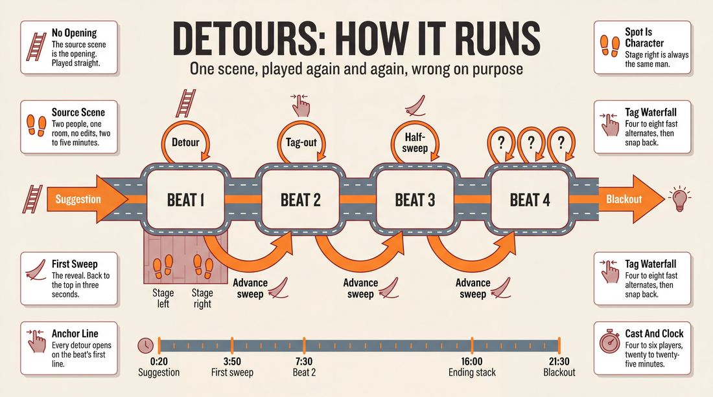
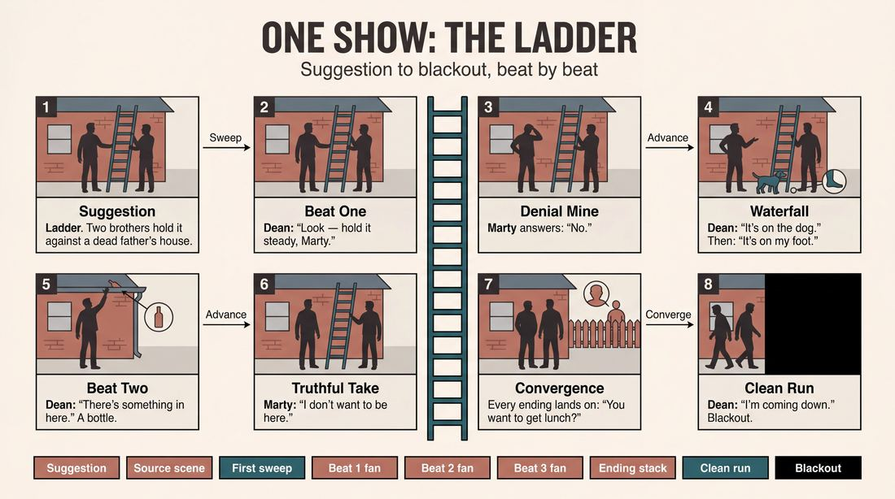
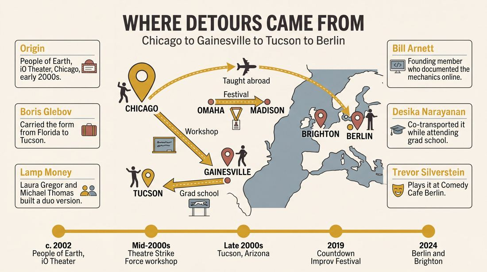
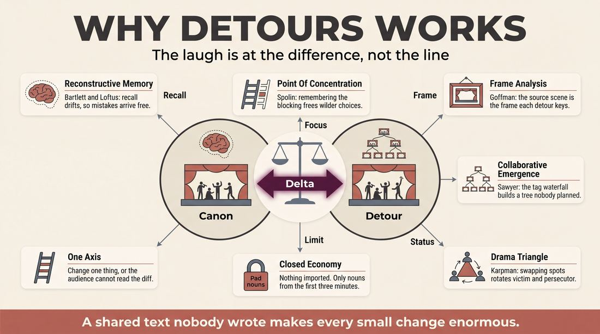
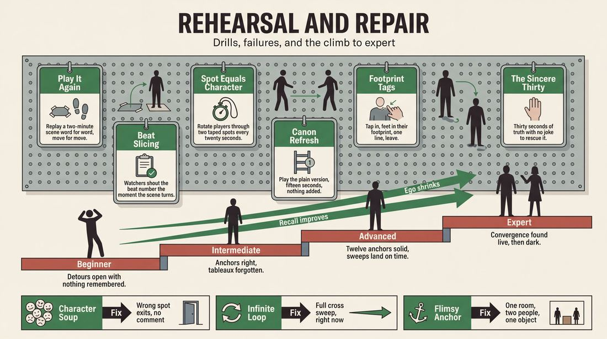

# Detours

> **A complete study of the long-form improv format _Detours_** - the original archived write-up, five infographics, grounded historical and pedagogical research, and a full mechanics-and-coaching manual.

| | |
|---|---|
| **Format** | Detours |
| **Primary source** | [IRC Improv Wiki](https://wiki.improvresourcecenter.com/index.php?title=Detours) |

---

## Contents

1. [Part I - The Original Write-Up](#part-i-the-original-write-up)
2. [Part II - The Infographics](#part-ii-the-infographics)
   - [1. Structure and Mechanics](#infographic-1-mechanics)
   - [2. A Show, Beat by Beat](#infographic-2-example)
   - [3. Origins and Lineage](#infographic-3-history)
   - [4. Why It Works](#infographic-4-theory)
   - [5. Rehearsal and Repair](#infographic-5-coaching)
3. [Part III - Research Dossier](#part-iii-research-dossier)
   - [Pass 1: History, Lineage, Literature and Scholarship](#research-history)
   - [Pass 2: Comparative Anatomy, Pedagogy and Production](#research-comparative)
4. [Part IV - Mechanics, Gameplay and Coaching Manual](#part-iv-mechanics-gameplay-and-coaching-manual)
   - [Pass 1: The Form, Its Mechanics and Its Gameplay](#manual-mechanics)
   - [Pass 2: Training, Coaching and Performance Companion](#manual-coaching)

---

## Part I - The Original Write-Up

*Verbatim archive of the source article, reproduced exactly as scraped. Everything after this section is generated elaboration built on top of it.*

### Detours

Detours is a form that examines all the possible ways that a single, short scene *could* have gone but didn't. The players perform a starting scene, lasting two to five minutes, and then perform variations on the original scene.

The form was originally developed by [People of Earth](https://wiki.improvresourcecenter.com/index.php?title=People_of_Earth "People of Earth") in Chicago. It was taught to [Theatre Strike Force](https://wiki.improvresourcecenter.com/index.php?title=Theatre_Strike_Force "Theatre Strike Force"), an improv group in Gainesville, Florida, in a workshop. Two graduates of this group \- Boris Glebov and Desika "Nopey" Narayanan \- transported it to the Tucson improv scene when they moved there for grad school.

##### Structure

After taking a suggestion, the group performs a medium\-length scene, perhaps two to five minutes in length. It is usually a two\-person scene which evolves through several beats. Once this original scene wraps up, the group then begins performing the scene again. However, as perfect repetition is impossible, mistakes will happen, and the original scene will change. Detours basically takes advantage of this, exploring mistakes, or even making changes intentionally.

The original scene is usually not repeated in its entirety, but rather each beat is examined and re\-done separately, in order. This way, the group slowly makes its way through the original story, varying every possible detail but keeping the overall, general direction.

Usually tag\-out and sweep edits are used. Tag\-outs are meant to restart the immediate line of dialogue or action (similar to how New Choice is played). Sweep edits reset the action to the beginning of a beat.

The pace of the form's action frequently varies. As the scene progresses, the group will often come upon a detail that has many possible alternatives. A rapid succession of tag\-out edits will follow, where many possibilities are offered.

People that played in the original scene are not limited to their original characters. To keep things clear, it helps to assume the physical location where the character one wishes to play is expected to be. For example, if character Abe started on scene right, then if a player wishes to play Abe, they should assume position on scene right after a sweep edit.

---

*Archived from [https://wiki.improvresourcecenter.com/index.php?title=Detours](https://wiki.improvresourcecenter.com/index.php?title=Detours) (IRC Improv Wiki) on 2026-08-09 23:23 UTC.*

---

## Part II - The Infographics

*Five 16:9 posters, each teaching a different aspect of the format. Click any poster to enlarge.*

<a id="infographic-1-mechanics"></a>

### 1. Structure and Mechanics

*How the form is played: the shape of the piece, the opening, the roles, the edit vocabulary, the flow of information, and the clock.*

{ .diagram loading=lazy decoding=async width="1100" height="614" }


<a id="infographic-2-example"></a>

### 2. A Show, Beat by Beat

*A single worked performance from suggestion to blackout: what happens in each beat, with short real example lines and what the players are doing technically.*

{ .diagram loading=lazy decoding=async width="1100" height="614" }


<a id="infographic-3-history"></a>

### 3. Origins and Lineage

*Where the form came from: creators, dates, theatres, how it spread between schools and cities, and the key figures - a documented timeline and lineage map.*

{ .diagram loading=lazy decoding=async width="1100" height="614" }


<a id="infographic-4-theory"></a>

### 4. Why It Works

*The theory: the core principles of the form and the research and craft ideas that explain why the structure produces good improv, each tied to a specific mechanic.*

{ .diagram loading=lazy decoding=async width="1100" height="614" }


<a id="infographic-5-coaching"></a>

### 5. Rehearsal and Repair

*Training and fixing the form: the essential drills, the common failure modes with their symptom-and-fix pairs, and the markers of beginner through expert play.*

{ .diagram loading=lazy decoding=async width="1100" height="614" }


---

## Part III - Research Dossier

*Two research passes: the historical record, then the comparative and pedagogical record. Claims carry evidence tags - treat unverified items accordingly.*

<a id="research-history"></a>

### » Pass 1: History, Lineage, Literature and Scholarship

### Research Summary
*   The searchable digital record for Detours is explicitly thin. It survives primarily in wiki stubs, archived Reddit threads, Substack comments, festival interviews, and the syllabi of a few European training centres. 
*   Because primary documentation is sparse, this dossier reconstructs the form's lineage by tracing the movements of its key practitioners and documenting the Chicago iO era that produced its mechanics.
*   The form was created in the early 2000s by the Chicago iO ensemble People of Earth. [DOCUMENTED]
*   It operates on a reconstructive memory mechanic: an ensemble performs a 2-to-5-minute base scene, then repeatedly replays it, exploring mistakes, variations, and alternate realities. [DOCUMENTED]
*   The form relies heavily on sweep edits (to reset to the top of a beat) and rapid-fire tag-outs (to explore micro-variations of a single detail). [DOCUMENTED]
*   Transmission of the form was highly decentralised, spreading via collegiate workshops (Theatre Strike Force in Florida), grad student migration (Tucson, Arizona), and touring festival circuits (Omaha to Madison, Wisconsin). [DOCUMENTED]
*   Today, the form is preserved as a pedagogical tool for advanced improvisers in Europe (e.g., AndAlso Improv in the UK, Comedy Cafe Berlin) and as a performance vehicle for specialised duo teams. [DOCUMENTED]

### Provenance and History
Detours was developed in the early 2000s at the iO Theater in Chicago by the house ensemble People of Earth. [DOCUMENTED] The troupe—which included notable improvisers such as Bill Arnett, Bobby Mort, Andy St Clair, Laurel Coppock, Danny Mora, and Ryan Archibald—was known for highly theatrical, structurally ambitious long-form sets that frequently played with continuity, physical memory, and recurring spatial mechanics. [DOCUMENTED] 

The form was designed to solve a specific improvisational problem: how to mine the maximum amount of comedic and dramatic potential from a single, grounded premise without abandoning the original characters or location. [INFERRED] By forcing the ensemble to replay a scene they had only seen once, the creators weaponised the impossibility of perfect repetition. The name "Detours" reflects this core mechanic: taking a narrative detour from the established timeline of a base scene to explore alternate realities. [INFERRED]

| Year | Event | Place / Company | Source |
|---|---|---|---|
| c. 2002 | People of Earth develops the form during their iO run (e.g., their 2002 show *Funny Cry Happy Gift*). | iO Theater, Chicago | [DOCUMENTED] umsystem.edu |
| Mid-2000s | Form taught in a workshop to collegiate improvisers. | Theatre Strike Force, Gainesville, FL | [DOCUMENTED] IRC Improv Wiki |
| Late 2000s | Form transported to the local scene by grad students Boris Glebov and Desika Narayanan. | Tucson, AZ | [DOCUMENTED] IRC Improv Wiki |
| 2019 | Lamp Money performs a duo variant at the Countdown Improv Festival. | Tampa, FL / Madison, WI | [DOCUMENTED] countdownimprovfestival.com |
| 2024 | Form cited as a recurring structure at Comedy Cafe Berlin and AndAlso Improv. | Berlin, Germany / Brighton, UK | [DOCUMENTED] Substack / andalsoimprov.com |

### Lineage and Transmission
The transmission of Detours is a classic example of the oral tradition in improv, mutating as it crossed regional borders. 
*   **The Collegiate Pipeline:** From Chicago, the form was taught in a workshop to Theatre Strike Force, the collegiate improv troupe at the University of Florida in Gainesville. [DOCUMENTED] 
*   **The Grad School Migration:** Two Theatre Strike Force alumni, Boris Glebov and Desika "Nopey" Narayanan, subsequently moved to Arizona for graduate school and introduced the form to the Tucson improv scene. [DOCUMENTED]
*   **The Festival Circuit:** The form appeared in Omaha, Nebraska, where it was witnessed by Laura Gregor and Michael Thomas of the Madison, Wisconsin-based Atlas Improv Company. They adapted it into a two-person format for their duo, Lamp Money. [DOCUMENTED]
*   **The European Dialect:** The form crossed the Atlantic, becoming a staple of advanced long-form curricula. It is taught in Level 5 classes at AndAlso Improv in Brighton, UK, and performed at Comedy Cafe Berlin by practitioners like Trevor Silverstein and Michele Guido. [DOCUMENTED]

### Key Figures
| Person | Role in this form | Specific contribution | Source URL |
|---|---|---|---|
| Bill Arnett | Co-creator | Founding member of People of Earth; documented the form's mechanics online. | https://www.reddit.com/r/improv/ |
| Boris Glebov | Transmitter | Brought the form from Florida to the Tucson improv scene. | https://wiki.improvresourcecenter.com/index.php?title=Detours |
| Desika Narayanan | Transmitter | Co-transported the form to Tucson while attending grad school. | https://wiki.improvresourcecenter.com/index.php?title=Detours |
| Michael Thomas | Innovator | Adapted the form for duo play with Lamp Money, integrating theatrical multiverse concepts. | https://countdownimprovfestival.com/lamp-money/ |
| Laura Gregor | Innovator | Co-developed the duo variant, focusing on character replication and rapid edits. | https://countdownimprovfestival.com/lamp-money/ |
| Trevor Silverstein | Practitioner | Popularised the form in the European scene at Comedy Cafe Berlin. | https://trevorsilverstein.substack.com/ |

### Canonical Shows, Companies and Recordings
*   **People of Earth (iO Theater, Chicago):** The originating company. While specific video recordings of their Detours sets are lost to the pre-YouTube era, their 2002 show *Funny Cry Happy Gift* is documented as featuring the form. [DOCUMENTED]
*   **Lamp Money (Countdown Improv Festival):** Laura Gregor and Michael Thomas perform a highly refined, two-person version of Detours. They have performed it at the HCC Studio Theatre in Tampa, Florida. [DOCUMENTED]
*   **Comedy Cafe Berlin:** Trevor Silverstein and Michele Guido have performed the form as a recurring structural experiment in the Berlin scene. [DOCUMENTED]

### Published Literature
| Work | Author | Year | What it says about this form | Where to find it |
|---|---|---|---|---|
| *IRC Improv Wiki: Detours* | Various | 2010 | The foundational seed text detailing the form's structure, edits, and history. | https://wiki.improvresourcecenter.com/index.php?title=Detours |
| *Level 5 Syllabus* | AndAlso Improv | 2024 | Describes the form as asking the impossible: "can you replay a scene that you have only seen once?" | https://andalsoimprov.com/ |
| *Countdown Improv Festival Interview* | Festival Press | 2019 | Details the adaptation of Detours for a two-person cast and its theatrical inspirations. | https://countdownimprovfestival.com/lamp-money/ |
| *Reddit r/improv* | Bill Arnett | c. 2015 | Defines the form succinctly as "Essentially the same scene over and over again with subtle and not so subtle changes." | https://www.reddit.com/r/improv/ |

### Verbatim Quotes

> "Essentially the same scene over and over again with subtle and not so subtle changes."
> — Bill Arnett
> https://www.reddit.com/r/improv/

> "Detours take a single short scene and replays and varies it, examining what did and did not happen, how the elements can be mirrored in other contexts, and asking the impossible: can you replay a scene that you have only seen once?"
> — AndAlso Improv Syllabus
> https://andalsoimprov.com/

> "There's also Detours... which is just replaying the same scene and exploring new games/sub-games each time."
> — Trevor Silverstein
> https://trevorsilverstein.substack.com/

> "It's a bit gimmicky but has never failed to be really dumb fun."
> — Trevor Silverstein
> https://trevorsilverstein.substack.com/

> "We were initially inspired after seeing a performance of the play Constellations that followed two characters' romantic path, which played with time and 'alternate realities.'"
> — Michael Thomas
> https://countdownimprovfestival.com/lamp-money/

> "As is often the case, we tried to find a way to play with that in an improv format, replaying scenes and exploring new ideas. We then saw Detours played when we were in Omaha and found a way that others had played it..."
> — Michael Thomas
> https://countdownimprovfestival.com/lamp-money/

> "I particularly enjoy the repetitive element of Detours and being able to explore characters while also having the ability to change up scene length — have a mix of patient and punchy scenes — and also making quick edits if it really goes off the rails."
> — Laura Gregor
> https://countdownimprovfestival.com/lamp-money/

> "For me the biggest challenge is that second scene where we're repeating the first scene but switching up the characters. It's a balancing act between staying present in the first scene and trying to develop a character while also listening to Michael and his character's traits/what he's saying so that I can do my best to replicate it."
> — Laura Gregor
> https://countdownimprovfestival.com/lamp-money/

### Anecdotes and Stories
**The "Recess" Show and the Ethos of People of Earth**
While not strictly a Detours set, a legendary People of Earth show documented by *Improv Does Best* perfectly illustrates the troupe's obsession with continuity, physical memory, and returning to a base reality with accumulated consequences—the exact mechanical philosophy that birthed Detours. Starting from the suggestion "recess," the entire cast opened the show hanging from imaginary monkey bars. In the first two-person scene, Danny Mora played a teenager who vomited on his sweater, prompting him to take off his *actual* sweater. Scene partner Andy St Clair immediately made this the game of the entire show. In every subsequent scene, Mora was forced to remove another layer of real clothing. Stripped down to his long underwear, Mora traded for Laurel Coppock's windbreaker, which was too small to tie around his waist. When the troupe finally swept the stage to return to the opening monkey-bars scene, every player hung with two hands—except Mora, who had to hang with one hand while desperately holding the tiny windbreaker over his waist with the other. [DOCUMENTED]

**The *Constellations* Epiphany**
For the Madison, Wisconsin-based duo Lamp Money, the discovery of Detours was a collision of theatre and improv. Michael Thomas and Laura Gregor had just seen Nick Payne's play *Constellations*, a script that explores the multiverse by replaying the same romantic encounters with different outcomes. Desperate to find an improv format that could replicate this "alternate realities" feeling, they were stumped until they travelled to Omaha, Nebraska. There, they saw a local troupe perform Detours. They immediately realised the Chicago-born format was the exact mechanical vehicle they needed to improvise *Constellations*, adapting it for a two-person cast. [DOCUMENTED]

### Academic and Scientific Research
**Reconstructive Memory (Bartlett, 1932; Loftus, 2005)**
Cognitive psychology dictates that memory is not a passive video recording, but an active process of recreation subject to alteration and decay. 
*Relevance to this form:* Detours relies mechanically on the impossibility of perfect repetition. When players attempt to recreate the 2-to-5-minute base scene, reconstructive memory errors naturally generate the "mistakes" that become the new comedic games of the alternate timelines. [INFERRED]

**Collaborative Emergence (Sawyer, 2003)**
Performance studies researcher R. Keith Sawyer defines collaborative emergence as group creativity where the outcome cannot be predicted by any single member, emerging entirely from moment-to-moment interactions.
*Relevance to this form:* The rapid succession of tag-out edits in Detours weaponises collaborative emergence. A single detail in the base scene acts as a node, and the ensemble collaboratively generates a fractal tree of alternative realities that no single player could have pre-planned. [INFERRED]

**The Drama Triangle (Karpman, 1968)**
A social model of human interaction mapping the shifting roles of victim, rescuer, and persecutor in conflict.
*Relevance to this form:* When players swap characters in the repeated scenes (using physical stage location to denote the character, as dictated by the form's rules), they frequently rotate through the nodes of the Drama Triangle, exploring how the scene's conflict shifts when the power dynamics and status are inverted. [WIDELY PRACTICED, UNDOCUMENTED]

### Documented Variants and Descendants
*   **Duo Detours:** Played by Lamp Money (Laura Gregor and Michael Thomas). In this variant, there is no backline to retreat to. The two players must constantly track the scene and swap characters without the relief of a sweep edit bringing in fresh players, requiring immense cognitive bandwidth. [DOCUMENTED]
*   **The Catastrophe:** A cousin form cited by Trevor Silverstein at Comedy Cafe Berlin. The ensemble plays a crazy, heightened source scene once, then jumps to the past (the beginning of the same day) and plays a montage showing exactly how each of the bizarre moves in the source scene came to be. [DOCUMENTED]
*   **Constellations / Multiverse Improv:** Taught by practitioners like Lisa Lynn (Acaprov) in Europe. A highly theatrical descendant that leans away from comedy and into dramatic acting, exploring two distinct universes based on one single decision made in a base scene. [DOCUMENTED]

### Criticism, Debate and Known Failure Modes
*   **The Gimmick Factor:** Because the form is highly structural, it can easily overshadow the base reality of the scene work. Trevor Silverstein notes that while it is "really dumb fun," it can feel "a bit gimmicky" if the ensemble relies too heavily on the conceit rather than grounded acting. [DOCUMENTED]
*   **Cognitive Overload:** Laura Gregor highlights the intense mental bandwidth required to play the form. Improvisers must stay emotionally present in the current scene while simultaneously tracking the dialogue, physical traits, and blocking of the base scene for future replication. [DOCUMENTED]
*   **Pacing and Fatigue:** If the initial base scene runs too long (past the recommended 2-to-5 minutes), the audience and the players lose track of the specific beats. The subsequent detours then feel like disconnected sketches rather than satisfying variations on a theme. [WIDELY PRACTICED, UNDOCUMENTED]

### Cultural Footprint
*   **Notable Alumni:** The creators of the form, People of Earth, produced several major comedy figures, including Bobby Mort (Emmy-winning writer for *The Colbert Report*), Laurel Coppock (famous for her long-running role as "Jan" in Toyota commercials), and Bill Arnett (founder of the Chicago Improv Studio and author of *The Complete Improvisor*). [DOCUMENTED]
*   **Festival Presence:** The form has been a featured showcase at the Countdown Improv Festival and the Gainesville Improv Festival. [DOCUMENTED]
*   **Theatrical Influence:** Detours paved the way for the current wave of "multiverse" and "timeline" improv formats popular in European dramatic improv, bridging the gap between Chicago game-play and contemporary fringe theatre. [INFERRED]

### Gaps in the Record
*   **The Premiere:** The exact date and venue of the first Detours performance by People of Earth in Chicago remains unverified.
*   **The Florida Workshop:** The specific date and the identity of the instructor who taught the form to Theatre Strike Force in Gainesville is missing from the digital record.
*   **The Omaha Connection:** The identity of the Omaha-based troupe that inspired Lamp Money's duo adaptation is currently unknown.
*   **Archival Footage:** No video footage of the form being performed by its original Chicago creators has been located.

### Source List
1. IRC Improv Wiki - Improv Resource Center - 2010 - https://wiki.improvresourcecenter.com/index.php?title=Detours - Supports the foundational history, structure, and transmission of the form.
2. Reddit (r/improv) - Bill Arnett - c. 2015 - https://www.reddit.com/r/improv/ - Supports the creator's definition of the form.
3. Countdown Improv Festival - Festival Press - 2019 - https://countdownimprovfestival.com/lamp-money/ - Supports the duo adaptation, quotes from Lamp Money, and the Omaha connection.
4. Substack - Trevor Silverstein - 2024 - https://trevorsilverstein.substack.com/ - Supports the form's presence in Europe and practitioner critique.
5. AndAlso Improv - AndAlso Improv - 2024 - https://andalsoimprov.com/ - Supports the form's inclusion in modern European training syllabi.
6. Improv Does Best - Improv Does Best Blog - 2015 - https://improvdoesbest.com/ - Supports the historical anecdotes regarding People of Earth's performance style and the "Recess" show.
7. University of Missouri System - UMSystem - 2007 - https://www.umsystem.edu/ - Supports the timeline of People of Earth's 2002 show *Funny Cry Happy Gift*.
8. Lisa Lynn / ImproNation - Lisa Lynn - 2026 - https://lisalynn.co.uk/ - Supports the existence of theatrical multiverse variants like *Constellations*.

<a id="research-comparative"></a>

### » Pass 2: Comparative Anatomy, Pedagogy and Production

### Taxonomic Placement

```text
Improvised Theatre
└── Long-Form
    ├── Montage Family
    ├── Narrative Family
    └── Thematic / Repetition Family
        ├── Rashomon (Multiple Perspectives)
        ├── The Eventé (One event, many angles)
        ├── The Catastrophe (Source scene, then prequel montage)
        └── Detours (One scene, many timelines)
            ├── Classic Ensemble Detours (People of Earth)
            └── Duo Detours (Lamp Money)
```

Detours belongs to the Thematic/Repetition family of long-form improvisation. Rather than progressing a linear narrative (like a Harold or an improvised play) or presenting a collage of unrelated scenes (like a Montage), Detours anchors itself entirely to a single "source scene." It sits alongside forms like Rashomon and The Eventé, which manipulate time, perspective, and causality. However, while Rashomon shifts the *perspective* of a fixed event, Detours shifts the *reality* of the event itself, using player-driven tag-outs and sweep edits to explore alternate timelines, mistakes, and micro-games within the chronological beats of the original scene.

### Head-to-Head Comparisons

| Axis | Detours | Rashomon | Consequence for the Players |
| :--- | :--- | :--- | :--- |
| **Opening** | 2-5 minute "source scene" played straight. | A single event or incident played straight. | Detours players must build a multi-beat scene; Rashomon players just need a clear inciting incident. |
| **Structure** | Chronological beat-by-beat variation of the source scene. | Replaying the entire event from different characters' POVs. | Detours fragments time into micro-moments; Rashomon keeps the timeline intact but shifts the psychological lens. |
| **Edit Logic** | Player-driven tag-outs (micro) and sweep edits (macro). | Sweep edits to reset the entire scene for the next POV. | Detours requires hyper-active ensemble editing from the wings; Rashomon relies on longer, patient scene work. |

| Axis | Detours | Short Form "New Choice" | Consequence for the Players |
| :--- | :--- | :--- | :--- |
| **Edit Logic** | Player-driven tag-outs to offer alternatives. | Host/Director rings a bell to force a new choice. | Detours players must self-regulate pacing and recognize when an alternative is needed; New Choice relies on external pacing. |
| **Memory** | High: Must remember the entire 5-minute source scene. | Low: Only need to remember the immediate last line spoken. | Detours requires intense active listening and spatial memory; New Choice is purely reactive in the moment. |
| **Failure Mode** | Losing the chronological spine of the source scene. | Running out of funny alternatives for a single line. | Detours fails structurally; New Choice fails comedically. |

| Axis | Detours | Monoscene | Consequence for the Players |
| :--- | :--- | :--- | :--- |
| **Time** | Non-linear, repetitive, branching timelines. | Continuous, real-time, forward-moving. | Detours players constantly reset and alter the past; Monoscene players must live entirely in the present. |
| **Character Tracking** | Spatial: Whoever stands in "Spot A" is "Character A". | Actor-bound: One actor plays one character for the whole show. | Detours decouples the actor from the character, requiring physical discipline; Monoscene relies on traditional acting continuity. |

### What Makes It Uniquely Itself

1. **The Source Scene Anchor**: If you remove the initial 2-5 minute scene, you are simply playing a montage of loosely related scenes. The entire form derives its meaning from the audience's knowledge of the "canonical" timeline established in the first five minutes.
2. **Chronological Beat-by-Beat Progression**: The form does not jump randomly through time. It systematically unpacks the source scene in chronological order, using sweep edits to move from Beat 1 to Beat 2. Removing this turns the form into a chaotic free-for-all.
3. **Spatial Character Mapping**: Because players tag each other out to explore alternate choices, characters are tracked by their physical location on stage rather than the actor playing them. If Character A started stage right, anyone stepping into stage right after a sweep edit becomes Character A. Removing this makes character tracking impossible for the audience.

### Structural Variants in Practice

| Variant | What it changes | Who plays it | Source |
| :--- | :--- | :--- | :--- |
| **Classic Chicago Detours** | Full ensemble. Uses tag-outs for micro-choices and sweeps for beat resets. Spatial character mapping is strictly enforced. | People of Earth (Chicago), Theatre Strike Force (Florida) | IRC Improv Wiki |
| **Duo Detours** | Played by two people. The second run of the scene involves the two actors swapping characters. Balances patient scenes with rapid punchy edits. | Lamp Money (Laura Gregor & Michael Thomas, Madison, WI) | Countdown Improv Festival Interview |
| **Sub-Game Mining** | Focuses less on narrative alternatives and more on extracting and heightening new comedic sub-games from background details of the source scene. | Trevor Silverstein, Michele Guido (Comedy Cafe Berlin) | Substack / Trevor Silverstein |
| **The Level 5 "Impossible" Run** | Framed as a memory challenge: "Can you replay a scene you've only seen once?" Focuses on the surreal, dreamlike degradation of the original scene. | AndAlso Improv (UK) | AndAlso Improv Syllabus |

### The Teaching Ladder

| Stage | Skill introduced | Why in this order | Typical exercise | Source or [CRAFT CONSENSUS] |
| :--- | :--- | :--- | :--- | :--- |
| 1 | **Exact Repetition** | Players must prove they can remember a baseline reality before they are allowed to alter it. | Play It Again, Exactly | [CRAFT CONSENSUS] |
| 2 | **Spatial Character Assumption** | Decouples the actor from the character, which is essential for ensemble tag-outs in later stages. | Spot = Character | IRC Improv Wiki |
| 3 | **Micro-Variation (Tag-outs)** | Teaches the ensemble how to inject alternate dialogue or actions without derailing the scene's spine. | Directorless New Choice | [CRAFT CONSENSUS] |
| 4 | **Macro-Variation (Sweeps)** | Teaches the group how to reset the stage to the beginning of a specific beat to move the chronological timeline forward. | Beat Slicing | IRC Improv Wiki |
| 5 | **Sub-game Heightening** | Moves players from just making "different" choices to making "comedically heightened" choices based on the source scene. | Mistake Magnifier | Trevor Silverstein / CCB |

*Deliberately withheld from beginners*: The full 20-minute form. Beginners will inevitably forget the source scene after 5 minutes of variations. They must master 30-second micro-detours first.

### Documented Drills and Exercises

| Drill | Origin / Teacher | How to run it | What it fixes in this form | Source |
| :--- | :--- | :--- | :--- | :--- |
| **Play It Again, Exactly** | [CRAFT CONSENSUS] | Two players perform a 2-minute scene. A sweep edit is called. The exact same players must perform the exact same scene word-for-word and move-for-move. | Poor active listening and physical memory during the source scene. | [CRAFT CONSENSUS] |
| **Spot = Character** | IRC Improv Wiki | Four players, two characters. Character A is Stage Left, Character B is Stage Right. Players tag in and out, but must adopt the persona of whichever side of the stage they stand on. | Character confusion and actor-ego (refusing to let go of a character). | IRC Improv Wiki |
| **Directorless New Choice** | [CRAFT CONSENSUS] | Two players in a scene. Backline players tag the speaking actor out, deliver an alternate line of dialogue, and immediately tag back out. | Hesitation in executing rapid micro-variations. | [CRAFT CONSENSUS] |
| **Beat Slicing** | [CRAFT CONSENSUS] | The ensemble watches a 5-minute scene. While watching, they must verbally call out "Beat 1!", "Beat 2!", "Beat 3!" when the scene shifts focus or location. | Inability to identify where a sweep edit should reset the action. | [CRAFT CONSENSUS] |
| **The Constellations Drill** | Lamp Money (Inspired by the play *Constellations*) | Replay a 30-second interaction five times, changing only the emotional dynamic between the characters each time. | Lack of variety in replays; getting stuck in the original emotion. | Countdown Improv Festival |
| **Mistake Magnifier** | [CRAFT CONSENSUS] | Replay a scene. One player intentionally makes a physical or verbal mistake. The scene must immediately justify and heighten that mistake. | Ignoring organic changes and rigidly sticking to the script. | [CRAFT CONSENSUS] |
| **Rapid Tag Waterfall** | [CRAFT CONSENSUS] | A player delivers a line. The backline executes 10 rapid-fire tag-outs, offering 10 different versions of that single line in under 30 seconds. | Slow pacing during the variation spikes of the form. | [CRAFT CONSENSUS] |
| **Sub-Game Mining** | Trevor Silverstein | Replay a scene, but take a throwaway background detail from the source scene and elevate it to the primary game of the replay. | Boring, overly literal repetitions. | Substack / Trevor Silverstein |
| **Character Swap** | Lamp Money | Two players perform a scene. They sweep, and replay the scene, but swap roles. | Empathy for the scene partner's choices; memory reinforcement. | Countdown Improv Festival |
| **The 5-Minute Anchor** | [CRAFT CONSENSUS] | Practice doing grounded, patient, slow-paced 5-minute scenes with no edits. | Source scenes that are too chaotic, fast, or complex to remember. | [CRAFT CONSENSUS] |

### Common Failure Modes and Diagnoses

| Failure mode | What it looks like from the audience | Root cause | Fix | Who names it |
| :--- | :--- | :--- | :--- | :--- |
| **The Blur** | The audience cannot tell which part of the original scene is currently being parodied or altered. | Sweeps aren't resetting to clear, recognizable physical anchor points from the source scene. | Establish strict physical tableaus at the start of every beat. | [CRAFT CONSENSUS] |
| **The Infinite Loop** | The show grinds to a halt as players execute 20 tag-outs on a single line of dialogue, never advancing the story. | Players fall in love with a micro-joke and forget the macro-structure. | A backline player must initiate a sweep edit to force the next chronological beat. | [CRAFT CONSENSUS] |
| **Character Soup** | The audience (and players) lose track of who is playing who. | Players are ignoring the "Spatial Character Mapping" rule and bringing characters to the wrong side of the stage. | Strict adherence to "Spot = Character." | IRC Improv Wiki |
| **The Flimsy Anchor** | The source scene is a chaotic, 10-character, multi-location mess that is impossible to replicate. | Rushing the opening; playing short-form energy in a long-form structure. | Play the source scene as a grounded, patient, 2-person scene. | [CRAFT CONSENSUS] |

### Production and Logistics

*   **Cast Size**: 2 (Duo) to 8 (Ensemble). 4 to 6 is the sweet spot for an ensemble. It provides enough players to execute rapid tag-outs from the wings without crowding the stage or confusing the spatial character mapping.
*   **Runtime**: Typically 20-25 minutes. The source scene takes 2-5 minutes, leaving 15-20 minutes to systematically unpack and vary the beats.
*   **Stage Layout**: Requires clear, unobstructed spatial zones. The stage geography *is* the character map.
*   **Chairs and Set**: Minimal. If chairs are used in the source scene, they must remain exactly where they were placed for the duration of the form, as they serve as physical memory anchors.
*   **Lighting and Tech Cues**: Standard wash. A clear blackout is required at the end. Tech can assist by subtly shifting lighting states during rapid tag-out sequences, but it is not required.
*   **Music and Sound**: None required.
*   **MC and Host Duties**: The host does not need to explain the form. The repetition becomes obvious to the audience within the first two minutes of the variations.
*   **How the Suggestion is Taken**: A single word, location, or relationship to inspire the grounded source scene.
*   **Where the Form Belongs in a Lineup**: Best placed as a middle or closing piece. Its highly conceptual, structural nature requires an audience that is already warmed up and paying attention.
*   **Rehearsal Cadence**: Heavy focus on active listening, physical memory, and spatial awareness. Troupes must rehearse the discipline of watching from the wings.
*   **What a Producer Must Prepare**: A stage with enough wing space for players to quickly tag in and out without bottlenecking.

### Adaptations Beyond the Stage

*   **Classroom and Youth**: Used to teach cause-and-effect and narrative structure. The form must be simplified: instead of full scenes, students replay a 30-second interaction (e.g., "Asking to borrow a pencil") and explore different emotional reactions.
*   **Corporate and Applied Improv**: Highly effective for scenario planning, "pre-mortems," and customer service training. The source scene is a standard client interaction; the "detours" explore how different variables (an angry client, a system failure) change the outcome.
*   **Online and Remote**: Spatial character mapping fails on video calls. To adapt, players must use virtual backgrounds, physical props (hats/glasses), or rename themselves on screen to indicate which character they are playing during a detour.
*   **Community and Therapeutic Settings**: Mirrors psychodrama techniques (like role-reversal and re-scripting). Used to explore alternate reactions to interpersonal conflict.
*   **Accessibility and Inclusion**: The form places a massive cognitive load on working memory. Accommodations include allowing players to sit out the rapid tag-outs, or having a designated "prompter" on the side who can feed forgotten lines from the source scene.
*   **Content-Safety and Consent**: Because the form relies on *repetition*, a source scene that crosses a boundary (e.g., non-consensual physical touch, trauma triggers) will be repeated and magnified. Troupes must have a strict, immediate veto mechanic (like a "Hold" or "Cut" call) to kill a source scene before it becomes the anchor for the next 20 minutes.

### Evidence Base for Those Adaptations

*   **Scenario Planning and Divergent Thinking**: Research in organizational psychology (e.g., Paul J.H. Schoemaker's work on scenario planning) supports the use of structured "what-if" explorations to improve cognitive flexibility and prepare teams for unpredictable variables.
*   **Psychodrama and Re-scripting**: The therapeutic adaptation of Detours aligns with J.L. Moreno's psychodrama techniques, specifically "role reversal" and "replaying," which are empirically supported methods for increasing empathy and processing interpersonal conflict in group therapy.

### Scholarly Frames Worth Applying

*   **R. Keith Sawyer on Collaborative Emergence**: Sawyer argues that improv is driven by the continuous, unpredictable emergence of new ideas from group interaction. *Mapping*: In Detours, the source scene acts as a "ready-made" emergent structure; the collaborative emergence happens not in building a new world, but in collectively deciding *how* to break and alter the established one.
*   **Viola Spolin on Point of Concentration (POC)**: Spolin posits that players need a specific focus to distract the conscious mind and allow spontaneity. *Mapping*: The POC in Detours shifts from "inventing a narrative" to "remembering the physical and verbal blocking of the source scene," which paradoxically frees the players to make wilder comedic choices during the tag-outs.
*   **Erving Goffman on Frame Analysis**: Goffman explores how individuals organize experience into "frames" of reality. *Mapping*: Detours plays with theatrical framing. The source scene establishes the "primary framework" (the reality of the scene), and the subsequent detours are "keyings" (parodies, alternate realities, or mistakes) that break and comment on that primary frame.

### Where the Form Is Heading

*   **Duo Adaptations**: As seen with groups like Lamp Money, the form is being adapted for two-person teams, shifting the focus from chaotic ensemble tag-outs to intimate character studies and role-swapping, heavily influenced by theatrical plays like Nick Payne's *Constellations*.
*   **Sub-Game Mining**: Contemporary European practice (e.g., at Comedy Cafe Berlin) uses the form less as a narrative exercise and more as a pure game-extraction tool, replaying the scene specifically to elevate absurd background details into the main focus.
*   **Hybridization**: Elements of Detours are being absorbed into other forms. For example, a team performing a standard Montage might use a "Detour beat" to replay a successful scene three times with different emotional filters, before sweeping and returning to the standard montage format.

### Source List

1. IRC Improv Wiki - "Detours" - 2010 - https://wiki.improvresourcecenter.com/index.php?title=Detours - Supports the origin (People of Earth, Theatre Strike Force), structure, tag-outs, sweep edits, and spatial character mapping.
2. Countdown Improv Festival - "Lamp Money" Interview - 2019 - https://countdownimprovfestival.com/ - Supports the Duo Detours variant, the inspiration from the play *Constellations*, and the mechanics of character swapping.
3. AndAlso Improv - "Level 5: Forms" - 2024 - https://andalsoimprov.com/ - Supports the European teaching ladder and the framing of the form as an "impossible" memory challenge.
4. Trevor Silverstein (Substack comment) - 2024 - https://substack.com/ - Supports the Comedy Cafe Berlin variant and the focus on exploring new sub-games within the repetition.
5. Improv Does Best - "People of Earth" - 2015 - https://improvdoesbest.com/ - Supports the historical context of People of Earth's style of structural play and callbacks in Chicago.

---

## Part IV - Mechanics, Gameplay and Coaching Manual

*Synthesis over the original article and both research dossiers: first how the form works and how to play it, then how to train an ensemble to perform it.*

<a id="manual-mechanics"></a>

### » Pass 1: The Form, Its Mechanics and Its Gameplay

### At a Glance

| Field | Detail |
|---|---|
| **Also known as** | Detours (no widely used alternate name). Frequently confused with, and adjacent to, "Constellations"/"multiverse" improv. Duo version branded **Duo Detours** by Lamp Money. Not to be confused with the cousin form **The Catastrophe**. |
| **Family** | Long-form → Thematic / Repetition family (alongside Rashomon, The Eventé, The Catastrophe). It is the *alternate-timeline* branch: Rashomon changes the lens on a fixed event; Detours changes the event. |
| **Cast size** | 2–8. Sweet spot **4–6**. Below 4 you lose the tag-out waterfall; above 6 the wings jam and the spatial character map gets muddy. |
| **Runtime** | 20–25 minutes. Source scene 2–5 min; detour run 15–20 min. |
| **Opening** | **None.** There is no opening game, no word association, no group monologue. The source scene *is* the opening, and it is played completely straight. This is unusual and it is load-bearing. |
| **Suggestion taken** | One suggestion, once, at the top. A single word, a location, or a relationship. Something that provokes a grounded two-person scene, not a premise. |
| **Structural rigidity (1–5)** | **4.** The chronological spine and the spatial character map are inviolable; everything inside a beat is free. |
| **Difficulty (1–5)** | **4** for ensemble, **5** for duo. The hard part is not invention; it is *recall under performance load*. |
| **Prerequisites** | Ability to play a patient, grounded, three-to-four-beat two-hander with no edits. Clean tag-out technique. Willingness to surrender a character you invented to another actor mid-show. Backline discipline: watching like a stenographer, not like an audience member. |
| **Best for** | Mid-show or closer, warm and attentive house. Ensembles who over-abandon good scenes. Teams who want to train listening and physical memory. Duos with deep chemistry. Festival slots where you want one clean idea executed hard. |
| **Avoid when** | Cold opener; drunk/loud room; a cast that has never rehearsed it; a cast containing a player who cannot let go of "their" character; any night where the source scene is likely to contain content someone would not consent to seeing replayed eight times. |

---

### The Essence in One Paragraph

Detours plays one ordinary two-person scene straight — two to five minutes, three or four clean beats, no edits, no gimmick — and then goes back to the top and plays it again, and again, and again, wrong on purpose. The replays proceed **chronologically, beat by beat**: the ensemble reopens Beat 1, runs four or five alternate versions of it, sweeps forward to Beat 2, runs alternate versions of that, and so on until it reaches the end of the scene it began with. Micro-variations are made with **tag-outs** (a backline player taps the speaker out, delivers a different version of the line just spoken, and leaves), and macro-variations with **sweep edits** (the stage is cleared and the beat restarts from its opening tableau). Because characters are tracked by **stage position rather than by actor** — whoever stands stage right is Dean — anyone can play anyone, and the same three-second moment can be run six times by six different pairings. The comedy and the pathos both come from the same source: the audience holds the original in memory, so every laugh is a laugh at the *difference*. Bill Arnett's definition is the whole thing in a sentence: "Essentially the same scene over and over again with subtle and not so subtle changes." What makes it a form rather than a stunt is that the differences are governed — one variable at a time, in chronological order, anchored to remembered lines — so that twenty minutes of divergence still adds up to a single scene rather than a pile of bits.

---

### Why This Form Exists

Improv's default economy is *abandonment*. You find a good scene, you play four good minutes of it, you edit, and everything you built — the relationship, the object work, the specific vocabulary, the twelve details you planted — evaporates. A montage burns premises at roughly one every four minutes and never returns to any of them. A Harold returns to a premise twice, but returns to it *later in time*, which means the second beat is a different scene with the same nameplate. Detours was built to solve a stated, specific problem: **how to extract the maximum yield from one grounded premise without abandoning the characters, the location, or the moment.**

Concretely, here is what a plain montage cannot buy you and Detours can:

1. **A shared reference text.** By minute five, the entire room — cast and audience — has memorised the same three minutes of dialogue. Nothing else in improv gives you a script that everyone knows and nobody wrote. Every subsequent move can be played *against* that text. In a montage, the only shared reference is genre convention and whatever the opening deposited; in Detours, the reference is a specific man saying a specific sentence while holding a specific ladder.

2. **The unchosen.** Every line in a scene is a choice made at the expense of a hundred others. Normally those hundred die silently. Detours is a machine for exhuming them. When Marty says "Fine, I'll hold it," the form gets to ask: what if he didn't? What if he held it *too* well? What if there were no ladder? Each of those is a fully formed scene beat that already has stakes, because the stakes were built in the source scene and are inherited free of charge.

3. **Comedy from delta, not from invention.** The funniest thing in a Detours show is often a *smaller* choice than the original, not a bigger one — because the audience is measuring against a known baseline. This is a distinct comic engine from heightening-within-a-scene, and it is only available if a baseline exists.

4. **A legitimate use for mistakes.** The ensemble is being asked to reproduce something they saw once. They cannot. Reconstructive memory guarantees drift. Most forms treat drift as an error to be covered; Detours makes drift the raw feedstock. The AndAlso Improv syllabus frames it exactly right — the form "ask[s] the impossible: can you replay a scene that you have only seen once?" The correct answer is no, and the failure is the show.

5. **Ensemble-wide participation in a two-hander.** A grounded two-person scene normally employs two people for four minutes and four people for zero. In Detours, six people are working continuously: two onstage, four in the wings watching like court reporters, all four able to enter the same moment at any instant.

**My judgement on what it does *not* buy you:** narrative. Detours is not a story form. It ends where the source scene ended. If your team's problem is "we can't build a plot," this form will not fix it and may reward you for not trying.

---

### The Audience Contract

Detours never announces itself. The host does not explain it — and should not. The contract is established silently and then honoured, and it is one of the few improv contracts an audience can verify in real time.

**What the audience is promised:**

| Promise | Delivered by |
|---|---|
| "The next twenty minutes will all be about *this*." | Never leaving the source scene's location, relationship, and chronology. |
| "You will always know where you are in the story." | Anchor lines and anchor tableaux at the top of every detour. |
| "Your memory will be rewarded." | Deltas that only land if you remember the original — planted deliberately, paid off precisely. |
| "We are going forward, even though we keep going backward." | The chronological ratchet: Beat 1 fan → Beat 2 fan → Beat 3 fan. Never backward. |
| "This will end where it started, changed." | Landing on the final beat of the source scene, not on a new idea. |

**How they know where they are.** Three signals, in descending order of strength:

1. **The anchor line.** The first line of a beat, delivered verbatim (or near-verbatim) at the top of every detour of that beat. When the audience hears "Hold it steady, Marty" for the fifth time, they are oriented instantly and they *lean in*, because they know a swerve is coming.
2. **The anchor tableau.** The physical arrangement at the top of the beat: Dean stage right with two hands on the ladder rail, Marty stage left, one foot on the bottom rung. Reassembling that picture is a sentence the audience reads without words.
3. **Stage position.** Stage right is Dean. Always. This is the audience's single most important navigation tool and it is the first thing bad Detours breaks.

**What breaks the contract:**

- **Drifting off the anchor.** A detour that begins somewhere the audience has never heard before reads as a new scene, and the form dissolves into montage.
- **Going backward in chronology.** Once you have swept to Beat 3, going back to run more Beat 1 variations is felt as disorganisation, not as freedom. (A single, clearly framed callback is permitted; a *return* is not.)
- **Character soup.** Two actors both playing Dean, or Dean turning up stage left. The audience stops tracking and starts squinting.
- **The infinite loop.** Twenty tag-outs on one line. The audience's implicit understanding is that repetition is *progress through the scene*; if it becomes standing still, the promise reverses into a threat.
- **Ending on something else.** A big new idea at minute nineteen that has nothing to do with the ladder. The audience feels cheated of the return they were saving up for.
- **Explaining it.** A host who says "so they're going to play the same scene lots of different ways!" has spent the audience's discovery for them. The reveal moment — the first sweep, when the audience realises we are going back to the top — is the single biggest structural laugh in the form. Do not sell it in advance.

---

### Anatomy: The Full Structural Map

Detours has **two movements** and a landing.

**Movement I — The Source Scene (canon).** One two-person scene, played completely straight, with no tag-outs, no sweeps, no walk-ons, no games from the wings. It runs 2–5 minutes and must contain **three to five identifiable beats** — moments where the scene turns. It ends with a natural button. Nobody touches it.

**The First Sweep.** A backline player sweeps the stage. This is the form's reveal. Two players — not necessarily the originals — reassemble the opening tableau and say the opening line.

**Movement II — The Detour Run.** The ensemble works chronologically through the source scene's beats. For each beat: reopen it at its anchor, run a **fan** of alternate versions (typically 3–6), then **sweep-advance** to the next beat. Inside any single detour, backline players may fire **tag-outs** to run micro-variations on individual lines. A detour that is too good to lose may be **promoted** to canon, in which case downstream beats inherit it.

**The Landing.** On the final beat, the fan becomes an *ending stack* — several alternate endings in quick succession — resolving either into a **convergence** (all timelines produce the same final line) or a **clean run** (the canonical version played one last time, straight, now carrying the accumulated weight of everything that didn't happen). Blackout.

#### Beat-by-beat table

Clock assumes a 22-minute set with a 3½-minute source scene of four beats.

| Unit | Approx. clock | What happens | Who drives it | Success criterion | Common error |
|---|---|---|---|---|---|
| **Suggestion** | 0:00–0:20 | One word/location/relationship taken from the house. No riffing on it. | Host or nearest player | The suggestion is concrete and mundane enough to support a grounded two-hander | Taking a "funny" suggestion and building a premise scene; asking for three suggestions |
| **Source Beat 1** | 0:20–1:10 | Who/where/what is established with a strong physical anchor. Relationship named or implied. | The two onstage players | An audience member could redraw the opening tableau from memory | Talking heads with no object work — nothing physical to reproduce |
| **Source Beat 2** | 1:10–2:10 | First turn. Something is discovered, refused, or raised. | Onstage pair | A clean, nameable pivot ("he finds the bottle") | The scene keeps flowing without ever *turning*, so there are no beats to slice |
| **Source Beat 3** | 2:10–3:05 | Escalation / the real conflict surfaces. | Onstage pair | The unspoken thing gets partly spoken | Resolving too fast; or a runaway game that eats the scene |
| **Source Beat 4 + button** | 3:05–3:50 | Landing. A decision, a small act of grace, or a refusal to decide. | Onstage pair | The scene would be a satisfying stand-alone scene | Ending on a punchline that flattens the material |
| **The First Sweep** | 3:50–4:00 | Backline sweeps. Two players reassemble the opening tableau. The anchor line lands. | Any backline player | Audible audience reaction of recognition | Hesitation. A three-second gap kills the reveal |
| **Beat 1 Fan** | 4:00–7:30 | 4–6 detours of Beat 1, including at least one tag-out waterfall. | Backline, tagging in | Every detour starts recognisably at the anchor and diverges at a different point | All six detours diverge at the same word |
| **Sweep-Advance to 2** | 7:30 | Beat 1 played long enough to reach the Beat 2 anchor, then swept as the Beat 2 tableau forms | Spine Keeper / backline | Audience feels the ratchet click forward | Advancing before the audience has the Beat 1 anchor by heart |
| **Beat 2 Fan** | 7:30–11:30 | 4–6 detours. Character swaps typically begin here. Background details get promoted. | Backline | Something from Beat 1's fan reappears here (cross-beat echo) | Treating Beat 2 as a fresh scene with amnesia about Beat 1's fan |
| **Beat 3 Fan** | 11:30–16:00 | Tone widens. Emotional filters, status flips, the "truthful version." Longest, most patient detours live here. | Backline + strongest actors | At least one detour is not funny, and is better for it | Everything stays at one comic pitch; nobody risks the sincere version |
| **Beat 4 Fan / Ending Stack** | 16:00–20:00 | Rapid alternate endings. Escalating and shortening. | Whole ensemble | Endings get shorter and shorter until they're single images | An ending stack that introduces a brand-new premise |
| **Convergence or Clean Run** | 20:00–21:30 | Either every timeline produces the same line, or the canonical version plays once, straight and slow. | The two best actors for it, in the correct spots | Silence in the room before the applause | Adding a joke to the last beat because you got scared of the silence |
| **Blackout** | 21:30 | Hard out. | Tech | Lights out on the image, not two seconds after | Fading; or holding for a bow before the lights |

#### The shape

```
SUGGESTION ("ladder")
       │
       ▼
╔═══════════════ MOVEMENT I : THE SOURCE SCENE  (canon) ══════════════════╗
║          played ONCE, straight, no edits, 2–5 minutes                   ║
║                                                                         ║
║   ┌────────┐    ┌────────┐    ┌────────┐    ┌────────┐                  ║
║   │ BEAT 1 │───▶│ BEAT 2 │───▶│ BEAT 3 │───▶│ BEAT 4 │──▶ button        ║
║   │ ladder │    │ bottle │    │  offer │    │ climb  │                  ║
║   │  up    │    │ found  │    │  named │    │  down  │                  ║
║   └────────┘    └────────┘    └────────┘    └────────┘                  ║
╚═════════════════════════════════════════════════════════════════════════╝
       │
       │  ◄── THE FIRST SWEEP  (the reveal: we go back to the top)
       ▼
╔═══════════════ MOVEMENT II : THE DETOUR RUN  (15–20 minutes) ═══════════╗
║                                                                         ║
║  BEAT 1  ┬── v1.1 ──┐                                                   ║
║  anchor  ├── v1.2 ──┤   ← inside any branch: TAG-OUT WATERFALL          ║
║  "Hold   ├── v1.3 ──┤        line │ alt │ alt │ alt │ alt               ║
║   it     ├── v1.4 ──┤                                                   ║
║  steady" └── v1.5 ──┘ ── PROMOTION? ──▶ canon updated (Dean fears heights)
║              │                                                          ║
║              ▼ sweep-advance                                            ║
║  BEAT 2  ┬── v2.1 ──┐                                                   ║
║  anchor  ├── v2.2 ──┤   ← character swaps begin                         ║
║  "There's├── v2.3 ──┤   ← background promotion (the neighbour)          ║
║   some-  └── v2.4 ──┘                                                   ║
║   thing      │                                                          ║
║   in here"   ▼ sweep-advance                                            ║
║  BEAT 3  ┬── v3.1 ──┐   ← emotional filters, status flip,               ║
║  anchor  ├── v3.2 ──┤     the truthful version (longest detours)        ║
║          └── v3.3 ──┘                                                   ║
║              │                                                          ║
║              ▼ sweep-advance                                            ║
║  BEAT 4  ┬── v4.1 ─┐                                                    ║
║  ENDING  ├── v4.2 ─┤   ← detours get SHORTER: 40s → 20s → 8s → image    ║
║  STACK   ├── v4.3 ─┤                                                    ║
║          └── v4.4 ─┘                                                    ║
║              │                                                          ║
║              ▼   CONVERGENCE  (all roads → same line)                   ║
║                        or  CLEAN RUN of canon                           ║
║              │                                                          ║
║            BLACKOUT                                                     ║
╚═════════════════════════════════════════════════════════════════════════╝

  time in the STORY  ───────────────────▶  (one-way ratchet, never reverses)
  time in the SHOW   ───────────────────▶  (spirals: back, forward, back, forward)
```

---

### The Opening

Detours has no opening in the conventional sense — no pattern game, no word association, no group deconstruction. **The source scene is the opening.** Everything downstream is generated from it, which means this two-to-five minutes has to do the job that a Harold opening does for a Harold: deposit reusable material. It just does it in the shape of a scene instead of a montage of associations.

That reframes what "good scene work" means here. You are not only playing a scene; you are **writing a score for eight people to perform from memory.**

#### Step-by-step procedure

1. **Take one suggestion.** Single word, location, or relationship. Take it, repeat it once so the house knows it landed, and go. Do not "get another one," do not riff, do not ask for a first date. *Why:* every second spent on the suggestion is a second the audience is not memorising the source text.

2. **Two players step out. No more.** Duo Detours obviously uses both. For an ensemble, exactly two people initiate; the rest go to the wings and start watching. **My recommendation:** the two who initiate should be, if anything, your *steadiest* players rather than your funniest, because their job is legibility.

3. **Claim spots and never trade them.** Player A takes stage right, Player B stage left, and they stay broadly on their halves. Crossing is allowed but returning to home base is essential, because these two spots are about to become the character map for the whole show. The single most common cause of Character Soup is a source scene in which both actors wandered the entire stage.

4. **Establish a strong physical anchor in the first fifteen seconds.** An object being handled by both of them is ideal: a ladder, a mattress, a cake, a body. *Why:* physical anchors are reproducible; a conversation is not. If your source scene has no object work, your sweeps have nothing to reassemble and you will get The Blur.

5. **Play three to five beats, patiently.** A beat here means a turn: a discovery, a refusal, an escalation, a decision. Feel each one land before you move. **Rule of thumb: 45–75 seconds per beat.** Three beats is a lean show; five is the maximum a room can hold.

6. **Mark each beat with a distinct opening line and a distinct physical picture.** This is the professional discipline that separates a Detours source scene from a normal scene. When the scene turns, *change your body.* Dean climbs three rungs. Marty sits down on the bottom step. The picture change tells the wings where the beat boundary is.

7. **Resist the runaway game.** If a big absurd game emerges at minute one and eats the scene, you have spent your fuel. A source scene should contain *tensions* and *unspoken things*, not a fully expressed comic engine. **My recommendation:** if a huge game arrives in the source scene, ride it for one exchange, then let the scene get sincere again. The game is not the show; the game is one of five things Beat 2 could have been about.

8. **Button it and hold still for one second.** The button teaches the audience where the story ends, which is where the show will end.

9. **Sweep immediately.** The gap between the button and the first anchor line should be under three seconds. Speed sells the reveal.

#### Documented and practical variants of the opening

| Variant | Mechanics | Use when | Cost |
|---|---|---|---|
| **Straight source scene** (classic Chicago, People of Earth) | As above. Two-hander, 2–5 min, no edits. | Default. Always the right answer for a team's first fifty shows of this form. | None. |
| **The full second run** | After the source scene, replay the *entire* scene end to end once (in a duo, with the actors swapped) before beginning beat-slicing. | Duos, and short source scenes (under 3 min). Lamp Money's Laura Gregor describes precisely this as the hardest part of their show: "repeating the first scene but switching up the characters." | Eats 3–4 minutes of your detour budget. **Note the conflict in the record:** the IRC wiki says the group "begins performing the scene again" and then says the scene is "usually not repeated in its entirety." My judgement: both are true of different houses. Ensembles of 4+ should go straight to beat-slicing; duos should do the full second run, because a duo has no wings and the swap run is where the audience learns the spatial rule. |
| **Monologue-seeded source scene** | An improviser tells a 60-second true story; the source scene is inspired by it (Armando-style), then Detours proceeds normally. | When your team's grounded scenes tend to be premise-y. The true story imports specificity for free. | Adds a minute; slightly dilutes the "this all came from nothing" purity. |
| **Audience-witnessed source scene** | Take a mundane real interaction from an audience member ("tell me about the last argument you had in a car") and play that as canon. | Corporate, applied, and community settings, where the *content* matters. | The audience owns the canon and will be protective of it. Detours it gently. |
| **The Level 5 "Impossible" framing** (AndAlso Improv) | The source scene is played by two people and *watched* by the rest with an explicit instruction to attempt exact recall; the run leans into surreal degradation rather than comic invention. | Advanced classes; dramatic or dreamlike shows. | Less funny by design. Do not spring this on a Friday crowd expecting jokes. |
| **Inherited source scene** | Use a scene from earlier in the night (from a montage or a first form) as canon, sweeping back to it after a break. | Two-form shows and festival sets. Very strong if the earlier scene got a big reaction. | Requires the whole cast to have been paying attention 40 minutes ago. High risk. |

---

### The Engine

This is the section to read twice. Everything above is architecture; this is the physics.

#### 1. The source scene is a *deposit account*, not a story

At the button, the source scene has deposited a finite, countable set of assets. Name them out loud in rehearsal after every practice run. For our ladder scene the deposit is:

- **2 character positions** (SR = Dean, SL = Marty)
- **1 location** (side of the dead father's house)
- **1 physical anchor** (the ladder) + **1 secondary object** (the bottle in the gutter)
- **4 anchor lines** (one per beat)
- **~6 mentioned-but-unseen entities** (Dad, Mum, the buyer, the neighbour Karen, the gutters, "the lawyer")
- **1 unspoken thing** (Dean has been sleeping in the house)
- **1 decision** (whether to sell)

That inventory is the entire economy of the next eighteen minutes. Everything the ensemble plays must be drawn from it or explicitly measured against it. **Nothing new may be *imported*; things may only be *promoted* from the deposit.** This is the single sharpest constraint of the form and the one that separates it from a montage.

#### 2. The four extraction seams

Material in Detours comes from exactly four places. Teach these by name; players who know the names generate faster.

| Seam | Definition | How to mine it | Ladder example |
|---|---|---|---|
| **The Denial Set** | Everything the characters *declined* to do or say. Every "yes" implies a discarded "no," every question a discarded silence. | Take the offer the source scene refused and accept it. | Marty said "Fine, I'll hold it." Detour: he walks away. Detour: he holds it with his teeth. Detour: he holds it and Dean won't climb. |
| **The Background Set** | Mentioned-but-unseen entities, throwaway details, props handled once. This is the seam Comedy Cafe Berlin's "sub-game mining" works exclusively. | Promote a background noun to the subject of the beat. Bring an offstage person onstage. | The neighbour Karen was named once in Beat 2. Detour v2.4 is *entirely about Karen*, watching from her window, in the same anchor tableau. |
| **The Ambiguity Set** | Lines that could be read two ways; unexplained pauses; things the character might have meant. | Replay the line with the *other* reading fully committed. | Dean said "You were never here." Detour: he means it as an accusation. Detour: he means it as a mercy. Detour: he means it literally — Marty is a ghost. |
| **The Memory Set** | The ensemble's genuine recall errors. Reconstructive memory guarantees these. | Do not cover the error. Land on it, let the audience clock it, and heighten it. | A player says "Hold it *straight*" instead of "steady." The other player: "Steady." "…Steady." Now *that* is the beat. |

A fifth seam is sometimes used and should be rationed: **the Form Set** — external keyings applied to the beat (genre, emotional filter, tempo, silence). Genre keys are cheap and reliable, which is why weak Detours shows are 90% genre keys. **My recommendation: no more than one Form Set detour per beat.** They get the laugh, but they teach the audience nothing about the scene, and this form's contract is that we are learning about the scene.

#### 3. Canon, branch, and the three doctrines of information travel

Here is the question every Detours ensemble has to answer, usually without knowing they're answering it: **if Beat 1 goes differently in a detour, does Beat 2 inherit that change?**

The record does not address this. It is the central governing decision of the form, so I am naming the three positions. Pick one per show and tell the cast which before you go up.

| Doctrine | Rule | Feels like | Best for |
|---|---|---|---|
| **Branch-and-Return** | Every detour is a dead branch. It ends at the beat boundary; the timeline snaps back to canon before Beat 2 begins. | Clean, legible, comic. The audience always knows the ground truth. | Beginners; large ensembles; comedy-first shows. **This is the default and you should learn it first.** |
| **Mutate-Forward** | The most recent version of each beat becomes canon. Beat 2's baseline is whatever Beat 1's last detour established. | Dreamlike, degrading, unstable. Genuinely disorienting by minute fourteen. | The AndAlso "impossible run"; dramatic and surreal shows; advanced ensembles only. **Costs legibility.** Half the audience will lose the thread. |
| **Promotion (recommended hybrid)** | Default is Branch-and-Return, *but* a detour may be explicitly **promoted** to canon by the ensemble, after which downstream beats inherit it. | Comic *and* cumulative. The show grows a spine of "things we decided were true." | Everyone above beginner. This is the doctrine I direct. |

**How a Promotion is executed physically.** Two conventions work; use one:

- **The double sweep.** The sweeping player crosses the stage and sweeps *twice*, and the incoming pair re-establish the *promoted* version of the beat's tableau. The audience reads the double sweep as "that one counts."
- **The carried object.** The promoted change is embodied in something physical that persists. If the detour established that the ladder is now six feet too short, the ladder *stays* six feet too short for the rest of the show — mimed at the new height by everyone, forever. Physical consequences self-enforce, which is why People of Earth's whole aesthetic ran on them (in their legendary "recess" show, a player who removed a real sweater in Beat 1 was still, twenty minutes later, hanging one-handed from imaginary monkey bars while clutching a borrowed windbreaker over his waist — a promoted physical consequence carried all the way back to the opening tableau).

**Promotion budget: 1–3 per show.** More than three and you no longer have a baseline, you have Mutate-Forward by accident.

#### 4. The delta economy (why the laughs happen, and why they stop)

The audience's laugh in Detours is not at the line. It is at the **difference between the line and the remembered line.** This has three hard consequences:

- **Consequence A: the reference decays.** Canon was played once, at minute one. By minute twelve the audience's memory of it has degraded — which means your deltas are being measured against a blurrier and blurrier baseline, and they get less funny for reasons that have nothing to do with the choices. **Fix: the Canon Refresh.** Every third or fourth detour, play the beat *exactly as written*, straight, for fifteen seconds, and then sweep. It re-sharpens the baseline. It also, counterintuitively, gets a laugh, because after four wild versions the plain one is the surprise.

- **Consequence B: small deltas outperform large ones — early.** In the Beat 1 fan, changing one word is funnier than changing the universe, because the audience's memory is sharp and the contrast is exact. In the Beat 4 fan, the reverse: memory is blurry, so you need bigger strokes. **Design your show as a widening cone: micro-variation early, macro-variation late.**

- **Consequence C: there is no laugh available on a beat the audience has not memorised.** This is why you cannot advance to Beat 2 until Beat 1 has been played at least three times. The first two detours of any beat are not primarily for comedy; they are *teaching the audience the anchor.* Cast should know this so they don't panic when detour v2.1 gets a modest response.

#### 5. The Two-of-Four Rule (how far you may deviate)

A detour that changes everything is not a detour, it is a new scene. Here is an operational test I use. The four load-bearing elements of any beat are:

1. **The two character positions** (SR and SL identities)
2. **The location**
3. **The anchor** (opening line and/or opening physical action)
4. **The beat's objective** (what one character is trying to get from the other)

**A detour must preserve at least two of the four, and one of the two must be #3, the anchor.** If you are changing the characters *and* the location *and* the objective, you have left the form. The anchor is what lets the audience read a wild deviation as a deviation rather than as a non sequitur — which is why the surest way to play something insane in this form is to *walk in on the exact right line.*

#### 6. The chronological ratchet

The IRC wiki is explicit and correct: "each beat is examined and re-done separately, in order." Chronology is one-way. Here is *why*, mechanically, and it's not arbitrary:

The audience is holding two clocks — story time and show time. Show time spirals. If story time also wanders, there is no fixed frame and every scene becomes ambiguous ("is this earlier or is this an alternative?"). The one-way ratchet on story time is the only thing that lets the audience read every reset as *alternative* rather than as *flashback*. Break it once and every subsequent sweep becomes ambiguous.

The disciplined exception is the **marked callback**: at minute sixteen, a player may reopen the Beat 1 anchor *once*, explicitly, as a callback — but it must be short, it must be recognisably a return, and it must feed the ending. Once, per show.

#### 7. Spatial character mapping: the physics

The wiki gives the rule tersely: "if character Abe started on scene right, then if a player wishes to play Abe, they should assume position on scene right after a sweep edit." Everything that makes ensemble Detours possible follows from this rule, so let me spell out what it actually costs and buys.

- **It decouples actor from character.** In every other form, character continuity is guaranteed by the actor's body. Here it is guaranteed by the *floor*. This is why a six-person team can run six versions of the same three seconds.
- **It requires all four backline players to be able to do a passable impression of two characters they did not create.** This is the real skill. Not a great impression: a *legible* one. You need the character's **posture, tempo, and one verbal tic** — three variables, memorised during the source scene.
- **It requires the source scene actors to make their characters copyable.** A source-scene character with a subtle, internal, purely-behavioural life is unplayable by the wings. **My recommendation to the two source-scene players: give the wings a handle.** Not a cartoon — a handle. Marty rubs his thumb across his knuckles when he's about to lie. Dean starts every sentence with "Look —". That's enough.
- **Corollary — the actor-ego problem.** The most common ensemble failure in this form is a player who invented a character in the source scene and cannot bear watching someone else play them worse. They "correct" the other player, or they refuse to give up the spot. This is a rehearsal problem, not a show problem: the drill is Spot = Character, run until nobody flinches.

#### 8. Fan sizing and the exhaustion test

How many detours per beat? Arithmetic first, then judgement.

With 17 minutes of detour run and 4 beats, you have **~4:15 per beat**. At an average detour length of 40 seconds plus 5 seconds of sweep, that's **5–6 detours per beat**. That is the budget. Write it on the greenroom wall.

The judgement: **move on one detour before you are bored, not one after.** The exhaustion signal is not "we ran out of ideas" — you never run out — it is **shape repetition**: when two consecutive detours have the same *comic shape* (two in a row where "the difference is that Marty is angrier"), the seam is mined out. Sweep forward.

The counter-error is equally real: advancing after two detours because you got nervous. Two is never enough. **Three is the floor.**

#### 9. Tag-out physics inside a detour

The tag-out in Detours is not a Harold tag-out (which starts a new scene) and it is not exactly short-form New Choice (which is externally triggered by a bell). It is a **line-level reset with self-regulated pacing.**

- **Scope:** a tag-out rewinds *the immediately preceding line or action only*. It does not rewind the beat. It does not change position. The tagger takes the tagged player's exact spot.
- **Return:** the tagger delivers one alternate line, gets the response (or doesn't), and **leaves immediately.** The tagged player returns to their spot. The default is that the original actor comes back — the tag-out is a visitation, not a takeover.
- **The waterfall:** when a moment has many possible alternatives, taggers stack, four to ten deep, one line each, 2–4 seconds apiece. The wiki notes this explicitly: "a rapid succession of tag-out edits will follow, where many possibilities are offered." This is the form's signature texture and it should happen 3–5 times per show, no more — it's a spice, not a base.
- **Cost:** every tag-out spends audience patience against the same moment. Waterfalls buy enormous energy and cost the scene's emotional temperature. You cannot waterfall and then immediately play something sincere. Sequence accordingly: waterfall, sweep, *then* the patient one.

---

### Roles and Responsibilities

| Role | Owns | Must do | Must not do | Signal to the others |
|---|---|---|---|---|
| **Source Player A (Stage Right)** | The SR character's posture, tempo, and verbal handle | Establish a copyable character; hold their half of the stage; play three to four clean beats | Play a runaway game; wander across the stage; hide the character inside subtlety the wings can't read | Physical change at each beat boundary — "here is where Beat 2 starts" |
| **Source Player B (Stage Left)** | The SL character; the physical anchor object (usually) | Handle the object in a specific, repeatable way; give the scene its turns | Out-invent their partner; add a third location | Same |
| **The Backline (2–4)** | Recall. All of it. | Watch like stenographers, not audience members; memorise each beat's anchor line + tableau; be able to play either character on command; execute clean tag-outs | Laugh audibly at the source scene; comment; enter during the source scene; huddle and whisper | Step to the edge of the stage = "I'm coming in on this line" |
| **The Spine Keeper** *(craft-invented role — my recommendation; not in the historical record)* | Chronology and the clock | Silently track which beat we're in and how many detours it has had; call the sweep-advance; enforce the three-detour floor and the six-detour ceiling | Micro-manage content; sweep out of impatience rather than judgement | The **advance sweep**: a full cross of the stage, not a half-sweep. Half-sweep = reset this beat; full cross = move to the next beat |
| **The Prompter** *(optional; from accessibility practice)* | The forgotten line | Sit downstage-side; if a player onstage stalls on an anchor, feed the first three words at conversational volume | Feed anything other than anchors; turn into a director | Feeding at all is the signal |
| **Tech / Lights** | The blackout and, optionally, the reset marker | Deliver an instant hard-out on the final image; if the house uses it, a 20% dip on each sweep-advance | Fade. Ever. Use a different state for every detour — that does the audience's memory work for them | The dip itself |
| **Musician (optional)** | The refresh cue | Play a short, identical two-bar figure at the top of every detour of a given beat — a different figure per beat | Underscore continuously; score the emotion of a detour before the actors have chosen it | The figure changes = the beat changed |
| **Host** | The suggestion and the frame | Take one suggestion, cleanly | Explain the form. Ever | Getting offstage in under six seconds |

**On the duo version:** there is no backline. Both players carry every role at once — Gregor's stated challenge is exactly this, "staying present in the first scene and trying to develop a character while also listening to Michael and his character's traits… so that I can do my best to replicate it." Duo Detours substitutes the **role swap** for the tag-out waterfall: instead of six people offering six versions of a line, two people offer two versions of an entire scene from opposite sides. Everything in this chapter applies, but the fan sizes shrink to 2–3 per beat and the detours get longer and more patient.

---

### The Rules That Actually Bind

#### Hard rules — break these and it is not Detours

| # | Rule | Why it is load-bearing |
|---|---|---|
| H1 | **The source scene is played once, straight, with no edits.** | It is the only shared text. If it is interrupted, there is no canon and every subsequent "variation" is a variation on nothing. |
| H2 | **Variations proceed in the chronological order of the source scene's beats, and never go backward** (one marked callback permitted). | The one-way story clock is what makes every reset read as *alternative* rather than *flashback*. |
| H3 | **Every detour begins at a recognisable anchor** — the beat's opening line, its opening tableau, or both. | It is the audience's only navigation instrument. |
| H4 | **Character is defined by stage position, not by actor.** | Without it, six people cannot share two characters and the ensemble version of the form is impossible. |
| H5 | **A tag-out rewinds the immediately preceding line and returns.** It does not start a new scene, change location, or advance the story. | Distinguishes Detours' tag from the Harold tag. Violating it turns the show into a montage with extra steps. |
| H6 | **The location and the core relationship survive every detour**, unless the deviation *is* that they have changed and the anchor holds them in place (Two-of-Four Rule). | The form's whole promise is "twenty minutes about this." |
| H7 | **The show ends on the final beat of the source scene.** | The audience has been saving up for the return since minute four. Ending elsewhere spends nothing and pays nothing. |
| H8 | **No new premise may be imported; only promoted from the deposit.** | The economy is closed. Importing is the difference between "this form" and "a fun idea we had". |

#### Soft conventions — vary by house

| Convention | Options in the wild | My recommendation |
|---|---|---|
| **Full second run before beat-slicing?** | Chicago ensemble: no, go straight to Beat 1 fan. Duo (Lamp Money): yes, full run with characters swapped. | Ensemble no, duo yes. |
| **Canon doctrine** | Branch-and-Return / Mutate-Forward / Promotion. | Promotion, with a budget of 1–3 per show. |
| **Fan size** | 3–8 per beat. | 4–6; floor of 3, ceiling of 6. |
| **Are beats numbered aloud?** | Some workshops say "Beat two!" as a training wheel. | Never in performance. It sells the mechanism instead of the scene. |
| **May new characters enter a detour?** | Some houses forbid it entirely; Berlin's sub-game-mining practice actively encourages promoting offstage people onstage. | Allow it, but only for entities *named in the source scene*, and only from Beat 2 onward. |
| **Does the show end on canon, or on a convergence, or on the wildest branch?** | All three are played. | Convergence into a clean run is the strongest and the hardest. Wildest-branch endings are the easiest and the cheapest. |
| **Tech assistance on sweeps** | None (classic) / subtle dip (contemporary). | A 20% dip on **advance** sweeps only, never on beat resets. It teaches the ratchet without narrating it. |
| **Who may call the advance sweep** | Anybody / designated player. | Anybody may, but the Spine Keeper *must* if nobody has by six detours. |
| **Rhythm policy** | Uniform pace / alternating patient-and-punchy (Gregor's stated preference). | Alternate. One long patient detour per beat, minimum. |

#### Myths — things people wrongly believe are rules

| Myth | Why people believe it | Why it's wrong |
|---|---|---|
| "It's just long-form New Choice." | The tag-out mechanic looks identical. | New Choice is externally triggered by a host and only ever rewinds the last line, with no story to preserve. Detours is self-regulated, chronologically governed, and each variation must serve a *beat* that will be advanced past. Detours fails **structurally** (losing the spine); New Choice fails **comedically** (running out of alternates). |
| "You must remember the source scene verbatim." | The AndAlso "impossible" framing sounds like a recall test. | Verbatim is the *aspiration*, not the requirement. Errors are the fuel. What you must remember exactly is far smaller: **the anchor line, the tableau, and the position of each character.** Roughly twenty words per beat. |
| "Each detour has to be funnier than the last." | Standard heightening dogma. | The delta economy doesn't work that way. A *smaller*, more grounded detour placed after two big ones outperforms a third big one, and the Canon Refresh gets a laugh precisely because it's not trying to. |
| "Only the actors who created the characters can play them." | Actor ego, dressed as continuity. | Explicitly false. The wiki: "People that played in the original scene are not limited to their original characters." The floor owns the character. |
| "You have to replay the whole scene each cycle." | The wiki's first paragraph reads that way. | Its own next paragraph corrects it: "the original scene is usually not repeated in its entirety, but rather each beat is examined and re-done separately, in order." **Flagging the contradiction:** the whole-scene replay is a legitimate duo variant; the beat-slice is the standard ensemble practice. |
| "The source scene should be high-concept, so there's a lot to vary." | Fear of a boring first five minutes. | Backwards. A high-concept source scene arrives with its variations pre-spent and is unmemorisable. The best source scenes are mundane, physical, and emotionally loaded. Two brothers and a ladder beats a wizard tribunal every time. |
| "The source scene needs a strong game." | Chicago orthodoxy. | The game of the *show* is the variation. A runaway game in the source scene consumes the material and makes the detours redundant — you've already seen the funny version. Let the source scene be *tense*, not *game-y*. |
| "The host has to explain the form." | It seems complicated on paper. | The repetition self-explains within ninety seconds of the first sweep. Explaining it destroys the reveal, which is the show's biggest structural laugh. |
| "The last version played is the 'true' one." | Narrative instinct. | There is no true one. If you want a true one, play the clean canon run *last* and let it be true by placement. |
| "Detours are alternate *universes*." | The Constellations inheritance. | In the Chicago original they are alternate *takes* — nearer to a rehearsal room than a multiverse. The multiverse reading is a legitimate and beautiful descendant (see Variations), but it is a dial, not the default. |

---

### Edits and Transitions

| Edit | How to execute physically | When it is right | When it is wrong | What it costs |
|---|---|---|---|---|
| **Reset Tag-out** (the core micro-edit) | Walk briskly to the speaking player, tap the shoulder or upper back, *take their exact spot* as they step out. Deliver one alternate version of the line just spoken. Take the response or don't. Step out; original player returns. | To offer a different version of a single line or action. The bread and butter of the fan. | When the scene has just turned emotional and needs to breathe; when you have three tags in a row and no new comic shape. | Emotional temperature. Every tag cools the scene by a few degrees. |
| **Tag Waterfall** | 4–10 Reset Tag-outs, back to back, 2–4 seconds each. Taggers queue at the stage edge in a visible line. | On a moment with obviously many alternatives — a choice, a name, a thing found. The wiki names this as the form's characteristic acceleration. | Twice in one beat. Or on a moment where only two alternatives actually exist and you're padding. | Everything you had built. After a waterfall the beat is spent — sweep. |
| **Take-over Tag** | Tag in and **stay**. The tagged actor goes to the wings; you now hold that spot and that character for the rest of this detour. | When an actor is drowning; when a different actor's instrument fits the new direction; standard in Duo Detours as the swap. | As a way of taking a scene off someone whose choice you dislike. The audience reads that. | Continuity of performance. Two Deans in one detour is jarring unless the transition is confident. |
| **Beat-Reset Sweep** (half-sweep) | A backline player crosses **halfway** across the front of the stage, arm out, then returns to their side. Onstage players clear. Incoming pair reassemble the *same* beat's tableau. | To run another version of the beat you are already on. The workhorse macro-edit. | Before the current detour has landed its idea; or as an escape from a detour that's merely slow. | ~4 seconds of energy each time. Ten sloppy sweeps costs you a whole detour's worth of clock. |
| **Advance Sweep** (full cross) | A **full** cross of the stage, exiting the far side. Deliberately distinct from the half-sweep. The next pair set up the *next* beat's tableau and deliver *its* anchor line. | When the current beat has produced two consecutive detours of the same comic shape, or has had 5–6 detours. | Before three detours of the current beat. Before the audience has the anchor by heart. | The current beat is gone forever. You cannot come back (one marked callback aside). |
| **Promotion Sweep** (double sweep) | Sweep across and immediately back — two passes. Incoming pair rebuild the tableau **including the promoted change**. | Once or twice a show, when a detour has produced something the show is better for keeping. | More than three times. At that point you've silently switched doctrines. | Baseline clarity. Each promotion blurs the canon a little. |
| **Physical Rewind** | The two onstage players, without leaving, physically reverse their last three seconds of movement at double speed with a reversed vocal sound, then replay forward differently. | Inside a detour, for a very tight micro-alternative where a tag would break the intimacy. Excellent in duos. | More than twice per show — it's a strong theatrical device and it wears out fast. | Realism. It's the most overtly theatrical move in the form. |
| **Snap-Back** | Mid-detour, a player abruptly returns to the *canonical* line, verbatim, in the canonical tone. | To re-anchor after a wild deviation; to get a laugh from the collision of the absurd branch and the plain original. | As a way of shutting down a partner's choice. | Nothing, if honest. It's one of the cheapest and best edits in the form. |
| **Canon Refresh** | Not really an edit — a *detour type*. Half-sweep, then play the beat exactly as originally written for 15–20 seconds, then sweep. | Every third or fourth detour, especially past minute twelve. | On the first detour of a beat (there's nothing to refresh yet). | 20 seconds. Worth it. |
| **Overlap / Split-Stage** | A second pair begins the beat's anchor on the opposite half of the stage while the first pair is still finishing. Both play three seconds; first pair freeze, second pair continue. | Advanced ensembles, late in the show, in the ending stack. Beautifully expresses simultaneity of timelines. | With a cast under five, or before minute fifteen. | Clarity. Sightlines. Use it once. |
| **Convergence Edit** | Multiple alternate endings all arrive at the *same* final line. On the last one, the whole backline may quietly speak the line with the actor. | The ending. Only the ending. | Any earlier. It expends the form's biggest available card. | Nothing. It's the payoff. |
| **Hold / Cut** (safety edit) | Any player says "hold" at full volume and walks on. The scene stops. | The source scene has generated content that must not be repeated eighteen times. **This form magnifies whatever the source scene contains** — a boundary crossed in canon becomes a boundary crossed ten times. Kill it in the first ninety seconds. | Never wrong. | The source scene. Take a new suggestion and start again. Costs three minutes; saves the show. |
| **Blackout** | Hard, instant, on the final image. | End of the clean run or the convergence. | Slow fade; blackout after a beat of dead air. | If mistimed, the entire emotional deposit of twenty minutes. |

---

### Memory: Callbacks, Patterns and Heightening

Detours is the only common long form in which **the audience is doing continuity work.** That reframes everything about how the show remembers itself.

#### The three-anchor discipline

For each beat, every player must be able to state three things within one second of being asked:

1. **The anchor line** — the first spoken line of the beat, ideally under eight words.
2. **The anchor tableau** — where both bodies are and what they're touching.
3. **The turn** — the specific thing that happens to end the beat and start the next.

That is nine facts for a three-beat scene, twelve for a four-beat. Not a script. Twelve facts. **Rehearsal drill:** after every practice source scene, freeze and go round the circle — each player states one of the twelve. The team that can do this cold can play the form.

#### Where the delta lives

Heightening in Detours does not run on "bigger." It runs on **axes**, and the discipline is to move along **one axis at a time.**

| Axis | Beat 1 baseline | Detour movement |
|---|---|---|
| **Magnitude** | Dean climbs three rungs | Dean climbs thirty rungs / Dean climbs one rung and it's too high |
| **Emotional register** | Wary politeness | Fury / grief / erotic tension / boredom |
| **Status** | Dean has moral high ground | Marty does. Then neither. Then a third party does. (This is the Karpman rotation the dossier flags — victim/rescuer/persecutor round-robin. It is genuinely the most reliable source of new material in Beat 3.) |
| **Tempo** | Real time | The whole beat in eight seconds / one line stretched over ninety |
| **Literalism** | "This place is falling apart" as metaphor | The house is, visibly, falling apart |
| **Knowledge** | Marty doesn't know Dean lives here | Marty knows. Marty has always known. Dean knows Marty knows. |
| **Population** | Two men | Two men and Karen / two men and Dad / one man |
| **Truthfulness** | Characters say the acceptable thing | Characters say the true thing (the single strongest non-comic detour available) |

**One axis per detour.** Two axes at once is illegible: the audience can't tell whether the difference is the anger or the ghost.

#### Cross-beat echoes: how the form builds instead of merely fanning

A pure fan structure is decorative — four versions of Beat 1, four of Beat 2, no relationship. What makes a Detours show feel *composed* is the **cross-beat echo**: something invented in an earlier beat's fan resurfaces in a later beat's fan.

Three mechanics, in ascending sophistication:

1. **The Ghost Line.** A funny line from a dead Beat 1 branch is spoken again, verbatim, in a Beat 3 detour — by a different character, in a different context. The audience laughs harder the second time because they're being congratulated for remembering something that officially never happened.
2. **The Continuity Debt.** A physical consequence established in a promoted detour survives — the ladder is short, so from now on every version of Beat 3 has a Dean who cannot reach. This is the People of Earth signature and it is the single most reliable way to make twenty minutes cohere.
3. **The Convergence.** In the ending stack, arrange for wildly different branches to arrive at the *same* line. "You want to get lunch?" said by the ghost, by the angry brother, by the brother who never came, by the brother who died. The form's thesis, stated without stating it: it always ends the same way. **My judgement:** this is the highest expression of the form and it cannot be planned in the wings — it has to be *heard* by whoever is in the ending stack and then repeated deliberately by the next pair. Teach the ensemble to listen for a candidate line in the first two endings and lock onto it.

#### The pattern-recognition load, and how to lighten it

Gregor's stated difficulty — being present in the scene while simultaneously encoding it for later replication — is the real cost of this form, and the accessibility note in the record is right that it hammers working memory. Three legitimate load-reducers:

- **Distribute the encoding.** Assign each backline player one beat to own absolutely. Player 3 owns Beat 2's three anchors. Nobody has to hold all twelve.
- **Encode physically, not verbally.** Backline players should *mirror* the source scene's postures faintly while watching. Motor memory outperforms verbal memory under stage stress, dramatically.
- **Use a Prompter.** No shame in it. A voice from the side supplying "Hold it —" is invisible to an audience and saves four seconds of flailing.

---

### Move-Level Technique Catalogue

All examples are drawn from a single running source scene so they're instantly readable: **DEAN (stage right) and MARTY (stage left), brothers, holding a ladder against their dead father's house.** Canon anchors: Beat 1 — "Hold it steady, Marty." Beat 2 — "There's something in here." (Dean, up the ladder, hand in the gutter.) Beat 3 — "I already accepted the offer." (Marty.) Beat 4 — "…I'm coming down." (Dean.)

| # | Move | Situation | How to do it | Example line | Failure mode |
|---|---|---|---|---|---|
| 1 | **The Verbatim Cold Open** | First detour of any beat | Reassemble the tableau and deliver the anchor exactly, then let the *second* line be the divergence | "Hold it steady, Marty." / "No." | Diverging on the anchor itself, so the audience never gets re-oriented |
| 2 | **The Late Swerve** | You want maximum delta from minimum change | Play three lines verbatim; deviate on the last word of the fourth | "Hold it steady, Marty." / "Fine." / "And don't let go, whatever you —" / "*Whee.*" | Swerving so late the detour has no room left to play |
| 3 | **The Early Swerve** | Third or fourth detour of a beat, when the anchor is well-taught | Deliver the anchor in a completely different reading, then let the beat rebuild | "*Hold* it. Steady. Marty." (as a threat) | Using it first, before the audience owns the anchor |
| 4 | **One-Word Detour** | Beat 1 fan, early | Change exactly one word of the anchor and play the consequence straight | "Hold it steady, *Karen*." | Changing a word nobody was holding in memory |
| 5 | **Tag Waterfall** | A moment with many obvious alternatives | Queue at stage edge; four to ten single-line alternates, 2–4 sec each | "There's something in here." / "There's *nothing* in here." / "There's a *hand* in here." / "There's a *smaller ladder* in here." | Waterfalling a moment with only two real options; running eleven when six landed |
| 6 | **The Denial Mine** | Any beat where a character refused something | Find the refusal in canon; play the acceptance, fully committed | Canon: Marty won't climb. Detour: "Move. I'll do it." | Accepting *and* changing three other things, so the mine is invisible |
| 7 | **Background Promotion** | Beat 2 onward | Take a noun mentioned once in canon and make it the beat's subject | Karen (named once) leans over the fence: "You boys need a hand with that?" | Promoting something the audience never registered — check it was audible in canon |
| 8 | **Offstage Made Onstage** | Mid-show, when the fan is flattening | Bring a referred-to but unseen person into the tableau, keeping the anchor intact | Dad, on the roof, mildly: "Hold it steady, Marty." | Making the entrance the whole joke and then having nothing |
| 9 | **The Status Flip** | Beat 3, always | Same words, inverted power. Whoever was persecutor becomes victim | Marty, small: "I already accepted the offer. I had to. I'm — Dean, I'm in trouble." | Flipping status without changing physicality; it reads as a mistake |
| 10 | **The Emotional Filter** | Any beat, once per beat | Identical dialogue, single new emotional colour, nothing else changed | The whole of Beat 1, verbatim, played as flirtation | Two filters at once (angry AND scared) — illegible |
| 11 | **The Truthful Version** | Beat 3, once, and it should not be funny | Characters say what they actually mean, with no defences | "I've been sleeping in his bed since March, Marty. I put his glasses back on the nightstand every morning." | Playing it for a laugh at the last second because the silence scared you |
| 12 | **The Literalisation** | Any figure of speech in canon | Take the metaphor as fact and build the beat on it | Canon: "This place is falling apart." Detour: the gutter comes off in Dean's hand, then the wall | Literalising something that wasn't in canon |
| 13 | **The Genre Key** | Once per show, maximum | Same beat, same anchor, imported genre grammar | Anchor delivered as noir voiceover: "The ladder was steady. It was the brothers that wobbled." | Doing it four times. Genre keys teach the audience nothing about the scene |
| 14 | **The Compression** | Late in a fan, to accelerate | Play the entire beat in under ten seconds, all beats hit, all lines abbreviated | "Steady." "Fine." "Bottle." "Dad's." "Yep." (sweep) | Compressing before the audience knows the beat well enough to fill it in |
| 15 | **The Expansion** | Directly after a compression | Take one three-second moment and stretch it to sixty | Dean's hand entering the gutter, in silence, for a full minute, with Marty watching | Stretching a moment with no tension in it |
| 16 | **The Silent Detour** | Beat 2 or 3, once | Play the beat with zero dialogue; the audience supplies the remembered lines | (Dean climbs. Reaches. Stops. Looks down at Marty. Marty looks away.) | Miming the words. Let it be silence, not charades |
| 17 | **The Mistake Promotion** | Someone genuinely misremembers | Do not cover. Land on the error, let the other player clock it, and build the beat on the error | "Hold it *straight.*" / "…Steady." / "That's what I said." / "You said straight." / "Did I." | Apologising with your face; correcting the error and moving on |
| 18 | **Character Swap** | Beat 2 onward | Two new actors take the two spots. Reproduce **posture, tempo, one verbal tic** — that's all you owe | New Dean, same forward lean, same "Look —": "Look. Hold it steady, Marty." | Doing an impression of the *actor* rather than the *character* |
| 19 | **The Two-Dean** | Once, late, advanced | Two players occupy stage right simultaneously and split the character's contradictory impulses | Dean-A: "It's fine, sell it." Dean-B (same spot, half-step behind): "Don't you dare." | Doing it before the spatial rule is rock solid; the audience reads it as a mistake |
| 20 | **The Snap-Back** | After a very wide branch | Abruptly return to the canonical line verbatim, in the canonical tone | (after two minutes of ghost-Dad) "…Hold it steady, Marty." | Using it to shut a partner down |
| 21 | **The Canon Refresh** | Every third or fourth detour | Play the beat exactly as canon, straight, 15–20 seconds, sweep | The original Beat 2, no changes at all | Adding a small joke to it. Then it isn't a refresh |
| 22 | **The Ghost Line** | Beat 3 or 4 | Re-speak a line from a dead earlier branch, in a new mouth, verbatim | Karen, from beat 2's dead branch, is now the line Dean says at the top of the ladder | Explaining the callback ("like Karen said!") |
| 23 | **The Continuity Debt** | After a promotion | Carry a physical change forward into every subsequent beat, unremarked | The promoted short ladder means Dean can never reach the gutter again — in any timeline | Mentioning it. The audience must notice, not be told |
| 24 | **The Object Migration** | Beat 2 fan | The physical anchor behaves differently while everything else holds | The ladder is now leaning the other way; the men have swapped which side of it they're on | Changing the object *and* the dialogue *and* the emotion |
| 25 | **The Population Cut** | Late, once | Play the beat with one of the two characters absent; the remaining one plays it anyway | Dean alone, holding the ladder and talking to nobody: "Hold it steady, Marty." | Doing this before the audience is invested in the pair |
| 26 | **The Time Slip** | Beat 3 or 4, once, if the show has emotional weight | Same anchor, same spots, thirty years earlier or later | Two boys, same positions: "Hold it steady, Marty." / "Dad said not to." | Slipping time so far the location/relationship is lost — violates Two-of-Four |
| 27 | **The Reverse Beat** | Advanced, duos especially | Play the beat backwards — last line first — with the same anchors as bookends | Ending on "Hold it steady, Marty" instead of opening on it | Confusing the audience about whether we've advanced |
| 28 | **The Half-Detour** | When the fan is running long | Enter, deliver one alternate anchor reading, sweep immediately. Eight seconds total | "Hold it steady, Marty." (weeping) — sweep | Using half-detours as your only move; the beat needs at least one long version |
| 29 | **The Ending Stack** | Beat 4 only | 4–6 alternate endings, each shorter than the last, escalating and narrowing | Four versions of "I'm coming down," each two lines shorter | Introducing a new premise in the stack |
| 30 | **The Convergence** | The last 90 seconds | Have three consecutive branches arrive at an identical final line | Every version, however insane, ends: "You want to get lunch?" | Trying to converge on a line nobody has heard before |
| 31 | **The Clean Run** | The final 60 seconds | Play the last beat exactly as canon, slowly, and let it be sad | Dean: "…I'm coming down." (He does. Blackout.) | Undercutting it with a tag |
| 32 | **The Marked Callback** | Once, minute sixteen or later | Reopen Beat 1's anchor explicitly, briefly, in service of the ending | Full stage empty; two players rebuild the very first tableau; "Hold it steady, Marty." — then straight into the final beat | Doing it twice. Then chronology is broken |

---

### Principles

**1. The source scene is a score, not a story.**
*Why here:* eight people are about to perform from memory something they saw once. Everything in the source scene must be *reproducible*, which is a different design brief from "good."
*Followed:* clear tableaux, a handled object, an anchor line under eight words per beat, distinct physical picture-changes at each turn.
*Violated:* two people sitting on chairs having a beautifully written argument about nothing physical. The Blur by minute seven.

**2. Chronology is sacred; content is free.**
*Why here:* the one-way story clock is the only thing that makes a reset read as *alternative* rather than *flashback*. It is the load-bearing wall.
*Followed:* Beat 1 fan → Beat 2 fan → Beat 3 fan, and the audience never has to ask where they are.
*Violated:* the ensemble bounces between beats "because it's funny," and every subsequent sweep is ambiguous. Audience stops tracking; laughs go polite.

**3. The floor owns the character; the actor is a vessel.**
*Why here:* it is the mechanism by which six people share two roles. Without it there is no ensemble version of this form.
*Followed:* someone steps to stage right and *is* Dean, forward lean and "Look —", within one second and without apology.
*Violated:* Character Soup. Two Deans. A Dean on the wrong side. The audience squints and stops laughing, and no individual moment is to blame.

**4. Earn the swerve with verbatim.**
*Why here:* the laugh is at the delta, and there is no delta without a re-established baseline. The first ten seconds of a detour are not the joke; they are the setup you have already written.
*Followed:* three verbatim lines, then the deviation, and the audience's laugh arrives *on the deviation*, not vaguely across the detour.
*Violated:* every detour opens somewhere new; the audience reads a montage of vaguely similar scenes and finds them all slightly funny and none of them very.

**5. One variable per detour.**
*Why here:* the audience is running a diff. Two simultaneous changes make the diff unreadable and the detour lands as "different" rather than as "different *in this way*."
*Followed:* this version is exactly the same but Marty is furious. The next is exactly the same but Dad's alive.
*Violated:* a detour that changes emotion, character, location and stakes at once — indistinguishable from a new scene and therefore worthless as a detour.

**6. Small deltas early, large deltas late.**
*Why here:* the audience's memory of canon decays over twenty minutes. Fine distinctions only land while the reference is sharp.
*Followed:* Beat 1's fan is one-word changes and tone shifts; Beat 4's fan is ghosts and time slips.
*Violated:* going enormous at minute five (nowhere left to go, and the audience never learns the anchor), or going tiny at minute eighteen (nobody remembers what it's a variation *of*).

**7. Refresh the canon or lose the joke.**
*Why here:* your comic mechanism is literally running on the audience's decaying recall. It must be periodically topped up.
*Followed:* a straight, unaltered fifteen-second replay every third or fourth detour, which — counterintuitively — gets a big laugh.
*Violated:* everything is a variation of a variation by minute fourteen; the show is loud, the laughs are small, and nobody can say why.

**8. Never advance a beat before its third detour; never after its sixth.**
*Why here:* the first two detours *teach the anchor*; nothing after the sixth is a new comic shape. This is the specific arithmetic of a 4-beat, 17-minute run.
*Followed:* the show feels like it is progressing steadily through a scene.
*Violated (early):* the audience never memorises anything and the whole show is out of focus. *Violated (late):* The Infinite Loop — twenty tags on one line, the story frozen, the promise reversed.

**9. Nothing may be imported; things may only be promoted.**
*Why here:* the form's contract is "twenty minutes about *this*." The deposit — six offstage nouns, two characters, one object, one secret — is your entire economy.
*Followed:* the funniest thing in minute fifteen is Karen, who was named once at minute two.
*Violated:* someone brings in a new premise at minute thirteen. It gets a laugh. It costs the form. The last five minutes are then just a montage, and the ending lands on nothing.

**10. Mistakes are canon-in-waiting.**
*Why here:* the form is built on the impossibility of exact recall. Errors are not noise in the signal; they are the signal.
*Followed:* someone says "straight" instead of "steady," the other player *hears* it and makes it the beat.
*Violated:* the error is smoothed over, and with it the only genuinely unplanned material in the show. The show becomes a set of pre-conceivable variations.

**11. A tag-out is a visitation, not an occupation.**
*Why here:* the tag rewinds a *line*. If it rewinds the story, the chronological ratchet breaks and the Spine Keeper loses the map.
*Followed:* in, one alternate, out, original returns, beat resumes.
*Violated:* the tagger stays, changes the location, starts a new scene. Now you're playing a Harold, badly, with a ladder in it.

**12. The ending belongs to Beat 4, not to your best idea.**
*Why here:* the audience has been holding the source scene's ending in memory for eighteen minutes specifically so that its return can mean something. That return is the only structurally guaranteed emotional payoff the form has.
*Followed:* the clean run, or the convergence, and a hard blackout.
*Violated:* the show ends on the wildest branch. It gets a big laugh and the audience files out having felt nothing, and the whole apparatus of memory you built is spent on a gag.

**13. At least one detour per beat must not be trying to be funny.**
*Why here:* this form has an unusual capacity for pathos — the same words in a different emotional universe is exactly what *Constellations* is doing — and a purely comic run reads as the gimmick Silverstein warns about ("a bit gimmicky but has never failed to be really dumb fun"). Dumb fun is the floor, not the ceiling.
*Followed:* the truthful version of Beat 3 gets a silence, and every subsequent joke lands harder against it.
*Violated:* twenty minutes at one comic pitch. Diminishing returns from minute twelve and a tired room at the end.

**14. The wings work harder than the stage.**
*Why here:* four people are simultaneously memorising twelve anchors, tracking beat count, deciding whether a shape has repeated, and being ready to play either character on one second's notice.
*Followed:* sub-second tag entries, sweeps that land on the exact right dead moment, someone always ready in the right spot.
*Violated:* backline watching like an audience — laughing, relaxing — and then a four-second hole after every sweep while somebody works out who they're supposed to be.

**15. Whatever the source scene contains, the show will contain eight times.**
*Why here:* this is a magnification machine. A moment of unconsented physical contact, a cheap stereotype, a real bruise — all of it gets replayed, heightened, and tagged by six people.
*Followed:* someone calls "hold," you take a new suggestion, and you lose three minutes.
*Violated:* the ensemble grits its teeth through eighteen minutes of amplifying something it should have killed at ninety seconds.

---

### Worked Run-Through

**Cast:** five. RAY, JUNE, SAM, PRIYA, OMAR. RAY and JUNE take the source scene. Suggestion: **"Ladder."**

---

**BEAT 1 (0:20–1:10)**
*RAY takes stage right and mimes lifting the top of a ladder; JUNE stage left, foot on the bottom rung. They walk it up against an imaginary wall.*

**DEAN (Ray, SR):** Look — hold it steady, Marty.
**MARTY (June, SL):** It *is* steady.
**DEAN:** It's on the flowerbed.
**MARTY:** It's on the flowerbed because you put it on the flowerbed. She's not going to come out and complain about it, Dean. She's dead.
*(pause)*
**DEAN:** Yeah.
**MARTY:** Sorry.
**DEAN:** No — you're right. Nobody's complaining. *(He tests the first rung.)*

> **Mechanic:** The source scene's first fifteen seconds establish a two-person shared physical anchor (the ladder), fixed stage positions, a location, a relationship, and a dead parent — the *deposit*. The anchor line "Hold it steady, Marty" is six words, imperative, with a name in it: maximally memorable. Ray gives the wings a copyable handle ("Look —" plus a forward lean); June gives one too (she talks with her hands off the ladder, then puts them back).

---

**BEAT 2 (1:10–2:15)**
*Ray climbs. Two rungs. Three. Reaches into the gutter.*

**DEAN:** There's something in here.
**MARTY:** Leaves.
**DEAN:** No, there's — hang on. *(pulls)* It's a bottle.
**MARTY:** …Right.
**DEAN:** Smirnoff. There's — Marty, there's *four* of them.
**MARTY:** I know.
**DEAN:** You know?
**MARTY:** Karen told me. She could see them from her landing.

> **Mechanic:** A clean turn — the *discovery* — and a second anchor line ("There's something in here"). Note the four background nouns deposited in sixty seconds: leaves, Smirnoff, the four bottles, and **Karen**, named once and never returned to. Those are the Background Set. June's "I know" plants the Ambiguity Set: how long has Marty known, and about what?

---

**BEAT 3 (2:15–3:10)**

**MARTY:** I already accepted the offer.
**DEAN:** *(still up the ladder, not turning)* On the house.
**MARTY:** Monday. It's done, Dean.
**DEAN:** You were never *here*.
**MARTY:** I know.
**DEAN:** I don't mean it like that.
**MARTY:** You do a bit.

> **Mechanic:** Third anchor line, and the scene's real conflict, arriving *after* the discovery rather than before it — which gives the fan of Beat 3 something to be about. "You were never here" is a deliberately ambiguous line: accusation, or absolution, or literal. Ray plays it *away* from June (up the ladder), which will be a physical fact the wings can reproduce and invert.

---

**BEAT 4 + button (3:10–3:50)**

**DEAN:** …I'm coming down.
**MARTY:** *(braces the ladder with both hands)* Yep.
*(Ray descends. They stand. Neither looks at the other.)*
**DEAN:** You want to get lunch?
**MARTY:** Yeah.
*(They leave the ladder up. They walk off together.)*

> **Mechanic:** The button refuses to resolve the house question, which is correct: an unresolved source scene leaves the fan something to argue with. "You want to get lunch?" is deposited as the final line — the future convergence target, though nobody has decided that yet. The ladder is *left up*, which is a standing image the show can return to.

---

**THE FIRST SWEEP (3:50)**
*SAM crosses fast. RAY and JUNE clear. PRIYA and OMAR are already walking the ladder up — Priya stage right, Omar stage left.*

**DEAN (Priya, SR):** Look — hold it steady, Marty.

> **Mechanic:** Under three seconds from button to anchor. Two *different* actors, correct spots, correct handle ("Look —", forward lean). The audience laugh here is the biggest structural laugh in the show and it is entirely a laugh of recognition. This is the reveal, and the reason the host was told not to explain the form.

---

**BEAT 1 FAN, v1.1 (4:00)**

**DEAN (Priya, SR):** Look — hold it steady, Marty.
**MARTY (Omar, SL):** No.
**DEAN:** …What?
**MARTY:** I've held everything else. I held the funeral. I held the *urn*. Hold your own ladder, Dean.

> **Mechanic:** **Denial Mine** — canon's Marty grumbled and complied; this Marty refuses. One variable changed (compliance), everything else verbatim: same anchor, same spots, same location, same object. Two-of-Four satisfied with room to spare.

---

**v1.2 (4:40) — Tag Waterfall**

**DEAN (Priya):** Look — hold it steady, Marty.
**MARTY (Omar):** It *is* steady.
**DEAN:** It's on the flowerbed.
*(SAM tags Priya out, takes stage right)*
**DEAN (Sam):** It's on Mum.
*(RAY tags in)*
**DEAN (Ray):** It's on the dog.
*(JUNE tags in)*
**DEAN (June):** It's on my foot.
*(SAM again)*
**DEAN (Sam):** It's on the *other* ladder.
*(PRIYA back in)*
**DEAN (Priya):** …It's on the flowerbed.
**MARTY:** Yeah.

> **Mechanic:** Five tags in eleven seconds, each rewinding exactly one line and returning. Note the sequence: four escalations then a **Snap-Back** to the canonical line, which gets the biggest laugh of the sequence *because* it is the plain one. Also note the third and fourth Deans are played by June and Ray — the actors who invented the characters — which the audience does not find confusing, because the *floor* is doing the work.

---

**v1.3 (5:20) — Canon Refresh**

*(exact canon, all of Beat 1, fifteen seconds, no changes, delivered by Sam SR and Priya SL. Sweep.)*

> **Mechanic:** The reference is topped up while it is still cheap to do so. It also gives the room a beat of quiet after the waterfall, which the next detour needs.

---

**v1.4 (5:45) — The Truthful Version**

**DEAN (Ray, SR):** Look — hold it steady, Marty.
**MARTY (June, SL):** I don't want to be here.
**DEAN:** I know.
**MARTY:** I've got a return flight Thursday and I already know I'm going to be on it, and I already know how I'm going to feel about that, and I'm going to feel that way for about ten years.
**DEAN:** Hold it steady.
**MARTY:** Yeah.
*(He does.)*

> **Mechanic:** **The Truthful Version** — one axis (truthfulness), everything else held. Not funny. Gets silence. Note the return to the anchor line at the end, which is a **Snap-Back** used sincerely rather than comically: it lets the detour be honest *and* stay inside the form.

---

**v1.5 (6:40) — Mistake Promotion**

**DEAN (Omar, SR):** Look — hold it straight, Marty.
**MARTY (Priya, SL):** Steady.
**DEAN:** What?
**MARTY:** You say steady. You've said steady since we were nine. Dad said steady.
**DEAN:** *(long pause)* Hold it steady, Marty.
**MARTY:** Thank you.

> **Mechanic:** Omar genuinely misremembered. Priya heard it and did not cover — she landed on it and built the beat on it. This is the Memory Set producing material no one could have written. **Sam, in the wings, decides this is worth keeping** — the show now has a fact: the exact word matters to these men.

---

**ADVANCE SWEEP to Beat 2 (7:20)**
*SAM crosses the full stage. PRIYA takes stage right and mimes three rungs up, hand in the gutter.*

**DEAN (Priya):** There's something in here.

> **Mechanic:** Full cross, visually distinct from the half-sweeps that preceded it. Priya has assembled the *Beat 2* tableau — Dean elevated, hand extended — which is a completely different picture from Beat 1's. The audience feels the ratchet click and knows, without being told, that Beat 1 is closed.

---

**BEAT 2 FAN, v2.1 (7:30) — Waterfall on the discovery**

**DEAN (Priya):** There's something in here.
**MARTY (Ray):** Leaves.
**DEAN:** No, there's — it's a bottle.
*(tag)* **DEAN (Sam):** It's a *bird*.
*(tag)* **DEAN (June):** It's Dad's teeth.
*(tag)* **DEAN (Omar):** It's a smaller ladder.
*(tag)* **DEAN (Ray):** It's Karen.
*(tag)* **DEAN (Priya):** It's four bottles of Smirnoff.
**MARTY:** I know.

> **Mechanic:** Waterfall on the highest-branching node in the whole scene: an unseen object in a container. Six alternates, escalating, then a Snap-Back into canon. "It's Karen" is a **Background Promotion** in embryo — a name from canon, redeployed — and the wings should note the laugh it got.

---

**v2.2 (8:30) — Offstage Made Onstage**

**DEAN (Sam, SR):** There's something in here.
**MARTY (June, SL):** Leaves.
*(OMAR enters upstage, leans on an imaginary fence.)*
**KAREN (Omar):** It's four bottles of Smirnoff. He used to throw them up there from the bathroom window. I could see it from my landing. I've been watching your father throw bottles onto his own roof for eleven years and *nobody ever asked me anything.*
*(pause)*
**DEAN:** …There's something in here.
**KAREN:** Yes there is, love.

> **Mechanic:** The laugh that "It's Karen" got in the waterfall is cashed immediately. The two anchors are preserved exactly (position, line) while a third body enters — Two-of-Four holds. Note Omar enters *upstage*, not into either character spot: the spatial map is undisturbed.

---

**v2.3 (9:30) — Status Flip + Emotional Filter**

**DEAN (June, SR):** There's something in here.
**MARTY (Priya, SL):** *(instantly)* Don't.
**DEAN:** Marty —
**MARTY:** Please come down. Please just come down, Dean, please —
**DEAN:** It's a bottle.
**MARTY:** *(sitting down on the bottom rung, hands over her head)* I put them there.

> **Mechanic:** One axis, moved hard: **who is exposed by the discovery.** In canon Marty had the knowledge and the power; here he has the guilt. The tableau inverts too — Marty *below* Dean, seated. Note the show has now generated a fact it can use later, and Sam in the wings is deciding whether to promote it. He doesn't. It stays a branch. (Correct: promoting it would make the rest of the show about Marty's alcoholism, which is a different show.)

---

**v2.4 (10:20) — Compression, then Expansion**

*(Compression):*
**DEAN (Omar):** Something in here. Bottle. Four. **MARTY (Ray):** Know. Karen. *(sweep)*

*(Expansion, immediately):*
*OMAR and RAY reassemble. Omar climbs. His hand goes into the gutter. Nothing is said for thirty seconds. Ray watches. Omar's hand closes on something. He does not bring it out.*
**MARTY (Ray):** …Leaves?
**DEAN (Omar):** Leaves.
*(He takes his hand out empty.)*

> **Mechanic:** A **Compression/Expansion pair**, back to back, which is the most efficient way to change the room's tempo without changing the subject. The compression gets a laugh; the expansion gets the show's second silence. Also note the expansion is a **Denial Mine** on a beat that canon *did* take — the timeline where he doesn't look.

---

**ADVANCE SWEEP to Beat 3 (11:40)**

**MARTY (June, SL):** I already accepted the offer.

---

**BEAT 3 FAN, v3.1 (11:45) — Verbatim Cold Open, late swerve**

**MARTY (June):** I already accepted the offer.
**DEAN (Sam, SR, up the ladder, not turning):** On the house.
**MARTY:** Monday. It's done, Dean.
**DEAN:** You were never —
**MARTY:** Don't.
**DEAN:** — going to be.
**MARTY:** …Oh.

> **Mechanic:** Three verbatim lines, then a swerve inside a *single* canonical sentence. "You were never *here*" becomes "You were never going to be [here]" — a one-clause change that entirely rewrites the relationship. This is what "small delta, large consequence" looks like in practice.

---

**v3.2 (12:40) — The Time Slip**

*RAY and PRIYA assemble the exact tableau: one up the ladder, one below.*
**MARTY (Priya, SL, a child):** I already accepted the offer.
**DEAN (Ray, SR, a child):** What offer.
**MARTY:** Michael Fenn says he'll give me his bike if I let him see the inside of the house.
**DEAN:** You can't sell Dad's house for a *bike*, Marty.
**MARTY:** It's a *Grifter.*
**DEAN:** …Is he coming Monday?
**MARTY:** It's done, Dean.

> **Mechanic:** One axis (time), with the anchor line and both anchor positions held exactly. "It's done, Dean" returns verbatim in a child's mouth. Because the location and the spatial map are preserved, the audience reads this as the *same scene, thirty years earlier* rather than as a new scene. Two-of-Four is satisfied by anchor + location.

---

**v3.3 (13:40) — The Two-Dean**

*SAM takes stage right up the ladder. OMAR stands half a step behind him, same spot, facing the same way.*
**MARTY (June):** I already accepted the offer.
**DEAN-A (Sam):** Okay.
**DEAN-B (Omar):** *Okay?*
**DEAN-A:** That's — that's the right call, probably.
**DEAN-B:** Get down off this ladder and hit him.
**DEAN-A:** Monday, you said?
**DEAN-B:** *Hit him.*
**DEAN-A:** …I'm glad it's sorted.
**DEAN-B:** *(quietly)* You were never here.
**MARTY:** *(who has heard nothing)* You're taking it well.

> **Mechanic:** Two bodies in one character spot, splitting the character's interior. This only reads because the spatial rule has been enforced for nine solid minutes — the audience knows stage right is Dean, so two people in stage right is unambiguously *one man*. Note also the **Ghost Line**: "You were never here" migrates from Dean's mouth in canon to Dean's suppressed interior here.

---

**v3.4 (14:50) — Canon Refresh**

*(Beat 3, exactly as written, played by Ray and June — the original actors — straight, twenty seconds. Sweep.)*

> **Mechanic:** Deliberate placement. After the show's wildest structural move, the plainest possible version. It re-sharpens the baseline for the ending stack, and returning the original two actors to the original two spots for the first time in eleven minutes is itself an event.

---

**ADVANCE SWEEP to Beat 4 (15:20)**

---

**ENDING STACK**

**v4.1 (15:25) — 45 seconds**
**DEAN (Priya):** …I'm coming down.
**MARTY (Omar):** Don't.
**DEAN:** Marty.
**MARTY:** If you come down we go and get lunch and we don't talk about it and then you drive me to the airport. So don't.
**DEAN:** *(sits down on a rung, high up)* Okay.
*(long pause)*
**MARTY:** You want to get lunch?

**v4.2 (16:20) — 30 seconds**
*OMAR up the ladder as Dean; SAM below.*
**DEAN:** I'm coming down.
**MARTY:** *(lets go of the ladder)*
**DEAN:** *(a beat)* Marty. Marty, hold it —
**MARTY:** You want to get lunch?

**v4.3 (16:55) — 15 seconds**
*JUNE alone, stage right, hand on a ladder nobody is holding.*
**DEAN:** I'm coming down.
*(nobody answers. She climbs down. She stands where Marty stood.)*
**DEAN:** …You want to get lunch?

**v4.4 (17:20) — 8 seconds**
*RAY, up the ladder. OMAR as KAREN, at the fence.*
**DEAN:** I'm coming down.
**KAREN:** You want to get lunch?
**DEAN:** …Yeah, all right.

**v4.5 (17:35) — 5 seconds**
*PRIYA and SAM, children, exactly the Beat 3 child tableau.*
**MARTY:** You want to get lunch?
**DEAN:** Yeah.

> **Mechanic:** The **Ending Stack** and the **Convergence** running together. Each ending is shorter than the last — 45s, 30s, 15s, 8s, 5s — which produces acceleration without volume. Every branch, including the one with no Marty in it and the one with Karen in it and the one with children in it, arrives at "You want to get lunch?" The audience is not told this is happening; they notice on the third one, and the fourth and fifth get progressively bigger laughs that are not laughs at jokes.

---

**THE MARKED CALLBACK (17:50)**
*Empty stage. SAM takes stage right, JUNE stage left. They walk the ladder up, exactly as in the source scene.*
**DEAN (Sam):** Look — hold it steady, Marty.
**MARTY (June):** It *is* steady.
*(Sam sweeps his own scene by walking off.)*

> **Mechanic:** The one permitted violation of the chronological ratchet, used once, at the right moment, for eight seconds. It reminds the audience of the very first thing they heard, immediately before the last thing they will hear. This is why the rule allows exactly one.

---

**THE CLEAN RUN (18:05)**
*RAY and JUNE — the original two — resume the original positions. Ray is up the ladder.*

**DEAN:** …I'm coming down.
**MARTY:** *(braces the ladder with both hands)* Yep.
*(Ray descends. They stand. Neither looks at the other.)*
**DEAN:** You want to get lunch?
**MARTY:** Yeah.
*(They leave the ladder up. They walk off together.)*
**BLACKOUT.**

> **Mechanic:** The **Clean Run**. Identical to canon, word for word, gesture for gesture — and completely transformed, because the audience has now seen fifteen other ways it could have gone, including three in which one of them doesn't come down. Nothing is added. The last line is the same line the audience has heard five times in ninety seconds, and here it is finally sincere. The blackout is hard, on the image of the ladder left standing. No bow before the lights.

---

### A Bad Run, Diagnosed

**Cast:** six. Suggestion: **"Toaster."**

---

**MINUTE 0:20 — the source scene begins.**
NICK and ELLA start in a kitchen. At 1:10, TOM walks on as a repairman. At 2:00 Ella "goes to work" and the scene moves to an office. At 3:30 two more players walk on as coworkers. At 6:40 the scene arrives back in the kitchen, where the toaster is now sentient. At 8:15, someone sweeps.

> **Decision point 1 (1:10).** Tom's walk-on. **Root problem: the source scene must be a two-hander with no edits and no walk-ons.** The moment a third body enters, the spatial character map has three nodes instead of two, and there is now no clean SR/SL identity for the wings to inherit.
> **Repair:** Tom stays in the wings. If he had an idea, he saves it — offstage characters are the Background Set and he'll get to play the repairman at minute eleven as a promotion, which is *better placement*.

> **Decision point 2 (2:00).** The location change. **Root problem: the anchor tableaux are now non-reproducible.** Every beat of a Detours source scene must be rebuildable from an empty stage in two seconds. A scene that moves kitchen → office → kitchen has beats whose "top" is not a picture but a transition.
> **Repair:** Ella doesn't go to work; the office comes to her (phone call). One room, whole show. **The Flimsy Anchor is the single most common way this form dies, and it dies at minute two, before anyone notices.**

> **Decision point 3 (6:40).** The sentient toaster. **Root problem: a runaway game in the source scene spends the fuel.** The audience has now seen the funniest version of this premise. Every subsequent detour is a variation on a joke already fully told.
> **Repair:** the toaster stays broken and mundane. The tension between Nick and Ella about *who last used it* is the material.

> **Decision point 4 (8:15).** Eight minutes and fifteen seconds. **Root problem: nobody can hold eight minutes.** The recommendation of 2–5 minutes is not aesthetic; it is a working-memory limit. Past five minutes the audience stops being able to run the diff, and the detours read as loosely related sketches.
> **Repair:** an internal rule that whoever is Spine Keeper *silently counts beats*, and at four beats or four minutes — whichever comes first — the next natural button is the button. Rehearse ending source scenes on cue.

---

**MINUTE 8:15 — the first sweep. NICK and TOM take the stage.**

**NICK:** So anyway, the toaster.
**TOM:** Yeah.

> **Decision point 5.** No anchor. Nobody has said the opening line, nobody has rebuilt the tableau, and Nick is playing a character who did not exist in the source scene's Beat 1. The audience does not know a form has started. They think this is a montage.
> **Root cause:** the ensemble did not identify the beat anchors while watching, because they were watching as an audience rather than as stenographers.
> **Repair, in the moment:** Ella should have swept within four seconds and rebuilt the actual Beat 1 tableau herself. **Repair, in rehearsal:** the Beat Slicing drill — watch a scene and call out "Beat one! Beat two!" aloud as it happens — plus the twelve-anchor round-robin after every source scene.

---

**MINUTE 9:40 — the line "It's not even plugged in."**

**NICK:** It's not even plugged in.
*(tag)* "It's not even a toaster."
*(tag)* "It's not even *ours*."
*(tag)* "It's not even Tuesday."
*(tag)* "It's not even plugged in — *into me.*"
*(tag)* "It's not even a real chair."
*(tag)* "It's not even —" *(laughs, breaks)*
*(tag)* "It's not even —"
*(tag, tag, tag, tag, tag, tag...)*

> **Decision point 6.** Fourteen tags. **This is The Infinite Loop.** By tag seven the alternates have stopped being alternates and become free-associated nonsense — "it's not even a real chair" is not a version of the line, it's a different sentence with the same rhythm. The story has not moved in ninety seconds.
> **Root cause:** the ensemble has fallen in love with a rhythm and lost the macro-structure. Nobody owns the clock.
> **Repair, in the moment:** any backline player executes an **Advance Sweep** — the full cross, not a half-sweep — and rebuilds Beat 2. This is a legitimate, non-rude, wholly expected intervention, and one player should be explicitly deputised to make it.
> **Repair, in rehearsal:** appoint a Spine Keeper. Run the Rapid Tag Waterfall drill with a hard cap of eight, so the ensemble develops a felt sense of where a waterfall ends.

---

**MINUTE 12:00 — an actor takes stage right.**

**ELLA (stage right, playing Nick's character):** So anyway, the toaster.
**NICK (stage left, also playing his own character):** Yeah, it's not even plugged in.

> **Decision point 7.** Two Nicks, and Nick has crossed to the wrong side. **Character Soup.** The audience has now lost the one navigational tool they had.
> **Root cause:** Nick would not surrender his own character. Actor-ego, textbook.
> **Repair, in the moment:** Nick exits, instantly, without comment. Whoever is in the spot is the character. **Repair, in rehearsal:** the Spot = Character drill run until the flinch is gone. Four players, two spots, everyone plays everyone, twenty minutes, no discussion.

---

**MINUTE 14:30 — a new premise.**

**TOM:** *(entering)* Hi, I'm from the future. In the future, all toasters are people.

> **Decision point 8.** **Import, not promotion.** Nothing in the source scene deposited time travel. The line gets a laugh; the form is now over. Everything after this is a montage in a kitchen.
> **Root cause:** the ensemble ran out of *seams* because they never inventoried what the source scene deposited, so when the Background Set was exhausted they reached outside.
> **Repair, in the moment:** the next detour must be a **Canon Refresh** — the plain original, exactly — to re-establish that we are still inside a scene. **Repair, in rehearsal:** the Deposit Inventory. After every source scene, the ensemble names aloud every mentioned-but-unseen noun. A three-minute grounded scene will yield eight to twelve. That is more than enough material for twenty minutes, and knowing it is there is what stops people importing.

---

**MINUTE 18:00 — the ending.**

*The sentient toaster from the source scene's runaway game is now a character. Everyone is onstage. The toaster gets married. Blackout.*

> **Decision point 9.** The show ends on the biggest laugh available rather than on the last beat of the source scene. It's a fine laugh. But the audience has spent eighteen minutes accumulating a memory that is now never cashed — and the specific pleasure this form promised, the return, never arrives.
> **Repair:** the final ninety seconds are reserved, always, for the last beat of the source scene, played either as a convergence or a clean run. Put it in the rehearsal rule set: **"The last ninety seconds belong to the source scene."** Non-negotiable.

---

### Troubleshooting

| Symptom | Root cause | In-the-moment fix | Rehearsal fix | Prevention |
|---|---|---|---|---|
| **The Blur** — audience can't tell what's being varied | Sweeps aren't resetting to a recognisable physical anchor | Next detour: play the beat verbatim, whole, straight (Canon Refresh) | Beat Slicing drill; freeze-frame the source scene at each turn and photograph the tableau | Design the source scene around a shared handled object with distinct picture-changes per beat |
| **The Infinite Loop** — twenty tags, no progress | Ensemble in love with a micro-joke; nobody owns the clock | Any backline player executes a full-cross Advance Sweep immediately | Rapid Tag Waterfall drill with a hard eight-tag cap | Appoint a Spine Keeper; publish the 3-detour floor / 6-detour ceiling |
| **Character Soup** — two of the same character, or characters on the wrong side | Spatial mapping ignored; actor-ego | Whoever is in the wrong spot exits without comment; the spot wins | Spot = Character drill until nobody hesitates or apologises | Source-scene players stay on their halves; call the rule aloud in warm-up |
| **The Flimsy Anchor** — source scene is a chaotic multi-location mess | Playing short-form energy into a long-form structure; walk-ons during canon | Cannot be fixed mid-show. Sweep and play beat *one* only, and build a shorter show from it | The 5-Minute Anchor drill: patient, grounded, unedited two-handers with no walk-ons | Absolute rule: two people, one location, no edits, 2–5 minutes |
| **Detours stop being funny at minute twelve** | The audience's memory of canon has decayed; you're diffing against a blur | Canon Refresh, then a bigger-stroke detour | Practise placing a refresh every third detour until it's automatic | Build refreshes into the plan, one per beat minimum |
| **Every detour has the same comic shape** | The ensemble is mining one seam (usually the Form Set — genre and emotion) | Next detour must be a Denial Mine or a Background Promotion — content-based, not filter-based | Sub-Game Mining drill; Deposit Inventory after every source scene | Name the four seams in warm-up; assign a seam to each backline player |
| **Dead air after every sweep** | Nobody has decided who's coming in, or people are deciding *what* before deciding *where* | Whoever's nearest steps into a spot and says the anchor. Content can be figured out on the second line | Sweep-and-set drill: five sweeps in a row, players must be in position and speaking within two seconds | Teach "spot first, idea second." The anchor line buys you four seconds of thinking time |
| **A detour turns into a new scene** | Player changed three of the four load-bearing elements | Snap-Back: return to the canonical line verbatim | The Two-of-Four Rule taught explicitly; run detours where players must name which two they preserved | Enforce the anchor as mandatory: every detour opens on the beat's opening line or picture |
| **The show is loud and shallow** | No detour was allowed to be sincere; everything at one comic pitch | Assign the next detour to the two most grounded actors and instruct: play it truthfully | The Constellations Drill — one 30-second interaction, five emotional dynamics, at least two non-comic | Rule: at least one non-comic detour per beat |
| **The ending fizzles** | Ended on a branch, or ran out of clock before Beat 4 | Sweep to the final beat *now* and play the clean run, even if you skip a beat | Rehearse the last 90 seconds separately from a cold start | Spine Keeper enforces arrival at Beat 4 by the 75% clock mark |
| **A tag-out lands and nobody knows whose line it was** | Tagger didn't take the tagged player's exact spot | Tagger repeats the alternate line *from the correct spot* | Directorless New Choice drill, with the rule "your feet go exactly where their feet were" | Tag the shoulder, step into the footprint. Drill it physically |
| **Cast is visibly exhausted at minute fifteen** | Tag waterfalls used as the default texture rather than as spice | Immediately run one long, slow, patient detour | Alternate patient-and-punchy explicitly in rehearsal (Gregor's stated preference) | Cap waterfalls at 3–5 per show; schedule where they fall |
| **Audience laughed at something the cast can't identify** | It was a memory error the cast covered | Whoever's next in, do it again — the same "error," deliberately | Mistake Magnifier drill | Teach that unplanned laughs are canon nominations |
| **Source scene contained content that shouldn't be repeated** | No veto mechanic | Any player calls "hold," walks on, stops the scene. Take a new suggestion | Rehearse the Hold call so it is a normal, low-drama event | Explicit pre-show agreement: this form magnifies. Anything questionable gets killed in the first ninety seconds |
| **Duo: both players lose the thread simultaneously** | No wings, no prompter, full cognitive load on two people | The player with the clearer memory takes the anchor and starts; the other follows | Character Swap drill; and rehearse the "full second run" until it's reliable | Duos should use shorter source scenes (2–3 min) and fewer beats (3 max) |

---

### Variations and Dials

| Dial | Range | What it does |
|---|---|---|
| **Runtime** | 12 / 20–25 / 40 min | **12 min:** a 90-second source scene, two beats, three detours each. Punchy, ideal for festival slots and as a set-closer. **20–25:** the standard; four beats, full arc, room for one sincere detour per beat. **40:** requires a five-beat source scene and a Mutate-Forward doctrine so the world can degrade; only advanced ensembles, and expect to lose a third of the room. |
| **Cast size** | 2 / 4–6 / 8 | **2 (Duo Detours):** no wings, no waterfalls. Substitute the full-second-run swap and long patient detours. Intimate; leans dramatic; hardest version to play. **4–6:** the sweet spot; waterfalls work, spatial map stays clean. **8:** wings jam, detours get shorter and shallower, and the spatial map degrades because too many people have interpreted the character. Not recommended. |
| **Canon doctrine** | Branch-and-Return ↔ Promotion ↔ Mutate-Forward | Moves the show from *legible and comic* to *cumulative* to *dreamlike and unstable.* This is the biggest single knob on the board. |
| **Tone** | Farce ↔ Chicago comedy ↔ *Constellations* drama | The dramatic extreme is a real and documented descendant (Lamp Money's inspiration; Lisa Lynn's multiverse teaching). At the dramatic end: no waterfalls, fewer detours, longer ones, emotional-register axis only, and a convergence ending. Astonishing when it works; deadly when the cast can't sustain sincerity. |
| **Fan size** | 3 ↔ 6 ↔ 10 per beat | Small fans + more beats = feels like a story told sideways. Large fans + fewer beats = feels like an examination of a single moment. Ten-detour fans on a two-beat source scene is the "Sub-Game Mining" configuration used in Berlin — closer to pure game-extraction than to narrative. |
| **Source material** | Improvised ↔ audience-supplied ↔ inherited from earlier in the show | Audience-supplied canon (their real argument) is devastating in applied and community settings and slightly dangerous in a bar. Inheriting a scene from earlier in the night gets an enormous reaction and fails catastrophically if half the cast wasn't tracking. |
| **Beat count** | 2 / 3–4 / 5 | Fewer beats = deeper, more obsessive, more "what if" and less "what happened." More beats = the show feels like a story with alternate takes rather than a moment under a microscope. **Five is the recall ceiling.** |
| **Promotion budget** | 0 / 1–3 / unlimited | Zero = pure Branch-and-Return, cleanest for beginners. Unlimited = Mutate-Forward by another name. |
| **Tech involvement** | None / dip on advance sweeps / distinct state per branch | A dip on advance sweeps teaches the chronological ratchet invisibly. A *distinct lighting state per branch* is tempting and wrong: it does the audience's memory work for them and removes the pleasure of tracking. |
| **Music** | None / two-bar figure per beat | The per-beat figure is a strong assist for large rooms and a crutch in small ones. If used, the figure must be *identical* every time a beat reopens — that's the whole point. |
| **Third-body policy** | Forbidden / named-entities-only / open | Named-entities-only is my recommendation. It converts the Background Set into an engine and keeps the economy closed. |
| **Announced framing** | Silent / host frames it | Silent, always, in performance. Framing is legitimate in workshops and corporate settings where the exercise has a purpose ("we're going to run this client call five ways"). |

---

### Interfaces With Other Forms

**What nests inside Detours.**
Very little, and that's the point — the economy is closed. Two legitimate insertions:

- **A one-line monologue seam.** In a Beat 3 detour, one character may deliver twenty seconds of direct address about the past. It functions as a Truthful Version with a different delivery mechanism. Once, maximum.
- **A tableau/group image.** In the ending stack, the whole ensemble may form a static image of an alternate timeline for three seconds instead of playing it. Very efficient way to fit five endings into thirty seconds.

**What Detours nests inside.**

| Host form | How to insert | Note |
|---|---|---|
| **Montage** | Play a normal montage. When a scene lands hard, sweep and immediately re-open it at its opening line. Run three detours. Sweep out and resume the montage. | This is the "Detour beat," and it is currently the most common way Detours DNA is spreading. A three-minute insert; keep the chronological rule inside it. |
| **Harold** | Use Detours as the *third beat*. Instead of a third instance of each scene, replay the *first* beat of each scene with alternates. | Interesting and rarely done. The Harold's group games then read as the "noise" between timelines. |
| **Armando / monologue form** | The monologue seeds the source scene; then Detours runs; a second monologue from the same teller can seed the promotion (a real detail from their life becomes canon). | Strong. The monologist's real memory becomes the canon and the ensemble's misremembering becomes the theme, which is a genuinely moving structural rhyme. |
| **Two-form show** | Play any form for 25 minutes. In the second half, sweep back to a scene from the first half and Detours it. | Highest-reward, highest-risk configuration. The audience reaction to the sweep is enormous. Requires the whole cast to have been encoding a scene they didn't know would matter. |

**Hybrids with sibling forms.**

- **Detours × Rashomon.** Rashomon holds the event constant and rotates perspective; Detours holds the perspective constant and rotates the event. Combine by running your Beat 2 fan as *perspectives* rather than as timelines — same discovery, seen by Dean, then by Marty, then by Karen. **My judgement:** legible and effective, but do it for one beat only. Two rotating variables at once (which timeline *and* whose eyes) is exactly the illegibility Principle 5 forbids.
- **Detours × The Catastrophe.** The Catastrophe plays a heightened source scene, then a prequel montage explaining how each absurdity came about. It's the same anchoring instinct running *backwards in time* instead of *sideways in possibility*. A clean hybrid: run Detours normally, then in the last five minutes take the single most absurd promoted fact and play the Catastrophe prequel to it. Very satisfying; needs a 35-minute slot.
- **Detours × Constellations.** Already a documented descendant rather than a hybrid: fewer branches, dramatic register, one *decision* rather than one *scene* as the fork point. If your team wants this, cut fan size to 2–3, ban waterfalls outright, and use the emotional-register and truthfulness axes only.
- **Detours as a deconstruction engine.** Deconstruction opens with a long scene and then explodes its elements into separate scenes. Detours opens with a long scene and *implodes* it. You can run a deconstruction's opening scene and then choose, live, whether to explode (deconstruction) or implode (Detours) — a genuinely useful thing to have in a team's pocket, and the choice can be made on the strength of the scene: **explode a scene rich in themes, implode a scene rich in specific moments.**

---

### The Mastery Ladder

| Dimension | Beginner | Intermediate | Advanced | Expert |
|---|---|---|---|---|
| **Source scene** | 7 minutes, three locations, a walk-on. Unmemorisable. | 4 minutes, two-hander, one location, but beats blur into each other. | 3 minutes, four crisp beats, each with a distinct tableau and an under-eight-word anchor. | Source scene is simultaneously a satisfying stand-alone scene *and* an engineered score — the anchors feel like organic dialogue, not planted markers. |
| **Recall** | Cannot reproduce the opening line. Detours begin with "So anyway…" | Reproduces anchor lines roughly; forgets the tableaux. | All twelve anchors solid; uses the Prompter never. | Recalls the *unchosen* as well as the chosen — can name what canon declined to do, moment by moment. |
| **Tag-outs** | Hesitant; tagger stands in the wrong place; changes the topic. | Clean tags, correct spot, but all alternates are the same comic shape. | Waterfalls that escalate and then Snap-Back; taggers queue visibly and time each other. | Waterfalls that *tell a story* — the six alternates form an arc, and the last one is the sincere one. |
| **Sweeps** | Half-sweep and full cross look identical. Sweeps out of impatience. | Distinguishes reset from advance. Sometimes advances too early. | Advances on the exhaustion signal (repeated comic shape) rather than on the clock. | Sweeps land on the exact half-second when the detour has completed its thought and not one beat later. |
| **Spatial map** | Actors cling to their own characters; wrong-side entries. | Spot = character observed, but character reproduction is a caricature of the *actor*. | Reproduces posture, tempo and one verbal tic in under a second. No apology, no hesitation. | The Two-Dean and the Population Cut are available, because the map is so solid the audience reads deviations from it as meaning rather than error. |
| **Canon management** | No doctrine. Changes leak forward at random. | Branch-and-Return, cleanly. | Promotion doctrine with a budget; promotions are physicalised and carried without comment. | Promotions are *thematic* — the thing promoted is the thing the show turns out to be about, and nobody planned it. |
| **Seam variety** | Genre keys and emotional filters only. | Denial Mines and Background Promotions appear. | All four seams worked; the Memory Set is actively harvested rather than covered. | Errors are converted into structure within one line, every time, without visible effort. |
| **Delta management** | No refreshes; laughs decay from minute ten. | Refreshes used occasionally. | Widening cone: micro-deltas early, macro late, refresh every third detour. | The refreshes themselves become emotional events — the plain version at minute fifteen is devastating. |
| **Tonal range** | One pitch throughout: loud. | One sincere moment, usually late and slightly embarrassed. | At least one non-comic detour per beat, placed to make the next joke land harder. | The show is funny and then, without any change of gear, is not, and the audience does not notice the transition. |
| **Ending** | Ends on the funniest branch; big laugh, no resonance. | Ends on the last beat, but adds a tag out of nerves. | Ending stack that shortens; a clean run; hard blackout. | Convergence discovered live — the same final line emerging from incompatible timelines — then a clean run, then dark. |
| **Ensemble behaviour** | Backline watches like an audience; laughs audibly during canon. | Backline watches attentively; entries take two to three seconds. | Backline mirrors postures while watching; entries are sub-second; someone always owns the clock. | The wings are as interesting to watch as the stage; the ensemble appears to share one memory. |
| **Audience relationship** | Audience is confused for the first four minutes of Movement II. | Audience gets it, enjoys the recognition. | Audience is actively doing continuity work — audibly reacting to *deviations from* lines the cast hasn't said yet. | Audience is grieving a scene they saw once, three minutes ago, about two men and a ladder. |

<a id="manual-coaching"></a>

### » Pass 2: Training, Coaching and Performance Companion

### Coaching Philosophy for This Form

You are not building a funny team. You are building **a single shared memory with six bodies attached to it.**

Almost every other long form asks a director to increase what players *generate*. Detours asks the opposite: it asks you to increase what they *retain and reproduce*, and then trust that the comedy falls out of the gap between retention and reality. That inverts the normal rehearsal economy. In a Harold rehearsal you are mostly coaching invention, ambition, connection. In a Detours rehearsal you are mostly coaching **stillness, attention, and reproduction**, and your hardest job is stopping talented people from being interesting at the wrong moment.

Three things to protect above all others.

**1. The legibility of the source scene.** Everything downstream is a function of whether the first three minutes were *reproducible*. A brilliant, subtle, unphysical source scene is a failure. A slightly boring source scene with a handled object, two fixed spots, and four six-word anchor lines is a success. If you protect nothing else, protect this: **the source scene is a score for other people to play, not a showcase for the two people playing it.** Most of your Week 1–2 authority goes here, and you will spend it saying, out loud, "That was a lovely scene and it is unusable."

**2. The floor's ownership of the character.** The instant a player believes they own a character they invented, ensemble Detours is dead. This is not a technique problem; it is an ego problem wearing a technique costume. It shows up as correcting a teammate's impression, as re-entering "to fix it," as visible wincing in the wings. Kill it early, kill it socially, and kill it with drills rather than speeches — the Spot = Character drill run to the point of boredom does more than any conversation about generosity.

**3. The ending.** The last ninety seconds belong to Beat 4. A team will drift towards ending on the biggest laugh available because that is what twenty years of improv training has rewarded them for. Detours pays a different currency: the audience has been *saving up* since minute four, and the payoff is the return. Rehearse the ending separately, from cold, more often than feels reasonable. Teams that only ever run the form front-to-back rehearse the ending about four times in eight weeks. That is not enough.

Two things to hold lightly. **Funniness in weeks 1–4** — the drills are unfunny by design and you should say so, or the room will conclude it is failing. And **the players' comfort with silence** — this form generates real pathos more easily than most, and the ensemble's instinct will be to jump on it. Your job is to be the person in the room who is not frightened of a quiet detour.

My governing note to myself when directing this: *the wings are the show.* If I am watching the stage during a Detours rehearsal, I am watching the wrong half of the room.

---

### Prerequisites and Readiness Check

Do not attempt this form with a team that cannot already do the following without thinking about it. Attempting it early does not produce a bad Detours show; it produces a montage with confusing edits, and it teaches the ensemble that the form doesn't work.

| # | Prerequisite | Why it is required here specifically |
|---|---|---|
| P1 | Can play a patient, grounded, unedited two-hander of 3–4 minutes with three or more genuine turns | There is no source scene otherwise, and the whole show is downstream of it |
| P2 | Can do specific, sustained object work that a second person could copy | The anchor tableau is physical; miming vaguely gives the wings nothing to rebuild |
| P3 | Clean tag-out technique — tap, take the exact spot, one line, leave | Detours tags are line-level visitations; a Harold tagger will start a new scene |
| P4 | Will surrender a character they invented to another actor, on stage, without correcting them | Spatial character mapping is non-negotiable and it is emotionally expensive |
| P5 | Can watch a scene from the wings without laughing audibly, commenting, or relaxing | The backline is encoding, not spectating |
| P6 | Can play sincerity for 30 seconds without deflating it with a joke | Principle: one non-comic detour per beat |
| P7 | Has a working "hold"/"cut" culture — anyone can stop a scene, low drama, no post-mortem required | This form magnifies whatever the source scene contains, eight times over |
| P8 | Can hold and reproduce a line verbatim under pressure | The delta economy requires a re-established baseline |

#### The Readiness Test (45 minutes, run it as a single session)

Score each station pass/fail as a **team**, not per player. You need 5 of 6 to start Week 1; you need 6 of 6 to start Week 5's first full run.

| Station | Time | What you run | Pass condition |
|---|---|---|---|
| **1. The unedited two-hander** | 8 min | Take one mundane suggestion. Two players, one location, no walk-ons, no edits. Coach calls "button it" at 3:30. | The scene has at least three nameable turns and both players stayed broadly on their own half of the stage |
| **2. Twelve Anchors, cold** | 5 min | Immediately after Station 1, the *watchers* (not the players) go round the circle. Each states one anchor line, one tableau, or one turn, until all twelve facts are named. | The circle produces at least 9 of 12 with no more than two prompts, and the anchor lines are within two words of accurate |
| **3. Spot = Character** | 8 min | Two spots, two characters, four players. Rotate every 20 seconds on a coach clap. | Nobody hesitates longer than one second on entry; nobody corrects anybody; nobody plays the *actor* instead of the character |
| **4. Footprint tags** | 6 min | A two-line exchange. Backline tags eight times, one alternate each, feet landing exactly where the tagged player's feet were. | Eight tags in under 40 seconds, all from the correct spot, all rewinding only the last line |
| **5. The verbatim replay** | 10 min | Two *different* players replay Station 1's Beat 1 as exactly as they can. | The anchor line is verbatim or near; the tableau is recognisably rebuilt; the players do not apologise or comment when they drift |
| **6. The sincere thirty** | 8 min | Two players replay Station 1's Beat 3 with one instruction: "say the true thing." | Thirty seconds pass with no joke, and nobody in the wings laughs to relieve the tension |

**If you fail Station 1 or 2:** you are not ready; spend three weeks on grounded two-handers and Beat Slicing before returning. **If you fail Station 3:** you have an ego problem, not a skill problem; address it directly and privately with the individuals. **If you fail Station 6:** you can still play this form, but you will play the "dumb fun" version of it and you should know that is what you have chosen.

---

### Eight-Week Rehearsal Curriculum

Assumed cadence: **one 2.5-hour rehearsal per week**, cast of five, plus stated homework. Standard rehearsal clock unless a week says otherwise:

| Clock | Block |
|---|---|
| 0:00–0:10 | Check-in and consent round |
| 0:10–0:25 | Warm-up (tuned to the week) |
| 0:25–1:10 | Drills |
| 1:10–1:20 | Break |
| 1:20–2:10 | What to run (scenes/partial or full form) |
| 2:10–2:30 | Notes, homework, close |

---

**Week 1 — The Score, Not the Story**

| Week | Focus | Warm-up | Drills | What to run | Notes to give | Homework |
|---|---|---|---|---|---|---|
| 1 | Building a *reproducible* source scene | Object Pass Precision (10 min)<br>Anchor Line Echo (5 min) | The 5-Minute Anchor (20 min)<br>Beat Slicing (15 min)<br>Deposit Inventory (10 min) | Four source scenes back to back, 3–4 min each, no edits, no walk-ons. After each: Beat Slicing aloud, then Deposit Inventory. **No detours at all this week.** | "Where's your object?"<br>"You crossed the stage four times — go home."<br>"That turn was invisible; change your body when the scene turns."<br>"Your anchor line is eighteen words. Cut it to six." | Watch any 3-minute film scene twice. Write down its four anchor lines and four tableaux from memory. Bring the list. |

*What good looks like by the end of Week 1:* the team can produce, on demand, a three-and-a-half-minute two-hander in one location with a shared handled object, four turns, and four opening lines short enough to write on a napkin — and the watchers can list the deposit (every mentioned-but-unseen noun) without arguing about it. Nobody has yet played a variation, and at least two people are impatient about that. Good. Tell them the impatience is the point: the form is 80% this.

---

**Week 2 — Recall Under Load**

| Week | Focus | Warm-up | Drills | What to run | Notes to give | Homework |
|---|---|---|---|---|---|---|
| 2 | Encoding while watching; verbatim reproduction | Word-for-Word (8 min)<br>Silent Mirror (7 min) | Play It Again, Exactly (20 min)<br>Twelve Anchors Round-Robin (10 min)<br>Stenographer's Test (15 min) | Source scene → whole-scene verbatim replay by *different* players → group correction round. Three cycles. | "Watch like a court reporter, not like a fan."<br>"You laughed. That cost you Beat 3."<br>"Mirror the posture faintly while you watch. Your body remembers better than your head."<br>"Don't apologise for the words you got wrong — that's the show." | Each player owns one beat of this week's last source scene. Be able to reproduce its three anchors, cold, at the top of Week 3. |

*What good looks like by the end of Week 2:* backline players are visibly, faintly mirroring the onstage players' postures while watching, and they are not laughing. A cold-called player can stand up and deliver Beat 2's anchor line within two words of accurate and rebuild its tableau. Recall errors are being *noticed and named* rather than smoothed over. The room has stopped thinking of "getting it wrong" as failure — that shift is the actual deliverable of this week.

---

**Week 3 — The Floor Owns the Character**

| Week | Focus | Warm-up | Drills | What to run | Notes to give | Homework |
|---|---|---|---|---|---|---|
| 3 | Spatial character mapping; handles; ego surrender | Spot Swap Circle (10 min)<br>Handle Round (5 min) | Spot = Character (25 min)<br>Handle Hunting (15 min)<br>Footprint Tags (15 min) | Source scene, then **Beat 1 only**, replayed eight times by rotating pairs — no variations permitted, pure reproduction. Then: same, with one permitted variation each. | "Whoever's in the spot is Dean. Full stop."<br>"You just corrected her. Don't."<br>"Give me posture, tempo, one verbal tic. That's all you owe."<br>"You're doing an impression of Priya. Do the character." | Choose a person you know and reduce them to posture + tempo + one verbal tic. Be able to demonstrate it in ten seconds. |

*What good looks like by the end of Week 3:* four different players can walk into stage right and be recognisably the same man within one second, using three variables, and none of them look apologetic. The original creator of the character can watch someone play it worse and stay in the wings with a neutral face. If the ego problem exists in your team, it surfaces this week — deal with it now, because there is no version of this form that routes around it.

---

**Week 4 — Micro-Variation**

| Week | Focus | Warm-up | Drills | What to run | Notes to give | Homework |
|---|---|---|---|---|---|---|
| 4 | Tag-outs, waterfalls, the one-axis rule | Say It Again, Colder (8 min)<br>Sweep Tag Relay (7 min) | Rapid Tag Waterfall, capped at 8 (15 min)<br>One Axis Only (20 min)<br>Mistake Magnifier (15 min) | Source scene → **Beat 1 fan only**, 5–6 detours, including exactly one waterfall and one Canon Refresh. Run this three times with three different source scenes. | "Two changes at once — I can't read it. Pick one."<br>"Three verbatim lines, *then* swerve. Earn it."<br>"That waterfall was ten. Eight was the laugh; nine and ten were you enjoying yourselves."<br>"Snap back to canon and watch what happens." | Watch a comedy scene and list five alternate versions of one specific line, each changing exactly one thing. |

*What good looks like by the end of Week 4:* a fan of five detours in which each one is diagnosably different *along one named axis*, and a waterfall that escalates and then snaps back to the plain original for the biggest laugh. Players can articulate, after the fact, "mine was the status flip" or "mine was the denial mine." Naming is the skill; players who can name the seams generate faster under pressure.

---

**Week 5 — Macro-Variation and the Spine**

| Week | Focus | Warm-up | Drills | What to run | Notes to give | Homework |
|---|---|---|---|---|---|---|
| 5 | Sweeps, fan sizing, chronology, Spine Keeper | Two Sweeps (8 min)<br>Anchor Line Echo (5 min) | Sweep-and-Set (10 min)<br>Half/Full Discrimination (10 min)<br>Two-of-Four Naming (15 min)<br>Canon Refresh Metronome (10 min) | **First full-form attempts, short version:** 90-second source scene, 2 beats, 3 detours each, 12 minutes total. Run twice, rotating the Spine Keeper. | "Half-sweep resets, full cross advances. Make them look different from the back row."<br>"Three is the floor. You advanced on two — the audience never learned it."<br>"You went backwards. Now every sweep is ambiguous."<br>"Spine Keeper: you own the clock, not the content." | Each player writes a 200-word account of the last full run: which beat we were on at each minute, and where the show stalled. |

*What good looks like by the end of Week 5:* a twelve-minute run that a stranger could follow, with sweeps that read as reset-versus-advance from the back of the room, and no beat receiving fewer than three or more than six detours. Somebody, unprompted, executes an advance sweep to rescue a stalling fan and the ensemble treats that as service rather than as an insult. Expect the shows themselves to still be mediocre. Structure before quality.

---

**Week 6 — Seams, Tone, and Promotion**

| Week | Focus | Warm-up | Drills | What to run | Notes to give | Homework |
|---|---|---|---|---|---|---|
| 6 | Four seams; sincerity; canon doctrine | Object Pass Precision (5 min)<br>The Sincere Thirty (10 min) | The Four Seams Round (20 min)<br>The Constellations Drill (15 min)<br>Promotion Ceremony (15 min) | Full 20-minute run, four beats, with two assigned constraints: **one non-comic detour per beat**, and **exactly two promotions**, physicalised and carried. | "That's your fourth genre key. One per show."<br>"Nobody has said the true thing yet and we're at minute fourteen."<br>"You promoted it and then forgot it. Carry the consequence into every beat, silently."<br>"Don't tell me it's a callback. Let them notice." | Take a scene from a previous rehearsal. Write eight detours for its Beat 2, two from each seam. Bring the list; we'll play them. |

*What good looks like by the end of Week 6:* a run with at least four silences in it, none of which the ensemble panicked and filled. Promotions that persist physically (the short ladder stays short) without anyone commenting on them. Detour variety that comes from *content* — refusals, background characters, ambiguities — rather than from filters. If your team still leans on "same scene but everyone's Australian," you have a seam problem and Week 7 will not fix it; repeat Week 6.

---

**Week 7 — Endings**

| Week | Focus | Warm-up | Drills | What to run | Notes to give | Homework |
|---|---|---|---|---|---|---|
| 7 | Ending stack, convergence, clean run, marked callback | Anchor Line Echo (5 min)<br>Convergence Hunt (10 min) | The Ending Stack Sprint (25 min, from cold)<br>Convergence Hunt, extended (15 min)<br>Clean Run Under Pressure (10 min) | Two full 22-minute runs, timed, with the rule: **Beat 4 must open by the 75% clock mark.** Tech present for blackouts. | "Shorter. Forty-five, thirty, fifteen, eight, five."<br>"You introduced a new premise in the stack. That's the door closing on us."<br>"Converge on a line they've already heard. Not a new one."<br>"You added a tag to the clean run because you got scared. Play it and let it be sad." | Watch your Week 6 recording. Time-stamp exactly when Beat 4 opened. If it was after 75%, write why. |

*What good looks like by the end of Week 7:* the team can, from a cold start with no context, generate an ending stack that shortens, converges on a line, lands a clean run, and takes a hard blackout — in under four minutes. In full runs, Beat 4 opens on time without the Spine Keeper having to force it. At least one run ends in silence before applause. That silence is your metric.

---

**Week 8 — Show Conditions**

| Week | Focus | Warm-up | Drills | What to run | Notes to give | Homework |
|---|---|---|---|---|---|---|
| 8 | Performance load, tech, safety, recovery | Full pre-show ritual as written in the checklist (12 min) | The Hold Drill (10 min)<br>Sweep-and-Set at speed (10 min)<br>Prompter rehearsal (5 min) | **Two complete shows back to back**, with an invited audience of 6–10 people, real lights, real host, real blackout. Fifteen-minute break between. Notes only after both. | "Host: six seconds, one suggestion, get off."<br>"Tech: dip on advance sweeps only, never on resets."<br>"That was the moment to call hold and nobody did. Let's find out why."<br>"Second show was better because you stopped protecting the first three minutes. Trust the score." | Nothing. Rest. Perform within ten days or you will lose Week 3. |

*What good looks like by the end of Week 8:* two shows, both structurally intact, at least one of them good. A cast that can name, immediately after, which beat had the weakest fan and why. A "hold" call that happened in a drill and felt like nothing. And — the real readiness signal — **a cast that is more interested in the audience's reaction to a Canon Refresh than to a waterfall.** When that flips, they understand the form.

---

### Drill Library

---

#### 1. The 5-Minute Anchor

- **Target skill:** building a patient, grounded, reproducible source scene.
- **Setup:** Two players, empty stage, one mundane suggestion. Everyone else sits *in the wings position*, not in the audience seats.
- **Instructions:** (1) Take one word. (2) Two players establish an object both of them touch within fifteen seconds. (3) Play with no edits, no walk-ons, no third characters. (4) Coach calls "turn" if 75 seconds pass without one. (5) Coach calls "button it" at 3:30; players find the ending within 20 seconds. (6) No notes until the watchers have run Beat Slicing.
- **Duration:** 20 minutes (4 scenes).
- **Side-coaching:** "Both hands on the thing." · "Slow down, you've got time." · "What's the unspoken thing? Don't say it — hold it." · "Turn now." · "Change your body — I need to see where this beat starts." · "Button it. Hold still one second. Good."
- **Common mistakes:** talking-heads scenes with no object; both players roaming the stage; a runaway comic game at minute one; ending on a punchline that flattens the material.
- **Progress:** remove the coach's "turn" call; require exactly four beats. **Regress:** hand the players the object ("you two are carrying a mattress up a stairwell") and only ask for three beats.

---

#### 2. Beat Slicing

- **Target skill:** perceiving beat boundaries live, from the wings.
- **Setup:** Two players scene, everyone else watching, standing.
- **Instructions:** (1) The scene plays normally. (2) Watchers call out "**Beat two!**" the instant they feel the scene turn — out loud, over the dialogue. (3) Players do not react. (4) After the scene, compare: where did calls cluster? Where did one person call alone? (5) Replay disputed moments and adjudicate.
- **Duration:** 15 minutes.
- **Side-coaching:** "Call it, don't think about it." · "You called that three seconds late — the turn was the pause, not the line." · "Nobody called anything for ninety seconds. Players, that's on you."
- **Common mistakes:** watchers calling on jokes rather than on turns; watchers waiting to see if others agree.
- **Progress:** watchers must also call the *anchor line* of the beat they just opened, out loud, within two seconds. **Regress:** the coach calls the beats and the watchers say why.

---

#### 3. Deposit Inventory

- **Target skill:** knowing the closed economy; preventing imports.
- **Setup:** Immediately after any source scene. Whiteboard or paper optional but useful in early weeks.
- **Instructions:** (1) Ensemble names aloud, in turn, every asset the scene deposited, by category: character positions, location, physical anchor, secondary objects, anchor lines, mentioned-but-unseen entities, unspoken things, decisions. (2) Count the mentioned-but-unseen nouns; a good three-minute scene yields 8–12. (3) Coach asks: "which three of these has nobody thought about?" (4) Assign those three to specific players as their responsibility in the run.
- **Duration:** 10 minutes.
- **Side-coaching:** "Name a noun nobody has said yet." · "Karen. Somebody owns Karen tonight — who?" · "That's not in the deposit. Where did you get it?"
- **Common mistakes:** listing themes instead of nouns; skipping the unspoken thing (it is usually the most valuable asset).
- **Progress:** do it silently in 60 seconds, then compare lists for gaps. **Regress:** coach lists half of it and asks for the rest.

---

#### 4. Play It Again, Exactly

- **Target skill:** verbatim reproduction; tolerance of drift.
- **Setup:** Two players play a 2-minute scene. Watchers encode.
- **Instructions:** (1) Sweep. (2) The **same two players** replay it word for word, move for move. (3) Sweep. (4) **Two different players** replay it. (5) After each, watchers name three specific divergences (word, gesture, timing). (6) No apologising.
- **Duration:** 20 minutes (2 cycles).
- **Side-coaching:** "Same words." · "You paraphrased. Paraphrase is the enemy this week." · "That drift was interesting — do the drift version again on purpose." · "Don't smile at your mistake. Play it."
- **Common mistakes:** players "improving" the original; the drifting player breaking character to acknowledge the error; watchers being polite about divergences.
- **Progress:** replay after a 10-minute gap of other work. **Regress:** replay only Beat 1, 40 seconds.

---

#### 5. Twelve Anchors Round-Robin

- **Target skill:** distributed encoding; instant recall of the minimum viable script.
- **Setup:** Circle, immediately after a source scene.
- **Instructions:** (1) Going round, each person states one fact: an anchor line, an anchor tableau, or a turn. (2) No repeats. (3) Continue until all twelve (four beats × three facts) are on the floor. (4) Any gap gets assigned as an owner: "Sam, Beat 3's tableau is yours tonight."
- **Duration:** 8–10 minutes.
- **Side-coaching:** "Line, tableau, or turn — pick one, go." · "That's a summary, not a line. Give me the words." · "Whose hands were where?"
- **Common mistakes:** summarising ("they argued about the house") instead of quoting; nobody knowing the tableaux because everyone encoded verbally.
- **Progress:** ask for the twelve facts at the *end* of rehearsal, ninety minutes later. **Regress:** six facts, two beats.

---

#### 6. Stenographer's Test

- **Target skill:** watching as encoding, not spectating.
- **Setup:** Backline has paper and pen. One 3-minute source scene.
- **Instructions:** (1) While watching, each backline player writes down **only**: the four anchor lines, and one word describing each tableau. Nothing else. (2) Papers face down. (3) Play Beat 2 from memory, no papers. (4) Turn papers over and compare against what was played.
- **Duration:** 15 minutes.
- **Side-coaching:** "Don't transcribe the scene, transcribe the anchors." · "Eyes up — write without looking down." · "You wrote the joke. Nobody needs the joke; they need the first line."
- **Common mistakes:** trying to write everything; watching the page instead of the stage.
- **Progress:** remove the paper — same task, held in the head. This is the real skill; paper is scaffolding for weeks 2–3 only. **Regress:** two beats only.

---

#### 7. Silent Mirror

- **Target skill:** motor encoding; backline discipline.
- **Setup:** Backline stands at the stage edge, facing the scene.
- **Instructions:** (1) During the source scene, each backline player faintly mirrors the posture and tempo of **one assigned** onstage player. (2) At 25% scale — visible to the coach, invisible to an audience. (3) At the button, freeze in the final posture. (4) Coach taps someone; they step into that spot and hold it, then deliver that character's last line.
- **Duration:** 7 minutes as a warm-up, 15 as a drill.
- **Side-coaching:** "Smaller. Nobody should see this from row three." · "You stopped mirroring when it got funny. That's exactly when you needed it." · "Freeze. Now — whose posture is that?"
- **Common mistakes:** mirroring at full scale and pulling focus; dropping the mirror during laughs.
- **Progress:** mirror the *other* character than the one you'd naturally play. **Regress:** mirror only during Beat 1.

---

#### 8. Spot = Character

- **Target skill:** spatial character mapping; ego surrender.
- **Setup:** Two marked spots (tape them in early weeks). Four to six players. Two established characters with known handles.
- **Instructions:** (1) Two players in the spots, scene running. (2) Coach claps every 20 seconds. (3) On each clap, the players in the spots step out and two new players step in — **no reset of the scene, no pause**. (4) The scene continues mid-thought. (5) Run twenty minutes without discussion. (6) Deliberately have the character's inventor re-enter as the *other* character.
- **Duration:** 25 minutes.
- **Side-coaching:** "Spot first, idea second." · "You hesitated. Whoever's in the spot is Dean — you don't need permission." · "Don't fix her Dean. Yours is next; make it yours." · "Posture, tempo, tic. Three things. Go."
- **Common mistakes:** entering and *establishing* the character (announcing the tic) rather than just being it; the inventor "correcting"; players clustering near their favourite spot.
- **Progress:** clap every 8 seconds; add a third spot for a promoted background character. **Regress:** clap every 45 seconds; only two players rotating.

---

#### 9. Handle Hunting

- **Target skill:** creating and reading copyable characters.
- **Setup:** Pairs. One player performs a 45-second solo activity in character.
- **Instructions:** (1) Player A does 45 seconds of an activity as a character. (2) Player B, watching, writes/says three things: **posture, tempo, one verbal tic.** (3) B performs a *different* activity as the same character using only those three. (4) A confirms or corrects — once, briefly. (5) Swap. (6) Then apply to the current source scene's two characters.
- **Duration:** 15 minutes.
- **Side-coaching:** "Not the accent. The posture." · "One tic. If you've got three, pick the loudest." · "That's an impression of *him*, not of the character. Where does the character live in the body?"
- **Common mistakes:** picking a voice as the handle (voices are the least reproducible variable across a mixed cast); picking something invisible from the back row.
- **Progress:** the source-scene players must *design* their handles pre-scene and hit them within fifteen seconds of starting. **Regress:** coach names the handle out loud during the scene.

---

#### 10. Footprint Tags (Directorless New Choice, disciplined)

- **Target skill:** clean line-level tag technique.
- **Setup:** Two players in a two-line exchange. Backline queued visibly at the stage edge.
- **Instructions:** (1) Player A delivers a line. (2) A backline player walks briskly in, taps the shoulder, and **puts their feet exactly where A's feet were**. (3) One alternate version of that line only. (4) Take the response or don't. (5) Step out immediately; A returns to their footprint. (6) Repeat eight times.
- **Duration:** 15 minutes.
- **Side-coaching:** "Feet in the footprint." · "That was a new scene, not a new line. Again, smaller." · "Don't wait to be good. Walk in on the bad one." · "Out. You're a visitor, not a tenant."
- **Common mistakes:** tagging from the wrong angle so the spatial map breaks; tagger changing the topic; tagger staying for three lines.
- **Progress:** tags must alternate between the two spots. **Regress:** tape the footprints on the floor.

---

#### 11. Rapid Tag Waterfall (capped)

- **Target skill:** speed, escalation, and knowing where a waterfall ends.
- **Setup:** A single high-branching line (an object revealed, a name spoken, a choice announced). Hard cap of **eight** tags.
- **Instructions:** (1) Line is delivered. (2) Eight tags, 2–4 seconds each, one alternate each, queue visible. (3) **Tag eight must be a Snap-Back to the canonical line, verbatim, in the canonical tone.** (4) Then sweep. (5) Repeat with a different line. (6) Afterwards, the group names which tag was the peak — usually 4, 5, or 6.
- **Duration:** 15 minutes.
- **Side-coaching:** "Queue where they can see you." · "That's the same shape as the last one — skip yourself." · "Faster, don't be good." · "Eight. Snap back. Now sweep." · "Where was the peak? Right — next time we stop one after it."
- **Common mistakes:** free-associating on the rhythm instead of offering genuine alternates to the line; running past eight; waterfalling a moment with only two real options.
- **Progress:** cap of six, and the alternates must form an arc ending on a sincere one. **Regress:** cap of four, coach counts aloud.

---

#### 12. One Axis Only

- **Target skill:** legible single-variable variation.
- **Setup:** Cards, one axis per card: magnitude, emotional register, status, tempo, literalism, knowledge, population, truthfulness.
- **Instructions:** (1) Establish a 40-second beat. (2) Player draws a card without showing it. (3) Plays a detour moving **only** that axis, everything else verbatim. (4) The watchers guess the axis. (5) If they can't, the detour failed — replay it smaller.
- **Duration:** 20 minutes.
- **Side-coaching:** "Everything else identical. Everything." · "You moved two axes — I saw anger and I saw a ghost. Pick." · "Watchers: name it. 'Status.' Good, that means it read."
- **Common mistakes:** changing the axis *and* the dialogue; treating "emotional register" as "louder."
- **Progress:** two players draw different cards and must still be legible (advanced; usually fails, which is the lesson). **Regress:** coach announces the axis before the detour.

---

#### 13. Mistake Magnifier

- **Target skill:** harvesting the Memory Set.
- **Setup:** Replay a known beat. One player is secretly told to introduce one genuine-seeming error (wrong word, wrong object, wrong side).
- **Instructions:** (1) Replay begins. (2) The error lands. (3) The other player must **not** cover: they clock it out loud, in character, and the pair build the beat on the error within three lines. (4) Then run the same beat with **no** planted error and see whether the ensemble catches the organic drift.
- **Duration:** 15 minutes.
- **Side-coaching:** "You heard that. Say so." · "Don't fix it — *want* it." · "Three lines to make the error the subject. Go." · "There — that's the only thing tonight nobody could have written."
- **Common mistakes:** players apologising with their face; the error-maker over-selling it so it reads as planned.
- **Progress:** no planted errors at all — harvest only organic drift. **Regress:** coach calls "that!" the instant an error lands.

---

#### 14. The Constellations Drill

- **Target skill:** tonal range; escaping the original emotion.
- **Setup:** A 30-second interaction with two lines each. Five replays.
- **Instructions:** (1) Play the interaction as established. (2) Replay five times, changing **only the emotional dynamic between the characters** each time: e.g. wary → tender → contemptuous → frightened → bored. (3) Identical words, identical blocking. (4) At least two of the five must not be funny. (5) Watchers name the dynamic after each.
- **Duration:** 15 minutes.
- **Side-coaching:** "Same words. Different weather." · "You changed the line because the emotion felt wrong on it. Leave the line — let the friction show." · "That one was funny and it shouldn't have been. Again, and mean it."
- **Common mistakes:** playing emotions as volume levels; changing the text to justify the feeling.
- **Progress:** six replays including one where the two characters are in *different* emotional universes. **Regress:** coach names each dynamic.

---

#### 15. Sweep-and-Set

- **Target skill:** eliminating dead air after edits.
- **Setup:** A known beat with a known tableau. Whole ensemble.
- **Instructions:** (1) Coach claps: a player sweeps. (2) Two different players must be **in position and speaking the anchor within two seconds.** (3) They play four lines. (4) Clap again. (5) Repeat ten times without stopping. (6) Nobody may repeat a spot twice in a row.
- **Duration:** 10 minutes.
- **Side-coaching:** "Two seconds. Spot first, idea second." · "The anchor line buys you four seconds of thinking. Say it and then think." · "You were deciding *what* before you decided *where*." · "Go on the sweep, not after it."
- **Common mistakes:** players negotiating with eye contact; entering with an idea but no position.
- **Progress:** one-second target; rotate which beat is called. **Regress:** pre-assign the order of entries.

---

#### 16. Two Sweeps (Half/Full Discrimination)

- **Target skill:** making reset and advance visually distinct.
- **Setup:** Ensemble; coach or a designated watcher sits at the back of the room.
- **Instructions:** (1) A beat plays. (2) A backline player executes either a half-sweep (cross to centre, arm out, return to own side) or a full cross (all the way, exit far side). (3) The watcher at the back calls "**reset**" or "**advance**" *before* the incoming players speak. (4) If the watcher is wrong, the sweep was wrong. (5) Twelve sweeps.
- **Duration:** 10 minutes.
- **Side-coaching:** "From the back, that read as a reset. Commit to the full cross." · "Don't narrate it with your face. Let the geometry do it." · "Watcher — call it early."
- **Common mistakes:** hedged three-quarter sweeps; sweeping with the body but not the arm.
- **Progress:** add the promotion double-sweep as a third option. **Regress:** exaggerate both to cartoon size, then dial back.

---

#### 17. Two-of-Four Naming

- **Target skill:** knowing how far you may deviate.
- **Setup:** Known beat. Players take turns offering detours.
- **Instructions:** (1) Before entering, the player says quietly to the coach which **two** of the four load-bearing elements they are preserving (positions, location, anchor, objective) — one must be the anchor. (2) They play the detour. (3) The watchers guess which two were preserved. (4) Mismatch = the detour was illegible.
- **Duration:** 15 minutes.
- **Side-coaching:** "Which two?" · "You said anchor and location and then you moved to a car park. Play it again." · "Watchers — what survived?"
- **Common mistakes:** declaring the anchor and then paraphrasing it; treating "same characters" as automatically preserved when the actors have swapped badly.
- **Progress:** the coach assigns which two, adversarially. **Regress:** preserve three of four.

---

#### 18. Canon Refresh Metronome

- **Target skill:** maintaining the baseline; trusting the plain version.
- **Setup:** A beat with four detours already played.
- **Instructions:** (1) Run a fan of six detours. (2) Detours 3 and 6 **must** be exact Canon Refreshes: the beat as written, straight, 15–20 seconds, then sweep. (3) Watchers note the room's response to the refreshes specifically. (4) Discuss: did the plain one get a laugh? Why?
- **Duration:** 10 minutes.
- **Side-coaching:** "Nothing added. Nothing." · "You put a smile on it — that's not a refresh, that's a variation." · "Listen to what that got. That's the machine working."
- **Common mistakes:** adding a small joke; playing the refresh apologetically fast.
- **Progress:** refresh from the *original* two actors returning to their original spots for the first time in ten minutes — a small event in itself. **Regress:** coach calls "refresh" as the cue.

---

#### 19. The Four Seams Round

- **Target skill:** content-based variety instead of filter-based variety.
- **Setup:** Four backline players; each is assigned one seam — Denial, Background, Ambiguity, Memory.
- **Instructions:** (1) A beat plays. (2) Each player must contribute exactly one detour from their assigned seam, in any order. (3) Genre keys and emotional filters are **banned** for this round. (4) After all four, the group names the strongest and why.
- **Duration:** 20 minutes.
- **Side-coaching:** "Denial: what did they refuse? Accept it." · "Background: name a noun from the scene and put it on stage." · "Ambiguity: play the *other* meaning, all the way." · "That's a filter. Filters are banned. Go back and find a refusal."
- **Common mistakes:** the Ambiguity player defaulting to "sarcastic"; the Background player importing a new noun rather than promoting an existing one.
- **Progress:** rotate seams so everyone plays all four in a rehearsal. **Regress:** two seams only (Denial and Background — the two most reliable).

---

#### 20. Promotion Ceremony

- **Target skill:** executing and carrying a promotion.
- **Setup:** A fan that has produced one strong deviation.
- **Instructions:** (1) The Spine Keeper decides, silently, to promote it. (2) They execute the **double sweep** (across and immediately back). (3) The incoming pair rebuild the tableau **including the change**. (4) For the rest of the drill, the change persists physically into every subsequent beat, unremarked. (5) At the end, the coach asks: "who forgot?"
- **Duration:** 15 minutes.
- **Side-coaching:** "Double sweep. That one counts." · "Carry it. The ladder is short now — it's short forever." · "You mentioned it. Don't mention it, just be short of ladder." · "Budget's two tonight. That was two."
- **Common mistakes:** promoting a change that isn't physical (impossible to carry); promoting four things and losing the baseline.
- **Progress:** promote something *thematic* rather than physical and see whether it survives; usually it doesn't, which teaches why physicalisation matters. **Regress:** coach nominates the promotion.

---

#### 21. The Ending Stack Sprint

- **Target skill:** shortening, converging, landing.
- **Setup:** Cold start. Coach gives the ensemble a fake canon in thirty seconds: two characters, two spots, a final beat, and a final line. No source scene is played.
- **Instructions:** (1) Ensemble immediately plays five alternate endings, timed by the coach: 45s, 30s, 15s, 8s, 5s. (2) All five must open on the final beat's anchor. (3) At least three must arrive at the same final line. (4) Then a clean run of canon. (5) Blackout call. (6) Repeat with a new fake canon.
- **Duration:** 25 minutes (3–4 sprints).
- **Side-coaching:** "Thirty. Go." · "Fifteen — cut the setup, we know it." · "Eight seconds is two lines and an image." · "Land on the line they've heard. Not a new one." · "Clean run. Slow. Don't rescue it."
- **Common mistakes:** endings getting longer instead of shorter; a new premise arriving at ending four; adding a joke to the clean run.
- **Progress:** no coach timings — the ensemble must produce the acceleration by feel. **Regress:** three endings only, 30/15/8.

---

#### 22. Convergence Hunt

- **Target skill:** hearing a convergence candidate live.
- **Setup:** Ensemble plays three consecutive short endings of a known beat, freely.
- **Instructions:** (1) Endings 1 and 2 are played freely. (2) Every watcher writes down one line from those two that could serve as a convergence target. (3) Compare — if three or more people wrote the same line, that's a real candidate. (4) Endings 3, 4 and 5 must all arrive at it. (5) Discuss what makes a good candidate: short, said by both characters plausibly, banal on the surface.
- **Duration:** 10–15 minutes.
- **Side-coaching:** "Listen for the line that could be said by anyone in this scene." · "Too clever. Convergence lines are boring lines." · "You've got it — now three different roads to the same door."
- **Common mistakes:** choosing a line that is already a punchline; inventing a new line for the convergence.
- **Progress:** run it inside a full show. **Regress:** coach nominates the line before ending 1.

---

#### 23. Clean Run Under Pressure

- **Target skill:** playing canon straight after twenty minutes of comedy.
- **Setup:** After any full run, without a break.
- **Instructions:** (1) The original two actors return to their original spots. (2) Play the final beat exactly as written. (3) Rest of the ensemble stands in the wings and **must not laugh, react, or breathe loudly**. (4) Hard blackout on the last image. (5) Repeat immediately, twice, until it is not embarrassing.
- **Duration:** 10 minutes.
- **Side-coaching:** "Nothing added." · "Slower. You're rushing because the silence is expensive." · "Wings — you're audible. Stop helping." · "Let the last line be sincere. You've earned it; take it."
- **Common mistakes:** ironic delivery; adding a tag; rushing the blackout cue.
- **Progress:** do it with an audience present. **Regress:** do it with only the two actors in the room.

---

#### 24. The Hold Drill

- **Target skill:** normalising the safety veto.
- **Setup:** Whole ensemble. Explicitly framed as a mechanical drill, not a content discussion.
- **Instructions:** (1) A source scene begins. (2) At a random moment, the coach whispers to one player: "call it." (3) That player says "**hold**" at full volume and walks on. (4) The scene stops immediately, no questions, no defensiveness. (5) Somebody says "new suggestion" and the group takes one. (6) Repeat until it takes under four seconds and nobody's face changes. (7) Then discuss, briefly: what content would earn a real hold in this form, given that it magnifies eight times.
- **Duration:** 10 minutes.
- **Side-coaching:** "Full volume. Mumbled holds don't work." · "Nobody explains. Next suggestion." · "That was five seconds of frozen faces. Again."
- **Common mistakes:** apologising after a hold; the room going quiet and heavy; treating it as a critique of the scene's players.
- **Progress:** run it during a full show rehearsal so the recovery is practised under load. **Regress:** run it purely as a physical mechanic with no scene at all.

---

#### 25. Duo Swap Run (for two-person teams)

- **Target skill:** the full second run with characters swapped.
- **Setup:** Two players only.
- **Instructions:** (1) Play a 2.5-minute, three-beat source scene. (2) Sweep. (3) Replay the **entire scene**, end to end, with the players swapping spots and characters. (4) Aim for verbatim; harvest drift. (5) Debrief: which of the partner's three handles did you get, and which did you miss?
- **Duration:** 20 minutes.
- **Side-coaching:** "Take their spot before you take their character." · "You've got the tempo, you've lost the posture." · "The drift is the show. Don't chase perfection, chase the anchors."
- **Common mistakes:** trying for perfect recall and going grey and careful; losing your own presence in the source scene because you're busy encoding.
- **Progress:** three-beat scene, swap run, then beat-slice with 2–3 detours per beat. **Regress:** two-beat, 90-second source scene.

---

### Warm-Ups Tuned to This Form

| Warm-up | How it runs (5–10 min) | Why it earns its place *here* |
|---|---|---|
| **Anchor Line Echo** | Circle. One person says a six-word imperative with a name in it ("Hold it steady, Marty"). Whole circle repeats it in unison, exactly. Next person. Twice round. | Trains the ear for the *shape* of a memorable anchor line — short, imperative, with a name in it — which is the single most transferable source-scene skill. |
| **Word-for-Word** | Pairs converse, but each must repeat their partner's entire previous sentence verbatim before replying. Two minutes, swap partners, repeat. | Forces verbatim retention into the body under conversational pressure; the exact muscle a detour opening needs. |
| **Object Pass Precision** | Circle passing one imaginary object. Each person must receive it at the exact size, weight and grip the last person released it, then transform it and pass on. | The anchor tableau is physical; a team that mangles object continuity in a circle will mangle it under a sweep. |
| **Spot Swap Circle** | Two taped spots. Two players in a nothing-conversation with strong postures. Every ten seconds the coach claps and two new people take the spots mid-sentence. | The spatial character rule, rehearsed with zero content stakes, so the entry reflex is built before any character is worth defending. |
| **Say It Again, Colder** | One player says a neutral line. Coach calls emotional weather ("colder," "kinder," "more frightened," "bored"). Player repeats the *identical* words each time. | Builds the emotional-register axis in isolation, and proves to players that the text can survive a total tonal change — which is what a one-axis detour requires. |
| **Sweep Tag Relay** | Two players babble. Backline queues and executes ten sweeps and ten tags in alternation, coach calling "sweep" or "tag" at random. Pure mechanics, no content demanded. | Separates the *physics* of the two edits from the *judgement* of when to use them, so that in performance the body already knows the difference between a half-sweep and a full cross. |
| **Silent Mirror** | See Drill 7, run at warm-up scale for five minutes. | Puts the backline into encoding posture before the first source scene of the night, rather than three scenes in. |
| **The Sincere Thirty** | Pairs. One prompt: "tell your partner one true, small, unimpressive thing about your week." Thirty seconds each. No jokes. Room stays silent. | The form needs at least one non-comic detour per beat; a cast that hasn't been sincere in the last hour will not manage sincerity at minute fourteen. |
| **Consent and Hold Round** | Standing circle, 90 seconds: each person names anything they'd rather not have replayed eight times tonight, or says "nothing today." Coach reminds: "hold is free." | Unique to this form: it magnifies content eightfold, so the veto has to be pre-loaded, not improvised. |

My standing recommendation: **never open a Detours rehearsal with a high-energy shouting warm-up.** It produces exactly the short-form energy that kills the source scene. Open low and precise; save the energy for the waterfall drills.

---

### Annotated Sample Transcripts

---

#### Transcript A — A clean run: source scene into Beat 1 fan

*Rehearsal, Week 6. Cast of five: NAV, IMO, TESS, RUBEN, KIT. Suggestion taken from the room: **"Storage."** NAV and IMO step out; the other three go to the wings and begin mirroring.*

**SOURCE BEAT 1**

*NAV takes stage right and hauls up an imaginary roll-up door — two hands, shoulder-height, a rattle. IMO stands stage left holding a cardboard box against her hip.*

**HAZEL (Imo, SL):** Don't lift that with your back.
**DOV (Nav, SR):** It's a door.
**HAZEL:** You lift everything with your back.
**DOV:** *(letting the door settle, wiping his hands)* Right. Well. There it is.
**HAZEL:** It smells.
**DOV:** It's been three years, Haze.

> **Note:** Six-word anchor, imperative, with a name available in the reply. Two fixed spots claimed in the first four seconds. A shared physical anchor (the door) plus a secondary object (the box). This is already a usable score and we are eleven seconds in.

> **Alternative:** Imo could have opened with "God, it's still got Mum's chair in it" — richer, more evocative, and *unusable*, because it is fourteen words, non-imperative, and impossible to reassemble reliably eight times. It would have bought a warmer first thirty seconds and cost the whole Beat 1 fan.

**SOURCE BEAT 2**

*Nav steps into the unit. Imo does not. She puts the box down on the threshold — a deliberate physical marker.*

**DOV:** There's a bike in here.
**HAZEL:** That's Jonah's.
**DOV:** Jonah's got a bike.
**HAZEL:** He's got *a* bike.
**DOV:** *(pause)* How long's he had a bike?
**HAZEL:** Dov.

> **Note:** The turn is physicalised — one of them crosses the threshold and the other doesn't, which is a picture the wings can rebuild in a second. Deposit so far: Jonah, Mum's chair (unmentioned yet — hold that thought), the bike, the smell, three years, the box.

> **Alternative:** Nav could have walked in and *kept talking* rather than making the threshold a boundary. Cheaper to play, and it would have cost the Beat 2 tableau its clarity. Half of Detours' legibility is people standing in meaningfully different places.

**SOURCE BEAT 3**

**HAZEL:** I'm not coming in.
**DOV:** I didn't ask you to.
**HAZEL:** You've been asking me to since the car park.
**DOV:** *(off, in the dark)* There's a chair back here.
**HAZEL:** I know what's back there.

> **Note:** Third anchor. The Ambiguity Set is now loaded: "I know what's back there" can be dread, contempt, or grief. Note that the chair enters as a *background noun spoken once* — precisely the asset the Berlin sub-game-mining practice lives on.

**SOURCE BEAT 4 + button**

**DOV:** *(re-emerging)* Do you want it?
**HAZEL:** No.
**DOV:** Okay.
*(He pulls the door down. The rattle. They stand.)*
**HAZEL:** Are you going to lock it?
**DOV:** *(pause)* No.
*(They walk off. The door stays unlocked.)*

> **Note:** Unresolved button, standing image (the unlocked door), and a final line — "Are you going to lock it?" — that is short, banal, and speakable by either character. That is a convergence candidate and the wings should already have flagged it.

**THE FIRST SWEEP (3:15)**

*TESS crosses fast. Nav and Imo clear. RUBEN is already at stage right hauling the door; KIT is stage left with the box on her hip.*

**HAZEL (Kit, SL):** Don't lift that with your back.

> **Note:** Two and a half seconds from button to anchor. Two new actors, correct spots, box on the correct hip. The recognition laugh here is structural, not verbal.

> **Alternative:** Tess could have swept and then *paused* to let the audience feel the transition. Costs the reveal. In this form, the gap between button and anchor is the one place where speed beats craft every time.

**v1.1 — Denial Mine**

**HAZEL (Kit):** Don't lift that with your back.
**DOV (Ruben):** *(letting go of the door immediately; it slams)* Then you lift it.
**HAZEL:** …
**DOV:** Go on.
**HAZEL:** I'm holding a box.
**DOV:** Put the box down.
**HAZEL:** *(does not put the box down)*

> **Note:** One variable: compliance. Every other element verbatim. The box, which was scenery in canon, becomes a status object here — that is promotion-in-embryo and the Spine Keeper should note the laugh.

> **Alternative:** Ruben could have gone straight to a big absurd move ("Then I'll lift it with my *teeth*"). It would have got a bigger immediate laugh and taught the audience nothing about the beat — and it would have spent the magnitude axis at detour one, leaving nowhere to go by v1.5.

**v1.2 — Tag waterfall on "It's a door"**

**HAZEL (Kit):** Don't lift that with your back.
**DOV (Ruben):** It's a door.
*(TESS tags Ruben, feet in the footprint)*
**DOV (Tess):** It's a *door*, Hazel.
*(NAV tags in)*
**DOV (Nav):** It's a metaphor.
*(IMO tags in)*
**DOV (Imo):** It's not a door, it's the last three years of my life.
*(TESS again)*
**DOV (Tess):** It's forty kilos and I'm forty-one.
*(NAV again)*
**DOV (Nav):** It's Jonah's.
*(RUBEN back in)*
**DOV (Ruben):** …It's a door.
**HAZEL:** You lift everything with your back.

> **Note:** Six tags in fourteen seconds, then a Snap-Back to the canonical line, which gets the biggest laugh of the sequence because it's the plain one. "It's Jonah's" is Nav pre-loading a Background Promotion — he is *seeding* an asset he intends to cash in Beat 2.

> **Alternative:** They could have run to ten tags. Tag seven onwards would have started free-associating on the sentence rhythm ("It's Tuesday," "It's a *chair*") — which is the Infinite Loop in miniature. Six plus a snap-back was the right stop; the peak was tag four.

**v1.3 — Canon Refresh**

*(Nav and Imo — the original actors — take their original spots and play Beat 1 exactly as written. Fifteen seconds. Sweep.)*

> **Note:** Placed deliberately after the waterfall. Two purposes: re-sharpens the baseline while it's cheap, and cools the room so v1.4 can be quiet.

> **Alternative:** Using two *different* actors for the refresh. Legitimate, and slightly less powerful — the return of the original pair is itself a small event, and this early in the show it re-teaches the handles as well as the lines.

**v1.4 — The Truthful Version**

**HAZEL (Imo, SL):** Don't lift that with your back.
**DOV (Nav, SR):** *(doesn't lift it; stands with both hands on the handle)* I've been coming here on Sundays.
**HAZEL:** I know.
**DOV:** How.
**HAZEL:** They ring me when the payment fails. It's my card, Dov.
*(long pause)*
**DOV:** Don't lift that with your back.
**HAZEL:** *(quietly)* Yeah.

> **Note:** One axis — truthfulness — everything else held, and the anchor line returns at the end as a sincere Snap-Back. Thirty-five seconds, no laugh, and the room went silent. Do not rescue this. This is the detour that makes v1.5 land.

> **Alternative:** They could have played this in Beat 3, where sincerity is conventionally placed. Placing it in the *first* fan is a stronger directorial choice: it tells the audience at minute five that this show is allowed to be sad, so they stop bracing for jokes and start listening.

**v1.5 — Mistake Promotion**

**HAZEL (Tess, SL):** Don't lift that with your *knees*.
**DOV (Kit, SR):** …Back.
**HAZEL:** What?
**DOV:** You say back. It's back. You've said back for twenty years.
**HAZEL:** Have I.
**DOV:** *(hauling the door)* Don't lift that with your back.
**HAZEL:** Don't lift that with your back.
**DOV:** Thank you.

> **Note:** Tess genuinely misremembered. Kit heard it and did not cover; she landed on it. This is the Memory Set producing material nobody could have written, and it establishes a fact — the exact words matter to these two — that the show can carry.

> **Alternative:** Kit could have played straight through the error. The scene would have survived and the show would have lost its only unplanned asset. The reflex you're training is: **hear the error, want the error.**

**ADVANCE SWEEP (7:40)** — *TESS crosses the full stage and exits far side. KIT steps into stage right, crosses the threshold, and stops.*

**DOV (Kit):** There's a bike in here.

> **Note:** Full cross, visually distinct. New tableau built (threshold crossed, box down). Beat 1 is closed after five detours — inside the 3-to-6 window — and the exhaustion signal was there: v1.5 and the tail of v1.2 were both "the words are wrong" shapes.

---

#### Transcript B — A run that goes wrong, and its repair in real time

*Rehearsal, Week 7. Same cast. Same storage-unit canon. We are at minute 11:20, in the Beat 2 fan. The coach is watching from the back with a clipboard and will intervene twice — once silently, once out loud.*

**v2.3 (11:20)**

**DOV (Nav, SR):** There's a bike in here.
**HAZEL (Tess, SL):** That's Jonah's.
**DOV:** Jonah's got a bike.
*(RUBEN enters upstage as JONAH — a background noun, correctly promoted)*
**JONAH (Ruben):** I've got a bike.
**DOV:** How long have you had a bike?
**JONAH:** Since I was nine, Dad. It's the same bike.

> **Note:** Legitimate: Jonah was named in canon, this is Beat 2 (third-body policy satisfied), and Ruben entered *upstage* rather than into either character spot, so the map is undisturbed. This is the form working.

**v2.4 (12:05) — where it breaks**

*IMO takes stage right. NAV — who created Dov — also drifts to stage right, half a step downstage, and starts talking.*

**DOV (Imo):** There's a bike in here.
**DOV (Nav):** There's *two* bikes in here.
**HAZEL (Kit, SL):** Whose is the other one?

> **Diagnosis, live:** Two Deans, and not the Two-Dean move — Nav has not surrendered his character and has crossed into an occupied spot with no framing. The audience (here, the coach and two watchers) can no longer tell who is speaking. **Character Soup, minute twelve.**

> **In-the-moment repair, no coaching required:** the correct move is for **Nav to exit instantly and without comment.** The spot wins. He does not — he keeps going.

**v2.4 continued**

**DOV (Nav):** Two bikes, Hazel. Two.
**DOV (Imo):** *(gamely)* …Right.
**HAZEL (Kit):** Is one of them mine?
**DOV (Nav):** *(entering the story properly now)* They're from the warehouse. I've been taking them from the warehouse.

> **Diagnosis:** Now compounded by an **import**. There was no warehouse in the deposit. Nav has run out of seams — because the ensemble never did a Deposit Inventory on this canon — and has reached outside the economy for material. It gets a laugh from the two watchers. The form is now bleeding.

> **Coach, silent intervention:** I catch TESS's eye in the wings and give her the full-cross signal — an open flat hand drawn horizontally. She does not need my permission; she needed my confirmation, which is a coaching failure I will note later. She sweeps.

**ADVANCE-STYLE SWEEP, misused (12:50)**

*Tess crosses the full stage. Kit and Ruben set up **Beat 3**.*

> **Diagnosis:** Second error, caused by the first. Tess used an *advance* sweep to escape a bad detour. Beat 2 has now been abandoned mid-fan because of a mistake, not because it was exhausted. The chronological ratchet has clicked forward on a lie, and Beat 2's best material — the chair, the bike, Jonah — is stranded.

**COACH (out loud, from the back):** "Hold. Stop there. Everybody where you are."

*Everything stops. This is a rehearsal; in performance you have to route the repair through the players, which we will do next.*

**COACH:** "Three things happened in ninety seconds and I want you to name them, not me. Nav?"
**NAV:** "I went to stage right when Imo was already there."
**COACH:** "And then?"
**NAV:** "And then I invented a warehouse."
**COACH:** "Why?"
**NAV:** "…Because I didn't have anything and I wanted to be in it."
**COACH:** "That's honest and it's the actual root cause, and it's fixable with a Deposit Inventory before the next run. Tess — your sweep?"
**TESS:** "I panicked. I full-crossed."
**COACH:** "You used the ratchet as an escape hatch. What was the right edit?"
**TESS:** "Half-sweep. Reset Beat 2, and the next detour is a Canon Refresh."
**COACH:** "Yes. Let's play the repair — from the sweep. Kit, Ruben, you're not going to Beat 3."

**THE REPAIR, PLAYED (13:05)**

*TESS half-sweeps — to centre, arm out, back to her side. KIT takes stage right and crosses the threshold. RUBEN takes stage left with the box on the correct hip.*

**DOV (Kit):** There's a bike in here.
**HAZEL (Ruben):** That's Jonah's.
**DOV:** Jonah's got a bike.
**HAZEL:** He's got *a* bike.
**DOV:** How long's he had a bike?
**HAZEL:** Dov.
*(half-sweep)*

> **Note:** A Canon Refresh, played exactly, twenty seconds. Its job here is not comedy; it is to say to the audience, "we are still inside a scene, and here is the scene." After an import, the refresh is the antiseptic. In performance this is precisely the move — you do not need a coach for it, you need one player willing to spend twenty seconds on the plain version.

**v2.5 (13:30) — back on the seams**

**DOV (Imo, SR):** There's a bike in here.
**HAZEL (Nav, SL):** That's Jonah's.
**DOV:** *(pause)* Is there a chair back here?
**HAZEL:** Don't.
**DOV:** You said you knew what was back there.
**HAZEL:** I said don't.

> **Note:** Nav, given the correct spot and the *other* character, immediately produces good material by mining the Ambiguity Set — the chair, deposited once in canon, pulled forward one beat early as a threat. He didn't need a warehouse. He needed the inventory and a spot that wasn't already occupied.

> **Alternative:** Imo could have played the chair as a comic reveal (the chair is enormous, the chair is alive). Cheaper, and it would have burned an asset the show wants for Beat 3. **Rule of thumb I coach:** the strongest deposit assets should be *cashed in the beat that owns them*, and only borrowed forward if the beat that owns them is already over.

**Coach's notes given at the break (verbatim):**

- "Nav — you're the best initiator here and your instinct under pressure is to *make more*. In this form the instinct has to be to *use what's there*. Your homework is the Deposit Inventory, out loud, every source scene for three weeks. You call it."
- "Tess — the full cross is a decision, not an escape. When a detour is dying, half-sweep and refresh. You only advance when the *beat* is finished, not when the *moment* is."
- "Imo — you kept playing while Nav was in your spot and that was generous and it cost us clarity. Next time, freeze. Let the collision be visible for one second. Somebody will fix it, and if they don't, you exit and take the spot back on the next reset."
- "Everybody — nobody called hold, nobody called anything, and you were all watching it happen. Six people watched the form break for ninety seconds. The wings are the show."

---

#### Transcript C — Coaching an ending stack live

*Week 7, Ending Stack Sprint. Fake canon supplied by the coach in twenty seconds: two spots, final beat anchor "**Are you going to lock it?**", final line "**No.**"*

**COACH:** "Forty-five seconds. Go."

**v4.1 (43s)**
**HAZEL (Tess):** Are you going to lock it?
**DOV (Kit):** I've lost the key.
**HAZEL:** When?
**DOV:** Two years ago. I've been paying for a unit I can't lock for two years and I've never told anyone and I come here on Sundays and I sit in the chair.
*(pause)*
**HAZEL:** Do you want me to sit with you.
**DOV:** No.

**COACH:** "Thirty. Different pair."

**v4.2 (28s)**
**HAZEL (Nav):** Are you going to lock it?
**DOV (Ruben):** *(locks it, elaborately, three padlocks)*
**HAZEL:** Dov.
**DOV:** *(a fourth)*
**HAZEL:** Is Jonah in there?
**DOV:** No.

> **Note:** Second ending arrives at the same last word without anyone deciding to. **This is the convergence candidate announcing itself.** The coach's job now is to make sure the room heard it.

**COACH:** "Everybody hear that? Both of them ended on 'no.' That's the door. Fifteen seconds — go through it."

**v4.3 (14s)**
*IMO alone, stage right, hand on the door.*
**HAZEL (Imo):** *(to nobody)* Are you going to lock it?
*(she waits; nothing)*
**HAZEL:** No.

**v4.4 (7s)**
*KIT and TESS, children, same spots.*
**HAZEL:** Are you going to lock it?
**DOV:** No.
**HAZEL:** Good.

> **Alternative:** Kit could have played the children as broad and squeaky. She played them at normal pitch with slightly rounder posture, which is the better call — a child voice would have moved two axes (time *and* register) and turned the ending into a bit. One axis, even in the stack.

**v4.5 (4s)**
*RUBEN alone, pulling the door down.*
**DOV:** No.

**THE CLEAN RUN**
*NAV and IMO — the original pair — original spots.*
**DOV:** Do you want it?
**HAZEL:** No.
**DOV:** Okay.
*(the door comes down; the rattle)*
**HAZEL:** Are you going to lock it?
**DOV:** *(pause)* No.
*(They walk off. Blackout.)*

> **Note:** Timings 43 / 28 / 14 / 7 / 4, then a clean run at full length. The acceleration was produced by the coach's clock here; by Week 8 the ensemble must produce it by feel. The convergence word — "no" — was found, not planned, and it was found because two players independently reached for the most banal available line. **Coach's summary note:** "Convergence lines are always boring. Stop looking for a good one."

---

### Feedback and Notes Rubric

| Dimension | 1 | 3 | 5 | Exact note language to use |
|---|---|---|---|---|
| **Source scene design** | 7 minutes, walk-ons, two locations, no object | 3–4 minutes, one location, but beats blur and anchors are long | 3 minutes, four turns, distinct tableau per beat, anchors under eight words, one handled object | 1: "That scene was unusable as a score. Same content, one room, one object, four turns." · 3: "Good scene, blurry beats. Change your body when it turns." · 5: "That's a score. Nothing to add." |
| **Anchor recall** | Detours open with "So anyway…" | Anchor lines roughly right, tableaux forgotten | All twelve anchors solid; anchor delivered verbatim, tableau rebuilt in two seconds | 1: "Nobody said the first line. That's not a detour, that's a new scene." · 3: "You had the words, you lost the picture. Where were her hands?" · 5: "Twelve for twelve." |
| **Spatial discipline** | Two of the same character; wrong-side entries; corrections | Rule observed, but entries are hesitant and characters are impressions of the *actor* | Any player is any character in under a second, on the right side, with posture/tempo/tic and no apology | 1: "Whoever's in the spot is the character. You exit, no comment." · 3: "You're doing Nav. Do Dov." · 5: "Four Dovs, one man." |
| **Tag technique** | Tagger stands anywhere, changes topic, stays | Clean tags, right footprint, but all alternates the same comic shape | Waterfalls that escalate then snap back; taggers queue visibly and time each other | 1: "Feet in the footprint, one line, out." · 3: "Six tags, one shape. Where were the other seams?" · 5: "That waterfall had an arc." |
| **Sweep discipline** | Half-sweep and full cross look identical; sweeps out of impatience | Distinguishes reset from advance; sometimes advances at two detours | Advances on the exhaustion signal, not the clock; sweep lands on the half-second the idea completes | 1: "From the back I can't tell if we've moved. Make the cross full." · 3: "Three is the floor — that beat had two." · 5: "That sweep was exactly on time." |
| **Delta management** | No refreshes; everything is a variation of a variation by minute twelve | Occasional refresh; deltas roughly sized to the clock | Widening cone — micro early, macro late — refresh every third or fourth detour | 1: "You're diffing against a blur. Refresh." · 3: "Good refresh, one beat late." · 5: "The plain version at fifteen got a bigger laugh than the ghost. That's the machine." |
| **Seam variety** | Genre keys and emotional filters only | Denial Mines and Background Promotions appear | All four seams worked; Memory Set actively harvested within one line | 1: "That's your third accent. Give me a refusal." · 3: "Who owns Jonah tonight?" · 5: "The funniest thing in that show was a noun from minute two." |
| **One-axis discipline** | Detours change four things at once and read as new scenes | Mostly one axis, occasionally two | Every detour diagnosable by watchers in one word | 1: "I can't tell what's different, so nothing is." · 3: "Anger *and* the ghost. Pick one." · 5: "Watchers named every axis correctly. Nothing to fix." |
| **Tonal range** | One pitch, loud, throughout | One sincere moment, late and slightly embarrassed | At least one non-comic detour per beat, placed to make the next joke land harder | 1: "Nobody said a true thing in twenty minutes." · 3: "That sincere one was good and you undercut it at the end." · 5: "That silence bought you the next four laughs." |
| **Ending** | Ends on the wildest branch; big laugh, no resonance | Ends on Beat 4, but adds a nervous tag | Stack shortens, converges on a heard line, clean run, hard blackout | 1: "The last ninety seconds belong to the source scene. Always." · 3: "You got scared of the silence and put a joke on it." · 5: "That was quiet before it was loud." |
| **Wings behaviour** | Backline watches like an audience; laughs; four-second holes after sweeps | Attentive; entries take two to three seconds | Mirroring while watching; sub-second entries; someone always owns the clock | 1: "You laughed during canon. That laugh cost us Beat 3." · 3: "Two seconds. Spot first, idea second." · 5: "The wings were as good as the stage." |

#### How to give notes on this form without flattening the players

The specific danger here is that almost every note in Detours is a note about **restraint** — smaller, slower, fewer, plainer, don't add, don't fix, don't help. Twelve of those in a row will convince a talented ensemble that they are being asked to stop being good. Five practices that prevent it:

1. **Note the wings first and the stage second.** It shifts the room's understanding of where the work lives, and it means your best-performing players hear notes about attention rather than notes about their scenes.
2. **Pair every restriction with the thing it buys.** Not "don't import" but "don't import — because Jonah is worth more at minute fifteen than a warehouse is at minute twelve, and you'll get the laugh either way." Improvisers accept constraints happily when they can see the exchange rate.
3. **Give the diagnosis, then ask them to name the fix.** As in Transcript B. Players who name their own repair remember it; players who are handed one remember the feeling of being handed one.
4. **Protect the sincere detour publicly.** The moment a player risks a non-comic detour and it gets silence, say something in the note round: "That was the best thirty seconds of the run and it got no laugh — that's not a coincidence." Otherwise nobody does it twice.
5. **Note the form, not the funniness.** "That joke didn't land" is a useless note here, because the delta economy means individual jokes fail for structural reasons. Convert it: "That didn't land because the baseline had decayed and we hadn't refreshed since minute eight." Players can act on the second note.

And one prohibition: **never note a player for a recall error.** Recall errors are the fuel. Note the *response* to the error — did the partner hear it and build on it? — and never the error itself. The instant a team believes forgetting is punishable, they will start playing safe, small, and grey, and the entire show becomes a set of pre-conceivable variations.

---

### Individual Skill Development

| Player type | Recognisable by | What they get for free in this form | What they must work on | Primary drill | Secondary drill | The one note |
|---|---|---|---|---|---|---|
| **The strong initiator** | Starts everything; scenes ignite when they walk on; hates waiting | The source scene; the ending stack; energy after a lull | *Using* the deposit rather than generating new material. They import under pressure (Transcript B). Also: letting their character be played badly by someone else. | **Deposit Inventory** — make them run it aloud, every scene, for three weeks | **Spot = Character**, deliberately entering as the character they did *not* create | "You've got the best engine in the room and this form doesn't need an engine, it needs a librarian. Everything you need was said in the first three minutes." |
| **The great support** | Makes everyone else look good; yields; excellent object work; rarely initiates | Backline discipline; handles; the Canon Refresh; the clean run | Taking the spot. They will hover at the stage edge waiting for a better moment, which produces the dead air after sweeps. Also: they under-deviate — their detours are too respectful of canon. | **Sweep-and-Set** at a one-second target | **One Axis Only**, forcing them to draw and commit to magnitude/status | "You're waiting for permission and there isn't any. Walk in on the anchor and think on the second line." |
| **The shy one** | Enters late, apologises with the body, plays small, avoids waterfalls | Silent detours; the truthful version; the expansion; genuine listening | Entry latency and volume. Their tags arrive after the moment has passed, which reads as confusion rather than as an offer. | **Footprint Tags** with the sole instruction "don't be good, be fourth" | **The Sincere Thirty**, then a Truthful Version detour assigned to them by name in a full run | "You don't have to be funny to enter. The anchor line is already written — say it and see what happens." Then, in front of the group, give them the sincere detour as a *job*. |
| **The scene hog** | Takes over tags; stays after tagging in; waterfalls become their solo; two Deans | Nothing this form needs. Their strengths are actively load-bearing against it. | Occupation vs visitation; counting their own contributions; the exhaustion signal. | **Rapid Tag Waterfall** with a rule: they may take *tags 1 and 8 only* | **Spine Keeper duty** for three consecutive runs — give them the clock; it converts appetite into service | "A tag is a visitation. In, one line, out. And you're Spine Keeper tonight — you don't get to be in the fan, you get to own the fan." *(Give this note privately the first time and publicly only if it recurs.)* |
| **The analyst** | Excellent notes, correct diagnoses, plays slightly behind the beat; talks about the form in the wings | Beat Slicing; the Two-of-Four Rule; Spine Keeping; convergence spotting | Being *in* the scene. They encode brilliantly and act carefully. Their detours are structurally perfect and emotionally inert. | **The Constellations Drill** — five emotional dynamics, no structural choices permitted | **Silent Mirror**, so their encoding becomes physical rather than intellectual | "Your map is the best in the room and you're standing next to the scene rather than in it. Encode with your body, not your head, and let yourself be surprised." |
| **The mimic** *(worth naming; most teams have one)* | Frighteningly accurate impressions; the room laughs when they enter | Character swaps; handles; the second run in duo play | Doing the *character* rather than the *actor*. Their entries get a laugh that is about the mimicry, which pulls focus off the delta. | **Handle Hunting**, restricted to posture + tempo only, no vocal work | **Play It Again, Exactly**, playing the character with their own voice | "You're doing Nav and we're laughing at Nav. Do Dov and let us laugh at what Dov does." |
| **The emotional player** | Goes deep fast; can produce silence; sometimes at the wrong time | The Truthful Version; the clean run; the expansion; Beat 3 | Reading the delta economy — a sincere detour placed at v1.1, before the audience owns the anchor, reads as slow rather than as devastating. | **Canon Refresh Metronome**, so they feel where sincerity is affordable | **Rapid Tag Waterfall**, purely to build tolerance for velocity | "Your instinct is right and your placement is early. Let them learn the words first; then break their hearts with the same words." |

---

### Casting and Ensemble Design

#### Ideal composition

**Five.** Not four, not six, if you have the choice.

| Cast size | Verdict | Why |
|---|---|---|
| 2 | Viable and distinct (Duo Detours) | No wings, no waterfalls; substitute the full second run and long patient detours; hardest version to play, best for deep chemistry and dramatic register |
| 3 | Awkward | One person in the wings; waterfalls impossible; the person offstage becomes a lonely Spine Keeper. Use only as a stepping stone |
| 4 | Workable | Two on, two off. Waterfalls cap at about four tags. Fans get short. Everybody works constantly and tires by minute fifteen |
| **5** | **Optimal** | Two on, three off. Waterfalls of five to seven. A Spine Keeper who is also available to play. Beat ownership divides cleanly (three backliners can own four beats with one doubling) |
| 6 | Very good | Slightly more texture, slightly more wing congestion; add tape marks for the spots |
| 7–8 | Not recommended | Wings jam, entries collide, and too many people have interpreted the character, so the spatial map degrades |

**Role mix within a cast of five, by function rather than by person:**

| Function | How many | Notes |
|---|---|---|
| Source-scene reliable (can build a score under pressure) | at least 2 | These two open most shows. Steadiness beats funniness |
| Handle readers (can reproduce a character in one second) | all 5, ideally | This is the floor skill; anyone who can't is a liability at minute twelve |
| Spine Keeper capable | at least 2 | Rotate it; a permanent Spine Keeper becomes a stage manager and stops playing |
| Sincerity carrier (can hold silence) | at least 1, preferably 2 | Without this you will play the "dumb fun" version by default |
| Waterfall engine (fast, generous, unafraid of being fourth-best) | at least 2 | Waterfalls die if only one person is willing to be mediocre quickly |

#### What to do with an odd number

- **Five and seven** are fine; five is optimal and seven should split.
- **Three** — either run Duo Detours with the third as a dedicated **Prompter and Spine Keeper** sitting downstage-side (a legitimate, invisible role from accessibility practice, and genuinely useful), or hold the third out as the show's designated background character, entering only from Beat 2 as promoted entities.
- **Seven or nine** — do not put all of them up. Cast five and give the other two the tech desk and the prompter chair, or split into two casts and run two shorter Detours in a double bill. Two twelve-minute Detours with different casts and different suggestions is a better night than one twenty-two-minute Detours with eight bodies.
- **Odd number in rehearsal** — the spare player is always the **back-of-room caller** for the Two Sweeps drill and the axis-guesser for One Axis Only. There is always a job.

#### How to seed a new team

1. **Recruit for attention, not for output.** Watch candidates in the wings of somebody else's set. The person taking mental notes with a still face is your player; the person laughing hardest is not, yet.
2. **Cast at least one player who is comfortable being unfunny for thirty seconds.** Audition for it explicitly with The Sincere Thirty. This is the hardest attribute to train and the easiest to cast for.
3. **Avoid casting two dominant initiators without a Spine Keeper temperament between them.** Two engines and no clock produces the Infinite Loop every time.
4. **Mixed physicality is an asset, not a problem.** Different bodies playing the same character is one of the pleasures of the form — the audience reads the handle, not the frame. Do not cast for lookalikes; cast for people who can find posture and tempo fast.
5. **Fix the pairs early, then break them.** For weeks 1–3, keep the same two people opening the source scenes so the team builds a shared sense of what a good score feels like. From Week 4, rotate ruthlessly so nobody owns the opening.
6. **Set the ego contract in the first rehearsal, in words.** Say out loud: "In this form you will invent a character and then watch four people play it worse, on stage, in front of an audience, and you will do nothing. If that will hurt too much, this is the wrong form for you, and that's a legitimate thing to know about yourself." Say it once. Then drill it.

---

### Rehearsal-to-Stage Checklist

#### Pre-show (T–45 to T–0)

| Time | Item | Who | Detail |
|---|---|---|---|
| T–45 | Stage check | Whole cast | Walk the wings. Two clear entry lanes, no bottleneck. Nothing to trip on during a fast tag |
| T–45 | Chair/set decision | Director | Minimal. If chairs are used, they are placed *before* the show and never move. They are memory anchors, not furniture |
| T–40 | Tech briefing | Director + tech | Standard wash. **20% dip on advance sweeps only.** Hard instant blackout on the final image. No fades, no per-branch states. Confirm the blackout cue is "the last line, then the image, then out" |
| T–35 | Host briefing | Director + host | One suggestion, single word / location / relationship. Repeat it once. Off in under six seconds. **Do not explain the form.** Confirm the host knows not to return until the blackout |
| T–30 | Consent and Hold round | Whole cast | 90 seconds. Anything anyone doesn't want replayed eight times tonight. "Hold is free" said out loud by someone other than the director |
| T–25 | Warm-up | Cast | Object Pass Precision → Anchor Line Echo → Spot Swap Circle → Sweep Tag Relay. Low and precise, not loud |
| T–12 | Doctrine call | Director | Say which canon doctrine tonight (almost always Promotion) and state the promotion budget out loud: "two tonight" |
| T–10 | Spine Keeper named | Director | Name one person. Say the numbers: "three is the floor, six is the ceiling, Beat 4 opens by minute sixteen" |
| T–8 | Source pair named or not | Director | Either name the two who will open, or state "whoever's ready" — but decide which, because ambiguity produces a four-second hesitation at 0:20 |
| T–5 | Beat ownership pre-assigned | Cast | "Whoever's in the wings owns Beat 2, Beat 3, Beat 4 in the order they exit." Or assign after the source scene with a look |
| T–2 | Silence | Cast | Two minutes of no talking in the wings. This form runs on attention; start it before the lights |

#### The opening ritual (the same every time)

1. Cast enters and stands in a loose line, evenly spaced. No hyping, no whooping.
2. Host takes one suggestion, repeats it once, leaves.
3. **Two players step out. The other three take the wings and immediately begin faint mirroring.** This is the ritual's load-bearing element — the physical act of adopting encoding posture.
4. The two players claim their spots and touch the object within fifteen seconds.
5. Nobody in the wings laughs, comments, or shifts weight audibly for the next three minutes.
6. At the button, whoever is nearest sweeps within three seconds. No discussion, no glance.

#### In-show discipline

| Rule | Enforcement |
|---|---|
| Spot first, idea second | If you're in the wings and a sweep happens, move. Content on line two |
| One axis per detour | If you can't name your axis while walking on, don't walk on |
| Three-detour floor, six-detour ceiling | Spine Keeper's absolute authority; anyone may advance at six, Spine Keeper *must* |
| Beat 4 opens by 75% of the clock | Spine Keeper calls it even if Beat 3 is going well |
| The last ninety seconds belong to the source scene | Non-negotiable, no exceptions, agreed in advance |
| Waterfalls: 3–5 per show, max 8 tags each | Count them. Somebody actually count them |
| Promotion budget stated pre-show | Exceeding it is a doctrine change, not a choice |
| Imports: forbidden | Nearest player answers an import with a Canon Refresh on the next detour |
| Errors: never covered, never apologised for | Land on them |
| Hold: free, no explanation, no post-mortem on stage | Take a new suggestion, restart the source scene, lose three minutes |
| Wings: no laughing during canon, no whispering, ever | It is audible and it tells the audience the source scene is a warm-up |

#### Post-show debrief

Run it **within twenty minutes** of the blackout, standing, fifteen minutes maximum, before anyone has a drink. Long debriefs the same night produce mythology; short ones produce data.

**The six questions, always in this order:**

1. **"What was the deposit?"** — Name the assets aloud. Which ones did we never use? Those are next week's homework.
2. **"How many detours did each beat get?"** — Actual numbers. Somebody should know. If nobody does, appoint a counter for next time.
3. **"When did Beat 4 open?"** — Clock time. Against the 75% mark.
4. **"Where was the weakest fan and what seam was missing?"** — One answer, not a discussion.
5. **"What did we promote, and did we carry it?"**
6. **"Which detour wasn't trying to be funny?"** — If the answer is "none," that's the note for next week and nothing else needs saying.

Then one sentence each: **"the moment I'm proudest of"** and **"the moment I'd take back."** No responses, no defending, no coaching. Close.

**Do not** watch the recording that night. Watch it within four days, alone, with a stopwatch, and bring three timestamps to the next rehearsal.

---

### Show Design and Production

#### Placement in a lineup

| Slot | Verdict | Reasoning |
|---|---|---|
| **Opener** | No | The source scene is three minutes of grounded two-person work played to a cold room. The reveal at minute four requires an audience that was paying attention at minute one, and cold rooms are not |
| **Second of three** | Best | The house is warm, the attention is high, and you still have a form after you to reset the energy if the Detours ends quietly (which a good one does) |
| **Closer** | Very good, with a caveat | The clean-run ending is a beautiful way to end a night, but it ends on quiet. Make sure your house is one where quiet endings get applause rather than confusion. Brief the host to come out slowly |
| **Festival single slot** | Excellent, at 20–22 minutes | One clean idea executed hard is exactly what a festival slot rewards. Use a 90-second-to-3-minute source scene and three beats; festival audiences are attentive but the room is unfamiliar |
| **Late-night / drunk room** | No | The delta economy requires the audience to hold a text in working memory. A loud room cannot |

#### Pairing with other forms

| Preceding form | Fit | Note |
|---|---|---|
| A fast montage or short-form set | Excellent | Warms the room and makes the deliberate patience of the source scene read as a *choice*, which the audience enjoys |
| Another repetition-family form (Rashomon, The Catastrophe) | Poor | Two memory-load forms in one night exhausts the audience. Never programme two |
| A monologue-based form (Armando) | Very good | Especially if you inherit the monologist — see below |
| A dramatic long form | Risky | Both quiet; the night has no gear change |
| **Following** Detours with anything loud | Good practice | Whatever comes after should be short and bright. Do not follow a clean run with another twenty-minute form |

**The two-form show configuration** — play any form for 25 minutes, then in the second half sweep back to a scene from the first half and Detours it. The audience reaction to that first sweep is the biggest structural laugh available in improv. It fails catastrophically if half the cast wasn't encoding a scene they didn't know would matter. Only attempt it if the cast has done Silent Mirror as a habit for at least two months, and nominate the target scene silently, in the wings, during the interval — not before the show, because pre-nomination makes the cast play that scene to be Detoured, which ruins it.

#### House rules to publish (on the greenroom wall)

1. Two people, one location, no walk-ons, no edits, 2–5 minutes.
2. Anchor line under eight words. Change your body when the scene turns.
3. Spot first, idea second.
4. One axis per detour.
5. Three-detour floor, six-detour ceiling.
6. Refresh every third or fourth detour.
7. Promotion budget: two.
8. One non-comic detour per beat.
9. The last ninety seconds belong to the source scene.
10. Hold is free.

#### Tech and lighting

| Cue | Spec | Rationale |
|---|---|---|
| Pre-set | House wash, warm, unremarkable | Nothing that signals "concept show" |
| Source scene | Same wash, no change | The audience must not be told the first scene is special |
| Advance sweeps only | 20% dip, 0.5 second down, 0.5 second up | Teaches the chronological ratchet invisibly. Tech needs to distinguish a full cross from a half-sweep; brief them with the geometry, not the intention: **"dip when a player exits the far side"** |
| Beat resets | **No change** | If everything gets a cue, the cue means nothing |
| Waterfalls | No change | Tempting and wrong; the acceleration is bodily, not electric |
| Distinct state per branch | **Never** | It does the audience's memory work for them and removes the pleasure of tracking. This is the single most common tech over-reach in this form |
| Final image | Hard, instant blackout, snap on the image | Fades kill the ending. Brief this three times |
| Bows | Lights up ten seconds after blackout, cast walks on. **Never bow before the blackout** | |

#### Music

Optional, and a crutch in a small room. If you use it: a musician plays a **short, identical two-bar figure at the top of every detour of a given beat — a different figure per beat.** Rules for the musician: (a) the figure is identical every single time, including tempo and dynamics; (b) nothing underneath the detour itself; (c) silence during the source scene; (d) silence during the clean run; (e) if the ensemble promotes something, the figure does not change. Brief them thus: **"You are the chapter heading, not the soundtrack."** In a room under 80 seats, no music is the better choice.

#### Briefing a guest, a monologist, or a corporate client

**A guest improviser dropped into an existing cast** (fifteen-minute briefing, no exceptions):

1. "Characters are tracked by stage position, not by actor. Stage right is whoever stage right is."
2. "You may play either character. So may everybody. Nobody owns anyone."
3. "Every detour starts on the beat's first line, verbatim, or its opening picture. Never start somewhere new."
4. "Tags rewind one line, then you leave. You are a visitor."
5. "Nothing new may be brought in. Everything you need was mentioned in the first three minutes."
6. "We go forward through the scene and never back."
7. "You'll forget things. Good. Don't cover it."
8. Then run **Spot = Character** and **Sweep-and-Set** with them for ten minutes. Do not brief without drilling; the words don't transfer.

**A monologist seeding the source scene (Armando-style hybrid):** brief them for two minutes. "Tell me one small true story about a room you were in, sixty to ninety seconds. Don't make it a good story. We want the mundane one with a person in it and an object in it." Then the source scene is inspired by it. The powerful version: bring the monologist back at minute fourteen for thirty seconds of *the same story told again*, in which they inevitably misremember their own life — and the ensemble promotes their misremembering into canon. That structural rhyme (a human being drifting from their own source text) is the most moving thing this form can do with a guest, and it costs about ninety seconds. Warn them it will happen; do not tell them which detail you'll take.

**A corporate or applied client:** here you *do* frame it out loud, because the exercise has a purpose. "We're going to play one client call exactly as it happened, then run it five ways." Take the source scene from a real participant account. Two extra rules: the participant's real version is canon and is never mocked; and the facilitator, not the group, owns the advance sweeps, because groups new to the form loop infinitely.

---

### Common Ensemble-Level Problems

| Problem | Diagnosis | Six-week fix |
|---|---|---|
| **Source scenes are always unusable** (too long, multi-location, walk-ons) | The team is playing short-form energy into a long-form structure; nobody has internalised "score, not story" | Wk1–2: only 5-Minute Anchor and Beat Slicing; no detours at all. Wk3: source scenes with a coach-called 3:30 button. Wk4: Deposit Inventory after every scene, run by a different player. Wk5: source scenes with a hard requirement of four sub-eight-word anchors. Wk6: two full runs, judged only on whether Beat 1's fan was possible |
| **Character Soup every show** | Actor-ego plus untaped geography; nobody has drilled entry until the flinch is gone | Wk1: tape the spots; Spot = Character for 25 min. Wk2: same, clap every 8 seconds. Wk3: Handle Hunting; characters reduced to posture/tempo/tic on paper. Wk4: full runs where the *inventor* of each character is banned from playing them. Wk5: remove the tape. Wk6: full runs with a back-of-room watcher calling any wrong-side entry aloud |
| **The Infinite Loop — twenty tags, no progress** | Nobody owns the clock; the team confuses velocity with progress | Wk1: appoint and rotate a Spine Keeper; publish the 3/6 numbers. Wk2: Rapid Tag Waterfall with a hard cap of eight and a mandatory Snap-Back. Wk3: Two Sweeps drill until reset and advance read from the back. Wk4: full runs where the Spine Keeper announces beat counts *aloud* (training wheels). Wk5: same, silent. Wk6: full runs with the counts logged and reviewed |
| **Everything is funny and nothing lands** | No refreshes, no sincerity, one comic pitch; the delta economy has been left to run on empty | Wk1: Canon Refresh Metronome, refreshes at detours 3 and 6. Wk2: The Constellations Drill, two of five must not be funny. Wk3: The Sincere Thirty as the standing warm-up. Wk4: full run with an assigned Truthful Version per beat, by name. Wk5: full run, self-assigned. Wk6: notes given only on the four dimensions of delta management, tone, refresh, ending |
| **Imports at minute thirteen, every time** | The deposit was never inventoried, so the team genuinely runs out of material and reaches outside | Wk1–6: Deposit Inventory aloud after every single source scene, non-negotiable, and each rehearsal one player is assigned three unused nouns to cash in the run. By Wk4, add The Four Seams Round with filters banned. By Wk6 the team should be able to name twelve assets in sixty seconds |
| **The ending fizzles or ends on a branch** | The team only ever rehearses front-to-back, so the ending gets four reps in eight weeks | Every rehearsal for six weeks opens with 25 minutes of Ending Stack Sprint from cold, before anything else. Wk3 add Convergence Hunt. Wk5 add Clean Run Under Pressure with the wings audibly silent. Wk6, full runs judged on the last 3 minutes only |
| **Dead air after every sweep** | Players decide *what* before *where*; and the team is polite, waiting for someone better | Wk1–2: Sweep-and-Set at a two-second target, ten reps per rehearsal. Wk3: one-second target. Wk4: Footprint Tags with "don't be good, be fourth." Wk5–6: full runs with a stopwatch on entries; any entry over two seconds gets noted by number, not by name |
| **Backline watches like an audience** | The team's culture treats the wings as a rest; nobody has been given a job while offstage | Wk1: Silent Mirror as a standing warm-up and a standing in-run requirement. Wk2: Stenographer's Test with paper. Wk3: paper removed. Wk4: beat ownership assigned pre-show. Wk5–6: notes round starts with the wings, always, and no note is given on scene content until the wings have been discussed |
| **The team can't sustain a duo or a small cast** | Over-reliance on waterfalls as the default texture, so with fewer bodies there's no engine | Wk1–2: Duo Swap Run for every pairing in the team, round robin. Wk3: 12-minute two-beat shows with a cast of three. Wk4: waterfalls banned entirely for the whole rehearsal; only Denial Mines, Background Promotions and Expansions. Wk5: duo shows performed for the rest of the team. Wk6: a real duo slot in a real show |
| **Recall collapses under audience pressure** | Fine in rehearsal, gone in front of people — an arousal problem, not a memory problem | Wk1: invite two people to watch rehearsal. Wk2: six. Wk3: institute the Prompter role and rehearse using it, unashamedly. Wk4: distributed encoding — nobody holds more than one beat. Wk5: physical encoding only (Silent Mirror, no verbal rehearsal). Wk6: perform, with the Prompter present and briefed, and notice they aren't needed |

---

### Glossary

**Advance sweep (full cross)** — A sweep executed as a complete crossing of the stage, exiting the far side; signals that the show is moving to the next beat. Distinct from a reset.

**Anchor line** — The first spoken line of a beat, ideally under eight words, delivered verbatim at the top of every detour of that beat.

**Anchor tableau** — The physical arrangement of bodies and objects at the top of a beat; the picture rebuilt at every reset.

**Axis** — A single dimension along which a detour differs from canon (magnitude, emotional register, status, tempo, literalism, knowledge, population, truthfulness). One per detour.

**Background Set** — Mentioned-but-unseen entities and throwaway details from the source scene; the seam that supplies promoted characters.

**Beat** — A section of the source scene bounded by a turn; each beat gets its own fan of detours.

**Beat Slicing** — Drill in which watchers call out beat numbers aloud during a live scene to train perception of turns.

**Branch-and-Return** — Canon doctrine in which every detour is a dead branch and the timeline snaps back to canon at the beat boundary.

**Canon** — The source scene as originally played; the shared reference text against which every detour is measured.

**Canon Refresh** — A detour that reproduces the beat exactly as written, straight, for 15–20 seconds, to re-sharpen the audience's decaying baseline.

**Character Soup** — Failure state in which two actors play the same character, or a character appears on the wrong side of the stage.

**Chronological ratchet** — The one-way rule that the detour run proceeds through the source scene's beats in order and never goes backward.

**Clean Run** — The final beat of the source scene played exactly as canon, at the end of the show, carrying the accumulated weight of everything that didn't happen.

**Compression** — Playing an entire beat in under ten seconds, all beats hit and all lines abbreviated.

**Continuity Debt** — A physical consequence established by a promotion that is carried, unremarked, into every subsequent beat.

**Convergence** — Multiple incompatible branches arriving at the same final line; the form's strongest ending.

**Delta** — The difference between a detour and canon; the thing the audience actually laughs at.

**Denial Set** — Everything the characters declined to do or say in canon; the most reliable seam.

**Deposit** — The finite inventory of assets the source scene leaves behind: positions, location, objects, anchor lines, offstage entities, unspoken things, decisions.

**Deposit Inventory** — The rehearsal practice of naming the deposit aloud after every source scene.

**Detour** — One alternate version of a beat, opened at its anchor and diverging along one axis.

**Duo Detours** — Two-person variant; no wings, no waterfalls, uses a full second run with characters swapped.

**Ending Stack** — A sequence of alternate endings in the Beat 4 fan, each shorter than the last.

**Exhaustion signal** — Two consecutive detours with the same comic shape; the cue to advance.

**Expansion** — Stretching a three-second moment of a beat across sixty seconds.

**Fan** — The set of detours played on a single beat before advancing; 3 minimum, 6 maximum.

**Flimsy Anchor** — Failure state in which the source scene is too long, too chaotic, or too multi-location to reproduce.

**Footprint** — The exact floor position of a tagged player, which the tagger must occupy.

**Form Set** — External keyings applied to a beat (genre, emotional filter, tempo); cheap material, rationed to one per beat.

**Ghost Line** — A line from a dead earlier branch re-spoken, verbatim, in a later beat by a different character.

**Half-sweep (beat reset)** — A sweep to centre and back, signalling another version of the same beat.

**Handle** — The three reproducible variables of a character: posture, tempo, one verbal tic.

**Hold** — The safety veto; any player says "hold" at full volume and walks on, stopping the scene with no explanation required.

**Import** — Introducing material not present in the deposit; forbidden.

**Infinite Loop** — Failure state in which the show stalls on repeated tags of a single line.

**Marked callback** — The single permitted violation of the chronological ratchet: one brief, explicit reopening of an earlier beat's anchor, late in the show, in service of the ending.

**Memory Set** — Genuine recall errors made by the ensemble, harvested rather than covered.

**Mutate-Forward** — Canon doctrine in which the most recent version of each beat becomes canon; dreamlike, unstable, advanced only.

**One-axis rule** — Each detour may move exactly one variable away from canon.

**Promotion** — Explicitly elevating a detour to canon so downstream beats inherit it; executed with a double sweep and physicalised. Budget: 1–3 per show.

**Prompter** — Optional offstage role who feeds the first three words of a forgotten anchor at conversational volume.

**Reset tag-out** — The core micro-edit: tap, take the footprint, one alternate line, leave; the original actor returns.

**Score** — What the source scene actually is: a reproducible document for other people to perform from memory.

**Silent Mirror** — Backline practice of faintly copying onstage postures while watching, to encode physically.

**Snap-Back** — Abruptly returning to the canonical line, verbatim and in the canonical tone, after a wide deviation.

**Source scene** — The 2–5 minute two-hander, played straight with no edits, that becomes canon.

**Spatial character mapping** — The rule that character is defined by stage position, not by actor.

**Spine Keeper** — Designated player who silently owns chronology and the clock, enforcing the detour floor and ceiling and the arrival at Beat 4.

**Stenographer watching** — Backline discipline of watching to encode rather than to enjoy.

**Sweep-advance** — See Advance sweep.

**Tag waterfall** — Four to eight rapid reset tag-outs on a single line, 2–4 seconds apiece; 3–5 per show maximum.

**Take-over tag** — Tagging in and staying, holding the character for the rest of the detour; standard as the duo swap.

**Truthful Version** — A detour in which characters say what they actually mean, with no defences; typically not funny.

**Turn** — The moment a beat ends and the next begins: a discovery, refusal, escalation, or decision.

**Twelve Anchors** — The minimum viable script: three facts (line, tableau, turn) for each of four beats.

**Two-of-Four Rule** — A detour must preserve at least two of the four load-bearing elements (positions, location, anchor, objective), and one of the two must be the anchor.

---

### Frequently Asked Questions

**1. Our source scene keeps running to six or seven minutes. How do we stop it?**
Physically. Put someone in the wings with a silent job: at 3:30 they step to the edge of the stage where the players can see them in peripheral vision, and stay there. The players find the button within thirty seconds. Rehearse this until the sight of a body at the edge means "land it." Do not use a verbal call; it reads to the audience.

**2. What if the source scene is genuinely bad?**
Play the show anyway, once, in rehearsal, so the team learns what a bad score costs. In performance: a bad source scene is survivable if it has *one* clear anchor and *one* handled object. If it has neither, your best move is to cut the show short — run two beats hard for twelve minutes, land the clean run, and get off. Nobody in the audience will know the plan changed.

**3. Can the same two actors play the whole show?**
They can, and it's a different form — closer to Duo Detours with an idle backline. If you have four or more players and only two of them ever go on, the problem is not the form, it is your team's distribution of confidence. Run Sweep-and-Set until entering is a reflex rather than a decision.

**4. What if the audience doesn't realise we're repeating the scene?**
They will, within about ninety seconds of the first sweep, if — and only if — you delivered the anchor line verbatim and rebuilt the tableau. If they didn't get it, that's the diagnosis: your first detour opened somewhere new. The fix is on your side of the footlights, never on theirs, and it is never "the host should explain it."

**5. Are we allowed to laugh at each other in the wings?**
Not during the source scene, and sparingly after. It's audible, it tells the audience the source scene was a warm-up rather than a text, and it takes you out of encoding posture. Once the fans are running you can be human about it, but the default is a still face.

**6. What if two people go for the same spot after a sweep?**
Whoever's foot lands first stays; the other exits immediately and without comment. Drill the exit, not the entry — the ugly version of this collision is two people hesitating, not two people arriving.

**7. Can a detour introduce a brand-new character?**
Only entities named in the source scene, and only from Beat 2 onward. Jonah is fine because he was mentioned. A pizza delivery driver is not. This is the closed-economy rule and it is the difference between a form and a fun idea.

**8. How do we know when to advance to the next beat?**
The exhaustion signal: two consecutive detours with the same *comic shape*. Not "we ran out of ideas" — you never run out. Floor of three, ceiling of six, and move one detour before you're bored rather than one after.

**9. What do we do if we forget the anchor line mid-show?**
Say the closest thing you have, at full commitment, and let your partner correct you in character. That is a Mistake Promotion and it is frequently the best moment in the show. If it happens twice in a row, the next detour should be a Canon Refresh performed by whoever's memory is clearest.

**10. Is it cheating to use a Prompter?**
No. It comes from accessibility practice, it is invisible to an audience, and it saves four seconds of visible flailing. Sit them downstage-side, brief them to feed only the first three words of anchors and nothing else, and have them do nothing for entire shows.

**11. Can we plan the source scene in advance?**
No, and the temptation increases the better you get. A pre-planned source scene produces a *performed* score — the players know which lines are anchors and they land them like signposts, which is legible and dead. If you want practice at scores, use fake canons in the Ending Stack Sprint, where nothing is pretending to be improvised.

**12. How many waterfalls is too many?**
Three to five per show, capped at eight tags each. Two in one beat is too many. The tell that you've over-used them is cast exhaustion at minute fifteen and an audience that has stopped tracking the story and started waiting for the next fast bit.

**13. Our show is funny for twelve minutes and then dies. What is that?**
Baseline decay. The audience's memory of canon has blurred, so your deltas are being measured against fog. Fix: a Canon Refresh every third or fourth detour, larger strokes in the back half, and an ending stack that shortens. It is almost never a "we ran out of ideas" problem, though it always feels like one.

**14. Should we tell the audience the form's name?**
No. Not in the host intro, not in the programme copy for the set itself. Naming it in a festival blurb is fine and doesn't damage anything, because nobody reads blurbs at the moment of performance. Naming it from the stage spends the reveal.

**15. What if the source scene accidentally contains something we shouldn't repeat?**
Call hold in the first ninety seconds. This form magnifies whatever it is given, eight times over, with six people heightening it. Kill it, take a new suggestion, lose three minutes. Rehearse this so the call costs nobody anything socially — the Hold Drill exists precisely so that the first real hold isn't the first hold anyone has heard.

**16. Can we do this with a cast of eight because everyone wants to play?**
You can and you shouldn't. Cast five, put two on tech and prompter, and run a second show later with a different five. Eight bodies produce wing collisions, sub-second entry contests, and a spatial map degraded by too many interpretations of the same two characters.

**17. What's the shortest viable version?**
Twelve minutes: a 90-second source scene, two beats, three detours each, an ending stack of three, a clean run. This is an excellent festival and set-closer configuration and I'd rather see a team play it well than a twenty-five-minute version played thinly.

**18. Our best player keeps taking over. What do I do that isn't a lecture?**
Make them Spine Keeper for three consecutive runs. It converts appetite into service, it's a genuinely high-status job, and it removes them from the fan without removing them from the show. If it recurs after that, it's a conversation, privately, once.

**19. How do we handle the show ending quietly? Our audiences expect a big finish.**
Two things. Brief your host to walk out slowly, and to not immediately say something funny. And put Detours second in a three-form lineup rather than last, so the night still ends loud. A quiet ending is only a problem when it is also the last thing that happens.

**20. Can we do Detours on video calls?**
Badly. Spatial mapping is the form's spine and it does not survive a grid of boxes. If you must: rename yourself on screen to the character you're playing, use one physical prop per character (a hat, glasses), keep the cast to three, and accept that you're rehearsing recall and one-axis variation rather than playing the form.

**21. How often should a team perform this?**
Not more than once a month with the same team unless it is your signature form. The recall load is real and the practices that support it (still wings, patient scenes, sincerity) decay if the team is simultaneously playing three other formats. Teams who play it monthly and rehearse it fortnightly get good in about six months.

---

### Quick Reference Card

**DETOURS — GREENROOM CARD**

**THE SHAPE**

```
SUGGESTION → SOURCE SCENE (2–5 min, 2 people, 1 room, no edits, 3–5 beats, button)
   → FIRST SWEEP (under 3 seconds — this is the reveal)
   → BEAT 1 FAN (3–6 detours) → advance
   → BEAT 2 FAN (3–6) → advance          micro-deltas early
   → BEAT 3 FAN (3–6) → advance          macro-deltas late
   → BEAT 4 / ENDING STACK (45s→30s→15s→8s→5s)
   → CONVERGENCE or CLEAN RUN → HARD BLACKOUT
Story time: one way only.  Show time: spirals.
```

**THE ROLES**

| Role | One job |
|---|---|
| Source pair (SR / SL) | Build a **score**, not a story. Copyable handles. Stay on your half |
| Backline | Encode like a stenographer. Mirror faintly. Be ready for either spot |
| Spine Keeper | Owns the clock. 3 floor / 6 ceiling. Beat 4 by 75% |
| Prompter (optional) | First three words of a forgotten anchor. Nothing else |
| Tech | 20% dip on advance sweeps only. Hard blackout. Never fade |
| Host | One suggestion. Six seconds. **Do not explain the form** |

**THE FIVE RULES**

1. **Anchor every detour.** Beat's first line or first picture, verbatim. No exceptions.
2. **Spot first, idea second.** The floor owns the character. Whoever stands there *is* them.
3. **One axis per detour.** Two changes = illegible = worthless.
4. **Nothing imported, only promoted.** Everything you need was said in the first three minutes.
5. **The last ninety seconds belong to the source scene.**

**THE FIVE MOVES**

| Move | Do it like this |
|---|---|
| **Denial Mine** | Find what they refused in canon. Accept it, fully. |
| **Background Promotion** | Take a noun said once. Put it on stage (Beat 2+, upstage entry). |
| **Tag Waterfall** | Queue visibly. 4–8 tags, 2–4 sec each, then Snap-Back to canon. |
| **Canon Refresh** | Every 3rd–4th detour: the plain version, 15 sec, nothing added. |
| **Truthful Version** | Same words, no defences. Once per beat. Let it not be funny. |

**THE FIVE WARNINGS**

1. **Flimsy Anchor** — source scene too long / two locations / a walk-on. Dies at minute two, kills the whole show. *One room, two people, one object.*
2. **Character Soup** — two of the same person, or a character on the wrong side. *Whoever's wrong exits, instantly, no comment.*
3. **Infinite Loop** — 15 tags, no progress. *Any player: full cross, now.*
4. **Import** — a new premise at minute thirteen. *Next detour is a Canon Refresh.*
5. **Wrong ending** — landing on the biggest laugh instead of Beat 4. *Clean run or convergence. Hard out.*

**AND:** this form magnifies everything eight times. **Hold is free.** Call it in the first ninety seconds and lose three minutes gladly.

---

<sub>Part I is an archived third-party article, reproduced as scraped. Parts III and IV are generated elaboration: the research passes are search-grounded but should be verified before citation, and the craft analysis is expert-style synthesis, not a primary source.</sub>

---

⬅️ [All long-form formats](index.md)
