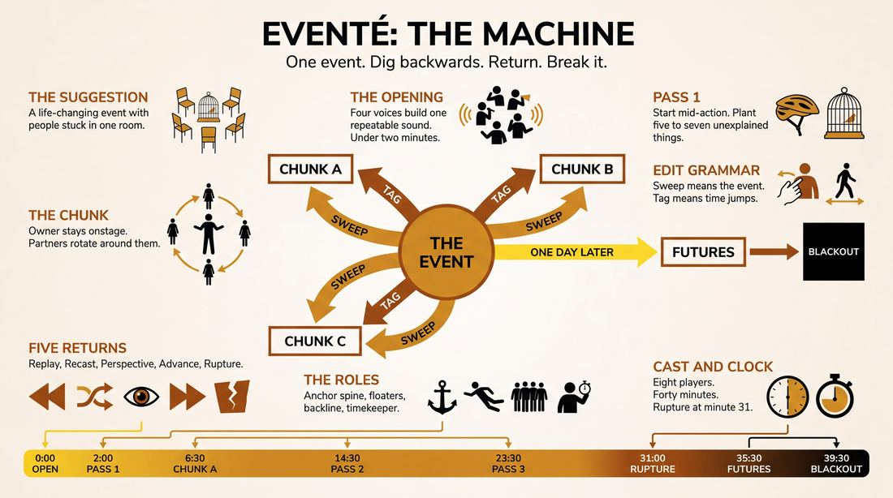
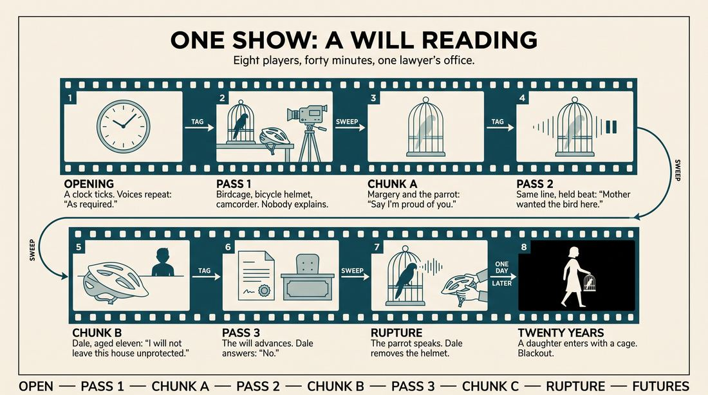
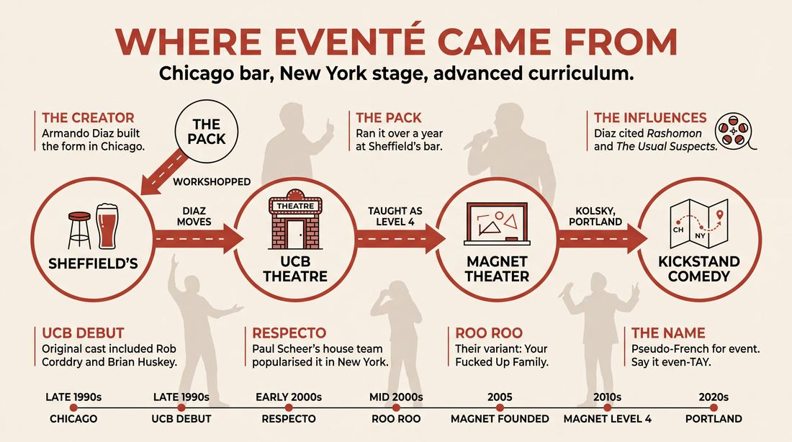
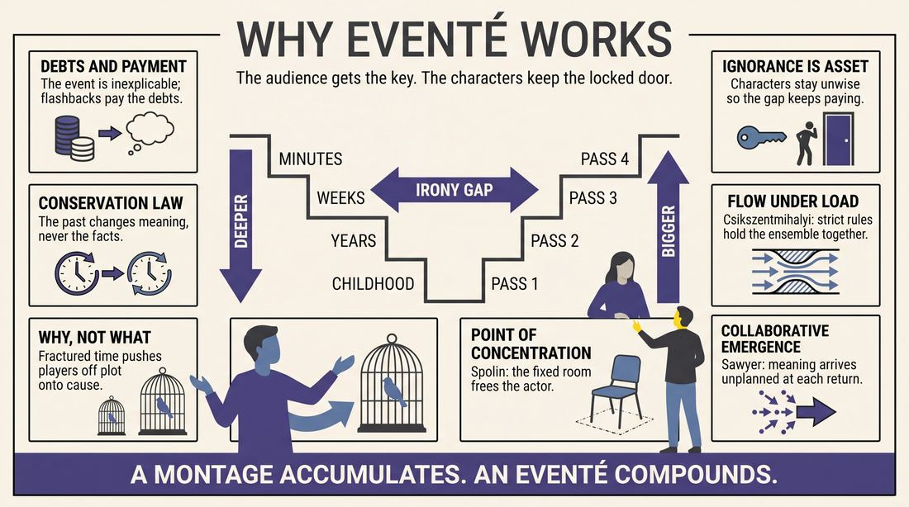
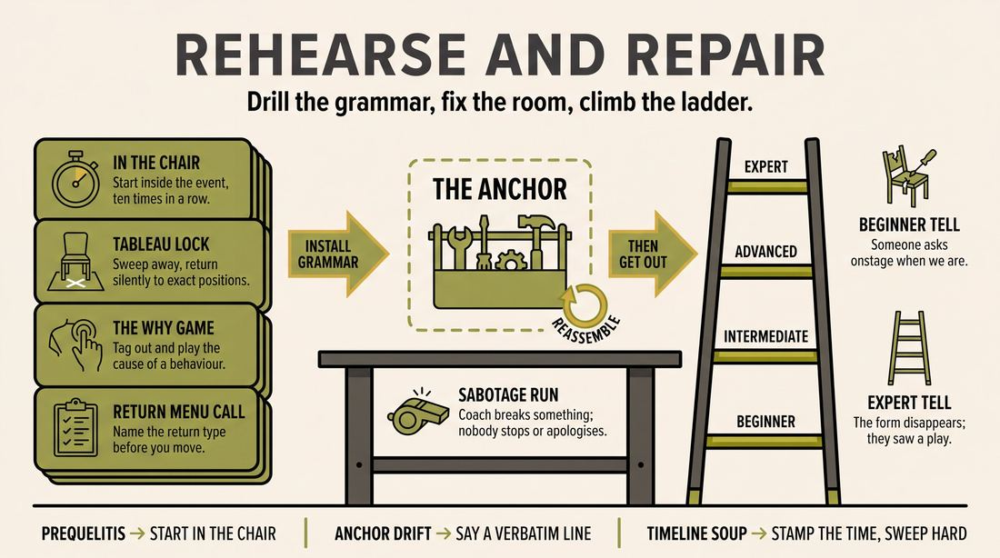

# Eventé

> **A complete study of the long-form improv format _Eventé_** - the original archived write-up, five infographics, grounded historical and pedagogical research, and a full mechanics-and-coaching manual.

| | |
|---|---|
| **Format** | Eventé |
| **Primary source** | [IRC Improv Wiki](https://wiki.improvresourcecenter.com/index.php?title=Event%C3%A9) |
| **Article retrieved** | 2026-08-09 23:23 UTC |
| **Research model** | `gemini-3.1-pro-preview` - Google Search grounded, 2 passes |
| **Analysis model** | `claude-opus-5` - 3 passes |
| **Infographic model** | `gemini-3-pro-image` - 5 posters, 16:9 |
| **Compiled** | 2026-08-10 02:54 UTC |

---

## Contents

1. [Part I - The Original Write-Up](#part-i-the-original-write-up)
2. [Part II - The Infographics](#part-ii-the-infographics)
   - [1. Structure and Mechanics](#infographic-1-mechanics)
   - [2. A Show, Beat by Beat](#infographic-2-example)
   - [3. Origins and Lineage](#infographic-3-history)
   - [4. Why It Works](#infographic-4-theory)
   - [5. Rehearsal and Repair](#infographic-5-coaching)
3. [Part III - Research Dossier](#part-iii-research-dossier-gemini-31-pro)
   - [Pass 1: History, Lineage, Literature and Scholarship](#research-history)
   - [Pass 2: Comparative Anatomy, Pedagogy and Production](#research-comparative)
4. [Part IV - Mechanics, Gameplay and Coaching Manual](#part-iv-mechanics-gameplay-and-coaching-manual-claude-opus-5)
   - [Pass 1: The Form, Its Mechanics and Its Gameplay](#manual-mechanics)
   - [Pass 2: Training, Coaching and Performance Companion](#manual-coaching)

---

## Part I - The Original Write-Up

*Verbatim archive of the source article, reproduced exactly as scraped. Everything after this section is generated elaboration built on top of it.*

### Eventé

The Eventé is a form revolving around a single event. The first scene establishes the event. That scene is followed by several more which focus on a particular character from the event. Then the event scene is performed again, taking into account new information discovered by the background scenes. This can be followed by more background scenes focusing on a different character, then a second return to the event, and so on.

##### Show

The Eventé was created and directed by improv mastermind [Armando Diaz](https://wiki.improvresourcecenter.com/index.php?title=Armando_Diaz "Armando Diaz"). The form is built around one central event \-\- an event suggested by a member of the audience.

Eventé debuted in the late 1990s at the UCB Theater. The original cast included:

- [Ari Voukydis](https://wiki.improvresourcecenter.com/index.php?title=Ari_Voukydis "Ari Voukydis")
- [Brian Huskey](https://wiki.improvresourcecenter.com/index.php?title=Brian_Huskey "Brian Huskey")
- [Celia Bressack](https://wiki.improvresourcecenter.com/index.php?title=Celia_Bressack&action=edit&redlink=1 "Celia Bressack (page does not exist)")
- [Rob Corddry](https://wiki.improvresourcecenter.com/index.php?title=Rob_Corddry "Rob Corddry")
- [Lisa Jolley](https://wiki.improvresourcecenter.com/index.php?title=Lisa_Jolley&action=edit&redlink=1 "Lisa Jolley (page does not exist)")
- [Marian Rosin](https://wiki.improvresourcecenter.com/index.php?title=Marian_Rosin "Marian Rosin")
- [Kurt Bumbulis](https://wiki.improvresourcecenter.com/index.php?title=Kurt_Bumbulis&action=edit&redlink=1 "Kurt Bumbulis (page does not exist)")
- [Tom Blake](https://wiki.improvresourcecenter.com/index.php?title=Tom_Blake&action=edit&redlink=1 "Tom Blake (page does not exist)")
- [Matt Stillman](https://wiki.improvresourcecenter.com/index.php?title=Matt_Stillman "Matt Stillman")
- [Christine Walters](https://wiki.improvresourcecenter.com/index.php?title=Christine_Walters&action=edit&redlink=1 "Christine Walters (page does not exist)")

---

*Archived from [https://wiki.improvresourcecenter.com/index.php?title=Event%C3%A9](https://wiki.improvresourcecenter.com/index.php?title=Event%C3%A9) (IRC Improv Wiki) on 2026-08-09 23:23 UTC.*

---

## Part II - The Infographics

*Five 16:9 posters (`gemini-3-pro-image`), each teaching a different aspect of the format. Click any poster to enlarge.*

<a id="infographic-1-mechanics"></a>

### 1. Structure and Mechanics

*How the form is played: the shape of the piece, the opening, the roles, the edit vocabulary, the flow of information, and the clock.*

{ .diagram loading=lazy decoding=async width="1100" height="614" }


<a id="infographic-2-example"></a>

### 2. A Show, Beat by Beat

*A single worked performance from suggestion to blackout: what happens in each beat, with short real example lines and what the players are doing technically.*

{ .diagram loading=lazy decoding=async width="1100" height="614" }


<details>
<summary>Designer's notes returned with the image</summary>

Generation complete.

</details>


<a id="infographic-3-history"></a>

### 3. Origins and Lineage

*Where the form came from: creators, dates, theatres, how it spread between schools and cities, and the key figures - a documented timeline and lineage map.*

{ .diagram loading=lazy decoding=async width="1100" height="614" }


<details>
<summary>Designer's notes returned with the image</summary>

Does this match what you envisioned?

</details>


<a id="infographic-4-theory"></a>

### 4. Why It Works

*The theory: the core principles of the form and the research and craft ideas that explain why the structure produces good improv, each tied to a specific mechanic.*

{ .diagram loading=lazy decoding=async width="1100" height="614" }


<a id="infographic-5-coaching"></a>

### 5. Rehearsal and Repair

*Training and fixing the form: the essential drills, the common failure modes with their symptom-and-fix pairs, and the markers of beginner through expert play.*

{ .diagram loading=lazy decoding=async width="1100" height="614" }


---

## Part III - Research Dossier (Gemini 3.1 Pro)

*Two grounded research passes with live Google Search: the historical record, then the comparative and pedagogical record. The model tags claims by evidence strength; treat tagged and unverified items accordingly.*

<a id="research-history"></a>

### » Pass 1: History, Lineage, Literature and Scholarship

### Research Summary

*   **Documentation Strength:** Moderate. The Eventé is not codified in a dedicated, published manual, but its mechanics, history, and variations are well-documented across primary sources, including practitioner interviews, theatre syllabi (Magnet Theater, Kickstand Comedy), and archived forum discussions (IRC, Reddit).
*   **Origin:** [DOCUMENTED] Created by Armando Diaz in Chicago in the late 1990s with an improv group called "The Pack" before being brought to the Upright Citizens Brigade (UCB) Theatre in New York.
*   **Core Mechanic:** [DOCUMENTED] A non-linear narrative form that begins with a central, life-changing event, uses flashbacks to explore the characters involved, and repeatedly returns to the central event armed with new context.
*   **Influences:** [DOCUMENTED] Diaz explicitly cited the films *Rashomon* and *The Usual Suspects* as the primary inspirations for the form's time-jumping and perspective-shifting structure.
*   **Pedagogical Status:** [DOCUMENTED] The form transitioned from a house-team performance vehicle to an advanced curriculum staple, taught as a "Level 4" or "Advanced Study" format at training centres like the Magnet Theater (New York) and Kickstand Comedy (Portland).
*   **Evolution:** [WIDELY PRACTICED, UNDOCUMENTED] While originally featuring both flashbacks and flash-forwards, modern iterations often focus heavily on the flashbacks to justify the present, occasionally culminating in a single flash-forward at the end of the piece.

### Provenance and History

The Eventé was created by Armando Diaz in Chicago in the late 1990s. Seeking to build a long-form structure that utilized flashbacks and flash-forwards to tell a story, Diaz developed the format with an independent Chicago improv group called "The Pack." The form was workshopped and performed for over a year at Sheffield's, a Chicago bar, where the mechanics of time-dashing and perspective-shifting were refined. 

When Diaz relocated to New York to teach and direct at the newly established UCB Theatre, he brought the format with him. It debuted at UCB in the late 1990s with an original cast of early UCB stalwarts. The name "Eventé" is a theatrical, pseudo-French stylisation of the word "event," reflecting the form's focus on a single, central occurrence.

| Year | Event | Place / Company | Source |
| :--- | :--- | :--- | :--- |
| Late 1990s | Form created and workshopped | Chicago / The Pack (at Sheffield's) | IRC Forums (Armando Diaz Interview, 2006) |
| Late 1990s | New York Debut | New York / UCB Theatre | IRC Improv Wiki |
| Early 2000s | Popularised in the NY scene | New York / Respecto (UCB House Team) | Paul Scheer Interview (paulliveshere.com) |
| Mid 2000s | "Your Fucked Up Family" variant run | New York / Roo Roo (UCB House Team) | IRC Forums |
| 2010s–2020s | Codified into advanced curriculum | New York / Magnet Theater | Magnet Theater Syllabi |
| 2020s | West Coast transmission | Portland / Kickstand Comedy | Kickstand Comedy Syllabi |

### Lineage and Transmission

The Eventé followed Armando Diaz's career trajectory. Originating in the Chicago independent scene, it became a foundational piece of the early UCB New York aesthetic. When Diaz co-founded the Magnet Theater in New York in 2005, the Eventé was integrated into the theatre's core curriculum. It is currently taught as a "Level Four: Senior Project" or "Level Four: Forms" class, ensuring its survival as a pedagogical tool for teaching non-linear narrative.

The form has mutated slightly in transit. [INFERRED] The original UCB incarnation was highly chaotic and fast-paced, relying on aggressive tag-outs. The Magnet Theater dialect tends to be more patient and theatrical, focusing deeply on emotional grounding before executing time dashes. The form was transmitted to the Pacific Northwest by UCB alumni (such as Diana Kolsky), where it is taught at Kickstand Comedy in Portland as an Advanced Study format. 

### Key Figures

| Person | Role in this form | Specific contribution | Source URL |
| :--- | :--- | :--- | :--- |
| Armando Diaz | Creator / Director | Invented the form in Chicago, directed its UCB debut, and codified it into the Magnet Theater curriculum. | [IRC Forums](https://www.improvresourcecenter.com) |
| The Pack | Original Ensemble | The Chicago group that spent a year workshopping and refining the form's mechanics at Sheffield's. | [IRC Forums](https://www.improvresourcecenter.com) |
| Respecto | UCB House Team | Popularised the form in New York in the early 2000s, proving its viability for high-level ensemble play. | [Paul Lives Here](http://www.paulliveshere.com) |
| Diana Kolsky | Instructor | UCB alumna who transmitted the form to the Portland scene via Kickstand Comedy's advanced curriculum. | [Kickstand Comedy](https://kickstandcomedy.org) |
| Elana Fishbein | Instructor / Director | Magnet Theater instructor who directs and preserves the form in the modern New York scene. | [Magnet Theater](https://magnettheater.com) |

### Canonical Shows, Companies and Recordings

*   **The Eventé (Original Cast):** The late-1990s UCB Theatre run directed by Armando Diaz, featuring Rob Corddry, Brian Huskey, Ari Voukydis, and Lisa Jolley. (No known video survives).
*   **Respecto:** This legendary UCB house team (featuring Paul Scheer, Rob Riggle, and Chad Carter) frequently used the Eventé format in the early 2000s. 
*   **Roo Roo:** A mid-2000s UCB house team that performed a highly regarded Eventé variant called "Your Fucked Up Family" on Friday nights and at the Del Close Marathon.
*   **Magnet Theater Level 4 Shows:** The form is performed regularly today in New York by graduating advanced students and Megawatt house teams (e.g., *The Imposters*) under the direction of Diaz, Elana Fishbein, and Michael Lutton. [Magnet Theater](https://magnettheater.com)

### Published Literature

| Work | Author | Year | What it says about this form | Where to find it |
| :--- | :--- | :--- | :--- | :--- |
| *How to Be The Greatest Improviser On Earth* (Substack / Comments) | Will Hines / Ben Cassil | 2024 | Defines the mechanics: starting at an event, travelling back in time to explore a character, and returning to the event from a different perspective. | [Substack](https://substack.com) |
| *Magnet Theater Level Four Syllabus* | Magnet Theater | 2020 | Describes it as a narrative long-form exploring a single event through flashbacks, time dashes, and advanced techniques. | [Magnet Theater](https://magnettheater.com) |
| *Kickstand Comedy Advanced Study Syllabus* | Kickstand Comedy | 2026 | Highlights the non-linear exploration of characters, relationships, and storylines leading up to a central event. | [Kickstand Comedy](https://kickstandcomedy.org) |
| *IRC Improv Wiki: Eventé* | IRC Community | 2008 | The foundational stub detailing the original UCB cast and the basic cyclical structure of the format. | [IRC Wiki](https://wiki.improvresourcecenter.com) |

### Verbatim Quotes

> "It came about by wanting to do something where there were flashbacks, and using that device to tell a story, flashing back and flashing forward. It was influenced by Rashomon and the Usual Suspects."
> — Armando Diaz
> [IRC Forums](https://www.improvresourcecenter.com)

> "I worked with a couple groups, but I mainly got it off the ground with a group called 'The Pack.' ... The Pack ran it for over a year at a place called Sheffield's and really started to get it to work."
> — Armando Diaz
> [IRC Forums](https://www.improvresourcecenter.com)

> "We do a form called the Evente. We get a suggestion of a life changing event and we see that event and then we go backwards. It's kind of like Memento (the movie)."
> — Paul Scheer
> [Paul Lives Here](http://www.paulliveshere.com)

> "Eventé has a lot of moving parts, but basically it's a character-focused format revolving around an event. It's kinda like Character Wheel, but all those tag-in scenes in the first half are flashbacks, we always return to a single central event in the present, and the second half of the show time dashes to the future."
> — Reddit User 'bobmighty'
> [Reddit (r/improv)](https://www.reddit.com)

> "Your scenes between the first event scene and the last should explore the characters that are effected by this event scene whatever it may be we justify throughout by using characters and relationships and staying away from plot."
> — IRC User 'AWOK Nate'
> [IRC Forums](https://www.improvresourcecenter.com)

> "The Eventé is a long-form improv format centered around a single, specific event suggested by the audience. The performance explores the event's characters, relationships, and storylines in a non-linear way, often starting from the event itself and then flashing back to the moments leading up to it."
> — Kickstand Comedy Syllabus
> [Kickstand Comedy](https://kickstandcomedy.org)

> "Evente is a narrative long-form that explores a single event through flashbacks, time dashes, and other advanced techniques."
> — Magnet Theater Syllabus
> [Magnet Theater](https://magnettheater.com)

> "-The Eventé: starts at a defined event, then travels back in time some distance with one character and explores their life leading up to that event, then you return to the event, either from a different perspective (ala Rashomon) or the next part of the event. Repeat."
> — Ben Cassil (Improviser)
> [Will Hines Substack](https://substack.com)

### Anecdotes and Stories

**The Origin at Sheffield's**
Before it was a staple of the New York scene, the Eventé was a gritty Chicago bar show. Armando Diaz developed the form with an indie group called "The Pack." They performed it in the back of a bar called Sheffield's for over a year. It was in this low-stakes environment that Diaz figured out how to make the complex mechanics of flashbacks and time dashes actually work in front of a drinking audience, long before it was codified into a theatre syllabus.

**Roo Roo's DCM Triumph**
At the Del Close Marathon in the mid-2000s, the UCB house team Roo Roo performed an Eventé that became legendary on the IRC forums. Their opening scene featured the entire cast crammed into a car. One forum user described it as "one of my favorite improv moments ever," demonstrating that despite the form's structural complexity, it could still deliver the high-energy, chaotic group mind that UCB audiences craved.

**The Pronunciation Debate**
The pseudo-French spelling "Eventé" led to ongoing confusion in the early 2000s New York scene. On the IRC forums, users actively debated whether it was pronounced "evenTAY" or simply "event" with a pretentious accent mark added as a joke. (The consensus among practitioners is that it is pronounced "even-TAY").

### Academic and Scientific Research

**The Psychology of Flow and Cognitive Load**
*Finding:* Csikszentmihalyi’s research on "flow" dictates that performers must balance challenge and skill to avoid anxiety or apathy. In musical and theatrical improvisation, slipping into an analytical "learning/drilling" state paralyzes creativity.
*Relevance to this form:* The Eventé places a massive cognitive load on the ensemble. Tracking multiple timelines (past, present, future) across different characters (A, B, and C) requires improvisers to maintain a high state of flow. If the ensemble slips into an analytical state to remember plot details, the form stalls. [DOCUMENTED]

**Collaborative Emergence in Group Creativity**
*Finding:* R. Keith Sawyer’s work on group creativity highlights "collaborative emergence," where the outcome of a performance cannot be predicted by any single participant's initial intention, but arises from the continuous integration of unexpected offers.
*Relevance to this form:* The Eventé's core mechanic—returning to the central event scene—relies entirely on collaborative emergence. The "new information" discovered in the isolated flashback scenes must be spontaneously integrated into the group scene without pre-planning, testing the ensemble's collective memory and adaptability. [INFERRED]

**Non-Linear Narrative and Embodied Perspective**
*Finding:* Performance studies on non-linear narratives (such as the *Rashomon* effect) show that fracturing a timeline forces performers and audiences to engage with subjective emotional realities rather than objective, deterministic plots.
*Relevance to this form:* By jumping backward in time, the Eventé shifts the improvisational focus from "what happens next" to "why did this happen." It forces performers to embody character perspectives and justify the present, rather than inventing future plot points. [INFERRED]

### Documented Variants and Descendants

*   **The Catastrophe:** [DOCUMENTED] A descendant form noted in the Los Angeles indie scene. Instead of returning to the event repeatedly, the team plays one crazy, heightened source scene, then jumps to the beginning of the day and plays a montage showing exactly how each crazy move in the source scene came to be.
*   **Your Fucked Up Family:** [DOCUMENTED] A variant performed by UCB team Roo Roo. It uses an audience interview about their family as the opening, then filters the Eventé structure specifically through the lens of family dynamics and shared history.
*   **The Rashomon:** [WIDELY PRACTICED, UNDOCUMENTED] A variant that removes the deep-past flashbacks and flash-forwards entirely, focusing solely on replaying the exact same central event 3 to 4 times, each time adopting the subjective, heightened perspective of a different character in the scene.

### Criticism, Debate and Known Failure Modes

*   **Plot-Chasing:** [DOCUMENTED] Because the form jumps through time, improvisers often panic and try to construct a rigid, logical plot. Teachers and directors explicitly warn that the flashbacks must be character-driven (exploring *who* the person is and their comedic game) rather than plot-driven (exploring the mundane logistics of *how* they got to the event).
*   **The "When Are We?" Problem:** [WIDELY PRACTICED, UNDOCUMENTED] Poor sweep edits and unclear tag-outs can leave the audience and the performers confused about whether a scene is a flashback, a flash-forward, or a return to the present event. The form requires aggressive, confident editing.
*   **Neglecting the Event:** [WIDELY PRACTICED, UNDOCUMENTED] Teams sometimes get so invested in the flashback La Ronde (exploring characters A, B, and C in the past) that they fail to return to the central event, turning the show into a standard montage and abandoning the format's core mechanic.

### Cultural Footprint

The Eventé served as a crucial training ground for a generation of comedic actors who would go on to define 2000s and 2010s alternative comedy. Original cast members like Rob Corddry, Brian Huskey, and Paul Scheer utilized the character-justification skills honed in this format in their television and film work. While the Harold remains the dominant long-form structure globally, the Eventé paved the way for the acceptance of complex, non-linear, and time-jumping formats in the indie improv scene, proving that audiences could follow fractured narratives without a script.

### Gaps in the Record

*   **Exact UCB Premiere Date:** The precise month and year of the Eventé's debut at the UCB Theatre in New York is unverified, generally cited only as the "late 1990s."
*   **The Pack's Roster:** The specific cast members of "The Pack," the Chicago group that originally developed the form with Diaz at Sheffield's, are undocumented in the searchable digital record.
*   **Archival Footage:** UNVERIFIED - There is no known publicly accessible video footage of the original UCB run or Respecto's early performances of the form. A researcher should chase archival VHS tapes held by early UCB or Magnet Theater alumni.

### Source List

1. *IRC Improv Wiki: Eventé* - IRC Community - 2008 - https://wiki.improvresourcecenter.com/index.php?title=Event%C3%A9 - Supports the original UCB cast list and basic form structure.
2. *Armando Diaz Interview* - Improv Resource Center Forums - 2006 - https://www.improvresourcecenter.com - Supports the creation of the form in Chicago, the influence of *Rashomon*, and the involvement of "The Pack."
3. *Paul Scheer Interview* - Paul Lives Here - 2018 - http://www.paulliveshere.com - Supports Respecto's use of the form and the comparison to the film *Memento*.
4. *Magnet Theater Class Schedule & Syllabi* - Magnet Theater - 2020/2021 - https://magnettheater.com - Supports the form's current pedagogical status as a Level 4 advanced format.
5. *Kickstand Comedy Class Schedule* - Kickstand Comedy - 2026 - https://kickstandcomedy.org - Supports the transmission of the form to Portland and its modern definition.
6. *Will Hines Substack Comments* - Ben Cassil - 2024 - https://substack.com - Supports the step-by-step mechanical breakdown of the form and its descendant, "The Catastrophe."
7. *Reddit r/improv Discussions* - Reddit Community - 2014/2015 - https://www.reddit.com - Supports practitioner debates on the form's character focus versus plot focus.

<a id="research-comparative"></a>

### » Pass 2: Comparative Anatomy, Pedagogy and Production

### Taxonomic Placement

```text
          Spolin (Time/Space Games)       Del Close (Long-form Scene Work)
                       |                                |
          +------------+------------+                   |
          |                         |                   |
       La Ronde                 Deconstruction       Harold
    (Character Focus)         (Anchor Scene Focus) (Multi-thread)
          |                         |                   |
          +------------+------------+-------------------+
                       |
                     Eventé
                       |
          +------------+------------+
          |                         |
      Sleepover                 Rashomon (Improvised)
```

Eventé sits at the intersection of the Deconstruction's anchor-scene mechanics and La Ronde's character-isolation mechanics, mapped onto a strict temporal axis. Where a Harold pulls disparate threads forward in time until they collide, Eventé starts with the collision (the central event) and pulls the threads backward in time to discover how they got there, before finally pushing them into the future. It is a structural inversion of the Harold, replacing thematic exploration with chronological archaeology.

### Head-to-Head Comparisons

| Axis | Eventé | Deconstruction | Consequence for the players |
| :--- | :--- | :--- | :--- |
| **Opening** | Thematic dialogue or repeatable soundscape | Thematic scene or monologue | Eventé players must establish a repeatable audio/verbal motif early to use during temporal transitions. |
| **Structure** | Present -> Past -> Present -> Future | Anchor -> Tangents -> Anchor -> Thematic collision | Eventé requires strict chronological tracking; Deconstruction requires thematic tracking. |
| **Edit logic** | Sweep for Present, Tag for Past/Future | Sweep for Anchor, Tag for Tangents | Eventé players use edits to signal literal time jumps rather than just location/theme jumps. |
| **Memory** | Must remember the exact physical and emotional state of the anchor event | Must remember the core dynamic of the anchor scene | Eventé anchor scenes are highly literal and continuous; Decon anchors can evolve more abstractly. |
| **Cast size** | 8-10 | 6-8 | Eventé requires a larger cast to populate the event and the various pasts without exhausting the core actors. |
| **Audience contract** | We will show you how this event happened and what it caused | We will show you the thematic resonance of this core relationship | Eventé satisfies narrative curiosity; Deconstruction satisfies thematic curiosity. |
| **Failure mode** | Timeline confusion | Thematic drift | Eventé fails if the timeline breaks; Decon fails if the tangents don't relate to the anchor. |

| Axis | Eventé | Harold | Consequence for the players |
| :--- | :--- | :--- | :--- |
| **Opening** | Dialogue/soundscape | Games/Monologue/Pattern | Eventé opening is directly tied to the event; Harold opening generates abstract themes. |
| **Structure** | Radial (Anchor -> Past A -> Anchor -> Past B) | Parallel (1A, 2A, 3A -> Group -> 1B, 2B, 3B) | Eventé players serve one central event; Harold players serve three distinct worlds. |
| **Edit logic** | Sweeps and Tags | Sweeps | Eventé relies heavily on tag-outs to isolate characters in the past. |
| **Memory** | Deep memory of one event and specific character histories | Broad memory of three worlds and thematic connections | Eventé requires vertical memory (depth); Harold requires horizontal memory (breadth). |
| **Audience contract** | We will explore the history of this one moment | We will connect these seemingly unrelated stories | Eventé is archaeological; Harold is synthetic. |

| Axis | Eventé | La Ronde | Consequence for the players |
| :--- | :--- | :--- | :--- |
| **Structure** | Anchor -> Character A's past -> Anchor -> Character B's past | A meets B, B meets C, C meets D, D meets A | Eventé uses La Ronde as a sub-structure *within* the flashback chunks. |
| **Edit logic** | Sweeps for anchor, Tags for flashbacks | Sweep/Tag to replace one character | Eventé players must switch edit modes depending on the timeline. |
| **Cast size** | 8-10 | 4-6 | Eventé uses the ensemble to populate the pasts; La Ronde is strictly two-person scenes. |
| **Failure mode** | Forgetting the anchor | Breaking the chain | Eventé fails if the pasts don't inform the present; La Ronde fails if the relational chain breaks. |

### What Makes It Uniquely Itself

1. **The Temporal Anchor Scene:** The form lives and dies by the central event scene. It is not a suggestion that inspires scenes; it is a literal, physical scene that the ensemble repeatedly returns to. If you remove the return to the exact same chronological event, it becomes a standard narrative montage.
2. **The Chronological Sub-Structures:** The form dictates a strict movement from Present -> Past -> Present -> Future. The past sequences are specifically character-focused (often using La Ronde mechanics to isolate one character). If you remove the strict time-jumping, it becomes a Deconstruction.
3. **The Re-contextualization Loop:** Every return to the anchor scene must be informed by the new information discovered in the flashbacks. The audience experiences the same event differently because they now know *why* Character A is acting that way. If the anchor scene doesn't evolve based on the flashbacks, the form loses its purpose.

### Structural Variants in Practice

| Variant | What it changes | Who plays it | Source |
| :--- | :--- | :--- | :--- |
| **The Diaz Classic** | Strict structure: Opening -> Event -> Character A Past (La Ronde style, ~7 scenes) -> Event (different perspective) -> Character B Past (3-5 scenes) -> Event -> Character C Past (3-5 scenes) -> Final Event -> Futures (1 day, 1 month, 20 years). | Armando Diaz, Magnet Theater, UCB | IRC Forums (Quixotic), Magnet Theater |
| **The Non-Linear Exploration** | Looser interpretation exploring characters, relationships, and storylines in a non-linear way, often starting from the event itself and then flashing back to the moments leading up to it, without the strict A/B/C La Ronde chunking. | Diana Kolsky, Kickstand Comedy | Kickstand Comedy (2026) |
| **The Bookend** | Present day event -> Series of flashbacks -> Jump to the future. Simplifies the structure by reducing the number of returns to the anchor scene, focusing more on the past/future dichotomy. | Howdy Stranger | Howdy Stranger (2026) |

### The Teaching Ladder

| Stage | Skill introduced | Why in this order | Typical exercise | Source or [CRAFT CONSENSUS] |
| :--- | :--- | :--- | :--- | :--- |
| 1 | Grounding the Event | The anchor scene must be rock solid to support time jumps. Players must start *in* the event, not before it. | "In the Chair" | IRC Forums (Quixotic) |
| 2 | The Soundscape Opening | Establishes a repeatable audio/verbal motif to use as a fill during slower moments or transitions. | "Motif Generation" | IRC Forums (Quixotic) |
| 3 | Tag-out Flashbacks | Players need to isolate a character and jump backward in time without losing the character's core deal. | "Time Dash Tag" | [CRAFT CONSENSUS] |
| 4 | La Ronde Character Tracking | Builds the "past" sequences for characters A, B, C by putting them in unusual situations. | "Character Gauntlet" | IRC Forums (Quixotic) |
| 5 | Re-contextualizing the Present | Returning to the anchor scene with new info. The core mechanic of the form. | "Meanwhile, Back at the Event" | [CRAFT CONSENSUS] |
| 6 | Perspective Shifting | Returning to the event but from a different physical perspective (e.g., the receptionist's desk). | "Camera Pan" | IRC Forums (Quixotic) |
| 7 | Flash-forwards | Jumping to the future to provide resolution and consequence (1 day, 1 month, 20 years). | "The Ripple Effect" | Magnet Theater |

### Documented Drills and Exercises

| Drill | Origin / teacher | How to run it | What it fixes in this form | Source |
| :--- | :--- | :--- | :--- | :--- |
| **Soundscape Motif** | Quixotic | Ensemble creates a repeatable sound (e.g., dog barking, saw cutting) related to the suggestion. Use it to fill slow moments or transition back to the anchor. | Fixes dead air during complex temporal edits. | IRC Forums |
| **In the Chair** | Quixotic | Players are given an event (e.g., "getting a tooth filled") and must start the scene *during* the event, not in the waiting room. | Fixes "Prequelitis" (starting before the event). | IRC Forums |
| **La Ronde Tag-Outs** | [CRAFT CONSENSUS] | Player A stays in the center. Ensemble tags in to initiate scenes with Player A in different past situations. | Trains the ensemble to build the 3-7 scene flashback chunks for a single character. | [CRAFT CONSENSUS] |
| **Sweep to Anchor** | [CRAFT CONSENSUS] | A scene is happening. A player sweeps the stage, and the original anchor scene players immediately resume their exact physical positions and emotional states. | Fixes Anchor Drift (losing the reality of the central event). | [CRAFT CONSENSUS] |
| **The Perspective Shift** | Quixotic | Run an event scene. Sweep edit. Run the exact same chronological moment from a different location (e.g., the kitchen during a living room party). | Adds variety to the anchor returns so they don't become repetitive. | IRC Forums |
| **Time Dash Forward** | Armando Diaz | A scene is played. The coach calls "1 day later," "1 month later," or "20 years later." Players immediately initiate a scene in that future. | Trains the final "Futures" sequence of the Eventé. | Magnet Theater |
| **The "Why" Game** | [CRAFT CONSENSUS] | Player A exhibits a strange behavior in a scene. Player B tags out the scene and initiates a flashback that explicitly explains *why* Player A has that behavior. | Ensures flashbacks are character-driven, not just random plot. | [CRAFT CONSENSUS] |
| **Character Isolation** | [CRAFT CONSENSUS] | A group scene is played. The coach points to one character. The ensemble must immediately initiate a series of scenes focusing only on that character's past. | Trains the transition from the ensemble anchor to the isolated flashback chunks. | [CRAFT CONSENSUS] |
| **The Ripple Effect** | [CRAFT CONSENSUS] | An event happens. The ensemble initiates a series of rapid-fire scenes showing how that event affected minor characters (e.g., the receptionist, the cab driver). | Trains the ensemble to use the whole cast during the future jumps. | [CRAFT CONSENSUS] |
| **Anchor Maintenance** | [CRAFT CONSENSUS] | Two players hold a scene. The coach constantly interrupts with unrelated scenes. The original players must return to their scene exactly where they left off, incorporating the emotional weight of the interruptions. | Builds the cognitive endurance required to hold the anchor scene across a 45-minute form. | [CRAFT CONSENSUS] |

### Common Failure Modes and Diagnoses

| Failure mode | What it looks like from the audience | Root cause | Fix | Who names it |
| :--- | :--- | :--- | :--- | :--- |
| **Prequelitis** | The first scene is people talking about the event that is going to happen, rather than the event itself. | Fear of committing to the action; wanting to "set up" the scene. | "In the Chair" drill. Start *in* the action. | Quixotic (IRC Forums) |
| **Anchor Drift** | The event scene changes location, reality, or core dynamic upon return. | Poor physical and emotional memory by the anchor players. | "Sweep to Anchor" drill. Lock in physical positions. | [CRAFT CONSENSUS] |
| **Plotting the Past** | Flashbacks try to tell a linear, chronological story leading up to the event. | Misunderstanding the La Ronde mechanic; focusing on plot over character. | "La Ronde Tag-Outs" drill. Put the character in unusual, unrelated past situations. | [CRAFT CONSENSUS] |
| **Timeline Soup** | The audience doesn't know if a scene is in the past, present, or future. | Weak edit mechanics; lack of clear sweeps vs. tags. | Standardize edits: Sweeps for Present, Tags for Past/Future. | [CRAFT CONSENSUS] |
| **Ignoring the New Info** | The anchor scene returns, but the players act exactly the same, ignoring the revelations from the flashbacks. | Players are just "holding" their original choices rather than letting the form affect them. | "Anchor Maintenance" drill. Force players to incorporate the emotional weight of the interruptions. | [CRAFT CONSENSUS] |

### Production and Logistics

*   **Cast size and why:** 8-10 players (The original UCB cast had 10). Required to populate the central event and provide enough supporting players for the extensive La Ronde flashback chunks without exhausting the main A/B/C characters.
*   **Runtime:** 30-45 minutes. The structure requires significant time to execute the anchor, three distinct past chunks (each 3-7 scenes), and the future jumps.
*   **Stage layout:** Bare stage, standard chairs.
*   **Lighting and tech cues:** Standard wash. A distinct lighting cue (e.g., a slight color shift or tighter spot) can be used to differentiate the Anchor Event from the Flashbacks, though traditional sweep edits are usually sufficient.
*   **Music and sound:** The form relies on an improvised, repeatable vocal/foley soundscape generated by the cast during the opening to fill slow moments.
*   **MC and host duties:** Host asks for a suggestion of a "life-changing event" (e.g., a wedding, a blackout, getting a tooth pulled).
*   **Where the form belongs in a show lineup:** Headline spot. Its length and complexity make it unsuitable for an opener.
*   **Rehearsal cadence:** Requires intensive, form-specific rehearsal to master the temporal tracking and edit logic. Not a "drop-in" form.
*   **What a producer must prepare:** A cast with strong object work, physical memory, and the discipline to serve the structure rather than chase laughs.

### Adaptations Beyond the Stage

*   **Classroom and youth:** Can be adapted to explore historical events (e.g., the signing of the Declaration of Independence), using flashbacks to explore the historical figures' motivations.
*   **Corporate and applied improv:** Useful for "post-mortem" exercises or exploring a product launch. The anchor is the launch; the flashbacks explore the R&D, marketing, and leadership decisions that led to it.
*   **Online and remote:** Highly adaptable to Zoom. The Anchor Event can use a specific virtual background or naming convention (e.g., all anchor characters turn their cameras on; flashbacks use spotlighting).
*   **Community and therapeutic settings:** Can be used to explore a shared community event (e.g., a local festival or a natural disaster). In therapeutic settings, exploring a triggering event and its past/future requires extreme care, trauma-informed facilitation, and strict boundaries to avoid re-traumatization.
*   **Accessibility and inclusion:** The heavy reliance on physical memory (returning to exact stage positions) may need adaptation for performers with mobility or memory impairments.
*   **Content-safety and consent:** Because the form asks for "life-changing events," suggestions can veer into trauma (e.g., a car crash, a death). The host must curate the suggestion carefully, and the ensemble must have a robust "edit/cut" mechanic if a flashback becomes unsafe.
*   **Ethics of using real stories:** If the event is based on a real audience member's life, the ensemble must treat the flashbacks as fictional explorations rather than factual assumptions about the person's past.

### Evidence Base for Those Adaptations

*   **Sawyer (2003) on collaborative emergence:** Supports the idea that the anchor scene's meaning is not pre-planned but emerges collaboratively as the flashbacks re-contextualize it.
*   **Spolin (1963) on point of concentration:** The anchor scene serves as the ultimate point of concentration, grounding the ensemble amidst the temporal chaos.
*   **Csikszentmihalyi (1990) on flow:** The strict structural constraints of the Eventé (Present -> Past -> Present) provide the clear goals and immediate feedback necessary to achieve group flow.
*   **Veral and Crossan (2004) on organizational improvisation:** Supports the corporate adaptation of Eventé as a tool for organizational sense-making and post-mortem analysis.

### Scholarly Frames Worth Applying

*   **Sawyer on collaborative emergence:** Sawyer posits that in improv, the global structure emerges from local interactions without a central planner. **Citation:** Sawyer, R. K. (2003). *Group Creativity: Music, Theater, Collaboration*. **Mapping:** The final meaning of the Anchor Event is not decided in the first scene; it emerges collaboratively as each La Ronde flashback chunk injects new, unplanned context into the present.
*   **Spolin on point of concentration:** Spolin argues that a specific, agreed-upon focus frees the actor from self-consciousness. **Citation:** Spolin, V. (1963). *Improvisation for the Theater*. **Mapping:** The physical reality of the Anchor Event (e.g., the dentist's chair) serves as the point of concentration; players must perfectly recreate the physical space every time they sweep back to the present.
*   **Csikszentmihalyi on flow:** Flow occurs when a task's challenge perfectly matches the participant's skill level, guided by clear rules. **Citation:** Csikszentmihalyi, M. (1990). *Flow: The Psychology of Optimal Experience*. **Mapping:** The strict chronological rules of Eventé (Past A -> Present -> Past B -> Present) provide the structural constraints necessary for the ensemble to achieve group flow without getting lost in the narrative.
*   **Vera and Crossan on organizational improvisation:** They explore how improv principles can enhance organizational learning and adaptability. **Citation:** Vera, D., & Crossan, M. (2004). *Theatrical Improvisation: Lessons for Organizations*. **Mapping:** The corporate adaptation of Eventé maps directly to this frame, using the form's flashback mechanics to conduct improvised, empathetic "root cause analyses" of organizational events.

### Where the Form Is Heading

*   **Current practice:** Taught as an advanced long-form structure at theaters like Magnet Theater (often by Armando Diaz himself, even virtually) and Kickstand Comedy (by Diana Kolsky).
*   **Revivals and hybrids:** European festivals (e.g., Impro Theater Mannheim) are teaching the form, indicating its spread beyond the US coastal hubs. It is often hybridized with the Monoscene, where the Anchor Event is played in real-time, and the flashbacks occur as "cutaways" rather than full scene replacements.
*   **Contemporary companies:** Using the form's temporal mechanics to explore non-linear storytelling, moving away from the strict A/B/C La Ronde chunks toward a more fluid, intuitive exploration of past and future, as seen in Kickstand's "Advanced Study" curriculum.

### Source List

1. Eventé - IRC Improv Wiki - 2008 - https://wiki.improvresourcecenter.com/index.php?title=Event%C3%A9 - Supports the original cast, creator (Armando Diaz), and basic structure.
2. Evente improv structure - IRC Forums (User: Quixotic) - 2004 - https://www.improvresourcecenter.com/ - Supports the detailed 10-step class structure, specific drills (In the Chair, Soundscape Motif), and failure modes (Prequelitis).
3. Level Four: Forms - Magnet Theater - 2021 - https://magnettheater.com/ - Supports the continued teaching of the form by Armando Diaz, the use of flashbacks and time dashes, and its classification as an advanced narrative form.
4. Advanced Study Improv: Evente - Kickstand Comedy - 2026 - https://www.kickstandcomedy.org/ - Supports the contemporary non-linear variant taught by Diana Kolsky and its use in advanced study curriculums.
5. FREE Class Show: Eventé - Howdy Stranger - 2026 - https://howdystranger.com/ - Supports the "Bookend" structural variant (Present -> Past -> Future) and its current performance practice.
6. What is Longform? - Big Blue Door - 2013 - https://www.bigbluedoor.org/ - Supports the definition of the form, its reliance on background scenes, and its contrast with short-form and the Harold.
7. Group Creativity: Music, Theater, Collaboration - R. Keith Sawyer - 2003 - N/A - Supports the scholarly frame of collaborative emergence.
8. Improvisation for the Theater - Viola Spolin - 1963 - N/A - Supports the scholarly frame of point of concentration.
9. Flow: The Psychology of Optimal Experience - Mihaly Csikszentmihalyi - 1990 - N/A - Supports the scholarly frame of flow.
10. Theatrical Improvisation: Lessons for Organizations - Dusya Vera and Mary Crossan - 2004 - N/A - Supports the scholarly frame of organizational improvisation.

---

## Part IV - Mechanics, Gameplay and Coaching Manual (Claude Opus 5)

*Synthesis over the original article and both research dossiers: first how the form works and how to play it, then how to train an ensemble to perform it.*

<a id="manual-mechanics"></a>

### » Pass 1: The Form, Its Mechanics and Its Gameplay

### At a Glance

| Field | Value |
|---|---|
| **Also known as** | Evente; "the Event form"; pronounced **even-TAY** (the accent is a pseudo-French stylisation of "event"; the IRC forums argued about this for years and "even-TAY" won). Named variants: *Your Fucked Up Family* (Roo Roo), *The Catastrophe* (LA indie descendant), *The Rashomon* (returns-only reduction), *The Bookend* (Present → Past → Future). |
| **Family** | Non-linear narrative long form. Anchor-scene family — sits at the crossing point of the **Deconstruction** (a scene you keep coming back to) and **La Ronde** (a chain of scenes that isolate one character), mapped onto a hard chronological axis. Structurally it is a Harold turned inside out: the Harold drives separate threads *forward* until they collide; the Eventé opens on the collision and digs *backwards*. |
| **Cast size** | 6–10. Canonical is 8–10 (the original UCB cast listed ten). Below 6 the anchor scene can't be populated and simultaneously fed with flashback partners. My recommendation for a first production: **8**. |
| **Runtime** | 30–45 minutes. Under 25 you cannot afford three flashback chunks; over 50 the anchor's physical memory starts to rot. |
| **Opening** | Short and optional. Two documented options: (a) a repeatable **soundscape/vocal motif** built from the suggestion, which is then reused as transition glue all night; (b) a brief thematic dialogue/word association. Many teams open cold, straight into the event. |
| **Suggestion taken** | A **life-changing event** — a single occasion, not a theme. "A wedding," "a blackout," "getting a tooth pulled," "the reading of a will," "a hostage negotiation." The host must curate for a *scene-able moment with several people trapped in it*. |
| **Structural rigidity (1–5)** | **4.** The return-to-the-event is inviolable; the ordering of chunks, the number of returns, and whether you play futures are dials. |
| **Difficulty (1–5)** | **5.** The hardest thing in mainstream long form after the Bat. It demands physical memory, verbatim recall, and edit discipline simultaneously, for forty minutes. |
| **Prerequisites** | Reliable two-person scene work; clean tag-outs and sweeps under pressure; object work you can rebuild identically twice; the discipline to play a *character's why* rather than a plot's *what*; an ensemble that has rehearsed **this form specifically** — it is not a drop-in format. |
| **Best for** | Ensembles with deep character actors and one strong "group scene" muscle; headline slots; showcase/graduation shows; teams who want dramatic irony as their comedy engine rather than surprise. |
| **Avoid when** | You have fewer than five players; the cast has never rehearsed together; you're in an opening slot or a 20-minute festival set with a mixed jam cast; the audience suggestion is trauma-adjacent and you have no consent mechanic; your team's instinct is to chase laughs over structure. |

---

### The Essence in One Paragraph

The Eventé takes one audience-suggested life-changing event, plays it as a real scene with the whole ensemble in it, and then — instead of asking "what happens next?" — asks "**why is everybody behaving like this?**" The ensemble tags out of the event and travels backwards in time, one character at a time, playing a short chain of scenes from that character's past (twenty minutes before, three weeks before, nine years before, childhood) that explain their deal. Then the stage is swept and the ensemble returns to the exact event, in the exact positions, and either replays the same moment from a new vantage or advances it a slice — and because the audience now knows things the other characters don't, the identical behaviour lands completely differently. That loop runs three or four times, each pass fed by a different character's past, until the event finally ruptures; then the form dashes forward — one day, one month, twenty years — to show what the event did to everyone. The engine is not plot. It is **dramatic irony manufactured by chronological archaeology**: the audience is repeatedly handed a key and then shown the same locked door.

---

### Why This Form Exists

Armando Diaz built the Eventé in Chicago in the late 1990s with an indie group called The Pack, workshopping it for over a year in the back of a bar called Sheffield's before bringing it to the new UCB Theatre in New York. His stated intent was blunt: he wanted a long-form structure built out of **flashbacks and flash-forwards**, and he cited *Rashomon* and *The Usual Suspects* as the direct influences.

Here is the specific improv problem that solves.

**Problem 1: montage has no gravity.** In a plain montage or a Harold, every scene must earn its own existence and then *also* somehow relate. Players spend enormous energy inventing new worlds. The Eventé abolishes that cost: after the first four minutes, there is exactly one thing the show is about, it is physically present on stage, and every scene in the show is measured against it. You never again have to ask "what should this scene be?" You ask "whose behaviour at the event is still unexplained?" That is a vastly easier and vastly more generative question.

**Problem 2: character work usually has nowhere to go.** In most forms, a great character is a great character and then the scene ends. In the Eventé, characterisation is *load-bearing*. A strange choice made in minute three — a man who won't take his bike helmet off — becomes a debt the ensemble is contractually obliged to pay, and paying it generates four scenes. The form converts eccentricity into structure.

**Problem 3: improv is addicted to surprise, which decays.** Surprise is a one-shot comedy currency; you can't reuse a reveal. Dramatic irony is a *renewable* one. The Eventé's return mechanic means the same line can be played three times and get bigger each time, because the audience's knowledge has changed while the character's has not. A montage cannot do this. A Harold can only do it thematically and by accident. The Eventé does it on purpose, on schedule.

**Problem 4: "what happens next" makes bad improvisers.** Performance-studies work on fractured timelines (the *Rashomon* effect) argues that breaking chronology pushes performers away from objective plot and towards subjective emotional reality. That maps exactly here: because the ending of the event is already fixed and visible, no one can play for plot advancement. The only available move is to justify. As IRC user "AWOK Nate" put it: *"we justify throughout by using characters and relationships and staying away from plot."*

What you buy over a plain montage, in one line: **a montage accumulates; an Eventé compounds.**

---

### The Audience Contract

An improv form is a promise about how to watch. The Eventé's promise is unusually explicit, which is why it can survive a fractured timeline in front of a drinking crowd.

**What the audience is promised**

1. *This event is the whole show.* The first scene is the destination and the subject. They do not need to hold three worlds in their head; they need to hold one room.
2. *We will explain these people to you.* Every weird thing you notice in the first scene is a question the show has agreed to answer.
3. *We will bring you back.* Whenever the show goes elsewhere, it is coming back to that room, with those people, in those positions.
4. *Coming back will be worth it.* Each return will be different — new vantage, new slice, or the same slice with new meaning.
5. *It will finally break, and then we'll show you the damage.* The event will resolve or rupture, and the future will be shown.

**How they know where they are** — this is a design requirement, not a nicety. The audience orients from four signals:

| Signal | Reads as |
|---|---|
| A **sweep** (a player walking the full width of the stage) | "We are going back to the event, now." Reserve the full sweep for this and only this. |
| A **tag-out** (touching a player's shoulder from the wing) | "Time is jumping." |
| A **spoken time-stamp** in the first line of a scene | "Here is exactly when we are." |
| The **anchor tableau** — identical body positions, identical object work | "You're home." |

**What breaks the contract**

- Returning to the event and playing it *identically with no new meaning*. The audience has paid attention for eight minutes; you owe them interest.
- Changing the event on return — different room, different people, different problem. This is **Anchor Drift**, and it reads to an audience as the performers having forgotten. Trust dies instantly.
- Using a sweep for something that isn't a return. Once your sweep is ambiguous, every subsequent transition is noise. This is **Timeline Soup**.
- Never coming back. If you drift into a character montage and abandon the event, the audience is left holding a question the show has silently agreed to ignore. This is the most commonly reported failure of the form.
- Flashbacks that *contradict* what was already played in the event. This one is subtle and lethal: the audience is doing continuity work on your behalf and you just told them their work was pointless.

---

### Anatomy: The Full Structural Map

The reference build below is what I'd call **the Diaz Classic, trimmed for a 40-minute slot**. The dossiers describe a fuller version (chunk A running as long as seven La Ronde scenes); that runs closer to 50–60 minutes and I'd only attempt it with a rehearsed ten-person cast.

**The macro shape**

```
   SUGGESTION: a life-changing event
        │
        ▼
 ┌──────────────────────┐
 │ OPENING (0:00–2:00)  │  motif / soundscape / short thematic dialogue
 │  builds: SOUND MOTIF │  ── reused as transition glue all night ──
 └──────────┬───────────┘
            ▼
 ╔══════════════════════════════════════╗
 ║  A N C H O R   —   PASS 1  (2:00)    ║  EVENT, slice 1
 ║  whole cast in the room. establish   ║  emits DEBTS:
 ║  place / bodies / objects / stakes   ║  ?helmet ?parrot ?"as required"
 ╚══════════════════┬═══════════════════╝
                    │  TAG-OUT on Character A          ── time runs BACKWARD ──
                    ▼
        A1 ────── A2 ────── A3 ────── A4          CHUNK A  (~8 min)
      −20 min   −3 weeks   −9 years  −childhood
      (each scene isolates A; partners are supplied by the backline)
                    │  SWEEP
                    ▼
 ╔══════════════════════════════════════╗
 ║  A N C H O R   —   PASS 2            ║  slice 1 REPLAYED
 ║  same words, new vantage (Rashomon)  ║  A's behaviour now legible
 ╚══════════════════┬═══════════════════╝
                    │  TAG-OUT on Character B
                    ▼
        B1 ────── B2 ────── B3                    CHUNK B  (~6 min)
      −1 hour   −6 months  −1968
                    │  SWEEP
                    ▼
 ╔══════════════════════════════════════╗
 ║  A N C H O R   —   PASS 3            ║  slice 2 — the event ADVANCES
 ╚══════════════════┬═══════════════════╝
                    │  TAG-OUT on Character C
                    ▼
        C1 ────── C2                              CHUNK C  (~4 min)
       (may CROSS chunks A/B — the collision chunk)
                    │  SWEEP
                    ▼
 ╔══════════════════════════════════════╗
 ║  A N C H O R   —   PASS 4  (RUPTURE) ║  slice 3 — the event breaks
 ║  all debts paid; the thing happens   ║
 ╚══════════════════┬═══════════════════╝
                    │  TIME-DASH TAGS      ── time runs FORWARD ──
                    ▼
        F1 "one day later" ── F2 "one month later" ── F3 "twenty years later"
                    │
                    ▼
                BLACKOUT
```

**Beat-by-beat**

| Unit | Approx. clock | What happens | Who drives it | Success criterion | Common error |
|---|---|---|---|---|---|
| **Opening** | 0:00–2:00 | Cast builds a repeatable sound/vocal motif from the suggestion (e.g. an office phone, a parrot squawk, a heart monitor) and/or thirty seconds of thematic dialogue. | Whole cast; one player initiates the motif | You leave with **one reusable sound** and **zero commitments about plot** | Opening becomes a mini-show; four minutes gone before the event exists |
| **Anchor Pass 1 — slice 1** | 2:00–6:30 | The event, in progress, with 4–6 players in the room. Place, bodies, objects, relationships and *at least three unexplained specifics* established. | The player who initiates the room; everyone else joins fast | An audience member could draw a floor plan; three "why?"s are hanging in the air | **Prequelitis** — playing the drive to the event instead of the event |
| **Chunk A tag-out** | 6:30 | A backline player tags the shoulder of Character A and states a time-stamp. Everyone else at the event freezes and exits silently, holding body memory. | Backline | Clean, fast, audience hears the time-stamp | Ambiguous edit; two people leave at once; nobody names the time |
| **Chunk A (3–5 scenes)** | 6:30–14:30 | Character A appears in each scene, in a different past situation, with different partners. Scenes travel progressively further back. | Backline supplies partners and initiations; A never leaves | Every scene explains a piece of A's deal; the last one is the deepest | **Plotting the Past** — scenes that show logistics ("we need to be there by two") rather than character |
| **Sweep to Anchor** | 14:30 | One player walks the stage full-width; the Pass 1 cast walks straight back into their exact positions and resumes. | Any player; ideally an anchor player | Bodies match Pass 1 within a second | A "soft" sweep the cast half-obeys; three seconds of shuffling |
| **Anchor Pass 2 — slice 1, new vantage** | 14:30–17:30 | The same chronological moment, replayed from a different corner of the space (the receptionist's desk, the kitchen), or from A's subjective distortion. | Whichever players own the new vantage | The audience laughs at something they already saw | Playing the same beat with the same energy and no new information |
| **Chunk B (3–4 scenes)** | 17:30–23:30 | Same machinery, Character B. | Backline | B's chunk answers a different *kind* of question than A's | Chunk B is a copy of chunk A's shape (same distances, same tone) |
| **Anchor Pass 3 — slice 2** | 23:30–27:00 | The event *advances*. New information from A and B is now in the room. | Anchor players | Something new is said or done that could only have been said now | The event resets to slice 1 for the third time; the show stalls |
| **Chunk C (2–3 scenes)** | 27:00–31:00 | Character C, and/or a **collision chunk** where two previous chunks' pasts intersect. | Backline | At least one scene retroactively connects two characters | Introducing a brand-new character with no equity in the event |
| **Anchor Pass 4 — rupture** | 31:00–35:00 | The event breaks: the will is read, the vow is said, the tooth comes out, someone leaves. | Whole cast | An irreversible thing happens onstage | The event is still "happening" when the show runs out of time |
| **Futures (2–4 scenes)** | 35:00–39:00 | Time-dashes: one day, one month, twenty years. Short, fast, consequence-driven. | Backline calls the dashes | Each future is *caused* by the rupture, not merely later than it | Futures become new scenes about new problems; or narration instead of scene |
| **Final beat / blackout** | 39:00–40:00 | The twenty-years scene lands an image that rhymes with the event. Lights out on the image, not on a line. | The two players in the last scene | The audience recognises the rhyme before the lights die | Holding for a button that never comes |

---

### The Opening

The record is thin and slightly contradictory here. The wiki stub says simply that "the first scene establishes the event" — no opening at all. The comparative dossier lists "thematic dialogue or repeatable soundscape," attributing the soundscape technique to IRC user Quixotic's class notes.

**My judgement:** both are right, because the opening in this form has one job and one job only, and it is not "generate material." Unlike a Harold opening, the Eventé opening **must not produce themes, patterns or premises**, because the show is about to be handed a premise by the event scene, and a competing set of themes will fight it. The opening exists to (a) warm the group mind and (b) manufacture a **transition tool**. Keep it under two minutes or skip it.

#### Variant 1 — The Motif Soundscape (recommended default)

*Documented, attributed to Quixotic's IRC class breakdown.*

1. Host takes the suggestion. Say it back clearly: "A will reading. Thank you."
2. The cast forms a loose arc across the back of the stage.
3. One player steps out and makes a **single repeatable sound** drawn literally from the suggestion's world — not a metaphor. For a will reading: the *tick* of an office clock. For a wedding: an organ chord. For a blackout: a refrigerator hum dying.
4. Two or three others layer complementary sounds. Cap it at four voices. Anything denser and you can't reproduce it later.
5. Someone adds one **vocal fragment** — a single repeated phrase in a specific voice: "As required." "In the presence of these witnesses." "Do you feel that?"
6. Fifteen to thirty seconds of the full texture, then it thins — players drop out one by one until one sound remains.
7. On the last sound, the anchor players walk into position and **start the event mid-sentence**.

You now own a five-second sound cue the ensemble can produce from the wings on command. Use it: under sweeps back to the anchor; under a slow flashback that needs a floor; as the last sound before blackout.

**When to use:** default. Especially with a large cast, or a suggestion with an obvious sonic world.

#### Variant 2 — Cold Open (straight into the event)

1. Host takes the suggestion.
2. Two to four players walk on and begin the event already in progress, mid-action, mid-argument.
3. The rest of the cast enters *into the event* over the next forty seconds, each entrance justified by the room.

**When to use:** short slots (25 minutes or less); festival sets; when your cast's opening instinct is to be clever. It is the most honest version of the form and the one the 2008 wiki describes.

#### Variant 3 — The Interview Opening ("Your Fucked Up Family" build)

*Documented as the Roo Roo variant.*

1. Host brings up or speaks to an audience member and asks about their family — three or four questions, ninety seconds max. ("Who's the one who always causes the problem at Christmas?")
2. The host names the event out of the interview material, not out of a shouted suggestion.
3. Straight into the event.

**When to use:** when you want warmth and specificity, and when your ensemble is good at listening rather than mining. **Caution:** the ethical rule here is non-negotiable — the flashbacks are *fictional inventions about fictional people*, never assertions about the real audience member's actual family. Change the names in the first line of the event scene.

#### Variant 4 — The Monologue Opening (Armando hybrid)

A guest tells a two-minute true story about a life-changing event. The ensemble pulls the *event* from it, not the themes.

**When to use:** when you have a strong storyteller and want the anchor to be emotionally pre-loaded. **Cost:** it biases the cast towards recreating the monologist's story rather than inventing, and it burns clock you need for chunk C.

---

### The Engine

This is the section to read twice. Everything else in this chapter is downstream of it.

#### 1. Two clocks run at once, in opposite directions

The Eventé is the only mainstream long form that runs two independent clocks.

- **The event clock** moves *forward*, slowly, in discrete **slices**. Pass 1 is slice 1. Pass 2 may replay slice 1 from elsewhere. Pass 3 is slice 2. Pass 4 is slice 3. Over forty minutes the event advances perhaps eight minutes of its own internal time.
- **The flashback clock** moves *backward*, and it measures **distance from the event**, not absolute date. Scene A1 is twenty minutes before. A2 is three weeks before. A3 is nine years before. A4 is childhood.

Every player must be able to answer, at any second: *which clock am I on, and what's the reading?* That is the cognitive load the form imposes, and it's why teachers place it at Level 4.

> **On the "Memento" comparison:** Paul Scheer described Respecto's Eventé as "kind of like Memento." One line of correction: *Memento* runs continuously backward in a single unbroken chain, whereas the Eventé returns to a fixed point again and again. Diaz's own citations — *Rashomon* (same moment, many perspectives) and *The Usual Suspects* (a present-tense frame interrogating a past) — describe the machinery far more accurately, and I'd teach it that way.

#### 2. The event emits debts; the flashbacks pay them

Everything that generates material in this form comes from a single transaction.

**The anchor scene's job is not to be interesting. Its job is to be inexplicable.**

In Pass 1, every player in the room should plant at least one **unexplained specific** — a behaviour, an object, a refusal, a phrase, a physical fact that a normal person would need explained.

| Type of debt | Example from a will-reading | Why it's good fuel |
|---|---|---|
| **Object** | Margery has brought a live parrot in a cage | Physically present; can be looked at every pass |
| **Refusal** | Dale will not take off his bicycle helmet | Repeatable; escalates by simply persisting |
| **Verbal tic** | The lawyer says "as required" after every sentence | Cheap to plant, huge to pay off |
| **Absence** | There is an empty chair with a name card | Generates a flashback about someone not in the room |
| **Alliance** | Two siblings won't sit next to each other | Two-hander flashback built in |
| **Hostility** | Everyone is icy to the hospice nurse | Generates a chunk about a relationship no one else saw |

**Craft rule I'd enforce in rehearsal:** by the end of Pass 1, the show should be carrying **five to seven live debts**. Fewer and the middle of the show goes hungry. More and you'll fail to pay them and the ending feels unfinished. Keep a literal list on a whiteboard in rehearsal — the **debt ledger** — and cross items off as the chunks pay them.

#### 3. Legal currency: what a flashback may return

Not all payment is legal tender. The single most-cited failure of this form — named by teachers, forum users and syllabi alike — is **Plot-Chasing**: flashbacks that explain the logistics of how everyone arrived instead of who everyone is.

| Illegal (plot) | Legal (character) |
|---|---|
| "So the reading's at two, I'll pick you up at one." | "Ma, if I take the helmet off in this house, one of us is going to say something." |
| "The lawyer's office is on Vine." | A scene in 1988 where the mother makes Dale promise never to leave the house "unprotected." |
| "We need the death certificate before Thursday." | A scene where Margery teaches the parrot to say things she wishes her mother would say. |
| A scene in which someone decides to attend the event | A scene in which someone forms the *appetite* that the event will frustrate |

The test I use: **a legal flashback tells you what a character wants, fears, or has promised. An illegal one tells you their schedule.** If the flashback's content could be replaced by a single line of exposition at the event, it was illegal.

#### 4. The conservation law

> **The past may not change the event. It may only change the meaning of the event.**

This is the physics that makes the form cohere, and violating it is the fastest way to lose an audience.

If Pass 1 showed Dale silent in the corner, no flashback may establish that Dale gave a speech. The event is a fixed object; the flashbacks are lighting rigs pointed at it from different angles.

**The one legal exception — the loaded chamber.** Because the event *advances*, a flashback may plant something that pays off in a **slice not yet played**. If Pass 1 ended before the will was actually read, a chunk-A flashback may establish that Norma changed her will in the hospital — because the reading is in the future of the event clock. This is the form's best trick: the ensemble arms a gun in the past and fires it in the present.

**Rehearsal drill for this:** run Pass 1, then have the coach call out, after each flashback, "legal or illegal?" and make the ensemble justify. Ten minutes of this fixes the problem permanently.

#### 5. Backward heightening: the distance ladder

In a Harold you heighten by making things bigger. **In an Eventé you heighten by going further back and closer to the bone.** Within a chunk, each scene should be further from the event in time and deeper in the character's formation.

A reliable distance schedule for a four-scene chunk:

| Scene | Distance | Function | Register |
|---|---|---|---|
| A1 | Minutes to hours before | Shows the behaviour *arriving* | Comic, small, immediate |
| A2 | Weeks to months before | Shows the behaviour being *reinforced* by a relationship | Comic with an ache under it |
| A3 | Years before | Shows the behaviour being *installed* | The turn — first real emotional cost |
| A4 | Childhood / origin | Shows the **source** | Quiet, brief, devastating; get out fast |

The A4 scene should be the shortest in the chunk. Ninety seconds. It is a chord, not a song. Sweep out of it on the line, not after it.

**Why this works and "random past scenes" doesn't:** the audience is running a hypothesis about the character. Each scene going further back either confirms and deepens the hypothesis or complicates it. Random scenes at random distances give them nothing to build.

#### 6. Chunk anatomy: La Ronde inside the Eventé

Within a chunk, the mechanics are borrowed from **La Ronde**: one character is fixed at the centre, and the ensemble rotates partners around them.

The rules of a chunk:

1. **The chunk owner never leaves the stage.** From the tag-out to the sweep, character A is continuously present. This is the audience's handrail.
2. **Partners are supplied by the backline**, and they *enter with the initiation*. Do not tag out and then look at each other.
3. **Scenes are two- or three-handers.** Big group scenes inside a chunk dilute the focus and re-create the anchor's texture, which confuses timeline.
4. **Every scene opens with a spoken time-stamp within the first two lines.** Not always literal — "Your father's been dead six months, Margery" does the job.
5. **The chunk owner keeps their core physicality across time**, aged and adjusted. Margery at nine and Margery at fifty-one should share a gesture. This is the strongest single tool for timeline clarity in the whole form.
6. **The chunk ends on its deepest scene, then sweeps.** Never end a chunk on a light beat and then sweep; the return will feel like an interruption instead of an arrival.

#### 7. The handoff: how chunk A becomes chunk B

Amateur Eventés return to the anchor, freeze, and then somebody has to *decide* who's next. That pause kills momentum. Three clean handoff mechanisms:

- **Behavioural handoff.** During the return pass, another character does something newly unexplained. Tag them. Best option — the anchor itself nominates.
- **Seeded handoff.** The final flashback of chunk A features a character who is *also* at the event. When we return, that character is now radioactive. Tag them next.
- **Called handoff (rehearsal only, or as a house rule).** The backline agrees before the show that whoever tags first owns the choice. Removes committee paralysis; costs a little elegance.

**My recommendation:** train the behavioural handoff and use the called handoff as a safety net.

#### 8. The five legal returns

This is the part of the form most teams get wrong, and it is entirely learnable. There are exactly five legitimate things you can do when you sweep back to the anchor. Know which one you're doing *before* you sweep.

| # | Return type | What it is | Best used at | The mechanic |
|---|---|---|---|---|
| 1 | **Replay** | Same slice, same vantage, same words — but the audience now knows why | Pass 2 | Actors change almost nothing. The *audience* does the work. Requires nerve. |
| 2 | **Rashomon Recast** | Same slice, played through one character's subjective distortion — everyone else becomes how *they* see them | Pass 2 or 3 | Diaz's stated influence. Wildly heightenable. Costs realism; use once. |
| 3 | **Perspective Shift ("the kitchen cut")** | Same slice, different corner of the space — the receptionist outside, two people in the hall | Pass 2 | Lets you show the event's *reaction shots*. Cheap, effective, keeps the room fresh. |
| 4 | **Advance** | The event clock moves; a new slice is played | Pass 3, always Pass 4 | The only return that creates new debts. Use it at least twice or the show doesn't move. |
| 5 | **Rupture** | The advance that ends the event irreversibly | Pass 4 only | The thing everyone has been waiting for. |

**Rule of thumb:** never do the same return type twice in a row. Replay → Perspective Shift → Advance → Rupture is a clean, safe spine.

#### 9. Dramatic irony is the comedy engine

State this to your cast plainly, because it changes how they play.

At the event, the characters know only what they knew in Pass 1. The audience knows everything the flashbacks revealed. **The gap between those two is where every laugh in the back half of an Eventé lives.**

Practically, this means:

- On return, the anchor players should be **very careful not to become wiser**. Dale still won't say why he's wearing the helmet. Margery still won't explain the parrot. Their opacity is the joke; explaining is the death of it.
- The biggest laugh in a good Eventé is usually a **repeated line**. The same sentence, said the same way, in Pass 3 that got nothing in Pass 1.
- Other characters can *almost* find out and fail to. Near-misses are gold.

#### 10. The rupture requirement

Because the event is frozen for so long, teams routinely arrive at minute 35 with the event still un-resolved and no time to resolve it. The event **must break**. Something irreversible must occur on stage: the will is read out, the ring goes on, the tooth comes out, someone walks out of the room and slams a door.

**Time discipline:** whoever is watching the clock (see Roles) must guarantee the ensemble is in Pass 4 by the 78% mark of the runtime. In a 40-minute show: **minute 31**. This is the single most useful operational number in the form.

#### 11. Futures are vectors, not epilogues

The dossiers disagree slightly on where futures sit. Reddit's description says "the second half of the show time dashes to the future," while the Diaz Classic in the comparative dossier places futures at the very end (1 day, 1 month, 20 years) and the 2008 wiki mentions no futures at all.

**My judgement:** the wiki stub is an incomplete early description — Diaz explicitly said flash-*forwards* were part of the original conception, and the Magnet curriculum teaches time dashes both ways. The Diaz Classic placement (futures compressed into a coda after the rupture) is correct for almost every ensemble, because interleaving futures earlier ruins the audience's confidence about which direction the show travels. Save them.

A future scene is legal only if it satisfies: **caused by the rupture + shows a character we already know + is under 90 seconds.** The 20-years jump should ideally show the event's *pattern* being inherited or repeated by someone new — that's what turns a coda into an ending.

#### 12. Bandwidth: who tracks what

No individual can hold the whole show. Distribute it:

| Player role | Tracks |
|---|---|
| Each anchor player | **Their own body position, their own object, their own unexplained specific.** Not the whole room. |
| The chunk owner | Their character's accumulating history. Nothing else. |
| Backline (all) | The debt ledger — what's still unexplained. |
| One designated player | The event clock: which slice we're on, and the 78% rule. |

This distribution is the difference between a form that can be played and a form that requires a genius. Say it in these words at rehearsal: *"You are responsible for your chair and your secret. That's it."*

---

### Roles and Responsibilities

| Role | Owns | Must do | Must not do | Signal to the others |
|---|---|---|---|---|
| **Anchor players** (4–6) | The physical reality of the event; one unexplained specific each | Return to the *exact* position and object work every pass; stay ignorant of what the audience learned | Explain themselves; wander to a new part of the stage; drop the object | On a sweep: move immediately, no eye contact, reassume the tableau within one second |
| **Chunk owner** (rotating) | One character's entire history | Stay onstage for the whole chunk; keep one signature gesture across all ages; deepen, don't diversify | Leave the stage mid-chunk; play a different character; get out-scened by a flashy partner | Holds centre stage; does not initiate the sweep out |
| **Backline / tag squad** | Timeline signage and initiations | Tag with a clear shoulder touch; speak the time-stamp inside two lines; supply partners for the chunk owner | Tag two people at once; tag without an initiation ready; enter the anchor scene as a new character | Stepping to the very edge of the light = "I'm coming in next" |
| **Edit-callers / sweepers** | Rhythm and the return | Sweep full-width, decisively; sweep *before* the chunk exhausts itself; know which of the Five Returns is coming | Half-sweep; sweep out of a scene's best beat and into confusion; sweep more than once per chunk | The sweep itself is the signal. The anchor cast moves on sight of the sweeper's first step. |
| **Timekeeper** (one designated player) | The 78% rule | Guarantee the show is in Pass 4 by minute 31 of 40 | Announce time onstage; rush chunk A to protect a chunk C that may not be needed | A pre-agreed physical cue from the wings — e.g. two fingers on the chest = "next return is the rupture" |
| **Soundscape lead** | The motif built in the opening | Reproduce the motif on demand under sweeps and slow patches; keep it to five seconds | Score the whole show; add new sounds that aren't the motif | Starts the motif; others join or stay out |
| **Host / MC** | Suggestion curation | Ask for a *life-changing event*; reject vague themes; gently redirect trauma suggestions ("Let's take another one — something with a room full of people") | Take "cancer" or "my divorce" from a stranger and just run it | Repeats the chosen suggestion clearly and loudly before leaving the stage |
| **Tech / lights** | Timeline reinforcement (optional) | Optionally hold a subtly different state for the anchor than for flashbacks; be able to snap between them | Introduce a third state; be slow; blackout on a sweep | Follows the sweep, not the dialogue |
| **Musician** (optional) | Transition weight | Play *under* time-jumps only; use a single recurring anchor motif so the return has a musical home | Underscore whole scenes; comment; change key on every scene | Anchor motif = "we are back at the event" |
| **Director / coach** (rehearsal) | The debt ledger; legality of flashbacks | Stop scenes and ask "which clock?" and "legal or illegal?"; run the anchor-reset drill until it's mechanical | Give the team plot notes; solve the event for them | — |

---

### The Rules That Actually Bind

#### Hard rules — break these and it is not an Eventé

| # | Rule | Why |
|---|---|---|
| H1 | **There is exactly one central event, established in the first scene, and it is played as a scene — not described.** | The wiki's foundational definition. Without a literal, physically present anchor you have a montage on a theme. |
| H2 | **You return to that event at least twice.** | The return *is* the form. The comparative dossier is unambiguous: remove the return and it becomes a standard narrative montage. |
| H3 | **The returns are informed by what the flashbacks revealed.** | If the anchor doesn't evolve, the loop has no purpose and the audience learns that going away costs them nothing. |
| H4 | **The scenes between returns travel in time.** They are not "meanwhile" scenes; they are past (and, at the end, future). | Simultaneity is a different form. The Eventé's axis is chronological. |
| H5 | **The between-scenes are character-driven, not plot-driven.** | The most explicitly and repeatedly documented warning in the record. |
| H6 | **The past may not contradict what has already been played at the event.** | The conservation law. Break it and you void the audience's continuity work. |
| H7 | **Edit grammar distinguishes the timelines** — one edit type means "back to the event," another means "we are jumping in time." | Without this you get Timeline Soup, and no amount of good scene work rescues it. |
| H8 | **The chunk owner remains onstage for the duration of their chunk.** | This is the borrowed La Ronde mechanic that makes the focus legible. |

#### Soft conventions — house by house

| Convention | Who does it | Alternative |
|---|---|---|
| Sweep = return to anchor; tag = time jump | Most houses; the cleanest grammar | Some teams use a specific *walk-through* for anchor returns and reserve sweeps for chunk-internal edits |
| Three chunks (A, B, C) | The Diaz Classic | The Kickstand "non-linear exploration" dispenses with strict A/B/C chunking and moves fluidly |
| Chunk lengths 7 / 5 / 3 scenes | Diaz Classic, long runtime | 4 / 3 / 2 for a 40-minute show; 3 / 2 for 30 |
| Futures at the end: 1 day / 1 month / 20 years | Magnet, Diaz | *The Bookend* variant (Howdy Stranger): present → flashbacks → one future, fewer returns |
| A soundscape motif built in the opening | Quixotic's IRC-documented method | Cold open |
| Spoken time-stamps in the first two lines | Recommended everywhere; I'd make it hard for beginners | Advanced casts sometimes signal time through costume-free physical ageing and context only |
| Lighting shift for the anchor | Occasional | Bare wash throughout — sweeps are usually sufficient |
| Everyone in the event is a potential chunk owner | Standard | Some teams pre-assign A/B/C in the wings during the opening to remove committee risk |
| Big group scenes are reserved for the event | Strongly recommended | Some UCB-lineage teams play chaotic group flashbacks for energy |

#### Myths — things people wrongly believe are rules

| Myth | Why people believe it | The truth |
|---|---|---|
| "You must eventually tell the whole chronological story leading to the event." | Flashbacks look like storytelling. | The opposite. The flashbacks should be *scattered* across a life, not a chain of causation. Consecutive flashbacks are the "Plotting the Past" failure. |
| "Each return must advance the event." | Narrative instinct. | Two of the five legal returns (Replay, Perspective Shift) deliberately don't advance it at all. Refusing to advance in Pass 2 is often the strongest choice. |
| "It's Rashomon — everyone must contradict everyone." | Diaz's *Rashomon* citation. | *Rashomon* is one influence and one variant. Contradicting testimony is a flavour, not the spine. The spine is **explanation**, not dispute. |
| "The event must be dramatic or tragic." | "Life-changing event" sounds heavy. | Small events are better. A dentist appointment is a superb anchor: confined, absurd, everyone stuck. Big tragedies force solemnity and shut down comedy. |
| "You need ten people." | The original cast list had ten. | Ten is luxurious. Six works if the event has four people and two of them can double in flashbacks. Below five, don't. |
| "Flashbacks should be short." | Edit-happy training. | Chunk scenes should be *full* scenes — 90 seconds to two minutes. Rapid-fire tags produce information without emotional grounding, which is exactly what the returns need. |
| "The audience will get lost." | The form sounds complex. | Audiences track this easily *if the edit grammar is clean*. It's the performers who get lost. Confusion is always a signage failure, never an audience failure. |
| "Every character needs a chunk." | Fairness instinct. | Three chunks maximum in a 40-minute show. Characters without chunks are the ones the irony plays against. You need them ignorant. |
| "The event has to be a place people chose to go." | — | Some of the best anchors are involuntary — an elevator, a hostage standoff, a car that won't start with everybody in it (Roo Roo's celebrated DCM opener was the whole cast crammed into a car). |
| "Futures are optional trimming." | The 2008 wiki doesn't mention them. | Diaz's own account puts flash-forwards in the original design. Cut them only for time, and then cut to *one*. |

---

### Edits and Transitions

| Edit | How to execute physically | When it is right | When it is wrong | What it costs |
|---|---|---|---|---|
| **Full Sweep to Anchor** | Walk from one wing all the way across the downstage edge, at pace, without stopping. Anchor cast enters *behind* you and is in position before you exit. | Ending any chunk. The only correct way to return to the event. | Anywhere else. If you sweep and the event doesn't appear, you have poisoned your own grammar. | Nothing, if reserved. Everything, if diluted. |
| **Tag-Out (time jump)** | From the wing, cross to the player you want, touch their shoulder firmly, and *take the position of the person you're removing*. The tagged player stays; everyone else exits. Speak your first line with a time-stamp inside two lines. | Entering a chunk; moving to the next scene inside a chunk; launching a future. | To change the subject inside the anchor. Never tag inside the event. | Fast and clean, but demands the tagger have an initiation loaded. A tag with nothing behind it is worse than no edit. |
| **Time-Stamp Tag** | As above, plus the time is stated as the first thing out of your mouth: "Eleven years earlier." | Beginners; any moment where the room's identity is ambiguous; the futures sequence. | When the context makes it obvious and stating it would be clumsy. | Slightly less elegant; hugely more legible. Worth it four times out of five. |
| **Chunk-Internal Sweep** | A short sweep across the *upstage* half only, distinguishable from the full downstage sweep. Chunk owner stays; partner is replaced. | Moving between scenes inside a chunk when nobody wants to tag. | If your team can't reliably distinguish it from a full sweep. Then use tags only. | Requires rehearsal to be readable. If unclear, causes the worst kind of confusion — the audience thinks the event is back. |
| **Character-Carry Edit** | The chunk owner physically walks from the end of one flashback into the position of the next, as the space rebuilds around them. | Deep in a chunk, when you want continuity of a life rather than a series of snapshots. | Between different characters' chunks. | Beautiful; slow. Costs 4–6 seconds you may not have. |
| **Group Flood** | The whole ensemble walks on and fills the anchor space simultaneously, absorbing whoever was already onstage. | Returning to a large event after a long absence; entering Pass 4. | Mid-chunk. It reads as the event and will confuse. | High energy; makes the anchor feel enormous. Costs the delicacy of the previous scene's ending. |
| **Sound-Bridge Edit** | The backline starts the opening motif under the last three lines of a scene; the scene players walk off into the sound; the next scene starts as the sound thins. | Slow, heavy chunk-ending scenes; any transition where the ensemble needs three seconds to get organised. | More than three or four times a show. | Buys time, adds theatricality, drains urgency. Overuse makes the show feel embalmed. |
| **Freeze-and-Leave (Anchor Freeze)** | Anchor players freeze in position, hold two beats, then walk off *in character posture*, retaining their body shape as they exit. | Departing the anchor into a chunk. | If it becomes a bow. Keep it under two seconds. | Slower than a tag, but it burns the tableau into the audience's memory, which pays for itself at every return. |
| **The Kitchen Cut** | Two players walk into a bare area of the stage and start a scene that is *chronologically simultaneous* with the anchor slice; the anchor players may remain visible upstage in a frozen or dumb-show state. | Pass 2, as a Perspective Shift. Occasionally between passes. | If you use it twice — it degrades into "meanwhile" and breaks the backward-time contract. | Sophisticated. Requires the audience to hold two spaces. Use once. |
| **Split-Focus / Cutaway (monoscene hybrid)** | The anchor scene continues in silent slow-motion upstage while two players play a flashback downstage in light. | Only in the documented **monoscene hybrid** variant, where the event runs in real time throughout. | In the standard form. It removes the anchor's absence, which is what makes returns feel like arrivals. | Removes the "return" sensation entirely. That's a big price; know you're paying it. |
| **Lighting Shift** | Tech holds a marginally warmer/tighter state for the anchor, cooler/wider for time-jumps. Snap, don't fade. | Large houses; casts with weak sweep discipline; anything filmed. | If tech is unrehearsed. A late light cue is worse than no light cue. | Requires a tech rehearsal. Makes the form ~20% easier to follow. |
| **The Verbatim Re-Entry** | On the return, an anchor player says *the exact last line spoken before the previous exit*, or the line immediately following it. | Every return. This is the single most reliable re-entry technique in the form. | Never wrong. It's free. | None. Teach it first. |
| **Time-Dash Call** | A backline player steps to the edge of the light and says only: "One month later." Then steps back. Players onstage instantly become the future version. | The futures sequence only. | Anywhere in the flashback half — it collides with your backward-time grammar. | The only place in the form where a narrator-ish voice is legal. Don't creep it. |
| **Blackout** | Tech kills on a held image, not on a laugh line. | The final beat only. | As an escape hatch from a scene you can't end. | If used mid-show, it reads as "something went wrong." |

---

### Memory: Callbacks, Patterns and Heightening

The Eventé is an act of collective remembering under load. Here is the mechanical apparatus, item by item.

#### The four memory objects

Every player is holding exactly four things:

1. **Their anchor position** — a spot on the floor, a body attitude, an object in the hands. Physical, not verbal. Spolin's "point of concentration" is doing the work here: a specific external focus (the dentist's chair, the parrot cage) frees the actor from having to *remember* consciously.
2. **Their unexplained specific** — the one debt they planted in Pass 1.
3. **One verbatim line** — a sentence from the anchor they can reproduce exactly. This is their "handle." When the sweep comes and nobody knows how to start, someone says their handle and the scene is back.
4. **The debt ledger** — the shared list of what's still unexplained. Everyone holds this loosely; nobody holds it perfectly.

#### The five callback vehicles, ranked by strength

| Vehicle | Example | Strength | Notes |
|---|---|---|---|
| **Object echo** | The parrot cage in the anchor; a scene where Margery buys the parrot; the parrot again in the 20-years-later scene | ★★★★★ | Objects survive time jumps better than anything. Give each chunk owner an object. |
| **Gesture echo** | Nine-year-old Margery covering her mouth when she laughs; fifty-one-year-old Margery doing it at the will reading | ★★★★★ | The strongest tool for making an aged character legible without exposition. |
| **Verbatim line** | "As required" said in the office, then discovered in a flashback to be the mother's phrase | ★★★★☆ | The classic Eventé laugh. Its power scales with the number of times heard. |
| **Sound motif** | The opening soundscape reappearing under the final sweep | ★★★☆☆ | Frames rather than reveals. Ambient rather than pointed. |
| **Rule / vow** | "You never leave this house unprotected" — established in 1988, obeyed in the present | ★★★★★ | The best of all, because it converts a behaviour into a *moral obligation*, which raises stakes without raising volume. |

#### Two heightening ladders, running at right angles

This is the structural insight that separates a good Eventé from a competent one. **The form heightens in two directions simultaneously.**

**Ladder 1 — the backward ladder (inside a chunk).** Each flashback goes further back and closer to formation. The escalation is *depth*.

```
  present ──── −20 min ──── −3 weeks ──── −9 years ──── childhood
   quirk        quirk         quirk          quirk         SOURCE
                arriving    reinforced     installed
```

**Ladder 2 — the irony ladder (across returns).** Each return, the same unexplained behaviour is worth more, because the audience knows more.

```
  PASS 1: Dale won't remove helmet          → mild curiosity
  PASS 2: (after chunk B)                   → the audience knows about the promise → laugh
  PASS 3: someone asks him to remove it     → the audience knows he can't → bigger laugh
  PASS 4: he removes it                     → silence, then the biggest reaction of the night
```

Notice what pays off in Pass 4: **the release of the pattern**. The single most reliable ending move in this form is to have the character break their own established behaviour at the moment of rupture. It costs nothing, requires no cleverness, and the audience has been unknowingly waiting forty minutes for it.

#### The "three facts" discipline

**Craft rule, mine:** each chunk should install exactly **three durable facts** about its owner — no more. Three is what an ensemble of eight can reliably recall under load at minute 34. A chunk that installs eleven facts installs zero.

For Margery, the three might be: (1) she talks to the parrot as a proxy for her mother; (2) she was the caretaker and resents it; (3) she has never once said anything angry out loud. That's enough to fuel three returns and a future.

#### What the form must *not* remember

Do not track: who is related to whom in what degree, the exact chronology of who arrived first, the geography of the town, dates. This information feels like continuity and is actually **plot debris**. It occupies the same cognitive slots as the four memory objects and it wins, because it's easier to remember than an emotional truth. In rehearsal, explicitly forbid it: *"Nobody give me a date, a street name, or a middle name tonight."*

---

### Move-Level Technique Catalogue

Examples are drawn from a running will-reading Eventé (see Worked Run-Through) except where noted.

| Move | Situation | How to do it | Example line | Failure mode |
|---|---|---|---|---|
| **1. Cold Drop** | Opening the anchor | Walk on and start mid-action, mid-argument, mid-procedure. Never establish that you have arrived. | PASHKO: "—so if everyone could stop, *please*. Thank you. Item one." | Prequelitis. You start in the parking lot and burn four minutes. |
| **2. The Unexplained Specific** | Your first thirty seconds in the anchor | Plant one physical or verbal oddity, do not explain it, and do not apologise for it. | *(Dale sits down. He is wearing a bicycle helmet. He does not mention it.)* | Explaining it in the same breath ("I biked here") — the debt is paid before it's borrowed. |
| **3. The Deflected Question** | Someone at the event asks about your specific | Answer a different question, warmly. | MARGERY: "Is that a — Dale, is that a helmet?" / DALE: "Do you want water? There's water." | Answering. You have just deleted a chunk. |
| **4. Why-Tag** | An unexplained behaviour is sitting there ripe | Step out, tag that player's shoulder, state a time-stamp, and initiate a scene that will *cause* the behaviour. | "Nineteen eighty-eight. Dale, come away from the road." | Tagging without knowing what you're explaining; you get a random past scene. |
| **5. Depth Charge** | First line of any flashback | State the temporal distance inside the first two lines, embedded in dialogue if possible. | NORMA: "You've been out of the hospital six days, Dale." | Trusting context. Two scenes later nobody knows when we are. |
| **6. The Vow** | Mid-chunk, scene A3 | Have an authority figure extract an explicit promise from the chunk owner. | NORMA: "Say it. 'I will not leave this house unprotected.'" / DALE: "I will not leave this house unprotected." | Making the vow abstract ("be careful"). Vows must be quotable verbatim. |
| **7. The Origin Beat** | Last scene of a chunk | Go to childhood. Ninety seconds. One image. Sweep on the line, not after. | *(Dale, 7, in a helmet at the dinner table. Nobody comments.)* | Playing it long, or playing it for laughs. This scene is a chord. |
| **8. Anchor Freeze** | Leaving the event | Freeze in position, hold two beats, walk off holding your body shape. | — | Relaxing and strolling off. You've just deleted the tableau you need to rebuild. |
| **9. Verbatim Re-Entry** | The first line after any sweep back | Say the exact line you said before the exit, or the one that follows it. | PASHKO: "Item one. *As required.*" | Improvising a new opening line and having to re-establish where we are. |
| **10. The Loaded Pause** | Pass 2, Replay | Say and do nothing differently — but hold two extra beats on the specific the audience now understands. | *(Margery looks at the parrot. Long pause. Says nothing.)* | Filling the pause. The audience is doing the work; let them. |
| **11. Same Words, New Target** | Pass 3 | Repeat a line from Pass 1 verbatim, but let the audience's new knowledge invert its meaning. | MARGERY (Pass 1, breezy): "Mother wanted the bird here." / MARGERY (Pass 3, identical): "Mother wanted the bird here." | Winking. Play it identically or don't play it. |
| **12. The Kitchen Cut** | Pass 2 | Two players take a bare part of the stage and play the same moment from outside the room. | RECEPTIONIST: "There's a bird in there." / COURIER: "In the will thing?" / RECEPTIONIST: "There's a *bird* in there." | Using it as a "meanwhile" scene that carries plot rather than perspective. |
| **13. Rashomon Recast** | Pass 2, once per show | Replay the slice through one character's distortion: the other characters become caricatures of how that character sees them. | *(In Margery's version, Dale speaks only in the parrot's voice and Pashko is nine feet tall.)* | Doing it twice. Or doing it to a character whose distortion isn't yet established. |
| **14. The Slice Advance** | Pass 3 | Return and immediately do the next thing on the event's own agenda. | PASHKO: "Item two. To my son, Dale—" | Advancing before the audience has had a Replay. The irony never gets to cash. |
| **15. Second-Hand Witness** | Mid-chunk, when you want variety | Play a flashback about the chunk owner in which they are *present but silent*, and two others discuss them. | NORMA: "She talks to it like it's me." / NURSE: "That's sweet." / NORMA: "It is not sweet." | Removing the chunk owner from the stage. They must stay visible. |
| **16. The Missing Person Flashback** | There's an empty chair at the event | Flash back to the moment someone decided not to come — or was told not to. | NORMA (on phone): "Don't come. I mean it. Not even after." | Making it about logistics rather than a refusal with an emotional cost. |
| **17. Chunk Handoff Seed** | Final flashback of a chunk | Include, in the past scene, another character who is present at the event. They become the next chunk owner. | *(In Margery's 1996 scene, a young Trish is the hospice trainee at the door.)* | Seeding a character who isn't at the event. You've built a chunk with nowhere to return. |
| **18. The Collision Chunk** | Chunk C | Play flashbacks in which two previous chunk owners' pasts intersect without either knowing its later significance. | TRISH (2009): "You're the son. The one with the head." | Making the collision a coincidence. It should be a *cause*. |
| **19. Ghost Object** | Any return after the object's origin is shown | Handle the object exactly as you did before, now that the audience knows what it is. | *(Margery adjusts the cage cover, the same adjustment we saw her mother make.)* | Pointing at it. Just do it. |
| **20. The Near-Miss** | Pass 3 | Have a character come within one sentence of learning what the audience knows, and fail. | PASHKO: "Mr. Kroll, is there a medical reason for the—" / DALE: "No." | Letting them find out. Ignorance is the asset. |
| **21. The Pattern Break** | Pass 4, rupture | The character finally does the thing they have refused to do all show. Do it silently. | *(Dale removes the helmet. Sets it on the table. Sits.)* | Announcing it. "I'm taking off the helmet." No. |
| **22. Time-Dash Call** | Futures only | Step to the light's edge, say the interval, step back. | "One day later." | Using this construction anywhere in the flashback half. |
| **23. The Ripple** | Futures | Show a *peripheral* character's future — the receptionist, the courier — carrying the event's consequence. | RECEPTIONIST (one month later): "I quit that job. There was a bird." | Making it a new story with new stakes. It's a consequence, not a sequel. |
| **24. The Inheritance** | The 20-years scene | Show a new, younger character exhibiting the pattern the show has spent forty minutes explaining. | *(Margery's daughter, 30, enters a lawyer's office wearing a bike helmet. Nobody comments.)* | Explaining the rhyme. Land it and get out. |
| **25. Sound-Motif Bridge** | Any slow transition | Backline starts the opening motif; scene players exit into it; next scene begins as it thins. | *(The office clock tick, four voices, five seconds.)* | Using it to avoid making a decision. The motif buys three seconds, not thirty. |
| **26. The Backline Wall** | Anchor Pass 4, if the cast is thin | Non-speaking cast members form a standing wall behind the anchor, making the event feel populated and witnessed. | — | Reacting audibly. The wall is furniture. |
| **27. Aged Gesture Carry** | Any flashback featuring an established character | Keep one physical signature identical across every age; change only speed and scale. | *(At 9, 30 and 51, Margery covers her mouth when she laughs.)* | Playing "young" as a voice. Voice ages badly onstage; gesture doesn't. |
| **28. The Refusal to Get Wiser** | Every return | Play your character with exactly the information they had in Pass 1, no matter what the audience learned. | DALE (Pass 3, same flat tone): "It's fine. It's a helmet." | Letting the revelation leak into the character's self-awareness. |

---

### Principles

**1. Start in the chair.**
*Why here:* This form's opening scene must be the event itself, not its approach — the record names the failure directly (**Prequelitis**) and the fix (the "In the Chair" drill: given "getting a tooth filled," you begin with the drill in your mouth, not in the waiting room). Every second before the event is a second the anchor doesn't exist, and the anchor is the show's only load-bearing wall.
*Followed:* The first line of the show is spoken mid-procedure. Within ninety seconds the audience knows the room, the ritual, and who hates whom.
*Violated:* Four minutes of people getting in the car. When you finally arrive, you have no chunk-worthy behaviour and thirty-six minutes left.

**2. The event is a room, not a topic.**
*Why here:* Because you will be returning to it eight times, the anchor must be reproducible as a *physical arrangement*. "Grief" cannot be re-entered. "Six people around a walnut desk with a parrot on it" can.
*Followed:* On every sweep, the cast lands in the same floor plan within a second and the audience feels relief.
*Violated:* Anchor Drift. Pass 3 happens in a hallway with two new people and the show has quietly become a montage.

**3. Plant debts, not jokes, in Pass 1.**
*Why here:* The middle twenty-five minutes of this form are financed entirely by the unexplained specifics established in the first five. No other form has this dependency.
*Followed:* Five to seven live "why?"s at the 6:30 mark, and the backline knows which ones they want.
*Violated:* A funny, complete, self-resolving first scene. Nothing to dig into; the chunks become unrelated character showcases.

**4. Flashbacks answer "why," never "what happened next."**
*Why here:* The event's outcome is already onstage. There is no *next* to discover in the past — only cause. This is the most-documented failure in the record and the one teachers name explicitly.
*Followed:* Every past scene changes how you read a behaviour you have already seen.
*Violated:* Plotting the Past — a chain of logistics scenes. The audience is watching a procedural about people preparing to attend a meeting.

**5. The past may change the meaning of the event, never the facts of it.**
*Why here:* The audience is doing continuity work; contradicting an already-played fact tells them their work was pointless, and they stop.
*Followed:* When Pass 3 replays a line from Pass 1 exactly, the audience trusts it enough to laugh.
*Violated:* A flashback establishes Margery never speaks to her brother — but they were joking in Pass 1. The room goes cold and quiet in a way nobody can name.

**6. Heighten backwards, not louder.**
*Why here:* The form's escalation axis is *temporal distance and formative depth*, because each chunk's scenes are answers to the same question, and later answers must go deeper to be worth more.
*Followed:* A four-scene chunk moves −20 minutes, −3 weeks, −9 years, childhood, and the last one is quiet and hurts.
*Violated:* Four flashbacks all set "last week," each more absurd than the last. Volume without archaeology.

**7. The chunk owner never leaves the stage.**
*Why here:* This is the La Ronde mechanic that keeps a fractured timeline legible. Continuous physical presence is the audience's handrail while the world changes around them.
*Followed:* The audience never has to ask whose past this is.
*Violated:* Two flashbacks in and the chunk owner has been edited out. The chunk becomes a montage about a family and the return has nothing to cash.

**8. One edit means "back to the event." Nothing else may look like it.**
*Why here:* An Eventé has two timelines and therefore needs two words in its physical vocabulary. Ambiguity here doesn't confuse a scene — it confuses the whole architecture.
*Followed:* The full downstage sweep produces an anchor scene every single time, and the audience learns this by minute fifteen.
*Violated:* Timeline Soup. Neither audience nor cast can tell whether we're in the past. Players start saying things like "so, anyway, back at the office."

**9. Name the time out loud, early, and without shame.**
*Why here:* The form asks the audience to hold four or five temporal positions. Elegance is not worth the risk. This is a signage problem, and signage is supposed to be readable.
*Followed:* Every flashback has its distance embedded in the first two lines of dialogue.
*Violated:* Beautiful, subtle time-jumping that half the room doesn't register, so the payoff on return lands on nobody.

**10. Ignorance at the event is an asset. Protect it.**
*Why here:* The comedy engine is dramatic irony — the gap between what the audience learned in the flashbacks and what the characters still don't know. Every time a character becomes wise, you close the gap and destroy the value you just built.
*Followed:* Dale, in Pass 3, still gives the same flat non-answer about the helmet, and it kills.
*Violated:* Dale, in Pass 3, gets a speech about his mother. The show becomes sincere, the irony evaporates, and the last twenty minutes have nothing to run on.

**11. Confine the event.**
*Why here:* You need everybody in the room for four passes across forty minutes. If people can plausibly leave, they will, and the anchor bleeds cast.
*Followed:* A will reading, a stalled elevator, a car on a highway, a hostage standoff, a dentist's chair. Everyone is stuck and must transact.
*Violated:* A house party. By Pass 3 there are two people in the kitchen and the event has dissolved.

**12. The event must break before you run out of clock.**
*Why here:* This form freezes its own plot for most of its runtime by design. Without a scheduled rupture, the anchor never resolves and the ending is a fade.
*Followed:* Pass 4 begins at the 78% mark. The will is read. Somebody walks out.
*Violated:* At minute 38 the lawyer is still saying "if I could just — everyone." The team edits to a blackout that feels like a fire drill.

**13. Serve the ledger, not the laugh.**
*Why here:* This form has a fixed obligation list — the debts planted in Pass 1 — and a fixed clock. A funny tangent in minute 22 is not free; it is a chunk you now can't play.
*Followed:* Chunk C is chosen because the receptionist's hostility is the last big unexplained thing, not because someone had a great idea.
*Violated:* The team follows the funniest thread, arrives at Pass 4 with three debts unpaid, and the audience leaves faintly unsatisfied without knowing why.

**14. Futures are consequences, and they are short.**
*Why here:* The futures sequence exists to prove the event *changed* something — that's the "life-changing" in the suggestion. It is not act three.
*Followed:* Three future scenes, ninety seconds each, each one visibly caused by the rupture; the last one shows the pattern inherited.
*Violated:* Ten minutes of new stories about the same people, or a narrated "and then everyone was fine."

**15. The strongest ending is a break in a pattern the show taught the audience to expect.**
*Why here:* Uniquely in this form, the audience has spent forty minutes learning one character's rules through archaeology. Breaking a rule you established forty minutes ago and explained for eight is an ending no montage can generate.
*Followed:* Dale takes off the helmet. Nobody says a word. Lights.
*Violated:* Chasing a clever plot twist in the last ninety seconds — a twist nobody has been prepared for, in a form whose entire method is preparation.

---

### Worked Run-Through

**Cast (8):** Nia, Owen, Priya, Rashid, Tess, Wes, Delphine, Marcus.
**Suggestion:** *"A will reading."*
**Runtime target:** 40 minutes.

---

**BEAT 0 — Opening (0:00–1:40).**
The cast forms an arc. Wes begins a dry, hollow *tock… tock…* — an office clock. Delphine adds paper shuffling. Marcus adds, very quietly, a single parrot croak. Nia, in a flat legal voice: "As required." The others pick it up, overlapping — "as required," "as required" — then it thins to Wes's clock alone. Priya, Rashid, Tess and Owen walk into position around an imaginary desk.

> **Mechanic:** Motif Soundscape opening. Two reusable assets manufactured in under two minutes: the *tock* (transition glue) and the phrase "as required" (a verbal callback vehicle before the show has even begun). Crucially, no themes and no premises — nothing that will compete with the event.

---

**BEAT 1 — ANCHOR, PASS 1 (1:40–6:20).** Lawyer's office. Nia is **Pashko**, the attorney. Priya is **Margery**, 51, holding a covered birdcage on her lap. Rashid is **Dale**, 47, wearing a bicycle helmet. Tess is **Trish**, 35, sitting slightly apart, hands in her lap. Owen is **Uncle Rich**, filming everything on a camcorder.

> **PASHKO:** —which I understand. But I cannot begin until everybody is seated. As required.
> **RICH:** *(behind the camera)* Don't mind me. This is for the archive.
> **MARGERY:** There's no archive, Richard.
> **RICH:** There will be.
> *(Pashko waits. Dale sits. The helmet stays on.)*
> **PASHKO:** Mr. Kroll—
> **DALE:** Mm.
> **PASHKO:** …Very well. *(shuffles)* "I, Norma Jean Kroll, being of sound mind—"
> **MARGERY:** She wasn't.
> **PASHKO:** —"and body—"
> **MARGERY:** She *definitely* wasn't.
> *(From under the cover on Margery's lap, a parrot croaks: "MARGERY.")*
> *(Nobody addresses it. Trish looks at her hands.)*
> **PASHKO:** Item one. To my daughter, Margery—
> **MARGERY:** Here we go.
> **PASHKO:** —I leave the bird.
> *(Beat.)*
> **MARGERY:** *(bright)* Mother wanted the bird here.

> **Mechanic:** Cold Drop plus a dense debt plant. Five live debts in under five minutes: the parrot, the helmet, "as required," Trish's silence and separation, Rich's camcorder. Note that not one of them is explained or even acknowledged — every character executes the **Deflected Question**. The scene ends on an Unexplained Specific being *rewarded* by the will, which raises its value.

---

**BEAT 2 — Tag into Chunk A (6:20).** Delphine steps out and taps Priya's shoulder.

> **DELPHINE (as NURSE):** *(pushing an imaginary tray)* Three weeks ago, Margery. Visiting hours are over at eight.

> **Mechanic:** Time-Stamp Tag + Depth Charge. The distance is in the first line. Everyone but Priya has silently executed **Anchor Freeze** and exited holding their body shapes.

---

**BEAT 3 — A1, −3 weeks. Hospital room. Margery and the covered cage.**

> **MARGERY:** She can't talk anymore. So I bring the bird.
> **NURSE:** That's sweet.
> **MARGERY:** *(to the cage)* Say "I'm proud of you." Say it. *(pause)* Say "I'm proud of you, Margery."
> **PARROT** *(Marcus, from the backline):* **MARGERY.**
> **MARGERY:** …Close enough. *(to nurse)* We're getting there.
> **NURSE:** Does your mother like it?
> **MARGERY:** My mother taught it every word it knows.

> **Mechanic:** The first flashback is a **why**, not a **what**: it doesn't explain how the parrot got to the office, it explains what the parrot *is for*. The parrot has just been upgraded from prop to proxy. That's legal currency.

---

**BEAT 4 — A2, −9 years.** Marcus tags the nurse out.

> **MARCUS (as NORMA, 9 years earlier, sharp and alive):** Margery, I've had a thought about my funeral.
> **MARGERY:** You're sixty-two.
> **NORMA:** I want the bird to speak.
> **MARGERY:** The bird says "Margery."
> **NORMA:** Because that's what I say. All day. "Margery." *(beat)* Do you know how much of my life I have spent saying your name into a room where you are not?
> **MARGERY:** I moved four blocks away.
> **NORMA:** And I'm teaching the bird.

> **Mechanic:** Backward heightening. −3 weeks was quirk; −9 years is **installation**. And note the loaded chamber: the mother has just announced an intention about the bird *at her funeral*, which the event clock has not yet reached. Legal, because Pass 1 stopped before the bird's function was disclosed.

---

**BEAT 5 — A3, childhood.** Tess tags Marcus out; Delphine and Wes join as furniture.

> **TESS (as NORMA, younger, offstage-loud):** MARGERY.
> *(Priya, playing nine, freezes in the middle of the room, hand over her mouth.)*
> **NORMA:** MARGERY.
> *(Margery says nothing. Waits. Hand over mouth.)*
> **NORMA:** *(closer)* If you don't answer me, I'm going to keep saying it.
> *(Margery does not answer. Hand stays over mouth.)*
> **NORMA:** Margery. Margery. Margery. Margery.

Delphine sweeps.

> **Mechanic:** The **Origin Beat** — under ninety seconds, one image, no jokes, swept on the line. It also plants the **Aged Gesture Carry**: the hand over the mouth. This is the single most valuable object created so far, and it cost one physical choice.

---

**BEAT 6 — ANCHOR, PASS 2 (14:10–17:00). Replay + Kitchen Cut.** The cast lands in the exact Pass 1 tableau.

> **PASHKO:** Item one. To my daughter, Margery — I leave the bird.
> *(Beat.)*
> **MARGERY:** *(bright, identical to Pass 1)* Mother wanted the bird here.
> *(She puts her hand over her mouth. Holds it there. Says nothing else.)*
> *(Laugh.)*
> **RICH:** *(from behind the camera)* Say something, Marge. For the archive.
> **MARGERY:** *(hand still over mouth)* Mm.

Wes and Delphine step to the downstage-left corner as the office holds, frozen.

> **RECEPTIONIST (Wes):** There's a bird in there.
> **COURIER (Delphine):** In the will thing?
> **RECEPTIONIST:** There's a *bird* in there. It said her name.
> **COURIER:** Whose name?
> **RECEPTIONIST:** The one with the bird's name.

Delphine sweeps back.

> **Mechanic:** Two of the Five Legal Returns stacked. First the **Replay** and the **Same Words, New Target** move — the identical line, now devastating — plus the **Loaded Pause** and the **Aged Gesture Carry** cashing in under fifteen seconds. Then the **Kitchen Cut** for a perspective shift that costs nothing and gives the anchor a reaction shot. Note the event clock has not moved at all. That is correct for Pass 2.

---

**BEAT 7 — Tag into Chunk B (17:00).** Marcus tags Rashid's shoulder.

> **MARCUS (as NORMA):** Dale. Nineteen eighty-eight. Come away from the road.

> **Mechanic:** **Behavioural Handoff** — Dale's helmet is now the loudest unexplained thing in the room, so the tag needs no justification. Also note the chunk *opens* at the deepest distance this time, which is a legitimate variation: chunk B will climb *forward* toward the event, giving the show a different rhythm than chunk A.

---

**BEAT 8 — B1, 1988. Front lawn.**

> **NORMA:** Come away from the road.
> **DALE** *(Rashid, playing 11, keeping his adult posture and vocal flatness — no "kid voice")*: I'm on the grass.
> **NORMA:** Your head is soft, Dale. The doctor said. Softer than most.
> **DALE:** He said "within normal range."
> **NORMA:** He said it kindly. Put it on.
> *(Dale puts on a helmet.)*
> **NORMA:** Now say it.
> **DALE:** Mom.
> **NORMA:** Say it.
> **DALE:** "I will not leave this house unprotected."
> **NORMA:** Good boy.

> **Mechanic:** **The Vow.** Verbatim, quotable, extracted under love-shaped pressure. The show now owns a sentence it can fire at any point. Note also that the aged-character rule is obeyed: Rashid does not play "child," he plays the same man, younger.

---

**BEAT 9 — B2, −6 months. Hospital corridor.** Tess enters as Trish, in scrubs.

> **TRISH:** You can go in, you know.
> **DALE:** She's asleep.
> **TRISH:** She's not.
> **DALE:** *(doesn't move)*
> **TRISH:** You've been out here since Tuesday.
> **DALE:** I brought a chair.
> **TRISH:** I know. It's a nice chair.
> **DALE:** *(long pause)* She asks for Margery.
> **TRISH:** She asks for you too.
> **DALE:** She says "Margery." All day. *(beat)* That's the — that's the whole thing.
> **TRISH:** Do you want to come in with me?
> **DALE:** *(puts his helmet on)* No.

> **Mechanic:** Three things at once. (a) **Chunk Handoff Seed** — Trish, who is at the event and currently unexplained, is planted here as the person who was actually *in the room*. (b) A **collision** between chunks A and B: Margery's mother-calls-my-name motif is now revealed to have had a witness who resented it. (c) The helmet is converted from a rule into a *coping mechanism* — the same object, a second meaning.

---

**BEAT 10 — B3, −20 minutes.** Owen tags in as Rich, camcorder up.

> **RICH:** Dale. Dale, look at me. Are you going to wear that in there?
> **DALE:** Mm.
> **RICH:** Because it reads a certain way.
> **DALE:** Mm.
> **RICH:** People will say things.
> **DALE:** *(getting out of a car)* Then they'll say them.

Priya sweeps.

> **Mechanic:** The chunk climbs to the event's doorstep and stops one beat short. This is the correct place to end a chunk that ran backwards-to-forwards: it hands the audience directly back into the room. Note the near-miss — Rich almost got an answer and didn't.

---

**BEAT 11 — ANCHOR, PASS 3 (23:40–27:10). Advance.**

> **PASHKO:** Item two. To my son, Dale, I leave the house on Ellery Street—
> **RICH:** *(camera swings)* Oh HO.
> **PASHKO:** —"on the condition that he live in it."
> *(Beat.)*
> **DALE:** Okay.
> **MARGERY:** *(hand comes off her mouth)* On the condition that he *live* in it?
> **PASHKO:** As required.
> **MARGERY:** He's forty-seven and he sleeps in a car outside a hospital.
> **DALE:** It's a nice car.
> **PASHKO:** Mr. Kroll, is there a medical reason for the—
> **DALE:** No.
> **PASHKO:** —for the helmet.
> **DALE:** No.
> *(Trish, quietly, in the corner: a small nod. Nobody sees it. The audience does.)*

> **Mechanic:** **Slice Advance** — the event clock finally moves. Every element in this beat is a cashed debt: the vow ("live in it" = the mother enforcing protection from beyond the grave), the car (planted 90 seconds ago), the hand-over-mouth breaking for the first time, "as required," and the **Near-Miss** with Pashko's question. Dale's flat "No" is the **Refusal to Get Wiser**, and it is the biggest laugh of the show so far precisely because it is the same answer he gave in Pass 1.

---

**BEAT 12 — Tag into Chunk C (27:10).** Priya tags Tess.

> **PRIYA (as NORMA, 2009):** You're the new one.

**C1, −5 years. Norma's kitchen.**

> **NORMA:** You're the new one.
> **TRISH:** I'm Trish.
> **NORMA:** They send a new one every eight weeks. I've stopped learning them.
> **TRISH:** That's fair.
> **NORMA:** *(beat)* Do you know my son?
> **TRISH:** No.
> **NORMA:** He'll be the one with the head. *(beat)* And my daughter is four blocks away.
> **TRISH:** That's close.
> **NORMA:** *(long pause)* It's not.

> **Mechanic:** **Collision Chunk.** Trish's chunk is not about Trish's past — it's about the *third party who watched both other chunks happen*. This is the highest-value structural move available in an Eventé's late middle, because it pays two debts at once and requires no new information.

---

**BEAT 13 — C2, −4 days. Hospital room, night.** Delphine enters as the night nurse; Priya plays Norma, dying.

> **NIGHT NURSE:** She's been asking for you specifically.
> **TRISH:** I'm off at eleven.
> **NIGHT NURSE:** She knows.
> *(Trish sits. Norma's hand finds hers.)*
> **NORMA:** *(barely)* …Margery.
> **TRISH:** No. It's Trish.
> **NORMA:** *(pause)* I know. *(pause)* I'm practising.

Owen sweeps.

> **Mechanic:** The Origin Beat for chunk C, and the show's emotional floor. Note that it also functions as a **loaded chamber** for the rupture: the audience now knows something about the last four days that nobody in the office knows. Sweeping on the line — not after it — is what keeps this from becoming maudlin.

---

**BEAT 14 — ANCHOR, PASS 4: RUPTURE (31:00–35:30).**

> **PASHKO:** Item three. *(pause)* "To Patricia Halloran—"
> **RICH:** *(camera up)* Who?
> **MARGERY:** *(flat)* The nurse.
> **PASHKO:** —"who was there, I leave the remainder of my estate."
> *(Silence. Wes's clock ticks in the backline.)*
> **RICH:** How much is the remainder.
> **PASHKO:** All of it. As required.
> **MARGERY:** *(stands, holding the cage)* I was there.
> **TRISH:** I know.
> **MARGERY:** I was there every Sunday for eleven years.
> **TRISH:** I know.
> **MARGERY:** *(hand goes to her mouth. Comes down. Goes back up.)*
> **PARROT** *(Marcus):* **MARGERY.**
> *(Nobody moves.)*
> **MARGERY:** *(to the cage, very quietly)* Not now.
> **PARROT:** **I'M PROUD OF YOU, MARGERY.**
> *(Long silence.)*
> **TRISH:** She worked on that for a month.
> *(Margery sits down. She does not say anything.)*
> *(Dale reaches up. Takes off the helmet. Sets it on the desk. Sits.)*
> **PASHKO:** …Are we concluding?
> **DALE:** Mm.

> **Mechanic:** The rupture, built entirely from paid debts. The parrot fires the chamber loaded in Beat 3 (Margery's failed lesson) and Beat 4 (Norma teaching the bird), and the person who arms it is the character from chunk C — so all three chunks converge on one line. Then the **Pattern Break**: Dale removes the helmet, silently, and it lands because the audience has spent nineteen minutes learning what it costs him. Nobody explains anything. The refusal to explain is what makes it work.

---

**BEAT 15 — FUTURES (35:30–39:20).** Delphine steps to the edge of the light.

> **DELPHINE:** One day later.

*Wes as the Receptionist, Owen as the Courier, downstage-left corner.*
> **RECEPTIONIST:** He took it off.
> **COURIER:** The bird?
> **RECEPTIONIST:** The helmet. He put it on the desk and he left it there. It's still there.
> **COURIER:** What do you do with that?
> **RECEPTIONIST:** *(pause)* Nothing. You just look at it.

> **Mechanic:** **The Ripple.** The peripheral characters carry the consequence, which keeps the two protagonists' silence intact. Ninety seconds, no new problem.

> **MARCUS:** One month later.

*Ellery Street. Rashid as Dale, alone, unpacking. Tess as Trish at the door.*
> **TRISH:** I'm not staying.
> **DALE:** Okay.
> **TRISH:** I brought her chair. From the kitchen. I thought you'd want it in the house.
> **DALE:** *(takes it)* …It's a nice chair.
> **TRISH:** It is.
> *(She goes. He sits in it. He doesn't put anything on his head.)*

> **Mechanic:** Consequence, caused directly by the rupture, using two established characters and one established object. The callback ("it's a nice chair") is a line the audience heard once, twenty minutes ago, in a hospital corridor.

> **PRIYA:** Twenty years later.

*A lawyer's office. Owen as a new, young attorney. Delphine enters — a woman of about 34 — carrying a covered birdcage.*
> **ATTORNEY:** Ms. Kroll? Please. *(indicating a chair)* We can't begin until everyone's seated. As required.
> **DELPHINE:** *(sits, cage on her lap)* Mother wanted the bird here.
> *(She puts her hand over her mouth.)*
> *(Blackout.)*

> **Mechanic:** **The Inheritance.** The final scene shows the pattern surviving one generation further: the cage, the sentence, the gesture, and "as required" — four callbacks compressed into eleven seconds, with nothing explained. The lights go on an image, not a line, and the audience does the last piece of assembly themselves. That's the whole form in miniature.

---

### A Bad Run, Diagnosed

Same suggestion, same cast size, a competent team that has never rehearsed this form.

---

**0:00 — Opening.** The team does a four-minute word-association opening off "will reading," generating riffs about death, inheritance, and lawyers. Someone does a bit about a "greedy nephew." Big laugh.

> **Where it went off:** The opening produced *premises*. The team now has an unspoken plan (greedy nephew!) that will compete with whatever the event scene establishes.
> **Repair:** Cap the opening at two minutes and forbid it from generating characters or premises. Build a sound motif and get off. If your ensemble can't resist inventing during an opening, cold-open.

---

**4:10 — "Anchor" Pass 1.** Two players in a car.

> **CARL:** Big day. You nervous?
> **JAN:** I just want it over with.
> **CARL:** Do you think she left you the house?
> **JAN:** I don't want to talk about it.
> **CARL:** Because she said things.
> **JAN:** She said a lot of things.

Ninety seconds of this. Then a sweep, and the will reading begins at 6:00 with six people.

> **Where it went off:** Textbook **Prequelitis**, the failure the "In the Chair" drill exists to fix. Two minutes gone, and worse: the anchor is now ambiguous. Is the anchor the car or the office? The team will spend the show unsure.
> **Repair:** The first image of the show is the will reading, mid-sentence. If someone starts a car scene, an alert player should sweep it within twenty seconds and start the office. Losing a good car scene is cheap; losing the anchor's identity is not.

---

**6:00–9:00 — The event.** It is a very funny scene. The lawyer is a heightened idiot who keeps losing the document. Everyone plays off him. Big laughs, well-played.

> **Where it went off:** The scene is funny and **carries no debts**. Nobody has planted an unexplained specific; there is one comic engine (the incompetent lawyer) and it belongs to a character nobody wants a chunk about. At 9:00 the team has nothing to dig into.
> **Repair:** In rehearsal, drill "one weird thing each" for the first event scene: every player must plant one object, refusal, tic or hostility in their first thirty seconds and then refuse to explain it. Make it mechanical. The event's job is to be inexplicable, not funny.

---

**9:00 — Tag.** A player tags Jan.

> **TAGGER:** Okay so — what are we doing about the ashes.
> **JAN:** I said I'd handle it.
> **TAGGER:** Because the crematorium needs a decision by Friday.

> **Where it went off:** Two failures in one line. There is no **time-stamp** — nobody knows if this is past, present or a different room. And the content is **logistics**: a scene about scheduling. This is **Plotting the Past** in its purest form.
> **Repair:** Mandate the Depth Charge — the distance stated within two lines. And run the "Why" Game in rehearsal until the ensemble's tag reflex is *"I am going to explain a behaviour"* rather than *"I am going to continue the story."*

---

**11:00–15:00 — Three more scenes.** All set "a few days before." All about arranging the funeral. Jan is edited out of the second one; the third is between two characters who weren't at the event.

> **Where it went off:** (a) No distance ladder — three scenes at the same temporal distance, so no heightening axis exists. (b) The **chunk owner left the stage**, so the audience loses the through-line. (c) Introducing characters with no equity at the event means their scenes can never be cashed on a return.
> **Repair:** Post the distance schedule in the green room: −minutes, −weeks, −years, childhood. Make it a hard rule that the chunk owner stays on. Make it a hard rule that flashbacks feature at least one person who is in the room at the event.

---

**15:20 — Return.** Someone sweeps. Four of the original six come back. One is standing in a different place. Somebody says, "So, anyway, where were we?"

> **Where it went off:** **Anchor Drift**, and the "where were we" line is the sound of a form dying — the cast has told the audience they didn't remember. Also, only four of six returned, so the room is materially different.
> **Repair:** Two fixes. (1) The **Verbatim Re-Entry**: every anchor player leaves the scene holding one exact line, and someone says theirs as the first sound after the sweep. (2) The "Sweep to Anchor" drill until reassembly is under one second and no one speaks until they're in position.

---

**15:40 — The return plays out.** The lawyer loses the document again. Same joke, same size. No reference to anything from the flashbacks. Runs three minutes.

> **Where it went off:** **Ignoring the New Info** — the return has no new value, which teaches the audience that going away costs nothing and coming back gains nothing. The loop is now decorative.
> **Repair:** Before any sweep back to the anchor, the sweeper should be able to name which of the Five Legal Returns is coming and what new information will be visible. Drill it as a verbal check in rehearsal: "Return type?" "Replay, and Jan will hold her look at the urn."

---

**19:00–33:00 — Two more chunks.** They get funnier and looser. A brilliant scene about a childhood swim meet becomes the show's best five minutes and has nothing to do with anyone at the event. The team returns to the office once at 27:00 for ninety seconds.

> **Where it went off:** **Neglecting the Event** — the documented endgame failure. The team is following laughs, not the ledger. The swim-meet scene is a good scene in a bad Eventé.
> **Repair:** A designated timekeeper and the 78% rule. Also a hard house convention: *no more than four scenes between returns, ever.* Structural governors beat willpower.

---

**33:00 — Pass 4 attempt.** The team returns. The will still hasn't been read. Someone tries to force it:

> **LAWYER:** Okay, so, the will says — she left everything to charity.
> **JAN:** Wow.
> **CARL:** Wow.

Sweep. Someone says "twenty years later" and two players do a thirty-second scene about being old. Blackout at 36:00.

> **Where it went off:** The rupture is *announced* rather than played, because the team ran out of clock; the reveal cashes nothing because nothing was planted; and the future is not a consequence, it is merely later. The show ends four minutes early, which the audience reads as a fumble.
> **Repair:** Get into Pass 4 by the 78% mark with a designated cue from the wings. Build the rupture out of a plant, not a surprise — the strongest reveal in this form is one the audience has been given the pieces for. And write the futures rule on the wall: *caused by the rupture, uses characters we know, under 90 seconds.*

---

### Troubleshooting

| Symptom | Root cause | In-the-moment fix | Rehearsal fix | Prevention |
|---|---|---|---|---|
| First scene is people heading to the event | **Prequelitis** — fear of committing to the action | Sweep within 20 seconds; restart in the event, mid-sentence | "In the Chair" drill: given an event, the scene must begin *during* it, ten times in a row | Agree pre-show: the first line of the show is spoken inside the event |
| Nothing to flash back to at the 7-minute mark | The anchor was funny but paid no debts | Have one player, on the next beat, do something inexplicable and refuse to explain it; someone tags it immediately | "One weird thing each": run Pass 1 repeatedly with a mandatory unexplained specific per player | Say it out loud in the huddle: "Plant, don't punchline" |
| Audience can't tell when we are | **Timeline Soup** — weak signage | Next scene, state the distance in the first line; the scene after that, sweep hard to the anchor to re-baseline | Standardise: full downstage sweep = anchor only; tag = time jump; time-stamp within two lines | Rehearse the edit grammar without dialogue — twenty minutes of pure edits |
| The event changes on return | **Anchor Drift** | Whoever has the strongest memory says a verbatim Pass 1 line loudly and physically restores the tableau; everyone follows them | "Sweep to Anchor" drill: coach interrupts constantly; cast must reassemble in under one second | Each anchor player owns one position, one object, one line — and nothing else |
| Flashbacks are all logistics | **Plotting the Past** | Tag the next flashback with a person, not a task: "Nineteen ninety-one. Dad, look at me." | The "Why" Game: a player does something strange, a partner must tag and initiate the scene that caused it | Ban dates, addresses and appointments from flashback dialogue for one rehearsal |
| The chunk feels like a montage about a family | The chunk owner keeps getting edited out | Any player: tag the *partner*, not the owner. Owner stays | La Ronde Tag-Outs drill: one player fixed in the centre, ensemble rotates around them for six scenes | Announce the chunk owner physically — they take centre and stay there |
| Returns get boring | Using the same return type every time | Change type: if the last two were Replays, Advance. If you've advanced twice, do a Kitchen Cut | Drill the Five Legal Returns as a named menu; call the type before each sweep | Sweeper must be able to name the return type before they move |
| The characters get wiser than they should | Actors leaking the audience's knowledge into the character | Play the *identical* line with the *identical* reading; let the audience do it | "Refusal" drill: run the anchor with a partner actively trying to make you explain; you may not | State the principle before the show: "Your character learns nothing tonight" |
| Somebody says "so, anyway, where were we?" | No verbatim handle | Someone else immediately says their handle and moves | Every anchor player writes their handle line down after Pass 1 in rehearsal | Make the handle assignment part of the pre-show huddle discipline |
| Dead air at every transition | Cast is deciding in the moment | Backline starts the sound motif for five seconds while someone commits | Motif Generation drill: build motifs off ten suggestions in ten minutes | Build the motif in the opening and rehearse deploying it on a cue |
| It's minute 33 and the event hasn't broken | No clock discipline | Timekeeper gives the pre-agreed signal; next return is the rupture regardless of what's unfinished | Run the form with a visible clock and a hard 78% call | Assign a timekeeper by name before every show |
| Futures feel like new scenes | Futures being used as act three | Cut to the 20-years scene immediately and end on an image | "Ripple Effect" drill: an event happens, cast plays 60-second consequence scenes for peripheral characters | Write the futures test on the wall: caused / known characters / under 90 seconds |
| Cast is exhausted and glassy at minute 30 | Cognitive overload — everyone tracking everything | Backline takes over all initiations for two scenes; anchor players just hold | "Anchor Maintenance" drill: hold a scene while the coach interrupts eight times | Distribute memory explicitly: "You are responsible for your chair and your secret" |
| One player is in every scene | Chunk mechanics being ignored by an eager player | Backline tags *them* out of the next flashback and gives it to someone else | Count-the-scenes exercise; cap any player at ~55% of scenes | Pre-assign chunk owners in the wings during the opening for young teams |
| The suggestion is a real trauma | Poor curation at the mic | Host takes a second suggestion on the spot ("Let's get one with a room full of people in it") | Rehearse the host's redirect language until it's warm and instant | Script the ask: "a life-changing event with several people in the room" |
| A flashback contradicts the event | Conservation law broken | The next player quietly re-frames it as a lie, a memory, or a different day, in one line | Legal/illegal calls after every flashback for one rehearsal | Say it plainly: "You may explain the event. You may not edit it." |

---

### Variations and Dials

| Dial | Settings | What it does |
|---|---|---|
| **Runtime** | 20 / 30 / 40 / 60 min | 20: one chunk, two returns, one future — call it a Bookend and don't apologise. 30: two chunks, three returns, two futures. 40: the reference build. 60: the full Diaz Classic with a 7-scene chunk A — only with a rehearsed cast of ten; the anchor's physical memory degrades badly past 50 minutes. |
| **Number of returns** | 2 / 3 / 4 / 5 | Two is the minimum for the form to exist. Four is the sweet spot. Five in forty minutes means chunks of two scenes, which starves the archaeology. |
| **Cast size** | 5 / 8 / 10 | 5: the event has four people, one backline; use the Bookend. 8: the reference build. 10: canonical; you can run a full backline wall and never repeat a flashback partner. Above 10, players go cold and drift. |
| **Rigidity** | Diaz Classic ↔ Non-Linear Exploration | *Diaz Classic*: strict A/B/C chunking, ordered distances, scheduled returns. Best for teaching, showcases, and any cast that panics. *Non-Linear Exploration* (Kickstand/Kolsky lineage): fluid movement through past and future without chunk boundaries. Higher ceiling, far higher floor risk — the failure mode is a montage that occasionally remembers a lawyer's office. |
| **Return type mix** | Replay-heavy ↔ Advance-heavy | Replay-heavy produces a psychological, ironic, patient show (Magnet dialect). Advance-heavy produces a narrative, propulsive show that risks becoming a play with flashbacks. Mix. |
| **Futures** | None / one / three | None: the 2008 wiki's description; ends on the rupture; punchy but slightly airless. One: the Bookend; clean. Three (1 day / 1 month / 20 years): Diaz and Magnet standard; the widest emotional aperture and the best ending images. |
| **Tone** | Farce ↔ Chamber drama | The form tolerates both because the machinery is neutral. Farce: confine the event physically (a car, an elevator), make the specifics absurd, keep chunks short and fast. Chamber drama: slow the anchor, take the origin beats seriously, let silences run. **The one tone that fails is "generic comedy fun"** — the form needs either escalating absurdity or genuine stakes to make the returns worth taking. |
| **Suggestion type** | Ceremony / accident / procedure / crime | Ceremonies (wedding, funeral, will reading, graduation) are the safest: built-in agenda, forced attendance, natural slices. Accidents (a crash, a blackout, a fire) give urgency but hard-to-freeze anchors. Procedures (dentist, deposition, DMV, job interview) are comedy gold and confine beautifully. Crimes give you *The Usual Suspects* energy but tempt plot-chasing. |
| **Source material** | Shouted suggestion / audience interview / monologue / real historical event | Interview (the *Your Fucked Up Family* build) buys warmth and specificity. Monologue pre-loads emotion but biases invention. Historical events work well in educational settings — the anchor is the signing, the flashbacks are the motivations. |
| **Perspective mechanics** | Realist ↔ Rashomon | Realist: returns show different *corners* of an objectively fixed event. Rashomon: returns show subjectively distorted versions. Full Rashomon (replay the same slice 3–4 times, each through a different distorted lens, no deep flashbacks) is a documented reduction of the form and a superb 20-minute set — but it is a different piece with a different contract. |
| **Anchor continuity** | Frozen ↔ Real-time (monoscene hybrid) | Frozen: the event pauses while you're away. Standard, and the source of the "return" pleasure. Real-time: the event runs continuously and flashbacks appear as cutaways beside it. Documented as an emerging hybrid; the cost is losing the arrival sensation entirely. |
| **Tech** | Bare wash ↔ two-state lighting | Two states (anchor vs. time-jump) make the form roughly 20% easier to read in a big room and are worth it for filmed shows or beginner casts. Requires a rehearsed operator who cues on sweeps, not on lines. |
| **Music** | None / motif-only / scored | Motif-only is the right default: one recurring anchor phrase, played only under returns. Full scoring flattens the temporal signage because it makes every transition feel the same. |

---

### Interfaces With Other Forms

**What nests inside an Eventé**

- **La Ronde.** Not merely compatible — it is the native sub-structure of the flashback chunks. One character fixed, partners rotating.
- **Two-person scene work.** Every flashback should be a full two- or three-hander. This is where the form's craft floor lives.
- **The Rashomon slice.** A whole Rashomon (same moment, three subjective versions back to back) can be dropped in as Pass 2 and Pass 3.
- **A tag run.** A short, fast tag-out sequence works well as the *futures* section — six 20-second consequence scenes rather than three 90-second ones.
- **Monoscene.** Documented as a live hybrid: the anchor runs in real time as a monoscene and the flashbacks arrive as cutaways beside it. Ambitious; loses the return mechanic; gains continuous tension.

**What an Eventé nests inside**

- **A Harold's third beat.** Unorthodox but effective: play beats 1A/2A/3A, then discover that all three threads converge on one event, play it, and run two flashback chunks. You get the Harold's breadth with the Eventé's depth. Costs the Harold's group games.
- **A two-act night.** Eventé is a headline form; it belongs in the closing slot after a short-form or montage opener. Its complexity means it needs an audience that has already warmed up.
- **A class show.** It is taught as a Level 4 / advanced-study capstone at Magnet and Kickstand precisely because it exposes everything a student has and hasn't learned.

**Hybrids worth building**

| Hybrid | How | Why |
|---|---|---|
| **Armando-Eventé** | A monologist tells a true story of a life-changing event; the ensemble plays the event, then runs Eventé chunks; the monologist returns between returns with a second true story | The monologue supplies emotional truth for free; the returns give the monologue structural payoff a plain Armando lacks |
| **Deconstruction-Eventé** | Play a two-person scene, then deconstruct it *chronologically* rather than thematically | Gives a Decon-trained cast an on-ramp; the anchor is a two-hander, so the physical memory load is trivial |
| **Eventé-Musical** | Each chunk owner gets one song, placed at their deepest flashback | The origin beat is the natural place for a song; the return afterwards is enormous |
| **The Catastrophe** (documented LA descendant) | Play one wildly heightened scene, then jump to the start of the day and montage exactly how each insane element came to be | Strips the return mechanic to a single pass; much easier; keeps the "why" engine intact. Excellent as a rehearsal on-ramp to the full Eventé. |
| **Corporate post-mortem Eventé** | The anchor is a launch, an outage, a merger; flashbacks explore the decisions | Documented as an applied use; the form is essentially an improvised, empathetic root-cause analysis |

**What it does *not* mix well with**

- **Anything with a competing edit vocabulary.** If you're running a form that already uses sweeps to mean something else, you will get Timeline Soup. Pick one grammar.
- **Genre parodies with strong plot obligations.** The Eventé's whole method is refusing to advance the plot. A film-noir Eventé fights itself.
- **Forms with lots of direct-address.** Narration is an escape valve that makes the archaeology unnecessary; once someone can say "and that's when Dale decided," nobody needs to play the scene.

---

### The Mastery Ladder

| Level | The anchor | The flashbacks | The returns | The edits | Memory | The ending | Observable tell |
|---|---|---|---|---|---|---|---|
| **Beginner** | Starts before the event or takes two minutes to establish where we are; changes on return | Explain logistics; set at random distances; chunk owner gets edited out | Return to the same slice with no new value; or skip returns for long stretches | Sweeps and tags used interchangeably; no time-stamps | Verbal — players say "so, anyway, back at the office" | Runs out of clock; the event never breaks; futures are narrated | Someone asks, out loud, onstage, when we are |
| **Intermediate** | Established in the first line; four or five debts planted; returns are recognisably the same room | Character-driven; a distance ladder exists; chunk owner stays on | Three returns, each with something new; usually all of them are Advances | Grammar is consistent; time-stamps present | Physical positions held; one or two verbatim callbacks land | The event breaks on schedule; futures are short and caused | The audience laughs at a repeated line — the first sign the irony engine is running |
| **Advanced** | Anchor is a precise, reproducible tableau with objects; every player owns one unexplained specific and never explains it | Chunks have distinct shapes — one climbs backward, one climbs forward, one collides two characters' pasts | The Five Legal Returns are used deliberately and never repeated back to back; Pass 2 is a Replay held on a pause | Sweep, tag, kitchen cut and motif bridge each mean exactly one thing; tech supports it | Gesture and object callbacks carry across four scenes without comment | Rupture is built from a chamber loaded fifteen minutes earlier; three futures, each with a different function | An enormous laugh on a line the audience has already heard twice, played identically |
| **Expert** | The anchor is inexplicable *and* emotionally complete on first viewing — it would work as a standalone scene, and it becomes a different scene each time | The chunk that seems least relevant turns out to pay two debts at once; origin beats are under 90 seconds and land in silence | A return can consist of one gesture and no dialogue and be the biggest moment of the show; the ensemble improvises a sixth return type nobody has named | Edits are invisible; the audience never notices a transition, only arrivals | Nothing is tracked consciously; the callbacks arrive because the characters are real, not because someone remembered | The last image rhymes with the first without a word of explanation, and half the audience gets it a beat before the other half | The form disappears. Nobody in the audience could describe the structure afterwards; they'd say "it was a play about a family" |

<a id="manual-coaching"></a>

### » Pass 2: Training, Coaching and Performance Companion

### Coaching Philosophy for This Form

You are not directing a show. You are building a **machine that remembers**, and then teaching eight people to trust it enough to stop thinking about it.

Everything in the mechanics manual — the debt ledger, the Five Legal Returns, the distance ladder, the 78% rule — is scaffolding for one outcome: an ensemble that can hold a fixed physical object (the anchor) in shared memory for forty minutes while doing complicated work elsewhere. That is a *rehearsable* capacity, like a band learning to come back in on the one. It is not a talent. Teams do not fail at Eventé because they lack imagination; they fail because nobody drilled reassembly.

So the director's actual job across eight weeks is threefold: **install grammar, install discipline, then get out of the way.** In that order, and the third part is the hard one, because the temptation with a complex form is to keep coaching from the wings forever. An Eventé coached to the last second looks anxious from the house.

**Protect these three things above all others.**

**1. The anchor's physical truth.** If the room changes, the show is dead and nothing else you fixed matters. Every rehearsal, no matter what else you are working on, should contain at least one reassembly under pressure. Treat the tableau the way a dance company treats a lift: you do not "feel" your way into it, you *land* it, every time, cold. When you are short on rehearsal time, cut the flashback work, never the reassembly work.

**2. Ignorance.** The comedy engine is dramatic irony, and dramatic irony is manufactured by characters *not knowing*. Improvisers have a deep, trained instinct to be generous, to acknowledge, to pay off. In this form that instinct is poison at the anchor. You will spend more coaching breath on "your character learns nothing tonight" than on any other note, and you will still have to give it in week seven. Say it in the huddle before every show for the rest of the team's life.

**3. The players' appetite.** This is the one directors of complex forms lose. Eventé imposes real cognitive load — the flow literature is not decoration here, it is the operating constraint. A cast that is *thinking* is a cast that is not playing, and a cast that has been noted into anxiety will be thinking. So: **structure notes are given to the ensemble, craft notes are given to individuals, and nobody gets more than three notes in a night.** Your job is to make the structure so boring and automatic by week six that in week seven the players can be reckless inside it. Recklessness inside a rigid frame is the whole aesthetic. Rigidity plus caution is a class exercise; recklessness plus no frame is a bad montage.

One more thing worth naming out loud to your cast in week one, because it reframes everything: **this form is generous to the second-best idea.** In a Harold, a scene has to justify itself. In an Eventé, any scene that explains a behaviour we have already seen is automatically relevant. That means the pressure to be clever drops to near zero. Tell them that. It is the single most freeing fact about the form and most teams don't discover it until week five.

---

### Prerequisites and Readiness Check

Eventé is a Level 4 / advanced-study form everywhere it is taught, and the reason is not that the scenes are hard. The scenes are easy. The *infrastructure* is hard. Do not put a team into this curriculum that cannot already do the following without thinking.

| Prerequisite | Why this form specifically needs it | Fails without it |
|---|---|---|
| **Reliable two-person scene work** at 90 seconds–2 minutes | Every flashback is a two-hander. There is no group-scene hiding place inside a chunk. | Chunks become noise; the returns have nothing to cash |
| **Clean, decisive tag-outs** with an initiation already loaded | Tags are the form's time-travel verb | Ambiguous edits → Timeline Soup |
| **Full-width sweeps** that the whole cast obeys instantly | The sweep is the only word for "back to the event" | Anchor never feels like an arrival |
| **Reproducible object work** — the same mug, twice, ten minutes apart | The anchor is a physical arrangement, not a topic | Anchor Drift |
| **Playing a character across ages** without a "kid voice" | Origin beats live or die on this | Flashbacks read as different people |
| **Backline discipline** — watching a scene you're not in, hard | Backline holds the debt ledger and supplies partners | Dead air at every transition |
| **The ability to not top a joke** | Ignorance protection requires actors to leave laughs on the table | Characters get wise; irony engine stalls |
| **Having rehearsed together before** | It is explicitly not a drop-in format | Committee paralysis at every handoff |

#### The Readiness Test

Run this as a single 45-minute rehearsal before week one. Six pass/fail gates. **Five of six passes = start the curriculum. Four or fewer = spend two to four weeks on fundamentals first** (I'd recommend a block of straight two-person scene work plus a Deconstruction, which trains anchor-return with a much smaller memory load).

| # | Gate | How to test it | Pass condition | Time |
|---|---|---|---|---|
| 1 | **Start in the action** | Call out five events ("a tooth filling," "a passport interview," "a haircut going wrong," "a fire drill," "a christening"). Two players start each. | 4 of 5 scenes' first spoken line occurs *inside* the event | 8 min |
| 2 | **Tableau recall** | Five players build a group scene for 2 minutes. Sweep. Do a 3-minute unrelated scene. Sweep back. | All five return to correct positions, holding correct objects, within **2 seconds**, no talking during reassembly | 8 min |
| 3 | **Verbatim recall** | Same as above; before the second sweep, each of the five writes down one line they said. On return, one player says theirs exactly. | The line is exact, and the scene resumes without "where were we" | 4 min |
| 4 | **Edit grammar under speed** | Silent drill. Coach calls "SWEEP" or "TAG" randomly, 20 times in 3 minutes. No dialogue permitted. | Fewer than 3 errors, and no two people ever step out at once | 5 min |
| 5 | **Why, not what** | One player does something odd in a scene. A backline player must tag and initiate a past scene *causing* it. Ten rounds. | 7 of 10 flashbacks contain no schedules, dates, addresses or logistics | 12 min |
| 6 | **Refusal** | Two players. A has an unexplained specific. B spends 90 seconds trying to get A to explain it. | A never explains, and the scene remains playable and funny | 8 min |

**Coach's script for delivering the result:** *"We passed four. That means we are good at scenes and not yet good at architecture, which is exactly what I'd expect and exactly what the next eight weeks are. Nobody here has a talent problem. We have a grammar problem, and grammar is drillable."*

**Do not** start this curriculum if: the team has fewer than five committed members; more than two members will miss more than two rehearsals; or the team is simultaneously learning another sweep-heavy form. The last one is the sleeper. Competing edit vocabularies will undo everything.

---

### Eight-Week Rehearsal Curriculum

Assumes **one 2.5-hour rehearsal per week**, cast of eight, a show at the end of week eight. If you have 2 hours, cut the "What to run" block by one third; do not cut warm-ups or drills. If you have twelve weeks, split weeks 4 and 7 in two — those are the two that most reward doubling.

Timing convention inside each rehearsal: **20 min warm-up → 50 min drills → 50 min running → 20 min notes and homework → 10 min slack.**

| Week | Focus | Warm-up | Drills | What to run | Notes to give | Homework |
|---|---|---|---|---|---|---|
| **1** | The anchor exists, and it is a room | Tableau Photograph; Name-and-Claim Circle | D1 In the Chair; D2 One Weird Thing Each; D3 Tableau Lock | Pass 1 only, six times, six different suggestions, 4 minutes each. Stop after Pass 1 every time. | "Your first line is inside the event." "Plant, don't punchline." "Whose chair is that? Say it out loud." | Watch any ensemble scene you can and write down every unexplained specific you notice in the first 3 minutes |
| **2** | Grammar: sweeps, tags, time-stamps | Silent Edit Grid; Two-Word Time-Stamp | D4 Silent Edit Run; D5 Depth Charge Ladder; D3 again, harder | Pass 1 → tag → three flashbacks → sweep → Pass 2 (Replay only). 15-minute chunks. Four of them. | "That sweep was a suggestion. Sweep like you mean it." "Two lines. When are we." "Nobody speaks until everybody's home." | Each player writes three time-stamp lines that don't say a date ("Your father's been gone six months") |
| **3** | Legality: why, not what | Because-Because; Object Handoff | D6 The Why Game; D7 Legal/Illegal Court; D8 The Vow | Full first half: Pass 1 → Chunk A (4 scenes) → Pass 2. 20 min, run twice. Coach calls "legal or illegal" after each flashback. | "That's a schedule, not a soul." "What does she *want* in this scene?" "Get the promise on the record, verbatim." | Bring one real vow you were made to say as a child, or one you overheard. Don't share it — just have it |
| **4** | Chunk architecture and the origin beat | Aged Gesture Pass; Backline Watch | D9 La Ronde Gauntlet; D10 Distance Ladder; D11 Origin Beat in 90 | Chunk work isolated: give a character a debt, run a full 4-scene chunk cold. Six chunks in the session, six different owners. | "Owner stays. Tag the partner." "Further back and closer to the bone." "That origin beat was three minutes. It's ninety seconds. Sweep on the line." | Each player picks a signature gesture and uses it in every scene next week, at every age |
| **5** | Returns and ignorance | Refusal Circle; Loaded Pause | D12 Return Menu Call; D13 Refusal Under Fire; D14 Kitchen Cut; D15 Perspective Wheel | Pass 1 → Chunk A → Pass 2 → Chunk B → Pass 3. 28 min, twice. Sweeper must name the return type aloud before moving (rehearsal only). | "Name the return before you move." "You learned nothing tonight." "Don't fill that pause — they're doing the work." | Watch one film with a repeated scene from a different angle. One page: what changed, what stayed identical |
| **6** | Clock, rupture, futures | Motif Generation; Rupture Round | D16 The 78% Gun; D17 Rupture Build; D18 Ripple Effect; D19 Futures Test | Two full 30-minute runs, two chunks each, hard rupture call, three futures. Visible clock on the back wall. | "Timekeeper — say your name out loud before we start." "The reveal has to be something we already own." "Futures: caused, known, under ninety." | Timekeeper writes the cue card. Everyone learns the wing signal |
| **7** | Full length, and repair under pressure | Full ritual as if it were a show | D20 Sabotage Run; D3 and D12 as maintenance | Two full 40-minute runs. Second one, the coach deliberately breaks something mid-run (see D20). | Only three notes per run. Structure to the room, craft in private. | Each player writes their own two-line self-note. Bring it back |
| **8** | Show conditions | Show ritual only. No new material. | Warm-ups only. Retire all drills. | One 40-minute run with lights, tech, host, and five invited humans in the room. Then notes. Then don't run it again. | "That's the show. Don't get better." Confidence notes only. | Sleep. Arrive 75 minutes before curtain. |

---

**Week 1 — what good looks like.** By the end of week one, no scene in your room starts in a car park. Every player can, on demand, walk into a group event scene, plant one inexplicable thing in their first thirty seconds, and then refuse to explain it for four minutes without becoming coy about it. The tableau lock is still slow — three or four seconds — and that's fine. What you want to see is *silence during reassembly.* If they are still talking their way back into position ("I was over here, right?"), you have not landed week one. Also watch for the honest failure: the team makes a genuinely funny Pass 1 with zero debts. Praise the scene, then say *"that was a great scene and a useless anchor,"* and mean both halves.

**Week 2 — what good looks like.** The full downstage sweep now produces the event **every single time**, and nobody uses it for anything else. Tags land on shoulders, firmly, with the tagger already speaking. Time-stamps appear within two lines without anyone being reminded. The tell that you've got it: run the silent edit drill at speed and nobody collides, nobody hesitates, and two people never leave the wing at once. The other tell: the first Replay of the season happens and somebody in the room — one of your own players watching from the backline — laughs at a line they've already heard. That's the engine turning over for the first time. Point at it. *"That. That's what we're building."*

**Week 3 — what good looks like.** The team's tag reflex has flipped. Before week three, an improviser tagging into a flashback thinks *"what happens next in this story."* After week three, they think *"what made him like that."* You can test this cold: freeze a scene, point at a player, ask "what's the flashback?" and see whether the answer is a scene or an errand. By end of week three you should be getting 8 or 9 legal out of 10, and — crucially — the team should be able to *diagnose their own* illegal flashback within two seconds of it starting. They will start saying "logistics" out loud in the backline. Let them.

**Week 4 — what good looks like.** Chunks have shape. A four-scene chunk moves −20 minutes, −3 weeks, −9 years, childhood, and the last one is short, quiet, and slightly uncomfortable. Chunk owners stay onstage without being reminded; the backline tags the *partner* automatically. The signature gesture work should be visible from the back of the room — a player at nine and at fifty-one sharing one physical tic. Watch for the week-four disease: the origin beat that becomes a monologue about childhood trauma. Ninety seconds. One image. Get out. If your team can't get out, run D11 until they can.

**Week 5 — what good looks like.** This is the week the show becomes a show. Returns stop being resets and become events. The sweeper can name the return type before they move, and by end of week they can do it *silently* and still be right. You should see at least one Replay played completely straight — same words, same energy, one extra beat of stillness — that gets a bigger laugh than the original did. And you should see the first real Near-Miss: a character almost finds out, and doesn't. If the team is still leaking wisdom into the anchor, that's the note you take into week six, and only that one.

**Week 6 — what good looks like.** The show ends on purpose. Pass 4 begins at the 78% mark because a named human made it happen, and the rupture uses something planted at least fifteen minutes earlier rather than a fresh invention. Futures are three, they're short, they're consequences, and the twenty-years scene lands an image rather than a summary. The tell that week six worked: run a 30-minute set with no coach interruption and the ending doesn't feel like a fire alarm.

**Week 7 — what good looks like.** Resilience. You will break something on purpose and they will fix it without stopping and without discussing it onstage. Someone will contradict the anchor and the next player will quietly reframe it as a lie in one line. Someone will forget the tableau and someone else will say a verbatim handle loudly and physically restore the room. Nobody says "so, anyway." You also want to see the cast start ignoring some of your architecture in favour of an instinct that turns out to be right. Don't correct that. That is the form starting to disappear, which is the goal.

**Week 8 — what good looks like.** Boring competence and high spirits. The run is not the best one you've had — it never is — but nothing breaks, the room stays the room, the ending lands, and the five invited humans could describe what the show was about. Your only job on week eight is to not add anything. The temptation to give one more structural note the week of the show is enormous and it is always wrong. Give confidence, give names, give the ritual.

---

### Drill Library

Twenty drills. Roughly the first six are grammar, the middle eight are craft, the last six are architecture and resilience. Most are drawn from or extended from documented practice (In the Chair, Soundscape Motif, La Ronde tag-outs, Time Dash, the Ripple Effect, Anchor Maintenance); several are mine and are marked as such.

---

#### D1 — In the Chair
*Documented; attributed in the record to IRC class notes.*

**Target skill:** Killing Prequelitis. Starting inside the event.
**Setup:** Two chairs. Whole cast in a line offstage. Coach holds a list of twenty events.
**Instructions:**
1. Coach calls an event: "Getting a tooth filled."
2. Two players walk out and begin **mid-procedure** — drill in mouth, hands in place, conversation already underway.
3. Coach counts to fifteen out loud. If the first spoken line was not inside the event, coach says "Again," and two new players go with the same event.
4. Rotate through twenty events. Escalate speed until the gap between "call" and "first line" is under three seconds.

**Duration:** 12 minutes.
**Side-coaching:**
- "Later. Start later."
- "You're in the waiting room. You're in the *chair*."
- "Don't tell me you've arrived. Be arrived."
- "First line is in the middle of a sentence. Go."

**Common mistakes:** Establishing before playing ("Right, so, here we are"). Doing a *description* of the event rather than an action. Two players negotiating who's the patient.
**Progress:** Six players, group event, all six must be mid-action within five seconds. Then: forbid the first line from containing the name of the event.
**Regress:** Give the players the first line, written on a card, mid-sentence.

---

#### D2 — One Weird Thing Each
*Mine.*

**Target skill:** Planting debts. Manufacturing inexplicability on schedule.
**Setup:** Six players, one group event. Before starting, each player silently decides one unexplained specific and writes it on a slip of paper, folded, handed to the coach.
**Instructions:**
1. Play the event for four minutes.
2. Every player must physically or verbally establish their specific inside their first thirty seconds onstage, and must never explain it.
3. Coach reads the six slips aloud at the end. The backline reports which ones they *noticed*.
4. Score: a debt only counts if the backline noticed it. Target is 5 of 6.

**Duration:** 15 minutes for two rounds.
**Side-coaching:**
- "Plant it. Now. You've had twenty seconds."
- "Don't apologise for it."
- "Someone asked. Deflect. Warmly."
- "That's a joke, not a debt. Give me something you can't explain."

**Common mistakes:** Planting something that explains itself (a limp with a visible crutch). Explaining it in the same breath. Planting six variations of the same thing (everyone has an object). Deploying it once and never touching it again.
**Progress:** Assign debt *types* — one object, one refusal, one verbal tic, one absence, one alliance, one hostility — so the ledger diversifies. Then: run Pass 1 and have the backline write the ledger on a whiteboard in real time.
**Regress:** Coach assigns each player their weird thing on a card before the scene.

---

#### D3 — Tableau Lock
*Extension of the documented "Sweep to Anchor" drill.*

**Target skill:** Anchor reassembly. Physical memory under interruption.
**Setup:** Five or six players in a group scene. Rest of cast is the interruption squad.
**Instructions:**
1. Group scene runs 2 minutes. Coach calls **"PHOTOGRAPH."** Everyone freezes. Coach walks the tableau and names what they see: "Left hand on the cage. Weight on the back foot. Eyes on the lawyer."
2. Sweep. Interruption squad plays a completely unrelated 90-second scene.
3. Sweep back. Anchor cast must reassemble in silence.
4. Coach calls "PHOTOGRAPH" again and compares. Every discrepancy is named out loud, without blame: "Your object moved from your lap to the table. Where does it live?"
5. Repeat six times, increasing the interruption length each round to 3 minutes, then 5.

**Duration:** 20 minutes.
**Side-coaching:**
- "Silence. Get home first, talk second."
- "One second. You've got one second."
- "Whose chair is that? Claim it out loud, once, and then never again."
- "Your object doesn't float. Put it somewhere it lives."

**Common mistakes:** Talking during reassembly. Approximating position ("near enough"). Objects mysteriously changing hands. Someone forgetting they were seated.
**Progress:** Interruption squad plays *three* scenes. Then: reassemble with eyes closed for the first two seconds. Then: reassemble after 8 minutes away.
**Regress:** Mark positions with tape for the first two rounds, then remove the tape.

---

#### D4 — Silent Edit Run
*Mine.*

**Target skill:** Edit grammar, purged of dialogue.
**Setup:** Whole cast. **No speaking at all for the entire drill.**
**Instructions:**
1. Two players begin a silent scene (physical activity only).
2. Coach calls "TAG" or "SWEEP" at random intervals of 10–40 seconds.
3. On "TAG": a backline player crosses, touches a shoulder, takes the leaving player's position, and the new silent scene begins instantly.
4. On "SWEEP": a full downstage crossing, and the **original** two players re-enter and resume their exact first scene.
5. Twenty calls. Zero words.

**Duration:** 8 minutes.
**Side-coaching (coach may speak):**
- "That's a walk. I asked for a sweep."
- "Two of you left. One of you decides."
- "The sweeper doesn't stop. Cross the whole stage."
- "Anchor cast — move on their first step, not on their last."

**Common mistakes:** Half-sweeps. Sweeper stopping mid-stage to check. Tagger touching an arm rather than a shoulder. Cast waiting for the sweeper to exit before moving.
**Progress:** Add a third call, "KITCHEN" (two players start a simultaneous scene in the downstage corner while the anchor freezes upstage). Then allow speech but only time-stamps.
**Regress:** Only two calls, at fixed 30-second intervals, coach announcing five seconds beforehand.

---

#### D5 — Depth Charge Ladder
*Mine, extending the documented time-stamp convention.*

**Target skill:** Stating the temporal distance inside two lines, without clumsiness.
**Setup:** Pairs, rotating. Coach calls a distance.
**Instructions:**
1. Coach: "Six weeks earlier." Two players start a scene and must convey that distance **inside the first two lines, embedded in dialogue** — not by announcing it.
2. Backline gives a thumbs-up if they got it, thumbs-down if they didn't.
3. Cycle distances: "twenty minutes," "the night before," "three weeks," "the summer he turned nine," "1988," "the day the shop closed."
4. Twelve rounds.

**Duration:** 12 minutes.
**Side-coaching:**
- "Not a date. A *fact about their lives* that carries the date."
- "'Six weeks ago' is legal but ugly. Give me the ugly version, then the good one."
- "Your father's been dead six months. That's a time-stamp *and* a relationship."
- "Thumbs. Did we get it? No? Do it again."

**Common mistakes:** Announcing to the audience rather than to the scene partner. Burying the stamp in line four. Over-poeticising ("back when the leaves were different"). Using dates nobody can place.
**Progress:** Forbid all numbers. Distance must be carried entirely by relationship state, technology, or physical age.
**Regress:** Permit a flat announced stamp for the first six rounds. Legibility beats elegance and beginners should learn that.

---

#### D6 — The Why Game
*Documented as craft consensus; the core legality drill.*

**Target skill:** Flashbacks that explain a person, not a plan.
**Setup:** One player plays a short scene containing one strange behaviour. A backline player tags and initiates the flashback that *caused* it.
**Instructions:**
1. Player A plays 45 seconds of scene with one odd behaviour.
2. Player B tags A's partner out, states a distance, and initiates a scene that causes the behaviour. 60–90 seconds.
3. Coach immediately asks the backline: **"Did that explain who he is, or what he had on?"**
4. Ten rounds, rotating everyone through both roles.

**Duration:** 15 minutes.
**Side-coaching:**
- "Don't tell me what happened. Tell me what he wanted."
- "That's a schedule, not a soul."
- "Who's making him do this? Bring them in."
- "Go back further. Further. Now who's in the room with him?"

**Common mistakes:** Flashbacks that are the *first time* the behaviour occurred but carry no emotional cause. Flashbacks in which the odd behaviour is discussed rather than formed. Flashbacks with three characters and no relationship.
**Progress:** Chain them — the flashback must contain a *new* odd behaviour that a third player then flashes back from. Three deep.
**Regress:** Coach supplies the behaviour and the distance; player supplies only the relationship.

---

#### D7 — Legal/Illegal Court
*Mine.*

**Target skill:** Self-diagnosis of plot-chasing and conservation-law breaches.
**Setup:** Run a Pass 1 (4 minutes). Then run flashbacks continuously. The whole backline sits as a jury.
**Instructions:**
1. After each flashback, coach says **"Court."**
2. Backline calls "legal" or "illegal" in unison, then one person gives a one-sentence reason.
3. If illegal, the same two players immediately replay the same flashback legally. Same distance, same characters, different content.
4. Twelve flashbacks minimum.

**Duration:** 20 minutes.
**Side-coaching:**
- "Court. Verdict."
- "Illegal why? One sentence."
- "Contradiction. That's not a bad scene, it's a *void* scene. Again."
- "Legal, and boring. Legal isn't the goal. Legal is the floor."

**Common mistakes:** The jury being polite. Debating for two minutes. Confusing "boring" with "illegal." Missing conservation-law breaches because they're subtle — appoint one juror whose only job is watching for contradiction.
**Progress:** Add the loaded-chamber exception — jurors must distinguish "contradicts a played slice" (illegal) from "plants something for an unplayed slice" (legal, and excellent).
**Regress:** Coach delivers all verdicts for the first six.

---

#### D8 — The Vow
*Mine.*

**Target skill:** Converting behaviour into a quotable moral obligation.
**Setup:** Pairs. One authority figure, one subordinate (child, employee, patient, congregant).
**Instructions:**
1. Coach gives a behaviour: "He won't sit with his back to a door."
2. In a 90-second scene, the authority figure must extract an **explicit, verbatim, repeatable promise** and make the subordinate say it aloud.
3. Coach then asks the whole room to repeat the vow in unison. If they can't, it wasn't quotable. Do it again.
4. Eight rounds.

**Duration:** 12 minutes.
**Side-coaching:**
- "Say it. Make him say it."
- "Too long. Nine words maximum."
- "That's advice. I want a promise."
- "Room — say it back. Can't? Then it doesn't exist."

**Common mistakes:** Abstract vows ("just be careful"). Vows extracted through cruelty only — the strongest vows come wrapped in love, which is what makes them unbreakable. Vows the subordinate resists (they must *say it*).
**Progress:** The vow must be extracted without the authority figure ever issuing an instruction — only through worry.
**Regress:** Coach writes the vow on a card; players build the scene that earns it.

---

#### D9 — La Ronde Gauntlet
*Documented as La Ronde tag-outs; extended.*

**Target skill:** Chunk mechanics. Owner stays; partners rotate.
**Setup:** One chunk owner centre stage with a defined debt. Everyone else in the wings.
**Instructions:**
1. The owner takes centre and does not leave until the coach says so.
2. Backline players enter one at a time with a **loaded initiation** and a **stated distance**. Each scene runs 60–90 seconds.
3. Edits happen by tagging the *partner*, never the owner.
4. Six scenes. Then a sweep.
5. Debrief: the ensemble states the **three durable facts** the chunk installed. If they can't agree on three, the chunk installed zero.

**Duration:** 15 minutes per chunk; run two.
**Side-coaching:**
- "Owner stays. Tag the partner."
- "Come in with a line, not a look."
- "Different distance. You were both at 'last week.'"
- "Three facts. Only three. What are they?"

**Common mistakes:** The owner drifting to the wing. Partners entering and then negotiating. Six scenes at the same distance. The owner becoming reactive furniture — they must *want* things in every scene.
**Progress:** Owner must keep one signature gesture across all six scenes and the backline must be able to name it afterwards. Then: run the chunk backwards-to-forwards (childhood first, climbing to the event's doorstep).
**Regress:** Coach calls the distance before each entrance.

---

#### D10 — Distance Ladder
*Mine.*

**Target skill:** Backward heightening. Depth as the escalation axis.
**Setup:** Four cards on the floor in a row: **−minutes**, **−weeks**, **−years**, **childhood**. One chunk owner.
**Instructions:**
1. Play a 60-second scene at each card, in order, same owner.
2. After all four, coach asks: **"Did it get deeper, or just older?"**
3. Rule: each scene must reveal a cost the previous scene didn't show. The last scene must be the shortest.
4. Run with three different owners.

**Duration:** 18 minutes.
**Side-coaching:**
- "Older is not deeper. What does it cost him here?"
- "Who installed this? Bring them on."
- "That was ninety seconds of childhood. It's forty. Sweep on the line."
- "Quieter. This one's quiet."

**Common mistakes:** All four scenes at the same emotional register. Childhood played for cuteness. The last scene being the longest. Comedy escalation (louder, weirder) substituted for depth.
**Progress:** Remove the cards; the ensemble must build the ladder by instinct and the coach only grades it afterwards.
**Regress:** Two rungs only — minutes and childhood.

---

#### D11 — Origin Beat in 90
*Mine.*

**Target skill:** The short, devastating, unfunny scene. Getting out.
**Setup:** Two players. Visible stopwatch or a coach counting.
**Instructions:**
1. Coach names an adult behaviour. Players play the childhood scene that formed it.
2. Hard cap: 90 seconds. Coach sweeps at 90 whether or not it's finished.
3. Rule: **no jokes, one image, and the child does not explain themselves.**
4. Immediately after each, the room says one word for what they saw. If the word is "sad," it failed — go for specificity, not sentiment.
5. Eight rounds. Then run the same drill with a 60-second cap.

**Duration:** 15 minutes.
**Side-coaching:**
- "No kid voice. Same person, younger."
- "One image. What's the picture?"
- "Don't rescue him. Let it sit."
- "Sixty seconds. Get out on the line, not after it."

**Common mistakes:** Kid voices. Explaining the trauma out loud. Playing it for pathos. Overrunning. A well-meaning partner comforting the child, which dissolves the image.
**Progress:** The origin beat must contain a **vow** and a **gesture** that the adult still carries — both installed inside 90 seconds.
**Regress:** 2 minutes, and the coach names the image the players are aiming at.

---

#### D12 — Return Menu Call
*Mine, built on the Five Legal Returns.*

**Target skill:** Deliberate, varied returns.
**Setup:** A pre-built anchor tableau (build it once at the start of rehearsal and reuse it all session). A written menu taped to the back wall: **1 Replay · 2 Rashomon Recast · 3 Perspective Shift · 4 Advance · 5 Rupture.**
**Instructions:**
1. Play a flashback. Before sweeping, the sweeper must say out loud, to the room: **"Return type three. The receptionist outside. New information: she heard the bird."**
2. Sweep. Play the return, 90 seconds.
3. Repeat eight times. Rule: **never the same type twice in a row.**
4. Second pass of the drill: the sweeper *thinks* the declaration but doesn't say it, and the backline has to name the type afterwards. If they can't, it wasn't executed clearly.

**Duration:** 20 minutes.
**Side-coaching:**
- "Type. Before you move."
- "You've done two advances. Give me a replay and hold your nerve."
- "What's new? If nothing's new, don't sweep yet."
- "Backline — what type was that? Nobody knows? Then neither did she."

**Common mistakes:** Everything becoming an Advance. Replays played with new energy, which makes them a fourth Advance with no plot. Perspective Shifts that carry plot instead of reaction. Rashomon Recast attempted twice.
**Progress:** Remove the wall menu. Then: require the return to be executed in **one gesture and no dialogue**.
**Regress:** Coach calls the type from the wings.

---

#### D13 — Refusal Under Fire
*Mine.*

**Target skill:** Ignorance protection. Not getting wiser.
**Setup:** One player with an unexplained specific, seated. Everyone else takes turns entering to interrogate.
**Instructions:**
1. Player A has a debt (helmet, cage, silence, a phrase).
2. Players enter one at a time and attempt, for 45 seconds each, to make A explain. Escalate the pressure: curiosity → concern → mockery → authority → love.
3. A may not explain, may not become defensive, may not lie elaborately. A deflects, warmly, and stays likeable.
4. Six interrogators.
5. Then the reverse: A has just heard, from the coach, the "true" backstory. A must still not explain, and must play the identical flat non-answer.

**Duration:** 12 minutes.
**Side-coaching:**
- "Deflect. Offer them a drink."
- "You know why. They don't. Nothing changes in your face."
- "That was a hint. No hints."
- "Play it *flatter* than last time."

**Common mistakes:** Coyness (playing "I have a secret"). Winking at the audience. Getting hostile, which is a form of explaining. Sighing meaningfully — the most common leak in this whole form.
**Progress:** Run it *after* the ensemble has watched A's actual origin beat, so the temptation to leak is maximal.
**Regress:** Interrogators only use curiosity, not pressure.

---

#### D14 — Kitchen Cut
*Extension of the documented Perspective Shift drill.*

**Target skill:** Perspective returns that give the event reaction shots.
**Setup:** Anchor tableau frozen upstage. Two players downstage-left.
**Instructions:**
1. Run 90 seconds of the anchor. Freeze it.
2. Two players step to the corner and play the *same chronological moment* from outside the room — corridor, kitchen, car park, adjacent cubicle.
3. Rule: they may only discuss what they can plausibly perceive. No plot.
4. Sweep back into the anchor. 60 seconds more.
5. Six rounds with different corner pairs.

**Duration:** 12 minutes.
**Side-coaching:**
- "You can hear it. You can't see it. What did you hear?"
- "Don't advance the story. React to it."
- "Smaller. Two people at a photocopier."
- "Get out before you explain anything."

**Common mistakes:** The corner scene inventing plot. The corner scene being funnier than the anchor and then overstaying. Using it twice in one show (it degrades into "meanwhile"). The frozen anchor cast fidgeting.
**Progress:** The corner pair must include one character who will later become a chunk owner.
**Regress:** Coach assigns the corner location and the one thing they perceived.

---

#### D15 — Perspective Wheel
*Mine, extending Rashomon Recast.*

**Target skill:** Subjective distortion, once, well.
**Setup:** Four players in a fixed 60-second event scene, scripted by repetition — run it three times until it's identical.
**Instructions:**
1. Coach points at one player. The scene is replayed through *that character's* distortion: the others become how that person sees them.
2. Rules: the events are identical; only the *rendering* changes. Scale, volume, warmth, physical size, how much airtime each person gets.
3. Rotate through all four perspectives.
4. Debrief: which distortion told us most about the *distorter*?

**Duration:** 15 minutes.
**Side-coaching:**
- "Same words. Different world."
- "In her version, how tall is he?"
- "You're not lying. You're remembering."
- "Who gets the most lines in his version? Him. Obviously."

**Common mistakes:** Changing what happens (illegal). Playing it as a parody of the other actors rather than of the character's *perception*. Doing it without first establishing the distorter's psychology, so nobody knows why the world looks like that.
**Progress:** Only one element may be distorted — size, or volume, or airtime — and it must still read.
**Regress:** Coach names the distortion ("in his version everyone is bored of him").

---

#### D16 — The 78% Gun
*Mine.*

**Target skill:** Clock discipline and the wing signal.
**Setup:** A visible clock. A named timekeeper. Run a compressed 20-minute Eventé.
**Instructions:**
1. Timekeeper announces themselves out loud before the run: **"I'm on the clock. Rupture call at fifteen-forty."**
2. Run the form. At 78% of runtime, the timekeeper gives the agreed physical wing signal.
3. **The next return must be the rupture, regardless of what is unfinished.** No exceptions, no negotiation.
4. Run three times, with three different timekeepers, and three different amounts of chaos deliberately left unresolved.

**Duration:** 25 minutes for three compressed runs (do these across two rehearsals).
**Side-coaching:**
- "Signal given. Next sweep is the rupture."
- "You have an unpaid debt. Let it go. Pay it in the futures or don't."
- "Don't rush the chunk to make room. End it and move."
- "Timekeeper — louder with the body. Nobody saw you."

**Common mistakes:** The timekeeper being polite and waiting for a good moment. The cast negotiating onstage. The rupture being announced rather than played because the team panicked. Timekeepers who are also anchor players forgetting entirely — pick a backline-heavy player.
**Progress:** Timekeeper gives the signal *early*, at 65%, and the cast must land a rupture that doesn't feel rushed.
**Regress:** Coach calls the rupture verbally from the house.

---

#### D17 — Rupture Build
*Mine.*

**Target skill:** Endings made of plants, not surprises.
**Setup:** Whole cast. A whiteboard debt ledger from a previously played Pass 1 and two chunks.
**Instructions:**
1. Look at the ledger. Coach asks: **"Which two of these, fired together, break this room?"**
2. Ensemble picks two. **No third.**
3. Play the rupture, 3 minutes. It must be built only from those two items plus a **Pattern Break** by one character.
4. Coach then asks the room to identify, retrospectively, the exact moment the audience would have known what was coming — and confirms that the moment exists. If nobody could have seen it coming, it was a twist, not a rupture, and it's wrong.
5. Repeat with a different pair from the same ledger. Notice how different the ending becomes.

**Duration:** 20 minutes.
**Side-coaching:**
- "Nothing new. Only what we already own."
- "Silent. He doesn't announce it, he does it."
- "That's a twist. We want an inevitability."
- "Who breaks their own rule? Now?"

**Common mistakes:** Inventing a fresh reveal at minute 33. Explaining the reveal after playing it. Three or four debts fired at once, which reads as tidying up. Pattern Breaks that are narrated.
**Progress:** Rupture with zero dialogue for the first twenty seconds.
**Regress:** Coach picks the two debts.

---

#### D18 — Ripple Effect
*Documented as craft consensus; the futures workhorse.*

**Target skill:** Consequence scenes using peripheral characters.
**Setup:** One rupture, freshly played. Whole cast.
**Instructions:**
1. A backline player steps to the light's edge, says only "One day later," steps back.
2. Two players immediately play a 60-second scene showing the rupture's consequence on a **peripheral** character — receptionist, courier, neighbour, the person who cleans the room.
3. Repeat six times, escalating the interval: one day, one week, one month, one year, five years, twenty years.
4. Rule test after each: **caused by the rupture / uses a character we already know / under 90 seconds.** Any failure = redo.

**Duration:** 15 minutes.
**Side-coaching:**
- "Interval, then step back. Don't narrate."
- "Consequence, not sequel. No new problem."
- "Peripheral. Who cleaned up after?"
- "Ninety seconds. Land the image."

**Common mistakes:** Futures that become new stories. Narration instead of scene. Futures about characters we've never met. Futures where everyone is fine, which drains the "life-changing" from the suggestion.
**Progress:** The twenty-years scene must show the pattern *inherited* by someone new, with nothing explained.
**Regress:** Coach names the peripheral character and the interval.

---

#### D19 — Futures Test
*Mine. Short and brutal; a maintenance drill.*

**Target skill:** Self-policing the coda.
**Setup:** Rapid-fire. Cast in a circle.
**Instructions:**
1. Coach describes a rupture in one sentence.
2. Going round the circle, each player pitches a future scene in one sentence.
3. The circle immediately calls **"caused / known / short"** — three thumbs. Two thumbs or fewer, it's out.
4. Twenty pitches in five minutes.

**Duration:** 6 minutes. Use as a snack drill, not a main course.
**Side-coaching:**
- "Caused by what, exactly?"
- "Who's in it? Do we know them?"
- "That's ten minutes of scene. Out."

**Common mistakes:** Pitching ideas rather than scenes. Pitching new characters. Pitching resolutions rather than consequences.
**Progress:** Pitches must be images, not premises.
**Regress:** Coach gives an example pitch first.

---

#### D20 — Sabotage Run
*Mine. Week 7 only.*

**Target skill:** Real-time repair without stopping.
**Setup:** A full 25–40 minute run. Coach has a list of sabotages and deploys three of them, unannounced, by whispering an instruction to one player in the wings.
**Sabotage menu:**

| Sabotage | Whispered instruction | What the cast must do |
|---|---|---|
| Anchor Drift | "Return to a slightly different position and start a different conversation" | Someone says a verbatim handle loudly and physically restores the room |
| Contradiction | "In your flashback, establish that he never speaks to his sister" (when Pass 1 showed them joking) | Next player reframes it in one line as a lie, a different day, or a memory |
| Missing person | "Don't come back on the sweep" | The room justifies the absence in one line and does not stop |
| Chunk owner exits | "Get yourself edited out mid-chunk" | Someone tags them back in immediately |
| Silence | "When the sweep happens, say nothing for eight seconds" | Someone else provides the re-entry |
| Timeline soup | "Sweep out of a flashback into another flashback" | Next sweep must be a hard anchor return with a time-stamp |

**Instructions:** Run. Do not stop. Note the repairs. Debrief only at the end, and lead with what worked.
**Duration:** 40 minutes plus 15 debrief.
**Side-coaching:** *None during.* This is the drill where you shut up.
**Common mistakes:** The cast stopping to discuss onstage. Repairs that are announced ("sorry, I mean—"). Everyone repairing at once. The saboteur breaking and apologising.
**Progress:** Four sabotages, including one in the futures.
**Regress:** Announce beforehand that sabotage will occur, without saying what.

---

### Warm-Ups Tuned to This Form

Twenty minutes, three or four of these, chosen for what the room needs that night. Every one of them earns its place by training something the Eventé specifically taxes.

| Warm-up | How it runs | Why it earns its place **here** |
|---|---|---|
| **Tableau Photograph** | Cast makes a random group tableau on a clap; coach calls "photograph"; everyone scatters, does 30 seconds of nonsense, and reassembles on a second clap. Six rounds, escalating the gap. | The single most Eventé-specific warm-up there is: it is anchor reassembly with no scene attached, so nobody can hide the failure behind dialogue. |
| **Name-and-Claim Circle** | Each player names one physical fact they'll own tonight — "I'm the one who sits," "I hold something in my left hand." Then the circle repeats each person's fact back. | Trains the bandwidth doctrine: *you are responsible for your chair and your secret*, and the ensemble hears each other's ownership out loud. |
| **Silent Edit Grid** | No talking. Coach calls "sweep," "tag," "kitchen," "flood" in random order for four minutes. Bodies only. | Purges dialogue from edit practice so the grammar becomes physical reflex, which is the only state in which it survives minute 34. |
| **Two-Word Time-Stamp** | Circle. Each player says a two-to-six-word phrase that places us in time without a date: "before the second baby," "when the shop was open." | Builds a private vocabulary of Depth Charges so nobody has to invent one under pressure at the top of a flashback. |
| **Aged Gesture Pass** | Player picks a gesture, plays it at age 8, 25, 60, in ten seconds each, passing to the next player who inherits the same gesture. | The strongest single tool for timeline legibility is the aged gesture carry, and it degrades if not maintained weekly. |
| **Because-Because** | Pairs. A states a behaviour; B says "because…" and gives a *character* reason, never a logistical one; A says "and because…" going further back. Five deep, then swap. | Drills the "why not what" reflex at conversational speed, which is where it needs to live — in the tag impulse, not in the deliberation. |
| **Refusal Circle** | One player in the middle with an invented oddity. The circle asks about it for 60 seconds. They may not explain, may not lie, may not be coy. | Keeps ignorance protection warm; without weekly maintenance the cast will start leaking wisdom into the anchor by the third show. |
| **Motif Generation** | Coach shouts ten suggestions in ten minutes; the cast builds a four-voice repeatable sound motif for each in under 45 seconds. | The opening motif is the ensemble's transition glue; being able to manufacture one fast removes all opening anxiety and buys the show three seconds whenever it stalls. |
| **Loaded Pause** | Pairs play 30 seconds; on a clap, the speaker must hold silence for four full seconds while staying in the scene, then continue. | Pass 2 Replays are made of held pauses; improvisers are physically incapable of a four-second stage pause without practice. |
| **Backline Watch** | Half the cast plays a 3-minute scene. The other half watches in silence, then writes down every unexplained specific. Compare lists. | The backline's real job in this form is holding the debt ledger, and watching hard is a trainable skill that almost nobody trains. |
| **Object Handoff** | Cast passes one imaginary object round the circle; each receiver must accept its exact size, weight and temperature, then transform it and pass on. | Reproducible object work is a hard prerequisite; the anchor's parrot cage has to weigh the same in Pass 4 as in Pass 1. |
| **Rupture Round** | Cast in a circle; coach names a mundane event; each player in turn says one sentence describing an irreversible thing that could happen in it. Fast, no judging. | Teams routinely arrive at minute 33 unable to imagine what "breaking" would look like; this stocks the shelf in advance. |

---

### Annotated Sample Transcripts

Three transcripts. The first two are consecutive sections of one rehearsal-floor run and demonstrate the form working. The third is a live show going wrong and being repaired without stopping.

Cast for transcripts 1 and 2 (six named, eight on the team): **Aoife, Bex, Cal, Dara, Emeka, Fenn**, plus **Gus** and **Halle** on the backline.

**Suggestion: "an intervention."**

---

#### Transcript 1 — Anchor Pass 1, and the tag into Chunk A

*The motif has just thinned out: a single ceiling-fan tick from Gus, and Halle repeating the phrase "we love you" in a flat, over-rehearsed reading. Four players walk into a semicircle of chairs. Aoife sits with a laminated sheet. Bex stands. Cal sits with a cool bag on his lap. Dara sits half-turned away, facing the wall.*

> **AOIFE:** — and we agreed we'd go in order. So we go in order. Bex.
> **BEX:** I haven't got mine.
> **AOIFE:** You said you'd write it.
> **BEX:** I've got it *up here.*
> **AOIFE:** The counsellor said written.

**Annotation.** Cold Drop, executed correctly: we are inside the procedure at word one, and nobody says "welcome to the intervention." Aoife's laminated sheet is a debt in its first three seconds — laminated is inexplicable and she never justifies it. The counsellor is named but absent, which is a free absence-debt for later.

> **Alternative:** Aoife could have opened with "Right, is everybody here?" — a legal line, but it costs the room its first four seconds by *establishing* rather than being. What she'd have bought is clarity for a cold audience. On a rehearsal floor, take the harder version. On a Tuesday night in front of forty people who've never seen the form, "in order" plus a laminated sheet does both jobs anyway.

> *(Emeka enters, late, carrying nothing, and sits in the last chair without removing his coat.)*
> **AOIFE:** We started.
> **EMEKA:** I know. I was here. I was in the hall.
> **BEX:** For how long?
> **EMEKA:** *(pleasantly)* A while.

**Annotation.** Second debt, and a better one: a man who was in the hall listening and didn't come in. It is a *refusal*, which is the most repeatable class of debt because it escalates by simply persisting. Emeka planted it in eleven seconds and didn't explain it. Note also that he does not remove his coat and nobody mentions the coat. Two debts in one entrance, one loud, one quiet.

> **CAL:** *(patting the cool bag)* Do we want to do the food now or after?
> **AOIFE:** After.
> **CAL:** Because it's a warm bag. It's not a cold bag. It goes the other way.

**Annotation.** The object debt. Cal has brought a heated food bag to an intervention and treats it as the most normal thing in the world. Third debt. This is the classic Eventé object plant — physically present, sitting on his lap, lookable-at in every subsequent pass.

> **Alternative:** Cal could have explained it — "I brought lasagne because Mum said we'd be here for hours." That's a laugh in the moment and a chunk deleted. It's the commonest week-two error and it's always motivated by the same thing: wanting the room to make sense. Resist. The event's job is to be inexplicable, not sensible.

> **DARA:** *(still facing the wall)* Is he here?
> **AOIFE:** He's coming.
> **DARA:** Because I said I'd do it if he wasn't here.
> **AOIFE:** He's coming, Dara.
> **DARA:** *(turns her chair a further ten degrees away)*

**Annotation.** Fourth and fifth debts at once: an alliance-hostility (Dara vs. an unnamed "he") and an absence (the empty chair implied by "he's coming"). Dara has also done something structurally clever: she gave herself a physical dial. She can turn the chair further away on every subsequent pass and it will read as escalation without a word.

> **BEX:** Right. I'll go. I'll just — Simon. *(beat)* Simon.
> *(Everyone looks at the empty chair in the middle. It is empty.)*
> **BEX:** …Do I do it to the chair?
> **AOIFE:** The counsellor said the chair is fine.
> **BEX:** Simon. When you took the boat—
> **AOIFE:** In order, Bex. That's item four.
> **BEX:** It's all one thing though, isn't it, the boat.
> **AOIFE:** *(without looking up)* Item four.

**Annotation.** We have arrived, at 3:40, at a very healthy Pass 1: **five live debts** — the lamination, the man in the hall, the warm bag, Dara's turned chair, and now "the boat," which is a phrase-debt of exactly the kind that pays enormous dividends because it can be repeated verbatim without ever being explained. Also note: **the subject of the intervention is not in the room.** That's a strong anchor choice. It confines the event, guarantees nobody can resolve anything, and means every character is talking *about* someone rather than *to* them, which is fuel.

> **Alternative:** They could have put Simon in the chair. That buys immediate conflict and a target for everyone's energy — a hotter Pass 1, definitely funnier in the first four minutes. What it costs is the entire back half: with Simon present, the intervention will resolve or explode within eight minutes and the anchor won't survive four passes. **Confine the event and remove the release valve.** An empty chair is a better anchor than a full one.

> **AOIFE:** Item one. *(reads)* "We are here because we love you."
> **CAL:** Should we say it together?
> **AOIFE:** It's not a — no.
> **CAL:** It's in quote marks.
> **AOIFE:** It's in quote marks because it's what *I'm* saying.
> **EMEKA:** *(from the hall side of his chair)* I'd say it together.

*Gus steps out and taps Cal's shoulder.*

> **GUS (as a shop assistant):** That's the last one, mate. Nine this morning we had six.

**Annotation.** The tag into Chunk A. Two things done right: Gus tags the **shoulder** of the character he wants to isolate, and everyone else executes the Anchor Freeze — two beats held, then walking off *in their body shapes*, which burns the tableau in. The Depth Charge is inside the first line ("nine this morning") which places us at hours-before. And crucially, the chunk owner chosen is **Cal**, not Emeka. Emeka's debt is louder, which is precisely why you save it: the loudest debt makes the best Chunk B, because by then the audience will have been waiting for it for fifteen minutes.

> **Alternative:** Gus could have tagged Dara, whose turned chair is the most emotionally charged debt. That would give you a heavier, more dramatic Chunk A and set the show's tone as chamber drama early. It would cost the show its comic on-ramp — the warm bag chunk is going to be funny, and a first chunk that's funny teaches the audience the return mechanic in a good mood. **My rule: Chunk A should be your most comic debt, Chunk C your most painful.** The show should get heavier, not lighter.

---

#### Transcript 2 — Chunk A's last scene, the sweep, and Anchor Pass 2

*We are now at 12 minutes. Chunk A has run: A1 the shop (−4 hours), A2 Cal cooking for a room of people who left (−2 weeks), A3 Cal at a wake (−6 years). We're at A4.*

> **HALLE (as MUM, offstage-loud):** Cal. CAL. They're at the door.
> *(Cal, playing nine, holds a tray at chest height. Same grip he has on the cool bag.)*
> **MUM:** *(entering, fast, wiping hands)* Don't say anything about your father. Just do the tray.
> **CAL:** What do I say?
> **MUM:** Nothing. You just hold it out and they take one and then they can't ask.
> **CAL:** They can still ask.
> **MUM:** *(fixing his collar)* They can't ask if their mouth is full, Callum.
> *(Beat.)*
> **CAL:** *(holds out the tray)*
> **MUM:** Good. That's it. That's the whole job.

*Halle sweeps, full width, downstage, at pace.*

**Annotation.** Textbook Origin Beat: 55 seconds, one image, no jokes in it, swept **on** the line rather than after it. It installs the third of Cal's three durable facts (1: he feeds people to be allowed to stay; 2: nobody eats it; 3: food is how you stop somebody asking a question). And it carries the **Aged Gesture** — the tray grip is the cool-bag grip, and the audience will now see it every time Cal touches that bag for the rest of the night, without a single word.

> **Alternative:** Halle could have let it run another 40 seconds to get the mother's own backstory in. That would give the chunk a fourth fact and a more novelistic mother. It would cost the chord: the origin beat's power is that it stops before it becomes an argument. Three facts is what an ensemble of eight can hold at minute 34. A chunk that installs eleven facts installs zero.

*The four anchor players walk on in silence and land. Aoife, sheet. Bex, standing. Cal, bag on lap. Dara, turned away. Emeka, coat on, half out of his chair.*

> **AOIFE:** Item one. "We are here because we love you."
> **CAL:** Should we say it together?
> **AOIFE:** It's not a — no.
> **CAL:** It's in quote marks.
> *(Cal shifts the bag. The tray grip. He holds it a beat longer than before, and says nothing else.)*
> *(Laugh.)*
> **AOIFE:** It's in quote marks because it's what *I'm* saying.
> **EMEKA:** I'd say it together.

**Annotation.** This is a **Replay** — the first of the Five Legal Returns, and the one teams are most frightened of, because it looks on paper like doing nothing. Notice what actually changed: the lines are word-for-word identical, and Cal added *one held beat on a grip*. That's it. That's the whole move, and it got the biggest laugh of the show so far, because the audience now knows what the tray means. **The actors changed almost nothing; the audience did all the work.** The Verbatim Re-Entry ("Item one. 'We are here because we love you.'") is what makes it possible — it announces "you are exactly where you were" in eight words.

> **Alternative:** Cal could have taken this beat to *reference* the tray — "My mum used to say you can't ask with your mouth full." One line, and the entire chunk evaporates: the debt is paid by the character instead of by the audience, the irony gap closes, and Cal has nothing left to play for three more passes. This is the **Refusal to Get Wiser**, and it is the note you will give more than any other. Say it as: *"He doesn't know what we know. Nothing in his face."*

> **AOIFE:** Item two. "Your behaviour has affected—"
> **BEX:** Can I just — sorry. Cal. Are you going to open that at some point.
> **CAL:** After.
> **BEX:** Only it's steaming.
> **CAL:** It's a warm bag.
> **BEX:** I know what it is—
> **CAL:** It goes the other way.
> **DARA:** *(without turning round)* Leave him alone.
> *(Everyone looks at Dara. Dara does not turn round.)*

**Annotation.** Two moves stacked. First, a **Near-Miss**: Bex comes within one sentence of the truth and is turned away by a flat repetition ("it goes the other way" — a verbatim line from Pass 1, now devastating). Second, and better, the **behavioural handoff**: Dara defends Cal, from behind, without turning round, and instantly becomes the most interesting unexplained thing in the room. The show has just nominated its own Chunk B and nobody had to decide anything in the wings. This is the handoff you train for; the called handoff is the safety net you hope never to use.

*Gus and Halle step to the downstage-left corner. The anchor freezes.*

> **NEIGHBOUR (Gus):** They've been in there an hour.
> **POSTMAN (Halle):** Is it a party?
> **NEIGHBOUR:** There's no music.
> **POSTMAN:** *(looking at the parcel in his hands)* This is for a Simon.
> **NEIGHBOUR:** Yeah.
> **POSTMAN:** Is Simon in?
> **NEIGHBOUR:** *(long pause)* No.

*Halle sweeps back.*

**Annotation.** A **Kitchen Cut** — the third legal return, stacked directly onto the Replay, and it costs eighteen seconds. It buys three things: a reaction shot on the event, a reminder that Simon exists and is *absent*, and a tonal breath before Chunk B goes somewhere heavier. Note the discipline: the corner pair perceive only what they could plausibly perceive, and carry zero plot.

> **Alternative:** They could have used those eighteen seconds to Advance the event instead — "Item two" actually getting delivered. Perfectly legal, and it moves the show. What it costs is the pacing rule: **never do the same return type twice in a row**, and Pass 3 is going to be an Advance. Doing an Advance here would mean two Advances back to back with a chunk in between, and by Pass 4 the audience would have stopped feeling the *arrival* sensation that makes this form work. Save the advance; spend the eighteen seconds.

*Cal steps out and taps Dara's shoulder.*

> **CAL (as SIMON, twelve years earlier):** Don't tell them. Dara. Don't tell them and I'll fix it.

**Annotation.** The tag into Chunk B, and a good one: it uses the **absent character** as the flashback partner. Simon can never appear at the event — that's the anchor's law — but he can appear in the past, and this single choice makes every subsequent mention of the empty chair heavier. Also note that Cal, having just been the chunk owner, immediately goes to work as a flashback partner for the next chunk. That's a healthy ensemble: nobody sits down after their chunk.

---

#### Transcript 3 — A show going wrong, and the repair, in real time

**Context.** A live 35-minute show, week nine, second public performance. Cast of seven. **Suggestion: "a minibus breaking down on a church trip."** We join at minute 16, at the sweep out of Chunk A.

Players: **Iris, Jonah, Kira, Luc, Mo, Nell, Otto.** Anchor is the minibus: Iris driving, Jonah in the front passenger seat with a thermos, Kira and Luc in the back row, Mo standing in the aisle holding a raffle drum.

*Nell sweeps. The anchor cast walks on. Iris sits in the driver's seat. Jonah sits behind her. Kira and Luc take the middle row. Mo does not come back on at all.*

> **IRIS:** So what do we do, do we push it?
> **JONAH:** I don't think you push a minibus.
> **KIRA:** My phone's got nothing.
> **LUC:** Mine's got one bar.

**Annotation — what just broke.** Three failures inside eleven seconds. (1) **Anchor Drift**: Jonah has moved from the front passenger seat to behind the driver, and the two back-row passengers are now in the middle row. The geography of the bus has silently changed. (2) **Mo is missing**, and with him the raffle drum, which was the show's best object debt. (3) Nobody used a Verbatim Re-Entry, so the scene has started with a fresh, generic line and everyone is now improvising a *new* conversation about the same subject. This is what Anchor Drift actually sounds like from the house: not dramatic collapse, just the room going slightly grey.

> **Alternative (the wrong one, and tempting):** Stop and fix it out loud — "sorry, weren't we—". Never. The audience has not yet noticed. The instant somebody apologises, they notice everything, retroactively, and the trust is gone for good. Repair is always **inside the fiction**.

*Otto, from the backline, sees it. He walks on — not as a new character, but into the empty front passenger seat, and as he sits he speaks Jonah's verbatim Pass 1 line.*

> **OTTO:** *(to Iris, holding out a thermos he doesn't have)* "Do you want the last of this, because it's going cold either way."
> *(Beat. Jonah realises. He stands, crosses, sits back down in the front passenger seat as Otto rises and hands him the thermos in one movement, then exits.)*
> **JONAH:** *(taking it back, to Iris)* Do you want the last of this. Because it's going cold either way.
> **IRIS:** *(landing back on her Pass 1 reading)* I've got mine.

**Annotation — repair one.** This is the best in-show repair move in the form and it should be drilled until it is instinct: **a backline player physically re-occupies the wrong space and says the missing player's handle.** It reads to an audience as a passing bit of business. It reads to the cast as "get back to your chair." Otto never speaks as himself, never breaks, and is off in five seconds. The thermos handoff is what makes it a *scene move* rather than a stage-management intervention.

> **Alternative:** Otto could have stayed in the seat as a new passenger, which would have justified the geography by adding a body. Cheaper and faster. It would have cost the show its anchor identity permanently — a new person in the bus in Pass 2 means the bus is now a different bus, and every subsequent return has an extra passenger nobody can explain. **Restore the room; don't renovate it.**

*Meanwhile Kira, in the middle row, clocks the second problem.*

> **KIRA:** *(standing, moving to the back row, taking Luc's sleeve with her)* Budge up, I'm not sitting where Margaret sits.
> **LUC:** *(following)* You've said.
> **KIRA:** I'll say it again.

**Annotation — repair two.** Kira has moved two people back to their correct positions and disguised it as a *character choice*, using a hostility debt she planted in Pass 1 ("I'm not sitting where Margaret sits"). Note that this is not merely a fix — it's a **free escalation of a live debt**. The best repairs in this form pay a debt while they're repairing. That is a coachable habit: *"if you have to move, move because of your secret."*

*The raffle drum is still missing. Mo is in the wings, frozen, having lost the thread entirely. Nell steps to the edge of the light — not to time-dash, but as a character.*

> **NELL (as a passing driver, leaning in the door):** Is this the church one?
> **IRIS:** It is.
> **NELL:** There's a man on the verge with a raffle drum.
> *(Beat.)*
> **IRIS:** That's Malcolm.
> **NELL:** He's turning it.
> **IRIS:** He does that.
> *(Nell goes. Mo, cued, walks on holding the drum and takes his place in the aisle.)*
> **MO:** Nobody's claimed 47.

**Annotation — repair three.** Three moves in one. Mo is **retrieved** by having his absence named as a fact about his character rather than as an error. His debt (the drum, the compulsive turning) is *strengthened* by being reported by an outsider. And the return is given a line he can walk in on. Nell never breaks the world.

> **Alternative:** They could have simply let Mo stay out and continued without him. That's survivable — one lost player in a seven-hand bus is not fatal. But he was carrying the loudest object debt in the show and was scheduled to be Chunk C. Cutting him would have left a debt unpaid and the show would have arrived at the rupture a chunk short. **When a repair choice is between "clean" and "recovers a debt," recover the debt.**

*A minute later, the show hits its second problem. Luc, in the wings, tags into Chunk B with:*

> **LUC (as a doctor):** Right — so the results came back, and I'm not going to sugar-coat it, Margaret.

*Except Margaret, in Pass 1, was established as being on the bus and perfectly well, complaining about the window.*

**Annotation — what just broke.** A **conservation-law breach**, though a subtle one. It doesn't contradict a played fact outright, but it hangs a terminal illness on a character who was played as a comic irritant, which retroactively voids every laugh she got. This is the lethal kind of breach: it doesn't confuse the audience, it *shames* them for having laughed.

*Kira, playing Margaret in the flashback, absorbs it and turns it in one line.*

> **KIRA (as MARGARET):** *(instantly, brightly)* Is it the toe.
> **LUC (as DOCTOR):** *(taking it)* …It's the toe.
> **MARGARET:** I said it was the toe. I said, on the phone, "it'll be the toe," and you said "let's not speculate."
> **DOCTOR:** We shouldn't speculate.
> **MARGARET:** And yet.

**Annotation — repair four.** The **one-line reframe**, executed by the person the illegal offer was made *to*, which is where the responsibility sits. Kira doesn't refuse the offer and she doesn't correct her partner; she *narrows* it. "Not going to sugar-coat it" survives intact, the doctor keeps his dignity, and the flashback becomes a legal character scene (Margaret's need to have been right, which explains her Pass 1 behaviour perfectly). The whole repair takes four words and nobody in the house knows anything happened.

> **Alternative:** Luc could have been allowed to run with the terminal diagnosis, and the team could have committed to a serious show. Some ensembles can do this, and it can be great. What it would cost here is the entire back half's tone — with a dying Margaret on the bus, the raffle drum stops being funny, the rupture has to be about her, and two chunks of comic material are dead. **Tone is a shared asset and one player can't spend it alone.** The reframe protects the ensemble's investment, which is why the *receiving* player is the one who should always make it.

*Post-show, in the debrief, the coach's actual words:*

> "Three things went wrong tonight and the audience saw none of them, which means we now know something about ourselves we didn't know at seven o'clock. Otto, the thermos — that's the move, we're putting it in the drill list and everyone's learning it. Kira, 'is it the toe' saved the tone of the second half; say more about how that felt later. Mo, nothing to fix, you got picked up, that's what a backline is for. **One note for everybody:** when we sweep back, nobody speaks until we're all home. Tonight we spoke and then arranged ourselves, and that's the whole cause of the first wobble. Home first, talk second. That's it, that's the note, go and get a drink."

---

### Feedback and Notes Rubric

Score each dimension 1–5 after every full run. Score fast, on paper, during the run — do not reconstruct from memory afterwards. Read out **no more than three dimensions** in the room.

| Dimension | What a 1 looks like | What a 3 looks like | What a 5 looks like | Exact note language to use |
|---|---|---|---|---|
| **Anchor establishment** | Show starts before the event; two minutes before we know where we are | Event established in the first thirty seconds; room is broadly clear | First line is inside the action; by ninety seconds an audience member could draw the floor plan | *"1–2: 'Your first line is inside the event.' 3: 'Ninety seconds to a floor plan — you took two and a half.' 5: 'I could draw that room. Don't change anything.'"* |
| **Debt planting** | Pass 1 is funny and self-resolving; nothing to dig into | Three or four debts, mostly objects | Five to seven live debts across four types, none explained, all lookable-at later | *"1: 'Great scene, useless anchor.' 3: 'You've got four objects and no refusals. Diversify.' 5: 'Seven debts and you paid none of them in Pass 1. Exactly right.'"* |
| **Flashback legality** | Logistics, schedules, appointments; scenes about getting to the event | Mostly character-driven; occasional errand scene | Every flashback changes how we read a behaviour we've already seen | *"1: 'That's a schedule, not a soul.' 3: 'Two of six were errands. Which two?' 5: 'Every one of those changed a reading. Nothing to say.'"* |
| **Backward heightening** | All flashbacks at the same distance; escalation by volume | A ladder exists; the childhood beat happens but runs long | −minutes / −weeks / −years / childhood, each deeper, last one shortest and quietest | *"1: 'Older isn't deeper. What does it cost him?' 3: 'The origin beat was three minutes. It's ninety seconds and it's a chord.' 5: 'That ladder was clean. The last one hurt.'"* |
| **Chunk discipline** | Owner edited out; chunk becomes a family montage | Owner stays for most of it; one or two scenes drift | Owner never leaves; signature gesture carried at every age; three durable facts installed and no more | *"1: 'Tag the partner, never the owner.' 3: 'You lost her in scene three and we lost the handrail.' 5: 'Three facts, one gesture, and I could name all of them.'"* |
| **Edit grammar / signage** | Sweeps and tags interchangeable; nobody time-stamps | Consistent grammar; stamps present but sometimes late | Each edit means exactly one thing; distance inside two lines; the audience learns the grammar by minute fifteen | *"1: 'That sweep produced a flashback. You've poisoned your own grammar.' 3: 'Stamp came in line four twice.' 5: 'The grammar taught itself. Nobody was ever lost.'"* |
| **Return craft** | Returns reset the same slice with no new value; or no returns at all | Three returns, all Advances | Return types varied and deliberate; at least one Replay held on a pause; never the same type twice in a row | *"1: 'Coming back cost us nothing, so going away cost us nothing.' 3: 'Three advances. Where was my replay?' 5: 'That replay with one held beat was the biggest laugh in the show.'"* |
| **Ignorance protection** | Characters get wise; someone gives a feelings speech at the anchor | Mostly held; one or two knowing looks | Identical flat non-answers under maximum pressure; near-misses land; nobody ever explains | *"1: 'He learned something tonight and it cost us the second half.' 3: 'Two sighs. A meaningful sigh is an explanation.' 5: 'Flatter every time. That's the whole engine.'"* |
| **Anchor reassembly** | Shuffling; "so, anyway, where were we" | Two to three seconds, roughly right | Under one second, silent, verbatim re-entry, tableau exact | *"1: 'Home first, talk second.' 3: 'Three seconds and two of you were adrift.' 5: 'That landing was a dance company.'"* |
| **Clock and rupture** | Minute 33 and nothing has broken; ending is a fade | Rupture happens, slightly late, partly announced | Pass 4 begins at 78%; rupture built entirely from plants; one silent Pattern Break | *"1: 'That was a fire alarm, not an ending.' 3: 'Rupture at minute 36 — four minutes late, and you felt it.' 5: 'You fired a gun you loaded at minute fourteen.'"* |
| **Futures** | New stories, or narrated summary, or none | Two futures, caused, slightly long | Three futures, each a different function, last one an inherited pattern, lights on an image | *"1: 'That's a sequel, not a consequence.' 3: 'The one-month was two and a half minutes. Ninety seconds.' 5: 'The last image rhymed and nobody explained it.'"* |
| **Ensemble bandwidth** | One player in 70% of scenes; backline passive | Reasonably spread; backline supplies partners on request | Nobody above ~50% of scenes; backline initiates without being needed; players hold only their own chair and secret | *"1: 'You were in eleven of fifteen scenes. Give three away.' 3: 'Backline waited to be invited twice.' 5: 'Nobody was carrying the show and the show was carried.'"* |

#### How to give these notes without flattening the players

The failure mode of directing a structural form is that the notes become a compliance audit, the cast starts playing to avoid the note, and by show three they are technically flawless and dead behind the eyes. Some working rules I'd hold to.

**Three notes maximum, and they are the same three for four weeks.** A team can move three dimensions at a time. Pick the three lowest, say them, and then do not add a fourth even when you spot something juicy. Write the juicy one down for later. You will feel like you're withholding. You are; that's the job.

**Structure notes to the room; craft notes to the person.** "We spoke before we were home" is a room note, and nobody is diminished by it. "You were coy about the helmet" is a person note and it belongs in a two-minute conversation by the coats, not in a circle of eight. The single fastest way to kill a shy player is a public craft note in week three.

**Lead with the mechanism that worked, and name the person who did it.** Not praise — *identification*. "Otto's thermos" and "Kira's 'is it the toe'" become permanent team vocabulary within two rehearsals and get used spontaneously in shows. Ensembles adopt named moves far faster than described principles.

**Never give a note that requires someone to have had a better idea.** "That flashback should have been about the mother" is unusable, because it asks for invention retrospectively. Convert it into a mechanism: "Any flashback that starts with a task, restart it with a person in the doorway." That's actionable at 8pm on a Friday.

**Separate "illegal" from "didn't work."** Illegal is a rules failure and gets a flat, unemotional correction. Didn't work is taste, and you should own it as taste: *"That's legal and I didn't like it, and that's a me thing — but here's the reason: it paid the debt too early."* Craft judgement is welcome. Disguising taste as law is what makes casts frightened.

**Ask before you tell, once per session.** "What did you feel go wrong at minute nineteen?" Half the time the cast diagnoses it better than you and owns the fix. The other half, you learn what they *think* happened, which is more useful than what did.

**After a show, the first ten minutes are for nothing but facts and pleasure.** No notes. Let them tell each other what they liked. Notes at the next rehearsal. The exception: a single structural note the whole cast already knows is coming, delivered in one sentence, so nobody goes home chewing on it.

---

### Individual Skill Development

| Player type | What they do beautifully in this form | Where they specifically break it | The work | Their drill |
|---|---|---|---|---|
| **The strong initiator** | Cold Drops. They will get you into the event at word one, every time, and they can restart a stalled room. | They fill silences that are supposed to be empty, they explain their own debts because they're generous, and they tend to initiate every chunk, which means the show becomes their taste. | Learning that in this form, *not* initiating is a positive act. Their new job is the **held pause** and the **flat non-answer**. Also: initiate the anchor, then hand the chunks away. | **D13 Refusal Under Fire**, and a hard cap — they may initiate no more than two flashbacks per run. Also **Loaded Pause** as a weekly warm-up with them in the middle. |
| **The great support** | The best asset in the form. They supply chunk partners, they notice the debt ledger, they execute the repairs (this is who Otto is). | They never take a chunk, so their character at the anchor has no debt and never gets explained — and then they feel invisible for eight weeks. | Ownership. They need to plant one loud, indefensible debt in Pass 1 and be forced to own a chunk. Directors should assign it, not wait to be asked. | **D2 One Weird Thing Each**, with the coach checking their slip first. Then **D9 La Ronde Gauntlet** with them as the owner for a full six-scene chunk, twice in a session. |
| **The shy one** | Origin beats. Genuinely: the quietest player in the room is usually the best at the 90-second childhood scene, because they don't fill it. Also excellent at the frozen anchor. | They disappear during chunks. Nobody tags them. They'll go a whole run without an initiation and then apologise for it. | Two structural protections rather than a personality project. (1) Give them a **fixed anchor position and one object** — a job that exists whether or not they speak. (2) Give them a **wing signal permission**: stepping to the edge of the light means "I'm next," and the ensemble is obliged to leave the next tag to them. | **D11 Origin Beat in 90** (where they will shine publicly, which matters) and **Backline Watch** — being the person who reports the ledger gives them authority without exposure, and authority converts into stage time within about three weeks. |
| **The scene hog** | Energy, and they are usually genuinely funny. They'll rescue a dying chunk. | The form has a hard mathematical limit: three chunk owners in forty minutes. A hog takes two of them, and the audience never gets the ignorance-based irony because the hog can't resist explaining. | Two conversions. (1) Convert their appetite into **anchor work**: give them a big, static, silent debt at the event (Rich with the camcorder), so they're onstage constantly and speaking rarely. (2) Convert their initiation instinct into **partner work** — they get to be in everyone's chunk as the partner, never the owner. | **D14 Kitchen Cut** (18 seconds and out, six times in a row, teaches brevity as a discipline) plus a counted run: someone tallies scenes and the number is read out. Nobody above 55%. Numbers work on hogs where notes don't. |
| **The analyst** | Ledger-keeping, timekeeping, legality calls. They will notice the conservation-law breach before you do. They should be your timekeeper. | They stop playing and start supervising. Under load they go into the "learning/drilling" head — the exact state that kills flow — and their scenes become correct and inert. They also give notes onstage, physically, with their face. | Getting them out of the supervisory chair *during* play and into it *around* play. Give them a real off-stage job (timekeeper, ledger) so their analysis has a legitimate outlet, then in scenes give them the least analysable role: the **origin beat mother**, the **vow extractor**, the person who wants something simple and won't stop. | **D8 The Vow** — pure want, no structure. Plus a personal rule: *one* thing to track per run, named out loud before the run starts, and nothing else. "Tonight you're the clock and nothing else. If someone contradicts the anchor, I don't want to know." |

Two more that show up often enough to be worth a paragraph each.

**The character actor who can't repeat.** Brilliant at inventing a person, incapable of reproducing them ten minutes later. In this form that's fatal at the anchor and fine in the chunks. Cast them as a **flashback specialist**: multiple partners across all three chunks, never an anchor player. Their drill is **Aged Gesture Pass** until one signature survives contact with three different ages, at which point they can be trusted with an anchor chair.

**The natural narrator.** Loves direct address, will happily say "and that's when Dale decided." Direct address is an escape valve that makes the archaeology unnecessary, so it must be banned everywhere except the Time-Dash Call. Give them the Time-Dash Calls — all of them — as a formal job. It satisfies the impulse in the one place it's legal.

---

### Casting and Ensemble Design

#### The ideal eight

| Slot | How many | What you're casting for |
|---|---|---|
| **Anchor spine** | 4 | Reproducible physical work, willingness to sit still, and the ability to be inexplicable for forty minutes. These four are in the room in every pass. At least two must be able to be *boring on purpose*. |
| **Anchor floaters** | 1–2 | In the event, but able to leave it plausibly (the receptionist, the latecomer, the one who goes for a smoke). They give you Kitchen Cuts and Perspective Shifts without breaking the room. |
| **Flashback engine** | 2–3 | High-volume, fast-loading initiators who can walk into a chunk with a line already in their mouth. These are your most valuable players and they will be the least visible to the audience. |
| **Utility / infrastructure** | 1 | Motif lead, backline wall, and the person who does the repairs. Frequently the same person as the timekeeper. |

Overlaid on that, four **jobs** that must be assigned by name before every show, and can rotate:

| Job | Assign to | Rule |
|---|---|---|
| **Timekeeper** | A backline-heavy player, never an anchor player | Says their name and their rupture time out loud pre-show |
| **Motif lead** | Anyone with a reliable sound | Starts it; others join or stay out |
| **Ledger holder** | Your best watcher | Not a hard tracker — a "loose" holder who can name the two loudest unpaid debts at any moment |
| **Sweep captain** | Your most decisive body | Not the only sweeper, but the one who sweeps when nobody else will |

**Composition rules I'd hold to.** Two strong initiators, not four — four initiators produce a show where the anchor is constantly being reinvented. At least three players who are genuinely happy to be furniture. At least one player with real dramatic weight, because the origin beats need somewhere to land. And one person who is funny in a way the rest of the team isn't; the anchor is a room full of people stuck together and homogeneity there reads as blandness.

#### Odd numbers, and other cast sizes

| Cast | What to do |
|---|---|
| **5** | Play the **Bookend**: four in the event, one backline, one chunk, two returns, one future. 20–25 minutes. Don't apologise for it and don't attempt three chunks. |
| **6** | Four-person event; two on the backline; **doubling is mandatory** — anchor players step out to be flashback partners for other people's chunks. Establish clearly in rehearsal who may double out of the event (the floaters) and who may never (the spine). 30 minutes, two chunks. |
| **7** | The genuinely awkward number and the most common. Do **not** put five in the event. Four in the event, three on the backline, and the odd player becomes a dedicated **infrastructure player**: motif, timekeeping, Time-Dash Calls, the corner scenes, and every repair. Brief them that this is the most important job in the show, and mean it — it's true. |
| **8** | The reference build. Five in the event, three permanent backline, rotating. |
| **9** | Five in the event, four backline, and use the ninth for a full **Backline Wall** in Pass 4 so the rupture feels witnessed. |
| **10** | Canonical. Six in the event, four backline, and you can run three chunks without ever repeating a flashback partner. Watch for cold players: at ten, someone will go eleven minutes without a line and disengage. Give the two quietest players the Time-Dash Calls and the Kitchen Cut. |
| **11+** | Split into two casts and run two shorter Eventés. The anchor cannot hold more than six bodies legibly. |

**Handling an odd body on the night** (someone's ill, someone's late): do not redistribute the anchor. **Cut a chunk, not a chair.** Run two chunks instead of three, keep every anchor position occupied, keep the rupture time the same. An anchor with a missing chair is a different show; an Eventé with two chunks is the same show, shorter.

#### Seeding a new team

A four-step process I'd use for building an Eventé team from a pool.

1. **Audition for reassembly, not for scenes.** Put ten people in a group event, sweep them away, bring them back after three minutes, and watch. The people who land silently in the right place are your anchor spine. This tells you more in five minutes than an hour of two-person scenes.
2. **Audition for refusal.** Give each candidate a debt and thirty seconds of interrogation. The ones who can stay likeable while explaining nothing are rarer than you think and they are the show.
3. **Balance the room, not the CV.** A team of eight excellent scene-openers will produce a worse Eventé than a team of three openers, three supporters and two watchers. Cast for the shape.
4. **Give the whole team a shared reference object in week one.** Pick one suggestion and run it three weeks running — same event, same room, different every time. It builds a private vocabulary ("do it like the warm bag") faster than anything else, and vocabulary is what lets an ensemble coordinate silently under load.

Additional note on **new members joining an established Eventé team**: they should spend their first two shows on the backline only — no anchor chair. The anchor requires knowing the team's physical shorthand, and that takes about three runs to absorb. Tell them this is a rank, not a punishment, and put them on Time-Dash Calls so they're visibly part of the show.

---

### Rehearsal-to-Stage Checklist

#### Pre-show

**T–75 minutes.** Cast arrives. Nothing improv-related for the first fifteen. Eat, complain, be humans in a room.

**T–60. Space and object audit (10 min).** Walk the stage. Set the chairs — literally set them, in the actual configuration you'll use, then remove all but what you need. Agree the **downstage sweep line** by walking it. Agree where "the corner" is for Kitchen Cuts. Agree where the light's edge is for Time-Dash Calls. This takes eight minutes and prevents four different disasters.

**T–50. Warm-up (20 min).** Physical first, then **Tableau Photograph**, then **Motif Generation** on two throwaway suggestions, then **Refusal Circle**. Do not run any part of the form. Do not "just try a scene."

**T–30. The job board (5 min).** Out loud, by name, in this order:

> - "Timekeeper tonight is ____. Say your rupture time."
> - "Motif lead is ____."
> - "Ledger is ____."
> - "Sweep captain is ____."
> - "Anchor spine tonight: ____, ____, ____, ____. Floaters: ____, ____."
> - "Runtime is forty. Rupture at thirty-one."

**T–25. Tech check (5 min).** Two-state lighting, if you're using it: snap to anchor state, snap to flashback state, twice. Confirm the operator cues on **sweeps, not on lines**. Confirm the blackout is on a held image and the operator knows to wait for stillness, not for a laugh.

**T–20. Host brief (3 min).** Rehearse the ask verbatim: *"We need one life-changing event — an occasion, with several people stuck in a room together."* Rehearse the redirect verbatim too: *"Let's take another one — something with a room full of people in it."* Agree the two or three suggestions the host will simply not take tonight.

**T–15. The three sentences (2 min).** The director or captain says exactly three things and then stops:

> 1. "Your first line is inside the event."
> 2. "Plant, don't punchline."
> 3. "Your character learns nothing tonight."

**T–10 to curtain.** Silence, or music, or whatever the team does. **No new ideas after T–15.** Anyone who says "what if the event is—" gets warmly shut down. Pre-planning the event is the single most common self-inflicted wound in this form.

#### The opening ritual

Do it the same way every single show. Rituals are cheap and they hold under nerves.

1. Cast forms the arc upstage before the host has finished speaking. Being in position when the suggestion lands removes four dead seconds.
2. Host says the suggestion, repeats it clearly, leaves.
3. **Beat of stillness. Count two.** Nobody moves. This is the ritual's load-bearing element: it tells the audience the show has a shape.
4. Motif lead makes one sound. Two or three layer. One vocal fragment. Cap at four voices.
5. Fifteen to thirty seconds. It thins to one sound.
6. On the last sound, the anchor spine walks into position and the first line is spoken **mid-sentence**.

Total: under two minutes. If your motif lead freezes, the sweep captain simply walks the spine on and you cold-open. Both are correct; rehearse both.

#### In-show discipline

| Rule | The behaviour |
|---|---|
| **Home first, talk second** | On every sweep, silence until the tableau is complete. No exceptions. |
| **Verbatim re-entry** | The first sound after a sweep is a line from a previous pass. |
| **One person leaves the wing** | If two of you step out, the one nearer the audience yields, silently, immediately. |
| **Tag with a line loaded** | Never tag to buy thinking time. If you have nothing, don't move. |
| **Say the time in two lines** | Every flashback. Every time. |
| **The owner stays** | Tag the partner. |
| **No pre-show plan survives** | Whatever you discussed in the green room is void the moment the suggestion changes it. |
| **Repairs happen inside the fiction** | Never apologise, never explain, never look at each other. |
| **Nobody gets wiser** | Play it flatter each pass. |
| **The timekeeper is obeyed** | Signal given = next return is the rupture. No negotiation onstage. |
| **Backline is working** | Watching hard is a performance. No slouching, no side-chat, no reacting audibly. |
| **Lights go on an image** | Whoever is onstage at the end holds still. |

#### Post-show debrief

**Do it the same night, and keep it to twenty minutes.** A four-part structure.

**Part 1 — Facts, 3 minutes.** Someone reads out: runtime, number of chunks, number of returns, rupture time, number of futures. Numbers only. No opinions. This alone will diagnose 40% of your problems and it takes no emotional energy.

**Part 2 — Pleasure, 7 minutes.** Everyone names one moment they enjoyed that someone else made. Enforce "someone else." No analysis permitted. This is not a morale exercise; it's an inventory, because the moments the cast noticed are the ones the ensemble will reproduce.

**Part 3 — One structural note, 2 minutes.** The director delivers exactly one, in a sentence, with the mechanism attached. "We didn't hold pauses in Pass 2 — next week we're drilling the Loaded Pause." Then stop talking.

**Part 4 — Ledger post-mortem, 5 minutes.** Ledger holder reads out the debts planted in Pass 1 and which ones were paid. Cross them off out loud. This is the most useful five minutes of the week: teams learn very fast, from a list, that they habitually pay the two easiest debts and abandon the hardest one, which is always the interesting one.

**Then close it.** Individual craft notes happen next rehearsal, one-to-one, before warm-up. Nothing goes in a group email. A written note about a public failure is a punishment even when it isn't meant as one.

---

### Show Design and Production

#### Placement in a lineup

Eventé is a **closer**. Non-negotiable in my view, for three reasons: it's 30–45 minutes, it demands a warmed audience willing to accept a fractured timeline, and its first four minutes are deliberately *unfunny* — a room full of people planting inexplicable behaviour. An audience that has already laughed will grant you those four minutes on credit. A cold audience will read them as a slow start.

| Slot | Verdict |
|---|---|
| Opener | No. Never. |
| Middle of three | Only if the piece after it is very short and very light — and even then you're spending your best material third-to-last. |
| Closer | Yes. Default. |
| Only piece on the bill | Yes, if you pad to 60 with a support act. A single 40-minute piece as a whole evening is a short night; audiences read it as good value only if the piece is exceptional. |
| Festival 25-minute slot | Only as the **Bookend** or the **Rashomon** reduction. Do not attempt three chunks in 25 minutes with a festival's mixed-attention crowd. |

#### Pairing with other forms

| Pair it with | Why it works |
|---|---|
| A **fast montage or short-form set** (15–20 min) | Warms the room, spends the audience's appetite for randomness, and makes the Eventé's discipline feel like an escalation |
| A **two-person duo** | Establishes that scenes here are watched, not just laughed at; trains the audience to attend to behaviour |
| **Stand-up or storytelling** (one teller, 10 min) | Sets a "we're going to tell you something" contract that the Eventé fulfils structurally |
| A **musical improv team** | Tonal contrast; also, their audience is used to length |

| Don't pair it with | Why |
|---|---|
| Another **sweep-heavy long form** | Competing edit vocabularies. The audience learns one grammar and then you change it, which does more damage than either form's own weaknesses |
| A **Deconstruction** | The audience will spend your first ten minutes assuming they know what the anchor is for and be wrong-footed by the time axis |
| Anything with **heavy direct address** immediately before | Narration primes the audience to expect explanation; your whole method is refusing to explain |
| A **very long opener** | You need 40 minutes of clean runway and an audience that isn't tired |

#### House rules to publish to the team

Write these on a card and tape them where everyone sees them.

1. Full downstage sweep means the event, and nothing else, ever.
2. Tag on the shoulder means time is jumping. Load your line before you move.
3. Distance stated inside two lines of every flashback.
4. Chunk owner stays onstage until the sweep.
5. Maximum four scenes between returns.
6. Nobody speaks until the tableau is complete.
7. Nobody explains their own debt. Ever.
8. Timekeeper's signal is obeyed without discussion.
9. Repairs happen inside the fiction.
10. Futures: caused by the rupture, characters we know, under ninety seconds.

#### Tech and lighting

**Default: bare warm wash, no cues except the blackout.** The form works this way and always has. Add tech only if you have a rehearsed operator; a late cue is worse than no cue.

If you do go two-state:

| State | Look | Cue |
|---|---|---|
| **Anchor** | Slightly warmer, slightly tighter, centred on the event's footprint | Snap on the sweeper's **first step**, not on their exit, not on a line |
| **Flashback / future** | Cooler, wider, flatter | Snap on the tag contact |
| **Corner (Kitchen Cut)** | If you have a downstage-left special, use it; otherwise stay in flashback state | On the corner pair's arrival |
| **Blackout** | Snap, from anchor or flashback | On **stillness**, counted two beats. Never on a laugh line |

Rules for the operator, written on their script: *snap, never fade; cue on bodies, never on words; if you miss a cue, stay where you are — a late change is worse than a wrong state held confidently; there is no third state.*

For **filmed** shows, two-state lighting is worth the rehearsal. Non-linear timelines lose about a third of their legibility on camera and the light cue restores it.

#### Music

**Default: no musician, motif only.** The ensemble-built vocal motif is the show's sound design and it costs nothing.

If you have a musician:

- One **anchor motif** — four bars, same key, same voicing — played only under returns and never anywhere else. It becomes an aural sweep.
- Nothing under flashbacks except optional single sustained tones under the origin beat.
- **Nothing at all under the anchor scenes themselves.** The anchor must feel like a real room.
- One thing under the twenty-years-later scene, and it should be the anchor motif, altered.

The failure mode with musicians here is scoring every transition, which makes all transitions feel the same, which is precisely the signal you cannot afford to blur. Brief them in one sentence: *"You are the sound of coming home. Play only when we come home."*

#### Briefing a guest or monologist

If you're running the **Armando-Eventé hybrid** (a monologist supplies the event) or the **Your Fucked Up Family** interview build, the brief matters enormously and takes four minutes.

**For a monologist:**

> "We need one true story about a single occasion — an event, with a room full of people in it. Not a theme, not a period of your life, one afternoon. Two minutes. Tell us what the room looked like and who was annoying.
>
> Here's what we'll do with it. We'll play that event as a scene. Then we'll invent completely fictional pasts for those people — your uncle's childhood in our show is not your uncle's childhood, it's ours. We'll come back to the event three or four times. When you come back on, tell us a second story, and don't try to connect it to what we did. Connecting is our job and we're better at it than we look.
>
> Two things we need from you: don't tell us the *ending* of the event in your first story — we need somewhere to go. And say a real sentence somebody actually said, in the voice they said it in. We'll use it all night."

**For an audience interview (the family build), state the ethics out loud, to the audience, in one line:** *"Everything we invent from here is fiction, and we're changing your family's names right now." Then change them, in the first line of the event scene.* This is not legal cover; it's what makes the audience member able to enjoy the rest of the show instead of monitoring it.

**For a guest performer joining your team for one show:** put them on the backline, give them one anchor-adjacent character with one debt, brief them on exactly two rules — the sweep means the event, and the owner stays — and tell them explicitly: *"You will not be asked to hold anything. If you're lost, come to the backline and watch; that's a legitimate place to be."* Do not try to teach a guest the Five Returns in a green room. Give them a chunk to be *in*, never a chunk to *own*.

#### Suggestion curation, from the host's side

The host is doing production design, not crowd work. Give them a written brief:

- **Ask for:** "a life-changing event — an occasion with several people stuck in a room together."
- **Take:** ceremonies (wedding, funeral, will reading, christening, retirement do), procedures (dentist, deposition, DMV, driving test, job interview, intervention), confinements (a stalled lift, a broken-down bus, a delayed flight).
- **Decline warmly:** anything naming a real named person in the room; anything that is a theme rather than an occasion ("grief," "divorce" — redirect to "a divorce mediation," which is a room); anything trauma-adjacent from a stranger.
- **Redirect script, memorised:** *"Love it — let's get one more, something with a room full of people in it."* Warm, fast, no explanation, take the next one.
- **Repeat the chosen suggestion twice, clearly, and leave.**

---

### Common Ensemble-Level Problems

| Problem | Diagnosis | Six-week fix |
|---|---|---|
| **Show is technically correct and nobody's having fun** | Over-coached. The cast is playing to avoid notes, and the structure has become a compliance exercise. Classic week-six director-inflicted injury. | Wk1–2: no structural notes at all; run the form and note only pleasure. Wk3: reintroduce exactly one rule (the sweep). Wk4: play a whole rehearsal as **The Catastrophe** (one heightened scene, then montage how each element came to be) — same engine, no returns, no clock. Wk5: full run, coach in the house with mouth shut. Wk6: run with an audience of five friends and no notes afterwards. |
| **Pass 1 is always funny and always useless** | The team's identity is "we're funny," and Pass 1 is where they prove it. Debts feel like withholding, which feels like failure. | Wk1–2: D2 every week with the backline scoring noticed debts; celebrate the score, not the laughs. Wk3: run three Pass 1s where laughing onstage is *forbidden*. Wk4: run a Pass 1, then Chunk A, and show them explicitly how much material one debt generated. Wk5–6: reintroduce comedy, keeping the debt count. The lesson lands when they feel a chunk that writes itself. |
| **Every chunk feels the same** | Chunks are being built by the same two initiators to the same template — four scenes, same distances, same tone. | Wk1: name the three chunk *shapes* (backward-climbing, forward-climbing, collision). Wk2–3: D9 with the shape assigned before each chunk. Wk4: rule — chunk B must have a different number of scenes than chunk A. Wk5: rule — chunk owners must be initiated by three different people. Wk6: remove all rules; the variety survives. |
| **The event never breaks** | No named timekeeper, or a timekeeper who is too polite. Often masks a deeper fear: the team doesn't know what the rupture *is*. | Wk1–2: D16 with three different timekeepers, compressed runs. Wk3: **Rupture Round** warm-up every week, so ruptures are stocked in advance. Wk4: D17 twice. Wk5: full runs with the rupture called early, at 65%. Wk6: normal 78%, and it now feels roomy. |
| **Timeline soup** | Grammar was never installed physically; it was explained verbally and everyone nodded. | Wk1–2: D4 Silent Edit Run, 10 minutes, every rehearsal, no exceptions. Wk3: add D5 time-stamps. Wk4: run the form with dialogue banned except time-stamps and one line per scene. Wk5–6: full runs; test by asking a first-time watcher afterwards to describe the order of events. |
| **Characters keep getting wise** | The team's core value is generosity, and withholding feels like denying an offer. | Wk1: reframe explicitly — "ignorance is a gift to the audience, not a denial of your partner." Wk2–3: Refusal Circle warm-up weekly plus D13. Wk4: run a whole Pass 3 where the anchor cast may only use lines they already said in Pass 1. Wk5: reintroduce freedom. Wk6: watch for sighs — the last leak to go. |
| **The backline is asleep** | No defined job. Watching is unrewarded, so it stops. | Wk1: assign the four jobs by name, weekly, rotating. Wk2: **Backline Watch** warm-up, with lists compared out loud. Wk3: the ledger holder reads the ledger at every break. Wk4: rule — the backline, not the anchor, decides the next chunk owner. Wk5–6: the backline now has authority and will not sleep. |
| **One player is in everything** | Nobody has told them, or the team is relying on them and resents it simultaneously. | Wk1: count scenes and read the number out, no comment. Wk2: cap at 55%, enforced by the backline tagging them out. Wk3: give them the anchor's biggest silent debt. Wk4: they may be a partner in every chunk but own none. Wk5: they own one. Wk6: read the numbers again out loud; the team fixes the rest socially. |
| **Flashbacks all become logistics under pressure** | The team knows the rule and abandons it when anxious, because logistics is the easiest thing to improvise. | Wk1–2: D6 and D7 weekly. Wk3: ban dates, addresses, times and appointments from all flashback dialogue for a full rehearsal. Wk4: run under artificial pressure (audience of three, timer visible) and see if the rule survives. Wk5: D6 with three-deep chains. Wk6: normal running. Anxiety-proofing takes the full six weeks; there's no shortcut. |
| **Team can't agree who Chunk B is, every single time** | No handoff mechanism. Committee paralysis at the return. | Wk1: install the **called handoff** as a blunt safety net — first tagger owns it. Wk2–3: teach the **behavioural handoff** (the anchor nominates). Wk4: teach the **seeded handoff** (plant the next owner in chunk A's last scene). Wk5: use behavioural first, called as backup. Wk6: paralysis is gone because there are three routes out of it. |
| **The show is emotionally flat** | Origin beats are being played for laughs or skipped. Everything sits at one comic register. | Wk1–2: D11 weekly, with the "one word for what you saw" test. Wk3: D8 The Vow, until every chunk has a quotable promise in it. Wk4: run a chunk in which nobody is permitted to be funny. Wk5: restore comedy but keep the origin beat protected — coach's rule: "the last scene of a chunk is never funny." Wk6: full runs; you'll find the comedy is now bigger, not smaller. |
| **Returns feel like resets** | Only one return type in the team's hands — the Advance. | Wk1–2: D12 with the wall menu and spoken declarations. Wk3: run a whole show where **no return may advance the event** (forces Replay, Recast, Perspective). Wk4: reintroduce Advance, limited to two. Wk5: D14 and D15 for the exotic types. Wk6: remove the menu. |
| **Anchor cast bleeds — people wander off** | The event isn't confining. Chosen suggestions permit exits. | Wk1: retrain suggestion curation with the host; build a list of twenty confining events and use only those for six weeks. Wk2–3: rule — leaving the anchor requires a physical impossibility to be overcome. Wk4: run one show in a literal confinement (a car, four chairs, no room to stand). Wk5–6: reintroduce roomier events; the discipline transfers. |
| **Cast is glassy and exhausted at minute 30** | Everyone is tracking everything. Bandwidth failure, not stamina failure. | Wk1: install the bandwidth doctrine out loud, weekly — "your chair and your secret." Wk2: **Name-and-Claim Circle** every warm-up. Wk3: forbid anyone from mentioning another player's debt. Wk4: run 40 minutes with the explicit instruction that if you feel lost you go to the backline and watch. Wk5–6: full runs. The exhaustion is usually gone by week four; it was anxiety, not effort. |

---

### Glossary

**78% rule** — The operational deadline: the ensemble must be in the final anchor pass (the rupture) by 78% of the total runtime. Minute 31 of 40.

**Advance** — A return in which the event clock moves forward and a new slice is played. One of the Five Legal Returns; the only one that creates fresh debts.

**Aged Gesture Carry** — Keeping one identical physical signature for a character across every age they're played at, changing only speed and scale. The strongest tool for timeline legibility.

**Anchor** — The central event scene; the fixed room the show returns to. Also called the anchor scene or the event.

**Anchor Drift** — Failure mode in which the event changes location, personnel or dynamic on return. Reads to an audience as the cast having forgotten.

**Anchor Freeze** — Leaving the event by freezing in position for two beats, then walking off holding the body shape, so the tableau is burned in.

**Anchor spine** — The players who are in the event in every pass and never leave it.

**Backline** — The players not currently in a scene; in this form they hold the debt ledger, supply flashback partners and execute repairs.

**Backline Wall** — Non-speaking cast standing behind the anchor to make the event feel populated and witnessed. Furniture; does not react audibly.

**Bookend** — A reduced variant: event, a run of flashbacks, one future. Two returns or fewer. Correct choice for short slots and small casts.

**The Catastrophe** — A documented Los Angeles descendant: one wildly heightened scene, then a montage showing how each element came to be. An excellent rehearsal on-ramp.

**Chunk** — A run of consecutive flashback scenes exploring one character's past, bounded by a tag-in and a sweep.

**Chunk owner** — The character whose past a chunk explores. Stays onstage for the entire chunk.

**Cold Drop** — Beginning the anchor mid-action, mid-sentence, with no establishing.

**Collision chunk** — A chunk in which two previous chunk owners' pasts intersect. Highest-value late-middle move; pays two debts at once.

**Conservation law** — The past may change the meaning of the event but never its facts.

**Debt** — An unexplained specific planted at the event that the flashbacks are obliged to pay.

**Debt ledger** — The shared running list of live unexplained specifics. Written on a whiteboard in rehearsal; held loosely by the backline in performance.

**Depth Charge** — Stating the temporal distance within the first two lines of a flashback, ideally embedded in dialogue.

**Distance ladder** — The schedule of increasing temporal distance across a chunk: minutes, weeks, years, childhood.

**Event clock** — The forward-moving internal clock of the anchor scene, advancing in slices.

**Flashback clock** — The backward-moving measure of distance from the event.

**Floater** — An anchor character who can plausibly leave the room, enabling Kitchen Cuts and Perspective Shifts.

**Ghost object** — Handling an anchor object exactly as before, now that the audience knows its origin. Never pointed at.

**Handle** — One verbatim line each anchor player holds, used to restart the scene after a return.

**Ignorance protection** — The discipline of playing anchor characters with only the knowledge they had in Pass 1, no matter what the audience has learned.

**Inheritance** — The final future scene, showing a new character exhibiting the pattern the show spent forty minutes explaining.

**Kitchen Cut** — A perspective return: two players play the same chronological moment from outside the room while the anchor freezes.

**La Ronde** — The chain-of-partners mechanic borrowed as the native sub-structure of a chunk: one character fixed, partners rotating.

**Legal / illegal** — Shorthand for whether a flashback explains character (legal) or logistics (illegal), and whether it respects the conservation law.

**Loaded chamber** — A flashback that plants something which will fire in a slice of the event not yet played. The form's best trick.

**Loaded Pause** — Holding an extra two beats on a specific the audience now understands, without filling the silence.

**Motif** — The repeatable four-voice sound built in the opening, reused as transition glue.

**Near-Miss** — A character coming within one sentence of learning what the audience knows, and failing.

**Origin beat** — The last and deepest scene of a chunk, set in childhood or at the point of formation. Ninety seconds, one image, swept on the line.

**Pass** — One visit to the anchor. Pass 1 establishes; Passes 2–4 return.

**Pattern Break** — A character finally doing the thing they have refused to do all show. Executed silently, at the rupture. The strongest available ending.

**Perspective Shift** — A return played from a different corner of the space. One of the Five Legal Returns.

**Plotting the Past** — Failure mode in which flashbacks form a chain of logistics leading to the event rather than scattered character archaeology.

**Prequelitis** — Failure mode in which the show begins before the event rather than inside it.

**Rashomon Recast** — A return played through one character's subjective distortion. Once per show, maximum.

**Replay** — A return that plays the same slice with the same words and no new action, relying entirely on the audience's changed knowledge. One of the Five Legal Returns.

**Ripple** — A future scene showing a peripheral character carrying the event's consequence.

**Rupture** — The final pass, in which the event breaks irreversibly. Must begin by the 78% mark.

**Sabotage Run** — A week-seven drill in which the coach secretly instructs players to break the form so the ensemble practises repairing without stopping.

**Slice** — A discrete portion of the event's own internal time. The event advances slice by slice across passes.

**Sound-bridge** — Deploying the motif under a transition to buy three seconds. Buys three, not thirty.

**Sweep** — A full-width downstage crossing. In this form it means one thing only: return to the event.

**Tag-out** — A shoulder touch from the wing that removes a player and jumps time.

**Three facts discipline** — The rule that a chunk should install exactly three durable facts about its owner, no more.

**Time-Dash Call** — A backline player stepping to the light's edge and saying only the interval ("One month later"). Legal only in the futures.

**Time-stamp** — A spoken indication of when a scene sits relative to the event.

**Timekeeper** — The named player responsible for the 78% rule and the wing signal.

**Timeline Soup** — Failure mode in which neither audience nor cast can tell past from present from future. Always a signage failure.

**Unexplained specific** — A behaviour, object, refusal, phrase, absence or hostility planted at the event and never justified. The atomic unit of a debt.

**Verbatim Re-Entry** — Restarting the anchor by saying the exact line spoken before the previous exit, or the one following it.

**Vow** — An explicit, quotable promise extracted from a chunk owner in a past scene, converting a behaviour into a moral obligation.

---

### Frequently Asked Questions

**1. We only have four people. Can we do it?**
No, not the form. You can do **The Catastrophe** (one heightened scene, then a montage of how each element came to be) with four, and it trains the same engine. Four bodies cannot populate an event *and* supply flashback partners. Five is the hard floor, and at five you're doing a Bookend.

**2. How long before we can perform this?**
Eight weekly rehearsals to a first show, if the readiness test passed at five or six. Twelve if it passed at four. Teams that try it in three rehearsals produce Timeline Soup and then conclude the form doesn't work.

**3. Can we pre-plan the event in the green room?**
No, and it's the most damaging thing a team can do. A pre-planned event is a plan that will be voided by the suggestion, and the cast will spend Pass 1 trying to reconcile the two. You may pre-plan *jobs* (timekeeper, motif lead) and *nothing else*.

**4. What if the audience gives us a terrible suggestion?**
There are almost no terrible suggestions if the host asks correctly. If you get a theme rather than an occasion, the first player onstage converts it: "grief" becomes a bereavement office, "money" becomes a loan interview. Do this silently and instantly; don't discuss it.

**5. Someone shouted a real trauma. Now what?**
The host takes another one — warmly, immediately, no explanation: *"Let's get one more, something with a room full of people in it."* Rehearse this until it's reflexive, because two seconds of hesitation makes it awkward and awkwardness is what everyone remembers.

**6. What if nobody knows who Chunk B should be?**
Use the called handoff: whoever tags first owns the decision, and everyone else supports it instantly. It's slightly inelegant and it's better than four seconds of the cast looking at each other. Train the behavioural handoff to reduce how often you need it.

**7. What if a flashback contradicts something in the event?**
The player who *received* the illegal offer reframes it in one line — a lie, a different day, a misremembering, a narrowing (see the "is it the toe" repair in Transcript 3). Never correct your partner. Never stop.

**8. Our returns keep being boring. Why?**
Almost certainly you're doing four Advances. Advances feel productive and starve the irony engine. Force a Replay in Pass 2 for the next three shows and hold your nerve through the silence; the laugh comes about two seconds later than you expect.

**9. Can we have more than three chunks?**
In forty minutes, no. Four chunks means chunks of two scenes, which starves the archaeology and leaves you no time for the rupture. In sixty minutes with ten rehearsed players, yes — that's the full Diaz Classic.

**10. Is it okay if the event is only two people?**
It's a legitimate variant (the Deconstruction-Eventé hybrid) and it's a good on-ramp because the physical memory load is trivial. But it costs the form its main pleasure: a room full of people with unrelated secrets. With two, you have at most two debts and no ensemble dynamics to re-read.

**11. What do we do with players who are cold — no lines for eight minutes?**
Give them structural jobs, not sympathy. The Time-Dash Calls, the Kitchen Cut, the motif, the Backline Wall in Pass 4. Also: they should be a flashback partner in every chunk, which is a busy role that doesn't require owning anything.

**12. Should we do futures if we're short on time?**
Cut to one, don't cut to none. A single twenty-years-later scene of ten seconds — an image, an inherited gesture, blackout — does 80% of what three futures do. Cutting them entirely ends the show on the rupture, which is punchy but slightly airless.

**13. Our origin beats keep turning into therapy. How do we stop it?**
Two mechanical fixes and no discussion of "tone." (1) A hard 90-second cap with a coach sweeping on the line. (2) Forbid the child from explaining themselves and forbid the adult from comforting them. Sentimentality comes from someone in the scene *acknowledging* the sadness; if nobody does, the audience feels it and the scene stays clean.

**14. Can we use props and real chairs?**
Chairs yes — they help enormously with tableau reassembly. Props, no. A real object survives your memory for you, which means you never build the physical-memory muscle, and the moment you don't have it the anchor collapses. Chairs are architecture; props are crutches.

**15. Can the same suggestion be used twice, in different shows?**
Yes, and I'd encourage it in rehearsal — running the same event three weeks in a row builds shared vocabulary faster than anything else. In performance, take a fresh suggestion; the audience deserves the invention and your cast will unconsciously repeat solutions.

**16. What's the difference between this and a Deconstruction, in a sentence the cast will actually retain?**
A Deconstruction goes *sideways* from a scene to explore its themes; an Eventé goes *backwards* from an event to explain its people.

**17. How do we know if we're plot-chasing?**
Apply the exposition test: if the content of a flashback could be replaced by one line of dialogue at the event, it was plot. "The reading's at two" is a line. "Say it — 'I will not leave this house unprotected'" is a scene.

**18. Can a character who isn't at the event own a chunk?**
No. A chunk exists to change how we read a behaviour we've already seen. A chunk about someone who isn't in the room can never be cashed on a return, and you'll feel the flatness immediately.

**19. Our best scene of the night had nothing to do with the event. Should we have kept it?**
It was a good scene in a bad Eventé. This is the hardest discipline in the form and the note is: *serve the ledger, not the laugh.* A funny tangent at minute 22 is not free — it is a chunk you can no longer play.

**20. What if we're doing it and it just isn't funny?**
Check three things in this order. Are the debts absurd enough? (Bland debts produce bland chunks.) Are you holding pauses on the Replays? (The laugh in this form is delayed; teams talk over it.) Is anyone getting wise? (One character explaining themselves flattens the next fifteen minutes.) In my experience it's the third one about half the time.

**21. Can a beginner cast do the Rashomon reduction instead?**
Yes, and it's a good idea. Same slice, three or four times, each through a different character's distortion, twenty minutes, no deep flashbacks. It teaches return craft and ignorance protection with a fraction of the memory load, and it's a genuinely satisfying set in its own right.

**22. How do we stop the show feeling like homework for the audience?**
Signage. Audiences track fractured timelines easily when the grammar is clean — confusion in this form is a performer failure, not an audience limitation. If people look lost, it's because your sweep produced a flashback once, or a time-stamp arrived in line five.

**23. Who should be the timekeeper?**
Someone with backline-heavy usage, a watch, and no social discomfort about interrupting. Never an anchor player — they're inside the event and lose external time-sense within about eight minutes. Rotate it, so no one person becomes the show's conscience.

---

### Quick Reference Card

**EVENTÉ — GREEN ROOM CARD**

```
SHAPE (40 min)
 OPEN 0:00 motif, ≤2 min, no premises
 PASS 1 2:00 the event. 5–7 debts. Explain nothing.
 CHUNK A 6:30 4 scenes: −20min −3wk −9yr childhood
 PASS 2 14:30 REPLAY. Same words. One held beat.
 CHUNK B 17:30 3–4 scenes. Different shape to A.
 PASS 3 23:30 ADVANCE. Event clock moves.
 CHUNK C 27:00 2–3 scenes. Collide two pasts.
 PASS 4 31:00 RUPTURE. ← 78% GUN. Non-negotiable.
 FUTURES 35:30 1 day / 1 month / 20 years
 BLACKOUT 39:30 on an image, not a line
```

| ROLES — assign by name pre-show |
|---|
| **Anchor spine (4)** — one chair, one object, one secret |
| **Floaters (1–2)** — can leave the room; give you kitchen cuts |
| **Flashback engine (2–3)** — enter with the line already loaded |
| **Timekeeper (1)** — says their rupture time out loud pre-show |
| **Motif lead / Ledger / Sweep captain** — named, every show |

**THE FIVE RULES**
1. Your first line is inside the event.
2. Plant, don't punchline. Nobody explains their own debt.
3. Sweep = the event. Tag = time jumps. Nothing else looks like either.
4. The chunk owner never leaves the stage.
5. Your character learns nothing tonight.

**THE FIVE MOVES**
1. **Verbatim Re-Entry** — first line after a sweep is a line we've heard.
2. **Depth Charge** — the distance, inside two lines.
3. **Loaded Pause** — hold two beats on the thing they now understand. Don't fill it.
4. **Near-Miss** — come within one sentence of the truth. Fail.
5. **Pattern Break** — at the rupture, do the thing you've refused to do. Silently.

**THE FIVE WARNINGS**
1. **Prequelitis** — you're in the car park. Get in the chair.
2. **Anchor Drift** — the room changed. Say a handle, restore the tableau, don't apologise.
3. **Plotting the Past** — that's a schedule, not a soul.
4. **Timeline Soup** — a sweep produced a flashback. Grammar's poisoned; re-baseline hard.
5. **Neglecting the Event** — max four scenes between returns. Serve the ledger, not the laugh.

**THE FIVE LEGAL RETURNS** — never the same one twice in a row
`1 Replay · 2 Rashomon Recast · 3 Perspective Shift · 4 Advance · 5 Rupture`

**HOME FIRST, TALK SECOND.**

---

<sub>Compiled by `Elaborate_Games.sh` on 2026-08-10 02:54 UTC. Source article archived from https://wiki.improvresourcecenter.com/index.php?title=Event%C3%A9. Generated sections are model output: the research passes are search-grounded but should be verified before citation, and the craft analysis is expert-style synthesis, not a primary source.</sub>

---

⬅️ [All long-form formats](index.md)
