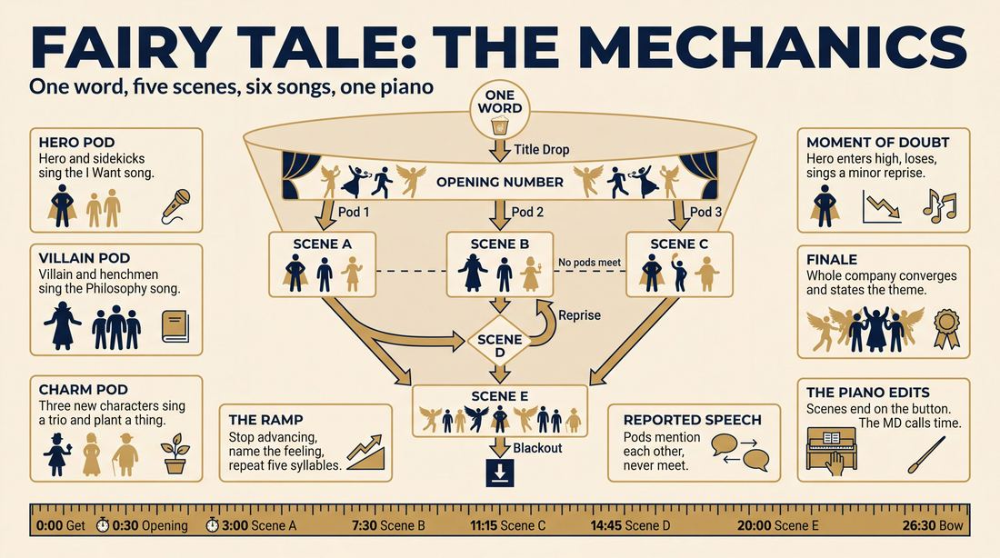
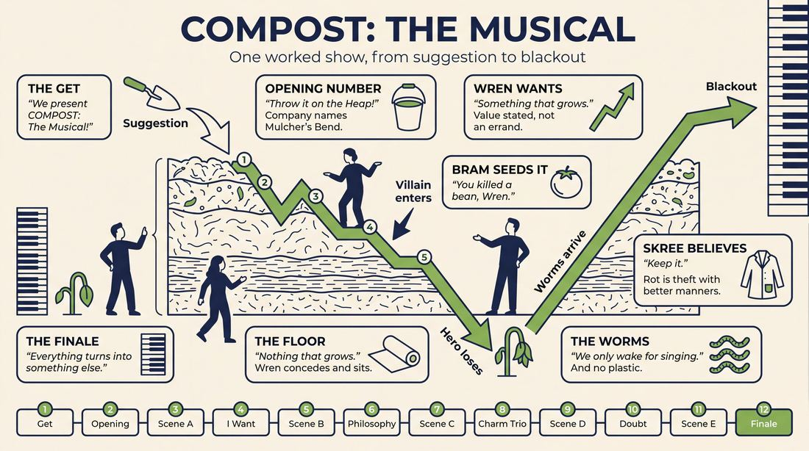
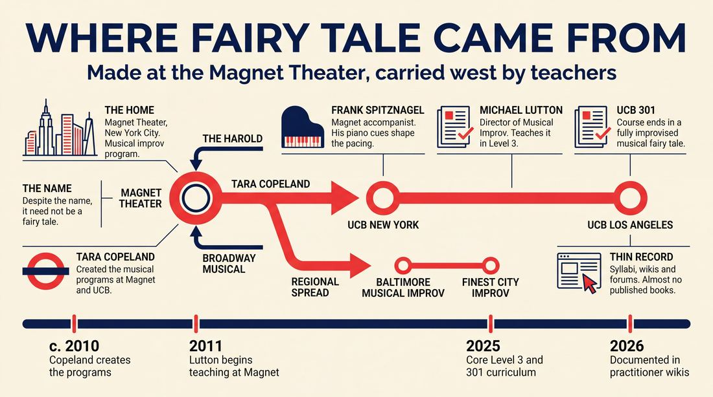
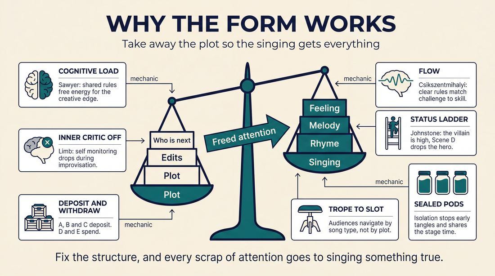
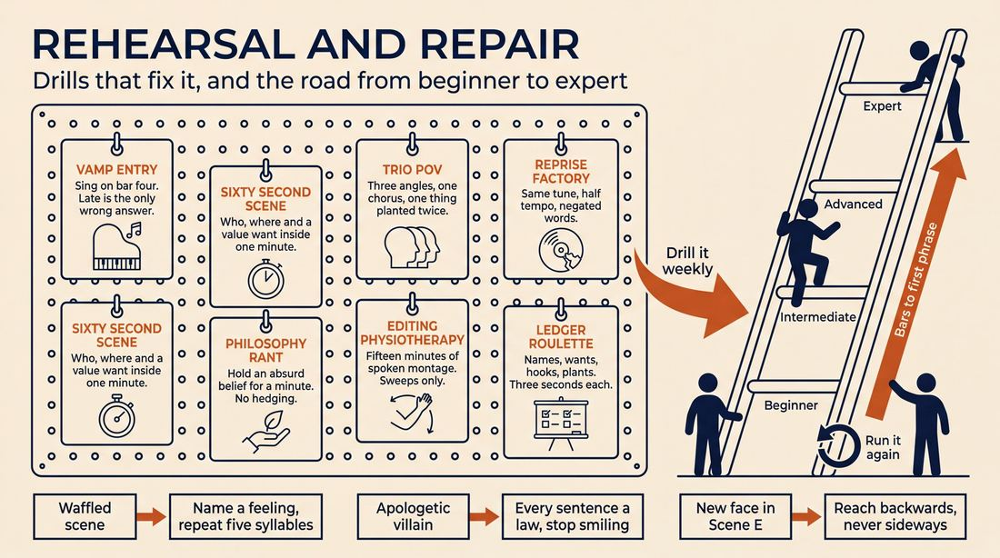

# Fairy Tale

> **A complete study of the long-form improv format _Fairy Tale_** - the original archived write-up, five infographics, grounded historical and pedagogical research, and a full mechanics-and-coaching manual.

| | |
|---|---|
| **Format** | Fairy Tale |
| **Primary source** | [IRC Improv Wiki](https://wiki.improvresourcecenter.com/index.php?title=Fairy_Tale) |

---

## Contents

1. [Part I - The Original Write-Up](#part-i-the-original-write-up)
2. [Part II - The Infographics](#part-ii-the-infographics)
   - [1. Structure and Mechanics](#infographic-1-mechanics)
   - [2. A Show, Beat by Beat](#infographic-2-example)
   - [3. Origins and Lineage](#infographic-3-history)
   - [4. Why It Works](#infographic-4-theory)
   - [5. Rehearsal and Repair](#infographic-5-coaching)
3. [Part III - Research Dossier](#part-iii-research-dossier)
   - [Pass 1: History, Lineage, Literature and Scholarship](#research-history)
   - [Pass 2: Comparative Anatomy, Pedagogy and Production](#research-comparative)
4. [Part IV - Mechanics, Gameplay and Coaching Manual](#part-iv-mechanics-gameplay-and-coaching-manual)
   - [Pass 1: The Form, Its Mechanics and Its Gameplay](#manual-mechanics)
   - [Pass 2: Training, Coaching and Performance Companion](#manual-coaching)

---

## Part I - The Original Write-Up

*Verbatim archive of the source article, reproduced exactly as scraped. Everything after this section is generated elaboration built on top of it.*

### Fairy Tale

The **Fairy Tale** format is an improv format taught at the [Magnet Theater](https://wiki.improvresourcecenter.com/index.php?title=Magnet_Theater "Magnet Theater") in New York. Despite the name,it doesn't need to be in the fairy tale genre

In this format based on a [Harold](https://wiki.improvresourcecenter.com/index.php?title=Harold "Harold"), players create a musical based on a single suggestion from the audience. It follows a simple story structure with heroes, villains, and charm characters. It’s about having fun and making bold choices.

##### How to Do It

Get Suggestion

Ask the audience for one\-word. 

###### Opening Number

A Song to build out the world serving as an improv [opening](https://wiki.improvresourcecenter.com/index.php?title=Opening "Opening")

###### Scene A: Heroes and Sidekicks

Two or three players step out. One is the hero, and the others are sidekicks or supportive characters. The hero expresses their goal and what they want to achieve. The sidekicks can be supportive or less optimistic. The hero should be focused on making the world better. The sidekicks help drive this story forward, either by supporting or adding their own perspective.

I Want Song– This song represents the hero's desire, their “I want” moment, showing what the hero wishes to achieve and how they envision the world if their wish is fulfilled.

  

###### Scene B: Villains and Henchmen

Two or three new players step out. 

These characters have opposing views to the hero. They believe in their own philosophy, which stops the hero from achieving their goal. It's not about their plan.

Philosophy Song – The villain's song shows their philosophy. Their view of the world and why they believe they are right, no matter the cost. They have no doubts, unlike the hero.

  

###### Scene C: Charm Characters

Three new players step out. These characters aren’t heroes or villains, but they add to the world. They could be quirky or odd, and might not even know the villains and heroes.

Three person song – The charm characters sing a light\-hearted or quirky song.

  

###### Scene D: Moment of Doubt

The scene starts optimistically.

The villain enters and shakes the hero’s confidence. 

The hero starts to doubt themselves, and the villain feels victorious. This scene shows the hero’s vulnerability and raises the stakes for the final act.

Doubt Song – The song reflects the low point, emphasizing the hero’s despair, doubt, and the villain’s triumph. It’s an emotional song that makes the audience feel the tension and uncertainty.

  

###### Scene E: Ending

The story reaches its resolution. The hero and villain may find a way to resolve their conflict or the villain may fail. Charm characters help solve the problem, and the whole cast comes together for the ending. 

###### End Song

A final song where the theme is stated. It’s a big, fun ending to wrap up the musical..Often it's just 2 choruses for time reasons.

---

*Archived from [https://wiki.improvresourcecenter.com/index.php?title=Fairy_Tale](https://wiki.improvresourcecenter.com/index.php?title=Fairy_Tale) (IRC Improv Wiki) on 2026-08-09 23:23 UTC.*

---

## Part II - The Infographics

*Five 16:9 posters, each teaching a different aspect of the format. Click any poster to enlarge.*

<a id="infographic-1-mechanics"></a>

### 1. Structure and Mechanics

*How the form is played: the shape of the piece, the opening, the roles, the edit vocabulary, the flow of information, and the clock.*

{ .diagram loading=lazy decoding=async width="1100" height="614" }


<a id="infographic-2-example"></a>

### 2. A Show, Beat by Beat

*A single worked performance from suggestion to blackout: what happens in each beat, with short real example lines and what the players are doing technically.*

{ .diagram loading=lazy decoding=async width="1100" height="614" }


<a id="infographic-3-history"></a>

### 3. Origins and Lineage

*Where the form came from: creators, dates, theatres, how it spread between schools and cities, and the key figures - a documented timeline and lineage map.*

{ .diagram loading=lazy decoding=async width="1100" height="614" }


<a id="infographic-4-theory"></a>

### 4. Why It Works

*The theory: the core principles of the form and the research and craft ideas that explain why the structure produces good improv, each tied to a specific mechanic.*

{ .diagram loading=lazy decoding=async width="1100" height="614" }


<a id="infographic-5-coaching"></a>

### 5. Rehearsal and Repair

*Training and fixing the form: the essential drills, the common failure modes with their symptom-and-fix pairs, and the markers of beginner through expert play.*

{ .diagram loading=lazy decoding=async width="1100" height="614" }


---

## Part III - Research Dossier

*Two research passes: the historical record, then the comparative and pedagogical record. Claims carry evidence tags - treat unverified items accordingly.*

<a id="research-history"></a>

### » Pass 1: History, Lineage, Literature and Scholarship

### Research Summary

*   **Documentation Level:** The searchable record for the "Fairy Tale" format is moderately thin but highly specific. It is documented almost entirely in training center syllabi, practitioner wikis, and forum discussions, rather than in published books.
*   **Origin:** The format was created and codified at the Magnet Theater in New York City as a foundational curriculum piece for their Musical Improv program.
*   **Nature of the Form:** It is a narrative, long-form musical improv structure based on the Harold. It uses a rigid, predetermined scene sequence to emulate a Broadway-style musical.
*   **Misnomer:** Despite the name, it does not require a literal fairy tale setting; the name refers to the classic Disney/Broadway structural archetype (Hero, Villain, Sidekicks).
*   **Pedagogical Purpose:** The format acts as a set of training wheels. By dictating exactly *what* happens next (e.g., Scene B is always the Villain's "Philosophy Song"), it reduces cognitive load, allowing improvisers to focus on the complex mechanics of spontaneous singing, rhyming, and harmonizing.
*   **Lineage:** The form was exported from the Magnet Theater to the Upright Citizens Brigade (UCB) in both New York and Los Angeles, and has since spread to regional theaters like Baltimore Musical Improv.

### Provenance and History

The searchable record does not pinpoint a single "eureka" moment or a lone inventor for the Fairy Tale format. Instead, it emerged as a codified teaching tool during the formalization of the Magnet Theater's Musical Improv program in the late 2000s and early 2010s [DOCUMENTED]. The format was designed to solve a specific problem: improvising a cohesive musical is overwhelmingly difficult. By mapping the beats of a traditional Broadway musical onto a Harold-like structure, instructors gave students a reliable blueprint. 

The name "Fairy Tale" derives from its reliance on broad, archetypal characters (Heroes, Villains, Charm Characters) and clear, binary conflicts, mirroring the structure of classic animated musicals [INFERRED].

| Year | Event | Place / Company | Source |
| :--- | :--- | :--- | :--- |
| c. 2010 | Tara Copeland creates the musical improv programs, codifying narrative structures. | Magnet Theater / UCB | improvcon.com |
| 2011 | Michael Lutton begins teaching at Magnet, later becoming Director of the Musical Improv Program. | Magnet Theater | magnettheater.com |
| 2025 (Archived) | Fairy Tale format documented as a core curriculum staple in Level 3 / 301 classes. | Magnet Theater / UCB | magnettheater.com / ucbcomedy.com |
| 2026 | Format detailed in open-source practitioner databases. | Musical Improv Wiki | musicalimprov.org |

### Lineage and Transmission

The Fairy Tale format is a distinct product of the New York musical improv scene, specifically the Magnet Theater. Its primary vector of transmission was Tara Copeland, who created the musical improv programs at both the Magnet Theater and the Upright Citizens Brigade (UCB) [DOCUMENTED]. 

When Copeland brought the curriculum to UCB (in both New York and Los Angeles), the Fairy Tale was embedded into "Musical Improv 301," ensuring its spread to the West Coast [DOCUMENTED]. Today, it is taught by Michael Lutton (Director of Musical Improv at Magnet) in their Level 3 classes. 

The format has also mutated into a regional pedagogical tool. Theaters like Baltimore Musical Improv (BMI) and Finest City Improv (San Diego) utilize the Fairy Tale not necessarily as a mainstage performance format, but as a shared "macro structure" to train ensembles in narrative pacing [DOCUMENTED]. 

### Key Figures

| Person | Role in this form | Specific contribution | Source URL |
| :--- | :--- | :--- | :--- |
| **Tara Copeland** | Creator / Instructor | Created the musical improv programs at Magnet and UCB, embedding the Fairy Tale into the core curriculum. | [improvcon.com](https://improvcon.com) |
| **Michael Lutton** | Program Director | Director of Musical Improv at Magnet Theater; teaches the Fairy Tale in Level 3 as a gateway to narrative structures. | [magnettheater.com](https://magnettheater.com) |
| **Frank Spitznagel** | Musical Director | Magnet Theater accompanist who shapes the pacing of the form, using piano cues to dictate scene edits and song transitions. | [magnettheater.com](https://magnettheater.com) |

### Canonical Shows, Companies and Recordings

Because the Fairy Tale is primarily a curriculum format (a "training wheel" structure), it is rarely billed under its own name on mainstage marquees. However, its mechanics are on full display in the following arenas:

*   **Magnet Theater Level 3 Class Shows:** The most direct place to watch the strict, unadulterated Fairy Tale format. (New York, NY) [magnettheater.com]
*   **Premiere: The Improvised Musical:** Magnet's flagship musical show, featuring Frank Spitznagel. While they perform organic narratives, the structural DNA of the Fairy Tale (I Want songs, Philosophy songs) underpins their work. (New York, NY) [bestnewyorkcomedy.com]
*   **Musical Megawatt:** Magnet's weekly musical house team night, where ensembles frequently deploy the Fairy Tale or its sister form, the Hero's Journey. (New York, NY) [magnettheater.com]

### Published Literature

Formal published literature on this specific format is virtually non-existent. The searchable record relies on theater syllabi, practitioner wikis, and internal training documents.

| Work | Author | Year | What it says about this form | Where to find it |
| :--- | :--- | :--- | :--- | :--- |
| *IRC Improv Wiki: Fairy Tale* | Community | 2025 | Defines the exact scene-by-scene breakdown (Scene A: Heroes, Scene B: Villains, etc.) and notes it does not require a literal fairy tale genre. | [wiki.improvresourcecenter.com](https://wiki.improvresourcecenter.com/index.php?title=Fairy_Tale) |
| *Magnet Theater Class Descriptions* | Magnet Theater | 2025 | Lists the Fairy Tale as a core narrative structure taught in Musical Improv Level 3, alongside the Hero's Journey. | [magnettheater.com](https://magnettheater.com) |
| *UCB Course Catalog* | UCB Training Center | 2025 | Describes Musical Improv 301 as culminating in "a fully improvised musical fairy tale in front of an audience." | [ucbcomedy.com](https://ucbcomedy.com) |
| *Musical Improv Wiki* | Community | 2026 | Details the specific song types required by the format, including the "Hero Want Song" and the "Trio Song." | [musicalimprov.org](https://musicalimprov.org) |
| *Guide: Fairy Tale Improv Format* | Baltimore Musical Improv | 2026 | Describes the format as a tool to "free up some mental space for singing and dancing." | [baltimoremusicalimprov.com](https://baltimoremusicalimprov.com) |

### Verbatim Quotes

> "The Fairy Tale format is an improv format taught at the Magnet Theater in New York. Despite the name, it doesn't need to be in the fairy tale genre."
> — *IRC Improv Wiki* 
> [Source](https://wiki.improvresourcecenter.com/index.php?title=Fairy_Tale)

> "In this 8-week course you will build on what you learned in Musical 2 and expand your repertoire of narrative structures. You will learn how to do a Hero's Journey, a Genre Piece, and a Musical Monoscene in addition to the Fairy Tale."
> — *Magnet Theater Level 3 Course Description* 
> [Source](https://magnettheater.com)

> "In this advanced Musical Improv course, students will explore the challenging but rewarding narrative musical format. This course will culminate with students a fully improvised musical fairy tale in front of an audience."
> — *UCB Training Center, Musical Improv 301* 
> [Source](https://ucbcomedy.com)

> "The Fairy Tale Story is one example of a narrative structure we can have. It can really help to have something to 'aim for,' to free up some mental space for singing and dancing."
> — *Baltimore Musical Improv Training Guide* 
> [Source](https://baltimoremusicalimprov.com)

> "One thing that musical improvisors sometimes do is what's called a 'fairy tale' structure. I won't get into the details here but TLDR it's kinda like paint by numbers. You rehearse a macro structure/style of play and then you learn to improvise within that framework."
> — *Reddit User (r/improv)* 
> [Source](https://www.reddit.com)

> "Even forms like fairy tale still follow that basic structure. What that means is, unlike traditional improv, there is much less need for crosses, tag outs, and other edits because the piano determines when scenes end. When I returned to regular improv after months of doing musical, I realized I was never editing because I just plain wasn't used to it."
> — *Reddit User (r/improv)* 
> [Source](https://www.reddit.com)

> "The scene introduces who the characters are and what is happening, and the song lets those same characters express their emotions, wants, or philosophy through music."
> — *Musical Improv Wiki* 
> [Source](https://musicalimprov.org)

> "The paradigms (the Opening Number, the I Want Song, the Eleven O'Clock Number etc) are worth knowing, so that even if you choose to abandon them completely, it's been done with a particular trade-off or narrative effect in mind. As the old adage goes: you have to know the rules before you break them."
> — *Ben Boecker, Musical Theater Writer* 
> [Source](https://www.facebook.com)

### Anecdotes and Stories

**The "Paint by Numbers" Debate**
Among practitioners, the Fairy Tale format is often affectionately (and sometimes derisively) referred to as "paint by numbers." Because the structure is so rigid—Scene A *must* be the Hero, Scene B *must* be the Villain, Scene C *must* be three unrelated Charm Characters—improvisers often debate its artistic merit. However, instructors defend it fiercely as a necessary crucible. The anecdote often shared in Level 3 classes is that until an improviser can successfully execute a paint-by-numbers "I Want" song on command, they have no business trying to deconstruct a musical organically [WIDELY PRACTICED, UNDOCUMENTED].

**Atrophied Editing Muscles**
A common story among Magnet and UCB students is the "musical hangover." Because the Fairy Tale format relies entirely on the musical director (the accompanist) to dictate scene endings via piano vamps and button chords, performers stop looking for traditional sweep edits or tag-outs. One improviser noted that after months of performing the Fairy Tale, they returned to a regular spoken-word Harold team and realized they were leaving their scene partners stranded on stage for ten minutes, having completely forgotten how to initiate an edit without a piano cue [DOCUMENTED].

### Academic and Scientific Research

While there are no academic papers written specifically about the "Fairy Tale" improv format, the mechanics of the form align perfectly with established cognitive science and performance studies regarding musical improvisation.

**Cognitive Load and Collaborative Emergence**
Dr. R. Keith Sawyer's research on group creativity (*Group Creativity: Musical Performance and Collaboration*, 2006) posits that in group improvisation, musicians minimize the cognitive load associated with basic coordination by adhering to implicit rules and shared mental models. This structural efficiency allows them to redirect finite mental energy toward the "creative edges" of the performance.
*   *Relevance to this form:* The Fairy Tale format is an applied exercise in cognitive load reduction. By removing the burden of narrative plotting (the improviser already knows Scene D will be a "Moment of Doubt"), the performer's working memory is freed up to focus on rhyming, pitch, harmony, and choreography.

**The Neuroscience of Spontaneous Generation**
In 2008, neuroscientist and surgeon Dr. Charles Limb conducted fMRI studies on jazz musicians and freestyle rappers. He discovered that during improvisation, the dorsolateral prefrontal cortex (the brain's "inner critic" or self-monitoring center) decreases in activity, while the medial prefrontal cortex (associated with self-expression and autobiographical narrative) spikes. 
*   *Relevance to this form:* The Fairy Tale format demands that performers step out in Scene A and immediately sing an "I Want" song, or in Scene B and sing a "Philosophy" song. These song types require instant, high-stakes emotional declarations. The rigid structure forces the improviser to bypass the dorsolateral prefrontal cortex (they do not have time to judge if their character's philosophy is "good") and immediately engage the medial prefrontal cortex to generate emotional content.

### Documented Variants and Descendants

*   **The Hero's Journey (Hero's Quest):** Taught alongside the Fairy Tale at the Magnet Theater. It abandons the strict Hero vs. Villain binary in favor of a single protagonist's cyclical journey of departure, initiation, and return. [DOCUMENTED]
*   **The Musical Monoscene:** Another Level 3 variant that abandons the multi-location, multi-character sweep of the Fairy Tale for a real-time, single-location musical, forcing improvisers to sustain character games without the relief of scene edits. [DOCUMENTED]
*   **Improvised Opera Buffa:** A theoretical descendant proposed by Magnet instructor Michael Lutton, which seeks to apply the structural codification of the Fairy Tale (mapping specific song types to narrative beats) to classical Mozart/Rossini aria structures. [DOCUMENTED]

### Criticism, Debate and Known Failure Modes

*   **Failure Mode: Atrophied Editing Skills.** As noted in practitioner forums, the heavy reliance on the accompanist to end scenes via musical cues causes performers to lose their instinct for pacing and editing non-musical scenes. [DOCUMENTED]
*   **Criticism: Overly Prescriptive.** Long-form purists sometimes view the Fairy Tale as antithetical to the ethos of "follow the follower." By dictating exactly who steps out in Scene C (Charm Characters) and what they sing, it limits organic discovery and forces a predetermined narrative arc, leading to shows that feel formulaic rather than discovered. [DOCUMENTED]
*   **Failure Mode: Plot over Game.** Because the format is heavily weighted toward narrative progression (the Hero must be defeated by the Villain in Scene D, then overcome them in Scene E), improvisers frequently abandon the comedic "game of the scene" in a rush to lay down plot pipe. [WIDELY PRACTICED, UNDOCUMENTED]

### Cultural Footprint

The Fairy Tale format is the invisible scaffolding beneath much of modern musical improv comedy. While audiences rarely see a show explicitly billed as "The Fairy Tale," anyone watching a performance by *Baby Wants Candy*, *Premiere: The Improvised Musical*, or listening to *Off Book: The Improvised Musical Podcast* is watching performers who have internalized this exact structural breakdown. Tara Copeland's exportation of the form to UCB Los Angeles cemented it as the baseline vocabulary for the West Coast musical improv scene, ensuring that when improvisers from different theaters meet on stage, they share a common understanding of what an "I Want" song or a "Doubt" song requires.

### Gaps in the Record

*   **Exact Date of Authorship:** The searchable record does not pinpoint the exact year the Fairy Tale format was first codified, nor does it confirm if Tara Copeland, Michael Lutton, Frank Spitznagel, or another early Magnet faculty member was the sole author, or if it was collaboratively generated.
*   **Archival Footage:** Publicly available, labeled video recordings of a strict, textbook "Fairy Tale" format are scarce. Because it is primarily an internal training wheel for Level 3 students rather than a marketed mainstage show, it is rarely filmed and uploaded under that title.

### Source List

1. *IRC Improv Wiki: Fairy Tale* - Community - 2025 - https://wiki.improvresourcecenter.com/index.php?title=Fairy_Tale - Supports the basic definition, misnomer, and scene structure of the format.
2. *Magnet Theater Class Descriptions* - Magnet Theater - 2025 - https://magnettheater.com - Supports Michael Lutton and Frank Spitznagel's roles, and the Level 3 curriculum variants.
3. *UCB Training Center* - Upright Citizens Brigade - 2025 - https://ucbcomedy.com - Supports the transmission of the format to UCB's Musical Improv 301.
4. *ImprovCon Biographies* - ImprovCon - 2026 - https://improvcon.com - Supports Tara Copeland's role in creating the Magnet and UCB musical programs.
5. *Musical Improv Wiki* - Community - 2026 - https://musicalimprov.org - Supports the detailed breakdown of song types (I Want, Philosophy, Trio).
6. *Baltimore Musical Improv Resources* - BMI - 2026 - https://baltimoremusicalimprov.com - Supports the regional spread and pedagogical purpose of reducing cognitive load.
7. *Reddit Improv Community* - Various Users - 2017/2021 - https://www.reddit.com/r/improv - Supports practitioner debates on "paint by numbers" and editing atrophy.
8. *Group Creativity: Musical Performance and Collaboration* - R. Keith Sawyer - 2006 - https://www.researchgate.net - Supports the academic theory of cognitive load reduction in group improvisation.
9. *Musical Improvisation in the Brain* - Charles Limb - 2008/2011 - https://artsandmindlab.org - Supports the fMRI neuroscience of improvisation and prefrontal cortex activity.

<a id="research-comparative"></a>

### » Pass 2: Comparative Anatomy, Pedagogy and Production

### Taxonomic Placement

```text
       [The Harold]                 [Classic Broadway Book Musical]
             \                                     /
              \                                   /
               \                                 /
                [Long-Form Narrative Improv]    /
                               \               /
                                \             /
                                 [Fairy Tale]
                                /            \
                               /              \
                 [The Sleepover]              [Off-Broadway Improvised Musicals]
```

The Fairy Tale format sits at the intersection of the Chicago-style Harold and the classic American book musical. It borrows the Harold's mechanism of introducing disparate elements in isolated early beats (Scene A, B, C) and colliding them in later beats (Scene D, E). However, unlike the Harold's thematic exploration, it enforces a strict linear narrative and maps specific Broadway tropes (I Want, Philosophy, Charm) to those structural slots. It functions as a "paint-by-numbers" scaffold that frees improvisers to focus on musicality, rhyming, and emotional heightening rather than the cognitive load of plot generation.

### Head-to-Head Comparisons

| Axis | Fairy Tale | The Harold | Consequence for the players |
| :--- | :--- | :--- | :--- |
| **Opening** | Full cast Opening Number establishing the world/theme. | Abstract exploration of a suggestion (e.g., pattern game, invocation). | Fairy Tale players must immediately establish a unified physical reality and tone, rather than abstract concepts. |
| **Structure** | Linear narrative with hardcoded trope slots (A: Hero, B: Villain, C: Charm). | Three distinct, unconnected worlds explored across three beats. | Fairy Tale players do not have to invent *what* happens next, only *how* it happens within the required trope. |
| **Edit Logic** | Scenes end strictly on the final button of a song. | Sweeps, tag-outs, or organic stage pictures. | Fairy Tale players cannot edit a failing scene early; they must sing their way out of it. |
| **Memory** | High. Players must track character names, goals, and the central conflict. | Low to Medium. Players only need to remember their specific world's game. | Fairy Tale requires strict narrative tracking to ensure Scene E resolves the specific promises made in Scenes A and B. |
| **Cast Size** | 6 to 10 players (requires distinct pods). | 8 players (standard). | Fairy Tale players spend long stretches off-stage waiting for their pod's designated scene. |
| **Audience Contract** | "We will improvise a complete, satisfying Broadway musical." | "We will explore a theme through interconnected comedic games." | Fairy Tale audiences expect narrative closure and musical spectacle over pure comedic game. |
| **Failure Mode** | Plotting over emotion (singing about *what* is happening instead of *how* they feel). | Playing plot instead of game; abandoning the base reality. | Fairy Tale fails when it sounds like a Wikipedia summary set to music; Harold fails when it becomes a confusing play. |

| Axis | Fairy Tale | Baby Wants Candy (One-Act Musical) | Consequence for the players |
| :--- | :--- | :--- | :--- |
| **Opening** | Opening Number. | Opening Number. | Both require strong ensemble singing immediately. |
| **Structure** | Segmented pods (Hero, Villain, Charm) that do not meet until Scene D. | Continuous, organic narrative where any character can meet anyone at any time. | Fairy Tale players are protected from early plot tangles; BWC players must actively manage narrative traffic. |
| **Edit Logic** | Scene ends after the designated trope song. | Organic edits; songs can happen mid-scene and the scene may continue. | Fairy Tale has a predictable rhythm; BWC requires higher ensemble intuition for edits. |
| **Audience Contract** | A structured, trope-heavy musical journey. | A chaotic, high-energy, continuous musical adventure. | Fairy Tale feels more like a traditional stage play; BWC feels like a runaway train. |

| Axis | Fairy Tale | Montage | Consequence for the players |
| :--- | :--- | :--- | :--- |
| **Structure** | 5-scene linear narrative. | Unconnected scenes. | Fairy Tale players must serve the whole; Montage players serve only the immediate scene. |
| **Memory** | Entire show. | None (slate wiped clean every scene). | Fairy Tale players cannot abandon a bad choice; they must justify and integrate it. |
| **Failure Mode** | The Waffled Scene (talking too long before the song). | The Endless Scene (no one edits). | Fairy Tale players must aggressively drive toward the emotional peak to trigger the song. |

### What Makes It Uniquely Itself

1. **Trope-to-Slot Mapping**: Unlike organic musical long-forms where any character can sing any type of song, Fairy Tale hardcodes Broadway tropes to specific scenes. Scene A *must* be an "I Want" song; Scene B *must* be a "Philosophy" song. If you remove this mapping, you are simply playing a narrative musical, not a Fairy Tale.
2. **The Mandatory "Moment of Doubt"**: Scene D functions as a structural fulcrum. The form requires the protagonist's confidence to be artificially shattered by the antagonist before the climax. This ensures an emotional low point and raises the stakes, regardless of the preceding plot mechanics.
3. **Pod Isolation**: Characters are introduced in isolated pods (Heroes, Villains, Charm) across the first three scenes and are not permitted to interact until Scene D and E. This prevents early plot tangles, ensures world-building takes precedence over narrative momentum, and guarantees that every cast member gets stage time before the climax.

### Structural Variants in Practice

| Variant Name | What It Changes | Who Plays It | Source |
| :--- | :--- | :--- | :--- |
| **Magnet Theater Classic** | The standard 5-scene structure (Opening, A: Hero, B: Villain, C: Charm, D: Doubt, E: Finale). | Magnet Theater house teams (NYC), Michael Lutton, Tara Copeland. | Magnet Theater Syllabus / IRC Improv Wiki |
| **The Sleepover** | Frames the Fairy Tale structure within a narrative device of characters at a sleepover telling the story, allowing for meta-commentary and narrative edits. | Tara Copeland / UCB Los Angeles. | Yes Also Podcast (Tara Copeland interview) |
| **BIG Narrative Musical** | Condenses the form to fit a 20-25 minute festival slot, focusing heavily on the "Scene-into-Song" transition over complex plot mechanics. | Baltimore Improv Group (BIG) / Highwire Improv. | Baltimore Musical Improv / BIG class descriptions |
| **Musical Fairy Tale (Short-Form)** | A completely different mechanic sharing the same name. 5-7 players sing a known fairy tale (e.g., Cinderella) in different musical styles, passing the narrative sequentially. | Short-form ensembles. | Improv Encyclopedia |

### The Teaching Ladder

| Stage | Skill introduced | Why in this order | Typical exercise | Source or [CRAFT CONSENSUS] |
| :--- | :--- | :--- | :--- | :--- |
| **1** | Rhyming and Rhythm | Removes the panic of finding the end-rhyme, allowing players to stay present. | Wayne Brady Object Rhyme | Stageworthy Podcast (Stephanie Malek) |
| **2** | Emotional Scenework | Songs must be driven by feeling, not plot. If players cannot act the emotion, the song will be hollow. | Speak the Song | Michael Lutton / Magnet Theater |
| **3** | Song Structure | Gives the ensemble a map (Verse/Chorus) for when to sing together and when to sing alone. | Call and Response Accompaniment | Frank Spitznagel |
| **4** | Musical Tropes | Fulfills the specific requirements of the Fairy Tale slots (I Want, Philosophy, Charm). | Inner Musical Theater Star | Aden & Eric (Bay Area Musical Improv) |
| **5** | Narrative Mapping | Stitches the isolated pods together into a cohesive musical using the A-E structure. | The 60-Second Scene | [CRAFT CONSENSUS] / Reddit |
| **Withheld** | Complex harmonies, bridge construction, and narrative pacing. | Beginners are easily overwhelmed by music theory. The priority is finding the hook and singing it confidently. | N/A | [CRAFT CONSENSUS] |

### Documented Drills and Exercises

| Drill | Origin / teacher | How to run it | What it fixes in this form | Source |
| :--- | :--- | :--- | :--- | :--- |
| **Wayne Brady Object Rhyme** | Stephanie Malek / Wayne Brady | As you go through your day, look at random objects and immediately speak a rhyming couplet about them. | Fixes hesitation and panic in finding end-rhymes during verses. | Stageworthy Podcast |
| **Speak the Song** | Michael Lutton | Players conduct a scene and, when the emotion peaks, they speak their lyrics rhythmically without melody, focusing purely on emotional delivery. | Fixes "crooning" or prioritizing melody over acting and emotional truth. | Magnet Theater / Reddit |
| **The 60-Second Scene** | [CRAFT CONSENSUS] | Run a timer. Players must establish Who, What, Where, and the core Want before the 60 seconds are up, at which point they exit. | Fixes "waffling" and slow pacing before the song begins. | Reddit (r/improv) |
| **Metaphor/Simile Translation** | Ralph Krumins | Players are given an abstract idea and must collaboratively improvise lyrics that turn it into vivid imagery using only similes and metaphors. | Fixes literal, plot-heavy lyrics (singing about *what* they are doing instead of *how* they feel). | Bay Area Musical Improv Festival |
| **Physicality to Song** | Michael Lutton | Players start a scene using only movement and spatial awareness. The physical posture dictates the character's voice, which dictates the musical genre. | Fixes "talking heads" and low-energy stage pictures before a song begins. | The And Camp |
| **Call and Response Accompaniment** | Frank Spitznagel | The Musical Director plays a short melodic phrase. The improviser repeats the exact rhythm and melody with improvised lyrics. | Fixes improvisers ignoring the piano and singing their own disconnected melody. | Reddit (r/improv) |
| **The "Bobby" Rotation** | Stephanie Malek | In rehearsal, assign players to specific trope tracks (Ingenue, Villain, Charm). Next rehearsal, force everyone to rotate to a track they are uncomfortable with. | Fixes players getting typecast or relying on a single "safe" vocal range. | Stageworthy Podcast |
| **Philosophy Rant** | Frank Spitznagel / [CRAFT CONSENSUS] | A player steps out and delivers a monologue justifying a terrible or absurd action with 100% absolute certainty, then transitions into a chorus. | Fixes "apologetic villains" who doubt their own motives in Scene B. | Magnet Theater Level 2 Syllabus |
| **Inner Musical Theater Star** | Aden & Eric | Players focus on the cadence of speech and style of movement specific to Broadway tropes, heightening their facial expressions until singing is the logical next step. | Fixes the awkward transition between naturalistic dialogue and presentational singing. | Bay Area Musical Improv Festival |
| **Trio POV** | [CRAFT CONSENSUS] | Three players stand in a line. A single event is suggested. Player 1 sings a verse from their perspective, Player 2 from theirs, Player 3 from theirs, uniting on a shared chorus. | Fixes Scene C (Charm Characters) becoming a muddy, single-perspective song. | musicalimprov.org |

### Common Failure Modes and Diagnoses

| Failure mode | What it looks like from the audience | Root cause | Fix | Who names it |
| :--- | :--- | :--- | :--- | :--- |
| **The Waffled Scene** | The scene meanders, players talk in circles, and the MD vamps endlessly waiting for a hook. | Players are trying to invent plot instead of stating a clear emotional want. | 60-Second Scene drill; mandate that the first strong emotion becomes the song hook. | [CRAFT CONSENSUS] / Reddit |
| **The Apologetic Villain** | The villain explains their plan but seems open to negotiation or expresses guilt. | Applying naturalistic human psychology to a presentational Broadway trope. | Philosophy Rant drill; remind players that Scene B is about worldview, not logistics. | Magnet Theater / musicalimprov.org |
| **Plot Over Emotion** | Lyrics describe the physical actions happening on stage ("I am walking to the store / I am opening the door"). | Forgetting that songs in musicals stop time to explore internal states. | Metaphor/Simile Translation drill; ban literal action verbs in songs. | Tara Copeland / Michael Lutton |
| **The Muddled Chorus** | Three or more players singing completely different words at the same time, creating a wall of noise. | Lack of eye contact; failure to identify the "lead" singer who establishes the hook. | Designate one player to sing the hook while others sing "oohs/aahs" or repeat the last word. | [CRAFT CONSENSUS] |

### Production and Logistics

*   **Cast Size**: 6 to 10 players. The form requires three distinct character pods (Hero + Sidekick = 2-3; Villain + Henchmen = 2-3; Charm Trio = 3). A cast smaller than 6 forces players to double-cast, which complicates the Scene E finale where all characters must converge.
*   **Runtime**: 25 to 45 minutes.
*   **Stage Layout**: Open stage with the Musical Director (MD) and piano positioned downstage left or right. Sightlines to the MD are critical; players must be able to make eye contact with the accompanist to catch musical cues.
*   **Chairs and Set**: Standard 3-to-4 armless chairs.
*   **Lighting and Tech Cues**: Blackouts are used strictly at the end of the final chorus of a song to punctuate the scene. Spotlights may be used during the "Moment of Doubt" (Scene D) to isolate the hero.
*   **Music and Sound**: A live MD is mandatory. The MD functions as a scene partner, dictating tempo, genre, and the transition from dialogue to song.
*   **MC and Host Duties**: One player steps forward to "Get the Get." The standard ask is for a single word. The cast then collectively announces: "We present [Suggestion]: The Musical."
*   **Lineup Placement**: Usually the closing act of a show due to its high energy, volume, and definitive musical finale.
*   **Rehearsal Cadence**: Requires an accompanist for every rehearsal. Teams cannot practice the form effectively a cappella.
*   **Producer Prep**: Must secure a tuned piano or weighted keyboard, an amplifier for the keyboard, and ideally area mics or lavaliers if the house is larger than 50 seats.

### Adaptations Beyond the Stage

*   **Classroom and Youth**: The "Villain" terminology is often replaced with "Obstacle" or "Misunderstood Character" to avoid bullying dynamics and encourage empathy. The focus shifts heavily to the "Charm" and "Hero" pods.
*   **Corporate and Applied Improv**: Used as an exercise in alignment and agreement. The act of building a unified chorus requires intense active listening and the immediate dropping of personal agendas to support the group's hook.
*   **Online and Remote**: Latency prevents simultaneous choruses. The form adapts to "Pass the Baton" solos, or uses a backing track where only one person is unmuted while the rest of the cast mimes singing backup.
*   **Accessibility and Inclusion**: The pedagogy emphasizes "willingness to sing over ability to sing" (Tara Copeland). The form relies on emotional commitment rather than perfect pitch, making it accessible to non-musicians.
*   **Content-Safety and Consent**: Because Fairy Tale relies heavily on archetypes and tropes, it naturally distances performers from personal trauma, making it safer for applied settings than vulnerable forms like the Armando.

### Evidence Base for Those Adaptations

*   **Sawyer, R. K. (2003). *Group Creativity: Music, Theater, Collaboration*.** Supports the use of structured macro-formats to facilitate group flow and collaborative emergence, validating the form's use in corporate team-building.
*   **Vera, D., & Crossan, M. (2004). *Theatrical Improvisation in Organizations*.** Demonstrates how assigning specific, structured roles (like the tropes in Fairy Tale) helps teams align quickly and reduces the friction of open-ended brainstorming.

### Scholarly Frames Worth Applying

*   **Sawyer on Collaborative Emergence**: Sawyer argues that in improvised performance, the macro-structure emerges unpredictably from micro-interactions. *Mapping*: In Fairy Tale, the specific melody and lyrics of the "I Want" song emerge collaboratively in the moment, but the macro-structure (the fact that an "I Want" song *will* happen) is fixed, creating a highly effective hybrid of emergence and script.
*   **Johnstone on Status and Spontaneity**: Johnstone posits that theatrical tension relies on the negotiation of high and low status. *Mapping*: Scene B (Villains) is an exercise in absolute high status (the Philosophy Song admits no doubt), while Scene D (Moment of Doubt) mechanically forces the Hero into low status to generate climax tension.
*   **Csikszentmihalyi on Flow**: Flow occurs when the challenge of a task perfectly matches the skill level, often aided by clear rules. *Mapping*: The strict "paint-by-numbers" structure of Fairy Tale removes the cognitive load of plotting, allowing improvisers to achieve flow in rhyming, harmonizing, and character work.

### Where the Form Is Heading

Contemporary practice is seeing the Fairy Tale format hybridize with game-show mechanics (e.g., Dropout's *Play It By Ear* or *Game Changer*), where the tropes are explicitly called out and manipulated by a host. There is also a rise in deconstruction workshops (e.g., "Embracing Musical Tropes" at Magnet Theater) that teach improvisers how to subvert the expected I Want/Philosophy slots once they have mastered them. Additionally, niche adaptations like puppet musical improv (e.g., Fur & Thundur in Las Vegas) are using the Fairy Tale structure to map archetypes onto physical puppetry.

### Source List

1. IRC Improv Wiki - "Fairy Tale" - 2025 - `https://wiki.improvresourcecenter.com/index.php?title=Fairy_Tale` - Supports the core A-E structure, trope definitions, and Magnet Theater origin.
2. Magnet Theater - "Musical Improv Level 2 Syllabus" - 2024/2025 - `https://magnettheater.com/` - Supports the teaching of want songs, philosophy songs, charm songs, and the involvement of Frank Spitznagel and Michael Lutton.
3. Stageworthy Podcast - "Stephanie Malek" - 2025 - `https://stageworthy.ca/` - Supports the Wayne Brady rhyming drill and the "Bobby" rotation drill for musical improv.
4. Yes Also Podcast - "Tara Copeland" - 2025 - `https://www.youtube.com/@YesAlsoPodcast` - Supports the history of the form, the "Sleepover" variant, and the philosophy of "willingness to sing over ability to sing."
5. Bay Area Musical Improv Festival - "Workshops" - 2025 - `https://bayareamusicalimprov.com/` - Supports the Metaphor/Simile drill (Ralph Krumins) and the Inner Musical Theater Star drill (Aden & Eric).
6. The And Camp - "Workshops" - 2025 - `https://theandcamp.com/` - Supports Michael Lutton's Physicality to Song drill.
7. MusicalImprov.org - "Fairy Tale" - 2026 - `https://musicalimprov.org/` - Supports the detailed breakdown of the Trio POV and the "High to Low" Moment of Doubt mechanics.
8. Reddit (r/improv) - "Musical Improv Exercises" - 2014/2019/2021 - `https://www.reddit.com/r/improv/` - Supports the 60-Second Scene drill (GornoP), the Call and Response Accompaniment drill, and the "Waffled Scene" failure mode.

---

## Part IV - Mechanics, Gameplay and Coaching Manual

*Synthesis over the original article and both research dossiers: first how the form works and how to play it, then how to train an ensemble to perform it.*

<a id="manual-mechanics"></a>

### » Pass 1: The Form, Its Mechanics and Its Gameplay

### At a Glance

| Field | Detail |
|---|---|
| **Also known as** | Fairy Tale format; Fairy Tale Structure; "the paint-by-numbers musical"; taught inside UCB *Musical Improv 301* as "the improvised musical fairy tale." Not to be confused with the short-form game sometimes called "Musical Fairy Tale" (5–7 players re-tell a known tale in rotating musical genres) — different mechanic, same name. |
| **Family** | Long-form narrative musical improv. Structurally a Harold derivative (isolated early beats that collide late) skinned with the beat map of a classic American book musical. |
| **Cast size** | 6–10 onstage, plus a live Musical Director. 8 is the sweet spot: 2 heroes / 2–3 villains / 3 charm. Below 6 you must double-cast and the Scene E convergence gets muddy. |
| **Runtime** | 25–45 minutes. 28–32 is the honest target for a class show or a house-team slot. |
| **Opening** | A full-company **Opening Number** — a sung world-build, not an abstract pattern game. |
| **Suggestion taken** | One word from the audience. Cast then announces the title: "We present *[Word]*: The Musical." |
| **Structural rigidity (1–5)** | **5.** The scene order, the character type in each scene, and the *type of song* attached to each scene are all pre-assigned. Nothing else in long form is this hard-coded. |
| **Difficulty (1–5)** | **4.** Structurally the easiest long form in existence; musically among the hardest. All the difficulty is in the singing, the ramp into song, and the discipline not to plot. |
| **Prerequisites** | A live accompanist (non-negotiable — see Hard Rules). Players who will sing on any pitch without apologising. Basic scenework: who/what/where in 60 seconds. Rudimentary rhyming under pressure. No music theory required. |
| **Best for** | Teaching a company to sing under structure; getting a first improvised musical on its feet fast; ensembles with wildly uneven musical skill; closing a mixed bill with a big finish. |
| **Avoid when** | No accompanist; cast under 5; the room wants slow-burn realism; the team has never sung together (do two rehearsals of song mechanics first); you want to showcase edit-craft or scene-game virtuosity — the form suppresses both by design. |

---

### The Essence in One Paragraph

The Fairy Tale is a six-song, five-scene improvised musical in which the structure is decided before the show starts and only the content is improvised. From one word, the company sings an Opening Number that builds a world; then three isolated pods step out in fixed order — the Hero and sidekicks (who sing an **I Want** song), the Villain and henchmen (who sing a **Philosophy** song), and three unaffiliated Charm characters (who sing a light **trio**) — none of whom are permitted to meet. They collide for the first time in Scene D, the **Moment of Doubt**, where the villain must actually break the hero and the hero must actually lose; and again in Scene E, where the charm characters supply the thing that fixes it and the whole company sings a **Finale** that states the theme out loud. Every scene ends on the button of its song, which means the accompanist, not a player, calls almost every edit. What the form is really doing is trading away plot invention and edit-craft — both handed to you in advance — so that the entire cognitive budget of every performer can be spent on the two things that are genuinely hard: singing something true on the first take, and making a promise in scene A that gets paid in scene E.

---

### Why This Form Exists

Improvising a musical is not one problem, it is six problems happening simultaneously: rhyme, melody, tempo, harmony, character, and plot. Human working memory does not have six slots. The Fairy Tale is a deliberate act of subtraction — it removes plot invention and edit decisions from the load and hands them to the structure and the piano.

Look at what a plain musical montage demands and what the Fairy Tale removes:

| Cognitive demand | Plain musical montage / organic improvised musical | Fairy Tale |
|---|---|---|
| What happens next? | Player must invent it | Pre-assigned by slot |
| Who steps out next? | Ensemble negotiates in real time | Pre-assigned by pod |
| What *kind* of song is this? | Must be discovered | Pre-assigned (I Want / Philosophy / Charm / Doubt / Finale) |
| When does the scene end? | Ensemble must edit | Ends on the song's button; MD drives |
| Does this pay off? | Hope | Guaranteed by the D/E convergence |
| Rhyme, melody, pitch, harmony, emotional truth | Player | Player |

That right-hand column is the whole argument. Everything the form takes away, it takes away so that the last row gets 100% of your attention.

A plain montage would not buy you three other things:

1. **Guaranteed convergence.** In a montage, a great character in scene 2 may never be seen again. Here, the form promises that the sidekick's throwaway line in Scene A will be a weapon in Scene D and the worm's dietary preference in Scene C will be the solution in Scene E — because the architecture *forces* those scenes to exist and forces the pods into the same room.
2. **Guaranteed stage time and guaranteed rest.** Every player knows their pod. You are on for one scene and one song, then you are off, tracking, and back for the finale. For nervous singers this is enormous: you have one song to prepare for internally, and you know which one it is.
3. **An emotional shape, not just a comic one.** A montage produces laughs and ends. The Fairy Tale produces a hero who wants something, a low point where they lose it, and a finale where a theme is stated. Audiences applaud that shape whether or not the jokes landed. That is a real safety net for a Level 3 class show.

The cost is honest and should be stated to the ensemble up front: the form is often called "paint by numbers," and practitioner forums record the two documented casualties — **atrophied editing muscles** (players who spend months on the piano's clock forget how to sweep) and **plot over game** (players lay pipe instead of playing). Both are treated in Troubleshooting. Neither is a reason to skip the form; instructors' defence is straightforward, and I share it: until you can hit a competent "I Want" song *on command*, you have no business deconstructing a musical organically.

---

### The Audience Contract

The audience is not told the structure. They do not need to be. They have seen *Beauty and the Beast* and *Frozen* and *Newsies*, and the form is engineered to trigger exactly that template within ninety seconds.

**What is promised:**

| The promise | The mechanic that makes it | When they hear it |
|---|---|---|
| "This is a whole musical, not sketches." | The Opening Number names the world and the company sings together | 0:30–3:00 |
| "There is a person to root for." | One character sings alone in the first solo song and says what they want | ~6:00 |
| "Somebody is going to stop them." | The second solo song is sung by a person who wants the opposite, in a different key/tempo colour | ~10:30 |
| "This will be funny too." | Three characters unconnected to the plot get a silly song | ~14:30 |
| "It will hurt before it's over." | Tempo drops, texture thins, the hero is alone | ~20:00 |
| "It will end, and it will end big." | Everybody is onstage, key change, hook repeated | ~27:00 |

**How they know where they are:** the audience navigates by *song type*, not by plot. They cannot articulate "that was a Philosophy song," but they know that the man in the coat who sang loudly about how he is right is the villain, and they know when the piano goes quiet and slow that we have hit the bad part. The song types are the road signs. This is why the trope-to-slot mapping is load-bearing and not decoration.

**What breaks the contract:**

- **Sung plot summary.** The moment lyrics describe onstage action ("I am walking to the mill / I am picking up the sack"), the audience stops hearing a musical and starts hearing a Wikipedia article with chords. Songs in musicals stop time; the audience knows this in their bones.
- **A villain who is nice about it.** If the Philosophy song hedges, the audience loses the antagonist and with it the shape of the evening.
- **A hero who is never actually beaten.** If Scene D is a disagreement rather than a defeat, the finale has nothing to lift from and the applause is polite rather than loud.
- **Charm characters who never come back.** Three funny people who appear once and vanish reads to an audience as a mistake, even though they cannot say why.
- **No stated theme.** The audience will forgive weak rhymes, cracked notes and a dropped plot thread. They will not forgive not knowing what the show was about. The Finale exists to tell them.
- **A new character in Scene D or E.** Introducing a wizard at minute 22 to fix the problem is the one move that makes an audience feel cheated by an improvised musical.

---

### Anatomy: The Full Structural Map

The macro shape is three isolated deposits and two withdrawals.

```
   SUGGESTION (one word)
          |
          v
 ############################################################
 #                    OPENING NUMBER                        #   full company
 #      world | tone | one world-rule | title hook          #   ~2-3 min
 ############################################################
          |                 |                 |
   -------+--------   ------+-------   -------+--------
   |   POD 1     |    |   POD 2    |   |   POD 3      |     <-- SEALED FROM
   |  HEROES     |    |  VILLAINS  |   |   CHARM      |         EACH OTHER
   -------+--------   ------+-------   -------+--------
          |                 |                 |
      SCENE A           SCENE B           SCENE C
    hero + sidekick   villain + hench   3 unaffiliated
          |                 |                 |
     [I WANT SONG]     [PHILOSOPHY]      [CHARM TRIO]
      states VALUE      negates VALUE     plants OBJECT
          |                 |                 |
          \                 /                 |
           \               /                  |
            \             /                   |
             v           v                    |
        ==============================        |
        ||        SCENE D            ||       |    POD 1 x POD 2 collide
        ||   MOMENT OF DOUBT         ||       |    hero starts HIGH
        ||   [DOUBT SONG - reprise]  ||       |    hero ends LOW
        ==============================        |
                     |                        |
                     v                        v
            ##################################################
            ##              SCENE E: RESOLUTION             ##
            ##   charm pod supplies the tool | all converge ##
            ##   [FINALE - theme stated, key change, tag]   ##
            ##################################################
                                |
                             BLACKOUT
                                |
                              BOW

 VERTICAL AXIS = HERO'S CONFIDENCE
 high  A ----\        C ......      D(start)
              \                    /       \
 mid            \  B .....        /         \
                 \               /           \_______ E climb
 low              \_____________/                     ---> E end (highest)
                                D(end) = floor
```

**Beat-by-beat:**

| Unit | Approx. clock (30-min show) | What happens | Who drives it | Success criterion | Common error |
|---|---|---|---|---|---|
| The Get | 0:00–0:30 | One player asks for a single word; company repeats it; company announces "*[Word]*: The Musical" | Designated getter | The word is heard by the whole house and the MD | Taking three suggestions; taking a "location"; negotiating the word |
| Opening Number | 0:30–3:00 | Full company sings the world into existence: where, who lives here, one rule of this world, a repeatable hook | Whoever lands the hook first; company joins by bar 8 | Audience can name the place and one custom of it; MD has a groove and a key | An abstract mood piece with no nouns; ten seconds of dead air before anyone sings |
| **Scene A** | 3:00–5:15 | Hero + 1–2 sidekicks. Hero states a want tied to a *value*. Sidekick supports or doubts (the doubt is a seed) | Hero | We know the hero's name, their want, and one thing standing in the way | Waffling; the want is a chore, not a value |
| **I Want Song** | 5:15–7:30 | Hero solos; sidekick(s) may take four bars; company may "ooh" from backline | Hero + MD | The hook contains the want in five words or fewer | Singing what they're doing; hook nobody can repeat |
| **Scene B** | 7:30–9:15 | Villain + 1–2 henchmen, new location. Villain articulates a *worldview*, not a plan | Villain | The villain's belief is a direct negation of the hero's value | The "plan scene": logistics, maps, timetables |
| **Philosophy Song** | 9:15–11:15 | Villain solos with total certainty; henchmen echo | Villain + MD | Zero doubt; the audience half-agrees with them | The apologetic villain; a song about *what they will do* |
| **Scene C** | 11:15–12:45 | Three brand-new characters, unaffiliated with the plot. Quirk-forward. A tangible thing is planted | The trio, equally | Three distinct points of view + one plantable object/skill/rule | Three variations of the same joke; a plot scene in disguise |
| **Charm Trio Song** | 12:45–14:45 | Light, fast, funny. Three POVs, one shared chorus | Trio + MD | The house laughs and remembers the object | The Muddled Chorus (three people improvising different lyrics at once) |
| **Scene D** | 14:45–17:30 | Hero, up, at their best. Villain arrives. Villain uses the sidekick's seed. Hero breaks | Villain, then hero | Hero's confidence measurably lower at the end than at the start | Debate; hero holds firm; villain loses |
| **Doubt Song** | 17:30–20:00 | Slow, thin, low. Best executed as a minor-key reprise of the I Want hook with inverted lyrics | Hero (+ villain counter-line) + MD | Somebody in the house stops laughing | Hero sings about their plan; hero sounds fine |
| **Scene E** | 20:00–23:30 | Sidekick returns the seed as fuel; charm pod arrives with the planted thing; hero acts; villain is defeated *or converted* | Company | The solution uses material planted before minute 15, nothing new | Deus ex machina; a talk-it-out ending; the charm pod is decorative |
| **Finale** | 23:30–26:30 | Full company, key change up a step, theme stated as a sentence, hook x2–3, tag, button | Company + MD | A stranger could say what the show was about | No theme; a plot recap; a fourth verse when two choruses would do |
| Blackout / bow | 26:30 | Lights out on the button; lights up; bow | Tech + company | The button and the blackout are simultaneous | Bowing before the button; MD noodling into the blackout |

*Contradiction in the record, resolved:* the archived wiki describes Scene E only loosely ("the hero and villain may find a way to resolve their conflict or the villain may fail") while the comparative dossier insists the charm characters help solve the problem. **My judgement: treat the charm contribution as mandatory.** A Scene E that resolves without the charm pod retroactively converts Scene C into filler, and the audience feels it.

---

### The Opening

The Opening Number is not a warm-up and not a pattern game. It is the **dictionary** for the rest of the show. Everything sung in the next twenty-five minutes should ideally be spellable using words deposited here.

#### What it must deliver

| Deliverable | Why | How you know it landed |
|---|---|---|
| A **place** with a name | Pods that never meet need a shared referent | Somebody sings the name of the town/ship/school/office |
| A **repeatable hook** | The audience's anchor and the Finale's raw material | Company sings the same 4–7 syllables at least three times |
| **One world-rule** | Gives the villain something to enforce and the hero something to break | A sung "we always / we never" line |
| **Nouns** (jobs, objects, foods, weather) | These are the plantable items later scenes will pick up | You can list six concrete nouns from the number |
| **Tone and genre** | Tells the MD what kind of show this is | MD's second chorus sounds more confident than their first |

Note what is *not* on that list: the hero, the villain, the conflict, or any plot. The Opening Number is horizontal. It says "this is a world," not "this is a story."

#### Step-by-step procedure (default: the Company Anthem)

1. **The Get.** One player, downstage centre: "Can we get a single word to start the show?" Take the first clear word. Repeat it to the house.
2. **The Title.** Company, together, arms out: "We present — *COMPOST*: The Musical!" This is a real move, not a flourish. It gives the MD four seconds to choose a key and a tempo, and it tells the audience the contract.
3. **MD starts a vamp.** Four or eight bars, medium-bright, diatonic, in a range the whole company can sing (F, G or C major serve mixed-gender casts well). The MD's job here is to be boring and clear.
4. **First voice by bar 8.** One player steps forward and sings a line about *the place*. Not about themselves. Something like: "Every Tuesday morning we drag the buckets out."
5. **Second voice answers in the same rhythm.** This is the single most important mechanical habit of the whole form: match the rhythm of the person before you before you worry about rhyme. "Every Tuesday evening they're already full again."
6. **Somebody lands a hook and sings it twice.** Short. Chantable. Ideally imperative or declarative: "Throw it on the Heap!"
7. **Company joins on the second statement.** If you can hear the hook, you sing the hook. If you cannot, you sing "ooh" underneath. Never invent a second lyric on top of somebody's hook.
8. **One verse of individuation.** Two or three players sing single lines that name a job, a name, or a custom. This is where you deposit nouns.
9. **The world-rule.** One line, sung by the company or one voice, that states a law: "And we don't ask where it goes."
10. **Chorus, tag, button.** MD builds, company hits the hook twice more, the MD buttons hard. Everybody clears to the backline on the button except the Scene A pod, who are already stepping out.

Total: 2–3 minutes. Longer than that and you burn the runway.

#### Documented and practical variants

| Variant | Mechanics | Use when | Cost |
|---|---|---|---|
| **Company Anthem** (default) | As above: everybody, one world, one hook | Always, unless you have a reason | None. It's the default because it works |
| **Narrator / Storybook opening** | One player as narrator sings the "once upon a time" framing, company illustrates in tableau behind | The suggestion is abstract and needs framing; young or nervous casts (one strong singer carries) | Puts a lot on one voice; narrator can become a crutch that keeps narrating later |
| **The Sleepover** (documented; associated with Tara Copeland / UCB LA) | Frame scene of characters at a sleepover who then *tell* the fairy tale; permits meta-commentary and lets the frame characters edit the story | You want licence to comment, restart, or joke about the tropes; also good for advanced groups bored of the straight form | Costs you sincerity; the Doubt song lands softer when a narrator can wink at it |
| **Pattern-to-Song opening** (Harold heritage) | 45–60 seconds of spoken association off the word, then the MD catches a repeated phrase and turns it into the hook | Non-singers in the cast; a team that comes from spoken-word Harold | Risk of a two-minute pattern game that never becomes a song. Set a hard 60-second cap |
| **Cold-open scene into number** | A 30-second two-person scene establishes the place, then the company floods in singing | You want a strong laugh in the first minute | The two players in the cold open often accidentally become the hero pod, pre-empting Scene A |
| **A cappella / clap opening** | Company claps a groove, sings unaccompanied | Rehearsal only; or a genuine emergency with no MD | The form needs an MD for its edits. Treat this as a drill, not a performance option |

**My recommendation for a first Thursday rehearsal:** run the Company Anthem five times off five different words, capping each at 2:30, and do nothing else for the first hour. The Opening Number is the highest-leverage two minutes in the form and the one most teams under-rehearse.

---

### The Engine

This is the section to read twice. The Fairy Tale is not driven by game, and it is not driven by association. It is driven by a **values collision** transmitted through **song hooks**, metered by a **piano**, with three pods that cannot talk to each other.

#### 1. The core physics: three deposits, two withdrawals

Scenes A, B and C do not advance a story. They *deposit*. Scenes D and E do not invent; they *withdraw*. Every single thing that happens in D and E should be traceable to a deposit.

| Deposited in | Deposit type | Must be withdrawn in | How it is withdrawn |
|---|---|---|---|
| Opening Number | Place name, world-rule, nouns | Everywhere | The villain enforces the rule; the hero breaks it; the finale restates it |
| Scene A | The hero's **value** (not their errand) | Scene D & Finale | Villain attacks the value; finale synthesises it |
| Scene A | The sidekick's **doubt line** | Scene D (weapon) and Scene E (retraction) | Villain quotes it; sidekick takes it back |
| Scene B | The villain's **philosophy** | Scene D & E | Spoken at the hero in D; broken or converted in E |
| Scene B | A henchman's small human detail | Scene E | The henchman defects, or is the one who lets the charm pod through |
| Scene C | A tangible **object, skill or rule** | Scene E | It is the mechanism of the solution |
| Scene C | The trio's **limitation** ("we can't do X") | Scene D or E | Creates the last obstacle, or the twist |

**The one-sentence physics:** *the Villain's Philosophy must be the negation of the Hero's Want-Value, and the Charm pod must hold the tool that only becomes usable once the Hero has been broken.*

That's the machine. If your Scene B villain opposes the hero's *plan* ("I've bought the land, you can't build there") rather than the hero's *value* ("nothing should ever have to change into anything else"), the machine will not turn over, and Scene D will be a property dispute set to music.

#### 2. The value-negation table (build this in rehearsal)

Have your team drill this until it's reflexive. Given a hero want, the villain's philosophy is not "no" — it is a *competing good*.

| Hero's want (Scene A) | Hero's underlying value | **Wrong** villain (opposes the plan) | **Right** villain (negates the value, with a competing good) |
|---|---|---|---|
| Plant a garden on the dump | Things can transform | "I own the dump" | "A thing is worth what it was the day I bought it. Change is theft." |
| Get the ferry running again | Places should be connected | "The ferry is broken" | "Distance is what makes people polite." |
| Teach her sister to read | Everyone deserves the story | "Books are expensive" | "A story you're given is a story you didn't earn." |
| Win the pie contest | Being seen | "I always win" | "The best work is anonymous. Wanting credit is a disease." |

Note that the right-hand column produces a villain the audience half-agrees with — which is exactly what makes the Philosophy song sing and the Doubt song hurt.

#### 3. Where information travels when the pods can't meet

Pod isolation is the defining constraint. Between minute 3 and minute 15 no character in Pod 1 may address any character in Pod 2 or 3. So how does the show cohere? Five channels, and only five:

| # | Channel | How it works | Player obligation |
|---|---|---|---|
| 1 | **The shared world** | Everyone spends the nouns deposited in the Opening Number | Use *their* nouns. Do not invent a second economy |
| 2 | **Reported speech** | Pods may *mention* each other; they may not *meet* | "They say the Baron won't sell." Free, cheap, powerful |
| 3 | **Melody / leitmotif** | The MD assigns a motif to the hero and to the villain and can quote either under any later scene | Listen to the piano. If the villain's motif appears under your scene, react to it |
| 4 | **Audience memory of hooks** | The audience carries the hook between pods for you | Repeat your hook enough times that it survives ten minutes offstage |
| 5 | **Offstage tracking** | Backline players hear everything and write it into later scenes | Backline watches, does not chat, does not prep |

This is why hook discipline matters so much more here than in an organic musical: in a monoscene you can carry information by having characters remember it, but a sealed pod's only long-range radio is a repeated lyric.

#### 4. The MD is the second engine (and the edit button)

A practitioner observation, quoted in the record and worth taking seriously: *"unlike traditional improv, there is much less need for crosses, tag outs, and other edits because the piano determines when scenes end."* Treat the accompanist as a scene partner with veto power over time.

**MD → player signals:**

| The MD does this | It means | You do this |
|---|---|---|
| Starts a soft vamp under dialogue | "I hear an emotional peak — sing" | Within four bars, land a phrase and repeat it |
| Vamps *louder* / adds a fill | "You're waffling. Sing now." | Stop advancing plot. State a feeling. Repeat it |
| Drops out entirely mid-scene | "This is a talking scene, keep going" | Keep playing; don't force a song |
| Plays your hook back at you | "That's the hook. Lock it." | Sing that exact phrase again, same rhythm |
| Modulates up a step | "Final chorus" | Everyone in, biggest version, full body |
| Ritardando (slows) | "We're landing" | Extend the last hook, hold the last note |
| Big final chord (**button**) | "Scene over" | Freeze one beat, then clear |
| Thins to single-note left hand, slow | "This is the Doubt song" | Sing quieter, not sadder-*sounding*. Speak-sing is allowed |
| Buttons early, unexpectedly | "Rescue" | Take it. Do not fight it. Clear the stage |

**Player → MD signals:**

| You do this | MD reads it as |
|---|---|
| Turn your body a quarter-turn toward the piano | "I'm about to sing" |
| Repeat a phrase twice, rising pitch | "This is the hook, catch it" |
| Snap or step a tempo | "This speed" |
| Say the genre in dialogue ("Well, that calls for a waltz, Nan") | "Play a waltz" |
| Hold your palm down at your hip | "Keep vamping, I need four more bars of talk" |
| Raise a hand to the company | "Everybody in on the chorus" |
| Sit down on the button | "That's the end of the number" |

Rehearse these. A team that has drilled ten hand signals with its MD is playing a completely different, and far better, form than one that hasn't.

#### 5. The Ramp: scene into song

The most-failed mechanic in the form. Improvisers wait for a "good moment to sing." There is no good moment; you *manufacture* one. Three steps:

1. **Stop advancing.** The instant you notice you are adding new plot information, stop. Plot is the enemy of the ramp.
2. **Convert to present-tense feeling.** Say the emotion out loud, in the room, to your scene partner. "Bram, I am so tired of carrying things that don't turn into anything."
3. **Repeat a phrase, lift the pitch.** Take five to seven syllables from that sentence and say them again with more air and higher pitch. "Something that grows. *Something that grows.*" The MD will catch it. Now you are singing.

The ramp is not a mood; it's a three-move sequence you can execute cold. Drill it separately from everything else.

#### 6. Standard improvised song architecture

Give the whole company one default shape so nobody has to decide:

```
 [MD vamp 4 bars]
 HOOK              x2      (lead singer alone, plants the phrase)
 VERSE 1           4 lines (ABCB rhyme; last line lands into the hook)
 CHORUS            hook x2 + 2 lines + hook   <- COMPANY JOINS HERE
 VERSE 2 / BRIDGE  4 lines (widen the lens: personal -> cosmic)
 FINAL CHORUS      up a step, full company, tag the last hook 3x
 BUTTON
```

Length: 75–110 seconds. Six songs at that length plus five scenes plus the get equals a 30-minute show.

**Rhyme:** default to **ABCB** — you only need one rhyme per four lines. AABB doubles your rhyme debt and is where most amateur lyricists crash. Teach ABCB as house standard and let advanced players earn AABB.

**Harmony:** don't. Company sings the hook in unison or sings "ooh" on a single sustained note. Improvised three-part harmony sounds worse than confident unison ninety-five percent of the time.

#### 7. Heat map: where the energy comes from

| Scene | Energy source | If it flags, the cause is |
|---|---|---|
| Opening | Volume and unison | Nobody committed by bar 8 |
| A | Sincerity | The want is small |
| B | Status and certainty | The villain is negotiating |
| C | Absurdity and speed | The trio are doing plot |
| D | Silence and thinness | The scene is a debate |
| E | Convergence — bodies arriving on stage | Charm pod is decorative |
| Finale | Key change and unison | No theme to sing about |

Notice that the energy source changes character every scene. That variety is the form's secret weapon for holding a 30-minute house, and it's the reason the slots are hard-coded in that order.

---

### Roles and Responsibilities

| Role | Owns | Must do | Must not do | Signal to the others |
|---|---|---|---|---|
| **Hero** | The want, the value, the show's spine | Name themselves in the first 20 seconds; state a want tied to a value; be genuinely broken in D; act first in E | Be funny at the expense of being wanted; solve their own problem without the charm pod; win the argument in D | Step downstage centre in Scene A; turn out on the hook |
| **Sidekick(s)** (1–2) | The doubt seed and the retraction | Ask the hero the question that makes them articulate the want; plant one honest doubt line; return in E to take it back; sing 4 bars of the I Want song | Out-want the hero; take the hero's solo; be a second hero | Physically orbit the hero; sing under, not over |
| **Villain** | The philosophy, the show's antagonistic value | Believe absolutely; speak in worldview not logistics; in D, attack the hero *by name* using the sidekick's seed | Apologise, hedge, laugh at themselves, or explain a plan | Enter Scene B from the opposite side of the stage to Scene A; use lower, slower vocal placement |
| **Henchmen** (1–2) | The question that unlocks the philosophy; the echo | Ask "But sir, why?"; repeat the villain's last line as backing vocal; carry one human detail that pays off in E | Doubt the villain in Scene B (that is Scene E's job); upstage the philosophy | Flank the villain; echo the final word of each line |
| **Charm trio** (exactly 3) | Comic relief and the plant | Three *distinct* POVs on one shared subject; plant an object/skill/rule in the song; arrive in E with it | Meet the hero or villain before D/E; do plot; do three versions of one joke | Enter as a unit, in a line, from the same wing |
| **Musical Director** | Time, key, tempo, genre, edits, leitmotifs | Vamp under the ramp; catch and repeat hooks; button decisively; give the villain a different harmonic colour; modulate for the finale; rescue waffling scenes with an early button | Play through a scene that has clearly died; noodle over dialogue; change key mid-verse without warning | Vamp = "sing"; button = "scene over"; motif quote = "remember them" |
| **Backline / company chorus** | The wall of sound and the world | Watch every scene; sing "ooh" on the chorus of every song; provide two-person environment (trees, machines, townsfolk) when the number needs bodies | Chat; prep; improvise competing lyrics; enter a pod scene | Step to the edge of the light, hands free, on the chorus |
| **The Get** (one player) | The suggestion and the title | Get one clear word; repeat it; lead the title announcement | Riff with the audience; take three words; ask for a location | Downstage centre, then rejoin the line |
| **Tech / LX** | Punctuation | Blackout on the button of the Finale only; optional isolate/special on the Doubt song; bring lights up smoothly for the bow | Blackout on every song (kills the rhythm); a slow fade on an up-tempo button | Watch the MD's hands, not the actors |
| **Captain / track-keeper** (offstage or a backline player) | Pod assignments and the ledger | Before the show, assign pods aloud; during the show, hold names and planted objects; nudge the charm pod on for E if they miss the cue | Direct from the wings; re-cast mid-show | A hand on the shoulder in the wings |

**On pod assignment:** decide pods *before* the suggestion, in the wings — who is in Pod 1, 2, 3 — but do **not** decide who is hero vs sidekick or villain vs henchman until the scene is on its feet. That preserves discovery where discovery is cheap and removes negotiation where negotiation is expensive.

---

### The Rules That Actually Bind

#### Hard rules — break these and it is not a Fairy Tale

| # | Rule | Why it is load-bearing |
|---|---|---|
| H1 | There is a **live accompanist**, and scenes end on song buttons | The form outsources editing to the piano; without it the whole timing logic collapses |
| H2 | **Six songs, fixed types, fixed order**: Opening, I Want, Philosophy, Charm Trio, Doubt, Finale | The audience navigates by song type. Remove the mapping and you are playing "a narrative musical," not this form |
| H3 | **Scene A introduces the Hero and one want tied to a value** | Everything downstream is a withdrawal against this deposit |
| H4 | **Scene B's villain negates the value with zero doubt** | The Philosophy song is defined by certainty; doubt in B steals Scene D's job |
| H5 | **Scene C is three brand-new characters unaffiliated with the plot** | Provides tonal relief and the Chekhov plant; also guarantees stage time for the third pod |
| H6 | **Pods do not meet before Scene D** | Prevents early plot tangles; makes the D collision an event |
| H7 | **Scene D: hero enters high, exits low.** The hero must actually lose | The structural fulcrum. No floor, no climb |
| H8 | **No new characters after Scene C** | Anything that solves E must already be onstage or planted |
| H9 | **Scene E converges the whole company and the charm pod contributes materially** | Otherwise Scene C is filler and the finale is thin |
| H10 | **The Finale states the theme in plain language** | The audience's payment for 28 minutes of attention |

#### Soft conventions — vary by house, by team, by night

| Convention | Common variants | My default |
|---|---|---|
| Suggestion | Single word (Magnet/UCB standard); a title; an emotion; an object | Single word |
| Title announcement | "We present *X*: The Musical" said in unison | Keep it — it buys the MD four seconds |
| Charm pod size | Exactly three (standard); two in small casts; four rarely | Three. The trio POV song depends on it |
| Villain's henchmen | Two; one; none (solo villain) | One henchman — you need someone to ask "why?" |
| Doubt song form | Original song; **minor-key reprise of the I Want hook** | Reprise. It is the single most reliable emotional move in the form |
| Villain's fate | Defeated / converted / joins the town | Converted is warmer and reads better in the Finale tableau |
| Blackouts | On every song button; only on the Finale | Only the Finale, plus optionally the Doubt |
| Key change in Finale | Up a whole step; up a half step; none | Up a whole step, on the last chorus |
| Genre | One genre all show; different genre per song | One house genre, with the Philosophy song allowed to break it (tango, metal, patter) |
| Narrator | Present / absent / Sleepover frame | Absent for the first year of doing this form |
| Transition scenes between pods | Allowed (short, sung, 20 sec) / not allowed | Not allowed until the team can do the straight form in 30 minutes |
| Tag-outs and crosses | Banned / permitted in Scene C only | Permitted in Scene C only — it keeps one editing muscle alive |
| Reprise density | One (Doubt) / two (Doubt + Finale quotes both hooks) | Two |

#### Myths — things people wrongly believe are rules

| Myth | Why it's wrong |
|---|---|
| "It must be set in a fairy-tale world — castles, kings, forests." | The archived wiki opens by saying the opposite: *"Despite the name, it doesn't need to be in the fairy tale genre."* The name refers to the *character archetypes and structural shape* of classic animated musicals, not the setting. A Fairy Tale set in a call centre is entirely canonical |
| "You must be a good singer." | The form's stated pedagogy is willingness to sing over ability to sing. The mechanics that matter — repeating a hook, matching a rhythm, committing to a feeling — are non-musical skills |
| "The villain must be evil." | The villain must be *certain*. Evil is optional and usually less interesting. The best Fairy Tale villains hold a competing good |
| "The villain needs a plan." | Explicitly not: the wiki says of Scene B, *"It's not about their plan."* Plan-based villains produce the "logistics scene" failure |
| "Charm characters must be unrelated to everything." | They are unrelated to the *plot at the time of introduction*. They are absolutely related to the *solution*. "Unaffiliated" ≠ "irrelevant" |
| "You can't edit inside a scene." | You can't *sweep* — but the MD can button early, a chorus can flood the stage, and in Scene C tag-outs are conventional. The dossier's line that players "must sing their way out" of a failing scene is overstated: **my judgement is that the MD absolutely can and should rescue a dying scene with an early vamp and button** |
| "Only the hero sings the I Want song." | Sidekicks should take four bars. It teaches call-and-response and keeps the pod alive |
| "The suggestion must appear literally." | The word seeds the world. If "compost" produces a show about a family business nobody wants to inherit, the audience is delighted, not cheated |
| "Songs should be long — this is a musical." | Six songs at 90 seconds fills a 30-minute show. A four-minute I Want song eats the Charm scene |
| "It's a beginner form, so advanced players shouldn't run it." | The structure is beginner-simple; the execution ceiling — reprise, motif, three-part POV writing, theme synthesis under pressure — is very high. Advanced teams should run it precisely because it removes their favourite excuses |
| "Because the piano edits, I don't have to think about pacing." | You have to *earn* the button by getting to the emotional peak. The MD can only end what you have brought to a boil |
| "Every character must be in the Finale." | Every *player* must. Doubling into townsfolk is fine and often better than dragging a dead character back |

---

### Edits and Transitions

The Fairy Tale has fewer edit types than any other long form, and each does a specific job. Learn all of them; you will use two of them ninety percent of the time.

| Edit | How to execute physically | When it is right | When it is wrong | What it costs |
|---|---|---|---|---|
| **The Button Edit** (primary) | MD lands a final chord; performers freeze one full beat, then walk off in a straight line to the nearest wing; next pod is already stepping out from the opposite side | End of every song. This is the form's default and accounts for ~90% of edits | If the scene hasn't reached its emotional peak — buttoning a half-baked song makes the next scene inherit the debt | Nothing. It's free and clean |
| **The Early Button (MD Rescue)** | MD, hearing a scene circle for 20+ seconds with no hook, plays a decisive four-bar turnaround and buttons on the next sung phrase whatever it is | A scene has died and no player can find the ramp | Used habitually — players stop developing the ramp because the MD keeps bailing them out | Costs the scene's payload; you may lose a plant. Note it and re-plant later |
| **The Chorus Sweep** | Backline company walks on singing the Opening Number hook, forming a line in front of the previous scene; that pod exits behind them | Covering a transition when the last song's button was weak; moving from Scene C to Scene D | Overused, it turns the show into a revue of the same chorus | 15 seconds of clock; slight loss of forward drive |
| **The Underscore Bridge** | MD plays the hero's motif softly; one player walks the stage diagonally in character, no dialogue; scene forms around them | Time passage between Scene C and D ("that night…") | Any time the audience already knows where we are — it's throat-clearing | 10–20 seconds; risk of a mimey lull |
| **The Reprise Edit** | Piano quotes the I Want melody; hero begins the Doubt song mid-stride and the villain simply *stays* | The Scene D transition specifically | Used earlier — a reprise before the audience is bored of the original hook has nothing to work against | Nothing. It's the most efficient move in the form |
| **The Pod Cross-Fade** | On the button, incoming pod enters from the opposite wing *while* the outgoing pod exits, passing at centre without acknowledgement | Between A→B and B→C, to keep pace | If the pods make eye contact — that reads as a meeting and violates pod isolation | Nothing, if the crossing players keep their eyes forward |
| **The Spotlight Isolate** | LX narrows to a special on the hero on the first downbeat of the Doubt song; villain remains in half-light | Doubt song only | Anywhere else — spending your only visual gear-change early | A tech cue, which means rehearsal with the board op |
| **The Freeze-and-Reveal** | Onstage players freeze on a chord; new characters enter behind them and begin talking; frozen players walk off on the next chord | Rare; useful in a 45-minute version with more scenes | In the 30-minute standard, it's a solution to a problem you don't have | Confusion if the audience can't tell who's live |
| **The Tag-Out** (Scene C only) | Standard tag: touch the shoulder, take the position | Charm scene, to run a fast joke pattern with a fourth voice | Anywhere in A, B, D or E — it breaks pod integrity | Breaks the form's "one pod, one scene" clarity if it leaks |
| **The Hard Blackout** | Lights out simultaneous with the Finale button | End of show only | On any interior song — it fragments a musical into sketches | Nothing at the end; everything if used early |
| **The Sung Transition** (advanced) | Two players sing eight bars of connective tissue in the wings' light while the stage resets | 40-minute versions; when you need to move a character across town | In the standard length, it eats the Charm scene's clock | 20–30 seconds each time; three of these cost you a whole scene |

**The editing-atrophy warning, spelled out as a rehearsal rule:** the record contains a practitioner's account of returning to spoken-word Harold after months of musical work and discovering they had simply stopped editing — leaving partners onstage for ten minutes. **My recommendation:** any team running Fairy Tale for a season should spend the last fifteen minutes of each rehearsal on a spoken montage with sweep edits only. Treat it as physiotherapy.

---

### Memory: Callbacks, Patterns and Heightening

The Fairy Tale has the highest memory load of any beginner-accessible long form. The comparative record rates its memory demand "high" against the Harold's "low to medium," and that is correct: Harold players need only remember their own world's game; Fairy Tale players must remember names, wants, philosophies and planted objects across a sealed, ten-minute gap.

#### The Four Ledgers

Every player carries four lists in their head from minute 3 to blackout. Have your team recite them out loud after each rehearsal run.

| Ledger | Contents | Who is most responsible | Where it gets spent |
|---|---|---|---|
| **Names** | Every character's proper name and the place name | Everyone; captain as backup | Scene D (villain must use the hero's name), Finale |
| **Wants & Values** | Hero's want, hero's value, villain's philosophy, in one sentence each | Hero and villain | Scene D dialogue, Finale theme line |
| **Hooks** | The exact syllables of all five sung hooks | Everyone | Doubt reprise, Finale quotation |
| **Objects** | The charm pod's plant; the sidekick's doubt line; the world-rule | Charm pod and sidekick | Scene E mechanism |

Discipline that makes ledgers cheap: **say names three times in the first scene of your pod.** Not twice. Three. Names sung are remembered better than names spoken; get the hero's name into the I Want hook if you can.

#### Five callback types, in ascending power

| Type | Mechanic | Example | Where it belongs |
|---|---|---|---|
| **World-noun callback** | Re-use a noun from the Opening Number | Villain sells "fresh dirt" imported past the Heap | Anywhere; cheapest and most bonding |
| **Lyric callback** | Quote another pod's exact hook line as *speech* | Villain says, flatly: "They throw it on the Heap. Good." | Scene B and D |
| **Melodic callback (motif)** | MD plays the hero's tune under the villain's scene | Villain's henchman hums the hero's melody, wrongly | Scene B, D |
| **Reprise** | Same melody, inverted lyric, changed key/tempo | "Something that grows" → "Nothing that grows" | Scene D, mandatory |
| **Quotation medley** | Finale stitches the I Want hook and the Philosophy hook into one chorus | Company sings both hooks in counterpoint or in alternation | Finale, the money move |

#### Heightening in this form is *status inversion*, not absurdity escalation

This is the crucial difference from a Harold. A Harold heightens by making the game's premise more extreme each beat. The Fairy Tale heightens by moving the hero and villain up and down a status ladder, and it does so on a fixed schedule:

| Beat | Hero status | Villain status | The move that changes it |
|---|---|---|---|
| Scene A | Mid, rising | Absent | Hero states want aloud |
| Scene B | Absent | High, absolute | Philosophy song with zero hedging |
| Scene C | Absent | Absent | (Deliberate pressure release) |
| Scene D open | **High** — hero is winning | Off | Hero is competent, happy, near success |
| Scene D close | **Floor** | **Ceiling** | Villain names the hero's private fear, using the sidekick's seed |
| Scene E mid | Rising | Falling | Charm pod arrives with the plant |
| Finale | **Ceiling** | Converted or absent | Theme stated, key change |

Two craft consequences. First, **Scene D must open with the hero visibly winning** — if the hero enters D already worried, there is no drop, only a slope. Second, **the villain's blow must be personal and specific**, not global. "Your dam will fail" is weak; "Wren, you killed a bean when you were nine and your mother watched you do it" is the form working.

#### Heightening *within* a song

One reliable pattern, worth making house standard:

- **Verse 1** — personal and concrete. *What I do with my hands.*
- **Chorus** — the hook.
- **Verse 2 / bridge** — cosmic and metaphorical. *What this means about the world.*
- **Final chorus** — same hook, bigger, everyone, up a step.

Lyric-wise this maps to the documented "Metaphor/Simile Translation" drill: verse 1 may use literal nouns, verse 2 must use an image. Banning literal action verbs in verse 2 is a rule you can enforce in rehearsal and hear the improvement within one run.

---

### Move-Level Technique Catalogue

| # | Move | Situation | How to do it | Example line | Failure mode |
|---|---|---|---|---|---|
| 1 | **Title Drop** | End of Opening Number | Land the suggestion word as the last sung word of the number | Company: "…and we *throw it on the heap!*" | Shoehorning the word if it doesn't scan; use a synonym instead |
| 2 | **World-Rule Line** | Opening Number verse | Sing one absolute custom in "we always / we never" form | NAN: "And we never ask a thing where it's been" | Making the rule about the hero — it must belong to everyone |
| 3 | **Noun Dump** | Opening Number, individual lines | Deposit six concrete nouns: a job, a food, a tool, a weather, a building, a name | BRAM: "Buckets, boots and Tuesday and the smell of Mulcher's Bend" | Adjectives instead of nouns; adjectives can't be planted |
| 4 | **The 60-Second Clock** | Scenes A, B, C | Internally count: who/what/where/want inside a minute, then ramp | — | Treating it as a stopwatch and rushing past the feeling |
| 5 | **Value Want** | Scene A, hero's statement | Phrase the want as *value + concrete image*, never as an errand | WREN: "I want one green stupid thing to come up out of the black." | "I want to open a shop" — an errand with no value attached |
| 6 | **The Sidekick Seed** | Scene A, once | Sidekick plants one honest doubt, specific and personal, then drops it | BRAM: "You killed a bean, Wren. You know that." | Planting three doubts; the villain can only weaponise one |
| 7 | **The Ramp** | End of any scene | Stop advancing → state present-tense feeling → repeat 5–7 syllables, pitch rising | WREN: "Something that grows. *Something that grows.*" | Waiting for the MD to start; the ramp is player-initiated |
| 8 | **Hook First** | Top of any song | Sing the hook twice *before* the first verse so the company and MD can lock it | "Something that grows / something that grows" | Burying the hook in verse three where nobody can join |
| 9 | **Rhythm Match** | Second and later voices in any number | Copy the previous singer's rhythm exactly before worrying about rhyme | NAN echoing BRAM's identical eight-syllable line | Inventing a new meter; guarantees a muddled chorus |
| 10 | **The Ooh Wall** | Company, on any chorus | If you don't know the lyric, sing "ooh" on one sustained note and take a step in | — | Improvising competing lyrics over the lead — the Muddled Chorus |
| 11 | **Last-Word Echo** | Henchmen / backline | Repeat only the final word of the lead's line, half a beat late | SKREE: "Keep it!" MUDDLE & SIFT: "*Keep it!*" | Echoing whole lines and swamping the lead |
| 12 | **The Absolute** | Scene B and Philosophy song | Every villain sentence is a law, no qualifiers, no "I think" | SKREE: "Rot is a rumour spread by people who lost things." | Any hedge — "I suppose," "maybe," "for now" |
| 13 | **Value Inversion** | Philosophy song | Take the hero's exact value word and re-value it | Hero's word is "change"; villain: "Change is just theft with better manners." | Opposing the plan instead of the word |
| 14 | **The Henchman Prompt** | Scene B, opening beats | Henchman asks the one question that lets the villain philosophise | SIFT: "But sir — why not just let them dig?" | Henchman doubting sincerely; that's Scene E's move |
| 15 | **Trio POV Split** | Charm song | Three players, one subject, three angles, uniting on a shared chorus | GILDA loves leather / POUCH loves letters / TERRENCE hates plastic | All three singing the same opinion, which is one opinion sung loudly |
| 16 | **Charm Chekhov** | Charm scene or song, once | Plant a usable object, skill, appetite or rule, and say it twice | GILDA: "We wake for singing. Only for singing." | Planting something abstract; you cannot pick up a mood in Scene E |
| 17 | **The Trio Limitation** | Charm song, second verse | State what the charm characters *cannot* do | TERRENCE: "But we can't do plastic. Never could." | No limitation = no obstacle in Scene E |
| 18 | **The High Open** | Scene D, first 30 seconds | Hero performs competence and joy before the villain enters | WREN, planting: "Look at that. That's a stem, Bram. That is a stem." | Opening D with worry; there's nowhere to fall from |
| 19 | **The Named Attack** | Scene D, villain's blow | Use the hero's proper name and the sidekick's seed in the same sentence | SKREE: "Wren. The bean. Your mother watched." | Global threats — "the town will suffer" — that don't hurt |
| 20 | **Take the Loss** | Scene D, hero's response | Say the villain's sentence back as if agreeing; sit or lower your centre | WREN: "…Maybe some hands are just for carrying." | Rebutting; a hero who wins Scene D kills the show |
| 21 | **The Minor Reprise** | Doubt song | Same melody as the I Want hook, minor mode, half tempo, negated lyric | "Nothing that grows / nothing that grows" | A brand-new sad tune — technically fine, emotionally half as strong |
| 22 | **Speak-Sing Under** | Doubt song, if the singer is shaky | Speak the lyric rhythmically over the piano; sing only the hook | WREN, spoken over piano: "I have carried this town's leavings since I was nine." | Crooning prettily and losing the acting |
| 23 | **The Counter-Line** | Doubt song | Villain sings one four-bar interjection over the hero's second verse | SKREE: "Nothing changes. Nothing has to." | Villain taking a full verse and stealing the low point |
| 24 | **The Retraction** | Scene E, sidekick's first move | Sidekick takes back the seed, explicitly | BRAM: "I was wrong about the bean. You were nine. It was February." | Generic encouragement; the retraction must name the seed |
| 25 | **The Charm Crash** | Scene E, entrance | The trio enters as a unit, mid-conversation, oblivious to the stakes | POUCH: "We heard singing. Was somebody singing?" | Entering solemnly; charm must stay charm even in Act 3 |
| 26 | **The Plant Payoff** | Scene E, mechanism | Use the exact planted object under its exact stated rule | Wren *sings* to the heap, so the worms wake | Using the plant loosely; the rule must be honoured |
| 27 | **The Conversion** | Scene E, villain's fate | Villain is given a small physical instance of the hero's value | Wren hands Skree the first tomato | Killing/banishing the villain, which flattens the Finale tableau |
| 28 | **The Theme Line** | Finale, before the last chorus | One player states the theme as a plain sentence, then it becomes the hook | WREN: "Everything turns into something else." | Three competing themes; pick one and everyone sings it |
| 29 | **The Quotation Medley** | Finale, bridge | Company alternates the I Want hook and the Philosophy hook, then merges | "Something that grows" / "Keep it" / "…keep the thing that grows" | Attempting real counterpoint; alternate rather than overlap |
| 30 | **Key-Change Lift** | Finale, last chorus | MD modulates up a whole step; everyone steps forward one pace on the downbeat | — | Modulating without warning; MD gives a two-bar turnaround as a tell |
| 31 | **The Tableau Freeze** | Final button | Company hits a shape — hero centre, villain converted at the edge, charm low and front | — | Everyone in a straight line; kills the picture |
| 32 | **Palm-Down Vamp Hold** | Mid-scene | Hold your palm flat at hip height to tell the MD you need four more bars of dialogue | — | Making the signal after the MD has already started the intro |
| 33 | **Genre Tell** | Anywhere | Name the genre inside dialogue so the MD can hear it | SKREE: "This town has been begging for a *march*." | Miming a genre and hoping |
| 34 | **The Reported Meeting** | Scenes A–C, pod isolation | Reference the other pod without meeting them | SIFT: "There's a girl on the Heap with a trowel." | Actually crossing pods before D |
| 35 | **The Four-Bar Gift** | I Want or Philosophy song | The lead hands the sidekick/henchman four bars, then takes it back | WREN: "Bram, tell them." BRAM sings four bars. | Giving away the whole chorus; the pod lead owns the hook |

---

### Principles

**1. The villain must negate the hero's value, not obstruct the hero's plan.**
*Why here:* the form's only engine is a values collision, because the pods never negotiate logistics face to face until minute 15. If Scene B produces a property dispute, Scene D has nothing to attack except a schedule.
*Followed:* the Philosophy song makes the audience nod before they boo.
*Violated:* Scene D becomes a bureaucratic argument, the Doubt song is about permits, and the Finale states no theme because there was no thesis to answer.

**2. Nothing enters after Scene C.**
*Why here:* the D/E convergence is the entire payoff structure. New material at minute 22 is unearned by definition, and the audience — primed by the Opening Number's promise of a complete musical — reads it as improvisers panicking.
*Followed:* Scene E feels inevitable; people say "oh, the worms!"
*Violated:* a helpful stranger arrives with a solution and the show ends on a shrug.

**3. Deposit only what you can withdraw: everything planted must be a noun, a rule, or a skill.**
*Why here:* pods are sealed, so a plant must survive ten minutes in the audience's memory and be usable by people who were offstage. Moods, atmospheres and vibes do not survive that trip.
*Followed:* "we wake for singing" comes back and the house cheers.
*Violated:* Scene C was charming and completely unusable, so Scene E invents its own mechanism.

**4. The song is the edit; therefore you must drive to the emotional peak.**
*Why here:* you cannot sweep. The only exit from your scene is a song, and the only way to a song is a feeling stated out loud. Waiting for a natural ending in this form means waiting forever.
*Followed:* scenes run 90–150 seconds and end on a button that feels earned.
*Violated:* the Waffled Scene — the MD vamps and vamps, the cast circles, and the MD eventually buttons on a shrug.

**5. Sing how you feel, never what you are doing.**
*Why here:* the six song slots are *all* internal-state songs by definition — want, belief, delight, despair, thesis. There is no slot in the form for a plot song. If your lyric could appear in a stage direction, it is in the wrong medium.
*Followed:* "I want one green stupid thing to push up through the black."
*Violated:* "I am walking to the mill / and now I'm at the mill," and the audience checks the time.

**6. The villain must not doubt in Scene B, because doubt is Scene D's property.**
*Why here:* the form spends only two beats (D and E) on interiority for the antagonist. If the villain hedges early, the status ladder has no top rung and the Moment of Doubt has no source of pressure.
*Followed:* the Philosophy song is delivered with the certainty of someone reading a law.
*Violated:* the Apologetic Villain — "I mean, I get it, but…" — and Scene D becomes two reasonable people talking.

**7. Charm is Chekhov.**
*Why here:* Scene C is structurally the odd one out — three strangers, no stakes — and the only thing that retroactively justifies it is Scene E. This is the form's most-skipped obligation and its highest-yield one.
*Followed:* the funniest scene turns out to be the load-bearing one.
*Violated:* three delightful characters vanish, the audience feels a loose thread they can't name, and the show is judged "fun but messy."

**8. The hero must actually lose in Scene D.**
*Why here:* Scene D is a mechanical fulcrum, not a dramatic option. The Finale's key change lifts *from* the Doubt song's floor. No floor, no lift.
*Followed:* somebody in the house exhales when the piano thins out.
*Violated:* a spirited disagreement, a hero who is "a bit worried," and a Finale that feels like an ending pasted on.

**9. Repeat the hook until you are bored, then twice more.**
*Why here:* the hook is the form's long-range radio between sealed pods and the raw material of the reprise and the Finale medley. A hook sung once does not exist.
*Followed:* the audience sings the hook back at the Finale.
*Violated:* the Doubt song can't be a reprise because nobody, including the hero, remembers the I Want melody.

**10. Say names three times.**
*Why here:* the villain's Scene D blow requires the hero's proper name, and Scene E requires the whole company to address characters they've never shared a scene with. Backline players are your reservoir of names; give them something to hold.
*Followed:* "Wren. The bean. Your mother watched." lands like a slap.
*Violated:* Scene E is full of "hey" and "you," and the finale can't personalise anything.

**11. Give the MD a rhythm before you give them a lyric.**
*Why here:* the accompanist is your editor and your co-writer, and they cannot catch a hook whose meter changes every line. In a form where the piano decides when scenes end, an unreadable singer is a scene that never ends.
*Followed:* the MD plays your hook back to you within two bars.
*Violated:* the MD vamps neutrally under everything, the songs never build, and the show sounds like six people singing at a piano rather than a musical.

**12. Pod isolation is protection, not exile.**
*Why here:* the sealed pods are what let a Level 3 cast avoid narrative traffic jams and guarantee everyone stage time. Offstage is not downtime: it is where the ledgers are kept.
*Followed:* the charm pod enters Scene E already knowing the hero's name and the villain's philosophy without ever having heard them onstage.
*Violated:* backline chats in the wings, and Scene E's arrivals contradict everything established.

**13. State the theme out loud in the Finale.**
*Why here:* the form spends its subtlety budget on the Doubt song. The Finale is a Broadway act-out, not a poem. The audience has been promised closure and closure here means an articulated sentence.
*Followed:* a stranger walking in at minute 27 could tell you what the show was about.
*Violated:* a big loud number about how things are better now, and the show evaporates on the drive home.

**14. Serve the slot first, then play the game inside it.**
*Why here:* the documented failure mode is "plot over game" — but the opposite is equally fatal in this form, because a Scene B that becomes a brilliant two-hander game never produces a philosophy and orphans Scene D. The slot is the container; the game lives inside it.
*Followed:* the henchmen have a running bit about paperwork *while* the villain delivers a coherent worldview.
*Violated:* either a joyless plot machine, or a hilarious Scene C that leaves the machine without parts.

**15. Willingness to sing beats ability to sing — but only if you commit on the first note.**
*Why here:* the form's slots demand an *instant* high-stakes emotional declaration; there is no runway. The single technical predictor of a good Fairy Tale is how many bars elapse between the MD's vamp and someone's committed first phrase.
*Followed:* a mediocre singer's Doubt song makes the room quiet.
*Violated:* eight bars of "um" and a hedged, half-volume first line, and the audience learns that this cast doesn't believe in the show.

---

### Worked Run-Through

**Suggestion: COMPOST.** Eight players. MD: piano. Runtime 29 minutes.

---

**BEAT 0 — THE GET (0:00)**

NAN (downstage): "Can we get a single word to start our show?"
AUDIENCE: "Compost!"
NAN: "Compost. Thank you."
COMPANY (in a line, arms out): "We present — *COMPOST*: The Musical!"

> **Mechanic:** The Get + Title Drop. Repeating the word makes sure the back row and the MD both heard it; the unison title line buys the MD four seconds to pick key and tempo. It also sets the contract in the first fifteen seconds: this is a whole musical, not sketches.

---

**BEAT 1 — OPENING NUMBER (0:20–3:05)**

*MD begins a bright 4/4 vamp in G.*

BRAM (bar 5): "Every Tuesday morning we drag the buckets out —"
NAN (bar 9, same rhythm): "Every Tuesday evening they are empty as a bell —"
GILDA: "And the mountain at the edge of town gets taller by an inch —"
COMPANY: "In Mulcher's Bend! In Mulcher's Bend!"
BRAM: "Throw it on the Heap!"
COMPANY: "*Throw it on the Heap!*"
BRAM: "Whatever you don't need!"
COMPANY: "*Whatever you don't need!*"
ALL: "We don't ask where it goes, we just throw it on the Heap!"
SKREE (stepping out for one line only): "And the Baron owns the Heap!"
COMPANY: "*And the Baron owns the Heap!* … We don't ask where it goes. We just throw it on the Heap!"
*MD buttons.*

> **Mechanic:** Company Anthem opening, run to spec. Rhythm Match (Nan copies Bram's exact meter before worrying about rhyme). Noun Dump: buckets, Tuesday, mountain, Mulcher's Bend. World-Rule Line: "we don't ask where it goes" — a law the villain will later enforce and the hero will break. One line establishes the Baron *by reputation*, seeding Pod 2 without breaking pod isolation. Hook stated five times in 160 seconds, which is what makes it available for the Finale.

---

**BEAT 2 — SCENE A: HEROES AND SIDEKICKS (3:05–5:20)**

*WREN kneels centre with a trowel. BRAM stands with a bucket.*

WREN: "Bram. Look at this. Feel that — it's warm."
BRAM: "It's a garbage mountain, Wren. It's warm because it's *rotting*."
WREN: "That's what I'm saying. It's *doing* something. Nobody in this town has done anything since the mill closed and this pile is in there working."
BRAM: "You've been up here every Tuesday for a month."
WREN: "I want to grow something on it. One row. Beans, tomatoes, anything green."
BRAM: "Wren."
WREN: "I've hauled other people's leavings since I was nine years old. I have never once carried something *towards* anything."
BRAM: "…You killed a bean, Wren. When you were nine. Your mother stood right there and watched you kill it."
WREN: *(beat)* "That was February."
BRAM: "I'm only saying."
WREN: "I don't want a bigger pile. I don't want a cleaner street. I want one green, stupid thing to come up out of all this black."

*MD vamps.*

> **Mechanic:** 60-Second Clock — who/where/want established inside a minute. Value Want: not "I want a garden" (errand) but "I have never carried something *towards* anything" (value: transformation). The Sidekick Seed is planted precisely once, and it is specific, personal, and mildly cruel: the bean, age nine, mother watching. That's the ammunition Scene D will fire. Note Bram does *not* pile on with three doubts — one seed only.

---

**BEAT 3 — I WANT SONG: "Something That Grows" (5:20–7:35)**

WREN *(spoken, on the vamp)*: "Something that grows. **Something that grows.**"
*MD catches the phrase and plays it back.*

WREN (sung):
"Something that grows, something that grows —
I've carried this town on my back since I was nine,
Buckets out at morning, buckets back at night,
And nothing that I ever carried came back changed.
Something that grows! Something that grows!
Not a bigger pile, not a cleaner street,
Just one green stupid thing that says the black was worth it —
**Something that grows.**"

BRAM *(four bars)*:
"She has got a trowel and a mountain and a February,
And I have got a bucket and a doubt."

WREN & COMPANY (backline "ooh," Wren leads):
"Something that grows! Something that grows!
Give me one small proof the world is not a warehouse —
Something that grows."
*Button.*

> **Mechanic:** The Ramp executed cleanly — stop advancing, state the feeling, repeat five syllables with rising pitch. Hook First: "Something that grows" arrives before any verse, so the company can join. The Four-Bar Gift keeps Bram alive and re-states the seed inside the song (now the audience has heard "February" twice — it will be legible in Scene D). Lyrics are internal-state, not action: no line describes what Wren is physically doing. The Ooh Wall carries the last chorus without anyone improvising competing words.

---

**BEAT 4 — SCENE B: VILLAINS AND HENCHMEN (7:35–9:20)**

*Cross-fade: Wren and Bram exit stage left as SKREE, MUDDLE and SIFT enter stage right, no eye contact at the crossing. A desk.*

SKREE: "Inventory."
MUDDLE: "Six thousand tons, Baron, give or take."
SKREE: "Give or take *what*, Muddle?"
MUDDLE: "…Nothing. Six thousand tons exactly."
SKREE: "Correct. Because a thing is worth exactly what it was on the day I bought it. Not a penny more. Not an ounce less."
SIFT: "But sir — with respect — it *is* going down. It settles. Things break apart in there."
SKREE: "That is a rumour, Sift, spread by people who lost things and needed a story."
SIFT: "There's a girl on the Heap with a trowel."
SKREE: "Of course there is. Every generation produces one optimist and a shovel." *(rising)* "Understand me. Rot is not nature. Rot is *theft with better manners.* Everything I own will be exactly what it was when they put me in the ground."

> **Mechanic:** Pod Cross-Fade with no eye contact preserves pod isolation. The Henchman Prompt — Sift's "with respect, it *is* going down" — is the question that forces the philosophy into the open; without it, Skree would just be issuing orders. The Absolute: every Skree sentence is a law, no hedges. And critically, **Value Inversion**: Wren's value is transformation; Skree does not say "I own the land" (a plan), he says change is theft (a competing good). Reported Meeting: Sift *mentions* the girl, which raises the collision without staging it.

---

**BEAT 5 — PHILOSOPHY SONG: "Keep It" (9:20–11:20)**

*MD shifts to a hard, low-register tango.*

SKREE:
"Keep it. **Keep it.**
When they hand you a thing, you put it in a crate,
When they hand you a crate, you put it in a room,
And you build the room in stone so nothing shifts —
Keep it. **Keep it.**"

MUDDLE & SIFT *(last-word echo)*: "*Keep it!*"

SKREE:
"They will tell you that a leaf is meant to fall,
They will tell you that a body's meant to turn —
That's a lullaby the poor sing to their children
So the losing feels like *plans*.
**Keep it!**"

ALL THREE:
"Keep it, keep it, nothing has to change,
Keep it, keep it, nothing ever should —
The Heap is six thousand tons, it was six thousand tons,
And it will be six thousand tons for good!"
*Button.*

> **Mechanic:** A genre break — tango against the bright G-major opening — gives the villain his own harmonic colour, which the MD can later quote as a motif. Zero doubt anywhere in the lyric; even the henchmen only echo. Verse 2 heightens from concrete (crates, rooms) to cosmic (leaves, bodies, the poor), following the standard intra-song escalation. The last chorus embeds a number, "six thousand tons," which becomes a plantable noun for the Finale.

---

**BEAT 6 — SCENE C: CHARM CHARACTERS (11:20–12:50)**

*Three players enter low, in a line, undulating slightly. They are worms.*

GILDA: "Fresh delivery."
POUCH: "What have we got?"
TERRENCE: "Boot."
GILDA: "*Leather.* Oh, Pouch, it's a leather boot."
POUCH: "You always get the boot. I got — hold on — I got a letter."
GILDA: "Read it."
POUCH: "'Dearest Iris, I have thought about the fair every day since.' That's it, that's all he wrote. Nine years I've been eating this man's regrets."
TERRENCE: "I've got plastic."
GILDA & POUCH: *(recoiling)* "Ohhh, Terrence."
TERRENCE: "I can't do plastic. None of us can do plastic. It just sits in me."
GILDA: "Don't spiral, Terrence."
POUCH: "Anyway. Nobody's sung in weeks."
GILDA: "No."
TERRENCE: "That's the thing about the top. Somebody used to sing up there."
GILDA: "We only wake for singing. That's the arrangement. Somebody sings, we get to work."

> **Mechanic:** Three brand-new characters with no connection to the plot — canonical Scene C. **Trio POV Split** is set up in dialogue before it is sung: Gilda = appetite, Pouch = sentiment, Terrence = anxiety. Two plants land, each stated twice: the **Trio Limitation** ("can't do plastic") and the **Charm Chekhov** rule ("we only wake for singing"). Note that neither plant is a mood — both are rules a hero can *use*. Also note the trio have not met anyone and do not know the Baron's name; isolation intact.

---

**BEAT 7 — CHARM TRIO SONG: "We Eat What You Leave" (12:50–14:50)**

*MD: fast 6/8, music-hall.*

GILDA: "I have had a boot, I have had a belt, I have had a saddle from 1910—"
POUCH: "I have had a letter and a letter and a letter and the same man's handwriting again—"
TERRENCE: "I have had a *fork*."
GILDA & POUCH: "He's had a fork."
TERRENCE: "It's still in me."

ALL THREE:
"We eat what you leave! We eat what you leave!
Whatever breaks your heart, we make it into garden —
We eat what you leave!"

POUCH: "But we can't do plastic—"
TERRENCE: "No, we can't do plastic—"
GILDA: "And we only wake for singing, so sing!"
ALL: "We eat what you leave!"
*Button. Big laugh.*

> **Mechanic:** Three genuinely distinct POVs on one subject, uniting on one shared chorus — the trio song working as designed, rather than three people making the same joke. Both plants are restated *inside the song*, which is where the audience will actually retain them. "Whatever breaks your heart, we make it into garden" is an early, unnoticed statement of the show's theme — planted by the comedy pod, to be claimed by the hero in the Finale.

---

**BEAT 8 — SCENE D: MOMENT OF DOUBT (14:50–17:35)**

*WREN alone at the top of the heap, mid-afternoon, delighted.*

WREN: "Bram! Bram, come look — that's a stem. That is a *stem*, Bram, that came out of the black by itself."

*BRAM off. SKREE enters, unhurried.*

SKREE: "Miss."
WREN: "…Baron."
SKREE: "It's a nice stem."
WREN: "It's the first thing that's ever—"
SKREE: "It's a nice stem. Do you know what I'm having brought in Thursday? Sheeting. Industrial. Six thousand tons wants covering; the settling makes the survey inconsistent. Under the sheet it stops settling. Under the sheet it stays exactly what it is."
WREN: "You can't — things have to be able to—"
SKREE: "Wren." *(pause)* "You were nine. You had a bean in a cup on a sill in February and you watered it every day until it went black, and your mother stood in the doorway and watched you do it, and neither of you said a word about it after."
WREN: "…Who told you that."
SKREE: "This is a small town and you are not the first optimist with a shovel. Here is my worry for you, sincerely. It isn't that the Heap can't grow anything. It's that *you* can't. Some hands are for carrying." *(He picks the stem. Puts it in his pocket.)* "Thursday."

*He goes. MD begins, very slow, the "Something That Grows" melody in the minor.*

> **Mechanic:** **The High Open** — Wren spends the first thirty seconds visibly winning, which is what makes the drop a drop. **The Named Attack** — Skree uses her proper name and the sidekick's exact seed (bean, nine, February, mother in the doorway), which is only devastating because Bram planted it in Scene A and Wren repeated "February" in the song. Note that Skree's threat (plastic sheeting) is *also* the payoff of Terrence's limitation from Scene C — two pods' deposits converging in one line without those pods ever having met. **Take the Loss:** Wren asks "who told you that" rather than rebutting, and lets him take the stem. And the MD's minor-mode quotation of the I Want melody edits us into the song without anyone saying a word.

---

**BEAT 9 — DOUBT SONG: "Nothing That Grows" (17:35–20:00)**

*Half tempo. Single left-hand notes. Lights narrow.*

WREN *(spoken over the piano)*: "It was February. Nothing grows in February. That's not a *fault*, that's a *month*."
*(sung, quietly)*
"Nothing that grows. Nothing that grows.
I have carried this town's leavings since I was nine,
And the one time I tried to carry something *towards* —
It went black in a cup on a windowsill.
Nothing that grows. Nothing that grows.
Maybe some hands are only ever for the hauling,
Maybe some towns are only ever for the throwing—"

SKREE *(off, four bars, over her)*: "Keep it. Keep it. Nothing has to change."

WREN:
"…Maybe some hands are just for carrying.
Nothing that grows."
*Piano thins to nothing. Button, soft.*

> **Mechanic:** **The Minor Reprise** — same melody, negated lyric, half tempo. The audience does not need to be told this is the low point; they have heard this tune before in a major key at full volume and their body does the work. **Speak-Sing Under** on the first three lines keeps the acting in front of the singing. **The Counter-Line**: Skree gets exactly four bars — enough to sound like the winner, not enough to steal the hero's song. The soft button (rather than a big chord) is the MD's contribution: it denies the audience applause and leaves them holding the discomfort into Scene E.

---

**BEAT 10 — SCENE E: RESOLUTION (20:00–23:40)**

*Wren sitting. BRAM enters.*

BRAM: "I'm the one that told him about the bean."
WREN: "I know."
BRAM: "Not — I told it in the Anchor, years ago, as a story about *me*. About how I stood there and said nothing to a nine-year-old with a dead bean." *(beat)* "I was wrong about the bean. You were nine. It was *February*. Nothing grows in February. I've known that the whole time and I never said it out loud."
WREN: "He's covering it Thursday."
BRAM: "Then it's Wednesday."

*NAN and townsfolk drift on. Then the WORMS enter low, mid-conversation.*

POUCH: "We heard singing."
GILDA: "There was singing. Two days ago. Something about growing."
TERRENCE: "Was somebody singing?"
WREN: "…You wake for singing."
GILDA: "That's the arrangement."
WREN: "And the sheeting—"
TERRENCE: "We can't do plastic. Never could. Anything else in the world, but not that."
WREN *(standing)*: "Then we go tonight, and we sing at it, and we get through six thousand tons before he lays a single sheet."

*SKREE enters with MUDDLE and SIFT, mid-morning Thursday. The Heap is gone. In its place: earth.*

SKREE: "Where is my mountain."
WREN: "It's under your boots."
SKREE: "That is not the same thing."
WREN: "No. It's worth more."
SIFT: "…Baron. There's a tomato."
SKREE: "There is no tomato."
*Wren picks it and holds it out to him.*
WREN: "You had six thousand tons of things you wouldn't let finish. That's all a thing wants to do, Baron. Finish and start again."
*Skree takes the tomato. Long pause. He does not eat it. He puts it in his pocket where the stem went.*
SKREE: "…Thursday's cancelled."

> **Mechanic:** **The Retraction** — Bram takes back the seed by name and detail ("You were nine. It was February"), which is the emotional unlock; the hero cannot rise until the specific wound is addressed specifically. **The Charm Crash** — the worms arrive oblivious and stay funny in Act 3, which is the correct tonal move. **The Plant Payoff** honours both Scene C rules *exactly*: singing wakes them, and the plastic is why the clock matters. Nothing new has entered the show since minute 15. **The Conversion**: Skree isn't destroyed; he pockets the tomato in the same pocket as the stem — a physical callback that lets him stand in the Finale tableau without a plot explanation.

---

**BEAT 11 — FINALE: "Everything Turns Into Something Else" (23:40–26:40)**

*MD: full, bright, tempo up, key of G.*

WREN *(spoken)*: "Everything turns into something else."
*(sung)*
"Everything turns into something else!"
COMPANY: "*Everything turns into something else!*"
WREN: "Every boot, every letter, every February—"
COMPANY: "*Everything turns into something else!*"

GILDA, POUCH, TERRENCE:
"We eat what you leave, we eat what you leave,
And whatever breaks your heart we make it into garden!"

BRAM: "Something that grows—"
SKREE *(dry, on his own tune)*: "…Keep it."
BRAM: "Something that grows—"
SKREE: "*Keep* it."
COMPANY: "Keep the thing that grows!"

*MD modulates up a whole step. Company steps forward one pace.*

ALL:
"Everything turns into something else!
Six thousand tons of somebody's regret
Is a Tuesday, and a tomato, and a town that finally asked where it goes—
Everything turns into something else!
Everything turns into something else!"
*Tableau: Wren centre high, worms low front, Skree at the edge with his hand in his pocket. Button. Blackout.*

> **Mechanic:** **The Theme Line** stated in plain speech first, then converted into the hook — no ambiguity about what the show was about. **The Quotation Medley**: the I Want hook and the Philosophy hook alternate and then *merge* into a single line ("Keep the thing that grows"), which is the synthesis of the two values the show has been arguing about for twenty-five minutes. The Opening Number's world-rule ("we don't ask where it goes") is inverted in the final verse — the audience hears the show close its own loop. **Key-Change Lift** plus a forward step gives the physical size the Finale needs, and the **Tableau Freeze** gives the blackout a picture instead of a line of people.

---

### A Bad Run, Diagnosed

Same suggestion, same eight players, a bad Thursday.

**Opening Number.** MD vamps. Six seconds of nothing. Then:

BRAM: "Compost… is… all around us…"
NAN: "…and it's, like, part of a cycle…"
COMPANY (mumbling): "…circle of life… or something…"

> **Decision point 1.** Nobody committed by bar 8, and the first line was *abstract* ("compost is all around us") rather than *located*. The number produced no place name and no nouns, so the pods have no shared dictionary.
> **Repair:** the first singer's obligation is a *place and a Tuesday*. Sing a location and a chore. "Every Tuesday morning we drag the buckets out" is worth six abstract lines. If you freeze, sing the suggestion word twice on one note and let someone else build off it.

**Scene A.**

WREN: "So the town council meets Thursday."
BRAM: "Right, and if we get the permit—"
WREN: "The permit's the issue, because the zoning on the eastern lot—"
BRAM: "Is that the lot near the water treatment?"
*(MD begins vamping. They keep talking. MD vamps louder. Forty more seconds.)*

> **Decision point 2.** The Waffled Scene. They are inventing plot mechanics — permits, zoning, councils — instead of stating a want with a value. The MD's vamp is a direct instruction and it is being ignored.
> **Repair:** the moment you hear a vamp, you have four bars. Stop advancing, name a feeling in the present tense, and repeat five syllables. Any five. "I'm tired of asking. I'm tired of asking."
> **Rehearsal repair:** the 60-Second Scene drill, with an actual timer, until stating a value-want inside a minute is automatic.

**I Want Song.**

WREN (sung): "I'm going to go down to the council, and I'm going to make my case, / And I'll bring the paperwork, and then we'll see about the space…"

> **Decision point 3.** Plot Over Emotion. Every line describes an action. The lyric would work as a stage direction, which means it should not be a song. Also there is no hook — nothing repeats, so nothing can be reprised in Scene D, which structurally disarms the Doubt song before we get there.
> **Repair:** ban action verbs in the first verse. Sing the *stakes*, not the *steps*: "I have never once carried something towards anything."
> **Rehearsal repair:** Metaphor/Simile Translation — improvise a verse in which every line is an image and no line contains a verb of physical motion.

**Scene B.**

SKREE: "I own the land, so legally you can't build there."
SIFT: "What if she gets the permit?"
SKREE: "Then, honestly, fine, I guess — I mean, I'd be annoyed, but I'd probably sell. Everyone has a price, right? *(laughs)* I'm not a monster."

> **Decision point 4.** Two failures in five lines. First, the villain opposes the *plan* (a legal obstacle) rather than *negating the hero's value* — but note there was no value to negate, because Scene A never produced one; the rot starts upstream. Second, the Apologetic Villain: "I'm not a monster" surrenders the certainty that Scene B exists to generate, and the little laugh tells the audience the actor is embarrassed.
> **Repair, in the moment:** upgrade the next sentence to a law with no first-person hedging. "A thing is worth what it was the day I bought it." Then stop smiling.
> **Rehearsal repair:** the Philosophy Rant drill — one player justifies an indefensible position with total certainty for sixty seconds, then rolls into a chorus. Run it until nobody laughs at their own villain.

**Scene C.**

*Three players enter as three townspeople who are also worried about the council vote. They discuss the council vote.*

> **Decision point 5.** Scene C has been converted into a plot scene. The form now has no comic relief, no tonal contrast, and — fatally — **no plant**. Scene E has been left with nothing to solve the problem with.
> **Repair, in the moment:** the third charm player, on entering, should have declared a non-human or non-plot identity in their first line — "Fresh delivery. What have we got?" — and named an appetite. If it's already gone wrong, the trio should plant something anyway inside the song: a skill, an object, a rule. Even late, even shoehorned. Scene E needs it more than Scene C needs elegance.
> **Rehearsal repair:** Trio POV drill, with the standing instruction that the third verse must contain the words "we can only…" or "we can't…".

**Charm Trio Song.** All three sing simultaneously, different words, different rhythms. The MD raises volume to compensate. It becomes noise.

> **Decision point 6.** The Muddled Chorus. Nobody established the hook, so nobody could follow it.
> **Repair:** one designated lead sings the hook alone, twice, before anybody joins. The other two sing "ooh" or echo the lead's final word. Unison beats improvised counterpoint every single time.

**Scene D.**

SKREE: "So the vote went my way."
WREN: "I'll appeal."
SKREE: "You can try, but the deadline's passed."
WREN: "We'll see."

*MD starts a sad vamp. Wren sings a new, slow, unrelated melody about how appeals are hard.*

> **Decision point 7.** Three failures. Wren enters D *already worried* — no High Open, so there's no drop. The blow is procedural, not personal: the villain attacks the plan, not the person, and never uses her name or any seed (there was no seed to use — Bram never planted one in Scene A). And "We'll see" is a hero refusing to lose, which means the Doubt song has no floor and the Finale has no lift.
> **Repair, in the moment:** the villain must find one personal fact from Scene A and say it with the hero's name attached. If Scene A gave him nothing, invent the smallest thing consistent with what he *has* heard from the backline — "Wren. Nobody in this town has finished anything since the mill closed. Why would you be the exception?" Then Wren must physically lower — sit, or put the trowel down — and say a sentence agreeing with him.
> **Rehearsal repair:** run Scene D in isolation twenty times with one rule: the hero's last line before the song must concede.

**Scene E.** A new character — the hero's aunt, who has never been mentioned — arrives with a legal precedent that solves the zoning problem. Everyone is pleased.

> **Decision point 8.** A new character at minute 22 with an external solution. This is the single move the audience will not forgive, because the form's whole promise is convergence. The aunt exists because Scene C failed to plant anything, so Scene E had to import a fix.
> **Repair:** whatever is onstage must do the work. If the charm trio are townspeople who worry about votes, then they *are* three votes — make the mechanism their three votes. Reach backwards for material, never sideways for new material.

**Finale.** Big number: "It's a beautiful day in Compost Town / everything worked out fine."

> **Decision point 9.** No theme. The Finale describes the outcome instead of stating what the show was about, and it quotes no earlier hook (there were none to quote). The audience applauds politely because the piano is loud, and forgets the show by the sidewalk.
> **Repair:** before the last chorus, one player states a sentence beginning "It turns out that…" and the company turns that sentence into the hook. Even a clumsy theme, stated, outperforms a polished outcome report.

**Post-mortem, one line:** every failure in this run is traceable to Scene A never producing a *value*. The form is a chain of withdrawals; if the first deposit is an errand, every subsequent slot has nothing to spend.

---

### Troubleshooting

| Symptom | Root cause | In-the-moment fix | Rehearsal fix | Prevention |
|---|---|---|---|---|
| **The Waffled Scene** — players circle, MD vamps forever | Inventing plot instead of stating an emotional want | Stop advancing; say one present-tense feeling; repeat five syllables with rising pitch | The 60-Second Scene with a real timer | House rule: "first strong feeling becomes the hook" |
| **The Apologetic Villain** | Applying naturalistic psychology to a presentational trope | Next sentence must be a law with no "I think" or "maybe"; stop smiling | Philosophy Rant drill | Cast the villain track deliberately and rotate it (the "Bobby" rotation) so nobody's scared of it |
| **Plot Over Emotion** in lyrics | Forgetting songs stop time | Sing the *consequence*, not the action: "if this doesn't work I'm exactly what he said I am" | Metaphor/Simile Translation; ban literal action verbs | Teach the verse-1-concrete / verse-2-image ladder as house standard |
| **The Muddled Chorus** | No designated hook-holder | Lead sings hook alone twice; everyone else "oohs" or echoes the last word | Call and Response Accompaniment drill | House rule: nobody adds lyrics on top of a hook they didn't hear |
| **Scene D is a debate, hero doesn't lose** | Improviser's reflex to defend their character | Villain uses hero's proper name + one personal fact; hero physically lowers and concedes in words | Run Scene D twenty times with a mandatory concession line | Assign the sidekick to plant exactly one seed in Scene A |
| **No seed exists for the villain to use** | Sidekick played pure support | Villain reaches for the *world-rule* instead: "You've never asked where anything goes either, Wren" | Drill Scene A with one instruction: sidekick must say one true unkind thing | Make "one doubt, once, specific" the sidekick's job description |
| **Scene C had no plant** | Charm pod played plot or pure quirk | Plant late, inside the song: one "we can only…" line | Trio POV drill with mandatory limitation line | Charm pod huddles for four seconds pre-entry and picks a *thing* |
| **Deus ex machina in Scene E** | Nothing plantable was deposited | Reach backwards: re-use any noun from the Opening Number as the mechanism | Run A→C, stop, and have the team list every plantable item aloud | Hard rule H8 enforced in every rehearsal run |
| **Show runs 45 minutes and dies** | Songs over three minutes; transition scenes | MD: shorten the Charm and Doubt songs to two choruses; cut verse 2 | Time every song in rehearsal; post the target clock in the green room | Post the beat clock backstage and give the MD authority to enforce it |
| **Show runs 18 minutes and feels thin** | Scenes buttoned before the peak; songs one chorus long | MD: add a verse; hero takes a second verse in the I Want song | Practise the ramp *late* — hold the scene 20 seconds longer than comfortable | Teach "the button is earned, not scheduled" |
| **Pods contaminate early** (villain wanders into Scene A) | Excitement; unclear pod assignment | Play it as reported speech — the intruder becomes a messenger and exits | Assign pods aloud in the wings before every run | Physical rule: pods enter from assigned wings |
| **The Doubt song is a new tune nobody feels** | The I Want hook wasn't repeated enough to be recognisable | MD plays the I Want melody as the intro and *makes* the hero sing it | After each run, ask the cast to sing all five hooks from memory | Hook repetition minimum: 4 statements per song |
| **Nobody joins the choruses** | Backline treating themselves as audience | MD gestures the company in; company steps to the light and "oohs" | Run the Opening Number ten times with the only note being "join by bar 8" | Backline is a job, not a rest |
| **The MD can't find the tempo** | Singer's meter changes every line | Sing four syllables and *stop*; let the MD set the groove, then re-enter | Call and Response Accompaniment: repeat the MD's exact rhythm | Teach Rhythm Match before rhyme |
| **Finale has no theme** | Nobody synthesised the two values | One player speaks a sentence beginning "It turns out that…"; company sings it | End every rehearsal run by naming the theme aloud in one sentence | Hero and villain each write their value in one word before the run |
| **Team's editing skills degrade over a season** | Documented atrophy from piano-driven edits | — | Fifteen minutes of spoken montage with sweeps at every rehearsal | Alternate Fairy Tale weeks with non-musical form weeks |
| **A pod player never gets to sing** | Pod lead hogged the song | Lead hands four bars mid-song | Practise the Four-Bar Gift explicitly | Rotate pod leads every rehearsal run |

---

### Variations and Dials

| Dial | Positions | What it does |
|---|---|---|
| **Runtime** | 20 min (festival) / 30 min (standard) / 45 min (mainstage) | 20: cut the Charm scene's dialogue to 45 seconds and run all songs at two choruses; the Charm *song* stays, because the plant lives there. 45: add sung transitions, a second Charm scene, and an "Eleven O'Clock" number for the villain between D and E |
| **Cast size** | 4–5 / 6–8 / 9–12 | 4–5: hero + sidekick double as two of the charm trio; charm trio becomes a duo; the finale is thin, so lean on the tableau. 6–8: canonical. 9–12: split the henchmen into a chorus and give the town its own micro-scene; watch the clock |
| **Structural rigidity** | Strict / announced / deconstructed | *Strict*: slots hidden, played straight — best for learning. *Announced*: a host names each slot before it happens ("And now: the I Want song!") — very funny, kills sincerity, good for a bar show. *Deconstructed*: slots are subverted deliberately (the villain sings the I Want song; the charm trio turn out to be the antagonist) — only for teams who have done twenty straight runs |
| **Tone / genre skin** | Fairy tale / contemporary / sci-fi / workplace / horror | The archetypes transpose cleanly: the Baron becomes a regional VP, the worms become the night cleaning crew. Horror is the one skin that fights the form — the Finale's obligatory theme statement resists dread |
| **Source material** | Single word / title / an object from the audience / a moral ("honesty is overrated") | A *moral* as suggestion is the strongest advanced dial: it pre-loads the theme, so the villain's philosophy and the finale write themselves and the team can spend everything on song craft |
| **Villain's fate** | Defeated / converted / joins / was right all along | "Was right all along" is a genuine and underused option: the hero's want is granted and it turns out the villain's philosophy protected something. It requires a Finale theme of synthesis rather than victory |
| **Reprise density** | One / two / motif-rich | Motif-rich (MD assigns leitmotifs to hero, villain and charm and quotes them under dialogue) is the biggest available upgrade in production value, and it costs the actors nothing — it's an MD dial |
| **Genre-per-song** | One house genre / a different genre per number | Different-per-number reads as more musical-theatre and gives the MD ownership; one house genre makes the reprise land harder because the melodic material is more closely related |
| **Frame** | None / narrator / **The Sleepover** | The documented Sleepover variant (characters at a sleepover telling the story) buys meta-commentary and lets the frame characters call edits — restoring an editing muscle the base form removes. Costs you the Doubt song's sincerity |
| **Tag-outs** | Banned / Scene C only / free | Free tag-outs turn the piece into a musical Harold and dissolve pod isolation. Scene C only is the balanced setting |
| **Blackouts** | Finale only / Doubt + Finale / every song | Every song makes it a revue. Finale only is the cleanest |
| **Doubling** | None / cast doubles as townsfolk in the Finale | Doubling in the Finale is almost always right: it fills the stage picture and doesn't require anyone to remember a new character |
| **Applied / youth setting** | Villain → "Obstacle" or "Misunderstood Character" | Documented adaptation for classrooms; shifts weight toward Hero and Charm pods, and Scene E becomes conversion rather than defeat. Note this also makes the Philosophy song harder — an "obstacle" with a worldview still needs certainty |
| **Remote** | Latency-adapted | Simultaneous choruses don't work online. Convert every chorus to a "pass the baton" solo relay, or have one unmuted singer with the rest miming — a documented adaptation |

---

### Interfaces With Other Forms

**Sibling forms taught alongside it (same curriculum shelf).** The Hero's Journey drops the hero/villain binary for a single protagonist's cyclical departure–initiation–return; the Musical Monoscene keeps the songs but removes the multi-location sweep, forcing sustained character work with no edit relief. Run Fairy Tale first: it teaches the song types, and the other two assume you know them.

**What nests *inside* a Fairy Tale:**

| Nested element | Where it goes | Why it works there |
|---|---|---|
| A tight two-person **game of the scene** | Scene C, and the henchmen's business in Scene B | These are the only slots with no plot obligation, so a runner can breathe |
| A **short-form-style pattern** (list, escalation) | Inside the Charm trio song's verses | The trio POV structure is already a pattern engine |
| A **monologue** | Scene D, hero's speech before the Doubt song | The form's only naturally quiet moment |
| **Physical/movement work** | Opening Number and Finale tableau | The company is already unified; give them shapes rather than lines |
| **Puppetry** | Any pod (documented in niche practice) | Archetypes map cleanly onto physical puppet types |

**What a Fairy Tale nests *inside*:**

| Container | How |
|---|---|
| A **musical revue night** | Fairy Tale as the closer — the record notes it usually takes the closing slot for its volume and definitive finale |
| An **Armando / monologue show** | Take the monologist's story as the "suggestion"; the hero's want should be lifted from the monologue's stated regret. Warning: the monologue's specificity fights the form's archetypes; use the monologue for *world*, not for *plot* |
| A **Sleepover / frame show** | The documented variant. The frame characters can restart, comment, and edit — restoring player-driven edits |
| A **game-show format** | Contemporary practice hybridises the tropes into host-driven game shows where the slots are called out by name. This is the "announced" rigidity dial with a host attached |

**Clean hybrids worth trying:**

- **The Musical Harold.** Three pods become three Harold "worlds," each with a song; second beats replace Scene D; the third beat is a group song where the worlds collide. Keeps the Fairy Tale's song discipline and restores associative thinking. Best for teams bored of the linear track.
- **Fairy Tale + Deconstruction.** Play a straight Fairy Tale to the end of Scene C, then deconstruct: pull the charm trio's world apart into unrelated scenes and re-converge for a Finale. Advanced only.
- **Half-and-half spoken/sung.** Scenes A–C spoken with only one song each; Scenes D–E fully sung. Halves the musical load for casts with two strong singers and six nervous ones.

**Hybrids to avoid:** Fairy Tale + La Ronde (the two-character handoff destroys pod isolation) and Fairy Tale + true monoscene (single location makes the pod structure impossible; play the Musical Monoscene instead, which is its own form).

---

### The Mastery Ladder

| Marker | Beginner | Intermediate | Advanced | Expert |
|---|---|---|---|---|
| **Getting into song** | Waits for the MD, enters late and quietly | Executes the ramp when reminded; sings by bar 4 of the vamp | Manufactures the peak deliberately and initiates the ramp *before* the MD vamps | Chooses *not* to sing when the scene is better spoken, and the MD reads it instantly |
| **Hook craft** | Hook appears in verse 3 or never | Hook stated twice up front, 5–7 syllables | Hook is the show's title and contains the value word | Hook is written so it can be inverted for the Doubt reprise and merged with the villain's hook in the Finale |
| **Rhyme** | Panics, hangs on the line, breaks meter | ABCB, occasionally saves the line | Cheats rhymes invisibly (restates a line to swap the end word) | Uses near-rhyme and internal rhyme for effect, and lets one line not rhyme on purpose |
| **Hero's want** | An errand ("open a shop") | A want with a stated reason | A value expressed through one concrete image | A value that contains its own counter-argument, so the villain's philosophy is half-true |
| **Villain** | Apologises; explains a plan | Certain; states a worldview | Holds a competing good the audience half-agrees with | Uses the hero's exact vocabulary re-valued, and is converted in E without a single line of explanation |
| **Charm pod** | Three versions of one joke; no plant | Three POVs, one plant, stated once | Plant + limitation, both stated twice, both used in E | The charm song contains the show's theme in disguise, unnoticed until the Finale claims it |
| **Scene D** | Debate; hero holds firm | Hero loses, but generically | Villain names the hero and uses the sidekick's seed; hero physically lowers | The blow is something the hero said about *herself* in Scene A, returned verbatim |
| **Doubt song** | New sad tune, sung prettily | Minor reprise of the I Want hook | Reprise with speak-sing, thinned texture, villain counter-line of exactly four bars | The reprise re-scans the original lyric so the same words mean the opposite thing |
| **Scene E** | New character solves it | Planted object solves it | Plant + retraction + conversion, all three | The solution costs the hero something, and the villain's conversion is physical, not verbal |
| **Finale** | Describes the happy outcome | States a theme | States a theme and quotes both earlier hooks | Merges the two hooks into one line that neither character could have sung alone, and inverts the Opening Number's world-rule |
| **MD relationship** | Doesn't look at the piano | Responds to the vamp | Signals tempo, genre and "four more bars" without breaking character | Trades material with the MD mid-song: leaves space for a motif, catches an unexpected modulation and re-writes the line to fit |
| **Backline** | Watches; sometimes chats | Joins choruses on "ooh" | Tracks all four ledgers; enters the Finale with a specific character and one fact | Feeds the stage from the backline — steps in as a townsperson to hand the hero the exact planted noun she needs |
| **Clock** | 18 or 48 minutes; unpredictable | 30 ± 5 minutes | 30 ± 2, with all six songs proportionate | Adjusts live: senses at minute 18 the show is running long and shortens the Doubt song's second verse without discussion |
| **Relationship to the structure** | Fights it or forgets it | Executes it faithfully | Executes it invisibly — the audience can't hear the seams | Bends one slot per show for a specific effect, and can name the trade-off they made |

<a id="manual-coaching"></a>

### » Pass 2: Training, Coaching and Performance Companion

### Coaching Philosophy for This Form

Read the mechanics manual first; this document assumes it. The manual tells you what the form *is*. This one tells you how to get eight nervous humans from "I don't really sing" to a 30-minute musical in eight weeks, and what to say out loud while you do it.

**What you are actually building.** Not a musical. You are building a company that can perform three specific conversions on demand:

| Conversion | From | To | Time allowed |
|---|---|---|---|
| **The Ramp** | A feeling in a scene | A repeatable 5–7 syllable phrase | 4 bars |
| **The Deposit** | A moment of invention | A noun, rule or skill someone offstage can use ten minutes later | 1 line |
| **The Withdrawal** | A memory | A physical action in Scene D or E | 1 move |

Everything else — pitch, rhyme, blocking, jokes — is downstream. A company that does those three conversions reliably will produce a good Fairy Tale with mediocre singing. A company of excellent singers who cannot do them will produce a beautiful, forgettable mush. Direct the conversions.

**The three things to protect above all others.**

1. **The first four bars.** The single measurable predictor of a good run is the number of bars between the MD's vamp and somebody's committed first phrase. Protect this by never, ever, letting hesitation pass without a note, and never letting *badness* draw a note. Commitment is coachable; taste arrives on its own. The whole culture of the room is set by whether the first cracked, wrong, ugly first line gets a laugh of derision or a "yes — that's the speed."
2. **The value chain.** Scene A's value → Scene B's negation → Scene D's attack → Scene E's synthesis → Finale's theme. If that chain is intact, a run survives dropped rhymes, a muddled chorus and a dead charm scene. If it snaps at link one, nothing later can repair it. Most of your notes, most weeks, are about link one.
3. **The dignity of the bad singer.** The form's stated pedagogy is willingness over ability, and it only works if the room genuinely means it. Practical protection: **you never give a pitch note in front of the group.** Ever. Pitch notes go to the MD, who gives them privately as key choices, not as corrections. Publicly you note *volume, commitment, repetition and timing* — all of which are behavioural and all of which actually fix the sound.

**What you are explicitly not building.** Edit virtuosity (the piano owns edits), game virtuosity (the slot owns the scene), and narrative cleverness (the structure owns the plot). Say this out loud in Week 1. Improvisers who came up through spoken long form will otherwise spend six weeks quietly grieving skills the form has confiscated, and the grief looks exactly like resistance. Tell them: *"You are giving up three things you're good at so that all of your attention lands on the one thing you're not. That's the trade. It's temporary and it's on purpose."*

**Your stance in the room.** Direct the **slot**, not the content. "That villain wasn't funny" is a taste note and it flattens people. "That villain hedged twice and Scene D now has no ceiling" is a mechanical note and it fixes the show. If you cannot express a note as a mechanism, hold it.

**Coach through the MD.** In this form the accompanist is a second director with a real-time veto. Half your pacing notes should be given to the MD, not the cast: "Vamp earlier under Scene A. Don't wait to be sure." The cast will feel this as their own improvement.

---

### Prerequisites and Readiness Check

#### Non-negotiable ensemble prerequisites

| Prerequisite | Why | Substitute if missing |
|---|---|---|
| A live accompanist at **every** rehearsal | The form outsources edits to the piano; rehearsing a cappella teaches habits you must unlearn | None. Do not start. Reschedule, share an MD with another team, pay one |
| A tuned piano or weighted keyboard + amp in the rehearsal room | The MD cannot signal on a tinny speaker | Any keyboard with sustain and volume; nothing with drum loops |
| Room large enough for a backline of 6 to stand and step forward | Choruses are physical | Mark the "light edge" with tape |
| 6–10 committed players who will attend ≥7 of 8 weeks | Pod work collapses with rotating attendance | Cast 8, expect 7 |
| One player designated **captain / track-keeper** | Someone must assign pods and hold the ledger | The coach does it for the first three weeks, then hands it over |

#### Individual prerequisites

Every player must already be able to:

- Make sound in front of people on a given pitch without apologising, laughing or covering their face.
- Establish who/what/where in a two-person scene inside 60 seconds.
- Say a made-up proper name out loud and then say it twice more.
- Take a note in front of the group without renegotiating it.
- Tolerate a failed rhyme without stopping the line.

Music theory: none required. Prior musical improv: helpful, not required. A cast of pure spoken-word improvisers can do this; a cast with two singers and six terrified people can do this. A cast with one player who will not sing cannot.

#### The Readiness Test (45 minutes, run it as your first meeting)

Run these six gates in order with the MD present. Score honestly; you are protecting the team from a humiliating Week 6, not gatekeeping.

| Gate | Setup | Pass criterion | If failed |
|---|---|---|---|
| **1. Vamp Entry** | MD vamps 8 bars in a comfortable major key. Each player in turn sings four lines about the room. | ≥80% of players make their first sound **by bar 4** and are audible at the back wall | Two remedial sessions of Vamp Entry + One-Note Room before Week 1 |
| **2. Rhythm Match** | Circle. Player 1 sings an 8-syllable line. Player 2 sings a *different* lyric on the *identical* rhythm. Round the circle twice. | The meter survives one full lap without collapsing | Drill Rhythm Match and Call & Response for a week; do not start the curriculum |
| **3. Sixty-Second Want** | Pairs, 60-second timer. Establish who/where and one want phrased as a value, not an errand. | 4 of 5 pairs produce a want you could write in the form "I believe that…" | Start curriculum but spend Week 2 twice |
| **4. Unison Hook** | One player invents a 5-syllable hook and sings it twice. Company joins for four more statements. | Nobody adds a competing lyric; volume rises across the four | Fixable in Week 1; not a blocker |
| **5. Certainty** | Each player gets 30 seconds to justify an indefensible position with zero hedging. | ≥75% get through with no "I mean", no "kind of", no self-laugh | Not a blocker, but you now know who your villains are and who needs the Bobby Rotation |
| **6. Ledger** | Run Opening + Scene A + Scene B only (~12 min). Then everyone writes down: place name, hero's name, hero's want, villain's name, villain's philosophy, both hooks. | Team average ≥5 of 7 correct | Institute Ledger Roulette at the end of every rehearsal from Week 1 |

**Scoring.** 5–6 gates passed: begin the eight-week curriculum. 3–4: run two remedial weeks (Weeks 1 and 2 material only) and re-test gates 1–3. 0–2: this team is not ready for the Fairy Tale; spend a month on song mechanics — sing-a-scene, one-song-per-rehearsal, no structure — and come back.

---

### Eight-Week Rehearsal Curriculum

Assumes a 2.5-hour rehearsal weekly with an MD present. Drill names refer to the Drill Library below.

| Week | Focus | Warm-up | Drills | What to run | Notes to give | Homework |
|---|---|---|---|---|---|---|
| **1** | Sing on cue; the Opening Number | One-Note Room (5); Vamp Entry (10) | Rhythm Match Round Robin; Call & Response Accompaniment; Hook Pass; Noun Dump Sprint | Five Opening Numbers off five words, hard cap 2:30 each, full company. Nothing else. | "Join by bar 8." "Sing a *place*, not a mood." "Nouns, not adjectives — you can't plant an adjective." "If you can't hear the hook, sing 'ooh' and step in." | Wayne Brady Object Rhyme, 5 min/day. Record one 30-second sung hook a day on your phone; do not listen back |
| **2** | The Ramp; Scene A; the I Want song | Vamp Entry (5); Noun Dump Sprint (5) | The 60-Second Scene; The Ramp Ladder; Value Want Volley; Speak the Song; Metaphor/Simile Translation | Opening → Scene A → I Want, ×4, rotating hero and sidekick each time | "That's an errand. Give me the value under it." "One seed, once, specific." "Hook first — twice — before any verse." "No verbs of physical motion in verse one." | Write ten I-Want hooks of ≤5 syllables harvested from things you actually overheard people complain about this week |
| **3** | Villain; the Philosophy song | One-Note Room (5); Absolutes Circle (5) | Philosophy Rant; Value-Negation Volley; Last-Word Echo & Henchman Prompt; Genre Tell; Bobby Rotation | A → B pairs, ×4. Every player must play villain once this rehearsal. | "No hedges. That was a hedge." "Stop smiling — the smile is you apologising." "You opposed her plan. Negate her *value*." "Henchmen: last word only, half a beat late." | Find three pieces of real-world writing with total certainty (an advert, a manifesto, a review). Steal the cadence, not the content |
| **4** | Charm trio; plants | Physical unison warm-up (Step-In); Hook Pass (5) | Trio POV; Plant & Pay; Physicality to Song; tag-outs (Scene C only) | A → B → C ×3. After each, the company lists every plantable item aloud. | "Three points of view on one subject, not three versions of one joke." "Say the object twice — once in scene, once in song." "What can you *not* do? I need the limitation." | Bring three invented "rules of a creature or a job" to next rehearsal, in the form "we only…" / "we never…" |
| **5** | Scene D; the Doubt reprise | Vamp Entry (5); Reprise Factory as warm-up (10) | High Open / Take the Loss; Named Attack Ammunition; Reprise Factory; Speak-Sing Under; The Counter-Line | Scene D in isolation ×12 (2 min each, hot-swap casts). Then C → D → Doubt ×2. | "You entered worried. Enter winning." "Use her name and one fact from Scene A in the same sentence." "Concede in words *and* in your spine." "Villain: four bars. Count them." | Take any hook you know and sing it minor, half tempo, with the lyric negated. Do it in the car |
| **6** | Scene E; Finale; theme | Ledger Roulette (10) | The Retraction; Plant Payoff; The Conversion; Theme Sentence Round; Quotation Medley; Key-Change Lift & Tableau | D → E → Finale ×3, then **two full runs** with the clock visible | "Nothing new enters after minute 15. Reach backwards, never sideways." "Say the theme as a flat sentence *before* you sing it." "Skree gets a physical object, not a speech." | Watch any musical's finale. Write its theme in eight words or fewer. Bring it |
| **7** | Full runs; clock; repair under fire | Show warm-up sequence (15) | Clock Run; MD Semaphore; Early Button Rescue; Bad-Run Rehab (deliberate sabotage); Editing Physiotherapy (last 15 min) | **Three full runs** with 10 minutes of notes between. Third run: coach secretly sabotages one slot. | "You were 90 seconds long in the Charm song and it cost the Doubt song." "That was the MD rescuing you. Thank them and take it." "Backline: you had nothing to do because you weren't tracking." | Reconstruct the whole ledger from memory the next morning and send it to the captain |
| **8** | Tech, audience, show discipline | Full pre-show ritual as written below | The Get; Title Drop; bow; tech cue-to-cue with the board op | One full run cold; one full run for 5 invited strangers | Maximum **three notes total** after the audience run. Two of them praise. | Sleep. Hydrate. No new ideas |

#### What "good" looks like at the end of each week

**Week 1.** All eight players make sound by bar 4 without being asked, and nobody covers their mouth. The fifth Opening Number is better than the first in one measurable way: it contains a place name, a repeatable hook stated four or more times, and six concrete nouns. Good is *not* a beautiful number; good is a number that ends at 2:20 with the whole company singing the same words and the MD looking relaxed. If your fifth number is still an abstract mood piece about the suggestion, run Week 1 again — everything downstream depends on the dictionary.

**Week 2.** At least two players can execute the ramp cold, unprompted, without the MD starting the vamp first. The heroes are producing wants you could paraphrase as beliefs. Listen for the shift from "I want to fix the ferry" to "places should be able to reach each other." Sidekicks plant exactly one seed and then shut up about it — the tell that they've got it is that the seed makes the room wince slightly. Hooks arrive in the first eight bars of the song rather than in verse three. Songs will still be shapeless in the middle. That's fine this week.

**Week 3.** No villain laughs at their own villainy. No villain says "I mean" or "I guess" or "for now." Every player has held absolute certainty for at least sixty seconds and discovered they can. The best diagnostic: after a Philosophy song, ask the backline "who agreed with him a bit?" If two hands go up, your Scene B is working. If the honest answer is "nobody, he was just mean," you have an obstacle, not an antagonist — run Value-Negation Volley until the villain's position is a *competing good*.

**Week 4.** The charm trio enters as a unit, produces three distinguishable points of view, and plants one object plus one limitation, each stated twice. The company can list the plants aloud, from memory, immediately after the scene. The scene is also, ideally, the funniest thing in the rehearsal — if it isn't, you've over-corrected into homework and lost the tonal relief the slot exists for. Also good: the trio have not met the hero or villain, and nobody had to be reminded.

**Week 5.** Heroes lose. Really lose. The physical tell you are looking for is a change of level — the hero sits, kneels, puts something down, or drops their sternum. The villain's blow contains the hero's proper name and a fact planted in Scene A. And the Doubt song is a minor reprise of the I Want hook at least three times out of four, rather than a fresh sad tune. When it lands, the room goes quiet without being told to; when it hasn't landed, someone laughs at the end. Use that laugh as your data, not as a failure.

**Week 6.** Two full runs happen and both end with a stated theme that a stranger could repeat. Scene E introduces nobody new. The charm pod's plant is the actual mechanism of the solution, honoured under its own stated rule. The finale quotes at least two earlier hooks. Runtime will likely be 36–40 minutes; do not fix that yet, fix it in Week 7. Good this week is *completion*, not proportion.

**Week 7.** Runtime lands at 30 ± 3 minutes without anybody rushing. The team can survive a sabotaged slot — you killed the plant, or told the villain to hedge, and the show still resolved by reaching backwards. Players start signalling the MD (palm-down, quarter-turn, genre tell) in character. The backline is a job: people are stepping to the light and singing "ooh" without being cued. And fifteen minutes of spoken montage at the end shows the team can still sweep-edit.

**Week 8.** Boring is the goal. Nothing new is attempted. The ritual runs the same way twice. Notes are down to three. Players are excited rather than anxious, which is mostly a function of you having stopped teaching a week earlier than felt comfortable.

---

### Drill Library

#### 1. Vamp Entry (Four-Bar Cold Start)
- **Target:** Eliminating the hesitation gap between the vamp and the first sung phrase.
- **Setup:** Company in a line facing the MD. MD picks a bright mid-range key.
- **Steps:** (1) MD vamps four bars and points at a player. (2) That player must sing *anything* — four lines about the room, the weather, their shoes — beginning on the downbeat of bar 5. (3) MD buttons after four lines and immediately points at the next player, no gap. (4) Three laps. Fourth lap: MD points at bar 2, so players get half the runway.
- **Duration:** 10–12 minutes.
- **Side-coaching:** "Sound before sense." · "Late is the only wrong answer." · "You may repeat the last person's line word for word — just be on time." · "Don't set up. Nobody needs the introduction."
- **Common mistakes:** Breathing in to sing and then talking instead; apologising with the face; waiting for a "good idea."
- **Progress:** Point at bar 2; change key each player; require the first word to be a proper noun. **Regress:** Let players sing a single sustained note on time and count it as a pass.

#### 2. Rhythm Match Round Robin
- **Target:** Matching meter before worrying about rhyme — the load-bearing habit of every group number.
- **Setup:** Circle, MD vamping.
- **Steps:** (1) Player 1 sings a line of exactly eight syllables. (2) Player 2 sings a *different* lyric on the *identical* rhythm and melody. (3) Continue around. (4) Lap two: Player 1 sets a new, deliberately awkward meter (five syllables, then a gap, then three).
- **Duration:** 8 minutes.
- **Side-coaching:** "Copy the drum, not the words." · "Rhyme is optional, meter is not." · "You changed the shape — go again, same shape."
- **Common mistakes:** Cramming an extra syllable; slowing down to think; "improving" the melody.
- **Progress:** Require ABCB rhyme across every four players. **Regress:** Everyone sings the *same* lyric on the same rhythm for a lap, so only the shape is being learned.

#### 3. Call and Response Accompaniment
*(Documented in the record as an accompanist practice associated with Frank Spitznagel at the Magnet.)*
- **Target:** Making players hear and obey the piano instead of singing over it.
- **Setup:** One player at a time, facing the MD.
- **Steps:** (1) MD plays a short melodic phrase, no lyric. (2) Player sings that exact melody and rhythm with improvised words. (3) MD plays a variation; player follows. (4) After four exchanges, MD plays the player's *own* previous phrase back — player must recognise it and repeat it as a hook.
- **Duration:** 10 minutes (90 seconds per player).
- **Side-coaching:** "That's the piano offering you a hook — take it." · "Same notes. You wrote your own tune again." · "When the piano repeats you, that's a compliment and an instruction."
- **Common mistakes:** Singing a parallel melody; ignoring the piano's rhythm and imposing speech rhythm.
- **Progress:** MD introduces a modulation mid-phrase. **Regress:** MD plays two notes only.

#### 4. Hook Pass
- **Target:** Unison discipline; killing the Muddled Chorus before it exists.
- **Setup:** Company standing, MD vamping.
- **Steps:** (1) One player sings a 5–7 syllable hook twice, alone. (2) Company joins for four statements at rising volume, stepping one pace forward on statements 3 and 4. (3) Company holds. (4) A different player, on the button, immediately starts a new hook. (5) Six hooks minimum.
- **Duration:** 8 minutes.
- **Side-coaching:** "Same words. Same words." · "If you can't hear it, 'ooh' — 'ooh' is a full contribution." · "Louder is the note. Not better — louder."
- **Common mistakes:** Adding harmony (ban it); adding a second lyric on top; the hook being ten syllables and un-joinable.
- **Progress:** Hook must contain a value word. **Regress:** Coach supplies the hook.

#### 5. Noun Dump Sprint
- **Target:** Depositing plantable material in the Opening Number.
- **Setup:** One word from the room. MD vamps.
- **Steps:** (1) Each player in turn sings one line containing at least two **concrete nouns** related to a place implied by the word. (2) A scribe (backline player) writes every noun on a whiteboard. (3) Target: 20 nouns in 90 seconds. (4) Repeat with a new word; beat the count.
- **Duration:** 8 minutes.
- **Side-coaching:** "That's an adjective. I can't pick up an adjective in Scene E." · "Give me a job, a food, a tool, a building, a weather." · "Name it, don't describe it."
- **Common mistakes:** Feelings and atmospheres; abstractions ("hope," "the past"); nouns nobody can visualise.
- **Progress:** Nouns must be usable as physical objects. **Regress:** Speak the nouns, don't sing them.

#### 6. The 60-Second Scene
*(Documented craft-consensus drill; widely reported in practitioner forums.)*
- **Target:** Curing the Waffled Scene; establishing who/where/want at speed.
- **Setup:** Pairs, visible timer, MD silent.
- **Steps:** (1) Start the timer. (2) The pair must establish both characters' names, the location, and one want tied to a value. (3) At 60 seconds the timer sounds and both players walk off mid-sentence. (4) Coach asks the watching company: name, name, place, want, value. (5) Next pair.
- **Duration:** 15 minutes (6–8 pairs).
- **Side-coaching:** "Forty seconds — I don't have a want yet." · "Ask them what they want; don't wait for them to volunteer it." · "Names. I need names."
- **Common mistakes:** Rushing so hard the scene has no feeling; "want" delivered as an errand; both players wanting things.
- **Progress:** Cut to 45 seconds; add the requirement that the sidekick plants a seed. **Regress:** 90 seconds and the coach calls out which element is still missing.

#### 7. The Ramp Ladder
- **Target:** Manufacturing the transition from dialogue to song on command.
- **Setup:** Pairs in a scene. MD silent until instructed.
- **Steps:** (1) Play a normal scene. (2) Coach calls **"RAMP"** at a random moment. (3) The player who is speaking must execute three moves in order, out loud: **stop advancing** (say nothing new), **state a present-tense feeling** ("I am so tired of…"), **repeat five to seven syllables with rising pitch**. (4) MD catches the phrase and vamps. (5) Player sings the hook twice and the coach calls "clear." (6) Rotate. Each player ramps four times.
- **Duration:** 15 minutes.
- **Side-coaching:** "Stop. You just added plot. Feeling." · "Say the feeling *to your partner*, not to the room." · "Now say it again, higher." · "The MD can't catch what you only said once."
- **Common mistakes:** Announcing the feeling in past tense; adding a new fact while "stopping"; waiting for the piano to give permission.
- **Progress:** Coach calls RAMP at deliberately bad moments. **Regress:** Coach feeds the feeling sentence and the player just repeats and lifts it.

#### 8. Value Want Volley
- **Target:** Converting errands into values in Scene A.
- **Setup:** Two lines facing each other. No music.
- **Steps:** (1) Line A player states an errand-want ("I want to buy the shop next door"). (2) Line B player opposite must instantly convert it: "Because I believe that ______." (3) Line A player accepts or rejects: accept only if the belief could be argued against by a reasonable person. (4) Swap lines. (5) Third round: the *same* player must state the errand and convert it themselves within three seconds.
- **Duration:** 10 minutes.
- **Side-coaching:** "That's still logistics with feelings on top." · "Could someone smart disagree with that belief? No? Then it isn't a value, it's a preference." · "Shorter. One clause."
- **Common mistakes:** Values that nobody could oppose ("I believe in kindness"); converting into a backstory instead of a belief.
- **Progress:** Require the value to contain one concrete image. **Regress:** Coach provides a menu of six values and players pick one.

#### 9. Speak the Song
*(Documented, attributed in the record to Michael Lutton at the Magnet.)*
- **Target:** Emotional truth over vocal prettiness; rescuing nervous singers.
- **Setup:** Scene running, MD underscoring softly.
- **Steps:** (1) Run a scene to an emotional peak. (2) At the peak the player *speaks* their lyrics in strict rhythm over the piano — no melody at all. (3) Continue for a full verse. (4) On the chorus only, the player sings the hook. (5) Repeat with the next player.
- **Duration:** 12 minutes.
- **Side-coaching:** "Rhythm, not tune. Stay in the pocket." · "You're acting now — keep that when the melody comes back." · "Hook only. Sing the hook, speak the rest."
- **Common mistakes:** Drifting out of the piano's meter once the melody is gone; performing "sad voice."
- **Progress:** Speak verse 1, sing verse 2, note the difference aloud. **Regress:** Speak everything including the hook.

#### 10. Metaphor/Simile Translation
*(Documented, attributed in the record to Ralph Krumins.)*
- **Target:** Killing plot-summary lyrics.
- **Setup:** Company seated; MD vamping a slow groove.
- **Steps:** (1) Coach reads a flat literal line: "I am walking to the shop to buy bread." (2) Each player in turn sings a version containing no verbs of physical motion and at least one image. (3) After a lap, coach supplies a *feeling* instead of an action: "I am embarrassed." (4) Lap again, images only.
- **Duration:** 10 minutes.
- **Side-coaching:** "Ban that verb." · "That's what you're doing. Tell me what it's like." · "Smaller image. Something in the room."
- **Common mistakes:** Grand cosmic imagery immediately (save that for verse 2); similes with no noun in them.
- **Progress:** Verse 1 must be concrete-domestic, verse 2 must be cosmic. **Regress:** Speak the images instead of singing them.

#### 11. Philosophy Rant
*(Documented as a Magnet-lineage drill.)*
- **Target:** Villain certainty; killing the Apologetic Villain.
- **Setup:** One player centre, company as silent congregation, MD ready to catch.
- **Steps:** (1) Coach gives an indefensible position ("children should work"; "gifts are an insult"). (2) Player justifies it for 60 seconds with zero hedging, no jokes at their own expense, no smiling. (3) On the coach's snap, the player rolls straight into a sung chorus of the position. (4) Company echoes the last word of each line. (5) Every player takes a turn.
- **Duration:** 15 minutes.
- **Side-coaching:** "That's a hedge. Start the sentence again." · "Don't be evil, be *right*." · "Speak it like a law that was passed." · "Stop smiling — the smile is you asking us for permission."
- **Common mistakes:** Explaining a plan instead of a worldview; irony; the little laugh at the end of the rant.
- **Progress:** Give the player the hero's value word and require them to re-value it. **Regress:** Rant for 20 seconds, no song.

#### 12. Value-Negation Volley
- **Target:** Building villains who negate values rather than obstruct plans.
- **Setup:** Two chairs, no music. Whiteboard with four hero values written up.
- **Steps:** (1) Coach reads a hero value ("things can transform"). (2) Player A gives a **wrong** villain line (opposes the plan). (3) Player B gives a **right** villain line (a competing good that negates the value). (4) Company votes with thumbs: does the room half-agree? (5) Rotate through eight values.
- **Duration:** 12 minutes.
- **Side-coaching:** "That's a landlord, not a villain." · "Use *her* word and give it a worse meaning." · "Would you put that on a poster? If not, it's not a philosophy yet."
- **Common mistakes:** Villain positions that are just cruelty; villains who negate the hero's *personality* instead of their value.
- **Progress:** Do it sung, in tempo. **Regress:** Coach gives the negation and the player only has to say it with certainty.

#### 13. Last-Word Echo & Henchman Prompt
- **Target:** Making support in Scene B audible without swamping the lead.
- **Setup:** Trio: one villain, two henchmen. MD vamping something low.
- **Steps:** (1) Henchman 1 asks the one question that lets the villain philosophise: "But sir — why not just let them?" (2) Villain answers in absolutes for 30 seconds. (3) Ramp to song. (4) Henchmen sing **only the final word** of each of the villain's lines, half a beat late. (5) On the chorus, henchmen sing the hook in unison with the villain. (6) Swap roles.
- **Duration:** 10 minutes.
- **Side-coaching:** "Last word only." · "Half a beat behind — you're an echo, not a duet." · "Henchman, you may not doubt him. Doubt is Scene E's property."
- **Common mistakes:** Echoing whole lines; sincere henchman doubt in Scene B; henchmen inventing their own melody.
- **Progress:** Henchmen add a two-word physical business runner while echoing. **Regress:** Henchmen echo by clapping the rhythm only.

#### 14. Trio POV
*(Documented craft-consensus drill for the Charm slot.)*
- **Target:** Three distinct points of view sharing one chorus.
- **Setup:** Three players in a line. Coach names one subject ("post," "rain," "Tuesdays").
- **Steps:** (1) Before any music, each player states their POV in one sentence, out loud, to the coach: appetite / sentiment / anxiety are a reliable trio of stances. (2) MD starts a fast 6/8. (3) Each sings a verse from their own angle. (4) All three unite on one hook. (5) Second time through, verse 2 must contain the words "we can only…" or "we can't…"
- **Duration:** 15 minutes (three trios).
- **Side-coaching:** "That's the same opinion as hers, louder. Different angle." · "Who is the greedy one, who is the sad one, who is the frightened one?" · "I need the limitation before you button."
- **Common mistakes:** All three doing the same joke; the trio doing plot; nobody establishing the hook so it muddles.
- **Progress:** Add a fourth voice via tag-out. **Regress:** Coach assigns the three POVs.

#### 15. Plant & Pay
- **Target:** Depositing usable objects/rules and withdrawing them.
- **Setup:** Two teams of three, whiteboard.
- **Steps:** (1) Trio A plays a 90-second charm scene and must plant one **object**, one **skill or rule**, and one **limitation**, each said twice. (2) Scribe writes them up. (3) Trio B immediately improvises a 90-second Scene E in which a stated problem ("the river is frozen") is solved using *only* those three items, honouring the stated rule exactly. (4) Swap.
- **Duration:** 20 minutes.
- **Side-coaching:** "Say it again — once isn't planted." · "You broke your own rule. They only wake for singing; nobody sang." · "Reach backwards. Nothing new."
- **Common mistakes:** Planting moods; Trio B "sort of" using the plant; planting four things and using none.
- **Progress:** Ten-minute gap between plant and payoff, with an unrelated scene in between. **Regress:** Plant one item only.

#### 16. Physicality to Song
*(Documented, attributed in the record to Michael Lutton.)*
- **Target:** Killing talking-heads scenes; letting body choose genre.
- **Setup:** Empty stage, MD watching, no dialogue permitted at first.
- **Steps:** (1) Two players enter and establish a relationship in movement only, 45 seconds. (2) Coach calls "voice" — posture must dictate the voice. (3) Coach calls "genre" — MD plays whatever genre the bodies suggest. (4) Players sing eight bars in that genre from that posture. (5) Discuss for 20 seconds: what did the body tell the piano?
- **Duration:** 12 minutes.
- **Side-coaching:** "Lower your centre — now speak from there." · "MD, what do those bodies sound like?" · "Don't decide the genre. Let him see it."
- **Common mistakes:** Mime instead of posture; the voice not changing when the body does.
- **Progress:** Whole pod, one shared physicality. **Regress:** Coach names the posture.

#### 17. High Open / Take the Loss
- **Target:** The mechanical fulcrum of Scene D.
- **Setup:** Hero and villain only. MD ready to reprise. Stopwatch.
- **Steps:** (1) Hero has **30 seconds alone, winning** — competent, delighted, physically high. Coach times it. (2) Villain enters. (3) Villain must, within four lines, use the hero's proper name plus one specific fact from Scene A. (4) The hero's final line before the song **must concede** — must restate the villain's sentence as if agreeing. (5) Hero must change level physically. (6) MD begins the minor reprise. (7) Reset with a new pair. Twelve repetitions.
- **Duration:** 25 minutes.
- **Side-coaching:** "You came in worried. Nothing to fall from. Again." · "Name and fact. In the same sentence." · "Now agree with him. Out loud. In words." · "Your spine is still winning. Put something down."
- **Common mistakes:** Hero rebutting; villain making a global threat ("this town will suffer") instead of a personal one; hero conceding verbally but staying physically tall.
- **Progress:** Hero must concede using a phrase from their own I Want lyric. **Regress:** Coach feeds the villain the ammunition aloud.

#### 18. Named Attack Ammunition
- **Target:** Sidekick seeds and villain memory.
- **Setup:** Whole company. Scribe.
- **Steps:** (1) Run Scene A only, 90 seconds. (2) The scribe writes down every personal, specific, potentially wounding fact said about the hero. (3) Company votes for the single best piece of ammunition. (4) The villain, who was **offstage and facing away**, is brought back in and given nothing — they must recall the fact from having listened. (5) Villain delivers one Named Attack sentence. (6) Company scores it out of five for specificity.
- **Duration:** 15 minutes.
- **Side-coaching:** "Sidekick, say one unkind true thing. Once." · "Villain, offstage is not off duty." · "Too general — that would hurt anyone. Make it hurt *her*."
- **Common mistakes:** Sidekick planting three seeds (villain can only fire one); the ammunition being about the plan.
- **Progress:** Ten-minute gap and two intervening scenes before the attack. **Regress:** Sidekick writes the seed on a card for the villain.

#### 19. Reprise Factory
- **Target:** The single highest-yield emotional move in the form.
- **Setup:** MD, company in a semicircle.
- **Steps:** (1) A player invents a bright four-bar hook with a positive lyric and sings it twice. (2) Company sings it back. (3) MD immediately plays it minor, half tempo. (4) The same player sings the **negated** lyric to the same melody. (5) Company hums under. (6) Next player. Six rounds.
- **Duration:** 12 minutes.
- **Side-coaching:** "Same tune. Don't write a new sad song." · "Negate the words, not the melody." · "Quieter, not sadder-sounding. Let the key do the sad." · "Speak the verse if you need to — sing only the hook."
- **Common mistakes:** Inventing a new melody; over-emoting; hooks that were too long to invert.
- **Progress:** Invert a hook heard 20 minutes earlier. **Regress:** MD plays the melody and the player only changes one word.

#### 20. Theme Sentence Round
- **Target:** The Finale's obligation.
- **Setup:** After any run, or cold with a given premise.
- **Steps:** (1) Each player writes one sentence beginning "It turns out that…" in ten words or fewer. (2) Read all aloud. (3) Company picks one by show of hands — **fast**, ten seconds. (4) MD vamps. The chosen sentence is sung as a hook four times, whole company. (5) Repeat with the runner-up to prove either would have worked.
- **Duration:** 10 minutes.
- **Side-coaching:** "That's the plot. Give me the meaning." · "Shorter. It has to be singable in one breath." · "Pick one. Any one. Three themes is no theme."
- **Common mistakes:** Themes that are outcome reports ("everything worked out"); themes so abstract they can't be sung.
- **Progress:** The theme must incorporate one word from the villain's philosophy. **Regress:** Coach offers three themes and the team picks.

#### 21. MD Semaphore
- **Target:** The player↔MD signal vocabulary, learned to reflex.
- **Setup:** Company on stage, MD at the piano, all ten signals from the mechanics manual written on a flipchart.
- **Steps:** (1) Round one: coach calls a signal, everyone executes it physically; MD responds audibly so players hear the consequence. (2) Round two: MD gives signals; players must respond correctly (vamp → sing within four bars; hook played back → repeat it; modulation → step forward and get louder; soft button → freeze one beat then clear). (3) Round three: run a two-minute scene in which players must use three player→MD signals **in character** without breaking the scene.
- **Duration:** 20 minutes.
- **Side-coaching:** "Palm down. Now, before he starts the intro." · "He just played your hook. That's not decoration, that's an instruction." · "Say the genre in the dialogue. Out loud. Let him hear it."
- **Common mistakes:** Signalling after the MD has already committed; signals that read as blocking to the audience.
- **Progress:** Signals must be justified as character behaviour. **Regress:** Speak the signals aloud ("four more bars, please").

#### 22. Ledger Roulette
- **Target:** The four ledgers (names, wants/values, hooks, objects).
- **Setup:** Immediately after any run or partial run. Everyone stands.
- **Steps:** (1) Coach points at a random player and names a ledger item: "hero's want in one sentence." (2) Player has three seconds. (3) Wrong or slow, they sit. (4) Continue until one player is standing. (5) The last standing player owes the team nothing; the first player out buys the coffee. Keep it light.
- **Duration:** 6 minutes.
- **Side-coaching:** "Three seconds." · "Backline, you had the best seat in the house. Why don't you know his name?" · "Sing the hook, don't describe it."
- **Common mistakes:** Players treating offstage time as rest; nobody having caught the charm plant.
- **Progress:** Do it 24 hours later by text. **Regress:** Do it after each scene rather than after the whole run.

#### 23. Clock Run
- **Target:** Proportion; the 30-minute honest target.
- **Setup:** Full run. A backline player or stage manager runs a stopwatch and writes each beat's length on a whiteboard visible only to the coach.
- **Steps:** (1) Run the show. (2) Post the actual times against the target clock from the mechanics manual. (3) The company reads the board in silence for 30 seconds. (4) Each player names *one* place they personally added time. (5) Re-run only the two longest beats, with the MD instructed to button 25% earlier.
- **Duration:** 45 minutes including the run.
- **Side-coaching:** (after) "The Charm song was 3:10. That's a whole scene you stole from the Doubt." · "Nobody's in trouble. The clock is a mechanism, not a judgement."
- **Common mistakes:** Solving overruns by rushing dialogue rather than shortening songs; the MD being blamed for a cast that wouldn't ramp.
- **Progress:** Target 28 minutes. **Regress:** Time only the songs.

#### 24. Bad-Run Rehab (Sabotage)
- **Target:** In-show repair under pressure.
- **Setup:** Full run. Before it, the coach privately instructs one player to commit one specific failure.
- **Steps:** (1) Assign a sabotage: the sidekick plants no seed; the charm trio plants nothing; the villain hedges; the hero refuses to lose; a player introduces a new character in Scene E. (2) Run the show; the rest of the cast does not know. (3) The cast must repair live. (4) Debrief: who noticed, when, and what did they do?
- **Duration:** 45 minutes.
- **Side-coaching (only if the repair never comes):** "Reach backwards." · "Use the world-rule instead." · "Whoever is on stage owns the fix."
- **Common mistakes:** The company freezing and hoping; someone stopping the show; the saboteur breaking and confessing.
- **Progress:** Two simultaneous sabotages. **Regress:** Announce the sabotage in advance and rehearse the repair as a set piece.

#### 25. The Bobby Rotation
*(Documented, attributed in the record to Stephanie Malek.)*
- **Target:** Preventing typecasting and single-register vocal habits.
- **Setup:** Assign every player a trope track: hero, sidekick, villain, henchman, charm.
- **Steps:** (1) Run a compressed show with assigned tracks. (2) Next run, every player rotates to the track they are least comfortable in — the coach assigns, not the players. (3) After the run, each player says one sentence about what that track *taught them* about their usual track.
- **Duration:** Two compressed runs, ~50 minutes.
- **Side-coaching:** "You're playing your usual guy in a new hat. Change your centre." · "Villains, lower and slower. Charms, higher and faster."
- **Common mistakes:** Players negotiating their way back to comfort; the strongest singer always ending up hero.
- **Progress:** Rotate mid-show (hero in Scene A becomes henchman in Scene B). **Regress:** Rotate only between charm and sidekick.

#### 26. Editing Physiotherapy
- **Target:** Countering the documented atrophy of editing muscles.
- **Setup:** Last 15 minutes of every rehearsal. **MD closes the lid.**
- **Steps:** (1) Spoken montage, no music, no piano. (2) Sweep edits only — no tag-outs, no walk-ons. (3) Hard rule: no scene may exceed 90 seconds; if it does, everyone watching is at fault. (4) Ten to twelve scenes.
- **Duration:** 15 minutes.
- **Side-coaching:** "Somebody edit. Anybody." · "You just waited for a piano that isn't there." · "Sweep on the laugh, not after it."
- **Common mistakes:** Players standing on the backline waiting to be released; scenes running four minutes because nobody remembers how to end one.
- **Progress:** Alternate whole rehearsals between musical and spoken forms across a season. **Regress:** Coach calls the edits for the first five scenes.

#### 27. Two-Minute Musical
- **Target:** Whole-form fluency; making the shape feel small and survivable.
- **Setup:** Whole company, MD, stopwatch. Every slot gets **20 seconds**.
- **Steps:** (1) Coach calls the suggestion and starts the clock. (2) Opening (20s) → A + I Want (20s) → B + Philosophy (20s) → C + Charm (20s) → D + Doubt (20s) → E + Finale (20s). Coach calls each transition hard. (3) Everything must still happen: value, negation, plant, loss, payoff, theme. (4) Run it four times off four suggestions.
- **Duration:** 20 minutes.
- **Side-coaching:** "Value! Now!" · "Plant something — one word." · "Lose. Lose now." · "Theme. Say it."
- **Common mistakes:** Skipping the plant because there's no time (there is — it's one word); treating it as a joke rather than a compression exercise.
- **Progress:** 90 seconds total. **Regress:** 40 seconds per slot; coach calls the transitions with a bell.

#### 28. The Get and the Title
- **Target:** The first fifteen seconds, which set the audience contract.
- **Setup:** Company in a line. One player as the getter. Coach plays a hostile audience.
- **Steps:** (1) Getter: "Can we get a single word to start the show?" (2) Coach shouts three words at once, or shouts a rude word, or shouts a full sentence. (3) Getter must take one clear word, repeat it to the back wall, and lead the unison title. (4) Company: "We present — *[WORD]*: The Musical!" arms out, together. (5) MD must have a key by the end of the line. (6) Six repetitions with different sabotages.
- **Duration:** 8 minutes.
- **Side-coaching:** "Don't riff with them. Take one and go." · "Repeat it louder — the MD is behind you and the back row is deaf." · "Together. That line is a chord, not eight solos."
- **Common mistakes:** Taking three suggestions; negotiating; the getter making a joke and burning the runway; a ragged unison title.
- **Progress:** Add a heckler. **Regress:** Coach supplies the word.

---

### Warm-Ups Tuned to This Form

| # | Warm-up | How | Why it earns its place *here* |
|---|---|---|---|
| **1** | **One-Note Room** (5 min) | Everyone hums one comfortable pitch. MD moves through four chords underneath; the room adjusts to stay consonant, then deliberately clashes, then resolves. | Teaches the whole company that "singing together" means *one sound*, which is the entire technology behind the Ooh Wall and the unison chorus. |
| **2** | **Vamp Entry** (see Drill 1) (8 min) | MD vamps; players sing on the downbeat of bar 5, then bar 3, then bar 2. | The form's only real technical predictor is bars-to-first-phrase. Warm up the exact muscle you'll be graded on. |
| **3** | **Name-Three-Times Circle** (4 min) | Each player invents a character name and says it three times in one sentence: "Wren. My name is Wren. Ask anyone in this town about Wren." Next player must repeat all previous names. | The villain's Scene D blow requires the hero's proper name, and pods must address people they've never met. Names are a load-bearing ledger and the ensemble is bad at them. |
| **4** | **Absolutes Circle** (5 min) | Round the circle, each player states one law about the world with no hedging. Anyone who says "I think," "maybe," "kind of," or laughs, goes again. | Scene B lives or dies on certainty, and certainty is a muscle that atrophies overnight in polite people. |
| **5** | **Step-In on the Downbeat** (5 min) | MD plays a four-bar phrase. On the downbeat of the fifth bar the whole company steps forward one pace, together, silently. Repeat with a hook added. | The Finale's key-change lift and the Tableau Freeze are physical, not vocal. Unison bodies read as production value from row ten. |
| **6** | **Hook Pass** (see Drill 4) (6 min) | One player plants a hook; the company joins for four rising statements. | Every song in the form depends on a hook being catchable within two statements. Also the fastest way to raise a timid room's volume. |
| **7** | **Ledger Roulette from last week** (5 min) | Coach asks for names, hooks and plants from the *previous* rehearsal's run. | Trains offstage attention as a habit rather than a note, and makes clear that backline is a job. |
| **8** | **Rhyme Dump** (4 min) | Coach shouts a noun; the room shouts six rhymes and near-rhymes in ten seconds, then moves on. Speed over quality; near-rhymes are cheered. | Reduces the panic that makes players break meter mid-line. Also licenses near-rhyme publicly, which is where 90% of live lyric-saves come from. |
| **9** | **Two-Minute Musical** (see Drill 27) (10 min) | Whole form in 120 seconds. | The best pre-show anxiety killer there is: the shape becomes small, familiar and survivable rather than a 30-minute cliff. |

---

### Annotated Sample Transcripts

#### Transcript 1 — Scene A into the I Want song
**Suggestion: DENTIST.** World established in the Opening Number: the town of **Ardle**, one surgery, a rule that "nobody in Ardle opens their mouth." Nouns deposited: the school van, the tin of sugared almonds, Tuesday clinic, the sea wall, Mr Ashby, the leaflet rack. Hook of the Opening Number: *"Keep it shut in Ardle."* Eight players. MD in F major, bright.

Cast: **MARGO** (hygienist, hero), **DEV** (receptionist, sidekick).

---

**DEV:** Twelve appointments and eleven of them cancelled. Again.
**MARGO:** Mrs Cadle cancelled by *letter*, Dev. She wrote me a letter to avoid telling me on the phone that her tooth hurts.
**DEV:** That's Ardle.

> **Annotation.** Two lines in and the world-rule from the Opening Number is already in play, spent rather than restated. This is what "use *their* nouns" means in practice. The scene has a where (the surgery), a relationship, and the beginnings of a problem, at eleven seconds.
>
> **Alternative:** Margo could have opened with the want directly — "Dev, I'm reopening the school van." That buys speed and costs the audience the pleasure of watching the want *arrive*. In a 20-minute festival cut, take the speed. In a 30-minute show, let Dev ask for it.

**MARGO:** She's had it since March. She told the *chemist*. She'll tell a stranger who sells shampoo but she won't tell me.
**DEV:** People don't like being looked at. Especially in there.
**MARGO:** I want to take the van out again.
**DEV:** The school van.
**MARGO:** Park it at the sea wall on a Tuesday. Free. No appointment. Nobody has to say anything, they just open up and I look.

> **Annotation.** Here is the fork. Right now this is an *errand* — reopen a van, park it, offer a service. If the scene ends here, Scene B gets nothing to negate except a vehicle, and Scene D becomes an argument about insurance. The sidekick's job in the next line is to make her say the value.

**DEV:** Why do you care so much about a van?
**MARGO:** Because there is nothing wrong with anybody's mouth.

> **Annotation.** That's the value: *shame is the disease, not decay.* It is arguable — a reasonable person could hold the opposite — which is the test from the Value Want Volley drill. Note it is stated as an absolute, in seven words, with no explanation attached. Explanations dilute values.
>
> **Alternative:** Dev could have supported instead of asking ("Great — I'll book the van"). That's warm and it's the most common thing a kind improviser does, and it costs you the whole show, because Margo never has to articulate the belief and the villain has nothing to attack. **House rule worth stating in rehearsal: the sidekick's first job is a question, not a yes.**

**DEV:** Margo.
**MARGO:** I mean it. Every person in this town has been walking around for thirty years with their hand over their face and it isn't rot that did that, it's *manners*.
**DEV:** You know they'll ask who's doing it.
**MARGO:** Me.
**DEV:** You didn't finish, though. You do the cleaning. When Mr Ashby needed telling about his molar you gave him a leaflet and went and sat in the car.

> **Annotation.** The **Sidekick Seed**, planted once, and it is specific, personal and mildly cruel: didn't finish, does the cleaning, handed over a leaflet, sat in the car. Four separate pieces of ammunition in one sentence. Note also that Dev is not being a jerk — he's frightened for her, which is why it lands rather than sours.
>
> **Alternative:** Dev could have planted a *soft* doubt ("It's a lot of work"). That's a doubt the villain cannot fire, because it wounds nobody. Coach it like this out loud: *"Say the thing that would keep her awake."*
>
> **Alternative:** Dev could have planted three seeds. Then the villain has to choose in Scene D, hesitates, and picks the weakest. One seed only.

**MARGO:** (beat) That was a leaflet about *gum recession*, it was the correct leaflet —
**DEV:** I'm only saying.
**MARGO:** I don't want the van because I'm qualified, Dev. I want the van because I am so tired of people apologising to me for their own faces.

> **Annotation.** She has done step one and two of the **Ramp** without being told: she stopped advancing plot the moment she said "I don't want the van because…", and she named a present-tense feeling. The MD, hearing the shape of that sentence, starts a soft vamp *under the last five words*. Now step three.

*(MD begins a soft vamp in F.)*

**MARGO:** *Open your mouth.* (again, higher) **Open your mouth.**

> **Annotation.** Step three of the Ramp: five syllables, repeated, pitch lifting. The MD catches it and plays it back within two bars. This hook is doing double work — it is a literal dental instruction *and* the show's theme about speech — which is what "the hook contains the value word" looks like at an intermediate level. It is also short enough to invert in Scene D.
>
> **Alternative:** She could have ramped on "I'm tired of people apologising," which is honest but nine syllables and hard to chant. A hook the company can't join is a hook that dies at the pod boundary. When you hear a long hook in rehearsal, side-coach: *"Half of that."*

---

*I WANT SONG: "Open Your Mouth"*

**MARGO:** *(sung)*
Open your mouth. Open your mouth.
I have looked in nine hundred mouths in this town,
And not one of them was ugly and not one of them was sin,
And every single one of them said *sorry* going in.
**Open your mouth!** Open your mouth!

> **Annotation.** Internal-state lyric throughout. No line describes what she is doing. Verse one is concrete and domestic — nine hundred mouths, the word "sorry" — exactly the ladder from the Metaphor/Simile drill. Note also that the hook arrives **before** the verse, which lets the backline join at the second chorus.

**DEV:** *(four bars)*
She's got a van with a broken step and a light that doesn't work,
And I've got the diary and a bad feeling.

> **Annotation.** The **Four-Bar Gift**. Dev restates the seed inside the song ("a bad feeling") without repeating the cruelty, so the audience carries it forward. He does not out-want her, he does not take a chorus, and the pod stays alive.
>
> **Alternative:** Dev could have declined the four bars. Costs nothing structurally; costs Dev the audience's investment in him, which makes his Scene E Retraction land 30% softer. Give the sidekick the bars.

**MARGO & COMPANY (backline "ooh"):**
Open your mouth! Open your mouth!
Not a cleaner town, not a whiter smile,
Just one person in Ardle saying *this is where it hurts* —
Open your mouth.

> **Annotation.** Verse two widens: "not a cleaner town" is the cosmic move, and "this is where it hurts" is the sentence the Finale will eventually claim. The company sings only "ooh" plus the hook — nobody improvises competing lyrics. Fifth statement of the hook in 95 seconds, which is what makes the Doubt reprise possible ten minutes later.
>
> **Alternative:** The MD could have modulated for this last chorus. It would sound great and it would spend the key change too early — the Finale needs it more. Coach the MD: *"Save the step-up. You get one."*

*(Button. Margo and Dev exit stage left as the villain pod enters stage right, no eye contact.)*

---

#### Transcript 2 — Scene D into the Doubt song
Same show, minute 15. Established since: **DR PIKE** owns the surgery; his Philosophy song, *"It Ought To Hurt,"* argues that pain is the only honest teacher and comfort is a bill that comes due. Charm pod: three sets of dentures in the drawer of the Ardle care home — **BETTY** (vain), **COLIN** (nostalgic), **THE OTHER ONE** (unnamed, panicked) — who planted (i) they can only speak when the drawer is open and (ii) they cannot do toffee. Their hook: *"We were somebody's teeth."*

---

*(MARGO at the sea wall, boot of the van open, mid-afternoon, radiant.)*

**MARGO:** Dev — fourteen. Fourteen people. Mr Ashby came *back*. He came back and he opened his mouth in front of the bus stop and he said the word "abscess" out loud in public like it was a kind of weather.

> **Annotation.** **The High Open.** Thirty seconds of visible winning, with a specific number and a specific person, before anything goes wrong. The image of Mr Ashby saying the word out loud is her value achieved in miniature. This is not padding; it is the height from which the drop is measured.
>
> **Alternative:** Open Scene D with Margo already anxious about Pike. Very tempting, very common, and it flattens the fulcrum into a slope. Side-coach in rehearsal: *"You're allowed to be happy. Be happy for thirty seconds."*

**DEV:** He said it twice.
**MARGO:** He said it *twice*.

*(PIKE enters, unhurried, coat.)*

**PIKE:** Margo.
**MARGO:** Dr Pike.
**PIKE:** Fourteen. That's a good afternoon.
**MARGO:** It is.
**PIKE:** You know I'm not going to stop you. I want to be clear about that. I've told the practice. I've told the board. Nobody's stopping the van.

> **Annotation.** Excellent villain craft: he removes the obstacle. If Pike simply banned the van, this scene becomes a logistics fight and Margo can keep her value intact while losing a permit. By granting her the plan, he forces the collision to happen where the form needs it — on the value.
>
> **Alternative:** Pike could have shut the van down. It's a clean plot move and it's a Scene D that produces frustration rather than doubt. Frustration doesn't reprise. Coach: *"Take away the argument, not the van."*

**MARGO:** …Then what are you here for?
**PIKE:** Fourteen people opened their mouths in front of a bus stop because a woman they've known since school asked them to, and not one of them had to be brave, because there was nothing at stake and nobody was going to say anything hard to them. That's not courage, Margo. That's a *free look*.
**MARGO:** They came. Nobody comes. They came.
**PIKE:** And on Thursday one of them will have something in there that needs saying out loud. Something with a real word attached to it. And who says it?

> **Annotation.** He is arguing his philosophy, not his interests: comfort is a bill that comes due. The audience half-agrees, which is the test.

**MARGO:** I do.
**PIKE:** Margo. (pause) You didn't finish. You do the cleaning, and you're very good at it. And when Ashby's molar needed a word said about it, you took a leaflet off the rack and you put it in his hand and you went and sat in your car for eleven minutes.

> **Annotation.** **The Named Attack.** Proper name, then Dev's Scene A seed returned almost verbatim — with one detail *added* ("eleven minutes") that Pike could not possibly know, which is exactly why it feels like a violation. Note the villain never raises his voice and never insults her. He agrees with her about her competence and destroys her about her nerve.
>
> **Alternative:** Pike could have said "You're not qualified and you'll hurt somebody." Global, procedural, defensible — and she can argue with it. The rule to coach: *the blow must be a fact about her, not a prediction about the world.*
>
> **Alternative:** Pike could have used the charm pod's plant here (the dentures, the drawer) instead of the seed. Legitimate and slightly worse — the seed is emotional ammunition and the plant is mechanical ammunition. Fire the seed in D and save the plant for E.

**MARGO:** Who told you eleven minutes?
**PIKE:** It's Ardle. (beat) I'm not your enemy. I'd like you to be the one who says the hard thing. I've wanted that for nine years. But wanting a person to be brave isn't a *service*, and letting a whole town open their mouths at a woman who will hand them a leaflet is worse than keeping them shut.

> **Annotation.** "I'm not your enemy" would normally be an Apologetic Villain hedge — but here it isn't a hedge, because the sentence that follows it is harder, not softer. That's the advanced version of the move: warmth in the delivery, zero doubt in the content. Watch that your intermediate players don't copy the warmth without the hardness.

**MARGO:** …(she closes the boot of the van) Maybe some people are just for the cleaning.

> **Annotation.** **Take the Loss**, executed in both channels: a physical action that lowers her (closing the boot, ending the clinic) and a verbal concession that *restates his sentence as her own belief*. She does not rebut. She does not say "we'll see." That single line is the floor the Finale will lift from.
>
> **Alternative:** She could have kept the boot open and said nothing, playing the loss purely physically. That is beautiful and it is a coin-flip: if the audience misreads the silence as defiance, the Doubt song arrives unearned. In a class show, make her say it.

*(PIKE goes. The MD begins "Open Your Mouth" in the relative minor, half tempo, single left-hand notes. Lights narrow.)*

---

*DOUBT SONG: "Keep It Shut"*

**MARGO:** *(spoken over the piano, in rhythm)*
It was the correct leaflet. It was the right one, off the rack, with the diagram on it.
*(sung, quietly)*
Keep it shut. Keep it shut.
I have looked in nine hundred mouths in this town
And every time the word came up I found a piece of paper,
And I sat in the car with the engine off till it passed —
Keep it shut. Keep it shut.

> **Annotation.** **The Minor Reprise**: same melody, negated hook, half tempo — and the second line of the verse is *word-for-word* the second line of the I Want song, now meaning the opposite. That re-scan is the expert-level move on the ladder and it is worth explicitly rehearsing: take one line from the I Want lyric and make it damning.
>
> **Speak-Sing Under** on the first line keeps the acting in front of the singing, which is the correct choice for any performer who is not confident in a low, quiet register — and most aren't.
>
> **Alternative:** A brand-new sad melody. Technically fine. Emotionally about half as strong, because the audience's body does no work — it hasn't heard this tune in a major key at full volume ten minutes ago. If a team keeps writing new Doubt tunes, the root cause is almost always that the I Want hook wasn't repeated enough to be recognisable. Fix upstream.

**PIKE:** *(off, four bars, over her second verse)*
It ought to hurt. It ought to hurt.
Somebody has to say the word.

> **Annotation.** **The Counter-Line**: exactly four bars, and it quotes his own Philosophy hook rather than inventing new material — so the audience gets a two-hook collision for free, which pre-loads the Finale's Quotation Medley. Time it with a stopwatch in rehearsal; villains always want eight.

**MARGO:**
Maybe some people are just for the cleaning.
Keep it shut.

*(Piano thins to nothing. Soft button, no big chord.)*

> **Annotation.** The MD's contribution is the *soft* button: it denies the audience applause and pushes the discomfort into Scene E. Brief the MD explicitly — an instinctive accompanist will land a big satisfying chord and accidentally give the room permission to clap the low point away.
>
> **Alternative:** A hard button plus a lighting snap. Reads as more "produced," gets applause, costs you the silence. My preference is the soft button in a small house and the hard one in a 200-seater where silence turns into shuffling.

---

#### Transcript 3 — a scene that goes wrong, and the repair in real time
**Suggestion: BALLOON.** Different show. Opening Number established the town of **Kittle**, the annual Ascension (one person a year goes up in the balloon and never comes back), the rule "somebody has to go up," nouns: rope, the ledger, the sandbags, the pie stall. Hero **NOOR** wants to bring one back down; her value is *nobody should be spent*. Villain **THE STEWARD** believes *a town is a thing that must be paid for*. Both slots landed cleanly.

It is now minute 11:20. Three players enter for Scene C.

---

**PLAYER 1 (as ELSPETH):** So the vote's on Friday.
**PLAYER 2 (as HAM):** They say the Steward's already picked.
**PLAYER 3 (as OTTO):** They say it's the Vance girl.

> **What went wrong, immediately.** Scene C has become a plot scene. Three townspeople, discussing the main plot, with opinions the audience already has. The form has lost its tonal relief and — fatally — its plant. If this continues for ninety seconds, Scene E has no mechanism and someone will invent an aunt.
>
> **The repair is available to any of the three, and it must happen inside two lines.**

**PLAYER 1 (as ELSPETH):** …
**PLAYER 3 (OTTO, changing his level and his voice, low, addressing a point in the air):** Sandbag.
**PLAYER 2 (HAM, after half a beat, matching):** …Sandbag.
**PLAYER 3:** Been on this rope eleven years. Eleven years of being the thing that keeps everybody down.

> **Annotation.** The repair: Player 3 declared a **non-plot identity** in one word — they are the sandbags — and took a noun straight out of the Opening Number to do it. This is the cheapest and most reliable Scene C rescue there is: *become an object that was already mentioned.* Player 2 followed inside half a beat, which is the whole ball game. Player 1 now has no choice, which is a mercy.
>
> **Alternative:** Player 3 could have stayed a townsperson and tried to make the scene quirky instead ("So the vote's on Friday and I'm frightened of Fridays"). That's quirk without a plant — you get a comedy scene and Scene E still starves. Quirk is not the assignment; *plantability* is.
>
> **Alternative:** Player 3 could have said nothing and let the plot scene run, planning to plant inside the song. Legitimate fallback (see below) but strictly worse — a plant in dialogue *and* in song is what makes it stick.

**PLAYER 1 (ELSPETH, finding it, higher, prim):** I'm not a sandbag. I'm *ballast*. There's a difference and it's on the ledger.
**PLAYER 2 (HAM):** She's been read out. She's the only one of us who's been read out in the ledger.
**PLAYER 1:** Page four.
**PLAYER 3 (OTTO):** I don't want to go up. I know what we're for. I just — I'd like to know what's up there before I'm not here anymore.
**PLAYER 2 (HAM):** We only come off the rope for a name.
**PLAYER 1:** That's right. Somebody says a name out loud and we come off.
**PLAYER 3:** And we can't hold anything that's already been cut. That's the one thing. Anything else in the world, but not a cut rope.

> **Annotation.** In forty seconds this has become a canonical Scene C. Three genuinely distinct POVs (vanity / loyalty / dread), one **rule** ("we only come off the rope for a name") stated twice, and one **limitation** ("we can't hold a cut rope"). The rule is emotionally connected to the hero's value — Noor's whole thing is that people are ledger entries, and the sandbags come off for a name — which is the level above competent.
>
> **Alternative:** They could have planted a physical object (a knife, a spare rope). Fine and slightly weaker: objects can be lost or forgotten, whereas a *rule* creates a puzzle for Scene E and puts the hero in the position of having to *do* something specific. Coach the trio: **prefer rules to props.**

*(Charm trio song: "Ballast," fast 6/8, three verses, shared hook. The rule and the limitation are each restated inside the song. Big laugh on Elspeth's page-four solo. Button.)*

---

**If nobody makes the repair — the second line of defence, in performance:**

1. **The MD**. If ninety seconds pass with no charm and no plant, the MD starts a bright, ridiculous 6/8 under the plot conversation. A silly groove under earnest plot dialogue is an instruction the cast can hear and the audience reads as a joke rather than a rescue.
2. **The song**. Whoever leads the trio song must plant inside verse two, even clumsily: "But we can only ever do a thing when somebody says a name." Late and shoehorned beats absent. Scene E needs it more than Scene C needs elegance.
3. **Scene E, reaching backwards**. If nothing was planted at all, the mechanism must come from the Opening Number's nouns or the world-rule. In this show: the ledger. Noor reads every name in the ledger out loud. That's the fix, and it costs the show its charm pod's dignity but not its shape.

**If it happens in rehearsal — the coach's stop-and-fix (say this out loud):**

> "Stop. Three townspeople, and you're all doing the plot. Back to the wings. Before you come back on I want each of you to say one word to me: what are you? Not who — *what*. Elspeth?" … "Good. Now enter as those, in a line, and the first line of the scene is an appetite or a complaint, not information. And before you button, I need a 'we only' and a 'we can't.' Go."

Then run it three times. The third one will be funny.

---

### Feedback and Notes Rubric

| Dimension | 1 looks like | 3 looks like | 5 looks like | Exact note language |
|---|---|---|---|---|
| **Bars to first phrase** | Eight or more bars of dead air; first line half-volume and hedged | Sings by bar 4 when the MD vamps | Initiates the ramp *before* the vamp; the MD is following the actor | At 1–2: *"Count it: he vamped at eleven, you sang at nineteen. Next run, sing on four — I don't care what."* At 3–4: *"Now beat him to it. Ramp before he offers."* |
| **Hero's want** | An errand ("open a shop"); no reason attached | A want with a stated reason | A value in one clause, arguable, carried in a concrete image | At 1–2: *"That's a task. Finish this sentence: 'because I believe that…' Say that instead."* At 3–4: *"Good value. Now give me the picture that proves it."* |
| **Sidekick seed** | No seed, or three vague doubts | One specific doubt, dropped once | One doubt so specific it makes the room wince, never mentioned again until the retraction | At 1–2: *"You were kind. Kind gave the villain nothing to fire. Say the thing that would keep her awake."* At 3–4: *"Perfect ammunition. Now don't touch it again till Scene E."* |
| **Villain certainty** | Hedges, laughs, explains a plan | No hedging; states a worldview | Holds a competing good the room half-agrees with, phrased in the hero's own vocabulary | At 1–2: *"Two hedges and a smile. Every sentence is a law. No 'I think.' Stop smiling."* At 3–4: *"Now steal her word. Say 'change' and make it mean theft."* |
| **Hook craft** | No repeated phrase; hook buried in verse three | Hook of 5–7 syllables, stated up front and at least four times | Hook contains the value, can be inverted for the reprise, and merges with the villain's hook in the Finale | At 1–2: *"Nothing repeated, so nothing to reprise. Two statements before the verse. Every song."* At 3–4: *"Test it: can you sing that hook backwards in a minor key? If not, shorten it."* |
| **Lyric content** | Describes onstage action; would work as a stage direction | Feelings, mostly literal | Verse 1 domestic-concrete, verse 2 image-led; no motion verbs | At 1–2: *"Three action verbs in four lines. Sing the stakes, not the steps."* At 3–4: *"Verse two, widen it. What does this mean about everybody?"* |
| **Charm pod** | Three versions of one joke; no plant; plot in disguise | Three POVs, one plant stated once | Plant plus limitation, each stated twice, both used in E; theme hidden in the lyric | At 1–2: *"That was a plot scene with hats on. What are you — not who. And I need a 'we can only.'"* At 3–4: *"Say it a second time inside the song. Once is a mention, twice is a plant."* |
| **Scene D fulcrum** | Debate; hero holds firm; villain leaves annoyed | Hero loses generically | Villain uses name + Scene A seed; hero concedes in words and drops a level | At 1–2: *"You won that scene and it cost us the ending. Your last line before the song has to agree with him."* At 3–4: *"Concede using a line from your own I Want lyric."* |
| **Doubt song** | New sad tune, sung prettily, full volume | Minor reprise of the I Want hook | Reprise with speak-sing, thinned texture, four-bar villain counter-line, one lyric re-scanned to mean the opposite | At 1–2: *"You wrote a second song. Same tune, negated words. That's it."* At 3–4: *"Take one line from the I Want song and make it the worst thing about you."* |
| **Convergence (Scene E)** | New character or new fact solves it | Planted object solves it | Plant honoured under its own rule + retraction + physical conversion; the solution costs the hero something | At 1–2: *"Where did the aunt come from? Reach backwards, never sideways."* At 3–4: *"He said they only wake for singing. Somebody has to actually sing."* |
| **Finale theme** | Reports the happy outcome | States a theme | States it flat, then sings it, and merges both earlier hooks into one line | At 1–2: *"I couldn't tell a stranger what that show was about. Before the last chorus: 'It turns out that…'"* At 3–4: *"Now put his word and her word in the same sentence."* |
| **Company / backline** | Watches; chats; joins late and quietly | Joins choruses on "ooh," steps to the light | Tracks all four ledgers; enters the Finale with a named character and one fact; feeds the stage the planted noun | At 1–2: *"Backline is a job. If you can't hear the words, 'ooh' and step in."* At 3–4: *"You know his name. Use it in the Finale."* |
| **MD relationship** | Never looks at the piano; meter changes every line | Responds to the vamp and the played-back hook | Signals tempo, genre and "four more bars" in character; trades material mid-song | At 1–2: *"He played your hook back at you twice and you sang something new both times. That's him voting."* At 3–4: *"Leave him a bar. Let him answer you."* |
| **Clock** | 18 or 45 minutes; unpredictable | 30 ± 5 | 30 ± 2, proportionate, adjusted live | At 1–2: *"Charm song was 3:10. That's a scene you took off yourselves."* At 3–4: *"You felt it at minute 18 and cut a verse. That's the note I'd have given. Good."* |

#### How to give notes without flattening the players

- **Note the slot, not the person.** "Scene B didn't produce a philosophy" is repairable by anyone. "You weren't a good villain" is a verdict about a human being.
- **Note the mechanism, not the taste.** If you can't name the mechanical consequence — *what later beat did this cost?* — hold the note. Half the notes you want to give in this form are actually preferences about comedy.
- **Never note pitch in the room.** Pitch problems are solved by key selection and volume. Give them to the MD privately, as a key note. Publicly, note volume and commitment; you will get the same improvement without anyone deciding they can't sing.
- **Use the clock and the MD as neutral witnesses.** "He vamped at 1:12 and you sang at 1:49" is not an opinion and cannot be argued with, which makes it a kind note.
- **One structural note per player per run.** More than that and the next run is spent doing homework instead of improvising, which produces careful, dead work. If you have six notes for one player, give the earliest one — the chain means the others were probably its consequences anyway.
- **Praise the thing you want repeated, specifically enough that they can do it again.** "That was great" teaches nothing. "You closed the boot before you said the line — that's why the loss landed" is a note they can bank forever.
- **Two-note ceiling within a week of a show.** After Week 7, praise outnumbers correction 2:1. Confidence is a technical component of this form; a cast that has been notes-bombed will sing quietly, and quiet singing is the only truly unfixable problem on the night.
- **Give the hard note to the room, not the individual, when the failure was collective.** "Nobody joined the second chorus" is more accurate and less lonely than naming the three people who didn't.
- **Let the ensemble diagnose first, once a week.** After one run, ask only: "Where did the chain break?" They will usually find Scene A themselves, and a note the team found is a note the team keeps.

---

### Individual Skill Development

| Player type | What they do well here | What the form exposes | What they must work on | Primary drill | The note that lands |
|---|---|---|---|---|---|
| **The strong initiator** | Ramps early; never leaves the MD hanging; will always be your hero or villain | Takes the hook before anyone else can, so the pod becomes a solo; initiates in *other people's* pods | Yielding four bars; playing henchman and sidekick with full commitment; letting a slower player land the hook | **The Four-Bar Gift** relay (Drill 13 + the Gift move drilled in isolation: lead sings 8 bars, hands over 4, takes it back), plus **Bobby Rotation** into charm | *"You had the hook by bar two, which means nobody else could have it. Next run: sing the hook, then hand the second verse away and take it back."* |
| **The great support** | Ooh Wall, echoes, backline tracking, world-building nouns; the reason your Finales sound full | Vanishes in solo slots; when cast as hero, produces a want with no value because they're busy supporting the sidekick | Owning a slot; saying an unkind true thing (the seed); holding a solo for 90 seconds without deferring | **60-Second Scene** as hero only, four times running; then **Named Attack Ammunition** as the sidekick who must wound | *"Your job in Scene A is not to be nice to her. Your job is to say the thing that keeps her awake. Once."* |
| **The shy one / the reluctant singer** | Often the most emotionally truthful performer in the room once they start | Freezes in the first four bars; sings under the piano; volunteers for backline forever | Bars-to-first-phrase; volume; **speak-sing** as a legitimate permanent tool, not a failure | **Vamp Entry** every single warm-up, plus **Speak the Song** — and cast them as the Doubt-song hero, where quiet and thin is *correct* | *"You don't have to sing prettily. You have to be on time and audible. Speak the verse; sing the hook. That's a complete performance in this form."* |
| **The scene hog** | Energy, laughs, will never let a scene die | Steals the villain's certainty by making jokes; enters other pods; extends songs past the clock; takes the Finale's theme line | Pod discipline; counting bars; making somebody *else* look good as a measurable objective | **Bad-Run Rehab** where their assigned job is to feed only; **MD Semaphore** (obeying signals is the whole lesson); **Clock Run** with their own beat times posted | *"You were on stage for 22 of the 30 minutes. Here's the assignment: this run, the biggest laugh has to come out of somebody else's mouth, set up by you."* |
| **The analyst** | Immaculate ledger; catches the plant; will always know the theme | Stops to think mid-scene; corrects the structure out loud onstage; writes lyrics in their head instead of feeling them; gives notes from the backline | Emotion before architecture; accepting a broken chain and playing on; rhyming ugly | **Speak the Song** and **Metaphor/Simile Translation**; also give them the *job* of captain, which converts their instinct into a legitimate offstage role | *"You were right — the plant was missed. You were also silent for eleven seconds while being right. Play the scene, hold the note, tell me after."* |
| **The trained singer** *(bonus, and a real problem)* | Beautiful tone; can carry a whole company | Sings *prettily* instead of truthfully; extends songs; adds harmony that muddles the chorus; makes the rest of the cast quieter by comparison | Ugliness on purpose; unison discipline; speak-sing; leaving space | **Speak the Song** with a ban on melisma; **Hook Pass** where their only job is unison | *"That was lovely and I didn't believe a word. Speak the verse. Let me hear the person, not the instrument."* |
| **The player from spoken long form** *(bonus)* | Scene craft, game, listening | Waits for an edit that will never come; tries to tag out in Scene D; plays game so hard the slot never delivers | Serving the slot first; treating the vamp as an instruction; trusting the piano | **MD Semaphore**, then **Two-Minute Musical** to internalise the shape | *"There's no sweep coming. The only door out of that scene is a song. Manufacture the peak."* |

---

### Casting and Ensemble Design

#### Ideal composition

| Slot | Bodies | Who to cast there |
|---|---|---|
| **Hero pod** | 2 (hero + sidekick), occasionally 3 | Hero: the most emotionally available player, not the best singer. Sidekick: someone who can be unkind and specific |
| **Villain pod** | 3 (villain + 2 henchmen) or 2 | Villain: a player with a low, slow gear and no need to be liked. Henchmen: one comic, one straight |
| **Charm pod** | Exactly 3 | Your three fastest, funniest, most physically inventive players. The charm pod is not the B-team; it holds the mechanism of the ending |
| **MD** | 1 | Non-negotiable. Treat as a cast member, invite to notes, credit in the programme |
| **Captain / track-keeper** | 1 (doubles as a player) | Whoever has the best ledger. Usually the analyst |

Eight onstage is the sweet spot: 2 / 3 / 3. Everyone appears in the Finale; everyone sings at least four bars solo or in trio.

#### Composition by cast size

| Size | Configuration | What to watch |
|---|---|---|
| **5** | Hero + sidekick; villain + 1 henchman; charm **duo** (the sidekick doubles into the trio as a third for the song only) | Finale looks thin — lean hard on the Tableau Freeze and physical size; give the MD a fuller arrangement |
| **6** | 2 / 2 / 2 with the henchman doubling into charm | The charm duo must plant twice as clearly; Trio POV becomes Duo POV (appetite vs dread) |
| **7** | 2 / 2 / 3 — the correct sacrifice is a henchman, never a charm | The villain needs at least one henchman to ask "why?" Never run a solo villain with a cast of 7 |
| **8** | **2 / 3 / 3.** Canonical | — |
| **9** | 3 / 3 / 3 — add a second sidekick with a *specific* function: the one who believes her | Two sidekicks will both try to plant seeds. Assign: sidekick 1 plants the doubt, sidekick 2 does the Four-Bar Gift |
| **10** | 2 / 3 / 3 plus two floating townsfolk who live in the Opening Number, the Finale, and one Chorus Sweep | Floaters get bored and wander into pods. Give them a named job: the sweep and the Finale entrances |
| **11+** | Split into two teams and run two shows | An eleven-person Finale is a photograph, not a scene |

#### Odd numbers, concretely

An odd body goes to the **villain pod** (a third henchman is harmless — they echo) or becomes the **floater/townsperson**. An odd body must *never* be added to the charm trio, which loses its three-POV architecture at four, or to the hero pod, which produces two heroes and a dead show. If you are one short of a trio, the sidekick — who has nothing to do between Scene A and Scene E — doubles into the charm pod. That double is invisible to the audience if the sidekick changes level and voice, and it gives your sidekick the show's most fun scene.

#### Fixed pods or rotating pods?

Rotate in rehearsal, fix for a show run. Weeks 1–6: rotate every run, and use the Bobby Rotation to force people into tracks they fear. Weeks 7–8: fix. On the night, pods are assigned **in the wings, before the suggestion**, and hero-vs-sidekick / villain-vs-henchman is left undecided until the scene is on its feet. That preserves discovery where it is cheap and removes negotiation where it is expensive.

Across a season, keep a **track sheet**: who has played hero, villain, charm, sidekick, henchman, and how many times. Show it to the team monthly. Casting resentment in this form is almost always about hero counts, and it is entirely preventable with a spreadsheet.

#### Seeding a new team

1. **Cast for willingness first.** One player who won't sing costs you more than three players who sing badly. Ask in the audition: "Sing me four bars about your journey here." Watch the face, not the pitch.
2. **Cast a villain and a charm engine deliberately.** Everything else you can teach. A team with no one who can hold absolute certainty will spend six weeks on Scene B; a team with no comic engine will produce a worthy, joyless show.
3. **Recruit the MD before the players.** Their availability determines your rehearsal cadence, and a team that rehearses a cappella learns the wrong form.
4. **Mixed experience is an asset here, not a problem** — the structure levels the field, which is why the form works for exactly this. Pair a spoken-form veteran with a musical-theatre kid in the same pod every week.
5. **First rehearsal is Opening Numbers only.** Nothing bonds a nervous group faster than eight people singing the same four words loudly, and it is also the highest-leverage two minutes of the form.
6. **Name the team's genre skin early** (workplace? seaside? sci-fi?) for the first three rehearsals only, then take it away. A temporary skin gives beginners a world to reach into; keeping it forever makes them one-trick.
7. **Set the deal out loud in week one:** you attend, you sing on time, you take one note per run without arguing, and nobody ever comments on anyone's voice. Write it on the wall.

---

### Rehearsal-to-Stage Checklist

#### Pre-show (call at T-75 minutes)

| Time | Task | Who |
|---|---|---|
| T-75 | Keyboard in, amp on, tuned/levelled; sightline from every playing area to the MD physically checked by walking it | MD + producer |
| T-70 | Mics/levels if the house is over 50 seats; MD's instrument checked against the loudest company chorus, not against speech | Tech |
| T-60 | Lighting cue-to-cue: Doubt special, Finale button blackout, bow wash. Board op watches the **MD's hands**, not the actors | Tech + MD + captain |
| T-45 | Physical warm-up (not vocal): Step-In on the Downbeat, five minutes of shaking out | Whole company |
| T-40 | Vocal warm-up: One-Note Room, then Hook Pass, six hooks, loud | MD leads |
| T-30 | Vamp Entry, one lap. Everybody makes solo sound in the actual room, from the actual stage, at show volume | Whole company |
| T-20 | **Two-Minute Musical**, once, off a nonsense word | Whole company |
| T-15 | Pods assigned aloud by the captain. Wings assigned: hero pod SL, villain pod SR, charm pod one wing as a unit. Getter named | Captain |
| T-10 | Coach's last words: **maximum two sentences.** One is a reminder of the ramp, one is permission to be bad | Coach |
| T-5 | Silence, or a private thing your team does. No new ideas. Nobody talks about plot | Everyone |
| T-2 | MD at the instrument, hands on keys, watching the wing | MD |

**Do not, in the last hour:** run a full show, give structural notes, teach anything, or discuss what happened at the last show. Anxiety recruits new information and turns it into caution.

#### The opening ritual (make it identical every time)

1. Company enters in a line, evenly spaced, hands free, and looks at the audience for two full seconds before anyone speaks.
2. Getter steps downstage centre: *"Can we get a single word to start the show?"*
3. Takes **one** clear word. Repeats it to the back wall. Does not riff, does not negotiate, does not take three.
4. Company, in unison, arms out: *"We present — [WORD]: The Musical!"*
5. MD counts in during the ripple of that line and starts the vamp.
6. First voice by bar 8, singing about a **place**.

Rehearse the ritual as choreography, because it is. It is the only fifteen seconds of the show that is the same every night, and it is where the audience decides whether to trust you.

#### In-show discipline

| Rule | The behaviour |
|---|---|
| **Backline is a job** | Feet planted at the light edge, hands free, eyes on the scene. No whispering. No prepping. No reacting to jokes as an audience member |
| **Sing or "ooh"** | On every chorus, everyone. If you don't know the words, one sustained note and a step in |
| **Ledger discipline** | Every offstage player is holding names, wants, hooks and plants. The captain holds all four as backup |
| **Wings are assigned** | Pods enter from their assigned side. Crossing pods pass at centre without eye contact |
| **No pod contamination** | Nothing enters another pod's scene before D. If you accidentally walk on, you are now a messenger: deliver one line of reported speech and leave |
| **Nothing new after Scene C** | No new characters, no new locations that matter, no new facts that solve things |
| **Take the rescue** | If the MD buttons early, freeze one beat and clear. Do not fight it, do not finish your sentence |
| **The clock lives with the MD** | If the show is long at minute 18, the MD cuts a verse from the Doubt song and the cast follows. No discussion |
| **Bow on the lights, not the button** | Freeze the tableau, take the blackout, then bow when the wash comes up |

#### Post-show debrief

Do the short version **that night**, within twenty minutes, standing up, before anyone drinks:

1. **What worked?** Every player names one thing somebody *else* did. Nothing else is allowed in this round.
2. **Where did the chain break?** One sentence, team consensus. Usually Scene A. Write it down.
3. **The runtime**, read aloud from the stopwatch. No commentary.
4. **The MD speaks last** and gets the final word on pacing. They saw the whole show from the only fixed vantage point.

Then stop. Do not fix anything tonight.

Do the long version **at the next rehearsal**, cold:

| Item | Method |
|---|---|
| Ledger reconstruction | Ledger Roulette from memory, six days later. What survived is what the audience got |
| The clock | Post actual beat times against the target clock. Identify the two longest and the two shortest |
| The chain | Draw A → B → D → E on a whiteboard and mark the break |
| One drill | Choose a single drill that addresses the break and run it for twenty minutes |
| One piece of praise per player | The coach's homework, delivered specifically |

---

### Show Design and Production

#### Placement in a lineup

Close with it. The form ends with a full-company key change, a stated theme and a tableau, which is the loudest, most definitive ending available in improv — and anything you put after it will sound like an epilogue. If you must place it earlier (a guest headliner, a festival slot), place it **immediately before the interval**, never mid-second-half, and give the following act a full reset with music and a house-light bump.

| Slot | Verdict | Why |
|---|---|---|
| Closer | **Ideal** | The finale is a curtain call with extra steps |
| Pre-interval | Good | Sends people to the bar singing |
| Opener | Poor | A cold audience won't sing back at the Finale, and a cold cast won't ramp; the form needs a warm room |
| Middle of a three-act bill | Bad | Every act after it is quieter by construction |

#### Pairing with other forms

| Pair it with | Order | Effect |
|---|---|---|
| A spoken **Harold** or montage | Spoken first, Fairy Tale closes | The contrast flatters both; also keeps your team's editing muscles visible to themselves |
| A **short-form musical game set** (one-song games, hoedowns) | Short-form first | Warms the audience's ear for improvised singing so the Opening Number isn't the night's first surprise |
| Another team's **Fairy Tale** | Don't | Two 30-minute musicals with the same skeleton in one night is a long evening; the audience will start predicting slots |
| A **two-person spoken form** | Either order | The intimacy contrast works well; the duo benefits from following, not preceding, the volume |
| **Musical Monoscene** or **Hero's Journey** (sibling forms) | Fairy Tale first if your company is learning | Fairy Tale teaches the song types the other two assume |

#### House rules to publish to the cast (tape these to the green-room door)

1. One word. The getter takes it and goes.
2. Nobody enters another pod's scene before Scene D.
3. Nothing new after Scene C.
4. Everyone sings on every chorus, words or "ooh."
5. If the MD buttons, the scene is over.
6. Tag-outs are permitted in Scene C only.
7. Say every character's name three times.
8. Nobody comments on anybody's voice, ever, including their own.

#### Tech and lighting

Keep it minimal. The form's own dynamics do the work, and cue-heavy improv breaks when the show goes somewhere unexpected.

| Cue | Trigger | State |
|---|---|---|
| **LX1 — Preset** | House to half | Warm general wash, full stage |
| **LX2 — Show** | On the unison title line | Full warm wash. This state holds for most of the show |
| **LX3 — Doubt special (optional)** | First downbeat of the Doubt song, on the MD's cue | Narrow warm special on the hero, everything else to 30%. Villain stays in half-light if present |
| **LX4 — Restore** | Soft button of the Doubt song | Slow 4-count restore to LX2 |
| **LX5 — Finale build (optional)** | The MD's two-bar modulation turnaround | Add saturation/colour, +20% |
| **LX6 — Blackout** | **Simultaneous with the Finale button** | Snap out |
| **LX7 — Bow** | 2 seconds after blackout | Bright wash |

Board op briefing, verbatim: *"You have six cues. Four of them are mine to call in the moment, so watch me, not the actors. The only one that has to be perfect is the blackout — it lands on the same beat as the last piano chord, and if you're late by half a second the whole show deflates. Watch my hands, not the singers' mouths."*

**Never** blackout on interior song buttons. It fragments a musical into a revue and it costs you the Finale's punctuation.

#### Music and sound

- A tuned upright or a weighted 88-key with a real piano patch. Nothing with drum loops, nothing with auto-accompaniment.
- The MD needs to **hear the stage**. In a room over 50 seats put a small monitor or angle a wedge; an MD who cannot hear lyrics cannot catch hooks, and the whole edit system fails.
- Area mics or lavaliers above 50 seats. Lavs are better for the Doubt song, which is the only quiet thing in the show and the thing most likely to be lost.
- Give the MD a leitmotif brief before the show: *"Hero gets a motif, villain gets a different harmonic colour, charm gets a rhythm. You may quote any of them under any dialogue."* This is the biggest available upgrade in production value and it costs the actors nothing.
- Pre-show and post-show music: something with a big theatrical band sound, not a comedy playlist. You are setting an ear expectation.

#### Briefing a guest player

Fifteen minutes before the show, alone, tell them exactly this:

> "Five scenes, six songs, fixed order. You're in the [charm] pod, you enter from that wing with these two, and you're on for scene three and the finale. You never meet the hero or the villain until the end. Three things: sing on the fourth bar of the vamp, whatever comes out; if you don't know the words to a chorus, sing 'ooh' and step forward; and in your scene, plant one thing we can use later — an object, or a rule about you, and say it twice. Everything else is scenework. If the piano stops, the scene's over: freeze, then walk off."

Do not teach a guest the whole architecture. Teach them their pod, their entrance, their bars, and the plant.

#### Briefing a monologist (if you run the Armando hybrid)

The Fairy Tale can take a monologist, but the monologue must be mined for **world**, not **plot**.

> "Tell us a true story, three or four minutes, about a place you knew well — a job, a street, a family business. We'll take the *world* from you, not the events: the vocabulary, the rules, the objects, the kinds of people. Then we'll build a musical in that world, and the hero will want something you mentioned wanting once. You'll speak again for two minutes after our third scene, and we'd love a story about a time you were wrong about somebody."

Warn the cast: a monologue's specificity fights the form's archetypes. Take the nouns and the world-rule; leave the anecdote's plot alone.

---

### Common Ensemble-Level Problems

| Problem | Diagnosis | Six-week fix |
|---|---|---|
| **Every show sounds the same** | The team has one house genre, one hero type, and the same three people always lead | W1–2 Bobby Rotation every run, coach-assigned. W3 ban the team's default genre and let the MD choose. W4 the two most-cast heroes may only play henchmen and charm. W5 suggestion source changes (a moral, an object). W6 full run with fresh pods; compare recordings of W1 and W6 |
| **Shows run 42 minutes and die in the last ten** | Songs at three-plus minutes; scenes waffling before the ramp; sung transitions creeping in | W1 Clock Run, times posted. W2–3 all songs capped at two choruses by MD fiat. W4 ban transitions entirely. W5 Two-Minute Musical twice per rehearsal. W6 Clock Run again; target 30 ± 2 |
| **The charm pod is dead weight** | Cast as the B-team; playing quirk with no plant; no one has taught them that they own the ending | W1 recast: the funniest three players *are* the charm pod for six weeks. W2–3 Plant & Pay, every rehearsal. W4 run Scene C → Scene E directly, skipping D, so the payoff is immediate and visible. W5 charm trio also writes the theme sentence. W6 full runs; the charm plant must be the mechanism |
| **Villains are apologetic across the whole team** | A polite ensemble culture; players afraid of being disliked; nobody has held certainty for a full minute | W1–2 Philosophy Rant, every player, every rehearsal. W3 Value-Negation Volley. W4 villain track rotates to the three nicest people in the company. W5 rule: any hedge in Scene B, the coach calls "again" and the line restarts. W6 test — after each Philosophy song, ask the backline who half-agreed |
| **Nobody joins the choruses; the sound is thin** | Backline is treating itself as an audience; hooks are too long to catch; the lead buries the hook in verse three | W1 Hook Pass in every warm-up, six hooks. W2 hard rule: hook twice before verse one. W3 backline is scored — the coach counts how many voices are on chorus two. W4 hooks capped at seven syllables. W5 Step-In on the Downbeat added to every chorus. W6 record and play back the difference |
| **The team can execute but the shows have no feeling** | Over-drilled architecture; the analyst culture has won; everyone is writing lyrics in their head | W1–2 Speak the Song exclusively; ban melody in verses. W3 Metaphor/Simile Translation. W4 run a whole rehearsal with no structural notes at all — only "did you mean it?" W5 cast against emotional type. W6 run the form with the coach giving zero notes and only asking "what did you feel?" |
| **Scene E is always a deus ex machina** | Nothing plantable is being deposited, so E has to import a fix — root cause is nearly always Scene C or a Scene A errand | W1 Value Want Volley. W2 run A→C, stop, list every plantable item aloud; if the list is under three, run again. W3 Plant & Pay with a ten-minute gap. W4 hard ban: any new character in E ends the run instantly. W5 Bad-Run Rehab with the plant deliberately removed. W6 full runs |
| **Two players run every show** | Initiator dominance plus a passive majority; probably also a status problem in the room | W1 track sheet published. W2–3 the two dominant players may only play support. W4 Four-Bar Gift drilled explicitly; every solo must hand away four bars. W5 dominant players return but must set up somebody else's biggest laugh. W6 measure stage time per player across a full run |
| **The MD and the cast are not a unit** | The MD is treated as furniture; no signals; the MD vamps neutrally under everything | W1 MD Semaphore, full session. W2 the MD gives the first note after every run. W3 Call and Response Accompaniment for every player. W4 MD assigns leitmotifs and the cast must react to them. W5 MD attends notes and is credited in the programme. W6 the MD calls three deliberate early buttons per run |
| **The team's editing skills have collapsed after a musical season** | Documented atrophy: the piano has been doing the editing for months | Fifteen minutes of Editing Physiotherapy at the end of every rehearsal for six weeks, plus one whole rehearsal in three that is spoken form only, no keyboard in the room |
| **Rehearsals are anxious; people apologise for their voices** | Somebody once got a pitch note in front of the group, or the culture permits self-deprecation | W1 announce and enforce the no-voice-comment rule, including self-comments. W2 the coach models an ugly, out-of-tune, committed solo. W3 Speak the Song legitimised as a permanent option. W4 the shyest player is cast as Doubt-song hero, where quiet is correct. W5–6 praise ratio 3:1; record a run and let them hear that they sound better than they feel |
| **The show is funny but nobody remembers it** | No stated theme; hooks not repeated; the finale reports an outcome | W1–2 Theme Sentence Round after every run. W3 hook repetition counted aloud (minimum four per song). W4 Reprise Factory. W5 Quotation Medley drilled: both hooks must appear in the Finale. W6 test — the coach asks a stranger at the run-through what the show was about |

---

### Glossary

**ABCB** — Rhyme scheme where only lines two and four rhyme. House standard, because it halves the rhyme debt of AABB.

**Absolute** — A villain sentence phrased as a law, with no qualifier. The unit of Scene B.

**Apologetic Villain** — Documented failure mode: an antagonist who hedges, negotiates, or laughs at themselves, stealing Scene D's job.

**Backline** — Company members standing at the edge of the light, tracking the show, singing choruses. A job, not a rest.

**Bars-to-first-phrase** — The number of bars between the MD's vamp and a player's committed first sung phrase. The single best technical predictor of a good run.

**Bobby Rotation** — Drill (attributed in the record to Stephanie Malek) in which players are forced into trope tracks they find uncomfortable.

**Button** — The MD's decisive final chord. Ends the scene. The form's primary edit.

**Captain / track-keeper** — Player who assigns pods, holds the four ledgers as backup, and nudges missed entrances.

**Chain, the** — Scene A's value → Scene B's negation → Scene D's attack → Scene E's synthesis → Finale's theme. What most notes are actually about.

**Charm Chekhov** — The obligation that the charm pod plant something usable in Scene E.

**Charm pod / Charm trio** — Exactly three unaffiliated characters in Scene C, who supply comic relief and the plant.

**Clock, the** — The target beat timings for a 30-minute show, posted backstage; the MD has authority to enforce it.

**Concession line** — The hero's last line before the Doubt song, which must agree with the villain.

**Counter-Line** — The villain's four-bar interjection over the hero's Doubt song.

**Deposit / Withdrawal** — Scenes A–C deposit material; scenes D–E withdraw it. Nothing may be withdrawn that was not deposited.

**Doubt song** — Slow, thin, low song at the emotional floor; best executed as a minor-key reprise of the I Want hook.

**Early Button (MD Rescue)** — The MD ending a dying scene before the cast finds a song. Take it; don't fight it.

**Editing Physiotherapy** — Fifteen minutes of spoken montage with sweep edits at the end of each rehearsal, to counter documented editing atrophy.

**Errand** — A want with no value under it ("open a shop"). The most common Scene A failure.

**Finale** — Full-company closing number that states the theme in plain language, quotes earlier hooks, and modulates.

**Four-Bar Gift** — The pod lead handing four bars of their song to a sidekick or henchman, then taking it back.

**Get, the** — The taking of the one-word suggestion, followed by the unison title line.

**Henchman Prompt** — The henchman's question that forces the villain to philosophise ("But sir — why not just let them?").

**High Open** — The requirement that Scene D begin with the hero visibly winning.

**Hook** — A repeatable 5–7 syllable sung phrase. The form's long-range radio between sealed pods.

**I Want song** — Scene A's song, in which the hero states a want tied to a value.

**Ledgers, the four** — Names; wants and values; hooks; objects. What every player carries from minute 3 to blackout.

**Leitmotif** — A melody the MD assigns to a character and can quote under any later scene.

**Limitation** — The charm pod's stated "we can't…", which creates the last obstacle or the twist.

**MD (Musical Director)** — The live accompanist. Scene partner, editor, timekeeper, second director.

**Muddled Chorus** — Failure mode: three or more players improvising different lyrics simultaneously.

**Named Attack** — The villain's Scene D blow, using the hero's proper name plus the sidekick's seed.

**Noun Dump** — Depositing six or more concrete nouns in the Opening Number so later scenes have plantable material.

**Ooh Wall** — Company singing a single sustained "ooh" under a chorus when they don't know the words.

**Opening Number** — Full-company sung world-build: place, hook, world-rule, nouns, tone. The show's dictionary.

**Philosophy song** — Scene B's song: the villain's worldview delivered with absolute certainty.

**Plant** — A noun, rule or skill deposited early and used in Scene E.

**Pod** — A sealed group of characters (heroes / villains / charm) that may not meet before Scene D.

**Pod isolation** — The rule preventing cross-pod contact before Scene D. Protection, not exile.

**Ramp, the** — The three-move conversion from scene into song: stop advancing → state a present-tense feeling → repeat 5–7 syllables with rising pitch.

**Reported speech** — Mentioning another pod without meeting them; the legal way to connect sealed pods.

**Reprise** — Same melody, changed key/tempo, negated lyric. The form's most reliable emotional move.

**Retraction** — The sidekick's Scene E move: taking back the seed by naming its specifics.

**Rhythm Match** — Copying the previous singer's exact meter before worrying about rhyme.

**Seed (Sidekick Seed)** — One specific, personal, unkind-but-true doubt planted once in Scene A; the villain's ammunition.

**Semaphore** — The rehearsed vocabulary of physical signals between players and MD.

**Slot** — Any of the form's fixed structural positions. You serve the slot first, then play the game inside it.

**Speak-Sing** — Speaking lyrics in strict rhythm over the piano; a legitimate permanent technique, not a failure.

**Take the Loss** — The hero's Scene D concession, in words and in body.

**Theme Line** — A plain-language sentence stating what the show was about, spoken then sung in the Finale.

**Title Drop** — Landing the suggestion word as the last sung word of the Opening Number.

**Trio POV** — Three distinct points of view on one subject uniting on a shared chorus; the architecture of the Charm song.

**Two-Minute Musical** — Compression drill: the whole form in twenty seconds per slot.

**Value** — The arguable belief under the hero's want. The thing the villain must negate.

**Vamp** — The MD's repeating figure under dialogue; an instruction to sing.

**Waffled Scene** — Failure mode: players circling in plot invention while the MD vamps and vamps.

**World-rule** — A sung "we always / we never" law from the Opening Number, for the villain to enforce and the hero to break.

---

### Frequently Asked Questions

**1. We don't have an accompanist. Can we do it anyway?**
No. You can *practise* fragments a cappella — Hook Pass, Rhythm Match, the ramp's first two moves — but you cannot rehearse or perform the form, because the piano is the edit system. Options: recruit a piano student from a local music department (they get performance practice, you get an MD), share an MD with another team on alternating weeks, or run a spoken narrative form until you find one. Backing tracks do not work: they can't vamp, catch a hook, or button.

**2. Half our cast genuinely can't sing.**
Correct, and irrelevant. The mechanics that decide the show's quality — being on time, repeating a hook, choosing a value, planting an object, conceding in Scene D — are not musical skills. Cast your two most tuneful people as hero and villain (so the reprise and the medley land), give everybody else speak-sing as an explicit permission, and have the MD choose keys around your weakest range rather than your strongest. Then never mention it again.

**3. How long until our first show?**
Eight weeks of weekly rehearsal with an MD, if you passed the readiness gates. Six if the cast has prior musical improv. Twelve if you failed gates 1–3. Do not perform before you have done at least four complete runs, one of which was timed.

**4. Our cast is five. Do we skip it?**
No, but adjust: hero + sidekick, villain + one henchman, and a charm *duo* with the sidekick doubling in for the trio song. Accept a thin Finale and compensate with the tableau and a fuller piano arrangement. Below five, play a different form.

**5. Do we tell the audience the structure?**
No. They navigate by song type without being able to name it — that's the whole design. The exception is the "announced" dial (a host calling each slot by name), which is very funny in a bar and destroys the Doubt song. Don't do it at a class show where the players need the sincerity.

**6. Someone always makes the villain funny and it collapses.**
The villain may absolutely be funny — the henchmen's business, the genre choice, the absurdity of the philosophy. What they may not be is *uncertain*, and comic uncertainty is the usual smuggling route. The diagnostic: does the villain ever laugh at their own line, or add "I mean" or "obviously it sounds mad, but"? Run Philosophy Rant until they can hold sixty seconds without either.

**7. What if the audience shouts a rude word, or three words at once?**
The getter takes the first clear, usable word and moves. Don't negotiate, don't editorialise, don't ask again — asking again teaches the room that shouting works. If the only word offered is unusable, take the second word you heard and repeat it confidently as though it were the one; nobody will contest it. Rehearse this in the Get drill with a hostile coach.

**8. Our Scene D always turns into a debate.**
Two causes. Either the hero is defending their character (an improviser's reflex), or the villain has nothing personal to attack because no seed was planted. Fix both mechanically: the sidekick's job description includes exactly one seed, and the hero's last line before the Doubt song *must* concede. Drill High Open / Take the Loss twelve times in one rehearsal; it becomes automatic in about forty minutes.

**9. Can the hero win the argument and still have a Doubt song?**
No. The hero can win an *exchange* — get a good line in, embarrass the villain — but must end the scene lower than they started. The Finale's lift is measured from the Doubt song's floor. A hero who never loses produces polite applause.

**10. What if the suggestion is a proper noun, a person's name, or something obscene?**
Treat it as a source of nouns and a tone, not a subject. "Tinder" doesn't mean the show is about dating apps; it means kindling, dry things, one match, a place where everything is about to catch. Coach the getter to hear the *world* inside the word.

**11. Two people started singing at once. Now what?**
Whoever is louder on the second phrase wins; the other switches to "ooh" or echoes the last word. Rehearse the recovery so it's not a moment of panic — run Hook Pass with a deliberate collision and practise yielding. The MD can also arbitrate by playing one of the two melodies back, which is a vote.

**12. Our songs are three minutes each and the show is 45 minutes.**
The MD fixes this, not the cast. Give them explicit authority: two choruses on the charm song and the doubt song, cut verse two on anything over 110 seconds, and button decisively. Post the target clock backstage. Then run a Clock Run and let the numbers do the arguing.

**13. Can the charm trio be the same three people every show?**
For a show run, yes, and it will get very good. Across a season, no — rotate, or you will build three specialists and five people who fear comedy. Use the track sheet.

**14. Someone froze completely during their solo. What do we do next time?**
Three layers of insurance. (a) The player's own: sing the suggestion word twice on one note; that's a complete, legal contribution and the MD will build under it. (b) The pod's: the sidekick or henchman takes the four bars unprompted. (c) The MD's: play the hook back and button early. Rehearse all three in Bad-Run Rehab so freezing is a known, survivable event rather than a private catastrophe.

**15. How do we stop this wrecking our spoken-form editing?**
Fifteen minutes of Editing Physiotherapy — spoken montage, sweep edits only, keyboard lid closed — at the end of every rehearsal, and one rehearsal in three devoted to non-musical work if you're running the form for a whole season. This is a documented casualty of the form; treat it as maintenance, not as a criticism.

**16. Is it cheating to plan anything before the show?**
Plan pods, wings and the getter. Plan nothing else. Do not pre-agree a setting, a hero, or a genre — the audience can smell it, and more importantly the cast stops listening. Deciding hero-vs-sidekick before the scene starts is the specific pre-plan I'd forbid: let it emerge in the first thirty seconds.

**17. Our team hates the form. They call it paint-by-numbers.**
They're quoting a real, long-running practitioner debate, and they're not wrong about the description. Reframe the trade out loud: the form confiscates plot invention and edit-craft so that all attention lands on singing something true on the first take. Then set a horizon — "twenty straight runs, then we get to deconstruct" — and mean it. Resistance almost always dissolves at the first show, when the Finale gets its applause.

**18. Can we do it in a genre — sci-fi, workplace, horror?**
Yes to all skins; the archetypes transpose cleanly (the Baron becomes a regional VP, the worms become the night cleaners). Horror is the one skin that fights the structure, because the Finale's obligatory theme statement dissolves dread. If you want horror, choose the "villain was right all along" ending and let the theme be bleak rather than absent.

**19. What's the single most useful thing to rehearse if we only have one session?**
Opening Numbers. Five of them, capped at 2:30, nothing else. It is the highest-leverage two minutes in the show, the most under-rehearsed, and it sets the dictionary every other scene spends.

**20. Should the coach ever stop a run?**
In Weeks 1–5, yes, freely — stop, name the mechanism, reset, run it again immediately. In Weeks 6–8, no; let the whole thing burn and note it afterwards, because in-show repair is itself a skill and you are now rehearsing performances, not slots.

---

### Quick Reference Card

```
FAIRY TALE — GREEN ROOM CARD
One word. 6 songs. 5 scenes. ~30 minutes. The piano ends every scene.
```

**THE SHAPE**

| # | Beat | Clock | Song | Job |
|---|---|---|---|---|
| 0 | The Get + title | 0:00 | — | One word. "We present [X]: The Musical!" |
| 1 | Opening Number | 0:30 | Company Anthem | Place · hook · world-rule · 6 nouns |
| 2 | Scene A | 3:00 | **I Want** | Hero's VALUE + sidekick's SEED |
| 3 | Scene B | 7:30 | **Philosophy** | Villain NEGATES the value. Zero doubt |
| 4 | Scene C | 11:15 | **Charm Trio** | 3 new POVs + PLANT + LIMITATION |
| 5 | Scene D | 14:45 | **Doubt (reprise)** | Hero enters HIGH, exits ON THE FLOOR |
| 6 | Scene E | 20:00 | **Finale** | Retraction · plant pays · conversion · THEME |

**THE ROLES** — Hero (value) · Sidekick (one seed, then the retraction) · Villain (certainty) · Henchmen (ask "why?", echo last word) · Charm x3 (plant + limitation) · Backline (track + "ooh" + step in) · MD (time, key, edits, rescue) · Captain (pods + ledgers)

**THE FIVE RULES**
1. Value, not errand. Sing how you feel, never what you're doing.
2. The villain negates the value with **zero** doubt.
3. Pods do not meet before Scene D. Nothing new after Scene C.
4. Hero enters D high and must actually lose.
5. The Finale states the theme in a plain sentence.

**THE FIVE MOVES**
1. **The Ramp** — stop advancing → name the feeling → repeat 5–7 syllables, pitch up.
2. **Hook first** — sing it twice before verse one, four times minimum per song.
3. **Rhythm match** — copy the last singer's meter before you worry about rhyme.
4. **Ooh Wall** — don't know the words? One note, step in.
5. **Minor reprise** — same tune, half tempo, negated lyric.

**THE FIVE WARNINGS**
1. **Waffling** — if the piano is vamping, you have four bars. Sing.
2. **Apologetic villain** — no "I think," no "maybe," no smiling.
3. **Muddled chorus** — never add a lyric over a hook you didn't hear.
4. **No plant** — Scene C must leave Scene E a tool. Rules beat props.
5. **New character in E** — the one thing an audience won't forgive. Reach *backwards*.

**IF IT BREAKS:** Take the early button. Reach backwards for material. Say the theme even if it's clumsy. Louder, not better.

---

<sub>Part I is an archived third-party article, reproduced as scraped. Parts III and IV are generated elaboration: the research passes are search-grounded but should be verified before citation, and the craft analysis is expert-style synthesis, not a primary source.</sub>

---

⬅️ [All long-form formats](index.md)
