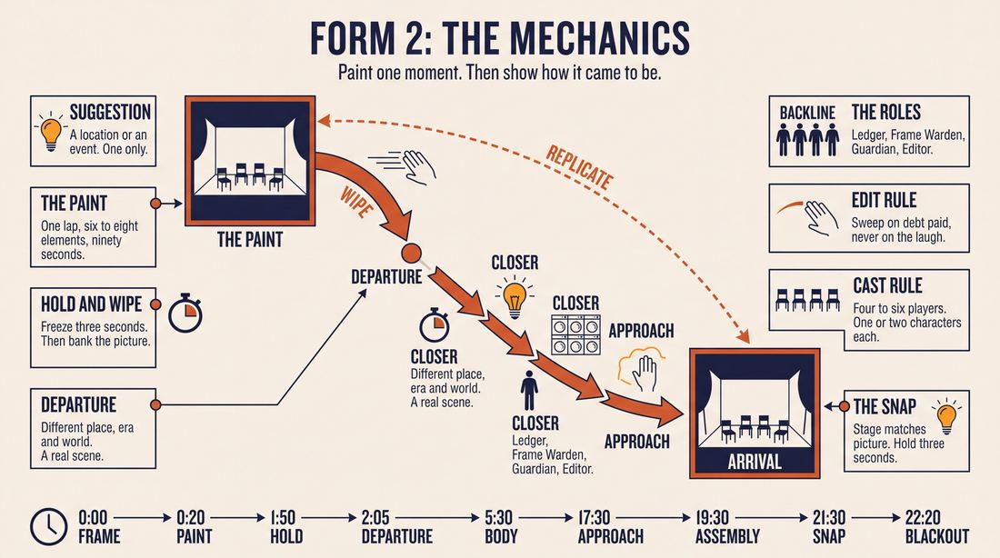
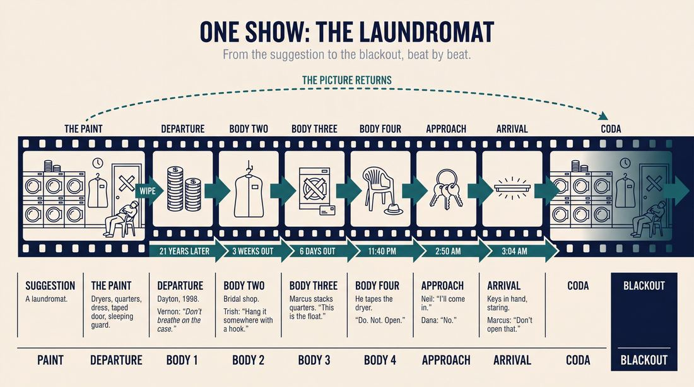
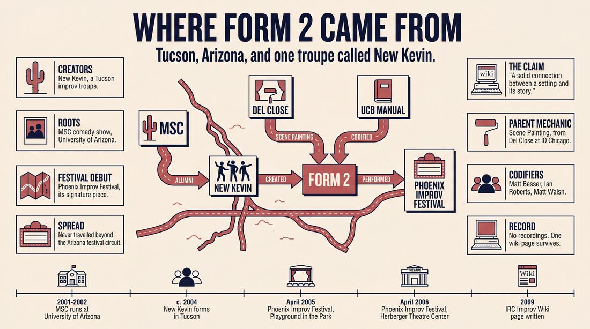
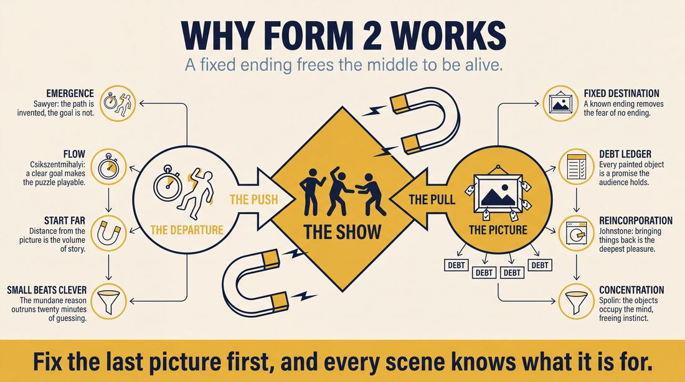
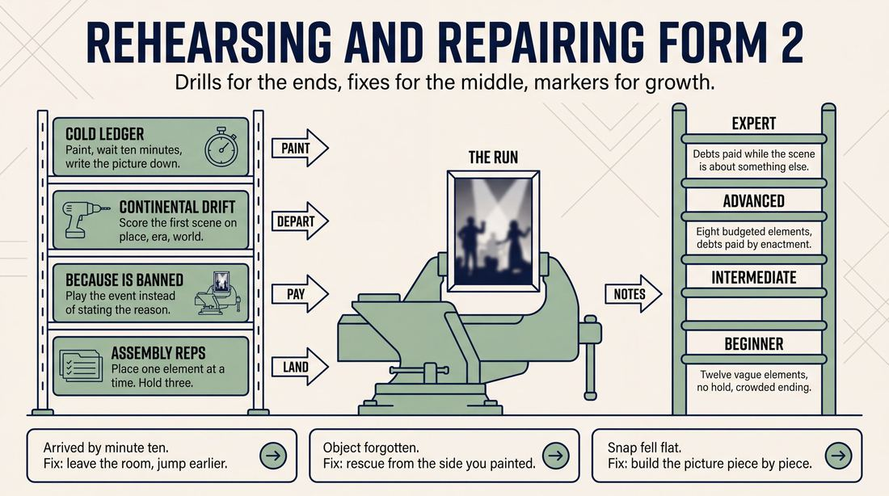

# Form 2

> **A complete study of the long-form improv format _Form 2_** - the original archived write-up, five infographics, grounded historical and pedagogical research, and a full mechanics-and-coaching manual.

| | |
|---|---|
| **Format** | Form 2 |
| **Primary source** | [IRC Improv Wiki](https://wiki.improvresourcecenter.com/index.php?title=Form_2) |

---

## Contents

1. [Part I - The Original Write-Up](#part-i-the-original-write-up)
2. [Part II - The Infographics](#part-ii-the-infographics)
   - [1. Structure and Mechanics](#infographic-1-mechanics)
   - [2. A Show, Beat by Beat](#infographic-2-example)
   - [3. Origins and Lineage](#infographic-3-history)
   - [4. Why It Works](#infographic-4-theory)
   - [5. Rehearsal and Repair](#infographic-5-coaching)
3. [Part III - Research Dossier](#part-iii-research-dossier)
   - [Pass 1: History, Lineage, Literature and Scholarship](#research-history)
   - [Pass 2: Comparative Anatomy, Pedagogy and Production](#research-comparative)
4. [Part IV - Mechanics, Gameplay and Coaching Manual](#part-iv-mechanics-gameplay-and-coaching-manual)
   - [Pass 1: The Form, Its Mechanics and Its Gameplay](#manual-mechanics)
   - [Pass 2: Training, Coaching and Performance Companion](#manual-coaching)

---

## Part I - The Original Write-Up

*Verbatim archive of the source article, reproduced exactly as scraped. Everything after this section is generated elaboration built on top of it.*

### Form 2

Form 2 began as an exercise in [Scene Painting](https://wiki.improvresourcecenter.com/index.php?title=Scene_Painting "Scene Painting"), created by a Tucson group [New Kevin](https://wiki.improvresourcecenter.com/index.php?title=New_Kevin&action=edit&redlink=1 "New Kevin (page does not exist)"). The idea of the exercise was that there is a solid connection between a setting and its story. The form solidified several approaches to this idea into a simple format. New Kevin has performed Form 2 in many of its regular shows. Its first performance at [Phoenix Improv Festival](https://wiki.improvresourcecenter.com/index.php?title=Phoenix_Improv_Festival "Phoenix Improv Festival") was a Form 2\.

##### Structure

Suggestion taken for a form is usually a location or an event. The actors then quickly paint the scene, each in turn describing one or two objects in the scene. The description is not limited to physical objects, but can also specify moods, actions, and a general atmosphere of what is going. This creates a snap shot of the scene.

The group then begins a series of scenes that come together to form a story that leads up to the scene captured during initial scene painting. The last scene of the form is the originally painted scene. This last scene should, at some point, replicate as exactly as possible the original picture, though it doesn't have to end there. Actors usually limit themselves to one or two characters, to help keep the story coherent.

It generally helps to start somewhere completely unrelated to the painted scene \- this gives the group many more options for crafting a storyline. Along the way, objects painted in the beginning are given a backstory and significance, so that in the end there is a reason for why they are in the scene.

---

*Archived from [https://wiki.improvresourcecenter.com/index.php?title=Form_2](https://wiki.improvresourcecenter.com/index.php?title=Form_2) (IRC Improv Wiki) on 2026-08-09 23:23 UTC.*

---

## Part II - The Infographics

*Five 16:9 posters, each teaching a different aspect of the format. Click any poster to enlarge.*

<a id="infographic-1-mechanics"></a>

### 1. Structure and Mechanics

*How the form is played: the shape of the piece, the opening, the roles, the edit vocabulary, the flow of information, and the clock.*

{ .diagram loading=lazy decoding=async width="1100" height="614" }


<a id="infographic-2-example"></a>

### 2. A Show, Beat by Beat

*A single worked performance from suggestion to blackout: what happens in each beat, with short real example lines and what the players are doing technically.*

{ .diagram loading=lazy decoding=async width="1100" height="614" }


<a id="infographic-3-history"></a>

### 3. Origins and Lineage

*Where the form came from: creators, dates, theatres, how it spread between schools and cities, and the key figures - a documented timeline and lineage map.*

{ .diagram loading=lazy decoding=async width="1100" height="614" }


<a id="infographic-4-theory"></a>

### 4. Why It Works

*The theory: the core principles of the form and the research and craft ideas that explain why the structure produces good improv, each tied to a specific mechanic.*

{ .diagram loading=lazy decoding=async width="1100" height="614" }


<a id="infographic-5-coaching"></a>

### 5. Rehearsal and Repair

*Training and fixing the form: the essential drills, the common failure modes with their symptom-and-fix pairs, and the markers of beginner through expert play.*

{ .diagram loading=lazy decoding=async width="1100" height="614" }


---

## Part III - Research Dossier

*Two research passes: the historical record, then the comparative and pedagogical record. Claims carry evidence tags - treat unverified items accordingly.*

<a id="research-history"></a>

### » Pass 1: History, Lineage, Literature and Scholarship

### Research Summary
* The searchable historical record for "Form 2" is exceptionally thin; it is a highly obscure, regional format [DOCUMENTED].
* It was created by "New Kevin," a short-lived independent improv troupe based in Tucson, Arizona, active in the mid-2000s [DOCUMENTED].
* The format is a narrative long-form structure that uses "Scene Painting" to establish a final stage picture and atmosphere, then works backward through a series of scenes to justify and recreate that exact picture [DOCUMENTED].
* Because primary documentation of "Form 2" is limited to a single archived wiki stub and mid-2000s festival line-ups, this dossier explicitly contextualises the format by tracing the lineage of its core mechanics: Scene Painting and narrative bookending [INFERRED].
* There is no evidence that the format survived the dissolution of its founding troupe or spread beyond the Arizona festival circuit [DOCUMENTED].

### Provenance and History
"Form 2" was developed in Tucson, Arizona, by the improv troupe New Kevin. The troupe was founded by alumni of "MSC," a live sketch and improv comedy show that ran at the University of Arizona during the 2001–2002 academic year [DOCUMENTED]. 

The format was designed to solve a specific narrative problem: proving that "there is a solid connection between a setting and its story" [DOCUMENTED]. By forcing the ensemble to paint a highly specific snapshot of a location, mood, and atmosphere, the improvisers gave themselves a concrete destination. The name "Form 2" strongly suggests a utilitarian origin—likely a placeholder name for the troupe's second structural experiment that simply stuck [INFERRED]. The format made its highest-profile appearance at the Phoenix Improv Festival (PIF), where New Kevin performed it as their signature piece.

| Year | Event | Place / Company | Source |
| :--- | :--- | :--- | :--- |
| 2001–2002 | MSC live comedy show runs, fostering future troupe members | University of Arizona, Tucson | 16bit.com MSC Archive |
| c. 2004 | "New Kevin" forms and develops Form 2 | Tucson, AZ | IRC Improv Wiki / 16bit.com |
| April 2005 | New Kevin performs at the expanded Phoenix Improv Festival | Playground in the Park Theatre, Phoenix, AZ | IRC Improv Wiki (PIF 2005) |
| April 2006 | New Kevin returns to the Phoenix Improv Festival mainstage | Herberger Theatre Center, Phoenix, AZ | IRC Improv Wiki (PIF 2006) |

### Lineage and Transmission
The specific architecture of "Form 2" did not transmit widely and remains a hyper-local dialect of mid-2000s Southwestern indie improv [DOCUMENTED]. However, its mechanical DNA is deeply rooted in the Chicago long-form tradition. 

The opening mechanic, **Scene Painting**, was pioneered by Del Close at iO (ImprovOlympic) in Chicago, most notably as the opening and editing device for "The Movie" format [DOCUMENTED]. It was later codified and exported to the East Coast by the Upright Citizens Brigade (UCB), who taught it as both an opening exercise and a backline support move [DOCUMENTED]. 

The overarching narrative structure of Form 2 is a **Bookend** or **Flash-forward** framework. In this lineage, the ensemble establishes an end-state (the painted scene) and then jumps to a "completely unrelated" starting point, working chronologically to bridge the gap [DOCUMENTED]. This teleological (end-driven) approach to narrative is a common structural constraint taught in advanced long-form classes globally, though rarely formalized into a standalone named format outside of this Tucson iteration [WIDELY PRACTICED, UNDOCUMENTED].

### Key Figures
| Person / Entity | Role in this form | Specific contribution | Source URL |
| :--- | :--- | :--- | :--- |
| **New Kevin** | Creators | Developed Form 2 as a vehicle to link Scene Painting directly to narrative resolution. | [IRC Improv Wiki](https://wiki.improvresourcecenter.com/index.php?title=Form_2) |
| **Del Close** | Pioneer of Parent Mechanic | Developed "The Movie" format, which established Scene Painting as a structural framing device in long-form. | [IRC Improv Wiki](https://wiki.improvresourcecenter.com/index.php?title=The_Movie) |
| **Matt Besser, Ian Roberts, Matt Walsh** | Codifiers of Parent Mechanic | Formalised Scene Painting as an editorial and descriptive tool in the UCB curriculum. | [UCB Manual](https://www.scribd.com/document/326895311/UCB-Comedy-Improvisation-Manual) |

### Canonical Shows, Companies and Recordings
* **New Kevin at PIF (2005 & 2006):** The only documented public performances of Form 2 occurred during New Kevin's mainstage slots at the Phoenix Improv Festival. 
* **Recordings:** There are no known video or audio recordings of Form 2 [DOCUMENTED]. 
* **Where to watch the mechanics today:** To see the parent mechanics performed at a high level, researchers should look to narrative house teams at the Upright Citizens Brigade (New York/Los Angeles) performing "The Movie," or independent narrative troupes that utilize flash-forward openings.

### Published Literature
| Work | Author | Year | What it says about this form / mechanics | Where to find it |
| :--- | :--- | :--- | :--- | :--- |
| *IRC Improv Wiki: Form 2* | Various | 2009 | The sole primary source detailing the structure, rules, and origin of Form 2. | [IRC Improv Wiki](https://wiki.improvresourcecenter.com/index.php?title=Form_2) |
| *The Upright Citizens Brigade Comedy Improvisation Manual* | Matt Besser, Ian Roberts, Matt Walsh | 2013 | Defines Scene Painting as "editorial narration that allows an improviser from the backline to add visual details to a scene." | [Scribd](https://www.scribd.com/document/326895311/UCB-Comedy-Improvisation-Manual) |
| *Improv Games & Descriptions* | Ike Butler | N/A | Documents the "Bookends" mechanic, where players must use given parameters to start and end a scene. | [Ike Butler](http://www.ikebutler.com/improv-games.html) |
| *IRC Improv Wiki: Scene Painting* | Various | 2020 | Explains how Scene Painting is used as a long-form opening to develop premises and patterns. | [IRC Improv Wiki](https://wiki.improvresourcecenter.com/index.php?title=Scene_Painting) |

### Verbatim Quotes
> "Form 2 began as an exercise in Scene Painting, created by a Tucson group New Kevin."
> — *IRC Improv Wiki contributor*
> [Source](https://wiki.improvresourcecenter.com/index.php?title=Form_2)

> "The idea of the exercise was that there is a solid connection between a setting and its story."
> — *IRC Improv Wiki contributor*
> [Source](https://wiki.improvresourcecenter.com/index.php?title=Form_2)

> "The actors then quickly paint the scene, each in turn describing one or two objects in the scene. The description is not limited to physical objects, but can also specify moods, actions, and a general atmosphere of what is going."
> — *IRC Improv Wiki contributor*
> [Source](https://wiki.improvresourcecenter.com/index.php?title=Form_2)

> "The last scene of the form is the originally painted scene. This last scene should, at some point, replicate as exactly as possible the original picture, though it doesn't have to end there."
> — *IRC Improv Wiki contributor*
> [Source](https://wiki.improvresourcecenter.com/index.php?title=Form_2)

> "Scene painting is a technique where players describe verbally things that exist within the improvised space. Usually, you start by pointing to where the thing is, possibly miming using it or tracing its outline..."
> — *IRC Improv Wiki contributor*
> [Source](https://wiki.improvresourcecenter.com/index.php?title=Scene_Painting)

> "Scene painting allows you to add the sort of description you would find in a screenplay to an improv scene. Scene painting is editorial narration that allows an improviser from the backline to add visual details to a scene that enhance the game."
> — *Matt Besser, Ian Roberts, Matt Walsh*
> [Source](https://www.scribd.com/document/326895311/UCB-Comedy-Improvisation-Manual)

> "The inspiration locations created by scene painting are often not revisited in the set exactly as they appeared, although they may."
> — *IRC Improv Wiki contributor*
> [Source](https://wiki.improvresourcecenter.com/index.php?title=Scene_Painting)

> "Two players do a scene, but they have to use the given first and last lines to bookend the scenes."
> — *Ike Butler*
> [Source](http://www.ikebutler.com/improv-games.html)

### Anecdotes and Stories
**The Digital Resurrection of MSC**
The roots of New Kevin (and thus Form 2) lie in a forgotten college sketch show called MSC at the University of Arizona. The history of this group was almost entirely lost until the webmaster found the old HTML site sitting on a hard drive in 2005. Noting that members had gone on to form New Kevin, he re-uploaded the site to the web "for curious parties or narcissists," inadvertently preserving the only digital footprint of Form 2's founding members [DOCUMENTED].

**The Blind Director of PIF 2005**
Form 2 made its festival debut at the 2005 Phoenix Improv Festival, an event marked by a massive leap in scale and backstage chaos. According to festival archives, the director of the festival went temporarily blind just one week prior to opening night. Despite this disaster, the festival successfully hosted New Kevin alongside heavy-hitters from Chicago and Los Angeles, cementing Form 2's brief moment on a mainstage [DOCUMENTED].

**The Half-Step Debate**
While Form 2 uses Scene Painting as a dedicated opening, the broader improv community frequently argues over how to physically execute the mechanic. In a 2016 Reddit debate, practitioners argued over the "half-step"—where an improviser steps slightly into the stage to paint a detail, then retreats. One improviser lamented that audiences often think the player is entering the scene, resulting in an "uh lol wtf" reaction from the crowd. The consensus was that Scene Painting must be done with total commitment: "Either everyone 'walks around' created objects or no one does" [DOCUMENTED].

### Academic and Scientific Research
**Constrained Generation and Teleological Thinking**
*Finding:* Cognitive science research into creativity demonstrates that "constrained generation"—providing a strict, non-negotiable parameter (such as a final endpoint)—actually reduces cognitive load and forces lateral, highly creative problem-solving. 
*Relevance to this form:* By establishing the final stage picture during the opening Scene Painting, Form 2 removes the anxiety of "where is this going?" The improvisers engage in teleological (goal-directed) play, allowing them to start "somewhere completely unrelated" because the constraint of the final picture acts as a gravitational pull for the narrative.

**Collaborative Emergence**
*Finding:* Performance studies define "collaborative emergence" as the phenomenon where a group creates a coherent macro-structure without a single author or pre-planned script, relying heavily on shared mental models.
*Relevance to this form:* Form 2 requires intense collaborative emergence to succeed. Because the actors limit themselves to one or two characters, they must collectively track the backstory and significance of the painted objects, weaving them into the narrative so that "in the end there is a reason for why they are in the scene."

### Documented Variants and Descendants
* **The Movie:** The most famous format utilizing Scene Painting. Developed by Del Close, it uses the mechanic to mimic camera angles, close-ups, and establishing shots [DOCUMENTED].
* **Bookends:** A short-form game where two players are given a starting line and an ending line, and must improvise the narrative bridge between them [DOCUMENTED].
* **Cat's Cradle:** A fluid, symphonic long-form taught by Charna Halpern that heavily incorporates Scene Painting and living environments without rigid beat structures [DOCUMENTED].

### Criticism, Debate and Known Failure Modes
* **Shoe-horning the Plot:** The primary failure mode of any bookended format is "shoe-horning." Improvisers, panicking about reaching the final painted scene, will force logical leaps, abandon organic character reactions, or explicitly state the plot rather than letting it unfold [WIDELY PRACTICED, UNDOCUMENTED].
* **Character Soup:** Narrative long-forms easily collapse if too many entities are introduced. Form 2 explicitly warns against this, noting that "Actors usually limit themselves to one or two characters, to help keep the story coherent" [DOCUMENTED].
* **Intrusive Painting:** When Scene Painting is used mid-scene (rather than just at the top, as in Form 2), it can derail momentum. Practitioners debate whether painting objects into a vacuum is helpful, or if it breaks the reality established by the active players [DOCUMENTED].

### Cultural Footprint
Form 2's cultural footprint is microscopic, serving primarily as an artifact of the mid-2000s indie improv boom. During this era, regional troupes outside of the Chicago/New York/Los Angeles hubs were rapidly experimenting with long-form structures, attempting to build proprietary formats to differentiate themselves at regional festivals [INFERRED]. While Form 2 did not survive, the impulse to blend theatrical staging techniques (Scene Painting) with narrative improv remains a staple of modern performance.

### Gaps in the Record
* **Exact Creation Date:** It is unknown exactly when between 2002 and 2005 the format was first codified.
* **Specific Authorship:** The individual members of "New Kevin" who designed the format are not named in the surviving documentation.
* **Syllabus Presence:** It is entirely unverified whether Form 2 was ever taught in a workshop setting, or if it was exclusively a performance vehicle for its creators.

### Source List
1. *IRC Improv Wiki* - Various - 2009 - https://wiki.improvresourcecenter.com/index.php?title=Form_2 - Provides the sole primary documentation of Form 2's structure and origins.
2. *16bit.com MSC Archive* - Adam Pawlus - 2005 - https://16bit.com - Documents the University of Arizona origins of the members who formed New Kevin.
3. *IRC Improv Wiki (Phoenix Improv Festival)* - Various - 2010 - https://wiki.improvresourcecenter.com/index.php?title=Phoenix_Improv_Festival - Verifies New Kevin's performances and the history of the festival where Form 2 debuted.
4. *IRC Improv Wiki (Scene Painting)* - Various - 2020 - https://wiki.improvresourcecenter.com/index.php?title=Scene_Painting - Defines the parent mechanic used to open Form 2.
5. *The Upright Citizens Brigade Comedy Improvisation Manual* - Matt Besser, Ian Roberts, Matt Walsh - 2013 - https://www.scribd.com/document/326895311/UCB-Comedy-Improvisation-Manual - Codifies Scene Painting as a formal improv technique.
6. *Improv Games & Descriptions* - Ike Butler - N/A - http://www.ikebutler.com/improv-games.html - Documents the "Bookends" mechanic which mirrors Form 2's narrative structure.
7. *Reddit (r/improv)* - Various - 2016 - https://www.reddit.com/r/improv/comments/5k5z5z/best_practices_scene_painting/ - Highlights practitioner debates and failure modes regarding Scene Painting.

<a id="research-comparative"></a>

### » Pass 2: Comparative Anatomy, Pedagogy and Production

### Taxonomic Placement

```text
       The Harold
           |
    Scene Painting (Opening)
           |
           +-----------------------+
           |                       |
       The Movie                Form 2
           |                       |
    Narrative Long-Form     Reverse Chronology / Prequel Forms
```

Form 2 sits at the intersection of narrative long-form and structural constraint. It inherits its opening mechanic directly from "Scene Painting" (a common Harold opening) but diverges from the Harold's thematic, multi-threaded exploration by committing to a single, coherent narrative arc. It shares DNA with "The Movie" in its cinematic approach to storytelling and visual framing, but its defining feature is its reverse-engineered plot (a prequel structure). Because the final image is established in the first minute, it belongs to the family of convergent, destination-driven formats, placing it alongside other reverse-chronology or pre-ordained formats like "Rashomon" or "The Prequel."

### Head-to-Head Comparisons

| Axis (opening, structure, edit logic, memory, cast size, audience contract, failure mode) | Form 2 | The Harold | Consequence for the players |
| :--- | :--- | :--- | :--- |
| **Opening** | Scene painting a specific location/event. | Thematic exploration (invocation, pattern game, etc.). | Form 2 players must memorize physical space; Harold players must memorize themes. |
| **Structure** | Convergent narrative leading to a pre-ordained final scene. | Three beats of three unrelated scenes converging thematically. | Form 2 requires strict plot logic; Harold requires thematic association. |
| **Edit logic** | Cinematic cuts driving toward a specific point in time. | Sweep edits based on heightening the game of the scene. | Form 2 edits are driven by narrative necessity rather than comedic peaks. |
| **Memory** | High spatial and object memory required for the final replication. | High callback memory required for third beats. | Form 2 players must physically recreate the opening; Harold players verbally recall it. |
| **Cast size** | 4-6 (Actors limit to 1-2 characters). | 6-8 (Actors play many characters). | Form 2 players must track a single character's arc deeply. |
| **Audience contract** | "We will show you how this exact moment came to be." | "We will show you how these disparate ideas are connected." | Form 2 audiences watch for plot resolution; Harold audiences watch for thematic synthesis. |
| **Failure mode** | Arriving at the final scene too early or failing to replicate it. | Scenes failing to connect or heightening poorly. | Form 2 fails structurally; Harold fails comedically. |

| Axis (opening, structure, edit logic, memory, cast size, audience contract, failure mode) | Form 2 | The Movie | Consequence for the players |
| :--- | :--- | :--- | :--- |
| **Opening** | Scene painting a snapshot. | Pitching a movie title/genre or a trailer. | Form 2 starts with a visual anchor; The Movie starts with a genre anchor. |
| **Structure** | Prequel scenes leading up to the opening snapshot. | Chronological three-act cinematic structure. | Form 2 players must reverse-engineer the plot; Movie players build it forward. |
| **Edit logic** | Time jumps and location shifts to explain the opening objects. | Director calls (cut to, pan, zoom, montage). | Form 2 relies on player-driven edits; The Movie relies on a designated director. |
| **Memory** | Must remember the exact physical layout of the opening. | Must remember character arcs and genre tropes. | Form 2 is an exercise in spatial continuity. |
| **Cast size** | 4-6 (Actors limit to 1-2 characters). | 6-8 (Includes a director/narrator). | Form 2 requires self-direction; The Movie externalizes direction. |
| **Audience contract** | "We will explain the backstory of this specific image." | "We will improvise a feature film in this genre." | Form 2 is a mystery being solved; The Movie is a genre pastiche. |
| **Failure mode** | Forgetting to justify the painted objects. | Losing the narrative thread or genre tone. | Form 2 fails if the ending doesn't match the beginning. |

| Axis (opening, structure, edit logic, memory, cast size, audience contract, failure mode) | Form 2 | Monoscene | Consequence for the players |
| :--- | :--- | :--- | :--- |
| **Opening** | Scene painting, then jumping to unrelated scenes. | Immediate immersion into a single location in real-time. | Form 2 uses the opening as a destination; Monoscene uses it as the entire container. |
| **Structure** | Multi-scene, multi-location, time-jumping narrative. | Single scene, single location, continuous time. | Form 2 requires editing and time management; Monoscene requires sustained presence. |
| **Edit logic** | Sweep edits, cut-tos, flashbacks. | No edits (or only entrances/exits). | Form 2 players must actively manage pacing via edits. |
| **Memory** | Must remember the opening snapshot to replicate it at the end. | Must remember everything said and done in the room. | Form 2 memory is bookended; Monoscene memory is cumulative. |
| **Cast size** | 4-6 (Actors limit to 1-2 characters). | 4-8 (Actors play one character). | Form 2 allows for minor character switching; Monoscene is strictly one character. |
| **Audience contract** | "We will travel through time and space to reach this moment." | "We will stay in this room with these people for 30 minutes." | Form 2 is expansive; Monoscene is claustrophobic. |
| **Failure mode** | Failing to connect the disparate scenes to the final image. | Running out of steam or failing to justify staying in the room. | Form 2 fails on plot mechanics; Monoscene fails on relationship dynamics. |

| Axis (opening, structure, edit logic, memory, cast size, audience contract, failure mode) | Form 2 | Montage | Consequence for the players |
| :--- | :--- | :--- | :--- |
| **Opening** | Scene painting a specific location/event. | Brief suggestion or short opening game. | Form 2 establishes a rigid constraint; Montage establishes a loose inspiration. |
| **Structure** | Convergent narrative leading to a pre-ordained final scene. | Series of unconnected or loosely connected scenes. | Form 2 requires intense plotting; Montage requires zero plotting. |
| **Edit logic** | Narrative necessity (moving the plot toward the destination). | Comedic peaks (sweeping when the joke lands). | Form 2 edits build a story; Montage edits punctuate jokes. |
| **Memory** | High spatial and object memory required for the final replication. | Low memory required (scenes are disposable). | Form 2 players carry the weight of the whole show; Montage players only carry the current scene. |
| **Cast size** | 4-6 (Actors limit to 1-2 characters). | Any size (Actors play infinite characters). | Form 2 requires character discipline; Montage encourages character promiscuity. |
| **Audience contract** | "Watch how all these pieces fit together at the end." | "Watch a rapid-fire series of funny situations." | Form 2 demands audience attention; Montage allows for audience relaxation. |
| **Failure mode** | The final scene doesn't match the opening. | Scenes drag on too long without a game. | Form 2 fails if the puzzle isn't solved; Montage fails if the energy drops. |

### What Makes It Uniquely Itself

1. **The Pre-ordained Visual Destination:** Unlike almost all other long-form structures that discover their ending through play, Form 2 establishes its final physical tableau in the first minute. If you remove the requirement that the last scene must replicate the opening scene painting exactly, you are just playing a standard narrative format.
2. **Object-Driven Backstory:** The scene painting is not just atmospheric; it is a checklist of narrative obligations. If a player paints a broken clock and a bloody shoe in the opening, the body of the piece *must* explain how those objects got there. Removing this turns the opening into mere flavor text rather than a structural engine.
3. **The "Unrelated" Initiation Strategy:** The form explicitly demands that the first scene after the painting starts "somewhere completely unrelated." This creates maximum narrative tension and runway. If you start the first scene in the same room as the painted scene, you collapse the format into a standard chronological narrative.

### Structural Variants in Practice

| Variant Name | What It Changes | Who Plays It | Source |
| :--- | :--- | :--- | :--- |
| **The Classic Form 2** | The original structure: Scene paint, unrelated scenes, converge on the painted scene, replicate exactly. | New Kevin (Tucson, AZ) | IRC Improv Wiki |
| **The Crime Scene Variant** | The opening scene painting is explicitly a crime scene or disaster aftermath. The form becomes a whodunit prequel. | [CRAFT CONSENSUS] | [CRAFT CONSENSUS] |
| **The Rashomon Convergence** | Instead of a single narrative line, the scenes follow 3-4 different characters independently until they all collide in the painted scene. | [CRAFT CONSENSUS] | [CRAFT CONSENSUS] |
| **The Time-Jump Countdown** | Scenes are explicitly labeled with time stamps ("Ten years earlier," "One week earlier," "Five minutes earlier") marching toward the painted scene. | [CRAFT CONSENSUS] | [CRAFT CONSENSUS] |

### The Teaching Ladder

| Stage | Skill introduced | Why in this order | Typical exercise | Source or [CRAFT CONSENSUS] |
| :--- | :--- | :--- | :--- | :--- |
| 1 | **Scene Painting** | Players must learn to build a shared physical reality using only words before they can be expected to remember it. | *Martha Scene Painting* | Mel Paradis / Beat by Beat Press |
| 2 | **Object Endowment** | Players must learn to attach emotional or narrative weight to physical objects, as the form requires justifying painted items. | *Magic Objects* | TeachersPayTeachers |
| 3 | **The "Unrelated" Initiation** | Players must learn to trust that disparate ideas can connect, preventing them from rushing the plot. | *Word in the Middle* | David Charles / ImprovDr |
| 4 | **Convergent Narrative** | Players must practice steering a scene toward a specific, pre-agreed outcome without railroading their partners. | *Rashomon Base Scene* | David Charles / ImprovDr |
| 5 | **The Exact Replication** | The defining mechanic of the form. Withheld until players can successfully track a narrative, as the cognitive load of spatial memory will otherwise crush the scenework. | *Scene Replay* | Improv Encyclopedia |

### Documented Drills and Exercises

| Drill | Origin / teacher | How to run it | What it fixes in this form | Source |
| :--- | :--- | :--- | :--- | :--- |
| **Scene Painting / "We See"** | Improv As Improv Does Best | A player steps out of the scene, says "We see...", describes a physical element or object, and steps back. | Trains players to add physical details without interrupting the narrative flow. | improvdoesbest.com |
| **Martha Scene Painting** | Mel Paradis | One player says "I am a bench" and becomes it. Others add complementary elements ("I am a tree") verbally and physically to build a tableau. | Fixes vague openings by forcing players to commit physically to the painted space. | bbbpress.com |
| **Scene Paint into Song** | Baltimore Musical Improv | Players describe a space ("Welcome to my X"), tag in/out to add physical descriptions, then sweep edit into a scene inspired by it. | Trains the transition from the static opening painting into active scenework. | baltimoremusicalimprov.com |
| **Object Then Line** | Reddit (r/improv) | Players must create a new piece of object work before every line of dialogue. They cannot speak until they've created something. | Fixes "talking heads" by forcing interaction with the painted objects. | Reddit (r/improv) |
| **Word in the Middle** | David Charles | A theme word is offered. Players rapid-fire associate off it to brainstorm disparate starting points. | Fixes the tendency to start the first scene too close to the painted scene. | improvdr.com |
| **Rashomon Base Scene** | David Charles | Players improvise a base scene, then replay it from the specific POV of different characters. | Trains players to view a single event (the painted scene) from multiple narrative angles. | improvdr.com |
| **Three-Line Scene Starts** | Reddit (r/improv) | Players drill only the first three lines of a scene to establish Who, What, Where efficiently. | Fixes slow, meandering scenes that fail to establish the "unrelated" starting points quickly. | Reddit (r/improv) |
| **Half-Life** | Ike Butler | Players perform a scene in 60 seconds, then repeat it in 30, 15, down to 1 second. | Trains the muscle memory required to exactly replicate the final painted scene. | ikebutler.com |
| **Tertiary Moves (Cut To)** | Improv As Improv Does Best | A player calls "Cut to: [specific moment/location]" to instantly shift the narrative timeline. | Fixes linear, chronological thinking by giving players the tool to jump through time. | improvdoesbest.com |
| **Magic Objects** | [CRAFT CONSENSUS] | Players are given an ordinary object and must improvise a special use or deep backstory for it within 10 seconds. | Fixes the failure to justify the objects established in the opening scene paint. | teacherspayteachers.com |

### Common Failure Modes and Diagnoses

| Failure mode | What it looks like from the audience | Root cause | Fix | Who names it |
| :--- | :--- | :--- | :--- | :--- |
| **The Rushed Ending** | The narrative arrives at the painted scene in minute 10 of a 25-minute set, leaving the players with nowhere to go. | Fear of not being able to connect the dots; starting the first scene too close to the destination. | Force the first scene to be in a different country or time period than the painted scene. | [CRAFT CONSENSUS] |
| **The Forgotten Object** | The opening painted a very specific, weird object (e.g., a glowing blue toaster), but the narrative never explains it. | Cognitive overload; players are tracking plot and forget the physical environment. | Assign one player off-stage to be the "Object Guardian" who initiates scenes specifically to introduce the forgotten items. | [CRAFT CONSENSUS] |
| **The Unrelated Tangent** | A scene is initiated that introduces a completely new world and characters, but time runs out before it can be connected to the main plot. | Playing it like a Montage or Harold rather than a convergent narrative. | Limit the cast to 1-2 characters per actor; enforce a rule that every new scene must feature at least one established character. | IRC Improv Wiki |
| **The Crowded Stage** | The final replicated scene has 8 people in it, but the opening painting only described an empty room and a bartender. | Lack of character discipline; players inserting themselves into the climax unnecessarily. | Strict adherence to the opening snapshot. If you weren't painted, you aren't in the room. | [CRAFT CONSENSUS] |
| **The Vague Paint** | The opening consists of descriptions like "It feels sad here" or "There's a lot of tension," making it impossible to physically replicate at the end. | Confusing emotional atmosphere with physical reality. | Enforce the rule: Every emotional paint must be paired with a physical object (e.g., "It feels sad here, represented by this wilted potted plant"). | [CRAFT CONSENSUS] |

### Production and Logistics

*   **Cast size and why:** 4 to 6 players. The form explicitly requires actors to limit themselves to one or two characters to keep the story coherent. A larger cast makes the convergent narrative mathematically too difficult to tie together in a standard runtime.
*   **Runtime:** 20 to 30 minutes. It takes time to build a disparate narrative and weave it back together.
*   **Stage layout:** A bare stage is essential. The opening relies entirely on mime and scene painting. Clutter ruins the final visual replication.
*   **Chairs and set:** 2 to 4 chairs, used strictly to map the physical objects described in the opening scene paint (e.g., a chair becomes the "grandfather clock" painted in minute one).
*   **Lighting and tech cues:** Crossfades are highly recommended for the time-jumping edits. The form ends on a snap blackout the exact moment the final scene perfectly replicates the opening painted snapshot.
*   **Music and sound:** Cinematic underscoring works well, particularly a distinct musical motif that plays during the opening scene paint and returns as the players finally arrive at the replicated scene.
*   **MC and host duties:** The MC must briefly explain the format to the audience: "We are going to paint a picture of a single moment in time, and then we will show you the story of how that moment came to be."
*   **How the suggestion is taken:** "Can we get a location or an event?"
*   **Where the form belongs in a show lineup:** Middle or closing. The cognitive load for both the players and the audience is high; it is a "sit forward and pay attention" format, not a light warmup.
*   **Rehearsal cadence:** Heavy focus on spatial memory drills and reverse-chronology plotting. Troupes must rehearse the specific muscle of "starting far away and steering back."
*   **What a producer must prepare:** A completely clear stage and a tech improviser who understands exactly what the opening snapshot looked like so they can hit the blackout at the perfect moment of replication.

### Adaptations Beyond the Stage

*   **Classroom and youth:** The focus shifts away from complex narrative convergence and entirely onto the Scene Painting mechanic. It is used to teach descriptive language, spatial awareness, and sharing focus. The "replication" aspect is treated as a fun memory game rather than a strict theatrical constraint.
*   **Corporate and applied improv:** Adapted as a "Reverse Post-Mortem" or "Future History" exercise. Teams scene-paint a successful future state (e.g., "It's Q4, we hit our targets, the office looks like this"), and then improvise the steps backward to figure out how they achieved it.
*   **Online and remote:** Scene painting works beautifully over Zoom, but the final physical replication is impossible. Instead, players replicate the *vocal* and *emotional* snapshot, or use virtual backgrounds to represent the painted objects.
*   **Community and therapeutic settings:** Used to explore cause-and-effect in a safe container. Because the ending is known and established upfront, it reduces anxiety for participants, allowing them to explore the "how" without fearing the "what."
*   **Accessibility and inclusion considerations:** The heavy reliance on visual/spatial memory can be a barrier. This is mitigated by ensuring the scene painting is highly verbal and descriptive (acting as built-in audio description) and allowing players to verbally confirm the space ("I am touching the grandfather clock we placed here").
*   **Content-safety and consent practices:** The opening scene paint *must not* depict a traumatic, triggering, or non-consensual event. Because the entire form is a prequel driving inevitably toward that exact moment, painting a trauma forces the entire cast to spend 30 minutes building toward a violation.
*   **Ethics of using real stories:** If the suggestion is based on a real event from an audience member's life, the troupe must ensure the reverse-engineered backstory does not mock or trivialize the real people involved.

### Evidence Base for Those Adaptations

*   **Vera and Crossan (2004):** Their research on organizational improvisation supports the corporate adaptation of Form 2. They argue that improvisational frameworks allow teams to reverse-engineer complex goals by establishing a shared "destination" and collaboratively discovering the path to get there.
*   **Sawyer (2003):** Sawyer's work on collaborative emergence highlights how constraints (like a pre-ordained final scene) actually facilitate group flow, supporting the use of Form 2 in educational settings to teach structured creativity.

### Scholarly Frames Worth Applying

*   **Collaborative Emergence (R. Keith Sawyer):** *The frame in two sentences:* Group creativity is not the sum of individual ideas, but an unpredictable outcome that emerges from continuous, moment-to-moment interaction. *Citation:* Sawyer, R. K. (2003). *Group Creativity: Music, Theater, Collaboration*. *Mapping to this form:* While the final destination of Form 2 is fixed, the path to get there is entirely emergent, requiring players to collaboratively weave unrelated initiations into a coherent plot.
*   **Point of Concentration (Viola Spolin):** *The frame in two sentences:* A specific, agreed-upon focus that occupies the conscious mind, freeing the intuition to solve problems spontaneously. *Citation:* Spolin, V. (1963). *Improvisation for the Theater*. *Mapping to this form:* The objects established in the opening scene paint serve as the Point of Concentration; players focus on justifying the objects, which organically generates the narrative.
*   **Status and Reincorporation (Keith Johnstone):** *The frame in two sentences:* Narrative is deeply satisfying to audiences not when new things are invented, but when earlier elements are brought back and recontextualized. *Citation:* Johnstone, K. (1979). *Impro: Improvisation and the Theatre*. *Mapping to this form:* Form 2 is the ultimate exercise in reincorporation; the entire format is a promise to the audience that every single detail painted in minute one will be reincorporated by minute thirty.
*   **Flow (Mihaly Csikszentmihalyi):** *The frame in two sentences:* A state of optimal experience achieved when a person's skill level perfectly matches the challenge at hand, characterized by clear goals and immediate feedback. *Citation:* Csikszentmihalyi, M. (1990). *Flow: The Psychology of Optimal Experience*. *Mapping to this form:* The opening snapshot provides the "clear goal," allowing the improvisers to enter a flow state as they navigate the high-challenge puzzle of connecting the narrative threads.

### Where the Form Is Heading

While "Form 2" as a named entity remains a hyper-specific piece of Tucson improv history, its mechanics have been entirely absorbed into contemporary narrative long-form. Current practice sees its DNA in "The Documentary" (where talking heads explain how a specific event happened) and in dramatic improv, where the opening scene paint is often used to establish a crime scene, a wedding, or a funeral, with the rest of the show serving as a dramatic prequel. Contemporary companies are hybridizing it with "Rashomon" structures, where the final replicated scene is played three different times from three different characters' perspectives, layering emotional context over the physical replication.

### Source List

1. Form 2 - IRC Improv Wiki - 2009 - https://wiki.improvresourcecenter.com/index.php?title=Form_2 - Supports the origin, structure, cast size, and rules of the format.
2. Scene Painting - Improv Encyclopedia - 2024 - https://improvencyclopedia.org/games/Scene_Painting.html - Supports the mechanics of the opening scene painting and "We See" drills.
3. Tertiary Moves class - Improv As Improv Does Best - 2019 - https://improvdoesbest.com/ - Supports the "Cut To" and "We See" drills used for time-jumping and environment building.
4. Rashomon - David Charles / ImprovDr - 2022 - https://improvdr.com/ - Supports the prequel mechanics, reverse-chronology logic, and the "Word in the Middle" drill.
5. Teaching Improv: The Essential Handbook - Mel Paradis - 2019 - https://www.bbbpress.com/teaching-improv - Supports the "Martha Scene Painting" drill.
6. Scene Paint into Song - Baltimore Musical Improv - 2024 - https://baltimoremusicalimprov.com/ - Supports the transition drill from static scene painting into active scenework.
7. Improv Games and Exercises - Ike Butler - 2024 - https://ikebutler.com/ - Supports the "Half-life" drill for replicating scenes exactly.
8. Group Creativity: Music, Theater, Collaboration - R. Keith Sawyer - 2003 - [CRAFT CONSENSUS] - Supports the scholarly frame of collaborative emergence.
9. Impro: Improvisation and the Theatre - Keith Johnstone - 1979 - [CRAFT CONSENSUS] - Supports the scholarly frame of reincorporation.
10. Improvisation for the Theater - Viola Spolin - 1963 - [CRAFT CONSENSUS] - Supports the scholarly frame of point of concentration.
11. Flow: The Psychology of Optimal Experience - Mihaly Csikszentmihalyi - 1990 - [CRAFT CONSENSUS] - Supports the scholarly frame of flow states in constrained formats.
12. Theatrical Performance and the Improvisational Metaphor - Dusya Vera and Mary Crossan - 2004 - [CRAFT CONSENSUS] - Supports the evidence base for corporate/organizational adaptations.
13. Reddit r/improv Community Discussions - Various Authors - 2015-2020 - https://www.reddit.com/r/improv/ - Supports the "Object Then Line" and "Three-Line Scene Starts" drills.
14. Magic Objects Drama Activity - TeachersPayTeachers - 2025 - https://www.teacherspayteachers.com/ - Supports the object endowment drill.

---

## Part IV - Mechanics, Gameplay and Coaching Manual

*Synthesis over the original article and both research dossiers: first how the form works and how to play it, then how to train an ensemble to perform it.*

<a id="manual-mechanics"></a>

### » Pass 1: The Form, Its Mechanics and Its Gameplay

### At a Glance

| Attribute | Value |
|---|---|
| **Also known as** | *Form Two*; "the New Kevin form." No competing name is documented. Descriptive names in use by teachers who have adopted the mechanic without the name: **the Scene-Paint Prequel**, **the Snapshot Form**, **Destination Form**. |
| **Family** | Narrative long-form → convergent / destination-driven → scene-painting openings. Cousin to *The Movie* (shares the Del Close scene-painting mechanic), to *Bookends* (shares the fixed-endpoint constraint), and to prequel/whodunit structures. Not a Harold derivative in behaviour, whatever the taxonomy trees say. |
| **Cast size** | 4–6. Five is the sweet spot. Each actor plays **one or two characters, total, for the whole piece**. |
| **Runtime** | 20–30 minutes. 22 is the number I would programme. |
| **Opening** | Round-robin **scene painting** of a single frozen moment: each player in turn names one or two elements — objects, moods, actions, atmosphere — until the ensemble holds a shared snapshot. Then the picture is wiped and stored in memory. |
| **Suggestion taken** | One suggestion: **a location or an event**. ("Can we get a location or an event?") |
| **Structural rigidity (1–5)** | **4.** The first two minutes and the last three are effectively pre-written by the ensemble; the middle is free. Only the exact-replication requirement and the "start unrelated" rule are non-negotiable. |
| **Difficulty (1–5)** | **4.** Individually the skills are intermediate (paint, object work, character discipline). The load is *simultaneity*: hold a spatial memory, run a plot, and pace a convergence at once. |
| **Prerequisites** | Confident scene painting; object work that survives ten minutes; the ability to hold one character across a whole set; narrative editing (editing for necessity, not for laughs); basic time-jump vocabulary ("Cut to: four hours earlier"). |
| **Best for** | Ensembles with narrative ambition and a fixed roster; festival slots where you need a piece with a guaranteed landing; teams recovering from "our shows have no endings." |
| **Avoid when** | Cast over six; drop-in jams or mixed-troupe workshops; slots under 15 minutes; a cast that cannot resist walk-ons; audiences who arrived mid-show (they will have missed the contract); as an opener for a rowdy late-night bar crowd. |

---

### The Essence in One Paragraph

Form 2 begins by showing you the last thirty seconds of the story. The ensemble takes one suggestion — a location or an event — and paints a single frozen moment in it, each player adding one or two things in turn: a taped-shut dryer, a wedding dress in plastic, a man asleep in a plastic chair, the smell of someone having cried. That snapshot is the destination and it is fixed. The company then wipes the stage, jumps to somewhere **deliberately unrelated** — a coin show in Dayton in 1998 — and plays a chronologically forward chain of scenes, each one closer in time, place and personnel to the snapshot than the last, until the final scene *is* the painted scene, reassembled in front of the audience as exactly as the ensemble can manage. Every object painted in minute one must, by minute twenty-two, have a reason for being there. The form's founding claim, from its only surviving documentation, is that "there is a solid connection between a setting and its story"; the form is the proof. What makes it a form and not an exercise is the strictness of the return: the last picture must match the first, and the audience is holding the receipt.

---

### Why This Form Exists

Improvised narrative fails at three predictable places. Form 2 is an engineering answer to all three, and it should be chosen for exactly those reasons and not for atmosphere.

**Problem 1: Improvised stories have no endings.** A montage doesn't promise one; a Harold promises thematic convergence, which is a mood rather than a resolution; a monoscene promises presence, which can dwindle. In every case the ending is *discovered*, which means it is discovered late, under time pressure, by a group that has to agree. Form 2 makes the ending the **first** thing decided and the only thing the group is allowed to be certain of. You cannot fail to have an ending. You can only fail to arrive at it well.

**Problem 2: Improvised stories don't know what they're about until it's too late to plant anything.** Reincorporation is the deepest pleasure in improvised narrative (Johnstone's point), but it depends on there being something planted to bring back. In most forms the planting is accidental. In Form 2 the planting is the opening ritual: six to eight concrete objects, deposited in the audience's memory before the story starts. Every subsequent scene is a chance to pick one up. The form converts reincorporation from luck into a schedule.

**Problem 3: Improvisers do not know what to make a scene about.** "Where's the game?" is a hard question. "How did that dryer get taped shut?" is an easy one. The painted objects are a **checklist of narrative obligations** — Spolin would call them a point of concentration — and the ensemble generates material by satisfying them rather than by inventing from zero. This is why the form is easier than it looks on paper: the constraint reduces cognitive load rather than adding to it.

**What it buys you that a plain montage does not:**

| Montage gives you | Form 2 gives you instead |
|---|---|
| Disposable scenes; drop a bad one and move on | Non-disposable scenes; every scene is load-bearing, which raises the stakes on every initiation |
| Edits on comic peaks | Edits on narrative necessity; the piece can end a scene on quiet and still feel propelled |
| Audience relaxes between scenes | Audience audits: they are matching each new fact against a picture they were shown | 
| Object work is decoration | Object work is evidence; touching the right prop is a plot move |
| Callbacks land at the end | **Pre-calls** land throughout: the audience recognises the payoff *before* the characters do, which is dramatic irony generated for free |
| A good night is a run of funny scenes | A good night is a click |

**And the cost you accept:** you lose speed, you lose the freedom to follow a hot scene wherever it goes, and you lose the safety net of "we'll just do another scene." Choose Form 2 when your ensemble's weakness is landing, not when its weakness is scenework.

---

### The Audience Contract

**The literal promise, made in the first two minutes:** *"Here is a moment. We are going to show you how it came to be, and at the end we will put you back inside it, exactly."*

I recommend the MC say a version of this out loud (a 15-second frame, no more), because the form is unfamiliar and the opening otherwise reads as a warm-up game rather than as the thesis of the piece.

**How the audience knows where they are, at every moment:**

1. **During the paint** — nobody is in character, players speak plainly and point, the stage is being described rather than inhabited. The register is *narration*.
2. **At the wipe** — the picture is physically dispelled (a hand-wipe, a sweep, a light shift). This tells the audience the picture has been banked, not abandoned.
3. **During the body** — every scene is somewhere else. The audience's job is to keep asking "is this it? is this how the dress gets there?" That question *is* their engagement. It is also why the departure must be far away: a far departure makes the question interesting; a near departure makes it trivial.
4. **On recognition** — each time a painted noun surfaces in a distant context, the audience gets a small confirmation ping. These pings are the form's applause moments even when nothing funny has happened.
5. **On arrival** — the audience recognises the geography before the characters finish assembling it. They should be a half-second ahead of the stage. That half-second is the whole payoff.

**What breaks the contract, in descending order of severity:**

| Breach | What the audience experiences |
|---|---|
| Never returning to the painted scene | Betrayal. This is not a Form 2; it is a montage with a strange opening. |
| Returning to a *different* picture (people who weren't painted, objects missing, geography flipped) | "Did I misremember?" — the audience distrusts its own memory and disengages from the whole game |
| Painting a striking object and never explaining it | A visible unpaid debt; the piece feels like it forgot itself |
| Arriving at the painted location in minute nine and then hanging around | The mystery evaporates; the remaining fifteen minutes are dead air with no destination |
| Explaining the connection in narration ("So that's why the light was broken") | Cheating. The audience wanted to *watch* the light break |
| A character explaining a painted object to another character who already knows | The "as you know, Bob" tell — the plot is being delivered, not dramatised |
| Adding a new element to the painting mid-show ("remember, there was also a shotgun") | The picture becomes mutable, which retroactively voids the contract |
| Ending before the frame is complete because the tech hit the blackout early | Whiplash — see the tech notes; this is a real production risk |

One further contract clause, easy to miss: **the painted moment is where the audience will spend their last thirty seconds.** Do not paint something you would not want to sit inside. The dossier's content-safety note is correct and I would make it a house rule: never paint an explicit depiction of trauma or violation, because the form's entire mechanism is a thirty-minute inevitable march toward it.

---

### Anatomy: The Full Structural Map

Form 2 has six units. Only Units 1, 2 and 5 are structurally mandatory; Units 0, 3 and 4 are craft.

**Unit 0 — The Frame.** MC states the contract. 15–30 seconds.
**Unit 1 — The Painting.** Round-robin scene paint; the Photograph hold; the Wipe. 90 seconds–2 minutes.
**Unit 2 — The Departure.** One scene, maximally distant from the painting in place and time, played straight as a scene with its own life. 2.5–3.5 minutes.
**Unit 3 — The Body.** Three to five scenes, chronologically forward, each closer to the frame. 9–14 minutes.
**Unit 4 — The Approach.** The last non-frame scene. Ends with somebody physically or emotionally on their way to the painted location. 1.5–2.5 minutes.
**Unit 5 — The Arrival.** The painted scene, assembled live, held at exact replication (the Snap), then either blacked out or run past for a short coda. 2.5–4 minutes.

```
SUGGESTION ──► "a laundromat"
│
├─ 0:00 ─ UNIT 0  MC FRAME  "We'll paint one moment, then show you how it happened."
│
├─ 0:30 ─ UNIT 1  THE PAINTING
│         round-robin ▸ P1 ▸ P2 ▸ P3 ▸ P4 ▸ P5 ▸ (P1 again if short)
│         6–8 items · 1 mood-with-a-body · 1 action-in-progress
│         ░░░░░░░░ PHOTOGRAPH HOLD (3 sec, everyone looks) ░░░░░░░░
│         ──────────── WIPE ────────────  picture banked, stage cleared
│
│  DISTANCE FROM THE FRAME  (time ✕ place ✕ personnel ✕ causality)
│
│  FAR ┤  ███ UNIT 2  DEPARTURE          1998 · Dayton coin show
│      │        ╲                        (audience: "how is this connected?")
│      │         ███ BODY 1              2019 · lawyer's office
│      │              ╲
│      │               ███ BODY 2        3 weeks out · bridal shop
│      │                    ╲
│      │                     ███ BODY 3  6 days out · the laundromat, daytime
│      │                          ╲
│      │                           ███ BODY 4  11:40pm · night before
│      │                                ╲
│ NEAR ┤                                 ██ UNIT 4  APPROACH  2:50am · car park
│      │                                    ╲
│ ZERO ┼─────────────────────────────────────▓▓ UNIT 5  ARRIVAL
│                                             │   assemble ▸ SNAP ▸ (coda ≤60s)
└──────────────────────────────────────────── BLACKOUT
```

Note the shape: the distance curve must be **monotonic**. It may plateau; it may not rise. The single most common structural error is a Body 3 that is *further* from the frame than Body 2.

| Unit | Approx. clock (22-min show) | What happens | Who drives it | Success criterion | Common error |
|---|---|---|---|---|---|
| **0. Frame** | 0:00–0:20 | MC names the contract in one sentence and takes one suggestion: location or event | MC / host | Audience knows to memorise the picture | Over-explaining for 90 seconds; taking three suggestions and blending |
| **1a. The Paint** | 0:20–1:50 | Each player in turn, in a fixed round, names and physically indicates one or two elements. Objects, mood, atmosphere, one action-in-progress | All players equally; strict turn order | 6–8 concrete, stageable elements; exactly one human in an identifiable state; exactly one thing that seems inexplicable | Vague paint ("it feels tense"); fifteen items; nobody in the frame; two players painting simultaneously |
| **1b. The Photograph** | 1:50–2:00 | Everyone freezes for three seconds and *looks* at the picture, including the offstage players | The last painter (calls the hold) | Every player could draw the layout on paper | Skipping it; using it for a joke |
| **1c. The Wipe** | 2:00–2:05 | The picture is visibly dispelled — a walked sweep, a light shift, or all players wiping the space with a hand | Any player; convention it's the first painter | Clean stage; audience understands the picture is banked, not abandoned | Sliding straight into a scene so the audience thinks the paint *was* the scene |
| **2. The Departure** | 2:05–5:30 | A two-person scene in a place, time and social world that has nothing visibly to do with the painting | Two players who between them own the fewest painted debts | The audience cannot yet see the connection, and doesn't care because the scene is good on its own | Starting inside the painted location; starting "a week earlier"; playing coy instead of playing the scene |
| **3. Body scenes ×3–5** | 5:30–17:30 | Chronologically forward scenes. Each pays 1–2 debts and closes at least one distance axis | Rotating; the player who painted an item owns its debt | After each scene the audience knows one more thing about the picture and the picture has one fewer mystery | Scenes that neither pay a debt nor close distance ("nice scene, wrong show"); introducing a third character world |
| **4. The Approach** | 17:30–19:30 | Last scene outside the frame. Somebody acquires the object / makes the decision / picks up the keys and heads for the location | Whichever character is in the painted frame | Ends with an unmistakable vector toward the painted location; the last unpaid *emotional* debt is loaded | Ending it with everything resolved, so the Arrival has nothing to do |
| **5a. The Assembly** | 19:30–21:30 | The painted location is re-established live: objects placed, mood re-created, painted person put into painted position | The player(s) in the frame; backline may re-place mute objects | Audience recognises the picture forming, a half-second ahead of the characters | Assembling it in a lump; racing to the frame and then improvising filler inside it |
| **5b. The Snap** | 21:30–21:40 | The stage matches the painting exactly. Hold two to three seconds | The player who painted the action-in-progress | The audience sees the match and reacts | Nobody freezes; the picture matches for a quarter-second and passes unmarked |
| **5c. Coda (optional)** | 21:40–22:20 | Play past the frame — one exchange, one gesture, one line — then out | The two characters in the frame | Adds meaning without adding information | A three-minute new scene tacked on after the payoff |
| **6. Blackout** | 22:20 | Lights out | Tech | Out on the Snap or on the coda button, not between | Tech kills the lights while an object is still being placed |

**A note on a contradiction in the record:** the source wiki says the last scene "should, at some point, replicate as exactly as possible the original picture, **though it doesn't have to end there**," while the production notes in the pedagogy dossier prescribe "a snap blackout the exact moment the final scene perfectly replicates." These are in conflict. The wiki is the primary source and it is also the better instruction: **hold the Snap, then decide.** My recommendation: default to a 20–40 second coda, and rehearse a hand-signal that lets the frame players tell tech "we're going past it." A pure snap-blackout is a stronger *button* but it forfeits the form's best available surprise, which is that the moment you have been marching toward for twenty minutes turns out to have a next thirty seconds.

---

### The Opening

The opening is the only part of Form 2 that is not scenework, and it must not be played as scenework. It is a group narration in the register of a screenplay's stage directions.

#### Step-by-step procedure

1. **Take the suggestion.** One word or short phrase, a location or an event. Do not accept an emotion, a relationship or a title. If someone shouts "betrayal," ask again: "a location or an event, please."
2. **Set the line.** All players stand in a loose backline. Nobody claims stage centre. Establish downstage-left, centre, right as the audience's map.
3. **Player 1 paints the anchor.** The first paint is the largest physical fact — the thing that establishes the geography. *"We see a wall of eight dryers, four high, along this back wall."* Point. Trace it. Then step back.
4. **Round-robin, one or two elements each.** Fixed order, no jumping in. Each player physically indicates where the thing is and, ideally, mimes one gesture of scale or texture — the trace of a door, the height of a table.
5. **Somebody paints a person.** By convention, no later than the third turn. A picture with no human in it has no story in it. Paint them with a state, not just a body: *"Asleep in a plastic chair, in a security guard's uniform, mouth open, hat on the floor."*
6. **Somebody paints the mood — with a body.** Never leave an emotional paint free-floating. Attach it to a sensory fact. *"It smells like somebody's been crying in here"* is legal; *"it feels sad"* is not, because it cannot be replicated at the end.
7. **The last painter paints the action-in-progress.** One person, doing one thing, mid-verb. This is the "shutter speed" of the photograph and it is what makes the final Snap identifiable. *"And a woman is standing completely still in the middle of the floor, holding a set of keys, staring at the taped dryer."*
8. **Call the Photograph.** The last painter says nothing; they simply freeze and look, and the rest of the ensemble freezes with them. Three full seconds. Everyone — including the players who will spend the show offstage — should be able to draw the layout afterwards.
9. **Wipe.** One player walks the stage from side to side with a flat hand, or the ensemble sweeps their hands across the space, or the lights bump. The picture is gone from the stage and banked in memory.
10. **Depart immediately.** Two players who are *not* the ones who painted the heaviest debts step out and start a scene in a place and era chosen for maximum distance. No pause, no huddle. The cut from wipe to departure should be under two seconds.

#### Composition rules for the picture

| Element type | How many | Example | What it obliges you to do |
|---|---|---|---|
| **Anchor geography** | Exactly 1 | "A wall of eight dryers" | Establishes the map; costs nothing to justify |
| **Cheap objects** | 2–3 | "A mop in a yellow bucket"; "a calendar two months behind" | Payable with a single line or gesture anywhere in the show |
| **Expensive objects** | Max 2 | "One dryer taped shut with a handwritten sign: DO NOT OPEN" | Each needs its own scene, or a substantial beat inside one |
| **Person(s) in frame** | 1–2 | "A man asleep in a plastic chair in a guard's uniform" | Must become a tracked character with an arc |
| **Mood-with-a-body** | Exactly 1 | "It smells like somebody's been crying" | Must be *caused* by an event we watch |
| **Action-in-progress** | Exactly 1 | "A woman standing still, holding keys, staring at the dryer" | Is the last thing you assemble; it is the Snap |

**The arithmetic that keeps you honest:** in a 22-minute show you get about six scenes. A scene can comfortably pay one debt and gesture at a second. The Departure will pay at most one, and often none directly. So: **total painted elements ≤ number of planned scenes + 2.** Six scenes, eight elements maximum, of which no more than two are expensive. Teams routinely paint fourteen things in the opening because it's fun, and then spend the show in debt.

**The One Impossible Thing.** Craft judgement, not documented: deliberately paint exactly one element that seems flatly inexplicable — the taped dryer, a wedding dress in a laundromat at 3am, a hundred quarters in neat stacks. This is the engine of audience curiosity and it should be painted third or fourth, never last. One is right. Two is a puzzle box. Zero is a room.

#### Documented and practical variants of the opening

| Variant | Mechanics | When to use it | Cost |
|---|---|---|---|
| **Classic verbal round-robin** (the documented default) | Players stay on the backline, step in a half-step to point and describe, step back | Default. Fastest, cleanest, most legible | Can feel dry; risks the "half-step problem" below |
| **Martha / embodied paint** (from the Paradis drill) | Players *become* the objects — "I am the wall of dryers" — and hold position while others add around them | Younger casts; casts whose paint is habitually vague; when you want the picture physically undeniable | Everyone is inside the picture, so the Wipe has to be strongly marked or the audience thinks the show started |
| **"We see" cinematic paint** | Every paint is prefixed "We see…"; the ensemble may also paint camera facts ("we're low, looking up at the dryers") | Ensembles cross-trained in *The Movie*; when you want a filmic tonal register | The camera language creeps into the body scenes and you accidentally play *The Movie* |
| **Freeze-frame first** | Two or three players walk out and freeze in a tableau *before* anyone speaks; the rest paint the world around the frozen bodies | When your problem is empty painted rooms with no people | Locks the personnel of the frame before you know if you want it; a strength or a trap |
| **Guided / single-camera paint** | One player acts as camera and narrates a slow pan; others feed items when the pan reaches them | Very large casts, or new casts who can't hold a round | Concentrates authorship in one person; the picture becomes their picture |
| **Timestamped paint** | The paint concludes with a time and date: "Tuesday, 3:04am." | Whenever your team rushes the arrival — a stated clock lets you count down out loud in the body | Removes ambiguity, which removes some mystery |
| **Crime-scene paint** | The painted moment is an aftermath: an overturned chair, a shoe, a smell | Reliable, audience-legible, generates immediate forward pull | Almost forces a thriller register; and see the safety note — aftermath is fine, depiction is not |
| **Double paint (bookend both ends)** | Paint two pictures at the top: the opening frame and the closing frame; the body runs between them | Advanced; 35-minute shows | Doubles the debt load; I have never seen a team pull this off under 30 minutes |

**On the half-step.** Practitioners argue about whether a painting player should step into the stage space. The documented consensus is right and I'll state it as a rule: **pick one convention and have everyone use it.** Either every painter steps fully into the space, points, and steps fully out, or nobody enters and all painting is done from the line with an extended arm. Mixing the two is what produces the "is he in the scene now?" confusion. My preference for Form 2 specifically: full entry, because it means the painter's body has *been* at the object's location, which measurably improves recall twenty minutes later.

---

### The Engine

This is the section to read twice. Everything else in the form is packaging.

#### 1. What the Painting actually is: a debt ledger

The opening is not atmosphere and it is not a warm-up. It is a **list of unpaid narrative debts**, contracted publicly, in front of witnesses, in minute one. The show is the amortisation schedule. When people say a Form 2 "worked," what they mean is that the ledger balanced.

Concretely, for the worked example later in this chapter:

| # | Painted element | Type | Cost | Paid in | Payment method |
|---|---|---|---|---|---|
| 1 | Wall of eight dryers | Anchor | Free | — | Geography only |
| 2 | ~100 quarters in neat stacks on the folding table | Expensive | 1 scene | Departure + Body 3 | Origin + purpose |
| 3 | Wedding dress in plastic on a hook | Expensive | 1 scene | Body 2 | Origin (why it's here at all) |
| 4 | One dryer taped shut, handwritten sign DO NOT OPEN | Expensive | 1 scene | Body 4 | Consequence (we watch him tape it) |
| 5 | Man asleep in a plastic chair, guard's uniform | Person | 1 beat | Body 3 | Purpose (why he took the job) |
| 6 | Flickering fluorescent light | Cheap | 1 line ×3 | Bodies 1, 3, 4 | Running promise |
| 7 | "Smells like someone's been crying" | Mood | 1 beat | Body 4 | Consequence (we watch him cry) |
| 8 | Woman standing still, keys in hand, staring at the dryer | Action | The Snap | Arrival | Enacted |

Three expensive items, four cheap-to-medium, one action. Six scenes. That's a balanced ledger and it is the *first* thing a director should sanity-check after the opening. In rehearsal, have an offstage player literally write this table on a card during the paint. In performance they hold it in their head; that job has a name (see Roles: **the Ledger**).

#### 2. Payment: the three levels, and why only one of them counts

A debt is not paid by being mentioned. There is a hierarchy:

| Level | What it is | Value | Example |
|---|---|---|---|
| **Mention** | The noun is spoken aloud somewhere in the show | ~10% | MARCUS: *"I've got about a hundred bucks in quarters."* |
| **Explanation** | A character states the reason | ~40% | MARCUS: *"Mom never let us break a roll. I've never broken one since."* |
| **Enactment** | The audience watches the event that produces the state | 100% | 1998: nine-year-old Marcus counts out sixteen quarters to Vernon and cannot make himself hand over the last one |

The law: **a debt is discharged by an event the audience watched, not by a fact a character stated.** Mentions are useful as *anchors* (see Memory), but a show made entirely of mentions and explanations feels like a plot being read aloud. The failure has a smell: characters telling each other things they both already know.

The corollary, and this is the single most useful direction I give teams learning this form: **when you find yourself about to explain a painted object in dialogue, edit instead and go dramatise it.** The explanation you were about to give is the scene you should be playing.

#### 3. The two vectors

Form 2 runs on two opposed forces that meet in the middle of the piece.

- **The Pull (retrospective / teleological).** Radiating backwards from the Painting: *what would have to be true for this to be here?* This vector supplies obligations, destinations, and the answer to "what is this scene for."
- **The Push (prospective / dramatic).** Radiating forwards from the Departure: *these two people want things; what happens next?* This vector supplies life, surprise, comedy, and the reason anyone cares.

A show driven only by the Pull is a chore: a series of dutiful object-origin vignettes, each one a checklist item, none of them a scene. A show driven only by the Push is a montage that happens to have had a weird opening. **The craft is to let the Push run the scene while the Pull chooses which scene to run.** Or operationally: *the edit-caller serves the Pull; the players in the scene serve the Push.*

#### 4. The Four Distances and the Law of Monotonic Convergence

At any moment the ensemble can measure how far the current scene is from the Painting on four axes:

| Axis | Measured as | Closed by |
|---|---|---|
| **Chronological** | How long before the painted moment | Time jumps; stated timestamps |
| **Geographic** | How far from the painted location | Moving scenes closer; eventually into the room |
| **Personnel** | How many characters in the current scene will be in the frame | Introducing frame characters; retiring non-frame characters |
| **Causal** | How many painted elements remain unjustified | Enactments |

**The law:** every scene must reduce the total distance. It may hold one axis steady while closing another. It must never increase two at once. Practically:

- Departure: all four axes maximal. Correct.
- Body 1: closes Personnel (frame character appears) but stays far on time and place. Good.
- Body 2: closes Chronological hard (jumps to three weeks out) and Causal (pays the dress). Good.
- Body 3: closes Geographic (we're now *in* the laundromat, but daylight, wrong day). Good.
- Body 4: closes Chronological to hours and Causal to nearly zero. Good.
- Approach: everything at minimum except the moment itself.

The violation to watch for: **the Excursion** — scene five introduces a new location and two new characters in a new decade, because someone had a great initiation. It's a good scene; it is fatal. The repair is a hard house rule: **from the third scene onward, every scene must contain at least one character who has already appeared.**

#### 5. How information travels

Three channels, with different rules:

- **Objects travel physically.** An object established in one scene can be carried into the next by a character. This is the strongest and most under-used channel in the form: it closes Geographic and Causal distance simultaneously and it is *visible*. Have the dress in a garment bag from the moment it leaves the shop.
- **People travel through time.** Because each actor plays one or two characters only, the audience tracks continuity through faces. A character who appears in the Departure and the Arrival is a spine.
- **Facts travel forward only.** A fact established in 1998 is available in 2024. A fact established in 2024 is *not* available in 1998, and improvisers break this constantly by having the nine-year-old mention the laundromat's address. Backward leakage destroys the pleasure of discovery.

And the asymmetric channel, which is the form's signature:

- **The Painting broadcasts backwards to every scene, but nothing broadcasts into the Painting.** This is the hard one. **The physical content of the Painting is frozen from the moment of the Wipe; only its meaning is mutable.** You may spend the show discovering that the taped dryer contains letters, then that it contains ashes, then that it contains nothing — the *meaning* can be revised right up to the Snap. You may not, in minute fourteen, decide there was also a dog in the picture. The instant the picture becomes editable, the audience stops trusting their memory, and their memory was the whole instrument you were playing.

#### 6. The four grammars of justification

Every debt is paid by one of four moves. Knowing which one you're doing prevents the most common vagueness.

| Grammar | The question it answers | Scene shape | Example |
|---|---|---|---|
| **Origin** | Where did it come from? | Acquisition, gift, purchase, theft, inheritance | We watch Rosalie hand the kids the laundromat keys |
| **Purpose** | What is it *for*? | Someone uses it, correctly or wrongly | We learn a hundred quarters is exactly the float the machines need on a Saturday |
| **Consequence** | What act left it in this state? | We watch the act | We watch Marcus tape the dryer shut and write the sign |
| **Symbol** | Why does it *matter*? | The object accrues emotional weight through repetition | The quarters go from currency, to a mother's rule, to the only inheritance |

The strongest payoffs stack two: an object whose Origin we saw in 1998 and whose Consequence we watch at 11:40pm the night before. My recommendation for the expensive items: **Origin early, Consequence late.** The Origin scene plants; the Consequence scene is the click.

#### 7. Why "start somewhere completely unrelated" is load-bearing, not stylistic

The wiki states it as helpful advice ("It generally helps"). I would raise it to a hard rule, and here is the mechanical argument:

1. **Runway.** The distance between the Departure and the Painting *is* your show. Start six hours before the painted moment and you have six hours of story to distribute across twenty minutes; you will arrive in minute nine and then improvise filler.
2. **Mystery.** The audience's forward attention is generated entirely by the unexplained gap. A near start closes the gap before it can be felt.
3. **Craft protection.** A far start forces the Push vector to be genuine — you cannot play a 1998 coin show "toward" a laundromat, so you have to play it as a scene. That scene is where the show gets its heart.
4. **The click.** Reincorporation pleasure scales with apparent distance. "That's the quarter from the coin show" is a bigger event than "that's the quarter from ten minutes ago."

Operational test at the top of the Departure: **name the place, the year and the social world out loud in the first two lines, and check that all three differ from the Painting.** If the painting is a laundromat at 3am in the present, then a laundromat at noon last week fails all three; a coin dealers' convention in Dayton in 1998 passes all three.

#### 8. The convergence gear-box

Distance should not decrease linearly; it should **halve**. This is a pacing tool with real teeth.

| Scene | Time before the painted moment | Ratio |
|---|---|---|
| Departure | 26 years | — |
| Body 1 | 5 years | ÷5 |
| Body 2 | 3 weeks | ÷85 |
| Body 3 | 6 days | ÷3.5 |
| Body 4 | 3¼ hours | ÷44 |
| Approach | 10 minutes | ÷20 |
| Arrival | 0 | — |

The exact ratios don't matter; the *acceleration* does. Big jumps early, small jumps late. This produces the sensation of a narrowing, which is what "convergence" feels like from a seat. Teams that jump uniformly (every scene "one year earlier") produce a mechanical ticking that the audience solves in three scenes and then waits out.

#### 9. Where the comedy comes from in a form built for plot

This form does not have a game structure, and teams from a game-first tradition often play it dead serious and dull. The comic engine is specific and it is available three ways:

- **Bathos of justification.** The audience has spent nineteen minutes imagining why the dryer is taped shut. The funniest available answer is almost always the smallest, most human, most petty one. **The mundane explanation beats the clever one**, reliably, because the audience's imagination has already done the escalating for you.
- **Meaning drift.** The same object means different things in 1998 and at 3am. A running phrase spoken sincerely in the Departure and bitterly in the Approach is a joke the audience builds themselves.
- **Ordinary scene game, played inside a debt scene.** You are allowed to find and play a game — the coin dealer who prices everything in terms of what it's "worth to the right person" — provided the scene still pays its debt. Game is the Push; debt is the Pull. Both.

What is *not* available: walk-on gag characters, absurd tags, and reality-breaking. Every one of those adds Personnel distance you'll have to close.

---

### Roles and Responsibilities

Form 2 has no monologist and no director. It does have four functional jobs that the ensemble must distribute out loud in the green room, because they will not emerge on their own.

| Role | Owns | Must do | Must not do | Signal to the others |
|---|---|---|---|---|
| **Painter** (every player, Unit 1 only) | One or two elements of the picture — *permanently* | Paint concretely and stageably; physically indicate location; remember your own items verbatim | Paint more than two items; paint an emotion with no body; paint something you couldn't stage with a chair | Step in, point, describe, step out — the house convention, used identically by all |
| **The Ledger** (one offstage player, ideally the one with fewest painted debts) | The debt list and the clock | Track which elements are paid and at what level; know how many scenes remain | Enter scenes purely to announce debts | Standing at the upstage-left post = "debts outstanding." Fingers held low against the thigh = number unpaid |
| **The Frame Warden** (one offstage player) | The geography | Hold the exact spatial map: what's stage left, how high the dryers are, which chair is the plastic chair; correct silently during the Assembly by placing objects | Verbally correct a player mid-scene | Physically walking to the object's location and placing a hand there during the Assembly |
| **The Object Guardian / Rescue** (may be the Ledger) | Forgotten debts | With ~7 minutes left, if a painted item is unpaid, initiate the scene that pays it — even at the cost of a better idea | Rescue too early (before minute 12) or too many times | Sweeps in from the side of the stage where they originally painted the item — the team reads this as "rescue incoming" |
| **Anchor character player(s)** (1–2 players) | The spine | Appear in the Departure or Body 1, and again in the Arrival; carry the emotional through-line | Play a second character in the same scene as their anchor; disappear for four consecutive scenes | Re-entering with the same posture/vocal set — the ensemble's cue that we are on the spine |
| **Edit-caller** (rotating, but see below) | Pacing and convergence | Edit on narrative sufficiency: the moment a debt is enacted, get out | Edit on the laugh if the debt is unpaid; edit *during* an enactment | A clean walking sweep, always in the same direction (house convention) |
| **Terminal cast** (the players painted into the frame) | The Arrival | Be available and free of other characters by the Approach; assemble the frame in the painted order | Be mid-scene as another character when the Arrival should start | Any player who is painted into the frame takes and holds the downstage-right position during the Approach as a "ready" flag |
| **Tech / lights** | The Wipe, the crossfades, the blackout | Watch the *frame*, not the dialogue; crossfade every time-jump; take the blackout on the Snap **or** on the coda button, per pre-agreed signal | Blackout early because a line sounded like a button | Frame player drops a hand flat to their side = "we are going past the Snap, hold lights" |
| **Musician (optional)** | The motif | Play one distinct motif under the Painting; do not play it again until the Assembly begins | Underscore the body scenes with the motif; that spends it | The motif's return *is* the signal to the whole ensemble that the Arrival has begun |
| **MC / host** | The contract | 15–30 seconds of framing; one clean suggestion ask | Explain the mechanics in detail (it spoils the recognition pleasure) | — |

**On the edit-caller.** The comparative dossier says Form 2 "relies on player-driven edits" as against *The Movie*'s designated director. That is right, but it under-describes the problem: distributed editing tends to produce edits on comic peaks, which is the wrong criterion here. My recommendation for teams under twenty shows in this form: **designate a single Convergence Editor for the middle third** — one person whose only job, from minute 6 to minute 16, is to sweep when a scene has paid its debt. Return to distributed editing once the team has internalised the criterion.

**On "you own what you paint."** Craft judgement, and the highest-leverage single rule I know for this form: the player who paints an element is responsible for it being justified. Not for justifying it themselves in a scene — for *engineering* it. If nobody has explained your taped dryer by minute fourteen, you initiate. This converts the ledger from a group anxiety into six individual assignments, and it eliminates the diffusion of responsibility that produces the Forgotten Object.

---

### The Rules That Actually Bind

#### Hard rules — break these and you are playing something else

| # | Rule | Why it is constitutive |
|---|---|---|
| H1 | The opening is a group scene-paint of **one frozen moment**, not a scene, not a pattern game, not a monologue | The picture is the form's entire mechanism |
| H2 | The suggestion is **a location or an event** | Anything else fails to specify a paintable moment |
| H3 | The **final scene is the painted scene**, and it must replicate the picture as exactly as possible at some point | This is the only genuinely non-negotiable element. Remove it and you have a narrative montage with a decorative opening |
| H4 | The first scene after the paint is **somewhere completely unrelated** to the painted moment | Removes the runway if broken; the show cannot recover |
| H5 | The body is played **forward in time** toward the painting | The form is a prequel, not a rewind. See Myths |
| H6 | Each actor plays **one or two characters** for the whole piece | Documented in the source. Character soup makes convergence arithmetically impossible |
| H7 | **The picture is frozen at the Wipe.** No element may be added to it, removed from it, or relocated within it thereafter | Protects the audience's memory, which is the instrument the form plays |
| H8 | **Only painted people may be in the frame at the Snap** | If you weren't painted, you aren't in the room. A crowded arrival is a failed arrival |
| H9 | The connection between story and picture is **dramatised, never narrated** | Narration converts the form into a lecture with illustrations |

#### Soft conventions — vary by house, by cast, by night

| Convention | Common settings | How to choose |
|---|---|---|
| Number of painted elements | 5–10 | Elements ≤ scenes + 2. Fewer for shorter shows |
| Painting style | Verbal from the line / embodied / "We see" | Match your ensemble's existing vocabulary; do not mix within a show |
| Whether to play past the Snap | Snap-blackout vs 20–60s coda | Default coda. Snap-blackout when the picture is itself a punchline |
| Stated timestamps | Announced ("Six days earlier") vs implied | Announce them if your team habitually arrives early; imply them if your team is confident |
| Mid-show scene painting | Forbidden / permitted for new locations only / freely permitted | I recommend **permitted for new locations only, and never for the painted location.** Painting the painted location mid-show pre-spends the Assembly |
| MC framing | Explicit contract / silent | Explicit for audiences new to the form; silent for a house crowd that knows it |
| Tech | Full crossfades and a motif / bare stage, no cues | Crossfades materially help the time jumps. If you have no tech, use a unison ensemble sound for each jump |
| Character count per actor | Strictly 1 / 1–2 | Strictly 1 for a 4-person cast; 1–2 for 5–6 |
| Who calls the arrival | Frame players / editor / clock | Frame players. They know when they're ready |
| Suggestion handling | Taken literally / used as inspiration then dropped | Literally. The location is the destination; you cannot drop it |

#### Myths — things people wrongly believe are rules

| Myth | Why people believe it | Why it's wrong |
|---|---|---|
| **"Form 2 is played backwards / in reverse chronology"** | The pedagogy dossier files it under "Reverse Chronology / Prequel Forms," and the *design* is retro-engineered | The *scenes* are played forward in time. Only the ensemble's reasoning runs backwards. A team that literally plays scenes in reverse order is playing a different (and much harder) form, and loses the acceleration curve entirely |
| **"The painted scene has to be the climax"** | Bookended thrillers | The painted scene is the *destination*, not necessarily the peak. The most affecting versions of this form arrive at something small and still — a woman standing in a laundromat — and the climax happened two scenes earlier |
| **"Every painted object needs a punchline"** | Game-first training | Objects need *causes*. A cause can be poignant, banal, or funny. Three of eight items being funny is a good ratio |
| **"You can't add anything to the final room"** | Over-reading H7 | You cannot subtract from the picture or contradict it. You *may* have characters bring in new things during the Assembly — that's how objects get there. The constraint is that at the Snap, the picture contains everything painted, arranged as painted |
| **"Scene painting means lots of description"** | UCB's use of paint as an in-scene support move | In Form 2 the paint is one or two items per player, once. Long descriptive riffs bloat the ledger and blunt the recall |
| **"The opening must be an aftermath / crime scene"** | The crime-scene variant is the most legible | The source form takes any location or event. A wedding, a queue, a waiting room and an empty classroom all work |
| **"You have to use the exact painted words at the end"** | "Replicate as exactly as possible" | You must replicate the *picture*, not the language. Echoing one painted phrase as dialogue at the Snap is a lovely move; reciting the paint is not replication, it's recitation |
| **"The suggestion must be referenced throughout"** | General improv habit | The suggestion is consumed by the paint. Afterwards the *picture* is the constraint; the word is irrelevant |
| **"More painted objects means a richer show"** | Generosity | More objects means more debt at a fixed repayment rate. Eight is a lot |
| **"The audience needs the mechanic explained in detail"** | Anxiety | Fifteen seconds. Over-explaining tells the audience what to look for and steals their discovery |

---

### Edits and Transitions

Form 2's editing criterion is unusual and worth stating flatly before the taxonomy: **you edit when a scene has paid its debt or closed its distance, not when it has peaked.** A scene that has just got its biggest laugh but has not yet enacted its justification must be allowed to continue, and a scene that has quietly enacted a justification should be cut immediately even if it is going well.

| Edit | How to execute physically | When it is right | When it is wrong | What it costs |
|---|---|---|---|---|
| **The Wipe** (opening only) | One player crosses the full stage with a flat hand at chest height, or the whole line sweeps their hands outward in unison; lights bump if available | Once, immediately after the Photograph hold | Ever again — a second wipe implies a second picture | Nothing. Skipping it costs you the audience's understanding that the picture was banked |
| **Sweep** | Walk the full width of the stage between the players and the audience, at pace, clearing the space | Debt enacted, distance closed, get out | Mid-enactment; on a laugh with the debt unpaid | Cheap and neutral. Overused, it makes the piece feel like a montage |
| **Cut-To with timestamp** | Step to the edge of the light, address the house: *"Cut to: six days before."* Then clear | When the time jump is large and the audience needs the ratio; when your team habitually arrives early | Every single edit — it becomes a metronome and the audience solves the countdown | Costs mystery; buys clarity. Use two or three times, not six |
| **Match cut (object rhyme)** | The incoming player enters already doing the same physical action with a different object — the coin dealer's magnifying loupe becomes the seamstress's needle-threading | When two scenes share an object, gesture or phrase; best used to bridge a big time jump | When the rhyme is decorative rather than causal — a pretty match cut that closes no distance is a stall | Requires setup and nerve. Failed match cuts read as a botched entrance |
| **The Courier edit** | A character exits scene A carrying an object and enters scene B still carrying it, in a new time and place | Whenever an object must physically travel toward the painted location. The single most efficient edit in this form | When the object shouldn't have moved yet | Almost free. Under-used everywhere |
| **Tag-out** | Standard shoulder tap, replace a player | Rarely: only to show the same character with a different partner in the same scene-time | To introduce gag characters, or to add a third voice — every tag risks Personnel distance | High. Tags are a montage instinct; they add characters you must later retire |
| **Paint edit (environment only)** | As the previous scene clears, a backline player steps in and paints the *new* location in one line: *"A bridal shop, three weeks out, everything smells like steam."* | Establishing an unfamiliar location fast, especially mid-show when time is short | For the painted location — never pre-paint the destination | Costs one beat of scene time; buys instant orientation. Do not exceed one line |
| **Halving edit** | Any edit whose new scene is dramatically closer in time than the last gap — executed as a sweep plus an immediate spoken time-fact inside the scene ("Wedding's Saturday") | Every edit in the back half | In the first half, where you need big distances | None, if the players remember to *state* the new time inside the first three lines |
| **Split-screen / parallel edit** | Two pairs hold opposite halves of the stage; focus alternates by freeze-and-unfreeze | Rashomon variant; showing two characters approaching the same moment from different directions | In the classic form, where a single narrative line is the point | Expensive: doubles tracking load for both players and audience |
| **The Empty Frame edit** *(advanced)* | Between two body scenes, one player silently walks the painted geography — touches where the dryers are, sits in the plastic chair — for four seconds, then exits; next scene begins | Once, around the two-thirds mark, as a reminder to the audience and the cast that the frame is coming | Twice. It becomes a tic | Four seconds and some nerve. Buys enormous convergence pressure |
| **The Rescue edit** | The Object Guardian sweeps in *from the side of the stage where they originally painted the item*, and initiates a scene that pays it | Minute 14+, one painted element unpaid | Before minute 12 (there was still time to do it organically); more than once in a show | Costs one scene's freedom. Cheaper than an unpaid debt |
| **The Assembly** (arrival edit) | Not a sweep. The previous scene's players clear while the frame players walk on and begin *placing* the painted elements in the painted order — object, object, person, mood, action | Exactly once, at the Arrival | Started before the Approach has ended; started in a rush | The most valuable two minutes in the show. Rushing it is the commonest way to waste a good Form 2 |
| **The Snap** | The last-placed element completes the picture; all bodies stop; hold two to three seconds, minimum | When and only when the stage matches | Faked — freezing on an *almost*-match to get the applause | Nothing, and it is the payoff. Not marking it costs you the entire show's investment |
| **The Coda break** | After the Snap, one character moves — the smallest possible move — and the scene continues for 20–60 seconds | When the moment has an aftermath worth seeing | When the aftermath is a whole new scene | Risks diluting the Snap. Pre-agree the maximum length |
| **Blackout** | Tech kills on the Snap or on the coda's button, per the flat-hand signal | Cleanly, on a held image | Between placements; on a line that merely sounded final | Fatal if mistimed. Rehearse the signal |

---

### Memory: Callbacks, Patterns and Heightening

Form 2 is the only common long form in which **the callback precedes its setup.** Everything the audience will recognise, they were shown first. This inverts the usual mechanics of recall, and the techniques are correspondingly specific.

#### How the picture is stored

1. **Ownership.** Each player memorises their own one or two elements *verbatim* — the exact words, and the exact location on stage. Distributed storage beats collective storage; a group that "all vaguely remember" a picture will reconstruct it wrong.
2. **The Frame Warden holds the map.** One player memorises the geography as a whole: what's upstage, what's stage-left, the height of the dryers, which chair. The map is more fragile than the item list, because items get talked about during the show and geography doesn't.
3. **The Photograph hold** (three seconds of shared looking) is not ceremony. It is the encoding step. Ensembles that skip it lose roughly a third of the picture by minute fifteen — I have watched this happen repeatedly in rehearsal, and it is why the hold is in the procedure.
4. **Physical encoding.** Painters who *walked to* their object recall it better than painters who pointed from the line. This is the strongest argument for full-entry painting.

#### Re-anchoring during the body

The audience's memory decays too. Counter it with **anchors** — cheap, deliberate re-mentions of painted nouns in distant contexts, before their justification arrives.

> **VERNON:** Kid, you've got sixteen quarters there. That's four dollars. That's not a collection, that's a load of laundry.

That line, in 1998, costs nothing and does three things: it says the word "quarters," it says the word "laundry," and it does neither on purpose. **The Three-Mention rule** (craft judgement): every expensive painted item should be *named aloud* at least once before the scene that justifies it, in a context where it is not the subject. This turns the eventual justification from information into recognition.

#### The Object Escalation Ladder

Heightening in Form 2 is not "bigger, faster, more." It is **semantic escalation**: the same object means more each time it appears. Use this ladder deliberately.

| Rung | The object is… | Example (the quarters) | Typical location in the show |
|---|---|---|---|
| 1. Literal | A thing with a use | Sixteen quarters buy a coin from a dealer | Departure |
| 2. Rule | A thing with a family law attached | "We never break a roll" | Body 1 |
| 3. Currency of relationship | A thing exchanged between people who mean something to each other | Rosalie gives Marcus the float jar and the keys | Body 2–3 |
| 4. Burden | A thing that costs the character something to keep | Marcus has $900 of light repairs and $100 in quarters he won't spend | Body 3–4 |
| 5. Testimony | A thing that means something the character can't say | A hundred quarters stacked in neat rows at 3am, by a man who has been up all night | The frame |

The ladder gives you a diagnostic: if an object appears twice at the same rung, one of those appearances is redundant and should be cut in rehearsal.

#### Mood as a tracked quantity

The painted mood ("smells like someone's been crying") is a debt with a **temperature line**. Track the show's emotional temperature explicitly across scenes and make it converge on the painted mood the way the geography converges on the location.

| Scene | Temperature | Distance from painted mood |
|---|---|---|
| Departure | Warm, comic | Far |
| Body 1 | Brittle-comic (grief handled procedurally) | Closing |
| Body 2 | Bright, anxious | Held |
| Body 3 | Tired, dogged | Closing |
| Body 4 | Alone, breaking | Arrived |
| Arrival | Aftermath | Zero |

A team that closes the geographic distance but leaves the tonal distance wide arrives at the right room in the wrong show, and the Snap lands as trivia rather than as meaning.

#### Rehearsal drills for the memory specifically

- **Half-Life** (Butler). Play a two-minute scene, then replay it in 60 seconds, then 30, 15, 5, 1. Builds the exact muscle the Assembly needs: reproducing a shape at speed without losing its content.
- **Scene Replay.** Improvise a scene, break for five minutes of unrelated work, then reconstruct the scene's *stage picture* only — no dialogue.
- **Cold Ledger.** Run only the opening paint. Then send the cast out of the room for ten minutes and have each of them write down all elements and their positions. Score it. Under 80% accuracy means your painting is too vague or your hold is too short.
- **Object Then Line.** No player may speak until they have created a new piece of object work. Cures the talking-heads scenes that leave the painted objects untouched.

---

### Move-Level Technique Catalogue

| # | Move | Situation | How to do it | Example line | Failure mode |
|---|---|---|---|---|---|
| 1 | **The Anchor Paint** | You're painting first | Name the single largest physical fact that establishes geography; trace its extent with both hands | "We see a wall of eight dryers, four high, right along here." | Painting a small detail first, so nobody knows the room's shape |
| 2 | **Mood-With-A-Body** | You want to paint atmosphere | Attach the feeling to a sense-fact that can be reproduced onstage | "It smells like somebody's been crying in here." | "It feels tense." Unstageable, unpayable |
| 3 | **The One Impossible Thing** | Third or fourth in the paint round | Paint one element that cannot be explained by the location itself | "One of the dryers is taped shut. There's a handwritten sign: DO NOT OPEN." | Painting three impossible things and drowning the ledger |
| 4 | **The Human In The Frame** | No person painted yet by turn three | Paint a person *in a state*, not just present | "A man asleep in a plastic chair, security guard's uniform, hat on the floor." | Painting an empty room; there is now no character obligation and no Snap |
| 5 | **The Cheap Debt** | Late in the paint, ledger looking heavy | Add something payable in one line | "A calendar two months behind." | Adding another expensive item because it sounds better |
| 6 | **The Action-In-Progress** | You are painting last | One person, one verb, mid-motion, related to the impossible thing | "A woman is standing completely still in the middle of the floor, holding keys, staring at the taped dryer." | Painting a completed action ("she has just left"), which can't be frozen |
| 7 | **The Photograph Hold** | Immediately after the last paint | Freeze. Look. Count three. Everyone, including backline | *(silence)* | Laughing through it; treating it as a bit |
| 8 | **Continental Drift** | Opening the Departure | Name place, era and social world in the first two lines, all three maximally far from the painting | "Dayton, 1998. Table nineteen. That's a 1932-D and no, you cannot touch it." | "Okay so it's the same laundromat but a week ago." Show over |
| 9 | **The Long Fuse** | In the Departure | Plant a want or a rule that will only pay at the frame | "A quarter's only worth a quarter until somebody needs it." | Planting something so specific it's obviously a plant |
| 10 | **Name-Drop Anchor** | Any distant scene | Say a painted noun aloud in a context where it isn't the subject | "That's four dollars. That's not a collection, that's a load of laundry." | Saying it pointedly, with a look at the audience |
| 11 | **Object Prophecy** | Mid-show, cheap debt outstanding | Have a character promise something about a painted object; the painting proves the promise was broken | "I'll get that light fixed before the wedding, I swear to God." | Making the promise and then also keeping it |
| 12 | **The Wrong Object** | You need a comic beat inside a debt scene | Have a character use a painted object for the wrong purpose | *(counting quarters into a paper cup)* "This is my retirement." | Playing the misuse so hard the object's real function never lands |
| 13 | **The Acquisition Scene** | An expensive object needs an Origin | Build a whole scene around the object entering someone's possession | LAWYER: "There's the building, and there's a box. She was specific about the box." | Making the acquisition the scene's *only* content; it still needs two people who want something |
| 14 | **The Consequence Scene** | An expensive object needs its final state explained | Show us the act that leaves it as painted. This is the highest-value scene in the form | *(tearing tape with his teeth, pressing it flat across the dryer door)* | Cutting away before the act completes, so we infer it |
| 15 | **The Courier** | An object must travel | Exit one scene holding it; enter the next, elsewhere and later, still holding it | *(carries the garment bag from the shop into the laundromat)* | Objects that teleport into the frame with no travel |
| 16 | **The Inheritance** | You need to move an object between characters and forward in time | Stage the handover explicitly; make the handover the scene's turn | ROSALIE: "The keys. And don't sell it." | Handing it over in dialogue only ("she left me the keys") |
| 17 | **The Timestamp Call** | Big jump, audience needs the ratio | Step to the light's edge: "Cut to: six days before." Then clear | "Cut to: six days before the wedding." | Timestamping every edit; the countdown becomes a clock the audience watches instead of the story |
| 18 | **The Halving Edit** | The back half | Make each new gap a fraction of the last; state the new time inside three lines | "Wedding's Saturday. It's Sunday." | Uniform "one year earlier" jumps, which flatten the acceleration |
| 19 | **The Empty Chair** | A character exists who must NOT be in the frame | Explicitly write them out before the Arrival — they leave, they sleep, they're at the hotel | NEIL: "I'll wait in the car." | Bringing your favourite character into the frame because you want to be onstage |
| 20 | **Ledger Check** | Minute 13 | Offstage, hold fingers low against your thigh: number of unpaid debts. Everyone glances | *(no line)* | Signalling large and visibly; the audience reads it as panic |
| 21 | **The Rescue Initiation** | Minute 14+, one debt unpaid | Sweep in from the side you painted it from and initiate the scene that pays it | "Nine hundred dollars for a *light*?" | Rescuing early, spending a scene on a debt that would have paid itself |
| 22 | **The Door Beat** | Ending the Approach | End on somebody moving toward the painted location with the painted object or intent | DANA: *(taking the keys from Neil)* "Ten minutes." | Ending the Approach with everything resolved, leaving the Arrival nothing to do |
| 23 | **The Assembly** | Beginning the Arrival | Place the painted elements one at a time, in something close to the order they were painted; let the audience recognise each | *(hangs the garment bag on the hook)* | Walking on with the room already assumed complete |
| 24 | **The Echo Line** | At or near the Snap | Speak, as dialogue, a phrase that was used in the paint | MARCUS: *(waking)* "Don't open that." | Reciting several painted phrases; it becomes a recap |
| 25 | **The Downgrade** | The impossible thing is about to be explained | Choose the smallest, most human explanation available | "It's got her letters in it. I read one and I couldn't do the rest." | The elaborate twist. Twenty minutes of audience imagination will always out-invent you |
| 26 | **The Reframe** | Late body | Reveal that a painted element means the opposite of what it seemed | The neat stacks of quarters are not thrift; they are a man who has counted the same money four times because he can't sleep | Reframing twice; the picture becomes unstable |
| 27 | **Painted Absence** | Advanced paint move | Paint the *lack* of something: "There's a hook on the wall with nothing on it." | — | Only works if the show puts something on the hook, or explains its emptiness; otherwise it's noise |
| 28 | **The Two-Hander Lock** | Any body scene | Refuse the third entrance; play the scene with two people | *(no line — a discipline)* | Letting a walk-on in for a laugh and inheriting a character you must now retire |
| 29 | **Off-Frame Justification** | A debt exists but you don't want another scene in the painted location | Justify the object in a scene *elsewhere*, then Courier it in | TRISH: "I'll bag it. Don't hang it in a car, hang it somewhere with a hook." | Setting three consecutive scenes in the painted location, which pre-spends the arrival |
| 30 | **The Mood Rhyme** | Mid-show | Stage an early scene with a visual echo of the painting — same body positions, different room | *(Marcus at nine, standing still, staring at a display case)* | Making the rhyme so exact the audience thinks it *is* the arrival |

---

### Principles

**1. The Painting is a photograph, not a scene.**
*Why here:* the form's memory instrument is a still image, and stills are memorable in a way that action is not. The paint has no dialogue, no characters in conversation, no time passing — only one moment.
*Followed:* the opening takes 90 seconds, players speak in the third person, and the picture could be drawn.
*Violated:* someone paints "and they're having an argument about the money," which is a scene, so the ensemble has now pre-played the ending and there is nothing to arrive at.

**2. Start far or you have no show.**
*Why here:* the distance between the Departure and the Painting is literally the volume of story available. Unlike other forms, this quantity is set in one decision.
*Followed:* the audience cannot see the connection for six or seven minutes and enjoys not seeing it.
*Violated:* you arrive at the painted location in minute nine, play a fine scene in it, and then loiter for twelve minutes with the payoff already spent.

**3. You own what you paint.**
*Why here:* debts are distributed at the moment of painting, so responsibility should be too. Collective ownership of a ledger is no ownership.
*Followed:* the player who painted the wedding dress initiates the bridal shop scene at minute nine without being asked.
*Violated:* the Forgotten Object — an item everyone assumed someone else would handle.

**4. Every painted noun is a promissory note, and the audience is holding it.**
*Why here:* the paint was made in public, before the story, with the audience explicitly attending. Unlike a detail dropped mid-scene, it cannot be quietly abandoned.
*Followed:* by the Snap, every element has been caused.
*Violated:* the show ends and someone in row three whispers "but what about the toaster." That whisper is the review.

**5. Distance must decrease monotonically.**
*Why here:* the audience's model of the show is a narrowing. Any scene that widens it reads as a mistake even when it is good.
*Followed:* each scene is nearer in time, place, personnel or causality than the one before.
*Violated:* the Excursion — a terrific new world introduced in minute sixteen that can never be joined to the frame. The audience watches you burn your last scene.

**6. Dramatise the justification; never narrate it.**
*Why here:* the form's promise is "we will show you how this came to be." *Show* is the operative word; the paint already did all the telling this piece can afford.
*Followed:* we watch him tear the tape with his teeth.
*Violated:* someone says "so after Mom died he taped it shut so I wouldn't find the letters" and twenty minutes of curiosity is discharged in one sentence of exposition.

**7. The mundane explanation beats the clever one.**
*Why here:* the audience has had nineteen minutes to imagine reasons for the taped dryer. Every reason they invented was more elaborate than yours will be. The only move you can win with is *smaller than they expected.*
*Followed:* the impossible thing turns out to be an ordinary sadness.
*Violated:* the twist — a body, a bomb, a ghost — which the audience receives as arbitrary because it wasn't the picture's most human reading.

**8. Two characters per actor, maximum; one if you can.**
*Why here:* documented in the source, and mathematically necessary. Convergence means bringing threads together; each character is a thread; a five-person cast playing three each has fifteen threads and twenty minutes.
*Followed:* the audience recognises everyone instantly on re-entry, and time jumps read as *the same person, later*.
*Violated:* character soup — the audience spends the back half asking "which one is he now," and the Arrival is populated by people they cannot place.

**9. Arrive on time, not early.**
*Why here:* the painted location is your only unspent resource; entering it early spends it.
*Followed:* the frame is not seen at all until the Arrival, or is seen once, in daylight, on the wrong day.
*Violated:* three scenes in the laundromat before the Arrival. By the time the picture assembles, the room is familiar and the recognition doesn't fire.

**10. Assemble the frame in front of the audience, one element at a time.**
*Why here:* the payoff is not the completed picture; it is the *completing* of it. That process is three seconds of pleasure per element if you let it be.
*Followed:* the dress goes on the hook; a laugh of recognition. The quarters go on the table; a bigger one. Marcus sits down in the plastic chair; the audience leans forward.
*Violated:* the players walk into an already-complete room and the entire Assembly happens in the audience's peripheral vision.

**11. The physical content of the picture is frozen; only its meaning is mutable.**
*Why here:* the audience's memory of the paint is the instrument you are playing. If you can edit the picture, their memory becomes unreliable and they stop tracking.
*Followed:* the taped dryer means three different things across the show and remains, physically, a taped dryer.
*Violated:* "and remember, there was blood on the floor" in minute eighteen. There wasn't. Everyone knows there wasn't.
*Contradiction note:* the Scene Painting wiki observes that in general practice painted locations "are often not revisited in the set exactly as they appeared." True of scene painting at large — and precisely the licence Form 2 revokes.

**12. The mood is a debt too.**
*Why here:* the painted atmosphere is as much a part of the picture as the objects, and it is the part teams forget because it can't be placed with a hand.
*Followed:* the show's emotional temperature converges on the painted mood as steadily as its geography converges on the room.
*Violated:* you replicate the objects perfectly inside a scene that is still playing broad comedy. The audience sees the match and feels nothing.

**13. Don't paint what you can't stage.**
*Why here:* everything painted must be physically reproduced with a bare stage and four chairs. There is no set and no budget, and the Arrival is judged on fidelity.
*Followed:* "a wall of dryers" (chairs, mime), "a calendar" (mime), "a wedding dress in plastic on a hook" (mime, but with a defined hook location).
*Violated:* "a helicopter hovering outside the window," which cannot be replicated, so the Arrival is inescapably approximate.

**14. Nobody enters the frame uninvited.**
*Why here:* the painted personnel is a cast list. An extra body in the final picture is a visible falsification.
*Followed:* the fiancé says "I'll wait in the car," and means it.
*Violated:* the Crowded Stage. Eight players in a picture that described two people, because everyone wanted to be in the ending.

**15. The last thirty seconds belong to the audience's memory, not to your improvisation.**
*Why here:* every other long form's ending is authored live. This one's was authored twenty minutes ago by the whole room together. Your job at the end is fidelity, not invention.
*Followed:* the picture matches; the hold is held; whatever comes after the Snap is short and earned.
*Violated:* someone gets a great idea at minute twenty-one and plays it, and the show ends somewhere the audience was not promised.

---

### Worked Run-Through

**Cast (5):** P1 → MARCUS (only). P2 → DANA (only). P3 → VERNON, then ROSALIE. P4 → the LAWYER, then NEIL. P5 → TRISH, then the ELECTRICIAN.
**Suggestion asked for:** "a location or an event." **Received:** *"a laundromat."*

---

**BEAT 0 — Frame (0:00)**

> **MC:** We're going to paint one moment. One picture. Then we'll show you the whole story of how that moment happened, and at the end we'll put you back inside it. Can we get a location or an event?
> **AUDIENCE:** "A laundromat!"

> **Mechanic:** The contract stated in two sentences. It tells the audience to *memorise*, which is the one instruction they need and will not otherwise infer. No mechanics explained — they still get to discover the recognitions.

---

**BEAT 1 — The Painting (0:20–1:55)**

All five in a loose line. Each steps in, points, describes, steps out.

> **P3:** We see a wall of eight dryers. Four high, four across, right along this back wall. *(traces it, shoulder height to overhead)*
> **P5:** Downstage here, a long folding table. And on it, stacks of quarters. Neat ones. Maybe a hundred of them. *(mimes the tops of four stacks)*
> **P2:** On this hook, by the door — a wedding dress. In a plastic garment bag. *(hangs it)*
> **P4:** One of the dryers — this one, second from the left, bottom row — is taped shut. Duct tape, an X across the door, and a piece of cardboard: DO NOT OPEN. Handwritten. Sharpie. *(presses the tape flat, then the sign)*
> **P1:** A man is asleep in a plastic chair, over here, by the change machine. He's in a security guard's uniform. His hat's on the floor next to him.
> **P3:** The fluorescent light above the folding table is flickering. Has been for a while.
> **P5:** It smells like somebody's been crying in here.
> **P2:** And a woman is standing completely still in the middle of the floor, holding a set of keys in one hand, staring at the taped dryer.

*(P2 freezes. All freeze. Three seconds. Nobody moves.)*

*(P3 crosses the stage with a flat hand. Wipe. Lights bump.)*

> **Mechanic:** Eight elements: one anchor (dryers), two expensive (quarters, taped dryer), two medium (dress, guard), one cheap (light), one mood-with-a-body (crying), one action-in-progress (woman, keys, staring). One Impossible Thing painted fourth. Eight elements against a planned six scenes: elements ≤ scenes + 2. The mood was attached to a sense-fact, so it can be caused and therefore paid. The Photograph hold encoded it; the Wipe told the audience it was banked. Note who painted what — the ledger is now distributed as six personal assignments.

---

**BEAT 2 — The Departure (1:55–5:20). Dayton, Ohio, 1998. A coin dealers' convention.**

*(P3 sets a table with two chairs, sits behind it. P1 enters as a nine-year-old, sightline low.)*

> **VERNON:** Don't breathe on the case.
> **MARCUS:** I'm not breathing on it.
> **VERNON:** You're breathing *at* it. That's a 1932-D Washington. There's four hundred of those left in the world and one of them is under your nose.
> **MARCUS:** How much.
> **VERNON:** More than a nine-year-old has.
> **MARCUS:** *(sets a paper cup on the table, starts counting)* One. Two. Three—
> **VERNON:** Son.
> **MARCUS:** —four, five—
> **VERNON:** How much is in there.
> **MARCUS:** Four dollars.
> **VERNON:** Four dollars in quarters. Kid, that's not a collection, that's a load of laundry.
> **MARCUS:** It's from the till at my mom's.
> **VERNON:** Your mom know it's from the till at your mom's?
> **MARCUS:** *(beat)* She says we don't break rolls.
> **VERNON:** Smart woman. *(leans in)* Listen to me. A quarter's only worth a quarter until somebody needs it. Then it's worth whatever they'll give. You understand what I'm telling you?
> **MARCUS:** No.
> **VERNON:** Good. Come back when you do. *(slides something across)* That's a 1976. It's worth twenty-five cents. Don't spend it.

*(Sweep.)*

> **Mechanic:** Maximal distance on all four axes: 1998, Ohio, a coin convention, and only one character (Marcus) who will be in the frame. But the scene is not "about" the painting — it's about a kid and a dealer, played straight. Meanwhile three things were done for free: the *Name-Drop Anchor* ("that's a load of laundry"), the *Long Fuse* ("a quarter's only worth a quarter until somebody needs it"), and rung one of the quarters ladder. The audience does not yet know this show has anything to do with a laundromat. That not-knowing is the whole first act.

---

**BEAT 3 — Body 1 (5:20–8:15). "Cut to: twenty-one years later." A lawyer's office.**

*(P4 steps to the edge of the light.)*

> **LAWYER:** Cut to: twenty-one years later.

*(P4 sits behind the table. P1 and P2 enter, adult, in black.)*

> **LAWYER:** There's the building on Speedway, there's the equipment in the building, and there's a box.
> **DANA:** A box.
> **LAWYER:** She was very specific about the box.
> **MARCUS:** What's in it?
> **LAWYER:** I don't open boxes, I distribute them. *(slides it)* "To be given to my daughter on her wedding day." Her words.
> **DANA:** *(not touching it)* Great. Fantastic.
> **MARCUS:** I'll take it.
> **DANA:** You'll take it.
> **MARCUS:** You're not getting married.
> **DANA:** I might get married.
> **MARCUS:** Then I'll give it to you.
> **LAWYER:** There's also keys. *(slides them)* Front door, back door, the little one's the change machine.
> **DANA:** *(pushing them to Marcus)* You live here.
> **MARCUS:** I don't live at the laundromat.
> **DANA:** Marcus.
> **MARCUS:** I'm there a lot. *(pockets the keys)* The light over the table's still flickering, by the way. She never fixed it.
> **DANA:** So fix it.

*(Sweep.)*

> **Mechanic:** Personnel distance closes hard — both frame characters now onstage. Chronological closes by twenty-one years. Two debts advance: the **keys** get an Origin (and are Couriered into Marcus's pocket, from which the audience will later have to see them travel to Dana's hand), and the **light** is planted as a promise. The box is a *new* object, not a painted one — legal, because it will end up inside a painted object. Notice the exposition discipline: nobody says "our mother died." We infer it from black clothes and a will.

---

**BEAT 4 — Body 2 (8:15–11:10). Three weeks before the wedding. A bridal shop.**

*(P5 enters with a mimed garment bag. P2 stands on an imaginary box.)*

> **TRISH:** Arms.
> **DANA:** *(arms out)* How bad is it.
> **TRISH:** It's champagne. It's on champagne silk. It's the worst possible thing to have spilled on champagne silk.
> **DANA:** Can you get it out?
> **TRISH:** *I* can't. A commercial machine can, on cold, on the gentlest cycle in the world, run by somebody who loves you. Do you know anybody with a commercial machine?
> **DANA:** *(long pause)* …Yeah.
> **TRISH:** Great, problem solved.
> **DANA:** It's my brother's.
> **TRISH:** Even better.
> **DANA:** It's my *mother's*. He runs it. *(beat)* I haven't been in it since the funeral.
> **TRISH:** *(bagging the dress, professionally kind)* Then you'll go on a Tuesday at three in the morning when there's nobody in there. *(hands it over)* Don't hang it in a car. Hang it somewhere with a hook.

*(Sweep.)*

> **Mechanic:** The **wedding dress** gets its Origin *and* its reason to be in a laundromat at 3am, both delivered as obstacles rather than as exposition — Dana doesn't want to go, which is why the audience believes she'll end up there. "Hang it somewhere with a hook" is a *Courier* instruction that pre-authorises the exact painted position. Chronological distance falls from years to weeks; geographic distance holds (we're still not in the laundromat, correctly). One new character, retired at the end of the scene.

---

**BEAT 5 — Body 3 (11:10–14:00). Six days before the wedding. The laundromat, daytime.**

*(P1 sets a chair. P5 re-enters as the ELECTRICIAN, looking up at the light.)*

> **ELECTRICIAN:** Ballast's gone, the fixture's gone, and the wiring behind it's 1971.
> **MARCUS:** So what's the number.
> **ELECTRICIAN:** Nine hundred.
> **MARCUS:** For a *light*.
> **ELECTRICIAN:** For a light and everything behind the light.
> **MARCUS:** *(goes to the table, starts stacking quarters, four to a stack, in rows)* Right.
> **ELECTRICIAN:** …Is that the payment?
> **MARCUS:** No, this is the float. This is what goes in the machines Saturday. Hundred quarters, twenty-five dollars, every Saturday, same hundred quarters coming back around. *(keeps stacking)* I've counted this four times today.
> **ELECTRICIAN:** Why?
> **MARCUS:** *(doesn't answer; keeps stacking)* I've got a night job starting Thursday. Security, over at the medical plaza. Eleven to seven.
> **ELECTRICIAN:** When do you sleep?
> **MARCUS:** *(still stacking)* Saturday. *(beat)* Leave the estimate.

*(Sweep.)*

> **Mechanic:** Three debts in one scene — the **quarters** get their Purpose (the float) *and* rung four (burden) and a hint of rung five (a man counting the same money four times); the **guard's uniform** gets its Purpose; the **light** advances from promise to impossibility. Geographic distance closes for the first time: we are in the room, but in daylight, on the wrong day, and the picture is deliberately *not* assembled — no dress, no tape, no woman. That's Principle 9 in action. Also the temperature line drops: tired, dogged. Notice the scene has a game (Marcus answering everything with stacking) that costs the plot nothing.

---

**BEAT 6 — Body 4 (14:00–17:30). 11:40pm, the night before. The laundromat.**

*(P1 alone. He's in the guard's uniform now. He sets the box on the folding table.)*

> **MARCUS:** *(to the box)* Okay.

*(He opens it. Takes out a letter. Reads. Stops. Reads again.)*

> **MARCUS:** *(quiet)* No, that's — *(reads)* That's not fair.

*(P3 enters as ROSALIE, but stands at the edge, not in the space; she is a voice, not a body in the room.)*

> **ROSALIE:** *"Dana, by the time you read this you'll be somebody's wife, and I want you to know one thing I never told you, which is that in nineteen ninety-four I very nearly left your father, and the only reason I didn't—"*
> **MARCUS:** *(folding it, fast)* Nope.

*(He puts the letter back. Looks at the box. Looks at the wall of dryers.)*

> **MARCUS:** She can't read this the morning of.

*(He crosses. Opens the second dryer, bottom row. Puts the box inside. Shuts it. Gets tape. Tears it with his teeth. One strip. Another, crossed. Presses them flat. Finds a piece of cardboard, a marker, writes.)*

> **MARCUS:** *(writing, saying it as he writes)* Do. Not. Open.

*(He tapes the sign to the door. Sits down in the plastic chair. Looks at it. And then, without any warning to himself, cries — about four seconds, ugly and brief. Stops. Wipes his face on his sleeve. Puts his hat on.)*

*(Sweep.)*

> **Mechanic:** The Consequence scene. The single highest-value beat in the show, and it pays three debts by *enactment*, not explanation: the **taped dryer** and its **sign** (we watch every physical action that produces the painted state, including the tearing of the tape and the writing of the words), and the **mood** — "smells like somebody's been crying" now has a cause with a face. Rosalie appears at the edge as a reading voice rather than a body, which lets us hear the letter without adding a person to the timeline. And the scene ends with him in the plastic chair, in uniform: three of the eight painted elements are now physically true onstage, three hours early. The audience feels the picture beginning to assemble.

---

**BEAT 7 — The Approach (17:30–19:15). 2:50am. The car park.**

*(P4 as NEIL, driving. P2 beside him. The dress in a bag across her lap.)*

> **NEIL:** I'll come in.
> **DANA:** No.
> **NEIL:** It's three in the morning at a laundromat.
> **DANA:** My brother's asleep in there and I know exactly where the light switch is.
> **NEIL:** Dana.
> **DANA:** *(not moving)* If you come in I'll do the version where I'm fine.
> **NEIL:** *(beat)* Okay. *(hands her something)* Keys.
> **DANA:** *(takes them; doesn't get out)*
> **NEIL:** How long?
> **DANA:** Ten minutes. *(gets out. Takes the garment bag.)* Twenty.

*(Sweep. Musical motif from the opening returns, quietly.)*

> **Mechanic:** The Door Beat. Distance is now ten metres and ten minutes. Two mandatory jobs are done: the **keys** arrive in Dana's hand (Courier, completed — the audience has now watched those keys travel from a lawyer's desk to Marcus's pocket to Neil's hand to hers, and never once been told about it), and Neil is written out of the frame with a reason that costs him something. Principle 14 protected. The motif's return is the ensemble's signal: Arrival begins.

---

**BEAT 8 — The Arrival (19:15–22:05). 3:04am.**

*(P1 is already in the plastic chair, asleep, hat on the floor. P5 and P3 step in silently from the backline and place: the folding table; the stacks of quarters, in rows, four at a time. P5 stands under the light and blinks their hand slowly — flicker. They step out. P2 enters with the garment bag.)*

*(DANA stops just inside the door. Looks at her sleeping brother. Doesn't wake him.)*

> **DANA:** *(barely)* Hey.

*(He doesn't wake. She looks at the room. Crosses to the hook. Hangs the dress. Steps back. Sees the stacks of quarters. Touches one. Doesn't disturb it.)*

*(She turns toward the dryers. Sees the tape. Sees the sign. Reads it.)*

*(She stops. Keys in her right hand. Absolutely still. Staring at the taped dryer.)*

*(The light flickers. Hold. Three seconds. This is the picture.)*

> **Mechanic:** The Assembly and the Snap. Elements placed one at a time, in near-painting order, each one a separate small recognition for the audience: table, quarters, light, dress on the hook, sleeping guard, and last the woman with the keys, standing still, staring. The backline placed the mute objects — legal, silent, invisible if done at the right tempo. The Snap is *held*, which is what converts a match into a payoff. Notice what the Assembly did that mere arrival could not: it gave the audience five separate hits of recognition across ninety seconds instead of one.

---

**BEAT 9 — The Coda (22:05–22:40)**

*(Hold breaks. MARCUS, without opening his eyes:)*

> **MARCUS:** Don't open that.
> **DANA:** *(doesn't look at him)* Is it from her?
> **MARCUS:** Yeah.
> **DANA:** *(long pause)* Is it bad?
> **MARCUS:** *(opens his eyes)* …It's long.
> **DANA:** *(beat)* Okay. *(sits down on the folding table, next to the quarters. Doesn't move the stacks.)* Then tomorrow.
> **MARCUS:** Tomorrow.

*(She picks up one quarter off the top of a stack. Looks at it. Puts it back.)*

*(Blackout.)*

> **Mechanic:** A 35-second coda, exercising the wiki's "it doesn't have to end there." It adds no new information and no new location; it adds *meaning* — the Echo Line ("Don't open that") reproduces the painted sign as dialogue, and the final gesture returns the quarters to rung five while honouring the family rule from 1998 (she puts it back; we don't break rolls). The blackout comes on a held image, not on a line, and the tech was signalled by the flat hand at the Snap.

**Post-show ledger check:** dryers ✔ (geography), quarters ✔✔ (Origin 1998 + Purpose Body 3 + Symbol coda), dress ✔ (Origin Body 2, Courier, placed at Arrival), taped dryer & sign ✔ (Consequence, enacted), sleeping guard ✔ (Purpose Body 3, enacted Body 4), flickering light ✔ (promise Body 1, impossibility Body 3, flickering at Arrival), crying smell ✔ (Consequence, enacted Body 4), woman with keys ✔ (the Snap). Zero unpaid.

---

### A Bad Run, Diagnosed

Same suggestion. Same five players. Everything goes wrong in the ordinary way.

---

**The paint (0:20–2:40) — too long, too vague, too many.**

> **P3:** We see a wall of dryers.
> **P5:** There's a folding table with quarters on it.
> **P2:** There's a wedding dress.
> **P4:** A dryer's taped shut. DO NOT OPEN.
> **P1:** There's a guy asleep.
> **P3:** There's a real *tension* in the room.
> **P5:** And, like, a vending machine.
> **P2:** And a mop bucket.
> **P4:** And someone's left a shoe.
> **P1:** And there's a cat.
> **P3:** And you get the sense that something terrible has happened.
> **P5:** And there's blood? A little bit of blood.

**Decision point 1 — nobody stopped the round.** Twelve elements against a six-scene show, three of them expensive (taped dryer, shoe, blood), two of them unstageable-as-feelings ("real tension," "something terrible"), and no action-in-progress at all. **Repair:** the round is *one pass*, one or two items each, full stop. If it is your turn and the ledger is already heavy, paint a cheap item or pass. And every emotional paint must be attached to a sense-fact — "there's a real tension" is not payable; "the radio's been left on between stations" is.

**Decision point 2 — no person in a state, no action-in-progress.** "There's a guy asleep" is thin, and nobody painted a person mid-verb. **Repair:** house rule, third paint of the round must be a person with a state; last paint of the round must be an action-in-progress. Without the action-in-progress there is nothing to *Snap on*, which is why this show, twenty minutes later, will end on a shrug.

*(No Photograph hold. P3 says "and… go," and P1 and P2 walk on.)*

**Decision point 3 — no hold, no wipe.** The encoding step was skipped and the audience wasn't told the picture was banked. **Repair:** three-second freeze, everybody looking; then a visible wipe.

---

**Scene 1 (2:40–6:00).**

> **JAKE:** Man, this laundromat is *dead* tonight.
> **CARLA:** It's Tuesday.

**Decision point 4 — the Departure is inside the painted location.** The runway is gone in nine words. The audience's central question ("how does this connect?") is answered before it's asked, and there's now nothing to converge toward. **Repair:** the two Departure players agree in advance to name place, era and social world in the first two lines, all three maximally distant. If it's a laundromat in the present, go to a coin show in 1998, a Coast Guard station in 1974, a hotel kitchen in Lisbon. *Anywhere else.* If it happens live and you catch it in the first three lines, the honest fix is a hard cut-to: step out, say "Cut to: nineteen years earlier, Reno," and restart. Costly but survivable.

---

**Scene 2 (6:00–9:30) — a great scene, wrong show.**

*(P3 and P5 enter as two new characters at a wedding-band audition. It is genuinely funny. It runs three and a half minutes. Neither character will ever be seen again.)*

**Decision point 5 — the Excursion.** Distance increased on Personnel *and* Causality. It got the biggest laugh of the night, which is why nobody edited it, which is why it cost the most. **Repair, in the moment:** the editor sweeps at 90 seconds regardless of the laugh, because it is paying no debt. **Repair, structurally:** from the third scene on, every scene must contain a previously established character. **Repair, in rehearsal:** run sets where the editor is *forbidden* from editing on laughs and must call out, afterwards, which debt each scene paid.

---

**Scene 3 (9:30–11:00).**

> **JAKE:** Anyway that's why I taped the dryer shut, because of Mom's letters and everything.
> **CARLA:** Right, because you didn't want Dana reading them before the wedding.
> **JAKE:** Exactly.

**Decision point 6 — narrated justification, and worse, "as you know, Bob."** Two people telling each other things they both know, discharging the show's biggest mystery in eleven seconds and in the flattest possible mode. **Repair:** the instant you feel the urge to *explain* a painted object, edit and go dramatise it instead. That impulse is a scene announcing itself. This exchange should have been Beat 6 of the good run: a man alone, tape, teeth, marker.

---

**Scene 4 (11:00–14:00) — the laundromat, at night, with everyone in it.**

*(All five players enter. It is now the painted location, at the painted hour, with three extra characters. They play a long argument. The wedding dress is never mentioned.)*

**Decision point 7 — early arrival plus crowded stage.** The destination has been entered at minute eleven with the wrong personnel, so the room is now familiar and the picture will not read as a picture when it finally assembles. **Repair, in the moment:** hard exit — get all non-frame characters out with reasons, and cut to *elsewhere*, earlier. Do not stay. **Repair, structurally:** house rule — the painted location may be visited at most once before the Arrival, and never at the painted hour.

---

**Scene 5 (14:00–17:00).** Two players do a scene about the cat. It is not funny and it is not connected. It is dutiful debt-payment with no Push vector at all: two people standing in a room discussing why a cat is there.

**Decision point 8 — Pull without Push.** Justification scenes are still *scenes*. Two people must want something. **Repair:** every rescue scene needs an obstacle unrelated to the object. Marcus doesn't want to explain the cat; he wants his sister to leave.

---

**The ending (17:00–19:00).**

*(Six players walk on. The stage is roughly the painted room. There is no shoe, no blood, no cat, no vending machine, no mop bucket. Someone says a line about how weird tonight has been. Somebody else laughs. The lights go out.)*

**Decision point 9 — no Assembly, no Snap, no fidelity.** The picture was never rebuilt, so there was nothing to recognise; six people stood in a room that had eight elements painted and four present. **Repair:** the Arrival is a *procedure*, not an improvisation. Frame players and backline place elements one at a time, in painted order. Then somebody executes the action-in-progress. Then everybody freezes for three seconds. Then, and only then, tech.

**Repair for the whole run, in one sentence:** paint half as much, start twice as far away, and treat the last two minutes as choreography rather than as improvisation.

---

### Troubleshooting

| Symptom | Root cause | In-the-moment fix | Rehearsal fix | Prevention |
|---|---|---|---|---|
| **Arrived at the painted location by minute 10** | Departure started too near; no distance discipline | Exit the location immediately with a hard cut-to *earlier* and *elsewhere*; treat the visit as a "wrong day" scene | Run openings only: paint, then Departure, then stop. Twenty reps. Score each Departure on place/era/world distance | Rule: the Departure must differ from the painting in place, era and social world |
| **Forgotten object at minute 18** | Diffuse ownership; cognitive overload | Object Guardian sweeps in from the side they painted it and initiates the paying scene | Cold Ledger drill: paint, wait ten minutes, everyone writes the list | "You own what you paint," assigned aloud before the show |
| **The Crowded Stage at the Arrival** | Nobody wanted to be offstage for the ending | Non-painted characters must be given exits *in the Approach*, with reasons | Rehearse Approaches specifically: the exercise is "write everyone out of the room in ninety seconds" | Principle 14 stated in the pre-show huddle, every show |
| **Painted picture can't be replicated** | Vague or unstageable paint | At the Arrival, replicate what *is* stageable, and have a character verbally name the unstageable element ("that helicopter's been up there an hour") | Paint-only drills with a "can you build this with four chairs?" veto | Rule: every emotional paint carries a physical body; nothing painted that can't be mimed |
| **Scenes are dutiful, joyless object-explanations** | Pull vector without Push vector | Give the current scene an obstacle that has nothing to do with the object | Drill: play debt scenes where the object is *incidental* and the relationship is the content | Cast the justification as the scene's *obstacle*, not its subject |
| **The audience stops tracking around minute 12** | No anchors; painted nouns haven't been heard since the opening | Have a character say a painted noun aloud in the next two lines | Three-Mention rule drilled explicitly: name every expensive item once before its payoff scene | Assign anchors in the huddle: "somebody say 'quarters' by minute eight" |
| **Character soup** | More than two characters per actor; walk-ons | Refuse the next entrance; play two-handers for the rest of the show | Run whole sets where each actor may play exactly one character | Declare characters aloud after the Departure: "I'm Marcus and only Marcus" |
| **Every edit feels the same; the show ticks** | Uniform time jumps; over-use of the spoken Cut-To | Switch to an unannounced jump and let the scene state its own time in the dialogue | Drill the gear-box: sketch six scenes with halving intervals before running them | Plan the acceleration curve, not just the scene count |
| **The Snap doesn't land** | No hold; picture assembled in a lump; audience never saw it forming | Freeze anyway and hold three seconds, even if imperfect — the hold does most of the work | Half-Life drill; Assembly-only reps (thirty reps of the last ninety seconds) | Treat the Assembly as choreography with an agreed placement order |
| **The Arrival matches physically but feels like nothing** | Temperature distance never closed; the show is still comic at zero geographic distance | Play the Assembly slower and quieter than feels comfortable | Chart the temperature line as an explicit rehearsal exercise | Paint one mood element and treat it as a debt equal in weight to the objects |
| **Tech blacks out early** | Tech cued on dialogue rhythm rather than on the frame | (Nothing; recover in the bow) | Rehearse the flat-hand signal; brief tech with the actual list of painted elements | Tech watches for *the last element placed*, not for a good line |
| **Two characters begin explaining the plot to each other** | Panic about clarity | Edit immediately; the next scene should show what they were about to say | Ban the word "because" in debt scenes for one rehearsal | Principle 6 in the huddle |
| **Opening runs three minutes** | Everyone painted twice, plus riffs | Whoever holds the Ledger calls the Photograph hold; the round is over | Time the paint with a stopwatch; target 90 seconds | Fixed single round, one or two items, no second lap |
| **The impossible thing has a boring payoff nobody buys** | The team went elaborate | Play the small version and commit to it | Drill: pay the same painted object five ways, from most elaborate to most mundane; the room votes | Principle 7: mundane beats clever |
| **A scene is great but heading away from the frame** | Push vector unchecked | Let it finish the beat it's on, then edit and jump forward hard | Editor-only reps: one player edits ten scenes on "debt paid / distance closed," nothing else | Designate a Convergence Editor for minutes 6–16 |

---

### Variations and Dials

| Dial | Range | What turning it does |
|---|---|---|
| **Runtime** | 12 / 22 / 35 min | 12 min: paint four elements, three scenes plus the Arrival; feels like a well-made short story, and is the best teaching length. 22: the default. 35: you can afford a Rashomon layer or a genuine subplot, but the audience's memory of the paint begins to decay — add one mid-show Empty Frame edit as a reminder |
| **Cast** | 3 / 5 / 8 | 3: every player is in the frame; extremely intimate; no backline for object placement, so the Assembly must be done by the frame players. 5: optimal. 8: mathematically hostile — convergence becomes impossible unless you split into two fixed sub-casts and let one of them be entirely offstage after minute ten |
| **Number of painted elements** | 4 / 8 / 12 | 4: nearly guaranteed clean landing, less texture. 8: full ledger. 12: only with a 35-minute runtime and an ensemble with 50+ reps in this form |
| **Rigidity of replication** | Loose / exact / literal | Loose (match the mood and three key objects) is a good beginner setting. Exact is the form. Literal (matching the *painted phrasing* as spoken dialogue) is a stunt that reads as showing off |
| **Whether the Snap ends the show** | Snap-blackout / short coda / long coda | Snap-blackout: sharpest button, sacrifices meaning. Short coda (20–60s): my default. Long coda (2 min+): you are now writing a new ending, which forfeits the form's guarantee |
| **Timestamping** | Silent / partial / full countdown | Full countdown ("Ten years earlier… one week earlier… five minutes earlier") is the documented **Time-Jump Countdown** variant. It removes ambiguity and builds mechanical tension; it also tells the audience how many scenes remain, which caps surprise |
| **Tone** | Comic / tragicomic / dramatic | The form skews naturally dramatic because a fixed destination reads as fate. To keep it comic, paint at least two absurd objects and use the Bathos of Justification aggressively. Pure comedy is possible but requires you to give up the emotional temperature line |
| **Source of the picture** | Audience suggestion / a photograph handed up / a line of poetry / an audience member's described memory | A physical photograph handed to the cast is an excellent workshop variant: paint what's in it, then play the prequel. Using an audience member's real memory raises the ethics flagged in the dossier — if you do it, never make the reverse-engineered backstory mock the real people involved |
| **Where the frame sits in time** | Aftermath / mid-event / anticipation | Aftermath (the Crime Scene Variant) is the most legible and most reliable, and turns the piece into a whodunit prequel. Mid-event (a wedding in progress) makes the arrival energetic but hard to replicate exactly. Anticipation (a waiting room, an empty stage before a show) is the most poetic and the hardest |
| **Number of narrative lines** | One / three (Rashomon Convergence) | One line: the classic. Three independent characters converging on the frame from three separate stories: much harder, much bigger payoff, needs 30+ minutes and split-screen editing vocabulary |
| **Whether the frame is played more than once** | Once / three times from three POVs | The Rashomon-Arrival hybrid mentioned in the dossier as an emerging practice: replicate the picture, then replay it twice more with different characters' interior context. Very advanced; the second and third replications must be *identical in blocking* or the whole thing collapses |
| **Musical support** | None / motif / full underscore | A motif under the paint that returns only at the Assembly is worth two minutes of rehearsal and does more work than anything else on this list |
| **Direction** | Self-directed / Convergence Editor / full director | Self-directed is the form's default. A single Convergence Editor for the middle third is my recommended training wheel. A full external director calling all edits turns it into *The Movie* with a paint opening |

---

### Interfaces With Other Forms

**What nests inside Form 2:**

- **A monoscene as the Arrival.** If your coda is going to run long, let it be a genuine monoscene: the picture assembles, snaps, and then you stay in the room in real time for eight minutes. This is a satisfying evening-length structure (paint / prequel / monoscene) and it inverts the audience's expectation twice.
- **A Rashomon block in the body.** One event, played three times from three POVs, sitting as Body 2 — provided all three versions close distance on the same axis.
- **Musical numbers.** A song is a legitimate Body scene if it enacts rather than narrates. "The Ballad of the Broken Light" is exposition set to music; a song *during which he tapes the dryer* is an enactment.
- **Documentary talking-heads.** A hybrid that works surprisingly well: interspersed direct-address interviews about the painted objects, cut against the dramatised scenes. Warning: talking heads are narration, and Principle 6 says narration doesn't discharge debt. Use them for *irony* — the character says the light was fixed; the picture says otherwise.
- **A short-form game as a Body scene.** Almost always wrong. It breaks the reality that the Snap depends on.

**What Form 2 nests inside:**

- **A two-form night.** Form 2 as the second half, after a montage or Harold, is ideal: the audience arrives at the interval warmed up and willing to sit forward. Never open a show with it.
- **An Armando/monologue frame.** A monologist tells a true story; the ensemble paints a moment *from* that story; the form then dramatises how that moment came to be. This is a strong hybrid because the monologue supplies both the suggestion and a tonal register, and the monologist can be brought back to speak the Echo Line at the Snap.
- **A festival showcase slot.** The form is built for this: it is 22 minutes, it has a guaranteed ending, and its payoff is legible to an audience that has never seen your team. Its documented festival history is exactly this use.

**Hybrids worth building:**

| Hybrid | Recipe | Why it works |
|---|---|---|
| **Form 2 × The Movie** | Paint the final frame; play the prequel with a designated director calling cinematic edits (cut to, close on, montage) | Both forms share the Del Close painting mechanic; the director externalises the Convergence Editor job |
| **Form 2 × Deconstruction** | Play a full opening two-hander first; paint a moment *from the world implied by that scene*; then prequel it | Solves the "our departures are dead" problem by giving the ensemble a rich source scene |
| **Form 2 × Close Quarters / Living Room** | The painted location is a domestic space; the prequel is a family's ten years | The object-inheritance mechanic (Move 16) is native to family stories |
| **Form 2 × Bookends (double paint)** | Paint two moments — opening and closing — and run the body between them | The purest expression of the constraint; doubles the debt; only for very experienced casts and 35-minute slots |
| **Reverse Post-Mortem** (corporate/applied) | Scene-paint a successful future state; improvise the steps that produced it | The documented applied-improv adaptation; it works because the form is fundamentally a backward-planning tool with a theatrical skin |

**What Form 2 cannot host:** anything that adds unplaceable characters (walk-on tag runs, a Living Room–style character parade) or anything that breaks physical reality (a genre shift mid-show, a cartoon logic bit). Both attack the Snap, which is the only thing you cannot afford to lose.

---

### The Mastery Ladder

| Dimension | Beginner | Intermediate | Advanced | Expert |
|---|---|---|---|---|
| **The paint** | 12+ elements, several unstageable emotions, no person, no action-in-progress | 8 elements, stageable, a person present but stateless | 7–8 elements deliberately budgeted; exactly one Impossible Thing; one mood-with-a-body; one action-in-progress | The picture is composed like a photograph: the elements imply relationships before a word of story is spoken; the ledger is balanced by design, not by luck |
| **The hold and wipe** | Skipped | Present but perfunctory | Three-second hold, everyone genuinely encoding; a clean, marked wipe | The hold is *dramatic* — the audience feels the picture being taken |
| **The Departure** | In the painted location, or "a week earlier" | Different place, same era, same social world | Different place, era and world; the scene is good on its own terms | The Departure is the emotional key to the whole piece and appears, at the time, to be about something else entirely |
| **Distance management** | Non-monotonic; an Excursion at minute 16 | Monotonic but uniform; the show ticks | Halving intervals; acceleration the audience feels without noticing | Distance closes on different axes in different scenes, so the convergence never feels mechanical |
| **Debt payment** | 3 of 8 paid, mostly by mention | 6 of 8 paid, half by explanation | 8 of 8, most by enactment, none announced | Debts are paid *while the scene is about something else*, so the audience never sees the ledger being worked |
| **Character discipline** | Six characters per actor; walk-ons | Two each, with occasional leakage | One or two, tracked, retired properly before the Arrival | Characters change across twenty years of story time and remain unmistakably the same person |
| **Object escalation** | Objects mentioned once | Objects mentioned twice at the same rung | Objects climb the ladder: literal → rule → relationship → burden | The final meaning of the central object recontextualises the whole show, and it was available from minute one |
| **Justification quality** | Explained in dialogue | Dramatised but elaborate | Dramatised and mundane; the small human reason | The explanation is both smaller than expected *and* worse for the character than expected |
| **The Approach** | Doesn't exist; the show just cuts to the ending | Present; someone heads to the location | Ends on a clear vector, non-frame characters written out with cost | The Approach loads the one emotional debt the Arrival will pay, and the audience doesn't notice it happening |
| **The Assembly** | Everyone walks into a completed room | Objects appear but in a lump | Placed one at a time in painted order; five separate recognitions | The Assembly is scored — tempo, silence, who places what — and plays as a piece of theatre in its own right |
| **The Snap** | Not marked | Held for a beat | Held three seconds, exact, with the action-in-progress executed last | The Snap arrives a half-second *after* the audience has recognised it, so their recognition is the cue |
| **The ending** | Blackout on a line | Blackout on the Snap | A short coda that adds meaning without information | The coda contains a single gesture that answers the picture's central question without a word |
| **Tonal convergence** | Comic throughout; the picture is dramatic | Tone shifts once, near the end | A tracked temperature line converging on the painted mood | The painted mood turns out to have been misread by the audience for twenty minutes, and the Arrival corrects them |
| **Ensemble signalling** | Verbal negotiation onstage | Some backline coordination | Ledger, Frame Warden and Guardian roles live and silent | No visible signalling at all; the ensemble's shared model of the picture is close enough that coordination is unnecessary |

<a id="manual-coaching"></a>

### » Pass 2: Training, Coaching and Performance Companion

### Coaching Philosophy for This Form

You are not building funny people. You are building a **shared instrument**: five human beings who can hold the same photograph in their heads for twenty-two minutes while doing something else entirely, and then rebuild it in public without discussing it.

That is the whole job. Everything else — scenework, characters, jokes — your team either already has or will develop in other rooms. What Form 2 asks for and no other form trains is *simultaneity under a fixed destination*: run a live scene with a real want (the Push) while a second part of your brain keeps the ledger and the map (the Pull). A director's rehearsal room for this form is therefore an unusual one. You will spend far more time than feels reasonable on ninety seconds of opening and ninety seconds of ending, and comparatively little on "how do we make this scene better." Resist the instinct to coach the middle. The middle takes care of itself when the ends are engineered.

**Three things to protect above all others.**

**1. The audience's memory.** It is the only instrument in the room. Every note you give, ultimately, is in service of a stranger in row three being able to say "yes — that's the picture" at minute twenty-one. Anything that muddies their memory is a capital offence: a paint that is too long, too vague or too crowded; a picture that gets edited mid-show; an Arrival assembled in a lump. When you are unsure whether a note matters, ask: *does this make the picture easier or harder to hold?*

**2. The Departure's right to be a real scene.** The single fastest way to kill this form is to let the team play the first scene "toward" the ending. The Departure is 1989 in a portrait studio and it is *about* a boy who won't smile. If it is secretly about a swimming pool, the audience smells it, the mystery collapses, and the show becomes a twenty-minute errand. Protect the first scene's innocence like it's a cast member. In notes, I praise a Departure that appears, at the time, to be about something else entirely, more loudly than I praise anything else.

**3. The ensemble's nerve at minute fourteen.** Every Form 2 has a moment around two-thirds through where somebody panics about the ledger and starts shoveling — explaining objects in dialogue, cramming three debts into one scene, racing to the room. Panic is the failure mode; the mechanics are all fine. Your job across eight weeks is to make minute fourteen boring, by making the roles (Ledger, Frame Warden, Guardian, Convergence Editor) so habitual that nobody has to *feel* the deadline. A team that trusts its Ledger does not shovel.

**What I do not protect:** any individual scene, however good. In this form scenes are load-bearing, not precious. Teach the room early that a great scene going the wrong way gets swept at ninety seconds, and that this is not a punishment.

**One more philosophical commitment, owned as mine and not as doctrine.** This form rewards *smallness*. Teams arrive wanting to paint a helicopter and explain it with a conspiracy. The best Form 2 I can imagine ends with a man standing on a diving board over a drained pool with a wedding cake at the bottom of it, and the reason is that he'd already paid for the cake. Coach toward the small human reason relentlessly, from week one, or you will spend week seven undoing it.

---

### Prerequisites and Readiness Check

#### What must already be true

| Capability | Why it's non-negotiable here | Substitute if absent |
|---|---|---|
| **Two-person scenes that survive three minutes without a game** | Body scenes are often quiet; a team that needs a joke every twenty seconds cannot play an Enactment scene | Six weeks of two-hander work first; do not start Form 2 |
| **Object work that stays in the same place** | The Assembly is judged on fidelity; if your mimed door drifts a metre per scene, the picture cannot be rebuilt | Space-object bootcamp; the Empty Frame Walk (D5) daily |
| **One character held for ten-plus minutes** | H6 caps each actor at two characters for the entire piece | Monoscene work, or *One Character, Four Decades* (D21) |
| **A shared editing convention (sweep direction, who has right of way)** | You will edit on an unusual criterion; you cannot invent the physical grammar at the same time | Agree a house sweep this week and use it in every form you play |
| **The ability to be offstage for eight minutes without dying** | Four of five players are offstage at any moment; the Ledger and Frame Warden jobs are done from there | *Silent Editor* (D23) and *Whisper*-style offstage discipline |
| **A fixed roster** | The form's memory load assumes people who have rehearsed the same picture conventions | Do not run this with a pickup cast or a jam |
| **Basic time-jump vocabulary** | "Cut to: six days before" must be executable without a huddle | Two rehearsals of *The Gearbox* (D12) |
| **Willingness to be told "that was funny and it was wrong"** | Central to the notes culture of this form | Have the conversation explicitly before week one |

#### The Readiness Test (60 minutes, run once, scored)

Run these four gates in order in a single rehearsal. Score each 0–2. **Twelve or more out of sixteen, with no zero, means you can start the curriculum. Under twelve, spend four weeks on the substitutes above and re-test.**

| Gate | Instruction to the room | Time | Score 0 | Score 1 | Score 2 |
|---|---|---|---|---|---|
| **G1. The Paint** | "Suggestion: a bus depot. One round, one or two elements each, then freeze." | 3 min | Over 12 elements, or vague feelings, or nobody paints a person | 8–10 elements, mostly stageable, a person present | 6–8 elements, all stageable, one person in a state, one action-in-progress, under 100 seconds |
| **G2. Cold Recall** | Send everyone out. Ten minutes of unrelated chat in the corridor. Return; each writes the list and marks positions on a rough plan. | 15 min | Under 60% agreement on items; positions contradict | 60–80% items, positions roughly agree | Over 80% of items, and stage-left/right agrees across all sheets |
| **G3. Departure Distance** | "Two of you: start a scene as far from that bus depot as you can get. Name place, era and social world in the first two lines." | 4 min | Starts in or near the depot, or in the present day in the same town | Different place, same era/world | All three axes differ, and the scene is good on its own terms for three minutes |
| **G4. Two-Hander Hold** | "Same two: play four minutes. Anyone on the backline who wants in — you may not come in." | 5 min | A third player enters; or the scene dies at 90 seconds | Scene survives with strain; one aborted entrance | Four minutes, two people, one want, no rescue |
| **G5. Enactment** | "Someone paint an object. Now play a two-minute scene in which we *watch* that object get into that state. The word 'because' is banned." | 6 min | The object is explained in dialogue | Object is dramatised but narrated at the end | We watch the act; nobody says why |
| **G6. Replication** | Play a 90-second scene. Break for ten minutes of other work. "Rebuild the stage picture from the last five seconds of that scene." | 15 min | Bodies in wrong places, objects missing | Approximate | Positions within a metre, objects present, the last gesture reproduced |
| **G7. Editing on Criterion** | "Editor: sweep the moment a scene has shown us something, not when it gets a laugh. Five scenes." | 8 min | Every edit on a laugh | Mixed | At least four of five edits on sufficiency, including one on a quiet beat |
| **G8. Notes Tolerance** | Give one hard note to your funniest player in front of the room. | 2 min | Defensiveness, litigation, sulk | Accepted, some friction | Accepted, restated in their own words, applied next run |

Sixteen points available; you scored eight gates. (Yes, that's sixteen — two per gate.)

---

### Eight-Week Rehearsal Curriculum

Assumes one **150-minute** rehearsal per week with a fixed cast of five, plus roughly 45 minutes of homework. Adjust proportionally; do not skip weeks 1, 6 or 8.

| Week | Focus | Warm-up | Drills | What to run | Notes to give | Homework |
|---|---|---|---|---|---|---|
| **1** | The Photograph: painting, budgeting, encoding | W1 Room Inventory (8m); W3 Photograph Tag (10m) | D2 Ninety and Eight (25m); D3 Four Chairs Veto (20m); D4 Body the Mood (15m); D1 Cold Ledger (25m) | Openings only ×8: suggestion → paint → hold → wipe → **stop**. No scenes at all. | Element count; stageability; "you painted a feeling with no body"; who painted what | Photograph one real room a day; write its eight paintable elements on your phone |
| **2** | The Departure: distance, innocence, runway | W5 Away From The Word (8m); W4 Twenty Years in Ten Seconds (10m) | D6 Continental Drift (25m); D7 Place, Era, World (20m); D15 Refuse the Third (25m) | Paint + Departure + **stop** ×8. Then paint + Departure + Body 1 ×3. | Distance scored on three axes out loud; "that scene knew where it was going"; two-hander holds | Watch any film's first scene; write the three axes it establishes in its first two lines |
| **3** | Debt: the four grammars and the payment ladder | W6 Pass the Weight (8m); W2 Point, Name, Step Out (7m) | D8 Mention/Explain/Enact (25m); D9 Because Is Banned (25m); D14 Downgrade Roulette (20m); D13 Rungs (20m) | Paint + three consecutive Body scenes; after each, the room names which debt was paid and at what level. No Arrival. | "That was an Explanation; go back and find the Enactment"; "smaller"; "who owns that object?" | Take one object from your kitchen; write three Origins, one Purpose, one Consequence for it |
| **4** | Distance management, the gearbox, editing on criterion | W1 Room Inventory (6m); W7 Hiss, Hum, Flicker (8m) | D11 Distance Referee (30m); D12 The Gearbox (25m); D23 Silent Editor (30m) | Paint + four scenes with a visible distance dial on the wall. Still no Arrival. | Monotonicity violations named immediately; "that edit was on a laugh"; acceleration curve read back | Sketch a six-scene gearbox (time gaps only) for a picture you invent |
| **5** | Character discipline, anchors, the spine | W4 Twenty Years in Ten Seconds (10m); W8 Three-Second Stare (5m) | D21 One Character, Four Decades (30m); D15 Refuse the Third (15m); D10 Courier Relay (25m) | First **full runs**, 18 minutes, roles assigned aloud. Two runs. | Character count audit; "you played three people"; courier hits; "who is the spine?" | Write your anchor character's timeline: 1989 / 2004 / last month / tonight |
| **6** | The Approach and the Assembly: landing as choreography | W3 Photograph Tag (8m); W6 Pass the Weight (7m) | D16 Write Them Out (25m); D17 Assembly Reps (40m); D19 Snap Score (20m); D18 Half-Life (15m) | Last-three-minutes-only reps ×12, from a paint done cold at the top of rehearsal. Then two full runs. | Placement order; tempo of the Assembly; "you assembled in a lump"; hold length | Rehearse your own placement (what you place, in what order) in your kitchen, twice |
| **7** | Tone, temperature, tech, the coda | W7 Hiss, Hum, Flicker (10m); W5 Away From The Word (6m) | D20 Temperature Walk (30m); D22 Rescue Clock (25m); D17 Assembly Reps with tech (25m) | Two full 22-minute runs with lights, motif and the flat-hand signal live. | Temperature line read scene by scene; "right room, wrong show"; coda length; tech timing | Choose your motif; listen to it five times so the Assembly cue is reflexive |
| **8** | Performance conditions and contingency | Full pre-show ritual as written in the checklist | D22 Rescue Clock under sabotage (20m); D11 Distance Referee blind (15m) | Three full runs in front of invited humans (five people is enough). Between runs, ten-minute debriefs only. | Only three notes per run, chosen by the director in advance; no new craft input | Sleep. Read the Quick Reference Card twice. |

**Week 1 — what good looks like by Friday.** The team can produce, cold, an eight-element picture in ninety seconds with exactly one person-in-a-state, exactly one mood-with-a-body, exactly one action-in-progress and exactly one impossible thing, and every element can be built with four chairs. Ten minutes later, four of five players can list at least seven of the eight and agree on which side of the stage each sits. Nobody has played a scene yet, and somebody has complained about that. That complaint is the sound of the week working.

**Week 2 — what good looks like.** The Departure is genuinely elsewhere. When you ask the room "what is that scene about?", nobody says "it's about how the cake got there"; they say "it's about a kid who won't smile for a photographer." The three-axis test is passing without being announced. Two players can hold four minutes without a rescue entrance, and the backline's hands stay in their pockets. You should also see a new failure appear: Departures that are *distant but inert*. Note it and move on; week three fixes it.

**Week 3 — what good looks like.** Players stop saying why. The room can hear the difference between Mention, Explanation and Enactment without you naming it, and somebody, unprompted, edits out of a scene because "I was about to explain it." Downgrade Roulette has changed the team's taste: when you ask for the reason the dryer is taped shut, the first three offers are small and human rather than baroque. Ledger ownership is starting to be spoken aloud ("that's mine, I'll take it").

**Week 4 — what good looks like.** Four consecutive scenes with no Excursion. The distance dial only ever goes down or sideways. Edits land on sufficiency, including at least one edit that lands on silence, and nobody flinches. Time gaps are ratios, not increments — the room stops saying "one year earlier" and starts saying "three weeks out." You will now see the show's first real shape and it will feel, encouragingly, boring in the middle; that's because there's no Arrival yet.

**Week 5 — what good looks like.** Full runs land somewhere. They are not good yet; they arrive. Each actor is one or two people and can say who. There is a visible spine: one character appears in the Departure and in the Arrival and the audience recognises them instantly on re-entry. At least one object physically travels across a time jump in a character's hands. Expect the endings to be shapeless — that's week six's job, and telling the team so protects morale.

**Week 6 — what good looks like.** The last ninety seconds are choreography and everyone knows their placement and its order. The Assembly produces four or five distinct recognitions instead of one. The Snap is held three seconds without anybody counting out loud. In Snap Score, fidelity is above 80% on objects and above 90% on personnel. The team can now rebuild any picture they painted an hour earlier.

**Week 7 — what good looks like.** The show has a temperature. Someone can read the emotional line scene by scene and it converges on the painted mood at roughly the same rate as the geography converges on the room. The motif returns only at the Assembly and the whole cast hears it as a cue. Tech hits the blackout on a held image, twice in a row, using the flat hand. Codas are under sixty seconds and add meaning, not information.

**Week 8 — what good looks like.** Three runs with strangers watching. All three land; none is identical; at least one has a genuine emergency (a forgotten object, an early arrival, a walk-on) that the ensemble repairs without visible distress. You are giving only three notes per run and having to hunt for the third. The team's pre-show huddle happens without you.

---

### Drill Library

Each drill is written to be run by a coach with a stopwatch, on a bare floor, with four chairs.

---

#### D1 — Cold Ledger

- **Target skill:** Encoding and retaining the painted picture; diagnosing vague paint.
- **Setup:** Full cast, bare stage, paper and pens hidden until the recall phase. A rough stage plan photocopied (a rectangle with DSL/DSR marked) helps.
- **Instructions:**
  1. Take a suggestion. Run one round of paint, the Photograph hold, the Wipe. (90 seconds.)
  2. Immediately send the cast out of the room. Give them ten minutes of *deliberately unrelated* activity — do not let them rehearse the list. Send them to buy coffee.
  3. Bring them back. Silently hand out plans. Six minutes to write every element and mark its position.
  4. Collect. Read aloud, element by element, tallying agreement. Score: (elements recalled by ≥4 of 5 players) ÷ (elements painted).
- **Duration:** 25 minutes.
- **Side-coaching:** *"Don't help each other."* / *"If you can't remember whether it was stage left, that's data, write 'unsure'."* / *"Whose element is missing? Right — you painted it. Was it stageable?"* / *"Eighty per cent is the pass mark. You're at fifty-five, which means the picture was too big or the hold was too short."*
- **Common mistakes:** Coach lets them talk in the corridor (invalidates the test); painting done in performance-showoff mode with riffs; skipping the hold "because it's just a drill."
- **Progress:** Extend the gap to thirty minutes, filled with unrelated scenework. Then to a full rehearsal.
- **Regress:** Five-element pictures; five-minute gap; allow the Frame Warden to hold the map aloud before they leave.

---

#### D2 — Ninety and Eight

- **Target skill:** Budgeting the paint against the clock and the scene count.
- **Setup:** Stopwatch visible on the floor. A whiteboard with a running element tally.
- **Instructions:**
  1. Announce the show length you're pretending to play (start with 22 minutes = six scenes = eight elements maximum).
  2. Take a suggestion. One round only. Coach ticks the whiteboard for each element and calls the count out loud after each player.
  3. At ninety seconds, the coach says "Photograph" whether or not the round is complete.
  4. Immediately audit: anchor? person-in-a-state? mood-with-a-body? action-in-progress? one impossible thing? how many expensive?
  5. Repeat eight times with different suggestions.
- **Duration:** 25 minutes for eight reps.
- **Side-coaching:** *"That's six. You have two left and no person yet."* / *"Cheap item now, please — one line to pay."* / *"You're painting a scene. Give me a noun, not an argument."* / *"Last painter: give me a verb, mid-motion."*
- **Common mistakes:** Second laps; painting to get a laugh; expensive items stacked at the end when the budget's blown; two players painting at once.
- **Progress:** Coach silently signals the budget with fingers instead of speaking; then removes all coaching and the team self-polices.
- **Regress:** Announce the required slot before each player's turn: "Player three, you're painting the person."

---

#### D3 — Four Chairs Veto

- **Target skill:** Stageability — never painting what you can't build.
- **Setup:** Exactly four chairs on stage. One player designated Builder.
- **Instructions:**
  1. A player paints one element.
  2. The Builder has ten seconds to physically realise it using bodies, chairs and mime.
  3. If they can't, the Builder says "Veto," and the painter must repaint the same *idea* in stageable form.
  4. Rotate the Builder every four elements. Run twenty elements.
- **Duration:** 20 minutes.
- **Side-coaching:** *"Veto. Now give me the same feeling with something I can touch."* / *"'It feels haunted' — veto. 'A child's drawing still on the fridge from someone who moved out' — build it."* / *"Builder, don't be generous. If you're guessing, veto."*
- **Common mistakes:** Builders being polite; painters arguing instead of repainting; treating veto as failure rather than as free information.
- **Progress:** Builder must also state which grammar (Origin/Purpose/Consequence/Symbol) the element will most likely need.
- **Regress:** Give painters a fixed menu of element types to paint from.

---

#### D4 — Body the Mood

- **Target skill:** Converting atmosphere into a replicable sense-fact.
- **Setup:** Whole cast in a line. Coach supplies emotions.
- **Instructions:**
  1. Coach calls an abstract mood: "Shame." "Relief." "Somebody's just been fired."
  2. Down the line, each player has five seconds to paint that mood as a physical or sensory fact in a named location.
  3. The room votes with thumbs: can this be reproduced onstage in twenty minutes? Any thumb down and the player goes again.
  4. Twelve moods, two passes.
- **Duration:** 15 minutes.
- **Side-coaching:** *"Not the feeling. The evidence."* / *"What did the feeling leave behind?"* / *"Smell counts. Sound counts. Temperature counts. 'Tension' does not."* / *"Good — 'the radio's been left on between stations.' I can build that."*
- **Common mistakes:** Adjectives dressed as objects ("a sad chair"); sensory facts that need a sound tech; overlong poetic paints.
- **Progress:** Restrict to non-visual senses only for a full pass.
- **Regress:** Coach offers the first half — "It smells like…" — and the player completes it.

---

#### D5 — Empty Frame Walk

- **Target skill:** Spatial memory through the body; the Frame Warden's map.
- **Setup:** A painted picture already banked (from D1 or D2).
- **Instructions:**
  1. One player at a time walks the empty stage in silence and physically touches, at correct height and distance, every painted element, in painting order. Thirty seconds each.
  2. The rest watch without speaking and, afterwards, note every discrepancy against their own memory.
  3. Discrepancies are resolved by majority; the agreed map is then walked once more by everyone simultaneously.
- **Duration:** 15 minutes.
- **Side-coaching:** *"Height. Was the sign at eye level or above the door?"* / *"You're a metre downstage of where that was painted."* / *"Walk it, don't point at it. Your feet remember better than your finger."*
- **Common mistakes:** Pointing from a standstill; drifting the whole map downstage (universal — call it every time); resolving disputes by argument rather than by majority.
- **Progress:** Walk it blindfolded. Then walk it after fifteen minutes of unrelated scenework.
- **Regress:** Walk it immediately after the paint, with the painters calling their own elements out loud.

---

#### D6 — Continental Drift

- **Target skill:** Starting the Departure maximally far.
- **Setup:** Paint a picture (90 seconds). Two players out.
- **Instructions:**
  1. Two players initiate a scene as far from the painting as they can manage.
  2. Coach scores aloud within fifteen seconds on three axes — place, era, social world — each 0 or 1.
  3. If the score is under 3, sweep and restart with the same pair. Three attempts maximum, then swap pairs.
  4. Once a pair scores 3, they must play the scene for a full three minutes as a real scene.
- **Duration:** 25 minutes, six to eight departures.
- **Side-coaching:** *"That's a two — same era. Again."* / *"Three. Now forget the picture entirely and play the scene."* / *"You're steering. I can hear you steering. What does your character want in the next ten seconds?"* / *"If a stranger walked in now, could they tell what show this is? Good. They shouldn't."*
- **Common mistakes:** Distance achieved by absurdity (space station, 3000 AD) rather than by ordinary elsewhere-ness — score those a 3 but note that absurd worlds can't converge; teams who go far and then immediately mention a painted noun on purpose.
- **Progress:** Add a fourth axis: the scene must contain zero painted nouns for its first ninety seconds, then land one Name-Drop Anchor casually.
- **Regress:** Coach assigns the place, era and world before the scene starts.

---

#### D7 — Place, Era, World

- **Target skill:** Establishing orientation in two lines, anywhere in the show.
- **Setup:** Pairs, rapid rotation. Coach with a list of arbitrary settings.
- **Instructions:**
  1. Coach whispers a setting to one player only ("a driving-test centre, 1974, working-class provincial").
  2. That player initiates. Within two lines, all three facts must be inferable by the room without being listed.
  3. The room raises hands when they've got all three; coach sweeps at that moment or at twenty seconds, whichever comes first.
  4. Twelve reps.
- **Duration:** 20 minutes.
- **Side-coaching:** *"Don't list it. Let the behaviour carry the era."* / *"You said 1974 out loud. That's legal, but find a version where the props say it."* / *"Second player: confirm one of the three, don't repeat all three."*
- **Common mistakes:** Weather-report openings ("Well, here we are in 1974 at the driving-test centre"); the second player ignoring the offer and starting a different scene.
- **Progress:** Do it with the second player also holding a secret painted object they must use naturally.
- **Regress:** Allow four lines; permit one explicit statement of era.

---

#### D8 — Mention / Explain / Enact

- **Target skill:** Understanding and preferring the highest level of debt payment.
- **Setup:** One painted object written on a card, visible to all.
- **Instructions:**
  1. Three pairs, in sequence, must pay the same object three ways: pair one by Mention only, pair two by Explanation, pair three by Enactment.
  2. Each pair gets ninety seconds.
  3. Afterwards, the room discusses for ninety seconds only: which one would you remember tomorrow?
  4. Rotate objects. Four rounds.
- **Duration:** 25 minutes.
- **Side-coaching:** *"Mention only — say the word and move on. Don't you dare explain it."* / *"Explanation pair: notice how dead that feels, and notice you got a laugh anyway. The laugh is not the point."* / *"Enactment: we must *watch* the state come into being. No commentary."*
- **Common mistakes:** The Enactment pair narrating what they're doing; the Mention pair over-pointing; the room debating for eight minutes.
- **Progress:** Enactment pair must do it with the object incidental to the scene's actual conflict.
- **Regress:** Coach demonstrates each level with a volunteer.

---

#### D9 — Because Is Banned

- **Target skill:** Killing narrated justification.
- **Setup:** Any Body scene context. Coach holds a bell, buzzer, or just claps.
- **Instructions:**
  1. Pairs play three-minute debt scenes.
  2. Banned words and constructions: *because, the reason, that's why, remember when, as you know, so that's how.* One clap = restart the line without it; two claps = the scene is swept and the pair must instead *play the event they were about to describe*.
  3. Run six scenes.
- **Duration:** 25 minutes.
- **Side-coaching:** *"Clap. Say it again without 'because'."* / *"Double clap — you were about to tell me a story. Go and play that story instead. Same pair, new scene, that moment."* / *"You're allowed to be mysterious. The audience has twenty minutes."*
- **Common mistakes:** Players going mute rather than finding action; players smuggling exposition in via a phone call.
- **Progress:** Ban all past-tense sentences about the object.
- **Regress:** Ban only "because" and "that's why"; allow the rest.

---

#### D10 — Courier Relay

- **Target skill:** Moving objects physically across scenes and time.
- **Setup:** One mimed object, precisely defined (weight, size, how it's held). Five players.
- **Instructions:**
  1. Player A plays a 60-second scene in which they acquire the object.
  2. On the sweep, A exits still holding it and immediately enters a new scene, later and elsewhere, with player B, still holding it.
  3. B takes possession within the scene, by a *staged handover*, not by dialogue. Sweep. B carries it forward to C.
  4. Continue through all five. The last player must place it in a specified final position on stage.
  5. Debrief on object integrity: did the weight change? Did it teleport?
- **Duration:** 25 minutes.
- **Side-coaching:** *"You put it down. Nobody said you could put it down."* / *"Handover on stage. Don't tell me she gave it to you."* / *"Same weight. It was heavier two scenes ago."* / *"Enter already carrying it. That's the edit."*
- **Common mistakes:** Object shrinks; handovers reported instead of played; players forgetting they're holding it the moment dialogue heats up.
- **Progress:** Two objects travelling in opposite directions through the same relay.
- **Regress:** Use a real physical object (a book) for one pass, then switch to mime.

---

#### D11 — Distance Referee

- **Target skill:** Monotonic convergence, felt rather than theorised.
- **Setup:** Four sheets of A3 taped to the upstage wall: CHRONO, GEO, PERSONNEL, CAUSAL. Each has a magnet, sticky note or clothes peg on a 0–10 scale. One player (rotating) is Referee and moves the pegs.
- **Instructions:**
  1. Paint a picture. Referee sets all four pegs at 10.
  2. Play scenes. After each scene, the Referee moves each peg to where they think the scene left it — silently, then announced.
  3. The room may challenge a peg once per scene; challenges are resolved by majority in under fifteen seconds.
  4. Any peg that goes *up* stops the drill. The room diagnoses in one sentence and the scene is replayed differently.
- **Duration:** 30 minutes.
- **Side-coaching:** *"Two pegs went up. Stop. What did that scene buy you?"* / *"Personnel down two, everything else static — that's a legal scene, but you can only afford one of those."* / *"Referee: don't be kind."*
- **Common mistakes:** Referee scoring intention rather than what the audience saw; teams closing causal distance by mentioning rather than enacting (peg should barely move for a Mention).
- **Progress:** Referee works silently and only reveals the board at the end of the run.
- **Regress:** Use two axes only — time and place.

---

#### D12 — The Gearbox

- **Target skill:** Accelerating convergence; halving intervals.
- **Setup:** Whiteboard. No acting for the first ten minutes.
- **Instructions:**
  1. Paint a picture. As a group, on the board, plan six time-stamps: Departure, Bodies 1–4, Approach. Rule: each gap must be a fraction of the previous one, and the ratios must vary.
  2. Now play the six scenes to those stamps. In each scene, the new time must be established *inside the first three lines* — by dialogue, by behaviour, or by one spoken Timestamp Call (maximum two per run).
  3. Debrief: did the show feel like it was speeding up?
- **Duration:** 25 minutes.
- **Side-coaching:** *"Say the clock in the next line — don't announce it, land it."* / *"That's a uniform jump. The audience just solved your countdown."* / *"You've got three weeks and then three hours. Good. Feel the drop."*
- **Common mistakes:** Uniform "one year earlier" ticking; timestamping every edit; planning gaps and then ignoring them on stage.
- **Progress:** Remove the whiteboard; the gearbox is agreed by nobody and discovered by everybody.
- **Regress:** Coach supplies the six stamps.

---

#### D13 — Rungs

- **Target skill:** Semantic escalation of a single object.
- **Setup:** One object named. Five short scenes, one per rung.
- **Instructions:**
  1. Write the ladder on the wall: Literal → Rule → Relationship → Burden → Testimony.
  2. Play five 75-second scenes with the same object, one per rung, in order, with different characters and eras.
  3. Rule: no scene may repeat the previous rung's meaning. Any repetition, the coach sweeps and the pair goes again.
  4. Finish by asking the room to state the object's meaning in one word at each rung.
- **Duration:** 20 minutes.
- **Side-coaching:** *"That's rung two again. What does it cost him to keep it?"* / *"Testimony means nobody says what it means. Show me a person doing something with it that they can't explain."* / *"You skipped to five. Go back — earn three."*
- **Common mistakes:** Sentimentality substituting for escalation; players changing the object slightly each rung.
- **Progress:** Do it non-sequentially — coach calls rungs out of order and players must place the scene correctly.
- **Regress:** Three rungs only: Literal, Relationship, Burden.

---

#### D14 — Downgrade Roulette

- **Target skill:** Choosing the mundane explanation.
- **Setup:** One Impossible Thing written on a card ("a wedding cake at the bottom of a drained swimming pool").
- **Instructions:**
  1. Round the circle: each player offers a *reason*, fastest first, no editing. Collect eight to ten.
  2. Rank them on the board from most elaborate to most mundane.
  3. Play the *bottom three* as ninety-second Enactment scenes.
  4. Room votes: which landed? Nine times out of ten it's the smallest. Note it out loud when it happens.
- **Duration:** 20 minutes.
- **Side-coaching:** *"Smaller."* / *"Now take out the crime."* / *"What's the version where nobody is a villain and somebody is just tired?"* / *"Money. Try money. Try that he'd already paid for it."*
- **Common mistakes:** The room defending the clever version in discussion; players playing the mundane version half-heartedly to prove it's boring — insist on full commitment.
- **Progress:** Add the constraint that the reason must make the character look *worse*, not more sympathetic.
- **Regress:** Coach supplies three mundane reasons and the team plays them.

---

#### D15 — Refuse the Third

- **Target skill:** The Two-Hander Lock; resisting the entrance instinct.
- **Setup:** Two players in a scene. Three players on the backline, explicitly instructed to *want* to enter.
- **Instructions:**
  1. Backline players may take one step in and stop. They may not enter.
  2. The two players must play four minutes, absorbing the pressure without inviting help. If a scene dies, they must revive it with an object or a want, not a new character.
  3. After each scene, backline names the entrance they wanted to make and the room names what it would have cost in Personnel distance.
  4. Four rounds; rotate.
- **Duration:** 15–25 minutes.
- **Side-coaching:** *"Nobody's coming. What do you want from her?"* / *"Backline: I can see you leaning. Stand still."* / *"Silence is legal. Do something with your hands."* / *"Two people, one want, four minutes. That's the whole job."*
- **Common mistakes:** Players inventing offstage characters to talk about (a soft form of the same failure); backline coaching from the wings.
- **Progress:** Six minutes; and the pair must also pay a debt without discussing it.
- **Regress:** Two minutes; allow one entrance at the very end, discussed afterwards.

---

#### D16 — Write Them Out

- **Target skill:** The Approach — clearing non-frame characters with cost.
- **Setup:** A painted picture with exactly two people in it. Five players, at least three of whom have played non-frame characters.
- **Instructions:**
  1. Coach declares: "Ninety seconds. Every character who isn't in the picture must be out of the story, with a reason that costs them something."
  2. Play a single ninety-second scene achieving this. It may be one scene or two rapid ones.
  3. Rule: nobody may exit for a trivial reason ("I'm going to get a coffee"). Each exit must contain a small refusal, a disappointment or a concession.
  4. Six reps with different pictures.
- **Duration:** 25 minutes.
- **Side-coaching:** *"He left too easily. Make him want to stay."* / *"'I'll wait in the car' — good, now make her not want him to."* / *"You've got one character left onstage who shouldn't be there. Sixty seconds."*
- **Common mistakes:** Mass exodus in one line; characters vanishing without being seen to go; the frame characters also leaving by accident.
- **Progress:** Add one character who *wants* to be in the frame and must be refused on stage.
- **Regress:** Allow three minutes and one Timestamp Call.

---

#### D17 — Assembly Reps

- **Target skill:** The last ninety seconds as choreography.
- **Setup:** A picture painted cold at the top of rehearsal and banked. Chairs set. Nothing else.
- **Instructions:**
  1. Agree a **placement order** out loud once: which element is placed by whom, in what sequence, ending with the action-in-progress. Write it on a card.
  2. Rep the Assembly only: from a standing start, players walk on and place elements one at a time, with two to four seconds of air between placements, until the Snap. Hold three seconds. Stop.
  3. Twelve reps. Coach varies the conditions: silent; with one player deliberately entering late; with the backline placing mute objects; with a chair missing.
  4. Every third rep, an observer scores fidelity (see D19).
- **Duration:** 40 minutes for twelve reps.
- **Side-coaching:** *"Slower. Let each one land."* / *"You just assembled three things in one gesture. Separate them."* / *"Backline: place and get out. You're furniture, not a character."* / *"Last element is the verb. Everything else is already true before she starts staring."* / *"Hold. Hold. Hold. Now breathe."*
- **Common mistakes:** Walking into a room already assumed complete; talking during the Assembly; the action-in-progress arriving mid-sequence; a three-second hold that is actually one second.
- **Progress:** Rep the Approach *into* the Assembly with no break, so the transition is trained too.
- **Regress:** Coach calls each placement aloud like a stage manager.

---

#### D18 — Half-Life

- **Target skill:** Reproducing a shape at speed; muscle memory for replication.
- **Setup:** Pairs. Stopwatch.
- **Instructions:**
  1. Play a two-minute scene.
  2. Replay it in 60 seconds; then 30; then 15; then 5; then 1. Same beats, same blocking, compressed.
  3. Then play the *final stage picture only*, from a cold start, in three seconds.
- **Duration:** 15 minutes per pair; run two pairs.
- **Side-coaching:** *"Keep the shape, lose the words."* / *"At fifteen seconds it's physical. Show me the three moves that matter."* / *"One second. Just the picture."*
- **Common mistakes:** Improvising a new scene each round; racing rather than compressing; losing the final image, which is the actual target.
- **Progress:** Compress a full three-scene sequence.
- **Regress:** Stop at 30 seconds; add the shorter rounds next week.

---

#### D19 — Snap Score

- **Target skill:** Objective fidelity feedback on the Arrival.
- **Setup:** One observer with the painted element list on a card and a phone camera. Ideally, a photo of the original Photograph hold.
- **Instructions:**
  1. Photograph the original hold (rehearsal only — never in performance).
  2. After the Arrival, photograph the Snap.
  3. Score: **Personnel** (right bodies, right positions), **Objects** (present, correct location, correct height), **Action** (the painted verb executed and held), **Mood** (observer's gut: same room, same show?). Each 0–5.
  4. Show both photos side by side to the cast. Say nothing for ten seconds.
- **Duration:** 20 minutes across several runs.
- **Side-coaching:** *"Objects three out of five: the sign's on the wrong door and the clock's gone."* / *"Personnel five, mood two. Right room, wrong show."* / *"Look at the two photos. What's different? Yes. Say it out loud."*
- **Common mistakes:** Scoring generously; scoring the intention; forgetting to shoot the original.
- **Progress:** Score blind — a person who wasn't in the room compares the two photos.
- **Regress:** Score Personnel and Objects only.

---

#### D20 — Temperature Walk

- **Target skill:** Tonal convergence on the painted mood.
- **Setup:** A line of tape on the floor, marked 1 (broad comedy) to 10 (bleak). A painted mood already banked with an agreed target number.
- **Instructions:**
  1. Agree the painted mood's number as a room ("smells like someone's been crying" = 8).
  2. Play six short scenes. After each, every player physically stands on the number they think the scene played at.
  3. Discrepancy of more than two between any two players triggers a thirty-second discussion.
  4. Rule: the sequence must approach the target monotonically after scene two, without touching it before the Arrival.
- **Duration:** 30 minutes.
- **Side-coaching:** *"You're at a four. Next scene needs a six."* / *"Don't jump to eight now — you'll have nowhere to go."* / *"That scene was funny and it cost you two degrees. Was it worth it? Sometimes yes."* / *"Somebody stand at ten and tell me what the show looks like from there."*
- **Common mistakes:** Confusing seriousness with quality; racing to the target by scene three; comics who cannot leave a laugh unpicked and drag the line back up.
- **Progress:** Do it with a comic painted mood (a target of 2) and converge *upward* into absurdity — much harder.
- **Regress:** Three scenes, target given by the coach.

---

#### D21 — One Character, Four Decades

- **Target skill:** Character continuity across large time jumps.
- **Setup:** Solo work in front of the room, then pairs.
- **Instructions:**
  1. Each player invents one character and states three fixed physical facts (a posture, a gesture, a vocal placement) that will not change with age.
  2. Coach calls "Eleven." Player plays thirty seconds of them at eleven. "Twenty-six." "Forty-four." "Sixty."
  3. The room's job: after each jump, confirm out loud whether it's the same person.
  4. Then pairs: two players run a two-minute scene at one age, then the same two, same characters, at another age, immediately.
- **Duration:** 30 minutes.
- **Side-coaching:** *"Same spine, less certainty."* / *"You changed your voice entirely. Change the tempo instead."* / *"What has he stopped doing at forty-four that he did at eleven?"* / *"Keep the gesture. It's the only thing telling us it's him."*
- **Common mistakes:** Age played as a cartoon (creaky voice, shuffling); the three fixed facts abandoned in the first heated exchange.
- **Progress:** Two characters per player, alternating, with no costume or prop change.
- **Regress:** Two ages only, twenty years apart.

---

#### D22 — Rescue Clock

- **Target skill:** The Object Guardian's nerve; paying an orphaned debt under time pressure.
- **Setup:** A full or half run in progress. Coach holds a card naming one painted element and secretly instructs the ensemble to *ignore* it.
- **Instructions:**
  1. Run the show normally. At minute 14 (or the two-thirds mark of a short run), the coach calls "Ledger."
  2. The player who painted the orphan must, within one edit, initiate the scene that pays it — entering from the side they painted it from.
  3. The scene must have an obstacle unrelated to the object.
  4. Debrief: was it paid by Enactment? Did it close distance or widen it?
- **Duration:** 25 minutes.
- **Side-coaching:** *"That's yours. Go."* / *"Enter from your side so they know it's a rescue."* / *"Don't make the scene about the object. What does he want from her?"* / *"You've got ninety seconds and then we're at the Approach."*
- **Common mistakes:** Rescue scenes that are pure exposition; the Guardian rescuing something that was about to be paid anyway; the rescue widening geographic distance.
- **Progress:** Two orphans, one rescue window; the team must choose which to abandon and how to abandon it gracefully (usually a single Mention in the coda).
- **Regress:** Rescue window at minute 10 with a full scene's grace.

---

#### D23 — Silent Editor

- **Target skill:** Editing on debt and distance, not on laughs.
- **Setup:** One designated Convergence Editor per run. A notebook. The rest of the backline forbidden to edit.
- **Instructions:**
  1. The Editor sweeps only when a scene has paid a debt or closed a distance. They may not sweep on a laugh.
  2. After each sweep, they write one line in the notebook: which debt, which axis.
  3. At the end, they read the notebook aloud. Any sweep they can't justify is a strike; three strikes and the Editor role rotates.
  4. Run ten scenes.
- **Duration:** 30 minutes.
- **Side-coaching:** *"They're peaking and the debt's unpaid. Let it run."* / *"That's it — she just tied the tape. Sweep now."* / *"You swept on the joke. Strike."* / *"You're two scenes behind. This one's over; get out."*
- **Common mistakes:** Editors freezing (over-corrected, never editing); editors sweeping mid-Enactment, which is the single most damaging edit in the form.
- **Progress:** Editor works from the far wing where they can't see faces, only hear.
- **Regress:** Coach calls "now" and the Editor executes, so they learn the *feel* before the judgement.

---

### Warm-Ups Tuned to This Form

| # | Warm-up | Run it like this | Why it earns its place in Form 2 |
|---|---|---|---|
| **W1** | **Room Inventory Round** (8 min) | Stand in a circle. Each person names one thing in the *actual* rehearsal room, pointing at it, in strict turn, no repeats. Two laps. Then everyone closes their eyes and the coach asks "where is the second thing Priya named?" | Trains the exact cognitive act the paint requires: notice, name, locate, remember — and proves to the team that they can already do it. |
| **W2** | **Point, Name, Step Out** (7 min) | Everybody drills the house painting convention twenty times each: half-step or full entry (whichever your house uses), point, one sentence, step out. Coach calls "mixed!" if anyone deviates. | The half-step confusion is a documented audience-legibility problem; this makes the convention muscular rather than intellectual. |
| **W3** | **Photograph Tag** (10 min) | Three players make a frozen tableau. Ten seconds' look. Everyone turns away. One player is tapped and secretly changes one thing. Turn back; identify the change. Rotate. | Directly rehearses the audience's job — noticing a picture and detecting a mismatch — which teaches the cast why fidelity matters, from the other side. |
| **W4** | **Twenty Years in Ten Seconds** (10 min) | Circle. Coach names an age; everyone walks the room at that age simultaneously for ten seconds. 8, 15, 30, 52, 70, back to 15. Then pairs greet each other at two different ages. | Every Form 2 spans decades and each actor plays one person across all of them; ageing without caricature is a core, unglamorous skill. |
| **W5** | **Away From The Word** (6 min) | Coach gives a word ("laundromat"). Circle association, but each association must be *further* from the original than the last. The circle collectively decides when someone has drifted back toward it. | Directly trains the Departure instinct — moving deliberately away from the destination — which every improviser's associative reflex fights. |
| **W6** | **Pass the Weight** (7 min) | A mimed object of specific weight and size is passed around the circle. Each receiver must handle it identically. Coach calls "Freeze — how heavy?" and everyone shows the answer with their hands. | Object integrity across handovers is literally the Courier edit; if the weight changes in a warm-up circle it will change across a twenty-year time jump. |
| **W7** | **Hiss, Hum, Flicker** (8 min) | The ensemble builds a room's ambience with voices only: a strip light, a PA hiss, a fridge, distant traffic. Sustain ninety seconds. Then the coach removes elements one at a time and the room must notice. | Painted moods are usually sonic or olfactory; this gives the ensemble a shared vocabulary for atmosphere that can be reproduced at the Arrival. |
| **W8** | **The Three-Second Stare** (5 min) | Everyone makes a group tableau and holds it for three seconds while breathing. Then five. Then three again. Coach says nothing. | The Photograph hold and the Snap both fail from under-holding. Three seconds is much longer than performers think; this calibrates it in the body. |
| **W9** | **Ledger Fingers** (4 min) | Silent. Coach shows a number of fingers low against the thigh, from the wing; players must read it and mirror it without looking directly. Then reverse. | The offstage signalling system is the form's nervous system, and it must be invisible; this rehearses reading it in peripheral vision. |

---

### Annotated Sample Transcripts

**The running picture for all three transcripts.** Suggestion: *"a swimming pool."* Cast of five. Painted moment, banked in minute one:

| # | Element | Type | Painter |
|---|---|---|---|
| 1 | A municipal pool, **completely drained**; tiled walls; a ladder into nothing at the deep end | Anchor | P4 |
| 2 | A **wedding cake**, three tiers, undamaged, sitting on the tiles at the bottom of the deep end | Expensive — the One Impossible Thing | P2 |
| 3 | A man's **suit jacket**, folded neatly over the arm of the lifeguard's high chair | Medium | P5 |
| 4 | A **teenage lifeguard asleep** on a stack of kickboards, hood up, one shoe off | Person-in-a-state | P1 |
| 5 | The **PA system is on and hissing**, playing nothing; the whole place smells of chlorine and cut grass | Mood-with-a-body | P3 |
| 6 | A **clock on the wall stopped at 4:20** | Cheap | P4 |
| 7 | A hand-painted **NO DIVING** sign, repainted so many times the letters have gone furry | Cheap | P1 |
| 8 | **A man in a suit and shoes standing at the end of the high board**, looking straight down at the cake | Action-in-progress | P2 |

Cast assignments: **P1 → DENNY** (only). **P2 → MARISOL**, then the TEENAGE LIFEGUARD. **P3 → WANDA**, then GAIL. **P4 → RAY** (only). **P5 → the CATERER**, then the POOL SUPERVISOR.

---

#### Transcript A — The Departure (annotated)

*Context: the Wipe has just happened. Two seconds of dead air maximum. P1 and P3 step out.*

*Setting, established in the first two lines: a Sears portrait studio, Tulsa, 1989.*

**WANDA (P3):** *(adjusting an invisible light stand)* Chin. Chin, chin, chin. Up. There he is.

**DENNY (P1):** *(eleven years old, rigid)* How long do I have to hold it.

> **Coach's note — the three-axis check has already passed.** Place (portrait studio), era (the light stand, the formality), social world (a mall chain in Oklahoma) are all maximally distant from a drained municipal pool at 4am. Nobody said "1989" and nobody had to.

> **Alternative:** They could have opened with **"Tulsa, 1989, and Wanda's had four hundred of these today."** A spoken Timestamp Call at the top buys instant clarity and costs about eight seconds of mystery. Worth it if your team habitually confuses the audience in the first minute; unnecessary here, because the light stand did the work. What it *would have bought*: an audience that never has to wonder. What it *costs*: the small pleasure of working it out.

**WANDA:** Until I say. Do you know what your mother's paid for this?

**DENNY:** No.

**WANDA:** Neither does she yet. That's the beauty of a payment plan.

> **Coach's note — the Long Fuse is being laid, cheaply, in a joke.** Money-already-spent is going to be the moral engine of this whole show, and the audience has just been handed it as a throwaway. This is the correct way to plant: inside a laugh, about something else.

**DENNY:** Can I smile with my teeth.

**WANDA:** You can smile however you like as long as it's the same smile in all eight.

**DENNY:** *(tries; it's terrible)*

**WANDA:** *(long look)* Alright. Different plan. Don't smile. Just stand still and think about something you're not going to tell me.

**DENNY:** *(stops fidgeting completely; goes absolutely still)*

**WANDA:** *(quiet)* There it is. *(click)* That's the one. That's the one they'll have on the wall in thirty years.

> **Coach's note — the Mood Rhyme, planted at minute four.** An eleven-year-old standing perfectly still, thinking something he won't say, is a visual echo of a forty-six-year-old standing perfectly still on a diving board. The audience will not consciously register this. They will feel it at minute twenty-one. This is the single highest-value move available in a Departure and it cost one line.

> **Alternative:** Wanda could have gone for the bigger comic move — **"Now do the one where you look like you've been sold to someone."** Funnier in the room, and it would have made this a game scene about a jaded photographer. What it *buys*: a stronger first-scene laugh and an easier ride for a nervous cast. What it *costs*: the still image, which is the thread this show will pull on for twenty minutes. My judgement: take the image. You can be funny in Body 2.

**WANDA:** Sixteen prints, matte or gloss?

**DENNY:** She said matte.

**WANDA:** She said matte because gloss is four dollars more. *(beat)* You tell her Wanda said gloss, on the house, and she can pay me the four dollars in nineteen ninety-five.

**DENNY:** She won't take it.

**WANDA:** No. *(pause)* No, she won't.

*(Sweep — P4, walking the house convention, left to right.)*

> **Coach's note — the edit lands on a quiet beat, not a laugh.** The scene has paid nothing on the ledger, which is *correct* for a Departure. What it delivered: the spine character established at eleven, a family relationship to money, and one image. Total elapsed 3 minutes 10 seconds.

> **Alternative:** The Editor could have swept eight lines earlier, on **"That's the one they'll have on the wall in thirty years"** — a clean button, and shorter. What it *buys*: a tighter top and thirty extra seconds for the body. What it *costs*: the money exchange at the end, which is the actual thesis of the show. I would rather lose thirty seconds elsewhere. But note that this is a genuine judgement call and a team that always plays the extra thirty seconds will run long — see the Common Problems table.

---

#### Transcript B — The Approach into the Arrival (annotated)

*Context: minute 17:40. We have watched Denny's daughter Marisol call off her wedding (Body 3); we have watched Denny, alone, refuse the caterer's offer to take the cake away (Body 4, an Enactment of the Impossible Thing's cause). Ray is the pool supervisor's brother-in-law, Denny's oldest friend, who is not in the painting.*

*Setting: 4:05am, the car park outside the leisure centre.*

**RAY (P4):** I'm not leaving you here.

**DENNY (P1):** You are, though.

**RAY:** Denny.

**DENNY:** You've got the early shift, you've got the van, and I've got the keys because your brother-in-law gave them to me for the reception that isn't happening.

**RAY:** Give me the keys, then.

**DENNY:** *(doesn't)*

> **Coach's note — the Door Beat is being loaded.** Three jobs are happening at once: Ray is being written out (D16), the keys are being confirmed in Denny's hand, and the emotional debt — *he cannot let go of the thing he paid for* — is being loaded rather than discharged.

**RAY:** What are you going to do, eat it?

**DENNY:** *(almost laughs)* No.

**RAY:** Because you could. Nobody would know.

**DENNY:** I'd know. *(beat)* Go on. I'll be twenty minutes.

**RAY:** *(long pause)* Marisol's going to call you.

**DENNY:** She's not going to call me tonight.

**RAY:** No. *(beat)* No, she's not. *(hands him something; a torch)* It's dark in there. The lights are on a timer.

**DENNY:** I know.

*(RAY goes. DENNY stands alone for two seconds.)*

> **Coach's note — the exit cost Ray something.** He didn't leave because it was convenient; he left because he was refused. And he handed over an object on the way out, which is a free Courier. Note also the echo of Wanda's "No. No, she won't" from 1989 — the same construction, twenty-eight years later, by a different actor. This is Meaning Drift, and neither player planned it; P4 heard it and reached for it.

> **Alternative:** Ray could have insisted and come in with him. What it *buys*: a two-hander at the Arrival, which is easier to play and emotionally warmer. What it *costs*: everything. Ray was not painted. He would be an extra body in the final picture and the audience would know. **This is the moment where most teams break Principle 14** — the actor is having a good night, the audience likes Ray, and the scene wants him to stay. He does not get to stay. If you take one note from this transcript into your rehearsal room, take that one.

*(The musical motif from the paint returns, quietly. The Assembly begins.)*

*(P2 — as the TEENAGE LIFEGUARD, hood up — walks on and lies down on a low stack of chairs, one shoe off, and sleeps. P5 crosses upstage and stands beneath the clock, reaches up, and stops it: hands at 4:20. P3, from the backline, makes the PA hiss with their voice — one long, level, tuneless sound — and continues it, quietly, under everything that follows.)*

> **Coach's note — three placements, three separate recognitions, four seconds of air between each.** The backline is placing mute elements. Nobody speaks. The audience is being given time to remember each thing individually. In rehearsal this is the section that takes twelve reps to stop rushing.

> **Alternative:** They could have started the Assembly with Denny walking in, and layered the rest around him. What it *buys*: a clearer point of view — we arrive with our protagonist. What it *costs*: Denny then has to stand around while the world is built behind him, and the audience watches him waiting. My preference, and it's a preference: build the room first, then put the person into it. The room should feel like it was already there.

*(DENNY enters. Torch off. He looks at the drained deep end.)*

**DENNY:** *(to the sleeping lifeguard, not loudly)* Sorry.

*(The LIFEGUARD does not wake.)*

*(DENNY crosses to the lifeguard chair. Takes off his jacket. Folds it — properly, in half, then over — and lays it over the arm of the chair. Smooths it once.)*

> **Coach's note — the smooth is the acting.** The jacket was painted "folded neatly." The fold is fidelity; the smoothing is character. Fidelity plus one unpainted human gesture is the ideal texture of an Assembly. Two unpainted gestures and you're improvising over the top of the picture.

*(He walks to the edge of the deep end. Looks down at the cake — which the audience now knows he carried down the ladder himself, one tier at a time, in Body 4.)*

*(He walks to the NO DIVING sign. Touches the furry letters. Doesn't react.)*

*(He goes to the ladder at the base of the high board and climbs. Shoes on. Out to the end. Stops.)*

*(He looks straight down at the cake.)*

*(Everything is now true: drained pool, cake, folded jacket, sleeping lifeguard, hissing PA, stopped clock, furry sign, man on the board looking down.)*

*(Hold. Three seconds. The PA hisses.)*

> **Coach's note — the Snap.** The action-in-progress was placed last, as it must be. The hold is genuine. The tech has been briefed to watch for *the man reaching the end of the board and stopping*, not for a line.

> **Alternative:** Snap-blackout here. What it *buys*: the hardest, cleanest button available, and an audience that leaves with the image burned in. What it *costs*: the answer to the question the picture asks — *is he going to jump?* — which the audience has been holding since minute one and which this team has deliberately kept dangerous. I would play the coda. But if your Arrival is a comic picture, or if the cast is tired and the coda would be a fifth scene, take the blackout and don't apologise.

*(DENNY, still looking down, without moving:)*

**DENNY:** It's not even a good cake.

*(Behind him, the LIFEGUARD stirs, sits up, hood still up, and looks at the man on the board with the total lack of surprise of a seventeen-year-old at four in the morning.)*

**LIFEGUARD:** You can't dive. It says.

**DENNY:** *(beat)* I know. I painted it.

*(He sits down on the end of the board, legs hanging over nothing. The PA hisses. Blackout.)*

> **Coach's note — a 22-second coda that adds meaning and zero information.** No new location, no new fact, one Echo Line ("it says" / the painted sign), and one reveal that recontextualises the whole picture: he has worked here, or volunteered here, or repainted that sign for twenty years. The final gesture — sitting down — resolves the danger without discussing it. **Length discipline:** the team pre-agreed a sixty-second maximum in the huddle. They used twenty-two.

> **Alternative:** The lifeguard could have said nothing, and Denny could have simply sat. What it *buys*: purity, and a bleaker ending. What it *costs*: the release, and the pay-off on the painted person, who would otherwise be a body with no line. Painted people should generally get one moment; otherwise the audience asks why they were painted.

---

#### Transcript C — A scene that goes wrong, repaired in real time

*Context: same show, minute 11:20. This is Body 3 and it is supposed to be closing personnel and chronological distance. What actually happens is an Excursion.*

*P5 and P3 step out. P5 has an idea.*

**POOL SUPERVISOR (P5):** *(into a phone)* No, Kevin, I'm telling you, the resurfacing crew are a *cult*.

**GAIL (P3):** *(entering, clipboard)* Are they the ones with the van?

**POOL SUPERVISOR:** They've got a *flag* on the van.

**GAIL:** They've got a *creed*, Terry, I've read the creed —

> **What has gone wrong, in eleven seconds:** two brand-new characters, a brand-new comic world (the resurfacing cult), and a scene premise with enormous legs that has nothing to do with Denny, Marisol, the cake or the pool at 4am. Personnel distance has *increased*. Causal distance is unchanged. Under the Law of Monotonic Convergence this is fatal, and — the cruel part — the room is laughing.

> **Alternative that would have avoided it entirely:** P5's impulse ("the pool is drained because of the resurfacing crew") was *correct and useful*. The error was staging it with two new people. The same idea, initiated as **the Pool Supervisor telling Denny, on the phone, that the pool won't be filled by Saturday**, closes chronological and causal distance and pays a debt. What the excursion *bought*: two big laughs. What it *cost*: a scene, plus the retirement work now needed for Gail.

**THE REPAIR, IN THREE MOVES.**

**Move 1 — the Convergence Editor sweeps at 55 seconds, on a laugh.**

*(P4 sweeps. The room's biggest laugh of the night is cut off mid-air.)*

> This is the hardest single act of discipline in the form and it must be trained (D23). P4's internal check was not "is this good?" but "which peg moved?" Nothing moved. Out.

> **Alternative:** Let it run to its natural end at three minutes and then correct. What it *buys*: the full comic value of a genuinely funny premise, and a happier P5. What it *costs*: three minutes of a twenty-two-minute show, and — worse — it teaches the ensemble that Excursions are survivable, which they mostly are not. Sweep early. Apologise afterwards.

**Move 2 — the next initiation performs the salvage.** P5 re-enters *as the same character*, into a scene with an established character, and imports the useful half of the idea.

*(P5 enters. P1 — DENNY — is already there, in the leisure centre corridor.)*

**POOL SUPERVISOR (P5):** Denny. Denny. Don't take your coat off.

**DENNY (P1):** It's booked. It's paid.

**POOL SUPERVISOR:** The hall's booked. The hall's fine. The *pool* is a hole.

**DENNY:** Since when.

**POOL SUPERVISOR:** Since Tuesday. Since the resurfacing lads turned up on the wrong week with a flag on the van.

**DENNY:** So fill it.

**POOL SUPERVISOR:** Four days to fill, two days to heat, and your girl's on Saturday.

**DENNY:** *(beat)* Right.

> **Coach's note — everything the Excursion had, retained; everything it cost, discarded.** The cult joke survives as one clause ("a flag on the van") and is now doing structural work: it explains the drained pool, which is the anchor element. Gail has been quietly abandoned; because she appeared for fifty-five seconds and never returned, the audience files her as a passing colour rather than an unpaid debt. **Personnel distance: closed.** Causal: closed on element 1. Chronological: we are now four days out.

> **Alternative:** P3 could have re-entered as Gail here, to justify her existence. What it *buys*: tidiness, and P3 gets to keep a character they enjoyed. What it *costs*: a third body in a two-hander, and a character who must be retired again later. **Abandonment is cheaper than justification for characters; the opposite is true for objects.** Learn the asymmetry.

**Move 3 — the debrief note, given after the run, in one sentence.** To P5: *"Your instinct was right, your staging was wrong; that idea belonged in a scene with Denny in it."* To P4: *"Thank you for the sweep. That was the bravest thing anyone did tonight."* To P3: *"Gail was funny and you let her go without a fight. That's the note I'd want from you every week."*

> **Coach's note on culture:** the person who did the discipline gets the loudest praise. If you praise the funny thing and merely tolerate the sweep, you will get more Excursions next week. This is the whole of notes politics for this form, in one line.

---

### Feedback and Notes Rubric

| Dimension | A 1 looks like | A 3 looks like | A 5 looks like | Exact note language |
|---|---|---|---|---|
| **Paint composition** | 12+ elements, feelings with no bodies, no person, no verb | 8 elements, stageable, person present but stateless | 6–8 budgeted elements: one anchor, one person-in-a-state, one mood-with-a-body, one action-in-progress, one Impossible Thing, ≤2 expensive | *"Count your paint out loud in your head next time. You went to eleven and you had six scenes. Which three would you cut?"* |
| **Encoding (hold & wipe)** | Skipped; slid straight into a scene | Present but brief and unmarked | Three-second hold with everyone genuinely looking; a clean, visible wipe; departure within two seconds after | *"You held for about a second. Hold for three. It feels absurd from inside and it's the only reason anyone remembers the picture."* |
| **Departure distance** | In or near the painted location, present day | Different place, same era or same social world | Place, era and world all differ, and the scene is fully alive on its own terms | *"You started a week earlier. That gave you a nine-minute show. Next time: different decade, different country, different kind of people."* |
| **Departure innocence** | Visibly steering toward the ending; painted nouns dropped pointedly | Mostly a real scene with one nudge | Appears to be about something else entirely; anchors landed casually inside jokes | *"I could hear you aiming. Play the scene you're in. The show will come and find you."* |
| **Monotonic convergence** | An Excursion in the back half; two axes widen | Monotonic but uniform — the show ticks | Halving intervals; different axes closing in different scenes; the audience feels a narrowing without seeing a mechanism | *"Scene five went further away than scene four. Everything after that was you climbing back."* |
| **Debt payment level** | 3 of 8 paid, mostly by mention | 6 of 8, half by explanation | 8 of 8, most by enactment, none announced, several paid while the scene was about something else | *"You told me why the jacket was folded. I wanted to watch him fold it."* |
| **Character discipline** | Four-plus characters per actor; walk-ons | Two each with leakage | One or two, tracked across decades, retired with cost before the Arrival | *"You played three people. Pick the one you'd miss and give the others away."* |
| **Two-hander discipline** | Third and fourth entrances for laughs | One unnecessary entrance | Every body scene is two people; every entrance is structural | *"Nobody was coming to save that scene and you didn't need saving. Well held."* |
| **Object escalation** | Objects mentioned once, flat | Two mentions at the same rung | Objects climb: literal → rule → relationship → burden → testimony | *"The cake meant the same thing in scene two and scene five. What does it cost him by scene five?"* |
| **Temperature convergence** | Broad comedy right up to a sombre picture | One tonal shift, late and abrupt | A tracked line converging at the same rate as the geography | *"Right room, wrong show. You matched every object inside a scene that was still playing at a four."* |
| **The Approach** | Doesn't exist; hard cut to the ending | Someone heads to the location | Non-frame characters written out at a cost; ends on an unmistakable vector; one emotional debt loaded, not paid | *"Everyone was fine and resolved when the Arrival started. Leave one thing hurting."* |
| **The Assembly** | Walked into an already-complete room | Objects appear, but in a lump | Placed one at a time, painted order, three to four seconds of air, five separate recognitions | *"You assembled the whole room in one gesture. Give me each thing on its own and let them clap for it."* |
| **The Snap** | Unmarked; picture flickers past | Held for a beat | Exact; action-in-progress executed last; held three full seconds | *"You had it, and then you moved. Freeze even when it's not perfect — the hold does most of the work."* |
| **Coda discipline** | A whole new scene after the payoff, or a limp line | 60–90 seconds, some new information | Under 60 seconds; one Echo Line; adds meaning, no new facts, no new place | *"Lovely coda, forty seconds too long. Find the single gesture that says all of that."* |
| **Editing criterion** | All edits on laughs | Mixed | Edits on sufficiency, including quiet ones; never mid-Enactment | *"You cut him while he was still taping it shut. That was the show."* |
| **Ensemble signalling** | Onstage negotiation, visible panic | Some backline coordination, sometimes visible | Ledger fingers, Frame Warden placements, Guardian entrances — all invisible to the audience | *"I could see the ledger check from row four. Lower, and don't look at each other."* |

#### How to give notes on this form without flattening the players

Form 2 is a highly ruled structure, and highly ruled structures produce a specific coaching pathology: the room becomes compliant, the scenes become correct, and the show dies of accuracy. Guard against it deliberately.

- **Note the structure to the ensemble; note the play to the individual.** Structural failures (Excursion, early arrival, crowded frame) are collective and should be given to the room, in the plural, without names. Craft gifts (a great fold of a jacket, a bold quiet edit) are individual and should be named. Reverse this and you get a room where three people feel blamed and nobody feels seen.
- **Never open a debrief with the ledger.** Open with what was alive. *"The photographer scene was the best thing this team has made."* Then the ledger. If you lead with the audit, everyone hears the audit only.
- **Ratio: two structural notes, one craft note, one thing to keep, per run.** Four notes. More than four and nothing is retained; I have watched teams get eleven notes and play worse the next run, reliably.
- **Distinguish "wrong" from "expensive."** A funny walk-on is not a sin, it is a purchase. Say so: *"That cost you a scene. Did you want to spend it?"* This keeps agency with the player and stops the room becoming frightened.
- **Praise the discipline louder than the joke.** See Transcript C. Whatever behaviour you praise most warmly is what you will get next week.
- **Never note the paint mid-show, ever.** The paint is the fastest thing to fix and the most fragile to interrupt. Note it after, or in openings-only reps.
- **Give one player one note a week, not five.** Write down the other four for later weeks. A player carrying one clear correction improves; a player carrying five carries nothing.
- **Let the room self-diagnose first, in one sentence each, timed.** Sixty seconds total. Then you speak. This surfaces about half of your notes and means they came from inside.
- **Protect the funny person explicitly.** In a form this structural, the biggest comic voice will start to feel policed. Say out loud, once per month: *"You are not the problem. Your job is to keep this thing alive. I'm telling you where the walls are, not asking you to stop."*
- **Ban post-mortem arguments about whether something was "allowed."** Rules disputes are resolved by the director in one sentence and revisited in the notes email, never in the room after a show.

---

### Individual Skill Development

| Player type | What they bring | What breaks in this form | What to work on | Their drill | The note they need to hear |
|---|---|---|---|---|---|
| **The strong initiator** | Departures with instant clarity; scenes that start hot | They initiate the *destination*. Their instinct for relevance drags every scene toward the painted room, killing runway. They also initiate too often, so the show has their fingerprints on every scene | Initiating far, initiating late, and initiating *for other people* | **D6 Continental Drift** with the added rule that they may not initiate two consecutive scenes; plus **D5 Empty Frame Walk** to give them a non-verbal job | *"Your instinct for what the show needs is right and it's arriving four scenes early. Start further away and let someone else steer."* |
| **The great support** | Yes-ands everything; makes partners look brilliant; will hold any scene | They pay no debts, because supporting means never owning. They will let their painted element go unjustified out of politeness, and they'll accept a partner's Excursion rather than redirect | Ownership. Initiating the scene that pays *their* item, uninvited, at minute nine | **D22 Rescue Clock**, with them as Guardian every time for a month; **D8 Mention/Explain/Enact** in the Enact role | *"You painted the jacket. Nobody else is going to fold it. Go and take a scene."* |
| **The shy one** | Precision, listening, often the most accurate memory in the room | Under-paints (one small item, quietly), takes the last turn and adds nothing structural, disappears for four scenes and then can't get back in | Volume of contribution in the paint; taking a fixed structural job so participation isn't a matter of nerve | **D2 Ninety and Eight** with a mandated slot (they paint the person-in-a-state every time); make them **Frame Warden** permanently — an authority role that requires no extroversion | *"You're the most accurate person here, which is why you're the Warden. When the room's wrong about where the ladder is, you're right, and you get to say so."* |
| **The scene hog** | Energy, appetite, will never let a show die | Character soup; walk-ons; a body in the frame that wasn't painted; the Crowded Stage is almost always one person | Being offstage on purpose. Playing one character across a whole piece. Writing themselves out | **D15 Refuse the Third** as backline; **D21 One Character, Four Decades**; and a full run where they are permitted exactly two entrances, chosen in advance | *"Your best work tonight is going to be the exit you play in the Approach. That's a real job and you're the only one who can do it well."* |
| **The analyst** | Sees the structure faster than anyone; brilliant Ledger; excellent at diagnosing others | Plays the schematic rather than the scene. Their debt scenes are joyless errands. They talk in notes for six minutes. They will explain an object rather than enact it, because explanation is *accurate* | Push vector: wants, obstacles, appetite. And brevity in the debrief | **D9 Because Is Banned**; **D14 Downgrade Roulette** (forces feeling over cleverness); **D20 Temperature Walk** standing on the number | *"You knew exactly what that scene had to deliver and you delivered it like a courier. What did he want from her in the room?"* |
| **The physical comedian** *(bonus type)* | Object work that reads from the back row; will build anything | Objects are used for gags and then abandoned; the mimed geography drifts because it's serving the joke | Object *integrity* over object comedy; consistent height and position | **D10 Courier Relay** and **D5 Empty Frame Walk** blindfolded | *"Every laugh you got with that ladder moved it a foot downstage. Keep the laugh, keep the ladder still."* |
| **The emotional player** *(bonus type)* | Will go to the painted mood without flinching; makes the Arrival land | Arrives at temperature 9 in scene two, leaving nowhere to go; treats every object as a symbol before it's been literal | Rationing. Playing the literal rung early | **D13 Rungs**, forbidden from playing rungs 4–5 for a whole rehearsal | *"Save it. You went to grief in the second scene and the show had eighteen minutes left to be a story."* |

**A note on assigning the offstage roles by temperament, not by seniority.** The Ledger should be your most reliable memoriser, not your best performer. The Frame Warden should be your most spatially precise player, which is very often the quietest one. The Object Guardian must be somebody who can walk onstage and take a scene without permission — never the great support, unless you are deliberately training them. The Convergence Editor must be somebody who can cut a laugh, which is a temperament, not a skill, and you cannot teach it in eight weeks. Cast it honestly.

---

### Casting and Ensemble Design

#### Ideal composition (five players)

| Slot | Function in the piece | Temperament you want | Roles they hold |
|---|---|---|---|
| **The Spine** | Anchor character; appears in the Departure and the Arrival; carries the through-line | Sustained, unhurried, can be still and interesting | Terminal cast |
| **The Second Frame** | The other person in the painted picture | Reactive, precise, comfortable in silence | Terminal cast |
| **The Engine** | Initiates most of the far scenes; brings the Push | Fast, appetite-driven, funny | Frequent initiator; not the Editor |
| **The Architect** | Tracks the ledger and the clock; edits the middle third | Analytical, unbothered by cutting a laugh | Ledger + Convergence Editor |
| **The Cartographer** | Holds the map; places mute objects; rescues orphans | Spatially precise, calm, often the quietest | Frame Warden + Object Guardian |

That's a design, not a hierarchy. Rotate the Spine and Second Frame across a run of shows so the same two people aren't always the ending.

#### Odd numbers and unusual sizes

| Cast size | Viability | What to do |
|---|---|---|
| **3** | Workable, intimate, hard | Paint four to five elements. Everyone is in the frame or is a mute placer. There is no backline, so the Assembly is done by the frame players themselves — rehearse it more than twice as much. Runtime 15 minutes. |
| **4** | Good | Strictly one character each. Paint five to six elements. Combine Ledger and Frame Warden into one offstage job; the Editor role floats. |
| **5** | Optimal | As above. |
| **6** | Good, with one rule | Six is fine only if two players agree in advance to be *offstage specialists* — they take Frame Warden and Guardian, play one small character each, and accept fewer stage minutes. Without that agreement, six becomes seven characters and character soup. |
| **7** | Difficult | Split into a **frame cast of four** and a **world cast of three**. The world cast plays the Departure and Bodies 1–2 and then retires entirely after minute ten. Announce this in the green room, not on stage. |
| **8+** | Don't | Play something else, or split into two casts and run two Form 2s in one show, each 15 minutes, with contrasting pictures. This is actually a lovely bill. |
| **Odd person out on a rehearsal night** | Useful, not a problem | The spare is the **Referee** (D11), the **Snap Scorer** (D19) or the **audience of one**. This is the most valuable seat in the room. Rotate it so everyone spends a night watching. |

#### How to seed a new team

1. **Weeks −4 to 0, before the curriculum:** run two-hander nights only. No form, no structure. You are checking for the prerequisite: can these people sustain a three-minute scene with two people and no game? If not, nothing in this document will help.
2. **Fix the roster.** Form 2 does not tolerate a rotating cast; the memory conventions are ensemble-specific. Six people maximum on the roster for a five-person form, with one named alternate who attends everything.
3. **Choose the conventions on day one and never revisit them:** half-step or full entry; sweep direction; who speaks first in the paint (I recommend a fixed rotation that changes each show, announced in the huddle); whether you timestamp aloud.
4. **Assign the offstage roles in week five and leave them alone for the first ten shows.** Rotate only after the form is habitual. Early rotation is the commonest cause of a dropped ledger.
5. **Give the team one shared reference picture.** Paint one picture in week one and keep coming back to it all eight weeks for drills (as this document does with the swimming pool). A shared example is worth three pages of theory.
6. **Recruit for the gaps, not for the talent.** A team of five brilliant initiators cannot play this form. If you have four Engines, your next member should be a Cartographer, even if they are a less exciting improviser.
7. **First public outing at 12–15 minutes, not 22.** Four elements, three scenes, an Arrival. Land it. Then grow.

---

### Rehearsal-to-Stage Checklist

#### Pre-show (from ninety minutes out)

| Time | Item | Who | Detail |
|---|---|---|---|
| −90 | Stage swept and **completely clear** | Producer | Nothing on stage but the agreed chairs. Remove the band's water bottles. Clutter destroys the Assembly. |
| −75 | Chair count and placement agreed | Frame Warden | Four chairs, in the same start position every show. Mark the floor with spike tape if the house allows. |
| −60 | **Tech brief** | Director + tech | Walk the tech through the *concept*: "we will paint a picture, then rebuild it; you black out on the picture, not on a line." Confirm crossfade timing, the motif, and the flat-hand signal. Ten minutes, every show, even with a familiar tech. |
| −45 | Physical warm-up | Ensemble | W1, W4, W6 (see Warm-Ups). Twenty minutes. |
| −25 | **One practice paint**, on a suggestion nobody will use | Ensemble | Ninety seconds. Hold. Wipe. Do not play a scene. This calibrates the round for tonight's room. |
| −20 | Role assignment, spoken aloud | Director or captain | Ledger, Frame Warden, Guardian, Convergence Editor, paint order. Each person says their own role out loud. Written on a card taped inside the wing. |
| −15 | Ledger card and pen placed in the wing | Ledger | A blank card. In rehearsal they write; in performance most Ledgers stop needing to, but the card stays. |
| −10 | MC brief | MC | The exact 15–25 second frame, rehearsed. Confirm the suggestion ask: *"Can we get a location or an event?"* |
| −5 | Huddle | Ensemble | See below. |

#### The opening ritual (the huddle, 90 seconds, same words every time)

Stand in a circle, hands in or not, whatever you do. The captain says, in this order:

1. **"Tonight I'm ___ and only ___."** Each player names their character count intention. (Two is legal; saying it out loud makes it real.)
2. **"Ledger is ___. Warden is ___. Guardian is ___. Editor is ___ from minute six."**
3. **"Paint order tonight: ___, ___, ___, ___, ___."** Whoever is last paints the action-in-progress. Whoever is third paints the person.
4. **"Eight elements. Two expensive. One impossible thing."**
5. **"We start somewhere else."** (Whole ensemble repeats it. Yes, it's corny. It's also the rule most often broken and this reduces the breakage measurably.)
6. **"Nobody's in the frame who wasn't painted."**
7. **"Coda maximum: sixty seconds."**
8. Breath. Out.

#### In-show discipline

- **The paint is one lap.** If it's your turn and the ledger is heavy, paint cheap or pass. Nobody speaks twice.
- **Hold three. Wipe. Depart inside two seconds.** No huddle, no glance-around. The two players with the fewest painted debts go.
- **The Departure names place, era and world in two lines** and is then played as if the rest of the show did not exist.
- **From scene three onward, every scene contains an already-established character.** No exceptions.
- **No entrance without a structural reason.** If you want to enter for a laugh, don't.
- **Ledger check at minute thirteen.** Fingers low against the thigh. Everyone glances once.
- **The Guardian rescues from minute fourteen**, entering from the side they painted from, and only once.
- **The painted location may be entered at most once before the Arrival**, and never at the painted hour.
- **The Approach ends with everyone who isn't painted out of the story, at a cost.**
- **The Assembly is choreography.** Placement order as rehearsed. Four seconds of air. Action-in-progress last.
- **Hold the Snap for three.** Even if it's imperfect. Especially if it's imperfect.
- **Coda under sixty seconds.** The flat hand tells tech you're going past the Snap.
- **If something goes wrong, the ensemble fixes it silently.** Never acknowledge the form's mechanics onstage. The audience does not know the plan and cannot see you deviate from it.

#### Post-show debrief

Do it within thirty minutes, standing, in the venue, before the beer. Ten minutes maximum.

| Step | Who | Question / action | Time |
|---|---|---|---|
| 1 | Ensemble | **Ledger audit.** The Ledger reads the eight elements aloud. For each: paid / mentioned / orphaned. No discussion. | 2 min |
| 2 | Each player | One sentence: **"The thing I'd do differently is ___."** No responses permitted. | 2 min |
| 3 | Director | **Two structural notes** to the room, plural, no names. | 2 min |
| 4 | Director | **One craft note**, named, to one person. | 1 min |
| 5 | Director | **One keep.** The thing that must happen again next time. | 1 min |
| 6 | Ensemble | **Snap verdict:** did it land? Yes / no / half. One word each, no argument. Record it in a running log. | 1 min |
| 7 | All | Close. Anything else goes in the notes email tomorrow. | — |

Keep a running log across shows: date, suggestion, elements painted, elements orphaned, arrival minute, Snap verdict. Six shows of that log will tell you more about your team than six months of feeling.

---

### Show Design and Production

#### Placement in a lineup

| Slot | Verdict | Why |
|---|---|---|
| **Opener** | No | The audience hasn't settled, latecomers will miss the paint, and the contract requires attention that hasn't been earned yet. A latecomer who misses the picture cannot watch this show at all. |
| **Second of three** | Good | Warmed room, everyone seated, energy available. |
| **After the interval** | **Best** | The audience returns, sits down, and is told to memorise something. This is the single best slot for Form 2. |
| **Closer** | Good, with a caveat | It closes beautifully because it *lands*. But if the night has been rowdy, the register shift is steep — put a short, quiet piece in front of it. |
| **Late-night bar show** | No | The form dies against drink and chatter. |
| **Festival showcase (20–25 min)** | Excellent | Guaranteed ending, legible payoff, and it reads as a piece rather than a set. This is the use the form was built for. |

#### Pairing with other forms

| Pair it with | Order | Why it works |
|---|---|---|
| A **fast montage or short-form set** | Montage first, Form 2 second | Gives the audience their laughs up front so they'll accept a piece that asks for patience. |
| A **Harold** | Harold first | Thematic loose weave then tight convergence. Contrast is the programme. |
| A **monoscene** | Form 2 first | Both are "sit forward" pieces; doing them in this order lets the second be quieter. Two in a row is a long night — consider not. |
| Another **Form 2 by a different cast** | Only with contrasting pictures | Two teams, same suggestion, two completely different pictures and prequels. Novel and genuinely thrilling. Brief the audience once, at the top. |
| A **musical improv set** | Musical first | Never underscore Form 2 with a full band; the motif does the work. |
| **Don't pair with**: anything with audience participation on stage, or a form that ends in blackout ambiguity | — | The audience needs to know a Form 2 ended. Follow it with a bow, not with more. |

#### House rules (post these in the green room)

1. Elements ≤ scenes + 2. Eight is the ceiling.
2. Every emotional paint carries a physical body.
3. Nothing painted that can't be built with four chairs and mime.
4. Never paint an explicit depiction of trauma or violation. The form marches inevitably into the picture for twenty minutes; do not make the ensemble and the audience march there.
5. The picture is frozen at the Wipe. Nothing added, nothing moved, nothing removed.
6. The Departure differs from the painting in place, era and social world.
7. From scene three, every scene contains an established character.
8. Two characters per actor, maximum.
9. The painted location: at most one visit before the Arrival, never at the painted hour.
10. If you weren't painted, you're not in the frame.
11. Edits land on sufficiency, never mid-Enactment.
12. Coda under sixty seconds.
13. Never explain the form's mechanics on stage, mid-show.

#### Tech and lighting

Brief the tech from this table, and give them a copy of the painted element list on a card during the show (the Ledger can hand it over during the Departure).

| Cue | Trigger | State | Notes |
|---|---|---|---|
| **Q1 House to stage** | MC walks on | Warm general | — |
| **Q2 Paint state** | MC finishes the frame and takes the suggestion | Slightly cooler, wider, flat — a *looking* light, not a scene light | Distinct from every other state in the show. The audience should be able to feel that this is not a scene. |
| **Q3 The Wipe** | The hold breaks / the wiping hand crosses | Fast bump to black or to a deep blue for one second, then up into scene state | This is the single most important cue in the show. It tells the audience the picture has been banked. Rehearse it. |
| **Q4 Scene state** | Departure begins | Standard warm general | — |
| **Q5–Q10 Time jumps** | Each sweep | **Crossfade, 2 seconds**, with a slight colour/temperature shift per era if you have the kit | Never a snap between body scenes; snaps are reserved for the Wipe and the end. |
| **Q11 The Empty Frame edit** *(if used, once)* | A player walks the painted geography in silence | Isolated cool special or a marked dimming | Four seconds. Out. |
| **Q12 Assembly state** | The motif returns / first mute placement | Slow 8–10 second fade into the **exact state of Q2, plus warmth** | The state rhyme is subliminal and does an enormous amount of work. |
| **Q13 Snap hold** | The action-in-progress is executed and everything stops | Hold. Do nothing. | **Tech watches for the last element placed, never for a good line.** |
| **Q14a Snap blackout** | Three seconds of hold, no flat hand shown | Snap to black | — |
| **Q14b Coda** | Frame player drops a flat hand to their side during the hold | Hold lights; then blackout on the coda's final held image | Agree with tech: after the flat hand, the next stillness of two seconds is the cue. |
| **Q15 Bows** | Blackout | Bows up, fast | Don't let the audience sit in the dark. |

If you have no tech at all: replace Q3 with a unison ensemble breath-and-clap; replace crossfades with a unison ensemble sound on each jump (one note, hummed, all five); replace the blackout with the ensemble holding, then a slow walk-off. It works, and it forces cleaner acting.

#### Music

- **One motif.** Eight to fifteen seconds, played once under the paint, never again until the Assembly. That's the entire music design and it is worth more than any underscore.
- No underscore during body scenes for the first twenty shows. Underscore lets scenes coast; this form needs them to work.
- The musician's Assembly cue should be the **motif starting as the Approach's last line lands** — this doubles as the ensemble's internal signal that the Arrival has begun.
- Ambient sound (the PA hiss, a strip light buzz) is better made by the ensemble's voices than by the sound desk, because it can be reproduced exactly at the Arrival.
- If your painted mood is sonic (a radio between stations), the musician *owns* that debt and must reproduce it identically at the Snap.

#### MC script (memorise, don't read)

> "The next piece is called Form 2. In a moment this company is going to paint you a picture — one single moment, frozen — and then they'll spend the next twenty minutes showing you exactly how that moment came to be. Pay attention to the picture. You'll see it again. Can we get a location, or an event?"

Twenty-two seconds. Do not add mechanics. Do not say "and they have to justify every object" — that turns the audience into auditors instead of witnesses.

#### Briefing a guest performer

The form is hostile to guests, because it depends on ensemble memory conventions. If you must:

- **Give them exactly one job:** an anchor character in the Departure and Body 1, retired before minute twelve, or a single painted element they own.
- **Never make a guest the Ledger, Frame Warden or Convergence Editor.**
- **Brief them in five minutes, on these six points only:** (1) one round of paint, one or two things, then freeze for three; (2) you own what you paint; (3) the first scene is somewhere else entirely; (4) two characters maximum, ideally one; (5) if you weren't painted, you're not in the last scene; (6) the sweep goes left to right.
- **Do not explain the ledger, the four distances or the gearbox.** They'll play tense and structural. Let the ensemble carry the architecture.

#### Briefing a monologist (the Armando × Form 2 hybrid)

If you use the monologue hybrid — monologist tells a true story; the ensemble paints a moment *from* it; the show is the prequel:

- Brief them for **eight minutes**, the day before if possible.
- Ask them for a story with **a place and a moment in it**, not a story with a punchline. Say: *"Tell it until you get to a moment you can see. Then stop."*
- Tell them: *"We're going to freeze one moment from your story and spend twenty minutes inventing how it happened. It will not be what actually happened. That's the deal — are you comfortable with that?"* Get an explicit yes.
- **Ethics:** never invent a shameful or criminal backstory for real, identifiable people in the monologist's life. If the story features their mother, their mother is off-limits as a villain. State this to the ensemble in the huddle.
- The monologist may return **once**, at the Snap, to speak a single line — the Echo Line — from the edge of the stage. Rehearse this. It is extraordinary when it works and cheap when it isn't rehearsed.
- The monologist does not appear in the frame. They were not painted.

---

### Common Ensemble-Level Problems

| Problem | Diagnosis | Six-week fix |
|---|---|---|
| **Every show arrives at the painted room by minute ten** | Departures start near; the team is anxious about connection and buys certainty with runway | W1–2: openings-only reps, twenty Departures scored on three axes (D6, D7). W3: run half-shows that *stop* at minute twelve and audit distance. W4–5: introduce the gearbox (D12) and plan acceleration before each run. W6: full runs with the rule that the painted location may not be entered before minute fifteen, on pain of a restart |
| **Objects painted, objects forgotten** | Diffuse ownership; no Ledger role; nobody feels personally responsible | W1: Cold Ledger (D1) every rehearsal for six weeks, tracked as a score. W2: "you own what you paint" declared aloud after every paint. W3: assign a permanent Ledger. W4–5: Rescue Clock (D22) with sabotage. W6: run three shows and audit the ledger publicly after each. Aim: two consecutive shows at zero orphans |
| **The Arrival is crowded** | Nobody wants to be offstage at the end; the ensemble reads the ending as a curtain call | W1: state Principle 14 in every huddle. W2: Write Them Out (D16), six reps. W3–4: full runs where the coach counts bodies in the frame and calls the number aloud afterwards. W5: rotate who is in the frame so it stops being a status prize. W6: two shows with a non-frame player designated as **Exit Captain**, whose success metric is how well they left |
| **Scenes are dutiful; the show has no pulse** | Pull without Push; the team is playing a schedule | W1–2: two-hander nights with no ledger at all — pure want and obstacle. W3: Because Is Banned (D9). W4: debt scenes where the object is *incidental* and the conflict is elsewhere. W5: Downgrade Roulette (D14) to reconnect explanation to feeling. W6: full runs; note only aliveness, ignore the ledger entirely for two runs |
| **The Snap doesn't land** | No Assembly choreography, no hold, and the audience never saw the picture forming | W1–3: Assembly Reps (D17) — thirty reps minimum across three weeks. W2: Three-Second Stare (W8) every warm-up. W4: Snap Score (D19) with photographs. W5: rehearse the Approach-into-Assembly transition with no break. W6: two public outings; verdict logged |
| **One player is in every scene** | Casting imbalance plus an unspoken hierarchy; often a captain problem | W1: count stage minutes per player across two runs and publish the numbers, without comment. W2–3: rule of two — no player initiates twice consecutively. W4: give the dominant player the Frame Warden job for a full run (offstage authority). W5: cast them as the Second Frame, who is largely silent at the end. W6: recount stage minutes; target no player above 45% |
| **The team can't cut a laugh** | No agreed editing criterion; everyone edits, so nobody does | W1: designate a single Convergence Editor. W2–3: Silent Editor (D23) with the notebook and strikes. W4: the coach calls "now" from the side for a full run so the Editor learns the feel. W5: Editor works from a position where they can't see faces. W6: distributed editing returns, but with the notebook still kept |
| **The paint is beautiful and unplayable** | Poetic instinct outrunning stagecraft; nobody vetoes | W1–2: Four Chairs Veto (D3) with a merciless Builder, forty elements. W3: Body the Mood (D4). W4: every paint is immediately walked (D5) before any scene happens. W5–6: full runs, with the Frame Warden empowered to say "veto" *during the paint* — one word, and the painter repaints. Ugly for two weeks, then invisible |
| **The show is technically perfect and emotionally cold** | Temperature never converges; the ensemble is playing structure as a sport | W1: Temperature Walk (D20) with tape on the floor. W2: paint moods only for a whole rehearsal. W3: every run is charted scene by scene on temperature. W4: forbid jokes in the last two scenes of every run (temporary, brutal, effective). W5: restore comedy but keep the chart. W6: shows; ask three audience members what the last picture made them feel |
| **The team argues about rules after every show** | The conventions were never fixed, so every show is a referendum | Week 1: write the thirteen house rules on a wall and photograph them. Weeks 2–5: any rules dispute is resolved by the director in one sentence during rehearsal, never after a show; disputes are logged. Week 6: hold a single 45-minute constitution meeting and amend the list once. Then close it for six months |
| **Runs are 31 minutes** | Departures at five minutes, codas at three, no editing criterion | W1: stopwatch on every unit; publish the times. W2: paint capped at 90 seconds by a hard call. W3: Silent Editor (D23) with a 3-minute scene ceiling. W4: gearbox planning. W5: rehearse the 15-minute version of the same show. W6: target 22 ± 2 minutes, three runs in a row |
| **New members can't get into the form** | The ensemble's conventions are tacit and nobody has ever articulated them | W1: the existing team writes down the conventions (they will disagree — that's the point). W2: the new member is Frame Warden only, no stage time. W3: they paint two elements and play one Departure character. W4: they take a Body scene. W5: they hold an anchor character across the piece. W6: they are in the frame |

---

### Glossary

**Action-in-progress** — The single painted element depicting a person mid-verb; it is placed last in the Assembly and is the thing the Snap freezes on.

**Anchor (paint)** — The first and largest painted element; establishes the geography of the room.

**Anchor (verbal)** — A casual mention of a painted noun in a distant scene, before its justification, so the eventual payoff reads as recognition rather than information. See *Three-Mention rule*.

**Anchor character** — A character who appears near the start and again in the Arrival; the show's spine.

**Approach** — The last scene outside the painted frame; ends with a vector toward the painted location and everyone who isn't painted written out.

**Arrival** — The final unit: the painted scene, assembled live, snapped, optionally coda'd.

**Assembly** — The choreography of placing painted elements one at a time at the Arrival.

**Bathos of justification** — The comic mechanism by which the smallest, most human explanation for a striking painted object outperforms an elaborate one.

**Because Is Banned** — Drill D9; suppresses narrated justification.

**Body** — The three-to-five middle scenes between the Departure and the Approach.

**Cheap debt** — A painted element payable in a single line or gesture.

**Coda** — Optional 20–60 seconds played past the Snap; adds meaning, never new information.

**Cold Ledger** — Drill D1; a timed memory audit of the painted picture.

**Continental Drift** — Drill D6 and Move 8; opening the Departure at maximum distance on place, era and social world.

**Convergence Editor** — A single designated player who calls all edits during the middle third, on sufficiency rather than on laughs.

**Courier edit** — Exiting one scene holding an object and entering the next, elsewhere and later, still holding it.

**Crowded Stage** — Failure mode: more bodies in the final frame than were painted.

**Debt** — A painted element and the obligation to justify it.

**Departure** — The first scene after the Wipe, maximally distant from the painted moment.

**Distance (four axes)** — Chronological, geographic, personnel and causal separation between the current scene and the painted moment.

**Downgrade** — Move 25 and Drill D14; deliberately choosing the smallest available explanation.

**Empty Frame edit / walk** — A silent traverse of the painted geography, used once mid-show as a reminder, and as Drill D5 in rehearsal.

**Enactment** — Payment of a debt by staging the event that produces the painted state; the only full-value payment.

**Excursion** — Failure mode: a scene that increases distance, typically by introducing a new world and new characters late.

**Expensive debt** — A painted element requiring its own scene or a substantial beat.

**Explanation** — Payment of a debt by a character stating the reason; ~40% value.

**Frame** — The painted moment, as a place and as a cast list.

**Frame Warden** — The offstage player who holds the spatial map and silently corrects geography during the Assembly.

**Gearbox** — The plan of halving time intervals between scenes, producing felt acceleration.

**Grammars of justification** — Origin, Purpose, Consequence, Symbol: the four ways a debt can be paid.

**Half-Life** — Drill D18; compressing a scene to progressively shorter durations to build replication muscle.

**Impossible Thing** — The one painted element that the location cannot itself explain; the engine of curiosity.

**Ledger** — Both the notional list of painted debts and the offstage player who tracks it.

**Ledger check** — The silent minute-thirteen count of unpaid debts, shown with fingers low against the thigh.

**Meaning drift** — The same object or phrase meaning different things at different points in the story.

**Mention** — Payment of a debt by merely naming the object; ~10% value.

**Monotonic convergence** — The law that no scene may increase total distance from the frame.

**Mood-with-a-body** — An atmospheric paint attached to a reproducible sense-fact.

**Object Escalation Ladder** — Literal → Rule → Relationship → Burden → Testimony; semantic heightening of a single object.

**Object Guardian** — The offstage player who initiates rescue scenes for orphaned debts after minute fourteen.

**Orphan** — A painted element never justified.

**Painting / the Paint** — The opening round-robin description of the frozen moment.

**Photograph hold** — The three-second shared freeze that encodes the picture in everyone's memory.

**Placement order** — The pre-agreed sequence of who places which element during the Assembly.

**Pull** — The retrospective force radiating backward from the painted moment; supplies obligations.

**Push** — The prospective force radiating forward from the Departure; supplies life.

**Rescue edit** — The Guardian's late entrance, from the side they painted from, to pay an orphan.

**Rungs** — Drill D13; climbing the Object Escalation Ladder deliberately.

**Silent Editor** — Drill D23; training edits on sufficiency, with a justification notebook.

**Snap** — The moment the stage matches the painting exactly; held for three seconds.

**Snap Score** — Drill D19; photographic fidelity scoring of the Arrival against the Paint.

**Spine** — The through-line carried by the anchor character.

**Temperature line** — The show's tracked emotional register, which must converge on the painted mood.

**Three-Mention rule** — Every expensive painted item should be named aloud at least once, casually, before the scene that justifies it.

**Timestamp Call** — A spoken time jump ("Cut to: six days before"), used two or three times per show at most.

**Two-Hander Lock** — The discipline of refusing the third entrance into a body scene.

**Wipe** — The visible dispelling of the painted picture, signalling that it has been banked rather than abandoned.

**Write Them Out** — Drill D16; clearing non-frame characters during the Approach, at a cost to them.

---

### Frequently Asked Questions

**1. Our Departure keeps being distant but boring. What do we do?**
Distance is not a scene. Before you go out, decide one thing your character wants from the other person in the next thirty seconds, and make it small and immediate (I want you to stop touching that; I want you to tell me what it's worth). Run D7 for two weeks so orientation stops eating your first ninety seconds, which is where the appetite normally dies.

**2. What if the audience shouts a suggestion that isn't a location or an event?**
Ask again, once, cheerfully: *"A location or an event, please."* If the second offer is also wrong, take the nearest usable noun and convert it out loud: *"Betrayal — let's say a hotel conference room."* Don't negotiate for a third.

**3. Can we paint a location we've painted before?**
You can, and you'll be tempted after a good show. Don't do it within ten shows. The team will unconsciously reproduce the old prequel and the picture will be a recital rather than a discovery.

**4. Someone painted something we can't stage. What now, mid-show?**
Play the show. At the Arrival, replicate everything that *is* stageable and have a character name the unstageable thing in one line ("that helicopter's been up there an hour"). Afterwards, run D3 for three weeks.

**5. We arrived at the painted room at minute ten by accident. Is the show dead?**
No, but you must leave immediately. Treat the visit as the "wrong day" scene: establish that the picture is *not* assembled (daylight, no dress, wrong personnel), get out on a hard cut to *earlier and elsewhere*, and do not return until the Arrival. An audience will forgive one wrong-day visit; they will not forgive fifteen minutes of loitering.

**6. What if two people start painting at the same time?**
Both stop. The one whose turn it was in the round continues. Establish this in rehearsal so the recovery is instant and unremarkable. A collision in the paint is trivial; a collision *discussed* is not.

**7. Can a painted person be played by a different actor at the Arrival than the one who painted them?**
Yes, and usually is. Painting an element does not mean playing it. You own its *justification*, not its casting.

**8. How do we handle two expensive objects when we only have five scenes?**
Stack them. One scene can carry two expensive debts if they belong to the same event: the scene where he tapes the dryer shut is also the scene where he cries. Look for the event that produces both states, and if you can't find one, downgrade one of the objects at the Arrival to a Mention and accept the 40%.

**9. Is it cheating to plan anything in the green room?**
No. Plan roles, paint order, coda length, tech signals and the sweep direction. Do not plan content, characters or the story. The line: you may agree how you will listen; you may not agree what you will hear.

**10. Our best player keeps entering scenes they shouldn't. How do I fix it without demoralising them?**
Give them a job that requires being offstage and give it status. Frame Warden or Object Guardian. Then praise the rescue and the exit publicly, and be specific about what they achieved. Repeat for a month. It works better than any prohibition.

**11. Can the show be funny all the way through?**
Yes, but you must give something up. To stay comic you need a comic picture (at least two absurd objects), aggressive use of the Bathos of Justification, and you must forfeit the temperature line — which means the Arrival will land as a delight rather than as a click. That's a legitimate trade. What you cannot do is play broad comedy for twenty minutes and then arrive at a sombre picture; that's the "right room, wrong show" failure.

**12. How long should we hold the Snap, really?**
Three seconds. Count them internally as three deliberate breaths. It will feel like eight from inside. Film a run and watch it; every team discovers their "three seconds" was 1.2.

**13. What if the tech blacks out early?**
Nothing you can do onstage. Take the bow. Then rebrief tech with the flat-hand signal and, critically, tell them to watch for *the last element being placed* rather than for a line that sounds final. Add a rehearsal where tech attends and calls the cue five times.

**14. Can we do this in 12 minutes?**
Yes, and it's the best teaching length. Four painted elements, one of them the action-in-progress; three scenes plus the Arrival; one expensive object maximum. It plays like a well-made short story and it is far harder to hide in.

**15. Can we do it over video call?**
The paint works beautifully — arguably better, because it's verbal. The physical replication is impossible. Replace it with a *vocal and emotional* snapshot: the same phrase, the same silence, the same order of speakers, the same three-second hold with everyone still. Announce this contract to the audience.

**16. Somebody added an element to the picture in minute sixteen. What do we do?**
The ensemble ignores it and does not include it at the Arrival. Do not correct it onstage. Do not include it "to be kind" — the audience knows it wasn't painted, and including it damages the picture more than dropping it. Note it afterwards under H7.

**17. Our Arrival is accurate but nobody in the audience reacts. Why?**
Almost always the Assembly. You walked into a complete room instead of building it in front of them. Give each element its own placement with three to four seconds of air. You are converting one recognition into five. Run D17 twelve times.

**18. How many shows before this form is reliable?**
In my experience with intermediate ensembles: the paint is reliable at around eight shows, the Departure at twelve, the Arrival at twenty. Distance management is the last thing to arrive and it arrives suddenly, usually around show fifteen, on a night when nobody was trying.

**19. Should we tell the audience the rules?**
Twenty-two seconds of contract, no mechanics. "We'll paint a moment; we'll show you how it came to be; pay attention to the picture." If you tell them about debts and justification you turn witnesses into auditors, and auditors notice orphans that witnesses forgive.

**20. What do we do if a painted object turns out to be genuinely inexplicable and it's minute nineteen?**
Pay it with the smallest possible Mention inside the coda, spoken by a character who does not explain it — ideally someone irritated by it. *"And who put a cake down there?"* An acknowledged mystery is far better than a silent orphan; the audience will accept a shrug and will not accept amnesia.

**21. Can a player be in the frame and also be the Frame Warden?**
Poorly. The Warden's job is to place mute objects and correct geography while others act. If your cast is three, it's unavoidable — in which case place all objects before anyone speaks in the Arrival, in a silent, rehearsed sequence.

**22. Our team hates the ledger language. It feels corporate.**
Change the words, keep the function. "The list," "the promises," "the debts," "the things we owe." I use "debt" because it carries the right feeling of obligation with a deadline. If your room finds that cold, "promises" works as well and is warmer. Do not lose the concept, and do not lose the personal ownership.

**23. What's the single most common thing you see in a first performance?**
The paint runs to twelve elements and three minutes, and the ending is therefore under-served. Cap the paint with a hard call from the Ledger and you fix the top and the bottom of the show at once.

---

### Quick Reference Card

**FORM 2 — GREEN ROOM CARD**

**THE SHAPE (22 min)**

```
0:00  FRAME      MC, 20 sec, one suggestion: a location or an event
0:20  PAINT      one lap · 6–8 elements · 90 sec
1:50  HOLD       freeze · three full seconds · everyone looks
2:00  WIPE       visible · picture banked
2:05  DEPARTURE  somewhere else entirely · 3 min · a real scene
5:30  BODY ×3–5  forward in time · each closer · each pays a debt
17:30 APPROACH   write out everyone who wasn't painted · vector to the room
19:30 ASSEMBLY   place elements ONE AT A TIME · action-in-progress LAST
21:30 SNAP       exact · hold three
21:40 CODA       ≤60 sec · meaning, not information
22:20 BLACKOUT   on a held image
```

**PAINT RECIPE:** 1 anchor · 2–3 cheap · ≤2 expensive · **1 person in a state** · **1 mood with a body** · **1 action-in-progress** · **1 impossible thing** (paint it third or fourth)

**THE ROLES** — say them out loud in the huddle

| Ledger | debts + clock; fingers low at min 13 |
| **Frame Warden** | the map; places mute objects at the Assembly |
| **Object Guardian** | rescues orphans from min 14, entering from their own side |
| **Convergence Editor** | all edits, min 6–16, on sufficiency not laughs |
| **Terminal cast** | the painted people; free of other characters by the Approach |

**THE FIVE RULES**
1. The last scene **is** the painted scene, replicated.
2. Start **somewhere completely unrelated** — different place, era and world.
3. **You own what you paint.**
4. **One or two characters each**, all night.
5. **If you weren't painted, you're not in the frame.**

**THE FIVE MOVES**
1. **Mood-with-a-body** — never a feeling without a sense-fact.
2. **Name-Drop Anchor** — say a painted noun casually, early, about something else.
3. **The Courier** — carry the object out of one scene and into the next.
4. **The Downgrade** — the smallest, most human reason wins.
5. **The Assembly** — five separate recognitions, four seconds apart.

**THE FIVE WARNINGS**
1. **Twelve elements** = a show in debt. Cap at eight.
2. **Arriving early** = fifteen minutes of nowhere to go.
3. **The Excursion** — a great new world at minute sixteen is a burnt scene.
4. **"Because…"** — if you're about to explain it, edit and go play it.
5. **No hold, no Snap** — freeze even if it's imperfect; the hold does the work.

**IF IT GOES WRONG:** leave the room and jump earlier · sweep the funny thing · rescue from your own side · replicate what's stageable and name the rest · **hold the Snap anyway.**

---

<sub>Part I is an archived third-party article, reproduced as scraped. Parts III and IV are generated elaboration: the research passes are search-grounded but should be verified before citation, and the craft analysis is expert-style synthesis, not a primary source.</sub>

---

⬅️ [All long-form formats](index.md)
