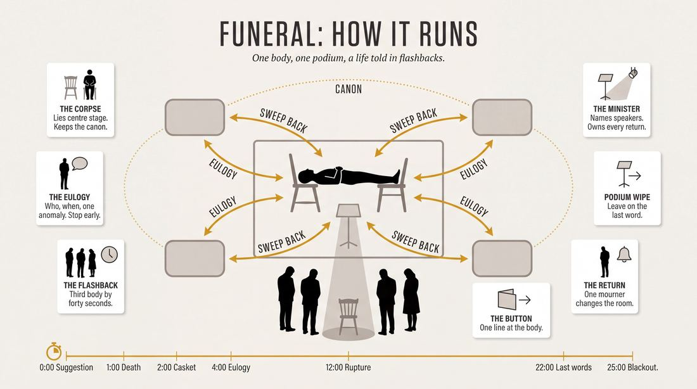
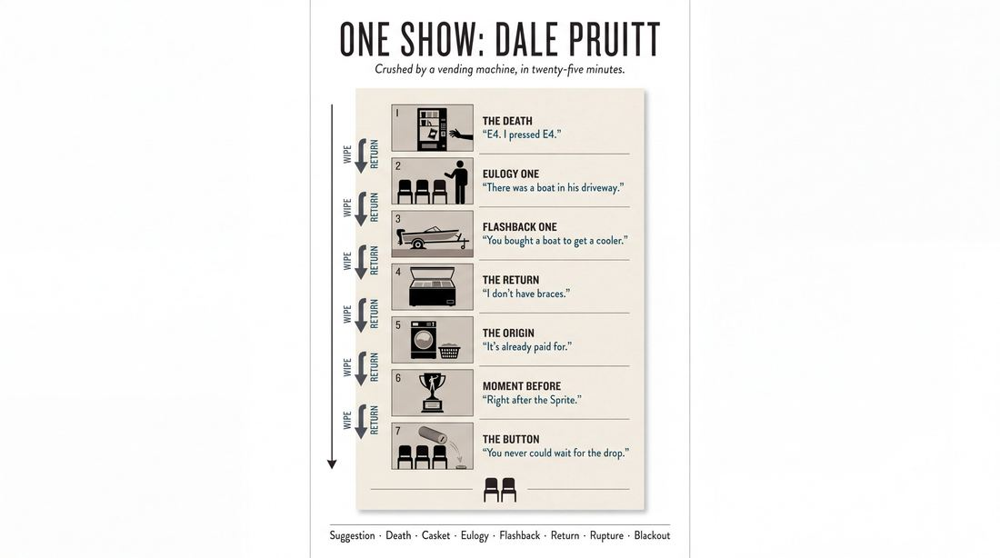
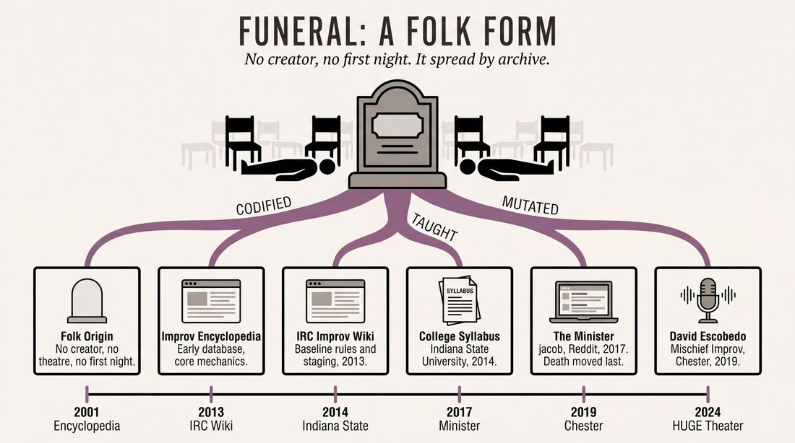
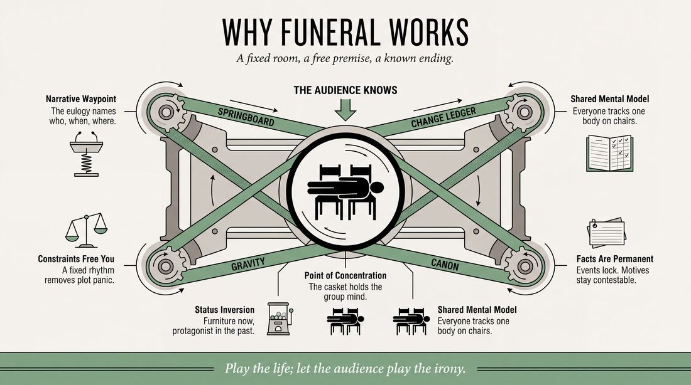
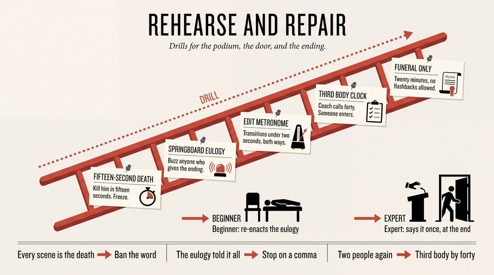

# Funeral

> **A complete study of the long-form improv format _Funeral_** - the original archived write-up, five infographics, grounded historical and pedagogical research, and a full mechanics-and-coaching manual.

| | |
|---|---|
| **Format** | Funeral |
| **Primary source** | [IRC Improv Wiki](https://wiki.improvresourcecenter.com/index.php?title=Funeral) |

---

## Contents

1. [Part I - The Original Write-Up](#part-i-the-original-write-up)
2. [Part II - The Infographics](#part-ii-the-infographics)
   - [1. Structure and Mechanics](#infographic-1-mechanics)
   - [2. A Show, Beat by Beat](#infographic-2-example)
   - [3. Origins and Lineage](#infographic-3-history)
   - [4. Why It Works](#infographic-4-theory)
   - [5. Rehearsal and Repair](#infographic-5-coaching)
3. [Part III - Research Dossier](#part-iii-research-dossier)
   - [Pass 1: History, Lineage, Literature and Scholarship](#research-history)
   - [Pass 2: Comparative Anatomy, Pedagogy and Production](#research-comparative)
4. [Part IV - Mechanics, Gameplay and Coaching Manual](#part-iv-mechanics-gameplay-and-coaching-manual)
   - [Pass 1: The Form, Its Mechanics and Its Gameplay](#manual-mechanics)
   - [Pass 2: Training, Coaching and Performance Companion](#manual-coaching)

---

## Part I - The Original Write-Up

*Verbatim archive of the source article, reproduced exactly as scraped. Everything after this section is generated elaboration built on top of it.*

### Funeral

**Funeral** is an [improv form](https://wiki.improvresourcecenter.com/index.php?title=Category:Improv_Forms "Category:Improv Forms") that lies somewhere between [longform](https://wiki.improvresourcecenter.com/index.php?title=Longform "Longform") and [shortform](https://wiki.improvresourcecenter.com/index.php?title=Shortform "Shortform"). In addition to being a performance worthy, it is also used as a character exercise in workshops.

##### Format

The Funeral format can be played with any number of improvisers. Perhaps 8 to 10 is a good number. The structure is the following:

- Death intro scene
- Funeral anecdote story
- Flashback to anecdote
- Return to funeral service, repeat

###### Death intro scene

The suggestion taken for the Funeral is a peculiar way to die. With this idea to work from, the first scene performed is one of the improvisers dying this improbable death. This scene should be relatively short, as it is launching pad for the rest of the form. The scene should be wiped when someone has died using the suggestion.

###### Funeral service, flashbacks

We are then taken to the funeral of this dead person, and the stage picture is as follows: the improviser who died, lying center stage in his/her coffin, and the rest of the improvisers on the back line, as characters from the dead person's life. One person from the back line then comes up to a pantomimed podium, and gives the beginning of an anecdotal story that they shared with the person who has died. It shouldn't be too full of a story \- think more along the lines of a premise or suggestion.

  

It should be kept brief because, after they have given enough to inspire something, this monologuing improviser wipes the stage and takes us to that event. There can and should be multiple characters involved in each scene. After the scene has played out, someone wipes the stage, returning us to the funeral service, where another character from the dead person's life repeats this process.

##### External links

- [Funeral service at Improv Encyclopedia](http://improvencyclopedia.org/games//Funeral_Service.html)

---

*Archived from [https://wiki.improvresourcecenter.com/index.php?title=Funeral](https://wiki.improvresourcecenter.com/index.php?title=Funeral) (IRC Improv Wiki) on 2026-08-09 23:23 UTC.*

---

## Part II - The Infographics

*Five 16:9 posters, each teaching a different aspect of the format. Click any poster to enlarge.*

<a id="infographic-1-mechanics"></a>

### 1. Structure and Mechanics

*How the form is played: the shape of the piece, the opening, the roles, the edit vocabulary, the flow of information, and the clock.*

{ .diagram loading=lazy decoding=async width="1100" height="614" }


<a id="infographic-2-example"></a>

### 2. A Show, Beat by Beat

*A single worked performance from suggestion to blackout: what happens in each beat, with short real example lines and what the players are doing technically.*

{ .diagram loading=lazy decoding=async width="1100" height="614" }


<a id="infographic-3-history"></a>

### 3. Origins and Lineage

*Where the form came from: creators, dates, theatres, how it spread between schools and cities, and the key figures - a documented timeline and lineage map.*

{ .diagram loading=lazy decoding=async width="1100" height="614" }


<a id="infographic-4-theory"></a>

### 4. Why It Works

*The theory: the core principles of the form and the research and craft ideas that explain why the structure produces good improv, each tied to a specific mechanic.*

{ .diagram loading=lazy decoding=async width="1100" height="614" }


<a id="infographic-5-coaching"></a>

### 5. Rehearsal and Repair

*Training and fixing the form: the essential drills, the common failure modes with their symptom-and-fix pairs, and the markers of beginner through expert play.*

{ .diagram loading=lazy decoding=async width="1100" height="614" }


---

## Part III - Research Dossier

*Two research passes: the historical record, then the comparative and pedagogical record. Claims carry evidence tags - treat unverified items accordingly.*

<a id="research-history"></a>

### » Pass 1: History, Lineage, Literature and Scholarship

### Research Summary

*   **Documentation Level:** Thin but consistent. "Funeral" (or "Funeral Service") is a classic "folk" improv format. It lacks a single documented creator or definitive origin point, but its mechanics are widely codified in online databases, collegiate syllabi, and practitioner forums.
*   **Format Classification:** It is universally classified as a hybrid format that bridges shortform and longform [DOCUMENTED]. It is frequently used as a workshop exercise for character development and time-dashes [DOCUMENTED].
*   **Core Mechanic:** The form relies on a strict alternating rhythm between a present-day base reality (a funeral service with a "corpse" center stage) and past realities (flashback scenes triggered by eulogies) [DOCUMENTED].
*   **Staging Consensus:** The physical staging is highly standardized across regions: the deceased lies on a table or chairs center stage, while the rest of the ensemble forms a backline of mourners [DOCUMENTED].
*   **Primary Failure Mode:** The most documented trap is the "Double Story"—where a improviser tells the entire anecdote during the eulogy, leaving the subsequent flashback scene with no narrative runway [DOCUMENTED].
*   **Evolution:** Recent practitioner debates show a structural mutation: many modern troupes have moved the "peculiar death" scene from the beginning of the show to the end, turning the format into a chronological build rather than a retrospective [DOCUMENTED].

### Provenance and History

The searchable record for the exact origin of "Funeral" is thin. I must state explicitly that there is no documented creator, premiere date, or originating theatre for this specific format. 

However, its structural DNA places it firmly in the lineage of late-1990s/early-2000s Chicago longform experimentation, where troupes sought to build reliable frameworks for "time-dashes" and "flashbacks" [INFERRED]. The format solves a specific craft problem: how to train improvisers to execute clean, non-linear edits without the cognitive overload of a fully organic montage [INFERRED]. The name is purely descriptive of its base reality.

The earliest digital footprints of the form appear in the early 2000s, codified by online repositories that sought to catalog the oral traditions of the improv community.

| Year | Event | Place / Company | Source |
|---|---|---|---|
| 2001–2013 | Codified in early digital improv databases. | Improv Encyclopedia / IRC Improv Wiki | [Improv Encyclopedia](http://improvencyclopedia.org/games//Funeral_Service.html), [IRC Wiki](https://wiki.improvresourcecenter.com/index.php?title=Funeral) |
| 2014 | Published in collegiate improv syllabus. | *Condiments Upon Request*, Indiana State University | [Scribd](https://www.scribd.com/document/235773801/Improv-Games) |
| 2017 | Practitioner debates on structural mutations (The "Minister" variant). | Reddit (r/improv) | [Reddit](https://www.reddit.com/r/improv/comments/77v827/funeral_service/) |
| 2019 | Documented as a relationship-focused longform. | Mischief Improv (Chester, UK) | [Libsyn](https://mischiefimprov.libsyn.com/) |

### Lineage and Transmission

Because "Funeral" is a folk format, it did not spread top-down from a single flagship theatre (like UCB's Harold or iO's Armando). Instead, it spread laterally through internet archives, collegiate improv festivals, and indie team cross-pollination [INFERRED]. 

**Transmission and Mutation:**
As the form traveled, it mutated to solve local pacing issues. The original IRC Wiki and Improv Encyclopedia rules dictate that the show *begins* with the audience suggestion of a "peculiar death," which is immediately acted out [DOCUMENTED]. However, by 2017, indie troupes began reversing this structure, saving the death for the final scene to give the piece "a sense of building towards something" [DOCUMENTED].

**Regional Dialects:**
*   **The "Minister" Dialect:** Played by troupes who assign one player as the host/editor. The Minister calls on mourners and verbally edits the scenes (e.g., "Thank you for your kind words, Mary"), replacing organic sweep edits [DOCUMENTED].
*   **The "I Remember When" Dialect:** A highly structured shortform variant where the verbal trigger "I remember when..." acts as a hard edit into the flashback [DOCUMENTED].
*   **The "Family Funeral" Dialect:** A slower, character-driven, theatrical variant played in the Minneapolis scene (e.g., HUGE Theater), characterized by long stretches of silence and earnest mourning, prioritizing relationship over comedic premise [DOCUMENTED].

### Key Figures

| Person | Role in this form | Specific contribution | Source URL |
|---|---|---|---|
| David Escobedo | Director / Podcaster | Documented its use as a relationship-focused longform rather than a wacky shortform game. | [Libsyn](https://mischiefimprov.libsyn.com/) |
| "jacob" | Practitioner | Documented the "Minister" variant, the chronological structural shift, and the "Pickle Show" trap. | [Reddit](https://www.reddit.com/r/improv/comments/77v827/funeral_service/) |
| Josh Heimendinger | Practitioner | Documented the specific "I remember when..." verbal trigger for initiating flashbacks. | [Facebook](https://www.facebook.com/groups/improvdiscussion/) |
| Improv Tovarisch | Archival Resource | Codified the modern staging mechanics, frame transitions, and sensory detail rules. | [Improv Tovarisch](https://improvtovarisch.com/formats/funeral-service) |

### Canonical Shows, Companies and Recordings

Because this is primarily an exercise and an indie-team format, there are no famous mainstage runs at major institutions. However, specific productions have been documented:

| Production | Venue / Company | Year | Link |
|---|---|---|---|
| *Family Funeral* | HUGE Theater, Minneapolis | 2024 (referenced) | [Reddit](https://www.reddit.com/r/improv/comments/1f6j2x2/is_this_supposed_to_be_fun/) |
| *Funeral Service* (Halloween Show) | Unknown Indie Troupe | 2017 | [Reddit](https://www.reddit.com/r/improv/comments/77v827/funeral_service/) |
| *Mischief Improv* | Storyhouse, Chester, UK | 2019 | [Libsyn](https://mischiefimprov.libsyn.com/) |

### Published Literature

| Work | Author | Year | What it says about this form | Where to find it |
|---|---|---|---|---|
| *Improv Encyclopedia* | Community | 2001-2024 | Defines the core mechanics: death scene, casket staging, eulogy monologues, and flashbacks. | [Improv Encyclopedia](http://improvencyclopedia.org/games//Funeral_Service.html) |
| *Improv Tovarisch* | Improv Tovarisch | 2024 | Provides advanced notes on staging, frame transitions, and sensory details in eulogies. | [Improv Tovarisch](https://improvtovarisch.com/formats/funeral-service) |
| *Condiments Upon Request Game Book* | Indiana State University | 2014 | Documents the form's use in collegiate shortform/longform hybrid shows. | [Scribd](https://www.scribd.com/document/235773801/Improv-Games) |
| *IRC Improv Wiki* | IRC Community | 2013 | Notes its dual utility as a performance format and a character exercise in workshops. | [IRC Wiki](https://wiki.improvresourcecenter.com/index.php?title=Funeral) |

### Verbatim Quotes

> "The Funeral Service, is a controlled long form show that highlights relationships and is best served when you play the reality of the scene instead of making it wacky."
> — David Escobedo, Mischief Improv Podcast [URL](https://mischiefimprov.libsyn.com/)

> "We don't start out with the death, we end with it, so that the piece has a sense of building towards something."
> — "jacob", Reddit r/improv [URL](https://www.reddit.com/r/improv/comments/77v827/funeral_service/)

> "The opening is a launchpad, not the main event. Eulogies are springboards, not stories — Give just enough detail to spark a flashback scene."
> — Improv Tovarisch [URL](https://improvtovarisch.com/formats/funeral-service)

> "Each time a player says 'I remember when…' the scene becomes a flashback (often a 2-person scene) to when the dead player was alive before returning to the funeral scene."
> — Josh Heimendinger, Facebook Improv Discussion [URL](https://www.facebook.com/groups/improvdiscussion/)

> "Make frame transitions crisp — Sweep cleanly between the funeral and flashbacks. A sharp cut back to the casket resets the audience and often lands a laugh on its own."
> — Improv Tovarisch [URL](https://improvtovarisch.com/formats/funeral-service)

> "We've decided to make the mourners' eulogies focus more on establishing their relationship with the deceased and building the deceased's general life circumstances at a particular time, not on a particular incident."
> — "jacob", Reddit r/improv [URL](https://www.reddit.com/r/improv/comments/77v827/funeral_service/)

> "The deceased is visible the entire time. Mourners can glance at the casket, address them directly, or react to their presence. This running visual anchor gets funnier as the show goes on."
> — Improv Tovarisch [URL](https://improvtovarisch.com/formats/funeral-service)

> "Let the monologues initiate the scenes rather than making the audience watch the story twice for each version."
> — Reddit user, r/improv [URL](https://www.reddit.com/r/improv/comments/77v827/funeral_service/)

### Anecdotes and Stories

**The "Pickle Show" Trap**
During a 2017 discussion on the format's mechanics, an improviser noted a recurring disaster when taking audience suggestions for the "peculiar death." If the audience suggested "died of choking on a pickle," the cast would inevitably panic and make every single flashback scene about pickles, completely ignoring the deceased's actual life. The troupe had to actively restructure their eulogies to focus on "general life circumstances at a particular time" to prevent the format from devolving into "The Pickle Show." [DOCUMENTED] [URL](https://www.reddit.com/r/improv/comments/77v827/funeral_service/)

**The Halloween Swipe**
An indie troupe in 2017 utilized the format specifically for a Halloween show. They took a name and a cause of death, replayed the death on stage, and then had three players deliver highly vague eulogies about their initial feelings toward the deceased. Instead of doing isolated flashbacks, the troupe used the central "corpse" player to act out all three timelines simultaneously, issuing a rapid-fire series of tag-outs and sweeps to tie all three eulogists' stories together into a single narrative climax. [DOCUMENTED] [URL](https://www.reddit.com/r/improv/comments/77v827/funeral_service/)

### Academic and Scientific Research

**Cognitive Load and Narrative Waypoints**
Performance studies research by Mark Jane (2025) and Nathan Geyer (2012) explores how "Narrative Waypoints" and the BMET (Beginning-Middle-End-Tension) structure function in improvisation. Non-linear storytelling (like flashbacks) typically places a massive cognitive load on improvisers.
*Relevance to this form:* The eulogy acts as a strict narrative waypoint. By establishing the "Who," "Where," and emotional context in a solo monologue, the cognitive load of the subsequent flashback scene is drastically reduced. The improvisers do not have to negotiate the base reality; they can immediately play the "Game" or relationship [DOCUMENTED].

**Collaborative Emergence and Shared Mental Models**
Psychologist R. Keith Sawyer's work on group creativity emphasizes the necessity of a "shared mental model" for successful collaborative emergence. 
*Relevance to this form:* The physical stage picture of "Funeral" (the casket center stage, the mourners on the backline) creates an unshakeable shared mental model. The visual anchor of the "corpse" prevents the ensemble from losing track of the base reality during rapid sweeps and edits, grounding the group mind [INFERRED].

**Constraint-Induced Spontaneity**
Psychological research on creativity (e.g., Stokes, 2005) demonstrates that rigid constraints actually boost spontaneous generation by limiting choice paralysis.
*Relevance to this form:* The strict alternating rhythm (Funeral -> Eulogy -> Flashback -> Funeral) removes the anxiety of plot generation. Because the improvisers know exactly *what* happens next structurally, they are freed to focus entirely on *how* it happens emotionally [INFERRED].

### Documented Variants and Descendants

*   **The Minister Variant:** Replaces organic sweep edits with a dedicated "Minister" character who hosts the funeral, calls on specific mourners to speak, and verbally edits the flashback scenes by thanking the speaker. [DOCUMENTED]
*   **Chronological / Reverse Funeral:** Drops the opening "death scene." The show begins directly at the funeral, and the flashbacks are structured chronologically, ending with the actual death of the character as the climax of the show. [DOCUMENTED]
*   **Family Funeral:** A tonal variant played at HUGE Theater in Minneapolis. It abandons the fast-paced shortform energy for a slow, character-driven exploration of grief, featuring long stretches of silence and earnest mourning. [DOCUMENTED]

### Criticism, Debate and Known Failure Modes

*   **The "Double Story" Trap:** The most common complaint from teachers and directors. A nervous improviser will step to the podium and tell the *entire* funny anecdote from beginning to end. When the sweep happens, the improvisers are forced to simply re-enact exactly what the audience just heard, killing the scene's momentum. [DOCUMENTED]
*   **Vague Praise:** Eulogies that rely on generic platitudes ("He was a good guy," "We had fun") give the flashback cast no sensory details or specific premises to build a scene around. [DOCUMENTED]
*   **The "Pickle Show" Trap:** Over-indexing on the wacky audience suggestion for the cause of death, resulting in a one-note show where every scene is a pun about the murder weapon rather than an exploration of the character's life. [DOCUMENTED]
*   **Pacing the Death Scene:** If the opening death scene is played as a full longform scene rather than a punchy blackout, it drags the energy down before the actual format begins. [DOCUMENTED]

### Cultural Footprint

*   **Collegiate Improv Staple:** The format is heavily utilized in university improv troupes (e.g., Indiana State University's *Condiments Upon Request*) because it provides a safe, structured introduction to longform scene work for beginners. [DOCUMENTED]
*   **Halloween Programming:** Due to its macabre framing, it is a frequent go-to format for indie troupes during the month of October. [DOCUMENTED]
*   **Gateway to the Armando:** The format serves as a pedagogical stepping stone. By teaching improvisers how to pull premises from a monologue (the eulogy) and turn them into scenes (the flashback), it prepares them for more advanced monologue-deconstruction forms like the Armando or ASSSSCAT. [INFERRED]

### Gaps in the Record

*   **The Creator:** The exact creator, originating theatre, and date of the first performance are entirely undocumented. It is a true folk format.
*   **Lineage Ambiguity:** It is unclear if the form originated in the Chicago longform scene (iO/Annoyance) as a Harold variant, or if it evolved from shortform theater games (like Spolin's or Johnstone's exercises) that were later stretched into longform.
*   **Mainstage Documentation:** The searchable record is incredibly thin regarding professional mainstage runs; it is almost exclusively documented as an indie team format, a collegiate game, or a workshop exercise.

### Source List

1. Improv Encyclopedia - Community - 2001-2024 - http://improvencyclopedia.org/games//Funeral_Service.html - Documents the core mechanics and staging of the format.
2. Improv Tovarisch - Improv Tovarisch - 2024 - https://improvtovarisch.com/formats/funeral-service - Documents advanced staging rules, frame transitions, and the "vague praise" failure mode.
3. Reddit (r/improv) - "jacob" and community - 2017 - https://www.reddit.com/r/improv/comments/77v827/funeral_service/ - Documents the "Minister" variant, the chronological shift, and the "Pickle Show" trap.
4. Mischief Improv Podcast - David Escobedo - 2019 - https://mischiefimprov.libsyn.com/ - Documents the format's utility as a relationship-focused longform.
5. Facebook Improv Discussion - Josh Heimendinger - 2025 - https://www.facebook.com/groups/improvdiscussion/ - Documents the "I remember when" verbal trigger for flashbacks.
6. Reddit (r/improv) - Community - 2024 - https://www.reddit.com/r/improv/comments/1f6j2x2/is_this_supposed_to_be_fun/ - Documents the "Family Funeral" tonal variant at HUGE Theater.
7. Improv Games (Condiments Upon Request) - Indiana State University - 2014 - https://www.scribd.com/document/235773801/Improv-Games - Documents the format's presence in collegiate syllabi.
8. IRC Improv Wiki - Community - 2013 - https://wiki.improvresourcecenter.com/index.php?title=Funeral - The seed document; establishes the baseline rules and workshop utility.

<a id="research-comparative"></a>

### » Pass 2: Comparative Anatomy, Pedagogy and Production

### Taxonomic Placement

```text
The Committee (1960s)
 └── The Harold (1967)
      └── Armando / Monologue Deconstruction (1995)
           ├── The Documentary
           └── Funeral / Funeral Service
```

Funeral is a direct structural descendant of the Armando (Monologue Deconstruction), replacing the out-of-character guest monologist with an in-character ensemble member delivering a eulogy. Like the Armando, a central monologue serves as the springboard for subsequent scenes. However, Funeral narrows the thematic scope to a single protagonist's life, borrowing the retrospective, single-subject focus of The Documentary format, while maintaining a strict present-to-past edit logic. It sits squarely in the narrative-montage hybrid space, using a hub-and-spoke structure where the "hub" is a fixed physical and temporal location (the funeral service).

### Head-to-Head Comparisons

#### Funeral vs. Armando
| Axis | Funeral | Armando | Consequence for the players |
| :--- | :--- | :--- | :--- |
| **Opening** | Wacky death scene or naming the deceased. | Guest monologue based on an audience suggestion. | Funeral players must immediately establish the central character; Armando players listen passively to a guest. |
| **Structure** | Eulogy -> Flashback -> Eulogy. | Monologue -> Montage of scenes -> Monologue. | Funeral scenes are tightly bound to one protagonist's timeline; Armando scenes can be highly associative. |
| **Edit logic** | Present-to-past (flashback) and back to present. | Associative, thematic, or sweep edits. | Funeral requires strict timeline tracking; Armando allows for abstract leaps and disconnected universes. |
| **Memory** | Tracking one life chronologically. | Tracking themes, premises, and recurring characters. | Funeral demands high character consistency; Armando demands high thematic recall. |
| **Cast size** | 4 to 10 players. | 6 to 12 players. | Funeral requires a tighter ensemble to avoid crowding the narrative and the physical stage picture. |
| **Audience contract** | We will explore this specific life and how it ended. | We will explore this theme through various lenses. | Funeral delivers a cohesive narrative; Armando delivers a thematic collage. |
| **Failure mode** | The Pickle Show (fixating on the death mechanism). | Disconnected scenes that abandon the monologue's premise. | Funeral players must actively build a life; Armando players must actively connect themes. |

#### Funeral vs. The Documentary
| Axis | Funeral | The Documentary | Consequence for the players |
| :--- | :--- | :--- | :--- |
| **Opening** | Death scene or gathering of mourners. | Interviews establishing the subject and the documentarian's angle. | Funeral starts with the ending; Documentary starts with the premise. |
| **Structure** | Eulogy -> Flashback. | Interview -> Re-enactment or B-roll. | Funeral uses in-character grief as the framing device; Documentary uses objective, journalistic distance. |
| **Edit logic** | Minister or eulogist edits by stepping away from the podium. | Director or interviewer edits via voiceover or cutaways. | Funeral edits are emotionally driven; Documentary edits are structurally driven. |
| **Memory** | Tracking relationships and emotional impact. | Tracking facts, dates, and the documentary timeline. | Funeral focuses on emotional truth; Documentary focuses on narrative consistency and parody of the medium. |
| **Audience contract** | We will mourn this person (often absurdly). | We will learn about this subject (often absurdly). | Funeral is inherently emotional; Documentary is inherently analytical. |

#### Funeral vs. Montage
| Axis | Funeral | Montage | Consequence for the players |
| :--- | :--- | :--- | :--- |
| **Structure** | Hub-and-spoke (returning to the funeral). | Linear or associative sequence of scenes. | Funeral provides a built-in reset; Montage requires constant invention of new base realities. |
| **Edit logic** | Return to the funeral service. | Sweep edits, tag-outs, wipe edits. | Funeral edits are predetermined by the format; Montage edits are spontaneous and varied. |
| **Cast roles** | Fixed (Corpse, Minister, Mourners). | Fluid (players play multiple unrelated characters). | Funeral gives everyone a specific, persistent role; Montage roles are disposable. |

### What Makes It Uniquely Itself

1. **The Central Corpse:** One player is physically dead and inactive during the framing device (lying center stage in a pantomimed coffin) but highly active in the flashback scenes. If the central figure is not physically present as a corpse, the form devolves into a standard retrospective.
2. **The Eulogy-to-Flashback Edit:** The transition from present-tense grief to past-tense action is the engine of the form. The eulogy must function as a premise-generator, not a complete story, forcing the ensemble to act out the memory rather than just listening to it.
3. **The Inevitable Conclusion:** The audience knows how the protagonist dies (established in the opening scene or suggestion). Every flashback is colored by this dramatic irony, forcing players to justify how the character's life choices led to their specific, often absurd, demise.

### Structural Variants in Practice

| Variant Name | What It Changes | Who Plays It / Source |
| :--- | :--- | :--- |
| **The Classic / IRC Wiki** | Opens with a short scene of the peculiar death. The scene is wiped, the corpse gets in the coffin, and the funeral begins. Flashbacks occur in random chronological order. | IRC Improv Wiki; Improv Encyclopedia |
| **The Minister Edit** | Introduces a "Minister" who hosts the funeral and edits scenes by saying, "Thank you for your kind words." The death scene is moved to the *end* of the show, building chronologically toward the suggested demise. | Reddit r/improv community (user `jacob`) |
| **Batched Eulogies** | Three players deliver vague eulogies back-to-back at the start. The ensemble then performs three interconnected flashback scenes based on those eulogies, tying the stories together. | Reddit r/improv community |
| **The Fun Fair Funeral** | A short-form hybrid where the eulogy must combine a funeral with a wildly inappropriate secondary location (e.g., a fun fair), played as a verbatim memory game. | Extreme Improv (David Pustansky) |

### The Teaching Ladder

| Stage | Skill introduced | Why in this order | Typical exercise | Source or [CRAFT CONSENSUS] |
| :--- | :--- | :--- | :--- | :--- |
| **1. The Eulogy** | In-character monologuing without over-telling. | Players must learn to provide a premise, not a complete story, or the flashback scene has nowhere to go. | Springboard Eulogy | Improv Tovarisch |
| **2. The Flashback Edit** | Transitioning smoothly from podium to scene. | Establishes the core rhythm and physical staging of the form. | Corpse Tag-in | [CRAFT CONSENSUS] |
| **3. Ensemble Flashbacks** | Incorporating multiple characters into memories. | Prevents the form from becoming a monotonous series of two-person scenes with the deceased. | Group Flashback | Improv Tovarisch |
| **4. The Minister/Host** | Pacing, editing, and chronological tracking. | Requires advanced timing to know when a scene has peaked and how to guide the overall narrative arc. | Minister's Hook | Reddit (user `jacob`) |

### Documented Drills and Exercises

| Drill | Origin / teacher | How to run it | What it fixes in this form | Source |
| :--- | :--- | :--- | :--- | :--- |
| **Springboard Eulogy** | Improv Tovarisch | A player gives a 30-second eulogy establishing a relationship and setting, but must stop speaking right before the climax of the anecdote. | Over-telling the story at the podium, leaving nothing to play in the scene. | Improv Tovarisch |
| **Corpse Tag-in** | [CRAFT CONSENSUS] | The "dead" player initiates the flashback scene by physically stepping out of the coffin and delivering the first line of the memory. | Passive deceased players; slow or muddy scene initiations. | [CRAFT CONSENSUS] |
| **Minister's Hook** | Reddit (user `jacob`) | A designated "Minister" edits scenes by stepping downstage and saying, "Thank you for your kind words," forcing an immediate return to the funeral. | Scenes dragging on too long; messy or ambiguous edits. | Reddit r/improv |
| **Eulogy Verbatim** | Extreme Improv | Player 1 gives a 30-second eulogy. Player 2 must recreate it verbatim. Player 3 recreates Player 2's version. | Poor listening and failure to retain specific details from the eulogies. | Extreme Improv |
| **Time Dash** | Jimmy Carrane | Players perform three beats of a scene, jumping forward or backward in time between each beat (e.g., childhood, adulthood, funeral). | Inability to track character relationships and status across different eras. | Jimmy Carrane |
| **Grief Endowments** | [CRAFT CONSENSUS] | Mourners on the backline are assigned specific, high-stakes relationships (e.g., bitter ex, secret lover, rival) before the form begins. | Generic, undefined mourners standing passively on the backline. | [CRAFT CONSENSUS] |
| **Group Flashback** | Improv Tovarisch | A flashback scene is initiated, and at least three players must enter and establish characters before the scene can be edited. | The "Two-Person Rut" (every scene is just the deceased and the eulogist). | Improv Tovarisch |
| **The Wacky Death** | IRC Improv Wiki | Players are given a peculiar way to die and must execute the death scene in exactly 15 seconds, ending on a freeze. | Taking too long to establish the opening death scene; delaying the actual format. | IRC Improv Wiki |
| **Chronological Sort** | Reddit (user `jacob`) | Players must initiate flashbacks in strict chronological order, from childhood to the exact moment of death. | Timeline confusion and disjointed, contradictory narratives. | Reddit r/improv |
| **Eulogy Interruption** | [CRAFT CONSENSUS] | While a player is giving a eulogy, another mourner interrupts to correct a detail, sparking a present-day conflict that informs the flashback. | Static stage pictures; lack of tension in the present-day funeral scenes. | [CRAFT CONSENSUS] |

### Common Failure Modes and Diagnoses

| Failure mode | What it looks like from the audience | Root cause | Fix | Who names it |
| :--- | :--- | :--- | :--- | :--- |
| **The Pickle Show** | Every scene is just about the wacky death suggestion (e.g., choking on a pickle), ignoring the rest of the character's life. | Players fixate on the opening suggestion rather than building a three-dimensional character. | Focus eulogies on establishing relationships and general life circumstances at a particular time, not the death incident. | Reddit (user `jacob`) |
| **Over-telling** | The eulogist tells the whole story at the podium, leaving the actors to merely pantomime what was just said. | Misunderstanding the purpose of the eulogy (treating it as a story rather than a premise). | Give just enough detail to spark a flashback scene; eulogies are springboards, not stories. | Improv Tovarisch |
| **Two-Person Rut** | Every scene is just the deceased and the eulogist, making the show feel monotonous. | Players default to the most obvious relationship established in the eulogy and fail to support from the backline. | Pull in coworkers, family, and strangers; ensemble scenes reveal more about the deceased. | Improv Tovarisch |
| **Wacky Tone Whiplash** | Going from a cartoonish, wacky death to overly dramatic, grounded grief, or vice versa, confusing the audience. | Failure to establish and maintain a consistent base reality. | Play the reality of the scene and the relationships instead of forcing wacky behavior. | David Escobedo |

### Production and Logistics

*   **Cast size:** 4 to 10 players. Fewer than 4 makes the funeral feel empty; more than 10 clutters the backline and makes it difficult for everyone to get a flashback.
*   **Runtime:** 20 to 30 minutes.
*   **Stage layout:** A table or two chairs placed center stage to represent the coffin. A pantomimed (or physical) podium downstage right or left. The remaining cast forms a backline behind the coffin.
*   **Lighting and tech cues:** A spotlight on the podium during eulogies, switching to a full stage wash for the flashbacks. A blackout or light fade edits the final death scene.
*   **Music and sound:** Somber organ music or a tolling bell can be used during the transition from the opening death scene to the funeral service.
*   **MC and host duties:** The "Minister" (if used) acts as the in-world MC, calling mourners to the podium and editing scenes.
*   **Taking the suggestion:** The host asks the audience for "a peculiar or improbable way to die" and/or the name of the deceased.
*   **Lineup placement:** Best placed in the middle or end of a longform set, as the built-in narrative arc provides a strong anchor for a show.
*   **Rehearsal cadence:** Rehearsals must heavily index on transition timing—specifically the exact moment a eulogist stops talking and the flashback begins.
*   **Producer preparation:** Ensure sturdy chairs or a table are available for the "corpse" to lie on safely for 30 minutes.

### Adaptations Beyond the Stage

*   **Classroom and Youth:** The format is frequently adapted to remove the element of death, which can be triggering. It is rebranded as "The Retirement Party," "Moving Away," or "The High School Reunion." The "corpse" becomes the guest of honor sitting in a chair.
*   **Corporate and Applied Improv:** Adapted as "The Project Post-Mortem" or "The Exit Interview." The "deceased" is a failed product launch or a departing employee. Flashbacks explore organizational missteps or successes.
*   **Therapeutic Settings:** Used in drama therapy for bereavement groups. Teens or adults use the format to explore grief, replacing the "wacky death" suggestion with grounded, fictionalized scenarios to safely process loss through a proxy character.
*   **Accessibility and Inclusion:** The "corpse" role requires lying still for extended periods, which may not be accessible for all bodies. The coffin can be adapted to a seated position (e.g., an urn on a table, with the deceased player sitting beside it as a "ghost").
*   **Content-Safety and Consent:** If playing the traditional format, a content warning for death and grief is mandatory. Players must establish boundaries regarding specific causes of death (e.g., banning suicide or specific illnesses) before taking the stage.

### Evidence Base for Those Adaptations

*   **Therapeutic and Grief Processing:** Research indicates that improvisational drama interventions can significantly enhance meaning-making and reduce maladaptive grief reactions. Sandhu & Sandhu (2023) demonstrated that improv interventions improve holistic perspective-taking and meaning in life for youth facing existential crises related to grief and loss. Furthermore, drama therapy approaches allow bereaved individuals to externalize and process trauma safely through role-play and proxy characters.
*   **Corporate Post-Mortems:** In organizational psychology, Ciborra (1999) notes that while traditional "post-mortem" analyses of business failures often kill the extemporaneousness of the action, using improvisational frameworks allows teams to reconstruct the "heat of the action." Adapting the Funeral format for corporate settings aligns with this, allowing teams to embody and analyze past decisions dynamically rather than through static reports.

### Scholarly Frames Worth Applying

*   **Collaborative Emergence (Sawyer):** Sawyer argues that in improvisation, the global narrative emerges unpredictably from the localized interactions of the performers, without a script or single author. *Mapping:* In Funeral, the complete life story of the deceased emerges collaboratively; no single player knows the full biography, but each eulogy adds a permanent, canonical fact that subsequent flashbacks must incorporate.
*   **Status and Spontaneity (Johnstone):** Johnstone posits that all theatrical interactions are driven by shifting hierarchies of dominance and submission. *Mapping:* The deceased player experiences extreme status shifts—they are a literal, low-status object (a corpse) in the present, but often hold high-status, driving roles in the flashbacks as the protagonist of the memories.
*   **Point of Concentration (Spolin):** Spolin defines the Point of Concentration (POC) as the specific focus that occupies the players' minds, freeing them from self-consciousness. *Mapping:* The physical coffin center stage serves as the POC during the funeral scenes, grounding the players' physical behavior (somber posture, looking at the body) and preventing the backline from losing focus.

### Where the Form Is Heading

Contemporary practice has seen the Funeral format heavily utilized in seasonal or themed shows, particularly around Halloween. There is also a rising trend of hybridizing the form with true storytelling or historical comedy, where the "deceased" is a real historical figure (e.g., Abraham Lincoln, a specific local celebrity) and the ensemble must improvise flashbacks based on actual historical trivia mixed with absurd fabrications. Additionally, the "Minister Edit" variant has largely overtaken the classic structure in modern longform theaters, as it provides better pacing control and allows the show to climax with the death scene rather than blowing the biggest laugh in the first 30 seconds.

### Source List

1. Funeral - IRC Improv Wiki - 2013 - https://wiki.improvresourcecenter.com/index.php?title=Funeral - Supports classic structure, wacky death opening, and stage picture.
2. Funeral Service - Improv Encyclopedia - 2024 - http://improvencyclopedia.org/games//Funeral_Service.html - Supports the core mechanics, cast roles, and present-to-past edit logic.
3. Funeral Service - Improv Tovarisch - 2024 - https://improvtovarisch.com - Supports cast size, runtime, Springboard Eulogy drill, Group Flashback drill, and Over-telling failure mode.
4. Funeral Service : r/improv - Reddit (user `jacob`) - 2017 - https://www.reddit.com/r/improv/comments/77qj9z/funeral_service/ - Supports The Minister Edit, Chronological Sort drill, Minister's Hook drill, and The Pickle Show failure mode.
5. Mischief Managed Episode 9 - David Escobedo - 2019 - https://mischiefmanaged.libsyn.com/ - Supports the necessity of playing the reality of the scene (Wacky Tone Whiplash failure mode).
6. Funeral at a Fun Fair | Verbatim Improv Game - Extreme Improv (David Pustansky) - 2025 - YouTube - Supports the Eulogy Verbatim drill and short-form hybrid adaptations.
7. Long Form Improv Formats - Jimmy Carrane - 2014 - https://jimmycarrane.com/ - Supports the Time Dash drill and chronological tracking mechanics.
8. The role of Improv in enhancement of Meaning in Life in youth - Sandhu, T., & Sandhu, S. - 2023 - Counselling and Psychotherapy Research - Supports the evidence base for therapeutic and grief-processing adaptations.
9. Improvisation, planning and experience - Ciborra, C. U. - 1999 - Accounting, Management and Information Technologies - Supports the evidence base for corporate post-mortem adaptations.

---

## Part IV - Mechanics, Gameplay and Coaching Manual

*Synthesis over the original article and both research dossiers: first how the form works and how to play it, then how to train an ensemble to perform it.*

<a id="manual-mechanics"></a>

### » Pass 1: The Form, Its Mechanics and Its Gameplay

### At a Glance

| Field | Entry |
|---|---|
| **Also known as** | Funeral Service; The Funeral; Eulogies. Non-death reskins: The Retirement Party, The Going-Away Party, The Reunion. Applied-improv reskins: The Project Post-Mortem, The Exit Interview. Shortform cousin: Funeral at a Fun Fair (verbatim memory game). |
| **Family** | Frame-and-flashback narrative montage; hub-and-spoke. Structural cousin of the Armando/monologue-deconstruction family (a mourner's eulogy replaces the guest monologue) and of The Documentary (single-subject retrospective). Sits deliberately on the shortform/longform border. |
| **Cast size** | 4–10. **Sweet spot 6–7.** (The IRC wiki suggests 8–10; the practitioner dossier says 4–10 with crowding above 10. They conflict — my judgement below in *Anatomy*: 8+ starves speakers of stage time.) |
| **Runtime** | 20–30 minutes standard. 12–15 as a set piece inside a mixed bill. 40–45 only with a wake/reception movement added. |
| **Opening** | Either (a) **Classic:** a 45–90-second scene in which one player dies the suggested improbable death, then the casket is set; or (b) **Deferred/Minister:** no death scene — the congregation assembles cold and the death is played as the final scene. |
| **Suggestion taken** | "A peculiar or improbable way to die." Optionally plus a name for the deceased. Some houses also take an occupation or a hometown. |
| **Structural rigidity (1–5)** | **4.** The alternation (funeral → eulogy → flashback → funeral) is non-negotiable; everything inside a flashback is free. |
| **Difficulty (1–5)** | **2 to stand up, 4 to make good.** Any cast can execute the shape in one rehearsal. Very few casts avoid the Pickle Show and the Double Story on the first attempt. |
| **Prerequisites** | Pulling a premise from a monologue; clean sweep and tag edits; holding one character consistently across three eras; one player able and willing to lie prone for 25 minutes; two sturdy chairs or a low table; a designated editor if you use the Minister. |
| **Best for** | Ensembles graduating from shortform into longform; Halloween and seasonal bills; character-driven teams; casts with one very strong host/editor; bills that need a single self-explaining anchor piece. |
| **Avoid when** | Anyone in the cast has a fresh bereavement, or the room does (do the Retirement Party reskin instead); the cast reflexively goes wacky under pressure; fewer than four players; you have no reliable editor and no Minister; you're opening a show cold and need three minutes of easy laughs (this form's first three minutes are architecture, not comedy). |

---

### The Essence in One Paragraph

Funeral is a hub-and-spoke longform in which one player spends the entire show lying dead in a pantomimed casket at centre stage while the rest of the ensemble, standing as a congregation behind them, takes turns at a downstage podium delivering eulogies — and each eulogy, cut off deliberately before its punchline, wipes the stage into a flashback scene from the dead person's life, which then wipes back to the casket for the next speaker. The suggestion is a ridiculous cause of death, played out (classically) in a 45-second opening scene so that the audience knows the ending before the story starts. That single fact is the form's power supply: every scene of this person's life is watched under dramatic irony, and the ensemble's real job is not to make jokes about the vending machine that crushed him but to build, one canonical detail at a time, a specific human being whose ridiculous death becomes retroactively inevitable. The eulogy is a premise-generator, not a story; the corpse is a set piece that keeps the group mind anchored; and the room you return to after each flashback must have changed because of what the audience just saw.

---

### Why This Form Exists

A plain montage asks improvisers to solve two problems at once: *what is this scene about* and *how does it relate to anything else in the show*. Funeral solves the second problem structurally so the ensemble can spend its whole attention on the first.

Four specific problems it fixes:

**1. It makes the time-dash cheap.** Non-linear improv — flashbacks, flash-forwards, "twenty years earlier" — is expensive because the audience must be re-oriented at every jump and the improvisers must negotiate *when* and *where* they now are while also inventing content. Funeral pays that cost once, up front, and then reuses the payment. A eulogy is a narrative waypoint: it names the year, the place, the relationship and the emotional weather before a single scenic line is spoken. The players who then enter the flashback do not have to negotiate the base reality at all. They arrive already knowing who they are to each other. This is the whole pedagogical point of the form and the reason it is taught in workshops as a character-and-time-dash exercise as much as it is performed.

**2. It supplies a permanent, physical shared mental model.** Long-form ensembles lose coherence when the group mind fragments — different players tracking different threads. In Funeral, the thing everyone is tracking is *lying on stage*. You cannot forget the base reality when the base reality is a person on two chairs. Spolin's Point of Concentration is literally staged: the casket. This is why the form tolerates faster, messier edits than a montage of the same length — the audience is never lost, because there is one place to come home to and it is always in view.

**3. It converts a montage into a biography without a narrator.** A montage of scenes about one theme is a collage; the audience assembles the meaning afterward, if at all. Funeral makes the assembly compulsory and cumulative: each flashback deposits permanent facts about one person, and the next eulogist must speak as if those facts are true. The life story emerges collaboratively — nobody knows the whole biography, but by minute twenty the audience does, and they know it better than any single character on stage. That gap (audience knows more than the mourners) is the form's chief dramatic pleasure and does not exist in a montage.

**4. It builds an ending in at the beginning.** Improvised longform usually has no ending, only a stopping point. Funeral has a mandatory terminus (the man is dead; there is nothing after the funeral) and, in the classic version, a stated cause. The ensemble is therefore not searching for a climax; they are reverse-engineering a causal path to one they already have. Every scene has a job: make this death make sense.

What you buy that a montage does not give you: **a fixed physical anchor, a free premise engine, an in-built ending, dramatic irony on every scene, and a role for every player even when they are not in a scene** (a mourner on the backline is *in character, in the room*, not waiting in the wings).

What you pay for it: repetition risk, a rigid rhythm that punishes a cast with no variety of attack, and one player who spends the show horizontal.

---

### The Audience Contract

The Funeral contract is unusually explicit. Within ninety seconds of the casket being set, the audience has silently agreed to the following:

**What they are promised**

1. *You will get to know this dead person.* Not a theme, not a world — one specific human being, and by the end you'll know things about them nobody at the funeral knows.
2. *We will always come back to this room.* Any departure into the past is a loan, not an emigration. The casket stays visible or is restored.
3. *The death you were shown/told will pay off.* You are holding a piece of information (he was crushed by a vending machine) and the show will eventually make that information mean something.
4. *The body is the joke and the anchor.* The presence of a person lying still while people talk about them is inherently funny and will get funnier, and we know that and will feed it.
5. *These mourners are real people with real stakes in each other,* not a delivery mechanism for monologues.

**How they know where they are — the four location signals**

| Signal | Funeral (present) | Flashback (past) |
|---|---|---|
| Body position of the deceased | Supine on the casket, still | Vertical, active, driving scenes |
| Congregation | Standing/seated backline, facing the podium, low energy, hands folded | Cleared to the wings or converted into flashback characters |
| Speaker position | At the podium, downstage right, addressing the house | Anywhere but the podium; never addresses the house |
| Address | Third person, past tense, to the room ("Dale was…") | Second person, present tense, to a scene partner ("Dale, put the boat down.") |

If you break more than one of those four at once, the audience does not know which timeline they're in and stops laughing while they work it out.

**What breaks the contract**

| Break | What the audience feels |
|---|---|
| The corpse stands up, speaks in the present, and no convention is declared | "Wait — is he alive? Is this a dream? Are the rules different now?" Loss of the anchor. Everything after is provisional. |
| A flashback never returns to the funeral (the show abandons the hub for a two-scene detour) | The frame was a gimmick. Retroactive disappointment; the casket becomes furniture. |
| Every scene is a joke about the death mechanism (the Pickle Show) | "They only had one idea." The promise of *knowing a person* is revoked. |
| The eulogist tells the whole anecdote, then it is re-enacted verbatim (the Double Story) | Boredom in a very specific flavour: watching a recap. The audience is ahead of the stage for the entire scene. |
| Tonal whiplash — cartoon death, then sincere weeping, then cartoon again, with no bridge | They stop knowing whether to laugh. They default to silence. |
| The death mechanism established at the top is never mentioned or paid off again | The contract's most concrete clause is defaulted on. |
| Facts contradict without acknowledgement (he has one son in scene 2, no children in scene 4) | The biography stops being a real person and becomes noise. |

**One live debate worth naming:** the record splits on whether the death scene belongs at the top (IRC wiki, Improv Encyclopedia) or at the end (the Minister variant documented on r/improv, where the reasoning was explicitly "so that the piece has a sense of building towards something"). My judgement: *for shows under 18 minutes, keep it at the top* — the audience needs the irony working immediately and there isn't runway to build to it. *For shows over 20 minutes, defer it.* Playing the death at minute one spends your biggest single laugh before you've made anyone care who died, and it front-loads exactly the material the Pickle Show trap feeds on. The compromise I use in practice is in *Variations*: the **Cold Tease** (six seconds of the death, no context, blackout) at the top and the full death as the final scene.

---

### Anatomy: The Full Structural Map

#### The stage picture

```
                          UPSTAGE
   ~~~~~~~~~~~~~~~~~~~~~~~~~~~~~~~~~~~~~~~~~~~~~~~~~~~~~~~~
        [M1]   [M2]   [M3]   [M4]   [M5]      <- CONGREGATION
                                                 (backline, in character,
                                                  facing the podium)

                    +-----------------+
                    |     CASKET      |          two chairs or a low table
                    |  [ DECEASED ]   |          head UPSTAGE-LEFT,
                    +-----------------+          feet DOWNSTAGE-RIGHT
                                                 (so the face is visible
                                                  to house right AND
                                                  the podium)

     [PODIUM]                                 <- pantomimed or a music stand
     downstage right                             SPEAKER stands here,
                                                 addresses THE HOUSE
   ~~~~~~~~~~~~~~~~~~~~~~~~~~~~~~~~~~~~~~~~~~~~~~~~~~~~~~~~
                         AUDIENCE
```

Three staging rules that are load-bearing:

1. **The casket is downstage of the congregation and upstage of the podium.** The speaker is therefore always between the audience and the body — every eulogy is framed by the corpse. This is not decoration: it's why the running gag of "the deceased is visible the entire time" works. If the casket goes upstage behind the mourners, you lose the visual and the form loses half its comedy.
2. **The head goes toward the podium side.** The speaker can turn and address the body directly ("You son of a bitch, Dale") without turning upstage.
3. **The podium is off-centre.** Centre belongs to the corpse. A eulogist standing centre is standing over the body, which is a *choice* (aggressive, intimate) and should be reserved.

#### The overall shape

```
SUGGESTION: "an improbable way to die"
        |
        v
+---------------------+
|   DEATH SCENE       |  45-90s. Classic placement. Ends on a freeze
|   (or Cold Tease,   |  or a blackout. Establishes ONE character trait
|    or omitted)      |  as well as the mechanism.
+---------------------+
        | organ sting / house lights shift / congregation walks on
        v
========================================================================
||                    THE HUB : THE FUNERAL SERVICE                   ||
||   one continuous real-time scene, interrupted (never abandoned)     ||
========================================================================
  |                 ^   |                 ^   |                 ^
  | eulogy 1        |   | eulogy 2        |   | eulogy N        |
  | (springboard)   |   |                 |   |                 |
  v                 |   v                 |   v                 |
+-----------+       |  +-----------+      |  +-----------+      |
|FLASHBACK 1|--sweep+  |FLASHBACK 2|-sweep+  |FLASHBACK N|-sweep+
| era A     |          | era B     |         | era C     |
| 2-4 bodies|          | 3+ bodies |         | + tags    |
+-----------+          +-----------+         +-----------+
        \                    |                     /
         \                   |                    /
          \  CANON ACCRETION: each spoke deposits permanent facts
           \  that the hub must acknowledge and later spokes must honour
            \                |                    /
             v               v                   v
========================================================================
||           FINAL HUB BEAT : the intimate eulogy (spouse/child)      ||
========================================================================
        |
        v
+-----------------------------+
| FINAL SCENE                 |   Option A: replay/complete the death
| "the moment before"         |   Option B: the two minutes BEFORE it
| or DEATH (deferred variant) |   Option C: the burial, present tense
+-----------------------------+
        |
        v
   BUTTON AT THE CASKET  -->  BLACKOUT
```

#### Beat-by-beat table (a 25-minute, 7-player show)

| Unit | Approx. clock | What happens | Who drives it | Success criterion | Common error |
|---|---|---|---|---|---|
| **0. Suggestion** | 0:00–0:30 | Host asks for "a peculiar or improbable way to die." Takes one. Optionally takes a first name. Repeats it once, clearly. | Host / Minister | The whole room heard the mechanism and the name. No negotiation, no second suggestion. | Taking three suggestions and mashing them. Riffing on the suggestion before the show starts and burning the joke. |
| **1. Death scene** | 0:30–1:45 | A short scene ending with one player dying the suggested death. Two to three bodies max. Ends on freeze. | The player who will be the corpse + one support | The audience laughs at the death AND has learned one *character trait* (impatient, cheap, vain) beyond the mechanism. | Playing it as a full scene with a runway. Playing it as a pure sight gag with no character content — which guarantees the Pickle Show later. |
| **2. Casket set** | 1:45–2:15 | Corpse walks to the chairs and lies down. Congregation walks on in silence and forms the backline. Organ/bell if you have tech. | Whole ensemble, wordless | It looks like a funeral within eight seconds. Nobody speaks during the transition. | Chatty transition; nervous laughter; someone "helping" the corpse into the chairs comically and undercutting the reset. |
| **3. Funeral establish** | 2:15–3:45 | The Minister (or the first speaker, absent a Minister) establishes: whose funeral, what the room is, and at least two mourner relationships. Seeds one present-day tension. | Minister | By 3:45 the audience knows the deceased's name, their trade or role, and can identify at least two mourners by relationship. One unresolved present-day charge is in the air. | A generic "we are gathered here today" that names nobody. Skipping straight to eulogy one with an anonymous backline. |
| **4. Eulogy 1** | 3:45–4:30 | First speaker to the podium. Peripheral relationship (neighbour, coworker, hairdresser). Establishes relationship + era/place + an unfinished charge. Stops mid-thought. | The speaker | 30–50 seconds. Contains a *when*, a *where*, a *who else*, and an unanswered question. Contains no punchline. | Over-telling. Vague praise ("he was a good guy, we had some times"). Going over 60 seconds. |
| **5. Flashback 1** | 4:30–7:00 | Podium wipe into the memory. Deceased rises. 2–4 bodies. Plays the *game of the person*, not the game of the death. | Deceased + eulogist's character + at least one third body | The scene answers the eulogy's unfinished question in a way the audience did not predict, and reveals one flaw. | Two-person rut. Re-enacting exactly what was just said. Making it about the vending machine. |
| **6. Return A** | 7:00–7:50 | Sweep to funeral. Deceased returns to the casket in view. Somebody in the room *reacts to what we just saw* — a correction, a wince, a defensive line. | Minister + one mourner | The room has changed. A new fact from the flashback is now live in the present tense. | Return as pure dead air ("Thank you… next"). Room unchanged; the flashback becomes disposable. |
| **7. Eulogy 2** | 7:50–8:30 | Second speaker. Different era. Different relationship distance (move one step inward). | The speaker | Contradicts, complicates or deepens something we learned in flashback 1. New era. | Same era as flashback 1. Same relationship type. Restating known facts. |
| **8. Flashback 2** | 8:30–11:00 | As above. Introduce a **third-body character who will recur.** Plant the death rhyme here if you have one. | Ensemble | Contains one object, phrase or habit that can return. Cast size ≥ 3. | Everyone stays on the backline; two people carry it. |
| **9. Return B / midpoint rupture** | 11:00–12:30 | The present-day funeral gets its own scene: an interruption, a contested fact, an uninvited guest, a fight over the will. This is the form's **act break**. | The mourners, not the Minister | The funeral is now a scene with conflict, not a corridor. | Skipping this. Every return being 20 seconds of admin. |
| **10. Eulogy 3 + Flashback 3** | 12:30–16:00 | Deeper era (childhood or origin). Explains the trait shown in the death scene. | Ensemble | The audience can now trace a line from origin → habit → death. | An unconnected sketch idea that happens to feature the same guy. |
| **11. Eulogy 4 + Flashback 4** | 16:00–20:00 | The estranged/complicated relationship. The scene that costs something. | The player holding the biggest unresolved stake | Emotional stakes land. The audience stops laughing for four seconds, then laughs harder. | Undercutting with a joke at the moment of cost. |
| **12. Final eulogy** | 20:00–22:30 | The most intimate mourner (spouse, child, or the deceased themselves via a letter/will/voicemail). Short. | Whoever holds the closest relationship | Assembles the show's facts into a single sentence about who this person was. | A new premise introduced at minute 21. |
| **13. Final scene** | 22:30–24:30 | *Classic:* "the moment before" the death, played straight, with everything the audience now knows loaded into it. *Deferred variant:* the death itself. | Deceased + closest mourner | The mechanism from the suggestion arrives as inevitability, not as a gag. | Replaying the opening death scene verbatim. |
| **14. Button + blackout** | 24:30–25:00 | Return to the casket. One line. Out. | Minister or corpse | The last image is the body. | Ending on the podium with a speech. Ending in a flashback. |

#### Cast mathematics

The binding constraint is: **speaking mourners × 4 minutes ≈ runtime**. Plan backwards from it.

| Cast | Corpse | Minister | Mourners | Realistic eulogy cycles | Runtime | Note |
|---|---|---|---|---|---|---|
| 4 | 1 | 0 | 3 | 3 | 15–18 min | Congregation reads as thin. Use a small, sad funeral as a *choice* — "only three people came." |
| 5 | 1 | 1 | 3 | 3–4 | 18–22 min | Minister must also play flashback characters. Very workable. |
| 6 | 1 | 1 | 4 | 4 | 22–25 min | **Comfortable.** |
| 7 | 1 | 1 | 5 | 4–5 | 25–28 min | **My preferred.** One mourner may not get a eulogy; give them the midpoint rupture instead. |
| 8 | 1 | 1 | 6 | 5 | 28–30 min | Two mourners will not speak. Assign them explicitly as flashback-heavy players pre-show. |
| 10 | 1 | 1 | 8 | 5 max | 30 min | Four mourners never speak. This is the wiki's recommended number and I think it is wrong for performance — it is a *workshop* number, where everyone gets a turn over an hour. **Judgement: 8–10 is right for a class, 6–7 for a show.** |

---

### The Opening

There are two documented openings and one hybrid I recommend. All three share the same non-negotiable outcome: **by minute three, there is a named dead person on two chairs and a room full of people with defined relationships to them.**

#### Variant A — The Classic Death Scene (IRC wiki / Improv Encyclopedia)

Use when: the show is under 18 minutes; the cast is inexperienced; the audience is cold and you need a laugh in the first ninety seconds; it's Halloween and the room came for the macabre.

**Procedure**

1. **Host takes the suggestion.** Exact ask: *"Can we get a peculiar or improbable way to die? Something you'd read about in the local paper."* The phrasing matters — "improbable way to die" gets you *crushed by a vending machine*; "a way to die" gets you *cancer*; "the funniest way to die" gets you a joke shouted for the shouter's benefit.
2. **Take one. Repeat it once, at volume.** Do not curate. Do not take three and pick.
3. *(Optional)* **Take a first name.** "And a first name for our dear departed?" This is a bigger help than it looks: a name is the cheapest possible canon anchor and stops four players inventing four names.
4. **Everyone but the death-scene players goes to the wings or turns upstage.** Do not begin with the full congregation visible; it pre-empts the reveal of the funeral.
5. **Two (max three) players play the death.** One is the deceased. The scene runs **45–90 seconds** and has exactly two jobs: kill him, and show one character trait. Do not build a runway. Start close to the moment.
6. **End on a freeze, not a fade-out of dialogue.** Someone calls it — usually the deceased themselves collapsing, or a backline player sweeping. If you have tech: a hard light bump.
7. **The transition, in silence:** the deceased walks (they walk; they don't get dragged, it's funnier and faster) to the chairs and lies down. The rest of the cast enters upstage in a slow line and forms the congregation. Organ chord, tolling bell, or nothing.
8. **The Minister speaks.**

**The 15-second drill version** (documented as a rehearsal exercise): give the cast the peculiar death and require them to complete the death scene in exactly fifteen seconds, ending on a freeze. This is the single best cure for the "pacing the death scene" failure mode, which is the top-cited opening error. Run it five times in a row at rehearsal.

#### Variant B — The Deferred Death / Minister Opening

Use when: the show is 20 minutes or longer; the cast is experienced; you want the piece to build.

**Procedure**

1. **Take the suggestion the same way** — you still need the death mechanism, because it's the target you're aiming at. But **do not play it.**
2. Optionally, the Minister *alludes* to it in the opening remarks in a way that names it without explaining it: *"Marlene has asked that we not use the word 'vending' today."* This gives the audience the irony immediately and costs you nothing.
3. Congregation assembles cold. Corpse lies down. Minister opens.
4. Flashbacks run in loose or strict chronological order.
5. The final scene is the death.

**Trade-off to be honest about:** deferring costs you the audience's foreknowledge for the first several minutes, which is the form's chief pleasure. The Minister's oblique reference (step 2) recovers most of it. Without that reference, the first two flashbacks play as a generic biography montage.

#### Variant C — The Cold Tease (my recommendation for 25-minute shows)

*This is a craft recommendation, not a documented variant.* It's a splice of A and B and it has consistently outperformed both for me.

1. Take the suggestion.
2. **Six to ten seconds, out of context, no dialogue or one line.** Lights up. Dale, alone, hammering on a vending machine. It begins to tip. Blackout. That's it — no scene partner, no setup, no death shown.
3. Congregation assembles. Show proceeds as Variant B.
4. The final scene plays the *full* version of what the audience glimpsed, with all twenty-five minutes of biography loaded into it.

You get the irony immediately (the audience knows exactly how he died) and you still get the build (they don't know *why*, or who was with him, or what he was reaching for).

#### The first ninety seconds of the funeral — a script skeleton

Whichever opening you use, the Minister's establishing speech has five jobs and should take under seventy seconds. Here is the shape, with a filled example:

| Job | Example line |
|---|---|
| Name the deceased and one identifying fact | "We're here to remember Dale Alan Pruitt, who for thirty-one years ran the laundromat on Third and Vine." |
| Name the room / the tone | "Dale asked for a short service. Dale asked for a lot of things." |
| Name two mourners by relationship, out loud | "Marlene, his wife of thirty-four years. His brother Ricky, who drove up from Peoria this morning." |
| Seed one present-day tension | "And I'm told Cody has come. Cody, there's a seat up front if you want it." |
| Hand off | "Bern Halvorsen would like to say a few words." |

That speech has just done the work of an entire opening in a montage form: five characters, one estrangement, a location, and a hook — before anyone has improvised a scene.

---

### The Engine

This is the section to read twice. Everything else in the chapter is downstream of it.

Funeral runs on **four information vectors** and **three physical laws**. If your show is dying, one of these seven things is broken, and you can usually name which.

#### Vector 1 — Forward transfer: eulogy → flashback (the springboard)

The eulogy exists to hand the ensemble a scene. What it must hand over, and what it must withhold, is precise.

**The Springboard Triad — a eulogy must deliver exactly three things:**

| Component | Definition | Example |
|---|---|---|
| **The Who-to-Whom** | The speaker's relationship to the deceased at the time of the memory (which may differ from their relationship at death) | "In 2004 I'd known him eight months. I was the new guy across the street." |
| **The When-Where** | A year (or life-stage) and a physical location | "That summer. His driveway." |
| **The Unfinished Charge** | A specific concrete anomaly, with an unanswered question attached | "There was a boat in that driveway for eleven weeks. He never once put it in water. I asked him about it exactly one time —" |

And it must **withhold one thing: the outcome.** The eulogist stops on the verb, on the conjunction, on the intake of breath before the reveal.

The technical name for the withheld thing: **the payload.** The eulogy is the delivery vehicle. If the payload detonates at the podium, the flashback is a crater.

**Why "stop before the outcome" is not just a nicety:** the improvisers who enter the flashback need somewhere to *go*. If you say "and it turned out he'd bought the boat because the guy threw in a free cooler," the flashback has one possible ending and everyone in it knows it. They will walk to that ending and stand next to it. If you stop at "I asked him about it exactly one time —", four players enter a scene that has a question in it and nobody, including the audience, knows the answer. That's a scene. The other thing is a re-enactment.

**Quantities.** A eulogy is 30–50 seconds. Under 20 seconds and it hasn't seeded enough sensory detail (the "vague praise" failure). Over 75 seconds and it is telling a story (the "over-telling" failure). At rehearsal, time them out loud with a phone. Improvisers are terrible at estimating monologue length under pressure.

**Sensory specificity is the fuel.** "He was a hard worker" gives a flashback nothing. "He kept a roll of quarters in his shirt pocket and it wore a hole in every shirt he owned" gives you: a costume, a habit, a prop, a domestic conflict (who buys the shirts), a class position, and — if your death is vending-machine-related — a plant. **Rule of thumb: one concrete noun per ten seconds of eulogy.**

#### Vector 2 — Backward transfer: flashback → funeral (the change ledger)

This is the vector most casts drop, and dropping it is what makes a Funeral feel like a clip show.

**Law: every flashback must change the room you return to.**

When we sweep back to the casket, at least one of these must be visibly true:

| Change type | What it looks like on the return | Example |
|---|---|---|
| **A mourner's status has shifted** | Someone who was central is now embarrassed; someone marginal now has standing | The brother, who we've just seen betrayed Dale in 1988, can no longer stand at the front. |
| **A fact is now contested in the present** | Two mourners disagree, out loud, about what we just saw | "That's not why he sold the boat." / "Marlene." / "That is *not* why he sold the boat." |
| **A new person is now in the room** | A flashback character walks in as their older self | The woman from the 1988 scene arrives late, in the back, in sunglasses. |
| **The Minister's plan is disrupted** | The order of service has to change | "We were going to sing now, but — Cody, did you want to say something?" |
| **The corpse is regarded differently** | A mourner looks at the body in a new way | Somebody moves the flowers off his chest. Somebody puts the quarters in his pocket. |

If none of these happens, the funeral hub is a hallway, and the audience will feel the show as "monologue, sketch, monologue, sketch."

The reliable mechanical trigger: **the Minister's hook line should be followed by one mourner line before the next eulogist is called.** Build it into the rhythm at rehearsal:

> **REV. AMES:** Thank you for those kind words, Bern.
> **MARLENE:** *(not standing)* He sold that boat to pay for Cody's braces.
> **CODY:** *(from the back)* I don't have braces.
> **REV. AMES:** …Tanisha Boyd would like to say a few words.

Fourteen seconds. The room has changed twice.

#### Vector 3 — Lateral transfer: flashback → flashback (canon accretion)

**Law: facts are permanent; opinions are not.**

Every flashback deposits canon. Once we have *seen* Dale sell a boat in 2004, Dale sold a boat in 2004 for the rest of the show, and any mourner who says otherwise is either lying, mistaken, or wasn't there — all three of which are *content*, not error. The distinction that keeps the form from either paralysing or dissolving:

- **Facts** (things the audience watched happen) are fixed. Contradicting them is a mistake unless you flag it in the present tense.
- **Motives, feelings and interpretations** are up for grabs forever. Two mourners can hold irreconcilable views of the same fact and both be interesting.

This gives the form its most powerful late-show move: the **Re-run With New Camera** — flashback 5 returns to the event of flashback 2, from a different mourner's angle, and the facts are identical but the meaning has inverted. You can only do this because the facts are locked.

**Who keeps canon?** Everyone, but **the corpse is the auditor.** The player in the casket has no lines and full attention. Their real job during the funeral beats is bookkeeping: names, years, jobs, children, the make of the car. When they rise into a flashback, they are the one player who has heard *every* eulogy and been in *every* flashback, and they are therefore the only person who can be relied on to say "no, that was after your mother died." The corpse is the show's memory. Cast accordingly: **put your best listener in the box, not your funniest player.**

#### Vector 4 — The dramatic-irony gradient (the death as gravity)

The audience holds one fact the characters don't: how this ends. This produces a *slope* that every scene slides down whether you intend it or not.

**Law: play the life; let the audience do the irony.**

Practically: a scene in which Dale refuses to wait forty seconds for a fudge pop to freeze in 1971 is *hilarious* to an audience that watched him die shaking a vending machine, and it is hilarious **only if nobody on stage mentions vending machines.** The moment a player reaches for the connection, they take the audience's job away and the irony collapses into a pun. This is the mechanism of the Pickle Show and the reason the cure is counter-intuitive: you fix a Pickle Show not by ignoring the death but by *never touching it* while making every scene about the trait that caused it.

**The Causality Test.** At rehearsal, after each flashback, ask the cast one question: *"What did that scene do to make the death inevitable?"* Acceptable answers are about character:
- "It showed he'd rather break a thing than wait for it."
- "It showed nobody in his life ever told him no."
- "It showed he was alone at 2 a.m. because he'd burned everyone."

Unacceptable answers:
- "It was also about a machine."
- "There was a snack in it."

That test, run five times, permanently inoculates a cast against the Pickle Show.

#### Physical Law 1 — The corpse is a set piece with a pulse

The body is the form's gravitational centre. Consequences:

- **It never leaves without being replaced or acknowledged.** When the deceased rises into a flashback, the casket is now empty, and an empty casket in the middle of a flashback is either invisible (fine, ignore it) or a joke (fine, use it once). What it must never be is *unresolved* — the deceased must physically return to it, in view, to end a flashback. That return **is an edit** and it's the cleanest one in the form.
- **The body is available for physical comedy that gets funnier by repetition.** Mourners glancing at it, addressing it, adjusting the flowers, tripping over the feet, resting a drink on it. The record is explicit that this running visual anchor "gets funnier as the show goes on." My addition: **budget it.** Three body-gags in twenty-five minutes, escalating. Six and it's a bit; twelve and the corpse has become the show's game and the biography is dead.
- **Status inversion is built in.** In the present tense the deceased is the lowest-status object on stage — literally furniture, being talked over. In every flashback they are the protagonist. That whiplash is the form's signature performance pleasure, and it is why the corpse role, correctly played, is the *best* part in the piece, not a punishment.

#### Physical Law 2 — The hub is a single continuous scene

The funeral does not jump in time. Whatever else happens, the service is one uninterrupted twenty-five minutes in one room. That means:

- Present-day tension **accumulates** rather than resets. The fight Ricky started at minute eight is still smouldering at minute twenty.
- Anything with a real-time clock in it can be used as a pacing device: the Minister's printed order of service, a hearse waiting outside, a reception with a two-hour hall booking, a thunderstorm.
- **You cannot solve a present-day problem with a time skip.** You have to play it. This is good; it forces the funeral to be a scene.

#### Physical Law 3 — The Knowledge Ledger (who knows what)

This is the subtlest rule in the form and the one nobody writes down.

A flashback is *nominally* the eulogist's memory. But the form routinely shows things the eulogist could not possibly have witnessed — Dale alone in his car, Dale and his mistress, Dale as a child. That's allowed. The convention is: **the eulogy licenses the flashback; the flashback belongs to the audience, not to the speaker.**

But there's a cost, and it's the ledger:

> **Whatever the flashback reveals beyond what the eulogist said at the podium is known to the audience and to the deceased — not to the room.**

Which means: after a flashback in which Dale confesses something to a stranger, **the mourners cannot react to the confession.** If they do, the show quietly stops being a funeral and becomes an omniscient narrative, the dramatic irony inverts, and the audience loses the thing they were enjoying most — knowing more than the people on stage.

The exception, which you should use once per show, deliberately, as a structural event: **the moment a mourner reveals they knew.** The whole room's ignorance is a rubber band; snapping it once, late, in the intimate eulogy, is the biggest available emotional beat in the form.

> **MARLENE:** Bern told you the boat was for fishing. It wasn't for fishing. I know what the boat was for. I've known since June of '04.

That line only works because the ledger was honoured for twenty minutes.

#### The engine in one diagram

```
                          [ AUDIENCE KNOWS THE DEATH ]
                                      |
                                  (gravity)
                                      v
   PODIUM ----(1) springboard----> FLASHBACK ----(3) canon----> LATER FLASHBACKS
     ^          who/when/charge         |         permanent facts
     |          NO payload              |
     |                                  |
     +-------(2) change ledger----------+
              status shift / contested fact /
              new arrival / disrupted order

   [ KNOWLEDGE LEDGER: revelations stay with the audience + the corpse,
     NOT the congregation -- until one deliberate snap, late. ]
```

---

### Roles and Responsibilities

| Role | Owns | Must do | Must not do | Signal to the others |
|---|---|---|---|---|
| **The Deceased (Corpse)** | The stage picture; the biography's continuity; the protagonist of every flashback | Lie still and *listen*, tracking every fact stated in every eulogy. Rise decisively into flashbacks. Return to the casket in view to end scenes. Be the same person across four eras with one visible through-line. Play a flaw. | Wink, react audibly, or "die funnier" during eulogies. Stand up in the present without a declared convention. Contradict established canon. Be passive in flashbacks and wait to be given lines. | **Rising** = "this flashback is starting, I'm initiating." **Sitting up on one elbow and freezing** = "I'm about to take a liberty, cover me." **Walking back and lying down** = a hard edit; everyone clear. |
| **The Minister / Host** *(optional but recommended)* | Pace, running order, and every edit back to the funeral | Establish the room and at least two relationships in under 70 seconds. Call speakers by name. Cut scenes with the hook line the instant they've peaked. Track the clock and know which eulogy is the last one. Manage the emotional temperature of the room. | Become the funniest person in the show. Editorialise on flashbacks in a way that steals the audience's read. Call a speaker who has nothing (check for a raised hand or an eye). Let three eulogies pass without a present-tense event. | **Stepping downstage of the casket** = "I am about to edit." **"Thank you for those kind words, [name]"** = hard edit, flashback over. **Consulting the order of service** = "we're moving to the next section / winding up." |
| **Eulogist (whichever mourner is at the podium)** | The premise of the scene they are about to launch; the edit *into* it | Deliver the Springboard Triad. Stop before the payload. Execute a clean wipe. Decide before speaking whether they are entering their own flashback. | Tell the whole story. Praise vaguely. Address the deceased for so long that they forget to launch a scene. Launch a flashback in an era already covered. | **Both hands off the podium and a step downstage-left** = "I am wiping now." **Turning to look at the casket mid-eulogy** = "I'm about to get emotional / go somewhere real." |
| **Mourners (backline congregation)** | The reality and stakes of the present tense; third bodies in flashbacks | Hold a specific relationship and status the whole show. React silently and visibly to eulogies. Enter flashbacks as a *third* character when the scene is thinning. Contest facts in the present when the change ledger demands it. | Stand in a neutral improv backline stance with a blank face — that is not a congregation. Comment or laugh as themselves. Enter a flashback as a nothing-character with no relationship to the deceased. | **A half-step forward from the backline** = "I want the podium next." **Taking a seat / kneeling** = "I'm out of the next scene, don't tag me." **Head turning sharply toward a eulogist mid-sentence** = "I'm going to contest this." |
| **The Corpse's Understudy** *(craft recommendation, ensembles of 7+)* | Coverage when the deceased must appear in two places | In a flashback that needs a *younger* deceased (childhood) or the deceased seen from a distance, a designated player takes the role while the corpse stays in the box | Take the role unannounced. Play a different character from the one established. | The corpse deliberately staying down when the flashback initiates = "you take him." |
| **Tech / Lights** | Frame legibility | Two states minimum: a warm narrow special on the podium + dim on the room (funeral), and a full stage wash (flashback). Snap between them, never fade. Blackout only twice in the show: the death and the end. | Fade slowly. Use a cue as a joke more than once. Change state mid-eulogy. | Light snap *is* the confirmation of an edit; players should trust it and move. |
| **Musician** *(optional)* | Tonal bridging | An organ chord or a bell on the sweep back to the funeral. Underscore only the intimate eulogy and the final scene. | Underscore every flashback (kills the frame distinction). Play jokes. Play through eulogies. | A held chord = "wrap it." |

**A note on the Minister.** The record documents this as a variant, but modern practice has largely adopted it, and I'll be blunt: **run the Minister.** A Funeral without a designated host has one editing problem it cannot solve — the return sweep. When any backline player can wipe a flashback, the flashback tends to run long, because everyone is waiting for someone else and nobody wants to cut a scene that's still getting laughs. The Minister owns that decision and can make it on time. The cost is one body out of the flashback economy; pay it.

---

### The Rules That Actually Bind

#### Hard rules — break these and it is not this form

| # | Rule | Why it is structural, not stylistic |
|---|---|---|
| H1 | **There is a body, it is a player, and it is visible from the top of the show to the blackout.** | Remove the corpse and you have The Documentary or a retrospective montage. The physical anchor is the form's shared mental model and its running gag; there is no substitute. |
| H2 | **Every departure from the funeral returns to the funeral.** No flashback leads to a second flashback without passing through the hub. | The hub-and-spoke is the whole architecture. Two consecutive flashbacks and the audience has lost the frame; three and the frame is dead. |
| H3 | **Flashbacks are launched from the podium by a speaker.** Not by a backline sweep, not by a tag. | The eulogy is the premise engine. A flashback with no eulogy is an unsourced scene and carries no waypoint information — the entire cognitive-load saving of the form disappears. |
| H4 | **The eulogy withholds the outcome.** | The Double Story is the form's defining failure. A eulogy that completes its anecdote has spent the scene it was supposed to buy. |
| H5 | **Every scene concerns one life.** No B-plots about people the deceased never met. | Funeral's contract is biographical. A scene with no relation to the deceased breaks the only unifying premise the audience has. |
| H6 | **The funeral is one continuous scene in real time.** It never jumps forward, never relocates, never restarts. | The accumulation of present-tense tension across the whole show is the form's second plot. Reset it and you have only the flashbacks. |
| H7 | **The manner of death, once stated, is fixed and is honoured before the blackout.** | The audience is holding it. Defaulting on it is the single clearest contract breach available. |
| H8 | **The deceased is dead in the present.** No speaking, no walking among the mourners, unless a ghost convention is declared explicitly and used consistently. | Without this, the corpse-as-anchor stops being reliable and the audience never knows which timeline they're in. |

#### Soft conventions — house by house, choose and be consistent

| Convention | Options | How to choose |
|---|---|---|
| Death scene placement | Top / end / cold tease at top + full at end / never shown | Under 18 min → top. Over 20 → defer. |
| Minister | Yes / no | Yes unless you have a cast of 4, or a cast with an excellent collective editing instinct. |
| Chronology | Random order / strict chronological / loose (early → late) | Strict chronological pairs naturally with the deferred death. Random suits the classic. |
| Does the corpse ever speak in the present? | Never / once, at the end / a ghost sitting on the casket throughout | "Once, at the end" is the highest-value option. Declare it by staging: they sit up slowly during the final blackout-adjacent moment. |
| Podium | Mimed / music stand / real lectern | A real object dramatically improves the frame legibility for beginner casts. |
| Tag-outs inside flashbacks | Allowed / banned | Allow them, but ban tags that leave the flashback's era. |
| Who calls the return sweep | Minister only / anyone / the corpse's return only | Pick one and drill it. Mixed protocols cause double-edits. |
| Wake / reception coda | Yes / no | Adds 5–8 min, changes the tone from formal to loose, and gives you a place to put reveals the church wouldn't hold. |
| Content of the suggestion | Any death / banned list (suicide, named illnesses, children) | Have a banned list. Say it out loud when taking the suggestion if the room is unknown. |
| Does the eulogist appear in their own flashback? | Usually / never / always | "Usually" is right. "Always" produces the Two-Person Rut. |

#### Myths — things people wrongly believe are rules

| Myth | Why it's wrong | What to do instead |
|---|---|---|
| "Every flashback must contain the deceased." | Some of the best scenes in this form are about the deceased *in absentia* — two people discussing him, waiting for him, cleaning up after him. The corpse gets a rest and the audience gets a new angle. | Budget one absent-protagonist scene per show, usually third or fourth. |
| "The flashback must show what the eulogist witnessed." | The eulogy *licenses* the scene; it doesn't limit it. See the Knowledge Ledger. | Go where the eulogist couldn't, and then honour the ledger by not letting the room know about it. |
| "The corpse just lies there." | The corpse is the biography's auditor, the initiator of half the flashbacks, and the show's cleanest edit device. It is the lead role. | Cast your best listener. Give them the Resurrection initiation. |
| "You have to go in chronological order." | Documented practice includes both. Random order lets you place the childhood-origin scene at the emotional apex rather than at minute four. | Choose per show. Announce the choice at rehearsal, not on stage. |
| "The eulogies should be funny." | Eulogies are architecture. Their job is specificity. Comedy lives in the flashbacks and in the present-tense friction of the room. | Play eulogies sincerely and specifically. The laugh comes from the flashback contradicting them. |
| "The suggestion should drive the scenes." | This is the Pickle Show, in one sentence. The suggestion drives the *ending*. The character drives the scenes. | Focus eulogies on relationships and general life circumstances at a particular time, not on the death incident. |
| "It's shortform because it's a game with a rule." | It has a game-like frame but generates unrepeatable, cumulative, character-based longform content. It's a hybrid and the record calls it that. | Stop worrying about the label; run it at longform length with longform scene work. |
| "The dead person should be lovable so the ending lands." | A saint is a dead scene. The audience's affection is built by *specificity*, not by virtue, and a flaw is what makes the death causal. | Give him one clear flaw in flashback one and never apologise for it. |
| "Mourners must stay silent during eulogies." | Silent mourners are the number-one cause of a dead hub. | Silent *verbally*, active *physically*, and permitted one interruption per act. |
| "You need a real coffin/props." | Two chairs read as a casket the instant a person lies on them and five people look sad. | Two chairs. Spend the budget on light cues. |

---

### Edits and Transitions

Funeral has more edit types than most forms because it has two frames and a body that moves between them. Learn all of these; drill four.

| Edit | How to execute physically | When it is right | When it is wrong | What it costs |
|---|---|---|---|---|
| **The Podium Wipe** (eulogy → flashback) | Eulogist takes both hands off the podium, walks briskly on a diagonal across the stage on their last word. Flashback players enter from the opposite side on the walk. Corpse rises. Lights to full wash. | Standard launch for every flashback. | If the eulogist hasn't delivered the Triad yet, or if they walk *before* the last word (kills the line). | Nothing. This is the free edit. |
| **The Podium Dive** (eulogist enters own flashback) | Same wipe, but the eulogist's crossing walk *becomes* their entrance and they speak the first line of the scene mid-stride. | When the eulogist's relationship to the deceased is the scene's engine. Roughly 70% of flashbacks. | When it makes the scene two-handed and there are five bored mourners behind you. | Removes a body from the congregation; risks the Two-Person Rut. |
| **The Resurrection** (corpse-initiated flashback) | Corpse sits up on the eulogist's last word, swings legs off, stands, and speaks first. | When the eulogy gave a strong image of the deceased *doing* something. Fastest, most theatrically satisfying launch in the form. | Twice in a row — it becomes a bit. | Nothing; use often. |
| **The Minister's Hook** (flashback → funeral) | Minister steps downstage of the casket into the light and says a version of *"Thank you for those kind words, Bern."* Flashback players clear immediately; corpse walks to casket and lies down. | Whenever a flashback has peaked. The default return. | Cutting on a laugh's rise rather than its crest; or cutting an emotional scene one beat before it lands. | Slightly mechanical if used identically five times — vary the wording. |
| **The Corpse's Return** (flashback → funeral) | The deceased simply walks out of the scene, mid-conversation, to the casket, and lies down. Everyone else clears. | Devastating when the flashback is about someone being abandoned mid-sentence. Best used once, late. | Early in the show, before the audience has learned the vocabulary. | Very high impact; can't be repeated. Spend it once. |
| **The Sweep-Back** (flashback → funeral, no Minister) | A backline mourner walks across the front of the stage, right to left, wiping the picture; the congregation reforms behind them. | Minister-less shows. | Two players sweeping at once (drill your protocol). | Less crisp than the hook; leaves an ambiguous half-second. |
| **The Overlap Edit** | While the flashback is still running, the next eulogist walks to the podium and begins. The flashback players freeze, then melt off. | Late in the show, to accelerate. Also to draw an explicit causal link between two eras. | Before minute fifteen — the audience hasn't got the vocabulary yet. | Momentary confusion; buys a big rhythm change. |
| **The Interruption Edit** (present cuts into past) | A mourner steps from the backline into the flashback's space and says "That's not how it happened." Flashback players reset; the scene replays differently. | Once per show. It's the form's best comic structure device. | More than once; or when the correction is trivial. | High risk. If the replay isn't materially different, it deflates. |
| **The Time-Jump Tag** (inside a flashback) | A player tags out a flashback character and re-enters with a time-stamp line: "Six months later, Dale —" | To show change inside one flashback without returning to the hub. | If it crosses into an era another eulogy has claimed. | Slight strain on the frame; keep it inside the flashback's decade. |
| **The Character Tag** (inside a flashback) | Standard tag-out. | To bring a third body in, or to swap in an older/younger version. | If it turns a memory into a tag-run. | Tag-runs in flashbacks feel like a different show. Cap at two per scene. |
| **The Late Arrival** (funeral → funeral) | A player who has been offstage walks in through the house or from the wings, mid-eulogy, and takes a seat. | Once, at the midpoint, to rupture the present tense. | If the arrival isn't someone we've already met in a flashback. | None. Best value-per-effort move in the form. |
| **The Order-of-Service Edit** | The Minister announces a *section*: "We'll now hear a reading." "Please rise for a hymn." "The family have asked for a moment of silence." | To reset a hub that has gone flat, or to signal act structure. | As filler; if it doesn't produce content. | Costs 15 seconds; buys structure and a breath. |
| **The Light Snap** | Tech snaps between podium-special and full wash. | Every single frame transition, in a house with a board op. | As a punchline. | Nothing. This is the highest-leverage tech in improv, and this form uses it better than most. |
| **The Organ Sting** | Musician plays one chord on the return. | Every return, or every third return. | Under a eulogy. | Nothing, if the musician is disciplined. |
| **The Blackout** | Full out. | Exactly twice: the death scene (classic) and the end. | Anywhere else. | Devalues both remaining blackouts every time you spend one. |

**Drill note:** the single most valuable rehearsal hour you can spend on this form is edits alone, no content. Run twelve podium-wipe-to-flashback launches and twelve hooks back, with garbage content, until the transitions take under two seconds and nobody hesitates. The record is right that "a sharp cut back to the casket resets the audience and often lands a laugh on its own." Crisp transitions are, in this form, a joke delivery system.

---

### Memory: Callbacks, Patterns and Heightening

Funeral remembers itself along three separate axes, and confusing them is why casts either heighten nothing or heighten the wrong thing.

#### Axis 1 — Biographical memory (facts)

The show accretes a factual biography: names, jobs, years, children, cars, houses, debts. This is *not* comic heightening; it's world-building, and its pleasure is coherence.

**Mechanics of recall:**
- **The corpse audits.** As above.
- **The Minister recites.** Once, around minute fifteen, have the Minister summarise in-world: *"Dale Pruitt: thirty-one years at the laundromat, two marriages, one boat, and a standing tab at the Hi-Lo."* That single line, built entirely from established canon, is the biggest reliable applause moment in the form, because the audience hears the show they've been watching turned into a life.
- **Physical canon.** Objects entered in flashbacks can be brought into the present as props at the funeral: the roll of quarters, the boat's keys, the engraved trophy. Placing an object *in the casket* is the form's ritual callback.

#### Axis 2 — Trait heightening (the game of the person)

The deceased has one central characterological engine, and the show escalates it across eras. This is the closest Funeral gets to Harold-style game, and it works differently: **you heighten by moving through time, not by moving up an intensity ladder within one scene.**

The pattern is: *earlier and smaller* → *later and larger* → *fatal*.

| Era | Manifestation of "Dale cannot wait" | Function |
|---|---|---|
| 1971, age 8 | Eats the fudge pops before they freeze | **Origin.** Establishes the trait as innate, not chosen. |
| 2004, age 41 | Buys a boat because the seller throws in a cooler; never uses it | **Cost.** The trait now costs money. |
| 2011, age 48 | Has the "Best Dad" trophy engraved before the concert; leaves at intermission | **Human cost.** The trait now costs a relationship. |
| The night of, age 61 | Won't wait forty seconds for a bag of chips to drop | **Fatal.** The same joke, one last time, with the maximum stake. |

**Rule: the death scene is the last rung of the trait ladder, not a separate event.** If the death does not read as "the thing he always did, one last time," you have a biography with a punchline stapled on.

**How to build this in performance without a plan:** the trait doesn't have to be pre-agreed. It *emerges* from flashback one or two, and then the ensemble's job is recognition. The signal to the cast that a trait has been nominated: the corpse plays it twice in one scene. After that, every subsequent eulogist should be quietly hunting for a memory that exhibits the same trait in a different decade.

#### Axis 3 — Present-tense memory (the funeral's own plot)

The hub has its own escalation, running on a parallel clock:

```
minute 3   : two relationships named, one estrangement seeded
minute 8   : a fact from flashback 1 is contested out loud
minute 12  : LATE ARRIVAL / RUPTURE -- the present becomes a scene
minute 17  : someone refuses to speak, or speaks out of turn
minute 21  : the snap -- a mourner reveals they knew all along
minute 24  : the room reaches an accommodation, or doesn't
```

**Callback taxonomy specific to this form**

| Callback type | Mechanism | Example |
|---|---|---|
| **The Object Legacy** | An item appears in an early flashback and ends up physically in the casket | The roll of quarters. Marlene puts it in his shirt pocket at minute 24. |
| **The Verbal Tic** | A phrase the deceased says in every era | "It's already paid for." Said in 1971, 2004, 2011, and as his last line. |
| **The Contradicted Eulogy** | A late flashback disproves something a mourner said early, and the audience remembers | Bern said "he loved that boat." Flashback 4 shows he'd never been on a boat in his life. |
| **The Corpse Gag Ladder** | Escalating physical business with the body | (1) someone straightens his tie; (2) someone rests a coffee on the casket and apologises; (3) at the end, someone puts the quarters in his pocket — the gag ladder converts to sincerity. |
| **The Order-of-Service Runner** | The Minister's plan keeps getting derailed the same way | Three attempts to sing "Abide With Me," never completed. Sung at the very end, badly, as the button. |
| **The Empty Casket Beat** | A flashback deliberately staged so the empty casket is visible in the picture | A scene about Dale's absence, played with the empty box centre stage. |

**The one heightening rule unique to this form:** *the funeral gets quieter as the flashbacks get louder, until they cross.* Early on the room is stiff and formal and the memories are broad; by the end the room is chaotic and honest and the memories are small and specific. The crossing point, roughly minute eighteen, is where the show becomes moving. If both frames escalate in volume together, you finish on undifferentiated noise.

---

### Move-Level Technique Catalogue

| # | Move | Situation | How to do it | Example line | Failure mode |
|---|---|---|---|---|---|
| 1 | **Springboard Triad** | Any eulogy | State relationship, era+place, and a concrete anomaly with an unanswered question. Stop. | "I'd known him eight months. Summer of '04. There was a boat in his driveway for eleven weeks and he never once put it in water. I asked him about it exactly one time —" | Adding a fourth element; the fourth element is always the answer. |
| 2 | **Cut on the Verb** | Ending a eulogy | Physically leave the podium on your final *word*, not after it. Practise ending on "and", "because", "so I said —". | "…so I walked over there and I said —" *(walks)* | Trailing off with "…anyway." That's a period; you need a comma. |
| 3 | **Podium Dive** | You want to be in your own memory | On the wipe, keep walking into the scene and speak the first line as your younger self. | *(crossing)* "Dale. Dale. It's a boat." | Diving into a scene where your character has nothing to want. |
| 4 | **The Resurrection** | Eulogy has given the deceased a strong physical activity | Sit up on the last word, swing legs down, start the scene mid-action. | *(rising, already scrubbing something)* "It's a *fishing* boat, Bern, it's not a *project*." | Rising slowly and looking around for the scene. Decide before you sit up. |
| 5 | **Third-Body Entry** | A flashback has two people and forty seconds of life left | Enter as someone with a pre-existing relationship to one of them, and a want. | *(entering)* "Dad. Mom says either the boat goes or she does." | Entering as a nothing-character ("Hi, I'm a neighbour"). |
| 6 | **Time Stamp** | Top of any flashback | First or second line names the year or the life-stage, naturally. | "It is nineteen ninety-*four*, Dale. They put a man on the moon and you still can't work a thermostat." | Announcing it to the audience instead of to a partner. |
| 7 | **Grief Endowment** | Pre-show or in the funeral establish | Each mourner claims a specific, high-stakes relationship out loud before eulogies start. | "I'm Ricky. I'm his brother. I'm also the reason he lost the first laundromat." | Undefined mourners standing on the backline. |
| 8 | **Minister's Hook** | Any flashback that has peaked | Step downstage of the casket, into light, and thank the speaker by name. | "Thank you for those kind words, Bern. Bern helped Dale build the fence, too, which — anyway." | Hooking during a laugh instead of just after its crest. |
| 9 | **The Program Note** | The hub has gone flat | Minister reads from the order of service to reset structure. | "We'll now hear a reading. Marlene has chosen… *(squints)* …the warranty card." | Using it as filler with no content behind it. |
| 10 | **The Contest** | Return from a flashback | A mourner disputes a fact we just watched. | "That's not why he sold the boat." | Contesting something trivial, or contesting and then dropping it. |
| 11 | **Re-run With New Camera** | Late show | Return to an established event from a different mourner's eulogy. Facts identical, meaning inverted. | "You've all heard about the boat. I was in the house that day." | Changing the facts. The whole move is that the facts don't move. |
| 12 | **The Late Arrival** | Midpoint, hub is stable and needs rupture | A player enters through the house mid-eulogy and sits. | *(from the back, quietly)* "Sorry. Sorry. Is this Pruitt?" | Arriving as a stranger. Arrive as someone we met in 1988. |
| 13 | **The Uninvited** | You want the funeral's biggest present-tense conflict | Enter as someone with a legitimate claim to grief that the family refuses to recognise. | "I'm not sitting at the back. I was with him for nine years." | Playing it as a sketch premise instead of a status fight. |
| 14 | **The Reading** | You want the dead to speak without breaking H8 | A mourner reads a letter, a will, a text thread, a voicemail. The corpse may speak it in voiceover from the box, eyes closed. | *(reading)* "'Marlene. If you're reading this the freezer's still under warranty.'" | Using it more than once; using it before minute eighteen. |
| 15 | **The Object Legacy** | Any early flashback | Introduce a small object with obsessive specificity, then place it in the casket at the end. | "Give me your quarters. All of them. No — the *shirt* pocket." | Introducing five objects. One legacy object per show. |
| 16 | **The Absent Protagonist** | Third or fourth flashback | Play a scene about the deceased in which the deceased does not appear. Leave the casket visible and empty. | "He's not coming, Marlene. He said seven and it's nine." | Playing it too early, before we care enough to feel his absence. |
| 17 | **The Death Rhyme** | A middle flashback | Have the deceased perform the *harmless* version of the action that will kill them. Never comment. | *(hitting a dryer twice with the heel of his hand)* "There. That's a repair." | Anyone on stage or in the room acknowledging the parallel. |
| 18 | **The Cause Deferral** | Whenever the death mechanism is tempting | Actively refuse to touch the death for the first three flashbacks. Play the trait instead. | *(Minister)* "Marlene has asked that we not use the word 'vending' today." | Referencing it "just once, as a wink," which permits everyone else to. |
| 19 | **The Corpse Correction** | Once, if your house allows a light ghost convention | Corpse sits up on one elbow, corrects a detail flatly, lies back down. | "It was ninety-two dollars." *(lies back down)* | Doing it twice. Or doing it in a house that hasn't declared the convention. |
| 20 | **The Interruption Edit** | Once per show | A mourner steps into a running flashback: "That's not how it happened," and the scene restages. | "That's not how it happened. He didn't say 'I'm proud of you.' He said 'we're in the red-line spot.'" | Restaging into a scene that isn't materially different. |
| 21 | **The Eulogy Handoff** | Passing focus without the Minister | End your eulogy by naming the next speaker and their relationship. | "…Tanisha worked for him for eleven years. Tanisha should say something." | Naming someone who has no eulogy in them. Check the eye first. |
| 22 | **Pew Whisper** | During a long eulogy | Two backline mourners conduct a silent, visible, escalating disagreement in the pews. | *(silent; Ricky mouths "Nine years" at Cody; Cody looks away)* | Making noise. Stealing focus with volume instead of stillness. |
| 23 | **The Casket Repurpose** | A flashback needs furniture | The chairs the corpse was on become the boat, the car's front seat, the bed. | *(sitting on the casket, steering)* "Get in. We're going to look at it, that's all." | Repurposing so completely the audience forgets it was a casket. Restore it deliberately. |
| 24 | **The Slow Sit-Down** | Ending an emotional flashback | The deceased ends the scene by walking to the casket and lying down in silence while the scene partner watches. | *(no line; Cody watches his father get into the box)* | Doing it fast. This edit is entirely about tempo. |
| 25 | **Cross-Casting the Generations** | A childhood flashback | The player who plays the widow plays the deceased's mother; the player who plays the son plays the deceased as a boy. | *(Marlene's player, as Dale's mother)* "Dale Alan. They are not frozen." | Casting arbitrarily. Cross-cast along emotional rhymes, and the audience will read the rhyme. |
| 26 | **The Snap** | Minute 21, once only | An intimate mourner reveals they knew the secret the audience has been holding. | "I've known about the boat since June of oh-four." | Snapping early, which converts twenty minutes of irony into ordinary exposition. |
| 27 | **The Moment Before** | Final scene, classic variant | Instead of replaying the death, play the two minutes preceding it, straight. | "Sprite. Just a Sprite, Marlene, I'll be back before they call you in." | Playing it for laughs. Play it flat; the audience supplies everything. |
| 28 | **The Casket Button** | Last four seconds | Final image and final line belong at the body, not at the podium. | *(Marlene, at the casket, placing quarters in his pocket)* "You never could wait for the drop." | Ending on a monologue at the podium. Ending in a flashback. |

---

### Principles

**1. The eulogy buys the scene; it must never spend it.**
*Why here:* the form's cognitive economy depends on the monologue transferring *setup* while retaining *payoff*. A eulogy with the outcome in it is a scene that has already been performed, verbally, at a lectern.
*Followed:* the eulogist stops on a conjunction and the flashback players enter genuinely not knowing where it goes.
*Violated:* the Double Story — thirty seconds of anecdote followed by three minutes of the same anecdote in dialogue. The audience is ahead of the stage from the first line and never catches down.

**2. The corpse is the set, not a spectator.**
*Why here:* the physical anchor is what allows the form's fast, promiscuous edits to remain legible. Take the body away, or make it inert-and-bored, and the group mind loses its Point of Concentration.
*Followed:* the deceased tracks every canonical fact, initiates a third of the flashbacks by rising, and ends at least one scene by walking back and lying down.
*Violated:* a player checks out for twenty-five minutes, contradicts a fact in minute eighteen, and enters every flashback a half-beat behind the ensemble.

**3. Play the life; the audience will play the irony.**
*Why here:* the audience holds the cause of death from minute one. That is *their* information. Every time a player onstage points at it, the form converts irony (free, renewable) into a pun (single-use, cheap).
*Followed:* twenty minutes with no mention of vending machines, and a room that gasps and laughs at every impatient thing Dale does.
*Violated:* the Pickle Show. Five scenes about the murder weapon and no person in the coffin.

**4. The funeral is a scene, not a corridor.**
*Why here:* this form's hub is the only part of the show that runs on a continuous real-time clock with an accumulating set of relationships. If the returns are administrative — "thank you, next" — you have thrown away half your available drama and all of your continuity.
*Followed:* by minute fifteen the mourners are in a fight the flashbacks caused, and the audience is as interested in the room as in the memories.
*Violated:* four monologues and four sketches in a trench coat.

**5. Every flashback must change the room you return to.**
*Why here:* the change ledger is the only mechanism by which past scenes have present consequences. Without it, flashbacks are disposable and the show cannot build.
*Followed:* the sweep back always lands on a reaction — a contested fact, a status drop, a new arrival.
*Violated:* the Minister thanks the speaker and calls the next name, five times, and by the third repetition the audience knows the shape and stops leaning in.

**6. Facts are permanent; motives are perpetually contestable.**
*Why here:* canon accretion is the biography engine. But total canon rigidity would freeze the ensemble. The split — locked events, free interpretations — gives you a coherent life and infinite room to argue about it.
*Followed:* two mourners fight over *why* Dale sold the boat, both citing the same scene we watched.
*Violated:* either (a) contradictions pile up until the deceased has three different jobs, or (b) the cast becomes so scared of contradiction that nobody makes a new claim after minute ten.

**7. Only the past can argue back.**
*Why here:* the deceased cannot defend himself in the present. That asymmetry is the form's engine of injustice — every eulogy is an unopposed characterisation, and the *only* place the record can be corrected is a flashback.
*Followed:* Bern calls him generous at the podium; the flashback shows him counting change; the audience convicts.
*Violated:* the corpse sits up and defends himself verbally. Now it's a debate, the asymmetry is gone, and the flashbacks have nothing to do.

**8. The mechanism of death is a rhyme, not a subject.**
*Why here:* the cause of death has exactly one structural job — to be the last rung of the trait ladder. Treating it as content produces a monotone show; treating it as a rhyme produces inevitability.
*Followed:* Dale hits a dryer with the heel of his hand in 2019 and nobody says a word about it, and the audience remembers it two scenes later at the vending machine.
*Violated:* every flashback contains a snack, a coin slot, or a joke about E4.

**9. Grief is the straight man; commit to it.**
*Why here:* the form pairs a cartoon premise (crushed by a vending machine) with the most emotionally serious social ritual we have. That tension is the whole comic engine, and it only works if one side is genuinely held. As the practitioner record puts it, the form "is best served when you play the reality of the scene instead of making it wacky."
*Followed:* people are honestly sad about a ridiculous man. The laughs are enormous and the ending is moving.
*Violated:* Wacky Tone Whiplash — the mourners are as broad as the death, nothing is at stake, and the audience has nothing to measure the absurdity against.

**10. Three bodies or it's a rerun.**
*Why here:* the default flashback is the eulogist plus the deceased, and if you let the default run, every scene has the same cast and the same relational geometry. Ensemble flashbacks are also the only way the ensemble learns things about the deceased *from strangers*.
*Followed:* the fourth flashback contains a coworker, a customer, and a wife, and reveals a Dale nobody at the podium has described.
*Violated:* the Two-Person Rut. Five dialogues, one of them always with the corpse, and six people standing still on the backline for twenty-five minutes.

**11. The podium sets the order; the order is the act structure.**
*Why here:* Funeral gives you a rare thing in improv — an in-world, diegetic mechanism for controlling running order. The Minister literally decides who speaks next. Use it as dramaturgy: peripheral relationships first, intimate relationships last.
*Followed:* neighbour → employee → sibling → estranged child → spouse. The show tightens like a spiral.
*Violated:* the widow eulogises at minute four. Everything after it is a step down in stakes and the show plays backwards.

**12. Chronology is optional; causality is mandatory.**
*Why here:* the flashbacks can arrive in any order, but every one of them must be answerable to the question "what did that do to make this death inevitable?"
*Followed:* the show is a set of exhibits in a case. The verdict is the vending machine.
*Violated:* an anthology of unrelated funny things that happened to one guy, and a death that could have been anybody's.

**13. Give the dead a flaw in the first flashback.**
*Why here:* the eulogies will canonise him by default — that's what eulogies do. Unless the *first* flashback undercuts the first eulogy, the audience is watching a hagiography, and there is no distance between what the room believes and what the audience sees. That distance is the show.
*Followed:* Bern says "he'd give you the shirt off his back"; the flashback shows him selling the shirt.
*Violated:* four eulogies of praise, four flashbacks of a nice man, and no reason for the audience to lean forward.

**14. The transition is a punchline; sharpen it like one.**
*Why here:* in a form with a fixed frame and a body onstage, the *cut* itself carries comedy — a hard snap from a chaotic 1988 kitchen to five silent people in black is a joke with no author. The record notes this directly: a sharp cut back to the casket often lands a laugh on its own.
*Followed:* transitions take under two seconds, land on a light snap, and get their own laugh.
*Violated:* mushy four-second crossings where the flashback players wander off, the corpse ambles back, and the audience politely waits.

**15. End at the body.**
*Why here:* the whole show has been a room full of people talking *around* a person who cannot answer. The only ending that resolves that geometry is one that returns to him.
*Followed:* the last image is a mourner at the casket, one line, blackout.
*Violated:* the show ends on a big speech at the podium with the corpse forgotten upstage, and the audience applauds the actor rather than the piece.

---

### Worked Run-Through

*Cast of seven. Classic opening (death at the top) with a Minister — I've chosen the harder configuration deliberately, because it demonstrates how a cast escapes the Pickle Show even when the audience already has the punchline. Runtime target 25 minutes.*

**Roles:** DALE PRUITT (deceased) · REV. JUDITH AMES (Minister) · MARLENE (widow) · RICKY (brother) · TANISHA (former employee) · CODY (estranged son) · BERN (neighbour)

---

**Beat 0 — The suggestion (0:00)**

> **REV. AMES** *(as host, houselights up)*: Can we get a peculiar or improbable way to die? Something you'd read about in a small-town paper.
> **AUDIENCE:** Crushed by a vending machine!
> **REV. AMES:** Crushed by a vending machine. Thank you.

> **Mechanic:** The ask is engineered. "Improbable" and "small-town paper" filter out both grim answers and shouted jokes. One suggestion taken, repeated once, no negotiation — the cast is not seen shopping.

---

**Beat 1 — The death scene (0:20–1:20)**

*Hospital corridor, 2 a.m. DALE and a STRANGER at a vending machine.*

> **DALE:** E4. I pressed E4.
> **STRANGER:** It's coming.
> **DALE:** It's *hanging*. Look at it. It's just hanging there like it's thinking about it.
> **STRANGER:** Sir, they usually drop on their own.
> **DALE:** *(rolling up a sleeve)* I've been up here since four o'clock yesterday afternoon. I have been *waiting* since four o'clock yesterday afternoon. I'm not waiting for a bag of pretzels.
> **STRANGER:** Sir —
> **DALE:** *(both hands on the glass, rocking it)* Come on. Come on. Come *on* —

*Metal groan. DALE looks up. Freeze. Blackout.*

> **Mechanic:** Fifty-eight seconds. Two bodies. The death does *two* jobs: it delivers the suggestion and it plants the trait — impatience, specifically impatience born of having already waited too long, which quietly implies someone is sick in a room down the hall. The scene ends on a freeze and a light snap, not on dialogue trailing off. Nobody says "vending machine" as a joke.

---

**Beat 2 — The casket set (1:20–1:50)**

*Lights up dim. DALE walks to two chairs centre and lies down, hands folded. In silence, the other five enter upstage and form a congregation. A single low organ chord.*

> **Mechanic:** Wordless transition. The audience is not told the funeral is happening; they are shown it and they get there before the dialogue does, which is the last piece of free goodwill the form gives you. The corpse walks himself in — faster and funnier than being carried.

---

**Beat 3 — The establish (1:50–3:00)**

> **REV. AMES:** We're here to remember Dale Alan Pruitt. Thirty-one years at the Third Street Wash-and-Fold, which those of you who used it will know he ran… his own way. His wife, Marlene, thirty-four years. His brother Ricky, who drove up from Peoria and, I'm told, has already spoken to the funeral director about the flowers. Marlene has asked that we not use the word "vending" today.
> *(A ripple in the room. RICKY looks at the ceiling.)*
> **REV. AMES:** I see Cody's come. Cody, there's a seat at the front if you want it.
> **CODY** *(from the back, not moving)*: I'm alright.
> **REV. AMES:** …Bern Halvorsen would like to say a few words.

> **Mechanic:** Seventy seconds, five jobs done. Name and trade; two mourners endowed by relationship; a present-day estrangement seeded in eight words; and — critically — the **Cause Deferral** installed in-world. "Not use the word 'vending'" gives the audience the irony *and* forbids the cast from cashing it in. The form's biggest trap has been closed by a line of dialogue.

---

**Beat 4 — Eulogy 1 (3:00–3:40)**

> **BERN:** I was Dale's neighbour on Elm for nineteen years. But I want to talk about the summer of oh-four, because that's the summer I actually met him. There was a boat in his driveway for eleven weeks. Twenty-two-foot Larson, sat on a trailer with a flat tyre. He never put it in water. Not once. Whole summer. And I finally went over there — I'd been looking at it out my kitchen window since June — and I said, Dale, I said —

*BERN takes both hands off the podium and crosses downstage-left on the word "said". Lights snap to full wash.*

> **Mechanic:** The **Springboard Triad**, textbook. *Who-to-whom:* neighbour, nineteen years, but specifying the summer he "actually met him" — that's a relationship with a shape. *When-where:* summer 2004, the driveway. *Unfinished charge:* a boat that never touched water, plus an unanswered question. And the **Cut on the Verb** — he leaves on "I said," which is a comma. Forty seconds. One concrete noun every eight seconds: boat, driveway, twenty-two-foot Larson, flat tyre, kitchen window.

---

**Beat 5 — Flashback 1 (3:40–6:20)**

*Driveway, 2004. DALE has risen from the casket and is under the boat with a torch. BERN enters.*

> **BERN:** Dale. It's a boat.
> **DALE:** *(not coming out)* It's a Larson.
> **BERN:** It's been there since June.
> **DALE:** It has.
> **BERN:** Are you going to take it out?
> **DALE:** *(sliding out)* Bern, do you know what a boat like that goes for? New?
> **BERN:** No.
> **DALE:** Neither do I. But I know what I paid, and I know what he threw in. *(Points at a cooler.)* That's a ninety-dollar cooler.
> **BERN:** …You bought a boat to get a cooler.
> **DALE:** I bought a boat *at the right time.* There's a difference.

*CODY, twelve, enters with a cordless phone.*

> **CODY:** Dad. Mom says it's the guy about the trailer tyre and she's not talking to him again.
> **DALE:** Tell her I'm handling it.
> **CODY:** She says you said that in July.
> **DALE:** *(taking the phone, into it)* Yeah. Yeah. No, listen — what'll you give me for the whole thing.
> **CODY:** Dad?
> **DALE:** *(hand over the phone)* Cody. Get the cooler out of the boat.

> **Mechanic:** Three moves stacked. (1) The flashback *answers the eulogy's question in a way nobody predicted* — the boat wasn't a dream, it was a transaction, which is a Dale nobody would put on a headstone. (2) **Third-Body Entry**: Cody arrives at 1:40 with a want and a pre-existing relationship, breaking the Two-Person Rut and — decisively — establishing the estranged son as a *child in the canon*, not just a sulking adult at the back. (3) **Principle 13** is satisfied: the first flashback undercuts the first eulogy. Bern eulogised a mystery; the scene delivered a man who buys the ending and skips the middle. That trait is now nominated, and Dale played it twice ("at the right time"; "get the cooler out of the boat").

---

**Beat 6 — Return A (6:20–7:10)**

*REV. AMES steps downstage of the casket. Flashback clears; DALE lies back down.*

> **REV. AMES:** Thank you for those kind words, Bern.
> **MARLENE** *(not standing)*: He sold that boat to pay for Cody's braces.
> **CODY:** I don't have braces.
> *(Silence. MARLENE does not turn round.)*
> **REV. AMES:** …Tanisha Boyd worked with Dale for eleven years. Tanisha.

> **Mechanic:** The **change ledger**, in three lines and eleven seconds. Marlene *contests a motive* (legal — motives are always contestable; the boat sale itself is now locked canon). Cody rebuts with a fact about his own mouth. The room's temperature has dropped, the widow has been caught defending him, and the estrangement has a specific grievance attached. **The Minister hooks on the crest, not the rise**, and hands off immediately so the discomfort doesn't get resolved. It will smoulder for eleven more minutes.

---

**Beat 7 — Eulogy 2 (7:10–7:50)**

> **TANISHA:** I want to say first that I don't have anything bad to say, which — *(glances at the front row)* — okay. Two thousand nineteen. I was twenty-three and I had a criminal record for something I'm not going to say at a funeral, and Dale Pruitt was the only man in Cedar Falls who'd let me touch a cash register. My first day he took me down the row of dryers — there's fourteen of them — and he said, there's one thing I'm going to teach you and it's the only thing, and he walked me down to number nine, and he —

*Walks. Snap to full.*

> **Mechanic:** Different era (2019), different relationship distance (one step inward from neighbour: employee, obligation, gratitude). The Triad again, but note the extra work: she *acknowledges the room's tension* in her first four words, which keeps the hub's plot alive even from the podium. She stops on "and he —", a hanging conjunction, and she has handed the ensemble a physical action they can't guess.

---

**Beat 8 — Flashback 2 (7:50–10:30)**

*Laundromat, 2019. DALE rises. TANISHA arrives as her younger self. A CUSTOMER (played by RICKY's actor) is loading a machine.*

> **DALE:** Nine.
> **TANISHA:** Nine.
> **DALE:** Nine takes your quarters and it don't turn. Every time.
> **TANISHA:** So we put a sign on it.
> **DALE:** *(appalled)* A sign.
> **TANISHA:** An out-of-order sign.
> **DALE:** Tanisha. A sign is you admitting a machine beat you. *(To the customer.)* Sir. Sir, are you using nine?
> **CUSTOMER:** I put four quarters in.
> **DALE:** Did it turn?
> **CUSTOMER:** No.
> **DALE:** *(steps up, hits the panel twice with the heel of his hand; it starts)* There. That's a repair.
> **CUSTOMER:** …Thanks?
> **DALE:** *(to Tanisha, quietly, entirely sincere)* Never let a machine keep your money. That's it. That's the whole job.
> **TANISHA:** What about the customers?
> **DALE:** They're fine. They've got nowhere to be. That's why they're in a laundromat.

> **Mechanic:** Three things at once. (1) **The Death Rhyme** — Dale hits a machine with the heel of his hand and it works. Nobody comments. Nobody so much as pauses. The audience does all the work and gets to feel clever twice: once now, once at the end. (2) The trait heightens along its own ladder: in 2004 impatience cost him money; in 2019 it's become a *philosophy* he's transmitting to a young person. (3) The **Object Legacy** is seeded — quarters. (4) A third body (the customer) keeps the geometry from being two-hander again, and is played by the actor who plays Ricky, which means the audience is being trained on cross-casting before the childhood scene needs it.

---

**Beat 9 — Return B: the midpoint rupture (10:30–12:40)**

> **REV. AMES:** Thank you, Tanisha.
> **RICKY** *(standing, from the backline)*: Can I —
> **REV. AMES:** Ricky, you're down for after the hymn.
> **RICKY:** I'd like to say something now, because I want to say something about the *laundromat*. Which was half mine.
> **MARLENE:** Ricky.
> **RICKY:** Which was *half* mine, on paper, in nineteen ninety-two —
> **MARLENE:** Richard.
> **RICKY:** — and I'm not going to make a thing of it.
> **REV. AMES:** *(a pause; then, gently, closing the order of service)* Ricky Pruitt.

> **Mechanic:** The hub becomes a scene. This is the form's act break and it is entirely present-tense. Note that Ricky's grievance is *sourced from canon* — the laundromat is established, 1992 is a new era being claimed for a flashback, and his status move (jumping the running order) is enacted through the form's own diegetic mechanism, the order of service. **The Minister loses control of the programme**, which is a real event in a real room, and the audience registers it as such. This costs 130 seconds and it is the best-spent time in the show.

---

**Beat 10 — Eulogy 3 (12:40–13:20)**

> **RICKY:** Everybody's talking about him like he was *born* like that. He wasn't. I know when it started. Nineteen seventy-one. Our mother — you all knew Ruth — our mother had exactly one rule about the icebox, and there was a *reason* for the rule, and Dale was eight years old, and I was six, and I want you to understand that I *told* him —

*Walks. Snap.*

> **Mechanic:** A eulogy that reframes the entire show in thirty-five seconds. Ricky is not offering an anecdote; he's offering an **origin**, and he explicitly promises causality — "I know when it started." That's the strongest possible springboard because it makes the audience an accessory: they want to know why Dale was Dale. Note that he stops before the rule, before the reason, and before what happened. Three withheld payloads.

---

**Beat 11 — Flashback 3 (13:20–15:50)**

*Kitchen, 1971. DALE (adult actor, playing eight) and RICKY (adult actor, playing six) at a freezer. MOTHER RUTH is played by MARLENE's actor.*

> **DALE:** They're done.
> **RICKY:** She said four hours.
> **DALE:** They're *done*, Richard, feel it.
> **RICKY:** It's soft.
> **DALE:** It's cold. Cold is done. *(He bites one. Grimaces. Swallows.)* That's a fudge pop.
> **RICKY:** That's juice.
> *(RUTH enters. She looks at the open freezer. She does not raise her voice.)*
> **RUTH:** Dale Alan. What did I say about the icebox.
> **DALE:** Four hours.
> **RUTH:** And why.
> **DALE:** *(a beat; flat)* Because we can't have another one till Friday.
> **RUTH:** Because we can't have another one till Friday. *(She closes the freezer.)* So now that's your Friday, too.
> *(DALE says nothing. He eats the rest of it. Slowly. Watching her. RICKY watches him.)*
> **RICKY:** *(quietly)* I told you.
> **DALE:** *(mouth full)* It's already paid for.

> **Mechanic:** Origin scene, and the ladder's first rung placed *third*, not first — which is why it lands. It reframes everything the audience has already seen: a boy in a house where waiting means going without, who decided at eight that having the thing badly beats having it later. **Cross-casting** does emotional work for free: the widow's actor plays the mother, so the audience reads Marlene as the woman who spent thirty-four years closing that freezer. The **Verbal Tic** — "It's already paid for" — is planted here in its most damning context and is now available for the rest of the show. Also note: no laugh is chased in the last twenty seconds. The scene is allowed to be sad. That purchase pays out in Beat 15.

---

**Beat 12 — Return C (15:50–16:40)**

> **REV. AMES:** *(after a real pause)* Thank you, Ricky.
> **RICKY:** *(still at the podium, to the casket)* You never even liked the boat.
> **REV. AMES:** Ricky.
> **RICKY:** *(going back to his seat)* He never even liked the boat.
> *(CODY stands up in the back.)*
> **CODY:** Can I go now.
> **REV. AMES:** Of course.

> **Mechanic:** Two ledger effects. Ricky's exit line **contests a motive** across three eras at once — he's answering Bern's eulogy from twelve minutes ago, which tells the audience the mourners have been listening as hard as they have. And then the **Late Volunteer**: the estranged son, who wouldn't sit down at minute three, is now walking to the podium. The show's present-tense arc has turned without anyone announcing it.

---

**Beat 13 — Eulogy 4 (16:40–17:20)**

> **CODY:** I'm not going to do the thing where I say he did his best. Um. He came to one thing. In my whole — he came to one thing, which was the spring concert in two thousand eleven, and everybody in this room has heard my mom say he came to the spring concert. So. He came to the spring concert.
> *(He looks at the casket.)*
> **CODY:** I found out later what he —

*He steps off. He doesn't cross; he just walks straight upstage and turns. Snap.*

> **Mechanic:** Notice the withhold is doing *double* work: "I found out later" tells the audience there is a revelation and that Cody already has it — which means whatever the flashback shows, the son has been carrying it. The transition is deliberately un-slick (no diagonal cross, no flourish) because this speaker is not performing a eulogy, and the physical vocabulary carries that.

---

**Beat 14 — Flashback 4 (17:20–20:00)**

*School car park, 2011. DALE at his car, engine running. TANISHA's actor plays MRS. OKONKWO, the band director, coming out for a cigarette.*

> **MRS. OKONKWO:** Mr. Pruitt. It's intermission. There's a second half.
> **DALE:** I know it.
> **MRS. OKONKWO:** Cody's in the second half.
> **DALE:** *(after a moment, reaching into the passenger seat)* Would you give him this? When it's done. Don't make a thing of it.
> *(He hands her a trophy.)*
> **MRS. OKONKWO:** *(reading it)* "Cody Pruitt. Best Musician. Spring Concert Two Thousand Eleven."
> **DALE:** Right.
> **MRS. OKONKWO:** …Mr. Pruitt, the awards are next month. They're voted on.
> **DALE:** I know how it works.
> **MRS. OKONKWO:** He might not —
> **DALE:** *(cutting her off, not unkindly)* Then he's got one anyway.
> *(He gets in the car. Rolls the window down.)*
> **DALE:** Tell him — *(a beat; he cannot finish it)* — tell him it's already paid for.

*He drives. MRS. OKONKWO stands holding the trophy. Lights hold on her for two full seconds.*

> **Mechanic:** The trait's third rung and the show's emotional apex. The engraving is the *whole life in one prop*: he bought the ending in advance and skipped the middle, and he did it out of love, badly. **The Verbal Tic** returns from 1971 in its most devastating register — the audience hears an eight-year-old in a car park. The **Knowledge Ledger** is honoured: Cody said "I found out later," so Cody knows about the trophy; nobody else in the room does, and the mourners are not permitted to react to it. And the light holds on the wrong person — the band director, an outsider — which is the shot that tells you the show knows what it's doing.

---

**Beat 15 — Return D and the intimate eulogy (20:00–22:30)**

*Snap to the funeral. DALE walks back and lies down slowly, in view, while CODY watches from the podium's edge. Nobody speaks for four seconds.*

> **REV. AMES:** Marlene.
> **MARLENE:** *(coming forward; she has something in her hand)* Cody has that trophy. It's in a box in my garage with a lot of other things Dale bought before he'd earned them.
> *(To the room.)*
> **MARLENE:** He was in that hospital thirty-four hours. My scan was at six in the morning. Thirty-four hours he sat in that chair and he didn't say one word to me about waiting, and I want you all to know that I noticed. *(Beat.)* And then at two o'clock in the morning he said, "I'll get you a Sprite."
> *(She sets a roll of quarters on the edge of the casket.)*
> **MARLENE:** He always had these. Wore a hole in every shirt he owned. I bought the shirts.

> **Mechanic:** Four things detonate simultaneously. (1) **The Snap** — Marlene reveals she was the patient, retroactively re-lighting the *first sixty seconds of the show*: "I've been up here since four o'clock yesterday afternoon" was a man refusing to leave his wife's bedside. (2) The **Object Legacy** arrives: the quarters from 2019, on the casket. (3) She summarises the biography in one image ("things Dale bought before he'd earned them") — canon, assembled. (4) She has *not* mentioned the vending machine. The word "vending" has still not been said since minute two.

---

**Beat 16 — The final scene: the moment before (22:30–24:20)**

> **MARLENE:** He said he'd be right back.

*She stays at the podium. Behind her, DALE sits up and gets off the casket. Lights shift — not to full wash; to a corridor of light. MARLENE turns and plays the scene from where she stands, hospital gown over her funeral clothes, without moving.*

> **DALE:** Sprite?
> **MARLENE:** You don't have to.
> **DALE:** They'll be forty minutes with that scan. Forty minutes minimum.
> **MARLENE:** Sit down, Dale.
> **DALE:** I'll be back before they call you.
> **MARLENE:** *Sit down.*
> **DALE:** *(at the edge of the light, turning back)* Marlene. I've never once in my life sat through anything.
> **MARLENE:** I know it.
> **DALE:** I'm going to sit through this.
> *(Beat.)*
> **DALE:** Right after the Sprite.

*He walks out of the light. From offstage: the low metal groan from Beat 1. MARLENE does not react. Lights back to the funeral. The casket is empty.*

> **Mechanic:** **The Moment Before**, not the death — the death was already played at minute one and replaying it would be a recap. Instead the final scene supplies the *only* missing piece, which is what he was doing there, and it lands the trait's fatal rung as a joke ("Right after the Sprite") that the audience cannot laugh at cleanly. The groan is a callback with no image attached; the audience supplies the vending machine, which is the last and best refusal to say the word. And the empty casket is the strongest image the form owns.

---

**Beat 17 — The button (24:20–24:45)**

*RICKY, BERN, TANISHA, CODY and REV. AMES look at the empty chairs. DALE walks back on, in silence, and lies down. MARLENE crosses, picks up the roll of quarters, and puts it in his shirt pocket.*

> **MARLENE:** You never could wait for the drop.

*Blackout.*

> **Mechanic:** **End at the body.** The button is a single line delivered at the casket, using the object legacy, and it is the *first and only* direct reference to the mechanism of death in twenty-three minutes — which is precisely why it detonates. The Cause Deferral wasn't squeamishness; it was saving the word for the last four seconds. Second and final blackout of the show.

---

### A Bad Run, Diagnosed

*Same suggestion, same cast size, a mediocre Thursday. Annotated at each decision point.*

---

> **HOST:** Peculiar way to die?
> **AUDIENCE:** Crushed by a vending machine!
> **HOST:** Crushed by a vending machine! Anything else? Anyone? Okay, we also heard "eaten by a swan" —

**⚠ Decision point 1.** *Shopping for a better suggestion.* The cast has told the room the suggestion wasn't good enough, and has now got two, which means half of them will play swan material.
**Repair:** take one, repeat it, go. If you are worried about the quality of suggestions, improve the *ask*, not the filtering.

---

*Death scene. DALE, BRENDA, and TWO OTHER PLAYERS in an office.*

> **BRENDA:** So the quarterly numbers are in and honestly, Dale, I think we should discuss the Ferguson account.
> **DALE:** Brenda, the Ferguson account is fine. Now if you'll excuse me, I'm going to get a snack.
> **PLAYER 3:** Careful, Dale! You know what they say about vending machines!
> **DALE:** *(going to the machine)* Ha ha! *(shakes it)* Oh no! *(dies)*

**⚠ Decision point 2.** *Two minutes and forty seconds, four bodies, a runway.* The scene has an office premise it will never use, three characters we'll never see again, and no character trait — Dale wants a snack, which is not a trait. Worse: **Player 3 said the words "vending machines" as a joke**, licensing everybody to do it for the next twenty minutes.
**Repair:** The 15-second drill. Two bodies. Start with his hands already on the glass. And ban the word — the Minister's "we won't use the word 'vending'" line does this for free and gets a laugh.

---

> **MINISTER:** We are gathered here today to remember our friend Dale, who was, uh, who was a great guy, and there's a lot of us here who loved him. Would anyone like to say a few words? *(pause)* Anyone?

**⚠ Decision point 3.** *An anonymous establish and an open call.* No relationships have been named, so the backline is five undifferentiated people in an improv stance, and now they must volunteer, which means the two boldest players will speak first and the shy ones may never speak.
**Repair:** the Minister names people, by relationship, and calls them by name. "Bern Halvorsen, who lived next door to Dale for nineteen years, would like to say a few words." That single sentence endows a player, gives them an era, and removes the volunteering problem for the whole show.

---

> **BERN:** Dale was my neighbour and he was such a good guy. We had a lot of good times. He would always be out in his yard, and he was just — he was one of those guys, you know? He'd give you the shirt off his back. There was this one time he helped me move a couch. I'll never forget it. Anyway. *(pause)* I guess I'll show you.

**⚠ Decision point 4.** *Vague praise, then a limp launch.* Count the concrete nouns: "yard," "couch." Twenty-two seconds, no year, no unanswered question, and "he'd give you the shirt off his back" is a phrase, not a fact. Then "I guess I'll show you" — the eulogist has *narrated the edit* instead of executing it.
**Repair:** the Springboard Triad, out loud, and Cut on the Verb. "Nineteen ninety-eight. He helped me move a couch up two flights and halfway up the second flight he stopped and he said —" *(walks)*.

---

*Flashback: DALE and BERN move a couch.*

> **BERN:** Thanks for helping me move this couch, Dale.
> **DALE:** No problem, Bern! I'm always happy to help a neighbour.
> **BERN:** You're a good guy.
> **DALE:** Hey, careful of that vending machine in the hallway!
> **BERN:** *(laughing)* Ha! Don't shake it!

**⚠ Decision point 5.** *Three failures compounding.* (a) **The Double Story** — the couch was announced, and now the couch is being pantomimed; the audience learns nothing they didn't already have. (b) **The Two-Person Rut** — five people on the backline and nobody has entered. (c) **The Pickle Show has begun** at minute six, and it began as a *wink*, which is how it always begins.
**Repair, in order of value:** First, a third body enters within forty seconds — the couch's owner, Bern's wife, a stranger on the stairs, anybody with a want. Second, the scene must answer a question the eulogy left open; if the eulogy didn't leave one, the flashback's opening line should create one ("Bern, whose couch is this actually?"). Third, if a vending-machine joke has landed, the cast should treat it as a coin they have now spent and cannot spend again — the Minister should follow the return with a hard reset to the person, not the mechanism.

---

> **MINISTER:** Okay, uh — that was nice. Does anybody else want to say something? Marlene?
> **MARLENE:** *(coming forward)* I was Dale's wife and I loved him more than anything and my whole world has ended and I don't know how I'll go on —

**⚠ Decision point 6.** *Two errors, one structural and one tonal.* Structurally, **the widow is speaking at minute nine**; the most intimate relationship has been spent before the show has established anything for it to be intimate about, and every subsequent eulogy is a step down. Tonally, this is **Wacky Tone Whiplash** in its pure form — a cartoon death and a couch gag, and now unearned grief with nothing under it. And it is not a springboard; it's a feeling. It contains no year, no place, no anomaly, and the flashback that follows will have to invent everything.
**Repair:** the Minister owns running order — peripheral relationships first, intimates last. Call Tanisha. And if the widow does come up early, she must still deliver the Triad; grief is not an exemption from architecture. Her grief will play *better* at minute twenty-one because the audience will have twenty minutes of evidence for it.

---

> **MINISTER:** Thanks, Marlene. Okay, Ricky?
> **RICKY:** Dale was my brother. *(pause)* He was, uh — we grew up together. There was this thing with a bike. *(pause)* Should I —
> **MINISTER:** Yeah, go ahead.
> **RICKY:** Okay. *(walks)*

**⚠ Decision point 7.** *The engine has stalled.* Nobody has said anything about Dale that anyone can build on. Three eulogies in, we do not know his job, his age, whether he had children, where he lived, or one specific thing he did. **No canon has accreted**, so no eulogist can reference a previous eulogist, so the show has no memory and cannot heighten. This is the terminal condition of the form: five sketches about a man with no biography.
**Repair, in the moment:** the Minister must inject canon from the chair. "Ricky — for those who don't know, Ricky and Dale ran the laundromat on Third together until ninety-two." Three facts, one grievance, delivered as hospitality. The Minister is allowed to write the biography when nobody else will.
**Repair, at rehearsal:** run *Grief Endowments* — every mourner states, before the show, their relationship, one shared era, and one grievance. Then run *Chronological Sort* so the ensemble physically experiences a biography accruing in order.

---

> **MINISTER:** Well, that's about all the time we have. Dale, we'll miss you. He sure loved snacks!

*Everyone laughs. Blackout.*

**⚠ Decision point 8.** *No ending, and the last line is a Pickle line.* The show has stopped rather than concluded; the death mechanism has been paid off as a punchline about snacks rather than as the consequence of a life; and the final image is a Minister at a podium rather than the body.
**Repair:** the Minister should be tracking the clock and should have signalled the last eulogy ("Marlene would like to say the final words") ninety seconds earlier. Then: the Moment Before, or the burial, or a single mourner alone at the casket. **End at the body, with an object.**

**Overall diagnosis in one line:** this run failed at the *podium*, not in the scenes. Four vague eulogies produced four scenes with nothing in them, and with no facts accruing, the form's memory never switched on. Fix the eulogies and this same cast plays a good show with no other changes.

---

### Troubleshooting

| Symptom | Root cause | In-the-moment fix | Rehearsal fix | Prevention |
|---|---|---|---|---|
| Flashbacks feel like recaps; audience is ahead of the stage | **Double Story** — eulogies contain the payload | Next eulogist: state only relationship + era + one object, then walk. If you're in a dying flashback, have a third body enter and introduce a *new* problem the eulogy didn't mention. | *Springboard Eulogy*: 30-second eulogies that must stop before the climax. Run ten in a row; the coach buzzes anyone who reveals the outcome. | Physically drill the walk-off on a conjunction. Make "the last word is a comma" a house phrase. |
| Every scene is about the death mechanism | **Pickle Show** | Minister, on the next return: "Marlene has asked we not discuss how it happened." Then call a eulogist and give them a decade to work in. | The *Causality Test*: after each flashback, cast must answer "what did that do to make the death inevitable?" in character terms only. | Instruct eulogists to establish "general life circumstances at a particular time," not the incident. Install the Cause Deferral line in the Minister's opening. |
| Every flashback is two people, one of them the corpse | **Two-Person Rut** | House rule invoked live: any flashback still at two bodies after 45 seconds gets a third. Backline players count silently. | *Group Flashback*: no scene may be edited until three players have entered and established characters. | Assign one player per show as designated Third Body; they enter every scene. Rotate weekly. |
| The returns to the funeral are dead air | No **change ledger** | Minister's hook followed by exactly one mourner line. Even a wince and a name works. | Drill returns in isolation: hook + contest + handoff in under fifteen seconds, twenty times. | Write the five change types on the greenroom wall. Mourners pick one before each return. |
| The mourners are five people standing still in black | Undefined congregation | Minister names two of them, by relationship, in the next handoff. | *Grief Endowments*: relationship + era + grievance stated before curtain. | Endow in the establish speech, always. Never begin eulogies with an anonymous backline. |
| Tone lurches between cartoon and weeping | **Wacky Tone Whiplash** — no consistent base reality | Pick the lower-status truth in the room and play it flat for one full beat. The next player matches. | Run the same eulogy three ways — broad, neutral, earnest — and have the cast identify which the flashback can support. | Decide the show's tonal band pre-show (Family Funeral vs. broad) and say it out loud. Commit for the whole set. |
| Contradictory biography (three jobs, two wives, a dead child who appears alive) | No canon auditor | Corpse fixes it in the next flashback with a corrective line that plays as character: "Ricky. It was ninety-two. You always say ninety-four." | *Chronological Sort*: flashbacks must be initiated in strict order, childhood to death. Contradictions become audible immediately. | Cast your best listener as the corpse. Optionally, a stage-manager keeps a written canon list at rehearsals only. |
| The corpse is bored / audibly breathing / cracking up | Corpse cast as a joke rather than a job | Give them the next flashback via **Resurrection**. Movement fixes it. | Rehearse the corpse role as the lead: they initiate at least a third of flashbacks. | Rotate the role. Nobody plays corpse twice in a row. Check the chairs are comfortable and the head is supported. |
| Show runs long; you're at minute 28 with two eulogies left | Minister not tracking the clock | Minister announces the *final* speaker out loud: "Marlene will say the last words." One eulogy is cut and nobody notices. | Rehearse with a visible clock and a hard 25-minute out. | Decide the number of eulogy cycles before curtain based on cast maths and tell the Minister. |
| Show runs short; you're at minute 14 and out of material | Too few speakers, or eulogies too thin to generate scenes | **Re-run With New Camera**: send a second speaker to the same event. Or the **Order-of-Service Edit**: "we'll move to the reception," and play a wake movement. | Practise the second-pass eulogy: taking an established event and eulogising it from a different angle. | Build a wake/reception coda into the plan as a contingency movement. |
| The funeral has no plot; only the flashbacks are alive | Hub treated as a corridor | Deploy the **Late Arrival** or the **Uninvited** immediately. | Run "funeral only" rehearsals: twenty minutes of just the service, no flashbacks. Casts discover the hub is a scene. | Schedule the midpoint rupture at minute 12 as a planned structural event. |
| The death lands as a shrug at the end | The mechanism was never made causal | Play **the Moment Before** instead of the death; let the trait be the last thing we see. | Trait-ladder drill: name a trait, then improvise it at ages 8, 30, 55, and fatal. | Establish the trait in the death scene itself, not just the mechanism. |
| A real bereavement in the room; the piece is landing badly | Content mismatch | Do not stop the show. Steer earnest — commit to grief, drop broad jokes, and end early and gently at the casket. | Discuss content boundaries as a standing item. | Reskin the whole form (Retirement Party) for unknown or sensitive rooms. Have a banned-cause list. |

---

### Variations and Dials

| Dial | Range | What each setting does |
|---|---|---|
| **Death placement** | Top (classic) / cold tease + end / end only (Minister variant) / never shown | **Top:** maximum irony immediately; maximum Pickle risk; best for short sets and beginner casts. **Tease + end:** my default for 25 minutes. **End only:** strongest build, weakest first act; needs a Minister to reference the death obliquely or the audience has no target. **Never shown:** turns the piece into a pure character study; only works with an experienced, earnest cast. |
| **Runtime** | 12 / 20 / 25 / 30 / 45 | **12:** two eulogies, death at top, no midpoint rupture. Basically a long shortform game. **20–25:** the form's native length. **30:** adds a fifth cycle and a proper hub plot. **45:** requires a second movement (the wake) or the frame fatigues badly around minute 32. |
| **Cast** | 4 / 6–7 / 10 | **4:** intimate, sparse, "nobody came." Real emotional potential; no spectacle. **6–7:** optimal. **10:** four people never speak; only run it if you assign the silent four as flashback-body specialists, or if it's a class. |
| **Editing authority** | Minister / open sweep / corpse-only | **Minister:** best pacing, most reliable, costs a body. **Open sweep:** more democratic, scenes run 30% long. **Corpse-only returns** (only the deceased can end a flashback, by lying down): a beautiful constraint that makes every scene end on the deceased's exit. Try it once at rehearsal; it teaches enormous discipline. |
| **Chronology** | Random / loose forward / strict | **Random** lets you place the origin scene at the apex (see the worked run-through) — dramatically superior if you can manage the canon. **Strict** pairs with the deferred death and is far easier for beginners. |
| **Tone** | Broad / mixed / Family Funeral | The Minneapolis **Family Funeral** dialect is the earnest end of the range: long silences, no wacky death suggestion, grief played entirely straight. It is a different show and a harder one; it lives or dies on whether the ensemble can be silent together for six seconds. The broad end is a Halloween crowd-pleaser. **Mixed** — cartoon premise, honest people — is the strongest general setting and the one the practitioner record endorses ("play the reality of the scene instead of making it wacky"). |
| **Corpse participation** | Silent throughout / one line at the end / ghost throughout | **Ghost throughout** (the deceased sits on the casket and comments) is tempting and almost always a mistake: it destroys the asymmetry that makes eulogies dangerous. If you must, restrict the ghost to *physical* reaction only — no lines. |
| **Eulogy batching** | One at a time / batched | **Batched Eulogies** (documented): three vague eulogies back-to-back, then three interconnected flashbacks that tie together. Higher ceiling, much higher floor risk — with vague eulogies and no immediate flashback, the audience has nothing concrete for ninety seconds. Advanced casts only. |
| **Source material** | Improvised person / historical figure / a character from earlier in the show / a real audience member's story | **Historical figure** (a president, a local celebrity) gives instant canon and a trivia-versus-absurdity comic engine; it also imports audience knowledge that constrains you. **Character from earlier in the show** — see *Interfaces*. **A real audience member's actual deceased relative** — do not. |
| **The suggestion** | Cause of death / name only / occupation / an object found in their pocket | "An object found in their pocket" is my favourite alternative ask: it produces the same specificity with none of the Pickle risk, because the object is a *seed*, not a punchline. |
| **The frame** | Funeral / Retirement party / Going-away party / Class reunion / Hospital bedside vigil / Roast | The **Roast** reskin inverts the tone entirely — the "corpse" is alive and present and must sit and take it, which changes the Knowledge Ledger completely (the subject can react). Genuinely different form; worth an experiment. |
| **Coda** | None / burial / the wake / the reading of the will | The **wake** movement loosens the frame — mourners can now cross, drink, cluster, and say the things the church wouldn't hold. It's where the secrets go. It costs the formality that made the corpse funny, so end the wake fast and return to the body. |

---

### Interfaces With Other Forms

#### What Funeral nests inside

- **A mixed longform bill.** Best placed second or last, never first. The form needs three minutes of architecture before it pays, and a cold audience will read those three minutes as slow.
- **A Harold, as the third beat.** If the group game or the second beats have produced a strong single character, the third movement can become that character's funeral. Rather than a Harold ending, you get a Harold *eulogy* — every earlier scene becomes a flashback the audience already saw. This is a very strong ending and I'd rank it among the best uses of the form.
- **A themed anthology (Halloween, Day of the Dead).** Its native habitat by cultural convention.

#### What nests inside Funeral

| Nested element | How it fits | Caution |
|---|---|---|
| **A two-person relationship monoscene** | One flashback runs long (5–6 min) as a genuine sustained scene rather than a vignette. Do this once, at the emotional apex. | It suspends the hub for a long time. Only late, and only if the hub has a live plot to return to. |
| **A tag-run** | Inside a flashback, one Dale behaviour tagged through four short variations. | Feels like a different show. Cap at one per performance. |
| **A musical eulogy** | The mourner sings instead of speaking. Still must deliver the Triad — the song's last line is the cut. | The song will want to complete its own story. Enforce the withhold. |
| **A Deconstruction** | Take one flashback and deconstruct it: re-enter the same moment four times, each from a different mourner's belief about it. | This is the Re-run With New Camera, scaled up. Advanced. |
| **Shortform games as diegetic content** | The wake has karaoke; the will is read as a Word-at-a-Time. | Almost always cheaper than what the frame was already giving you. Resist. |

#### Direct hybrids

| Hybrid | Recipe | Why it works |
|---|---|---|
| **Funeral / Armando** | A real guest monologist tells a true story about someone who died. The ensemble builds *that person's* funeral, with the guest as a mourner. | You get the truth-density of the Armando monologue and the structural coherence of the Funeral frame. The guest becomes the canon authority, which solves biography drift instantly. |
| **Funeral / Documentary** | Alternate three frames: talking-head interview, funeral service, flashback. | Very rich, but you now have three timelines and the audience needs a distinct light state for each. Only with tech. |
| **The Living Funeral** | Play twenty minutes of ordinary montage. At the midpoint, kill the character who has appeared most. Second half is their funeral, and every earlier scene is now retroactively a flashback. | The single most effective hybrid in this family. The audience has spent twenty minutes accumulating canon without knowing it, and the eulogies are *packed*. Requires a director's call mid-show. |
| **Funeral / La Ronde** | Flashbacks chain: each new flashback carries over one character from the previous one, plus the deceased. | Automatically solves the Two-Person Rut and builds a social web around the deceased. Strong structural discipline; easy to teach. |
| **Funeral / Genre form** | The whole funeral is played in a genre — noir, Western, sci-fi — and flashbacks obey the genre's conventions. | The frame is so strong it survives heavy genre load. Best with genres that already have funerals as set pieces (Western, mob, Victorian). |
| **The Double Funeral** | Two caskets. Two lives. The flashbacks reveal how the two people were connected. | Doubles the canon load. Only with an ensemble that has run the single version ten times. |

#### Adjacent applied uses

- **The Project Post-Mortem** (corporate): the "deceased" is a failed launch; mourners are the team; flashbacks are the decisions. The frame does the psychological work of allowing blame to be voiced ritually rather than defensively.
- **The Exit Interview**: a departing employee is the guest of honour; flashbacks are their tenure.
- **The Retirement Party / Going-Away Party** (youth and classroom): removes death entirely. The guest of honour sits in a chair centre stage rather than lying down, which loses the corpse gag but keeps the entire engine. Use this for anyone under sixteen and for any room you don't know.
- **Bereavement drama therapy**: documented use, with grounded fictionalised scenarios replacing the wacky suggestion and a proxy character standing in for the real loss. This is not something to improvise into casually — it requires a facilitator with clinical training, and the comic mechanics in this chapter mostly do not apply.

**Accessibility note:** the corpse role requires lying still for the length of the show, which is not available to every body. The documented adaptation is to seat the deceased beside an urn on a table, playing "the dead person present." My preference if you take this route: keep them absolutely still and non-reactive in the chair, so the anchor and the asymmetry both survive.

---

### The Mastery Ladder

| Marker | Beginner | Intermediate | Advanced | Expert |
|---|---|---|---|---|
| **Eulogy construction** | Tells the whole anecdote or offers vague praise. No year, no place. | Delivers relationship + era + one detail. Sometimes withholds the payload; sometimes leaks it. | Reliable Springboard Triad, one concrete noun per ten seconds, cut on a conjunction every time. | Eulogies that are simultaneously good springboards, in-character self-portraits, and covert commentary on the previous eulogy. |
| **Flashback content** | Re-enacts what was just described. | Answers the eulogy's question with something new. | Answers it with something that *contradicts* the eulogist's characterisation, and reveals a flaw. | The flashback recontextualises everything already seen and plants what the next two scenes will need. |
| **Scene population** | Two bodies, one of them the corpse, every time. | Third bodies enter when the scene is thinning. | Ensemble flashbacks with pre-existing relationships between the non-deceased characters. | Absent-protagonist scenes; recurring third-body characters who develop their own arcs across eras. |
| **The corpse** | Lies there. Breathes visibly. Enters flashbacks a beat late. | Still and disciplined. Initiates some flashbacks. | Audits canon and corrects contradictions in character; initiates a third of flashbacks by Resurrection; ends one scene by walking back and lying down. | The corpse is the show's dramaturg — steering era, era-gap and tone through initiation choices alone, without a word in the present tense. |
| **The hub** | A corridor: thank you, next. | One or two present-tense reactions. | A live scene with accumulating tension, a midpoint rupture, and a changing running order. | The funeral has a complete arc of its own that would be a good scene with the flashbacks removed. |
| **Edits** | Slow, ambiguous crossings; occasional double-edits. | Clean podium wipes and hooks; consistent protocol. | Sub-two-second transitions; a light snap on every frame change; the cut itself gets laughs. | Uses six distinct edit types purposefully, including the Interruption and Overlap edits, each once. |
| **The death mechanism** | Referenced in every scene. | Referenced twice; paid off at the end. | Never named after minute two; rhymed once, silently, in a middle flashback. | The word is spoken exactly once, in the final four seconds, and it is the biggest moment in the show. |
| **Canon** | Contradictions accumulate unnoticed. | Facts are mostly consistent; nobody references anything from more than one scene ago. | Late eulogies build directly on early flashbacks; an object legacy travels the show. | Every scene after minute fifteen is composed of previously established material recombined, and the audience can feel the biography closing. |
| **Tone** | Whiplash. | Consistent within scenes, inconsistent across the show. | One tonal band held throughout; grief played straight under a ridiculous premise. | Deliberate tonal modulation — the hub goes quiet as the flashbacks get loud, and they cross at the apex. |
| **Ending** | The show stops. Last line at the podium. | Death is replayed; last image is the group. | The Moment Before; a button at the casket. | The ending arrives as inevitable, uses an object planted in minute eight, gets a laugh and a silence in the same four seconds, and ends on the body. |
| **What the audience says afterwards** | "That was a fun idea." | "That was funny — the vending machine thing." | "That was funnier than I expected and then it got me." | "I think I knew that guy." |

<a id="manual-coaching"></a>

### » Pass 2: Training, Coaching and Performance Companion

### Coaching Philosophy for This Form

You are not building a show. You are building **a room that can hold a person who isn't there.**

Everything in the mechanics manual — the Springboard Triad, the Change Ledger, the Knowledge Ledger, the Trait Ladder — is downstream of one training reality: *Funeral is the easiest form in improv to stand up and one of the hardest to make good, and the gap between those two states is almost entirely rehearsable.* Casts do not fail this form because they lack talent. They fail it at the podium, in the returns, and in the two seconds after a scene ends. Those are drillable behaviours, not gifts.

So the director's job across eight weeks is narrower than it looks. You are training four habits into muscle:

1. **Withhold.** The eulogist stops before the payload, every time, under pressure, on a stage, with a laugh available. This is the single highest-leverage skill and it takes six weeks to become automatic.
2. **Return with a change.** Coming back to the casket is not a transition, it is an event. A cast that treats returns as admin will never get above a 3 on this form no matter how good the scenes are.
3. **Populate.** Third bodies enter flashbacks without being invited, from the congregation, in character, with a want.
4. **Do not touch the death.** Discipline about the one thing everyone wants to joke about.

**The three things to protect above all others:**

| Protect | Why it is fragile | What kills it |
|---|---|---|
| **Sincerity of grief** | It is the straight man for a cartoon premise. It costs a player something to hold it, and one cheap laugh from a scene partner makes holding it feel stupid. | A coach who laughs loudest at the broad choices. Your laugh is a vote — spend it on the earnest beat. |
| **The corpse's dignity** | Everyone assumes it's the punishment role. If your cast believes that, your best listener will never volunteer for it and your biography will drift. | Casting it as a forfeit; letting people mock the player who's lying down; giving the role to the newest member "because it's easy." |
| **The audience's job** | Dramatic irony is free and renewable until somebody on stage points at it. Once a player names the vending machine, the whole cast is licensed. | One wink in minute six. Treat the first leak as a fire, not a slip. |

**What you should be willing to be unpopular about.** Cutting eulogies short. Making people re-run a return five times. Banning a word. Insisting a scene that got a big laugh was structurally wrong. This form rewards architecture more than any other hybrid, and architecture notes feel joyless in week two and feel like magic in week seven. Say that out loud in week two so they'll trust you.

**What you should be relaxed about.** Chronology. Who plays whom. Whether the death is at the top or the end. Whether a given flashback is funny. Those are dials (see *Variations and Dials* in the manual), and a cast that has the four habits can run any setting of them.

---

### Prerequisites and Readiness Check

Funeral is often recommended as a beginner's longform. It is a beginner's *shape* with an intermediate's *content requirements*. Do not attempt the eight-week curriculum with a cast that cannot already do the following.

#### The six prerequisites

| # | Prerequisite | Why this form specifically needs it | Substitute if absent |
|---|---|---|---|
| P1 | **Two-person scene work with a defined relationship inside 20 seconds** | Flashbacks have no time to negotiate. The eulogy hands them a relationship and they must play it immediately. | Four weeks of base two-person relationship work first. |
| P2 | **Monologue without panic** — 30 seconds of solo speech to a house | Half the show is monologue. A player who rushes or apologises at the podium starves the ensemble. | Run *Springboard Eulogy* as a standalone workshop until nobody rushes. |
| P3 | **Clean edits: sweep, tag-out, and a hard stop** | The form has more edit types than most; you cannot teach the exotic ones on top of nothing. | Two weeks of pure edit drilling. |
| P4 | **Holding one character across a change of setting** | The deceased must be the same person at 8, 41 and 61. Mourners must be the same at 1988 and today. | *Time Dash* work; three-beat scenes across eras. |
| P5 | **Willingness to be earnest in front of each other** | The straight-man grief is non-optional. A cast that giggles through sincerity cannot play the last five minutes. | *Stillness Six* daily; a director conversation, not a drill. |
| P6 | **One player who can and will lie prone, still, for 25 minutes** — and a plan for the body that can't | Physical, not artistic. Check knees, backs, breathing, claustrophobia, and the chairs. | The seated-beside-the-urn adaptation (manual, *Interfaces*, accessibility note). |

#### The readiness test — 40 minutes, run it as a single block

Score each item pass/fail. **Five of six passes = start Week 1. Three or four = spend two weeks on the gaps. Two or fewer = this is not your next form.**

| Test | How to run it | Pass condition | Fail tells you |
|---|---|---|---|
| **1. The Comma Test** | Each player gives a 30-second story about a real object in their house. Coach claps once at 25 seconds; the player must stop mid-sentence on a conjunction and shut up. | 6 of 8 players stop cleanly without finishing the thought, no "…anyway." | They cannot withhold. Week 2 will be long. |
| **2. The Two-Second Test** | Set up podium and casket. Player A speaks a line at the podium and walks; Players B and C start a scene. Coach times podium-hand-off-podium to first scenic line. Run eight times, rotating. | Median under 2.5 seconds, no more than one collision. | Edit hygiene. Add a week of *Edit Metronome*. |
| **3. The Third Body Test** | Run three unrelated two-person scenes. Coach says nothing. Count how many are joined by a third player within 45 seconds. | At least 2 of 3. | The Two-Person Rut is already installed. |
| **4. The Recall Test** | One player monologues 60 seconds about a fictional relative. Immediately, the group must list every proper noun, year and number stated. | 8 or more facts recovered by the group; 5 or more by any single player (your corpse candidate). | Nobody is listening. Canon will never accrete. |
| **5. The Stillness Test** | Whole cast stands in a line, facing front, in silence, for 45 seconds, no fidgeting, no eye contact games, no smirking. | Nobody breaks. | Your congregation will be five people in an improv stance. |
| **6. The Prone Test** | Set two chairs. Every player lies on them for 5 minutes with eyes closed while the rest talk nonsense nearby. Afterwards each reports three things they heard. | At least three players comfortable and accurate. Note who is not — that's medical/physical information, not a judgement. | You need the seated adaptation, or a rotation with short shows. |

Log the results. You will re-run tests 1, 2 and 4 in Week 6 and the improvement is the most motivating thing you can show a cast.

---

### Eight-Week Rehearsal Curriculum

Assumes **one 2.5-hour rehearsal per week**, 6–8 players, one director. Compress to six weeks by merging 3+4 and 6+7; expand to twelve by giving each of Weeks 2, 5 and 6 a double.

| Week | Focus | Warm-up | Drills | What to run | Notes to give | Homework |
|---|---|---|---|---|---|---|
| **1** | The frame, the body, the room | Stillness Six; Funeral Walk-On | Fifteen-Second Death (×6); Prone Rotation; Grief Endowments Circle | Three 8-minute "skeleton funerals": establish + 2 eulogy cycles, content quality ignored | Only structural notes. "The picture read." "You spoke before the picture was set." Nothing about jokes. | Attend or recall a real service; write 5 sensory details from any funeral you've been to |
| **2** | The eulogy: withhold and specify | The Comma Game; Concrete Noun Toss | Springboard Eulogy (buzzer); Cut on the Verb; Noun Count; Eulogy Verbatim | 20 standalone eulogies, no flashbacks at all. Then 6 eulogy→flashback pairs | "Your third sentence was the answer." "Where's the year?" "One noun every ten seconds." | Record three 40-second eulogies on your phone about invented people; count nouns |
| **3** | Edits and frame legibility | Organ Breath; Status Drop | Edit Metronome; Resurrection Starts; Minister's Hook Ladder; Sweep Protocol Fix | Two 12-minute runs, deliberately thin content, all attention on transitions | Time everything out loud. "Two point four." "You narrated the edit." "Don't drift back — walk." | Watch any film that flashbacks; note how many seconds each transition takes |
| **4** | Populating the past | Three Eras One Person; Concrete Noun Toss | Third Body Clock; Group Flashback; Absent Protagonist; Cross-Casting Rhyme | Two 15-minute runs with a hard rule: no flashback may be edited at two bodies | "Who else was in the building?" "You watched that scene from the backline for ninety seconds." | Write, for your mourner, three other people you know from the deceased's life |
| **5** | The hub as a scene | Endowment Round; Pew Whisper | Change Ledger Return; Funeral Only (20 min); The Contest; Late Arrival / Uninvited | One **Funeral Only** run (no flashbacks, 20 min) then one full 20-minute run | "Nothing changed in that room." "Your grievance evaporated — carry it." "You resolved it. Don't." | Decide and write your character's one unresolved grievance and who it's with |
| **6** | Canon, trait, irony discipline | Recall Round; Three Eras One Person | Canon Wall / The Auditor; Trait Ladder Sprint; Causality Test; Cause Deferral Ban Game; Leak Test | Two full 22-minute runs; whiteboard canon visible to coach only | Run the Causality Test aloud after every flashback. Name every leak instantly. | Re-run Readiness Tests 1, 2, 4 with a partner; report scores |
| **7** | Minister, pacing, endings | Stillness Six; Status Drop | Minister's Hook Ladder (advanced); Clock Drill; The Moment Before; Object Legacy Relay; Re-run With New Camera | Three 25-minute runs, different Minister each time, visible clock | Note pacing only for the first run, endings only for the second, everything for the third | Each player prepares one *type* of last line they could deliver at the casket |
| **8** | Tech, dials, and audience | Whole-cast Funeral Walk-On with lights and sound | Tone Band Calibration; Cue Rehearsal (dry, no content) | Two full dress runs with tech; one in front of 5–10 invited guests | Post-run debrief protocol only. No mid-run stops. | Nothing. Rest the form for four days before the show. |

#### What "good" looks like at the end of each week

**Week 1.** The stage picture assembles in under eight seconds, wordlessly, with nobody smirking. The cast can kill someone in fifteen seconds without a runway and can stand still in a line for a minute. Nobody has said anything funny on purpose and the room is fine with that. Your corpse candidates have self-identified — you'll know from the Prone Rotation who listens and who naps. The failure to accept in Week 1 is a chatty transition; if the congregation is still talking as it walks on in Week 2, you have a discipline problem, not a craft problem.

**Week 2.** Eight of ten eulogies contain a year, a place, a named third person, and a concrete anomaly, and stop before the outcome. The cast has a shared physical vocabulary for the stop — hands off the podium, walk on the last word. They can *hear* over-telling in each other and will call it before you do. Good sounds like a room where somebody says "…and I said—" and everybody else exhales. The tell that you're behind: eulogies are still 70 seconds long, and the players describe rather than name ("he had this kind of, like, energy about him").

**Week 3.** Transitions land under two seconds, measured, not felt. The cast has one agreed sweep protocol and no double-edits occurred in the last run. Resurrection starts are decisive — the corpse is up and speaking before the eulogist's foot lands. The Minister can hook a scene and get a laugh on the hook alone at least once per run. Good looks *fast* in a way that will initially feel brutal to the players; reassure them that speed here buys them slowness later, at the apex.

**Week 4.** No flashback in the run finished at two bodies. Third bodies enter with a pre-existing relationship and a want, not as "a neighbour." At least one scene in each run has taken place with the deceased absent and the casket visibly empty, and the room understood it. Cross-casting is happening on purpose — the widow's player takes the mother, the son's player takes the young deceased. Good feels crowded, and one or two flashbacks will be messy. Accept mess over emptiness this week.

**Week 5.** The funeral itself is now a scene you'd watch with the flashbacks deleted. There is a live grievance at minute 5 that is still live at minute 18. Every return contains a visible change — a contest, a status drop, an arrival, a disrupted order of service. The Minister has lost control of the running order once, on purpose. Good sounds like the room getting *tenser* while nothing much is happening. The tell you're behind: returns are still "Thank you, Bern. Tanisha?" with no line in between.

**Week 6.** Canon holds. In a 22-minute run, the whiteboard shows zero unflagged contradictions and at least four late references to early facts. The cast can answer the Causality Test in character terms without hesitating. The death mechanism has not been named after minute two in two consecutive runs. A trait has emerged organically by flashback two and been heightened across three eras. Good is when you stop being the only person who notices a leak — a mourner covers a slip with a line instead of you stopping the run.

**Week 7.** Two of your players can Minister competently. Runs land within 90 seconds of 25 minutes without anyone rushing. Endings arrive at the body, use a planted object, and get a laugh and a silence in the same four seconds. The cast has stopped asking "what happens next" and started asking "what does this scene owe the ending." Good is when a run finishes and nobody talks for a second.

**Week 8.** The form survives tech. Light snaps land on the word, not after it. Nobody looks at the board op. In front of the invited guests the cast holds the tonal band under laughter — meaning when the room laughs harder than expected, the next beat is *not* broader. That is the last skill to arrive and it is the one that separates a good show from a good rehearsal.

---

### Drill Library

Twenty drills. Every one has been shaped for this form specifically; several are floor-tested variants of exercises named in the mechanics manual's troubleshooting table, built out here into runnable form.

---

#### 1. Fifteen-Second Death

**Target skill:** Opening-scene economy; refusing the runway; ending on a freeze.
**Setup:** Whole cast in a line. Coach holds a phone timer. Two chairs to one side (unused).
**Steps:**
1. Coach gives a peculiar death ("eaten by an escalator," "struck by a frozen turkey").
2. Two players step out. They have fifteen seconds from the first word to the freeze.
3. Coach counts down aloud from five at the ten-second mark.
4. On the freeze, the coach asks the watching cast one question: **"What is he *like*?"** If the answer is only "he wanted a snack," the scene failed and they go again.
5. Rotate. Six to eight reps.
**Duration:** 12 minutes.
**Side-coaching:** "Start with your hands already on it." · "You don't have time for hello." · "Five." · "Freeze — don't finish the sentence." · "What is he *like*? Not what did he do."
**Common mistakes:** Building an office/context first; three or four bodies; playing the mechanism instead of the person; dying with a joke line.
**Progress:** Ten seconds. Then: one line of dialogue maximum. Then: no dialogue at all, silent death, still must reveal a trait.
**Regress:** Thirty seconds, and coach specifies the trait in advance ("he is cheap").

---

#### 2. Springboard Eulogy (Buzzer)

**Target skill:** Delivering the Springboard Triad and withholding the payload.
**Setup:** A real podium or music stand. Cast seated as audience. Coach has a bell, a clicker, or just says "BUZZ."
**Steps:**
1. Player takes a name from the coach ("Marguerite," "Big Tony") and one relationship ("her dentist").
2. Thirty to forty-five seconds of eulogy. They must deliver: relationship-at-the-time, year/life-stage plus a place, and one concrete anomaly with an unanswered question.
3. Coach buzzes the instant any *outcome* is revealed — including a partial one ("and that's when I realised he'd never...").
4. Buzzed player restarts immediately, no discussion. Two buzzes and they sit and someone else takes the same name and relationship.
5. Ten to twenty reps. Keep it fast; do not let a discussion break out.
**Duration:** 20 minutes.
**Side-coaching:** "Year." · "Where are we standing?" · "That's the answer — buzz." · "Give me a noun I could pick up." · "Stop *on* the word, not after it." · "You've got the scene. Now leave."
**Common mistakes:** Praising instead of describing; three anomalies instead of one; the "unanswered question" being rhetorical ("who does that?") instead of concrete ("I asked him one time and he—").
**Progress:** Add a constraint: the eulogy must also insult a mourner in the room. Or: the eulogy must build on a fact from the previous player's eulogy.
**Regress:** Coach supplies the anomaly ("there was a canoe in the kitchen"); player only supplies who, when, where and the stop.

---

#### 3. Cut on the Verb

**Target skill:** The physical execution of the podium exit.
**Setup:** Podium downstage right, tape mark downstage left. Two players waiting to start a scene.
**Steps:**
1. Player speaks any ten seconds of eulogy, then must end on a conjunction, preposition or verb — "and I said," "so he goes," "right up until the—".
2. Both hands leave the podium **on** that word and the feet start moving **on** that word.
3. The waiting pair speaks their first scenic line before the walker reaches the tape mark.
4. If the walker arrives before the line, the pair owes a push-up or a rep. If the walker's hands leave before the last word, coach calls "you dropped the line."
5. Twenty reps, fast, garbage content encouraged.
**Duration:** 10 minutes.
**Side-coaching:** "The last word is a comma." · "Hands and feet together." · "You walked, then you talked. Same instant." · "Don't look back at them." · "Diagonal — get out of their light."
**Common mistakes:** Trailing off with "…anyway"; a pause between the line and the move; walking upstage into the scene's space.
**Progress:** Add lights — the board op snaps on the word, so a late walker is caught in a wash.
**Regress:** Coach calls "GO" as the cue word until the muscle memory exists.

---

#### 4. Noun Count

**Target skill:** Sensory specificity; killing vague praise.
**Setup:** Cast in a circle, each with a pen and their hand.
**Steps:**
1. One player delivers a 40-second eulogy.
2. Everyone else makes a tally mark for every **concrete, physical, ownable noun** — "quarters," "flat tyre," "Larson," "linoleum." Abstractions don't count: "kindness," "times," "energy," "spirit."
3. Compare counts. Target is four; excellent is six.
4. Under three: the player immediately re-delivers the *same* eulogy with three additions.
**Duration:** 15 minutes for six players.
**Side-coaching:** "Name the brand." · "What colour was it?" · "You said 'stuff.' Pick one." · "That's an adjective wearing a noun's coat."
**Common mistakes:** Piling nouns in one sentence and then reverting; nouns with no relationship to the deceased's hands (he must have touched it).
**Progress:** Require the nouns to be *class-specific* — the nouns should tell the audience his income and era without stating either.
**Regress:** Coach hands the player three physical objects from the room and they must be in the eulogy.

---

#### 5. Edit Metronome

**Target skill:** Sub-two-second transitions, both directions, with no content burden.
**Setup:** Full stage picture — casket, podium, backline. A clock or phone stopwatch, called aloud.
**Steps:**
1. Eulogist speaks a nonsense eulogy ("Barbara. Nineteen eighty. A shed. I said—") and wipes.
2. Flashback players play **eight seconds** of any content, however stupid.
3. Minister hooks. Corpse walks back and lies down. Backline reforms.
4. Coach calls the elapsed transition time each way, out loud, both directions.
5. Twenty-four cycles. Rotate every three. The content is irrelevant and should be actively bad.
**Duration:** 20 minutes.
**Side-coaching:** "Two point eight — again." · "You're waiting for permission. Go." · "Corpse: walk, don't wander." · "Backline, you reformed late — you were watching the scene as yourselves." · "Nobody negotiates. Somebody's just wrong and that's fine."
**Common mistakes:** Two players sweeping simultaneously; the corpse ambling; the congregation reforming in a new configuration each time (they shouldn't — same spots, always).
**Progress:** Introduce the Overlap Edit and the Corpse's Return into the rotation, called randomly by the coach.
**Regress:** Do it with only the Podium Wipe and the Minister's Hook until both are boring.

---

#### 6. Resurrection Starts

**Target skill:** Corpse-initiated flashbacks; decisiveness.
**Setup:** Corpse on the casket. One eulogist. Rest as backline.
**Steps:**
1. Eulogist gives a 20-second springboard that includes the deceased *doing something physical*.
2. On the eulogist's last word, the corpse sits up, swings legs off, stands, and speaks the first line — already in the activity.
3. The line must be to a specific person, not to the air. A backline player has to be in position to receive it, so they must read the eulogy too.
4. Coach grades only the first three seconds. Then reset.
5. Fifteen reps, rotating the corpse every five.
**Duration:** 15 minutes.
**Side-coaching:** "Decide before you sit up." · "You looked around for the scene — you don't get to look. Choose on the way up." · "Start mid-action. You've been doing this for ten minutes already." · "Backline: he's talking to one of you. Be there."
**Common mistakes:** Rising slowly and scanning; opening with a question ("What are you doing here?"); rising when the eulogy gave no activity — teach the corpse to *stay down* in that case and let the eulogist dive.
**Progress:** The corpse must rise as a *different age* each rep, signalled physically in the first two seconds.
**Regress:** Coach nominates the activity aloud before the eulogy.

---

#### 7. Third Body Clock

**Target skill:** Breaking the Two-Person Rut.
**Setup:** Full stage. A visible timer, or a coach counting.
**Steps:**
1. Launch a flashback normally.
2. At 40 seconds the coach says "**FORTY**." A third body must be in the scene within five seconds.
3. The entering player must, in their first line, demonstrate a **pre-existing relationship** with someone already on stage and a **want**.
4. If nobody enters by 45 seconds, the coach cuts the scene dead and it doesn't count.
5. Run six flashbacks. Then run six more with the coach silent — see if the habit holds.
**Duration:** 20 minutes.
**Side-coaching:** "Forty." · "Who else is in that building?" · "You entered as nobody. Go back and come in as somebody." · "Backline — you've watched three scenes from the wall now." · "You don't need permission and you don't need a great idea. You need a want."
**Common mistakes:** Entering as "a customer" with no history; entering and immediately becoming the audience for the two-hander; four people entering at once.
**Progress:** Require the third body to be someone we've already met in a *different era*.
**Regress:** Pre-assign one player per scene as the designated Third Body; they must enter every scene.

---

#### 8. Change Ledger Return

**Target skill:** Making the hub matter; the fifteen-second return.
**Setup:** Write the five change types (status shift / contested fact / new arrival / disrupted order / corpse regarded differently) on a whiteboard.
**Steps:**
1. Coach narrates a flashback in one sentence: "You just watched Den refuse to let his daughter carry the other end of the griddle."
2. Cast assembles as the congregation. Minister hooks.
3. Exactly one mourner delivers exactly one line that enacts one of the five changes. Then the Minister hands off.
4. Whole unit must be under fifteen seconds.
5. Coach names which change type it was. If the cast can't agree, it wasn't one.
6. Twenty reps, cycling the change type deliberately so nobody defaults to "contest."
**Duration:** 20 minutes.
**Side-coaching:** "That's a comment, not a change." · "Who lost status just then? Be them." · "You resolved it. Put it back." · "Don't stand up to say it. Say it sitting down and don't turn round." · "Fifteen seconds. Go."
**Common mistakes:** The line being an explanation of the flashback rather than a consequence; the Minister soothing the tension immediately; two mourners speaking, which turns a spark into a scene too early.
**Progress:** Ban the "contested fact" type for a whole run — forces status shifts and arrivals.
**Regress:** Coach assigns the change type and the speaker before the return.

---

#### 9. Grief Endowments Circle

**Target skill:** A congregation of specific people rather than a backline.
**Setup:** Cast in a circle, standing.
**Steps:**
1. Coach supplies a name and one fact ("Wanda Pike, ran the school bus route for twenty years").
2. Going round the circle, each player states, in one breath: **"I am ___. I am her ___. We were closest in ___. And I have never forgiven her for ___."**
3. No repeats of relationship type. No repeats of decade.
4. Second lap: each player states one thing they know about *another mourner* that is not public.
5. Third lap: each player states what they're afraid will be said today.
**Duration:** 12 minutes.
**Side-coaching:** "Name the decade." · "That grievance is too small — it has to have cost you something." · "You can't both be a sibling. Move outward." · "Say it like it's a fact, not a pitch."
**Common mistakes:** Everyone claiming intimate relationships (all children and spouses, no dentists); grievances that are jokes; forgetting the endowment by minute ten of the run.
**Progress:** Do it in character voice and posture, and hold the posture into the run.
**Regress:** Coach assigns relationships from a list.

---

#### 10. Canon Wall / The Auditor

**Target skill:** Continuity; training the corpse as the show's memory.
**Setup:** A whiteboard the cast **cannot see** (behind them, or the coach's notebook). Corpse on the casket.
**Steps:**
1. Run 12–15 minutes of the form.
2. Coach writes every canonical fact: names, years, jobs, children, places, objects, money.
3. Stop the run. Ask the corpse, still lying down, to recite everything they can. Then the Minister. Then the room.
4. Read the board. Every fact the corpse missed is a strike; every contradiction that went unflagged is two.
5. Restart the run for five minutes with the instruction: the next flashback must *use* three facts from the board.
**Duration:** 30 minutes.
**Side-coaching (during):** "Corpse, you're the auditor — that's your only job for the next ninety seconds." · "Somebody just changed his job. Nobody flagged it." · "Use the trailer. It's free."
**Common mistakes:** The corpse listening to the *jokes* rather than the *nouns*; the group inventing rather than recombining; players avoiding all new facts out of continuity fear (facts are mandatory, contradictions are the sin).
**Progress:** Run a 25-minute show and require that no flashback after minute fifteen introduces a *new* location — all must reuse established places.
**Regress:** Give the cast a visible board during the run, then take it away next time.

---

#### 11. Trait Ladder Sprint

**Target skill:** Heightening a character trait across eras rather than within a scene.
**Setup:** Four playing areas, or just four resets in the same space.
**Steps:**
1. Cast names one trait for a fictional person: "cannot accept help," "must be liked by strangers," "will not throw anything away."
2. Four 60-second scenes, run back to back with a hard clap between: **age 8 · age 30 · age 55 · the fatal moment.**
3. Rule: at each rung the trait must cost more — the first costs nothing, the second costs money, the third costs a relationship, the fourth costs the life.
4. After the fourth, the coach asks the room: "Did that death feel like the same joke one last time?" If no, run rungs 3 and 4 again.
**Duration:** 25 minutes for two full ladders.
**Side-coaching:** "Same trait, bigger price." · "That's rung two again — you've flattened the ladder." · "At eight, it's charming. Play it charming." · "The last rung has no joke in it. Play it flat."
**Common mistakes:** Changing the trait between rungs; making rung one already tragic; commenting on the trait ("you always do this").
**Progress:** Cast does not name the trait aloud — one player picks it secretly, plays rung one, and the ensemble must diagnose and heighten it.
**Regress:** Coach supplies the trait and the four situations.

---

#### 12. The Causality Test

**Target skill:** Immunity to the Pickle Show; making every scene serve the ending.
**Setup:** Any run, any point. This is a verbal drill run *between* scenes.
**Steps:**
1. After each flashback, freeze. Coach asks the ensemble: **"What did that scene do to make the death inevitable?"**
2. Answers must be in character terms. "It showed he'd rather break a thing than wait for it" — accepted. "It also had a snack in it" — rejected, loudly.
3. If the cast can't answer in five seconds, the scene had no job. Run the flashback again with the answer decided in advance.
4. Five reps across one rehearsal. Then, in later weeks, run it silently — coach writes the answer, cast writes theirs, compare at the end.
**Duration:** 3 minutes per instance.
**Side-coaching:** "In character terms." · "That's a prop answer. Give me a person answer." · "So the scene was a nice scene about nobody. Again."
**Common mistakes:** Retrofitting an answer that nothing in the scene supported; the cast getting defensive — remind them the test measures the *scene's job*, not the players.
**Progress:** Ask it of the *eulogy* instead: "What did that podium moment do to make the death inevitable?"
**Regress:** Coach answers first and asks whether the cast agrees.

---

#### 13. Cause Deferral Ban Game

**Target skill:** Not touching the death mechanism.
**Setup:** Coach picks a death and derives a ban list: for "drowned in a vat of ranch dressing," the banned words are *ranch, dressing, vat, drown, dip, sauce, fair, buttermilk*.
**Steps:**
1. Ban list is read aloud once. Written on the wall.
2. Run 12 minutes of the form. Any banned word — or any obvious circumlocution ("the white stuff") — and the coach says "**LEAK**" and the scene stops dead, mid-line.
3. The player who leaked owes the ensemble one *new canonical fact about the deceased's life* before play resumes. This makes the penalty productive rather than shaming.
4. Target: two consecutive runs with zero leaks.
**Duration:** 15 minutes.
**Side-coaching:** "Leak." · "That's a circumlocution. Still a leak." · "You just gave the audience their own joke back. Give me a fact." · "Nobody has mentioned it for eleven minutes and it's the funniest thing in the room. Keep going."
**Common mistakes:** The "just one wink" defence; treating the ban as puritanism instead of as saving the word for the button; the Minister leaking while trying to be clever.
**Progress:** Also ban the deceased's *name* for one full run — forces relationship language ("your father," "my brother," "him").
**Regress:** Allow one leak per run, spent deliberately by the Minister as the Cause Deferral line.

---

#### 14. The Leak Test (Knowledge Ledger)

**Target skill:** Mourners not knowing what only the audience saw.
**Setup:** A run in progress. Coach keeps a two-column list: *known to the room* / *known only to the audience and the corpse*.
**Steps:**
1. Run three eulogy cycles.
2. Each time a flashback reveals something the eulogist did not say at the podium, coach writes it in column two.
3. On every return, coach listens for any mourner referencing a column-two item. On the first offence, say "**THE ROOM DOESN'T KNOW THAT.**"
4. At the end, read column two aloud. That list is the show's ammunition for The Snap.
5. Nominate, out loud, which single item will be snapped and by whom.
**Duration:** 20 minutes.
**Side-coaching:** "The room doesn't know that." · "You know it. She doesn't. Play knowing it alone." · "You just spent the ending in minute nine."
**Common mistakes:** The Minister summarising a flashback in the return — the most common leak; a mourner "reacting" emotionally to something they didn't witness.
**Progress:** Require every mourner to be visibly *holding* one column-two secret in their body without speaking it.
**Regress:** Coach announces at each return whether the room knows.

---

#### 15. Funeral Only

**Target skill:** Making the hub a scene with its own plot.
**Setup:** Full stage picture. **No flashbacks are permitted at all.**
**Steps:**
1. Run twenty continuous minutes of nothing but the funeral service.
2. Eulogies are allowed, but nobody wipes; the speaker finishes, sits, and the room continues.
3. The service must have a beginning, a rupture, and an accommodation.
4. Coach intervenes only to say "the room hasn't changed in ninety seconds."
5. Debrief: what was the funeral's plot? Who won it?
**Duration:** 25 minutes including debrief.
**Side-coaching:** "Nobody has moved in a minute and a half." · "Somebody wants something in this room. Want it out loud." · "Order of service — use it." · "Don't fix that. Let it sit."
**Common mistakes:** Turning it into a sketch about a bad funeral; the Minister carrying the whole thing; the cast waiting for permission to escalate.
**Progress:** Ban the Minister from speaking for five consecutive minutes.
**Regress:** Ten minutes instead of twenty; coach seeds the rupture ("someone's phone rings and it's the deceased's ringtone").

---

#### 16. Minister's Hook Ladder

**Target skill:** Cutting on the crest of a laugh; running-order dramaturgy.
**Setup:** One Minister, an ensemble playing flashbacks, and a coach with a hand raised.
**Steps:**
1. Flashbacks run. The coach raises a hand the moment they believe the scene has peaked, and lowers it two seconds later.
2. The Minister must hook inside that window. Early = "you cut the rise." Late = "you cut the corpse."
3. Fifteen scenes. Then run fifteen more with the coach's hand hidden behind their back — the Minister calls it blind and the coach reveals afterwards whether they were in the window.
4. Layer two: the Minister must vary the hook wording every time and must name the speaker.
**Duration:** 25 minutes.
**Side-coaching:** "Crest, not rise." · "Two beats late — the room got ahead of you." · "Different words this time." · "Step downstage of the casket first, then speak. Move buys you the focus."
**Common mistakes:** Hooking from the backline without moving; identical phrasing five times; hooking an emotional scene one beat before its landing (the coach's hand goes up *later* for those — say so).
**Progress:** Add the running-order rule: peripheral relationships first, intimates last. Minister must also call who speaks next and be right.
**Regress:** Coach calls "HOOK" aloud and the Minister just executes.

---

#### 17. Re-run With New Camera

**Target skill:** Late-show recombination; facts locked, meaning inverted.
**Setup:** Run one flashback and let it complete. Everyone watches carefully.
**Steps:**
1. A different eulogist takes the podium and eulogises **the same event** from their vantage.
2. The flashback restages the same event. Every established physical fact must recur — same objects, same lines where they were spoken in earshot.
3. What changes is who we follow, what we see off to the side, and what it means.
4. Cast then names the fact that stayed and the meaning that flipped.
**Duration:** 20 minutes for two passes.
**Side-coaching:** "Same facts. You just changed one — reset." · "Where were you standing while that happened?" · "Don't explain the difference. Show us the other room." · "The line was 'we're in the red-line spot.' Say it exactly."
**Common mistakes:** Changing facts to make the reversal easier; making the second pass a parody of the first; running it before minute fifteen, when the audience hasn't invested in version one.
**Progress:** Three passes on one event, from three mourners.
**Regress:** Coach re-reads the first version's key lines aloud before the second pass.

---

#### 18. Object Legacy Relay

**Target skill:** Planting and paying a physical callback.
**Setup:** Coach hands one player a small real object (a key, a coin roll, a receipt).
**Steps:**
1. Player must introduce it in a flashback with obsessive specificity within their first four lines.
2. It must recur, mimed, in at least two later scenes across different eras, handled by different characters.
3. It must be physically placed in or on the casket in the final thirty seconds, with one line.
4. Cast is not allowed to *discuss* the object between scenes.
**Duration:** Runs across a full 20-minute session; debrief 5 minutes.
**Side-coaching:** "Handle it like it's worth something." · "Whose is it now?" · "Don't explain the object. Use it." · "That's the third era — it's canon. Put it in the box at the end."
**Common mistakes:** Five objects instead of one; the object becoming a joke prop; forgetting to pay it off — set a phone alarm at minute 22 during rehearsal until the habit lands.
**Progress:** The object must change meaning at each appearance (gift → burden → evidence).
**Regress:** Coach names the object and calls out "object" when it should return.

---

#### 19. Tone Band Calibration

**Target skill:** Consistent base reality; curing Wacky Tone Whiplash.
**Setup:** One eulogy text, agreed by the room, roughly 30 seconds.
**Steps:**
1. Same player delivers it three ways: **broad** (Halloween energy), **neutral**, **earnest** (Family Funeral dialect).
2. After each, two other players immediately improvise 60 seconds of the flashback it launches.
3. Cast votes: which version produced the best scene?
4. Coach then names the band for the day and the whole rehearsal is played inside it. Any drift, the coach says "**band**."
5. Repeat with a different eulogist next week in a different band.
**Duration:** 25 minutes.
**Side-coaching:** "Band." · "You matched the words but not the temperature." · "Broad doesn't mean loud. It means the stakes are cartoon." · "In this band nobody comments on how weird this is."
**Common mistakes:** Confusing earnest with slow; the broad band collapsing into mugging; one player refusing the band and calling it "committing."
**Progress:** Mixed band — cartoon premise, honest people — held for a full run. This is the hardest and the best setting.
**Regress:** Whole rehearsal in the earnest band only; it's the more instructive discipline.

---

#### 20. The Moment Before

**Target skill:** Endings that arrive as inevitability.
**Setup:** Coach provides a death and a trait, plus three canonical facts, as if from a finished show.
**Steps:**
1. Two players play the two minutes *preceding* the death. The death itself must not occur on stage.
2. Rules: no jokes in the last twenty seconds; the trait must appear once, plainly; one of the three facts must be referenced without explanation.
3. It ends with the deceased leaving the light. Someone else stays.
4. Then, separately, drill the **Casket Button**: the whole cast reassembles, one mourner crosses to the body, one line, blackout. Ten different buttons on the same show.
**Duration:** 25 minutes.
**Side-coaching:** "Play it flat. The audience is doing all the work." · "You reached for a laugh at the door. Go again and don't." · "Who stays? Somebody has to watch him go." · "The button is at the body. Not at the podium."
**Common mistakes:** Playing the death; a farewell speech; ending on a group tableau instead of one person; the button explaining the show.
**Progress:** Button must use the object legacy and must be under eight words.
**Regress:** Coach writes the button and the player delivers it, to feel the shape.

---

#### 21. Absent Protagonist

**Target skill:** Scenes about the deceased without the deceased.
**Setup:** Corpse stays down; the casket remains visibly empty in the flashback's stage picture — or rather, visibly *occupied*, which is the joke and the ache.
**Steps:**
1. Eulogy names a moment the deceased *failed to attend*.
2. Two or three players play the waiting, the aftermath, or the clean-up.
3. Rule: nobody may say his name more than twice; his absence is played, not discussed.
4. Coach asks after: "What did we learn about him that a scene with him in it couldn't have shown?"
**Duration:** 15 minutes.
**Side-coaching:** "He's not coming. Play knowing that." · "Stop describing him." · "Look at the empty chair on your line. Once. Not twice." · "What are you doing with your hands while you wait?"
**Common mistakes:** Playing it as a complaint scene; the corpse rising anyway; doing it too early (before minute ten it reads as a mistake).
**Progress:** Two absent-protagonist scenes in one show, at opposite ends of the timeline.
**Regress:** The deceased is present but silent and turned away.

---

#### 22. Eulogy Verbatim

**Target skill:** Listening precision at the podium.
**Setup:** Three players in a line, house watching.
**Steps:**
1. Player 1 gives a 30-second eulogy.
2. Player 2 delivers it verbatim, word for word, same order.
3. Player 3 delivers Player 2's version verbatim.
4. Coach reads back what was lost. Almost always: numbers, proper nouns, and the anomaly.
5. Rotate. Six rounds.
**Duration:** 15 minutes.
**Side-coaching:** "The number. You dropped the number." · "You paraphrased the feeling and lost the fact." · "Facts survive; adjectives don't. Notice that."
**Common mistakes:** Turning it into a mimicry game; players smoothing the original into better prose.
**Progress:** Player 3 must then *play the flashback* using only retained facts.
**Regress:** 15-second eulogies.

---

#### 23. Chronological Sort

**Target skill:** Timeline discipline; audible contradictions.
**Setup:** Full form, but flashbacks must be initiated in strict chronological order — earliest first.
**Steps:**
1. Coach announces the deceased's age at death.
2. Every eulogist must name an era later than the previous one, out loud, in the eulogy.
3. Any player may call "**out of order**" if a scene contradicts a prior era; the run pauses, the ensemble decides which fact stands, and resumes.
4. Five cycles.
**Duration:** 25 minutes.
**Side-coaching:** "Later than 1994." · "That's a contradiction — is it a lie or a mistake? Pick, in character." · "Age him. He doesn't move the same at fifty-five."
**Common mistakes:** Nobody ageing the deceased physically; eulogists claiming decades they can't have witnessed and not accounting for it.
**Progress:** Reverse chronological — latest first, ending on childhood.
**Regress:** Coach assigns each eulogist a decade before the run.

---

#### 24. Pew Whisper

**Target skill:** Silent, visible congregation life.
**Setup:** One player at the podium delivering a long, deliberately boring eulogy. Everyone else on the backline.
**Steps:**
1. During the eulogy, pairs on the backline conduct a **silent** disagreement — glances, mouthed words, a hand on an arm, a refusal to look.
2. No sound at all. Coach stands at the back of the room and notes what reads from ten metres.
3. Afterwards, the coach describes the story they saw. If it doesn't match what the pair intended, they run it again bigger — but still silent.
4. Three rounds, different pairs.
**Duration:** 15 minutes.
**Side-coaching:** "Nothing audible." · "That was too small to read. Same idea, twice the size." · "You're all doing 'concerned.' Somebody be bored. Somebody be furious." · "Stillness beats fidgeting."
**Common mistakes:** Audible laughter; stealing focus with movement rather than intention; everyone playing the same emotion.
**Progress:** Add a third silent participant who is *watched* by the pair.
**Regress:** Coach assigns each backline player a single word ("bored," "guilty," "impatient") to hold physically.

---

#### 25. Clock Drill

**Target skill:** Landing the runtime.
**Setup:** Visible clock facing the stage. Target 25:00.
**Steps:**
1. Full run. The Minister must call the final eulogist by name at exactly the moment that leaves 4:30 remaining.
2. Coach silently notes actual timings of every unit against the beat-by-beat table in the manual.
3. If the run overshoots by more than 90 seconds, the next run cuts one full cycle and nobody is told which until it happens.
**Duration:** One full run plus 10 minutes debrief.
**Side-coaching (only after):** "Your third flashback ran 4:10. What was in the last minute of it?" · "You had nine minutes of material and eleven minutes of clock."
**Common mistakes:** The Minister watching the clock instead of the room; players hurrying the emotional scene to save time (cut a cycle instead, never rush the apex).
**Progress:** Random target announced two minutes before curtain: 18, 22 or 28 minutes.
**Regress:** Coach calls "five minutes left" aloud.

---

### Warm-Ups Tuned to This Form

| Warm-up | How it runs (2–5 min each) | Why it earns its place in *this* form |
|---|---|---|
| **Stillness Six** | Cast in a line facing front. Six seconds of total silence and stillness on the coach's mark. Then twelve. Then twenty. Nobody may break, smile, or shift weight. | The congregation is on stage doing nothing for twenty-five minutes; a cast that can't hold silence together will fill it with noise and destroy the frame. |
| **Funeral Walk-On** | In silence, from the wings, the cast enters and forms the congregation in under eight seconds. Reset. Repeat six times, timed. | The wordless transition after the death scene is the last free goodwill the form gives you, and it is entirely a rehearsable piece of choreography. |
| **The Comma Game** | Circle. Each player tells one sentence of a shared story and must end on a conjunction; the next picks it up. Anyone who lands on a full stop is out. | Cutting on the verb is the physical expression of the form's central discipline, and it should be in the mouth before it's in the legs. |
| **Concrete Noun Toss** | Circle, ball or clap. Each player names an object a specific invented person would own — no adjectives, no abstractions. Speed increases. Hesitation is out. | Vague praise is the second-most-documented failure of this form and it is a vocabulary problem before it is a craft problem. |
| **Three Eras, One Person** | Coach names a person and claps three times; on each clap the whole cast physically becomes that person at 8, 40, 70, walking the room. | The deceased must be recognisably one human across four decades and so must the mourners; this puts age in the body, not in the voice. |
| **Recall Round** | One player says four facts about an invented person. Two minutes later, after other activity, the coach asks the room to reproduce them exactly. | The corpse is the show's auditor and canon accretion is the form's memory; recall must be trained as an ensemble reflex, not left to one good listener. |
| **Status Drop** | Cast mills the room in high status, then on a clap enters "funeral status" — hands folded, small steps, low voice, no eye contact. Hold ninety seconds. Repeat. | Grief is the straight man; the cast must be able to *find* the formal, low-key physical register on demand instead of arriving at it two minutes into the show. |
| **Organ Breath** | Everyone hums one sustained note together for four breaths, then the group finds a single chord. End in silence and hold it. | It synchronises the ensemble's tempo, gives the musician (or a cappella cast) a tonal reference, and physically rehearses the low, held tone the form lives in. |
| **Grievance Pass** | Cast in pairs. Each says to the other, in one line, something they've never forgiven them for — invented, in character. Swap partners four times. | Every mourner needs an unresolved charge, and this makes claiming one feel normal rather than aggressive by the time the run starts. |

---

### Annotated Sample Transcripts

*Deceased across all three transcripts: **DENNIS "DEN" KOWALCZYK**, 61. Audience suggestion: "drowned in a vat of ranch dressing." Cast of six: DEN (corpse), PASTOR NEELY (Minister), JUNE (widow), SHAWNDA (daughter, 34), BOBBY (fair volunteer, electrical), MARTY (brother-in-law). Emerging trait: **Den could not accept help.***

---

#### Transcript 1 — Eulogy, Flashback, Return (a good cycle, Week 6 run)

> **PASTOR NEELY:** Bobby Sarris ran the wiring at the fairgrounds for eleven years alongside Den. Bobby.

*Annotation: The Minister endows the speaker before he speaks — relationship, duration, shared institution. Bobby now has a decade, a place and a co-worker relationship handed to him free. He can spend his forty seconds on the anomaly instead of on introductions.*

>  **Alternative:** Neely says only "Bobby would like to say a few words." That buys ambiguity and forces Bobby to self-endow, which some casts prefer as a test. It costs eight seconds of Bobby's springboard time and, in front of an audience, usually costs the year — self-endowing players almost always drop the date.

> **BOBBY:** Two thousand thirteen. First year I did the pancake breakfast with him. Five-forty in the morning, dark, the tent's up but the propane's not on yet. And there is a griddle in that tent — cast iron, the big one, county property — that takes two men. It's got two handles on it. Two. I have been at that fairground eleven years and I have never once seen a second hand on that griddle. Not one time. So the second year I got there at five and I said, Den, I said—

*Annotation: Textbook Springboard Triad. **Who-to-whom:** co-volunteer, first year, junior. **When-where:** 2013, 5:40 a.m., the tent. **Unfinished charge:** the two-handled griddle with one hand on it, plus a question he's about to ask. Noun count: pancake, griddle, cast iron, handles, propane, tent, fairground — seven in thirty-eight seconds. He cuts on "I said," which is a comma. Note also what he *didn't* do: he didn't say why Den carried it alone. He doesn't know. Neither do we.*

*Bobby's hands leave the podium on "said." He crosses downstage-left. Lights snap to full wash. DEN sits up and is already carrying something heavy before his feet hit the floor.*

>  **Alternative:** Bobby could have stayed at the podium and let a **Resurrection** launch the scene — Den rises on "said" and speaks first. That buys a faster, more theatrical start and keeps Bobby in the congregation as a reactor. It costs the Podium Dive's built-in relationship: Bobby-in-the-scene is the person the anomaly happened to, and his want ("let me take an end") is the cleanest engine available.

> **DEN:** *(mid-carry, straining, not looking up)* Morning.
> **BOBBY:** Den. Put it down.
> **DEN:** It's fine.
> **BOBBY:** I'm holding my hands out. Look. Two hands. Right here.
> **DEN:** I've got a rhythm on it.
> **BOBBY:** There's a *handle* on your left there, Den, it's *made* for—
> **DEN:** *(setting it down with a bang; straightens; entirely pleasant)* You want to do the batter?
> **BOBBY:** I want to do the griddle.
> **DEN:** Batter's the hard one.
> **BOBBY:** Batter is a bucket and a whisk.
> **DEN:** It's the hard one.

*Annotation: Forty-five seconds in, two bodies, and the scene is good — which is exactly when casts get lazy. The trait has been played twice ("I've got a rhythm on it"; "Batter's the hard one") which is the ensemble's signal that a trait has been nominated.*

*SHAWNDA enters, sixteen, in a fair T-shirt, carrying nothing.*

> **SHAWNDA:** Dad. Mom says the truck's blocking the vendors.
> **DEN:** Tell her I'll move it after.
> **SHAWNDA:** She said you'd say that. *(She doesn't leave. She goes to the far end of the griddle and picks it up.)*
> **DEN:** *(sharp, instant)* Put it down.
> **SHAWNDA:** I've got it.
> **DEN:** Shawnda. *(Beat.)* Put it down before he sees.

*Annotation: The **Third Body Entry** at 0:52, with a pre-existing relationship and a want — and then the scene's actual reveal, which is much better than the one the eulogy promised. Bobby thought Den carried it alone. He didn't. His daughter carried the other end for years and was told to hide it. Note what this does to the Knowledge Ledger: Bobby is on stage but the line "before he sees" tells us Bobby's back is turned and he never knew. So the audience knows, Shawnda knows, and the room does not.*

>  **Alternative:** Shawnda enters with a *line about the deceased* instead of an action — "Dad, you're going to hurt yourself again." That's the cheaper version: it comments on the trait rather than colliding with it, and it leaves Bobby's misapprehension untouched, which means the eulogy's claim is never complicated and the flashback delivers only what was ordered. The action version buys the show its Snap.

> **BOBBY:** *(turning)* You want me on that end?
> **DEN:** *(already carrying it alone again)* We're all set, Bob.
> **SHAWNDA:** *(to Bobby, flatly)* He's all set.

*PASTOR NEELY steps downstage of the casket into the light.*

> **PASTOR NEELY:** Thank you for those kind words, Bobby.

*Annotation: The **Minister's Hook**, on the crest — Shawnda's flat echo is the laugh and the cut lands two beats after it. Den walks to the casket and lies down in view. Total transition: 1.9 seconds.*

>  **Alternative:** The **Corpse's Return** — Den simply walks out of the scene mid-line to the casket, leaving Bobby and Shawnda holding the griddle. Devastating, and thematically perfect (he abandons them by insisting on doing it alone). But it's a once-per-show move; spent here, at minute seven, it isn't available at minute twenty. Save it.

> **BOBBY:** *(sitting, to nobody)* He never let me touch that griddle.
> **SHAWNDA:** *(from her seat, not turning round)* Mm.
> **PASTOR NEELY:** *(a small pause, then moving on)* June has asked that we sing before she speaks.

*Annotation: The **Change Ledger** in nine seconds, and the restraint is the craft. Shawnda has the biggest fact in the building and she says "Mm." The room's ignorance is now a rubber band with visible tension in it, and the Minister — reading the room correctly — declines to open it and instead deploys an **Order-of-Service Edit** to change the temperature. Note the widow is being deferred to the end, per the running-order principle.*

>  **Alternative:** Shawnda says it now — "I carried the other end for four years." Huge line, huge laugh-and-gasp. It also detonates the show's best ammunition at minute seven, converts twenty minutes of dramatic irony into ordinary exposition, and leaves the last five minutes with nothing to reveal. In rehearsal, run it both ways and let the cast feel the difference; the argument for holding is much more persuasive when they've heard the hollow version.

---

#### Transcript 2 — The Midpoint Rupture (hub as scene, minute 12)

*Annotation: This transcript contains no flashback at all. It's the form's act break, and casts under-rehearse it because it feels like "not the show."*

> **PASTOR NEELY:** Marty, you were down for a reading, but I think—
> **MARTY:** I'll do the reading.
> **PASTOR NEELY:** —I think we might move to—
> **MARTY:** *(already at the podium)* It's short.

*Annotation: A status move enacted through the form's own diegetic machinery. Marty isn't breaking the fourth wall or the frame; he's jumping the order of service, which is a real thing that happens at real funerals, and the audience reads it as an event rather than as improv.*

> **MARTY:** *(reading from a paper, badly)* "Do not stand at my grave and weep. I am not there. I do not sleep." *(He stops. Folds the paper.)* June picked that. That's a nice one. *(Beat.)* I'd like to say one other thing which is that the man owed me eleven thousand dollars.

>  **Alternative:** Marty could deliver the grievance as a eulogy and wipe into a flashback about the loan. That's the safe, format-obedient choice and it produces a perfectly good scene. Keeping it in the present costs a flashback slot and buys the hub its plot — which is the thing this cast has historically been missing. Choose based on what the show is short of, not on what the format expects.

> **JUNE:** *(standing)* Martin.
> **MARTY:** I'm not asking anybody for anything.
> **JUNE:** Then sit down.
> **MARTY:** I'm saying he wouldn't take a loan from me for eleven years and then in March he took eleven thousand dollars and he didn't say what for and I would like to know what for. That's the whole thing. That's all I'm saying.
> **SHAWNDA:** *(quietly, still seated)* I know what for.
> *(Nobody responds. JUNE sits back down. SHAWNDA does not elaborate.)*

*Annotation: Three ledger effects at once. Marty's grievance is **sourced from canon** — the "won't accept help" trait, now with a number attached, and March, which is a new era claimed for a later flashback. June's status has dropped in public. And Shawnda has now spoken twice in the present tense and both times has withheld. The audience is being taught, without being told, that she is the vault.*

>  **Alternative:** Shawnda says nothing here. Cleaner, and preserves the surprise absolutely — but it also means her Snap at minute twenty-one arrives without preparation, and unprepared reveals read as writing rather than as character. One "I know what for," dropped and not pursued, is the cheapest possible foreshadowing.

> **PASTOR NEELY:** *(closing the order of service; a real pause)* Shawnda, did you want to say something?
> **SHAWNDA:** Not yet.
> **PASTOR NEELY:** …All right. *(To the room.)* Bobby, you mentioned there was a story about the ice.
> **BOBBY:** *(getting up)* It's not really a story.
> **PASTOR NEELY:** That's fine.

*Annotation: The Minister has lost the programme and is now improvising the running order out loud, in character, which is the most useful thing this role does. "Not yet" is a gift — it books the intimate eulogy for later and tells the audience it's coming. And Neely fills the hole by mining canon ("the story about the ice") rather than by making a joke.*

>  **Alternative:** Neely could call June, the widow, here. That would be the panic move — reaching for the biggest gun because the room is uncomfortable. It costs the entire back half: once the widow has spoken, every subsequent eulogy is a step down in stakes. Teach Ministers to fill holes *outward* (toward the periphery), never *inward*.

---

#### Transcript 3 — A Cycle That Goes Wrong, Repaired in Real Time

*Week 5 rehearsal. The coach is in the room and will stop the run. This is what the intervention actually sounds like.*

> **PASTOR NEELY:** Marty Kowalczyk was Den's brother-in-law for thirty years. Marty.
> **MARTY:** Yeah, so, Den and I went ice fishing every February, and one year — this would have been like '09? — we get out on the lake and Den has forgotten the auger, and he won't drive back for it, so he starts trying to break through the ice with the *heel of a boot*, and he does it, he actually gets through, and then he falls in up to his waist, and then he refuses to go home, and he sits there in wet pants for four hours and catches nothing, and on the way home he says "best day I ever had." *(Beat.)* So. That was Den.

**⚠ COACH:** "Freeze. Marty, how long was that?"
**MARTY:** "…Fifty seconds?"
**COACH:** "Thirty-eight, and you got the whole thing in. Beginning, middle, end, punchline. What's left for them?"
**MARTY:** "…The ice fishing."
**COACH:** "They'd be pantomiming your monologue. That's the **Double Story** and it's the top-cited failure in this form. Go again, and here's the constraint: **you may name the auger and you may not name the water.** Stop on a verb."

*Annotation: Note what the coach did and did not do. Did: name the failure, name the cost, hand back a specific mechanical constraint. Did not: tell Marty the eulogy was bad, explain the theory for two minutes, or offer a rewrite. The constraint ("name the auger, don't name the water") is more useful than the principle because it's executable in four seconds.*

> **MARTY:** February, oh-nine. Me and Den on Lake Kegonsa, out past the second shack. And we get all the way out there and he goes to the bucket and there's no auger in it. And I said, I'll drive back, it's twenty minutes. And he looked at me and he said—

**COACH:** "Yes. Go."

*MARTY wipes. DEN rises. They are on the ice.*

> **DEN:** I don't need the auger.
> **MARTY:** It's twenty minutes.
> **DEN:** You'd be forty minutes with the gate.
> **MARTY:** So I'll be forty minutes.
> **DEN:** *(stamping)* This is four inches. Maybe five.
> **MARTY:** Den.
> **DEN:** You know what four inches is? Four inches is nothing. Four inches is a — you know what, it's like a big ranch dressing lid—

**⚠ COACH:** "**LEAK.** Stop."

*Annotation: This is the **Pickle Show** beginning, and it began exactly the way it always begins: as a small associative wink inside a scene that was going well. The coach's job here is speed. Three seconds of tolerance and every player in the room now has permission.*

**COACH:** "Den — what did you just do?"
**DEN'S PLAYER:** "I made a ranch joke."
**COACH:** "You gave the audience their own joke back. They've been holding that since minute one and it's free money for us as long as nobody spends it. You owe the ensemble a fact. Give me one thing about Den's life."
**DEN'S PLAYER:** "He'd been on disability since a back injury in 2016."
**COACH:** "Good, that's canon now, everyone take it. Back to 'You know what four inches is.' Marty, get in his way."

> **DEN:** You know what four inches is? Four inches is *nothing*.
> **MARTY:** Then let me do it.
> **DEN:** Do what?
> **MARTY:** The ice. Give me the boot, I'll do the ice.
> **DEN:** It's my boot.
> **MARTY:** I have boots, Den.
> **DEN:** *(kneeling, starting to hit the ice with the heel of his hand)* It's *fine*.

*Annotation: The scene has found itself. And note the accident that just occurred: Den is now hitting a hard surface with the heel of his hand, which is a **Death Rhyme** nobody planned and nobody will comment on. Coach should log it and use it in the debrief as evidence that rhymes emerge from playing the trait.*

*Ninety seconds pass. It's still Marty and Den. Nobody has entered.*

**⚠ COACH:** "**FORTY** was a minute ago. Backline."

*JUNE enters as her younger self, on the shore.*

> **JUNE:** *(calling)* Dennis!
> **DEN:** *(not turning)* We're fine!
> **JUNE:** I brought the auger!
> *(Silence. DEN keeps hitting the ice.)*
> **MARTY:** *(to June, calling back)* …Yeah, just — just leave it in the truck.
> **JUNE:** *(after a beat)* Okay.
> *(She goes. DEN keeps hitting the ice. MARTY watches him.)*

*Annotation: The **Third Body** rescued the scene and — because June entered with an *object the scene needed and Den refused* — she rescued it on-theme. She's also just given the show a canonical image of the marriage in four lines. This is why the coach calls "forty" instead of calling "someone go in": the timing is the note; the content is theirs.*

>  **Alternative:** Bobby could have entered instead, as a stranger on the ice. Legitimate, and it would have widened the world. It would have cost the marriage beat, and — more importantly — cost the ensemble the demonstration that the *right* third body is the one who complicates the trait rather than witnessing it. In the debrief, ask "who was the *worst* person to walk in here, from Den's point of view?" That question reliably produces the best entrance.

*MARTY walks to the podium. Lights hold on the ice.*

> **MARTY:** *(at the podium, to the house, while the scene continues behind him)* He got through it.

*Annotation: An unplanned **Overlap Edit**, and a good instinct — but it is minute nine of a twenty-five minute show.*

**⚠ COACH:** "Nice. Wrong week. That's an Overlap and it works because the audience has learned the vocabulary. At minute nine they haven't, so it reads as a mistake. Bank it for minute nineteen. Neely — hook it properly and let's see the return."

> **PASTOR NEELY:** Thank you for those kind words, Marty.
> **MARTY:** He didn't catch anything.
> **JUNE:** *(seated, not turning)* He caught a cold that turned into pneumonia and he was in Mercy for nine days.
> **MARTY:** *(sitting)* He caught a cold.
> **PASTOR NEELY:** Bobby.

*Annotation: A clean **Change Ledger** return — a contested *interpretation* over a locked *fact*, a new canonical fact (nine days at Mercy, which the ensemble will now use), a status drop for Marty, and a handoff, all in eleven seconds. The cast has recovered the cycle entirely.*

**COACH:** "Stop there. Three things went wrong: the eulogy told the story, the mechanism leaked, and the scene sat at two bodies for ninety seconds. All three were fixed inside the same cycle and none of them needed a new idea. Write that down: **this form breaks at the podium and the door, not in the scene.**"

---

### Feedback and Notes Rubric

| Dimension | A 1 looks like | A 3 looks like | A 5 looks like | Exact note language |
|---|---|---|---|---|
| **Eulogy construction** | Vague praise or a complete anecdote. No year, no place, no object. | Relationship and era present; one good detail; payload leaks about half the time. | Springboard Triad every time, four-plus concrete nouns, cuts on a conjunction, and the eulogy also characterises the *speaker*. | "Give me the year and one thing he touched, then get off the word." / "You told me the ending. Next one, stop where you stopped breathing." |
| **The withhold** | Every eulogy contains its outcome. | Withholds when reminded. | Withholds under laughter — the hardest case — and the cast can feel the ensemble lean in. | "The last word is a comma." / "You had the laugh in your hand and you gave it to the scene. That's the note I wanted." |
| **Transition speed and clarity** | Four-second mushy crossings; occasional double edits. | Under three seconds; one protocol, mostly held. | Under two seconds, light snaps on the word, and the cut itself gets a laugh at least once. | "Two point nine — walk on the word, not after it." / "Who owns the sweep? Say it now, out loud, before we run again." |
| **Flashback population** | Two bodies, one is the corpse, every time. | Third bodies enter when the scene sags. | Third bodies enter *early*, with history and a want; one scene has the deceased absent. | "Who else was in that building?" / "You watched ninety seconds from the wall — you were the scene's missing person." |
| **The hub as a scene** | "Thank you. Next." Five times. | One or two present-tense reactions. | Accumulating grievance, a midpoint rupture, a running order that gets disrupted, an accommodation at the end. | "Nothing changed in that room." / "Your grievance evaporated. Carry it into the next return without saying it again." |
| **Canon and continuity** | Contradictions accumulate unnoticed; no fact survives two scenes. | Facts are consistent; nobody uses old ones. | Late scenes are built almost entirely from established material and the audience feels the biography close. | "You invented a new job. Use the laundromat." / "Minute nineteen and you used the trailer from minute six — that's the show working." |
| **Corpse discipline** | Visible reactions, audible breathing, late entrances. | Still, disciplined, enters on time. | Auditor and dramaturg: initiates a third of flashbacks, corrects canon in character, ends one scene by lying down. | "You laughed. It costs the frame more than it gains you." / "You chose your era on the way up. That's the job." |
| **Irony discipline (Cause Deferral)** | Mechanism referenced in most scenes. | Referenced twice; paid off at the end. | Not named after minute two; rhymed once, silently; spoken once in the last four seconds. | "Leak." / "That's their joke. Don't take it off them." |
| **Tone band** | Whiplash between cartoon and weeping. | Consistent within scenes. | One band held all show; the hub gets quieter as the flashbacks get louder and they cross at the apex. | "Band." / "You matched the words and missed the temperature." |
| **Trait and causality** | The death is a random event attached to a nice man. | A trait exists and appears twice. | Origin → cost → human cost → fatal, with the death reading as the same joke one last time. | "What did that scene do to make the death inevitable?" / "That was rung two again. Raise the price." |
| **Endings** | The show stops; last line at the podium. | The death is replayed; last image is the group. | The Moment Before, an object legacy, one line at the body, a laugh and a silence in four seconds. | "End at the body." / "You explained it. The button doesn't explain, it lands." |
| **Congregation life** | Five people in an improv stance. | Some silent reactions. | Every mourner is legibly a specific person with a stake, from ten metres, in silence. | "From the back of the room you were all playing 'concerned.'" / "Somebody in this room is bored and it isn't disrespectful, it's true." |

#### How to give notes on this form without flattening the players

**Note the architecture publicly, the person privately.** "That eulogy contained its own ending" is a structural note; anyone can hear it in front of the group without shame. "You reach for a laugh whenever you feel unsafe" is a person note; that's a coffee, not a circle.

**Note the podium, not the scene.** In this form, nine out of ten bad scenes were caused ninety seconds earlier by a bad springboard. If you note the scene players, you punish the people who received the problem. Trace it back and note the source. Say so out loud: *"That scene had nowhere to go and that isn't Shawnda's fault — Marty, the eulogy spent it."* This single habit does more for morale than anything else, because it makes the notes feel *true*.

**Give the constraint, not the concept.** "Be more specific" is a wish. "Name the brand" is a rehearsal instruction. The drills exist so that every note has a mechanical form.

**Two notes per player per rehearsal. Hard cap.** This form generates an enormous number of correct observations and a cast that receives nine each will play the next run defensively, which produces exactly the cautious, low-canon, low-risk show you were trying to fix.

**Protect the earnest player above the funny one.** If a player took a sincere swing at the apex and a scene partner undercut it, note the undercutter, in public, immediately. The whole show depends on grief being safe to play and one unpunished undercut teaches everyone that it isn't. This is the one place I'd break my own rule about person-notes in private.

**Never note the corpse for being boring.** They were doing the job. If the corpse looked disengaged, note the *cast* for not giving them a Resurrection.

**Debrief order: what held, what leaked, what we'll drill.** Three headings, ten minutes, and stop. Save the long structural conversations for a separate half-hour with the Minister and one or two senior players; the whole cast does not need the dramaturgy seminar and will glaze.

**Beware the applause trap.** A cast that got a big laugh off a wacky choice will resist the note. Say the honest version: *"That worked tonight and it will cost us in week seven, because it teaches the room that this is a joke show and then they won't come with us at minute twenty-one."* Improvisers accept economic arguments far better than aesthetic ones.

---

### Individual Skill Development

| Player type | What they already give this form | What this form exposes | What to work on | Their drill | Rep target |
|---|---|---|---|---|---|
| **The strong initiator** | Fast, decisive flashback launches; will always fill a silence at the podium. | They eulogise like a storyteller — a complete arc with a button — because storytelling is their instinct. They are the number one source of the Double Story. | Withholding under pressure. Also: initiating *into* someone else's premise instead of replacing it with their own. | **Springboard Eulogy (Buzzer)** with a private extra rule: they must build every eulogy on a fact somebody else established. | 30 buzzed eulogies across four weeks; zero payload leaks in the last ten. |
| **The great support** | Third bodies, Pew Whisper, the change-ledger line, cross-casting. The backbone of the form. | They never take the podium, so their character never becomes canon and by minute twenty the audience doesn't know who they are. | Claiming the podium and claiming an era. Making one declarative statement about the deceased that the show has to live with. | **Grief Endowments Circle** plus a hard rule in runs: they speak second, every time, for three weeks. | Four eulogies delivered in four consecutive runs, each claiming a decade nobody else has. |
| **The shy one** | Genuine stillness; a congregation face that reads; often the best listener in the room and therefore your best corpse. | The open call ("anyone else?") means they never speak. Their character has no grievance and no stake. | Being *called on* rather than volunteering — which is a directorial fix, not a personal one — plus one prepared physical action they can always do. | **Pew Whisper** to build presence without speech; then **Change Ledger Return**, where their contribution is one line of nine words. Then corpse. | One nine-word return line per run for two weeks; then one full eulogy in week five. Cast them as corpse in week three so they experience being central. |
| **The scene hog** | Energy, willingness, a flashback that never dies. | They enter every flashback, tag out to re-enter, and eulogise longest. The form has finite eulogy slots and they eat them. | Editing themselves; using their instinct to *end* scenes rather than extend them. Give them a job that satisfies the appetite: make them the Minister. | **Minister's Hook Ladder.** The Minister is on stage constantly, speaks often, and controls everything — and cannot enter flashbacks. It is a perfect trap and they usually love it. | Minister three runs in a row; then a run where they may enter exactly two flashbacks and must count them aloud in the debrief. |
| **The analyst** | Canon recall, timeline discipline, structural literacy, notices every contradiction. | They play *about* the scene instead of in it; they stall at the podium composing a well-formed eulogy; they correct canon in ways that stop the show. | Speaking before they've solved it. Converting continuity knowledge into character behaviour instead of into commentary. | **Cut on the Verb** at speed (they must launch before they have a plan), plus **Canon Wall** where their gift is officially deputised — they are the corpse, and the auditing is their assigned job. | Ten flashback launches where the first line is spoken within one second of the wipe. Corpse role in two of every five runs. |
| **The earnest player** *(bonus type — this form finally has a use for them)* | They can hold the straight-man grief the whole form depends on. | Some casts punish them; they learn to add a joke to survive. | Nothing technical. Protect them, cast them as the widow or the estranged child, and give them the apex. | **The Moment Before** and **Tone Band Calibration** (earnest band). | Play the final eulogy in three consecutive runs. |
| **The newcomer** *(bonus type)* | Fresh eyes; no bad habits in this form yet. | Everything at once. | One job at a time. Week 1–2: congregation only, no eulogies, but must be a specific person. Week 3–4: third bodies. Week 5: first eulogy. | **Third Body Clock** exclusively for two weeks. | One third-body entrance per flashback for six runs before they touch the podium. |

---

### Casting and Ensemble Design

#### Ideal composition — seven players

| Slot | Cast for | Do not cast |
|---|---|---|
| **Corpse** | Your best listener with the most physical stillness. Rotates. | The funniest player; the newest player; anyone with a back or breathing issue. |
| **Minister** | Your best editor and your most reliable clock-watcher. Secondary quality: hospitality — the ability to make a room feel handled. | Your biggest laugh-getter, unless you are deliberately using the Minister role to contain a scene hog. |
| **The intimate** (widow / child) | Someone who can be sincere at minute twenty-one and can hold a secret for twenty minutes without playing "I have a secret." | An undercutter. |
| **The peripheral** (neighbour / coworker) | A strong, specific eulogist who is comfortable going first with the show cold. | Whoever needs a warm room to start. |
| **The grievance** (sibling / creditor / rival) | A status player who enjoys being wrong in public. | Anyone who will resolve the conflict to be nice. |
| **The wildcard** (the Uninvited, the Late Arrival) | Someone with a strong entrance and the discipline to stay offstage for eleven minutes. | Someone who cannot bear to be off stage. |
| **The utility** (third bodies, cross-cast generations) | Your most generous player. Give them the midpoint rupture as compensation for the missing eulogy. | Someone who will sulk about not speaking. |

**Two casting principles specific to this form.** First, **the corpse is a lead and must be cast, announced and rotated as one** — say this explicitly the first time you assign it or your best listener will decline it forever. Second, **relationship distance must be distributed** — if four players claim to be family, the show has no outside view and everyone eulogises from the same emotional altitude. Assign the ring: two intimate, two mid-range, two peripheral, one uninvited.

#### Odd, small and large numbers

| Cast | Configuration | Notes |
|---|---|---|
| **4** | Corpse + 3 mourners, no Minister (open sweep, one designated sweeper). | Play "only three people came" as a *choice* and let it be the show's meaning. 15–18 minutes. Emotionally strong, no spectacle. |
| **5** | Corpse + Minister + 3 mourners; Minister also plays flashback characters. | Very workable. 18–22 minutes. The Minister must be disciplined about re-entering the frame as themselves. |
| **6** | Corpse + Minister + 4. | Comfortable. Four eulogy cycles, 22–25 minutes. |
| **7** | The preferred configuration above. | One player will not eulogise; assign them the rupture in advance and tell them so before curtain. |
| **8** | Corpse + Minister + 6. | Two players will not eulogise. Name them pre-show as **flashback specialists** and give them the Uninvited and the Late Arrival. Do not leave it to chance or two people will spend thirty minutes on a wall. |
| **9–10** | Only in class, or with a wake coda. | If you must perform it: split the congregation into two visible factions (his family / her family) so the backline reads as a picture rather than a queue. Add a five-minute wake movement so the non-speakers get bodies. |
| **11+** | Don't. Run it as a workshop with two casts, one watching. | The watching cast writes the canon list and delivers the notes. This is a genuinely good use of a big class. |
| **Odd number generally** | The extra body always goes to the congregation, never to a second Minister. | Two hosts destroys the editing protocol instantly. |

#### Seeding a new team

A twelve-week path from strangers to a Funeral show:

1. **Weeks 1–4 (pre-curriculum):** general two-person scene work and edits. Do not mention the form. Run the readiness test at the end of week 4.
2. **Week 5:** run the form once, badly, with no instruction beyond the shape. Let them fail. This gives every subsequent note a reference point they can feel.
3. **Weeks 6–13:** the eight-week curriculum.
4. **Rotation policy:** every player must play the corpse at least twice and the Minister at least once before the first show. Non-negotiable. It is the fastest way to teach the whole ensemble what the two structural roles need from them.
5. **Fixed vs. floating roles for the show itself:** fix the Minister and the corpse before curtain; float everything else. Casts that improvise the Minister on the fly lose the first four minutes.
6. **Recruiting for a gap:** if your team is short a Minister, recruit for *warmth and timing*, not for jokes. If short a corpse, recruit for stillness and memory. Advertise the roles that way and you'll get the right people.

---

### Rehearsal-to-Stage Checklist

#### Pre-show — the physical and the agreed (T-minus 45 to 20 minutes)

| ✔ | Item | Who | Detail |
|---|---|---|---|
| ☐ | Chairs or table tested | Producer | Two chairs, matched height, no wobble, no castors. The corpse lies on them for the length of the show. Test with the actual player. |
| ☐ | Sightline check | Director | Sit in the worst house seat. Can you see the corpse's face? Is the podium blocking the body? |
| ☐ | Podium present and placed | Producer | Real lectern or music stand, downstage right, off centre. Centre belongs to the body. |
| ☐ | Corpse's comfort kit | Corpse | Sweater or folded coat under the head; know where your hands go; empty pockets of anything that jingles. |
| ☐ | Banned-cause list agreed and spoken aloud | Whole cast | Suicide, named illnesses, children, anything live in the ensemble. Say it aloud even if you all know it. |
| ☐ | Content warning decided | Producer / host | Front-of-house line or programme note if the room is unknown. Decide the reskin trigger: if there's a fresh bereavement in the cast or the room, you play *The Retirement Party*, and everyone knows what that means. |
| ☐ | Dials set and announced | Director | Death placement · Minister yes/no · chronology · tonal band · runtime · number of eulogy cycles. Six decisions, said out loud, one sentence each. |
| ☐ | Cast maths done | Director | "Six cycles is too many for twenty-two minutes. We're doing four. Bobby and Shawnda, you're flashback-heavy tonight." |
| ☐ | Roles fixed | Director | Corpse and Minister named. Everyone else floats. |
| ☐ | Sweep protocol confirmed | Whole cast | One sentence: "Minister owns all returns, except the Corpse's Return which Den may take once." |
| ☐ | Tech spoken through | Director + board op | Two light states, two blackouts, the snap timing. |

#### The opening ritual (T-minus 12 minutes, backstage, 8 minutes total)

Run this identically every single time. Rituals are how a cast walks on already inside the form.

1. **Organ Breath** — 60 seconds. One shared note, then a chord, then hold the silence for six seconds.
2. **Endowment Round** — 3 minutes. In a circle: *"I am ___, I am their ___, we were closest in ___, and I have never forgiven them for ___."* No repeats.
3. **Distance check** — 30 seconds. Director points around the circle: "peripheral, peripheral, mid, mid, intimate, intimate." Anyone doubled up moves.
4. **The one sentence** — 30 seconds. Director says the show's single intention out loud. Not a note; an intention. *"Tonight the funeral is a scene."* Or: *"Tonight nobody says the word."*
5. **Stillness Six** — 30 seconds. Facing each other in the circle.
6. **The Funeral Walk-On** — 90 seconds. Rehearse the silent entrance and the picture once, in the actual space, in the actual shoes.
7. **The corpse's line** — 15 seconds. The corpse says one sentence to the cast: who they are. *"I'm Den. I couldn't take a hand from anybody."* This is the last thing said backstage and it gives the ensemble a trait to hunt.

#### In-show discipline — the seven things nobody may forget

1. **One suggestion. Repeat it once. Go.** No shopping. If it's unusable, the host has one scripted out: "That's a big word for a Thursday — let's take the one behind you."
2. **Nobody speaks during the casket set.** Not a word, not a laugh, not a helpful hand.
3. **The Minister names every speaker by relationship.** No open calls, ever. This is how the shy player gets a eulogy and the show gets its running order.
4. **Peripheral first, intimate last.** The widow does not speak before minute eighteen.
5. **Count to forty in every flashback.** Somebody goes in.
6. **One line on every return.** Minister hooks, one mourner changes the room, Minister hands off. Fifteen seconds.
7. **Do not say the word.** Until the button.

#### Post-show debrief — 12 minutes, same night, standing up

Standing keeps it short. Do it before anyone gets a drink.

| Minutes | Prompt | Rule |
|---|---|---|
| 0–2 | "What held?" Each player names one thing that worked *that they did not do themselves.* | No self-deprecation. Cut it off. |
| 2–4 | Director: "What was the show's trait, and where were its four rungs?" | If nobody can name them, that's the whole note and you can stop there. |
| 4–6 | "Where did we leak?" Mechanism references, knowledge-ledger breaches, the room resolving tension too fast. | Name the moment, not the person, unless the person names themselves. |
| 6–8 | Corpse's canon report: every fact they logged, read aloud. | This is the most popular two minutes of the debrief and it makes the corpse role desirable. |
| 8–10 | Director gives **one** ensemble note and **one** drill for next rehearsal. | One. Not three. |
| 10–12 | The Causality Test on the ending: "Did the death read as inevitable? Yes or no." | Yes/no answers only. Discussion happens next rehearsal. |

Individual notes go by message within 24 hours, two per player, in the format: *what you did* → *what it cost or bought* → *the drill.*

---

### Show Design and Production

#### Placement in a lineup

| Slot | Verdict | Reasoning |
|---|---|---|
| **Opener** | Avoid | The first three minutes are architecture, not comedy. A cold room reads architecture as slow and you never recover the goodwill. |
| **Second of three** | **Best** | The room is warm, has laughed, and will accept a two-minute build. You then have a light closer to release them. |
| **Closer** | **Very good, with one condition** | The ending is genuinely strong and sends people out quiet-then-loud. Condition: you must have a bright, fast act before it, or the whole bill reads as heavy. |
| **After an emotionally heavy piece** | Avoid | Two earnest forms in a row and the audience's capacity is exhausted before your apex. |
| **After a fast shortform set** | Excellent | The tonal contrast does half your work; the formality of the opening picture lands harder after chaos. |

#### Pairing with other forms

| Pair with | Why it works | Watch for |
|---|---|---|
| **A fast shortform set** | Contrast; the shortform pays for the build. | Your cast staying in shortform energy for the first flashback. Take five minutes and a Status Drop between. |
| **A relationship two-person longform** | Same emotional register, different architecture; the audience gets a matched pair. | Bill it as the earnest evening it is; don't sell it as a comedy night. |
| **A Harold** | The strongest structural pairing: if the Harold produces a dominant character, the Funeral can *be* that character's funeral, and every earlier scene becomes a flashback the audience already saw. | Requires a director's call in the interval and a cast that can hold the Harold's canon. |
| **A musical form** | The eulogy is a natural song cue and the congregation is a natural chorus. | Songs want to complete their own story. Enforce the withhold in the lyric. |
| **Another narrative longform** | Two hub-and-spoke pieces in one night is one too many. | Just don't. |

#### House rules to publish to the ensemble (pin these; they are decisions, not opinions)

1. Banned causes of death: suicide, named illnesses, harm to children, and anything currently live in the ensemble. The host will decline a suggestion that hits the list, cleanly and without a lecture: *"We'll take another one."*
2. The Minister owns every return. One exception per show: the Corpse's Return, taken by the corpse, once.
3. Nobody speaks during the casket set.
4. The mechanism of death is not named after minute two and is named once, in the last four seconds.
5. Every flashback gets a third body by forty seconds.
6. Every return gets one mourner line.
7. Peripheral relationships first; the intimate eulogy is the last one.
8. Two blackouts in the show. That's the whole budget.
9. If a real bereavement is disclosed in the ensemble on the night, the show becomes The Retirement Party, no discussion, no cost to the person who disclosed.
10. The corpse rotates. Nobody plays it twice in a row.

#### Tech and lighting

Two states minimum. Three is luxury. Snap, never fade.

| Cue | State | Trigger | Timing note |
|---|---|---|---|
| **Q1** | House to stage; single area, cold | Host finishes repeating the suggestion | Bump. The death scene should look like nowhere. |
| **Q2** | Blackout | The freeze at the end of the death scene | Hard. Board op watches for the freeze, not for a line. |
| **Q3** | Funeral state: warm narrow special on the podium, 40% dim wash on casket and congregation | Corpse's shoulders touch the chairs | Slow 3-count up is the *only* permitted fade in the show — it's the churchy one. |
| **Q4** | Full stage wash | The eulogist's **last word** — not the walk | Snap. Board op must listen for the conjunction. Give them the cue words in rehearsal: "and," "said," "so," "until." |
| **Q5** | Back to funeral state | The Minister's step downstage of the casket | Snap on the movement, before the line. Movement is a more reliable cue than words. |
| **Q6** | (Optional) Corridor / isolate special | The final scene | Distinguishes The Moment Before from an ordinary flashback. If you only have two states, use the podium special alone with the wash out. |
| **Q7** | Blackout | The button line at the casket | Snap on the last syllable, not after it. Rehearse this six times; it is the single most important cue in the show. |

**Board op briefing script:** *"Two blackouts all night: the death and the end. Everything else is a snap between two states. Your cue into a flashback is a spoken conjunction — I'll give you the list. Your cue back is a physical move: the Minister steps past the body into the light. If you're ever unsure, stay where you are; a late snap is survivable, a wrong-state snap is not."*

#### Music

Less than you think. The frame does the work.

| Moment | Sound | Rule |
|---|---|---|
| Casket set | One held organ chord or a single bell | Once. If you use it on every return it becomes a rimshot. |
| Returns | Optional single chord, **every third return at most** | Silence is a stronger return than sound. |
| Eulogies | **Nothing.** | Underscoring a eulogy makes it a performance instead of a person speaking. |
| The intimate eulogy and the final scene | Sparse underscore, single instrument, entering *after* the speaker has begun | The only place underscore earns its place. |
| Hymn as a runner | The congregation attempts the same hymn three times, badly, never completing it — sung properly at the button | The best musical device the form owns and it needs no musician. |
| Post-blackout | Nothing for three seconds, then out music | Let the last image sit. |

**Musician briefing:** *"Your job is to mark the frame, not to score the emotion. One chord on the set, one on every third return, nothing under the podium, and you may play under exactly two things: the last eulogy and the last scene. A held chord from you means 'wrap it' and the Minister will obey it."*

#### Briefing a guest or a monologist

The classic form uses no guest. Three configurations do, and each needs a different brief.

**A) Guest monologist (Funeral / Armando hybrid).** The guest tells a true story about someone in their life who has died, or someone who has left. Brief them, in this order, sixty seconds, backstage:

> *"Three minutes, one person, true. Tell us who they were to you, one place you were with them a lot, and one specific thing they did that you've never been able to explain. Don't tell us how they died and don't wrap it up with a lesson. When you finish, sit in the chair on the end — you're staying on stage as a mourner and we'll bring you back in. You don't have to improvise, you don't have to be funny, and if anything we do doesn't sit right with you, you say so afterwards and we'll cut it forever. Anything we should not touch?"*

That last question is not optional. Write down their answer and tell the cast before the lights go down.

**B) Guest performer as a mourner.** Give them the smallest, clearest job: the Uninvited or the Late Arrival. One entrance, one relationship, one grievance, one eulogy at a scheduled point. Brief: *"You come in through the house at about minute twelve. You were with him for nine years and the family never acknowledged it. You'll speak when the Minister calls you — she will call you. Third bodies: if you want to be in a flashback, just walk in, we'll make room."*

**C) Guest Minister.** Only with an experienced host. Brief: *"You call people by name and by relationship. You never leave the funeral. You cut a scene by stepping past the body into the light and thanking the speaker by name. Your last speaker is the widow and you must call her with about five minutes left. Don't be the funniest person in the room and you'll be great."*

---

### Common Ensemble-Level Problems

| Problem | Diagnosis | Six-week fix |
|---|---|---|
| **Every show becomes The Pickle Show** | The cast experiences the suggestion as the show's premise rather than its ending. Usually reinforced by a director who laughs at the first mechanism joke. | **W1–2:** Cause Deferral Ban Game every rehearsal, leaks penalised with a mandatory new fact. **W3:** install the Minister's Cause Deferral line permanently in the opening. **W4:** Causality Test after every single flashback. **W5:** run a whole show where the suggestion is *an object found in their pocket* instead of a death, to prove the scenes were never about the mechanism. **W6:** return to the death suggestion; target zero leaks. |
| **The Double Story, chronically** | Cast are storytellers, not springboard-writers; they experience the podium as their performance slot. | **W1:** 30 buzzed Springboard Eulogies per player. **W2:** Cut on the Verb, 20 reps, physical. **W3:** Eulogy Verbatim, so they hear what actually transfers. **W4:** eulogies capped at 25 seconds for a full run. **W5:** restore 40 seconds; measure noun rate. **W6:** run under lights with the board op snapping on the conjunction — the tech enforces the habit. |
| **The Two-Person Rut** | Backline players don't believe they're allowed in, or don't have a character worth bringing in. | **W1:** Grief Endowments Circle, twice per rehearsal. **W2:** Third Body Clock with the coach calling "forty." **W3:** designated Third Body — one player enters every scene. **W4:** Group Flashback (no edit until three characters exist). **W5:** rotate the designation silently; coach stops calling. **W6:** measure — zero flashbacks edited at two bodies. |
| **The hub is a corridor** | Returns are treated as transitions. Often a Minister problem: an efficient host who wants the show to move. | **W1–2:** Change Ledger Return, 20 reps a night. **W3:** a full Funeral Only run. **W4:** the five change types written on the greenroom wall; each mourner picks one before each return. **W5:** schedule the midpoint rupture at minute 12 as a planned event. **W6:** the hub should now be a scene you'd watch alone. |
| **Nobody remembers anything** | No auditor; the cast listens for openings rather than for facts. | **W1:** Recall Round warm-up daily. **W2:** Canon Wall with the corpse reporting. **W3:** rule — every eulogy must contain one fact from a previous scene. **W4:** Chronological Sort. **W5:** rule — no new locations after minute 15. **W6:** Re-run With New Camera, which is impossible without canon and therefore the test. |
| **Tone whiplash every show** | No band declared pre-show; the cast calibrates to whatever the last laugh rewarded. | **W1:** Tone Band Calibration. **W2–3:** every rehearsal runs entirely in the earnest band — the harder discipline. **W4:** entirely in the broad band. **W5:** mixed band (cartoon premise, honest people). **W6:** band declared aloud pre-show and the coach says "band" on any drift. |
| **The corpse checks out** | Cast as a punishment; never initiates; nobody has told them it's the lead. | **W1:** director states publicly that the corpse is the lead role and rotates it. **W2:** Resurrection Starts — corpse initiates 15 flashbacks. **W3:** corpse is the officially deputised auditor and reports at every debrief. **W4:** corpse-only-returns run (only the deceased may end a flashback). **W5:** corpse cross-cast into a childhood scene by an understudy. **W6:** every player has played it at least once. |
| **Shows run 33 minutes and sag at 22** | No cast maths, no clock owner, too many eulogy cycles for the runtime. | **W1:** teach the maths — speaking mourners × 4 minutes. **W2:** visible clock in rehearsal. **W3:** Clock Drill with a named final-speaker moment. **W4:** run at 18 minutes deliberately — cutting teaches shape. **W5:** run at 25. **W6:** random target announced two minutes before curtain. |
| **The ending always fizzles** | The death was never made causal; the last image is at the podium. | **W1:** Trait Ladder Sprint. **W2:** Causality Test on every scene. **W3:** Object Legacy Relay with a payoff alarm. **W4:** The Moment Before drill, ten reps. **W5:** ten different Casket Buttons on one show. **W6:** full runs where the only note given is on the last ninety seconds. |
| **The same three people speak every time** | Open calls; no Minister-assigned running order; volunteering culture. | **W1:** ban open calls forever; Minister names speakers. **W2:** enforced order — quietest player speaks second every run. **W3:** Grief Endowments give the quiet players a grievance worth voicing. **W4:** the loud players are made Minister, which removes them from the eulogy economy. **W5:** rotate the Minister; hold the order rule. **W6:** count eulogies per player across three runs; target a spread of no more than one. |
| **The cast is technically correct and emotionally dead** | Over-drilled architecture, under-fed humanity; a common week-six condition and a sign you've been coaching well and narrowly. | **W1:** no structural notes at all for one rehearsal; play Family Funeral (earnest band, long silences). **W2:** everyone eulogises a real person they actually miss, in private, in pairs. **W3:** two-person relationship monoscenes with no funeral frame. **W4:** reintroduce the frame; note only the intimate eulogy. **W5:** full runs, one note each. **W6:** the technique is still there; it now has somebody in it. |
| **The show is funny and nobody cares who died** | The deceased was played as a joke delivery system and never given a flaw. | **W1:** rule — flashback one must undercut eulogy one. **W2:** Trait Ladder Sprint with the trait chosen as a *failing*, not a quirk. **W3:** Absent Protagonist scenes. **W4:** run a show where the deceased is disliked by two of the mourners. **W5:** the intimate eulogy must contain one thing the speaker resents. **W6:** ask a test audience one question afterwards: "What was he like?" If they answer with a trait, you're fixed. |

---

### Glossary

**Absent Protagonist** — A flashback about the deceased in which the deceased does not appear; the casket stays visibly occupied.
**Auditor** — The corpse in their continuity role: the one player who hears every eulogy and is in every flashback, and therefore owns canon.
**Backline / Congregation** — The mourners standing upstage of the casket, in character, facing the podium, for the whole show.
**Band** — Shorthand call for the agreed tonal register (broad / mixed / earnest); "band" is a side-coaching word meaning "you've drifted."
**Banned List** — Causes of death the cast will not accept as a suggestion, agreed and spoken aloud pre-show.
**Batched Eulogies** — Advanced variant: three eulogies delivered back to back before any flashback runs.
**Button / Casket Button** — The final line of the show, delivered at the body, ideally under eight words.
**Canon** — Facts the audience has watched happen. Permanent. Distinct from motives, which are permanently contestable.
**Canon Accretion** — The cumulative deposit of biographical facts across flashbacks; the form's memory.
**Cause Deferral** — The discipline of not naming the death mechanism after minute two; often installed in-world by a Minister's line.
**Causality Test** — The rehearsal question asked after every flashback: "What did that scene do to make the death inevitable?"
**Change Ledger** — The requirement that every flashback visibly change the funeral it returns to.
**Chronological Sort** — Drill and variant in which flashbacks must be initiated in strict time order.
**Clock Drill** — Rehearsal run against a visible clock with a mandated final-speaker moment.
**Cold Tease** — Opening variant: six to ten seconds of the death, out of context, blackout, with the full death played at the end.
**Concrete Noun Rate** — Target density of physical, ownable nouns in a eulogy: roughly one per ten seconds.
**Contest** — A change-ledger move in which a mourner disputes a motive (never a fact) immediately after a flashback.
**Corpse** — The player who is dead in the present and the protagonist of every flashback. A lead role.
**Corpse Correction** — A once-per-show move where the corpse sits up, flatly corrects a detail, and lies back down. Requires a declared convention.
**Corpse's Return** — Edit in which the deceased walks out of a running flashback to the casket and lies down. Once per show.
**Crest** — The peak of a laugh; the correct moment to hook a scene.
**Cross-Casting the Generations** — Assigning flashback roles along emotional rhymes (the widow's player as the deceased's mother).
**Cut on the Verb** — Leaving the podium physically on the final word, which should be a conjunction or a verb, never a full stop.
**Death Rhyme** — A harmless version of the fatal action, performed in a middle flashback and never remarked upon.
**Deferred Death** — Variant in which the death scene is played last rather than first.
**Double Story** — The form's defining failure: the eulogist tells the whole anecdote and the flashback re-enacts it.
**Dramatic Irony Gradient** — The slope created by the audience knowing the ending; the form's chief pleasure and the thing a leak destroys.
**Edit Metronome** — Drill running transitions in both directions with deliberately worthless content, timed aloud.
**Endowment Round** — Pre-show ritual in which each mourner states relationship, shared era and grievance in one breath.
**Eulogy** — A 30–50 second in-character monologue at the podium whose only job is to launch a flashback.
**Eulogy Handoff** — Ending a eulogy by naming the next speaker and their relationship.
**Eulogy Verbatim** — Listening drill: a eulogy is repeated word for word down a chain of three players.
**Family Funeral** — The earnest tonal dialect: long silences, grounded grief, no wackiness.
**Fifteen-Second Death** — Drill enforcing an opening death scene of fifteen seconds ending on a freeze.
**Flashback** — A scene from the deceased's life, launched from the podium, returning to the hub.
**Funeral Only** — Drill in which twenty minutes of the service is played with no flashbacks at all.
**Grief Endowments** — Pre-assigned, specific, high-stakes mourner relationships.
**Group Flashback** — A flashback that may not be edited until three characters have been established.
**Hub** — The funeral service: one continuous real-time scene that the show always returns to.
**Hub-and-Spoke** — The form's architecture: a fixed base reality with radiating scenes.
**Interruption Edit** — A mourner steps into a running flashback with "That's not how it happened" and the scene restages. Once per show.
**Knowledge Ledger** — The rule that revelations beyond what the eulogist said belong to the audience and the corpse, not to the congregation.
**Late Arrival** — A mourner entering the funeral mid-show, ideally someone met in an earlier flashback.
**Leak** — Any on-stage reference to the death mechanism after the opening; also, a knowledge-ledger breach.
**Leak Test** — Drill in which the coach tracks what the room does and does not know and calls breaches aloud.
**Minister** — The designated host and editor of the funeral; calls speakers, owns every return, tracks the clock.
**Minister's Hook** — The verbal edit ("Thank you for those kind words, Bern"), executed after stepping downstage of the casket.
**Moment Before** — Closing scene option: the two minutes preceding the death, played flat, without showing the death.
**Noun Count** — Drill in which the ensemble tallies concrete nouns in a eulogy.
**Object Legacy** — One small object introduced early, recurring across eras, and placed in the casket at the end.
**Order-of-Service Edit** — The Minister announcing a section (a hymn, a reading, a silence) to reset or restructure the hub.
**Overlap Edit** — The next eulogist beginning while the previous flashback is still visible. Late show only.
**Payload** — The outcome of a eulogy's anecdote. Must be withheld.
**Pew Whisper** — Silent, visible, escalating disagreement between backline mourners during a eulogy.
**Pickle Show** — Failure mode in which every scene becomes a joke about the death mechanism.
**Podium** — The speaking position, downstage right, off centre; centre belongs to the body.
**Podium Dive** — The eulogist's wipe becoming their entrance into their own flashback.
**Podium Wipe** — The standard launch: hands off, diagonal cross on the last word, lights to wash.
**Program Note** — A Minister's line read from the order of service, used to reset a flat hub.
**Re-run With New Camera** — Returning to an established event from another mourner's angle; facts identical, meaning inverted.
**Resurrection** — Flashback launched by the corpse sitting up and speaking first.
**Retirement Party Reskin** — The non-death version of the form, for youth, sensitive rooms, or a bereaved ensemble.
**Slow Sit-Down** — Ending an emotional flashback by having the deceased walk back and lie down in silence while a partner watches.
**Snap (The)** — The single late-show moment when an intimate mourner reveals they knew what the audience knew.
**Springboard Triad** — The three mandatory eulogy components: who-to-whom, when-where, and an unfinished charge.
**Status Drop** — Warm-up moving the cast from ordinary energy into funeral physicality.
**Stillness Six** — Warm-up in which the ensemble holds silence and stillness for six, twelve, then twenty seconds.
**Sweep-Back** — Return edit executed by a backline mourner in a Minister-less show.
**Third Body** — A player entering a flashback as a character with pre-existing relationships and a want.
**Third Body Clock** — Drill in which the coach calls "forty" and a third body must enter within five seconds.
**Time Stamp** — A naturally spoken line at the top of a flashback that establishes the era to a scene partner, not to the audience.
**Tonal Band** — The agreed emotional register of a given performance.
**Tone Band Calibration** — Drill in which the same eulogy is played broad, neutral and earnest and the resulting scenes compared.
**Trait Ladder** — The escalation of the deceased's central characteristic across eras: origin, cost, human cost, fatal.
**Two-Person Rut** — Failure mode in which every flashback is the eulogist and the deceased.
**Uninvited** — A mourner with an unrecognised claim to grief, used to generate the hub's biggest present-tense conflict.
**Understudy (Corpse's)** — A designated player who takes the deceased in scenes requiring a younger self or a distant view.
**Wacky Tone Whiplash** — Failure mode in which cartoon and sincere registers alternate without a bridge.
**Wake Coda** — An optional loose final movement after the service, where the secrets go.

---

### Frequently Asked Questions

**1. We only have five people. Is it worth doing?**
Yes. Corpse, Minister, three mourners, three eulogy cycles, eighteen to twenty-two minutes. The Minister must double into flashbacks. The one thing five players must not do is attempt five cycles; you'll run thirty minutes on three players' worth of material.

**2. Nobody wants to be the corpse.**
Because you've framed it as a forfeit. Say publicly that it's the lead: they initiate a third of the flashbacks, they own canon, they get the biggest status swing in the show, and they will be the person the audience remembers. Then rotate it so nobody feels stuck. If the resistance is physical rather than social, use the seated-beside-the-urn adaptation and keep them absolutely still.

**3. Our corpse keeps laughing.**
Give them a job. A laughing corpse is an under-employed corpse. Deputise them as the auditor and require a fact report at every debrief, and give them Resurrection starts so they're moving within four minutes. If it persists, it's a discipline conversation, one-to-one, and short: the frame belongs to the ensemble and they're spending it.

**4. Should we do the death at the top or at the end?**
Under eighteen minutes, top. Over twenty, defer it, with the Minister obliquely referencing it so the audience still has the irony. If you want one answer for a twenty-five minute show: Cold Tease at the top, full death last.

**5. The audience gave us a suggestion on our banned list.**
Say "We'll take another one" and take another one. Do not explain, do not apologise, do not make a joke about it. Two seconds, no dent. Rehearse the host saying it flatly so it doesn't come out apologetic.

**6. What if the audience shouts a boring death — "old age"?**
Take it and play the peculiarity elsewhere: he died of old age at thirty-four, or in the middle of something absurd. Or improve the ask next time: "something you'd read about in a small-town paper" is doing enormous filtering work.

**7. We keep making jokes about the death mechanism. How do we actually stop?**
Ban the words in rehearsal, penalise leaks with a mandatory new biographical fact, and install the Cause Deferral line in the Minister's opening so the ban is diegetic. Most importantly: as the coach, stop laughing at mechanism jokes. Your laugh is the reinforcement schedule.

**8. Our eulogies are too long and we can't feel it in the moment.**
You can't feel monologue length under pressure; nobody can. Fix it externally. Rehearse with a phone timer called aloud, and give the Minister a physical signal — closing the order of service — that means wrap. Then build the muscle with 25-second eulogies for a full rehearsal.

**9. A eulogy accidentally told the whole story. What do we do live?**
Enter the flashback and start *after* the story ends, or from a different vantage. If the eulogy described a fight, play the drive home. The rule for the ensemble: **never dramatise a story that's already been told; play its consequence.**

**10. Two people swept at once and we lost three seconds.**
Both stop, one continues, nobody comments. Then fix the protocol at rehearsal: one owner, named before curtain. Mixed protocols are the cause, not slow reflexes.

**11. Can the corpse ever talk?**
Once, at the end, or never. Choose before curtain and tell the cast. A ghost who comments throughout is tempting and it destroys the asymmetry that makes eulogies dangerous, because the dead can now defend themselves and the flashbacks have nothing left to do.

**12. Do all the flashbacks have to include the deceased?**
No, and one absent-protagonist scene per show is a strong move, usually third or fourth. Earlier than that and the audience reads it as a mistake.

**13. Someone in the cast has a recent bereavement.**
Play the Retirement Party. Decide this as a standing policy before it ever comes up, so the person disclosing doesn't have to also argue for it. The engine survives the reskin completely — the guest of honour sits in a chair, everyone eulogises them to their face, and you lose only the corpse gag.

**14. What if someone in the audience is visibly upset?**
Steer earnest, drop the broad jokes, commit to grief, and end gently at the body a little earlier than planned. Do not stop the show, do not acknowledge them, and do not get sentimental — an honest, well-played funeral is far kinder in that moment than a performance that panics.

**15. Our flashbacks are always two people. We know it's wrong and we still do it.**
Because "someone go in" is not an instruction anyone can act on. Assign it. One named player enters every flashback for three rehearsals. Rotate the assignment. It becomes a habit in about four weeks and then you can stop assigning it.

**16. Can two people be the Minister?**
No. It halves the authority and doubles the edits. If you want a second host presence, add a funeral director who never speaks and only adjusts flowers.

**17. How much can we plan before a show?**
The dials, the roles, the tonal band, the number of cycles, and the banned list. Not the deceased, not the trait, not the eras, not the ending. Planning the *shape* is what buys you the freedom to not plan the content.

**18. How do we run this as a one-off workshop rather than a team form?**
Eight to ten participants, ninety minutes, and everyone gets a turn: fifteen minutes of Fifteen-Second Death and Springboard Eulogy, twenty minutes of eulogy-to-flashback pairs, then one forty-minute run where everybody speaks. The wiki's cast size of eight to ten is a workshop number and it's the right one for that purpose; it's the wrong one for a show.

**19. We're doing this for a corporate group as a project post-mortem. What changes?**
The "deceased" is the failed project; mourners are the team; flashbacks are decisions. Keep the Springboard Triad and the Change Ledger — they are what make the exercise generative rather than a blame session. Drop the trait ladder and the causality test, or you'll be inviting people to prove a colleague killed the project. Have a facilitator, not a director.

**20. The show was funny but felt hollow. What's the one diagnostic?**
Ask an audience member: "What was he like?" If they answer with a trait ("he couldn't wait for anything"), the show worked. If they answer with the mechanism ("he got crushed by a vending machine"), you played the Pickle Show with better jokes.

**21. How often can we perform this before it stales for the cast?**
Once a month is comfortable. Twice a month and the cast starts recycling character archetypes — the same widow, the same estranged son. If you're running it weekly, change one dial every show (chronology, tonal band, death placement, frame reskin) and rotate the corpse and Minister hard.

**22. Can we run it without a Minister?**
Yes, with four players, or with an ensemble that has genuinely excellent collective editing. Everybody else: run the Minister. The problem a Minister-less Funeral cannot solve is that nobody wants to cut a scene that's still getting laughs, so every flashback runs thirty percent long and the show is thirty-three minutes with four cycles in it.

---

### Quick Reference Card

```
=====================================================================
  F U N E R A L  —  GREEN ROOM CARD
=====================================================================
  THE SHAPE
    suggestion -> [death 45-90s, freeze] -> SILENT CASKET SET
    -> MINISTER ESTABLISHES (<70s: name, trade, 2 relationships,
       1 tension, cause-deferral line)
    -> eulogy -> FLASHBACK -> return+change   x4
       (peripheral -> mid -> deep -> estranged)
    -> midpoint RUPTURE at ~min 12 (present tense, no flashback)
    -> intimate eulogy (min 20+)
    -> THE MOMENT BEFORE  -> BUTTON AT THE BODY -> BLACKOUT
=====================================================================
  ROLES
    CORPSE .... lead role. Listener. Auditor. Rises decisively.
    MINISTER .. names every speaker. Owns every return. Owns clock.
    EULOGIST .. Triad, then leave on the word.
    MOURNERS .. specific person + grievance, all show. Third bodies.
    TECH ...... 2 states, snap not fade, 2 blackouts total.
=====================================================================
  THE FIVE RULES
    1. Stop before the payload. The last word is a comma.
    2. Every flashback changes the room you come back to.
    3. Third body by forty seconds. Count it.
    4. Don't say how he died. Not until the last four seconds.
    5. Peripheral first. The widow speaks last. End at the body.
=====================================================================
  THE FIVE MOVES
    SPRINGBOARD TRIAD  who-to-whom / when-where / unfinished charge
    RESURRECTION       corpse sits up on the last word and speaks
    THE CONTEST        "That's not why he sold the boat."
    THE DEATH RHYME    the harmless version. Nobody comments.
    THE SNAP           min 21, once: "I've known since June of '04."
=====================================================================
  THE FIVE WARNINGS
    PICKLE SHOW ...... every scene is about the mechanism
    DOUBLE STORY ..... the podium spent the scene
    TWO-PERSON RUT ... five people watching from the wall
    DEAD CORRIDOR .... "thank you, next" x5
    WHIPLASH ......... cartoon, then weeping, then cartoon
=====================================================================
  PRE-SHOW, 8 MINUTES
    organ breath / endowment round / distance check /
    one-sentence intention / stillness six / walk-on /
    corpse says who he is
  BANNED: suicide, named illnesses, kids, anything live in the room.
  IF ANYONE IS BEREAVED TONIGHT: it's a RETIREMENT PARTY. No debate.
=====================================================================
```

---

<sub>Part I is an archived third-party article, reproduced as scraped. Parts III and IV are generated elaboration: the research passes are search-grounded but should be verified before citation, and the craft analysis is expert-style synthesis, not a primary source.</sub>

---

⬅️ [All long-form formats](index.md)
