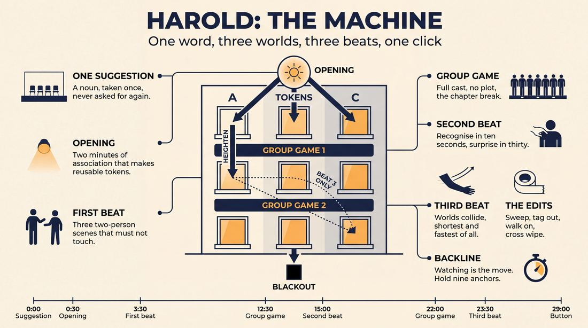
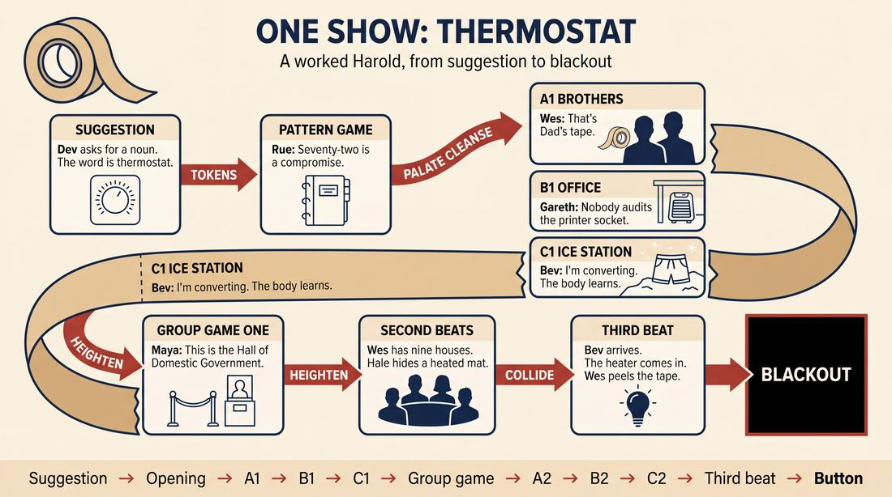
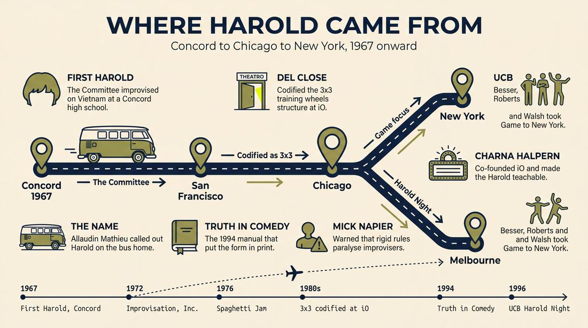
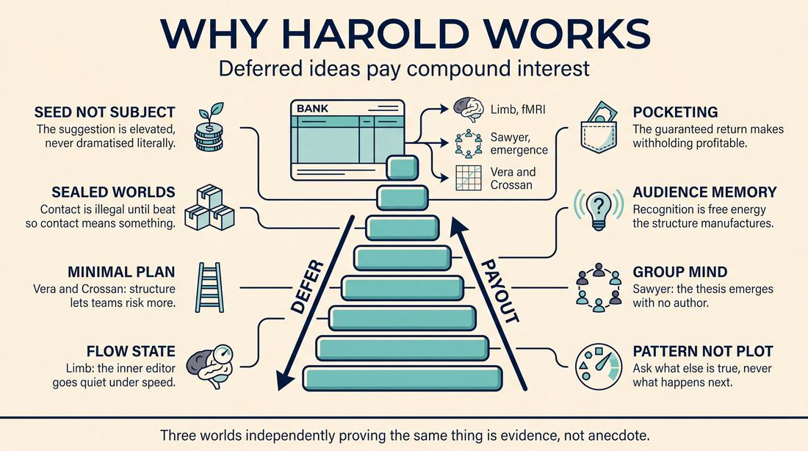
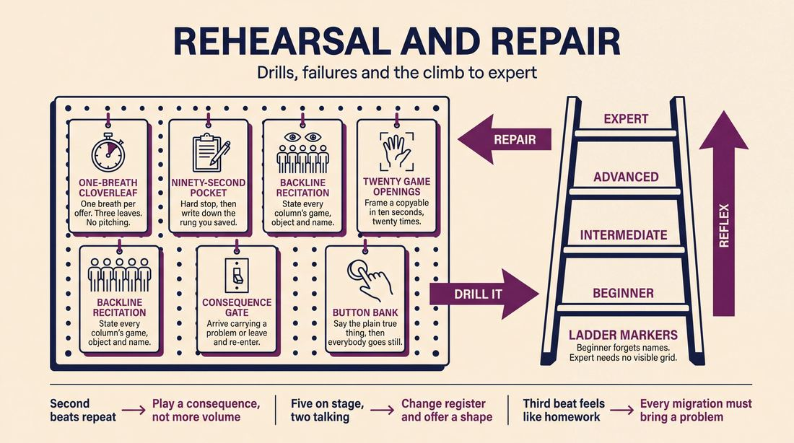

# Harold

> **A complete study of the long-form improv format _Harold_** - the original archived write-up, five infographics, grounded historical and pedagogical research, and a full mechanics-and-coaching manual.

| | |
|---|---|
| **Format** | Harold |
| **Primary source** | [IRC Improv Wiki](https://wiki.improvresourcecenter.com/index.php?title=Harold) |

---

## Contents

1. [Part I - The Original Write-Up](#part-i-the-original-write-up)
2. [Part II - The Infographics](#part-ii-the-infographics)
   - [1. Structure and Mechanics](#infographic-1-mechanics)
   - [2. A Show, Beat by Beat](#infographic-2-example)
   - [3. Origins and Lineage](#infographic-3-history)
   - [4. Why It Works](#infographic-4-theory)
   - [5. Rehearsal and Repair](#infographic-5-coaching)
3. [Part III - Research Dossier](#part-iii-research-dossier)
   - [Pass 1: History, Lineage, Literature and Scholarship](#research-history)
   - [Pass 2: Comparative Anatomy, Pedagogy and Production](#research-comparative)
4. [Part IV - Mechanics, Gameplay and Coaching Manual](#part-iv-mechanics-gameplay-and-coaching-manual)
   - [Pass 1: The Form, Its Mechanics and Its Gameplay](#manual-mechanics)
   - [Pass 2: Training, Coaching and Performance Companion](#manual-coaching)

---

## Part I - The Original Write-Up

*Verbatim archive of the source article, reproduced exactly as scraped. Everything after this section is generated elaboration built on top of it.*

### Harold

The Harold is a longform improvised form developed by [Del Close](https://wiki.improvresourcecenter.com/index.php?title=Del_Close "Del Close"). It is a collage of scenes inspired by a single suggestion which are interwoven and connected. When the Harold was first conceived by [The Committee](https://wiki.improvresourcecenter.com/index.php?title=The_Committee&action=edit&redlink=1 "The Committee (page does not exist)"), the structure was very loose. Over time, Del experimented with the form. In the 1980's, while teaching at the ImprovOlympic in Chicago, the structure became more codified and became the 3x3 format (also known as the training wheels Harold) that is described in [Truth in Comedy](https://wiki.improvresourcecenter.com/index.php?title=Truth_in_Comedy "Truth in Comedy"). It is now performed in many theaters across the world including [iO Theater](https://wiki.improvresourcecenter.com/index.php?title=IO_Theater "IO Theater") and [The Upright Citizens Brigade Theater](https://wiki.improvresourcecenter.com/index.php?title=The_Upright_Citizens_Brigade_Theater "The Upright Citizens Brigade Theater"). 

##### Origin

[The Committee](https://wiki.improvresourcecenter.com/index.php?title=The_Committee&action=edit&redlink=1 "The Committee (page does not exist)"), a San Francisco improv group, performed the first Harold in Concord, California in 1967\. They were invited to a high school and decided to do their improvisations on the war in Vietnam. On the way home in a Volkswagen Bus they were discussing the performance when one of them asked what they should call it. Allaudin (Bill) Mathieu called out "Harold." It was a joking reference to a line from *A Hard Days Night* in which a reporter asked George Harrison what he called his haircut; he answered "Arthur." Close later remarked that he wished he had chosen a better name. 

##### Principles

Several important improv principles are built into the structure of Harold. For instance:

- Everything in the world is connected \- The initial scenes in Harold should be very different from one another with no obvious connections between them. In the final scene(s) of the Harold, the various threads should come together and connect, perhaps by characters from different scenes meeting up, or by ideas, games or themes from different scenes coming together.
- Improvisors are pattern makers rather than storytellers \- when improvising Harolds, performers should follow the patterns that emerge, rather than the stories. They should not ask, "What happens next?" Instead they should take what has happened before and create other scenes, group games or transitions which create patterns with previous scenes and heighten that pattern as they move through the piece.
- Broadly, the three acts of the Harold correspond to discovery, heightening and connecting.
- Harold eats everything \- Anything you can imagine happening on a stage whether it's storytelling, dance, music, poetry or performance art can be incorporated into the Harold. If you think you can't do something in a Harold, you are doing Harold wrong.

##### Structure

Harolds are typically anywhere from 25 to 40 minutes long. The structure as described in Truth in Comedy can be broken down in following way:

- **Opening**
- **Scenes** A1, B1, C1
- **Group Game**
- **Scenes** A2, B2, C2
- **Group Game**
- **Scenes** A3, B3, C3 (Note: In the final set of scenes, not all three will always return. Players are encouraged to call back the most interesting scenes and characters from the Harold, and also to intertwine them.)

Close called this a 3x3 structure, using it to give improvisers a sense of organization to help them through their first Harolds. He was clear that the format was theirs to use. Departures were not only allowed but were considered important steps in developing a group's ability to Harold. He expressed this in his book ***Truth in Comedy*** noting that "the first rule is: there are no rules." In performing Harolds, content and the need to develop an organic commentary on the suggestion trump predetermined structures.

Various Harold structures use different sets of guidelines such as the 3x3 format. Another guideline might be whether you stay as the first character you create or can play multiple characters. Or, that the ending is a group scene. Or, that everyone knows each other and scene partnerships may change from the first to second and second to third layers.

The loose structure allows for the creative bursts necessary for the Harold. Using an audience suggestion, actors explore their relationship to the topic as a starting point. The scenes progressively evolve as the exploration continues to an ending point.

###### Opening

The basic form starts with an [opening](https://wiki.improvresourcecenter.com/index.php?title=Opening "Opening"). After eliciting the audience's suggestion, the ensemble explores it for a few minutes in either an unplanned or a predetermined structure. Textbook structures include:

- A cocktail party that ebbs and flows between conversations.
- Monologues that rotate among cast members.
- Invocation of the suggestion in the style of an occult ritual (It is, you are, thou art, I am).
- Organic involving morphing sound and movement exploration.
- Pattern game where word association is used to generate ideas, often referred to as a clover leaf because the pattern arcs out with associated words and returns to the suggestion, and is repeated two additional times.
- Source scene or scenes which are used to pull ideas and which might return in the 3rd Beat.

Rarely is the opening just about the literal suggestion. The suggestion serves a starting point to discover greater underlying themes. Del Close stated that a suggestion should be elevated from the commonplace to the extraordinary.

###### First Beat (A1, B1, C1\)

Following the opening are three completely unrelated two\-person scenes. Each may use such information from the opening as:

- Details, such as location
- Themes and patterns, such as troubled family life
- Tangential information, such as a throwaway line

As the suggestion inspires the opening, the opening is a launching point for the first set of scenes. 

###### Group Game

Following the third scene, multiple members of the cast return to stage, for a [group game](https://wiki.improvresourcecenter.com/index.php?title=Group_game "Group game") based on the opening. A group game is a palette cleanser and should not relate to the established sets of scenes.

In a scenic [group game](https://wiki.improvresourcecenter.com/index.php?title=Group_game "Group game"), the focus jumps between all the characters participating. These group games should be differentiated from any [short form game](https://wiki.improvresourcecenter.com/index.php?title=Short_form_game&action=edit&redlink=1 "Short form game (page does not exist)") in that the structure of the group game, although it may resemble a known short form game, is discovered as it is played rather than determined beforehand. A textbook structure is the Advertising Meeting, where the entire cast must come up with an ad campaign for a new product.

More abstract group games are called presentational, which focus less on individual characters and more on a concept, such as one improviser presents a slide show where each slide is recreated by improvisers. Types of Presentational group games are

- Flocking \- all the improvisers mirror each others actions
- Simple game \- rules are developed of a simple game during the game, like freeze tag.
- Slide Show \- Described above
- Inanimate Objects \- improvisers become inanimate objects and do a very short monologue describing their perspective then perform a scene based on the interpersonal relationships of the objects.

> "The games are an opportunity for everyone on the team to work together to create something. They also often function as a way to bind the Harold together and directly explore themes connected to the suggestion. They punctuate and divide the piece, giving it some structure. They also simply provide some variety so that every part of the Harold isn't a two person scene." \-[Kevin Mullaney](https://wiki.improvresourcecenter.com/index.php?title=Kevin_Mullaney "Kevin Mullaney")

###### Second Beat (A2, B2, C2\)

The second set of scenes heightens what was established in the first set. What it is heightening will differ from school to school. At the ImprovOlympic, the characters and relationships are heightened. A tool for this is a "Time Dash," where the scene picks up at a different point in time than last left. A scene between a newly married couple with problems can take the second beat to show them on their tenth wedding anniversary.

At the [Upright Citizens Brigade Theatre](https://wiki.improvresourcecenter.com/index.php?title=Upright_Citizens_Brigade_Theatre "Upright Citizens Brigade Theatre"), when game is heightened, the second beat may also use an analogous situation to the first scene. A scene about a bad cop could be heightened through a scene about a bad priest.

After the second beat is another group game.

###### Third Beat (A3, B3, C3\)

The final set of three scenes (the third beat) connects themes, characters, situations, and games from the whole piece. Often, scenes merge into each other, avoiding the need to return to all three. The third beat is usually the shortest.

##### Related Forms

Del Close allowed for and encouraged much variation within the structure of the Harold and saw it as a malleable and organic form with which to explore themes and ideas. The beats and games need not appear in the order or number described. 

Most modern forms are derived from the Harold. These include:

- [Armando](https://wiki.improvresourcecenter.com/index.php?title=Armando "Armando") (The Armando Diaz Theatrical Experience and Hootenanny)\- a host's monologues provide the inspiration for scenes. The show and form are named after [Armando Diaz](https://wiki.improvresourcecenter.com/index.php?title=Armando_Diaz "Armando Diaz") who was the first monologist in the Chicago run.
- [Deconstruction](https://wiki.improvresourcecenter.com/index.php?title=Deconstruction "Deconstruction") \- one long opening group scene, which is used for idea generation.
- [La Ronde](https://wiki.improvresourcecenter.com/index.php?title=La_Ronde "La Ronde") \- Multiple locations with improvisers staying in one character the whole performance.
- [Monoscene](https://wiki.improvresourcecenter.com/index.php?title=Monoscene "Monoscene") \- One scene location, sometimes with improvisers playing different characters and sometimes playing the same characters for the entire piece.
- [The Movie](https://wiki.improvresourcecenter.com/index.php?title=The_Movie "The Movie") \- an improvised movie that uses disjointed situations which converge by the end
- [Sybil](https://wiki.improvresourcecenter.com/index.php?title=Sybil&action=edit&redlink=1 "Sybil (page does not exist)") \- one\-person Harold.
- [The Bat](https://wiki.improvresourcecenter.com/index.php?title=The_Bat&action=edit&redlink=1 "The Bat (page does not exist)") \- a Harold performed in the dark, like a radio play.

##### Links

- [Video of the Reckoning doing a Harold opening](http://www.youtube.com/watch?v=AHQT3ax6fnM)
- [A discussion in the IRC on understanding the Harold better.](http://www.improvresourcecenter.com/mb/showthread.php?t=71757)

---

*Archived from [https://wiki.improvresourcecenter.com/index.php?title=Harold](https://wiki.improvresourcecenter.com/index.php?title=Harold) (IRC Improv Wiki) on 2026-08-09 23:23 UTC.*

---

## Part II - The Infographics

*Five 16:9 posters, each teaching a different aspect of the format. Click any poster to enlarge.*

<a id="infographic-1-mechanics"></a>

### 1. Structure and Mechanics

*How the form is played: the shape of the piece, the opening, the roles, the edit vocabulary, the flow of information, and the clock.*

{ .diagram loading=lazy decoding=async width="1100" height="614" }


<a id="infographic-2-example"></a>

### 2. A Show, Beat by Beat

*A single worked performance from suggestion to blackout: what happens in each beat, with short real example lines and what the players are doing technically.*

{ .diagram loading=lazy decoding=async width="1100" height="614" }


<a id="infographic-3-history"></a>

### 3. Origins and Lineage

*Where the form came from: creators, dates, theatres, how it spread between schools and cities, and the key figures - a documented timeline and lineage map.*

{ .diagram loading=lazy decoding=async width="1100" height="614" }


<a id="infographic-4-theory"></a>

### 4. Why It Works

*The theory: the core principles of the form and the research and craft ideas that explain why the structure produces good improv, each tied to a specific mechanic.*

{ .diagram loading=lazy decoding=async width="1100" height="614" }


<a id="infographic-5-coaching"></a>

### 5. Rehearsal and Repair

*Training and fixing the form: the essential drills, the common failure modes with their symptom-and-fix pairs, and the markers of beginner through expert play.*

{ .diagram loading=lazy decoding=async width="1100" height="614" }


---

## Part III - Research Dossier

*Two research passes: the historical record, then the comparative and pedagogical record. Claims carry evidence tags - treat unverified items accordingly.*

<a id="research-history"></a>

### » Pass 1: History, Lineage, Literature and Scholarship

### Research Summary
*   **Highly Documented Core**: The Harold is the most extensively documented long-form improvisational structure in existence, serving as the foundational pedagogy for major training centres (iO, UCB). Its mechanics are codified in seminal texts like *Truth in Comedy* and the *UCB Comedy Improvisation Manual*.
*   **Contested Authorship vs. Codification**: While Del Close is universally credited as the "father" of the Harold, the historical record shows it was created collaboratively by The Committee in 1967. Close and Charna Halpern later codified it into the recognizable "3x3" structure in 1980s Chicago.
*   **Philosophical Schism**: The record establishes a clear divergence in how the form is played. The Chicago dialect (iO) prioritizes relationship heightening and organic thematic discovery, while the New York/Los Angeles dialect (UCB) rigidly prioritizes the "Game of the Scene."
*   **Academic Validation**: The form's reliance on "group mind" and spontaneous generation is heavily supported by cognitive science (fMRI studies on transient hypofrontality) and performance studies (collaborative emergence).
*   **Backlash and Evolution**: There is a well-documented critical backlash against the Harold, led most notably by Mick Napier, arguing that its strict rules paralyze performers. This critique has driven the evolution of looser, more organic descendant forms.
*   **Archival Gaps**: Despite its fame, primary source video of early Harolds (1970s–1980s) is virtually non-existent, leaving the transitional mechanics between The Committee's free-form shows and iO's codified structure reliant on oral history.

### Provenance and History
The Harold was created to solve a specific theatrical problem: how to move improvisational comedy past the short, audience-driven parlor games pioneered by Viola Spolin and the Compass Players, and into a sustained, thematic, multi-scene theatrical piece. 

The format was born in 1967 following a performance by the San Francisco improv group The Committee at a high school in Concord, California. The ensemble had improvised a long, interconnected piece about the Vietnam War. On the Volkswagen bus ride home, the group discussed the breakthrough. When someone asked what they should call this new format, performer and musician Allaudin (Bill) Mathieu jokingly called out "Harold." The name was a sarcastic reference to a scene in the 1964 Beatles film *A Hard Day's Night*, where a reporter asks George Harrison what he calls his haircut, and Harrison deadpans, "Arthur." Del Close, who was directing the group, later lamented the mundane name, but it stuck as a reflection of the era's subversive, anti-pretension ethos.

| Year | Event | Place / Company | Source |
|---|---|---|---|
| 1967 | First performance of the Harold (Vietnam War theme) | Concord, CA / The Committee | [Wikipedia](https://en.wikipedia.org/wiki/Harold_(improvisation)) / IRC Wiki |
| 1972 | The Committee disbands; Improvisation, Inc. continues the 45-minute free-form Harold | San Francisco / Improvisation, Inc. | [Wikipedia](https://en.wikipedia.org/wiki/Harold_(improvisation)) |
| 1976 | Spaghetti Jam adapts Harold techniques into standalone performance pieces | San Francisco / Old Spaghetti Factory | [Wikipedia](https://en.wikipedia.org/wiki/Harold_(improvisation)) |
| 1980s | Del Close and Charna Halpern codify the "3x3" training wheels structure | Chicago / ImprovOlympic (iO) | *Truth in Comedy* |
| 1994 | Publication of *Truth in Comedy*, formalizing the Harold in print | Chicago / iO | [Goodreads](https://www.goodreads.com/book/show/9014.Truth_in_Comedy) |
| 1996 | UCB brings their Game-focused adaptation of the Harold to New York | New York / UCB Theatre | *UCB Comedy Improvisation Manual* |

### Lineage and Transmission
The Harold spread globally through a distinct lineage of teachers and theatres, mutating significantly in transit. 

*   **The Chicago Dialect (iO / ImprovOlympic)**: The root of the modern Harold. Taught by Del Close and Charna Halpern, this dialect focuses on organic discovery, relationship dynamics, and thematic resonance. Second beats often utilize a "Time Dash" (advancing the same characters in time) to heighten the emotional stakes. [DOCUMENTED]
*   **The New York / LA Dialect (UCB)**: Founded by iO alumni Matt Besser, Ian Roberts, Matt Walsh, and Amy Poehler. UCB mutated the Harold into a highly analytical delivery system for the "Game of the Scene" (the core comedic premise). Second beats here frequently use "Analogous Situations" (e.g., heightening a scene about a bad cop by playing a scene about a bad priest) to isolate and escalate the Game rather than the characters. [DOCUMENTED]
*   **The Annoyance Dialect**: Founded by Mick Napier in Chicago. While not a Harold school, its philosophy directly responds to the Harold, teaching improvisers to abandon the "rules" of the 3x3 structure in favour of taking care of oneself, making bold physical choices, and trusting individual power over structural compliance. [DOCUMENTED]
*   **Global Transmission**: The form is now a global standard. Theatres like The Improv Conspiracy in Melbourne, Australia, host dedicated "Harold Nights," adapting the Chicago style to local cultural contexts, while theatres like The Coalition in Richmond, Virginia, use the Harold as the foundational lens for teaching all long-form mechanics. [DOCUMENTED]

### Key Figures
| Person | Role in this form | Specific contribution | Source URL |
|---|---|---|---|
| Del Close | Co-Developer / Director | Codified the 3x3 "training wheels" structure; championed the Harold as high art rather than disposable comedy. | [IRC Wiki](https://wiki.improvresourcecenter.com/index.php?title=Harold) |
| Charna Halpern | Co-Developer / Producer | Co-founded iO, co-authored *Truth in Comedy*, and institutionalized the Harold as a teachable curriculum. | [Goodreads](https://www.goodreads.com/book/show/9014.Truth_in_Comedy) |
| Allaudin (Bill) Mathieu | Performer | Coined the name "Harold" in 1967 during a VW bus ride, referencing *A Hard Day's Night*. | [Wikipedia](https://en.wikipedia.org/wiki/Harold_(improvisation)) |
| Matt Besser, Ian Roberts, Matt Walsh | UCB Founders | Adapted the Harold to focus strictly on "Game"; authored the definitive modern textbook on the form. | [Goodreads](https://www.goodreads.com/book/show/17262444-the-upright-citizens-brigade-comedy-improvisation-manual) |
| Mick Napier | Director / Author | Provided the most famous structural critique of the Harold, warning against the paralysis of its "rules." | [People and Chairs](https://peopleandchairs.com/2017/08/11/mick-napiers-improvise-gets-a-refresh/) |

### Canonical Shows, Companies and Recordings
| Production / Company | Venue | Year | Link | Where to watch today |
|---|---|---|---|---|
| The Committee's First Harold | Concord High School, CA | 1967 | [Wikipedia](https://en.wikipedia.org/wiki/Harold_(improvisation)) | N/A (Unrecorded) |
| Jazz Freddy | Live Bait Theater, Chicago | 1992 | [Scribd](https://www.scribd.com/document/266504286/R-Keith-Sawyer-Group-Creativity-Music-Theater) | N/A (Academic transcripts exist) |
| The Reckoning | iO Theater, Chicago | 2000s | [YouTube](http://www.youtube.com/watch?v=AHQT3ax6fnM) | Archival video online |
| UCB Harold Night | UCB Theatre (NY/LA) | 1996–Present | [UCB](https://ucbcomedy.com/) | Live weekly at UCB Los Angeles |

### Published Literature
| Work | Author | Year | What it says about this form | Where to find it |
|---|---|---|---|---|
| *Truth in Comedy: The Manual for Improvisation* | Charna Halpern, Del Close, Kim Howard Johnson | 1994 | Defines the 3x3 "training wheels" Harold, the concept of group mind, and pattern recognition. | [Goodreads](https://www.goodreads.com/book/show/9014.Truth_in_Comedy) |
| *The Upright Citizens Brigade Comedy Improvisation Manual* | Matt Besser, Ian Roberts, Matt Walsh | 2013 | Details the UCB approach to the Harold, focusing on Game, beats, and palate-cleansing group games. | [Goodreads](https://www.goodreads.com/book/show/17262444-the-upright-citizens-brigade-comedy-improvisation-manual) |
| *Improvise: Scene from the Inside Out* | Mick Napier | 2004 | Critiques the over-reliance on Harold rules that paralyze improvisers and put them "in their heads." | [AZ Quotes](https://www.azquotes.com/author/32420-Mick_Napier) |
| *Group Creativity: Music, Theater, Collaboration* | R. Keith Sawyer | 2003 | Academic analysis of collaborative emergence in Chicago long-form improv, specifically analyzing the Harold. | [Scribd](https://www.scribd.com/document/266504286/R-Keith-Sawyer-Group-Creativity-Music-Theater) |

### Verbatim Quotes
> "The Harold is like the space shuttle, incorporating all of the developments and discoveries that have gone before it into one new, superior design."
> — Charna Halpern, Del Close, Kim Howard Johnson
> [Source: Truth in Comedy](https://improvdoesbest.com/2015/11/14/a-harold-video-example/)

> "The best Harold player thinks of himself as a tool for the Harold, and tries to find his function in the piece, sublimating himself to the needs of the work."
> — Charna Halpern
> [Source: Truth in Comedy](https://www.bookey.app/quote-book/truth-in-comedy)

> "There is nothing funnier than the truth, so players must keep their monologs honest."
> — Charna Halpern
> [Source: Truth in Comedy](https://www.bookey.app/quote-book/truth-in-comedy)

> "When an improviser lets go and trusts his fellow performers, it's a wonderful, liberating experience that stems from group support."
> — Charna Halpern, Del Close, Kim Howard Johnson
> [Source: Truth in Comedy](https://www.bookey.app/quote-book/truth-in-comedy)

> "Repeatedly answering the question 'If this unusual thing is true, then what else is true?' creates a comic pattern. Each answer to this question (or similar, related versions of this question) is called a 'Game move.' A combination of game moves forms a pattern that we call a 'Game.'"
> — Matt Besser, Ian Roberts, Matt Walsh
> [Source: UCB Comedy Improvisation Manual](https://wiki.improvresourcecenter.com/index.php?title=Game)

> "The best thing about improv is that no matter how bad your show is, it's only 30 minutes, and never exists again. The worst thing is no matter how good your show is, it's only 30 minutes, and never exists again."
> — Mick Napier
> [Source: Improvise: Scene from the Inside Out](https://www.azquotes.com/author/32420-Mick_Napier)

> "Kill the judge in your head and just take action."
> — Mick Napier
> [Source: Improvise: Scene from the Inside Out](https://www.azquotes.com/author/32420-Mick_Napier)

> "Life is a slow Harold."
> — Del Close
> [Source: Widely attributed / People and Chairs](https://peopleandchairs.com/2017/05/24/whose-harold-is-it-anyway/)

### Anecdotes and Stories
**The "Training Wheels" Breakthrough**
When Del Close was teaching at ImprovOlympic in the 1980s, he found that improvisers were getting lost in the sprawling, 45-minute free-form structure of the original Committee Harold. To solve this, he codified the "3x3" structure (Opening, three scenes, group game, three scenes, group game, three scenes converging). He explicitly called this the "training wheels Harold." His intention was never for this to be a rigid cage, but a scaffolding to help ensembles internalize the rhythm of callbacks and thematic weaving. Once a team mastered the 3x3, Close expected them to abandon the structure entirely and let the piece dictate its own form. [DOCUMENTED]

**The Naming of the Harold**
In 1967, after performing a Vietnam War-themed improvisation at a high school in Concord, California, The Committee was riding home in a Volkswagen bus. Discussing the performance, someone asked what they should call this new format. Allaudin (Bill) Mathieu jokingly called out "Harold." This was a direct reference to a scene in the Beatles' film *A Hard Day's Night*, where a reporter asks George Harrison what he calls his haircut, and Harrison deadpans, "Arthur." Del Close later lamented that he wished he had chosen a better name, but the mundane moniker stuck. [DOCUMENTED]

### Academic and Scientific Research
**Transient Hypofrontality and Spontaneous Generation**
Neuroscientist Dr. Charles Limb conducted fMRI studies on jazz musicians and freestyle rappers to observe the brain during spontaneous creation. He found that during improvisation, the Dorsolateral Prefrontal Cortex (DLPFC)—the brain's conscious "editor" responsible for self-monitoring and inhibition—goes dark, while the Medial Prefrontal Cortex (MPFC) lights up. 
*Relevance to this form:* The Harold's Third Beat requires players to instantly recognize and synthesize disparate A, B, and C storylines into a cohesive scene. This rapid pattern-matching and callback generation relies entirely on bypassing the DLPFC's "editor" to achieve the necessary associative leaps without the delay of conscious planning.

**Collaborative Emergence**
Psychologist and performance researcher Dr. R. Keith Sawyer studied Chicago improv groups (including Jazz Freddy) to understand group creativity. He coined the term "collaborative emergence" to describe how the interactional frame of a scene is co-created in real-time without a central author. 
*Relevance to this form:* This validates the Harold's core principle that "improvisers are pattern makers rather than storytellers." In a Harold Opening (like the Pattern Game), no single player dictates the theme; the overarching thesis of the 30-minute piece emerges strictly through the cumulative, distributed offers of the group mind.

### Documented Variants and Descendants
*   **Armando (The Armando Diaz Theatrical Experience)**: Replaces the abstract Opening with a guest monologist who tells true stories based on an audience suggestion. The ensemble then performs scenes inspired by the monologues. [DOCUMENTED]
*   **Deconstruction**: Abandons the 3x3 structure. Begins with a single, grounded, long-form scene. The ensemble then pulls the characters, themes, and games from that single scene apart into a series of tangential scenes, eventually returning to the original scene. [DOCUMENTED]
*   **The Movie**: An improvised film that uses cinematic tropes (pans, voiceovers, cross-cuts) to explore disjointed situations that converge by the end. [DOCUMENTED]
*   **The Bat**: A Harold performed entirely in the dark, relying purely on audio, soundscapes, and vocal characterization, akin to a live radio play. [DOCUMENTED]
*   **Sybil**: A one-person Harold where a single performer plays all characters, executes all edits, and weaves the A, B, and C storylines together. [DOCUMENTED]
*   **Cat's Cradle**: A fluid, unfolding symphonic long-form of living environments with all performers onstage at all times, morphing seamlessly between objects, architecture, and characters. [DOCUMENTED]

### Criticism, Debate and Known Failure Modes
*   **The "Rules" Paralysis**: The most prominent criticism of the Harold comes from Mick Napier. He argues that the codified rules required to execute a perfect 3x3 Harold (e.g., "establish who/what/where immediately," "don't ask questions," "find the connection") force improvisers into their heads. This cognitive overload kills the spontaneous, visceral reaction required for good acting, resulting in polite, boring, and highly intellectualized scenes.
*   **The "Frankenstein" Third Beat**: A known failure mode where teams force connections in the final scenes that haven't been earned organically. Instead of a natural convergence of themes, players awkwardly shove characters from Scene A into Scene C just to satisfy the structural requirement, resulting in a contrived ending.
*   **iO vs. UCB Dogma**: A persistent debate exists between practitioners of the Chicago style (who accuse UCB improvisers of playing "math-comedy" that sacrifices emotional truth for the Game) and the New York style (who accuse iO improvisers of meandering through "slice-of-life" scenes that lack comedic engine or forward momentum).

### Cultural Footprint
The Harold is the foundational architecture for modern American comedy. Its alumni include Amy Poehler, Tina Fey, Matt Besser, Chris Farley, Mike Myers, and Stephen Colbert. The mechanics of the Harold—specifically the weaving of disparate A, B, and C storylines that converge in a heightened climax—directly influenced the writing structure of modern sitcoms (e.g., *Parks and Recreation*, *Broad City*) and sketch shows (*Saturday Night Live*, *Key & Peele*). The form dominates global improv festivals, serving as the lingua franca that allows improvisers from different cities to perform together instantly.

### Gaps in the Record
*   **The Exact Date of Inception**: While the year 1967 and the location (Concord, CA) are universally cited for the first Harold, the exact date and the specific high school remain undocumented in digitized archives.
*   **The "Original" Harold Mechanics**: The specific transition techniques used by Improvisation, Inc. between 1972 and 1976 to sustain a 45-minute free-form Harold are poorly preserved, heavily overshadowed by the codified 3x3 structure that emerged from Chicago in the 1980s.
*   **Authorship of the Beats**: While Del Close is universally credited with the 3x3 structure, the collaborative nature of iO in the 1980s means the specific contributions of early iO teams (like Baron's Barracudas) in shaping the beats and group games are largely anecdotal and contested among Chicago veterans. A researcher should chase the oral histories of the surviving 1980s iO alumni to map the exact timeline of the 3x3's codification.

### Source List
1. *IRC Improv Wiki* - IRC Community - 2012 - https://wiki.improvresourcecenter.com/index.php?title=Harold - Seed document establishing the 3x3 structure and origin.
2. *Wikipedia* - Wikipedia Contributors - 2024 - https://en.wikipedia.org/wiki/Harold_(improvisation) - Supports the history of The Committee, Improvisation, Inc., and Spaghetti Jam.
3. *Truth in Comedy: The Manual for Improvisation* - Charna Halpern, Del Close, Kim Howard Johnson - 1994 - https://www.goodreads.com/book/show/9014.Truth_in_Comedy - Primary text for the Chicago-style Harold and group mind philosophy.
4. *The Upright Citizens Brigade Comedy Improvisation Manual* - Matt Besser, Ian Roberts, Matt Walsh - 2013 - https://www.goodreads.com/book/show/17262444-the-upright-citizens-brigade-comedy-improvisation-manual - Primary text for the Game-based UCB Harold.
5. *Improvise: Scene from the Inside Out* - Mick Napier - 2004 - https://peopleandchairs.com/2017/08/11/mick-napiers-improvise-gets-a-refresh/ - Source of the primary critique against rigid Harold rules.
6. *Group Creativity: Music, Theater, Collaboration* - R. Keith Sawyer - 2003 - https://www.scribd.com/document/266504286/R-Keith-Sawyer-Group-Creativity-Music-Theater - Academic source on collaborative emergence in Chicago long-form.
7. *Scholastica / JHU Macksey Journal* - "Say 'Yes and' To Improv: It's Good For Your Brain" - 2020 - https://scholasticahq.com/ - Summarizes Dr. Charles Limb's fMRI research on transient hypofrontality in improvisers.
8. *People and Chairs* - "Whose Harold Is It Anyway?" - 2013 - https://peopleandchairs.com/2013/07/19/whose-harold-is-it-anyway/ - Documents the regional and philosophical differences between iO and UCB Harolds.

<a id="research-comparative"></a>

### » Pass 2: Comparative Anatomy, Pedagogy and Production

### Taxonomic Placement

```text
      Spolin (Theater Games)       Compass Players (Scenarios)
                   \                   /
                    \                 /
             The Committee (Early Experiments / "The Event")
                              |
            THE HAROLD (Del Close & Charna Halpern)
                              |
        -------------------------------------------------
        |             |               |                 |
     Armando    Deconstruction    The Movie         Monoscene
```

The Harold is the foundational architecture of modern long-form improvisation. It bridges the gap between the short-form, game-based focus of Viola Spolin and the narrative, scenario-based focus of the Compass Players. By introducing a recurring, multi-beat structure that relies on thematic convergence rather than linear plot, the Harold acts as the parent node for almost all contemporary long-form formats. Forms like the Armando and Deconstruction isolate and expand specific mechanics of the Harold (the opening monologue and the thematic run, respectively), while the Monoscene reacts against it by stripping away the edits and time-jumps entirely.

### Head-to-Head Comparisons

#### Harold vs. Montage
| Axis | The Harold | Montage | Consequence for the players |
| :--- | :--- | :--- | :--- |
| **Opening** | Highly structured (Pattern Game, Invocation) to generate thematic tokens. | Optional or non-existent. | Harold players must actively mine the opening for specific premises; Montage players initiate blindly. |
| **Structure** | Rigid 3x3 grid (A1/B1/C1, Game, A2/B2/C2, Game, A3/B3/C3). | Fluid, continuous string of unrelated scenes. | Harold requires pacing and beat-tracking; Montage requires only momentum. |
| **Edit Logic** | Wipes dictate the end of a beat; tag-outs heighten within a beat. | Wipes happen whenever a scene peaks. | Harold players must hold back ideas for the second beat; Montage players burn through ideas immediately. |
| **Memory** | High burden: players must track 3 distinct worlds, characters, and games. | Low burden: scenes are disposable and rarely return. | Harold builds a shared database of callbacks; Montage relies on immediate, localized laughs. |
| **Audience Contract** | "Watch us weave these disparate threads together." | "Watch us do a series of funny, unrelated sketches." | Harold audiences expect a satisfying convergence; Montage audiences expect rapid-fire comedy. |
| **Failure Mode** | "Plot-heavy" or "Harold Fatigue" (mechanical execution). | "Burnout" (running out of steam after 15 minutes). | Harold fails when it feels like a math equation; Montage fails when it lacks variety. |

#### Harold vs. Armando
| Axis | The Harold | Armando | Consequence for the players |
| :--- | :--- | :--- | :--- |
| **Opening** | Ensemble-driven, abstract, associative (e.g., Cloverleaf). | Single monologist telling a true, grounded story. | Harold openings require group mind; Armando openings require active listening to a single speaker. |
| **Structure** | 3 distinct beats returning to the same 3 worlds. | Scenes inspired by the monologue, rarely returning to the same characters. | Harold is a closed loop; Armando is a hub-and-spoke model radiating from the monologues. |
| **Cast Size** | 6-9 players (allows for 3 pairs + group games). | Can be larger (10-12) as scenes do not need to be tracked across beats. | Harold requires strict stage-time management; Armando allows players to step in and out freely. |

#### Harold vs. Deconstruction
| Axis | The Harold | Deconstruction | Consequence for the players |
| :--- | :--- | :--- | :--- |
| **Opening** | Abstract exploration of a single word. | A single, grounded, realistic 5-10 minute scene (the "Source Scene"). | Harold pulls themes from word association; Deconstruction pulls themes from character behavior. |
| **Structure** | 3x3 grid with group games. | Source Scene -> Thematic Tangents -> Character Runs -> Source Scene returns. | Harold separates worlds entirely; Deconstruction fractures one world into many. |
| **Convergence** | Third beat mashes A, B, and C together. | The final beat returns to the exact moment the Source Scene ended. | Harold ends in chaos and synthesis; Deconstruction ends in narrative resolution. |

### What Makes It Uniquely Itself

1. **The 3x3 Beat Structure**: If a form does not establish distinct, unrelated worlds and then deliberately return to them later in the piece (Beat 2 and Beat 3), it is not a Harold. The act of putting a scene "in your pocket" to heighten it later is the defining mechanical constraint of the form.
2. **The Separation of Scenes and Group Games**: The Harold explicitly alternates between two-person, grounded scenes (A/B/C) and full-cast, presentational or abstract games. Removing the group games turns the form into a callback-heavy Montage; the group games are required as palate cleansers and thematic glue.
3. **Thematic Convergence**: The explicit goal of the third beat is to weave disparate threads together. If the scenes remain entirely isolated and never cross-pollinate (characters from A walking into C, or the game of B applying to A), the form lacks the "collaborative emergence" that defines the Harold's climax.

### Structural Variants in Practice

| Variant | What it changes | Who plays it | Source |
| :--- | :--- | :--- | :--- |
| **iO Harold** | Focuses on character and relationship. Second beats are often "Time Dashes" (jumping forward/backward in the same narrative). | iO Theater (Chicago) | *Truth in Comedy* (Close & Halpern) |
| **UCB Harold** | Focuses on the "Game of the Scene". Second beats are often "Analogous" (same comedic game, entirely different characters/location). | Upright Citizens Brigade | *UCB Comedy Improvisation Manual* |
| **The Bat** | Performed entirely in the dark. Focuses heavily on soundscapes, voice modulation, and audio-only edits. | Various / iO | [CRAFT CONSENSUS] / IRC Wiki |
| **Sybil** | A one-person Harold. The performer plays all characters, executes all edits, and tracks all three beats alone. | Solo performers | IRC Wiki |
| **French Harold** | The entire Harold takes place in one overarching environment, but maintains the 3x3 beat structure within different rooms/areas. | Various | learnimprov.com |

### The Teaching Ladder

| Stage | Skill introduced | Why in this order | Typical exercise | Source / Consensus |
| :--- | :--- | :--- | :--- | :--- |
| **1. Base Reality** | Establishing Who, What, Where immediately. | A1 scenes must be grounded before they can be heightened. | 3-Line Scenes | UCB Manual |
| **2. Openings** | Thematic generation and word association. | Players must learn to pull premises from a suggestion rather than playing the literal noun. | Pattern Game / Cloverleaf | Kevin Mullaney / Will Hines |
| **3. Group Games** | Full-cast support and presentational play. | Breaks the rhythm of 2-person scenes and teaches ensemble mind. | Advertising Pitch / Flocking | *Truth in Comedy* |
| **4. Second Beats** | Heightening (Time Dash or Analogous). | Teaches players to identify what worked in Beat 1 and escalate it without repeating it. | Tag-Out Drills | UCB Manual |
| **5. Third Beats** | Convergence and synthesis. | The hardest skill; requires tracking all previous data and finding the connective tissue. | Thematic Mashups | [CRAFT CONSENSUS] |

### Documented Drills and Exercises

| Drill | Origin / Teacher | How to run it | What it fixes in this form | Source |
| :--- | :--- | :--- | :--- | :--- |
| **Pattern Game (Cloverleaf)** | UCB / Will Hines | Group stands in a circle. Player 1 says the suggestion. Player 2 free-associates. The chain continues until it loops back to the suggestion. Repeat 3 times. | Fixes literal, plot-based interpretations of the audience suggestion. | Will Hines (Improv Nonsense) |
| **The Invocation** | Del Close / iO | Group addresses the suggestion directly: "It is..." (physical traits), "You are..." (character traits), "I am..." (embodying the suggestion). | Fixes shallow thematic generation; elevates the commonplace to the extraordinary. | Kevin Mullaney (kevinmullaney.com) |
| **Time Dash** | iO Theater | Stop a scene. Ask the players to step forward 10 years, or backward 5 years, maintaining the same relationship dynamic. | Fixes stagnant second beats that just repeat the dialogue of the first beat. | *Truth in Comedy* |
| **Analogous Scene** | UCB | Identify the "Game" of a scene (e.g., a cop who is afraid of guns). Re-initiate a new scene with the same game, different context (e.g., a chef afraid of knives). | Fixes plot-heavy second beats by focusing purely on comedic behavior. | *UCB Manual* |
| **Tag-Out** | UCB / iO | A backline player taps the shoulder of an active player, assumes their physical position, and initiates a new time/space with the remaining player. | Fixes slow edits and allows rapid heightening of a specific character's behavior. | *UCB Manual* |
| **Walk-On** | UCB / iO | A backline player enters an active scene temporarily to provide a piece of information or heighten the game, then immediately leaves. | Fixes isolated scenes by injecting external energy without derailing the base reality. | *UCB Manual* |
| **One Person Silent** | Jill Bernard | A two-person scene where one player is not allowed to speak, only react physically and emotionally. | Fixes over-talking and "talking heads" in A1 scenes. | Kevin Mullaney (kevinmullaney.com) |
| **Third Wheel** | Kevin Mullaney | Three players at a table. Two have a conversation on one topic. The third listens and responds with complete non-sequiturs. | Fixes group game chaos by enforcing strict rules of engagement and listening. | Kevin Mullaney (kevinmullaney.com) |
| **Secrets / The Deal** | UCB | Give each player a secret motivation before the scene (e.g., "You are trying to hide a stain"). They must play the scene without stating the secret. | Fixes a lack of "Game" by forcing players to play a specific, actionable behavior. | [CRAFT CONSENSUS] / Reddit |
| **Stations Pattern Game** | Will Hines | Players practice pitching full comedic premises to each other based on the suggestion, rather than single words. | Fixes weak initiations by training players to form complete ideas during the opening. | Will Hines (Improv Nonsense) |

### Common Failure Modes and Diagnoses

| Failure mode | What it looks like from the audience | Root cause | Fix | Who names it |
| :--- | :--- | :--- | :--- | :--- |
| **Harold Fatigue** | A joyless, mechanical progression of scenes. The team looks like they are filling out a math worksheet. | Over-reliance on the flowchart; prioritizing structure over discovery. | Drop the formal opening; loosen the rigid 3x3 structure. | Will Hines |
| **Plot Heavy** | Characters talking about what happened off-stage, or planning what they will do tomorrow. | Focusing on narrative and "what happens next" instead of pattern and "what is happening now." | Analogous second beats; focus on the Game of the Scene. | Mick Napier / UCB |
| **Forgetting Details** | Players call each other the wrong names in Beat 2, or forget the location established in Beat 1. | Lack of active listening from the backline; players planning their own scenes instead of watching. | Wing-coaching; enforce strict backline attention. | [CRAFT CONSENSUS] |
| **Group Game turns into a Scene** | 5 people on stage, but only 2 are talking while the rest stand awkwardly. | Lack of presentational focus; defaulting to base reality instead of abstract play. | Flocking, mirroring, or strict structural games (e.g., Advertising Pitch). | *UCB Manual* |
| **Premise-loading the Opening** | The opening looks like a writer's room pitching jokes rather than an organic exploration. | Trying to write full scenes in the opening instead of exploring themes. | Keep the pattern game simple, short, and shallow. | Will Hines |

### Production and Logistics

*   **Cast Size**: 6 to 9 players. This is the mathematical sweet spot. It allows for three distinct pairs for the A/B/C scenes, leaving enough players on the backline to execute walk-ons, tag-outs, and group games without exhausting the ensemble.
*   **Runtime**: 25 to 40 minutes.
*   **Stage Layout**: A bare stage with 2 to 4 armless chairs placed upstage. Players stand on the wings or the back wall (the "backline") when not in a scene.
*   **Lighting and Tech Cues**: A general warm wash for the duration of the piece. The tech booth must watch for the thematic climax of the third beat and execute a hard blackout on a laugh line or a moment of synthesis.
*   **Music and Sound**: High-energy pre-show music. The blackout is immediately followed by a loud, energetic post-show track to signal the end of the piece.
*   **MC and Host Duties**: The host steps forward, welcomes the crowd, and asks for a single suggestion. To avoid literal scenes, the host usually asks for a "non-geographical noun," a "proverb," or a "theme."
*   **Show Lineup**: The Harold is a demanding, long-form piece. It is typically placed as the anchor of a second half, or given its own dedicated night (e.g., "Harold Night" at UCB or iO).
*   **Rehearsal Cadence**: Weekly, 2-3 hours, always with an external coach to take notes on beat tracking and game heightening.
*   **Producer Prep**: Producers must ensure the stage has clear sightlines from the wings. If players cannot see the stage from the backline, they cannot edit or track the beats.

### Adaptations Beyond the Stage

*   **Classroom and Youth**: The cognitive load of tracking three worlds is often too high for youth. The structure is adapted to a "2x2" (two scenes, two beats) and suggestions are kept concrete.
*   **Corporate and Applied Improv**: The Harold is rarely performed in full in corporate settings. Instead, the *Pattern Game* is extracted as a brainstorming tool to teach divergent thinking, and *Group Games* are used for team-building and flattening hierarchy.
*   **Online and Remote**: Physical wipes are replaced by players turning their cameras off. Tag-outs are executed by a player turning their camera on and verbally stating who they are replacing. The backline is managed by keeping non-active players muted with cameras off.
*   **Community and Therapeutic Settings**: The pressure of finding the "Game" or being funny is removed. The focus shifts entirely to the A1 scenes—building a supportive base reality and practicing active listening.
*   **Accessibility and Inclusion**: Physical edits (wipes, tag-outs) rely heavily on visual cues. For visually impaired players, these must be adapted to verbal cues (e.g., a player saying "Wipe" or "Tag" as they enter the space).
*   **Content-Safety and Consent**: The Harold's rapid editing structure provides a built-in safety mechanism. The backline is empowered to use a "Wipe" aggressively to immediately end a scene that crosses a boundary or enters non-consensual territory.
*   **Ethics of Real Stories**: While the Harold is not inherently a true-story form, if an Armando-style monologue or an Invocation is used in the opening, players must be trained not to appropriate or mock the real trauma or lived experiences shared by the monologist.

### Evidence Base for Those Adaptations

*   **Organizational Improvisation**: Vera and Crossan (2004, 2005) differentiate between the descriptive (spontaneity) and prescriptive (expertise/teamwork) aspects of improvisation. They argue that the Harold's rigid 3x3 structure acts as a "minimal plan"—a necessary framework that allows teams to innovate and adapt under time pressure without collapsing into chaos.
*   **Anxiety and Uncertainty**: Felsman's (2023) research demonstrates that engaging in improvisational training helps individuals become more tolerant of uncertainty. This supports the use of Harold mechanics (specifically the unscripted A1 scenes) in therapeutic and community settings to build resilience.
*   **Neurological Flow States**: Limb and Braun (2008) used fMRI to study jazz musicians during improvisation, noting decreased activity in the dorsolateral prefrontal cortex (the brain's executive control center). This neurological shift into a "flow state" supports the use of rapid-fire Harold openings (like the Pattern Game) to bypass the inner critic in corporate brainstorming.

### Scholarly Frames Worth Applying

*   **Keith Sawyer on Collaborative Emergence**: Sawyer argues that in improvisational ensembles, a highly structured performance emerges from unscripted dialogue without a single author or leader. *Mapping*: This perfectly describes the Harold's Third Beat, where disparate characters and themes from A, B, and C converge organically without prior planning.
*   **Vera and Crossan on Organizational Improvisation**: They posit that effective improvisation requires a balance of minimal structure and maximum flexibility. *Mapping*: The 3x3 flowchart of the Harold serves as this minimal structure, providing the "training wheels" that allow the ensemble to take massive creative risks within a safe container.
*   **Mihaly Csikszentmihalyi on Flow**: Flow is the state of optimal experience where a person's skill level perfectly matches the challenge at hand, resulting in effortless action. *Mapping*: The Pattern Game opening requires rapid, instinctual word association; if a player stops to think or judge their idea, the flow state breaks and the opening stalls.
*   **Viola Spolin on Point of Concentration**: Spolin believed that giving players a specific, solvable problem frees their intuition and prevents self-consciousness. *Mapping*: In the UCB Harold, the "Game of the Scene" acts as the point of concentration. Once the game is found, players stop worrying about plot and focus entirely on heightening that specific behavior.
*   **Keith Johnstone on Status and Spontaneity**: Johnstone emphasizes that all human interaction is a negotiation of status, and that playing status truthfully generates spontaneous narrative. *Mapping*: The A1/B1/C1 scenes rely on establishing a grounded base reality; defining the status relationship between the two characters is the fastest way to ground the scene.

### Where the Form Is Heading

The contemporary improv landscape is experiencing a "Harold Renaissance" that actively rejects the rigid, flowchart-heavy pedagogy of the late 1990s and 2000s. Teachers like Will Hines advocate for dropping the formal opening entirely if it leads to "premise-loading" (pre-writing scenes in the opening). Modern teams are moving toward looser, thematic explorations where the third beat is no longer a strict return to A3, B3, and C3, but rather a single, chaotic "run" that mashes all elements together simultaneously. The form is increasingly viewed as an essential pedagogical tool—a set of training wheels to teach beat-tracking, heightening, and convergence—rather than the mandatory end-goal of a performer's career.

### Source List

1. *Truth in Comedy* - Del Close & Charna Halpern - 1994 - (Book) - Supports the origin of the form, the 3x3 structure, the Invocation, and the iO philosophy of Time Dashes and thematic connection.
2. *The Upright Citizens Brigade Comedy Improvisation Manual* - Matt Besser, Ian Roberts, Matt Walsh - 2013 - (Book) - Supports the Game of the Scene, Analogous second beats, tag-outs, walk-ons, and the diagnosis of group games turning into scenes.
3. *Kevin Mullaney's Blog* - Kevin Mullaney - 2012-2017 - kevinmullaney.com - Supports the mechanics of the Pattern Game, the One Person Silent drill, and the Third Wheel drill.
4. *Improv Nonsense (Substack)* - Will Hines - 2023 - substack.com - Supports the diagnosis of "Harold Fatigue," the Cloverleaf opening, and the modern movement to drop the opening to avoid premise-loading.
5. *Strategic Leadership and Innovation: The Role of Improvisation* - Vera & Crossan - 2004/2005 - aom.org - Supports the application of organizational improvisation and the concept of the Harold as a "minimal plan."
6. *Collaborative Emergence in Improvisational Theatre* - R. Keith Sawyer - 2009 - keithsawyer.com - Supports the scholarly frame of collaborative emergence and its application to the third beat.
7. *Neural Substrates of Spontaneous Musical Performance* - Limb & Braun - 2008 - NIH / Various - Supports the fMRI evidence of flow states during improvisation.
8. *Flow: The Psychology of Optimal Experience* - Mihaly Csikszentmihalyi - 1990 - (Book) - Supports the psychological framework of flow applied to rapid improv exercises.
9. *IRC Improv Wiki* - 2012 - wiki.improvresourcecenter.com - Supports the historical variants (The Bat, Sybil) and the definitions of related forms (Deconstruction, Armando).

---

## Part IV - Mechanics, Gameplay and Coaching Manual

*Synthesis over the original article and both research dossiers: first how the form works and how to play it, then how to train an ensemble to perform it.*

<a id="manual-mechanics"></a>

### » Pass 1: The Form, Its Mechanics and Its Gameplay

### At a Glance

| Field | Value |
|---|---|
| **Also known as** | The Harold; the 3x3; "training wheels Harold" (Close's own term for the codified version); Harold Night (as a programming slot) |
| **Family** | Ensemble long form / thematic collage. The root node of American long form: Armando, Deconstruction, Monoscene, The Movie, La Ronde, Sybil and The Bat are all descendants or reactions |
| **Cast size** | 6–9. Six is the floor (three pairs + nobody spare is brittle); eight is the sweet spot; above nine, players go a whole beat without stage time and stop tracking. Solo variant exists (Sybil) |
| **Runtime** | 25–40 minutes. 28–32 is the honest target for a first-year team |
| **Opening** | Mandatory in the classic form and structurally load-bearing: Pattern Game/Cloverleaf, Invocation, Organic, Cocktail Party, Monologue rotation, or Source Scene. 2–4 minutes |
| **Suggestion taken** | **One**, at the top, and never again. Traditionally a single non-geographical noun, a proverb, or a theme. Never a location, never a relationship, never a "what if" |
| **Structural rigidity (1–5)** | **4 as taught, 2–3 as performed by an expert team.** This is the form's central paradox and I address it in *The Rules That Actually Bind* |
| **Difficulty (1–5)** | **4.** Individually the scenes are ordinary two-handers. The difficulty is entirely in memory, deferral and convergence — three skills that only exist because of this structure |
| **Prerequisites** | Players can establish who/what/where in three lines; can identify the unusual thing in a scene and say what it is out loud; can execute a sweep edit without hesitating; can stand still on a backline and *watch* for six minutes without planning |
| **Best for** | Teaching an ensemble to heighten rather than continue; building shared memory; house teams with a weekly slot; festival sets where strangers need a common grammar |
| **Avoid when** | Cast under five or over ten; a team that has never held a scene for two minutes; a 15-minute slot (you get one beat and a lie); a cast that wants to tell a story with a plot — send them to Deconstruction or The Movie instead |

### The Essence in One Paragraph

A Harold takes one word from the audience, refuses to dramatise that word, and instead spends three minutes turning it into a handful of *ideas* — then builds three unrelated two-person scenes out of those ideas, deliberately underspending in each one, punctuates with a full-cast game that states the theme abstractly rather than narratively, and then goes back and does all three scenes *again*, heightened, and then a third time, by which point the three worlds are permitted and expected to bleed into each other. The mechanism is not story. It is **compound interest on information**: every element you plant in the first beat is worth twice as much when it returns in the second and four times as much when it collides with somebody else's element in the third, because the audience has by then done the pattern-recognition work themselves and gets the pleasure of the click. A Harold succeeds when the audience leaves having watched a thirty-minute unspoken argument about the suggestion that nobody wrote, and it fails when the team executes the grid correctly and means nothing by it.

### Why This Form Exists

The problem the Harold solves is **the montage's amnesia**.

In a plain montage, a scene's value is realised entirely at the moment of the wipe. Every idea is spent on arrival. This produces two specific, predictable pathologies: players front-load — they cram the funniest version of the premise into the first ninety seconds because there will be no second chance — and the piece has no memory, so at minute twenty the audience is watching scene nine with exactly the same equipment they brought to scene one. Montages don't get better as they go; they get more tired. The dossier names this "burnout" and it is real.

The Harold's answer is a **structural obligation to return**. Once the form guarantees that scene A will come back after the group game, three things become mechanically true that are not true in a montage:

1. **Deferral becomes profitable.** If you know A is coming back, the smart move in A1 is to establish the pattern cleanly and stop — to *pocket* the escalation. Pocketing is unrewarded in a montage and mandatory in a Harold. It is the single most Harold-specific behaviour there is.
2. **The audience becomes a co-processor.** When the lights come up on A2 and the audience recognises the brothers from A1 before a word is spoken, they have done the work of retrieval and they are rewarded for it. That recognition-laugh does not exist in a montage. It is free energy the form manufactures.
3. **A theme can be argued rather than stated.** Three separate worlds that keep independently discovering the same thing about the suggestion constitute *evidence*. One scene about petty domestic tyranny is an anecdote; a household, an office and a research station all producing the same tyranny is a thesis. The Harold is essentially an essay form disguised as a comedy show.

What it buys the ensemble that a montage does not:

| Purchase | Mechanism that delivers it |
|---|---|
| A reason to listen to scenes you are not in | You will have to heighten or invade them later |
| Escalation without repetition | Beat 2's mandate is "same pattern, higher stakes or new context" |
| A curve, not a flatline | First beat = establishment, second = heightening, third = collision. Energy provably rises |
| Ensemble variety | Group games force the full cast on stage twice, breaking the two-hander monotony |
| A place to put weird ideas | "Harold eats everything" — dance, song, direct address, a slide show — all legal, because the group game slot is explicitly non-scenic |
| A shared vocabulary between strangers | The reason Harold dominates festivals: eight improvisers who have never met can agree on "A1, group game, second beats" in thirty seconds |

**My judgement on the "rigidity" debate:** the two dossiers conflict — the comparative dossier calls it a "rigid 3x3 grid," while the history dossier quotes Close's "the first rule is: there are no rules" and calls the 3x3 "training wheels." Both are right about different populations. The grid is rigid for the first two years because it is a *teaching device that makes deferral compulsory*; a team that has internalised deferral no longer needs the grid to enforce it and can dissolve it. Do not let a first-year team skip the grid on the grounds that Del said they could. They can't yet.

### The Audience Contract

The audience of a Harold has never heard the words "second beat." What they have is a set of implicit promises, formed within the first six minutes, that the form must keep.

**What is promised:**

1. **"That word will not be what this is about."** The moment the team takes "thermostat" and the opening produces *nobody's allowed to touch it* rather than a scene in a hardware store, the audience learns that the suggestion is a seed, not a subject. This is the first promise and it is made in the opening. Del Close's formulation — elevate the commonplace to the extraordinary — is a promise made to an audience, not just a note to players.
2. **"You are going to see these people again."** Made silently at the first edit. Confirmed at the first return. If it is never confirmed, the audience reclassifies the show as a montage — usually around minute fourteen — and stops holding anything in memory. Once they stop holding, your third beat has no audience.
3. **"When everyone comes on stage, that's a chapter break."** The group game is the form's punctuation. The audience does not need to be told; two full-cast entrances at regular intervals teach them the rhythm. This is how they know where they are: **two-person scene = a world; everybody = the theme.**
4. **"It will come together, but not into a plot."** They are promised convergence, not resolution. An audience that has been shown three unrelated worlds is expecting a click, not a wedding.
5. **"This is one continuous piece."** No blackouts between scenes, no announcements, no re-suggestions. The uninterrupted light wash is the visual signature of that promise.

**How they know where they are, moment to moment:**

| Signal | What the audience reads |
|---|---|
| Full cast enters, presentational | "New chapter. We're stepping back." |
| Two players, one sweeps in from the side | "New world" (beat 1) or "we're back" (beat 2+) |
| A returning face + a returning object | "Later. Same people." |
| A character from Scene A walking into Scene C's space | "It's the end. Things are colliding." |
| Voices from the backline joining a two-hander | "This is escalating past the room." |
| Lights snap out on a line | "That was the point." |

**What breaks the contract:**

- **Never returning.** Establishing three worlds and abandoning one entirely is the single most common contract violation. If you must drop a world, drop it *in the third beat* (that's permitted) — not in the second.
- **Returning with nothing.** A2 that replays A1's argument at the same intensity is worse than no A2. It teaches the audience that returning is meaningless and they stop paying attention to what you plant.
- **A group game that is secretly a scene.** Five people on stage, two talking, three doing furniture. The audience reads this as "the chapter break broke" and loses the clock.
- **Forced convergence** — the "Frankenstein third beat." Wheeling character A into scene C because the flowchart says so, with no earned reason, reads to an audience as *homework*. They can smell it instantly, even without vocabulary for it.
- **Resolving.** Ending a Harold with the brothers reconciling and hugging is a genre error. The audience was promised a click, and you gave them a moral.
- **Going literal late.** If minute twenty-two contains a scene about buying a thermostat, the first promise is retroactively broken.

### Anatomy: The Full Structural Map

The Harold is best understood not as a sequence but as a **matrix that you fill in row order**.

```
                COLUMN A        COLUMN B        COLUMN C
              (world 1)       (world 2)       (world 3)
            ┌───────────────┬───────────────┬───────────────┐
 ROW 1      │      A1       │      B1       │      C1       │   ESTABLISH
 (discover) │  unrelated    │  unrelated    │  unrelated    │   the pattern
            └───────────────┴───────────────┴───────────────┘
            ══════════ GROUP GAME 1 (theme, not plot) ═══════
            ┌───────────────┬───────────────┬───────────────┐
 ROW 2      │      A2       │      B2       │      C2       │   HEIGHTEN
 (heighten) │ time dash OR  │ time dash OR  │ time dash OR  │   the pattern
            │  analogous    │  analogous    │  analogous    │
            └───────────────┴───────────────┴───────────────┘
            ══════════ GROUP GAME 2 (may carry callbacks) ═══
            ┌───────────────────────────────────────────────┐
 ROW 3      │   A3 ⨯ B3 ⨯ C3 — collision / run / merge      │   CONNECT
 (connect)  │   not all three need appear separately        │
            └───────────────────────────────────────────────┘
                              │
                          [ BUTTON ]
                           BLACKOUT
```

And as a flow, with the feed lines that actually matter:

```
        AUDIENCE SUGGESTION  ("thermostat")
                   │
                   ▼
        ┌────────────────────────┐
        │        OPENING         │  2–4 min  ─── produces TOKENS:
        │  pattern / invocation  │            nouns, behaviours, phrases,
        │  organic / party       │            emotional stances, a thesis
        └───────────┬────────────┘
            ┌───────┼───────┬──────────────────────┐
            ▼       ▼       ▼                      │ (radial feed
           A1      B1      C1   ← each mines a      │  continues all
        3 min   3 min   3 min      DIFFERENT token  │  show)
            └───────┼───────┘                      │
                    ▼                              │
            ╔═══════════════╗                      │
            ║ GROUP GAME 1  ║ ◄────────────────────┘
            ╚═══════╤═══════╝
            ┌───────┼───────┬────────────
            ▼       ▼       ▼
           A2      B2      C2   ← vertical heightening
        2.5min  2.5min  2.5min     (↑ same world) OR
            └───────┼───────┘       lateral (analogous world)
                    ▼
            ╔═══════════════╗
            ║ GROUP GAME 2  ║ ← now permitted to absorb
            ╚═══════╤═══════╝    callbacks from A/B/C
                    ▼
        ┌───────────────────────┐
        │      THIRD BEAT       │  diagonal traffic legal:
        │  A3⨯C3 ... B3 ... run │  characters, objects,
        └───────────┬───────────┘  games cross columns
                    ▼
                 BUTTON → BLACKOUT
```

**Beat-by-beat table** (clock assumes a 30-minute Harold; scale proportionally):

| Unit | Approx. clock | What happens | Who drives it | Success criterion | Common error |
|---|---|---|---|---|---|
| Suggestion | 0:00–0:30 | Host asks for one non-geographical noun / proverb / theme; takes one; repeats it clearly | Host | Whole cast heard the same word; no negotiation with the crowd | Taking a relationship or location; taking three and picking a favourite; riffing on the suggestion for a laugh |
| Opening | 0:30–3:30 | Ensemble explores the word associatively, physically or presentationally; produces 6–12 usable tokens | Whole cast; whoever initiates sets the mode | At least three distinct, *non-literal* ideas that three different pairs could each build on | Premise-loading (pitching whole scenes); staying literal; running past four minutes |
| **A1** | 3:30–6:30 | Two-person scene mining one token. Grounded. Who/what/where fast; unusual thing named | The two players; backline protects | The audience could name the relationship *and* the pattern in one sentence each | Doing the suggestion literally; three-person scene; ending the pattern instead of establishing it |
| **B1** | 6:30–9:30 | Two-person scene, *deliberately unlike* A1 in world, tone and token | A different pair | No visible connection to A1 except thematic undertow | Same tone as A1; same emotional register; secretly the same scene |
| **C1** | 9:30–12:30 | Third world. Usually the most physical or most abstract of the three | The remaining pair | Three genuinely different textures now exist on the board | Third scene is a rehash; the last two available players get stuck with each other and duck the initiation |
| **Group Game 1** | 12:30–15:00 | Full cast; presentational or structural; explores the *theme*, not the plots | Whoever frames the rule in the first 15 seconds | Everyone contributes at least once; a discovered rule is visible by move three | Two people talking with three witnesses; running a pre-agreed short-form game; going four minutes |
| **A2** | 15:00–17:30 | Return to world A. Time dash (same people, later/earlier) or analogous (same pattern, new context) | The A pair, or a pair who *becomes* A's analogue | The audience gets a recognition laugh in the first ten seconds, then something *new* | Restating A1; explaining A1; resolving A1 |
| **B2** | 17:30–20:00 | Return to world B, heightened | B pair | The pattern has a *next rung*, not a repeat | Heightening volume instead of logic |
| **C2** | 20:00–22:00 | Return to world C, heightened; often the shortest | C pair | C's pattern is now legible enough to be quoted in beat 3 | Introducing a brand-new game and abandoning C1's |
| **Group Game 2** | 22:00–23:30 | Full cast again, higher energy, now *allowed* to carry callbacks; functions as the launch ramp | Whole cast | The room's energy is higher leaving than entering; at least one A/B/C element gets absorbed | Repeating group game 1's structure; deflating the show |
| **Third beat** | 23:30–29:00 | Convergence: cross-column collisions, merges, tag-runs, split-screens. Not all three worlds must appear discretely | Everyone; edits get faster | Two or more columns touch in a way that reframes both | The Frankenstein: shoving A into C with no earned logic; or three tidy little epilogues |
| **Button** | ~29:00 | One line, image or move that lands the thesis; frequently a callback to the opening | Usually one player, backed by silence | The whole cast stops moving; the laugh or gasp is unmistakable | Playing past it; three people trying to button at once |
| **Blackout** | 29:00–29:05 | Tech snaps to black on the button, music up loud | Tech | Hard out on the top of the laugh | Fading; waiting for a bow; missing the button and killing a great ending |

**Structural note on lengths:** the beats get *shorter* as they go. A1 at three minutes, A2 at two and a half, A3 at ninety seconds is the healthy taper. The information density rises as the duration falls — that acceleration *is* the audience's experience of the piece "coming together."

### The Opening

The opening is not a warm-up. It is the **fuel tank**, and everything downstream burns what it produces. A team with a bad opening can still have a good show, but they will be inventing from scratch in three separate places instead of drawing on a common supply, and the third beat will have nothing to converge.

#### What an opening must produce

Not scenes. **Tokens.** A token is a portable, re-usable unit of meaning. Six token types, in rough order of usefulness:

| Token type | Example (from suggestion "thermostat") | Where it lands |
|---|---|---|
| **Concrete detail** | "masking tape over the dial" | Becomes an object in a scene; travels best of all in beat 3 |
| **Behaviour** | "someone who says 'is anyone else hot?' but never touches it" | Becomes a character's game |
| **Phrase / refrain** | "seventy-two is a compromise" | Becomes a callback; the cheapest and most reliable third-beat glue |
| **Emotional stance** | "the martyrdom of being cold" | Becomes a scene's point of view |
| **Relationship shape** | "the person who controls it and the person who suffers it" | Becomes a scene's power dynamic |
| **Thesis** | "every household is a small government nobody voted for" | Becomes the theme the group games explore |

**Rule of thumb I use in rehearsal:** if at the end of your opening you cannot name six tokens out loud, the opening failed regardless of how much fun it was.

#### Procedure: the Pattern Game (Cloverleaf) — the default

Best first opening for a new team. Documented at UCB and in the Will Hines lineage; the "cloverleaf" name describes the shape: the association arcs away from the suggestion and returns to it, three times.

1. Cast forms a loose arc facing the audience, not a closed circle. No eye contact required; eyes soft-focus out.
2. Player 1 states the suggestion, clean and flat: **"Thermostat."**
3. The next voice — *not* a rota, whoever has it — offers a free association. One breath long. **"Seventy-two."**
4. Continue. Each offer associates off the *last* offer, not off the suggestion. Let it drift. Drift is the point.
5. When an offer lands with weight, or the chain runs dry (usually 6–10 offers), someone returns the word: **"Thermostat."** That closes the first leaf.
6. Second leaf: start again from the suggestion, but the group deliberately arcs in a *different direction*. If leaf one went domestic, leaf two goes institutional or bodily.
7. Third leaf: usually the deepest. Offers get longer — a sentence, an image, a small confession. This is where the thesis usually surfaces.
8. After the third return, someone edits by walking out and initiating A1. **No verbal signal, no "and scene."**

Sample (abbreviated, real texture):

> **MAYA:** Thermostat.
> **DEV:** Seventy-two.
> **JOSS:** Seventy-two is a compromise.
> **DEV:** Masking tape.
> **RUE:** My dad put tape over it.
> **KIT:** The dial that nobody's allowed to touch.
> **MAYA:** Thermostat.
> **KIT:** Comfort.
> **JOSS:** Comfort costs money.
> **RUE:** Someone is always paying for your comfort.
> **DEV:** The woman in accounts with the space heater.
> **MAYA:** Contraband.
> **JOSS:** Thermostat.
> **RUE:** Sweaters as a moral position.
> **KIT:** "Put on a sweater" means "your body is wrong."
> **DEV:** Cold as discipline.
> **MAYA:** Every house is a tiny country with one king.
> **JOSS:** Thermostat.

That opening produced eleven usable tokens and one thesis in about seventy seconds of stage time.

**Failure guard — premise-loading:** if an offer is longer than one sentence and contains a character *and* a situation ("a guy at a hardware store who can't decide between two thermostats"), the player is writing a scene into the opening. Kill it in rehearsal. The note is: *"You pitched. Associate instead."*

#### Procedure: The Invocation

Del Close's opening, four movements. Deepest thematic yield; also the highest risk of pretension. Use with a team that can commit physically.

1. **"It is…"** — the cast describes the suggestion in the third person, physically and objectively. *"It is a small plastic disc." "It is warm to the touch." "It is always at the top of the stairs."* Players may add simple physical shapes.
2. **"You are…"** — direct address. The suggestion becomes a *thou*, given character. *"You are the only thing my father and I could agree to fight about." "You are the god of this house."* Voices overlap slightly; the physicality grows.
3. **"Thou art…"** — heightened, ritualised, choral. Full-body. Group movement synchronises. This is the movement most teams skip and it is the one that generates the show's temperature.
4. **"I am…"** — players *become* the thing. First person. *"I am seventy-two degrees and I am not moving." "I am the compromise no one chose."*
5. Someone edits out of the peak into A1.

Total: 2:30–3:30. My recommendation: run it standing in a wide V, not a circle, and instruct the cast that each movement must be *physically* larger than the last. An invocation performed at conversational volume is a poem reading and will not raise the room.

#### Procedure: Organic / Sound-and-Movement

1. One player enters and begins a simple, repeatable physical action with a sound, derived from the suggestion (a clicking dial; a slow expansion and contraction like breathing warmth).
2. Others join, either mirroring or building a complementary layer. The stage becomes a machine.
3. The organism *morphs*: someone shifts the shape, everyone follows within two beats.
4. Language may emerge — a single word, then a phrase, spoken by the organism.
5. Three or four morphs, then the organism dissolves as one pair remains and becomes the A1 scene.

Use with physically confident casts, with musical accompaniment, or when the suggestion is abstract. It generates *stances and images* rather than phrases, which makes it excellent for tone and poor for callbacks. Pair it with a team that is otherwise too heady.

#### Procedure: Cocktail Party / Kitchen

1. Whole cast on stage in a loose social space, mingling.
2. Multiple simultaneous conversations, all about the suggestion from different angles.
3. Focus **ebbs and flows** — the cast collectively drops volume so one conversation surfaces for eight seconds, then submerges. Three or four surfacings.
4. The last surfacing pair may simply *stay* and become A1, or be edited.

Best for teams that talk well but don't listen; it forces volume-sharing. Weakest at producing a thesis. Its unique yield is **relationship shapes** — because everything is spoken by characters in relation, you come out with power dynamics rather than concepts.

#### Procedure: Monologue Rotation

1. One player steps forward and delivers 30–60 seconds of true or true-feeling personal material off the suggestion.
2. They step back; another steps forward and picks up on a detail from the last, not the suggestion.
3. Three to five monologues.
4. Edit into A1 off the strongest detail — usually the smallest, most specific one.

This is the Harold's handshake with the Armando. Halpern's line — *there is nothing funnier than the truth, so players must keep their monologs honest* — is the whole operating instruction. Failure mode: monologues become stand-up bits and the team mines the jokes instead of the details.

#### Procedure: Source Scene opening

1. Play one grounded two-person scene, 3–5 minutes, off the suggestion. Play it for reality, not laughs.
2. Edit it out at a live moment, *not* a conclusion.
3. Harvest: A1, B1, C1 each take a different element from the source scene (a character's off-hand claim; the location; an emotional dynamic) into an entirely unrelated context.
4. The source scene is a strong candidate to return in the third beat.

This is the Harold/Deconstruction hybrid, and it is the best opening for a team that keeps producing abstract openings and then can't build scenes off them. It hands you characters instead of concepts. The cost: it eats five minutes and biases the whole show toward the source scene's tone.

#### Which opening when

| Opening | Yields most | Yields least | Use when | Time |
|---|---|---|---|---|
| Pattern Game / Cloverleaf | Phrases, concrete details | Emotional stance, physicality | Default; new teams; short runtimes; you want maximum callback material | 1:30–2:30 |
| Invocation | Thesis, tone, stance | Concrete objects | Suggestion is emotionally loaded; team plays too safe; you want the show to *mean* something | 2:30–3:30 |
| Organic | Images, tone, physical vocabulary | Callback phrases | Physically skilled cast; live musician; abstract or sensory suggestion | 2:00–3:30 |
| Cocktail Party | Relationship shapes, characters | Thesis | Team's scenes are all "two strangers"; cast is large (8–9) | 2:00–3:00 |
| Monologue rotation | Specific human detail, truth | Group mind, ensemble energy | Team is disconnected from the material; you want gravity | 3:00–4:00 |
| Source Scene | Characters, ready-made games | Thematic breadth | Team can't build off abstraction; you want a strong third-beat return | 4:00–5:00 |
| **No opening** | Speed | Everything else | Advanced teams only, or a diagnosed case of Harold Fatigue — see *Variations and Dials* | 0:00 |

**One-line contradiction note:** the wiki lists the opening as essentially mandatory; Will Hines (per the comparative dossier) advocates dropping it when it causes premise-loading. **My judgement:** keep the opening and fix the premise-loading — dropping it removes the form's only shared fuel source and reliably produces a callback-poor third beat. Drop it only as a temporary rehearsal intervention.

### The Engine

This is the section to read twice. Everything else in the form is downstream of it.

#### 1. The Harold does not run on story. It runs on transmission.

There is no plot connecting A, B and C. What connects them is **information travelling along four channels**. Learn these four names and you can diagnose almost any Harold in three sentences.

| Channel | Direction | Carries | Legal in |
|---|---|---|---|
| **Radial** | Opening → any scene, any time | Tokens: details, behaviours, phrases, stances, thesis | Whole show |
| **Vertical** | A1 → A2 → A3 (down a column) | Characters, relationship, the scene's game, its object, its refrain | Whole show |
| **Horizontal** | A1 ↔ B1 ↔ C1 (across a row) | *Contrast* and thematic rhyme only. **No literal traffic** | Beats 1 and 2 |
| **Diagonal** | A2 → C3, B1 → A3 (across columns, later) | Characters, objects, games, phrases — literally anything | **Beat 3 only** (and group game 2) |

The horizontal channel is the one people get wrong. In the first two beats, worlds must *not* touch. Their only relationship is that they are independently, unknowingly saying the same thing. When B1 shares a character with A1, the audience immediately switches into narrative mode and starts asking "what happens next?" — and the moment they ask that, the pattern-recognition pleasure is dead, replaced by plot expectation you cannot satisfy.

Diagonal traffic is the *payoff* precisely because it has been illegal for twenty-two minutes. Break the seal early and you have nothing to spend at the end.

#### 2. The conservation law: no new worlds after the first beat

After C1 ends, the ensemble's supply of *worlds* is closed. Everything after that point must be a return, a heightening, an analogue, a group game, or a collision. This is the constraint that manufactures the form's characteristic acceleration: with the supply of new premises cut off, the only remaining way to generate energy is to go *deeper*, and deeper reads to an audience as *building*.

Legal exception: the **analogous beat** (UCB dialect) creates a new location and new characters in the second beat — but it is not a new world, because it carries the *same game*. It is a column, not a new column. Test: if you can say "this is what B looks like in a hospital," it's an analogue; if you can't relate it to any existing column, it's an illegal fourth world and it will orphan.

#### 3. Pocketing: the mechanic that only exists here

In a montage, the correct play at minute two of a scene is to give the best version of the idea you have. In a Harold, that is a mistake. **The Harold asks you to establish the pattern and stop.**

Concretely, in a first beat you are trying to deliver:
- who these two people are to each other,
- where they are,
- **the unusual thing** — the one behaviour or belief that isn't normal,
- **two moves** on that unusual thing (enough to prove it's a pattern, not an accident),
- and a clean off-ramp.

You are *not* trying to deliver moves three, four and five. Those belong to A2. Move six and the absurd endgame belong to A3.

Sample of pocketing working, in a first beat:

> **RUE (as WES):** Don't. Don't touch it.
> **KIT (as DANNY):** I'm just going to —
> **WES:** He taped it. That's Dad's tape.
> **DANNY:** Dad is dead, Wes.
> **WES:** The tape isn't. *(beat)* Take your coat off in the kitchen, he hated that.
> — *sweep* —

Two moves on the unusual thing (dead father's rules still binding; the tape is sacred), a relationship, a location, an object. Roughly ninety seconds. The pair has *not* discovered that Wes has a full binder of Dad's rules, that he's been enforcing them on the neighbours, that he's had the boiler serviced monthly for six years. All of that is in the pocket, and it is worth double in eight minutes' time.

The habit that kills pocketing is the fear that the idea will be wasted. The structural cure is the group game: because the team knows there's a hard punctuation coming, the first beat's job stops feeling like the whole show.

#### 4. Heightening physics: two axes, one choice per column

When a second beat begins, exactly one question is on the table: **do we go up, or do we go across?**

| | **Vertical heightening (Time Dash — iO)** | **Lateral heightening (Analogous — UCB)** |
|---|---|---|
| What returns | Same characters, same relationship | Same *game*, new characters and context |
| What changes | Time, stakes, consequence | Everything but the pattern |
| Best when | The relationship is the interesting thing | The pattern is the interesting thing and the characters were thin |
| Sample | Wes and Danny, six years later, Wes now runs a "Dad's House" tour | A parishioner who won't let anyone move the hymn books the dead vicar arranged |
| Risk | Becomes plot; players narrate the intervening years | Audience doesn't register it as a return; feels like a new montage scene |
| Mitigation | Enter mid-action with visible consequence, don't explain | Import one concrete detail from beat 1 so the recognition fires |

Both are correct. The iO/UCB argument in the dossier is real and largely a matter of taste; the practical answer is **choose per column, not per show.** A team that time-dashes all three columns produces a warm, slow, human Harold with a weak comic build. A team that analogises all three produces a punchy show with nobody in it. Two dashes and one analogue, or vice versa, is a healthy Harold.

**The one rule that governs both:** a second beat must let the audience *recognise* within ten seconds and then *surprise* within thirty. Recognition without surprise is a repeat. Surprise without recognition is a new scene.

#### 5. The "if this is true, what else is true?" ratchet

UCB's formulation, quoted in the dossier — *repeatedly answering the question "If this unusual thing is true, then what else is true?" creates a comic pattern* — is the local engine inside each column. In a Harold it operates across beats, not just within a scene, which changes its character:

- **A1:** If a dead man's household rules are still binding, then… you can't touch the thermostat.
- **A1 (move 2):** …then you take your coat off in the kitchen.
- **A2:** …then Wes has *codified* them, and there is an amendment process.
- **A3:** …then the amendment requires the dead man's signature.

Each rung is separated by eight minutes of other material. That separation is what makes the rung land: the audience has had time to forget the ceiling and is surprised to find it higher.

#### 6. The group game is the theme's channel — and here the sources conflict

The wiki says the group game "should not relate to the established sets of scenes"; the same page quotes Kevin Mullaney saying group games "bind the Harold together and directly explore themes connected to the suggestion." **My resolution:** these are not in conflict once you separate *plot* from *theme*. The group game must not continue A, B or C's **narrative** — that's what makes it a palate cleanser. It must engage the **theme** the opening produced — that's what makes it glue. So:

- Group game 1: **orthogonal.** It takes the thesis ("every house is a small country with one king") and dramatises it in a shape that is not any of A, B or C. No characters from the scenes. This resets the palate genuinely.
- Group game 2: **permeable.** By 22 minutes, the audience has enough shared vocabulary that the second group game can *absorb* elements — a phrase from B, the object from A — without becoming a scene. This is the launch ramp for the third beat, and letting it stay hermetically sealed wastes the form's best convergence opportunity.

Structurally, the group game does four jobs simultaneously, and if it does fewer than three you should cut it:

1. **Punctuation** — teaches and maintains the audience's sense of the clock.
2. **Thermal regulation** — raises energy after three intimate two-handers, or grounds the room after three loud ones.
3. **Thematic assertion** — says out loud, abstractly, what the scenes are saying implicitly.
4. **Stage-time equalisation** — the two players who haven't been on since minute nine get to exist.

Group game taxonomy:

| Type | Mechanic | Example | When to use |
|---|---|---|---|
| **Scenic group game** | A situation everyone is in; focus jumps between characters | The Advertising Meeting: cast pitches a campaign for a new product | When the cast needs characters to hold on to; when energy is low |
| **Presentational — Slide Show** | One narrator; the rest freeze into tableaux on each click | "Slide four: my father, 1994, adjusting" | High yield of images; great for callbacks |
| **Presentational — Inanimate Objects** | Each player is an object, delivers a one-line perspective, then plays the objects' relationships | "I am the tape. I have been here longer than anyone." | Excellent for a suggestion that is itself an object |
| **Flocking / organic** | Whole cast mirrors and morphs as one body | The house breathing; the dial turning | When the show has gone talky; needs a musician or strong leader |
| **Discovered simple game** | The cast invents rules of a game as they play it | A ritual for touching the dial that gains steps | The most Harold-ish; rules must emerge, never be announced |
| **List / pattern escalation** | Cast steps forward one at a time in a repeating verbal structure | "In this house we do not…" ×9 | Fastest to execute, safest, lowest risk; use when time is tight |
| **Liturgy / invocation reprise** | Group-game version of the opening's ritual mode | The congregation of Seventy-Two | Great as **group game 2**; naturally absorbs callbacks |

**Diagnostic:** if within fifteen seconds a stranger could not state the group game's *rule*, it is not a group game yet. Somebody must define the shape with the first three moves, and everybody else must obey it. This is the discipline that distinguishes a group game from a crowd.

#### 7. Compression: why the third beat can move so fast

By minute 23, every element on the board has been stated at least twice. That double-statement means the elements are now **compressed**: they can be invoked with a single word, a single object, a single physical posture, and the audience decompresses them instantly. This is the actual reason third beats are short, fast and stacked — not stylistic choice, but information physics.

Practical consequence: **the third beat is written in shorthand, and shorthand requires the second beat to have been legible.** Muddy second beats make a slow third beat, because the ensemble has to re-explain things. When you diagnose a plodding third beat, the fault is almost always in beat two.

#### 8. Convergence: the four legal mechanisms

The third beat is not "put everyone on stage." There are four distinct convergence mechanisms, and a good third beat uses two or three of them:

1. **Character migration.** A character from column A appears in column C's world, with a reason that reframes both. *Best when:* the two worlds share a status structure. *Test:* the migration must change the scene it enters, not just decorate it.
2. **Object migration.** The physical object from A shows up in B. Cheapest, most reliable, most legible to an audience. The masking tape appears on the space heater.
3. **Game fusion.** The comedic pattern of B is applied to the characters of A. Wes and Danny start running the dead father's rules as a *criminal conspiracy* — B's game in A's world.
4. **Thematic collapse.** No literal traffic at all: three very short scenes, one per column, all landing on the same beat of meaning within thirty seconds of each other. The most sophisticated version, and the one least likely to feel forced. Requires a very clear thesis.

**The Frankenstein test.** Before you migrate anything, ask: *does the arrival create a new problem for the people already in the scene?* If yes, it's convergence. If it just makes the audience say "oh, that's the guy from earlier," it's a curtain call and it will land as homework.

#### 9. The backline is the memory bus

Six people not in the scene are not resting. They are the machine's RAM, and they have three concurrent processes running:

- **Tracking:** what is each column's game, in one sentence? What is each column's *object*?
- **Timing:** how long has this beat run, and which columns still owe a beat?
- **Editing:** who is closest to the edit, and are they going to take it?

The single most damaging habit in the form is a backline player who is planning their own next scene. It is also the hardest habit to break, because it feels like preparation. The rehearsal cure is the **backline recitation** drill (see *Troubleshooting*).

#### 10. What the piece is actually producing

If the engine is running correctly, the output at 30 minutes is not a plot and not a set of jokes. It is a **proposition about the suggestion that no individual authored.** Sawyer's "collaborative emergence," applied here, is not a compliment but a specification: the thesis of a Harold must be *unfindable* in any single scene and *obvious* across all of them. If any one player could have written the show's argument on a napkin before it began, the group mind didn't run; one person's plan did.

### Roles and Responsibilities

| Role | Owns | Must do | Must not do | Signal to the others |
|---|---|---|---|---|
| **Host / MC** | The suggestion | Ask for one non-geographical noun, proverb or theme; take one; repeat it loudly; get off | Riff with the crowd; take three and choose; explain what a Harold is | Steps back into the arc — the opening starts on that step |
| **Opening initiator** | The opening's *mode* | Commit to a form (pattern / invocation / organic) in the first offer so the cast knows the game | Announce the mode ("let's do an invocation"); make the first offer a joke | The mode itself: a flat single word = pattern game; a physical shape = organic |
| **Opening closer** | The exit | Break the opening on a peak by walking into space and initiating A1 with a clear who/where | Wait for consensus; let the opening run past four minutes | Physically leaving the arc and taking a position on stage |
| **A/B/C scene players** | One column each, for the whole show | Establish base reality fast; name the unusual thing; play two moves; pocket the rest; *remember your character's name and the object* | Solve their scene; introduce a third world mid-scene; forget which column they are | Their staging position — return to roughly the same part of the stage in beat 2 |
| **Backline tracker** (everyone, always) | Shared memory | Watch; hold each column's game in one sentence; know which columns still owe a beat | Plan their own scene; talk; look at the floor | Leaning in / weight forward = "I'm ready to edit" |
| **Edit-caller** (rotating, whoever is closest) | Scene length | Take the edit at the top of a laugh or on a completed move; cross the whole stage with commitment | Hover half-in; edit to rescue a scene they don't like; edit their own scene from within | A decisive step out of the wings; the sweep is unmissable |
| **Group game framer** | The rule | Define the shape in the first 10–15 seconds with a clear, imitable move | Narrate the rule; start a two-person conversation | The first move's *shape* — a tableau, a line of people, a repeated gesture |
| **Group game supporter** | Obedience and variety | Copy the shape, then vary within it; contribute at least one distinct move | Invent a second, competing rule; hide upstage | Joining the shape immediately, without a beat of deliberation |
| **Walk-on player** | Injection, not occupation | Enter with one clear piece of information or one game move; leave within 20 seconds | Stay and become a third scene partner; enter to fix a scene | Entering from a defined "outside" — a door, a doorway gesture |
| **Tagger-out** | Heightening speed within a beat | Touch the shoulder of the player being replaced, take their exact physical position, initiate a new time/place with a clear first line | Tag without a plan; tag into the same scene you just left | The shoulder tap; the tagged player exits on the tap, immediately |
| **The Closer** | The button | Recognise the thesis landing; deliver the final line/image; go still | Add a coda; keep playing after the button | Total stillness, plus (if agreed) a subtle down-hand at the side |
| **Tech / lights** | The frame | General warm wash, up on the suggestion, held for the whole piece. Snap to black on the button, music up loud and fast | Fade; use light changes as edits (unless it's a designed variant); dim during the opening | Watch the *cast's* stillness, not the dialogue |
| **Musician** (if present) | Tone and transition | Underscore group games and organics; sting a strong edit; go silent under grounded two-handers | Score every scene; play through dialogue; solve edits for the cast | A resolved chord = "you can edit here"; silence = "keep going" |
| **Coach / director** (rehearsal only) | Diagnosis | Track columns on paper; note which beats were repeats vs heightens; give notes *after*, structured by column | Side-coach during a full run; give notes on jokes | N/A |

**Note on the monologist:** the Harold proper has no monologist role. If you install one, you have made an Armando/Harold hybrid — see *Interfaces With Other Forms*.

### The Rules That Actually Bind

#### Hard rules — break these and it is not a Harold

| Rule | Why it is load-bearing | What happens if you break it |
|---|---|---|
| **One suggestion, taken once, at the top** | The whole piece is an argument about a single word; a second suggestion resets the argument | The piece becomes a montage with intermissions |
| **The first beat establishes worlds that do not touch** | Diagonal traffic is the third beat's currency; spending it early leaves nothing | Audience switches to plot expectation and you cannot pay it off |
| **At least two of the three worlds must return in beat two** | Returning is the form's defining promise. Two of three is the survivable minimum | The show is reclassified as a montage; nothing planted matters |
| **Second beats heighten, they do not continue** | The audience's pleasure is recognition-plus-escalation | Beat 2 becomes scene 4; energy flatlines at exactly the point it should rise |
| **At least one full-cast group game, non-narrative relative to A/B/C** | It is the audience's chapter marker and the cast's thermal regulator | Six two-person scenes in a row; the audience loses the clock |
| **The third beat must connect at least two columns** | Convergence is the contract | The piece ends as three unrelated short scenes and the audience feels nothing clicked |
| **The show is continuous — no blackouts between units** | The unbroken wash is the visual claim that this is one piece | Reads as a sketch revue |
| **Scenes are two-person by default in beats 1 and 2** | Preserves the clean pattern legibility that beat 3 will compress | Three-handers muddy the game; you cannot quote a muddy game later |

#### Soft conventions — house by house, and defensible either way

| Convention | Chicago / iO tendency | New York / UCB tendency | My recommendation |
|---|---|---|---|
| Second-beat method | Time Dash (same characters, later) | Analogous (same game, new context) | Mix within one show: 2 dashes + 1 analogue |
| What is heightened | Character and relationship | The Game of the Scene | Heighten whichever was the *strongest* thing in beat 1, per column |
| Number of group games | Two, symmetrical | Two, with the second often shorter/hotter | Two, and make the second one permeable to callbacks |
| Do players keep one character all show? | Often yes | Often no | Keep your column character; be free elsewhere |
| Opening length | Longer (invocation, organic) | Shorter (pattern game) | 2:30 unless the opening is doing double duty as a source scene |
| Group game 1 relates to A/B/C? | Theme only | Theme only, strongly palate-cleansing | Orthogonal in GG1, permeable in GG2 |
| Third beat shape | Merged run | Discrete short beats, then a mash | Two discrete short beats + one collision |
| Does everything come back? | Not necessarily | Not necessarily | Drop your weakest column in beat 3, deliberately, and give its time to a collision |
| Number of worlds | Three | Three | Three at 30 min; two at 20; four only above 40 with 9 players |
| Suggestion type | Noun, or a theme | Non-geographical noun | Noun. Proverbs bias the show toward illustration |

#### Myths — believed, taught, and wrong

| Myth | Why people believe it | Why it's false |
|---|---|---|
| "You must do all nine scenes" | The name "3x3" | The wiki and Close are explicit: in the final set, not all three return. Nine full scenes in 30 minutes means each is 2 min and nothing breathes |
| "The group game must be unrelated to everything" | A misreading of "palate cleanser" | It must be unrelated to the *plots* and deeply related to the *theme*. Mullaney's account is the correct one |
| "You can't break the structure" | Class-level Harold pedagogy | Close called the 3x3 "training wheels" and considered departures important steps. But: earn it. See rigidity note in *At a Glance* |
| "The opening must be a pattern game" | UCB curriculum ubiquity | The wiki lists six textbook openings. The pattern game is the default, not the definition |
| "No talking on the backline" | Confusion with discipline | The prohibition is on *chatting*. Backline vocal support in group games and organics is core technique |
| "Second beats happen later in time" | Time Dash's prominence | A time dash can go *backwards*. And analogous beats have no temporal relationship at all |
| "Harold has to be funny in the opening" | Fear | The opening's job is fuel, not laughs. Openings that hunt laughs premise-load and poison the beats |
| "You must find the connection between A, B and C" | The "everything is connected" principle | The connection is *made*, in beat three, by the ensemble — not *found*, in beat one, by deduction. Hunting for a pre-existing connection is the fastest route to Harold Fatigue |
| "A Harold needs a story" | Instinct | The wiki's principle is exact: improvisers are pattern makers rather than storytellers. "What happens next?" is the wrong question in this form specifically |
| "A group game must involve everybody speaking" | Fairness | It must involve everybody *contributing*. Flocking requires no lines from most of the cast |
| "You can't do a monologue / dance / song in a Harold" | Purism | "Harold eats everything." The group-game slot is explicitly the licence for this |
| "The third beat must resolve the relationships" | Sitcom instinct | Resolution deflates convergence. Land the thesis, not the arc |

### Edits and Transitions

The Harold's edit vocabulary is larger than a montage's because edits here carry *structural* information: an edit tells the audience whether they are entering a new world, returning to an old one, or watching things collide.

| Edit | How to execute physically | When it is right | When it is wrong | What it costs |
|---|---|---|---|---|
| **Sweep / wipe** | Walk briskly across the full downstage width, eyes out, arm relaxed. Players in scene exit on your pass without looking at you. You continue off, or turn and initiate | The default. Ending any beat; entering a new world in beat 1 | To rescue a scene you find awkward; when a laugh is still rising | Neutral. Costs nothing but says nothing — carries no information |
| **Sweep-and-stay** | Same sweep, but you stop at the far edge, turn, and initiate the next scene from there | You are the one starting the next world and want no gap | When someone else was clearly ready to initiate | Denies another player the start; can look controlling if overused |
| **Tag-out** | Tap the shoulder of an active player; they exit immediately; you take their exact spatial position and speak a first line that establishes a new time/place with the remaining player | Rapid heightening of one character's pattern within a beat; building a tag run in the third beat | In a grounded first beat that needs to breathe; when you have no next rung | Fragments the scene's reality; three tags in a first beat destroys base reality |
| **Walk-on** | Enter from a defined offstage direction, deliver one piece of information or one game move, exit within ~20 seconds | Injecting external evidence that the pattern is bigger than the room; giving beat 2 a boost | To fix a stuck scene; to be funny; when you then refuse to leave | Steals ownership from the two players if you stay. A walk-on that stays becomes a three-hander and muddies the column |
| **Group game entrance (the flood)** | Two or more players step out simultaneously and take a formation. The active scene evaporates | End of the first and second beat rows | Mid-row (after A2 but before B2) — it breaks the audience's clock | Enormous energy shift; if the game then fails, you've spent the punctuation for nothing |
| **Split-screen** | Two scenes occupy stage left and stage right, alternating focus; the inactive pair freezes or slows | Beat 3 convergence; showing two columns arriving at the same beat simultaneously | Beats 1–2, where worlds must stay sealed | High attention cost; audiences can hold two frames for about 60 seconds before fatigue |
| **Cross-wipe (invasion edit)** | Instead of sweeping across, you walk *into* the scene as a character from another column and simply continue | Beat 3 only. The signature convergence edit | Beats 1–2. Ever. | Permanently merges two columns; you cannot un-merge |
| **Organic / transformational edit** | The scene's physicality morphs — a gesture from scene A is picked up by an entering player and becomes something else in scene B. No sweep | When the two scenes rhyme physically; when you want elegance over punch | When the audience can't tell an edit happened | Ambiguity. If half the room thinks the scene continued, you've lost them |
| **Time-dash edit** | Sweep, then re-enter with the same two players in the same staging, one visible physical change (a coat, a cane, a posture) | Opening A2 or A3 in the iO dialect | When the change isn't *visible* — then it reads as a continuation | Requires the audience to notice the marker; costs a beat of silent staging |
| **Callback edit** | Edit by walking on and speaking a phrase established earlier, from a new context | Late beat 2 and beat 3; the cheapest legible convergence | Beat 1 (nothing to call back) or when the phrase wasn't established twice | Burns the phrase — you get about two uses before it's spent |
| **Sound / musical edit** | Musician resolves or stings; cast reacts and clears | Group game transitions; organics | Grounded two-handers, where scoring makes it feel like TV | Hands timing authority to the musician; the cast must agree in advance |
| **Freeze-and-reframe** | One player calls the scene to a freeze by stopping dead; another steps forward and reframes the tableau (e.g., "Slide six") | Inside presentational group games | As a scene edit outside a group game — it reads as short form | Breaks the fourth wall; you can't easily go back to grounded reality immediately |
| **The collision** | Two or more pairs enter and occupy the same space with incompatible realities, and the ensemble plays the incompatibility | The climax of beat 3, once | Any earlier; twice in one show | Chaos is a one-time purchase. Use it as the second-to-last thing that happens |
| **Button + blackout** | The closing line or image; entire cast freezes or drops focus; tech kills the lights within one second | The end | While anyone is still speaking or moving | Nothing — if timed. A late blackout costs the whole ending |

**One-line contradiction note:** the comparative dossier states "wipes dictate the end of a beat; tag-outs heighten within a beat." That's a good heuristic but stated too absolutely — tag-outs are also the standard mechanism for beginning a third-beat run, and wipes routinely occur mid-row. **My judgement:** treat it as a *first-year* rule and drop it once the team can build tag runs.

**The two edit disciplines that matter most in this form specifically:**

1. **Edit on the top of the laugh, not the end of it.** In a montage this is taste. In a Harold it is structural, because the un-laughed-at remainder of the pattern is what you need for beat two. Leaving on the rise means the audience *wants* more of that world — which is precisely the appetite the return will satisfy.
2. **Somebody must own each row's close.** Rows drift when three people are equally ready and nobody moves. In rehearsal, assign row-closers explicitly for a month: "Devi closes row one, Kit closes row two." Then remove the assignment and see if the reflex survives.

### Memory: Callbacks, Patterns and Heightening

The Harold is the only common long form in which **forgetting is a technical failure with a visible consequence**. Here is how a team engineers memory.

#### 1. Physical filing: the stage as a memory palace

Give each column a rough stage region and return to it. A stage-left brothers' kitchen, a centre-stage office, a stage-right ice station. This is not blocking pedantry; it is a retrieval cue for both the cast and the audience. When the A pair walks to stage left in beat 2, the audience's recognition fires before a line is spoken — that pre-verbal recognition is worth about a second and a half of exposition you no longer have to play.

**Craft judgement (mine, not documented):** spatial consistency is the highest-value, lowest-cost memory technique in the form, and almost nobody teaches it explicitly. Adopt it.

#### 2. The three anchors per column

Each column should have exactly three retrievable anchors, established in beat 1:

| Anchor | Function | Example (column A) |
|---|---|---|
| **A name** | Lets any player invoke the world verbally | "Wes" |
| **An object** | Lets any player invoke the world physically | The masking tape |
| **A phrase** | Lets any player invoke the world tonally | "That's Dad's tape." |

Three anchors × three columns = nine things the ensemble must hold. That is the actual cognitive load of a Harold, and it is manageable. Teams that try to hold *everything* — every line, every joke — overload and start forgetting the anchors. Discipline the memory down to the nine.

#### 3. What "heightening" means at each rung

Heightening in this form is not "louder" and not "weirder." It is **the next logical consequence of the established unusual thing, discovered at a higher altitude.** The ladder for a column:

| Rung | Question the beat answers | Column A example |
|---|---|---|
| **Beat 1, move 1** | What is unusual here? | A dead man's household rules are still enforced |
| **Beat 1, move 2** | Does that hold for a second case? | Also: no coats in the kitchen |
| **Beat 2, move 1** | What does this look like with time / institutional weight? | Wes has a laminated binder; there is a rules committee |
| **Beat 2, move 2** | Who else is now inside this logic? | The neighbours comply. The postman complies |
| **Beat 3** | What is the absurd end-state, or what does it cost? | An amendment requires the dead father's signature, so they hold a séance about the thermostat |

Notice that each rung is a *consequence*, not an intensification. "Wes shouts about the tape" is intensification and it dies. "Wes has a binder" is consequence and it builds.

#### 4. Callback taxonomy, ranked by reliability

| Callback type | Reliability | How to plant it | How to fire it |
|---|---|---|---|
| **Object** | Highest | Handle it clearly twice in beat 1 | Bring it into another column in beat 3 |
| **Phrase** | High | Say it identically twice (once in the opening, once in a scene, is ideal) | Say it in a wildly different context, flat, no wink |
| **Behaviour / gesture** | High | Repeat a specific physical tic | Have a *different* character do it |
| **Character name** | Medium | Use it early and often | Have a stranger from another column say the name |
| **Situation shape** | Medium | Establish a clear ritual | Perform the ritual in the wrong world |
| **Joke line** | Low | — | Repeating a joke verbatim gets one laugh, then goes stale. Repeat the *premise*, not the punchline |

**The rule of three, applied to this form specifically:** a pattern needs three statements to be a pattern. In a Harold, those three statements are usually distributed as *opening → beat 1 → beat 3*, or *beat 1 (×2) → beat 3*. The distribution across long gaps is what distinguishes a Harold callback from a montage callback: the gap does the work. A phrase called back ninety seconds later is a joke; the same phrase called back at minute twenty-six is architecture.

#### 5. Pattern recognition as an ensemble skill

The named skill is: **hearing a pattern that is not in your scene, and being the one who quotes it in your scene later.** This is trainable. The drill: run a Harold in rehearsal and stop after group game 1. Go down the backline; each player must state, in one sentence each, the game of all three first-beat scenes. Any player who can't is disqualified from the second beat. Do this four weeks running and third beats improve measurably, because the ensemble finally has a shared index.

#### 6. Where the memory usually breaks

- **The C column.** It was established last, played least, and its players have had the least time to reflect. Assign a specific backline player to be C's "keeper."
- **Names in beat 2.** The cure is prosaic: use your partner's name in the first thirty seconds of beat 1 and again in the last thirty.
- **The opening's best line.** It gets said once, at minute two, and forgotten by minute ten. Cure: whoever hears the best line in the opening should say it *again* before the opening ends. That's a legal move in every opening variant and it doubles the phrase's survival odds.

### Move-Level Technique Catalogue

| # | Move | Situation | How to do it | Example line | Failure mode |
|---|---|---|---|---|---|
| 1 | **Harvest Initiation** | Opening → A1 | Pick one token from the opening; build a scene *around* it without naming the suggestion | *(entering, taping something)* "Don't touch that. That's Dad's tape." | Naming the suggestion out loud in the first line; playing the literal noun |
| 2 | **Sideways Steal** | B1 or C1, after A1 took the obvious token | Deliberately take the *throwaway* token nobody noticed, not the headline | Token was "sweaters as a moral position" → a scene about a man who considers layering a character flaw | Taking a token so obscure the audience can't feel the connection at all |
| 3 | **Deliberate Divergence** | Opening B1 or C1 | Before speaking, consciously choose a different *tone*, *status shape* and *tempo* to the previous scene | A1 was quiet grief; B1 opens with a whispered heist briefing | Matching the previous scene's mood by osmosis; three funerals |
| 4 | **Naming the Unusual Thing** | 45–75 sec into any first beat | Have one character say plainly what the other is doing that isn't normal | "You've got a *binder*, Wes." | Naming it too early (before it's demonstrated) or never (audience never gets a target) |
| 5 | **Pocketing** | End of every first beat | Play two moves on the pattern, then either go quiet or invite the edit by finishing a thought | *(Wes places the tape back down. Silence. Danny picks up his coat.)* | Playing your best five ideas because you're afraid of dying |
| 6 | **The Off-Ramp** | Any scene, on the rise | Complete a thought, drop your energy one notch, and turn your body half-out — this reads to the backline as "come and get me" | "…Fine. Seventy-two." | Signalling for an edit that nobody takes, then re-starting the scene from cold |
| 7 | **Time Dash** | Opening a second beat, iO mode | Same pair, same stage region, one visible physical change; enter mid-action, six years later; do not explain the intervening time | "The committee will now hear the second amendment." | Explaining the gap: "Well, six years ago Dad died, and since then…" |
| 8 | **Analogous Jump** | Opening a second beat, UCB mode | Extract the game in a sentence, then find its purest new container; import one small concrete detail so recognition fires | Game: *dead authority still governs* → "Nobody has moved these hymnals since Father Colm passed." | Building the analogue off the *surface* (thermostats again) rather than the game |
| 9 | **Recognition-Then-Surprise** | First 30 sec of any second beat | Deliver the anchor (name/object/phrase) in the first line; deliver a *new* rung by line six | "That's still Dad's tape." / "That's Dad's tape *number four*." | Delivering only recognition — the audience claps, then waits, then loses interest |
| 10 | **Object Handoff** | Beat 3 | Physically pick up column A's object and carry it into column B's space | *(placing the masking tape on the space heater)* "Compliance." | Doing it without consequence — the object arrives and nothing changes |
| 11 | **Refrain Planting** | Opening or beat 1 | Say a short phrase twice, identically, in a way that sounds ordinary | "Seventy-two is a compromise." | Planting a phrase that's too writerly; nobody can say it naturally later |
| 12 | **Refrain Firing** | Beat 3 or the button | Say the planted phrase completely straight, in the least related possible context | *(Antarctic station, dying)* "Seventy-two is a compromise." | Landing it with a knowing look; winking kills the callback |
| 13 | **Rule-Setter** | First 10 sec of a group game | Make a move with a clear, imitable *shape* and hold it long enough to be copied | *(steps forward, arms out)* "Exhibit one: the hallway." | Speaking a paragraph; describing the game instead of doing it |
| 14 | **Shape-Join** | Group game, seconds 10–25 | Copy the framer's shape exactly, then vary one parameter | "Exhibit two: the airing cupboard." | Starting a second, competing structure; asking a question inside a presentational game |
| 15 | **Flock and Split** | Group game, when energy sags | Bring the whole cast into unison movement, hold, then let one player break off — the break becomes the next unit | *(all breathing in unison; one player stops)* "…I turned it down." | Flocking with no exit plan; the organism just fizzles |
| 16 | **Tag Run** | Late beat 2 / beat 3 | Tag out repeatedly on the same character, each tag revealing one further consequence; keep the tagged-in line under eight words | Tag → "Sign here." Tag → "And here." Tag → "And your father's, here." | Tags with no escalation; four tags that are all the same rung |
| 17 | **Walk-On Witness** | Mid second beat that's plateauing | Enter as an outsider who reacts to the pattern as *normal*, then leave | *(postman, at the door)* "Coat off before the kitchen, I know. Cheers." | Entering to comment, or staying and becoming a scene partner |
| 18 | **Cross-Wipe Invasion** | Beat 3, once | Walk in as your column's character into another column's scene, with a reason that creates a *problem* for the people already there | *(entering the office in an anorak)* "I'm here about the heater. I'm his brother." | Entering with no problem — decorative convergence, i.e. Frankenstein |
| 19 | **Split-Screen Rhyme** | Beat 3, ~60 sec max | Two pairs, two stage regions, alternate two-line exchanges that land on the same word | LEFT: "It was never about the tape." / RIGHT: "It was never about the heater." | Running it too long; letting one side become the real scene |
| 20 | **Game Fusion** | Beat 3 | Import column B's *comedic pattern* into column A's *characters and relationship* | Wes and Danny plan the séance with heist-briefing language: "Two minutes. In and out. Nobody touches the dial." | Fusing games that are structurally identical — you get no new information |
| 21 | **Thesis Line** | Late beat 2, or beat 3 | One character says the show's argument in plain, un-clever language, and nobody comments on it | "He's dead and he's still deciding how warm we're allowed to be." | Saying it three times; saying it in the opening (removes all discovery) |
| 22 | **Backline Pre-Load** | Before your second beat | While in the wings, silently fix your column's three anchors: name, object, phrase | *(internal)* Wes / masking tape / "That's Dad's tape." | Planning dialogue instead of anchors, then failing to listen |
| 23 | **Column Rescue** | A column that died in beat 1 | Instead of returning to it, run its *analogue* with two different players; keep the game, drop the corpse | Failed C1 about Antarctica → a lifeguard who insists on discomfort as virtue | Returning to the dead column out of loyalty and dying twice |
| 24 | **Beat Zero (the Sting)** | Third beat, when time is tight | A 15-second scene that fires one rung and gets swept | "Amendment forty-one: the kitchen." / "Seconded." *(sweep)* | Trying to establish anything; stings only work on pre-loaded columns |
| 25 | **Ghost Beat** | Third beat, a column you can't fit | Have a character in another column simply *mention* the missing world, with a fact that heightens it | *(office)* "Did you hear about the family on Sowerby Road? Apparently there's a *committee*." | Mentioning it neutrally; the mention must contain a rung |
| 26 | **The Straight Man Import** | Beat 3 | Move the *reasonable* character out of one column into another column's madness | Danny, the sane brother, walks into the Antarctic station | Importing two crazy characters — nobody's left to measure the absurdity |
| 27 | **Second Group Game Absorption** | Group game 2 only | Build the group game's rule so that A/B/C's anchors can be poured into it | Liturgy: "Blessed is the tape." / "Blessed is the contraband heater." | Doing it in group game 1, which spends convergence eight minutes early |
| 28 | **Emotional Time Dash** | A column with strong relationship, weak game | Dash *backwards* instead of forwards: show the origin of the pattern | *(younger)* "Dad, why is there tape on it?" / "Because I said." | Sentimentality; playing the origin as a therapy scene |
| 29 | **The Silent Return** | Opening a second beat that needs weight | Enter, take the stage position, do the established physical action for a full five seconds before anyone speaks | *(Wes, alone, smoothing the tape flat)* | Doing it for fifteen seconds; the audience files it as a tone poem |
| 30 | **Suggestion Return** | The button | The final line lands the suggestion word or the opening's first phrase, in a new meaning | "Seventy-two." *(blackout)* | Saying the suggestion word as a punchline; landing it on a wink instead of a truth |

### Principles

**1. The suggestion is a seed, not a subject.**
*Why here:* the Harold takes exactly one suggestion and holds it for thirty minutes; if you dramatise it literally, you have thirty minutes of thermostats. Close's instruction — elevate the commonplace to the extraordinary — is a structural necessity, not a taste preference, because the opening must generate *multiple distinct* premises from one word.
*Followed:* by minute six the audience has stopped thinking about the word and is thinking about control, comfort, and inherited authority.
*Violated:* three scenes about heating engineers. The show has no theme, only a topic, and the third beat has nothing to converge.

**2. Establish, then stop. The Harold pays interest on unspent ideas.**
*Why here:* the return is guaranteed. Nowhere else in improv is holding back rewarded, because nowhere else is there a mandatory second visit.
*Followed:* A1 ends with the audience wanting more of Wes, and A2 opens to a warm murmur of recognition.
*Violated:* A1 delivers the séance, the binder and the committee in three minutes; A2 has nowhere to go and becomes a lower-energy repeat.

**3. The first beat's three worlds must not touch.**
*Why here:* diagonal traffic is the currency of the third beat, and it is only valuable because it has been withheld. Also: shared characters trigger plot expectation, which this form cannot satisfy.
*Followed:* the audience can't see any link at minute twelve and feels the click at minute twenty-six.
*Violated:* a character from A appears in B at minute eight; the audience starts tracking a story; the third beat's collisions feel like continuation rather than revelation.

**4. Second beats are consequences, not continuations.**
*Why here:* "what happens next?" is the wrong question in a pattern form; "what else is true?" is the right one. The wiki states it flatly: improvisers are pattern makers rather than storytellers.
*Followed:* A2 shows the *institution* the pattern has become.
*Violated:* A2 shows Wes and Danny still arguing about the tape, five minutes later, with more volume. This is "Plot Heavy," and it is the most common defect in intermediate Harolds.

**5. Recognition in ten seconds, surprise in thirty.**
*Why here:* the second beat has two jobs — pay the return promise and advance the pattern — and it has about two minutes to do both.
*Followed:* the anchor lands in line one; the new rung lands by line six.
*Violated:* two minutes of re-establishing who these people are; the audience gets recognition only, and rates the beat as filler.

**6. Group games explore the theme, never the plot.**
*Why here:* the group game is the audience's chapter marker. If it continues a scene, the marker disappears and the clock is lost. This is the reconciliation of the two conflicting statements in the source record.
*Followed:* full cast, presentational, obeying one discovered rule, dramatising the thesis in a shape that is none of A, B or C.
*Violated:* five on stage, two talking. The audience reads confusion; the ensemble's rhythm collapses; the second row of scenes starts cold.

**7. Somebody must set the group game's rule in the first fifteen seconds.**
*Why here:* a Harold group game is *discovered* structure, not a known short-form game. Discovery without an early frame is just a crowd.
*Followed:* one clear imitable move, copied within five seconds by two other players, varied by the fourth.
*Violated:* four competing structures, ninety seconds of negotiation, then somebody rescues it into a two-person scene.

**8. Nine anchors, not ninety details.**
*Why here:* the memory load of three parallel worlds across three beats is the form's real difficulty. Discipline it: one name, one object, one phrase per column.
*Followed:* any player can invoke any world with a single word in beat three.
*Violated:* players call each other the wrong names in beat two; the third beat can't compress because nothing is retrievable.

**9. The backline is playing. Watching is the move.**
*Why here:* in a montage you can plan your next scene in the wings and lose nothing. In a Harold, the material you must heighten and converge is being generated in scenes you're not in.
*Followed:* edits arrive at the top of laughs; walk-ons carry information from other columns; the third beat has options.
*Violated:* the pattern of C1 is never quoted again because four people were writing their own scene while it played.

**10. Convergence must be earned by consequence, not achieved by presence.**
*Why here:* the third beat is contractual, which makes it tempting to *satisfy* rather than *fulfil*. The Frankenstein third beat is the named failure.
*Followed:* Wes walks into the Antarctic station and his arrival makes the shorts guy's martyrdom impossible to sustain.
*Violated:* Wes walks into the Antarctic station, says "small world," and everyone waves. The audience claps politely for the mechanism, not the meaning.

**11. Land the thesis; do not resolve the relationships.**
*Why here:* a Harold has no protagonist and no arc, so a resolution has nothing to resolve. Its climax is *meaning*, not closure.
*Followed:* the last image reframes the suggestion and the room goes quiet for half a second before laughing.
*Violated:* the brothers hug, the office woman gets her heater, the show ends with everyone getting what they want, and nothing is *said*.

**12. Contrast is a group responsibility, exercised at initiation.**
*Why here:* the form's legibility depends on A, B and C being distinguishable at a glance. Three scenes in the same register make the return unreadable.
*Followed:* one intimate and quiet, one fast and conspiratorial, one physical and absurd.
*Violated:* three ironic two-handers between coworkers; in beat two, the audience genuinely cannot tell which world they're in.

**13. Edit on the rise, and let the second-best moment be the last one.**
*Why here:* the appetite you leave behind is the fuel the return burns. This is a Harold-specific economy: in a montage, leaving on the rise wastes the peak; here it invests it.
*Followed:* the audience leans in slightly at every edit.
*Violated:* every scene plays to exhaustion; by group game two the room is flat and no amount of third-beat cleverness recovers it.

**14. The structure is scaffolding, and it comes down — but only after it has been built.**
*Why here:* Close named the 3x3 the *training wheels* Harold and expected teams to leave it. But the thing the wheels teach — compulsory deferral — is not optional, only the wheels are. A team that abandons structure before internalising deferral produces a montage and calls it an advanced Harold.
*Followed:* year three, the team plays four columns, one group game and a twelve-minute merged run, and it still feels like a Harold.
*Violated (both directions):* mechanical Harold Fatigue — a team filling in a grid joylessly; or premature liberation — a shapeless piece with no memory.

**15. Kill the judge, then check the map.**
*Why here:* Napier's critique is correct about the mechanism — a player computing "am I in the right beat?" mid-scene is not acting. But this form genuinely does require structural awareness. The resolution is *temporal*: be structurally aware on the backline, and be nothing but present in the scene.
*Followed:* players think hard in the wings and stop thinking on stage.
*Violated:* polite, intellectualised scenes where two people negotiate the game out loud instead of having a relationship; or thrilling scenes that add up to nothing because nobody tracked anything.

### Worked Run-Through

Cast of seven: **Maya, Dev, Joss, Rue, Kit, Ana, Theo.** Runtime target 30 minutes. Bare stage, four chairs upstage, warm wash.

---

**HOST (Dev):** We do this in one go, no stopping. Can I get a noun — not a place, not a job. Just a thing.
**AUDIENCE:** *Thermostat!*
**DEV:** Thermostat. Thank you.

> **Mechanic:** A single non-geographical noun, taken once. Dev's framing ("not a place, not a job") pre-empts the two suggestion types that force literal scenes. He repeats the word once so all seven players are working from the same token.

---

**OPENING — Pattern Game, three leaves (~1:50)**

> **MAYA:** Thermostat.
> **JOSS:** Seventy-two.
> **RUE:** Seventy-two is a compromise.
> **KIT:** Masking tape.
> **ANA:** My dad put tape over it.
> **THEO:** The dial nobody's allowed to touch.
> **MAYA:** Thermostat.
> **DEV:** Comfort.
> **JOSS:** Comfort costs money.
> **RUE:** Someone is always paying for your comfort.
> **ANA:** The woman in accounts with the space heater.
> **KIT:** Contraband.
> **THEO:** Thermostat.
> **RUE:** "Put a jumper on."
> **KIT:** "Put a jumper on" means "your body is wrong."
> **DEV:** Cold as discipline.
> **ANA:** Suffering, but tidy.
> **MAYA:** Every house is a small country with one king.
> **JOSS:** And nobody voted.
> **RUE:** Seventy-two is a compromise.
> **THEO:** Thermostat.

> **Mechanic:** Three leaves, each arcing in a different direction (domestic → economic → moral) and returning to the word. Rue plants the refrain at offer three and — crucially — *repeats it verbatim* at the end of leaf three, doubling its survival odds. Maya's "small country with one king" is the thesis. Eleven tokens harvested in under two minutes, with zero premise-loading: no offer contained a character *and* a situation.

---

**A1 — the brothers (2:50)**

*Rue steps out of the arc to stage left. Kit follows. The others clear.*

> **RUE (WES):** *(kneeling at a wall)* Don't.
> **KIT (DANNY):** I haven't done anything.
> **WES:** You were looking at it.
> **DANNY:** Wes, it's twelve degrees in here. I can see my own breath. In *May*.
> **WES:** That's Dad's tape.
> **DANNY:** Dad's dead.
> **WES:** The tape isn't. *(smooths it flat with his thumb)* Take your coat off in the kitchen. He hated that.
> **DANNY:** …We're selling the house on Thursday.
> **WES:** Then it'll be their tape.
> **DANNY:** *(long pause)* You've been coming here every week, haven't you.
> **WES:** Someone's got to check the tape.

*Maya sweeps.*

> **Mechanic:** Column A established in nine exchanges. Who (brothers), where (the dead father's house), object (masking tape), name (Wes), phrase ("That's Dad's tape"). The unusual thing — *a dead man's rules are still enforced* — is demonstrated twice (tape, coats in the kitchen) and then named indirectly by Danny. Rue **pockets** everything else: the binder, the committee, the neighbours. Maya edits **on the rise**, at Wes's best line, not after it.

---

**B1 — the office (2:30)**

*Ana and Theo take centre stage. Ana crouches, whispering.*

> **ANA (PRIYA):** *(low, urgent)* Is it under the desk.
> **THEO (GARETH):** It's under the desk.
> **PRIYA:** Is it *plugged in*.
> **GARETH:** Priya. It's plugged into the printer socket. Nobody audits the printer socket.
> **PRIYA:** If Facilities do a walk-through—
> **GARETH:** Facilities do a walk-through on the fourteenth. I know where Facilities are at all times.
> **PRIYA:** *(beat)* How warm is it.
> **GARETH:** *(closes his eyes)* Twenty-four.
> **PRIYA:** *(a small, guilty sound)*
> **GARETH:** Don't. Don't make the noise. You make the noise and then someone from Legal comes over.
> **PRIYA:** Can I put my hands—
> **GARETH:** Thirty seconds. Then back to your desk, separately. Not together. Never together.

*Joss sweeps.*

> **Mechanic:** Deliberate divergence — where A1 was slow, quiet and grieving, B1 is fast, whispered and conspiratorial. Same theme (comfort as contraband under an invisible authority), *no* shared characters or locations. The unusual thing — *a space heater treated as a criminal enterprise* — is established in the register itself, not explained. Anchors: Gareth, the heater, "Never together."

---

**C1 — the ice station (2:20)**

*Joss and Dev. Joss is in shorts, arms out. Dev is bundled.*

> **DEV (MARTIN):** Put something on.
> **JOSS (BEV):** I'm regulating.
> **MARTIN:** You're blue.
> **BEV:** I'm *converting*. The body learns. If you keep giving it a jumper it never learns anything.
> **MARTIN:** It's minus thirty-one.
> **BEV:** Minus thirty-one is just information, Martin. *(a long shudder, absorbed)* That was nothing.
> **MARTIN:** That was clearly something.
> **BEV:** *(evenly)* When I go, I'd like it noted that I never once asked for the heater.
> **MARTIN:** Nobody's going to note that.
> **BEV:** *I'll* note it.

*Maya sweeps.*

> **Mechanic:** The third world is the most physical and the most absurd — good contrast discipline. The thesis token *cold as discipline / suffering, but tidy* is the source. Anchors: Bev, the shorts, "I never once asked for the heater." Three distinct textures now exist on the board and no two of them touch.

---

**GROUP GAME 1 — "The Museum of Small Tyrannies" (2:10)**

*Maya steps downstage. The other six drift into a diagonal line behind her and freeze into poses.*

> **MAYA:** *(docent voice)* If you'd gather here. This is the Hall of Domestic Government.
> *(she gestures; RUE animates)*
> **RUE:** *(pointing at nothing, frozen mid-gesture)* Exhibit one. The light switch in the hallway. Nobody remembers the rule. Everybody obeys the rule.
> **MAYA:** Very good. And here—
> *(KIT animates)*
> **KIT:** Exhibit two. The good scissors.
> **MAYA:** The good scissors, which are not to be used for anything.
> **KIT:** The good scissors have never cut anything.
> *(ANA animates)*
> **ANA:** Exhibit three. The chair.
> **MAYA:** Whose chair?
> **ANA:** *(with total certainty)* His.
> *(DEV animates)*
> **DEV:** Exhibit four. The window that must be opened for exactly four minutes. Not five.
> **MAYA:** Why four?
> **DEV:** *(pause)* Nobody has ever asked that in this museum.
> *(the whole line turns their heads to look at Maya)*
> **MAYA:** …Moving on to the Hall of Thermal Law.
> *(all six shift, in unison, one step to the left, and re-freeze)*

*Theo sweeps.*

> **Mechanic:** A **presentational** group game with a rule set in the first eight seconds (Maya's docent frame + Rue's frozen exhibit). All six contribute; the shape is imitable; the rule *escalates* when Dev breaks it by asking why, and the ensemble punishes him in unison. Note it is **orthogonal** to A, B and C: no thermostats, no brothers, no heater. It dramatises the thesis — *every house is a small country with one king* — abstractly. It also functions as thermal regulation: the room's energy is higher leaving than entering.

---

**A2 — Time Dash, six years on (2:20)**

*Rue enters stage left, alone. He carries a ring binder. He does the thumb-smoothing gesture on an invisible wall. Five seconds of silence. Kit enters, older, tired.*

> **DANNY:** Wes.
> **WES:** You're late. We start at seven.
> **DANNY:** Who's "we"?
> **WES:** *(opening the binder)* Item one. The Hendersons at forty-two have removed the tape.
> **DANNY:** The Hendersons *bought* the house.
> **WES:** They bought the house. They didn't buy the tape. *(turns a laminated page)* Item two. Mrs Ogundele reports a coat, worn, in a kitchen.
> **DANNY:** Whose kitchen?
> **WES:** *Hers.*
> **DANNY:** Wes, she's ninety.
> **WES:** She signed the schedule.
> **DANNY:** *(sitting)* …How many houses.
> **WES:** *(a small, proud pause)* Nine.

*Ana sweeps.*

> **Mechanic:** A textbook **Time Dash**. Recognition fires *pre-verbally* — same stage region, same actor, same thumb gesture, the object (tape) invoked in line four — inside ten seconds. The surprise arrives by line six: the pattern has become an **institution**. This is heightening as *consequence*, not intensification. The **Silent Return** (five seconds of the established action before speech) buys the audience time to retrieve the column. Note: the binder is a *new* object, and Wes's "nine" is the rung. The scene is 30 seconds shorter than A1 — the correct taper.

---

**B2 — Analogous jump (2:00)**

*Theo enters centre with Maya. Different characters entirely: a school staff room.*

> **THEO (GARETH — same actor, new character, MR. HALE):** *(whispering)* Under the sink.
> **MAYA (MS. DUNCAN):** Under the sink is where they *look*.
> **HALE:** They look under the sink for kettles. This is not a kettle.
> **DUNCAN:** What is it.
> **HALE:** *(reverently)* It's a heated mat. For a dog.
> **DUNCAN:** We don't have a dog.
> **HALE:** *No.* We don't.
> *(they both stare at the floor)*
> **DUNCAN:** How warm.
> **HALE:** *(closing his eyes)* Twenty-four.
> **DUNCAN:** *(a small, guilty sound)*
> **HALE:** Don't make the noise. *(beat)* Alison in Year Four made the noise. Alison in Year Four is now on a *rota*.

*Kit sweeps.*

> **Mechanic:** A **UCB-style analogous beat**. New characters, new location, *identical game*: forbidden warmth run as a criminal conspiracy. Recognition is manufactured by importing two anchors verbatim — "Twenty-four," the guilty noise, and "Don't make the noise" — so the audience registers a return rather than a new scene. The rung: the conspiracy now has *casualties* and *bureaucracy* (a rota). Contrast with A2: A went vertical, B went lateral. That mixture is deliberate.

---

**C2 — Time Dash, backwards (1:40)**

*Joss enters, no coat, holding a chair like a lectern. Dev sits.*

> **BEV:** *(to an unseen panel)* My application is for the Antarctic posting.
> **DEV (INTERVIEWER):** It says here under "reason for application" you've written the word "cold."
> **BEV:** Yes.
> **INTERVIEWER:** Just — "cold."
> **BEV:** I've been warm my entire life and I've achieved nothing.
> **INTERVIEWER:** *(writing)* Do you have any relevant experience.
> **BEV:** I sleep with the window open. In Aberdeen. *(pause)* I have never once asked for the heater.
> **INTERVIEWER:** Nobody's asked you about a heater.
> **BEV:** *I'll* note it.

*Rue sweeps.*

> **Mechanic:** An **Emotional Time Dash backwards** — showing the *origin* of the pattern rather than its escalation. This is a legitimate second-beat move and it makes Bev retroactively tragic without a therapy scene. The phrase anchor fires twice ("I have never once asked for the heater" / "I'll note it"), which is the third statement of the pattern — now available for compression in beat three. Shortest beat so far: the taper is holding.

---

**GROUP GAME 2 — "The Liturgy of Seventy-Two" (1:30)**

*The whole cast forms a semi-circle facing out. Kit steps forward as a celebrant.*

> **KIT:** Let us set the dial.
> **ALL:** *(low)* Seventy-two.
> **KIT:** Blessed is the tape.
> **ALL:** Blessed is the tape.
> **KIT:** Blessed is the contraband beneath the sink.
> **ALL:** Blessed is the contraband beneath the sink.
> **KIT:** Blessed is she who never asked for the heater.
> **ALL:** *(a beat of hesitation, then)* …Blessed is she.
> **KIT:** For comfort is a debt.
> **ALL:** And someone is always paying.
> **KIT:** *(quietly)* Somebody has removed the tape.
> **ALL:** *(all seven heads snap to the same point in the audience)*

*Blackout on the tech's instinct? No — Ana steps forward and the liturgy dissolves as the third beat begins.*

> **Mechanic:** Group game 2 is **permeable**. It absorbs the anchors from all three columns (tape, contraband, "never asked for the heater") plus the opening's own lines ("comfort is a debt / someone is always paying"). It is still not a *scene* — no characters, no plot, pure choral presentation — so the palate-cleanse function survives. And its last line, "somebody has removed the tape," is a **launch ramp**: it hands the third beat a live problem to converge on. Ninety seconds, the shortest unit yet. The acceleration is now audible.

---

**THIRD BEAT — the run (5:10)**

***Beat Zero — a sting (15 sec).***

*Theo and Maya, upright, mid-conspiracy.*

> **HALE:** They found the mat.
> **DUNCAN:** How?
> **HALE:** *Somebody removed the tape.*

*Sweep.*

> **Mechanic:** A 15-second **sting**. It works only because column B is fully pre-loaded — no establishment needed. And it takes the group game's launch line and makes it *literal* in a world where the tape has never existed. That is diagonal traffic: the seal is now officially broken.

---

***A3 × C3 — the invasion (2:40).***

*Rue is stage left with the binder. Joss enters — in shorts, from the cold, with an anorak over one arm.*

> **WES:** *(not looking up)* We start at seven.
> **BEV:** I don't want to come in.
> **WES:** Then don't.
> **BEV:** I've been on the step for forty minutes. *(beat)* I want to see if I can do it.
> **WES:** *(finally looking up)* …Aunt Bev.
> **BEV:** Hello, Wesley.
> **WES:** You left.
> **BEV:** I went somewhere he couldn't set the temperature.
> **WES:** *(pause)* Minus thirty-one.
> **BEV:** Minus thirty-one is just information.
> **WES:** *(turning a laminated page)* It's on the schedule. "B. — will not come in." Item forty. He wrote it in 1994.
> **BEV:** *(a long silence; she puts the anorak on)*
> **WES:** You put it on.
> **BEV:** *(quietly)* I'd like it noted.
> **WES:** *(writing)* It's noted.

*Kit enters.*

> **Mechanic:** **Cross-wipe invasion** plus **character migration**, executed on the *consequence* test: Bev's arrival creates a problem for Wes (his father anticipated her), and Wes's binder destroys Bev's entire life project (her defiance was pre-catalogued, therefore not defiance). Both columns are changed. Her phrase anchor fires in a new emotional register — comedy inverted into pathos without abandoning the pattern. Note that C3 does not get its own separate scene; it is *consumed*, which the source record explicitly permits.

---

***The collision (1:20).***

*Kit (DANNY) enters with a roll of masking tape. Behind him, Ana and Theo enter with the heater. Dev and Maya flank as the "committee."*

> **DANNY:** Wes. I've bought you a house.
> **WES:** What?
> **DANNY:** Forty-two. I bought it off the Hendersons. It's yours. *(holds up the tape)* Tape whatever you want.
> **WES:** *(rising)* This is — Danny, this is —
> **DANNY:** There's one condition.
> **WES:** Name it.
> **DANNY:** *(nods at Ana and Theo, who set the space heater down at centre stage)* That comes in.
> *(silence. Everyone stares at the heater.)*
> **PRIYA:** *(from the side, awed)* It's out. It's out in the *open*.
> **GARETH:** Never together. We agreed. Never *together*—
> **BEV:** *(stepping forward, hands out towards it)* …Oh.
> **DEV / MAYA:** *(in unison, choral)* Blessed is the contraband.
> **WES:** *(to the heater, quietly)* He'd have hated you.

> **Mechanic:** **Object handoff** (the heater physically leaves column B and enters column A's space) + **collision** (five characters from three columns in one reality) + **choral callback** from group game 2. Crucially the collision creates a *problem*, not a reunion: Wes must choose between the tape and the warmth. Used exactly once, at the top of the third beat's climax.

---

***The button (0:20).***

> **DANNY:** Wes. Set it.
> **WES:** *(long pause. He crosses to the wall. Peels the tape off, slowly, and holds it.)*
> **WES:** Seventy-two.
> **DANNY:** Seventy-two's freezing, Wes.
> **WES:** *(looking at the tape in his hand)* Seventy-two is a compromise.

*Everyone goes still. Hard blackout. Music up loud.*

> **Mechanic:** **Suggestion Return** and **Refrain Firing** simultaneously. The opening's third offer — planted at 0:50 and repeated at 2:10, unremarked, twenty-six minutes ago — lands as the thesis: the dead father's compromise was never a compromise, and Wes accepting it is both surrender and inheritance. Nothing is resolved; something is *said*. The whole cast freezes, giving tech an unmissable cue, and the light snaps out inside one second.

**Total: 29:40.**

### A Bad Run, Diagnosed

Same suggestion. Same seven players. Here is the version that happens on week three.

---

> **DEV:** Thermostat.
> **MAYA:** Thermostat. Like a *nest*? Like the round ones?
> **JOSS:** Nest thermostats are a *scam*.
> **RUE:** My landlord put in a Nest and it locked me out of my own flat.
> **KIT:** Oh my god, I have a bit about this—
> **ANA:** What if there was a guy whose Nest was, like, sentient, and it was *bullying* him?

**⚠ Decision point 1 — 0:30.** The opening has become a writers' room. Ana's offer contains a character and a situation: that is **premise-loading**, and it commits the team to a single joke premise before any scene exists. It also throws away the divergent-association function entirely: every offer here is about the same literal object.
**Repair:** any offer longer than one sentence is illegal in a pattern game. The next player's job is to *shorten*: Kit should have said "locked out," and the chain should have arced away — "locked out" → "keys" → "who's allowed in" → "hospitality." **Rehearsal note:** run the pattern game with a hard one-breath limit for four weeks.

---

> **A1.** *(Ana and Kit)*
> **ANA (SMART THERMOSTAT):** Good morning, Colin. It's nineteen degrees. That's plenty.
> **KIT (COLIN):** Can you put it up?
> **THERMOSTAT:** No.
> **COLIN:** Please?
> **THERMOSTAT:** No. *(laugh)*
> **COLIN:** What if I said please again?
> **THERMOSTAT:** Still no. *(smaller laugh)*
> **COLIN:** Okay, what if — okay, what if I unplug you?
> **THERMOSTAT:** Then who would talk to you, Colin? *(big laugh)*
> **COLIN:** …That's fair. What if I got a *second* thermostat—
> **THERMOSTAT:** I'd tell it about you.

**⚠ Decision point 2 — 3:00.** Two problems. First, it is **literal**: the suggestion is on stage as a character, so the show can now only be *about thermostats*. Second, they have played the entire ladder — refusal, dependency, betrayal — in ninety seconds. Nothing is pocketed. Whatever A2 does will be a downgrade.
**Repair, in the moment:** Kit's third line should have been grounded human information — "You told my sister I keep it at nineteen" — converting an object-gag into a *relationship*. **Repair, structural:** the backline should have swept at "Then who would talk to you, Colin?" — the top of the biggest laugh — leaving the betrayal rung for A2.

---

> **B1.** *(Theo and Rue)*
> **THEO (BOSS):** Rick, we've had complaints about the office temperature.
> **RUE (RICK):** From who?
> **BOSS:** From everyone. It's nineteen degrees.
> **RICK:** Nineteen's plenty.
> **BOSS:** That's what the thermostat says.

**⚠ Decision point 3 — 5:20.** B1 is A1 in a different hat: same subject, same number, same argument, same tone. The horizontal channel is supposed to carry **contrast**; here it carries duplication. When B2 arrives, the audience will not be able to tell which column they're in.
**Repair:** before initiating, Theo should have consciously chosen a different *register*. Anything: a silent scene, a period scene, an emotional scene. The specific fix is the **Sideways Steal** — go take the most ignored token from the opening ("locked out of my own flat") into an unrelated world: two people who have locked themselves out of a wedding.

---

> **C1.** *(Joss and Maya — a couple arguing about a heating bill. Perfectly competent, thematically identical to A and B, 3 min 40.)*

**⚠ Decision point 4 — 9:00.** Three worlds, one idea, and the row has run eleven minutes. There is no time budget left for two group games and two more rows.
**Repair:** the backline's edit discipline. C1 should have been 2:00. **Rehearsal fix:** run "row one in seven minutes" as a drill with a visible clock; teams calibrate fast when they can see the number.

---

> **GROUP GAME 1.**
> *(Five players enter an office. Theo and Rue continue their argument from B1 while Dev mimes a photocopier and Ana and Kit stand upstage nodding.)*

**⚠ Decision point 5 — 11:30.** Two failures at once: the group game **continued a plot** (it's B1 with witnesses), and only two people are playing. The audience loses the chapter marker; the three silent players get no stage time and stop tracking.
**Repair, in the moment:** any of the three silent players steps downstage and *frames* — "Slide one: the office, in winter" — converting a stalled scene into a presentational structure everyone can join. **Rehearsal fix:** drill group-game openings only. Twenty in a row, thirty seconds each, and the only note is *did somebody set an imitable rule in ten seconds?*

---

> **A2.**
> **KIT (COLIN):** Okay, thermostat. New day. Can you put the heating up?
> **ANA (THERMOSTAT):** No.
> **COLIN:** What if I said please?
> **THERMOSTAT:** Still no.

**⚠ Decision point 6 — 14:00.** This is a **repeat**, not a heighten. Recognition without surprise. The audience laughs once, from politeness, and then disengages from returns for the rest of the show — which means the third beat's convergence will have no purchase.
**Repair:** apply the ratchet. *If a thermostat can refuse him, what else is true?* → It has told the other appliances. → It has a solicitor. → Colin is in a tribunal, and the thermostat has character witnesses. Any of these is a rung. Alternatively **Analogous Jump**: same game, new container — a nurse who will not raise a patient's morphine, said with exactly the thermostat's serenity.

---

> **THIRD BEAT.**
> *(Colin walks into the office scene.)*
> **COLIN:** Hi. Is this the office with the temperature problem?
> **BOSS:** It is!
> **COLIN:** Small world. My thermostat's the same. *(mild laugh)*
> *(All seven come on stage.)*
> **ALL:** Nineteen's plenty!
> *(Blackout.)*

**⚠ Decision point 7 — 24:00.** The **Frankenstein third beat**. Colin's arrival creates no problem for anyone; it is a cameo. The final unison line is a chant, not a thesis — it restates the topic instead of saying anything about it. The audience applauds the mechanism.
**Repair:** the consequence test. Colin should arrive and *make the office's problem worse or different*: he arrives as the tribunal's court-appointed advocate for appliances, and the office's thermostat immediately requests representation. Now two columns are changed by contact. And the button should fire a planted phrase in a new meaning, not summarise the premise.

**Overall diagnosis in one sentence:** the opening premise-loaded a literal object, so all three columns became the same scene, so returning to them produced repeats instead of heightening, so convergence had nothing distinct to converge. **Every downstream failure in this show is traceable to minute one.** That is characteristic: in the Harold, the opening is the highest-leverage ninety seconds of the piece.

### Troubleshooting

| Symptom | Root cause | In-the-moment fix | Rehearsal fix | Prevention |
|---|---|---|---|---|
| Three first-beat scenes all feel the same | No contrast discipline at initiation; everyone mined the same token | The C initiator changes *register* deliberately: silence, a period, a non-human | "Three initiations, three tones": drill A/B/C initiations only, coach calls the required tone | Before each show, agree that B must differ from A in tone and C in *form* |
| The show is about the literal noun | Opening stayed at the object level | In the next initiation, use a token from the *third* leaf, never the first | Pattern game with the suggestion banned after the first offer | Host asks for a non-geographical noun; opening must produce a *thesis* sentence |
| Second beats are repeats | Nothing was pocketed; players used the whole ladder in beat 1 | Open the second beat with a *consequence*: an institution, a witness, a document, a rule | Beat-1 timer: hard 90-second scenes for a whole rehearsal | Teach "two moves, then off-ramp" as a first-beat rule |
| Second beats feel like new scenes | Analogous beat with no imported anchor | Import a verbatim phrase or object from beat 1 within the first three lines | Analogous Scene drill: identify the game aloud, then rebuild it with one anchor carried over | Require every analogous beat to carry one concrete detail |
| Group game becomes a two-person scene | Nobody set an imitable rule in the first 15 seconds | A silent player steps downstage and frames it presentationally ("Exhibit one…") | Twenty 30-second group-game *openings*, back to back | Nominate a group-game framer before the show; rotate |
| Group game deflates the room | It was scenic and slow, after three scenic and slow scenes | Flock: bring everyone into unison movement and sound, then split | Flocking and choral list drills | Match group game *modality* to what the row lacked |
| Players call each other the wrong names in beat 2 | Backline planning instead of watching | Have a walk-on say the correct name loudly | Backline recitation: after row one, every player states all three games and all nine anchors | The three-anchor discipline; use partner's name at the top and tail of beat 1 |
| A column vanishes and never returns | Its beat-1 scene died and nobody wants it | Run its **analogue** with different players, keeping the game | Column Rescue drill: coach kills a scene at 40 sec; team must resurrect the game elsewhere | Explicitly assign a "keeper" for column C, the most-forgotten world |
| Third beat feels like homework | Convergence achieved by presence, not consequence | Whoever migrates must arrive with a *problem*, stated in their first line | Thematic Mashup drill: given two scene games on cards, find the collision that changes both | Teach the consequence test as a hard gate on all migrations |
| Harold Fatigue: correct but joyless | Structure executed as compliance; players in their heads | Break something on purpose: a two-minute organic, a song, a direct-address monologue. "Harold eats everything" | Run a Harold with no opening and no counting, purely on instinct, once a month | Alternate: structural rehearsals and permission rehearsals |
| Plot Heavy: characters discuss offstage events | Players asking "what happens next?" | Any player initiates the next beat with a *state*, not an event: "Six years later. He's still doing it." | Ban future and past tense verbs in first beats for a week | Post the wiki's principle at rehearsal: pattern makers, not storytellers |
| The show runs 45 minutes | No edit ownership; scenes end at their conclusion, not their peak | Whoever is closest sweeps at the *next* laugh, no discussion | Run with a stopwatch and an audible chime per unit | Assign row-closers by name for a month |
| Third beat is slow and re-explains | Beat 2 was illegible, so nothing compressed | Use stings: 15-second beats that fire one rung and get swept | The backline recitation drill (above) is the direct cure | Prioritise clarity over cleverness in beat 2 |
| Two players hog the show | Uneven initiation reflexes | Backline players take the next two initiations regardless of idea quality | "Nobody plays twice until everybody plays once" | Cast tracking sheet; a coach counts stage time per player |
| Nobody edits; scenes die on the vine | Everyone equally ready, nobody moves | The player who *noticed* the death is the one who must go | Edit tag: coach shouts "who's got it?" mid-run; hesitation is the note | Physical readiness posture on the backline: weight forward |
| The ending fizzles | No thesis, or three people trying to end at once | One player says the plain truth of the show and then everyone goes still | Practise buttons in isolation: coach gives three columns; team has 30 seconds to end it | Teach the freeze-as-cue convention to cast and tech alike |
| Tech misses the blackout | Tech is following dialogue | Cast freezes hard, all seven, unmistakably | Tech attends the last 20 minutes of rehearsal weekly | Convention: total ensemble stillness = kill lights within one second |

### Variations and Dials

| Dial | Range | What turning it does | My recommendation |
|---|---|---|---|
| **Runtime** | 15 / 25 / 30 / 45 min | 15 gives you one row and a lie. 25 forces two-thirds of a third beat. 45 permits four columns and a third group game, and invites sprawl | 28–32 for a house team; below 25, switch to a two-column Harold |
| **Columns (worlds)** | 2 / 3 / 4 | 2 = intimate, deep, easy to converge, low variety ("2x2" is the standard youth adaptation per the dossier). 4 = high variety, high dropout risk, needs 9 players and 40 min | 3. Move to 2 for a short slot before you move to 4 |
| **Rows (beats)** | 2 / 3 / 4 | 2 rows = a Harold that establishes and connects but never heightens; the middle rung is exactly what the form teaches, so don't cut it | 3. Always 3 |
| **Group games** | 0 / 1 / 2 / 3 | 0 = a callback montage, not a Harold. 1 = viable at 25 min, but the audience's clock gets fuzzy. 3 = a "group-game Harold," energetic and shallow | 2, with GG1 orthogonal and GG2 permeable |
| **Opening type** | See the opening table | Determines what *kind* of material you have. Pattern game gives phrases; organic gives images; source scene gives characters | Rotate across a season; each opening trains a different muscle |
| **Opening length** | 0 / 90 sec / 3 min / 5 min | 0 is an emergency measure for Harold Fatigue and costs you your convergence material. 5 min (source scene) biases tone heavily | 2:30 |
| **Second-beat method** | All dash / all analogue / mixed | All dash = warm, human, comedically flat. All analogue = punchy, cold, nobody to care about | Mixed, chosen per column by what was strongest in beat 1 |
| **Rigidity** | Grid-strict → free-form | Strict grid = reliable, teachable, occasionally lifeless. Free-form = only works if deferral is a reflex | Grid-strict for a year; then remove one constraint per month |
| **Tone** | Comedic / dramatic / absurd / horror | The form is tone-agnostic; the group game slot absorbs any tone. A dramatic Harold heightens *consequence* rather than absurdity, and its third beat converges on grief rather than chaos | Try a deliberately dramatic Harold once a season; it exposes who is playing patterns and who is playing jokes |
| **Source material** | Audience word / proverb / news headline / a physical object / a piece of music | Nouns give the widest associative field. Proverbs bias toward illustration. Headlines bias toward satire and date fast. Music openings produce tone but few phrases | Noun by default; proverb when the team is stuck in the literal |
| **Character persistence** | One character all show / free | Persistence deepens columns and makes third-beat migration natural. Freedom lets everyone play in group games and analogues | Persist within your column; be free everywhere else |
| **Staging** | Bare / chairs / defined regions | Assigning a fixed stage region per column is the single highest-value staging choice in the form | Always assign regions; it's free memory |
| **Musician** | None / underscore / full musical | A musician makes organic openings and group games far stronger and can rescue transitions. A fully musical Harold turns group games into production numbers and eats clock | Have one for openings and group games; silent under two-handers |
| **Lighting** | Static wash / lights as edits | Lights-as-edits makes The Movie, not a Harold; it removes the players' edit responsibility, which is where beat-tracking lives | Static wash + one hard blackout |
| **Cast** | 5 / 7 / 9 / solo | 5 means someone plays in two columns (viable, tiring). 9 means two people vanish for eight minutes. Solo = Sybil | 7 |
| **Named variants** | The Bat (in darkness — anchors must be *auditory*: a voice, a sound, a phrase, since objects and gestures can't travel), Sybil (solo; the performer's body position becomes the only column marker), French Harold (all three worlds inside one overarching environment — greatly eases convergence, greatly reduces contrast) | Each variant stresses one subsystem to breaking point | Use variants as diagnostics: run The Bat if your team is over-reliant on physical business; run French Harold if convergence keeps failing |

### Interfaces With Other Forms

**What nests inside a Harold:**

| Nested element | Where it goes | Why it works | Watch out for |
|---|---|---|---|
| **A monologue** | Opening (rotation), or as a group-game slot | "Harold eats everything." A true monologue at group-game 2 can state the thesis with unmatched force | Monologists who tell jokes; the team then mines jokes, not details |
| **A short-form-shaped game** | Group game only | The wiki's distinction is exact: the structure must be *discovered as it is played*, not announced. A game that looks like Freeze Tag is fine if the rules emerged | Announcing rules; playing a known game to a known punchline |
| **A song / dance / physical piece** | Group game | Highest-energy palate cleanse available | Length. A song eats two minutes you owe the third beat |
| **A monoscene** | One column | Making column B a slow-burn single location across all three beats gives the show a spine | It will pull focus; keep it the shortest of the three, not the longest |
| **A two-person La Ronde chain** | Third beat | Passing one character from partner to partner is an elegant convergence mechanism | Chains want to keep going; you need a button |
| **A Deconstruction run** | Third beat | Taking one column and rapidly running its tangents is a legitimate third-beat shape | It converges *within* a column, not across; pair it with one cross-column collision |

**What a Harold nests inside:**

- **A "Harold Night" bill** (the standard institutional container): 2–4 teams, each doing a 25–30 minute Harold, same host, sometimes the same suggestion across teams — which turns the night into a comparative exercise and is worth doing once a season.
- **The second half of a two-form show.** A montage or short-form first half warms the room; the Harold anchors. The dossier's production note is right: the Harold is a demanding anchor piece, not an opener.
- **A festival "mash-up" set**, where the Harold's grammar is the shared language among strangers. Agree on exactly three things in the green room: number of columns, number of group games, and who takes the button. Nothing else needs discussion.

**Hybrids worth building:**

| Hybrid | Recipe | What you gain | What you lose |
|---|---|---|---|
| **Armando-Harold** | Monologist opens each *row* (three monologues total); scenes in each row are Harold columns that persist across rows | Continuous fresh fuel; the monologist becomes the show's spine and can be woven into the third beat | Group games get squeezed; the monologist can steer too hard |
| **Deconstructed Harold** | Source scene as the opening; A/B/C pull from it; third beat returns to the source scene at the exact moment it stopped | The most satisfying ending available to the form — convergence *and* return | Tone gets locked by the source scene; it's harder to be silly |
| **Harold-Monoscene** | Rows 1 and 2 are conventional; the entire third beat is one continuous scene in one location that everybody enters | A genuinely climactic ending; solves Frankenstein by making arrival the *premise* | Needs a location that plausibly admits everyone; teams reach for weddings and funerals — resist, be more specific |
| **The Movie-Harold** | Harold columns, but edits are cinematic (pans, cross-cuts, voiceover) and tech uses light changes | Spectacular transitions; the split-screen becomes natural | Players lose edit ownership to tech, which erodes beat-tracking. Only for experienced teams |
| **Musical Harold** | Group games are songs; second beats may be reprises | Reprise is the purest possible heightening mechanism: it *is* a second beat, formally | You need a real musical director, and it doubles rehearsal load |
| **The Bat-Harold** | Full Harold in blackout | Forces auditory anchors and radically improves listening | No group games that rely on tableaux; slideshows and flocking are out |

**What the Harold should *not* be hybridised with:** anything that installs a plot obligation — a whodunnit, a genre-narrative form with a required ending. The Harold's third beat converges on *meaning*; a narrative form's third act converges on *event*. Trying to serve both produces a piece that resolves a mystery nobody was following and says nothing.

### The Mastery Ladder

| Dimension | Beginner | Intermediate | Advanced | Expert |
|---|---|---|---|---|
| **Opening** | Literal associations about the noun; some offers are pitched scenes | Three clean leaves; a few good tokens; no premise-loading | A thesis emerges and is audibly repeated; tokens are distributed across registers | The opening is itself compelling to watch; it produces a thesis nobody could have written alone, and it ends on a peak |
| **First-beat initiation** | Announces the who/where in a flat first line; sometimes plays the suggestion literally | Grounded, fast, uses a token; unusual thing established | Chooses its token to *contrast* with the previous column; the unusual thing is a behaviour, not a fact | Initiates with a physical action and an unspoken relationship; the audience knows everything within fifteen seconds and nobody said any of it |
| **Pocketing** | Plays the whole ladder in beat 1 | Leaves one rung unplayed, usually by accident | Deliberately withholds; can name in the wings what they're saving | Withholds so precisely that A2 and A3 each land a rung nobody could have predicted from A1 but everybody accepts instantly |
| **Second beats** | Repeats beat 1 louder | Executes a correct time dash or analogue | Chooses dash vs analogue per column based on where the strength was; imports anchors deliberately | Second beats reframe the first beats retroactively — you learn something about A1 by watching A2 |
| **Group games** | Five people, two talking | A rule is set and obeyed; everyone contributes | Modality chosen to correct what the previous row lacked; GG2 absorbs callbacks | Group games are the highlights of the show; they carry the thesis and generate material the scenes then use |
| **Editing** | Late; edits when a scene dies | On the laugh; sweeps are clean and committed | Edits carry information — a cross-wipe means something different from a sweep | Edits are invisible as decisions and unmistakable as structure; the show's rhythm is a designed object |
| **Memory** | Forgets names; loses column C | Holds the three games | Holds nine anchors and can fire any of them on demand | Recalls a discarded half-line from the opening and makes it the button |
| **Third beat** | Cameos and a group chant | Two columns touch; one migration lands | Two or three convergence mechanisms used; a genuine collision; taper is correct | The third beat is *shorter* than the second and *denser*; the merge produces a new idea rather than a summary |
| **Theme** | Doesn't notice there is one | Can name the theme after the show | Plays toward the theme without announcing it | The show constitutes an argument; the audience leaves discussing the *idea*, not the jokes |
| **Structural awareness** | Counts beats mid-scene, visibly in their head | Structurally aware in the wings, present on stage | Can deviate deliberately and land it | Plays a Harold with no visible grid that is unmistakably a Harold — the deferral, memory and convergence are reflexes, the scaffolding is gone |
| **Failure recovery** | A dead scene kills the row | Can rescue with a walk-on | Runs a Column Rescue analogue without discussion | A collapsed column becomes the show's best material because the ensemble converts the collapse into the theme |
| **Tone range** | One tone all show | Two of three columns differ | Comfortable in a dramatic or absurd register for a whole column | The ensemble can turn a comedy into a piece about grief in one edit and back again, and the audience follows |

<a id="manual-coaching"></a>

### » Pass 2: Training, Coaching and Performance Companion

### Coaching Philosophy for This Form

Read the mechanics manual first; this document assumes it. Where the manual explains *what the Harold is*, this one explains *how to get eight nervous humans to do it on a Tuesday night in a cold room with mirrors on one wall*.

**What you are actually building.** Not thirty minutes of material. You are building three reflexes that live in the bodies of the players and survive the loss of the flowchart:

| Reflex | Behavioural test | Where it shows up |
|---|---|---|
| **Deferral** | The player finishes their second move on the pattern and *stops talking* | End of every first beat |
| **Distributed memory** | Any player can invoke any column with one word, unprompted | Group game 2 and the whole third beat |
| **Convergence nerve** | Someone walks into another world carrying a problem, without checking with anyone | Third beat |

Everything else — openings, edits, group-game modality — is instrumentation for those three. If a rehearsal does not move at least one of them, you ran a fun improv class, not a Harold rehearsal.

**The three things to protect above all others.**

1. **Appetite.** Harold Fatigue is not a skill problem; it is a morale injury caused by a director who notes structure for eleven weeks running. A team that executes the grid joylessly is worse off than a team that fails the grid gladly, because the second team is still generating and the first has stopped. Protect appetite by budgeting one *permission* rehearsal in three: no counting, no grid, no notes on structure, only "was that alive?"
2. **The backline's eyes.** The single highest-leverage thing a coach controls. In this form, watching is the move. I will fail a technically excellent run in notes if I saw four people looking at the floor during C1, because that run's third beat was already dead and only luck hid it.
3. **Plainness.** The Harold's climax is a *thesis said in ordinary words*. Teams drift toward cleverness because cleverness is safer than meaning. Protect the players' willingness to say the plain, slightly embarrassing true thing — in the opening, in the last thirty seconds — or your third beats will always be architecture with nothing inside them.

**Two philosophical commitments I ask you to adopt, owned as my judgement, not as doctrine.**

- *Note the structure in rehearsal; note the humans in the last five minutes before a show.* The two note-sets are incompatible in the same breath. A player who receives "your A2 was a repeat" ninety seconds before curtain will play the whole show from the neck up.
- *The grid is a year-long loan, not a gift.* Del Close called the 3×3 training wheels and expected teams to leave it; the pedagogy record is clear on that. But the thing the wheels teach — compulsory deferral — is not optional. Do not let a five-month-old team liberate itself. Do not let a three-year-old team stay strapped in. Your job is to know which one you have, and to say so out loud.

**What a Harold coach is not.** You are not a script doctor, you are not the funniest person in the room, and you are not the ensemble's memory. If you find yourself remembering column C for them, stop, and run the Backline Recitation drill until they remember it themselves. Anything you carry for them, they will not carry on stage, where you are not.

---

### Prerequisites and Readiness Check

The Harold is a difficulty-4 form whose difficulty is entirely in memory, deferral and convergence. Those three skills sit on top of ordinary two-person scene work. If the ordinary scene work is not there, the Harold will not teach it to you — it will just hide the deficit behind structure for twenty minutes and then expose it in the third beat.

#### Individual prerequisites

| # | The player can… | Why the Harold specifically needs it |
|---|---|---|
| 1 | Establish who/what/where inside three lines without announcing them | First beats have ~90 seconds of establishment budget |
| 2 | Name the unusual thing out loud, in character, in one plain sentence | You cannot heighten a pattern nobody stated |
| 3 | Execute a full-width sweep without hesitating or apologising | Edits carry structural information; a mushy edit is a mushy signal |
| 4 | Stand on a backline for six minutes and afterwards report what happened | The backline is the memory bus |
| 5 | Repeat a phrase *identically*, flat, without a wink | Callbacks are the cheapest convergence glue and winking kills them |
| 6 | Hold a two-person scene for two minutes without a third person rescuing it | Otherwise every column becomes a three-hander and the pattern muddies |
| 7 | Free-associate one word per breath without pitching a premise | Premise-loading in the opening poisons the whole show |
| 8 | Take a note without renegotiating it | Eight weeks is not long |

#### Ensemble prerequisites

- Six to nine bodies who will reliably attend. Attendance is a craft prerequisite in this form, because the ensemble's shared index is built by *being in the room when things were established*.
- A regular weekly slot of at least two hours, plus an external eye — the pedagogy record is unanimous and I agree: nobody can track columns and play in them at the same time.
- Consent and content protocols already agreed, because the Harold's edit vocabulary is also its safety vocabulary (any backline player may sweep anything, no questions asked, ever).

#### The Readiness Test (run it in 45 minutes, score it, keep the sheet)

Run this before week one, and again after week eight to show the team its own delta. Coach scores; do not let the team self-score on first pass.

| Station | Instruction | Time | Pass condition |
|---|---|---|---|
| **1. Three-Line Grounding** | Pairs. Coach gives a relationship word. Three lines only, then freeze. Six pairs. | 6 min | 5 of 6 pairs: a stranger can name relationship, location and activity from the three lines |
| **2. The Unusual Thing** | Two-minute scene. At the 60-second mark coach claps once; within two lines someone must say plainly what's odd. | 8 min | 3 of 4 scenes: the naming is in character, not commentary |
| **3. One-Breath Association** | Whole cast, cloverleaf, one suggestion, three leaves. | 4 min | Zero offers containing both a character *and* a situation; three leaves complete in under 2:30 |
| **4. Pocket Test** | 90-second scene, hard stop. Immediately after, both players separately write down what they *saved*. | 8 min | Both players can name a specific unplayed rung, and they don't match by accident — they match because they were listening |
| **5. Backline Recall** | Cast watches three unrelated 2-minute scenes. Coach then goes down the line: state each scene's game in one sentence and its object. | 12 min | 80% of players correct on all three games; 100% correct on scenes they were in |
| **6. Edit Reflex** | A scene runs. Coach says nothing. Count how many seconds past the top of the biggest laugh the edit arrives. Five scenes. | 5 min | Median lag under 5 seconds; no scene running more than 15 seconds past its peak |
| **7. Group Rule** | Four 30-second group-game openings, cold. | 2 min | 3 of 4: an imitable rule is visible within 15 seconds and at least four players obey it |

**Scoring and what to do about it:**

| Result | Verdict | Action |
|---|---|---|
| 6–7 stations passed | Ready | Start the eight-week curriculum at Week 1 |
| 4–5 passed | Ready with a handicap | Start at Week 1, but run a two-column Harold (2×3) until week 5 |
| 2–3 passed | Not ready | Six weeks of two-person scene work and montages first. Say this out loud and unapologetically |
| Station 5 failed regardless of others | Not ready | This is the form's load-bearing skill. Four weeks of backline drills before anything else |
| Station 3 failed regardless of others | Ready, but ban the pattern game | Use a Source Scene opening for the first month; it hands them characters instead of concepts |

**The one honest conversation to have before week one.** Ask the team: *"Do you want to do a Harold, or do you want to do good scenes with callbacks?"* Both are legitimate. Only the first is worth eight weeks of tracking discipline. If it is really the second, you want a montage with a memory, and you will save everyone four months.

---

### Eight-Week Rehearsal Curriculum

Assumes a 2.5-hour weekly rehearsal, 6–9 players, one coach, no audience until week 8. Standard rehearsal clock unless stated:

| Block | Minutes | Purpose |
|---|---|---|
| Arrival & check-in | 0:00–0:10 | Bodies in the room, phones away, one sentence each |
| Warm-up | 0:10–0:25 | Tuned to the week's focus |
| Drills | 0:25–1:15 | Two or three, isolated, coach talks |
| Break | 1:15–1:25 | Real break. Do not note during it |
| The Run | 1:25–2:05 | Coach silent, pen moving |
| Notes | 2:05–2:25 | Structured by column, then by person |
| Reset & homework | 2:25–2:30 | One thing to carry out the door |

#### The curriculum table

| Week | Focus | Warm-up | Drills | What to run | Notes to give | Homework |
|---|---|---|---|---|---|---|
| **1** | Base reality and contrast. No Harold. | Name Ricochet; Three-Tone Countdown | D3 Three Initiations Three Tones; D21 One Person Silent; D4 Ninety-Second Pocket (intro only, no naming yet) | Rows only: nine unconnected 90-second first beats, coach calling required tone before each | Only on grounding and contrast. Zero notes on structure, jokes or callbacks. | Watch one recorded Harold. Write down, for each first beat, the who/where and the unusual thing. Bring the list. |
| **2** | Openings and tokens. | Word Ball; Choral Refrain | D1 One-Breath Cloverleaf; D2 Token Harvest; D23 Thesis Sentence | Six openings back to back, each followed only by A1 (then stop). Rotate opening type: cloverleaf ×3, invocation ×2, cocktail ×1 | Yield, not beauty: "How many tokens? Name them." Kill every premise-load by name. | Each player brings one *thesis sentence* about a word you give them ("uniform"). One sentence, plain language, no jokes. |
| **3** | Pocketing and edit ownership. | Weight Forward; The Sweep Line | D4 Ninety-Second Pocket (full); D12 Who's Got It?; D6 Anchor Drill | Full first rows with a visible clock: opening + A1 + B1 + C1 in 11 minutes, five times | "What did you save?" asked of every scene, every time. Name the edit lag in seconds. | In your notes app, after any show you watch, write the three anchors for each scene you saw. |
| **4** | Group games. | Flock and Split; Count-to-Twenty | D10 Twenty Group-Game Openings; D11 Flocking Ladder; D22 Third Wheel | Row 1 + Group Game 1, four times. Then group games in isolation, full length, six of them, alternating modality | Only two questions per game: "Was the rule visible in 15 seconds?" and "Did all of you contribute?" | Each player prepares one group-game *shape* they could frame cold. Not a premise — a shape. |
| **5** | Second beats: dash and analogue. | Nine Things; Contrast Countdown | D8 Dash or Analogue; D9 Analogue Machine; D7 The Rung Ladder | Row 1 + GG1 + Row 2, three times. Coach assigns dash/analogue per column the first two times; team chooses the third | Recognition in ten, surprise in thirty — time both with a watch and say the numbers | Take any sitcom scene. Write the analogous version: same game, different container. |
| **6** | Memory and the backline. | Nine Things (hard mode); Name Ricochet | D5 Backline Recitation; D18 Spatial Filing; D17 Silent Return | Full Harold, but coach stops after GG1 and again after Row 2 for a 60-second recitation | Almost all notes to the *non-playing* players. Publicly praise the player who quoted another column | Learn everyone's character names from last rehearsal's run. Yes, really. There's a quiz. |
| **7** | Third beats, convergence and buttons. | Choral Refrain; The Sweep Line | D13 Consequence Gate; D14 Thematic Mashup; D15 Button Bank; D16 Column Rescue | Two full Harolds, uninterrupted, 30 minutes each | Convergence only. Frankenstein test on every migration: "What problem did you bring?" | Write three possible buttons for last week's run. One must be a callback to the opening. |
| **8** | Integration, pace and performance conditions. | Full pre-show ritual as written for the stage | D19 Stopwatch Row (once, briefly); D24 Tech Handshake | Two full runs under performance conditions: real host, real lights if possible, no stopping, no side-coaching | Notes as if post-show: two structural, one per person, one ensemble. Then stop talking | Sleep. Eat before the show. Re-read the Quick Reference Card only. |

#### What "good" looks like at the end of each week

**Week 1.** Nine first beats happened and no two of them sounded the same. Players can, without prompting, say what the unusual thing in someone else's scene was. Nobody said the word "Harold" in a scene. The specific improvement you're looking for is *speed of grounding*: by the end of the night, initiations contain a physical action and an implied relationship, and the exposition line ("So, as my brother, you know…") has disappeared. If it hasn't, do not proceed to Week 2 — repeat Week 1. This is the only week I authorise repeating without negotiation.

**Week 2.** The opening ends and the coach asks "six tokens?" and the team produces eight, out loud, quickly, without arguing about which were good. At least three of the six openings produced a thesis sentence that no single player had thought of. Nobody pitched a scene inside an opening — or, more realistically, two people did and both times another player shortened them without being asked. Good is also: the invocation stopped being embarrassing. The first time a team does "I am…" it dies of self-consciousness; by the second attempt somebody commits physically and the temperature of the room visibly changes. If that never happens, the team's problem is nerve, not craft, and Week 2 gets a repeat with the invocation only.

**Week 3.** The measurable target: median edit lag under five seconds, first rows landing in 11 minutes, and every player able to name what they pocketed. The thing you're really watching for is the moment a player *visibly decides not to say a line* — a small swallow, then a smaller line. Name it from the front of the room when you see it. "That. That's the whole form." Teams learn pocketing from watching another player get praised for a silence.

**Week 4.** Group games start within fifteen seconds and involve everybody. Two different modalities appeared in one night (a presentational one and an organic one) and the team could say which the row had needed. The failure state you should have eliminated is the five-people-two-talking scene; if it still happens more than once in six games, the diagnosis is almost always that the same person keeps framing. Rotate the framer by name.

**Week 5.** Second beats produce an audible recognition sound from the coach's side of the room within ten seconds, and something genuinely new within thirty. Players are choosing dash or analogue *for a reason they can state*: "B's characters were thin but the game was strong, so we analogised it." That sentence, spoken in notes by a player rather than by you, is the deliverable of Week 5.

**Week 6.** The recitation is fast and boring. That's the goal — memory should feel like nothing. Nine anchors, three games, no hesitation, no "uhh, the one with the…". Second-order good: someone in a scene quotes another column's phrase without planning it, and afterwards can't tell you why. Also good: characters return to their stage regions without being told.

**Week 7.** Third beats contain at least two of the four convergence mechanisms, every migration passes the consequence test, and the run gets *faster* in its last five minutes rather than slower. The button is delivered by one person while six others go still. If three people try to button, that's the note; it's a discipline problem, not a taste problem, and it is fixed by naming a Closer for a fortnight.

**Week 8.** Both runs land between 27 and 33 minutes without anyone watching a clock. Nothing new is being taught and nothing is being fixed. If a run goes badly in Week 8, your only note is the one thing they can act on tonight — usually pace or backline attention — and then you send them home. The team should leave the last rehearsal *bored of rehearsing and hungry for a room*. If they leave anxious, you over-noted, and the show will be careful.

---

### Drill Library

Every drill below is written to be run cold by a coach with a stopwatch. Side-coaching phrases are the exact words to say out loud, at conversational volume, from the side of the room, without stopping the action.

---

#### D1. One-Breath Cloverleaf

| Field | Detail |
|---|---|
| **Target** | Opening yield; killing premise-loading |
| **Duration** | 8 minutes (3–4 rounds) |

**Setup.** Whole cast in a loose arc facing an imaginary audience. Soft focus out, not at each other. Coach stands where the audience would be.

**Steps.**
1. Coach gives a non-geographical noun. "Ladder."
2. First voice states it flat. Any voice, not a rota.
3. Each subsequent offer must be **one breath long** and associate off the *previous* offer, not the suggestion.
4. When the chain runs dry or lands with weight (6–10 offers), someone returns the word. That closes a leaf.
5. Three leaves. Coach enforces one rule only: any offer that contains a character *and* a situation is stopped mid-sentence.
6. Immediately after the third return: silence, ten seconds, then Token Harvest (D2).

**Side-coaching.**
- "One breath."
- "That was a pitch. Shorten it — three words."
- "Off the last one, not off the word."
- "Different direction this leaf. You went domestic; go bodily."
- "Don't be clever, be quick."
- "Somebody take us back."

**Common mistakes.** Rota-ing round the circle (kills the group-mind function); every offer orbiting the literal noun; the funny player converting the chain into a bit; long silences treated as failure — they're fine, wait four seconds before rescuing.

**Progress / regress.** *Regress:* coach calls the leaf breaks and bans any offer over three words. *Progress:* leaf three permits one full sentence per player, aiming at a thesis; then remove the coach entirely and have the team self-start and self-close. *Hard mode:* the suggestion is banned after the first utterance — the team must find its way home by association alone.

---

#### D2. Token Harvest

| Field | Detail |
|---|---|
| **Target** | Making the opening's output explicit and shared |
| **Duration** | 3 minutes, always attached to an opening |

**Setup.** Immediately after any opening. Cast stays where they are.

**Steps.**
1. Coach: "Six tokens. Go." Team calls them out, no discussion, no evaluation.
2. Coach writes them on a whiteboard or aloud, categorised by type: detail / behaviour / phrase / stance / relationship shape / thesis.
3. If a category is empty, name it: "You produced no phrases. Your third beat will have no glue."
4. Coach picks three tokens and assigns one each to the A, B and C initiators. Only for weeks 1–4; after that the team self-assigns silently.

**Side-coaching.**
- "Faster. Don't curate."
- "That's a theme, not a token. Give me the object version of it."
- "Who's got a phrase? Anybody? That's the gap."
- "Take a token from leaf three. Nobody ever does."

**Common mistakes.** Arguing about which tokens were good; harvesting only from the last twenty seconds; the coach doing the harvesting.

**Progress / regress.** *Regress:* coach harvests aloud and hands out assignments. *Progress:* silent harvest — after the opening the team simply plays, and in notes each player must state which token they mined. *Expert:* ban the top three most obvious tokens before scenes begin.

---

#### D3. Three Initiations, Three Tones

| Field | Detail |
|---|---|
| **Target** | Contrast discipline across A, B and C |
| **Duration** | 20 minutes |

**Setup.** Three pairs identified. Coach holds a list of tones: *quiet grief / conspiratorial / absurdly physical / period / near-silent / bureaucratic / ecstatic / clinical.*

**Steps.**
1. Coach gives a shared token.
2. Pair 1 initiates and plays 60 seconds. Coach edits.
3. Before Pair 2 initiates, coach names a tone out loud that must not be the previous tone's family: "Yours is conspiratorial."
4. Pair 3 gets a *form* constraint instead of a tone: "Yours is physical, under twenty words total."
5. Repeat three times with different tokens.
6. Final round: no coach assignment. Players must self-differentiate. Afterwards, ask each pair: "What did you deliberately not do?"

**Side-coaching.**
- "Different tempo. Slower than them."
- "You're doing their scene in a hat."
- "Change the status shape, not the location."
- "C is the weird one. Be the weird one."

**Common mistakes.** Differentiating by *setting* only (kitchen, office, submarine — all the same scene); tone assigned but abandoned after twenty seconds; players treating "quiet" as "low energy."

**Progress / regress.** *Regress:* coach assigns tone *and* an opening physical action. *Progress:* remove all assignments; the note becomes "B, you matched A's register — you had four seconds to notice and you didn't."

---

#### D4. Ninety-Second Pocket

| Field | Detail |
|---|---|
| **Target** | Pocketing — the Harold-specific behaviour |
| **Duration** | 25 minutes |

**Setup.** Pairs. Hard 90-second timer, audible. Pen and paper for each player.

**Steps.**
1. Pair plays a first beat. At 90 seconds the timer sounds; they stop wherever they are, mid-word if necessary.
2. Both players immediately, separately, write down: *one rung I did not play.*
3. Read aloud. Coach evaluates whether the saved rung is a genuine consequence or just an unplayed joke.
4. Same pair, immediately: play the second beat, opening on the saved rung. 60 seconds.
5. Rotate. Six to eight pairs.

**Side-coaching.**
- "Two moves. That's your allowance."
- "You've just spent A3. Put it back."
- "Stop talking and let that sit."
- "You've got sixty seconds left and nothing to buy with them — good, be quiet."
- "Off-ramp. Finish the thought and drop your energy."

**Common mistakes.** Saving something vague ("more of the same but bigger"); playing frantically for 85 seconds then claiming to have pocketed; the second beat contradicting the saved rung because they weren't actually listening.

**Progress / regress.** *Regress:* coach tells the pair before the scene what they must save ("You may not mention the will"). *Progress:* extend to 2:30 with the same two-move limit — much harder, because now they must fill time with relationship rather than plot. *Expert:* the *partner* names what you should have pocketed, and you must play beat two off their read.

---

#### D5. Backline Recitation

| Field | Detail |
|---|---|
| **Target** | Distributed memory; killing wings-planning |
| **Duration** | 12 minutes, embedded in a run |

**Setup.** During a full or partial Harold. Coach stops the show after Row 1 (and later after Row 2).

**Steps.**
1. Freeze. "Line up." Everyone on the backline in a row.
2. Coach points at a player: "Column B. Game, in one sentence. Object. Name."
3. Point at another: "Column C." Then A.
4. Any hesitation over three seconds is a miss. Any miss and the player is *barred from the second beat* — they must watch it. (This penalty is the entire drill. It works because being barred is boring and boring is instructive.)
5. Resume the run.

**Side-coaching.**
- "One sentence. Not a summary — the *game*."
- "Object. There is one. What is it."
- "You were writing your own scene, weren't you."
- "You're out for row two. Watch it properly."

**Common mistakes.** Coaches softening the penalty (don't); players reciting plot instead of game; recitations that are so long they're a retelling.

**Progress / regress.** *Regress:* recite only your own column and one other. *Progress:* recite all nine anchors, plus which columns still owe a beat, plus the running time. *Expert version, my favourite:* the recitation happens *in character*, as a walk-on delivering the information into a live scene.

---

#### D6. Anchor Drill (Name / Object / Phrase)

| Field | Detail |
|---|---|
| **Target** | Reducing memory load from ninety details to nine anchors |
| **Duration** | 15 minutes |

**Setup.** Pairs, 2-minute scenes.

**Steps.**
1. Before the scene, coach announces: "You owe me a name, an object and a phrase said twice."
2. Play. Coach counts the phrase repetitions on fingers, visible.
3. Edit. Backline calls the three anchors in unison. If they can't, the scene failed regardless of quality.
4. Three rounds. Fourth round: no announcement, same requirement, unstated.

**Side-coaching.**
- "Use his name. Now."
- "Say it again, same way, don't sell it."
- "Pick the object up. Make it real for three seconds."
- "That phrase is too writerly. Nobody can say that later."

**Common mistakes.** Objects that are mimed once and abandoned; phrases planted with heavy emphasis (unusable later); names used only in the first line.

**Progress / regress.** *Regress:* coach hands the pair an object and a phrase on a card. *Progress:* the anchors must be established *without* the scene being about them. *Expert:* plant anchors that another column will steal — pairs pre-agree nothing, but the C pair must later use A's phrase.

---

#### D7. The Rung Ladder

| Field | Detail |
|---|---|
| **Target** | Heightening as consequence, not intensity — off-stage, verbal, fast |
| **Duration** | 10 minutes |

**Setup.** Circle, no scenes. Coach states an unusual thing: "A dead man's household rules are still enforced."

**Steps.**
1. Round the circle, each player answers: "If that's true, what else is true?" One sentence.
2. Coach rejects any answer that is an *intensification* ("he shouts about it more") and demands a *consequence* ("there's a laminated schedule").
3. Second lap: each answer must be a rung above the last, and must be plausible inside the world.
4. Third lap, the absurd end-state: "Where does this end?"
5. Repeat with two more unusual things drawn from last week's run.

**Side-coaching.**
- "Louder isn't a rung."
- "What's the *institution* version of that?"
- "Who else is now inside this logic?"
- "That's a different game. Come back."
- "Give me the paperwork version."

**Common mistakes.** Jumping straight to the absurd end-state on lap one (then there's nowhere to go); answers that change the premise instead of extending it.

**Progress / regress.** *Regress:* coach supplies the first two rungs. *Progress:* run it silently on paper, then compare — reveals who is genuinely generating and who is riding others. *Expert:* two unusual things at once, and lap three must fuse them.

---

#### D8. Dash or Analogue

| Field | Detail |
|---|---|
| **Target** | Choosing a second-beat method deliberately |
| **Duration** | 25 minutes |

**Setup.** Pairs play 90-second first beats. Coach has a coin and a list.

**Steps.**
1. First beat plays, gets edited.
2. Coach asks the *backline*, not the players: "Was the strength in the relationship or the game?"
3. Coach then assigns: relationship → Time Dash; game → Analogous. (Sometimes deliberately assign the wrong one and let them feel it.)
4. Second beat plays, 60 seconds.
5. Coach times two things with a watch and announces them: seconds to recognition, seconds to surprise.
6. After four rounds, players choose their own method and must justify it in one sentence.

**Side-coaching.**
- "Anchor in line one. Give me the object."
- "Recognition landed at four seconds — good. Now surprise me."
- "You've told me the six years. Don't tell me, *show* me the consequence."
- "That's a new scene, not a return. Bring a phrase across."
- "You dashed a scene with no relationship. Notice how empty that feels."

**Common mistakes.** Analogous beats with zero imported anchors (audience reads a new montage scene); time dashes that narrate the intervening years; both players dashing to different points in time.

**Progress / regress.** *Regress:* coach supplies the analogous container ("Same game, but a vet"). *Progress:* mixed row — three columns, one dash, one analogue, one player's free choice, then the backline must guess which was which. *Expert:* backwards emotional dash — show the origin of the pattern.

---

#### D9. Analogue Machine

| Field | Detail |
|---|---|
| **Target** | Extracting a game as a sentence and re-containering it |
| **Duration** | 15 minutes |

**Setup.** Coach plays or replays a 60-second scene fragment (or reads one from the previous week's notes).

**Steps.**
1. Whole team writes the game in one sentence, silently. Read them all aloud. Note the variance — this is diagnostic gold.
2. Coach picks the cleanest formulation.
3. Three pairs, in sequence, build 45-second analogous scenes from the same sentence, each in a wildly different container.
4. Rule: each must import exactly one concrete detail from the original.
5. Discuss which analogue was truest and which was merely *similar-sounding*.

**Side-coaching.**
- "Say the game, not the plot."
- "That's the same *surface*. Different surface, same engine."
- "One detail carried across. Which one did you take?"
- "You built off the location. Build off the behaviour."

**Common mistakes.** Game sentences that are actually premises ("a guy who won't return a ladder"); analogues that keep the profession and change the mood.

**Progress / regress.** *Regress:* coach provides the game sentence. *Progress:* no imported detail permitted — much harder, because recognition must come from rhythm alone. *Expert:* build the analogue *of the analogue*, three deep.

---

#### D10. Twenty Group-Game Openings

| Field | Detail |
|---|---|
| **Target** | Setting an imitable rule in ten seconds |
| **Duration** | 15 minutes for twenty attempts |

**Setup.** Whole cast on the backline. Coach with stopwatch.

**Steps.**
1. Coach names a theme sentence: "Every house is a small country with one king."
2. A nominated framer steps out and makes one move with a clear, imitable *shape*. Not a sentence — a shape.
3. Everyone else joins within five seconds.
4. At thirty seconds, coach calls "Cut."
5. Single question: "Could a stranger state the rule?" Yes or no. No discussion. Next.
6. Rotate framers so everyone frames at least twice.

**Side-coaching.**
- "Shape, not speech."
- "Copy him. Copy him exactly, then vary one thing."
- "Two structures. Somebody drop theirs. Now."
- "You're describing the game. Play it."
- "Nobody joined for eight seconds. Who's slow?"

**Common mistakes.** The framer narrating ("Okay so we're all at a museum and…"); competing second structures; the quiet three never joining; the same charismatic player framing every time.

**Progress / regress.** *Regress:* coach names the modality first ("This one is a slideshow"). *Progress:* framer must be the last person who spoke on stage, so nobody can prepare. *Expert:* the framer sets a rule that *escalates* — the shape must have a built-in next step.

---

#### D11. Flocking Ladder

| Field | Detail |
|---|---|
| **Target** | Non-verbal ensemble unison; a group-game modality most teams never own |
| **Duration** | 12 minutes |

**Setup.** Whole cast in a loose diamond, everyone able to see at least two others peripherally.

**Steps.**
1. Whoever faces most people leads. Slow, simple, repeatable movement with a sound.
2. Everyone matches within two beats. Coach: "Match, don't interpret."
3. Leadership passes when the group turns; no announcement.
4. After 90 seconds, coach says: "One word." The organism speaks one word in unison, repeatedly.
5. Then: "Split." One player breaks off and speaks a line. That line begins the next unit.
6. Three rounds, escalating: abstract → derived from a suggestion → derived from an actual column's theme.

**Side-coaching.**
- "Smaller. Match him exactly."
- "Somebody's soloing. Come back in."
- "Change it — everybody follow, two beats."
- "Breathe together. I can hear you breathing together, that's it."
- "Split. Now say the thing you've been not saying."

**Common mistakes.** Movements too complex to copy; players watching one person rather than the field; the split arriving as a joke rather than as an emergence.

**Progress / regress.** *Regress:* do it silently, seated, hands only. *Progress:* flock with eyes closed, sound only. *Expert:* flock into a scene — the organism becomes two people mid-conversation without an edit.

---

#### D12. Who's Got It? (Edit Roulette)

| Field | Detail |
|---|---|
| **Target** | Edit ownership; eliminating the four-people-equally-ready freeze |
| **Duration** | 12 minutes |

**Setup.** A scene runs. Full backline. Coach watching for the top of the laugh.

**Steps.**
1. At the moment coach judges the peak, coach says loudly: **"Who's got it?"**
2. Whoever moves first, wins. Whoever hesitates, that's the note.
3. If nobody moves within three seconds, coach says "Nobody. Again," and restarts a fresh scene.
4. Second phase: coach stops calling. The backline must self-edit. Coach announces the lag in seconds after each edit, no commentary: "Nine." "Four." "Two." "Fourteen."
5. Third phase: coach assigns row-closers by name, and only they may edit.

**Side-coaching.**
- "Who's got it?"
- "Seven seconds. That's a whole rung you burnt."
- "You noticed it died. You're the one who goes."
- "Cross the whole stage. Commit. You looked apologetic."
- "Don't look at them as you pass."

**Common mistakes.** Half-in hovering; editing to rescue a scene the editor personally dislikes; editing from inside the scene.

**Progress / regress.** *Regress:* one nominated editor for the whole session. *Progress:* the person who edits must also initiate the next world — so the edit is a commitment, not an escape. *Expert:* edits must carry information — sweep for a new world, cross-wipe for convergence, tag-out for heightening; the coach names the wrong-choice ones.

---

#### D13. Consequence Gate

| Field | Detail |
|---|---|
| **Target** | Killing the Frankenstein third beat |
| **Duration** | 20 minutes |

**Setup.** Two established scene-worlds from earlier in the rehearsal, still fresh in the room.

**Steps.**
1. World A plays for 30 seconds to re-establish.
2. A player from World B walks in. Before they speak, coach calls: **"What's your problem?"**
3. The player must state, as their first in-scene line, something that creates a *new problem* for the people already there.
4. Coach applies the gate: does the arrival change the scene, or decorate it? If decorate — "Out. Again." They exit and re-enter with a different first line.
5. Run six migrations. Then run six *object* migrations with the same gate.

**Side-coaching.**
- "What's your problem?"
- "'Small world' is a cameo. Bring damage."
- "That changed nothing. Go out and come back with a demand."
- "Now — does their arrival change *you*? Let it."
- "Both worlds have to be different in thirty seconds. Are they?"

**Common mistakes.** The arriving player being delighted to be there; the resident players ignoring the arrival to protect their own scene; migrations that are purely verbal (a mention, not an arrival — that's a Ghost Beat, a different move).

**Progress / regress.** *Regress:* coach supplies the problem on a card. *Progress:* the migration must also carry a physical object and fire a phrase. *Expert:* game fusion — import B's comedic pattern into A's characters without importing any person or object.

---

#### D14. Thematic Mashup

| Field | Detail |
|---|---|
| **Target** | Finding the collision that changes both worlds |
| **Duration** | 15 minutes |

**Setup.** Index cards. Each player writes one game sentence from a past rehearsal on a card. Shuffle into a pile.

**Steps.**
1. Coach draws two cards and reads them aloud.
2. Team has 30 seconds of silence to think.
3. One pair plays a 60-second scene that is *both games at once*, in one reality.
4. Backline verdict: which game won? If one game entirely swallowed the other, it failed.
5. Six rounds. Then the hard round: three cards.

**Side-coaching.**
- "Both engines. I only hear one."
- "Don't alternate them. Fuse them."
- "Whose logic is stronger? Make the other one collide with it."
- "That's a sketch about two things. Make it one thing."

**Common mistakes.** Alternating between the two games line by line; picking two structurally identical games (no new information generated).

**Progress / regress.** *Regress:* coach chooses two games known to be compatible. *Progress:* draw blind, and the pair may not confer. *Expert:* the fusion must also land a button in the 60 seconds.

---

#### D15. Button Bank

| Field | Detail |
|---|---|
| **Target** | Landing a thesis in one line; ending together |
| **Duration** | 12 minutes |

**Setup.** Coach reads out a summary of a real past Harold: three columns, their anchors, the opening's phrases.

**Steps.**
1. Thirty seconds of silence. Everyone thinks of a button.
2. Coach: "Go." One player at a time steps out and *performs* their button — the line, the stillness, nothing else. Five seconds each.
3. Team votes silently by raising a hand for the ones that landed.
4. Second phase: a 90-second three-column mash plays live, and the team must end it inside 90 seconds. The Closer is nominated in advance.
5. Third phase: no Closer nominated. Watch for three people trying to end it. Note that publicly.

**Side-coaching.**
- "Plainer. Say the boring true version."
- "Don't wink."
- "Go still. Everybody. Now."
- "That was a punchline about the topic. Give me a sentence about the *idea*."
- "Three of you tried. Two of you must learn to be silent."

**Common mistakes.** Buttons that summarise the premise; buttons delivered with a knowing look; a coda after the button; the cast bowing before blackout.

**Progress / regress.** *Regress:* coach hands them the phrase to fire. *Progress:* the button must be a callback to the opening's *third* leaf. *Expert:* button it with an image and no words at all.

---

#### D16. Column Rescue

| Field | Detail |
|---|---|
| **Target** | Failure recovery; not returning loyally to a corpse |
| **Duration** | 15 minutes |

**Setup.** Coach will deliberately kill scenes.

**Steps.**
1. A pair initiates. At 40 seconds, coach sweeps regardless of quality. The scene is now "dead."
2. Coach: "That column's game, in a sentence?" Team supplies it.
3. Two *different* players immediately play the analogue of that game in a new world — the rescue.
4. Repeat four times, killing at increasingly awkward moments (mid-line, before the game is clear).
5. Final round: coach kills a scene *before a game exists*. Team must invent the rescue from the tone alone. This is the real skill.

**Side-coaching.**
- "It's dead. Don't mourn it, mine it."
- "Different players. The original pair sits out."
- "You've got the tone but not the engine. What was the engine?"
- "There wasn't a game. Fine — what was the *feeling*? Build off that."

**Common mistakes.** The original pair insisting on returning; rescues that are apologetic; rescuing by explaining.

**Progress / regress.** *Regress:* coach names the game and the new container. *Progress:* the rescue must happen inside a group game rather than a scene. *Expert:* the rescue becomes the show's thesis — coach requires the button to reference the failed column.

---

#### D17. Silent Return

| Field | Detail |
|---|---|
| **Target** | Non-verbal recognition; giving weight to second beats |
| **Duration** | 10 minutes |

**Setup.** Pairs with an established first beat (use scenes from D4).

**Steps.**
1. One player enters alone, takes the same stage region, and performs the established physical action.
2. **Five seconds of silence.** Coach counts them aloud the first two times: "One… two… three… four… five."
3. Partner enters. First line must contain an anchor.
4. Repeat with different pairs. Then try it at fifteen seconds and let them feel it turn into a tone poem.

**Side-coaching.**
- "Five. Not fifteen."
- "Do the exact gesture. Exactly."
- "You rushed it. Let them find you."
- "Now — the anchor. First line."
- "That's the recognition. Hear it? Now surprise them."

**Common mistakes.** A new gesture instead of the established one; the entering player looking at the audience for approval; the partner arriving too early and killing the silence.

**Progress / regress.** *Regress:* coach cues the entrance and counts. *Progress:* the silent action must have *visibly changed* — the same gesture, but now performed with authority, or exhaustion. *Expert:* two silent returns in a row (A2 and B2) — teaches the team to vary the device.

---

#### D18. Spatial Filing

| Field | Detail |
|---|---|
| **Target** | Using the stage as a memory palace |
| **Duration** | 12 minutes |

**Setup.** Tape three rough regions on the floor for the first run only: SL, C, SR. Remove the tape afterwards and never use it again.

**Steps.**
1. Play a first row. Column A must live SL, B centre, C SR.
2. Group game happens anywhere.
3. Second row: players must return to their regions without being reminded.
4. Coach silently notes every drift. In notes, say only: "B, you played centre in beat one and stage left in beat two. Did you notice? Neither did the audience — that's the problem."
5. Third row: regions may now be violated *deliberately* as a convergence signal — a character walking from SL into SR's space is now legible as an invasion.

**Side-coaching.**
- "Your region. Go home."
- "You're in B's house."
- "Don't cheat centre. Everyone always cheats centre."
- "Good — that walk across meant something."

**Common mistakes.** Everyone drifting to centre; regions treated as literal geography; players who forget which column they're in (which is the deeper problem the drill surfaces).

**Progress / regress.** *Regress:* keep the tape, and add chairs as region markers. *Progress:* no tape, no reminders, and the coach only notes drift in the debrief. *Expert:* run The Bat (in darkness) so the team discovers how much they were relying on space, and must build auditory anchors instead.

---

#### D19. Stopwatch Row

| Field | Detail |
|---|---|
| **Target** | Pacing; the taper; time budget awareness |
| **Duration** | 20 minutes |

**Setup.** Large visible clock or a phone timer projected/held up. Team can see it. This is deliberate.

**Steps.**
1. Target: opening 2:30, A1/B1/C1 in 8:00 total, GG1 in 2:00. Hard budget: 12:30.
2. Run it. Coach calls out the running total at each edit, flatly: "Four twenty." "Seven fifty."
3. Debrief the overrun by unit, not by quality.
4. Second run: same budget, coach silent, clock hidden.
5. Third run: no clock at all. Coach records actuals and reveals them at the end.

**Side-coaching.**
- "Seven fifty. C has two minutes."
- "You're a minute over and you haven't started the game."
- "Edit. Edit. Somebody edit."
- "Good — that was ninety seconds and complete."

**Common mistakes.** Playing to the clock rather than to the peak (creates panicky edits); the C pair being punished for everyone else's overrun; treating the budget as a target rather than a ceiling.

**Progress / regress.** *Regress:* audible chime at each unit boundary. *Progress:* full-show budget with the taper enforced — each beat shorter than the last. *Expert:* run a 20-minute two-column Harold; the compression is brutal and instructive.

---

#### D20. Walk-On Discipline

| Field | Detail |
|---|---|
| **Target** | Injecting, not occupying |
| **Duration** | 10 minutes |

**Setup.** A two-person scene runs continuously. Coach with a 20-second timer.

**Steps.**
1. At any point, a backline player enters from a defined offstage direction with one piece of information or one game move.
2. Timer starts on entry. At 20 seconds, coach says "Out" — the player must already be leaving.
3. The scene continues, changed.
4. Rotate through the whole backline. Each player does three.
5. Final round: no timer. Coach counts silently and names anyone over 25 seconds.

**Side-coaching.**
- "One thing. Say it and go."
- "You're a witness, not a character."
- "Out. You're a third scene partner now."
- "React to the pattern as if it's normal. Don't comment on it."
- "Enter from somewhere. You came from nowhere."

**Common mistakes.** Walk-ons that ask questions; walk-ons that fix stuck scenes (that's an edit's job); staying because it's going well.

**Progress / regress.** *Regress:* coach hands the information on a card. *Progress:* the walk-on must carry information *from another column* — this is the bridge to third-beat convergence. *Expert:* the walk-on establishes an anchor that the third beat will need.

---

#### D21. One Person Silent

| Field | Detail |
|---|---|
| **Target** | Killing talking-heads first beats; making relationship visible |
| **Duration** | 12 minutes. Credited in the pedagogy record to Jill Bernard. |

**Setup.** Pairs. One player may not speak — only react physically and emotionally.

**Steps.**
1. Two-minute scene. Silent player initiates *physically* first.
2. The speaker must not narrate the silent player's inner life ("I can tell you're upset because…").
3. Swap roles, same pair, new scene.
4. Third round: both players get 10 words total, shared.

**Side-coaching.**
- "You don't need a reason to be silent. Just be."
- "Stop explaining her. Talk to her."
- "Bigger reaction, smaller movement."
- "Ten words left. Spend them well."

**Common mistakes.** The silent player becoming a mime doing charades; the speaker filling every gap; the pair inventing a justification for the silence.

**Progress / regress.** *Regress:* the silent player may make sounds. *Progress:* the silent player must establish the *unusual thing* without words. *Expert:* run a whole first beat of a real Harold this way and see whether the second beat can heighten it.

---

#### D22. Third Wheel

| Field | Detail |
|---|---|
| **Target** | Listening under pressure; group-game discipline. Credited in the pedagogy record to Kevin Mullaney. |
| **Duration** | 10 minutes |

**Setup.** Three players at a table (three chairs).

**Steps.**
1. Two players hold a conversation on a single topic.
2. The third listens and responds only with non-sequiturs — but must respond to something *actually said*.
3. Two minutes. Then rotate the third wheel.
4. Debrief: what did the two learn about protecting a spine while absorbing chaos?

**Side-coaching.**
- "Stay on your topic. Don't chase him."
- "Non-sequitur, not nonsense. It has to come from something."
- "You two just gave up your scene. Take it back."

**Common mistakes.** The two abandoning their thread; the third wheel's offers being random rather than associative.

**Progress / regress.** *Regress:* the third wheel gets a category to draw from. *Progress:* five players, two threads and one wheel. *Expert:* the wheel's non-sequiturs must all come from another column's material.

---

#### D23. Thesis Sentence

| Field | Detail |
|---|---|
| **Target** | Being able to say what the show is about, in plain words |
| **Duration** | 8 minutes |

**Setup.** Immediately after any run or partial run. Everyone gets paper.

**Steps.**
1. Sixty seconds, silent: write one sentence beginning "This show was arguing that…"
2. Read all of them aloud, no comment between.
3. Coach notes the spread. Tight cluster = the group mind ran. Wild spread = three separate shows happened.
4. Coach asks: "Which line in the show came closest to saying that out loud?" If the answer is "none," that's the note.

**Side-coaching.**
- "Plain words. No jokes."
- "That's the topic. Give me the argument."
- "Nobody said that on stage. Somebody should have."

**Common mistakes.** Sentences that describe the plot; sentences that are jokes; players deferring to whoever spoke first.

**Progress / regress.** *Regress:* coach offers three candidate theses; team picks. *Progress:* write the thesis *after the opening* and again after the show, and compare. *Expert:* mid-show, a player must say the thesis in character, plainly, and nobody may comment on it.

---

#### D24. Tech Handshake

| Field | Detail |
|---|---|
| **Target** | Making the blackout land; integrating the booth |
| **Duration** | 10 minutes, with the tech operator present |

**Setup.** Tech in the booth or at the board. Cast on stage.

**Steps.**
1. Cast plays fifteen fake endings in a row — a line, then total ensemble stillness.
2. Tech's only job: kill lights within one second of *stillness*, not of dialogue.
3. Coach deliberately includes three false endings (a line that sounds final but the cast keeps moving) to train tech to watch bodies.
4. Then reverse: tech calls out what cue they read from each freeze.

**Side-coaching (to cast).**
- "Freeze harder. All of you. I can see two of you breathing out of it."
- "Don't add a coda. You had it."

**Side-coaching (to tech).**
- "Watch the shoulders, not the words."
- "That was one and a half seconds. Half a second early is better than a second late."

**Common mistakes.** Tech following dialogue; cast bowing before blackout; a fade instead of a snap.

**Progress / regress.** *Regress:* cast raises a hand as an agreed cue (only for a first show). *Progress:* tech must also hold the wash for the whole show with no other cues. *Expert:* add a musician and rehearse the button-blackout-music-sting sequence to a single beat.

---

### Warm-Ups Tuned to This Form

Fifteen minutes total, two or three of these, chosen against the week's focus. Each earns its place here for a Harold-specific reason.

| Warm-up | How | Why it earns its place in a Harold rehearsal specifically |
|---|---|---|
| **Nine Things** | Cast in a circle. Coach: "Last week's run. Nine anchors. Go." Any order, no repeats, ten seconds each. | Rehearses the exact retrieval operation the third beat runs under pressure, and publicly reveals who wasn't watching last week. |
| **Word Ball** | One-word associations passed with eye contact and a physical throw. Two minutes, accelerating. Any hesitation over one second, the thrower re-throws. | Trains the one-breath, off-the-last-offer reflex the cloverleaf opening requires, and removes the pause in which premise-loading is born. |
| **Choral Refrain** | Cast picks any plain sentence and says it in unison twelve times: flat, then flatter, then as a whisper, then flat again. | The Harold's most reliable convergence tool is a phrase said *identically* with no wink; most players have never practised saying a line without selling it. |
| **Weight Forward** | Cast on a backline. Coach claps; everyone shifts weight forward as if about to edit. Coach claps twice; everyone relaxes. Twenty reps, then randomised. | Installs the physical readiness posture that makes edit ownership visible to teammates and eliminates the four-people-frozen problem. |
| **The Sweep Line** | Cast lines up SL. One at a time, each executes a full-width sweep — brisk, eyes out, arm relaxed — and joins the line SR. Twice each. Coach names any sweep that looks apologetic. | The sweep is the form's most-used structural signal, and a hesitant sweep tells the audience "we don't know where we are." |
| **Contrast Countdown** | Three players step out one at a time and give a single opening line. Rule: each must differ from the previous in tempo, volume and status. Coach calls "same!" and they must redo it. | Contrast between A, B and C is decided in the first four seconds of an initiation; this is that decision, isolated and rehearsed 30 times. |
| **Name Ricochet** | Cast in a circle. Say another player's name and make eye contact; they say a third name. Two minutes. Then the harder version: use your *character* names from last week's run. | Wrong names in beat two are the most common memory failure in the form, and they are caused by a name muscle that was never trained. |
| **Count to Twenty** | Cast, eyes closed, counts to twenty. Any two voices overlapping resets to one. No rota. | Group games live or die on whether players can feel when to move without arranging it; this is the cheapest possible measurement of that. |
| **Flock for Ninety** | Ninety seconds of silent flocking, no debrief, straight into the drill block. | Group games are the modality most teams under-own; starting the night in unison makes the presentational mode feel available rather than exotic. |
| **Plain True Thing** | Each player says one plain, true, slightly boring sentence about their week. No jokes permitted. Coach cuts anyone being funny. | The button of a Harold is a plain true sentence; a room that has just practised plainness will not reach for cleverness at minute twenty-nine. |

---

### Annotated Sample Transcripts

Cast of seven: **Ade, Bea, Cal, Dee, Ezra, Fran, Gus.** Suggestion: **"ladder."** Opening (cloverleaf) has already produced, among others: *"hold the bottom" / "the last rung nobody stands on" / "borrowed and never returned" / "somebody is always holding it for somebody" / a thesis from Fran: **"every helping hand is also a debt."***

---

#### Transcript 1 — A1, a first beat that pockets correctly

*Bea steps out to stage left. Cal follows. Bea mimes setting the feet of a ladder against a wall, checking, adjusting.*

> **BEA (MARGE):** Foot on it.
> **CAL (STEVIE):** I've got it.
> **MARGE:** Foot *on* it, Stevie. Not near it.

> **Mechanic:** Physical initiation, no exposition. The activity is established before the relationship is named, which is correct — the audience will infer relationship from the transaction. Bea mined the token *"somebody is always holding it for somebody"*, not the literal object.

> **Alternative:** Bea could have opened verbally — "Right, so this is my mother's ladder and she died in March." That buys the audience information twelve seconds faster and buys the scene a ready-made emotional stake. What it costs is the *discovery*: the relationship arrives as an announcement, the pair has nothing to reveal in the next ninety seconds, and the physical anchor (the ladder itself) never gets established as an object that can migrate in beat three.

> **STEVIE:** *(putting a foot on it)* How long are you going to be up there?
> **MARGE:** Depends what's up there.
> **STEVIE:** It's a loft, Marge. It's got the Christmas stuff and a dead wasp situation.
> **MARGE:** *(climbing two rungs, stops)* Don't let go to check your phone.
> **STEVIE:** I'm not going to check my phone.
> **MARGE:** You did in 2011.

> **Mechanic:** "You did in 2011" is the scene's hinge. It establishes (a) that they have a long shared history, (b) that Marge keeps *records* of failures of support, and (c) the unusual thing, without anyone naming it yet. Six lines in and the audience knows the relationship and can feel the pattern coming.

> **Alternative:** Cal could have taken "You did in 2011" as an accusation and defended — "That was one time and you didn't even fall." That is a perfectly playable choice and it makes the scene a *conflict*. Cost: conflict scenes resolve or stall, and the Harold needs a pattern that can be heightened three times. The grievance-with-a-ledger reading is more heightenable than the argument reading. Cal chooses the former below.

> **STEVIE:** *(quietly)* You keep a list.
> **MARGE:** I don't keep a list.
> **STEVIE:** You've got a list.
> **MARGE:** *(climbing another rung)* I have a general sense.

> **Mechanic:** **Naming the Unusual Thing**, at about 55 seconds. Stevie says plainly what isn't normal, in character. Note that Marge denies it, which is stronger than confirming it — the denial *is* the confirmation, and it leaves the ledger unseen, which means it can be produced in beat two.

> **Alternative:** Marge could have said "Yes. It's in the drawer." Same information, much less pocket. Producing the list in beat one spends the object the second beat needs. My rule of thumb: in a first beat, *establish that a thing exists; do not show it.*

> **STEVIE:** What's on it?
> **MARGE:** *(from above, absent)* Kevin's van. Your dad's shoulder. The thing at the reservoir.
> **STEVIE:** The thing at the reservoir was twenty-two years ago.
> **MARGE:** *(a small pause)* I'm aware of when it was.
> **STEVIE:** *(both hands on the ladder now, gripping)* I'm holding it.
> **MARGE:** I know you are.
> **STEVIE:** I'm holding it *right now*.
> **MARGE:** *(the smallest beat)* …I'll add it.

*Dee sweeps.*

> **Mechanic:** Second move on the pattern (the list has *contents*, spanning decades) and then a clean off-ramp. Cal's escalation is emotional, not informational — he's asking for credit, which is the theme (*every helping hand is also a debt*) surfacing without being stated. Anchors banked: **name** Marge, **object** the ladder, **phrase** "I'll add it." Dee edits on the rise: "I'll add it" is the biggest line and she goes *on* it, not after it.

> **Alternative:** Dee could have let it run another 30 seconds. There was clearly more — Stevie could have demanded to see the list, Marge could have come down. Buying those 30 seconds would have given a bigger single laugh now. What it costs is A2's entire opening move; the produced ledger, the credit ceremony, the discovery that Stevie is *on* the list as a debtor rather than a creditor — all of that becomes a repeat rather than a revelation. Edit on the rise; the appetite you leave is the fuel the return burns.

> **Alternative (an edit that would have been wrong):** a **tag-out** here instead of a sweep — someone tapping Cal to reveal a second person Marge has a list about. That's a heightening edit inside a beat, and in a *montage* it would be the right call. In a Harold first beat it is a mistake, because it fragments the base reality you'll need to be legible in eight minutes, and because it spends a rung that the second beat is contractually owed.

---

#### Transcript 2 — A2, a time dash that heightens by consequence

*Nine minutes later, after B1, C1 and Group Game 1. Bea re-enters stage left, alone. She sets the ladder's feet against the wall with the exact same gesture. Five seconds of silence. She is now carrying a clipboard.*

> **Mechanic:** **Silent Return** plus **Spatial Filing**. Same region, same gesture, one visible change (the clipboard). The recognition fires before a word — that pre-verbal click is worth about a second and a half of exposition she now doesn't have to play.

*Cal enters, older, slower, in a coat.*

> **STEVIE:** Marge.
> **MARGE:** You're on at four.
> **STEVIE:** On at four?
> **MARGE:** *(consulting the clipboard)* Four to four-fifteen. Then Bernadette's on till five.
> **STEVIE:** Bernadette's *eighty*.
> **MARGE:** Bernadette's reliable.

> **Mechanic:** Recognition at three seconds (the ladder, the region, "Marge"), surprise at line four: the list has become a **rota**. That is heightening as consequence, not intensification — the pattern acquired institutional weight while we were away. Note that nobody explains the intervening years; the clipboard does it.

> **Alternative:** Bea could have opened with "It's been six years since Mum's loft." Explicitly narrating the gap. It costs you the audience's pleasure in working it out, and it burns fifteen seconds of a two-and-a-half-minute beat on information the clipboard already conveyed. In this form, *show the consequence and let the audience compute the gap.*

> **Alternative (the analogous route not taken):** the team could have played A2 as an analogue instead — a hospice volunteer coordinator with a ledger of who sat with whom. Same game, new container. That would have bought a fresher comic surface and it would have suited a column whose characters were thin. Here it would have cost a great deal, because Marge and Stevie's *relationship* was the strongest thing in A1. My rule: heighten whichever element was strongest in beat one. Relationship strong → dash. Game strong, characters thin → analogue.

> **STEVIE:** Who else is on this.
> **MARGE:** *(turning a page)* The Pallisters. The man from the shop. Two of the Ogundeles — not the youngest, he let go in March.
> **STEVIE:** He's four.
> **MARGE:** He let go.
> **STEVIE:** *(sitting on the bottom rung)* Marge. Nobody's using the loft.
> **MARGE:** That's not what the ladder's for.

> **Mechanic:** Rung two of the second beat: the pattern has *recruited other people*. "That's not what the ladder's for" is a **Thesis Line** delivered plainly and not commented on — the ladder was never about the loft, it was about who will hold you. The show's argument has now been said out loud once, by a character, without anyone remarking on it.

> **Alternative:** Cal could have laughed at "He let go" and pushed the absurdity — "You've blacklisted a toddler." Funnier in the moment. Cost: it converts Marge from a person into a bit, and the third beat then has a joke to escalate rather than a person to break. Cal instead sits down and goes small, which preserves the possibility of pathos in beat three. Both are legitimate; the second is more Harold, because the Harold's climax is *meaning*.

> **STEVIE:** Am I on the list? The other list.
> **MARGE:** *(not looking up)* Everyone's on the other list.
> **STEVIE:** What have I got.
> **MARGE:** *(a long pause)* You've got the reservoir. And two thousand and eleven.
> **STEVIE:** And what have I got on the other side. The good side.
> **MARGE:** *(quietly, still writing)* There isn't a good side, Stevie. There's just the list.

*Ezra enters as a walk-on: a neighbour, at a door, half a body in.*

> **EZRA (NEIGHBOUR):** Marge — I'm on at five, but my back's gone.
> **MARGE:** *(writing)* Noted.
> **NEIGHBOUR:** Is that — is that bad, "noted"?
> **MARGE:** It's noted.

*Neighbour leaves. Fran sweeps.*

> **Mechanic:** A textbook **Walk-On Witness** — eleven seconds, one piece of information (the rota has *compliance culture*), reacts to the pattern as normal, leaves. It expands the world past the two people without becoming a three-hander, and it fires the phrase "noted," which is now available to any column in beat three.

> **Alternative:** Ezra could have stayed and become a third party in the negotiation. It would have brought energy to a scene that had gone quiet, and it would have cost the column its legibility — three-handers muddy a game, and a muddy game cannot be quoted at minute twenty-six. If a scene has gone quiet *on purpose*, a walk-on that stays is a rescue nobody asked for.

> **Alternative for the edit:** Fran could have left the scene running to see whether Stevie would ask to be taken off the rota. That's a real dramatic question. But the beat has already delivered recognition, two rungs, a thesis line and a walk-on in about two and a half minutes, and Row 2 still owes B and C. Fran sweeps on the taper. **Pacing is a convergence decision made early.**

---

#### Transcript 3 — A group game that goes wrong, and its repair in real time

*Twelve and a half minutes in, after C1. Ade steps out to start Group Game 1. Bea and Gus follow. Dee, Ezra, Fran and Cal drift on behind them and stop, uncommitted, at the back.*

> **ADE:** So, are we all here for the safety briefing?
> **GUS:** Yeah, I've got the forms.
> **ADE:** Great, because if we don't do the forms, the insurance—
> **GUS:** The insurance won't cover the scaffold.
> **ADE:** Right, and Trevor's already had two incidents—

> **⚠ Failure, at ~00:18.** Three things have gone wrong simultaneously. **(1)** It is a *scene*, not a group game: two people are having a two-person conversation and four people are standing behind them being furniture. **(2)** There is no imitable rule — nobody could join even if they wanted to, because Ade and Gus are building a plot. **(3)** It is orthogonal to nothing: it's about ladders and safety, i.e. the literal noun, which means it is failing to explore the theme *and* failing to cleanse the palate. The audience has just lost its chapter marker.

> **Alternative that would have prevented it:** Ade's first move could have been a *shape* rather than a sentence — stepping downstage, arms out, freezing, and saying "Exhibit one." Four people can copy that in two seconds. The rule of thumb: your first group-game move should be something a stranger could imitate without understanding it.

**The repair, executed live by Dee from the back of the group:**

*Dee steps forward, past Ade and Gus, to downstage centre. She turns front. Her voice changes register entirely — public address, not conversational.*

> **DEE:** Section four. *Who holds.*
> *(a beat — she raises one hand, palm up, and holds it there, absolutely still)*
> **DEE:** Regulation one. Somebody must hold the bottom.

*Fran steps into the line beside her and raises a hand in the same shape.*

> **FRAN:** Regulation two. The person who holds may not speak.

*Ezra joins the line.*

> **EZRA:** Regulation three. The person at the top must never look down at the person holding.

*Gus abandons the scene, joins the line.*

> **GUS:** Regulation four. If you have ever let go, you may still hold, but you must declare it.
> **ALL:** *(low, in unison)* Declared.

*Cal joins.*

> **CAL:** Regulation five. Nobody remembers who held the first one.
> *(the line goes still)*
> **DEE:** Section five. *Who climbs.*
> *(all six shift one step stage left in unison and reset their hands)*

*Bea sweeps at 2:05.*

> **Mechanic of the repair.** Dee did four things, in this order, and the order matters:
> 1. **Changed the physical plane** — she walked *past* the scene to downstage centre, which visually kills the scene's frame before she says a word.
> 2. **Changed the vocal register** — presentational, not conversational. This tells the other four "we are no longer in a room."
> 3. **Offered an imitable shape** — the raised palm, held still. Two seconds to copy, no understanding required.
> 4. **Numbered it** — "Regulation one" is a structure with an obvious next move, so the second joiner has zero decisions to make.
>
> Note that she did *not* rescue the scene, and she did not comment on it. She reframed the same material presentationally, which meant Ade and Gus's safety-briefing energy was absorbed rather than wasted.

> **Alternative repair 1 — flock.** Dee could have started a slow unison movement (the ladder-holding posture, breathing together) and let the organism swallow the scene. This is cheaper and safer, always available, and works even when nobody has an idea. What it costs: no phrases, so no callback material for group game 2 or the third beat. My rule: **flock when you have nothing, frame when you have a shape.**

> **Alternative repair 2 — a list escalation.** "In this house we do not…" ×9, stepping forward one at a time. Fastest to execute, lowest risk, and it would have delivered the theme quickly. What it costs is variety: if your team defaults to list games every time, group games become a verbal tic and the audience stops reading them as chapter breaks.

> **Alternative repair 3 — let it fail.** A defensible choice in performance, occasionally. Let the two-hander play thirty seconds and edit it out early, then start the second row a little cold. Cost: the audience loses the chapter marker, the four idle players lose stage time and (worse) stop tracking, and Row 2 begins with no thermal boost. I would take this option *only* if the two-person scene had accidentally become brilliant, and even then I'd want the group to invade it.

**What the coach says about this in notes — exact language:**

> "Group game one. Ade, you initiated with a sentence, and a sentence can't be copied. Give me the shape version of that same idea. — Dee, the walk past them was the whole repair; I want everyone to notice that she changed *plane* and *register* before she changed content. — Gus, you stayed in the scene for eleven seconds after the line formed. Leave your idea faster; nobody is coming to collect it. — Everyone: the four of you at the back stood there for eighteen seconds. Standing there is a choice you made four times."

**What the coach does *not* say:** "That group game didn't work." They know. Naming the failure without naming the mechanism is just weather.

---

### Feedback and Notes Rubric

Score after every run, on paper, before you open your mouth. Give the team the sheet at the end of the eight weeks so they can see the shape of their own progress.

| Dimension | What a 1 looks like | What a 3 looks like | What a 5 looks like | Exact note language to use |
|---|---|---|---|---|
| **Opening yield** | Literal orbit of the noun; two premise-loads; no thesis | Three clean leaves; six harvestable tokens; no thesis stated | A thesis emerges, is repeated verbatim, and is visibly *unauthored* — no one player produced it | 1: "Nothing came out of that opening but the word itself. Name me six tokens. You can't." 3: "Six tokens, no thesis. Leaf three needs to go longer and plainer." 5: "The thesis arrived and Fran repeated it. That repetition is why you had a button." |
| **First-beat grounding** | Exposition lines; unclear relationship at 90 seconds | Who/what/where inside three lines; unusual thing named | Grounded in fifteen seconds with an action and an unspoken relationship; the unusual thing is a *behaviour* | 1: "At ninety seconds I couldn't tell me who you were to each other." 3: "Clean. Now do it with an activity instead of a sentence." 5: "Nobody announced anything and I knew everything. That's the standard." |
| **Contrast across A/B/C** | Three scenes in the same register | Two differ; one is a variation of another | Three genuinely different textures: tempo, status shape, form | 1: "You did the same scene three times in different hats." 3: "C was a variation on A. C is your weird slot — use it." 5: "Quiet, conspiratorial, physical. I could have identified any of them from ten feet away with the sound off." |
| **Pocketing** | Whole ladder spent in beat one | One rung left, mostly by accident | Deliberate withholding; player can name what they saved and why | 1: "You played A3 in A1. What's left?" 3: "You saved something. Was that on purpose?" 5: "You swallowed a line at ninety seconds. That silence bought your whole second beat." |
| **Second-beat heightening** | Repeat, louder | Correct dash or analogue; recognition lands | Recognition in ten, surprise in thirty, and the beat *reframes* beat one retroactively | 1: "That was the same scene again. Recognition without surprise is filler." 3: "Good return. The new rung came at fifty seconds; I want it by thirty." 5: "A2 made A1 sadder in hindsight. That's the top of the ladder." |
| **Group games** | Five on, two talking; no rule | Rule visible in fifteen seconds; all contribute | Modality chosen to correct what the row lacked; GG2 absorbs callbacks and launches the third beat | 1: "That was a scene with witnesses." 3: "Rule was clear at twelve seconds. Now pick the modality *against* the row — you'd had three talky scenes and you gave me a fourth." 5: "The liturgy carried three columns' anchors and handed you a live problem. That's the best thing in the show." |
| **Editing and pace** | Median lag 10s+; scenes die on the vine; run over 38 min | Lag under 5s; run 28–33; taper roughly holds | Edits carry information; taper is exact; the last five minutes are the fastest | 1: "Nine seconds, eleven seconds, fourteen. You're leaving whole rungs on the floor." 3: "Pace is fine. Your edits all mean the same thing — vary the vocabulary." 5: "That cross-wipe told me the show had changed gear before anyone spoke." |
| **Memory and anchors** | Wrong names in beat two; column C lost | Three games held; most anchors retrievable | Nine anchors live; players fire other columns' material unprompted | 1: "You called him Stevie in beat one and Steve in beat two. The audience noticed." 3: "You've got the games. You don't have the objects." 5: "Cal quoted C's phrase inside B without planning it. That's the ensemble working." |
| **Convergence / third beat** | Cameos, a chant, "small world" | Two columns touch; one migration lands with a consequence | Two or three mechanisms; a real collision; denser and shorter than beat two | 1: "Nobody's arrival changed anything. That's a curtain call." 3: "Bea's migration worked. The object handoff didn't — it arrived and nothing happened." 5: "Both worlds were different thirty seconds after contact. That's convergence." |
| **Theme** | Nobody could name it | Nameable afterwards; never said on stage | Argued across three worlds; said plainly once; landed in the button | 1: "What was that about? Nobody's answer matched." 3: "Six of you wrote the same thesis. Nobody said it on stage. Someone should have." 5: "The audience will leave arguing about the idea, not quoting the jokes." |
| **Ensemble generosity** | Two players took 60% of stage time; three never framed anything | Broadly even; some hiding | Everyone initiated, everyone framed, everyone edited; the quiet ones were *given* space by the loud ones | 1: "Ade and Gus, you were in eleven units. Dee was in three." 3: "Even enough. Now who's *making* space, not just taking their turn?" 5: "Twice tonight someone stepped back to let someone else take an edit. I saw both." |
| **Structural awareness vs. presence** | Visibly counting beats mid-scene | Aware in the wings, mostly present on stage | Wings-thinking is invisible; on-stage thinking is zero; deviations are deliberate and land | 1: "I can see you doing the maths. Your eyes went up and left in the middle of a line." 3: "Better. You're still checking in during other people's scenes." 5: "You broke the grid on purpose in row three and it was still unmistakably a Harold." |

#### How to give notes on this form without flattening the players

The Harold is unusually easy to note badly, because it has a visible skeleton and skeletons are satisfying to critique. Three-quarters of the damage coaches do to Harold teams is done in the notes block.

**The shape of a notes block that works (20 minutes):**

| Minutes | Content | Rule |
|---|---|---|
| 0–2 | One thing that was *alive*, named specifically, with the player's name | Never skip. Never generic. Never plural. |
| 2–9 | Structural notes, given **by column**, not by person | "Column B" is not anyone's fault; "Gus" is |
| 9–15 | One note per person, maximum. Behavioural, actionable this week | If you can't say what they should *do differently*, don't say it |
| 15–18 | One ensemble note — the single leverage point for next week | Only one. Teams can hold one |
| 18–20 | Homework, and the door | Do not reopen. Do not take questions that are arguments |

**The rules I hold myself to:**

1. **Note the earliest error, not the loudest.** In this form, almost every downstream failure traces upstream. A Frankenstein third beat is usually a first-beat contrast failure. If you note the third beat, you note the symptom and the team fixes nothing. Ask yourself: *what is the earliest moment that made this inevitable?* Note that.
2. **Address the column, not the culprit, for structural faults.** "Column C never came back" is a note the ensemble can act on. "Dee, you dropped column C" makes Dee guard herself for a month. Reserve personal naming for *praise* and for *behaviour* (attention, edit reflex, stage-time hogging).
3. **One note per person, and make it a verb.** Not "you're in your head" — "when you enter, touch something before you speak." Not "be bolder" — "take the next two edits regardless of whether you have an idea."
4. **Praise the invisible moves loudly.** The player who *didn't* speak, the player who joined a shape in one second, the player who left a walk-on at eighteen seconds. These are the behaviours nobody applauds and every Harold needs. If you only praise the funny, you will train a team that hunts laughs in openings.
5. **Never note a joke.** Not for being good, not for being bad. The moment jokes enter the note vocabulary, players start optimising for your laugh, which is the fastest possible route to a premise-loaded opening.
6. **Give the note to the room, take the diagnosis away.** Say what you saw and what to do. Do not lecture on why. Your causal analysis is for your own notebook and for the eight-week plan, not for the twenty-minute block after a run when everyone is tired and defensive.
7. **Rotate who gets the hardest note.** Track it. If the same player has taken the sharpest note four weeks running, either you have a genuine problem to address privately, or you have a habit of using one person as the room's example. It is usually the second.
8. **When morale is low, note nothing structural.** Say: "That was a hard run. One thing: the second half was faster than the first, and that's the right direction. Go home." Then fix it next week with a drill instead of words. Drills are notes that don't cost self-esteem.

---

### Individual Skill Development

Every ensemble contains these people. None of them is a problem; each is a capability that is currently mis-aimed at this specific form.

#### The Strong Initiator

*Recognisable by:* first out on almost every scene; strong, clean, confident openings; the show would be five minutes of dead air without them.

| Their gift to the Harold | Their liability in the Harold |
|---|---|
| Rows start on time; no dead air after group games | Takes A, B *and* C, so all three worlds carry their taste; other players never build the initiation muscle; often the worst pocketer in the room, because initiating well and stopping early are opposite instincts |

**What to work on:** initiating *second and third*, and pocketing. Also: initiating in a register that is not their default. Most strong initiators have exactly one great opening move (usually high-energy and verbal) and it makes column C impossible.

**Drill:** **D3 Three Initiations, Three Tones**, with a personal handicap — they may only take the *second* or *third* initiation of any row, and the coach assigns their tone. Follow with **D4 Ninety-Second Pocket** where the coach privately tells them: "You may play one move, not two." Six weeks of this and they become the team's best B and C player, which is a much scarcer asset than a good A player.

**Exact note:** "You're taking the row's first initiation every time. Next four rows, you're not allowed out until somebody else has been out. Not as punishment — I need your quality in column C, and column C is where the show gets interesting."

---

#### The Great Support

*Recognisable by:* makes everyone's scene better; brilliant walk-ons; the first person into a group-game shape; almost never initiates.

| Their gift to the Harold | Their liability in the Harold |
|---|---|
| The ensemble's connective tissue; usually the team's best memory; the reason group games work at all | Their point of view never becomes a *column*, so the show has no world with their sensibility in it; they can become invisible in the third beat, when everyone else is converging their own material |

**What to work on:** owning a column, and firing their own anchors. The support player usually remembers everything and *offers* nothing of their own, which means their extraordinary memory only ever serves other people's material.

**Drill:** **D13 Consequence Gate**, but they must be the *migrating* player in every round, and they must arrive with a demand rather than a service. Pair it with **D15 Button Bank** — the support player must button three runs in a row. Buttoning is the purest ownership act in the form and it is exactly the muscle they've never used.

**Exact note:** "You held column A together tonight from the backline, and you were never in it. This week, you take a column and you don't leave it. When Bea walks into your world in beat three, I want *you* to be the person she has a problem with."

---

#### The Shy One

*Recognisable by:* good in scenes once they're in them; enters late or not at all; stands at the far end of the backline; agrees with every note.

| Their gift to the Harold | Their liability in the Harold |
|---|---|
| Usually the most grounded scene player on the team and the least likely to premise-load | Enters the show in minute nine; loses tracking because they've spent nine minutes managing their own nerves; group games swallow them |

**What to work on:** *low-stakes* early entries and a guaranteed structural job. The shy player's problem is almost never courage in a scene; it's the undefined threshold of "when am I allowed."

**Drill:** **D20 Walk-On Discipline** first, because a walk-on is a twenty-second commitment with a defined exit — psychologically the cheapest entry in the form. Then **D10 Twenty Group-Game Openings** with them framing at least six times; framing a shape requires no wit, only a body. Then, and only then, first-beat initiations.

**A structural intervention that works better than any drill:** give them a *named job* — column C's keeper, or the group-game-two framer. A defined role converts "should I go out?" into "it's my bit." I have seen this change a player in three weeks.

**Exact note:** "You're on at minute nine every week. This week you're the group-game-one framer, so you're on at twelve-thirty guaranteed, and I don't care what the shape is. And I want you in one walk-on in the first row. Twenty seconds. In and out."

---

#### The Scene Hog

*Recognisable by:* on stage constantly; tags in, walks on and stays, edits into their own next scene; genuinely funny, which is why nobody has stopped them.

| Their gift to the Harold | Their liability in the Harold |
|---|---|
| Fearless; will always fill a hole; usually a strong game-finder | Distorts stage-time so badly that three players stop tracking; their walk-ons become three-handers; their columns are all the same character; they edit on their own instinct rather than the scene's peak |

**What to work on:** the discipline of *absence*, and of ending things. Note that the hog is often a support player with bad boundaries rather than an egotist, and framing the note as ego will lose them.

**Drill:** **D20 Walk-On Discipline** with a hard, publicly-called 20-second gong. Then **D12 Who's Got It?** with the rule that they may only edit scenes they are *not* in, and may not enter the scene they just edited. Then the most useful one: put them on the backline for an entire full run with a notepad, tasked with delivering the **D5 Backline Recitation** for the whole team afterwards. One night of that is worth six weeks of notes, because they discover that watching is interesting.

**Exact note:** "You were in nine of the fourteen units. Dee was in three. That's not a fairness note, it's a structural one — when you're on stage that much, four people stop tracking, and then your third beat has nobody to converge with. This week you're capped at five units and I want your best work inside that cap."

---

#### The Analyst

*Recognisable by:* asks excellent questions in notes; uses the vocabulary correctly; visibly runs the flowchart on stage; scenes are clean, correct and slightly cold.

| Their gift to the Harold | Their liability in the Harold |
|---|---|
| The team's structural conscience; catches drift; brilliant at analogous beats and game extraction | Napier's critique in person: computing "am I in the right beat?" mid-scene is not acting. Their scenes are negotiations *about* the game rather than relationships that produce it. They also over-note their teammates in the car park |

**What to work on:** presence on stage, plainness of language, and the temporal discipline — *think in the wings, be nothing but present on stage*.

**Drill:** **D21 One Person Silent** — they take the silent role, repeatedly. It is impossible to negotiate a game with no words; they will have to react. Then **D11 Flocking Ladder**, which has no analysis surface at all. Then **D23 Thesis Sentence**, where their gift is genuinely useful and should be praised in public, so they learn where their analysis *belongs*: in the wings, in the debrief, in the plan — never in a scene.

**Exact note, given kindly:** "Your structural read is the best in the room and I want it in the debrief every week. On stage, I saw your eyes go up and left three times mid-line — that's you checking the map. Two things: touch something physical before every line for the next month, and take the silent role in every exercise. Do your thinking on the backline, where it's a superpower."

---

#### Two more you will meet

| Type | Liability here | Drill | Note |
|---|---|---|---|
| **The Joker** (always funny, never grounded; hunts laughs in openings) | Premise-loads every opening; plays every column as a bit; kills pocketing because a laugh in hand feels safer | **D1 One-Breath Cloverleaf** with a personal three-word cap, then **D17 Silent Return** | "Nothing you did tonight was unfunny. Nothing you did was *worth returning to*, either. Give me one scene this week where you never try to get a laugh, and let the second beat get it for you." |
| **The Ghost** (technically fine, emotionally absent; every scene at the same medium temperature) | Their columns can't be heightened because there was never a point of view to escalate | **D7 The Rung Ladder** verbally, then the invocation opening repeatedly, then **D23 Thesis Sentence** | "I can't tell what your character wanted. Not what they were doing — what they *wanted*. Pick something small and indefensible and want it out loud." |

---

### Casting and Ensemble Design

#### Ideal composition

Seven is the number. Six is survivable; eight is comfortable; nine is the ceiling.

| Cast size | Verdict | What actually happens |
|---|---|---|
| 5 | Only with a 2×3 (two-column) Harold | Someone plays in two columns, which is doable but exhausting, and group games look thin |
| 6 | Workable floor | Three pairs and nobody spare — no walk-ons available during a row without pulling a pair apart. Brittle if someone is off |
| **7** | **Recommended** | Three pairs plus one free radical who does all walk-ons, frames group games, and can rescue a column. This spare player is the highest-value seat in the form |
| 8 | Comfortable | Two free radicals; easier group games; slightly harder stage-time equity |
| 9 | Ceiling | Someone will go eight minutes without stage time and *will* stop tracking. Requires deliberate stage-time management and probably a 40-minute runtime |
| 10+ | Not a Harold | Send them to an Armando, which absorbs large casts by design |

#### Composition by function, not by personality

Aim to fill these seven functional seats. One person can hold two; nobody should hold three.

| Seat | What they provide | How many you need |
|---|---|---|
| **Igniter** | Will initiate cold, every time, without a good idea | 2 |
| **Grounder** | Makes any scene feel like real people | 2 |
| **Framer** | Sets group-game shapes; comfortable presentational | 2 |
| **Archivist** | Remembers everything; the natural column-C keeper | 1–2 |
| **Physical** | Brings the non-verbal texture that makes column C different | 1 |
| **Closer** | Will say the plain true thing and go still | 1–2 |
| **Editor** | Reflexively takes edits at the peak | 3+ (this must be widely distributed) |

**My casting judgement:** the two functions teams under-cast are **Framer** and **Closer**. Everyone auditions well as an Igniter and a Grounder because those are what scene classes teach. If your team has no Framer, your group games will fail every week and you will misdiagnose it as an energy problem. Audition for framing explicitly: give the candidate a theme sentence and thirty seconds with four strangers.

#### What to do with an odd number

An odd cast is a *feature* in this form, not a problem — three pairs plus a floater is exactly right.

| Situation | Solution |
|---|---|
| **7 or 9 (odd, healthy)** | Designate the odd player(s) as the **free radical(s)**: no fixed column, responsible for walk-ons, group-game framing, column rescue, and being the third body in a third-beat collision. Rotate the role weekly so it doesn't calcify into "the spare one." |
| **5** | Two columns, three beats, two group games, 20–22 minutes. Do not attempt three columns with five. |
| **Someone is off sick, leaving 6** | Run three columns as normal; the free radical role disappears; brief the team pre-show: "No walk-ons this week unless a column is dying." |
| **Someone is off sick, leaving 5** | Switch to two columns *in the green room* and say so out loud. Do not attempt a three-column Harold and hope. The audience will watch a column get abandoned. |
| **A guest arrives making 8** | Give the guest no column. Guests do the opening, both group games, walk-ons and one third-beat migration. This protects the team's tracking and gives the guest plenty to do. |

#### How to seed a new team

An eight-week arc for building a team from scratch, run alongside the curriculum:

| Stage | Timing | What to do |
|---|---|---|
| **1. Select for attendance and attention** | Before week 1 | Attendance is a craft prerequisite. State it as such. I would take a reliable 3-out-of-5 player over a brilliant 3-out-of-5 attender, every time, in this form only |
| **2. Cast to functions, then to chemistry** | Before week 1 | Fill the seven seats first. Then check: is there at least one pair who make each other braver? Seed the team around that pair |
| **3. Mix experience deliberately, in a ratio** | Before week 1 | Roughly 2 experienced : 3 mid : 2 new works. All-experienced teams argue about dialect; all-new teams have no one to model deferral |
| **4. No fixed pairs for the first four weeks** | Weeks 1–4 | Rotate every pairing. You are building a *network*, not three duos. Fixed pairs form by week 6 anyway; let them form from data |
| **5. Name the team's dialect in week 3** | Week 3 | Say out loud whether you are leaning Chicago (relationship, time dash) or New York (game, analogous), and that you'll mix. Unspoken dialect conflict is the commonest source of unproductive argument in a young Harold team |
| **6. Establish one ritual** | Week 4 | A pre-show handshake, a phrase, a huddle. It sounds sentimental; it is load-bearing. The Harold requires players to trust that someone will hold the other columns for them |
| **7. First show at week 8, on a shared bill** | Week 8 | Never headline a new team. Put them second of three, 25 minutes, in front of a warm room |
| **8. Review composition at week 12** | Week 12 | Not week 8 — you cannot judge a Harold team on one show. At twelve weeks, look at the stage-time tracking sheet and the readiness re-test |

---

### Rehearsal-to-Stage Checklist

#### Pre-show

| When | Who | What |
|---|---|---|
| **T–90 min** | Producer | Stage swept, four armless chairs upstage, sightlines from both wings checked. **If players cannot see the stage from the backline, they cannot track — fix this before anything else** |
| **T–75** | Tech | Warm general wash set and saved. One state. Blackout tested. Post-show track cued and loud |
| **T–60** | Coach + tech | **D24 Tech Handshake**, abbreviated: five fake endings, five blackouts |
| **T–45** | Whole cast | Physical warm-up. Bodies, breath, voice. Nothing cerebral |
| **T–30** | Whole cast | Two form-tuned warm-ups: **Word Ball** and **The Sweep Line**. Then **Choral Refrain** if the show is a first show |
| **T–20** | Coach | The pre-show brief. Under 90 seconds. Contents below |
| **T–15** | Cast | Individual time. Water. No new ideas. No "wouldn't it be funny if" |
| **T–10** | Host | Confirms the suggestion ask, verbatim, out loud, to one other person |
| **T–5** | Whole cast | The opening ritual (below) |
| **T–0** | — | Go |

**The pre-show brief — say exactly this, and nothing structural beyond it:**

> "Three things. One: two group games, and Fran frames the first one. Two: Ade closes row one, Dee closes row two. Three: the show ends when somebody says the plain thing and everybody goes still — Cal, if it's ambiguous, it's yours.
> That's all the maths. The rest is: watch each other. Have a good time. Nothing that happens in there matters after eleven o'clock."

Note what is *absent*: no notes, no reminders about pocketing, no "remember to heighten." A player who walks on stage carrying six instructions will play the instructions.

#### The opening ritual

Ninety seconds, same every time, immediately before the house lights go down. Its job is not superstition; it is to convert seven individuals into one memory system.

1. **Circle. Hands in or shoulders touching.** Physical contact matters here more than it does in short form, because the form's central risk is players privatising their attention.
2. **Ten seconds of silence.** Actual silence. Somebody will laugh the first three times; let them, then don't.
3. **Round the circle, one word each: what you're bringing tonight.** One word only. No sentences, no jokes. It doubles as a final association warm-up.
4. **The coach or captain says one line, the same line every show.** Ours is a version of *"Hold the other two worlds for each other."* Pick your own; keep it.
5. **Break on a sound — a clap, a stamp, whatever the team invented.** Then straight out.

Do not do notes in the circle. Do not do a last-minute structural decision in the circle. If something must be decided, decide it at T–20.

#### In-show discipline

Print this and tape it to the wing wall.

| Rule | The behaviour |
|---|---|
| **Backline eyes up** | Watch the stage, not the floor, not the audience, not the exit. Weight forward when you're ready |
| **No wing chat** | Zero. A whispered plan costs you the scene you were supposed to be watching |
| **Own your row-close** | Named before the show. If you're the closer and you freeze, the next person goes — but you'll hear about it |
| **Three anchors, silently** | Before your second beat: name, object, phrase. That's your entire preparation. No dialogue |
| **Walk-ons leave** | Twenty seconds. If in doubt, you've already stayed too long |
| **One framer per group game** | If two of you step out with different shapes, the *second* one drops theirs instantly. Second one always drops |
| **No new worlds after C1** | If you find yourself initiating a fourth world, you're wrong. Make it an analogue of an existing column |
| **Migrations carry a problem** | Never "small world." Arrive with a demand, a debt or a threat |
| **One Closer** | When the plain thing is said, everybody goes still. Even if you had a better idea |
| **The sweep is also the safety brake** | Any player may sweep anything, any time, for any reason, and nobody asks why afterwards |

#### Post-show debrief

**Do not debrief immediately.** The half-hour after a show is for adrenaline, not analysis. Two-stage protocol:

**Stage 1 — within twenty minutes, in the green room, five minutes maximum:**
- One question only, asked by the coach: **"What's one moment somebody else did that you loved?"** Round the room, one each, no discussion.
- Then: "Notes on Tuesday. Go and have a drink."
- If the show was bad, this is *especially* the protocol. Do not diagnose a bad show at 10:40pm. Nothing you say will be remembered accurately and everything you say will be remembered emotionally.

**Stage 2 — at the next rehearsal, twenty minutes, with the recording if you have one:**

| Minutes | Content |
|---|---|
| 0–3 | Coach reads the running times per unit, flatly, no commentary. Numbers first; they are unarguable |
| 3–6 | The team performs a **Backline Recitation from memory of the show** — nine anchors, three games. What they can't recall is what the audience couldn't hold either |
| 6–9 | **D23 Thesis Sentence** on the show. Compare spreads |
| 9–15 | Coach's structural notes, by column, earliest error first |
| 15–18 | One note per person |
| 18–20 | What we're drilling this week, and why. Then stop |

**Watch the recording only twice per season**, and only from the *front row position*, at full speed, without pausing. Teams who watch their Harolds frame by frame become self-conscious and start playing to an imagined camera. The recording is for the coach's notebook, not the team's evenings.

---

### Show Design and Production

#### Placement in a lineup

| Slot | Verdict | Why |
|---|---|---|
| Opener, cold room | Bad | The opening is quiet and abstract; a cold room reads it as tentative. You will spend the first row buying back attention |
| Second of three, warm room | **Best for a young team** | Room is warm, expectations are moderate, and there is a show after you to absorb the risk |
| Anchor of the second half | **Best for a strong team** | The Harold is a demanding, cumulative piece and it rewards an audience that has settled |
| Last of five, 11pm | Bad | The form requires audience memory; a tired audience stops holding at minute fourteen and your third beat plays to nobody |
| Its own dedicated night (Harold Night) | Ideal institutionally | 2–4 teams, 25–30 minutes each, one host. Once a season, give all teams the *same* suggestion and let the night become a comparative exercise. It's the best free coaching the teams will ever get |

#### Pairing with other forms

| Pair with | Effect | Watch out for |
|---|---|---|
| A short-form or montage set first | Warms the room and calibrates them to laughing; the Harold then reads as "the serious one" in a good way | Short form trains the audience to expect a punchline every 40 seconds; ask the first act to end on something slower |
| An Armando first | Excellent — the audience arrives at your opening already used to abstraction and thematic play | Two thematically driven pieces in a row can feel samey; ensure the suggestions differ in register |
| A Monoscene first | Poor | The audience is calibrated to one continuous reality; your first two edits will confuse them |
| A musical improv set second | Excellent closer after a Harold | Nothing |
| Another Harold, same night | Good, standard | Never the same host asking the same *kind* of suggestion twice; vary noun / proverb / theme |

#### House rules to publish to your teams

1. One suggestion, taken once, at the top. No re-suggestions, no "can we get another one."
2. Non-geographical noun, proverb or theme. Never a location, relationship or "what if."
3. Continuous piece. No blackouts, no announcements, no bows between units.
4. 25–35 minutes. Hosts hold the hard-out; a team over 38 minutes gets a note from the producer, not from the audience.
5. Any player may sweep any scene at any time for safety reasons and is never asked to justify it.
6. No pre-planned material in the green room. Pre-agreeing three structural facts (column count, group game count, Closer) is legal; pre-agreeing a scene is not.
7. The house provides one warm wash and one blackout. Teams wanting more must rehearse with tech.

#### Tech and lighting

| Cue | Trigger | Execution |
|---|---|---|
| **Pre-show** | House open | House music loud and high-energy. Kill it hard when the host walks out — no fade |
| **Show state** | Host takes the suggestion | One general warm wash, up before the host finishes repeating the word. Hold for the entire piece |
| **Everything in between** | — | **Nothing.** No cues. Resist all temptation. Lights-as-edits removes the players' edit responsibility, which is where beat-tracking lives |
| **The button** | **Total ensemble stillness** — not a line | Snap to black within one second. Never fade |
| **Post-show** | On the blackout | Loud energetic track, immediately, overlapping the top of the applause |
| **Emergency** | A team clearly lost past 40 minutes | Agreed in advance with the coach: slow five-second fade at 40:00. Tell the team this exists; they will almost never need it |

**The single instruction for the operator:** *watch the bodies, not the words.* Rehearse it (D24). A missed blackout costs the entire ending of a thirty-minute piece, and it is the most common tech failure in this form.

#### Music

| Element | Recommendation |
|---|---|
| **Pre-show** | High-energy, familiar, loud. The audience should be slightly over-stimulated when the lights drop |
| **Live musician** | Strongly recommended if you have one — but only for the opening, group games and organic transitions. **Silence under grounded two-handers.** Scoring a first beat makes it feel like television and flattens the deferral |
| **Musician's edit signals** | Agree two: a resolved chord means "you may edit here"; silence means "keep going." Nothing else |
| **No musician** | Fine. Do not substitute a laptop playing underscore; a sound operator cannot hear a scene's peak the way a musician can |
| **Post-show** | Loud, immediate, the same track every week if possible. Ritual endings help teams stop performing |

#### Briefing a guest or a monologist

The Harold proper has no monologist. If you install one, you have built an Armando-Harold hybrid — say so, so the team knows what game they're in.

**Briefing a guest performer (someone joining the team for one show), 3 minutes, in the green room:**

> "Here's everything you need. We do three worlds and two group games. You are not in a column — you're free. That means: you do walk-ons, you frame or join group games, and in the last five minutes you can walk into anybody's world as long as you bring them a problem. Please don't start a fourth world; if you want to initiate, make it an analogue of something you've already seen. Anchors: everyone will have a name, an object and a phrase — steal all three, we love it. Cal closes the show. If you ever want to sweep something, sweep it, no questions. Have fun; we're glad you're here."

**Briefing a monologist for an Armando-Harold, 5 minutes:**

| Tell them | Why |
|---|---|
| "True stories. Small ones. The smaller the better." | Specific detail is what scenes are built from; anecdotes with punchlines produce joke-mining |
| "Sixty to ninety seconds. We'll edit you out; that's not rudeness." | Monologists over two minutes squeeze the group games out of the show |
| "You'll speak three times — once before each row." | Sets their expectation and prevents them from spending everything up front |
| "We will not play *you*, and we will not play your family as themselves." | The ethical line. Say it explicitly, every time, to every monologist |
| "If you say something you'd rather we didn't use, say 'that one's mine' and we'll leave it." | A cheap, reliable consent mechanism. It has never once been abused in my experience and it makes monologists braver |
| "Don't try to be funny. The team's job is funny. Your job is true." | The single most useful instruction you can give a monologist |

**Brief the team about the monologist too:** "Take a *detail*, not the joke. If he told you about his mother's fridge magnets, the scene is about somebody who catalogues, not about fridge magnets."

---

### Common Ensemble-Level Problems

| Problem | Diagnosis | Six-week fix |
|---|---|---|
| **Every show is about the literal noun** | The opening never leaves the object level; the team mines leaf one only | W1–2: **D1** with the suggestion banned after the first utterance. W3: **D2** with the three most obvious tokens outlawed before scenes. W4: run an invocation opening exclusively. W5: initiations must use a leaf-three token; coach checks. W6: full run; test — can six people write the same thesis sentence? |
| **Second beats are repeats** | Nothing was pocketed in row one; the team spent the ladder | W1–2: **D4** at hard 90 seconds, with written pocket declarations. W3: **D7 Rung Ladder** verbally, twice per rehearsal. W4: **D8**, coach announcing recognition/surprise times aloud. W5: rows one and two only, three times. W6: full run; test — median surprise arrival under 30 seconds |
| **Group games collapse into two-person scenes** | No Framer in the cast, or one player frames every time | W1: **D10**, twenty openings, framer rotated by name. W2: **D11 Flocking Ladder** to build the non-verbal modality. W3: **D10** again, framer = last person who spoke. W4: six full-length group games, three modalities. W5: row + game, four times. W6: full run with two named framers and a modality chosen against the row |
| **Column C is always the weak one** | It gets the leftover players, the leftover token and the leftover time; nobody keeps it | W1: reverse the order — run C1 first for a whole rehearsal. W2: assign a named C-keeper who must recite C's anchors on demand. W3: **D3**, C always gets the *form* constraint (physical, near-silent). W4: **D16 Column Rescue** drilled on C only. W5: C initiates the third beat every run. W6: full run; test — the backline can recite C as fast as A |
| **Third beats are Frankenstein** | Convergence achieved by presence; migrations are cameos | W1–2: **D13 Consequence Gate**, six migrations per rehearsal, coach calling "What's your problem?" every time. W3: **D14 Thematic Mashup**. W4: object migrations only, with the gate. W5: third beats in isolation — coach describes three columns, team plays only the last five minutes, five times. W6: full run; every migration must survive the gate |
| **The show runs 40+ minutes** | No edit ownership; scenes end at their conclusion, not their peak | W1: **D12**, coach calling "Who's got it?" and announcing lags. W2: named row-closers. W3: **D19 Stopwatch Row** with the clock visible. W4: **D19** with the clock hidden. W5: full runs, coach reads the unit times in the debrief and says nothing else. W6: full run to a 32-minute ceiling with no clock |
| **Wrong names, lost objects, forgotten games** | Backline planning instead of watching | W1–2: **D5 Backline Recitation** with the bar-from-the-next-beat penalty, twice per rehearsal. W3: **D6 Anchor Drill**. W4: **D18 Spatial Filing**. W5: full run with a mid-show recitation. W6: full run, recitation from memory *after* the show |
| **Harold Fatigue: correct, competent, joyless** | Structure noted as compliance for too long; players playing the flowchart | W1: a no-opening, no-counting run; coach gives no structural notes at all. W2: a deliberately dramatic Harold — no jokes permitted. W3: a Harold that "eats everything" — mandatory song, dance or direct-address monologue in a group game. W4: The Bat (in darkness). W5: normal run, notes limited to one structural item. W6: normal run; test — did anyone in the team laugh during the show |
| **Two players dominate; three are ghosts** | Uneven initiation reflexes, plus loud players filling silences the quiet ones needed | W1: stage-time tracking sheet, published to the team, no commentary. W2: "nobody plays twice until everybody plays once." W3: quiet players get named structural jobs (framer, C-keeper, Closer). W4: dominant players capped at five units. W5: **D20** with a hard gong on walk-ons. W6: full run; test — the gap between most and least stage time under 40% |
| **Scenes are clever but the show says nothing** | The ensemble is playing games, not arguing a case; the thesis never surfaces | W1: **D23 Thesis Sentence** after every unit of work, all night. W2: invocation openings only. W3: a rule — one character must say the plain true thing out loud in row two. W4: **D15 Button Bank**. W5: full run; the coach's only note is the thesis spread. W6: full run; test — six people write a matching thesis, and the button lands it |
| **The team argues about iO vs UCB in notes** | Unnamed dialect conflict; two correct approaches competing without a referee | W1: name it out loud and teach both, explicitly, as tools. W2: **D8**, all dashes. W3: **D8**, all analogues. W4: mixed rows, method chosen aloud with a stated reason. W5: full run, mixed, and the debrief asks only "was the method right for that column?" W6: normal. The argument evaporates once both are in everyone's hands |
| **First shows are much worse than rehearsals** | Over-noting in the final week; players carrying instructions on stage | W1–4: normal work. W5: the last twenty minutes of every rehearsal are performance conditions with *zero* side-coaching. W6: the pre-show brief is limited to three facts and rehearsed as such. Also: stop giving structural notes within 24 hours of a show, permanently |

---

### Glossary

**A1 / B1 / C1** — The three unrelated two-person scenes of the first row; the first visit to each world.

**Analogous beat** — A second beat that keeps the same comedic game but changes characters and context entirely. The UCB-lineage heightening method.

**Anchor** — One of three retrievable markers per column: a name, an object, a phrase. Nine total in a three-column Harold.

**Archivist** — Casting function: the player who reliably remembers everything and should keep column C.

**Backline** — The players not currently in a scene, standing where they can see the stage. Functionally the ensemble's memory and edit system.

**Backline Recitation** — The drill in which non-playing players must state every column's game and anchors on demand; the direct cure for wings-planning.

**Beat** — One visit to a world (A1 is a beat) or, loosely, one row of the matrix. Say "row" when you mean the horizontal set, to avoid confusion.

**Button** — The final line, image or move that lands the show's thesis, followed by ensemble stillness and a blackout.

**Cloverleaf** — The Pattern Game opening: association arcs away from the suggestion and returns to it, three times.

**Closer** — The player who delivers the button. Named before the show in young teams.

**Collaborative emergence** — Sawyer's term for structure arising from unscripted group interaction without a central author; in this form, the specification for the third beat.

**Column** — One of the three worlds (A, B or C), tracked vertically across all three rows.

**Column keeper** — A named player responsible for remembering and reviving a specific column, usually C.

**Consequence gate** — The test applied to any third-beat migration: does the arrival create a new problem for the people already there?

**Contrast discipline** — Deliberately differentiating A, B and C in tone, tempo and form at the moment of initiation.

**Convergence** — The third beat's business: making two or more columns touch in a way that changes both.

**Cross-wipe (invasion edit)** — Walking into another column's scene as your own character and continuing. Legal in the third beat only.

**Dialect** — The Chicago (iO) or New York (UCB) approach to heightening; relationship-and-time-dash versus game-and-analogue.

**Edit lag** — Seconds between the top of a scene's biggest laugh and the arrival of the edit. Under five is healthy.

**Flocking** — Whole-cast unison movement and sound, used as a group-game modality and as a rescue when nobody has an idea.

**Framer** — The player who sets a group game's rule with an imitable shape in the first fifteen seconds.

**Frankenstein third beat** — Forced convergence: characters shoved together with no earned reason. Reads to an audience as homework.

**Free radical** — In an odd-numbered cast, the player with no fixed column who handles walk-ons, framing, rescues and collisions.

**Game (of the scene)** — The repeatable comedic pattern generated by the unusual thing; the answer to "if this is true, what else is true?"

**Group game** — A full-cast, non-narrative unit that punctuates rows, regulates energy and asserts the theme. Two per show, conventionally.

**Harold Fatigue** — A joyless, mechanically correct show. A morale injury, usually caused by over-noting structure.

**Heightening** — Advancing a pattern by consequence, not volume; each rung is the next thing that must be true.

**Igniter** — Casting function: the player who will initiate cold without a good idea.

**Invocation** — Del Close's opening in four movements: "It is / You are / Thou art / I am."

**Migration** — Moving a character or object from one column into another, in the third beat.

**Modality** — The mode of a group game: scenic, presentational, organic, list, liturgical, discovered-rule.

**Off-ramp** — Finishing a thought and dropping energy a notch to signal to the backline that the scene may be edited.

**Opening** — The 2–4 minute ensemble exploration of the suggestion that produces the show's fuel.

**Permeable / orthogonal** — Group game 1 should be orthogonal (unrelated to the scenes' material); group game 2 should be permeable (able to absorb their anchors).

**Pocketing** — Establishing a pattern and deliberately withholding its later rungs for the second and third beats. The form's defining behaviour.

**Premise-loading** — Pitching whole scenes (character plus situation) during an opening. The commonest opening failure.

**Presentational** — Non-scenic performance addressed outward: slideshows, lists, liturgies, tableaux.

**Recognition-then-surprise** — The second beat's twin obligation: recognition within ten seconds, something new within thirty.

**Row** — A horizontal set of beats: row one is A1/B1/C1.

**Rung** — One step on a pattern's ladder; the unit of heightening.

**Silent Return** — Opening a second beat by re-entering alone and performing the established physical action for about five seconds before anyone speaks.

**Source Scene opening** — Beginning with a single grounded scene and harvesting A, B and C from it; the Harold/Deconstruction hybrid.

**Spatial filing** — Assigning each column a stage region and returning to it; the cheapest memory technique in the form.

**Sting** — A fifteen-second third-beat scene that fires one rung and gets swept. Only works on pre-loaded columns.

**Sweep (wipe)** — The default edit: a brisk full-width crossing that clears the stage.

**Tag-out** — Tapping an active player, taking their exact position and initiating a new time or place with the remaining player.

**Taper** — The healthy shortening of beats as the show progresses; row three is faster and denser than row one.

**Thesis** — The show's unstated argument about the suggestion; must be unfindable in any one scene and obvious across all of them.

**Thesis line** — A moment where a character says the argument plainly, in ordinary words, and nobody comments on it.

**Time dash** — A second beat with the same characters at a different point in time. The iO-lineage heightening method.

**Token** — A portable unit of meaning produced by the opening: a detail, behaviour, phrase, stance, relationship shape or thesis.

**Unusual thing** — The one behaviour or belief in a scene that isn't normal; the seed of the column's game.

**Walk-on** — A brief entrance carrying one piece of information or one game move, exiting within twenty seconds.

**Wings-planning** — Composing your next scene while on the backline. The single most damaging habit in the form.

---

### Frequently Asked Questions

**1. We only have five people this week. Do we cancel?**
No. Run a two-column Harold: opening, A1, B1, group game, A2, B2, group game, merged third beat. Twenty to twenty-two minutes. Decide this in the green room and say it out loud; the failure mode is attempting three columns with five people and abandoning one on stage.

**2. Our opening is always bad. Should we drop it?**
Not permanently. Dropping it removes the only shared fuel source and reliably produces a callback-poor third beat. Drop it for *one rehearsal* as a diagnostic, then fix the actual problem, which is almost always premise-loading. Run **D1** with a hard one-breath limit for four weeks. If your team genuinely cannot associate, switch to a Source Scene opening — it hands them characters instead of concepts.

**3. Nobody wants to start scene C. What do we do?**
Two fixes. Structurally: rotate who is "last pair" so the same two people don't always inherit the leftovers, and run C first for a whole rehearsal so it stops feeling like the graveyard shift. Individually: give C the *form* constraint rather than a content constraint — "C is physical" or "C is under twenty words" — because a formal instruction is much easier to walk out on than a blank stage.

**4. Should we do iO-style or UCB-style?**
Both, per column, chosen by what was strongest in beat one. Relationship strong and game thin → time dash. Game strong and characters thin → analogue. A team that dashes all three columns produces a warm show with no build; a team that analogises all three produces a punchy show with nobody in it. Name your default dialect out loud in week three so the argument stops being subtextual.

**5. How do we stop players hoarding ideas and then dumping them in beat one?**
Two mechanisms. Timer discipline (**D4**, hard 90 seconds), and the written pocket declaration afterwards. The habit is fear-based — players believe an unspent idea is a wasted idea. The structural cure is the group game: once players *feel* the punctuation coming, the first beat stops feeling like the whole show.

**6. Our group games always turn into a two-person scene. Why?**
Because nobody set an imitable shape in the first ten seconds. It is a framing problem, not an energy problem. Run **D10**, twenty times, rotating the framer by name. Also check your casting: you may simply have no Framer in the room, in which case someone has to be trained into the function.

**7. Can a group game be a song?**
Yes. "Harold eats everything" — the group-game slot is the licence for song, dance, direct address, slideshow, anything. The only cost is clock: a song eats two minutes you owe the third beat. Budget it, don't smuggle it.

**8. What if a first-beat scene is genuinely terrible?**
Don't return to it out of loyalty. Run **Column Rescue**: keep the game, drop the corpse, and let two *different* players play the analogue in a new world. Returning to a dead column just kills it twice. If it died before a game even emerged, build the rescue off the tone instead.

**9. How many characters should a player play in one show?**
Persist within your column; be free everywhere else. So: one column character across three beats, plus group-game bodies, plus walk-ons, plus whoever you become in an analogous beat. Persistence is what makes third-beat migration land, because the audience knows exactly who has walked in.

**10. Somebody keeps forgetting names in beat two. How do we fix it fast?**
Prosaically. Use your partner's name in the first thirty seconds of beat one and again in the last thirty. Then run **Name Ricochet** as a warm-up using *character* names from the previous run. It looks trivial. It works within a fortnight.

**11. The third beat always feels rushed. Should we shorten row two?**
Yes, and check the taper. Healthy proportions in thirty minutes: opening 2:30, row one 8:00, GG1 2:00, row two 6:30, GG2 1:30, third beat 5:30, button. If your third beat is being squeezed, the culprit is usually row one, not row two — first beats are where teams overspend time because it's the comfortable part.

**12. Can we use lighting to help with edits?**
No, not in this form. Lights-as-edits removes the players' edit responsibility, and edit responsibility is where beat-tracking physically lives. One warm wash and one blackout. If you want cinematic tech, you are building The Movie, which is a legitimate but different show.

**13. Our audience seems confused by the second beats.**
They're not getting recognition. Time it: the anchor must land in the first ten seconds, in the first *line* if possible. For time dashes, add a visible physical change and a Silent Return. For analogous beats, import one concrete detail verbatim — the phrase, the object, the noise — or the audience will read a brand-new scene.

**14. How do we handle a team member who won't take structural notes?**
First check whether the note is actually landing as a personal criticism; structural notes should be given by column, not by name. If it's genuinely a compliance problem, stop noting and start drilling — a player who argues with "you didn't pocket" will still discover pocketing in **D4** with a timer, because the timer is not a person to argue with. If it persists past six weeks, it's a casting decision, and have that conversation privately, once, clearly.

**15. Is it cheating to agree things in the green room?**
Agree three structural facts — number of columns, number of group games, who takes the button — and nothing else. That's thirty seconds and it is the reason strangers can play this form together at festivals. Pre-agreeing content is a different thing and it will show, because pre-written material has a different rhythm from discovered material and audiences hear the difference without being able to name it.

**16. What do we do about a scene that becomes genuinely upsetting or crosses a line?**
Any backline player sweeps it, immediately, no discussion, and the show continues. Afterwards, nobody asks the sweeper to justify it — not in the green room, not in notes, not ever. Establish this before your first show and rehearse it once so the physical action is available under stress.

**17. How long before a team is ready to drop the grid?**
My judgement: about a year of regular performance, and the test is behavioural, not chronological. Can they pocket without being told? Can any player recite nine anchors at any moment? Does convergence happen without anyone deciding to converge? When all three are reflexes, remove one constraint per month — start by allowing four columns or a single merged third beat. Removing the grid before deferral is a reflex produces a montage that the team will insist is an advanced Harold.

**18. Our shows are technically fine and nobody laughs.**
Two likely causes. Either you are over-noting structure and the team is playing compliance (fix: three permission rehearsals, no structural notes at all), or your first beats have no point of view, so there's nothing to heighten (fix: **D7 Rung Ladder** plus invocation openings, which force stance). Check which by asking: were the scenes *correct and cold*, or *warm and wandering*? The first is fatigue; the second is a grounding problem.

**19. Can a Harold be dramatic rather than comic?**
Yes, and I recommend attempting one deliberately once a season. The form is tone-agnostic; a dramatic Harold heightens *consequence* rather than absurdity and converges on grief rather than chaos. It is also the fastest diagnostic you own: it instantly reveals who is playing patterns and who is playing jokes.

**20. How do we know if the show worked?**
Not by the laughs. Three tests, run in the debrief: (a) can six players independently write the same thesis sentence; (b) can the team recite nine anchors from memory two days later; (c) did the last five minutes move faster than the first five. If all three are yes, it worked, regardless of how it felt in the room.

---

### Quick Reference Card

> **HAROLD — GREEN ROOM CARD**
> *Tape inside the door. Read at T–20. Do not read on stage.*

**THE SHAPE**

```
SUGGESTION → OPENING (2:30)
   ↓
A1 · B1 · C1        (8:00 total — three worlds, no contact)
   ↓
GROUP GAME 1        (2:00 — theme, not plot. Orthogonal.)
   ↓
A2 · B2 · C2        (6:30 — recognise, then surprise)
   ↓
GROUP GAME 2        (1:30 — permeable. Absorb callbacks. Launch ramp.)
   ↓
THIRD BEAT          (5:30 — collide. Not all three must appear.)
   ↓
BUTTON → STILLNESS → BLACKOUT
```
*Beats get shorter as you go. The last five minutes are the fastest.*

**THE ROLES**

| Role | Job |
|---|---|
| Host | One noun. Repeat it. Get off |
| Opening initiator | Set the mode in the first offer. Don't announce it |
| Column pair | One world, three beats, same stage region |
| Backline | Watch. Track nine anchors. Weight forward |
| Framer | Imitable shape in ten seconds |
| Walk-on | One thing. Twenty seconds. Leave |
| Free radical | Walk-ons, framing, rescues, collisions |
| Closer | The plain true thing. Then everybody stills |

**THE FIVE RULES**

1. **One suggestion. It's a seed, not a subject.**
2. **Beat one: establish and STOP.** Two moves, then off-ramp.
3. **Worlds don't touch until the third beat.** No exceptions.
4. **Second beats heighten by consequence, never repeat.** Recognise in 10, surprise in 30.
5. **Everything converges on a click, not a resolution.**

**THE FIVE MOVES**

1. **Pocket** — swallow the third rung. It's worth double later.
2. **Anchor** — a name, an object, a phrase. Per column. Nine total.
3. **Silent Return** — enter alone, do the gesture, five seconds, then speak.
4. **Frame** — a shape anyone can copy, not a sentence anyone must follow.
5. **Migrate with a problem** — never "small world."

**THE FIVE WARNINGS**

1. **Premise-loading** — if your opening offer has a character *and* a situation, you're writing. Shorten it.
2. **Three scenes in one hat** — B must differ from A in *tone*, C in *form*.
3. **Five on, two talking** — that's a scene with witnesses. Change plane, change register, offer a shape.
4. **Frankenstein** — if the arrival makes no problem, it's a curtain call.
5. **Wings-planning** — the material you must heighten is happening in the scene you're not watching.

**IF IT'S GOING WRONG, IN ORDER**

- Scene dying → *someone sweep, now, whoever noticed*
- Group game stalling → *walk downstage, change register, make a shape, number it*
- Column dead → *don't return; run its analogue with different players*
- Third beat mush → *stings: fifteen seconds, one rung, sweep*
- No ending → *say the plain true thing, go still, everybody freeze*

**ON THE NIGHT**
Three facts only: how many columns, how many group games, who buttons. Everything else is watching each other.

---

<sub>Part I is an archived third-party article, reproduced as scraped. Parts III and IV are generated elaboration: the research passes are search-grounded but should be verified before citation, and the craft analysis is expert-style synthesis, not a primary source.</sub>

---

⬅️ [All long-form formats](index.md)
