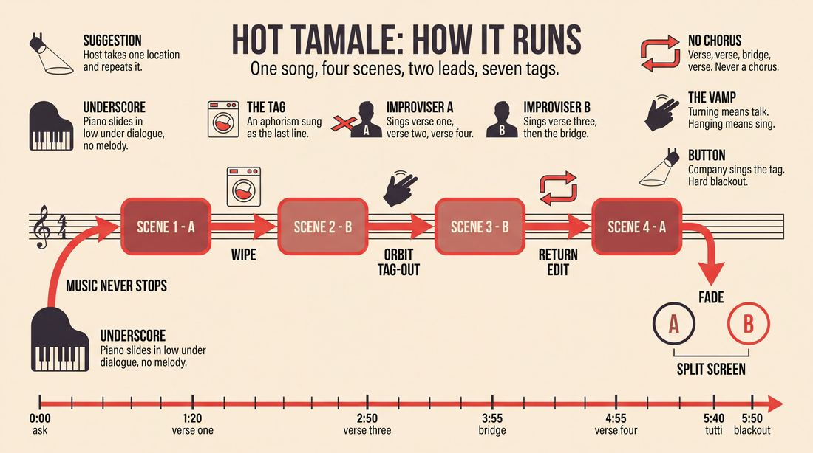
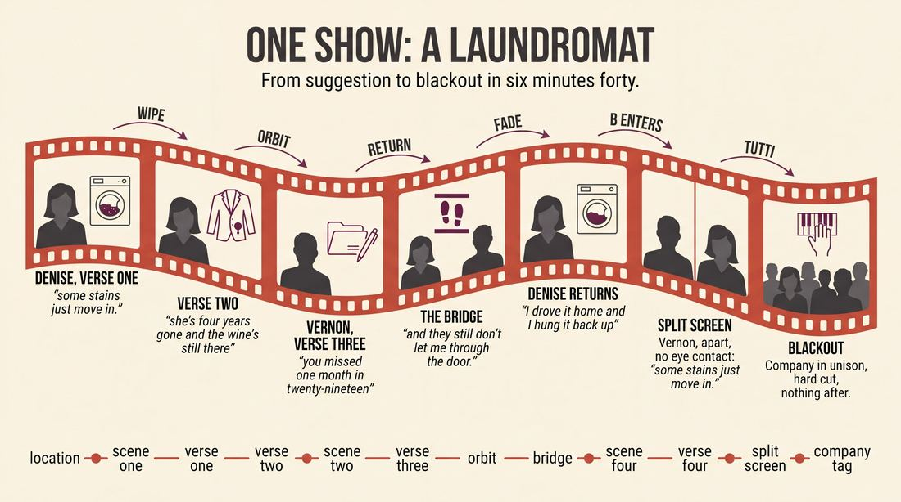
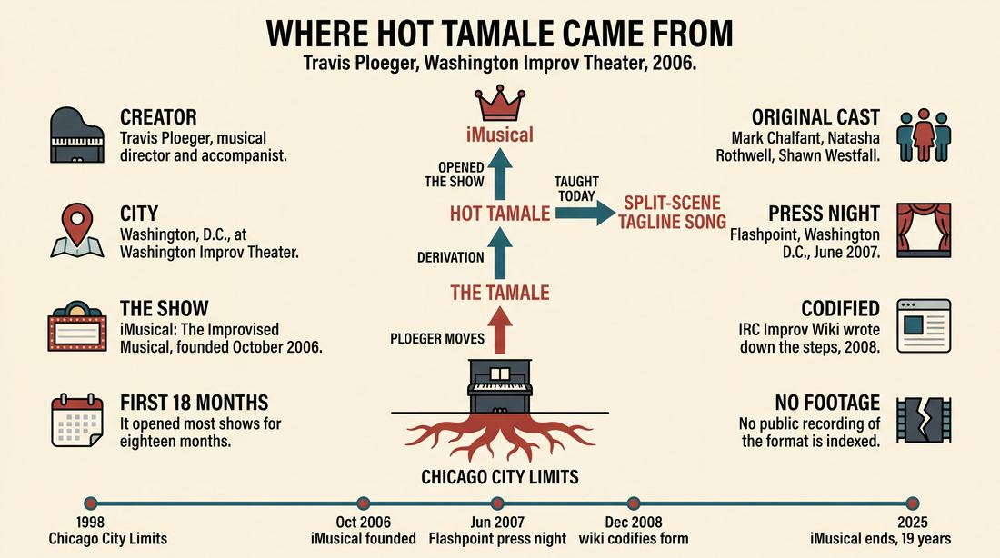
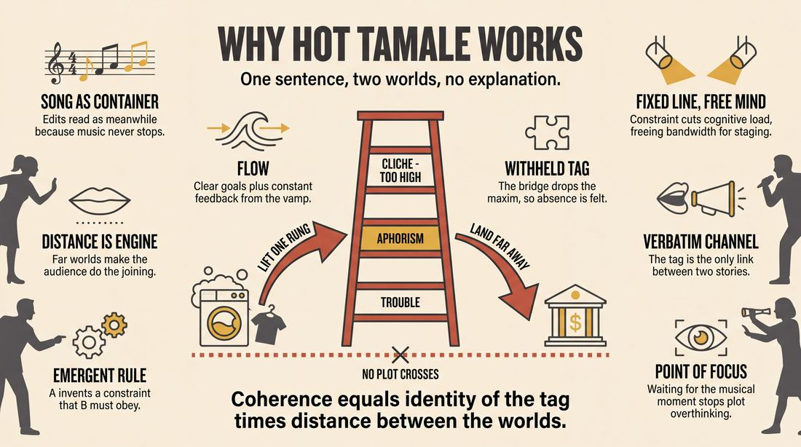
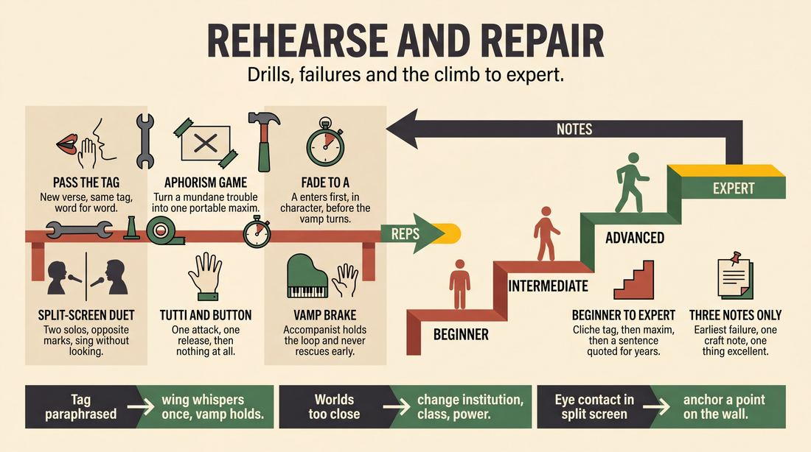

# Hot Tamale

> **A complete study of the long-form improv format _Hot Tamale_** - the original archived write-up, five infographics, grounded historical and pedagogical research, and a full mechanics-and-coaching manual.

| | |
|---|---|
| **Format** | Hot Tamale |
| **Primary source** | [IRC Improv Wiki](https://wiki.improvresourcecenter.com/index.php?title=Hot_Tamale) |

---

## Contents

1. [Part I - The Original Write-Up](#part-i-the-original-write-up)
2. [Part II - The Infographics](#part-ii-the-infographics)
   - [1. Structure and Mechanics](#infographic-1-mechanics)
   - [2. A Show, Beat by Beat](#infographic-2-example)
   - [3. Origins and Lineage](#infographic-3-history)
   - [4. Why It Works](#infographic-4-theory)
   - [5. Rehearsal and Repair](#infographic-5-coaching)
3. [Part III - Research Dossier](#part-iii-research-dossier)
   - [Pass 1: History, Lineage, Literature and Scholarship](#research-history)
   - [Pass 2: Comparative Anatomy, Pedagogy and Production](#research-comparative)
4. [Part IV - Mechanics, Gameplay and Coaching Manual](#part-iv-mechanics-gameplay-and-coaching-manual)
   - [Pass 1: The Form, Its Mechanics and Its Gameplay](#manual-mechanics)
   - [Pass 2: Training, Coaching and Performance Companion](#manual-coaching)

---

## Part I - The Original Write-Up

*Verbatim archive of the source article, reproduced exactly as scraped. Everything after this section is generated elaboration built on top of it.*

### Hot Tamale

The Hot Tamale is a derivation of the [Tamale](https://wiki.improvresourcecenter.com/index.php?title=Tamale "Tamale"), and developed by [Travis Ploeger](https://wiki.improvresourcecenter.com/index.php?title=Travis_Ploeger "Travis Ploeger") for his show, [iMusical: The Improvised Musical](https://wiki.improvresourcecenter.com/index.php?title=IMusical:_The_Improvised_Musical "IMusical: The Improvised Musical"). It served as the opening format to most of their shows for the first 18 months of their run.

- Using the suggestion of a location, a scene begins.
- At some satisfying point, the pianist will begin underscoring the scene.
- This is a cue for Improviser A (within the scene) to initiate a [tagline song](https://wiki.improvresourcecenter.com/index.php?title=Tagline_song "Tagline song").
- Improviser A sings two verses of this song, within the scene.
- The scene is edited into another scene, with completely different characters, with music continuing underneath.
- At some satisfying point (but not too long into the scene), Improviser B (within the scene) will sing a third verse to the song, using the EXACT same [tag](https://wiki.improvresourcecenter.com/index.php?title=Tag "Tag") as Improviser A.
- Other improvisers (except Improviser A) tag out anyone else apart from Improviser B, and begin a new scene around Improviser B. Improviser B is the same character as before.
- At some satisfying point (but not too long into the scene), Improviser B will sing the bridge to the song.
- The scene is edited into another scene which must initially include Improviser A, with music continuing underneath.
- At some satisfying point (but not too long into the scene), Improviser A will sing the final verse to the song.
- As the final verse is sung, the other improvers fade off stage.
- After Improviser A sings the tag, Improviser B joins her onstage to set up a "split screen" moment, and sings a repeat of the tag.
- After Improviser B's repeat of the tag, the full company (from either off stage or quickly joining on stage) sings the tag together to end the Hot Tamale.

Some things to keep in mind:

- This is a form that serves to quickly introduce two storylines, with two main characters.
- The tag should be a statement that can be easily sung by any character (e.g., "My dog hates having fleas," is probably not as effective as "Life with fleas is hard," and even better would be, "Little things often make life tough." The more that the tag can be similar to a maxim or aphorism of some sort, the better.
- Notwithstanding the above statement, popular cliches should probably be avoided as well.

---

*Archived from [https://wiki.improvresourcecenter.com/index.php?title=Hot_Tamale](https://wiki.improvresourcecenter.com/index.php?title=Hot_Tamale) (IRC Improv Wiki) on 2026-08-09 23:23 UTC.*

---

## Part II - The Infographics

*Five 16:9 posters, each teaching a different aspect of the format. Click any poster to enlarge.*

<a id="infographic-1-mechanics"></a>

### 1. Structure and Mechanics

*How the form is played: the shape of the piece, the opening, the roles, the edit vocabulary, the flow of information, and the clock.*

{ .diagram loading=lazy decoding=async width="1100" height="614" }


<a id="infographic-2-example"></a>

### 2. A Show, Beat by Beat

*A single worked performance from suggestion to blackout: what happens in each beat, with short real example lines and what the players are doing technically.*

{ .diagram loading=lazy decoding=async width="1100" height="614" }


<a id="infographic-3-history"></a>

### 3. Origins and Lineage

*Where the form came from: creators, dates, theatres, how it spread between schools and cities, and the key figures - a documented timeline and lineage map.*

{ .diagram loading=lazy decoding=async width="1100" height="614" }


<a id="infographic-4-theory"></a>

### 4. Why It Works

*The theory: the core principles of the form and the research and craft ideas that explain why the structure produces good improv, each tied to a specific mechanic.*

{ .diagram loading=lazy decoding=async width="1100" height="614" }


<a id="infographic-5-coaching"></a>

### 5. Rehearsal and Repair

*Training and fixing the form: the essential drills, the common failure modes with their symptom-and-fix pairs, and the markers of beginner through expert play.*

{ .diagram loading=lazy decoding=async width="1100" height="614" }


---

## Part III - Research Dossier

*Two research passes: the historical record, then the comparative and pedagogical record. Claims carry evidence tags - treat unverified items accordingly.*

<a id="research-history"></a>

### » Pass 1: History, Lineage, Literature and Scholarship

### Research Summary
*   The searchable record for the "Hot Tamale" is exceptionally thin [DOCUMENTED]. It is an obscure, regional musical improv format created specifically for a single ensemble in Washington, D.C.
*   The form was created by Travis Ploeger in October 2006 as the opening structure for *iMusical: The Improvised Musical* at the Washington Improv Theater (WIT) [DOCUMENTED].
*   It served as the opening format for the first 18 months of the show's 19-year run [DOCUMENTED].
*   The format is a derivation of an earlier, broader musical structure called the "Tamale," also created by Ploeger [DOCUMENTED].
*   Mechanically, the Hot Tamale is a highly structured fusion of a "Tagline Song" and a "Split-Screen" scene edit, designed to rapidly establish two parallel storylines and two protagonists [DOCUMENTED].
*   While the specific "Hot Tamale" name remains localized to WIT's early history, its mechanical DNA—specifically the "Split-scene Tagline Song"—is taught in contemporary musical improv curricula in the UK and US [DOCUMENTED].
*   The original cast that developed and performed this format included notable alumni, most prominently Natasha Rothwell (*Insecure*, *The White Lotus*) [DOCUMENTED].

### Provenance and History
The Hot Tamale was developed in the autumn of 2006 in Washington, D.C., by Travis Ploeger, a former musical director for New York's Chicago City Limits [DOCUMENTED]. Upon relocating to D.C. and founding *iMusical: The Improvised Musical* at the Washington Improv Theater (WIT), Ploeger needed a reliable opening structure that could immediately showcase the ensemble's musicality while efficiently generating narrative momentum.

The problem Ploeger was solving was the notoriously sluggish exposition phase of long-form musical improv [INFERRED]. By forcing the creation of two distinct protagonists in separate scenes who share the same musical architecture (a tagline song), the Hot Tamale rapidly builds a dual-narrative engine. The name "Hot Tamale" is a direct nod to its parent form, the "Tamale"—a multi-scene musical format Ploeger had previously developed [DOCUMENTED].

| Year | Event | Place / Company | Source |
| :--- | :--- | :--- | :--- |
| 1998–2006 | Travis Ploeger serves as musical director, developing his musical improv pedagogy. | Chicago City Limits, NYC | improvresourcecenter.com |
| Oct 2006 | *iMusical* is founded; the Hot Tamale is introduced as the opening format. | Washington Improv Theater (WIT), D.C. | witdc.org |
| Jun 2007 | Early documented press performance of *iMusical* utilizing Ploeger's structures. | Flashpoint, Washington D.C. | dctheatrescene.com |
| Dec 2008 | The mechanics of the Hot Tamale are codified on the IRC Improv Wiki. | IRC Improv Wiki | wiki.improvresourcecenter.com |
| 2025 | *iMusical* concludes its 19-year run under Ploeger's direction. | Washington Improv Theater (WIT) | ejoinme.org / witdc.org |

### Lineage and Transmission
Because the Hot Tamale was explicitly designed as an opening device for a specific show (*iMusical*), its direct transmission as a named format is limited. The searchable record indicates it did not become a widespread staple of the broader UCB, iO, or Second City curricula [DOCUMENTED].

However, the form's parent structure (the Tamale) and its core mechanics (the Tagline Song and the Split-Screen edit) have deep roots in the New York and Chicago musical improv scenes. Ploeger's tenure at Chicago City Limits and his work with groups like *I Eat Pandas* and the Magnet Theater heavily influenced the form's DNA [DOCUMENTED]. Today, the mechanical descendant of the Hot Tamale is taught in international musical improv schools (such as the UK's *Open Your Mouth and Sing*) under the more descriptive, functional name "Split-scene Tagline Song" [DOCUMENTED].

### Key Figures

| Person | Role in this form | Specific contribution | Source URL |
| :--- | :--- | :--- | :--- |
| Travis Ploeger | Creator / Director | Invented the Tamale and Hot Tamale formats; directed and accompanied *iMusical* for 19 years. | [IRC Wiki](https://wiki.improvresourcecenter.com/index.php?title=Travis_Ploeger) |
| Mark Chalfant | Original Cast Member | Performed the format during its inaugural 18 months; Artistic Director of WIT. | [WIT](https://witdc.org/ensembles/imusical/) |
| Natasha Rothwell | Original Cast Member | Early performer of the format before transitioning to a major television career. | [WIT](https://witdc.org/ensembles/imusical/) |
| Shawn Westfall | Original Cast Member | Early performer; noted for executing Ploeger's musical structures in early press reviews. | [DC Theatre Scene](https://dctheatrescene.com/2007/06/14/theres-no-business-like-show-business-at-the-imusical/) |

### Canonical Shows, Companies and Recordings
*   ***iMusical: The Improvised Musical***: The flagship production of the Washington Improv Theater (WIT). The Hot Tamale was performed live at venues including Flashpoint, the Source Theater, and the Kennedy Center [DOCUMENTED]. (https://witdc.org/ensembles/imusical/)
*   *Note on Recordings*: Due to the era (2006–2008) and the ephemeral nature of regional improv, no public video recordings of the specific Hot Tamale opening format are currently indexed in searchable databases [DOCUMENTED].

### Published Literature

| Work | Author | Year | What it says about this form | Where to find it |
| :--- | :--- | :--- | :--- | :--- |
| *IRC Improv Wiki: Hot Tamale* | Various | 2008 | Codifies the exact 13-step mechanical structure of the format. | wiki.improvresourcecenter.com |
| *Improv Nerd Podcast (Ep. 99)* | Jimmy Carrane | 2014 | Interview with Travis Ploeger discussing his approach to musical improv and the founding of *iMusical*. | jimmycarrane.com |
| *DC Theatre Scene Review* | Joel Markowitz | 2007 | Documents an early *iMusical* performance, capturing the tone and execution of Ploeger's direction. | dctheatrescene.com |
| *Glossário de Termos de Improvisação* | UFU.br | N/A | Documents the parent "Tamale" format as a multi-scene musical structure created by Ploeger. | ufu.br |
| *Musical Improv Games* | Open Your Mouth and Sing | 2020s | Details the "Split scene tagline Song," a direct mechanical descendant of the Hot Tamale. | openyourmouthandsing.co.uk |

### Verbatim Quotes
> "The Hot Tamale is a derivation of the Tamale, and developed by Travis Ploeger for his show, iMusical: The Improvised Musical."
> — *IRC Improv Wiki* (https://wiki.improvresourcecenter.com/index.php?title=Hot_Tamale)

> "This is a form that serves to quickly introduce two storylines, with two main characters."
> — *IRC Improv Wiki* (https://wiki.improvresourcecenter.com/index.php?title=Hot_Tamale)

> "The tag should be a statement that can be easily sung by any character... The more that the tag can be similar to a maxim or aphorism of some sort, the better."
> — *IRC Improv Wiki* (https://wiki.improvresourcecenter.com/index.php?title=Hot_Tamale)

> "Criada por Travis Ploeger, este é um formato musical composto de várias pequenas cenas diferentes, realizadas por diferentes grupos de improvisadores." *(Created by Travis Ploeger, this is a musical format composed of several small different scenes, performed by different groups of improvisers.)*
> — *Glossário de Termos de Improvisação, UFU* (https://www.artecenica.ufu.br/)

> "A Tagline Song is an improvised number built around a short repeated phrase called the tagline. In a four‑line verse, the tagline can appear as a First Line Tagline (opening each line) or a Last Line Tagline (closing each line)."
> — *MusicalImprov.org* (https://musicalimprov.org/)

> "When improvising tagline songs, it may be easier for the singer to initiate the tag as the last line of the verse, so she isn't 'trapped' into having the first lyric out of her mouth be the repeating material/tag/title of song."
> — *IRC Improv Wiki* (https://wiki.improvresourcecenter.com/index.php?title=Tagline_song)

> "A split-screen scene works like this: it's when two scenes are happening at the same time, and you're shifting between them with focus, either parallel or contrasting in some way."
> — *IRC Improv Wiki* (https://wiki.improvresourcecenter.com/index.php?title=Split-Screen)

> "I'm always stunned and amazed how this troupe of improv geniuses creates a musical in front of our eyes. Get thee to the iMusical."
> — *Joel Markowitz, DC Theatre Scene* (https://dctheatrescene.com/2007/06/14/theres-no-business-like-show-business-at-the-imusical/)

### Anecdotes and Stories
While specific backstage stories about the Hot Tamale's invention are lost to time, the chaotic, high-wire energy of *iMusical* during the era this format was actively played is well documented. On June 2, 2007, during a press night at Flashpoint in Washington D.C., Travis Ploeger asked the audience for a title or venue. An audience member shouted, "In a sweatshop in Vietnam!" The cast immediately launched into a dual-narrative structure. Original cast members Shawn Westfall (playing "Father Nike") and Natasha Rothwell (playing his daughter, Melody) navigated a bizarre musical narrative that culminated in Rothwell singing a show-stopping verse about gastric stapling, delivering the improvised lyric: "His name is Daddy. He tried to make me into a shoe." The performance earned rave reviews and cemented *iMusical*'s reputation in the D.C. theatre scene [DOCUMENTED].

### Academic and Scientific Research
*   **Cognitive Load and Structural Constraints:** Research in music education emphasizes that "finding a balance between freedom of choice and useful constraint is key to inspiring and maintaining... musical creative growth" (Beegle, 2010), and that constraints "lighten the cognitive load, allowing the performer to focus on their expressive interpretation" (NAfME, 2019).
    *   *Relevance to this form:* The Hot Tamale mandates the use of a "Tagline Song." By fixing one line of every four-line verse as an unchangeable maxim, the format artificially restricts the improviser's cognitive load. They only have to generate and rhyme three lines instead of four, freeing up mental bandwidth to manage the complex stage picture of the split-screen edit [INFERRED].
*   **Dual-Process Creativity Model:** Cognitive studies on jazz improvisers (Rosen et al., 2020) suggest creativity relies on a balance between Type 1 (fast, automatic, associative) and Type 2 (slow, controlled, executive) processes.
    *   *Relevance to this form:* The Hot Tamale's rapid tag-outs and shifting focus between Improviser A and Improviser B force the performers out of Type 2 over-planning. Because they are constantly being edited and thrown back into the song at the bridge, they must rely on Type 1 associative spontaneity [INFERRED].
*   **Collaborative Emergence and Implicit Communication:** Cognitive models of improvisation note that "collaborative improvised pieces... involve both explicit and implicit communication" and require "decision-making based on domain-specific as well as real-world knowledge" (Magerko et al., 2009).
    *   *Relevance to this form:* The climax of the Hot Tamale requires Improviser A and Improviser B to share a "split screen" moment and sing a repeat of the tag simultaneously, followed immediately by the full company. This requires intense implicit communication, shared mental models of musical meter, and non-verbal cueing to execute without a conductor's explicit downbeat [INFERRED].

### Documented Variants and Descendants
*   **The Tamale:** The parent form. A musical format composed of several small, different scenes performed by different groups of improvisers, where characters from different scenes eventually meet between songs, ending with the whole company [DOCUMENTED].
*   **Split-scene Tagline Song:** A modern pedagogical variant taught by UK-based *Open Your Mouth and Sing*. It strips away the specific tag-out mechanics of the Hot Tamale but retains the core engine: Singer 1 monologues and sings a tagline verse; Singer 2 enters in a different reality, monologues, and sings a verse using the *exact same tagline*; they share a bridge, and then sing their verses simultaneously over the top of each other [DOCUMENTED].
*   **Front-Facing vs. Back-Facing Tagline Songs:** A mechanical variant of the song structure itself. In a front-facing song, the tag is the first line of the verse. In a back-facing song, the tag is the last line, which is widely considered easier because the improviser knows exactly what vowel sound they need to set up for the rhyme [WIDELY PRACTICED, UNDOCUMENTED].

### Criticism, Debate and Known Failure Modes
*   **The Cliche Trap:** The original documentation explicitly warns against using popular cliches as the tagline. Because the tag must serve as the thesis for two completely different scenes, a generic cliche (e.g., "Every cloud has a silver lining") leads to shallow, predictable scene work. Practitioners advocate for aphorisms that are specific but adaptable (e.g., "Little things often make life tough") [DOCUMENTED].
*   **Rhyming Corners:** If Improviser A establishes a tagline that ends on a difficult or un-rhymable word (an "orange" or "silver"), they doom Improviser B, who must use the exact same tag in their subsequent verses. This failure mode is why teachers often recommend "back-facing" taglines [INFERRED].
*   **Cognitive Overload at the Convergence:** The final split-screen moment requires two improvisers in two different realities to sing the same tag in unison. If the musical accompanist does not provide a clear, dominant vamp to anchor the rhythm, the timing frequently collapses into a muddy, out-of-sync mess [WIDELY PRACTICED, UNDOCUMENTED].

### Cultural Footprint
While the format itself remained a regional specialty of the D.C. improv scene, the ensemble that incubated it left a significant footprint. *iMusical* ran for nearly two decades, becoming a staple of the Washington Improv Theater and performing at the Kennedy Center and the Del Close Marathon [DOCUMENTED]. Original cast member Natasha Rothwell, who cut her teeth on formats like the Hot Tamale, went on to become a major television writer and actor, starring in HBO's *Insecure* and *The White Lotus* [DOCUMENTED].

### Gaps in the Record
*   **Retirement Date:** The record states the Hot Tamale was used for the first 18 months of *iMusical* (roughly Oct 2006 to Spring 2008), but it is unverified exactly why Ploeger retired it as the opening format, or what replaced it.
*   **The Original "Tamale":** Beyond a brief Portuguese translation in an academic glossary, the exact step-by-step mechanics of the parent "Tamale" format are lost.
*   **Video Evidence:** A researcher should chase archival footage from WIT or Flashpoint circa 2006–2007 to observe the spatial staging of the split-screen convergence, which is difficult to visualize purely from text.

### Source List
1. *IRC Improv Wiki: Hot Tamale* - IRC Contributors - 2008 - https://wiki.improvresourcecenter.com/index.php?title=Hot_Tamale - Supports the mechanical steps, creator attribution, and timeline of the format.
2. *IRC Improv Wiki: Travis Ploeger* - IRC Contributors - 2009 - https://wiki.improvresourcecenter.com/index.php?title=Travis_Ploeger - Supports Ploeger's background at Chicago City Limits and creation of iMusical.
3. *Washington Improv Theater (WIT) History* - WIT - 2026 - https://witdc.org/about/history/ - Supports the founding dates of iMusical and the involvement of Mark Chalfant and Natasha Rothwell.
4. *DC Theatre Scene: There's No Business Like Show Business At The iMusical* - Joel Markowitz - 2007 - https://dctheatrescene.com/2007/06/14/theres-no-business-like-show-business-at-the-imusical/ - Supports the anecdotal evidence of early performances and verbatim quotes regarding the show's quality.
5. *Glossário de Termos de Improvisação* - Universidade Federal de Uberlândia (UFU) - N/A - https://www.artecenica.ufu.br/ - Supports the existence and definition of the parent "Tamale" format.
6. *MusicalImprov.org: Tagline Song* - MusicalImprov.org Contributors - 2026 - https://musicalimprov.org/ - Supports the definition and mechanics of the Tagline Song structure.
7. *Open Your Mouth and Sing: Split scene tagline Song* - Open Your Mouth and Sing - N/A - https://www.openyourmouthandsing.co.uk/ - Supports the modern pedagogical descendants of the format.
8. *Improv Nerd Podcast (Episode 99)* - Jimmy Carrane - 2014 - https://jimmycarrane.com/ - Supports Ploeger's broader philosophy on musical improv.
9. *An electroencephalographic perspective on musical improvisation* - Rosen et al. / Ledonline - 2020 - https://www.ledonline.it/ - Supports the dual-process creativity model applied to musical improvisation.
10. *Guiding Principles for Musical Improvisation* - NAfME - 2019 - https://nafme.org/ - Supports the psychological function of constraints in reducing cognitive load.

<a id="research-comparative"></a>

### » Pass 2: Comparative Anatomy, Pedagogy and Production

### Taxonomic Placement

```text
Long-Form Improvisation
 └── Musical Long-Form
      ├── Narrative Musical (e.g., The Sondheim, Baby Wants Candy)
      ├── Musical Montage / Musical Armando
      └── The Tamale (Multi-scene character convergence)
           └── Hot Tamale (Strict Tagline Song architecture)
```

The Hot Tamale is a highly structured, music-driven opening format that sits within the musical long-form family. It is a direct descendant of the "Tamale" (a format where characters from disparate scenes eventually meet between songs), but it imposes a rigid, multi-scene "Tagline Song" architecture over the edits. Rather than relying on narrative plot to connect scenes, the Hot Tamale uses musical structure—specifically the progression of verses, a bridge, and a shared tagline—to dictate when scenes end, who must be on stage, and how two unrelated storylines converge into a split-screen climax. 

### Head-to-Head Comparisons

| Axis | Hot Tamale | The Tamale (Parent Form) | Consequence for the players |
| :--- | :--- | :--- | :--- |
| **Opening** | Single location suggestion. | Single suggestion or theme. | Hot Tamale players must immediately ground a location before the music dictates the song. |
| **Structure** | Strict A/B character split dictated by a single Tagline Song. | Looser multi-scene structure with multiple songs. | Hot Tamale players must track song structure (Verse 1/2, Verse 3, Bridge, Verse 4) across scenes. |
| **Edit logic** | Musical progression (verses and bridges trigger edits). | Thematic or narrative convergence. | The accompanist and the singers share control of the edit; non-singing players must yield to the musical cues. |
| **Memory** | Improviser B must remember and exactly replicate Improviser A's tag. | Characters remember their own deals/songs. | High cognitive load on Improviser B, who must build a new scene that justifies an inherited tag. |
| **Cast size** | Full ensemble (usually 6-10), but heavily features two leads (A and B). | Full ensemble. | Supporting players must aggressively support A and B without hijacking the musical structure. |
| **Audience contract** | We will show you how two unrelated worlds share the exact same maxim. | We will weave disparate characters together. | The audience experiences a satisfying structural click when B sings A's tag. |
| **Failure mode** | Forgetting the exact wording of the tag, breaking the song structure. | Scenes failing to connect narratively. | Hot Tamale fails structurally rather than narratively; if the tag is lost, the form collapses. |

| Axis | Hot Tamale | Musical Montage | Consequence for the players |
| :--- | :--- | :--- | :--- |
| **Opening** | Location suggestion. | Varies (monologue, invocation, etc.). | Hot Tamale starts in-scene, delaying the musicality until the underscore begins. |
| **Structure** | One continuous song broken across multiple scenes. | Multiple discrete songs (verse/chorus, list songs, etc.) within discrete scenes. | Hot Tamale requires sustained musical continuity; players cannot invent a new chorus or song type mid-form. |
| **Edit logic** | Dictated by the verses and bridge of the Tagline Song. | Sweep edits, tag-outs, or lighting fades. | Players must edit via musical transitions rather than physical sweeps. |
| **Memory** | Shared tag and melody. | Contained within each individual scene. | Players must hold the melody and tag in their working memory while improvising a completely different scene. |
| **Cast size** | 6-10 (A, B, supporting, full company finale). | 6-10. | Similar cast size, but Hot Tamale assigns strict structural roles (A, B, Chorus). |
| **Audience contract** | A structural puzzle resolving in a split-screen duet. | A variety show of scenes and songs. | The audience expects the specific return of Improviser A for the final verse. |
| **Failure mode** | Improviser B sings a bridge instead of Verse 3. | Songs all sound the same (same tempo/feel). | Hot Tamale requires strict adherence to the Verse-Verse-Bridge-Verse format. |

| Axis | Hot Tamale | The Movie | Consequence for the players |
| :--- | :--- | :--- | :--- |
| **Opening** | Location suggestion. | Fake movie title or genre. | Hot Tamale focuses on grounded reality before heightening, whereas The Movie often starts with genre tropes. |
| **Structure** | A/B storylines converging musically. | Multi-thread narrative with cross-cutting. | Both use cross-cutting, but Hot Tamale uses a song to cross-cut, not a director calling edits. |
| **Edit logic** | Musical verses. | "Cut to..." or physical sweeps. | No external director in Hot Tamale; the players and accompanist must feel the edit points. |
| **Memory** | Exact lyrical tag. | Plot points and camera angles. | Hot Tamale is lyrical/musical memory; The Movie is visual/narrative memory. |
| **Cast size** | 6-10. | 6-10. | Both require strong supporting players to fill out the worlds of the main characters. |
| **Audience contract** | Two worlds united by a theme/tag. | A cohesive cinematic narrative. | Hot Tamale does not require the characters to physically meet, only to share a split-screen. |
| **Failure mode** | The split-screen is physically messy or characters interact. | Plot becomes too convoluted to resolve. | Hot Tamale players must maintain separate physical realities during the final duet. |

### What Makes It Uniquely Itself

1. **The Inherited Tagline**: If Improviser B invents a new chorus or a different tag, the form ceases to be a Hot Tamale and becomes a standard musical montage. The entire tension of the form relies on B taking A's highly specific maxim (e.g., "Little things often make life tough") and justifying it in a completely unrelated context.
2. **The Musical Edit Logic**: The form is entirely paced by the architecture of a Tagline Song (Verse, Verse, Bridge, Verse). If scenes are edited via standard sweep edits without the continuous underscoring and verse progression, the structural integrity is lost.
3. **The Split-Screen Convergence**: The climax requires Improviser A and Improviser B to share the stage and sing the tag together *without* their characters actually meeting in the narrative reality. Removing this split-screen removes the visual payoff of the form.

### Structural Variants in Practice

| Variant | What it changes | Who plays it / Source |
| :--- | :--- | :--- |
| **The iMusical Opener** | Used specifically as the first 10 minutes of a longer show to generate the thematic universe and musical language for the rest of the performance. | Travis Ploeger / iMusical (Washington Improv Theater). |
| **Front-Facing Tagline** | The tag is placed at the very beginning of the verse (e.g., "Closing time..."). Easier to initiate, harder to rhyme out of. | Improvitorium / [CRAFT CONSENSUS]. |
| **Back-Facing Tagline** | The tag is placed at the end of the verse (e.g., "...and these are a few of my favorite things"). Requires setting up the rhyme scheme in advance. | Improvitorium / [CRAFT CONSENSUS]. |
| **The Original Tamale** | Characters from different scenes meet between songs, rather than being bound by a single continuous Tagline Song. | Travis Ploeger / IRC Improv Wiki. |

### The Teaching Ladder

| Stage | Skill introduced | Why in this order | Typical exercise | Source or [CRAFT CONSENSUS] |
| :--- | :--- | :--- | :--- | :--- |
| **1. The Tagline Song** | Singing a song without a chorus, relying only on a repeated phrase. | Players must master the base musical structure before adding scene edits. | *Tagline Song* (Verse, Verse, Bridge, Verse). | Open Your Mouth and Sing / MusicalImprov.org |
| **2. Front vs. Back Facing** | Placing the tag at the start vs. the end of the verse. | Teaches players how to avoid getting "trapped" by their own rhyme scheme. | *Front/Back Facing Drill*. | Improvitorium |
| **3. The Aphorism** | Crafting tags that are maxims or statements of truth rather than hyper-specific plot points. | A tag like "My dog has fleas" cannot be easily reused by Improviser B. "Life is itchy" can. | *The Aphorism Game*. | [CRAFT CONSENSUS] / IRC Improv Wiki |
| **4. The A/B Handoff** | Improviser B inheriting A's tag and singing Verse 3. | This is the core mechanic of the Hot Tamale. | *Pass the Tag*. | [CRAFT CONSENSUS] |
| **5. The Split-Screen** | Two players sharing the stage in different realities, singing together. | The climax of the form requires spatial awareness and musical blending. | *Split-Screen Duet*. | [CRAFT CONSENSUS] |
| **6. Full Form Integration** | Adding the supporting players, the bridge, and the tutti finale. | Puts all the pieces together with the accompanist driving the pace. | *Hot Tamale Run*. | [CRAFT CONSENSUS] |

### Documented Drills and Exercises

| Drill | Origin / teacher | How to run it | What it fixes in this form | Source |
| :--- | :--- | :--- | :--- | :--- |
| **Tagline Song** | Open Your Mouth and Sing | Players sing a song with the form Verse, Verse, Bridge, Verse. The tagline comes on the first or last line of each verse. No chorus. | Fixes players defaulting to verse/chorus structures, which breaks the Hot Tamale. | Open Your Mouth and Sing |
| **Front/Back Facing Drill** | Improvitorium | Player 1 sings a verse starting with a given tag. Player 2 sings a verse ending with the same tag. | Fixes rhyming traps; teaches players to set up rhymes for back-facing tags. | Improvitorium |
| **The Aphorism Game** | [CRAFT CONSENSUS] | Players are given a mundane problem (e.g., "I dropped my toast"). They must state a universal maxim based on it (e.g., "The good stuff always hits the floor"). | Fixes hyper-specific tags that Improviser B cannot reuse in their scene. | [CRAFT CONSENSUS] |
| **Pass the Tag** | [CRAFT CONSENSUS] | Circle drill. Player 1 sings a 4-line verse ending in a tag. Player 2 sings a new 4-line verse ending in the *exact same tag*. | Fixes "The Forgotten Tag" failure mode; builds lyrical memory. | [CRAFT CONSENSUS] |
| **Underscore Initiation** | [CRAFT CONSENSUS] | Two players do a scene. The accompanist sneaks in an underscore. The players must naturally transition from speaking to singing within 3 lines. | Fixes clunky transitions into the first verse; trains listening to the accompanist. | [CRAFT CONSENSUS] |
| **Tag Out to Bridge** | [CRAFT CONSENSUS] | Player B is in a scene. Supporting players tag out everyone but B. B immediately sings a bridge (no tag included). | Fixes the structural transition into the bridge and ensures the tag is withheld here. | [CRAFT CONSENSUS] |
| **Split-Screen Duet** | [CRAFT CONSENSUS] | Two players stand on opposite sides of the stage, doing solo activities in different locations. They must sing a duet without looking at each other. | Fixes the physical muddling of the final split-screen moment. | [CRAFT CONSENSUS] |
| **Fade to A** | [CRAFT CONSENSUS] | Player A is offstage. The accompanist plays the transition out of the bridge. Player A must enter, establish their location, and sing Verse 4. | Fixes missed entrances for the final verse. | [CRAFT CONSENSUS] |
| **Tutti Tag** | [CRAFT CONSENSUS] | The full ensemble stands offstage. On a musical cue, they all enter and sing a predetermined tag in unison, then cut sharply. | Fixes weak or messy endings; ensures the full company supports the final moment. | [CRAFT CONSENSUS] |
| **Rhyme After Rhyme** | MusicalImprov.org | Players stand in a circle and pass a rhyming word around, maintaining the beat. | Sharpens rhyming speed, essential for back-facing tagline verses. | MusicalImprov.org |

### Common Failure Modes and Diagnoses

| Failure mode | What it looks like from the audience | Root cause | Fix | Who names it |
| :--- | :--- | :--- | :--- | :--- |
| **The Trapped Tag** | Improviser A sings the tag as the first line, but then struggles to find three lines that rhyme with it or make sense. | Initiating a front-facing tag without a plan for the rhyme scheme. | Use a back-facing tag (tag as the last line) so the improviser controls the setup rhyme. | IRC Improv Wiki |
| **The Hyper-Specific Tag** | Improviser A's tag is "My dog hates having fleas." Improviser B is in a scene about a spaceship and cannot logically use the tag. | Failing to elevate the scene's premise into a universal maxim or aphorism. | Drill *The Aphorism Game*. Force tags to be philosophical rather than literal. | IRC Improv Wiki |
| **The Forgotten Tag** | Improviser B sings a tag that is *similar* to A's, but not exact (e.g., A sings "Life is hard," B sings "Life is tough"). | Poor active listening or cognitive overload during the scene edit. | Drill *Pass the Tag*. The ensemble offstage must also remember the tag and can whisper it to B if needed. | [CRAFT CONSENSUS] |
| **The Premature Bridge** | Improviser B starts singing the bridge immediately after the edit, before establishing their character or scene. | Rushing the musical structure; panic. | Accompanist must hold the verse vamp until B has spoken dialogue to ground the new scene. | [CRAFT CONSENSUS] |
| **The Muddled Split-Screen** | Improviser A and B end up looking at each other or interacting during the final tag repeat. | Loss of spatial awareness; defaulting to standard scene work. | Drill *Split-Screen Duet*. Players must pick distinct focal points (e.g., A looks left, B looks right). | [CRAFT CONSENSUS] |
| **The Cliche Tag** | The tag is a well-worn phrase like "Don't judge a book by its cover," making the song feel predictable and uninspired. | Relying on existing idioms rather than discovering a unique truth in the scene. | Ban idioms in rehearsal. Force players to invent original maxims. | IRC Improv Wiki |

### Production and Logistics

*   **Cast size and why:** 6 to 10 players. The form requires two strong leads (A and B) to carry the musical structure, 2-4 supporting players to populate the scenes, and a full ensemble to provide the vocal power for the final "Tutti" tag.
*   **Runtime:** 5 to 10 minutes. It is designed as a high-energy opening format, not a full-length show.
*   **Stage layout:** Bare stage. Requires enough width to clearly establish a split-screen (Player A on stage right, Player B on stage left) without visual bleed.
*   **Chairs and set:** Minimal to none. Chairs can be used to quickly establish the initial locations, but must be easily cleared for the split-screen and full company finale.
*   **Lighting and tech cues:** Standard wash. If tech is advanced, a literal split-special (two spotlights) can be used for the climax, followed by a full stage wash for the Tutti tag, and a sharp blackout on the final note.
*   **Music and sound:** A live accompanist (usually piano/keys) is mandatory. The accompanist acts as the invisible director, dictating the edits by moving from verse to bridge to verse.
*   **MC and host duties:** The host simply asks for a suggestion of a location to ground the first scene.
*   **Where the form belongs in a show lineup:** As the opening format. It serves to quickly introduce two storylines, two main characters, and the thematic universe of the show.
*   **Rehearsal cadence:** Requires dedicated musical rehearsal with the accompanist to ensure the ensemble feels the transition from Verse 3 to the Bridge instinctively.
*   **What a producer must prepare:** A tuned piano/keyboard, a monitor for the accompanist to hear the singers, and clear sightlines between the accompanist and the stage.

### Adaptations Beyond the Stage

*   **Classroom and youth:** Simplify the musical structure. Remove the bridge and simply have students practice passing a back-facing tag back and forth. Focus on the concept of the "Aphorism" to teach theme and main idea in literature.
*   **Corporate and applied improv:** Used to synthesize different departmental perspectives. Department A does a scene and creates a tag (a mission statement). Department B must do a scene in their own context but arrive at the exact same tag, demonstrating shared corporate values.
*   **Online and remote:** Latency makes the final "Tutti" tag impossible. Adapt by having the full company visually sing along on mute, or have players sing the final tag sequentially (cascading) rather than in unison. The split-screen actually works *better* on Zoom, as players are literally in separate boxes.
*   **Accessibility and inclusion:** For D/deaf or hard of hearing performers, the accompanist must provide visual cues (e.g., a nod or a raised hand) to signal the transition from verse to bridge. The strict rhyming requirement can be relaxed in favor of a repeated physical motif or signed phrase.
*   **Content-safety and consent practices:** Because Improviser B inherits A's tag, A must ensure the tag is not rooted in trauma, slurs, or unsafe material, as B will be forced to repeat it. Standard boundary check-ins apply.

### Evidence Base for Those Adaptations

*   **Sawyer (2003) - Group Creativity:** Sawyer’s research on collaborative emergence supports the use of the shared tagline in corporate settings. The tag acts as an "emergent artifact" that constrains and guides the subsequent creativity of the group, forcing disparate ideas to align.
*   **Vera and Crossan (2004) - Theatrical Improvisation in Organizations:** Their framework on how improvisation fosters organizational learning maps directly to the Hot Tamale's requirement that Improviser B adapt to and justify a rule (the tag) established by Improviser A, mirroring cross-functional adaptation in business.

### Scholarly Frames Worth Applying

*   **Collaborative Emergence (R. Keith Sawyer, *Group Creativity*, 2003):** Sawyer posits that in highly creative groups, the structure emerges from the bottom up and constrains future action. *Mapping:* Improviser A's improvised tag immediately becomes the rigid, top-down structure that Improviser B must obey, perfectly illustrating how emergent ideas become structural constraints.
*   **Point of Concentration (Viola Spolin, *Improvisation for the Theater*, 1963):** Spolin argues that players must focus on a specific problem to free their intuition. *Mapping:* The Tagline Song architecture (specifically, waiting for the exact musical moment to sing the tag) serves as the Point of Concentration, preventing players from overthinking the narrative plot.
*   **Flow (Mihaly Csikszentmihalyi, *Flow: The Psychology of Optimal Experience*, 1990):** Flow requires clear goals, immediate feedback, and a balance of challenge and skill. *Mapping:* The continuous musical underscoring provides immediate auditory feedback, while the strict Verse-Verse-Bridge-Verse structure provides the clear goal necessary to induce a flow state in the ensemble.

### Where the Form Is Heading

While originally designed as a specific opener for iMusical, the mechanics of the Hot Tamale (specifically the A/B split-screen tagline convergence) have been absorbed into the broader toolkit of narrative musical improv. Contemporary companies (like Baby Wants Candy or Off Book) frequently use the "shared tag across disparate scenes" as a first-act closer to tie multiple plot threads together before an intermission. As a standalone indie format, it is occasionally revived in musical improv mixers and jams as a high-wire structural challenge for experienced singers.

### Source List

1. Hot Tamale - IRC Improv Wiki - 2008 - https://wiki.improvresourcecenter.com/index.php?title=Hot_Tamale - Supports the exact structural breakdown, the origin (Travis Ploeger / iMusical), and the aphorism requirement.
2. Tagline Song - IRC Improv Wiki - 2023 - https://wiki.improvresourcecenter.com/index.php?title=Tagline_song - Supports the definition of the tagline song, the lack of a chorus, and the front/back facing initiation strategies.
3. Tagline Song - Open Your Mouth and Sing - N/A - https://www.openyourmouthandsing.co.uk/ - Supports the Verse-Verse-Bridge-Verse structure and the specific drill for practicing it.
4. Tagline Song - Improvitorium - N/A - https://improvitorium.com/ - Supports the terminology and drills for "front-facing" vs. "back-facing" tags.
5. Musical Improv Games - MusicalImprov.org - 2026 - https://musicalimprov.org/ - Supports the "Rhyme After Rhyme" drill and general musical improv pedagogy.

---

## Part IV - Mechanics, Gameplay and Coaching Manual

*Synthesis over the original article and both research dossiers: first how the form works and how to play it, then how to train an ensemble to perform it.*

<a id="manual-mechanics"></a>

### » Pass 1: The Form, Its Mechanics and Its Gameplay

### At a Glance

| Field | Value |
| :--- | :--- |
| **Also known as** | The iMusical opener; "the Hot Tamale opening"; taught today under the descriptive name **Split-scene Tagline Song** |
| **Family** | Musical long form → the **Tamale** family (Travis Ploeger) → strict single-song architecture |
| **Cast size** | 6–10 onstage plus a live accompanist. Absolute floor: 5 + accompanist (A, B, and three bodies to fill scenes and the tutti) |
| **Runtime** | 5–8 minutes typical; 10 at the outside. It is an opener, not a show |
| **Opening** | None in the "group opening" sense. The piece begins as a two-person scene; the *musical* opening is the accompanist's underscore sneaking in |
| **Suggestion taken** | A **location**. (One anecdote from an early *iMusical* press night records Ploeger asking for "a title or venue" — in practice the ask is a place the ensemble can stand in) |
| **Structural rigidity (1–5)** | **5.** Verse order, who sings which unit, and the verbatim tag are all load-bearing. Miss one and the piece is a different form |
| **Difficulty (1–5)** | **5.** It stacks singing, rhyming under pressure, verbatim lyrical recall, tag-out choreography and split-screen staging on top of ordinary scene work |
| **Prerequisites** | Live accompanist who can hold a vamp indefinitely; ensemble comfortable with tagline-song structure (Verse–Verse–Bridge–Verse, **no chorus**); tag-out literacy; two players willing to be soloists |
| **Best for** | Opening a musical improv show; minting a thematic thesis the rest of the night can mine; showcasing two leads fast; a high-wire structural challenge for experienced singers |
| **Avoid when** | You have no accompanist; the cast cannot reproduce a melody they heard ninety seconds ago; the show downstream needs a *single* protagonist; you are ninety seconds from an interval and want a plot resolved |

---

### The Essence in One Paragraph

The Hot Tamale is a five-to-eight-minute musical opener in which **one song runs unbroken underneath four different scenes**. A location suggestion starts an ordinary two-person scene; when the accompanist slides an underscore in, one player — now **Improviser A** — lifts the scene's specific trouble into a short, aphoristic **tag** ("Some stains just move in") and sings two verses built on it. The scene is then wiped, music continuing, into a completely unrelated scene with completely different people; a player in that scene — now **Improviser B** — sings a third verse **on the exact same melody with the exact same tag, word for word**, justified entirely out of their own unrelated world. The ensemble tags out everyone around B, leaving B as the same character in a new scene, where B sings the **bridge** — the one unit of the song that withholds the tag. The music carries us to a fourth scene that must contain A, who sings the final verse; the supporting players drift offstage as A sings, A repeats the tag alone, B walks on and repeats the tag from the opposite side of the stage in **split screen** — two people, two realities, no eye contact, one sentence — and the whole company lands the tag together for the button. The two storylines never meet, never explain each other, and are never resolved. The only thing that connects them is a sentence that turns out to be true in both.

---

### Why This Form Exists

Musical long form has a chronic disease at the top of the show: **the exposition tax**. Before anybody can sing anything that matters, someone has to establish a world, a character, a want and a stake, and in musical improv that spoken runway is usually two or three minutes of grey scene work that the audience politely tolerates while waiting for the piano. Then the song arrives, resolves the emotion, and the scene is dead — so you build a *second* world from scratch and pay the tax again. Travis Ploeger built the Hot Tamale in autumn 2006 as the opener for *iMusical* at Washington Improv Theater precisely to stop paying that tax twice, and to have two protagonists on the board inside six minutes.

What the structure buys you that a musical montage will not:

| Problem in ordinary musical long form | What the Hot Tamale does about it |
| :--- | :--- |
| Each new scene needs its own musical justification; the piano restarts, the audience resets. | The music **never stops**. Scene 2 inherits Scene 1's momentum, tempo and emotional temperature for free. The exposition tax for Scene 2 is paid in about thirty seconds because the audience is already inside a song. |
| Two storylines feel arbitrary — "why are we watching this now?" | The two storylines are welded by a sentence, not a plot. B's world is legitimate the instant B sings A's tag, and the audience does the connecting work themselves. |
| The show's theme is discovered late, if at all, and usually by a director in the notes afterwards. | The theme is **stated out loud in minute two**, in the ensemble's own words, and repeated seven times. Everything downstream in the evening has a thesis to argue with. |
| Songs in improv tend to be endpoints: the character sings what they feel and the scene has nowhere to go. | The song is the *spine*, not the endpoint. Verses are dropped into scenes that are still unresolved, so singing costs the character something instead of tidying them up. |
| Casting leads takes negotiation, or worse, someone declares themselves the lead. | Leads are cast by action: **whoever takes the first verse is A; whoever takes the third verse is B.** Nobody discusses it. |

There is a cognitive argument too, and the pedagogy dossier makes it: by fixing one of every four lines as an unalterable maxim, the tagline song halves the rhyming problem and frees bandwidth for the genuinely hard thing — holding a melody and a stage picture in your head while inventing a stranger.

---

### The Audience Contract

**What they are implicitly promised, from the moment the piano enters:**

1. This song will not stop until the piece is over. (Delivered by continuous underscore across every edit.)
2. That sentence you just heard is the point. It will come back and it will not change.
3. We are going to leave this person mid-problem and you will get them back.
4. Somebody in a completely different life is going to say the same sentence and mean something else by it.
5. Nobody is going to explain the connection to you. You are trusted to feel it.
6. It ends on that sentence, sung by everyone, and then it ends *hard*.

**How they know where they are.** The tag is the audience's instrument panel. Every appearance of it is a position fix:

| Tag appearance | What the audience reads off it |
| :--- | :--- |
| End of Verse 1 | "Ah — that's the title. That's the idea." |
| End of Verse 2 | "It's a real song. This person is the subject of it." |
| End of Verse 3, in a stranger's mouth | **The click.** "The show is *about* something, not about them." |
| Bridge (tag conspicuously absent) | "Something is being withheld. We're at the bottom of the thing." |
| End of Verse 4 | "We're closing. First person is back." |
| A alone, then B alone | "They will never meet, and that's the joke/the ache." |
| Company | "Everyone. It's true of everyone. Blackout." |

**What breaks the contract:**

- B sings *near* the tag ("Some stains just stay") — the audience hears an error, not a variation, and stops trusting the pattern.
- The piano stops between scenes — the two worlds fall apart into two unrelated sketches.
- A second melody or a chorus appears — the promise of "one song" is void.
- A and B acknowledge each other during the split screen — the promise of "two worlds" is void; you've collapsed a metaphor into a coincidence.
- Anything happens after the company tag. A laugh line, a bow-flourish, a stray "…yep" — the audience had already closed the book.
- A never comes back. The whole architecture is a promise of return; withholding it reads as forgetting, not as art.

---

### Anatomy: The Full Structural Map

Four scenes, one song, two protagonists, seven utterances of the tag.

```
SUGGESTION: a location
   |
   v
 ┌──────────────────────────────────────────────────────────────────────────────────────┐
 │ MUSIC:  silence  |  ═══════════ ONE CONTINUOUS UNDERSCORE / SONG ═══════════════════> │
 │ SONG UNITS:      |  [V1][V2] ......[V3]......[BRIDGE]......[V4][tagA][tagB][TUTTI]|X| │
 └──────────────────────────────────────────────────────────────────────────────────────┘

 SCENE 1                SCENE 2              SCENE 3               SCENE 4        CONVERGENCE
 A + partner   --wipe-> B + partner --orbit-> B (same char)  --return-> A + support --fade-> A | B
 A's world              B's world             B's world, later          A's world, later     + COMPANY
 [ V1  V2 ]             [    V3   ]           [  BRIDGE  ]              [ V4 + tag ]      [tag][tag][TUTTI]

 GEOGRAPHY:   A-side (SR) ............................................. B-side (SL)
              A always returns to A-side.        B always plays B-side.
              Split screen = both, simultaneously, no eye contact.

 TAG COUNT:    1      2          3            (withheld)        4      5     6      7
```

**The three structural asymmetries you must understand before rehearsing it:**

1. **A gets two verses at the top and the last verse; B gets one verse and the bridge.** A is the subject; B is the proof. A's double verse at the top is what makes A's absence felt in the middle, which is what makes A's return in Scene 4 land as an event rather than a scene change.
2. **B gets an extra scene, A does not.** B is edited *around* — same character, new people — while A simply vanishes. B's arc is therefore continuous and visible; A's arc jumps a gap the audience fills in. Two different kinds of storytelling in one six-minute piece.
3. **The bridge is B's, and the bridge has no tag.** The one moment where the maxim is not available is given to the character who inherited it. That is the emotional low point of the form, by design.

#### Beat-by-beat

| Unit | Approx. clock | What happens | Who drives it | Success criterion | Common error |
| :--- | :--- | :--- | :--- | :--- | :--- |
| **0. The ask** | 0:00–0:10 | Host takes one **location** from the house. No further questions, no "can we get another." | Host | The whole cast heard the same word. It is a place, not a concept | Taking a title, a relationship or an emotion. The form needs a floor to stand on |
| **1. Scene 1 (spoken)** | 0:10–1:15 | Two players; the location is built physically; one character develops an identifiable trouble | The two players, equally | By 1:00 an audience member could name the place and say what one of them wants and what it is costing them | Playing "at a laundromat" as an activity with no want. There is nothing for the underscore to lift |
| **2. Underscore entry** | ~1:10–1:20 | Accompanist slides in under dialogue: low, sparse, no melody offered, tempo implied | **Accompanist** | The players' rhythm changes within two lines; nobody announces the music | Coming in loud, on a big cadence, or on a joke. The music should feel like weather, not a cue light |
| **3. Verse 1** | 1:20–1:45 | Improviser A transitions from speech to song *inside* the scene and lands the tag as the last line | **Improviser A** | The tag is an aphorism, not a plot report, and it ends on a rhymable sound | A front-facing tag improvised on impulse, then three lines of scrambling to rhyme it |
| **4. Verse 2** | 1:45–2:15 | A deepens: history, cost, a second image. Same melody, same tag | A; partner supports silently | Verse 2 is *new information*, not a restatement. We now know A's life, not just A's day | Verse 2 restates verse 1 in synonyms. The song stops moving and the piece dies at the two-minute mark |
| **5. The wipe** | 2:15–2:20 | Two players cross the stage under the sustained vamp; Scene 1 leaves, Scene 2 arrives. Music unbroken | Backline (whoever's ready), accompanist holds | Clean, wordless, under four seconds; A is *gone*, not lurking | A hanging around upstage; or a sweep executed like a comedy edit, with a laugh |
| **6. Scene 2 (spoken)** | 2:20–2:50 | A totally different world. Two new players. Who/where/what's wrong, fast | The two new players | Maximum distance from Scene 1 established in three lines; the vamp is still running | Building a scene that is thematically adjacent to Scene 1 ("also a laundromat, but at night"). Distance is the payoff |
| **7. Verse 3** | 2:50–3:15 | **Improviser B** sings the third verse on A's melody with A's tag, verbatim, meaning something new by it | **Improviser B**; scene partner yields | The audience makes an audible noise. The tag has been re-earned in a foreign context | Wrong words; or the right words in a scene where they are decorative rather than costly |
| **8. The orbit tag-out** | 3:15–3:25 | Everyone except B is tagged out (A is barred from this crew). New players build a new scene around B, same character, usually later | Backline | B never leaves the stage and never resets. New scene is *B's life*, one step on | Tagging B out; or tagging in and starting an unrelated premise that steals B's focus |
| **9. Scene 3 (spoken)** | 3:25–3:55 | B's trouble is privatised: home, family, the thing B can't admit at work | New partners serve B | We learn something B would not have said in Scene 2 | The scene explains Scene 2 instead of costing B something |
| **10. The bridge** | 3:55–4:20 | B sings the bridge: new melody, contrasting harmony, **no tag** | **B**; accompanist lifts harmonically | The bridge is a confession or a turn ("and yet…"). The absence of the tag is felt | Singing another verse and calling it a bridge; or dropping the tag into it out of habit |
| **11. The return edit** | 4:20–4:25 | Music resolves the bridge back to the verse vamp; a new scene forms that **must initially include A** | Backline + accompanist | A is on stage, in the same character, in a new moment of their life, before the vamp comes round | A missing the entrance. This is the single most rehearsed cue in the form |
| **12. Scene 4 (spoken)** | 4:25–4:55 | A's world, later. New scene partner(s). The trouble has moved, not resolved | A + support | Twenty seconds of dialogue that tells us *when* we are and what has changed | Recapping. Scene 4 is not a summary of Scene 1 |
| **13. Verse 4** | 4:55–5:20 | A sings the last verse. Supporting players fade off during it | **A** | Verse 4 answers the bridge without having heard it. Stage empties to one person | Support players exiting all at once on a cue, or staying and forcing an awkward exit later |
| **14. Tag, A alone** | 5:20–5:28 | A repeats the tag, alone, in A's location | A; accompanist thins the texture | Stillness. This is the loneliest moment of the piece | Playing it out to the audience like a curtain number |
| **15. Split screen** | 5:28–5:40 | B walks on to the opposite side, in B's location, and repeats the tag. Two realities, no eye contact | B; tech if using specials | Two distinct physical worlds visible at once. Neither actor acknowledges the other | Drifting centre; sharing a look; matching each other's business |
| **16. Tutti tag** | 5:40–5:50 | Full company, from the wings or stepping on, sings the tag in unison | Company; accompanist gives an unmistakable downbeat | One sentence, one attack, one release | Ragged entry; someone harmonising a third nobody agreed on; the company covering A and B physically |
| **17. Button / blackout** | 5:50 | Sharp cut-off. Lights out or players walk off | Accompanist + tech | Silence, then applause. Nothing added | A tag on the tag. A bow. A "thank you!" |

---

### The Opening

The Hot Tamale has no group opening — that is itself a design decision. Ploeger's form buys its speed by starting the show *already inside a scene*, and then converting that scene into music. There is nothing to warm up with; the first thirty seconds of the show are the first thirty seconds of the form.

#### Step-by-step procedure

1. **Host takes one location.** Say the word back to the house so the whole cast hears it. Do not filter, do not take a second suggestion. If the offer is a venue-with-attitude ("in a sweatshop in Vietnam"), take it as-is — the wiki specifies a location; practice in the room is looser.
2. **Two players step out.** My recommendation: pre-agree in the green room *who is not allowed to be in Scene 1* — a couple of your strongest singers should be held back so that Scene 2 has a real Improviser B available. Everything else is live.
3. **Build the place with your body before you build it with your mouth.** The audience must be able to see the location, because the location is the only concrete thing they will be given before the song abstracts everything.
4. **Establish a relationship and a trouble.** One character needs to want something they are not getting. Aim to have this legible by 0:45. The trouble must be the kind that could be *true of other people* — a leak in a roof, a name on a list, a smell that won't wash out. Not "the aliens are coming."
5. **Accompanist begins underscoring at a satisfying point.** The wiki's phrase is exact and worth preserving: *at some satisfying point*. Operationally, the satisfying point is **after the want and its cost are on the table and before the scene starts solving itself** — usually a beat after the first genuinely honest line.
6. **A hears it and takes it.** Whoever the underscore is *about* claims the song. Speech slows, sentences shorten, the last spoken phrase repeats and lands on the downbeat.
7. **A sings Verse 1 in scene, to the scene partner** — not out front. The partner listens, and keeps doing the laundry.

#### Documented and practical variants of the opening

| Variant | Mechanics | Use when |
| :--- | :--- | :--- |
| **Straight location** (wiki-documented) | Host takes a place; scene begins there. | Default. Always the right answer for a first outing. |
| **Venue / title ask** (implied by the *iMusical* press-night anecdote) | Host takes "a title or a venue" and the cast reads a place out of it. | Your house style already asks for titles; your cast is confident at extracting a location from an abstraction. |
| **Accompanist-led entry** | Underscore starts under the *first line* of the scene, very sparse, and thickens as the trouble emerges. | Cast is nervous about the transition into song; the constant music removes the "here comes a song" fear. Costs you the surprise of the underscore's arrival. |
| **A-led entry** | The accompanist waits for a player to start singing unaccompanied and catches them. | Very confident casts; gives A total control of the "satisfying point." Riskier — the accompanist has to find the key in one bar. |
| **Pre-cast A** (rehearsal-only) | Director names A before the show. | First three rehearsals only. Retire it early; live casting-by-singing is a core skill of the form. |
| **Themed location bank** (my recommendation for a run of shows) | Host asks for "a place you've waited in," "a place you've worked," etc. | You want Scene 1 to reliably contain a want. Ordinary locations sometimes produce activity-only scenes. |

> **One conflict, flagged:** the wiki says the pianist starts underscoring and that this is *the cue* for A to sing; some contemporary teaching of the descendant form has the singer initiate and the accompanist follow. **My judgement:** for the Hot Tamale specifically, keep the piano first. The accompanist is the form's clock and its de facto director; handing them the ignition is what makes the rest of the timing work.

---

### The Engine

This is the section to read twice.

#### 1. The inversion: the song is the container, the scenes are the events

In nearly every other musical improv form, the **scene is the container and the song is the event**: we build a world, a song erupts out of it, the song ends, the world ends. The Hot Tamale flips this. From the moment the underscore enters, **the song is the continuous object**, and scenes are things that happen *inside* it and get replaced without disturbing it.

Everything else follows from this inversion:

- Edits are not endings. When Scene 1 is wiped, nothing has concluded; the vamp is still turning, so the audience reads the wipe as "meanwhile," not "the end."
- Scenes may be left unresolved without cost. In fact they *must* be — a resolved scene under a running song makes the song redundant.
- The piece cannot be edited out from the outside. There is no sweep that can end a Hot Tamale. It ends when the song ends, and the song ends on the tutti tag.

**Rehearsal test:** stop the music mid-form deliberately, once, in rehearsal, and let the cast feel the piece die. Then never do it again.

#### 2. The three channels information travels on

Nothing narrative crosses between A's world and B's world. Three non-narrative channels do all the work.

| Channel | What travels | Who guards it | Failure if it drops |
| :--- | :--- | :--- | :--- |
| **Lyrical** | The tag, verbatim, seven times | B primarily; the entire backline as backup | The form collapses instantly. There is nothing else holding the worlds together |
| **Musical** | Melody contour, key, harmonic loop, tempo | Accompanist; secondarily B, who must reproduce A's tune | Audience hears "two songs," and the click at Verse 3 never fires |
| **Spatial** | A-side / B-side stage geography | Everyone; enforced in rehearsal | The split screen reads as two people in a room, not two people in two rooms |

**Law:** *No plot information may cross between the worlds.* No shared character names, no B watching A's news story on TV, no cute "they're actually neighbours." The instant the worlds touch causally, the piece stops being about a shared truth and becomes about a coincidence, which is a much smaller thing.

#### 3. The abstraction pump — the real generator

The Hot Tamale runs on one repeated cognitive move, performed twice in opposite directions.

```
   A's specific trouble  ──(lift)──►   THE TAG (aphorism)  ──(land)──►  B's specific trouble
   "wine stain on my         "Some stains just move in."       "a missed payment
    mother's coat"                                              in 2019 on a credit file"
```

**Up-and-over is the whole form.** A takes a concrete, physical, undignified detail and *lifts* it one rung up the abstraction ladder until it is a sentence about how life works. B takes that sentence and *lands* it back down onto an entirely different concrete, physical, undignified detail. The audience's pleasure is the sensation of watching an idea survive a change of address.

The ladder, with worked examples:

| Rung | A's world (laundromat) | B's world (bank) | Note |
| :--- | :--- | :--- | :--- |
| **Concrete detail** | Red wine on a wool collar | One missed month on a credit report | Never sing at this rung alone — it's a plot report |
| **Situation** | The coat can't be cleaned | The loan can't be approved | Verse lines 1–3 live here |
| **Aphorism (the tag)** | "Some stains just move in." | identical | The tag is here and only here |
| **Cliché (too far up)** | "You can't change the past." | identical | Fatal. The wiki warns explicitly against popular clichés |

The tag must sit on the aphorism rung: **high enough to be portable, low enough to still have an image in it.** The wiki gives the calibration directly — "My dog hates having fleas" is too low, "Life with fleas is hard" is better, "Little things often make life tough" is better again. Note what improves each time: the sentence loses the dog and keeps the itch.

**The portability test (use it in rehearsal, out loud):** before you sing the tag, can you finish this sentence in under two seconds — *"That's also true of a \_\_\_\_"*? "Some stains just move in" — that's also true of a reputation, a nickname, an ex, a smell in a rental car, a war. Pass. "My dog hates having fleas" — that's also true of… nothing. Fail.

#### 4. The clock, and what "a satisfying point" actually means

The wiki repeats the phrase *"at some satisfying point (but not too long into the scene)"* three times. That vagueness is the form's biggest trap for new casts, so here is an operational definition.

A moment is a satisfying point to sing when **all three** are true:

1. The audience can name the character's problem in one sentence.
2. The character has *just* said or done something they can't take back.
3. The scene has not begun to solve it.

And a fourth, structural, condition that differs by position:

| Song unit | Additional condition | Realistic dialogue budget before it |
| :--- | :--- | :--- |
| Verse 1 | The location is established physically | 45–75 seconds |
| Verse 3 (B) | The audience can tell this world is *nothing like* the last one | 25–40 seconds — "not too long into the scene" |
| Bridge (B) | Something private about B has surfaced | 25–40 seconds |
| Verse 4 (A) | We know how much time has passed | 20–35 seconds |

The accompanist enforces this with the **vamp brake**: hold the four-bar loop, unresolved, as long as necessary. A vamp that keeps turning is an instruction that says *keep talking, I'm ready when you are*. A vamp that walks up to the tonic and hangs on the dominant says *sing now*. Teach the cast to hear that difference; it is the closest thing to a director's hand in the piece.

#### 5. The asymmetry of attention — why A leaves

A sings two verses and then disappears for roughly two and a half minutes. This is not economy, it is engineering. Three things happen in A's absence:

- **The tag is orphaned.** For ninety seconds the audience holds a sentence with no owner. That is what makes B's inheritance of it feel like theft, or grace, depending on the tone.
- **Anticipation accrues.** By the bridge, the audience is quietly asking "where did the coat woman go?" The return edit cashes that in for free — Scene 4 opens with the audience already leaning forward, which is why Scene 4 only needs twenty seconds of talk.
- **The split screen becomes possible.** Two protagonists can only share a final image if the audience has spent time missing one of them.

**Corollary rule:** A must be barred from the orbit tag-out crew (the wiki states this explicitly). If A pops back on as a supporting character in B's scene, the absence is spent for nothing.

#### 6. The seven tags and the meaning gradient

The tag is sung seven times and must mean something different each time. This is the form's heightening spine and it is entirely under the performers' control, because the *words* can't change — only the situation, the target and the delivery can.

| # | Who / where | Function | Typical delivery |
| :--- | :--- | :--- | :--- |
| 1 | A, Verse 1 | Discovery — A finds the sentence | Half-surprised, thrown away |
| 2 | A, Verse 2 | Confirmation, with history behind it | Heavier, earned |
| 3 | B, Verse 3 | **Transfer** — the structural click | Matter-of-fact; do not "sell" it |
| — | *(bridge — withheld)* | Absence; doubt | — |
| 4 | A, Verse 4 | Acceptance or defiance; A has decided something | The most active reading of the seven |
| 5 | A alone | Private. To no one | Small, unsung almost |
| 6 | B alone, split screen | The same sentence proven twice | Matched in pitch and phrasing to #5 |
| 7 | Company | Universal | Full, unison, hard cut |

If the tag means the same thing at #4 as it did at #1, your piece has no arc, no matter how good the scenes were.

#### 7. Why this coheres without plot

The physics, stated plainly:

> **Coherence = (identity of the tag) × (distance between the worlds).**

Keep the tag identical and the worlds far apart, and the audience does all the connective labour, joyfully. Vary the tag and the piece is noise. Bring the worlds close together and there is no work for the audience to do — a laundromat and a dry cleaner's produce nothing; a laundromat and a bank produce a thesis about how the past sticks to people. **Distance is not a garnish in this form, it is half of the engine.**

---

### Roles and Responsibilities

| Role | Owns | Must do | Must not do | Signal to the others |
| :--- | :--- | :--- | :--- | :--- |
| **Accompanist** | The clock, the key, the harmonic form, the edit points | Enter under dialogue, sparse; hold the vamp until the singer is ready; lift into the bridge and resolve out of it; give an unmistakable downbeat for the tutti; button the ending | Play a melody before A does; stop playing at any edit; modulate without a reason; drown the singers | Vamp *turning* = keep talking. Vamp *hanging on the dominant* = sing now. Harmonic lift = bridge. Return to the loop = A's entrance |
| **Improviser A** | The tag, the melody, the shape of the whole piece | Ground the location; state a want; lift the trouble into an aphorism; sing V1, V2, V4 and the solo tag; make the tag rhymable | Front-face the tag unless the rhyme is already in their head; re-enter the piece during B's storyline; return in Scene 4 as a different character or with a solved problem | The moment A slows their speech under the underscore, the partner shuts up and supports |
| **Improviser B** | The transfer; the bridge; the second world | Establish maximum distance from A's world; take V3 with the **exact** tag on A's melody; hold the same character through the orbit edit; sing a bridge that withholds the tag | Alter one word of the tag; invent a chorus; leave the stage between Scene 2 and Scene 3; sing the bridge before the new scene is grounded | Stepping downstage a half-pace and breathing in on the vamp = "I am taking Verse 3." Everyone else yields |
| **Scene 1 partner** | The location and A's problem | Ask the question that makes A honest; support silently through both verses; leave clean on the wipe | Out-want A; sing; try to become A | Freeze into supportive activity the moment the underscore lands |
| **Scene 2 partner** | B's world's specifics | Establish who/where in two lines; hand B a problem; yield the verse | Compete for Verse 3 by singing first out of nerves | If your partner steps and breathes, you are the support. Instantly |
| **Orbit taggers (2)** | B's continuity | Tag out everyone but B; open a new scene, later in time, that costs B something | Tag B; include A; start a premise of their own | Two taggers walk on from the same side together — an established "orbit" entry the cast can read |
| **Scene 4 support** | A's return | Get on stage before the vamp comes round; tell us *when* we are in one line; fade off during Verse 4 | Recap Scene 1; exit simultaneously on a cue; make an exit joke | Fade begins on the second line of Verse 4, one player at a time, upstage |
| **The company / backline** | The tag, in unison, and the memory of it | Every offstage player silently repeats the tag; be ready to whisper it to B; enter for the tutti on the accompanist's downbeat | Watch the show; leak laughter; enter early and crowd A and B | Backline forms up in the wings during the bridge — visible readiness cue to the accompanist |
| **Tech / LX** | The frame | Standard wash. If capable: two specials at the split screen; wash for the tutti; hard blackout on the button | Blackout an edit; fade during a verse; "help" with a colour change | Watch the accompanist's hands, not the actors |
| **Host** | Ten seconds | Take one location; repeat it; get off | Ask for "something you'd never see in a musical"; take three offers; explain the form | — |

---

### The Rules That Actually Bind

#### Hard rules — break these and it is not a Hot Tamale

| # | Rule | Why it is load-bearing |
| :--- | :--- | :--- |
| 1 | **One song, unbroken, from underscore to button.** No second song, no chorus, no restart. | The song is the container. Break the container and you have a montage with singing in it. |
| 2 | **The tag is verbatim, every time, from both singers.** | It is the only channel connecting the worlds. Approximation reads as error. |
| 3 | **Order is fixed: V1, V2 (A) → V3 (B) → Bridge (B) → V4 (A).** | The comparative record names "B sings a bridge instead of Verse 3" as a headline failure. The click requires a *verse* in a stranger's mouth. |
| 4 | **The bridge contains no tag.** | Its whole function is the felt absence of the maxim. |
| 5 | **The music never stops under an edit.** | Continuity of underscore is what makes an edit read as "meanwhile." |
| 6 | **A and B never meet, never speak, never acknowledge each other — including in the split screen.** | Convergence is thematic and visual. Narrative convergence is a different, smaller form. |
| 7 | **Casting is by action: whoever takes V1 is A; whoever takes V3 is B.** No negotiation, no reassignment. | Any hesitation here is audible as a hole in the music. |
| 8 | **B holds the same character through the orbit edit.** Everyone around B changes; B does not. | B's continuity is the piece's only continuous human thread through the middle. |
| 9 | **A is excluded from the orbit tag-out.** (Explicit in the wiki.) | Protects the absence that funds A's return. |
| 10 | **The piece ends on the tag — A alone, B alone, company — and nothing follows.** | The last thing the audience receives must be the sentence, sung by everyone. |
| 11 | **Suggestion is a location and Scene 1 is physically grounded in it before the underscore.** | The form abstracts fast; it needs one concrete floor. |

#### Soft conventions — vary by house, by cast, by night

| Convention | Options | How to choose |
| :--- | :--- | :--- |
| Tag placement | **Back-facing** (last line) vs **front-facing** (first line) | Back-facing by default: the singer controls the set-up rhyme. Front-facing only if your tag's last word has an enormous rhyme family and your singer wants the title-song feel |
| Verse shape | 4-line ABCB with the tag as line 4; or 8-line with tag as line 8 | 4-line for speed and for casts with weak rhymers |
| Key handling | Single key throughout; or modulate for B and back for A; or modulate up a tone for V4 | If A and B have very different ranges, modulate for V3 and return for V4. Land the tutti in a key that suits a room full of untrained voices |
| Who cues the song | Accompanist (wiki) vs singer-initiated | Accompanist-first for reliability; singer-first for advanced casts |
| Orbit scene | Time jump (later that day / years on) vs same day, elsewhere | Time jump is stronger nine times in ten |
| Scene 4 partner | New player vs the Scene 1 partner returning | Returning the Scene 1 partner buys instant recognition; a new partner buys a bigger time jump |
| Support numbers | Two-handers throughout vs three-handers | Two-handers. Three people in Scene 2 makes the Verse 3 claim ambiguous |
| Tutti | Unison vs open fifths vs full harmony | Unison unless your cast rehearses harmony. A ragged chord is worse than a plain line |
| Tech | Wash throughout vs split specials at the convergence | Specials are gorgeous and fragile; only with a rehearsed operator |
| Ending | Blackout vs company walk-off | Blackout if you have it |

#### Myths — things people wrongly believe are rules

| Myth | Why it's wrong |
| :--- | :--- |
| "The two storylines have to connect in the end." | They must never connect. The comparative record is explicit: the characters do not meet, they only share a split screen. Narrative convergence is the parent form (the Tamale), not this one. |
| "The tag has to be clever or funny." | The tag has to be *portable and true*. The wiki's own model tag — "Little things often make life tough" — is deliberately plain. Cleverness usually means specificity, which is the thing that kills B's scene. |
| "Only strong singers can be A or B." | The form needs *accurate* singers, not powerful ones. B's job is to reproduce a four-note tag exactly; a confident non-belter does that better than a showboat who ornaments it. |
| "The accompanist chooses who sings." | The accompanist chooses *when*; the players choose *who*, by singing. The underscore is an invitation to the scene, not a spotlight on a person. |
| "The bridge is basically the chorus." | The tagline song has no chorus — that is its defining absence. A bridge with the tag in it is a chorus, and a chorus wrecks the form. |
| "Split screen means the lighting splits." | Split screen is a *performance* condition — two realities on one stage. Specials are a nicety. You can play the whole convergence in a flat wash if the actors hold their geography. |
| "Scene 2 should be a comic contrast to a dramatic Scene 1." | Tonal ping-pong is optional and usually cheap. What must contrast is *world*, not register. Two grounded worlds, far apart, beat drama-then-silly every time. |
| "It's an opener, so the scene work can be sketchy." | The tag can only be lifted out of a scene that has a real want in it. Weak Scene 1 → generic tag → dead Scene 2. |
| "Every verse has to be melodically identical." | The *contour* and the tag's melody must be recognisable and consistent. Everything else can flex to the lyric. Slavish identical phrasing makes it sound like a rehearsal exercise. |
| "You can't get laughs in a Hot Tamale." | You get them in the spoken scene work and in the *fit* of the tag to an absurd new context. What you can't do is undercut the tag itself. |
| "If B forgets the tag, stop and restart." | The backline whispers it. The accompanist vamps. The form is designed to be repaired live, not restarted. |

---

### Edits and Transitions

| Edit | How to execute physically | When it is right | When it is wrong | What it costs |
| :--- | :--- | :--- | :--- | :--- |
| **The Underscore Cue** (mode edit, not a scene edit) | Accompanist enters under dialogue in the bass, no melodic material, tempo implied not stated | Once the want and its cost are visible and before the scene resolves | On a punchline; over a laugh; as a rescue for a struggling scene | If mistimed, the scene stops being a scene and becomes a runway. You lose the grounding |
| **The Wipe** (Scene 1 → Scene 2) | Two incoming players walk across the playing space from opposite sides; outgoing players leave *through* them; music unbroken | After Verse 2's tag has fully landed — let the last chord of the tag ring, then wipe | Executed on the tag itself (steps on the payoff); or as a comedy sweep with an arm | Four seconds. Costs nothing else if music continues; costs the whole form if it doesn't |
| **The Orbit Tag-Out** (Scene 2 → Scene 3) | Two players enter and tag out B's scene partner(s) — physical shoulder tap or a spoken "hey, Vern" replacement. B is untouched and unmoved | Immediately after Verse 3, while the audience is still processing the transfer | Any time it removes B, includes A, or introduces a premise B isn't in | Costs B's momentum if the incoming players start their own scene rather than entering B's life |
| **The Time Jump inside the Orbit** | Incoming player's first line contains a time marker: "You've been in that chair since nine." | Nearly always | If the jump is so large B is unrecognisable | Nothing. This is the cheapest heightening in the form |
| **The Bridge Lift** (musical edit) | Accompanist moves off the tonic loop — to the relative minor, the IV, a pedal — under B's last spoken line | When B has surfaced something private | If played before B is grounded in Scene 3 ("the premature bridge") | The bridge is the only new melodic real estate; spending it early leaves the last third flat |
| **The Return Edit** (Scene 3 → Scene 4) | Accompanist resolves the bridge back to the verse vamp; Scene 3 players exit; **A walks on first** and is established before anyone joins | On the bridge's resolution, no later | Anyone but A entering first; A entering as a different character | A missed cue here reads as a mistake to the audience — it is the one moment where the promise is explicit |
| **The Fade** (during Verse 4) | Support players exit one at a time, upstage, on separate lines of the verse, without looking at each other | From line 2 of Verse 4 onward | All at once; on the tag; downstage; with a farewell gesture | Done badly it looks like the cast lost interest. Done well the audience doesn't notice until A is alone |
| **The Split-Screen Join** (not an edit — an addition) | B walks on to the opposite side of the stage during A's solo tag's final chord, adopts B's location physically, and does not look centre | Only after A has sung the tag alone | If B enters early and shares A's chord; if B enters into A's half of the stage | Blowing the geography costs the entire image the form was built to produce |
| **The Company Wall** | Company steps on in a shallow arc *upstage of and outside* A and B, on the accompanist's downbeat | On the beat after B's tag | If the company crosses in front of A or B, or forms a chorus line | A messy tutti retroactively cheapens the split screen |
| **The Button** | Accompanist's hard cut-off, telegraphed by a raised hand or a visible breath; blackout on the same beat | The last syllable of the last tag | Any ritardando; any "big finish" flourish | A soft ending on an aphorism turns a thesis into a greeting card |
| **The Vamp Brake** (anti-edit) | Accompanist loops the vamp, unresolved, indefinitely | Whenever a singer needs another eight bars of dialogue | Used so long the scene solves itself | Free. Use it constantly |
| ❌ **The Sweep Edit** | — | **Never.** | Always | A sweep implies the music has authority it doesn't have. Every edit in this form is musical or a tag-out |
| ❌ **The Blackout Edit** | — | Never mid-form | Always | Kills the underscore's continuity psychologically even if the piano keeps playing |
| ❌ **Tagging out A or B** | — | Never | Always | Removes a protagonist from a two-protagonist form |

---

### Memory: Callbacks, Patterns and Heightening

The Hot Tamale is a **memory form disguised as a music form**. Almost every documented failure mode is a recall failure, not a talent failure.

#### What has to be remembered, by whom, for how long

| Item | Who must hold it | Duration | Backup system |
| :--- | :--- | :--- | :--- |
| The tag, word for word | B (critical), company (for the tutti) | ~4 minutes | Backline silently repeats it; a designated player is the "tag keeper" and may whisper it into the wing |
| The melody of the verse and its tag | B, then A again after 2.5 min | ~4 minutes | The accompanist re-states the tag's melody in the vamp under Scene 2 dialogue as a reminder — **this is the single most useful accompanist move in the form** |
| A's character (name, job, trouble) | A, plus the Scene 4 support | ~2.5 minutes | Scene 4 support gives A their name in the first line |
| A's central image (the coat, the smell) | A | ~4 minutes | Verse 4 must touch the image from Verse 1 |
| B's character through the orbit | B, plus incoming taggers | ~40 seconds | Taggers use B's name on entry |
| The key | Accompanist | Whole piece | — |

#### Three kinds of recall, and how each is executed

1. **Verbatim recall (the tag).** No craft, only discipline. The instruction to give B is brutally simple: *before you sing anything, say the tag silently to yourself twice.* If a word is missing, the accompanist vamps and the wing whispers. Do not paraphrase; a paraphrase is worse than a two-bar pause.
2. **Melodic recall (the tune).** B does not need to reproduce A's whole verse melody — B needs to reproduce **the tag's melody exactly** and land on the same final pitch. Everything before the tag can be freely re-invented within the harmony. Teach it that way; it reduces the task by seventy-five percent and produces a more musical result, because B naturally re-phrases the lines to their own words.
3. **Image recall (the callback proper).** Verse 4 should touch an image from Verses 1–2 and show it changed. Not repeat it — *change* it. Coat → the coat now hangs on a different hook. This is the only genuine "callback" in the form, and it should be one image, not a montage of them.

#### The heightening ladder — by admission, not by absurdity

The form has no room for escalating wackiness; six minutes with a fixed sentence cannot support a runaway game. Escalation in a Hot Tamale is **vertical: each unit admits something the previous one couldn't.**

| Unit | Admission level | Test question |
| :--- | :--- | :--- |
| Verse 1 | The visible problem | "What's wrong today?" |
| Verse 2 | The history behind it and what it has cost | "Why is today's problem old?" |
| Verse 3 | The same law operating in an institution / a stranger's power over someone | "Who else does this happen to, in a completely different building?" |
| Bridge | The private thing B would never say in Scene 2 | "What does B know about themselves that nobody at work knows?" |
| Verse 4 | A's decision — accept, refuse, or live with it | "What has A done about it since we left?" |

Violating the ladder is diagnosable in one look: if Verse 4 could have been sung as Verse 1 with no loss, the piece did not heighten.

#### Cross-pattern callbacks (the advanced move)

Advanced casts plant a **visual rhyme** between the worlds — a repeated physical action that appears in both, unremarked: A scrubs at a collar with a thumbnail; B, without ever having seen it, scrubs at an ink mark on a form with a thumbnail. Never comment on it. Never let the characters notice. The audience will, and it is the most sophisticated pleasure the form can deliver.

#### Downstream memory (when used as an opener)

Its native function at *iMusical* was to seed the show that followed. Two mechanisms:

- **Thesis inheritance:** the tag becomes the evening's argument. Later scenes can be written as counter-examples to it — a scene about a stain that *did* come out is now dramatic irony rather than a random scene.
- **Melodic inheritance:** the accompanist may quote the tag's melody as underscore during act two, or return the whole tune as a reprise. My recommendation: reprise it once, at the very end of the show, sung by two different characters who also never meet. Rhyming the opener with the finale is worth more than any plot resolution.

---

### Move-Level Technique Catalogue

| Move | Situation | How to do it | Example line | Failure mode |
| :--- | :--- | :--- | :--- | :--- |
| **Floor First** | Opening seconds of Scene 1 | Build the location with hands and weight before dialogue: the machine door, the coin slot, the smell | *(pulls a heavy lid up, sniffs)* "Number nine's running hot again." | Talking the location instead of building it; the abstraction later has nothing to stand on |
| **The Undignified Want** | 0:20–0:45 | Give A a want that is small, physical and slightly embarrassing | RAY: "You could just buy another coat." DENISE: "It's not about the coat." | Wanting something noble; nobility doesn't produce aphorisms, it produces speeches |
| **Underscore Sniff** | Piano enters | Shorten sentences, slow speech, drop volume; do *not* look at the accompanist | DENISE: "…I've had it… twenty-six years." | Reacting to the music as an event ("Is that music?"); the underscore must go unremarked |
| **Lean-In** | Transition speech→song | Repeat your own last phrase, slower, and land its final syllable on a downbeat | "Twenty-six years. ♪ Twenty-six years and it's still there…" | Jumping into pitch cold on a random beat; the audience hears a seam |
| **Back-Face the Tag** | Building Verse 1 | Decide the tag first, silently; choose lines 1–3 so line 2 rhymes with the tag's last word | Line 2: "…the collar's gone soft and thin" → tag "…some stains just move in." | Singing the tag first and then hunting a rhyme for "orange" |
| **Rhyme Insurance** | Before committing to a tag | Audit the tag's last word. Big families: -in, -ay, -ee, -ow, -ight, -one. Ban: -orange, -month, -silver, -purple | Choose "move in" over "move permanently" | Dooming B, who is bound to the same word for the rest of the piece |
| **The Aphorism Lift** | Composing the tag | Strip the proper nouns out of the trouble until it is a sentence about people, then stop *one rung below* cliché | "Some stains just move in." | Lifting all the way to "You can't change the past" |
| **The Portability Check** | One second before singing the tag | Silently complete "That's also true of a \_\_\_\_." If you can't in two seconds, adjust | (internal) "…also true of a reputation." Go. | Committing to a tag that only works in a laundromat |
| **Verse 2 Deepening** | After Verse 1 | Verse 2 must contain a person, a date, or a loss not present in Verse 1 | ♪ "My mother wore it to my wedding…" | Restating Verse 1 with synonyms; the piece dies at 2:00 |
| **The Silent Support** | Any verse | Partner keeps doing the activity, listens, does not react musically | *(Ray keeps folding, slower)* | Underlining the song with faces; mouthing along; "reacting" |
| **Wipe on the Ring** | End of Verse 2 | Let the tag's final chord ring one beat, *then* cross | — | Wiping on the word "in," which erases the payoff |
| **Cold World Open** | First line of Scene 2 | Load who/where/relationship into a single line of transactional dialogue | CUSTOMER: "So that's a no, Mr. Okafor?" | Two lines of "hey" / "hey" while the vamp burns twenty seconds |
| **Maximum Distance** | Choosing Scene 2's world | Change the institution, the class, the register and the century if you can | Laundromat → bank loan office | Picking a thematically adjacent world; there's nothing for the audience to bridge |
| **The Claim** | Verse 3 is available | Half-step downstage, weight forward, breathe in on beat 4 of the vamp. Then sing | *(steps, breathes)* ♪ "I read nine hundred numbers a day…" | Two players claiming at once; or nobody claiming and the vamp going round four times |
| **The Instant Yield** | Your partner claimed | Stop talking mid-thought if necessary. Become furniture with a pulse | *(closes the folder, waits)* | Finishing your sentence over the first sung line |
| **Verbatim Discipline** | B, one bar before the tag | Say the tag twice in your head. If you're unsure, sing a filler line and let the wing whisper | ♪ "…some stains just move in." (exact) | "Some stains just stay" — heard as a mistake, kills the click |
| **Re-Concretisation** | B's verse lines 1–3 | Make lines 1–3 as concrete as A's were: numbers, objects, procedures | ♪ "You missed one month in twenty-nineteen." | Singing abstractly toward the tag, so the tag lands on nothing |
| **Tag-Melody Fidelity** | B, at the tag | Re-invent your own melody for lines 1–3; match A's tag melody note-for-note | — | Approximating the tune; the audience half-recognises it and the click is muffled |
| **The Orbit Entry** | Immediately after Verse 3 | Two players enter together, tag out B's partner, address B by name and by role | PAULA: "Vernon. You've been in that car forty minutes." | Entering with a premise of your own; B becomes a bystander in B's own scene |
| **Time Jump Tag** | Orbit scene, first line | Put a clock in the first line | "Every night this week, Vern." | Ambiguous "meanwhile," so the orbit scene reads as a continuation, not a deepening |
| **The Bridge Turn** | B's bridge | Change the grammatical subject. If the verses said "you/they," the bridge says "I" | ♪ "Nobody reads the top of the page…" | Singing a fourth verse and calling it a bridge |
| **The Withheld Tag** | End of the bridge | Land on a *different* final line; let the audience notice the sentence is missing | ♪ "…and they still don't let me through the door." | Reflexively finishing with the tag because your mouth expects it |
| **The Re-Entry Signature** | A's first beat of Scene 4 | Re-establish the character with one physical signature from Scene 1 plus a time marker from the partner | CURTIS: "Four bin bags, Denise. Four." | Entering neutral and letting the audience wonder who you are for eight seconds |
| **The Answering Verse** | Verse 4 | Answer the bridge's question without knowing it existed. Include one image from Verses 1–2, changed | ♪ "I drove it home and hung it back up." | Recapping Verse 1; the piece has no arc |
| **The Staggered Fade** | During Verse 4 | Exit one player per line, upstage, no eye contact, no gesture | — | Simultaneous exit; reads as a cue, not as loneliness |
| **Anchor and Face-Off** | Split screen | A takes a fixed focal point down-left; B takes down-right. Both play their own location's business | Denise folds; Vernon holds a pen | Drifting to centre; matching each other's rhythm; the fatal shared glance |
| **The Shared Breath** | Just before B's tag | Both singers breathe on the same beat, cued by the accompanist's hand, without looking | — | Ragged unison; the muddy convergence the record names explicitly |
| **The Company Wall** | Tutti | Enter upstage in a shallow arc, outside the two specials; sing unison; watch the accompanist | ♪ "Some stains just move in." | Crowding in front of the leads; someone's improvised harmony |
| **The Hard Button** | Final beat | Accompanist telegraphs with a raised hand; everyone cuts on the same syllable; blackout | — | A ritardando, a held note, a smile out front |
| **The Tag Whisper** *(rescue)* | B has frozen | Nearest wing player says the tag once, quietly, on the vamp | *(from the wing)* "…just move in." | Shouting it; or three people whispering different versions |
| **The Vamp Stretch** *(rescue)* | Nobody is ready to sing | Accompanist adds two bars, keeps the loop unresolved, drops volume | — | Resolving to the tonic, which forces a singer who isn't ready |

---

### Principles

**1. The song is the container; the scene is the event.**
*Why here:* the underscore runs unbroken from Verse 1 to the button, so scenes are things that happen inside a piece of music rather than the reverse.
*Followed:* players leave scenes mid-thought without discomfort; edits feel like "meanwhile."
*Violated:* players try to finish scenes before edits, the piece takes eleven minutes, and each wipe feels like a small ending — the audience applauds four times and never gets a shape.

**2. Lift once, land once. Everything else is decoration.**
*Why here:* the abstraction pump — concrete trouble → aphorism → different concrete trouble — is the entire generator.
*Followed:* Verse 1 sounds like a person; the tag sounds like a truth; Verse 3 sounds like a different person; the truth survives.
*Violated:* the tag is either a plot report (nothing to land) or a cliché (nothing to lift), and Scene 2 becomes an illustration of a fridge magnet.

**3. The tag must be true in a world that does not exist yet.**
*Why here:* A writes a constraint that B, who has no idea what scene they'll be in, must obey. The wiki's warning against "My dog hates having fleas" is about exactly this.
*Followed:* B's face relaxes when they hear the tag, because it's usable.
*Violated:* B either forces a dog into a spaceship or quietly changes the words, and the form's only connective tissue snaps.

**4. Verbatim or nothing.**
*Why here:* the tag is the *sole* channel between two otherwise unrelated stories; identity is half the coherence equation.
*Followed:* the audience makes a noise at Verse 3.
*Violated:* "Some stains just stay" — the audience hears a flub and, worse, stops believing the pattern is deliberate.

**5. Distance between the worlds is not a garnish; it is half the engine.**
*Why here:* coherence = identity of tag × distance between worlds. Bring the worlds together and there's no work left for the audience.
*Followed:* laundromat and merchant bank; the tag has to *stretch* and the stretch is the show.
*Violated:* laundromat and dry cleaner's; the piece is two scenes about washing and the tag is a coincidence.

**6. Back-face the tag unless you can already hear the rhyme.**
*Why here:* B is bound to A's exact final word for the rest of the piece. A front-facing tag on an unrhymable word doesn't trap A for four lines, it traps B for four minutes.
*Followed:* every verse sets up its own rhyme and lands the tag cleanly on a downbeat.
*Violated:* the documented "Trapped Tag" — three lines of visible panic, then a near-miss rhyme, twice.

**7. Nobody meets. Ever.**
*Why here:* the climax is a split screen, and split screen means two realities on one stage. The whole thesis is "this is true of people who will never know each other."
*Followed:* two people, three feet apart, in different postal codes, singing one sentence.
*Violated:* one glance and the piece becomes a story about two strangers who bumped into each other, which is a smaller and much more common show.

**8. Whoever sings first is the lead. Cast the show by singing, not by planning.**
*Why here:* the form assigns A and B live, by action, and the accompanist's vamp will not wait.
*Followed:* someone steps, breathes, and takes it; everyone else yields inside a beat.
*Violated:* a bar of silence where a verse should be, or two people singing over each other — the most audible failure available in improv.

**9. The bridge is the only place doubt is allowed, and the tag is not invited.**
*Why here:* the form's only withholding of the tag is structurally placed at the emotional bottom.
*Followed:* the audience notices the sentence is missing and leans in.
*Violated:* a bridge with the tag in it is a chorus; the piece flattens into pop-song shape and the final verse has nothing left to resolve.

**10. A must be missed.**
*Why here:* two verses at the top, then two and a half minutes of absence, then a mandated return — the architecture is an engineered longing.
*Followed:* Scene 4 opens and the room re-focuses instantly on twenty seconds of ordinary dialogue.
*Violated:* A stays visible in support roles during B's storyline; the return is a shift, not an event, and the split screen has only one protagonist in it.

**11. The accompanist is the director; the vamp is the edit button.**
*Why here:* there is no external editor and no sweep. Pacing is enforced harmonically.
*Followed:* singers are never rushed; the bridge arrives when B is ready and not before.
*Violated:* the "premature bridge" — B panics into the bridge over an unground scene, and the last third of the form is played on empty.

**12. Support players exist to make the leads specific and then to make them alone.**
*Why here:* every supporting player in this form is either giving a lead the question that produces honesty, or getting off the stage during Verse 4 so the tag can be sung by one person.
*Followed:* one good question per supporting player, then a clean staggered fade.
*Violated:* three-handers where the Verse 3 claim is ambiguous, and a Verse 4 sung by a person surrounded by loiterers.

**13. Each of the seven tags means something new.**
*Why here:* the words can't change, so meaning is the only variable available for heightening.
*Followed:* tag #1 is a discovery, #4 is a decision, #7 is a verdict.
*Violated:* seven identical readings; the audience learns the sentence and then endures it.

**14. Don't write a chorus.**
*Why here:* the tagline song's defining feature is the absence of a chorus. Everything about the form's speed depends on there being no repeated eight bars to fill.
*Followed:* the piece is 4 verses + 1 bridge + 3 tags in six minutes.
*Violated:* the ensemble instinctively repeats the tag four times as a hook, the piece bloats to ten minutes, and the tutti lands on a phrase the audience has already heard fifteen times.

**15. End on the tag, and end hard.**
*Why here:* the last thing the audience gets should be the thesis in everyone's mouth, cut off.
*Followed:* one syllable, then silence, then blackout.
*Violated:* a ritardando, a laugh line, a bow — the aphorism curdles into a sentiment and the show that follows has to start from zero.

---

### Worked Run-Through

**Suggestion: "a laundromat."** Cast of seven; live piano.

---

**Beat 1 — Scene 1 opens.** DENISE and RAY. Denise is feeding coins into a machine; Ray is folding at a table.

> **DENISE:** Number nine's running hot again. It'll cook it.
> **RAY:** Then use six.
> **DENISE:** Six eats the buttons.
> **RAY:** Then buy a coat that isn't from nineteen ninety-nine, Denise.

> **Mechanic:** *Floor First* plus the *Undignified Want.* The location is built with two machines and a specific fault before anyone states a theme, and Ray's line converts the activity into a want by opposing it. Nothing has been "lifted" yet; the piece is still entirely concrete.

---

**Beat 2 — the trouble becomes personal.**

> **DENISE:** It's not about the coat.
> **RAY:** *(folding)* It's a bit about the coat.
> **DENISE:** She wore it to my wedding. She spilled the wine herself, on the toast, laughing. Four years now and it's still — *(she scrubs at the collar with a thumbnail)* — it's still right there.
> **RAY:** …Do you want it out or don't you?

> **Mechanic:** The scene has produced the two things the underscore needs: a concrete, undignified image (the wine on the collar) and a question the character can't answer honestly. This is the *satisfying point.*

---

**Beat 3 — the underscore enters.** Piano, low, sparse; a slow four-bar loop; no melody offered.

> **DENISE:** *(slower, quieter)* I've tried everything.
> **RAY:** I know.
> **DENISE:** Twenty-six years… *(finding the beat)* twenty-six years, and it's still there.

> **Mechanic:** *Underscore Sniff* and *Lean-In.* The accompanist plays weather, not a cue; Denise shortens her lines, repeats her own phrase and lands the final syllable on a downbeat. Neither actor acknowledges the music.

---

**Beat 4 — Verse 1.** Denise sings *to Ray*, not out front.

> **DENISE:** ♪ I've had this coat since ninety-nine,
> the collar's gone soft and thin,
> I've washed it hot, I've washed it cold —
> some stains just move in. ♪

> **Mechanic:** *Back-Face the Tag* and the *Aphorism Lift.* The tag arrives as line four, so line two ("thin") could pre-load the rhyme. The lift is exactly one rung: "wine on my mum's coat" → "some stains just move in." It has an image left in it, and it passes the portability check — that is also true of a reputation, a nickname, a smell in a rented car.

---

**Beat 5 — Verse 2.** Ray keeps folding, slower.

> **DENISE:** ♪ My mother wore it to my wedding,
> she cried and she called it a sin,
> she's four years gone and the wine's still there —
> some stains just move in. ♪

> **Mechanic:** *Verse 2 Deepening.* New information — a death, a date, a laugh at a wedding — not a restatement. The audience now knows Denise's life rather than her afternoon, which is the debt the piece must repay in Scene 4. Ray's *Silent Support* keeps the scene a scene.

---

**Beat 6 — the wipe.** The final chord of "in" rings one beat. Two players cross from opposite wings; Denise and Ray exit through them. The vamp keeps turning.

> **Mechanic:** *Wipe on the Ring.* Nothing concluded, so the audience reads "meanwhile," not "the end." The accompanist quietly re-states the tag's four-note melody in the right hand under the incoming dialogue — a free reminder for whoever becomes B.

---

**Beat 7 — Scene 2.** A desk. VERNON, in a tie. MRS. ADEYEMI, holding a folder.

> **MRS. ADEYEMI:** So that's a no, Mr. Okafor.
> **VERNON:** It's a — the system generates it. I don't generate it.
> **MRS. ADEYEMI:** I've banked here nineteen years.
> **VERNON:** *(reading)* You've banked here nineteen years and you missed one month in twenty-nineteen.

> **Mechanic:** *Cold World Open* and *Maximum Distance.* Three lines have delivered who, where, and what's wrong, and the world could not be further from a laundromat — different class, different institution, different power dynamic. The vamp is still running, so the piece hasn't lost a second of momentum on exposition.

---

**Beat 8 — Verse 3, the transfer.** Vernon takes a half-step downstage and breathes in on beat four. Mrs. Adeyemi closes the folder and waits.

> **VERNON:** ♪ I read nine hundred numbers a day,
> I know where the trouble's been,
> you missed one month in twenty-nineteen —
> some stains just move in. ♪

> **Mechanic:** *The Claim*, *Instant Yield*, *Verbatim Discipline*, *Tag-Melody Fidelity*. Vernon invents his own melody for lines 1–3 and reproduces A's tag melody note-for-note on the same final pitch. The words are exact. This is the structural click: the audience learns the show is about something rather than about somebody. Note that lines 1–3 are as concrete as Denise's were — *Re-Concretisation* — so the maxim lands on an object, not on air.

---

**Beat 9 — the orbit tag-out.** Two players enter together. One taps Mrs. Adeyemi out; the other joins. Vernon does not move.

> **PAULA:** Vernon. You've been sat in that car forty minutes.
> **VERNON:** I was listening to the end of a thing.
> **PAULA:** Every night this week you've been listening to the end of a thing.

> **Mechanic:** *Orbit Entry* and *Time Jump Tag.* Everyone around B is swapped, B is untouched and unmoved, and the incoming line contains B's name, B's relationship and a clock. A is barred from this crew, which protects Denise's absence. We have moved from Vernon-at-work to Vernon-at-home in five seconds.

---

**Beat 10 — Scene 3 privatises B.**

> **VERNON:** I told a woman today she can't have twelve thousand pounds because of one month, six years ago.
> **PAULA:** That's the job.
> **VERNON:** I know what's on my own file, Paula.
> **PAULA:** *(pause)* Nobody's looking at your file.
> **VERNON:** Somebody's always looking at the file.

> **Mechanic:** The orbit scene *costs* B something rather than explaining Scene 2. Vernon has surfaced the private fact — he is on the other side of the same machine. The accompanist hears "somebody's always looking at the file," moves off the tonic to the relative minor: the *Bridge Lift.*

---

**Beat 11 — the bridge.** New melody, higher, harmonically unsettled. **No tag.**

> **VERNON:** ♪ Nobody reads the top of the page,
> where it says who you were before,
> I signed my own name on a bad year once
> and they still don't let me through the door. ♪

> **Mechanic:** *The Bridge Turn* and *The Withheld Tag.* The grammatical subject flips from "you" to "I." Crucially the last line is *not* the maxim — the audience feels the sentence go missing at exactly the moment the character has nothing to hold onto. This is the emotional floor of the piece.

---

**Beat 12 — the return edit.** The piano resolves out of the minor and back into the verse vamp. Paula and Vernon exit. **DENISE walks on first**, alone, carrying bin bags. CURTIS follows.

> **CURTIS:** Four bags, Denise. Four bags for a two-bed flat.
> **DENISE:** There's more in the hall.
> **CURTIS:** Is that hers?
> **DENISE:** *(a beat, then, scrubbing at the collar with a thumbnail)* It's mine.

> **Mechanic:** *Re-Entry Signature.* A enters first, as mandated; the physical signature (the thumbnail on the collar) and Curtis's line give us character and time-jump in eight seconds. We are months later, clearing the mother's flat. No recap has occurred.

---

**Beat 13 — Verse 4, and the fade.** The support players begin drifting off, one per line, upstage.

> **DENISE:** ♪ I took the coat to the charity bin,
> stood in the car park in the wind,
> *(Curtis exits)*
> I drove it home and I hung it back up —
> some stains just move in. ♪

> **Mechanic:** *The Answering Verse* and *The Staggered Fade.* Verse 4 answers Vernon's bridge without Denise having heard a word of it — he asked whether the past ever lets you through the door; she tried to throw hers out and brought it home. The image from Verse 1 returns *changed.* The stage empties one body at a time so the audience doesn't register the fade as a cue.

---

**Beat 14 — A alone.** Piano thins to a single sustained chord and a bass note. Denise, alone, down-left, still holding the coat.

> **DENISE:** ♪ …Some stains just move in. ♪

> **Mechanic:** Tag #5 — the private reading. Not sung out front; sung to the coat. The accompanist has stripped the texture so the loneliness is audible as well as visible.

---

**Beat 15 — the split screen.** On the last beat of Denise's chord, VERNON walks on down-right, sits, and picks up a pen. He does not look left. Denise does not look right.

> **VERNON:** ♪ Some stains just move in. ♪

> **Mechanic:** *Anchor and Face-Off.* Two locations, one stage, no acknowledgement. Vernon matches Denise's pitch and phrasing exactly (tag #6). If the house has specials, they come up here; if not, the actors' fixed, opposing focal points do the whole job. The audience is now holding both stories simultaneously, which is the image the entire form exists to produce.

---

**Beat 16 — the tutti.** The accompanist raises a hand. Five players step on in a shallow arc upstage of and outside the two leads.

> **COMPANY (unison):** ♪ Some stains just move in. ♪

> **Mechanic:** *Company Wall* and *Shared Breath.* Tag #7, the verdict: it is not true of Denise and it is not true of Vernon, it is true of everyone. Unison, not harmony — one attack, one release.

---

**Beat 17 — the button.** Hard cut-off on "in." Blackout.

> **Mechanic:** *The Hard Button.* Nothing follows the tag. Six minutes forty. Two protagonists, four scenes, one song, one thesis for the rest of the evening to argue with.

---

### A Bad Run, Diagnosed

Same suggestion: "a laundromat." Same cast. Everything technically executed; the piece dies anyway.

---

> **MARK:** Wow, so many washing machines in here!
> **JEN:** Yeah, I love doing laundry. It's my favourite chore.
> **MARK:** Mine too! *(laugh from the house)*

**❌ Decision point 1 — no want, no trouble, no floor.** Two agreeable people describing a room. There is nothing here to lift into an aphorism, and the accompanist now has a choice between entering under nothing or waiting forever.
**Repair:** one of them opposes the other inside three lines. Jen has to want something Mark won't give — a machine, a coin, an answer. *Rehearsal fix: the "Undignified Want" drill — every Scene 1 must contain a refusal by 0:40.*

---

> *(Piano enters, loud, on a big cadence, over the laugh.)*
> **MARK:** Ooh, is that music? I think I feel a song coming on!

**❌ Decision point 2 — the underscore announced.** The accompanist entered on a punchline at full volume, and Mark commented on it. The audience is now watching a bit called "a song is about to happen" instead of a scene that becomes music.
**Repair:** the accompanist enters *under* dialogue, in the bass, off the laugh. Mark never mentions the piano; he shortens his sentences instead. *Rehearsal fix: the Underscore Initiation drill — the players must be singing within three lines and may never reference the music.*

---

> **MARK:** ♪ Everything comes out in the wash,
> everything comes out in the end,
> you just gotta wait and see,
> everything comes out in the wash. ♪

**❌ Decision point 3 — a cliché as the tag, front-faced, and the verse has no scheme.** The wiki warns against exactly this. "Everything comes out in the wash" is a phrase the audience already owns, so nothing is discovered when it repeats; it is also entirely too high on the ladder — no image survives in it. And because it was front-faced, Mark was hunting rhymes for "wash" and ended up rhyming nothing at all.
**Repair:** lift only one rung, and back-face. The scene has a specific machine that eats buttons — *"the cheap ones cost you twice."* Concrete enough to keep an image; portable enough to reach a car dealership, a marriage, an election.

---

> **MARK:** ♪ Everything comes out in the wash,
> everything comes out fine,
> you just have to be patient,
> everything comes out in the wash. ♪
> *(wipe on the word "wash")*

**❌ Decision point 4 — Verse 2 is Verse 1 in synonyms, and the wipe steps on the tag.** The song has stopped moving ninety seconds in, and the payoff line was covered by two people walking.
**Repair:** Verse 2 introduces a person, a date or a loss that wasn't in Verse 1. The wipe waits one beat after the final chord.

---

> **SAM:** So, we're on the spaceship.
> **PRIYA:** Yes, and the fuel is low.
> **SAM:** Also I'm a robot.

**❌ Decision point 5 — distance mistaken for size.** Scene 2 is *far* from the laundromat, but it is far in the wrong axis: it has no institution, no power, no ordinary human trouble for the maxim to land on. Also there are three offers and no relationship. Distance means different *world*, not different *genre*.
**Repair:** a place with a rule in it and someone on the wrong side of the rule — a bank, a school office, a border desk, a hospital admissions window.

---

> **SAM:** ♪ Out here in the endless black,
> we might not make it home,
> but I have faith, we'll be okay —
> everything works out in the end. ♪

**❌ Decision point 6 — the tag paraphrased.** "Everything works out in the end" is not "Everything comes out in the wash." The audience hears a mistake; the click never fires; the two worlds are now formally unrelated and the piece has no engine left for four more minutes.
**Repair:** Sam says the tag silently twice before singing; if unsure, sings a filler line while the wing whispers the exact words. The vamp will wait — that is what the vamp is for.

---

> *(Two players tag in. One taps Sam out. Sam exits.)*

**❌ Decision point 7 — B tagged out.** The orbit edit exists to keep B onstage while everything around them changes. Tagging B out destroys the only continuous human thread in the middle of the piece, and now nobody is available to sing the bridge in character.
**Repair:** the taggers replace *Priya only*, address Sam by name, and put a clock in the first line.

---

> **SAM:** ♪ Out here it's cold and lonely,
> and everything comes out in the wash. ♪

**❌ Decision point 8 — a bridge that is a verse with the tag in it.** No melodic contrast, no change of subject, and the maxim has been spent at the exact moment it should have been withheld. The final verse now has nothing left to give.
**Repair:** bridge = new melody, subject flips to "I," and it ends on a different line entirely. Let the audience feel the sentence go missing.

---

> *(Nobody enters. Four bars of vamp. Then Priya walks on.)*
> **PRIYA:** Hey, remember me from the laundromat?

**❌ Decision point 9 — the return edit missed, then patched by the wrong person, then patched by narrative.** A must enter first, as the same character. Instead the piece is repaired by having a *different* player claim the world, and then by explicitly linking the two stories — which is exactly the thing the form forbids.
**Repair:** rehearse this cue in isolation. *Fade to A* drill: A stands offstage, the accompanist resolves the bridge, A must be on and established before the vamp comes round twice. It is the single most drillable moment in the form.

---

> *(Final tag. Mark and Sam meet centre stage, make eye contact, and sing to each other. Company wanders on in a loose blob, half of them harmonising, and holds the last note with a rallentando.)*

**❌ Decision point 10 — the split screen collapsed and the button softened.** The two protagonists met. Six minutes of thematic architecture just became a story about two people who happen to know each other. Then the ending drifted rather than landed.
**Repair:** fixed opposing focal points, no eye contact, company enters upstage and outside the leads, unison only, hard cut on the accompanist's raised hand. *Rehearsal fix: Split-Screen Duet and Tutti Tag, run five times cold before every show week.*

---

### Troubleshooting

| Symptom | Root cause | In-the-moment fix | Rehearsal fix | Prevention |
| :--- | :--- | :--- | :--- | :--- |
| Nobody sings when the underscore enters | No want in Scene 1; nothing to sing *about* | Accompanist keeps the vamp turning, unresolved, and drops volume; the partner asks a direct question ("Do you want it out or don't you?") | Undignified Want drill: Scene 1 must contain a refusal by 0:40 | Cast Scene 1 with two players who like conflict |
| Two players start Verse 3 together | No claim signal agreed | The louder one continues; the other yields inside one bar and starts supporting physically. Never restart | *Pass the Tag* in a circle with a rule: step-and-breathe is a binding claim | Agree the claim signal (half-step downstage + breath on beat 4) as house language |
| **The Trapped Tag** — A flounders after singing the tag first | Front-faced an unrhymable tag on impulse | Sing a non-rhyming line and land the tag again as line 4; the audience will read it as the shape | Front/Back Facing Drill; ban front-facing for six weeks | Rhyme Insurance: audit the tag's last word before you commit |
| **The Hyper-Specific Tag** — B can't use it | A reported the plot instead of lifting it | B leans in *harder* on the literal image and lets the absurdity be the joke — never change the words | *The Aphorism Game*: turn "I dropped my toast" into "The good stuff always hits the floor" | Portability Check: complete "That's also true of a ___" in two seconds |
| **The Cliché Tag** | A reached for an idiom under pressure | Play it dead straight and let Scene 2 make it mean something the idiom doesn't | Ban all known idioms in rehearsal; force original maxims | Teach the ladder: one rung up, then stop |
| **The Forgotten Tag** — B sings a near-miss | Cognitive overload during the wipe | Wing whispers the exact tag on the vamp; the accompanist adds two bars | *Pass the Tag*; assign a "tag keeper" every show | Accompanist re-states the tag's melody under Scene 2 dialogue |
| B sings a bridge instead of Verse 3 | Panic + verse/chorus habit | Accompanist stays hard in the verse harmony and refuses to lift; B lands on the tag and it becomes a verse | Run Verse-Verse-**Verse**-Bridge-Verse orders in isolation until the shape is muscle memory | Say the running order aloud in the pre-show huddle: "V1 V2 — V3 — bridge — V4" |
| **The Premature Bridge** | B rushes after the orbit edit | Accompanist holds the verse vamp and will not lift until B has spoken two lines | *Tag Out to Bridge* drill with a mandatory 20-second dialogue floor | Instruct: the bridge is unlocked by a *private* line, not by a clock |
| Scene 2 is thematically adjacent to Scene 1 | Players associating rather than contrasting | B still sings the tag; the piece will be flat but coherent | "Change the institution" drill: name Scene 1's institution and forbid its neighbours | Pre-agree a distance heuristic: different building, different class, different power |
| Scene 3 explains Scene 2 | Improvisers being helpful | The taggers ask B for something B doesn't want to give | Run orbit scenes with a rule: no reference to the previous scene's events | Time Jump Tag in the first line |
| A misses the return entrance | The cue lives only in the accompanist's head | Accompanist vamps two extra bars and plays the verse melody as an alarm; any player in the wing physically pushes A on | *Fade to A* drill, five reps, cold | Give A a physical prop or set position they return to; make the cue tactile |
| A returns as a different character | A got bored offstage and had an idea | The Scene 4 partner uses A's name and references the Scene 1 object in the first line | Rehearse Scene 4 openings only | A rehearses one *signature* (the thumbnail on the collar) before going off |
| Verse 4 recaps Verses 1–2 | No arc planned; A defaulting to summary | Include one changed image from Verse 1 and one new fact | Write four-verse arcs on paper as a non-improvised exercise, then improvise them | Teach the ladder: V4 = a decision, not a description |
| Support players still onstage at the tag | No fade discipline | Accompanist thins to one chord; whoever is nearest an exit takes it and the rest follow one at a time | *Staggered Fade* drill against a metronome | Assign fade order in the huddle: "Curtis first, then whoever's left" |
| **The Muddled Split-Screen** | Loss of spatial discipline; instinct to relate | A holds still and does not turn; B enters as far from A as the stage allows and finds a fixed focal point | *Split-Screen Duet*: two solo activities, opposite sides, sing together, no looking | Tape two marks on the floor in tech; hit them |
| Convergence tag is out of sync | No shared pulse; no downbeat | Accompanist plays the tag's rhythm once as a lead-in and cues with a visible hand | *Tutti Tag* drill from the wings, ten reps | A dominant, unmistakable vamp under the whole convergence — the record names weak accompaniment as the usual culprit |
| Ragged, harmonised tutti | Everyone inventing a part | Sing unison; the loudest voice wins the pitch | Rehearse the tutti in unison only until it's reliable | House rule: unison unless the accompanist explicitly voices a chord |
| The ending drifts | Ritardando, or a bit after the tag | Accompanist cuts sharply regardless; tech blacks out | Practise buttons and blackouts as a separate ten-minute rehearsal block | No one speaks after the tutti. Ever. Ever |
| Piece runs eleven minutes | Scenes resolving before edits | Accompanist resolves to the tonic to force verses; wipe on the ring | Time every unit; play a version with a hard clock and cruel edits | Instruct: leave every scene mid-thought |
| Audience never reacts to Verse 3 | Either the tag changed, the worlds were adjacent, or B sold the tag too hard | Nothing mid-flight; ride it | Run only the wipe-to-Verse-3 sequence, twenty times, varying Scene 2's world | Play the tag matter-of-fact. It is a fact of the world, not a punchline |

---

### Variations and Dials

| Dial | Settings | What it does to the piece |
| :--- | :--- | :--- |
| **Length** | *Short (4–5 min):* cut Scene 3 — B sings the bridge in the Scene 2 world after a tag-in.<br>*Standard (6–8 min).*<br>*Long (10–12 min):* give A an orbit scene too (A gets Scenes 1, 1b, 4), symmetrising the form | Cutting Scene 3 halves B's depth and makes the bridge feel unearned; use only for jams. The symmetrical long version is beautiful and much harder — B's absence now has to be funded too, and the tag is heard nine times |
| **Cast size** | *5:* A, B, two support, one doubling.<br>*6–8:* ideal.<br>*10+:* the tutti is thrilling but the wings get crowded and edits become traffic | Above eight, appoint the orbit taggers before the show; ambiguity about who enters is the main failure at large cast sizes |
| **Rigidity** | *Locked:* wiki order, verbatim tag, no exceptions.<br>*Loose:* B may re-order lines within the verse; the bridge may be shared | Loosening the tag is fatal. Loosening *everything else* is survivable and sometimes fresher. My recommendation: run locked for the first eight performances; only then let the cast negotiate |
| **Tag placement** | Back-facing (default) / front-facing | Front-facing produces a "title song" feel and a stronger hook, at the cost of a much higher chance of the Trapped Tag. Reserve for casts with fast rhymers |
| **Tone** | *Two grounded worlds* (default) / *one grounded, one absurd* / *both absurd* | Grounded-grounded is the strongest and the least common in the room, because improvisers fear it. One absurd world is a good comic dial. Two absurd worlds make the tag decorative — the maxim has nothing real to be true of |
| **Musical idiom** | Piano ballad / gospel 6/8 / country two-step / minimalist ostinato | The idiom is chosen by the accompanist at the underscore and cannot change. A 6/8 gospel feel makes the tutti enormous and is the safest choice for a weak-singing ensemble; a driving two-step forces short lines and speeds everything up |
| **Source material** | Location (canonical) / venue-or-title / an audience member's true one-line story / an object | Non-location sources delay the grounding, which is the one thing the form can't afford. If you use a story, extract a *place* from it before you begin |
| **Accompaniment** | Live piano (canonical) / guitar / vocal-only underscore from the backline | Vocal underscore is legitimate and makes the tutti trivially easy — the company is already singing. It costs you the vamp brake, since a humming backline is much worse at holding an unresolved loop |
| **Tech** | Wash only / split specials at the convergence / blackout button | Specials sharpen the split screen enormously and are the one lighting effect worth rehearsing. Never use light to make edits in this form |
| **Placement in the show** | Opener (canonical) / act-one closer / standalone in a mixer | As an act-one closer — a use the record attributes to contemporary companies tying threads before an interval — the tag can be drawn from characters already established, which changes the abstraction pump: you are lifting from *known* material rather than discovering it |
| **Number of protagonists** | Two (canonical) / three | Three is a trap: with three worlds, no world gets a second scene, and the split screen becomes a line-up. If you must, cut A's Verse 2 and give the third protagonist the bridge — expect ten minutes and a diluted click |

**Non-canonical dials worth knowing (my recommendations, labelled as such):**

- **The Spoken Tamale.** No accompanist available: replace the underscore with a backline vocal drone and replace verses with rhythmic spoken quatrains ending in the tag. You keep the abstraction pump, the transfer and the split screen; you lose the vamp brake and about half the emotional lift. Good rehearsal tool, adequate emergency show.
- **The Rehearsal Ghost.** In workshop, station a coach in the wings whose only job is to whisper the tag to B. Remove the coach at week three; the cast will have internalised the discipline.
- **Zoom.** The split screen genuinely works *better* remotely — the two players are literally in separate boxes — but latency makes the tutti impossible. Cascade the final tag player by player round the grid, or have the company mouth it on mute behind the two leads.

---

### Interfaces With Other Forms

**What it nests inside.** The Hot Tamale is by design a *component*, not a show. Its native habitat is the first ten minutes of a longer musical improv piece, which is exactly how Ploeger used it at *iMusical* for eighteen months.

| Host form | How the Hot Tamale plugs in | What to watch |
| :--- | :--- | :--- |
| **Full-length improvised musical** (its native use) | Runs as the opener; A and B become two of the show's protagonists; the tag becomes the show's thesis and the tune becomes a reprise-able theme | Resist making A and B meet in Act Two just because you can. Two threads that never touch, both proving the tag, is a better musical than most improvised ones |
| **Musical montage / Musical Armando** | Use the Hot Tamale as the opening movement, then release into free montage. The tag becomes the montage's editing principle: any scene may end on the tag | The montage's scenes will start hunting the tag and become illustrations. Cap it: after the Hot Tamale, the tag may be sung at most twice more |
| **Harold** | Occupies the opening slot in place of a pattern game, and hands the Harold two first-beat characters and a theme | A Harold wants three unrelated beats; the Hot Tamale gives you two. Add a third, unconnected first beat immediately after the tutti |
| **The Movie / narrative cross-cut forms** | The Hot Tamale establishes the two threads the film will cross-cut for the rest of the hour | The Movie is causal, the Hot Tamale is not. If the threads must eventually meet, do it *late* and make the tag ironic when they do |
| **Deconstruction** | The Hot Tamale replaces the opening scene: the two worlds it establishes become the two sources the deconstruction mines | You now have two abstraction ladders running; the deconstruction will want to abstract further and may lose the concrete |

**What nests inside it.** Very little — six minutes with a locked song has no free real estate. The exceptions:

- **A tag run** inside the orbit edit. If the ensemble is strong, the swap around B can be two or three rapid tags rather than one, each moving B further through the day. Cost: 15 seconds and a risk of comic momentum overwhelming the song.
- **A two-line monologue** inside Scene 3, spoken to the audience by B before the bridge. This is technically a foreign object, but it is the most reliable way to make the bridge feel earned with a cast that struggles to get private in dialogue. My recommendation: allowed, capped at two sentences, and only in the B storyline.
- **Silent dumbshow** in the fade during Verse 4 — support players' exits played as their own tiny stories. Free, and it makes A's loneliness expensive.

**Hybrids worth building.**

- **Hot Tamale → La Ronde.** The tag transfers person to person rather than A→B→A: each new scene inherits the tag from the previous one and one player carries over. You lose the return and the split screen (and therefore, strictly, the form) but you gain a chain of six worlds proving one sentence. Call it something else.
- **Hot Tamale as first-act closer.** Take the tag from a *character already in the show* rather than inventing a new A. The lift becomes a summary of everything the audience has watched for forty minutes, and the transfer to an unrelated B lands with far more force than it can in minute two. This is, in my judgement, the strongest non-canonical use of the mechanism.
- **Corporate / applied version** (documented): Department A does a scene and lifts a maxim; Department B must reach the identical maxim from their own working reality. The split screen becomes the deliverable — two functions, one stage, one sentence, no meeting.

> **One conflict, flagged:** the descendant *Split-scene Tagline Song* has its two singers perform their verses **simultaneously in counterpoint** at the climax. The Hot Tamale does not: A sings the tag alone, then B sings the tag alone, then the company sings it together. **My judgement:** keep the sequential-then-tutti shape. Counterpoint requires arrangement skill most improvising casts do not have under pressure, and it muddies the very sentence the whole piece exists to deliver. Save counterpoint for a rehearsed reprise later in the evening.

---

### The Mastery Ladder

| Marker | Beginner | Intermediate | Advanced | Expert |
| :--- | :--- | :--- | :--- | :--- |
| **Scene 1 grounding** | Location described in dialogue; no want by 1:00 | Location built physically; a want appears late | Want and cost visible by 0:45, out of an activity | Scene 1 is so good the audience forgets a song is coming, and then it comes |
| **Underscore transition** | Player comments on the music or jumps into pitch cold | Clean but audible seam | Speech decelerates into song across three lines; no seam | The audience cannot say afterwards where speaking stopped |
| **The tag** | A cliché, or a plot report | Serviceable maxim; slightly too specific or too broad | An original aphorism with an image still in it, rhymably ended | A sentence the cast will still be quoting in a year, that also happens to be perfect for a stranger's life |
| **Verse craft** | Rhymes forced; Verse 2 repeats Verse 1 | Verse 2 adds a fact | Verse 2 adds a person and a cost; scansion consistent | Each verse has one image and one admission; the rhymes are invisible |
| **The transfer (V3)** | Tag paraphrased or approximated | Tag verbatim, melody approximate, scene adjacent | Tag verbatim, melody exact, world maximally distant, lines 1–3 concrete | The tag means something the audience did not know it could mean, and B doesn't sell it |
| **Orbit edit** | B tagged out, or A appears | Clean swap, but the new scene explains the old one | Swap plus time jump; B is costed something new | The orbit scene reveals that B is on the wrong side of their own machine |
| **The bridge** | A verse with the tag in it | New melody; tag correctly withheld | Subject flips to "I"; the withheld tag is *felt* | The bridge asks a question that Verse 4 answers from three hundred miles away |
| **A's return** | Missed cue; wrong character | On time, recaps Scene 1 | On time, new time, one signature, one new fact | Twenty seconds of ordinary dialogue that the audience receives like a reunion |
| **Verse 4** | Describes | Decides | Decides *and* returns one changed image from Verse 1 | Answers the bridge unknowingly; the audience makes the connection and the cast never points at it |
| **Split screen** | Eye contact; drift to centre | Held positions, ragged unison | Fixed opposing focal points; matched pitch and phrasing; distinct physical worlds | Two people who will never know each other, three feet apart, and the room is completely silent |
| **Tutti and button** | Blob entry, mixed harmony, soft ending | Unison, on the beat, clean cut | Company enters outside the leads; one attack, one release, blackout on the syllable | The final tag lands as a verdict on everyone in the building, including the audience |
| **Accompanist** | Plays a song and hopes | Holds the vamp; lifts and resolves for the bridge | Uses the vamp brake surgically; quotes the tag melody as a memory aid; modulates for range | Directs the entire piece from the keys — nobody in the audience knows a director was present |
| **Ensemble discipline** | Watching the show from the wings | Ready for the tutti | Backline holds the tag; a tag keeper exists; the fade is staggered | Every offstage player could take over any role at any moment, and the piece's timing feels inevitable rather than managed |
| **Whole-piece shape** | Two scenes and a song | Four scenes, correct order, 8–10 minutes | Correct order, 6–7 minutes, seven distinct tag meanings | Six minutes; the audience leaves the theatre arguing about whether the sentence is true |

<a id="manual-coaching"></a>

### » Pass 2: Training, Coaching and Performance Companion

### Coaching Philosophy for This Form

You are not building a musical. You are building **a machine that can be trusted with one sentence for six minutes.**

Everything a director does with a Hot Tamale cast is in service of one transaction: a player invents an aphorism out of a laundromat, and ninety seconds later a different player, in a different world, says it back **word for word** and means something else. That is the product. Scenes, singing, staging and edits are all delivery mechanisms for that transaction. A cast with mediocre voices and perfect verbatim discipline will get the audience noise at Verse 3. A cast of trained singers who paraphrase will not, ever.

So the coaching posture is unusual for improv: **you are drilling reliability, not liberating instinct.** Most improv coaching removes constraints so players stop censoring themselves. Here you are adding constraints until the players stop *deciding* things they shouldn't be deciding under pressure — whether to sing, whether to change a word, whether to look at each other. The freedom in this form lives in exactly two places: the content of the four scenes, and the meaning of each of the seven tags. Everywhere else, you want obedience so deep it looks like ease.

**The three things to protect above all others:**

| Protect | Why it comes first | What you sacrifice to keep it |
| :--- | :--- | :--- |
| **1. The verbatim tag** | It is the only channel between the two worlds (mechanics manual, *The Three Channels*). Lose it and the piece has no engine — not a weakened engine, none. | Cut a rehearsal on staging to run *Pass the Tag* again. Accept a plainer tag if it's the one your cast can hold. Publicly praise an accurate boring tag over a clever mangled one, every time. |
| **2. The distance between the worlds** | Coherence = identity of tag × distance between worlds. Adjacency is the commonest silent killer, because it never *looks* like a mistake. | Accept a rougher Scene 2 that is genuinely far away over a polished Scene 2 that is thematically next door. Note distance before you note craft. |
| **3. The cast's nerve about singing** | The form's failures are 80% panic. A player who is scared of the piano paraphrases, front-faces, sings a bridge instead of a verse, or freezes at the claim. Nerve is a *technical* asset here. | Never let a note about pitch be the first note anyone gets. Never laugh at a cracked note in rehearsal, and stamp on anyone who does, once, hard. Build the room where singing badly is unremarkable. |

A fourth thing, slightly below those: **protect the accompanist's authority.** In this form the pianist is the director. If the cast learns to override the vamp — to sing when it's turning, to talk over a hanging dominant — you have removed the only pacing mechanism the piece has. Half your rehearsal notes to the cast are really notes about listening to the keys.

**My judgement on what this form teaches that transfers elsewhere:** it is the best available cure for two chronic ensemble diseases — the inability to leave a scene unfinished, and the inability to be *plainly true* rather than clever. Even a team that never performs it will get better at everything else from six weeks of it. That is a legitimate reason to rehearse it.

---

### Prerequisites and Readiness Check

#### What must already be in the room

| # | Capability | Held by | Why it can't be learned inside the form |
| :--- | :--- | :--- | :--- |
| 1 | **A live accompanist who can hold an unresolved four-bar vamp indefinitely, lift to a bridge, and resolve back.** | Accompanist | The vamp brake is the form's clock. Without it there is no way to give a frightened singer eight more bars. |
| 2 | **Everyone can match a pitch given to them and stay roughly in a key for four lines.** | All | B must reproduce A's tag melody. This is a floor, not an aspiration. |
| 3 | **At least three players who will start singing without being invited.** | Cast | Casting is by action. A cast where nobody claims produces a bar of silence — the most audible failure in improv. |
| 4 | **Rhyme fluency at conversational speed.** | All, especially A and B | The back-facing quatrain needs a rhyme found in about four seconds, live. |
| 5 | **Two-person grounded scene work with a want inside 45 seconds.** | All | The tag is lifted out of a want. No want, no tag, no form. |
| 6 | **Tag-out literacy: entering, replacing a body, and not stealing focus.** | All | The orbit edit is a tag-out with a rule attached. If the base skill is shaky the rule makes it worse. |
| 7 | **Enough ensemble trust that a player can be silent support for 40 seconds without needing a laugh.** | All | Scene 1 partner, Scene 2 partner and the Verse 4 fade are all acts of self-erasure. |
| 8 | **Basic consent hygiene and a way to say "not that."** | All | B is *forced* to repeat A's sentence. A tag rooted in someone's trauma is a trap with no exit. |

#### The Readiness Battery (45 minutes, run once, scored)

Run this as a rehearsal in its own right. Score each station 0 (fail) / 1 (patchy) / 2 (clean). Announce that you are scoring the *ensemble*, not individuals — then keep private notes on individuals.

| Station | Task | Time | Pass condition (score 2) |
| :--- | :--- | :--- | :--- |
| **1. Pitch hold** | Accompanist plays a chord, then a single note. Each player sings it back and holds four counts. Then the accompanist plays the chord again after ten seconds of silence and each player finds the same note. | 6 min | Everyone lands within a semitone both times. |
| **2. Four-second rhyme** | Circle. Coach says a word; the player must answer with a rhyme inside four counts of a metronome at 80bpm. Two laps. | 5 min | Fewer than three failures across the whole circle. |
| **3. Aphorism lift** | Coach gives a mundane trouble ("the kettle takes nine minutes"). Player states a maxim it proves, then immediately completes "That's also true of a ___." | 6 min | Eight of ten players pass the portability test on their first attempt. |
| **4. Verbatim relay** | Coach whispers a nine-word sentence to Player 1. Players do a 60-second unrelated two-person scene, then Player 1 says the sentence. Repeat with a different sentence and a different player, three times. | 6 min | Three for three, word-perfect, including articles. |
| **5. Want by 0:40** | Two-handers with a location suggestion. Coach calls "stop" at 40 seconds. The rest of the room must be able to name one character's want and one cost. | 8 min | Three consecutive scenes pass. |
| **6. Speech into song** | Two-hander. Accompanist sneaks in an underscore. Players must be singing within three lines and may never mention the music. | 6 min | Two of three pairs manage it without a visible seam or an "ooh, music." |
| **7. Unison and cut** | Whole company sings one given sentence in unison on the accompanist's downbeat and cuts on a raised hand. Five reps. | 4 min | Four of five reps have one attack and one release. |
| **8. Yield** | Two players in a scene. Coach signals one at random to start singing. The other must be silent within one bar. Six reps. | 4 min | Six of six. No one finishes their sentence. |

**Scoring.**

| Total (out of 16) | Verdict |
| :--- | :--- |
| **14–16** | Start the eight-week curriculum at Week 2. |
| **10–13** | Start at Week 1 as written. Normal. Most good teams score here. |
| **6–9** | Spend three weeks on general musical improv (tagline songs and two-handers) before beginning. Do not attempt a full run yet; it will teach the cast that the form is humiliating. |
| **0–5** | Not a Hot Tamale problem. The team needs base scene work and singing confidence. Come back in a season. |

**Hard gates regardless of score:** no accompanist who can vamp-brake → do not start (or run the Spoken Tamale variant as a scene-work course and be honest that it isn't the form). Station 4 scoring 0 → the form will collapse every time; fix verbatim recall first, it takes about two weeks.

---

### Eight-Week Rehearsal Curriculum

Assumes one 2.5-hour rehearsal per week, 6–8 players plus accompanist. The accompanist attends **every** week — this is non-negotiable and should be in their contract or your friendship, whichever applies. Timings inside each rehearsal are given in the week paragraphs.

#### Week 1 — The Sentence

| Week | Focus | Warm-up | Drills | What to run | Notes to give | Homework |
| :--- | :--- | :--- | :--- | :--- | :--- | :--- |
| 1 | Building portable aphorisms; banning clichés and plot reports | Aphorism Hot Potato; Last Word Families | One Rung Up; Portability Ping-Pong; Rhyme Insurance Audit; The Adjacency Buzzer (listen-only) | Nothing full. 60-second two-handers ending with the coach calling "**LIFT**" and the player stating a tag | "One rung, then stop." / "That's a fridge magnet — go back down." / "What's the object still in it?" | Write ten aphorisms from your own week. Audit each one's last word for rhyme family. Bring them written down. |

**What good looks like by the end of Week 1:** the room can hear the difference between the three rungs without you saying which is which. A player says "my landlord won't fix the boiler," someone says "you get used to cold before you get used to asking," and three other people nod because they know it passes. Nobody has sung a note. At least four players have produced a tag you would happily build a show on, and everybody can name why "every cloud has a silver lining" is unusable. Session shape: 20 warm-up, 60 drills, 40 lift-scenes, 10 notes.

#### Week 2 — The Song, Not a Song

| Week | Focus | Warm-up | Drills | What to run | Notes to give | Homework |
| :--- | :--- | :--- | :--- | :--- | :--- | :--- |
| 2 | Verse–Verse–Bridge–Verse with no chorus; back-facing; speech into song | Speech-to-Song Slide; Rhyme After Rhyme in tempo | Back-Face Four; Underscore Sniff; Verse Two Tax; Tag Out to Bridge (solo version, no scene) | Solo tagline songs: one player, one accompanist, full V-V-B-V, no scene | "Verse two needs a person, a date, or a loss." / "The bridge doesn't get the sentence." / "Don't jump to pitch — decelerate into it." | Learn one real tagline song by ear (any song with a repeated last line). Sing your ten Week-1 aphorisms as line four of an invented quatrain, in the shower, daily. |

**What good looks like by the end of Week 2:** every player has stood up alone and completed a four-unit tagline song without a chorus appearing. The bridges are weak but they are *bridges* — new melody, no tag. Nobody is asking "is this the chorus bit?" The accompanist and the cast have a shared vocabulary for the vamp: turning means keep talking, hanging means sing. Session shape: 15 warm-up, 45 drills, 60 solo songs (everyone, twice), 20 notes.

#### Week 3 — The Transfer

| Week | Focus | Warm-up | Drills | What to run | Notes to give | Homework |
| :--- | :--- | :--- | :--- | :--- | :--- | :--- |
| 3 | A→B handoff: verbatim tag, exact tag melody, maximum distance | Verbatim Telephone; Hum the Room | Pass the Tag; Cold World Open; Maximum Distance Wheel; Tag-Melody Fidelity; The Claim | The **top half only**: Scene 1 → V1 → V2 → wipe → Scene 2 → V3. Stop dead after V3. Run it eight times, rotating everyone | "Say the tag twice in your head before you open your mouth." / "Different building, different class, different power." / "Don't sell it. It's a fact of the world." | Memorise a nine-word sentence each morning; recite it at bedtime. Pick a location and write, on paper, a Scene 2 that is maximally far from it. |

**What good looks like by the end of Week 3:** eight consecutive top-halves, and in at least five of them the room makes a noise at Verse 3. Nobody has paraphrased. The claim signal (half-step downstage, breathe on four) is being read correctly by scene partners, who go silent inside a bar. When distance fails, the cast diagnoses it themselves before you open your mouth. Session shape: 15 warm-up, 50 drills, 65 top-halves, 20 notes.

#### Week 4 — The Middle

| Week | Focus | Warm-up | Drills | What to run | Notes to give | Homework |
| :--- | :--- | :--- | :--- | :--- | :--- | :--- |
| 4 | Orbit tag-out; Scene 3 privatisation; the bridge as confession | Two Rooms Walk; Silent Support Statues | The Orbit Drill; Tag Out to Bridge (full, with scene); The Private Line; Vamp Brake Roulette | The **middle only**: coach gives a tag and a B-scene in progress → V3 → orbit → Scene 3 → bridge. Stop after the bridge | "Don't tag B. Ever. Tag everyone else." / "Put a clock in your first line." / "The bridge is what B wouldn't say at work." | Write three bridges on paper for one of your Week-1 tags: new subject ("I"), new image, no tag. Notice how hard it is not to finish with the sentence. |

**What good looks like by the end of Week 4:** B is never tagged out, and A never appears in the orbit crew, without you policing it. Orbit entries carry B's name and a time marker in the first line. The bridges have flipped to "I" and land on a different final line, and the room *feels* the missing sentence — you can test this by asking "what did you notice?" and having someone say "it wasn't there." Session shape: 15 warm-up, 40 drills, 70 middles, 25 notes.

#### Week 5 — The Return

| Week | Focus | Warm-up | Drills | What to run | Notes to give | Homework |
| :--- | :--- | :--- | :--- | :--- | :--- | :--- |
| 5 | A's re-entrance; the time jump; Verse 4 as decision and answer | Signature and Jump; Rhyme After Rhyme | Fade to A (cold, five reps); The Answering Verse; Re-Entry Signature; Staggered Fade | The **bottom half**: coach plays a bridge → return edit → Scene 4 → V4 → solo tag. Ten reps. Then first two full runs of the whole form, slow, stopping allowed | "A enters first, alone, same person, later." / "One image from verse one, changed." / "Not all at once — one body, one line." | Practise a re-entry signature: pick a physical gesture and be able to reproduce it exactly after three minutes offstage. Write a Verse 4 that answers a bridge you have not read. |

**What good looks like by the end of Week 5:** nobody misses the return entrance in five cold reps. Scene 4 tells us *when* we are in one line and never recaps. Verse 4 contains a decision, not a description. The first full runs are long (9–10 minutes) and clumsy at the end, and that is correct at this stage — the top and middle should feel solid while the last ninety seconds feel new. Session shape: 15 warm-up, 45 drills, 45 bottom halves, 40 two full runs, 15 notes.

#### Week 6 — The Convergence

| Week | Focus | Warm-up | Drills | What to run | Notes to give | Homework |
| :--- | :--- | :--- | :--- | :--- | :--- | :--- |
| 6 | Split screen geography; tutti; the hard button; the seven meanings | Unison Sentence; Two Rooms Walk (with marks taped) | Split-Screen Duet; Shared Breath; Tutti Tag and Hard Button (ten reps); Seven Meanings | Three full runs, uninterrupted, with the last minute rehearsed separately afterwards each time | "Anchor. Do not turn. She isn't there." / "Unison. Nobody's harmonising tonight." / "Cut on the syllable — nothing after." | Learn your company entry: where you stand, which side, who is upstage of whom. Practise cutting off a held note dead on someone else's hand signal with a friend. |

**What good looks like by the end of Week 6:** no eye contact in the split screen across three runs. The tutti has one attack and one release. Nobody speaks, laughs or bows after the button — there is a silence in the rehearsal room afterwards that feels slightly awkward, which is exactly what it should feel like. Runs are down to 7–8 minutes. Session shape: 15 warm-up, 45 drills, 75 runs and last-minute repeats, 15 notes.

#### Week 7 — Tempo, Dials and Disaster

| Week | Focus | Warm-up | Drills | What to run | Notes to give | Homework |
| :--- | :--- | :--- | :--- | :--- | :--- | :--- |
| 7 | Getting to 6–7 minutes; recovering live from sabotage | Machine Gun Scene Ones; Unison Sentence | Sabotage Runs; The Tag Whisper; Vamp Brake Roulette (cast side); Dial Roulette | Four full runs. Two clean, two sabotaged by the coach (a forgotten tag, a missed A entrance, an adjacent Scene 2, a premature bridge) | "Leave it mid-thought." / "You don't restart. You repair." / "Whose fault was that? Nobody's. What's the fix?" | Watch your own recording of a run with the sound off, and write down the moment you can first see the split screen coming. |

**What good looks like by the end of Week 7:** the cast has been broken twice and repaired itself twice without stopping. Runs land between 6:00 and 7:30 with no scene resolving before its edit. When something goes wrong, three people reach for the fix simultaneously and one of them wins, and it costs four seconds instead of the form. Session shape: 15 warm-up, 30 drills, 90 runs and diagnosis, 15 notes.

#### Week 8 — Performance Conditions

| Week | Focus | Warm-up | Drills | What to run | Notes to give | Homework |
| :--- | :--- | :--- | :--- | :--- | :--- | :--- |
| 8 | Tech, lineup, ritual, and doing it in front of strangers | Full show warm-up sequence, timed | Tutti Tag and Hard Button (five reps, in the venue); Fade to A (three reps, in the venue) | Two runs in the actual space with lights and real suggestions from invited friends, followed by the debrief protocol | "That's a show. Don't add anything to it." / "You're allowed to enjoy the silence at the end." | Nothing. Rest your voice. Turn up warm. |

**What good looks like by the end of Week 8:** the piece survives a real audience laughing in the wrong place. The cast executes the pre-show ritual without prompting. The accompanist and the LX operator have a shared cue vocabulary. You give three notes after the run, not thirty, and two of them are about the scene work rather than the structure — which is the sign the structure has gone into the body.

---

### Drill Library

Twenty-two drills. Every one is runnable on a bare floor with a keyboard and no props.

---

**1. One Rung Up**
**Target:** calibrating the abstraction pump — lift exactly one rung, not three.
**Setup:** Circle. No piano.
**Steps:** (1) Coach states a mundane trouble: "the shower is either scalding or freezing." (2) The player to the left says a **plot report** version out loud ("My shower has two settings"). (3) The next player says the **aphorism** ("There's no warm in this house"). (4) The next says the **cliché** ("You can't please everyone"). (5) The circle names which of the three they'd build a show on and why. (6) Move on, new trouble, shift positions so everyone plays each rung.
**Duration:** 12 minutes.
**Side-coaching:** "That's the fridge magnet — one rung back." / "Keep the object in it." / "You've told me the plot. Tell me the law." / "Would a stranger in another country recognise that sentence?"
**Common mistakes:** players make the aphorism *clever* instead of *true*; players skip the plot-report rung because it feels stupid (it isn't — hearing the low rung teaches the distance to the middle one).
**Progress:** remove the coach; players generate their own troubles from their actual week. **Regress:** give the players a menu of three pre-written sentences and have them sort into rungs.

---

**2. Portability Ping-Pong**
**Target:** the portability check, at speed, as reflex.
**Setup:** Pairs, standing opposite each other.
**Steps:** (1) Player 1 states a candidate tag. (2) Player 2 must, inside two seconds, complete "That's also true of a ___" three times with three unrelated things. (3) If Player 2 stalls, the tag is dead and Player 1 must adjust one word and try again. (4) Swap. Six rounds each.
**Duration:** 8 minutes.
**Side-coaching:** "Two seconds. Go." / "Adjust one word — don't rewrite it." / "That one's only true in a kitchen. Widen it." / "Three different buildings, not three different kitchens."
**Common mistakes:** the answering player accepts weak fits out of politeness; the pair debates instead of drilling. Ban discussion; the answer is fast or the tag is dead.
**Progress:** the three "also true of" answers must come from three different centuries, or three different social classes. **Regress:** allow four seconds and one "also true of."

---

**3. Rhyme Insurance Audit**
**Target:** never dooming B with an unrhymable last word.
**Setup:** Whiteboard or big paper. Whole group.
**Steps:** (1) Collect twelve candidate tags from the room. (2) For each, isolate the final word and give the group 30 seconds to shout rhymes; a scribe counts. (3) Score: 5+ rhymes = green, 2–4 = amber, 0–1 = red. (4) Rewrite every red tag so it ends on a green word without losing the image. (5) Post the green list on the rehearsal room wall as a rhyme-family reference (-in, -ay, -ee, -ow, -ight, -one, -ame, -eel, -old).
**Duration:** 12 minutes.
**Side-coaching:** "Last word only — the rest doesn't matter." / "You just doomed B for four minutes." / "Same meaning, different last word. Go." / "Slant rhymes count, but you have to be able to find them under pressure."
**Common mistakes:** rewriting the whole sentence rather than the tail; treating near-rhymes as free when the cast can't actually produce them live.
**Progress:** do it aloud, in the moment, one second before singing (which is the real skill). **Regress:** provide the rhyme-family list up front and have players *choose* an ending from it before composing.

---

**4. Back-Face Four**
**Target:** composing a quatrain that sets up its own tag.
**Setup:** Piano, one player standing, simple loop in a comfortable key.
**Steps:** (1) Coach gives a tag out loud. (2) Player has ten seconds of silence to decide the rhyme word for line two. (3) Accompanist starts the vamp; player sings four lines, tag last. (4) Immediately, without leaving, a second verse. (5) Next player, same tag, new verses. Whole circle on one tag.
**Duration:** 15 minutes.
**Side-coaching:** "Line two is your rhyme. Decide it now." / "Line three can be anything — it doesn't rhyme, spend it on an image." / "Land the tag on the downbeat, not after it." / "You don't need a good line one, you need a *short* one."
**Common mistakes:** players try to rhyme every line and strangle themselves; players start line one without knowing line two's ending.
**Progress:** eight-line verses, tag as line eight. Then front-facing versions to feel the difference. **Regress:** coach supplies line two; player only writes lines one, three and four.

---

**5. Underscore Sniff**
**Target:** the seamless transition from speech into song, with no acknowledgement of the music.
**Setup:** Two-hander, location suggestion, accompanist.
**Steps:** (1) Players begin a grounded scene. (2) Accompanist enters under dialogue at any point after 40 seconds, sparse, in the bass, never on a laugh. (3) Players must be singing within three lines. (4) Any reference to the music — "do you hear that?", a look at the piano, a raised eyebrow — kills the rep and you restart with a new pair. (5) Six pairs.
**Duration:** 15 minutes.
**Side-coaching:** "Shorter sentences." / "Slower. Let the sentence get heavy." / "Repeat your own last phrase — that's your ramp." / "Don't look at the piano. It isn't there."
**Common mistakes:** jumping to pitch cold on a random beat (a seam the audience hears); waiting for the accompanist to give a melody first (they won't).
**Progress:** the accompanist enters at unpredictable moments, including under an argument. **Regress:** the accompanist enters on a pre-agreed cue word and plays four bars of obvious intro before the singer needs to arrive.

---

**6. Pass the Tag**
**Target:** verbatim recall under load; the core of the whole form.
**Setup:** Circle of 6–10. Piano optional (run it both ways).
**Steps:** (1) Player 1 sings a four-line verse ending on a tag of their invention. (2) Player 2 sings a *new* four-line verse — different content, different world — ending on the **identical** tag. (3) Continue round the circle. (4) Any deviation, even an article, and the room says "**word**" out loud and the player re-sings the tag correctly before continuing. (5) Lap two: same tag, but each player must set their verse in a different institution.
**Duration:** 15 minutes.
**Side-coaching:** "Word." / "Say it twice in your head before you open your mouth." / "You changed 'the' to 'a'. Again." / "You don't own it. You inherited it."
**Common mistakes:** unconscious tense changes ("stains just move in" → "stains just moved in"); players "improving" the tag's rhythm.
**Progress:** insert a 30-second unrelated two-person scene between each singer, so recall has to survive interference. **Regress:** the tag is written on a card held up by the coach for the first lap only.

---

**7. Verbatim Telephone**
**Target:** recall across a cognitive gap; also a warm-up.
**Setup:** Whole group, no piano.
**Steps:** (1) Coach whispers a nine-to-eleven-word sentence to one player. (2) That player immediately plays a 60-second two-hander with someone else, on an unrelated suggestion, doing real scene work. (3) Coach claps; the player states the sentence. (4) Room adjudicates word-perfection. (5) Rotate. Everyone does it twice.
**Duration:** 10 minutes.
**Side-coaching:** "Don't rehearse it under your breath — play the scene." / "Store it, don't hold it." / "You paraphrased and you didn't notice. That's the whole failure mode."
**Common mistakes:** players go dead in the scene while protecting the sentence — which is B's actual failure mode, so name it and drill *both* tasks at once.
**Progress:** two sentences at once, held by two different players. **Regress:** 30-second scene.

---

**8. Cold World Open**
**Target:** who / where / what's wrong inside three lines, so the vamp isn't burning.
**Setup:** Pairs; the accompanist plays a running vamp throughout, audibly turning.
**Steps:** (1) Coach names a world ("a driving test," "a border desk," "a school office"). (2) Pair enters and has **three lines total** to establish relationship, place and a problem. (3) Coach calls "stop"; the room states what they know. (4) Anything not delivered in three lines is scored as missing. (5) Rotate through eight worlds.
**Duration:** 12 minutes.
**Side-coaching:** "Load the line. Names, verbs, a rule." / "Don't say hello. Nobody says hello." / "Start in the middle of the transaction." / "The vamp is costing you money."
**Common mistakes:** two lines of greeting; describing the location instead of transacting within it.
**Progress:** two lines. **Regress:** five lines, and give the pair the relationship in advance.

---

**9. Maximum Distance Wheel**
**Target:** choosing Scene 2's world far from Scene 1's, in the right axis.
**Setup:** Whole group standing in a rough wheel; a nominated "Scene 1" is described by the coach in one sentence.
**Steps:** (1) Coach: "Scene 1 is a laundromat. Name its institution." Group: "commercial, retail, self-service, working class, private trouble." (2) Going round the wheel, each player proposes a Scene 2 world and the group scores it 1–3 for distance on four axes: **institution, class, power, register**. (3) Anything scoring under 9/12 is banned. (4) Repeat with three different Scene 1s.
**Duration:** 12 minutes.
**Side-coaching:** "That's the same building with different wallpaper." / "Who has power in your world? Is it the same shape as theirs?" / "Different genre isn't distance. A spaceship with no rules in it is nowhere." / "Give me a place with a rule and someone on the wrong side of it."
**Common mistakes:** confusing *size* with *distance* (spaceships, wars, heaven); picking a thematic neighbour (laundromat → dry cleaner).
**Progress:** do it live in the wipe, silently, in four seconds. **Regress:** provide a deck of twenty institution cards and have the incoming pair draw one.

---

**10. The Claim**
**Target:** unambiguous casting-by-action, and the instant yield.
**Setup:** Two-handers over a vamp. Piano essential.
**Steps:** (1) Pair plays a scene over a turning vamp. (2) At any moment either player may **claim** — half-step downstage, weight forward, audible in-breath on beat four — and then sing. (3) The other player must be silent inside one bar and convert to physical support. (4) If both claim simultaneously, the rule is: **the one already further downstage continues; the other yields inside one bar, no negotiation.** Drill the collision deliberately, five times. (5) Also drill the *non*-claim: coach instructs neither to claim for 90 seconds while the vamp runs, so the cast learns the vamp brake is patient.
**Duration:** 15 minutes.
**Side-coaching:** "Step and breathe. I want to *see* you take it." / "You're furniture now. Furniture with a pulse." / "You finished your sentence over her first line. Again." / "Nobody claimed for ninety seconds and nothing bad happened. Notice that."
**Common mistakes:** claiming with the face instead of the body (invisible to the partner); the yielder adding a supportive "mmm" that fights the vocal.
**Progress:** three-handers, where the claim is genuinely ambiguous — then discuss why the form prefers two-handers. **Regress:** coach points at who sings.

---

**11. Verse Two Tax**
**Target:** stopping Verse 2 restating Verse 1.
**Setup:** Solo singers with piano.
**Steps:** (1) Player sings Verse 1 on a given tag. (2) Before Verse 2, the coach calls out one required element: "**a person**," "**a date**," or "**a loss**." (3) Player sings Verse 2 containing it. (4) The room votes: did we learn about their *life* or just their *afternoon*? (5) Everyone twice, with different required elements.
**Duration:** 12 minutes.
**Side-coaching:** "Who else is in this story?" / "Put a year in it." / "Something is gone. What?" / "You just said verse one again in different clothes."
**Common mistakes:** adding a fact that carries no cost ("and I bought it in Leeds"); adding three new things and losing the image.
**Progress:** the coach stops calling the element; the player must pick and the room names which one they used. **Regress:** the coach gives the actual person, date or loss.

---

**12. The Orbit Drill**
**Target:** the tag-out choreography that keeps B onstage, unchanged.
**Setup:** One player designated B, standing in a defined spot, with one scene partner. Four other players in the wings. No piano needed for the first half.
**Steps:** (1) B and partner play thirty seconds. (2) On the coach's clap, two wing players enter **together from the same side**, one taps out B's partner, and both immediately address B by name and role with a time marker in the first line. (3) B does not move, does not reset, does not change character. (4) Run it eight times, rotating B. (5) Then run five deliberately corrupted reps where a tagger attempts to tag B out — B must physically hold their ground and the tagger must recognise the error mid-move.
**Duration:** 15 minutes.
**Side-coaching:** "Name, relationship, clock — first line." / "You tagged B. Never tag B." / "Enter into *his* life, not your idea." / "He hasn't moved. Good. Everything moves around him."
**Common mistakes:** taggers arriving with their own premise; the pair entering from opposite sides and creating a wipe instead of an orbit; B helpfully turning to face the new arrivals and losing their body's continuity.
**Progress:** add the piano and require the orbit to happen within eight bars of Verse 3's final chord. **Regress:** one tagger only, and the coach speaks the first line for them.

---

**13. Tag Out to Bridge**
**Target:** a bridge that is a confession, arrives late enough, and withholds the tag.
**Setup:** Full orbit setup plus piano.
**Steps:** (1) Coach gives a tag and a one-line scene premise for B. (2) Orbit happens. (3) **Mandatory 20-second dialogue floor** — the accompanist is instructed not to lift under any circumstances until B has spoken at least two lines, one of which is private. (4) The accompanist lifts (relative minor, IV, pedal). (5) B sings a bridge: new melody, subject flips to "I," **no tag**. (6) If the tag appears, the coach says "sentence" and the rep restarts at the lift.
**Duration:** 15 minutes.
**Side-coaching:** "Tell me the thing you wouldn't say at work." / "Wait. He isn't private yet." (to the accompanist) / "Flip to I." / "Sentence." / "Land somewhere else. Let us miss it."
**Common mistakes:** singing a fourth verse and calling it a bridge; the reflex tag at the end of line four (the mouth expects it — this needs twenty reps to unlearn); rushing the bridge because the piano moved.
**Progress:** the accompanist lifts at unpredictable times and B must decline the lift by continuing to speak until genuinely ready. **Regress:** the coach hands B the bridge's first line.

---

**14. The Private Line**
**Target:** Scene 3 costing B something rather than explaining Scene 2.
**Setup:** Three-line scenes, no music.
**Steps:** (1) Coach states what happened to B "at work." (2) A partner plays a domestic scene with B, with one rule: **no reference to the work event is permitted by either player.** (3) The partner's job is to ask for something B doesn't want to give. (4) B must produce one line that reveals they are on the wrong side of their own machine. (5) Coach calls it when the private line lands. Eight reps.
**Duration:** 12 minutes.
**Side-coaching:** "Don't tell her about your day. Nobody tells anyone about their day." / "Ask him for something small and refuse to drop it." / "That's information. Give me an admission." / "There it is — stop."
**Common mistakes:** B narrating the previous scene; the partner being supportive instead of demanding.
**Progress:** the partner is instructed to be kind rather than demanding, which is harder. **Regress:** the coach supplies the private fact in advance and B has to arrive at it.

---

**15. Fade to A**
**Target:** the return entrance — the single most drillable moment in the form.
**Setup:** A waits offstage, out of sight, genuinely disengaged (give them a phone, or a conversation to hold). Piano.
**Steps:** (1) Coach or a player sings a bridge. (2) Accompanist resolves back to the verse vamp. (3) A must be onstage, in character, with their Scene 1 physical signature visible, **before the vamp comes round twice**. (4) A supporting player enters second with a line containing a time marker. (5) Five cold reps. Then five reps where the accompanist resolves early or late.
**Duration:** 12 minutes.
**Side-coaching:** "That's your music. Go." / "Signature first, then the line." / "You entered as a nice neutral person. Who are you?" / "Second person in — give her a name and a clock."
**Common mistakes:** A waiting to be pushed; A entering neutral; a supporting player entering first and claiming the world.
**Progress:** A is given something genuinely distracting offstage (a whispered conversation with the coach). **Regress:** a wing player is assigned to physically push A on, and stays assigned until A doesn't need it.

---

**16. The Answering Verse**
**Target:** Verse 4 answering a bridge the singer never heard.
**Setup:** A stands offstage wearing headphones or with fingers in ears — genuinely unable to hear. Piano.
**Steps:** (1) B sings a bridge in the room. (2) A is brought in, having heard nothing. (3) A is given only their own Verse 1 image and told: "Make a decision about it, and bring the image back changed." (4) A sings Verse 4. (5) The room votes: does it answer the bridge? (6) Discuss why it so often does — because both singers are inside the same aphorism.
**Duration:** 15 minutes.
**Side-coaching:** "Decide something. Accept it or refuse it." / "Where is the coat now?" / "You described. I want a verdict." / "It answered him and you never heard him. That's the form."
**Common mistakes:** recapping Verse 1; making a decision so large it resolves the story (the piece has no resolutions, only decisions).
**Progress:** A must also plant a *visual rhyme* with something B did, without having seen it — impossible on purpose, and the near-misses teach a lot. **Regress:** A hears the bridge and consciously answers it, then does it again unheard.

---

**17. Staggered Fade**
**Target:** clearing the stage during Verse 4 without it reading as a cue.
**Setup:** Four support players plus a singer. Piano.
**Steps:** (1) Singer sings a four-line verse. (2) Support players must all be gone by the end of line four, **one per line, from line two onward**, upstage, no eye contact with anyone, no farewell gesture. (3) No order is agreed in advance — they must read each other. (4) Ten reps. (5) Then run it with a pre-agreed order and compare which looks better (usually the pre-agreed one, which is why you assign order in the huddle).
**Duration:** 10 minutes.
**Side-coaching:** "One body per line." / "Don't look at each other — read each other." / "Upstage. You're leaving a room, not exiting a stage." / "Nobody waves."
**Common mistakes:** synchronised exit; exiting on the tag itself; a support player deciding to stay and "be moved" by the song.
**Progress:** support players' exits become tiny silent stories of their own (dumbshow) without pulling focus. **Regress:** the coach points at each exiting player in turn.

---

**18. Split-Screen Duet**
**Target:** two realities, one stage, no acknowledgement.
**Setup:** Two marks taped on the floor, as far apart as the playing space allows. Piano.
**Steps:** (1) Each player chooses a solo physical activity in a distinct location and plays it silently for twenty seconds. (2) On the accompanist's cue, Player 1 sings the tag. (3) On the next cue, Player 2 sings the same tag, matching pitch and phrasing. (4) Neither may look at the other, drift centre, or match the other's physical rhythm. (5) Coach walks between them during the rep to test focus. (6) Eight reps, rotating pairs.
**Duration:** 15 minutes.
**Side-coaching:** "Anchor. Pick a point on the wall and keep it." / "She isn't there. She has never been there." / "You're both folding at the same speed — break it." / "Match her *pitch*, not her body."
**Common mistakes:** the fatal shared glance at the end; drifting to centre on the last note; matching business, which reads as a duet rather than two solos.
**Progress:** add the tutti immediately after, with the company entering behind them. **Regress:** the players stand with their backs partly to each other so eye contact is physically impossible, then remove the crutch.

---

**19. Shared Breath**
**Target:** synchronised entry with no eye contact and no conductor.
**Setup:** Two players on the split-screen marks; accompanist.
**Steps:** (1) Accompanist plays the tag's rhythm once as a lead-in and raises a hand on the last beat. (2) Both players breathe on the same beat and enter together. (3) Neither looks at the accompanist directly — peripheral vision only. (4) Ten reps, accompanist varying the tempo. (5) Then the same with the whole company entering on the following bar.
**Duration:** 8 minutes.
**Side-coaching:** "Breathe on four. The breath is the cue." / "Peripheral. Don't turn your head to the piano." / "That was two entries. Again." / "Feel the bar, don't watch the hand."
**Common mistakes:** watching the accompanist's hand like a choir; one player waiting to hear the other and arriving a semiquaver late (which is the muddy convergence the record names).
**Progress:** remove the accompanist's hand entirely; the lead-in rhythm alone is the cue. **Regress:** count them in out loud.

---

**20. Tutti Tag and Hard Button**
**Target:** the company entry, unison, and the cut.
**Setup:** Whole company in the wings. Piano. Ten minutes, no scene work.
**Steps:** (1) Coach gives a sentence. (2) On the accompanist's downbeat the company enters upstage in a shallow arc, **outside** two marked positions for A and B, and sings the sentence in unison. (3) Accompanist telegraphs the cut with a raised hand; everyone stops on the same syllable. (4) Silence for three seconds. Nobody moves, speaks or smiles. (5) Ten reps. Any harmony, ragged entry, laugh, or post-button noise costs the whole company one extra rep.
**Duration:** 10 minutes.
**Side-coaching:** "Unison. Nobody is being interesting tonight." / "Outside the leads. Don't cover them." / "Cut on the consonant." / "Nothing after. Nothing. Hold it." / "Somebody smiled. One more."
**Common mistakes:** blob entry; a well-meaning third above the melody; the release drifting; a collective exhale that the audience hears.
**Progress:** in the actual venue, with a blackout on the cut. **Regress:** company sings from the wings without entering.

---

**21. Seven Meanings**
**Target:** the meaning gradient — heightening when the words can't change.
**Setup:** Whole group. No piano at first.
**Steps:** (1) Coach writes one tag on the wall. (2) Each player, in turn, says it with a different intention, and the room must name the intention in one word ("discovery," "boast," "excuse," "verdict," "plea"). (3) Repetitions of an already-used intention are rejected. (4) Once the room has found seven distinct readings, put them in the form's order: discovery / confirmation / transfer / decision / private / proof / verdict. (5) Run it sung.
**Duration:** 12 minutes.
**Side-coaching:** "Same words. New job." / "Who are you saying it to?" / "That's the same as Priya's. Find another." / "Number five is to nobody. Make it smaller."
**Common mistakes:** varying volume instead of intention; "acting" the sentence rather than aiming it at a target.
**Progress:** assign each player one of the seven positions and run the whole gradient as a relay, in order, checking the arc rises. **Regress:** the coach supplies the intention words.

---

**22. Vamp Brake Roulette**
**Target:** the shared language between cast and accompanist — turning vs. hanging.
**Setup:** Whole cast seated facing the piano, eyes closed.
**Steps:** (1) Accompanist plays either a turning, unresolved loop or a loop that walks up and hangs on the dominant. (2) On each phrase, cast raise a hand for "hanging — sing now" and keep hands down for "turning — keep talking." (3) Twenty rounds, mixed. (4) Then stand it up: a two-hander plays over the piano and must respond correctly to whatever the accompanist does — including a two-minute brake where nobody may sing. (5) Reverse it: the accompanist practises holding a brake while a player *visibly* struggles, and does not rescue them by resolving.
**Duration:** 12 minutes.
**Side-coaching (cast):** "Hands." / "That was hanging and you talked over it." / "He's holding for you. Take your time — genuinely, take it." **Side-coaching (accompanist):** "Don't resolve. Let her sweat, she'll find it." / "Give her two more bars and drop your volume."
**Common mistakes:** the accompanist rescuing too early, which trains the cast to sing before they're ready; the cast treating any music at all as "sing now."
**Progress:** the accompanist adds a third signal (the tag melody quoted in the right hand = "remember the sentence"). **Regress:** the accompanist announces "turning" or "hanging" out loud for the first ten rounds.

---

**23. Machine Gun Scene Ones**
**Target:** a location, a want and a cost inside 40 seconds, repeatedly.
**Setup:** Whole cast in two lines; a stopwatch.
**Steps:** (1) Coach calls a location. (2) Two players enter, build the place physically before speaking, and have 40 seconds. (3) At 40 seconds the coach shouts "**LIFT**" and whoever has the want must immediately *speak* (not sing) an aphorism. (4) Next pair, new location, no discussion. (5) Twelve pairs in a row.
**Duration:** 12 minutes.
**Side-coaching:** "Hands first. Build it." / "Somebody refuse somebody." / "Twenty seconds and nobody wants anything." / "LIFT." / "Too high. One rung down. Next."
**Common mistakes:** two agreeable people describing a room; the want arriving at 0:38 with no cost attached.
**Progress:** 25 seconds. **Regress:** 60 seconds, and the coach assigns which player wants something.

---

**24. Sabotage Runs**
**Target:** live repair without stopping.
**Setup:** Full form, full cast. The coach has a card with one sabotage on it, shown secretly to one player before the run.
**Steps:** (1) Run the full form. (2) The saboteur executes their assignment at the natural moment: *paraphrase the tag* / *miss the return entrance* / *choose an adjacent Scene 2* / *sing a bridge instead of Verse 3* / *tag B out* / *make eye contact in the split screen*. (3) Nobody else knows. (4) The run does not stop. (5) Afterwards: who noticed, who repaired, how long did it cost, what would have cost less?
**Duration:** 20 minutes per run including debrief. Two per rehearsal maximum.
**Side-coaching (during, sparingly):** "Keep going." / "Wing — whisper it." / "Vamp." / "Don't fix it twice."
**Common mistakes:** three people repairing at once, which is louder than the original error; the cast stopping out of politeness; the saboteur apologising afterwards (forbid this — brief them that it's a gift to the ensemble).
**Progress:** two simultaneous sabotages. **Regress:** announce the sabotage type to the whole cast in advance so they only practise the mechanics of the fix.

---

**25. Dial Roulette**
**Target:** flexibility across the form's variable settings without losing the spine.
**Setup:** Full form. A hat with folded dial cards.
**Steps:** (1) Before the run, draw two cards: e.g. **front-facing tag** + **one absurd world**; **6/8 gospel** + **five-person cast**; **short version (cut Scene 3)** + **Scene 1 partner returns for Scene 4**. (2) Run the form under those settings. (3) Debrief only on what the dials changed — never on whether the run was "good."
**Duration:** 25 minutes.
**Side-coaching:** "The dial changed, the rules didn't." / "Front-facing means you plan the exit, not the entrance." / "Absurd world, grounded want. Still a want."
**Common mistakes:** treating a dial as permission to break a hard rule; the cast defaulting back to house settings mid-run.
**Progress:** three dials. **Regress:** one dial, pre-announced a week ahead.

---

### Warm-Ups Tuned to This Form

| # | Warm-up | How it runs (2 minutes to explain) | Why it earns its place **in this form** |
| :--- | :--- | :--- | :--- |
| **1** | **Unison Sentence** | Company sings one given sentence in unison on the accompanist's downbeat, cuts on a raised hand. Five reps, rising in pitch. | The last thing the audience hears is a unison company tag; warming the *ensemble attack and release* rather than individual voices puts the ending in the body before the show starts. |
| **2** | **Rhyme After Rhyme (in tempo)** | Circle, metronome at 80. Pass a rhyme on each beat; a miss resets the word. Two minutes per word family. | The back-facing quatrain requires a rhyme found inside four seconds while also holding a character; speed here is the difference between a landed tag and a scramble. |
| **3** | **Last Word Families** | Coach calls a word; the room shouts rhymes for ten seconds; scribe writes the green list on the wall. Six words. | Rhyme Insurance is a *pre-commitment* skill — A must know before singing whether they are about to doom B for four minutes. |
| **4** | **Aphorism Hot Potato** | Throw an imaginary object; catcher states a mundane trouble, next catcher lifts it one rung and says the maxim, next catcher throws. No repeats. | Manufactures the abstraction pump as a reflex so that under lights nobody has to *think* about lifting — the thinking bandwidth is needed for rhyme and melody. |
| **5** | **Hum the Room** | Accompanist plays one chord; everyone hums a note in it; hold thirty seconds; accompanist changes the chord; everyone adjusts without discussion. | B has to reproduce A's tag melody exactly, and the tutti has to land in one key; ears that have spent three minutes inside the accompanist's harmony do this automatically. |
| **6** | **Speech-to-Song Slide** | Everyone walks and talks aloud about their day. Accompanist starts a vamp. On the coach's clap, everyone slides their own speech into pitch mid-sentence, still walking. | The seam between speech and song is the first place a Hot Tamale audience can be lost; doing it thirty times badly in a warm-up with nobody watching makes it invisible when it counts. |
| **7** | **Two Rooms Walk** | Tape two marks. Everyone walks the space; on "rooms," each player commits to the nearer mark and starts a distinct solo activity; on "walk," release. Six calls. | Trains stage geography as an instinct, so the split screen is a place the body already knows rather than a note the actor is trying to remember while singing. |
| **8** | **Silent Support Statues** | Pairs. One talks continuously about a problem for 45 seconds; the other must remain physically active in the location, listening, with no vocalisation, no nodding, no reaction faces. Swap. | Three of the eight bodies in a Hot Tamale spend most of it in silent support; players who cannot do this pull focus off every verse in the piece. |
| **9** | **Signature and Jump** | Each player invents a small physical signature, shows it once, then plays a 90-second unrelated scene, then reproduces the signature exactly. | A's return depends on a single recognisable physical fact after two and a half minutes offstage; this is the cheapest possible insurance against "who is this person?" |
| **10** | **The Tag of the Day** | At the top of every rehearsal, the coach posts one aphorism on the wall. Everyone must use it, verbatim, once during the session, in any exercise. | Keeps verbatim discipline live all night rather than only inside the drill that targets it, and normalises inheriting someone else's sentence. |

---

### Annotated Sample Transcripts

---

#### Transcript One — A Clean Run (Week 6 standard)

**Suggestion: "a public swimming pool."** Cast of seven. Live piano.

**Beat 1 — Scene 1.** SHIREEN swims lengths; DAVE, a lifeguard, sits high on the side.

> **DAVE:** Sixty-two.
> **SHIREEN:** *(surfacing, breathing)* Don't.
> **DAVE:** You said tell you at sixty.
> **SHIREEN:** I said tell me at eighty.

*Annotation: the location is built by two bodies doing two incompatible things — one horizontal and working, one vertical and idle. Nobody has described the pool. The conflict is already live in line four, and it is a conflict about a number, which is undignified and specific in exactly the way the abstraction pump likes.*

> **Alternative:** Dave could have opened with "Morning, Shireen — you're early again." That buys instant relationship and warmth, and costs the opposition; you would then need a refusal by line six or the accompanist has nothing to enter under. Legitimate for a cast that struggles with cold opens, expensive for a cast that struggles with wants.

**Beat 2 — the trouble surfaces.**

> **DAVE:** You've been in since half five.
> **SHIREEN:** The water's the only place nobody can talk to me.
> **DAVE:** Your husband rang the desk.
> **SHIREEN:** *(pushing off)* Tell him ninety.

*Annotation: the satisfying point. There is a want (to stay under), a cost (a husband on the phone), and the character has just said something she can't take back. The scene has not begun to solve it.*

> **Alternative:** Dave could push harder — "Shireen. He's in the car park." That escalates and forces her out of the water, which would give you a *different* and possibly better song, sung standing and dripping. It costs the image of her still swimming under the verse, which is the visual the whole piece later rhymes with. My judgement: take the softer line and keep her in the water.

**Beat 3 — the underscore.** Piano enters low, a slow four-bar loop, no melody offered. Dave says nothing. Shireen surfaces and stays at the wall.

> **SHIREEN:** *(quieter)* Twenty-two years I've swum here.
> **DAVE:** I know.
> **SHIREEN:** Twenty-two years… *(finding the beat)* twenty-two years, same lane.

*Annotation: Lean-In. She repeats her own phrase, slower, and lands the last syllable on a downbeat. Nobody looks at the piano.*

**Beat 4 — Verse 1.**

> **SHIREEN:** ♪ I learned to swim in nineteen-two-thousand,
> a man with a whistle and a hand full of years,
> he said fill your chest and don't come up —
> you can hold your breath for years. ♪

*Annotation: back-faced. Line two pre-loads "years." The lift is one rung: "I stay in the pool to avoid my husband" → "you can hold your breath for years." Image intact (breath), portable (also true of a marriage, a job, a country, a diagnosis), rhyme family is enormous.*

> **Alternative:** she could have lifted to "the water is the only quiet place," which is prettier and completely useless — it can only be true in water. The portability check kills it in two seconds. Cost of getting this wrong: B either forces a swimming pool into a driving test, or changes the words.

**Beat 5 — Verse 2.** Dave keeps scanning the water, slower.

> **SHIREEN:** ♪ Malcolm proposed at the shallow end,
> I said yes with a mouth full of tears and chlorine,
> that was March and I've not said no since —
> you can hold your breath for years. ♪

*Annotation: Verse 2 Tax paid in full — a person (Malcolm), a date (March), a loss (the "no" she never said). We now know her life, not her morning. Note that line two's rhyme is slant and nobody in the room will care.*

**Beat 6 — the wipe.** The chord under "years" rings one beat. Two players cross from opposite sides; Shireen and Dave leave through them. The vamp keeps turning; the accompanist quietly quotes the tag melody in the right hand.

**Beat 7 — Scene 2.** A parked car. MARTIN, clipboard. KIERAN, hands at ten and two.

> **MARTIN:** Before we set off — when did you last drive?
> **KIERAN:** Tuesday. With my mum.
> **MARTIN:** And the four times before this?
> **KIERAN:** *(pause)* Also with my mum.

*Annotation: Cold World Open plus Maximum Distance. Institution (state testing), class marker, power (Martin holds the pass), register (procedural) — all four axes far from a municipal pool. Three lines have delivered who, where and what's wrong.*

> **Alternative:** Scene 2 could have been a hospital pool physio session. Emotionally rich, technically fatal — same institution family, same water, and the audience does no bridging work. Adjacency is the silent killer; it never looks like an error from inside.

**Beat 8 — Verse 3, the transfer.** Martin half-steps downstage, breathes on beat four. Kieran's hands stay at ten and two.

> **MARTIN:** ♪ I've sat in this seat for eleven thousand tests,
> I know a nervous foot when it appears,
> you'll fail again on the left-hand turn —
> you can hold your breath for years. ♪

*Annotation: verbatim. Melody freely reinvented on lines 1–3, tag melody note-for-note on the same final pitch. Lines 1–3 are as concrete as Shireen's — a number, a body part, a specific manoeuvre. Delivered matter-of-fact; he does not sell it. The audience noise happens here or it doesn't happen at all.*

> **Alternative:** Martin could have made the tag a kindness — leaning in, meaning "you'll be fine, take your time." That's a legitimate and warmer reading and it lands. It costs the piece its edge, because the tag's meaning at #3 is then close to its meaning at #1, and you have spent one of your seven meanings. My preference: at #3, cold.

**Beat 9 — the orbit.** TONY and JAN enter together from the same side. Tony taps Kieran out. Martin does not move.

> **TONY:** Mart. You've been sat in that car on the drive since seven.
> **MARTIN:** I'm doing my paperwork.
> **JAN:** It's ten past nine, love.

*Annotation: same character, new people, later. Name, relationship, clock, all in the first two lines. Shireen is barred from this crew, protecting her absence.*

**Beat 10 — Scene 3 privatises B.**

> **TONY:** Just come in. It's ten minutes.
> **MARTIN:** I'll drive myself in a minute.
> **TONY:** You've not driven it off the drive since March.
> **MARTIN:** *(long pause)* I know what the road does. That's the problem with knowing.

*Annotation: he is on the wrong side of his own machine — the man who judges drivers cannot drive. Note "March" is a coincidence with Shireen's March; the cast did not plan it, and crucially nobody points at it. Accompanist hears the pause and moves off the tonic to the relative minor.*

> **Alternative:** Jan could have named the crash out loud — "since the accident, Martin." That's clearer and cheaper. Withholding it means the bridge has somewhere to go. Rule of thumb: in Scene 3, let the partner get to the *edge* of the private fact and make B step over it themselves.

**Beat 11 — the bridge.** New melody, higher, unresolved. **No tag.**

> **MARTIN:** ♪ I can tell you the stopping distance in the rain,
> I can tell you the year they changed the law,
> I have never once turned the key myself
> since the morning I couldn't get out of the car. ♪

*Annotation: subject flips to "I." Lands on a different line entirely. In performance, this is where a good audience goes very quiet, because they notice the sentence is missing without being able to say why.*

**Beat 12 — the return edit.** Piano resolves out of the minor into the verse vamp. Tony and Jan exit. **SHIREEN walks on first**, in a towel, hair wet. Her daughter AMY follows.

> **AMY:** You said ten more minutes an hour ago.
> **SHIREEN:** I know.
> **AMY:** Dad's outside. He's been outside since half eight.
> **SHIREEN:** *(sitting on the poolside, feet in)* Tell him ninety.

*Annotation: Re-Entry Signature — "tell him ninety" is the Scene 1 line, returned, and it locates us instantly. Time jump delivered by Amy in one line. No recap.*

> **Alternative:** Dave the lifeguard could have returned instead of a new character. That buys warm recognition and a joke; it costs the size of the time jump and the new relationship. With a daughter you get a second generation in the room, which makes Verse 4's decision cost more.

**Beat 13 — Verse 4 and the fade.** Amy drifts upstage and off on line two; the two backline players who set the poolside leave one at a time.

> **SHIREEN:** ♪ I got out at the end of the eightieth length,
> I sat on the side with a towel and my ears
> full of water, and I heard him say my name —
> you can hold your breath for years. ♪

*Annotation: Answering Verse. Martin asked whether the thing you know can stop you from moving; she got out of the water and still didn't answer her husband. The Verse 1 image (breath, water in the ears) returns changed — she is out of the pool and still holding it. Stage empties one body per line.*

**Beat 14 — A alone.** Piano thins to a bass note and one sustained chord. Shireen, down-left, feet still in the water.

> **SHIREEN:** ♪ …You can hold your breath for years. ♪

*Annotation: tag #5. Private, small, to nobody. Not sung out front.*

**Beat 15 — the split screen.** On the last beat of her chord, MARTIN walks on down-right, sits in an invisible driver's seat, hands on the wheel. He does not look left. She does not look right.

> **MARTIN:** ♪ You can hold your breath for years. ♪

*Annotation: matched pitch and phrasing. Two locations, three metres apart, no acknowledgement. If you have specials, they arrive here.*

> **Alternative:** the descendant form would have them sing it simultaneously in counterpoint. It is more impressive and it muddies the sentence. Sequential-then-tutti keeps the words legible, which in a form whose entire product is one sentence is the correct trade.

**Beat 16 — the tutti.** Accompanist raises a hand. Five players step on upstage, in a shallow arc, outside both leads.

> **COMPANY:** ♪ You can hold your breath for years. ♪

**Beat 17 — the button.** Hard cut on "years." Blackout. 6:50.

---

#### Transcript Two — A Comic Dial, Annotated

**Suggestion: "a garden centre."** Cast of six. Dials in play: **front-facing tag**, **one grounded world and one absurd**. Run this after Week 7; it is harder than it looks.

**Beat 1 — Scene 1.** GWEN at a returns desk holding a dead olive tree. RUPERT behind the counter.

> **GWEN:** I'd like to return this.
> **RUPERT:** That's a stick.
> **GWEN:** It was an olive tree eleven days ago.
> **RUPERT:** What did you do to it?
> **GWEN:** Everything. I did *everything* to it.

*Annotation: five lines, and the want is a refund while the actual want is absolution. "I did everything to it" is the honest line the accompanist is waiting for. Grounded world, comic register — note that the world is ordinary; the comedy is in the human, which is what keeps the tag usable.*

**Beat 2 — underscore.** Piano slides in under Rupert's next line.

> **RUPERT:** Did you water it?
> **GWEN:** Twice a day. Sometimes three.
> **RUPERT:** *(gently)* Mrs. Alderton.
> **GWEN:** *(slowing)* I only wanted it to be happy.

**Beat 3 — Verse 1, front-facing.**

> **GWEN:** ♪ You can love a thing to death —
> I did it to a spaniel and a man,
> I did it to a Japanese acer,
> and I'll do it again if I can. ♪

*Annotation: front-facing. The tag opens the verse, which means Gwen had to plan her* exit *rather than her arrival — the rhyme is between lines two and four, and the tag floats free of the scheme. This is why front-facing reads as a "title song." It also gave her a comic list, which back-facing would have made harder.*

> **Alternative:** back-facing here — "…and some things die of kindness" — is warmer and more aphoristic, but "kindness" is an amber-to-red rhyme word and would have made both verses and B's verse a scramble. The Rhyme Insurance Audit is the reason this cast front-faced. Correct call, taken in about one second.

**Beat 4 — Verse 2.**

> **GWEN:** ♪ You can love a thing to death —
> my mother kept me home for a year,
> she made me soup and she read to me,
> and I still can't drive and I still live here. ♪

*Annotation: Verse 2 Tax — a person, a duration, a cost, and a genuine turn from comic to something with weight underneath it. The laugh from Verse 1's list buys the room's attention for this.*

**Beat 5 — wipe. Scene 2, the absurd world.** A dungeon. GRISWOLD, a torturer, and BREN, his apprentice, standing over an unseen prisoner.

> **BREN:** He's asleep again.
> **GRISWOLD:** I gave him the good blanket.
> **BREN:** You gave him a *pillow*, Griswold.
> **GRISWOLD:** He has a bad neck.

*Annotation: maximum distance across institution, class, register and century. Note the absurd world still has a rule, a hierarchy and someone on the wrong side of it — that is the requirement. An absurd world with no rule in it (open space, no power) gives the tag nothing to land on.*

> **Alternative:** two absurd worlds would have made the tag decorative — the maxim needs at least one reality to be true of. If the coach draws "both absurd" in Dial Roulette, warn the cast: one of the two must have real stakes or the piece evaporates.

**Beat 6 — Verse 3.** Griswold half-steps downstage. Bren freezes with the pillow.

> **GRISWOLD:** ♪ You can love a thing to death —
> he came in here with a name and a crime,
> I've fed him plums for a year and a half
> and he's forgotten how to do his time. ♪

*Annotation: verbatim, front-faced exactly as A placed it, tag melody exact. Lines 2–4 re-concretised — plums, a year and a half, a name and a crime. The comedy is entirely in the fit of the maxim to the context; Griswold does not comment on it or "sell" it, which is what makes it land.*

**Beat 7 — orbit.** Two players enter together, tag out Bren, and address Griswold.

> **MOTHER:** Griswold. You've been standing in that doorway since supper.
> **GRISWOLD:** I'm letting the dog settle.
> **SISTER:** The dog's been dead a week, Gris.

*Annotation: time marker, name, relationship — and a savage turn in the third line. The orbit scene privatises him instantly.*

> **Alternative:** the orbit crew could have kept the comedy running ("Griswold, the King's here about the plums"). That sustains the register and costs the bridge, which needs somewhere private to go. My judgement: even in the comic world, the orbit scene turns down.

**Beat 8 — Scene 3, then the bridge (no tag).**

> **MOTHER:** Come and eat.
> **GRISWOLD:** I keep them a long time, mother.
> **MOTHER:** I know what you do.
> **GRISWOLD:** No — I mean I *keep* them. I don't finish anything.

> **GRISWOLD:** ♪ I have never in my life let a thing go,
> not a dog, not a man, not a plate,
> I have a room in my house full of things
> that would rather have been finished than wait. ♪

*Annotation: subject flips to "I," new melody, tag correctly withheld, last line lands elsewhere. Comic premise, real bottom.*

**Beat 9 — return, Verse 4, convergence.** GWEN enters first, holding a new plant, RUPERT behind her.

> **RUPERT:** Same one?
> **GWEN:** Smaller.
> **RUPERT:** And are you going to water it?
> **GWEN:** *(setting it down, hands off)* Not once. Not once all summer.

> **GWEN:** ♪ You can love a thing to death —
> so I've bought this one and I've put it down,
> I'm going to walk past it every day
> and I'm going to let it live in this town. ♪

*Annotation: a decision, not a description, and the Verse 1 image (the tree, the watering) returns changed. Rupert has drifted off on line two. Then: Gwen alone, tag; Griswold on down-right with a bowl of plums, tag; company; hard button. 6:20.*

> **Alternative:** the temptation with a comic run is to button on a laugh — Rupert reappearing with a watering can. It would get a bigger noise and it would break the audience contract (nothing after the tag) and cost the whole evening its thesis. Do not.

---

#### Transcript Three — A Run That Goes Wrong, and Its Live Repair

**Suggestion: "a hardware store."** Cast of seven, Week 7, sabotage cards in play. Coach's commentary follows each failure; **all repairs happen inside the run.**

**Beat 1 — Scene 1.**

> **PETE:** Have you got a five-mil bolt?
> **NADIA:** *(not looking up)* Aisle four.
> **PETE:** I've been to aisle four.
> **NADIA:** Then you've got a five-mil bolt.

*Fine. Grounded, opposition by line four.*

**Beat 2 — underscore, and the first failure.** Piano enters. Pete lifts.

> **PETE:** ♪ I've had this shelf up and down twice,
> I've done it wrong for three straight months,
> nothing breaks in the first month. ♪

**❌ Failure 1 — a front-faced-feeling tag landed on a red rhyme word, in a three-line verse.** "Month" has essentially no rhyme family, and Pete has run out of scheme and stopped a line early. The audience hears a song that has tripped.

**Live repair, in the room:** the accompanist **does not resolve.** The vamp keeps turning, unresolved, giving Pete another four bars. Pete uses them to sing a genuine fourth line and *land the tag again*, converting the shape into a proper quatrain:

> **PETE:** ♪ …I said it once and I'll say it again,
> nothing breaks in the first month. ♪

*Annotation: this is the right in-flight fix for the Trapped Tag. You cannot change the words now — B is going to inherit them. What you can do is impose a shape on the accident so it reads as deliberate. The audience forgives an odd scansion; they do not forgive a sentence that changed.*

> **Alternative:** Nadia could have sung a rescue line to fill the hole. Tempting, and it costs you the casting — the audience would now be unsure who A is, and the form assigns A by action. Never rescue a struggling A by singing.

**Coach's note afterwards (not during):** "Pete, you committed to a red word. Audit the tail before you commit. And well done for landing it twice — you turned a mistake into a shape, which is the actual skill."

**Beat 3 — Verse 2.** Pete recovers, adds a person and a date. The wipe lands cleanly.

**Beat 4 — Scene 2.** A crematorium office. JAMILA, a registrar; a bereaved son, OMAR.

> **JAMILA:** The form says the twelfth. The certificate says the fourteenth.
> **OMAR:** He died on the twelfth.
> **JAMILA:** Then somebody has written the fourteenth.

*Excellent distance. Institution, register, power, all far from a hardware store.*

**Beat 5 — Verse 3, and the second failure.** Jamila claims and sings.

> **JAMILA:** ♪ I sign a hundred names a week,
> I've never once got a name wrong,
> nothing breaks in the first *year*— ♪

**❌ Failure 2 — the Forgotten Tag.** One word. From the audience it is heard as an error, and the click misfires.

**Live repair, in three seconds:** the accompanist immediately **stops resolving and re-loops the vamp**, holding the harmony under her. A wing player says, quietly and once, *"month."* Jamila, without breaking character, sings a filler line and lands the tag correctly:

> **JAMILA:** ♪ …no — I've been here since I was young,
> nothing breaks in the first month. ♪

*Annotation: three things made this survivable. (1) The accompanist did not resolve, which would have ended the verse on the error. (2) One person whispered, once — a designated tag keeper, not a chorus of helpers. (3) Jamila did not apologise with her face. The audience reads a self-correction inside the song as a lyric choice about nine times out of ten.*

> **Alternative:** she could have carried on with "year" and committed. Some coaches teach this — commit to the error and make it the new tag, instructing everyone downstream to use "year." It is defensible with a very alert cast, and it costs you the two tags already sung, which now read as a different sentence. My judgement: repair, don't relaunch. The whisper is faster and the cast is already holding "month."

**Beat 6 — the orbit, and the third failure.** Two players enter. One taps **Jamila** out. She takes two steps toward the wings.

**❌ Failure 3 — B tagged out.** This removes the only continuous human thread in the middle and leaves nobody to sing the bridge.

**Live repair, inside two seconds:** Jamila **stops walking and turns back in**, staying exactly in her body, and the incoming player — realising mid-move — redirects onto Omar instead and covers with a line addressed to Jamila:

> **HUSBAND:** Jamila. You've been sat in that office car park since six.
> **JAMILA:** *(sitting back down, now in a car)* I'm doing my forms.

*Annotation: B's defence is physical. Teach B one rule: "your feet do not leave the stage in this form, whatever anyone does to you." Everyone else can be swapped; B refuses. The tagger's recovery — redirecting and immediately naming B with a time marker — cost about a second and a half.*

**Beat 7 — Scene 3, bridge.** Clean. Subject flips to "I," tag withheld.

**Beat 8 — the return edit, and the fourth failure.** The accompanist resolves. Nobody enters. The vamp comes round once. Twice.

**❌ Failure 4 — A missed the entrance.** Pete is offstage, has stopped tracking the music, and is watching the scene.

**Live repair:** the accompanist plays the **tag melody** loudly in the right hand — the agreed alarm — and drops out the bass. Simultaneously, the nearest wing player puts a hand flat on Pete's back and pushes. Pete walks on **first**, alone, holding an invisible shelf bracket (his Scene 1 signature). NADIA follows two seconds later.

> **NADIA:** Third time this week, Pete.
> **PETE:** It's a different shelf.

*Annotation: total cost, about six seconds of vamp, and the audience read it as a beat of anticipation because the music never stopped. Note what did NOT happen: no other player entered to "save" it, and nobody explained the delay. The one thing that would have killed the piece is a different character claiming Scene 4.*

> **Alternative:** if Pete had been genuinely unavailable — offstage, coat off, gone — the least-bad option is for the accompanist to keep braking while a wing player physically retrieves him. Substituting a different A is not a repair; it is a different, worse form. The record is clear that A's return is the architecture's central promise.

**Beat 9 — Verse 4, and the fifth failure.** Pete sings. The three support players remain onstage throughout, drifting slightly, waiting for a cue that never comes.

**❌ Failure 5 — no fade.** Pete arrives at the solo tag with three loiterers.

**Live repair:** on the accompanist thinning to a single sustained chord, the player nearest the wing simply leaves. The other two follow, one at a time, one bar apart, upstage. It happens *during* the ring of the last chord rather than during the verse, which is late but not fatal.

*Annotation: the in-the-moment rule that saved it is worth teaching as house language: **"When the piano gets thin, the stage gets empty — nearest exit goes first, then one per bar."** It converts a missed cue into a rule anyone can execute without eye contact.*

**Beat 10 — split screen.** Pete down-left. Jamila enters down-right, sits, and — glances at him.

**❌ Failure 6 — the fatal shared glance.** Half a second.

**Live repair:** Pete does not return it. He holds his anchor point completely still. Jamila, receiving nothing, re-anchors right and sings the tag to her own space. Because only one of them broke, the image survives; two people drifting would have collapsed it.

*Annotation: this is why the drill trains both players to hold a fixed external focal point rather than to "avoid" each other. Avoidance is relational. Anchoring is not. The player who is anchored will always rescue the player who isn't.*

**Beat 11 — tutti and button.** Clean. 7:40.

**Coach's debrief, verbatim, immediately after:** "Six things went wrong and none of them stopped it. That's the run I wanted. Three notes. One: Pete, audit your tail word — 'month' cost us thirty seconds of everybody's attention. Two: whoever tagged Jamila, thank you for the redirect, that was the fastest fix in the piece. Three: the fade is now a rule — thin piano, nearest exit, one per bar. Say it back to me."

---

### Feedback and Notes Rubric

| Dimension | What a 1 looks like | What a 3 looks like | What a 5 looks like | Exact note language to use |
| :--- | :--- | :--- | :--- | :--- |
| **Scene 1 grounding** | Two people describing a room; no want by 1:00 | Location built physically; a want arrives around 0:55 | Want and its cost visible by 0:45, arising out of an activity | *"Give me the refusal earlier. Somebody has to not get something by forty seconds. What could Dave have said at line three?"* |
| **Underscore transition** | Player comments on the music, or jumps into pitch cold | Clean but there's an audible seam | Speech decelerates into song over three lines; no seam | *"You stepped onto the song. I want you to lean onto it. Repeat your own last phrase and let it get heavy."* |
| **The tag: rung** | Plot report ("my shelf keeps falling") or cliché | Serviceable maxim, slightly too specific or too broad | Original aphorism with an image still in it | *"That's one rung too high — it's a fridge magnet now. Put an object back in it and keep the meaning."* |
| **The tag: rhyme insurance** | Ends on a red word and B is doomed | Ends on an amber word; verses scramble but survive | Green tail; every verse lands the tag cleanly on a downbeat | *"'Month.' Say the last word to yourself before you commit. Same sentence, different tail — try it now, out loud."* |
| **Verse craft** | Rhymes forced; Verse 2 restates Verse 1 | Verse 2 adds one new fact | Each verse has one image and one admission; rhymes invisible | *"Verse two owes me a person, a date or a loss. Which one did you pay?"* |
| **The transfer (V3)** | Tag paraphrased or melody approximate | Verbatim tag, near-enough melody, adjacent world | Verbatim, melody exact, world maximally distant, lines 1–3 concrete | *"Word-perfect, thank you. Now the world: name the institution you chose and name theirs. How far apart are they really?"* |
| **Distance** | Same institution with new wallpaper | Different setting, similar power structure | Different institution, class, power and register | *"Score it on the four axes with me. Institution? Class? Power? Register? You got two out of four."* |
| **Orbit edit** | B tagged out, or A appears in the crew | Clean swap, but the new scene explains the last one | Swap plus a time jump; B is costed something new | *"First line: name, relationship, clock. You gave me a clock and no name. Run the entrance again."* |
| **The bridge** | A fourth verse with the tag in it | New melody, tag correctly withheld | Subject flips to "I"; the missing sentence is *felt* | *"You gave us the sentence at the bottom of the bridge. That's the one place it isn't invited. Land somewhere else and let us miss it."* |
| **A's return** | Missed cue, or wrong character | On time; then recaps Scene 1 | On time, new time, one signature, one new fact | *"You came on neutral. Show me the thumbnail on the collar in the first second so I know who's arrived."* |
| **Verse 4** | Describes what happened | Makes a decision | Decides, returns one changed image, and answers a bridge it never heard | *"Verse four is a verdict. What did she do about it? Give me the object again, but somewhere else."* |
| **Split screen** | Eye contact; drift to centre | Positions held; entry ragged | Fixed opposing anchors; matched pitch and phrasing; two visible worlds | *"Pick a point on the back wall and give it to me. She isn't in your world. She has never been in your world."* |
| **Tutti and button** | Blob entry, stray harmony, soft ending | Unison, on the beat, clean cut | Company outside the leads; one attack, one release, blackout on the syllable | *"One attack, one release. Somebody added a third. Unison tonight — be boring together."* |
| **Ensemble discipline offstage** | Backline watching the show, leaking laughter | Backline ready for the tutti | Tag held by everyone; a named tag keeper; staggered fade instinctive | *"Who was the tag keeper tonight? Nobody? Then it was luck. Name one before every show."* |
| **Accompanist** | Plays a song and hopes; resolves too early | Holds the vamp; lifts and resolves on time | Vamp brake used surgically; tag melody quoted as a memory aid; range managed | *"You resolved on bar four and she wasn't ready. Next time hold it, drop your volume, and let her sweat for eight."* |
| **Whole-piece shape** | Two scenes and a song, 10+ minutes | Four scenes, correct order, 8–10 minutes | Correct order, 6–7 minutes, seven distinct tag meanings | *"Seven-forty. Where did the ninety seconds go? Name the scene that solved itself before its edit."* |

#### How to give notes on this form without flattening the players

The Hot Tamale attracts brutal notes because its failures are so *diagnosable*. A director can leave a run with a list of eighteen violations, deliver them all, and produce a cast that plays the next run in a defensive crouch — accurate, obedient, and dead. That outcome is worse than a messy run, because a frightened cast paraphrases.

Rules I hold myself to:

| Rule | In practice |
| :--- | :--- |
| **Three notes, then stop.** | Pick the earliest structural failure, the highest-leverage craft note, and one thing that was genuinely excellent. Everything else goes in your book for a later week. The earliest failure is usually the *only* one that matters — everything downstream was caused by it. |
| **Note the machine, not the person, for structural failures.** | "The return edit was missed" not "Pete missed his cue." Structural failures are systems problems: no alarm, no push, no tactile cue. Fix the system in front of everyone and the individual is spared without being lied to. |
| **Note the person, warmly and specifically, for craft.** | "Jamila, your lines one to three were as concrete as his were — numbers, a certificate, a date. That's why the maxim had something to land on." Craft praise must be technical or it's flattery. |
| **Never give a pitch note as anyone's first note of the season.** | Give it in week five, privately, as a mechanical fact: "Your tag was landing a third above his. Try starting the phrase on the note the piano gives you." Never in front of the room, never before trust is built. |
| **Ask for the diagnosis before you give it.** | "What was the earliest thing that went wrong?" A cast that can self-diagnose repairs live; a cast that waits for you cannot. By Week 6 the cast should beat you to the note about half the time. |
| **Separate the "wrong" from the "small."** | Breaking a hard rule (paraphrased tag, worlds meeting) is *wrong* and you say so plainly and without heat. Making a flat choice (a thin Verse 2) is *small* and gets a question, not a verdict. Conflating them is how directors become tyrants about art and vague about mechanics — exactly backwards. |
| **Protect the person who took the risk.** | The player who claimed Verse 3 and mangled it did the ensemble a service; the player who didn't claim did not. Say this out loud, once, in Week 3, and the claiming problem largely disappears. |
| **End on the run's best moment, described precisely.** | Cast go home remembering the last thing you said. Make it a real thing they did, in their words, with the mechanism named. |

---

### Individual Skill Development

| Player type | What they typically do in this form | What they must build | Their drill | The note that lands with them |
| :--- | :--- | :--- | :--- | :--- |
| **The strong initiator** | Takes Verse 1 every time, brilliantly. Then takes Verse 3 in someone else's scene, or reappears in the orbit crew out of enthusiasm. | **Absence.** The discipline of vanishing for two and a half minutes and coming back as exactly the same person. Also: choosing tags that serve B rather than showing off. | **Fade to A**, run cold with a genuinely distracting task offstage. Plus **Portability Ping-Pong** with the rule that they must adjust the tag on any hesitation. | *"Your job for the middle of this piece is to be missed. That's an active job. Go and do nothing brilliantly for two minutes."* |
| **The great support** | Impeccable in Scene 1, invisible, generous — and then never claims a verse, all season. | **The claim.** They must be A or B at least once a month or the ensemble becomes two soloists and a service industry. | **The Claim**, with a rule that this player must take the verse in six consecutive reps regardless of instinct. Then **Back-Face Four** solo, in front of the room, until it stops being frightening. | *"You gave three people a great scene tonight and none of them was yours. Next run you sing first, whatever happens. I'll take the blame if it's bad."* |
| **The shy one** | Sings quietly and accurately in the tutti; freezes at the claim; melody perfect, volume absent. | **Being audible, and being the tag keeper.** Their accuracy is a genuine asset — this form needs accurate singers more than powerful ones. Give them a role that uses it before you ask them to lead. | **Verbatim Telephone** and **Pass the Tag** (they will excel and the room will notice). Then **Split-Screen Duet**, where a small, still performance is *better* than a big one. | *"You're the most accurate singer in the room. You're the tag keeper from now on. Everyone: if you lose the sentence, she has it."* |
| **The scene hog** | Enters the orbit crew with a premise. Adds a third body to two-handers. Harmonises in the tutti. Talks over Verse 3's first line. | **Yielding inside one bar,** and understanding that in this form focus is *assigned by structure*, not won. | **Silent Support Statues** and the yield half of **The Claim**, drilled to six-for-six. Then **Staggered Fade** — leaving is a skill they've never practised. | *"Everything you did was good and four of them were somebody else's. Give me a run where your only jobs are one great question and a clean exit."* |
| **The analyst** | Can tell you exactly why the run failed. During the run, is one beat behind, because they are checking the structure instead of playing. | **Trusting the container.** They need the structure to move from conscious tracking into the body, which only happens through repetition of *fragments*, not whole runs. | **Machine Gun Scene Ones** (no time to think) and **Sabotage Runs** (their diagnostic gift becomes an asset — make them the designated repairer). | *"You're right about all of it. In the run I need you two beats earlier and half as correct. Be wrong faster."* |
| **The powerful singer / show-off** | Ornaments the tag. Belts #3. Sells it. | **Plainness.** The tag is a fact of the world, not a money note. Also melodic fidelity — they instinctively improve A's tune. | **Tag-Melody Fidelity** (sing A's tag back note-for-note, checked at the keys) and **Seven Meanings**, where they must vary intention without varying volume. | *"Sing it like the time. Like you're telling me it's twenty past four."* |
| **The non-singer who is a great actor** | Superb Scene 1 partner, terrified of the underscore, avoids A and B forever. | **A survivable minimum:** four notes on pitch, on the beat, at the tag. That's the whole technical requirement for B. | **Hum the Room** daily, plus **Back-Face Four** with the accompanist playing the melody under them for the first four weeks, then withdrawing it. | *"You need four notes. Not a voice — four notes. We'll get them this month and then you can play B."* |
| **The accompanist** | Plays beautifully; resolves too early; rescues struggling singers; forgets they are directing. | **Restraint and signalling.** The vamp brake, the tag-melody alarm, the unmistakable tutti downbeat, the hard button. | **Vamp Brake Roulette** (both directions) and ten reps of **Tutti Tag and Hard Button** where their hand is the only cue. | *"You're the director. Direct with the left hand. When you resolve, you've given an order — mean it."* |
| **The new member joining an established team** | Watches, defers, never claims, doesn't know the house tag conventions. | **House language.** Claim signal, orbit entry side, fade rule, tag keeper protocol. Give it to them written down on one page in week one. | The **Quick Reference Card** memorised, then **The Orbit Drill** where they must be a tagger eight times before they're allowed to be B. | *"You're not behind. There are eleven conventions and they're on one page. Learn the card and you'll be ahead of two people who've been here a year."* |

---

### Casting and Ensemble Design

#### Ideal composition

| Slot | How many | What they must be able to do | Notes |
| :--- | :--- | :--- | :--- |
| **A-capable** | 3 minimum | Ground a scene, lift an aphorism, sing three verses, and vanish for two and a half minutes without dying inside | You need three so the audience doesn't see the same A every night, and so illness doesn't cancel the form |
| **B-capable** | 3 minimum, overlapping with the above | Verbatim recall under load, exact melodic reproduction, a bridge that gets private | The most demanding role. Cast for *accuracy and nerve*, not range |
| **Orbit specialists** | 2 who love it | Enter together, tag out cleanly, hand B a clock and a cost, and leave B's focus intact | These two save more shows than any lead. Name them explicitly; it's a craft position, not a fallback |
| **Scene-2 world-builders** | 2 | Cold world opens: who/where/what's wrong in three lines, then yield instantly | Frequently your best straight actors |
| **Tag keeper** | 1 per show, rotating | Silently holds the exact sentence; whispers once if needed | Assign in the huddle, out loud, every single show |
| **Accompanist** | 1 | Vamp brake, bridge lift, tag-melody quote, tutti downbeat, hard button | The single most important casting decision in the form |
| **LX operator** | 1 (optional but preferred) | Wash, two specials, blackout on the accompanist's hand | If you don't have a rehearsed operator, run flat wash and don't miss it |

**Total onstage: 6–8 is the sweet spot.** Five works with doubling. Nine or ten makes the tutti thrilling and the wings a traffic problem — above eight, appoint the orbit taggers *before* the show.

#### What to do with an odd number

| Cast size | Configuration | Watch for |
| :--- | :--- | :--- |
| **5** | A, B, one Scene-1 partner (who returns as Scene-4 support), one Scene-2 partner (who becomes an orbit tagger), one floater who orbits and joins the tutti. | The tutti is thin. Have the accompanist sing the tag too, and land it in a comfortable unison key. Consider the vocal-underscore dial. |
| **7** | The natural shape: A, B, two partners, two orbit taggers, one Scene-4 support. Nobody doubles. | This is my preferred number. The odd body means someone is always genuinely free to be the tag keeper. |
| **9** | Add a second Scene-4 support and a second body in Scene 2 — but resist the three-hander; instead let the ninth player be a dedicated tag keeper and tutti anchor who never enters a scene. | Ambiguity about who enters. Assign the orbit pair before the show, always. |
| **11+** | Split the cast. Run two Hot Tamales on alternate nights with two casts of six, or use the extras as a genuine offstage chorus who only appear for the tutti — entering from *both* wings in a wide arc. | Traffic. And the tutti becoming a musical-theatre chorus number, which cheapens the split screen it follows. |

**Odd-number rule of thumb:** never solve an odd number by adding a body to a scene. Solve it by adding a body to the *tutti* or by creating a specialist offstage role. The form is a chain of two-handers; three-handers make the Verse 3 claim ambiguous, which is the loudest failure available.

#### How to seed a new team

| Step | What you do | Timing |
| :--- | :--- | :--- |
| **1. Secure the accompanist first.** | Before you cast a single improviser. If you cast performers and then hunt for a pianist, you will compromise on the pianist, and the form will never work. | Month −2 |
| **2. Cast for accuracy and nerve, not voices.** | Audition with three tasks: the Verbatim Telephone, the four-second rhyme, and one 60-second two-hander with a want. Sing one line, matched to a piano note. That's all the singing you need to assess. | Month −1 |
| **3. Seed with two known claimers.** | You need at least two people who will start singing without permission. If nobody in the room does that, the team cannot open a show with this form, whatever else they can do. | Month −1 |
| **4. Balance the two protagonist banks.** | Ensure your A-capable and B-capable lists are not the same three people, and that they are not all the same gender, age, register or vocal range. Two protagonists a night, over twenty nights, is forty leading roles — spread them. | Week 0 |
| **5. Give everyone a specialist position on day one.** | Orbit tagger, world-builder, tag keeper, fade captain. People who have a named job show up differently to people who are "in the ensemble." | Week 1 |
| **6. Do not perform before Week 8.** | The form fails structurally, in public, in ways an audience can perceive as incompetence rather than risk. Half-cooked Hot Tamales damage a young team's confidence more than a bad Harold does. | Week 8 |
| **7. Establish the ritual before the first show.** | The huddle language (below) should have been said aloud thirty times in rehearsal before it is said once backstage. | Week 7 |

---

### Rehearsal-to-Stage Checklist

#### Pre-show (T minus 60)

| Time | Item | Who | Done when |
| :--- | :--- | :--- | :--- |
| **T−60** | Keyboard powered, tuned/checked, monitor on and level-checked with a singer actually singing | Accompanist + tech | The accompanist can hear a quiet spoken line from downstage |
| **T−55** | Stage swept; two floor marks taped for the split screen (spike tape, discreet) | Stage manager | Both marks visible from the wings |
| **T−50** | Sightline check: accompanist can see both marks and the wings; the cast can see the accompanist's hands from the wings | Everyone | Each player has physically stood in the wings and confirmed |
| **T−45** | LX: wash up, two specials focused on the marks, blackout tested against a hand cue | LX + accompanist | The operator has taken the blackout off the accompanist's raised hand three times |
| **T−35** | Vocal warm-up: Hum the Room, Unison Sentence, Speech-to-Song Slide | Whole cast | Everyone has sung out loud at full voice at least once |
| **T−25** | Form warm-up: **Tutti Tag and Hard Button** ×5, **Fade to A** ×3, **Split-Screen Duet** ×2 | Whole cast | Five clean buttons in a row |
| **T−15** | Physical: shake out, Two Rooms Walk with the actual marks | Whole cast | Everyone has stood on both marks |
| **T−10** | **The huddle** (below) | Director or captain | The running order has been said aloud by the whole company |
| **T−5** | Silence. Phones away. Water. | Everyone | Nobody is workshopping ideas |

**Never do in the hour before the show:** discuss a premise; agree who'll be A; give a craft note; introduce a new dial; watch a video of a previous run.

#### The opening ritual (the huddle, 90 seconds, same words every time)

Say it in this order. It is short because a ritual that gets edited stops being a ritual.

1. **The order, out loud, by everyone, in unison:** *"V1, V2 — V3 — bridge — V4."*
2. **The claim signal, named by one person:** *"Claim is a half-step downstage and a breath on four. Yield inside one bar."*
3. **The tag keeper is named, out loud, by name:** *"Tonight's tag keeper is Nadia. If you lose it, she has it."*
4. **The orbit pair is named:** *"Orbit is Tony and Jan, entering stage left, together."*
5. **The fade rule, said by one person:** *"Thin piano, nearest exit, one per bar."*
6. **The two prohibitions, said by the whole company:** *"Nobody meets. Nothing after the tag."*
7. **A hand in the middle, one breath together, out.** No pep talk. No "let's have fun with it." The ritual is the pep talk.

#### In-show discipline

| Rule | Why |
| :--- | :--- |
| **Every offstage player silently repeats the tag after each time it is sung.** | Seven repetitions across the company is what makes the tutti effortless and the whisper possible. |
| **Nobody watches the show from the wings as an audience.** | Leaked laughter from the wings tells the audience the piece is a bit. Stand in readiness posture, facing the stage, silent. |
| **The tag keeper does not take a scene role.** | Their whole job is availability. |
| **The backline forms up in the wings during the bridge.** | This is the accompanist's visual confirmation that the tutti is loaded. |
| **Never enter to save a struggling scene.** | The vamp brake is the rescue mechanism, not a body. An extra body creates ambiguity about who claims. |
| **Never sing to help someone.** | It steals the casting. If A is drowning, the accompanist holds; the partner asks a direct question; nobody sings. |
| **If two people claim, the one further downstage continues.** | Agreed in advance so nobody negotiates in public. |
| **If you break a hard rule, do not signal that you know.** | No apologetic faces, no acknowledging shrug. Repair inside the fiction and let the audience read it as intention. |
| **Nothing after the button.** | Not a bow, not a laugh, not an exhale, not eye contact with the audience. Walk off or stay dark. |

#### Post-show debrief (within 30 minutes, 12 minutes maximum, standing up)

| Order | Question | Rules |
| :--- | :--- | :--- |
| **1** | *"What was the earliest thing that went wrong?"* | Cast answers first; the director does not. One answer, agreed. |
| **2** | *"What did we do about it, and what did it cost in seconds?"* | Repairs get named and credited by name. This is the most morale-positive question in the debrief; do not skip it. |
| **3** | *"What's the one thing we're drilling on Tuesday?"* | Exactly one. Written down. |
| **4** | *"Best thing anyone did tonight."* | Anyone may answer; the director answers last and most specifically. |
| **—** | Then stop. | No craft notes, no pitch notes, no "and another thing." Full notes come at the next rehearsal, off the recording if you have one. |

**Two things never discussed on the night:** anyone's singing, and whether the tag was any good. Both are unfixable in a bar at 11pm and both wound.

---

### Show Design and Production

#### Placement in a lineup

| Placement | Works? | What changes |
| :--- | :--- | :--- |
| **Opener of a musical improv show** (canonical) | **Best.** | Its native function: mints the evening's thesis and puts two protagonists on the board inside seven minutes. Everything downstream has something to argue with. |
| **Opener of a mixed (non-musical) show** | Good, with a caveat. | It sets a musical expectation the rest of the night must honour at least once, or the audience feels short-changed. Book at least one more song later. |
| **Second slot, after a short-form or a warm opener** | Good for nervous casts. | The house is warm, the cast has heard laughter, and the form's quiet ending doesn't have to fight cold-room silence. Costs you the "thesis for the evening" function slightly, since the audience has already been given a different frame. |
| **Act-one closer** | **Strong, non-canonical, my favourite alternative use.** | Draw the tag from a character the audience has already watched for forty minutes. The lift is now a summary of the act; the transfer to an unrelated B hits far harder than it can in minute two. |
| **Closer of the night** | Poor. | It ends on a hard, unresolved thesis with no bow — magnificent, and then the audience doesn't know whether to clap. If you must, put a company bow thirty seconds later after a full blackout and a light restore. |
| **In a jam or mixer** | Good, with the short dial (cut Scene 3). | Brief the room in ninety seconds using the Quick Reference Card, cast A and B in advance for safety, and accept a rougher bridge. |

#### Pairing with other forms

| Paired with | How to run the evening | Watch for |
| :--- | :--- | :--- |
| **Full improvised musical** | Hot Tamale opener → interval-free musical in which A and B become two protagonists → reprise the tune at the very end, sung by two different characters who also never meet. | Do not let A and B meet in Act Two just because it's available. Two threads that never touch, both proving the tag, is a better improvised musical than most. |
| **Musical montage** | Hot Tamale as movement one, then free montage. The tag becomes the montage's editing principle. | Cap it: after the Hot Tamale, the tag may be sung a maximum of twice more, or the montage becomes an illustration of a slogan. |
| **A Harold** | Hot Tamale replaces the pattern-game opening and delivers two first-beat worlds and a theme. | A Harold wants three unrelated beats. Add a third, unconnected first beat immediately after the tutti. |
| **A spoken narrative long form** | Hot Tamale opener, then the narrative form takes A's world only. | Then B's story is orphaned. Either be deliberate about that (an evening about the one you didn't follow) or don't pair them. |
| **Two-prov / duo show** | Doesn't fit. | The form requires a company for the orbit and the tutti. Use the Split-scene Tagline Song descendant instead and call it that. |

#### House rules to publish to your cast (pin them up)

1. One song. No chorus. No second melody.
2. The tag is verbatim, from everyone, forever.
3. Order: V1, V2 (A) → V3 (B) → bridge (B) → V4 (A).
4. The bridge has no tag.
5. The piano never stops until the button.
6. A and B never meet, never speak, never look.
7. Whoever sings first is A. Whoever sings third is B. No discussion, ever.
8. Never tag out A or B.
9. A is barred from the orbit crew.
10. Two-handers only, unless the director says otherwise for a specific show.
11. Nothing happens after the tutti tag.
12. If someone breaks a rule, repair inside the fiction and never signal.

#### Tech and lighting cue sheet

| Cue | Trigger | State | Notes |
| :--- | :--- | :--- | :--- |
| **LX 1** | House to half; host takes suggestion | Warm wash, 3-count fade | Host lit; don't special the host, they're leaving |
| **LX 2** | First player steps out | Full stage wash, 2-count | This is the only lighting change until the convergence. **Resist all temptation to help.** |
| **— (no cue)** | Every scene edit | **No change.** | Light must never make an edit in this form. If your operator is itchy, put their hand under the desk. |
| **LX 3** | A begins the solo tag (accompanist's texture thins) | Slow 8-count fade of the general wash to ~40%, special up on the A mark | Slow. The audience should not notice it starting. |
| **LX 4** | B enters on the opposite mark | Special up on the B mark, 2-count; general down to ~25% | Two islands. If you only have one special, keep the wash and let the actors do it. |
| **LX 5** | Accompanist's raised hand for the tutti | General wash restores to full, 1-count, specials stay | Company must be visible; leads must still read as the brightest thing |
| **LX 6** | Final syllable | **Hard blackout, snap.** | On the consonant, not after it. Rehearse ten times. |
| **LX 7** | 4 seconds of black | House to half or next state | Give the silence four full seconds. Count it. It will feel like twenty. |
| **Sound** | Throughout | Piano/keys through the house, monitor for the accompanist | The accompanist must hear a *quiet spoken* line. Under-amplified piano forces singers to push and the tutti to shout. |

#### Music

| Item | Guidance |
| :--- | :--- |
| **Instrument** | Live piano or weighted keys, canonical. Guitar works and changes the harmonic vocabulary; the vamp brake is harder on guitar, so agree an explicit "hanging" gesture. |
| **Idiom choice** | Chosen by the accompanist at the underscore and **never changed mid-piece.** 6/8 gospel makes the tutti enormous and is the safest choice for weak-singing casts. A driving two-step forces short lines and speeds the whole piece up by a minute. A minimalist ostinato is beautiful and gives the least support to nervous singers. |
| **Key** | Pick a key that suits a room full of untrained voices for the *tutti*, and work backwards. Modulate for B if the ranges are far apart, and return for A's Verse 4. |
| **The vamp brake** | Unresolved four-bar loop, turning = keep talking. Walk to the dominant and hang = sing now. Teach this as house language and test it in warm-up. |
| **The tag-melody quote** | Under Scene 2 dialogue, quote the tag's melody in the right hand, quietly. This is the single most useful accompanist move in the form: it hands B the tune for free. |
| **Dynamics** | Bass-only under dialogue. Never louder than a spoken line. Thin to one sustained chord under A's solo tag. Full under the tutti. |
| **Button** | Telegraph with a visibly raised hand and a breath; cut hard. No ritardando, ever. |
| **If the accompanist is ill** | Run the vocal-underscore dial (backline hums a drone and the loop) or the Spoken Tamale. Do not attempt it with recorded backing tracks; the vamp brake is the form. |

#### Briefing a guest performer, a guest accompanist, or a monologist

The canonical form uses no monologist. Three guest scenarios come up, and each needs a different brief.

**Guest improviser (30–60 minutes before the show, 10 minutes of talking):**

> "Here's the whole shape: one song, four scenes, two leads. Whoever sings first is A. Whoever sings third is B. The third singer must use A's sentence **word for word** — that's the whole point of the piece, and it's the only rule you cannot bend. If you're not A or B, you have three possible jobs: partner in a scene, one of the two people who swap out everyone around B, or a body in the final company line. **Do not tag out A or B, and A never appears in B's storyline.** At the end, two people stand on those two marks and sing the same sentence without ever looking at each other, and then everybody sings it once, together, and then it stops dead and nobody does anything. If you get lost, stand in the wings, hold the sentence in your head, and come on for the last line."

Then, critically: **give a guest a specific job.** "You're one of the orbit pair with Tony, entering stage left" is a hundred times safer than "just jump in when you feel it." Do not ask a guest to be B on their first outing unless they are a specialist musical improviser — B carries the verbatim recall and the bridge.

**Guest accompanist (rehearse for 30 minutes, minimum, no exceptions):**

> "You are the director. Four things. One: enter under dialogue, in the bass, no melody, never on a laugh, after about a minute. Two: hold an unresolved loop for as long as it takes — if the loop is turning, they keep talking; if you walk to the dominant and hang there, they sing. Never resolve to force a singer who isn't ready. Three: after the second scene starts, quote the four-note tag melody quietly in the right hand — that's your gift to the second singer. Four: lift out of the tonic for the bridge, resolve back to the vamp, and that resolution is the cue for the first singer to walk back on. At the end: thin to one chord for the solo tag, raise your hand for the company line, and cut it dead."

Run **Fade to A**, **Vamp Brake Roulette** and **Tutti Tag and Hard Button** with them before the show. That is 20 minutes and it is the difference between a show and an incident.

**If you insist on adding a monologist (non-canonical, my judgement: don't for the opener, do consider it for the act-one-closer variant):**

> "You get sixty seconds, before anything else, on the word the audience gave us. Tell one true thing that happened to you. Don't summarise it, don't make it mean anything — the cast will do the meaning. The most useful thing you can give them is a *place* and an *object.*"

Cost of the monologue: it delays the physical grounding, which is the one thing this form cannot afford, and it front-loads the abstraction, which tempts A into lifting straight to a cliché. Buy: a warmer room and a real emotional seed. If you use it, cut Scene 3 to keep the runtime under nine minutes.

---

### Common Ensemble-Level Problems

| Problem | Diagnosis | Six-week fix |
| :--- | :--- | :--- |
| **Nobody claims. Every run has a bar of silence where Verse 1 should be.** | The team has strong "yes-and" manners and no permission structure. Everyone is waiting to be generous. | **W1–2:** *The Claim* every rehearsal, six reps each, with the rule that hesitation is the only error. **W3:** deliberate double-claims and drilled collisions so the room learns nothing bad happens. **W4:** each player must be A once, in front of the others. **W5–6:** full runs with the coach naming out loud, immediately, who claimed and how fast. Publicly praise claiming, including bad claiming, for six straight weeks. |
| **Verse 3 never gets a reaction from the audience.** | Almost always distance, not accuracy. Scene 2 is thematically adjacent and the audience has no bridging work to do. | **W1:** *Maximum Distance Wheel*, scoring on four axes. **W2:** ban the entire semantic neighbourhood of Scene 1 by decree. **W3–4:** run only the wipe-to-Verse-3 sequence, twenty reps a session, varying Scene 2's world each time. **W5:** reintroduce full runs; the coach names the two institutions aloud after each run before any other note. **W6:** distance becomes a self-note; the cast should be scoring themselves. |
| **The tag gets paraphrased roughly once a show.** | No memory system. The whole company is treating it as B's private problem. | **W1:** *Verbatim Telephone* in every warm-up, permanently. **W2:** *Pass the Tag* with the "word" call-out. **W3:** appoint a tag keeper for every run and name them out loud. **W4:** the accompanist starts quoting the tag melody under Scene 2, every time. **W5:** *Sabotage Runs* with forced paraphrase, so the repair is rehearsed rather than feared. **W6:** the whole company silently repeats the tag after each singing — audit this by asking a random offstage player mid-run. |
| **Runs take ten to eleven minutes.** | Scenes are resolving before their edits. The cast's instinct is to be satisfying rather than to be interrupted. | **W1:** hard-clock every unit against the mechanics manual's beat table; post the numbers. **W2:** one run with cruel edits called by the coach, deliberately too early, so the cast feels how little is lost. **W3:** the accompanist practises resolving to force verses. **W4:** *Machine Gun Scene Ones* — the cast learns 40 seconds is plenty. **W5:** "leave it mid-thought" as the only note given all session. **W6:** target 6:30–7:30, timed and announced after each run. |
| **The last ninety seconds are always weaker than the first four minutes.** | The company only ever rehearses from the top, so the ending gets a tenth of the reps. | **W1–6:** open every rehearsal with the ending — *Fade to A*, *Staggered Fade*, *Split-Screen Duet*, *Tutti Tag and Hard Button* — before any full run. Twenty minutes a week for six weeks is roughly a hundred reps of the ending, which is about right. Also run the piece backwards once (ending, then Scene 4, then bridge) purely to break the top-to-bottom habit. |
| **Every Hot Tamale is grim.** | The cast has correctly learned that the form rewards honesty and incorrectly concluded that it forbids comedy. | **W1:** run *Dial Roulette* with "one absurd world" drawn every time. **W2:** insist on comedy in Scene 1's *spoken* section specifically. **W3:** teach that the laugh lives in the *fit* of the tag to an absurd context, not in undercutting the tag. **W4–5:** alternate: one grim run, one comic run, back to back, same tag. **W6:** the standing note becomes "grounded, not solemn." |
| **The split screen keeps collapsing — they look at each other.** | Improvisers are trained for two years to make eye contact and connect. You are asking them to unlearn a reflex, which takes reps, not notes. | **W1–2:** *Split-Screen Duet* with backs partly turned so eye contact is physically impossible. **W3:** tape marks and remove the crutch; coach walks between them to test focus. **W4:** anchors assigned to specific points on the back wall, named out loud in the huddle. **W5:** *Sabotage Runs* where one player deliberately glances and the other must hold. **W6:** run it in the actual venue, with the actual sightlines, five times. |
| **The tutti is a mess: ragged entry, someone's third, a soft ending.** | The company treats the last four seconds as a group hug rather than a technical cue. | **W1–6:** ten reps of *Tutti Tag and Hard Button* at the top of every rehearsal and in every pre-show, no exceptions. Unison only, banned harmony, cost of any error is one extra rep for everybody. By week four it becomes a ritual the company enjoys; by week six it is automatic. |
| **The accompanist rescues everyone.** | They are kind, and they hate watching a singer flounder. Their resolutions are training the cast to sing before they're ready. | **W1:** *Vamp Brake Roulette*, accompanist side, with the coach explicitly instructing them to let a player struggle for eight bars. **W2:** the accompanist gives one note per run to the cast in the debrief, out loud, to establish their directorial standing. **W3–4:** the accompanist chooses when to brake, unaided, and the cast is scored on whether they read it. **W5–6:** the accompanist sits in on note sessions as a co-director. Cultural fix as much as technical. |
| **The cast can execute the form but the shows are boring.** | Everything is correct and nothing is admitted. Verses report; they don't confess. Usually a symptom of a team that is technically anxious. | **W1:** *Verse Two Tax* and *The Private Line*, hard. **W2:** ban all plot content from bridges — the bridge must contain a fact about the singer's character that costs them. **W3:** *Seven Meanings* to break the flat delivery. **W4:** the only note given all session is "what did they admit?" **W5:** run the form with the structure deliberately loose so the cast rediscovers content. **W6:** re-tighten. Correctness returns fast; honesty is the thing that takes six weeks. |
| **The same two people are always A and B.** | Casting by action rewards the fast and confident, and then calcifies. | **W1–3:** rotation by decree in rehearsal — a rota of who is *forbidden* from Scene 1, mirroring the green-room convention. **W4:** the two habitual leads become the orbit pair for three consecutive runs and discover it's a great job. **W5:** shows with the habitual leads held back until Scene 2. **W6:** return to free casting and measure: over five runs, at least four different people should have been A. |
| **A comes back as a slightly different person in Scene 4.** | A has been offstage with nothing to do and has had an idea. | **W1:** every A picks a physical signature before going off and shows it to one person in the wings. **W2:** *Signature and Jump* in warm-ups. **W3:** Scene 4 partners drilled to use A's name and one Scene 1 object in the first line. **W4:** A is given a genuine offstage task (holding a prop, standing on a mark) so they aren't inventing. **W5–6:** *Fade to A* with distraction, five cold reps a week. |

---

### Glossary

**A-side / B-side** — The stage geography convention: A plays and returns stage right, B plays stage left. Enforced so the split screen reads as two rooms.

**Abstraction pump** — The form's generator: a concrete trouble is lifted one rung into an aphorism, then landed on a different concrete trouble in another world.

**Adjacency** — The failure of choosing a Scene 2 world thematically next door to Scene 1. Silent, because it never looks like a mistake from inside.

**Adjacency Buzzer** — Rehearsal device in which a listening coach or player audibly buzzes the moment a proposed Scene 2 world is too close to Scene 1's.

**Aphorism** — A short statement of how life works, one rung above the plot and one rung below cliché. The correct rung for the tag.

**Backline** — The offstage company. In this form: silent, formed up during the bridge, holding the tag, ready for the tutti.

**Back-facing tag** — The tag placed as the last line of the verse, so the singer controls the set-up rhyme. The default.

**Bridge** — The one song unit with new melody and **no tag**, sung by B, after Scene 3. The emotional floor of the piece.

**Bridge lift** — The accompanist's harmonic move off the tonic loop that signals the bridge.

**Button** — The hard cut-off on the final syllable of the company tag. No ritardando, nothing after.

**Claim** — The physical act of taking a verse: half-step downstage, weight forward, breath on beat four. Casting is done this way, not by discussion.

**Cold world open** — Delivering who, where and what's wrong in the first three lines of Scene 2, while the vamp is running.

**Company Wall** — The tutti entry: a shallow arc upstage of, and outside, both leads.

**Distance** — The measured gap between A's world and B's world across institution, class, power and register. Half the coherence equation.

**Fade (staggered)** — Support players leaving during Verse 4, one body per line, upstage, no eye contact, no gesture.

**Floor First** — Building the location with the body before describing it with dialogue.

**Front-facing tag** — The tag placed as the first line of the verse. Stronger hook, higher risk of the Trapped Tag.

**Green / amber / red word** — Rhyme Insurance shorthand for a tag's final word: 5+ available rhymes, 2–4, or 0–1.

**Hot Tamale** — The form itself: one continuous song across four scenes, two protagonists, one verbatim tag, ending in a split screen and a company tag. Created by Travis Ploeger for *iMusical*, 2006.

**Improviser A** — Whoever sings Verse 1. Owns the tag, the melody, Verses 1, 2 and 4, and the solo tag.

**Improviser B** — Whoever sings Verse 3. Owns the transfer, the bridge, the second world, and the second solo tag.

**Lean-In** — The speech-to-song ramp: repeating your own last phrase, slower, landing its final syllable on a downbeat.

**Meaning gradient** — The requirement that each of the seven tags means something different, since the words cannot change.

**Orbit tag-out** — The Scene 2 → Scene 3 edit: everyone around B is swapped out; B remains, unmoved, same character. A is barred.

**Portability check** — Completing "That's also true of a ___" in under two seconds before committing to a tag.

**Re-concretisation** — B making lines 1–3 of Verse 3 as concrete as A's were, so the maxim lands on an object rather than on air.

**Return edit** — The bridge resolving back into the verse vamp, cueing A's mandatory re-entrance as the first body onstage.

**Re-Entry Signature** — A physical gesture from Scene 1 that A reproduces in the first second of Scene 4 to re-establish identity.

**Rhyme Insurance** — Auditing a tag's final word for rhyme family before committing, because B inherits it for four minutes.

**Sabotage Run** — A rehearsal full run in which one secretly briefed player commits a specific failure so the ensemble drills live repair.

**Seven tags** — The seven utterances of the tag: V1, V2, V3, V4, A alone, B alone, company. (The bridge withholds it.)

**Shared Breath** — The synchronised entry technique for the convergence: both singers breathe on the same beat, cued peripherally.

**Split screen** — Two players, two locations, one stage, no eye contact, singing the same sentence. The form's climactic image.

**Spoken Tamale** — Piano-less rehearsal or emergency variant: rhythmic spoken quatrains over a vocal drone. Keeps the shape, loses the vamp brake.

**Tag** — The verbatim aphorism that both protagonists sing. The form's only connective tissue.

**Tag keeper** — A named player each show whose job is to hold the exact tag and whisper it once if B loses it.

**Tag-melody fidelity** — B reproducing A's tag melody note-for-note while freely reinventing lines 1–3.

**Tag whisper** — The rescue: one wing player says the exact tag, quietly, once, over the vamp.

**Tagline song** — A song built on a repeated line, with **no chorus**, in the shape Verse–Verse–Bridge–Verse.

**Trapped Tag** — Committing to a front-facing or unrhymable tag and then scrambling for three lines.

**Tutti** — The full-company unison singing of the tag, on the accompanist's downbeat, that ends the form.

**Underscore Sniff** — Responding to the entering underscore by shortening and slowing speech, without ever acknowledging the music.

**Undignified want** — A small, physical, faintly embarrassing desire. The kind of want that produces aphorisms rather than speeches.

**Vamp** — The looping harmonic figure the accompanist holds under dialogue.

**Vamp brake** — Holding the vamp unresolved indefinitely so a singer is never forced before they're ready. The form's pacing tool and rescue mechanism.

**Wipe** — The Scene 1 → Scene 2 edit: two incoming players cross, the outgoing pair leaves through them, the music unbroken.

**Wipe on the ring** — Letting the tag's final chord ring one beat before executing the wipe, so the payoff isn't stepped on.

**Yield** — Going silent inside one bar when your scene partner claims a verse, and converting to physical support.

---

### Frequently Asked Questions

**1. We don't have an accompanist. Can we still do this?**
Not the form, no. You can run the **Spoken Tamale** — rhythmic spoken quatrains over a backline vocal drone — which keeps the abstraction pump, the transfer and the split screen, and loses the vamp brake and about half the emotional lift. It is an excellent rehearsal tool and an adequate emergency show. Be honest with your audience about what it is. Meanwhile: recruit a pianist. A competent musical-theatre répétiteur who has never improvised can be trained in the vamp brake in three sessions.

**2. What if nobody sings when the underscore comes in?**
Nothing bad happens. The accompanist keeps the loop turning, unresolved, and drops the volume. The scene partner asks a direct question that demands honesty ("Do you want it out or don't you?"). The cast should experience a two-minute brake in rehearsal so they know the silence is survivable. If it happens twice in shows, the problem is upstream: Scene 1 has no want, so nobody has anything to sing about.

**3. B sang the tag slightly wrong. Do we stop?**
Never. The vamp holds, the tag keeper whispers once, and B sings a filler line then lands the tag correctly. Audiences read a self-correction inside a song as a lyric choice most of the time. What they cannot forgive is stopping, or a visible apology on the singer's face.

**4. Two people started Verse 3 at the same time. What now?**
House rule, agreed in advance: the player further downstage continues; the other yields inside one bar and converts to physical support. Never restart, never negotiate visibly. Drill the collision in rehearsal five times so it stops being frightening.

**5. Can A and B be the same gender / can we cast a "lead"?**
Yes to the first — cast whoever claims. No to the second: casting by action is a hard rule and the audience can hear hesitation. If you have a habitual-lead problem, fix it in rehearsal with a rota of who's forbidden from Scene 1, not by pre-assigning parts.

**6. Our tag ended on an unrhymable word. Now what?**
Live: A lands the tag as line four regardless, uses a non-rhyming line three, and repeats the shape in Verse 2 so it reads as deliberate. B does the same. Afterwards: *Rhyme Insurance Audit* for six weeks, and a green-word list on the rehearsal room wall.

**7. How long should the whole thing be, honestly?**
6:00–7:30 for a well-drilled cast. Under 5:30 usually means Verse 2 didn't deepen or Scene 3 was skipped. Over 8:30 always means scenes were resolving before their edits. Time every run and post the number; nothing else fixes length as fast.

**8. Can the two worlds ever be connected, even subtly?**
No causal connection, ever. No shared names, no news bulletin, no "they're neighbours." But you *may* plant a **visual rhyme** — the same small physical action performed in both worlds, unremarked, never noticed by the characters. That is the most sophisticated pleasure the form can deliver, and it's the only permitted crossing.

**9. What do the supporting players actually do? It feels thankless.**
Two jobs, both craft positions. One: ask the question that makes a lead honest — the single most valuable line in either scene. Two: leave, invisibly, so the tag can be sung by one person. Name these as positions, credit them by name in the debrief, and rotate people through the orbit pair so everybody discovers how much fun it is.

**10. Is it okay for the piece to be funny?**
Yes, and it should be at least twice. The laughs live in the spoken scene work and in the *fit* of the maxim to an absurd new context. What you can never do is undercut the tag itself, or button on a joke. Grounded, not solemn.

**11. What suggestion do we take if the audience shouts something impossible?**
Take a location. If the offer is a venue-with-attitude ("a sweatshop in Vietnam"), take it as-is and stand in it. If someone shouts a concept ("regret"), the host says "and where does that happen?" once, takes the place, and moves on. Never take three offers or explain the form.

**12. Should we tell the audience what the form is before we start?**
No. Ten seconds of host, one location, go. The audience contract in this form is delivered entirely by execution — the click at Verse 3 is spoiled by explanation. If your house style demands a frame, the maximum permitted is: "One song, two stories."

**13. Can we use it with five players?**
Yes: A, B, one Scene-1 partner who returns for Scene 4, one Scene-2 partner who becomes an orbit tagger, and one floater. The tutti will be thin — put the accompanist's voice in it and choose a comfortable key. Below five, run the descendant Split-scene Tagline Song and don't pretend.

**14. What do we do if A physically cannot get back for the return edit — costume, injury, they've left the building?**
The accompanist brakes and quotes the tag melody as an alarm while a wing player retrieves them. If A is genuinely gone, the least-bad option is to skip Scene 4, let B sing the final verse (accepting the form is broken), and finish with the company tag. Substituting a new A is worse than either. In eight weeks of rehearsal this should never have been allowed to become possible: A is never out of the wings.

**15. Our cast can't sing. Is there a version for us?**
The form needs *accurate* singers, not powerful ones. B's technical requirement is four notes reproduced correctly. Run *Hum the Room* daily, choose a 6/8 gospel idiom (which carries weak voices), keep everything in a narrow range, and go unison in the tutti. My honest judgement: a cast with two people who can hold four notes and eight people who can speak truthfully will produce a better Hot Tamale than a cast of trained singers with poor scene work.

**16. Can we do it with two songs — one for each protagonist?**
Then it is a musical montage. One song is the container; the form's entire coherence is that the same song contains both worlds. If two songs is what your cast wants, that's a legitimate show — just don't call it this and don't expect the click.

**17. When can we perform it?**
Week 8 of the curriculum, in front of a real audience, having done at least six clean full runs and two sabotage runs. Earlier than that, it fails in ways an audience reads as incompetence rather than daring, which damages a young team disproportionately.

**18. The audience clapped after Verse 2 and it threw us. What do we do?**
Nothing. The music has not stopped, so ride it — the accompanist keeps the vamp under the applause and the wipe happens on the ring as normal. Coach the cast explicitly for this: in a continuous-music form, applause is weather. Never wait it out, never acknowledge it, never restart the scene when it dies.

**19. Should the tag ever change during the piece — even for effect?**
No. This is the one place I would refuse a good-faith artistic argument. A varied tag reads as an error, not a variation, and once the audience suspects the pattern is accidental, the whole architecture stops paying. If you want a varied final line, build a different form.

**20. How often can a company perform this before it goes stale?**
Weekly, comfortably, for a season — the content is entirely new every night. What goes stale is the *cast's* choices: the same institutions for Scene 2, the same tag rhythms, the same two leads. Audit those quarterly. If your last six Scene 2s were all offices, ban offices for a month.

**21. Can we adapt it for a workshop or a corporate room?**
Yes, and it's genuinely good for that. Department A plays a scene from their working reality and lifts a maxim; Department B must reach the identical maxim from theirs; the split screen — two functions, one stage, one sentence, no meeting — is the deliverable. Simplify by cutting the bridge and the orbit. Brief the tag boundary rules explicitly: A is writing a sentence someone else has to live inside.

**22. What's the one thing that most improves a mediocre Hot Tamale?**
Increase the distance between the two worlds. It costs nothing, requires no new skill, and it is the fix nobody reaches for because adjacency doesn't feel like a mistake.

---

### Quick Reference Card

*Tape inside the green-room door. Read it before the huddle.*

**THE SHAPE** — one song, four scenes, two people, seven tags, 6–7 minutes.

```
LOCATION → Scene 1 (A) ──[V1][V2]──wipe──► Scene 2 (B) ──[V3]──orbit──►
Scene 3 (B, same character) ──[BRIDGE, no tag]──return──► Scene 4 (A first) ──[V4]──
fade ──► A alone: TAG ──► B enters opposite: TAG ──► COMPANY: TAG ──► BLACKOUT
```

**THE ROLES**

| Role | One-line job |
| :--- | :--- |
| **Accompanist** | The director. Vamp turning = keep talking. Vamp hanging = sing now. Never stop. |
| **A** | Sings first. Lifts the tag. V1, V2, V4, solo tag. Vanishes in the middle. Comes back first. |
| **B** | Sings third. Inherits the tag word-perfect. V3 + bridge. Never leaves the stage in the orbit. |
| **Scene partners** | One question that forces honesty, then silence, then a clean exit. |
| **Orbit pair** | Enter together, swap everyone but B, give B a name and a clock. |
| **Tag keeper** | Holds the exact sentence. Whispers once if needed. |
| **Company** | Silently repeat the tag every time. Form up in the wings on the bridge. Unison, upstage, outside the leads. |

**THE FIVE RULES**

1. **The tag is verbatim.** Every time, from everyone.
2. **The music never stops** until the button.
3. **V1, V2 (A) → V3 (B) → bridge (B) → V4 (A).** The bridge has no tag.
4. **A and B never meet, speak or look.** Not even in the split screen.
5. **Whoever sings first is A. Whoever sings third is B.** Nothing after the company tag.

**THE FIVE MOVES**

1. **Floor First** — build the place with your body before your mouth.
2. **Back-Face the Tag** — decide the tag first, set line two's rhyme, land the tag on line four.
3. **The Claim** — half-step downstage, breathe on four, sing. Everyone else silent in one bar.
4. **Maximum Distance** — different institution, class, power, register.
5. **Anchor** — pick a point on the back wall and give it to it. She isn't there.

**THE FIVE WARNINGS**

1. **A cliché is not an aphorism.** One rung up from the trouble, then stop.
2. **Audit your last word.** A red rhyme word dooms B for four minutes.
3. **Never tag out A or B.** A is barred from B's storyline.
4. **The bridge is not a verse and not a chorus.** New tune, subject flips to "I," no tag.
5. **Nothing after the button.** No bow, no laugh, no exhale.

**IF IT GOES WRONG** — the vamp holds; the wing whispers once; the piano quotes the tune; nearest exit goes first on a thin piano; the anchored player rescues the drifting one. **You repair. You never restart.**

---

<sub>Part I is an archived third-party article, reproduced as scraped. Parts III and IV are generated elaboration: the research passes are search-grounded but should be verified before citation, and the craft analysis is expert-style synthesis, not a primary source.</sub>

---

⬅️ [All long-form formats](index.md)
