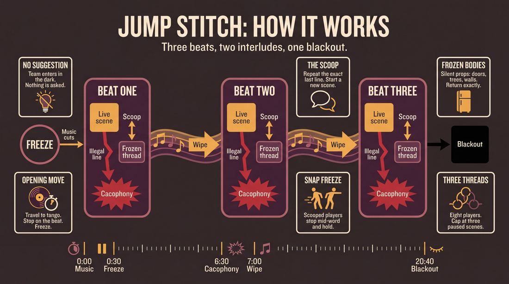
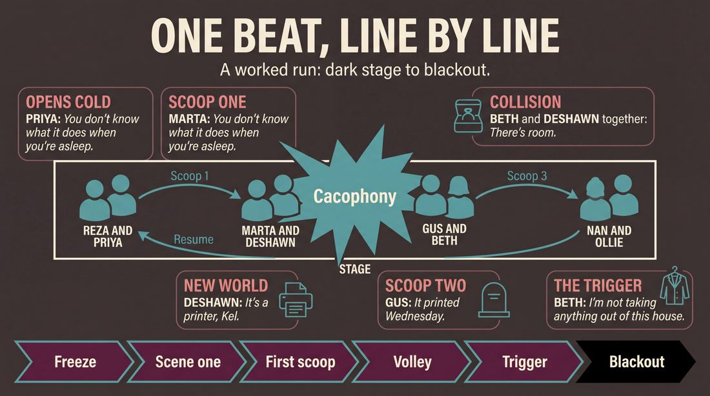
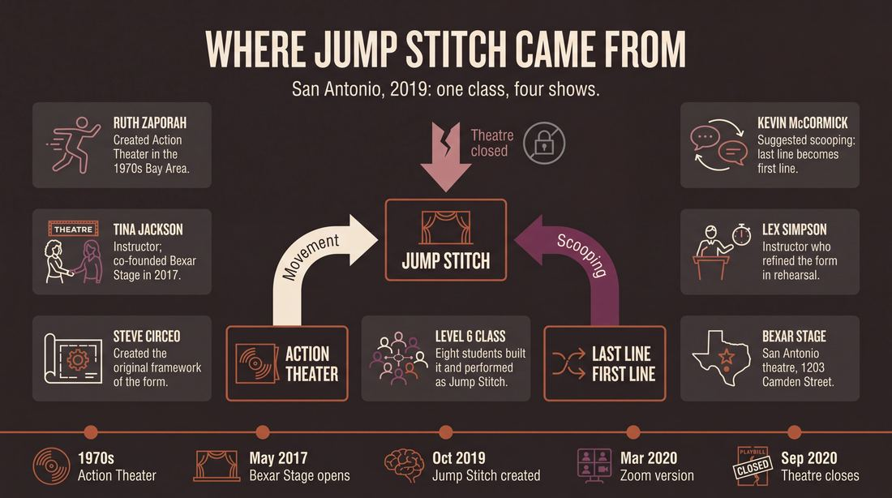
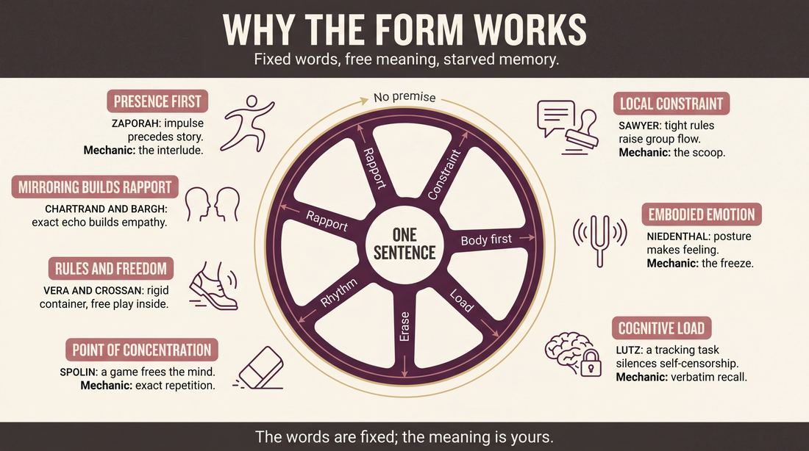
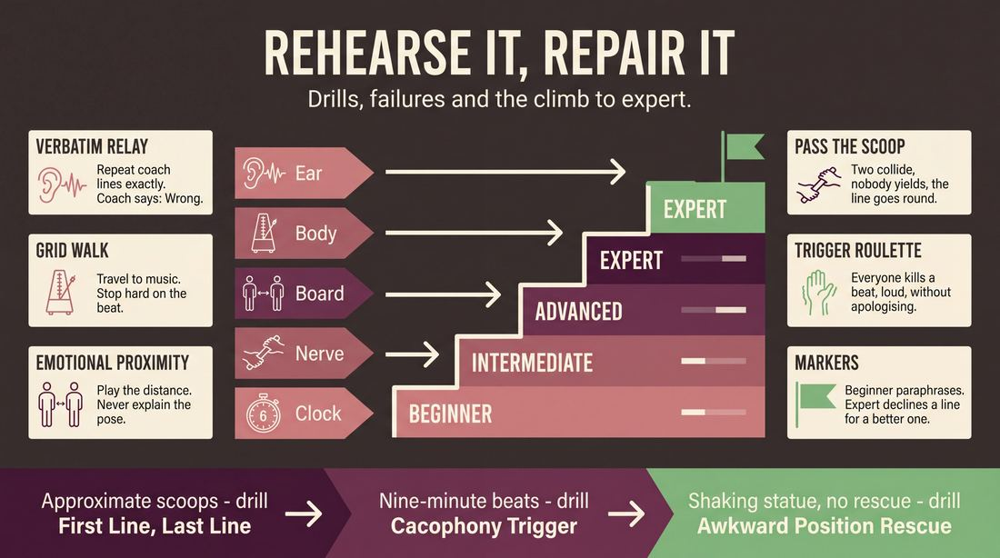

# Jump Stitch

> **A complete study of the long-form improv format _Jump Stitch_** - the original archived write-up, five infographics, grounded historical and pedagogical research, and a full mechanics-and-coaching manual.

| | |
|---|---|
| **Format** | Jump Stitch |
| **Primary source** | [IRC Improv Wiki](https://wiki.improvresourcecenter.com/index.php?title=Jump_Stitch) |

---

## Contents

1. [Part I - The Original Write-Up](#part-i-the-original-write-up)
2. [Part II - The Infographics](#part-ii-the-infographics)
   - [1. Structure and Mechanics](#infographic-1-mechanics)
   - [2. A Show, Beat by Beat](#infographic-2-example)
   - [3. Origins and Lineage](#infographic-3-history)
   - [4. Why It Works](#infographic-4-theory)
   - [5. Rehearsal and Repair](#infographic-5-coaching)
3. [Part III - Research Dossier](#part-iii-research-dossier)
   - [Pass 1: History, Lineage, Literature and Scholarship](#research-history)
   - [Pass 2: Comparative Anatomy, Pedagogy and Production](#research-comparative)
4. [Part IV - Mechanics, Gameplay and Coaching Manual](#part-iv-mechanics-gameplay-and-coaching-manual)
   - [Pass 1: The Form, Its Mechanics and Its Gameplay](#manual-mechanics)
   - [Pass 2: Training, Coaching and Performance Companion](#manual-coaching)

---

## Part I - The Original Write-Up

*Verbatim archive of the source article, reproduced exactly as scraped. Everything after this section is generated elaboration built on top of it.*

### Jump Stitch

#### History

Jump Stitch was originated by a Level 6 Class \-\- Alan Becker, Clint Taylor, Crystal Jackson, Fálki Heiđdóttir, Jonathan Chavez, Kevin McCormick, Matthew Hall, and Steve Circeo \-\- at [Bexar Stage](https://wiki.improvresourcecenter.com/index.php?title=Bexar_Stage "Bexar Stage"). The original form was created by Steve Circeo, and it was adapted during rehearsals and a run of shows by the entire class, with help from the class's instructors, [Tina Jackson](https://wiki.improvresourcecenter.com/index.php?title=Tina_Jackson "Tina Jackson") and [Lex Simpson](https://wiki.improvresourcecenter.com/index.php?title=Lex_Simpson&action=edit&redlink=1 "Lex Simpson (page does not exist)"). Jump Stitch incorporates elements of [Action Theater](https://wiki.improvresourcecenter.com/index.php?title=Action_Theater&action=edit&redlink=1 "Action Theater (page does not exist)") during musical\-dance interludes. The idea to start the next scene with the last line of the previous scene was suggested by Kevin McCormick, as that device was part of a form he was constructing.

Jump Stitch was performed by the Level 6 Class, which also called themselves Jump Stitch, four times in October\-November 2019\. 

#### Structure

Jump Stitch is generally done in a 20\-25 minute block and consists of three beats, with a musical\-dance interlude between each beat.

The team starts backstage and does not ask the audience for a suggestion. The stage is dark as music starts playing. A slow tango works well, and the original song used by Jump Stitch was "Santa Maria (del Buen Ayre)" by Gotan Project.

While the music plays, the actors enter the stage, as the lights slowly come up. The actors are moving to the music, stopping on the beat. They are moving all around the stage, moving between and through beats, but stopping on the beat, when they stop, so the rhythm of the music is driving the action. After 20\-30 seconds, the music stops and the actors freeze.

Two actors, inspired by their position and proximity, start a scene.

The rest of the actors remain frozen in place on the stage. The frozen actors can be used as props by the actors in the scene. The frozen actors can unfreeze to silently support a scene, then return to their previously frozen state once they are no longer needed. The frozen actors can become trees, refrigerators, cabinets, doors, whatever is called for in the scene, but they should always return to their previously frozen position.

Listening is key here, because the next scene will start with an actor scooping (repeating exactly) the last line of the current scene, using it as the first line of the new scene.

Once the actors in the current scene hear the scoop, they stop their scene immediately, and freeze where they are.

Scooping can occur a few times within a beat, with scenes being revisited by restarting where they left off. Sometimes the scoops can happen very rapidly, passing from one scene to the next quickly. Sometimes the scoops happen more slowly.

Any of the actors can edit the beat, ending it by starting or restarting a scene without a scoop. That is, the edit comes when one scene is going on, then one of the actors starts/restarts another scene with a phrase that is not a scoop. At that point, all the scenes on stage restart at once, and there is cacophony until the music starts. When the music starts, the actors go silent and get back into dance mode, moving with the music as they did at the start of the show. 

Everything is wiped away during the music. There is no return to previous scenes, although minor callbacks are fun.

The music continues for about 20 seconds. Once it stops, the second beat starts. The second beat is conducted the same way as the first. As is the third beat.

At the cacophony of the third beat, the scene is blacked out, and all the actors go silent as the show ends.

#### NOTES

1\. When two actors simultaneously scoop the same line, each trying to start a new scene, rather than having an awkward pause while the two try to figure it out, and one of them sheepishly backing down, another actor should scoop the same line, and another, and another, passing it around until one of the original two takes the line back and starts their scene.

2\. While the body positions and proximity should inform the scene, the focus should be on emotional contact between the characters, rather than explaining or justifying the body positions.

3\. If an actor has to freeze in an awkward position that is hard to hold, that actor or one of their teammates should start a scene with them to relieve the actor of the awkward position.

4\. It an actor is standing frozen downstage and a scene starts behind them, they should kneel to open up the audience's view of the scene, then return to their original position once the scene is over or has moved.

5\. Scenes can be done with more than two actors, but actors should not enter the scene late. That is, if two actors are in a scene, a third actor should not enter four lines into it.

6\. It's great to find a theme for each beat, and/or an overarching theme for the show.

---

*Archived from [https://wiki.improvresourcecenter.com/index.php?title=Jump_Stitch](https://wiki.improvresourcecenter.com/index.php?title=Jump_Stitch) (IRC Improv Wiki) on 2026-08-09 23:23 UTC.*

---

## Part II - The Infographics

*Five 16:9 posters, each teaching a different aspect of the format. Click any poster to enlarge.*

<a id="infographic-1-mechanics"></a>

### 1. Structure and Mechanics

*How the form is played: the shape of the piece, the opening, the roles, the edit vocabulary, the flow of information, and the clock.*

{ .diagram loading=lazy decoding=async width="1100" height="614" }


<a id="infographic-2-example"></a>

### 2. A Show, Beat by Beat

*A single worked performance from suggestion to blackout: what happens in each beat, with short real example lines and what the players are doing technically.*

{ .diagram loading=lazy decoding=async width="1100" height="614" }


<a id="infographic-3-history"></a>

### 3. Origins and Lineage

*Where the form came from: creators, dates, theatres, how it spread between schools and cities, and the key figures - a documented timeline and lineage map.*

{ .diagram loading=lazy decoding=async width="1100" height="614" }


<a id="infographic-4-theory"></a>

### 4. Why It Works

*The theory: the core principles of the form and the research and craft ideas that explain why the structure produces good improv, each tied to a specific mechanic.*

{ .diagram loading=lazy decoding=async width="1100" height="614" }


<a id="infographic-5-coaching"></a>

### 5. Rehearsal and Repair

*Training and fixing the form: the essential drills, the common failure modes with their symptom-and-fix pairs, and the markers of beginner through expert play.*

{ .diagram loading=lazy decoding=async width="1100" height="614" }


---

## Part III - Research Dossier

*Two research passes: the historical record, then the comparative and pedagogical record. Claims carry evidence tags - treat unverified items accordingly.*

<a id="research-history"></a>

### » Pass 1: History, Lineage, Literature and Scholarship

### Research Summary

*   **Extremely Thin Record:** The searchable, documented record for "Jump Stitch" as a distinct long-form improv format is exceptionally thin. It is confined to a single stub on the IRC Improv Wiki, a handful of social media posts from Bexar Stage, and a few archival YouTube/Twitch videos from the San Antonio indie improv scene.
*   **Hyper-Local Origin:** [DOCUMENTED] The form was created in late 2019 by a Level 6 improv class at Bexar Stage in San Antonio, Texas, and does not appear to have been adopted by any other theater or city.
*   **Synthesis of Existing Mechanics:** [INFERRED] Because the form itself is obscure, a rigorous analysis requires examining its parent mechanics. Jump Stitch is a synthesis of two well-documented practices: Ruth Zaporah’s "Action Theater" (for physical/musical interludes) and the classic short-form constraint "Last Line, First Line" (referred to in this form as "scooping").
*   **Creator Attribution:** [DOCUMENTED] Steve Circeo is credited as the primary creator, with the "scooping" mechanic contributed by Kevin McCormick, under the instruction of Tina Jackson and Lex Simpson.
*   **Structural Rigidity:** [DOCUMENTED] The form operates in a strict 20–25 minute, three-beat structure driven by musical cues (originally tango music), with no audience suggestion.
*   **Pandemic Disruption:** [DOCUMENTED] The form’s development and the theater that birthed it (Bexar Stage) were severely disrupted by the COVID-19 pandemic, which forced the theater to close its physical doors in September 2020, effectively halting the form's transmission.

### Provenance and History

Jump Stitch was developed in the burgeoning San Antonio indie improv scene, which was attempting to establish itself as a distinct hub outside the shadow of nearby Austin. The form was created to solve the problem of organic, non-verbal transitions in long-form improv by relying heavily on physical theater and strict listening constraints.

| Year | Event | Place / Company | Source |
| :--- | :--- | :--- | :--- |
| 1970s | Ruth Zaporah develops Action Theater, the physical movement basis for the form's interludes. | San Francisco Bay Area | [Wikipedia: Action Theater](https://en.wikipedia.org/wiki/Action_Theater) |
| May 2017 | Dan Grimm and Tina Jackson open Bexar Stage to create an "improv hub" in San Antonio. | Bexar Stage, San Antonio, TX | [MySA](https://www.mysanantonio.com/entertainment/arts-culture/article/There-s-a-new-improv-theater-in-town-11115865.php) |
| Oct-Nov 2019 | Jump Stitch is created and performed four times by the Level 6 class. | Bexar Stage, San Antonio, TX | [IRC Improv Wiki](https://wiki.improvresourcecenter.com/index.php?title=Jump_Stitch) |
| Mar 21, 2020 | Jump Stitch is adapted for digital performance due to COVID-19 lockdowns. | Zoom / San Antonio Improv (YouTube) | [YouTube](https://www.youtube.com/watch?v=iTwyz0Ty6nJmN--4) |
| Sep 2020 | Bexar Stage permanently closes its physical location at 1203 Camden St due to the pandemic. | Bexar Stage, San Antonio, TX | [Facebook / Spectrum News](https://www.facebook.com/bexarstage/posts/no-laughing-matter-pandemic-forcing-improv-theater-to-close/3313939628691523/) |

### Lineage and Transmission

Because Jump Stitch is a hyper-local form that did not survive the closure of its home theater, it has no documented regional dialects or widespread transmission. [INFERRED] It exists as a terminal branch on the improv evolutionary tree. However, its lineage can be traced directly through its two parent mechanics:

1.  **Action Theater (Physical Lineage):** Developed by Ruth Zaporah in the 1970s Bay Area, this method focuses on embodied awareness and moving to music. It was transmitted to the San Antonio scene and incorporated into Bexar Stage's upper-level curriculum, forming the basis of Jump Stitch's musical-dance interludes and the use of frozen actors as scenery.
2.  **Last Line, First Line (Verbal Lineage):** [WIDELY PRACTICED, UNDOCUMENTED] Often called "A-to-C" or "Scooping," the mechanic of taking the exact last line of a scene and using it to initiate a completely unrelated scene is a staple of Spolin-derived short-form games and Chicago-style organic long-form (such as The Slacker). Kevin McCormick explicitly imported this into Jump Stitch.

### Key Figures

| Person | Role in this form | Specific contribution | Source URL |
| :--- | :--- | :--- | :--- |
| Steve Circeo | Creator / Originator | Created the original framework for the form as a student in the Bexar Stage Level 6 class. | [IRC Improv Wiki](https://wiki.improvresourcecenter.com/index.php?title=Jump_Stitch) |
| Kevin McCormick | Co-Creator | Suggested the "scooping" mechanic (starting the next scene with the last line of the previous scene). | [IRC Improv Wiki](https://wiki.improvresourcecenter.com/index.php?title=Jump_Stitch) |
| Tina Jackson | Instructor / Theater Founder | Co-directed the Level 6 class; co-founded Bexar Stage, providing the venue and curriculum. | [MySA](https://www.mysanantonio.com/entertainment/arts-culture/article/There-s-a-new-improv-theater-in-town-11115865.php) |
| Lex Simpson | Instructor | Co-directed the Level 6 class that developed and refined the form during rehearsals. | [IRC Improv Wiki](https://wiki.improvresourcecenter.com/index.php?title=Jump_Stitch) |
| Ruth Zaporah | Method Originator | Created Action Theater, the physical movement framework used in the form's interludes. | [ActionTheater.com](http://www.actiontheater.com/) |

### Canonical Shows, Companies and Recordings

| Named Production | Venue | Year | Link / Where to watch |
| :--- | :--- | :--- | :--- |
| *Jump Stitch* (Original Run) | Bexar Stage, San Antonio, TX | 2019 | No known video of the original stage run exists. |
| *Jump Stitch via Zoom - 200321* | Zoom (San Antonio Improv Channel) | 2020 | [YouTube](https://www.youtube.com/watch?v=iTwyz0Ty6nJmN--4) |

### Published Literature

| Work | Author | Year | What it says about this form | Where to find it |
| :--- | :--- | :--- | :--- | :--- |
| *Jump Stitch* (Wiki Article) | IRC Community | 2023 | The sole primary document detailing the form's history, structure, and specific rules (scooping, freezing, cacophony edits). | [IRC Improv Wiki](https://wiki.improvresourcecenter.com/index.php?title=Jump_Stitch) |
| *Action Theater: The Improvisation of Presence* | Ruth Zaporah | 1995 | Details the physical theater and movement mechanics that Jump Stitch uses for its musical interludes. | ISBN 978-1556431869 |
| *There's a new improv theater in town* | Deborah Martin | 2017 | Documents the founding and ethos of Bexar Stage, the incubator of the form, and the state of San Antonio improv. | [MySA](https://www.mysanantonio.com/entertainment/arts-culture/article/There-s-a-new-improv-theater-in-town-11115865.php) |

### Verbatim Quotes

> "The idea to start the next scene with the last line of the previous scene was suggested by Kevin McCormick, as that device was part of a form he was constructing."
> [IRC Improv Wiki](https://wiki.improvresourcecenter.com/index.php?title=Jump_Stitch)

> "Listening is key here, because the next scene will start with an actor scooping (repeating exactly) the last line of the current scene, using it as the first line of the new scene."
> [IRC Improv Wiki](https://wiki.improvresourcecenter.com/index.php?title=Jump_Stitch)

> "While the body positions and proximity should inform the scene, the focus should be on emotional contact between the characters, rather than explaining or justifying the body positions."
> [IRC Improv Wiki](https://wiki.improvresourcecenter.com/index.php?title=Jump_Stitch)

> "If an actor has to freeze in an awkward position that is hard to hold, that actor or one of their teammates should start a scene with them to relieve the actor of the awkward position."
> [IRC Improv Wiki](https://wiki.improvresourcecenter.com/index.php?title=Jump_Stitch)

> "Everything is wiped away during the music. There is no return to previous scenes, although minor callbacks are fun."
> [IRC Improv Wiki](https://wiki.improvresourcecenter.com/index.php?title=Jump_Stitch)

> "Action Theater is an improvisational physical theater training and performance method created by Ruth Zaporah. The practice of Action Theater incorporates the disciplined exploration of embodied exercises that lead to increased skills of strong, clear, spontaneous, and artful communication."
> [ActionTheater.com](http://www.actiontheater.com/) *(Note: This describes the parent mechanic used in Jump Stitch's interludes).*

> "Last Line First Line is an improv game in which improvisers stand on stage in pairs and perform scenes inspired by audience suggestions. At any point, another improviser can clap and begin a new scene with their partner. The catch is that the first line of the new scene must be the last line spoken in the scene that was just interrupted."
> [The Andlings, YouTube](https://www.youtube.com/watch?v=HidTFW80LEX) *(Note: This describes the parent mechanic of "scooping").*

> "When we started our theater, we had people literally telling us, 'You can't do improv in San Antonio; go to Austin.'"
> Cary Farrow, [MySA](https://www.mysanantonio.com/entertainment/arts-culture/article/There-s-a-new-improv-theater-in-town-11115865.php) *(Note: Contextualizing the scene that birthed the form).*

### Anecdotes and Stories

**The Fight for San Antonio Improv**
[DOCUMENTED] When Dan Grimm and Tina Jackson opened Bexar Stage in 2017 at 1203 Camden Street, they were fighting an uphill battle against the gravity of Austin's massive comedy scene. Local improviser Cary Farrow recalled being told, "You can't do improv in San Antonio; go to Austin." Bexar Stage was built to prove that wrong, creating an "improv hub" that allowed advanced students (like the Level 6 class that created Jump Stitch) to experiment with highly theatrical, avant-garde forms rather than just standard short-form games. (Source: [MySA](https://www.mysanantonio.com/entertainment/arts-culture/article/There-s-a-new-improv-theater-in-town-11115865.php))

**The Zoom Adaptation**
[DOCUMENTED] Jump Stitch is inherently physical—it relies on actors moving to tango music, freezing in close proximity, and using each other's frozen bodies as props. Yet, when the COVID-19 pandemic hit in March 2020, the team stubbornly adapted the form to Zoom. A video from March 21, 2020, shows the cast attempting to execute the "scooping" mechanic and physical freezes across webcam grids, highlighting the desperation of indie improvisers to keep their formats alive during the lockdown. (Source: [San Antonio Improv YouTube](https://www.youtube.com/watch?v=iTwyz0Ty6nJmN--4))

**The Death of the Incubator**
[DOCUMENTED] The pandemic ultimately killed the theater that incubated Jump Stitch. In September 2020, Bexar Stage announced it was permanently vacating its Camden Street location a year and a half before its lease was up, citing the total collapse of live event revenue. The building was later taken over by a microbrewery, effectively ending the transmission of hyper-local forms like Jump Stitch. (Source: [CultureMap San Antonio](https://sanantonio.culturemap.com/news/restaurants-bars/11-10-21-man-overboard-brewery-opening-near-pearl-san-antonio/) / [Bexar Stage Facebook](https://www.facebook.com/bexarstage/posts/no-laughing-matter-pandemic-forcing-improv-theater-to-close/3313939628691523/))

### Academic and Scientific Research

**Group Creativity and Collaborative Emergence**
Sawyer, R. K. (2003). *Group Creativity: Music, Theater, Collaboration*.
*Finding:* Strict, localized constraints in improvised performance paradoxically increase group flow by limiting the cognitive search space for the next action, forcing actors to react to the immediate present rather than plan a global narrative.
*Relevance to this form:* The "scooping" mechanic (repeating the exact last line of the previous scene) acts as a severe local constraint. It prevents improvisers from inventing a premise backstage, forcing the new scene to emerge entirely from the linguistic artifact of the previous one.

**Embodied Cognition in Performance**
Niedenthal, P. M. (2007). *Embodying Emotion*. Science, 316(5827), 1002-1005.
*Finding:* Physical posture and motor actions directly dictate emotional states and cognitive processing; emotion is not just in the brain, but simulated in the body.
*Relevance to this form:* Jump Stitch requires actors to freeze during musical interludes and initiate scenes based on their frozen, often awkward proximity. By prioritizing emotional contact over justifying the physical position (as noted in the form's rules), the form leverages embodied cognition to generate character relationships.

**Cognitive Load Theory in Spontaneity**
Lutz, A., et al. (2008). *Attention regulation and monitoring in meditation*. Trends in Cognitive Sciences.
*Finding:* Occupying working memory with a specific, demanding tracking task reduces the brain's default mode network activity, lowering self-censorship and anxiety.
*Relevance to this form:* The requirement to listen for and memorize the *exact* last line of a scene to execute a "scoop" places a high cognitive load on the improvisers on the backline. This prevents them from getting in their heads or pre-planning, forcing a state of hyper-vigilant listening.

### Documented Variants and Descendants

Because Jump Stitch is a terminal, hyper-local form, it has no named descendants. However, its core mechanics are widely practiced variants in the broader improv community:

*   **Last Line, First Line:** [WIDELY PRACTICED, UNDOCUMENTED] A short-form game where pairs of improvisers are tagged out, and the new pair must begin their scene with the exact last line spoken. It lacks the musical interludes and three-beat structure of Jump Stitch.
*   **The Slacker:** [WIDELY PRACTICED, UNDOCUMENTED] A long-form structure created in Chicago that uses physical tag-outs and organic, non-verbal transitions to move from scene to scene, similar to Jump Stitch's fluid movement, but without the strict "scooping" rule.
*   **Action Theater Jams:** [DOCUMENTED] Pure physical theater improvisations based on Ruth Zaporah's work, focusing entirely on movement, sound, and spatial awareness without the narrative scene-work of Jump Stitch.

### Criticism, Debate and Known Failure Modes

[INFERRED] Based on the mechanics of the form and craft consensus regarding its parent structures, Jump Stitch is highly susceptible to several failure modes:
*   **The "Talking Head" Trap:** When improvisers are overly focused on the verbal constraint of "scooping" the last line, they often drop their physical environment and object work, leading to static, unengaging stage pictures.
*   **Disjointed Interludes:** If the ensemble is not rigorously trained in physical theater (Action Theater), the musical interludes can look like generic, low-energy dancing rather than purposeful, space-defining movement.
*   **Cacophony Confusion:** The rule allowing any actor to edit a beat by starting a scene *without* a scoop—triggering a stage-wide "cacophony" until the music starts—requires impeccable tech booth timing. If the lighting or music cue is delayed, the cacophony devolves into messy, uncomfortable shouting that alienates the audience.

### Cultural Footprint

Jump Stitch has virtually no cultural footprint outside of the 2019 San Antonio indie improv scene. It was never featured at major festivals (like the Del Close Marathon or Out of Bounds), and its creators did not export it to other training centers. Its primary legacy is as a digital artifact on the IRC Improv Wiki, serving as a case study of how regional theater classes synthesize disparate improv philosophies (Chicago long-form and Bay Area physical theater) into bespoke formats.

### Gaps in the Record

*   **The Tech Execution:** It is entirely undocumented how the "cacophony" edit was communicated to the tech booth. It is unclear if there was a visual cue or if the tech improviser simply had to recognize that a line was *not* a scoop.
*   **Curriculum Context:** The specific syllabus of Bexar Stage's Level 6 class is lost. It is unknown what other forms were taught alongside this, or how heavily Action Theater was emphasized in the preceding five levels.
*   **Post-Pandemic Survival:** There is no record of Steve Circeo, Kevin McCormick, or the rest of the Level 6 class attempting to stage Jump Stitch after Bexar Stage closed in 2020.

### Source List

1.  **IRC Improv Wiki: Jump Stitch** - IRC Community - 2023 - [URL](https://wiki.improvresourcecenter.com/index.php?title=Jump_Stitch) - Primary documentation of the form's rules, creators, and history.
2.  **Action Theater** - Ruth Zaporah - 2023 - [URL](http://www.actiontheater.com/) - Defines the physical theater methodology used in the form's interludes.
3.  **There's a new improv theater in town** - Deborah Martin (MySA) - 2017 - [URL](https://www.mysanantonio.com/entertainment/arts-culture/article/There-s-a-new-improv-theater-in-town-11115865.php) - Documents the founding of Bexar Stage and the San Antonio improv scene.
4.  **Jump Stitch via Zoom - 200321** - San Antonio Improv (YouTube) - 2020 - [URL](https://www.youtube.com/watch?v=iTwyz0Ty6nJmN--4) - Archival footage of the form being adapted for digital performance during the pandemic.
5.  **No Laughing Matter: Pandemic Forcing Improv Theater to Close** - Spectrum News / Bexar Stage Facebook - 2020 - [URL](https://www.facebook.com/bexarstage/posts/no-laughing-matter-pandemic-forcing-improv-theater-to-close/3313939628691523/) - Documents the permanent closure of the theater that created the form.
6.  **Man Overboard Brewery opening near Pearl** - CultureMap San Antonio - 2021 - [URL](https://sanantonio.culturemap.com/news/restaurants-bars/11-10-21-man-overboard-brewery-opening-near-pearl-san-antonio/) - Confirms the physical loss of the Bexar Stage venue.
7.  **Last Line First Line -- Improv Game** - The Andlings (YouTube) - 2026 - [URL](https://www.youtube.com/watch?v=HidTFW80LEX) - Defines the "scooping" mechanic as it exists in the broader improv ecosystem.

<a id="research-comparative"></a>

### » Pass 2: Comparative Anatomy, Pedagogy and Production

### Taxonomic Placement

```text
      [The Harold]       [Action Theater]
           |                    |
      [Montage]                 |
           |                    |
      +----+----+---------------+
      |         |               |
 [La Ronde] [Slacker]     [Jump Stitch]
```

Jump Stitch sits at the intersection of freeform Montage, the physical embodiment of Action Theater, and the strict transition mechanics of forms like La Ronde or Slacker. While a Montage relies on visual sweeps and a Slacker relies on physical tag-outs to edit, Jump Stitch uses a purely verbal edit (the "Scoop") combined with a persistent physical stage picture (all players remain on stage, frozen). It inherits its musical, movement-based opening from Action Theater, but applies it to a highly structured, three-beat long-form comedy framework rather than pure physical theater.

### Head-to-Head Comparisons

**Jump Stitch vs. Montage**

| Axis | Jump Stitch | Montage | Consequence for the players |
| :--- | :--- | :--- | :--- |
| **Opening** | Musical movement/dance (Action Theater style). | Varies (Invocation, Pattern Game, or none). | Jump Stitch players start in their bodies, driven by rhythm, rather than in their heads. |
| **Edit Logic** | The "Scoop" (exact repetition of the last line) or Cacophony. | The Sweep (running across the downstage). | Jump Stitch requires hyper-focused auditory listening; Montage requires peripheral visual awareness. |
| **Memory** | Wiped completely between beats (minor callbacks allowed). | Continuous; scenes and characters can return anytime. | Jump Stitch players do not need to track a complex web of returning characters across the whole show. |
| **Stage Presence** | All players on stage, frozen when not in a scene. | Players exit to the backline or wings when not in a scene. | Jump Stitch players must maintain physical discipline and act as stage architecture for 20 minutes. |

**Jump Stitch vs. La Ronde**

| Axis | Jump Stitch | La Ronde | Consequence for the players |
| :--- | :--- | :--- | :--- |
| **Structure** | Three distinct beats separated by music. | One continuous cycle of scenes. | Jump Stitch provides built-in resets, lowering the pressure of sustaining a single unbroken chain. |
| **Transition** | Line-based (The Scoop). | Character-based (One character stays, one leaves). | Jump Stitch transitions jump entirely in context and reality; La Ronde transitions maintain character continuity. |
| **Cast Size** | ~8 players. | Exactly matches the number of characters in the cycle (usually 4-6). | Jump Stitch allows for more chaotic, multi-person support, whereas La Ronde is strictly two-person scenes. |

**Jump Stitch vs. Slacker**

| Axis | Jump Stitch | Slacker | Consequence for the players |
| :--- | :--- | :--- | :--- |
| **Edit Logic** | Verbal (Scooping the last line). | Physical (Tagging out a player). | Slacker players must physically cross the stage to edit; Jump Stitch players edit from wherever they are frozen. |
| **Focus** | Emotional contact based on physical proximity. | Following the "slacker" (the character who was tagged in). | Jump Stitch prioritizes the immediate physical reality; Slacker prioritizes narrative tracking. |
| **Failure Mode** | Cacophony Paralysis (fear of ending the beat). | Tag-out loops (rapid, meaningless edits). | Jump Stitch beats can drag if no one breaks the rule; Slacker can become too frenetic to establish base reality. |

### What Makes It Uniquely Itself

1. **The Scoop Edit**: The exact repetition of the last line of the previous scene as the first line of the new scene. If this is removed, the form devolves into a standard Montage. The Scoop forces an immediate, jarring context shift based purely on syntax rather than narrative logic.
2. **The Cacophony Reset**: The beat ends not with a blackout or a sweep, but with a deliberate rule-break (starting a scene *without* a scoop). This triggers all scenes to restart simultaneously until the music takes over. Without this, there is no mechanical way to end a beat.
3. **Persistent Frozen Architecture**: Players never leave the stage; they freeze in place, serving as the physical environment, props, or architecture for the active scene. If players retreat to a backline, the Action Theater influence is lost, and the physical proximity mechanic that starts scenes is destroyed.

### Structural Variants in Practice

| Variant Name | What It Changes | Who Plays It | Source |
| :--- | :--- | :--- | :--- |
| **Original Jump Stitch** | Baseline form: 8 players, 3 beats, Gotan Project tango music, physical proximity dictates scenes. | Bexar Stage Level 6 Class (Alan Becker, Clint Taylor, Crystal Jackson, Fálki Heiđdóttir, Jonathan Chavez, Kevin McCormick, Matthew Hall, Steve Circeo). | IRC Improv Wiki |
| **Zoom / Digital Jump Stitch** | Proximity replaced by screen placement; physical touch replaced by visual matching. Scooping relies on audio latency management. | Bexar Stage Alumni / Therapy 3.0 (March 2020). | Bexar Stage Twitch Archives |
| **Thematic Jump Stitch** | Applies an overarching theme to the entire show or a specific theme to each of the three beats. | Bexar Stage Level 6 Class. | IRC Improv Wiki |

### The Teaching Ladder

| Stage | Skill introduced | Why in this order | Typical exercise | Source |
| :--- | :--- | :--- | :--- | :--- |
| **1. Embodiment** | Moving to music, stopping exactly on the beat. | Players must learn to let rhythm drive action before they can generate scenes from physical poses. | Action Theater Grid Walk | [CRAFT CONSENSUS] |
| **2. Architecture** | Freezing, acting as human props, and unfreezing to support silently. | Establishes the physical container of the form. Without this, the stage picture becomes muddy. | Silent Support Unfreeze | IRC Improv Wiki |
| **3. The Scoop** | Exact repetition of a line to initiate a completely new context. | The core transition mechanic. Requires intense auditory focus and must be drilled until it is reflex. | First Line, Last Line | ImprovDr / [CRAFT CONSENSUS] |
| **4. The Cacophony** | Breaking the scoop rule to trigger a simultaneous, chaotic restart. | Players naturally fear breaking rules. They must be taught how and when to deliberately destroy the beat. | Cacophony Trigger | [CRAFT CONSENSUS] |

### Documented Drills and Exercises

| Drill | Origin / Teacher | How to run it | What it fixes in this form | Source |
| :--- | :--- | :--- | :--- | :--- |
| **First Line, Last Line** | ImprovDr / [CRAFT CONSENSUS] | Run 2-person scenes where the first line must be an exact quote provided by the audience or the instructor. | Inaccurate scooping; paraphrasing instead of exact repetition. | ImprovDr |
| **Pass the Scoop** | Jump Stitch Notes | Three actors. A says a line. B and C simultaneously scoop it. B and C must pass the line back and forth until one yields and starts their scene. | Simultaneous scoop collisions causing awkward pauses. | IRC Improv Wiki |
| **Awkward Position Rescue** | Jump Stitch Notes | One actor freezes in a physically demanding pose. Another actor must initiate a scene that naturally allows the first actor to change position. | Statue fatigue; leaving teammates in painful physical holds. | IRC Improv Wiki |
| **Kneel and Clear** | Jump Stitch Notes | Actors freeze downstage. A scene begins upstage of them. The downstage actors must silently kneel to clear sightlines, then return to standing when the scene moves. | Upstaging and blocked sightlines caused by the persistent frozen architecture. | IRC Improv Wiki |
| **Silent Support Unfreeze** | [CRAFT CONSENSUS] | Two actors in a scene. A frozen actor unfreezes, becomes a physical object (e.g., a door) for the active actors to use, then refreezes in their exact original position. | Static stage pictures; failure to use the frozen players as environment. | [CRAFT CONSENSUS] |
| **Action Theater Grid Walk** | Ruth Zaporah / [CRAFT CONSENSUS] | Actors move around the space to music, stopping exactly on the beat. When the music stops, they must hold their exact physical impulse. | Sloppy musical interludes; failure to let rhythm drive physical action. | [CRAFT CONSENSUS] |
| **Emotional Proximity** | Jump Stitch Notes | Actors freeze in close proximity. They must start a scene based on the *emotion* of that proximity, explicitly banning any dialogue explaining *why* they are standing that way. | Justification Syndrome (explaining the physical pose rather than playing the relationship). | IRC Improv Wiki |
| **Cacophony Trigger** | [CRAFT CONSENSUS] | Run a standard montage. To edit, an actor must step out and loudly start a completely unrelated scene, cueing the entire cast to start talking at once. | Hesitation to end the beat; fear of breaking the scoop chain. | [CRAFT CONSENSUS] |
| **No Late Entrances** | Jump Stitch Notes | Run 2-person scenes. A third actor attempts to enter after 4 lines. The scene must immediately stop and reset. | Muddying the scoop with late additions; confusing who has the final line. | IRC Improv Wiki |
| **The Wipe Away** | [CRAFT CONSENSUS] | Run a cacophony. Play music. Actors must immediately drop all previous character physicalities and return to neutral, rhythm-driven movement. | Bleeding characters or narrative baggage between beats. | [CRAFT CONSENSUS] |

### Common Failure Modes and Diagnoses

| Failure mode | What it looks like from the audience | Root cause | Fix | Who names it |
| :--- | :--- | :--- | :--- | :--- |
| **Scoop Paraphasia** | A disjointed transition where the new scene doesn't quite match the old one, killing the momentum. | Poor listening; the actor paraphrases the last line instead of repeating it exactly. | Drill: First Line, Last Line. | [CRAFT CONSENSUS] |
| **Statue Fatigue** | Actors shaking, breaking character, or looking physically uncomfortable in the background. | Actors choosing unsustainable dynamic poses during the music stop, and teammates failing to rescue them. | Drill: Awkward Position Rescue. | IRC Improv Wiki |
| **Justification Syndrome** | Actors explaining "Why are we standing back to back?" instead of playing a grounded relationship. | Fear of the physical offer; prioritizing logical explanation over emotional contact. | Drill: Emotional Proximity. | IRC Improv Wiki |
| **The Late Third Wheel** | A clean 2-person scene becomes chaotic, making it impossible to know who has the final line to scoop. | Over-eagerness to support; ignoring the strict "no late entrances" rule. | Drill: No Late Entrances. | IRC Improv Wiki |
| **Cacophony Paralysis** | A beat drags on endlessly as scenes loop without resolution or escalation. | Fear of breaking the scoop chain to trigger the cacophony edit. | Drill: Cacophony Trigger. | [CRAFT CONSENSUS] |

### Production and Logistics

*   **Cast Size:** ~8 players. This provides enough bodies to create a dense physical architecture on stage without overcrowding the movement interludes.
*   **Runtime:** 20-25 minutes.
*   **Stage Layout:** Bare stage. No chairs or set pieces are used, as the frozen actors serve as the furniture, props, and architecture.
*   **Lighting and Tech Cues:** The show starts in the dark. Lights come up slowly as the music plays. The tech booth must be highly attentive to the third-beat cacophony, as the blackout must hit at the peak of the chaos.
*   **Music and Sound:** A slow tango (e.g., "Santa Maria (del Buen Ayre)" by Gotan Project) is standard. The music must have a clear, driving beat for the actors to move and stop to.
*   **MC and Host Duties:** No suggestion is taken. The team starts backstage and enters in the dark. The host simply introduces the team name and leaves the stage.
*   **Show Lineup Placement:** Due to its lack of a suggestion and highly theatrical, music-driven opening, it serves best as a second-act opener or a closer.
*   **Rehearsal Cadence:** Requires heavy drilling of exact listening (scooping) and physical trust (human props). A producer must ensure the cast has ample time to rehearse with the specific music track used in the show.

### Adaptations Beyond the Stage

*   **Classroom and Youth:** The "Scoop" mechanic is an elite active-listening exercise. However, the dark stage, tango music, and physical touch must be removed. Adapt the frozen architecture to "human statues" with a strict no-touch rule.
*   **Corporate and Applied Improv:** Excellent for training active listening and "yes, anding" exact phrasing in communication workshops. The "human prop" element must be heavily modified for HR compliance (relying on proximity rather than physical contact).
*   **Online and Remote:** Successfully adapted for Zoom in March 2020. Proximity is replaced by screen placement (e.g., pointing to the video box next to you), and scooping requires strict management of audio latency.
*   **Community and Therapeutic Settings:** The exact repetition (scooping) can be used as a verbal grounding technique (mirroring) to build empathy.
*   **Accessibility and Inclusion:** Standing frozen for 5-7 minutes per beat is highly inaccessible for players with mobility impairments. Adaptations include allowing seated freezes, or permitting players to return to a "neutral rest" position off-stage if holding a pose is painful.
*   **Content-Safety and Consent:** Using bodies as props requires high physical consent. Strict boundaries must be established before the show (e.g., no weight-bearing, no touching specific zones, right of refusal to unfreeze).

### Evidence Base for Those Adaptations

*   **Active Listening and Empathy:** Research on "echoing" or "mirroring" in communication (Chartrand & Bargh, 1999, *The Chameleon Effect*) demonstrates that exact repetition of a partner's phrasing builds subconscious rapport and empathy, supporting the use of the Scoop mechanic in corporate and therapeutic applied improv.
*   **Embodied Emotion:** Research on posture affecting emotional states (Niedenthal, 2007, *Embodying Emotion*) supports the Action Theater principle used in Jump Stitch: that physical proximity and posture can generate authentic emotional starting points for scenes, bypassing the intellectual brain.

### Scholarly Frames Worth Applying

*   **Sawyer on Collaborative Emergence:** "Improvised dialogues emerge from the unpredictable sequence of turns, where no single actor controls the outcome." (Sawyer, R. K., 2003, *Improvised Dialogues*). **Mapping:** The Scoop mechanic forces collaborative emergence, as the exact final words of one scene dictate the entirely unrelated context of the next, removing individual control over scene initiation.
*   **Spolin on Point of Concentration (POC):** "Focusing on a specific game mechanic frees the mind from the pressure to invent, allowing spontaneous play." (Spolin, V., 1963, *Improvisation for the Theater*). **Mapping:** The physical freeze and the exact repetition of the scoop serve as strict POCs, preventing actors from getting in their heads about "what to say next."
*   **Vera and Crossan on Organizational Improvisation:** "Effective improvisation requires a mix of highly structured rules and complete freedom within those boundaries." (Vera, D., & Crossan, M., 2004, *Academy of Management Review*). **Mapping:** The strict 3-beat, music-driven structure contrasts with the freeform cacophony edit, providing a rigid container for chaotic play.
*   **Zaporah on Action Theater:** "Embodied awareness where movement and physical impulse precede narrative." (Zaporah, R., 1995, *Action Theater: The Improvisation of Presence*). **Mapping:** The musical-dance interludes dictate the physical starting points of the scenes, forcing actors to justify their bodies emotionally rather than intellectually.

### Where the Form Is Heading

While Jump Stitch originated as a highly specific historical artifact of Bexar Stage's 2019 Level 6 class, its mechanics have proven modular. The "Scoop" edit has been absorbed into general montage toolkits as a transition device for indie teams looking to break out of standard sweep-edits. Furthermore, Zoom adaptations during the 2020 pandemic (performed by Bexar Stage alumni and groups like Therapy 3.0) proved the form's verbal mechanics survive digital translation, even when the physical architecture is lost.

### Source List

1. *Jump Stitch* - IRC Improv Wiki - 2023 - https://wiki.improvresourcecenter.com/index.php?title=Jump_Stitch - Supports history, structure, rules, and specific notes on scooping, freezing, and cacophony edits.
2. *Bexar Stage Facebook Archives* - Bexar Stage - 2020 - https://www.facebook.com/BexarStage/ - Supports the existence of Zoom adaptations and the theater's operational history.
3. *First Line, Last Line* - ImprovDr - 2024 - https://improvdr.com/ - Supports the pedagogical mechanics of exact line repetition and scene bookending.
4. *End Your Own Scenes* - Second City - 2013 - https://www.secondcity.com/ - Supports the mechanics of editing, taking responsibility for scene endings, and avoiding hesitation (Cacophony Paralysis).
5. *[CRAFT CONSENSUS]* - Unattributed - 2026 - N/A - Supports widely adapted improv pedagogy, failure mode diagnoses, and standard drills applied to this specific form.

---

## Part IV - Mechanics, Gameplay and Coaching Manual

*Synthesis over the original article and both research dossiers: first how the form works and how to play it, then how to train an ensemble to perform it.*

<a id="manual-mechanics"></a>

### » Pass 1: The Form, Its Mechanics and Its Gameplay

### At a Glance

| Field | Value |
| :--- | :--- |
| **Also known as** | *Jump Stitch* only. There is no second name in the record. Its central mechanic — repeating the previous scene's final line verbatim to open the next one — is known elsewhere as **Last Line/First Line**, **A-to-C**, or, inside this form, **scooping**. The 2019 Bexar Stage Level 6 class that built it also performed under the team name *Jump Stitch*. |
| **Family** | Physical/organic montage with a verbal edit law. A hybrid: Ruth Zaporah's **Action Theater** (musical movement, embodied initiation, bodies-as-architecture) crossed with the **Last Line/First Line** constraint, poured into a rigid three-beat, music-punctuated container. Cousins: La Ronde (chain logic), Slacker (persistent onstage cast, organic edits), Montage (no narrative obligation). |
| **Cast size** | 8 is the documented original. Workable 6–10. Below 6 the stage architecture thins out and you run out of bodies mid-beat; above 10 the movement interlude turns into a crowd and the frozen picture becomes visual noise. |
| **Runtime** | 20–25 minutes, played straight through with no blackout until the end. |
| **Opening** | Wordless. Dark stage, music (originally a slow tango — "Santa Maria (del Buen Ayre)," Gotan Project), cast enters and moves to the beat as lights rise, music cuts, everyone freezes. The freeze *is* the opening: it casts the first scene by accident of proximity. |
| **Suggestion taken** | **None.** No ask, no word, no monologue. The team enters in the dark. |
| **Structural rigidity (1–5)** | **4.** The container is near-inviolable (three beats, music-wipe between, one live scene at a time, exact-repetition law, illegal-line ending). The content inside it is completely free — no narrative obligation, no character return, no game requirement. |
| **Difficulty (1–5)** | **4.** Individually the moves are simple; the compound load is not. You must hold a physical position for minutes, memorise other people's exact syntax in real time, initiate from a body you didn't choose, and never leave the stage to recover. |
| **Prerequisites** | Two-person relationship scene work with no exposition crutch; verbatim listening (drilled, not assumed); stillness and physical stamina; competent object work; a rehearsed physical-consent agreement; an operator (tech or musician) who can improvise cues off ear. |
| **Best for** | Ensembles whose montages have become four talking heads and a sweep edit; teams that pre-plan in the wings; classes teaching listening as a physical discipline; a second-act opener or a closer, where a suggestion-free, music-driven start reads as event rather than as evasion. |
| **Avoid when** | You have no reliable operator; the room is loud or the audience is drunk (the whole form is inaudible-last-line-proof at zero); the cast is under six; anyone in the cast cannot safely hold static positions and you haven't built the seated/rest adaptation; the show format requires visible audience input; you have had less than three rehearsals on the scoop drill. |

---

### The Essence in One Paragraph

Eight players enter a dark stage to a tango, move on the beat until the music cuts, and freeze wherever they are. Two of them — cast by nothing but the accident of where they stopped and how close they are — begin a scene. Everyone else stays frozen, functioning as furniture, doorframes, trees and crowd. At any moment any frozen player may say the **exact last line** that was just spoken in the live scene: the instant they say it, the live scene stops dead and freezes where it stands, and that same sentence becomes the first line of a completely different scene — or the re-entry line of a scene that was frozen earlier. The words are conserved; the meaning is destroyed and rebuilt. Over five to seven minutes a beat accumulates three or four frozen, half-finished scenes scattered across the stage like bookmarks, each one hotter each time it is reopened, all of them silently visible to the audience. The beat cannot end by a sweep or a blackout: it ends only when someone **breaks the law** and starts a scene with a line that is *not* the scooped line, at which point every frozen scene on stage resumes at once, in a deliberate cacophony, until the music returns and wipes all of it away. That happens three times. On the third cacophony, the lights hard-cut and the show is over.

---

### Why This Form Exists

Provenance, briefly, and honestly: the record for this form is one wiki article. Jump Stitch was created in 2019 at Bexar Stage in San Antonio by a Level 6 class — the framework by Steve Circeo, the last-line/first-line "scoop" contributed by Kevin McCormick from a form he was separately building, refined in rehearsal with instructors Tina Jackson and Lex Simpson, and performed four times in October–November 2019. Bexar Stage closed permanently in September 2020, which ended the form's transmission. **One conflict to flag:** the comparative dossier calls the scoop a "purely verbal" edit, while the wiki is explicit that scenes are cast by *physical* proximity; my judgement is that both are true and the distinction matters — **the edit is verbal, the casting is physical**, and confusing the two is the commonest way teams butcher the form. **One caution:** the history dossier cites archival video URLs whose identifiers are not well-formed; treat the Zoom-adaptation claims as unverified rather than false.

Now the design problem it solves.

A plain montage has two chronic diseases. The first is **the wings**: players leave the stage, and in the dark at the side they think. They arrive at the next scene with a premise in hand, and a premise carried onstage is a premise that ignores what just happened. The second is **the sweep**: the montage's default edit is a body running across the front of the stage, which is a *content-neutral* transition. It says "that's over" and nothing else. Because the edit carries no information, the burden of coherence falls entirely on the players' taste, and taste under pressure produces either callbacks to the funniest thing or four scenes about roommates.

Jump Stitch attacks both with one mechanism and pays for it with another.

- **It abolishes the wings.** Nobody exits. There is no backstage, no place to plan, no chair to sit in and be clever. The only offstage state is *frozen onstage*, and being frozen is an active job — you are a wall, a car door, a tree — so your attention is in the room and your body is already committed to a shape you will have to justify emotionally the moment someone starts a scene with you.
- **It makes the edit carry information.** The scoop is the opposite of a sweep: it transmits a specific artifact — nine words, exactly — from one reality into another. The new scene cannot be pre-planned because its first line is decided by someone else, two seconds ago, in a scene the initiator was not in. This is Sawyer's point about local constraint sharpening collaborative emergence, and it is why the form generates material that no individual player could have produced: the scene's premise is a *collision* between a sentence and a body position, neither of which the initiator chose.

What that buys you that a montage does not:

| Montage gives you | Jump Stitch gives you |
| :--- | :--- |
| Scenes that are thematically related if the cast is good | Scenes that are *lexically* related by law, so the audience does the thematic work for free |
| Scenes that end and are gone | Scenes that end and remain visible, frozen, accruing pressure, reopenable |
| An edit that means "stop" | An edit that means "these exact words, again, but everything else is different" |
| A clean empty stage | A stage that becomes a map of the beat — geography as memory palace |
| An ending you must find | An ending you must *commit*: the beat can only be killed by breaking the rule |

And what it buys the *ensemble*, which is different: Jump Stitch is the most efficient known cure for the improviser who does not listen to the ends of sentences. You cannot fake your way through it. Either you have the exact line or you do not.

---

### The Audience Contract

Nobody explains the rules. The audience is not told about scooping. They infer it, and the whole show depends on the speed of that inference.

**What is promised, implicitly:**

1. **Nobody is leaving.** From the moment the lights rise, eight people are on stage and they will all still be there at the blackout. The audience is promised a *populated* image — everything they see, including the stillness, is deliberate.
2. **The last thing you heard will be the next thing you hear.** By the second or third scoop, the audience has caught the rule. From that point they are actively listening for the button of every scene, which is the highest-quality attention an improv audience ever gives.
3. **Frozen things are real.** A body that has stood still for ninety seconds and then becomes a refrigerator has kept a promise. The audience will accept any object work in this form because the bodies were *already there*.
4. **The music means forget.** Twenty seconds of tango is a hard erase. The audience is promised they will not be quizzed on beat one during beat three.
5. **Three times, then dark.** After the first interlude the audience has the shape. After the second they know a third is coming, and they know the third ends it. This is why the third cacophony can be brutally abrupt: the ending is already set up by arithmetic.

**How they know where they are:** by counting interludes (there are only ever two), and by reading the stage geography. If the couple who were back-to-back at centre stay back-to-back at centre, the audience will track "the marriage" as a location. The frozen tableaux are the piece's table of contents. That is why drifting out of your freeze is not just untidy — it deletes an index entry.

**What breaks the contract, ranked by damage:**

| Breach | What the audience experiences |
| :--- | :--- |
| **Paraphrasing the scoop** ("It printed on Wednesday" for "It printed Wednesday") | The rule they just learned is revealed to be soft. They stop listening for the button. This is the single most expensive error in the form. |
| **Inaudible or trailing last lines** | They can't hear the token, so the transfer looks arbitrary and they read the edit as a normal tag-out. |
| **A soft, negotiated freeze** on being scooped | The transfer becomes invisible. The stop must be violent enough to be *seen*. |
| **Anyone walking offstage** | The persistent-architecture promise breaks; the stage picture stops meaning anything. |
| **A character surviving the music** | The erase promise breaks and the audience starts tracking continuity they were told to drop. |
| **Cacophony as gibberish** | If players shout invented noise instead of resuming their actual scenes, the ending reads as the cast losing control. |
| **Drifting freezes** | The map dissolves; a resumed thread appears to be a new scene. |

---

### Anatomy: The Full Structural Map

Three beats. Two interludes. One opening movement. One blackout. Inside each beat: one live scene at a time, an accumulating field of frozen threads, and a single sentence-token passing between them until somebody deliberately drops it.

```
 PRE-SET (backstage, house lights out)
      |
 ┌────▼──────────────────────────────────────────────────────────────┐
 │  OPENING MOVEMENT  ~30s                                           │
 │  music up · lights 0→full · 8 bodies move & stop ON the beat      │
 └────┬──────────────────────────────────────────────────────────────┘
      │  MUSIC CUTS  →  GROUP FREEZE  (proximity casts the first scene)
 ┌────▼──────────────────────────────────────────────────────────────┐
 │  BEAT 1   ~6 min                                                  │
 │                                                                   │
 │   [S1 live] --scoop--> [S2 live] --scoop--> [S1 RESUMED] -->      │
 │      ↓ freeze             ↓ freeze              ↓ freeze          │
 │   (dormant)            (dormant)             (dormant)            │
 │                                                                   │
 │   threads accumulate:  T1   T2   T3   (cap ≈ 3)                   │
 │                                                                   │
 │   ...scoop density rises... volley... then:                       │
 │                                                                   │
 │   ✂ ILLEGAL LINE (a non-scoop initiation)                         │
 │        → ALL THREADS RESUME SIMULTANEOUSLY = CACOPHONY  (6-8s)    │
 └────┬──────────────────────────────────────────────────────────────┘
      │  MUSIC UP  =  THE WIPE (~20s) · all threads erased · neutral bodies
      │  MUSIC CUTS → NEW GROUP FREEZE
 ┌────▼──────────────────────────────────────────────────────────────┐
 │  BEAT 2   ~6 min   (identical mechanics, new geography)           │
 │   ...  ✂ ILLEGAL LINE → CACOPHONY                                 │
 └────┬──────────────────────────────────────────────────────────────┘
      │  MUSIC UP = WIPE (~20s) → NEW GROUP FREEZE
 ┌────▼──────────────────────────────────────────────────────────────┐
 │  BEAT 3   ~6 min   (identical mechanics; usually fastest)         │
 │   ...  ✂ ILLEGAL LINE → CACOPHONY, builds to peak                 │
 └────┬──────────────────────────────────────────────────────────────┘
      │
      ▼  HARD BLACKOUT at the peak · silence held 2s · house up
```

The inner state machine, which is what you actually rehearse:

```
                     someone says the EXACT last line
   ┌──────────────┐  ───────────────────────────────►  ┌────────────────────┐
   │  LIVE SCENE  │                                    │  DORMANT THREAD    │
   │  (only one)  │  ◄───────────────────────────────  │  (frozen, visible, │
   └──────┬───────┘   someone in that thread scoops    │   resumable)       │
          │           the current last line            └────────────────────┘
          │
          │  a line spoken that is NOT the last line
          ▼
   ╔══════════════════════════════════════════╗
   ║  CACOPHONY: every thread live at once    ║ ──► MUSIC ──► WIPE ──► FREEZE
   ╚══════════════════════════════════════════╝
```

Note the crucial asymmetry: **the token refreshes with every line spoken.** The "scoopable line" is not the last line of the scene — it is *whatever was just said*, one second ago. A live pair therefore controls its own vulnerability by choosing when to stop talking. That is the form's central pressure valve and it is discussed at length in **The Engine**.

#### Beat-by-beat table

| Unit | Approx. clock | What happens | Who drives it | Success criterion | Common error |
| :--- | :--- | :--- | :--- | :--- | :--- |
| Pre-set | −0:30 → 0:00 | Cast lines up in the dark, offstage; operator confirms music A is cued | Stage manager / operator | Total silence and darkness; no whispering in the wings | Cast agreeing a "plan" for beat one in the last thirty seconds |
| Opening Movement | 0:00 → 0:30 | Music up. Bodies enter, travel the whole stage, stop *on* the beat, move again. Lights creep up over the full 25–30s | Whole cast; operator holds the fade | Eight bodies distributed across all three depths of stage; movement reads as driven by the music, not by choreography | Everyone milling in a clump downstage centre; "dancing" instead of stopping on the beat |
| The Group Freeze | 0:30 → 0:35 | Music cuts hard. Every body stops in whatever shape it was in. Two seconds of held silence | Operator chooses the cut point — this casts the show | At least two interesting adjacencies (bodies within 18 inches of each other, at different levels) | Everyone snapping to a neutral standing pose; the cut landing on a moment when everyone is mid-drift |
| Beat 1, Scene 1 | 0:35 → 2:00 | Two adjacent players begin. Long by design: this scene teaches the audience the room and the tone | The pair with the strongest physical relationship | The first line addresses the *emotion* of the distance between them, never the pose | Someone explaining why they're standing like that; a third player joining |
| Beat 1, first scoop | ~2:00 | A frozen player says the exact last line. Live pair snap-freezes mid-word | Any frozen player | The audience visibly gets it — you will hear a small laugh of recognition | A soft, apologetic scoop; the live pair "finishing their thought" before freezing |
| Beat 1, thread build | 2:00 → 5:00 | Two or three threads established; each scoop either opens a new thread or resumes a dormant one, hotter | Whole cast; whoever hears first | Threads capped at three; each resume advances, never repeats | Opening a fourth and fifth thread until no free bodies remain |
| Beat 1, volley | 5:00 → 6:30 | Scoop rate accelerates: 15–30 seconds per stretch, sometimes three exchanges and out | Whole cast | The same sentence lands in three different mouths inside a minute | Rate stays constant; beat has no acceleration and therefore no shape |
| Beat 1, illegal line | ~6:30 | Someone restarts a thread with a *new* line. It should land clean and be heard alone for one second | Any player; ideally one holding a hot dormant thread | The line is thematically loaded — it is the beat's thesis statement | Nobody dares; the beat runs to nine minutes |
| Cacophony 1 | 6:30 → 6:40 | Every thread resumes simultaneously, real dialogue, building | Whole cast | You can pick out two or three actual sentences in the wash; it crescendos | Invented shouting; uniform volume; petering out |
| Interlude 1 / The Wipe | 6:40 → 7:00 | Music up, everyone silent within one bar, characters dropped, movement resumes | Operator, then cast | Neutral bodies within two counts of the downbeat | Players "walking out of character" narratively; carrying a limp or an accent into the movement |
| Beat 2 | 7:00 → 13:30 | Identical mechanics. Usually tighter, more thematically self-aware | Whole cast | A recognisable theme emerges without anyone naming it | Beat 2 becomes Beat 1's sequel |
| Cacophony 2 / Wipe 2 | 13:30 → 14:00 | As before | Cast + operator | Cacophony 2 should be *louder* than 1 | Identical energy to cacophony 1 |
| Beat 3 | 14:00 → 20:30 | Fastest beat. Two threads, high scoop density, minor callbacks to beats 1–2 permitted | Whole cast | Callbacks are single words or gestures, never restored scenes | Beat 3 becomes a summary of the show |
| Final cacophony | 20:30 → 20:40 | All threads at once, driving up | Cast; operator counting | Peak volume and full commitment at the cut | Cast anticipating the blackout and fading |
| Blackout | 20:40 | Hard cut, mid-sentence, silence held two seconds | Operator | The audience is cut off mid-laugh | A slow fade; someone landing a "last joke" in the dark |

---

### The Opening

The opening does three jobs at once: it establishes that this is a physical piece, it distributes the bodies, and it **casts the first scene without anyone choosing**. It is not a warm-up and it is not an invocation — nothing said or discovered in the opening becomes content. Its only output is a stage picture.

#### Procedure (documented baseline)

1. **House to black.** The team is offstage, out of sight. No pre-show mingling on stage. No suggestion is taken; the host names the team and clears.
2. **Operator starts the music** — a slow tango with an unambiguous pulse. The original was "Santa Maria (del Buen Ayre)" by Gotan Project. The essential property is a *hard, slow beat you can stop on*, around 90–110 bpm with a strong downbeat.
3. **Lights begin a slow rise** timed to reach full at roughly the 25-second mark. The audience should see shapes before they see faces.
4. **The cast enters and travels.** The instruction is exact and it is Action Theater's, not general improv's: **move continuously, and stop on the beat.** You are not dancing. You are covering ground, changing level, passing between and *through* other bodies, and every time you arrest, you arrest on a beat of the music. The rhythm drives the body; the body does not interpret the music.
5. **After 20–30 seconds the operator cuts the music dead.** Everyone freezes instantly in whatever shape they are in — mid-stride, mid-turn, half-crouched.
6. **Hold two full seconds of silence.** This is not dead air. It is the audience reading the picture, and it is the cast reading their own proximity.
7. **Two adjacent players begin.** They begin from the emotional fact of their nearness — not from an explanation of it.

#### The five rules of the freeze

| Rule | Why |
| :--- | :--- |
| **Travel the whole stage.** Use upstage, downstage, both wings, at least two levels (floor, standing). | The freeze is your thread board for six minutes. A clumped freeze produces a clumped beat and blocked sightlines. |
| **Stop where the music says, not where you want.** | If players "choose" their landing spot, the form's central gift — being handed a body you didn't pick — evaporates. |
| **Choose sustainable shapes on the final freeze.** Weight over bone, not over muscle. | You may hold this for four minutes. See the Awkward Position Rescue rule; but first, don't need rescuing. |
| **Freeze in relationship, not in isolation.** If your last movement carried you near someone, let it. | Proximity is casting. Eight people evenly spaced 4 feet apart is an unusable picture. |
| **Do not signal.** No eye contact, no eyebrow, no "you go." | The first scene starts because two people move at once and one of them yields. That messy half-second is fine and reads as life. |

#### Documented and viable variants of the opening

| Variant | Mechanics | When to use it |
| :--- | :--- | :--- |
| **Standard tango** (documented) | As above, 20–30s, one hard cut. | Default. The tango's formality gives the frozen bodies dignity, which is what lets the whole absurd apparatus read as theatre rather than as a game. |
| **Operator-cut vs. cast-cut** | Documented version: the operator chooses the cut. Alternative: the track has a scored stop at a fixed timecode. | Operator-cut is better — it removes the cast's ability to pose. Fixed timecode is safer for a nervous first show, and lets the cast rehearse to the identical cut every time. |
| **Live musician** | A pianist or percussionist plays and stops. | Best available upgrade. A live player can cut the music the instant the picture is good, and can lengthen the opening if the cast has clumped. My recommendation if you have the resource. |
| **Genre swap per beat** | Tango for beat 1, waltz for beat 2, something with a faster pulse for beat 3. | Useful for shaping the arc of a 25-minute piece: the interludes get shorter and faster, so beat 3 arrives at speed. Costs you the ritual consistency; use only with an ensemble that has run the form more than five times. |
| **Zoom / distributed** (documented, unverified footage) | Proximity replaced by grid adjacency; players "freeze" on camera; scoops must be delivered with a hard stop to survive latency. | Only when there is no other option. The architecture and prop functions are lost; what survives is the scoop chain and the three-beat shape. |
| **Thematic freeze** | Director privately gives the cast a single physical quality for the beat (heavy / reaching / turned-away). | A rehearsal tool that occasionally earns a place in performance. It biases the freeze toward a coherent emotional world without prescribing content. |

**Interludes** use the same procedure minus the entrance: music up, characters dropped within two counts, travel and stop on the beat for about twenty seconds, hard cut, new freeze. The interlude is shorter than the opening because the audience already knows what it is. Do not lengthen it to "give people a rest" — it is an erase, not an intermission.

---

### The Engine

This is the section to read twice. Everything else in the form is decoration on the physics described here.

#### 1. The three wells of material

Nothing in Jump Stitch comes from a suggestion, a monologue, or a premise. All content is generated from exactly three sources.

**Well 1 — The Freeze (spatial).** At the top of each beat you are handed a body in a shape, at a distance from another body. That distance is the scene's given circumstance. Six inches apart, facing away = intimacy that has curdled. Two feet apart, one high one low = a power differential. Touching, arms wide = an unclaimed embrace. The rule from the source is explicit and it is the most important sentence in the wiki: *the focus should be on emotional contact between the characters, rather than explaining or justifying the body positions.* You **play** the distance. You never **discuss** the pose.

**Well 2 — The Token (verbal).** One sentence, in circulation, mandatory, exact. Everything about how it behaves is covered in §3 below.

**Well 3 — The Board (dormant pressure).** Every scene that has been scooped away is still standing there, frozen, unresolved, in view. Those threads are stored potential energy. They are the reason the beat has a shape and the reason the cacophony is an ending rather than an accident.

Note what is *not* a well: prior beats, offstage decisions, audience suggestion, character continuity across scenes. The form is deliberately starved of these. Starvation is the point.

#### 2. What travels between scenes — the complete list

| Travels | Does not travel |
| :--- | :--- |
| The exact sentence (obligatory) | Characters |
| Theme, involuntarily — because the same sentence keeps meaning something | Location |
| Emotional temperature (a scoop delivered hot begets a hot scene) | Facts, names, objects |
| Physical geography of the frozen board | Relationships |
| Single-word or single-gesture motifs, across beats, sparingly | Any scene, across a music wipe |

This is why the form coheres without a story. The audience hears the same nine words in five mouths and their brain does the work of finding what those words are *about*. That inference is the piece's through-line. **You are not writing a plot; you are writing a set of variations on a phrase over a ground bass — and the tango is literally the ground bass.**

#### 3. The physics of the token

Six laws. Break any and the form stops working; they are not aesthetic preferences.

**Law 1 — One live scene.** Exactly one scene has voice at a time, until the cacophony. Everything else is silent. Silent support (below) is not a violation because it makes no sound.

**Law 2 — The token is volatile.** The scoopable line is *whatever was just said*, not "the last line of the scene." Every new line overwrites the previous one. Consequences:
- The scooper has a window of roughly one to three seconds.
- A live pair who keep talking are **un-scoopable in practice**, because by the time you've decided to take a line, it's been replaced. This is not a bug: it means the live scene has agency over its own life. Talking fast = "we're not done." Landing a line and *stopping* = "come and get it."
- Therefore **silence is the offer.** The most important craft habit in this form is putting a full second of air after a line you would be happy to lose.

**Law 3 — Exactness is absolute.** Word for word. Not gist, not paraphrase, not "and you know it" appended. Contractions count. Article words count. If you can't remember it exactly, don't take it; someone else will. A wrong scoop doesn't just fail — it publicly voids the rule the audience has just learned.

**Law 4 — Instant death.** The moment a scoop begins, the live pair stop. Mid-word. Mid-gesture. They do not complete the thought, do not react, do not "look over." They become statues at the exact instant of the intercept. The transfer is only *visible* if the stop is violent. A soft stop makes the mechanic invisible and the show becomes a mediocre montage that keeps repeating itself.

**Law 5 — Persistence.** A dormant thread persists in its exact physical configuration and exact narrative position until the wipe. When it is reopened, both bodies come back to life from *those* positions and pick up from *that* moment. This is why drifting is a real error and why the players in a thread must remember their own blocking.

**Law 6 — Amnesia at the music.** The wipe is total. No thread survives a beat boundary as live material. Minor callbacks — a word, a gesture, a rhythm — are welcome and are the only sanctioned memory.

#### 4. The two scoop destinations

Every scoop resolves to one of two things, and knowing which you're doing is basic competence.

| | **Fresh scoop** | **Resume scoop** |
| :--- | :--- | :--- |
| **What it opens** | A brand-new scene between two players who are currently unattached (or between a player and a frozen body they are about to wake) | A dormant thread, at the exact moment it stopped |
| **How the line functions** | Line 1 of a scene. No context yet. The audience gets a pure semantic pivot. | An inserted line in a conversation already in progress. The audience gets a *double* pivot: the words mean something new AND they retroactively comment on where the thread was paused |
| **Delivered by** | Either of the new pair | Either member of the dormant pair |
| **Cost** | Consumes two bodies from the pool | Consumes none |
| **When it's right** | Early in a beat, while the board is empty | Middle and late in a beat, and *always* once you have three threads |
| **Failure mode** | Thread proliferation (see §5) | Resuming flat — repeating the argument instead of advancing it |

**The resume is the more advanced and the more valuable move**, and beginner casts vastly under-use it. It is where heightening lives.

#### 5. Body economy — the conservation law nobody warns you about

You have eight bodies. Every two-person thread locks two of them. Therefore:

| Threads open | Bodies committed | Free bodies (architecture + scoop wildcards) |
| :--- | :--- | :--- |
| 1 | 2 | 6 |
| 2 | 4 | 4 |
| 3 | 6 | 2 |
| 4 | 8 | **0** |

At four threads, every body on stage belongs to a paused scene. There is no free player to start a fresh scoop, no neutral architecture, and no one to be a fridge. The board is gridlocked and the only legal moves left are resumes and the illegal line. Worse: to open a fifth thread, someone must *abandon* their thread — walk their frozen body out of tableau A into a new pairing — which erases tableau A's picture and makes it unresumable. That erasure is legal but it is a demolition, and it should be a deliberate choice, not an accident of enthusiasm.

**My recommendation: cap a beat at three threads.** Three gives you six committed bodies, two free wildcards, a cacophony with three distinguishable voices-pairs, and enough resumes to heighten properly. Rehearse this as a hard number and let advanced casts break it on purpose.

#### 6. Scoop fuel: which lines travel and which don't

Half of playing this form well is *manufacturing portable last lines*. A line is portable if it can be re-cast with a different speaker, addressee, referent and register without alteration. In practice:

| Property | Portable (good scoop fuel) | Sticky (bad scoop fuel) |
| :--- | :--- | :--- |
| Length | 3–9 words: "There's room." / "I never said that." | 20 words with a subordinate clause |
| Nouns | Pronouns and generics: *it, this, him, the thing, your mother* | Proper nouns and jargon: "the 5/8 torque wrench from Kevin's van" |
| Grammar | Imperatives, accusations, denials, declaratives of fact | Questions with embedded specifics ("Did you call Aunt Ruth about the Toyota?") |
| Register | Neutral enough to be either clinical or tender | Locked to one register by slang or profanity that only works in one world |
| Emotion | Loaded but unspecific: "You promised me." | Emotionally flat: "Okay, sure." |

The single best fuel in the language is a short sentence containing an unspecified pronoun. *"You don't know what it does when you're asleep."* The word "it" is a socket that any world can plug into.

#### 7. Beat shape: the density curve

A beat is not a uniform sequence of scoops. It has a tempo curve, and getting the curve right is the difference between a beat and a list.

```
 scoop
 density
   ^
   |                                             ██  <- volley
   |                                       ██ ██ ██
   |                          ██     ██ ██ ██ ██ ██
   |            ██      ██    ██ ██  ██ ██ ██ ██ ██  ✂ illegal line
   |  ████████  ██  ████████  ██ ██  ██ ██ ██ ██ ██  ║
   +--------------------------------------------------------> time
      0:00      2:00       4:00        5:30      6:30
      long      medium     shortening   volley   kill
```

- **0:00–2:00, one long scene.** 60–90 seconds. It teaches the audience the room, the tone and the fact that this cast can play a real scene. Do not scoop it early out of nerves.
- **2:00–4:00, medium.** 40–60 second stretches. Thread two and three open. First resumes.
- **4:00–5:30, shortening.** 20–40 seconds. Resumes dominate. Heat rising in each thread.
- **5:30–6:30, volley.** 8–20 seconds. The same line can bounce three or four times. This is the section that makes the audience gasp.
- **6:30, kill.** The illegal line.

#### 8. The cacophony as an engineered chord

The cacophony is not chaos; it is the simultaneous playing of every thread's *hottest available moment*. It works if and only if the threads were left charged. Which means: **the beat's ending is determined by how you left your paused scenes, not by what you say in the cacophony.** A thread paused on "There's room." resumes in the cacophony as three seconds of someone insisting there's room while another person says a headstone's worth of names — and next to it, a father refusing an obituary, and next to that a woman reading her own handwriting off a printer. Those three simultaneous truths are the beat's thesis stated as a chord.

Craft rules for the cacophony (mine, and drill them):

1. **Resume your actual dialogue**, from your actual paused moment, in your actual character. Never invent noise.
2. **Start at 60% and crescendo.** If everyone starts at 100 there is nowhere to go and the operator has no peak to cut on.
3. **Stagger by half a second**, threads nearest the audience slightly later, so that the ear can catch one clean phrase before the wash.
4. **Do not resolve.** Nobody wins their argument in the cacophony. You are held at the point of maximum unresolved pressure and then erased.
5. **Duration 6–10 seconds** in beats 1 and 2; up to 12 in beat 3.

#### 9. Why the beat must be killed illegally

This is a genuinely elegant piece of design and worth stating plainly to your cast: **the only way out of the beat is to break the beat's own rule.** There is no sweep, no lights, no time signal. Someone has to commit an act of vandalism in public. Cast members are trained their whole improv lives not to break rules, so this move requires explicit permission and explicit rehearsal — the "Cacophony Trigger" drill exists precisely because the natural failure state is a nine-minute beat in which everyone waits for someone else to be the villain.

**Who should pull it:** ideally a player inside a thread that is at maximum heat, who restarts *their own* thread with a new line. That way the illegal line is thematically loaded rather than a random detonation, and the thread with the most pressure gets to lead the chord.

---

### Roles and Responsibilities

Jump Stitch has no host, no monologist, and no captain. It does have functions, and every player rotates through all of them within a single beat. The one genuinely specialised role is the operator, whose importance is out of all proportion to how the form is usually described.

| Role | Owns | Must do | Must not do | Signal to the others |
| :--- | :--- | :--- | :--- | :--- |
| **Live player** (in the scene) | The token; the tempo of the beat | Land lines cleanly and audibly; leave air after any line you'd be happy to lose; freeze mid-word on a scoop; play the emotional distance you were given | Justify the pose; talk over your partner; mumble the end of a line; wander out of your tableau geometry | A one-second silence after a line = "this one is available" |
| **Frozen architecture** (uncommitted) | The stage picture; the scoop pool | Hold a sustainable shape; listen at 100%; kneel to clear sightlines; be available as a passive prop; be ready to fresh-scoop | Micro-adjust; react to jokes; break to laugh; drift toward the live scene | Stillness. A frozen player who has begun to breathe forward is about to scoop — the cast reads this peripherally |
| **Dormant thread member** | One thread's exact position and exact narrative state | Remember your line-to-line position; be ready to resume *hotter*; remain in the frozen pose you stopped in | Reposition to be more comfortable or better lit; resume flat | Coming to life at all — your partner must match instantly |
| **The scooper** (any frozen player, transiently) | Exactness; volume | Repeat verbatim; project so the audience registers the repetition; commit to a completely different world on the *same* words | Take a line you're not 100% sure of; scoop apologetically; scoop into a fourth thread when three are open | Volume and attack. A scoop is louder than the line it copies |
| **The trigger-puller** (any player, once per beat) | The end of the beat | Deliver a strong, clean, thematically loaded non-scoop line; hold one clear second before others join | Trigger before the board is charged; trigger with a weak line; trigger twice | The line itself. Its non-repetition *is* the cue |
| **Operator / tech** | The clock, the erase, the ending | Cut the opening music on a good picture; count 6–8 after the stage goes polyphonic, then fire music; run ~20s interludes; hard-cut lights at the peak of cacophony 3 | Fade anything; hesitate; ride the cacophony too long; run house music over the blackout | Music up = "silence and neutral, now." Blackout = "the show is over, do not speak" |
| **Live musician** (optional, superior) | Tempo, erase, and dynamic support of the cacophony | Stop dead on a good picture; play *under* the cacophony to give it a shape; end the show on a downbeat | Underscore scenes (this is not that form); telegraph the ending | Playing at all = wipe |
| **Host** | The frame | Name the team, get off | Ask for a suggestion; explain the form | — |
| **Director (rehearsal only)** | Thread caps, freeze quality, consent | Call thread-cap violations by number ("that's four"); enforce exactness ruthlessly; run the wipe until neutral is instant | Give notes on content | — |
| **Consent captain** (my recommendation, pre-show) | The physical agreement | Run a 60-second pre-show check: weight-bearing yes/no, contact zones, anyone's injuries, anyone opting into seated freezes tonight | Assume last week's agreement holds | A verbal "all clear" before the cast goes to places |

---

### The Rules That Actually Bind

#### Hard rules — break these and it is not Jump Stitch

| # | Rule | Why it is load-bearing |
| :--- | :--- | :--- |
| H1 | **Every scene inside a beat begins with the exact, verbatim last line of the live scene.** | This is the form. Remove it and you have a Slacker with music. |
| H2 | **The instant a scoop is spoken, the live scene stops and freezes where it stands.** | Makes the transfer visible and creates the board. |
| H3 | **Only one scene has voice at a time** (until the cacophony). | Protects the token. Two live scenes = no identifiable last line = no scoop. |
| H4 | **Nobody leaves the stage between the opening and the blackout.** | The persistent architecture and the wings-abolition are the form's other half. |
| H5 | **No late entrances.** If a scene is to have three players, all three are in it from the first three lines. | A late entrant muddies who owns the last line, which corrupts the token. |
| H6 | **Frozen players may support silently and must return to their exact prior position.** Silent support is not entry. | Keeps H3 and H5 intact while allowing full environment work. |
| H7 | **A beat ends only when a player initiates or restarts a scene with a line that is not the scoop**, and every thread then resumes at once. | The only legal exit. There is no sweep, no light cue, no time-out. |
| H8 | **The music wipes everything.** No scene, character or thread survives an interlude as live material. | Guarantees three independent beats and frees the cast from tracking. |
| H9 | **Three beats. Two interludes. Blackout at the third cacophony.** | The audience counts. |
| H10 | **No suggestion.** | The opening's job is to generate the material; a suggestion would compete with it. |

#### Soft conventions — vary by house, cast and night

| Convention | Baseline | Reasonable variants |
| :--- | :--- | :--- |
| Music | Slow tango, Gotan Project | Any music with a hard, slow, stoppable pulse; live musician; different track per beat |
| Cast size | 8 | 6–10 |
| Opening length | 20–30s; interludes ~20s | Shorten interludes across the show to accelerate |
| Thread cap | Undocumented | I recommend a hard cap of 3; some casts run 4 with 10 players |
| May a live player scoop their own scene's last line? | Undocumented; the wiki says "any of the actors" | My judgement: forbid it. It looks like a stutter, not an edit, and it lets a pair hoard the stage |
| Three-handed scenes | Permitted | Some casts forbid them entirely for cleanliness of the token |
| Themes | "Great to find a theme for each beat and/or the show" | Explicitly assigned themes in rehearsal; strictly emergent in performance |
| Who pulls the trigger | Anyone | Some casts nominate a different "closer" per beat in rehearsal so the responsibility is felt |
| Passive touch | Allowed by default | Some casts run no-contact and use proximity only |
| Cacophony length | Undocumented | 6–10s beats 1–2; up to 12s beat 3 |
| Blackout timing | At the peak | Some operators take a two-second decrescendo before the cut; I think this is worse |

#### Myths — things people wrongly believe are rules

| Myth | Why it's wrong |
| :--- | :--- |
| "The new scene must be *unrelated* to the old one." | It must be a *new context*. Relation is unavoidable and desirable — that's how the theme emerges. What's forbidden is continuity of character, place or fact. |
| "A scoop is a tag-out; the old scene is dead." | It's a *pause*. The old scene stays on the board and will very likely come back. Treating scoops as kills is the main reason beginner casts never resume anything and thus never heighten. |
| "You have to justify the frozen pose." | Explicitly the opposite. The source rule says play the emotional contact, not the position. "Why are we standing back-to-back?" is the form's signature bad line. |
| "The cacophony is improvised gibberish / everyone shouting nonsense." | It is every thread playing its real, remembered dialogue simultaneously. Gibberish makes the ending look like a collapse. |
| "Frozen players can't move at all." | They can and should — silently, to serve the scene, returning exactly. Also to kneel and clear sightlines. |
| "You can't reference earlier beats." | Minor callbacks are explicitly encouraged. What's forbidden is *reviving* a scene. |
| "The scoop has to come from someone standing near the live scene." | It can come from anywhere on stage, including behind the audience's focus. The distance from the live scene to the scooper is a free comic/dramatic asset. |
| "You should wait for a *good* line to scoop." | You scoop the line that's hot, and you make it good by what you do with it. Waiting for a good line is how beats reach nine minutes. |
| "Threads should be resolved before the cacophony." | The exact opposite. Resolved threads make a dead chord. |
| "It needs a suggestion or the audience won't buy in." | The audience buys in at the second scoop, which is at about the two-minute mark. The mechanic *is* the buy-in. |
| "Someone should be running the beat." | Nobody runs the beat. The only structural authorities are the token and the operator. |
| "You need matching costumes / a set." | A bare stage is required, not preferred: the frozen bodies are the furniture, and real furniture competes with them. |

---

### Edits and Transitions

Jump Stitch has an unusually small and unusually strict edit vocabulary. Note especially the *illegal* edits: sweeps and tag-outs, which are reflexes in almost every other form, will actively destroy this one.

| Edit | How to execute physically | When it is right | When it is wrong | What it costs |
| :--- | :--- | :--- | :--- | :--- |
| **Fresh Scoop** | From your frozen position, without moving your feet first, say the exact last line at a volume clearly above the scene you're cutting. Then, and only then, adjust your body into the new scene. | Early in a beat while the board has fewer than three threads; when your frozen proximity to someone suggests a strong relationship | When three threads are already open; when you're unsure of the exact words | Two bodies out of the pool, permanently for the beat |
| **Resume Scoop** | Same delivery, but you and your dormant partner reanimate from your existing frozen positions. Do not reset your blocking. | Mid-to-late beat; whenever the board is at cap; whenever a thread has unfinished heat | When you have nothing new — a resume that repeats is worse than no resume | Nothing. This is the free move. Use it |
| **Passed Scoop** (collision protocol, documented) | Two players scoop simultaneously. Neither yields. A third player says the same line. Then a fourth. Then a fifth — around the stage, each colouring it differently — until one of the original two takes it back and starts their scene. | Whenever two people collide. Always. There is no other correct response | Never wrong as a response to a collision; wrong if manufactured on purpose more than once a show | ~5 seconds; converts an accident into a demonstration of the pivot engine. The audience usually applauds it |
| **Rescue Scoop** (documented) | Any player, including the sufferer, scoops in order to start a scene involving a teammate stuck in an agonising freeze — which legitimises them moving. | The moment you notice someone shaking | If used as an excuse to jump the queue when nobody is actually suffering | Takes the scoop away from whatever else was building. Worth it every time |
| **Silent Support / Unfreeze-and-Return** (documented) | Leave your freeze without sound, become the door / the fridge / the tree / the second horse, let it be used, then return to your **exact** prior shape. | Whenever the live scene needs an object that a human body can honestly be | If you make a sound, take focus, or return to a different position | Nothing if done right; the whole stage map if you return wrong |
| **Passive Prop** | Stay frozen. Let the live players lean on you, open you, pour from you. | Preferred over Unfreeze-and-Return whenever the object doesn't need to move | If weight-bearing wasn't consented to pre-show | Nothing |
| **Kneel-and-Clear** (documented) | If you are frozen downstage of a scene, sink silently to a kneel or a low crouch, keeping the *shape* of your pose. Return to standing when the scene moves or ends. | Any time you are between the audience and the live scene | If you do it noisily, or if you take the opportunity to reposition entirely | Nothing; failing to do it costs the audience the scene |
| **Body Abandonment** (advanced, my nomenclature) | You are frozen in thread A. You physically leave that tableau to fresh-scoop with someone else. Thread A's remaining player is now stranded. | Only deliberately, and only when thread A is exhausted — the stranded player becomes architecture or a solo image | Accidentally, out of eagerness. It deletes a thread from the cacophony | One thread's worth of chord |
| **The Illegal Line / Trigger** (documented) | Speak a **new** line — loud, clean, declarative — that restarts or starts a scene. Hold one clear second. Then everyone joins. | Once per beat, at roughly 6 minutes, when at least two threads are hot | Before the board is charged; delivered tentatively so nobody knows it's happened | The beat. That's what it's for |
| **The Cacophony** (documented) | Every thread resumes its real dialogue at once, starting ~60%, crescendoing, staggered by half-beats. | Immediately following the trigger | If anyone invents new content or resolves anything | 6–12 seconds; earns the entire beat |
| **The Wipe** (documented) | Operator fires music. All voices out within one bar. Characters, accents, limps, tensions dropped inside two counts. Bodies travel and stop on the beat. | Between beats 1→2 and 2→3 | If a player "walks off" narratively or holds their character posture | The audience's memory of the beat, deliberately |
| **The Blackout** | Hard cut, no fade, at the peak of cacophony 3. Sound out simultaneously. Silence in the dark for two seconds before house. | Once, at the end | Any fade; any laugh line delivered in the dark | Nothing. It's the cleanest ending device in long form |
| **Sweep edit** | — | **Never. Illegal.** | Always | Destroys the token and the board |
| **Tag-out** | — | **Never. Illegal.** | Always | Contradicts H4/H5; the tagged player has nowhere to go |
| **Walk-on / late entry** | — | **Never. Illegal.** | Always | Corrupts ownership of the last line |

---

### Memory: Callbacks, Patterns and Heightening

Jump Stitch has a very unusual memory architecture: it has an extremely strong **short-term** memory (six minutes, exact, physical) and a deliberately amputated **long-term** memory (nothing survives the music but a whisper). Understanding the two registers separately is how you avoid the two classic memory errors — forgetting your thread, and importing beat one into beat three.

#### Register 1: within a beat — the board as physical memory

The stage is a memory palace. Three frozen tableaux are three index cards the audience can see. This gives you memory affordances no other long form has:

- **The audience remembers by location.** "The couple back-to-back at centre" is a stable referent. When one of them speaks again, the audience recovers the entire scene instantly — no re-establishment needed. This is why resumes can be so fast: you can drop back into a paused argument at line four with zero exposition.
- **The players remember by proprioception.** You remember your scene because your arm is still up. The physical hold is a mnemonic device, which is one of the underappreciated reasons the freeze rule works.
- **Precision of position is precision of memory.** A player who drifts three feet has erased their own index card.

#### The three heightening ladders

Heightening in this form is not "make the joke bigger." There are three distinct escalations running simultaneously, and a great beat climbs all three.

**Ladder A — The token's semantic distance.** Each time the sentence lands, it should be further from its origin. Track the *kind* of transformation, not the size:

| Pivot type | Mechanism | Example on "There's room." |
| :--- | :--- | :--- |
| **Referent swap** | The pronoun/noun points at something new | Grave plot → a car → a life |
| **Stress shift** | Identical words, different emphasis | "*There's* room." → "There's **room**." |
| **Register flip** | Clinical ↔ tender ↔ liturgical ↔ commercial | A realtor's pitch; a priest's blessing |
| **Literalisation** | Figure of speech taken as fact | "Room" as a physical room that has appeared |
| **Scale jump** | Domestic → institutional → cosmic | Room in a cupboard → room in the ark |
| **Power inversion** | The line moves from the strong mouth to the weak | The one who was begging now grants it |
| **Addressee swap** | Said now to a dog, a machine, a corpse, God | Said to the printer |
| **Modal flip** | Statement → threat → plea → boast | "There's room" as a threat |

**Ladder B — Thread temperature.** Each resume must arrive further along than the pause. The operational rule: **whatever the scene was avoiding when it froze, the resume names.** If the pause happened just before someone was going to say the true thing, the resume says the true thing. Three resumes should therefore take a thread from "not looking at each other" to "one of them is leaving." Repeat a thread at the same temperature twice and the audience concludes the form is a loop.

**Ladder C — Beat density.** Long stretches early, volley late (see the density curve in The Engine). This is a purely rhythmic escalation and the audience feels it as rising stakes even when the content isn't escalating.

#### Register 2: across beats — the whisper

Everything is wiped, but the wiki explicitly permits minor callbacks, and it is right to. The rule I use:

> **A cross-beat callback may be one word, one gesture, one object, or one rhythm. It may never be a scene, a character, or a resolved plot point.**

Legal cross-beat callbacks:
- A name from beat 1 appears in beat 3 attached to a totally different person.
- A physical motif — a hand near a shoulder that never lands — recurs in a new freeze.
- A single line from beat 1 is scooped at random inside beat 2 by someone who wasn't in that scene, transplanted without acknowledgement. (Beautiful. Do this once, never twice.)
- The final line of beat 3's cacophony is beat 1's first line.

Illegal:
- Reviving a character.
- "Remember the printer?" as a joke.
- Any line that requires the audience to have tracked continuity.

#### Why the amnesia is a feature

The wipe means eight people can play a twenty-minute show while tracking, at most, three paused scenes and one sentence. That is a working-memory load small enough to leave attention available for *listening*, which the form spends ruthlessly. If you allow cross-beat continuity, the cast starts running an accounting department in their heads, the scoops get slower, and the form loses the very quality — hair-trigger verbatim recall — that it exists to train.

---

### Move-Level Technique Catalogue

Thirty executable moves. Names are working nomenclature; the ones marked **[src]** correspond to practices named in the source material.

| Move | Situation | How to do it | Example line | Failure mode |
| :--- | :--- | :--- | :--- | :--- |
| **1. The Short Button** | You are in a live scene and are happy for it to be taken | Deliberately end a thought in under nine words, on a stressed final syllable, then stop | "I bought the plot in '78." | Cutting *every* line short; the scene never develops |
| **2. The Portable Line** | Same | Strip proper nouns and jargon from any line you intend to land; substitute a pronoun | Not "Call Dr. Ramirez about the biopsy" → "They already know." | Everything becomes vague; the scene loses specificity between buttons |
| **3. The Dead Air Gift** | You want to be scooped | After your line, hold a full second with no fidget, no filler, no reaction | (silence) | Holding air when nobody is ready; the scene stalls |
| **4. The Shield** | Your scene needs another thirty seconds | Keep the dialogue overlapping and continuous — no line is ever the last line for long enough to be taken | rapid back-and-forth | Filibustering a scene the audience is done with |
| **5. The Stress Pivot** | You're scooping and the words look unusable | Repeat the words exactly; move the emphasis to a different word | "I *never* said that." → "I never said **that**." | Emphasis change alone with no new world behind it |
| **6. The Literalizer** | The line contains an idiom | Take the figure of speech as physical fact in your world | "He's dead to me." (spoken over a body) | Cheap; use once a show |
| **7. The Register Flip** | Any scoop | Keep the words, change the social frame entirely — clinical, romantic, liturgical, commercial | "There's room." — as a hospice nurse | Register flips that are only funny, with no relationship underneath |
| **8. The Addressee Swap** | Any scoop | Deliver the line to a non-person: a dog, a machine, a corpse, a god | "You don't know what it does when you're asleep." (to a printer) | Doing it twice; it becomes the cast's tic |
| **9. The Power Inversion** | The line was spoken from strength | Give it to the weakest mouth in the room | The beggar says "You can go now." | Requires status clarity in *both* scenes to land |
| **10. The Scale Jump** | The line is domestic | Play it at institutional or cosmic scale | "Somebody has to hear the house." — in a mission control | Losing the emotional contact in the bigness |
| **11. The Proximity Read** **[src]** | The freeze has just landed | Before speaking, register the *fact* of the distance: 6 inches is intimacy or threat; a metre is estrangement; different levels are power | (first line addresses that fact obliquely) | Reading the pose instead of the distance |
| **12. The Contact Initiation** **[src]** | Opening a scene from the freeze | Make the first line about the relationship's emotional temperature, never about the physical arrangement | "You're still awake." | "Why are we standing like this?" — the form's signature bad line |
| **13. The Two-Second Hold** | Just after the music cuts | Do not speak for two seconds. Let the audience read the picture | — | Filling the silence out of nerves and losing the image |
| **14. The Snap Freeze** | You've just been scooped | Stop mid-word. Do not finish the syllable, do not turn to look | "—and I told you that ye—" | Trailing off politely; the mechanic becomes invisible |
| **15. The Loud Scoop** | You're taking a line | Take it at 120% of the volume it was said at, on the attack, no runway | — | Apologetic scoops that the back row can't hear |
| **16. The Cross-Stage Scoop** | You're frozen far from the live scene | Take the line from maximum distance; the geographic leap is itself an effect | — | Doing it when you can't be heard |
| **17. Pass the Scoop** **[src]** | Two of you scooped at once | Neither yields. A third repeats the line, a fourth, each colouring it differently, around the stage, until one of the original two takes it back | "There's room." ×5 | Someone yielding sheepishly — the awkward pause the protocol exists to prevent |
| **18. The Resume Hotter** | Reopening a dormant thread | Come back in at the emotional point the pause was avoiding, not the point it left | "There's room." → "You put his name on my stone." | Resuming at the same temperature; the thread reads as a loop |
| **19. The Thread Cap Discipline** | Three threads are open | Refuse the impulse to open a fourth. Convert your scoop into a resume | — | "But my idea was so good" — and then the board gridlocks |
| **20. The Body Abandonment** | A thread is genuinely exhausted | Deliberately walk out of your dead tableau to pair with someone new, leaving the other as a solo image | — | Doing it accidentally, deleting a thread from the cacophony |
| **21. Passive Prop** **[src]** | You're frozen and the live scene needs a surface | Do nothing. Let them lean, open, sit, pour | — | Helpfully adjusting to be a better chair |
| **22. Unfreeze-and-Return** **[src]** | The scene needs an object that must move | Come alive silently, be the door / the elevator / the second horse, then return to the *exact* prior shape | — | Returning three feet left; the map corrupts |
| **23. Kneel-and-Clear** **[src]** | You are frozen downstage of the action | Sink to a kneel, keeping your pose's shape; rise when the scene moves | — | Doing it audibly, or fully repositioning under cover |
| **24. The Statue Audit** | The music is about to cut | In your last two beats of movement, bias toward shapes your skeleton can hold: weight over feet, arms below shoulder height | — | Choosing a spectacular high-arm pose and needing rescue in ninety seconds |
| **25. Awkward Position Rescue** **[src]** | A teammate is visibly suffering | Scoop, and start a scene *with them* that lets them move naturally | "Get up." | Waiting to see if someone else does it |
| **26. The Emotional Cliff** | You are about to be scooped away | End your line on something unresolved so the freeze is a good picture and the resume has fuel | "That's not what it says." | Buttoning your scene with a joke; the frozen tableau is now inert |
| **27. The Scoop Volley** | Late in the beat | Deliberately bounce the same line between two threads three or four times in under thirty seconds | — | Volleying so fast the audience can't follow which world is which |
| **28. The Motif Seed** | Any beat | Plant one word or gesture that can be recovered in a later beat as a whisper | "Wednesday" | Seeding four motifs and then paying them all off |
| **29. The Trigger Line** | ~6 minutes; at least two hot threads | Restart your own thread with a **new**, loud, declarative sentence that states the beat's underlying idea. Hold one clear second | "I've read every page it printed. They're all in my handwriting." | Mumbled triggers nobody recognises as the ending |
| **30. The Wipe Neutral** | The music has started | Drop character, accent, tension and posture within two counts; return to travelling and stopping on the beat | — | Walking out of the scene in character, which tells the audience the erase isn't real |

---

### Principles

**1. The words are fixed; the meaning is yours.**
*Why here:* the scoop is the only edit, and it transmits syntax without semantics. Your entire creative act at the moment of transition is choosing what those unchanged words will now mean.
*Followed:* "There's room" lands four times and means a grave, a car, an ark and an apology.
*Violated:* players scoop and then play a scene *about the same subject* as the line's origin — four scenes about graves — and the audience realises the form is a chain of associations rather than a machine for transformation.

**2. Exactness is the audience's only evidence that a rule exists.**
*Why here:* nobody explains the form. The audience infers the law from repetition. One paraphrase and the law is revealed to be a preference.
*Followed:* every scoop is word-perfect; by minute two the room is leaning forward on every button.
*Violated:* the fourth scoop is "close enough," the audience stops tracking, and the piece degrades into a montage with an odd amount of standing about.

**3. Silence is the offer; talking is the shield.**
*Why here:* the token refreshes with every line, so a pair who keep speaking cannot be scooped. Availability is something you *grant*.
*Followed:* a great scene runs 90 seconds because the pair never leave air, and then it ends because they do.
*Violated:* players leave air after every line out of politeness; scenes get scooped at line three and nothing has any weight.

**4. Freeze on the consonant.**
*Why here:* the transfer is only visible if the stop is violent. A soft stop hides the mechanic that is the entire show.
*Followed:* the audience sees a person turn into a statue mid-syllable, and laughs at the physics.
*Violated:* pairs "wind down," the two scenes bleed, and the edit reads as a coincidence.

**5. Play the distance, not the pose.**
*Why here:* the freeze hands you a physical circumstance you didn't choose. Explaining it converts a gift into homework. The source rule says this outright.
*Followed:* two players back-to-back play thirty-one years of marriage without ever mentioning that they're back-to-back.
*Violated:* "Why are you crouching behind the sofa?" — and the scene becomes a justification exercise with no relationship in it.

**6. A paused scene is a loaded gun; leave it cocked.**
*Why here:* dormant threads are the beat's stored energy and the cacophony's chord. A resolved thread contributes nothing to the ending.
*Followed:* all three tableaux are frozen at a moment of maximum unresolved pressure, and the cacophony sounds like a piece of music.
*Violated:* players button their scenes with jokes before being scooped; the cacophony is three sets of people amiably repeating punchlines.

**7. Threads are a budget, not a scoreboard.**
*Why here:* eight bodies means four possible threads and zero free players at four. Body economy is a hard conservation law, not a taste.
*Followed:* three threads, two wildcards, resumes carrying the second half of the beat.
*Violated:* five threads attempted, tableaux cannibalised, nobody free to be a door, and the stage stops being architecture and becomes a waiting room.

**8. Resume hotter or don't resume.**
*Why here:* the audience can *see* the paused scene. They remember exactly where it stopped. Coming back at the same temperature is visibly a loop.
*Followed:* each return to a thread names what the previous version was avoiding.
*Violated:* the marriage scene is reopened three times to have the same argument; the audience concludes the cast is out of ideas, which they are.

**9. The beat will not die of natural causes; someone has to kill it.**
*Why here:* uniquely, this form has no time-based, light-based or physical edit for the beat. Its only exit is a deliberate rule-break in front of an audience.
*Followed:* at around six minutes someone speaks a new sentence, cleanly, and the stage detonates.
*Violated:* Cacophony Paralysis — a nine-minute beat that circles, three exhausted threads, and a cast silently daring each other to be the vandal.

**10. The cacophony is a chord, not a crash.**
*Why here:* it consists of real, remembered dialogue from real, paused scenes, played simultaneously. That's harmony. Invented shouting is noise.
*Followed:* the audience catches three clean phrases inside the wash and hears them rhyme.
*Violated:* eight people yelling nothing; the ending reads as the cast losing the show.

**11. The music is an amnesia machine — obey it instantly.**
*Why here:* the wipe is what keeps working memory small enough for verbatim listening. Its authority depends on being total.
*Followed:* voices out inside a bar, character gone in two counts, bodies neutral and travelling.
*Violated:* a character "exits" the scene in character; the audience keeps tracking them and the next beat is contaminated.

**12. Rescue before you shine.**
*Why here:* your teammate is not offstage — they are visibly holding a position that hurts, in the audience's sightline, for as long as you take to notice. The source form builds a rescue mechanic in for exactly this reason.
*Followed:* somebody in a punishing pose is scooped into a scene within forty seconds of freezing.
*Violated:* a shaking arm in the corner becomes the most interesting thing on stage and stays that way for four minutes.

**13. The stage is a map; do not smudge it.**
*Why here:* the audience indexes threads by location. A drifting body deletes an index entry and a resumed scene then reads as a brand-new one.
*Followed:* silent supporters return to the exact inch; frozen pairs hold geometry; the cacophony is spatially legible.
*Violated:* by minute five the picture is a soup and the resumes carry no recognition.

**14. Theme is discovered by the audience, never announced by the cast.**
*Why here:* the same sentence recurring in four worlds *is* a thesis statement. Any player who names the theme aloud has told the audience the answer to the puzzle they were enjoying.
*Followed:* three scenes about what was decided before you arrived; nobody says the word "fate."
*Violated:* someone says "It's like we're all just living out something somebody else wrote," and the beat's remaining four minutes have nothing to do.

**15. Support silently or not at all.**
*Why here:* one live scene at a time is a hard law protecting the token. A frozen player who says one helpful line has both broken H3 and made the last line ambiguous.
*Followed:* a door opens, a bus arrives, a horse rears — all mute, all returned to position.
*Violated:* a "quick walk-on" makes it impossible for anyone to know what the scoopable line was, and the next transition is a guess.

---

### Worked Run-Through

Eight players: **Reza, Priya, Marta, Deshawn, Gus, Beth, Nan, Ollie.** Bare stage. No suggestion.

---

**0:00 — Dark. Tango up. Lights begin the slow rise.**

The cast enters from both wings, travelling. They cross, pass through each other's paths, drop to the floor, rise, and every arrest lands on a downbeat. By 0:20 the lights are near full and the bodies are spread across all three depths.

>  **Mechanic:** The Action Theater opening. Rhythm, not intention, drives placement — so nobody can pre-select a partner or a premise. The slow light rise means the audience reads shapes before faces, which frames the piece as image rather than as sketch.

**0:29 — The operator cuts the music.** Everyone freezes.

- **Reza and Priya**: back to back, centre, six inches apart.
- **Marta**: upstage left, curled low over something on the floor.
- **Deshawn**: downstage right, mid-stride, facing out.
- **Gus**: stage right, arms wide, open.
- **Beth**: beside Gus, small, close, not touching.
- **Nan**: downstage left, on one knee, one arm raised.
- **Ollie**: standing behind Nan, hand hovering near her shoulder.

Two seconds of held silence.

>  **Mechanic:** The Two-Second Hold. The operator cut on a picture with four usable adjacencies — the cut point is the operator's one directorial act, and here it cast the show. Note that nobody is in a neutral standing pose; the Statue Audit worked (Nan's raised arm is the one liability, and the cast will need to notice).

---

#### BEAT ONE

**Scene 1 — Reza & Priya, centre, back to back.**

> **REZA:** You're still awake.
> **PRIYA:** I'm always awake.
> **REZA:** Thirty-one years and you've never once let me be the last one asleep.
> **PRIYA:** Somebody has to hear the house.
> **REZA:** Nothing's going to happen to the house.
> **PRIYA:** You don't know what it does when you're asleep.

>  **Mechanic:** Contact Initiation and Proximity Read. Neither of them mentions that they are back-to-back; they play the *emotional fact* of it — two people in the same bed not looking at each other. Priya's button is prime scoop fuel: seven words, one unspecified pronoun ("it"), a socket any world can plug into. She lands it and stops — the Dead Air Gift.

**~1:05 — First scoop.**

> **MARTA** *(from her low curl, upstage left, loud):* **You don't know what it does when you're asleep.**

Reza and Priya snap-freeze mid-breath. Deshawn, mid-stride downstage right, turns his head — he's in the scene.

> **DESHAWN:** It's a printer, Kel.
> **MARTA:** It prints things nobody sent.
> **DESHAWN:** Then unplug it.
> **MARTA:** I did. Tuesday. *(beat)* It printed Wednesday.

>  **Mechanic:** Fresh Scoop with a Referent Swap — "it" travels from *the house* to *a machine*, and the same sentence goes from marital melancholy to horror. Marta scooped from maximum distance (upstage left to downstage right), which the audience registers as a physical leap. Crucially the delivery is louder than the line it copied — the Loud Scoop — so the repetition is unmissable. This is the show's teaching scoop: it comes at 65 seconds, is word-perfect, and the freeze is violent.

**~1:40 — Second scoop.**

> **GUS** *(arms still wide, stage right):* **It printed Wednesday.**
> **BETH:** I know when it printed.
> **GUS:** Then you saw what they put. "Survived by."
> **BETH:** You're not survived by anybody, Dad. You're right here.
> **GUS** *(arms still wide, still not dropping them):* That's not what it says.

>  **Mechanic:** Register Flip — a printer becomes a newspaper's death notices. Gus is playing his frozen shape as *content without ever describing it*: a man standing with his arms open who has not been embraced. That is Principle 5 executed exactly. Note also that the audience now has the rule: the laugh on "It printed Wednesday" was a laugh of recognition, not of joke.

**~2:15 — Third scoop.**

> **NAN** *(on one knee, downstage left, to Ollie standing over her):* **That's not what it says.**
> **OLLIE:** I can read, Fran.
> **NAN:** Then read it out loud. Go on.
> **OLLIE:** …"Yes."
> **NAN:** You had it engraved before you asked me.
> **OLLIE:** I had it engraved before I met you.

>  **Mechanic:** Power Inversion plus Rescue Scoop. Nan's raised arm has become a hand holding up a ring box — the pose is *used*, not explained, and she is relieved of the strain. Nan's kneeling body was the freeze's biggest liability and the cast converted it into the beat's best image within two and a half minutes.

**~2:50 — Fourth scoop: the board is full.**

Four threads exist. Every body on stage is committed: Reza/Priya, Marta/Deshawn, Gus/Beth, Nan/Ollie. There are no free wildcards. Priya, frozen back-to-back with Reza at centre, takes the line.

> **PRIYA:** **I had it engraved before I met you.**
> **REZA:** …What?
> **PRIYA:** The headstone. Both names. I bought the plot in '78, with Daniel.
> **REZA:** Daniel's name is on my headstone.
> **PRIYA:** There's room.

>  **Mechanic:** Resume Scoop, and Resume Hotter. The board hit its cap, so instead of demolishing a tableau to open a fifth thread, Priya reopened her own — the free move (Principle 7). She and Reza reanimate from their *exact* frozen positions, still back-to-back, and the scene picks up at the moment it had been avoiding: what Priya has already arranged. "There's room" is the beat's best token yet — two words, monstrous, portable.

**~3:20 — The collision.**

> **BETH** *and* **DESHAWN** *(simultaneously):* **There's room.**

Neither yields.

> **MARTA:** There's room.
> **OLLIE:** *There's* room.
> **GUS:** There's… room.
> **NAN:** There's room?
> **BETH** *(taking it back, to Gus):* **There's room.**

>  **Mechanic:** Pass the Scoop, exactly as the source prescribes. What would have been a three-second stumble becomes a demonstration of the form's whole thesis: the audience hears one sentence rendered six ways — insistence, correction, disbelief, offer, plea — before it lands. Note the discipline: it returns to one of the two original claimants, per the protocol, and every passer *colours* the line rather than just repeating it.

**Thread 3 resumes.**

> **BETH:** There's room.
> **GUS:** Not for me.
> **BETH:** In the notice, Dad. There's room in the notice. I'll ring them and they'll put you in it.
> **GUS** *(his arms come down at last):* It isn't the notice I want to be in.

>  **Mechanic:** Resume Hotter again, and the Emotional Cliff — Gus drops his arms on the last line, which changes the tableau's shape for the cacophony. This is deliberate: a frozen picture can be *re-composed* by how a thread ends.

**~4:30–6:00 — The volley.** Deshawn scoops "It isn't the notice I want to be in" back into the printer scene (Marta is now typing what the printer is printing). Nan scoops "They're not my words" into the proposal, where Ollie is reciting vows he plagiarised. Priya scoops it back to centre. Each stretch is fifteen to thirty seconds.

>  **Mechanic:** The density curve. Scenes have gone from ninety seconds to twenty. Nobody has opened a new thread since 2:15 — every transition in this stretch is a Resume Scoop. The audience is now tracking three separate escalating arguments by *location*, with no exposition whatsoever.

**~6:20 — The trigger.**

Marta, at the printer, restarts her own thread with a **new line**, loud, alone, and holds one clear second:

> **MARTA:** I've read every page it printed. Every one of them. They're all in my handwriting.

>  **Mechanic:** The Illegal Line. It is not the scoop, so it is the end. It comes from the player holding the hottest thread, and it states the beat's underlying idea — *what was written about you before you arrived* — without anyone ever having named a theme. The clean one-second hold means the audience hears it as a statement before the wash.

**6:22–6:30 — Cacophony.** All four threads resume at once, starting at 60% and building. Fragments audible in the wash: *"—both names, both names, and I paid for it—" "—it isn't the notice—" "—read it out loud, go on—" "—every page, every page—"*

>  **Mechanic:** The chord. Every voice is playing real remembered dialogue at its scene's hottest unresolved moment; nothing is invented; nothing resolves. Four threads survived to the cacophony because no tableau was cannibalised.

**6:30 — Music.** Voices out inside a bar. Characters gone in two counts. Bodies travel and stop on the beat for twenty seconds.

>  **Mechanic:** The Wipe. Note Gus's arms: they are *not* wide any more, because Gus is not Gus's character. The Wipe Neutral, executed on time, is what tells the audience the erase is real.

---

#### BEAT TWO (condensed)

**6:52 — Music cuts. New freeze.** Deshawn is now on the floor on his back. Beth stands over him. Reza and Nan are face to face, nose to nose, upstage. Gus and Marta are shoulder to shoulder facing the same direction. Priya and Ollie are far apart at opposite corners.

> **BETH:** Get up.
> **DESHAWN:** No.
> **BETH:** Everyone can see you.
> **DESHAWN:** Good.
> **BETH:** You are forty-four years old.
> **DESHAWN:** And this is my floor.

>  **Mechanic:** Proximity Read on a vertical relationship — one body above, one below, which is status before a word is spoken. Beth's opening line is an imperative, the most useful grammar in the form: imperatives are portable into any world.

> **PRIYA** *(from her distant corner):* **And this is my floor.**

Ollie, at the opposite corner, is a hotel manager. Priya is standing on it.

> **OLLIE:** Ma'am, this is the ninth floor.
> **PRIYA:** And this is my floor. I bought it. All of it.
> **OLLIE:** You bought a room.
> **PRIYA:** I bought a floor and I will be putting up a wall.

>  **Mechanic:** Cross-Stage Scoop from the two furthest-apart bodies — the geography itself is a joke, and it pairs the only two unattached players. Scale Jump: a domestic sulk becomes a property dispute.

**~9:10 — Silent support.** Gus, frozen, unfreezes silently and becomes the lift doors between Priya and Ollie: he steps between them, arms up, then draws them apart, then closes them and returns to his exact shoulder-to-shoulder position beside Marta.

>  **Mechanic:** Unfreeze-and-Return. Silent, useful, and returned to the inch — so the Gus/Marta pairing is still available as a fresh thread. Compare with a walk-on: had Gus said "Going down?", he'd have broken the one-live-scene law and made the last line ambiguous.

**~10:30 — Kneel-and-clear.** Reza and Nan reanimate upstage; Beth, frozen downstage of them, sinks silently to a kneel, keeping the shape of her standing-over pose.

>  **Mechanic:** Kneel-and-Clear. Note she keeps the *shape*, so when she rises the tableau is unchanged and the audience's index entry survives.

**~12:00 — A cross-beat whisper.** In the Reza/Nan thread, Nan says: *"He's been in the building since Wednesday."*

>  **Mechanic:** Motif Seed / minor callback. One word from beat one, attached to a completely different situation, with no acknowledgement. This is the legal maximum of cross-beat memory: the audience gets a flicker of pattern recognition and nothing is owed.

**~13:20 — Trigger.** Priya, from the hotel thread: "Then I'll take the wall down myself." Cacophony, ten seconds, louder than beat one. Music. Wipe.

>  **Mechanic:** The trigger came from a different player than in beat one — a deliberate rehearsal habit (rotate the closer) that prevents one player becoming the show's editor.

---

#### BEAT THREE (condensed)

**14:00 — Music cuts. New freeze.** Everyone is much closer together this time — the movement interlude has compressed the group.

Three threads only, opened inside ninety seconds. Stretches are short from the start: fifteen to thirty seconds each. Token: **"You can go now."**

> **MARTA** *(to Reza, holding his wrist):* You can go now.
> **REZA:** You're still holding it.
> **MARTA:** You can go now.

> **NAN** *(across the stage):* **You can go now.**
> **OLLIE:** It's not that simple, is it.
> **NAN:** It is exactly that simple. Take the coat.

> **GUS:** **Take the coat.**
> **BETH:** It's not mine.
> **GUS:** It's nobody's now. Take the coat.
> **BETH:** …Whose was it.
> **GUS:** Daniel's.

>  **Mechanic:** A one-word callback across all three beats — the name from beat one, now attached to nothing and nobody. The audience feels a chime and cannot say why. This is the whole legal budget of long-term memory, spent once, at the right time.

**~20:20 — The volley.** "Take the coat" bounces four times in thirty seconds — Marta/Reza, Nan/Ollie, Gus/Beth, Marta/Reza — each time closer to the same emotional destination: someone is leaving and someone is trying to make the leaving cost something.

>  **Mechanic:** Terminal density. Three threads have converged thematically without a single player naming the theme. This convergence is what makes the final chord a chord.

**20:35 — The trigger.**

> **BETH** *(new line, alone, loud):* I'm not taking anything out of this house.

**20:36–20:47 — Cacophony.** All three threads at once, building hard: *"—then leave it, leave all of it—" "—you can go, you can go now—" "—it was never yours, it was never—"*

**20:47 — Hard blackout, mid-word. Sound out. Two seconds of silence in the dark. House lights.**

>  **Mechanic:** The terminal cut. The operator cut *on the rise*, not at the end of a phrase, which is why it lands as an ending rather than a fade. Nobody speaks in the dark. The audience has counted three interludes and knows arithmetically that this is over — which is what allows an ending this abrupt to read as a decision rather than a mistake.

---

### A Bad Run, Diagnosed

Same eight players. Same form. A version I have watched, in one guise or another, at every theatre that has ever tried a listening-constraint form for the first time.

---

**0:29 — The music cuts.** Six of the eight players are clustered downstage centre; two are near the wings. Everyone has snapped to a neutral standing position with hands at their sides.

> ✗ **Decision point:** the cast treated the movement section as a warm-up to get through rather than as the show's casting device. And on the cut, they *chose* poses instead of keeping the ones they were in.
> **Repair:** run the Grid Walk drill with the note "cover ground, use all three depths, and when the music stops the pose is whatever the pose was." Have the operator practise cutting the music on a *good picture* — that is the operator's job, and they should reject a bad one by letting the track run another eight bars.

**Scene 1:**

> **OLLIE:** So… why are we standing so close together?
> **REZA:** I don't know! It's weird, right? It's like we're on a bus.
> **OLLIE:** Oh — right, yes, a bus, and this guy —
> **REZA:** He's got his bag right in my —

> ✗ **Justification Syndrome**, the form's signature failure. The scene is now an exercise in explaining the freeze, which means the freeze has become a problem rather than a gift.
> **Repair, in the moment:** Ollie's second line should have addressed the *emotion* of the closeness, not its cause. "You always stand too close when you've done something." **Rehearsal repair:** run Emotional Proximity with an explicit ban on any sentence containing the words *why*, *standing*, *like this* or *here*.

**~1:40 — First scoop.**

> **REZA:** …and I told her it wasn't even about the money.
> **MARTA:** And I told her it wasn't about the money!

> ✗ **Scoop Paraphasia.** Marta dropped "even." She also added an exclamation and a smile: she scooped it *as a joke about scooping*, not as a line in a new world.
> **Repair:** stop treating the scoop as a bit. Drill First Line, Last Line with an instructor calling "wrong" on any deviation, including dropped articles. Additional note: Reza's line was 11 words with a subordinate clause — poor scoop fuel. Train the Short Button.

**~1:45 — The freeze.**

Reza and Ollie hear the scoop, exchange a look, Reza says "…okay," and they both smile and settle into a pose.

> ✗ The snap freeze is the only thing that makes the edit visible. A negotiated, amused wind-down tells the audience these people are playing a game with each other rather than performing a piece.
> **Repair:** drill freezes to the syllable. My rehearsal note: "If your mouth isn't open, you froze late."

**2:00–5:30 — Thread proliferation.**

By 4:00 there are five attempted threads. To open the fifth, Beth has walked out of her tableau with Gus, leaving Gus frozen alone mid-conversation with nobody. Two players are standing in the middle of the stage with no thread and no clear function.

> ✗ **Body economy collapse.** The board is gridlocked, Gus's tableau is now unresumable, and there is no free player to be architecture.
> **Repair, in the moment:** the next three transitions must be resumes, not fresh scoops. **Rehearsal repair:** run the beat with a whiteboard and a coach who calls out the thread count aloud ("two… three… that's three, cap") until the cast can feel it. Hard cap at three.

**~4:20 — Late entry.**

Two players are in a scene about a car. Deshawn, frozen nearby, decides to be the mechanic and walks in on line six with "Alright, what seems to be the trouble?"

> ✗ **The Late Third Wheel.** Two problems: it violates the no-late-entrance law, and now nobody knows whose line is the token, so the next scoop is a guess. It duly comes out garbled.
> **Repair:** Deshawn should have provided *silent* support — become the car, hold the bonnet open, be the wheel. **Rehearsal repair:** the No Late Entrances drill, where a coach hard-stops any scene the instant a third body enters late.

**~5:00 — Statue fatigue.**

Nan has been holding a raised-arm, one-legged pose since the freeze. She is visibly shaking. Three players have noticed and are enjoying it.

> ✗ Nobody executed a Rescue Scoop. The most interesting thing on stage is now a person in pain.
> **Repair:** any player scoops and starts a scene with Nan that lets her move. **Prevention:** the Statue Audit — bias toward sustainable shapes in the last beats before the cut — plus a standing rehearsal agreement that rescue outranks any idea you currently have.

**5:30–11:00 — Cacophony paralysis.**

The beat will not end. Threads are reopened, but each time the same argument recurs at the same temperature. At around 9:00 a player attempts a trigger — "So, uh, anyway" — mumbled, half-turned upstage. Two people start talking; four don't; it fizzles; someone scoops again and the beat continues for another ninety seconds.

> ✗ Two failures in one. First, **flat resumes**: the threads never climbed, so there was no pressure to release. Second, a **weak trigger** — nobody could tell it was the illegal line, so the cast didn't join.
> **Repair, in the moment:** the trigger must be loud, declarative, and held for one clean second before anyone joins. **Rehearsal repair:** the Cacophony Trigger drill, run until every player has pulled it three times without apologising; and the Resume Hotter drill, where a coach freezes a scene and the pair must reopen it at the point it was avoiding.

**11:05 — Cacophony.**

Eight people shouting invented noise. Nobody is playing their thread. Three players are just saying "yes, well, exactly, yes."

> ✗ Gibberish cacophony. The chord is a crash.
> **Repair:** rehearse cacophonies cold — freeze the board, then have the coach clap and require each pair to resume their *actual* last exchange, from 60%, building.

**11:20 — Tech.**

The operator, unsure whether this is the cacophony or a mistake, waits. Nine seconds. Twelve. Fifteen. The cast, out of material, starts to trail off. The music comes in on silence.

> ✗ The documented record is genuinely silent on how tech knows. That gap has to be closed in rehearsal.
> **Repair — my standing recommendation:** give the operator a purely acoustic rule that requires no judgement about content: **"When three or more voices are speaking at once, count six and fire the music."** For beat three: "count five and hard-cut the lights." Additionally, agree that the cast will crescendo through the count so the operator always has a rising peak to cut on. If your operator is inexperienced, add a redundant visual cue: the trigger-puller's line is spoken from a standing position at centre. Do not use a hand signal — it reads.

**Net result.** Beat one ran eleven and a half minutes; the show ran thirty-two; two of the three beats were structurally identical; and by the second interlude the audience had stopped listening for the buttons, which is the same as saying they had stopped watching this form and started watching a slow montage performed by people who wouldn't leave the stage.

---

### Troubleshooting

| Symptom | Root cause | In-the-moment fix | Rehearsal fix | Prevention |
| :--- | :--- | :--- | :--- | :--- |
| Scoops are approximate | Players are listening for *meaning*, not words | Next scooper takes a very short line and nails it, resetting the audience's trust | First Line, Last Line drilled with a coach calling "wrong" on any deviation | Train the Short Button: end lines in under nine words so exactness is achievable |
| The audience doesn't seem to have noticed the rule | The first two scoops were quiet or the freezes were soft | Scoop the next line at double volume; snap-freeze mid-word | Drill scoops at performance volume, never at rehearsal-room volume | Design the first scoop of the show: 60–90 seconds in, a short line, loudly taken |
| Scenes are being scooped after two lines | Everyone is leaving air after every line | Live pair overlaps deliberately for the next 30 seconds (the Shield) | Run scenes with an instruction: no air until line eight | Teach that silence is a *choice*, not manners |
| Nothing can be scooped; scenes run five minutes | Live pairs are filibustering, or nobody is confident of the words | Any frozen player takes the very next short line | Run a beat where every scene must be scooped within 45 seconds | Teach the Dead Air Gift as an obligation, not a courtesy |
| Board gridlocks; nobody free to support | Thread proliferation past four | Force the next three transitions to be resumes | Coach calls thread counts aloud during rehearsal beats | Hard cap at three threads |
| Resumed scenes feel like loops | Resuming flat — replaying the same argument | Next resume must name the thing the scene was avoiding | Resume Hotter drill: coach freezes a scene, pair must reopen three degrees on | The Emotional Cliff — pause on unresolved tension, not on a joke |
| Someone is visibly suffering in a freeze | Bad shape choice, no rescue culture | Rescue Scoop immediately, whatever else is building | Awkward Position Rescue drill | Statue Audit in the last bars of the movement |
| Sightlines blocked; the audience is watching backs | Downstage freezes aren't clearing | Kneel-and-Clear right now, keeping your shape | Kneel and Clear drill with an observer in the back row | Encourage upstage-heavy freezes in the interlude |
| Third players keep wandering into scenes | Support instinct with no silent outlet | Convert to silent object work mid-move — become the thing | Silent Support Unfreeze drill; No Late Entrances drill | Make "silent or nothing" a hard rule from day one |
| Beat runs long; nobody kills it | Cacophony paralysis; fear of the rule-break | Any player: a loud, new, declarative sentence, held one second | Cacophony Trigger drill until every player has pulled it three times | Rotate a nominated closer per beat in rehearsal so responsibility is felt, not assumed |
| Cacophony sounds like a riot | Invented noise instead of resumed dialogue | Nothing recoverable in the moment; note it | Cold cacophony drill: freeze the board, clap, resume real dialogue from 60% | Rehearse cacophonies separately from beats |
| Music comes in late / early | Operator has no acoustic rule | — | Give the operator the three-voices-count-six rule and rehearse it ten times | Never run this form with an operator who hasn't seen a beat |
| Beats 2 and 3 feel identical to beat 1 | The Wipe isn't real; players are re-mining old material | In the interlude, physically change level and tempo; take a different starting shape | The Wipe Away drill: neutral inside two counts | Change the music between beats so the body has a different pulse to obey |
| The theme is being announced | Someone said the quiet part | Immediately scoop that line into a scene where it means something absurdly literal | Ban abstract nouns in scene dialogue for one rehearsal | Teach that the audience finds the theme; the cast provides variations |
| Frozen players are laughing/reacting | The board is treating itself as an audience | The next scooper takes the line at full commitment and dark | Run beats with the coach watching only the *frozen* players | Frame freezing as an acting job, not a wait |
| Resumed scenes don't read as resumes | Bodies have drifted | The pair should re-find their geometry as they speak the resume line | Photograph the freeze; have players restore it exactly | Precision on Unfreeze-and-Return, every time |
| Show finishes at 32 minutes | Beats untimed | — | Rehearse with a visible clock; require beats under 7 minutes | Coach beats to the density curve: long, medium, short, volley, kill |

---

### Variations and Dials

| Dial | Positions | What it does |
| :--- | :--- | :--- |
| **Number of beats** | 2 / **3** / 4 | Two beats (~15 min) is the correct festival/short-slot version and loses nothing but variety. Four beats (~30 min) is too many: the fourth beat's freeze always resembles one of the first three, and the amnesia rule means there is no accumulating payoff to justify the length. Three is not arbitrary — it is the smallest number that establishes "this recurs" and then varies it. |
| **Beat length** | 4 / **6** / 8 min | Four-minute beats force the density curve to start already accelerating and produce a punchy, shallow show. Eight-minute beats need four threads and an ensemble that can heighten three times per thread. Six is the sweet spot for a cast of eight. |
| **Cast size** | 5 / 6 / **8** / 10 | Five means at most two threads and no free architecture — playable, but the cacophony is thin and the whole form's persistent-architecture promise weakens. Ten gives you four threads and a genuinely orchestral cacophony, at the cost of a crowded movement interlude and two or three players who will never speak in a given beat. |
| **Thread cap** | 2 / **3** / 4 / uncapped | Two threads makes a tight, almost binary piece that heightens ferociously (recommended for a first show — it's much easier to run). Uncapped is chaos and gridlock. |
| **Music** | Tango / waltz / drone / live | Tango's hard slow pulse is the reason the stops read as stops; a 3/4 waltz gives a different frozen quality (rounder, less punctuated). A **drone or ambient bed with no pulse destroys the form** — you cannot stop on a beat that isn't there. A live musician is the single best upgrade available. |
| **Music per beat** | Same track / escalating tempo | Escalating tempo across the three interludes physically drives the cast toward faster, tighter beats without a note from the director. Costs the ritual consistency of the erase. |
| **Interlude length** | 10s / **20s** / 30s | Ten seconds isn't long enough to genuinely wipe; the cast arrives at the next freeze still holding the last scene. Thirty seconds starts to feel like an interval. Shortening each interlude across the show (25 / 20 / 15) is a nice accelerando. |
| **Tone** | Chamber-dark / comic / absurd | The form skews serious by default: the tango, the stillness, and the emotional-contact rule all push toward chamber drama, and the laughs come from the pivots rather than from jokes. To push comic, allow bigger character choices at the freeze and shorten the first scene. To push absurd, allow the pivots to be literalisations. My view: fighting the form's natural gravity is a mistake — its best version is a serious piece that is often very funny. |
| **Resumes** | Allowed / forbidden | Forbidding resumes ("every scoop must open a new scene") converts Jump Stitch into a pure chain form: fast, disposable, and no heightening. Useful as a *rehearsal* setting to force fresh initiations; a weaker show. |
| **Three-handed scenes** | Allowed / forbidden | Forbidding them makes the token unambiguous and the board tidy; recommended for the first three shows. Allowing them adds group scenes and complicates who owns the last line. |
| **Physical contact** | Full / weight-bearing only with consent / **proximity only** | Proximity-only loses the human-prop delight but is the correct default for corporate, youth, and mixed-consent settings, and costs less than you'd think. |
| **Accessibility** | Standing freezes / seated freezes / rest-position | Any player may take seated or lying freezes; a player who needs it may have a nominated "rest shape" they can move to silently at any time, and teammates treat the move as a normal Unfreeze-and-Return. This costs nothing structurally and should be a default offer, not a special case. |
| **Source material** | **None** / audience line / literary text | Taking a single overheard sentence from the audience as the first line of beat one is a very natural extension: the whole beat then descends from a sentence the audience wrote. This is the one suggestion variant I'd endorse — it strengthens rather than competes with the opening, because the opening still casts the scene. |
| **Theme** | Emergent / assigned per beat / one overarching | The source encourages themes. My view: emergent within a beat, and never spoken. Assigning themes in advance is a good *rehearsal* tool and a bad performance choice — it flattens the pivots into illustrations of a thesis. |
| **Ending** | Blackout on cacophony 3 / cacophony resolving to a single voice | Advanced alternative: in the third cacophony, seven voices drop out over four seconds and one thread is left alone speaking for one line, then blackout. Very beautiful, very hard, requires the cast to hear each other drop. Attempt only after ten shows. |

---

### Interfaces With Other Forms

**What Jump Stitch nests inside**

- **A mixed-format show.** It is a strong second-act opener or closer precisely because it takes no suggestion: the audience has been asked to shout things all night, and this arrives as *theatre*, in the dark, with music.
- **A two-form double bill.** Pair it with something narrative and suggestion-driven (an Armando, a JTS Brown). The contrast does the work: one act built from a person's words, one act built from the cast's bodies.
- **As the middle movement of a triptych.** Some houses run a three-part evening: montage / Jump Stitch / narrative. The stillness in the middle reads as the evening's held breath.

**What can nest inside Jump Stitch**

Very little, and that's a design property, not a poverty. The one-live-scene law and the no-late-entry law exclude most nestable structures. What *does* work:

- **A song as the third cacophony.** If you have a musician, the final cacophony can converge onto a single sung line as the threads collapse into unison, and blackout on the last note. Legal, because it uses no new material — it's the chord, harmonised.
- **A monologue as a frozen solo image.** If Body Abandonment has stranded a player alone in a tableau, that player may be scooped into a solo scene, speaking to the audience or to a frozen body. This is legal (the scoop rule is satisfied), rare, and can be the most striking thing in a show.
- **Pattern/word-association games — no.** They violate the one-live-scene law and produce lines nobody can scoop.

**Hybrids worth building**

| Hybrid | How | What it gains / loses |
| :--- | :--- | :--- |
| **Scoop-Ronde** | La Ronde's chain (one character carries over) *plus* the exact-line rule: the new scene begins with the last line, spoken by the carried-over character in a new context. | Gains continuity and narrative traction; loses the form's radical context-destruction, which is arguably the point. Interesting, and not really Jump Stitch. |
| **Jump Stitch opening for a Harold** | Run one Jump Stitch beat (5 min, three threads, cacophony) as the Harold's opening, then wipe and build a Harold from the material. | Gains a spectacular, physically generated opening with genuine group mind. Loses nothing, since the Harold's opening is supposed to be disposable. **My recommendation as the single most useful export of this form.** |
| **Scoop as a montage edit** | Import the scoop into an ordinary montage as one available edit alongside sweeps and tags. | The genuinely portable piece of technology here; the dossier notes indie teams have absorbed it this way. Cheap to teach, immediately raises listening. Loses the board, the architecture, the cacophony. |
| **Slacker + Scoop** | Persistent onstage cast and tag-out edits, but every tag-in must speak the last line. | Fast and frantic; loses the stillness and the tableau board. |
| **Deconstruction / The Bat hybrid** | Run Jump Stitch beats in darkness with sound only. | The scoop survives perfectly in the dark — it is purely verbal — but you lose the freeze, which is half the form. A curiosity. |
| **Zoom / distributed** | Grid adjacency replaces proximity; a "freeze" is a held frame; the scoop must be delivered with a hard start to survive latency. Cacophony is genuinely impossible on most platforms. | The documented pandemic adaptation. It preserves the scoop chain and the three-beat shape and loses the architecture, the props and the chord. Play it if you must; don't teach the form from it. |

**Where the ideas travel outside performance.** The scoop is a first-class active-listening exercise for workshops: exact repetition of a partner's phrasing is a documented rapport-builder, and requiring participants to reproduce a colleague's sentence *word for word* before responding exposes, in about ninety seconds, how much of ordinary listening is paraphrase. Strip the tango, the darkness and the contact; keep the exactness.

---

### The Mastery Ladder

| Dimension | Beginner | Intermediate | Advanced | Expert |
| :--- | :--- | :--- | :--- | :--- |
| **Scoop accuracy** | Paraphrases; drops articles; adds "well," to the front | Word-perfect on short lines; hesitant on anything over eight words | Word-perfect on anything, including subordinate clauses; takes lines nobody else caught | Word-perfect and *chooses which line to let pass* — declines a good line in order to take a better one four seconds later |
| **Pivot quality** | Same subject in a new location ("also about graves") | One clean transformation type per scoop, usually referent swap | Ranges across pivot types deliberately; stress shifts and addressee swaps appear | The pivot retroactively re-illuminates the previous scene — the audience laughs *and* reappraises |
| **Freeze** | Chooses a neutral standing pose; drifts; shakes by minute four | Holds a sustainable shape; stops on the beat; occasional micro-adjust | Stops on the beat in genuinely interesting shapes; returns to position within an inch after supporting | Their freeze at the music cut is already a scene's given circumstance; other players want to be next to them |
| **Initiation** | Justifies the pose in the first two lines | Names an emotion; slightly on the nose | Plays the distance without ever referring to it; first line implies years of history | First line is so specific and so unexplained that the audience's imagination does the exposition |
| **Body economy** | Opens five threads, strands partners | Notices the cap after it's breached | Runs a beat at three threads and converts fresh impulses into resumes | Deliberately abandons a dead tableau at the right moment, and the demolition is itself a dramatic event |
| **Heightening** | Resumes the same argument | Resumes with modest escalation | Every resume names what the pause was avoiding | Three threads converge on the same buried idea by minute five without anyone naming it |
| **Support** | Walks into scenes; talks | Freezes correctly; passive props | Silent object work that changes what the scene is about; kneels and clears without being noticed | Provides the object one second *before* the live pair reach for it |
| **Rescue** | Doesn't notice a struggling teammate | Notices, hesitates, someone else goes | Rescues within thirty seconds, and the rescue scene is good | Rescues in a way the audience never registers as a rescue |
| **Killing the beat** | Waits; beat runs eleven minutes | Pulls the trigger, apologetically, at nine minutes | Pulls a clean, loud trigger at six with two hot threads | The trigger line is the beat's thesis statement and the cacophony that follows is the show's best forty words |
| **Cacophony** | Shouts nonsense | Resumes real dialogue at uniform volume | Starts at 60%, staggers, crescendos, doesn't resolve | Can hear the other threads *inside* the cacophony and shapes their own volume against them |
| **The Wipe** | Walks out of the scene in character | Drops character in three or four counts | Neutral within two counts, new physical quality by the second bar | Arrives at the next freeze with a body demonstrably unlike the last beat's, without deciding to |
| **Memory across beats** | Reintroduces a character from beat one | Avoids cross-beat material entirely | Places one single-word callback, once, at the right moment | The callback lands in beat three attached to a stranger and the room feels a chime it cannot explain |
| **Relationship to tech** | Waits to be told | Knows the cue sheet | Crescendos through the operator's count so there is always a peak to cut on | Plays *with* the operator: lets a beat breathe when the music holds off, kills a beat early when the room says so |
| **Whole-show shape** | Three interchangeable beats | Beat three is faster | Each beat has a distinct density curve and physical world | The show reads as one movement in three parts, and the audience could not tell you why it feels finished — only that at the blackout, it was |

<a id="manual-coaching"></a>

### » Pass 2: Training, Coaching and Performance Companion

### Coaching Philosophy for This Form

You are not directing a show. You are building a **listening apparatus** that happens to produce a show three times an hour.

Almost every note you will ever want to give in Jump Stitch is a content note, and almost every content note you give will make the piece worse. The form generates its own content out of three starved wells (freeze, token, board — see the mechanics manual, *The Engine*). If you start improving the content, the cast learns to bring content, and the moment they bring content they stop listening, and the moment they stop listening the form is dead. So the director's job here is unusually narrow and unusually strict: **you coach the container, the ear and the body, and you let the material be whatever the machine spits out.**

What you are actually building, in order of how much rehearsal time it costs:

| You are building | Rehearsal cost | Visible on stage as |
| :--- | :--- | :--- |
| Verbatim recall under emotional pressure | ~30% | Word-perfect scoops the audience can hear the law in |
| Physical stamina, stillness and a rescue culture | ~25% | A stage picture that stays a map for six minutes |
| Permission to break the rule in public | ~15% | Beats that die at six minutes, not eleven |
| Initiation from a body you didn't choose | ~15% | First lines that imply history and never explain a pose |
| Body economy and resume discipline | ~10% | Three threads, heightening, a cacophony that is a chord |
| Taste | ~5% | Nothing. Leave it alone. |

**The three things to protect above all others.**

**1. Exactness.** It is not a style preference, it is the audience's only evidence that a law exists. Nobody tells them the rule; they infer it from repetition, and one paraphrase reveals the law to be a preference. Protect exactness the way a music director protects intonation: publicly, unsentimentally, every single time, and without ever making it a character judgement. My rehearsal habit is a single flat word — **"Wrong."** — spoken the instant a scoop deviates, followed by "again, from the line." No discussion, no shame, no explanation. Within two weeks the cast will police it themselves and the word will vanish from your vocabulary.

**2. The body that cannot leave.** Nobody exits. That means a teammate in a bad pose is your problem, in the audience's sightline, for as long as you take to notice. A rescue culture is not niceness; it is the load-bearing safety system of a form whose default failure state is somebody's deltoid. Protect it by making rescue outrank ideas, out loud, in the room: *"Rescue beats your idea. Always. If you have to choose, you don't have to choose."* Protect it also by running the pre-show physical-consent check every single rehearsal, not just before shows, so it never becomes a ceremony people skip.

**3. Permission to vandalise.** This form is the only long form I know of in which the sanctioned ending is a rule-break performed in public by one named person. Improvisers spend years learning not to do that. If you do not explicitly, repeatedly, joyfully give permission — and rehearse the trigger until every player has pulled it a dozen times with no consequences — you will get eleven-minute beats forever. Protect this by never, ever criticising a trigger that came early. Criticise late triggers; praise early ones even when they were wrong. The asymmetry is deliberate.

**Two smaller things worth protecting, in case you have spare attention.** First, **silence as an offer** — the pressure valve nobody teaches. Second, **the operator**, who is a cast member with a fader and who should be in the room from week one, not handed a cue sheet on show day.

**One thing to actively refuse to protect:** the cast's comfort with the material. The form is a machine for handing people sentences and bodies they did not choose. If a player says "I didn't know what to do with that line," the correct answer is "Good, that's the form," not a workshop on line choice.

---

### Prerequisites and Readiness Check

Jump Stitch is a difficulty 4. It compounds skills that are each individually difficulty 2. Do not put a team into the eight-week curriculum until they can already do the following, or you will spend weeks 1–4 teaching scene work and never reach the form.

#### Non-negotiable prerequisites

| # | Prerequisite | Why this form specifically needs it |
| :--- | :--- | :--- |
| P1 | Two-person relationship scenes with no exposition crutch | Every scene here starts cold from a body position; there is no time and no permission to establish |
| P2 | Verbatim short-term recall, drilled not assumed | The entire edit is a memory task performed inside a scene |
| P3 | Stillness: hold an asymmetric shape four minutes without visible distress | Six-minute beats, no exits |
| P4 | Competent silent object work, including becoming an object | Frozen bodies are the set; a supporter who speaks breaks a hard law |
| P5 | A rehearsed physical-consent agreement the cast can recite | Bodies get leaned on, opened, poured from |
| P6 | Basic rhythmic entrainment: walk and stop on a downbeat | If the stops are approximate the opening reads as milling |
| P7 | An operator who will attend rehearsals | The form has no light-based or time-based edit; the operator is the clock |
| P8 | Willingness to be interrupted mid-word without finishing the thought | Ego cost is real and higher than people expect |

#### The Readiness Test

Run this as one 45-minute battery, ideally the session *before* you announce the eight weeks. Score it publicly on a whiteboard as a team score, never as individual scores. Six tests, 5 points each, 30 available.

| # | Test | Setup | Pass criterion | Score |
| :--- | :--- | :--- | :--- | :--- |
| R1 | **Parrot Line** | Circle. Coach reads 12 sentences of 5–12 words, one at a time. Random player must repeat verbatim within 2 seconds. | 10 of 12 word-perfect, including articles and contractions | 5 = 12/12, 3 = 10/12, 1 = ≤7/12 |
| R2 | **The Four-Minute Hold** | Everyone takes an asymmetric shape with at least one arm off the vertical. Coach times 4:00 in silence. | Fewer than 2 visible micro-adjusts per player; nobody bails | 5 = all clean, 3 = two players adjust, 1 = anyone bails before 2:30 |
| R3 | **Stop on the Beat** | Music at ~95 bpm. Cast travels, arrests on downbeats, 60 seconds. Coach films it on a phone. | On playback, stops are audibly synchronised to the pulse | 5 = tight, 3 = 2 stragglers, 1 = interpretive dancing |
| R4 | **Cold Initiation** | Coach places two players 6 inches apart, back to back. "Go." | First 4 lines contain no reference to the pose, the location, or why they are there; a relationship is legible by line 4 | 5 = clean and specific, 3 = one justification, 1 = "why are we standing like this?" |
| R5 | **Interrupt Tolerance** | A pair plays a 90-second scene. Coach shouts "FREEZE" three times at random. | Snap freeze mid-word every time; no finishing the syllable, no smiling, no look-over | 5 = mid-consonant every time, 3 = one soft stop, 1 = negotiated wind-downs |
| R6 | **The Object Test** | Two players play a scene in a kitchen. Three frozen players must supply, silently, a fridge, a drawer that opens, and a dog. | All three supplied without sound, and all three return to the exact prior shape | 5 = returned to the inch, 3 = one drifted, 1 = someone spoke |

**Gate:**

| Total | Verdict |
| :--- | :--- |
| 24–30 | Start Week 1. You will likely be stage-ready in eight weeks. |
| 17–23 | Start Week 1 but budget ten weeks; repeat Week 2 and Week 5. |
| 11–16 | Run a four-week pre-course: two weeks of two-person scene work with an exposition ban, two weeks of Action Theater movement and stillness. Retest. |
| ≤10 | Do not attempt this form. Teach the scoop as a montage edit instead (see mechanics manual, *Interfaces*) and revisit in six months. |

**Additional hard gates, regardless of score:** you have six or more players; you have an operator who has attended at least one rehearsal; every player has been asked, individually and privately, whether standing frozen for six minutes is safe for their body, and any "no" has been answered with a seated or rest-shape adaptation before Week 1 begins, not after.

---

### Eight-Week Rehearsal Curriculum

**Assumptions:** one 3-hour rehearsal per week, cast of 8, plus the homework listed. To compress into six weeks, merge Weeks 4+5 and Weeks 7+8 and accept a rougher board. To expand to twelve, double Weeks 2, 4, 6 and 7 — those are the four that reward repetition. Never compress Week 1: everything downstream is built on the body.

---

#### Week 1 — The Body and the Beat

| Week | Focus | Warm-up | Drills | What to run | Notes to give | Homework |
| :--- | :--- | :--- | :--- | :--- | :--- | :--- |
| 1 | Movement, the hard stop, stillness, consent. No scenes at all. | Consent Check-In (5m)<br>Tango Grid Walk (8m)<br>Stillness Minute (3m) | D1 Grid Walk and Hard Stop<br>D2 The Cut (operator included)<br>D3 The Four-Minute Hold<br>D4 Statue Audit | Openings only. Run the 30-second opening movement + freeze **nine times**, no scene after. Photograph every freeze. | "Cover ground." "Stop where the music says, not where you want." "Weight over bone." "That freeze has no adjacencies — nobody can start a scene from that picture." | Watch 10 minutes of any tango performance and count downbeats. Find and hold your own sustainable four-minute shape at home, twice. |

**What good looks like by the end of Week 1.** Nine photographs on the wall, and in at least six of them you can point to two or three pairs of bodies within eighteen inches of each other at different heights, distributed across all three depths of the stage. Nobody has ended a freeze in a neutral standing pose with hands at their sides. Nobody needed to bail out of the four-minute hold. Your operator has cut the music nine times and has started refusing bad pictures — letting the track run another eight bars because the cast has clumped. That refusal is the single most important thing that happens in Week 1; the day your operator does it unprompted, they have understood the job.

---

#### Week 2 — Exactness

| Week | Focus | Warm-up | Drills | What to run | Notes to give | Homework |
| :--- | :--- | :--- | :--- | :--- | :--- | :--- |
| 2 | The token. Verbatim recall, volume, snap freeze. Scenes exist only as scoop delivery vehicles. | Echo Circle (6m)<br>Last-Word Toss (5m)<br>Back Row Test (4m) | D5 Verbatim Relay<br>D6 First Line Last Line (Cold Scoop)<br>D7 Snap Freeze on the Consonant<br>D8 Blind Scoop | 30-second scene chains: pairs play, any watcher scoops, chain of 12 scoops with no board, no freeze, no architecture. Then the same with freezes. | "Wrong." "Word for word, including 'even'." "Louder than the line you took." "If your mouth wasn't open, you froze late." "You scooped that as a joke about scooping. Take it as a line in a new world." | Record yourself repeating 20 podcast sentences verbatim; check the transcript. Learn what a dropped article sounds like in your own mouth. |

**What good looks like by the end of Week 2.** A chain of twelve scoops in which eleven are word-perfect, all twelve are audible from the back row, and every snap freeze is mid-word. The cast has stopped smiling on the scoop — the scoop has become a line rather than a trick. You have said "Wrong" perhaps thirty times in the session and nobody is bruised by it, because you said it the same flat way every time. You should also, by now, be able to hear the second problem: the lines being handed over are too long. That is Week 3's job.

---

#### Week 3 — Initiation and Fuel

| Week | Focus | Warm-up | Drills | What to run | Notes to give | Homework |
| :--- | :--- | :--- | :--- | :--- | :--- | :--- |
| 3 | Playing the distance, banning justification, manufacturing portable last lines, silence as an offer. | Proximity Wander (6m)<br>Tango Grid Walk (5m)<br>Echo Circle (4m) | D9 Emotional Proximity<br>D10 The Distance Dial<br>D11 Short Button Ladder<br>D12 Fuel Sort<br>D13 Dead Air and Shield | Freeze → single scene, 90 seconds, no scoop. Ten of them. Then freeze → scene → one scoop → stop. Ten of those. | "Play the distance, not the pose." "You just explained the gift." "Nine words, then stop." "Leave the air. That's an offer, not an accident." "That line has a proper noun and a torque wrench in it. Nobody can carry that." | Write twenty portable sentences. Rules: 3–9 words, at least one unspecified pronoun, no proper nouns, emotionally loaded. Bring them on paper. |

**What good looks like by the end of Week 3.** First lines that imply a decade of history and never once mention a body part or a piece of furniture. The words *why*, *standing*, *like this* and *here* have effectively left the room. Buttons are short — you can hear the cast shortening lines when they want out — and, crucially, you can hear the *opposite*: a pair who want thirty more seconds overlap deliberately and become unscoopable. When both of those are visible in one run, the cast has understood that availability is a choice, and you have removed the two commonest tempo failures at once.

---

#### Week 4 — The Board

| Week | Focus | Warm-up | Drills | What to run | Notes to give | Homework |
| :--- | :--- | :--- | :--- | :--- | :--- | :--- |
| 4 | Threads, resumes, body economy, the three-thread cap, heightening. | Stillness Minute (3m)<br>Last-Word Toss (4m)<br>Two-Count Neutral (4m) | D14 Thread Count Out Loud<br>D15 Resume Hotter<br>D16 Pass the Scoop<br>D17 The Volley | Half-beats: freeze plus four minutes, hard cap three threads, no cacophony — you clap to end. Run six. Then two with the cap lifted so they can feel gridlock. | "Two. Three. That's three — cap." "That's a fresh scoop into a full board. Convert it." "Resume hotter or don't resume." "What was that scene avoiding? Say that." "You just walked out of your own tableau. You've deleted it." | Rewatch the mechanics manual's *Body Economy* table until you can recite the free-body count for 1/2/3/4 threads without thinking. |

**What good looks like by the end of Week 4.** Beats that hold at three threads without you counting aloud. More than half of all transitions in the second half of a half-beat are resumes, not fresh scoops. Each resume arrives at the thing the pause was avoiding. Two free bodies are always available to be architecture, and the cast has started to *notice* when there aren't — you will see someone visibly swallow a fresh-scoop impulse and take a resume instead, which is the tell you're looking for. Run one uncapped beat deliberately so they feel eight committed bodies and a stage with nobody left to be a door; that unpleasant sensation is worth more than three of your notes.

---

#### Week 5 — Architecture, Sightlines, Rescue

| Week | Focus | Warm-up | Drills | What to run | Notes to give | Homework |
| :--- | :--- | :--- | :--- | :--- | :--- | :--- |
| 5 | Silent support, return to the inch, kneel-and-clear, rescue culture, freezing as an acting job. | Consent Check-In (4m)<br>Stillness Minute with eyes-front focus (4m)<br>Proximity Wander (5m) | D18 Return to the Inch<br>D19 Kneel and Clear<br>D20 Awkward Position Rescue<br>D21 No Late Entrances | Full half-beats again, but you sit in the back row and **watch only the frozen players**. Give notes exclusively to the board, never to the live pair. | "You made a sound." "You came back two feet stage left — the map's gone." "There's a scene behind you and I'm watching your shoulders." "Someone is shaking and four of you are enjoying it." "Rescue beats your idea." | Sit in a café and hold a still shape for six minutes without being noticed. Learn what stillness costs when nobody is watching. |

**What good looks like by the end of Week 5.** Doors, fridges, lift doors, dogs and horses appearing silently and disappearing back into the map with no drift you can see from the back row. Downstage players kneeling within two seconds of a scene starting behind them, keeping the *shape* of the pose so the tableau survives. And a rescue inside forty seconds of any player getting into trouble, executed as a scene so good the audience would never read it as a rescue. If the frozen players are laughing at the live scene, you have failed this week — go back and reframe the freeze as a paid acting job with a character and a want.

---

#### Week 6 — Killing the Beat

| Week | Focus | Warm-up | Drills | What to run | Notes to give | Homework |
| :--- | :--- | :--- | :--- | :--- | :--- | :--- |
| 6 | The illegal line, the cacophony as a chord, the wipe, operator integration. | Cacophony Hum (5m)<br>Two-Count Neutral (4m)<br>Volume Ladder (4m) | D22 Trigger Roulette<br>D23 Cacophony Cold Start<br>D24 The Wipe Away<br>D25 Operator Count-Six | Full single beats: freeze → six minutes → trigger → cacophony → music → wipe → new freeze. Run five. Rotate the nominated closer each time. | "Louder. Alone. Hold one second." "That trigger was an apology." "You invented noise. Play your actual scene." "Start at sixty percent — give the operator a peak." "Neutral in two counts. Your character does not walk offstage." | Everyone writes down the exact last exchange of a scene they were in that day and re-speaks it aloud from memory eight hours later. |

**What good looks like by the end of Week 6.** Every player, including the shyest, has pulled the trigger at least three times without apologising, and at least once at *five* minutes when you would have preferred six — which you praised. Cacophonies that are legible: from the back row you can catch two or three clean phrases in the wash, all of them real remembered dialogue, none of them resolving. The operator fires music on their own acoustic count with no prompt from you. And within two counts of the downbeat, eight neutral bodies are travelling — no limps, no accents, no lingering shoulder tension.

---

#### Week 7 — The Whole Machine

| Week | Focus | Warm-up | Drills | What to run | Notes to give | Homework |
| :--- | :--- | :--- | :--- | :--- | :--- | :--- |
| 7 | Full 20–25 minute runs. Density curve, beat differentiation, cross-beat whispers, timing. | Tango Grid Walk (5m)<br>Echo Circle (3m)<br>Volume Ladder (3m) | D26 Density Metronome<br>D17 The Volley (as a tune-up)<br>D27 Whisper Budget | Two full shows per rehearsal with a 20-minute note break between. Visible clock. Beats must land under 7:00. | "That beat was a list, not a beat — it never accelerated." "Beat two was beat one's sequel." "One whisper. You spent four." "Ninety seconds on scene one, not thirty. Teach the room." "You're at 6:40 and nobody has killed it." | Watch a recording of your own full run with the sound off and see whether you can tell the three beats apart by stage picture alone. |

**What good looks like by the end of Week 7.** Two runs at 21–24 minutes with beats of 6:00–6:45. Each beat has a visibly different curve and a visibly different physical world — you can tell beat two from beat one on silent playback. First scenes run 60–90 seconds; final stretches run 12–25 seconds; the volley makes you sit forward. Exactly one cross-beat whisper in the whole show, placed in beat three, attached to a stranger. And your notes are getting shorter, which is the real signal.

---

#### Week 8 — Show Conditions

| Week | Focus | Warm-up | Drills | What to run | Notes to give | Homework |
| :--- | :--- | :--- | :--- | :--- | :--- | :--- |
| 8 | Performance conditions: real lights, real sound level, an audience, the ritual, the debrief. | The full pre-show ritual, timed (12m) | Only tune-ups: D5 Verbatim Relay (4m), D22 Trigger Roulette (5m) | Invited dress: 8–15 people in the room. One full show. Then notes. Then a second full show the same night if the cast has the stamina; if not, the following session. | Mechanical only. "Scoop three was paraphrased." "Trigger at 8:10." "June's arm, four minutes, no rescue." No content notes at all this week. | Nothing. Rest the ear. Do not run lines. There are no lines. |

**What good looks like by the end of Week 8.** A run in front of strangers where the audience visibly gets the rule at around ninety seconds — you will hear the small laugh of recognition on the second scoop, and once you have heard it you will chase it forever. Three beats, two interludes, a hard blackout, twenty-two minutes, and a cast that could tell you afterwards, without conferring, how many threads each beat carried. If your invited audience asks "how did you know to repeat the line?" you are ready. If they ask "was that a mistake when everyone talked at once?" you have one more week of cacophony work.

---

### Drill Library

Every drill below assumes a bare floor, a music source, and a coach willing to interrupt. Durations are for a cast of eight.

---

#### D1 — Grid Walk and Hard Stop

- **Target skill:** letting rhythm, not intention, drive placement; stopping *on* the beat.
- **Setup:** Bare stage. Music at 90–110 bpm with an unambiguous downbeat. No talking.
- **Steps:** (1) Cast travels continuously, using all three depths and both wings, passing *through* each other's paths rather than around them. (2) Every four bars, everyone arrests on a downbeat, holds two counts, resumes. (3) Coach gradually randomises the arrest interval by calling "stop" on a downbeat. (4) Final third: coach stops calling; cast must arrest together on instinct, reading the music only.
- **Duration:** 8–12 minutes.
- **Side-coaching:** "Cover ground — I can see three of you living downstage centre." "Change level. Somebody be on the floor." "You're dancing. Stop dancing. Travel and arrest." "The music decides. You don't." "That stop was a decision. Make it an obedience."
- **Common mistakes:** interpretive dancing; clumping downstage centre; anticipating the stop by a half-beat; walking in circles at a constant height.
- **Progress:** halve the volume, then remove it entirely for eight bars and have them keep the pulse internally. **Regress:** coach claps the beat and calls every stop aloud.

---

#### D2 — The Cut (operator drill)

- **Target skill:** operator judgement; cast indifference to the cut.
- **Setup:** As D1, but the operator sits in the house with the fader and the cast is told nothing about timing.
- **Steps:** (1) Run the grid walk. (2) The operator cuts the music dead the instant they see a picture with at least two interesting adjacencies at different levels. (3) Everyone freezes exactly as they are. (4) Coach and operator walk the picture aloud: "Two pairs. One is six inches, one is a metre. Three free bodies. Usable." (5) If the picture is bad, the operator says so and the cast resumes — and next time the operator is asked to *refuse* a bad picture and let the track run.
- **Duration:** 10 minutes, 8–10 cuts.
- **Side-coaching (to the operator):** "Don't cut on a drift — cut on a shape." "You just handed them eight people in a line. Refuse that next time." "Good. That cut cast three scenes." (To the cast): "Don't pose for the cut. If I see you posing I'll cut on you standing still."
- **Common mistakes:** operator cutting on a metronomic count rather than on a picture; cast slowing down to make themselves cuttable.
- **Progress:** operator must announce their reason for the cut in five words. **Regress:** fixed 25-second cut, so the cast learns the shape before the judgement.

---

#### D3 — The Four-Minute Hold

- **Target skill:** stillness stamina; learning your own body's limits before an audience finds them.
- **Setup:** Everyone takes an asymmetric shape with at least one arm off the vertical. Coach with a visible clock.
- **Steps:** (1) Hold. (2) At 1:00, 2:00, 3:00 the coach calls the time and nothing else. (3) At 4:00, release. (4) Round two: everyone takes a shape they *think* they can hold, and the coach's job is to spot the liar. (5) Debrief: each player names the exact shape family they cannot hold (raised arm, single leg, deep crouch, twisted spine) and this is written on the cast sheet.
- **Duration:** 12 minutes including debrief.
- **Side-coaching:** "One minute." "Breathe low. You're holding your breath, that's why the arm is going." "Micro-adjusting is allowed once. Twice and the map moves." "If you're going to fail, fail now, in here, not on Friday."
- **Common mistakes:** heroics; choosing a beautiful pose over a survivable one; holding the breath; not telling the coach about an old injury.
- **Progress:** six minutes, then four minutes with a live scene running and jokes to resist. **Regress:** two minutes, seated shapes permitted.

---

#### D4 — Statue Audit

- **Target skill:** biasing your last two bars of movement toward a sustainable shape without appearing to choose it.
- **Setup:** Grid walk with an operator cutting unpredictably between 20 and 40 seconds.
- **Steps:** (1) Run. (2) On the cut, hold. (3) Coach asks each player one question: "Four minutes?" Answer is yes or no only. (4) Every "no" costs the whole cast a push-up or ten seconds of extra grid walk — a soft team consequence, kept light. (5) Repeat six times.
- **Duration:** 10 minutes.
- **Side-coaching:** "Weight over bone, not over muscle." "Arms below shoulder height in the last two bars." "You can be interesting *and* survivable. Twist the spine, not the shoulder." "That's a two-minute pose and you knew it."
- **Common mistakes:** freezing dramatically to impress; treating the audit as permission to pre-plan a pose.
- **Progress:** the coach also asks "usable?" — does the shape give a scene partner anything. **Regress:** cast may adjust once within one second of the cut, silently, then hold.

---

#### D5 — Verbatim Relay

- **Target skill:** raw exact recall, decoupled from acting.
- **Setup:** Circle. No scene, no character.
- **Steps:** (1) Coach reads a sentence of 5–14 words. (2) Coach points at a player, who repeats it verbatim within two seconds. (3) Any deviation — dropped article, altered contraction, added "well," — coach says "Wrong," reads it again, points at someone else. (4) Escalate: sentences with stumbles in them ("Just — stay there with me a minute"), sentences with repeated words, sentences with numbers.
- **Duration:** 6–8 minutes, 25–40 lines.
- **Side-coaching:** "Wrong." "You added 'and'." "You said 'cannot'. I said 'can't'." "Don't paraphrase the feeling. Take the words." "Say it back like a person, not like a parrot — but the same words."
- **Common mistakes:** repeating the meaning; normalising the coach's stumble into fluent English; dropping the vocative ("...Dad") at the end.
- **Progress:** the coach reads while a second person plays music, or while two players hold a whispered argument. **Regress:** 4–6 word sentences, immediate repeat, no delay.

---

#### D6 — First Line, Last Line (Cold Scoop)

- **Target skill:** the scoop, inside a scene, at volume.
- **Setup:** Two players in the middle, everyone else standing in a loose ring facing in, still but not frozen.
- **Steps:** (1) Pair plays a scene from a coach-given relationship. (2) At any point, a ringer scoops the exact last line at 120% volume. (3) Live pair snap-freezes mid-word — but for this drill, they then *step out of the ring* and are replaced; there is no board yet. (4) Scooper picks a partner from the ring and plays. (5) Chain of twelve. Coach calls "Wrong" and restarts the chain from that line if any scoop deviates.
- **Duration:** 15 minutes.
- **Side-coaching:** "Louder than the line you took." "You took it apologetically. Take it like it's yours." "That's the same subject in a new room. Give me a new *world*." "Wrong — you dropped 'even'." "Don't wait for a good line. Make it good after you've taken it."
- **Common mistakes:** playing the same subject in a new location; waiting for a "scoopable" line and letting scenes run four minutes; scooping as a joke about the mechanic.
- **Progress:** coach bans the referent-swap pivot, forcing stress shifts, register flips and addressee swaps. **Regress:** the live pair must button every scene inside 30 seconds with a line under seven words, so the token is always easy.

---

#### D7 — Snap Freeze on the Consonant

- **Target skill:** making the transfer visible.
- **Setup:** Pairs playing 60-second scenes, coach with a whistle or a loud clap.
- **Steps:** (1) Pair plays. (2) Coach interrupts at random with a clap. (3) Freeze must be instantaneous, mid-syllable, no head turn, no smile, no completed word. (4) Coach walks over and physically checks: is the mouth open? is the weight still travelling? (5) Anyone who wound down replays the last ten seconds.
- **Duration:** 8 minutes.
- **Side-coaching:** "If your mouth isn't open, you froze late." "You finished the sentence. You don't get the sentence." "Don't look at the scooper. You don't know they exist." "Freeze on the consonant, not on the full stop."
- **Common mistakes:** the courteous wind-down; the amused glance; completing the word "yes" because it's short.
- **Progress:** the clap is replaced by an actual scoop from a ringer, so the freeze happens under real ambiguity. **Regress:** coach calls a countdown — "three, two, one, freeze" — so the body learns the shape of the stop before the reflex.

---

#### D8 — Blind Scoop

- **Target skill:** pure auditory attention; killing visual dependence.
- **Setup:** Lights out or everyone facing the back wall. Two players speak; the rest listen with eyes closed.
- **Steps:** (1) Pair plays a 45-second scene, voices only. (2) Coach says "take it." (3) A named listener must say the exact last line and continue the scene as a new world, still blind. (4) After four rounds, lights up and run the same chain sighted; compare accuracy.
- **Duration:** 10 minutes.
- **Side-coaching:** "Nothing to look at. Just the words." "You're guessing from the feeling. Take the words." "Notice you're more accurate blind. That's because you stopped watching faces."
- **Common mistakes:** drifting into a hum of general listening; guessing the gist because the emotional shape was clear.
- **Progress:** two rooms of pairs at once; listeners must scoop from the correct pair. **Regress:** shorter scenes, coach names the listener before the scene starts.

---

#### D9 — Emotional Proximity

- **Target skill:** initiating from the distance without justifying the pose.
- **Setup:** Coach physically places two players in a configuration: six inches back to back; one standing over one lying; one metre apart facing each other; touching with arms wide.
- **Steps:** (1) Two seconds of silence. (2) Scene begins. (3) **Banned words:** *why, standing, sitting, like this, here, position, weird, close.* (4) Coach buzzes on any banned word and the scene restarts from a new placement. (5) Four lines minimum before a relationship must be legible to the watchers, who then say aloud in one sentence what the relationship was.
- **Duration:** 12 minutes, 8–10 placements.
- **Side-coaching:** "Play the distance, not the pose." "Six inches and not looking at each other — that's not a bus, that's a marriage." "You explained the gift. Start again." "The audience will justify the picture for free. Don't do their job."
- **Common mistakes:** Justification Syndrome; naming a location in line one; solving the pose by making it a game (a lift, a bus, a photo booth).
- **Progress:** ban location nouns entirely for four lines. **Regress:** coach gives the emotional temperature aloud before "go" — "this is thirty-one years of resentment."

---

#### D10 — The Distance Dial

- **Target skill:** reading distance as a given circumstance with a specific meaning.
- **Setup:** Whiteboard with four distances: touching, 6 inches, 3 feet, opposite corners.
- **Steps:** (1) Same two players play the *same* relationship four times at the four distances. (2) After each, the watchers name in one word what changed. (3) Rotate pairs. (4) Round two: coach calls a distance mid-scene and the players must physically move to it and keep going, letting the meaning shift.
- **Duration:** 12 minutes.
- **Side-coaching:** "Six inches is intimacy or threat. Choose." "A metre is estrangement — play the metre." "Opposite corners is a phone call, a courtroom, or a decade. Not a shout." "Different heights is status before anyone speaks."
- **Common mistakes:** treating all distances as the same scene played louder or quieter.
- **Progress:** add a vertical axis — floor, kneeling, standing, elevated on a partner. **Regress:** two distances only, touching and far.

---

#### D11 — Short Button Ladder

- **Target skill:** manufacturing portable last lines on purpose.
- **Setup:** Pairs, 60-second scenes, a coach counting words on their fingers.
- **Steps:** (1) Scene runs. (2) Coach calls "button" at random; the speaking player must land the scene's next line in nine words or fewer, on a stressed final syllable, then stop dead. (3) Watchers rate the line portable or sticky in one word. (4) Ladder down: nine words, then seven, then five, then three.
- **Duration:** 10 minutes.
- **Side-coaching:** "Nine words." "Cut the name off the end." "That's got a torque wrench in it. Nobody can carry that." "Land on a stress. Don't trail up." "Now stop. Don't add 'you know'."
- **Common mistakes:** short but flat lines ("Okay, sure."); short lines locked to one world by jargon; a short line followed by a nervous addendum.
- **Progress:** every button must contain an unspecified pronoun. **Regress:** coach supplies the button and the player must deliver it in character.

---

#### D12 — Fuel Sort

- **Target skill:** the analytic half of scoop fuel, done off the floor so it never has to be done on it.
- **Setup:** Whiteboard, two columns: PORTABLE / STICKY. Cast's homework sentences plus twenty coach-written ones.
- **Steps:** (1) Read each line aloud. (2) Cast votes by pointing. (3) For each STICKY line, the cast must repair it into a portable version in under ten seconds. (4) For each PORTABLE line, one player must instantly name three worlds it could open.
- **Duration:** 12 minutes. Do this once, in Week 3, and never again.
- **Side-coaching:** "Why is that sticky?" "Proper noun. Kill it." "Give me the pronoun version." "Three worlds. Go. One. Two. Three." "That one's flat, not sticky. Different problem — it's portable and nobody wants it."
- **Common mistakes:** confusing "vague" with "portable"; producing lines so generic they carry no heat.
- **Progress:** the cast must produce a line that is portable, specific and loaded, all three, inside five seconds. **Regress:** coach sorts and the cast explains the coach's reasoning.

---

#### D13 — Dead Air and Shield

- **Target skill:** controlling your own availability; understanding that silence is an offer.
- **Setup:** A pair playing, four ringers instructed to scoop the instant a full second of air appears.
- **Steps:** (1) Round one, "Shield": the pair must survive 90 seconds by overlapping — never leaving a second of air. Ringers are hunting. (2) Round two, "Gift": the pair must be scooped away within 30 seconds by deliberately landing a short line and holding air. (3) Round three, mixed: coach calls "shield" and "gift" at random and the pair must switch inside one line.
- **Duration:** 12 minutes.
- **Side-coaching:** "You're leaving air out of politeness. That's not manners, that's an offer." "Overlap. Don't let the line sit." "Now give it. Short line. Stop. Hands still." "You gave it and then took it back with a sigh. The sigh is a line."
- **Common mistakes:** filibustering a scene the room is finished with; treating every pause as an accident; fidgeting through the offered air, which cancels the offer.
- **Progress:** the pair must shield for 90 seconds and then be gone within five. **Regress:** run it with the coach calling "air" and "no air" every line.

---

#### D14 — Thread Count Out Loud

- **Target skill:** body economy as a felt sense.
- **Setup:** Full cast, a whiteboard, and a coach who counts.
- **Steps:** (1) Freeze, then run a four-minute half-beat. (2) Every time a fresh scoop opens a new thread the coach says the number aloud: "One." "Two." "Three — cap." (3) After "cap," any fresh scoop is buzzed and the scooper must convert it into a resume in real time, using the same line. (4) Debrief with the board drawn on the whiteboard: threads, committed bodies, free bodies.
- **Duration:** 15 minutes for three half-beats.
- **Side-coaching:** "Two." "Three. Cap." "Fresh scoop into a full board — convert it." "Count your free bodies. There are two. Protect them." "Who's the fridge? Nobody. That's why."
- **Common mistakes:** opening a fourth thread because the idea was good; body abandonment by accident.
- **Progress:** remove the audible count; the cast must self-police. **Regress:** cap at two threads, which is the correct first-show setting anyway.

---

#### D15 — Resume Hotter

- **Target skill:** heightening a dormant thread instead of looping it.
- **Setup:** A pair plays 45 seconds; coach freezes them; the pair must state privately (whispered to the coach) what the scene was avoiding.
- **Steps:** (1) Pair plays and is frozen. (2) Coach asks each player, quietly, "What is this scene not saying?" (3) Two other scenes run for a minute. (4) Coach cues the resume: the pair reanimates from the exact frozen positions and the first line of the resume must be the thing they told the coach. (5) Repeat three times on the same thread — three resumes, three degrees on.
- **Duration:** 15 minutes.
- **Side-coaching:** "Whatever it was avoiding, name it now." "That's the same argument at the same temperature. The audience can see the loop." "Three degrees on, not one." "You're back at line four. Don't re-establish — the audience remembers, they can see you."
- **Common mistakes:** re-establishing the scene on the resume; resuming from a repositioned body; resolving the thread, which kills its value in the cacophony.
- **Progress:** four resumes on one thread across an eight-minute beat, each climbing. **Regress:** coach tells the pair the escalation before the resume.

---

#### D16 — Pass the Scoop

- **Target skill:** the collision protocol as a reflex, not a recovery.
- **Setup:** Full cast in a loose scatter, one live pair.
- **Steps:** (1) Pair plays; the coach secretly cues *two* players by touch to scoop on the next button. (2) They collide. (3) Neither yields. (4) Everyone else picks the line up in turn, around the stage, each colouring it differently — insistence, disbelief, offer, boredom, plea. (5) One of the original two takes it back and starts. (6) Repeat until the pass happens with zero hesitation and zero smiling.
- **Duration:** 10 minutes.
- **Side-coaching:** "Don't yield. Nobody yields." "Pass it. Colour it — don't just repeat it." "That's five identical readings. Give me a different one." "Take it back. You started it, you finish it." "Now do it without anyone laughing."
- **Common mistakes:** the sheepish back-down the protocol exists to prevent; the pass becoming a chuckling bit; a third party stealing the scene at the end.
- **Progress:** collide three players at once. **Regress:** rehearse the pass as a pure circle exercise with a nonsense line and no scene attached.

---

#### D17 — The Volley

- **Target skill:** terminal density; speed without losing legibility.
- **Setup:** Three established threads, frozen on the board. A metronome or a coach clapping every 15 seconds.
- **Steps:** (1) On each clap, a scoop must have happened. (2) All scoops must be resumes. (3) Run for two minutes — eight scoops. (4) Then remove the metronome and ask for the same density by feel.
- **Duration:** 10 minutes.
- **Side-coaching:** "Fifteen seconds. Three lines and out." "Same line, third mouth — make it mean something new." "Too fast, I've lost which world I'm in. Give me one grounding line." "Now without the clap. Feel it."
- **Common mistakes:** volleying so fast the audience loses which thread is which; volleying with flat resumes, which is just a loop played quickly.
- **Progress:** volley at 8 seconds. **Regress:** 30-second clap interval.

---

#### D18 — Return to the Inch

- **Target skill:** silent support that does not corrupt the map.
- **Setup:** Chalk, tape or a phone camera. Frozen players' foot positions marked.
- **Steps:** (1) Set a freeze; tape everyone's downstage foot. (2) Run a scene requiring three objects that must move — a door, a lift, a horse. (3) Frozen players supply them silently and return. (4) Coach checks the tape. (5) Anyone off their mark by more than a hand's width does it again. (6) Round two: no tape, phone photo only, comparison after.
- **Duration:** 12 minutes.
- **Side-coaching:** "Silent or nothing." "You made a sound with your shoe." "Back to the inch. That's your index card." "You came back facing the other way — that's a different scene now." "One second before they reach for it, not one second after."
- **Common mistakes:** speaking; a helpful adjustment to be a better chair; returning to a *similar* position.
- **Progress:** the supporter must serve two scenes in a row and return correctly both times. **Regress:** passive props only — no unfreezing, just being leaned on.

---

#### D19 — Kneel and Clear

- **Target skill:** sightline management from inside a freeze.
- **Setup:** An observer sitting in the actual back row of the actual venue if possible.
- **Steps:** (1) Set a freeze with three players downstage. (2) Start a scene upstage. (3) Downstage players must sink to a kneel or crouch within two seconds, keeping the *shape* of their pose. (4) Observer calls "blocked" whenever they lose the scene. (5) When the scene moves downstage, the kneelers rise, restoring the tableau.
- **Duration:** 8 minutes.
- **Side-coaching:** "Blocked." "Keep the shape — you're not changing pose, you're lowering it." "Silently. I heard your knee." "The scene's moved. Rise." "Don't use the kneel to reposition."
- **Common mistakes:** noisy knees; using cover to move somewhere better; abandoning the pose entirely and standing up as a different person.
- **Progress:** run it with two simultaneous kneels and a scene that travels across the stage twice. **Regress:** coach calls "kneel" and "rise" aloud.

---

#### D20 — Awkward Position Rescue

- **Target skill:** noticing, and putting rescue above your own idea.
- **Setup:** Coach secretly assigns two players a punishing pose at the freeze — raised arm, single leg, deep lunge.
- **Steps:** (1) Freeze and run a beat. (2) The suffering players do *not* signal; they simply endure. (3) The cast must notice and rescue within 40 seconds by scooping into a scene that legitimises the movement. (4) Coach times it and calls the number aloud afterwards: "Fifty-five seconds." (5) Round two: the rescue must also be a good scene, not just a mercy.
- **Duration:** 12 minutes.
- **Side-coaching:** "Someone's shaking and three of you are watching it happen." "Rescue beats your idea." "Rescue with a scene, not with a favour. Give them something to play." "Forty seconds. That's twenty too many."
- **Common mistakes:** waiting for someone else; rescuing with a scene so obviously about the pose that it becomes justification; the sufferer heroically not being rescuable.
- **Progress:** the rescue must be invisible — the watchers vote afterwards on who was rescued, and should be wrong. **Regress:** the sufferer is allowed to rescue themselves by scooping.

---

#### D21 — No Late Entrances

- **Target skill:** killing the walk-on reflex and rerouting it into silent support.
- **Setup:** Pairs playing; the coach standing with a hand on the light switch or a very loud clap.
- **Steps:** (1) Pairs play. (2) The remaining cast are *instructed* to feel the urge to enter and to notice it physically. (3) Anyone who walks in after line three is hard-stopped by the coach: scene over, reset, no discussion. (4) Second half: the same, but the urge must be converted, mid-step, into becoming an object.
- **Duration:** 10 minutes.
- **Side-coaching:** "Stop. Reset." "You had the urge — where did you feel it?" "Convert it. You're already moving. Be the thing." "You're a doorframe now. Commit and go back." "Nobody knows whose line that was. That's what a late entry costs."
- **Common mistakes:** justifying the entrance as support; entering with one helpful line, which is the most damaging version because it also breaks the one-live-scene law.
- **Progress:** allow properly declared three-handed scenes — all three in from line one — so the cast learns the difference. **Regress:** ban all movement from the board for one run.

---

#### D22 — Trigger Roulette

- **Target skill:** permission to vandalise, distributed evenly.
- **Setup:** Deck of cards or slips with each player's name. Coach draws one privately before each beat.
- **Steps:** (1) Run a four-minute half-beat with three threads. (2) At the four-minute mark the coach says the drawn player's name aloud. (3) That player must pull the trigger within ten seconds: a new, loud, declarative line, held one clean second. (4) Cacophony follows. (5) Repeat until every name has come up three times. (6) Final round: no name is drawn and *someone* must pull it inside seven minutes.
- **Duration:** 20 minutes.
- **Side-coaching:** "Louder. Alone. Hold." "That was an apology, not a trigger." "Don't ask permission with your face." "Good — too early, and I'm happy about it." "Nobody's dying. You are allowed to end this."
- **Common mistakes:** mumbled triggers nobody recognises; triggering with a weak, throwaway line; triggering from an unlit or upstage position.
- **Progress:** the trigger line must also state the beat's underlying idea without naming a theme. **Regress:** the trigger line is written on a card and the player just has to say it loudly.

---

#### D23 — Cacophony Cold Start

- **Target skill:** the chord.
- **Setup:** Three threads pre-frozen at deliberately unresolved moments. Coach with a clap.
- **Steps:** (1) Each pair whispers to the coach the exact line they paused on. (2) Coach claps. (3) All three threads resume their real dialogue at 60%, staggered by half a second, downstage threads entering last. (4) Crescendo for eight seconds. (5) Coach fires the music. (6) Debrief: a listener in the back row reports which phrases they caught. Target: two or three clean ones.
- **Duration:** 12 minutes, six cacophonies.
- **Side-coaching:** "Sixty percent. Give yourself somewhere to go." "You invented that. Play your actual scene." "Nobody wins. Don't resolve." "Stagger — upstage first." "Build. Keep building. Don't plateau."
- **Common mistakes:** invented noise; uniform volume; someone resolving their argument; the whole thing petering out because it started at maximum.
- **Progress:** four threads, and the pairs must be able to hear the others and shape volume against them. **Regress:** two threads, and rehearse with each pair speaking a single repeated line.

---

#### D24 — The Wipe Away

- **Target skill:** total, instant amnesia.
- **Setup:** A beat running hot; the operator ready with the music.
- **Steps:** (1) Coach or operator fires the music mid-anything. (2) All voices out within one bar. (3) Character, accent, limp, posture and tension dropped within two counts. (4) Bodies travel and stop on the beat. (5) Coach walks among them naming survivors: "Your shoulders are still in the argument." "That's still his walk."
- **Duration:** 8 minutes, six wipes.
- **Side-coaching:** "Out." "Two counts. Neutral." "Your character just walked offstage narratively — that tells the audience the erase isn't real." "Different quality now. You were heavy. Be light and don't decide to be." "New body by the second bar."
- **Common mistakes:** finishing the line; walking out of the scene in character; the same physical quality in every beat.
- **Progress:** the coach names a physical quality privately before the wipe, and the new freeze must show it without anyone playing "a character." **Regress:** thirty seconds of shaking out before the movement resumes.

---

#### D25 — Operator Count-Six

- **Target skill:** the operator's purely acoustic rule, requiring no content judgement.
- **Setup:** The operator faces *away* from the stage, or wears a blindfold, or sits in the booth with the glass frosted — the point is they cannot see.
- **Steps:** (1) Cast runs beats. (2) The rule: "When three or more voices are speaking at once, count six, then fire the music." For beat three: "count five, then hard-cut the lights and sound." (3) Deliberately test it with false positives — two voices overlapping, a laugh, a collision on a Pass the Scoop — and coach the operator to hold. (4) Cast crescendos through the count every time so the operator always has a peak.
- **Duration:** 12 minutes.
- **Side-coaching (to operator):** "Three voices. Count." "That was two voices and a laugh — hold." "You went early; the chord hadn't built." "Cut on the rise. Not at the end of a phrase." (To cast): "Build through his count. Give him a peak to kill."
- **Common mistakes:** operator waiting to be sure, producing fifteen-second cacophonies that the cast runs out of material for; operator firing on a Pass the Scoop.
- **Progress:** the operator also handles a genre change per beat and a light state. **Regress:** the coach counts aloud beside the operator for three runs.

---

#### D26 — Density Metronome

- **Target skill:** the beat's tempo curve.
- **Setup:** A visible clock and a coach calling target stretch lengths.
- **Steps:** (1) Coach announces the curve before the beat: "Ninety seconds. Then sixty. Then forty. Then twenty. Then volley. Then kill at six." (2) Run the beat with the coach calling the target duration aloud at each transition. (3) Second run: coach calls nothing; cast plays to the curve by feel; coach records actual stretch lengths and reads them out afterwards.
- **Duration:** 20 minutes for two beats.
- **Side-coaching:** "Ninety. Don't scoop it out of nerves — teach the room." "That was forty, good." "You're plateaued at forty. Accelerate." "Volley now." "Six minutes. Kill it."
- **Common mistakes:** a uniform sequence of 40-second scenes, which is a list rather than a beat; scooping the first scene at 25 seconds out of nerves.
- **Progress:** each beat gets a *different* curve — beat two front-loaded, beat three fast from the top. **Regress:** run only the first two stretches, long and medium.

---

#### D27 — Whisper Budget

- **Target skill:** cross-beat callbacks that chime rather than explain.
- **Setup:** A full three-beat run, with each player holding one physical token (a poker chip, a coin).
- **Steps:** (1) Each player has exactly one chip. (2) Spending the chip = placing one cross-beat callback: a single word, gesture, object or rhythm. (3) The chip is surrendered to the coach when spent. (4) Rule: no more than **two** chips may be spent in the whole show. (5) Anyone spending a third is stopped and the run continues without them speaking for two minutes.
- **Duration:** the length of one full run; the debrief is 8 minutes.
- **Side-coaching:** "That's a revival, not a whisper. Revivals are illegal." "One word, attached to a stranger. That's the legal maximum." "You spent your chip on a joke — 'remember the printer?' — and it explained the pattern instead of chiming." "Two chips in the whole show. You've spent four."
- **Common mistakes:** reviving characters; explicit "remember when" jokes; four motifs seeded and all paid off.
- **Progress:** one chip for the entire cast, spent by consensus in the moment. **Regress:** no chips at all for three runs — pure amnesia — so the cast learns the baseline.

---

#### D28 — The Ear Test (audition/diagnostic)

- **Target skill:** diagnosing a new or struggling player's actual listening.
- **Setup:** One player, coach, four minutes.
- **Steps:** (1) Coach plays a scene with them for two minutes. (2) Coach stops and says: "What was my second line? Exactly." (3) Then: "What was your last line? Exactly." (4) Then: "What was the last thing I said before I stopped?" (5) Score: three correct verbatim is excellent; one is normal; zero is a red flag for this form specifically.
- **Duration:** 5 minutes per player.
- **Side-coaching:** "Exactly. Not the gist." "Interesting — you have your own lines but not mine. That's the common shape." "You have mine and not yours. That's rarer and it's better for this form."
- **Common mistakes:** the coach accepting a close paraphrase out of kindness.
- **Progress:** ask for lines from four minutes back. **Regress:** ask only for the last line.

---

### Warm-Ups Tuned to This Form

Fifteen to twenty minutes total. Choose four. Never skip the Consent Check-In before a show.

| # | Warm-up | How | Why it earns its place in **this** form |
| :--- | :--- | :--- | :--- |
| W1 | **Consent Check-In** (3 min) | Circle. Each player states, in one sentence: weight-bearing yes/no, contact zones off-limits, any injury today, whether they are taking seated freezes tonight. Ends with a spoken "all clear." | This is the only form where a teammate will lean their body weight on you without asking, because asking would break a hard law. The agreement has to be made before the lights go down or it cannot be made at all. |
| W2 | **Tango Grid Walk** (5 min) | D1 at half length, no coaching. | It is literally the first thirty seconds of the show; warming up in the show's own vocabulary means the opening is not the first time the bodies obey a downbeat that night. |
| W3 | **Echo Circle** (4 min) | Pairs facing. A speaks a sentence; B repeats it verbatim, then offers their own; A repeats. Thirty seconds each pair, rotate four times. | Calibrates the ear to the difference between "the gist" and "the words" ninety seconds before the ear becomes the entire show. |
| W4 | **Stillness Minute** (2 min) | Everyone takes a shape and holds sixty seconds in silence, eyes soft and front, listening to the room. | Converts "waiting" into "an acting job" before the show, which is the exact reframe the frozen board needs for the next twenty minutes. |
| W5 | **Last-Word Toss** (4 min) | Circle. A speaks any sentence; B must begin their sentence with A's final *word*. Fast, no thinking, no repeats of the pattern. | Trains attention onto the *ends* of sentences, which is where the token lives and where most improvisers stop listening. |
| W6 | **Proximity Wander** (4 min) | Cast walks; on a clap, everyone finds a partner and stands six inches away, silently, for ten seconds, eye contact optional. Repeat six times with different partners. | Desensitises the cast to a closeness the freeze will impose on them without consent of choice, so the first scene isn't secretly about being embarrassed. |
| W7 | **Volume Ladder / Back Row Test** (3 min) | One player stands at the back of the house. Cast, on stage, delivers the same short line at 4 levels; the back-row player raises a hand when it's clean. | A scoop that cannot be heard is not a scoop; it is an arbitrary edit. This is the only warm-up that directly protects the audience's ability to infer the rule. |
| W8 | **Two-Count Neutral** (3 min) | Cast plays big characters for twenty seconds on a clap; on the next clap, neutral bodies travelling on the beat within two counts. Six rounds. | The wipe's authority depends on being total and instant; two counts is a physical skill and it decays if not warmed. |
| W9 | **Cacophony Hum** (3 min) | All eight hum a single sustained note, then, on a signal, split into three groups at three pitches, entering staggered, starting quiet, building for eight seconds, cut dead. | Teaches the ensemble that the cacophony is a chord with dynamics and a stagger, using sound only, before any words are involved — the fastest cure for gibberish shouting I know. |
| W10 | **Name the Distance** (3 min) | Coach places pairs; each pair says one word aloud naming what the distance *means*. No scene. | Front-loads the Proximity Read so the first line of the show is a relationship rather than a survey of the furniture. |

---

### Annotated Sample Transcripts

Cast throughout: **Hana, Yusuf, Cleo, Bram, Tilda, Marcus, June, Oyin.** Bare stage, eight bodies, no suggestion.

---

#### Transcript 1 — A clean beat opening, first four minutes

**0:29 — Music cuts. Freeze.**

- **Hana** and **Yusuf**: downstage right, shoulder to shoulder, both facing out, three inches apart.
- **Cleo**: upstage centre, standing, right hand raised flat at head height.
- **Bram**: stage left, on the floor, on his side.
- **Tilda**: standing over Bram, weight on one hip.
- **Marcus**: upstage right, back to the audience.
- **June**: centre, crouched.
- **Oyin**: downstage left, mid-stride, low.

Two seconds of silence.

>  **Note:** Cleo's raised hand is the liability of this picture — the cast should have it rescued inside ninety seconds. Watch what happens.

**Scene 1 — Hana & Yusuf, shoulder to shoulder, facing out.**

> **HANA:** You haven't turned the key.
> **YUSUF:** I know where the key is.
> **HANA:** She'll have seen the lights by now.
> **YUSUF:** She's seen the lights for eleven years.
> **HANA:** *(beat)* Go in.
> **YUSUF:** Leave it running.

>  **Mechanic:** Contact Initiation. Two people side by side, not looking at each other, and neither of them mentions a car, a seat, a windscreen or a position. The audience builds the vehicle for free. The button is three words, imperative, one unspecified pronoun — near-perfect fuel. Yusuf lands it and holds air.
>  **Alternative:** Hana could have opened with *"I hate this car."* It would have bought instant clarity and cost the audience their own act of construction — and it would have set a location the next scooper has to work against rather than with. The rule of thumb: name the *pressure*, never the *place*.
>  **Alternative:** Yusuf could have shielded here, overlapping to keep the scene for another forty seconds — legitimate, and this scene is only sixty seconds in. He chose to make it available at the first genuinely portable line. That is a taste call; at sixty seconds it is slightly early. Ninety is the standard for scene one.

**~1:05 — First scoop.**

> **CLEO** *(from upstage centre, hand still raised, loud):* **Leave it running.**

Hana and Yusuf snap-freeze mid-breath. Marcus, upstage right, turns.

> **MARCUS:** It's been eight days.
> **CLEO:** Then it'll be nine.
> **MARCUS:** The nurse asked me directly. She asked me, not you.
> **CLEO:** You gave her the wrong answer.

>  **Mechanic:** Fresh Scoop with a Referent Swap — "it" travels from an engine to a machine keeping a person alive. Same three words, catastrophic change of weight. Cleo's raised hand is now resting on something; she has been silently relieved of the pose without anyone justifying it, which is the elegant version of the Rescue Scoop. The delivery is louder than the line it copied, so the audience registers the repetition and gets the rule at sixty-five seconds.
>  **Alternative:** Cleo could have taken it into a laundromat — *"Leave it running"* as a tumble dryer — and got a genuine laugh. Cost: the beat's temperature is set in the first two scoops, and a laugh here tells the audience this is a game show. My judgement: take the laugh at scoop four, not scoop one. The form's gravity is serious and its laughs are better when they arrive inside a serious room.
>  **Alternative:** Bram, on the floor, could have taken it instead — a body lying still while someone says "leave it running" is a stronger picture than Cleo's. Cost: Cleo's arm stays up for another two minutes and someone has to spend a scoop rescuing it. Rescue outranks the better picture.

**~1:40 — Second scoop.**

> **BRAM** *(from the floor):* **You gave her the wrong answer.**
> **TILDA:** I gave her the only answer.
> **BRAM:** She's nine.
> **TILDA:** And she asked me if he was coming back.
> **BRAM:** *(long)* Help me up.

>  **Mechanic:** Register flip — clinical to domestic. Note Bram is playing the floor as *content without describing it*: a man who has not got up. Tilda's standing-over posture is status, unremarked. "Help me up" is now the token: three words, imperative, portable into any world where one person needs another.
>  **Alternative:** Bram could have buttoned on *"And she asked me if he was coming back."* — a stronger line, arguably. Cost: it belongs to Tilda's mouth, so the scoop would have had to come off Tilda's line, and Bram would have stayed prone with nothing to play. Manufacturing your *own* portable button is how you steer the beat without controlling it.

**~2:10 — The collision.**

> **OYIN** *and* **HANA** *(simultaneously):* **Help me up.**

Neither yields.

> **JUNE:** Help me up.
> **MARCUS:** *Help* me up.
> **TILDA:** Help me… up.
> **CLEO:** Help me up?
> **HANA** *(taking it back, to Yusuf):* **Help me up.**

>  **Mechanic:** Pass the Scoop, run exactly to protocol — nobody yields, five colourings, back to one of the original two. Five seconds of what would have been a stumble becomes a demonstration of the form's whole thesis, and the audience usually applauds it.
>  **Decision point, and the important one:** Hana took it back, not Oyin. Hana is in thread 1; her take is a **resume** and the board stays at three threads. Oyin is free; his take would have been a **fresh scoop** opening thread four, committing every body on stage and gridlocking the board with four minutes of beat still to run.
>  **Alternative:** Oyin takes it back. Bought: a brand-new world and a role for the two players who haven't spoken yet, which is a real ensemble consideration. Cost: no free bodies, no architecture, no wildcards, and every remaining transition in the beat is forced to be a resume anyway — with the added risk that someone abandons a tableau to open a fifth, deleting a thread from the cacophony. The cast paid Oyin's silence to keep the board legal, and Oyin's job for the rest of this beat is architecture. In rehearsal, say this out loud: *"Oyin, that was the right thing to swallow, and it cost you your beat. That's the form. You'll get beat two."*

**Thread 1 resumes.**

> **HANA:** Help me up.
> **YUSUF:** You said you'd wait in the car.
> **HANA:** I'm going to knock on her door and you are going to leave it running.
> **YUSUF:** You can't even —
> **HANA:** Help me up.

>  **Mechanic:** Resume Hotter. The pause was avoiding *why they are sitting outside*; the resume names it. And it retroactively reframes scene one — Hana isn't reluctant, she's unable. Both bodies reanimate from their exact shoulder-to-shoulder positions; no blocking reset, so the audience's index card survives.
>  **Alternative:** Hana could have resumed with something new and left "Help me up" out. Cost: the resume line *is* the scoop; it is not optional. But she could have buried it in a longer sentence — *"Help me up, I mean it"* — which is illegal on the way in. The scoop must be clean and first; everything after it is free.

**~2:50 — The token comes home.**

> **BRAM** *(from the floor):* **Help me up.**
> **TILDA** *(kneeling to him):* No. Stay there a minute.
> **BRAM:** Tilda.
> **TILDA:** Just — stay there with me a minute.

>  **Mechanic:** The token returns to the thread that minted it, and means the opposite. This is one of the most beautiful available moves and casts almost never find it because they think a resume has to advance the *plot*; it only has to advance the *temperature*. Note also that Tilda has kneeled, which changes the tableau's shape for the cacophony.
>  **Warning flagged to the cast in notes:** Tilda's button contains a stumble — *"Just —"*. That is legal and it is good, but the next scooper must reproduce the stumble. This is where paraphrase deaths happen.

**~3:15 — The hard scoop.**

> **CLEO:** **Just — stay there with me a minute.**
> **MARCUS:** I've been here eight days.
> **CLEO:** Then it'll be nine.
> **MARCUS:** I signed it. This morning. Before I came.

>  **Mechanic:** Cleo takes the stumble verbatim, including the hesitation, which the audience hears as an act of precision and rewards. And the thread self-quotes — "Then it'll be nine" is Cleo's own line from scoop one, now a lie she is telling to a man who has already signed. That is a within-beat callback, which is unlimited and free; only *cross-beat* memory is rationed.
>  **Alternative:** Cleo could have smoothed the stumble to *"Stay there with me a minute."* Cost: everything. The audience's evidence that a law exists is exactness; smoothing is the single most expensive error in the form, and the cast would be paying for it for the next four minutes as the room quietly stopped listening for buttons.

**3:15–6:10 — the volley,** summarised: "I signed it" bounces to Hana/Yusuf, then to Bram/Tilda, then back to Cleo/Marcus, then to Hana/Yusuf again. Stretches shorten from forty seconds to fifteen. No new threads. Three arguments about the same buried thing — who is allowed to decide when a thing ends — and nobody says so.

**6:12 — The trigger.**

> **MARCUS** *(new line, loud, alone, holding one clean second):* Nobody in this family has ever once let a thing finish.

>  **Mechanic:** The Illegal Line, pulled by the holder of the hottest thread, and it states the beat's thesis without naming a theme.
>  **Alternative:** Hana pulls it instead with *"Turn the engine off."* Bought: a tighter callback to the show's very first image, and a nicer symmetry. Cost: Hana's thread was the coolest of the three at that moment, so the chord would have been led by its weakest voice. Rule of thumb: **the hottest thread leads the chord.**

**6:14–6:22 — Cacophony,** all three threads at 60% and building, staggered, upstage in first. Audible fragments: *"—nine days, nine, then it'll be ten—" "—stay there with me, just stay—" "—you are going to leave it running—"*. **6:22 — music. Wipe.**

---

#### Transcript 2 — A coached rehearsal, with the side-coaching audible

Week 3. Drill D9 running. The coach speaks over the scene; players adjust without stopping. This is what side-coaching actually sounds like.

**COACH:** *(placing them)* June, on the floor. Oyin, standing over her, one foot either side of her legs. Don't touch. Two seconds. Go.

> **OYIN:** So this is where we are.
> **COACH:** Buzz. "Where we are" — that's the pose. Again, from the placement.

>  **Note:** the buzz is instant, flat, and does not explain. Explanation in the moment steals the player's discovery; the ban list does the teaching.
>  **Alternative:** the coach could have let it run and given the note at the end. Bought: the player finishes a thought and keeps their dignity. Cost: three weeks of the note landing intellectually and never in the body. In Weeks 1–4 I interrupt; from Week 5 I let scenes finish and note after. Front-load the interruptions.

> **OYIN:** You're not going to do it.
> **JUNE:** I did it in March.
> **OYIN:** You *said* it in March.
> **COACH:** Good. Stay off the floor. Nobody mention the floor.
> **JUNE:** I've got nowhere to be.
> **OYIN:** No. You haven't.
> **COACH:** Oyin — that's cruel and it's landed. Don't soften it. June, don't defend.
> **JUNE:** *(long pause)* Are you going to step over me or not.

>  **Mechanic:** the vertical relationship is now fully played and never named. "Step over me" is the closest the scene has come to the physical fact, and it is metaphor-first — which is the legal way in. The banned-word list bans the *survey*, not the *image*.
>  **Alternative:** the coach could have banned metaphor about the body too. Cost: too tight; you'd get scenes with no physical charge at all. The line to hold is: **you may use the picture as a poem, never as a puzzle.**

> **COACH:** That's your button. Land it. Nine words, stop, hands still.
> **JUNE:** Are you going to step over me or not.
> **COACH:** Hold the air. Hold it. Someone take it.
> **TILDA:** **Are you going to step over me or not.**
> **COACH:** Louder than that. Take it again.
> **TILDA:** **Are you going to step over me or not.**
> **MARCUS:** There's a form for it.
> **TILDA:** There's a form for everything.
> **MARCUS:** There's a form for it, Ms Adeyemi, and until it's signed you're a trespasser.
> **COACH:** Stop. Marcus — you named her. That's a proper noun in the third line, and everything downstream is now locked to this world. Play it again without her name and notice how much more portable the whole scene becomes.

>  **Mechanic:** the note is about the *fuel*, not the joke, and it is given as an experiment rather than a correction — "notice how much more portable" is doing work that "don't use names" would not.
>  **Alternative:** the coach could have said nothing; names are legal. Cost of the note: two minutes of rehearsal. Benefit: a cast that instinctively strips proper nouns from lines they intend to land. This is the highest-return note in Week 3 and I give it every single time I hear a name in a button.

---

#### Transcript 3 — A scene that goes wrong, and the repair in real time

Live show. Beat two, about four minutes in. Threads on the board: **T1** Hana/Marcus (upstage left, facing each other, one metre); **T2** Bram/June (downstage right, June kneeling); **T3** Cleo/Oyin (centre, back to back). Free bodies: Yusuf, Tilda.

**Live: T2, Bram & June.**

> **BRAM:** You could have told me before you paid for it.
> **JUNE:** I told you it was fine, Dad.

**FAILURE 1 — Scoop Paraphasia.**

> **TILDA** *(scooping, loud, from stage left):* **I told you it was fine.**

>  ✗ Tilda dropped "Dad." The audience has been tracking the rule for six minutes and about a third of them heard the difference. The law just became a preference.
>  **Repair, executed live, and it is the right one:** Tilda does *not* stop, apologise, correct herself, or acknowledge the error. She commits fully to the scene she has started. Correcting mid-show is a second, larger error — it tells the whole room that a mistake occurred and converts a soft breach into a hard one.

> **TILDA:** I told you it was fine.
> **YUSUF:** It is not fine. It is on the wrong side of the line by eight inches.
> **TILDA:** Then move the line.

>  **Repair, part two — the reset.** The very next scoop must be short and word-perfect and loud, to re-evidence the law. Cleo, from the back-to-back centre pair, does exactly that:

> **CLEO:** **Then move the line.**

Four words, taken at volume, snap freeze on Tilda mid-breath. The audience's small laugh of recognition comes back.

>  **Mechanic:** this is the standing repair for any paraphrase and it should be a trained reflex — **after a bad scoop, the next scooper takes the shortest available line and nails it.** In rehearsal, drill it: coach deliberately paraphrases, and the cast must reset within one transition.
>  **Alternative:** Tilda could have scooped again, immediately, correctly, restarting her own scene with the full line including "Dad." Bought: an audible correction, which some rooms find charming. Cost: it reads as a stutter, it breaks the one-live-scene flow, and it teaches the audience that scoops are negotiable. I would forbid it.
>  **Alternative:** the cast could have let it go and continued. Cost: nothing visible for about ninety seconds, then a slow leak of audience attention. The reset costs one scoop and buys back the whole second half of the beat. Always pay it.

**FAILURE 2 — Late entry.**

Cleo and Oyin's scene, four lines in, is a couple arguing across a counter. Yusuf, frozen nearby and full of an idea, starts walking in on line six.

> **YUSUF:** *(stepping in, mouth opening)* —

>  ✗ A late entrant corrupts ownership of the last line. If he speaks, nobody knows what the token is, and the next scoop is a guess.
>  **Repair, executed live and beautifully:** Yusuf, one step in, closes his mouth, turns side-on, and becomes the counter — arms flat, back braced. Cleo, without looking, puts her hand on him. He is now furniture. He holds it for the rest of the scene and then returns to his exact prior shape.
>  **Mechanic:** the urge to enter is a support instinct with nowhere to go. Trained casts convert it mid-step. This is exactly D21's second half and it is why you rehearse the conversion rather than just banning the entry — the impulse will happen live, and a banned impulse with no outlet becomes a spoken line.
>  **Alternative:** Yusuf freezes where he stands, mid-stride, and does nothing. Bought: safety. Cost: a stray body two feet from a live scene that means nothing, which smudges the map. Being an object is better than being an obstacle.
>  **Alternative:** Yusuf says one line — *"Two coffees"* — and leaves. Cost: the highest of the three. It breaks the one-live-scene law, it makes "two coffees" the arguable token, and the next scoop lands on the wrong line and looks like an error by someone else.

**FAILURE 3 — Statue fatigue with an audience watching it.**

Hana, upstage left, has been holding a raised-arm pose since the freeze. At 5:20 she is visibly shaking. Two frozen players are looking at her.

>  ✗ The most interesting thing on stage is now a person in pain, and the cast has converted it into a private joke.
>  **Repair, live:** Bram scoops the current line and starts a scene *with Hana* that legitimises movement immediately.

> **BRAM:** **Then move the line.**
> **HANA:** *(arm coming down, becoming a wave to someone offstage)* I can't see her.
> **BRAM:** She's not there.
> **HANA:** She waved back.

>  **Mechanic:** Rescue Scoop, and note that the rescue is *good* — the pose is used on the way down, not explained. The audience never learns a rescue occurred.
>  **Alternative:** Hana rescues herself by scooping. Entirely legal and often correct. Cost: she has to have the exact line while her deltoid is failing, which is precisely when recall degrades. My standing note: **rescue is a duty of the board, not of the sufferer.**
>  **Alternative:** the cast waits, hoping the beat ends soon. Cost: two more minutes of visible suffering and a cast that has learned that suffering is survivable, which is how a rescue culture dies.

**FAILURE 4 — Weak trigger, and the override.**

At 7:40 — already ninety seconds late — Oyin attempts the kill, half-turned upstage:

> **OYIN:** *(quietly)* So, anyway, um.

Two players start talking. Four don't. It fizzles into an embarrassed half-noise. The operator, hearing two voices, correctly holds.

>  ✗ Nobody could tell it was the illegal line, so nobody joined. This is the classic double failure: a late trigger, delivered as an apology.
>  **Repair, live, within two seconds — and this is the move to drill:** Cleo steps to centre, front, and overrides with a loud, clean, new declarative, holding a full second of air:

> **CLEO:** I have never once been asked what I wanted the house to look like.

Every thread joins at 60% and builds. Three voices inside a second; the operator counts six; music fires on the peak.

>  **Mechanic:** the **override** is a standing cast agreement worth making explicit: *if a trigger fizzles, the nearest confident player immediately pulls a real one, loud and centre, without acknowledging the first attempt.* It rescues Oyin (who is not made to be wrong in public), it gives the operator a clean acoustic event, and it converts a mess into a decision inside two seconds.
>  **Alternative:** the cast forces Oyin's trigger to work by all joining anyway. Bought: loyalty. Cost: a cacophony with no rise, built on a line the audience never heard as a statement, and an operator with no peak — likely a fifteen-second wash that peters out.
>  **Alternative:** someone scoops instead, continuing the beat. Cost: the beat is now at eight minutes and the show is going to run thirty. Once the trigger has been attempted, the beat is over psychologically; force it home.

**Note given at the debrief, in full, as spoken:** *"Four things. Scoop at 4:10 lost the word 'Dad' — Tilda, no comment on it live, that was right. Cleo's four-word reset was the save of the show. Yusuf, the counter was excellent and I want you to know I saw the step that came first. Hana's arm ran ninety seconds too long and two of you were watching it — that one's on the board, not on Hana. Trigger at 7:40; Cleo's override was two seconds, which is as fast as it gets. Beat two ran 8:05. Everything else was clean."* No content notes. Two named praises for every named fault.

---

### Feedback and Notes Rubric

| Dimension | 1 | 3 | 5 | Exact note language to use |
| :--- | :--- | :--- | :--- | :--- |
| **Scoop accuracy** | Paraphrases; drops articles, vocatives, contractions; adds "well," to the front | Word-perfect on short lines; hesitant or approximate over eight words | Word-perfect on anything including stumbles; declines a good line to take a better one four seconds later | "Scoop three lost 'even'. Say the line back to me now." / "You took the stumble exactly. That's the best thing in the show." |
| **Scoop delivery** | Inaudible past row four; apologetic; smiling at the mechanic | Audible; occasionally runs up to the line with "so" | 120% volume, on the attack, no runway, fully in a new world | "Louder than the line you took, always." / "You scooped that as a joke about scooping. It's a line in a new world." |
| **Snap freeze** | Finishes the sentence, looks over, smiles, settles | Stops promptly but softly; occasional negotiated wind-down | Stops mid-consonant every time; mouth open; weight still travelling | "If your mouth isn't open, you froze late." / "You finished the thought. You don't get the thought." |
| **Initiation from the freeze** | Justifies the pose in the first two lines | Names an emotion, slightly on the nose; one location noun too many | Plays the distance without referring to it; line one implies a decade | "Play the distance, not the pose." / "Line one told me where we were. Tell me what's wrong instead." |
| **Fuel manufacture** | Buttons at 18 words with a subordinate clause and a proper noun | Short buttons when reminded; occasional sticky line | Consistently lands 3–9 words with an unspecified pronoun, on a stress | "Nine words, then stop." / "Cut the name off the end and it travels anywhere." |
| **Availability control** | Leaves air after every line, or never | Leaves air by accident; can shield when told | Shields deliberately for ninety seconds, then gives the line and holds still | "The air is an offer. Was that one?" / "Overlap for the next thirty seconds. You're not done." |
| **Freeze quality and stillness** | Neutral standing pose; drifts; shakes by minute four | Sustainable shape; occasional micro-adjust; stops roughly on the beat | Interesting *and* survivable; stops on the beat; other players want to be next to them | "That freeze gave nobody anything. Land in relationship." / "Weight over bone." |
| **Silent support** | Walks in and speaks; helpfully adjusts to be a better chair | Silent objects; returns approximately | Objects arrive one second before the reach; returns to the inch | "Silent or nothing." / "You came back two feet stage left. The map's gone." |
| **Sightlines** | Stands downstage of a scene for two minutes | Kneels when reminded | Kneels within two seconds keeping the pose's shape; rises when the scene moves | "There's a scene behind you and I'm watching your shoulders." |
| **Rescue** | Doesn't notice; or notices and enjoys it | Notices, hesitates, someone else goes | Rescues inside thirty seconds with a scene good enough that nobody reads it as a rescue | "Someone was shaking for two minutes. That's the board's job, not theirs." / "Rescue beats your idea." |
| **Body economy** | Opens five threads; strands a partner by accident | Notices the cap after breaching it | Holds three; converts fresh impulses into resumes; abandons a dead tableau only on purpose | "Three. Cap. Convert it." / "You walked out of your own tableau — that's a demolition." |
| **Heightening on resumes** | Replays the same argument at the same temperature | Modest escalation | Every resume names what the pause was avoiding; three resumes travel a mile | "Resume hotter or don't resume." / "What was that scene avoiding? Open on that." |
| **Killing the beat** | Never; beats run nine minutes | Pulls it apologetically at eight | Clean, loud, centre, at six, with two hot threads, and the line is the beat's thesis | "Trigger at 8:10. Too late, and I'd rather you were early and wrong." / "That was an apology, not a trigger." |
| **Cacophony** | Invented shouting; uniform volume; peters out | Real dialogue, one volume | Starts at 60%, staggered, crescendos, resolves nothing, gives the operator a peak | "You invented that. Play your actual scene." / "Sixty percent. Give yourself somewhere to go." |
| **The wipe** | Walks out in character; carries the limp | Neutral in three or four counts | Neutral in two; a demonstrably different body by the second bar | "Your shoulders were still in the argument." / "Two counts." |
| **Cross-beat memory** | Revives a character; "remember the printer?" | Avoids cross-beat material entirely | One single-word whisper, placed once, attached to a stranger | "That's a revival, not a whisper." / "You spent four chips. You have one." |
| **Relationship to tech** | Waits to be told; fades out under the operator's count | Knows the cue sheet | Crescendos through the count; plays with the operator's timing | "Build through his six. He needs a peak to cut." |
| **Whole-show shape** | Three interchangeable beats | Beat three is faster | Three distinct density curves and three distinct physical worlds | "Beat two was beat one's sequel. Take a different starting quality out of the wipe." |

#### How to give notes on this form without flattening the players

The specific danger here is that almost every note in the rubric above is **binary and mechanical** — you said the word or you didn't, you froze on the consonant or you didn't, you triggered at six or at eight. Binary notes given badly turn a cast into eight people trying not to be wrong, and this form punishes tentativeness harder than almost any other, because a tentative scoop is an *inaudible* scoop and an inaudible scoop is a broken law. So:

**Separate the two note registers, out loud.** Say at the start of every debrief: "Mechanics first, then craft, and mechanics are not opinions." Mechanical notes are delivered flat, fast, unadorned, and by name, in a list, with no adjectives: *"Scoop three lost a word. Trigger at 8:05. Hana's arm ran long."* Nobody defends against a list. Craft notes come after, are addressed to the room rather than to individuals, and are phrased as experiments: *"Try opening the next beat with somebody who is not looking at anybody."*

**Never give a content note.** Not "that scene was thin," not "I didn't believe the hospital." The form's content is a by-product; criticising it teaches the cast to bring content, which is the one thing that kills the machine. If a scene was thin it is because a mechanic failed upstream — the initiation justified the pose, or the resume was flat, or the button was sticky. Find the mechanic and note that instead. This is the single discipline that separates a director who improves a Jump Stitch team from one who slowly ruins it.

**Name faults by the board, not by the person, wherever the fault is collective.** "Somebody was in pain for two minutes" is a note to eight people. "Nobody killed the beat until 8:05" is a note to eight people. Reserve named notes for things only that person could have done: their own scoop, their own freeze, their own trigger.

**Two named praises for every named fault**, and make the praise as specific as the fault. "Good work" flattens. *"Cleo's four-word reset after the paraphrase was the save of the show"* teaches the whole cast a move.

**Praise the early error louder than the late correctness.** An early trigger, a bold scoop that missed by a word, a rescue that cost someone their idea — say thank you for those in public, by name, every time. The cast's willingness to act without certainty is the resource you are spending all eight weeks accumulating, and it is much easier to lose than to build.

**One note per player per rehearsal, maximum, on top of the list.** Write them down. Track them across weeks; if you're giving the same person the same craft note in Week 6 that you gave in Week 3, that is a rehearsal-design failure, not a player failure, and the fix is a drill, not a repetition.

---

### Individual Skill Development

| Player type | What they already give this form | What is quietly costing the ensemble | What to work on | Their drill | The note, verbatim |
| :--- | :--- | :--- | :--- | :--- | :--- |
| **The strong initiator** | Fresh scoops, hot triggers, scenes that start with a decade of history in line one | They open thread four. They take the collision back. They become the show's editor by default, and the beat's shape is their taste rather than the machine's | Converting fresh impulses into resumes; deliberately letting a line pass; not being the trigger three beats running | D14 Thread Count Out Loud, then D15 Resume Hotter with a rule that they may only ever resume | "You may not open a new thread tonight. Not one. Everything you take is a resume." |
| **The great support** | Doors, fridges, dogs, kneels, rescues, returns to the inch. Invisible and indispensable | They never speak. In a form where the frozen board is a legitimate job, a great supporter can play three shows and initiate twice, and then they quietly stop being an improviser | Initiation from the freeze; scooping at volume; claiming the collision | D9 Emotional Proximity with them in every placement, plus D22 Trigger Roulette weighted to their name | "You are the best board we have. Tonight you scoop three times, and I don't care if the scene is bad." |
| **The shy one** | Genuine listening, exact recall, patience in the freeze | They scoop apologetically or not at all; they wait for a "good enough" line and the beat runs long; when they do trigger nobody hears it | Volume before boldness. Volume is a mechanical skill and is learnable in one session; boldness follows it | W7 Volume Ladder / Back Row Test, then D6 Cold Scoop with the coach standing in the back row shouting "again" until it lands | "This isn't about confidence. It's about decibels. Take it again and hit me at the back wall." |
| **The scene hog** | Stamina, drive, a scene that never sags | The Shield used unconsciously — they never leave air, so their scenes cannot be taken and the beat's tempo is hostage to their appetite. They also finish their sentence after being scooped | Deliberate availability; the snap freeze as an act of generosity; the Short Button | D13 Dead Air and Shield with a stopwatch, plus D7 Snap Freeze on the Consonant filmed and played back to them | "Watch this back. Four times you were scooped and four times you got one more word in. That word is the audience's evidence that you don't mean it." |
| **The analyst** | Understands body economy before anyone; spots pivots; will read the mechanics manual twice | They calculate. There is a visible half-second of decision before every scoop, and in a form with a one-to-three-second window that half-second means they never scoop first. They also give notes to teammates during shows, with their eyes | Reflex over judgement. Taking a line before knowing what it means | D8 Blind Scoop (removes visual calculation), then D17 The Volley at 8-second intervals until thought is impossible | "Take the line before you know what it's for. The scene is made after the scoop, not before it." |
| **The physically bold one** | Spectacular freezes; the pictures other people want to play with | Chooses a raised-arm one-legged shape and needs rescue at ninety seconds, spending someone else's scoop | Sustainable interest: twist the spine, not the shoulder | D4 Statue Audit until every "four minutes?" gets a "yes" | "Interesting and survivable. You're only doing half the job." |
| **The player with a body limit** (injury, chronic pain, mobility) | Often the best listener on the board, because they are not spending attention on endurance | Nothing — unless the cast has failed to build the adaptation, in which case they are managing pain instead of playing | Owning the rest shape without apology; using seated and lying freezes as *strong* pictures rather than concessions | D3 The Four-Minute Hold in seated variants, and D18 Return to the Inch from a seated base | "Your rest shape is a normal move, not a special case. Take it whenever, and the rest of you treat it as an unfreeze-and-return." |
| **The tech-minded player / operator** | Will actually learn the count-six rule | Treated as staff instead of cast; briefed on show day; therefore hesitates at the one moment the whole form depends on them | Judgement about pictures, and the confidence to refuse a bad one | D2 The Cut and D25 Operator Count-Six, from Week 1 onwards, in the room | "You cast the show with that cut. Refuse a bad picture — let the track run eight more bars." |

---

### Casting and Ensemble Design

#### Ideal composition

Eight is documented and eight works. But composition matters more than headcount, and the mix I'd build is functional, not demographic:

| Function | How many of eight | What they must be able to do |
| :--- | :--- | :--- |
| **Fast ears** — reliably word-perfect on 10+ word lines | 3 | Take the hard scoops nobody else caught; carry accuracy when the room is loud |
| **Grounded scene players** — can play a marriage in four lines | 3 | Hold the long opening scene of a beat and make the room serious |
| **Physical movers** — genuine Action Theater comfort | 2 | Make the interludes read as theatre, and land freezes other people want to play |
| **Killers** — will trigger without being asked | 2–3 (overlapping with the above) | End a beat at six minutes in front of strangers |
| **Architecture specialists** — silent, precise, generous | 2–3 (overlapping) | Doors, kneels, returns to the inch, rescues |

Overlap is expected; the counts do not sum to eight because most useful players carry two functions. The composition test is negative rather than positive: **you must not have a cast in which only one person can trigger, or in which only one person is reliably exact.** Both are single points of failure and both will show up in the first live show.

**Physical variety helps more than people expect.** Different heights and body sizes make frozen tableaux legible from the back row and make level changes real. A cast of eight people the same height who all freeze standing produces a stage picture with no depth information.

#### Odd numbers — and why I now prefer them

With an even cast, three threads leaves an even remainder, and there is a subtle gravitational pull toward everyone being paired. With **nine**, three threads commit six and leave *three* free bodies: enough for two pieces of architecture and one wildcard scooper, and it makes the fourth thread (which nobody should open anyway) feel less inevitable.

| Cast | Threads at cap | Committed | Free | Verdict |
| :--- | :--- | :--- | :--- | :--- |
| 5 | 2 | 4 | 1 | Playable, thin. Cacophony is a duet. Cap at two, shorten beats to four minutes. |
| 6 | 2–3 | 4–6 | 0–2 | Workable. Cap at two for the first three shows. |
| 7 | 3 | 6 | 1 | Good. One wildcard forces resume discipline naturally. |
| **8** | **3** | **6** | **2** | The documented baseline. Two wildcards, comfortable architecture. |
| **9** | **3** | **6** | **3** | **My preference.** Three free bodies, and a spare when someone is ill. |
| 10 | 3–4 | 6–8 | 2–4 | Orchestral cacophony; crowded interlude; two or three people won't speak in a given beat, which needs managing in casting notes. |
| 11+ | — | — | — | Split into two casts and alternate shows. |

**If you have an odd number and it bothers people:** the honest answer is that "odd" only feels wrong if the cast believes their job is to be in a scene. Reframe it in Week 1 — *"On any given beat, two or three of you will not speak. That is not a bench. That is the set, the doors, the crowd and the ambush."* Rotate who eats that role by giving a private instruction before beats in rehearsal ("Yusuf, architecture only this beat"), so nobody's silence is ever an accident or a judgement.

**If you have exactly the wrong number on the night** (someone's ill and you're at 7 or 5): drop the thread cap by one, shorten beats by a minute, and tell the operator. Do not add a player who has not rehearsed. A single unrehearsed body will produce paraphrased scoops and late entries, and one of each is enough to break the audience's trust in the law.

#### Seeding a new team

A five-step protocol I'd run over three weeks:

1. **Open workshop (3 hours, 14–20 people).** Run W2, W4, W6, then D1, D3, D5, D9. No scoop work at all — you are looking at bodies and ears, not at funniness. Note, privately: who covers ground; who holds four minutes without theatre about it; who repeats verbatim; who justifies the pose.
2. **The Ear Test (D28), individually, 5 minutes each.** This is the single most predictive filter for this form. It correlates poorly with general improv reputation, which is why you must actually run it rather than assume.
3. **Compose for function, not for stars.** Take the three best ears even if two of them are quiet. Take the two best movers even if one is a mediocre scene player. Take at most two people who will fight to initiate; a third will produce a beat with no board.
4. **The two-week trial.** Weeks 1–2 of the curriculum with two extra players beyond your target size. At the end of Week 2 you will know exactly who cannot be exact under pressure, and you can cut kindly and early rather than unkindly in Week 6.
5. **Mixing veterans and rookies.** The ratio that works is **at most one third new**. Veterans of *other* forms are often the harder problem: sweep-editing and tag-out reflexes are the two most destructive habits you can bring into this room, and an experienced improviser will do both unconsciously in Week 4 and be genuinely surprised. Name it in Week 1: *"Every edit you already own is illegal here. Two of them will actively destroy the show."*

---

### Rehearsal-to-Stage Checklist

#### Pre-show

| Time | Who | Action | Fail condition |
| :--- | :--- | :--- | :--- |
| T−90 | Producer / operator | Sound check: play the actual track through the house system at show volume from the actual playback device. Confirm hard cut works with no fade tail. | Any lag or fade-out longer than 0.2s. Fix or change device. |
| T−90 | Operator | Light check: confirm the 25-second slow rise from black to full, and confirm a genuine **hard** blackout with no dimmer curve. | A 1-second dimmer fade at the end. If your board cannot hard-cut, use a different channel or kill the dimmer. |
| T−75 | Stage manager | Sweep the stage. Remove every chair, table, block and piece of set. Tape down any cable in a fall zone. | Anything on stage that competes with a human body as furniture. |
| T−60 | Whole cast | Physical warm-up: W2, W4, W6. Bodies first. | Warming up by chatting. |
| T−45 | Whole cast | Ear warm-up: W3, W5, W7. | Skipping W7 because the room is small. Do it anyway. |
| T−35 | Whole cast | One cacophony (D23, single round) and one trigger each (D22, abbreviated). | Not doing a trigger. The first trigger of the night should never be in front of the audience. |
| T−25 | **Consent captain** | W1 Consent Check-In, out loud, everyone, tonight's version. Log anyone taking seated freezes or a rest shape. Operator hears this too. | Assuming last week's agreement holds. |
| T−20 | Director / captain | The one-sentence intention. **One** sentence, and never about content. E.g. *"Tonight: three threads, and someone kills beat one before seven minutes."* | A pep talk. A theme. A plan for beat one. |
| T−15 | Operator + cast | Cue sheet read-back: operator recites the four cues aloud; cast confirms the acoustic rule ("three voices, count six"). | Nodding instead of speaking it. |
| T−10 | Whole cast | Silence. Actual silence. Phones away, no chat, no jokes. | Backstage banter, which is where premises get invented. |
| T−2 | Cast | To places, offstage, out of sight, in the dark. No whispering. | Somebody agreeing something in the last thirty seconds. |

#### The opening ritual

Keep it short and identical every time; its purpose is to convert nerves into obedience.

1. In the dark, offstage, everyone touches the person next to them on the shoulder, once, in a chain from one end to the other, ending in silence. Ten seconds. No words.
2. Each player privately names, in their head, one physical quality that has nothing to do with a character — *low, wide, quick, heavy*. Not a plan. A body.
3. Host says the team's name, gets off. No suggestion is taken and nothing is explained.
4. The operator waits four full seconds of dark and silence before the first note. Those four seconds are worth more than any introduction.

#### In-show discipline

| Rule | The behaviour |
| :--- | :--- |
| Nobody leaves | Not for a costume, not for water, not because a beat was hard. The only exception is genuine injury, and the cast covers by treating the exit as a body abandonment. |
| No corrections | If you paraphrase, do not fix it, apologise, or acknowledge it. The next scooper resets with a short, exact, loud line. |
| No eye contact for permission | The half-second of "you go" reads from the back row and it costs the mechanic its violence. |
| Rescue outranks everything | Including your idea, including your thread, including the beat's shape. |
| Silent or nothing | Any support impulse either converts to an object mid-step or dies where it stands. |
| Overrides are welcome | If a trigger fizzles, the nearest confident player pulls a real one within two seconds and nobody ever mentions it. |
| Nothing survives the music | Voices out inside a bar, character gone in two counts, no narrative exits. |
| Nobody speaks in the blackout | Not a laugh line, not a "thank you." Two seconds of dark, then house. |
| No conferring between beats | The interlude is twenty seconds of movement, not a meeting. If someone whispers a plan, the correct response from everyone else is to not use it. |

#### Post-show debrief

**Within 20 minutes, in the room, standing up, eight minutes maximum.** Three items only:

1. **The clock.** Beat lengths and total runtime, read out. Numbers, no comment.
2. **The mechanical list.** Every paraphrase, every late entry, every unrescued freeze, every fizzled trigger, in order, flat, by name, no adjectives.
3. **Two named praises.** Specific moves, not general goodwill.

Then stop. Do not analyse content, do not relitigate a scene, do not let anyone say "what I was going for was." Send everyone away.

**Within 48 hours, by writing or at the next rehearsal:** the craft debrief. Watch the recording (record every show — audio at minimum). The questions to answer, in this order:

| Question | Where to look |
| :--- | :--- |
| Did the audience get the rule, and when? | Listen for the first laugh of recognition. If it's after 2:30, your first two scoops were too quiet or too soft. |
| How many threads did each beat carry? | Count on the video. If it's four, find the moment the cap broke. |
| What fraction of transitions in the back half of each beat were resumes? | Under half means the cast is still treating scoops as kills. |
| Did each beat accelerate? | Time the stretches. A flat sequence is a list. |
| Were all three beats physically distinct? | Watch on mute. If you can't tell them apart, the wipe isn't real. |
| Did the cacophonies rise? | Listen with your eyes closed. |
| What did the operator do that nobody noticed? | Ask them. They saw the show from the only useful angle. |

---

### Show Design and Production

#### Placement in a lineup

| Slot | Verdict | Reasoning |
| :--- | :--- | :--- |
| **Opener** | Poor | A cold audience needs to be invited in, and this form's first ninety seconds ask them to watch silent bodies in a slow light rise. They'll get there — but you'll spend the whole first beat buying attention you'd have had for free later. |
| **Second on a two-act bill / second-act opener** | **Best** | The audience has already shouted suggestions all night. A suggestion-free start in the dark with music reads as *event*, not as evasion. This is the documented instinct and it is right. |
| **Closer** | **Also excellent** | The blackout at the peak of cacophony three is the cleanest ending device in long form, and it sends people out mid-adrenaline. Only risk: you need the room still sober enough to hear last lines. |
| **Middle of three** | Good | "Montage / Jump Stitch / narrative" makes the stillness read as the evening's held breath. |
| **After a very loud short-form set** | Risky | The audience is calibrated to punchlines and will read the first quiet scene as a lull. If forced, shorten the opening movement to 20 seconds and make the first scoop arrive at 45 seconds. |
| **Late-night slot in a bar** | Avoid | The whole form is inaudible-last-line-proof at zero. If you cannot guarantee the back row hears a five-word line, do not programme it. |

#### Pairing with other forms

| Pair with | What the contrast does |
| :--- | :--- |
| **An Armando or monologue-driven form** | One act built from a stranger's words, one act built from your own bodies. The audience feels the difference without being told. |
| **A narrative long form** | Jump Stitch supplies fragmentation and image; the narrative supplies consequence. Put Jump Stitch first. |
| **A duo or two-person set** | Extreme contrast in population. Two bodies then eight is a strong visual arc for an evening. |
| **Another physical/movement piece** | Avoid on the same bill. Two shows of bodies moving to music makes both look like the same idea. |
| **A short-form set** | Fine, with a proper interval between. Do not run them back to back. |

#### House rules to publish and enforce

1. **No suggestion is taken, and the host does not explain why.** Explaining converts a bold choice into an apology. The host says the team name and leaves.
2. **No pre-show mingling on the stage.** The audience must not have seen these bodies as people before the lights rise.
3. **No latecomers seated during the first ninety seconds.** House staff hold at the door until the first scoop. Movement in the house during the opening image destroys it.
4. **No introduction of the form in the programme.** If you must write something, write the team name and the runtime.
5. **Recording:** audio at minimum, every show. This form is impossible to note accurately from memory because the note is always "was that word exactly right."
6. **Content agreement**, posted backstage: this form escalates fast and dark, and the wipe means nobody gets to resolve anything. Agree in advance what the cast will not put in someone else's mouth, given they may find themselves saying a scooped line in a context they did not choose.

#### Tech and lighting cue sheet

Keep it to four cues plus a standby. Give the operator the acoustic rules, not content judgements.

| Cue | Trigger | Action | Timing | Notes |
| :--- | :--- | :--- | :--- | :--- |
| **PRESET** | House out | Stage black, sound silent | Hold 4 seconds of dark before Q1 | Do not let house music run into the dark |
| **Q1 — Opening** | Operator's discretion after the 4-second hold | Music A up at performance level; lights begin a slow rise, reaching full at ~0:25 | 25s fade up | Audience should read shapes before faces |
| **Q2 — The Cut** | **Operator's judgement:** a picture with at least two interesting adjacencies at different levels | Music out hard, no tail | Instant | The operator's one directorial act of the night. Refusing a bad picture and running eight more bars is correct and encouraged |
| **Q3 — Interlude 1** | **Acoustic rule:** three or more voices speaking at once → count six → fire | Music B up at performance level; lights stay full | ~20 seconds, then hard cut (repeat Q2 judgement) | Hold through false positives: two voices overlapping, a laugh, or a Pass the Scoop are **not** the cacophony |
| **Q4 — Interlude 2** | Same acoustic rule | As Q3, ~18 seconds | | Slightly shorter than Q3 if you want an accelerando |
| **Q5 — BLACKOUT** | Same acoustic rule, but **count five** | Lights hard out and sound out simultaneously, on the rise, mid-word | Instant. Hold black and silent 2 seconds | Never fade. Never cut at the end of a phrase |
| **Q6 — House** | 2 seconds after Q5 | House lights up, house music up | | Bow optional; see FAQ |

**Redundancy for a nervous operator:** agree that the trigger-puller will speak their illegal line from a standing position at or near centre. That gives a visual confirmation that costs the cast almost nothing. Do **not** use a hand signal — it reads from the house and it tells the audience the ending was administrative.

**Failure protocols, written on the operator's sheet:**

| If | Then |
| :--- | :--- |
| Music fails to start at Q1 | Operator brings lights up anyway over 25 seconds; cast moves and stops to a pulse they generate by footfall; operator cuts lights briefly to nothing at the freeze point instead of cutting music. Rehearse this once. |
| Music fails mid-interlude | Operator flashes lights to half and back; cast treats that as the cut and freezes. Rehearse this once. |
| Cacophony runs 15 seconds with no clear peak | Fire the music anyway. A slightly early wipe is invisible; a fifteen-second wash is not. |
| A player is genuinely injured | Operator brings the music up immediately — the wipe is the built-in reset — and the cast absorbs the exit as a body abandonment. Agree the word "hold" as a cast-wide stop-the-show word, spoken plainly, and rehearse using it once so nobody is embarrassed to. |

#### Music

- **The requirement is a hard, slow, stoppable pulse.** 90–110 bpm, unambiguous downbeat, no long intro, no ritardando, no ambient wash. A drone or beatless pad **destroys the form** — you cannot stop on a beat that isn't there.
- The original was a slow tango, and tango's formality is doing real work: it lends the frozen bodies dignity, which is what allows the whole apparatus to read as theatre rather than as a game. If you swap genres, keep the formality: nuevo tango, a slow habanera, a spare 4/4 with a heavy one, a marching-tempo brass piece.
- **Licensing:** if you are recording, streaming or in a venue with reporting obligations, sort this before you fall in love with a track. The safest route is a commissioned or public-domain recording, or a live musician.
- **Three tracks or one?** One track, played three times, is the ritual version and I'd default to it for the first ten shows. Escalating tempo across the three interludes (say 95 / 105 / 118 bpm) physically drives the cast toward faster, tighter beats without a director's note, at the cost of ritual consistency. Do not vary genre wildly between beats; the audience will hunt for a meaning that isn't there.
- **A live musician is the single best upgrade available.** They can stop dead the instant the picture is good, lengthen the opening when the cast has clumped, play *under* the cacophony to give it a shape, and end the show on a downbeat. Brief them exactly as you brief an operator, plus one instruction: **do not underscore scenes.** This is not that form; underscoring will make every scene feel like it is being told what to be.

#### Briefing a guest

The form takes no monologist and no suggestion, so the guest situations you'll actually face are these:

| Guest | Brief (5 minutes, delivered before warm-up, not after) |
| :--- | :--- |
| **A guest player** | "Three things and then a fourth. One: every edit you already know is illegal here — no sweeps, no tag-outs, no walk-ons. Two: the only edit is repeating the exact last line, word for word, and it stops that scene mid-syllable. Three: you never leave the stage; when you're not in a scene you're frozen and you are the furniture. Fourth, and the one that matters: if you're not sure of the words, don't take the line — somebody else will." Then run D5 and D6 with them for ten minutes. Do not put a guest in without those ten minutes. |
| **A guest musician** | "Hard, slow pulse. Stop dead when the picture is good — you're casting the scene when you stop. Twenty seconds between beats. Don't underscore scenes. When three or more voices are talking at once, count six and start playing. On the third one, count five and I'll kill the lights on your downbeat." |
| **A guest director/coach in rehearsal** | Give them the mechanics manual and one instruction: notes on the container only, none on content. |
| **If you use the audience-line variant** (the one suggestion variant I'd endorse) | The host collects a single overheard sentence — "a sentence you heard someone say this week" — before the team enters, writes it on a card, and hands it to one player in the dark. That player uses it as the first line of beat one, from wherever they froze. Brief the host: **one sentence, verbatim, no editorialising, no "and what do they do for a living."** The opening still casts the scene; the line just seeds it. |

---

### Common Ensemble-Level Problems

| Problem | Diagnosis | Six-week fix |
| :--- | :--- | :--- |
| **Scoops keep being approximate and nobody minds** | The cast is listening for meaning, not words; the director has been forgiving, so exactness is understood as an aspiration | W1–2: D5 Verbatim Relay for eight minutes at the top of *every* rehearsal, coach saying "Wrong" flat. W3–4: D6 Cold Scoop with the chain restarting on any error. W5: D8 Blind Scoop. W6: run shows with a designated ear in the back row logging every scoop as exact or not, read out afterwards as a number. Target: 95%+ exact by week six |
| **Beats run nine to eleven minutes** | Cacophony paralysis. Nobody has permission to vandalise, and the resumes are flat so there is no pressure to release | W1–2: D22 Trigger Roulette until every player has pulled it three times. W3: D15 Resume Hotter. W4: nominated closer per beat, announced in advance. W5: closer *not* announced, but a hard 6:30 buzzer from the coach — whoever is speaking must kill it. W6: no buzzer, beats must land under 7:00 unaided |
| **The stage picture is soup by minute five** | Drift. Silent supporters return approximately; frozen pairs relax their geometry; kneelers use the cover to reposition | W1: tape marks and D18 Return to the Inch. W2: photograph the freeze at the top of the beat and again at the cacophony, compare side by side, publicly. W3: D19 Kneel and Clear with a back-row observer. W4–5: run beats where the coach's only note is a drift count. W6: photo comparison again — target under 12 inches of total drift per player |
| **The cacophony sounds like a riot** | Invented noise, uniform volume, and threads that resolved before the trigger so there was nothing charged to play | W1: W9 Cacophony Hum every warm-up. W2–3: D23 Cacophony Cold Start, six per session, with a back-row listener reporting caught phrases. W4: teach the Emotional Cliff — pause on unresolved tension, never on a joke — and note every buttoned-with-a-joke pause. W5–6: full runs, cacophony assessed only on "how many clean phrases did the back row catch" |
| **Beats two and three are beat one again** | The wipe isn't real. Players are carrying physical qualities and mining the previous beat's material | W1: D24 The Wipe Away, six per session. W2: coach names a private physical quality before each interlude. W3: silent playback review — can you tell the beats apart? W4: change the music tempo per beat. W5: ban any word that appeared in the previous beat. W6: unassisted; test by silent playback |
| **Two people are running the show** | The initiators take every collision and every trigger; six people are furniture by consent | W1: D14 with the two initiators forbidden to open threads. W2: D22 weighted so the quiet four pull every trigger. W3: "scoop quota" — every player must scoop at least twice per beat, counted. W4: initiators play a whole run as architecture only. W5: quotas removed, counts still taken and read out. W6: check the distribution — no player above 30% of scoops |
| **Justification Syndrome throughout** | Fear of the physical offer; the cast experiences the freeze as a puzzle to solve rather than a circumstance to inhabit | W1–2: D9 Emotional Proximity with the ban list, twelve placements a session. W3: D10 The Distance Dial. W4: initiations only — twenty first-lines a session, no scenes, coach ruling each legal or illegal in one word. W5–6: full beats, coach counting justifications; target zero |
| **Support keeps arriving as speech** | The urge to help has no trained physical outlet, so it exits through the mouth | W1: D21 No Late Entrances, hard stops. W2: second half of D21 — conversion mid-step. W3: D18 Return to the Inch with a three-object requirement per scene. W4: run a beat where the board is *required* to supply five silent objects. W5–6: full runs; note every spoken support instantly |
| **Nobody rescues** | The board is watching the show instead of doing a job, and finds suffering funny | W1: reframe — freezing is an acting job with a want; the coach spends a whole session watching only the frozen players. W2–3: D20 Awkward Position Rescue with times called aloud. W4: plant two punishing poses per beat unannounced. W5: rescues must be invisible — watchers vote on who was rescued and should be wrong. W6: log the longest unrescued distress in each run; target under 30 seconds |
| **Board gridlock every beat** | Thread proliferation; the cast treats a scoop as a chance to have their idea | W1–2: D14 Thread Count Out Loud, cap at two. W3: cap at three with the audible count. W4: cap at three, no count, coach logging breaches. W5: run one uncapped beat deliberately so they feel the gridlock, then never again. W6: unaided; target zero breaches |
| **The audience never gets the rule** | The first two scoops are quiet, soft, or too late; the freezes are negotiated | W1: W7 Volume Ladder every warm-up. W2: D7 Snap Freeze on the Consonant, filmed. W3: design the show's first scoop deliberately — 60–90 seconds in, a line under six words, taken at 120%. W4–6: invited audiences, and after each run ask one audience member "when did you work out the rule?" Target: under two minutes |
| **The tech is always half a second wrong** | The operator was handed a cue sheet instead of being made a cast member | W1: operator attends and runs D2 The Cut. W2–3: D25 Operator Count-Six, including deliberate false positives. W4: operator runs a full show with the coach silent. W5: operator gets veto power over bad pictures and uses it. W6: operator runs the invited dress with no coach in the booth |
| **The cast plans in the interludes** | Twenty seconds of movement is being used as a meeting, usually by whispering | W1: name it and make it a cast rule with a light consequence. W2–4: coach stands in the wing during interludes listening for whispers, and the beat that follows a whisper is run again from the freeze. W5: interludes with the cast facing away from each other. W6: unaided. The deeper fix is to notice *why* — usually one player's anxiety — and coach that person individually |
| **Everyone is technically correct and the show is cold** | Over-drilling has produced eight people executing a protocol; nobody is playing a relationship | W1: stop drilling mechanics entirely. Two whole sessions of nothing but two-person relationship scenes with no scoop mechanic at all. W3: reintroduce the freeze but not the scoop — freeze, one scene, ninety seconds, coach's only note is "more contact." W4: reintroduce the scoop. W5–6: full runs, and the director gives *no* mechanical notes for two weeks. This is a real failure mode and the cure is deliberate under-coaching |

---

### Glossary

- **A-to-C** — Common name outside this form for the last-line/first-line device; here, the scoop.
- **Action Theater** — Ruth Zaporah's physical improvisation method; the source of this form's musical movement, embodied initiation, and bodies-as-architecture.
- **Architecture** — The frozen, uncommitted players functioning as set, furniture and crowd.
- **Availability** — Whether a live scene can currently be scooped; controlled by the pair via air or overlap.
- **Awkward Position Rescue** — Scooping in order to start a scene that lets a suffering teammate move.
- **Back Row Test** — Warm-up in which a listener at the back of the house verifies that a short line is audible.
- **Beat** — One of the three ~6-minute movements of the show, ending in a cacophony.
- **Blind Scoop** — Drill in which listeners scoop with eyes closed or facing away.
- **Board** — The accumulated set of dormant threads visible on stage; the beat's memory.
- **Body Abandonment** — Leaving your own frozen tableau to pair with someone else, stranding your partner and deleting a thread.
- **Body economy** — The conservation law governing how many bodies each open thread consumes.
- **Button** — The final line of a stretch of scene; the line most likely to be scooped.
- **Cacophony** — The simultaneous resumption of every thread at the end of a beat, triggered by the illegal line.
- **Cacophony paralysis** — Failure mode in which nobody will break the rule and the beat runs on indefinitely.
- **Chord** — The intended quality of the cacophony: real, remembered, simultaneous dialogue that harmonises rather than crashes.
- **Closer (nominated)** — A rehearsal device: a player designated in advance to pull the trigger in a given beat.
- **Consent captain** — The named person who runs the pre-show physical-consent check.
- **Contact initiation** — Opening a scene from the emotional temperature of the frozen distance, never from the pose.
- **Cross-stage scoop** — Taking the line from maximum distance; the geographic leap is itself an effect.
- **Dead Air Gift** — Deliberately holding a full second of silence after a line you are willing to lose.
- **Density curve** — The intended tempo shape of a beat: long, medium, shortening, volley, kill.
- **Dormant thread** — A scene that has been scooped away and now stands frozen, resumable, on the board.
- **Ear test** — A five-minute individual diagnostic of verbatim recall; the best single predictor of ability in this form.
- **Emotional cliff** — Deliberately pausing a scene on unresolved tension rather than on a joke.
- **Fresh scoop** — A scoop that opens a brand-new scene between unattached players.
- **Fuel** — See *scoop fuel*.
- **Grid walk** — The Action Theater-derived travelling-and-stopping movement used in the opening and interludes.
- **Illegal line** — A non-scoop initiation; the only legal way to end a beat. Also called the trigger.
- **Interlude** — The ~20 seconds of music between beats; the wipe.
- **Justification Syndrome** — Explaining or excusing the frozen pose instead of playing the relationship; the form's signature failure.
- **Kneel-and-clear** — Silently lowering a downstage freeze, keeping the pose's shape, to clear sightlines.
- **Last Line/First Line** — The parent short-form mechanic from which the scoop derives.
- **Live scene** — The one scene with voice at any moment.
- **Loud scoop** — Taking the line at greater volume than it was spoken, so the audience registers the repetition.
- **Motif seed** — A word or gesture planted for possible recovery as a cross-beat whisper.
- **Operator** — The tech or musician running music, lights and the count; functionally a cast member.
- **Override** — The standing agreement that if a trigger fizzles, the nearest confident player immediately pulls a real one.
- **Pass the Scoop** — The collision protocol: when two players scoop at once, the line is passed around the stage, coloured differently each time, until one of the original two takes it back.
- **Passive prop** — Remaining frozen while live players lean on, open or pour from you.
- **Pivot** — The transformation applied to the token's meaning at the moment of a scoop (referent swap, stress shift, register flip, literalisation, scale jump, power inversion, addressee swap, modal flip).
- **Portable line** — A short, pronoun-carrying, register-neutral line that can be re-cast in any world; good scoop fuel.
- **Proximity read** — Registering the *fact* of the distance between frozen bodies before speaking.
- **Rescue scoop** — See *Awkward Position Rescue*.
- **Rest shape** — A pre-agreed neutral position a player may move to silently at any time for physical safety.
- **Resume hotter** — Reopening a dormant thread at the emotional point the pause was avoiding.
- **Resume scoop** — A scoop that reopens a dormant thread rather than opening a new one; the free move.
- **Scoop** — Repeating the exact last spoken line to stop the live scene and begin or resume another.
- **Scoop fuel** — The property of a line that makes it portable into a new world.
- **Scoop paraphasia** — Approximating the scoop; the single most expensive error in the form.
- **Shield** — Overlapping dialogue deliberately so that no line stays available long enough to be scooped.
- **Short button** — A deliberately brief final line, under nine words, designed to be scoopable.
- **Silent support** — Serving the live scene as an object or environment without making a sound.
- **Snap freeze** — Stopping mid-word and mid-gesture the instant a scoop begins.
- **Statue audit** — Biasing your final bars of movement toward a sustainable freeze shape.
- **Statue fatigue** — Visible distress from holding an unsustainable frozen pose.
- **Sticky line** — A line locked to one world by proper nouns, jargon or length; bad scoop fuel.
- **Thread** — A scene, live or dormant, occupying two bodies on the board.
- **Thread cap** — The maximum number of simultaneous threads; three is my recommendation.
- **Token** — The currently scoopable sentence: whatever was just said, one to three seconds ago.
- **Trigger** — See *illegal line*.
- **Two-count neutral** — Dropping character, accent, tension and posture within two counts of the music starting.
- **Two-second hold** — The silence after the music cuts, before the first scene begins.
- **Unfreeze-and-return** — Coming alive silently to serve as a moving object, then returning to the exact prior shape.
- **Volley** — A late-beat stretch in which the same line bounces between threads every 8–20 seconds.
- **Whisper** — A legal cross-beat callback: one word, gesture, object or rhythm; never a scene or character.
- **Wildcard** — A free, uncommitted body available to be architecture or to fresh-scoop.
- **Wipe** — The music-driven erasure of everything between beats.
- **Wipe neutral** — The physical state a player must reach inside two counts of the wipe.

---

### Frequently Asked Questions

**1. We only have five people. Can we still do it?**
Yes, badly, or yes, differently. Five means a hard cap of two threads, one wildcard, four-minute beats and a cacophony that is a duet plus a soloist. It is genuinely playable and the listening training is undiminished. What you lose is the persistent-architecture promise — with one free body you cannot supply doors, crowds and rescue simultaneously. If five is permanent, consider running two beats instead of three and calling it a fifteen-minute piece.

**2. What if I start a scoop and realise halfway through that I've got the words wrong?**
Finish the line as you started it and commit to the scene. Never correct, never restart, never acknowledge. Then the *next* scoop must be short, exact and loud, to re-evidence the law. Train that reset as a cast reflex; it is worth more than any amount of individual accuracy work.

**3. Can the person who just spoke scoop their own last line?**
The wiki says "any of the actors," so it is arguably legal. My judgement: forbid it. It reads as a stutter rather than an edit, and it lets a pair hoard the stage indefinitely by scooping themselves. Make it a house rule so nobody has to decide in the moment.

**4. A scene is *really* good. Do we have to let it be taken?**
No. The token refreshes with every line, so a pair who keep talking are effectively unscoopable. Shield it. That is the form's built-in pressure valve and using it is a skill, not cheating. What you may not do is shield a scene the room has finished with; the audience will tell you, and the cast's ears should be on the room as well as on the words.

**5. What do we do if two scenes accidentally end up running at once?**
The one that started second wins by default, and the first pair should freeze immediately without negotiating. Rehearse this: a coach deliberately starts two scenes at once and the cast practises the instant, unresentful yield. If both refuse, the older scene yields — that's the tiebreaker, agreed in advance.

**6. How do we stop the audience thinking the cacophony is a mistake?**
Three things. Start at 60% and *build* — a rising wash reads as intent, a flat one reads as collapse. Stagger the entries by half a second so the ear catches one clean phrase first. And make sure the operator fires on the peak; a cacophony that outlasts its own energy always reads as an error, no matter how well it started.

**7. What if we have no tech operator at all?**
Then someone in the cast operates from stage, which is worse but survivable: a player with a phone and a small speaker at the edge of the stage, frozen with the phone in hand, who can also be scooped into scenes. Their thumb becomes part of the choreography. The bigger loss is lighting — without a hard blackout, end the show by having the cast fall silent and hold a frozen final image for four seconds, then walk off. It's a weaker ending, honestly, but it is an ending.

**8. How long before a new team can perform this in front of a paying audience?**
Eight weeks at one three-hour rehearsal a week if they passed the readiness test at 24+. Twelve weeks if they scored 17–23. The gate is not "can they do it" but "can they do it three times in a row without a paraphrase in the first two minutes" — because the first two minutes is where the audience either learns the law or doesn't.

**9. Can we take a suggestion anyway? Our audience expects one.**
The one variant I'd endorse is the overheard-sentence version: the host collects a single sentence someone heard this week, hands it to a player in the dark, and it becomes the first line of beat one. It strengthens the opening rather than competing with it, because the freeze still casts the scene. Do not take a word suggestion; a word invites a premise and premises are the enemy here.

**10. One player scoops far more than everyone else. How do we fix it without crushing them?**
Quotas, publicly and cheerfully. "Everyone scoops at least twice per beat" makes it a group requirement rather than a personal restriction, and it puts the pressure on the six people who *aren't* scooping. Then give the frequent scooper a genuinely hard job: architecture only for a whole beat, with three silent objects required. Frame it as promotion, not punishment. It usually is.

**11. What about a player who physically cannot hold static positions?**
Build the adaptation as a default offer for the whole cast in Week 1, not as a special case in Week 6. Seated freezes, lying freezes, and a nominated rest shape they may move to silently at any time, which the rest of the cast treats as an ordinary unfreeze-and-return. This costs the form nothing structurally — a seated tableau is often the most striking picture on stage — and the only thing it requires is that you say it out loud before anyone has to ask.

**12. Our third beat always feels like a summary of the show. Why?**
Because the cast is unconsciously resolving. The wipe is total, so beat three owes the audience nothing, but improvisers feel the ending coming and start tying things up. Fix it by making beat three the *fastest and least resolved* beat: three threads maximum, high scoop density from the first minute, and an explicit rule that no thread may reach a conclusion. Also cut cross-beat whispers to one, placed early.

**13. How do we rehearse the cacophony without our neighbours calling the police?**
D23 works at half volume — the shape (stagger, 60% start, crescendo, no resolution) is what you are drilling, not the decibels. Run the shape quietly six times, then do exactly two at full volume at the end of the session, warned in advance. Also: W9 Cacophony Hum is nearly silent and teaches the same architecture.

**14. The room is loud and the back row can't hear. What do we do mid-show?**
Every player raises baseline volume by one notch immediately and shortens buttons hard — three to five words maximum. Take scoops at maximum, on the attack. Move all threads upstage-centre-ish so bodies are not absorbing sound off into the wings. And accept that the volley section will not work tonight; run longer stretches so each transition is unmissable. Then, afterwards: never programme this form in that room again.

**15. Someone said the theme out loud. Now what?**
Immediately scoop that exact line into a scene where it means something absurdly literal. That converts an explanation into an instance, and the audience will read the whole thing as deliberate. Do not have anyone contradict it or "un-say" it.

**16. Can we do this without music, just with a clap or a drum?**
A hand drum or a struck object works well — it has the hard, slow, stoppable pulse the form requires. Clapping alone is thin and makes the opening read as an exercise. What definitely does not work is anything without a pulse: an ambient bed, a drone, a pad. You cannot stop on a beat that isn't there.

**17. Is it okay to be funny? The whole thing feels heavy.**
The form's gravity is serious and its best version is a serious piece that is often very funny, with the laughs coming from the pivots rather than from jokes. Fighting that gravity is a mistake. If you want more comedy, don't add jokes — allow bigger character choices at the freeze and shorten the first scene so the first pivot arrives sooner. The pivot is the joke.

**18. Do we bow?**
My preference: no bow, no re-entry. Blackout, two seconds of silence, house lights, and the cast has gone. The abruptness is part of the piece and a bow domesticates it. If your venue requires an acknowledgement, do it at the very end of the whole evening's lineup, with all acts.

**19. Two of us keep colliding on scoops every single show. Is that a problem?**
It is a gift, once per show, and a tic after that. If it is happening three times a night the two of you have identical listening rhythms, which means one of you should deliberately hold for one extra beat before taking. Assign it: "You take the first half of the beat, they take the second." Not a hard rule, just a bias.

**20. Can we bring back a character we loved from beat one?**
No. That is the one memory rule with no flex in it. You may bring back a *word*, a *gesture*, an *object* or a *rhythm*, once, ideally attached to a stranger. The moment a character survives the music, the audience starts tracking continuity they were told to drop, and the amnesia — which is what keeps working memory free for verbatim listening — stops working.

**21. Our beats are exactly the right length but they feel like lists. Why?**
No density curve. A beat of eight forty-second scenes is a list; a beat of ninety, sixty, forty, twenty, twenty, twelve, twelve is a beat. Run D26 Density Metronome. The audience reads acceleration as rising stakes even when the content isn't escalating, which is why the curve does so much work for so little effort.

**22. What's the single highest-leverage thing to rehearse if we only have one session?**
D5 Verbatim Relay for ten minutes, then D6 Cold Scoop for thirty, then D22 Trigger Roulette for twenty. Exactness and permission-to-end. Everything else can be survived on the night; those two cannot.

---

### Quick Reference Card

*Tape this inside the green-room door.*

---

#### THE SHAPE

```
DARK · 4s silence
 └ MUSIC ─ lights up over 25s ─ travel & stop ON the beat (20–30s)
    └ HARD CUT ─ FREEZE ─ hold 2 seconds
       └ BEAT 1  (~6:00)   1 live scene · max 3 threads · scoop = exact last line
          └ ILLEGAL LINE ─ CACOPHONY (6–10s, from 60%, build)
             └ MUSIC = WIPE (20s) ─ neutral in 2 counts ─ CUT ─ FREEZE
                └ BEAT 2  (~6:00) ─ ILLEGAL LINE ─ CACOPHONY ─ WIPE
                   └ BEAT 3  (~6:00, fastest) ─ ILLEGAL LINE ─ CACOPHONY (12s)
                      └ HARD BLACKOUT mid-word · 2s silence · house
```
**Total 20–25 min. No suggestion. Nobody exits. Three beats, two interludes, one blackout.**

---

#### THE ROLES (everyone rotates through all of them, every beat)

| Role | Job in six words |
| :--- | :--- |
| Live player | Land lines. Leave air. Freeze mid-word. |
| Architecture | Hold still. Listen at 100%. Be furniture. |
| Dormant thread | Remember your exact position and moment. |
| Scooper | Verbatim. Louder. New world. |
| Trigger-puller | New line. Loud. Centre. Hold one second. |
| Operator | Cut on a good picture. Three voices, count six. |

---

#### THE FIVE RULES

1. **Exact words.** Verbatim or don't take it. Articles, contractions, names, stumbles.
2. **Snap freeze.** The instant a scoop starts, you are a statue mid-consonant.
3. **One voice.** One live scene until the cacophony. Support is silent or it doesn't happen.
4. **Nobody leaves.** No exits, no sweeps, no tag-outs, no late entries.
5. **Only an illegal line ends a beat.** Then everything plays at once until the music.

---

#### THE FIVE MOVES

1. **Short button** — nine words, one unspecified pronoun, land on a stress, then stop.
2. **Resume, hotter** — reopen a dormant thread and name what the pause was avoiding.
3. **Pass the scoop** — two of you collide? Nobody yields; pass it round, colour it; original takes it back.
4. **Silent support** — become the door, then return to the *inch*.
5. **Rescue** — someone's shaking? Scoop them into a scene. Rescue beats your idea.

---

#### THE FIVE WARNINGS

1. **"Why are we standing like this?"** — the form's signature bad line. Play the distance, never the pose.
2. **Four threads = gridlock.** Cap at three. Convert your fresh impulse into a resume.
3. **A paraphrase kills the law.** Don't correct it live — next scoop, short and exact and loud.
4. **A mumbled trigger is not a trigger.** If it fizzles, somebody override within two seconds.
5. **The cacophony is a chord, not a crash.** Real dialogue, 60% and build, nobody wins.

---

#### CLOCK CHECK

| Marker | Target |
| :--- | :--- |
| First scene | 60–90 seconds |
| First scoop | by 1:30, short line, 120% volume |
| Threads | 3 max |
| Late-beat stretches | 12–25 seconds |
| Kill the beat | 6:00–6:30 |
| Cacophony | 6–10s (12s in beat three) |
| Interlude | ~20s, neutral in 2 counts |
| Show | 20–25 minutes |

**Before the lights go down:** consent check spoken aloud · operator says the cue rules back · ten minutes of silence · nobody agrees anything.

---

<sub>Part I is an archived third-party article, reproduced as scraped. Parts III and IV are generated elaboration: the research passes are search-grounded but should be verified before citation, and the craft analysis is expert-style synthesis, not a primary source.</sub>

---

⬅️ [All long-form formats](index.md)
