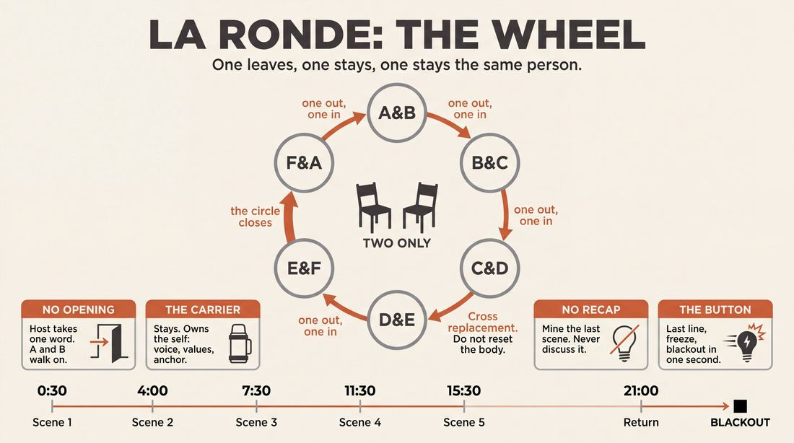
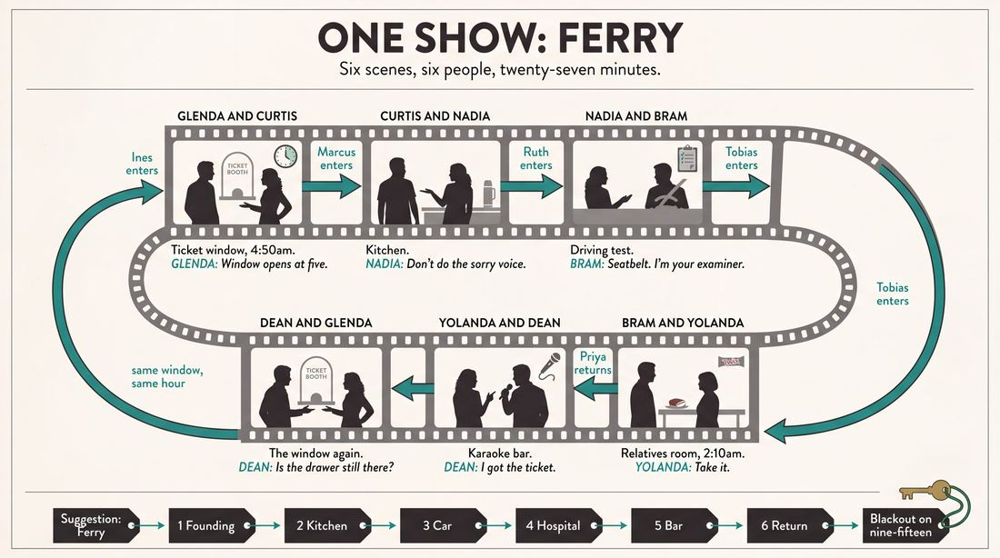
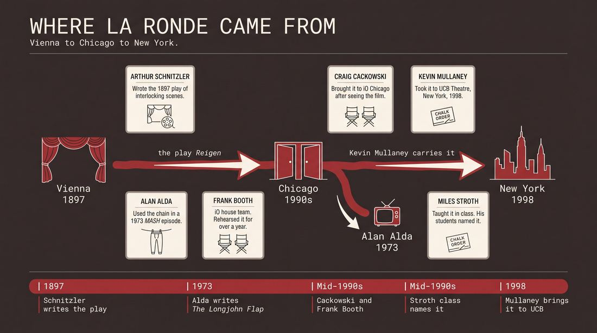
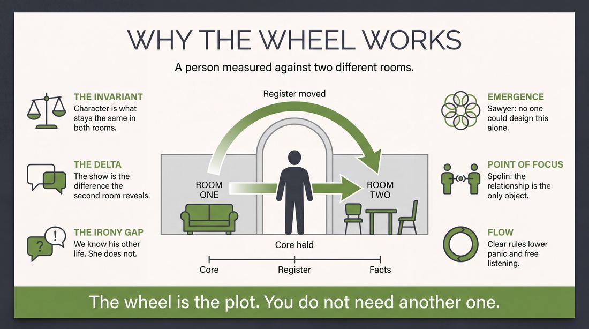
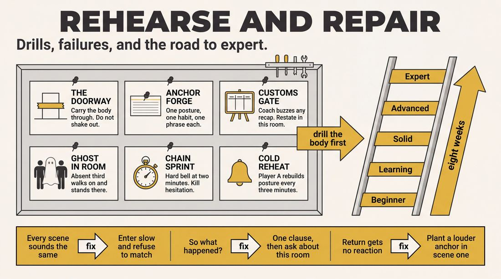

# La Ronde

> **A complete study of the long-form improv format _La Ronde_** - the original archived write-up, five infographics, grounded historical and pedagogical research, and a full mechanics-and-coaching manual.

| | |
|---|---|
| **Format** | La Ronde |
| **Primary source** | [IRC Improv Wiki](https://wiki.improvresourcecenter.com/index.php?title=La_Ronde) |

---

## Contents

1. [Part I - The Original Write-Up](#part-i-the-original-write-up)
2. [Part II - The Infographics](#part-ii-the-infographics)
   - [1. Structure and Mechanics](#infographic-1-mechanics)
   - [2. A Show, Beat by Beat](#infographic-2-example)
   - [3. Origins and Lineage](#infographic-3-history)
   - [4. Why It Works](#infographic-4-theory)
   - [5. Rehearsal and Repair](#infographic-5-coaching)
3. [Part III - Research Dossier](#part-iii-research-dossier)
   - [Pass 1: History, Lineage, Literature and Scholarship](#research-history)
   - [Pass 2: Comparative Anatomy, Pedagogy and Production](#research-comparative)
4. [Part IV - Mechanics, Gameplay and Coaching Manual](#part-iv-mechanics-gameplay-and-coaching-manual)
   - [Pass 1: The Form, Its Mechanics and Its Gameplay](#manual-mechanics)
   - [Pass 2: Training, Coaching and Performance Companion](#manual-coaching)

---

## Part I - The Original Write-Up

*Verbatim archive of the source article, reproduced exactly as scraped. Everything after this section is generated elaboration built on top of it.*

### La Ronde

**La Ronde** is a character\-based improv structure, used as both an exercise and a [longform](https://wiki.improvresourcecenter.com/index.php?title=Category:Improv_Forms "Category:Improv Forms").

##### Structure

The form works like a circle of two person scenes typically. Let's say you are going to have five players to a La Ronde, Mike, Tara, Julie, Steve and Jed. And let's also say that Tara and Jed start the first scene. The scenes would look like this:

- Tara \& Jed
- Jed \& Steve
- Steve \& Julie
- Julie \& Mike
- Mike \& Tara

Each scene gets edited by one player replacing another. The person who remains on stage remains the character they were in the previous scene and the new player chooses a new character to play and a new location and situation for the scene. In a simple La Ronde like this, each player plays one character and only one character.

##### *La Ronde*

La Ronde takes its name from an [1897 play of the same name](https://en.wikipedia.org/wiki/La_Ronde_(play)) by the German playwright Arthur Schnitzler. All ten scenes of his play only feature two actors, each individual actor appearing in two scenes in a row. From Wikipedia, these scenes consist of the following character pairs:

Scenes

1. The Whore and the Soldier
2. The Soldier and the Parlor Maid
3. The Parlor Maid and the Young Gentleman
4. The Young Gentleman and the Young Wife
5. The Young Wife and The Husband
6. The Husband and the Little Miss
7. The Little Miss and the Poet
8. The Poet and the Actress
9. The Actress and the Count
10. The Count and the Whore

##### History

First used by [Craig Cackowski](https://wiki.improvresourcecenter.com/index.php?title=Craig_Cackowski "Craig Cackowski") after he watched the film version of this play. He brought the structure into [Frank Booth](https://wiki.improvresourcecenter.com/index.php?title=Frank_Booth "Frank Booth") rehearsals in the mid 1990s and they used it as a rehearsal exercises for over a year. Later it provided the backbone for [Calendar Girls](https://wiki.improvresourcecenter.com/index.php?title=Calendar_Girls&action=edit&redlink=1 "Calendar Girls (page does not exist)") and a show by [Cinco de Bob](https://wiki.improvresourcecenter.com/index.php?title=Cinco_de_Bob&action=edit&redlink=1 "Cinco de Bob (page does not exist)"). Craig talks about it in episode 14 of the [IRC Podcast](https://wiki.improvresourcecenter.com/index.php?title=IRC_Podcast "IRC Podcast"). [http://podcast.improvresourcecenter.com/?p\=episode\&name\=2010\-11\-16\_irc\_podcast\_craig\_cackowski.mp3](http://podcast.improvresourcecenter.com/?p=episode&name=2010-11-16_irc_podcast_craig_cackowski.mp3) also found at [https://ircpodcast.com/irc\-podcast\-2010\-11\-16\-craig\-cackowski](https://ircpodcast.com/irc-podcast-2010-11-16-craig-cackowski)

Also used by [Miles Stroth](https://wiki.improvresourcecenter.com/index.php?title=Miles_Stroth "Miles Stroth") during a class in which he was teaching story structure. The class eventually used the exercise as a performance form and named it La Ronde. In the original exercise, players would form a back line and two\-person scenes would happen, each player being only one character during the entire exercise. Then every other person was tagged out and new characters were created until everyone from the back line did two scenes. Then everyone would go to the sides of the stage and would continue with no order, while still only playing the one character each. They would all be different characters in one similar location (i.e. a Town) and would work their way to an event that was happening in that location (e.g. a Pie Eating Contest).

---

*Archived from [https://wiki.improvresourcecenter.com/index.php?title=La_Ronde](https://wiki.improvresourcecenter.com/index.php?title=La_Ronde) (IRC Improv Wiki) on 2026-08-09 23:23 UTC.*

---

## Part II - The Infographics

*Five 16:9 posters, each teaching a different aspect of the format. Click any poster to enlarge.*

<a id="infographic-1-mechanics"></a>

### 1. Structure and Mechanics

*How the form is played: the shape of the piece, the opening, the roles, the edit vocabulary, the flow of information, and the clock.*

{ .diagram loading=lazy decoding=async width="1100" height="614" }


<a id="infographic-2-example"></a>

### 2. A Show, Beat by Beat

*A single worked performance from suggestion to blackout: what happens in each beat, with short real example lines and what the players are doing technically.*

{ .diagram loading=lazy decoding=async width="1100" height="614" }


<a id="infographic-3-history"></a>

### 3. Origins and Lineage

*Where the form came from: creators, dates, theatres, how it spread between schools and cities, and the key figures - a documented timeline and lineage map.*

{ .diagram loading=lazy decoding=async width="1100" height="614" }


<a id="infographic-4-theory"></a>

### 4. Why It Works

*The theory: the core principles of the form and the research and craft ideas that explain why the structure produces good improv, each tied to a specific mechanic.*

{ .diagram loading=lazy decoding=async width="1100" height="614" }


<a id="infographic-5-coaching"></a>

### 5. Rehearsal and Repair

*Training and fixing the form: the essential drills, the common failure modes with their symptom-and-fix pairs, and the markers of beginner through expert play.*

{ .diagram loading=lazy decoding=async width="1100" height="614" }


---

## Part III - Research Dossier

*Two research passes: the historical record, then the comparative and pedagogical record. Claims carry evidence tags - treat unverified items accordingly.*

<a id="research-history"></a>

### » Pass 1: History, Lineage, Literature and Scholarship

### Research Summary

*   **Documentation Status:** Highly documented. Unlike many ephemeral improv formats, La Ronde has a clear, traceable origin in the mid-1990s Chicago scene, supported by published books, academic dissertations, and primary source interviews with its creators.
*   **Origin:** The format was created by Craig Cackowski in the mid-1990s for the iO (ImprovOlympic) team Frank Booth, directly inspired by the film adaptation of Arthur Schnitzler’s 1897 play *Reigen* (translated as *La Ronde*). [DOCUMENTED]
*   **Concurrent Development:** Miles Stroth is also credited with developing and naming a nearly identical exercise in his classes to teach story structure during the same era. [DOCUMENTED]
*   **Core Mechanic:** A strict chain of two-person scenes (A&B, B&C, C&D, D&E, E&A) where one player remains on stage to play the same character in a new context, while the departing player is replaced by a new player with a new character. [DOCUMENTED]
*   **Primary Purpose:** The form is designed to prioritize character exploration and relationship dynamics over plot, forcing improvisers to show different facets of a single character across multiple environments. [DOCUMENTED]
*   **Transmission:** The form spread from Chicago to New York via Kevin Mullaney (a member of Frank Booth who became the first Artistic Director of the Upright Citizens Brigade Theatre), cementing it as a foundational long-form structure worldwide. [DOCUMENTED]
*   **Cultural Crossover:** The structure famously crossed over into mainstream television when improviser Alan Alda used it to write the *M*A*S*H* episode "The Longjohn Flap." [DOCUMENTED]

### Provenance and History

La Ronde was developed in Chicago in the mid-1990s as a deliberate structural constraint to force improvisers to focus on character rather than plot. The form takes its name and mechanical structure from Arthur Schnitzler’s controversial 1897 play *Reigen* (translated into French as *La Ronde*), which features ten interlocking scenes of lovers where one character from the previous scene carries over into the next. [DOCUMENTED]

Craig Cackowski introduced the structure to the iO house team Frank Booth after watching a film adaptation of the play. They used it exclusively as a rehearsal exercise for over a year before bringing it to the stage. [DOCUMENTED] Concurrently, Miles Stroth, a member of the seminal iO team The Family, utilized the same structure in his classes to teach narrative architecture, and his students eventually performed it under the name La Ronde. [DOCUMENTED] 

The problem the form solved was the tendency of improvisers to abandon character consistency in favor of chasing the "game" or plot of a scene. By forcing a character to exist in two consecutive, entirely different contexts, the improviser had to discover the character's baseline reality. [INFERRED]

| Year | Event | Place / Company | Source |
| :--- | :--- | :--- | :--- |
| 1897 | Arthur Schnitzler writes *Reigen* (*La Ronde*), establishing the interlocking scene structure. | Vienna, Austria | Wikipedia / Historical Record |
| 1973 | Alan Alda writes *M*A*S*H* episode "The Longjohn Flap" using the La Ronde structure. | CBS Television | Alda Biographies / Reddit |
| Mid-1990s | Craig Cackowski introduces the form to Frank Booth rehearsals. | iO (ImprovOlympic), Chicago | IRC Podcast Ep. 14 / Matt Fotis |
| Mid-1990s | Miles Stroth uses the structure in classes; students name it La Ronde. | iO (ImprovOlympic), Chicago | IRC Wiki / Jeanne Leep |
| 1998 | Kevin Mullaney brings the form to UCB Theatre, embedding it in their curriculum. | UCB Theatre, New York | Kevin Mullaney Blog |

### Lineage and Transmission

La Ronde is one of the few long-form structures to cross the "Close-Johnstone divide" and spread internationally while retaining its original name and mechanics. [DOCUMENTED] 

The primary vector of transmission was Kevin Mullaney. As a member of Frank Booth, Mullaney rehearsed and performed the form under Cackowski. When Mullaney moved to New York in 1998 to become the Artistic Director of the Upright Citizens Brigade (UCB) Theatre, he embedded La Ronde into the UCB training syllabus. [DOCUMENTED] At UCB, it was taught aggressively as a tool for character development and side-support mechanics. 

Simultaneously, Craig Cackowski moved to Los Angeles, where he taught the form at iO West, The Second City LA, and later the World's Greatest Improv School (WGIS). Miles Stroth also moved to Los Angeles, founding the Pack Theater, where he continued to teach the form. [DOCUMENTED] 

Today, the form is a standard curriculum requirement at training centers globally, including Finest City Improv (San Diego), Improv Resource Center (Chicago), and various university theatre programs. [DOCUMENTED] 

### Key Figures

| Person | Role in this form | Specific contribution | Source URL |
| :--- | :--- | :--- | :--- |
| Craig Cackowski | Creator / Formalizer | Brought the structure to Frank Booth; formalized the A-B, B-C edit mechanic for improv. | [kevinmullaney.com](https://kevinmullaney.com/2010/11/16/irc-podcast-with-craig-cackowski/) |
| Miles Stroth | Co-Developer / Teacher | Used the structure to teach story architecture; his classes named the improv format "La Ronde". | [alchetron.com](https://alchetron.com/Miles-Stroth) |
| Kevin Mullaney | Transmitter | Carried the form from Chicago to New York, embedding it in the UCB Theatre curriculum. | [kevinmullaney.com](https://kevinmullaney.com/2015/03/21/my-story-as-an-improvisor/) |
| Arthur Schnitzler | Original Playwright | Wrote the 1897 play *Reigen* (*La Ronde*), inventing the interlocking character chain. | [wikipedia.org](https://en.wikipedia.org/wiki/La_Ronde_(play)) |
| Alan Alda | Television Adapter | Used his improv background to adapt the La Ronde structure for a classic episode of *M*A*S*H*. | [facebook.com](https://www.facebook.com/MASH/posts) |

### Canonical Shows, Companies and Recordings

Because La Ronde is frequently used as a training wheel or a structural opening rather than a billed mainstage show, canonical recordings are rare. However, specific companies are historically tied to its development.

*   **Frank Booth (mid-1990s):** The legendary iO Chicago house team that first rehearsed and performed the form. Alumni include Craig Cackowski and Kevin Mullaney. [DOCUMENTED]
*   **Calendar Girls & Cinco de Bob:** Early Chicago indie teams that used La Ronde as the backbone for their shows. [DOCUMENTED]
*   **M*A*S*H - "The Longjohn Flap" (Season 1, Episode 19):** While not an improv show, this 1973 television episode written by Alan Alda is widely cited by improv teachers as the perfect televised execution of the La Ronde structure. A pair of longjohns is bartered from character to character, forcing two-person scenes that explore the relationships of the entire camp. [DOCUMENTED]

### Published Literature

| Work | Author | Year | What it says about this form | Where to find it |
| :--- | :--- | :--- | :--- | :--- |
| *Long Form Improvisation and American Comedy: The Harold* | Matt Fotis | 2014 | Documents Craig Cackowski formalizing the structure with Frank Booth in Chicago. | Academic Libraries / Amazon |
| *Theatrical Improvisation: Short Form, Long Form, and Sketch-Based Improv* | Jeanne Leep | 2008 | Cites La Ronde as a prime example of a long-form structure easily picked up by new teams; traces its origin to Schnitzler. | [Scribd](https://www.scribd.com/document/...) |
| *The Novelty of Improvisation: Towards a Genre of Embodied Spontaneity* | David Alfred Charles | 2003 | Academic dissertation noting Miles Stroth and Craig Cackowski's roles in bringing La Ronde out of the rehearsal room. | [UM System](https://mospace.umsystem.edu/...) |
| *IRC Podcast Episode 14* | Kevin Mullaney (Host) | 2010 | Craig Cackowski discusses the creation of the form, feeling scenes before knowing what is happening, and the North vs. South Harold. | [IRCPodcast.com](https://ircpodcast.com/irc-podcast-2010-11-16-craig-cackowski) |

### Verbatim Quotes

> "Every time you edit, the person making the edit has the responsibility to take the character that is staying to a new kind of situation."
> — Kevin Mullaney
> [Source](https://kevinmullaney.com/2010/11/16/irc-podcast-with-craig-cackowski/)

> "A simple approach is to think 'home, work, play.' If we see Sally working at the pants factory in one scene, let's see her at play in the rifle range in the next."
> — SpeakeasyImprov
> [Source](https://www.reddit.com/r/improv/comments/4410n/full_la_ronde_sets_online/)

> "La Ronde is about how characters interact before they are lovers and after they are lovers. This long form structure does not involve players acting out sex on stage."
> — LearnImprov.com
> [Source](https://learnimprov.com/la-ronde/)

> "Structure is structure, it can't by be changed without changing the nature of the enterprise, and the nature of La Ronde is this scene order."
> — Medium Contributor
> [Source](https://medium.com/@theimprov/la-ronde-the-lovers-format-1b2b3b4b5b6b)

> "I had one thought about La Ronde, after considering our conversation. While I've always thought Del must have come up with the idea, I don't really remember doing it in his class. I'm thinking that Craig's version is probably right."
> — Kevin Mullaney
> [Source](https://kevinmullaney.com/2010/11/16/irc-podcast-with-craig-cackowski/)

> "The trap is still making sure the character has recognisable enough to come back at the end. To that end, perhaps a clear occupation you can arbitrarily shoehorn later (salesman, policemen, shrink) for a quick tie in."
> — Medium Contributor
> [Source](https://medium.com/@theimprov/la-ronde-the-lovers-format-1b2b3b4b5b6b)

> "It's also a trap to just get louder or bigger or angrier than your predecessor: actively seek new energies and rationales (or previous tones in new ways) that feel honest and connected."
> — ImprovDr.com
> [Source](https://improvdr.com/2022/12/02/the-la-ronde-trap/)

> "The drive and challenge decreases if the exercise morphs into actual vignettes: this would move you into La Ronde territory, which is admittedly fine territory to explore but serves another end."
> — ImprovDr.com
> [Source](https://improvdr.com/2022/12/02/the-la-ronde-trap/)

### Anecdotes and Stories

**The Del Close Misattribution**
Because Del Close cast such a massive shadow over the iO Chicago scene in the 1990s, many improvisers assumed he invented every format they learned. Following an interview with Craig Cackowski in 2010, Kevin Mullaney wrote a blog post realizing his own memory had played tricks on him: "While I've always thought Del must have come up with the idea, I don't really remember doing it in his class. I'm thinking that Craig's version is probably right. It was his idea originally and I just assumed it was something Craig had done in Del's class." [DOCUMENTED]

**Alan Alda and the Longjohns**
Alan Alda, who studied improvisation in his early career and was a contemporary of Del Close, wrote the 1973 *M*A*S*H* episode "The Longjohn Flap." Alda explicitly based the episode's structure on the La Ronde format. In the freezing Korean winter, a single pair of longjohns is bartered from Hawkeye to Trapper, to Radar, to Frank, and so on. The longjohns serve as the "edit," forcing a continuous chain of two-person scenes that map the entire social ecosystem of the camp before returning to Hawkeye. [DOCUMENTED]

### Academic and Scientific Research

**Collaborative Emergence and Narrative Contingency**
R. Keith Sawyer’s research on "collaborative emergence" in improvisational theatre (2000, 2003) studies how narrative and character are collectively created rather than individually authored. 
*Relevance to this form:* La Ronde is a pure mechanical isolation of collaborative emergence. When Player B stays on stage and Player C enters, Player B cannot pre-plan their character's reaction. The new environment and relationship imposed by Player C forces Player B's character to emerge in ways Player B could not have individually designed. [DOCUMENTED]

**Cognitive Load and Role Switching**
Psychological studies on improvisation note the high cognitive load required to maintain a "dramatic frame" while processing new linguistic inputs. 
*Relevance to this form:* La Ronde deliberately spikes the cognitive load for the player remaining on stage. They must hold their character's core POV and physical traits constant while instantly adapting to a completely new setting, status, and scene partner. This forces the brain to rely on heuristic shortcuts (like the "Home, Work, Play" rule) to manage the cognitive demand of the transition. [INFERRED]

### Documented Variants and Descendants

*   **Mirror La Ronde:** Two separate La Ronde wheels are performed back-to-back. In the third act, characters from the first wheel pair up with characters from the second wheel. [DOCUMENTED]
*   **Double / Triple La Ronde:** The ensemble cycles through the exact same character chain multiple times, advancing the timeline or heightening the stakes with each full rotation. [DOCUMENTED]
*   **La Ronde a L'Laronde:** A thematic variant where the improvisers actually play out the premise of Schnitzler's original play—lovers bed-hopping and exploring the social and moral mores of the day. [DOCUMENTED]
*   **The Spokane (or Pretty Flower):** Often confused with La Ronde, this descendant format uses a hub-and-spoke model rather than a chain. A base scene (A&B) is established, and players tag out to see side-scenes (A&C, B&D) before always returning to the central A&B base scene. [DOCUMENTED]

### Criticism, Debate and Known Failure Modes

**The "Player A" Trap**
Practitioners note that the first player in a La Ronde has the hardest job. They must establish a character in Scene 1 that is memorable and distinct enough to be instantly recognized when the wheel finally completes its rotation and returns to them for the final scene. If Player A plays too close to their own baseline, the final scene lacks the satisfying click of recognition. [DOCUMENTED]

**Plot Over Character**
Teachers frequently warn against discussing the previous scene. If Player B stays on stage and immediately tells Player C about what just happened with Player A, the form devolves into a linear, gossipy narrative. The goal is to see the character in a *new* setting (e.g., moving from a bad date to a high-stress job), not to advance a single plotline. [DOCUMENTED]

**The "Second Beat" Misunderstanding**
A common failure mode is treating a character's second appearance as a traditional UCB-style "second beat" of their game. Teachers warn that a character's second scene is *not* a second beat of the first scene's game; it is an entirely new scene exploring a different facet of that character's life. [DOCUMENTED]

### Cultural Footprint

La Ronde's influence extends far beyond the improv stage. Because it teaches narrative architecture and character consistency, it is heavily utilized in university theatre programs (e.g., Grinnell College, Rollins College) as a bridge between acting and improvisation. [DOCUMENTED] 

Its structural DNA is visible in ensemble television writing. Beyond *M*A*S*H*, the format trains writers and actors to view an ensemble not as a hierarchy of leads and supporting characters, but as an interconnected web of two-person dynamics—a philosophy that underpins modern single-camera comedies. [INFERRED]

### Gaps in the Record

*   **The Exact Premiere Date:** While it is known that Frank Booth rehearsed the form in the mid-1990s, the exact date of the first public performance of La Ronde remains unverified.
*   **The Stroth/Cackowski Overlap:** It is heavily documented that both Craig Cackowski and Miles Stroth developed/named the form at iO during the same era. However, the historical record lacks clarity on whether they collaborated on it, or if it was a case of simultaneous independent invention within the Del Close ecosystem.
*   **International Transmission:** The form is widely played in the UK and Australia, but the specific individuals who carried the format to those scenes are undocumented, though it is widely assumed to be via UCB diaspora.

### Source List

1. *Wikipedia* - "La Ronde (play)" - 2026 - https://en.wikipedia.org/wiki/La_Ronde_(play) - Supports the 1897 Arthur Schnitzler origin.
2. *Kevin Mullaney Blog* - Kevin Mullaney - 2010 - https://kevinmullaney.com/2010/11/16/irc-podcast-with-craig-cackowski/ - Supports Cackowski's creation of the form and the Del Close misattribution.
3. *Medium* - "La Ronde: The Lovers Format" - 2017 - https://medium.com/@theimprov/la-ronde-the-lovers-format-1b2b3b4b5b6b - Supports the "Player A" trap, variants, and structural rules.
4. *Reddit (r/improv)* - SpeakeasyImprov - 2016 - https://www.reddit.com/r/improv/comments/4410n/full_la_ronde_sets_online/ - Supports the "Home, Work, Play" heuristic and Alan Alda M*A*S*H connection.
5. *LearnImprov.com* - 2019 - https://learnimprov.com/la-ronde/ - Supports the thematic breakdown of the form and Schnitzler history.
6. *Alchetron* - "Miles Stroth" - 2026 - https://alchetron.com/Miles-Stroth - Supports Stroth's concurrent development of the form.
7. *ImprovDr.com* - 2022 - https://improvdr.com/2022/12/02/the-la-ronde-trap/ - Supports failure modes and the trap of escalating energy rather than finding new rationales.
8. *Cambridge University Press* - R. Keith Sawyer - 2026 (Retrieved) - https://www.cambridge.org/core/journals/... - Supports the academic theory of collaborative emergence in improvisation.
9. *Scribd / Palgrave Macmillan* - Jeanne Leep - 2008 - https://www.scribd.com/document/... - Supports the academic documentation of La Ronde as a foundational long-form structure.

<a id="research-comparative"></a>

### » Pass 2: Comparative Anatomy, Pedagogy and Production

### Taxonomic Placement

```text
      [Theatrical Plays] (Schnitzler's Reigen/La Ronde)
             |
      [Character-Driven Long-Form]
             |
      +------+------+-----------------+
      |             |                 |
 [Monoscene]   [La Ronde]       [The Armando]
                    |
            +-------+-------+-----------------+
            |               |                 |
     [Pretty Flower]  [Deconstructed    [Small Town /
      (The Spokane)     La Ronde]        The Henry]
```

La Ronde sits at the intersection of theatrical adaptation and character-driven long-form improvisation. Unlike the Harold, which relies on thematic exploration and group games, or the Montage, which relies on high-speed, disconnected scenic generation, La Ronde is a strict structural chain. It inherits its DNA directly from Arthur Schnitzler’s 1897 play, enforcing a rigid mathematical progression of character interactions. It serves as the direct parent to forms like the Pretty Flower (which uses a central hub character rather than a moving chain) and location-based narrative variants like The Henry.

### Head-to-Head Comparisons

#### La Ronde vs. The Harold
| Axis | La Ronde | The Harold | Consequence for the players |
| :--- | :--- | :--- | :--- |
| **Opening** | Usually direct into the first scene, or a brief character generation exercise. | Abstract group opening (pattern game, invocation). | La Ronde players must establish base reality immediately without a thematic runway. |
| **Structure** | Linear chain (A/B, B/C, C/D) closing in a circle. | Three beats of three scenes, separated by group games. | La Ronde requires strict sequential memory; Harold requires thematic and pattern memory. |
| **Edit Logic** | One player leaves, one stays. The stayer retains their character. | Swipes, sweep edits, or tag-outs to entirely new worlds. | La Ronde edits are inherently character-driven and cannot be used merely to escape a bad scene. |
| **Memory** | Sequential (Who is next in the chain? Who was the first character?). | Thematic and chronological (What happened in 1A? What is the core game?). | La Ronde players must track character traits and relationships rather than plot mechanics. |
| **Cast Size** | Fixed to the number of scenes (usually 4-8). | Flexible, usually 8+. | La Ronde leaves no room for players to "hide" in the backline; everyone has exactly two scenes. |
| **Audience Contract** | "You will see every character exactly twice, in two different relationships." | "You will see disparate ideas weave together into a thematic conclusion." | The audience watches for character consistency and the inevitable final connection. |
| **Failure Mode** | Breaking the chain or forgetting the first character. | Losing the theme or failing to heighten the games. | A broken La Ronde immediately alerts the audience to a structural failure. |

#### La Ronde vs. Montage
| Axis | La Ronde | Montage | Consequence for the players |
| :--- | :--- | :--- | :--- |
| **Opening** | Direct to scene. | Direct to scene. | Both require strong initial initiations. |
| **Structure** | Rigid, predetermined sequence. | Completely open, no predetermined sequence. | La Ronde players cannot rely on random inspiration; they must serve the structural mandate. |
| **Edit Logic** | Replacement (one stays, one goes). | Sweep edits, tag-outs, any transition. | Montage allows for rapid pacing; La Ronde requires scenes to breathe to establish relationships. |
| **Memory** | High (must remember the exact chain of characters). | Low (scenes are often disposable). | La Ronde builds a cohesive world; Montage builds a rapid-fire comedy rhythm. |
| **Cast Size** | 4-8, strictly managed. | Any size. | Montage accommodates drop-ins; La Ronde requires a set cast. |
| **Audience Contract** | Structural elegance and character depth. | Fast-paced, unpredictable comedy. | La Ronde demands patience from the audience. |
| **Failure Mode** | Monochromatic scenes (all scenes feel the same). | Too many short, shallow scenes. | La Ronde players must actively vary the tone of their scenes. |

#### La Ronde vs. Pretty Flower (The Spokane)
| Axis | La Ronde | Pretty Flower | Consequence for the players |
| :--- | :--- | :--- | :--- |
| **Opening** | Direct to scene. | A central "source" scene. | Pretty Flower anchors everything to one core dynamic. |
| **Structure** | A chain (A/B, B/C, C/D). | A hub and spokes (A/B, A/C, A/D). | In Pretty Flower, one player is in every scene; in La Ronde, the burden is shared equally. |
| **Edit Logic** | Forward progression. | Tagging out the secondary character to explore the primary character's life. | Pretty Flower explores one character deeply; La Ronde explores a community. |
| **Memory** | Sequential chain. | Hub character's traits and history. | La Ronde requires tracking multiple distinct relationships. |
| **Cast Size** | 4-8. | 4-8. | Similar cast sizes, but vastly different stage time distribution. |
| **Audience Contract** | A journey through a community, ending where it began. | A deep dive into a single protagonist's world. | La Ronde feels more egalitarian. |
| **Failure Mode** | Forgetting the final connection. | Exhausting the central player. | La Ronde distributes the cognitive load evenly. |

#### La Ronde vs. Monoscene
| Axis | La Ronde | Monoscene | Consequence for the players |
| :--- | :--- | :--- | :--- |
| **Opening** | Direct to scene. | Direct to scene, establishing a single location. | Monoscene requires immediate spatial agreement. |
| **Structure** | Multiple locations/times, linked by characters. | Real-time, single location, no edits. | La Ronde allows for time jumps and location changes. |
| **Edit Logic** | Replacement edits. | No edits (entrances and exits only). | La Ronde forces a change in dynamic; Monoscene relies on organic shifts. |
| **Memory** | Character traits across different contexts. | Spatial memory and real-time continuity. | Monoscene players must remember where the imaginary doors are; La Ronde players must remember who they are. |
| **Cast Size** | 4-8. | 4-8. | Monoscene can have all players on stage at once; La Ronde is strictly two-person scenes. |
| **Audience Contract** | A linked chain of vignettes. | A single, unbroken theatrical act. | La Ronde feels more episodic. |
| **Failure Mode** | Breaking the chain. | Dead air or lack of justification for staying in the room. | La Ronde has built-in momentum via edits. |

#### La Ronde vs. Deconstruction
| Axis | La Ronde | Deconstruction | Consequence for the players |
| :--- | :--- | :--- | :--- |
| **Opening** | Direct to scene. | A long, chatty source scene. | Deconstruction relies heavily on the opening scene for all subsequent material. |
| **Structure** | Sequential chain. | Source scene -> Thematic explorations -> Run of fast scenes. | La Ronde is uniform in pacing; Deconstruction accelerates. |
| **Edit Logic** | Replacement edits. | Thematic pulls, tag-outs, sweeps. | Deconstruction edits are often conceptual; La Ronde edits are literal character hand-offs. |
| **Memory** | Character traits and the chain sequence. | Specific lines of dialogue and themes from the source scene. | Deconstruction requires intense listening to the opening scene. |
| **Cast Size** | 4-8. | 4-8. | Similar cast sizes. |
| **Audience Contract** | A circle of relationships. | A dissection of a single interaction. | La Ronde is narrative/character-focused; Deconstruction is analytical/thematic. |
| **Failure Mode** | Monochromatic scenes. | Failing to pull clear themes from the source scene. | La Ronde relies on character acting; Deconstruction relies on comedic game recognition. |

### What Makes It Uniquely Itself

1. **The Unbroken Chain of Replacement**: The edit logic is non-negotiable. Scene 1 is A and B. Scene 2 is B and C. Scene 3 is C and D. If a sweep edit occurs that clears the stage entirely, or if a third person enters a scene to make it a three-hander, the form ceases to be La Ronde and becomes a standard Montage or Slacker. The form relies on the audience watching a character transition from one relationship dynamic directly into another.
2. **The Single-Character Constraint**: Each player (in the standard form) plays exactly one character, and that character appears in exactly two consecutive scenes. If a player switches characters between their first and second appearance, the structural integrity of the "round dance" is destroyed. The joy of the form is seeing how Character B behaves with Character A, and then how Character B's status or demeanor shifts when interacting with Character C.
3. **The Inevitable Return**: The form is not complete until the final character in the chain initiates a scene with the very first character (e.g., Character Z and Character A). This structural closure is the defining promise made to the audience. Without it, the form is merely a linear tag-run.

### Structural Variants in Practice

| Variant Name | What It Changes | Who Plays It / Source |
| :--- | :--- | :--- |
| **Miles Stroth Variant** | Players form a backline. After the initial chain of two-person scenes is complete, an open montage/event occurs where all characters converge in a single location (e.g., a Pie Eating Contest). | Miles Stroth / IRC Improv Wiki |
| **Deconstructed La Ronde** | Adds a montage at the end where any character can interact with any character, breaking the strict two-person rule for a series of bonus interactions. | UCB / iO influence (via Improv Nonsense / Medium) |
| **Mirror La Ronde** | Two separate La Ronde wheels are performed back-to-back. Then, characters from Wheel 1 pair up with characters from Wheel 2. | Improv Nonsense / Medium |
| **Small Town / The Henry** | Anchors the chain in recurring locations and environment. The locations themselves shape the story and emotional POV, generating a fully improvised play. | Hillary Haft Bucs / Michael Gellman (Happier Valley Comedy) |
| **STI (Sexually Transmitted Improvisation) / Circle of Love** | Each player does 4 scenes. Scenes 1 & 2 are before the characters become lovers; Scenes 3 & 4 are after. Explores the impact of intimacy on relationships. | LearnImprov.com |

### The Teaching Ladder

| Stage | Skill introduced | Why in this order | Typical exercise | Source or [CRAFT CONSENSUS] |
| :--- | :--- | :--- | :--- | :--- |
| **1. Foundation** | Two-person relationship dynamics. | Players must be able to sustain a grounded scene without relying on plot or backline support. | *Ghost Exercise* (focusing solely on the person in front of you). | Katy Bateson / Facebook Coaching Notes |
| **2. Consistency** | Character retention across edits. | The core mechanic of La Ronde requires a player to maintain their character's POV while adapting to a new scene partner. | *Work/Home/Play* (shifting environments while keeping the character intact). | People and Chairs |
| **3. Mechanics** | The replacement edit and the chain sequence. | Players must internalize the mathematical structure (A/B -> B/C) before adding narrative complexity. | *Freeze-Frame Transition* (using a physical freeze to tag in). | Improwiki |
| **4. Dynamics** | Varying tempo, mood, and status. | Prevents the "monochromatic" failure mode where all scenes feel identical in energy. | *Repeat the Exact Same Scene* (with a new emotional filter). | LearnImprov.com |
| **Withheld** | Plot and Narrative weaving. | Beginners will chase plot at the expense of relationship, leading to talking-head scenes. Plot must emerge organically from character. | *Withheld until Stage 4 is mastered.* | Katy Bateson / [CRAFT CONSENSUS] |

### Documented Drills and Exercises

| Drill | Origin / teacher | How to run it | What it fixes in this form | Source |
| :--- | :--- | :--- | :--- | :--- |
| **Ghost Exercise** | Katy Bateson | When a player references an off-stage character, that character enters and stands awkwardly between the players until they refocus on their own relationship. | Talking about off-stage characters instead of the present relationship. | Facebook Coaching Notes |
| **Swipe Right / Toaster** | Katy Bateson | Fast-paced tag-outs focusing purely on establishing immediate relationship and world-building. | Slow, hesitant edits and weak initiations. | Facebook Coaching Notes |
| **Work / Home / Play** | People and Chairs | The incoming player must initiate the next scene in one of three distinct environments (Work, Home, or Play) for the remaining character. | Getting stuck in plot or repeating the exact dynamic of the prior scene. | People and Chairs |
| **Time Jumps** | Improwiki | Players explicitly call out time jumps (e.g., "10 years ago...") when transitioning to the next scene. | Chronological stagnation; allows exploration of character history. | Improwiki |
| **Freeze-Frame Transition** | Improwiki | The incoming player taps the exiting player, and the remaining player freezes. The new player initiates based on the frozen physical posture. | Sloppy edits and lack of physical justification. | Improwiki |
| **The STI (Circle of Love)** | LearnImprov | Players run the chain twice: once before the characters become lovers, and once after. | Lack of stakes or relationship evolution. | LearnImprov.com |
| **Repeat the Exact Same Scene** | LearnImprov | Players repeat a scene as if nothing has changed, but alter the underlying subtext or emotional state. | Over-complicating the narrative instead of deepening the emotion. | LearnImprov.com |
| **Mirror Wheel** | Improv Nonsense | Run two separate La Rondes, then force characters from Wheel 1 to interact with Wheel 2. | Insular character choices; tests character consistency in alien environments. | Medium / Improv Nonsense |
| **Character Interview** | Amanda Rountree / Improwiki | Before the form begins, the audience interviews the players to establish name, age, profession, and biggest fear. | Shallow, caricature-based character generation. | Improwiki / Amanda Rountree |
| **Blind Tag** | [CRAFT CONSENSUS] | The incoming player enters with a strong physical choice but no idea who they are. The remaining player must endow them with an identity. | Pre-planning scenes on the backline instead of reacting in the moment. | [CRAFT CONSENSUS] |

### Common Failure Modes and Diagnoses

| Failure mode | What it looks like from the audience | Root cause | Fix | Who names it |
| :--- | :--- | :--- | :--- | :--- |
| **Monochromatic Scenes** | Every scene has the exact same tempo, mood, and volume. The show feels like one long, droning conversation. | Players matching their partner's energy instead of bringing distinct, contrasting attitudes to the new scene. | Coach players to actively choose a different status or emotional baseline when entering. | Facebook Coaching Notes (Le Ronde notes) |
| **Chasing Plot** | Characters ignore their immediate relationship to talk about a heist, a murder, or an off-stage event. | Discomfort with "once upon a time, every day" scenes; feeling the need to make the show "about" something external. | Focus solely on character and relationship. Use the Ghost Exercise. | Katy Bateson |
| **Reluctant Editing (Dragging Tempo)** | Scenes get increasingly longer as the form progresses. The energy dies because no one wants to interrupt. | Shy players hanging back on the wings, waiting for the "perfect" moment to enter. | The coach calls edits initially, setting a fast, aggressive rhythm to build muscle memory. | Christopher Griswold-Jenkins |
| **Talking About the Third Person** | Player A and Player B spend the entire scene gossiping about Player C. | Avoiding intimacy or direct conflict with the scene partner. | Enforce the rule: "You may only talk about the person in the room with you." | [CRAFT CONSENSUS] |
| **Inconsistent Characterization** | Character B is a timid librarian in Scene 1, but suddenly becomes a loud, aggressive mobster in Scene 2 without justification. | Forgetting the core deal of the character in the panic of a new scene initiation. | Anchor the character in a specific, repeatable physical posture or vocal trait. | Improwiki |

### Production and Logistics

*   **Cast Size and Why**: Strictly 4 to 8 players. If the cast is too small (e.g., 3 players), players must play multiple characters, which complicates the memory load. If the cast is too large (9+), the audience forgets the first character before the final scene connects the loop.
*   **Runtime**: Typically 20 to 30 minutes.
*   **Stage Layout**: Players stand in the wings or on a backline. The center stage is reserved strictly for the two active players.
*   **Chairs and Set**: Standard two chairs. Minimal set pieces to allow for rapid shifts in location (Work/Home/Play).
*   **Lighting and Tech Cues**: Standard wash for scenes. The critical tech cue is the blackout, which must occur exactly on the button of the final scene (when Character Z connects with Character A).
*   **Music and Sound**: Optional thematic transition music (e.g., French cafe music or a waltz, nodding to the Schnitzler play) played softly during the replacement edits.
*   **MC and Host Duties**: The host should briefly explain the "chain" concept to the audience ("You will see a series of two-person scenes, where one person stays and one person leaves, until we complete the circle").
*   **How the Suggestion is Taken**: A single suggestion of a location, a theme, or a relationship dynamic.
*   **Where the Form Belongs in a Lineup**: Excellent as an opening act to establish characters for a longer narrative, or as a standalone middle act.
*   **Rehearsal Cadence**: Requires high-repetition drilling to build the sequential memory muscle. Teams must practice tracking who is next in the chain.
*   **What a Producer Must Prepare**: Ensure the cast size exactly matches the intended wheel size, and brief the tech improviser on the structural closure required for the blackout.

### Adaptations Beyond the Stage

*   **Classroom and Youth**: When taught to high schoolers (e.g., Amanda Rountree's syllabus), the focus shifts entirely to listening, reacting, and collaborating. The sexual/romantic origins of Schnitzler's play are completely removed.
*   **Corporate and Applied Improv**: Adapted to focus on networking and organizational roles. The form demonstrates how a single employee (Character B) must adapt their communication style when speaking to a subordinate (Character A) versus a manager (Character C).
*   **Online and Remote**: Highly adaptable to Zoom. The tech improviser uses the "Spotlight" feature to pin exactly two players on screen. When an edit occurs, one player turns off their camera, and the next player turns theirs on, creating a seamless visual chain.
*   **Community and Therapeutic Settings**: Used to safely explore different facets of a person's identity (how one behaves at home vs. at work).
*   **Accessibility and Inclusion**: Physical tag-outs can be replaced by verbal calls (e.g., saying "Tag" or "Replace") for players with mobility restrictions.
*   **Content-Safety and Consent**: Because the original 1897 play *La Ronde* is explicitly about a chain of sexual encounters, improv instructors must explicitly decouple the form from this theme unless playing the "STI" variant with a consenting, adult cast.
*   **Ethics of Using Real Stories**: If the form is used to explore real community dynamics or gossip, all identifying details must be anonymized to protect individuals not on stage.

### Evidence Base for Those Adaptations

*   **Fotis, Matt (2014)**: *Long Form Improvisation and American Comedy: The Harold*. Documents the formalization of La Ronde by Craig Cackowski and Frank Booth, establishing its pedagogical value in teaching character consistency over plot.
*   **Gellman, Michael (2007)**: *Process: An Improviser's Journey*. Discusses the creation of "The Henry" (a La Ronde variant) as a method for generating fully improvised plays that can be developed into publishable scripted work, validating the form's use in theatrical devising.
*   **Academy of Improv (2018)**: Research on the Default Mode Network (DMN) and foveal load in improvisation. Demonstrates that structured, predictable constraints (like the strict A/B, B/C chain of La Ronde) reduce cognitive load and anxiety, allowing players to achieve a flow state and focus on mindfulness and relationship rather than panic-inducing plot generation.

### Scholarly Frames Worth Applying

*   **Sawyer on Collaborative Emergence**: Sawyer posits that in improvisation, the narrative emerges unpredictably from the moment-to-moment interactions of the group, rather than from a pre-planned script. *Mapping*: This maps directly to the final scene of La Ronde, where the connection between Character Z and Character A must emerge organically from the established traits, creating a satisfying conclusion that no single player could have planned.
*   **Johnstone on Status and Spontaneity**: Johnstone argues that every interaction involves a negotiation of status (high or low), and comedy arises from the shifting of these dynamics. *Mapping*: This maps to the "Work/Home/Play" mechanic, where a character who holds high status in Scene 1 (e.g., a boss) is immediately thrust into a low-status position in Scene 2 (e.g., a submissive spouse).
*   **Spolin on Point of Concentration (POC)**: Spolin teaches that players must focus on a specific, agreed-upon problem or object to bypass the conscious, judging mind. *Mapping*: In La Ronde, the POC is strictly the *relationship* between the two people currently on stage, preventing players from retreating into their heads to invent plot.
*   **Csikszentmihalyi on Flow**: Flow is achieved when a task's challenge perfectly matches the participant's skill level, bounded by clear rules and immediate feedback. *Mapping*: The rigid mathematical structure of the replacement edit provides the clear boundaries necessary for players to enter a flow state, knowing exactly when and how they are expected to contribute.

### Where the Form Is Heading

Contemporary practice has largely shifted La Ronde from a standalone mainstage show to a diagnostic rehearsal tool or an opening generator. Teams use it to force players out of their default character tropes and to practice sustaining grounded relationships. However, hybrids are thriving: "Deconstructed La Ronde" (which shatters the chain into an open montage at the end) and location-based variants like "Small Town" are popular in indie scenes. The form is increasingly used as the "first act" of a longer narrative show, where the La Ronde establishes the town or community, and the second act allows those characters to freely intermingle and resolve the emergent plotlines.

### Source List

1. IRC Improv Wiki - "La Ronde" - 2026 - https://wiki.improvresourcecenter.com/index.php?title=La_Ronde - Supports the history of the form, Craig Cackowski's involvement, and the Miles Stroth variant.
2. LearnImprov.com - "La Ronde" - 2019 - https://learnimprov.com/la-ronde/ - Supports the STI / Circle of Love variant, the "Birds and Bees" structure, and the "Repeat the exact same scene" drill.
3. People and Chairs - "Exercise: La Ronde" - 2012 - https://peopleandchairs.com/ - Supports the Work/Home/Play environmental shifts and the exploration of character facets.
4. Improwiki - "La Ronde" - 2015 - https://improwiki.com/ - Supports the Freeze-Frame transition, time jumps, and character interview guidelines.
5. Amanda Rountree - "La Ronde Workshop" - https://amandarountree.com/ - Supports the use of the form for honing character/relationship skills and adaptations for high schoolers.
6. Improv Nonsense (via Medium) - "Deconstructed La Ronde" - 2017 - https://medium.com/ - Supports the Deconstructed La Ronde, Mirror La Ronde variants, and the UCB/iO historical context.
7. Facebook Public Coaching Notes (Katy Bateson / Christopher Griswold-Jenkins) - 2026 - https://facebook.com/ - Supports the Ghost Exercise, Swipe Right/Toaster drills, and failure modes like "Monochromatic Scenes" and "Dragging Tempo."
8. Crowdwork / Happier Valley Comedy - "Small Town" - 2026 - https://crowdwork.com/ - Supports Hillary Haft Bucs' location-based variant, The Henry, and Michael Gellman's *Process*.
9. Academy of Improv - "Becoming a better improvisor" - 2018 - https://academyimprov.com/ - Supports the evidence base regarding the Default Mode Network (DMN), cognitive load, and anxiety reduction in structured improv.

---

## Part IV - Mechanics, Gameplay and Coaching Manual

*Synthesis over the original article and both research dossiers: first how the form works and how to play it, then how to train an ensemble to perform it.*

<a id="manual-mechanics"></a>

### » Pass 1: The Form, Its Mechanics and Its Gameplay

### At a Glance

| Field | Value |
| :--- | :--- |
| **Also known as** | The Ronde; The Wheel; The Chain; *Reigen* / "Round Dance" (the Schnitzler source); "Circle of Love" and "STI" (romantic variants); frequently *mis*-called Pretty Flower / The Spokane, which is a different animal |
| **Family** | Character-driven long form; the "chain/replacement" branch (as opposed to the beat-based Harold branch or the source-text Deconstruction branch) |
| **Cast size** | 4–8; sweet spot 5–6. Scene count = cast size, exactly |
| **Runtime** | 20–35 min. Budget 3–4 min per scene plus ~20 sec of transition each |
| **Opening** | Usually none — straight into the first two-person scene. Optional character-generation or audience-interview opening (see *The Opening*) |
| **Suggestion taken** | One, at the top: a word, a location, or a relationship dynamic. Used to seed **scene 1 only**; the wheel supplies everything after that |
| **Structural rigidity (1–5)** | **5 for sequence** (the order of pairings is mathematically fixed and audible to the audience) / **2 for content** (any tone, genre, era, stakes) |
| **Difficulty (1–5)** | **3 to execute** (the mechanic is trivially learnable) / **4–5 to make good** (the artistic demand — legible, consistent, non-monochromatic character across two contexts — is high) |
| **Prerequisites** | Sustaining a 3-minute two-hander with no backline support; holding a character through an edit; clean replacement edits; willingness to endow a partner with facts; ability to *not* recap |
| **Best for** | Teams that chase game and abandon people; ensembles with unequal stage time; mixed-level casts (everyone gets exactly two scenes); showcases; character-generation for a longer show; diagnostic rehearsal |
| **Avoid when** | Cast size is unknown or drop-ins are possible; you have under 18 minutes; the team cannot resist three-handers and tag-runs; the audience wants high-energy group work; more than 8 players (the audience will forget Character A before the wheel closes) |

---

### The Essence in One Paragraph

La Ronde is a closed chain of two-person scenes in which **one player leaves, one player stays, and the one who stays is still the same person.** With five players it runs A&B, B&C, C&D, D&E, E&A; with six it runs one scene longer; and it is not finished until the last character in the chain walks into a scene with the very first character, closing the circle. Each player plays exactly one character, and each character appears in exactly two consecutive scenes — no more, no fewer. The incoming player owns the *world* of the new scene (where we are, when it is, who they are to the person on stage); the player who stays owns the *self* (the same voice, the same values, the same physical anchor, in a context they did not choose and cannot control). That single division of labour is the whole engine: the audience is not watching a plot, it is watching a person get measured against two different rooms, and the comedy, the pathos and the structure all come out of the difference between the two readings. The form was brought into improv by Craig Cackowski at iO Chicago in the mid-1990s from Arthur Schnitzler's 1897 play, developed in parallel by Miles Stroth's classes, and carried to UCB New York by Kevin Mullaney — and it exists, above all, to stop improvisers from throwing people away at the edit.

---

### Why This Form Exists

**The problem.** In an ordinary montage, the edit is an eraser. You build a person for ninety seconds, find a game, ride it, and then a sweep wipes the stage and that person ceases to exist. The economics of this are corrosive: because characters are disposable, players learn to build disposable characters — a voice, a want, a one-joke deal — and never learn what a character *is* when the joke isn't available. The dossiers name this plainly: the form was a "deliberate structural constraint to force improvisers to focus on character rather than plot."

**The mechanism.** La Ronde makes the edit *survivable*. Your person walks through the wall. The consequence is immediate and unignorable: whatever you were playing in scene 1 now has to function in a room chosen by somebody else, with a partner you didn't pick, at a status you don't control. If your character was only a joke, it dies in the doorway. If your character was a point of view, it deepens.

**What it buys that a montage cannot:**

| Purchase | Mechanism |
| :--- | :--- |
| **A definition of character the audience can *see*** | Character is presented as the *invariant across two contexts*. The audience does the arithmetic: "same tempo, same defensiveness, completely different power." No montage can do this because no montage guarantees a second look at the same person. |
| **A dramatic-irony generator, free of charge** | From scene 2 onward, every scene has one person the audience already knows and one they don't. The audience always knows more than at least one character on stage. This is a permanent, structural comic and dramatic engine that costs the players nothing to maintain. |
| **An ending without a plot** | The wheel closing on Character A *is* the ending. You do not need to resolve anything. This is enormously freeing: teams that can't land a narrative can still land a shape. |
| **Enforced equality** | Everyone gets exactly two scenes. No one hides in the backline; no one hogs. In a mixed-level cast, this is a directing tool, not just a courtesy. |
| **An edit you cannot use to escape** | In a montage, the edit is an emergency exit. In La Ronde, the edit is an appointment: it arrives whether or not the scene is going well, and it takes you *with* it. Players stop bailing and start solving. |
| **A community, implied for free** | Six people, six pairings, one chain — the audience infers a town. You get the texture of an ensemble world without ever writing one. |

**One note on the record:** the wiki calls Schnitzler German; he was Austrian (Viennese), which matters only because the play's social world is specifically fin-de-siècle Vienna. The dossiers also disagree about attribution — the wiki credits Miles Stroth's class with *naming* the form, while the history dossier credits Craig Cackowski with creating it from the film. **My judgement:** treat it as parallel development inside one ecosystem — Cackowski imported the structure and formalised the edit; Stroth's students appear to have fixed the name; nobody needs to lose.

---

### The Audience Contract

The audience is never told the rules (unless the host explains them, which is optional and often unnecessary). They learn the grammar by watching it happen twice, and once they've learned it they start *predicting*, which is where the pleasure lives.

**What they are implicitly promised:**

1. **Two people on stage. Always two.** No third body enters. No walk-ons. No group scenes.
2. **At each transition, exactly one person is replaced.** One out, one in.
3. **The person who stayed is still the same person.** Same name, same voice, same deal — new room.
4. **Everybody gets a turn, and everybody gets exactly two.** No favourites.
5. **It will come back round.** The last character will meet the first character, and the show will end there.

**How they know where they are.** The audience keeps a mental roster — typically a name plus one hook per character ("Glenda, the ticket woman with the laminated schedule"). Their location in the piece is measured not by clock or plot but by **how many faces are on the roster**. This is why *naming characters out loud in the first forty-five seconds of each scene* is not a nicety in La Ronde; it is a load-bearing wall. A roster of unnamed types ("the angry man," "the woman with the accent") collapses by scene four.

**How they know the ending is coming.** In the penultimate scene, an attentive audience realises there is only one player left in the wings and only one character who has been seen once. The anticipation of Character A's return is the form's built-in third-act tension. Protect it: **do not let Player A step out for anything** — not a tech noise, not a walk-on, not a bit — between scene 1 and the finale.

**What breaks the contract:**

| Break | What the audience experiences |
| :--- | :--- |
| A third person enters a scene | "Oh — it's just a montage." The predictive game switches off permanently. |
| A sweep edit clears the stage | The chain visibly snaps; the audience stops tracking. |
| The stayer becomes someone else | Confusion registering as *incompetence*, not surprise. They assume the player forgot. |
| A player takes a second character | The roster becomes unreliable; they stop investing in anyone. |
| The wheel closes on the wrong person | A dull thud. They may not be able to name what's wrong, but the ending feels arbitrary. |
| The wheel doesn't close at all | The single worst outcome. A La Ronde that stops before the return is not a short La Ronde; it is a broken one. |
| Scene 2 opens with "So what did *she* want?" | The irony gap collapses. The show becomes gossip, and the audience realises they are watching a plot they were not invited to care about. |

---

### Anatomy: The Full Structural Map

**The architecture.** *N* players, *N* characters, *N* scenes, *N* transitions (counting the blackout as the last). Each character is on stage for two consecutive scenes; each scene contains exactly one character who is "carrying" (was here last scene) and one who is "arriving" (new to us) — with two exceptions that are the whole shape of the piece:

- **Scene 1** is the only scene where *both* characters are new. It is a founding, not a hinge.
- **Scene N** is the only scene where *both* characters are known. It is the only reunion, and it is where all accumulated material must be spent.

Between them runs the **hinge chain**: N−2 scenes each containing exactly one recognition.

```
THE WHEEL  (six players: A B C D E F)

                        (A) Glenda
                 s6    ●            ●   s1
              F & A  /                \  A & B
                    /                  \
        (F) Dean   ●                    ●  (B) Curtis
                   |                    |
             s5    |                    |   s2
            E & F  |                    |  B & C
                   |                    |
     (E) Yolanda   ●                    ●  (C) Nadia
                    \                  /
                s4   \                /   s3
               D & E   ●            ●   C & D
                        (D) Bram


THE HAND-OFF LADDER  (who is on stage, when)

            S1      S2      S3      S4      S5      S6
    A     [=====]                                 [=====]   <- the long carry
    B     [=====][=====]
    C             [=====][=====]
    D                     [=====][=====]
    E                             [=====][=====]
    F                                     [=====][=====]
            ^       ^       ^       ^       ^       ^
          FOUND   HINGE   HINGE   HINGE   HINGE   CLOSE
                                                  (both known)

    Legend:  overlap of two brackets = THE HINGE
             A's gap  = THE COLD CARRY (offstage the whole show)
```

**Beat-by-beat (six players, 28-minute target):**

| Unit | Approx. clock | What happens | Who drives it | Success criterion | Common error |
| :--- | :--- | :--- | :--- | :--- | :--- |
| **Suggestion / frame** | 0:00–0:30 | Host takes one word/location/relationship. Optional one-sentence explanation of the chain. | Host or Player A | Cast has one concrete image; no discussion, no huddle | Taking three suggestions; explaining the form at length and pre-loading the audience with structure-anxiety |
| **Scene 1 — The Founding** | 0:30–4:00 | A and B establish two characters, a relationship, a place. Longest tolerance for slow build. | A and B jointly | Both characters **named**; both have one repeatable physical or vocal anchor; a relationship the audience could describe in a sentence | Playing a *premise* instead of two people; leaving one of the two thin because the other is louder |
| **Hinge 1** | ~4:00 | A exits (ideally justified in-world); C enters into a **new location, new time, new relationship** with B. | **C** (the arriver) | B is unmistakably the same person within 15 seconds; the room is unmistakably different within 10 | C entering with no *where*; C entering to ask about scene 1 |
| **Scene 2** | 4:00–7:30 | B is re-measured. New status, new register, same self. C is established. | C sets terms; B holds the line | Audience can articulate the delta ("deferential at work, immovable at home") | B recapping scene 1; B becoming a different person to fit C's frame |
| **Hinges 2–4 / Scenes 3–5** | 7:30–21:00 | The chain repeats. Material accumulates. Tone should **deepen**, not merely vary. | Each successive arriver | Each scene reveals a facet the previous room could not have revealed; scenes 4–5 carry more reincorporated material than scenes 2–3 | Scenes drifting longer and flabbier as players hesitate to edit; every scene at the same volume |
| **Hinge 5 — The Closer's Entrance** | ~21:00 | Player A re-enters, in character, after ~17 minutes offstage. The audience recognises them before they speak. | **A** | Audible recognition from the house on sight or on first line | A entering as a slightly different, softer, vaguer version of themselves — the "cold carry" failure |
| **Scene 6 — The Return** | 21:00–26:30 | The only known/known scene. Two established people meet for the first time. Callbacks are spent here. | Both, but F sets the where | Exactly one or two callbacks land; the scene is still a *relationship scene*, not a curtain call | Clip-show: cramming in every previous reference; or forgetting the closer's own scene-1 material |
| **The Button + Blackout** | ~26:30 | A clean final line, ideally mirroring scene 1's image. Lights out on the button. | The player holding the last line; tech | The blackout lands within one second of the line; nobody adds a tag | Tech waiting for a "real" ending; players playing past the button, hunting for a better one |

---

### The Opening

La Ronde's default opening is **no opening at all.** Unlike the Harold, there is no thematic runway: the first two players walk out and start a scene. This is deliberate. The comparative dossier notes the consequence bluntly — "La Ronde players must establish base reality immediately without a thematic runway." Everything the piece will run on is manufactured in scene 1 by two people, in real time.

#### Standard procedure (the cold open)

1. **Set the cast and the order before the show.** Not the pairings — the *order*. Write it on a card in the wings if you must: `A → B → C → D → E → F → A`. The order is a production fact, like a lighting cue. Do not decide it onstage.
2. **Set the stage.** Two chairs, downstage-ish, angled. Everything else is mimed. All players stand in the wings, not on a backline chair-row — La Ronde has no backline function, and a visible backline invites accidental walk-ons.
3. **Host takes one suggestion.** A word, a location, or a relationship. My recommendation: ask for **a place people pass through** (a station, a laundromat, a lobby) or **a plain noun**. Avoid "a relationship" as the suggestion word unless you want the whole wheel romantic.
4. **A and B step out immediately.** No huddle, no eye contact conference. The suggestion is a seed for scene 1 and nothing else; nobody else in the cast owes it anything.
5. **A and B establish, in this priority order:** (a) who they are to each other, (b) where they are, (c) each other's *names*, (d) one repeatable anchor each. Wants and conflict come after; the form does not require conflict in scene 1, only two legible people.
6. **C watches from the wings and chooses a room.** C's only offstage job during scene 1 is to answer one question: *where will I take B, and who will I be to them?* C should decide this at roughly the two-minute mark and then keep listening.
7. **C edits.** See *Edits and Transitions* for the physical taxonomy. The default is: C walks on from the opposite side as A walks off, and C speaks first.
8. **Repeat.** Each arriver chooses the room; each carrier holds the self.
9. **Player A tracks the wheel from the wings and prepares nothing except reheating.** A's job during scenes 2–5 is to keep their character warm — repeat the posture, the breath, the voice, silently — and to notice which of their scene-1 details the show has kept alive.
10. **Blackout on the button of scene N.** Brief the tech operator specifically on this. It is the one cue in the show that cannot be improvised.

#### Documented and useful opening variants

| Variant | Mechanics | When to use it | Cost |
| :--- | :--- | :--- | :--- |
| **Cold open** (default) | Straight into A&B | Experienced casts; performance | Nothing. This is the form. |
| **Silent backline generation** | Before scene 1, each player steps forward in turn, adopts a posture and a walk for 5 seconds in silence, and returns. Characters are then locked. | Rehearsal; casts whose characters drift; ensembles that all play the same tempo | 90 seconds of clock; slightly presentational |
| **Character interview** (Improwiki / Rountree) | Host asks the audience to interview each player: name, age, job, biggest fear. Answers are binding. | Classes; youth and community work; corporate | Kills the discovery pleasure; makes characters facts rather than behaviours. Not for a strong performance cast |
| **Suggestion per scene** | Each arriver takes a fresh word from the audience to set their room | Teams that fall into the same three locations; short-run shows | Breaks flow; announces the machinery; the audience starts watching the transitions instead of the people |
| **Thematic frame / "Small Town"** | Host establishes one town or institution up front; every scene must occur within it | When you want a *world*, or when La Ronde is act one of a longer narrative show | Reduces contextual range — the Home/Work/Play spread narrows; the delta gets smaller |
| **Monologue seed (Armando graft)** | A monologist tells a true story; A and B pull scene 1 from it, then the wheel runs untouched by further monologues | Festival slots; guest monologists | Sets an expectation of return to the monologist that the wheel cannot satisfy. Use once, at the top, and never again |
| **Stroth backline variant** (per the wiki) | The chain runs as normal; afterward, players move to the sides and the characters intermingle freely in a shared location, building to a single event (e.g. a pie-eating contest) | When you want a second act; when you want a payoff bigger than the return | It is a **coda, not a wheel**. Only run it *after* the circle has closed, or the promise breaks |

**My recommendation for a first performance:** cold open, six players, host gives one sentence of framing ("You'll see a series of two-person scenes — one person stays, one person goes — until we get back where we started"). That sentence buys the audience's patience through scene 2 without teaching them to watch the machinery.

---

### The Engine

This is the section that matters. Everything else in La Ronde is bookkeeping.

#### 1. The unit of transmission is a person, not an idea

Every long form has a thing that travels between scenes and makes the piece cohere:

| Form | What travels | What the audience tracks |
| :--- | :--- | :--- |
| Harold | A theme / a pattern of ideas | Recurrence and convergence |
| Deconstruction | Lines and moments from a source scene | Extraction and distortion |
| Armando | A monologist's biography | Riff-to-source resonance |
| Pretty Flower | One hub character's world | Depth of a single protagonist |
| **La Ronde** | **A body carrying a self through a doorway** | **Consistency under changed conditions** |

The consequence is that **information in La Ronde travels in only one legal way: inside a person.** Nothing else crosses the hinge. A fact from scene 1 does not travel unless it is *in* Curtis. A plot does not travel at all. The moment a team tries to pass a plot across the hinge, they have chosen a different form and broken this one.

#### 2. The Hinge: a strict division of authorship

Kevin Mullaney states the responsibility side of this directly: *"Every time you edit, the person making the edit has the responsibility to take the character that is staying to a new kind of situation."* The full division:

| | **The Carrier** (stayed) | **The Arriver** (entered) |
| :--- | :--- | :--- |
| **Owns** | WHO: name, voice, tempo, values, physical anchor, moral centre | WHERE, WHEN, WHAT'S HAPPENING, WHO-I-AM-TO-YOU |
| **First job on the hinge** | Fire the recognition beat within 15 seconds | Establish the room in one line |
| **Absolutely may not** | Change the self to fit the room; recap the last scene | Return to the previous location; enter without a relationship |
| **Superpower** | Refusal — the carrier can decline the room's demand *in character*, which is where the delta comes from | Endowment — the arriver can hand the carrier a fact about their life that the carrier must now own |
| **Failure signature** | Drift ("she was shy, now she's brassy") | Vagueness ("hey… what's up?") |

This division is why La Ronde works with mixed-ability casts: **the two jobs are different sizes.** A nervous player can arrive with one strong choice (a place and a relationship) and be entirely sufficient; a strong player can carry.

#### 3. Character = the invariant. The show = the delta.

Split every character into three layers and treat them differently at the hinge:

| Layer | Contents | Behaviour across the hinge | Example (Curtis, deckhand) |
| :--- | :--- | :--- | :--- |
| **Core** | Values, moral reflex, tempo, verbal tic, physical anchor, what they're afraid of | **Must not change.** This is what the audience matches on. | Apologises before he's finished the sentence; calls everyone "chief"; offers people his thermos |
| **Register** | Status, volume, formality, who's in charge, what's permitted | **Must change.** This is the delta. | At work: deferential, third in line. At home: the one who has to say no |
| **Facts** | Job, family, history, debts, the town | **Accumulate.** Each scene may add; nothing may be contradicted | Deckhand → stepfather → owes money → grew up on the island |

The audience's experience of "great character work" in this form is precisely: **Core held constant, Register changed hard, Facts increased.** If Core drifts, the audience reads incompetence. If Register doesn't change, the audience reads boredom — this is the documented **"monochromatic"** failure mode. If Facts contradict, they read carelessness.

**The classroom version:** Home / Work / Play. As one practitioner put it, "If we see Sally working at the pants factory in one scene, let's see her at play in the rifle range in the next." Use it as training wheels. Then upgrade to the real axes:

| Axis | Scene 1 | Scene 2 | What it reveals |
| :--- | :--- | :--- | :--- |
| Setting | Work | Home | How much of the person is the job |
| Status | High | Low | Whether the authority was earned or issued |
| Audience | Public | Private | Whether they perform or exist |
| Intimacy | Stranger | Intimate | Whether the manners were a shield |
| Time | Now | Fifteen years ago | Whether the deal was chosen or acquired |
| Need | Wanting | Being wanted from | Whether they are generous only when it's cheap |

#### 4. The irony gradient (and why recapping is a structural crime)

From scene 2 onward, the audience knows one character's other life and the new character does not. This is a permanent, free source of tension. Every line C says about B is, to the audience, either ironic, prophetic or poignant, without any player doing anything clever.

If B opens scene 2 with "You'll never guess what happened at the terminal," the gap collapses to zero. Both characters and the audience now know the same things, and the scene has nothing to run on but plot. This is why teachers warn against discussing the previous scene, and it is why the prohibition is not a stylistic preference: **recapping deletes the engine.**

The precise, usable rule:

> **Legal:** the arriver may *mine* a fact from the previous scene to choose their room. **Illegal:** anyone on stage may *discuss* the previous scene.

If Nadia mentions in scene 2 that she has a driving test on Thursday, Bram may absolutely make scene 3 a driving test. He may not make it a scene about her kitchen argument.

#### 5. The endowment ricochet (retroactive authorship)

The arriver's most powerful and least-used tool is the **endowment that contradicts the carrier's self-presentation in the previous scene.** If Curtis was meek at the ticket window, Nadia's first line — "You don't get to do the voice with me" — retroactively re-reads scene 1. The audience re-scans their memory of the terminal and finds a second layer that wasn't there ten minutes ago. Nothing was added to scene 1; scene 1 changed anyway.

This is Sawyer's collaborative emergence with the mechanism exposed: the carrier could not have designed this reading of their own character, because the room that produced it was invented by someone else while they were mid-scene.

**Craft rule for arrivers:** your entrance line should do one of three things — establish an unexpected *intimacy*, an unexpected *authority*, or an unexpected *history* with the carrier. "Hi, how's it going" does none of them.

#### 6. The reincorporation ramp

The amount of material available to a scene is a straight line: scene 1 has zero, scene 2 has one scene's worth, scene 6 has five. The show should feel that. Directors: **let the later scenes be slightly longer and slower.** A wheel where every scene is a metronomic three minutes plays as flat as a montage. My recommended shape for six players:

```
S1  3:30   founding, generous
S2  3:00   establishes the grammar, brisk
S3  3:00   the show's comic peak; push tempo
S4  4:00   the turn; permission to be serious
S5  3:30   
S6  5:00   the return; earn the ending
```

#### 7. The closing torque

Scene N is unique: two known characters, meeting for the first time, in front of an audience who knows both. Three things become possible only here:

- **Symmetry.** The room can mirror scene 1, or invert it.
- **The pay-off of the offstage economy.** Names, objects and institutions that have been mentioned across the wheel can finally collide.
- **The audience's own arithmetic.** They have watched Character A once, seventeen minutes ago, and they have been holding them the whole time. Recognition is free; you do not have to earn it, only honour it.

The discipline is spending, not hoarding. **Land one or two callbacks. Not five.** A finale that reincorporates everything becomes a curtain call, and the two people on stage stop being people.

#### 8. The offstage economy

La Ronde has no group games, no walk-ons, no tag-runs. Everything that is not the two people on stage must be created by *mention*. This gives the form a specific, unusual resource: **named offstage figures and institutions become currency.**

- A name mentioned in scene 1 and re-mentioned in scene 4 costs nothing and implies a town.
- A physical object handed across (the *M\*A\*S\*H* longjohns model) is the strongest of all, because it can literally travel where people cannot.
- An institution (the ferry, the hospital, the pool) can host multiple scenes and reads as a world rather than a coincidence.

But note the trap the dossiers flag: **talking about a third person is not the same as building an offstage economy.** Mentioning Curtis takes four words. Two characters discussing Curtis for ninety seconds is avoidance of the relationship in the room.

#### 9. The physics, stated as conservation laws

1. **Conservation of persons.** Two on stage; one crosses each hinge. Nothing else is conserved.
2. **Conservation of self.** Core is invariant under change of room.
3. **Conservation of irony.** The knowledge gap between audience and newcomer must not be spent by recap; it may only be spent by *dramatic consequence*.
4. **Non-repetition of rooms.** Two consecutive scenes may not share a location, a time and a power dynamic. Change at least two of the three.
5. **Monotonic facts.** Facts may be added, never subtracted or contradicted.
6. **Closure.** The wheel is not a wheel until it closes. An unclosed La Ronde is a tag-run.

---

### Roles and Responsibilities

La Ronde has no director-on-stage, no host inside the piece, and no backline in the Harold sense. What it has instead is a set of *positional* roles that rotate: everyone is, in turn, Arriver and Carrier. Two players hold permanent special jobs (Player A and the final Arriver), and someone must own the wheel order.

| Role | Owns | Must do | Must not do | Signal to the others |
| :--- | :--- | :--- | :--- | :--- |
| **Player A (the Founder / the Closer)** | The character the whole show is hung on; the return | Play big enough to be *recognised* in 17 minutes' time: one loud anchor (posture, prop, phrase). Stay offstage entirely. Re-enter in the final scene at full character strength | Play close to their own baseline; play subtle; leave the wings; change anything about the character on return | Their re-entrance *is* the signal. Enter in the anchor posture, on the anchor line if possible |
| **Player B (the First Hinge)** | Teaching the audience the grammar | Make the first carry unmistakable: repeat the anchor within 15 seconds of scene 2 starting; visibly change register | Recap scene 1 (the audience is learning the rules from this scene — a recap teaches them the wrong rules) | Hits the anchor loudly the first time, then normalises it |
| **The Carrier** (each scene) | The self | Hold Core; let Register be moved; accept endowments; fire the recognition beat | Change to fit the arriver's frame; explain their own history; ask "so how have you been?" | Sustained posture through the edit — do not reset your body at the transition |
| **The Arriver** (each scene) | The world | Enter with WHERE + WHO-I-AM-TO-YOU already decided; speak first; establish the room in one line | Enter empty; enter to ask about the previous scene; return to the previous location | Decisive cross and a first line that contains a place-fact |
| **The On-Deck Player** (arriver-after-next) | Watching, not planning | Track what the *current* carrier is establishing, because you will inherit the next carrier, not this one. Choose your room at ~2:00 into the scene before yours | Rehearse a bit in the wings; miss the current scene because you're planning | Stands ready at the correct entrance side |
| **The Departing Player** | Their own exit | Give themselves an in-world reason to leave when they hear the arriver coming; go cleanly and fast; do not steal the exit with a joke | Linger; deliver an outro line over the arriver's entrance; take a bow | Turn and go on the arriver's step |
| **The Wheel-Keeper** (designated: usually the director, or the last player in the chain) | The order | Hold the sequence; be able to physically nudge the correct next player in a panic | Call edits verbally in performance; intervene visibly | A hand on the shoulder of whoever is next |
| **Tech / Lighting** | The button | Hold a single wash all show; blackout **on** the final line of the final scene, within one second | Dip lights between scenes (this reads as a sweep edit and undermines the "one stays" logic); bring lights down on any earlier scene | Watch for the closer's entrance; from that point, be on the button |
| **Musician (optional)** | Transition colour only | Play a 3–5 second sting under each hinge — the same sting every time, so it becomes the sound of the wheel turning | Score scenes; play emotionally under dialogue; change the sting to match tone | The sting fires as the arriver crosses, and stops when they speak |
| **Host / MC** | The frame | One sentence of structure; one suggestion; get off | Explain Schnitzler; promise "a circle"; re-enter between scenes | Exits before A and B are set |

---

### The Rules That Actually Bind

#### Hard rules — break these and it is not La Ronde

| # | Rule | Why it is load-bearing |
| :--- | :--- | :--- |
| H1 | **Every scene has exactly two players.** | A third body destroys the audience's predictive game and converts the piece to montage. |
| H2 | **Each transition replaces exactly one player.** One out, one in. | The overlap *is* the form. Two-out-two-in is a sweep. |
| H3 | **The player who stays plays the same character.** | The invariant. Without it there is no measurement and no delta. |
| H4 | **Each player plays exactly one character for the whole piece.** | Protects the audience roster; keeps stage time equal; makes the return legible. |
| H5 | **No character appears in more than two scenes** (until closure). | Prevents the wheel from turning into a hub-and-spoke, which is Pretty Flower, a different form. |
| H6 | **The order does not repeat or reverse.** Each new arriver is a player who has not yet been on. | The chain must move forward or the circle can't close. |
| H7 | **The final scene pairs the last character with Character A.** | The promise. Everything else is optional; this is not. |
| H8 | **The location, time or relationship must change at each hinge.** Ideally two of the three. | Otherwise the second scene is a continuation, and the delta is zero. |
| H9 | **No sweep edits, no tag-runs, no walk-ons, no group games.** | Every one of these is a way of adding a third presence, which is H1 again. |

#### Soft conventions — house by house

| Convention | Common positions | My recommendation |
| :--- | :--- | :--- |
| Does the host explain the structure? | iO-lineage: usually not. Teaching contexts and short shows: usually yes | One sentence, no more |
| Suggestion frequency | One at the top (most common); one per scene (some indie teams) | One at the top |
| Must the arriver speak first? | Very common; not universal | Yes as a default, because it enforces that the arriver owns the room |
| Is a time jump allowed? | Widely allowed; Improwiki documents teams announcing them verbally ("Ten years earlier…") | Allowed, unannounced. Announcing is a rehearsal aid |
| Can the same location recur later in the wheel? | Some houses forbid entirely; most allow non-consecutively | Allow non-consecutively — recurrence builds the town. Never consecutively |
| Are offstage voices/sound effects permitted? | Split | Forbid. Any offstage voice reads as a third character |
| Music under transitions | Optional; some houses use a waltz as a nod to Schnitzler | Use a fixed 4-second sting or nothing. Never varying underscore |
| Scene length policing | Some directors call edits in rehearsal to build tempo | Yes in rehearsal (this is a documented fix for dragging tempo); never in performance |
| Character names mandatory? | Not formally | Treat as mandatory. The roster is the audience's map |
| Does the wheel allow a coda? | Deconstructed / Stroth variants add a free-mixing final section | Allowed, but only *after* the circle closes, and label it as a distinct act in rehearsal |
| Romantic/sexual framing | Schnitzler's original is a chain of sexual encounters; most contemporary practice decouples | Decouple by default. Only run the "STI / Circle of Love" variant with a consenting adult cast and explicit briefing |

#### Myths — things people wrongly believe are rules

| Myth | Why people believe it | Why it's wrong |
| :--- | :--- | :--- |
| **"It's about lovers / you have to sleep with each other."** | Schnitzler's *Reigen* is literally a chain of sexual encounters | The improv form inherited the *structure*, not the content. As LearnImprov puts it, the form "does not involve players acting out sex on stage." The romantic reading is one variant among many |
| **"The character's second scene is the second beat of their game."** | UCB-trained players import Harold logic | Explicitly warned against in the teaching record. A second scene is a *different facet of a life*, not a heightened repeat of a comic pattern. Playing it as a second beat produces the monochromatic failure |
| **"Del Close invented it."** | Del's shadow over 1990s iO | Kevin Mullaney publicly corrected his own memory on exactly this point after interviewing Cackowski |
| **"You can't have plot."** | Over-application of "character not plot" | Plot is not forbidden; *chasing* plot is. Plot that emerges as a consequence of a person's consistency across two rooms is the best thing the form produces |
| **"You must be more energetic than the previous scene."** | Misreading "heighten" | Explicitly named as a trap: "It's also a trap to just get louder or bigger or angrier than your predecessor." Heighten the *situation's cost*, not the volume |
| **"The edit must be a physical tag."** | Tag-out habit from montage | Any clean one-for-one replacement works — a cross, a justified exit, a freeze-frame. The tag is one option in a taxonomy |
| **"The final scene must resolve everything."** | Narrative instinct | The structure resolves; the story need not. The strongest endings I've seen resolve *nothing* and close the shape perfectly |
| **"Characters must be big and eccentric to be recognisable."** | The Player A trap, over-corrected | Recognisability comes from a repeated *anchor* (a posture, a phrase, a physical habit), not from volume. A quiet character with one hard anchor is more recognisable than a loud one with none |
| **"Three-handers are fine if they're brief."** | Impatience | The audience's contract breaks the instant the third body crosses the line, and it does not re-form |
| **"You have to know your character before you start."** | Pre-planning anxiety | Cackowski's own framing, per the podcast, includes feeling scenes before knowing what's happening. Character in La Ronde is discovered in scene 1 and *confirmed* in scene 2 |
| **"Everyone must appear the same amount of time."** | Egalitarian instinct | Everyone appears in exactly two scenes; scene *lengths* should vary, and later scenes should be longer |

---

### Edits and Transitions

The La Ronde edit is a distinct object. It is not a wipe, not a cut, not an escape: it is a **hand-off**, and the physical vocabulary should communicate hand-off, not erasure.

| Edit | How to execute physically | When it is right | When it is wrong | What it costs |
| :--- | :--- | :--- | :--- | :--- |
| **The Cross Replacement** (default) | Departer turns and walks off stage-left as arriver enters stage-right, passing behind or beside the carrier. Carrier does not reset their body. Arriver speaks on arrival. | Almost always. This is the house edit. | If the departer's exit is unmotivated and the scene had momentum — it will read as a cut | Nothing. Make this your default and drill it |
| **The Justified Exit** | Departer gives themselves an in-world reason ("I'm on at five-forty") and leaves through the "door"; arriver enters seconds later | When scene 1 has strong world logic; in naturalistic or narrative-leaning shows | When it makes the exit a long goodbye — three lines of "see you later" kills tempo | 5–10 seconds of clock; risks the departer stealing the exit |
| **The Tag-Out** | Arriver taps departer's shoulder; departer leaves immediately; arriver takes the space | When the departer isn't reading the room and needs a physical prompt | As a habitual default — tag-outs carry montage connotations and can read as "we're doing tag-runs now" | Small dilution of the form's grammar |
| **The Freeze-Frame Transition** (documented, Improwiki) | Arriver taps the departer out; the *carrier freezes* in their current posture; arriver enters, looks at the posture, and initiates a scene justified by it | Rehearsal gold; excellent in performance for physical companies | If the frozen posture is neutral, it gives the arriver nothing | Slight theatricality; a beat of stillness |
| **The Object Baton** (the *M\*A\*S\*H* model) | Departer physically hands the carrier an object as they leave; the object is then present in the next scene | Once per wheel, at most twice. Devastatingly effective when the object reaches scene N | If the object becomes the plot and the people become couriers | Risks turning the wheel into a relay race |
| **The Time-Jump Hinge** | Arriver enters and their first line contains the new time ("Twenty-two years, and you still park like that") | When a character's *history* is more interesting than their present; brilliant for scene 4 or 5 | In scene 2 — the audience hasn't stabilised the present yet | The audience must re-file everything; costs 10 seconds of comprehension |
| **The Held-Space Hinge** (same institution, new room) | Arriver enters the same building, different room and function | Late in the wheel, to build the town | Consecutively with the same location — this is an H8 breach | Reduces contextual range |
| **The Sting Hinge** (musician) | 3–5 second musical figure fires as the arriver crosses, stops on their first word | With a musician; helps a slow cast feel the wheel turning | If the sting varies by mood — it then reads as scene scoring | Slight mechanisation; audience starts hearing the structure |
| **The Closer's Entrance** (scene N only) | Player A enters in full anchor: same posture, same prop, ideally the same physical business as their exit in scene 1 | Once, at the end | Never wrong; frequently under-played | Nothing. Under-playing it is the only cost |
| **The Blackout Button** | Lights out within one second of the final line | Only at the end of scene N | Any earlier — a mid-show blackout reads as a sweep and breaks H2 | The whole ending, if mistimed |
| **THE SWEEP (illegal)** | A player crossing the full stage to clear both | Never in this form | Always | Instant loss of the audience contract. If you sweep by accident, the repair is to bring both the correct carrier and correct arriver straight back on |
| **THE THIRD ENTRANCE (illegal)** | Anyone entering a two-hander | Never | Always | Terminal. Repair: the intruder must immediately become a *departing* presence — take the exiting player's place in the doorway and leave — and the cast must continue the correct chain |
| **The Emergency Re-Hinge** (repair) | If the arriver enters and it is instantly clear they've entered the *wrong* frame (e.g. they've addressed the carrier as the wrong character), the carrier corrects in one line, in character, and plays on | When a genuine error occurs | As a habit; as a laugh-getter | A few seconds of visible seam; the audience forgives it if nobody comments |

**Two negative rules worth putting on the rehearsal wall:**

- **The edit is not a rescue.** If the scene is dying, the correct arriver still enters at the correct time — not an earlier, more confident player.
- **The edit is an appointment.** You already know who's next. There is no decision to make about *who*, only about *where*. This is why hesitation in La Ronde is inexcusable in a way it isn't in a montage.

---

### Memory: Callbacks, Patterns and Heightening

La Ronde remembers itself differently from every other long form. There is no theme to recur and no source scene to mine. There are only **people**, and the memory apparatus is built out of them.

#### The four memory objects

| Object | What it is | Where it's planted | Where it pays | Cost of overuse |
| :--- | :--- | :--- | :--- | :--- |
| **The Anchor** | One repeatable physical or verbal habit per character | Scene 1 of that character, in the first 45 seconds | The recognition beat at the top of their second scene; for Player A, the entrance in scene N | Becomes a catchphrase; the character becomes a bit |
| **The Name** | A character's name, spoken aloud | First 45 seconds | Every subsequent mention keeps the roster alive | None. Names are free. Use them |
| **The Offstage Figure** | A person mentioned but never seen — or, better, a character we *have* seen, mentioned in a scene they aren't in | Anywhere | Scene N, where the mention proves the town is real | Discussing them becomes avoidance (the "Ghost" failure) |
| **The Object** | A physical thing that can move between hands and scenes | Scene 1 or 2 | Scene N | The wheel becomes a relay race |

#### The recognition beat: mechanics

When the hinge happens, the carrier has roughly **fifteen seconds** to prove identity to the audience. The technique:

1. **Do not reset your body at the edit.** Whatever posture you were in, carry it through the transition and out the other side. The visual continuity across the hinge does half the work.
2. **Fire the anchor once, loudly, early.** Not as a joke — as a habit. Curtis calls his nineteen-year-old stepdaughter "chief."
3. **Then normalise it.** One firing establishes; three firings is a catchphrase.
4. **Let the new register in immediately after.** Anchor, then difference. Anchor first, or the difference reads as a different person.

#### Heightening in La Ronde is contextual, not tonal

The documented trap: *"It's also a trap to just get louder or bigger or angrier than your predecessor: actively seek new energies and rationales."* Because the form guarantees a second look at every character, the escalation ladder is not volume; it is **cost**.

| Wrong heightening | Right heightening |
| :--- | :--- |
| Curtis is *more* apologetic in scene 2 | Curtis's apology now costs someone something — he apologises instead of protecting his stepdaughter |
| Nadia is louder in the car than in the kitchen | Nadia is *identically* controlled, but now she's controlling someone with power over her |
| The scenes get faster | The scenes get *more consequential*; the last three go somewhere the first three could not |

**The general law:** in La Ronde you heighten by putting the same behaviour in a room where it does damage.

#### The pattern types the form naturally produces

1. **The Behavioural Rhyme.** Two different characters, in different scenes, exhibit the same reflex. The audience — not the players — assembles a theme.
2. **The Institutional Web.** Three scenes touch the same hospital / ferry / town. The world becomes a place.
3. **The Inverted Room.** Scene N deliberately mirrors scene 1's staging: same chairs, same time of day, same opening image, different people.
4. **The Deferred Question.** Something asked in scene 1 and unanswered ("Whose key is this?") gets answered in scene N by a person who wasn't born, dramatically speaking, when it was asked.
5. **The Travelling Object.** Rare, difficult, and when it works, the audience gasps.

#### The Closing Callback Ledger

Every player should keep a mental ledger of at most **three** unresolved items from earlier in the wheel. In scene N, the two players should collectively spend **one or two**. My rule of thumb for teams:

> One callback lands as inevitability. Two lands as craft. Three lands as a trick. Four is a clip show and the people disappear.

---

### Move-Level Technique Catalogue

#### A. Hinge moves (executed at or immediately after the transition)

| Move | Situation | How to do it | Example line | Failure mode |
| :--- | :--- | :--- | :--- | :--- |
| **1. The Recognition Beat** | You are the carrier, first 15 seconds of your second scene | Hold your posture through the edit; fire your anchor once, as habit not joke | CURTIS: *(pouring from thermos)* "There's still some in here, chief, if you want it." | Firing it three times; performing it as a catchphrase |
| **2. The One-Line World Build** | You are the arriver | Put place, time and relationship in your first sentence | NADIA: "It's half seven, you've been standing at that sink since I got in, and I've told Mum already." | Two lines of "hey"; leaving the room undefined for 30 seconds |
| **3. The Relationship Declaration** | Arriver, first line | Name what you are to them before you name what you want | BRAM: "Right. Seatbelt. I'm your examiner, not your mate, so don't do the smile." | Declaring the relationship in exposition to the audience |
| **4. Home / Work / Play Jump** | Arriver, choosing a room | Ask: which of the three did we just see? Choose one of the other two | *(carrier was at work; arriver sets a kitchen)* | Choosing Work twice because work scenes are easier to justify |
| **5. The Status Flip** | Arriver, when the carrier had power last scene | Enter as someone who outranks them, or someone who needs nothing from them | YOLANDA: "You can't smoke in here, and I've watched you not smoke that same cigarette for an hour." | Flipping status by being aggressive rather than by being *positioned* higher |
| **6. The Contradiction Endowment** | Arriver, when the carrier presented one face last scene | Endow them with a fact that contradicts the presentation — kindly | NADIA: "You don't have to do the sorry voice in your own house." | Endowing something so extreme the carrier can't hold Core |
| **7. The Costume Endowment** | Arriver, wants continuity without recap | Mention what the carrier is wearing or holding, implying their other life | DEAN: "You've still got the little clip-on badge on. It's Sunday." | Turning it into a question about the last scene |
| **8. The Held-Posture Initiation** | Freeze-frame transition; arriver has no idea | Look at the frozen body and build the room from it | *(carrier frozen leaning, arms folded)* BRAM: "You've been leaning on my car for ten minutes." | Ignoring the posture and initiating something unrelated |
| **9. The Blind Tag** | Rehearsal; killing pre-planning | Arriver enters with a strong physicality and no identity; carrier endows them | GLENDA: "Sit down, Father. You've been marching up and down my platform all morning." | Both players waiting to be endowed; two people asking questions |
| **10. The Legal Mine** | Arriver heard a fact in the previous scene | Use the fact to *choose the room*, never to discuss it | *(heard "test on Thursday")* → sets the scene inside the driving test | Using the fact as a topic: "So how'd the test go?" |
| **11. The Off-Ramp** | You are departing | Give yourself an in-world reason and take it in one line | GLENDA: "Window's open. Go and be somewhere else." | Three lines of goodbye; a joke on the exit |
| **12. The Non-Reset** | Any hinge, carrier | Physically do not change: don't shake out, don't re-centre, don't adjust to face the new person until in character | *(no line — a physical move)* | Resetting to neutral, which reads as "new scene" |

#### B. In-scene moves (inside a two-hander, under La Ronde conditions)

| Move | Situation | How to do it | Example line | Failure mode |
| :--- | :--- | :--- | :--- | :--- |
| **13. The Refusal to Recap** | Your partner fishes for the last scene | Answer in character, in one clause, and redirect to the room | NADIA: "How was work?" / CURTIS: "Wet. Are you taking the blue case or leaving it here for me to trip over?" | Refusing so bluntly it reads as denial rather than character |
| **14. Present-Tense Redirect** ("Ghost killer") | You've both been talking about someone offstage for 30 seconds | Convert the topic into a demand on the person in front of you | YOLANDA: "You keep saying 'they.' I'm asking what *you* want to do at four in the morning." | Doing it as a note-to-partner rather than in character |
| **15. The Seeded Name** | Any scene, once | Drop one offstage name that later scenes can pick up | GLENDA: "Curtis'll let you on early. Curtis lets everyone on early." | Seeding six names; none of them get used |
| **16. The Private Behaviour** | Second scene of your character | Show the audience something this person would never do in the previous room | *(Curtis, alone-ish at home, drinks straight from the carton)* | Making it a big reveal instead of a small habit |
| **17. The Delta Callout** | You're the arriver and the carrier's Core is visible | Name the trait as if you've known it for years | BRAM: "You do this. You get quiet and then you do exactly what you were going to do anyway." | Naming a trait the carrier hasn't actually played — this reads as a note |
| **18. The Sacrificial Endowment** | Your partner is struggling | Give them the higher-status role and the information | DEAN: "You've been doing this thirty years. Tell me which boat." | Giving them so much they have nothing to invent |
| **19. The Tempo Break** | Previous scene was fast and light | Enter slow, quiet, with long pauses; hold the first silence for three full seconds | *(silence; Yolanda unwraps a Twix; offers half)* | Confusing slow with dull; slowness with no want |
| **20. The Emotional Baseline Swap** | Combating monochrome | Decide your character's default *feeling*, and make it different from your carrier's | *(carrier is anxious; arriver plays serene amusement)* | Playing "opposite" as a stunt rather than as a person |
| **21. The Two-Chair Reset** | Location change with no set | In the first five seconds, move the chairs to a distinctly different configuration | *(chairs side by side = car; facing = kitchen; one turned away = a booth)* | Leaving the chairs where the last scene left them |
| **22. The Institution Anchor** | Scene 4 or later | Set your scene inside a building already mentioned | YOLANDA: "You want the relatives' room. It's the one with the sign that says 'quiet room' and the vending machine that shouts." | Setting *every* scene there; the wheel becomes a monoscene with edits |
| **23. Let It Breathe** | Any scene | Give the scene one deliberate silence of 3+ seconds around the two-minute mark | *(both look at the water; neither speaks)* | Silence used to think rather than to be |

#### C. Structural and offstage moves

| Move | Situation | How to do it | Example line | Failure mode |
| :--- | :--- | :--- | :--- | :--- |
| **24. The Cold Reheat** | Player A, waiting 17 minutes | In the wings, silently repeat posture, breath and one line every few minutes; enter on the anchor | GLENDA: *(thumbing the laminate)* "Five-forty, seven-ten, nine-fifteen." | Entering as a nicer, vaguer, quieter version of the character |
| **25. The Closer's Mirror** | Scene N, final arriver | Set the last scene in scene 1's location, or restage its opening image | *(the ticket window again, 4:50am, someone knocking on the glass)* | Restaging it *and* re-running scene 1's dialogue |
| **26. The Wheel Question** | Scene N | Answer, in action, a question scene 1 raised and never resolved | GLENDA: "Eleven years, nobody claimed it." / DEAN: "I'd like to claim it." | Answering three questions; explaining the answer |
| **27. The Late Name-Drop** | Scenes 4–5 | Mention a character from scene 1 or 2 by name, in passing, to keep the roster alive | BRAM: "The chaplain? Yolanda? She's the one with the Twix." | Making the mention the subject of the scene |
| **28. The Ledger** | All players, throughout | Hold no more than three unresolved items; discard the rest deliberately | *(no line — an offstage discipline)* | Trying to remember everything, then dumping it in scene N |
| **29. The Wings Watch** | On-deck player | Stand at the correct entrance side; choose your room at ~2:00; then stop planning and listen | *(no line)* | Rehearsing a bit in the wings and missing what the carrier established |
| **30. The Chain Rescue** | Someone enters out of order | The out-of-order player exits immediately with an in-world excuse; the correct arriver enters within two seconds | INTRUDER: "Wrong door. Sorry." *(exits)* | Stopping, laughing, and telling the audience what happened |
| **31. The Button Fish** | End of scene N | When you feel the true last line, say it and stop moving. Freeze. Give tech a clear signal | *(freeze on the laminate, held)* | Playing past the button, hunting for something better |
| **32. The Deliberate Non-Resolution** | Scene N | Choose *not* to solve the story; let the shape do the resolving | GLENDA: "Window opens at five." *(blackout)* | Bolting a moral onto the last thirty seconds |

---

### Principles

**1. The person survives the edit; the scene does not.**
*Why here:* La Ronde is the only common long form in which the edit tests a character rather than deleting one. Everything downstream — casting, character size, edit style — follows from this.
*Followed:* Curtis walks out of the terminal and into his kitchen without changing his walk; the audience says "oh, it's him" before he speaks.
*Violated:* Each edit produces a person who happens to have the same face. The show is a montage with worse variety.

**2. Character is the invariant; the show is the delta.**
*Why here:* the form provides exactly two data points per character. Two identical points give no line; two unconnected points give no character.
*Followed:* the audience can finish the sentence "she's the same everywhere, except…"
*Violated:* either the audience sees one person twice (boring) or two people once (incoherent).

**3. The arriver owns the world; the carrier owns the self.**
*Why here:* only La Ronde splits scene-authorship by *position in the chain*. It is the reason two players of unequal skill can both be fully useful in the same scene.
*Followed:* clean scene starts; nobody is negotiating "where are we" past the first line.
*Violated:* two people in a vacuum asking each other questions, or a carrier who redesigns their character to fit the room they were handed.

**4. Never recap. Protect the irony gap.**
*Why here:* the audience's knowledge advantage over the newcomer is the free engine of every scene from 2 to N−1. Recapping spends it in ten seconds and buys nothing.
*Followed:* Nadia never learns what happened at the terminal, and every line she says about her stepfather lands twice.
*Violated:* the show becomes serial gossip. Teachers name this exactly: the form "devolves into a linear, gossipy narrative."

**5. Change the context, not the volume.**
*Why here:* because the form guarantees a second appearance, the tempting move is to make the second appearance *more*. It is a documented trap.
*Followed:* the second scene is quieter and worse for the character.
*Violated:* an arms race of intensity; by scene 5 everyone is shouting and nothing has been revealed.

**6. Two people. The third person is a ghost.**
*Why here:* La Ronde bans the third body — so the third *person* returns as a topic, which is the same avoidance wearing a hat.
*Followed:* one four-word mention of Curtis, then straight back to what these two want from each other.
*Violated:* two characters standing beside each other, both facing out, discussing someone who isn't there. The relationship never happens.

**7. Every entrance is an act of authorship over someone else's character.**
*Why here:* only in this form does your entrance retroactively rewrite a character you did not create and cannot consult.
*Followed:* Nadia's "you don't have to do the sorry voice in your own house" re-reads all of scene 1.
*Violated:* arrivers enter as guests, asking permission, and the carrier has to author both halves.

**8. Play a person you can find again in twenty minutes.**
*Why here:* the Player A trap. Your character must be reconstructable, by you, cold, after seventeen minutes offstage, and recognisable by an audience who saw them once.
*Followed:* Glenda's laminated schedule and refusal to open early are visible from the back row on her return.
*Violated:* the closer re-enters and the house doesn't react; the ending's inevitability becomes an announcement.

**9. Edits are appointments, not rescues.**
*Why here:* the identity of the next arriver is determined in advance by the chain. There is no editing decision to make, so hesitation has no excuse and heroism has no opportunity.
*Followed:* transitions land within a few seconds of the scene's natural completion; the wheel has a pulse.
*Violated:* the documented "dragging tempo" — scenes grow longer, players hover, and the show dies of politeness.

**10. Talk to the person in front of you.**
*Why here:* La Ronde strips out every alternative object of attention — no backline, no group games, no walk-ons. Spolin's Point of Concentration is forcibly set to the relationship.
*Followed:* scenes are about what these two owe each other.
*Violated:* talking heads on a plot; the strongest evidence that a team hasn't earned this form yet.

**11. The wheel is the plot. You do not need another one.**
*Why here:* the closed circle is a complete dramatic shape on its own. It supplies rising anticipation, an inevitable ending, and closure — without a single narrative event.
*Followed:* six small scenes, no story, and an ending that feels earned.
*Violated:* a smuggling ring appears in scene 3, and by scene 5 the ensemble is doing plot maintenance for a story the audience never asked for.

**12. Later scenes should know more than earlier ones.**
*Why here:* the reincorporation ramp is mathematical — scene 6 has five scenes of material, scene 2 has one. A flat show ignores its own accumulating wealth.
*Followed:* scenes 4–6 are longer, denser and more consequential; the audience feels the piece gathering.
*Violated:* six interchangeable three-minute scenes; the audience can't tell scene 5 from scene 2 and doesn't know when it's ending.

**13. The last scene is the only reunion. Spend the savings there — but not all of them.**
*Why here:* scene N is structurally unique: the only scene with two known characters. Nothing else in the form can carry a payoff.
*Followed:* one object, one name, one mirrored image; the rest is left implied.
*Violated:* a clip show. Or, worse, a final scene that plays like any other scene and wastes the only reunion the form allows.

**14. Equality of stage time is a promise, not a courtesy.**
*Why here:* the audience counts. They know everyone gets two. If someone quietly gets four, the arithmetic breaks and the roster becomes unreliable.
*Followed:* nobody hides, nobody dominates, and the strongest player's discipline is visible in what they don't do.
*Violated:* the funniest player finds a reason to be in a third scene; the form silently becomes a montage with a good bit in it.

**15. Close the circle on time. The button is the form.**
*Why here:* the return *is* the promise. A La Ronde that runs out of energy before closing, or that closes and then keeps going, has broken the only unbreakable thing it has.
*Followed:* the last line lands, lights out within a second, and the audience applauds the *shape* as much as the joke.
*Violated:* the wheel closes, then somebody adds a scene, and twenty-five minutes of accumulated inevitability leaks out of the room.

---

### Worked Run-Through

**Cast (six):** Priya (A), Danny (B), Ines (C), Marcus (D), Ruth (E), Tobias (F).
**Chain:** A→B→C→D→E→F→A.
**Suggestion taken:** "Ferry."
**Runtime:** 27 minutes.

---

**BEAT 0 — Frame (0:00–0:25).**

> HOST: We need one word, anything at all.
> AUDIENCE: "Ferry!"
> HOST: Ferry. You'll see a run of two-person scenes — one person leaves, one person stays — until we get back to where we started. Enjoy.

> **Mechanic:** One sentence of framing. It licenses the audience to notice the chain without teaching them to watch machinery. The suggestion is a *seed for scene 1 only*; no one else in the cast is obliged to it.

---

**BEAT 1 — Scene 1, The Founding (0:25–4:00). Priya = GLENDA. Danny = CURTIS.**

Priya sets a chair sideways, sits behind it as a booth, and begins thumbing a laminated card. Danny knocks on an imaginary pane of glass.

> CURTIS: Glenda. Chief. It's me.
> GLENDA: Window opens at five.
> CURTIS: I know it opens at five. I'm not a passenger, I'm crew.
> GLENDA: Then you don't need the window.
> CURTIS: *(sliding a thermos under the gap)* There's coffee in that. Sorry. I've had some. Sorry.
> GLENDA: *(not touching it)* Five-forty, seven-ten, nine-fifteen. *(thumbs the card)* Five-forty, seven-ten, nine-fifteen.
> CURTIS: You don't have to keep saying them, they're the same every day.
> GLENDA: That's why I keep saying them.
> CURTIS: Right. Sorry. *(beat)* Glenda, is there anything in the drawer?
> GLENDA: In the lost property? There is one thing in the lost property.
> CURTIS: The key.
> GLENDA: The brass key. Eleven years in November.
> CURTIS: You could just — you could put it in the bin, Glenda.
> GLENDA: *(long look)* You could just get on your boat.

> **Mechanic:** Both characters named in the first ninety seconds. Two hard anchors planted: Glenda's laminated timetable and litany; Curtis's thermos, "chief," and compulsive apology. One object planted for the wheel to spend later — the brass key. Note what is *not* here: no premise, no game, no conflict beyond a small refusal. Scene 1's job is to make two people legible, not to be funny.

---

**BEAT 2 — Hinge 1 (4:00). Priya exits; Ines enters.**

Curtis stays behind the "glass," still holding the thermos. Priya turns and walks off; as she goes, Ines crosses in from the other side, drops a heavy bag on the floor, and speaks before she's fully on.

> **Mechanic:** Cross Replacement. Danny does not reset his body — thermos still in hand, same weight on the same foot — which is the visual half of the recognition beat. Ines speaks first, per the arriver-owns-the-room convention.

---

**BEAT 3 — Scene 2 (4:00–7:15). Danny = CURTIS. Ines = NADIA, 19, his stepdaughter. A kitchen, 7:40pm.**

> NADIA: That's the third time you've filled that thing tonight. You're not going anywhere.
> CURTIS: I fill it in the evening for the morning. Chief, I fill it in the evening. *(sets it down)* Sorry. Sit down a minute.
> NADIA: I've told Mum already.
> CURTIS: I know you've told Mum.
> NADIA: So there's nothing to sit down about.
> CURTIS: *(long pause)* No. There's the money.
> NADIA: I've got the money.
> CURTIS: You've got half the money and you've got the test on Thursday and after Thursday you think you've got a car. *(beat)* Sorry.
> NADIA: Don't do that.
> CURTIS: Do what?
> NADIA: The sorry voice. That's for out there. In here you can just say the thing.
> CURTIS: *(silence; he picks up the thermos, puts it down again)* Don't take the blue case. It's your mum's.
> NADIA: Are you saying no?
> CURTIS: I'm saying sorry.

> **Mechanic:** Four things at once. (1) **Recognition beat** — the thermos and "chief," fired inside fifteen seconds, then normalised. (2) **Register change, Core held** — the apology reflex is identical, but at the terminal it lubricated a small humiliation; here it's the sound of a man refusing to use authority he has. Same Core, opposite function. (3) **Contradiction endowment** — Nadia's "the sorry voice… that's for out there" retroactively re-reads all of scene 1; the audience re-scans the ticket window and finds a performance where they thought they saw a personality. (4) **No recap.** Nobody mentions Glenda, the boat, or the key. The irony gap is intact: we know why he's like this at 4:50am; Nadia doesn't.

---

**BEAT 4 — Hinge 2 (7:15). Danny exits; Marcus enters.**

Marcus, on the wings side, heard "test on Thursday" three minutes ago. He sets the two chairs side by side, facing front, and sits in the right-hand one with a clipboard.

> **Mechanic:** **Legal mine** and **two-chair reset.** Marcus uses a fact from the previous scene to *choose a room* — not to discuss it. The chair configuration does the location work in four seconds, without a word of exposition.

---

**BEAT 5 — Scene 3 (7:15–10:20). Ines = NADIA. Marcus = BRAM, driving examiner, 50s. In a car, a Thursday, raining.**

> BRAM: Seatbelt. I'm your examiner, not your mate, so don't do the smile.
> NADIA: I wasn't smiling.
> BRAM: You were building one. Off we go. Left at the lights.
> NADIA: *(mirrors, indicates, pulls out; complete calm)* You've got a bit of a rattle in this door. Passenger side. Someone's shut it on a seatbelt at some point and never got it seen to.
> BRAM: Eyes.
> NADIA: My eyes are fine. It's the door.
> BRAM: *(checks his phone in his lap)*
> NADIA: You just looked at your phone.
> BRAM: I did not look at my phone.
> NADIA: You looked at your phone at a junction, which is — I mean, you'd fail me for that.
> BRAM: *(pause)* Yes. I would.
> NADIA: So.
> BRAM: *(putting the phone face-down on the dash)* Pull in here. Nice and neat. Between the two vans, not in front of them.
> NADIA: *(perfect reverse; then, evenly)* Am I passing?
> BRAM: You're doing everything right.
> NADIA: That's not the same sentence.
> BRAM: No. It isn't.

> **Mechanic:** The **delta** on Nadia is the show's biggest laugh and its best character work simultaneously. In the kitchen she was vague, guilty and half-answering; in the car she is forensic, unhurried and running the room. Core held (she notices everything and gives nothing away); Register inverted (from evasive child to the highest-status person in the vehicle). Meanwhile Marcus plants Bram's crack — a rule-obsessed man breaking his own rule with a phone — as **behaviour, not exposition.** He does not say why. That's for the next arriver to author.

---

**BEAT 6 — Hinge 3 (10:20). Ines exits; Ruth enters.**

Marcus stays in the chair, phone still face-down on the imaginary dash, hand hovering over it. Ruth enters, pulls the second chair around to face him, sits, and unwraps something.

> **Mechanic:** **Non-reset** — Marcus keeps the hand over the phone, so the object crosses the hinge with him. Ruth's chair move re-rooms the scene before she speaks. **Tempo break** incoming: scene 3 was fast and comic; Ruth enters slow.

---

**BEAT 7 — Scene 4 (10:20–14:20). Marcus = BRAM. Ruth = YOLANDA, hospital chaplain. Relatives' room, 2:10am.**

> *(Silence. Four full seconds. Yolanda breaks a Twix and holds out half.)*
> YOLANDA: Take it. It's the only thing in that machine that isn't a lie.
> BRAM: I'm all right.
> YOLANDA: You're not eating it because you think eating is the wrong thing to do in this room. It isn't. This room has no rules. That's the only thing about it that's any good.
> BRAM: *(takes it; doesn't eat it)*
> YOLANDA: They said you've been here since nine.
> BRAM: I've got work at eight.
> YOLANDA: Have you.
> BRAM: I've got — I'm at the test centre at eight. There's four of them booked in.
> YOLANDA: There are other examiners.
> BRAM: They don't like the other examiners. *(beat)* That's not true. I don't know if they like me.
> YOLANDA: Mm.
> BRAM: They want me to say whether they — whether we go on with it or not. And I keep thinking, I'm the wrong — I don't make that sort of decision. I make the small one. Did they check the mirror, did they not check the mirror. That's the size of decision I make.
> YOLANDA: *(pause)* You've been looking at that phone for an hour without turning it over.
> BRAM: Yes.
> YOLANDA: Right. *(stands)* I'm going to go and be very unhelpful to a family in bay four, and then I'm going to come back, and you're going to tell me her name.

> **Mechanic:** The **turn.** Three things worth naming. (1) The **endowment ricochet** completes: the phone we saw Bram sneak a look at in a comic scene is now the worst object in the building — and Marcus never explained it, Ruth did. (2) **Heightening as cost, not volume:** Bram is playing *exactly* the same man as in scene 3 — a person who can only make small, procedural decisions — but the room has raised the price of that trait from funny to devastating. This is the correct heightening ladder for La Ronde. (3) **The reincorporation ramp** — scene 4 is the longest so far and the first to be allowed to be quiet. Ruth's Twix is a new anchor, planted for one use later.

---

**BEAT 8 — Hinge 4 (14:20). Marcus exits; Tobias enters.**

Bram stands and goes. Ruth stays standing. Tobias enters loudly with a hand held up like a microphone, and the room is instantly, obviously, not a hospital.

> **Mechanic:** **Home/Work/Play jump** at maximum amplitude. We have just had two consecutive quiet, high-stakes scenes; the arriver's obligation is to change the weather. Note the risk being taken and why it's legal: the *tone* changes hard, but Yolanda's Core will not.

---

**BEAT 9 — Scene 5 (14:20–18:00). Ruth = YOLANDA. Tobias = DEAN, her brother, 40s. A karaoke bar, Sunday, 11pm.**

> DEAN: They've got it. They've actually got it. Track four-one-one.
> YOLANDA: I'm not doing "Islands in the Stream" with you in front of forty people, Dean.
> DEAN: You are, though.
> YOLANDA: I am, but I want it on record that I'm not.
> DEAN: *(sitting)* One more and I'll put it in.
> YOLANDA: *(hands him half a Twix from her coat)* Eat something first, you look like a coat on a chair.
> DEAN: *(eating)* I got the ticket.
> YOLANDA: For what?
> DEAN: The five-forty. Thursday. Going over.
> YOLANDA: *(long pause)* Right.
> DEAN: Don't do the voice.
> YOLANDA: What voice? This is my voice.
> DEAN: That's your work voice. You're doing the work voice at me in a Wetherspoon's.
> YOLANDA: *(dropping it)* Eleven years, Dean.
> DEAN: I know how long it is. I'm not — I'm not going to do anything about the house. I just want to get in it. And I can't get in it, because I haven't had the key since the last time I was on that boat.
> YOLANDA: Then how are you getting in?
> DEAN: *(beat)* I'm going to ask.

> **Mechanic:** Four mechanics stacked. (1) **Yolanda's delta:** the chaplain who ran the relatives' room with total authority is, off duty, a woman being bullied into a duet — Core (she manages people by feeding them) held exactly, Register inverted. (2) The **Twix returns**, cheaply and correctly: a small anchor, second firing, no comment. (3) **The Behavioural Rhyme** lands unplanned: "don't do the voice" is Nadia's line from scene 2, said by a different character to a different character in a different building. Nobody planned it. The audience assembles a theme the ensemble never chose. (4) **The Deferred Question from scene 1 is now armed** — eleven years, a brass key, the five-forty. Notice that Tobias has, from the wings, taken the two most repeated facts in the show and put them in his character's mouth *as his own life*, not as a reference.

---

**BEAT 10 — Hinge 5, The Closer's Entrance (18:00). Ruth exits; Priya enters.**

Ruth goes. Tobias stays standing, coat on. Priya walks on, sets the chair sideways, sits behind it, and begins thumbing the laminated card. There is a small, audible reaction from the house before she says a word.

> **Mechanic:** **The Cold Reheat and the Closer's Mirror.** Priya has been offstage for seventeen and a half minutes. She re-enters in the exact staging of the show's first image — same chair angle, same card, same thumb. She does not enter softer or vaguer. The audible recognition is the structure paying its debt; it costs nothing and cannot be manufactured any other way.

---

**BEAT 11 — Scene 6, The Return (18:00–23:30). Tobias = DEAN. Priya = GLENDA. The ticket window, 4:50am, Thursday.**

> *(Dean knocks on the glass.)*
> GLENDA: Window opens at five.
> DEAN: It's ten to.
> GLENDA: It's ten to, and the window opens at five.
> DEAN: *(steps back; waits; steps forward again)* Can I ask you something while it's shut?
> GLENDA: You can ask.
> DEAN: Is the drawer still there? The lost property.
> GLENDA: *(stops thumbing the card)* There's a drawer.
> DEAN: There'd be a brass key in it. Long one. Bit of green string on the end, or there was.
> GLENDA: *(silence)*
> DEAN: I lost it on the seven-ten. November. It'd be about eleven years.
> GLENDA: *(evenly)* Eleven years in November.
> DEAN: Yeah.
> GLENDA: *(doesn't move)* People don't come back for things.
> DEAN: No.
> GLENDA: They ring up. Once. And then they don't ring up again, and it sits there, and then it's yours. Not yours. It's — it's in the drawer.
> DEAN: I'm not saying you did anything wrong.
> GLENDA: I know you're not. *(beat)* Curtis said I should bin it.
> DEAN: Who's Curtis?
> GLENDA: Curtis lets everyone on early. *(long pause. She opens the drawer. Sets the key on the counter, on her side of the glass.)*
> DEAN: Is the window open?
> GLENDA: *(looks at the clock. Looks at the key. Slides it under the gap.)* Not yet.
> DEAN: *(takes it)* Thank you.
> GLENDA: *(picks up the laminated card; thumbs it)* Five-forty. Seven-ten. Nine-fifteen.
> *(BLACKOUT on "nine-fifteen.")*

> **Mechanic:** The full closing toolkit, used sparingly. (1) **The Closer's Mirror** — the location, the hour, the "window opens at five" refusal, all restaged, so the ending is legible as an ending before anything happens in it. (2) **Exactly two callbacks spent:** the brass key and Curtis's name. The Twix, the thermos, the phone and the driving test are all *left in the ledger unspent* — the discipline that keeps this a scene between two people rather than a clip show. (3) **The Wheel Question answered in action, not speech:** scene 1 asked whose key it was and why Glenda wouldn't bin it; scene 6 answers both by having her give it away four minutes early, which is the largest thing she is capable of doing. (4) **The Late Name-Drop** doubles as the show's quiet joke: Dean's "Who's Curtis?" is funny *only* because the audience knows and he doesn't — the irony gap, still intact at minute twenty-three, paying out one last time. (5) **The button** is Glenda's litany, unchanged: the character has moved, the habit hasn't. Core invariant, to the last line. (6) **Deliberate non-resolution** — we never learn what's in the house, whether Nadia passed, or whose name Bram was asked to say. The wheel closed; that is the ending.

---

### A Bad Run, Diagnosed

Same suggestion, same cast, a bad night. Annotated at the five decision points that killed it.

**Scene 1 (Priya = a ticket woman; Danny = a deckhand).**

> DECKHAND: Morning!
> TICKET WOMAN: Morning! Busy one today.
> DECKHAND: Tell me about it. Big crowd for the five-forty.
> TICKET WOMAN: They're saying there's weather coming in.
> DECKHAND: If the weather comes in we won't sail.
> TICKET WOMAN: We'll sail.

**❌ Decision point 1 (0:40): no names, no anchors, and both players have chosen the *same* attitude (cheerful competence).**
The audience has nothing to put on the roster, and the carrier has nothing to be recognised by. Everything downstream fails from here.
**Repair:** within forty-five seconds, one of them must name the other, and each must give themselves one repeatable physical habit. Cheapest fix: *object plus refusal.* Give one character a thing they do with their hands and one thing they will not do.

---

**Scene 2 (Danny carries; Ines arrives).**

> INES: Hey Dad, how was work?
> DANNY: Mad. Absolutely mad. Big crowd on the five-forty, and old — the woman on the tickets, she's saying we'll sail even if the weather comes in.
> INES: She's always been like that though, hasn't she.
> DANNY: She has. She really has.

**❌ Decision point 2 (4:20): the recap.**
Three lines in, the audience's knowledge advantage is gone, and the two people on stage are now discussing an absent third. This is the two named failure modes — chasing plot and Talking About the Third Person — arriving simultaneously, which is not a coincidence: recapping is the *route* to gossip.
**Repair:** Ines' first line should have contained a place, a time and a demand ("You've been standing at that sink since I got in, and I've told Mum already"). If Danny is asked "how was work," his correct answer is one clause and a redirect: *"Wet. Are you taking the blue case?"*

---

**Scene 3 (Ines carries; Marcus arrives).**

> MARCUS: *(entering)* So, listen — is your dad on the boat tomorrow?
> INES: He's on the five-forty.
> MARCUS: Because if the weather comes in, that boat's not sailing, and if that boat's not sailing then the delivery doesn't happen.
> INES: What delivery?
> MARCUS: *(beat)* The delivery.

**❌ Decision point 3 (7:30): plot substitution.**
Marcus, sensing the show has no engine, has manufactured one — a smuggling plot. This is the classic misdiagnosis. The show didn't lack story; it lacked *people*. From here the wheel is a plot-maintenance machine: every subsequent arriver will inherit the delivery, and no one will ever get a second facet, because the plot needs them to be functionaries.
**Repair:** Marcus's job was to choose a *room*, not an *event*. Any room. A dentist's chair, a wake, a car boot sale — anything with a relationship in it. The correct arriving question is never "what's happening?", it is "who am I to this person, and where can I make them be someone else?"

---

**Scene 4 (Marcus carries; Ruth arrives).**

> RUTH: You've got to tell them about the delivery.
> MARCUS: I can't tell them about the delivery.
> RUTH: Well someone's got to tell them.
> MARCUS: *(louder)* And what happens then?
> RUTH: *(louder)* I don't know, do I!

**❌ Decision point 4 (11:00): monochrome and false heightening.**
Everyone is now playing the same register — urgency — at increasing volume, which is exactly the trap named in the literature: getting bigger rather than finding a new rationale. There is no delta anywhere in the show, because no character has been in two different kinds of room. Every scene has been Work.
**Repair:** Ruth's entrance should have been the tonal circuit-breaker. Same character, but she enters at half speed into a private, low-stakes room, and simply refuses to be urgent. One player declining to match energy resets a whole wheel. Note that this is a *legal unilateral* move: in La Ronde the arriver owns the room, so Ruth did not need anyone's permission.

---

**Scene 5 (Ruth carries; Tobias arrives). Runs 6 minutes.**
Two characters try to resolve the delivery, discover a third character's betrayal, and set up a confrontation.

**❌ Decision point 5 (17:00): the scene balloons because nobody wants to edit an unresolved plot.**
Documented as "reluctant editing / dragging tempo": scenes lengthen as the show goes on because the players are now servants of a story that isn't finished. The wheel's rhythm dies.
**Repair (in the moment):** Priya must enter *on time* regardless of the plot's state. The chain is not negotiable and does not wait for narrative closure. **Repair (rehearsal):** the director calls hard edits at 3:00 for an entire run to install the pulse in the body.

---

**Scene 6 (Tobias carries; Priya returns).**

> PRIYA: *(entering)* Hi — sorry — is this about the five-forty?
> TOBIAS: Are you the woman from the tickets?

**❌ The terminal failure.**
Priya has re-entered as a generic, apologetic person, and Tobias has to *identify her out loud* because the audience can't. The return produces no recognition, and the ending is an announcement rather than an arrival. The final scene then spends four minutes wrapping up the delivery, and the blackout comes on a plot resolution nobody was invested in.
**Repair:** everything Priya needed was decided at 0:40 in scene 1 and rehearsed silently in the wings for seventeen minutes. The Cold Reheat is not a scene-6 skill; it is a scene-1 investment. **The rule to hang on the wall:** *if the audience can't identify Player A within three seconds of the closer's entrance, the show was lost in the first minute, not the last.*

---

### Troubleshooting

| Symptom | Root cause | In-the-moment fix | Rehearsal fix | Prevention |
| :--- | :--- | :--- | :--- | :--- |
| **Every scene sounds the same** (monochrome) | Players matching the previous scene's energy instead of importing their own baseline | Next arriver enters at a deliberately opposite tempo and refuses to be moved off it | *Repeat the Exact Same Scene* with a new emotional filter each pass | Before the show, each player privately picks a distinct emotional default; the cast checks that no two are the same |
| **Scene 2 begins with "So what happened?"** | Recap reflex; the carrier feels obliged to bring information | Carrier answers in one clause and asks the arriver something about *this* room | Run five hinges in a row where the carrier is forbidden to use the past tense at all for 60 seconds | Teach "Legal Mine vs. Illegal Discuss" as a single sentence rule |
| **Two people discussing an absent third** | Avoidance of the relationship in the room | Ghost killer: one player converts the topic into a demand on the other | *Ghost Exercise* — the named offstage character physically enters and stands between the players until they refocus | Cap offstage mentions at one sentence |
| **Characters drift** (timid in scene 1, brash in scene 2) | No physical anchor; carrier absorbed the arriver's frame | Carrier deliberately re-fires the anchor mid-scene and lets the difference be *register*, not identity | Anchor drill: every character must have a posture, a tic and a phrase, tested by a partner who tries to make them abandon it | Silent backline generation opening |
| **The chain breaks — wrong player enters** | No designated wheel-keeper; players planning instead of tracking | Intruder exits immediately in-world ("Wrong door"); correct arriver enters within two seconds; nobody comments | Run the chain silently, with no dialogue, five times, just to install the order in the body | Written order card in the wings; wheel-keeper appointed |
| **Someone accidentally makes it a three-hander** | Montage muscle memory | The third body becomes the *departing* body — take over the exit — restoring two on stage | Ban all tags for a full rehearsal; only Cross Replacements | Physically stand players at opposite wings so a third entrance requires crossing someone |
| **Scenes get longer and longer** | Reluctant editing; nobody wants to interrupt | The wheel-keeper physically pushes the next arriver on | Director calls hard edits at 3:00 for a full run | Pre-agree a rough clock per scene and post it in the wings |
| **A plot has taken over** | Discomfort with relationship scenes; someone panicked and manufactured stakes | Next arriver sets a room the plot cannot follow into (a bathroom, a funeral, thirty years earlier) | Run whole wheels where no character is allowed to want anything except something from the person in front of them | Direct the note "the wheel is the plot" before every run |
| **The closer's return gets no reaction** | Player A played too close to their own baseline; no anchor | Nothing repairs it in the moment — play the scene straight, don't announce | Cast the boldest, clearest character-player as A; run scene-1-only drills where A must be recognisable from a photograph | Assign A last, deliberately, based on who plants anchors best |
| **The final scene is a clip show** | Hoarded callbacks | Both players agree by instinct to abandon the ledger and just play the scene; land at most one reference | Ledger drill: each player writes three items after the wheel and must justify discarding two | Coach the "one or two, never four" number explicitly |
| **The blackout misses the button** | Tech waiting for a resolution that never comes | Freeze completely on the last line and hold; tech kills on the freeze | Rehearse *only* final scenes: five closers in a row, tech practising the cue | Brief tech that the ending is structural, not narrative — "it ends when the circle closes, and it may not sound like an ending" |
| **The wheel closes but the show keeps going** | Someone wants one more laugh | Nobody moves. Hold the freeze | Explicitly rehearse the discipline of the empty beat after the button | Physical rule: after the closer's entrance, nobody else may set foot on stage for any reason |
| **Scene 1 takes six minutes** | Founding anxiety; no relationship established so they keep hunting | C enters anyway at 4:00 | Scene-1 sprints: establish two named characters with anchors and a relationship in 90 seconds, ten times | Priority order drilled: relationship → place → names → anchors |
| **Arrivers enter empty** ("hey, what's up") | On-deck player was planning a character instead of choosing a room | Carrier endows them hard and immediately: "Sit down, Father." | *Blind Tag* — arrive with a body and no identity; the carrier names you | Teach the arriver's single question: "Where am I taking them, and who am I to them?" |
| **A player is clearly the funniest and starts turning up everywhere** | Ensemble deference | Wheel-keeper physically holds them back | Run wheels where the strongest player is always Player A (two scenes, seventeen minutes offstage) | Frame equal stage time as a *structural promise to the audience*, not fairness |

---

### Variations and Dials

**The dials a director can turn:**

| Dial | Range | What it does |
| :--- | :--- | :--- |
| **Cast size** | 4 → 8 | 4 is tight and fast (16 min) but the return arrives before the audience has invested. 6 is the sweet spot. 8 is 35 minutes and the roster begins to leak — the audience starts forgetting scene 2's character by scene 6. Above 8, the return no longer lands |
| **Scene length** | 2 → 6 min | Under 3 minutes, characters have no time to be *people* and the form becomes a fast chain of premises. Over 4 minutes across the board, tempo dies. Best practice is a **ramp**: shorter early, longer late |
| **Rigidity** | Pure wheel → wheel + coda | Pure wheel is the strongest promise. Adding a free-mixing coda (Stroth/Deconstructed) buys spectacle at the cost of the ending's inevitability. **Only ever after the circle closes** |
| **Tone** | Comic → dramatic | The form is unusually hospitable to drama, because its ending doesn't depend on a punchline. Comic wheels need harder deltas; dramatic wheels need harder anchors |
| **Time span** | One day → decades | All-one-day wheels feel like a town; time-jumping wheels feel like a life. Time jumps are best deployed once, around scene 4 |
| **Spatial lock** | Anywhere → one town → one building | Locking to a town builds world and eases arriver anxiety; locking to a *building* narrows the Home/Work/Play range and risks monochrome |
| **Suggestion frequency** | Once → per scene | Per-scene suggestions cure repetitive location choices but expose the machinery |
| **Character generation** | Cold → interviewed | Interviewed characters are safer and shallower; cold characters are riskier and truer |
| **Music** | None → fixed sting → scored | A fixed sting audibly turns the wheel and helps slow casts. Scoring flattens the deltas by imposing one emotional weather |
| **Genre lock** | None → single genre | A genre lock (noir, kitchen-sink, sci-fi) is a good intermediate exercise: it removes contextual variety, so players must find the delta in status and intimacy alone |

**Documented variants:**

| Variant | What changes | Best used for | Cost / caution |
| :--- | :--- | :--- | :--- |
| **Miles Stroth convergence variant** (per the wiki) | After the chain completes, players move to the sides and characters intermingle freely in one shared location, building toward a single event (e.g. a pie-eating contest) | A 45-minute show; an act break; ensembles who want a big finish | The convergence must come *after* the return, or the audience's structural promise is broken. Also breaks the two-person rule — brief the cast that this is a labelled second act |
| **Deconstructed La Ronde** | Chain runs, then an open montage in which any character may meet any other | Indie shows wanting a payoff bigger than the return | The montage retroactively cheapens the discipline of the wheel; the audience learns the two-person rule was optional |
| **Double / Triple La Ronde** | The same chain runs two or three times, advancing the timeline each rotation | Long-form showcases; ensembles who want to earn real change in characters | Rotation two is easy and rotation three is a wall — you need genuinely new contexts, not just later dates. Budget 50+ minutes |
| **Mirror La Ronde** | Two separate wheels run back to back; in a third act, wheel-1 characters pair with wheel-2 characters | Large casts (10–12) that would otherwise be unusable | Enormous roster load on the audience. My honest judgement: only for skilled casts and forgiving rooms |
| **STI / Circle of Love** | Each player does four scenes: two before their characters become lovers, two after | Adult casts exploring relationship change | Requires explicit consent and briefing. Decouple from the Schnitzler source unless everyone has agreed to it |
| **La Ronde à la Ronde** | Play Schnitzler's actual premise — a chain of lovers and the mores around them | Period-style shows; text-adjacent companies | Same consent caveat, doubled |
| **Small Town / The Henry** (Bucs / Gellman lineage) | Anchors the chain in recurring locations; environment shapes the emotional POV; aims at a fully improvised play | Devising work; companies building scripts | Drifts away from strict La Ronde — it becomes narrative devising with a chain spine |
| **Silent / physical wheel** | Two-handers with no dialogue | Rehearsal; physical companies | Forces anchors to be entirely bodily, which is a superb corrective for verbal casts |
| **Musical wheel** | Each scene contains a duet | Musical improv teams | The song eats the delta; keep songs under 90 seconds |
| **Remote / Zoom wheel** | Tech spotlights exactly two players; at the hinge, one camera goes off and the next comes on | Online shows and classes | Actually excels online: the one-in-one-out mechanic maps perfectly to spotlighting, and the absence of a physical stage removes the three-hander temptation |
| **Accessibility variant** | Physical tag-outs replaced by verbal calls ("replace") or an agreed light cue | Casts with mobility differences | None. This should be standard practice wherever needed |

---

### Interfaces With Other Forms

**A note on taxonomy:** one dossier lists **Pretty Flower / The Spokane** as a *descendant* of La Ronde. My judgement is that it's a **sibling, not a child** — it shares the two-person replacement grammar but inverts the topology (hub-and-spoke rather than chain), which changes everything downstream: one player is in every scene, stage time is radically unequal, and there is no return. Teach them together, but never call one a version of the other.

**What La Ronde nests inside:**

| Container | How it fits | Watch out for |
| :--- | :--- | :--- |
| **A two-act narrative show** | Act one is the wheel, which establishes a community of N characters; act two lets those characters mix freely and resolve what emerged | The audience must be allowed to *feel the circle close* before act two starts, or act two reads as act one continuing badly |
| **An Armando** | The monologist speaks once; scene 1 is pulled from the monologue; the wheel then runs untouched | Do not return to the monologist mid-wheel. Every return re-opens a promise the chain can't keep |
| **A Harold-shaped set** | The wheel replaces beat two entirely: opening → three scenes → **La Ronde chain** → convergence | The chain is 20 minutes; you're now running a 45-minute Harold. Budget honestly |
| **A team's "second half"** | First half a montage or freeform; the characters that survive become the wheel's cast | Requires the ensemble to agree the chain order silently mid-show. High risk; only for tight teams |
| **A festival slot / guest set** | Standalone, 25 minutes, six players | Nothing. This is its native habitat |

**What nests inside La Ronde:** almost nothing, and this is worth stating plainly. The two-person rule and the one-for-one hinge exclude group games, tag-runs, walk-ons, time-dashes and organic sweeps. The only things that fit inside a wheel without breaking it:

- **A carrier's monologue at the hinge.** The carrier speaks 20 seconds directly out as the room changes around them. Legal (still one body), and useful for time jumps. Use once.
- **A two-hander song.** Legal; expensive in clock.
- **A silent tableau transition.** The two players hold an image for three seconds before the hinge. Legal; adds theatricality; costs pace.
- **A flashback within a scene** — only if the same two players play it. The instant a third body appears to portray the past, H1 breaks.

**Useful hybrids:**

| Hybrid | Recipe | Why it works |
| :--- | :--- | :--- |
| **Deconstruction × La Ronde** | Scene 1 is a long, chatty source scene; the wheel then runs, and each arriver's room must be justified by a line from scene 1 | Marries La Ronde's character discipline to Deconstruction's textual mining; solves the arriver's "where do I set this" problem |
| **Documentary × La Ronde** | Each hinge is bridged by a talking-head from the departing character | The talking-head gives the audience the roster explicitly, which allows casts of 8+ |
| **Monoscene × La Ronde (Stroth convergence)** | Chain runs; then all characters occupy one location in real time | The delta work of the wheel pays off enormously when the characters finally share air |
| **Genre wheel** | Lock a genre; the delta must come from status and intimacy alone | The hardest and best intermediate exercise in the form |

---

### The Mastery Ladder

| Dimension | Beginner | Intermediate | Advanced | Expert |
| :--- | :--- | :--- | :--- | :--- |
| **The hinge** | Arrives with "hey, what's up"; scene start is negotiated | Arrives with a location; relationship arrives by line three | First line contains where, when and who-I-am-to-you | First line contains all of that *and* an endowment that rewrites the carrier's previous scene |
| **The carry** | Character audibly drifts; sometimes changes name | Character survives but flattens into a voice | Core held, Register visibly inverted, one anchor fired and normalised | Core held so precisely that the audience laughs at a *silence*, because they know what the character is refusing to say |
| **Recap discipline** | Opens scene 2 with "so what happened?" | Avoids recap but relies on questions | Uses the legal mine: previous facts choose the room, never the topic | Uses the irony gap as an active weapon — writes lines that mean opposite things to the audience and to the newcomer |
| **Context choice** | Two work scenes in a row; same power dynamic | Home/Work/Play consciously applied | Chooses on status, intimacy and time as well as setting | Chooses the *one* room in which the carrier's virtue becomes a liability |
| **Heightening** | Louder | Faster | Same behaviour, higher-cost room | Same behaviour, and the cost is paid by someone the character loves |
| **Editing** | Late, hesitant; occasionally a sweep | On time; occasionally a tag-out | On time, in-world, non-reset, chairs moved in four seconds | The exit line and the entrance line rhyme, and the audience feels a cut in a film |
| **Offstage economy** | No names; no world | Names planted, never used | One name and one object seeded and reincorporated | The town is real by scene 4 and nobody described it |
| **The return** | Player A unrecognisable; identified by dialogue | Recognised, plays a competent scene | Audible recognition on entrance; two callbacks spent; the shape lands | Recognition on the *posture*, before the entrance completes; one callback spent; the scene is the best in the show and resolves nothing |
| **Tone management** | Six identical scenes | Some variety, unplanned | Deliberate ramp: comic peak mid-show, deepening late | The tonal shape is as designed as the structural one, and the audience can't tell it was improvised |
| **Ensemble discipline** | Chain breaks at least once | Chain holds; scene lengths uneven and accidental | Chain holds; lengths shaped intentionally | Nobody in the wings visibly plans anything, the chain never wobbles, and no player has taken a single extra second of stage time |
| **The button** | Fades out; tech guesses | Clean line, blackout a beat late | Line, freeze, blackout inside one second | The last line is a repetition of a line from scene 1, meaning something entirely different — and nobody planned it |

<a id="manual-coaching"></a>

### » Pass 2: Training, Coaching and Performance Companion

### Coaching Philosophy for This Form

You are not building a show. You are building **six people who can be found twice.**

Everything else in La Ronde — the chain, the edits, the button — is bookkeeping that a competent cast learns in one rehearsal. What takes eight weeks is the thing the mechanics manual calls Core held / Register moved / Facts accumulated, and it takes eight weeks because it runs directly against two habits that every improviser arrives with: the habit of building a character out of a joke, and the habit of treating the edit as an escape.

So the director's actual job in this form is narrow and stubborn. You are training:

1. **A body that survives a doorway.** The single most teachable, most visible, most under-drilled skill in La Ronde is physical continuity across the hinge. A player who does not reset at the edit has already done half the character work before speaking. A player who shakes out, re-centres and "starts a new scene" has thrown the form away and nothing they say afterwards will retrieve it.
2. **An arriver who has decided something.** The hinge is an appointment, not a decision — the *who* is fixed. So the only offstage thinking that is legal is *where am I taking them, and who am I to them.* Players who spend the wings inventing a funny person instead of a room will produce the "hey, what's up" entrance forever.
3. **A refusal reflex.** Not to recap. Not to gossip. Not to match energy. Not to solve a plot. Almost all of the craft of this form is expressed as *declining to do the obvious available thing*, which is why it feels, to a new cast, like being told off. It isn't. It's abstinence training, and it has to be framed as power: "You are allowed to refuse the room. That's the only place the delta comes from."

**The two or three things to protect above all others**, in strict priority, when time is short and the cast is tired:

| Priority | Protect | Why it outranks the rest |
| :--- | :--- | :--- |
| **1** | **The carry** (same person through the door, anchor fired early) | If this fails, nothing else in the form is legible. A wheel with weak arrivals and strong carries is watchable. A wheel with strong arrivals and weak carries is a montage with an odd edit pattern. |
| **2** | **The close** (the circle actually shuts, on time, with a button) | The audience forgives a flat scene 3. They do not forgive an unpaid promise. An unclosed La Ronde is not a short La Ronde; it is a broken one. |
| **3** | **The irony gap** (no recap, no gossip) | It is free. It costs the players nothing to keep and everything to spend. It is also the first thing a nervous cast throws away, because recapping feels like generosity. |

Three directing stances that make the difference between a team that "knows the form" and a team that plays it:

- **Coach position, not content.** Almost every La Ronde note can be given as a positional instruction — *you're the arriver, so you own the room; you're the carrier, so you own the self* — rather than as a taste note about the scene. Positional notes are non-humiliating and instantly actionable. Save taste notes for week six.
- **Drill the body before the brain.** Anchors, non-reset, chair resets and chain order are physical. Install them silently and in repetition before you ever discuss what a good scene is. Cognitive load at the hinge is genuinely high; every skill you can move into the body is load you free up for listening.
- **Protect the boring scene.** In this form the quiet, small, uneventful second scene is often the best thing that will happen all night, and it is the scene an anxious cast will kill with a plot. Say out loud, early and often: **"The wheel is the plot. You do not need another one."**

---

### Prerequisites and Readiness Check

La Ronde is a **3 to execute / 4–5 to make good** form. Teams reach for it too early because the rules are easy. The rules are not the barrier.

#### What the ensemble must already be able to do

| # | Prerequisite | Why this form specifically demands it | If missing |
| :--- | :--- | :--- | :--- |
| P1 | Sustain a **3-minute two-hander** with no backline support, no walk-on, no tag | There is no rescue mechanism in the entire form | Spend 3–4 weeks on two-person work before starting the curriculum |
| P2 | **Name a scene partner out loud** within 45 seconds without it sounding like exposition | The roster is the audience's map; unnamed types collapse by scene 4 | Fixable in one rehearsal (Drill 2, Drill 15) |
| P3 | **Hold a character** through a physical interruption (an edit, an entrance, a laugh) | The hinge is a deliberate interruption | Drill 1 and Drill 3; two weeks |
| P4 | **Endow a partner with a fact** and have it accepted without negotiation | The arriver's superpower is endowment; a cast that asks permission cannot arrive | Drill 10; two weeks |
| P5 | **Initiate with a location** rather than an attitude | Arrivers own the world | Drill 4; one week |
| P6 | Tolerate **a three-second silence** without filling it | Later scenes must breathe or the ramp is impossible | Warm-up 6; ongoing |
| P7 | Accept a **structural instruction over an artistic impulse** — i.e. leave when it's your turn to leave even if you're winning | The form is a promise, and the funniest player must be able to obey it | This is a culture problem, not a skill problem. Address it directly, in words, before week 1 |
| P8 | Basic **replacement edit** with no sweep reflex | H1/H2 | One rehearsal of banning all other edits |

#### The Readiness Test: "The Gate"

Run this as a **35-minute diagnostic** in one rehearsal. Do not coach during it. Score it publicly, on a whiteboard, against the criteria — the transparency is part of the point.

**Setup:** two chairs, everyone in the wings, a timer, one observer (director) with the scoresheet.

| Gate | Task | Time | Pass criterion |
| :--- | :--- | :--- | :--- |
| **G1 — The Two-Hander** | Random pair, one word suggestion, play 3 minutes | 3 min × 3 pairs | Each pair reaches 3:00 without a third person, a sweep, a plot about an offstage event, or a "let's go" exit. Both characters named. |
| **G2 — The Carry** | Pair plays 90 seconds. Director claps. One player is replaced by a new player who sets a **different room**. The stayer keeps the character. Play 90 seconds. | 3 min × 3 trios | The observer, and at least two other cast members, can name **one trait that stayed** and **one thing that changed**. If the room cannot name both, it's a fail. |
| **G3 — The Arrival** | Each player in turn enters onto a frozen partner and delivers **one sentence** containing where, when, and who-I-am-to-you | 30 sec each | 5 of 6 players do it in one sentence with no question mark. |
| **G4 — The Refusal** | Carrier is asked "So how was it?" three times in 90 seconds. Must answer each time in **one clause** and redirect | 90 sec × 3 | No recap. No "well, actually…" |
| **G5 — The Chain** | Cast runs the full order **silently**: A&B stand, B&C, C&D… back to A. No words. Twice. | 4 min | Zero order errors on the second pass. |
| **G6 — The Reheat** | Player A establishes a character in 90 seconds, then sits out for **12 minutes** of other people's scenes, then re-enters. | 15 min | Two audience-side observers (or the rest of the cast, eyes closed until the entrance) recognise the character **before the first line**. |

**Scoring:** you need **5 of 6**, and G2 and G6 are **mandatory passes**. G2 is the form; G6 is the ending. A team that passes G1, G3, G4, G5 but fails G2 and G6 should not be running La Ronde in public — they should be running Weeks 2–3 of the curriculum for a month.

**What to say when a team fails the Gate:** "Good. That's a diagnosis, not a verdict. You failed the two gates the form is actually made of, which means we now know exactly what the next month is. Nobody failed a personality test."

---

### Eight-Week Rehearsal Curriculum

Assumes **one 2.5-hour rehearsal per week**, cast of six, plus 20–30 min of individual homework. If you rehearse twice a week, run each week over two sessions and add a second full run in weeks 6–8.

#### Master plan

| Week | Focus | Warm-up | Drills | What to run | Notes to give | Homework |
| :--- | :--- | :--- | :--- | :--- | :--- | :--- |
| **1** | Two people, one room, no rescue | W1 Roster Circle; W6 Three-Second Silence | D7 Ghost In The Room; D18 One-Clause Redirect | Six unlinked 3-min two-handers, no edits at all | "Talk to the person in front of you." "One mention, then back." | Watch any single-camera comedy; log every scene with 3+ people. Notice how few you need. |
| **2** | Character as invariant: Core / Register / Facts | W2 Posture Pass; W9 Tic Circle | D2 Anchor Forge; D19 Interrogation Carry; D9 Delta Cards | Paired scenes only: same character, two rooms, no chain yet | "Same person. Different price." "Fire it once. Then let it be a habit." | Write your Core/Register/Facts card for a character you'd play cold. One page max. |
| **3** | The hinge: mechanics, order, body | W7 Count-the-Chain; W5 Doorway Walks | D1 The Doorway; D17 Two-Chair Reset; D13 Chain Sprint; D20 Wheel-Keeper Panic | Two full **Chain Sprints** (2-min scenes, whole wheel in ~13 min) | "Don't reset. Carry the body through." "Chairs in four seconds." | Learn the chain order by heart in both directions. |
| **4** | The arriver's job | W8 Twenty-Second Endowments; W3 Speed Rooms | D4 One-Line World Build; D5 Room Roulette; D10 Blind Tag; D12 Contradiction Endowment | One full wheel, 3-min scenes, arrivers only being coached | "Where, when, who are you to them — in one sentence." "Don't ask. Endow." | List 12 rooms you would never normally set a scene in. Bring the list. |
| **5** | The carrier's job | W2 Posture Pass; W4 Status Ladder | D3 Fifteen Seconds; D6 Customs Gate; D11 Weather Change | One full wheel with the **Customs Gate** active (director buzzes any recap) | "Anchor first, then the difference." "Answer in one clause and ask about *this* room." | Rewatch a scene from your own recording; write down the exact second your character drifted. |
| **6** | Delta, tone, ramp, heightening by cost | W4 Status Ladder; W6 Three-Second Silence | D16 The Costly Room; D9 Delta Cards (advanced axes); D21 The Rhyme Hunt | Two full wheels with a **tone ramp** assigned in advance | "Not louder. More expensive." "You've just made the same choice in a room where it costs someone." | Pick one of your characters; name the single room in which their best quality becomes a liability. |
| **7** | The return, the ledger, the button | W1 Roster Circle (extended); W7 Count-the-Chain | D8 Cold Reheat Vault; D14 Three-Item Ledger; D15 The Button Range | One full wheel; then **five closing scenes back to back** with tech | "Two callbacks. Not five." "Say the line, freeze, don't hunt." | Player A: rehearse your reheat routine daily for 60 seconds. Everyone: draft your own ledger discipline. |
| **8** | Integration, audience, diagnostics | Full pre-show ritual as written for the show | D13 Chain Sprint (as warm-up only); D15 Button Range (once) | Two full runs, one with invited audience, house lights and tech; then the debrief format | Notes only between runs, none during | Read the Quick Reference Card. Sleep. |

#### Week 1 — Two people, one room, no rescue

**Session shape (150 min):** 15 warm-up · 20 D7 Ghost In The Room · 15 D18 One-Clause Redirect · 70 six two-handers with 5-min notes each · 20 sit-down: read the audience contract aloud and take questions · 10 homework.

Do not mention the chain this week. Do not run an edit. The temptation is to teach the mechanic first because it's fun; resist it, because the mechanic is trivial and the two-hander is not. Your only content note this week is Spolin's point of concentration made brutal: **the relationship in the room is the only permitted object of attention.**

**What good looks like by the end of Week 1:** every pair can reach three minutes without an offstage plot, without a third-person conversation lasting more than one exchange, and without either player asking three consecutive questions. Characters are still thin — that's fine, that's next week — but the *scenes are between two people about each other*. You should hear at least one three-second silence per rehearsal that nobody panicked into filling. If, at the end of week 1, someone says "but nothing happened," you have your teaching text for week 6.

#### Week 2 — Character as invariant

**Session shape:** 15 warm-up · 25 D2 Anchor Forge · 25 D19 Interrogation Carry · 20 break/notes · 45 D9 Delta Cards · 20 debrief with the Core/Register/Facts board drawn on the wall.

Draw three columns on a whiteboard — CORE / REGISTER / FACTS — and keep them there for the rest of the eight weeks. After every scene this week, the cast fills in the columns for both characters in ten seconds. If a column can't be filled, that's the note. This is the week you install the vocabulary that all subsequent notes will use, which is why the notes are quick from week 3 onward.

**What good looks like by the end of Week 2:** every player has at least one character they can turn on in two seconds — a posture, a tic and a phrase — and can be *pushed* by a hostile partner for ninety seconds without abandoning it. Crucially, the cast can now watch a scene and say "her Core is that she never asks for anything; her Register changed from boss to daughter" without your help. When they can diagnose, you can stop lecturing.

#### Week 3 — The hinge

**Session shape:** 15 warm-up · 20 D1 The Doorway · 10 D17 Two-Chair Reset · 30 D13 Chain Sprint (×2) · 15 notes · 25 D13 again with non-reset enforced · 15 D20 Wheel-Keeper Panic · 20 debrief.

This is the loudest, fastest, most fun week and the one where the least "good improv" happens. Say so up front: "Today we're installing plumbing. The scenes will be bad. Bad is the correct outcome." Enforce two things only — the body does not reset, and the chairs move within four seconds. Everything else is permitted to be rubbish.

**What good looks like by the end of Week 3:** the cast can run the wheel in the right order twice with zero errors, including after you deliberately sabotage it (Drill 20). Nobody shakes out at an edit. Somebody has, at least once, entered before you expected them to — hesitation should be visibly gone. If scenes are still ending because both players run out of things to say at 1:50, that is fine at this stage; you are buying tempo, not depth.

#### Week 4 — The arriver's job

**Session shape:** 15 warm-up · 25 D4 One-Line World Build (everybody twice) · 25 D5 Room Roulette · 20 D10 Blind Tag · 15 break · 35 one full wheel · 15 notes to arrivers only.

The discipline this week is *coach one side of the hinge only*. Carriers get no notes at all — if they drift, ignore it. Arrivers get everything. This is unfair and it works: separating the two jobs is how the division of authorship becomes felt rather than understood. End the session by reading out the twelve unusual rooms from everyone's homework and pinning the list to the wall; refer to it whenever someone sets their third office scene of the night.

**What good looks like by the end of Week 4:** every entrance contains a place-fact in the first sentence, and at least half contain an endowment ("you don't have to do that in here", "you've been on my sofa since Tuesday"). The cast has stopped entering with questions. You should be able to identify, from the wings, what room you are in within four seconds of an entrance — chairs moved, one place-fact spoken.

#### Week 5 — The carrier's job

**Session shape:** 15 warm-up · 20 D3 Fifteen Seconds · 30 D6 Customs Gate · 20 D11 Weather Change · 15 break · 35 full wheel with the Gate live · 15 notes.

Now the reverse: arrivers get no notes, carriers get everything. The Customs Gate (a buzzer, a clicker, or you saying "customs" out loud) is intrusive, embarrassing and extremely effective — expect a cast to be buzzed a dozen times in the first wheel and twice in the second. Frame recapping as *generosity misfiring*: "You are trying to help your partner catch up. Your partner does not need to catch up. The audience is enjoying the fact that they can't."

**What good looks like by the end of Week 5:** the recognition beat fires reliably in the first fifteen seconds and then stops. Nobody recaps under pressure. Carriers can absorb a contradicting endowment without flinching or resetting — they take the new fact and let it change their *register*, not their self. You will notice the first genuinely good scene of the eight weeks somewhere in this session; mark it, name what happened, and move on.

#### Week 6 — Delta, tone, ramp

**Session shape:** 15 warm-up · 30 D16 The Costly Room · 25 D9 Delta Cards (status/intimacy/time axes) · 15 break · 45 two full wheels with pre-assigned tone ramps · 20 notes and the ramp diagram on the wall.

Assign the ramp explicitly before each run — "scene 3 is the comic peak, scene 4 is where we're allowed to be serious, scene 6 is five minutes long" — and then run it. Improvisers resist pre-assigned tone as "planning"; it isn't, it's the same category of decision as the running order. Tone is an ensemble responsibility that nobody takes unless it's allocated.

**What good looks like by the end of Week 6:** the wheel has a shape you could draw. Volume is no longer the escalation mechanism. At least once per run, an arriver walks into a fast, funny scene and refuses to be funny, and the show gets better. The cast can articulate the heightening law without prompting: *same behaviour, more expensive room.*

#### Week 7 — The return

**Session shape:** 15 warm-up · 20 D8 Cold Reheat Vault · 40 full wheel with tech present · 15 notes · 30 D15 The Button Range (five closers back to back) · 20 D14 Three-Item Ledger · 10 tech debrief.

Get your tech operator in the room this week, not on show day. They need to see that the ending doesn't sound like an ending. Rehearse the sentence you'll say to them on the night — see *Show Design and Production* — and let them fail the cue three times in the Button Range so they can feel the shape.

**What good looks like by the end of Week 7:** Player A gets an audible reaction on entrance from the rest of the cast watching, without saying a word. The closing scene spends one or two callbacks and leaves the rest. Blackouts land within one second. Nobody plays past the button hunting for a better line.

#### Week 8 — Integration

**Session shape:** full pre-show ritual (25) · run 1 (30) · notes, maximum 12 minutes, maximum 3 notes (12) · reset (10) · run 2 with invited friends in the room (30) · debrief in the show format (25) · logistics and card check (15).

No new material. No new drills. If something is broken in week 8, you play the show with it broken and fix it in the next cycle; introducing a fix now buys a worse show plus anxiety. Your job this week is to *reduce* the amount in everyone's head.

**What good looks like by the end of Week 8:** the chain never wobbles; the ending lands; you can name each character on the roster from memory an hour later; and at least two scenes were about people rather than events. Anything above that is a bonus, and any team that has all of that is ready for an audience.

---

### Drill Library

Twenty drills. Each is runnable as written. **Regress** = make it easier; **Progress** = make it harder.

---

#### D1 — The Doorway

| Field | Detail |
| :--- | :--- |
| **Target skill** | Physical non-reset across the hinge; the visual half of the recognition beat |
| **Duration** | 15–20 min |

**Setup:** Two chairs. Mark an imaginary threshold line across mid-stage with tape. Pairs, plus a queue of arrivers.

**Instructions:**
1. Pair plays 60 seconds. Director calls "hinge."
2. The departing player leaves on the *opposite* side from the arriver, who is already moving.
3. **The carrier must not change their body.** Same weight distribution, same hands, same breath, same head angle — held through the transition and into the first ten seconds of the new scene.
4. The arriver sets a new room. Play 60 seconds.
5. Rotate. Everyone carries at least twice.

**Side-coaching:**
- "Don't shake it out."
- "Your feet are still in the last room. Leave them there for five seconds."
- "Freeze — look at your own hands. Are they the same hands?"
- "Good. You changed nothing and we all knew who you were."

**Common mistakes:** Resetting to neutral and *then* adopting the character again (reads to the audience as "new scene"); turning fully to greet the arriver, which erases the previous posture; treating non-reset as *frozen* — the body should continue living, just not restart.

**Regress:** Do it silently. Carrier only has to hold posture for five seconds, no dialogue required.
**Progress:** The arriver deliberately enters with high urgency and physically tries to reposition the carrier (hands them something, pulls them to a chair). Carrier must accept the movement while keeping the anchor.

---

#### D2 — Anchor Forge

| Field | Detail |
| :--- | :--- |
| **Target skill** | Building an anchor (posture + tic + phrase) that survives twenty minutes and a hostile partner |
| **Duration** | 25 min |

**Setup:** Whole cast standing in a loose circle. Whiteboard with three columns: POSTURE / HABIT / PHRASE.

**Instructions:**
1. Each player takes 60 seconds alone to invent one physical posture (something asymmetrical and sustainable), one repeatable habit involving the hands or an object, and one phrase they'd actually say.
2. Round the circle: each demonstrates for ten seconds. No explanation, no comedy.
3. The cast writes each anchor on the board in three words ("leans left / thumbs a card / 'window opens at five'").
4. Pairs. Two-minute scenes. Each player must fire their anchor once in the first 20 seconds and **not again** for the rest of the scene.
5. Second pass: the partner's secret task is to make them abandon the posture (offer them a chair, ask them to carry something, make them run).

**Side-coaching:**
- "Once. That's enough. Now just be a person."
- "You dropped it when you sat down. Find it again in the chair."
- "That's a catchphrase now. Turn it back into a habit."

**Common mistakes:** Anchors that are jokes (they wear out in ninety seconds); anchors that require a specific location; vocal anchors so heavy they become the only thing the character can do; abandoning the posture the moment the scene needs energy.

**Regress:** Posture only. Drop the tic and phrase.
**Progress:** Assign anchors by lottery — each player draws someone else's card and must play *that* anchor for a full wheel.

---

#### D3 — Fifteen Seconds

| Field | Detail |
| :--- | :--- |
| **Target skill** | The recognition beat: proving identity fast, then normalising |
| **Duration** | 15 min |

**Setup:** Two chairs, a stopwatch visible to the whole room.

**Instructions:**
1. Pair plays 90 seconds to establish a character for the carrier.
2. Hinge. Director starts a visible 15-second count.
3. Within the count, the carrier must (a) hold the body, (b) fire the anchor once, (c) speak at least one line in the character's voice.
4. At 15 seconds, the director says "**normalise**" — from that moment the anchor is banned for 60 seconds.
5. Repeat with every player as carrier.

**Side-coaching:**
- "Anchor now. Not as a joke — as a habit."
- "Normalise. Put it away."
- "You proved it. Now stop proving it."
- "Fifteen seconds is a long time. You've got room to breathe."

**Common mistakes:** Firing the anchor *at* the arriver as a bit; firing it three times; waiting until 40 seconds because the arriver's initiation felt more urgent; explaining the anchor.

**Regress:** Extend the window to 30 seconds; allow a silent anchor only.
**Progress:** The arriver's entrance is designed to make the anchor impossible (they enter mid-argument, they hand the carrier a baby). The carrier must still find a way.

---

#### D4 — One-Line World Build

| Field | Detail |
| :--- | :--- |
| **Target skill** | The arriver's first sentence: where, when, who-I-am-to-you |
| **Duration** | 20 min |

**Setup:** One player stands frozen centre stage in a random posture. The rest queue in the wings.

**Instructions:**
1. Arriver enters and delivers **exactly one sentence** containing a place-fact, a time-fact and a relationship. No question marks allowed.
2. Director says "next." Do not play the scene. Next arriver, same frozen player, new sentence.
3. Six sentences per frozen player, then rotate.
4. Second round: allow the scene to run 45 seconds after the sentence, to check the sentence was actually playable.

**Side-coaching:**
- "Where, when, who are you to them. One sentence."
- "You gave me a mood. Give me a room."
- "No questions. You already know."
- "Look at their body first — it's telling you where you are."

**Common mistakes:** Starting with "So…"; front-loading emotion instead of information; three sentences of throat-clearing; giving a location that's actually a genre ("welcome to the space station" — where in it, doing what?).

**Regress:** Allow two sentences and a question.
**Progress:** Ban the words "here," "this" and "we" — the place-fact must be specific and named. Then: the sentence must also contain an **endowment** about the carrier's life.

---

#### D5 — Room Roulette

| Field | Detail |
| :--- | :--- |
| **Target skill** | Choosing contexts across all six delta axes, not just Home/Work/Play |
| **Duration** | 25 min |

**Setup:** Two decks of index cards. Deck 1: SETTING / STATUS / AUDIENCE / INTIMACY / TIME / NEED. Deck 2 (bigger): specific rooms, drawn from the cast's homework list.

**Instructions:**
1. Pair plays a 2-minute establishing scene.
2. Before the hinge, the arriver draws an **axis card** from Deck 1. They must construct a room that flips that axis relative to what we just saw.
3. They announce nothing. They just play it. Play 2 minutes.
4. After the scene, the room guesses which axis was drawn. If the room can't guess, the flip wasn't strong enough.
5. Repeat six times so every axis gets used.

**Side-coaching:**
- "You drew INTIMACY. Last scene they were strangers. Be the one person who's seen them cry."
- "That's a different room, not a different axis. Flip the power."
- "You've picked another workplace. Turn the card over and pick again."

**Common mistakes:** Confusing "new location" with "new axis" — a different office is not a status flip; flipping the axis by playing an attitude rather than by *positioning* (Johnstone's point: status is where you stand, not how loudly you talk).

**Regress:** Use Home/Work/Play only. Three cards.
**Progress:** Draw two axis cards and flip both. Then: draw an axis card and flip it *while keeping the same physical location*.

---

#### D6 — The Customs Gate

| Field | Detail |
| :--- | :--- |
| **Target skill** | Legal Mine vs. Illegal Discuss; protecting the irony gap |
| **Duration** | 25–30 min |

**Setup:** Full wheel running. Director sits front with a clicker, a bell or just a hard "CUSTOMS." A visible tally on the wall.

**Instructions:**
1. Run the wheel normally.
2. Any time a player *discusses* the previous scene — its events, its other character, "how was your…" — the director buzzes.
3. On a buzz, the player must immediately restate the same intention **using only the present room**. The scene does not stop; there's a two-second seam and it continues.
4. Tally marks go on the wall by scene number, not by player name.
5. Second wheel: target zero.

**Side-coaching:**
- "Customs. Try again in this room."
- "You may *use* what you heard. You may not talk about it."
- "One clause and redirect."
- "She doesn't need to know. That's the whole joke."

**Common mistakes:** Over-correction — players become mute about the character's life entirely, which starves the Facts layer. Clarify: facts about the character's *world* are welcome; a report on the *last scene* is not. Also: players start avoiding the previous scene's fact even as a room choice, which loses the Legal Mine.

**Regress:** Buzz only on explicit recap ("so what happened with…"). Allow soft references.
**Progress:** Add a second buzz condition: any offstage third person discussed for more than one exchange.

---

#### D7 — Ghost In The Room

| Field | Detail |
| :--- | :--- |
| **Target skill** | Killing the absent-third-person conversation; forcing the relationship |
| **Duration** | 20 min |

**Setup:** Two chairs. One player designated "the Ghost," waiting in the wings.

**Instructions:**
1. Pair plays a scene.
2. The moment they mention an offstage person by name or role, the Ghost walks on and stands silently between them, staring.
3. The Ghost stays until the two players make a direct demand on *each other* — not a statement, a demand. Then the Ghost leaves.
4. If they mention the absent person again, the Ghost returns and brings a chair.
5. Play 3 minutes per pair.

**Side-coaching:**
- "The ghost is here because you'd rather talk about him than to her."
- "Ask her for something. Now."
- "One sentence about him was free. The second one summoned this."

**Common mistakes:** Players start refusing to mention anyone at all, which kills the offstage economy. State the cap clearly: **one sentence of mention is currency; thirty seconds is avoidance.** Also, Ghosts who mug — brief them: stand still, be uncomfortable, do nothing funny.

**Regress:** Ghost enters only after 20 seconds of third-person talk.
**Progress:** Ghost enters after a *single* mention, and the players must earn their exit within ten seconds.

---

#### D8 — The Cold Reheat Vault

| Field | Detail |
| :--- | :--- |
| **Target skill** | Player A's ability to reconstruct a character cold after 15+ minutes offstage |
| **Duration** | 20 min plus embedded in a run |

**Setup:** A chair in a corner of the room, out of sightline of the stage — the "vault." A phone timer.

**Instructions:**
1. Player A establishes a character in a 90-second scene. The cast writes their anchor on the board (three words).
2. Player A goes to the vault and cannot watch the rehearsal. They do the **reheat routine**: every three minutes, 30 seconds of silently rebuilding — posture, breath, one line, the physical habit. Timer buzzes to prompt.
3. The cast runs unrelated scenes for 15 minutes.
4. Director calls Player A back with no warning. They walk on and play a two-minute scene with whoever's on stage.
5. The cast votes: recognised before the first line, on the first line, or not at all.

**Side-coaching (to A, in the vault):**
- "Posture. Breath. The line. Thirty seconds, go."
- "Don't rehearse a scene. Rehearse a body."
- "When you go back on, don't be nicer than you were."

**Common mistakes:** A returns *softer* — the most documented failure in the form. Also: A spends the vault time planning what to say in the final scene (which is illegal and useless, since the final room is the other player's to choose).

**Regress:** Five-minute vault; A is allowed to watch.
**Progress:** 25-minute vault, and the return scene must be set in a room A has never played and cannot control.

---

#### D9 — Delta Cards

| Field | Detail |
| :--- | :--- |
| **Target skill** | Producing a visible, articulable delta between a character's two scenes |
| **Duration** | 30 min |

**Setup:** Each player has a card. Before scene 1 they write, in secret, the character's **Core** in five words. The card is face-down on the floor at the front of the stage.

**Instructions:**
1. Trio plays: scene 1 (A&B, 2 min), hinge, scene 2 (B&C, 2 min).
2. After scene 2, before B says anything, the audience-side cast writes down what they think B's Core is and what changed.
3. Flip B's card. Compare.
4. Score: **Match** (they read the Core you wrote), **Miss** (they read a different Core — your Core wasn't played), **Blur** (they couldn't name one).
5. Rotate until everyone has carried twice.

**Side-coaching:**
- "That was a different person. Good scene, wrong form."
- "You changed the volume. Change the position."
- "Everyone in the room got it. That's what a Core looks like."

**Common mistakes:** Writing a *trait* rather than a Core ("funny", "grumpy") — push for a reflex or a value ("apologises before finishing the sentence", "never asks for anything"). Also: players start playing the card *at* the audience instead of playing the person.

**Regress:** Write the Core in one word; only Setting flips are allowed.
**Progress:** Write the Core *after* scene 1 rather than before — you must discover it, then honour it. This is the actual performance condition.

---

#### D10 — Blind Tag

| Field | Detail |
| :--- | :--- |
| **Target skill** | Killing wings pre-planning; carrier's endowment muscle |
| **Duration** | 15 min |

**Setup:** Wings queue. Two chairs.

**Instructions:**
1. Carrier is mid-scene. Arriver enters with a **strong physical choice and no identity whatsoever** — no plan, no name, no idea.
2. The carrier's first line must endow them: who they are, where they are, what they want.
3. Arriver accepts everything and plays on for 90 seconds.
4. Swap roles.

**Side-coaching:**
- "Name them. Now."
- "Don't ask her who she is. Tell her."
- "You came in with a plan. Go out and come back in with nothing but a spine."
- "Take it. All of it. Don't negotiate."

**Common mistakes:** Two people waiting to be endowed (the deadliest thing in improv); carriers endowing something abstract ("you're my conscience") instead of concrete; arrivers softening the endowment ("well, sort of").

**Regress:** The arriver may bring a location; only their identity is blind.
**Progress:** The arriver enters blind **and** the carrier must fire their anchor in the same fifteen seconds.

---

#### D11 — Weather Change

| Field | Detail |
| :--- | :--- |
| **Target skill** | Breaking monochrome; a unilateral tonal reset by the arriver |
| **Duration** | 20 min |

**Setup:** Two chairs. A slip of paper for each arriver with an emotional baseline written on it: SERENE / GRIEVING / DELIGHTED / EXHAUSTED / FORENSIC / MISCHIEVOUS.

**Instructions:**
1. Deliberately run a loud, fast, high-urgency scene for 90 seconds. Encourage it to be too much.
2. The arriver draws a baseline and enters **at half speed**, refusing to be moved off it for the whole scene.
3. The carrier plays their character honestly — they may stay urgent, but the arriver never matches.
4. Watch what happens at around 40 seconds: the scene either finds a new floor or the carrier caves. Both are instructive.

**Side-coaching:**
- "Don't match her. You don't have to."
- "Slower. You're not late for anything."
- "Hold the first silence for three full seconds. Count them."
- "That's it — one person refusing to be urgent reset the whole show."

**Common mistakes:** Confusing slow with dull — the arriver must still *want* something; playing "opposite" as a stunt rather than as a person; the carrier reading calmness as an offer to calm down and abandoning their own Core.

**Regress:** Tell the carrier in advance to be moved by the arriver's tempo.
**Progress:** Do it in the *fourth* scene of a live wheel, unprompted, as an ensemble judgement call.

---

#### D12 — The Contradiction Endowment

| Field | Detail |
| :--- | :--- |
| **Target skill** | The arriver's retroactive authorship over someone else's character |
| **Duration** | 20 min |

**Setup:** Trio, standard hinge.

**Instructions:**
1. Scene 1: the carrier presents a clear public face (competent / meek / charming / severe).
2. The arriver's first or second line must **contradict the presentation, kindly** — as someone who has known them for years and is not impressed.
3. The carrier must not defend or explain. They absorb it and let it change the register.
4. Play 2 minutes. Then the room names what scene 1 now means that it didn't mean before.

**Side-coaching:**
- "Not an attack. A fact you're bored of."
- "Say it like you've said it a hundred times."
- "Don't defend it. Let it be true."
- "Look what just happened to scene one. Nobody added a word to it."

**Common mistakes:** Endowments so extreme the carrier cannot hold Core ("you're actually a murderer"); endowments delivered as insults, which produce defence instead of depth; carriers who argue the endowment away.

**Regress:** The arriver endows something small and physical ("you've still got your badge on, it's Sunday").
**Progress:** The endowment must contradict the presentation *and* still be affectionate, and the carrier must find the new register within one line.

---

#### D13 — Chain Sprint

| Field | Detail |
| :--- | :--- |
| **Target skill** | Sequential memory, hinge tempo, killing hesitation |
| **Duration** | 15 min per sprint |

**Setup:** Full cast in wings, correct sides. Timer with a hard bell at 2:00. Order card visible.

**Instructions:**
1. Run the entire wheel with a **hard 2-minute limit** per scene. The bell is non-negotiable; the arriver is already walking when it rings.
2. No notes during. Run the full circle including the return.
3. Second sprint immediately, different starting player, 2:00 again.
4. Third sprint (optional): 90 seconds.

**Side-coaching:**
- "Walking. Don't wait for a good ending."
- "The edit is an appointment, not a rescue."
- "Chairs. Four seconds."
- "You're next — you're not on stage yet but your feet are."

**Common mistakes:** Players trying to make 2-minute scenes *complete* — tell them explicitly the scene will be interrupted and that's correct; the bell being treated as a suggestion; carriers using the bell as an excuse to reset.

**Regress:** 3-minute scenes; director says "and… hinge" instead of a bell.
**Progress:** Sprint with the order **reversed** mid-run: the director calls "flip" and the chain continues in the opposite direction from the current pairing. Brutal, funny, and it makes the order live in the body rather than the memory.

---

#### D14 — The Three-Item Ledger

| Field | Detail |
| :--- | :--- |
| **Target skill** | Callback discipline; deciding what to discard |
| **Duration** | 20 min |

**Setup:** After a full wheel, everyone gets a pen and paper.

**Instructions:**
1. Each player writes down **every** unresolved item they were holding — names, objects, questions, institutions.
2. Circle exactly three. Cross out the rest, physically, with a line.
3. Round the room: each player reads their three and says which **one** they would have spent in the final scene, and why.
4. Now re-run only the final scene, twice, each time spending a different single callback.
5. The room votes: which version was a scene, and which was a trick?

**Side-coaching:**
- "One lands as inevitability. Two lands as craft. Four is a clip show."
- "That's a lovely reference. Cross it out."
- "What did the scene need, not what did you remember?"

**Common mistakes:** Players choose the funniest callback rather than the one that costs the character something; hoarding disguised as "keeping options open"; treating the ledger as homework rather than a live discipline.

**Regress:** Limit to two items; the director nominates which one is spent.
**Progress:** Run the closing scene with a **ban** on the most obvious callback. Force the second-best choice, which is usually better.

---

#### D15 — The Button Range

| Field | Detail |
| :--- | :--- |
| **Target skill** | Finding, saying and holding the last line; tech timing |
| **Duration** | 30 min (with tech operator present) |

**Setup:** Tech operator at the board with a real blackout available. Cast in pairs.

**Instructions:**
1. Five pairs play a **closing scene only**, three minutes each, from a cold start: "you are two characters who have both been established; this is the last scene of the show."
2. Each pair must land a button: say the line, stop moving, freeze.
3. Tech blacks out. Director calls the delay out loud: "one and a half seconds — too slow," "on it," "early."
4. After each, the two players say what their button *was*, and whether they played past it.
5. Final round: the cast deliberately plays past three buttons in a row so everyone can feel the leak.

**Side-coaching:**
- "There. That was it. You just went past it."
- "Say it and stop. Don't decorate."
- "Freeze. Give her the cue."
- "Tech — it will not sound like an ending. Go on the stillness, not the sentence."

**Common mistakes:** Players hunting for a better line after the true one; adding a tag laugh; freezing but continuing to breathe theatrically and "act"; tech waiting for narrative resolution.

**Regress:** The director calls "button" and the players must produce a last line within ten seconds.
**Progress:** The button must be a **repetition of a line from earlier in the wheel**, meaning something different.

---

#### D16 — The Costly Room

| Field | Detail |
| :--- | :--- |
| **Target skill** | Heightening by consequence rather than volume |
| **Duration** | 30 min |

**Setup:** Whiteboard. Trio.

**Instructions:**
1. Scene 1: establish a character with one clear virtue or reflex (generosity, precision, politeness, honesty).
2. Pause. The room brainstorms, out loud, three rooms in which that exact quality **damages someone**. Write them up.
3. The arriver picks one and plays scene 2. The carrier plays the *identical* behaviour — same volume, same tempo — in the new room.
4. Debrief: what did the trait cost, and who paid?

**Side-coaching:**
- "Same man. Don't turn him up."
- "Who's paying for that politeness right now?"
- "That's the ladder — not louder, more expensive."
- "You just apologised instead of protecting her. Stay there."

**Common mistakes:** Players change the character in order to make the cost land (defeats the purpose); the room chooses melodramatic settings (funerals, hostage situations) when a kitchen would be sharper; playing the *cost* rather than the behaviour, i.e. acting sad about it.

**Regress:** The director nominates the costly room.
**Progress:** The cost must be paid by someone the character loves, and must never be named out loud in the scene.

---

#### D17 — Two-Chair Reset

| Field | Detail |
| :--- | :--- |
| **Target skill** | Establishing a location physically in under four seconds |
| **Duration** | 10 min (excellent as a recurring warm-up) |

**Setup:** Two chairs, nothing else. Whole cast watching.

**Instructions:**
1. Director calls a location: "car." A player has four seconds to arrange the chairs and take a position.
2. The cast calls out what they see. If it's ambiguous, do it again.
3. Run through 15 locations fast: car, kitchen table, waiting room, bus, therapist's office, church pew, park bench, bathroom, cockpit, prison visit, sofa, night shift desk, dentist, bunk beds, ferry rail.
4. Second round: two players do it together, silently, arriving from opposite wings.

**Side-coaching:**
- "Four seconds. Go."
- "That's two chairs. Make it a place."
- "Turn one away. Now it's a booth."
- "You did that in two — now speak your first line while you do it."

**Common mistakes:** Leaving the chairs where the last scene left them; over-elaborate reconfigurations that take eight seconds; miming a whole set instead of committing to two chairs plus one behaviour.

**Regress:** Six seconds, and the director names the configuration.
**Progress:** Do it while delivering the one-line world build simultaneously.

---

#### D18 — One-Clause Redirect

| Field | Detail |
| :--- | :--- |
| **Target skill** | Refusing to recap without refusing your partner |
| **Duration** | 15 min |

**Setup:** Pairs. One is designated the Fisher.

**Instructions:**
1. The Fisher asks, repeatedly and in different disguises, about the character's other life: "How was it?" "What did she say?" "Long day?" "You're back early."
2. The carrier answers **in one clause** and immediately makes a demand about the present room.
3. Ninety seconds. Count the successful redirects.
4. Swap.

**Side-coaching:**
- "One clause. Then ask her something about right here."
- "'Wet.' That's the whole answer."
- "You're not stonewalling — answer, then move."
- "You just told her the plot. Try again."

**Common mistakes:** Redirecting so bluntly it reads as evasion or hostility rather than character; answering with a clause and then a second clause and then a paragraph; the Fisher giving up too early (brief them to be relentless).

**Regress:** Allow a full sentence rather than a clause.
**Progress:** The carrier's one clause must also be *characterful* — it must tell us something about them, not just deflect.

---

#### D19 — Interrogation Carry

| Field | Detail |
| :--- | :--- |
| **Target skill** | Core stability under sustained pressure |
| **Duration** | 20 min |

**Setup:** One chair. One player in character, one interrogator (in character, any relationship).

**Instructions:**
1. The player takes a character. Three minutes.
2. The interrogator's job is to knock them off Core: flatter them, bore them, accuse them, be silent at them, offer them something they want.
3. The player may change register as much as the situation demands. They may not change Core.
4. Room debrief: at what second, if any, did the person become someone else?

**Side-coaching:**
- "You just got charming. Is that him?"
- "Register can move. The reflex can't."
- "She offered you the thing you want. Take it — in your own way."
- "That was a wobble. Come back."

**Common mistakes:** Players confuse "consistent" with "unaffected" and play a rock — the Core should be *pressed*, visibly, and still hold; interrogators being merely aggressive, which is easy to withstand. Boredom and kindness are far better weapons.

**Regress:** 90 seconds, one tactic only.
**Progress:** Three interrogators in sequence, one every minute, each with a different tactic — effectively a mini-wheel of pressure.

---

#### D20 — Wheel-Keeper Panic

| Field | Detail |
| :--- | :--- |
| **Target skill** | Chain rescue; recovering an error in-world without comment |
| **Duration** | 15 min |

**Setup:** Full wheel running. Director has a list of sabotages and executes them without warning.

**Instructions:**
1. Run a wheel. At random points the director whispers a sabotage to one player in the wings:
   - Enter out of order.
   - Enter as a third body into a live two-hander.
   - Enter and address the carrier as the wrong character.
   - Refuse to leave when replaced.
2. The cast must repair **in-world, within two seconds, with no comment, no laugh, no acknowledgement.**
3. Standard repairs: the intruder becomes the departing body and exits ("Wrong door"); the correct arriver enters two seconds later; the carrier corrects a misidentification in one in-character line.
4. Debrief only the repairs that included a wink to the audience — those are the failures.

**Side-coaching:**
- "Don't laugh. Fix it and keep going."
- "You're now the person leaving. Take the doorway."
- "In character. One line. Move on."
- "The audience forgives everything except being told about it."

**Common mistakes:** Breaking to explain; the whole cast freezing while someone decides; the correct arriver hesitating out of politeness after the repair.

**Regress:** Announce the sabotage in advance so the cast can practise the repair cold.
**Progress:** Two sabotages in the same wheel, unannounced, one of them in the closing scene.

---

#### D21 — The Rhyme Hunt

| Field | Detail |
| :--- | :--- |
| **Target skill** | Noticing behavioural rhymes; letting the audience assemble the theme |
| **Duration** | 20 min (post-run analysis + one targeted re-run) |

**Setup:** Immediately after a full wheel. Whiteboard.

**Instructions:**
1. The cast lists every moment where two *different* characters did the same kind of thing — refused the same way, apologised, hid the same object, used the same phrase.
2. Circle the ones that were **not planned**. Those are the rhymes.
3. Discuss: what theme did the audience just assemble that nobody chose?
4. Re-run scenes 5 and 6 with the cast *aware* of one rhyme. Watch how quickly awareness turns into pointing at it.
5. The lesson lands from that comparison: name the law — **notice rhymes; never announce them.**

**Side-coaching:**
- "That's a rhyme. Don't touch it."
- "You just pointed at the pattern. Play the person instead."

**Common mistakes:** Teams turning rhymes into deliberate motifs, which flattens them into a Harold; the director praising rhymes so much that players start manufacturing them.

**Regress:** Just do the listing exercise, no re-run.
**Progress:** Ban all discussion of rhymes for a month; only the director tracks them, and reports at the end of the cycle.

---

#### D22 — The Object Baton Relay

| Field | Detail |
| :--- | :--- |
| **Target skill** | Moving a physical object across the wheel (the *M\*A\*S\*H* model) without becoming couriers |
| **Duration** | 25 min |

**Setup:** One real object (a scarf, a key, a tin). Full wheel.

**Instructions:**
1. Scene 1 establishes the object.
2. The object must physically travel with a character across at least three hinges and be present in the final scene.
3. **Hard rule:** no scene may be *about* the object. It may be handled, mentioned once, or ignored — never negotiated over.
4. Run the wheel. Then run a second wheel where the object is imaginary rather than real.

**Side-coaching:**
- "It's in your pocket. It's not your scene."
- "One mention. Then it's furniture."
- "You just made this a heist. Put it down and talk to her."

**Common mistakes:** The object eats the show; players hand it over as a bit at each hinge; the object stops being a physical thing and becomes a plot token.

**Regress:** The object only travels one hinge.
**Progress:** The object travels the whole wheel and is *never* mentioned aloud until the final scene.

---

#### D23 — The Silent Wheel

| Field | Detail |
| :--- | :--- |
| **Target skill** | Anchors that live in the body; forces non-verbal delta |
| **Duration** | 25 min |

**Setup:** Full cast. No words permitted at all — no gibberish either. Sound effects only from bodies.

**Instructions:**
1. Run the entire wheel, 90 seconds per scene, silently.
2. Every hinge follows the standard rules; the arriver must establish the room physically within five seconds.
3. Afterwards, the cast writes down each character's Core in three words and compares.
4. Immediately run a **spoken** wheel with the same characters. Compare how much better the anchors are.

**Side-coaching:**
- "Show me where we are with your hands."
- "Same body. Different room."
- "You're miming a story. Just be a person doing something."

**Common mistakes:** Turning it into charades; over-mimed environments; players losing character in the effort of communicating location.

**Regress:** Allow one spoken word per scene.
**Progress:** Silent wheel with the tone ramp enforced — comic peak, quiet turn, and a silent button.

---

#### D24 — The Roster Test

| Field | Detail |
| :--- | :--- |
| **Target skill** | Naming and hooking characters so the audience can hold them |
| **Duration** | 10 min, run at the end of any full wheel |

**Setup:** After a run, before any discussion, everyone faces away and writes.

**Instructions:**
1. Sixty seconds: write down all six character names and one hook each.
2. Read aloud, round the room.
3. Score the wheel: a name everyone got = **solid**; a name half the room got = **soft**; a character with no name = **hole**.
4. Any hole gets a mandatory re-run of that character's first 45 seconds.

**Side-coaching:**
- "Name her in the first forty-five seconds. Names are free."
- "You've got a great character with no handle on it."

**Common mistakes:** Players defending an unnamed character as "we knew who she was" — the cast knew; the audience didn't. Also, hooks that are jobs ("the nurse") rather than behaviours ("the nurse who won't sit down").

**Regress:** Names only, no hooks.
**Progress:** Do it 24 hours later, by text message. If it survives a night's sleep, an audience can hold it for 25 minutes.

---

### Warm-Ups Tuned to This Form

Fifteen to twenty minutes total. Pick three. Each earns its place because it rehearses something the wheel will demand in the first ninety seconds of the show.

| # | Warm-up | How | Why it earns its place *here* |
| :--- | :--- | :--- | :--- |
| **W1** | **Roster Circle** | Round the circle: each player invents a name and a one-clause hook ("Elspeth — sorts other people's post"). Second lap: everyone recites the whole roster in order. Third lap: recite it backwards. | The audience's only navigational tool in La Ronde is a roster of names plus hooks; this rehearses building and holding one. |
| **W2** | **Posture Pass** | Player 1 adopts a posture, holds five seconds, passes it to Player 2 who copies it exactly then *evolves* it into their own. Round the circle twice. Final lap: each player returns to the posture they invented. | Trains adopting, holding and *recovering* a physical anchor — precisely the Player A reheat skill, in miniature, in ninety seconds. |
| **W3** | **Speed Rooms** | Director calls locations; the cast has four seconds each to reconfigure two chairs and freeze in a position that says where we are. Twelve locations, fast. | The arriver has four seconds of stage business to establish a room before their first line lands; this is that skill isolated. |
| **W4** | **Status Ladder Walk** | Everyone walks the room at status 5 (neutral). Director calls a number 1–9; everyone adjusts *position, eyeline and space taken*, not volume. Then: pairs pass each other and one must silently take higher status. | The delta is mostly a status flip, and casts default to signalling status with volume — the one documented trap. This retrains it as positioning. |
| **W5** | **Doorway Walks** | Tape a line. Everyone walks a character across it. On crossing, the *room* changes (director calls "funeral", "job interview", "kitchen at 3am") but the body may not reset. | Pure non-reset rehearsal, at scale, with no dialogue to hide behind. The single highest-yield warm-up for this form. |
| **W6** | **Three-Second Silence** | Pairs stand facing. On "go" they must hold eye contact and total silence for exactly three seconds, then one speaks a single line. Repeat five times, escalating to five seconds. | Later scenes in the ramp must breathe; casts physically cannot tolerate silence unless it's been practised without stakes. |
| **W7** | **Count-the-Chain** | Cast stands in the wings in show positions. Silently, they walk the whole chain — pairs stepping on and off in order, no dialogue. Twice forwards. Then the director points at a random player who must say instantly who they arrive after and who arrives after them. | The order must be in the feet, not the memory. Ten minutes of this in week 3 prevents the single most embarrassing failure in the form. |
| **W8** | **Twenty-Second Endowments** | Line of players. One stands frozen. Each in turn enters, delivers one sentence containing place, time and relationship, and immediately leaves. Twenty seconds each, no scenes. | Every hinge in the show depends on one sentence; this fires forty of them before the show starts. |
| **W9** | **Tic Circle** | Each player demonstrates a verbal habit (not a catchphrase — a habit: an apology, a throat-clear, a name they call everyone). Round the circle, each fires it once. Then a lap where they must *not* fire it. | Trains the fire-once-then-normalise rhythm of the recognition beat, in a context where over-firing is obviously ridiculous. |
| **W10** | **Baseline Claim** | Everyone silently picks an emotional default for the night (serene / anxious / delighted / weary / forensic / warm). Round the circle: each declares it. **If two players have the same, one must change.** | Monochrome is prevented before the show, not during it. This takes ninety seconds and pre-solves the most common La Ronde failure. |
| **W11** | **The Vault Minute** | Player A goes to a corner and does one minute of their reheat routine while everyone else does W3. The cast then calls out A's anchor from memory. | Player A's job starts before the show and has to become a ritual; embedding it in the warm-up makes it habitual rather than heroic. |

---

### Annotated Sample Transcripts

Cast of six: **Anna (A), Bo (B), Cal (C), Dee (D), Eli (E), Fran (F)**. Suggestion: **"Laundrette."** Chain: A→B→C→D→E→F→A.

---

#### Transcript 1 — Scene 1: The Founding (Anna = PEARL; Bo = LEN)

*Anna sets one chair sideways as a counter and sits behind it, sorting something small into a tin. Bo enters carrying an imaginary basket, sets it down, and starts folding.*

> *Coach note:* Two bodies, two activities, before a word. Both players have given themselves a physical habit they can return to — Pearl's tin, Len's folding. This is anchor-planting by default rather than by announcement, and it costs zero dialogue.

**LEN:** Machine four's doing the thing again.
**PEARL:** Machine four's not doing the thing. Machine four's fine.
**LEN:** It goes *(clicks tongue twice)* on the spin.
**PEARL:** Everything goes on the spin, Len.

> *Coach note:* Bo's name-drop at line four. Forty seconds in. "Pearl" still isn't said — she gets it in eight lines' time, which is inside the 45-second-ish tolerance but only just.

>  **Alternative:** Anna could have opened with "Len." as her very first word, naming him before either of them spoke a sentence. **Bought:** the roster is populated immediately, and the audience starts tracking from second one. **Cost:** it's a slightly presentational opening, and it forfeits the pleasant discovery of two people mid-routine. In a six-hander with a long wheel ahead, I'd take the name.

**LEN:** *(still folding)* I'm not saying fix it. I'm saying I've noticed it.
**PEARL:** You notice everything, and then you tell me, and then we both know.
**LEN:** That's — yes. That's the system.
**PEARL:** *(dropping a button in the tin)* Mm.
**LEN:** What's in the tin, Pearl?
**PEARL:** Buttons.
**LEN:** Whose buttons?
**PEARL:** *(not looking up)* People's.

> *Coach note:* Here is the show's first seeded object, planted by behaviour rather than by exposition, and refused as a topic in the same breath. Pearl's Core is arriving: she keeps things that other people have finished with, and she does not explain herself. Len's Core is arriving too: he catalogues, he does not intervene.

>  **Alternative:** Bo could have pushed — "No, whose, though? Whose buttons are they?" — turning it into a mystery. **Bought:** a hook the audience wants answered, which is real energy. **Cost:** it makes the tin *the scene*, and this scene's job is to make two people legible, not to open a case file. When Bo lets "People's" stand, the tin becomes an unresolved item on the ledger instead of a plot. That's the right trade in scene 1 of six.

**LEN:** You could put a sign up. "Lost property."
**PEARL:** I could put a sign up.
**LEN:** You won't put a sign up.
**PEARL:** No.
**LEN:** *(folding)* Right.

*Pause. Three seconds. Len folds. Pearl sorts.*

> *Coach note:* The deliberate silence at 2:20, and neither player fills it. Note that it's a silence *of activity*, not of hesitation — both are doing something with their hands, so the audience reads intimacy rather than a stall. If your cast can't do this, that's Warm-up 6 for a month.

**LEN:** Sandra's back Thursday.
**PEARL:** Is she.
**LEN:** She'll want the counter.
**PEARL:** She can want.

> *Coach note:* One offstage name, seeded and dropped in four lines. This is the offstage economy working correctly — a name enters the world and immediately stops being the subject. Compare the failure version in Transcript 3.

>  **Alternative:** Anna could have taken Sandra on — "Sandra hasn't stood behind this counter since her mother died, and if she thinks…" **Bought:** a hot grievance, real stakes, and an easy engine for the rest of the scene. **Cost:** ninety seconds of two people discussing an absent third, which is the exact avoidance this form is designed to punish. Also, Sandra never appears — she can't, there are only six players and they're all cast. Keep her as currency.

**LEN:** I'll do machine four myself, then.
**PEARL:** With what?
**LEN:** I've got a thing at home. For the — *(mimes)* the bracket.
**PEARL:** You've got a thing at home for the bracket.
**LEN:** I've got a lot of things at home.
**PEARL:** *(finally looks up at him)* Take the basket, Len. You've folded that same towel four times.
**LEN:** *(stops; looks at the towel; puts it down)* Right.

> *Coach note:* Scene ends here, at about 3:20, on Pearl's small act of seeing him. Nothing has happened. Two people are entirely legible, two anchors are planted, one object and one offstage name are on the ledger, and Len has been established as a man who arranges things instead of dealing with them. That is a complete Founding. The temptation for a director is to note "where was the conflict?" — don't. The wheel supplies conflict; scene 1 supplies people.

---

#### Transcript 2 — Hinge 1 and Scene 2 (Bo carries LEN; Cal arrives as MARCIE)

*Anna turns and walks off stage-left. Bo does not move his feet. He is still standing over the imaginary basket, hands mid-fold. Cal enters stage-right at speed, drags the second chair round to face front and slightly away, and drops into it.*

> *Coach note:* The **non-reset**, visible and correct — Bo's hands are still doing the last room's activity for a beat and a half after Anna is gone. Cal's chair move re-rooms us before a word. Four seconds, no exposition.

**MARCIE:** You've got keys to this whole building and you make me sit in the corridor.
**LEN:** You're not in the corridor, you're on a chair.
**MARCIE:** The chair is in the corridor.
**LEN:** *(patting his pocket; the keys)* You can be in the corridor or you can be in Mr Ayo's office, and you don't want to be in Mr Ayo's office.

> *Coach note:* Cal's first line does the whole job: place-fact (a building with corridors and keys), relationship (she is subject to him), time (implied — she's been made to wait). It also lands as an **endowment that contradicts the previous scene's presentation**: at the laundrette Len was a man who noticed things and did nothing. Here he holds the keys. Scene 1 is now retroactively re-read — his passivity at Pearl's counter was a *choice*, not a condition. Cal did not know she was doing that; she just picked a room where the same man has power.

>  **Alternative:** Cal could have entered as a fellow caretaker, same status, having a chat. **Bought:** an easy, warm scene, quickly. **Cost:** no status flip, so the delta collapses. Len is the same man in the same position twice, and the audience learns nothing new. This is exactly how the monochromatic failure begins — not with a bad scene, but with a *pleasant* one that flips nothing.

**MARCIE:** How long do I sit here?
**LEN:** Till the bell.
**MARCIE:** That's forty minutes.
**LEN:** *(sits down on the floor beside the chair, back to the wall; then, out of habit, straightens the corner of a doormat)* It's thirty-five.

> *Coach note:* **The recognition beat**, at eleven seconds and executed physically rather than verbally: he straightens something. Fired once. He does not do it again for the rest of the scene. Note also Bo sitting *on the floor* while the student has the chair — Register moved (he has authority) but Core held (he will not use it to elevate himself).

**MARCIE:** You're not going to ask me what I did.
**LEN:** No.
**MARCIE:** Everyone asks.
**LEN:** I know what you did. It's on the sheet.
**MARCIE:** So ask me *why*.
**LEN:** *(pause)* You'll tell me.

> *Coach note:* This is the **one-clause refusal** working in character rather than as a technique. Len does not recap, does not investigate, does not counsel. His Core — cataloguing without intervening — is now costing a fifteen-year-old something, which is the correct heightening ladder. Same behaviour, more expensive room.

**MARCIE:** I'm not going to tell you.
**LEN:** All right.
**MARCIE:** *(long pause)* It's not even mine, the coat.
**LEN:** No.
**MARCIE:** It's my sister's, and she's going to — *(stops)*
**LEN:** *(does not look at her)* There's a tin.
**MARCIE:** What?
**LEN:** In the laundrette on Vernon Road. There's a woman there keeps a tin of buttons. If it's a button off it, it'll be in the tin. She's got everything anyone's ever lost in that shop.

> *Coach note:* Here is the **Legal Mine** done well and its risk in the same move. Bo has referenced scene 1's object — but he has *not* recapped scene 1. He hasn't mentioned Pearl by name, hasn't reported the conversation, hasn't told Marcie what happened. He's used a fact from his own life as an offer to the person in front of him. The irony gap survives intact: we know about the tin; Marcie only knows a man is being kind in a corridor.

>  **Alternative:** Bo could have said "I was in there this morning, actually, having a row with Pearl about it." **Bought:** continuity, a laugh of recognition, and a nice bit of world-building. **Cost:** the gap. The audience's knowledge advantage is spent in nine words, Marcie now knows what we know, and the scene becomes an update rather than an encounter. This is the exact line where good casts lose the form. Buzz it.

>  **Alternative (better, harder):** Bo could have said nothing at all — let the sentence about the coat sit, and offered her the corridor and thirty-five minutes of silence. **Bought:** a genuinely quiet, adult moment, and a Len who is consistent to the point of pain. **Cost:** it forfeits the tin's second appearance, which is what makes the object available in scene 6. In a six-scene wheel I'd take Bo's version: this is scene 2, and objects need airtime early if they're going to pay late.

**MARCIE:** That's a stupid thing to keep.
**LEN:** It is.
**MARCIE:** Why does she keep it?
**LEN:** *(gets up; straightens the doormat again — then catches himself and stops)* Thirty-two minutes.

> *Coach note:* And there is the anchor's **second** firing — but interrupted, aborted, self-caught. That's not a catchphrase, that's a character noticing himself. Cal's question about Pearl goes unanswered, which arms the **Deferred Question** for the closing scene: *why does she keep it?* Nobody planned this. It emerged because Cal was curious and Bo declined to explain.

*Cal, in the wings, has been watching for two minutes and has already chosen her room. The hinge comes at 3:05.*

> *Coach note on tempo:* Scene 1 was 3:20, scene 2 is 3:05. Correct — the early scenes are brisk. If the team keeps this discipline, scene 6 can be five minutes and will feel earned rather than baggy.

---

#### Transcript 3 — A Scene That Goes Wrong, and the Repair in Real Time

*This is scene 3. Cal carries MARCIE. Dee arrives. The wheel is one scene from disaster in three different ways.*

*Cal stays, arms folded, still in the corridor posture. Dee enters — and does not move a chair.*

**DEE:** So what happened with the caretaker?

> ❌ **Failure 1, at second two: the recap invitation.** Dee has entered with no room and a question about the previous scene. She has broken both halves of the arriver's job simultaneously — no world, and a topic that spends the irony gap.

> *What the coach would say in rehearsal:* "Customs. Where are we?"

**MARCIE:** *(a half-second of visible panic — Cal is about to answer the question)*

> *Coach note:* This is the actual moment of decision, and it belongs to the **carrier**, not the arriver. Cal has two choices, and they are the difference between a wheel and a mess.

**MARCIE:** *(one clause, then a demand about the room)* Nothing. — Are you going to sit down or are you going to stand in my mum's kitchen with your coat on?

> ✅ **Repair 1: the one-clause redirect, plus a unilateral room grab.** Cal answered in a single word, refused the recap, and then — crucially — **built the room herself.** The arriver failed to supply a where, so the carrier supplied one. This is technically a role violation and it is absolutely the right call: the form's rule is that the arriver *owns* the world, but the deeper rule is that somebody must own it within ten seconds. A carrier who sits waiting to be told where they are while the scene bleeds out is being obedient at the show's expense.

>  **Alternative:** Cal could have answered the question honestly — "He didn't even tell Ayo, he just let me sit there" — and let the scene be about Len. **Bought:** an easy, connected scene with continuity for the audience. **Cost:** everything. The gap closes, Len becomes a topic instead of a person, and Dee's character will now be defined entirely by her interest in someone who isn't there. Two scenes later this show is gossip with an edit pattern.

**DEE:** *(recovering; takes the coat off, drops it on a chair, pulls the other chair round to a table configuration)* I'm sitting down. Where's she?

> ✅ **Repair 2: the arriver accepts and upgrades.** Dee has taken Cal's endowment ("my mum's kitchen") without a flicker, and — importantly — done the chair work she skipped, four seconds late but done. She has also, in three words, established a relationship: she's asking where the mother is, which means she's family or close to it.

> *Coach note:* Note what Dee did **not** do: apologise, hesitate, or try to justify her opening question. The audience has already forgotten it. The repair is invisible if nobody flags it.

**MARCIE:** Work. She's on till nine.
**DEE:** Good. *(beat)* Have you eaten?
**MARCIE:** I'm fifteen, not eight.
**DEE:** That's not — I've asked you a yes or a no.

> *Coach note:* Now we have a scene. Marcie's **Core** — she deflects with precision and gives nothing away — is holding from the corridor. Her **Register** has flipped hard: in the corridor she was pushing an adult to ask about her; here an adult is pushing and she's the one refusing. Same reflex, opposite direction. Dee is establishing as someone with rights in this house who is not the mother.

**DEE:** Right — well, listen, the reason I came round, there's a thing with the shop, because if Sandra's back Thursday then the whole—

> ❌ **Failure 2, at about 1:40: plot substitution.** Dee has heard "Sandra" in scene 1 and is trying to build a plot out of it. This is the classic misdiagnosis — the show is going fine, but Dee feels an absence of *event* and manufactures one. From here, the remaining three arrivers inherit "the thing with the shop" and nobody gets a second facet.

> *What the coach would say in rehearsal:* "Sandra's a name, not a storyline. Talk to the fifteen-year-old."

**MARCIE:** *(cutting across it, flatly)* You always do this.
**DEE:** Do what?
**MARCIE:** You come round when Mum's on late and you talk about the shop.

> ✅ **Repair 3: the Delta Callout as a plot killer.** This is the most useful repair move in the whole form and it is available to any player at any time. Cal has not blocked the plot; she has **converted the plot into a character behaviour and handed it back**. "The thing with the shop" is now evidence about Dee — a woman who uses logistics to avoid a conversation — rather than a story the show has to service.

> *Coach note:* Notice the mechanism. Cal did not say "let's not talk about that" (a block, and a note-to-partner in disguise). She named the behaviour *as if she'd seen it a hundred times*. That's the difference between refusing an offer and accepting it as characterisation.

>  **Alternative:** Cal could have said "What thing with the shop?" and gone with it. **Bought:** momentum, and Dee's obvious enthusiasm rewarded. **Cost:** three more scenes of shop admin, and — specifically — Marcie's second scene becomes about a business she has no stake in, so the character we met in the corridor never gets measured. The generous-seeming choice is the one that throws a person away.

>  **Alternative:** Dee, hearing "you always do this," could have defended the plot: "No, this is actually serious, Sandra's coming for the lease." **Bought:** stakes. **Cost:** it re-opens the plot, and the two players are now in a tug of war the audience can feel. Whoever loses that tug of war plays the rest of the scene sulking.

**DEE:** *(takes it; sits down properly; long pause)* Yeah. All right. *(beat)* Have you eaten?
**MARCIE:** No.
**DEE:** Right.

> ✅ **The scene lands.** Dee absorbed the callout without defending it, and the repeated "have you eaten?" — the same line, now meaning something completely different — is a button the players found by accident because they stopped chasing.

> *Coach note:* Three failures, three repairs, inside three minutes, and an audience would have noticed none of them. Worth naming in the debrief precisely because it *worked*: the note is not "Dee, you did three things wrong," it is "**Cal, you repaired three times and never once told anyone you were doing it. That's the skill. Say what you did.**"

*Dee stays; Eli is already at the correct wing, having chosen a room at the two-minute mark.*

---

##### The same failures, unrepaired — for contrast

For diagnostic clarity, here is what those same three offers become when nobody repairs:

**DEE:** So what happened with the caretaker?
**MARCIE:** He was actually all right. He didn't even tell Ayo.
**DEE:** He's the one with the keys, isn't he. Sandra says he's got keys to the flats as well.
**MARCIE:** Has he?
**DEE:** That's what she says. And if Sandra's back Thursday…

> *Diagnosis:* forty seconds in and the show has (1) spent the irony gap, (2) begun a conversation about two absent people, (3) started a lease plot, and (4) given Marcie nothing to be. Her second scene — the only other look we will ever get at her — is now a scene about somebody else's keys. **The correct in-the-moment fix is available on every single one of those lines,** and it is always the same move: answer in one clause, then make a demand on the person in the room.

---

### Feedback and Notes Rubric

Score a run on these nine dimensions. Score the **ensemble**, not individuals, wherever possible — most La Ronde failures are collective.

| Dimension | 1 | 3 | 5 | Exact note language |
| :--- | :--- | :--- | :--- | :--- |
| **The Carry** (Core across the hinge) | The character audibly changes; sometimes the name changes; the audience assumes a mistake | Character survives but flattens to a voice; the anchor appears late or not at all | Body carries through the doorway unchanged; anchor fires once inside 15 seconds and is then normalised; Core visibly pressed but unbroken | "Your feet reset at the edit. Carry the body through and fire the anchor before you deal with the new person." · "That carry was clean — you changed nothing and we all knew you." |
| **The Arrival** (world-build) | "Hey, what's up." No room for 30 seconds. Questions | Location arrives by line three; relationship implied | First sentence contains where, when and who-I-am-to-you, and lands an endowment | "You gave us a mood; give us a room. Where, when, who are you to them, one sentence." · "That entrance rewrote her last scene. Do you know you did that?" |
| **The Delta** (register change) | Same person, same room type, same power twice | One axis flipped, usually setting; delta visible but small | Status, intimacy or time flipped hard; the audience can finish "she's the same everywhere, except…" | "Second work scene in a row. Turn the card over." · "You changed the volume. Change the position." · "That's the delta — same man, and it cost him everything." |
| **Recap discipline / irony gap** | Scene opens with "so what happened?"; both players discuss the last scene | No explicit recap, but heavy hinting and knowing looks | Facts from earlier are used only to choose rooms; the newcomer stays ignorant and the audience is enjoying it | "Customs. One clause, then ask about this room." · "You mined it instead of discussing it — that's the whole craft, keep doing that." |
| **Presence** (relationship in the room) | Two people facing out, discussing an absent third | One clean mention, then a mostly-present scene | Sustained demands on each other; offstage names used as currency, one sentence each | "There's a ghost in this scene. Ask her for something." · "One mention was free; the second one summoned him." |
| **Tempo and the ramp** | Every scene the same length; scenes balloon after scene 3 | Roughly even; some intentional variation | Deliberate ramp — brisk early, comic peak mid, longer and quieter late; hinges land within seconds of the scene's completion | "You're waiting for a good ending. The edit is an appointment." · "Scene four earned its slowness. Let five be long too." |
| **Heightening** | Louder and angrier each scene | Faster, more incident | Same behaviour placed in a room where it damages someone | "Not more. More expensive." · "Who paid for that politeness?" |
| **The Return** | Player A unrecognisable and identified by dialogue | Recognised on the first line; competent scene | Recognised on the posture before the entrance completes; one or two callbacks spent; the scene is about two people | "You came back nicer than you left. Come back exactly as you were." · "That entrance got a sound out of the room. That's the form paying you." |
| **The Button** | Fades out; tech guesses; someone adds a tag | Clean line, blackout a beat late | Line, freeze, blackout inside a second; nothing added | "You went past it. It was the line before." · "Say it, stop moving, give tech the cue." |

**Scoring convention:** average the nine. Below 2.5 = go back to Weeks 3–5. 2.5–3.5 = performable, note tightly. Above 4 = stop giving craft notes and start giving taste notes.

#### How to give notes on this form without flattening the players

The specific danger with La Ronde is that almost every note is a **prohibition** — don't recap, don't sweep, don't gossip, don't get louder, don't add a third body, don't play past the button. A cast that receives twenty prohibitions in a row will play the next run defensively, and defensive players produce exactly the monochrome, cautious, low-offer wheel you were trying to prevent. The rubric will improve and the show will get worse.

Six practices that prevent it:

1. **Convert every prohibition into a permission.** "Don't recap" becomes "you're allowed to know something she doesn't — use it." "Don't match her energy" becomes "you can refuse the room; you own the weather." Same instruction, opposite nervous system.
2. **Note by position, not by person.** "Arrivers, your first sentences were mood, not room" is a craft note the whole cast can act on. "Dee, your entrance was vague" is a performance review. Positional notes are also *true*: everybody is an arriver three times a night.
3. **Three notes maximum after a run, and one of them is a win.** Name the best carry, the best arrival and the best refusal by name, out loud, with the specific second it happened. Praise in La Ronde must be *technical* to be useful — "that was great" teaches nothing; "you fired the anchor at eleven seconds and never touched it again" teaches everything.
4. **Never note the scene the audience liked least.** In this form the flat scene is usually the *fault of the room choice made by the previous arriver*, not the two people who had to play it. Note upstream.
5. **Take the blame for structure.** Chain errors, cast size, tone ramps and running order are directing decisions. If the wheel broke, the first sentence out of your mouth is "that's on the running order." It's usually true, and it keeps the cast's attention on craft.
6. **Do the diagnostic yourself before the room speaks.** Cast-led post-mortems on La Ronde reliably degenerate into "I didn't know where to take you" — a request for absolution. Give your diagnosis first, in twenty words, then open the floor for questions rather than confessions.

One more, specific to this form: **never note Player A in front of the cast on show day.** The Player A job is 90% offstage psychology, and the last thing they need at the half is a critique of their anchor. Note them privately, at the next rehearsal, with the recording.

---

### Individual Skill Development

| Player type | What they do naturally | What La Ronde needs from them | Their specific trap | The drill | The one note |
| :--- | :--- | :--- | :--- | :--- | :--- |
| **The strong initiator** | Enters with a bang, sets premise, drives | The best arrivers in the form. But they must learn to initiate a *room* rather than an *event*, and to carry quietly | Sets a plot instead of a relationship; makes every scene their scene even when they're the arriver | **D5 Room Roulette** (they must build rooms, not premises), then **D19 Interrogation Carry** to teach stillness | "Initiate the room and then get out of the way. Your entrance is a gift to the person already standing there." |
| **The great support** | Yes-ands beautifully, makes partners look good, never blocks | Superb carriers. Must learn to **arrive with authority** — the arriver's job is unilateral, not collaborative | Enters asking permission ("hey — sorry — is this…"), which forces the carrier to author both halves | **D4 One-Line World Build** (no question marks) then **D12 Contradiction Endowment** | "Supporting the scene means deciding the room. Walking in politely is a burden, not a courtesy." |
| **The shy one** | Waits, listens well, enters late, plays small and true | This is the friendliest form in improv for them: they have exactly two scenes, they know when both are, and the arriver's job is one decided sentence | Hesitation at the hinge, which drags the whole tempo; playing so small the audience can't build a roster entry | **D13 Chain Sprint** (the bell removes the decision), then **D2 Anchor Forge** (one loud anchor makes a quiet character legible) | "Small is fine. Late is not. Your entrance is already scheduled — walk on the beat and say your one sentence." |
| **The scene hog** | Funny, fast, generative, ends up in everything | Discipline as visible craft. Their best contribution in this form is **what they don't do** — and the equal-time rule is the audience's promise, not a fairness gesture | Finds a reason to be in a third scene; steals the exit with a joke; over-fires their anchor into a catchphrase | **Cast them as Player A** — two scenes, seventeen minutes in the wings — plus **D3 Fifteen Seconds** with the normalise rule enforced hard | "You get two scenes and seventeen minutes of silence, and if you do the silence well the return is the biggest moment in the show. That's the deal." |
| **The analyst** | Understands structure faster than anyone; excellent wheel-keeper; great notes | Structural literacy is genuinely valuable here — someone must hold the order and the ledger. But they must play people, not diagrams | Plays the *form* — engineers callbacks, announces rhymes, sets up scene 6 from scene 2; visibly thinking in the wings | **D10 Blind Tag** (enter with nothing) and **D21 The Rhyme Hunt** (learn that noticing ≠ using) | "You're doing the maths on stage and we can see it. Hold three items, discard the rest, and talk to the person in front of you." |
| **The character actor** | Vivid voices, big physical choices, instantly recognisable | Ideal Player A. Must learn that Core is a *reflex*, not a voice, and that the second scene isn't a second beat of the bit | The character is a costume: identical in both rooms because the bit doesn't have a register | **D9 Delta Cards** (the room must be able to name the Core, not the voice) and **D16 The Costly Room** | "Great character. Now show me who they are when the accent doesn't help them." |
| **The joker** | Fast lines, laughs on demand, will save a dying scene with a gag | Can rescue a flagging wheel with one weather change. Must learn that the button is not a punchline and the exit is not a spot | Plays past the button; jokes on the way out of the doorway; fires the anchor as a catchphrase | **D15 The Button Range** and **D11 Weather Change** (drawing SERENE or GRIEVING) | "The last line and the exit line both belong to the show, not to you. Everything before them is yours." |
| **The naturalist** | Grounded, real, patient, resists comedy | Superb in scenes 4–6. Must learn to plant a *legible* anchor — real is not the same as recognisable | Plays so close to baseline that the return gets no reaction; scenes have no delta because everything is measured | **D2 Anchor Forge** and **D8 Cold Reheat Vault** with the vote | "You are extremely good and completely unrecognisable. Give me one habit I can see from the back row." |
| **The nervous newcomer** | Willing, over-agreeable, disappears | Perfectly castable in this form — put them at position C or D, where they arrive once into an established world and carry once into a room someone else built | Freezing at the hinge; playing "the friend"; blanking on the order | **D17 Two-Chair Reset** (a physical task removes panic) and **D4** | "You have one job on entrance: move the chairs and say one sentence about where we are. That's it. Everything after that is a conversation." |

**A note on the strongest player.** In most forms your best improviser should be everywhere. In La Ronde they should be **Player A or the final arriver** — the two hardest, least rewarded jobs. Position A demands the boldest anchor and the longest patience; the final arriver has to build the only two-known-characters room in the show and land the button. Give both to your strongest people and the wheel will hold even if the middle sags.

---

### Casting and Ensemble Design

#### Ideal composition

| Cast size | Runtime | Verdict |
| :--- | :--- | :--- |
| 4 | ~16 min | Tight and fast; the return arrives before the audience has invested. Good for classes and short slots, weak as a headline piece |
| **5** | ~22 min | Very playable. The roster is easy, the return lands. Good for new teams |
| **6** | ~28 min | The sweet spot. Enough scenes for a real tonal ramp; the roster still holds |
| 7 | ~31 min | Workable with a strong cast and disciplined tempo |
| 8 | ~35 min | The audience starts leaking scene 2's character by scene 6. Only with an experienced cast and hard, distinct anchors |
| 9+ | — | Split into two wheels, or run Mirror La Ronde. Do not run one long chain |

**Composition by function, for a six:**

| Position | Cast for | Why |
| :--- | :--- | :--- |
| **A** | Boldest anchor-planter with the most self-discipline | Must be recognisable in 17 minutes' time and must not leave the wings |
| **B** | Reliable, unflappable carrier | Teaches the audience the grammar in scene 2; a wobble here and the house never learns the rules |
| **C** | A confident arriver | The first true arrival sets the standard for every hinge after it |
| **D** | Your most flexible player | Mid-wheel is where the tone must turn; D usually makes the call |
| **E** | Someone comfortable being quiet | Scene 5 should be the emotional deepest point; needs a player who won't panic-comic it |
| **F** | Your second-strongest, with the best structural instincts | Builds the only reunion room in the show and carries the button |

**Mix to aim for:** at least two players who can carry quietly, at least two who can arrive with authority, exactly one analyst (more than one and the wings become a committee), and — importantly — **no two players with the same emotional default.** Run Warm-up 10 before you finalise a cast list.

#### What to do with an odd number

The wheel is indifferent to parity — a chain of five or seven closes exactly as neatly as six. "Odd number" problems in practice are really three different problems:

| Situation | Fix |
| :--- | :--- |
| **Odd cast (5 or 7)** | Nothing. Run it. Five is genuinely excellent; seven needs tempo discipline (keep scenes 1–3 under three minutes) |
| **A player drops out on the night** | Re-draw the chain in the wings, shift everyone up one, confirm the order out loud twice, and *tell the tech operator the new final pairing*. Do not attempt to have someone double a character. Ninety seconds of admin |
| **A late arrival, cast is already set** | They do not go into the wheel. Give them the wheel-keeper job, the tech signal, or the host slot. Adding a seventh mid-brief is how chains break |
| **Nine to twelve players** | Two wheels back to back (each fully closing), or Mirror La Ronde with an explicit third act. Warn the cast: the roster load on the audience is severe, and Mirror only works for skilled casts and forgiving rooms |
| **Three players** | Not La Ronde. Doubling characters destroys the roster. Run Pretty Flower or a three-hander form instead, and say so |
| **Even/odd and romance** | Irrelevant. The chain does not pair anyone off; the romantic reading is a variant, not the form |

#### How to seed a new team

A twelve-week path from strangers to a performable wheel:

| Phase | Weeks | What you do |
| :--- | :--- | :--- |
| **Sort** | 1–2 | Run mixed two-handers only. Take notes on who carries, who arrives, who hides. Do not announce positions |
| **Test** | 3 | Run "The Gate." Publish the results |
| **Assign** | 4 | Assign the six positions, explain the logic out loud, and **rotate them for four weeks anyway** so nobody's identity fuses with a slot |
| **Build** | 5–10 | The eight-week curriculum, compressed or as written |
| **Lock** | 11 | Freeze the running order. Run it three times in one rehearsal with the same order |
| **Show** | 12 | Perform. Then rotate the order for the next cycle so A and F are new people |

Two seeding rules I'd defend hard. **First: rotate positions between shows, not within a run.** The A and F jobs are the two developmental positions in the form; a team where the same person is always A has one great player and five bystanders. **Second: cast the wheel order in the wings, not by seniority.** The order card is a production document. Write it, post it, and let nobody negotiate it after the half.

---

### Rehearsal-to-Stage Checklist

#### Pre-show

| When | Who | Task |
| :--- | :--- | :--- |
| **T−7 days** | Director | Confirm cast size; write the order card; send the running order to tech and host |
| **T−90 min** | Producer | Confirm every player is in the building. If anyone is unconfirmed, prepare the reduced chain |
| **T−60 min** | Director + tech | Walk the tech: one wash, no dips, no mid-show blackouts, blackout **on the freeze** at the end of the last scene. Say the sentence: *"It won't sound like an ending. Go on the stillness."* Rehearse two false endings so they feel the trap |
| **T−45 min** | Cast | Physical warm-up, whatever your team does |
| **T−35 min** | Cast | **W7 Count-the-Chain**, twice, silently, in the actual wings |
| **T−30 min** | Cast | **W10 Baseline Claim** — round the circle, no two the same |
| **T−25 min** | Cast | **W3 Speed Rooms**, ten locations |
| **T−20 min** | Cast | **W8 Twenty-Second Endowments**, one each |
| **T−15 min** | Player A alone | **W11 The Vault Minute** — the reheat routine, run once, so the ritual exists before it's needed |
| **T−10 min** | Wheel-keeper | Post the order card in **both** wings. Check the chairs. Check nothing else is on stage |
| **T−5 min** | Director | One sentence to the cast. Not notes. One sentence — see below |
| **T−2 min** | Host | Confirm the framing line and that they exit before A and B are set |

**The one sentence at T−5.** Pick one, say it, then stop talking:
- "Two people, one room, and the person who stays is the same person."
- "The wheel is the plot. You don't need another one."
- "Nobody's late tonight."

#### The opening ritual

1. Cast splits to opposite wings — **A and B on opposite sides**, so the first hinge is a genuine cross.
2. Order card visible in both wings.
3. Host: one sentence of structure, one suggestion, off.
4. A and B walk on **immediately**. No eye contact conference, no huddle, no glance at the director.
5. Whoever's chair goes down first, does it. The other builds around it.
6. First name spoken inside 45 seconds. This is the ritual's only hard rule and it should be treated with superstition.

#### In-show discipline

| Rule | Enforcement |
| :--- | :--- |
| Player A does not leave the wings for any reason between scene 1 and the finale | Physical: A stands behind the order card. Wheel-keeper's job to notice if they wander |
| The on-deck player chooses their room at ~2:00 and then **stops planning and listens** | Habit, drilled |
| Nobody comments on an error, ever | Culture. Drilled in D20 |
| Nobody speaks in the wings above a breath | House rule. Whispered wings planning is audible in most small venues and reads as chaos |
| The edit is an appointment: walk on the beat, not on the perfect moment | The mantra, repeated at every rehearsal for eight weeks |
| After the closer's entrance, **nobody sets foot on stage for any reason** | Absolute. Not for a chair, not for a prop |
| If the chain breaks: repair in-world in two seconds, correct arriver on within two more | D20 |
| If tech blacks out early by mistake: the cast walks off. Do not restart. Take the bow | The audience will assume it ended |

#### The post-show debrief

**Not on the night.** Say three sentences in the green room and go home:
1. One specific technical win, named, with the player's name.
2. "The circle closed" (or "the circle didn't close, and that's the only thing we'll talk about on Tuesday").
3. "Notes Tuesday."

**At the next rehearsal, 25 minutes, in this order:**

| Step | Time | What happens |
| :--- | :--- | :--- |
| 1. **The Roster Test** (D24) | 5 min | Everyone writes the six names and hooks from memory. Read them out. Holes are the first diagnostic |
| 2. **Director's diagnosis** | 3 min | Twenty words, delivered before anyone confesses anything. "The carries were strong, three arrivals had no room, and we lost the ramp at scene four." |
| 3. **The rubric** | 5 min | Score the nine dimensions as a room. Argue about the numbers, not about who was good |
| 4. **One scene, watched** | 7 min | Play back one scene only — the one that best illustrates the diagnosis. Never watch the whole show as a group; it produces shame and no learning |
| 5. **Next cycle's one thing** | 3 min | Pick a single dimension to attack for the next month. Write it on the wall |
| 6. **Order rotation** | 2 min | Assign A and F for the next show. Different people |

Two things to ban from the debrief: **"I didn't know where to go with that"** (a request for absolution; redirect to "which axis did you consider and reject?") and **relitigating a laugh** (the room's laughter is not evidence about the form).

---

### Show Design and Production

#### Placement in a lineup

| Slot | Verdict | Notes |
| :--- | :--- | :--- |
| **Opener** | Good | Establishes a room's patience early and lets the audience learn a grammar while they're fresh. Best if the piece is comic-leaning |
| **Middle of three** | **Best** | Warm house, still attentive, and the 28 minutes sit comfortably. This is the form's natural slot |
| **Closer** | Risky | The button is structural, not climactic — it often lands quiet. A quiet true ending after ninety minutes of comedy can read as an anticlimax to a rowdy room. Only close with it if your ending is genuinely strong and the room is a listening room |
| **After a short-form set** | Avoid | The audience has been trained to expect a laugh every twelve seconds; scene 1's slow founding will read as a stall |
| **Late night** | Avoid | The form needs a roster and a memory |

#### Pairing with other forms

| Paired with | Effect | Caution |
| :--- | :--- | :--- |
| **A fast montage before it** | Excellent contrast — the wheel's patience becomes a feature | Ask the montage team not to end on a huge group game; the tonal drop is too steep |
| **A monoscene before it** | Poor. Two slow, patient forms back to back | Separate with an interval or a short-form palate cleanser |
| **A musical improv set after it** | Excellent. Energy and spectacle after structure and character | — |
| **Another La Ronde** | Only as Mirror La Ronde with an explicit third act, and only for a festival audience who'll enjoy the formalism | Two independent wheels in one night is repetitive for a general audience |
| **As act one of a two-act narrative show** | Very strong — the wheel builds the town, act two lets it mix | The audience must *feel the circle close* before act two starts. Take an interval, or at minimum a full blackout and a re-set |

#### House rules to publish to your cast

1. Two people on stage. Always.
2. One out, one in, at every transition.
3. The stayer is the same person.
4. Each player, one character, exactly two scenes.
5. The last scene is with Character A, and it happens.
6. Names in the first forty-five seconds.
7. No sweeps, no tags-as-habit, no walk-ons, no offstage voices, no sound effects from the wings.
8. No commentary on errors, ever.
9. Player A does not leave the wings.
10. After the button: nobody moves.

#### Tech and lighting

| Cue | Setting | Notes |
| :--- | :--- | :--- |
| **House to stage** | One warm general wash, up before A and B walk on | Do not fade in on the first line — the wash should already be there |
| **All scenes** | **The same wash, unchanged, all show** | Any dip between scenes reads as a sweep edit and undermines the one-stays logic. This is the single most important tech instruction in the form |
| **Hinges** | No cue | — |
| **Final scene** | No cue until the button | Tech watches for **the closer's entrance** — from that moment they are on the button |
| **The button** | Blackout within one second of the last line, triggered by **the freeze**, not by the sentence | Brief exactly this way: "The line will not sound like an ending. The stillness is your cue." |
| **Bows** | Bring lights up after three seconds of black; cast enters from both wings | Rehearse it once; a fumbled bow costs the ending |

**Brief for the tech operator, verbatim, to be said at T−60:**

> "Single wash all show. Never dip it, never touch it, even between scenes — if you dip it, it looks like a mistake we made. There are six scenes. In the last one, the woman from the very first scene comes back — that's your warning. From her entrance, sit on the button. The last line may be small, may be a repeated phrase, may not sound like an ending at all. Watch for both actors going still. When they go still, kill it. If you're not sure, go early rather than late."

#### Music

| Option | When | Caution |
| :--- | :--- | :--- |
| **No music** | Default, and the strongest choice | — |
| **One fixed 3–5 second sting at every hinge**, identical every time | For casts whose transitions drag; it audibly turns the wheel and buys tempo | It must be *identical*. A sting that changes with the mood becomes scene scoring and flattens the deltas |
| **Underscore** | Never in this form | One emotional weather across six scenes destroys the delta, which is the whole show |
| **A waltz motif** (a nod to Schnitzler) | Cute for a festival; a knowing wink | Only if your audience is improvisers. In a general room it's a private joke |
| **Pre-show and bows** | Whatever you like | — |

#### Briefing a guest or a monologist

La Ronde does not require a guest. If you use one:

**A guest improviser in the wheel.** Only if they are strong. Cast them at **position C or D** — they arrive once into a world that already exists, and carry once into a room a housemate builds for them. Never cast a guest as A (the reheat depends on trust and preparation) or F (they must land the button on a show they've never played). Brief them in five sentences:

> "Six scenes, two people each. When one person leaves, one arrives, and the person who stays is the same character in a new place — that's the whole thing. You're fourth. You'll walk on to [Dee], who'll already be established; your job is to decide where you are, who you are to her, and say it in your first sentence. Then she'll leave, [Eli] will arrive, and you keep playing exactly the same person somewhere completely different. Don't ask about the previous scene, and never make it three people."

**A monologist (the Armando graft).** Use once, at the top, and never return:

> "You'll tell one story, three or four minutes, true, about you. Then we'll play a chain of two-person scenes for twenty-five minutes — we'll take our first scene from something in your story, and after that the show runs on its own. We won't come back to you. So there's no need to save anything, and don't feel snubbed when we don't."

The reason for the harshness is structural: every return to a monologist re-opens a promise the wheel cannot keep, and the audience's attention splits between the roster and the storyteller. If your host wants monologue interludes, do a different form.

**A host.** Give them the exact line and forbid improvisation on it:

> "You'll see a run of two-person scenes — one person leaves, one person stays — until we get back to where we started. Can we get one word to start?"

Nothing about Schnitzler. Nothing about circles ("we'll come full circle!" pre-announces the ending and turns the finale into an arrival time). Take one suggestion, and get off before A and B are set.

---

### Common Ensemble-Level Problems

| Problem | Diagnosis | Six-week fix |
| :--- | :--- | :--- |
| **Every scene sounds identical (monochrome)** | Players are matching the previous scene's energy instead of importing their own baseline; no one has claimed an emotional default | **W1–2:** W10 Baseline Claim every rehearsal, no duplicates. **W3–4:** D11 Weather Change, twice per session, including one in a live wheel. **W5:** D9 Delta Cards with the room scoring Match/Miss/Blur. **W6:** full runs with tone ramps assigned in advance. Target: at least two unilateral tonal resets per wheel |
| **The show becomes gossip by scene three** | Recap reflex, dressed up as generosity; players believe the audience needs continuity | **W1:** teach Legal Mine vs. Illegal Discuss as a single sentence, hang it on the wall. **W2–3:** D6 Customs Gate live in every run, with a public tally. **W4:** D18 One-Clause Redirect, everyone, both sides. **W5–6:** Gate stays on but silent — the director tallies without buzzing, and reports the number after |
| **The chain breaks or wobbles most runs** | No wheel-keeper; order lives in memory rather than in the body; players plan in the wings instead of tracking | **W1:** appoint a wheel-keeper; write and post an order card. **W2:** W7 Count-the-Chain at every warm-up. **W3:** D13 Chain Sprint ×3 per session. **W4:** D13 with the "flip" progression. **W5–6:** D20 Wheel-Keeper Panic, two unannounced sabotages per run. Target: zero uncorrected errors and no verbal comment on the corrected ones |
| **Scenes get longer and the last third dies** | Reluctant editing; players waiting for a "good" ending; a plot has appeared that nobody wants to interrupt | **W1–2:** director calls hard edits at 3:00 for every run. **W3:** D13 at 2:00. **W4:** hand the clock to the cast — bell removed, but the director calls out each scene's length afterwards. **W5–6:** the ramp is assigned deliberately; over-runs are noted as *structural*, not artistic. Target: scene 3 under 3:15, scene 6 over 4:30, by design |
| **A plot takes over by scene three every single time** | Discomfort with relationship scenes; someone panics and manufactures stakes; everyone downstream inherits functionary roles | **W1:** run whole wheels where no character may want anything except something from the person in front of them. **W2:** D16 The Costly Room, so the cast experiences stakes coming from character. **W3–4:** teach the Delta Callout as the plot-killer repair; drill it. **W5:** if a plot appears, the *next* arriver must set a room the plot cannot follow into. **W6:** the note "the wheel is the plot" before every run, until nobody needs it |
| **The return gets no reaction** | Player A played close to baseline; no anchor; the reheat isn't a ritual | **W1–2:** D2 Anchor Forge for the whole cast; every character gets a three-word board entry. **W3:** D8 Cold Reheat Vault, everyone takes a turn as A. **W4:** D24 Roster Test after every run. **W5:** D8 with the 25-minute vault. **W6:** cast your boldest anchor-planter as A and have them run the vault ritual pre-show. Target: recognised on posture, before the first line, by a cold observer |
| **Arrivals are empty ("hey, what's up")** | On-deck players are inventing a character instead of choosing a room; wings planning is happening on the wrong object | **W1:** teach the arriver's single question and say it before every hinge for a session. **W2:** D4 One-Line World Build, forty repetitions. **W3:** D17 Two-Chair Reset folded into the warm-up permanently. **W4:** D10 Blind Tag, to prove that arriving with nothing is survivable. **W5–6:** D12 Contradiction Endowment. Target: 100% of entrances contain a place-fact in sentence one |
| **Nobody wants to be Player A** | The job is 17 minutes offstage with the highest failure exposure; the team has framed it as punishment | **W1:** re-frame out loud — A is the lead role and gets the show's biggest moment. **W2–5:** rotate A every rehearsal, no exceptions; everyone experiences the vault. **W3:** give A a scripted reheat ritual so the offstage time has a task. **W6:** let the cast nominate A and watch people volunteer |
| **The finale is a clip show** | Hoarded callbacks; players confusing memory with craft | **W1–2:** D14 Three-Item Ledger after every run. **W3:** run the closer twice, spending different single callbacks; the room votes. **W4:** ban the most obvious callback. **W5–6:** the number lives on the wall — "one is inevitability, two is craft, four is a trick" |
| **Somebody is always the funniest and always slightly over-present** | Ensemble deference; the team is running a hierarchy inside an egalitarian form | **W1:** state the equal-time rule as a promise to the audience, not a fairness measure. **W2–4:** cast them as A three cycles running. **W3:** D3 with hard normalise enforcement (their anchor is becoming a catchphrase). **W5:** give them the wheel-keeper job for a run, so their attention goes to the structure. **W6:** if it persists, it's a team-culture conversation, not a drill |
| **Scene 1 takes six minutes and the rest is compressed** | Founding anxiety; no relationship established, so the pair keeps hunting for one | **W1:** scene-1 sprints — two named characters with anchors and a relationship in 90 seconds, ten in a row. **W2:** drill the priority order aloud: relationship → place → names → anchors. **W3:** hard bell at 3:30 on scene 1 for every run. **W4–6:** the arriver enters at 3:30 regardless of the state of the scene, and the cast learns that an interrupted scene 1 is fine |
| **The tech misses the button most shows** | The ending doesn't sound like an ending, and tech has never rehearsed a false one | **W1–3:** tech attends one rehearsal. **W4:** D15 The Button Range with real blackouts, including three deliberate play-pasts. **W5:** rehearse the final scene of every run with lights. **W6:** the verbatim tech brief, delivered at T−60 every show, in the same words |
| **The cast talks about the form more than they play it** | Analyst-heavy ensemble; structural literacy has become a substitute for presence | **W1–2:** ban structural discussion during runs entirely; only positional notes. **W3:** D10 Blind Tag and D23 Silent Wheel. **W4:** notes limited to three, one of which is a win. **W5–6:** the director takes over all structural decisions (order, ramp, cast positions) so the players have nothing to administrate |

---

### Glossary

**Anchor** — One repeatable physical or verbal habit per character (posture, tic, phrase) that makes them identifiable across a doorway and after seventeen minutes offstage.

**Arriver** — The player entering at a hinge. Owns where, when, and who-they-are-to-the-carrier. Speaks first by convention.

**Backline** — Absent from this form. Players wait in the wings, not on a visible row of chairs, precisely to remove the temptation of walk-ons.

**Baseline (emotional)** — A character's default feeling state; claimed pre-show so no two players share one. The primary anti-monochrome tool.

**Blind Tag** — A drill in which the arriver enters with a body and no identity, forcing the carrier to endow them.

**Button** — The final line of the final scene, said and then held still, triggering the blackout.

**Carrier** — The player who stays across a hinge, playing the same character in a room they did not choose. Owns the self.

**Chain / Wheel** — The fixed order of pairings, A&B, B&C … Z&A. A production fact, decided before the show and written on an order card.

**Chain Rescue** — The two-second, in-world repair for an out-of-order or third-body entrance. Never commented on.

**Clip Show** — Failure mode in which the final scene crams in every callback and the two characters stop being people.

**Closer** — Player A on their return; also used for the final scene.

**Coda** — Any post-wheel section (convergence, montage). Legal only *after* the circle has closed, and labelled as a separate act.

**Cold Reheat** — Player A's offstage ritual of silently rebuilding posture, breath and one line so the return is at full strength.

**Core** — The invariant layer of a character: values, moral reflex, tempo, tic, physical anchor. Must not change at the hinge.

**Costly Room** — A setting chosen so that the carrier's unchanged behaviour damages someone. The correct heightening mechanism in this form.

**Cross Replacement** — The default edit: departer walks off one side as the arriver enters from the other, carrier untouched.

**Customs Gate** — Rehearsal device in which the director buzzes any recap, forcing an immediate in-room restatement.

**Deferred Question** — Something raised and unanswered early in the wheel, available to be answered in the final scene, usually in action.

**Delta** — The visible difference between a character's two scenes: register, status, intimacy, time or need, with Core held constant.

**Delta Axis** — One of the six dimensions along which a room can flip: setting, status, audience, intimacy, time, need.

**Endowment** — A fact the arriver hands the carrier about the carrier's life, which the carrier must accept and own.

**Facts** — The accumulating layer of a character: job, family, history. May be added, never contradicted.

**Founding** — Scene 1, the only scene with two new characters. Its job is legibility, not comedy.

**Ghost** — An offstage third person who becomes the topic of a scene; also the drill that punishes this by making them physically enter.

**Hinge** — The transition between scenes: one out, one in, one carried character. The form's central mechanism.

**Home / Work / Play** — The beginner heuristic for choosing a contrasting room; superseded in this curriculum by the six delta axes.

**Irony Gap** — The audience's standing knowledge advantage over the newly arrived character. Free, permanent, and destroyed by recapping.

**Ledger** — The three unresolved items a player carries into the final scene, of which one or two are spent.

**Legal Mine** — Using a fact overheard from the previous scene to *choose a room*, as opposed to discussing it (illegal).

**Monochrome** — The documented failure in which every scene has the same tempo, volume and mood.

**Non-Reset** — Carrying the body unchanged through the hinge instead of shaking out and starting fresh. Half the recognition beat.

**Object Baton** — A physical object that travels with characters across hinges (the *M\*A\*S\*H* longjohns model).

**On-Deck** — The arriver-after-next; watches the current scene, chooses their room at ~2:00, then stops planning.

**Order Card** — The written chain sequence, posted in both wings. A production document, not a suggestion.

**Player A** — The first player, who founds the show, sits out the middle entirely, and returns to close the circle.

**Pretty Flower / The Spokane** — A sibling form using a hub-and-spoke topology instead of a chain. Not a variant of La Ronde.

**Ramp (reincorporation ramp)** — The principle that later scenes have more material and should be longer, denser and more consequential.

**Recognition Beat** — The carrier's first fifteen seconds in their second scene: body held, anchor fired once, then normalised.

**Register** — The layer of a character that *must* change at the hinge: status, volume, formality, permission.

**Return** — The final scene, the only one with two already-known characters. Where callbacks are spent.

**Rhyme (behavioural)** — Two different characters exhibiting the same reflex in different scenes. Noticed, never announced.

**Roster** — The audience's running mental list of character names plus one hook each; the form's navigation system.

**Sting** — A fixed 3–5 second musical figure at each hinge. Must be identical every time or it becomes scoring.

**Sweep** — An illegal edit that clears the stage. Snaps the chain visibly.

**Three-Hander** — Any moment with three bodies on stage. Terminal for the audience contract.

**Two-Chair Reset** — Reconfiguring the two chairs within four seconds to declare a new location without exposition.

**Weather Change** — A unilateral tonal reset by an arriver who refuses to match the previous scene's energy.

**Wheel-Keeper** — The designated holder of the order; may physically nudge the next arriver in a crisis, never calls edits aloud in performance.

**Wings Watch** — The on-deck discipline: correct entrance side, room chosen early, then pure listening.

---

### Frequently Asked Questions

**1. We only have four players and thirty minutes. Should we stretch the scenes?**
No. Four players means four scenes; stretch them to seven minutes each and you'll get four monoscenes. Either run a tight sixteen-minute wheel and pair it with something else, or run it twice as a Double La Ronde with the timeline advanced.

**2. A player is off sick two hours before the show. Options?**
Re-draw the chain minus one, confirm the new order out loud twice, post fresh cards in both wings, and tell tech the new final pairing. Never double a character to preserve the count — the roster breaks and the return becomes incoherent.

**3. My character's second scene ended naturally at ninety seconds. Do we edit early?**
Yes. Edits are appointments, but an appointment can be early if the appointment is *complete*. What you must never do is stretch a finished scene waiting for a rhythm — the ramp is about the aggregate shape, not a quota per scene. Bank the time for scene 6.

**4. Can the carrier initiate the new scene?**
By convention no, and the convention is load-bearing: arriver-speaks-first enforces arriver-owns-the-room. But if the arriver enters without a room, the carrier should absolutely build one (see Transcript 3). Owning the room is a job, not a privilege — if it's dropped, pick it up.

**5. Can I use an accent as my anchor?**
An accent is a *voice*, not an anchor. It's recognisable but it has no register — you cannot do a Yorkshire accent deferentially at work and immovably at home in a way an audience reads as change. Pair any accent with a physical habit and a reflex. Then it works.

**6. Someone accidentally made it a three-hander. What now?**
The third body immediately becomes the *departing* body — take over the doorway and leave, in-world, in one line. The correct arriver enters within two seconds. Nobody laughs, nobody explains. Drill this (D20) so it's reflex, because it happens on stage more than any other error.

**7. What if the audience laughs at nothing during a quiet scene?**
Ignore it and keep the tempo you chose. Nervous laughter in scenes 4–5 is usually the room recalibrating from a comic peak, and it stops within thirty seconds if you don't chase it. Chasing it produces the volume arms race.

**8. We keep setting scenes in the same three locations. Help.**
Two fixes. Rehearsal: everyone brings twelve rooms they'd never normally choose, pinned to the wall (Week 4 homework). Performance: use the delta axes rather than the setting axis — a status flip in the same kind of building is more interesting than a novelty location anyway.

**9. How do we stop planning in the wings?**
By replacing planning with a task. The on-deck player's only legal offstage thought is *where am I taking them, who am I to them* — decided at the two-minute mark, then it's over. If they have a task with a deadline, the anxious brain stops inventing characters. Drill D10 also proves that arriving empty is survivable, which reduces the need.

**10. Can we do a fully dramatic La Ronde with no jokes?**
Yes, and the form is unusually hospitable to it, because the ending doesn't need a punchline. Dramatic wheels need *harder anchors* — without laughs, the audience's only tracking mechanism is recognisability — and at least one genuinely light scene, or the ramp has nowhere to go.

**11. Should the host explain the form to the audience?**
One sentence. "One person leaves, one person stays, until we get back to where we started." Do not say "full circle" — it tells the audience the ending's shape, which converts anticipation into waiting. Do not mention Schnitzler.

**12. My character in scene 1 turned out boring. Can I make them more interesting in scene 2?**
You can make them *more visible*, not more different. Fire the anchor harder, take a stronger position in the new room, accept an endowment that adds a fact. What you cannot do is change the Core — the audience will read that as an error, not an improvement. The room you're standing in will make an apparently boring person interesting if you hold still; this is the entire mechanism of the form.

**13. What if two of us have chosen very similar characters?**
Run Baseline Claim before every show and this mostly doesn't happen. Mid-show, the fix belongs to the arriver: enter as far from the carrier's register as you can and hold it. Two similar Cores are survivable if their registers never overlap.

**14. How long should scene 1 be, honestly?**
Three to three and a half minutes with six players. Under two, the founding is thin and the whole show rests on nothing. Over four, you've eaten scene 6's budget, which is the scene that actually needs the time.

**15. Can we do callbacks in the middle of the wheel?**
Yes, and you should — one name-drop in scenes 4–5 keeps the roster alive at almost no cost. The discipline is that a callback should be *mentioned*, never *discussed*. The moment two characters investigate a callback, you're gossiping.

**16. We finished the wheel and it's only been eighteen minutes. Add a scene?**
No. Adding a scene after the button leaks twenty-five minutes of accumulated inevitability. Take the ending, bow, and let the producer fill the slot. If short shows are a chronic problem, cast seven next time or coach the ramp.

**17. What if I genuinely cannot remember what my character was in scene 1?**
Play the *body* you remember and let the words follow. Physical memory is far more reliable than verbal memory under adrenaline, which is why the reheat ritual is posture-and-breath rather than lines-and-facts. If you're truly blank, the anchor on the whiteboard from rehearsal is what the drill was for.

**18. Can the departing player get a laugh on the way out?**
No. The exit line lands over the arriver's entrance, steals the transition, and pulls the audience's attention backwards at the exact moment the form needs it going forwards. One clause, in-world, and go.

**19. Do we take a suggestion at all?**
One, at the top, for scene 1 only. My preference is a place people pass through, or a plain noun. Avoid asking for a relationship — the whole wheel goes romantic — and avoid taking a suggestion per scene unless you have a chronic location problem, because it makes the audience watch the machinery.

**20. Does this work on Zoom?**
Better than most forms. Spotlight exactly two players; at the hinge one camera goes dark as the next comes up. The physical three-hander temptation disappears entirely. What suffers is the non-reset — with only a head and shoulders, the carrier must hold vocal tempo and one visible hand habit instead of a whole body.

**21. How do we rehearse the return without doing a full 28-minute run every time?**
The Cold Reheat Vault (D8) is the whole return in twenty minutes, and the Button Range (D15) is five closing scenes in thirty. You can rehearse both ends of the wheel without ever playing the middle. Save full runs for weeks 6–8.

**22. Someone always plays their second scene as a heightened version of the first. Is that wrong?**
Yes, and it's the most common misunderstanding among UCB-trained players. A second scene is not a second beat. Heighten the *cost*, not the pattern — the same behaviour in a room where it damages someone. Drill D16 until it's instinct.

**23. Should we use the romantic/Schnitzler version?**
Only with an adult cast who have explicitly agreed, and a briefing conversation before rehearsal, not before the show. The improv form inherited the structure, not the content, and every teaching lineage decouples them by default. If in doubt, don't.

**24. Can a scene be set in the same place as an earlier scene?**
Non-consecutively, yes, and it builds the town. Consecutively, no — you've flipped nothing and the delta is zero. If you keep landing in the same building, you're heading for a monoscene with edits.

**25. We closed the circle but the final scene was bad. How do we feel about that?**
Better than you think. Audiences forgive a weak scene and do not forgive an unpaid promise. Note it, fix it in the Button Range, and take the win of the shape landing.

---

### Quick Reference Card

**LA RONDE — GREEN ROOM CARD**

**THE SHAPE (6 players)**

```
S1  A&B  3:30  FOUNDING — both new. Names in 45 sec.
S2  B&C  3:00  first carry. Teaches the audience the rules.
S3  C&D  3:00  comic peak. Push tempo.
S4  D&E  4:00  the turn. Permission to be quiet.
S5  E&F  3:30  deepen. Keep the roster alive.
S6  F&A  5:00  THE RETURN. Two callbacks max. Button. Blackout.
```

**THE ROLES**

| | Owns | First job |
| :--- | :--- | :--- |
| **CARRIER** (stayed) | The SELF — name, voice, tempo, values, anchor | Recognition beat in 15 sec: body held, anchor once |
| **ARRIVER** (entered) | The WORLD — where, when, who-I-am-to-you | One sentence with a place-fact. No questions |
| **PLAYER A** | The show's hook and its ending | Plant a loud anchor. Stay in the wings. Reheat every 3 min |
| **ON-DECK** | Watching, not planning | Pick your room at 2:00, then just listen |
| **WHEEL-KEEPER** | The order | Order card in both wings. Nudge, never call |
| **TECH** | The button | One wash, never dipped. Blackout on the freeze |

**THE FIVE RULES**

1. **Two people. Always two.** No third body, ever.
2. **One out, one in.** No sweeps.
3. **The stayer is the same person.** Core held, register moved.
4. **One character each, two scenes each.** No exceptions, no favourites.
5. **The last scene is with Character A.** The circle closes or the show failed.

**THE FIVE MOVES**

1. **Non-reset** — carry the body through the doorway. Don't shake out.
2. **One-line world build** — where + when + who-I-am-to-you, first sentence, no question mark.
3. **Legal mine** — use last scene's fact to pick the room. Never to pick the topic.
4. **One-clause redirect** — "Wet." Then ask about *this* room.
5. **The costly room** — same behaviour, higher price. Not louder. More expensive.

**THE FIVE WARNINGS**

1. **"So what happened?"** — you just spent the irony gap. Never recap.
2. **Two people discussing a third** — one mention is currency; thirty seconds is avoidance.
3. **A plot arrives in scene 3** — the wheel *is* the plot. Set a room the plot can't follow into.
4. **Everyone getting louder** — someone must enter slow and refuse to match. Anyone can. Now.
5. **Playing past the button** — say the true line, freeze, and let it go dark.

**IF IT BREAKS:** repair in-world, in two seconds, and never tell the audience.
**IF YOU'RE LOST:** talk to the person in front of you.
**IF YOU'RE NEXT:** walk on the beat, not on the perfect moment.

---

<sub>Part I is an archived third-party article, reproduced as scraped. Parts III and IV are generated elaboration: the research passes are search-grounded but should be verified before citation, and the craft analysis is expert-style synthesis, not a primary source.</sub>

---

⬅️ [All long-form formats](index.md)
