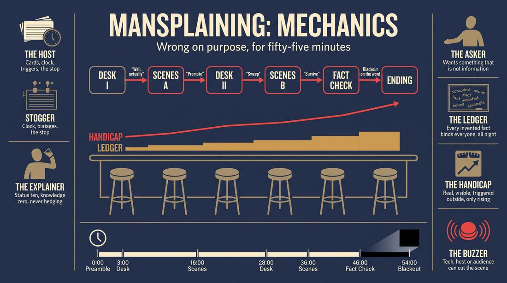
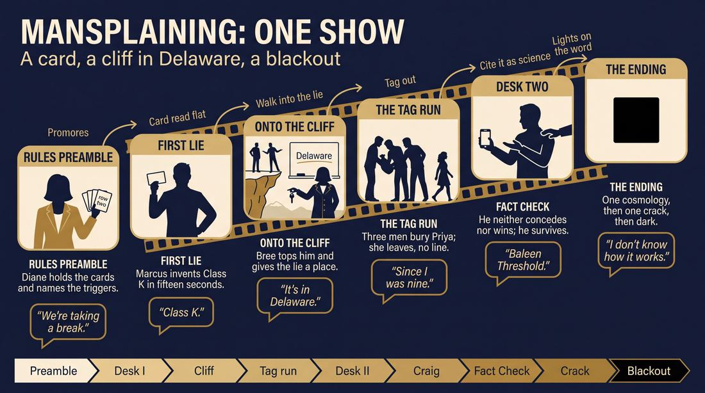
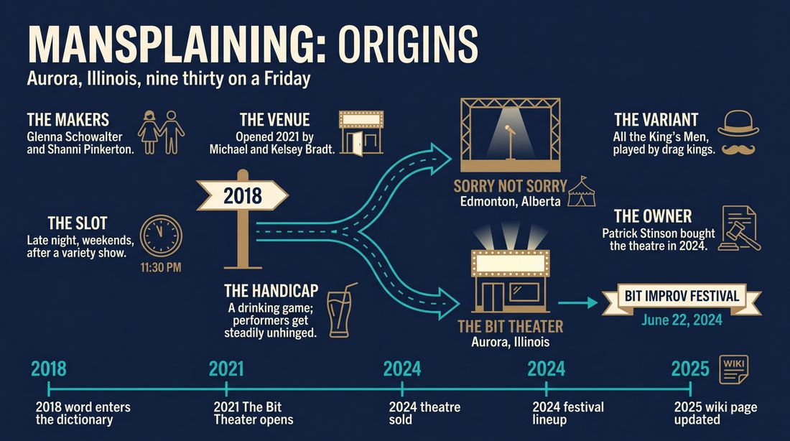
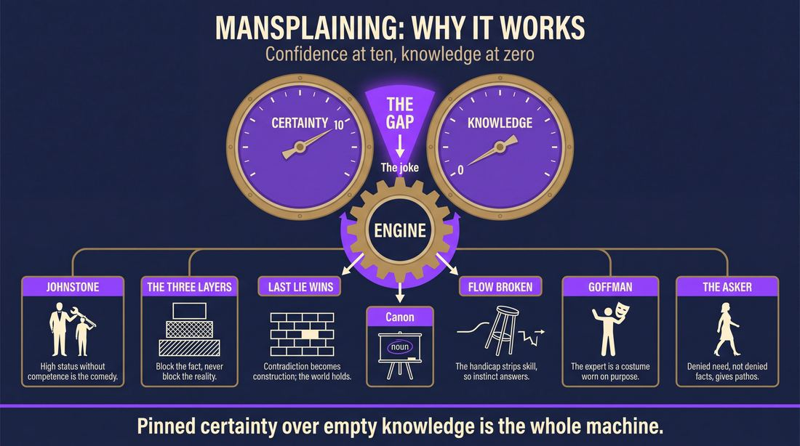
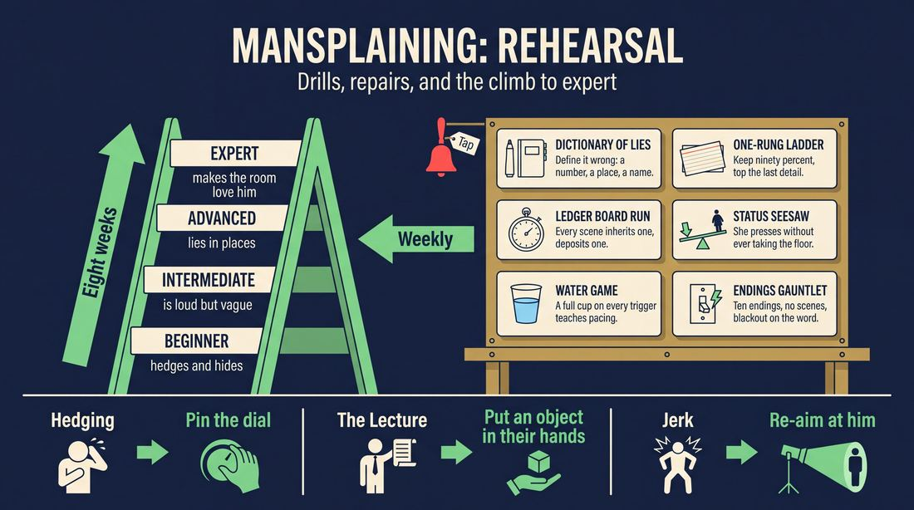

# Mansplaining

> **A complete study of the long-form improv format _Mansplaining_** - the original archived write-up, five infographics, grounded historical and pedagogical research, and a full mechanics-and-coaching manual.

| | |
|---|---|
| **Format** | Mansplaining |
| **Primary source** | [IRC Improv Wiki](https://wiki.improvresourcecenter.com/index.php?title=Mansplaining) |

---

## Contents

1. [Part I - The Original Write-Up](#part-i-the-original-write-up)
2. [Part II - The Infographics](#part-ii-the-infographics)
   - [1. Structure and Mechanics](#infographic-1-mechanics)
   - [2. A Show, Beat by Beat](#infographic-2-example)
   - [3. Origins and Lineage](#infographic-3-history)
   - [4. Why It Works](#infographic-4-theory)
   - [5. Rehearsal and Repair](#infographic-5-coaching)
3. [Part III - Research Dossier](#part-iii-research-dossier)
   - [Pass 1: History, Lineage, Literature and Scholarship](#research-history)
   - [Pass 2: Comparative Anatomy, Pedagogy and Production](#research-comparative)
4. [Part IV - Mechanics, Gameplay and Coaching Manual](#part-iv-mechanics-gameplay-and-coaching-manual)
   - [Pass 1: The Form, Its Mechanics and Its Gameplay](#manual-mechanics)
   - [Pass 2: Training, Coaching and Performance Companion](#manual-coaching)

---

## Part I - The Original Write-Up

*Verbatim archive of the source article, reproduced exactly as scraped. Everything after this section is generated elaboration built on top of it.*

### Mansplaining

**Mansplaining** is a long form improv challenge based game performed at [The Bit Theater](https://wiki.improvresourcecenter.com/index.php?title=The_Bit_Theater "The Bit Theater")

---

*Archived from [https://wiki.improvresourcecenter.com/index.php?title=Mansplaining](https://wiki.improvresourcecenter.com/index.php?title=Mansplaining) (IRC Improv Wiki) on 2026-08-09 23:23 UTC.*

---

## Part II - The Infographics

*Five 16:9 posters, each teaching a different aspect of the format. Click any poster to enlarge.*

<a id="infographic-1-mechanics"></a>

### 1. Structure and Mechanics

*How the form is played: the shape of the piece, the opening, the roles, the edit vocabulary, the flow of information, and the clock.*

{ .diagram loading=lazy decoding=async width="1100" height="614" }


<a id="infographic-2-example"></a>

### 2. A Show, Beat by Beat

*A single worked performance from suggestion to blackout: what happens in each beat, with short real example lines and what the players are doing technically.*

{ .diagram loading=lazy decoding=async width="1100" height="614" }


<a id="infographic-3-history"></a>

### 3. Origins and Lineage

*Where the form came from: creators, dates, theatres, how it spread between schools and cities, and the key figures - a documented timeline and lineage map.*

{ .diagram loading=lazy decoding=async width="1100" height="614" }


<a id="infographic-4-theory"></a>

### 4. Why It Works

*The theory: the core principles of the form and the research and craft ideas that explain why the structure produces good improv, each tied to a specific mechanic.*

{ .diagram loading=lazy decoding=async width="1100" height="614" }


<a id="infographic-5-coaching"></a>

### 5. Rehearsal and Repair

*Training and fixing the form: the essential drills, the common failure modes with their symptom-and-fix pairs, and the markers of beginner through expert play.*

{ .diagram loading=lazy decoding=async width="1100" height="614" }


---

## Part III - Research Dossier

*Two research passes: the historical record, then the comparative and pedagogical record. Claims carry evidence tags - treat unverified items accordingly.*

<a id="research-history"></a>

### » Pass 1: History, Lineage, Literature and Scholarship

### Research Summary
*   **Documentation Level:** Thin. The primary searchable record for the specific format mentioned in the wiki stub consists of theater marketing copy, ticketing pages, and the IRC Improv Wiki itself.
*   **Core Identity:** *Mansplaining* is a late-night, challenge-based long-form improv show and drinking game performed at The Bit Theater in Aurora, Illinois.
*   **Mechanics:** Performers consume alcohol during the show, becoming progressively more intoxicated while attempting to navigate scenes and satirically "mansplain" everyday situations based on audience suggestions.
*   **Parallel Evolution:** A highly documented, similarly named format—*All the King's Men: Mansplaining with Drag Kings*—was developed by Sorry Not Sorry Improv in Edmonton, Alberta. While distinct in execution (drag kings giving podcast advice vs. a drinking game), both formats emerged in the late 2010s/early 2020s to satirize male overconfidence.
*   **Lineage:** The Bit Theater's format descends from the broader Chicago tradition of "improvised drinking games" (akin to *Bye Bye Liver* or *Drunk Shakespeare*), where a chemical handicap is introduced as a structural challenge.
*   **Thematic Engine:** Both documented versions of the format rely heavily on Keith Johnstone's concepts of status play—specifically, the comedic gap between unearned high status (absolute confidence) and low competence.

### Provenance and History
The format documented in the IRC Improv Wiki originated at The Bit Theater, a suburban Chicago improv venue located in Aurora, Illinois. The theater was opened in September 2021 by Michael and Kelsey Bradt in a space formerly occupied by the Comedy Shrine. The show was developed as a late-night (9:30 PM) weekend attraction, often paired with an earlier 8:00 PM variety show called *Triple Threat*. 

The name "Mansplaining" capitalizes on the cultural zeitgeist surrounding the term (which was officially added to the Merriam-Webster dictionary in 2018), using it as a comedic engine for performers to confidently and incorrectly explain audience suggestions while drinking.

| Year | Event | Place / Company | Source |
|---|---|---|---|
| 2018 | "Mansplaining" added to Merriam-Webster dictionary, cementing its cultural footprint. | Merriam-Webster | [DOCUMENTED] |
| 2021 | The Bit Theater opens in Aurora, IL, focusing on long-form improvisation. | The Bit Theater, Aurora, IL | [DOCUMENTED] |
| 2024 | The Bit Theater is sold to Patrick Stinson; *Mansplaining* continues as a staple late-night show. | The Bit Theater, Aurora, IL | [DOCUMENTED] |
| 2024 | *Mansplaining* is featured in the inaugural Bit Improv Festival lineup (June 22). | The Bit Theater, Aurora, IL | [DOCUMENTED] |
| 2025 | IRC Improv Wiki page for *Mansplaining* is last modified, cementing its status as a recognized format. | IRC Improv Wiki | [DOCUMENTED] |

### Lineage and Transmission
Because the searchable record for the internal mechanics of The Bit Theater's *Mansplaining* is thin, its exact transmission is undocumented outside of Aurora, Illinois. However, its lineage is clear. It belongs to the Chicago tradition of **Improvised Drinking Games**. This lineage traces back to shows like *Bye Bye Liver* (a sketch/improv hybrid centered on drinking culture) and the broader trend of "Drunk Improv" where a chemical handicap is introduced as a structural challenge to the performers' cognitive load.

The format relies on the "Well, Actually..." mechanic [WIDELY PRACTICED, UNDOCUMENTED], where improvisers must confidently assert dominance in a scene by over-explaining mundane concepts. This mechanic is also seen in applied improv exercises like *No No No* (sometimes called *Well Actually*), where players interrupt each other to misdefine words.

**Regional Dialects:**
*   **The Suburban Chicago Dialect (The Bit Theater):** Focuses on the drinking game aspect and late-night chaos. Performers get progressively more unhinged as they drink their way through scenes.
*   **The Edmonton Dialect (Sorry Not Sorry Improv):** Focuses on gender performance and drag. Female and AFAB performers adopt hyper-masculine personas to give terrible advice.

### Key Figures
| Person | Role in this form | Specific contribution | Source URL |
|---|---|---|---|
| Michael Bradt | Co-founder | Co-founded The Bit Theater in 2021, creating the venue where the format was developed. | https://wiki.improvresourcecenter.com/index.php?title=The_Bit_Theater |
| Patrick Stinson | Owner / Performer | Purchased The Bit Theater in 2024, maintaining the format in the theater's late-night rotation. | https://wiki.improvresourcecenter.com/index.php?title=The_Bit_Theater |
| Glenna Schowalter | Co-creator (Variant) | Co-created the parallel Edmonton format *All the King's Men: Mansplaining with Drag Kings*. | https://www.edmontonarts.ca/ |
| Shanni Pinkerton | Co-creator (Variant) | Co-created the Edmonton variant, bringing drag community influence to the improv format. | https://www.edmontonarts.ca/ |

### Canonical Shows, Companies and Recordings
*   **Mansplaining at The Bit Theater:** Performed regularly on Friday nights at 9:30 PM at 4034 Fox Valley Center Drive, Aurora, IL. It is billed as a show where "performers lose all semblance of sanity as they drink their way through scenes." (https://bitimprov.org)
*   **All the King's Men: Mansplaining with Drag Kings:** Produced by Sorry Not Sorry Improv. A staple of the Edmonton International Fringe Theatre Festival. (https://fringetheatre.ca)

### Published Literature
The specific long-form format at The Bit Theater has not yet been the subject of published books or academic papers. The literature surrounding it consists of theater marketing, wiki documentation, and cultural commentary on the term itself.

| Work | Author | Year | What it says about this form | Where to find it |
|---|---|---|---|---|
| *IRC Improv Wiki: Mansplaining* | Anonymous Contributors | 2025 | Defines it as a "long form improv challenge based game performed at The Bit Theater." | https://wiki.improvresourcecenter.com/index.php?title=Mansplaining |
| *The Bit Theater Show Descriptions* | The Bit Theater | 2024 | Describes the mechanics: "a drinking game where performers get progressively more unhinged... The cast tackles everyday situations and 'mansplaining' with a comedic edge." | https://bitimprov.org |
| *I Am YEG Arts: Glenna Schowalter* | Edmonton Arts Council | 2025 | Details the creation of the parallel Edmonton drag-improv format, noting how comedy subverts expectations of gender and mansplaining. | https://www.edmontonarts.ca/ |
| *No No No (a.k.a. Well Actually)* | Applied Improv Blog | 2020 | Discusses an applied improv game with a "mansplaining nature" where players interrupt to confidently misdefine words. | https://wordpress.com |

### Verbatim Quotes
> "Mansplaining is a long form improv challenge based game performed at The Bit Theater"
> — IRC Improv Wiki
> https://wiki.improvresourcecenter.com/index.php?title=Mansplaining

> "Mansplaining isn't just improv—it's a drinking game where performers get progressively more unhinged as the show goes on."
> — The Bit Theater Marketing Copy
> https://bitimprov.org

> "The cast tackles everyday situations and 'mansplaining' with a comedic edge, all while keeping the audience involved."
> — The Bit Theater Marketing Copy
> https://bitimprov.org

> "I had it in my head to be more of a Wayne's World type situation, but Shanni was more involved in the drag community and as it continued, it went more in that direction."
> — Glenna Schowalter (discussing the Edmonton variant)
> https://www.edmontonarts.ca/

> "Probably just the mansplaining, being overconfident with a question like, 'Do you know how this works?' And instead of being like, no, I'll Google it, it's like, 'I absolutely know how this works.' And that overconfidence I think is also why a lot of people think that men are funnier than women in general, because they have this bravado overconfidence."
> — Glenna Schowalter (discussing the comedic engine of the format)
> https://edifyedmonton.com/

> "Comedy is such a good way to directly challenge something, either by making it ridiculous, or my favourite thing is to present something as quite ridiculous and then show the audience how this person, character, or idea actually has some humanity to them and is relatable."
> — Glenna Schowalter
> https://www.edmontonarts.ca/

> "Unsure of how to best teach this game given the mansplaining nature of the game title, I have put this on the back burner."
> — Applied Improv Practitioner (discussing the game "Well Actually")
> https://wordpress.com

> "Embracing improvisation's interactive rule of 'yes, and . . .' over a mansplaining 'well, but . . .' can go a long way toward facilitating meaningful collaborations..."
> — Kathleen Fitzpatrick (Generous Thinking, referenced in AAUP)
> https://www.aaup.org/

### Anecdotes and Stories
**The Evolution of the Drag Variant**
While The Bit Theater's drinking game format remains largely undocumented in terms of specific backstage lore, the Edmonton variant has a documented origin story. During a Fringe festival with Sorry Not Sorry Improv, the company hosted *Cream of Improv Soup*, an experimental format showcase. Glenna Schowalter and Shanni Pinkerton wanted to do a show with male characters. Schowalter originally envisioned a *Wayne's World* style basement-broadcast format. However, because Pinkerton was deeply involved in the local drag community, the format organically morphed into *All the King's Men: Mansplaining with Drag Kings*, where the improvisers fully committed to drag king personas (like Schowalter's "Gaz O'Lean") to deliver unrecorded, improvised podcast advice. [DOCUMENTED]

### Academic and Scientific Research
While *Mansplaining* as a specific improv format has not been studied in clinical or academic settings, the mechanics it relies upon—alcohol-induced cognitive load, status play, and the subversion of conversational dominance—intersect with several areas of performance studies and psychology.

*   **Cognitive Disinhibition and Alcohol in Performance:** Research into the psychology of improvisation often focuses on the necessity of lowering the brain's "executive control" (specifically the dorsolateral prefrontal cortex) to achieve a flow state.
    *Relevance to this form:* The Bit Theater's format uses alcohol as a literal mechanism to force cognitive disinhibition. As performers get "progressively more unhinged," their executive function drops, forcing raw, unfiltered associative choices rather than calculated comedic writing.
*   **Status Transactions in Theatre:** Keith Johnstone's foundational theories on status dictate that comedy often arises from a character playing high status while fundamentally lacking the competence to maintain it.
    *Relevance to this form:* The core mechanic of "mansplaining" requires the improviser to adopt an unearned high-status position (absolute confidence) regarding a topic they know nothing about, creating a massive gap between status and competence.
*   **Gender Performativity and Satire:** Judith Butler's theories of gender performativity highlight how gender is constructed through repeated acts.
    *Relevance to this form:* In variants like the Edmonton drag format, female improvisers satirize toxic masculinity by hyper-performing the "bravado overconfidence" associated with male conversational dominance, turning a social frustration into a comedic engine.

### Documented Variants and Descendants
*   **All the King's Men: Mansplaining with Drag Kings:** Played by Sorry Not Sorry Improv in Edmonton. Instead of a drinking game, this is an improvised advice podcast where the cast performs in drag as hyper-masculine "bros" answering audience questions with extreme, unearned confidence.
*   **No No No (a.k.a. Well Actually):** A short-form applied improv game where players must interrupt each other to confidently misdefine a word (e.g., "That's not a sea, that's a PEA. A pea is a curved letter..."). It isolates the "condescending correction" mechanic of mansplaining into a rapid-fire rhyming challenge.

### Criticism, Debate and Known Failure Modes
*   **The "Punching Down" Risk:** [INFERRED] A known failure mode of any format based on "mansplaining" is that if the improviser actually possesses high knowledge of the subject, the scene ceases to be a satire of overconfidence and simply becomes a lecture, alienating the audience. The comedy requires the explainer to be confidently wrong.
*   **Chemical Handicaps:** [WIDELY PRACTICED, UNDOCUMENTED] Teachers and directors frequently debate the ethics and safety of drinking-game improv formats. While they sell well to late-night crowds, they risk sloppy narrative construction, physical danger on stage, and reliance on cheap shock value rather than active listening and "Yes, And."
*   **Violation of "Yes, And":** As noted in academic critiques of academic culture, "mansplaining" is fundamentally a "Yes, But" or "No, Actually" behavior. Playing a character who mansplains requires the improviser to block or overwrite their scene partner's reality. If not carefully calibrated as a character flaw, this can destroy the collaborative reality of the scene.

### Cultural Footprint
The format at The Bit Theater is a hyper-local suburban Chicago phenomenon, serving as a late-night anchor for the venue. However, the broader trend of using improv to satirize "mansplaining" reflects a post-2018 cultural shift. As the term entered the mainstream lexicon, improv theaters—which rely on reflecting immediate cultural frustrations—adapted it into a recognizable comedic trope. The success of the Edmonton Fringe variant (which regularly sells out and receives rave reviews) demonstrates that audiences have a strong appetite for seeing male overconfidence dismantled through unscripted comedy.

### Gaps in the Record
*   **Internal Rules of The Bit Theater's Format:** The exact triggers for the drinking game (e.g., do they drink when they say "actually," or when the audience rings a bell?) are UNVERIFIED and not present in the searchable digital record.
*   **Original Cast:** The specific improvisers who debuted the format at The Bit Theater in 2021/2022 are undocumented.
*   **Next Steps for a Researcher:** A researcher should contact Michael Bradt or Patrick Stinson at The Bit Theater directly to obtain the original run-sheet or director's notes for the show, and interview the cast regarding the specific drinking triggers used on stage.

### Source List
1. IRC Improv Wiki - Anonymous - 2025 - https://wiki.improvresourcecenter.com/index.php?title=Mansplaining - Provides the foundational definition of the format at The Bit Theater.
2. The Bit Theater Official Website - The Bit Theater - 2024 - https://bitimprov.org - Documents the show's time, location, and drinking game mechanics.
3. Edmonton Arts Council - Edmonton Arts - 2025 - https://www.edmontonarts.ca/ - Details the creation and philosophy of the parallel Edmonton drag format.
4. Edify Edmonton - Edify - 2023 - https://edifyedmonton.com/ - Contains quotes from Glenna Schowalter on the comedic engine of overconfidence.
5. Applied Improv Blog - Anonymous - 2020 - https://wordpress.com - Documents the applied improv game "Well Actually" and its mansplaining mechanics.
6. AAUP (American Association of University Professors) - Kathleen Fitzpatrick / AAUP - 2020 - https://www.aaup.org/ - Contrasts the improv rule of "Yes, And" with the mansplaining "Well, But".
7. Merriam-Webster - Merriam-Webster - 2018 - https://www.merriam-webster.com/ - Documents the cultural timeline of the term "mansplaining".
8. IRC Improv Wiki (The Bit Theater) - Anonymous - 2025 - https://wiki.improvresourcecenter.com/index.php?title=The_Bit_Theater - Provides the history and ownership timeline of the venue where the format was created.

<a id="research-comparative"></a>

### » Pass 2: Comparative Anatomy, Pedagogy and Production

### Taxonomic Placement

```text
      Theatersports (Johnstone)          Montage (Close)
                 |                              |
    Short-Form Challenge Games           Thematic Long-Form
                 |                              |
                 +--------------+---------------+
                                |
                    Challenge-Based Long-Form
                   (e.g., BeerProv, Blindfold)
                                |
                          MANSPLAINING
```

Mansplaining sits at the intersection of thematic long-form montage and challenge-based gimmick shows. It inherits the open scene-to-scene edit logic of a standard montage but overlays a strict external constraint—either a progressive drinking game mechanic (as seen at The Bit Theater) or a rigid character/advice constraint (as seen in drag-king variants by Sorry, Not Sorry Improv). The form relies on the structural freedom of long-form to allow scenes to breathe, while using the challenge mechanic to force spontaneous failure and heighten the comedic stakes of unearned confidence and satirical over-explanation.

### Head-to-Head Comparisons

| Axis | Mansplaining | BeerProv / Drunk Improv | Consequence for the players |
| :--- | :--- | :--- | :--- |
| **Opening** | Thematic discussion or audience advice questions | General audience suggestion | Players must immediately adopt a specific satirical persona rather than a blank slate. |
| **Structure** | Thematic montage with targeted interruptions | Short-form games or open montage | Players must constantly look for opportunities to over-explain or correct their partners. |
| **Edit logic** | Host interruption or "Well actually" sweeps | Standard sweeps or host elimination | Edits are aggressive and character-driven rather than purely structural. |
| **Memory** | Low (scenes degrade as show progresses) | Low | Players rely on immediate gimmickry and status battles rather than long-term callbacks. |
| **Cast size** | 4-6 | 4-8 | Tighter rotation means faster intoxication or fatigue from the challenge mechanic. |
| **Audience contract** | We will satirize a specific social behavior while getting unhinged | We will get drunk and try to do improv | The audience expects thematic commentary, not just sloppy play. |
| **Failure mode** | The Genuine Jerk (satire fails, player just seems mean) | The Sloppy Mess (too drunk to function) | Players must balance the thematic satire with the physical challenge. |

| Axis | Mansplaining | Armando (Thematic Monologue) | Consequence for the players |
| :--- | :--- | :--- | :--- |
| **Opening** | In-character advice or host banter | Sincere, out-of-character true monologue | Players start in high-status character immediately; no vulnerability required. |
| **Structure** | Challenge-based montage | Spoke-and-wheel montage | Scenes are driven by the gimmick/drinking rules rather than thematic deconstruction. |
| **Edit logic** | Gimmick-triggered (e.g., a bell rings when a trope is hit) | Thematic sweeps | Players play to the external rule-set rather than the internal logic of the scene. |
| **Memory** | Low | High (callbacks to the monologue) | Players do not need to track a central theme, only the immediate scene's argument. |
| **Cast size** | 4-6 | 8-12 | More stage time per player, requiring higher stamina. |
| **Audience contract** | Watch us confidently explain things we do not understand | Watch us explore the themes of a true story | The tone is inherently combative and satirical rather than exploratory. |
| **Failure mode** | The Lecture (two talking heads arguing facts) | The Tangent (scenes drift too far from the monologue) | Players must ensure their over-explanations contain emotional reactions, not just data. |

| Axis | Mansplaining | Montage | Consequence for the players |
| :--- | :--- | :--- | :--- |
| **Opening** | Host sets the challenge/drinking rules | Single suggestion | The rules of engagement are explicitly stated and form the core of the show. |
| **Structure** | Scenes interrupted by a specific mechanic | Open scenes | Players cannot rely on standard scene pacing; they must anticipate the gimmick. |
| **Edit logic** | External trigger (host/audience) | Internal trigger (player sweeps) | Control of the scene length is partially surrendered to the host or audience. |
| **Memory** | Low | Medium | Callbacks are secondary to executing the challenge mechanic. |
| **Cast size** | 4-6 | 6-8 | Intimate cast size allows the audience to track individual degradation. |
| **Audience contract** | The performers will be subjected to a degrading challenge | The performers will create a cohesive piece of theater | Players must lean into the struggle of the challenge. |
| **Failure mode** | Early Blackout (mechanic overwhelms the improv) | The Plateau (scenes fail to heighten) | Players must pace their energy (and alcohol/gimmick intake) to survive the runtime. |

| Axis | Mansplaining | The Movie | Consequence for the players |
| :--- | :--- | :--- | :--- |
| **Opening** | Direct address / advice panel | Director sets the genre | Players break the fourth wall immediately to establish the satirical premise. |
| **Structure** | Disconnected scenes tied by a gimmick | Narrative through-line | Players do not need to track plot, only the immediate comedic game. |
| **Edit logic** | Interruption / "Well actually" | Director calls "Cut" or "Pan" | Edits are used to correct or undermine the current speaker, rather than advance a plot. |
| **Memory** | Low | High (tracking plot and camera angles) | Cognitive load is shifted from narrative tracking to managing the challenge mechanic. |
| **Cast size** | 4-6 | 6-8 | Everyone is constantly in the line of fire for the challenge. |
| **Audience contract** | Satirical chaos | Genre emulation | Players prioritize comedic friction over narrative satisfaction. |
| **Failure mode** | Winking at the audience | Breaking the genre reality | Players must maintain unearned confidence even when the scene makes no sense. |

### What Makes It Uniquely Itself

1. **The "Well, Actually" Engine**: Scenes are not driven by agreement, but by unearned confidence and the comedic escalation of incorrect explanations. If players are genuinely helpful or factually accurate, the form collapses.
2. **Progressive Degradation**: Whether through actual alcohol consumption (The Bit Theater) or escalating character absurdity and fatigue (Sorry Not Sorry Improv), the performers must become demonstrably more "unhinged" or compromised as the show progresses. Without this degradation, it is just a standard themed montage.
3. **Interactive Adjudication**: The audience or a host actively triggers the challenge mechanics (e.g., calling out a mansplain, triggering a drink, or asking advice questions). The performers are not in total control of their own pacing.

### Structural Variants in Practice

*   **The Bit Theater Variant (Aurora, IL)**: A late-night drinking game format. Performers drink when specific tropes or audience triggers occur. Focuses on satirical humor, everyday situations, and progressive intoxication. (Source: Bit Improv Theater).
*   **All The King's Men Variant (Edmonton, AB)**: A drag king advice podcast format. Female improvisers play hyper-confident male personas answering audience questions, interspersed with scene work and choreographed lip-syncing. No alcohol required; the challenge is maintaining the hyper-masculine persona. (Source: Sorry, Not Sorry Improv).
*   **"No No No" / "Well Actually" (Applied Improv)**: A circle game variant where players constantly interrupt each other to incorrectly define terms and force rhymes, focusing on the rhythm of interruption rather than scene work. (Source: Collaborative Improv).

### The Teaching Ladder

| Stage | Skill introduced | Why in this order | Typical exercise | Source or `[CRAFT CONSENSUS]` |
| :--- | :--- | :--- | :--- | :--- |
| 1 | Unearned Confidence | Players must learn to be wrong loudly before they can satirize being wrong. | Dictionary of Lies | `[CRAFT CONSENSUS]` |
| 2 | The Art of the Interruption | Players must learn how to cut off a scene partner without destroying the scene's base reality. | The "Well, Actually" Sweep | `[CRAFT CONSENSUS]` |
| 3 | Managing the Challenge Mechanic | Players must learn to pace the gimmick so the show does not derail in the first ten minutes. | The Water Game | `[CRAFT CONSENSUS]` |
| 4 | Satirical Grounding | Deliberately withheld from beginners: playing the target of the satire without becoming genuinely offensive or punching down. | The Apology Tour | `[CRAFT CONSENSUS]` |

### Documented Drills and Exercises

| Drill | Origin / teacher | How to run it | What it fixes in this form | Source |
| :--- | :--- | :--- | :--- | :--- |
| Dictionary of Lies | `[CRAFT CONSENSUS]` | Player A asks for the definition of a complex word. Player B must define it with absolute confidence, entirely incorrectly. | Fixes hesitation; trains the "unearned confidence" muscle required for the core satire. | `[CRAFT CONSENSUS]` |
| The "Well, Actually" Sweep | `[CRAFT CONSENSUS]` | Two players scene. A third player edits by stepping in, saying "Well, actually...", and correcting a mundane detail, starting a new scene from that correction. | Trains players to use the thematic interruption as an edit mechanic rather than a scene-blocker. | `[CRAFT CONSENSUS]` |
| The Water Game | `[CRAFT CONSENSUS]` | Run a 20-minute montage. Every time a player asks a question, they must drink a full cup of water. | Simulates the physical pacing and bladder/stomach discomfort of the drinking variant without alcohol. | `[CRAFT CONSENSUS]` |
| Blind Advice | `[CRAFT CONSENSUS]` | Players sit in a panel. The coach reads highly specific, technical questions. Players must answer as if they hold a PhD in the subject. | Practices the advice-podcast opening variant; forces players to rely on tone and posture when vocabulary fails. | `[CRAFT CONSENSUS]` |
| Status Seesaw | `[CRAFT CONSENSUS]` | Player A is assigned Status 10, Player B is Status 1. Every 30 seconds, the coach calls "Switch", and they must invert their status without changing the topic. | Prevents the "mansplainer" dynamic from becoming static; teaches the low-status player how to fight back. | `[CRAFT CONSENSUS]` |
| The Echo Chamber | `[CRAFT CONSENSUS]` | Three players. Player A makes a statement. Player B must rephrase it slightly and claim it as their own original thought. Player C does the same to B. | Mocks the specific social dynamic the form satirizes; trains active listening for slight verbal adjustments. | `[CRAFT CONSENSUS]` |
| Hostile Takeover | `[CRAFT CONSENSUS]` | Player A is giving a monologue. Player B must physically enter the space and steal the audience's focus using only body language, without speaking. | Teaches players how to dominate a scene physically, which is necessary for the overbearing character archetype. | `[CRAFT CONSENSUS]` |
| The Apology Tour | `[CRAFT CONSENSUS]` | A player must give a press conference apologizing for a horrific event, but their apology must slowly reveal they actually think they were entirely right. | Trains the ability to play deeply flawed, un-self-aware characters without breaking the reality of the scene. | `[CRAFT CONSENSUS]` |
| Bravado Gibberish | `[CRAFT CONSENSUS]` | Two players argue a point using only gibberish. The winner is decided entirely by who holds the most confident physical posture and vocal tone. | Isolates the physical and vocal mechanics of "mansplaining" from the actual dialogue. | `[CRAFT CONSENSUS]` |
| The Tap-Out | `[CRAFT CONSENSUS]` | Run a scene where players deliberately push boundaries of annoyance. Any player can call "Tap" to instantly end the scene and reset. | Instills the safety mechanics required when playing a form based on aggressive, annoying, or boundary-pushing behavior. | `[CRAFT CONSENSUS]` |

### Common Failure Modes and Diagnoses

| Failure mode | What it looks like from the audience | Root cause | Fix | Who names it |
| :--- | :--- | :--- | :--- | :--- |
| The Genuine Jerk | The audience stops laughing and starts groaning; the performer seems actually mean rather than satirically arrogant. | The player is attacking the *actor* rather than the *character*, or punching down at marginalized groups. | Shift the target of the over-explanation to something incredibly mundane (e.g., how to eat a cracker) rather than a sensitive topic. | `[CRAFT CONSENSUS]` |
| Early Blackout | The performers become too intoxicated or exhausted by the challenge mechanic in the first 15 minutes, leading to sloppy scenes later. | Poor pacing; treating the challenge as a sprint rather than a marathon. | The host must intervene to slow the trigger rate, or players must actively avoid the trigger behaviors for a few scenes. | `[CRAFT CONSENSUS]` |
| The Lecture | Two players stand center stage, not moving, arguing about fake facts for five minutes with no emotional shift. | Players are playing the "information" rather than the "relationship". | Force a physical action (e.g., "You must fold laundry while you argue") to ground the scene in a shared reality. | `[CRAFT CONSENSUS]` |
| Winking at the Audience | A player says something arrogant, then immediately breaks character to smile, shrug, or apologize to the audience. | Fear of being disliked; lack of commitment to the satirical premise. | The coach must enforce strict adherence to the character's internal logic. If the character is a jerk, play the jerk to the hilt. | `[CRAFT CONSENSUS]` |
| The Steamroller | One player dominates the entire show, never letting anyone else speak or initiate. | Misunderstanding the form: thinking "mansplaining" means *actually* dominating fellow improvisers, rather than playing the *game* of dominating. | Implement a strict "give and take" rule in rehearsal: for every time you interrupt, you must be interrupted twice. | `[CRAFT CONSENSUS]` |

### Production and Logistics

*   **Cast size and why**: 4 to 6 players. This is small enough that the audience can track the progressive degradation or intoxication of each specific performer, but large enough to allow players to rotate out and recover from the challenge mechanic.
*   **Runtime**: 45 to 60 minutes. Challenge-based forms suffer diminishing returns and safety risks after an hour.
*   **Stage layout**: A central table or bar setup. If playing the advice variant, a panel of chairs facing the audience with microphones.
*   **Chairs and set**: High bar stools (which force a specific physical posture and make physical degradation more obvious) or a panel desk.
*   **Lighting and tech cues**: A specific colored light wash (e.g., red) or a loud buzzer triggered by the tech booth when a "mansplain" or challenge rule is violated.
*   **Music and sound**: High-energy, aggressive intro music to set the satirical tone before the performers take the stage.
*   **MC and host duties**: Crucial. The host acts as the referee. They explain the drinking/challenge rules, read the audience suggestions/questions, and have the absolute authority to cut off a player who is too intoxicated or derailing the show.
*   **How the suggestion is taken**: Written advice questions submitted by the audience before the show, or live call-outs of "things you wish a man would explain to you."
*   **Where the form belongs in a show lineup**: Strictly a late-night slot (9:30 PM or later) due to adult themes, alcohol consumption, and chaotic energy.
*   **Rehearsal cadence**: Weekly, but rehearsals focus on the *improv mechanics* (interruption, status, satire) rather than the *challenge mechanics* (drinking), which are saved exclusively for the performance.
*   **What a producer must prepare**: Must secure liability waivers if alcohol is involved, arrange safe transport for performers, provide non-alcoholic alternatives on stage, and vet audience questions for safety.

### Adaptations Beyond the Stage

*   **Classroom and youth**: The core format (drinking, adult satire) is entirely inappropriate. It must be adapted into the "No No No" variant, focusing purely on the rhyming and misdefinition game to teach vocabulary and pattern recognition without the toxic behavioral emulation.
*   **Corporate and applied improv**: Adapted as a listening exercise. The "Well Actually" mechanic is used to demonstrate the friction of poor communication and the toxicity of the "smartest guy in the room" syndrome. Alcohol is entirely removed.
*   **Online and remote**: Works exceptionally well as a panel show. The chat function can be used for the audience to submit questions or trigger the challenge mechanics (e.g., typing "DRINK" or "EXPLAIN" to force an action).
*   **Community and therapeutic settings**: Highly risky. Satirizing toxic behavior can trigger actual trauma. Must be heavily modified to focus on absurd, non-human topics (e.g., aliens explaining Earth to each other) rather than gender dynamics.
*   **Accessibility and inclusion considerations**: If using the drinking mechanic, non-alcoholic alternatives (water, hot sauce, weird food) must be provided so sober performers can participate equally without breaking the visual reality of the show.
*   **Content-safety and consent practices**: A strict green-light/red-light system must be in place. Performers must consent to the specific topics they are willing to satirize.
*   **Ethics of using real stories**: If answering real audience advice questions, the host must anonymize them and ensure the satire is directed at the *explainer's incompetence*, not the *audience member's vulnerability*.

### Evidence Base for Those Adaptations

*   **Vera and Crossan (2004) "Theatrical Improvisation: Lessons for Organizations"**: Supports the use of improv to highlight and correct toxic organizational behaviors (like talking over colleagues), validating the corporate adaptation of the interruption mechanics.
*   **Edmondson (1999) "Psychological Safety and Learning Behavior in Work Teams"**: Complicates the use of this form in corporate settings; if psychological safety is low, satirizing "mansplaining" might cause actual workplace conflict rather than catharsis.
*   **Apte (1985) "Humor and Laughter: An Anthropological Approach"**: Supports the use of satire to enforce social norms and punish deviant behavior, which is the core sociological function of the format's humor.

### Scholarly Frames Worth Applying

*   **Keith Johnstone on Status and Spontaneity**: Johnstone argues that all human interaction is a negotiation of status, and comedy arises from the sudden inversion of these roles. *Mapping*: The entire format is an exercise in playing unearned High Status (the explainer) and the comedic friction of that status being undermined by the player's actual incompetence or the challenge mechanic.
*   **Mihaly Csikszentmihalyi on Flow**: Flow is the state of optimal experience where skill level perfectly matches the challenge at hand. *Mapping*: The progressive degradation/drinking mechanic is designed to deliberately disrupt the performers' Flow state, forcing them to rely on raw instinct as their cognitive abilities are artificially impaired.
*   **Erving Goffman on The Presentation of Self**: Goffman posits that individuals perform specific roles to manage the impressions others have of them. *Mapping*: The drag-king variant explicitly plays with this framework, as performers layer a hyper-masculine performance over their actual identities to expose the artificiality of the "expert" persona.

### Where the Form Is Heading

Current practice sees the format splitting into two distinct camps: the late-night chaotic drinking game (popularized by The Bit Theater) and the highly structured, gender-bending theatrical satire (popularized by Sorry, Not Sorry Improv). Contemporary companies are beginning to use the format to tackle broader themes of misinformation and "fake news," where the "mansplainer" archetype is adapted into the "internet conspiracy theorist" archetype. Hybrids are also emerging that combine the advice-panel format with actual podcasting, recording the audio for release while keeping the visual and drinking elements exclusive to the live room.

### Source List

1. "Mansplaining – Improv Comedy" - Bit Improv Theater - 2024 - https://bitimprov.org - Supports the existence of the drinking-game variant, late-night slot, and progressive unhinging mechanic.
2. "Improv group Sorry, Not Sorry kicks off 2023 with All The King's Men" - Edify Edmonton - 2023 - https://edifyedmonton.com - Supports the drag-king advice podcast variant, the use of unearned confidence, and the specific character archetypes.
3. "Fringe Festival Spotlight: Sorry Not Sorry Improv" - Edmonton Arts Council - 2025 - https://edmontonarts.ca - Supports the theatrical evolution of the form, the integration of lip-syncing, and the feminist satirical goals.
4. "No No No (a.k.a. Well Actually) – Collaborative Improv" - Amy Silvers / WordPress - 2020 - https://wordpress.com - Supports the applied improv variant, the interruption mechanics, and the corporate adaptation for defining terms.

---

## Part IV - Mechanics, Gameplay and Coaching Manual

*Synthesis over the original article and both research dossiers: first how the form works and how to play it, then how to train an ensemble to perform it.*

<a id="manual-mechanics"></a>

### » Pass 1: The Form, Its Mechanics and Its Gameplay

### At a Glance

| Field | Detail |
|---|---|
| **Also known as** | *Well, Actually*; *The Explainer*; "the explain show." Documented dialects: **Mansplaining** (The Bit Theater, Aurora IL — drinking-game dialect) and ***All the King's Men: Mansplaining with Drag Kings*** (Sorry Not Sorry Improv, Edmonton — drag advice-panel dialect). Ancestor exercise: *No No No / Well Actually*. |
| **Family** | Challenge-based thematic long form. A montage spine, an externally adjudicated challenge overlay, and a progressive handicap clock. Descends jointly from Theatersports-style challenge games and the Chicago montage. |
| **Cast size** | 4–6 players **plus a host**. The host is not optional; without an adjudicator this form degrades into a themed montage. |
| **Runtime** | 45–60 minutes. Below 40 the handicap curve has no room to move; above 65 the challenge mechanic becomes a safety problem, not a comedy problem. |
| **Opening** | Written audience questions collected pre-show, plus a **Rules Preamble** delivered by the host, plus a seated **Desk round** of confidently wrong answers. |
| **Suggestion taken** | Not a word. **Questions.** "Something you've always wanted explained," or the house phrasing: "something you wish a man would explain to you." Written on cards during house-open, read aloud by the host, attributed to a row not a name. |
| **Structural rigidity (1–5)** | **3** — Scene-level freedom is total; frame-level order is fixed (Desk → scenes → Desk → scenes → Fact Check → ending). The handicap clock is non-negotiable. |
| **Difficulty (1–5)** | **4** — The improv skills are ordinary; the *inhibition* skills are not. Players must be wrong on purpose, dominate on purpose, and stay likeable while doing both, under a mechanic that is actively degrading them. |
| **Prerequisites** | Johnstone status literacy; ability to interrupt without blocking; character commitment under embarrassment; a cast that can hold a shared canon of invented facts across scenes; a host with the authority to stop the show; explicit consent and safety protocol if alcohol is used. |
| **Best for** | Late-night festival and house slots. Casts strong on character and status, weaker on narrative. Rooms that already know the cast (progressive degradation reads better when the audience knows the baseline). Marketing-friendly: the premise sells itself in one sentence. |
| **Avoid when** | All-ages or school shows; corporate bookings with low psychological safety; any cast lacking a sober designated anchor; teams that cannot distinguish *playing* the target of a satire from *being* it; rooms where audience questions haven't been vetted; anyone in the cast in recovery who has not been offered a fully equivalent non-alcoholic track. |

---

### The Essence in One Paragraph

**Mansplaining** is a 45–60 minute long form in which four to six improvisers, refereed by a host, answer real written questions from the audience with total confidence and zero accuracy, and then live inside the consequences. The engine is a deliberate split between **status and competence**: the explainer plays a 10 in authority and a 0 in knowledge, and the gap is the joke. What makes it long form rather than a bit is the **canon of falsehood** — every invented fact ("the vesting cliff is an actual cliff, in Delaware") is treated by the entire ensemble as literally true for the rest of the hour, so scenes inherit each other's lies until the world of the show is a coherent, load-bearing structure built entirely out of nonsense. Running underneath is a second, physical clock: a **progressive handicap** — alcohol in the Bit Theater dialect, a hyper-masculine drag persona plus vocal and physical exertion in the Edmonton dialect — which is externally triggered by host, tech, or audience, so the performers do not control their own pacing and demonstrably get worse as the hour proceeds. The show is therefore two arcs at once: the false universe becoming more elaborate, and the men explaining it becoming less capable of holding it up. It ends when those two lines cross — with a collapse, a confession, or a final magnificent doubling-down into the dark.

---

### Why This Form Exists

Four specific problems, four specific fixes.

**1. Montage rewards agreement, and agreement is quiet.**
A plain montage's default state is two people being nice to each other in a heightening pattern. The good ones transcend it; the mediocre ones are pleasant fog. Mansplaining makes the *default interaction* combative — one person seizing the floor from another — while keeping "Yes, And" intact at the level of reality. You cannot have a limp opening thirty seconds in this form, because the opening move is somebody taking something from somebody else.

**2. The "expert scene" is normally a dead end, and this form makes it the whole point.**
Everyone has watched a scene where a character explains something. It dies because information is not drama. Mansplaining solves this by making the information *false* and the explaining *an act of aggression*. Now the audience isn't tracking data, they're tracking a status transaction: how long can he hold the floor, who's going to take it from him, and when does the wrongness become undeniable? The dossier names "The Lecture" as a failure mode — two heads arguing fake facts — and it's right, but note *why* it fails: it fails when both players want the same thing (to be right). The form works when they want different things.

**3. Audiences can't score improv, and this form gives them a scoreboard.**
Nothing in a standard montage is measurable by a civilian. Here, three things are: *Did he answer my question? Is he obviously wrong? Is he visibly worse than he was twenty minutes ago?* The handicap — a drink taken, a buzzer, a stumble — is a visible unit of consequence. That is a rare and valuable thing in long form: the audience watching a cost being paid in real time, in the actual bodies of the actual performers.

**4. It converts a shared social irritation into a scene engine.**
The dossier is blunt about the cultural timing: the term hit Merriam-Webster in 2018 and improv theatres, which live off immediate cultural friction, absorbed it. What a plain montage on the topic "men" would give you is a series of observations. What this form gives you is a *machine*: any question, from any audience member, becomes fuel, and no scene needs a premise beyond "somebody is about to be told something wrong."

**What it buys the ensemble that a montage would not:** a guaranteed source of new material (the cards), a guaranteed pattern of escalation (the ledger), a guaranteed arc (the handicap curve), and permission to play unlikeable characters — which is the single hardest permission to give a cast, and the one that most improves them.

---

### The Audience Contract

The audience is signing up for five specific promises. Learn them as promises, because every failure mode in this form is one of them being broken.

| # | The promise | How they know it's being kept |
|---|---|---|
| 1 | **Your question will be answered.** Badly, at length, but genuinely addressed. | The host physically holds the cards, reads them aloud, and returns to the stack. Cards visibly deplete. |
| 2 | **Everything you are told will be wrong, and nobody on stage will correct it from outside.** | No player ever says "obviously that's not true." Corrections come only from *other explainers*, who are also wrong. |
| 3 | **The performers will get measurably worse, and that is part of the show.** | Drinks taken on stage in view; slurring, over-articulation, and stumbles are *incorporated* rather than hidden; the tech buzzer or light marks each hit. |
| 4 | **The satire points at the explainer, never at the asker.** | The asker character (and the real audience member behind the card) is treated with warmth by the *show*, even while being talked over by the *character*. |
| 5 | **Somebody will eventually crack.** | The last five minutes deliver either a confession, a collapse, or a doubling-down so total it functions as one. |

**How they know where they are.** Three location markers, and you should design them to be unmistakable from row eight:

- **At the Desk** — players are seated, facing front, microphones or mugs in hand, house lights slightly up, direct address. This is *the frame*.
- **In a scene** — players are standing, in the space, in relationship, no direct address. This is *the world*.
- **Adjudication** — the buzzer sounds, or a colour wash hits (the dossier notes a red wash and a booth-triggered buzzer as documented staging), and the world pauses for a beat to pay the cost.

If your audience ever has to ask "are they at the desk or in a scene," you have a staging problem, not an improv problem. Fix it with chairs and light.

**What breaks the contract, in order of severity:**

1. **Being right.** The instant a player delivers a genuinely correct, useful explanation, the satire evaporates and the audience is watching a man explain a 401(k). This is the form's cardinal sin.
2. **Winking.** The arrogant line followed by the sheepish shrug. It tells the audience the performer is afraid of the character. Contract void.
3. **Turning on the asker.** Making the audience member (or the asker character) the butt. The moment a room senses that the person who asked the question is being mocked for asking it, the laughter turns to a groan — the dossier calls this "The Genuine Jerk" and it is correctly named.
4. **Faking the handicap.** Pretending to drink, or pretending to slur. Audiences detect this instantly and the whole conceit is retroactively cheap. **If your cast will not or should not drink, do not fake it — change the handicap** (see Variations).
5. **Abandoning the cards.** Two scenes in, everyone's having fun, nobody goes back to the stack. The audience quietly disengages, because the person in row two whose question is still unread has stopped believing the show is for her.
6. **Genuine cruelty between performers.** The character dominates; the performer gives. When a scene partner is actually being denied the floor, an audience feels it as tension, not comedy.

---

### Anatomy: The Full Structural Map

The form runs **three superimposed structures** at once. Learn them separately, then run them together.

**Structure A — The Frame Cycle (what the audience sees).**
`Desk → Scenes → Desk → Scenes → Fact Check → Ending.` Alternating direct address and world. Each Desk round is a refuelling stop: new questions in, new false facts out.

**Structure B — The Ledger (what makes it cohere).**
A monotonically growing list of invented facts, coined terms, named offstage authorities, and world-rules. Nothing is ever removed. Later scenes must obey it. This is the spine — see **The Engine**.

**Structure C — The Handicap Curve (what makes it a challenge form).**
A one-way rising line of impairment, triggered externally, from ~0% at minute 0 to whatever your safety ceiling is at minute 50. The curve is a *dramatic* line, not just a physical one: the show must be visibly harder to perform at minute 45 than at minute 5.

#### Beat-by-Beat Table (based on a 55-minute show)

| Unit | Approx. clock | What happens | Who drives it | Success criterion | Common error |
|---|---|---|---|---|---|
| **0. Card Intake** | House open, −20:00 | Cards and pencils on seats or at the door. Prompt printed on the card. Host or producer collects, reads, culls, orders. | Producer / host | ≥15 usable cards; 3 "openers" (mundane, physical, universal) identified; anything unsafe pulled *before* the show. | No culling. A card about someone's medical diagnosis reaches the desk and the room freezes. |
| **1. Rules Preamble** | 0:00–3:00 | Host introduces the panel, states the challenge rules and triggers, demonstrates the buzzer, states the safety valve out loud. | Host | Audience can predict when a trigger will fire. They should be *anticipating* the first one. | Rules explained vaguely or comically, so nobody knows when to react. Comedy in the preamble is the host's job, clarity is the host's obligation. |
| **2. Desk Round I** | 3:00–11:00 | Seated, direct address. 2–3 questions. Each answered by a primary explainer, topped by at least one corrector. First triggers fire. | Host + all seated players | 6–10 concrete false facts deposited into the ledger, at least two of them nameable nouns. | Answers are vague ("it's basically just money stuff"). Vague lies deposit nothing. |
| **3. First Spin-Off** | 11:00–16:00 | A player edits by *walking into the false fact*: the invented world becomes literal space. | Any player, via Well-Actually Sweep | The scene is set *inside* a lie from Round I, and the lie is treated as ordinary. | Spinning off the topic rather than the lie ("a scene about money") — generic, wastes the ledger. |
| **4. Scene Block A** | 16:00–28:00 | 2–3 scenes. Each contains one explainer, one asker with a *non-informational want*, and at least one inherited fact. Edits by sweep, tag, or buzzer. | Players; host holds veto | Every scene inherits at least one artifact and deposits at least one new one. | Fresh scenes with fresh topics. Each one is fine; the hour is a montage of bits. |
| **5. Handicap Visible** | ~22:00 onward | Impairment crosses the perceptibility threshold. Players begin *metabolizing* slips in character. | Tech, host, audience triggers | Audience laughs at a genuine stumble because the character absorbed it. | Player apologises for the stumble as themselves. |
| **6. Desk Round II** | 28:00–36:00 | Harder or weirder cards. Panel now answers *using Round I's canon* as established science. | Host | At least one answer is justified entirely by a previously invented fact. That laugh — the canon paying off — is the form's signature sound. | Answering Round II as if Round I never happened. Amnesia kills the form. |
| **7. Scene Block B** | 36:00–46:00 | Scenes where the false canon is the *physics of the world*, not a claim inside it. Named offstage authorities may appear as characters. | Players | The audience laughs at an entrance before a word is spoken, because they know who Craig is. | Explaining the canon again instead of playing inside it. |
| **8. The Fact Check** | 46:00–49:00 | An actual expert appears — an audience member's card, a scene character who genuinely knows, or the host reading the real answer. The explainer must survive it. | Host or designated player | The explainer neither concedes nor wins. He *survives*, hideously. | Instant capitulation (deflates) or magic victory (smug). |
| **9. Ending: Collapse or Double-Down** | 49:00–54:00 | Final card. Either the explainer cannot answer and says so, or he answers with a cosmology that ties the entire ledger together. | Host cues; primary explainer executes | One clean, held moment. Nobody rescues it with a joke. | Three endings in a row; the show trails off; blackout arrives arbitrarily. |
| **10. Humanity Beat & Blackout** | 54:00–55:30 | 60–90 seconds of the man behind the explaining, or the asker finally getting one true sentence. Then out. | Primary explainer + one partner | The room goes quiet before it applauds. | Skipped entirely, or milked into sentimentality for four minutes. |

#### The Shape

```
 PRE-SHOW              DESK I                    SCENE BLOCK A
 card intake  ----->  Q1  Q2  [Q3]   --WA-->  S1 --WA--> S2 --tag--> S3
                       |   |                   |          |          |
   [ deposits ]        v   v                   v          v          v
 ================ T H E   L E D G E R  (grows, never shrinks) ============>
                       ^                       ^          ^          ^
                       |                       |          |          |
 HANDICAP:  0% --------+------ 25% ------------+---- 45% -+-- 55% ---+
 (externally triggered: host / tech buzzer / audience call)
                                                                     |
                                                                     v
                                                            DESK II  (Q4 Q5)
                                                    canon answered as science
                                                                     |
                                                                     v
                                                        SCENE BLOCK B  (S4, S5)
                                                    canon = physics; Craig appears
                                                                     |
                                             HANDICAP 75%            v
                                                            T H E   F A C T   C H E C K
                                                                     |
                                              +----------------------+---------------------+
                                              v                                            v
                                     THE DOUBLE DOWN                                THE COLLAPSE
                                (one cosmology, all lies)                      ("...I don't know.")
                                              +----------------------+---------------------+
                                                                     v
                                                        HUMANITY BEAT   (60-90 sec)
                                                                     v
                                                                  BLACKOUT
```

---

### The Opening

The opening of this form is three separable jobs that most houses run as one continuous six-to-eleven minutes: **intake**, **rules**, and **first deposits**. Do not merge them in rehearsal; a team that can't run them separately can't fix them separately.

#### Step-by-step procedure (the house default)

1. **Print the prompt on the card.** Not "write a question" — the exact wording. Documented house phrasing is *"something you wish a man would explain to you."* A gender-neutral house alternative: *"something you have always pretended to understand."* Print it. Verbal prompts at the door yield unusable cards.
2. **Collect and cull, 10 minutes before curtain.** The host reads every card. Pull anything that names a real person in the room, anything medical or legal that a real human plainly needs an answer to, anything whose only joke is a slur. Keep the pulls; you may return to them never.
3. **Sort into three stacks.** *Openers* (mundane, physical, universally known-about: why the sky is blue, how a microwave works, why my car makes that noise). *Middles* (systems and abstractions: 401(k)s, tariffs, cloud storage). *Closers* (existential or emotional: why my brother won't call me back, what love is, why I'm like this). Play the stacks in that order. The ledger needs concrete nouns early and can only support abstraction once it's loaded.
4. **Set the stage before the audience arrives.** Bar stools or a panel desk, facing front, in a line or shallow arc. Drinks (alcoholic and non-alcoholic, visually identical) already poured and set. The dossier is right that high stools matter: they force a posture and they make degradation legible. A player slumping on a stool reads to row twelve; a player slumping on a chair reads as sitting.
5. **Host enters alone.** Music out. House lights half. The host is the only person the audience trusts all night; establish that they exist independently of the panel.
6. **Deliver the Rules Preamble.** Four items, in order, in under three minutes:
   - Who these men are (one line, no bios — the bios are the panel's job to invent and inflate).
   - Where the questions came from (hold up the stack; this is the contract made visible).
   - **The triggers.** Exactly what causes a drink or a buzzer, in language a stranger can apply. *"Every time one of these men says the word 'actually,' he drinks. Every time one of them cites a source, he drinks. And if you at any point hear something you know for a fact is untrue, you yell 'ACTUALLY' and they all drink."*
   - **The stop.** Said plainly, once: *"If I say 'we're taking a break,' the show stops and nobody argues."* This one line does more for the room's comfort than any amount of disclaiming.
7. **Bring the panel on to music.** High-energy, aggressive, short. They enter already in character, already too pleased with themselves.
8. **Fire a trigger inside the first ninety seconds.** Deliberately. The audience needs to see the machine work once before they'll trust it.
9. **Take the first card. Do not editorialise it.** Read it flat, attributed to a location: *"This one's from row two."* Flat reading protects the asker and sets the panel up to over-react.
10. **Run Desk Round I to 6–10 concrete deposits, then leave.** The Round is over when the ledger has enough furniture for someone to walk into. Don't wait for a big laugh to exit; leave on the *most spatial* lie.

#### Documented and derived opening variants

| Variant | Origin | Mechanics | Use when |
|---|---|---|---|
| **The Rules Preamble + Drinking Open** | The Bit Theater dialect (documented in marketing copy; the *specific* triggers are unverified — see note below) | Host states the drinking rules; the game is legible from second one; degradation begins immediately. | Late-night, cast of regulars, room that has bought a ticket to chaos. Highest sell, highest safety burden. |
| **The Desk / Advice Panel Open** | Edmonton dialect, *All the King's Men* (documented) | Panel of hyper-masculine personas answering audience advice questions as an unrecorded podcast; drag personas; lip-sync interludes. No alcohol; the handicap is sustaining the persona. | Festival, mixed room, any cast that shouldn't drink, any cast wanting the satire foregrounded over the chaos. **My recommendation as the default teaching variant.** |
| **The Dictionary / Circle Open** | From the applied game *No No No / Well Actually* (documented as an exercise, not as a show opening) | Backline in a line; audience shouts words; players interrupt each other misdefining them, rapid-fire, sixty seconds. Ends when a definition is absurd enough to be a place. | Cold rooms; short runtimes (30–40 min); as a pre-set warm-up that the audience watches. Fast deposits, but shallow ones. |
| **The Persona Parade** | Edmonton-adjacent, extrapolated | Each player takes 20 seconds of direct address to establish their credential ("I've been in HVAC since I was nine"). No questions yet. Then the host takes the first card. | Large casts (6), or when the audience doesn't know the performers and needs distinguishable explainers. |
| **The Cold Explain** | My craft extrapolation, not documented | Lights up mid-explanation. No host, no rules, no framing. Ninety seconds of a man finishing a thought nobody asked for. *Then* the host walks on and says "So. Those are the rules." | Sophisticated rooms and improv-festival slots where a rules preamble reads as apologetic. Costs clarity; buys enormous first laugh. Not for a first-time cast. |

> **A note on the record:** the history dossier states clearly that the exact drinking triggers used at The Bit Theater are **unverified and absent from the searchable record**. Everything specified above about *which* triggers to use is therefore my craft recommendation, not documentation. What *is* documented is that the show is a drinking game, late-night, audience-involving, and built on progressive unhinging.

---

### The Engine

This is the section to actually understand. Everything else in the chapter is downstream of it.

#### 1. The Competence Gap

The unit of comedy is not the lie. It is the **distance between the confidence with which something is said and the knowledge behind it**. Johnstone's status framework is the direct ancestor here, and the dossier is correct to name it: comedy arises when a character plays high status without the competence to sustain it.

Operationally, each explainer is running two dials that must never move together:

| Dial | Correct setting | What happens if it slips |
|---|---|---|
| **Status / certainty** | Pinned at 10. Never modulates *within* an explanation. | Hedging ("I mean, I think it's kind of...") collapses the gap to zero. The scene becomes a person guessing, which is not funny, it's just improv. |
| **Knowledge** | Pinned at 0–1. He may know one real adjacent fact; never the answer. | Accuracy collapses the gap from the other side. The audience is now being taught. Death. |

**The doubt rule:** certainty may only drop as a *scene event* — a discrete, played, visible moment that costs the character something — never as a verbal hedge. A hedge is a leak; a collapse is a beat. Practically: he may be destroyed, but he may not be tentative.

#### 2. The Canon of Falsehood — the physics

Here is the paradox the dossier flags but does not resolve: mansplaining is inherently a "no, actually" behaviour, and improv runs on "yes, and." How is this form not a blocking machine?

**The resolution: separate the three layers.** Every utterance in this form operates on three levels, and the form's law is that you block only the top one.

| Layer | Example | Rule |
|---|---|---|
| **Content** (the claim) | "Whales are fish." | **Blockable.** In fact, block it. Correct it. "Well, actually, whales are mammals — mammals is the Latin for *big fish*." |
| **Reality** (who we are, where we are, what's happening) | We are two brothers in a garage, and you are leaving for the airport in ten minutes. | **Never blockable.** Absolute Yes-And. |
| **Canon** (what the show has now declared true) | Mammal is the Latin for big fish. | **Never blockable, retroactively binding on everyone.** |

So: **you may block your partner's fact, but the moment your correction leaves your mouth, it becomes law, and the *next* correction must build on top of it, not around it.** The form is not "no, and" — it is **"no, and therefore."** Contradiction is the *mechanism* of agreement here, which is why the form feels aggressive and plays cohesive.

Two teaching lines I use:

- *"Yes-And the wrongness, not the rightness."*
- *"A lie is a gift. Catch it."*

The failure this prevents is the most common one in first rehearsals: two players each maintaining an incompatible false fact and re-asserting it at each other. That's not the form; that's an argument. In the form, the **later lie always wins and absorbs the earlier one.**

#### 3. The Ledger — how information travels between scenes

The comparative dossier rates this form's memory as **"Low"** and says callbacks are secondary. **I disagree, and this is the one substantive point where I depart from the research.** Low *narrative* memory, yes — there is no plot to track. But the form has **extremely high lexical memory**, and that is precisely the difference between a long form and forty-five minutes of bits. The Bit Theater's dialect may play it looser under intoxication; that's a *consequence of the handicap*, not a feature to design toward.

**The Ledger is the list of everything the show has invented.** It has five kinds of entry, and knowing the kinds is what lets a player deposit deliberately rather than by luck.

| Artifact type | What it is | Example deposit | Why it travels |
|---|---|---|---|
| **Coined term** | A word or phrase invented and then insisted upon | "the vesting cliff," "a soft tariff," "the third lung" | It's a noun. Nouns can be said in later scenes for a free laugh. |
| **World rule** | A claim about how reality operates | "Salt sinks, which is why the ocean is saltier at the bottom" | It's physics. Later scenes can *obey* it, which is funnier than restating it. |
| **Named authority** | An offstage person cited as a source | "my guy Craig at the DMV," "Dr. Alan Pruitt, he's been on Rogan" | It's a character waiting to be walked on. |
| **Place** | A location the lie implies | "the vesting cliff, in Delaware" | It's a set. A scene can be *staged there*. |
| **Credential** | A qualification a player has claimed | "I've been in HVAC since I was nine" | It's a constraint on that player's future behaviour. It can be tested. |

**Deposit hierarchy (the practical instruction to a player):** when you're lying, lie in the order **place > authority > term > rule > raw number.** A place gets walked into. A number just sits there.

**How artifacts travel — the four routes:**

1. **Literalisation.** A lie that implies a location or a person becomes a scene set there or with them. This is the primary edit of the form (see the Well-Actually Sweep). *"Delaware has a cliff" → lights up on two guys at a cliff.*
2. **Inheritance.** A scene set anywhere may use any prior artifact as background truth, without explaining it. This is the sound of a form cohering: a character mentions the vesting cliff casually and gets a bigger laugh than the original lie.
3. **Promotion.** A claim made inside one scene is quoted at the Desk as established science. The panel treats scene-fiction as research. This is the funniest single move in the form and almost nobody does it in their first three shows.
4. **Personification.** A named authority walks on. Craig from the DMV, in the flesh, in scene four, being exactly as wrong as advertised — and, crucially, *deferring to a Craig of his own.*

**Rehearsal apparatus (my recommendation):** put a literal whiteboard or flip chart in the wings, or — better, and I've had good results with this — **on stage, in the world of the show, as the panel's "research board."** A backline player writes each artifact on it as it lands. In rehearsal it's a memory crutch. In performance it becomes a comic object: the board fills with nonsense, it is visible evidence of the ledger, and by minute forty a player can simply *point at it* to get a laugh. It also solves the handicap's biggest problem — impaired performers forgetting the canon — without breaking the fiction.

#### 4. The Handicap Curve

The second engine. The comparative dossier is exactly right that **progressive degradation** is what separates this from a themed montage. The medium varies by dialect; the curve does not.

| Property | Requirement |
|---|---|
| **Real** | The impairment must actually be happening. Fake slurring is detectable and lethal to the contract. |
| **Visible** | Row twelve must be able to see each hit land. Glass raised above the shoulder; buzzer; light. |
| **Externally triggered** | The performer does not decide when to be hit. Host, tech, or audience does. This surrender of pacing control is definitional. |
| **Monotonic** | It only rises. There is no recovery beat. |
| **Ceilinged** | The show ends *before* the handicap does. See Principle 15. |

**The critical craft instruction: metabolize, don't apologise.** Every genuine effect of the handicap — a lost word, a wrong name, a physical wobble, a laugh you couldn't hold — is a **free gift to the character** and must be absorbed in character within one second.

> **Marcus:** The refrigerant travels through the — the — through the *thing* —
> **Marcus:** — which is what it's called. It's called the Thing. Trade name.

That is the entire skill. It is the same muscle as "justify the mistake," but it fires under conditions where the performer's judgement is degrading, which is why it must be drilled sober until it is reflexive.

**Second craft instruction: the handicap should hit the confidence dial last.** Impairment should degrade *precision* (words, names, physical control) long before it degrades *certainty*. A drunk man who becomes unsure is sad. A drunk man who becomes *more* sure while becoming less intelligible is the show.

#### 5. The Adjudication Loop

Three parties can interrupt the performers: the **host** (authority, cards, safety), **tech** (buzzer/light on a trigger), and the **audience** (the "ACTUALLY" call). This means the form has a **stochastic edit source** — scenes can be cut by external events the cast did not plan.

Two consequences most casts learn the hard way:

- **You must be able to end anywhere.** A scene may be buzzed mid-sentence. Train the habit of playing every line as though it could be the last one heard, and of not building toward a button you need forty more seconds to reach.
- **You must be able to convert an interrupt into a beat.** When the buzzer fires, the correct response is not to freeze and look at the booth; it's to have the character *notice the universe punishing him and be annoyed by it.* Give the trigger an in-world meaning and the audience will start triggering it just to see him react.

#### 6. The Asker's Need — the emotional spine

This is the piece that turns a good version of this form into a great one, and it is the piece that the drinking dialect most often loses.

**Every explanation is happening to someone who wanted something.** The card came from a real person in row two who genuinely wondered about her 401(k). In the scene, the asker character must want something that **is not information**: to be taken seriously, to be let go, to be told it's not their fault, to leave, to be loved, to have someone just *look at* the thing that's broken. The explainer supplies information. The need goes unmet. That gap is the pathos, and the pathos is what earns the last ninety seconds.

Schowalter's articulation of the Edmonton philosophy is the best statement of this in the record: present something as ridiculous, then show the audience the humanity in it. That is the form's ethical and structural resolution — the satire is complete only when the target is briefly human.

**The design rule that follows:** in every scene, the asker is the protagonist. The explainer is the obstacle and the comedy. Cast the scene that way in your head and it will never become the Lecture.

#### 7. Heat Exchange — why the asker must not be a doormat

If the explainer's status is 10 and the asker's is 1 and neither moves, the scene is static and the audience will start to hate the explainer for real. The asker's job is not to concede; it's to **apply pressure without seizing the floor.** Three legitimate pressure tools:

- **The Quiet Devastator** — one short question that reveals the whole edifice. *"...When did you work at Boeing?"*
- **The Unimpressed Continuation** — she keeps doing the physical task, correctly, while he explains it wrong.
- **The Slow Exit** — she begins, visibly, to leave, and he escalates to keep her.

None of these is a block. All of them are status moves. The status seesaw drill in the pedagogy dossier is the right rehearsal for this, and it should be run every single week.

---

### Roles and Responsibilities

| Role | Owns | Must do | Must not do | Signal to the others |
|---|---|---|---|---|
| **Host / Referee** | The cards, the clock, the triggers, the safety stop. The only sober authority. | Read cards flat and anonymised; enforce triggers evenly; cut off any player who is unsafe or steamrolling; call the Desk returns; deliver the Fact Check; call the ending. | Never mansplain themselves (they must be the room's one reliable narrator); never mock the asker; never let a card go unread; never negotiate the safety stop. | Steps to the downstage-centre mic = a Desk return is coming. Raises the card stack = next question. Says "we're taking a break" = show stops, no discussion. |
| **Primary Explainer** (rotates) | The current explanation and everything it deposits. | Hold status 10 / knowledge 0; deposit at least one *placeable* artifact per answer; metabolize every slip; take the ending beat when handed it. | Never be accurate; never hedge; never wink; never explain the joke; never hold the floor past the point where the ledger stops growing. | Physically claims centre or leans into the desk = "this one's mine." Sits back and gestures at another player = handoff. |
| **The Corrector** | Topping the primary. The escalation. | Enter with "well, actually" (or its variants) and *build on* the previous lie rather than replacing it; take exactly one rung of the ladder, not four. | Never contradict the *reality*, only the *content*; never win the exchange outright (that ends the run). | Half-rises from the stool = "I'm coming in on this." |
| **The Asker** (in scene) | The scene's emotional spine and the audience's proxy. | Want something non-informational; apply pressure without seizing the floor; make the explainer's wrongness *cost* something. | Never become an expert who wins; never simply agree; never be so hostile that the audience's sympathy flips to the explainer. | Stops the physical activity and looks directly at the explainer = escalating pressure. |
| **Backline / Ledger Keeper** | The canon. | Track every artifact (whiteboard or memory); walk on as named authorities when personification is available; provide the Footnote edit. | Never enter a scene without an artifact to contribute; never enter just to add energy. | Steps to the board and writes = an artifact just landed and is now official. |
| **Tech / Booth** | The buzzer, the wash, the blackout. | Fire triggers instantly and identically every time; hold the wash for a fixed count; take the final blackout hard and early. | Never editorialise with sound; never miss a trigger (an unenforced rule is worse than no rule); never fade the ending. | The buzzer *is* the signal. Two buzzes in quick succession = booth-called edit. |
| **Musician** (optional) | Transitions and the Desk sting. | Give the Desk a consistent 3-second return sting so the frame change is audible; underscore the humanity beat only if it can be done without sentimentality. | Never underscore an explanation (it makes bluster sound like a montage sequence and steals its awkwardness). | The sting itself is the signal. |
| **Sober Anchor** *(my recommendation; not in the documented record)* | Continuity and safety. | One designated cast member drinks nothing (visually identical non-alcoholic glass); holds the ledger; can call the safety stop with the same authority as the host; drives the ending if the primary can't. | Never be visibly the sober one *in character*; never let the role become "the responsible one" as a comic type. | Places a hand flat on the desk = "I'm taking this one." |
| **Producer** | Everything before curtain. | Vet cards; secure waivers if alcohol is used; provide identical non-alcoholic glassware; arrange transport home; brief FOH on the "ACTUALLY" call so they don't shush the audience. | Never let a performer drive; never allow an un-briefed guest performer into a drinking show. | Not on stage. Their signals happen at 7pm. |

---

### The Rules That Actually Bind

#### Hard rules — break these and it is not this form

| # | Rule | Why it is definitional |
|---|---|---|
| 1 | **The explainer is always wrong.** | Accuracy dissolves the competence gap. Without the gap there is no satire, only a lecture. This is the form's single load-bearing rule. |
| 2 | **Certainty never wavers inside an explanation.** | The comedy is the *mismatch*. Hedging matches confidence to knowledge and the machine stops. Doubt is permitted only as a played event. |
| 3 | **Block content; never block reality.** | The three-layer rule. Blocking who/where/what turns the form into obstruction, which is what its critics accuse it of being. |
| 4 | **The most recent lie is canon and binds everyone.** | Without retroactive binding you have parallel fictions, not a world. |
| 5 | **The handicap is real, visible, externally triggered and monotonic.** | Remove any of the four and it is a themed montage with a prop drink. |
| 6 | **An external adjudicator controls some of the edits.** | Surrendered pacing control is what makes it a *challenge* form. A version where the cast controls everything is not this. |
| 7 | **Every question that is read gets answered on stage.** | This is the audience contract in its most literal form. |
| 8 | **The satire targets the explainer, never the asker.** | Not merely an ethical rule — a structural one. Aim it at the asker and the room turns, permanently, within one line. |
| 9 | **No winking.** | The character's dignity is the form's currency. Break it once and every subsequent explanation is pre-apologised. |
| 10 | **The show has a designated stop, honoured without discussion.** | Any form that deliberately impairs performers must have this or it should not be performed. |

#### Soft conventions — house by house

| Convention | Bit Theater dialect | Edmonton dialect | Notes |
|---|---|---|---|
| **The handicap medium** | Alcohol | Persona maintenance + physical exertion (drag, lip-sync numbers) | Alcohol is documented but *not* required by the form's logic. |
| **Drink triggers** | Unverified in the record | n/a | Common house choices: the word "actually," citing a source, being fact-checked, an audience "ACTUALLY" call. |
| **Casting** | Mixed | Female / AFAB performers in drag king personas | The gender of the performers is a dial, not a rule (see Myths). |
| **Staging** | Bar / stools / bar-adjacent | Panel desk, mics, podcast framing | Both make the Desk a physical object. |
| **Musical interludes** | Rare | Documented: choreographed lip-syncing between rounds | Lip-sync is an excellent handicap accelerator *and* a frame-clarifying transition. |
| **Audience trigger call** | Documented as "audience involved"; exact mechanism unverified | Questions submitted | Live "ACTUALLY" call is high-risk, high-reward; needs FOH briefing. |
| **Number of Desk returns** | Varies | Varies | 2 is standard; 3 for a 60-minute show; 1 for a 30-minute festival cut. |
| **Ending** | Collapse | Collapse or double-down | See Anatomy unit 9. |
| **Recording** | No | Emerging practice: record audio for podcast release, keep visual and handicap elements live-only | Noted in the record as a current direction of travel. |

#### Myths — things people wrongly believe are rules

| Myth | Why people believe it | Why it's wrong |
|---|---|---|
| **"Mansplaining means blocking your scene partner."** | The behaviour being satirised *is* conversational blocking. | The character blocks; the player yes-ands. The three-layer rule. A player who genuinely denies their partner's reality is playing badly, not playing accurately. |
| **"You have to be drunk."** | The most-marketed dialect is a drinking game. | The documented Edmonton variant uses no alcohol and is the more critically successful of the two. What's required is *degradation*, not ethanol. |
| **"Men have to play the explainers."** | The name. | The most documented version of this form is performed by women in drag. Goffman's frame is the point: the persona is a construction, and it is funnier and sharper when the construction is visible. |
| **"It has to be about gender."** | Ditto the name. | The core mechanic — unearned high status over low competence — reskins cleanly onto the conspiracy theorist, the wellness guru, the founder, the senior consultant. The record explicitly notes companies moving it toward misinformation themes. |
| **"The audience votes and someone wins."** | Its Theatersports ancestry. | There is no scoring. The audience *adjudicates triggers*, which is a different job. Introducing winning turns the ledger into a competition and kills inheritance. |
| **"Callbacks aren't important; it's a chaos show."** | One dossier rates memory as low. | Half true. Narrative memory is low; **lexical memory is the entire spine.** Play it with no memory and you have a bit-string. |
| **"Louder is heightening."** | Volume is the easiest available escalation. | Volume caps out in ninety seconds. The real ladders are *specificity of credential* and *scope of claim* (fact → rule → law → cosmology). |
| **"You need to actually know things to lie well."** | The lies sound researched. | You need one real adjacent noun and total commitment. Actual knowledge is a liability — see the Actual Expert Trap. |
| **"It's short form because it's a game."** | The wiki calls it a "challenge based game." | The wiki also calls it long form, in the same sentence. It's a long form *with* a game overlay; the ledger and the handicap curve are hour-scale structures. |

---

### Edits and Transitions

| Edit | How to execute physically | When it is right | When it is wrong | What it costs |
|---|---|---|---|---|
| **The Well-Actually Sweep** | Walk across the front of the stage on the line "Well, actually—", making eye contact with the departing player. Complete the sentence *as the first line of the new scene.* | The default edit of the form. Whenever the current scene has deposited its artifact and stopped growing. | When the current scene's asker is mid-need. Sweeping over pathos reads as the *show* dismissing her, not the character. | Nothing, if the correction inherits. Everything, if it's just a word used as a sweep noise. |
| **The Literalisation Edit** | Sweep, then immediately establish the *place implied by the last lie* with a physical object or a wide gesture. "Careful, we're right on the edge here." | When a lie has implied a location. This is the highest-value edit available. | When the implied place is abstract ("the economy"). Attempting it produces a vague scene. | Costs a beat of clarity — the audience takes two seconds to place it. Worth it every time. |
| **The Correction Wipe** | Enter, take a mundane detail from the *outgoing* scene, correct it, and let the correction define the new scene's premise. "That's not a hammer. That's a wrench with a personality disorder." | Mid-block, when you want continuity without literalising a big lie. | Twice in a row. Two wipes in sequence make the show feel like it's stuck fixing itself. | Small. It's the workhorse. |
| **The Desk Return** | Host steps to the mic; sting from the musician; players who are in scene walk to the stools *without breaking their character's confidence*. | On the frame clock (unit 6), or when three scenes have passed without a new card. | To rescue a dying scene. Using the frame as a bail-out teaches the cast the frame is an escape hatch. | Resets scene momentum to zero. That's a real cost — budget it, don't spend it casually. |
| **The Buzzer Cut** | Booth fires the buzzer twice. Lights snap to the red wash for a two-count. Players freeze, take the hit, and the scene is over. | When a trigger fires *and* the scene has already peaked. | When the trigger fires early in a good scene — take the hit *inside* the scene instead. | Costs the scene's ending. Only pay this when the scene didn't have one. |
| **The Drink Freeze (in-scene hit)** | Trigger fires; player raises glass above shoulder height, drinks, lowers it, *and continues the sentence from the exact word he stopped on.* | Whenever the scene is still alive. Should be your default response to a trigger, 4 times out of 5. | Never really wrong. Overused, it becomes rhythmic and predictable — vary the recovery. | Two seconds of scene time; buys enormous character information. |
| **The Tag-Out Escalation** | Tap the explainer's shoulder from behind; he exits; you take his exact position and posture and continue explaining to the same asker, one rung wronger. | When one asker is being buried by a *succession* of men. The form's best pure-comedy engine. | When the asker has stopped generating reactions. The tag run lives on her face. | Nothing until run four; then diminishing returns hard. Cap at 4–5 tags. |
| **The Audience Trigger** | An audience member shouts "ACTUALLY." Panel freezes, turns front, all drink. Then the *scene resumes exactly where it was.* | Any time. This is the audience's toy and they should be allowed it. | When it's being used to heckle a specific performer rather than the fiction. Host shuts that down immediately. | Costs total pacing control. That's the point. |
| **The Footnote** | A backline player walks to a downstage mic, says one sentence of even-wronger elaboration, and returns. Scene never pauses. | To add a deposit without spending a scene. Excellent under a slow scene. | More than twice a show. It's a spice. | Nothing. Cheapest move in the form. |
| **The Personification Entrance** | Backline player enters as a previously named offstage authority, and the scene absorbs them without explanation. | Scene Block B, once the ledger has authorities in it. | Before the name has been said twice. An unearned Craig is just a new character. | Costs the mystery of the offstage figure. Only do it once per authority. |
| **The Lecture Cutaway** | Explainer says "picture this" and gestures; two backline players immediately illustrate the claim, literally, in dumb-show, while he narrates. | When an explanation is verbally strong and visually dead — which is most of them. | When the illustration contradicts him. It must obey him exactly; the comedy is in the *obedience*. | A little frame confusion; solved by having them freeze and exit sharply. |
| **The Split-Screen Explain** | Two pairs on opposite sides, both mid-explanation, alternating lines, lit as one. | Once per show, mid-Block B, to show the behaviour as systemic rather than individual. | As a solution to a cast that can't decide who's driving. | High execution risk. Rehearse it or don't do it. |
| **The Lip-Sync Transition** | Documented in the Edmonton dialect: a full choreographed number between rounds. | As a frame reset that is also a handicap accelerator (it's physically exhausting) and a persona showcase. | In the drinking dialect, past the 60% handicap mark. Choreography plus intoxication is an injury. | Time — 2–3 minutes. Buys a genuine theatrical high point. |
| **The Cold Redirect** | The asker character simply walks out of the scene, mid-explanation. He keeps talking to the empty space for three seconds. Blackout or sweep. | To end a tag run. Devastating, and it hands the win to the asker without her needing a line. | When the audience is still enjoying the run. | Nothing. One of the best endings in the form. |
| **The Fact Check** | Host walks into the world holding a phone, reads the *real* answer aloud, flatly, and leaves. | Once, at unit 8. Never twice. | Any earlier — it collapses the canon before Block B can use it. | Deflates the entire ledger for about ten seconds. That deflation is exactly the setup for the ending. |
| **The Safety Stop** | Host says the pre-agreed line. Lights up. Show pauses. | Any time a performer is unsafe, a scene has gone somewhere non-consensual, or an audience member is distressed. | Never wrong. | Costs the show. Nothing costs less. |
| **The Held Blackout** | Tech takes lights out *hard* on the last word, not two beats after. | The ending, and only the ending. | Anywhere the cast might want to keep playing. | Nothing. Most casts take this two seconds late and lose the ending. |

---

### Memory: Callbacks, Patterns and Heightening

#### How the form remembers itself

It remembers **lexically, not narratively.** No one tracks a plot. Everyone tracks a vocabulary. Three concrete mechanisms:

1. **The Ledger** (see The Engine). The running list of artifacts, ideally written on an in-world research board.
2. **The Persistent Persona.** Unlike a montage, explainers are *the same men all night*. Marcus is Marcus at the Desk and Marcus in the garage. This is a major structural difference from montage and it does the heavy lifting of continuity: the audience is tracking five men getting worse, not twenty characters.
3. **The Credential Constraint.** Once a player has claimed "I've been in HVAC since I was nine," that claim is available to every other player as a weapon, all night. Credentials are the form's Chekhov's guns.

#### The heightening ladders

There are exactly three legitimate ladders. Volume is not one of them.

**Ladder 1 — Scope of Claim.** The single most reliable escalation in the form.

| Rung | Form | Example |
|---|---|---|
| 1. Fact | A discrete false statement | "Whales are fish." |
| 2. Rule | A generalisation that governs a category | "All the big ones are fish. Size determines category." |
| 3. Law | A principle governing the world | "That's the Baleen Threshold. Above four tons, you're a fish." |
| 4. History | The origin of the law | "They set it at Bretton Woods. Same conference." |
| 5. Cosmology | The claim explains everything, including the show | "Which is also why your 401(k) doesn't vest until Delaware. It's all the same threshold." |

Rung 5 is the double-down ending. **Do not climb past rung 3 before minute 35** — you'll have nowhere to go.

**Ladder 2 — Specificity of Credential.**

Vague ("I know a bit about this") → occupational ("I'm in HVAC") → tenured ("since I was nine") → institutional ("I trained under Pruitt") → self-certifying ("I *am* the certification; I wrote the exam") → martyred ("I got blacklisted for saying this").

**Ladder 3 — Cost to the Asker.**

Mild inconvenience → she misses the thing she needed → she gives up on the thing she wanted → she stops asking anyone anything. This is the ladder that makes the ending land. Most casts never climb it and wonder why their last five minutes feel weightless.

#### Callback mechanics specific to this form

| Mechanic | How it works | When to fire it |
|---|---|---|
| **The Third Mention** | An artifact becomes *free* — usable with no setup — on its third mention. Mentions 1 and 2 are investment; from 3 on, it pays. | Deliberately place mentions 1 and 2 within ten minutes so the payoff sits in Block B. |
| **The Promotion Callback** | A lie invented in a *scene* is quoted at the *Desk* as settled research. Crosses the frame boundary. | Desk Round II. Reliably the biggest laugh of the middle of the show. |
| **The Load-Bearing Reversal** | A throwaway lie turns out to be the thing everything else depends on. "Well of course — because of the Baleen Threshold." | Once, at the double-down. |
| **The Contradiction Absorbed** | Two incompatible lies are reconciled with a third, worse lie. This is the form's version of a plot resolution. | Whenever the cast has painted itself into a corner. Never *avoid* the corner; the reconciliation is the joke. |
| **The Handicap Callback** | Referring to an earlier drink or buzzer as an in-world event. "I've had four *treatments* tonight, I'm at peak clarity." | Late. Requires the audience to have been counting. |
| **The Asker's Return** | The same asker character reappears in a later scene, still without her answer. | Once. It's the emotional callback and it sets up the humanity beat. |

---

### Move-Level Technique Catalogue

| # | Move | Situation | How to do it | Example line | Failure mode |
|---|---|---|---|---|---|
| 1 | **Pre-Emptive Credential** | Opening any explanation | Establish authority *before* the content, in one clause, unprompted | "Okay — and I've done this professionally, so." | Spending three lines on the credential. One clause, then go. |
| 2 | **False Etymology** | Any noun in the question | Break the word into two fake parts and derive a meaning | "'Mortgage.' *Mort* — death. *Gage* — a gauge. It's a death gauge. That's not me, that's Latin." | Getting an etymology accidentally right. |
| 3 | **The Named Buddy** | You need a source | Cite a specific person with a job and a first name; never a book | "My guy Craig at the DMV explained this to me and he does not exaggerate." | Naming someone generic ("a friend of mine"). The buddy must be nameable and later walkable-on. |
| 4 | **The Confident Number** | Anywhere the claim feels thin | Deliver a precise, unroundable number without hesitation | "It's twenty-two percent. Twenty-two-point-four in Illinois." | Saying "like, a lot" or "a bunch." Precision is the whole tell. |
| 5 | **The Two Kinds** | You have no idea where to go | Assert there are exactly two types of the thing, then define both, badly | "There's two kinds of tariff. There's a hard tariff and there's a soft tariff." | Defining three. Three is a list; two is a *system*. |
| 6 | **The Common Misconception** | You need to sound like you're correcting the culture | Attribute the true answer to "everyone," then reject it | "Everybody thinks it's about interest rates. That's what they want you to think." | Naming the misconception so accurately you've just given the real answer. |
| 7 | **The Physical Demonstration** | The scene is verbally alive but visually dead | Grab an object and use it wrongly, with total confidence, while explaining | *(picks up the wine bottle)* "Okay, this is the sun." | Mime that requires narration to read. If you have to say what it is more than once, drop it. |
| 8 | **The Diagram** | Desk round, or in-world research board | Draw on the board while explaining; the drawing must be worse than the explanation | "So this is Delaware, and this — this is the cliff." | Drawing something legible. |
| 9 | **Yes-And-Wronger** | Your partner just deposited a lie | Accept it fully and extend it one rung, never sideways | "Right — and that's why the *bottom* of the ocean is basically brine. You can't swim down there. It's a solid." | Extending sideways into a new topic. The ladder must be the same ladder. |
| 10 | **The Correction Ladder** | Another explainer just finished | Enter with "well, actually," keep 90% of his claim, and top only the final detail | "Well, actually it's not Delaware. Everything he said is right. It's the *Delaware Water Gap*." | Demolishing his whole claim. You've deleted an artifact instead of buying one. |
| 11 | **The Doorway Explain** | Entering any scene | Walk in already mid-explanation of something nobody asked about | "—which is why you never, ever, put a fork in the top rack. I could hear it from the driveway." | Entering and asking what's going on. |
| 12 | **Retroactive Expertise** | Someone mentions a field you haven't claimed | Instantly and casually reveal you've done it for years | "Oh, I did two years of ceramics. I don't bring it up." | Announcing it as a discovery. It must be delivered as a thing you'd assumed everyone knew. |
| 13 | **The Question Refusal** | The card is genuinely hard | Praise the question, reject the question, answer a different one | "Great question. Wrong question, but great question. What you *should* be asking is—" | Doing this twice in one show. Once it's a move; twice it's a dodge. |
| 14 | **The Analogy Collapse** | Mid-explanation, you're out of road | Launch a confident analogy that stops mapping halfway, and *keep going* | "It's like a bank, except the bank is your body. And there's no money. So it's not really like a bank." | Abandoning the analogy. Ride it into the ground; the ride is the joke. |
| 15 | **The Drink Punctuation** | A trigger fires mid-thought | Raise, drink, lower, resume from the exact word — using the pause as emphasis | "The refrigerant — " *(drinks)* " — is a **gas**." | Restarting the sentence, or acknowledging the drink out of character. |
| 16 | **The Slip Absorption** | You genuinely stumble | Within one second, declare the stumble intentional and technical | "Refridge— *refrigger*— that's the industry pronunciation, most people say it wrong." | The apologetic half-laugh. Kills more shows than anything else in this form. |
| 17 | **The Quiet Devastator** | You are the asker, being buried | One short, sincere, unanswerable question. Then silence. Hold the silence. | "...When did you work at Boeing?" | Following it up. The silence is the move. |
| 18 | **The Permission** | You want to twist the knife on the asker's status | Graciously grant her the right not to know | "And listen — you're not supposed to know this. That's not a criticism." | Delivering it with contempt. It must be delivered with *warmth*; that's what makes it unbearable. |
| 19 | **The Downgrade** | Asker shows competence | Reassign her to a lower tier without insulting her | "That's a really good beginner instinct." | Saying anything that reads as an actual insult about her intelligence. The room turns instantly. |
| 20 | **The Handoff** | You've run out of lie | Publicly delegate to a partner who has nothing | "Tell her, Dave. Dave's forgotten more about this than I know." | Handing off to someone facing away. Make eye contact and *commit them.* |
| 21 | **The Micro-Concession** | You've been caught in something undeniable | Concede one word, then continue as if nothing happened | "Fair. Anyway—" | Conceding a sentence. One word maximum. |
| 22 | **The Full Send** | You've been caught and there's no way out | Escalate the claim rather than defending it | "Okay, so now I have to tell you the whole thing, and you're not going to like it." | Defending. Defence is low status; escalation is the character. |
| 23 | **The Origin Story** | You need evidence and have none | Substitute a personal anecdote with irrelevant vivid detail | "In '09 I was in a Denny's outside Rockford and a guy showed me this on a napkin." | Making the anecdote actually relevant. |
| 24 | **The Terminology Trap** | Mid-Desk round | Coin a term, then require others to use it correctly | "It's not 'the fee,' it's the *carry*. If you say 'fee' they know you don't know." | Coining a term and not repeating it. A term needs three mentions to become currency. |
| 25 | **The Silence Punish** | The asker interrupts you | Stop. Look at her. Wait. Resume from the exact word. | *(four-second pause)* "—*fork*, in the top rack." | Making the pause less than three seconds. Under three it reads as a stumble. |
| 26 | **The Whiteboard Deposit** | You've just invented a good artifact | Walk to the board, write it, underline it, return | "I'm writing it down so we all stop arguing." | Writing the joke instead of the artifact. Write the *noun*. |
| 27 | **The Promotion** | Desk Round II | Cite something invented in a *scene* as published research | "Well, per the Baleen Threshold—" | Explaining where it came from. Cite it like it's obvious. |
| 28 | **The Fact-Check Survival** | The host has just read the real answer | Do not concede, do not win. Reinterpret the truth as confirming you. | "Right. That's what I said. That's — she's saying what I said." | Any expression of surprise. He is never surprised by reality. |
| 29 | **The Humanity Crack** | The last two minutes only | Drop the certainty dial for the first time all night, on one short sentence, and don't fill the silence | "...I don't know how it works. I've never known." | Explaining the crack. Or cracking twice. |
| 30 | **The Sober Handoff** | A partner is genuinely struggling | In character, take the floor from them and give them a seat, without signalling concern | "Sit down, Dave. I've got this. Dave's earned a sit." | Breaking to check on them on stage. Do it in character; check on them in the wings. |

---

### Principles

**1. Be wrong loudly, never wrong quietly.**
*Why here:* the competence gap only exists if the confidence dial is pinned. A quiet wrong answer is indistinguishable from a person guessing, which the audience reads as an improviser struggling rather than a character existing.
*Followed:* every explanation arrives at full volume of certainty and only its precision degrades over the hour.
*Violated:* the show sounds like a table read. Laughs come only from the writing, and the writing is improvised, so there aren't any.

**2. Block the fact; never block the reality.**
*Why here:* this is the reconciliation of "well, actually" with "yes, and." Without it the form is a blocking machine — which is precisely the criticism levelled at it in the record, and the criticism is only correct when this principle is broken.
*Followed:* "Well, actually, that's not a wrench" — while continuing to be his brother, in the garage, ten minutes before the flight.
*Violated:* "We're not in a garage." Scenes die within four lines and the cast blames the format.

**3. A lie is a gift. Catch it and file it.**
*Why here:* the ledger is the only thing making this a long form. Uncaught lies are bits; caught lies are architecture.
*Followed:* by minute forty the audience laughs at the word "Delaware."
*Violated:* five funny explanations, no world, and an hour that feels like twenty-five minutes of material stretched.

**4. The last lie wins.**
*Why here:* two players defending incompatible falsehoods is an argument, and arguments are static. Retroactive binding converts contradiction into construction.
*Followed:* corrections stack into a tower. Each new absurdity has to carry all the previous ones.
*Violated:* the "Lecture" failure mode — two heads at centre stage, immovable.

**5. The handicap is a character, not an obstacle.**
*Why here:* this is a challenge form; the challenge is *text*, not backstage reality. The audience paid to watch the cost.
*Followed:* every stumble is absorbed within one second and made evidence of expertise.
*Violated:* the cast fights the handicap, hides its effects, and the show becomes a group of people trying to do good improv under bad conditions. Nobody enjoys watching that, including the people doing it.

**6. Satirize the explainer; protect the asker.**
*Why here:* the asker is the audience's proxy and, behind the card, a literal audience member. Aim at her and you have aimed at the room.
*Followed:* the character is contemptuous; the *show* is tender. The asker gets the last look, the last line, or the last laugh.
*Violated:* the Genuine Jerk. Laughter turns to a groan in one line and does not come back.

**7. Confidence is the through-line; doubt is an event.**
*Why here:* if certainty erodes gradually, there's nothing left to break at minute fifty.
*Followed:* one enormous crack, in the last two minutes, that the whole hour has been loading.
*Violated:* forty minutes of mild uncertainty and an ending that has no altitude to fall from.

**8. Specificity is the only currency, and it must be counterfeit.**
*Why here:* the character's credibility with the *audience* comes entirely from texture — names, numbers, places, dates. Vagueness reads as an improviser without an idea; specificity reads as a man with a worldview.
*Followed:* "Twenty-two-point-four in Illinois," "a Denny's outside Rockford," "Craig at the DMV."
*Violated:* "it's like, a money thing." Nothing deposits; the ledger stays empty; Block B has nothing to inherit.

**9. Somebody in the scene must want something that isn't information.**
*Why here:* information cannot be denied dramatically — the explainer is giving it away freely. Only an unmet emotional need can be denied, and denial is where the scene's engine lives.
*Followed:* she wanted him to come to the wedding; he told her about tariffs.
*Violated:* the Lecture. Both parties want facts, both get facts, nothing is at stake.

**10. Heighten credentials and scope, not volume.**
*Why here:* the two documented ladders in this form are vertical and inexhaustible; volume caps out in ninety seconds and then the cast is just shouting.
*Followed:* claims grow from fact → rule → law → history → cosmology across the hour.
*Violated:* minute twenty is as loud as minute fifty, and the audience's ears close.

**11. Answer the question. Badly, but answer it.**
*Why here:* the card is the contract. A card that gets read and then abandoned is a broken promise witnessed by the person who wrote it.
*Followed:* every card produces an explicit, wrong, complete answer, and the stack visibly shrinks.
*Violated:* the audience stops writing cards at the next show. This is how the form dies at a venue.

**12. The person who knows least should speak longest.**
*Why here:* the Actual Expert Trap. If a player genuinely knows the subject, their lies get closer to truth and the gap narrows without anyone noticing. The record identifies this correctly: real knowledge turns the scene into a lecture.
*Followed:* the cast member who actually does taxes takes the *asker* on the tax card.
*Violated:* an accurate, useful, quietly smug explanation, and thirty seconds of an audience learning something.

**13. Degrade forward.**
*Why here:* the handicap curve is monotonic; therefore every error is permanent. The only choice is whether it becomes canon or garbage.
*Followed:* a mispronunciation becomes the industry pronunciation, then a term, then a rule.
*Violated:* errors accumulate as noise and the last fifteen minutes are unshaped.

**14. The last ninety seconds belong to humanity.**
*Why here:* satire that only demolishes is exhausting over an hour, and the Edmonton dialect's stated philosophy — make it ridiculous, then find the person inside it — is what elevates the form above a premise.
*Followed:* one held moment, one short sentence, silence, blackout.
*Violated:* the show ends on a joke, the audience applauds politely, and nobody remembers it on Monday.

**15. The show ends before the handicap does.**
*Why here:* a challenge form must retire the challenge while the performers can still land an ending. This is the one principle that is also a safety rule.
*Followed:* the cast is visibly compromised and still able to execute a held blackout.
*Violated:* the Early Blackout failure mode — the mechanic finishes the show for you, at minute thirty-eight, in a way nobody chose.

---

### Worked Run-Through

*Cast: **Diane** (host), **Marcus**, **Jonah**, **Priya**, **Bree**, **Deb**. Bit Theater–style handicap: drinks on "actually," on citing a source, and on an audience "ACTUALLY" call. Deb is the Sober Anchor with an identical-looking glass. Runtime 55 minutes.*

---

**BEAT 1 — 0:00. Rules Preamble.**

> **DIANE:** Twenty-six of you wrote a question tonight. I've read all of them and I've thrown out four. *(holds up the stack)* These four gentlemen have not read any of them. Here's how it works. Every time one of them says the word "actually," he drinks. Every time one of them cites a source, he drinks. And if you hear something you know is a lie — you shout ACTUALLY, and they all drink. If I say "we're taking a break," we take a break. Please welcome the panel.

> **Mechanic:** *Rules Preamble.* The contract is stated in operational language a stranger can apply — the audience now has a job, and knows the safety valve exists. Note the card stack held up: the promise made physical.

---

**BEAT 2 — 3:10. Desk Round I, Card 1.**

> **DIANE:** Row two. "How does a 401(k) actually work?"
> **MARCUS:** *(immediately)* She said "actually." Does she drink?
> **DIANE:** She does not.
> **MARCUS:** Okay. So. And I've done this professionally, so — a 401 is four hundred and one days. That's the vesting period. K is the class of employee.
> **JONAH:** Class K.
> **MARCUS:** Class K. If you're a class J you're not even in the conversation.

> **Mechanic:** *Pre-Emptive Credential* + *Confident Number.* Marcus establishes authority in one clause and deposits two artifacts inside fifteen seconds. Jonah's "Class K" is *Yes-And-Wronger* — same ladder, one rung, no new topic.

---

**BEAT 3 — 4:40. The correction ladder, and the first deposit worth walking into.**

> **BREE:** Well, actually— *(drinks; the room cheers)* —everything he's saying is correct. But he's leaving out the cliff.
> **MARCUS:** I was getting to the cliff.
> **BREE:** The vesting cliff. It's in Delaware. That's why every company's incorporated there — you have to be within a hundred miles of the cliff.
> **PRIYA:** *(writing on the research board)* Vesting. Cliff. Delaware.

> **Mechanic:** *Correction Ladder* executed properly — Bree keeps 90% of Marcus's claim and tops only the last detail, so nothing is deleted from the ledger. The deposit is a **place**, which is the highest-value artifact type, and Priya's *Whiteboard Deposit* makes it official in the world.

---

**BEAT 4 — 6:20. Card 2, and a credential that will be a weapon later.**

> **DIANE:** Row seven. "Why does my car make a sound when I turn left but not right?"
> **JONAH:** Okay, this is mine, I've been in automotive since I was nine.
> **MARCUS:** Since he was nine.
> **JONAH:** Since I was nine. Left turns use the left half of the engine.

> **Mechanic:** *Retroactive Expertise* and a **credential constraint** planted deliberately. "Since I was nine" is now a Chekhov's gun any player can fire for the rest of the hour.

---

**BEAT 5 — 8:50. Leaving on the most spatial lie.**

> **BREE:** *(standing, walking downstage on the line)* Well, actually— *(drinks)* —careful. We're right on the edge here.
> **MARCUS:** *(joining her, looking down)* That's a hell of a drop.
> **BREE:** Four hundred and one feet.

> **Mechanic:** *Literalisation Edit.* The Desk round ends not on the biggest laugh but on the most *walkable* lie. Marcus and Bree are now at the vesting cliff, and "four hundred and one" ties the two artifacts together without commentary.

---

**BEAT 6 — 9:30. Scene 1: the cliff, and an asker with a real need.**

> **BREE:** Every guy at this company has stood here.
> **MARCUS:** I've stood here twice.
> **PRIYA:** *(entering, coat on, car keys)* Dad. The wedding's in forty minutes.
> **MARCUS:** I know. I'm explaining the cliff to Bree.
> **PRIYA:** She's been here nine years, she's vested.
> **MARCUS:** Nobody's vested until they've stood at the cliff.

> **Mechanic:** *The Asker's Need*, correctly non-informational. Priya doesn't want to know about the cliff; she wants her father in a car. The explanation now has a *cost*, and Bree — the actual expert on her own vesting — is being told about it. The **Actual Expert Trap** deployed as a joke rather than fallen into.

---

**BEAT 7 — 11:15. Trigger fires mid-scene.**

> **MARCUS:** Priya, the reason it takes four hundred and one days is because — *(BUZZER; red wash; he raises the glass above his shoulder, drinks, lowers it)* — **days.**
> **PRIYA:** What was the rest of it?
> **MARCUS:** That was the whole thing.

> **Mechanic:** *Drink Punctuation.* The scene is alive, so the trigger is taken *inside* it rather than used as an edit. Marcus resumes on the exact word; the handicap becomes a comic beat rather than an interruption, and Priya's "what was the rest of it" is a *Quiet Devastator* in miniature.

---

**BEAT 8 — 13:00. The tag run.**

> **JONAH:** *(taps Marcus, takes his exact position)* Priya. Priya. The reason he can't leave is the *car*. You turn left out of this lot.
> **PRIYA:** I've driven out of this lot for six years.
> **JONAH:** Left half of the engine. Been in automotive since I was nine.
> **DEB:** *(taps Jonah)* He was not nine.
> **PRIYA:** Thank you.
> **DEB:** He was eleven. Which is worse.

> **Mechanic:** *Tag-Out Escalation* firing the credential gun. Deb's tag is the classic near-miss: she looks briefly like an ally to the asker and is instead one rung wronger. Priya's "thank you" and the reversal is the run's peak — three tags, out on four.

---

**BEAT 9 — 15:40. Cold redirect out.**

> **PRIYA:** *(long look at all three; puts the keys in her pocket; walks out)*
> **MARCUS:** *(to the empty space)* We'll take my car.
> *(sweep)*

> **Mechanic:** *Cold Redirect.* The asker ends the scene by leaving, and the explainer keeps talking to nobody. The asker wins without a line, and the ladder of *cost* has advanced: she was going to be late; now she's going alone.

---

**BEAT 10 — 20:00. Scene block A continues; a Footnote lands a spare artifact.**

*(A scene at a dishwasher; Jonah is explaining forks to Bree.)*

> **DEB:** *(steps to the downstage mic, one sentence, doesn't enter the scene)* Craig at the DMV says the top rack is for glass and grief. *(returns)*

> **Mechanic:** *The Footnote.* No scene time spent; one **named authority** deposited. Craig now exists and needs two more mentions before he's free.

---

**BEAT 11 — 28:30. Desk Round II — the Promotion.**

> **DIANE:** Row eleven. "Why is the ocean salty?"
> **MARCUS:** Okay. So this is the Baleen Threshold.
> **BREE:** *(nodding)* Baleen Threshold.
> **MARCUS:** Above four tons you're a fish. Below four tons you're a mammal, which is Latin for small fish. Salt is what the fish *displace*. That's why the bottom of the ocean is basically solid brine and nobody goes down there.
> **AUDIENCE MEMBER:** ACTUALLY!
> **DIANE:** There it is. All four.
> *(all four drink)*

> **Mechanic:** Two big ones. First, *Promotion* — "Baleen Threshold" was invented in a scene at minute twenty-two and is now cited at the Desk as science, and Bree's flat nod treats it as common knowledge. Second, the *Audience Trigger* fires and the panel surrenders pacing control — the crowd has learned the machine and started operating it.

---

**BEAT 12 — 34:00. Personification.**

> **JONAH:** Craig would back me on this.
> **DEB:** *(entering, in an entirely new posture — Craig)* I would. I do.
> *(laugh before he speaks)*
> **CRAIG:** I've been at the DMV since I was nine. I don't know anything about the ocean. But I know a man who does, and it's this man, and I'd take a bullet for him.

> **Mechanic:** *Personification Entrance*, correctly timed: Craig's third mention. The laugh arrives before the line, which is the audible proof that the ledger is working. Note Craig defers to a Craig of his own — the credential ladder recursing.

---

**BEAT 13 — 46:00. The Fact Check.**

> **DIANE:** *(walking into the world, holding her phone, reading flat)* "The ocean is salty because rain erodes rock on land and rivers carry dissolved mineral salts to the sea, where they concentrate as water evaporates."
> *(silence)*
> **MARCUS:** Right.
> **DIANE:** Right?
> **MARCUS:** That's what I said. That's — she's saying what I said, just from the rock side.
> **BREE:** He said the rock side earlier.
> **MARCUS:** I said the rock side.

> **Mechanic:** *Fact Check* + *Fact-Check Survival.* The real answer deflates the ledger for eight seconds — and the crucial move is that Marcus neither concedes nor wins. He *survives*, and Bree's corroboration shows the panel closing ranks. The deflation is deliberate: it lowers the room so the ending can land.

---

**BEAT 14 — 49:00. Final card, and the Double-Down.**

> **DIANE:** Last one. Row two again — same handwriting. "How does a 401(k) work? You didn't answer it."
> *(pause)*
> **MARCUS:** *(stands; utterly certain; a little unsteady)* Okay. Everything tonight has been the same answer and none of you noticed. Four hundred and one days. Four hundred and one feet. Four tons. Class K. It's all one number, and the number is the cliff, and the reason nobody can explain the cliff to you is that you have to *stand* at it, and the reason none of you have stood at it is that it's in Delaware, and the reason it's in Delaware — *(he loses the thread; the room waits; he finds nothing)*
> **MARCUS:** — is that Craig lives there.
> **CRAIG:** *(from the desk, quietly)* I do live there.

> **Mechanic:** *The Full Send* into **Ladder 1, rung 5 — cosmology.** Every major artifact of the night is reconciled into one lie. The stumble in the middle is real; it is absorbed without apology and lands on the biggest available callback.

---

**BEAT 15 — 52:40. The Humanity Beat.**

> **PRIYA:** *(entering, still in the coat, keys out)* Dad. The wedding was Saturday.
> **MARCUS:** I know.
> **PRIYA:** You didn't come.
> **MARCUS:** *(the certainty drops for the first time in fifty-two minutes; short, flat)* I don't know how any of it works. I've never known.
> *(four seconds of silence)*
> **PRIYA:** I know.
> **MARCUS:** *(beat; then, brightening, to the audience)* Which is — okay, so that's actually two kinds of not-knowing—
> **BLACKOUT.**

> **Mechanic:** *Humanity Crack* + *Held Blackout.* The certainty dial drops exactly once, on one short sentence, and nobody fills the silence. Then the last line begins to rebuild the entire disease — proving the character learned nothing — and tech takes the lights **on the word "kinds,"** not after it. The audience laughs and is slightly winded at the same time, which is the correct exit condition for this form.

---

### A Bad Run, Diagnosed

*Same suggestion stack, same cast, a bad Thursday. Six decision points.*

---

> **DIANE:** Row two. "How does a 401(k) work?"
> **BREE:** Oh, this one I actually know. So it's a tax-advantaged retirement account, and the key thing is the employer match — that's free money, you should always contribute up to the match.
> *(a few people nod. Somebody writes it down. No laugh.)*

**Went wrong:** Bree was *accurate*. Hard Rule 1 broken in the show's first answer, which also silently re-sets the audience's expectation: this panel might be useful.
**Repair:** Bree is the cast member who actually understands finance, so she should never take the finance card. **Casting rule: the person who knows takes the asker's chair, not the explainer's.** If she's already started, the correct in-the-moment rescue is a *Correction Ladder* from a partner that keeps her frame and destroys her content: "Well, actually, the match isn't free — you're matching *them*. You owe the company money now."

---

> **MARCUS:** Yeah, and also there's like, fees and stuff, and it's kind of complicated, I think it depends on your bracket?

**Went wrong:** Hedging. "Like," "kind of," "I think," and a question mark at the end. The certainty dial dropped to match the knowledge dial and the gap closed to zero. Also: zero deposits — "fees and stuff" cannot be walked into, quoted, or personified.
**Repair:** Same content, no hedges, one concrete noun: *"There's a fee. It's called the carry. It's twenty-two-point-four in Illinois."* Now there's a term, a number and a place, and a later scene can be set at the Illinois Carry Office.

---

> **JONAH:** Row seven asked about their car. Honestly, if you don't know how a car works in this day and age, that's kind of on you.
> *(a groan; scattered, uncomfortable laugh)*

**Went wrong:** The satire turned and hit the asker. Hard Rule 7 broken, and broken against a real human being sitting in row seven who wrote that card in good faith. This is the **Genuine Jerk**, and the room does not recover on its own.
**Repair, in the moment:** the host owns this. Diane takes the card back and re-aims the contempt upward: *"Row seven, for the record, is the only person in this building who has ever successfully parallel parked."* Then hand the card to a different explainer.
**Repair, structurally:** the target of the over-explanation must always be *the topic*, never *the asker's ignorance.* Rehearsal drill: run explanations where the asker is explicitly established as more competent than the explainer, so contempt has nowhere to land but on the explainer himself.

---

> **MARCUS:** So the engine has two halves.
> **JONAH:** It doesn't have two halves, it has four cylinders.
> **MARCUS:** No, it's halves.
> **JONAH:** It's cylinders.
> **MARCUS:** Halves.
> *(90 seconds of this. Both standing centre. Nobody moves.)*

**Went wrong:** Two failures at once. **Hard Rule 4** (the last lie wins) — neither absorbed the other, so nothing was built. And the **Lecture** — both men wanted the identical thing (to be right), so there was no transaction, and neither was doing anything with their body.
**Repair:** Jonah keeps Marcus's frame and tops only the detail: *"It's two halves, and each half has two cylinders, which is why they're called quarters."* And put a physical task in the scene — the engine open, a part in someone's hand — so that the argument has a place to be wrong *about*.

---

> **DIANE:** Row eleven. "Why is the ocean salty?"
> **BREE:** So a whale is a fish—
> *(BUZZER)*
> **BREE:** *(stopping, looking at the booth)* Was that me? Did I say actually? *(laughs, breaks, drinks)* Sorry. Where was I.

**Went wrong:** The trigger was treated as an interruption from outside the fiction. **Winking**, plus the handicap fought rather than metabolised. The audience just watched a performer stop performing.
**Repair:** Take the drink above the shoulder without acknowledging the booth and resume on the exact word: *"So a whale — "* (drinks) *" — is a fish."* If Bree wants to acknowledge the buzzer, she does it *in character*: "That's the third time tonight the government has done that to me."

---

> *(Minute 38. Marcus has taken eleven drinks. He is slumped on the stool. He begins a sentence, loses it, tries again, loses it, laughs. Nobody takes the floor. Diane reads the next card into the silence. There are six cards left. The show ends at minute 44 because the cast runs out of usable performers.)*

**Went wrong:** **Early Blackout.** Trigger rate unmanaged, no anchor, and Principle 15 violated — the handicap outlasted the show and chose the ending.
**Repair, in the moment:** this is the Sober Anchor's job and Deb should have taken it eight minutes earlier via *Sober Handoff* — "Sit down, Dave, I've got this" — moving Marcus out of the line of fire, in character, without the audience being asked to worry. The host's parallel move is to slow the trigger rate by steering off the trigger words and moving to a scene block.
**Repair, structurally:** the host should be counting hits per player, not just firing them. My working ratio: **no player takes more than one hit per five minutes of stage time, and the primary explainer role rotates every two cards.** Rotation is the pacing mechanism; without rotation the form eats its best player by minute thirty.
**And the deeper repair:** six unread cards is six broken promises. If the handicap is going to compromise the panel, the card stack must be *cut* during the show — the host silently retires cards to keep the ratio honest — never abandoned.

---

### Troubleshooting

| Symptom | Root cause | In-the-moment fix | Rehearsal fix | Prevention |
|---|---|---|---|---|
| The room isn't laughing at the explanations | Answers are vague; no deposits | Any player: *Confident Number* or *False Etymology* into the next line. Force one concrete noun. | Dictionary of Lies, timed: 20 seconds per definition, must contain a number, a place and a name. | Sort cards so Openers (concrete, physical) come first. |
| The explanations are accurate and useful | Actual Expert Trap; a player knows the subject | Corrector enters and keeps the frame, destroys the content | Cast-knowledge inventory: list what each player actually knows and forbid them from explaining it | Principle 12: knowers take the asker's chair |
| Two players deadlocked, arguing at centre | Neither absorbed the other's lie; both want to be right | Third player tags in and reconciles both lies with a worse third lie | Yes-And-Wronger drill: A lies, B must keep A's claim and add one rung, never replace | Teach the "last lie wins" rule as a hard rule, not a style note |
| Scenes are funny but the hour feels short | No ledger; nothing inherits | Immediately *Promote* a scene-lie at the next Desk return | Run an hour with a visible ledger board and a required inheritance per scene | Put the research board on stage permanently |
| The audience groans instead of laughing | Satire hit the asker, or hit a real vulnerability | Host re-aims contempt upward and re-assigns the card | The Apology Tour drill: flawed characters who are never *cruel to the asker* | Card culling. This failure is 80% preventable at 7:40pm |
| Player says an arrogant line and then smiles apologetically | Fear of being disliked; low commitment | Partner treats the smile as in-character smugness and escalates off it | Bravado Gibberish: win an argument with posture and tone alone, no content to hide behind | Cast conversation about permission: the ensemble explicitly licenses each other to be unlikeable |
| One player has dominated for fifteen minutes | Steamroller — mistaking the *game* of dominating for *actually* dominating | Sober Anchor executes a *Sober Handoff*; host calls a Desk return and gives the next card to someone else | The give-and-take rule: for every interruption you make, you must be interrupted twice | Rotate the primary explainer every two cards, by policy |
| Cast too impaired at minute 30 | Trigger rate unmanaged; no rotation | Host steers off trigger words; move to a physical scene; Anchor takes the floor | The Water Game — full cup on every question — to teach pacing without alcohol | Hit ratio (max 1 per player per 5 minutes), Sober Anchor, mandatory food before curtain |
| Unread cards at the end | Frame returns skipped; scenes over-ran | Host cuts to a rapid-fire Desk lightning round: three cards, one sentence each | Rehearse to the clock with a visible timer; practise 90-second scenes | Cut the stack to a realistic number during the show, quietly |
| The ending arrives arbitrarily | Nobody loaded the humanity beat | Any player enters as an earlier asker, still unanswered | Rehearse endings in isolation — ten in a row, no scenes, just the crack | Assign the ending's primary and asker before curtain, and tell tech the cue word |
| Audience won't use the "ACTUALLY" call | Rule stated unclearly; no demonstration | Host plants the first one: "Somebody call it. Anybody." Then reward it enormously | Have the host rehearse the preamble aloud, five times, to strangers | Demonstrate the trigger in the first ninety seconds |
| Scenes feel like sketches, not a world | Desk and scenes not talking to each other | Personify a named authority immediately | Run Desk-only rehearsals and scene-only rehearsals, then splice | Require every scene to inherit one artifact and deposit one |
| A performer looks genuinely upset | Real friction under the aggressive play | Host calls the break. No negotiation. | The Tap-Out drill so that stopping is a normal, low-cost action | Green-light/red-light consent list before every run; check it weekly |

---

### Variations and Dials

| Dial | Range | What turning it does |
|---|---|---|
| **Runtime** | 30 / 45 / 55 / 60+ | At **30** you get one Desk round, one scene block, one ending — the handicap barely moves, so substitute a *steep* handicap (a shot equivalent, or a physically brutal persona). At **55** you get the full two-cycle architecture. Past **60** the ledger becomes unmanageable for impaired performers and the safety curve turns bad faster than the comedy curve improves. |
| **Cast size** | 3 / 4–6 / 7+ | **3** makes it a tight, nasty, three-hander with no rotation — very high individual load, excellent for skilled players, unsafe with alcohol. **4–6** is the documented and correct range: enough rotation to recover, small enough that the audience tracks each man's individual decline. **7+** dilutes the personas; the audience can no longer tell who has had how many, and the degradation arc stops reading. |
| **Handicap medium** | None / persona / physical / chemical | **None** = a themed montage; don't call it this form. **Persona** (drag, sustained accent, sustained physical rigidity) = the Edmonton dialect; safest and most theatrical. **Physical** (a heavy prop that must never be put down; escalating physical tasks; a full lip-sync number every ten minutes) = my recommended middle setting, real cost with no liability. **Chemical** = the Bit Theater dialect; highest audience appetite, highest production burden. |
| **Rigidity** | Loose / house / strict | **Loose**: one Desk round, everything else free. **House**: the architecture in this chapter. **Strict**: fixed card count, fixed scene count, buzzer on a timer regardless of scene state — brutal, very funny with an advanced cast, unsurvivable for a new one. |
| **Tone** | Farce / satire / tragedy | **Farce**: pure escalation, skip the asker's need, skip the humanity beat, end on the cosmology. **Satire** (default): the asker's need is present; the ending cracks. **Tragedy**: keep one asker across all five scenes, escalate only the cost ladder, and end on her rather than him. I have seen this last setting produce genuinely upsetting theatre; use it once a season, not weekly. |
| **Target of the satire** | Gender / expertise / misinformation | Reskinning is easy because the mechanic is status-vs-competence, not gender. **The conspiracy theorist** is the currently-emerging reskin noted in the record; **the founder**, **the senior consultant**, **the wellness guru** and **the tourist** all work identically. Changing the target changes almost nothing structurally and changes the audience contract entirely. |
| **Casting the personas** | Naturalistic / cross-cast / drag | **Naturalistic** is the most invisible and the most likely to be mistaken for endorsement. **Drag** (documented, Edmonton) foregrounds the persona as a construction, which does most of the satirical work for you and makes cruelty impossible to misread. **Cross-casting** without full drag sits in between and requires the sharpest playing. |
| **Card sourcing** | Live shout / pre-show cards / vetted submissions / plants | **Live shout** is fast and unsafe. **Pre-show cards** (default) balance authenticity and control. **Online submission** lets you vet a week out — best for corporate and festival. **Plants** are a legitimate emergency backup: keep six evergreen cards in the stack and never admit it. |
| **Audience adjudication** | Off / call-out / device | **Off** = host and tech only; calm and controllable. **Call-out** ("ACTUALLY") = documented audience involvement; chaotic and delightful; requires FOH briefing. **Device** (online chat, a shared board) = works remarkably well remotely, per the record. |
| **Number of Desk returns** | 1 / 2 / 3 | Each return costs momentum and buys new material. **2** for 55 minutes. Add a third only if your scene blocks reliably run short. |
| **Ending** | Collapse / double-down / both | **Collapse** is emotionally superior and harder to land. **Double-down** is a bigger laugh and safer. **Both** — cosmology, then crack — is what the worked run-through does and is the strongest available shape. |
| **Recording** | Live-only / audio release | Recording the Desk rounds as a podcast (an emerging practice in the record) is real money and real audience growth. It also *changes the playing*: performers self-censor when recorded, and self-censorship is fatal here. My recommendation: record, but tell the cast the audio is unreleasable and only decide after. |

---

### Interfaces With Other Forms

**What nests inside Mansplaining**

| Inserted element | How it fits | Watch out for |
|---|---|---|
| **Two-person relationship scenes** | The default content of scene blocks. Any grounded two-hander works, provided one player is an explainer. | Grounded scenes that forget to deposit. Enforce the one-artifact rule. |
| **Tag runs** | Perfect fit — the tag run *is* the visual of being buried by successive men. | Length. Cap at 5. |
| **Lip-sync / musical number** | Documented in the Edmonton dialect. A frame reset, a handicap accelerator, and a persona showcase in one. | Choreography plus intoxication. Pick one. |
| **Monologue** | A three-minute uninterrupted explanation, direct address, is a legitimate unit. Best placed at minute 40, as the last flowering before the Fact Check. | It must still deposit. A monologue that adds nothing to the ledger is a stand-up set. |
| **A short-form game, played straight** | "Two men attempt a game they've explained the rules of, incorrectly." Excellent single insert. | More than one per show and you're doing a short-form set. |
| **Deconstruction of a single scene** | Advanced: play one two-hander, then explain each of its beats, wrongly, in successive scenes. | Requires a cast that can hold source-scene detail while impaired. Sober dialect only. |

**What Mansplaining nests inside**

- **A Theatersports-style challenge night.** It's an ancestor; a 15-minute Mansplaining round drops into a challenge bill cleanly, with the drinking replaced by a per-round penalty.
- **A festival late-night showcase.** Its natural habitat, and its documented one — the Bit Theater ran it at 9:30 as the follow-on to an 8:00 variety show.
- **An experimental-format showcase.** The Edmonton variant was *born* in one (*Cream of Improv Soup*). If you're prototyping, a ten-minute Desk-only version is the right first draft.

**Hybrids worth building**

| Hybrid | How | Why it works |
|---|---|---|
| **Armando × Mansplaining** | A sincere true monologue from a guest, then the panel explains the monologist's own life back to them, wrongly. | Weaponises Armando's greatest strength (a real emotional source) against its greatest weakness (reverent scenes). The monologist becomes the ultimate asker. Extremely funny; also genuinely cruel — get informed consent from the monologist. |
| **Harold × Mansplaining** | Use the Desk as the Harold's opening; the false facts become the group-mind pool; run standard Harold beats; return to the Desk as the second and third group games. | The Harold's opening exists to generate a shared pool of associations, which is precisely what the ledger is. The cleanest hybrid available. |
| **Genre / Movie × Mansplaining** | Play a genre piece straight, with one character who explains the genre's conventions wrongly, in-world, throughout. | Turns the "narrator problem" of genre work into the engine. Costs narrative momentum; budget for a shorter plot. |
| **Solo Mansplaining** | One performer, all cards, one persona, 30 minutes, escalating handicap. | Brutal, and the purest possible demonstration of the competence gap. Requires an expert. No rotation means no recovery — sober dialect only. |
| **Panel podcast × Mansplaining** | The documented emerging hybrid: record the Desk rounds for release, keep the scenes and the handicap live-only. | Two revenue streams, one show. See the caution about self-censorship above. |

**What it does *not* hybridise with well:** narrative long forms that need a protagonist to change (the explainer must not learn until the last 90 seconds); forms built on sincerity and mutual support (the Deconstruction of a relationship, most two-person long forms) — the aggression reads as sabotage; and anything requiring precise timing late in the show if you're running the chemical handicap.

---

### The Mastery Ladder

| Dimension | Beginner | Intermediate | Advanced | Expert |
|---|---|---|---|---|
| **Wrongness** | Wrong, but hedged — "I think it's maybe like a—" | Confidently wrong, but generically wrong ("it's a money thing") | Confidently wrong with counterfeit specificity: numbers, places, named sources | Wrong in a way that is internally consistent with everything else said all night; the falsehood has a *worldview* |
| **Status** | Loud. Volume is the only tool. | Holds status 10 in dialogue but drops it in the eyes | Holds status through silence, posture and the four-second pause | Modulates status against other explainers in real time while never dropping below 10 with the asker |
| **The ledger** | Doesn't notice partners' lies | Repeats partners' lies | Extends partners' lies one rung, same ladder | Promotes scene-lies to Desk-science and reconciles contradictory lies with a worse third lie |
| **Deposits** | Makes claims that go nowhere | Deposits terms | Deposits places and named authorities — walkable, personifiable artifacts | Deposits deliberately, seeding minute-12 artifacts for a minute-49 cosmology |
| **The asker** | Plays the asker as a straight man who agrees | Plays the asker with an objection | Plays the asker with a non-informational want and applies pressure without seizing the floor | Ends a tag run with a look and no line; carries the cost ladder across the whole hour |
| **The handicap** | Fights it; hides slips; apologises | Absorbs slips after a beat | Metabolizes every slip inside one second and converts it to canon | Uses the handicap as a scene tool — chooses *when* to be defeated by it for maximum comic effect, and can still execute a clean blackout at minute 55 |
| **Edits** | Sweeps by walking across | Uses the Well-Actually sweep for its sound | Literalises: edits *into* the last lie's implied place | Reads the room's appetite and chooses between literalisation, tag run, Desk return and cold redirect in under a second |
| **Ethics** | Occasionally hits the asker and doesn't notice | Avoids the asker but plays safe topics only | Aims contempt precisely upward; can make an unlikeable character likeable to watch | Makes the audience briefly *love* the mansplainer, and then makes them feel complicit for it |
| **The ending** | The show stops | Ends on a joke | Executes a clean crack or a clean cosmology | Executes both, in order, and lets tech take the blackout on the word |
| **What the audience says after** | "That was fun, they were pretty drunk" | "That guy was so funny" | "How did they remember all of that?" | "I keep thinking about the daughter" |

<a id="manual-coaching"></a>

### » Pass 2: Training, Coaching and Performance Companion

### Coaching Philosophy for This Form

You are not teaching people to be funny. You are teaching people to be **wrong out loud, on purpose, in front of strangers, without flinching, for fifty minutes, while something is actively making them worse at their job** — and to do all of that without ever once making the audience feel mocked. That is the whole assignment. The improv underneath it is ordinary two-person scene work. The difficulty is entirely in the inhibition layer.

So the director's real product here is not scenes. It is **permission plus discipline, held at the same time**. Permission, because a cast that has not explicitly licensed each other to be unlikeable will hedge, wink, and apologise, and the form will die quietly on the first card. Discipline, because a cast that has *only* permission will produce forty-five minutes of loud men shouting nonsense at each other, which is the second, uglier death.

Three things to protect above all others:

**1. The aim of the contempt.** Every ounce of the show's disdain points at the explainer. Not at the asker, not at the card, not at the person in row seven who wrote it, not at any group the explainer sneers at. This is not primarily an ethics rule — it is a structural one, because the moment the room senses the target has moved, the laughter turns to a groan and does not come back for the rest of the hour. Protect this in rehearsal by never letting a single instance slide. Stop the run. Every time. If you let one pass on a Tuesday, you have taught the cast it is available on a Friday.

**2. The certainty dial.** Hedging is the single most common technical failure and the one that most looks like nothing. A player says "I *think* it's sort of—" and the competence gap closes to zero, and now you are watching an improviser struggle rather than a character exist. Coaches under-note this because it is quiet. Note it relentlessly, in the same three words every time, until the cast hears you before you speak.

**3. The ledger.** This is the thing that makes an hour of this feel like an hour of theatre instead of twenty-five minutes of bits stretched over fifty. It is also the first thing to go under fatigue, under intoxication, and under the excitement of a good new idea. Protect it structurally — the board on stage, the required inheritance, the Ledger Keeper role — because you cannot protect it by asking people to remember things while they are being deliberately impaired.

A fourth, held slightly lower but never dropped: **the show is a safety-critical activity if you run the chemical handicap.** Directors of this form are also, whether they like it or not, running an event where adults get drunk in a workplace and then perform. Treat the Safety Stop, the Sober Anchor, the hit ratio and the transport plan as production elements of equal weight to the lighting plot. My working position: if you cannot staff those four things, run the persona or physical handicap instead. You lose almost nothing artistically and you sleep.

One philosophical warning about your own behaviour. This form is the easiest one in the repertoire for a director to accidentally *demonstrate*. You will be tempted to show them how the explanation should sound. You will be very good at it. You will be, in effect, mansplaining mansplaining to a room of adults who asked for coaching. Do it sparingly, name it when you do — "I'm going to do the thing the show is about for ten seconds, please enjoy the irony" — and then hand it back. Nothing kills a cast's permission faster than a director who is visibly better at the fun part.

---

### Prerequisites and Readiness Check

This form is a **4 out of 5** difficulty for a reason, and none of it is scenic. Do not attempt it with a team that is still learning to yes-and, because the form's central move looks exactly like blocking and a beginner cannot yet tell the difference.

**Individual prerequisites**

| Prerequisite | Why this form specifically demands it | Cheap way to check |
|---|---|---|
| Can yes-and a reality under pressure | The three-layer rule requires blocking content while agreeing to reality. Only a player with a secure yes-and reflex can do the first without doing the second by accident. | Two-minute scene where every line begins with "No, but" and the reality still holds. |
| Basic Johnstone status literacy | The competence gap *is* a status transaction. A player who cannot deliberately hold or drop status has no instrument. | Status Seesaw for 90 seconds. Can they invert without changing topic? |
| Can interrupt a partner and remain likeable | The default interaction of the form is somebody taking the floor from somebody else. | Interruption Metronome, 60 seconds. Does the interrupted player look attacked or delighted? |
| Can be disliked on purpose for three minutes without a rescue smile | Winking is the second cardinal sin. | Apology Tour, one round. Count the apologetic laughs. |
| Can absorb a genuine mistake in under one second | The handicap manufactures mistakes on purpose. Slip absorption is the survival skill. | Slip Absorption drill with deliberate sabotage. |
| Can invent a concrete noun on demand | Vagueness deposits nothing; the ledger starves. | Name-Number-Place, 30 seconds, no repeats. |
| Emotionally available as the asker | The pathos and the ending live here. A cast of five explainers has no show. | One-minute scene as the asker with a non-informational want. |

**Ensemble prerequisites**

- A shared canon habit. The ensemble can hold and reuse invented vocabulary across a 30-minute piece without a prompt.
- A functioning consent practice. Green/yellow/red lists exist, are written down, and are updated, not just spoken about once in 2019.
- A host who is genuinely an authority figure to this cast, and who can stop the show over the objection of the most senior performer in the room.
- A tech operator who will fire a cue identically eighty times. An unenforced trigger is worse than no trigger.
- If alcohol: waivers, transport, food, non-alcoholic glassware that is visually identical, a Sober Anchor, and at least one cast member who has said "I'd rather not" and been believed.

**The Readiness Test (45 minutes, run it as a rehearsal, score it out loud)**

Run these six gates in order. Score each pass/fail on the stated criterion. **Four or fewer passes: you are not ready; go back to the curriculum. Five: you may perform a 30-minute festival cut. Six: you may perform the full hour.**

| # | Gate | Setup | Pass criterion |
|---|---|---|---|
| 1 | **The Hedge Gate** | Each player gives three 30-second confident-wrong definitions of words the coach supplies. | Zero instances of "I think," "kind of," "sort of," "maybe," "probably," "right?" across the whole cast. One instance = fail. |
| 2 | **The Reality Gate** | Two-hander, four minutes. One explainer, one asker. Coach counts content-blocks and reality-blocks. | ≥6 content blocks, **0** reality blocks. |
| 3 | **The Ledger Gate** | Coach reads a 6-item ledger aloud once from a previous rehearsal. Cast runs a 5-minute scene. | ≥3 of the 6 artifacts used correctly and without explanation; ≥1 new placeable artifact deposited. |
| 4 | **The Aim Gate** | Three-minute scene, asker established as visibly more competent than the explainer. | Zero lines whose joke is the asker's ignorance. Coach's judgement is final and should be strict. |
| 5 | **The Metabolism Gate** | Five-minute scene. Coach deliberately sabotages: buzzer at random, hands a player a heavy prop, tells someone offstage to shout a wrong name. | Every disruption absorbed in character within one second. One out-of-character apology = fail. |
| 6 | **The Ending Gate** | Cast runs three endings back to back, cold: a Fact Check survival, a cosmology, a humanity crack. | The crack is one sentence; nobody fills the silence; tech takes the blackout on the word. |

If you fail Gate 4, stop the whole readiness process and spend a full rehearsal on it. It is the only gate whose failure is a reason to cancel a booking.

---

### Eight-Week Rehearsal Curriculum

*Assumptions: one 3-hour rehearsal per week; cast of five plus a host; a tech operator present from Week 5; sober throughout except the Week 8 preview; a whiteboard, a buzzer or bell, a stack of blank cards, and six bar stools available from Week 1. If you rehearse 2 hours, cut the "What to run" column by half and add two weeks.*

| Week | Focus | Warm-up | Drills | What to run | Notes to give | Homework |
|---|---|---|---|---|---|---|
| **1** | Permission and the certainty dial. Nobody is allowed to be right. | Consent Colour Check-In (10 min); Name-Number-Place (8 min) | Dictionary of Lies (25); Bravado Gibberish (15); The Two Kinds (15) | Desk-only round, seated, 12 minutes, coach reads cards. Then again, 12 minutes, coach hunting hedges with a bell. | "Pin the dial." "Wrong loudly." "One clause of credential, then go." "You hedged — say it again with a number." | Record ten 30-second fake definitions on your phone. Listen back and count hedges. Write your explainer's name and one credential. |
| **2** | Blocking content without blocking reality. The correction ladder. | Interruption Metronome (10) | One-Rung Ladder / Yes-And-Wronger (25); The Well-Actually Sweep (25); The Interrupt Budget (20) | Scene block only: four 5-minute two-handers, no Desk, no host. Coach counts reality-blocks aloud. | "Keep ninety percent." "You deleted his artifact — buy it instead." "Block the fact, not the garage." "Last lie wins." | Write five corrections that keep 90% of a partner's claim and top only the final detail. Bring them written. |
| **3** | The ledger: deposits, inheritance, promotion. | Board Wipe (12) | Ledger Board Run (30); Literalisation Chase (20); The Promotion Drill (20); Craig Walks In (15) | 25-minute Desk → scenes → Desk cycle with the board live and a Ledger Keeper assigned. | "Lie in a *place*." "That was a number — give me a noun." "Third mention, it's free now." "Cite it, don't explain it." | Keep a written ledger of everything this rehearsal invented. Memorise eight artifacts cold for next week. |
| **4** | The asker. Where the satire points. The cost ladder. | Posture Ladder (12) | The Quiet Devastator (20); Cost Ladder Runs (30); The Apology Tour (20); Permission & Downgrade practice (15) | Six 4-minute scenes, each with the asker pre-cast as protagonist and given a written non-informational want. | "What does she want that isn't information?" "Pressure, don't seize." "You aimed at her — re-aim." "Let it cost her something." | Write three non-informational wants you could hand any asker. Bring three cards from your own life you'd genuinely ask. |
| **5** | The frame, the host, the adjudication loop. | Frame Snap (10) | Host Referee Drill (30); Buzzer Cut vs Drink Freeze (20); The Cold Redirect (15); The Footnote (10) | 35-minute run: full architecture, host, tech, buzzer, **no handicap**. Card discipline enforced. | "Are we at the desk or in the world? Fix it with your body." "Take the hit *inside* the scene." "You skipped a card — the contract is the cards." "Blackout on the word." | Host: deliver the Rules Preamble aloud to five people who are not improvisers. Players: draft your proposed trigger list; bring it. |
| **6** | The handicap, dry. Metabolizing. Pacing. | Diction & Consonant Ladder (10); Exertion Round (8) | The Water Game (30); Persona Hold (25); Slip Absorption with sabotage (25); The Tap-Out (10) | 45-minute run with a **real but non-chemical** handicap: water, weighted prop, sustained persona, a lip-sync every fifteen minutes. | "Precision goes first, certainty goes last." "One second — absorb it." "You apologised as yourself." "Degrade forward: make the mistake canon." | Choose and declare your handicap track for the run. Sign or update the green/yellow/red list. Eat before rehearsal next week; that is homework. |
| **7** | Endings, the Fact Check, the whole hour. | Ledger Recall Relay (10) | Fact-Check Survival (25); Endings Gauntlet (30); Humanity Beat Isolation (20) | One full 50-minute run, uninterrupted, to the clock. Then endings only, ten in a row. | "Survive — don't concede, don't win." "One crack. One." "Don't fill the silence." "You gave me three endings; give me one." | Rest your voice. Producer: waivers, transport, glassware, food, FOH brief. Nobody writes material. |
| **8** | Tech, safety, audience, preview. | Full show ritual, exactly as it will be run (20) | Card Intake Rehearsal with a fake audience (20); Trigger Demo (10); Safety Stop Rehearsal — actually call it (10) | Invited preview, real cards, real audience of 15–30, handicap at **60% of intended show level**. | Debrief only. No notes during. | Nothing. Sleep. Debrief 24 hours later. |

**Week 1 — what "good" looks like.** By the end of the night, every player can produce sixty seconds of total nonsense at pinned certainty with at least one number, one place and one named person in it, and nobody laughs at their own line. You will hear the hedge count drop from roughly one per fifteen seconds to near zero. Crucially, the room should feel slightly *unpleasant* by hour two — five people being insufferable at each other is not a nice atmosphere, and if the cast is still being charming with each other, they have not accepted the assignment. End the night by naming that out loud so nobody goes home worried about the ensemble.

**Week 2 — what "good" looks like.** Reality-blocks hit zero and stay there, and the cast stops experiencing "well, actually" as an attack. The tell you want: a player gets corrected, and instead of defending, their face lights up and they *build on the correction*. Corrections should be keeping most of the previous claim — if you still hear people demolishing each other's whole premise, you have another week of One-Rung Ladder before you touch a ledger. Scenes will be a bit shapeless this week. That is correct; you have removed the Desk and the host on purpose.

**Week 3 — what "good" looks like.** The board fills, and by the second Desk round somebody cites a scene-lie as settled science without being told to. That single move — Promotion — is the week's success criterion. Secondary criterion: at least one edit is a Literalisation, where a player walks into the place a lie implied rather than starting a scene "about the topic." You should be able to end rehearsal by reading the board aloud and having the room laugh at four or five items with no context.

**Week 4 — what "good" looks like.** Scenes stop being about explaining and start being about somebody not getting what they need. The audible difference is silence: good asker work produces pauses, and a week 3 cast produces none. By the end you want at least two scenes where you, watching, felt genuinely bad for the asker and laughed anyway. Zero tolerated instances of the joke landing on the asker; if you are still catching them at the end of Week 4, do not schedule the show yet.

**Week 5 — what "good" looks like.** A stranger walking in mid-run can tell within three seconds whether the cast is at the Desk or in the world. Cards visibly deplete. The host reads flat, protects askers by reflex, and can already tell you how many hits each player has taken. Edits stop being sweeps-because-the-scene-ended and start being choices; you should be able to ask "why did you edit there?" and get a real answer, twice per run.

**Week 6 — what "good" looks like.** Everyone is uncomfortable and nobody has stopped playing. Slips are absorbed inside a second and become canon — the mispronunciation becomes the industry pronunciation becomes a rule. The Tap-Out gets used at least once, casually, with no drama, which is the point of teaching it. Watch the certainty dial specifically: as the handicap bites, precision should crumble while certainty *rises*. If people are getting quieter and vaguer, you have taught the handicap but not the character.

**Week 7 — what "good" looks like.** The full run holds an arc: an escalating false universe on one line, deteriorating men on the other, crossing at minute 46. The Fact Check produces eight seconds of silence and then survival, not capitulation. The endings gauntlet is where you will find your ending-capable players — usually two of five. Cast them now and tell them. The room should go quiet before it laughs at least once tonight.

**Week 8 — what "good" looks like.** Nothing surprising happens. That is the whole goal of Week 8. The ritual runs, the cards get culled, the preamble is clear enough that the audience fires the first ACTUALLY unprompted, the buzzer is identical every time, the blackout lands on the word. Any surprise you meet in the preview is a gift; a surprise you meet in the show is a production failure you scheduled.

---

### Drill Library

*Each drill assumes a cast of four to six plus you. Timings are for a first pass; halve them once the drill is known.*

#### 1. Dictionary of Lies (Three-Ingredient version)

- **Target skill:** Unearned confidence; counterfeit specificity; killing the hedge.
- **Setup:** Cast in a line facing you. You hold a list of moderately technical words (escrow, transponder, roux, arbitrage, gasket, herd immunity, amortisation, mordant).
- **Instructions:**
  1. Call a name and a word.
  2. That player has 30 seconds to define it with total confidence and total inaccuracy.
  3. The definition must contain **a number, a place, and a named person**. All three. No exceptions.
  4. Ring a bell instantly on any hedge word. They restart, same word, no discussion.
  5. Round the line twice, then go random-order.
- **Duration:** 20–25 minutes.
- **Side-coaching:** "Pin the dial." / "Number." / "Where is it? Give me the town." / "Who told you? First name and a job." / "You said 'I think.' Again." / "Don't smile at the end of it." / "Faster in — you're deciding, and deciding is hedging."
- **Common mistakes:** Hedging; being accidentally correct; funny voices as a substitute for confidence; ending on an upward inflection; laughing at their own invention.
- **Progress:** Words the player genuinely knows about. Then two players, one defining and one interrupting to correct. Then require the definition to be internally consistent with the previous player's.
- **Regress:** Drop to one ingredient (a number only). Or let them write the definition for 15 seconds first, then deliver it.

#### 2. The One-Rung Ladder (Yes-And-Wronger)

- **Target skill:** Building on a partner's lie without deleting it; "the last lie wins."
- **Setup:** Two chairs, two players, rest watching. Coach supplies a topic.
- **Instructions:**
  1. A makes a false claim in one sentence.
  2. B must keep **90% of A's claim** and top only the final detail, one rung up the scope ladder (fact → rule → law → history → cosmology).
  3. A responds the same way. Alternate for eight exchanges.
  4. Coach calls "sideways" the instant someone changes topic instead of climbing; that player is out and the next in line replaces them.
  5. Never allow a jump of two rungs.
- **Duration:** 25 minutes.
- **Side-coaching:** "Keep ninety percent." / "That's sideways — climb, don't wander." / "You deleted his artifact. Buy it." / "One rung. You went to cosmology in line three and now you've got nowhere to live." / "Say his word back to me. Now build off *that* word."
- **Common mistakes:** Demolishing the partner's claim entirely; leaping to the biggest possible absurdity immediately; introducing a new topic because it's funnier.
- **Progress:** Three players in rotation. Then do it standing, in a physical environment, so the ladder happens inside a scene.
- **Regress:** Coach names the rung aloud before each line: "Rule." "Law." "History."

#### 3. The Well-Actually Sweep

- **Target skill:** Using the thematic interruption as an *edit* rather than a blocker.
- **Setup:** Two players in a scene. Everyone else on the backline in a line, ready to sweep.
- **Instructions:**
  1. Run a two-hander on any premise.
  2. Any backline player may edit by walking across the front on the line "Well, actually—" while making eye contact with the departing player.
  3. **They must complete the sentence as the first line of the new scene**, and the correction must be of something specific just said.
  4. The new scene starts already in progress, in a new place.
  5. Run continuously for ten minutes, then reverse: everyone must sweep at least once.
- **Duration:** 20–25 minutes.
- **Side-coaching:** "Finish the sentence — you stopped at the phrase." / "You used it as a noise. Correct something real." / "What did she just say? Correct *that*." / "Sweep on the walk, not from the wing." / "You swept over her need — that read as the show dismissing her. Wait four seconds next time."
- **Common mistakes:** "Well actually" as a sweep sound with no correction attached; correcting something nobody said; sweeping over the emotional beat.
- **Progress:** Require the new scene to be set in a place implied by the correction (this becomes the Literalisation Chase).
- **Regress:** Coach calls "sweep" and names who goes.

#### 4. Literalisation Chase

- **Target skill:** Editing *into* the place a lie implied — the highest-value edit in the form.
- **Setup:** Open floor. One player at the Desk position, talking.
- **Instructions:**
  1. A player gives a 20-second confident explanation containing at least one lie that implies a location or an institution ("the vesting cliff, in Delaware"; "the Illinois Carry Office"; "the room at Boeing where they decide this").
  2. Two other players immediately establish that place physically — no dialogue for the first five seconds, just object work and space.
  3. Play the scene there for 90 seconds as if it is a completely ordinary workplace.
  4. Someone in that scene lies in a way that implies another place. Chase it. Repeat five times without stopping.
- **Duration:** 20 minutes.
- **Side-coaching:** "Where did that lie put us? Go there." / "Don't explain the place — *work* in it." / "Five seconds of silent object work, then talk." / "That lie was abstract. Give me one with a floor." / "Somebody in this room does this job every day and is bored of it."
- **Common mistakes:** Starting a scene "about the topic" instead of in the implied place; explaining the place to the audience; treating the absurd location as absurd.
- **Progress:** Require each new place to inherit an artifact from a previous place.
- **Regress:** Coach names the place aloud before the players move.

#### 5. Ledger Board Run

- **Target skill:** Deposit discipline, inheritance, artifact typing.
- **Setup:** Whiteboard upstage. One player assigned as Ledger Keeper with a marker. Cards ready.
- **Instructions:**
  1. Run a 20-minute Desk → scenes → Desk cycle.
  2. The Keeper writes every artifact on the board, **typed**: `T` term, `R` rule, `A` authority, `P` place, `C` credential.
  3. **Rule:** every scene must inherit at least one artifact from the board and deposit at least one new one. Coach calls "empty" if a scene ends having done neither, and the scene is re-run.
  4. At the end, cover the board and have the cast recite it. Anything nobody remembers gets struck — it was never really deposited.
- **Duration:** 30 minutes.
- **Side-coaching:** "Deposit — that scene took and gave nothing." / "Type it. Is that a term or a rule?" / "You've got four numbers and no places. Lie in a place." / "Use the board — walk over and point at it in character." / "Nobody remembered that one; it was decoration, not architecture."
- **Common mistakes:** Depositing only numbers and adjectives; the Keeper writing jokes instead of nouns; players ignoring the board because it feels like homework.
- **Progress:** Remove the board halfway; require the same inheritance rate from memory.
- **Regress:** Coach pre-loads the board with six artifacts before the run starts.

#### 6. The Promotion Drill

- **Target skill:** Quoting a scene-lie at the Desk as established research — the form's signature laugh.
- **Setup:** Desk stools plus an open playing area.
- **Instructions:**
  1. Run three quick 90-second scenes. Coach notes one lie from each on a card.
  2. Cast returns to the Desk. Coach reads a fresh question.
  3. The answering player **must** justify their answer using one of the three scene-lies, cited flatly, as if it were common knowledge. No explanation of where it came from.
  4. A second player nods and treats it as obvious.
  5. Repeat four times, rotating who promotes.
- **Duration:** 20 minutes.
- **Side-coaching:** "Cite it, don't explain it." / "You told us where it came from — that's the death of it. Just say the name." / "Nod like you learned it at school." / "Flatter. It's not a callback, it's a fact." / "Say the coined noun exactly as it was coined."
- **Common mistakes:** Explaining the provenance; paraphrasing the coined term so the audience doesn't recognise it; delivering it as a triumphant callback with a wink.
- **Progress:** Promote *two* incompatible scene-lies in one answer and reconcile them with a worse third.
- **Regress:** Coach hands the promoting player the exact phrase written on a card.

#### 7. Status Seesaw (form-specific version)

- **Target skill:** Keeping the asker alive; preventing a static 10-vs-1 scene.
- **Setup:** Two players, one activity (folding laundry, sorting screws, loading a van).
- **Instructions:**
  1. A is status 10 (explaining), B is status 1 (asking). The physical activity continues throughout.
  2. Every 30 seconds, coach calls "switch." Status inverts. **Topic and activity do not change.**
  3. After four switches, change the rule: B may only raise status using the three legitimate asker tools — the Quiet Devastator, the Unimpressed Continuation, the Slow Exit. No verbal victories.
  4. Run six minutes per pair.
- **Duration:** 20–25 minutes.
- **Side-coaching:** "Switch." / "Don't argue your way up — do the task correctly and say nothing." / "He's a 10; she just went to 4 without taking the floor. That's the move." / "You seized the floor — that's a second explainer, not an asker." / "Start leaving. Slowly. Make him chase."
- **Common mistakes:** Status change by volume; the asker becoming a second expert; abandoning the activity when the status shifts.
- **Progress:** Coach stops calling switches; players must find their own inversions and hold them.
- **Regress:** Give each player one physical status marker (eye contact / stillness) and let them use only that.

#### 8. The Quiet Devastator

- **Target skill:** One short sincere question that reveals the whole edifice; then silence.
- **Setup:** Pairs, everyone works simultaneously across the room, then showcase.
- **Instructions:**
  1. A explains something for 60 seconds at pinned certainty.
  2. B may speak **once**, with a maximum of eight words, and it must be a sincere question, not a joke.
  3. Then B holds silence for a full four seconds — coach counts it aloud the first few times.
  4. A must survive without conceding and without winning.
  5. Swap. Six rounds each.
- **Duration:** 20 minutes.
- **Side-coaching:** "Eight words." / "Sincere — you made it a punchline and let him off." / "Hold it. Two. Three. Four." / "Don't follow it up. The silence is the move." / "You conceded. Survive instead: reinterpret."
- **Common mistakes:** Following the question with a second line; sarcasm; the explainer capitulating and killing the run.
- **Progress:** B gets one devastator per minute across a four-minute scene and must choose the moment.
- **Regress:** Coach supplies the eight words on a card.

#### 9. Cost Ladder Runs

- **Target skill:** Escalating what the explanation costs the asker — the ladder that makes the ending land.
- **Setup:** Four scenes back to back, same two players, same relationship, four rungs.
- **Instructions:**
  1. Rung 1: the explanation makes the asker **mildly late or inconvenienced**. 3 minutes.
  2. Rung 2: the asker **misses the thing she actually needed**. 3 minutes.
  3. Rung 3: the asker **gives up on the thing she wanted**. 3 minutes.
  4. Rung 4: the asker **stops asking anyone anything**. 3 minutes.
  5. No dialogue may reference the ladder. The explainer must never notice the cost.
- **Duration:** 25–30 minutes.
- **Side-coaching:** "What has this cost her, right now, in this room?" / "He didn't notice. Good. Don't let him notice." / "Rung three — she's not angry, she's finished." / "Play the giving-up in the body, not in a speech." / "Don't rescue her. The scene isn't kind."
- **Common mistakes:** The explainer developing sympathy; the asker announcing the cost verbally; playing rung 4 as a big emotional aria rather than a closing-down.
- **Progress:** Run all four rungs as one continuous 12-minute scene with time jumps.
- **Regress:** Coach narrates the rung before each scene starts.

#### 10. Slip Absorption (with sabotage)

- **Target skill:** Metabolizing a genuine error in character within one second.
- **Setup:** A scene in progress. You and one other person are actively trying to break the players.
- **Instructions:**
  1. Run a five-minute explanation scene.
  2. Sabotage relentlessly and unpredictably: fire the buzzer, hand the explainer a heavy or absurd prop mid-sentence, shout a wrong name from offstage, kill the lights for two seconds, play music.
  3. **Rule:** every disruption must be absorbed in character within one second and, ideally, converted into canon.
  4. Any out-of-character reaction: you say "again" and they restart the sentence.
  5. Then swap saboteurs.
- **Duration:** 25 minutes.
- **Side-coaching:** "One second." / "Absorb it — it's a gift, not an accident." / "You apologised as yourself. Again." / "That stumble is now the industry pronunciation. Say it again on purpose." / "Degrade forward: make it a rule."
- **Common mistakes:** The apologetic half-laugh; looking at the booth; restarting the sentence instead of resuming from the exact word; treating sabotage as a scene partner ("who's doing that?") rather than as weather.
- **Progress:** Add real fatigue — the player has just done thirty seconds of burpees or a full lip-sync.
- **Regress:** Only one sabotage type, announced in advance.

#### 11. The Water Game

- **Target skill:** Pacing under a compulsory external trigger; feeling the marathon.
- **Setup:** Twenty-minute montage. Full cups of water and a jug per player.
- **Instructions:**
  1. Run a montage with the form's architecture.
  2. Every time a player **asks a question**, they must drink a full cup of water. (Second version: every time they say "actually.")
  3. Coach tracks hits per player on a visible tally.
  4. At the end, show them the tally and ask each player to guess their own number before you reveal it. They will be wrong. That's the lesson.
- **Duration:** 30 minutes including debrief. Warn people to use the bathroom first and mean it.
- **Side-coaching:** "That's a hit." / "You've had six and it's minute nine. You are going to be useless at minute forty." / "Steer off the trigger for two scenes." / "Take it above the shoulder — I want row twelve to see it." / "Resume on the exact word."
- **Common mistakes:** Sprinting; treating each hit as a bit; failing to notice the trigger words creeping into their default speech.
- **Progress:** Add a second trigger and an audience (other cast) empowered to call ACTUALLY.
- **Regress:** Half cups; one trigger; coach announces every hit rather than relying on self-policing.

#### 12. Persona Hold

- **Target skill:** The non-chemical handicap — sustaining a physically costly persona until it degrades you.
- **Setup:** Each player commits to one sustained physical and vocal persona: a lowered voice, a widened stance, a locked jaw, a specific gait, a corset-tight posture, a held prop.
- **Instructions:**
  1. Players adopt the persona and **do not drop it for 40 minutes**, including during coach's notes.
  2. Run scenes, Desk rounds and a physical interlude (a lip-sync, a set of stairs, a dance) every ten minutes.
  3. Coach calls "drop check" at random; anyone whose voice has crept back up or whose stance has softened takes a physical forfeit (ten squats) and resumes.
  4. Debrief: at what minute did it start to hurt, and what got worse first?
- **Duration:** 40–45 minutes.
- **Side-coaching:** "Voice is climbing. Back down." / "Your stance went home. Bring it back." / "Good — your consonants are going and your certainty is rising. That's exactly right." / "You are allowed to be exhausted; you are not allowed to be unsure."
- **Common mistakes:** Choosing a persona that is easy to hold (no degradation, no handicap); dropping it during notes; letting exhaustion read as sadness.
- **Progress:** Add the lip-sync interludes at full choreography and full commitment.
- **Regress:** 20 minutes; drop checks announced.

#### 13. Bravado Gibberish

- **Target skill:** Isolating the physical and vocal mechanics of authority from content.
- **Setup:** Two players, a topic on a card that neither reads aloud, the rest as jury.
- **Instructions:**
  1. Both players argue the topic entirely in gibberish for 90 seconds.
  2. No English, no pointing at real objects that would translate the content.
  3. The jury votes on **who was more obviously correct**, and must justify with one physical or vocal observation only.
  4. Losing player stays on, new challenger enters. King-of-the-hill.
- **Duration:** 15–20 minutes.
- **Side-coaching:** "You got louder. Louder isn't higher." / "Stillness. Try winning without moving." / "Take the pause — a four-second pause is a status weapon." / "Your hands are asking permission." / "Land the ending of the sentence. Don't trail off."
- **Common mistakes:** Volume as the only tool; comic gibberish voices; smiling.
- **Progress:** One player in gibberish, one in English; gibberish must still win.
- **Regress:** Coach calls out one adjustment at a time (stance, then eyes, then pace).

#### 14. Hostile Takeover

- **Target skill:** Physically claiming focus — the overbearing entrance.
- **Setup:** One player mid-monologue in the space. One player enters.
- **Instructions:**
  1. A delivers a confident explanation, continuously.
  2. B enters and must steal the audience's focus **using only body**: proximity, level, stillness, a physical task, an object.
  3. B may not speak.
  4. The jury raises a hand the moment their attention moves to B. Time it.
  5. Then reverse: A must **hold** focus against B's takeover.
- **Duration:** 15 minutes.
- **Side-coaching:** "Slower. Fast reads as nervous." / "Get closer than is comfortable." / "Do something with your hands that he can see and can't ignore." / "Now stop moving entirely. That's the strongest thing in the room." / "A — don't look at him. Looking at him gives him the room."
- **Common mistakes:** Mugging; big comic business; entering fast.
- **Progress:** Three simultaneous takeovers; the explainer must survive all three.
- **Regress:** B may use one sound but no words.

#### 15. The Apology Tour

- **Target skill:** Playing an un-self-aware, flawed character to the hilt without winking.
- **Setup:** A podium or a chair. One player. Everyone else is press.
- **Instructions:**
  1. Coach assigns a catastrophe the player is responsible for (mundane and absurd: "you ruined the company picnic," "you replaced the town's water with a supplement").
  2. The player gives a two-minute public apology which **must slowly reveal they think they were entirely right**.
  3. Press may ask two questions.
  4. Coach counts winks — any smile-to-the-room, any shrug, any "I know, right?" energy.
  5. Rotate everyone.
- **Duration:** 20 minutes.
- **Side-coaching:** "Wink. Again from the top." / "He believes it. Believe it." / "Don't play him as stupid. Play him as certain." / "Slower — he's genuinely moved by his own decency." / "Find where he'd actually cry. Cry there."
- **Common mistakes:** Playing the character as a cartoon villain (safe, uninteresting); playing him as an idiot rather than as convinced; the apologetic exit.
- **Progress:** The press includes one person who was genuinely harmed and is in the room.
- **Regress:** Coach feeds the first line: "I want to start by saying I'd do it again."

#### 16. Blind Advice

- **Target skill:** Desk-round stamina; answering a technical question with tone and posture when vocabulary fails.
- **Setup:** Panel of stools facing front. Coach with a list of genuinely specialist questions ("how does anodising work," "what's a cap table," "why does bread need salt").
- **Instructions:**
  1. Coach reads a question flat, attributed to a location.
  2. Primary answers for 45 seconds, PhD-level confidence, zero accuracy.
  3. At least one other panellist tops with a Correction Ladder that keeps 90%.
  4. Rotate the primary every question. Ten questions.
  5. **Rule:** anyone who actually knows the subject must play the asker's chair, not answer.
- **Duration:** 20–25 minutes.
- **Side-coaching:** "Credential first, one clause." / "You're guessing. He doesn't guess." / "Give me a place." / "You knew that one — hand it off." / "Top only the last detail, not the whole thing."
- **Common mistakes:** Being right; running out at 20 seconds and trailing off; four panellists all topping in a row (cap at two).
- **Progress:** Questions from real audience cards, unvetted by the cast.
- **Regress:** 25-second answers; one topper only.

#### 17. The Tap-Out

- **Target skill:** Making "stop" a normal, low-cost, non-dramatic action in an aggressive form.
- **Setup:** Any scene with deliberately escalating annoyance or boundary-pushing.
- **Instructions:**
  1. Run a scene in which players deliberately play the most irritating version of the behaviour.
  2. Any player, including watchers, may say **"Tap."**
  3. On "Tap," the scene stops instantly. No explanation is owed, none is requested, nobody says "sorry."
  4. Reset and continue with a different premise.
  5. **Coach requirement:** you must tap at least twice yourself, on nothing in particular, so the cast sees it used without cause.
- **Duration:** 10 minutes, and then it lives in the room forever.
- **Side-coaching:** "Tap." / "No explanation. Next." / "Good — that was a cheap tap and it cost nothing. That's the point." / "Reset. New premise. Go."
- **Common mistakes:** Asking why after a tap; apologising for tapping; nobody ever tapping (which means it isn't real).
- **Progress:** None. Keep it exactly as cheap as it is.
- **Regress:** None.

#### 18. Fact-Check Survival

- **Target skill:** Neither conceding nor winning when the truth arrives.
- **Setup:** Coach with a phone and real answers to the night's invented topics.
- **Instructions:**
  1. Player explains something at length, wrongly.
  2. Coach walks in, reads the **real** answer aloud, flat and unhurried, and leaves.
  3. The player must survive: reinterpret the truth as confirming them, in three sentences or fewer.
  4. A second player corroborates in one line. The panel closes ranks.
  5. Rotate. Six rounds.
- **Duration:** 20–25 minutes.
- **Side-coaching:** "No surprise. He is never surprised by reality." / "You conceded — that deflates the whole night. Reinterpret." / "You won. You can't win; the audience knows the truth. Survive." / "One word of concession maximum, then carry on." / "Corroborate. Don't be a coward."
- **Common mistakes:** Instant capitulation; a magic rhetorical victory; long defensive speeches; the panel abandoning the player.
- **Progress:** Fact-check a claim that three other artifacts depend on, so survival requires reconciling the collapse.
- **Regress:** The player is told the real answer in advance and rehearses the reinterpretation.

#### 19. Endings Gauntlet

- **Target skill:** Landing a crack, a cosmology, and a held blackout. Ending-capable players identified.
- **Setup:** A partner, a tech operator or someone on the light switch, and no scenes at all.
- **Instructions:**
  1. Coach gives a one-line context ("she asked about the 401(k) forty minutes ago and never got an answer").
  2. Player plays **only the last ninety seconds**. Nothing else.
  3. Three ending types cycled: (a) the humanity crack — one short sentence, certainty drops once; (b) the cosmology — every artifact reconciled into one lie; (c) both, in order.
  4. Tech takes the blackout **on the word**, not after.
  5. Ten endings back to back, minimum. No notes between; notes at the end.
- **Duration:** 25–30 minutes.
- **Side-coaching:** "Don't fill it." / "That was three endings. Give me one." / "Shorter. Six words." / "Nobody rescue him with a joke." / "Lights — on the word, not after it. Again." / "You explained the crack. The crack can't be explained."
- **Common mistakes:** Multiple endings; sentimentality; a partner adding a comforting line; late blackouts; cracking twice.
- **Progress:** Run the gauntlet at the end of a 45-minute run when everyone is tired and impaired.
- **Regress:** Coach writes the final sentence and hands it over.

#### 20. Host Referee Drill

- **Target skill:** The host's four jobs — cards, clock, triggers, safety.
- **Setup:** Host with a real stack of 20 cards (a mix, including three deliberately unsafe ones planted by you), a tally sheet, a buzzer, and a cast running a 25-minute chunk.
- **Instructions:**
  1. **Cull phase, 6 minutes:** host reads and sorts into Openers / Middles / Closers and pulls the unsafe ones. You then reveal your three planted cards and check whether they caught them.
  2. **Run phase:** host runs 25 minutes, tracking hits per player on a visible tally, keeping the ratio at no more than one hit per player per five minutes, and reading cards flat and anonymised.
  3. **Sabotage:** at some point you instruct one cast member (secretly) to steamroll, and another to aim a joke at the asker. The host must handle both.
  4. **Safety phase:** at a random moment you signal a player to appear genuinely distressed. The host must call the stop, cleanly, within five seconds.
- **Duration:** 30 minutes.
- **Side-coaching:** "Flatter. You editorialised the card and you just told us how to feel about her." / "Location, not name." / "Your tally's blank; you're firing blind." / "That was a Genuine Jerk and you let it stand. Re-aim it, now." / "Say the stop line exactly as written. Don't soften it."
- **Common mistakes:** Hosts who join the mansplaining (fatal — the host is the room's one reliable narrator); hosts who negotiate the safety stop; hosts who let cards go unread; hosts who apologise for the show.
- **Progress:** Add a live audience-trigger caller who is deliberately obnoxious and must be managed without embarrassing them.
- **Regress:** Split the jobs — one person on cards, one on tally, one on safety — then recombine over three weeks.

#### 21. The Interrupt Budget

- **Target skill:** Curing the Steamroller; teaching give-and-take as arithmetic.
- **Setup:** Group scene, four players, an observer with a tally.
- **Instructions:**
  1. Every interruption is tallied by player.
  2. **Rule:** for every interruption you make, you must be interrupted twice before you may interrupt again.
  3. If you exceed your budget, the observer says your name and you must sit down where you are and remain silent for one minute, in character.
  4. Run twelve minutes, then show the tallies.
- **Duration:** 20 minutes.
- **Side-coaching:** "Budget." / "You're over. Sit." / "Somebody take it from him — he's been carrying this for ninety seconds and it's not generous, it's tiring." / "Take it. Now. Don't wait for a gap; there won't be one."
- **Common mistakes:** Quiet players never spending their budget; big players treating the sit-down as a bit; the tally-keeper being too polite.
- **Progress:** Reverse it — mandate a minimum interruption count per player, to force the quiet ones in.
- **Regress:** Two players only.

#### 22. Craig Walks In (Personification)

- **Target skill:** Deposit-then-embody; the third mention.
- **Setup:** Backline available. A scene running.
- **Instructions:**
  1. In a Desk round, each player deposits one **named authority** with a first name and a job.
  2. Cast plays scenes; each authority must be mentioned twice more before anyone embodies them.
  3. On the third mention, a backline player enters **as** that authority, in a completely different posture, and the scene absorbs them without explanation.
  4. **Rule:** the authority must defer to an authority of their own.
- **Duration:** 15–20 minutes.
- **Side-coaching:** "That's mention two. Don't go yet." / "New body. He shouldn't move like you." / "The scene absorbs him — nobody says 'oh my god, it's Craig.'" / "Who does Craig look up to? Name him."
- **Common mistakes:** Entering on mention one (unearned; he's just a new character); the scene stopping to acknowledge the arrival; the authority being competent.
- **Progress:** Two authorities meet and disagree; the disagreement must be reconciled by a third, worse lie.
- **Regress:** Coach announces "third mention" aloud.

#### 23. Frame Snap

- **Target skill:** Legible transitions between Desk and world.
- **Setup:** Stools in a line downstage; open space upstage. Coach calls the frame.
- **Instructions:**
  1. Coach calls "DESK." All players get to stools, face front, direct address, within two seconds.
  2. Coach calls "WORLD." All players are standing, in relationship, no direct address, within two seconds.
  3. Speed round: alternate every 8–15 seconds for two minutes.
  4. Then slow it down: transitions must be made **in character, without breaking confidence** — no scurrying.
  5. Finally: coach stands at the back of the room, closes their eyes for three seconds, opens them, and must be able to say which frame we are in instantly.
- **Duration:** 10–12 minutes.
- **Side-coaching:** "That was a scurry. He would never scurry." / "Front. All the way front. Talk to row twelve." / "In the world you don't talk to me. I don't exist." / "Two seconds." / "I couldn't tell. Do it again with your whole body."
- **Common mistakes:** Half-turns; players in the world drifting into direct address; sheepish transitions.
- **Progress:** Add a sting from the musician and require the transition to hit the sting.
- **Regress:** Announce the frame five seconds before calling it.

#### 24. Name-Number-Place (as a drill, not just a warm-up)

- **Target skill:** Counterfeit specificity as a reflex.
- **Setup:** Circle. Ball or clap pass.
- **Instructions:**
  1. Coach gives a subject. Player one gives a **name** (first name + job), player two a **number** (precise, unroundable), player three a **place** (a real-sounding town or institution).
  2. Then a fourth player must combine all three into one sentence of confident nonsense.
  3. Rotate. Any hesitation over two seconds and the circle restarts.
- **Duration:** 8–10 minutes.
- **Side-coaching:** "Unroundable. 'Twenty percent' is a guess; 'twenty-two-point-four' is a worldview." / "Give him a job. 'A friend' is nothing." / "Somewhere with a highway exit." / "Don't think, arrive."
- **Common mistakes:** Round numbers; famous places; celebrity names.
- **Progress:** Add a fourth ingredient — a date with a season.
- **Regress:** Coach supplies two of three.

#### 25. The Cold Redirect

- **Target skill:** Ending a tag run by having the asker simply leave.
- **Setup:** One asker, three explainers, a tag-out chain.
- **Instructions:**
  1. Asker with a clear physical objective. Explainer one begins.
  2. Tag run: each new explainer takes the previous one's exact position and posture and is one rung wronger.
  3. At a moment of the asker's choosing — no earlier than tag three, no later than tag five — she simply **leaves**, without a line.
  4. The last explainer keeps talking to empty space for exactly three seconds. Then blackout or sweep.
  5. Run six of these; the asker's job is to choose the moment.
- **Duration:** 15 minutes.
- **Side-coaching:** "Don't announce it. Just go." / "Three seconds of talking to nobody. Count them." / "You went too early — the run was still growing." / "No line. She wins by leaving; a line would give it back to him."
- **Common mistakes:** The asker delivering a devastating exit line (gives the scene back to dialogue); the explainer noticing immediately; the tag run capping too late.
- **Progress:** The asker returns twenty minutes later, still without her answer.
- **Regress:** Coach signals the exit moment.

---

### Warm-Ups Tuned to This Form

| # | Warm-up | How | Why it earns its place **here** |
|---|---|---|---|
| 1 | **Consent Colour Check-In** (8 min) | Round the circle: each person names anything currently **red** (do not go there tonight) and anything **yellow** (handle with care). Written on a shared card. No justification requested or offered. | This form deliberately manufactures aggressive, boundary-adjacent play; the check-in is the only thing that lets a cast go hard without anyone privately bracing. |
| 2 | **Name-Number-Place** (6 min) | Circle; each player supplies a named person with a job, an unroundable number, and a plausible place, at speed. | Specificity is the form's only currency and it must be counterfeit — this puts three counterfeit notes in every pocket before the show. |
| 3 | **Diction & Consonant Ladder** (6 min) | Tongue twisters and hard-consonant lists, spoken at increasing speed, then while doing squats, then while holding a low chest voice. | The handicap will strip precision first. Over-train articulation so that what remains at minute forty is still audible from row twelve. |
| 4 | **The Credential Circle** (6 min) | Each player states one credential for their explainer persona, one clause only, and the circle repeats it back in unison. | Credentials are the form's Chekhov's guns; putting them in the room's ears out loud means the whole cast can fire them later. |
| 5 | **Interruption Metronome** (6 min) | Two lines facing. A talks; on the coach's clap (every 4 seconds, then 3, then 2) B must interrupt and take over the exact thought. No topic changes. | The default interaction of this show is somebody taking the floor. This makes taking the floor mechanical rather than emotionally fraught. |
| 6 | **Board Wipe** (8 min) | The Ledger Keeper reads last rehearsal's board aloud. The cast must use each artifact in a single unbroken sentence, round-robin, without repeating. | Lexical memory is the spine of the form and it is the first thing the handicap eats; warming the ledger warms the thing most at risk. |
| 7 | **Posture Ladder** (6 min) | Walk the room at status 1 through 10 on the coach's count, then hold 10 while doing something menial (tying a shoe, wiping a table). | Teaches that high status is physical and survivable during ordinary tasks — which is exactly what an hour on a bar stool requires. |
| 8 | **Frame Snap** (5 min) | As per the drill, compressed: Desk / World called at speed. | Location legibility is the number one staging failure in this form and costs nothing to warm up. |
| 9 | **Group Count with an Interrupter** (5 min) | Group counts to twenty with no assigned order; one designated player tries to derail by talking over. Group must still reach twenty. | Trains the ensemble to keep a shared structure alive while somebody is deliberately dominating it — literally the show's core condition. |
| 10 | **Sixty Seconds of Nonsense** (5 min) | Every player, simultaneously, out loud, at the wall: sixty unbroken seconds of confident explanation of nothing. No listening required. | Pure stamina and hedge-burn. Everyone hears their own hedging in the wash of noise and drops it before the first card is read. |

**Rehearsal-day warm-up stack (25 minutes):** Consent Colour Check-In → Diction Ladder → Name-Number-Place → Interruption Metronome → Board Wipe.
**Show-day warm-up stack (20 minutes, and never longer):** Consent Colour Check-In → Diction Ladder → Credential Circle → Board Wipe → Frame Snap. Then stop. A cast that warms up for forty minutes before a fifty-minute drinking show is a cast that peaks at 9:15.

---

### Annotated Sample Transcripts

*Rehearsal cast: **Marguerite** (host), **Tomas**, **Wes**, **Adaeze**, **Ruth**, **Nina** (Sober Anchor and Ledger Keeper). Annotations in bold; alternatives flagged.*

---

#### Transcript A — Desk Round I, done well

*Minute 3:40. Five on stools, house lights at half, card stack visible.*

> **MARGUERITE:** Row four. "Why do planes still have ashtrays if you can't smoke on them?"

**Annotation — the card is read flat and located, not named.** Marguerite adds no spin. A host who says "ooh, good one" has told the room how to feel and pre-empted the panel's over-reaction, which is where the first laugh lives.

> **Alternative:** She could have read it with relish and a raised eyebrow, buying a small immediate laugh. It would cost her the flat-narrator status she needs at minute 46 for the Fact Check, and it would have half-answered the card by signalling it was absurd. Not worth it. Flat is a long-game investment.

> **TOMAS:** Okay. This one's mine, I've done my hours. *(taps the desk twice)* Ashtray's not for cigarettes.

**Annotation — Pre-Emptive Credential in one clause, then straight into content.** "I've done my hours" is vague enough to be deniable and specific enough to sound institutional. He does not explain what hours. Good.

> **TOMAS:** It's a pressure valve. Every ashtray on a commercial aircraft is a hand-operated pressure valve. If the cabin over-pressurises, the crew go down the aisle and open them. Nine hundred and forty ashtrays on a 737.

**Annotation — Confident Number, unroundable, delivered without hesitation.** Note that he *did not* first say "it's complicated." He arrived at the lie already having believed it for twenty years.

> **WES:** Nine hundred and forty is the max. Most airlines run four hundred.
> **TOMAS:** Most airlines run four hundred, that's true.

**Annotation — Yes-And-Wronger on the same ladder.** Wes did not introduce a new topic; he added a rung to the same number. And Tomas *accepted the correction without losing status* — the micro-concession, one clause, then onward. This is the sound of the panel closing ranks, which is what makes them feel like a real institution rather than five improvisers.

> **Alternative:** Wes could have contradicted him — "there's no ashtrays on a 737 at all." That deletes Tomas's artifact and buys nothing; the ledger loses a number and gains a negation. Negations are not artifacts. You can't walk into "there isn't one."

> **ADAEZE:** Well, actually— *(the buzzer fires; she takes the hit above her shoulder, lowers the cup, resumes on the exact word)* —**actually**, everything Tomas said is right, he's just being modest about where they're calibrated.
> **TOMAS:** I'm not being modest.
> **ADAEZE:** They're calibrated in Rantoul. There's a hangar in Rantoul, Illinois, and every ashtray in the North American fleet gets set there once a year.

**Annotation — three things at once.** (1) The trigger is metabolized: hit taken, no acknowledgement of the booth, sentence resumed on the exact word. (2) The Correction Ladder keeps 90% and tops only the final detail. (3) The deposit is a **place** — the highest-value artifact type — and it is a place with a floor and a door, so a scene can be staged there in ninety seconds. This is deliberate depositing, not luck.

> **Alternative:** Adaeze could have deposited a **rule** instead — "ashtrays have to be recalibrated every eleven months, it's federal." That's a fine deposit and later scenes can obey it, but nobody can *walk into* it. My rule of thumb, and the one I coach: when you have a choice, lie in a place. Rantoul buys you a scene; the eleven-month rule buys you a line.

> **NINA:** *(rises, writes on the board: `P — RANTOUL, IL — ashtray calibration hangar`; underlines it; sits)*
> **TOMAS:** She's writing it down so we all stop arguing.

**Annotation — Whiteboard Deposit, plus Tomas justifying the board in-world.** Nina wrote the *noun*, not the joke. The board is now a comic object as well as a memory aid, and by minute forty someone will point at it for a free laugh.

> **MARGUERITE:** Row nine. "How does a sourdough starter work?"
> **RUTH:** I've got— *(stops)* Actually, Wes should take this.

**Annotation — this is the Actual Expert Trap being avoided in real time, and it's slightly clumsy.** Ruth genuinely bakes. Her instinct was right; her execution leaked, because "Wes should take this" reads as an improviser opting out.

> **Alternative and the coaching note:** The clean version is the in-character Handoff — "Tell her, Wes. Wes has forgotten more about fermentation than I know." Same result, in character, and it *commits* Wes rather than releasing Ruth. When I gave this note, Ruth's follow-up in the next run was: "I don't do bread. I did bread for two years in Belgium and I don't do it any more." Which is better than both — it's a credential, a refusal, and a mystery, and the room laughed.

> **WES:** It's a colony. It's a small colony of animals living in flour, and they are loyal to you specifically.
> **TOMAS:** They know your hands.
> **WES:** They know your hands. You give a starter to your brother, it dies. Not because of anything he did. Out of grief.
> *(big laugh)*
> **MARGUERITE:** *(letting the laugh finish, then, flat)* Row nine says thank you.

**Annotation — the host protecting the asker with four words.** Row nine has been treated as a real person, warmly, at zero cost to the joke. This is the cheapest, most reliable ethical move in the form and hosts under-use it.

> **ADAEZE:** *(standing, walking downstage on the line)* Well, actually — *(drinks)* — careful, the floor in here is still wet.
> **RUTH:** *(joining her, looking down)* They mopped for the inspection.
> **ADAEZE:** Nine hundred and forty ashtrays and they mop.

**Annotation — the Literalisation Edit, and the Desk round ends correctly.** Not on the biggest laugh (that was the grief starter, ninety seconds ago) but on **the most walkable lie**. We are now in the Rantoul hangar, and Adaeze has tied both artifacts together in one line without commenting on it.

> **Alternative:** They could have ridden the sourdough laugh into a bread scene. It would have been funnier for thirty seconds and cost the show its first inheritance — the hangar would have gone unvisited and possibly never returned. Leaving on the spatial lie rather than the loud one is the single most disciplined choice in the first fifteen minutes, and it is the one new casts never make.

---

#### Transcript B — Scene Block A, with a tag run and a cold redirect

*Minute 12:10. The Rantoul hangar. Adaeze and Ruth standing. Nina's board reads: `P — RANTOUL` / `T — CALIBRATION SEASON` / `C — TOMAS: "done my hours"`.*

> **ADAEZE:** *(mimes lifting a small tray off a rack, holds it to the light)* Four-forty-one.
> **RUTH:** *(with a clipboard)* Four-forty-one.

**Annotation — five seconds of silent, specific object work before dialogue does any lifting.** The place is established by hands, not description. Nobody has said "welcome to the ashtray calibration hangar." This is the discipline that keeps Literalisation from becoming exposition.

> **TOMAS:** *(entering already mid-explanation)* —which is why you never hold it to the light, you hold it to the *dark*. I could hear you doing it from the car park.

**Annotation — the Doorway Explain.** He enters mid-thought, on a correction, about something nobody asked. This is the form's cheapest reliable entrance and it should be used two or three times a show.

> **RUTH:** Dad. Mum's in the car.
> **TOMAS:** I know.
> **RUTH:** She's been in the car for forty minutes.
> **TOMAS:** I know she has. Adaeze needs to see the dark thing.

**Annotation — here is the scene.** Ruth's want is not information; it is *her father to come out to the car.* The explanation now has a price, and the price is the scene's engine. Note also that Adaeze — who calibrates ashtrays for a living, in this building, professionally — is the one being taught. The Actual Expert Trap deployed as a joke rather than fallen into.

> **Alternative:** Ruth could have wanted to *know* something ("Dad, how does this actually work?"). That is the Lecture door, and it opens onto a corridor with nothing at the end of it. Both parties would then want the same thing — information — and information cannot be denied dramatically, because the explainer is giving it away for free. When I see a new cast write themselves an informational asker, I stop the scene and hand them a want on a card. Every time.

> **ADAEZE:** *(still working, correctly, at speed)* Mm.
> **TOMAS:** She's agreeing with me.
> **ADAEZE:** *(not looking up)* Mm.

**Annotation — the Unimpressed Continuation.** Adaeze applies pressure by doing her job accurately while he explains it wrongly, and she does not take the floor. This is the hardest asker tool to teach because it looks like doing nothing. Watch a room: the laugh is on her second "Mm," and it is bigger than the first.

> **WES:** *(taps Tomas's shoulder; takes his exact position and posture)* Ruth. Ruth. The car's the problem. You've got her parked facing north.
> **RUTH:** She's parked in a car park.
> **WES:** Facing north. In calibration season.

**Annotation — Tag-Out Escalation, executed properly: same position, same posture, same target, one rung wronger, and it *inherits* the coined term from the board.** "In calibration season" gets a laugh because it is the term's third mention. The ledger has begun paying out.

> **NINA:** *(taps Wes)* He's right about the direction and wrong about the reason.
> **RUTH:** *(to Nina, briefly hopeful)* Thank you.
> **NINA:** It's the moon.

**Annotation — the classic near-miss tag.** Nina appears for one beat to be an ally to the asker, and is instead the worst of the three. Ruth's "thank you" is what makes the reversal land; without her investment the tag is just a third man.

> **Alternative:** Nina could have entered as an *actual* ally, briefly siding with Ruth against the men. It is tempting, and it is a trap: it breaks the audience contract that no one corrects from outside, and it converts the show into a debate the audience already agrees with. All corrections come from other explainers, who are also wrong. Hold that line and the satire stays sharp; break it and you are congratulating the room.

> **TOMAS:** *(re-entering, tagging Nina)* Ruth. Nobody's mentioned the hangar door.
> **RUTH:** *(looks at all three; puts the clipboard down carefully on the rack; walks out)*
> **TOMAS:** *(to the empty space, three full seconds)* ...We'll take my car.
> *(sweep)*

**Annotation — the Cold Redirect, capping the run at four tags.** The asker wins with no line at all, the cost ladder has advanced (she came to fetch him; now her mother is alone in the car and Ruth has gone), and the last image is a man explaining to nobody. The three seconds of silence are non-negotiable — at two it reads as an edit, at four it reads as pathos.

> **Alternative:** A fifth tag. The run was still getting laughs, and greedy casts take it. The cost is that tag runs live on the asker's face, and Ruth had visibly finished — her clipboard was already down. Once the asker has stopped generating reactions, every further tag is a man shouting at a wall. Cap at four or five, and let the asker's body tell you which.

---

#### Transcript C — A scene that goes wrong, and its repair in real time

*Minute 26, Week 5 rehearsal, before the handicap has been introduced. Marguerite hosting. This is a real composite of the three failures I see most often, arriving together as they usually do.*

> **MARGUERITE:** Row six. "How do I know if my landlord is allowed to keep my deposit?"

**Annotation — first problem, and it's mine, not theirs.** That card should have been culled. It is a real legal question that a real person plainly needs an answer to, and the form's only possible response is to withhold help from someone who needs it. That is not satire of the explainer; it is a room watching a person get nothing.

> **WES:** Okay, so, honestly, if you signed a lease and didn't read it, that's — I mean, that's kind of on you.
> *(a groan. One uncomfortable laugh from someone who feels obliged.)*

**Annotation — the Genuine Jerk.** The contempt has left the explainer and landed on the asker. Note the sound: a groan is not a bad laugh, it is a *withdrawal of consent*, and it does not reverse on its own.

**REPAIR, IN REAL TIME.** The host owns this and must move within one line.

> **MARGUERITE:** *(taking the card back, flat, warm)* Row six read the whole lease. Row six is the only person in this building who has ever read a lease. *(hands the card to Adaeze)* Adaeze.

**Annotation — three jobs done in eight seconds.** The asker is re-established as competent, the contempt is re-aimed upward (the men are now the ones who don't read), and the card is reassigned so Wes is not left holding his own mess. Marguerite did not scold Wes on stage, did not apologise for him, and did not comment on the moment. Never comment on the moment. Commenting confirms to the room that something bad happened.

> **Alternative:** She could have said "we don't do that here." True, correct, and it stops the show dead to hold a small trial. The audience now knows the cast is being managed, and every subsequent aggressive line arrives pre-flinched. Save explicit intervention for genuine safety; use re-aiming for taste.

> **ADAEZE:** A deposit isn't money. A deposit is a *feeling* the landlord has about you.
> **WES:** It's not a feeling, it's escrow. There's a legal definition, it's held in a separate account and—
> **ADAEZE:** It's not a separate account.
> **WES:** It is a separate account.
> **ADAEZE:** It's a feeling.
> **WES:** It's an account.
> *(seventy seconds of this. Both centre stage, feet planted, no objects, no bodies.)*

**Annotation — two failures stacked.** (1) Wes has drifted into being **accurate** — escrow, separate account — which closes the competence gap from the wrong side and turns the scene into a man usefully explaining tenancy law. (2) Nobody absorbed anybody: the last lie did not win, so nothing was built. This is the **Lecture**, and its diagnostic sign is not the words, it's the feet. Neither of them has moved.

**REPAIR, IN REAL TIME — the third player's job.**

> **RUTH:** *(entering with an imaginary box, setting it down between them with effort)* You're both right, and this is the box.
> **WES:** *(instantly)* That's the box.
> **ADAEZE:** *(to Wes)* Open it.
> **RUTH:** It's a separate account *and* it's a feeling, because the account is a physical box in the landlord's house and the feeling is what's in it.

**Annotation — the reconciliation move, which is the form's version of a plot resolution.** Ruth did not pick a side; she absorbed two incompatible lies with a worse third. She also brought in a **physical object**, which is the only reliable cure for the Lecture: it gives the argument somewhere to be wrong *about*, and it forces both bodies to move. Within four seconds Wes is kneeling and Adaeze is standing over him, and we have a status picture instead of two heads.

> **Alternative:** I could have stopped the run and given the note. In Week 5 I would not. The reconciliation is a skill I want the third player to reach for by reflex, and reflexes are built by needing them. In Week 2 I would absolutely stop it, because in Week 2 they do not yet know the move exists and letting them flounder teaches nothing but flounder.

> **WES:** *(opening the box, then, arrogantly)* There's nothing in it. Because you're a good tenant. *(then, immediately, a small apologetic smile out to the room; a shrug)* I don't know why I said that.

**Annotation — Winking, and it is the most damaging of the three failures because it retroactively apologises for everything Wes has said all night.** He has told the audience he is afraid of his own character. Every future arrogant line from him is now pre-hedged.

**REPAIR, IN REAL TIME — the partner does it, not the coach.**

> **ADAEZE:** *(taking the shrug as in-character smugness, mirroring it, escalating)* Look at him. He does that. He says the truest thing in the room and then he gets shy about it.
> **WES:** *(caught, and choosing to accept the frame)* I do do that.
> **ADAEZE:** He's been doing it since Rantoul.

**Annotation — Adaeze reframed the wink as the character's trait rather than the performer's leak.** This is the single most useful partner skill in the form and it should be drilled explicitly: *whatever your partner does out of fear, treat as a choice, and escalate it.* Wes is rescued without anyone knowing he needed rescuing, and the ledger gets a callback for free.

**COACH'S STOP — after the scene, not during.**

Here is exactly what I said, and roughly what I would say again:

> "Three things, and none of them are about you being funny. **Wes** — you were right about escrow. You know about tenancy because you had that fight with your landlord in March. From now on you never take a housing card; you sit in the asker's chair on housing. That's a casting rule, not a criticism. Second thing, the smile: your character believes what he says, and you don't have to. Give him the belief and keep your own opinion in the wings. **Adaeze** — the reframe was excellent and I want you to notice you did it, because you did it by instinct and I want it to become a decision. **Ruth** — the box saved that scene and it saved it physically, not verbally. Everyone: when two people are stuck, the answer is an object, not a better argument. And **the card was my fault.** I let a real legal question into the stack and there was no funny answer available that didn't punish somebody. That's a 7:40 problem, not an on-stage problem."

**Annotation on the note itself.** One structural note per player, each phrased as a mechanism rather than a verdict. The coach takes the blame for the card publicly and immediately, which is the cheapest possible purchase of psychological safety in a form that requires people to take large social risks. Note also that Wes's note ends in a *policy* ("you never take a housing card"), not an instruction to try harder. Policies are actionable at 9:30 on a Friday. "Be less accurate" is not.

---

### Feedback and Notes Rubric

| Dimension | What a 1 looks like | What a 3 looks like | What a 5 looks like | Exact note language to use |
|---|---|---|---|---|
| **Certainty (the dial)** | Hedges constantly; upward inflection; "I think," "kind of"; visibly deciding | Confident in delivery but drops the dial in the eyes; certainty fades when challenged | Certainty is pinned for the whole hour and drops exactly once, as a played event, in the last two minutes | 1: "Say the same sentence with no 'I think' and one number." 3: "Your mouth is a 10 and your eyes are a 6. Look at her while you say it." 5: "That's the dial. Don't let anyone ask you to modulate it." |
| **Wrongness** | Accidentally accurate; useful; teaching the room | Confidently wrong but generically wrong — "it's a money thing" | Wrong with counterfeit specificity, and internally consistent with everything said all night | 1: "You knew that one. Knowers take the asker's chair." 3: "Give me a number, a place and a first name in that answer." 5: "Your lies now have a worldview. Keep the worldview and change the topics." |
| **Deposits** | Claims that go nowhere; adjectives and vagueness | Deposits terms and numbers | Deposits places, named authorities and credentials — walkable, personifiable | 1: "Nothing landed on the board. Lie in a noun." 3: "Terms are fine. Give me somewhere with a door." 5: "You planted Rantoul at minute nine for a minute-forty-nine payoff. Do that on purpose again." |
| **Inheritance** | Doesn't notice partners' lies | Repeats partners' lies verbatim | Extends one rung on the same ladder; promotes scene-lies to Desk-science | 1: "What did she just invent? Use it in your next line." 3: "You repeated it — now build on it. One rung." 5: "The promotion at Desk II was the biggest laugh of the night. Notice why: you cited it, you didn't explain it." |
| **The asker** | Straight man who agrees; or a second expert who wins | Objects verbally; argues back | Non-informational want; applies pressure without seizing the floor; ends runs with a look | 1: "What does she want that isn't information? Decide before you speak." 3: "You took the floor. Do the task correctly instead and say 'Mm.'" 5: "You ended that run by putting the clipboard down. That's the best move in the show." |
| **Aim of the satire** | Jokes land on the asker or on a group; the room groans | Avoids the asker but plays safe, toothless topics | Contempt aimed precisely upward; the character is contemptuous and the show is tender | 1: "That landed on row six. Re-aim it at him." 3: "Safe. Go harder at *him* — you're allowed to be much worse." 5: "You made them love him and then feel weird about it. That's the ceiling of this form." |
| **Handicap metabolism** | Fights it; apologises as themselves; looks at the booth | Absorbs slips after a beat | Absorbs in under a second and converts the slip into canon | 1: "You apologised. He never apologises. Again from the word." 3: "Faster. One second." 5: "That mispronunciation is now a term and it's on the board. That's the whole skill." |
| **Frame legibility** | Audience can't tell Desk from world | Transitions happen but sheepishly | Frame changes are instant, in character, readable from row twelve | 1: "I couldn't tell where we were. Fix it with chairs and your body, not with a line." 3: "Good change, but he scurried. He would never scurry." 5: "Clean. Now hit the sting with it." |
| **Edits** | Sweeps because the scene stopped | Uses the well-actually sweep for its sound | Chooses between literalisation, tag, Desk return and cold redirect deliberately | 1: "Why did you edit there? If you don't know, that's the note." 3: "You used the phrase as a noise. Correct something she actually said." 5: "You literalised into the hangar instead of the topic. That choice bought the whole second half." |
| **Card discipline** | Cards abandoned; stack doesn't shrink | Most cards answered; some drift | Every read card gets an explicit, wrong, complete answer; the stack visibly depletes | 1: "You read row six and never answered row six. That's the contract." 3: "It got answered eventually. Answer it *in the answer*." 5: "Stack empty, everyone served. Nobody in that room will hesitate to write a card next month." |
| **Ending** | The show stops | Ends on a joke | A clean crack or a clean cosmology | 1: "That was the show running out, not ending. Pick a moment." 3: "Good joke, no altitude. What did she never get?" 5: "Cosmology, then crack, then blackout on the word. Don't add anything to it ever." |
| **Ensemble generosity** | Steamrolls; talks over partners for real | Shares, but gives ground only when the scene stalls | Takes the floor hard as a character and hands it back as a performer; sets partners up to top them | 1: "You had the floor for ninety seconds. Nobody could get in. That's you, not him." 3: "Take it more violently and give it back sooner." 5: "You handed Wes a loaded gun and let him fire it. That's why the run built." |

**How to give notes on this form without flattening the players.**

This form runs on a permission that is genuinely fragile, and the standard improv note — "be more grounded," "slow down," "find the relationship" — is poison here if delivered without a frame, because it reads as *be less*. A cast that has been asked all week to be enormous and awful and is then told to be smaller will resolve the contradiction the only way a nervous performer can: by hedging. Hedging is the failure you were trying to fix. So:

**Note the machine, not the person.** "That deposit went nowhere" is a note about an artifact. "You're not being specific enough" is a note about a personality. The first gets fixed on Friday; the second gets ruminated on until Sunday.

**Never note a risk downward without noting it upward first.** If someone went too far, the note is "that was a real swing and I want the swing — the aim was wrong, not the size." Then re-aim. If you only ever note the excesses, your cast will privately learn that going hard is punished, and within three weeks you will have five polite people playing arrogant characters, which is an audible and terrible sound.

**One note per player per run.** Not three. This form's failures are usually one root cause with three symptoms; find the root. Hedging, no deposits, and a dying scene are almost always the same note.

**Convert notes into policies wherever possible.** "Ruth never takes a baking card." "The primary rotates every two cards." "Nina holds the board." Policies survive impairment; instructions do not. At minute forty of a drinking show, nobody can execute "remember to inherit an artifact." Everybody can execute "look at the board."

**Give the ethics notes fast, flat and immediately, and then move on.** The aim-of-the-satire note is the one note you must never soften and never dwell on. Say it in one sentence, in the language of aim ("that landed on her, re-aim it at him"), accept the nod, keep going. Dwelling turns a craft correction into a moral event, and a cast that fears moral events will stop taking swings altogether.

**Ask before you tell, once per rehearsal.** "Why did you edit there?" is worth more than four notes, because the answer tells you whether you are looking at a bad choice or an absent one. Those need completely different fixes.

**Note the host in private.** The host's authority is a stage property; visibly correcting them in front of the cast damages the thing you need most on Friday night.

**End every rehearsal by naming one thing that worked and who built it.** In a form where everyone spends three hours being intentionally obnoxious to each other, the last thirty seconds of the room matter more than they do anywhere else. I do this out loud, by name, every week, without exception, and I think it is the single most load-bearing habit in this whole document.

---

### Individual Skill Development

| Player type | What they bring to this form | Where they fail here specifically | The work | The drill | The one note |
|---|---|---|---|---|---|
| **The strong initiator** | Instant, fearless explanations; the show's fuel; the person who saves a dead Desk round | Becomes the only explainer; deposits are all *hers* so the ledger has one author; burns her own stamina by minute thirty; under the handicap she is the first casualty because she is on stage most | Deposit *for others*: build artifacts designed to be picked up rather than finished. Learn the Handoff as a status move, not a retreat. Learn to be the asker at full commitment. | **The Interrupt Budget** (forces her to be taken from), then **Cost Ladder Runs** with her cast as asker for all four rungs | "Lie in a way that makes somebody else's next line easy. Your job is to load guns, not fire all of them." |
| **The great support** | Corrections that keep 90%; the Ledger Keeper's instincts; the nod that makes an invented term sound like common knowledge | Never becomes the primary; the audience never learns his persona, so his eventual big moment has no equity; deposits nothing of his own | One primary round per rehearsal, mandatory. A credential of his own, planted early and fired late. Owning the Promotion move so his contribution is visible. | **Blind Advice** with him as primary on every question for one full round; then **The Promotion Drill** | "Take the whole card. All forty-five seconds. I want the room to know your man's name by minute fifteen." |
| **The shy one** | Genuinely excellent askers — the pathos and the ending often live in this player; audiences trust them | Cannot pin the certainty dial; hedges under pressure; disappears in tag runs; gets steamrolled for real, not as a character | Build a *loud* mode with a physical anchor (a stance, a prop, a lowered voice) so confidence is muscular rather than emotional. Practise being disliked in small, timed doses. Discover that the asker role they're good at is a lead role, not a hiding place. | **Bravado Gibberish** (no content to hide behind), then **Sixty Seconds of Nonsense** at the wall, then **The Quiet Devastator** to consolidate their real strength | "You don't have to be loud. You have to be *unmoved*. Try winning the next one without raising your voice at all." |
| **The scene hog** | Enormous appetite; will always take the card; commits to the character without embarrassment; genuinely fun to watch for eight minutes | Confuses the *game* of dominating with *actually* dominating; his partners have no floor; the audience feels the real tension and stops laughing; runs the ledger as a monologue | Learn that taking the floor and giving the floor are both status moves. Learn to top *himself* less and top *others* more. Learn the Handoff and the Silence Punish as substitutes for volume. | **The Interrupt Budget** every single week without exception; **Hostile Takeover** with him as the *holder*, forced to lose focus; **Status Seesaw** as the low player | "Take it more violently than you did, and give it back four times sooner. The character is a monster; you are a host." |
| **The analyst** | Understands the ledger better than anyone; makes the best reconciliations; sees the structure in the room; often the best Ledger Keeper and the best host | Plays the *idea* of the character rather than the character; visibly deciding before speaking, which reads as hedging; corrects for accuracy under pressure; the Actual Expert Trap is theirs by default | Speed before quality: arrive at the lie already believing it. Physicalise — put the thinking into an object. Recognise their own subject areas and stay out of the explainer's chair on those cards. | **Dictionary of Lies** at 20 seconds with an instant-restart bell on any pause over two seconds; then **Slip Absorption** to break the need for the line to be good | "You are two seconds behind your own mouth. Speak first, be right about it never." |
| **The natural performer / big physical player** *(a sixth type worth naming — most casts have one)* | Owns the room; makes the persona legible from row twelve; the lip-sync and the physical handicap are effortless | All surface, no deposits; the ledger passes through them untouched; the humanity beat is beyond them because they've never been still | One artifact per scene, enforced. Stillness work. Endings Gauntlet until one crack lands. | **Ledger Board Run** with a personal quota; **Endings Gauntlet**, ten in a row, all humanity cracks | "Everything you did was great and none of it is on the board. One noun per scene. That's the whole note." |

**A general principle for individual development in this form:** each player should be able to do all four seats — primary explainer, corrector, asker, backline — competently, and should be *excellent* at two. Casts that specialise fully collapse the first time the specialist is impaired, absent, or having a bad Friday. My weekly discipline: whatever seat a player is best in, they don't get it in the first thirty minutes of rehearsal.

---

### Casting and Ensemble Design

**Ideal cast composition — five players plus a host plus a tech operator.** Five is my recommendation over the documented 4–6 range, for one reason: five is the largest number where an audience can still track five individual degradation arcs, and the smallest that permits genuine rotation and recovery. Four works and is more brutal on each player. Six is fine sober and starts to blur under a chemical handicap.

| Seat | Count | Who it should be | Non-negotiable |
|---|---|---|---|
| **Host / Referee** | 1 | The most authoritative person in the company, not the funniest. Ideally someone whose comic ego is satisfied elsewhere. | Sober, always. Can stop the show over the objection of the artistic director. Never mansplains. |
| **Primary-capable explainers** | 3 of the 5 | Players who can hold status 10 for a full card without hedging, and who deposit placeable artifacts | At least two must be able to execute an ending. |
| **Elite asker** | at least 1 of the 5 | The player audiences trust; often the quietest in the room | Must be able to apply pressure without seizing the floor. |
| **Ledger Keeper** | 1 of the 5 (can double) | Best memory, best handwriting, likes structure | Writes nouns, not jokes. |
| **Sober Anchor** | 1 of the 5, if chemical handicap | Any player, rotating by show | Visually identical glass. Never plays "the responsible one" as a comic type. Can call the stop. |
| **Tech** | 1 | Someone who will fire an identical cue eighty times | Instant, identical, unmissed. An unenforced trigger is worse than no trigger. |
| **Producer** | 1, off stage | The adult | Cards vetted, waivers signed, food eaten, transport booked, FOH briefed. |

**Composition dials worth setting deliberately:**

- **Aim the personas upward.** Whatever the cast's actual demographics, the explainers should read as people with unearned institutional confidence. The record's most successful documented dialect achieves this by putting AFAB performers in drag king personas, which foregrounds the persona as a *construction* and makes cruelty impossible to misread. If your cast is mostly men playing naturalistically, you are running the highest-risk casting configuration available and you need your aim to be flawless.
- **Take a cast-knowledge inventory in Week 1 and post it.** A list, per player, of subjects they actually understand. That list is a **ban list** for the explainer's chair and a **casting list** for the asker's chair. This is the cheapest possible insurance against the Actual Expert Trap, and it takes eleven minutes.
- **Balance the room's temperature.** Five players who all default to arrogance produce a show with no floor to fall from. You want at least one player whose natural register is warmth, because they will play the asker the audience actually aches for.

**Odd numbers and awkward numbers**

| Cast size | Verdict | What to do |
|---|---|---|
| **3 + host** | Viable, brutal, expert-only | No rotation, so no recovery: **sober or persona handicap only**. Cut to 35 minutes. One Desk return. Everyone plays every seat.
| **4 + host** | Good | Standard architecture, tighter rotation. Rotate primary every card rather than every two. Host takes more of the pacing load. |
| **5 + host** | Ideal | The architecture in the mechanics manual, as written. |
| **6 + host** | Good sober, watchable chemical | Add the Persona Parade opening so the audience can distinguish six explainers. Expect one player to be under-used; give them the Ledger Keeper role and the Footnote as their instrument. |
| **7+** | Don't | The degradation arc stops reading; the audience cannot track who has had how many. If you must, split into two panels of four and alternate by Desk round, with the host as the constant. |
| **Even numbers and pairing anxiety** | Irrelevant here | This form has no pairing requirement — tag runs and Desk rounds work at any parity. If you're worried about an odd number, you're thinking of a different form. |
| **No host available** | Fatal | Do not run the show. Without an adjudicator this degrades into a themed montage with a prop drink. Postpone or run a Desk-only 20-minute version with a coach as host. |

**How to seed a new team**

1. **Recruit for two attributes, in this order: aim and appetite.** Aim — can this person tell the difference between playing a jerk and being one, reliably, at 10:45pm? Appetite — will they take the swing? Technique is coachable in eight weeks. Aim, in my experience, is coachable but slowly, and appetite is mostly temperament.
2. **Audition with three exercises, not a show:** Dictionary of Lies (30 seconds, hedge-counted), the Apology Tour (two minutes, wink-counted), and one four-minute scene where they are the *asker* against a company plant who steamrolls them. That third one is the real audition. Watch what they do when someone takes the floor from them for four minutes: pouting, competing, and collapsing are all disqualifying; pressure without seizure is a hire.
3. **Cast the host first and separately.** Advertise it as a distinct job with distinct skills. Do not treat it as a consolation prize for whoever didn't make the panel; a resentful host is a show-ending problem.
4. **Write the house's trigger list and safety protocol before the first rehearsal, not after.** New teams negotiate rules under pressure and negotiate badly.
5. **Run the first four weeks fully sober, regardless of your eventual dialect.** Every skill in this form must be reflexive before impairment touches it. A team that first meets the handicap at Week 6 is normal; a team that meets it at Week 1 is a team that will never learn to metabolize, because they'll never know which slips were the drink and which were the craft.
6. **Give the new team a persona-handicap first run in public before their first chemical run.** They should have played the form once, in front of strangers, at full architecture, before adding the variable that removes their judgement.
7. **Seed with one veteran of the form per three newcomers if you possibly can.** The moves that most need modelling — the reframe of a partner's wink, the flat host card-read, the cold redirect — are far faster caught than taught.

---

### Rehearsal-to-Stage Checklist

#### Pre-show

| Time | Who | Task | Done when |
|---|---|---|---|
| **T−180** | Producer | Confirm transport home for every performer who will drink. Named driver or booked ride, not "I'll be fine." | Written on the call sheet. |
| **T−150** | Producer | Food arrives and is eaten. Not optional. | Plates empty. |
| **T−120** | Producer / Tech | Waivers signed (if alcohol). Alcohol and non-alcoholic stock checked; **glassware visually identical**; quantities pre-measured per player. | Bar tray built and covered. |
| **T−110** | Tech | Buzzer tested at house volume. Red wash focused and levelled. Blackout tested — it must be *hard*, not a fade. Desk sting cued. | Cue-to-cue done. |
| **T−100** | Stage manager | Stools set, spaced, and at the height that forces posture. Board wiped clean. Markers that work. Cards and pencils distributed to seats or the door table, **with the prompt printed on the card.** | Photo of the set matches the plot. |
| **T−90** | Cast | Green/yellow/red check-in. Read aloud, updated, written on a card that lives in the wings. | Every person has spoken. |
| **T−75** | Cast | Warm-up stack: Consent Check → Diction → Credential Circle → Board Wipe → Frame Snap. **Twenty minutes, then stop.** | Stop on time even if it's going well. |
| **T−50** | Host + Producer | Assign tonight's Sober Anchor by name, out loud, to the whole cast. Assign the ending's primary explainer and asker. Tell tech the blackout cue word. | Three names spoken aloud. |
| **T−45** | House opens | Cards and pencils live. FOH briefed on the ACTUALLY call so they don't shush the audience. FOH briefed on where the accessible seating is relative to the noise. | FOH repeats the brief back. |
| **T−12** | Host | **Card cull.** Read every card. Pull: real names of people in the room, medical or legal questions a human actually needs answered, anything whose only joke is a slur, anything about a specific performer's body or personal life. Sort the survivors into Openers / Middles / Closers. | Three stacks, banded, in order. |
| **T−8** | Host | Count the cards. Decide the realistic number for tonight's runtime (my rule: one card per five minutes of show, plus two). Retire the excess *now*, silently. | A number is known. |
| **T−5** | Cast | Hands in, no speeches. One sentence from the host: tonight's stop line, said aloud. | Said. |
| **T−2** | Tech | Preshow music down-fade cued. House to half. | Standing by. |

#### The opening ritual

Keep it identical every show. Rituals are load-bearing in a form that deliberately removes judgement later in the evening.

1. Music out, house to half. **Host enters alone.** The audience must meet the sober authority before they meet the panel.
2. Host holds up the card stack. Names the number thrown out. This is the contract made physical in four seconds.
3. **The triggers, stated in language a stranger can apply.** Exact words, same every night.
4. **The stop, said plainly, once.** "If I say 'we're taking a break,' the show stops and nobody argues."
5. Panel enters on music — high energy, aggressive, under thirty seconds — already in character and already too pleased with themselves.
6. **Fire a trigger inside the first ninety seconds, deliberately.** The audience must see the machine work once before they'll trust it.
7. First card read flat and located. Not editorialised.

#### In-show discipline

| Discipline | Owner | Standard |
|---|---|---|
| Hit ratio | Host | No player exceeds one hit per five minutes of stage time. Tally visible to the host, invisible to the audience. |
| Primary rotation | Host | Rotate the primary explainer every two cards, by policy, regardless of who's hot. |
| Card discipline | Host | Every card read gets answered. If the clock is losing, retire cards silently — never abandon a read one. |
| Ledger | Ledger Keeper | Every artifact on the board, typed, in nouns. |
| Inheritance | All | Every scene inherits one artifact and deposits one. |
| Frame legibility | All | Desk = seated, front, direct address. World = standing, in relationship, no direct address. No third state. |
| Metabolizing | All | Every slip absorbed in character within one second. No looking at the booth. |
| Aim | All, host enforces | Contempt upward. Any drift and the host re-aims within one line. |
| Anchor watch | Sober Anchor | Watching for a partner in trouble; executes the Sober Handoff in character before the host has to intervene. |
| Stop authority | Host and Anchor | Either may call it. Nobody negotiates it. |
| The ending | Assigned primary + assigned asker | One crack. Blackout on the word. |
| Curtain | Host | Bows are short. **No post-show drinking on stage.** The panel leaves the drinks behind. |

#### Post-show debrief

Two debriefs, deliberately separated, because the useful ones are impossible on the night.

**Debrief 1 — the night of, ten minutes, in the green room, before anyone leaves.** Safety and welfare only. Four questions, asked by the host or producer, in this order:

1. Is everybody physically okay?
2. Did anything happen tonight that crossed somebody's line — on stage or in the house?
3. Does anybody need something before they go home?
4. Who is driving whom?

**No craft notes. None.** A cast that is tired, impaired and post-adrenaline cannot receive a note and will only remember the tone. Then confirm transport, in person, by name. Then go.

**Debrief 2 — 24 to 48 hours later, forty-five minutes, sober, with the board photo and the card stack on the table.** Structure:

| Segment | Time | Content |
|---|---|---|
| Wins by name | 5 min | Coach names one thing each person built. Out loud, specific. |
| The ledger audit | 10 min | Photo of the board. Which artifacts paid off? Which died? Why? Who deposited most, who inherited least? |
| The card audit | 10 min | Count read vs answered vs retired. Any card that was read and not answered is a broken promise; name it and diagnose it. |
| The handicap audit | 10 min | Hits per player from the host's tally. Was the curve monotonic? Did anyone peak early? Did anyone fake it? Was the ending executable? |
| One structural note | 5 min | The single root cause of the night's biggest failure. One. |
| Next rehearsal's focus | 5 min | Named, with the drill attached. |

Two questions I add whenever the show felt off but nobody can say why: **"At what minute did we stop being able to name what was on the board?"** and **"Who did the audience love, and did we mean for them to?"** The answers to those two have diagnosed more of my bad shows than everything else in this document combined.

---

### Show Design and Production

**Placement in a lineup.** Late night, and I would say that even if the documented house dialect did not already run it at 9:30. Three reasons: the adult premise; the escalating chaos, which follows well and precedes badly; and the fact that an audience needs to be a little loose before it will yell ACTUALLY at strangers. A cold 7pm room will not operate your machine, and a machine the audience won't operate is a themed montage.

| Slot | Verdict | Notes |
|---|---|---|
| 7:00 / 7:30 opener | No | Room too cold to adjudicate; the ACTUALLY call dies; the chemical handicap at 7pm is a licensing and a taste problem. |
| 8:00 | Only sober / persona dialect, festival contexts | Works if the room already knows the cast. |
| **9:30–10:30** | **Home** | The documented and correct slot. Follows a variety or short-form show beautifully. |
| 11pm+ | Works, with a shorter cut | Go to 35–40 minutes and steepen the handicap. Past midnight, the audience is degrading too, which is either wonderful or a mess. |
| Closing a festival night | Excellent | The whole festival's cast can be seeded into the panel; see guest briefing below. |

**Pairing with other forms.**

| Pair it with | Why | Order |
|---|---|---|
| A variety or short-form show | The documented house pairing. Warm, broad, adjudication-friendly audience arrives pre-trained to shout things. | Them first, you second. |
| An Armando or true-story monologue show | The audience arrives having practised sincerity; your satire lands harder against it. Also sets up the hybrid if you want it. | Them first. |
| A grounded two-person long form | Terrible pairing before you (the aggression reads as vandalism of what came before), excellent after you (the room needs quiet). | You first, them second — but only if the second show can survive a loud room. |
| Another challenge/gimmick show | Don't. Two gimmicks in a night and neither is special; the audience stops believing any of the constraints are real. | — |
| A drag or cabaret bill | The documented Edmonton dialect's natural habitat. Lip-sync interludes make you a legitimate part of the bill rather than the improv bit. | Anywhere. |

**House rules — post these, print them on the card, and brief FOH.**

1. Write your question on the card. The prompt is printed; answer the prompt.
2. If you hear something you know is a lie, shout **ACTUALLY**. Once. The whole panel pays.
3. Do not buy the performers drinks. Not before, not during, not after. This is the rule most often broken by kind people and it is the one that hospitalises casts.
4. The host can stop the show at any time. If they do, that's the whole announcement.
5. Nothing on stage is true. Nobody up there knows anything about your deposit, your diagnosis, or your car.
6. Heckling the *fiction* is welcome. Heckling a *performer* by name is not, and FOH will handle it.

**Tech and lighting.**

| Cue | State | Trigger | Note |
|---|---|---|---|
| Preset | Preshow wash, house full, playlist | House open | Bright and social; people need to see to write. |
| Q1 | House to half, stage warm | Music out | Host enters alone into this. |
| Q2 | Desk state — warm front wash, house at 20% | Host reaches the mic | House slightly up is deliberate: direct address needs the audience visible. |
| Q3 | Panel entry — bright, punchy, plus music | Host's intro button | Under 30 seconds of music. |
| **Q4** | **Trigger hit — red wash, hold two counts, restore** | **Buzzer** | Identical every time. This is the show's metronome; inconsistency here reads as favouritism. |
| Q5 | World state — cooler, tighter, house out | First player stands into the space | Must be a visibly different world from Q2. If an audience member has to think, the plot is wrong. |
| Q6 | Desk return — restore Q2 plus a 3-second sting | Host steps to the mic | The sting is the frame's audio signature. Keep it identical. |
| Q7 | Fact Check special — a single cold front special on the host, everything else down 40% | Host walks into the world with a phone | Used exactly once. Its rarity is what makes the deflation land. |
| Q8 | Humanity beat — slow 20% fade over 30 seconds, no colour change | Cue word given to tech pre-show | Subtle. Sentiment lives in the lights, not the actor. |
| **Q9** | **Blackout — hard, on the word** | **The pre-agreed final word** | Not two beats after. Most casts lose the ending here. Rehearse the blackout as its own cue, ten times. |
| Q10 | Bow state + music | Applause | Short. |
| Q11 | House restore | Bows out | Bar reopens; performers do not return to it in costume. |

**Music.** Four cues, no more. (1) **Preshow playlist**: loud, familiar, a bit obnoxious — it should feel like a bar with opinions. (2) **Panel entry**: aggressive, brief, high-status; something that would score a sports broadcast or a boardroom entrance. (3) **The Desk sting**: three seconds, identical, unmissable — this is the single most useful piece of music in the show, because it makes the frame change *audible* as well as visual. (4) **Lip-sync tracks** if you run the Edmonton-style interludes: pre-cleared, pre-cued, chosen for physical brutality as much as comedy, because the interlude is also a handicap accelerator. **Never underscore an explanation.** Music under bluster turns awkwardness into a montage sequence and steals the discomfort that is the joke. If you have a live musician, their discipline is restraint; give them the sting, the entry, and the last twenty seconds, and nothing else.

**Briefing a guest performer.** Fifteen minutes, in person, before warm-up, and it is not optional:

- The three-layer rule, demonstrated once: block the fact, never the reality, the last lie binds.
- Their credential and their persona name, decided before they go on.
- The trigger list, and a demonstration of the buzzer.
- The stop line, and confirmation that they may call it.
- The board: how to read it, who keeps it, that they must inherit one artifact.
- The aim: contempt upward, never at the asker.
- **If the chemical handicap is running: a guest drinks on a reduced ratio or not at all, and this is not negotiable and is not a judgement of them.** An un-briefed, unsupervised guest in a drinking show is the most likely origin of the worst night your company will ever have.
- Which cards they are banned from (their actual expertise).

**Briefing a monologist or interview guest** (for the Armando-style hybrid, where the panel explains a real person's life back to them, wrongly):

| Item | What you tell them |
|---|---|
| The premise, said plainly | "Five people who know nothing will explain your own story back to you, confidently and incorrectly, for the rest of the show." Say this before they agree, not after. |
| Consent, specific | Ask for a red list in writing: names, events, relationships, and topics that are off. Confirm it back to them. |
| What the panel will and won't do | The panel will be arrogant about the *world* of their story. The panel will never be arrogant about *them*. Nothing they share will be used as evidence of a personal failing. |
| Their job | Tell true things. Be specific. Do not try to be funny; the show will be funny at your expense and that only works if you are sincere. |
| Their power | They may say "not that" at any point, mid-show, out loud, and the panel will drop it instantly with no comment. Rehearse this once. |
| Aftercare | Someone checks in with them within 24 hours. This is the producer's named job, not a nice idea. |

**One production judgement I'll own.** If you record the Desk rounds for a podcast — an emerging practice, and real money — tell the cast the audio is unreleasable and decide afterwards. Performers self-censor when they know a microphone is keeping it, and self-censorship in this form is fatal, because the whole engine is a person saying an indefensible thing without hedging.

---

### Common Ensemble-Level Problems

| Problem | Diagnosis | Six-week fix |
|---|---|---|
| **The show is funny but feels like forty-five minutes of bits** | No ledger. Nothing inherits. Every scene is an orphan. | W1: post the artifact-typing table in the rehearsal room. W2–3: Ledger Board Run every rehearsal with the "empty scene" re-run rule. W4: Promotion Drill until it's reflexive. W5: run with the board hidden for the second half. W6: full run; audit the board photo; strike everything nobody remembered. Target: 80% of scenes inheriting by W6. |
| **Everyone is nice; the explanations are gentle** | Permission was never explicitly given. The cast is protecting each other's likeability. | W1: an explicit permission conversation — every member says out loud "I license you to be awful to my character." W1–2: Apology Tour, wink-counted, everyone. W3: Bravado Gibberish king-of-the-hill. W4: a rehearsal where the *only* note is "harder at him." W5–6: full runs, coach counts hedges and posts the numbers. |
| **The room groans; the satire keeps hitting the asker** | Aim untrained, or the cast is defaulting to "the joke is that she doesn't know." | W1: rewrite every scene so the asker is established as more competent than the explainer. W2: Cost Ladder Runs. W3: Host Referee Drill with planted Genuine Jerk lines to practise re-aiming. W4: card culling lab. W5: a run where any aim failure stops the run instantly. W6: preview with an external observer whose only job is to count aim failures. Target: zero. |
| **One player has the whole show** | Steamroller — the *game* of dominating mistaken for actually dominating. Often the best player. | W1: private conversation, framed as workload not misbehaviour. W2–6: Interrupt Budget every rehearsal, tallied and posted. W3: primary rotation becomes policy, every two cards. W4: the hog plays asker only, for a whole rehearsal. W5: Sober Handoff drilled by everyone. W6: run with the host tracking floor-time per player and reading it out afterwards. |
| **Cast is unusable by minute thirty-five** | Trigger rate unmanaged; no rotation; no anchor; the handicap chose the ending. | W1: The Water Game with a visible tally and the guess-your-own-number debrief. W2: hit-ratio policy written down (max 1 per player per 5 min). W3: Sober Anchor role formalised and rotated. W4: Sober Handoff drilled to reflex. W5: full run with the host managing the tally live. W6: preview at 60% intended handicap and hold it there for the first month of the run. |
| **Two players deadlock centre stage every night** | Neither absorbs; both want to be right; no objects; the Lecture. | W1–2: One-Rung Ladder until "keep 90%" is automatic. W3: every scene gets a mandatory physical task, assigned by coach. W4: the reconciliation move — third player resolves two lies with a worse third — drilled twenty times. W5: coach calls "object" the instant a deadlock starts, and someone brings one in. W6: no coach intervention; measure how fast the ensemble self-rescues. |
| **The audience never uses the ACTUALLY call** | The preamble is unclear or apologetic; no demonstration; the first call wasn't rewarded. | W1: host writes the preamble in operational language and delivers it to five non-improvisers. W2–3: plant a caller in rehearsal audiences and reward the call enormously. W4: fire a trigger within 90 seconds, every run, as policy. W5: FOH brief written. W6: preview; measure time-to-first-audience-call. Target: under six minutes. |
| **Endings never land; the show just stops** | Nobody loaded the humanity beat; the cast has never rehearsed an ending in isolation. | W1: identify who can crack — Endings Gauntlet, ten each. W2: assign an ending primary and asker before every run. W3: Fact-Check Survival. W4: cost ladder work so the ending has altitude to fall from. W5: rehearse blackouts as their own cue, ten times, with tech. W6: two full runs, endings only noted. |
| **Cards get read and abandoned** | Scenes over-run; frame returns skipped; the host isn't counting. | W1: host counts cards read vs answered and posts it. W2: rehearse 90-second scenes with a visible timer. W3: the lightning round (three cards, one sentence each) rehearsed as a recovery tool. W4: card retirement rehearsed — the host silently cutting the stack mid-show. W5–6: full runs with the target of zero unanswered read cards. |
| **The audience can't tell Desk from scene** | Staging problem, not an improv problem. | W1: fix the furniture — stools in a line, distinct playing area. W2: Frame Snap every rehearsal. W3: tech in the room; distinct lighting states built. W4: Desk sting added and hit. W5: coach stands at the back, closes eyes, opens them, calls the frame; any hesitation is a fail. W6: an outside observer confirms. |
| **A player is genuinely accurate every week** | Actual Expert Trap, plus a personality that wants to help. | W1: cast-knowledge inventory, written and posted. W2: policy — they take the asker's chair on their subjects. W3: Dictionary of Lies using *only* words they actually know. W4: the in-character Handoff drilled so opting out is a status move. W5–6: measure — zero accurate explanations across two full runs. |
| **Everyone's exhausted and resentful by Week 5 of a run** | The form is socially costly to perform; nobody has been thanked; the debriefs are all notes. | W1: split the debrief into welfare-on-the-night and craft-48-hours-later. W2: institute wins-by-name at every rehearsal end. W3: rotate the roles nobody wants (Ledger Keeper, Anchor). W4: cut one show a month and replace it with a sober rehearsal. W5: check the green/yellow/red list is actually being updated, not performed. W6: ask the question directly: "does anyone want out of this run?" and mean it. |

---

### Glossary

**Adjudication.** The moment the external mechanic interrupts the show — a buzzer, a light, a hit — and the world pauses for a beat to pay a cost.

**Aim.** Where the show's contempt points. Correct aim is always at the explainer; incorrect aim lands on the asker, the card, or a bystander group.

**Artifact.** Any single item in the Ledger: a coined term, world rule, named authority, place, or credential.

**Asker.** The scene role that wants something which is not information; the audience's proxy and the emotional spine of the form.

**Backline.** Players not currently in the scene, available for tags, footnotes, personifications, and ledger-keeping.

**Blind Advice.** Drill: a seated panel answers genuinely specialist questions with PhD-level confidence and zero accuracy.

**Board Wipe.** Warm-up: reading last rehearsal's ledger aloud and using each artifact in a sentence.

**Bravado Gibberish.** Drill: two players argue in gibberish; the winner is decided purely on physical and vocal authority.

**Card.** A written audience question, collected pre-show, culled and sorted by the host.

**Card Cull.** The host's pre-show pass, pulling unsafe, personal, or genuinely-needed-answer cards from the stack.

**Certainty Dial.** The performer's confidence setting, pinned at 10 and never modulated inside an explanation.

**Cold Redirect.** Edit: the asker simply walks out mid-explanation; the explainer keeps talking to empty space for three seconds.

**Competence Gap.** The distance between how certainly something is said and how much the speaker knows. The form's unit of comedy.

**Corrector.** The player who tops the primary explainer by keeping most of the claim and topping only its final detail.

**Cosmology.** The top rung of the scope ladder: a single lie that reconciles every artifact of the night. The double-down ending.

**Cost Ladder.** The escalation of what the explaining costs the asker, from mild inconvenience to her ceasing to ask anyone anything.

**Credential.** A qualification a player claims, which then binds their behaviour and is available to everyone as a weapon.

**Deposit.** To place a new artifact into the Ledger. Ranked by usefulness: place > authority > term > rule > raw number.

**Desk.** The frame state: seated, facing front, direct address, house lights slightly up.

**Desk Return.** The host-driven transition from the world back to the Desk, marked by a sting and a light restore.

**Dictionary of Lies.** Drill: define a supplied word with total confidence and total inaccuracy, containing a number, a place and a name.

**Drink Punctuation.** Taking a trigger hit inside a live scene and resuming the sentence on the exact word.

**Early Blackout.** Failure mode: the handicap incapacitates the cast before the show has an ending.

**Endings Gauntlet.** Drill: ten endings back to back with no scenes attached.

**Fact Check.** The single moment, near minute 46, when the real answer is read aloud flat and the explainer must survive it.

**Footnote.** Edit: a backline player steps to a downstage mic, adds one wronger sentence, and returns without pausing the scene.

**Frame Snap.** Warm-up/drill: instant, in-character switching between Desk and world on the coach's call.

**Genuine Jerk.** Failure mode: the satire lands on the asker or a real vulnerability; laughter becomes a groan.

**Green/Yellow/Red List.** The cast's written consent record: red is off-limits tonight, yellow needs care, green is open.

**Handicap.** The progressive, real, visible, externally triggered impairment — chemical, persona, or physical.

**Handicap Curve.** The one-way rising line of impairment across the show; monotonic, ceilinged, ending before the show does.

**Held Blackout.** Lights out hard on the final word rather than two beats after it.

**Hit.** One instance of the handicap being applied to one player.

**Hit Ratio.** The pacing rule limiting hits per player per unit of stage time. My working figure: one per five minutes.

**Hostile Takeover.** Drill: steal focus from a speaking player using body alone.

**Humanity Beat.** The last 60–90 seconds, in which the certainty drops once and the person behind the explaining is briefly visible.

**Inheritance.** Using a previously deposited artifact in a later scene without explaining it.

**Interrupt Budget.** Drill and house rule: for every interruption you make, you must be interrupted twice before you may interrupt again.

**Ledger.** The growing list of everything the show has invented; the form's lexical spine. Never shrinks.

**Ledger Keeper.** The player responsible for tracking and writing artifacts, usually on an in-world research board.

**Lecture.** Failure mode: two players arguing fake facts at centre stage, immobile, both wanting to be right.

**Literalisation.** Editing into the physical place a lie implied, so the invented world becomes actual stage space.

**Metabolize.** To absorb a genuine slip in character within one second and convert it into canon.

**One-Rung Ladder.** Drill enforcing "keep ninety percent, top only the last detail."

**Persona Hold.** Drill: sustaining a physically costly character for forty minutes as a non-chemical handicap.

**Personification.** Walking on as a previously named offstage authority, earned on that authority's third mention.

**Primary Explainer.** The player currently owning the explanation and its deposits; rotates every two cards by policy.

**Promotion.** Citing a lie invented in a scene as established science at the Desk. The form's signature laugh.

**Quiet Devastator.** The asker's tool: one short sincere question, then a held silence, and no follow-up.

**Reality (layer).** Who we are, where we are, what is happening. Never blockable.

**Rules Preamble.** The host's opening statement of panel, cards, triggers and safety stop, under three minutes.

**Safety Stop.** The pre-agreed line that halts the show instantly and without discussion.

**Scope Ladder.** The escalation fact → rule → law → history → cosmology.

**Slip Absorption.** The skill of converting a genuine error into canon within one second.

**Sober Anchor.** A designated cast member who drinks nothing, holds the ledger, can call the stop, and can drive the ending.

**Steamroller.** Failure mode: a player actually dominating their partners rather than playing the game of domination.

**Sting.** The three-second musical cue marking a Desk return.

**Tag Run.** A succession of explainers taking the same position and target, each one rung wronger. Cap at four or five.

**Tap-Out.** Safety practice: anyone may say "Tap" to end a scene instantly, with no explanation owed or requested.

**Third Mention.** The point at which an artifact becomes free to use with no setup and pays off rather than costing.

**Three-Layer Rule.** Content is blockable; reality never is; canon binds everyone retroactively.

**Trigger.** The externally observable event that causes a handicap hit — a word, a source citation, an audience call.

**Water Game.** Drill: a full cup of water on every trigger, to teach pacing without alcohol.

**Well-Actually Sweep.** The form's default edit: crossing the stage on "Well, actually—" and completing the sentence as the new scene's first line.

**Winking.** Failure mode: an arrogant line followed by an apologetic smile, shrug, or break, telling the audience the performer fears the character.

**World (frame).** The scene state: standing, in relationship, no direct address, house dark.

**Yes-And-Wronger.** Accepting a partner's lie fully and extending it one rung up the same ladder rather than sideways.

---

### Frequently Asked Questions

**1. Do we actually have to drink?**
No. The form requires *degradation* — real, visible, externally triggered, one-way — not ethanol. The documented Edmonton dialect uses persona maintenance, physical exertion and lip-sync numbers instead, and it is the more critically successful of the two documented versions. My default recommendation for any team's first run is the physical/persona handicap: a heavy prop that may never be put down, a full choreographed number every fifteen minutes, a sustained low voice and locked posture. Real cost, no liability, no waivers, no transport plan.

**2. We have a cast member in recovery. Can we still run the drinking dialect?**
Only if you can offer a **fully equivalent** non-alcoholic track — visually identical glassware, identical trigger rate, identical visible cost — and only if that person has been offered it privately, in advance, and has genuinely chosen it. If the sober track reads to the audience as "that guy's not really playing," it isn't equivalent and you should change the handicap for everyone. And note the honest thing: a whole cast drinking around a person in recovery, weekly, for a run, is a cost you are asking them to pay. Ask directly. Believe the answer.

**3. Doesn't this form just teach people to block?**
It teaches people to block *content* while agreeing absolutely to *reality* and *canon*. That distinction is the entire craft of the form and it needs two full weeks of drilling. A player who says "we're not in a garage" is playing badly, not playing accurately. A player who says "well actually that's not a wrench" while continuing to be his brother in that garage ten minutes before the flight is doing the form. If your cast cannot yet tell those apart, do not perform this yet.

**4. Do men have to play the explainers?**
No, and the most documented version of this form is performed by AFAB performers in drag king personas. Making the persona a visible *construction* does much of the satirical work for you and makes cruelty nearly impossible to misread. Naturalistic casting is the highest-risk configuration and requires the sharpest aim.

**5. Does it have to be about gender at all?**
No. The mechanic is unearned high status over low competence, and it reskins cleanly onto the conspiracy theorist, the founder, the senior consultant, the wellness guru, the tourist. Changing the target changes almost nothing structurally and changes the audience contract entirely — which means you must change your marketing copy too, or you'll get an audience expecting one show and receiving another.

**6. What if the audience question is genuinely about something painful — a diagnosis, an eviction, a break-up?**
It should never reach the stage. That is a 7:40pm problem, solved by the card cull. The form's only possible response to a real need is to withhold help, and a room watching a person be denied help is not comedy. If one slips through, the host reads it, hands it back, and says something warm and flat: "Row six, this one deserves a real answer and none of these men have one. Come find me at the bar." Then move on. Don't make a ceremony of it.

**7. Our host keeps joining in and mansplaining.**
Fatal, and common, because hosting is less fun. The host is the room's one reliable narrator and the only sober authority; if they become a sixth explainer, the audience has nobody to trust and the Fact Check has no weight at minute 46. Fix it with a policy — the host does not answer cards, ever — and by giving the host a distinct comic instrument that isn't explaining: the flat read, the four-word protection of the asker, the deadpan tally.

**8. How many cards do we need, and what if nobody writes any?**
One card per five minutes of runtime, plus two, after culling. So about thirteen for a 55-minute show. If the house is quiet, three fixes: print the prompt *on the card* (verbal prompts at the door yield nothing usable), have FOH hand them out at the door rather than leaving them on seats, and keep six evergreen plants in the stack that you never admit to. Plants are legitimate insurance. Never let the stack run dry mid-show; an empty stack breaks the promise.

**9. What if a player genuinely knows the subject on a card?**
They take the asker's chair, not the explainer's. Real knowledge narrows the competence gap invisibly — their lies drift toward the truth and nobody notices until the scene has become a man usefully explaining tenancy law. Take a cast-knowledge inventory in Week 1, post it, and treat it as a ban list. If they're already mid-explanation, a partner rescues with a Correction Ladder that keeps their frame and destroys their content.

**10. How do we stop it becoming mean?**
Three mechanisms, all structural rather than attitudinal. (1) Aim: contempt points at the explainer, always, and the host re-aims within one line when it drifts. (2) The asker is the scene's protagonist and the show is tender toward her even while the character is contemptuous. (3) The humanity beat: for ninety seconds at the end, the target is briefly a person. That last one is what converts an hour of demolition into satire. Skip it and you have a mean show with good jokes.

**11. Can we perform this at a corporate gig?**
Almost never, and I would decline. The mechanic — talking over colleagues, condescending correction, the smartest-guy-in-the-room — is a live wound in most workplaces, and if psychological safety in that room is low, the show causes conflict rather than catharsis. If you must: no alcohol, no gender framing, the target reskinned to something safely external (the conspiracy theorist, the aliens explaining Earth), every card vetted by you and by their organiser, and no card that could plausibly describe anyone in the room. And still expect one table to feel personally attacked.

**12. Can we do this with teenagers or in schools?**
Not this. Adapt it to the ancestor exercise — the rapid-fire misdefinition circle game — which teaches vocabulary, listening and pattern recognition without the alcohol, the adult satire, or the behavioural modelling. The full form's premise is inappropriate for the room and, more practically, teenagers do not need coaching in confident wrongness.

**13. What if one audience member shouts ACTUALLY constantly?**
It's their toy and they're allowed it — until it becomes about a specific performer rather than the fiction. The host's move is to make the person part of the machine rather than an enemy: "Row three has appointed herself. Row three, you get three more for the night; spend them wisely." That gives them status, a limit, and a laugh, and the room polices the rest. If it turns personal — a comment about a performer's body, name, or private life — the host stops it flatly and immediately, once, and FOH handles anything further.

**14. How do we rehearse the handicap without drinking every week?**
You don't rehearse the handicap; you rehearse the *skills under handicap conditions*. The Water Game teaches pacing and the physical discomfort of a compulsory trigger. Persona Hold teaches sustained cost. Slip Absorption with sabotage teaches metabolizing. Physical exertion before a Desk round teaches degraded precision. Save the chemical version exclusively for the show, plus one preview at 60%. A cast that drinks in rehearsal learns nothing and gets worse at everything.

**15. How long before a new team can perform this?**
Eight weeks of weekly three-hour rehearsals to a 30-minute festival cut with a persona handicap; twelve to a full 55-minute chemical-handicap show. If you have a veteran of the form seeded in the cast, subtract two weeks. If your host is new to hosting, add two. Nobody who has never run the Readiness Test should be selling tickets.

**16. Do we really need a whiteboard on stage?**
You need a ledger; the board is my recommended way to have one. It solves the biggest problem of the handicap — impaired performers forgetting the canon — without breaking the fiction, because you can build it into the world as the panel's research board. It also becomes a comic object: it fills with nonsense, and by minute forty a player can point at it and get a laugh. If your staging genuinely can't take it, appoint a Ledger Keeper who holds it in memory and give them the Footnote as their tool for re-injecting artifacts the cast has dropped.

**17. Our scenes are funny but the hour feels short. What's wrong?**
No ledger. Nothing inherits, so each scene resets the audience's investment to zero and the show is a bit-string. Immediately: promote a scene-lie at the next Desk return, and personify a named authority. Structurally: run six weeks of Ledger Board Runs with the "empty scene gets re-run" rule and put the board on stage permanently.

**18. What do we do if a scene has gone somewhere nobody wants to be?**
Any player calls Tap in rehearsal. In performance, the host calls the safety stop, without negotiation, and the lights come up. The reason you drill the Tap-Out is precisely so that stopping is a cheap, ordinary, unembarrassing action rather than a crisis. If it has only ever been theoretical, nobody will use it on the night they need it.

**19. Can we record it?**
The Desk rounds, yes — it's an emerging practice and it's real money and real growth. But performers self-censor when they know the audio is being kept, and self-censorship is fatal here. My recommendation: record every show, tell the cast the audio is unreleasable, and decide afterwards. Keep the handicap and the scenes live-only; the visual degradation doesn't survive audio anyway.

**20. How do we keep it fresh across a long run?**
Rotate three things monthly: the primary explainer order, the Sober Anchor, and the handicap's trigger list. Change the card prompt wording every six weeks — a new prompt produces a genuinely different stack. Retire personas that have stopped surprising their own performer; a persona a player is bored of will hedge. And cut one show a month to run a sober rehearsal, because a run with no rehearsal degrades into five people doing their five favourite moves.

**21. Our ending never lands. It just stops.**
Nobody loaded it. Three fixes, in order of speed. Tonight: assign the ending's primary explainer and asker *before curtain* and tell tech the cue word. This month: run the Endings Gauntlet — ten endings back to back, no scenes — and find out which two of your five can actually crack. This quarter: work the cost ladder, because a crack has no altitude to fall from unless the asker has been losing something all hour.

**22. Is it okay that the audience ends up liking the mansplainer?**
It's the ceiling of the form, not a problem. Making the room briefly love him and then feel strange about having loved him is the most sophisticated thing this show can do. What is *not* okay is the audience liking him because the show endorsed him — because he was right, because he won the Fact Check, or because the asker was made ridiculous. Check which one you've done by asking, in the debrief: "who did the audience love, and did we mean for them to?"

---

### Quick Reference Card

*Tape this inside the green-room door.*

**THE SHAPE**
`CARDS IN → PREAMBLE → DESK I → SCENES A → DESK II → SCENES B → FACT CHECK → ENDING → HUMANITY BEAT → BLACKOUT`
Three lines running at once: **the Ledger** (grows, never shrinks) · **the Handicap** (rises, never falls) · **the Frame** (Desk ↔ World, always legible).
55 min · 5 players + host + tech · Ledger board live · Sober Anchor named tonight.

**THE ROLES**

| Host | Cards, clock, triggers, the stop. Never explains anything. |
|---|---|
| **Primary Explainer** | Status 10 / knowledge 0. Rotates every two cards. |
| **Corrector** | Keeps 90%, tops the last detail only. |
| **Asker** | Wants something that isn't information. Protagonist of every scene. |
| **Ledger Keeper** | Writes nouns on the board. Types them: P / A / T / R / C. |
| **Sober Anchor** | Identical glass. Holds the canon. Can stop the show. |
| **Tech** | Identical buzzer, every time. Blackout on the word. |

**THE FIVE RULES**
1. **He is always wrong.** Accuracy is the cardinal sin.
2. **Block the fact — never the reality.** The last lie wins and binds everyone.
3. **Aim upward.** Contempt at the explainer. Never at the asker.
4. **No winking.** No apologetic smile, ever.
5. **Every card read gets answered.** The stack must visibly shrink.

**THE FIVE MOVES**
1. **Credential in one clause**, then straight into the lie. "I've done my hours."
2. **Lie in a place** — somewhere with a floor and a door. Places get walked into.
3. **Yes-And-Wronger** — one rung up the same ladder, never sideways.
4. **Metabolize in one second** — the slip is now the industry pronunciation.
5. **Promote** — cite a scene-lie at the Desk as settled science. Never explain where it came from.

**THE FIVE WARNINGS**
1. **Hedging** — "I think," "kind of," "sort of." Kills the gap silently. Pin the dial.
2. **The Lecture** — two heads, no feet, both wanting to be right. Bring in an object.
3. **The Genuine Jerk** — the joke landed on her. Host re-aims within one line.
4. **The Steamroller** — you had the floor for ninety seconds. Take it hard, give it back sooner.
5. **Early Blackout** — the handicap chose the ending. Watch the ratio: one hit per player per five minutes.

**IF IT'S DYING:** give me a number, a place and a first name · put an object in their hands · go to the board · rotate the primary · take the next card.
**IF IT'S UNSAFE:** *"We're taking a break."* No discussion.
**LAST NINETY SECONDS:** one crack. One sentence. Don't fill the silence. Lights **on** the word.

---

<sub>Part I is an archived third-party article, reproduced as scraped. Parts III and IV are generated elaboration: the research passes are search-grounded but should be verified before citation, and the craft analysis is expert-style synthesis, not a primary source.</sub>

---

⬅️ [All long-form formats](index.md)
