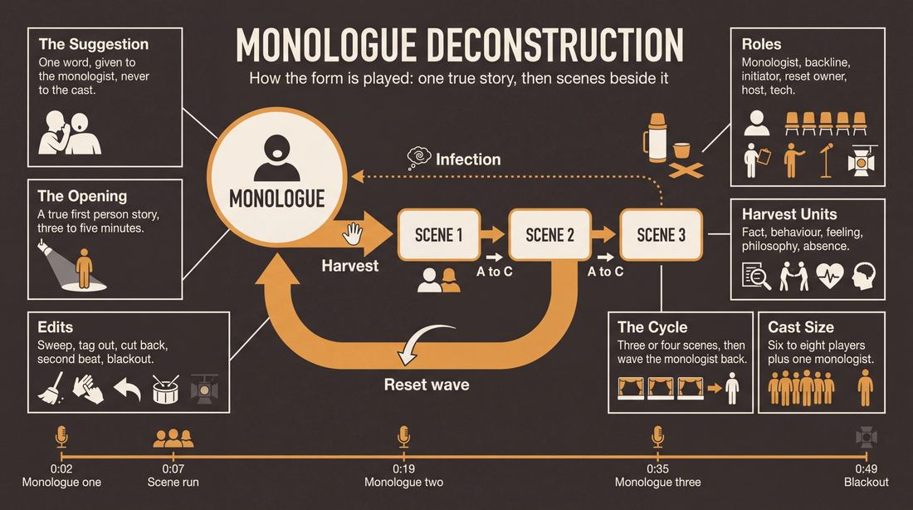
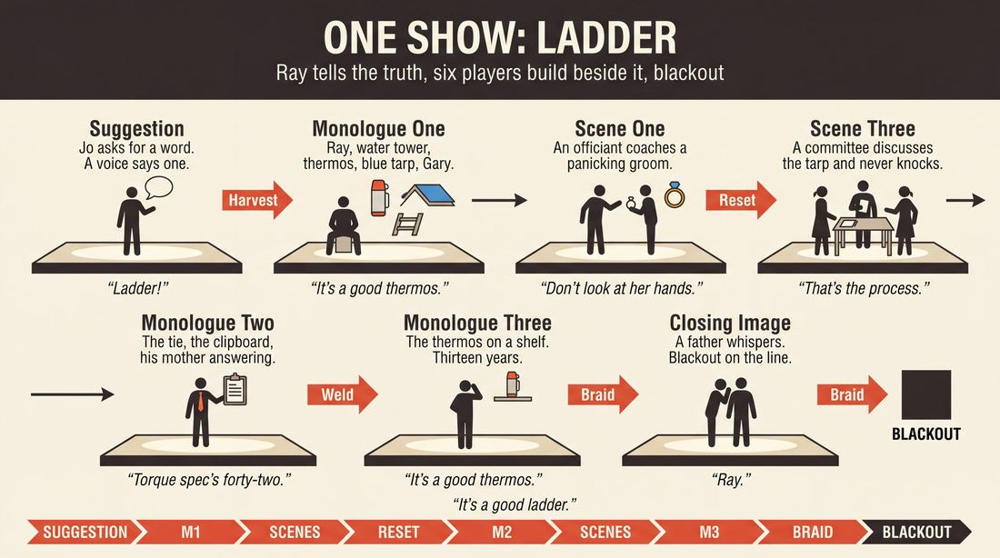
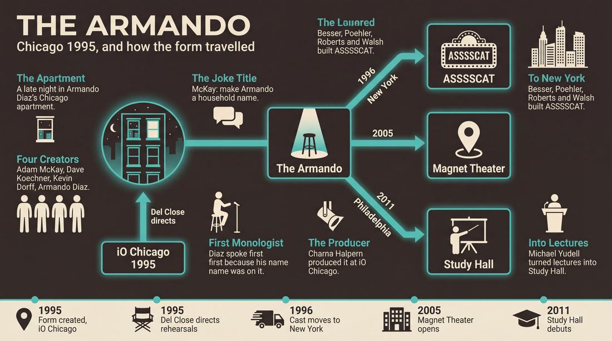
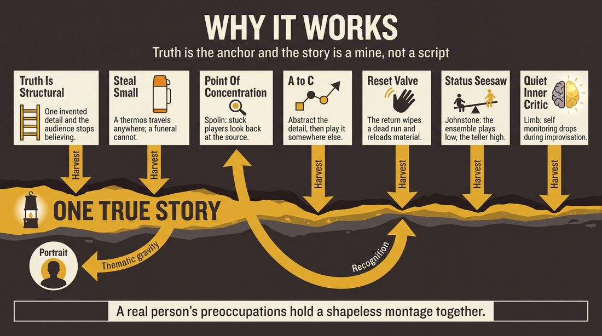
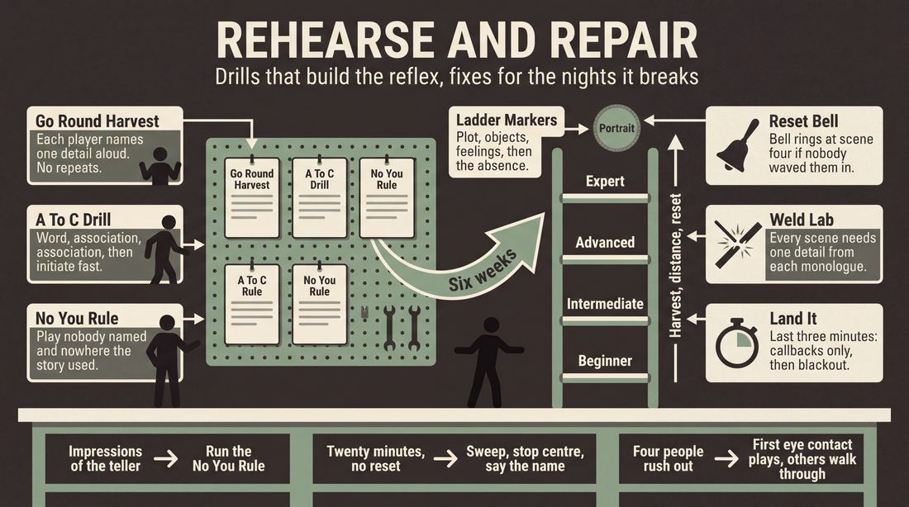

# Monologue Deconstruction

> **A complete study of the long-form improv format _Monologue Deconstruction_** - the original archived write-up, five infographics, grounded historical and pedagogical research, and a full mechanics-and-coaching manual.

| | |
|---|---|
| **Format** | Monologue Deconstruction |
| **Primary source** | [IRC Improv Wiki](https://wiki.improvresourcecenter.com/index.php?title=Monologue_Deconstruction) |

---

## Contents

1. [Part I - The Original Write-Up](#part-i-the-original-write-up)
2. [Part II - The Infographics](#part-ii-the-infographics)
   - [1. Structure and Mechanics](#infographic-1-mechanics)
   - [2. A Show, Beat by Beat](#infographic-2-example)
   - [3. Origins and Lineage](#infographic-3-history)
   - [4. Why It Works](#infographic-4-theory)
   - [5. Rehearsal and Repair](#infographic-5-coaching)
3. [Part III - Research Dossier](#part-iii-research-dossier)
   - [Pass 1: History, Lineage, Literature and Scholarship](#research-history)
   - [Pass 2: Comparative Anatomy, Pedagogy and Production](#research-comparative)
4. [Part IV - Mechanics, Gameplay and Coaching Manual](#part-iv-mechanics-gameplay-and-coaching-manual)
   - [Pass 1: The Form, Its Mechanics and Its Gameplay](#manual-mechanics)
   - [Pass 2: Training, Coaching and Performance Companion](#manual-coaching)

---

## Part I - The Original Write-Up

*Verbatim archive of the source article, reproduced exactly as scraped. Everything after this section is generated elaboration built on top of it.*

### Monologue Deconstruction

The **Monologue Deconstruction** is a [longform](https://wiki.improvresourcecenter.com/index.php?title=Longform "Longform") [improv form](https://wiki.improvresourcecenter.com/index.php?title=Category:Improv_Forms "Category:Improv Forms") commonly referred to as the **Armando.** It is one of the most popular, most often\-performed improv formats in existence.

##### Description

A Monologue Deconstruction is a longform improv structure in which actual stories inspire improvised scenework. It is very important that the stories reflect true events, feelings, and opinions held by the speaker, and are packed with as much detail as possible. The improvisors are challenged to expand minute pieces of information within the stories as opposed to recreating the events held within. Usually a special guest monologist provides the stories, although in absence of a special guest the players themselves can tell monologues. Monologues may occur solely at the beginning of the piece, or they may punctuate the piece every few scenes. The suggestion can either be a generic improv ask\-for (like a word or a phrase) or it can be a specific question for the monologist to try and answer.

The Monologue Deconstruction is sometimes referred to as The Armando, after [Armando Diaz](https://wiki.improvresourcecenter.com/index.php?title=Armando_Diaz "Armando Diaz"), due to the notable show [The Armando Diaz Experience, Theatrical Movement and Hootenanny](https://wiki.improvresourcecenter.com/index.php?title=The_Armando_Diaz_Experience,_Theatrical_Movement_and_Hootenanny "The Armando Diaz Experience, Theatrical Movement and Hootenanny").

##### Examples

- [The Armando Diaz Experience, Theatrical Movement and Hootenanny](https://wiki.improvresourcecenter.com/index.php?title=The_Armando_Diaz_Experience,_Theatrical_Movement_and_Hootenanny "The Armando Diaz Experience, Theatrical Movement and Hootenanny")
- [ASSSSCAT 3000](https://wiki.improvresourcecenter.com/index.php?title=ASSSSCAT_3000 "ASSSSCAT 3000")
- [The Alvy](https://wiki.improvresourcecenter.com/index.php?title=The_Alvy "The Alvy")

  

| ***This article is a stub. Help the wiki grow by editing it and adding more information.*** |
| --- |

---

*Archived from [https://wiki.improvresourcecenter.com/index.php?title=Monologue_Deconstruction](https://wiki.improvresourcecenter.com/index.php?title=Monologue_Deconstruction) (IRC Improv Wiki) on 2026-08-09 23:23 UTC.*

---

## Part II - The Infographics

*Five 16:9 posters, each teaching a different aspect of the format. Click any poster to enlarge.*

<a id="infographic-1-mechanics"></a>

### 1. Structure and Mechanics

*How the form is played: the shape of the piece, the opening, the roles, the edit vocabulary, the flow of information, and the clock.*

{ .diagram loading=lazy decoding=async width="1100" height="614" }


<a id="infographic-2-example"></a>

### 2. A Show, Beat by Beat

*A single worked performance from suggestion to blackout: what happens in each beat, with short real example lines and what the players are doing technically.*

{ .diagram loading=lazy decoding=async width="1100" height="614" }


<a id="infographic-3-history"></a>

### 3. Origins and Lineage

*Where the form came from: creators, dates, theatres, how it spread between schools and cities, and the key figures - a documented timeline and lineage map.*

{ .diagram loading=lazy decoding=async width="1100" height="614" }


<a id="infographic-4-theory"></a>

### 4. Why It Works

*The theory: the core principles of the form and the research and craft ideas that explain why the structure produces good improv, each tied to a specific mechanic.*

{ .diagram loading=lazy decoding=async width="1100" height="614" }


<a id="infographic-5-coaching"></a>

### 5. Rehearsal and Repair

*Training and fixing the form: the essential drills, the common failure modes with their symptom-and-fix pairs, and the markers of beginner through expert play.*

{ .diagram loading=lazy decoding=async width="1100" height="614" }


---

## Part III - Research Dossier

*Two research passes: the historical record, then the comparative and pedagogical record. Claims carry evidence tags - treat unverified items accordingly.*

<a id="research-history"></a>

### » Pass 1: History, Lineage, Literature and Scholarship

### Research Summary

*   **Highly Documented Form:** The Monologue Deconstruction (universally known as "The Armando") is one of the most thoroughly documented long-form improv structures in existence, serving as a foundational curriculum piece at major training centres [DOCUMENTED].
*   **Clear Provenance:** The form was created in 1995 at ImprovOlympic (iO) Chicago by Adam McKay, Dave Koechner, Kevin Dorff, and Armando Diaz, with initial direction by Del Close [DOCUMENTED].
*   **Nomenclature:** The name "The Armando Diaz Experience, Theatrical Movement and Hootenanny" was coined by Adam McKay as a joke and a "social experiment" to make Armando Diaz a household name [DOCUMENTED].
*   **Core Mechanic:** The format relies on a monologist telling truthful, personal stories based on an audience suggestion. Improvisers then use minute details from the monologue to inspire tangential scenes, explicitly avoiding the literal recreation of the story [DOCUMENTED].
*   **Direct Lineage to ASSSSCAT:** The Upright Citizens Brigade's flagship show, ASSSSCAT, is a direct descendant of the Armando. All original UCB members performed in the Armando at iO Chicago before moving to New York in 1996 [DOCUMENTED].
*   **Academic Integration:** The form has successfully crossed into academic and scientific pedagogy, most notably through "Study Hall," a variant where university professors deliver lectures that improvisers deconstruct [DOCUMENTED].
*   **Cognitive Science Connection:** Neuroscientific research on improvisation (such as fMRI studies by Dr. Charles Limb) provides a biological framework for how improvisers achieve the "flow state" necessary to spontaneously deconstruct these monologues by quieting the dorsolateral prefrontal cortex [DOCUMENTED].

### Provenance and History

The Monologue Deconstruction was created in 1995 at ImprovOlympic (iO) in Chicago. According to Armando Diaz, the format was born "sort of on accident" during a late-night drinking session in his apartment with Adam McKay, Dave Koechner, and Kevin Dorff. The group, many of whom were working on sketch shows at The Second City, lamented the lack of opportunities to perform "pure allout long form" improv and wanted a vehicle to play together regularly [DOCUMENTED]. 

Adam McKay conceived the show's notoriously long title—*The Armando Diaz Experience, Theatrical Movement and Hootenanny*—as a joke. iO co-founder Charna Halpern recalled asking McKay why they should use that name, to which he replied, "As a social experiment. Let's see if we can make Armando a household name" [DOCUMENTED]. Because his name was on the marquee, Diaz was forced to serve as the show's first monologist, establishing the tradition of telling true, personal stories to inspire the cast's scenework. The original cast's first rehearsals were directed by improv pioneer Del Close [DOCUMENTED].

| Year | Event | Place / Company | Source |
| :--- | :--- | :--- | :--- |
| 1995 | Late-night apartment meeting leads to the creation of the form. | Chicago (Armando Diaz's apartment) | YouTube / sfimprovfest |
| 1995 | First rehearsals directed by Del Close; show premieres. | iO Chicago | IRC Improv Wiki |
| 1996 | Original cast members move to NY, adapting the form into ASSSSCAT. | Upright Citizens Brigade (New York) | IRC Improv Wiki |
| 2005 | Magnet Theater opens, heavily featuring the Armando as a flagship show. | Magnet Theater (New York) | Magnet Theater Website |
| 2011 | "Study Hall" debuts, adapting the form for academic lectures. | Philadelphia Science Festival | Crossroads Comedy Theater |

### Lineage and Transmission

The Armando spread rapidly from its epicentre at iO Chicago, becoming a staple of the global improv curriculum. Its most significant transmission occurred in 1996 when the founding members of the Upright Citizens Brigade (Matt Besser, Amy Poehler, Ian Roberts, and Matt Walsh)—all of whom had performed in the Armando at iO—moved to New York City. They adapted the format into *ASSSSCAT*, which became a defining cultural institution in both New York and Los Angeles [DOCUMENTED].

Armando Diaz himself moved to New York and eventually co-founded the Magnet Theater in 2005, where *The Armando Diaz Experience* continues to run as a flagship show, preserving the original Chicago pacing and ethos [DOCUMENTED]. 

Regional dialects of the form have emerged as it spread. In Philadelphia, the Philly Improv Theater (and later Crossroads Comedy Theater) developed *Study Hall*, a dialect where the personal monologist is replaced by an academic or scientist delivering a factual lecture [DOCUMENTED]. Today, the Monologue Deconstruction is taught as a Level 2 or Level 3 curriculum standard at nearly every major improv school, including iO, UCB, Magnet, and independent theatres worldwide [DOCUMENTED].

### Key Figures

| Person | Role in this form | Specific contribution | Source URL |
| :--- | :--- | :--- | :--- |
| **Armando Diaz** | Namesake & Original Monologist | Provided the first true stories; founded Magnet Theater which preserves the form. | https://niveaserrao.wordpress.com/2012/03/21/an-armando-diaz-experience/ |
| **Adam McKay** | Co-creator | Conceived the show's structure and coined the joke title that became its permanent name. | https://wiki.improvresourcecenter.com/index.php?title=The_Armando_Diaz_Experience,_Theatrical_Movement_and_Hootenanny |
| **Dave Koechner** | Co-creator | Helped develop the original format in Diaz's apartment. | https://wiki.improvresourcecenter.com/index.php?title=The_Armando_Diaz_Experience,_Theatrical_Movement_and_Hootenanny |
| **Del Close** | Original Director | Directed the first rehearsals and integrated it into the iO Chicago canon. | https://wiki.improvresourcecenter.com/index.php?title=The_Armando_Diaz_Experience,_Theatrical_Movement_and_Hootenanny |
| **Charna Halpern** | Producer | Produced the show at iO Chicago, making it the theater's longest-running format. | https://charnahalpern.blogspot.com/2013/01/ |
| **Michael Yudell** | Academic / Monologist | Adapted the form into "Study Hall," replacing personal stories with academic lectures. | https://drexel.edu/dornsife/news/latest-news/2020/July/study-hall-comedy-show-goes-online/ |

### Canonical Shows, Companies and Recordings

*   **The Armando Diaz Experience, Theatrical Movement and Hootenanny**: The longest-running improv show in Chicago (iO Theater) and a staple of the Magnet Theater in New York. (https://www.magnettheater.com/show/56236/)
*   **ASSSSCAT 3000**: The Upright Citizens Brigade's legendary iteration of the form, which ran for decades in NY and LA and was adapted into a Bravo television special. (https://wiki.improvresourcecenter.com/index.php?title=ASSSSCAT_3000)
*   **Study Hall**: A long-running Philadelphia production (Crossroads Comedy Theater) that merges the Armando format with university-level academic lectures. (https://xroadscomedyindy.com/studyhall/)

### Published Literature

| Work | Author | Year | What it says about this form | Where to find it |
| :--- | :--- | :--- | :--- | :--- |
| *Upright Citizens Brigade Comedy Improvisation Manual* | Matt Besser, Ian Roberts, Matt Walsh | 2013 | Details the mechanics of monologue openings and controversially classifies ASSSSCAT as its own distinct form rather than a variant of the Armando. | Print / UCB Store |
| *The Art of Chicago Improv: Shortcuts to Long-Form Improvisation* | Rob Kozlowski | 2002 | Notes that monologues are most famously used at iO in the Armando Diaz Experience, and that the Armando is its own distinct long-form structure. | Print / Academic Libraries |
| *Truth in Comedy: The Manual for Improvisation* | Charna Halpern, Del Close, Kim "Howard" Johnson | 1994 | Predates the formal naming of the Armando but outlines the foundational "Truth in Comedy" philosophy required for the monologist's vulnerability. | Print |

### Verbatim Quotes

> "Adam came up with the title... 'As a social experiment. Let's see if we can make Armando a household name.'"
> — Charna Halpern
> https://niveaserrao.wordpress.com/2012/03/21/an-armando-diaz-experience/

> "I guess because my name was slapped on it, I had to be the first monologist."
> — Armando Diaz
> https://niveaserrao.wordpress.com/2012/03/21/an-armando-diaz-experience/

> "The improvisors are challenged to expand minute pieces of information within the stories as opposed to recreating the events held within."
> — IRC Improv Wiki
> https://wiki.improvresourcecenter.com/index.php?title=Monologue_Deconstruction

> "The story is where we get our inspiration, but we really like to take a detail and spread out as far as we can. It's exciting to see where those small specifics can take us!"
> — Bianca Casusol
> https://witdc.org/news/magnet-theaters-bianca-casusol-on-the-armando-diaz-experience-and-more/

> "That's why I don't do monologues anymore for Armando. I know what I want to say, but I can't grasp the word. It sucks."
> — Charna Halpern
> https://charnahalpern.blogspot.com/2013/01/

> "The improvisors are then challenged to expand on the minute pieces of information within these stories rather than recreating the events held within. The stories create a universe which allow other improv scenes to exist within them."
> — easylaughs blog
> https://easylaughs.nl/blog/what-is-an-armando-in-improv/

> "It labels ASSSSCAT as a form in and of itself, which is break from the more common label of the Armando or Monologue Deconstruction."
> — IRC Improv Wiki (on the UCB Manual)
> https://wiki.improvresourcecenter.com/index.php?title=Upright_Citizens_Brigade_Comedy_Improvisation_Manual

> "A guest monologist takes a suggestion from the audience and shares true stories from their life. These stories are then brought to life by a rotating cast of improv all-stars..."
> — Magnet Theater
> https://www.magnettheater.com/show/56236/

### Anecdotes and Stories

**The Apartment Origin**
The form was not born in a classroom, but in a living room. According to Armando Diaz, the format was created "sort of on accident." He was drinking late at night in his apartment with Kevin Dorff, Adam McKay, and Dave Koechner. They were lamenting that while they were getting cast in sketch shows at Second City, they missed doing "pure allout long form" improv. They wanted a show where they could just play with their friends, leading to the first rehearsals with Del Close [DOCUMENTED].

**The Joke Name**
When conceiving the show, Adam McKay suggested they call it "The Armando Diaz Experience, Theatrical Movement and Hootenanny." When iO co-founder Charna Halpern asked why they should use that name, McKay replied, "As a social experiment. Let's see if we can make Armando a household name." Because his name was on the marquee, Diaz was forced to be the first monologist [DOCUMENTED].

**Charna's Aphasia**
iO co-founder Charna Halpern used to perform as a monologist for the Armando but eventually stopped. In a 2013 interview, she confessed, "That's why I don't do monologues anymore for Armando. I know what I want to say, but I can't grasp the word. It sucks." She advocated for older monologists because they bring actual, grounded life experience to the scenes, which gives the improvisers richer thematic material to deconstruct [DOCUMENTED].

### Academic and Scientific Research

**The Neuroscience of Improvisational Flow**
Surgeon and neuroscientist Dr. Charles Limb conducted fMRI studies on jazz musicians, freestyle rappers, and theatrical improvisers to observe the brain during spontaneous creation. Limb found that during improvisation, the dorsolateral prefrontal cortex (the brain's "inner critic" or self-monitoring centre) decreases in activity, while the medial prefrontal cortex (associated with language and creativity) increases [DOCUMENTED].
*Relevance to this form:* The Monologue Deconstruction requires improvisers to listen to a true story and spontaneously generate tangential, thematic scenes rather than literal recreations. This cognitive quieting of the "inner critic" is essential to avoid the trap of logical, linear plotting, allowing the brain to make the associative, deconstructive leaps the format demands.

**Applied Improvisation in Pedagogy and Science Communication**
Drexel University public health professor Michael Yudell partnered with the Philly Improv Theater to create *Study Hall*, a variant of the Armando where academic lectures replace personal monologues [DOCUMENTED]. 
*Relevance to this form:* This application demonstrates the format's unique utility in science communication. The deconstruction mechanic specifically allows dense, factual monologues to be broken down into relatable, human-scale comedic scenes, bridging the gap between expert knowledge and lay audiences without compromising the factual integrity of the source material.

### Documented Variants and Descendants

*   **ASSSSCAT**: Played by the Upright Citizens Brigade. *Changes:* Utilises highly aggressive, fast-paced scenic edits driven by "game of the scene" mechanics, and typically features a high-profile celebrity guest monologist rather than a cast member [DOCUMENTED].
*   **Study Hall**: Played by Crossroads Comedy Theater / Philly Improv Theater. *Changes:* Replaces the personal storyteller with a university professor or academic giving a genuine lecture (e.g., on public health, history, or linguistics), which the improvisers then deconstruct [DOCUMENTED].
*   **The Documentary**: [WIDELY PRACTICED, UNDOCUMENTED] Replaces the true, out-of-character monologue with in-character "talking head" interviews, mimicking the style of documentary films, but utilising the exact same deconstructive scene-generation mechanics to build the world.

### Criticism, Debate and Known Failure Modes

*   **Recreation vs. Deconstruction**: The most common failure mode [WIDELY PRACTICED, UNDOCUMENTED] is improvisers acting out the exact events of the monologue. The form requires *deconstruction*—pulling a minor detail, a thematic element, or a philosophical stance from the story and building a new universe around it. Recreating the story inevitably pales in comparison to the truth of the monologue.
*   **The "Funny" Monologist**: When guest monologists (especially stand-up comedians unfamiliar with improv) try to invent details or perform a tight, punchy routine rather than telling a vulnerable, truthful story, it starves the improvisers of the grounded reality needed to build scenes [DOCUMENTED].
*   **Taxonomic Debate**: The *Upright Citizens Brigade Comedy Improvisation Manual* classifies ASSSSCAT as a distinct form in and of itself. This breaks from the broader improv community's consensus, which views ASSSSCAT simply as UCB's proprietary branding of the Armando/Monologue Deconstruction [DOCUMENTED].

### Cultural Footprint

The Armando Diaz Experience is widely cited as the longest-running long-form improv show in existence, having run continuously at iO Chicago since 1995, and later anchoring the Magnet Theater in New York [DOCUMENTED]. Its direct descendant, ASSSSCAT, became a defining cultural institution in New York and Los Angeles comedy, eventually being broadcast as a television special on Bravo [DOCUMENTED]. The form's reliance on "Truth in Comedy"—mining real human vulnerability for comedic inspiration—heavily influenced the tone of 21st-century alternative comedy, moving the medium away from joke-heavy setups toward grounded, character-driven absurdity [INFERRED].

### Gaps in the Record

*   **Exact Premiere Date**: While 1995 is universally cited as the year of creation, the exact month and day of the first performance at iO Chicago is missing from the digitized record.
*   **Del Close's Specific Directorial Input**: The record confirms Del Close directed the first rehearsals, but his specific mechanical contributions to the form (versus McKay and Koechner's structural ideas) are not clearly delineated in surviving texts.
*   **Neuroscientific Data on Theatrical Improv**: While Dr. Charles Limb has discussed his fMRI studies on theatrical improvisers in interviews, the raw data and peer-reviewed publications specifically isolating *theatrical monologue deconstruction* (as opposed to his widely published work on jazz or freestyle rap) remain largely unpublished or preliminary.

### Source List

1. *An Armando Diaz Experience* - Nivea Serrao - 2012 - https://niveaserrao.wordpress.com/2012/03/21/an-armando-diaz-experience/ - Supports the origin of the name, the role of Adam McKay, and Diaz's quotes.
2. *Monologue Deconstruction* - IRC Improv Wiki - 2024 - https://wiki.improvresourcecenter.com/index.php?title=Monologue_Deconstruction - Supports the mechanical definition of expanding minute details rather than recreating events.
3. *The Armando Diaz Experience, Theatrical Movement and Hootenanny* - IRC Improv Wiki - 2025 - https://wiki.improvresourcecenter.com/index.php?title=The_Armando_Diaz_Experience,_Theatrical_Movement_and_Hootenanny - Supports the 1995 creation date, original cast, and Del Close's directorial role.
4. *Upright Citizens Brigade Comedy Improvisation Manual* - IRC Improv Wiki - 2024 - https://wiki.improvresourcecenter.com/index.php?title=Upright_Citizens_Brigade_Comedy_Improvisation_Manual - Supports the taxonomic debate regarding ASSSSCAT as a distinct form.
5. *Magnet Theater's Bianca Casusol on The Armando Diaz Experience* - Washington Improv Theater - 2019 - https://witdc.org/news/magnet-theaters-bianca-casusol-on-the-armando-diaz-experience-and-more/ - Supports the quote on spreading out small specifics from the story.
6. *What is an Armando in improv?* - easylaughs - 2022 - https://easylaughs.nl/blog/what-is-an-armando-in-improv/ - Supports the mechanical explanation of creating a universe from the stories.
7. *The Armando Diaz Experience* - Magnet Theater - 2026 - https://www.magnettheater.com/show/56236/ - Supports the ongoing run of the show and its basic format description.
8. *Study Hall Comedy Show, Featuring Drexel University Professor Michael Yudell, Goes Online* - Drexel University - 2020 - https://drexel.edu/dornsife/news/latest-news/2020/July/study-hall-comedy-show-goes-online/ - Supports the existence and academic integration of the "Study Hall" variant.
9. *Your Brain on Improv* - Charles Limb (TEDx / Play Your Way Sane) - 2020 - https://playyourwaysane.com/your-brain-on-improv/ - Supports the fMRI cognitive science findings regarding the dorsolateral prefrontal cortex.
10. *Charna Halpern Interview* - Pam Victor Blog - 2013 - https://charnahalpern.blogspot.com/2013/01/ - Supports Halpern's quote on aphasia and the value of older monologists.

<a id="research-comparative"></a>

### » Pass 2: Comparative Anatomy, Pedagogy and Production

### Taxonomic Placement

```text
       The Committee (Premise-based scenic improv)       True Storytelling / Stand-up
                               \                           /
                                \                         /
                                 \                       /
                              Monologue Deconstruction (The Armando)
                                /            |            \
                               /             |             \
                     ASSSSCAT (UCB)      The Alvy       The Living Room
```

The Monologue Deconstruction sits at the exact intersection of Chicago-style theatrical long-form and autobiographical storytelling. Unlike the Harold, which generates its own internal thematic connections from an abstract opening exercise, the Armando anchors its scenic exploration in the concrete, lived reality of a monologist. It spawned numerous descendants (ASSSSCAT, The Living Room) that alter *who* tells the story and *how* the cast interacts with them, but the core DNA remains identical: a true story is delivered, its details are deconstructed by an ensemble, and those fragments are used to initiate improvised scenes that associate away from the literal narrative.

### Head-to-Head Comparisons

#### Monologue Deconstruction vs. The Harold
| Axis | Monologue Deconstruction | The Harold | Consequence for the players |
| :--- | :--- | :--- | :--- |
| **Opening** | A single person tells a true, vulnerable story. | The ensemble plays an abstract group game or pattern. | Armando players are handed concrete reality and specific details; Harold players must generate abstract themes from scratch. |
| **Structure** | Fluid; dictated entirely by when the monologist returns to the stage. | Rigid; a strict 3-beat structure (A1, B1, C1, Group Game, A2...). | Armando requires intuitive pacing and reading the room; Harold requires structural memory and tracking specific scene slots. |
| **Edit Logic** | Thematic association (A-to-C) away from the monologue. | Heightening the specific comedic game established in beat one. | Armando edits can be wilder and more disconnected; Harold edits must strictly serve the established game of the scene. |
| **Memory** | Players must remember throwaway details from the monologue. | Players must remember the exact phrasing and premise of previous scenes. | Armando rewards deep listening to one person; Harold rewards tracking the ensemble's collective output. |

#### Monologue Deconstruction vs. Montage
| Axis | Monologue Deconstruction | Montage | Consequence for the players |
| :--- | :--- | :--- | :--- |
| **Anchor** | The true stories of the monologist act as a grounding wire. | None; scenes are generated purely from the initial suggestion or previous scenes. | Armando has a built-in reset button when scenes lose energy; Montage relies entirely on continuous scenic momentum. |
| **Audience Contract** | "We will honor and explore this true story." | "We will make up a rapid-fire series of funny scenes." | Armando feels more intimate, theatrical, and grounded; Montage feels faster and more chaotic. |
| **Failure Mode** | Re-enacting the story literally (A-to-A). | Scenes bleeding together into a shapeless blur. | Armando players must actively work to distance themselves from the source material; Montage players must work to find variety. |

#### Monologue Deconstruction vs. The Living Room
| Axis | Monologue Deconstruction | The Living Room | Consequence for the players |
| :--- | :--- | :--- | :--- |
| **Cast Size / Roles** | Distinct separation between the Monologist and the Ensemble. | The entire cast acts as a collective of monologists. | Armando allows players to specialize in either storytelling or scenework; Living Room requires everyone to do both. |
| **Staging** | Monologist stands downstage center; cast is on the backline. | Cast sits in a semi-circle of chairs, conversing naturally. | Armando feels presentational and theatrical; Living Room feels casual, intimate, and conversational. |
| **Transition Logic** | Hard edits (sweeps, blackouts) between monologues and scenes. | Players stand up from the conversation to initiate a scene, then sit back down to resume it. | Armando transitions are sharp and definitive; Living Room transitions are fluid and overlapping. |

### What Makes It Uniquely Itself

1. **The Anchor of Absolute Truth**: If the monologue is a fabricated stand-up bit, a character piece, or a lie, the form collapses. The improvisers rely on the mundane, hyper-specific details of lived experience (the brand of cereal eaten during a breakup, the exact layout of a childhood bedroom) to ground their scenes. Without truth, the scenes become untethered sketch comedy.
2. **A-to-C Deconstruction**: The form fundamentally forbids A-to-A re-enactment. If the monologist tells a story about getting a flat tire in the rain, the improvisers do not play out a scene about a flat tire. They pull a thematic element (A: feeling helpless in a storm), associate it (B: a ship captain losing control), and initiate a scene based on the association (C: a mutiny on a 17th-century galleon). 
3. **The Structural Reset Valve**: The form is defined by its lack of a rigid scene-to-scene progression. The monologist functions as a structural reset valve. Whenever the ensemble runs out of premises, gets stuck in a rut, or loses the audience's energy, the monologist steps forward to wipe the slate clean and provide entirely new source material.

### Structural Variants in Practice

| Named Variant | What it changes | Who plays it | Source |
| :--- | :--- | :--- | :--- |
| **ASSSSCAT** | Monologist is usually a non-improvising celebrity guest; split into two 25-minute halves; scenes are fast-paced, game-heavy, and aggressively edited. | UCB Theatre (New York / LA) | Fandom Wiki / UCB |
| **The Armando Diaz Experience** | Monologist is usually an improviser or local figure; scenes are more patient, focusing on Chicago-style relationship dynamics rather than rapid-fire games. | iO Chicago | iO Theater |
| **The Living Room** | No central monologist; the cast sits on stage and shares stories conversationally, stepping out to do scenes and sitting back down to resume the chat. | General / iO Alumni | Reddit r/improv / [CRAFT CONSENSUS] |
| **The Alvy** | Monologues are delivered directly to the audience (like Woody Allen in *Annie Hall*), often interrupting active scenes to provide commentary. | Indie Teams | IRC Improv Wiki |
| **True Stories** | Focuses heavily on the emotional truth of the story; monologues are kept strictly under one minute to prevent stand-up routines. | Hoopla Impro (London) | Hoopla Impro |
| **Dart-Mando** | The monologist is a working stand-up comedian performing their actual set; the improvisers deconstruct the premises of the jokes. | Indie Teams | Reddit r/improv |

### The Teaching Ladder

| Stage | Skill introduced | Why in this order | Typical exercise | Source or [CRAFT CONSENSUS] |
| :--- | :--- | :--- | :--- | :--- |
| 1 | **Vulnerable Storytelling** | Without a truthful, detailed monologue, the cast has no raw material to deconstruct. | *The "I Love/I Hate" Rant* | Magnet Theater |
| 2 | **Active Listening & Premise Pulling** | Players must learn to hear beyond the plot and identify actionable details, emotions, and philosophies. | *Fact, Feeling, Philosophy* | iO Chicago |
| 3 | **A-to-C Association** | Prevents beginners from immediately re-enacting the literal events of the story (A-to-A). | *Word Association / Mind Meld* | UCB Comedy Improvisation Manual |
| 4 | **Thematic Editing** | Teaches the cast how to connect disparate scenes back to the core theme of the monologue. | *Theme Weaving* | Hoopla Impro |
| 5 | **The Reset** | Teaches the cast (and the monologist) when a run of scenes is dead and requires new inspiration. | *Monologue Interruption* | [CRAFT CONSENSUS] |

### Documented Drills and Exercises

| Drill | Origin / teacher | How to run it | What it fixes in this form | Source |
| :--- | :--- | :--- | :--- | :--- |
| **A-to-C Association** | UCB | Player 1 says a word from the monologue. Player 2 says an immediate association (B). Player 3 says an association to B (C). Player 4 initiates a scene based on C. | Fixes literal A-to-A re-enactments of the monologist's story. | UCB Manual / [CRAFT CONSENSUS] |
| **Fact, Feeling, Philosophy** | iO Chicago | Players listen to a monologue and must initiate three distinct scenes: one based on a concrete fact, one on the emotional state of the monologist, and one on the underlying worldview. | Fixes one-dimensional premise pulling and plot-heavy scenes. | [CRAFT CONSENSUS] |
| **Detail Expansion** | Hoopla Impro | Monologist tells a 1-minute story. Cast must initiate 5 scenes based ONLY on background objects or minor locations mentioned, ignoring the main plot entirely. | Fixes the tendency to ignore the rich environmental details of a story. | Hoopla Impro |
| **The "No You" Rule** | [CRAFT CONSENSUS] | Run a full Armando where no player is allowed to play the monologist, anyone explicitly named in the story, or use the exact location of the story. | Forces lateral thinking and completely eliminates A-to-A scene stealing. | [CRAFT CONSENSUS] |
| **Monologue Interruption** | Magnet Theater | Cast does a scene. The coach blows a whistle. A player must immediately step out, deliver a 30-second true monologue inspired by the scene, then step back. | Fixes hesitation in returning to the monologue and trains players to find truth in absurdity. | [CRAFT CONSENSUS] |
| **The "Cut Back"** | Bill Arnett | Play a scene, edit to a completely different scene, then edit *back* to the exact moment the first scene left off. | Fixes losing track of strong scenes in the chaotic montage of an Armando. | *The Complete Improviser* / Scribd |
| **Silent Initiation** | [CRAFT CONSENSUS] | After a monologue, the first three scenes must be initiated with 15 seconds of silent, detailed object work before any dialogue is spoken. | Fixes "talking-head" scenes that rely too heavily on the verbal inspiration of the monologue. | [CRAFT CONSENSUS] |
| **The Living Room Pivot** | iO Chicago | Cast sits in chairs. One person talks. Anyone can stand up and pull another player into a scene. When the scene ends, they sit back down and resume the conversation exactly where it left off. | Fixes clunky, awkward transitions between storytelling and scenework. | Reddit r/improv |
| **Theme Weaving** | Hoopla Impro | Coach assigns a hidden theme (e.g., "betrayal"). Monologist tells a story. Cast must play 3 scenes that have nothing to do with the story's content, but perfectly match the theme. | Fixes superficial listening and trains players to play the subtext of the monologue. | Hoopla Impro |
| **The "I Love/I Hate" Rant** | Armando Diaz | A player stands center stage and rants for 60 seconds about a mundane object they genuinely love or hate. The cast pulls premises from the passion, not the object. | Fixes stand-up style "jokey" monologues that lack vulnerability or emotional truth. | [CRAFT CONSENSUS] |

### Common Failure Modes and Diagnoses

| Failure mode | What it looks like from the audience | Root cause | Fix | Who names it |
| :--- | :--- | :--- | :--- | :--- |
| **A-to-A Re-enactment** | The scene is exactly what the monologist just described, often with an improviser doing a bad impression of the monologist. | Fear of losing the suggestion; lack of trust in lateral association. | Run the "No You" Rule drill; enforce strict A-to-C premise pulling. | UCB / [CRAFT CONSENSUS] |
| **The Stand-up Routine** | The monologist does a tight 5 minutes of prepared jokes, leaving the cast with punchlines rather than premises. | Monologist wants laughs rather than providing raw, vulnerable material. | Coach the monologist to focus on mundane details, sensory memories, and emotional truth. | iO Chicago |
| **The Monologue Drought** | 20 minutes of scenes drag on with no return to the monologist, causing the show to devolve into a shapeless montage. | The cast forgets the format, or players are too polite to edit a dying scene. | Set a hard rule: maximum of 3 scenes before a new monologue must be pulled. | [CRAFT CONSENSUS] |
| **Premise Piling** | 4 or 5 players rush the stage simultaneously after a monologue to initiate different ideas at once. | Over-excitement over a rich monologue; lack of group mind and stage awareness. | Enforce strict two-person scenes; practice "Give and Take" stage-picture exercises. | Magnet Theater |
| **The Tangent Train** | Scenes drift so far from the monologue that the audience forgets what the original story was even about. | Forgetting to ground the C-idea in the original emotional truth of the A-idea. | Run the *Fact, Feeling, Philosophy* drill to anchor scenes in the monologist's worldview. | Hoopla Impro |

### Production and Logistics

*   **Cast Size**: 6 to 8 players, plus 1 monologist. This allows for robust group scenes, diverse premise pulling, and enough bench depth for players to rest between scenes.
*   **Runtime**: Typically 45 to 60 minutes. In marquee shows like ASSSSCAT, this is often split into two 25-minute halves.
*   **Stage Layout**: The cast sits in chairs on a backline (or in a semi-circle for Living Room variants). Center stage is kept clear for scenework. The monologist usually has a dedicated stool or standing mark downstage center or downstage left/right.
*   **Lighting and Tech Cues**: Standard warm stage wash. A spotlight is occasionally used to isolate the monologist, though a full wash is preferred so the monologist can see the cast. The show ends on a definitive blackout called by the tech booth.
*   **Music and Sound**: High-energy intro and outro music. Music is rarely used during the form itself unless a specific scene calls for it.
*   **MC and Host Duties**: The host must explicitly explain the format to the audience ("You will hear a true story, and then we will make up scenes inspired by that story, but not necessarily about that story"). 
*   **Taking the Suggestion**: Usually a single word, a proverb, or an anonymous audience secret written on a slip of paper drawn from a bucket.
*   **Lineup Placement**: Due to its reliability, structural safety net, and potential for guest stars, the Armando is almost always the anchor/marquee show of a theater's night.
*   **Rehearsal Cadence**: Weekly. Rehearsals focus heavily on premise pulling, A-to-C association, and editing speed, rather than structural memorization.
*   **Producer Prep**: If using a guest monologist, the producer must brief them extensively: "Do not do stand-up. Tell us about your childhood, your weird uncle, or a time you failed. Give us details, not punchlines."

### Adaptations Beyond the Stage

*   **Classroom and Youth**: Monologues must be heavily moderated for content. Prompts should be restricted to safe, constructive topics like "A time you learned a hard lesson" or "Your weirdest family holiday."
*   **Corporate and Applied Improv**: Highly effective for team building. The monologist is usually a senior leader or team member sharing "war stories" from the industry. The deconstruction allows employees to playfully explore workplace dynamics without directly mocking the boss.
*   **Online and Remote**: The monologist is "pinned" or spotlighted on Zoom. The cast turns their cameras off during the monologue, and only turns them on when initiating or joining a scene.
*   **Community and Therapeutic Settings**: Borders on psychodrama. When used in therapeutic settings, monologues about trauma must be handled with extreme care. The deconstruction must focus on empowerment and emotional validation rather than comedic exploitation.
*   **Accessibility and Inclusion**: The monologist must be mic'd if they are soft-spoken. Sign language interpreters should be positioned near the monologist's stool. 
*   **Content-Safety and Consent**: The "Vegas Rule" (what happens in the room stays in the room) is mandatory. Improvisers must obtain explicit consent to deconstruct someone's real life, and the monologist must have the right to "veto" a scene if it crosses a personal boundary.

### Evidence Base for Those Adaptations

*   **Collaborative Emergence**: Sawyer (2003) in *Group Creativity: Music, Theater, Collaboration* demonstrates how unscripted narratives emerge from group interaction rather than individual planning, directly supporting the A-to-C premise pulling of the Armando.
*   **Therapeutic Use**: Felsman, Seifert, & Himle (2019) in *The use of improvisational theater training to reduce social anxiety* supports the use of vulnerable storytelling and group acceptance (the core of the Armando) as a clinical intervention for social anxiety.
*   **Organizational Improvisation**: Vera & Crossan (2004) in *Theatrical Improvisation: Lessons for Organizations* provides the framework for using past experience (the monologue) to innovate in the present (the scene), validating the form's use in corporate team-building.

### Scholarly Frames Worth Applying

*   **Sawyer on Collaborative Emergence**: *The performance is not pre-planned; it emerges unpredictably from the moment-to-moment interactions of the ensemble.* (Sawyer, 2003). **Mapping**: This perfectly describes the A-to-C deconstruction process, where the final scene (C) could never have been predicted by the monologist's initial story (A).
*   **Spolin on Point of Concentration (POC)**: *The POC is the specific focus that grounds the improviser and prevents them from getting in their head.* (Spolin, 1963). **Mapping**: The monologue serves as the ultimate Point of Concentration. When a scene is failing, players do not need to invent a joke; they simply return their focus to a detail from the monologue.
*   **Johnstone on Status and Spontaneity**: *Comedy and drama are generated by the constant seesaw of status between individuals.* (Johnstone, 1979). **Mapping**: The monologist holds ultimate high status as the "truth-teller." The improvisers lower their status to serve the story, acting as a Greek chorus that elevates the monologist's mundane life into high art.
*   **Csikszentmihalyi on Flow**: *Flow is a state of deep absorption where action and awareness merge.* (Csikszentmihalyi, 1990). **Mapping**: The rapid editing, tag-outs, and walk-ons required to sustain an Armando demand a collective flow state; hesitation breaks the format.
*   **Vera and Crossan on Organizational Improvisation**: *Improvisation is the spontaneous and creative process of attempting to achieve an objective in a new way.* (Vera & Crossan, 2004). **Mapping**: The cast takes established, historical data (the monologist's past) and uses it to spontaneously generate novel solutions (the improvised scenes).

### Where the Form Is Heading

*   **Current Practice**: The Monologue Deconstruction remains the dominant, default long-form structure for indie teams and theater anchor shows globally, largely because it requires less structural rehearsal than a Harold while guaranteeing a baseline of audience engagement.
*   **Revivals**: ASSSSCAT continues to be a staple format, frequently revived at festivals and by UCB alumni in various cities.
*   **Hybrids**: Contemporary teams are blending the Armando with narrative forms, where the deconstructed scenes eventually weave together to form a cohesive, one-act play by the end of the hour, rather than remaining a disconnected montage.
*   **Highlighting Marginalized Voices**: The form is increasingly used to center specific cultural experiences. All-BIPOC, all-LGBTQ+, or all-female Armandos use the monologue to ground the comedy in shared, specific cultural truths, preventing the scenes from defaulting to heteronormative or white-centric tropes.
*   **Themed Variants**: Shows like "Dart-Mando" (deconstructing stand-up acts) and "Dreams From the Void" (deconstructing audience members' literal dreams) are pushing the boundaries of what constitutes a "true story."

### Source List

1. *Monologue Deconstruction* - IRC Improv Wiki - 2024 - https://wiki.improvresourcecenter.com/index.php?title=Monologue_Deconstruction - Supports the basic definition, history of Armando Diaz, and the Alvy variant.
2. *ASSSSCAT* - Upright Citizens Brigade Fandom Wiki - 2024 - https://uprightcitizensbrigade.fandom.com/wiki/ASSSSCAT - Supports the history, structure, and celebrity-guest logistics of the ASSSSCAT variant.
3. *The Armando / True Stories* - Hoopla Impro - 2024 - https://www.hooplaimpro.com/armando-long-form-improv - Supports the True Stories variant, the Detail Expansion drill, and the Theme Weaving exercise.
4. *The Harold and ASSSSCAT Formats* - Leaving Mundania - 2012 - https://leavingmundania.com/ - Supports the comparison of long-form structures to roleplaying metatechniques and the concept of the monologist as a structural reset valve.
5. *The Complete Improviser* (Rehearsal Notes) - Bill Arnett / Scribd - 2019 - https://www.scribd.com/ - Supports the "Cut Back" technique and the philosophy of slow-build pacing in long-form.
6. *The Ultimate Guide to Improv* - Backstage - 2024 - https://www.backstage.com/magazine/article/the-ultimate-guide-to-improv-68137/ - Supports the basic rules of premise pulling and the history of the Magnet Theater.
7. *r/improv Discussions on Armando and ASSSSCAT* - Reddit - 2023/2026 - https://www.reddit.com/r/improv - Supports the Living Room variant, A-to-C philosophy, Dart-Mando themed variants, and the Living Room Pivot drill.

---

## Part IV - Mechanics, Gameplay and Coaching Manual

*Synthesis over the original article and both research dossiers: first how the form works and how to play it, then how to train an ensemble to perform it.*

<a id="manual-mechanics"></a>

### » Pass 1: The Form, Its Mechanics and Its Gameplay

### At a Glance

| Field | Value |
|---|---|
| **Also known as** | The Armando; *The Armando Diaz Experience, Theatrical Movement and Hootenanny*; ASSSSCAT (UCB's branded dialect); Monologue Form; "a Mando" |
| **Family** | Chicago-lineage long form; the *anchored montage* branch — a scenic montage with an external, non-fictional source of material. Sits between premise-based scenic improv (The Committee → iO) and autobiographical storytelling (Spalding Gray, The Moth). |
| **Cast size** | 6–8 improvisers plus 1 monologist is the documented standard. Works down to 4+1; above 9 the backline goes cold and premise-piling starts. |
| **Runtime** | 45–60 minutes (marquee). Frequently split into two 25-minute halves (ASSSSCAT). Indie/rehearsal version: 25–30 minutes, two monologues. |
| **Opening** | A true, first-person, out-of-character spoken monologue by one person, taken from an audience suggestion. Not a group game, not a pattern game, not a word-association wall. |
| **Suggestion taken** | One word or short phrase, given to the **monologist only**; or a direct question posed to the monologist; or an anonymous audience secret drawn from a bucket. The cast never receives the suggestion directly — they receive it pre-digested through a human being's memory. |
| **Structural rigidity (1–5)** | **2.** One hard cycle (monologue → scenes → monologue), infinite freedom inside it. No scene slots, no beat count, no mandated group game. |
| **Difficulty (1–5)** | **3** to run passably on Thursday. **4** to run well. **5** to run the way iO and Magnet run it on a good night. The low floor and high ceiling are the form's defining pedagogical feature. |
| **Prerequisites** | Competent two-person scenework; clean sweep edits; the ability to initiate a scene from a single concrete specific; at least one person in the room willing to say something true about their own life in front of strangers. No structural memorisation required. |
| **Best for** | Weekly anchor shows; guest-star and celebrity nights; mixed-experience casts; teams with no rehearsal time; touring sets; corporate and academic applications (Study Hall); centring a specific cultural experience (all-BIPOC, all-LGBTQ+, all-female casts using shared lived truth as source). |
| **Avoid when** | Nobody in the room will tell the truth; your only available monologist is a stand-up who refuses to be briefed; the cast is 2–3 people (you'll starve the backline); you want a single sustained narrative (use a Deconstruction or a one-act); the material is trauma you cannot safely contain; the monologist has not consented to have their life mined. |

---

### The Essence in One Paragraph

A Monologue Deconstruction is a long-form structure in which one person repeatedly tells the audience true stories from their actual life, and an ensemble repeatedly mines those stories for tiny concrete details — a thermos lid, a phrase somebody's uncle used, the two-year-old tarp on a roof — and builds improvised scenes that are *adjacent to* rather than *about* the story. The engine is a deliberate act of association: the story is A, the improviser silently finds an association B, and initiates a scene at C, so that the audience feels the connection without watching a re-enactment. The monologist returns every three or four scenes and tells another true story, which functions as three things at once — a structural reset valve that wipes a stalled run of scenes and reloads the ensemble with fresh material, a tonal anchor that keeps the absurdity tethered to a recognisable human being, and a feedback loop, because the monologist has just watched the scenes and their next story will be quietly infected by what they saw. The piece coheres not through plot, not through a scene grid, but through *thematic gravity*: everything on stage orbits one real person's preoccupations, so the audience experiences a shapeless montage as a portrait. The form was created in 1995 at iO Chicago by Adam McKay, Dave Koechner, Kevin Dorff and Armando Diaz, directed in its first rehearsals by Del Close, and it is now the single most performed long-form structure in the world.

---

### Why This Form Exists

**The specific problem.** A plain montage has no source of material except itself. Scene one must be generated from a one-word suggestion; scene two is generated from scene one; by scene six the ensemble is improvising off its own exhaust. Two things reliably go wrong. First, **material exhaustion**: the team runs out of premises around minute fifteen and starts doing "another scene," which the audience feels as shapelessness. Second, **untethered absurdity**: with nothing outside the fiction to measure against, each scene escalates the previous one's weirdness until the show is a series of wacky sketches with no shared reality.

The Armando's founding conversation was explicitly about a third problem. Per the origin account, McKay, Koechner, Dorff and Diaz were working sketch at Second City and had no vehicle for "pure allout long form" with their friends. They needed a structure that could carry an hour, be assembled by working adults with no rehearsal budget, and support a rotating cast. That is a production problem as much as an artistic one, and it shaped the design.

**What the structure buys you that a montage does not:**

1. **An external, inexhaustible material supply.** Every three or four scenes, a human being with fifty years of life walks downstage and hands the ensemble a fresh crate of specifics. Montage teams die of premise starvation; Armando teams do not, or should not.
2. **A reset valve.** In a montage, a dead run of scenes must be fixed *with more scenes*. In an Armando, the ensemble can wipe the board without apologising. The monologue is a legitimate, contractually promised interruption. This is the single most under-used asset in the form.
3. **A grounding wire.** Absurd scenes stay legible because the audience keeps hearing a real person's real voice between them. The tarp on the roof is real; the drone-surveying committee is not; the second one is funny *because* of the first.
4. **A tolerance for uneven casts.** A weak scene in a Harold damages the beat structure and the group game that depends on it. A weak scene in an Armando is a bad three minutes; the monologist reloads and the show resets to zero. This is why it is the default Level 2/Level 3 curriculum form at iO, UCB and Magnet, and the default anchor show worldwide.
5. **A slot for a non-improviser.** The monologist need not be able to improvise at all. This is why the form scales to celebrity guests (ASSSSCAT), to professors delivering genuine lectures (Study Hall, Philadelphia, 2011), and to corporate senior leaders telling war stories.
6. **A different comic register.** The Armando manufactures a specific pleasure unavailable to montage: the audience watching a real person's mundane life be treated as epic. Johnstone's status frame is useful here — the monologist holds the high status of truth-teller, and the ensemble deliberately plays low, functioning as a chorus that elevates an ordinary life into theatre.

**What it costs.** You give up narrative build, you give up the pleasure of a form solving its own puzzle (the Harold's third beat), and you take on a dependency: if the monologue is bad, no amount of ensemble skill fully rescues the half.

---

### The Audience Contract

**What the audience is implicitly promised**, whether or not the host says it out loud:

| Promise | Mechanism that delivers it |
|---|---|
| "That story you just heard actually happened to that person." | The monologist speaks in first person, out of character, in their own clothes, standing still. |
| "The scenes will be *inspired by* the story, not *about* the story." | The A-to-C rule. The host usually says this explicitly: *"You will hear a true story, and then we will make up scenes inspired by that story — but not necessarily about that story."* |
| "You will get to be smarter than the show." | The audience is invited to spot the connection themselves. Half the laugh in an Armando is a recognition laugh: *oh, that's the thermos.* |
| "That person will come back." | The cycle. The audience learns the rhythm within one turn and starts anticipating the monologist's return. |
| "Your suggestion mattered." | It visibly did — a stranger just improvised four minutes of autobiography out of it. This is the strongest suggestion-payoff of any long form. |
| "We are not going to humiliate the person who told us the truth." | Handled by the ensemble's tone. See Hard Rules. |

**How the audience knows where they are.** Three signals, all physical and all reliable:

1. **Position.** The monologist stands alone at a fixed downstage mark (centre, or down-left). Scenes happen upstage of that mark. If one person is alone on the monologist mark, we're in a monologue.
2. **Address.** The monologist looks at the audience and says "I." Improvisers in scenes look at each other and say "you."
3. **Backline state.** During a monologue the cast is a still, attentive line. During scenes the line is a reservoir. When the line moves as a unit, something structural is happening.

**What breaks the contract:**

- **The monologue is fabricated.** Even one obviously invented detail collapses the frame. The audience cannot un-know it, and every subsequent story is discounted. This is the single most destructive failure available in this form.
- **A-to-A re-enactment.** The moment an improviser does an impression of the monologist and replays the story we just heard, the contract flips from "inspired by" to "illustrated by," and the show becomes a worse version of the story. It also always plays as mockery, even when it isn't meant that way.
- **The monologist never comes back.** After twelve minutes the audience stops holding the story in mind. You have silently downgraded the show to a montage with a long, weird intro.
- **Scenes with no traceable relationship to anything.** Distance is fine; disconnection is not. If the audience cannot construct *any* bridge, the anchoring premise is void.
- **Punching at the storyteller.** Playing a scene that mocks the monologist's ex, their weight, their religion, their grief. The audience just watched them be brave; they will side with the monologist and against you, instantly and permanently.
- **The monologist getting laughs the cast can't top.** If the monologue is a polished stand-up set, the audience recalibrates to joke-density expectations the improvised scenes cannot meet.

---

### Anatomy: The Full Structural Map

The Armando is a **cycle**, not a sequence. There is exactly one repeating unit:

> **MONOLOGUE → SCENE RUN → (return to monologist)**

Everything else is dials. A 45–50 minute show typically completes this cycle three times, with a fourth abbreviated cycle or a braided closer. A 25-minute set completes it twice.

**The architecture, layer by layer:**

- **Layer 0 — The frame.** Host intro, format explanation, suggestion. 60–90 seconds. Ends when the monologist starts talking.
- **Layer 1 — The source.** Monologue 1, the longest and most exploratory (3–5 minutes). This is the only monologue driven purely by the suggestion; every subsequent monologue is driven by the suggestion *plus* what the monologist has just watched.
- **Layer 2 — The harvest.** A run of 3–4 scenes, each initiated from a different harvested element. Tag-outs and walk-ons multiply these into 5–8 discrete scenic moments.
- **Layer 3 — The reload.** The monologist is invited back. Monologue 2 (2–3 minutes) is shorter, warmer, and audibly coloured by the scenes.
- **Layer 4 — The weave.** The second scene run has access to **two** monologues' worth of material plus the first run's characters. This is where second beats, cut-backs and two-detail welds appear. Quality of an Armando is decided here.
- **Layer 5 — The distillation.** Monologue 3 (60–120 seconds), usually the most emotionally direct because the monologist is now relaxed and trusts the room.
- **Layer 6 — The braid and out.** A short, fast run that collides characters and callbacks from across the show, ending on a hard image and a blackout.

**Beat-by-beat table (50-minute marquee version, three monologues):**

| Unit | Approx. clock | What happens | Who drives it | Success criterion | Common error |
|---|---|---|---|---|---|
| **Host frame** | 0:00–0:01 | Host names the form, explains "inspired by, not about," introduces the monologist by name and one credit. | Host | Audience knows a real person is about to tell the truth and that scenes will *diverge*. | Host over-explains for 3 minutes, or fails to say "not about," so the audience later thinks A-to-C scenes are mistakes. |
| **Suggestion** | 0:01–0:02 | Single word/phrase from the crowd, or a question to the monologist, or a slip from a bucket. Host repeats it once, clearly, and hands the stage over. | Host | Word is concrete and personal-memory-friendly ("ladder," "neighbour," "burnt"). | Host takes an abstract concept ("entropy") or shops for a better one, teaching the audience their input is negotiable. |
| **Monologue 1** | 0:02–0:07 | True first-person story. Tangential, unshaped, detail-dense. Two or three distinct anecdotes, not one polished arc. | Monologist | At least 8–10 harvestable specifics; at least one stated worldview; at least one unresolved feeling. | Tight, punchy stand-up bit; or a plot-only recitation with no sensory detail. |
| **Scene 1** | 0:07–0:10 | First deconstruction. Two players. Initiated off a *small* detail, not the story's headline event. | Whoever moves first from the backline | Detail named in the first two lines; premise legible by line six; no reference to the monologist's actual events. | Three people rush out (premise pile); or the biggest, most obvious plot point is re-enacted. |
| **Scene 2** | 0:10–0:14 | Different harvested element, different genre/world. Often a tag-out run heightens Scene 1's game before this. | Backline | Audience registers a *second, distinct* thread from the same story. | Scene 2 is the same premise as Scene 1 in a new hat. |
| **Scene 3 / group** | 0:14–0:18 | A larger scene (3–6 players), or a fast tag run, giving the run a shape and raising the energy toward the reset. | Ensemble as a unit | Energy peak; the run feels finished, not exhausted. | The run dribbles out over two dying scenes because nobody will edit. |
| **Reset / invite** | 0:18–0:19 | Hard edit; cast waves or gestures the monologist forward; cast returns to the line. | Any player + monologist | Transition takes under 5 seconds and reads as *planned*. | Awkward five-second stare-off; the monologist doesn't know they're up. |
| **Monologue 2** | 0:19–0:22 | Second true story. Shorter. Visibly influenced by the scenes just watched — a new anecdote, not a continuation. | Monologist | Contains at least one detail the cast can *weld* to material from Monologue 1. | Monologist explains the first story, or comments on the scenes ("You guys got that so wrong"). |
| **Scene run 2** | 0:22–0:34 | 3–5 scenes. Includes at least one second beat or cut-back to a Scene-run-1 character, and at least one two-detail weld. | Ensemble | The show starts to feel like one thing rather than a list. | Ensemble treats Monologue 2 as a clean slate and abandons run 1 entirely. |
| **Reset** | 0:34–0:35 | As above. | Ensemble | — | — |
| **Monologue 3** | 0:35–0:37 | Short, often the most personal. Frequently answers a question the show has been circling. | Monologist | Room goes quiet. Ensemble hears the thesis of the whole show. | Monologist, now confident, does five more minutes. |
| **Braid run** | 0:37–0:47 | Fast run of short scenes, second/third beats, character collisions, callbacks to Monologue 1 details. | Ensemble | Audience gets recognition laughs at 3–4 second intervals. | Ensemble starts *new* premises at minute 44 that cannot pay off. |
| **Closing image** | 0:47–0:49 | One scene or one line that lands the show's theme, usually via a callback to the earliest monologue. Hard blackout. | Whoever recognises it; tech executes | Blackout on a line, not after it. | The show trails off and the host walks on to rescue it. |
| **Curtain** | 0:49–0:50 | Cast applauds the monologist first, then bows together. | Host/cast | Monologist is visibly honoured. | Cast bows and the monologist is left standing awkwardly at the edge. |

**ASCII map of the whole shape:**

```
                       SUGGESTION  ("ladder")
                              |
                              v
   ============================================================
    M1   MONOLOGUE ONE   3-5 min   true / first person / dense
   ============================================================
        |          |            |                 |
   detail#1   detail#2      feeling          philosophy
        |          |            |                 |
        v          v            v                 v
      [S1]--tag-->[S1a]       [S2]            [S3 GROUP]
     A->C         heighten    A->C             A->C
        \___________\___________\_________________/
                              |
                       << RESET VALVE >>   (cast waves monologist in)
                              v
   ============================================================
    M2   MONOLOGUE TWO   2-3 min   INFECTED by S1-S3
   ============================================================
        |              |                 \
   new detail     welds to M1             \  (cut-back)
        |              |                   \
        v              v                    v
      [S4]           [S5]                 [S1 beat 2]
        \______________|_____________________/
                              |
                       << RESET VALVE >>
                              v
   ============================================================
    M3   MONOLOGUE THREE   1-2 min   the thesis
   ============================================================
                              |
                              v
        [S6]-[S7]-[S2 beat 2]-[S1 beat 3]  <-- THE BRAID
         fast, short, collisions, callbacks
                              |
                              v
                    CLOSING IMAGE  -->  BLACKOUT

   Time axis  ------------------------------------------->
   Divergence from source:  wide ... wider ... converging
```

Note the shape of the last row: an Armando **diverges** through run 1, **diverges further** through run 2, then **converges** hard in the braid. Teams that diverge all the way to the blackout produce the "shapeless montage" complaint. Teams that converge too early produce a small, repetitive show.

---

### The Opening

The opening of a Monologue Deconstruction is not an exercise. It is a person talking. Everything about the mechanics exists to make that person talk *usefully*.

**Standard procedure, step by step:**

1. **Set the stage before the audience arrives.** Backline of chairs (or a standing line) upstage. Clear centre. One mark downstage — tape it in rehearsal so the monologist has a physical home. Two chairs available stage-left for scene use. If the monologist is soft-spoken or the room is over 100 seats, mic them; do not mic the cast.
2. **Host enters, names the form in one sentence.** My recommended wording: *"This is a monologue deconstruction. Our guest is going to tell us true stories from their actual life. Then these idiots are going to improvise scenes inspired by those stories — not about them, inspired by them. And we'll go back and forth like that."* The phrase "not about them, inspired by them" is doing real work: it pre-authorises the divergence so the audience reads A-to-C as design rather than error.
3. **Host introduces the monologist by name, warmly, with one line of context.** The audience must be told who this person is before they are asked to invest in their childhood.
4. **Host takes the suggestion and hands it to the monologist, not to the cast.** Repeat it once, loudly. Then get off stage. Do not editorialise, do not workshop it, do not take three and pick your favourite.
5. **The monologist takes the mark and starts.** No "okay, so, ladder, hmm." The strongest opening is a hard start into a concrete image: *"When I was fifteen my uncle Gary got me a job painting the water tower."*
6. **The cast holds absolutely still and watches the monologist.** Not the audience, not the floor. Backline stillness is a tech cue for the audience: *this is the important thing right now.* Any fidget, any laugh-at-your-own-cleverness reaction, steals focus and tells the audience the monologue is a warm-up.
7. **The cast harvests silently.** No writing, no nodding at each other, no whispered "ooh." (See The Engine for what harvesting actually is.)
8. **The monologue ends.** The monologist should end on a landing, not trail off. Best endings are a sentence, a beat, then walking to the backline. *Do not* ask the monologist to signal "and… scene." The walk is the signal.
9. **One player — one — steps out.** The monologist reaches the line as the first player crosses. This overlap is worth rehearsing; it makes the show look like a machine.

**Documented and practised variants of the opening, and when to use each:**

| Variant | Mechanics | Use when |
|---|---|---|
| **Single-word suggestion** | Host takes one word from the crowd; monologist free-associates into a story. | Default. Fastest, cleanest, most reliable. |
| **Question to the monologist** | Host or audience poses a direct question: *"What's something you were wrong about for a long time?"* | Guest monologists who freeze on abstract words; corporate settings; when you want thematic control over the evening. |
| **Bucket of secrets** | Audience writes anonymous secrets/confessions on slips before the show; the monologist draws one and responds with a true story of their own. | High-attendance marquee shows; makes the audience complicit and raises stakes. Screen the bucket — one person will always write something you cannot use. |
| **Proverb or overheard line** | Host asks for a saying somebody's parent used. | Excellent for older monologists; proverbs reliably surface family material, which is the richest vein in the form. |
| **No suggestion (celebrity opener)** | Guest simply starts telling a story. | ASSSSCAT-style shows where the guest's presence *is* the suggestion, and where a bad suggestion would waste a scarce guest. |
| **Cast monologist / round-robin** | No guest; cast members monologise, a different one each cycle. | Rehearsal, indie sets, festivals, any night where the guest cancels. My recommendation: this should be your **default rehearsal mode**, because it trains everyone to be a monologist. Note the contradiction in the record here — the IRC wiki says a special guest monologist is "usual," while iO/Magnet practice and virtually all indie practice frequently use cast members. Judgement: guest is the marquee default; cast monologist is the working default, and every player should be able to do both. |
| **Lecture opening (Study Hall)** | An academic or scientist gives a genuine 5–8 minute lecture with slides; the cast deconstructs the content. | Science-communication and campus shows. Documented from 2011, Philadelphia Science Festival. Requires longer scene runs, because a lecture yields fewer *emotional* handles and more *conceptual* ones. |
| **Stand-up set (Dart-Mando)** | A working comedian performs their real set; the cast deconstructs the *premises behind* the jokes. | Comedy-club crossover nights. Dangerous — see the "Funny Monologist" failure mode — and only works when the cast is explicitly trained to mine the comic's worldview rather than tag their punchlines. |
| **Object opening** | Monologist brings a physical object from home and tells its true history. | Guests who cannot free-associate. The object guarantees sensory detail. My craft judgement: this is the single most reliable fix for a nervous first-time monologist. |
| **Interrupting opening (The Alvy)** | The monologist does not open the show. A scene starts; the monologue breaks in over it, *Annie Hall*-style, and delivers commentary. | Experienced casts; a show where you want the deconstruction to feel argumentative rather than reverential. Harder: the audience must learn the rules mid-flight. |
| **In-character talking heads (The Documentary)** | Widely practised, thinly documented. The "monologue" is a fictional character's talking-head interview, deconstructed identically. | When you want the form's engine but cannot get truth in the room (youth shows, some corporate settings). Be honest that you have traded away the anchor of truth for safety; the scenes will need to work harder to feel grounded. |

**Coaching the monologist (the producer's job, done before the show, in writing):**

> "Don't do stand-up. Don't tell us your best story — tell us a small one. Tell us about your weird uncle, a job you were bad at, a time you failed, the layout of your childhood bedroom. Give us brand names, smells, exact things people said. Ramble. If you go off on a tangent, follow the tangent. Don't worry about a punchline; you're not the comedian tonight, they are. Three to five minutes for the first one, shorter after."

This brief, or something like it, is not optional; it is the highest-leverage 90 seconds in the entire production.

---

### The Engine

This is the section that matters. Everything else in the form is packaging around four mechanisms: **harvest**, **association**, **transfer**, and **infection**.

#### 1. Harvest: what an improviser is actually doing during the monologue

An untrained improviser listens to a monologue for *the story*. This is the root cause of nearly every failure in the form. The story is the least useful thing in the monologue, because the story is already finished, already told better than you can play it, and already true — you cannot improve on it.

A trained improviser listens for **harvestable units**. There are five kinds, and a good cast splits them up without discussing it:

| Class | Definition | Example from "the water tower" monologue | Why it works |
|---|---|---|---|
| **Fact / object** | A concrete noun or proper noun mentioned in passing. | "a thermos with an orange lid"; "Bellefontaine"; "seafoam green" | Objects are portable. You can put the thermos in any century, any planet, any office. |
| **Behaviour / verb** | A specific physical or social action. | "he'd pour the beer into the thermos before we left"; "he never looked down" | Verbs generate scenes with built-in activity, which fixes talking-head scenes. |
| **Feeling** | The emotional state the monologist was in, or is in now telling it. | fifteen, terrified, pretending not to be | Feelings transplant into *any* situation. This is the highest-yield class and the one beginners skip. |
| **Philosophy / worldview** | A stated or implied rule about how the world works. | "Don't look at your feet. Look at the rung above your hand." | Worldviews are premises. A worldview + a wrong context = a scene, immediately. |
| **Absence / question** | Something conspicuously not said, or a question the story raises and doesn't answer. | Ray never says whether he liked Gary. Gary's wife is never mentioned. | The absence is where the ensemble is *allowed* to invent. This is the safest place to be bold, because you are not contradicting a true story — you are filling a hole in it. |

**Drill for this (documented, iO):** *Fact, Feeling, Philosophy.* Monologist tells a story; the cast must play exactly three scenes, one from each class, in that order. Run it until a cast stops defaulting to Fact.

**Harvesting discipline — my recommendation:** each backline player should silently claim **one** unit during the monologue and hold it. Not three. One, held with intent, produces a decisive initiation; three produce a hesitation. If somebody else takes yours, drop it instantly and take your second-favourite. The failure to drop a claimed premise is what produces two players walking out simultaneously with different ideas.

#### 2. Association: the A-to-C mechanism, stated precisely

The rule of the form, in the wiki's own phrasing, is that improvisers "expand minute pieces of information within the stories as opposed to recreating the events held within." Operationally:

- **A** = the harvested unit as it exists in the true story. *A ladder rung; a rule about not looking down.*
- **B** = the abstraction. What *kind* of thing is A? *A: "look at the rung above" → B: "advice that only works while you're already in danger."*
- **C** = a new, concrete, unrelated situation that instantiates B. *C: a wedding officiant whispering technique to a groom who is mid-vow and panicking.*

You initiate at **C**. You never say the word "ladder." The audience does the A←B←C reconstruction themselves, in about four seconds, and the click of that reconstruction is the recognition laugh.

**The distance dial.** A-to-C is not "as far away as possible." There are four settings and you need all of them in a show:

| Setting | Description | Example | Use it |
|---|---|---|---|
| **A-to-A** | Re-enactment. Two guys on a water tower. | Banned. | Never. |
| **A-to-B** | One step. Two window-washers on a skyscraper. | Legal but weak; feels like a paraphrase. | Rarely — occasionally as an opener to orient a cold audience, then immediately go wider. |
| **A-to-C** | Two steps. A wedding officiant coaching a panicking groom. | The target. | 70% of scenes. |
| **A-to-D+** | Three or more steps. Sentient scaffolding on a moon colony. | Legal if the *feeling* is intact. | Late in the show, once the audience trusts you. Early, it reads as random. |

**The test that separates C from D+:** could the monologist, watching from the backline, identify which part of their story this came from — without being told? If yes, you're at C. If they'd need it explained, you've drifted, and you owe the show a grounding move.

**Drill (documented, UCB):** *A-to-C Association.* Player 1 says a word from the monologue. Player 2 says an immediate association. Player 3 associates off that. Player 4 initiates a scene off the third word. Run it fast enough that nobody edits themselves — the speed is the point.

**Drill (documented, craft consensus):** *The "No You" Rule.* Run a full Armando in which no player may portray the monologist, portray anyone named in the story, or set a scene in a location the story used. Brutal, and the single fastest cure for A-to-A.

#### 3. Transfer: how information moves between scenes

An Armando is not a set of independent scenes hanging off a monologue like coats on hooks. If it is, the audience experiences a list. Material must travel **laterally**, scene to scene, as well as **vertically**, monologue to scene. Six documented transfer channels:

1. **Object transfer.** A physical object harvested from the monologue appears in multiple unrelated scenes with different meanings. The thermos is a thermos in scene 2, an urn in scene 5, a trophy in scene 8. The audience tracks the object even when nothing else connects.
2. **Phrase transfer.** A verbatim phrase from the monologue is spoken by characters in different worlds. *"Look at the rung above your hand"* said by an officiant, then by a hospice nurse, then by a starship captain. This is the strongest and cheapest cohesion device in the form.
3. **Character transfer / second beats.** A character from scene 1 reappears later, in a different situation, with the same behavioural engine heightened. The Armando permits second beats; the myth that it forbids them is discussed below.
4. **Emotional transfer.** Two scenes with no shared content share a *feeling* — both are about being competent at the wrong thing. The audience feels the rhyme without being able to name it.
5. **Cut-back transfer (Bill Arnett's "Cut Back").** Play scene 1, edit to a completely different scene, then edit *back* into scene 1 at the exact moment you left. This preserves strong scenes from being lost in the churn, and it teaches an audience that this show has a memory.
6. **Weld transfer.** After Monologue 2, initiate a scene that fuses a detail from Monologue 1 with a detail from Monologue 2. This is the move that turns two monologues into one show, and it is the clearest single marker of an advanced cast.

#### 4. Infection: the feedback loop nobody teaches and everybody feels

Here is the part of the engine that is under-documented and that I want to state plainly as craft reasoning.

**The monologist is not a source. The monologist is a participant in a loop.**

Between Monologue 1 and Monologue 2, the monologist sits on the backline and watches four scenes built out of their own memories. They laugh. They wince. Something lands on them. When they step forward for Monologue 2, they are no longer answering the audience's suggestion — they are answering *the show*. The story they tell is one the scenes reminded them of, and it will almost always be closer to the bone than the first one, because the ensemble has just spent twelve minutes demonstrating that this material is safe and interesting.

This loop is what makes an Armando accumulate. It is why Monologue 3 is usually the best monologue of the night, and why an Armando's last twenty minutes can feel like a portrait rather than a variety show.

**How to feed the loop deliberately (my recommendations, labelled as craft judgement, not documented rule):**

- **Play the absence, not the presence.** If the monologist never mentioned their father, run a scene about a father. Monologue 2 will often go there.
- **Play the emotion they under-sold.** If they said "and obviously that was fine" in a way that was not fine, put that exact not-fineness into a scene about a completely different subject. Watch what Monologue 2 does.
- **Do not caricature them.** A caricature closes the loop; the monologist becomes self-conscious and tells a safer second story. This is the practical, mechanical reason for the A-to-A ban, as distinct from the aesthetic one.
- **Let them see you enjoy the mundane parts.** If the biggest laugh of the run came off the thermos lid rather than the death, the monologist learns that small true details are currency, and they will bring more of them.

#### 5. Why the piece coheres: thematic gravity

There is no plot, no beat grid, no group game slot, and no rule requiring scenes to connect. And yet a good Armando does not feel random. Why?

Because every scene is derived from the preoccupations of **one nervous system**. A person's stories are not a random sample of the world; they are a biased sample determined by what that person cannot stop thinking about. Harvest a hundred details from one person and you will find the same four themes over and over, because they put them there without meaning to. The ensemble does not need to *impose* a theme. It needs to **not fight** the theme that is already in the material.

Practically, this means:

- **You do not have to plan the through-line.** You have to avoid overriding it with a funnier unrelated idea.
- **When a scene is dying, return to the source, not to a joke.** Spolin's Point of Concentration frame maps exactly here: the monologue is the ensemble's shared POC. A stuck player does not need to invent — they need to look back at the mine.
- **The audience's memory of the show is a memory of the monologist.** At the bar afterwards, the audience will say "that show about the guy and his uncle," not "that show with the drone committee scene."

#### 6. One note on the neuroscience in the record

The dossier connects the form to Dr Charles Limb's fMRI work on improvisation (reduced dorsolateral prefrontal activity, increased medial prefrontal activity). That research is real and is about improvisation in general. The dossier itself concedes that data specifically isolating theatrical monologue deconstruction is unpublished or preliminary. **My judgement: treat this as a suggestive metaphor for why self-editing kills A-to-C association, and do not build a single rehearsal exercise on it.** The useful, operational version of the claim needs no brain scan: *the association you get in the first two seconds is the one to play, because the fourth-second association is the one you have already checked for safety, and safe associations are A-to-B.*

---

### Roles and Responsibilities

| Role | Owns | Must do | Must not do | Signal to the others |
|---|---|---|---|---|
| **Monologist** | The truth supply and the show's emotional register. | Tell true, first-person, detail-dense stories from their own life. End on a landing. Return when waved in. Keep monologues 2 and 3 shorter than monologue 1. | Do prepared stand-up. Invent details. Comment on the scenes ("you guys got that wrong"). Join a scene uninvited. Explain the story after it's told. | Walking from the mark to the backline = "I'm done, go." Stepping forward to the mark = "I have one." |
| **Backline (all players)** | Harvest, focus, edits, and the stage picture. | Watch the monologist, not the crowd. Claim one unit each. Move decisively or not at all. Edit on the connection, not on the laugh. | Whisper premises to each other. Laugh performatively at the monologue. Step out on the same beat as someone else and then both retreat. | Stepping forward with a firm cross = "I'm initiating." A half-step then stop = "I'm available." Hand on a chair = "I'm bringing furniture." |
| **Initiator (scene-by-scene, rotating)** | The first thirty seconds of a scene. | Name the harvested detail inside two lines. Establish a who and a where. Give the other player something to react to. | Initiate with a question. Initiate with the story's headline event. Initiate three ideas at once. | A confident cross to a specific spot on stage; the second player reads the space and joins. |
| **Edit-caller (nobody and everybody)** | The clock and the shape. In this form there is *no designated edit-caller.* | Sweep when the game is expressed and heightened twice. Sweep dying scenes without apology. Protect the reset — do not let the run exceed roughly four scenes. | Sweep on your own laugh. Sweep a scene that has just cracked open emotionally. Refuse to sweep out of politeness. | A fast walk across the front of the stage on a plane the players can see. |
| **Reset-caller (usually a senior player)** | The cycle. The most under-owned job in the form. | Notice when the run has peaked or died, edit hard, and *physically gesture the monologist forward.* | Wait for the monologist to volunteer. Wait until the run has died twice. | An open-palm sweep toward the monologist's mark, plus eye contact. Say the name out loud if you must: "Ray." |
| **Host / MC** | The contract. | Explain "inspired by, not about." Take one suggestion cleanly. Introduce the monologist by name. Leave. Return only at the end. | Explain the form for three minutes. Take five suggestions. Comment on the show between runs. | Exit at speed. Their absence *is* the signal that the show has begun. |
| **Tech / lights** | The blackout and the frame. | Warm full wash for scenes; hold the wash (do not spotlight-isolate) during monologues so the monologist can see the cast. Blackout hard on the closing line. | Fade during scenes. Use a special on the monologist unless the room requires it. Bring lights up mid-monologue. | The blackout. That's the whole vocabulary, and it should be. |
| **Musician (optional)** | Transitions and the reset. | Silence during monologues. Optionally a short sting under a reset to make the cycle legible. Underscore only when a scene explicitly demands it. | Underscore the monologue. Play through a whole scene. Score the emotion the cast should be playing. | A single chord under a sweep = "that was a reset, not just an edit." |
| **Director / producer (pre-show)** | The monologist brief and the cast size. | Brief the guest in writing. Confirm consent for the material. Set the number of monologues before the show. | Give the cast a theme. Cast eleven people because they all asked. | The pre-show huddle: "Three monologues. Ray, keep two and three short. Everybody, we're welding after monologue two." |

**Special note on the monologist as a non-improviser.** In ASSSSCAT-lineage shows the guest may have never improvised. Do not ask them to join scenes. Do not ask them rhetorical questions from within a scene unless your house plays the Alvy variant and they have been warned. Their only job is to tell the truth and then sit down.

---

### The Rules That Actually Bind

#### Hard rules — break these and it is not this form

| # | Rule | Why it is constitutive |
|---|---|---|
| 1 | **The monologue is true and first-person.** Actual events, feelings and opinions of the speaker. | The wiki names this explicitly: "It is very important that the stories reflect true events, feelings, and opinions held by the speaker." Truth is the anchor; remove it and you have a montage with a fictional opening. |
| 2 | **The scenes expand details rather than recreating the events.** A-to-A re-enactment is prohibited. | This is the form's definition, not a preference. The wiki: improvisers "expand minute pieces of information… as opposed to recreating the events." |
| 3 | **The monologist returns.** One monologue at the top and then forty minutes of montage is a different, weaker form. | The cycle is the structure. Without the return you have removed the reset valve, the infection loop, and the audience's rhythmic expectation. |
| 4 | **The monologue is delivered out of character, directly to the audience.** | The address is how the audience distinguishes source-layer from scene-layer. Without it there is no layer. |
| 5 | **No player portrays the monologist.** No impressions, no "as Ray," no playing "the nephew." | Mechanically it kills the infection loop; ethically it converts a gift into a target. |
| 6 | **Scenes must be traceable to the source.** The audience must be able to construct a bridge, even a long one. | Untraceable scenes void the anchoring premise; the show silently becomes a montage. |
| 7 | **The suggestion goes to the monologist, not to the cast.** | The whole point is that raw suggestion is filtered through lived human memory before the ensemble touches it. |
| 8 | **The monologist's real life is used with consent, and the ensemble does not punch at them.** | Not a nicety. A cast that mocks its source will never be given a good second monologue, and the audience will defect. |

#### Soft conventions — vary by house, by cast, by night

| Convention | Common settings | Notes |
|---|---|---|
| Number of monologues | 2 (25-min set), 3 (standard 45–50), 4+ (long marquee, two halves) | ASSSSCAT commonly splits into two 25-minute halves, each with its own monologue cycle. |
| Scenes per run | 3–4 before a reset | Many houses set a hard maximum of 3 to prevent the "monologue drought." Useful training wheel; remove it once the cast can feel the peak. |
| Who monologises | Guest celebrity (ASSSSCAT); local figure or improviser (iO Armando); cast member (indie/rehearsal); professor (Study Hall); stand-up (Dart-Mando) | The choice sets the tone of the whole evening more than any other dial. |
| Monologist onstage during scenes | Sits on the backline (most houses); exits and returns (some guest shows) | Backline is better: it keeps the loop hot and reminds the audience the source is present. |
| Tag-outs | Freely used (UCB/ASSSSCAT); used sparingly (iO/Magnet Armando) | The documented split: ASSSSCAT is fast, aggressive, game-heavy; the iO/Magnet Armando is more patient and relationship-driven. Both are correct; pick one per show and tell the cast which. |
| Second beats | Standard in Chicago practice; less common in fast ASSSSCAT runs | See Myths. |
| Group scenes | Once or twice, usually at the end of a run | Optional. There is no mandated group game slot; that's the Harold. |
| Monologist thanked mid-show | Some hosts do; most don't | Do it at the curtain, not in the middle — mid-show applause breaks the cycle's momentum. |
| Chairs vs. standing backline | Chairs (Magnet, most houses); standing line (iO tradition on some nights) | Chairs help a 50-minute show; a standing line raises the ensemble's edit-readiness. |
| Music | Intro/outro only | Underscoring is rare and usually a mistake in this form. |

#### Myths — things people wrongly believe are rules

| Myth | Why people believe it | Why it's wrong |
|---|---|---|
| "You can't do second beats — that's a Harold thing." | The Armando is taught as the *un*-structured form. | Nothing in the form forbids revisiting a character. Second beats are one of the six transfer channels and are the main reason the second half feels like a show rather than a list. |
| "The first scene has to be about the monologue's biggest moment." | Beginners equate importance with usability. | The biggest moment is the least usable, because it is already climactic and already true. The thermos beats the funeral. |
| "The monologue is just an opening; you don't have to go back." | Teams that have only seen the first ten minutes of an Armando. | You must go back. The return is the structure. |
| "A-to-C means the scene should be totally unrelated." | Over-correction from A-to-A. | Unrelated is a *different* failure ("the tangent train"). C must be traceable. |
| "The monologist must be famous." | ASSSSCAT's celebrity-guest branding. | The form was invented with the club's own co-creator as monologist because his name was on the poster. Charna Halpern specifically argued *for* older monologists with grounded life experience, not famous ones. |
| "Scenes must be funny; the monologue can be sad." | Cast anxiety about tone. | The best runs match the monologue's register and then find the absurdity inside it. A sad monologue followed by four zany scenes reads as the ensemble not listening. |
| "The Armando has no structure." | Its rigidity is genuinely low. | It has exactly one structural rule, ruthlessly enforced: the cycle. Low rigidity is not no rigidity. |
| "You must literally say the word from the monologue." | The First-Line Anchor move, misunderstood as mandatory. | You must make the connection *findable*, not audible. A behaviour or an emotional register can anchor a scene as well as a noun. |
| "ASSSSCAT is a different form." | The *UCB Comedy Improvisation Manual* classifies it as a form in itself. | **Contradiction in the record, flagged:** the UCB manual treats ASSSSCAT as distinct; the broader community treats it as UCB's branding of the Armando. My judgement: same form, different dialect — the engine (true monologue → A-to-C scenes → return to monologist) is identical, and the differences are tempo, edit aggression and guest policy, which are dials, not architecture. |
| "The monologist can't be edited." | Reverence for the truth-teller. | If a monologue runs long and dies, a senior player can and should walk on and start a scene under it. Rare, but legal, and better than watching a show bleed out. |
| "You have to use every monologue." | Completionism. | Monologue 2 may simply be less rich than Monologue 1. Nothing stops you from returning to Monologue 1's mine in run 2. |
| "Three-plus-person scenes are against the form." | Anti-premise-piling coaching, over-generalised. | Group scenes are fine and often close a run well. What's banned is *four people initiating four different scenes simultaneously*. |

---

### Edits and Transitions

The Armando has an unusually rich edit vocabulary because it has two layers to move between (source and scene) as well as scene-to-scene. Physical execution matters: in a form with no lighting cues and no music, the *body* of the editor is the punctuation.

| Edit | How to execute physically | When it is right | When it is wrong | What it costs |
|---|---|---|---|---|
| **Sweep edit** | Walk briskly across the downstage plane, from wing to wing, at a pace the players can see in peripheral vision. Do not look at them. Keep going and either exit or turn into your initiation. | The default. Game expressed, heightened twice, and you have a next move. | Mid-discovery; on a laugh you personally caused; when you don't yet know what you're doing next. | Nothing, if timed. If early, it costs the audience the payoff they were leaning toward. |
| **Reset sweep (the signature edit of this form)** | Sweep, then stop at centre, turn to the monologist, extend an open palm, and step back into the line as they come forward. Optionally say their name. | When the run has peaked, or died, or you've done three to four scenes. | When one strong scene is still building. When the monologist is visibly unready. | About four seconds of energy — pay it, it buys the rest of the show. |
| **Tag-out** | Come from the same side as the player you're replacing, tap their upstage shoulder, they exit, you take their position instantly and speak first. | To heighten a single premise fast; to run a "list" of examples of one behaviour. | When the scene's value is relationship rather than game — tags shred relationship scenes. | Kills the scene's reality. Once you tag, you've announced this scene is a joke engine. |
| **Tag run / gauntlet** | Three to five tags in under 45 seconds, each escalating one variable. | Late in a run; when a harvested detail is a *type* of thing (all the advice Gary gave). | Early in run 1 — the audience hasn't met anybody yet. | Energy spike followed by a trough. Plan what follows it. |
| **Walk-on / join edit** | Enter from upstage into an established scene as a new character with a clear point of view; don't wait to be invited. | To break a two-hander's stalemate, or to introduce a harvested character the scene needs. | When the two players are mid-negotiation of a fragile emotional beat. | Redistributes focus; the original pair may lose their thread. |
| **Cut-back (Arnett)** | Sweep out of scene A into scene B; later, re-enter with the same two players in the same physical positions and pick up *mid-sentence*. | When scene A was strong and you edited it deliberately early. | If you can't reproduce the positions and energy; a limp cut-back is worse than none. | High skill cost. Enormous payoff — it tells the audience the show has a memory. |
| **Split-screen / tandem edit** | Two scenes hold opposite sides of the stage; one freezes while the other plays; alternate on lines. | When two harvested details are two halves of the same idea. | As a novelty. It's expensive attention-wise. | Audience cognitive load. Use once per show maximum. |
| **Second-beat edit** | Sweep, then immediately re-enter with the same character in an obviously later time and different situation. Announce the time jump physically (older posture, different object work). | Once the audience has clearly enjoyed a character. | Before the character's engine is legible. | Nothing — this is the highest-value edit in the second half. |
| **Weld initiation edit** | Sweep out, and initiate a scene whose first line contains a detail from Monologue 1 *and* a detail from Monologue 2. | Run 2 onward. | Run 1 (there's only one monologue). | Requires the whole cast to have tracked both monologues. |
| **Monologue interrupt (Alvy edit)** | The monologist walks into the downstage light *over* a running scene; the scene freezes or holds; monologue delivers 20–40 seconds; scene resumes or is swept. | Only in houses that play the Alvy dialect and have told the audience. | Any standard Armando — it will read as a mistake. | The audience must re-learn the rules mid-show. |
| **Truth tag** | A backline player steps to the monologist's mark, delivers one sentence of their *own* true fact, and steps back. Scene continues or edits. | Rarely; when the show needs a second real voice, or when the monologist has stalled. | If it becomes a habit — it demotes the monologist. | Dilutes the single-source purity that gives the form its portrait quality. |
| **Button-and-clear** | Player delivers a hard closing line and walks out immediately; the rest follow without a sweep. | When a scene lands a perfect final beat. | When only one player thinks it was perfect. | Can strand a scene partner mid-thought; agree it exists in rehearsal. |
| **Group wave / transformation** | The whole backline walks on, absorbs the stage picture, and morphs the space into a new setting through unison movement. | Once per show, usually to end a run at height. | Whenever the cast is nervous — it becomes a hiding place. | Eats 30 seconds and a lot of energy. Must arrive somewhere. |
| **Kill / pull edit** | A player walks on, physically takes their scene partner's arm, and walks them off. | A scene that has broken (players lost, laughing, contradicting) and needs mercy. | As a punishment or a joke about a teammate. | Public admission that something went wrong. Sometimes worth it. |
| **Blackout** | Tech kills the lights on the final syllable. | Show's end only. | Mid-show as a punctuation trick — it will read as a technical fault. | Nothing at the end; everything if mistimed. |

**One transition rule specific to this form, stated as a rule:** *never edit into a monologue by accident.* If the monologist starts walking forward and a player is also crossing, the player yields. Two people arriving at the downstage mark simultaneously is the most confusing image the Armando can produce, because it collapses the two layers the audience uses to orient.

---

### Memory: Callbacks, Patterns and Heightening

The Armando's memory problem is unusual: the cast must remember **two different kinds of material** with two different half-lives.

- **Source memory** — details from the monologues. These are *heard once, spoken by someone else, in prose.* They decay fast and are easy to mis-remember.
- **Scenic memory** — characters, phrases and games the cast generated. Standard long-form memory.

Most memory failures in this form are source-memory failures, and they are fixable with technique.

**Source-memory technique:**

1. **One unit each, held physically.** Claim your harvested detail during the monologue and *anchor it to a body position* — hold it in your left hand, keep a finger on your knee, whatever. This sounds mystical; it is not. It stops the detail being overwritten by the next three scenes.
2. **The Pin.** Say your harvested detail out loud, verbatim, in the first two lines of the scene you initiate. This does three jobs: it anchors the audience's bridge, it puts the phrase into the ensemble's shared memory (now six people remember it), and it reserves it so nobody else burns it.
3. **The verbatim discipline.** Callbacks in this form work best with *exact wording*. "Look at the rung above your hand" lands. "Look up, not down" does not. Paraphrase destroys the recognition click. Train the cast to memorise phrasing, not gist.
4. **The backline as external hard drive.** In rehearsal, run a variant where after each monologue every backline player must name one detail out loud, going down the line, before any scene starts. Ten seconds, and it triples what the cast retains. Then take the crutch away for performance.

**The three levels of callback in this form, in ascending order of value:**

| Level | Mechanism | Example | Effect on audience |
|---|---|---|---|
| **Detail callback** | A noun from a monologue reappears in a distant scene. | The orange-lidded thermos turns up on a starship bridge. | Recognition laugh. Cheap and reliable. |
| **Phrase callback** | A verbatim line from a monologue is spoken sincerely by a character with no connection to it. | A hospice nurse: "Don't look at your feet." | Recognition laugh *plus* a small emotional lift, because the phrase has been re-contextualised. |
| **Thesis callback** | A late scene enacts the monologist's central unspoken problem, without quoting anything. | Two characters who love each other conducting an entire scene in torque specifications. | Silence, then a laugh, then applause. This is the top of the form. |

**Heightening in an Armando is different from heightening in a Harold.** In a Harold, you heighten the *game*: same premise, more extreme instances. In an Armando you have three simultaneous heightening axes, and good casts run all three:

| Axis | What escalates | Example across the show |
|---|---|---|
| **Game axis** (within a scene/tag run) | The absurdity of a single premise. | Officiant gives one whispered tip → six tips → is doing the vows for the groom. |
| **Character axis** (across scenes) | The same character in progressively higher-stakes contexts. | Hardware guys talk torque at a returns counter → at a hospital bedside → at a graveside. |
| **Thematic axis** (across the whole show) | The show's proximity to the monologist's actual wound. | Scene 1: advice as a substitute for intimacy, played silly. Scene 9: the same idea, played straight, in ninety seconds, and it lands like a play. |

**The thematic axis is the one that separates a good Armando from a great one.** It is also the one that cannot be planned. What can be planned is *permission*: agree in rehearsal that the last fifteen minutes are allowed to get quiet.

**Pattern recognition — the specific move.** Around minute 25, someone on the backline should be able to complete this sentence: *"Every scene tonight has been about ______."* Whoever gets there first should initiate a scene that states the pattern in a new world. This is not a group game and it is not a callback. It is the ensemble telling the monologist what their own stories are about, which is the most affecting thing this form can do.

---

### Move-Level Technique Catalogue

| Move | Situation | How to do it | Example line | Failure mode |
|---|---|---|---|---|
| **1. First-Line Anchor** | Opening any scene straight off a monologue. | Put the harvested detail in the first sentence of the scene, spoken naturally, as if it's ordinary. | *"You brought the orange thermos to a job interview."* | Saying it too knowingly, so it reads as a reference instead of a fact of this world. |
| **2. The Pin** | You've claimed a detail and fear someone else will use it. | Say the detail verbatim within ten seconds of the scene starting, then build past it. | *"Everyone in this family paints seafoam green. It's not a colour, it's a policy."* | Pinning and then never doing anything with it; the detail becomes decoration. |
| **3. Off the Small Noun** | Post-monologue, run 1. | Ignore the plot; pick the least important object mentioned. Build a world where that object is central. | *"Sir, the museum is prepared to offer forty thousand dollars for the thermos."* | Picking a *poetic* noun rather than a mundane one; mundane travels further. |
| **4. Off the Verb** | Talking-head scenes are threatening. | Harvest an action, not a thing. Start the scene mid-action with full object work. | (Pouring beer into a thermos, silently, for eight seconds, then:) *"Don't tell your mother what's in this."* | Doing the verb literally in the monologue's own setting — that's A-to-A. |
| **5. Play the Philosophy** | Monologist stated a rule about life. | Take the rule as gospel and apply it in a context where it is catastrophic. | *"I don't look down. That's why the car's in the pool."* | Arguing with the philosophy instead of committing to it; the scene becomes a debate. |
| **6. Emotional Transplant** | The monologue's feeling was strong and its content is used up. | Keep the exact emotional temperature; change every other variable. | (Same terror, but two chefs plating a dessert.) *"If this quenelle falls I will never recover."* | Playing the *label* of the emotion instead of the behaviour it produces. |
| **7. The Third Thing (A-to-C)** | Any initiation. | Silently abstract A → B, then instantiate B → C. Never speak B. | (A: rung above → B: advice mid-danger → C:) *"Okay, now — say 'I do' and don't think about your hands."* | Speaking B out loud ("this is like a ladder!"), which flattens the audience's discovery. |
| **8. The Unspoken Person** | Monologue names someone in a clause and drops them. | Build a scene around that person's life. You are inventing in a hole, not contradicting truth. | *"Gary's not coming home tonight either, is he."* (Gary's wife, never mentioned in the story.) | Using them to explain the monologue's plot. They must have their own life. |
| **9. The Absence Scene** | The monologue conspicuously skipped something. | Play the missing thing at full scale in an unrelated world. | (Monologist never mentioned crying.) *"We're going to need you to cry now. On camera. It's in the contract."* | Making it accusatory. It should read as curiosity, not diagnosis. |
| **10. Scale Shift** | A domestic detail is too small to sustain a scene. | Move it into an institution — a board meeting, a tribunal, a war room. Keep the stakes proportional to the *original* feeling. | *"The Ohio Tarp Commission will now hear the Delaney matter."* | Institutional scenes go all-plot. Keep two people with a relationship at the centre. |
| **11. Time Machine** | You want distance without losing the theme. | Same value, same behaviour, different century or planet. | *"Master Delaney, the guild does not permit an apprentice to look at his own feet."* | Genre becomes the scene. The costume is not the premise. |
| **12. Literalise the Metaphor** | Monologist used a figure of speech. | Make it physically true in the world of the scene. | *"I'm not being dramatic — I have, actually, been carrying this for eleven years."* (mimes an enormous object) | Doing it twice in a show; it's a strong flavour. |
| **13. Two-Detail Weld** | Run 2 or later, two monologues on the table. | Build one scene requiring a detail from each monologue to make sense. | *"The adjuster says the tarp's fine, but he wants to know about the thermos."* | Welding details that share nothing but proximity; the seam shows. |
| **14. The Cut-Back** | You edited a strong scene early on purpose. | Re-enter with the same two players, same positions, resume mid-thought. | *"— which is exactly why I don't do vows outdoors."* | Bad reproduction of the original blocking; the audience doesn't recognise the return. |
| **15. Second Beat, Later and Worse** | An established character got laughs. | Same character, obviously later in life, same engine, higher cost. | (The groom, twenty years on, to his son:) *"Look at the rung above your hand. That's all I've got."* | Repeating the first beat's jokes rather than the first beat's *logic*. |
| **16. The Behaviour Steal** | Monologist has a distinctive verbal tic (not an identity trait). | Give the tic to a character who is nothing like them. | (A ruthless CEO who says "which is fine" after every atrocity.) | Stealing an identity trait — accent, body, disability — instead of a behaviour. That's impression, and it's banned. |
| **17. Silent Initiation** | The run has gone verbal and heady. | Enter and do fifteen seconds of detailed, specific object work before anyone speaks. | (Wraps a thermos in newspaper, slowly, boxes it.) *"...You're really doing this."* | Object work with no point of view. Silence must be *about* something. |
| **18. The Reset Wave** | Run has peaked or died. | Sweep, stop centre, open palm to the monologist, say their name if needed, retreat. | *"Ray."* | Waiting for someone else to do it. This move is nobody's job, which means it's yours. |
| **19. The Handoff Line** | You're in the last scene of a run and want to cue the reset. | End your scene on a line that gestures toward the source's territory without naming it. | *"Some people just tell you things by handing you a wrench."* | Making it so on-the-nose it reads as a summary. |
| **20. Feed the Monologist** | You want a better Monologue 2. | Play a scene about the thing they *didn't* say, or the person they mentioned once. | (Two brothers at a funeral, discussing a chainsaw.) | Doing it as bait, visibly. It has to be a real scene, or the monologist feels handled. |
| **21. Match the Register** | The monologue was genuinely sad. | Open the first scene at the monologue's emotional temperature, then find the absurdity *inside* the grief, not next to it. | *"The funeral home has a 'Value Package.' It's called the Value Package."* | Going zany immediately, which reads as not having listened. |
| **22. The Ordinary Epic** | A tiny detail deserves the whole show's weight. | Treat the mundane thing with total institutional gravity and zero irony. | *"Gentlemen. The lid. Is orange. For a reason."* | Winking. The move dies the instant a player signals they know it's small. |
| **23. Two People, One Detail** | Three of you moved at once. | The two who made eye contact first play; the third takes a graceful walk-through and exits, or joins as a supporting character with a clear function. | (Third player, crossing through:) *"Both of you, out of the truck."* | The classic double-retreat, then double-advance, then nobody plays. Decide in half a second and commit. |
| **24. Thesis Statement Scene** | Minute 30+, you've spotted the pattern. | Initiate a scene that enacts the monologist's central unspoken problem, in a world with no connection to any monologue. | *"You taught me everything except how to talk to you."* | Saying the thesis in the *dialogue* rather than building a situation that means it. |
| **25. The Ask** (Alvy houses only) | The show has a question only the monologist can answer. | Break frame, address the monologist directly, take one true sentence, return to the scene. | *"Ray — did you ever go back up?"* | Doing it in a house that hasn't set this up, or asking something invasive. |
| **26. Backline Environment** | A scene needs scale you can't mime with two people. | Two or three backline players become the physical environment — wind, the crowd, the machinery — without speaking. | (Three players become the humming tower, swaying.) | Backline upstages the scene. Environment is furniture, not a performance. |
| **27. Detail Inheritance** | Late show, cohesion is thin. | Have a character in a brand-new scene simply own an object from an earlier scene, unremarked. | (Cop sets down an orange thermos, mid-interrogation, says nothing about it.) | Pointing at it. The power is in the non-comment. |
| **28. The Clean Kill** | A scene is genuinely broken. | Walk on, take your teammate's hand, walk them off, start the next scene from the wing. | (No line. Just the walk.) | Doing it with a smirk, which tells the audience it was a failure rather than an edit. |

---

### Principles

**1. The monologue is a mine, not a script.**
*Why here:* the form's constitutive rule is expansion of minute details rather than recreation of events. The story's plot is finished; only its ore is live.
*Followed:* the first scene of the night is about a thermos lid.
*Violated:* the first scene of the night is two men on a water tower, and every subsequent scene is a footnote to a story we already heard told better.

**2. Truth is load-bearing, not decorative.**
*Why here:* the audience contract is that this happened. The absurd scenes are legible only because they are measured against something real.
*Followed:* the monologist says "I don't remember what colour it was, actually," and the room leans in.
*Violated:* one invented detail; the audience discounts everything after it, and the ensemble's scenes lose their ground wire and float away into sketch.

**3. Steal the small thing.**
*Why here:* small details are *portable* — a thermos can go anywhere; a family tragedy can only go back to that family. Portability is what makes the A-to-C leap possible.
*Followed:* nine scenes from nine different clauses.
*Violated:* four scenes all orbiting the story's single climactic event, competing with each other and with the truth.

**4. Never play the monologist.**
*Why here:* it is simultaneously the aesthetic failure (A-to-A), the ethical failure (mockery of a person who was brave), and the mechanical failure (it makes them self-conscious and their next monologue safer).
*Followed:* the monologist laughs freely at run 1 and comes back with something rawer.
*Violated:* somebody does the voice; the monologist smiles tightly; Monologue 2 is a prepared anecdote about airport security.

**5. Pay the toll in the first two lines.**
*Why here:* the audience is holding a story in short-term memory and trying to build a bridge to your scene. Give them the plank early and they'll walk the rest themselves.
*Followed:* the harvested detail appears by line two, then the scene never mentions the monologue again.
*Violated:* two minutes of a scene the audience can't place, and the connection arrives at the end as a reveal — by which point they've stopped looking for it.

**6. Distance is a dial you set per scene, not a virtue you maximise.**
*Why here:* A-to-A and A-to-Z are both failures, and they fail in opposite directions. Only this form has both traps live simultaneously.
*Followed:* run 1 sits at C; run 3 drifts to D and is pulled back by a verbatim callback.
*Violated:* the tangent train — by minute 30 the audience cannot remember what the story was, and the show becomes a montage with an unusually long preamble.

**7. Use the reset valve before you need it.**
*Why here:* no other long form has a legitimate, audience-sanctioned way to wipe the board mid-show. This is the Armando's single greatest structural gift, and casts routinely refuse to open it.
*Followed:* the reset happens at the run's *peak*, so the show's energy staircases upward.
*Violated:* the monologue drought — twenty minutes of scenework, two of which are dying, before anybody remembers there's a human being with more material sitting six feet away.

**8. The second monologue must be allowed to be infected.**
*Why here:* the loop is what makes the Armando accumulate into a portrait. A monologist who prepares three stories in advance has severed it.
*Followed:* Monologue 2 begins "Okay, so, that thing about the roof reminded me —" and goes somewhere nobody could have planned.
*Violated:* three unrelated set-piece anecdotes; the show is three short montages, not one show.

**9. Play toward the hole in the story.**
*Why here:* the ensemble may not contradict what is true, but the *unsaid* is fair territory and is usually where the actual subject lives.
*Followed:* the person the monologist mentioned once gets a whole scene, and the monologist's face changes on the backline.
*Violated:* the cast plays only what was explicitly stated, and the show is a set of illustrations rather than an investigation.

**10. Two people, one detail.**
*Why here:* a rich monologue generates simultaneous ideas in six brains at once — a pressure unique to this form. Premise piling is not a general stage-awareness problem here; it is a specific consequence of shared source material.
*Followed:* one decisive cross; the second player reads the space and joins; the other four sit down.
*Violated:* four people out, four premises, three retreats, and a scene that starts eight seconds late and apologetic.

**11. Match the monologue's register before you break it.**
*Why here:* the audience has just calibrated to a real human tone. Whiplash reads as deafness.
*Followed:* a scene that starts inside the grief and finds something ridiculous *within* it.
*Violated:* a sad monologue about a dead uncle followed by a scene of screaming pirates; the audience physically resets in their seats and you have to earn them back.

**12. Verbatim beats paraphrase.**
*Why here:* the recognition click depends on exact recall of a phrase the audience heard once. Approximation misses it entirely.
*Followed:* "Look at the rung above your hand," word for word, in three different mouths across forty minutes.
*Violated:* "y'know, like, keep your eyes up" — nobody in the audience registers a callback, and the cast wonders why the cohesion isn't landing.

**13. Edit on the connection, not on the laugh.**
*Why here:* laughs in an Armando come in two flavours — joke laughs and recognition laughs — and only the second builds the show. Editing on joke laughs produces a fast, funny, forgettable half hour.
*Followed:* a scene is swept after its third heighten, not after its biggest line.
*Violated:* the show is a highlight reel, energy is high, and nobody remembers a single thing on the way out.

**14. Converge in the last fifteen minutes.**
*Why here:* the Armando's default motion is centrifugal; each new monologue throws more material outward. Without a deliberate late convergence, the audience leaves with a list.
*Followed:* the braid — second beats, welds, character collisions, a closing image that quotes Monologue 1.
*Violated:* a brand-new premise initiated at minute 44 that dies unpaid, followed by an apologetic host.

**15. The monologist gets the last word, even if they don't speak it.**
*Why here:* the audience's memory of an Armando is a memory of a person. The closing image should be about them, not about the cast's cleverest game.
*Followed:* a final scene that answers the monologue's unasked question, then blackout, then the cast turns and applauds the monologist first.
*Violated:* the show ends on the funniest running bit, the monologist stands up awkwardly at the bow, and the evening's real subject is forgotten.

---

### Worked Run-Through

**Show:** 45 minutes. Cast of six: **Dev, Nkechi, Marta, Tom, Priya, Ellis.** Monologist: **Ray**, 52, a carpenter and part-time improv student. Host: **Jo.**

---

**JO:** This is a monologue deconstruction. Ray's going to tell us true stories from his actual life, and then these six will improvise scenes inspired by those stories — not *about* them, inspired by them. Can I get a single word, anything at all?

**AUDIENCE MEMBER:** Ladder!

**JO:** Ladder. Ray.

> **Mechanic:** Contract set in one sentence, with the load-bearing clause "not about them, inspired by them," which pre-authorises A-to-C so the audience reads divergence as design. Suggestion goes to the monologist, not the cast. Host exits immediately — no editorialising.

---

**MONOLOGUE 1 (4 minutes, condensed here):**

**RAY:** Ladder. Okay. When I was fifteen my uncle Gary got me a job painting the water tower in Bellefontaine, Ohio. Not the tank — the letters. B-E-L-L-E-F-O-N-T-A-I-N-E. Which is a lot of letters when you're on a ladder.

Gary had a thermos with an orange lid, and every morning before we left the truck he'd pour a can of Old Style into it, and then screw the lid on very carefully, like he was doing surgery. And we never talked about that. That was just — the thermos.

And the thing he told me, the only actual instruction I got in four weeks, was: *"Don't look at your feet. Look at the rung above your hand."* That's it. That's the training.

From up there you could see the high school track, and you could see our house, which had a blue tarp on the roof. It had a blue tarp on the roof for two years. Everybody in town could see it. I could see it from a water tower.

Gary died in 2011. And at the funeral I stood up and I couldn't — I realised I couldn't remember a single conversation we ever had that wasn't about equipment. Like, not one. He taught me how to hold a ladder and how to load a truck and he never once asked me how I was. And I loved him. So.

Anyway. Ladder.

*(Ray walks to the backline. Dev is already crossing.)*

> **Mechanic:** Detail density — at least twelve harvestable units in four minutes (thermos, orange lid, Old Style, the ritual with the lid, "don't look at your feet / look at the rung above your hand," the tarp, two years, the high school track, Bellefontaine's letter count, Gary's death, the funeral, "conversations only about equipment"). Crucially, the monologue ends on a **stated thesis the monologist doesn't know he stated**: love transmitted as technique. That is the show's thematic gravity, and nobody has to name it. The walk-to-backline is the edit cue, and Dev overlaps it — the machine looks intentional.

---

**SCENE 1 — Dev and Nkechi.**

*(Dev stands close behind Nkechi, hand on her shoulder, whispering. Nkechi faces front, rigid.)*

**DEV:** *(low, urgent)* Don't look at her hands. Look at the space just above her hands.

**NKECHI:** *(through teeth)* Reverend, she's my wife in ninety seconds —

**DEV:** She's not your wife yet. Right now she is a *task.* Breathe through the nose. Say "I do" on the exhale.

**NKECHI:** I don't think that's —

**DEV:** Marcus. Marcus. I have married two hundred people. Nobody has ever fallen.

> **Mechanic:** A-to-C off the philosophy. A = "look at the rung above your hand." B = *advice that only functions while you are already in danger and cannot ask questions.* C = a wedding officiant coaching a groom mid-ceremony. The First-Line Anchor pays the toll in line one — "don't look at her hands" is close enough to the original phrasing to trigger recognition without quoting it. No water tower, no uncle, no fifteen-year-old. Also note: **register match.** This is not zany; it's tense, which is the monologue's actual temperature.

---

**SCENE 1a — Marta tags out Dev.**

**MARTA:** *(taking the same position, same whisper)* And now the kiss. Do not aim. Aiming is how you miss.

**NKECHI:** Who are —

**MARTA:** I'm the Reverend's Reverend. He came to me the night before *his* wedding.

> **Mechanic:** Tag-out heightening on the game axis: the premise is "hierarchy of people who transmit love as technique." Marta escalates by revealing the coach has a coach. This is one heighten, not a gauntlet — the iO/Magnet register keeps it patient.

---

**SCENE 2 — Tom and Ellis. Sweep by Priya.**

*(Tom is behind a counter. Ellis sets down an invisible object.)*

**ELLIS:** Returns.

**TOM:** Receipt?

**ELLIS:** No.

**TOM:** *(examining it)* Quarter-inch drive. You've been running this dry.

**ELLIS:** I've been running it dry.

**TOM:** How long.

**ELLIS:** Eleven months.

**TOM:** *(beat)* Eleven months is a long time to run something dry.

**ELLIS:** *(beat)* It is.

**TOM:** *(beat)* ...Is Carol still in the house?

**ELLIS:** *(instantly, flat)* Torque spec's forty-two.

**TOM:** *(instantly, flat)* Forty-four on the newer ones.

**ELLIS:** *(quietly)* ...Right.

> **Mechanic:** The thesis played straight, early, as a two-hander. A = "I couldn't remember a conversation that wasn't about equipment." B = *two men whose entire emotional vocabulary is hardware.* C = a returns counter. Note there is no joke in the scene's construction — the laugh comes from the audience recognising the exact pathology Ray described, transposed. This is the **Ordinary Epic** move: total gravity, zero winking. Ellis's instant deflection to "torque spec's forty-two" is the scene's game, and it's discovered rather than announced.

---

**SCENE 3 — Group scene. Priya sweeps; Priya, Dev, Marta, Nkechi enter as a committee, Tom joins as a clerk.**

**PRIYA:** The Bellefontaine Roof Aesthetics Subcommittee will come to order.

**MARTA:** Item one. The Delaney tarp.

**DEV:** Still blue.

**MARTA:** Still blue.

**NKECHI:** How long.

**DEV:** *(consulting)* Twenty-six months.

*(Silence.)*

**PRIYA:** Has anyone spoken to them?

**DEV:** *(appalled)* Spoken to them?

**MARTA:** We *look* at it. That's the process.

**PRIYA:** *(nodding, grave)* That's the process.

**TOM:** *(from the wall, quietly)* You can see it from the water tower.

**PRIYA:** *(cutting)* We know, Terrence.

> **Mechanic:** Three things at once. (1) **Scale shift** — a domestic detail (the tarp) becomes an institution. (2) **Thematic transfer** — this committee has the *same* pathology as the hardware men: observing rather than speaking. The show now has a pattern the audience can feel without naming. (3) One deliberate, tiny **detail callback** — "you can see it from the water tower" — placed on a supporting character and immediately shut down, so it plays as a joke about the committee rather than as an A-to-A slip. Placing the direct reference in a *dismissed* line is how you touch the source without re-enacting it.

---

**RESET — Ellis sweeps, stops centre, extends a palm to Ray.**

**ELLIS:** Ray.

> **Mechanic:** The Reset Wave, executed at the run's peak, not its death. Total elapsed: about eleven minutes, four scenic units. Nobody waited for permission. The named cue removes any ambiguity for a monologist who is not an improviser.

---

**MONOLOGUE 2 (2 minutes, condensed):**

**RAY:** The tarp. Okay, so — the tarp was because a branch came through the roof in a storm, and the insurance guy came out, and my mother made me put on a *tie.* To meet the insurance guy. In our own house.

And he sat at the kitchen table with a clipboard and he asked her questions and she answered them like she was in trouble. Like she'd done something. And he said, "Ma'am, is there a *man* in the house," and my mother said, "There's Ray," and he looked at me — I was, like, twelve — and he wrote something down.

And the tarp went up. And it just... stayed. And I think about that guy's clipboard more than I think about the branch.

*(Walks back.)*

> **Mechanic:** **Infection confirmed.** Ray did not plan this story; the committee scene about the tarp pulled it out of him. It is closer to the bone than Monologue 1 (shame, class, an absent father implied but never named), and it hands the cast a fresh set of units: the tie, the clipboard, "is there a man in the house," his mother answering like she's in trouble, twelve-year-old Ray being written down. Note also what run 1 *created*: by playing the tarp as public and observed, the cast made "the tarp" the show's emotional address, and Ray walked to it unprompted.

---

**SCENE 4 — Nkechi and Marta.**

*(Nkechi with an invisible clipboard, seated. Marta opposite, upright, over-formal.)*

**NKECHI:** And how long have you two been married?

**MARTA:** Nineteen years.

**NKECHI:** *(writing)* Mm.

**MARTA:** Is that — is nineteen bad?

**NKECHI:** I don't assess. I record. *(writing)* Is there a *second* adult in the household?

**MARTA:** My husband is right there.

**NKECHI:** *(not looking up, writing)* Mm.

**MARTA:** *(rapid, apologetic)* We did have the thing in April but that was resolved and I've kept all the — I have documentation —

**NKECHI:** *(gently, devastating)* Nobody's asked you for documentation.

**MARTA:** *(collapsing slightly)* No. No, you haven't.

> **Mechanic:** A-to-C off the *behaviour* — not the clipboard as an object, but "answering like she's in trouble." B = *the person with the clipboard has power they never claim and the other person confesses anyway.* C = a marriage assessed by an anonymous adjuster. The clipboard is the physical carrier, but the scene's engine is the mother's shame, transplanted whole. This is the **Emotional Transplant**, and it is the reason this scene lands harder than a scene about insurance would.

---

**SCENE 5 — Second beat of Scene 2. Tom and Ellis, Dev sweeps.**

*(Tom is now seated. Ellis stands over him. A hospital sound — Priya hums a monitor tone from the backline.)*

**ELLIS:** They've got you on the good bed. That's the articulating one.

**TOM:** *(weak)* It's a Hill-Rom.

**ELLIS:** It's a Hill-Rom. Hydraulic, or —

**TOM:** Electric.

**ELLIS:** Electric. *(long pause)* ...Terry.

**TOM:** *(quiet)* Don't.

**ELLIS:** *(pause)* What's the weight rating on it.

**TOM:** *(relieved)* Five hundred.

**ELLIS:** *(relieved)* Five hundred. That's good. That's a good bed.

> **Mechanic:** **Second Beat, Later and Worse** on the character axis. Same two men, same engine, terminal stakes. The heighten is not "more equipment jokes" — it's that the deflection now costs them their last conversation. Note Ellis's aborted "Terry" and Tom's "Don't": the game is now *visible to the characters*, which is the correct escalation for the thematic axis. Priya's backline monitor tone is **Backline Environment** — furniture, not performance.

---

**SCENE 6 — Priya and Dev. Weld.**

**PRIYA:** Sir, this is a museum. You can't donate a thermos.

**DEV:** It's a *significant* thermos.

**PRIYA:** It has an orange lid.

**DEV:** *(quietly, precise)* He would pour it in the truck, in the parking lot, and screw the lid on like he was doing surgery. And then he'd hand it to me to carry. Every day for four weeks. He handed me the thing he loved.

*(Beat.)*

**PRIYA:** *(setting down her pen)* ...What section would we even —

**DEV:** Twentieth century. American. Domestic.

> **Mechanic:** Two things. (1) **Two-Detail Weld** — the thermos ritual from Monologue 1 and the *clipboard-and-assessment* frame from Monologue 2, fused into one situation. (2) The scene edges close to the source and gets away with it because Dev is playing a *character* who possesses the memory, not an impression of Ray, and because the object has already travelled through three unrelated worlds tonight, so the audience reads it as the show's currency rather than as a re-enactment. Risky move, played late enough to be earned.

---

**RESET — Marta sweeps and waves Ray in.**

**MONOLOGUE 3 (70 seconds):**

**RAY:** The thermos is on a shelf in my garage. My wife has asked me twice if we can get rid of it. And I've said, both times, "It's a good thermos." Which is — that's not why it's there. Obviously that's not why it's there. But I said "it's a good thermos," and she said "okay," and we moved on. Twice.

And I don't know if she knows and is being kind, or if she doesn't know. And I've never asked. Because I'd have to say the other thing out loud. And I've had thirteen years to say the other thing out loud.

*(Beat.)*

**RAY:** So. Yeah. Anyway.

*(Walks back.)*

> **Mechanic:** The distillation. Ray is now telling the ensemble his own thesis, in his own words, because the ensemble spent thirty minutes demonstrating that they had already found it. This is the infection loop's terminal state and it is the reason to run three monologues rather than two. The cast's job for the last eight minutes is now completely clear.

---

**BRAID RUN (three fast units):**

**7. Nkechi and Ellis, ten seconds.**

**NKECHI:** Is that a good thermos?

**ELLIS:** *(instantly)* It's a *good* thermos.

**NKECHI:** *(beat)* Okay.

*(Sweep.)*

**8. Marta and Tom, twenty seconds — the Roof Subcommittee, two members alone after the meeting.**

**MARTA:** We could just... knock on the door.

**TOM:** *(long pause)* We could.

**MARTA:** *(pause)* Same time next month?

**TOM:** Same time next month.

*(Sweep.)*

**9. Closing scene — Dev and Priya. Dev is now much older; Priya is a young person, rigid, facing front.**

**DEV:** *(hand on her shoulder, whispering)* Don't look at your feet.

**PRIYA:** Dad —

**DEV:** Look at the rung above your hand.

**PRIYA:** *(pause)* Is that it? Is that all of it?

**DEV:** *(long pause. Then, with enormous difficulty:)* ...It's a good ladder.

**BLACKOUT.**

> **Mechanic:** The convergence, executed in three moves. Unit 7 is a **verbatim phrase callback** to Monologue 3, ninety seconds after it was spoken, weaponised as a two-line joke that is also the whole show. Unit 8 is a **third beat** on the committee, resolving nothing, which is the honest answer. Unit 9 is the **Thesis Statement Scene**: it collides the opening scene's coaching posture (Dev, hand on shoulder, whispering) with Monologue 1's verbatim instruction and Monologue 3's exact evasion ("it's a good thermos" → "it's a good ladder"), in a world that belongs to none of the three monologues. Nobody plays Ray. Nobody plays Gary. Nobody mentions a water tower. And the audience receives the entire show in one line. Blackout lands on the syllable; the cast turns and applauds Ray before bowing.

---

### A Bad Run, Diagnosed

Same suggestion, same monologue, a different Thursday. Cast of six. Annotated.

---

**RAY:** *(delivers the same monologue — four minutes, water tower, thermos, "look at the rung above your hand," blue tarp, Gary's funeral, equipment)*

*(Ray finishes. Two full seconds of nobody moving. Then four players stand up at once. Three sit back down. Tom is left standing, having changed his mind.)*

> **Decision point 1.** Everybody harvested the *same* unit — the biggest one — and nobody claimed a small one. The pause and the collision both come from the same root cause: undifferentiated harvesting.
> **Repair:** during the monologue, each player silently claims exactly one unit and holds it. If someone takes yours, drop it *instantly* and go to your second. Rehearsal fix: the go-round drill — after a monologue, each player names one detail out loud, no repeats allowed, before any scene starts.

---

**SCENE 1 — Tom and Ellis.**

**TOM:** *(mimes climbing, gruff Midwestern voice)* Alright kid, don't look at your feet! Look at the rung above your hand!

**ELLIS:** *(young, scared)* I'm scared, Uncle Gary!

**TOM:** Ah, y'know what fixes that? *(mimes unscrewing a thermos)* Little of the ol' Old Style!

**ELLIS:** You're not supposed to drink on the tower!

**TOM:** *(bigger)* Don't tell your mother!

> **Decision point 2.** Full A-to-A re-enactment, complete with an impression of a dead relative the monologist loved. It is not funny, because Ray already told it better and told it true. Worse: Ray is now watching a stranger do a broad comic version of Gary's alcoholism twelve minutes after saying "and I loved him." Monologue 2 is already compromised.
> **Repair, in the moment:** whoever's on the backline should walk on within fifteen seconds as a third character who *breaks the frame of the recreation* — an OSHA inspector, a documentary crew, anything that converts the scene from re-enactment into a new premise. Failing that, sweep at thirty seconds and initiate at C.
> **Rehearsal fix:** the "No You" Rule — a full run where no player may portray the monologist, anyone named, or use the story's location. Run it three weeks in a row.

---

**SCENE 2 — Marta and Nkechi and Dev and Priya all enter.**

**MARTA:** So this is the high school track —

**PRIYA:** *(simultaneously)* Welcome to the paint store!

**MARTA:** Oh — sorry —

**PRIYA:** No, you go —

**MARTA:** No, no, paint store's better —

**PRIYA:** *(deflated)* ...Welcome to the paint store.

> **Decision point 3.** Premise pile, then mutual deference, then a scene nobody wants. Two players are now onstage with no function.
> **Repair, in the moment:** the pair who make eye contact first play; everyone else executes a **walk-through** — cross the stage as a passing character with one line of function and exit. Never negotiate onstage. Never apologise.
> **Rehearsal fix:** Give-and-Take stage-picture work, and a hard rule for six weeks: **two-person initiations only**.

---

**SCENES 3 THROUGH 7 — twenty-two minutes with no return to Ray.**

Scene 3 is a paint store. Scene 4 is a paint store manager's home life. Scene 5 is a wizard whose magic involves paint. Scene 6 is a tag run of wizards. Scene 7 is a talk show about wizards. Ray sits on the backline for twenty-two minutes with nothing to do.

> **Decision point 4.** Two failures compounding. First, **the monologue drought** — nobody owns the reset, so the cast keeps generating from its own exhaust. Second, **the tangent train** — each scene associates off the *previous scene* rather than off the source, so by scene 5 the connection to Ray's life is unrecoverable and the show is a montage with a long preamble. The audience has stopped tracking the story; the recognition laughs are gone; only joke laughs remain and they are getting quieter.
> **Repair, in the moment:** the moment scene 4 ends, someone sweeps, stops centre, and says "Ray." That's it. Six seconds. The cast is not out of ideas — they are out of *source*, which is a completely different and completely solvable problem.
> **Rehearsal fix:** a maximum of three scenes before a reset, enforced by the coach with a bell for a month. Then hand the responsibility to a named player each week ("Priya, you own the resets tonight") until everybody can feel it.
> **Prevention:** state the cycle count in the pre-show huddle. "Three monologues. First reset around minute eleven."

---

**MONOLOGUE 2 (finally, at minute 34):**

**RAY:** *(visibly less warm)* Uh. So. Ladders. My grandmother had a ladder in her garage. It was, uh, it was aluminium. I fell off it once when I was nine. That was — yeah. I broke my wrist. It was fine.

> **Decision point 5.** The loop has been poisoned. Ray has watched his uncle caricatured and his story ignored, and he has correctly concluded that this ensemble is not a safe place to put anything real. So he delivers a safe, plotty, feeling-free forty seconds. The cast now has almost nothing to harvest — one aluminium ladder and one broken wrist — and they will blame Ray.
> **Repair, in the moment:** you cannot repair the loop mid-show, but you *can* repair the harvest. Ignore Monologue 2 and go back to Monologue 1's mine, which still has ten unused units in it. Nothing forbids this. Play the tarp. Play "conversations about equipment." Show Ray you were listening the whole time, and Monologue 3 may recover.
> **Repair, actually:** the real fix happened before the show and did not happen — the producer brief.

---

**FINAL SCENE — minute 43.**

**DEV:** Okay so I'm the ghost of a paint wizard —

**NKECHI:** *(joining)* And I'm your apprentice —

*(The scene runs ninety seconds. It is fine. It ends. Nobody knows it was the last scene. Two players start to stand up. Jo the host walks on.)*

**JO:** Give it up for your cast! And for Ray!

> **Decision point 6.** No convergence, no closing image, no callback, and the host has to rescue the ending — which tells the audience the cast lost control. Ray gets applause as an afterthought.
> **Repair, in the moment:** at minute 40, someone should have executed a braid. Even a crude one: sweep, and initiate a ten-second scene containing the phrase "don't look at your feet." Then a second beat of the show's best character. Then a closing image, and a hard blackout. Two minutes of convergence rescues thirty minutes of drift, because an audience's memory of a show is weighted heavily toward its last ninety seconds.
> **Rehearsal fix:** rehearse endings in isolation. Run twenty-minute Armandos where the only note is "land it."
> **Prevention:** designate an ender. Somebody in the cast owns minute 40 onward, and that person's job is convergence, not new premises.

---

### Troubleshooting

| Symptom | Root cause | In-the-moment fix | Rehearsal fix | Prevention |
|---|---|---|---|---|
| Scenes re-enact the story; someone is doing an impression of the monologist. | A-to-A. Fear of losing the suggestion; no trust in lateral association. | Walk on as a character who reframes the recreation, or sweep at 30 seconds and initiate at C. | The "No You" Rule; A-to-C Association drill at speed. | Say it in the huddle: "Nobody plays Ray, nobody plays Gary, nobody goes near a water tower." |
| Monologue is a polished stand-up set; cast gets punchlines instead of premises. | Monologist optimising for laughs; producer never briefed them. | Harvest the comic's *worldview and obsessions* rather than their jokes — the premises behind the bits. Play the person, not the material. | Run Dart-Mando deliberately, so the cast can mine a comic. | The written pre-show brief: "Don't do stand-up. Tell us about your weird uncle. Details, not punchlines." |
| Twenty minutes with no return to the monologist. | Nobody owns the reset; players too polite to edit a dying scene. | Sweep, stop centre, say the monologist's name. | Hard cap: three scenes, coach rings a bell. Rotate a named reset-owner each rehearsal. | State the cycle count in the huddle. |
| Four people rush out after the monologue. | Everybody harvested the same headline unit; nobody claimed a small one. | First eye-contact pair plays; everybody else does a walk-through with one functional line and exits. | One-unit-each claiming; go-round drill; two-person-initiation-only for a month. | Assign harvest lanes: "Odd chairs take objects, even chairs take feelings." |
| Scenes are so distant nobody can trace them. | The tangent train: scenes associating off scenes rather than off the source. | Next initiation must use a verbatim phrase from a monologue in its first line. | *Theme Weaving* — three scenes with zero content overlap that must all match a hidden theme. | Rule for run 1: every scene must be traceable in one step. Loosen later. |
| Show is funny but forgettable; no cohesion. | All joke laughs, no recognition laughs; edits called on the biggest line. | Deliberately run a second beat and a detail-inheritance in the next five minutes. | Practise editing on the third heighten, not the biggest laugh. Practise cut-backs. | Nominate a "memory" player each show whose extra job is callbacks. |
| Cast is talking-head heavy; nobody is doing anything. | Verbal monologue produced verbal scenes. | Silent Initiation: next scene, fifteen seconds of object work before dialogue. | *Detail Expansion* — five scenes based only on background objects and minor locations. | Set a floor: "First three scenes must have activity." |
| Monologue 2 is thin and safe. | The loop was poisoned in run 1 — mockery, inattention, or a caricature. | Abandon Monologue 2; return to Monologue 1's unused units and show the monologist you were listening. | Practise Feed-the-Monologist: cast plays the absence, coach checks whether monologue 2 goes there. | Brief the cast on tone, not just technique: "This man is giving us something." |
| Monologist keeps trying to join scenes. | Nobody told them the boundaries. | Give them a functional walk-on with one line and edit within twenty seconds. Do not embarrass them. | N/A — this is a briefing failure. | Brief: "Your only jobs are talk and sit. If we want you, we'll come get you." |
| Monologue runs eight minutes and the room cools. | Nervous guest; no time signal. | A senior player walks on and starts a scene under the tail of the monologue. Rare, legal, better than bleeding out. | N/A. | Agree a physical time signal pre-show (host at the back of the room, one finger = wrap). |
| Scenes are zany immediately after a sad monologue. | Register mismatch; cast anxious about the room's silence. | Next initiation starts *inside* the emotion and finds the absurdity within it. | Match-the-Register drill: sad monologue, first scene must be funny without being loud. | Say it in the huddle: "Match him first, then break." |
| The audience laughs at the monologue harder than at the scenes. | Monologist is a better comedian than the cast, or the cast is playing small. | Stop competing. Play the Ordinary Epic — total gravity on the smallest detail. | Rehearse with intentionally funny monologists. | Cast accordingly; do not book a headliner in front of a green team. |
| Second half feels like a different show. | No welds, no second beats; each monologue treated as a clean slate. | Next initiation must weld a detail from Monologue 1 to one from Monologue 2. | Drill welds explicitly: coach gives two monologues, cast must play only welded scenes. | Say it in the huddle: "After monologue two, we weld." |
| The ending trails off; the host rescues it. | No designated convergence; new premises at minute 44. | At the ten-minutes-left mark: no new premises, only second beats, callbacks and a closing image. | Rehearse endings in isolation. Twenty-minute runs, one note: land it. | Designate an ender each show. |
| Monologist looks uncomfortable, cast tone has slipped into mockery. | Punching at the source. | The next scene must be played with total sincerity and no jokes at the monologist's expense. Then reset early and thank them at the curtain first. | Explicit consent conversation as a standing rehearsal ritual. | Vegas Rule stated aloud; monologist has veto rights over any thread. |

---

### Variations and Dials

| Dial | Settings | What it does to the piece |
|---|---|---|
| **Runtime** | 20–25 min (2 monologues) / 45–50 (3) / 2×25 halves (ASSSSCAT) / 90 min marathon (4–5) | Short sets are punchier but cannot reach the thematic axis — you get recognition laughs, not the portrait. Anything past 60 needs an interval or a second monologist, because a single person's ore runs thin. |
| **Number of monologues** | 2 / 3 / 4+ | Two gives you the reset valve but a weak infection loop. **Three is the sweet spot**: run 1 diverges, run 2 welds, run 3 converges. Four+ makes the show feel like an interview. |
| **Cast size** | 4 / 6–8 / 10+ | Four means everyone plays every run and the backline goes stale — energy sags at minute 30. Six to eight is the documented standard. Ten-plus produces premise piling and cold players who over-commit when they finally get out. |
| **Monologist identity** | Cast member / local figure / celebrity guest / academic (Study Hall) / stand-up (Dart-Mando) / audience member | The single biggest tone lever. A cast member gives you an infected, ensemble-aware show. A celebrity gives you box office and a monologist who won't take direction. An academic gives you conceptual rather than emotional handles — the cast must harvest *implications* rather than feelings, and scene runs should be longer to compensate. Halpern specifically advocated for **older** monologists on the grounds that lived experience gives the ensemble richer thematic material; my experience agrees strongly. |
| **Monologist count** | 1 (standard) / 2 alternating / whole cast (Living Room) | Two alternating monologists doubles material but halves thematic gravity — you get two portraits instead of one, and the show reads as a double bill. The Living Room removes the monologist role entirely: everyone sits in a semicircle, tells stories conversationally, stands up to play, sits back down. Fluid and intimate; loses the presentational, theatrical clarity of the fixed downstage mark. |
| **Edit tempo** | Patient (iO/Magnet Armando) / aggressive (ASSSSCAT) | Patient runs favour relationship, discovery, and the thematic axis; scenes average 3–4 minutes and tag-outs are rare. Aggressive runs favour game, tag gauntlets, and joke density; scenes average 90 seconds. **Pick one per show and announce it.** Mixing them within a show reads as an ensemble with no shared clock. |
| **Distance rule** | Strict C / loose / "anything goes" | Strict C in run 1 for green casts is a genuine training wheel and audiences never notice it as a constraint. Loosening only after monologue 2 gives the show a natural widening. |
| **Rigidity** | Pure montage runs / narrative-weave hybrid | The documented contemporary hybrid has the deconstructed scenes gradually converging into a single one-act by the hour's end. This raises the ceiling and the floor risk — a cast that can't converge produces a show that promises a story and doesn't deliver one. |
| **Tone** | Comic / dramatic / documentary | The form supports genuine drama better than almost any other long form, because the source is real. A "serious Armando" — same mechanics, no obligation to be funny — is a legitimate and under-used programme. |
| **Suggestion type** | Word / question / secret bucket / object / none | Words are fastest. Questions give the producer thematic control. The secret bucket raises stakes and audience investment but requires screening. An object brought from home is the best fix for a nervous first-time monologist. |
| **Staging** | Chairs backline / standing backline / semicircle (Living Room) / stool downstage | Chairs sustain a 50-minute show. A standing line raises edit-readiness and lowers stamina. A stool for the monologist is worth having: standing guests fidget. |
| **Tech** | Full wash throughout / special on monologist | Full wash is preferred because the monologist can see the cast, which keeps the loop hot. A special isolates them and makes the monologue feel like a separate act — occasionally useful for a dramatic Armando, usually a mistake. |
| **Music** | None / stings on resets / underscore | A single chord under each reset makes the cycle legible to a first-time audience within one turn. Underscoring monologues is almost always wrong — it tells the audience how to feel about someone's actual life. |
| **Source material** | Personal memory / lecture / dreams / letters / stand-up set / in-character interview (The Documentary) | Each source changes what the cast can harvest. Personal memory yields feelings; lectures yield concepts and jargon; dreams yield images and logic-breaks (and cost you the truth anchor, because dreams cannot be verified as *meaningful* even when honestly reported); in-character interviews give you the mechanics with none of the vulnerability, which is the right trade for youth and some corporate work. |
| **Safety frame** | Open / moderated prompts / veto rights / Vegas Rule | For classroom and youth work, restrict prompts to safe constructive topics ("a time you learned a hard lesson," "your weirdest family holiday"). For therapeutic settings the form borders on psychodrama and the deconstruction must aim at validation and empowerment rather than comic exploitation. Veto rights and the Vegas Rule should be standard everywhere, not just in fragile contexts. |

---

### Interfaces With Other Forms

**What nests inside an Armando** (i.e., what you can run as a unit within a scene run):

| Nested element | How it fits | Watch out for |
|---|---|---|
| **A Harold-style group game** | Perfectly legal as the third unit of a scene run, especially one built on a pattern harvested from the monologue. | It will eat the run's energy peak. Reset immediately after; don't try to follow it with a two-hander. |
| **A tag-out gauntlet** | The ASSSSCAT default; a fast list of instances of one harvested behaviour. | Never in the first scene of the show. The audience needs one grounded scene first. |
| **A La Ronde chain** | Three or four two-handers passing one character each time, all off one monologue detail. | Consumes an entire run. Good once per show. |
| **A monoscene beat** | A single long scene as an entire run. Legitimate and increasingly common in patient houses. | Kills the reset rhythm if it goes past eight minutes. |
| **A Deconstruction (the form)** | Take one strong scene and deconstruct *it* — mine its details for further scenes. | You now have two nested deconstruction engines running. Confusing unless the cast is very good. |
| **A genre pastiche run** | All scenes in run 3 in a single genre suggested by the monologue's world. | Genre can override thematic gravity; the show stops being about the monologist. |

**What an Armando nests inside:**

- **A theatre's evening / marathon.** Its documented role: the anchor slot. It is reliable, it can host a guest, it has a structural safety net, and it can absorb a variable-quality opener.
- **A two-act show with a different form in the second half.** The Armando gives the audience a person to care about, which makes an abstract second-half form more tolerable.
- **A festival set with a borrowed monologist.** The form's greatest touring advantage: you can pick up a local monologist you have never met, brief them in six minutes, and play.

**Documented and useful hybrids:**

| Hybrid | Construction | Why it works |
|---|---|---|
| **Armando-Harold** | Monologue replaces the Harold's opening; then run a full three-beat Harold with the monologue's material as source. | Gives the Harold concrete material instead of abstract pattern, and gives the Armando structural spine. My recommendation: run the monologist back in place of the second group game, not at a fixed point — the reset should still be a felt decision. |
| **Narrative Armando** | Deconstructed scenes gradually converge into a single one-act by the hour's end. Documented as a contemporary trend. | Uses the Armando's divergence as act one and its convergence as acts two and three. Requires the cast to commit to a spine around minute 25 and then not add premises. |
| **Study Hall** | Academic lecture as the monologue. Documented, Philadelphia, from 2011. | The deconstruction mechanic breaks dense factual material into human-scale scenes without falsifying it — the reason it works as science communication is precisely that the cast is forbidden from re-enacting the content. |
| **The Alvy** | Monologue interrupts running scenes, *Annie Hall*-style, as commentary. | Makes the source layer argumentative rather than reverential. Requires an experienced monologist and an audience taught the rule early. |
| **The Documentary** | In-character talking heads instead of a true monologue; identical deconstruction mechanics. Widely practised, thinly documented. | Retains the engine and the world-building while removing the vulnerability. Fine for contexts where truth is unsafe; be honest that you have removed the anchor. |
| **Dreams From the Void** | Audience members' actual dreams as source. | Retains reported truth while giving the cast surreal imagery. The cast must harvest *feelings* aggressively, because dream content is already absurd and has nowhere to escalate. |
| **Corporate Armando** | A senior leader tells industry war stories; the team deconstructs. | Lets employees explore workplace dynamics laterally rather than mocking the boss directly — the A-to-C rule is the whole safety mechanism, not an aesthetic preference. |

**What the Armando is *not* a good host for:** anything requiring sustained fictional continuity across the whole hour (a soap, a Movie form, a Deconstruction of a single relationship). The reset valve, which is the form's greatest asset, is structurally hostile to continuity. If you find yourself fighting the resets to protect a story, you are running the wrong form.

---

### The Mastery Ladder

| Dimension | Beginner | Intermediate | Advanced | Expert |
|---|---|---|---|---|
| **Harvest** | Hears the plot. Remembers the biggest event and nothing else. | Hears objects and facts. Can name four details after the monologue. | Hears feelings and worldview. Claims one small unit and holds it verbatim. | Hears the absence — what the monologist skipped, under-sold, or defended. Can name the thesis by minute five. |
| **Association** | A-to-A. Plays the story with an impression. | A-to-B. Window washers instead of tower painters. | Reliable A-to-C, anchored in the first two lines. | Sets distance per scene deliberately; goes to D+ late and pulls back with a verbatim callback. |
| **Initiation** | Waits, then rushes out with everyone else. Initiates with a question. | Moves decisively; establishes who and where in three lines. | Initiates at C with a specific behaviour already in progress. | Initiates in silence with object work and lets the connection arrive on line four. |
| **Register** | Goes zany regardless of the monologue's tone. | Matches the monologue's tone but can't find comedy inside it. | Matches, then finds the absurdity *within* the emotion. | Modulates across the show: run 1 comic, run 2 mixed, run 3 quiet, and the audience never notices the gearshift. |
| **Editing** | Doesn't edit. Waits for a coach. | Sweeps on the laugh. | Sweeps on the third heighten. Uses tag-outs purposefully. | Cut-backs, second beats, split-screens; edits to build the show's memory, not just its pace. |
| **The reset** | Forgets the monologist exists. | Resets when a scene dies. | Resets at the run's peak, at three to four scenes, with a clean wave. | Resets to *feed* the monologist a specific direction, and gets the monologue they were fishing for. |
| **The loop** | Unaware of it. Treats each monologue as independent. | Notices Monologue 2 is influenced by the scenes. | Deliberately plays absences to steer Monologue 2. | Reads the monologist's face on the backline in real time and adjusts the next initiation accordingly. |
| **Cohesion** | Nine unrelated scenes. | Repeated objects and phrases. | Welds across monologues; second beats; character collisions. | Thesis callbacks — a late scene enacts the monologist's central unspoken problem in a world with no surface connection to any monologue. |
| **Ending** | Show stops; host rescues it. | Show ends on the funniest running bit. | Deliberate ten-minute convergence: no new premises, callbacks and second beats only. | Closing image that quotes Monologue 1 verbatim inside a situation from nowhere, blackout on the syllable, cast applauds the monologist first. |
| **Care for the source** | Unaware of the ethical dimension. Impressions, punching. | Avoids obvious mockery. | Plays the monologist's material with dignity; touches painful areas laterally. | The monologist leaves the stage feeling that six strangers understood something about their life that they had not articulated themselves. That is the top of this form, and it is the only reason it has run continuously since 1995. |

<a id="manual-coaching"></a>

### » Pass 2: Training, Coaching and Performance Companion

### Coaching Philosophy for This Form

You are not building a team that can perform a structure. The structure takes ten minutes to explain and the mechanics manual has already explained it. You are building **an ensemble that can be trusted with a stranger's real life for fifty minutes**, and that is a temperament problem before it is a technique problem.

Three things a director of this form is actually manufacturing, in order of difficulty:

1. **A listening habit that survives contact with a good story.** Most improvisers listen to a monologue the way an audience does — for the plot, for the payoff, for the emotional peak. You are re-training six nervous systems to listen the way a scavenger listens: for the thermos lid, the tie, the phrase the mother used. This is not a "note." It is a rebuilt reflex, and it takes roughly six weeks of repetition to install.
2. **Decisiveness under shared stimulus.** Every other form spreads the source of ideas across the ensemble. This one dumps identical raw material into six brains simultaneously and then punishes them for reacting identically. The skill is *claim, hold, and drop instantly* — and it is a group skill, not an individual one.
3. **An ensemble that has internalised the reset.** The single most reliable difference between an amateur Armando and a professional one is not scene quality. It is that the professionals go back to the monologist at the run's peak, unprompted, without permission, at minute eleven. This is the most under-owned job in improv and it must be coached into the room until somebody's body does it without their brain.

**The two things to protect above all others:**

| Protect | Why | What protecting it looks like in rehearsal |
|---|---|---|
| **The monologist's safety** | Truth is the load-bearing wall. A monologist who has been mocked, caricatured or ignored tells safer stories, and a safe story starves the ensemble. Everything downstream of the monologue depends on the monologist being willing to go closer to the bone at minute 35 than at minute 5. | You stop rehearsal mid-scene for a caricature. Every single time. Not with anger — with speed. You never stop rehearsal for a weak premise. |
| **Decisive, non-apologetic movement** | The Armando's failure modes are all hesitation failures wearing different costumes: the premise pile, the double retreat, the monologue drought, the trailing ending. | You note tempo before you note content for the first four weeks. "You were right and you were late" is a note you will give a hundred times. |

**Third, if you get to protect a third: the ensemble's belief that mundane material is the good material.** Teams instinctively reach for the funeral, the divorce, the car crash. The show lives in the thermos, the label maker, the tie the mother made him wear. Reward the small steal loudly and often, or the team will keep going back for the headline.

**What you are explicitly *not* building:** structural memory, a house style of scene game, or an opening the audience will admire. This form has almost no structure to memorise. Every rehearsal minute you spend on shape is a minute stolen from listening, harvesting and the reset.

**A note on your own posture as coach.** This form asks players to make and mine real disclosure. You cannot ask for that from a chair with a clipboard. Monologise in rehearsal yourself, early, and make it a genuine one — small, unresolved, faintly embarrassing. The ceiling on your team's vulnerability is the ceiling you personally demonstrate in week one.

---

### Prerequisites and Readiness Check

The mechanics manual lists the prerequisites as: competent two-person scenework; clean sweep edits; the ability to initiate from a single concrete specific; and at least one person willing to say something true. Here is how to verify each, before you commit eight weeks.

#### Skill floor

| Prerequisite | Minimum acceptable standard | Why this form specifically needs it |
|---|---|---|
| **Two-person scenework** | A pair can hold a three-minute scene with a who, a where and a relationship, without a coach's suggestion, and without either player asking more than one question. | The Armando is 80% two-handers. It provides no group game to hide inside. |
| **Sweep edits** | Any player can execute a clean downstage sweep that both players see and obey, and can do it *without* being on the funniest line. | The form has no edit-caller and no lighting cues. The body is the punctuation. |
| **Initiation from a specific** | Given the single word "linoleum," a player can be on stage in three seconds with a character, a place and an activity. | Post-monologue, six people have three seconds to commit or defer. |
| **Non-question initiations** | Two consecutive scenes where the first four lines contain zero questions. | Question initiations at C are unreadable — the audience can't build the bridge. |
| **Emotional register range** | The team can play a scene that is quiet and still funny. | A sad monologue followed by four zany scenes is the fastest way to lose an audience. |
| **Truth tolerance** | At least half the room can tell a 90-second true story about themselves without turning it into a bit. | If only one person can monologise, you have a fragile show and no rehearsal engine. |
| **Consent literacy** | The room can articulate the Vegas Rule and one boundary each. | This form mines real lives. Non-negotiable. |

#### The Readiness Test (run it in 45 minutes, week zero)

Run this as an assessment, not a class. Score openly. Tell them it is an assessment.

| # | Test | Duration | Pass condition | Fail signal |
|---|---|---|---|---|
| 1 | **Sixty-Second Truth.** Every player, in turn, tells a true 60-second story about a household object. | 1 min × cast | At least 60% of players produce three or more sensory specifics and one unresolved feeling. Nobody does a bit with a punchline. | Everyone tells their best anecdote. Laughter after every one. |
| 2 | **Go-Round Harvest.** After one of those monologues, each player names one detail out loud. No repeats allowed. | 90 sec | Six players produce six distinct details, and at least two are non-object (a feeling, a phrase, a worldview). | Two people say the same thing; someone can only name the plot. |
| 3 | **Three Seconds Out.** Coach says a word from that monologue. Count "one — two —" and someone must be on stage speaking on "three." Run five times. | 5 min | Five out of five clean starts. Never more than two players out. | Pauses. Double starts. Retreats. |
| 4 | **Two-Hander Under Pressure.** A pair plays a three-minute scene initiated from a small detail. Coach does not intervene. | 3 min | Who/where/relationship inside 45 seconds; no interrogation; the pair discovers something neither planned. | Transaction scene; questions; both players waiting. |
| 5 | **The Sweep Test.** Coach calls "sweep" at a random moment. Nearest player executes. Run four times. | 3 min | Four clean sweeps, no hesitation, no sweeping-with-a-grin, players onstage exit immediately. | Players finish their line first. Someone sweeps and then hovers. |
| 6 | **A-to-C Cold.** Coach gives one word from the monologue. Player must say a two-step association out loud in under four seconds, then initiate a scene at the second step. Everyone does one. | 8 min | 70% produce a genuine second step (not a synonym, not the same object in a hat). | Everyone lands at A-to-B. "Ladder" → "stepladder in a shop." |
| 7 | **Ten-Minute Mini-Armando.** One monologue, three scenes, one reset, land it. Coach silent. | 12 min | The reset happens without prompting, and at or before scene four. | Twelve minutes, no reset, host-rescue ending. |

**Scoring:**

- **Pass 6 or 7 of 7:** start the curriculum at Week 3. You have a functioning montage team; you need harvest, distance and the reset.
- **Pass 4–5:** run the full eight weeks as written.
- **Pass 3 or fewer, but test 1 passes:** spend three weeks on two-person scenework and edits *before* starting. The Armando will not fix scenework; it will expose it.
- **Test 1 fails (nobody will tell the truth):** do not start. Either build the room's trust first (four weeks of non-performance storytelling, no scenes attached), or run The Documentary variant with in-character talking heads and be honest with the cast that you have removed the anchor.

**Coach's exact words for delivering a fail:** *"You're not ready for this form yet, and that's a scenework thing, not a talent thing. Give me three weeks of two-handers and we'll come back to it. This form eats teams that can't hold a three-minute scene, because there's nowhere to hide."*

---

### Eight-Week Rehearsal Curriculum

Assumes a weekly rehearsal of **2.5 hours** with a cast of 6–8. All drills are defined in the Drill Library below. "Run" means a timed piece performed without coach interruption unless stated.

#### Week 1 — Truth supply

| Field | Content |
|---|---|
| **Focus** | Producing monologues worth mining. Everyone becomes a monologist. |
| **Warm-up** | One True Thing (8 min); Backline Stillness Minute (4 min) |
| **Drills** | I Love / I Hate Rant; Object From Home; Go-Round Harvest; Monologist Bootcamp |
| **What to run** | Two 12-minute mini-Armandos (one monologue, three scenes, reset, end). Scenes are graded on *nothing*; the monologues are graded. |
| **Notes to give** | Monologue notes only. "More brand names." "You skipped the part where you felt something — go back next time." "That was a bit. Tell me the boring version." Nothing about scenes this week. |
| **Homework** | Write (don't memorise) a list of ten mundane objects from your childhood home. Bring one physical object from your house next week. |

**What good looks like by the end of Week 1:** every player has stood at the downstage mark and said something true for at least ninety seconds, and at least half the room has said something that made the room go quiet rather than laugh. The cast can distinguish, out loud, between "a story" and "a mine" — you can ask "what's harvestable in that?" and get six answers. Nobody has yet been told that their scenes were bad, which is deliberate: you are buying disclosure with safety before you start correcting anything.

#### Week 2 — Harvest and the claim

| Field | Content |
|---|---|
| **Focus** | Hearing units, not stories. One unit each, held. |
| **Warm-up** | Verbatim Echo (6 min); Name-and-Claim (5 min) |
| **Drills** | Fact, Feeling, Philosophy; Detail Expansion; Absence Hunt; Claim and Drop |
| **What to run** | Two 15-minute Armandos with the **harvest go-round crutch on** (after each monologue, every player names their claimed unit aloud before any scene starts). |
| **Notes to give** | "You took the biggest thing in the story. Take the smallest." "Say your unit in the first two lines." "You claimed and then abandoned it — nothing wrong with the unit, you got scared." |
| **Homework** | Listen to one podcast interview and write down twelve harvestable units from ten minutes of it, sorted into fact / behaviour / feeling / philosophy / absence. |

**What good looks like by the end of Week 2:** the go-round produces six distinct units with no repeats and no hesitation, and at least two of those six are non-object units. Players stop pitching the story's headline. When you ask "what did you claim?" after a scene, nobody says "I dunno, I just went out."

#### Week 3 — A-to-C

| Field | Content |
|---|---|
| **Focus** | Distance. Killing A-to-A permanently. |
| **Warm-up** | A-to-C Speed Ladder (8 min); Three-Word Temperature (4 min) |
| **Drills** | A-to-C Association; The "No You" Rule; Distance Dial 1-2-3-4; Theme Weaving |
| **What to run** | One 20-minute Armando under the "No You" Rule (nobody plays the monologist, anyone named, or uses the story's location). Then one unrestricted 15-minute run to see if it holds. |
| **Notes to give** | "That was A-to-B in a hat." "You said B out loud. Never say B." "Great C — but you didn't pay the toll; I couldn't find the bridge until line nine." |
| **Homework** | Each player brings three A→B→C chains built off last week's monologues, written down. |

**What good looks like by the end of Week 3:** zero impressions of the monologist for a full run, and the cast can tell you *which* setting on the distance dial they were playing after each scene. The first scene of a run reliably comes off a small detail rather than the story's peak. You should also see the first accidental great scene — the one where nobody could have predicted the destination — and you should name it out loud when it happens.

#### Week 4 — Initiation and stage economy

| Field | Content |
|---|---|
| **Focus** | The first thirty seconds. Two people, one detail. |
| **Warm-up** | Three Seconds Out (6 min); Sweep Circuit (5 min) |
| **Drills** | Two-Person Only; The Walk-Through; The Pin; Silent Initiation; Off the Verb |
| **What to run** | Two 20-minute Armandos, hard rule: **two-person initiations only** for the whole run; any third player must walk through with one functional line and exit. |
| **Notes to give** | "You were right and you were late." "First eye contact plays — the rest of you sit down." "Never negotiate on stage. Never apologise on stage." "You initiated with a question; I had nothing to build a bridge from." |
| **Homework** | Write ten first lines that contain a harvested detail, a relationship and an activity. Ten words maximum each. |

**What good looks like by the end of Week 4:** premise piles drop to roughly one per run, and when they happen, the resolution takes half a second and looks like choreography, not embarrassment. Scenes are legible by line six. At least a third of initiations start with an activity already in progress rather than a line of dialogue.

#### Week 5 — Editing and the reset valve

| Field | Content |
|---|---|
| **Focus** | The cycle. Ownership of the reset. Editing on the connection, not the laugh. |
| **Warm-up** | Sweep Circuit (5 min); Backline Stillness Minute (3 min) |
| **Drills** | The Reset Bell; Rotating Reset Owner; Edit on the Third Heighten; Monologue Interruption |
| **What to run** | Three 15-minute Armandos with a **named reset owner** each time (a different player). Coach rings a bell at scene four if nobody has reset; the bell is a public failure. |
| **Notes to give** | "You reset when it died. Reset at the peak." "You swept on your own laugh — that's a joke edit, and joke edits build nothing." "Say the name. Out loud. It costs you nothing and it saves the guest." |
| **Homework** | Watch any recorded long-form show and log every edit with a timestamp and a one-word reason. Bring the log. |

**What good looks like by the end of Week 5:** the first reset lands between minutes ten and twelve, unprompted, on an up-beat, executed as sweep → centre → open palm → name → retreat, in under five seconds. The bell rings at most once across three runs. Players start editing scenes they are enjoying, which is the actual skill.

#### Week 6 — Transfer and memory

| Field | Content |
|---|---|
| **Focus** | Making a list of scenes into one show. Welds, second beats, cut-backs, verbatim callbacks. |
| **Warm-up** | Verbatim Echo (6 min); Object Pass (5 min) |
| **Drills** | Weld Lab; The Cut-Back; Second Beat, Later and Worse; Detail Inheritance; Memory Player |
| **What to run** | Two 25-minute Armandos with **two** monologues. Rule for run 2: at least one weld, one second beat, one verbatim callback. Announce the rule. |
| **Notes to give** | "You paraphrased. Verbatim or nothing — the audience heard it once." "Second monologue is not a clean slate; you abandoned twelve minutes of show." "Beautiful weld. Say what you welded." |
| **Homework** | Memorise one verbatim sentence from each of last week's monologues. You will be tested cold. |

**What good looks like by the end of Week 6:** the second half of a run feels denser than the first, and an outside observer can name a through-line without being told there was one. Callbacks land word-for-word. At least one cut-back is attempted and lands.

#### Week 7 — Register, the loop and care for the source

| Field | Content |
|---|---|
| **Focus** | Matching tone; steering the monologist; ethics as technique. |
| **Warm-up** | Three-Word Temperature (5 min); One True Thing, hard version (8 min) |
| **Drills** | Match the Register; Feed the Monologist; Ordinary Epic; Consent Round |
| **What to run** | Two 25-minute Armandos, one from a deliberately **sad** monologue and one from a deliberately **funny** monologist (invite a stand-up or ask your funniest player to do a tight bit on purpose). |
| **Notes to give** | "You went zany off a grief monologue. The audience heard you not listen." "Find the joke *inside* the feeling, not next to it." "You stopped competing with the comedian — good. Play the person, not the material." |
| **Homework** | Each player writes one sentence naming what they think last week's monologist's stories were *actually about*. Bring it sealed; we compare. |

**What good looks like by the end of Week 7:** the first scene after a sad monologue starts at the monologue's temperature and finds absurdity within it, and the room can tell you the difference between that and "being serious." Monologue 2 in each run is visibly infected — the monologist starts with some version of "that reminded me —". Nobody caricatures. The sealed-sentence exercise produces four out of six players naming the same theme.

#### Week 8 — Convergence, endings, dress

| Field | Content |
|---|---|
| **Focus** | The braid. Landing it. Performance conditions. |
| **Warm-up** | Full pre-show ritual as it will run on the night (see checklist) |
| **Drills** | Land It; The Ender; Thesis Scene Hunt; Braid Run |
| **What to run** | One full 45-minute Armando with an **outside guest monologist** you have briefed properly, tech, lights, host intro, blackout. Then notes. Then a second 25-minute run to apply them. |
| **Notes to give** | Ending notes only after run one; everything else waits. "Ten minutes left means no new premises." "You had the thesis in your hand at minute 30 and you played a new premise instead." |
| **Homework** | Nothing. Rest the voice, book the guest, print the quick reference card. |

**What good looks like by the end of Week 8:** the last ten minutes contain no new premises, at least two second beats, one verbatim callback to Monologue 1, and a closing image that lands on a syllable with a hard blackout. The cast applauds the monologist before bowing without being told. The guest, unbriefed on improv, leaves saying some version of "how did you know that about me."

---

### Drill Library

Twenty drills. Every one has been written to be run on a floor with no equipment beyond chairs, a bell or phone timer, and tape for the downstage mark.

---

#### 1. One True Thing

| | |
|---|---|
| **Target skill** | Truth tolerance; the room's disclosure ceiling |
| **Setup** | Circle, standing. No stage, no audience posture. |
| **Duration** | 8–12 min |

**Steps:** 1) Coach goes first, always. Tell a genuine 45-second thing about your own life that you have not polished. 2) Round the circle, 45 seconds each, timer visible. 3) One rule: no punchline at the end. If you find a punchline arriving, stop talking one sentence earlier. 4) No response from the circle except attention. No "aw." No laughing at the end as a courtesy.

**Side-coaching:** "Boring version." · "Don't land it — just stop." · "What colour was it?" · "You're editing. Say the thing you skipped." · "Nobody's going to say 'aw.' That's the deal."

**Common mistakes:** Turning it into a bit at the 30-second mark. Choosing the biggest story in one's life (grief, illness) as a shortcut to depth — redirect to the mundane. The circle over-reacting, which teaches the teller to perform.

**Progress:** Hard version — the topic must be something you are still slightly embarrassed about, and the circle asks one factual question each. **Regress:** Tell a true story about someone else in your family, not yourself.

---

#### 2. I Love / I Hate Rant

| | |
|---|---|
| **Target skill** | Passionate, harvestable monologue material without stand-up shape |
| **Setup** | One player at the downstage mark; rest on the backline. |
| **Duration** | 60 sec per player + 60 sec harvest; 12–15 min total |

**Steps:** 1) A player rants for 60 seconds about a mundane object or process they genuinely love or hate (car park ticket machines, hotel pillows, their own kettle). 2) The rant must be about a *real* opinion. 3) Immediately after, go down the backline: each player names one harvestable unit, no repeats. 4) Coach labels each unit as fact / behaviour / feeling / philosophy / absence out loud.

**Side-coaching:** "Don't be funny about it, be *right* about it." · "More specific. Which machine? Which car park?" · "Backline — you're mining, not enjoying." · "That's a fact. Somebody give me a philosophy."

**Common mistakes:** Choosing something too big (politics, capitalism) — the rant becomes abstract and yields nothing portable. Performing anger rather than having an opinion.

**Progress:** Rant, then the cast plays one scene from the *philosophy underneath the rant only.* **Regress:** Coach assigns the object.

---

#### 3. Object From Home

| | |
|---|---|
| **Target skill** | Guaranteeing sensory detail from a nervous or blocked monologist |
| **Setup** | Player brings a real object. Downstage mark. |
| **Duration** | 3 min per monologue |

**Steps:** 1) Player holds the object and tells its true history — where it came from, who touched it, what happened around it. 2) They must physically use the object at least twice while speaking. 3) Coach may ask exactly two factual questions ("who gave it to you?" / "where does it live in your house?") and nothing else.

**Side-coaching:** "Where does it live?" · "Who else has held that?" · "Tell me about the day it broke." · "Don't explain why it matters. Tell me what happened."

**Common mistakes:** Explaining the significance rather than reporting events. Objects chosen for their story value (a medal) rather than their ordinariness (a mug).

**Progress:** No object in hand — describe it from memory with the same density. **Regress:** Coach supplies a prop from the rehearsal room and the player finds a true story that touches it.

---

#### 4. Go-Round Harvest

| | |
|---|---|
| **Target skill** | Source memory; differentiated harvesting |
| **Setup** | After any monologue, players in a line. |
| **Duration** | 60–90 sec, used constantly as a crutch in weeks 1–4 |

**Steps:** 1) Immediately after the monologue ends, each player in turn names one harvested unit aloud, verbatim where possible. 2) No repeats. If yours is taken, you have two seconds to produce another. 3) No commentary, no pitching a scene. Just the unit. 4) Only then does the first scene start.

**Side-coaching:** "Verbatim." · "That's the plot, not a unit — try again." · "Two seconds. Go." · "Somebody give me an absence."

**Common mistakes:** Naming three units (dilutes the claim). Pitching ("I could do a scene where—"). Nominating the story's climax.

**Progress:** Silent version — write it on your palm, reveal at the end of the run to check what you actually kept. **Regress:** Coach names two units first to model the level of smallness.

---

#### 5. Claim and Drop

| | |
|---|---|
| **Target skill** | Killing the premise pile at its root |
| **Setup** | Monologue, then a scene run. Each player holds one unit. |
| **Duration** | 15 min |

**Steps:** 1) During the monologue, each player silently claims exactly one unit and anchors it to a body position (left hand closed, finger on knee — anything physical). 2) When a scene starts, if anyone uses your unit you must **immediately** open your hand and claim a new one, out loud, to nobody: "dropped." 3) Coach calls "freeze" at random and asks two players what they are holding.

**Side-coaching:** "Drop it. Now. Don't mourn it." · "What are you holding? … You've been holding that for four minutes. Play it or drop it." · "Anchor it in your body."

**Common mistakes:** Holding three units and therefore hesitating. Clinging to a burned unit and going out with it anyway, producing a redundant scene.

**Progress:** Remove the verbal "dropped." **Regress:** Coach assigns each chair a harvest lane (odd chairs take objects, even chairs take feelings).

---

#### 6. Fact, Feeling, Philosophy *(documented, iO)*

| | |
|---|---|
| **Target skill** | Non-object harvesting; premise variety |
| **Setup** | One monologue, three scenes, prescribed order. |
| **Duration** | 20 min |

**Steps:** 1) Monologue, 3 minutes. 2) Scene 1 must come from a concrete fact or object. 3) Scene 2 must come from the monologist's emotional state. 4) Scene 3 must come from a stated or implied worldview. 5) After each scene the coach asks the initiator to name their source in one sentence. 6) Run it again with a new monologue in reverse order — philosophy first, which is harder and better.

**Side-coaching:** "That's fact again. I need feeling." · "You're playing the *label* of the emotion. What does that feeling make somebody *do*?" · "Take the rule as gospel and put it somewhere it will get someone killed."

**Common mistakes:** Everything defaults to fact. "Feeling" scenes become scenes about someone talking about feelings. Philosophy scenes become debates about the philosophy instead of committed applications of it.

**Progress:** Add a fourth: absence. **Regress:** Coach names the three sources aloud before the scenes.

---

#### 7. Detail Expansion *(documented, Hoopla)*

| | |
|---|---|
| **Target skill** | Stealing the small thing; ignoring plot |
| **Setup** | One-minute monologue only. |
| **Duration** | 15 min |

**Steps:** 1) Monologist tells a 60-second true story. 2) The cast plays five short scenes (90 sec max each) based **only** on background objects or minor locations mentioned in passing. 3) The story's main event is banned as source material. 4) Coach counts violations out loud with a number, not a comment: "One."

**Side-coaching:** "That's the plot. One." · "Smallest thing in the story. What was in the room?" · "Nobody cares about the car crash. Tell me about the air freshener."

**Common mistakes:** Players smuggle the plot in via the scene's *situation* while nominally using a background object. Call this out — the test is whether the plot's events are being illustrated.

**Progress:** 30-second monologue. **Regress:** Coach lists the background objects aloud after the monologue.

---

#### 8. Absence Hunt

| | |
|---|---|
| **Target skill** | Harvesting what wasn't said; the highest-yield advanced unit |
| **Setup** | Monologue, then a written round. |
| **Duration** | 12 min |

**Steps:** 1) Monologue, 3 min. 2) Every player writes down one thing the monologist conspicuously did *not* say: a person mentioned once and dropped, a feeling skipped, a question raised and unanswered. 3) Read them aloud. 4) Play two scenes, each from an absence, and neither may reference anything explicitly stated. 5) After, ask the monologist only: "was that in there?" — not whether it was *right*, whether it was *in* there.

**Side-coaching:** "Who did they mention once and drop?" · "What did they defend before anyone attacked it?" · "Play it curious, not accusatory."

**Common mistakes:** Diagnosis. The scene becomes an argument that the monologist has unresolved issues. Absence scenes must be *scenes*, not therapy.

**Progress:** The absence scene must also be at distance C from the absence. **Regress:** Coach names the absence.

---

#### 9. A-to-C Association *(documented, UCB)*

| | |
|---|---|
| **Target skill** | Lateral association at speed |
| **Setup** | Four players in a line; the rest watch. |
| **Duration** | 10–12 min |

**Steps:** 1) Player 1 says a word from the monologue (A). 2) Player 2 says an immediate association (B) — under one second. 3) Player 3 associates off B (C) — under one second. 4) Player 4 immediately initiates a scene at C, with a partner joining. 90 seconds, then sweep. 5) Rotate the line. Speed is the entire point; if anyone thinks, restart the chain.

**Side-coaching:** "Faster. First thing." · "That's a synonym, not an association." · "Don't be interesting, be quick." · "Player 4 — you're not allowed to improve the word."

**Common mistakes:** Players "improving" the chain by choosing a funnier B. The scene initiator reverse-engineering back to A.

**Progress:** Silent version — players do A→B→C in their heads and only the scene is visible; coach asks afterwards what B was. **Regress:** Allow three seconds per link, and let the coach supply A.

---

#### 10. The "No You" Rule *(documented, craft consensus)*

| | |
|---|---|
| **Target skill** | Total elimination of A-to-A |
| **Setup** | Full mini-Armando under restriction. |
| **Duration** | 20–25 min |

**Steps:** 1) Run a full 20-minute Armando. 2) Banned for the whole run: playing the monologist; playing anyone named in the story; setting a scene in any location the story used; using the story's profession or era. 3) Coach stops the run instantly on any violation, states the violation in three words, and restarts the scene from zero with different players.

**Side-coaching:** "Stop. That's the uncle. Reset." · "Wrong building. Go again." · "You have the whole world and you keep going back to the one room you're not allowed in."

**Common mistakes:** Cast becomes timid and plays generic scenes to stay legal. Counter this by insisting each restart still pays the toll in the first two lines — legality is not the goal, traceable distance is.

**Progress:** Add a ban on the monologue's headline noun. **Regress:** Ban only impressions of the monologist.

---

#### 11. Distance Dial 1-2-3-4

| | |
|---|---|
| **Target skill** | Setting distance deliberately rather than maximising it |
| **Setup** | One monologue; coach calls a number before each scene. |
| **Duration** | 15 min |

**Steps:** 1) Coach calls a setting before each initiation: **2** (one step / A-to-B), **3** (two steps / the target), **4** (three-plus steps). Setting 1 (A-to-A) is called once, deliberately, so the cast can feel how bad it is. 2) Cast plays a 90-second scene at the called distance. 3) After each, the monologist — and only the monologist — says whether they could identify the source without being told. Their answer is the score.

**Side-coaching:** "That's a 2 wearing a 3's hat." · "Too far — nobody can build the bridge. Pull it back with a verbatim line." · "Monologist: could you find it? … Then it's a 3."

**Common mistakes:** Treating 4 as the aspirational setting. It is a late-show setting only.

**Progress:** Coach stops calling; players declare their setting after the scene and the room votes. **Regress:** Only 2s and 3s.

---

#### 12. Theme Weaving *(documented, Hoopla)*

| | |
|---|---|
| **Target skill** | Playing subtext; cohesion without content overlap |
| **Setup** | Coach privately assigns a hidden theme (betrayal, being replaced, being competent at the wrong thing). |
| **Duration** | 18 min |

**Steps:** 1) Coach whispers the theme to the monologist only, who tells a true story that happens to contain it. 2) Cast plays three scenes that share **zero content** with the story but all match the theme. 3) Audience/observers guess the theme. 4) Reveal.

**Side-coaching:** "No objects from the story. None." · "Same feeling, different everything." · "You matched the *topic*. Match the *wound*."

**Common mistakes:** Content leakage. Naming the theme in dialogue.

**Progress:** Cast is not told there is a theme; they must find it. **Regress:** Coach tells the cast the theme up front.

---

#### 13. The Pin

| | |
|---|---|
| **Target skill** | Paying the toll in the first two lines; reserving your unit |
| **Setup** | Rapid-fire initiations, 45 seconds each. |
| **Duration** | 10 min |

**Steps:** 1) After a monologue, players initiate one after another, each scene lasting only 45 seconds. 2) Rule: your harvested detail must appear **verbatim** in your first two lines, spoken as an ordinary fact of that world, and then must not be mentioned again. 3) Coach sweeps hard at 45 seconds regardless.

**Side-coaching:** "Pin it. Line one." · "You said it like a reference. Say it like it's Tuesday." · "You pinned it and then decorated with it — build past it."

**Common mistakes:** Saying the detail knowingly, with a lift in the voice, so it reads as a nod to the audience. Pinning and then having no scene.

**Progress:** Pin a *phrase* rather than a noun. **Regress:** Three lines allowed.

---

#### 14. Two-Person Only / The Walk-Through

| | |
|---|---|
| **Target skill** | Killing premise piles; graceful third-player behaviour |
| **Setup** | Full run under restriction. |
| **Duration** | 20 min |

**Steps:** 1) Every scene begins with exactly two players. 2) When more than one player rises simultaneously, the **first eye contact pair** plays; every other standing player must execute a walk-through: cross the stage as a passing character, deliver one line that gives the scene something, and exit. 3) Practise walk-throughs cold ten times first, without scenes, so the body knows the move.

**Side-coaching:** "First eye contact plays." · "Walk through — don't retreat, don't apologise, give them something and go." · "Half a second. Decide in half a second."

**Common mistakes:** The double retreat, then the double advance. Walk-throughs that steal the scene (a big character with three lines). Walk-throughs delivered apologetically.

**Progress:** Allow group scenes again, but only as the last unit of a run. **Regress:** Coach nominates the pair before each scene for five scenes.

---

#### 15. Silent Initiation *(documented, craft consensus)*

| | |
|---|---|
| **Target skill** | Curing talking-head scenes; physicality after a verbal source |
| **Setup** | Post-monologue scene run. |
| **Duration** | 12 min |

**Steps:** 1) The first three scenes after a monologue must open with 15 seconds of detailed, specific object work before a word is spoken. 2) Coach times the 15 seconds aloud on the first two attempts, then stops. 3) The second player must join and *match the reality* of the object work before speaking.

**Side-coaching:** "What's the weight of it?" · "You're miming. Show me where it's stiff." · "Object work with no point of view is just mime. What does this person think about what they're doing?" · "Now speak — and don't explain the activity."

**Common mistakes:** Generic activity (wiping a counter). Explaining the object work in the first line ("Well, I'm just polishing these trophies!").

**Progress:** 30 seconds of silence, two players, both active. **Regress:** 8 seconds.

---

#### 16. The Reset Bell / Rotating Reset Owner

| | |
|---|---|
| **Target skill** | Owning the cycle; resetting at the peak |
| **Setup** | Coach with a bell or a hand clap. Named reset owner per run. |
| **Duration** | 15–25 min per run |

**Steps:** 1) Before the run, name one player: "Priya, you own the resets tonight." 2) Run the Armando. 3) If a fourth scene begins without a reset, the coach rings the bell — a public, unarguable failure. 4) After the run, ask the owner: "where was the peak, and where did you reset?" 5) Rotate the owner every run until everyone has owned it twice.

**Side-coaching:** "Peak. Now." · "That scene is finished; you're watching it finish." · "Say the name out loud." · "You waited for permission. There is no permission in this form."

**Common mistakes:** Resetting only when a scene dies. Waving the monologist in vaguely from the backline instead of sweeping, stopping centre and extending a palm. Resetting mid-discovery in a scene that has just cracked open.

**Progress:** Remove the named owner; the ensemble owns it collectively. **Regress:** Coach calls "reset" verbally for a whole run so the cast can feel the rhythm.

---

#### 17. Weld Lab

| | |
|---|---|
| **Target skill** | Fusing two monologues into one show |
| **Setup** | Two monologists, or one monologist doing two monologues back to back with a two-minute gap. |
| **Duration** | 20 min |

**Steps:** 1) Take Monologue 1 (2 min) and Monologue 2 (2 min) with no scenes between them. 2) Go-round: name three units from M1 and three from M2, written on a whiteboard or spoken. 3) Every scene in the run must require one unit from each monologue to make sense. 4) After each scene, the initiator names the two welded units in five words.

**Side-coaching:** "That's one monologue with a garnish. Weld it." · "The seam is showing — those two things share nothing but proximity." · "Now build a scene that *needs* both."

**Common mistakes:** Welds of convenience (both details are mentioned but only one drives the scene). Welding two objects rather than an object and a feeling — the latter is stronger.

**Progress:** Weld an M1 *feeling* to an M2 *object*. **Regress:** Coach chooses the pairs.

---

#### 18. The Cut-Back *(documented, Bill Arnett)*

| | |
|---|---|
| **Target skill** | Show memory; preserving strong scenes |
| **Setup** | Two pairs, marked positions taped on the floor at first. |
| **Duration** | 15 min |

**Steps:** 1) Pair A plays a scene for 90 seconds. Coach sweeps them *deliberately early*, mid-thought. 2) Pair B plays a completely different scene, 90 seconds. 3) Sweep. Pair A re-enters, resumes in the **same physical positions**, and picks up mid-sentence — literally completing the interrupted line. 4) Repeat with the tape removed.

**Side-coaching:** "Same feet. Same hands." · "Don't recap. Finish the sentence." · "Pair B — you're not a break, you're an interruption. Match the energy so the return feels like a return."

**Common mistakes:** Recapping ("So, as I was saying…"). Sloppy blocking reproduction, which makes the audience miss the return entirely.

**Progress:** Cut back after two intervening scenes. **Regress:** Cut back after 30 seconds away.

---

#### 19. Second Beat, Later and Worse

| | |
|---|---|
| **Target skill** | Character-axis heightening; the show's second half |
| **Setup** | Any established two-hander. |
| **Duration** | 12 min |

**Steps:** 1) Play a 2-minute scene with two clear characters. 2) Sweep. 3) Same two players, same characters, obviously later in life, higher stakes, same behavioural engine. Announce the time jump physically — posture, object work, pace — never verbally. 4) Third beat: the engine now costs them something irreversible.

**Side-coaching:** "Don't repeat the jokes. Repeat the *logic*." · "Show me the years in your back." · "What does this behaviour cost now that it didn't cost then?"

**Common mistakes:** Re-running the first beat's punchlines. Announcing the time jump in dialogue ("Twenty years later…").

**Progress:** Third and fourth beats across a full run, interleaved with other scenes. **Regress:** Immediate second beat, same location, ten minutes later in story time.

---

#### 20. Match the Register / Ordinary Epic

| | |
|---|---|
| **Target skill** | Tonal accuracy; comedy inside emotion |
| **Setup** | One deliberately sad or tender monologue. |
| **Duration** | 18 min |

**Steps:** 1) A player tells a genuinely sad true story, 2–3 min. 2) The first scene must start at the monologue's exact emotional temperature, and must find its comedy **inside** the feeling — no volume, no zaniness, no escape. 3) The second scene applies Ordinary Epic: treat the smallest detail from the story with total institutional gravity and zero irony. 4) Coach stops any scene that raises its volume in the first thirty seconds.

**Side-coaching:** "Quieter. The laugh is in there, not up there." · "Total gravity. Don't wink. The second you wink, it's dead." · "You escaped into a joke. Go back in."

**Common mistakes:** Solemnity mistaken for register match — the scene is just sad and nothing happens. Winking at the audience during Ordinary Epic.

**Progress:** Sad monologue → whole run at matched register, then one deliberate break in the last scene. **Regress:** Neutral monologue, coach names the target temperature.

---

#### 21. Feed the Monologist

| | |
|---|---|
| **Target skill** | Steering the infection loop |
| **Setup** | A monologist who is *not* told what is happening. |
| **Duration** | 25 min |

**Steps:** 1) Before the run, the cast privately agrees on one absence to play toward (the person mentioned once; the feeling under-sold). 2) Monologue 1. Cast plays three scenes that circle the chosen absence without naming anything from the story. 3) Reset. Monologue 2. 4) Debrief: did Monologue 2 go there? 5) The monologist is then told and asked how it felt — this is the only debrief question that matters.

**Side-coaching:** "Circle it, don't point at it." · "That's bait — they can see you fishing. Play the scene for real." · "Don't caricature. A caricature closes the loop."

**Common mistakes:** Visible fishing, which makes the monologist self-conscious and produces a safer second story. Playing the absence as accusation.

**Progress:** Two absences, played by different sub-groups. **Regress:** Coach names the absence to the cast.

---

#### 22. Monologue Interruption *(documented, Magnet)*

| | |
|---|---|
| **Target skill** | Fluency between layers; finding truth fast |
| **Setup** | Cast plays a scene; coach has a whistle or claps twice. |
| **Duration** | 12 min |

**Steps:** 1) A scene runs. 2) Coach claps twice. 3) A backline player steps immediately to the downstage mark and delivers **30 seconds of true, first-person monologue inspired by whatever just happened onstage**. 4) They step back; the scene resumes or a new scene starts from the monologue. 5) Rotate so everyone gets caught twice.

**Side-coaching:** "True. Right now." · "Don't set it up — start in the middle." · "Stop at thirty. Don't land it."

**Common mistakes:** Inventing. Preambling ("This is going to sound weird, but…"). Going over time.

**Progress:** 20 seconds and the scene must incorporate a unit from the monologue within two lines of resuming. **Regress:** 45 seconds, coach nominates who steps out.

---

#### 23. Land It / The Ender

| | |
|---|---|
| **Target skill** | Convergence and endings, in isolation |
| **Setup** | Short runs with only the ending graded. |
| **Duration** | 25 min for three runs |

**Steps:** 1) Run a 12-minute Armando. Coach calls "three minutes" at the nine-minute mark. 2) From that call: **no new premises**. Only second beats, callbacks, welds and a closing image. 3) The nominated **Ender** owns the last three minutes and must produce a closing image that quotes Monologue 1 verbatim inside a situation from nowhere. 4) Tech (or coach) blacks out on the syllable. 5) Only note given: "did it land?"

**Side-coaching:** "No new premises." · "You've got ninety seconds — go smaller, not bigger." · "That's the end. Take it." · "Blackout on the word, not after it."

**Common mistakes:** Starting a genuinely good new idea at minute ten. Ending on the funniest running bit rather than the show's subject. Trailing off and waiting for the host.

**Progress:** No nominated Ender; the ensemble must converge collectively. **Regress:** Coach calls the closing image ("Dev, take the phrase from Monologue 1 into a hospital").

---

#### 24. Thesis Scene Hunt

| | |
|---|---|
| **Target skill** | The top of the form: naming the monologist's unspoken problem in a world with no surface connection |
| **Setup** | After a full 25-minute run, with the monologist present. |
| **Duration** | 15 min |

**Steps:** 1) Every player writes one sentence: "All of tonight's stories were actually about ______." 2) Read them aloud without discussion. 3) Choose the sentence the room reacts to most strongly. 4) Play one three-minute scene that *enacts* that sentence in a setting unrelated to anything in the show, without saying the sentence in dialogue. 5) Ask the monologist one question: "was that in there?"

**Side-coaching:** "Don't say the thesis. Build a situation that means it." · "Further from the story. Further still." · "Play it straight. The thesis scene is never a joke scene, though it can be funny."

**Common mistakes:** Speaking the thesis as a line ("You never told me you loved me!"). Setting the scene in a world adjacent to the monologue, which collapses it back to A-to-B.

**Progress:** Find the thesis by minute 15 of a live run and play it at minute 40. **Regress:** Coach names the thesis.

---

#### 25. Monologist Bootcamp

| | |
|---|---|
| **Target skill** | Making every cast member a usable monologist |
| **Setup** | Downstage mark, timer, one interrogator (the coach). |
| **Duration** | 20 min for four players |

**Steps:** 1) Player takes the mark and receives a one-word suggestion from the room. 2) They must start speaking within three seconds, with a hard concrete image — no "hmm, ladder…". 3) At 90 seconds the coach says one word: "smaller," "slower," "who else was there," or "what did you not say." 4) At 3 minutes the coach says "land it," and the player must finish within two sentences and walk to the backline. 5) Backline does a go-round harvest.

**Side-coaching:** "Hard start. Image first." · "You're summarising. Take me into the room." · "Follow the tangent — the tangent is the show." · "Land it. Two sentences. Walk."

**Common mistakes:** Preamble ("So this is kind of a weird one…"). Trailing endings. Shaping toward a punchline. Explaining the story after telling it.

**Progress:** Suggestion is an abstract word or a question. **Regress:** Coach gives an object or a question ("tell me about a job you were bad at").

---

### Warm-Ups Tuned to This Form

Ten minutes total, chosen for the night's focus. Each earns its place for *this* form specifically.

| Warm-up | How it runs (3–8 min) | Why it earns its place here |
|---|---|---|
| **Backline Stillness Minute** | The whole cast sits or stands in the backline position and watches one person read a paragraph aloud from a book. Sixty seconds. Total stillness. Coach names any fidget out loud, without judgement: "hand." | The backline's stillness during a monologue is a tech cue to the audience; this form has no lights to do that job. |
| **One True Thing** | See Drill 1, shortened to 30 seconds each. | Raises the room's disclosure ceiling before a rehearsal in which someone will have to say something real to strangers. |
| **Verbatim Echo** | Coach says a specific sentence ("He screwed the lid on like he was doing surgery"). Round the circle, each player repeats it word for word. Any deviation, the circle restarts. Then a second sentence, said once, recalled after 90 seconds of unrelated chatter. | Callbacks in this form die on paraphrase. Verbatim recall is a trainable muscle and this is the only warm-up that trains it. |
| **Three Seconds Out** | Coach says a word; counts "one — two —"; a player must be on stage speaking with a character and an activity on "three." Ten reps, never the same player twice in a row. | The three seconds after a monologue ends are where this form is won or lost. |
| **Sweep Circuit** | Players in a queue at stage left. Two play a ten-second nothing-scene; the next in the queue sweeps cleanly and initiates; repeat around the room for three minutes. No content notes, only sweeps. | No designated edit-caller means the physical edit must be a reflex in every body in the room. |
| **A-to-C Speed Ladder** | Standing circle. Coach gives a word. Each player in turn must give a second-step association off the previous player's word in under one second, going round twice. Any hesitation, the circle starts again from the coach. | Trains the first-instinct association, which is the only one that reaches C; the fourth-second association is always A-to-B. |
| **Three-Word Temperature** | Each player names the emotional temperature of the room in three words ("tired, guarded, fond"). Then the coach names a temperature and the whole cast walks the room embodying it for 20 seconds. Repeat three times. | Register match is the fastest way to lose or keep an audience after a sad monologue; this makes tone a shared, nameable variable. |
| **Object Pass** | An imaginary object is passed round the circle; each player changes it into something else via how they handle it, and names one true sensory detail about it as they pass ("the handle's sticky"). | Trains the object work and the specificity that stop post-monologue scenes becoming talking heads. |
| **Name-and-Claim** | Coach reads six random specifics from a newspaper. Each player must immediately claim one out loud, no repeats, in under two seconds each. Run three rounds. | Directly rehearses the one-unit-each discipline that prevents premise piles. |

---

### Annotated Sample Transcripts

#### Transcript A — Opening cycle, working well

**Context:** Rehearsal run under performance conditions, week 8. Cast of six: **Amara, Boaz, Cleo, Dane, Esi, Fitz.** Monologist: **Dee**, 61, retired school-bus driver, guest, briefed. Host: coach.

**COACH/HOST:** This is a monologue deconstruction. Dee's going to tell us true stories from her actual life, and then these six will improvise scenes inspired by those stories — not *about* them, inspired by them. One word, anything.

**VOICE:** Wallpaper!

**COACH/HOST:** Wallpaper. Dee.

> **Annotation:** Contract in one sentence, suggestion to the monologist, host gone. In rehearsal, always run the host intro even when there's no audience — it sets the cast's clock.

> **Alternative:** Take a *question* instead of a word: "Dee, what's something in your house you can't throw away?" This buys thematic control and protects a nervous guest from the freeze, but costs you the audience's sense that their suggestion mattered. Use it for corporate work and first-time monologists.

**DEE:** Wallpaper. Okay. My mother papered the bathroom in 1987 with tiny green sailboats, and she did it straight over the tile. Over the tile. You could feel the grout lines through the paper with your thumb. She never mentioned it and we never mentioned it, for thirty years.

My father's contribution to the house was a label maker. Dymo, the kind with the wheel, punched into red plastic tape. He labelled the light switches. PORCH. HALL. He labelled the thermostat. He labelled the *bread bin*. And his rule — his actual stated position — was, "If a thing's got a name on it, it can't get lost." Which is not true. That's just not true.

I drove school bus route four for nineteen years. Nineteen years. I know four hundred children's names. I can still do the whole of the 1998 run in order. And I don't think a single one of them ever knew mine. They called me — nothing. They just got on.

There was a boy, Marcus Pitt, who rode with me from third grade, and then in October one year he just stopped being at the stop. And I drove past that stop twice a day for another six years.

Anyway. Wallpaper.

*(Dee walks to the backline. Boaz is already crossing.)*

> **Annotation:** Roughly fourteen harvestable units in two and a half minutes. Note the shape: two objects (sailboats over tile, the Dymo), one behaviour (labelling), one philosophy ("if a thing's got a name on it, it can't get lost"), a stated correction of that philosophy ("which is not true"), an emotional state (invisible for nineteen years), and a large **absence** (Marcus Pitt, and what Dee did about it — nothing is said). The overlap of Dee's walk with Boaz's cross is the machine looking intentional.

**SCENE 1 — Boaz and Cleo.**

*(Boaz is squatting, doing something small and precise with both hands. Eight seconds of silence.)*

**BOAZ:** PROPERTY. OF. THE. STATE.

**CLEO:** You can't label a horse.

**BOAZ:** If a thing's got a name on it, it can't get lost.

**CLEO:** He's got a name. His name's Dolly.

**BOAZ:** *(still working)* Dolly's what he answers to. This is what he *is*.

> **Annotation:** A-to-C off the philosophy, with a **verbatim pin** in line three. A = the label maker rule. B = naming as a defence against loss. C = a man labelling a living animal. The silent eight seconds is a **Silent Initiation** and it does two jobs: it stops the run from starting verbal, and it makes the pin land harder when it arrives.

> **Alternative:** Boaz could have pinned the sailboat wallpaper instead — the far more obviously "funny" detail. It would have bought an easier first laugh and cost the show its spine, because the philosophy unit is the one with a whole show's worth of applications and the wallpaper is one joke. First scene of the night should take the unit with the most children.

**CLEO:** What happens if I peel it off?

**BOAZ:** *(finally looking up)* Then he's just a horse.

*(Beat.)*

**CLEO:** He is just a horse.

**BOAZ:** *(quietly, going back to work)* Not while I'm here.

> **Annotation:** The scene has found its engine — a man for whom naming is love — in under a minute, without heightening into absurdity. This is the iO/Magnet patient register. Note: no water tower equivalent, no bus, no mother, no bathroom.

**SCENE 1a — Dane tags out Cleo.**

**DANE:** *(entering with the same energy Cleo left, immediately)* Dad. The dog's got four labels on him.

**BOAZ:** He's a complicated dog.

**DANE:** One of them says DOG.

**BOAZ:** *(beat)* In case.

> **Annotation:** A tag-out that heightens on the **game axis** — same premise, one step more absurd, twelve seconds long, no new information required from the audience. Note the tag arrives from the same side Cleo exited, and Dane speaks first. Sloppy tags where the incoming player waits are the single most common physical error in rehearsal.

> **Alternative:** A **tag run** of five here — the labeller labelling the wife, the sky, himself — would have spiked the energy hard. It would also have converted a relationship scene into a joke engine three minutes into the show, before the audience has met anybody. Save gauntlets for run two. Cost of the gauntlet: the "not while I'm here" line at the end of Scene 1 becomes retrospectively unimportant.

**SCENE 2 — Esi and Amara. Fitz sweeps.**

*(Esi stands at a lectern position. Amara sits.)*

**ESI:** Nineteen years, and I want to be clear that I'm not asking for anything.

**AMARA:** Okay.

**ESI:** I don't want a plaque. There's a plaque and I don't want it.

**AMARA:** Nobody's offered you a plaque.

**ESI:** *(too fast)* No. Right. That's — I know. I'm saying if it came up.

**AMARA:** *(writing)* And your role here is —

**ESI:** I'm the person who turns the lights on. In the mornings. Before everyone. For nineteen years.

**AMARA:** And what would you like the exit interview to record?

**ESI:** *(long pause)* Just my name spelled right.

> **Annotation:** **Emotional transplant.** A = nineteen years of invisibility. B = the person whose competence has made them furniture. C = an exit interview. The scene shares no content whatever with a school bus. The strongest line in it — "just my name spelled right" — welds the invisibility to the label-maker philosophy without either being mentioned. That is the form working.

> **Alternative:** Esi could have played the *bus* — a driver, kids, a route. A-to-B at best, and it would have handed the audience a worse version of something Dee had already said perfectly. The cost of A-to-B here is not that it's illegal, it's that it competes with the truth and loses.

**SCENE 3 — Group. Cleo sweeps; Cleo, Dane, Fitz, Boaz enter; Amara joins as a junior.**

**CLEO:** The Standing Committee on Surface Preparation will come to order.

**FITZ:** Item one. The Halloran bathroom.

**DANE:** She went over the tile.

**FITZ:** She went over the tile.

**BOAZ:** *(grave)* You can feel the grout through it.

**CLEO:** With your thumb.

**DANE:** With your thumb.

*(Silence.)*

**AMARA:** *(junior, brightly)* Has anyone told her?

*(Everyone turns.)*

**CLEO:** Told her?

**FITZ:** We *feel* it. That's the process.

**CLEO:** That's the process.

> **Annotation:** **Scale shift** — a domestic detail becomes an institution — plus a thematic transfer: this committee has the same pathology as the labeller and the exit interviewee. Three scenes in and the show has a pattern the audience can feel without anyone naming it. Fitz and Cleo's repetition ("that's the process") is a phrase seeded for later.

> **Alternative:** Playing this as a two-hander (two neighbours who have never mentioned the wallpaper to each other) would have been quieter, more human, and would have kept the run's temperature low. The group scene buys an energy peak that makes the reset feel like a chosen height rather than a rescue. Either is right; the group scene is the better *structural* choice because the reset is next.

**RESET — Esi sweeps, stops centre, extends a palm.**

**ESI:** Dee.

> **Annotation:** 11 minutes elapsed, four scenic units, reset on the peak. Sweep → centre → palm → name → retreat, under five seconds. The name spoken aloud is not optional with a non-improvising guest.

> **Alternative:** Waiting one more scene would have let Scene 2's character get a second beat while it was hot. Cost: the run passes its peak and the monologue arrives as a rescue rather than a promotion. Rule of thumb for a green cast: when you're deciding whether to reset, you have already decided.

**MONOLOGUE 2 (95 seconds):**

**DEE:** The thing about Marcus Pitt is I did know. I knew the family moved, because everybody knew, and I still slowed down at that stop. Not stopped. Slowed. For six years. And I never said that out loud until literally right now, so.

And my mother — the wallpaper — she took it down in 2011 and there was mould under it, obviously, and she said, "Well, we know now." And that was it. That was the entire conversation about the thirty years.

*(Walks back.)*

> **Annotation:** **Infection confirmed.** The committee scene about not telling the neighbour pulled "we know now" out of her; the exit-interview scene pulled Marcus. Neither story was planned. She is now closer to the bone, and she has handed the cast: "slowed, not stopped," six years of it, "well, we know now," mould under the paper.

**SCENE 4 — Fitz and Dane. Weld.**

**FITZ:** *(driving, minimal)* We slow at the fence.

**DANE:** We don't stop?

**FITZ:** We slow.

**DANE:** For how long have we been slowing?

**FITZ:** *(beat)* Since the dog.

**DANE:** The dog with four labels.

**FITZ:** *(beat)* One of them said DOG.

**DANE:** *(long pause)* In case.

**FITZ:** *(quietly)* In case.

> **Annotation:** **Two-detail weld** — "slowed, not stopped" from Monologue 2 fused with the over-labelled dog from Scene 1a — delivered in eleven lines, with the "in case" callback landing verbatim in a completely different register from the joke it originally was. This is the move that converts two monologues and two runs into one show. Nobody plays Dee. Nobody mentions a bus.

> **Alternative:** Fitz could have opened a fresh premise off "mould under the wallpaper" — legitimate, and the run needs fresh material too. Cost of taking it here: the show's second half starts as a new list instead of accumulating. Rule: the *first* scene after Monologue 2 should weld; the second should bring something new.

---

#### Transcript B — Late-show braid and landing

**Context:** Minute 34 of a 45-minute show. Same cast. Monologue 3 has just ended.

**MONOLOGUE 3 (65 seconds):**

**DEE:** I still have the label maker. It's in a drawer in the kitchen and the tape's all dried out, so it punches the letters but nothing comes out, it just makes the noise. And I use it. I use it maybe twice a year. I'll be standing there and I'll punch out a word and nothing happens and then I put it back in the drawer.

I've never told anyone that. I've told you that.

*(Beat.)* Anyway.

*(Walks back.)*

> **Annotation:** The distillation. This is why you run three monologues rather than two. Everything the cast needs for the last ten minutes is in that ninety seconds, and none of it was available at minute five.

**COACH'S PRE-AGREED RULE (stated in the huddle, not on stage):** From here, no new premises. Second beats, callbacks, welds, closing image.

**UNIT 7 — Amara and Esi, 15 seconds.**

*(Amara at the exit-interview table again, alone. Esi enters.)*

**ESI:** They spelled it right.

**AMARA:** *(not looking up)* I know.

**ESI:** *(beat)* Thank you.

*(Sweep.)*

> **Annotation:** A fifteen-second **second beat** that pays a debt from minute nine. It is not a joke, and the room goes quiet, which is correct at minute 36. Short units are the correct currency in the braid; the temptation is to give each callback a full scene.

> **Alternative:** Playing this as a two-minute scene would have let the relationship breathe — and would have stalled the braid. The braid's pleasure is *rate*: recognition every fifteen to thirty seconds.

**UNIT 8 — Cleo and Fitz, 25 seconds. The Committee, after the meeting.**

**CLEO:** We could knock.

**FITZ:** We could.

**CLEO:** *(pause)* There's mould under there.

**FITZ:** *(pause)* We know now.

**CLEO:** *(pause)* Same time next month?

**FITZ:** Same time next month.

*(Sweep.)*

> **Annotation:** Third beat on the committee, taking a verbatim phrase from Monologue 2 ("we know now") and using it as a refusal rather than an admission. Resolving nothing is the honest answer here; a committee that finally knocks would be the cast writing Dee a happier life than she has, which the audience will feel as a lie.

> **Alternative:** Have the committee knock. It's warmer, it gets applause, and it costs you the show's integrity. Sometimes worth it — corporate gigs, youth shows, an audience that has had a hard night. Know when you are paying that price.

**UNIT 9 — Closing image. Boaz and Cleo.**

*(Boaz seated. He mimes something small in his hands. He squeezes it. A tiny click. Nothing comes out. He looks at it. He squeezes again. Click.)*

**CLEO:** *(entering, mid-conversation)* — because if you're not going to use it —

**BOAZ:** *(click)*

**CLEO:** Dad.

**BOAZ:** *(click)*

**CLEO:** What are you spelling?

*(Long pause. Boaz looks at the thing in his hands.)*

**BOAZ:** Nothing comes out.

**CLEO:** *(beat)* I know. What are you spelling?

*(Boaz looks up at her. He punches out four more letters, slowly. He hands her nothing. She takes it and holds it.)*

**BLACKOUT.**

> **Annotation:** The thesis scene. It quotes no monologue verbatim, plays nobody from Dee's life, is set nowhere she has been, and contains her entire evening: the naming instinct, the thing never said aloud, the dead tape. The unspoken word is what the audience supplies, which is the strongest possible use of the recognition mechanism — the *audience* finishes the show. Blackout lands on the handover, not after a line, which is why the tech cue must be rehearsed as a visual cue, not an aural one.

> **Alternative:** Boaz could have said the word aloud — "MARCUS," say. Enormous, cheap, and it would have converted a portrait into a point. Rule: at the closing image, subtract one thing. Whatever you were going to state, don't.

> **Alternative:** Ending on Unit 7 (the exit interview) would have been a clean, warm, ninety-percent ending, available three minutes earlier and much safer. If the cast is not confident it can build Unit 9, take the ninety-percent ending. A landed 90% beats a fumbled 100%.

---

#### Transcript C — A rehearsal that goes wrong, and the repair in real time

**Context:** Week 4 rehearsal. Cast of six: **Amara, Boaz, Cleo, Dane, Esi, Fitz.** Monologist: **Fitz** (cast member), telling a true story. Coach is on the floor and will intervene. This transcript is included because most coaching happens mid-run, not in notes afterwards.

**FITZ:** *(monologue, condensed)* …so my grandfather ran a petrol station outside Cork and he had a dog called Bishop that slept under the pumps, which is insane, and he'd give kids a boiled sweet from a tin if they said please in Irish, and he wore the same brown cardigan for about twenty years, and when he died my mother found forty-one identical brown cardigans in a wardrobe, still in the bags. Anyway.

*(Fitz walks to the backline. Two seconds of nothing. Then Amara, Boaz and Dane all stand at once. Boaz and Dane sit back down. Amara is left standing, hesitating.)*

**COACH:** Freeze. Everybody stand where you are.

> **Repair 1 — the premise pile.** Coach's exact words: *"Three of you took the cardigans. Say it out loud — who took the cardigans?"* Two hands. *"Right. That's the biggest, funniest thing in the story and you all grabbed it, which means nobody's holding the dog, the tin, the boiled sweets, or the fact that he made children say please in a language to earn food. Amara, you keep the cardigans. Boaz, what's your second?"* Boaz: "The tin." *"Hold the tin. Dane?"* Dane: "…Bishop." *"Hold Bishop. Reset. Amara, go."*

**SCENE 1 — Amara and Cleo.**

**AMARA:** *(broad Cork accent, shuffling)* Ah, would ye look at the state of that pump, Bishop.

**CLEO:** *(as a child)* Can I have a sweet, Granda?

**AMARA:** Only if ye ask me in the Irish!

**COACH:** Stop.

> **Repair 2 — A-to-A with an impression.** This is the intervention that must be instant, every time, and it must be about craft, not shame. Coach's exact words: *"Amara, stop, and this isn't a telling-off. You're doing an impression of Fitz's dead grandfather in front of Fitz. Two problems. One, Fitz told it better ninety seconds ago and true, so you can't win. Two — Fitz, be honest, what does watching that do to your next monologue?"* Fitz: "…makes me want to tell you something with nothing in it." *"There it is. That's the whole reason for the rule. Amara — you're holding the cardigans. Forty-one identical things, still in the bags. What is that, abstractly?"* Amara: "Someone who found the thing that works and never told anyone." *"Beautiful. That's B. Give me C, somewhere with no petrol station in it, in three seconds."* Amara: "…A chef." *"Go."*

**SCENE 1 (restart) — Amara and Cleo.**

*(Amara plating something, precise.)*

**AMARA:** Forty-one covers tonight and forty-one of these.

**CLEO:** The special's the same as last night.

**AMARA:** The special's the same as it was in 2009.

**CLEO:** People ask.

**AMARA:** *(not looking up)* It works.

**CLEO:** Chef, they *ask.*

**AMARA:** *(beat)* And I tell them it works.

**COACH:** *(quietly, from the side, not stopping)* "Yes. Keep going. Don't explain it."

> **Annotation:** Note the coach's second intervention is a whisper, not a stop. Once a scene is on the right road, side-coach under it; stopping again would cost more than it buys. The rule I use: **stop for a violation, whisper for a weakness.**

**SCENE 2 — Boaz and Esi. Dane sweeps.**

**BOAZ:** So this is the tin, and it's got the sweets in it —

**ESI:** Is it your grandfather's tin?

**BOAZ:** It — yeah, well, it's *like* his tin —

**COACH:** Stop. Boaz, you initiated with an explanation of where the idea came from. Esi, you asked a question, so now he has to answer it and neither of you has a scene. Try this: don't tell me what the tin is. Tell me what somebody wants from the person holding it. Esi, you speak first and you want the tin.

**SCENE 2 (restart) — Esi and Boaz.**

**ESI:** I've said please.

**BOAZ:** You've said please in *English*.

**ESI:** I'm forty-six years old.

**BOAZ:** Then you've had thirty-eight years to learn it.

**ESI:** *(long pause)* …Le do thoil.

**BOAZ:** *(opening the tin)* There. Was that so hard.

**ESI:** *(taking it)* Yes.

> **Annotation:** A-to-C off the *behaviour* — making people earn a small kindness in a language they don't have — landing at a distance of about C-minus. Legal, traceable, and rich. The repair took forty seconds of coach time and produced the best scene of the run.

**SCENES 3, 4, 5** *(run continues; scenes get progressively more scattered; a wizard appears in scene 4; at scene five, nobody has reset)*

**COACH:** *(rings bell)* Freeze. Fitz, how long have you been sitting there?

**FITZ:** Twenty-two minutes.

**COACH:** Twenty-two minutes. Who owns the reset tonight?

**DANE:** …Me.

**COACH:** What were you waiting for?

**DANE:** I thought Cleo's scene was building.

**COACH:** It was building four scenes ago. Here's the note, and it's the only note that matters tonight: *you reset when it dies; you should reset when it peaks.* Do it now, from scene five's ending, cold.

*(Dane sweeps, stops centre, palm out.)*

**DANE:** Fitz.

**COACH:** Faster and louder. Again.

*(Dane repeats it. Four seconds.)*

**COACH:** That. That's the show. Fitz, go — and don't apologise for the twenty-two minutes, just tell us something.

> **Repair 3 — the monologue drought.** The three-part fix used here: (a) make the cost visible by asking the monologist how long they've been sitting; (b) name the owner and ask what they were waiting for, without letting them off; (c) **make them physically execute the move twice**, cold, so the body learns it. Never fix a reset failure with a verbal note alone; it is a motor skill.

**FITZ (Monologue 2):** Eh. So. My grandfather's petrol station. It was on the N22. And it had a, uh, it had two pumps. And a shop.

**COACH:** Stop. Fitz, that's the safest forty seconds you've ever produced and it's not your fault. You got impersonated and then ignored, so you've correctly decided this room isn't safe. Everyone: this is what a poisoned loop sounds like. You cannot fix it now.

Here's the in-show version of the fix, and I want you to do it: **ignore Monologue 2.** Go back to Monologue 1, which still has the dog, the wardrobe, the N22, and the mother finding the bags. Play something from the first monologue with total sincerity so Fitz can see you were listening the whole time. Boaz, go.

**SCENE 6 — Boaz and Cleo.**

*(Boaz opens an invisible wardrobe. Long silence. He takes out a bag. Another. Another. He lines them up.)*

**CLEO:** *(entering)* How many.

**BOAZ:** I'm at thirty-one.

**CLEO:** Are they all —

**BOAZ:** Same one. Same colour. Same size.

*(Silence. He keeps taking them out.)*

**CLEO:** *(sitting down on the floor)* Do you want to stop?

**BOAZ:** *(pause)* No. I want to know the number.

> **Annotation:** No jokes, no impressions, no accent, and Fitz on the backline visibly changed. This is the repair working: not a technique fix, a *trust* fix, executed as a scene. In a real show, this is the correct emergency move — the loop cannot be rebuilt with an apology, only with a scene that proves you were listening.

**COACH (end of run, exact words):** *"Two things and then we go home. Amara — the restart on the chef scene was the best thing anyone did tonight, and I want everyone to notice that it came from the same unit as the impression. The unit wasn't the problem; the distance was. And Dane: you're not bad at resets. You've never done one. Those are different problems and yours is the easy one. You own resets again next week."*

---

### Feedback and Notes Rubric

Score a run on these eight dimensions. Score the ensemble, not individuals, on 1–7; score individuals only on Harvest and Care.

| Dimension | 1 | 3 | 5 | Exact note language |
|---|---|---|---|---|
| **Harvest** | Only the story's headline event registered. Post-run go-round produces two units, both plot. | Six distinct units claimed, mostly objects and facts. | Units span all five classes; at least one absence is claimed and played; verbatim phrasing retained. | *"Everyone took the funeral. Nobody took the thermos. Next run: I want the smallest thing in the story in the first scene."* / *"Esi took an absence tonight — that's the level."* |
| **Association distance** | A-to-A. Impressions, re-enactment, the story's location. | Reliable A-to-B. Recognisable paraphrases of the story in new hats. | Deliberate distance per scene; C in run one, D late, pulled back with verbatim callbacks. | *"That was a paraphrase in a costume. Same idea, one more step out."* / *"You set the dial consciously tonight and I could see it. That's the difference."* |
| **Initiation and stage economy** | Premise piles, double retreats, question openings, scenes legible at line twelve. | One decisive pair; who/where inside three lines; occasional collisions resolved awkwardly. | Half a second to decide; walk-throughs used gracefully; a third of initiations start in activity; toll paid by line two. | *"You were right and you were late."* / *"First eye contact plays; everyone else walks through and gives them something."* |
| **Editing and the cycle** | No reset for twenty minutes. Edits on the laugh or not at all. | Reset when a scene dies; edits mostly clean; three-to-four scene runs. | Reset at the peak, under five seconds, named aloud; edits on the third heighten; cut-backs and tag-outs used purposefully. | *"You reset when it died. Reset when it peaks."* / *"You swept your own laugh. Joke edits make a fast show that nobody remembers."* |
| **Cohesion and memory** | Nine unrelated scenes. Callbacks paraphrased and missed. | Repeated objects and phrases; the show feels like it's about something. | Welds across monologues, second beats, detail inheritance, verbatim phrase callbacks, one thesis scene. | *"You paraphrased — the audience heard it once, so verbatim or nothing."* / *"Second monologue is not a clean slate. You threw away twelve minutes."* |
| **Register and tone** | Zany after grief. Volume as a substitute for choice. | Matches the monologue's temperature but can't find comedy inside it. | Matches, finds the absurdity within the feeling, and modulates across the show without the audience noticing the gearshift. | *"You went loud because the room went quiet. The room going quiet was you winning."* / *"Find the joke inside the grief, not next to it."* |
| **Care for the source** | Impressions, punching, mockery of people in the story. Monologist visibly tightens. | No obvious mockery; painful areas avoided rather than handled. | Painful material touched laterally and with dignity; the monologist goes closer to the bone each time. | *"Watch what happened to Dee's face at minute nine. That's the whole note."* / *"You played her father's absence without accusing anyone of anything. That's the top of this form."* |
| **Ending** | Show stops; someone has to rescue it. | Ends on the funniest running bit. | Ten-minute convergence, no new premises, closing image quoting a monologue, blackout on the syllable, monologist applauded first. | *"Ten minutes left means no new premises."* / *"You had the ending at minute forty and you started something new. What were you protecting?"* |
| **Monologue quality** *(score the monologist separately)* | Prepared bit, punchlines, invented detail, or plot with no sensory content. | True, detailed, but shaped like an anecdote with a landing. | Rambling in the good way; tangents followed; at least one unresolved feeling; visibly infected by the scenes from monologue two onward. | *"That was your best story. Tell me a worse one."* / *"You landed it. Don't land it — stop one sentence earlier."* |

#### How to give notes on this form without flattening the players

**Note the tempo before the content.** For the first month, ninety percent of what looks like a bad idea is a late idea. If you note ideas early, players start pre-vetting their associations, which pushes everyone from C back to B — you will have made the show worse while feeling like you improved it. Say so out loud: *"I'm only noting speed for three weeks. Your ideas are fine."*

**Separate the unit from the distance.** The most common destructive note is "don't do scenes about the cardigans." The cardigans were the right unit; the impression was the wrong distance. Always name which half was wrong: *"Right steal, wrong step."*

**Never note a monologue in front of the cast if the monologist is a guest.** Ever. Notes to guests happen privately, afterwards, and are 80% praise and 20% one mechanical request for next time ("shorter on the second one"). If the guest monologue was bad, the note belongs to the *producer* who briefed them.

**Note the ensemble for structural failures, individuals for craft failures.** Premise piles, droughts and shapeless endings are ensemble notes — naming an individual for a drought teaches everyone else that it wasn't their job. Conversely, an impression is an individual note and must be given as one, immediately, and then dropped completely.

**Give the note in the body, not the ear.** For anything motoric — sweeps, resets, walk-throughs, tag entries — do not explain it. Make them do it twice, cold, and say "that." Verbal notes on physical skills produce players who can describe a reset.

**Use the monologist as an instrument, not a judge.** The single best question after a run is asked of the monologist and has one form: *"Could you tell where that came from — yes or no?"* Not "was it good," not "was it right." This keeps the monologist from becoming a critic (which poisons the loop) while giving the cast the only distance metric that matters.

**Praise the invisible.** This form's best work is inconspicuous: the player who dropped a claimed unit instantly, the walk-through that saved a collision, the player who *didn't* go out when they had a good idea. Name those specifically, by name, every rehearsal. If you only praise scenes, you will build a team of initiators and no ensemble.

**Cap it.** Three ensemble notes and one note per player, maximum, per run. Write the rest down and use them as next week's drill selection. A twenty-minute note session after a twenty-minute run tells the cast the run was a test they failed.

---

### Individual Skill Development

| Player type | What they already do well | How they specifically fail *this* form | The work | Prescribed drill | Exact note language |
|---|---|---|---|---|---|
| **The strong initiator** | On stage in two seconds with a full premise; carries green runs. | Takes the headline unit every time and burns the show's richest material in scene one. Initiates so fast that others never learn to. Their instinct is A-to-B because their instinct is *legible*, and legible is one step. | Deliberate self-limitation: they may initiate a maximum of one scene per run, and it may not be the first. Force the second and third instinct. | **Distance Dial 1-2-3-4** (they play only 3s and 4s) + **Claim and Drop** (they must claim the *fifth* thing mentioned, not the first) | *"You're the fastest person in the room and that's why the show has one idea in it. Take the smallest thing in the story and give me the third association, not the first."* |
| **The great support** | Makes everyone's premise better; reads the stage; joins with function. | Never claims. In a form where six people harvest the same material simultaneously, the supporter defers by default and holds nothing, which means when they finally go out they have no unit and initiate with a question. | Forced ownership: they must initiate first after every second monologue for a month, and must own the reset twice. | **The Pin** (verbatim unit in the first two lines) + **Rotating Reset Owner** | *"You made four scenes better tonight and you started none. This form needs you to arrive with something of your own. What did you claim? … Then claim one and say it out loud in line one."* |
| **The shy one** | Often the best listener and the deepest harvester in the room. | Terrified of the monologue slot; will not stand at the downstage mark; disappears in scene runs because they wait for a gap that never comes. Their harvest — usually the absence, the feeling — dies unused. | Two separate problems, treated separately. Monologue fear: solve with **Object From Home**, which removes the blank-page terror. Stage fear: solve with **Silent Initiation**, which lets them start a scene without speaking. | **Object From Home**, then **Monologist Bootcamp** at 60 seconds; **Silent Initiation** and **The Walk-Through** for stage entry | *"You don't have to be funny or fast. Walk out, do something with your hands for fifteen seconds, and let someone come to you. That's a legal initiation and it's often the best one."* / *"Your object. Ninety seconds. I'll ask you two questions and then you're done."* |
| **The scene hog** | Enormous energy; will never let a show die. | Tags out constantly, turning relationship scenes into joke engines. Rides every scene past its edit. Steals other players' claimed units mid-scene. Most damagingly: caricatures the monologist because it gets the fastest laugh. | Restriction plus reframing. Give them the jobs that require restraint and carry status: the **Ender**, the **Memory Player**. Make their discipline visibly valuable rather than a punishment. | **Two-Person Only** with a personal tag quota (one per run); **Edit on the Third Heighten**; **Match the Register** | *"You have one tag tonight. Spend it well."* / *"You're the funniest person in the room, which means when you play it straight, the room believes it. Give me one scene with no jokes in the construction."* |
| **The analyst** | Sees structure; spots the thesis first; the person who notices that every scene has been about the same thing. | Speaks B out loud. Their initiations explain the connection instead of instantiating it ("This is like a ladder!"). They pre-vet associations for correctness, which puts them permanently at A-to-B. In notes, they theorise instead of doing. | Speed work exclusively, until instinct outruns analysis. Ban them from explaining anything in rehearsal for two weeks; they may only demonstrate. | **A-to-C Association** at maximum speed (one second per link, restart on any hesitation); **Three Seconds Out**; **Thesis Scene Hunt** (where their gift is the whole point) | *"Never say B. You just told the audience the answer to a puzzle they were enjoying."* / *"You're right about the theme and I don't want to hear it — build a situation that means it."* |
| **The natural monologist** *(bonus type)* | Tells true, funny, dense stories effortlessly. | Becomes the team's only monologist, which produces one portrait forever and one player who never does scenework. Also drifts toward polished set-pieces because they know which bits land. | Rotate them out of the slot for a month. When they do monologise, ban their three best stories. | **Monologist Bootcamp** with the rule "nothing you've told before"; scene-only runs | *"You have four stories you're brilliant at. All four are banned. Give me a boring one."* |
| **The tech-minded / musician** *(bonus type)* | Reliable, precise, invisible. | Underscoring the monologue; fading instead of blacking out; missing the closing image because it isn't a line. | Rehearse the blackout as a *visual* cue at least ten times. | **Land It** run with tech in the room | *"Silence under every monologue. Your entire vocabulary tonight is one blackout, and it lands on the handover, not the line."* |

---

### Casting and Ensemble Design

#### Ideal composition

**Six players plus one monologist** is the number I recommend for a rehearsing team; seven or eight for a marquee show with a guest. Below six the backline goes stale and the same three faces carry the hour; above eight, players go cold and over-commit when they finally get out.

Cast for **function**, not for evenness. A working six looks roughly like this:

| Slot | Function | How many |
|---|---|---|
| **Engine** | Will initiate decisively when the room is scared. Owns run one's first scene when the cast is cold. | 2 |
| **Anchor** | Plays real, slow, grounded scenes; makes absurd premises legible; can hold a two-hander for four minutes. | 2 |
| **Weaver** | Tracks everything; welds; calls cut-backs; the show's memory. | 1 |
| **Wildcard** | Genre, physicality, big swings, the group-scene starter. | 1 |
| *(7th/8th)* | Second Weaver, or a second Anchor. Never a third Engine. | 0–2 |

Three Engines and no Weaver produces a fast, funny, forgettable show that never welds. Three Anchors and no Engine produces four seconds of silence after every monologue. If you can only fix one imbalance, fix the missing Weaver — that role is the difference between a montage and a portrait.

**Rotating jobs, assigned per show, announced in the huddle:**

| Job | What it means | Rotation |
|---|---|---|
| **Reset owner** | Physically responsible for waving the monologist in. Can be overridden by anyone, but if nobody does it, it's their failure. | Every show, rotate. |
| **Memory player** | Extra job: hold verbatim phrases, notice callback opportunities, initiate at least one second beat. | Every show, rotate; usually a Weaver. |
| **Ender** | Owns minute 35 onward. No new premises; converge and land. | Every show, rotate; usually the most experienced. |
| **Monologist wrangler** | Sits nearest the guest, greets them, tells them where the mark is, and is the one who says their name at the reset. | Fixed per guest; whoever met them at the door. |

#### Odd numbers and awkward counts

| Situation | What to do |
|---|---|
| **Five players, no guest** | One player monologises each cycle and does not play in the run that follows their own monologue. Four playing, one resting, one telling — clean, and it trains everyone to monologise. Cut to two monologues and 30 minutes. |
| **Seven players, no guest** | Rotate two players out per run as a formal "cold pair" who may only walk on or tag. Prevents the backline going soft. |
| **Nine or more** | Do not run one Armando. Run two half-casts alternating scene runs off the same monologist, or split into two shows. A ten-person Armando produces premise piles no drill can fix. |
| **Four players** | Legal but thin. Compensate: three monologues in 30 minutes, more resets, shorter scenes, and no group scenes at all. Expect energy to sag at minute 22; reset there. |
| **Uneven experience (three veterans, three novices)** | Assign veterans the *invisible* jobs — reset, memory, ender — and give novices the initiations. If you let the veterans initiate, the novices will never leave the backline and you will conclude, wrongly, that they can't play. |
| **A player who cannot or will not monologise** | Fine, permanently. Do not force it. Give them the Weaver job and make it clear that the Weaver is the harder role. Every team needs two or three reliable monologists, not six. |

#### Seeding a new team

**Weeks 1–2, before any Armando:** four two-person scenes per person, unstructured, no form. You are testing whether the team can hold a scene. If they can't, the Armando will expose it in public.

**Pick the monologists early and tell them.** Two or three people should know they are the show's storytellers and should be quietly building a mental inventory of small true material. This is not cheating — it's what a working guest does. What's forbidden is *scripting*, not *preparing to be available*.

**Seed for one Weaver.** If nobody in your new team naturally tracks callbacks, appoint one and make it their explicit development project for eight weeks. It is a learnable job.

**Do not seed for chemistry, seed for register range.** The single most limiting factor in a new Armando team is that everyone plays at the same emotional volume. Deliberately cast one person who is comfortable being quiet and slow on stage. They will save the show every time a monologue is sad.

**First show target:** 25 minutes, two monologues, cast monologists, no guest. Guests come at show three, once the loop and the reset are reliable. Booking a guest for show one is how a team learns to be scared of the form.

---

### Rehearsal-to-Stage Checklist

#### Pre-show

| When | Who | Action |
|---|---|---|
| **T–7 days** | Producer | Guest monologist briefed **in writing** (script below). Confirm consent language. Confirm name pronunciation and how they'd like to be introduced. |
| **T–48 hrs** | Producer | Follow-up message: one line, no new information. *"Just checking in — remember, no prep needed, small stories, we'll be great."* Guests who over-prepare do so in the last two days. |
| **T–90 min** | Cast | Room booked or stage available. Tape the downstage mark. Set the backline chairs. Check the two scene chairs are the ones you rehearsed with. |
| **T–60 min** | Tech | Lighting check: full warm wash, no specials, no fades. Rehearse the blackout three times against a visual cue, not a spoken line. Confirm intro/outro music levels. |
| **T–45 min** | Monologist wrangler | Meet the guest at the door. Show them the mark. Walk them the path from backline to mark and back. Say out loud: *"Your only two jobs are talk and sit. If we want you in a scene we'll come and get you, and we won't."* |
| **T–40 min** | Director + guest | Six-minute verbal brief (script below). Confirm: how many monologues, roughly how long each, that they'll be waved in by name, and their veto right. |
| **T–30 min** | Cast | Physical warm-up (whatever the team uses) + **Sweep Circuit** + **Three Seconds Out**. Ten minutes, no more. Do not run scenes before a show. |
| **T–15 min** | Cast | **Verbatim Echo** and **Backline Stillness Minute**, in the space, with the lights up. This last one settles the room. |
| **T–10 min** | Director | **The huddle** (below). |
| **T–5 min** | Host | Confirm the intro wording, the guest's name and credit, and how the suggestion will be taken. |

#### The huddle — exact script, sixty seconds

> *"Three monologues. Dee, first one three to four minutes, then shorter, then shorter. First reset around minute eleven — Cleo, you own resets tonight, don't wait for permission, say her name out loud. Esi, you're memory: verbatim phrases, and I want one second beat and one weld. Boaz, you're the ender: from minute thirty-five, no new premises. Everybody: nobody plays Dee, nobody plays anyone she names, nobody sets a scene in her house or on a school bus. Steal small. Two people out, first eye contact plays, everyone else walks through. Match her register before you break it. And Dee's giving us something tonight, so we take care of it. Hands in."*

That is the whole ritual. Do not add a group chant that takes ninety seconds; the huddle is a briefing, and briefings work.

#### Opening ritual (the first three minutes on stage)

1. Cast walks on together in silence and takes the backline. No high-fiving on stage.
2. Host enters, one sentence of format, one sentence introducing the monologist by name and one credit, takes **one** suggestion, repeats it once, leaves at speed.
3. Monologist takes the mark. Cast is already still.
4. First scene player is standing before the monologist reaches the backline.

#### In-show discipline

| Rule | Enforcement |
|---|---|
| Backline watches the monologist, not the audience. No performative laughter. | If a player laughs at the monologue for the audience's benefit, they lose the next initiation. Agreed in rehearsal, never mentioned on stage. |
| No whispering premises on the backline. Ever. | Agreed pre-show. Whispering is visible from row three and it tells the audience the show is being assembled. |
| One person walks out. First eye contact plays. | Everyone else walks through with one functional line or sits. |
| The reset owner is not optional but is overridable. | If someone else resets first, the owner sits down. No negotiation. |
| Nobody plays the monologist or anyone they named. | If it happens, the nearest backline player walks on within fifteen seconds as a character who reframes the scene. |
| Monologist has veto. | Agreed pre-show: if they raise a flat hand from the backline, the current thread ends at the next edit, no questions, no discussion, ever. |
| Ten minutes left: no new premises. | The Ender's job. Everyone else follows their lead. |
| Blackout on the image. | Tech watches the stage picture, not the script. |
| Cast applauds the monologist before bowing. | Rehearse the bow. It takes eight seconds and it is the last thing the audience sees. |

#### Post-show debrief

**On the night, in the green room, five minutes maximum, and only these three things:**

1. **Thank the monologist first, specifically.** *"The label maker with no tape in it — that's the whole show. Thank you."* Then, to the guest only, out of the cast's earshot if possible: *"Is there anything from tonight you'd rather we never mention again?"* If yes, it is never mentioned again, including in notes.
2. **One thing the ensemble did well, named with a player's name attached.** Specific, not general.
3. **The single question:** *"Where was the peak of run two?"* Get three answers. Do not resolve the disagreement. Go home.

**Never give craft notes on show night.** Adrenaline makes players hear notes as verdicts, and the two players who did the weakest work are the two least able to use it.

**At the next rehearsal, in the first fifteen minutes:**

| Order | Item | Time |
|---|---|---|
| 1 | Score the show against the rubric, out loud, dimension by dimension. Ensemble scores only. | 5 min |
| 2 | The two lowest dimensions become the day's drill selection. Say so explicitly. | 1 min |
| 3 | Individual notes, one per player, maximum. Delivered as a sentence, not a discussion. | 4 min |
| 4 | Monologist debrief if a cast member monologised: *"What did you want us to take that we didn't?"* | 3 min |
| 5 | Drills. | Rest of session |

---

### Show Design and Production

#### Placement in a lineup

| Slot | Fit | Why |
|---|---|---|
| **Anchor / closer** | Best | It is the reliable slot. It can host a guest, it has a structural safety net, and it can follow a bad opener without inheriting their energy — because the monologue resets the room to zero the moment it starts. |
| **Opener** | Poor | A cold audience has not yet learned to laugh, and the monologue asks them to be quiet and attentive in minute one. You will spend fifteen minutes teaching them the contract. |
| **Second of three** | Acceptable | Works if the opener is short and high-energy. Warn the audience explicitly that the tone is changing. |
| **Only show of the night** | Excellent | 45–50 minutes plus a host is a complete evening. This is the form's home. |
| **Festival set (20–25 min)** | Good, with adjustment | Two monologues, tighter scenes, name the convergence point at minute 18. Do not attempt three monologues in 25 minutes; you'll get an interview. |

#### Pairing with other forms

| Pair with | Order | Effect |
|---|---|---|
| **A short-form or game set** | Games first, Armando second | Games teach the audience to laugh; the Armando then asks them to also listen. Works well. Do not reverse it — a game set after an Armando erases the portrait. |
| **A Harold** | Harold first, Armando second | The Harold's abstract pleasures land better on a fresh audience; the Armando's human anchor is the better closer. |
| **A monoscene or a two-person set** | Two-hander first | The intimacy is compatible and the audience is already calibrated to quiet. |
| **Another Armando** | Never on the same night | Two portraits cancel each other. The audience remembers neither monologist. |
| **A musical form** | Musical last | The Armando's ending is emotional and specific; following it with anything is a tax, and a musical is the only thing loud enough to survive the comparison. |

#### House rules to publish to your cast

1. Nobody plays the monologist or anyone they name.
2. Suggestion goes to the monologist, never to the cast.
3. Three scenes maximum before a reset until the team earns four.
4. Two-person initiations unless a group scene is closing a run.
5. Verbatim callbacks or none.
6. Monologist has an absolute veto, exercised by a raised flat hand, discussed with nobody.
7. Vegas Rule: what is said on that stage is not repeated outside the building, by anyone, including in your own material.
8. No new premises in the last ten minutes.
9. The monologist is applauded before the cast bows.
10. Anything the monologist asks to be forgotten is forgotten, permanently, including in notes and including next season.

#### Tech and lighting

| Cue | Setting | Notes |
|---|---|---|
| **Pre-show** | House music, house lights up | Music genre irrelevant; volume matters. Cut it hard, don't fade, when the host walks on. |
| **Show state** | Full warm wash, one state, no changes for the entire show | The single most important tech decision. A special on the monologist isolates them, blinds them to the cast, and kills the infection loop. |
| **Monologue** | Same state as scenes | Deliberate. The audience distinguishes layers by position and address, not by light. |
| **Reset** | No cue | Optionally a single musical chord (see below). |
| **Closing image** | Hard blackout, no fade, on the image | Rehearse against a visual cue, not a line. Ten reps minimum. The most common tech failure in this form is a blackout arriving one second after the perfect moment. |
| **Bows** | Bring the wash back up | Then house lights and outro music. |
| **Emergency** | House lights up if a monologue goes somewhere genuinely unsafe | Agree the signal with the booth pre-show. It has never been needed on most nights and must exist on all of them. |

#### Music

- **Intro and outro only** is the default and is correct.
- **One optional addition:** a single sustained chord or a two-second sting under each reset sweep. This makes the cycle legible to a first-time audience within one turn, and is worth having for a marquee show or a festival crowd who don't know the form.
- **Never underscore a monologue.** It tells the audience how to feel about a real person's actual life, and the audience can hear you doing it.
- **Never score a scene's emotion.** If the scene needs the musician to tell us it's sad, the scene isn't sad.

#### Briefing a guest monologist

**The written brief, sent seven days out. Send exactly this, adjusted for name:**

> Hi [Name] — thrilled you're doing this. Here's everything you need, and it's short.
>
> **What happens:** Our host will introduce you and take one word from the audience. You come out and tell us a true story from your own life that the word makes you think of. Three to four minutes. Then you sit on the side of the stage and the cast improvises scenes inspired by it. Then we'll wave you back on for a second story, and later a third — those should be shorter, one or two minutes.
>
> **What makes a great monologue for us:**
> - It's true. That's the only real rule.
> - It's small. Not the biggest thing that's ever happened to you — your weird uncle, a job you were bad at, the layout of your childhood bedroom, an argument about a thermostat.
> - It's detailed. Brand names, smells, colours, the exact thing somebody said. The tiny details are literally what the cast builds from.
> - It rambles. If you go off on a tangent, follow the tangent. Tangents are gold to us.
> - **No punchlines.** You are genuinely not the comedian tonight — they are. If it ends without a laugh, that's perfect.
>
> **What to avoid:** don't prepare or write anything down; don't do stand-up; don't make anything up, even a small detail, even to improve it.
>
> **A few practicalities:** you'll never be asked to improvise or join a scene. You just talk and sit. If at any point there's a subject you'd rather we dropped, raise a flat hand from your chair and we'll drop it instantly and permanently, no explanation needed. Nothing you say leaves the room.
>
> Anything you want to ask, ask me. Otherwise — see you at [time].

**The six-minute verbal brief, T–40 minutes, delivered by the director standing on the stage with them:**

1. Walk them to the mark. *"This is where you stand. Feet here. You can move but come back to here."* (30 sec)
2. *"Start with a hard image. Don't warm up, don't say 'hmm, that's a tough one.' Start with a thing: 'My mother papered the bathroom in 1987.'"* (60 sec)
3. *"When you're done, just stop and walk to that chair. Don't say 'and scene' or 'that's it.' The walk tells us."* (30 sec)
4. *"After a few scenes, somebody will walk to the middle, hold out a hand, and say your name. That means come back. Take your time; we'll wait."* (30 sec)
5. *"Second story shorter. Third shorter still. And here's the good bit — you'll find the scenes remind you of things. Follow that. Story two doesn't have to relate to story one at all."* (60 sec)
6. *"They will never do you or your family. If it looks like they're doing a scene about your dad, they're not — they're doing a scene about something your dad reminded them of. And flat hand if anything's off-limits."* (60 sec)
7. *"Any questions? … Great. You genuinely can't get this wrong."* (60 sec)

**Briefing an academic (Study Hall) or a stand-up (Dart-Mando) differs in one respect each:** the academic must be told *"do the real lecture, don't dumb it down, and please use jargon — jargon is our best material,"* and the cast must be told that they will get concepts and implications rather than feelings, so scene runs should be longer and harvest should aim at the lecturer's *enthusiasms and irritations*, not the content. The stand-up must be told *"we're going to build off the ideas behind your bits, not your punchlines, so if you can tell us the true thing the bit came from, that's what we want,"* and the cast must be told, in the huddle, *"stop competing. Play the person, not the material."*

---

### Common Ensemble-Level Problems

| Problem | Diagnosis | Six-week fix |
|---|---|---|
| **Every run starts with an impression of the monologist** | The cast believes the audience wants the story again, and the impression gets a fast, cheap laugh that reinforces the habit. Underneath: fear of losing the suggestion. | Wks 1–3: run the **"No You" Rule** for every full run, stopping instantly on violations. Wk 2 add **Distance Dial**, including one deliberate A-to-A so the cast feels how bad it plays. Wks 4–5: unrestricted runs with the monologist scoring each scene "could you tell where that came from?" Wk 6: one show with the ban lifted; if it recurs, the problem is a specific player, not the ensemble. |
| **Nobody ever resets; monologue droughts of 20+ minutes** | The reset is nobody's job and everyone assumes it's someone's. Compounded by politeness — nobody will edit a scene a friend is enjoying. | Wk 1: **Reset Bell**, coach rings at scene four, publicly. Wks 2–3: **Rotating Reset Owner**, named in the huddle, plus a post-run interrogation ("what were you waiting for?"). Wk 4: owner must reset at the run's *peak* and the room votes afterwards on whether it was the peak. Wk 5: two owners, whoever moves first. Wk 6: no owner, no bell. |
| **Premise piles after every monologue** | Undifferentiated harvest — six people take the story's headline. | Wk 1: **Go-Round Harvest** with no repeats, before every scene. Wk 2: **Claim and Drop** with audible drops. Wks 3–4: **Two-Person Only** plus ten cold **Walk-Through** reps at the top of each rehearsal. Wk 5: harvest lanes (odd chairs take objects, even take feelings) for one run, then removed. Wk 6: go-round crutch removed entirely. |
| **Funny but forgettable; no cohesion** | All joke laughs, no recognition laughs. Editing on the biggest line. No Weaver in the cast, or the Weaver has been demoted by faster players. | Wks 1–2: **Verbatim Echo** every warm-up; the memory player job introduced and rotated. Wk 3: **Weld Lab**. Wk 4: **Second Beat, Later and Worse** — every run must contain two. Wk 5: **The Cut-Back**. Wk 6: full run scored only on the cohesion dimension; nothing else is noted. |
| **The show never lands; the host has to rescue every ending** | No convergence discipline; new premises at minute 40; nobody owns the last ten minutes. | Wks 1–6: end **every** rehearsal with three **Land It** runs of twelve minutes each, no exceptions, with a rotating Ender. That's eighteen rehearsed endings in six weeks, which is more endings than most teams perform in a year. Nothing else fixes this. |
| **Monologues are thin, jokey or plot-only** | Either the cast can't monologise (rehearsal problem) or guests aren't briefed (production problem). Diagnose by testing with a cast monologist. | If cast: wks 1–2 **I Love / I Hate Rant** and **Object From Home**; wks 3–4 **Monologist Bootcamp** with coach interventions; wks 5–6 every rehearsal opens with two 3-minute monologues from different players. If guests: rewrite the brief, send it earlier, and add the six-minute verbal. |
| **Cast goes zany after emotional monologues** | Anxiety about silence. The cast reads a quiet room as failure and reaches for volume. | Wk 1: name it out loud — "silence is you winning." Wks 2–3: **Match the Register** with deliberately sad monologues, coach stopping any scene that raises volume in thirty seconds. Wk 4: **Ordinary Epic**. Wk 5: one full run at matched register throughout. Wk 6: a run that modulates — comic, mixed, quiet — and the cast names the gearshift points afterwards. |
| **The tangent train — by minute 30 nobody can trace anything** | Scenes are associating off the previous scene rather than off the source. Symptom of a team that has over-learned "go further." | Wk 1: hard rule — every initiation must contain a verbatim monologue phrase in the first two lines. Wks 2–3: **Distance Dial** with the monologist as the sole judge. Wk 4: run one at strict C, run two loosened. Wks 5–6: rule removed; the coach silently logs untraceable scenes and reports the count only. |
| **Two factions: the fast players and the ignored players** | The Engines have colonised the initiations; the Anchors and shy players have concluded they aren't wanted. This is a casting-and-jobs failure, not an attitude problem. | Wk 1: Engines banned from initiating first for the whole month. Wks 1–6: invisible jobs (reset, memory, ender) given exclusively to Engines and made high-status in notes; initiations given exclusively to the quieter half. Wk 6: open it up. If the factions reappear, redistribute the jobs permanently. |
| **The monologist keeps trying to join scenes** | Briefing failure, repeated. | Not a six-week fix — it's a five-minute fix, executed weekly: the wrangler says the line ("talk and sit; if we want you, we'll come get you") at T–45 every single show. In rehearsal, practise the *graceful absorption*: give the intruder one functional line and edit within twenty seconds, never embarrass them. |
| **Nobody will tell the truth in rehearsal** | The room isn't safe, or one person makes it unsafe, or the coach has never modelled it. | Wks 1–2: coach monologises first, every rehearsal, with genuinely unpolished material. **One True Thing** as a standing warm-up. Explicit consent round and Vegas Rule stated aloud. Wk 3: if it's still stuck, run a private conversation with each player — you're usually looking for one specific person whose reactions are policing the room. Wks 4–6: if the room won't get there, switch to **The Documentary** variant and be honest with the cast about what you've traded away. |
| **The team is technically fine and the shows are boring** | Everything is at distance B, all scenes are pleasant, nobody plays absences, nobody goes near anything that costs. Usually a symptom of a team that has learned the rules and stopped taking risks. | Wks 1–2: **Absence Hunt** every rehearsal. Wk 3: **Theme Weaving** with the cast not told there's a theme. Wk 4: **Feed the Monologist** — the loop is the antidote to safety, because a monologist who goes deeper forces the cast to. Wks 5–6: **Thesis Scene Hunt** after every run, and one show where the stated goal is "we are allowed to be quiet for the last fifteen minutes." |

---

### Glossary

**A-to-A** — Re-enacting the monologue's actual events on stage. Prohibited; the form's defining failure.

**A-to-B** — A one-step association from the source; a paraphrase in a new costume. Legal but weak.

**A-to-C** — The target distance: abstract the source detail into a category (B), then instantiate that category in an unrelated concrete situation (C). B is never spoken aloud.

**Absence** — Something conspicuously not said in a monologue: a person mentioned once and dropped, a feeling skipped, a question left hanging. The safest place to invent and often the richest.

**Anchor** *(cast role)* — A player who reliably plays grounded, slow, real scenes and makes absurd premises legible.

**Armando** — The common name for this form, after Armando Diaz; the show's full title was a joke by Adam McKay.

**Backline** — The line of cast members upstage, watching and waiting. Its stillness during a monologue is a signal to the audience.

**Braid** — The show's final run: short units, second beats, callbacks and collisions converging on a closing image.

**Claim and Drop** — Silently taking ownership of exactly one harvested unit, and abandoning it instantly if another player uses it first.

**Cut-back** — Editing away from a strong scene and later returning to it in the same positions, resuming mid-thought.

**Detail inheritance** — A character in a new scene simply owning an object from an earlier scene, without comment.

**Distance dial** — The deliberate, per-scene setting of how far a scene sits from its source (A-to-A / B / C / D+).

**Drought** *(monologue drought)* — A long stretch of scenework with no return to the monologist; the show silently becomes a montage.

**Ender** — The player who owns the last ten minutes: no new premises, converge, land it.

**Engine** *(cast role)* — A player who reliably initiates decisively when the ensemble is cold or scared.

**Harvest** — Listening to a monologue for usable units rather than for the story.

**Infection loop** — The feedback cycle in which the monologist, having watched scenes built from their own material, tells a second and third story shaped by what they saw.

**Memory player** — The rotating job of tracking verbatim phrases, spotting callback opportunities and initiating second beats.

**Monologist** — The person telling true, first-person stories; may be a guest, a cast member, an academic or a comedian.

**Ordinary Epic** — Treating a mundane detail with total institutional gravity and zero irony.

**Pin** — Saying your harvested detail verbatim in the first two lines of your scene, both to anchor the audience and to reserve the unit.

**Premise pile** — Multiple players initiating different scenes simultaneously after a monologue.

**Recognition laugh** — The laugh generated by the audience reconstructing the connection between a scene and the source. The currency of this form.

**Register match** — Beginning a scene at the monologue's emotional temperature before finding comedy inside it.

**Reset valve** — The structural function of the monologist's return: it wipes a stalled run and reloads the ensemble with fresh material.

**Reset wave** — The physical execution of the reset: sweep, stop centre, extend an open palm, say the name, retreat.

**Second beat** — Revisiting an established character later, with the same behavioural engine and higher stakes.

**Source memory** — Retained details from a monologue, as distinct from scenic memory of the cast's own output; it decays fast and needs technique.

**Sweep** — The default edit: a brisk cross of the downstage plane at a speed players can see peripherally.

**Tag-out** — Replacing a player mid-scene by tapping their upstage shoulder from the same side; heightens a premise fast, shreds relationship scenes.

**Thematic gravity** — The cohesion that arises because all material derives from the preoccupations of one person, without anyone imposing a theme.

**Thesis scene** — A late scene that enacts the monologist's central unspoken problem in a world with no surface connection to any monologue. The top of the form.

**Unit** — A single harvestable element of a monologue: a fact/object, a behaviour, a feeling, a philosophy, or an absence.

**Vegas Rule** — What is said on that stage stays in that room, permanently, for everyone.

**Walk-through** — The graceful resolution to a premise pile: cross the stage as a passing character, deliver one functional line, exit.

**Weaver** *(cast role)* — The player who tracks everything, welds, calls cut-backs, and holds the show's memory.

**Weld** — A scene requiring one detail from each of two different monologues to make sense; the clearest marker of an advanced cast.

---

### Frequently Asked Questions

**1. We only have four people. Can we still do this?**
Yes, at 30 minutes with three monologues, no group scenes and shorter scene runs. Rotate the monologist so nobody plays in the run immediately after their own story. Expect an energy sag around minute 22 — reset there deliberately rather than fighting it.

**2. Our best storyteller is also our best improviser. Do we waste them in the monologist slot?**
For a few shows, yes, and it's worth it. Long term, rotate them out and develop two more monologists. A team with one monologist produces the same portrait every month and has no show when that person is ill.

**3. What if the monologist tells something genuinely traumatic?**
Match the register absolutely — the first scene must be at their temperature. Do not go silent and reverent; that abandons them on stage. Play adjacent and with dignity, take the reset earlier than usual, and check in privately afterwards with one question: *"Is there anything from tonight you'd rather we never mention again?"* If your room is not equipped to hold it, that is a briefing failure upstream: restrict prompts.

**4. How do we stop everyone taking the funniest detail?**
Go-Round Harvest with no repeats, run before every scene for four weeks. It costs ten seconds and roughly triples what the cast retains and diversifies.

**5. Our monologist is a stand-up who won't be briefed. What now?**
Play the person, not the material. Harvest their obsessions, their irritations, the worldview under the bits. Tell the cast in the huddle: *"Stop competing. Total gravity on the smallest thing."* Then don't book them again unless they'll be briefed.

**6. Is it cheating for a cast monologist to know their story in advance?**
No. Being *available* with material is what a good guest does. What's forbidden is scripting, rehearsing beats, or building a punchline. The test: if you know your last line before you start, you're doing a bit.

**7. How many monologues in a 45-minute show?**
Three. Two gives you the reset valve but a weak infection loop; four makes the show feel like an interview. In 25 minutes, two.

**8. Can we do second beats? Someone told us that's a Harold thing.**
Yes, and you should. Second beats are one of the main reasons an Armando's second half feels like a show rather than a list. See the mechanics manual's Myths table.

**9. What if the second monologue is worse than the first?**
Ignore it and go back to Monologue 1's mine, which almost certainly still has eight unused units in it. Nothing forbids this, and it also signals to the monologist that you were listening, which often rescues Monologue 3.

**10. Who edits? Nobody's doing it.**
Everybody, and that's the problem. Name a reset owner and a rotating edit-conscious player each show until the reflex generalises. Then remove the names. Do not appoint a permanent edit-caller — it teaches the other five that editing isn't theirs.

**11. What do we do when four people stand up at once?**
First eye contact plays; everyone else walks through with one functional line and exits. Practise the walk-through cold, ten reps, at the top of rehearsal. The failure is not the collision — it's the negotiation and apology that follow it.

**12. The audience isn't laughing during the monologue. Is that bad?**
No. It's usually good. A monologue that gets big laughs recalibrates the audience to joke-density expectations your scenes cannot meet. Quiet attention is the ideal state.

**13. Should we mic the monologist?**
Yes, if the room is over about a hundred seats or the guest is soft-spoken. Never mic the cast — you'll set up a volume mismatch that makes the scenes feel smaller than the monologue.

**14. How long before a new team should perform this?**
Four to six weeks of the curriculum for a 25-minute, two-monologue, cast-monologist set. Guests at show three. A team can perform this form badly in one week, which is the trap — the low floor tempts you to skip the harvest work.

**15. Can we run it online?**
Yes. Pin or spotlight the monologist; cast turns cameras **off** during the monologue and on only to initiate or join. Assign the reset explicitly and verbally, since the physical reset wave doesn't read. Expect harvest quality to drop about a third — compensate with a spoken go-round before each run.

**16. What if the monologue runs eight minutes and the room cools?**
Agree a physical time signal pre-show — the host stands at the back of the room and raises one finger for "wrap." If that fails, a senior player walks on and starts a scene under the tail. Rare, legal, and better than watching the show bleed out.

**17. We're funny but the shows feel like nothing. What's the fix?**
You are editing on laughs instead of connections, and you have no Weaver. Appoint a memory player, drill welds and second beats for a month, and score one run purely on cohesion, ignoring everything else.

**18. Do we tell the audience the rules?**
One sentence, once: *"true stories, and then scenes inspired by those stories — not about them, inspired by them."* That clause pre-authorises A-to-C so the audience reads divergence as design rather than error. Anything longer teaches them the show needs explaining.

**19. Can the monologist be in a scene?**
Only in houses that play the Alvy variant and have warned them. Otherwise no — and if they wander in anyway, give them one functional line and edit within twenty seconds. Never embarrass a guest for a briefing failure that was yours.

**20. Our cast keeps setting scenes in the monologue's location without doing an impression. Is that legal?**
Legal, weak, and habit-forming. It's A-to-B: the same world with different people. Ban locations for three weeks under the "No You" Rule and the habit dies.

**21. How do we know when to reset?**
If you are asking yourself whether to reset, reset. That hesitation is the peak. A useful rehearsal test: after each run, have three people say where the peak was; when their answers converge, the ensemble has the feel.

**22. What's the single highest-leverage thing we can change tomorrow?**
Send the written monologist brief seven days before the show instead of the morning of. Ninety seconds of production work outperforms any note you will give the cast.

---

### Quick Reference Card

*(Tape inside the green-room door.)*

**THE SHAPE**

```
SUGGESTION → M1 (3-5 min) → 3-4 SCENES → RESET
           → M2 (2-3 min) → 3-5 SCENES (WELD) → RESET
           → M3 (1-2 min) → BRAID (no new premises) → IMAGE → BLACKOUT
Divergence:   wide  →  wider  →  CONVERGE
First reset ≈ minute 11.   No new premises after minute 35.
```

**THE ROLES (assign in the huddle, every show)**

| Job | Owner tonight |
|---|---|
| Reset owner — waves the monologist in, says the name aloud | ________ |
| Memory player — verbatim phrases, one second beat, one weld | ________ |
| Ender — owns minute 35+, converge and land | ________ |
| Monologist wrangler — greets, briefs, sits nearest | ________ |

**THE FIVE RULES**

1. The monologue is **true**, first person, to the audience.
2. **Expand details; never re-enact events.** Nobody plays the monologist or anyone they name.
3. **The monologist comes back.** Three scenes, then reset — at the peak, not the death.
4. **Scenes must be traceable.** Pay the toll in the first two lines.
5. **Take care of the source.** Veto is a raised flat hand. Vegas Rule. Applaud them before you bow.

**THE FIVE MOVES**

1. **Pin it** — harvested detail, verbatim, line one, said like it's Tuesday.
2. **Off the small noun / off the verb** — steal the thermos, not the funeral; start in activity.
3. **Play the philosophy** — take their rule as gospel, apply it where it's catastrophic.
4. **Weld** — after M2, one scene that needs a detail from each monologue.
5. **Reset wave** — sweep, stop centre, open palm, say the name, retreat. Four seconds.

**THE FIVE WARNINGS**

1. **A-to-A** — impression of the monologist. Stop it in fifteen seconds with a reframing walk-on.
2. **Premise pile** — first eye contact plays; everyone else walks through and gives them something.
3. **Drought** — if you're wondering whether to reset, you've already decided.
4. **Tangent train** — if the monologist couldn't spot the source, put a verbatim phrase in the next initiation.
5. **Wrong register** — zany after grief means you didn't listen. Match first, break later. Silence is you winning.

**IF IT'S FALLING APART:** sweep → centre → say their name. You are not out of ideas; you are out of source.

---

<sub>Part I is an archived third-party article, reproduced as scraped. Parts III and IV are generated elaboration: the research passes are search-grounded but should be verified before citation, and the craft analysis is expert-style synthesis, not a primary source.</sub>

---

⬅️ [All long-form formats](index.md)
