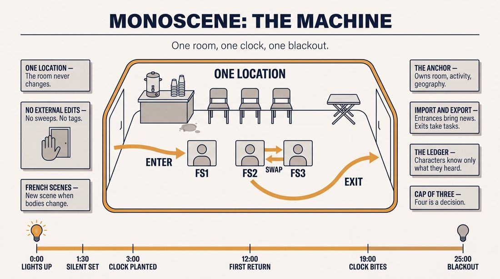
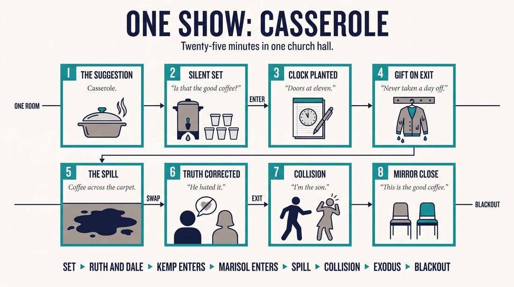
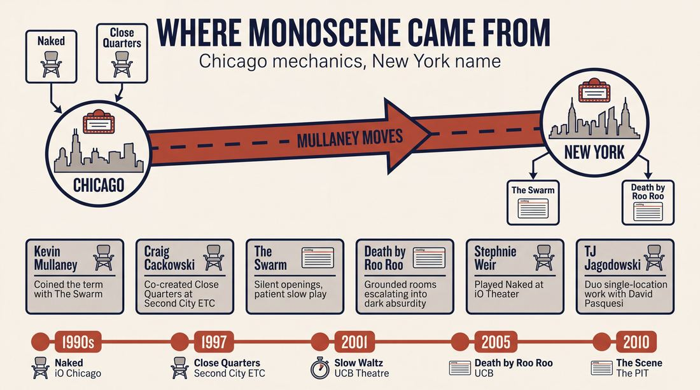
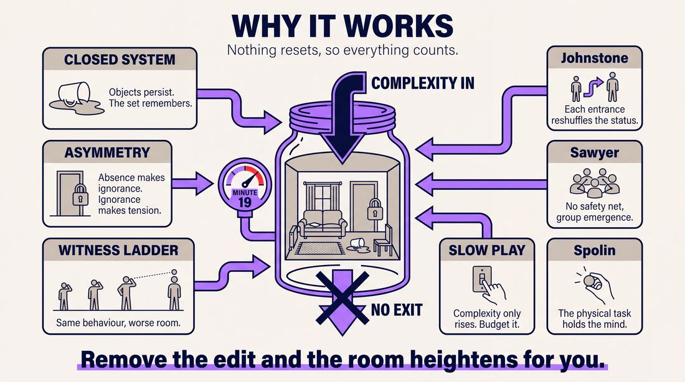
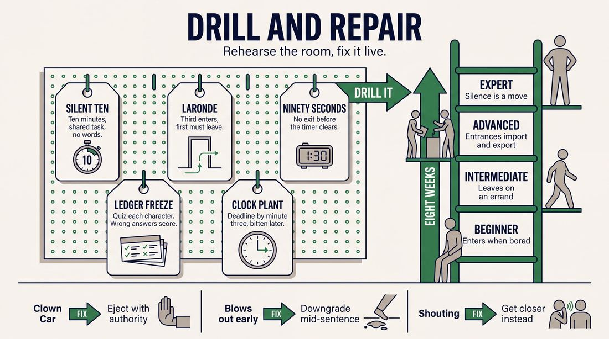

# Monoscene

> **A complete study of the long-form improv format _Monoscene_** - the original archived write-up, five infographics, grounded historical and pedagogical research, and a full mechanics-and-coaching manual.

| | |
|---|---|
| **Format** | Monoscene |
| **Primary source** | [IRC Improv Wiki](https://wiki.improvresourcecenter.com/index.php?title=Monoscene) |

---

## Contents

1. [Part I - The Original Write-Up](#part-i-the-original-write-up)
2. [Part II - The Infographics](#part-ii-the-infographics)
   - [1. Structure and Mechanics](#infographic-1-mechanics)
   - [2. A Show, Beat by Beat](#infographic-2-example)
   - [3. Origins and Lineage](#infographic-3-history)
   - [4. Why It Works](#infographic-4-theory)
   - [5. Rehearsal and Repair](#infographic-5-coaching)
3. [Part III - Research Dossier](#part-iii-research-dossier)
   - [Pass 1: History, Lineage, Literature and Scholarship](#research-history)
   - [Pass 2: Comparative Anatomy, Pedagogy and Production](#research-comparative)
4. [Part IV - Mechanics, Gameplay and Coaching Manual](#part-iv-mechanics-gameplay-and-coaching-manual)
   - [Pass 1: The Form, Its Mechanics and Its Gameplay](#manual-mechanics)
   - [Pass 2: Training, Coaching and Performance Companion](#manual-coaching)

---

## Part I - The Original Write-Up

*Verbatim archive of the source article, reproduced exactly as scraped. Everything after this section is generated elaboration built on top of it.*

### Monoscene

A **Monoscene** is an improv form that takes place in a single location in a single span of time, with no external edits of any kind. It is frequently referred to as an improvised one act play.

##### History

The term monoscene was first used to describe a form used by the Swarm in the original version of [Slow Waltz Around Rage Mountain](https://wiki.improvresourcecenter.com/index.php?title=Slow_Waltz_Around_Rage_Mountain "Slow Waltz Around Rage Mountain") at [UCBT](https://wiki.improvresourcecenter.com/index.php?title=UCBT "UCBT") in NY. It was a single long scene in the same space and time, like an act of a play with no blackouts. Internally it worked more like a [Harold](https://wiki.improvresourcecenter.com/index.php?title=Harold "Harold"), however. Instead of external edits, the scenes would be edited by a character entering or exiting. Like multiple beats of a Harold, characters would return multiple times. It had roots in several shows and forms, some in Chicago and some in NY such as [Close Quarters](https://wiki.improvresourcecenter.com/index.php?title=Close_Quarters "Close Quarters"), [Naked](https://wiki.improvresourcecenter.com/index.php?title=Naked "Naked"), [Möbius American Theatre](https://wiki.improvresourcecenter.com/index.php?title=M%C3%B6bius_American_Theatre&action=edit&redlink=1 "Möbius American Theatre (page does not exist)"), [Tracers](https://wiki.improvresourcecenter.com/index.php?title=Tracers "Tracers") and [Individually Wrapped](https://wiki.improvresourcecenter.com/index.php?title=Individually_Wrapped&action=edit&redlink=1 "Individually Wrapped (page does not exist)"), all of which featured extended scenes with entrances and exits rather than many smaller scenes which jumped from place to place. It's not meant to be one long group scene, although sometimes shows like that are termed monoscenes.

###### Naked

60 minutes, 2 improvisors, 1 scene. This show was performed at iO Theater in Chicago. It starred [Stephnie Weir](https://wiki.improvresourcecenter.com/index.php?title=Stephnie_Weir&action=edit&redlink=1 "Stephnie Weir (page does not exist)") and [Jimmy Carrane](https://wiki.improvresourcecenter.com/index.php?title=Jimmy_Carrane "Jimmy Carrane"). It was directed by [Rob Mello](https://wiki.improvresourcecenter.com/index.php?title=Rob_Mello&action=edit&redlink=1 "Rob Mello (page does not exist)"). [Kevin Mullaney](https://wiki.improvresourcecenter.com/index.php?title=Kevin_Mullaney "Kevin Mullaney") produced the show and was the assistant director.

###### Slow Waltz Around Rage Mountain

May be the first show that used the term monoscene. One of the first forms [the Swarm](https://wiki.improvresourcecenter.com/index.php?title=The_Swarm "The Swarm") worked on and performed for this show, directed by [Kevin Mullaney](https://wiki.improvresourcecenter.com/index.php?title=Kevin_Mullaney "Kevin Mullaney"). Their version was close to 20\-30 minutes and involved the whole cast.

###### Death By Roo Roo

Death By Roo Roo started doing monoscene in [Cagematch](https://wiki.improvresourcecenter.com/index.php?title=Cagematch "Cagematch") at UCBT and eventually incorporated it into their Friday night show.

###### The Scene

[The Scene](https://wiki.improvresourcecenter.com/index.php?title=The_Scene "The Scene") was a weekly Monoscene showcase hosted by [Micah Sherman](https://wiki.improvresourcecenter.com/index.php?title=Micah_Sherman "Micah Sherman") and [Dan Hodapp](https://wiki.improvresourcecenter.com/index.php?title=Dan_Hodapp "Dan Hodapp") at [The Peoples Improv Theater](https://wiki.improvresourcecenter.com/index.php?title=The_Peoples_Improv_Theater "The Peoples Improv Theater"). It ran from 2010\-2013\.

###### Tuscarora Fire Company Picnic

A 22\-25 minute **Monoscene** performed regularly by [Tuscarora Fire Company Picnic](https://wiki.improvresourcecenter.com/index.php?title=Tuscarora_Fire_Company_Picnic "Tuscarora Fire Company Picnic") on [Super Free Wednesdays](https://wiki.improvresourcecenter.com/index.php?title=Super_Free_Wednesdays "Super Free Wednesdays") at [The Peoples Improv Theater](https://wiki.improvresourcecenter.com/index.php?title=The_Peoples_Improv_Theater "The Peoples Improv Theater"). Includes [The Tuscarora Fire Company Picnic Musical](https://wiki.improvresourcecenter.com/index.php?title=The_Tuscarora_Fire_Company_Picnic_Musical "The Tuscarora Fire Company Picnic Musical"), performed on March 16th, 2011\.

##### Videos

- [Trophy wife \- Predators](http://www.trophywifeimprov.com/shows/TW20101208)
- [Death by Roo Roo \- Karl Marx](http://www.youtube.com/watch?v=eyeFemMm9s0)
- [SV! \- Frat House Monoscene](http://vimeo.com/5320549)

---

*Archived from [https://wiki.improvresourcecenter.com/index.php?title=Monoscene](https://wiki.improvresourcecenter.com/index.php?title=Monoscene) (IRC Improv Wiki) on 2026-08-09 23:23 UTC.*

---

## Part II - The Infographics

*Five 16:9 posters, each teaching a different aspect of the format. Click any poster to enlarge.*

<a id="infographic-1-mechanics"></a>

### 1. Structure and Mechanics

*How the form is played: the shape of the piece, the opening, the roles, the edit vocabulary, the flow of information, and the clock.*

{ .diagram loading=lazy decoding=async width="1100" height="614" }


<a id="infographic-2-example"></a>

### 2. A Show, Beat by Beat

*A single worked performance from suggestion to blackout: what happens in each beat, with short real example lines and what the players are doing technically.*

{ .diagram loading=lazy decoding=async width="1100" height="614" }


<a id="infographic-3-history"></a>

### 3. Origins and Lineage

*Where the form came from: creators, dates, theatres, how it spread between schools and cities, and the key figures - a documented timeline and lineage map.*

{ .diagram loading=lazy decoding=async width="1100" height="614" }


<a id="infographic-4-theory"></a>

### 4. Why It Works

*The theory: the core principles of the form and the research and craft ideas that explain why the structure produces good improv, each tied to a specific mechanic.*

{ .diagram loading=lazy decoding=async width="1100" height="614" }


<a id="infographic-5-coaching"></a>

### 5. Rehearsal and Repair

*Training and fixing the form: the essential drills, the common failure modes with their symptom-and-fix pairs, and the markers of beginner through expert play.*

{ .diagram loading=lazy decoding=async width="1100" height="614" }


---

## Part III - Research Dossier

*Two research passes: the historical record, then the comparative and pedagogical record. Claims carry evidence tags - treat unverified items accordingly.*

<a id="research-history"></a>

### » Pass 1: History, Lineage, Literature and Scholarship

### Research Summary
*   **Documentation Status:** The Monoscene is moderately well-documented in practitioner blogs, institutional manuals, and podcast interviews, though formal academic literature rarely uses the specific term, often subsuming it under "long-form improvisation" or "improvised one-act plays."
*   [DOCUMENTED] The form is defined by strict constraints: a single location, a continuous span of time, and the complete absence of external edits (such as sweeps or tag-outs).
*   [DOCUMENTED] The term "monoscene" was coined circa 2001 at the Upright Citizens Brigade (UCB) Theatre in New York by director Kevin Mullaney and the house team The Swarm.
*   [DOCUMENTED] Its mechanical lineage traces directly back to late-1990s Chicago formats like *Close Quarters* and *Naked*, which experimented with real-time theatricality and spatial constraints.
*   [WIDELY PRACTICED, UNDOCUMENTED] The form relies heavily on "French scenes"—internal edits driven by character entrances and exits—to modulate energy, shift focus, and create beats.
*   [DOCUMENTED] It is widely regarded as a punishing format for beginners, as it removes the safety net of the edit, demanding "slow play," grounded base realities, and patient character work.
*   [DOCUMENTED] Today, it is a staple of duo improvisation (e.g., TJ & Dave) and specialized festival troupes, serving as an antidote to the frantic, multi-location style of the Harold.

### Provenance and History
The mechanical antecedents of the Monoscene emerged in Chicago in the late 1990s as a reaction against the frantic, edit-heavy, multi-location style of the Harold. [DOCUMENTED] In 1997, Craig Cackowski and Peter Gwinn developed *Close Quarters* at Second City ETC, directed by Noah Gregoropoulos, which confined scenes to adjacent rooms within a single location and time frame. Concurrently, *Naked* at iO Theater (starring Stephnie Weir and Jimmy Carrane) pushed the boundaries of extended, single-scene two-prov. 

[DOCUMENTED] The actual term "monoscene" was coined in New York circa 2001. Kevin Mullaney, who had been deeply involved in the Chicago scene (including assistant directing *Naked*), moved to New York and began directing the UCB house team The Swarm. While developing their signature show *Slow Waltz Around Rage Mountain*, they needed a term to describe a single continuous scene that was broken up internally by entrances and exits rather than blackouts or sweeps. They settled on "monoscene." 

The problem the form solved was structural: by trapping performers in a single space and time, it forced them to abandon superficial premise-generation and instead sit in the tension of relationships, real-time discovery, and theatrical patience.

| Year | Event | Place / Company | Source |
| :--- | :--- | :--- | :--- |
| 1990s | *Naked* debuts (60 mins, 1 scene) | iO Theater, Chicago | IRC Improv Wiki |
| 1997 | *Close Quarters* debuts | Second City ETC, Chicago | IRC Improv Wiki / Craig Cackowski |
| 2001 | *Slow Waltz Around Rage Mountain* debuts; term "monoscene" coined | UCB Theatre, NY (The Swarm) | Kevin Mullaney Blog / Facebook |
| 2005 | *Death by Roo Roo* incorporates monoscene into Friday shows | UCB Theatre, NY | IRC Improv Wiki |
| 2010 | *The Scene* (weekly monoscene showcase) begins | The PIT, NY | IRC Improv Wiki |

### Lineage and Transmission
[DOCUMENTED] The form's transmission is a classic Chicago-to-New York pipeline story. The DNA of the form was forged at iO and Second City, carried to New York by Kevin Mullaney, and codified at the UCB Theatre. From UCB, it spread globally via the *Upright Citizens Brigade Comedy Improvisation Manual* and touring instructors. 

[WIDELY PRACTICED, UNDOCUMENTED] As it spread, regional dialects emerged. In Chicago and Los Angeles, the form is often played with a heavy emphasis on theatrical realism and emotional silence (heavily influenced by TJ Jagodowski and David Pasquesi). In New York, heavily influenced by Death by Roo Roo, the form often takes on a more aggressive, absurd, "pressure-cooker" dialect where grounded base realities slowly escalate into high-stakes insanity without ever breaking the spatial constraint.

### Key Figures
| Person | Role in this form | Specific contribution | Source URL |
| :--- | :--- | :--- | :--- |
| Kevin Mullaney | Director / Teacher | Coined the term with The Swarm; codified the use of French scenes in improv. | [kevinmullaney.com](https://kevinmullaney.com/2015/03/21/some-notes-and-tips-for-monoscenes/) |
| Craig Cackowski | Performer / Teacher | Co-created *Close Quarters*; teaches "slow play" and duo monoscene workshops globally. | [orangetuxedoimprov.com](https://orangetuxedoimprov.com/workshops/) |
| The Swarm | Ensemble | First troupe to use the term; pioneered the patient "Slow Waltz" style at UCB. | [improvresourcecenter.com](https://wiki.improvresourcecenter.com/index.php?title=The_Swarm) |
| Death by Roo Roo | Ensemble | Popularized a high-energy, aggressively escalating variant of the monoscene at UCB. | [improvresourcecenter.com](https://wiki.improvresourcecenter.com/index.php?title=Death_By_Roo_Roo) |
| TJ Jagodowski & David Pasquesi | Performers | Popularized the 50-minute, single-location duo format, proving its viability as high art. | [medium.com](https://medium.com/@junjun/tj-and-dave-an-improvisers-improviser-8b8b8b8b8b8b) |

### Canonical Shows, Companies and Recordings
*   **Slow Waltz Around Rage Mountain** (2001–2005): The Swarm's legendary Friday night show at UCB NY. UNVERIFIED - Full recordings are rumored to exist in UCB archives but are not publicly available.
*   **Death by Roo Roo - "Karl Marx"** (2011): A widely circulated YouTube recording of a UCB NY monoscene set in a sandwich shop that descends into dark absurdity. [Link](https://www.youtube.com/watch?v=eyeFemMm9s0)
*   **Trust Us, This Is All Made Up** (2009): A documentary capturing a complete 50-minute performance by TJ & Dave. While they do not strictly use the UCB terminology, it is the canonical masterclass in single-location, continuous-time long-form.
*   **Local Spot**: A Baltimore Improv Group (BIG) troupe that has performed exclusively monoscenes for over a decade, frequently touring festivals.

### Published Literature
| Work | Author | Year | What it says about this form | Where to find it |
| :--- | :--- | :--- | :--- | :--- |
| *The Upright Citizens Brigade Comedy Improvisation Manual* | Matt Besser, Ian Roberts, Matt Walsh | 2013 | Defines the monoscene as an extended scene relying heavily on establishing a strong base reality at the outset. | [Scribd](https://www.scribd.com/document/358888888/UCB-Comedy-Improvisation-Manual) |
| *How to Be the Greatest Improviser on Earth* | Will Hines | 2018 | Advises using confessions and big endowments immediately after a character exits the scene to maintain momentum. | [Scribd](https://www.scribd.com/book/388888888/How-to-Be-the-Greatest-Improviser-on-Earth) |
| *Some Notes and Tips for Monoscenes* | Kevin Mullaney | 2015 | Breaks down the mechanics of the form, explicitly linking it to Chekhovian structure and French scenes. | [kevinmullaney.com](https://kevinmullaney.com/2015/03/21/some-notes-and-tips-for-monoscenes/) |

### Verbatim Quotes
> "Although it has many antecedents, the thing that was first called 'monoscene' was named by the Swarm at UCBNY for a show that I directed and helped develop."
> — Kevin Mullaney
> [Facebook Improv Discussion Group](https://www.facebook.com/)

> "The form can be roughly defined as a series of scenes in the same location without jumps in time or space. It is similar to how a section of a play can contain many scenes with entrances and exits but all take place at a single location."
> — Kevin Mullaney
> [Facebook Improv Discussion Group](https://www.facebook.com/)

> "These are called French scenes. French scenes are the building blocks of monoscenes. You start with 1-3 characters on stage doing a scene. Eventually one (or more) characters exits or enters and a new French scene occurs with the new combination of characters. There are no sweep edits or tag outs."
> — Kevin Mullaney
> [kevinmullaney.com](https://kevinmullaney.com/2015/03/21/some-notes-and-tips-for-monoscenes/)

> "If you're trying to win over a non-improv audience, try the monoscene! ... remember that whenever a character leaves the scene is the best time to endow them with a big gift. Right after Julia leaves, you say, 'You know that Julia is getting really into karate?'"
> — Will Hines
> [How to Be the Greatest Improviser on Earth](https://www.scribd.com/book/388888888/How-to-Be-the-Greatest-Improviser-on-Earth)

> "The basic conceit of it is a bunch of scenes taking place at more or less the same place and time. So if it's an hour-long show, it might cover 15 minutes in a bowling alley, jumping around to various sub-locations within the larger location."
> — Craig Cackowski (discussing *Close Quarters*)
> [peopleandchairs.com](https://peopleandchairs.com/)

> "More than anything, the format teaches you, because it so ruthlessly/wonderfully punishes bad monoscene behavior. You can tell performers that whack-a-do characters and quickly escalating games don't work so well in monoscenes, but nothing really teaches it as effectively as letting them feel and wrestle with the consequences of it in a 20 minute monoscene."
> — Reddit User 'johnnyslick'
> [Reddit r/improv](https://www.reddit.com/r/improv/comments/49b8b8/monoscene_tips/)

> "One of the most important things in a monoscene is pacing. If you introduce too much shit at the top, if you get through too much, you don't leave yourself enough places to go. Slow play is crucial in a solid mono."
> — Reddit User
> [Reddit r/improv](https://www.reddit.com/r/improv/comments/49b8b8/monoscene_tips/)

> "The Swarm was best known for its uniquely slow style of play, sometimes referred to as the 'Slow Waltz' style. This slower style was fairly unique to NYC improv at the time. They put much more emphasis on the technicality of the scene than many of their sister UCB groups, sometimes spending minutes on stage setting up the Where in silence before beginning."
> — IRC Improv Wiki
> [wiki.improvresourcecenter.com](https://wiki.improvresourcecenter.com/index.php?title=The_Swarm)

### Anecdotes and Stories
**The Swarm's Silent Openings**
[DOCUMENTED] When The Swarm began performing *Slow Waltz Around Rage Mountain*, they actively rebelled against the fast-talking, premise-heavy style of late-90s UCB. They became famous for spending the first several minutes of a monoscene in total silence, doing meticulous object work to establish the physical environment (the "Where"). This extreme patience forced them to discover the game of the scene organically through physical behavior, meaning that once dialogue finally began, the relationships and stakes were already deeply grounded.

**Death by Roo Roo's "Karl Marx" Show**
[DOCUMENTED] In a famous 2011 performance (preserved on YouTube), Death by Roo Roo took the suggestion "Karl Marx" and initiated a monoscene in a mundane sandwich shop. Rather than playing a slow, theatrical piece, they used the spatial constraint as a pressure cooker. While meticulously miming the creation of sandwiches ("put the mayonnaise on both sides"), the characters casually began confessing to drowning their grandchildren and strangling their dogs. The scene became a masterclass in how a monoscene can sustain dark, escalating absurdity precisely because the performers refuse to edit or leave the physical space.

**The Naming of the Form**
[DOCUMENTED] According to Kevin Mullaney, while the mechanics of the form had clear antecedents in Chicago (like *Close Quarters*), the actual word "monoscene" did not exist until he was in a rehearsal room in New York with The Swarm. They needed a shorthand to differentiate what they were doing from a Harold or a standard montage, and coined the term to describe a structure that was "only one scene, but which could be broken down into many smaller scenes via entrances and exits."

### Academic and Scientific Research
**Flow State and Time Perception**
*Finding:* Improvisers frequently report altered time perception and a state of "flow" (Csikszentmihalyi, 1990) when cognitive load is properly balanced with skill. 
*Relevance to this form:* [INFERRED] The monoscene removes the cognitive burden of "looking for the edit" (scanning the backline to see if a sweep is coming). By eliminating this external mechanic, performers can sink into a deeper, uninterrupted flow state, which explains why a 45-minute monoscene can feel to the performer like it lasted ten minutes.

**Spatial Constraints and Tactical Intelligence**
*Finding:* Performance studies on site-specific theatre demonstrate that actors leverage "tactical intelligence" to make meaning through creative responses to spatial constraints (Cambridge Element on Shakespeare, 2026).
*Relevance to this form:* [INFERRED] Because the location in a monoscene never changes, improvisers cannot rely on a new environment to provide inspiration. They must creatively exploit the existing physical space—reincorporating mimed objects, utilizing architecture, and changing physical proximity—to generate new scene dynamics.

**Cognitive Load and Intuition**
*Finding:* Social cognitive neuroscience (Lieberman, 2000) suggests that reducing conscious, rule-based processing allows intuitive, associative brain networks to take over.
*Relevance to this form:* [INFERRED] The monoscene ruthlessly punishes invention and rewards discovery. By trapping players in one reality, it forces the brain to stop inventing new premises and instead rely on intuitive, associative listening to maintain the existing reality.

### Documented Variants and Descendants
*   **Close Quarters:** [DOCUMENTED] Created by Craig Cackowski and Peter Gwinn. *Changes:* Allows jumping between adjacent rooms (sub-locations) within the same general location and time, rather than strictly holding one static stage picture.
*   **The Walter:** [DOCUMENTED] Created by the touring duo From Justin to Kelly. *Changes:* A minimalist, two-person monoscene emphasizing extreme silence, sustained eye contact, and total commitment to the moment.
*   **Adrift:** [DOCUMENTED] Created by Matt Nelson in Philadelphia. *Changes:* A "training wheel" monoscene set on a sinking life raft (often a 10-year high school reunion). It introduces two "time dashes" (the lights are cut twice to advance time) to help performers raise stakes and avoid the pure real-time constraint.
*   **Bunker Monoscene:** [DOCUMENTED] Played by Big Baby at PHIT. *Changes:* Strictly confined to a single room with no exits possible, forcing all characters to remain on stage for the entire duration.

### Criticism, Debate and Known Failure Modes
*   **Pacing Disasters:** [WIDELY PRACTICED, UNDOCUMENTED] The most common failure mode is blowing out the reality too early. If performers introduce massive conflict or high-stakes information in the first three minutes, they leave themselves nowhere to go for the remaining twenty minutes, resulting in a grueling, shout-heavy endurance test.
*   **"Whack-a-do" Characters:** [DOCUMENTED] Teachers frequently warn that highly escalated, cartoonish characters—which might work brilliantly in a 90-second Harold beat—burn out quickly in a monoscene. The form demands grounded characters capable of emotional shifts.
*   **The Crowded Stage:** [WIDELY PRACTICED, UNDOCUMENTED] Because improvisers are eager to play, they often flood the stage. A monoscene with six people on stage simultaneously becomes muddy and unfocused. The form relies on French scenes (1-3 people), meaning players must possess the discipline to invent reasons to exit the stage.
*   **The "Trapped" Feeling:** [INFERRED] Performers accustomed to being "saved" by a sweep edit often panic in a monoscene when a beat lulls. Instead of resting in the relationship, they invent crazy narrative twists to inject energy, destroying the base reality.

### Cultural Footprint
*   **Alumni:** The Swarm and Death by Roo Roo served as incubators for major television comedy writers and actors, including Adam Pally, John Gemberling, Neil Casey, Anthony Atamanuik, and Sean Conroy.
*   **Television and Film:** [INFERRED] The structural tension of the monoscene heavily influences modern comedy writing, visible in "bottle episodes" of sitcoms and high-anxiety, real-time television episodes (e.g., *The Bear* Season 1, Episode 7: "Review").
*   **Festival Presence:** The form has become a staple of the international festival circuit, as it requires no complex tech and showcases raw acting ability. Troupes like Local Spot and formats like The Walter tour globally based entirely on this structure.

### Gaps in the Record
*   **The Exact Moment of Naming:** While Kevin Mullaney confirms the term was coined during Swarm rehearsals, the exact date and the specific person who first uttered the portmanteau "monoscene" remains unrecorded.
*   **The Chicago/NY Bridge:** The direct evolutionary conversations between Chicago's *Close Quarters* cast and the UCB NY directors are heavily implied by shared personnel, but the exact transmission of the mechanics is undocumented.
*   **Academic Terminology:** A researcher looking to bridge improv history with formal performance studies will struggle, as academia rarely uses the term "monoscene," preferring broader terms like "long-form improvisation" or "spontaneous one-act plays."

### Source List
1. "Monoscene" - IRC Improv Wiki - 2019 - https://wiki.improvresourcecenter.com/index.php?title=Monoscene - Seed document providing the historical timeline and canonical troupes.
2. "How do you define a monoscene?" (Facebook Thread) - Stacey Hallal / Kevin Mullaney - 2025 - https://www.facebook.com/ - Primary source quote from Mullaney on the origin and definition of the form.
3. "Some Notes and Tips for Monoscenes" - Kevin Mullaney - 2015 - https://kevinmullaney.com/2015/03/21/some-notes-and-tips-for-monoscenes/ - Practitioner breakdown of French scenes and Chekhovian structure.
4. "How to Be the Greatest Improviser on Earth" - Will Hines - 2018 - https://www.scribd.com/book/388888888/How-to-Be-the-Greatest-Improviser-on-Earth - Practitioner advice on endowments and exits.
5. "Interview with Craig Cackowski" - Pam Victor - 2013 - https://peopleandchairs.com/ - Details on the mechanics and history of *Close Quarters*.
6. "The Upright Citizens Brigade Comedy Improvisation Manual" - Matt Besser, Ian Roberts, Matt Walsh - 2013 - https://www.scribd.com/document/358888888/UCB-Comedy-Improvisation-Manual - Institutional codification of the form's reliance on base reality.
7. "Monoscene Tips" (Reddit Thread) - Various Users - 2016 - https://www.reddit.com/r/improv/comments/49b8b8/monoscene_tips/ - Practitioner debates on failure modes, pacing, and the *Adrift* variant.
8. "The Swarm" - IRC Improv Wiki - 2024 - https://wiki.improvresourcecenter.com/index.php?title=The_Swarm - Documentation of the "Slow Waltz" style and silent openings.

<a id="research-comparative"></a>

### » Pass 2: Comparative Anatomy, Pedagogy and Production

### Taxonomic Placement

```text
      [The Harold]       [Close Quarters]       [Naked]
           |                    |                  |
           +---------+----------+------------------+
                     |
               [Monoscene]
                     |
        +------------+------------+
        |                         |
  [The Pretty Flower]         [Spokane]
```

The Monoscene sits at the intersection of the Harold's internal game-mapping and the theatrical realism of forms like *Close Quarters* and *Naked*. While it shares the Harold's reliance on recurring characters and thematic exploration, it strips away the external edit (the sweep, the tag-out) and the manipulation of time and space. It is the most structurally restrictive long-form, forcing improvisers to rely entirely on "French scenes" (entrances and exits) to modulate pacing and narrative focus. Internally, it functions like a Harold (beats, callbacks, game heightening), but externally, it presents as a real-time, one-act play.

### Head-to-Head Comparisons

#### Monoscene vs. The Harold
| Axis | Monoscene | The Harold | Consequence for the players |
| :--- | :--- | :--- | :--- |
| **Opening** | Usually none; starts in the reality of the scene. | Highly structured group game or pattern game. | Monoscene players must establish base reality immediately without a thematic runway. |
| **Structure** | Single location, continuous time. | Three beats of three scenes, plus group games. | Monoscene players cannot rely on structure to save a dying scene; they must fix it from within. |
| **Edit Logic** | French scenes (entrances/exits). | Sweep edits, tag-outs, lights out. | Monoscene players must justify why they are entering or leaving the physical space. |
| **Failure Mode** | "Talking heads" or the "Clown Car" (too many people on stage). | Disconnected scenes or forgotten games. | Monoscene requires intense spatial awareness and pacing restraint. |

#### Monoscene vs. Montage
| Axis | Monoscene | Montage | Consequence for the players |
| :--- | :--- | :--- | :--- |
| **Memory** | Absolute object and relationship permanence. | Low memory burden; scenes are disposable. | Monoscene players must remember where the invisible doors, props, and sightlines are for 45 minutes. |
| **Audience Contract** | Theatrical realism; a slice of life. | Fast-paced, sketch-like comedy. | Monoscene audiences expect slower burns and character development over rapid-fire punchlines. |
| **Cast Size** | Best with 4–6 to avoid crowding. | Can support 8–12 easily. | Monoscene players spend more time offstage waiting for the exact right moment to enter. |

#### Monoscene vs. La Ronde
| Axis | Monoscene | La Ronde | Consequence for the players |
| :--- | :--- | :--- | :--- |
| **Edit Logic** | Anyone can enter or exit at any time. | Strict A/B, B/C, C/D character replacement. | Monoscene allows for group scenes and isolation; La Ronde is strictly two-person scenes. |
| **Structure** | Location-bound. | Character-bound (locations change every edit). | Monoscene builds a world; La Ronde builds a character network. |

### What Makes It Uniquely Itself

1. **Real-Time Continuity**: The clock never stops and the location never shifts. If a character leaves to get a cup of coffee, the audience experiences the exact amount of time it takes for them to return. This forces improvisers to sit in the reality of the moment rather than jumping to the most interesting part of a narrative.
2. **The French Scene Edit**: The only way to change the dynamic is for a character to enter or exit. There are no sweeps, no tag-outs, and no lights-down. The narrative is entirely controlled by the physical presence of the actors on stage.
3. **Environmental Permanence**: Objects created in space cannot be swept away. If a player mimes spilling water on the floor in minute two, that water is on the floor for the next forty minutes, and every subsequent character must step over it, slip on it, or clean it up.

### Structural Variants in Practice

| Variant | Changes to the Form | Who Plays It | Source |
| :--- | :--- | :--- | :--- |
| **Slow Waltz Around Rage Mountain** | The original codified version. 20-30 minutes, full cast, played internally like a Harold with recurring character beats. | The Swarm (UCB NY) | Kevin Mullaney / IRC Wiki |
| **Naked** | 60 minutes, exactly 2 improvisers, 1 continuous scene. Extreme endurance and relationship focus. | Stephnie Weir & Jimmy Carrane (iO Chicago) | IRC Wiki |
| **Adrift** | Set entirely on a life raft. Uses lighting cuts to indicate "time dashes" (breaking the real-time rule to advance the stakes). | Matt Nelson (Philly) / Festival circuits | Reddit (`upsidedowninsideout1`) |
| **The Pretty Flower** | Uses a Monoscene as the "spine," but allows players to tag out to explore memories, fantasies, or side stories before returning to the main scene. | Bandit Theater (Seattle) | Bandit Theater Syllabus |
| **Half-Montage / Half-Monoscene** | A hybrid show where the first half is a fast-paced montage and the second half settles into a grounded monoscene. | Dominic Dierkes, Jon Gabrus, Ben Rodgers (LA) | Will Hines |

### The Teaching Ladder

| Stage | Skill introduced | Why in this order | Typical exercise | Source |
| :--- | :--- | :--- | :--- | :--- |
| **1. Environment** | Object permanence and spatial grounding. | Because the space never resets, a poorly defined environment will ruin the entire show. | Silent Activity Focus | Michael Lutton (Magnet Theater) |
| **2. French Scenes** | Editing via entrances and exits. | Players must learn how to change the beat without relying on a sweep edit. | French Scene Laronde | [CRAFT CONSENSUS] |
| **3. Pacing** | Sitting in silence and extending beats. | Beginners panic and edit too fast, resulting in 30-second beats that exhaust the narrative. | The Long Pause | Kevin Mullaney |
| **4. Character POV** | Focusing on behavior over plot. | Plot burns out quickly in real-time; behavior and relationship can sustain an hour. | Kill Your Darlings | Ashley Rube & Ryan Myers / Jon Trevor |
| **5. Offstage Support** | Endowments and background work. | Players must learn how to add value without pulling focus or crowding the stage. | Endowment on Exit | Will Hines |

### Documented Drills and Exercises

| Drill | Origin / Teacher | How to run it | What it fixes in this form | Source |
| :--- | :--- | :--- | :--- | :--- |
| **The Long Pause** | Kevin Mullaney | Player A asks a direct question. Player B takes a painfully long pause, then exits the stage without answering. | Fixes the fear of silence and the urge to immediately resolve tension. | Kevin Mullaney Blog |
| **Burnout and Non-Sequitur** | Kevin Mullaney | Players speak impulsively on one topic until they completely run out of things to say. They pause, then use a complete non-sequitur to start a new beat. | Fixes lingering, boring conversations about mundane tasks (e.g., the copier). | Kevin Mullaney Blog |
| **Endowment on Exit** | Will Hines | The moment a character leaves the stage, the remaining characters immediately endow them with a massive character trait or secret. | Fixes stagnant character development and gives the exiting player a gift for their return. | *How to Be the Greatest Improviser on Earth* |
| **Confession Heightening** | Will Hines | When the scene's energy dips, a player must make a massive, unprompted personal confession. | Fixes low stakes and stalling in the middle of a long set. | *How to Be the Greatest Improviser on Earth* |
| **Adrift / Life Raft** | Matt Nelson | 5 players sit in a space the size of a life raft. They cannot leave. They must sustain the scene using only relationship and behavior. | Fixes the urge to flee the scene or rely on walk-ons to save a dying beat. | Reddit |
| **French Scene Laronde** | [CRAFT CONSENSUS] | Player A and B are on stage. Player C enters. Player A *must* immediately find a reason to exit. | Fixes the "Clown Car" effect where too many players end up on stage at once. | Reddit |
| **Silent Activity Focus** | Michael Lutton | Players spend the first two minutes of the scene doing a shared physical activity in complete silence before speaking. | Fixes "Talking Heads" syndrome and grounds the physical environment. | Magnet Theater Syllabus |
| **Kill Your Darlings** | Jon Trevor / [CRAFT CONSENSUS] | Players enter with a pre-planned bit or character tic. If it doesn't fit the established reality, the coach forces them to drop it immediately. | Fixes players forcing square-peg ideas into a grounded, established world. | Facebook Improv Forums |
| **Background Work** | [CRAFT CONSENSUS] | 2 players run a scene downstage. 3 players enter upstage to perform a task (e.g., stocking shelves) without pulling focus or speaking. | Fixes upstaging and teaches ensemble support without hijacking the narrative. | Reddit |
| **Doorbell / Knock Knock** | [CRAFT CONSENSUS] | Offstage players must knock or ring a bell to enter. Onstage players must justify who is at the door before opening it. | Fixes unmotivated, chaotic entrances that break the reality of the space. | [CRAFT CONSENSUS] |

### Common Failure Modes and Diagnoses

| Failure mode | What it looks like from the audience | Root cause | Fix | Who names it |
| :--- | :--- | :--- | :--- | :--- |
| **Talking Heads / Vagueness** | Two actors standing center stage having casual banter with no physical activity or spatial awareness. | Fear of committing to the environment; relying entirely on verbal wit. | Force players to engage in a shared physical task before speaking. | WylieR (IRC Forums) |
| **The 30-Second Beat** | A chaotic revolving door of characters entering and exiting before any relationship can be established. | Panic; inability to sit in the moment and let a scene breathe. | Mandate that every beat must last between 1 and 3 minutes before an exit is allowed. | Kevin Mullaney |
| **The Clown Car** | 6 to 8 improvisers on stage at once, talking over each other and fighting for focus. | Fear of missing out (FOMO); lack of ensemble awareness. | Cap the number of onstage players at 3; practice background/chorus work. | Reddit Improv Community |
| **Plot Exhaustion** | The scene becomes unwieldy, confusing, or boring as players invent increasingly absurd plot twists to keep it going. | Focusing on plot mechanics rather than character behavior and relationships. | Shift focus to *how* characters treat each other rather than *what* is happening. | Ashley Rube & Ryan Myers |
| **Reality Breaking** | A player enters and calls a male character by a female name, or walks through a previously established solid wall. | Lack of active listening and poor object memory. | Strict adherence to established facts; treat the invisible set as made of concrete. | WylieR (IRC Forums) |

### Production and Logistics

*   **Cast Size**: 4 to 6 is optimal. 2 is an endurance test (*Naked*). 8+ requires extreme discipline to avoid the "Clown Car" failure mode.
*   **Runtime**: Typically 20 to 30 minutes for a standard show, up to 60 minutes for advanced ensembles.
*   **Stage Layout**: Requires clearly defined wings or doors. Offstage players must be completely out of sight to maintain the illusion of the isolated environment.
*   **Chairs and Set**: Usually 2 to 4 chairs and perhaps a table. Because the set never changes, physical props (real or mimed) take on massive importance.
*   **Lighting and Tech Cues**: Lights come up at the start and do not go down until the final moment. Tech must resist the urge to edit on a laugh line in the middle of the show.
*   **Music and Sound**: Pre-show music is vital for setting the tone (often dramatic or slice-of-life). In-show sound effects are rare unless specifically requested by the actors (e.g., a doorbell).
*   **MC and Host Duties**: The host must explicitly explain the form to the audience: "We are going to perform an improvised one-act play. The location will not change, and time will move exactly as it does in real life."
*   **Suggestion**: A single, contained location (e.g., "a breakroom," "a diner," "a waiting room"). Broad locations ("New York City") break the form.
*   **Lineup Placement**: Due to its slower pacing and theatrical weight, the Monoscene is almost always the anchor or main event of a comedy lineup.
*   **Rehearsal Cadence**: Requires heavy drilling on transitions, entrances, and stamina. Craig Cackowski notes that rehearsing this form forces players out of their micro-focused comfort zones.
*   **Producer Prep**: Ensure the venue has adequate offstage space. If improvisers have to stand in the audience while offstage, the theatrical illusion is shattered.

### Adaptations Beyond the Stage

*   **Classroom and Youth**: Used to teach object permanence and active listening. Runtimes must be strictly capped at 10 minutes, as younger players lack the stamina to sustain a single reality longer.
*   **Corporate and Applied Improv**: Used by facilitators (e.g., The Improv Shop Means Business) to teach teams how to navigate sustained interpersonal dynamics without "escaping" the situation. It trains employees to sit in discomfort and resolve conflict in real-time.
*   **Online and Remote**: Zoom Monoscenes require strict camera discipline. "Entering" means turning the camera on; "exiting" means turning it off. All players must agree on a shared physical layout (e.g., "the door is to the camera's left").
*   **Therapeutic Settings**: Used to explore sustained relationship dynamics and behavioral patterns. The inability to "sweep edit" away from a difficult conversation mirrors real-life conflict resolution.
*   **Accessibility and Inclusion**: Because the physical "set" does not change, the Monoscene is highly adaptable for players with mobility aids. The space can be mapped to accommodate wheelchairs without the need for rapid, chaotic scene transitions.
*   **Content-Safety and Consent**: Because there are no external edits, players cannot rely on a teammate to "sweep" a triggering scene. Ensembles must establish a clear off-stage safe word or a physical tap-out mechanic to immediately end or alter a scene if boundaries are crossed.
*   **Ethics of Real Stories**: If the Monoscene is based on a true story or personal vulnerability, the sustained, inescapable nature of the form can make it feel invasive. Facilitators must ensure psychological distance between the actor and the character.

### Evidence Base for Those Adaptations

*   **Vera and Crossan (2004)**: Their research on organizational improvisation highlights that corporate teams rarely get to "edit" their environments; they must sustain collaboration within fixed constraints. The Monoscene directly trains this specific type of continuous, bounded improvisation.
*   **Sawyer (2003)**: Sawyer’s work on collaborative emergence demonstrates that group creativity peaks when external safety nets are removed. The Monoscene is the ultimate test of this, as the narrative must emerge entirely from within the system without directorial intervention (edits).

### Scholarly Frames Worth Applying

*   **Sawyer on Collaborative Emergence**: *The unpredictable, unscripted outcome of group creativity where no single individual controls the narrative.* (Sawyer, R. K. (2003). *Group Creativity*). **Mapping**: Explains how the Monoscene's narrative arc is built entirely through the accumulation of French scenes, rather than a predetermined plot.
*   **Spolin on Point of Concentration (POC)**: *Focusing the mind on a specific physical or mental task to bypass self-consciousness.* (Spolin, V. (1963). *Improvisation for the Theater*). **Mapping**: Maps directly to the necessity of object work and environmental permanence; focusing on the physical space keeps players grounded when the plot stalls.
*   **Johnstone on Status**: *The dynamic, ever-shifting hierarchy of power between individuals based on their behavior.* (Johnstone, K. (1979). *Improvisation and the Theatre*). **Mapping**: Illuminates the mechanics of the French scene—every time a new character enters the Monoscene, the status hierarchy of the room is immediately disrupted and must be renegotiated.
*   **Vera and Crossan on Organizational Improvisation**: *The spontaneous, real-time adaptation of teams working within fixed organizational constraints.* (Vera, D., & Crossan, M. (2004). *Theatrical Improvisation: Lessons for Organizations*). **Mapping**: Maps to the "background work" and ensemble support required by offstage players, who must serve the whole without pulling focus.

### Where the Form Is Heading

*   **Theatrical Realism**: Schools like Montreal Improv are pushing the Monoscene away from pure comedy toward "slower, more grounded scenework... in a more dramatic approach that allows the comedy of the everyday to blossom naturally."
*   **Hybrids**: Formats like *The Pretty Flower* (Bandit Theater) and the half-montage/half-monoscene shows in Los Angeles are attempting to marry the fast-paced, sketch-like energy of modern improv with the grounded theatricality of the Monoscene.
*   **Focus on Behavior over Lore**: Contemporary coaching (e.g., Ashley Rube, Ryan Myers, Will Hines) is aggressively steering players away from inventing complex backstories or plots, focusing instead on micro-behaviors, confessions, and the immediate emotional reality of the characters in the room.

### Source List

1. *Monoscene* - IRC Improv Wiki - 2019 - https://wiki.improvresourcecenter.com/index.php?title=Monoscene - Supports historical variants (Slow Waltz Around Rage Mountain, Naked) and foundational definitions.
2. *Some Notes and Tips for Monoscenes* - Kevin Mullaney - 2015 - https://kevinmullaney.com - Supports the 30-second beat failure mode, The Long Pause drill, Burnout and Non-Sequitur drill, and French scene mechanics.
3. *How to Be the Greatest Improviser on Earth* - Will Hines - 2016 - Scribd / Print - Supports Endowment on Exit, Confession Heightening, and pacing mechanics.
4. *Demystifying Monoscene* - Ashley Rube & Ryan Myers - 2024 - Crowdwork / Third Coast Comedy Club - Supports the "Plot Exhaustion" failure mode and the shift toward behavior over plot.
5. *Advanced Study Improv: Monoscene* - Adam Trabka / Kickstand Comedy - 2026 - Crowdwork - Supports the focus on patience, precision, and slow-burn relationship building.
6. *Monoscene Class Description* - Michael Lutton / Magnet Theater - 2023 - Magnet Theater - Supports the Silent Activity Focus and the necessity of group mind in real-time play.
7. *The Pretty Flower Workshop* - Bandit Theater - 2024 - Bandit Theater - Supports the hybrid variant that allows tag-outs from a Monoscene spine.
8. *Exploring the Monoscene* - David Lustig / Highwire Improv - 2020 - Eventbrite - Supports the definition of the form as an inescapable environment for character depth.
9. *The most common mistakes in improv* - WylieR / IRC Forums - 2006 - Improv Resource Center - Supports the "Talking Heads / Vagueness" and "Reality Breaking" failure modes.
10. *How to handle mistakes in improv / Team Sizes* - Reddit Improv Community (`upsidedowninsideout1`, `johnnyslick`, etc.) - 2016-2026 - Reddit - Supports the "Clown Car" failure mode, the Adrift/Life Raft drill, and background/chorus work.

---

## Part IV - Mechanics, Gameplay and Coaching Manual

*Synthesis over the original article and both research dossiers: first how the form works and how to play it, then how to train an ensemble to perform it.*

<a id="manual-mechanics"></a>

### » Pass 1: The Form, Its Mechanics and Its Gameplay

### At a Glance

| Field | Value |
|---|---|
| **Also known as** | Mono; the improvised one-act; single-location long form; (loose usage) "one long scene." Close relatives with their own names: *Close Quarters*, *Naked*, *Slow Waltz Around Rage Mountain*, *The Walter*, *Adrift*, *Bunker* |
| **Family** | Scenic/organic long form, UCB lineage by naming, Chicago lineage by mechanics. Externally a naturalistic one-act; internally a Harold (recurring beats, game, callback) |
| **Cast size** | 2–6. Sweet spot **4–5**. 2 is the endurance variant (*Naked*, TJ & Dave dialect). 7+ is playable only by ensembles with brutal traffic discipline |
| **Runtime** | 20–30 min standard; 45–60 min for advanced ensembles; 10–12 min for youth/classroom |
| **Opening** | Usually **none** — lights up inside the base reality. Documented variant: 1–3 minutes of silent environment-building (The Swarm) |
| **Suggestion taken** | One **contained location** ("a break room," "a diner," "a waiting room"), or a single word from which the cast derives a contained location. Broad suggestions ("New York City," "regret") break the form unless immediately narrowed |
| **Structural rigidity (1–5)** | **Boundary: 5. Interior: 2.** The perimeter rules are absolute; inside them there is no prescribed beat sequence at all. This split is the whole character of the form |
| **Difficulty (1–5)** | **5.** The hardest common long form to play badly-but-acceptably. It has no safety net and no external edit to rescue a dead beat |
| **Prerequisites** | Reliable two-person scenework; object work you can sustain for 20 minutes; the ability to sit in silence; offstage listening; willingness to write yourself out of a scene you are enjoying |
| **Best for** | Tight ensembles of 4–6 who know each other's rhythms; anchoring a lineup; **non-improv audiences** (it reads as a play); festivals (no tech, no set, showcases acting); duos |
| **Avoid when** | Green cast; cast of 8+; no real wings (offstage players visible = contract broken); slot under 15 minutes; you are the opener on a rowdy bar show; open jam with strangers; anyone in the cast currently addicted to walk-ons |

---

### The Essence in One Paragraph

A Monoscene is a single unbroken scene — one location, one continuous span of time, one blackout at the very end — that is nevertheless divided internally into many smaller scenes by the only editing device permitted: characters walking in and walking out. These internal units are **French scenes**, borrowed from stage-play notation, where a new scene begins every time the combination of bodies onstage changes. So a monoscene is not "one long group scene"; it is a *sequence* of two- and three-handers in the same room, played by a stable cast of characters who recur the way Harold characters recur, except that instead of being swept back on they must find a reason to open a door. Everything that makes the form hard and everything that makes it good comes from a single physical fact: **nothing can be edited away.** The coffee you spilled in minute two is on the floor in minute twenty-two. The person who stormed out is, right now, standing in a real hallway doing a real thing, and when they come back they will not know what was said about them. Material is not generated by cutting to a better idea; it is generated by *recombining* the people you already have, importing news through the door, and letting the accumulated weight of a single unbroken reality do the heightening for you.

---

### Why This Form Exists

Every other long form gives the ensemble an escape hatch. In a montage, a Harold, an Armando, a deconstruction, the edit is available at all times — and the edit is, functionally, an **eject button on a scene that has stopped being easy**. The consequence is a well-documented systemic weakness in improv: teams get extremely good at the first ninety seconds of a scene and never learn the rest of it. They can establish, they can find a game, they can hit a laugh — and then someone sweeps, and the second half of the scene, the part with consequence in it, never gets played. Across a whole show, the ensemble ends up with fifteen bright openings and no middles.

The Monoscene removes the eject button. That is the entire design intent, and everything else follows from it.

**What the constraint buys you that a montage cannot:**

| Asset | Why the monoscene produces it and a montage doesn't |
|---|---|
| **Second halves of scenes** | You cannot cut away at the laugh, so the scene must survive the laugh. Players learn what happens at minute four of a two-person scene, which is the single most valuable and least practised skill in improv |
| **Real consequence** | No reset. An insult in minute six is still an insult in minute nineteen, and the insulted party is still in the building. In a montage the next scene wipes the slate |
| **Structural dramatic irony** | Because characters exit, characters *miss things*. Every character has a different knowledge set determined by when they were onstage. The audience alone knows everything. This asymmetry is free comedy and free tension, and it is impossible to build in a form where every scene has a fresh cast |
| **An accumulating physical world** | The set is a shared external memory. The spill, the broken chair, the stack of boxes, the smell of smoke on someone's coat — these are callbacks that don't require anyone to remember a line, only to see the room |
| **Legibility to civilians** | Non-improv audiences understand a play. They do not always understand a montage. A monoscene is the format you put in front of your parents, a theatre programmer, or a festival jury. Will Hines makes this argument explicitly: if you're trying to win over a non-improv audience, do a monoscene |
| **Flow without scanning** | Improvisers in edit-based forms spend real cognitive bandwidth monitoring the backline for an incoming sweep. Remove the sweep and that bandwidth returns to listening. (The dossier frames this via flow research; I'd treat the mechanism as plausible craft observation rather than established science, but the phenomenological report — that a 45-minute monoscene feels like ten — is near-universal among people who play them) |
| **A rehearsal weapon** | Even if you never perform one, a monoscene is the most efficient diagnostic in improv. Twenty minutes with no edits will expose, in public, exactly which of your players cannot hold a base reality |

**What it costs:** speed, variety, and the ability to hide. A montage can carry two weak players behind six strong ones. A monoscene cannot.

---

### The Audience Contract

The contract is announced partly by the host and mostly by the lights. When the lights come up and *stay* up past the first laugh, past the first blackout-shaped button, past the four-minute mark — the audience learns, without being told twice, that they are watching a play.

**What the audience is promised:**

1. **The location will not change.** Whatever room you have shown them in the first ninety seconds is the room for the whole show. They will be allowed to learn it.
2. **Time will not skip.** If a character says "give me two minutes," the audience is entitled to experience roughly two minutes.
3. **Everything is permanent.** Objects, facts, injuries, insults, names, relationships. Nothing will be retconned and nothing will be swept.
4. **Anyone who leaves may come back**, and will have been somewhere real while they were gone.
5. **There will be no format interruptions.** No group games from nowhere, no narrator, no lights-down-lights-up, no one turning to the audience. (Some houses permit an in-fiction aside; see Soft Conventions.)
6. **The payoff will be cumulative.** They should feel the show tightening rather than restarting. The last five minutes are promised to be denser than the first five.
7. **One blackout, at the end, and it will mean something.**

**How they know where they are.** Three signals, in this order of reliability: the **pre-set** (chairs arranged before lights up — a semicircle of four chairs and a table reads "waiting room" before anyone speaks); the **object work** in the first minute (someone wiping down a counter tells them more than any line of dialogue); and only third, the dialogue. My recommendation: never let the third one carry the load. A monoscene that opens with "Well, here we are at the DMV" has spent its establishment budget on the cheapest possible currency.

**How the host frames it.** One clean sentence before the suggestion, then get off. From the production dossier, a serviceable template:

> "We're going to make up a one-act play. It happens in one place, in real time, and it doesn't stop until the lights go out. Can we get the name of a place where people have to wait?"

**What breaks the contract:**

| Break | Why it's fatal |
|---|---|
| A sweep, tag-out, or wipe | Announces that the rules were decorative. The audience stops investing in permanence |
| A character walking through an established wall or door-that-wasn't-there | Tells the audience the room isn't real, so nothing about it is worth tracking |
| Time skipping unacknowledged ("Well, three hours later…") | Kills the real-time promise, which is the source of all tension |
| Someone returning who obviously wasn't anywhere | Reveals the offstage world as a hallway with improvisers in it |
| Offstage players visible, laughing, or audibly prepping | Same, but worse — it exposes the machinery |
| A performer playing a second character | Breaks the one-body-one-person physics the whole form rests on |
| A mid-show blackout used to save a dying beat | The single most damaging break, because it teaches the audience that the ending will also be a bail-out |
| Direct address / breaking the fourth wall | Legal in some houses as an in-fiction choice (a character talking to themselves); illegal as commentary |

---

### Anatomy: The Full Structural Map

The Monoscene has no prescribed beat sequence. What it has is a **shape that reliably emerges** when the rules are obeyed and pacing is disciplined. Directors should teach the shape as a *tendency to be managed*, not a template to be filled.

**The architecture, in layers:**

- **Layer 0 — The Perimeter.** One location. One clock. One blackout. Inviolable.
- **Layer 1 — The Room.** The physical map: where the doors are and what's through each one, where the furniture is, what the standing activity of the space is (making sandwiches, waiting, stocking shelves). Built in the first 60–120 seconds and never revised, only extended.
- **Layer 2 — The Population.** The full roster of characters and the **offstage geography** that justifies their comings and goings. In a five-person monoscene you have five characters and typically three offstage destinations (e.g. "the front of house," "the parking lot," "the manager's office").
- **Layer 3 — The French Scenes.** The actual units of performance. 1–3 characters, 1.5–4 minutes each, a new one every time the population changes. A 25-minute monoscene runs roughly **8–14 French scenes.**
- **Layer 4 — The Beats.** Each character's *set of appearances* forms a beat-chain exactly like a Harold character's beats. First appearance establishes, second confirms and varies, third pays off or breaks. This is where the form is secretly a Harold.
- **Layer 5 — The Ledger.** Who knows what. Invisible, unstated, and the primary generator of the last third of the show.
- **Layer 6 — The Clock.** Whatever in-fiction deadline the room has ("doors open in twenty minutes," "the bus comes at four"). Optional but enormously load-bearing; see The Engine.

**Beat-by-beat map (default: 25 minutes, 5 players):**

| Unit | Approx. clock | What happens | Who drives it | Success criterion | Common error |
|---|---|---|---|---|---|
| **Pre-set** | −0:30 | Chairs and table placed to imply the room; cast decides nothing else | Whoever is nearest the furniture | Audience can guess the room type before a word | Elaborate set-building that promises a location you then contradict |
| **Silent establishment** | 0:00–1:30 | Lights up. 1–2 players do the standing activity of the room in near silence. Doors, walls, counter, and one shared task get defined physically | The **Anchor** (the character who belongs here) | An audience member could sketch the floor plan | Talking immediately; or silence with no task, which is just two people not deciding |
| **French Scene 1** | 1:30–5:00 | Two-hander. Relationship, tone, the room's normal. One small unresolved thing is planted | The two onstage | We know who these people are to each other and what today is | Blurting the premise; "So how long have you two been married?" |
| **First traffic** | 5:00–5:15 | Someone enters *or* someone exits with a stated errand. The population changes for the first time | Offstage listener | The change is motivated by something said in FS1 | An entrance with no reason, from nowhere, by someone who was bored |
| **French Scenes 2–4** | 5:00–12:00 | New combinations. The full roster gets introduced, one at a time, ideally never more than three onstage. Endowments on exit start firing. The room accumulates its first permanent physical consequence | Whole ensemble; traffic discipline is the shared job | Every character has been onstage once, and no two characters have the same relationship to the Anchor | The Clown Car: all five arrive by minute eight and never leave |
| **The first return** | ~12:00 | A character re-enters for their second beat, into a room that has changed while they were out | The returning player | Their entrance is visibly affected by what happened offstage, *and* they are ignorant of something we know | Returning identical to how they left; the offstage trip meant nothing |
| **Recombination phase** | 12:00–19:00 | The middle. Pairings we haven't seen yet. Confessions, gossip about the absent, the knowledge ledger goes maximally asymmetric | The players who have been offstage longest | Each new pairing behaves *differently* from the pairings before it. Game is heightening by audience-change, not volume | Plot Exhaustion: inventing twists instead of pairing people |
| **The clock bites** | ~19:00 | The in-fiction deadline becomes the dominant pressure. Exits get harder to justify; people are stuck together | The Anchor or whoever owns the deadline | Exits start being *refused* rather than offered | Nobody planted a clock, so the end has to be manufactured |
| **Convergence** | 19:00–23:00 | The population maxes out. What was told in private gets told in public. The asymmetries collapse | Whoever holds the biggest secret | The audience gets the specific collision they've been anticipating for ten minutes | Convergence by coincidence — everyone happens to walk in — rather than by pressure |
| **The last exit / the last entrance** | ~23:00 | Either the room empties down to the original pair, or one final body arrives and makes the end inevitable | Ensemble read | The stage picture at the end rhymes with the stage picture at the start | Eight people onstage yelling into a blackout |
| **Button and blackout** | 23:00–25:00 | A small line or a small action, in the room, at normal volume. Lights out | Tech, on a clear signal | The ending is *quieter* than the peak | Bailing on a laugh in the middle of a beat; or playing four extra minutes past the real ending |

**The shape:**

```
   LIGHTS UP                                                      BLACKOUT
       |                                                              |
 ══════╪═══════════ ONE LOCATION  ·  ONE CONTINUOUS CLOCK ════════════╪══════
       |                                                              |
       ▼                                                              ▼
  ┌─────────┐   ┌───────┐  ┌────────┐ ┌──────┐ ┌─────────┐ ┌───────┐ ┌────┐
  │  FS 1   │→ →│ FS 2  │→ │  FS 3  │→│ FS 4 │→│  FS 5   │→│ FS 6  │→│FS 7│
  │ Ruth/   │   │ Ruth/ │  │ Dale/  │ │Dale/ │ │ Dale/   │ │ ALL   │ │Ruth│
  │ Dale    │   │Dale/  │  │ Kemp   │ │Mari  │ │Bren/Ruth│ │  5    │ │Dale│
  └─────────┘   │Kemp   │  └────────┘ └──────┘ └─────────┘ └───────┘ └────┘
       ▲        └───────┘       ▲         ▲          ▲         ▲        ▲
       │            ▲           │         │          │         │        │
    silent      ↑ENTER      ↑EXIT     ↑ENTER     ↑ENTER    ↑ENTER   ↑EXITS
    set-up      (door SL)   (door SR) (door SL)  (door SL) (all)    (all but 2)

  ─── the only edits are these arrows ───────────────────────────────────────

PRESENCE CHART (the working document of a monoscene)

           0:00   3:00   6:00   9:00  12:00  15:00  18:00  21:00  24:00
 RUTH      ██████████████░░░░░░░░░░░░░███████████████████████████████████
 DALE      ██████████████████████████████████████████████████████████████
 KEMP      ░░░░░░░░░░████████████░░░░░░░░░░░░░░░░████████████████████████
 MARISOL   ░░░░░░░░░░░░░░░░░░░░░░████████░░░░░░░░████████████░░░░░░░░░░░░
 BRENDAN   ░░░░░░░░░░░░░░░░░░░░░░░░░░░░░░████████████████████████░░░░░░░░

           █ = onstage      ░ = offstage (somewhere real, doing something)

  Read the chart vertically: every column should have 2 or 3 blocks.
  Four is a choice. Five is a decision. Six is an accident.
  Read it horizontally: every row is a character's beat-chain (their Harold).
```

---

### The Opening

The default Monoscene opening is **no opening at all**. There is no pattern game, no word association, no monologue. The lights come up and you are already in the world. This is not laziness; it is a structural necessity — a thematic opening would hand the cast a set of abstract associations, and abstract associations are precisely what a monoscene cannot metabolise. The form needs a *room*, not a *theme*.

**Procedure — standard cold open (the default; teach this first):**

1. **Host takes one suggestion.** Ask for a contained location, or ask for a word and let the cast narrow it. Do not take two suggestions. Do not do a "monologue to inspire." The suggestion's job is to point at a room and then get out of the way.
2. **Cast pre-sets the furniture.** Ten seconds, no dithering. Two chairs facing each other is a waiting area. Two chairs side by side is a bench. A chair behind a mimed counter is a service position. Whoever moves first is right; everyone else supports.
3. **One or two players step out. Everyone else clears entirely out of sight.** If your venue has no wings, this is the moment the show is already compromised. Fix the venue.
4. **Lights up.** No music sting.
5. **The Anchor begins the standing activity of the room.** Not a random activity — the activity the room *is for*. In a break room, someone makes coffee. In a garage, someone is under a car. In a vestry, someone sets out hymnals.
6. **Establish, physically, in this order:** the surface you are working at → the nearest door and where it goes → one thing that can be picked up and put down → the second door. Do this by *using* things, not by pointing at them.
7. **Do not speak for 20–60 seconds.** Let the audience map the space. The Swarm famously extended this to several minutes; that is an advanced dialect, not a beginner instruction.
8. **First line comes out of the activity, not out of exposition.** "Is that the good coffee?" beats "Another day at Fenwick Insurance."
9. **Second player responds and the relationship is established behaviourally within four lines** — who has authority here, who is a guest, how long they've known each other.
10. **Plant the clock within the first three minutes.** One line. "Doors open at eleven." "He gets here at four." "We've got till the inspector comes." This one line will end your show for you twenty minutes later.

**Documented and practised variants:**

| Variant | Mechanics | Use it when | Cost |
|---|---|---|---|
| **Silent establishment (The Swarm / "Slow Waltz")** | 1–4 minutes of wordless object work by 1–3 players before any dialogue. Documented as the Swarm's signature; the wiki records them "sometimes spending minutes on stage setting up the Where in silence" | Your team's habit is talking heads; the audience is patient; you have 30+ minutes; you want the audience to *lean in* | Murder on a loud crowd or a short slot. Requires object work that actually reads from row eight |
| **Working start (the Death by Roo Roo dialect)** | Lights up mid-task with dialogue already in progress — "…so both sides, is what I'm saying" — a conversation the audience joins late | You want the pressure-cooker escalation dialect; you want energy from second one; you have a strong comic engine | You skip the silent mapping, so geography must be built *while* talking, which is harder |
| **Pre-set-heavy / set-dressed** | Cast spends 30–60 seconds building the room with chairs, blocks, coat racks before lights | Complex geography (multiple rooms, a counter, a stairwell); festival stages with furniture | Promises specificity you must honour; also eats clock |
| **Suggestion-as-word (the "casserole" method)** | Take a word, not a place. Cast privately (in the first ten seconds of play) chooses the room the word implies | Audiences give bad location suggestions; you want a thematic thread without a thematic opening | Risk of the cast disagreeing about the room in the first minute — the worst possible time |
| **No suggestion (TJ & Dave dialect)** | Two players, lights up, no premise, discovery in real time. The duo tradition; "trust us, this is all made up" | Two masters; a run of shows; an audience that will grant you five minutes of nothing | Requires the highest skill level in improv and cannot be assigned to a house team |
| **Discarded pattern opening** | Run a 90-second word association or group game, then *throw it away* and start the scene, using it only as private inspiration | A green cast that panics at cold opens; a rehearsal crutch | Teaches the cast to look outside the room for material — exactly the habit the form is meant to break. Wean off it |
| **Announced form** | The host explicitly explains one-location/real-time before the suggestion | Non-improv audience; festival; anyone who might otherwise wait for a blackout that never comes | Slight loss of mystery; almost always worth it |

**A note on the group opening question.** Some teams try to open a monoscene with a group game inside the fiction — everyone singing the company anthem, everyone reciting the safety briefing. This is legal and can be great, but it is a *scene*, not an opening: it establishes the population at maximum on line one, which means your entire show must be played downhill from a full stage. Use it once, deliberately, if the room genuinely begins with an assembly (a staff meeting, a jury). Otherwise start small.

---

### The Engine

This is the section to read twice. Everything else in the chapter is downstream of it.

#### 1. The five conservation laws

A Monoscene is a closed physical system. Five things are conserved, and every technique in the form is a way of exploiting one of them.

| Law | Statement | What it generates |
|---|---|---|
| **Conservation of place** | There is exactly one location, for the whole show, for everyone. Information cannot arrive by cutting elsewhere | Every new fact needs a **delivery vehicle**: a body through a door, or a discovery in the room. This is why doors are the engine block |
| **Conservation of time** | The clock runs at 1:1 and never stops. Offstage time equals onstage time | Stated durations become **obligations** ("back in five"). Waiting becomes content. The deadline becomes structure |
| **Conservation of bodies** | One performer = one character, and that character is either in this room or somewhere else in the world. There is no third state | Absence is real. The offstage world becomes a place, and going there becomes a *choice with consequences* |
| **Conservation of objects** | Anything created in space persists until something in the fiction removes it | The set becomes an **external memory**, and every mimed object becomes a loaded Chekhov's gun |
| **Conservation of knowledge** | A character knows only what they were present for, plus what they are told. Nobody is updated by the edit | **Asymmetric knowledge.** The single most powerful generator in the form |

#### 2. The three generators

**(a) The Door — the information valve.**

In a montage, information appears by fiat: a new scene starts and we simply know things. In a monoscene, information has to be *carried*. This creates two directional mechanics that don't exist anywhere else in improv:

- **Import.** A character enters carrying news, weather, a smell, an object, an emotional state, or a fact from the offstage world. Every entrance should carry at least one of these. An entrance that imports nothing is a wasted edit, and you only get eight to fourteen of them.
- **Export.** A character exits and *takes something with them* — a task, an unresolved argument, an object, an obligation to return with an answer. An exit that exports nothing is a player leaving because they ran out of ideas, and the audience can tell.

**The door checklist**, run silently by every offstage player before entering: *Why now? Where from? What am I bringing? Who am I here for? What don't I know?* If you cannot answer four of five, do not enter yet.

**(b) The Ledger — asymmetric knowledge.**

Keep a mental table. It is the reason the last third of a good monoscene feels like a machine closing.

| Fact | Ruth | Dale | Kemp | Marisol | Brendan | Audience |
|---|---|---|---|---|---|---|
| Dale hadn't spoken to his father in 9 years | ✓ | ✓ | ✗ | ✗ | ✓ | ✓ |
| Kemp never actually met the deceased | ✗ | ✓ | ✓ | ✗ | ✗ | ✓ |
| Marisol thinks Dale is a funeral-home employee | ✗ | ✓ | ✓ | ✓(wrongly) | ✗ | ✓ |
| Ruth wrote to Marvin for 22 years | ✓ | ✗ | ✗ | ✗ | ✗ | ✓ |

Three operations run on this ledger:

1. **Widening.** A private confession made to one character while another is offstage. Cost: nothing. Payoff: everything.
2. **Collision.** Two characters with incompatible information end up in the same French scene. This is your convergence.
3. **Correction.** A false belief gets fixed, usually far too late and in front of the worst possible witness.

**My strongest structural recommendation for the form:** in every French scene, ask *what does the person who just left not know yet?* If the answer is "nothing," you are not using the engine and your monoscene will feel like a montage that forgot to edit.

**(c) The Set — accumulation as heightening.**

Because objects persist, physical consequence compounds. This is the form's version of heightening, and it is more reliable than verbal escalation because it requires no cleverness, only memory.

The canonical arc: *object introduced → object used → object damaged → damage noticed by someone new → damage becomes the subject → damage becomes the ending.* A spilled coffee at minute three is a stain at minute nine, is a slip hazard at minute fourteen, is the thing the boss is standing in at minute twenty-one.

#### 3. Where material comes from: a vector table

| Vector | Mechanism | Example | When to reach for it |
|---|---|---|---|
| **Recombination** | Put two characters together who have not yet been alone | Marisol and Brendan, both of whom have complained about Ruth | Whenever a beat is flattening. This is the default fix |
| **Import via entrance** | New body brings news/object/state | "The lot's full. People are parking on the grass." | To change the room's pressure without changing the room |
| **Absence talk (gossip)** | Two people discuss the third the instant the door closes | "Twenty-two years and she's never taken a day off. Not one." | Every single time somebody exits. This is a *rule*, not an option |
| **The ledger** | Someone learns / fails to learn something | Kemp discovers Dale lied about the eulogy notes | The middle third, to raise stakes without inventing plot |
| **The set** | Physical consequence accumulates | The stain, the jammed door, the dwindling coffee | When talk is running dry and you need non-verbal material |
| **The clock** | Deadline pressure tightens choices | "Fourteen minutes." | The last third, to force convergence |
| **Status renegotiation** | Every entrance reshuffles the room's hierarchy (Johnstone applied precisely here) | The manager walks in; who stops talking? | Every entrance, automatically. Consciously exploit it at least three times |
| **Behavioural game** | A character's characteristic move, re-triggered in front of new witnesses | Kemp checks his phone every time death is mentioned | The Harold layer. Establish by beat two |
| **Burnout non-sequitur** (Mullaney) | Talk a topic completely dry, pause, then hard-cut the subject inside the reality | "…anyway. I'm going to sell the house." | When you're in a mundane conversational cul-de-sac |
| **Confession** (Hines) | Unprompted large personal disclosure when energy dips | "I never went to the hospital. Not once." | Sparingly — two or three per show, or it becomes a genre |

#### 4. The physics of pacing: your budget

The most-cited failure in the record is blowing out the reality early. Here is the mechanical reason, stated as a law:

> **A monoscene can only get more complicated.** There is no reset, so every fact you spend is spent forever. Complexity is monotonically increasing. Therefore the rate at which you introduce complexity determines how long the show can run before it becomes unmanageable.

Practical budget for a 25-minute, 5-person show:

| Resource | Total available | Spend rate |
|---|---|---|
| **French scenes** | ~10 | One every 1.5–3 minutes. Fewer than 6 = you didn't use the form. More than 16 = the 30-second-beat failure |
| **Characters** | 5 | Introduce roughly one every 2–3 minutes for the first ten. All five present before minute nine is a Clown Car |
| **Major secrets/confessions** | 2–4 | None in the first five minutes. First one around minute 8–12 |
| **Physical consequences** | 2–3 | First one by minute 10, so it has time to accrue |
| **Big status reversals** | 1–2 | Not before halfway |
| **Volume escalations** | 1 | You get one shout. Spend it after minute 18 |

The corollary, which is the hardest thing to teach: **the interesting thing you thought of in minute two is probably a minute-fourteen idea.** Sit on it. The form rewards deferral more than any other in improv.

#### 5. Game in a monoscene

Game exists and matters, but it heightens differently.

- **In a Harold**, you heighten a game by escalating the absurd behaviour across beats and locations.
- **In a monoscene**, you heighten a game by **changing the witnesses**. The behaviour can stay almost identical; what escalates is *who sees it, what it now costs, and what it now means.*

Example: Brendan cannot stop mentioning that he paid for the casseroles.
- **Beat 1** (to Dale, alone): mild, funny, a character tic.
- **Beat 2** (to Pastor Kemp, a stranger): now it's inappropriate.
- **Beat 3** (in front of Ruth, who paid for everything for thirty years): now it's a wound.
- **Beat 4** (during the eulogy prep, at volume): now it's the ending.

The line barely changed. The room changed. **This is the central heightening technique of the form and the thing beginners most reliably miss**, because they try to heighten by making the behaviour bigger, and a bigger behaviour in a fixed reality just reads as a person becoming a cartoon — the "whack-a-do" failure mode the teaching record warns about.

#### 6. Why the offstage world is half the show

A monoscene has two locations: the one you can see and the one you can't. The invisible one must be as specific as the visible one, and maintaining it is the offstage players' actual job.

**Rules for the offstage world:**
1. It must be **mapped**: three or four named destinations, agreed by implication in the first five minutes ("the front," "the lot," "downstairs").
2. It must be **populated**: characters we never see (the widow, the caterer's van driver, the guy from corporate). These are free — you can invoke them without adding a body to the stage. A monoscene with five onstage characters can comfortably reference twelve offstage ones.
3. It must be **eventful**: things happen out there while we watch in here. A returning player should be *changed by an event we didn't see.*
4. It must be **consistent with the clock**: if the parking lot is a ninety-second walk, be gone at least ninety seconds.

---

### Roles and Responsibilities

| Role | Owns | Must do | Must not do | Signal to the others |
|---|---|---|---|---|
| **The Anchor** (craft term; my label) — the character who belongs in this room and rarely leaves | The base reality, the geography, the standing activity | Open the show; maintain the physical space; be the fixed point others orbit; know where every object is | Leave for long stretches early; abandon the activity; become the plot | Returns to the standing activity when a beat should settle |
| **Onstage players (1–3)** | The current French scene | Justify their presence; play *this* pairing differently from the last; track the ledger; write themselves out when the scene is complete | Enter and stay indefinitely; talk over each other; play to the back of the room | Physical proximity shift; picking up an object that implies leaving |
| **The hidden backline** (offstage, out of sight) | The offstage world, and the traffic | Listen to every word; know what they don't know; prepare a specific import; count bodies onstage before entering; make offstage sound only when it serves | Watch from the wings where the audience can see; laugh audibly; enter because they're bored; enter simultaneously | A hand on the doorframe = "I'm next." Two hands = "I'm coming now regardless" |
| **The Traffic Manager** (rotating, informal) — whoever is offstage and has been out longest | Preventing the Clown Car | Physically block a second person from entering when there are already three onstage; count and hold | Assign entrances like a director; hold someone back for a full ten minutes | A flat palm to a teammate in the wings |
| **Edit-callers** | *Nobody.* This role does not exist in this form | — | — | — |
| **Tech / light op** | The two lighting events of the show, and nothing else | Bring lights up on a clean cue; **hold them** through every laugh, every button, every apparent ending; take them out on the ensemble's genuine final image | Blackout on a big laugh mid-show; use light changes to indicate time; play "cool it down" fades | The ensemble's ending signal — usually the stage emptying to one or two people plus a settling of energy. Agree this signal in rehearsal |
| **Musician** | Pre-show and post-show only, in most dialects | Set the tonal register before lights (slice-of-life, or dramatic); underscore only if the ensemble has explicitly rehearsed it | Underscore emotional beats mid-show (it reads as an editorial voice from outside the room, which breaks the closed system) | — |
| **Sound (if used)** | Diegetic sound only | Doorbells, phones, PA announcements, a timer — but only ones the cast has established or requested | Stings, whooshes, laugh-punctuation | A character says "did you hear the bell?" = cue it next time |
| **Host / MC** | The contract | Explain the format in one sentence; take one suggestion; leave the stage completely | Return mid-show; re-explain; "and now…" | — |
| **Director / coach (rehearsal only)** | The presence chart | Draw the chart during the run and show it to the cast afterward; time the French scenes; call out reality breaks | Side-coach mid-run in performance conditions (side-coaching in rehearsal is fine and necessary) | — |

**A note on the hidden backline.** In most long forms the backline is a visible chorus and a resource. In a monoscene, a visible backline is a contract violation. This changes the offstage job from *supporting* to *lurking* — you are not part of the stage picture, you are a person in the next room who has not come in yet. Teams moving from Harold to monoscene consistently underestimate how much harder it is to stay engaged from a place where you cannot be seen and cannot be a chorus. My recommendation: assign each offstage player a *specific offstage activity* to mentally perform. Not a bit — an activity. It keeps them in the fiction and it makes their next entrance carry something.

---

### The Rules That Actually Bind

#### Hard rules — break these and it is not a Monoscene

| # | Rule | Why |
|---|---|---|
| 1 | **One location for the entire piece** | The moment you cut elsewhere, you have a montage with a recurring set |
| 2 | **One continuous timeline; no jumps forward or back** | Real time is what makes waiting, deadlines, and offstage duration meaningful |
| 3 | **No external edits: no sweeps, no tag-outs, no wipes, no mid-show blackouts** | This is the definitional rule. Kevin Mullaney's formulation is exact: "There are no sweep edits or tag outs" |
| 4 | **All changes in stage population happen through the fiction** | A body must arrive from and depart to somewhere real |
| 5 | **Facts and objects are permanent** | The system's memory is the audience's investment |
| 6 | **Offstage is a place in the world of the play, not a backstage** | Otherwise exits are quitting and entrances are cheating |
| 7 | **One performer plays exactly one character for the duration** | Doubling collapses conservation of bodies and destroys the ledger |
| 8 | **The piece ends with one blackout and no reprise** | The ending has to be the ending |
| 9 | **No narration, no direct address as commentary, no flashback, no fantasy** | Every one of these is a covert edit |
| 10 | **Nobody outside the fiction may change the stage picture** — including tech | See rule 3 |

#### Soft conventions — vary by house, by team, by night

| Convention | Common positions | How to choose |
|---|---|---|
| **Onstage cap** | Chicago-realist houses: 2–3. NY pressure-cooker: 3–4, with full-cast convergence permitted late | Cap at 3 until your team can prove a four-hander with distinct focus |
| **Sub-locations** | Strict: one continuous stage picture. *Close Quarters* dialect: adjacent rooms within a building, and Cackowski's own description involves "jumping around to various sub-locations within the larger location" | The dossier presents these as the same family but they are a genuine definitional fork. **My judgement:** sub-locations are a different (excellent) form. Keep a pure monoscene to one stage picture; call the other thing Close Quarters and tell your audience which you're doing |
| **Suggestion type** | Location / word / none | Word for teams that over-plan; location for green teams; none only for duos |
| **Silent opening length** | 0 seconds (Roo Roo) to several minutes (Swarm) | Match the crowd and the slot |
| **Doorbell/knock convention** | Some ensembles require an offstage knock before any entrance from the "outside" door | Excellent training wheel; loses spontaneity once mastered |
| **Diegetic offstage sound** | Voices from the hall, a car outside, a phone in another room | Powerful, but agree in rehearsal who is allowed to make it |
| **Eavesdropping** | Is a silent onlooker "onstage"? Some houses count them for the cap; some don't | Count them. A visible listener changes every line spoken |
| **Character death/departure** | May a character leave *forever*? | Yes, but it costs you a body permanently. Fine after minute 18, dangerous before |
| **Late doubling** | A very few houses allow an actor whose character has left forever to return as a new person | I'd forbid it. Cheaper than it seems, and the audience always half-recognises the face |
| **Beat length mandate** | Rehearsal rule: no exit permitted before 90 seconds | Use in training, drop in performance |
| **Time dashes** | Forbidden in pure form; central to *Adrift* | If you use them, announce the format as *Adrift*, not as a monoscene |
| **Tone** | Chicago/LA: theatrical realism, emotional silence, "comedy of the everyday." NY/Roo Roo: grounded reality escalating to dark absurdity without ever breaking spatial constraint | Pick one per show. Mixing dialects mid-show is the commonest tonal failure |

#### Myths — things people wrongly believe are rules

| Myth | Why it's wrong |
|---|---|
| **"A monoscene is one long group scene with everyone onstage."** | The archived wiki article says so explicitly: "It's not meant to be one long group scene." The whole point is French scenes with 1–3 people. A permanent five-hander is a *group monoscene* — a legitimate but different and much harder thing (see *Bunker*) |
| **"You can never edit."** | You edit constantly — eight to fourteen times. You just edit with doors instead of hands |
| **"It has to be slow, quiet and sad."** | The Death by Roo Roo "Karl Marx" show is a documented monoscene in which characters casually confess to horrifying things while making sandwiches. Slow *play* ≠ slow *show*. Slow play means low information rate, not low energy |
| **"Nothing big can happen."** | Enormous things can happen. They just have to happen *in this room, in order, and stay happened* |
| **"You can't play game."** | You play game constantly. You heighten it by changing witnesses rather than by amplifying behaviour |
| **"You need a plot."** | Plot is the leading cause of monoscene death ("Plot Exhaustion"). Behaviour and relationship sustain an hour; plot exhausts in eight minutes |
| **"It must be naturalistic — no genre, no heightened worlds."** | A monoscene works on a submarine, in a wizard's tower, in a hostage situation. The constraint is spatial and temporal, not tonal |
| **"Silence is always good."** | Silence with a task is patience. Silence without a task is two people declining to make a choice, and the audience can tell within four seconds |
| **"You shouldn't talk about offstage events."** | Backwards. Offstage events are the primary import mechanism |
| **"It's the same thing TJ & Dave do."** | Related but distinct. TJ & Dave play continuous-time, single-location duo work with no suggestion; the French-scene traffic engine — the roster, the doors, the ledger — is largely absent because there are only two bodies. Learn from them; don't confuse the forms |
| **"Only two-person scenes."** | That's La Ronde. A monoscene permits any combination |
| **"Someone should manage the ending."** | Nobody manages it. The clock you planted and the accumulated pressure produce it. If a person has to manage the ending, you didn't plant enough |

---

### Edits and Transitions

There is exactly one *external* edit in a Monoscene — the final blackout. Everything else is an **internal, diegetic transition**. Here is the complete taxonomy.

| Edit | How to execute physically | When it is right | When it is wrong | What it costs |
|---|---|---|---|---|
| **The Exit Edit** | Complete your current physical action, say the line that gives you a reason, open the established door, close it behind you. Do not linger in the doorway | The French scene has delivered its information and the pairing has been fully explored (usually 90s–3min) | Before the scene has a second half; as a bail-out from difficulty; when you are the only person who can hold the room | One body out of circulation. Roughly 90 seconds before you can plausibly return |
| **The Entrance Edit** | Knock or make offstage sound if the door is "outside"; enter on a specific errand; take in the room before speaking; address one person | You have a specific import; the onstage pairing has completed a beat; the population is ≤2 | Population already 3+; you're entering because it's been a while; you have nothing to bring; you'd be the fourth voice on a topic | Complexity. Every added body multiplies the combinations the team must track |
| **The Swap (one out, one in)** | The exiting player and entering player physically cross, ideally with a line of contact between the characters | The single cleanest edit in the form. Use as your default rhythm | When the crossing characters have no relationship — a wasted collision | Nothing. This is the free lunch |
| **The Errand Exit** | State the task and the duration: "I'll get the folding chairs, two minutes" | You need to leave and the scene needs to know why | When the errand is transparently invented ("I'm going to… check on… a thing") | An obligation. You now *must* return with folding chairs |
| **The Ejection** | Another character sends you out: "Go tell them we're starting late." | You need a body out but *you* have no reason to go | If used more than twice — it starts to look like a valve rather than a relationship | Slight status loss for the ejected character (usable) |
| **The Denied Exit** | Someone tries to leave; someone physically or socially blocks them ("Sit down.") | The last third, when the walls need to close in | Early — it reads as arbitrary aggression before we know the stakes | Traps a body. Use only when trapping is what you want |
| **The Mass Exodus** | Three or more leave together on a single motivated cue ("They're seating people.") | Just before your final two-hander; to reset the stage picture for the ending | Mid-show as an energy reset — it empties the world | Big. You have to rebuild population from scratch, which takes 3 minutes you may not have |
| **The Focus Pull / Sub-location Drift** | Two characters move to the far side of the stage and drop volume; the others continue silently at their task | You want a private conversation without spending an exit | When the "private" pair are stage-right stage-whispering while three people stand frozen. Everyone must keep working | Costs nothing but requires genuine background discipline. This is the *soft edit* of the form — learn it, it's underused |
| **The Focus Split** | Two conversations run simultaneously in the same room, audience attention ping-ponging, occasionally overlapping | Late-show density; large populations | Anytime the audience can't tell which conversation is load-bearing | High risk. Rehearse it or don't do it |
| **The Object Edit** | A phone rings, a timer goes off, something falls off a shelf, the coffee finishes | You need to break a beat but nobody should move | Twice in a row — it becomes a device | Nothing. The cheapest legal beat-change in the form |
| **The Status Edit** | A character with authority enters; everyone's behaviour changes without anyone leaving | You want a new French scene without new bodies | If the entering character has no established authority over anyone | Nothing. Very efficient |
| **The Task Handoff** | "Here, you finish these." The physical activity transfers, and with it, the focus | You want to change who drives without changing who's present | When it's used to dump a scene you don't want to play | Nothing |
| **The Terminal Entrance** | The last body in, arriving with the thing that makes the ending unavoidable (the hearse is here, the inspector, the widow) | Minute 20–23 of a 25 | Before minute 18 — you've fired your ending early | Your ending. Use once |
| **The Final Blackout** | Ensemble arrives at a settled image, usually 1–2 people, energy dropping; tech takes it out | The room has returned to something like its opening state, changed | On a big laugh mid-show; four minutes after the real ending | — |
| **ILLEGAL: sweep / tag-out / wipe** | — | Never | Always | The form |
| **ILLEGAL: time dash** | Lights out, lights up, later | Only in *Adrift*, which is a named variant with its own contract | In a show billed as a monoscene | The real-time promise |

**On the physicality of doors.** The most common technical failure in the form is imprecise door work: the door that is 4 feet wide in minute two and 12 feet wide in minute fifteen; the door that swings in and then out; the door someone walks *through* without opening. Fix this in rehearsal with a hard drill: mark real tape on the rehearsal floor for each door, play a full monoscene, then remove the tape and play another. The muscle memory transfers.

---

### Memory: Callbacks, Patterns and Heightening

In most long forms, a callback is an act of *recall* — you reach back across an edit and retrieve something. In a Monoscene, there is nothing to reach across. **The past is still in the room.** This changes the mechanics fundamentally: what other forms call a callback, a monoscene calls a *consequence*.

#### The four memory substrates

| Substrate | What it stores | How you retrieve it | Failure signature |
|---|---|---|---|
| **The set** | Physical facts: spills, breakages, the stack of boxes, what's in the drawer | Look at it. Touch it. Have a new character notice it | A player walks through the stack of boxes. Instant reality break |
| **The bodies** | Emotional and physical state: who's drunk, who's crying, whose hands are dirty, who's still wearing a coat | Continuity of state across a French scene. If you were furious when you left, you are not calm when you return unless something offstage calmed you | A character resets to neutral on re-entry — the "he wasn't anywhere" break |
| **The ledger** | Who knows what | Ask, reveal, or fail to reveal | Two characters discussing something one of them wasn't present for |
| **The clock** | Elapsed time and stated obligations | "You said two minutes. That was twelve." | Nobody honours a stated duration; time becomes elastic and the tension dies |

#### Character beats are entrances

This is the Harold hiding inside the monoscene, and it's the most useful structural idea for a team learning the form. Every character's **nth entrance is their nth beat.**

| Entrance | Function | What to bring | Example (Brendan, the brother-in-law) |
|---|---|---|---|
| **1st** | Establish the character's deal — one clear behavioural pattern, one relationship | The pattern, small | Enters with casseroles, mentions unprompted that he paid for them |
| **2nd** | Confirm and vary. Same pattern, new context, new witness | The pattern in a place it doesn't belong | Tells the *pastor* he paid for them |
| **3rd** | Pay off or break. Either the pattern reaches its logical extreme, or the character does the opposite and we learn why | The consequence | Says it in front of Ruth; Ruth's reply reveals thirty years of unpaid work; Brendan goes silent |
| **4th (if any)** | Aftermath. Rare and powerful | Nothing. Bring nothing | Comes back in, quietly starts helping |

**Rule of thumb:** a five-character, 25-minute monoscene has room for roughly 3 entrances per character. Plan your character's arc across three appearances, not across one long stint.

#### Heightening: the three ladders

1. **The witness ladder** (primary). Same behaviour, escalating audience. Alone → with a peer → with an authority → with everyone. The behaviour's *meaning* escalates while its *size* stays constant. **This is the form's signature move.**
2. **The consequence ladder** (physical). Introduced → used → broken → in the way → decisive. Attached to an object.
3. **The pressure ladder** (temporal). The clock. Twenty minutes → ten → three → now. Every mention of the deadline raises the cost of every choice made after it.

**Never use the volume ladder.** Escalating by getting louder is how the form dies. The record is unanimous on this ("shout-heavy endurance test," "whack-a-do characters burn out"). In a fixed reality, an increase in volume with no increase in information reads as an actor panicking, because that is almost always what it is.

#### Patterns specific to the monoscene

- **The Ritual.** Something the room does regularly — the phone protocol, the safety check, the way the coffee gets made. Establish in minute two, repeat in minute ten with one variation, repeat in minute twenty-two catastrophically.
- **The Threshold Line.** A line spoken at the door. Someone says "Don't slam that" the first three times someone leaves; the fourth time nobody says it. Silence becomes the callback.
- **The Unfinished Sentence.** Someone starts to say something and is interrupted by an entrance. Do this three times with the *same* piece of information. The audience will be desperate. Pay it off in the final French scene.
- **The Chekhov Inventory.** Mullaney explicitly links this form to Chekhovian structure, and rightly: in a single unchanging room, *everything you place is a gun.* My recommendation for the director: after each rehearsal run, list every object and fact introduced, and mark which ones fired. Aim for 60–70% fired. Below that, you're littering; at 100%, you're being tidy in a way that reads as writing.
- **The Returning Object.** An object that leaves the stage with a character and comes back changed. The clipboard goes out blank and comes back with a signature. Free, invisible, devastating.

---

### Move-Level Technique Catalogue

| # | Move | Situation | How to do it | Example line | Failure mode |
|---|---|---|---|---|---|
| 1 | **The Silent Set** | Top of show | Do the room's standing activity for 20–60s with no dialogue. Define one surface, one door, one liftable object | *(wipes counter, checks under it, straightens two stools)* | Silence with no task; miming vaguely at head height |
| 2 | **Door Declaration** | First use of each door | Name the destination as you use it, once, casually | RUTH: "I'll be in the office. Watch the urn." | Naming all three doors in one speech, which reads as a floor plan announcement |
| 3 | **Errand Exit** | You need out | State task + duration, take an object with you | BRENDAN: "Two minutes. I've got another two of these in the van." | Vague exit ("I'm gonna go do something"); or leaving without an object |
| 4 | **Endowment on Exit** (Hines) | The instant a door closes | Turn to whoever's left and hand the departed a large trait, secret, or history | KEMP: "She's been here since the Carter administration. Never taken a day off. Not one." | Endowing with an insult only; endowing with something the departed can't play |
| 5 | **The Gossip Beat** | Two people left alone | Make the absent person the subject for at least four exchanges | DALE: "Does she talk to everyone like that?" | Gossiping about someone offstage who never returns — wasted |
| 6 | **The Unheard Confession** | You're alone with one person | Say the big thing to exactly one character, and make them promise | DALE: "I didn't go to the hospital. Not once. Don't tell him that." | Confessing to the room; now there's no asymmetry left to spend |
| 7 | **The Ignorant Return** | You've been offstage during a revelation | Come back and act *entirely* on your pre-exit information | MARISOL: "So, is the son coming or not?" *(to Dale)* | Absorbing information you didn't hear; the ledger collapses |
| 8 | **The Weather Report** | Entering | Import one fact about the offstage world | BRENDAN: "It's started raining and the lot is grass." | Reporting something with no consequence in here |
| 9 | **Return With Evidence** | You left on an errand | Come back holding the thing, physically | *(enters with a stack of programmes, one of them wet)* | Returning empty-handed from a stated errand — the clock catches you |
| 10 | **The Changed Return** | Any re-entry | Something happened out there. Show it before you say it | *(enters, sits, doesn't take his coat off)* | Returning at the same emotional temperature you left |
| 11 | **The Hold** (Mullaney's Long Pause) | Someone asks you a direct question | Continue your physical task. Do not answer. Count three. Then answer, deflect, or leave | RUTH: *(keeps stacking cups)* … *(long)* … "Sugar's in the cupboard." | Holding with a blank face and no activity — reads as forgetting your line |
| 12 | **Burnout Non-Sequitur** (Mullaney) | You're in a dead conversational loop | Run the topic completely dry, take a real pause, then start something totally unrelated inside the reality | "…so that's the copier." *(pause)* "I'm going to sell the house." | Non-sequitur with no pause before it — reads as random |
| 13 | **Confession Heightening** (Hines) | Mid-show energy dip | One unprompted large personal disclosure | KEMP: "I've done nine of these. I've never known any of them." | Three confessions in five minutes; the currency devalues |
| 14 | **The Third Wheel Ejection** | You're the fourth body with nothing to do | Find the reason and go, before anyone notices you're redundant | "I'll let you two do this." | Staying and adding one-liners; you become weather |
| 15 | **The Fetch Quest** | You want to be alone with someone | Send the third person out on a real task | DALE: "Could you find out if the organist needs anything?" | Transparently manufactured; make the task genuinely necessary |
| 16 | **The Reason to Stay** | Someone is about to leave and shouldn't | Give them an obligation in the room | RUTH: "Sit. I need your signature on this." | Blocking without justification |
| 17 | **The Sub-location Drift** | You need privacy without an exit | Move to the far corner, drop volume, keep the others working | *(pulls Dale by the elbow toward the coat rack)* | The others freeze; the room dies |
| 18 | **Background Chorus** | You're onstage but not in the scene | Perform a silent, real task upstage; never speak, never mug, never make eye contact with the audience | *(folds programmes, slowly, throughout)* | Silent-comedy business that pulls focus. If you get a laugh doing background work, you did it wrong |
| 19 | **The Object Escalation** | You need non-verbal heightening | Take an established object one stage further along the damage arc | *(sets the urn down on the edge; it tips; coffee across the carpet)* | Damaging an object nobody has established |
| 20 | **The Nail** | A character has done a thing three times | Name the pattern from *inside* the reality | RUTH: "You've said 'I paid for those' four times, Brendan." | Naming it like an improv note ("Ha, you always do that!") |
| 21 | **Status Reset on Entry** | Someone with authority enters | Everyone onstage changes behaviour within two seconds — posture, volume, activity | *(all three stop talking; Brendan starts stacking)* | Entering as an authority nobody acknowledges |
| 22 | **The Ally Swap** | Third entrance of a character | Realign who is on whose side, visibly, by proximity and agreement | MARISOL *(to Dale, having sided with Ruth all show)*: "She's not wrong, but she's not right either." | Alliances that never move; the room becomes static |
| 23 | **The Clock Set** | First three minutes | One line establishing an in-fiction deadline | RUTH: "Doors at eleven. It's twenty past ten." | Setting a clock and never mentioning it again |
| 24 | **The Clock Bite** | Minute 15+ | Mention the remaining time, and let it change someone's choice | MARISOL: "Nine minutes." *(sits back down instead of leaving)* | Mentioning time without consequence |
| 25 | **The Denied Exit** | Late show | Physically or socially block a departure | BRENDAN: *(stands in the doorway)* "Say it in here." | Used early, or used physically in a way that reads as violence rather than pressure |
| 26 | **The Overheard** | You're entering during a charged line | Enter one beat too early. Catch the tail. Say nothing about it for two minutes | *(enters as Dale says "…never loved him." Pause. Sets down a box.)* | Immediately commenting on what you heard — spends it instantly |
| 27 | **The Unfinished Sentence** | You want to defer information | Begin the revelation; be interrupted by a door | RUTH: "There's something you should—" *(door opens)* | Doing it once and forgetting; or four times, which becomes a bit |
| 28 | **The Ritual Repeat** | Second half | Redo an established room-ritual with one variation | *(makes the coffee again, but with the last of the grounds)* | Repeating identically, which reads as filler |
| 29 | **Terminal Entrance** | Minute 20+ | Enter with the thing that makes the end unavoidable | *(door opens)* "They're bringing him in." | Firing it at minute 12 |
| 30 | **The Mirror Close** | Final 90 seconds | Return the stage picture to the opening image, with one thing different | RUTH: "It was the good coffee." | A mirror close that ignores everything that happened between |

---

### Principles

**1. The door is the edit — so every crossing must cost something.**
*Why here:* You have roughly ten edits in a 25-minute show and each one is performed by a human being in view of the audience. Unlike a sweep, which is invisible machinery, an entrance is a *dramatic event*.
*Followed:* Every entrance imports news, an object, or a status change; every exit exports an obligation.
*Violated:* The revolving door. Bodies pass each other with nothing to say, the audience stops reading entrances as meaningful, and by minute twelve nobody is tracking who's in the room.

**2. Nothing resets, so complexity only ever increases — budget accordingly.**
*Why here:* No edit means no clean slate. Every fact is permanent inventory.
*Followed:* A slow first eight minutes; the show feels like it is *tightening* toward the end.
*Violated:* The classic pacing disaster. Massive conflict in minute three, then eighteen minutes of nowhere to go, resolved by shouting.

**3. Absence is content.**
*Why here:* This is the only long form in which a character can be *elsewhere while remaining in the story*. Every other form makes an absent character simply not exist.
*Followed:* The instant a door closes, the remaining characters talk about the person who left. Endowments on exit fire reliably.
*Violated:* The stage empties and the remaining pair change the subject. You have thrown away a free scene and left the returning player with nothing to come back to.

**4. Heighten by changing witnesses, not by changing volume.**
*Why here:* The reality is fixed, so a behaviour that gets bigger has nowhere to go but cartoon. But the *room* can change around a constant behaviour indefinitely.
*Followed:* The same eight-word tic lands as charming, then rude, then cruel, then tragic across three entrances.
*Violated:* "Whack-a-do" characters. By minute nine the actor is doing the loudest version of the thing and there are sixteen minutes left.

**5. Two or three. Four is a decision. Five is an accident.**
*Why here:* The form's unit is the French scene, and a French scene with five people is not a scene, it's a room tone. There is no edit to rescue you from a crowded stage.
*Followed:* You watch clean two-handers with occasional deliberate three-handers, and the full-cast moment lands hard because it's the only one.
*Violated:* The Clown Car. Six people, overlapping dialogue, nobody advancing, everybody adding.

**6. Object work is your memory, not your decoration.**
*Why here:* Objects persist for the whole show and are the one memory system the audience can see. In a montage, sloppy object work is a minor sin; here it is amnesia.
*Followed:* Cups stay where they were put. The door swings the same way. Someone steps over the spill without commenting on it, and it gets a laugh in minute nineteen.
*Violated:* Reality Breaking. The wall moves, the mug teleports, the audience quietly stops believing anything.

**7. Honour stated durations — the clock is a promise.**
*Why here:* Real time is a hard rule, so any time a character names a duration, the audience starts a timer.
*Followed:* "Two minutes" means roughly two minutes, and someone comments when it's twelve.
*Violated:* Time turns elastic, the real-time contract dissolves, and the deadline you planted stops generating pressure.

**8. Exit before you're bored, not after.**
*Why here:* An exit takes 90 seconds to reverse, so it must be planned one beat ahead. There is no sweeping in a rescue.
*Followed:* Players leave on a completed thought, giving the remaining pair a fresh subject and themselves a specific errand.
*Violated:* Beats overstay by ninety seconds each, which across ten beats is fifteen wasted minutes, which is your whole show.

**9. Give the person leaving a gift.**
*Why here:* They are coming back, and unlike a Harold character they will re-enter into a *continuous* world where the gift is already true.
*Followed:* Ruth exits; Kemp endows her with thirty years of unbroken attendance; Ruth re-enters and now has a spine.
*Violated:* Characters return with nothing new, so returns feel like repetition rather than escalation.

**10. Build the offstage world as carefully as the onstage one.**
*Why here:* Half your cast is out there at any moment, and everything they bring in has to come from somewhere specific.
*Followed:* Three named offstage destinations, a dozen named offstage people, weather, and events out there that change people in here.
*Violated:* Exits go "backstage." Entrances come from nowhere. The room floats in white space and the audience feels it.

**11. Plot exhausts; behaviour sustains.**
*Why here:* Plot in real time can't skip the boring parts, so it burns fuel at a ruinous rate. Twenty-five minutes of continuous time can hold roughly one plot event.
*Followed:* The show is about *how* these people treat each other, and the "story" is a small revelation and its fallout.
*Violated:* Plot Exhaustion. By minute sixteen someone has hidden a body, a lawyer has arrived, and there is a fire.

**12. Base reality is a bank account you draw against.**
*Why here:* Every absurdity in a monoscene is paid for out of accumulated credibility, and there's no edit to let the audience forget an overdraft.
*Followed:* Ten minutes of meticulous sandwich-making buys you a casual confession to a drowning. (This is precisely the structure of the documented Death by Roo Roo "Karl Marx" show.)
*Violated:* Absurdity in minute two. Nothing later can surprise, because nothing was ever normal.

**13. Silence must have a task.**
*Why here:* The form has no edit to punctuate, so silence is your only rhythmic rest — but a fixed camera on two idle actors is unbearable in a way it isn't in a fast-cutting form.
*Followed:* The Swarm model — meticulous object work in silence, and the audience leaning forward.
*Violated:* Two people staring, waiting for someone to save the scene. Nobody can.

**14. Never bail with the lights.**
*Why here:* You have exactly one blackout, and its meaning is established by twenty-five minutes of *not* using it. A mid-show blackout doesn't just end a beat; it retroactively rewrites the contract.
*Followed:* The lights hold through three apparent endings, and the real one is unmistakable.
*Violated:* The audience spends the second half waiting to be released rather than watching.

**15. End on the room, not on the joke.**
*Why here:* The audience has spent the whole show learning one space. The strongest available ending is that space, altered.
*Followed:* The stage empties to the opening configuration; one small line references the first minute; blackout.
*Violated:* Eight people shouting a punchline into a hard out. It gets applause and it evaporates.

---

### Worked Run-Through

**Format:** 25-minute Monoscene. Five players. Suggestion taken: a single word.

**Host:** "We're going to make you up a one-act play — one place, real time, no blackouts till the end. Can I get a single word, anything at all?"
**Audience:** "Casserole!"

Cast pre-sets: a folding table stage-left with a mimed coffee urn, three chairs, a coat rack stage-right. Two doors are implied by the gaps: **DL** to the parking lot and hallway, **DR** to the sanctuary. RUTH and DALE step out; three players clear entirely out of sight.

---

**BEAT 1 — 0:00 to 1:40. Silent establishment. RUTH alone, then DALE.**

*(Lights up. RUTH, 60s, is setting out styrofoam cups in a grid on the folding table. One at a time. She checks the urn's spigot, lifts the lid, looks inside, replaces it. She takes a cup back off the table and inspects it, then puts it back. DALE, 50s, in a jacket that doesn't fit, is sitting in the far chair with his hands on his knees. Forty seconds pass.)*

DALE: Is that the good coffee?

RUTH: No.

*(She keeps setting cups.)*

> **Mechanic:** Silent Set. The Anchor (Ruth) established the surface, the urn, the liftable object, and — crucially — her *authority over the room* before a word. Dale established himself as a guest by sitting still. The first line came out of the activity, not out of exposition. The "good coffee" is planted as the show's smallest object; note where it comes back.

---

**BEAT 2 — 1:40 to 5:10. FS1: RUTH / DALE.**

RUTH: Pastor wants five minutes with you at twenty past. It's about the eulogy.

DALE: What about it.

RUTH: He'd like to know some things about your father.

DALE: *(pause)* Doors at eleven?

RUTH: Doors at eleven. It's twenty past ten.

DALE: There's a lot of chairs out there.

RUTH: There's a hundred and forty chairs out there. *(beat)* We may need more.

*(DALE looks at her. She does not look up from the cups.)*

DALE: For Marvin.

RUTH: For Marvin.

> **Mechanic:** The Clock Set — "doors at eleven, it's twenty past ten" — a single line that will end the show forty minutes of stage-time from now without anybody having to manufacture an ending. Also the first ledger entry: Ruth knows something about Marvin's standing in this town that Dale does not. Nothing has been *explained*; the imbalance was played, not stated.

---

**BEAT 3 — 5:10 to 8:30. PASTOR KEMP enters DR. FS2: RUTH / DALE / KEMP.**

*(KEMP, 30s, enters from the sanctuary carrying a legal pad. Ruth immediately straightens; Dale stands halfway and then doesn't.)*

KEMP: Ruth, do we have — oh. Mr. Kessler.

DALE: Dale.

KEMP: Dale. *(shakes his hand two beats too long)* I'm so glad. Ruth, do we have the register?

RUTH: In the office.

KEMP: Could you—

RUTH: *(already going)* Mm.

*(RUTH exits DL.)*

> **Mechanic:** Status Reset on Entry — three seconds of behaviour change from both onstage players told the audience the hierarchy without a word of exposition. Then an immediate **Fetch Quest**: Kemp sends Ruth out because he wants Dale alone, and the audience can feel that he wants it. The population goes 2 → 3 → 2 in twenty seconds, which is the Swap rhythm at its cleanest.

---

**BEAT 4 — 8:30 to 11:00. FS3: DALE / KEMP.**

KEMP: *(watching the door close)* She's been here since 1989. She has not taken one sick day. Not one. There's a plaque.

DALE: Huh.

KEMP: *(sits, pad on knee)* So. I want to be honest with you, because I think honesty — I've been here eight months.

DALE: Okay.

KEMP: And your father was not a — regular attender.

DALE: No.

KEMP: So I have very little. I have his name, and I have that he worked at the plant.

DALE: *(long pause; he is looking at the coffee urn)* He ate a tuna casserole every Thursday for forty-one years.

KEMP: *(writing)* Okay. Okay, that's — is that something he was known for?

DALE: I don't know if he was known for it. He did it.

KEMP: Right.

DALE: Same dish. Same day. My mother made it, and then she died, and he kept making it.

KEMP: *(stops writing)* Dale, when did you last speak with your father?

DALE: *(does not answer; picks up a styrofoam cup, turns it over, puts it back exactly where it was)*

> **Mechanic:** Endowment on Exit (Ruth gets a plaque and thirty-one years of perfect attendance the instant she's out the door — a gift she can now play). Then the **Hold**: Dale answers a direct question by handling an object instead, and — critically — puts the cup *back exactly where it was*, which is object permanence being used as characterisation. The suggestion "casserole" arrived organically at minute ten, as detail, not as premise.

---

**BEAT 5 — 11:00 to 13:40. MARISOL enters DL. KEMP exits DR. FS4: DALE / MARISOL.**

*(MARISOL, 60s, enters shaking rain off a cardigan, smelling of smoke. KEMP stands.)*

MARISOL: The organ's damp again.

KEMP: Is it playable?

MARISOL: It's playable if nobody expects the D.

KEMP: I'll — let me look at the register. *(exits DR)*

*(MARISOL crosses to the urn, pours herself a coffee, sits, looks at DALE.)*

MARISOL: You with the funeral home?

DALE: *(after a beat)* Mm.

MARISOL: Good. *(drinks)* Then I can tell you. Twenty-two years that man wrote letters about my playing. Twenty-two. Every Christmas Eve, a letter. *(drinks)* And now I have to play him out.

DALE: What did the letters say?

MARISOL: That I rush.

DALE: Do you?

MARISOL: *(long pause)* Yes.

> **Mechanic:** The Swap, executed on Marisol's import ("the organ's damp") which is also a Weather Report from the invisible world. Then a huge **ledger** move: Dale does not correct Marisol's false assumption. The audience now knows something no other character does, and the correction is a loaded gun for the last third. Note also that Marisol's confession arrived because she believes she is talking to a stranger — the mistaken-identity is *productive*, not just funny.

---

**BEAT 6 — 13:40 to 16:00. BRENDAN enters DL with casseroles. MARISOL exits DL. FS5: DALE / BRENDAN.**

*(BRENDAN, 40s, enters backwards through the door carrying a stack of three covered dishes.)*

BRENDAN: Door, door, door—

MARISOL: *(standing, taking her cup)* I'll be outside. *(exits DL)*

BRENDAN: *(setting them on the folding table, edging Ruth's cup grid aside)* Dale. Dale. There are nine casseroles in that van and six of them are tuna.

DALE: Okay.

BRENDAN: I paid for four of them out of pocket, which — I'm not saying anything, I'm just saying it out loud one time. *(setting the third dish down; it catches the urn's spigot; a slow gout of coffee across the table and onto the carpet)* Ah— ah, no. No no no.

DALE: *(not moving)* Yep.

BRENDAN: *(mopping with a napkin, ineffectually)* That's — that'll come out.

DALE: That won't come out.

> **Mechanic:** Two things at once. **French Scene LaRonde discipline**: Marisol exits the instant Brendan enters, so the population stays at two. And the **Object Escalation** fires at minute fourteen — exactly on budget. The stain now exists for the remaining eleven minutes, and every subsequent entrance will have to deal with it. Also: Brendan's tic ("I paid for four of them") is established small, to one person, with no witness who cares. That's beat one of three.

---

**BEAT 7 — 16:00 to 18:15. RUTH enters DL. FS6: RUTH / DALE / BRENDAN.**

*(RUTH enters with the register. She stops. She looks at the carpet. She looks at her cup grid, now shoved to one side. She says nothing and begins re-aligning the cups.)*

BRENDAN: Ruth, that was me, and I'll pay for the cleaning.

RUTH: Mm.

BRENDAN: I've paid for most of today, honestly, so.

*(RUTH continues aligning cups. Twelve seconds.)*

RUTH: Nineteen eighty-nine, the boiler went and this room was four inches under. I did that carpet with a wet vac and a bucket for two days. *(beat)* Marvin held the ladder.

BRENDAN: … Right.

RUTH: You'll want the tuna ones at the back. They go last.

> **Mechanic:** The **witness ladder**, rung two. Brendan says the identical thing he said in Beat 6 — but now the witness is the woman who has given this building thirty-one unpaid years, and the joke turns into a wound without anybody raising their voice. Ruth also just made the first crack in the show's biggest secret ("Marvin held the ladder") in a way nobody onstage registers. The audience registers it.

---

**BEAT 8 — 18:15 to 20:00. BRENDAN exits DL. KEMP enters DR. FS7: RUTH / DALE / KEMP.**

BRENDAN: I'll get the other six. *(exits DL)*

*(Almost immediately, KEMP enters DR with his pad.)*

KEMP: Dale, I've got a draft. Tell me if this is wrong. *(reads)* "Marvin Kessler was a man of ritual. Every Thursday, for forty-one years, he made the same simple meal — and in that repetition, I think, he was making a kind of prayer."

*(Silence.)*

DALE: He hated it.

KEMP: Sorry?

DALE: He hated tuna casserole. He said so. Constantly. *(beat)* My mother made it, and he ate it for thirty years, and then she died, and he kept making it, and he hated it.

*(RUTH has stopped moving.)*

KEMP: *(quietly)* That's better.

> **Mechanic:** The information planted in Beat 4 comes back **corrected** — a ledger operation, not a callback. Nothing new was invented; the same fact was re-read. Note that Ruth's stillness does the dramatic work: she's the only person in the room who already knew this, and the audience is now four minutes ahead of Dale.

---

**BEAT 9 — 20:00 to 21:30. Clock bite. MARISOL enters DL.**

MARISOL: *(entering, cardigan wet)* Eleven minutes. They're queuing in the rain out there because the vestibule's locked.

RUTH: The vestibule is not locked.

MARISOL: Then it's stuck.

KEMP: I'll — *(moves toward DR, stops)* Ruth, would you—

RUTH: I'll do it in a minute.

*(Everyone registers this. RUTH does not move.)*

> **Mechanic:** **The Clock Bite.** Nine minutes of in-fiction time left, and for the first time in the show Ruth refuses a task. The status reversal lands because we've watched her comply for twenty minutes. No line explained it. This is what "buying it with base reality" means.

---

**BEAT 10 — 21:30 to 23:20. Convergence. BRENDAN enters DL. FS8: all five.**

BRENDAN: *(entering with two more dishes, seeing the room)* What.

MARISOL: *(to Dale)* And you can tell whoever's driving that the family car's blocking—

DALE: I'm the family.

*(Pause.)*

MARISOL: … You're the son.

DALE: I'm the son.

MARISOL: *(sitting down slowly in a chair, coffee cup in both hands)* Oh, I said an awful thing to you.

DALE: You said he wrote you letters.

MARISOL: Twenty-two years of them.

RUTH: *(without looking up)* Twenty-three.

*(Everyone turns.)*

RUTH: He wrote one a week. I typed them. *(beat)* I only ever sent the Christmas one.

> **Mechanic:** **Collision** — the false belief planted at minute twelve corrects itself under time pressure, in front of everyone, and immediately detonates the deeper secret. Ruth's line is the payoff of the "Marvin held the ladder" plant from Beat 7 and the plaque endowment from Beat 4. Nobody invented a plot twist; three previously-placed facts touched each other.

---

**BEAT 11 — 23:20 to 24:20. Mass exodus.**

*(A distant, dampened organ chord. Everyone looks up.)*

MARISOL: That's not me.

KEMP: That's the recording. *(gathering his pad)* That means the funeral director's started. Marisol.

MARISOL: *(standing)* Nobody expect the D. *(exits DR)*

KEMP: Dale — five minutes, before we go in? I want to get this right.

DALE: Yeah.

*(KEMP exits DR. BRENDAN picks up two dishes.)*

BRENDAN: *(to Ruth, awkwardly)* I'll — the tuna at the back.

RUTH: At the back.

*(BRENDAN exits DL.)*

> **Mechanic:** **Mass Exodus** on a single motivated cue, at exactly the right moment: it clears the stage back to the opening two, so the final image will rhyme with the first. Note that the exodus was caused by the clock we planted in minute two — no one had to invent an ending.

---

**BEAT 12 — 24:20 to 25:10. Mirror close. RUTH / DALE.**

*(RUTH crosses to the coffee urn. Steps over the stain without looking at it. Pours a cup. Sets it in front of DALE.)*

DALE: I don't want a coffee.

RUTH: Mm.

*(She sits, for the first time in the show, in the chair next to his.)*

RUTH: I've got the letters. All of them. In the office, in a box, in date order. *(beat)* You can have them or you can not have them, and either one's all right.

*(DALE picks up the cup. Drinks. Stops.)*

DALE: This is the good coffee.

RUTH: *(looking straight ahead)* It's a funeral.

*(Blackout.)*

> **Mechanic:** **Mirror Close.** The stage picture is Beat 1 with one difference — she's sitting down. The stain got stepped over without comment, which is object permanence paying a dividend. And the ending line is the first exchange in the show, inverted. Total elapsed fictional time: about forty minutes, matching twenty-five minutes of stage time closely enough that nobody counted. One blackout, held all the way.

---

### A Bad Run, Diagnosed

Same suggestion. Same five players. A version that gets polite applause and teaches the team nothing.

---

*(Lights up. RUTH is standing centre. DALE is standing centre. Neither is doing anything.)*

**DALE:** Well, Ruth, here we are at Dad's funeral.

> **Decision point 1.** Nobody pre-set the room and nobody started a task, so the location has to be delivered verbally in line one. The audience has been *told* a room instead of *shown* one, which means for the next twenty minutes they have no floor plan to track. **Repair:** anyone touches anything — set out a cup, straighten a chair — for twenty seconds before speaking. The first line then comes out of the object.

**RUTH:** Yes, and I have to tell you, I was in love with your father for thirty years.

> **Decision point 2.** The show's biggest card is played at 0:15. There is now no asymmetry to build, no secret to defer, and no reason for anyone to be careful around anyone. **Repair:** Ruth's love for Marvin is a *minute-twenty-two* fact. At 0:15 she is permitted, at most, to know where the sugar is. The pacing law: nothing resets, so complexity only increases — spend your smallest coin first.

**DALE:** What?! You were WHAT?

*(KEMP enters DR. MARISOL enters DL. BRENDAN enters DL. All within eight seconds.)*

**KEMP:** I couldn't help but overhear!
**MARISOL:** Neither could I!
**BRENDAN:** Sorry I'm late, everyone, I've got the casseroles!

> **Decision point 3.** The Clown Car, at minute one. Five bodies, three of whom entered because the stage got loud rather than because they had an import. The team has now used its entire cast and has nineteen minutes with no entrances left in the tank. **Repair:** whoever was second through the door holds. The offstage traffic manager physically blocks the third and fourth. And an entrance that begins "sorry I'm late, everyone" is an entrance with no destination and no errand — it exists to get a body onstage, which is the definition of an unmotivated edit in this form.

**MARISOL:** Well, since we're all being honest, I killed him.

**KEMP:** You *killed* him?

**MARISOL:** With the organ.

> **Decision point 4.** Plot invention as an energy substitute. The team hit a lull at minute two (predictably — they'd spent everything), panicked, and reached for a twist. The problem is arithmetic: a murder needs an investigation, an investigation needs scenes elsewhere, and there is no elsewhere. **Repair:** when the energy dips, recombine instead of inventing. Send three people out on real errands and play the two-hander you haven't seen yet. If you must escalate, escalate a *confession about the existing reality*, not a new plot object.

**DALE:** Okay, everyone stay calm. Brendan, check the doors.
**BRENDAN:** Checking! *(mimes at chest height, vaguely, four feet from where the door was used)*

> **Decision point 5.** Reality Breaking, geometric division. The door has moved. Because the door is the only edit device in the form, an imprecise door is an imprecise edit — from here on, the audience cannot tell where anyone came from or where they've gone. **Repair:** freeze the geography in rehearsal with floor tape; in performance, the discipline is simply to *use* doors rather than gesture at them.

**KEMP:** *(stepping in front of Brendan)* Actually — *(in a different voice)* — I'm the funeral director and I've got some bad news!

> **Decision point 6.** An attempted tag-out and a doubled character in one move. This is the illegal edit. It tells the audience the rules were decorative, and it destroys conservation of bodies, which was the last mechanism holding the ledger together. **Repair:** there is no repair mid-move; the player must simply not do it. In rehearsal, the fix is the drill where a player who tags out has to sit down for the rest of the run.

*(Eight minutes of overlapping five-way argument. Volume increases steadily. Nobody exits.)*

> **Decision point 7.** Volume as heightening. Nothing new is being introduced; everything is being said louder. And nobody has left the stage in eleven minutes, which means the team has not performed a single edit — they have made the "one long group scene" that the archived record specifically says the form is not. **Repair:** anybody exits. Anybody. On any pretext. Two people leaving at minute eight would have given this show four fresh pairings and a chance.

**DALE:** *(shouting)* SO WHAT ARE WE GOING TO DO?
**RUTH:** *(shouting)* I DON'T KNOW!

*(Blackout.)*

> **Decision point 8.** The bail-out ending. The lights came down not because the room arrived somewhere but because the volume peaked and everyone was exhausted. **Repair:** the ending had to be planted in minute two and it wasn't — nobody set a clock. Without an in-fiction deadline, there is no non-arbitrary reason for a monoscene to stop, and the tech operator is left guessing. One line at the top ("Doors at eleven, it's twenty past ten") would have supplied the whole ending for free.

**Total diagnosis:** the team performed **one** French scene in twenty minutes, in a room whose geometry they never fixed, having spent their entire information budget in the first ninety seconds. Every failure traces to one root: they treated the absence of edits as a *restriction to be endured* rather than as the *engine to be operated*.

---

### Troubleshooting

| Symptom | Root cause | In-the-moment fix | Rehearsal fix | Prevention |
|---|---|---|---|---|
| **Talking heads** — two people centre stage, no space, no objects | Fear of committing to the environment; verbal-wit dependency | One player picks up an established object and continues the conversation while using it. The other must take it from them | *Silent Activity Focus* (Lutton): first two minutes of every rehearsal scene wordless, shared task | Give every room a mandatory standing activity, decided in the pre-set |
| **The Clown Car** — 5–8 onstage, everyone adding | FOMO; no traffic discipline; entering to relieve boredom | Anyone with the least to do exits *immediately* on any pretext; a Fetch Quest is enough | *French Scene LaRonde*: C enters, A must exit at once | Hard cap of 3 onstage until the team earns 4. Appoint an offstage traffic manager per show |
| **The 30-second beat** — revolving door, no relationship lands | Panic; treating exits as edits-of-convenience | Whoever is onstage starts a task that takes two minutes and refuses to leave until it's done | Mandate: no exit before 90 seconds. Time it with a stopwatch | Teach exits as *exports* — you may only leave if you're taking an obligation with you |
| **Plot exhaustion** — increasingly absurd twists, audience confused | Focusing on plot instead of behaviour | Stop introducing. Have two characters do a chore together in near silence for sixty seconds. Then recombine | *Kill Your Darlings*: coach strips any pre-planned bit or plot idea that doesn't fit | Budget: one plot event per 25 minutes, maximum |
| **Nowhere to go by minute six** | Blew out the reality early | Introduce *no* new information for three minutes. Play the consequences of what's already been said, in a new pairing | Run the first five minutes only, over and over, ten times. Coach flags any premature reveal | Pre-agree: no secret bigger than "I don't like my brother" before minute eight |
| **Reality break** — wrong name, wall walked through, object teleports | Poor listening; no shared geography | The player who noticed justifies it in-fiction, once, quietly ("Since when do you use that door?") and moves on. Never comment as improvisers | Floor-tape the geography, run a scene, remove tape, run again. Post-run, cast reconstructs the floor plan on a whiteboard | Assign one player as unofficial geographer; they redraw the map at each break |
| **Nobody will leave** | No reasons to go were built into the location | Somebody invents a room-external need out loud — "we're out of chairs" — and sends someone. Then someone follows | *Doorbell/Knock Knock*: entries require knocks and justification, which forces the group to invent offstage geography | Choose locations with natural traffic: workplaces, waiting rooms, kitchens. Avoid sealed boxes unless you're doing *Bunker* on purpose |
| **Returns feel like repetition** | No endowment on exit; nothing happens offstage | Next person to return enters visibly changed — wet, angry, bleeding, calm | *Endowment on Exit* drill: the second the door shuts, remaining players must endow within one line | Ritualise it: the door closing is the cue to talk about the person who left |
| **Volume creep / shouting** | Escalation with no new information | One player drops to near-silence and starts a task. Others must match | Run a monoscene at a mandated whisper for 15 minutes | Teach the witness ladder explicitly as the *only* sanctioned heightening tool |
| **Whack-a-do character burning out** | Cartoon choice made in minute two | The player finds one human thing about that character in the next French scene and plays it to a new partner | *Kill Your Darlings* again; also: play a full run where nobody may use an accent or a voice | Character-first exercises: enter with a *point of view*, not a *bit* |
| **Dead silence with nothing behind it** | Fear masquerading as patience | Anyone starts the room's standing activity. Anyone. Doing beats deciding | *The Long Pause* (Mullaney): A asks a direct question, B holds an uncomfortable pause and exits without answering | Teach that silence requires a task; a hold is *active refusal*, not absence |
| **Two "endings" and then it keeps going** | No agreed blackout signal with tech | Ensemble clears to two people and settles; the tech's standing instruction handles the rest | Rehearse endings only: run the last four minutes ten times, with the light op present | Written tech note: "no blackout until the stage is at 1–2 people AND energy has dropped for 5+ seconds" |
| **Audience waits for blackouts that don't come** | Contract not announced | Nothing to do mid-show; the audience will settle by minute five | — | Host announces the format in one sentence before the suggestion |
| **Offstage players visible / audible** | Venue has no wings | Move to a stage-left cluster and freeze, backs to audience, no reactions | — | Producer's job: check wings before booking. If none, use a venue-appropriate variant (*Bunker*) where nobody exits |
| **The eulogy problem — a character monologues for 4 minutes** | One player mistaking the form for a solo showcase | Another character interrupts with a physical need | Drill: no speech longer than three sentences for a whole run | Long speeches are legal and can be great, but only after minute fifteen and only if the room reacts |
| **Ensemble can't remember who knows what** | No one is tracking the ledger | Ask a question in-character that surfaces it: "Wait — were you here when she said that?" | Director runs a scene and pauses it three times; each player must state what their character knows | Teach the ledger as an explicit concept in week one |

---

### Variations and Dials

| Dial | Range | Effect on the piece | My recommendation |
|---|---|---|---|
| **Runtime** | 10 / 20–30 / 45–60 min | 10 min = essentially one French-scene triptych; character beats can't complete. 25 = the sweet spot: 3 beats per character. 60 = requires a location with genuine institutional traffic and a cast who can hold a ledger of ~30 facts | Start at 20. Extend by five minutes a month |
| **Cast size** | 2 / 4–5 / 6–8 | 2 = *Naked*/TJ-&-Dave dialect: no French-scene engine, pure relationship endurance; a completely different skill. 4–5 = full engine. 6–8 = you need offstage discipline verging on the military, and half your cast gets three minutes of stage time | 4 or 5. Six only if two of them are content to be scarce |
| **Location traffic** | Sealed / semi-permeable / public | Sealed (*Bunker*, life raft): no exits, so all pressure is interpersonal — hard mode, no French scenes. Semi-permeable (break room, vestry, back office): the classic, natural entrances. Public (a diner floor, a lobby): high traffic but weak privacy, so secrets are hard | Semi-permeable, always, for teams learning the form |
| **Clock pressure** | None / soft deadline / hard deadline | None = the show must find its own ending, which is advanced. Soft ("we close at six") = gentle shape. Hard ("the inspector's here in twenty minutes") = the show writes its own third act | Always plant a soft deadline minimum. It is the cheapest structural insurance available |
| **Rigidity: sub-locations** | One stage picture / adjacent rooms (*Close Quarters*) | Adjacent rooms multiply your pairings and let you play simultaneous private scenes; they also cost the audience their fixed floor plan and require excellent lighting or blocking discipline | Master one picture first. Then earn Close Quarters |
| **Rigidity: time** | Strict real time / *Adrift* time-dashes | Time dashes let a green cast raise stakes without earning them and are an excellent training wheel. They also void the real-time contract | Use in rehearsal freely; announce it honestly in performance |
| **Tone** | Chicago realism / NY pressure cooker / genre | Realism: comedy of the everyday, emotional silence, slow build. Pressure cooker: grounded base reality that escalates into dark absurdity without ever leaving the room (the Roo Roo dialect). Genre (bunker, submarine, spaceship, hostage): the constraint becomes literal | Pick one per show and tell the cast which, out loud, before you go on. Mixed dialects is the most common tonal failure I see |
| **Suggestion source** | Location / word / audience interview / none / source material | Location = safest. Word = richer, riskier. Interview = you get a real room with real details, which is enormously generative. None = duos only. Source material (a real workplace, a play's setting) = a strong festival move | Word for experienced teams; location for everyone else |
| **Silence budget** | 0% / 10% / 25% | The Swarm dialect approaches 25% silence and it plays as depth. Under 10% and you have a radio play | 10–15% for most teams, front-loaded |
| **Onstage cap** | 2 / 3 / 4 | The single most consequential dial. A cap of 2 makes a beautiful, austere show that struggles to build. A cap of 4 is only playable by ensembles who can do genuine background work | 3 |
| **Announced vs unannounced** | Told / discovered | Telling costs mystery and buys patience | Tell, unless your audience is all improvisers |
| **Music** | None / pre-show only / underscore | Underscore imports an outside voice into a closed system and I'd avoid it — except in the documented musical variant (*The Tuscarora Fire Company Picnic Musical*), where the music is diegetic to the form's own logic | Pre-show only |
| **Character mortality** | Nobody leaves forever / anyone may | A permanent departure is a huge event and empties a chair for the rest of the show | Permit after minute 18 |

---

### Interfaces With Other Forms

**What the Monoscene nests inside.**

| Host structure | How it's done | Watch for |
|---|---|---|
| **Half-montage / half-monoscene** (documented, LA) | First half fast montage; second half settles into a single location, often one drawn from the montage | The transition must be motivated — start the monoscene in a location the montage already visited, with characters the montage already made. Otherwise the audience thinks the show restarted |
| **Two-act evening** | Act one: another form. Act two: a monoscene using characters or a location established in act one | Huge payoff. The audience arrives at act two already holding a ledger |
| **The anchor slot of a mixed lineup** | Standard, and the form's natural habitat | Never put it first. A monoscene after three fast teams reads as depth; a monoscene at 8pm cold reads as slow |
| **A Harold's third beat** | Some houses let the third beat of a Harold run long, in one location, with entrances instead of edits — a "monoscene third beat" | Legal and excellent. It requires the Harold to have built a location worth staying in |
| **Festival two-hander showcase** | The *Naked* / duo lineage | Different form in practice; bill it as duo work, not as a monoscene, so the audience isn't waiting for a fourth person |

**What nests inside a Monoscene.**

| Insert | How it stays legal | Payoff |
|---|---|---|
| **A group game** | Only if the reality produces one: the staff sing the company song, the family says grace, everyone recites the safety briefing | Enormous — a group game that is *diegetic* is one of the biggest moments available in improv |
| **A musical number** | The Tuscarora Fire Company Picnic produced a documented musical monoscene. If the room contains a reason to sing (a piano, a rehearsal, a drunk), it holds | Only attempt with a musician who understands the closed system |
| **A monologue** | A character telling a long story is completely legal — it's a play. It is *not* an Armando monologue and must not be addressed to the audience | Deepens without adding bodies |
| **A "game of the scene" in the UCB sense** | Yes, but heightened by witness rather than escalation | See The Engine, §5 |
| **A silent interlude** | Two minutes of shared chore | The form's version of a scene transition |

**Hybrids and descendants.**

| Form | Relationship | What it changes |
|---|---|---|
| **Close Quarters** (Cackowski/Gwinn, Second City ETC, 1997) | Ancestor and sibling | Adjacent sub-locations within one building, same time frame. Cackowski's own description — jumping between sub-locations within a bowling alley — is looser than the strict monoscene definition. **The dossiers treat these as one lineage; I'd call them two forms.** Close Quarters trades floor-plan clarity for pairing variety |
| **Naked** (iO Chicago; Weir & Carrane; dir. Rob Mello, Mullaney AD) | Ancestor | 60 minutes, two performers, one scene. No French-scene engine; pure endurance relationship work |
| **Slow Waltz Around Rage Mountain** (The Swarm, UCB NY, dir. Kevin Mullaney) | The naming event and the canonical version | 20–30 minutes, full cast, silent openings, internally Harold-like |
| **The Walter** (From Justin to Kelly) | Descendant | Two-person, extreme silence, sustained eye contact |
| **Adrift** (Matt Nelson, Philadelphia) | Training descendant | Life raft; two lighting "time dashes." Breaks real time deliberately to teach stakes |
| **Bunker Monoscene** (Big Baby, PHIT) | Descendant | No exits possible. Everyone onstage the whole time. This is the "one long group scene" the wiki says a monoscene is *not* — usefully, as a distinct exercise |
| **The Pretty Flower** (Bandit Theater, Seattle) | Hybrid descendant | Monoscene spine plus permitted tag-outs to memories/fantasies, returning to the spine. Explicitly violates the no-external-edit rule as its central innovation |
| **La Ronde** | Cousin, not relative | Character-chained, location-changing, strict two-handers. Shares nothing with monoscene mechanically; often confused because both feel "structured" |
| **Deconstruction / Dream forms** | Incompatible | Both require jumping out of a reality, which is the one thing this form cannot do |

**Using it as a training instrument for other forms.** A twenty-minute monoscene at the top of rehearsal is the most efficient diagnostic tool a director has: it reveals in real time who can't hold a base reality, who can't do object work, who bails at difficulty, and who enters without a reason. Even ensembles who will never perform one should run one monthly.

---

### The Mastery Ladder

| Marker | Beginner | Intermediate | Advanced | Expert |
|---|---|---|---|---|
| **Entrances** | Enters when bored; from nowhere; population hits 5 by minute six | Enters with a reason; population usually ≤3 | Every entrance imports news, an object, *and* a status shift; the timing of the entrance is itself the joke or the knife | Enters one beat before the audience realises they wanted him; the entrance answers a question asked eight minutes earlier |
| **Exits** | Leaves to escape a hard scene, or never leaves | Leaves on a stated errand and returns with the object | Exports an obligation; the exit reframes what's left onstage | Exits *into* the other characters' subtext — the room is different because of the shape of the hole they left |
| **Object work** | Vague; objects drift and vanish | Consistent within a French scene; doors are stable | Objects accumulate consequence across twenty minutes; a stain, a break, a stack | The set is a second cast member. An audience member could draw the room, and the final image is composed of objects placed in the first three minutes |
| **Pacing** | Everything in the first four minutes | Slow start, mid-show sag, rushed end | Even information rate; the show tightens; one clean escalation in the last third | Deliberately spends nothing for the first six minutes and the audience is riveted anyway |
| **The ledger** | Everyone knows everything; no asymmetry | One secret, told to one person | Three to four live asymmetries running simultaneously; the audience is ahead of every character | Asymmetries are *engineered*: characters are deliberately sent out so they'll miss things, and the collisions are set up like dominoes |
| **Heightening** | Volume; wackier characters | Repeats a bit with a new partner | Full witness ladder: same behaviour, four escalating audiences, no change in volume | Heightens with an *absence* — the moment the character *doesn't* do the thing is the biggest beat of the show |
| **Game** | Absent, or a bit that dies by minute eight | A recognisable behavioural pattern per character | Each character's three entrances form a clean beat-chain; games interlock | Two characters' games are the same game seen from opposite sides, and neither performer said so out loud |
| **Silence** | Terrified of it, or dead air | Uses it once, briefly | 10–15% of the show is task-driven silence, and it's the part the audience remembers | Silence is a *move* — a refusal, a status play, a rest — and it's timed to the second |
| **Offstage discipline** | Visible, audible, laughing | Out of sight, listening | Manages traffic; blocks teammates; enters carrying weather | Maintains a full offstage fiction — knows exactly where their character has been and what happened there — and it shows in three seconds of physicality on re-entry |
| **The ending** | Bail-out blackout on a shout | Someone announces the end in dialogue | The planted clock produces the ending; stage clears to two | The final image rhymes with the opening image, the last line is a corrected version of the first line, and the blackout comes on a drop in energy, not a peak |
| **Reality maintenance** | Multiple breaks per show | Occasional break, unrepaired | Breaks caught and justified in-fiction, invisibly | No breaks. Twenty-five minutes, five people, one room, zero contradictions, and the team is not visibly working at it |

**Promotion tests (run these in rehearsal to place a team on the ladder):**

1. **The floor-plan test.** After a run, hand each player a pen. All five drawings should match. *(Fails: beginner.)*
2. **The presence-chart test.** Director charts the run. If any column has 4+ blocks for more than sixty seconds, or if any character has fewer than two separate appearances, the team is not yet intermediate.
3. **The ledger test.** Stop the run at minute fifteen and ask each player, in character, three factual questions. Wrong answers that *should* be wrong (because their character wasn't present) score a point. All-correct answers score zero — that team is not using the engine.
4. **The one-blackout test.** Count apparent endings the team played through. Advanced teams play through at least two.
5. **The stain test.** Name one physical object introduced in the first three minutes that mattered in the last three. If there isn't one, the team is playing dialogue, not a monoscene.

<a id="manual-coaching"></a>

### » Pass 2: Training, Coaching and Performance Companion

### Coaching Philosophy for This Form

You are not directing a show. You are building a **shared nervous system that can survive twenty-five minutes without an escape hatch**. Everything in this companion is downstream of that.

The mechanics manual described the machine. This document is about the humans who have to run it while frightened. Because that is the actual condition of a monoscene rehearsal: the form removes the thing improvisers have been trained since day one to reach for — the edit — and the reflex to reach for it does not die quietly. It comes back as talking louder, as inventing a murder, as walking onstage for no reason, as bailing on the lights. Your job is less "teach the form" than **hold the room steady while the reflex dies**.

Three things to protect above all others. In priority order, and I mean the order literally: if you can only save one, save the first.

| # | Protect | Why it is first | What it looks like when you protect it |
|---|---|---|---|
| **1** | **The room's physical reality** | Every other virtue in this form is built on the floor plan. If the door moves, the edit is broken; if the edit is broken, the pacing is broken; if the pacing is broken, the ledger never fills. Geography is not a detail, it is the load-bearing wall | You interrupt a beautiful emotional scene to say "that's the wrong door" and nobody in the cast thinks you're a pedant |
| **2** | **The team's tolerance for not-yet** | The form is a deferral machine. Everything good in it comes from someone sitting on an idea for eleven minutes. That is not a technique, it is a nerve, and it is built by repetition and by never being punished for a quiet minute | Nobody apologises after a slow run. The word "boring" is banned in the notes session and in the players' mouths |
| **3** | **Each player's willingness to be absent** | This form asks improvisers to leave the stage while it's going well, stand alone in the dark, and come back with less status than they left with. That is an act of generosity that will quietly evaporate if you never name it | Exits get noted and praised as often as entrances. The person who was offstage for six minutes gets the first note, and it's a good one |

**What you are actually building, stated plainly.** A team that can play the *second half* of a scene. Everything else the monoscene teaches — object permanence, traffic, the ledger, the witness ladder — is transferable and valuable, but it is a by-product. The core deliverable is that after eight weeks, your players will no longer flinch at minute four of a two-person scene, because they will have spent forty hours in the part of a scene that most improvisers have never visited.

**Three coaching commitments I'd ask you to make out loud to the team in week one:**

1. *"I will never note you for being slow. I will note you for being vague. Those are different things and I will always tell you which one it was."*
2. *"If you leave the stage and the show gets better, that is you doing the hardest thing in this form correctly, and I will say so."*
3. *"There is no such thing as a scene that needs saving in here. There are only scenes that need someone to do the next real thing."*

**The two failure temptations for the coach**, both of which I have watched wreck good ensembles:

- **Over-noting.** This form generates a spectacular quantity of correctable error, and if you deliver all of it, you produce a cast of players standing very still, thinking about doors. Cap yourself: **three notes to the room, one note per player, per run.** Write the rest down and spend them over the following six weeks.
- **Rescuing.** Side-coaching in rehearsal is legitimate and necessary. But there is a point in weeks 5–8 where the correct move is to let a twenty-minute run die completely, in silence, and then talk about it. The record is right that the form teaches better than you do. Let it.

---

### Prerequisites and Readiness Check

Do not attempt this form with a team that cannot already do a competent five-minute two-person scene without an edit. That is the hard gate. Everything else on the list is coachable inside the eight weeks; that one is not.

#### Prerequisite skills

| # | Prerequisite | Why the monoscene specifically demands it | Substitute if absent |
|---|---|---|---|
| 1 | **A two-person scene that survives to minute five** | The unit of the form is a French scene of 1.5–4 minutes with no rescue | Six weeks of two-person scene class first. Non-negotiable |
| 2 | **Object work legible from row eight** | The set is the audience's memory and the team's memory | Two weeks of pure object work; see *Silent Ten* |
| 3 | **The ability to sit still while someone else talks** | Half the show, you are the person not driving | Status and listening work; *Background Chorus* |
| 4 | **Offstage listening — knowing what happened while out of sight** | The ledger is impossible otherwise | *Ledger Freeze*, week 3 |
| 5 | **Yes-and reflex under mild boredom** | The lull is where teams break the form | Coachable. This is what week 2 is for |
| 6 | **Willingness to write yourself out of a scene going well** | Traffic discipline is a generosity skill, not a technique skill | Coachable, but if a player refuses, that is a casting problem, not a training problem |
| 7 | **No active walk-on addiction** | A player who habitually enters to punch up a scene will Clown Car every run | Ban that player from entering for three full rehearsals |
| 8 | **Basic character sustainability — a POV, not a bit** | Whack-a-do characters die at minute nine | *Kill Your Darlings*, weeks 2 and 4 |
| 9 | **A venue with genuine wings, or a plan** | Visible offstage players void the contract | Use *Bunker* variant until you solve the venue |
| 10 | **Agreed consent mechanic** | No sweep means no teammate can rescue you out of a scene that has gone somewhere you can't go | Establish in week 1, before any run. See below |

#### The consent mechanic (set this up before the first full run)

Because there is no external edit, you must install one **for safety only**. My recommended version, which costs the form nothing because it is used approximately never:

> **The Door Word.** Any player may say, in character, the agreed phrase — I like *"I need some air"* — and immediately exit. That is a hard signal: the ensemble does not follow them, does not comment on it, and does not bring that thread back. Offstage, the player either returns when ready or does not return at all, and the scene absorbs the absence. In rehearsal, the coach says "hold" and stops the run.

Also agree: one physical tap-out (hand flat on your own chest, held two seconds, visible to the cast) meaning *end this beat now, someone get me out of here with a fetch quest*. The receiving player's job is to send them out on an errand within ten seconds.

#### The readiness test — run it in one 90-minute block

Score each item pass/fail. This is diagnostic, not a gate to feel bad about.

| # | Test | Setup | Pass condition |
|---|---|---|---|
| **R1** | **The floor-plan test** | Run any 8-minute scene in one location, 3 players. Immediately after, everyone draws the room separately, 60 seconds, no talking | All drawings agree on: number of doors, where each goes, position of the main surface, and one liftable object |
| **R2** | **The five-minute two-hander** | Two players, one location, coach starts a stopwatch. No edit permitted. Repeat with three different pairings | All three scenes reach 5:00 with the same relationship they started with, and nobody introduces a new location, a flashback, or a dream |
| **R3** | **The silence test** | Two players, shared physical task, no dialogue for 90 seconds, then talk | Neither player speaks early; the first line comes out of the task, not out of exposition |
| **R4** | **The exit test** | 3-player scene. Coach calls "someone go" once. Timer starts | Within 30 seconds, one player exits with a stated task and a stated duration, and the remaining two immediately discuss the person who left |
| **R5** | **The ignorance test** | 3-player scene. Coach sends one player out. While they're out, coach whispers a fact to the remaining two, who plant it. The out player returns | Returning player acts entirely on pre-exit information for at least 60 seconds and does not absorb the fact by osmosis |
| **R6** | **The traffic test** | 5 players, one location, 6-minute open run | Population never exceeds 3 for more than 20 continuous seconds |
| **R7** | **The volume test** | 10-minute run at a mandated conversational volume | No player raises their voice. If they do, they can't stop themselves — that's the note |
| **R8** | **The persistence test** | In R6, coach notes one object introduced in the first minute | That object is referenced or physically dealt with by at least two players later in the run |

**Reading the score:**

| Passes | Verdict | What to do |
|---|---|---|
| **7–8** | Ready. Start the eight-week curriculum at week 1 and expect to run ahead | Consider a 30-minute target instead of 25 |
| **5–6** | Ready with a known weakness. Identify which two failed and double the relevant weeks | Standard curriculum, extended by two weeks on the failing axis |
| **3–4** | Not ready for full runs; ready for the drill work | Spend four weeks on R1, R2, R3 only, then re-test |
| **0–2** | Do not run monoscenes yet | Two-person scene fundamentals for six to twelve weeks. Use the monoscene as a monthly diagnostic only, 8 minutes, with heavy side-coaching |

---

### Eight-Week Rehearsal Curriculum

Assumes **one 2.5-hour rehearsal per week**, a cast of five, and a coach who is present at all eight. If you rehearse 2 hours, cut the second run each week, not the drills.

**Standing shape of every rehearsal:** 15 min warm-up → 40 min drills → 10 min break → run(s) → 20 min notes → 5 min homework and close. Never skip the break; this form is physically and attentionally tiring in a way montage rehearsal isn't.

#### Week 1 — The Room

| Week | Focus | Warm-up | Drills | What to run | Notes to give | Homework |
|---|---|---|---|---|---|---|
| 1 | Geography, object permanence, the pre-set. No pressure to be funny at all | Room Build; Threshold Pass; Slow Walk and Breathe | Floor Tape and Fade; Silent Ten; Door Declaration Rounds | Three 6-minute two-handers in one location, no exits permitted. Then one 10-minute 3-player run with tape on the floor | Only geography notes this week. "Your door was here, then here." "You put the cup down and it vanished." Praise anyone who *used* an object rather than gesturing at one | Draw the floor plan of the room you work in, from memory, with three doors and where each goes. Bring it |

**What good looks like by the end of Week 1:** everyone in the room can pass the floor-plan test. Doors have consistent width and swing. At least one player has discovered, out loud, that they've been miming everything at chest height for years. Nobody has yet made anything happen dramatically and that is completely fine — say so, explicitly, or the team will privately conclude the rehearsal was a failure.

#### Week 2 — Slow Play and the Second Half

| Week | Focus | Warm-up | Drills | What to run | Notes to give | Homework |
|---|---|---|---|---|---|---|
| 2 | Information budget; sitting in a lull; killing the bail-out reflex | Room Build; Two-Minute Chore; Whisper Circle | The Ninety-Second Lock; The Hold; Burnout Non-Sequitur; Kill Your Darlings | Two 8-minute two-handers with an absolute no-exit rule. Then one 12-minute run, 4 players, onstage cap 2 | "You spent your best card in minute one." "That was the right idea at the wrong minute — hold it." "Nothing happened for forty seconds and I was gripped; do more of that." Name every premature reveal by clock time | Watch fifteen minutes of any single-location television scene (a bottle episode, a stage play recording) and write down the clock time of the first big revelation |

**What good looks like by the end of Week 2:** the team can survive a forty-second lull without inventing a plot event. At least one player has used the Hold correctly and felt the room change. The phrase "that's a minute-fourteen idea" has entered the team's vocabulary. Runs will feel *worse* than week 1 to the cast — warn them of this in advance, because week 2 is when the safety net's absence starts to hurt.

#### Week 3 — Traffic

| Week | Focus | Warm-up | Drills | What to run | Notes to give | Homework |
|---|---|---|---|---|---|---|
| 3 | The French scene as the unit; entrances and exits as the only edit; the onstage cap | Threshold Pass; Status Ripple; Room Build | French Scene LaRonde; Five Questions at the Door; Errand Contracts; Chair Cap Three | One 15-minute run, 5 players, hard cap of 3, coach counting aloud. Then a second 15-minute run with the coach silent and one player acting as Traffic Manager | Population notes with times: "Minute four, you were four onstage for ninety seconds." "That entrance imported nothing — why then?" Praise the first person who exits while a scene is going well | Write down five reasons a person leaves a room that are not "I'm going to go do a thing." Real, specific, boring reasons |

**What good looks like by the end of Week 3:** the presence chart from the second run has 2s and 3s in nearly every column, with one deliberate 4. Every entrance can be justified by the entering player when you ask them afterwards. Exits are stated as errands with durations. The revolving-door failure — 30-second beats — has appeared at least once, been named, and been fixed within the same run.

#### Week 4 — The Ledger

| Week | Focus | Warm-up | Drills | What to run | Notes to give | Homework |
|---|---|---|---|---|---|---|
| 4 | Asymmetric knowledge; endowment on exit; gossip as a reflex | Ledger Roll Call; Room Build; Name-and-Fact Recall | Endowment on Exit — Two Sentences; The Gossip Reflex; Ledger Freeze; The Ignorant Return | One 18-minute run, 5 players. Coach stops it at minute 9 and minute 15 for a Ledger Freeze, then lets it finish | "The door closed and you changed the subject — that's a free scene thrown away." "You absorbed information your character never heard." "Best moment of the run: she asked a question everyone else already knew the answer to." | Rewatch one scene from a sitcom and list, per character, one thing they know that another doesn't |

**What good looks like by the end of Week 4:** the door closing physically triggers gossip, reliably, without prompting. At least three live asymmetries exist by minute twelve of the run. In the Ledger Freeze, players give *wrong* answers where their characters should be wrong, and are pleased about it. This is usually the week the form clicks and the team gets excited; ride it.

#### Week 5 — Heightening Without Volume

| Week | Focus | Warm-up | Drills | What to run | Notes to give | Homework |
|---|---|---|---|---|---|---|
| 5 | The witness ladder; the consequence ladder; character beat-chains | Whisper Circle; Status Ripple; Room Build | The Witness Ladder (Four Rooms); The Stain; Confession Economy; Whisper Mono | One 20-minute run at a mandated conversational volume ceiling. Then a 10-minute run where each player is told, privately, one behavioural pattern to establish and re-trigger three times | "Same line, new witness — that's the move, do it again next week." "You got louder and no new information arrived." "Your character did the thing three times to the same person; that's repetition, not heightening." | Pick one small habitual behaviour of a real person you know. Write three sentences: how it plays alone, at work, at a funeral |

**What good looks like by the end of Week 5:** at least two characters have a recognisable behavioural pattern whose *meaning* escalates across three appearances while its size stays constant. One physical object has travelled the introduced→used→damaged→decisive arc. The team no longer reaches for volume when energy dips; they reach for recombination.

#### Week 6 — Endings and the Clock

| Week | Focus | Warm-up | Drills | What to run | Notes to give | Homework |
|---|---|---|---|---|---|---|
| 6 | Planting the deadline; convergence; the mirror close; tech discipline | Room Build; Two-Minute Chore; Ledger Roll Call | Clock Plant and Bite; Last Four Minutes (×6); Denied Exit; Mirror Close | Two 20-minute runs, both with a clock planted in the first three minutes. Light operator present for at least one. Coach plays through two apparent endings deliberately | "Your ending was manufactured because nobody set a clock." "The lights nearly went out on a laugh — hold." "The stage picture at the end should rhyme with the first one; yours didn't and it cost you the last thirty seconds." | Each player writes three one-line clock plants suitable for three different locations |

**What good looks like by the end of Week 6:** both runs end because the fiction ran out of time, not because the cast did. The light op knows the ensemble's ending signal and has held through at least two false endings. The stage empties to one or two people before the blackout in at least one run.

#### Week 7 — Full Dress, Full Length

| Week | Focus | Warm-up | Drills | What to run | Notes to give | Homework |
|---|---|---|---|---|---|---|
| 7 | Stamina; dialect choice; the offstage world; performance conditions | Full pre-show ritual as written for the actual show | Only two, short: Weather Report Relay; The Changed Return | Two full 25-minute runs at performance conditions: real wings, no side-coaching, host does the intro, tech runs it. Notes only between runs and at the end | Notes between runs: **maximum two**, both about the room. Full notes after. Introduce the rubric scores this week | Each player prepares three offstage destinations for the show's likely location type and a one-line activity for each |

**What good looks like by the end of Week 7:** two complete runs with zero coach intervention, no illegal edits, no visible offstage players, and a presence chart you'd be content to show a festival programmer. The team can name, unprompted, which dialect they were playing (Chicago-realist or NY pressure-cooker) and it was the same one for both runs.

#### Week 8 — Sharpen and Release

| Week | Focus | Warm-up | Drills | What to run | Notes to give | Homework |
|---|---|---|---|---|---|---|
| 8 | Confidence, individual tuning, the pre-show ritual, contingency | Full pre-show ritual, timed | One only: the ensemble's weakest axis from the Week 7 rubric | One full 25-minute run. Then twenty minutes of "repair rehearsal": coach calls out a disaster ("someone just tagged out", "the fourth body is stuck onstage") and the team fixes it in-fiction, live | Individual notes only, delivered privately, one per player, framed as a permission not a correction. No new concepts introduced this week | Rest. Do not run a monoscene between now and the show |

**What good looks like by the end of Week 8:** the run was not the best of the eight weeks — it rarely is, and you should predict this aloud — but nothing broke. Every player can state their own one thing to remember. The team has rehearsed at least three specific disasters and knows the in-fiction repair for each. Nobody is nervous about silence.

---

### Drill Library

Twenty drills. Run them at the weeks indicated in the curriculum; most are useful long after.

---

#### 1. Floor Tape and Fade

| Field | Detail |
|---|---|
| **Target skill** | Geographic permanence; door precision |
| **Setup** | Gaffer tape on the rehearsal floor: two doorframes (mark both jambs, 90 cm apart), the edge of the main surface, one wall line. Chairs pre-set |
| **Duration** | 25 minutes total (three rounds) |

**Steps.** (1) Cast agrees aloud where each taped door leads — 30 seconds, no debate. (2) Run a 6-minute 3-player scene with the tape visible; every entrance and exit must physically use the taped gap and mime the handle at a consistent height. (3) Remove the tape. Run a second 6-minute scene, same room. (4) Remove the chairs too. Run a third. (5) Everyone draws the floor plan; compare.

**Side-coaching.** "Handle height — where was it last time?" · "You went through the wall." · "Open it, go through it, close it. All three." · "Show me the width with your body, not your hands." · "Somebody's left that door open. Is that a choice?"

**Common mistakes.** Miming the handle at a different height each time; walking through the gap without touching a door at all; "closing" a door by turning your back on it; two players using the same door for different destinations.

**Progress / regress.** *Regress:* keep the tape for all three rounds; add a real chair as the doorframe. *Progress:* add a third door; add a door that sticks; run 15 minutes and require that someone props a door open in minute four and someone else closes it in minute twelve.

---

#### 2. Silent Ten

| Field | Detail |
|---|---|
| **Target skill** | Silent establishment; killing talking-heads; slow play at the top |
| **Setup** | Two players, one location suggestion, chairs pre-set. Coach with a stopwatch |
| **Duration** | 20 minutes (three or four rounds) |

**Steps.** (1) Players enter and begin the *standing activity of the room* — the thing the room is for. (2) No dialogue for 10 minutes. None. Not a grunt. (3) They may hand each other things, block each other, react, leave and return. (4) At 10:00 coach says "speak" and they play two more minutes with dialogue. (5) Coach asks the observers: what is the relationship, and who has authority? If the observers can answer, the silence worked.

**Side-coaching.** "Do one thing completely before you start the next thing." · "Where is that going when you've finished with it?" · "Don't mime — use." · "That was a decision. Let her see you make it." · "You're both doing the same job. One of you take a different one."

**Common mistakes.** Miming at chest height with vague hands; silent mugging for laughs; both players doing the identical task; treating silence as waiting rather than doing.

**Progress / regress.** *Regress:* two minutes of silence, not ten; give them a named task ("restock the fridge"). *Progress:* three players; add an entrance at minute six that must also be silent; require that a physical conflict occurs and is resolved without words.

---

#### 3. Five Questions at the Door

| Field | Detail |
|---|---|
| **Target skill** | Motivated entrances; imports |
| **Setup** | Two players run a continuous scene. Others queue offstage. Coach stands beside the queue |
| **Duration** | 20 minutes |

**Steps.** (1) An offstage player who wants to enter first whispers the five answers to the coach: *Why now? Where from? What am I bringing? Who am I here for? What don't I know?* (2) If they can answer four of five convincingly, coach taps them in. If not, they go to the back of the queue. (3) They enter and must *demonstrate* at least three of their five answers within their first thirty seconds — one physically. (4) After entering, they must find their exit within three minutes and answer, on the way out, one question: *What am I taking with me?*

**Side-coaching.** "Four out of five or you don't go." · "You said you brought news — where is it?" · "What don't you know? Play that." · "You're here for someone specific. Talk to them, not the room." · "Taking what?"

**Common mistakes.** "I'm bringing energy" (not an import); entering for a person who isn't onstage; entering with news that has no consequence in this room; giving good answers offstage and then playing none of them.

**Progress / regress.** *Regress:* coach supplies the five answers. *Progress:* drop the whisper — players self-certify; coach afterwards asks the audience to reconstruct all five from the performance alone.

---

#### 4. French Scene LaRonde

| Field | Detail |
|---|---|
| **Target skill** | Traffic discipline; the swap; population control |
| **Setup** | Full cast. One location, agreed. Onstage cap of exactly 2, then 3 |
| **Duration** | 15–20 minutes continuous |

**Steps.** (1) A and B start a scene. (2) When C enters, A *must* exit within twenty seconds, and the exit must be justified in the fiction. (3) Repeat indefinitely; every entrance forces the longest-serving onstage player out. (4) Coach counts bodies aloud only when the rule is broken. (5) Run for at least 15 continuous minutes so the *return* of characters happens naturally.

**Side-coaching.** "C is in — A, find your reason." · "Cross each other. Say something on the way past." · "You've got twenty seconds, and eighteen of them are for the line that gets you out." · "You've been out three minutes; what happened out there?"

**Common mistakes.** A exiting in silence, instantly, like a stage mechanic; C entering with nothing so the swap is a pure body-change; players never returning, so the drill becomes a parade of new characters instead of a beat-chain.

**Progress / regress.** *Regress:* coach names who enters and who leaves. *Progress:* cap of 3, and the exiting player must be chosen by the fiction rather than by seniority — whoever has least reason to stay goes.

---

#### 5. The Ninety-Second Lock

| Field | Detail |
|---|---|
| **Target skill** | Beat length; curing the 30-second beat |
| **Setup** | Cast, one location, coach with a visible timer |
| **Duration** | 20 minutes |

**Steps.** (1) The timer resets to 90 seconds every time the stage population changes. (2) No entrance or exit is permitted while the timer is running. (3) If a player physically starts toward the door early, coach says "locked" and they must stay and justify staying. (4) After ten minutes, raise the lock to 120 seconds.

**Side-coaching.** "Locked. Sit down and mean it." · "Forty seconds left — what's the second half of this conversation?" · "You've finished the topic. Now what do you actually want from her?" · "Don't fill it. Just be in it."

**Common mistakes.** Filling the locked time with filler chatter about the weather; treating the lock as punishment; leaving the instant the timer clears, which produces uniform 91-second beats.

**Progress / regress.** *Regress:* 60-second lock. *Progress:* remove the visible timer; coach times secretly and reports at the end. The goal is variance — beats of 1:20, 3:40, 2:10 — not a metronome.

---

#### 6. The Hold *(after Mullaney's Long Pause)*

| Field | Detail |
|---|---|
| **Target skill** | Sitting in silence; refusal as an active choice |
| **Setup** | Pairs, one with a physical task |
| **Duration** | 12 minutes |

**Steps.** (1) Player A asks Player B a direct, slightly invasive question. (2) B continues their physical task and does not answer. Coach counts to five aloud the first few times, silently after. (3) B then chooses one of three: answer, deflect, or exit without answering. (4) Swap. (5) Third round: the hold must be *visible* — the audience must see B decide not to answer.

**Side-coaching.** "Keep working. The hands answer first." · "Don't go blank — refuse." · "One more beat. One more. Now." · "Great — you didn't answer and you didn't apologise for not answering."

**Common mistakes.** The blank stare with no activity, which reads as a dried actor; holding and then answering the question fully anyway, which spends the tension for nothing; A repeating the question during the hold.

**Progress / regress.** *Regress:* B holds for a coach-counted three, then answers. *Progress:* B holds, exits without answering, and returns two minutes later still not having answered, and A does not re-ask.

---

#### 7. Burnout Non-Sequitur *(after Mullaney)*

| Field | Detail |
|---|---|
| **Target skill** | Escaping conversational cul-de-sacs without an edit |
| **Setup** | Pairs, one mundane topic assigned by the coach (the printer, the parking permit, a cousin's wedding) |
| **Duration** | 15 minutes |

**Steps.** (1) Talk about the assigned topic until you have genuinely nothing left. Coach will not let you stop early: "more about the printer." (2) When both players are empty, take a real pause — three seconds minimum, no filler. (3) One player starts something completely unrelated, *from inside the reality*: a decision, a confession, a request. (4) Play that for two minutes. Repeat.

**Side-coaching.** "More about the printer." · "You're not empty yet, you're bored. Keep going." · "Now stop. Pause. Properly." · "Not a new topic — a new *thing you want*."

**Common mistakes.** Cutting the topic before it's genuinely dry; the non-sequitur being a random absurdity rather than a real human left-turn; no pause before the turn, which reads as attention deficit rather than decision.

**Progress / regress.** *Regress:* coach supplies the non-sequitur line. *Progress:* the non-sequitur must be a piece of information that will matter twelve minutes later; coach checks at the end of the run whether it did.

---

#### 8. Endowment on Exit — Two Sentences *(after Hines)*

| Field | Detail |
|---|---|
| **Target skill** | Making absence productive; giving returning players fuel |
| **Setup** | Three players, one location |
| **Duration** | 15 minutes |

**Steps.** (1) Run a three-hander. (2) The instant any door closes behind an exiting player, the remaining two must, within one line, say two sentences about the departed: one factual, one evaluative. (3) The departed player, offstage, must hear it and take it as true. (4) On their return, they must play the endowment without ever referencing that they know about it. (5) Rotate so everyone endows and is endowed.

**Side-coaching.** "Door's closed. Go." · "One fact, one opinion." · "Make it something she can play, not something she can only be insulted by." · "Now come back in as the person they just described."

**Common mistakes.** Endowing purely with insults, which gives the returner nothing but defensiveness; endowments so large they break the base reality ("she was in prison for arson"); the returner ignoring the endowment entirely.

**Progress / regress.** *Regress:* coach whispers the endowment to the remaining pair. *Progress:* the endowment must be *contradicted* by the returner's behaviour, so the audience has to decide who's lying.

---

#### 9. The Gossip Reflex

| Field | Detail |
|---|---|
| **Target skill** | Absence as content; making the door-close a trigger |
| **Setup** | Full cast, one location, 12-minute continuous run |
| **Duration** | 12 minutes plus 5 minutes of review |

**Steps.** (1) Rule: the remaining onstage players must make the departed person the subject of conversation for **at least four exchanges** before any other topic. (2) Coach counts exchanges on fingers, visibly. (3) If they change subject early, coach says "back to her" and they must. (4) Review: which departed characters got richer, and which got only thinner?

**Side-coaching.** "Back to her." · "Four exchanges — that was two." · "You don't have to be unkind. What do you *worry* about her?" · "Now use it when she comes back in."

**Common mistakes.** Gossiping about a character who never returns (wasted); the gossip being purely descriptive rather than revealing something about the *speaker*; gossip that all three onstage players agree with, which generates no tension.

**Progress / regress.** *Regress:* two exchanges. *Progress:* the two gossipers must disagree about the departed, and the disagreement must survive into the next French scene.

---

#### 10. Ledger Freeze

| Field | Detail |
|---|---|
| **Target skill** | Tracking asymmetric knowledge |
| **Setup** | Full cast run, coach with a notepad |
| **Duration** | Applied inside a 15–20 minute run; adds ~6 minutes |

**Steps.** (1) Run normally. (2) Coach calls "freeze" at roughly minute 8 and minute 14. (3) Everyone holds position. Coach asks each player, in character, three factual questions about the show so far. (4) A wrong answer that *should* be wrong scores a point. A correct answer their character couldn't know scores minus one. (5) Coach says "resume"; players continue exactly from the frozen picture.

**Side-coaching.** "Freeze. Kemp — where is Ruth right now?" · "Wrong, and correctly wrong. Point." · "You weren't in the room for that. Minus one." · "Resume — same breath you stopped on."

**Common mistakes.** Players answering as themselves rather than as their character; the freeze breaking the run's momentum because the coach chats; players "correcting" their knowledge after the freeze, which retroactively poisons the ledger.

**Progress / regress.** *Regress:* one freeze, one question each. *Progress:* freeze and ask each player to state one thing their character *believes that is false*, and who could correct it. If nobody has a false belief, that's the note.

---

#### 11. The Ignorant Return

| Field | Detail |
|---|---|
| **Target skill** | Playing what your character doesn't know |
| **Setup** | Four players. One is sent to a genuinely soundproof space, or given headphones with white noise |
| **Duration** | 15 minutes |

**Steps.** (1) Three play a five-minute scene during which something large is revealed. (2) The fourth genuinely cannot hear it. (3) They re-enter and play three minutes on pre-exit information only. (4) The onstage players must *not* immediately tell them; they must let the ignorance run. (5) Rotate.

**Side-coaching.** "Don't tell him. Not yet." · "Ask the question you were going to ask when you left." · "You've noticed something's off. Notice it wrong." · "Everyone else: enjoy it. Don't wink at us."

**Common mistakes.** The returner reading the room and playing "something's happened," which is a soft form of cheating; the onstage players dumping the information in the first ten seconds because the tension is uncomfortable.

**Progress / regress.** *Regress:* returner is told the topic but not the content. *Progress:* two players sent out at different times, so three knowledge tiers exist simultaneously.

---

#### 12. The Witness Ladder (Four Rooms)

| Field | Detail |
|---|---|
| **Target skill** | Heightening by changing audience, not volume |
| **Setup** | One player has a single line or behaviour, assigned by the coach and written on paper. Four short scenes back to back in the same location |
| **Duration** | 15 minutes |

**Steps.** (1) Round 1: player does the behaviour alone with a peer. (2) Round 2: same behaviour, near-identical delivery, with a stranger. (3) Round 3: with an authority figure. (4) Round 4: in front of the person it hurts most. (5) The behaviour's *size* may not increase; only the room may change. Coach polices this strictly.

**Side-coaching.** "Same size. Same size." · "Don't sell it — she'll do the work for you." · "Who's the worst person to hear this? Get them in." · "Don't explain it. Let it land wrong."

**Common mistakes.** Getting bigger each round, which is the exact habit being trained out; changing the line so much it stops being the same behaviour; the witnesses under-reacting, so nothing escalates.

**Progress / regress.** *Regress:* three rounds, coach names each witness. *Progress:* the fifth round is the character *not* doing the thing, and the room noticing the absence.

---

#### 13. The Stain

| Field | Detail |
|---|---|
| **Target skill** | Physical consequence as heightening; object arcs |
| **Setup** | Full cast, one location, 15-minute run. Coach designates one object in the first two minutes |
| **Duration** | 15 minutes plus review |

**Steps.** (1) The nominated object must travel the arc: **introduced → used → damaged → noticed by someone new → subject of a scene → part of the ending.** (2) Each stage must be handled by a *different* player where possible. (3) Nobody may verbally announce the arc ("oh no, the famous stain!"). (4) Review: at what minute did each stage happen?

**Side-coaching.** "Somebody has to break it. It's minute six." · "You just walked through it." · "New person — see it for the first time." · "Don't clean it up yet. Let it be a problem."

**Common mistakes.** Damaging an object nobody established; over-servicing the object so the show becomes about a stain; forgetting the object exists for eight minutes and then remembering loudly.

**Progress / regress.** *Regress:* coach calls out each stage as it's due. *Progress:* two objects on interleaved arcs, and the ending must involve both.

---

#### 14. Errand Contracts

| Field | Detail |
|---|---|
| **Target skill** | Honouring stated durations; real-time discipline |
| **Setup** | Full cast, one location, coach with a stopwatch and a written log |
| **Duration** | 18 minutes |

**Steps.** (1) Every exit must state a task *and* a duration ("two minutes, I'll get the chairs"). (2) Coach logs the time and the promise. (3) The returning player must return with the object and roughly within the time, or someone onstage must comment on the discrepancy. (4) At the end, coach reads the log aloud: promised versus actual.

**Side-coaching.** "Duration." · "You said five minutes; that was forty seconds. Go back out." · "She's twelve minutes late — does nobody care?" · "Come back holding it."

**Common mistakes.** Vague exits ("I'll be around"); returning empty-handed from a stated errand; nobody onstage noticing a broken promise, which quietly dissolves the real-time contract.

**Progress / regress.** *Regress:* only exits over two minutes need durations. *Progress:* one player must deliberately break their promise, and the breach must become a scene.

---

#### 15. Background Chorus

| Field | Detail |
|---|---|
| **Target skill** | Onstage support without pulling focus |
| **Setup** | Two players downstage running a scene; two or three upstage with an assigned silent task |
| **Duration** | 12 minutes |

**Steps.** (1) Downstage pair play a normal two-hander. (2) Upstage players perform a real, continuous, slow task — stocking, folding, sweeping — with no dialogue, no mugging, no eye contact with the audience. (3) If an upstage player gets a laugh, coach stops the drill and they sit out one round. (4) Swap positions.

**Side-coaching.** "You got a laugh. Out." · "Slower. Nobody watches slow." · "You're not in the scene. You're in the room." · "React with your back."

**Common mistakes.** Silent comedy business; eavesdropping visibly and then reacting; drifting downstage; stopping the task whenever the scene gets interesting.

**Progress / regress.** *Regress:* upstage players face away entirely. *Progress:* upstage players may make one small sound that affects the downstage scene, once, at a moment they judge; then justify the choice afterwards.

---

#### 16. Whisper Mono

| Field | Detail |
|---|---|
| **Target skill** | Removing volume from the escalation toolkit |
| **Setup** | Full cast, one location, 15-minute run, mandated volume ceiling: audible to the back row and no louder. No shouting under any circumstance |
| **Duration** | 15 minutes |

**Steps.** (1) Run a full monoscene at the ceiling. (2) Coach says "level" the instant anyone breaches. (3) The team must still find escalation — they will be forced into proximity, stillness, precision, and status. (4) Review: what did they use instead of volume?

**Side-coaching.** "Level." · "You want to shout. Get closer instead." · "Say the cruel thing quietly." · "That whole argument was won by whoever was calmest, and you both know it."

**Common mistakes.** Playing "quiet" as "sad" — the whole run goes funereal; whispering theatrically rather than speaking normally at low volume; the team going passive because they equate stakes with volume.

**Progress / regress.** *Regress:* ten minutes. *Progress:* one shout is permitted per run, and the team must collectively decide, live, when to spend it; it must be after minute twelve.

---

#### 17. Clock Plant and Bite

| Field | Detail |
|---|---|
| **Target skill** | In-fiction deadlines; producing an ending you don't have to invent |
| **Setup** | Full cast, 15-minute run |
| **Duration** | 20 minutes with review |

**Steps.** (1) Within the first three minutes, one line must establish a deadline and the current time. (2) Coach notes it. (3) From minute eight onward, the deadline must be mentioned at least three more times, and **each mention must change somebody's behaviour** — a decision reversed, an exit refused, a task rushed. (4) The run must end because the deadline arrives.

**Side-coaching.** "Clock. Somebody." · "You mentioned the time and nothing changed. Again." · "Nine minutes left — does that make you leave, or make you stay?" · "It's here. Let it end you."

**Common mistakes.** Planting a clock and never touching it again; mentioning the time as decoration; a deadline so vague it exerts no pressure ("we should probably wrap up sometime").

**Progress / regress.** *Regress:* coach supplies the clock line before the run. *Progress:* the deadline moves — someone brings news that it's earlier than everyone thought, at minute twelve.

---

#### 18. Last Four Minutes

| Field | Detail |
|---|---|
| **Target skill** | Endings, mirror closes, tech discipline |
| **Setup** | Cast plus light operator. The team invents a plausible mid-show situation in 45 seconds ("we're at minute twenty-one, the stain is on the carpet, Marisol knows, Dale doesn't") |
| **Duration** | 30 minutes — six repetitions |

**Steps.** (1) Play only the last four minutes, six times, from six different invented mid-points. (2) Each time the stage must reduce to one or two people before the blackout. (3) The light operator must hold through at least one apparent ending per repetition; the coach deliberately plants false buttons. (4) After each, ask: what was the final image, and did it rhyme with anything?

**Side-coaching.** "That was a button, not an ending. Play on." · "Empty the stage. Motivate it." · "Lights — hold. Hold. Not yet." · "Quieter than the peak. Always quieter."

**Common mistakes.** Everyone staying onstage for a group ending; the light op cutting on a laugh; a final line that's a joke rather than a resolution of the room; endings announced in dialogue ("well, I guess that's that").

**Progress / regress.** *Regress:* coach calls "blackout" and the team just practises settling. *Progress:* the team gives the light op no cue at all beyond the natural drop in energy, and the op must judge it alone; discuss disagreements.

---

#### 19. Kill Your Darlings

| Field | Detail |
|---|---|
| **Target skill** | Dropping pre-planned bits; character sustainability |
| **Setup** | Each player secretly writes one bit, tic, accent, or premise on a card before the run |
| **Duration** | 15 minutes |

**Steps.** (1) Run a scene; each player attempts to bring their card into the reality. (2) The moment a card doesn't fit the established world, coach says "drop it" and the player must abandon it instantly and completely — no salvage, no callback. (3) After the run, read the cards aloud and discuss which survived and why.

**Side-coaching.** "Drop it." · "Gone. Now what does this person actually want?" · "That accent is doing your acting for you." · "It fit. Keep it, and make it smaller."

**Common mistakes.** Players smuggling the bit back in five minutes later; coach dropping things that actually fit, out of over-correction; players sulking, which is a real risk — pair this drill with explicit praise for the drop.

**Progress / regress.** *Regress:* only accents and voices are droppable. *Progress:* no cards — coach drops anything they judge to be pre-planned, live, and the player must comply without argument.

---

#### 20. The Changed Return

| Field | Detail |
|---|---|
| **Target skill** | Building the offstage world; state continuity |
| **Setup** | Full cast. Before the run, coach hands each player three slips: three offstage destinations with one event each ("the loading bay — you had an argument with a driver") |
| **Duration** | 18 minutes |

**Steps.** (1) Run a monoscene. (2) Whenever a player exits, they must go to one of their destinations and *mentally play the event in real time* while offstage. (3) On return, they must show the change physically **before** they say anything about it — for at least fifteen seconds. (4) They may never explain the event fully. (5) Review: could the observers guess where each person had been?

**Side-coaching.** "Show it before you say it." · "Fifteen seconds. Coat still on." · "Don't tell us the whole thing. Tell us a tenth." · "You came back at the exact temperature you left. Go out again."

**Common mistakes.** Announcing the offstage event as news the second the door opens; returning neutral; offstage players scrolling their phones instead of living the offstage minute.

**Progress / regress.** *Regress:* the slip states the emotional result ("you come back embarrassed"). *Progress:* no slips — the player invents the offstage life, and the onstage players must correctly guess its emotional shape in the scene.

---

### Warm-Ups Tuned to This Form

Fifteen minutes total. Pick three or four. Every one of these is chosen because it services something the monoscene specifically eats.

| # | Warm-up | How it runs | Why it earns its place in *this* form |
|---|---|---|---|
| **1** | **Room Build** | 4 minutes. Whole cast silently builds one agreed location together: doors, surfaces, objects. No dialogue, no scene, no characters. Then everyone points at each door in unison on a count of three | It gets the whole team's hands calibrated to the same room before anyone has an idea, which is the single most common cause of reality breaks |
| **2** | **Threshold Pass** | 3 minutes. Cast forms a line and passes one at a time through a single agreed doorway — open, through, close — each with a different attitude and a different destination named aloud | Doors are the only edit device in this form; warming up the door itself is as sane as a musician tuning |
| **3** | **Two-Minute Chore** | 4 minutes. In pairs, one real, complete, slow domestic task performed silently and fully (make and drink a coffee; change a bin bag). Coach stops anyone who rushes | Trains the standing activity and, more importantly, resets everyone's internal tempo down to monoscene speed before the run |
| **4** | **Slow Walk and Breathe** | 3 minutes. Walk the space at one-third normal speed, four-count breath. On a clap, stop, and notice one real thing in the actual room | The commonest physiological state at the top of a monoscene is adrenalised speed; this is the only warm-up on the list whose job is to make people *slower* |
| **5** | **Status Ripple** | 4 minutes. Three players hold a mundane conversation; a fourth enters with a coach-whispered status. The three must change behaviour within two seconds without naming it. Rotate | Every entrance in this form is a status renegotiation whether the team exploits it or not; this makes it conscious |
| **6** | **Ledger Roll Call** | 3 minutes. Cast stands in a circle. Coach states five facts about an imaginary situation, addressing each to only some of the circle. Then coach quizzes people; they must say "I don't know that" when they weren't told | Directly rehearses the muscle of *cheerfully not knowing*, which is the hardest and least natural skill in the form |
| **7** | **Whisper Circle** | 3 minutes. The cast holds a full group conversation at the lowest volume audible across the circle, on any topic, with real stakes | Detaches intensity from volume before the run, so escalation doesn't default to shouting |
| **8** | **Name-and-Fact Recall** | 3 minutes. Each player states a character name and one fact. Round two: each must recite the *previous* three people's names and facts | Object permanence's verbal twin. Twenty-five minutes of a five-hander requires holding roughly thirty facts; this is the gym for that |
| **9** | **Doorbell Justification** | 3 minutes. One player onstage doing a task. Coach knocks. The player must say who it is and why, out loud, before opening. Whoever's offstage must then *be* that person | Builds the offstage world reflexively and kills unmotivated entrances at the source |

---

### Annotated Sample Transcripts

Three transcripts: one rehearsal-room scene with live side-coaching, one clean mid-show performance stretch, and one performance that goes wrong and is repaired inside the fiction.

---

#### Transcript A — Rehearsal, Week 4. "Driving Test Centre." Four players. Coach side-coaching live.

*Setup: three chairs in a row facing out, a mimed reception counter stage-left. Door **DL** to the car park; door **DR** to the examiners' back office. LOUISE is behind the counter (the Anchor). GERAINT sits in the middle chair.*

*(Lights up. LOUISE date-stamps a stack of forms, one at a time. Thunk. Thunk. She squares them. GERAINT sits with his hands on his knees, a folded paper licence in one hand. Forty-five seconds.)*

**GERAINT:** Is it always this quiet?

**LOUISE:** Tuesdays.

*(Thunk.)*

> **Annotation.** Textbook Silent Set: one surface, one repeated sound, one liftable object (the licence), and the authority relationship established before either character was described. The first line comes out of the room's condition, not out of exposition.

> **Alternative:** Geraint could have opened with "First time?" — a warmer, more scene-launching line. It would have bought a faster relationship and cost the *asymmetry of who belongs here*. Because he asked about the room rather than about her, Louise's ownership of the space got confirmed for free. My preference is the room question at the top and the person question two minutes in.

**COACH (side-coach):** *"Louise, don't stop stamping to talk to him. Talk over it."*

**LOUISE:** *(stamping)* Half-nine and half-two, that's your rushes. Everything else is this.

**GERAINT:** Right.

**LOUISE:** You're the nine-fifty.

**GERAINT:** I'm the nine-fifty.

**LOUISE:** He's running behind.

**GERAINT:** *(beat)* How far behind.

**LOUISE:** *(stamps)* He's not back yet.

> **Annotation.** That's the **clock plant**, laid without ceremony: there is an appointment, and it is late. Note that nobody said "your test is at 9:50 and it is now 9:45," which would be a floor-plan announcement. The information arrived as a complaint about a colleague.

> **Alternative:** Louise could have named the clock explicitly — *"He's back at ten past and then you're straight out."* That's clearer for the audience and buys a firmer third act. The cost is a slightly administrative flavour and one fewer thing for Geraint to be anxious about. For a green team I'd take the explicit version every time; for this team, week 4, the implicit one is better because it makes Geraint work.

*(GERAINT unfolds and refolds the licence.)*

**LOUISE:** You can put that away.

**GERAINT:** I'll hold it.

*(Pause. Nine seconds. LOUISE stamps. GERAINT holds the licence.)*

**COACH:** *"Both of you — nothing. Ten more seconds. Louise, keep working."*

> **Annotation.** This is the drill paying off in a run. Nine seconds of nothing with a task under it is patience; nine seconds of nothing without one is two people declining to choose. The stamping is what makes it legal.

**GERAINT:** It's my seventh.

**LOUISE:** *(stops stamping. One beat. Resumes.)* Mm.

> **Annotation.** The stop-and-resume is the whole performance. She heard it, she registered it, she chose not to make it a conversation — which is *more* interesting than sympathy, because now the audience wants to know what she thinks.

> **Alternative:** Louise could have said *"Seventh."* flatly, or *"Who's had you?"* Either is legal. "Who's had you?" would be the strongest for generating material — it opens the roster of offstage examiners, which is free population for the invisible world. She chose the quieter option, which is beautiful and slightly wasteful this early. **Coach note afterwards, not during:** "Minute three is a good time to be generous with the offstage world. Save the withholding for minute fifteen."

*(Door DR. BARRY enters, examiner, high-vis over a shirt, carrying a clipboard and a car key on a fob.)*

**BARRY:** Louise, the Corsa's making that noise again.

**LOUISE:** Which noise.

**BARRY:** The one I told you about.

**LOUISE:** *(not looking up)* I'll put it in the book.

*(BARRY looks at GERAINT. GERAINT stands.)*

**BARRY:** Sit down, you're not me.

*(GERAINT sits. BARRY crosses to the counter, takes a form off LOUISE's pile without asking, and exits DL.)*

> **Annotation.** Six lines, and: an import (the Corsa's noise, which is offstage world), a status reset (Geraint stood up automatically; Barry put him down in four words), a physical liberty taken with Louise's property (the form off the pile), and an exit that exports an obligation (Barry now has a form and is somewhere with a car). Population went 2→3→2 in twenty-five seconds. That's the **Swap** at its cleanest.

> **Alternative:** Barry could have stayed and made it a three-hander. The cost: Geraint and Louise's rapport, which is the show's spine, would have been interrupted before it had a second half. The gain: an earlier look at Barry-with-a-customer, which is a scene you'll want eventually. **My judgement:** at minute four, protect the spine. Barry's in-and-out is the right call, and the team should feel good about it. This is exactly the exit to praise in notes.

**COACH:** *"Door's closed."*

**LOUISE:** He's been here nineteen years and he's never once put anything in the book himself.

**GERAINT:** Is he — is he mine?

**LOUISE:** He's everyone's.

> **Annotation.** The **Gossip Reflex** fired on the coach's prompt: one fact (nineteen years), one evaluation (never uses the book). Geraint's follow-up converts the gossip into stakes for himself, which is the best possible use of it. And "He's everyone's" is a line that will get funnier every time Barry comes through the door.

> **Alternative:** Louise could have said something warm — *"He's all right, Barry."* That protects Barry as a character and makes the eventual turn against him bigger. The cost is that Geraint's dread, which is the engine of his beat-chain, gets defused early. Both are defensible. I'd note it as a genuine fork rather than an error.

*(Door DL. NAOMI enters, mid-20s, soaked, holding a car key.)*

**NAOMI:** Is Barry out there? His car's here but he's not in it.

**LOUISE:** He's looking at a noise.

**NAOMI:** *(sits two chairs from GERAINT)* Of course he is.

*(Pause.)*

**NAOMI:** *(to Geraint)* You waiting for him?

**GERAINT:** Nine-fifty.

**NAOMI:** *(long exhale)* Mm.

*(She takes out a wet phone, wipes it on her sleeve, puts it away.)*

> **Annotation.** Naomi's entrance answers all five door questions: why now (Barry's car is here), where from (the car park, in the rain), what she brings (weather, and a live search for Barry), who she's here for (Barry), what she doesn't know (that Barry just went out through the other door — which is dramatic irony generated by *geography alone*). That last one is the form doing work no other form can do.

**COACH:** *"Naomi — you don't know he went out the front. Don't let anyone tell you."*

> **Annotation.** That is the correct side-coach: it protects an asymmetry the team was about to spend for free. Note that the coach spoke to the *player* about *ignorance*, not about what to do next.

**LOUISE:** *(to Naomi, without warmth)* You're not on the sheet.

**NAOMI:** I'm not doing a test, Louise.

**LOUISE:** Then you're not on the sheet.

> **Annotation.** Status renegotiation on the second entrance, and the team now has three live relationships (Louise/Geraint, Louise/Naomi, Naomi/Barry-offstage) at minute six, with only one plot fact in play (a test is late). That ratio — many relationships, almost no plot — is the healthy one. The team is on budget.

> **Alternative:** The team could have played Naomi as another candidate, giving Geraint a peer. That's the friendlier, funnier choice and would generate an easy comic pairing. The cost is that the offstage world stays small; as played, Naomi's connection to Barry drags the invisible half of the building onto the stage. **Coach note:** "Whoever thought of the wet phone and 'his car's here but he's not in it' — that's two imports in one entrance. That's the standard now."

*(Coach lets it run. Ten more minutes.)*

**Notes given after this run (the coach's actual words, three to the room, one each):**

> *"Room: your doors were perfect for eighteen minutes and then Geraint went out the wrong one at minute nineteen. That's the only geography note and it's a good week.*
>
> *Room: you planted a clock in minute two and never bit it. From minute twelve I wanted somebody to say a time out loud and change their mind because of it. That's the fix for next week and it's the whole fix.*
>
> *Room: the best thing in the run was Barry taking a form off the pile without asking. That's a status move made of hands. More of those.*
>
> *Louise — you can afford to be generous with information earlier. Give me the names of two other examiners in the first five minutes; you'll be able to spend them later.*
>
> *Geraint — you held the licence for the whole run and never once put it down. Find the minute where you put it down. That's your ending.*
>
> *Naomi — you were out for six minutes and came back exactly as you left. Where were you?*
>
> *Barry — nineteen years in that building and you know where everything is. Prove it with one thing you pick up without looking."*

---

#### Transcript B — Performance, mid-show. "The pro shop at an ice rink." Five players, minutes 13–19 of a 25.

*Established: LEN (Anchor) sharpens skates behind the counter; **DL** to the rink and the public; **DR** to the storeroom and the back corridor. A box of unclaimed lost property sits on the counter, established at minute four. FIONA, the rink manager, has been in twice. AMIR is a coach whose lesson was cancelled. TALLY, twelve, has been sent in to wait.*

*(AMIR and TALLY onstage. LEN at the wheel; sparks sound implied.)*

**AMIR:** Your mum's not answering.

**TALLY:** She'll be at the shop.

**AMIR:** Which shop.

**TALLY:** *(shrug)*

*(AMIR looks at the clock. LEN keeps grinding.)*

**AMIR:** Len, what time do you shut the shutter?

**LEN:** *(over the wheel)* Half four.

**AMIR:** And it's—

**LEN:** Twenty past three.

> **Annotation.** **Clock bite** number two. Note that Len answers without looking up and without elaborating, which keeps him the fixed point. The clock was planted at minute two ("half four, everyone out") and is now generating pressure for a character it wasn't originally about — Tally's mother is now the deadline's problem. Deadlines are transferable; that's how you get three bites out of one plant.

> **Alternative:** Amir could have taken Tally out to look for her mother — a plausible exit, and it would have cleared the stage down to Len alone, which is a lovely picture. It would have cost the audience the Tally/Fiona collision that's about to happen. **Cost/benefit:** a stage with one person on it is a rest; a stage with the wrong two people on it is a scene. At minute thirteen, take the scene.

*(TALLY, bored, reaches into the lost property box and takes out a single glove. Puts it on. Looks at it.)*

**AMIR:** Put that back.

**TALLY:** It's lost.

**AMIR:** It's lost, it's not free.

*(TALLY takes it off. Does not put it back in the box. Puts it on the counter.)*

> **Annotation.** Object work as characterisation and a Chekhov placement in one move. The glove has now left the box; where it sits is a fact for the remaining twelve minutes. Also: Tally obeyed *partially*, which is a better status move than obeying or refusing.

**AMIR:** *(to Len)* Do you ever get them back? The stuff.

**LEN:** Gloves, no. Phones, always. Anything in between, depends how cold it's been.

> **Annotation.** This is Len doing the Anchor's other job: converting a lull into world-detail that costs nothing and can be reincorporated. Not plot. Not confession. Just the room, described by the person who owns it.

*(Door DR. FIONA enters with a laminated sheet.)*

**FIONA:** Len, I need the shutter down at four, not half four, because of the—

*(She sees TALLY. Stops.)*

**FIONA:** Is that Rachel's girl?

**TALLY:** Hi.

**FIONA:** *(to Amir, not to Tally)* Is Rachel here?

**AMIR:** She's at a shop.

**FIONA:** *(beat)* Right.

*(FIONA puts the laminated sheet face-down on the counter. Next to the glove.)*

> **Annotation.** Four things at once, and this is the sort of moment that only exists in this form. The clock **moved** (half four became four — the deadline tightened, which is the advanced version of the clock bite). Fiona addressed the adult instead of the child, which is a status choice with information hidden inside it. She asked about Rachel with a specific weight. And she put the sheet *face-down*, which is an object placed to be turned over later.

> **Alternative:** Fiona could have played the sheet openly and read it aloud — a rota change, say. That's a cleaner import and would give the room a shared problem immediately. Face-down is riskier: if nobody turns it over, it's litter. **The rule I'd give a team:** you may leave one thing face-down at a time. Two is a mystery box and mystery boxes are plot, and plot exhausts.

**LEN:** Four's no good. I've got Tuesday's rentals to do.

**FIONA:** Four.

**LEN:** *(stops the wheel. Silence. Twelve seconds.)* Four, then.

> **Annotation.** The Hold, used by the Anchor, in public. Len stopping the wheel is the loudest thing that has happened in the show and nobody raised their voice. This is the volume ceiling paying its dividend: because the show has run at a conversational level for thirteen minutes, a machine going quiet is an event.

**FIONA:** Amir — you're not teaching at four either, then.

**AMIR:** I'm not teaching now.

**FIONA:** No. *(beat)* No, you're not.

*(FIONA exits DR.)*

> **Annotation.** An exit that exports an obligation *and* a threat. And it triggers, immediately:

**AMIR:** *(to Len)* Has she said anything to you?

**LEN:** About what.

**AMIR:** About Thursdays.

**LEN:** *(resumes the wheel)* She doesn't tell me things.

**AMIR:** She tells you everything, Len.

**LEN:** *(grinding)* She tells me things about skates.

> **Annotation.** Gossip reflex, fired on the door-close, and it converted straight into ledger: Amir believes his job is in danger; Len either knows or doesn't and won't say; Tally is present for all of it, which nobody has noticed. Three knowledge tiers in one exchange, and the twelve-year-old at the bottom of the room holds the most dangerous position.

> **Alternative:** Len could have said *"She's letting you go at Easter."* Enormous, and it would land. It would also collapse two asymmetries at minute sixteen and leave the last nine minutes with only the mother thread. **Judgement:** at minute sixteen in a twenty-five, one collapse is affordable but only one, and this is not the best one available. Save Len's knowledge for the convergence. The team was right to keep the wheel spinning.

*(TALLY has picked the glove up again. She is holding it, not wearing it.)*

**TALLY:** She's not at a shop.

*(AMIR turns. LEN's wheel keeps going.)*

**TALLY:** She said an hour, and that was Tuesday.

*(LEN stops the wheel.)*

> **Annotation.** The **Ignorant Return** in reverse: the person who never left is the one holding the fact nobody thought to ask her for. Also note that this is the show's real plot event and it is a *single sentence about time* — no twist, no invention, just a correction to something the audience has heard three characters assert. And the object came back into her hands unprompted, so the physical and verbal arcs land together.

> **Alternative:** Tally could have said nothing and let the adults be wrong until minute twenty-two. Delicious, and it would make the final convergence brutal. The cost is that the last nine minutes would have to be carried by Amir's job, which is the weaker of the two threads. **Also legitimate:** she could say it and then leave. That would give the room a scene about her rather than with her, which is a different, sadder show. All three are good. That's what a healthy minute-eighteen looks like.

**LEN:** *(to Tally, first time he has addressed her all show)* Do you want a hot chocolate.

**TALLY:** No.

**LEN:** *(to Amir)* Go and get her a hot chocolate.

*(AMIR looks at Len, then at Tally, then exits DL.)*

> **Annotation.** **Fetch Quest**, executed by the Anchor, entirely humanely, and it clears the stage to the two people who need to be alone with fourteen minutes on the in-fiction clock. Len's status just changed permanently: for thirteen minutes he took instructions; now he's giving them. Nobody said so.

---

#### Transcript C — Performance. It goes wrong. Repaired live.

*"The staff room of a garden centre." Five players. This is the top of the show through minute nine. Annotations mark each break and the in-fiction repair. I have written the repairs as they should be played, not as a fantasy of perfect improvisers — every repair here is a move an ordinary competent player can make.*

*(Lights up. NEV wipes down a table. He is alone. Twenty seconds. Door **DL** opens; PAT enters with a tray of seedlings.)*

**PAT:** Morning.

**NEV:** Morning.

**PAT:** *(setting the tray on the table Nev is wiping)* Sorry.

**NEV:** *(lifts the tray, wipes under it, replaces it)* You're all right.

> **Annotation.** Good. Clean, small, physical, no exposition. The tray is now on the table and must stay there.

**PAT:** Nev, I've got to tell you something and I've got to tell you now, before Jackie comes in. I've been stealing from the tills for four years.

> **Break 1 — the premature blowout, at 0:50.** The show's biggest card, played at fifty seconds. There is now no asymmetry left to build, no reason for anyone to be careful, and twenty-four minutes of nowhere to go. This is the commonest fatal error in the form.

> **Repair, played by Nev, immediately:**

**NEV:** *(keeps wiping)* No you haven't.

**PAT:** …What?

**NEV:** You do this. Every time she does the stock check you come in here and you tell me you've done something. Last year it was the van.

**PAT:** *(beat)* This is different.

**NEV:** It's always different.

> **Annotation.** This is the strongest available repair and every ensemble should have it in their hands. Nev did not deny the fact, block it, or pretend it wasn't said. He **reframed the confession as a behaviour** — Pat is a person who confesses under stress — which converts a spent plot card into a *renewable character game*. The stealing may or may not be true; that ambiguity is now an asymmetry, which is exactly the resource the blowout destroyed. Cost: the team can no longer play "Pat is a thief" straight. Gain: they get twenty-four playable minutes back.

> **Alternative repair:** Nev could have absorbed it quietly — *"Right."* — and simply refused to escalate, playing the rest of the show as a man carrying a secret he didn't want. That's a beautiful, austere choice and it works if Nev is the strongest player on the team. It's higher-risk because it requires the *other* three players to also refuse the bait when they come in, and one enthusiastic entrance ("I heard shouting!") kills it. **My recommendation for most teams:** take the reframe. It's robust to teammates.

> **Alternative that would have been wrong:** "That's not funny, Pat." This shames the offer, reads as an out-of-scene note, and teaches the audience that the cast is managing each other. Never repair by disapproving.

*(Door DL. JACKIE enters. Immediately behind her, ROB enters. Immediately behind him, SUZANNE enters.)*

**JACKIE:** Right, everyone—
**ROB:** —is this the meeting?
**SUZANNE:** Am I late?

> **Break 2 — the Clown Car, at 1:40.** Five bodies onstage by minute two. The team has spent its entire cast and has twenty-three minutes with no entrances left in the tank. Note the tell: two of those three lines are *questions about the format of the gathering*, which is what improvisers say when they've entered without an import.

> **Repair, and it must come from inside the crowd, within fifteen seconds:**

**JACKIE:** Suzanne, the front's open and there's nobody on it.

**SUZANNE:** *(already turning)* I'm going, I'm going. *(exits DL)*

**JACKIE:** *(to Rob)* And you've got the delivery at ten past.

**ROB:** It's not ten past, it's half.

**JACKIE:** Then you've got twenty minutes to find the pallet truck, because it's not where it lives.

**ROB:** *(exits DL)*

> **Annotation.** Two ejections in twenty seconds, both fully motivated, both *given by the highest-status character*, which is why they read as management rather than traffic control. This is the single most valuable repair skill in the form and it should be drilled explicitly: **the boss can always empty a room.** If your cast has an authority figure, they are your emergency valve. If they don't, the Anchor is — Len sending Amir for hot chocolate in Transcript B is the same move played gently.

> Note also that Jackie's ejections *imported* two facts on the way out: the front is unstaffed, and the pallet truck has been moved. Both are now live in the offstage world and both can come back. A good repair leaves the room richer than it found it.

> **Alternative:** the three new arrivals could have played a genuine staff meeting — a diegetic group scene, which is legal and can be excellent. The cost is enormous and worth stating: you would be starting your show at maximum population, meaning the entire twenty-five minutes must be played downhill from a full stage, and you'd need a reason for four people to leave later. **Verdict:** only take this if the room genuinely opens with an assembly and you have planned for it. As an accident, eject.

**JACKIE:** *(to Nev and Pat)* Has the stock sheet come through?

**NEV:** It's on the board.

**JACKIE:** *(crosses stage-right and mimes taking a sheet off a wall, roughly where the door to the yard was established in the opening — actually, no door was established stage-right at all; Jackie has invented a wall on the spot, and it is where Pat entered from)*

> **Break 3 — reality break, geography.** Jackie has put a noticeboard in the doorway. This is minor and instantly fatal if unaddressed, because the door is the edit mechanism.

> **Repair, played by whoever notices first, in-fiction, once, quietly:**

**PAT:** That's the door, Jack.

**JACKIE:** *(without embarrassment, crossing to the actual wall stage-left of the door)* It's here. It's been here since Tuesday. *(takes the sheet)* Nobody looks at it, that's the problem.

> **Annotation.** Perfect repair, and note its three properties: (1) it is spoken **in character**, (2) it takes **one line**, and (3) it converts the error into a fact — the board *moved on Tuesday*, which is now a piece of world-detail available for reincorporation. Never say "sorry, wrong door" as yourself. Never wink. Never let it stand uncorrected either, because the audience saw it and will stop tracking geography if the cast doesn't.

> **Alternative:** ignore it entirely. Legal, and for a single small slip it sometimes costs less than the correction. **My rule:** if only the cast noticed, ignore it. If the audience can see the contradiction — and a door being also a wall is very visible — repair it in one line.

**JACKIE:** *(reading)* Somebody's ordered four hundred and eighty grow bags.

**NEV:** That'll be Rob.

**JACKIE:** It'll be Rob.

**PAT:** *(quickly)* Jackie, before you go — I need to tell you something.

> **Break 4 — the blowout attempting a comeback at 3:30.** Pat is reaching for the confession again, because the scene got calm and Pat's player mistook calm for dying. This is the reflex the whole eight weeks exists to kill.

> **Repair — and this one has to come from Pat, because nobody else can stop it without blocking:**

**PAT:** *(stalls; hears himself; adjusts)* …The blue van's still got Tuesday's water in it. It's been sat in the sun.

**JACKIE:** *(long look at him)* Right.

**PAT:** That's all.

**JACKIE:** *(takes the sheet, exits DR)*

> **Annotation.** Pat swapped the enormous thing for a small true thing about the room, *mid-sentence*, and Jackie's long look made the swap into content rather than a save. The audience now suspects Pat had something else to say. That suspicion is worth more than the confession would have been, and it can be spent at minute nineteen.

> This is a coachable micro-skill and I'd name it for your team: **the downgrade**. When you hear yourself reaching for a card that's too big for the minute, do not stop talking — substitute the smallest true thing about the room and let the pause do the rest.

> **Alternative:** Pat could have said the big thing. Jackie would have had to react, the show would have become a workplace theft investigation, and — critically — there is no elsewhere to investigate. Twenty minutes of a plot that requires locations you don't have. That's Plot Exhaustion, and it is the specific death this repair avoided.

*(NEV and PAT alone. Silence. NEV wipes. PAT moves the seedling tray four inches and moves it back.)*

**NEV:** Four years.

**PAT:** *(beat)* I said it wasn't true.

**NEV:** You didn't, though.

*(PAT does not answer. He picks up one seedling, looks at it, puts it back in the wrong slot.)*

> **Annotation.** And the show is fine. Nine minutes in, the team has: one live asymmetry (Nev knows something about Pat and nobody else does), one behavioural game (Pat confesses under stress), two offstage events in motion (the unstaffed front, the missing pallet truck), one unpaid clock (the delivery at half past), one object out of place (the seedling in the wrong slot), and a full roster of characters who have each been onstage once. Every one of those assets was created by a **repair**, not by the plan.

> **The teaching point to deliver in notes:** none of those four breaks was fatal, and none of the repairs required anyone to be clever. They required somebody to (1) reframe rather than block, (2) eject with authority, (3) correct in one in-character line, (4) downgrade mid-sentence. Those four moves are the entire emergency toolkit of this form. Drill them and you will never have a disaster, only a slightly different show.

---

### Feedback and Notes Rubric

Score after every full run from week 5 onward. Share the scores with the team; do not share them with individuals as individual scores. **Score the room, note the person.**

| Dimension | What a 1 looks like | What a 3 looks like | What a 5 looks like | Exact note language to use |
|---|---|---|---|---|
| **Geography & object permanence** | Doors move; objects vanish; players walk through the set. Floor plans disagree | Doors stable; objects mostly persist within a French scene; one or two drifts | Twenty-five minutes, zero contradictions. An object placed in minute two is stepped over in minute nineteen without comment | **1:** "Your door was stage-left for six minutes and then it was stage-right. Fix that before anything else." **3:** "Good doors. The mug drifted — it was on the counter, then it was in your hand, then it was nowhere." **5:** "Nobody in the audience could have caught you out on that room. That's the level. Keep it." |
| **Traffic & population** | 4+ onstage for long stretches; entrances with no reason; nobody exits | Cap mostly held at 3; a few unmotivated entrances; exits sometimes vague | Presence chart is 2s and 3s with one deliberate 4; every entrance imports; every exit exports | **1:** "Minute four to minute eleven, five people onstage. That's not a monoscene, it's a meeting." **3:** "Two of your six entrances brought nothing. Which two do you think they were?" **5:** "Your traffic was the best thing in the show and nobody in the audience noticed it, which is the point." |
| **Pacing & information budget** | Biggest card played in the first two minutes; then eighteen minutes of nowhere | Slow start, mid-show sag, rushed final third | Even information rate; the show visibly tightens; the last five minutes are denser than the first five | **1:** "You spent everything by 1:40. From then on you were paying interest." **3:** "Minutes nine to fifteen were flat — not slow, flat. Nothing arrived. Recombine instead of waiting." **5:** "You deferred the good idea by eleven minutes and it cost you nothing and bought you everything." |
| **Silence & slow play** | Terrified of pause; wall-to-wall talk; or dead air with no task | One or two real pauses; some task-driven silence | 10–15% task-driven silence; holds are used as active refusals and timed | **1:** "There wasn't one second of that show where nobody was talking. Find me four." **3:** "You paused twice and both times you filled it too early. Add three seconds each." **5:** "The nine-second silence at the counter was the best moment of the show. That's a move now." |
| **The ledger (asymmetry)** | Everyone knows everything; no character is ever wrong | One secret told to one person; occasionally exploited | Three or four live asymmetries; the audience is ahead of every character; collisions are set up deliberately | **1:** "Nobody in that show was ignorant of anything. There's no tension available in a room where everyone's caught up." **3:** "You built one secret and then told everyone at minute twelve. Hold it to nineteen." **5:** "By minute fifteen I knew four things that no single character knew. That's the engine running." |
| **Heightening method** | Volume; wackier characters; new plot inventions | A bit repeated with a new partner | Full witness ladder: same behaviour, escalating rooms, constant size. Physical consequence arcs alongside | **1:** "You escalated by getting louder six times. Nothing new arrived on any of them." **3:** "You repeated the thing but to the same person. Change the witness, not the volume." **5:** "The same eight words landed as funny, then rude, then cruel. That's the form at full strength." |
| **Character sustainability** | Cartoons burning out by minute nine; accents doing the acting | Recognisable POVs; one player drifting into a bit | Every character has a behavioural pattern with a three-beat arc, and all of them could survive another twenty minutes | **1:** "That character had one setting and you reached it at minute six." **3:** "You've got a point of view and a bit fighting each other. Drop the bit." **5:** "I'd watch any two of those five people in a room for an hour." |
| **Offstage discipline & the invisible world** | Visible, audible, laughing; returns are emotionally identical to exits | Out of sight, listening; some changed returns | Full offstage fiction; three named destinations; returns changed physically before they're changed verbally; imports carry weather | **1:** "I could see three of you in the wings and one of you was laughing." **3:** "You were gone four minutes and came back at exactly the temperature you left." **5:** "You came back with your coat still on and said nothing for fifteen seconds. I knew where you'd been." |
| **Endings** | Bail-out blackout on a shout; or four minutes past the real ending | Someone announces the end in dialogue; stage is crowded at blackout | The planted clock produces it; stage clears to 1–2; final image rhymes with the opening; blackout on a drop, not a peak | **1:** "That ending happened because you were tired, not because the room was finished." **3:** "You got there, but somebody had to say 'well, that's that.' Let the clock say it." **5:** "You played through two false endings and the real one was unmistakable. Nobody managed it." |
| **Reality maintenance under pressure** | Illegal edits attempted; contradictions unrepaired; players correct each other as themselves | Occasional break, repaired clumsily or ignored | Breaks caught and justified in one in-character line, invisibly. No illegal edits even under stress | **1:** "Somebody tried to tag out. We don't have that here and the audience felt the rules go soft." **3:** "You noticed the wrong name and you fixed it, but you fixed it as yourself." **5:** "There were two contradictions in that run and I only caught them because I was looking for them." |
| **Ensemble generosity** | Focus hoarding; players staying onstage past usefulness | Fair distribution; some reluctant exits | Players write themselves out of scenes they're winning; the best material is given away | **1:** "Three of you played nineteen minutes and two of you played six." **3:** "You left, but only after it stopped being fun. Leave one beat earlier." **5:** "You exited on your biggest laugh. That's the hardest thing in the form and you did it twice." |

#### How to give notes on this form without flattening the players

This form is unusually easy to over-coach, and the specific damage is recognisable: a cast that becomes **correct and dead**. They hold the cap, they honour the geography, they don't shout, and nothing happens, because every impulse now passes through a compliance check before it reaches the floor. Guard against it deliberately.

| Practice | What it means concretely |
|---|---|
| **Three to the room, one to the person** | Cap yourself at three ensemble notes and one individual note per run. Everything else goes in your book and gets spent over weeks. If you can't choose three, your rehearsal plan is wrong, not their run |
| **Note the minute, not the person** | "At minute four the stage had five people on it" is a fact everyone can act on. "You keep entering too much" is a character assessment and it sticks to a person for a year |
| **Distinguish slow from vague, out loud, every time** | Say which one it was, by name. This is the single most important sentence discipline in coaching this form. Players cannot tell the difference from the inside, and if they suspect you're punishing slowness they will speed up and the form dies |
| **Give at least one note that is a permission** | "You're allowed to not answer him." "You're allowed to stand there for eight seconds." Permissions expand; corrections contract. Aim for a 1:2 ratio of permissions to corrections |
| **Praise the invisible work first** | The exit, the background chore, the ignorance held for three minutes, the six minutes offstage. Nobody else will notice these and the players know it. If you don't notice them, they'll stop doing them by week six |
| **Never note a laugh** | Do not say "that got a big laugh" as praise or "that was cheap" as criticism. In this form, laughs are lagging indicators and the moment a cast starts optimising for them, pacing collapses |
| **Note the choice, then the fork** | "You confessed at minute eight. That's legal. What would minute nineteen have bought you?" Framing choices as forks with prices, rather than as errors, keeps the player's authorship intact — which matters enormously in a form where authorship is the only fuel |
| **Take notes on the show's assets, not just its faults** | Read out, from your book: three facts, two objects, and one relationship the show built. Teams in this form routinely fail to notice how much they made, because they were busy being frightened |
| **Never note during the last run of a rehearsal** | The final run of the night is theirs. Watch it, write nothing that you'll say tonight, and open next week with it |
| **Individual notes go one-to-one, and go last** | Especially the scene-hog and the shy player notes. In a form this exposed, a public individual note reads as a verdict on the person |
| **Ban two words in the notes circle** | *Boring* and *saved*. "Boring" is a self-report disguised as an observation; "saved" implies the existence of a rescue mechanic that this form does not have |

---

### Individual Skill Development

For each type: what they bring, how the form punishes them, the one thing to work on, the drill, and the note language that will actually land with that temperament.

#### The Strong Initiator

| Field | Detail |
|---|---|
| **What they bring** | Openings. Base realities. They will start your show and start it well. They are usually your Anchor |
| **How this form punishes them** | They initiate *again* — in minute six, minute eleven, minute sixteen. Each new initiation is a new premise inside a form that can only hold one. They also over-establish: three doors, four facts, and a job title in the first ninety seconds |
| **Work on** | **Establishing less and maintaining more.** Their skill needs redirecting from "start things" to "be the fixed point." Also: taking a scene *second* — receiving an initiation without immediately reframing it |
| **Drill** | *Silent Ten* (they will hate it, which is the point) and *The Ninety-Second Lock*. Then a run where they are forbidden to speak first in any French scene they're in |
| **Note language** | "You are the best in this room at minute one. I want you to be the best at minute fourteen. Same job, different hour." · "You established four things. Establish one and let someone else have the other three." |
| **Timeline** | Visible improvement in three weeks. The habit is deep but they're skilled enough to redirect fast |

#### The Great Support

| Field | Detail |
|---|---|
| **What they bring** | The best exits, the cleanest yes-ands, the endowments. In this form they are often quietly the most valuable person onstage |
| **How this form punishes them** | It doesn't punish them — it under-uses them. They will support for twenty-five minutes and never carry a French scene, and the team will lose a whole character's beat-chain. They also over-exit: they leave to make room, and by minute fifteen they have four appearances and no arc |
| **Work on** | **Occupying.** They need a want, stated to someone, that costs another character something. And they need to *stay* through one uncomfortable beat per show instead of graciously making space |
| **Drill** | *The Witness Ladder (Four Rooms)* with them as the ladder-climber. Then a run in which they may not exit until they have asked one person for something and been refused |
| **Note language** | "You gave four people a scene tonight. I want one of them back." · "Your character wants something. Tell somebody what it is and don't let them off." |
| **Timeline** | Four to six weeks. The block is usually temperamental rather than technical; expect them to feel selfish while doing it correctly, and tell them so in advance |

#### The Shy One

| Field | Detail |
|---|---|
| **What they bring** | Genuine listening, and — if you can get them onstage — the most grounded characters in the cast. This form is, counter-intuitively, their best form: there is no scramble for the edit and no competition for the initiation |
| **How this form punishes them** | The door is a wall. They stand offstage doing all five door questions perfectly and never come in, because entering feels like interrupting. When they do enter, they enter *late*, apologetically, and hand focus to whoever is loudest within four seconds |
| **Work on** | **Entering on a task, not on a line.** They don't need to be funny in the doorway; they need to come in and do something. Physical purpose bypasses the permission problem entirely |
| **Drill** | *Doorbell Justification* and *Five Questions at the Door* with a modification: they enter, perform a silent task for twenty seconds, and are forbidden to speak first. Also *Background Chorus*, which teaches them that being onstage without driving is a legitimate state — often the exact permission they need |
| **Note language** | "You don't have to arrive with anything to say. Arrive with something to do." · "You were right about when to come in three times tonight and you came in none of them. Trust that timer, it's good." · Never: "be bolder," "take more space," "commit more" — these are the notes they have been given their whole improv life and they have never once worked |
| **Timeline** | Six to eight weeks, and it is fragile. Protect it: if their first three entrances get stepped on by a louder player, the progress resets. Talk to the louder player separately |

#### The Scene Hog

| Field | Detail |
|---|---|
| **What they bring** | Energy and fearlessness. In a form with no edit, someone who is never afraid of the void is genuinely useful |
| **How this form punishes them** | Publicly and at length. They enter constantly, never exit, escalate by volume, and by minute nine they have become the show. The audience feels the imbalance even when they're being funny. Worse: their presence makes the shy player's progress impossible |
| **Work on** | **Absence as a move.** They must learn that six minutes offstage is a performance choice with an effect they can feel. Also: heightening by witness rather than by size, since size is their whole instrument |
| **Drill** | *French Scene LaRonde* (which mechanically forces the exit), *Whisper Mono*, and the specific prescription: **three consecutive rehearsals in which they may not enter until at least four minutes have elapsed**, and may never be onstage for more than three minutes at a stretch. Then *The Witness Ladder*, which gives them a legitimate escalation tool to replace the one you took away |
| **Note language** | Deliver privately, once, without softening: "You played nineteen of the twenty-five minutes. I need you to play nine, and I think nine of yours will be better than nineteen." Then, publicly and immediately when they do it: "That exit at minute eleven made the next three minutes possible." · The correct frame is **potency**, not restraint: "You are the most powerful entrance this team has. Every time you enter, it's worth less" |
| **Timeline** | Two weeks for compliance, three months for belief. Expect a slump: their first restrained runs will be worse than their unrestrained ones, and you must warn them of this before it happens or they will conclude the note was wrong |

#### The Analyst

| Field | Detail |
|---|---|
| **What they bring** | They understand the ledger before anyone else. They will spot the callback, the plant, the structural opportunity. They are often your best note-taker and your worst first-half performer |
| **How this form punishes them** | They play the *diagram*, not the room. Symptoms: entrances that are structurally perfect and emotionally empty; dialogue that services the ledger ("So, does Ruth know about the letters?"); a visible half-second of calculation before every line; and, worst, *narrating the structure from inside the fiction* ("It's funny how everyone keeps coming in here") |
| **Work on** | **Wanting something.** The analyst's characters typically have positions rather than desires. Also: physical task load — giving their hands a real job occupies the calculating part of the brain and lets the intuitive part speak |
| **Drill** | *Silent Ten* (ten minutes of hands, no analysis available) and *Two-Minute Chore* daily. Then *The Hold*: they must answer a direct question with an action and no words, three times in a run. Also useful: give them the presence chart to draw *during* a run they're not in, so their analytical appetite gets fed somewhere legitimate |
| **Note language** | "Everything you did was correct and I couldn't tell you what your character wanted." · "Put the analysis in your hands. Do the job of the room and let the structure happen to you." · "You made a very good point about the show while you were in it. Don't do that." · Feed them separately: "Come early next week, I'll show you the presence chart from last run." They will be delighted, and it moves the analysis off the stage |
| **Timeline** | Four weeks to stop narrating; three months to genuinely play. The fastest lever is casting them as the Anchor, whose job is physical maintenance rather than commentary |

#### One universal individual assignment

Regardless of type, from week 3, every player carries one private question into every run, and answers it out loud in the notes circle afterward:

> *"Where was I when I wasn't onstage, and what happened there?"*

If a player cannot answer this concretely, they were not in the show for the minutes they were absent — they were in a hallway with their phone. This one question, asked weekly, does more for offstage discipline than any drill in the library.

---

### Casting and Ensemble Design

#### Ideal composition

**Five players.** Four is cleaner and more forgiving; five gives you the full engine — enough characters for a real ledger, enough bodies for the offstage world to feel populated, and enough combinations (ten distinct pairings, ten distinct three-handers) that you will never run out of recombination. Six is playable by disciplined teams. Seven and above is a different, harder show and I would not build toward it.

The composition that matters is not personality types but **functional coverage**. You need, at minimum:

| Function | What they do | How many | If missing |
|---|---|---|---|
| **Anchor** | Owns the room, the standing activity, and the geography. Rarely leaves. Opens the show | 1, ideally 2 who can trade the role between shows | The room floats. This is the most damaging gap and the hardest to cover in the moment |
| **Authority** | A character with the standing to eject people from the room | 1 | You have no emergency valve for the Clown Car. Second-best is an Anchor with strong ownership |
| **Traffic-minded player** | Instinctively counts bodies and holds teammates back | At least 2, because one of them will be onstage | Clown Car by minute eight, reliably |
| **Weather-bringer** | Enjoys the offstage world; enters with imports; returns changed | 2 | Entrances become empty and the invisible half of the show never gets built |
| **Confessor** | Comfortable with emotional exposure and real stakes at low volume | At least 1 | The show stays pleasant and never deepens. Often the quietest person on the team |
| **Object specialist** | Genuinely excellent, legible object work | At least 1, and everyone else must be adequate | The set stops being a memory system |

Note that one player covers two or three functions. A five-person team with all six functions covered will outperform an eight-person team with only three.

#### What to seed for, in a new team

In order of importance, and I would trade a great deal of comic ability for the top three:

1. **Can they be still?** Watch them in an eight-minute scene where they aren't driving. If their hands are busy with a real task and their face is not commenting, cast them.
2. **Do they leave?** In a group scene, does this person ever exit voluntarily? Most improvisers never have. The ones who do are rare and valuable.
3. **Object work you can read from the back.** Testable in ninety seconds and non-negotiable.
4. **Do they get *quieter* when the stakes go up?** A tell for the volume-ladder habit.
5. **Do they remember?** Ask them, after a scene, three factual questions about it. Poor recall is coachable; indifference to recall is not.
6. **Are they interesting when nothing is happening?** The whole form, really.

#### Odd numbers, awkward numbers, and what to do

| You have | Problem | What to do |
|---|---|---|
| **2** | No French-scene engine at all; this is the *Naked* / duo dialect, a different skill | Bill it as duo work, not as a monoscene. Train differently: relationship endurance, sustained eye contact, silence. Skip curriculum weeks 3 and 4 entirely and double weeks 2 and 5 |
| **3** | Only one possible three-hander and three pairings; the show exhausts its combinations by minute fifteen | Very playable at 15–18 minutes. Cap the show shorter and lean hard on the offstage world and on physical consequence. Give one character a *reason* to be absent for long stretches (a job elsewhere in the building) |
| **4** | Excellent. Six pairings, four three-handers | Nothing to fix. This is the safest full-engine cast size and I'd start a new team here rather than at five |
| **5** | Ideal | — |
| **6** | Two players will be scarce. If nobody accepts scarcity, you get a Clown Car | Cast deliberately: two players are explicitly *episodic* — they appear three times for two minutes each and are magnificent. Tell them this before the show, frame it as a specialist role, and give them the best imports. Rotate who's episodic show to show |
| **7** | Structurally difficult; the presence chart cannot stay at 2–3 with seven people wanting stage time | Three options, in order of my preference: **(a)** split into a 4 and a 3 and run two monoscenes in one bill; **(b)** one player runs tech and the presence chart and does not perform (rotate weekly — this is a real job and a good one); **(c)** perform with all seven and set a hard cap of 3 plus an explicit rule that nobody may make more than three entrances all show |
| **8+** | Not a monoscene cast | Either split, or perform a *Close Quarters* variant with sub-locations, announced honestly, which absorbs more bodies. Do not simply add people to a monoscene and hope |
| **Odd number, generally** | The real issue with odd numbers is not pairing — the form doesn't pair — it's that odd casts produce an "extra" who floats | Solve by function, not by number: give the odd player the Authority or the episodic role. Any player with a clearly-owned function stops floating |

#### Seeding a brand-new team

A four-rehearsal onboarding before starting the eight-week curriculum:

| Rehearsal | Purpose | Content |
|---|---|---|
| **0.1** | Discover the room's baseline | Run the readiness test cold, no warning, no preparation. Score it honestly and share the scores. This sets a culture where measurement is normal and not punitive |
| **0.2** | Establish the culture and the consent mechanic | Agree the Door Word and the tap-out. Agree the two banned notes-circle words. Agree the dialect you're aiming at. Run *Room Build* and *Threshold Pass* for an hour and nothing else |
| **0.3** | Find the functional coverage | Run three short monoscenes with rotating Anchors. Note who owns rooms, who leaves, who counts bodies. Assign functions provisionally and tell people what you've noticed. Most improvisers have never been told what they're structurally good at and it is a strong bonding moment |
| **0.4** | Set the ambition | One 20-minute run, no coaching at all, no notes afterward. Then go to the pub. This run is a shared reference point for the next two months: "remember rehearsal four" is the most useful phrase you'll have in week six |

**Mixing veterans and newcomers.** The monoscene tolerates skill disparity worse than any other long form — there is nowhere for a struggling player to hide, and no edit to bail them out. My rule: **no more than one player below the team's median skill level per cast of five**, and pair that player with your best Anchor in the opening two-hander so their first four minutes are supported. Two below-median players in one monoscene will find each other, and the resulting French scenes will be the show's dead spots.

---

### Rehearsal-to-Stage Checklist

#### Pre-show — the producer/director's list, 90 minutes out

| ✔ | Item | Detail | Who |
|---|---|---|---|
| ☐ | **Wings check** | Walk the house from three seats — front row, centre back, extreme house-left. Can you see offstage? If yes, hang something or move the cast's holding position | Director |
| ☐ | **Offstage sound check** | Have a player speak at normal volume in the wings. Audible? Then the offstage rule tonight is *silence*, not *quiet* | Director |
| ☐ | **Furniture** | Count the chairs. Agree the pre-set. Mark the stage with tape if the venue permits — nobody will see it and it saves the geography | Cast |
| ☐ | **Tech note card**, physically handed to the operator | Written, not spoken. Contents below | Director |
| ☐ | **Dialect call** | Say it out loud to the cast: "Tonight is grounded realism," or "Tonight is pressure cooker." One, not both | Director |
| ☐ | **Runtime call** | State the number. "Twenty-five." The cast should know it and the tech must know it | Director |
| ☐ | **Host brief** | The exact sentence they'll say, rehearsed once out loud. Not paraphrased | Host + Director |
| ☐ | **Consent mechanic reconfirmed** | Say the Door Word aloud in the huddle. Every show. It takes four seconds and it is the difference between a policy and a practice | Whole cast |
| ☐ | **Anchor named** | Say who opens the show and what they'll be doing with their hands. Nothing else is planned | Cast |
| ☐ | **Phones off, in bags, out of the wings** | Not silent — off and away. An offstage player looking at a phone is not in the fiction | Whole cast |
| ☐ | **Water offstage** | Twenty-five minutes with no exit for the Anchor. Place it where it can't be knocked | Stage manager |

**The tech note card, verbatim template:**

> **MONOSCENE — [team] — [date]**
> Lights up on my cue after the host clears. General wash, no colour change, no shift, at all, for the entire piece.
> **DO NOT BLACKOUT ON A LAUGH.**
> **DO NOT BLACKOUT ON A LOUD MOMENT.**
> Blackout only when **all three** are true: (1) one or two performers onstage, (2) energy has dropped and stayed down for five full seconds, (3) it is past [runtime − 3] minutes.
> There will be at least two moments that feel like the end. They are not. Hold.
> No sound cues unless a performer establishes a doorbell/phone/PA. If they do, cue it the *next* time it is called for, not the first.
> Music: pre-show only. Kill it dead on lights up. Post-show music comes up 3 seconds after blackout, not on it.

#### The opening ritual — the last twelve minutes

Do this identically every time. The ritual's value is that it is identical; it is the thing that tells a nervous cast that tonight is a normal night.

| Time | What happens | Why |
|---|---|---|
| **T−12** | **Room Build**, four minutes, silent, whole cast, in an empty backstage space. Build an imaginary room together and then abandon it | Calibrates everyone's hands before the show, and does it on a room that isn't tonight's, so nobody arrives with a plan |
| **T−8** | **Threshold Pass**, two minutes. Everyone through one door, one at a time, naming a destination | Tunes the edit device |
| **T−6** | **Slow Walk and Breathe**, two minutes | Lowers the adrenaline, which will be high and will make the first three minutes too fast if unmanaged |
| **T−4** | **The huddle.** Four things said out loud by the director or the Anchor, in this order: the dialect; the runtime; the Door Word; and one single sentence of intention — never a note, never a fix. My standard: *"Nothing has to happen for the first three minutes."* | The last thing said before a monoscene should lower the pressure, not raise it. Anything that sounds like a note will be the thing they think about at minute one |
| **T−2** | **Silence.** Actually silent. Nobody talks. Anchor and second player go to their positions; everyone else to the wings | The show starts in silence; the backstage should match |
| **T−0** | Host: one sentence, one suggestion, off. Cast pre-sets in ten seconds. Lights | — |

#### In-show discipline

**Onstage:**

- Count bodies before you speak. If you're the fourth, your first job is to find your exit.
- Repair contradictions in one in-character line, then move on. Never as yourself, never twice.
- Volume ceiling holds until minute eighteen.
- The door closing is a cue: talk about who left.
- If you're winning, that's the beat to leave on.

**Offstage:**

- Out of sight. No phones. No talking. No laughing — not even quietly; the front row hears it.
- Listen to *everything*. You will be quizzed by your own scene in four minutes.
- Before entering, answer the five door questions. Four out of five or hold.
- If two of you move for the door, the one with the weaker reason yields — instantly, no negotiation. Agree the yield signal in rehearsal (I use: whoever's hand reaches the frame second, stops).
- If three are onstage and someone starts toward the door, put a flat palm out. This is the Traffic Manager's whole job and it is a physical job, not a judgement call.
- Live your offstage minute. Where are you, what are you doing, what's happening to you.

**For everyone, one rule that overrides all of the above:** if the show is in genuine trouble — dead, crowded, contradicted, or someone is drowning — the correct move is always **a real physical action inside the reality**, not a clever line. Pick something up. Start the standing activity. Send someone on an errand. Do the room.

#### Post-show debrief

**Do not give notes on the night.** Ever. The cast's perception of the show immediately after a monoscene is unreliable to a degree I have found remarkable — a run that felt like ten minutes to them will have been twenty-five, and the beat they think died was the beat the audience leaned into. Additionally, this form is emotionally tiring in a way that makes people unusually receptive to a bad note.

**On the night, in the green room, five minutes, and only this:**

1. Director says **one true positive thing** about the room, not about a person.
2. Each player says, in one sentence, **where their character was during their longest absence**. This takes ninety seconds and is the single best habit you can build; it keeps the offstage world alive in the team's memory.
3. Anyone who needs to raise a consent or boundary issue does it now, and it is the only thing that gets discussed tonight.
4. Stop. Go out.

**Within 48 hours, written or in the next rehearsal's first twenty minutes:**

| Item | Method |
|---|---|
| **The presence chart** | Draw it from your notes or from the recording. Show it to the cast before you say anything. Half your notes become unnecessary because the chart says them |
| **The rubric scores** | Eleven dimensions, one number each, shown to the room. Compare with the last three shows. Trends matter, single scores don't |
| **The Chekhov inventory** | List every object and fact introduced. Mark which fired. Aim for 60–70%. Below 40%, you're littering; above 90%, you're being tidy in a way the audience can feel as writing |
| **Three room notes, one note per player** | As per the rubric. Individual notes one-to-one, after |
| **One question, asked to the room and genuinely answered** | "What's the thing you were afraid to do tonight?" Answering it is where the next show comes from |

---

### Show Design and Production

#### Placement in a lineup

| Slot | Verdict | Reasoning |
|---|---|---|
| **Opener** | Almost never | A cold audience has no patience bank and no contract yet. A monoscene at 8:00pm on a rowdy bar bill reads as slow rather than deep, and the first three minutes — the silent, patient, correct three minutes — will feel like a technical fault |
| **Second of three** | Good | The audience is warm, the form's contrast with a fast opener reads as depth, and there's a fast closer to send them home on |
| **Anchor / final slot** | The form's natural habitat | Slower pacing and theatrical weight both want a settled house. The audience leaves having watched a play, which is a bigger memory than having watched jokes |
| **Only act (a full evening)** | Excellent at 45–60 minutes with an advanced ensemble | Best for festivals, non-improv audiences and programmers. Add an interval only if you're doing two separate monoscenes; never interrupt one |
| **After another monoscene** | Avoid | Two consecutive real-time shows is genuinely exhausting for an audience. If your bill is two monoscene teams, put something fast between them, even four minutes of it |
| **Late-night slot** | Only in the pressure-cooker dialect | Realist monoscene at 11:15pm on a drinking crowd is an act of aggression. Roo-Roo-style escalation from a grounded base works fine |

#### Pairing with other forms on a bill

| Paired with | Effect | Watch for |
|---|---|---|
| **Fast montage or shortform first** | Ideal. The contrast does your framing for you; the audience feels the gear change and reads it as intent | Make sure the host resets the room verbally, or the audience will spend three minutes waiting for a blackout |
| **A Harold** | Good, monoscene second. The audience has watched games heighten across locations; watching one heighten by witness in a single room reads as sophistication | Don't do both with the same suggestion — the audience will look for connections that aren't there |
| **A musical form** | Fine, monoscene first, musical last. Sending them out on songs works | Never underscore your monoscene just because there's a musician in the building |
| **A guest team you don't know** | Put yourself second. If they're chaotic, your stillness lands; if they're brilliant, you don't have to follow brilliance with energy, only with a different kind | — |
| **Another slow scenic form** | Bad. Two grounded scenic pieces back to back flattens the evening | Ask the producer to reorder |
| **Half-montage / half-monoscene, single team** | A documented and effective hybrid | The transition must be motivated: begin the monoscene in a location the montage already visited, with characters the montage already made. Otherwise the audience thinks the show restarted |

#### House rules to publish to your own team

Print these. Put them in the green room.

1. Cap of three onstage. Four is a decision someone makes out loud in rehearsal, not a thing that happens.
2. No exit before ninety seconds unless the fiction demands it.
3. Every entrance imports; every exit exports.
4. One shout per show, after minute eighteen.
5. The door closing means: talk about who left.
6. Repair in character, in one line, once.
7. Nobody plays two characters. Nobody tags out. Nobody narrates.
8. Offstage is out of sight, off phones, and in the fiction.
9. The Door Word is the only thing that overrides all other rules.
10. The lights are not a tool. There is one blackout and it belongs to the room, not to any of us.

#### Tech and lighting

| Element | Setting | Notes |
|---|---|---|
| **State** | One general wash, warm, at full, for the whole piece | Any change reads as an edit. Even a slow fade will be read by the audience as a time skip |
| **Colour** | None, unless the location motivates it and it's set before lights up (a bar, a boiler room) and then it never changes | — |
| **Practicals** | Fine, and lovely, if diegetic — a desk lamp a character can switch on | Rehearse the switch; if a performer switches it and it doesn't respond, you've broken the room |
| **Fade in** | 2–3 seconds, not a snap | A snap says "sketch." A gentle rise says "play" |
| **Fade out** | 2–3 seconds, or a snap if the final image is very still | Match the ending's energy |
| **Blackout trigger** | The three-condition rule on the tech card | The operator must be a person who has watched at least two rehearsals. This is not a job for whoever is nearest the board |
| **House lights** | Down fully. If they're half-up, the audience will treat it as a bar | — |
| **Emergency** | If a performer says the Door Word and leaves, hold the lights and let the show absorb it. If the show cannot absorb it, blackout after twenty seconds | Agree this with the operator in advance, every time |

#### Music

- **Pre-show:** yes, and it does real work. Choose it to set the register — for grounded realism, something unobtrusive and slightly melancholy; for the pressure-cooker dialect, something with tension in it. Kill it dead on lights up; no fade under the first line.
- **In-show:** no. An underscore is an editorial voice from outside a closed system and it tells the audience someone offstage has opinions about the scene. The exception is the documented musical variant, where music is diegetic to the form's own logic — and that requires a musician who understands the closed system and a cast who rehearsed it.
- **Diegetic music:** entirely legal and often wonderful — a radio in the room, someone's phone, a jukebox. Rules: a performer must switch it on, its volume must be a physical fact anyone can change, and the operator cues it only after it's been established.
- **Post-show:** up three seconds after the blackout, not on it. Let the dark last a moment; the ending has earned it.

#### Briefing a guest

The pure form uses no monologist. But three guest situations recur, and each needs a different brief.

**(a) A guest improviser joining the cast.** Assume they have never played this form even if they say they have. Brief, verbatim, five minutes before the huddle:

> "Three things and then I'll stop. One: there are no edits at all — no sweeps, no tags, no walk-ons for a laugh. The only way anything changes is a person walking in or out of a door, and once we've built a door it doesn't move. Two: there'll be three of us onstage maximum. If you're the fourth, your job is to find a reason to leave. Three: you can enter whenever you like, but bring something — news, an object, a mood — and know who you came in for. If you get stuck at any point, pick something up and do a job. The room will carry you. And if you need out for any reason at all, say 'I need some air' and go, and nobody will follow you."

Then cast them in a role with a natural reason to come and go, and — my strong recommendation — **do not put them in the opening two-hander**. Let them watch the room get built from the wings for four minutes.

**(b) A guest monologist, in a hybrid show.** If your show takes a real story before the monoscene begins:

> "You'll tell us one true story, three or four minutes, and then you're done — you won't come back and we won't call on you. We're going to take one *place* out of it — a room you described — and play a single unbroken scene there for twenty-five minutes. We won't be playing you or anyone you named. Feel free to watch from the house."

Then take the *room*, not the theme, not the anecdote. And tell the audience what you took, via the host, in one sentence — otherwise they will spend ten minutes hunting for the connection instead of watching the scene.

**(c) A guest expert or interviewee (the interview-suggestion variant).** Two minutes of host questions about a real workplace, before the show:

> "What's the room where everyone in your job ends up when they've got five minutes? What's the one thing in that room everyone complains about? Who's the person who's been there longest?"

Three questions, three answers, enormous generative value: you get a room, a permanent object, and an Anchor. Do not ask for a funny story. Ask for the furniture.

#### Host script — the whole thing

> "The next twenty-five minutes are a made-up one-act play. One place, real time, no blackouts until the end — so if you're waiting for the lights to go out, don't; they're going to make you wait. All we need is a place where people have to wait for something. Anything you shout, they'll take."
>
> *(takes one suggestion, repeats it once, clearly, and leaves the stage completely)*

Never take a second suggestion "in case." Never say "and don't worry, it'll be funny." Never come back mid-show. Never come back at the end for a bow prompt — let the applause find its own level, then bring the team out.

---

### Common Ensemble-Level Problems

| Problem | Diagnosis | Six-week fix |
|---|---|---|
| **Every show blows out in the first three minutes** | The team equates "a scene has started" with "something must have happened." Underneath: a shared belief that the audience's patience must be bought immediately | **W1–2:** every rehearsal opens with three *Silent Ten* rounds; no dialogue permitted in the first ten minutes of any run. **W3:** runs where no character may reveal anything larger than a mild preference before minute eight; coach flags every breach by clock time. **W4:** *Clock Plant and Bite* — replace "something must happen" with "something must be *due*." **W5:** full runs, coach silent, scoring pacing on the rubric. **W6:** two full runs, and the team predicts its own first-reveal minute beforehand and hits it within ninety seconds |
| **Clown Car every single run** | No traffic ownership, and — nearly always — one or two players who believe that being offstage is not performing | **W1:** *French Scene LaRonde* for a full hour, twice. **W2:** the two worst offenders may not enter before minute four in any run. **W3:** appoint a rotating Traffic Manager with the physical palm-block, and practise the block on purpose. **W4:** every run followed by the presence chart, shown before any note. **W5:** cap of 2 for one entire run — austere and clarifying. **W6:** cap of 3 with one deliberate 4, planned in advance by the team, and see whether it lands |
| **Nobody ever exits** | Two causes and you must diagnose which: (a) the location has no natural traffic; (b) the team experiences exits as losing | **W1:** audit your locations. Ban sealed rooms; play only semi-permeable spaces — break rooms, back offices, kitchens, waiting rooms. **W2:** *Errand Contracts* with the stopwatch and the read-back. **W3:** homework — each player brings five real, boring reasons a person leaves a room. **W4:** *The Changed Return*, so being offstage becomes visibly generative rather than a penalty. **W5:** notes explicitly praise exits before anything else, every run. **W6:** the rule inverts naturally; if it hasn't, one player is hoarding and that's an individual conversation |
| **Reality breaks every few minutes** | No shared floor plan and no repair protocol | **W1:** *Floor Tape and Fade*, all rehearsal. Appoint a Geographer who redraws the map at every break. **W2:** every run ends with individual floor-plan drawings compared. **W3:** drill the one-line in-character repair explicitly — coach *plants* errors and the team must repair them. **W4:** as W3 but the coach plants nothing and the team repairs its own. **W5–6:** full runs; count contradictions and track the number down week on week. Any team can reach zero in six weeks; this is the most reliably fixable problem on this list |
| **Shows are correct and dead** | Over-coaching, usually mine, usually after a good stretch of technical progress. The team is passing a compliance check before every impulse | **W1:** no notes at all, whole rehearsal. Run three monoscenes, say nothing but thank you. **W2:** all notes are permissions, none corrections. **W3:** run the pressure-cooker dialect deliberately — grounded start, dark absurd escalation, no spatial break — purely to remind the team the form allows extremity. **W4:** *Confession Economy* and *The Witness Ladder*, tools that generate size without breaking rules. **W5:** each player secretly assigned one big swing to take. **W6:** back to normal notes, capped at three, permanently |
| **One player is the show** | Casting, not coaching. A skill or volume disparity the ensemble has organised itself around | **W1:** individual private conversation, framed as potency. **W2–3:** that player may not be onstage more than three consecutive minutes, and the rest of the cast is told this so they stop deferring. **W4:** runs in which the dominant player is offstage for the first eight minutes entirely; the others must build a show without them. **W5:** dominant player returns to normal usage; coach watches whether the others yield again. **W6:** if the deference persists, the problem is the ensemble's, not the player's, and the note goes to everyone |
| **The middle sags every time — minutes 9 to 16** | The team knows how to start and how to finish and treats the middle as transit. Almost always a recombination failure: they are waiting for something to happen instead of putting new people together | **W1:** teach recombination explicitly as the default fix for a lull; make it a spoken rule. **W2:** runs where every French scene must be a pairing not yet seen. **W3:** *The Gossip Reflex* and *Endowment on Exit*, so the middle has material to metabolise. **W4:** run *only* minutes 9–16, from an invented mid-point, six times a rehearsal. **W5:** full runs, with the coach charting the exact minute the sag begins. **W6:** the sag typically moves later and then dissolves; if it moves to minutes 16–20 instead, that's a clock problem, not a middle problem |
| **Endings are always a blackout on a shout** | No clock planted, and a tech operator with no rule | **W1:** *Clock Plant and Bite*, and every run must plant a deadline in the first three minutes. **W2:** *Last Four Minutes*, six repetitions. **W3:** operator attends rehearsal and receives the written three-condition card. **W4:** coach plants two deliberate false endings per run for the operator to hold through. **W5:** full runs at performance conditions. **W6:** the ensemble must produce three consecutive runs that end on one or two people and a drop in energy |
| **Great runs in rehearsal, bad shows** | Adrenaline. The show version of the team plays everything 25% faster and 20% louder, which breaks the pacing budget in the first four minutes | **W1–2:** rehearse *only* under performance conditions: real wings, host intro, tech, no side-coaching, no restarts. **W3:** install and drill the exact pre-show ritual, including the *Slow Walk and Breathe*. **W4:** rehearse in the actual venue, on the actual stage, if it is at all possible; this alone fixes a third of the problem. **W5:** the huddle line becomes fixed and pressure-lowering: *"Nothing has to happen for the first three minutes."* **W6:** invite six strangers to a rehearsal run. Small audience, real audience — the gap closes fastest with graduated exposure, not with more notes |
| **Offstage players are checked out** | They believe offstage is downtime, and they may be right, because nothing has ever been asked of them there | **W1:** institute the debrief question: "Where were you and what happened there?" — every run, every player, no exceptions. **W2:** *The Changed Return* with slips. **W3:** *Five Questions at the Door* enforced by the coach with a tap-in. **W4:** the presence chart shown weekly, so absence becomes visible and discussable. **W5:** notes lead with the offstage work. **W6:** no slips, no coach — measure by whether returns are visibly changed. This is a culture fix, not a skill fix, and the debrief question does most of the work |
| **The team can't sustain past fifteen minutes** | Genuine stamina, plus a fact budget spent by minute twelve | **W1–2:** cap all runs at 15 minutes and make them excellent. **W3:** 18 minutes. **W4:** 20. **W5:** 22. **W6:** 25. Add exactly two to three minutes per week and never go back down. Alongside: teach the offstage world as a fuel source — a team with three named destinations and twelve named absent characters has far more to burn than a team with a room and five people |
| **Tonal whiplash — half the cast is playing realism, half is playing absurdity** | Nobody called the dialect | **W1:** call the dialect out loud before every run and every show, without exception. **W2:** run the same location twice in one rehearsal, once in each dialect, and discuss the differences concretely. **W3:** *Kill Your Darlings*, aggressively, aimed at anything from the other dialect. **W4:** each player names, after each run, which dialect they thought they were in; mismatches are the note. **W5–6:** full runs; the mismatch usually disappears once the team has language for it. If one player consistently plays the other dialect, they may simply prefer it — which is a real conversation about repertoire, not a fault |

---

### Glossary

**Absence talk** — Conversation about a character who has just exited; the reflex that makes offstage time productive. See *Gossip Reflex*.

**Adrift** — Documented variant (Matt Nelson, Philadelphia) set on a life raft, using two lighting "time dashes" to advance time. A training-wheel form; must be billed as itself, not as a monoscene.

**Anchor** — The character who belongs in the room, owns the standing activity and the geography, and rarely leaves. Usually opens the show.

**Asymmetric knowledge** — The condition in which different characters know different things because of who was present when. The form's primary engine. See *Ledger*.

**Background chorus** — Silent, real, non-focus-pulling task work performed upstage while a scene runs downstage.

**Base reality** — The established, credible normal of the room and its people; the account against which later absurdity is paid for.

**Beat-chain** — A single character's sequence of appearances across the show, functioning like a Harold character's beats: establish, confirm-and-vary, pay off.

**Bunker** — Variant in which no exits are possible and all characters remain onstage throughout. Useful as an exercise and as a venue workaround when there are no wings.

**Burnout non-sequitur** — Mullaney's technique: exhaust a mundane topic completely, take a real pause, then start something unrelated from inside the reality.

**Button** — A small line or action that ends a beat. In this form, buttons are *not* endings; the light operator must be trained to ignore them.

**Chekhov inventory** — The director's post-run list of every object and fact introduced, marked for whether it fired. Target: 60–70%.

**Clock** — The in-fiction deadline ("doors at eleven"). Planted early, bitten repeatedly, it produces the ending without anyone having to invent one.

**Clock bite** — A mention of the deadline that visibly changes someone's behaviour. A mention that changes nothing is decoration, not a bite.

**Close Quarters** — Documented Chicago ancestor (Cackowski/Gwinn, 1997) permitting movement between adjacent sub-locations within one building. Related but, in my judgement, a distinct form.

**Clown Car** — The failure mode of five or more players onstage simultaneously, all adding, none advancing.

**Confession heightening** — Hines's technique: an unprompted large personal disclosure to lift a sagging middle. Two or three per show maximum.

**Consequence ladder** — Heightening via an object's arc: introduced → used → damaged → noticed → decisive.

**Dialect** — The tonal school being played: Chicago/LA realism, or the NY pressure-cooker escalation. Called aloud before every show; mixing them mid-show is the commonest tonal failure.

**Diegetic** — Existing inside the fiction. Diegetic sound and music are legal; non-diegetic underscore is an outside voice in a closed system.

**Door Declaration** — Naming a door's destination once, casually, the first time it is used.

**Door Word** — The team's agreed in-character safety phrase (I recommend *"I need some air"*) allowing any player to exit immediately, unfollowed and uncommented.

**Downgrade** — Substituting a small true thing about the room mid-sentence when you hear yourself reaching for a card that is too big for the minute.

**Endowment on exit** — Handing a large trait, secret or history to a character the instant they leave, so they return with fuel.

**Errand exit** — Leaving with a stated task and a stated duration, both of which the fiction will hold you to.

**Export** — What an exit takes with it: an obligation, a task, an unresolved argument, an object.

**Focus pull / sub-location drift** — Two players moving to the far side of the stage and dropping volume for a private conversation while the others keep working. The soft edit of the form.

**French scene** — The unit of performance: the stretch of play between one change in stage population and the next. Typically 1.5–4 minutes, 1–3 characters.

**Game** — A repeated behavioural pattern. In this form it heightens by changing witnesses, not by growing in size.

**Geographer** — Informal role: the player who redraws the room's map at every rehearsal break and arbitrates geography disputes.

**Gossip Reflex** — Trained habit whereby a closing door automatically triggers four exchanges about the departed.

**Hold** — Mullaney's Long Pause applied as a move: continuing a physical task, refusing to answer a direct question, and making the refusal visible.

**Import** — What an entrance brings: news, an object, weather, an emotional state, or a status change. An entrance with no import is a wasted edit.

**Ledger** — The running (unwritten) table of who knows what. Operated by widening, collision and correction.

**Ledger Freeze** — Rehearsal device: stop the run and quiz each player in character on facts, scoring correctly-wrong answers positively.

**Mass exodus** — Three or more characters leaving together on a single motivated cue, usually to reset the stage picture before the final two-hander.

**Mirror close** — Ending by returning the stage picture to its opening image with one thing different.

**Monoscene** — A single unbroken scene in one location and one continuous span of time, with no external edits, internally divided into French scenes by entrances and exits.

**Naked** — Documented iO Chicago ancestor: sixty minutes, two performers, one scene.

**Object permanence** — The rule that anything created in space persists until something in the fiction removes it.

**Offstage world** — The mapped, populated, eventful invisible half of the show: named destinations, named absent characters, and things that happen out there.

**Onstage cap** — The agreed maximum number of players onstage. Three for most teams; two is austere; four is a decision.

**Pre-set** — The ten seconds of furniture placement before lights up that tell the audience what kind of room this is.

**Presence chart** — The director's diagram of who was onstage when. Read vertically for population discipline, horizontally for each character's beat-chain.

**Recombination** — Generating material by putting two characters together who have not yet been alone. The default fix for a flattening beat.

**Reality break** — A contradiction of established fact: a moved door, a teleported object, a wrong name, absorbed information a character never heard.

**Repair (in-character)** — Fixing a contradiction with one line, in the fiction, once, without acknowledging it as an error.

**Ritual** — A repeated action the room performs; established early, varied in the middle, catastrophic at the end.

**Slow play** — A low rate of information introduction. Not the same as low energy; a pressure-cooker monoscene can be loud and still be slow play.

**Standing activity** — The thing the room is for, performed by the Anchor at the top: making coffee, sharpening skates, stamping forms.

**Status reset on entry** — The automatic renegotiation of the room's hierarchy every time a new body arrives; exploitable if made conscious.

**Swap** — One character out, one in, ideally crossing with a line of contact. The cleanest edit in the form.

**Terminal entrance** — The last body in, arriving with the thing that makes the ending unavoidable. Fire once, after minute twenty of a twenty-five.

**Threshold line** — A line habitually spoken at the door; its eventual absence becomes the callback.

**Time dash** — A lighting-cut time jump. Illegal in the pure form; central to *Adrift*.

**Traffic Manager** — Rotating informal role held by whoever has been offstage longest: counts bodies and physically blocks a teammate from entering when the stage is full.

**Unfinished sentence** — Beginning a revelation and being interrupted by a door. Effective up to three times with the same piece of information.

**Weather report** — An entrance line importing one concrete fact about the offstage world.

**Whack-a-do** — A cartoonish, over-escalated character that cannot survive the form's duration.

**Witness ladder** — The form's signature heightening tool: the same behaviour at the same size, performed for progressively more consequential audiences.

---

### Frequently Asked Questions

**1. How long should our first monoscene be?**
Fifteen minutes, in rehearsal, with a coach side-coaching. Your first *public* one: eighteen to twenty. Add two to three minutes per month. A team that performs a twenty-five-minute monoscene before it can do a good fifteen just performs ten extra minutes of the failure modes.

**2. We don't have wings. Can we still do this?**
Not the standard form, honestly. A visible backline voids the contract, and the audience will watch your offstage players instead of your scene. Three workarounds: hang a curtain or flat and create a wing (cheap, permanent, do this); play the *Bunker* variant where nobody exits at all (a real form with its own pleasures); or have offstage players sit facing directly away in a dead corner with total stillness — this is a compromise and the audience will still see them, but it survives a festival slot.

**3. What if the audience gives us a terrible suggestion?**
There are almost no terrible location suggestions, only broad ones. "New York City" isn't a room; narrow it in your first physical action to a specific room *in* it, and never announce that you're doing so. If someone shouts something obscene or hostile, the host takes the next one — that's the host's job and it should be pre-agreed.

**4. Can we plan anything beforehand?**
Three things, and no more: the dialect, the runtime, and who opens with their hands doing what. Planning a character, a relationship, or a premise will show, and worse, it will make the other four players wrong about a room they haven't seen yet.

**5. Someone made a mistake — walked through a wall. Do we fix it?**
If only the cast noticed, ignore it. If the audience could see the contradiction, fix it in **one line, in character, without embarrassment**, and turn it into a fact if you can ("It's been there since Tuesday"). Never fix it as yourself. Never fix it twice.

**6. What do we do if it's dead at minute twelve?**
In order, and take the first one available: (a) recombine — send someone out and play a pairing you haven't seen; (b) do the room — start the standing activity, in silence, with two people; (c) an entrance with a real import; (d) one confession, if you haven't spent your two. What you must **not** do: invent a plot event, get louder, or add a fourth body.

**7. Can two people enter at once?**
Yes, but rarely and deliberately. Two people arriving together is a strong theatrical statement — they came from somewhere together, they have a shared journey and probably a shared position. If it happens by accident because two players had the same impulse, it reads as a Clown Car. Agree a yield signal in rehearsal.

**8. How do we know when to end it?**
You don't decide; the clock you planted in minute two decides. If you genuinely have no clock and you're at minute twenty-three of a twenty-five, the correct move is a **mass exodus on a motivated cue**, leaving one or two people, followed by a small quiet exchange. Never end on a shout, never announce it in dialogue.

**9. Our tech keeps blacking out on laughs. How do we stop it?**
A written card with the three-condition rule, handed over physically, and the operator attends at least two rehearsals. Verbal briefs do not survive contact with a big laugh. If your operator is a volunteer who arrived at 7:50pm, your show will end on a laugh; that is a producing problem, not a tech problem.

**10. Is it allowed to be funny?**
Enormously. The prohibition is not on comedy, it is on *comic mechanics that require an edit* — punchline-and-out, escalating wackiness, tag-outs. The documented Death by Roo Roo work is very funny and stays inside every rule. What you lose is the ability to leave on the joke; what you gain is what happens ten seconds after the joke, which is often funnier.

**11. Can a character die, or leave forever?**
Yes, after about minute eighteen. Before that it costs you a body for the remainder of the show and shrinks your combination pool badly. And no, the actor may not come back as someone else — the audience always half-recognises the face and it collapses the one-body-one-person physics the ledger rests on.

**12. What about a character who's asleep, or unconscious, onstage?**
Legal and useful — they count toward the onstage cap (a sleeping body changes every line spoken near it) but they don't add a voice. It's an excellent way to hold four bodies without a four-way conversation. Don't do it twice.

**13. How do we handle a scene that goes somewhere genuinely uncomfortable for a performer?**
The Door Word, agreed before every show. They say it, they leave, nobody follows, nobody references it, and the show absorbs the absence — which in this form it can, because absence is native. Reconfirm the word aloud in every pre-show huddle; a policy that isn't spoken weekly is not a policy.

**14. Should we take a suggestion at all?**
Yes, unless you are a two-person team with a long track record. The suggestion costs you fifteen seconds and buys the audience the certainty that this was made up. Take one, take a *place*, and never take a second one as insurance.

**15. Can we use real props and furniture?**
Chairs and a table, yes. Beyond that, be careful: real props raise the audience's expectation of physical specificity, and a real coffee cup next to mimed coffee is worse than all-mimed. My rule: real furniture, mimed everything else.

**16. Our team is six people and everyone wants stage time. What do we tell them?**
The truth: with six, two of you are episodic tonight, and episodic is a specialist role, not a punishment. Rotate it by show, give the episodic players the best imports, and show the presence chart afterwards so the distribution is visible rather than felt. If nobody will accept scarcity, split into two teams of three and run two shorter monoscenes.

**17. How is this different from just doing one long scene?**
The archived record is explicit that a monoscene is *not* one long group scene. The difference is French scenes: you edit eight to fourteen times, with doors instead of hands. If nobody has left the stage in eleven minutes, you are not playing the form — you're playing *Bunker* by accident.

**18. Can we bring back a character who's already had three appearances?**
Yes, and a fourth appearance can be the best thing in the show — but bring *nothing*. The fourth entrance is aftermath: the person comes back quietly and starts helping. Fourth entrances that bring new material read as the show restarting.

**19. Should we rehearse the same location repeatedly, or a new one every time?**
New every time, with one exception: in weeks 6 and 8, run the same location twice in one rehearsal, back to back, with different play. It teaches the team viscerally that the material comes from the people and the traffic, not from the room's cleverness — which is the belief that most reliably fixes location-shopping.

**20. What single thing should we work on if we only have one rehearsal before a show?**
Traffic. Run *French Scene LaRonde* for forty minutes and nothing else. A monoscene with mediocre scenes and disciplined population is watchable; a monoscene with brilliant scenes and six people onstage is not.

**21. Our best player thinks the form is boring. What now?**
Two possibilities and you have to find out which. Either they've only ever seen the realist dialect and they'd love the pressure-cooker one — run one and see. Or they mean "I don't get to do my thing," in which case the honest conversation is about repertoire: this form asks for a specific and unglamorous generosity, and it is legitimate to not want to play it. Better to lose them from this show than to have them Clown Car it out of boredom.

**22. How do we get better at silence without it being awkward?**
Silence is never the problem; **silence without a task** is. Give every room a standing activity and make the rule absolute: if nobody is talking, at least one person's hands are busy doing something the room actually needs. Awkward silence and gripping silence are physically identical except for that.

---

### Quick Reference Card

*Tape inside the green-room door.*

---

**MONOSCENE — ONE ROOM · ONE CLOCK · ONE BLACKOUT**

**THE SHAPE**

```
LIGHTS UP ──[silent set 0:00–1:30]──[FS1 two-hander]──[first traffic ~5:00]──
──[FS 2-4, roster arrives, cap 3]──[first return ~12:00]──
──[recombination 12–19]──[the clock bites ~19:00]──[convergence]──
──[stage empties to 1–2]── BLACKOUT
      ↑ plant the clock by 3:00           ↑ one shout available after 18:00
```

**THE ROLES**

| Role | One-line job |
|---|---|
| **Anchor** | Owns the room, the activity, the geography. Rarely leaves |
| **Onstage (1–3)** | Play *this* pairing differently from the last. Leave while winning |
| **Hidden backline** | Out of sight, off phones, in the fiction. Listen to everything |
| **Traffic Manager** | Longest offstage. Counts bodies. Palm-blocks the fourth |
| **Tech** | Lights up, lights out. Nothing in between. Hold through the laughs |

**THE FIVE RULES**

1. One location, one continuous clock, one blackout at the end.
2. No sweeps, no tags, no doubling, no narration, no time skips.
3. Cap of three. Four is a decision. Five is an accident.
4. Everything is permanent — objects, facts, insults, spills, names.
5. Offstage is a real place. You were somewhere. Come back changed.

**THE FIVE MOVES**

| Move | Do this |
|---|---|
| **Import** | Every entrance brings news, an object, or weather. Answer 4 of 5: *Why now? From where? Bringing what? Here for whom? What don't I know?* |
| **Export** | Every exit takes an obligation. State the task **and** the duration |
| **Gossip on the door-close** | Door shuts → four exchanges about who just left. One fact, one opinion |
| **Witness ladder** | Same behaviour, same size, worse room. Alone → peer → authority → the one it hurts |
| **Recombine** | Lull? Don't invent. Put two people together who haven't been alone yet |

**THE FIVE WARNINGS**

| ⚠ | Warning |
|---|---|
| **1** | **Don't spend the big card early.** Your minute-two idea is a minute-fourteen idea. Sit on it |
| **2** | **Don't get louder.** Volume with no new information reads as panic, because it is. Get closer instead |
| **3** | **Don't invent plot.** One plot event per twenty-five minutes. Behaviour sustains; plot exhausts by minute eight |
| **4** | **Don't be the fourth body.** If you're the fourth, your only job is finding your reason to go |
| **5** | **Don't bail with the lights.** There will be two false endings. Play through both |

**IF IT'S DYING — in this order**
① Recombine. ② Two people, silent, doing the room's job. ③ Entrance with a real import. ④ One confession (max two per show).
**Never:** a twist, a shout, or a fourth person.

**IF IT BREAKS**
One line. In character. Once. Then make it a fact. *"It's been there since Tuesday."*

**SAFETY** — Door Word: *"I need some air."* Say it, go, nobody follows, nobody mentions it.

**LAST THING BEFORE YOU GO ON** — *Nothing has to happen for the first three minutes.*

---

<sub>Part I is an archived third-party article, reproduced as scraped. Parts III and IV are generated elaboration: the research passes are search-grounded but should be verified before citation, and the craft analysis is expert-style synthesis, not a primary source.</sub>

---

⬅️ [All long-form formats](index.md)
