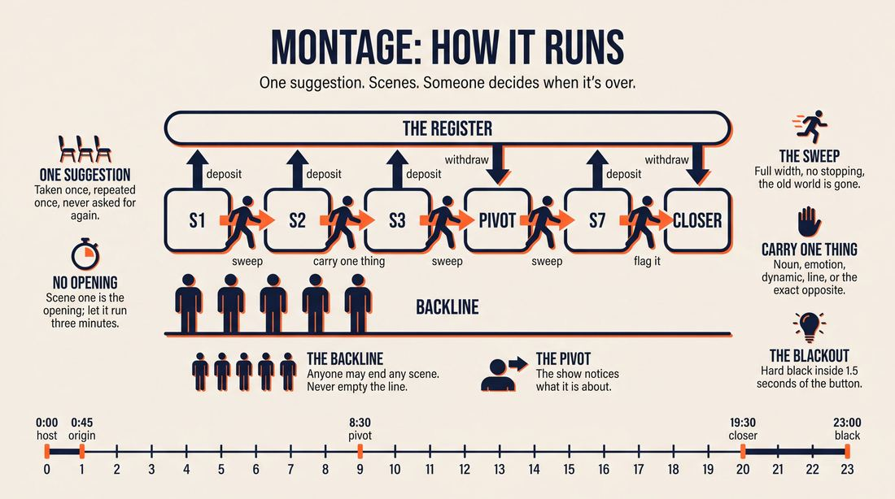
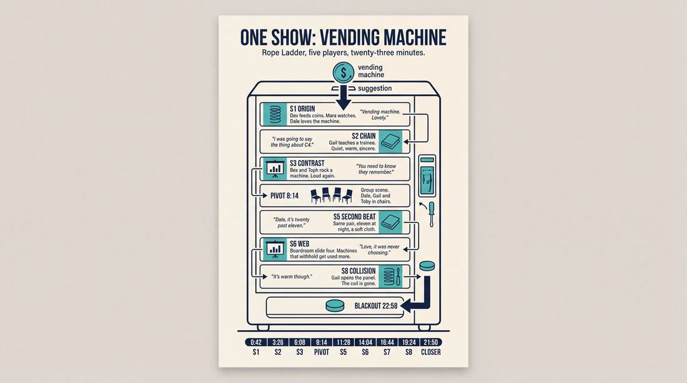
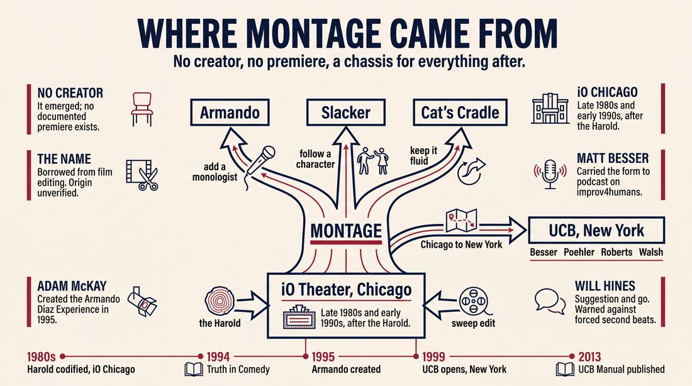
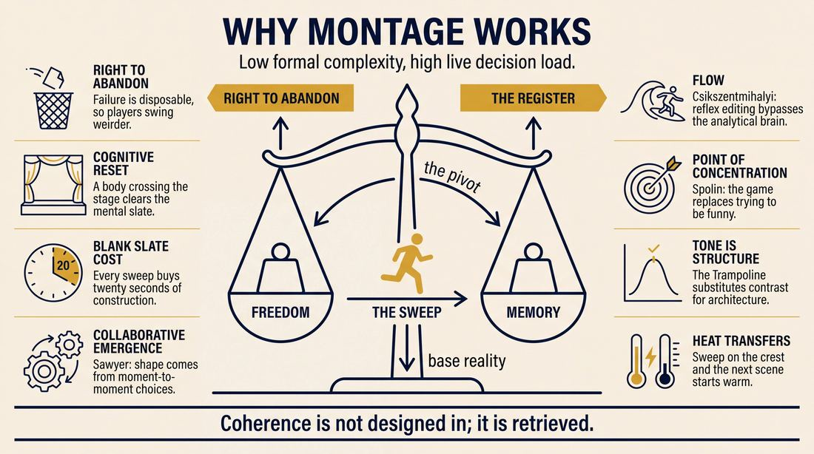
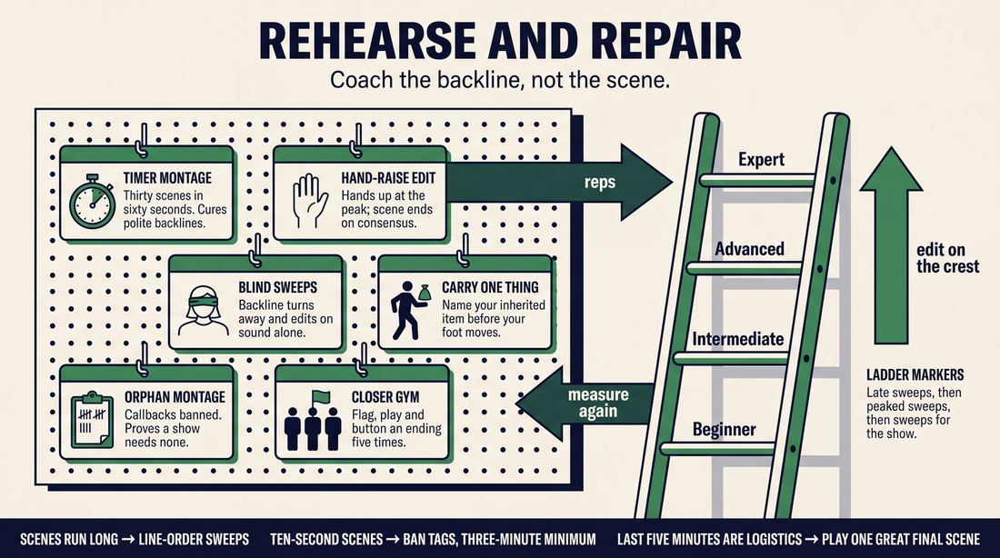

# Montage

> **A complete study of the long-form improv format _Montage_** - the original archived write-up, five infographics, grounded historical and pedagogical research, and a full mechanics-and-coaching manual.

| | |
|---|---|
| **Format** | Montage |
| **Primary source** | [IRC Improv Wiki](https://wiki.improvresourcecenter.com/index.php?title=Montage) |

---

## Contents

1. [Part I - The Original Write-Up](#part-i-the-original-write-up)
2. [Part II - The Infographics](#part-ii-the-infographics)
   - [1. Structure and Mechanics](#infographic-1-mechanics)
   - [2. A Show, Beat by Beat](#infographic-2-example)
   - [3. Origins and Lineage](#infographic-3-history)
   - [4. Why It Works](#infographic-4-theory)
   - [5. Rehearsal and Repair](#infographic-5-coaching)
3. [Part III - Research Dossier](#part-iii-research-dossier)
   - [Pass 1: History, Lineage, Literature and Scholarship](#research-history)
   - [Pass 2: Comparative Anatomy, Pedagogy and Production](#research-comparative)
4. [Part IV - Mechanics, Gameplay and Coaching Manual](#part-iv-mechanics-gameplay-and-coaching-manual)
   - [Pass 1: The Form, Its Mechanics and Its Gameplay](#manual-mechanics)
   - [Pass 2: Training, Coaching and Performance Companion](#manual-coaching)

---

## Part I - The Original Write-Up

*Verbatim archive of the source article, reproduced exactly as scraped. Everything after this section is generated elaboration built on top of it.*

### Montage

Montage is a long form improv format. At its simplest, a Montage is a series of scenes of no particular structure based off of a single suggestion.

##### Basic Structure

1. Ask the audience for a [suggestion](https://wiki.improvresourcecenter.com/index.php?title=Suggestion "Suggestion").
2. Start the first scene based on that suggestion.
3. When there is an appropriate time to [edit](https://wiki.improvresourcecenter.com/index.php?title=Edit "Edit"), a player on the back row edits the scene
4. The player that edits the scene may start the new one.
5. Repeat the editing process until you have a few scenes going.
6. Once a comfortable number has been reached, revisit your previous scenes and perform a second [beat](https://wiki.improvresourcecenter.com/index.php?title=Beat "Beat"). Three or four scenes is recommended. Try to incorporate the new information that has been offered in other scenes, but do not force connections.
7. Heighten the scenes with each beat.
8. A Montage may run within a time limit, and you will receive a blackout when a decent punchline is found. Otherwise, end the show when you have concluded all or several of the story lines.

##### Ideas

1. When a player edits the scene, the next scene can be directly inspired by the previous scene or suggestion.
2. Have characters from multiple story lines interact, possibly creating new or solving old problems.
3. The Trampoline: Each scene attempts to play the opposite of the last scene.

##### External Links

###### Videos

- [Starla and Sons performing a Montage](http://www.youtube.com/watch?v=ctdaCTceGm0)
- [Improv Class from the Bay Area performing a Montage](http://www.youtube.com/watch?v=xq11NnPKygY)
- [The Montage at IO West by English Speaking Moose](http://vimeo.com/13531990)

---

*Archived from [https://wiki.improvresourcecenter.com/index.php?title=Montage](https://wiki.improvresourcecenter.com/index.php?title=Montage) (IRC Improv Wiki) on 2026-08-09 23:23 UTC.*

---

## Part II - The Infographics

*Five 16:9 posters, each teaching a different aspect of the format. Click any poster to enlarge.*

<a id="infographic-1-mechanics"></a>

### 1. Structure and Mechanics

*How the form is played: the shape of the piece, the opening, the roles, the edit vocabulary, the flow of information, and the clock.*

{ .diagram loading=lazy decoding=async width="1100" height="614" }


<a id="infographic-2-example"></a>

### 2. A Show, Beat by Beat

*A single worked performance from suggestion to blackout: what happens in each beat, with short real example lines and what the players are doing technically.*

{ .diagram loading=lazy decoding=async width="1100" height="614" }


<a id="infographic-3-history"></a>

### 3. Origins and Lineage

*Where the form came from: creators, dates, theatres, how it spread between schools and cities, and the key figures - a documented timeline and lineage map.*

{ .diagram loading=lazy decoding=async width="1100" height="614" }


<a id="infographic-4-theory"></a>

### 4. Why It Works

*The theory: the core principles of the form and the research and craft ideas that explain why the structure produces good improv, each tied to a specific mechanic.*

{ .diagram loading=lazy decoding=async width="1100" height="614" }


<a id="infographic-5-coaching"></a>

### 5. Rehearsal and Repair

*Training and fixing the form: the essential drills, the common failure modes with their symptom-and-fix pairs, and the markers of beginner through expert play.*

{ .diagram loading=lazy decoding=async width="1100" height="614" }


---

## Part III - Research Dossier

*Two research passes: the historical record, then the comparative and pedagogical record. Claims carry evidence tags - treat unverified items accordingly.*

<a id="research-history"></a>

### » Pass 1: History, Lineage, Literature and Scholarship

### Research Summary
*   Montage is universally documented as the foundational, most basic long-form improv structure, frequently summarized by practitioners as "suggestion and go" [DOCUMENTED].
*   The searchable record for Montage is highly fragmented because the format is defined by what it *lacks* (a rigid macro-structure) rather than what it is [INFERRED].
*   It is widely taught as the essential stepping stone between short-form games and the Harold, focusing heavily on two-person scenework and editing mechanics [DOCUMENTED].
*   The form is heavily documented in practitioner blogs (e.g., Will Hines, Jimmy Carrane) and foundational manuals (e.g., the *UCB Comedy Improvisation Manual*) [DOCUMENTED].
*   There is an ongoing, documented theoretical debate among improvisers about whether Montage qualifies as a "form" at all, or if it is simply the baseline state of unscripted scenework [DOCUMENTED].
*   Montage serves as the mechanical chassis for highly structured, famous variants, most notably the Armando and the Slacker [DOCUMENTED].
*   UNVERIFIED - The exact origin of the term in an improv context is undocumented, though it is universally accepted as a direct borrowing from the cinematic montage technique [INFERRED].

### Provenance and History
Because Montage is the baseline of scene-to-scene long-form improvisation, it lacks a single credited creator or a documented "premiere" performance. It emerged organically in Chicago in the late 1980s and early 1990s, primarily at the ImprovOlympic (iO) Theater. As improvisers mastered the rigid A-B-C, A-B-C structure of Del Close's Harold, many sought a "formless" way to play that allowed for pure, unconstrained scenework and organic, rather than mandated, callbacks [INFERRED]. The name is borrowed from film editing, reflecting the format's reliance on the "sweep edit"—where a player runs across the stage to wipe the visual frame and initiate a new scene. 

| Year | Event | Place / Company | Source |
|---|---|---|---|
| 1980s | Long-form scenework is codified via the Harold, establishing the physical mechanics of the sweep edit and tag-out. | iO Theater, Chicago | *Truth in Comedy* (Halpern, Close, Johnson) |
| 1995 | Adam McKay creates the "Armando Diaz Experience," codifying the most famous structured variant of the Montage. | iO Theater, Chicago | Improv Resource Center Archives |
| 1999 | UCB Theatre opens in New York, utilizing Montage as a core teaching format and the default structure for indie teams. | UCB, New York | *UCB Comedy Improvisation Manual* |
| 2013 | *Upright Citizens Brigade Comedy Improvisation Manual* is published, formally defining Montage mechanics in print. | UCB | *UCB Comedy Improvisation Manual* |

### Lineage and Transmission
Montage spread directly from Chicago (iO, The Annoyance) to New York and Los Angeles via the founders of the Upright Citizens Brigade (Matt Besser, Amy Poehler, Ian Roberts, Matt Walsh). In the UCB curriculum, Montage is traditionally taught in the 401 level (or equivalent) as a palate cleanser and a way to drill the mechanics of editing (sweeps, tag-outs, swinging doors) before applying them to the Harold [WIDELY PRACTICED, UNDOCUMENTED]. 

As it transmitted globally, it mutated into several regional dialects. In New York, early UCB teams developed the "Macroscene" (a Slacker-like montage). In Chicago, Charna Halpern taught a continuous, fluid montage variant called "Cat's Cradle." Today, Montage is the undisputed default format for independent ("indie") improv teams worldwide, prized for its low barrier to entry and egalitarian structure.

### Key Figures
| Person | Role in this form | Specific contribution | Source URL |
|---|---|---|---|
| Will Hines | Teacher / Theorist | Codified the "suggestion and go" ethos and established modern guidelines for callbacks in Montage. | [Improv Nonsense](https://improvnonsense.substack.com/) |
| Jimmy Carrane | Teacher / Podcaster | Advocated for Montage as the essential, safe bridge between short-form and the Harold. | [JimmyCarrane.com](https://jimmycarrane.com/ask-jimmy-and-will-transitioning-from-short-form-to-long-form/) |
| Matt Besser | UCB Co-founder | Popularized the rapid-fire audio-montage format via the *improv4humans* podcast. | [Paste Magazine](https://www.pastemagazine.com/comedy/improv4humans/the-10-best-episodes-of-improv4humans) |
| Adam McKay | Creator of Variant | Created the Armando, the most famous and widely performed structured variant of the Montage. | [Improv Resource Center](https://www.improvresourcecenter.com/) |

### Canonical Shows, Companies and Recordings
*   **ASSSSCAT**: UCB's flagship show in NY and LA. While technically an Armando (using celebrity monologues), the scenework operates as a high-speed, aggressive montage. [Earwolf / UCB](https://www.earwolf.com/)
*   **improv4humans**: Hosted by Matt Besser, this podcast is the definitive audio record of the Montage format, utilizing audio cues and Besser's hosting to act as "sweep edits." [Paste Magazine](https://www.pastemagazine.com/comedy/improv4humans/the-10-best-episodes-of-improv4humans)
*   **Starla and Sons**: A Brown University indie team documented in 2007 as utilizing Montage as a distinct, named first-half format before transitioning to a Harold. [Brown Daily Herald](https://www.browndailyherald.com/article/2007/03/starla-and-sons-bring-long-form-improv-to-campus)

### Published Literature
| Work | Author | Year | What it says about this form | Where to find it |
|---|---|---|---|---|
| *Upright Citizens Brigade Comedy Improvisation Manual* | Matt Besser, Ian Roberts, Matt Walsh | 2013 | Defines the mechanics of scene-to-scene edits (sweep, tag-out) that comprise a montage. | UCB Store / Print |
| *Truth in Comedy* | Charna Halpern, Del Close, Kim "Howard" Johnson | 1994 | While focused on the Harold, it establishes the "time dash" and scene-chaining mechanics foundational to Montage. | Academic libraries |
| *Improvise: Scene from the Inside Out* | Mick Napier | 2004 | Advocates for trusting instincts over rigid structure, providing the philosophical core of Montage play. | Annoyance Theatre / Print |
| *Group Creativity: Music, Theater, Collaboration* | R. Keith Sawyer | 2003 | Analyzes the collaborative emergence of unscripted theater, directly applicable to formless montage. | Academic databases |

### Verbatim Quotes
> "Montage - Suggestion and go."
> — Will Hines
> [Improv Nonsense](https://improvnonsense.substack.com/p/the-forms)

> "The only time a 'second beat' makes sense to me personally in a montage is if someone has a great character. It's fun to see a great character return more than once. [...] It's not a 'second beat' fully —- but it feels like it."
> — Will Hines
> [Improv Nonsense](https://improvnonsense.substack.com/p/qa-sep-15)

> "My suggestion is to keep it super simple at first, and I think 'Montage' would be a very safe place to start before going into the Harold."
> — Jimmy Carrane
> [JimmyCarrane.com](https://jimmycarrane.com/ask-jimmy-and-will-transitioning-from-short-form-to-long-form/)

> "Most ways I am familiar with feature a series of unrelated scenes that you edit from the back line or from the sides with a sweep edit."
> — Jimmy Carrane
> [JimmyCarrane.com](https://jimmycarrane.com/ask-jimmy-and-will-transitioning-from-short-form-to-long-form/)

> "A montage is a group of scenes inspired by each other, but without a specific structure. Sometimes scenes will recur and combine, sometimes each scene will simply be inspired by the one before, making a 'chain'."
> — AndAlso Improv Glossary
> [AndAlso Improv](https://andalsoimprov.com/glossary/)

> "I might argue a Montage does not qualify as a FORM, as form is the one thing it lacks. No argument that a well done montage can easily be as good of a show as any formal form."
> — Rob Reese
> [Facebook Improv Group Discussion](https://www.facebook.com/groups/147137532000000/posts/5283715201675515/)

> "I think I disagree with you actually. I think montages do have a form: we do one scene, then we do another scene, then we do another scene, etc. It doesn't have much formal complexity, but then neither does a mono scene."
> — Sean Dillon
> [Facebook Improv Group Discussion](https://www.facebook.com/groups/147137532000000/posts/5283715201675515/)

> "Sets deteriorated into free-form fuckfests, with players going meta and no stakes whatsoever. And since no one was attempting a Harold, it didn't seem to matter."
> — People and Chairs Blog
> [People and Chairs](https://peopleandchairs.com/2017/05/24/the-year-of-improvising-dangerously/)

### Anecdotes and Stories
**The Creation of the Armando**
In the late 1980s or early 1990s at iO, the cast was looking for a way to showcase alumni without triggering ensemble jealousy. At 5:00 AM, Adam McKay pitched a radical idea: a show where the entire cast existed solely to serve the whims of performer Armando Diaz. The format they developed was a Montage of scenes inspired entirely by Diaz's personal monologues. It was designed to be "egoless" for the ensemble, and it inadvertently birthed the most famous Montage variant in improv history. [Source: Improv Resource Center Archives]

**Cat's Cradle is a Harold**
In 2008, iO co-founder Charna Halpern visited Toronto to teach a workshop on a form called "Cat's Cradle." The form was essentially a fluid montage where all performers remained on stage at all times, with no set beats or group games. When students asked about the structure, Halpern shocked them by stating, "Cat's Cradle is a Harold." She explained that the rigid "training wheels" structure of the Harold (Opening, First Beats, Group Game, etc.) was originally just a tool for her and Del Close to teach callbacks. To Halpern, a fluid, formless montage that connects themes is the ultimate realization of the Harold. [Source: People and Chairs]

### Academic and Scientific Research
**Collaborative Emergence**
*Finding:* In *Group Creativity: Music, Theater, Collaboration* (2003), Dr. R. Keith Sawyer outlines "collaborative emergence," where the outcome of a performance cannot be known in advance and emerges entirely from the moment-to-moment group dynamic.
*Relevance to this form:* Because Montage lacks a predetermined macro-structure (unlike the Harold's mandated beats), it relies entirely on collaborative emergence. The improvisers must generate the structural parameters, pacing, and callbacks in real-time, requiring a higher degree of moment-to-moment listening.

**Cognitive Framing and the Sweep Edit**
*Finding:* Psychological research into improvisational theater (e.g., *The Improvising Mind*, Tufts University, 2001; *Psychology Today*, 2022) notes that physical interventions are required to alter cognitive states and de-escalate or reset social interactions. 
*Relevance to this form:* The "sweep edit"—the primary engine of a Montage—acts as a physical and cognitive reset for both the performers and the audience. By running across the stage, the improviser provides a definitive cognitive boundary that terminates the reality of one scene and clears the mental slate for the next, entirely without the aid of theatrical lighting cues.

### Documented Variants and Descendants
*   **The Armando (or Armando Diaz Experience):** A montage where scenes are directly inspired by true, personal monologues delivered by a guest or cast member.
*   **The Slacker:** A montage where scenes transition by following a secondary character from the previous scene into a new location (also known early on at UCB as a "Macroscene").
*   **Living Room:** A montage that begins with the cast sitting in chairs having a casual, out-of-character conversation, which serves as the thematic inspiration for the subsequent scenes.
*   **La Ronde:** A character-wheel format that frequently devolves or transitions into a free-form montage for its climax, allowing all previously isolated characters to interact.

### Criticism, Debate and Known Failure Modes
*   **The "Formless" Debate:** A persistent debate among practitioners is whether Montage is a format or simply the absence of one. Purists argue it lacks formal complexity, while defenders argue that "one scene following another" is an organic structure in itself.
*   **Failure Mode - The "Free-Form Fuckfest":** Without the structural demands of a Harold to force patience and thematic exploration, inexperienced teams performing Montage often devolve into rapid, disconnected, low-stakes scenes (often referred to derogatorily as "gag work" or "meta" play).
*   **Failure Mode - Forced Connections:** Teachers like Will Hines explicitly warn against forcing "second beats" in a montage just for the sake of making callbacks. Practitioners complain that forcing connections in a Montage makes the show feel artificial; callbacks should only happen organically if a character or premise is truly compelling.

### Cultural Footprint
Montage is the undisputed default format for independent improv teams globally. Because it requires no specialized coaching to learn a complex macro-structure, it is the *lingua franca* of improv jams and festivals. Furthermore, the format has heavily influenced comedy podcasting; shows like *improv4humans* and *Comedy Bang! Bang!* utilize the Montage structure, replacing physical sweep edits with audio cues and host interventions to chain scenes together.

### Gaps in the Record
*   **Etymology:** It is UNVERIFIED exactly who first applied the cinematic term "Montage" to this specific improv structure. While the borrowing is obvious, the specific teacher or theater that codified the term is lost to oral history.
*   **First Performance:** Because it is the baseline of long-form, there is no documented "premiere" of a Montage, unlike the Harold (which debuted with The Committee in San Francisco). 

### Source List
1. IRC Improv Wiki Archive - "Montage" - 2017 - https://wiki.improvresourcecenter.com/index.php?title=Montage - Establishes basic rules and definitions.
2. Improv Nonsense (Will Hines) - "The Forms" - 2024 - https://improvnonsense.substack.com/p/the-forms - Supports the "suggestion and go" definition.
3. Improv Nonsense (Will Hines) - "Q&A: Sep 15" - 2025 - https://improvnonsense.substack.com/p/qa-sep-15 - Supports the philosophy on second beats in montages.
4. JimmyCarrane.com - "Ask Jimmy and Will" - 2015 - https://jimmycarrane.com/ask-jimmy-and-will-transitioning-from-short-form-to-long-form/ - Supports Montage as a transitional teaching tool and sweep edit mechanics.
5. AndAlso Improv - "Improv Glossary" - https://andalsoimprov.com/glossary/ - Supports the definition of Montage as a chain of scenes without specific structure.
6. Facebook Improv Group - "Long Form improv" thread - 2024 - https://www.facebook.com/groups/147137532000000/posts/5283715201675515/ - Supports the practitioner debate over whether Montage is a true form.
7. People and Chairs - "The Year of Improvising Dangerously" - 2017 - https://peopleandchairs.com/2017/05/24/the-year-of-improvising-dangerously/ - Supports the "Cat's Cradle" anecdote and the "free-form" failure mode.
8. Improv Resource Center Forums - "Armando Diaz Experience" thread - 2006 - https://www.improvresourcecenter.com/ - Supports the origin story of the Armando variant.
9. *Group Creativity: Music, Theater, Collaboration* - R. Keith Sawyer - 2003 - https://www.researchgate.net/publication/232548480_Group_Creativity_Music_Theater_Collaboration - Supports the academic theory of collaborative emergence.
10. Tufts University - "The Improvising Mind: On Stage and in the Lab" - 2001 - https://dl.tufts.edu/ - Supports the cognitive framing of improv mechanics.
11. Psychology Today - "3 Improv Edits to Use in Real Life" - 2022 - https://www.psychologytoday.com/ - Supports the psychological function of the sweep edit.
12. Paste Magazine - "The 10 Best Episodes of improv4humans" - 2017 - https://www.pastemagazine.com/comedy/improv4humans/the-10-best-episodes-of-improv4humans - Supports the cultural footprint of Montage in podcasting.

<a id="research-comparative"></a>

### » Pass 2: Comparative Anatomy, Pedagogy and Production

### Taxonomic Placement

```text
      [Spolin Theater Games]       [The Committee's Original Harold (1967)]
                 \                           /
                  \                         /
             [Chicago Long-Form Evolution (1980s)]
                             |
                        [MONTAGE]
                 /           |           \
                /            |            \
        [Armando]     [Deconstruction]   [Slacker / Macroscene]
           |                 |                 |
     [Asssscat]       [The Spokane]      [Close Quarters]
```

Montage is the foundational chassis of modern long-form improvisation. While the Harold was the first codified long-form structure, the Montage emerged as the "ur-form" or "training wheels" that stripped away the Harold's rigid beat structure and mandatory group games. By reducing long-form to its absolute base components—scene generation and backline editing (sweeps, tag-outs, walk-ons)—Montage became the structural parent to almost all premise-based and game-based formats. If you add a monologist to a Montage, you get an Armando; if you restrict the edit logic to character-following, you get a Slacker; if you restrict the spatial logic, you get Close Quarters. 

### Head-to-Head Comparisons

#### Montage vs. The Harold
| Axis | Montage | The Harold | Consequence for the players |
| :--- | :--- | :--- | :--- |
| **Opening** | Usually none, or a simple organic suggestion pull. | Structured opening (invocation, pattern game, sound & motion). | Montage players must generate base realities immediately without a thematic buffer. |
| **Structure** | Agnostic. Scenes happen sequentially until a blackout. | Rigid 3x3 grid (3 beats of 3 scenes) separated by group games. | Montage players dictate the pacing dynamically; Harold players must pace themselves to fit the grid. |
| **Edit Logic** | Sweep edits, tag-outs, and walk-ons used at will. | Sweeps dictate beat transitions; internal edits are restricted to specific beats. | Montage requires constant backline vigilance; Harold provides structural safety nets for scene endings. |
| **Memory** | Thematic or character callbacks are optional but rewarded. | Mandatory A/B/C plotline or thematic tracking across three beats. | Montage allows players to drop failing premises entirely; Harold forces players to fix or justify them in beat two. |
| **Failure Mode** | "Orphaned scenes" (a string of unrelated, shallow sketches). | "Plot forcing" (abandoning the game to tie up narrative loose ends). | Montage fails by being too loose; Harold fails by being too tight. |

#### Montage vs. The Monoscene
| Axis | Montage | The Monoscene | Consequence for the players |
| :--- | :--- | :--- | :--- |
| **Structure** | Multiple locations, multiple timelines, multiple characters. | One location, real-time, continuous action. | Montage players can escape a bad scene by sweeping; Monoscene players must endure and fix it. |
| **Edit Logic** | Heavy reliance on the sweep edit to reset the stage. | No sweep edits allowed. Entrances and exits only. | Montage players use physical stage-crossing to control rhythm; Monoscene players use door-knocks and justifications. |
| **Cast Size** | 4 to 8 players, rotating from a backline. | 4 to 8 players, often all trapped on stage or in wings. | Montage allows players to rest and observe; Monoscene demands continuous character maintenance. |

#### Montage vs. The Armando (Asssscat)
| Axis | Montage | The Armando | Consequence for the players |
| :--- | :--- | :--- | :--- |
| **Inspiration** | A single audience suggestion (word, location). | A true, personal monologue delivered by a cast member or guest. | Montage scenes are built from thin air; Armando scenes are built from specific, grounded details provided by the monologist. |
| **Pacing** | Continuous scene-to-scene momentum. | Interrupted by the monologist returning to center stage. | Montage requires the ensemble to maintain energy for 25 minutes; Armando provides built-in breathers and resets. |
| **Audience Contract** | "Watch us connect random ideas." | "Watch us heighten the themes of this true story." | Montage audiences expect rapid-fire variety; Armando audiences expect thematic resonance with the speaker. |

#### Montage vs. La Ronde
| Axis | Montage | La Ronde | Consequence for the players |
| :--- | :--- | :--- | :--- |
| **Edit Logic** | Anyone can edit anyone at any time. | Strict A-B, B-C, C-D, D-A character replacement. | Montage allows for group scenes and rapid tags; La Ronde strictly enforces two-person scenes. |
| **Character Use** | Players can play infinite characters. | Each player plays exactly one character for the entire form. | Montage tests a player's range and premise-generation; La Ronde tests a player's character consistency and relationship-building. |

### What Makes It Uniquely Itself

1. **Structural Agnosticism**: If you remove the freedom to completely abandon a storyline, you are no longer playing a Montage. The form's defining trait is that Scene 4 does not *have* to connect to Scene 1. Thematic and narrative collisions happen organically, but the moment a predetermined callback structure is enforced, the form becomes a Harold or a Deconstruction.
2. **Edit-Driven Pacing**: In a Montage, the backline is the director. The rhythm of the show is dictated entirely by the physical execution of sweep edits, tag-outs, and walk-ons. If you remove the backline's ability to unilaterally terminate a scene via a sweep, you are playing a Monoscene or a Slacker.
3. **The Blank Slate Transition**: Every sweep edit in a Montage creates a total vacuum. Unlike forms that use tag-outs to maintain a character or location, the standard Montage sweep demands that the next players step into a completely empty stage and establish a new base reality (who, what, where) from scratch.

### Structural Variants in Practice

| Variant Name | What It Changes | Who Plays It | Source |
| :--- | :--- | :--- | :--- |
| **The Toronto Harold** | Used as a "training wheels" format. It is a Montage where players are explicitly instructed to look for thematic connections, but without the rigid 3-beat structure. | iO Chicago (Level 2/3 students) | [CRAFT CONSENSUS] / iO Alumni |
| **Level 3 Montage** | Premise-based Montage. Scenes are treated as tightly written sketches. The focus is entirely on finding the "Game of the Scene" and heightening it, rather than narrative. | The Free Association (London), Reno Improv | The Free Association Syllabus / Reno Improv Syllabus |
| **The Spokane / Pretty Flower** | A micro-format often embedded *within* a Montage. A single "source scene" is established, and players use tag-outs to explore the characters' lives outside that moment, before returning to the source scene. | UCB Theatre, NYC Indie Teams | Christopher Griswold-Jenkins / UCB Alumni |
| **Freeform** | Rejects the concept of "rules" entirely. Edits can be sweeps, morphs, or organic transitions. Focuses heavily on character, emotion, and immediate reaction rather than "Game". | The Annoyance Theatre | [CRAFT CONSENSUS] |
| **Inter-Dimensional Montage** | Players begin the show by stepping through the curtain one by one to deliver a "Self-Contained Emotional Statement" (SCES) before scenes begin. | Indie Teams | Patrick Gantz (*Improv As Improv Does Best*) |

### The Teaching Ladder

| Stage | Skill introduced | Why in this order | Typical exercise | Source or [CRAFT CONSENSUS] |
| :--- | :--- | :--- | :--- | :--- |
| **1** | **Base Reality (Who, What, Where)** | Without a grounded reality, a Montage becomes a chaotic string of talking heads. Players must learn to build the platform before they can jump off it. | 2-person scenes with no edits allowed for 3 minutes. | The Free Association (Level 2 Syllabus) |
| **2** | **The Sweep Edit** | The fundamental transition mechanic of the form. Players must learn to physically cross the stage to end a scene decisively. | Timer Montage (30 scenes in 60 seconds). | [CRAFT CONSENSUS] / Reddit Improv Communities |
| **3** | **Tag-Outs and Walk-Ons** | Once players can end scenes, they learn to manipulate existing scenes. This introduces pacing variety (fast tags vs. slow sweeps). | Tag-Out Run / The Pretty Flower drill. | UCB Training Center / Will Hines |
| **4** | **Game of the Scene** | Players learn to identify the unusual thing in the base reality and heighten it, turning a random scene into a comedic sketch. | "What If" initiations. | The Free Association (Level 3 Syllabus) |
| **5** | **Thematic Callbacks** | Taught last so players don't force connections early. Players learn to bring back successful games, characters, or themes from Scene 1 into Scene 5. | The Word (Every scene starts with the same word). | Cameron & Sally (*People and Chairs*) |

### Documented Drills and Exercises

| Drill | Origin / Teacher | How to run it | What it fixes in this form | Source |
| :--- | :--- | :--- | :--- | :--- |
| **Timer Montage / 30 in 60** | [CRAFT CONSENSUS] | Set a timer for 60 seconds. The ensemble must initiate and sweep-edit 30 distinct scenes before the timer goes off. | Fixes "The Polite Backline" (hesitation to edit) and trains rapid initiation. | Reddit Improv Communities |
| **Freeze Tag Call-Out** | [CRAFT CONSENSUS] | Two players in a scene. A backline player yells "Freeze, [Name]!" The named player must tag in and initiate a new scene. | Fixes players waiting for "their own idea" before editing; forces editing on the beat. | Reddit Improv Communities |
| **The Word** | Cameron & Sally | A Montage where every single scene must begin with the exact same word, but with a different emotion, inflection, or context. | Fixes lack of thematic inspiration and trains emotional initiations. | *People and Chairs* Blog |
| **Hand-Raise Edit** | Cameron & Sally | During a scene, backline players raise their hands when they feel the scene has peaked. The scene only ends when a consensus (multiple hands) is reached. | Fixes premature edits and trains group mind regarding scene peaks. | *People and Chairs* Blog |
| **Revolver** | Jesse Parent | Four players: two downstage, two upstage. The coach calls "Clockwise" or "Counter-Clockwise." The players rotate, instantly starting a new scene with their new partner. | Fixes pacing drops and trains players to hold multiple base realities in their head. | IRC Improv Wiki / Jesse Parent |
| **Blind Sweeps** | [CRAFT CONSENSUS] | The backline turns around and closes their eyes. They must execute sweep edits based entirely on the audio rhythm and laughter of the scene. | Fixes visual bias in editing and trains listening for the comedic peak. | [CRAFT CONSENSUS] |
| **Self-Contained Emotional Statement (SCES)** | Patrick Gantz | Players step downstage and initiate a scene with a definitive emotional declaration (e.g., "I hate the arts") rather than an action or question. | Fixes weak, question-based initiations ("What are you doing?"). | *Improv As Improv Does Best* |
| **Tag-Out Run** | Will Hines / UCB | Player A and B are in a scene. Player C tags out B to heighten A's game. Player D tags out C to heighten it further. Run until the game peaks, then sweep. | Fixes dropping the "Game of the Scene" and trains rapid heightening. | Will Hines / UCB Pedagogy |
| **No-Sweep Transformation** | Zoom / Online Improv | No sweep edits allowed. A player abruptly changes character/posture, forcing their partner to instantly justify the new reality. | Fixes reliance on the physical sweep; adapts Montage for remote/camera play. | Reddit Improv Communities |
| **Inter-Dimensional Montage** | Patrick Gantz | Players start in the wings. They enter through the "curtain" one by one, delivering a SCES based on the suggestion, before scenes begin. | Fixes low energy at the top of the show and generates a pool of premises. | *Improv As Improv Does Best* |

### Common Failure Modes and Diagnoses

| Failure mode | What it looks like from the audience | Root cause | Fix | Who names it |
| :--- | :--- | :--- | :--- | :--- |
| **The Polite Backline** | Scenes drag on for 5+ minutes past their comedic peak. Players on the sides look at each other, waiting for someone else to run. | Fear of cutting off a teammate; waiting for a "perfect" idea before sweeping. | **Timer Montage** drill; assign a mandatory "designated sweeper" for the next scene. | [CRAFT CONSENSUS] |
| **The Machine Gun** | Scenes last 10 seconds. Constant tag-outs and walk-ons. The audience gets whiplash and no base reality is ever established. | Panic; mistaking speed for energy; players prioritizing their own jokes over the scene's reality. | Ban tag-outs and walk-ons for a rehearsal. Enforce 3-minute minimums per scene. | [CRAFT CONSENSUS] |
| **Plot Forcing** | In the final 5 minutes, players desperately try to make the astronaut from Scene 1 meet the baker from Scene 3, even if it makes no logical sense. | Treating the Montage like a narrative play or a strict Harold, rather than a thematic sketch show. | Remind players that scenes do not have to connect. Practice "Orphan Montages" where callbacks are strictly forbidden. | dadprov (Reddit) / [CRAFT CONSENSUS] |
| **The Steamroller** | One or two dominant players execute 90% of the sweep edits and initiate 90% of the scenes. | Imbalance of experience or confidence in the ensemble. | **Line-Order Sweeps**: The backline stands in a literal line. Only the person at the front of the line is legally allowed to sweep. | Reddit Improv Communities |
| **Talking Heads** | Two players stand center stage, arms at their sides, talking about something happening off-stage or in the past. | Lack of object work; initiating with dialogue rather than action or emotion. | Enforce silent, physical initiations for the first 15 seconds of every scene. | [CRAFT CONSENSUS] |

### Production and Logistics

*   **Cast Size**: 4 to 8 players. 5 is widely considered the "perfect" number for a Montage, as it allows for two 2-person scenes, one player on the backline to edit, and enough variety without crowding the stage.
*   **Runtime**: Typically 20 to 25 minutes. Without the structural milestones of a Harold, Montages longer than 25 minutes often suffer from audience fatigue unless the ensemble is highly advanced.
*   **Stage Layout**: A clear downstage playing area. The "backline" (players not currently in the scene) stands against the upstage wall or in the wings, remaining neutral and attentive.
*   **Chairs and Set**: 2 to 4 armless chairs. These are kept upstage with the backline and brought downstage by the players as needed to establish environments (cars, living rooms, restaurants).
*   **Lighting and Tech Cues**: The tech booth is the final editor. The improviser in the booth watches for the ultimate thematic callback or a massive laugh around the 20-minute mark and triggers a hard blackout to end the show.
*   **Music and Sound**: Pre-show music to set the energy. Music fades out as the MC steps forward. No internal sound cues are used unless specifically requested as a gimmick.
*   **MC and Host Duties**: One player steps forward, welcomes the audience, briefly explains the form ("We're going to take a single word and create a series of unconnected scenes"), gets the suggestion, and steps back to initiate the first scene.
*   **Lineup Placement**: Montage is the workhorse of indie improv. It is ideal for 3-team mixed bills, openers for narrative shows, or festival slots where setup time is zero.
*   **Rehearsal Cadence**: Because there is no "form" to memorize, rehearsals focus entirely on reps, editing drills, and strengthening the "Game of the Scene" muscle.

### Adaptations Beyond the Stage

*   **Classroom and Youth**: In educational settings (e.g., English Language Arts), Montage is used to teach divergent thinking and collaborative storytelling. The "sweep edit" is often replaced by a teacher-facilitated transition to prevent students from aggressively cutting each other off. The focus shifts from comedy to sustained participation and active listening.
*   **Corporate and Applied Improv**: Used to demonstrate rapid iteration and "Yes, And" principles. The form is heavily moderated; tag-outs are used to show how different employees might handle the same customer service scenario (a variation of the Help Desk game).
*   **Online and Remote**: The "Zoom Montage" replaces the physical sweep edit with camera toggles. Players turn their cameras off to exit a scene and turn them on to initiate or walk on. The "No-Sweep Transformation" is heavily utilized, where a player simply changes their posture and voice to force a scene transition.
*   **Accessibility and Inclusion**: For ensembles with visually impaired players, the physical sweep edit is augmented with a verbal cue (e.g., a specific word or a clap) to signal the end of a scene. 
*   **Content-Safety and Consent**: The sweep edit functions as a built-in safety valve. If a scene crosses a boundary, becomes unsafe, or violates the theater's code of conduct, any player on the backline has the power (and responsibility) to immediately sweep the stage, terminating the scene without needing to break character or stop the show.

### Evidence Base for Those Adaptations

*   **Improv in Education**: Research by Andrea McCloskey (Penn State) demonstrates that teaching long-form improv structures like Montage to middle and high school students fosters a "failure-positive mindset," builds supportive communities, and aids in teaching English Language Arts by encouraging divergent thinking and spontaneous authoring.
*   **Psychological Safety**: The use of structured reflection and shared vocabulary (as seen in syllabi from The Free Association and Elevify) supports the creation of a disciplined community where participants are responsible for the "life of the group," aligning with educational theories on collaborative learning environments.

### Scholarly Frames Worth Applying

*   **Collaborative Emergence (Keith Sawyer)**: Sawyer posits that in highly creative group tasks, the macro-structure emerges unpredictably from the micro-interactions of the participants, rather than from a top-down plan. *Mapping to Montage*: Because Montage lacks the predetermined beat structure of the Harold, the entire 25-minute show is an exercise in collaborative emergence; the themes and callbacks that define the show's identity only reveal themselves in the final minutes based on the micro-decisions made in the first three scenes.
*   **Flow (Mihaly Csikszentmihalyi)**: Flow is the state of optimal experience where a person is fully immersed in an activity, characterized by a loss of self-consciousness and a distorted sense of time. *Mapping to Montage*: The rapid, instinctual execution of tag-outs and sweep edits requires players to operate purely on reflex and group rhythm, bypassing the analytical brain and inducing a collective flow state.
*   **Point of Concentration (Viola Spolin)**: Spolin's pedagogy relies on giving players a specific, solvable problem (the point of concentration) to distract them from the pressure of "performing." *Mapping to Montage*: In Level 3 Montage classes, the "Game of the Scene" becomes the point of concentration. By focusing entirely on identifying and heightening the unusual pattern, players naturally generate comedy without trying to "be funny."

### Where the Form Is Heading

*   **The Rise of Micro-Forms**: Contemporary indie teams are moving away from the purely "formless" Montage. Instead, they are embedding micro-forms *within* the Montage chassis. A team might do three standard scenes, transition into a "Spokane" (a central scene with multiple tag-outs exploring the characters' pasts), and then return to standard Montage scenes.
*   **Premise-Based Dominance**: Influenced heavily by the UCB and The Free Association, the modern Montage is less about theatrical exploration and more about sketch-comedy generation. Scenes are expected to hit their comedic premise within the first 30 seconds, be heightened rapidly, and be swept the moment the joke peaks.
*   **Rebranding**: Because "Montage" has gained a reputation in some circles as a "lazy" or "dirty" word (implying a lack of discipline), many theaters now bill these shows as "Organic Long-Form" or simply name the show after the team, obscuring the fact that the underlying structural chassis is still just a Montage.

### Source List

1. *Montage* - IRC Improv Wiki - 2017 - https://wiki.improvresourcecenter.com/index.php?title=Montage - Supports basic structure, definition, and the "Trampoline" variant.
2. *Level 3 Improv Class: Game* - The Free Association - 2026 - https://thefreeassociation.co.uk - Supports the teaching ladder, premise-based Montage pedagogy, and Game of the Scene focus.
3. *Level 3: The Montage* - Reno Improv - 2026 - https://renoimprov.org - Supports learning outcomes, walk-ons, cut-tos, and group mind pedagogy.
4. *Improv Circuit Training Routine / The Word* - Cameron & Sally (People and Chairs) - 2012 - https://peopleandchairs.com - Supports "The Word" drill, the "Hand-Raise Edit" drill, and pacing exercises.
5. *Improv As Improv Does Best Manual* - Patrick Gantz - 2018 - https://improvdoesbest.com - Supports the "Self-Contained Emotional Statement" (SCES) and the "Inter-Dimensional Montage" opening.
6. *What Forms Are There?* - Will Hines (Substack) - 2024 - https://substack.com - Supports taxonomic placement, definitions of Slacker, Spokane, and Close Quarters.
7. *Improv in the English Classroom* - Andrea McCloskey (WordPress) - 2018 - https://wordpress.com - Supports the classroom adaptation, youth pedagogy, and the failure-positive mindset.
8. *Harold vs. Formless Long Form* - Reddit Improv Community (dadprov et al.) - 2013 - https://reddit.com - Supports the "Plot Forcing" failure mode, the "Toronto Harold" concept, and the philosophical debate between Harold and Montage.
9. *Montage vs. Harold Structure* - Jason Zimmerman / Christopher Griswold-Jenkins (Facebook Improv Groups) - 2024 - https://facebook.com - Supports the "training wheels" concept, the NYC/UCB approach to Montage, and the definition of formless structure.
10. *Improv Exercises and Drills* - Reddit Improv Community - 2025 - https://reddit.com - Supports the "Timer Montage" (30 in 60), "Freeze Tag Call-Out", and "Blind Sweeps" drills.

---

## Part IV - Mechanics, Gameplay and Coaching Manual

*Synthesis over the original article and both research dossiers: first how the form works and how to play it, then how to train an ensemble to perform it.*

<a id="manual-mechanics"></a>

### » Pass 1: The Form, Its Mechanics and Its Gameplay

### At a Glance

| Field | Detail |
|---|---|
| **Also known as** | Freeform; Organic Long-Form; "suggestion and go" (Will Hines); the Chain; Cat's Cradle (Halpern's continuous variant); "Level 3 Montage" (premise-based dialect); often billed simply under the team's name |
| **Family** | Chicago/UCB scene-based long form. The chassis form — the structural parent of the Armando, the Slacker/Macroscene, Close Quarters, and most indie formats |
| **Cast size** | 4–8. Five is the practical optimum: two on stage, one live editor, two in reserve. Six is comfortable. Eight is the ceiling before the backline goes passive |
| **Runtime** | 20–25 minutes. 25 is a hard ceiling for most ensembles; beyond it the absence of structural milestones produces audience fatigue |
| **Opening** | None by default. The first scene *is* the opening. Documented optional openings: Inter-Dimensional (SCES entrances), Living Room, monologue (→ Armando), The Word |
| **Suggestion taken** | One. A single word or short phrase, taken once, at the top, never referred to again as an instruction |
| **Structural rigidity (1–5)** | **1.** The lowest of any named long form. The only fixed rule is "a scene, then an edit, then another scene" |
| **Difficulty (1–5)** | **2 to run, 4 to run well.** Trivially easy to start, unusually hard to make cohere, because every structural decision that the Harold makes for you must be made live |
| **Prerequisites** | Two-person scenework with a real base reality; the sweep edit; tag-outs and walk-ons; the ability to identify a game of the scene; the nerve to end a teammate's scene |
| **Best for** | Indie teams with no rehearsal-hours to spend on memorising macro-structure; jams and festival slots with zero setup; mixed bills; openers before a narrative show; drilling editing mechanics; ensembles who want maximum tonal range in one set |
| **Avoid when** | Your backline won't edit; your cast is over eight; your team has one or two dominant players; the bill has promised the audience a story; you have a nervous cast who will treat "no structure" as permission to gag |

---

### The Essence in One Paragraph

A Montage is a run of 20–25 minutes of unrelated scenes, generated from a single audience suggestion, in which the entire architecture — how long each scene lasts, what the next scene is about, whether anything ever comes back, and when the show is over — is decided live by whoever is standing on the backline. There is no opening to mine, no beat grid to fill, no group game to hit, and no obligation whatsoever for scene four to have anything to do with scene one. The form's whole mechanism is the **sweep edit**: a player crosses the stage, the previous reality is annihilated, and two new people step onto an empty stage and build a fresh who/what/where from nothing. Because every transition wipes the slate completely, coherence cannot be inherited from a structure — it has to be *manufactured in real time* out of what the ensemble chooses to remember: a name, an object, a phrase, a character, a tone. The Montage is therefore not the easy form. It is the form in which the ensemble is handed the director's job at the same moment it is handed the actor's job, and the show is a live record of whether the group can hold a shared idea in its head for twenty-five minutes without anyone writing it down.

---

### Why This Form Exists

The Harold solved the problem of *coherence* by legislating it: three beats of three scenes, thematic material pre-generated in an opening, callbacks mandated by the grid. That solution has a cost, and the Montage exists to refuse to pay it.

**Problem 1: The Harold makes you keep bad premises.** In a Harold, the scene you initiated in beat one comes back in beat two whether or not it was any good. You are structurally obliged to return to a scene that died. This produces the Harold's signature failure — plot forcing, justification, players grinding a corpse for eight more minutes because the grid says so. The Montage's central purchase is **the right to abandon.** If a premise is thin, it never returns and no one in the audience knows a promise was broken, because no promise was made. This is not a minor convenience; it changes how players *initiate*. Knowing you can drop a scene makes you initiate riskier, weirder, more specific things. The freedom to abandon is upstream of the courage to swing.

**Problem 2: The opening front-loads the show with abstraction.** Harold openings (invocation, pattern game, sound and motion) buy thematic material at the price of three to five minutes in which nobody is a person in a place. A Montage spends that three minutes on a scene. For a twenty-five-minute set on a three-team bill, that is a twelve to twenty percent increase in actual scenework.

**Problem 3: Structural forms hide the ensemble's real skill level.** The Harold's grid keeps a mediocre team moving; the shape carries them. The Montage removes the exoskeleton. If the ensemble cannot end scenes at the right moment, cannot establish base reality in twenty seconds, and cannot notice what the show is about, the audience sees it immediately. This is why the form is used at both ends of the training ladder — Jimmy Carrane recommends it as the safe first step out of short form, while UCB has used it at 401 level as a palate cleanser and an editing drill. **One line on that apparent conflict:** these are not the same exercise. The beginner Montage is a scene-and-edit rep-builder with the coach as safety net; the advanced Montage is a discipline test with the safety nets removed. My judgement: teach the mechanics early, but do not programme an unsupervised Montage as a public show until the team can reliably answer "what is this show about?" at minute twelve.

**What a Montage buys that "just doing scenes" does not:** a plain string of scenes is a sketch revue. A Montage is a sketch revue with a **live memory**. The suggestion seeds it, the register accumulates, and somewhere around the midpoint the show is expected to notice itself and start feeding on its own material. That turn — from radial generation to web retrieval — is the entire artistic content of the form.

---

### The Audience Contract

The Montage's contract is unusual because it is **deliberately under-specified at the top and progressively tightened by the ensemble**.

**What the audience is promised, explicitly, by the host's forty-word intro:**

1. One suggestion will be taken, and it will be taken once.
2. Everything that follows comes from that word and from each other.
3. Scenes will change without warning and without explanation.
4. Nobody will stop to tell you what's happening.

**What the audience is promised implicitly:**

| Implicit promise | How it is kept | How the audience detects a breach |
|---|---|---|
| *You will always know where you are within fifteen seconds of a new scene starting* | Blank-slate initiations that state or physicalise who/what/where | Two people talking centre-stage with no environment; the audience stops laughing and starts squinting |
| *Variety is the point* | Consecutive scenes differ in tone, location, energy, cast size | Five two-hander office scenes in a row; audience settles into a doze |
| *Nothing is wasted, but nothing is homework* | Some material returns; most does not | Either nothing ever returns (feels like sketch shorts) or everything returns (feels like an obligation being discharged) |
| *You are allowed to forget things* | The ensemble re-plants a callback's handle before detonating it | A callback lands on the four people who remember and nobody else |
| *This will end on a joke, not on a clock* | Blackout on a laugh or a hard button | Show stops mid-scene at 25:00 because tech gave up waiting |

**How they know where they are.** The audience's positional cues are entirely physical, because a Montage uses no lights or sound internally. They are: (a) the sweep — a human body crossing the full width of the stage means "that world is gone"; (b) the reset to neutral — players walking briskly back to a line against the upstage wall; (c) the recognisable re-entry — a returning character comes back with the same voice, posture, and prop mime, which is the audience's only handle on "we've been here before."

**What breaks the contract, in order of severity:**

1. **Going meta.** Commenting on the improv, on the suggestion, on how the show is going. The Montage has no fourth wall built by an opening, so it has no fourth wall to spare. This is the failure that People and Chairs called sets deteriorating into "free-form fuckfests, with players going meta and no stakes whatsoever."
2. **Ambiguous edits.** A half-crossed stage, a player who wanders on without committing. If the audience isn't sure a scene ended, they hold the previous reality in mind and miss the first twenty seconds of the new one.
3. **Forced connection.** Manoeuvring the astronaut from scene one into the bakery from scene three in the last four minutes. Audiences read this instantly as the ensemble doing paperwork.
4. **An unended show.** Fading out rather than buttoning. The Montage's only formal promise about its ending is that someone will decide it; failing to decide is the one structural promise available to break.

---

### Anatomy: The Full Structural Map

The documented record gives you almost nothing here: the IRC wiki says "scenes, then second beats, then blackout." That is accurate and useless for a Thursday rehearsal. What follows is a working architecture.

**Craft note, owned:** the three-phase model below (Radial → Pivot → Web → Closer) is my framework for teaching the form, not a documented convention. The historical record describes only "a series of scenes with optional revisits." I offer the phases because ensembles that do not have a mental model of where they are at minute twelve reliably produce the "orphaned scenes" failure.

#### The three phases

**Phase 1 — Radial (roughly 0:00–8:00, scenes 1–3).** Every scene is born from thin air or from the suggestion. Nothing comes back. The job is to *deposit*: names, objects, phrases, tones, games. The ensemble is filling the register it will spend later. Maximum tonal spread is correct here; this is where the Trampoline (each scene plays the opposite of the last) earns its keep.

**Phase 2 — The Pivot (roughly 8:00–12:00, scene 4 or 5).** Somebody notices what the show is about and makes a move that says so out loud — usually a group scene, a tag run, or the first genuine second beat. This is the single most important minute in a Montage and the one beginners skip entirely. Before the pivot, the show is a variety bill. After the pivot, it is a piece.

**Phase 3 — Web (roughly 12:00–21:00, scenes 5–8).** New scenes are now built from the register rather than from thin air. Second beats, character returns, echo lines, and collisions of previously separate premises. New material is still permitted but should be *fed by* the existing material.

**Phase 4 — Closer (roughly 21:00–24:00).** One scene that either collides the show's two strongest threads or re-detonates the suggestion, ending on a hard button and a blackout.

#### Beat-by-beat table (24-minute show, 5 players)

| Unit | Approx. clock | What happens | Who drives it | Success criterion | Common error |
|---|---|---|---|---|---|
| Pre-set | −0:30 | Music down, cast walks on, chairs stacked upstage, line formed against back wall | Stage manager / tech | Cast is neutral, still, downstage-facing before the first word | Cast chatting; audience reads it as un-started |
| Host intro & suggestion | 0:00–0:40 | One player steps downstage, 30–40 words of framing, takes one word, repeats it clearly, steps back | The MC (rotate weekly) | Suggestion is heard by the back row and by the whole cast | Long explanation of long form; taking three suggestions and choosing |
| **S1 — Origin scene** | 0:40–3:30 | Two players build a full base reality directly off the suggestion. Game found and heightened three times | The two initiators | By 1:00 the audience knows who/what/where; by 2:00 there is a game; the scene deposits at least two nameable items | Treating S1 as a warm-up. It is the opening — the whole show inherits from it |
| Sweep 1 | 3:30 | Backline player crosses, wiping the stage | Any backline player | Cross lands within four seconds of the biggest laugh's crest | Waiting for the laugh to die (Polite Backline) |
| **S2 — Chain scene** | 3:30–6:00 | New world, carrying one inherited item (a word, a relationship dynamic, a tone inverted) from S1 | The sweeper | Audience feels a link without being told there is one | Sweeper had no idea; scene starts with "So… what do you want to do?" |
| **S3 — Contrast scene** | 6:00–8:30 | Deliberate tonal opposite of S2. If S2 was loud and absurd, this is quiet and specific | Backline (Trampoline) | The set's tonal range is now established | Third consecutive high-energy two-hander |
| **Pivot — group scene / tag run** | 8:30–11:30 | Three or more players, or a tag-out run on the show's strongest game. The show's theme becomes visible | Whole backline | An audience member could now answer "what's this about?" | No pivot at all; show remains a variety bill for 25 minutes |
| **S5 — First second beat** | 11:30–14:00 | Strongest character or game returns, further down the road, in a *new location* | Whoever was in S1/S2 | The return heightens rather than repeats | Same location, same conversation, "remember me?" energy |
| **S6 — Web scene** | 14:00–16:30 | New premise, but built from a detail already in the register (an object, a job, a name) | Any | New but not orphaned | Wholly new premise at minute fifteen with no roots |
| **S7 — Second beat / collision** | 16:30–19:30 | Two previously separate threads meet, or a second character returns | Backline | The collision is *motivated by a shared detail*, not by geography | Plot forcing; characters meet "because the show's nearly over" |
| **S8 — Closer** | 19:30–23:00 | The show's biggest idea heightened one final step, or the suggestion re-detonated | The strongest available player | Ends on a button strong enough to want a blackout | Fading; a ninth scene that dilutes the eighth |
| Blackout | 23:00–24:00 | Tech cuts to black on the button; music up; bow | Tech booth | Black lands inside 1.5 seconds of the button line | Improviser in the booth waiting for a "better" moment that never comes |

#### ASCII map of the whole shape

```
SUGGESTION ("vending machine")
      |
      v
  =============================  T H E   R E G I S T E R  =============================
  names | objects | phrases | characters | games | tone words   (grows left to right)
  ======================================================================================
     ^        ^         ^         ^  ^        ^         ^          ^          ^
     |        |         |         |  |        |         |          |          |
   +----+  +----+   +----+   +--------+   +----+   +----+     +----+     +--------+
   | S1 |->| S2 |-> | S3 |-> | PIVOT  |   | S5 |   | S6 |     | S7 |     | CLOSER |
   +----+  +----+   +----+   +--------+   +----+   +----+     +----+     +--------+
     ^        ^        ^      group /       ^         ^          ^           ^
     |        |        |      tag run       |         |          |           |
   thin air  chain   trampoline             |         |          |           |
     |        |        |                 pulled    pulled     collision   detonation
     +--------+--------+                 from      from       of two      of the
     RADIAL PHASE 0-8min                register  register    threads     suggestion
                                        \____________ WEB PHASE 12-21min ___________/

  BACKLINE COUNT   5    3    3    3    1-2   3    3    3    3    <- must NEVER hit 0
  EDIT TYPE           sweep sweep sweep  tags  sweep sweep sweep sweep  BLACKOUT
  TONE            hot  cool  hot   BIG   cool  hot   cool   HOT
   |----------------------------------------------------------------|
  0:00                          12:00                            24:00
```

---

### The Opening

The default Montage opening is **no opening.** That is not laziness; it is a structural choice with a consequence: the first scene must do double duty as both a scene and the show's thematic seedbed. Everything downstream inherits from it.

#### Procedure: the standard cold open (default)

1. **Music out.** Pre-show music fades as the cast walks on. Cast forms a line against the upstage wall, evenly spaced, hands at sides, eyes front. Chairs (2–4, armless) stacked or set at the far upstage corners.
2. **One player steps downstage centre.** Not the whole team. One. Rotate this duty; do not let it become a role.
3. **Frame in under forty words.** Model script: *"Hi, we're Rope Ladder. We're going to take a single suggestion from you, and then we'll make up a bunch of scenes on the spot. They may or may not connect. Could we get a word, anything at all?"* Do not explain long form. Do not apologise. Do not say "we've never met before."
4. **Take one suggestion.** If three are shouted, take the first clearly audible one, or the most concrete. Never say "any others?"
5. **Repeat it once, clearly, to the back row.** *"Vending machine. Great."* This is the only time the whole audience hears it as a unit; it is also the moment your cast locks it in.
6. **Step back to the line and count two full seconds.** Silence. Two players walk out. Nobody talks while walking.
7. **Initiate physically first.** The first sound of the show should ideally be an action, not a question. (See the SCES and Blank Slate Initiation moves.)

**Critical mechanic — the two-second gap.** Beginner Montages start the first scene while the host is still walking back, which cues the audience that the host is the show's authority. In a Montage nobody is the authority. Reset to neutral, *then* start.

#### Documented and practical opening variants

| Variant | Mechanics | Use when | Cost |
|---|---|---|---|
| **Cold open (default)** | As above. Suggestion → scene. | Almost always. Bills with short changeovers; experienced casts | Puts total thematic load on S1 |
| **Inter-Dimensional / SCES entrances** (Patrick Gantz) | Cast starts in wings or behind a curtain line. One by one, each player steps through, comes downstage, delivers a **Self-Contained Emotional Statement** off the suggestion — a definitive declaration, not a question ("*I have never once trusted a machine that takes my money first*") — and takes their place on the line. Last one through initiates S1. | Cast is cold; late slot; you need a pool of premises before scenework starts. Excellent for jams | Costs 60–90 seconds; can read as precious if delivered as poetry rather than as attitude |
| **Living Room** | Cast sits in chairs downstage and has a genuine, out-of-character conversation off the suggestion for 2–3 minutes. First scene is inspired by the conversation; chairs are then struck or absorbed | Cast with real chemistry; club audiences; when you want the show grounded in truth rather than invention | Requires an ensemble that can be interesting as themselves; can become a chat show |
| **Monologue** | One player tells a true personal story off the suggestion. Scenes are inspired by it. **This is the Armando** — the moment you add a monologist you have changed forms | You want thematic ballast and built-in resets; you have a good storyteller | Interrupts the montage's continuous momentum; changes the audience contract to "watch us heighten this true story" |
| **The Word** (Cameron & Sally, People and Chairs) | Every scene in the show must begin with the identical word, spoken with a different emotion, inflection, and context each time. Effectively an opening rule rather than an opening | Rehearsal drill; short novelty sets; a team with weak initiations | Gimmick fatigue after ~15 minutes; audience starts counting |
| **Association pull** | Cast stands in the line and free-associates aloud off the suggestion for 30 seconds — words only, no scenes, no cleverness — then S1 begins | Green casts who freeze on the cold open | Adjacent to a Harold opening; a soft admission that S1 alone won't carry it |
| **Three-line seeds** | Three players step out in turn and deliver one line each as three *different* characters from three *different* worlds. Any of the three can be picked up later | You want a deliberately wide register at the top | Can feel like a party trick; hard to remember all three |

**My recommendation for the Thursday rehearsal:** run the cold open. Add nothing. The whole point of teaching this form is to build the muscle that gets a base reality onto an empty stage in fifteen seconds with no runway.

---

### The Engine

This is the section that matters. A Montage has no structure to lean on, which means the material has to come from somewhere identifiable, travel by identifiable routes, and obey a small number of identifiable physical laws. Teams that cannot name these end up with orphaned scenes.

#### 1. The three sources of material (and their proportions over time)

Everything that appears on stage in a Montage comes from exactly one of three places:

| Source | What it is | When it dominates | Symptom of over-reliance |
|---|---|---|---|
| **The suggestion** | The single word taken at the top | Scene 1, and again at the closer | "Vending machine" scenes for 25 minutes; the show is a themed sketch night |
| **The immediately preceding scene** (the chain) | Whatever the editor carries across the wipe | Scenes 2–4 | The show is a daisy chain — each scene relates only to its neighbour and the whole has no shape |
| **The register** (everything deposited so far) | Names, objects, phrases, characters, games, tonal facts | Scenes 5 onward | Nothing new after minute twelve; the show eats itself and gets smaller |

A healthy Montage shifts its centre of gravity from left to right across the runtime. **The single diagnostic question at minute twelve is: "Is the next scene going to come from thin air or from the register?"** If a team answers "thin air" nine times out of nine, they have not played a Montage; they have played nine sketches.

#### 2. Information travel: the editor's inheritance

The Montage's chain topology exists because of one mechanical fact that is easy to miss: **in a Montage, the person who ends a scene is usually the person who starts the next one.** (IRC wiki, step 4: "The player that edits the scene may start the new one.") That single convention converts the edit from punctuation into authorship.

The consequence, stated as a law:

> **You do not sweep because a scene is over. You sweep because you have somewhere to go.**

The editor's obligation is what I call **the editor's inheritance**: cross the stage carrying exactly one thing from the dead scene, and let that one thing be the seed of the new one. The inheritable items, roughly in order of usefulness:

1. **An emotional posture.** The last scene's dominant feeling, transplanted to an unrelated world. (Scene 1: petty grievance about a machine. Scene 2: petty grievance in a monastery.)
2. **A single unusual noun.** Not the premise — a noun. "Warranty." "Trainee." "Coil."
3. **A relationship dynamic.** Supplicant/withholder. Trainee/veteran. Two people vs. an absent third.
4. **A line of dialogue, verbatim.** Spoken by a different person, in a different world, meaning something else.
5. **The exact opposite** — the Trampoline. (IRC wiki, "Ideas," item 3: "Each scene attempts to play the opposite of the last scene.") Inheritance by negation is still inheritance; the audience feels the relationship.

What the editor must *not* inherit is the previous scene's **plot**. That is the Slacker (follow a character out) or the Harold (return to the thread). In a Montage the inheritance is thematic or textural, and the new scene owes the old one nothing further.

#### 3. The blank-slate law and why it is expensive

The Montage sweep produces a **total vacuum**. Unlike a tag-out (which preserves one character), a walk-on (which preserves the location), or a monoscene entrance (which preserves everything), the sweep destroys the who, the what, and the where simultaneously. Two players then step into an empty box and must rebuild all three.

The cost is measurable: roughly **fifteen to twenty-five seconds of every scene in a Montage is construction, not comedy.** In a nine-scene, 24-minute show that is three to four minutes — one full scene's worth — spent building.

This produces three design consequences that only apply to this form:

- **Scenes under 90 seconds are usually net-negative** unless they are deliberate punctuation. You spend twenty seconds building and get seventy of play. Machine-gunning ten-second scenes means the audience is watching construction, permanently.
- **The initiation must do more work than in any other form.** In a Harold, the opening has pre-seeded the audience's frame. In a monoscene, the location is standing. In a Montage, line one is doing set design. Hence the emphasis in the teaching ladder on Base Reality (Free Association Level 2) *before* the sweep edit.
- **Physical initiation is not a stylistic preference, it is a load-bearing technique.** A player who walks out already doing something — filling a coffee machine, lacing a boot, wiping a counter — has established the "where" before a syllable is spoken, cutting construction time roughly in half.

#### 4. The thermal model: heat, peaks and the cost of waiting

Every scene has a heat curve. In forms with a beat structure the curve is managed by the structure. In a Montage it is managed by human beings standing three metres away, and heat is **transferable**.

- A sweep executed **at the crest of the biggest laugh** transfers residual energy into the next scene: the audience arrives at the new base reality already up.
- A sweep executed **eight seconds after the crest** transfers nothing. The next scene starts from zero and has to climb.
- A sweep executed **ninety seconds after the crest** actively costs you: the audience has learned that scenes here go on too long and pre-emptively disengages.

The Polite Backline failure is therefore not a manners problem, it is a thermodynamic one. The rehearsal fix is mechanical, not motivational: the **Hand-Raise Edit** drill (backline raises hands when they think the scene has peaked; the scene ends on consensus) calibrates the group's shared sense of the crest, and **Blind Sweeps** (backline turns around, eyes closed, edits purely on audio) removes the visual bias and forces players to sweep on the sound of the peak.

#### 5. The register: how a formless show acquires memory

The register is the ensemble's shared, unwritten list of everything nameable that has been put on stage. It is the only thing standing between a Montage and a sketch revue. Deposits and withdrawals work as follows.

**Deposit rules (what makes something callback-able):**

| Depositable | Why it survives the wipe | How to plant it |
|---|---|---|
| A **proper name** | Names are the cheapest possible handle. "Dale" costs one word and buys a callback | Name your scene partner within the first thirty seconds, always |
| A **specific object** | Objects can be physically carried into another scene | One unusual, nameable object per scene, handled physically |
| A **verbatim phrase** | Repetition of exact wording is instantly recognisable | Say it twice in the originating scene. Once is an accident; twice is a plant |
| A **character** with a strong physical or vocal signature | Will Hines: the second beat that reliably works in a Montage is a great character returning, "not a 'second beat' fully — but it feels like it" | Give the character a posture and a vocal tic, not just an attitude |
| A **game** (the unusual pattern) | Games are portable to entirely different characters and locations | State the pattern's logic aloud at least once |
| A **tone** | The show's dominant feeling — its "temperature" | Nothing to plant; the ensemble reads it |

**Withdrawal rules (what makes a callback land):**

1. **The one-third rule (my recommendation).** Nothing should return before the show is one third over. Earlier than that and the audience hasn't finished cataloguing; you get recognition without release.
2. **Re-plant before you detonate.** A returning character must re-establish who they are in their first six seconds — same voice, same posture, and a sentence that reminds you of the game — *before* the heightening line arrives. Assume half the audience has forgotten.
3. **Return in a new location.** A second beat in the same room as the first beat is a continued scene, not a callback. The Montage's currency is contrast, so the return must move.
4. **Return further along, not the same distance along.** Wiki step 7: "Heighten the scenes with each beat." Concretely: if beat one was "Dale negotiates with a vending machine," beat two is not another negotiation — it is Dale having brought the machine a birthday present.
5. **Three is the number.** In a 24-minute Montage, one item can support three appearances. A fourth is usually one too many.

**The conflict in the record, and my judgement.** The IRC wiki (step 6) instructs you to revisit previous scenes and play second beats for "three or four scenes," as though it were mandatory. Will Hines explicitly warns against forcing second beats and says the only reliable case is a great character returning. **These are irreconcilable as written, and the wiki is describing a teaching Montage, not a performance Montage.** My judgement: treat second beats as *opt-in and earned*. Plan for the possibility of two or three returns; commit to zero. A Montage in which nothing returns but every scene is excellent is a good show. A Montage in which four scenes get dutiful second beats because a wiki said so is the "plot forcing" failure with extra steps.

#### 6. The pivot: how the show discovers what it is about

This is the mechanism that separates a Montage from a shuffle of sketches, and it is almost entirely undocumented — the record just says "themes emerge." Here is the operational version.

Somewhere between minutes eight and twelve, the show has deposited enough material that a pattern is visible to the ensemble even though it was never planned. Someone must **name it with a move**, and the available moves are:

- **The Group Pull.** Three-plus players step out into a scene whose premise is the abstraction the show has been circling. (Three separate scenes have featured people bargaining with something inanimate → a group scene at a support group for people who talk to appliances.)
- **The Tag Run.** Backline runs a heightening chain on the show's strongest game, three or four tags deep, each further out. This does not name the theme, it *proves* it, by demonstrating the pattern is portable.
- **The Naming Line.** A character in an ordinary scene says the abstraction out loud, once, sincerely. ("These machines remember every person who ever hit them.") One sentence. Never twice.
- **The First Real Second Beat.** Returning the strongest character declares "this show has a memory" more clearly than anything else.

**How you know the pivot has happened:** after it, backline players stop asking themselves "what should I initiate?" and start asking "which of the show's ideas hasn't been pushed yet?" That is a different cognitive task and it produces visibly different scenes.

**If no pivot happens by minute fourteen, stop trying to make one happen and commit to being an excellent variety bill.** A late, manufactured pivot is worse than none.

#### 7. The negative-space law: the right to abandon

The most under-taught piece of Montage physics is that **abandonment is an active move, not a default.** The comparative record puts it exactly right: if you remove the freedom to completely abandon a storyline, you are no longer playing a Montage.

Practically:

- After every scene, the ensemble makes a silent, collective decision: *shelved* or *live*. Shelved material is genuinely gone.
- A shelved scene is not a failure and must not be rescued. Rescuing shelved material at minute twenty is the plot-forcing failure.
- The strategic value is asymmetric: because abandonment is free, the *expected value of a weird initiation goes up.* You should be initiating things in a Montage that you would never initiate in a Harold, precisely because you will never be forced to justify them.

#### 8. Conservation of backline

A physical law with no exceptions: **the backline must never be empty.** If all five players are on stage in a group scene, nobody can edit, and the scene can only end by everyone deciding at once — which they will not. Assign, in rehearsal, a rotating **Anchor**: one named player who does not join group scenes and whose only job is to be the person who can sweep. Rotate the anchor every scene by simple rule (e.g., "whoever swept last is the anchor next").

---

### Roles and Responsibilities

| Role | Owns | Must do | Must not do | Signal to the others |
|---|---|---|---|---|
| **MC / Host** (a rotating player, not a fixed emcee) | The first 40 seconds and the audience contract | Frame in under 40 words; take exactly one suggestion; repeat it audibly; return to the line before anything starts | Explain long form; take multiple suggestions; stay downstage; be the show's authority afterwards | Stepping back into the line and going neutral = "the show has started" |
| **Initiator (scene player A)** | Who/what/where for the first 15 seconds | Walk out with a physical activity already in progress; name the partner early; make the first line a statement or emotion, not a question | Ask "what are you doing?"; wait to be told where you are | Stepping out first and starting an activity = "I have the where, you take the who" |
| **Responder (scene player B)** | The relationship and the game | Give the initiator a name and a relationship inside two lines; be the first to notice the unusual thing | Add a second unrelated premise; out-initiate the initiator | First line contains a name and a relationship = "reality locked, we can play" |
| **The Editor (any backline player)** | Where the show goes next | Sweep decisively at the crest; carry exactly one inherited item; be ready to speak the first line of the new scene | Sweep to escape a scene they dislike; half-cross; look at the players while crossing | Weight shifting to the downstage foot and eyes going to the far wing = "I'm going" |
| **The Anchor** (rotating; my recommendation, not documented) | The existence of a backline | Stay off stage during group scenes; be the guaranteed available editor | Join the fun; drift into the wings | Standing dead centre of the backline = "I am the one who is not going out" |
| **Tagger** (any backline player) | Heightening an existing game without ending the scene | Enter fast from the downstage side, physically tag the replaced player's shoulder or slide in front; take over their exact position | Tag out someone who is winning; tag in to make a joke that ignores the game | Hand raised at shoulder height, moving downstage = "tag incoming, hold your position" |
| **Walk-on** | Raising a scene's stakes from outside | Enter as a character the scene *needs*, with a clear function; leave when your function is done | Enter as a "guy who comments"; stay and become a third talking head | Entering through the same imagined door the scene has established = "I'm inside your reality" |
| **Backline (collectively)** | Pacing, tone balance, and the register | Watch the scene, not the floor. Track deposits. Keep neutral posture. Laugh silently | React audibly; mime the scene; look at each other to negotiate edits | Any one player stepping forward = "hands off, this is mine" |
| **Tech / Lights** | The end of the show | Watch for the closer's button after minute 20 and cut hard to black inside 1.5 seconds; bring music up immediately | Blackout mid-thought; blackout on a clock alone; fade | Blackout is the only cue in the form; when it comes, everyone freezes then walks off |
| **Musician (optional)** | Underscore and tonal amplification only | Play *under* the sweep to smooth the vacuum; support tone shifts | Score the punchlines; play through dialogue; take an edit | A stinger at the crest = "this looks like a good place to cut" (a suggestion, never a command) |
| **Coach / Director** (rehearsal only) | The team's editing calibration | Call notes on *edit timing* and *pivot detection* above all else | Note individual scenes' content in a form whose defining feature is that scenes are disposable | — |

---

### The Rules That Actually Bind

#### Hard rules — break these and it is not a Montage

| # | Rule | Why it is constitutive |
|---|---|---|
| 1 | **One suggestion, taken once, at the top.** No new suggestions mid-show | Second suggestions convert the show into a short-form set or a jam. The suggestion's job is to be the single shared origin point of a divergent structure |
| 2 | **No macro-structure agreed in advance.** No pre-assigned scene count, order, beat grid, or mandated group game | The instant you fix a grid, you are running a Harold or a Deconstruction. Structural agnosticism *is* the form |
| 3 | **Any backline player may unilaterally end any scene at any time, without permission.** | If the edit requires consent, pacing collapses to the slowest player. The comparative record is blunt: remove the backline's unilateral termination power and you are playing a Monoscene or a Slacker |
| 4 | **The sweep returns the stage to zero.** The next scene establishes a new who/what/where from nothing | This is the "Blank Slate Transition." Preserve the character and it's a Slacker; preserve the location and it's a Monoscene |
| 5 | **No scene is obligated to return.** Scene 9 owes scene 1 nothing | The right to abandon. This is the single freedom the form buys and the reason it exists |
| 6 | **The show ends by decision, not by count.** Someone (usually tech) chooses the button | There is no final beat to hit. If the ensemble does not decide, nothing decides |
| 7 | **No internal lighting or sound cues.** The edit is a human body crossing a stage | The physical sweep is the only boundary marker the audience has; adding tech edits transfers the director's job out of the ensemble |

#### Soft conventions — vary by house, team and night

| Convention | Common form | Houses/lineages that vary it |
|---|---|---|
| The editor initiates the next scene | Standard (IRC wiki step 4) | Many teams allow a hand-off: sweeper crosses and returns to the line, someone else steps out. Riskier, more egalitarian |
| Five players, 20–25 minutes | Widely treated as optimal | Jams run 8–12 and 30+ minutes; podcast montages (improv4humans) run to episode length with host resets |
| 2–4 armless chairs upstage | Standard | The Annoyance-adjacent Freeform tradition often plays entirely bare; Living Room variants start with chairs downstage |
| Tag-outs and walk-ons permitted | Standard at UCB-lineage houses | Some teachers ban tag-outs in early Montage training to force scene endurance |
| Second beats for 3–4 scenes | IRC wiki prescribes it | Hines-influenced teams treat it as optional and rare; "orphan montage" rehearsals ban it outright |
| Trampoline (each scene opposes the last) | Documented in the wiki as an "idea" | Some teams run tonally *consistent* montages deliberately (all grounded, all absurd) |
| Group scenes allowed | Yes, most houses | Some indie teams enforce two-handers only, converting the form into something closer to La Ronde without the wheel |
| Premise-first ("Level 3 Montage") | Dominant in UCB / Free Association lineage: hit the comic premise inside 30 seconds | Annoyance-lineage Freeform prioritises character and emotional reaction over Game |
| Suggestion type: single word | Most common | Location, relationship, "something you did today," or an object; podcast montages use audio clips and news items |
| The host explains the form | Common | Many teams just say the team name and take a word |

#### Myths — believed, and wrong

| Myth | Why people believe it | Why it's false |
|---|---|---|
| "Every scene must connect to the others" | Confusion with the Harold's mandated tracking | Structural agnosticism is the defining trait. Wiki, step 6: *"do not force connections."* Forced connection is a named failure mode |
| "A Montage must have second beats" | IRC wiki step 6 reads as an instruction | It's a training instruction. Hines: the reliable case is a great character returning, and even then it's "not a 'second beat' fully" |
| "Montage is the easy form / the beginner form" | It's taught early because it has nothing to memorise | Nothing to memorise ≠ easy. It removes the exoskeleton. Both Carrane (bridge from short form) and the UCB 401 palate-cleanser tradition are true, of different Montages |
| "Montage has no form, so it isn't a form" | Rob Reese's position: *"form is the one thing it lacks"* | Sean Dillon's counter is correct: *"we do one scene, then we do another scene… it doesn't have much formal complexity, but then neither does a mono scene."* My judgement: it has *low formal complexity and high procedural complexity.* The rules are few and the live decisions are many |
| "You need a good idea before you can sweep" | Fear of dead air | You need one **image**, not a premise. The Freeze Tag Call-Out drill exists precisely to break this. Sweep with a noun and let the scene find the rest |
| "You can't do group scenes in a Montage" | Overcorrection against The Machine Gun | Group scenes are the best available pivot tool. The real rule is *conservation of backline* — never all of you |
| "The sweep must be a sprint" | Bad instruction handed down | A brisk, committed walk across the full width reads better than a sprint. The requirement is *decisiveness and full width*, not speed. A sprint that stops at centre stage is worse than a walk that finishes |
| "Callbacks make a Montage good" | Callbacks get the loudest laugh, so they look like the value | Callbacks make a Montage *cohere*. Base reality and edit timing make it good. A show of nine strong unrelated scenes beats a show of five weak ones plus four callbacks |
| "The suggestion has to appear in scene one" | Literalism | The suggestion is an origin point, not a subject. "Vending machine" can legitimately produce a scene about a stepfather. It should, however, be *audibly present* to the audience within the first minute — as a word, an object, or an unmistakable association |
| "Montage means no rehearsal is needed" | No structure to drill | Rehearsals shift from structure to reps: editing drills, initiation drills, pivot detection. The formless form needs *more* rehearsal calibration, not less, because the group is calibrating instincts rather than memorising a map |

---

### Edits and Transitions

The Montage's entire vocabulary is physical. Learn to execute each of these cleanly before you learn when to use them.

| Edit | How to execute physically | When it is right | When it is wrong | What it costs |
|---|---|---|---|---|
| **The Sweep (wipe)** | From the backline, step downstage, then walk briskly and continuously across the **full width** of the playing area, passing between the audience and the scene players, eyes forward or to the far wing — never on the players. Do not stop mid-cross. On the far side, either turn and initiate, or continue to the line and let someone else out. Scene players break the instant your body crosses their sightline and exit to the nearest wing/backline | The default. At the crest of the biggest laugh; when a game has peaked; when the scene has run 2–3 minutes; when you have a new world to build | When you have nowhere to go; when the scene is 40 seconds old and still building; when you're rescuing yourself from an uncomfortable moment | Everything. Who, what, where — all gone. 15–25 seconds of construction on the other side |
| **The Cross-Sweep / Split Sweep** | Two players sweep simultaneously from opposite sides, meeting and passing at centre; the two of them become the new scene | A very hard reset; when the tone needs to change violently | When it becomes a signature; two bodies crossing reads as chaos if the previous scene wasn't chaotic | Same as a sweep, plus it uses two players |
| **Tag-out** | From the backline, move fast down the outside line, physically tag the shoulder of the player being replaced, and *take their exact stage position and body attitude*. Tagged player exits immediately without a word | To heighten the *same* game with a new example, keeping one character in place. The engine of the Tag Run | To tag out the player who is currently winning; to bring your own unrelated joke; more than four deep without a sweep | The location and one character survive; the *scene's forward motion* is spent. Every tag makes the eventual sweep more necessary |
| **Reverse tag (tag the survivor)** | Same mechanics, but you replace the player whose game is *not* the engine, keeping the game-player onstage | When one player has the game and their partner has run out of ways to feed it | When the tagged-out player was the straight person holding reality together | Reality anchoring; the new partner must re-ground fast |
| **Walk-on** | Enter *through the door the scene established*, in a character the scene needs, with an immediate function. Speak within three seconds of entering | To raise stakes, break a two-person deadlock, or deliver information no one on stage could have | As a "commenting guy"; to save a scene you find boring; when the scene is already three-handed | Turns a duet into a trio; the original relationship goes into the background and may not recover |
| **Swinging door** | A player exits the scene as one character and immediately re-enters as a different one, using the exit as the costume change | Fast, funny sequences; when a scene needs a parade of characters (auditions, receptions, waiting rooms) | Twice in one show; when it makes the audience track who's who | Character clarity. The audience must be told, by voice and body, that this is a new person |
| **Cut-to (verbal edit)** | A player on the backline says "**Cut to —**" and names the next thing, then steps out. Some houses use a hand clap | When the connection is the joke; when you need speed without bodies crossing; on camera or in podcast montages | As a substitute for physical decisiveness; in a show that has otherwise been purely physical (it breaks the visual language) | The show's non-verbal contract. Once you've said "cut to," the audience knows there's a narrator |
| **Transformation / morph** | No cross. A player onstage abruptly changes posture, tempo and voice; their partner instantly justifies the new reality. The old scene is simply gone | Advanced, tonally slippery shows; dream-logic sequences; online/remote Montage where the sweep doesn't exist | With a green cast (their partner will freeze); early in a show before the visual grammar is set | Clarity. Some of the audience will spend ten seconds behind |
| **Time dash** | Sweep, then immediately reinitiate with the *same characters* in a new location and a later time, announced by content ("*Six months of this, Dale*") | The most reliable second-beat mechanism in this form; heightening a character's trajectory | When the first beat wasn't good enough to earn a return; before the one-third mark | Novelty. You're spending a scene slot on known material |
| **Sweep-and-speak** | Begin the first line of the new scene *while still crossing*, so the old scene dies under your voice | High-energy stretches; when heat transfer matters more than clarity | When the new scene needs a location the audience must see built; when your line is a question | The construction beat. You've spent your entrance on a line instead of an activity |
| **Group edit / group pull** | Three or more backline players walk on simultaneously, forming a shape (a line, a semicircle, a huddle) that immediately reads as a group reality | The Pivot. When the show needs to demonstrate its theme is universal | When it empties the backline; when it's used to hide a lack of ideas ("everyone come out and be a crowd") | The ability to edit. Always leave the Anchor |
| **Organic exit / vacuum edit** | The onstage players end the scene themselves by walking off in character. The stage is briefly empty. Someone must fill it fast | When a scene has a natural, dignified ending and a sweep would feel violent; for quiet, grounded scenes | Whenever the backline is asleep — an empty stage held for more than two seconds is dead air | Two seconds of silence, and the risk that nobody moves. Requires a pre-agreed rule about who fills a vacuum |
| **The rescue sweep (self-edit)** | A player *in* the failing scene walks off it and immediately sweeps across for the next; or the strongest onstage player buttons the scene hard and clears | A scene that has clearly died and no one on the backline is moving | As a habit; as passive aggression toward a partner | Your team's confidence in the backline. If it happens twice, you have a backline problem, not a scene problem |
| **The safety sweep** | Any backline player, no announcement, immediate full cross. Next scene starts in a wholly different world | A scene has crossed a boundary, become unsafe, or breached the venue's code of conduct. Documented as a built-in function of the form | Never wrong. Use it | Nothing. The form is designed to make this cost-free and unremarkable — the audience reads it as a normal edit |
| **The button-and-hold** | The scene's last line lands; both players hold absolutely still for a beat; *then* the sweep comes | On the show's closer, or on the single best laugh of the set | Anywhere else — holding on a mediocre button underlines it | The rhythm. Only works if it's rare |
| **The blackout** | Tech cuts hard to black within 1.5 seconds of the final button. Music up immediately | The end of the show, and only that | Mid-scene; on a clock rather than a laugh; as a fade | Nothing, if timed. Everything, if late — a botched blackout can undo four good minutes |

**Collision protocol (two editors run at once).** This happens in every ensemble. The rule, agreed in rehearsal: **the player who is further across owns the edit.** The other converts instantly — either peel upstage and return to the line, or enter the incoming scene as a walk-on within ten seconds. Never both stop. Never negotiate on stage.

---

### Memory: Callbacks, Patterns and Heightening

A Montage has no written memory, so it needs a **retrieval discipline.** Here is the full mechanism.

#### The four things a Montage can remember

| Memory type | Reliability | How it comes back | Example |
|---|---|---|---|
| **Character** | Highest. Hines identifies this as the one return that reliably works | Same voice, same posture, new location, further along | Dale returns, now with a name tag for the machine |
| **Game (the pattern)** | High, and the most sophisticated | Entirely new characters, new world, same logic | Scene 1: bargaining with a machine. Scene 6: a CEO bargaining with the weather |
| **Object / noun** | Medium. Requires physical handling to stick | Carried in, or referred to with the same exact word | The "coil." The "warranty." |
| **Verbatim phrase** | Medium-high, and cheap | Spoken by a different character, meaning something different | "*It didn't take anything from you it didn't need.*" |
| **Tone** | Invisible but powerful | Not "called back" — sustained or deliberately broken | The whole show's melancholy underlayer |

#### The recall procedure, step by step

1. **Deposit deliberately.** In the originating scene, plant one handle: a name, an object handled physically, or a phrase said twice.
2. **Let it sit.** Nothing returns before the one-third mark (minute 8 of a 24-minute show).
3. **Check for appetite.** Before returning something, ask: did the audience laugh at *this specific thing*, or at the scene it was in? Return only things that got their own laugh.
4. **Re-plant in six seconds.** The return's first six seconds re-establish the handle without heightening. "*Dale. Dale, it's twenty past eleven.*" Now everyone is on board.
5. **Heighten in the next line, not the first.** The joke is not "he's back." The joke is what he's doing now.
6. **Move the location.** A return in the same location is a continuation; a return in a new location is a callback.
7. **Cap at three.** Three appearances of any single item across 24 minutes. A fourth appearance must be structurally different (e.g., the item appears in someone *else's* mouth).

#### Heightening across beats: the ladder

The wiki's step 7 says "heighten the scenes with each beat" and stops. The operational version — what the second beat actually escalates:

| Axis | Beat 1 | Beat 2 | Beat 3 |
|---|---|---|---|
| **Investment** | He argues with a vending machine | He has brought it a gift | He has left his wife for it |
| **Scope** | One man does the unusual thing | An institution does it | The world runs on it |
| **Consequence** | It's an eccentricity | It costs him something | It costs someone else something |
| **Reality-status** | It's a joke he's making | He means it | Everyone means it |

**Pick one axis per show.** Heightening on all four at once produces incoherence disguised as escalation.

#### Pattern recognition: how the ensemble notices itself

Three deposits of the same *kind* constitute a pattern. The backline's silent tracking job is a two-column list:

- **Left column (deposits):** names, objects, phrases.
- **Right column (kinds):** "people bargaining with things that can't answer." "Institutions with secret rules." "Veterans warning trainees."

The right column is where the show's identity lives. When two right-column entries match, the ensemble has a theme and the **pivot** is available. The **Naming Line** move — one character says the right-column entry out loud, once, sincerely, inside an ordinary scene — is the cheapest and most reliable way to convert a private pattern into a shared one.

#### The register decay curve (craft observation)

In practice, a Montage audience holds roughly **three to five distinct items** in active memory at once. Deposits from scenes 1 and 2 are strong at minute ten and fading by minute eighteen unless refreshed. This produces a practical schedule:

- **Minutes 8–14:** return material from scenes 1–2 (freshest strong deposits).
- **Minutes 14–20:** return material from scenes 3–5, plus a *second* touch on the show's single best item.
- **Minutes 20–24:** the closer should use the item the audience most wants back — usually the very first strong laugh of the night.

---

### Move-Level Technique Catalogue

| Move | Situation | How to do it | Example line | Failure mode |
|---|---|---|---|---|
| **Blank Slate Initiation** | Top of any post-sweep scene | Walk out already performing a specific physical activity; speak only after two seconds of doing it; the line implies both people's relationship | *(refilling a coffee urn, not looking up)* "You're standing in the exact spot where Denise stood." | Talking heads: two people centre stage, arms down, discussing something offstage |
| **SCES (Self-Contained Emotional Statement)** | Any initiation, especially cold ones | Step downstage and deliver a complete, definitive emotional declaration — no question, no context request | "I have never once trusted a machine that takes the money first." | Delivered as poetry instead of attitude; becomes a poem, not a scene |
| **The Name Drop** | First 30 seconds of every scene | Address your partner by name in your second or third line, with a relationship implied | "Priya, you're doing it again with the coins." | Naming them and never using the name again — no handle formed |
| **Object Planting** | Every scene, once | Introduce one unusual, nameable object; handle it physically; say its name twice | "Give me the coil. Not that — the *coil*." | Naming it once, in passing; nothing to retrieve |
| **Editor's Inheritance** | Every sweep | Before you cross, choose one item to carry: emotion, noun, dynamic, phrase, or opposite. Build the new scene from that one item | *(sweeps a scene about petty grievance)* "Brother Anselm, I want to raise something at Chapter." | Sweeping with nothing; new scene opens with "So… what should we do today?" |
| **The Half-Idea Sweep** | You feel the peak but have no premise | Sweep anyway, holding a single noun. Speak it in line one and let your partner supply the world | *(crossing)* "Trainee." | Sweeping with *nothing at all* and freezing at the far side |
| **The Trampoline** | The last scene was hot / loud / absurd | Deliberately initiate its exact opposite in energy, volume and status | *(after a shouting match)* *(long silence, folding a towel)* "…Mum liked the yellow one." | Applied mechanically to every scene; the show becomes a metronome |
| **The Physical Where** | Location matters and you have no time | Establish the entire environment through three specific mimed actions before speaking | *(punches a code, hears the click, shoulders a heavy door)* | Vague mime; audience reads "somewhere indoors" |
| **Tag Run (Heighten-Out)** | A game is working and portable | Player C tags B to give a new example; D tags C; E tags D. Each tag is one click further out. Sweep on the fourth | *(tagging in)* "Sir, I'm from Legal. He's put the machine on the deed." | Tags that ignore the game; tags that reset rather than heighten |
| **The Walk-On Witness** | A two-hander has stalled at a plateau | Enter as the one character who makes the situation *cost* something — a boss, a spouse, an inspector | "Dale. Human resources is not a room, it's me, and I'm here." | Entering as "a guy" with no function; making a joke and leaving |
| **Swinging Door** | You need a parade of examples in one location | Exit through the established door, change voice/posture in the wing, re-enter within four seconds | *(exits; re-enters, older, slower)* "I've been servicing this route since 'eighty-nine." | Same voice; audience thinks the first character came back |
| **The Naming Line** | Mid-show; you've spotted the pattern | One character states the show's abstraction, sincerely, once, inside a normal scene | "These machines remember every single person who ever hit them." | Saying it twice; saying it as a joke; saying it in the first five minutes |
| **The Group Pull** | The pivot; the theme is visible | Three or more backline players step out simultaneously into a shape that immediately reads as a group reality. Anchor stays | *(five chairs in a semicircle)* "Welcome back, everyone. Dale, would you like to start?" | Everyone goes; no one can edit; the scene runs six minutes |
| **The Anchor Hold** | Any group scene | The designated Anchor consciously does not join, stands centre backline, and prepares an initiation for after the sweep | *(silence — the move is the abstention)* | Anchor gets excited and joins; backline empty |
| **Character Return** | Post one-third mark, character got its own laugh | Re-enter with identical voice and posture, new location, six seconds of re-planting, then heighten | "Dale Pruitt, and I'd like to add someone to my medical proxy." | Returning a character the audience liked *in a scene*, not on their own |
| **Time Dash Second Beat** | Character has a trajectory | Sweep, reinitiate with the same pair, new location, later time, stated in the content | "Six months, Dale. Six months of the front seat." | Same location, same conversation — a continuation, not a beat |
| **The Echo Line** | You want a callback that costs nothing | Reuse a previous scene's exact wording in a wholly different mouth and meaning | "*It didn't take anything from you it didn't need.*" | Paraphrasing it — the audience only recognises verbatim |
| **The Collision** | Late Web phase; two threads share a detail | Bring two established characters into one scene *because of a detail they share*, not because the show is ending | "You're the one who called it in? You're the coil man?" | Plot forcing: characters meet with no shared logic |
| **Premise Transplant** | A game is stronger than the scene it's in | Sweep, and run the identical game with entirely new characters in a different world | *(new scene)* "Board members, the storm has not returned my calls." | Transplanting without heightening; the audience sees a repeat |
| **The Two-Line Scene** | The show needs punctuation between heavy scenes | Two players out, one exchange, immediate sweep. Under 12 seconds | A: "Did it take your money?" B: "It took my *side* of it." | Doing three in a row — becomes The Machine Gun |
| **The Rescue Sweep** | Your own scene has died and the backline is frozen | Button hard, then walk off and cross for the next scene yourself | "Fine. Fine! *(exits, crossing)* Right, chapel, everyone up." | Doing it routinely — it teaches the backline that it never has to act |
| **The Hand-Off** | You have the peak but not the idea | Sweep decisively, complete the cross, return to the line, and *look at* the player you're handing to | *(the move is silent; the eye contact is the line)* | Sweeping and standing at the far side hoping; two seconds of dead stage |
| **The Re-Plant** | Any callback | Spend the return's first six seconds re-establishing the handle before any new joke | "Dale. Dale, that's the same machine." | Heightening on line one; only the front row gets it |
| **The Third Rail** | The closer | Return to the literal suggestion word, transformed by everything the show has done to it | "It's a vending machine, Gail. It's just a vending machine." | Saying the suggestion word as a wink; the audience hears cleverness, not landing |
| **Blind Sweep** | You are on the backline and can't see the stage clearly / you over-analyse | Edit on the *sound* of the peak — the shape of the laugh — not on what you think of the scene | *(the move is the timing)* | Sweeping on any laugh rather than the crest |
| **The Cold Start** | Mid-show; energy is sagging | Initiate a scene already at maximum stakes, mid-crisis, no build | "Don't say the number out loud." | Doing it twice; the show has no dynamic range left |
| **The Silent Ten** | Show has become verbal and heady | Initiate and play ten full seconds of silent, specific physical work before either player speaks | *(the move is the silence)* | Silence with no activity — that's just a pause |
| **The Downshift** | Show has been absurd for three scenes | Initiate a scene played entirely straight, at low volume, with real stakes and no jokes | "Sit down. Please just sit down for a second." | Playing "serious" without a game or a want — becomes a mood |
| **The Register Read** | You're on the backline with no idea | Silently list the last three deposits; pick the one the audience laughed hardest at; build the next scene from it | *(the move is the choice)* | Listing and then ignoring the list in favour of your own idea |
| **Closer Flag** | ~Minute 20 | Sweep and initiate with unmistakable finality: the biggest of the show's ideas, the widest of its worlds | "Ladies and gentlemen of the board — we are going to make them *ask*." | Flagging the closer and then playing a small scene; tech won't know when to black |

---

### Principles

**1. Scene One is the opening.**
*Why here:* the Montage's defining structural choice is to skip the opening. That does not remove the opening's function — generating the show's thematic pool — it relocates it into the first scene. Every subsequent scene will draw, consciously or not, on S1's nouns, tone and dynamic.
*Followed:* the first scene is 2.5–3 minutes long, fully grounded, with named characters and at least two nameable objects. It is not rushed.
*Violated:* the team treats S1 as a throat-clear and sweeps at 45 seconds. The show has no seedbed and spends twenty minutes inventing from thin air.

**2. The edit is an idea, not a punctuation mark.**
*Why here:* uniquely in this form, the editor usually initiates. The decision to sweep and the decision about what comes next are the same decision, made by the same person, half a second apart.
*Followed:* every sweep is followed within three seconds by a specific initiation carrying an inherited item.
*Violated:* sweeps land, then two people wander out and ask each other what they're doing. The show becomes a series of construction sites.

**3. The backline is the director.**
*Why here:* there is no grid, no opening to consult, no monologist to reset the room. The people not in the scene are the only ones making structural decisions.
*Followed:* backline is neutral, still, downstage-facing, tracking deposits; a player steps forward within four seconds of a peak.
*Violated:* the backline watches like an audience, laughing, drifting, checking each other. Scenes run four minutes. Two dominant players make every choice.

**4. The right to abandon is what makes you brave.**
*Why here:* the Harold forces you to return to your bad premise. The Montage does not, and that asymmetry is the entire reason to choose this form.
*Followed:* players initiate strange, specific, high-risk realities because they know a failure is disposable. Half the scenes are unrepeatable one-offs and that is correct.
*Violated:* players initiate safe, generic scenes as if they'll have to justify them later — office, restaurant, couple arguing — and the form's one advantage goes unspent.

**5. Sweep on the crest, not the decay.**
*Why here:* with no tech cues and no structural scene endings, the *only* mechanism converting one scene's energy into the next is the timing of a human body crossing the stage.
*Followed:* the sweep starts while the laugh is still rising to its top; the new scene's first line lands into residual energy.
*Violated:* the Polite Backline. Every scene ends flat, and every scene starts from zero. By minute fifteen, the audience is watching a rehearsal.

**6. Name things or you will have nothing to call back.**
*Why here:* the sweep destroys the world completely, so the *only* things that survive into the register are the ones with verbal or physical handles.
*Followed:* every character has a name inside 30 seconds; every scene deposits one unusual noun spoken twice.
*Violated:* at minute eighteen the team wants a callback and finds it has nothing nameable — just "that scene with the two guys."

**7. The second half of the show must be about the first half.**
*Why here:* a Montage's coherence is not designed in, it is retrieved. If the ensemble is still inventing from thin air at minute eighteen, no shape can exist.
*Followed:* the centre of gravity shifts from suggestion/chain to register at around the halfway mark; late scenes visibly grow out of early ones.
*Violated:* orphaned scenes. Nine unrelated sketches; the audience enjoys individual moments and leaves with nothing.

**8. Nothing returns before the one-third mark. (My recommendation.)**
*Why here:* the audience needs enough deposits to be able to *recognise* a withdrawal. In a Harold, the opening does the cataloguing; here, only scenes 1–3 can.
*Followed:* first return lands around minute eight to ten and gets a genuine recognition laugh.
*Violated:* a second beat at minute four. The audience registers "the same thing again" rather than "the thing is *back*," and the show feels small immediately.

**9. Connections are found, never manufactured.**
*Why here:* the wiki is explicit — "do not force connections" — and the named failure mode is Plot Forcing. Because the form promised nothing, any visible effort to fulfil an unmade promise reads as anxiety.
*Followed:* collisions happen because two threads share a concrete detail, and the detail was planted before anyone knew it would be used.
*Violated:* the last four minutes are logistics — characters travelling to each other's locations for no reason. The audience watches the ensemble do homework.

**10. Tone contrast is structure.**
*Why here:* the Montage has no group games, no openings and no beat markers, so the *only* macro-rhythm the audience can perceive is variation in temperature. The Trampoline is not a gag; it is the form's substitute for architecture.
*Followed:* hot/cool/hot/BIG/cool/hot. The audience can feel a shape even though there isn't one.
*Violated:* five scenes of the same energy. Nothing is wrong with any of them and the show is unwatchable by minute sixteen.

**11. Every sweep costs you a location — spend it on something worth building.**
*Why here:* the blank-slate law means each sweep destroys who, what and where, and buys you 15–25 seconds of construction time on the far side.
*Followed:* scenes average 2–3 minutes. Short scenes exist but are deliberate punctuation.
*Violated:* The Machine Gun. Ten-second scenes; the audience never sees a room; the ensemble mistakes speed for energy.

**12. If two players run, the one further across owns it.**
*Why here:* the form grants *every* backline player unilateral edit authority, which guarantees collisions. Without a pre-agreed protocol, the collision resolves as a negotiation on stage, in front of the audience.
*Followed:* the loser peels upstage instantly and returns to the line, or converts to a walk-on ten seconds in. The audience never notices.
*Violated:* two players stop, look at each other, one gestures "after you." The show admits it has no director.

**13. Never empty the backline.**
*Why here:* the sweep is the only scene-ending mechanism and it requires a body offstage. A group scene with the whole cast in it is an unedited scene by definition.
*Followed:* a rotating Anchor stays out of every group scene; group scenes end crisply at 2–3 minutes.
*Violated:* the seven-minute group scene that everyone on stage privately wants to end.

**14. The show ends on a decision.**
*Why here:* there is no final beat, no third-beat convergence, no monologue to return to. Nothing in the structure signals "this is the end" except a human being choosing.
*Followed:* around minute twenty someone flags a closer with an unmistakably final initiation; tech blacks out on the button inside 1.5 seconds.
*Violated:* the show dribbles out. Two mediocre scenes after the best moment of the night, then a blackout on a shrug.

**15. In the absence of a form, base reality is your form.**
*Why here:* every other long form gives the audience an external frame to hold on to. A Montage gives them nothing but the room the two players are standing in. If that room isn't real, the audience has nothing at all.
*Followed:* the audience can describe, after every scene, where it was and who the people were to each other.
*Violated:* talking heads. The set becomes an hour of untethered wordplay — the "free-form fuckfest," meta and stakeless.

---

### Worked Run-Through

**Team:** five players — MARA, DEV, KIT, ROSA, TOBY. **Runtime target:** 24 minutes. **Suggestion:** *vending machine.*

---

**0:00 — Host**

> **KIT:** Hi, we're Rope Ladder. We'll take one word from you, and then we'll make some things up. Anything at all?
> **AUDIENCE:** Vending machine!
> **KIT:** Vending machine. Lovely.

*(Kit steps back to the line. Two full seconds of silence.)*

> **Mechanic:** Cold open, forty words, one suggestion, repeated once for the back row, then a hard reset to neutral. The two-second gap tells the audience nobody on stage outranks anyone else — which is the true structural fact of this form.

---

**0:42 — SCENE 1 (origin)**

*(DEV walks out and starts feeding coins into an invisible slot, one at a time, with great care. MARA enters with a mug.)*

> **DEV:** Don't. Don't say anything.
> **MARA:** I wasn't going to say anything, Dale.
> **DEV:** You were going to say the thing about C4.
> **MARA:** I was going to say the thing about C4 because it is *always* C4, Dale. Every time it's the pretzels.
> **DEV:** *(quietly, to the machine)* It's not always the pretzels.
> **MARA:** Are you — Dale, are you talking to it?
> **DEV:** I'm talking *near* it.

> **Mechanic:** Blank Slate Initiation — Dev establishes the where (break room) through physical work before a word is spoken. Name Drop inside eight seconds ("Dale"). The unusual thing appears at line six and Mara, as responder, is the one who notices it. Note the object planting: "C4," said twice, is now a handle.

*(continuing)*

> **MARA:** You've been down here forty minutes.
> **DEV:** We're working something out.
> **MARA:** You and the vending machine are working something out.
> **DEV:** It took a pound twenty off me on Tuesday and I have not brought it up once. Not once. That's — Mara, that's *restraint*.
> **MARA:** That's a pound twenty.
> **DEV:** *(to the machine, gentle)* And I'm not bringing it up now.
> **MARA:** Dale.
> **DEV:** I'm going to put another pound in, and we're going to see what kind of afternoon we're having.

*(Big laugh.)*

> **Mechanic:** The game is now explicit and named by its logic: Dale applies the language of a long marriage to an appliance. Heightened three times — restraint, forgiveness, "what kind of afternoon we're having." Deposits so far: *Dale, Mara, C4, a pound twenty, machine-as-partner.* Notice the scene ran 2:40 and was allowed to.

---

**3:22 — SWEEP 1 (ROSA crosses left to right, full width)**

> **Mechanic:** Sweep at the crest of the biggest laugh, not after it. Rosa passes downstage of the players, eyes on the far wing; Dev and Mara break on contact and clear to opposite sides. Rosa's inheritance is not "vending machines" — it is the *dynamic*: someone who withholds and someone who forgives them for it.

---

**3:26 — SCENE 2 (chain)**

*(ROSA turns at the far side. TOBY steps out. Rosa immediately mimes buffing a metal panel with a cloth.)*

> **ROSA:** Right. First thing you'll notice is they're warm.
> **TOBY:** They're warm?
> **ROSA:** Compressor. Twenty-two years I've been on this route and I've never once found a cold one.
> **TOBY:** Do I — sorry, do I need to know that?
> **ROSA:** You need to know they're warm, and you need to know they remember.
> **TOBY:** Remember.
> **ROSA:** *(still buffing)* You put your hand flat on a machine that's been in a school for fifteen years, and you tell me you don't feel it in your wrist.

> **Mechanic:** Editor's Inheritance executed cleanly — same object family, opposite tone. This is a Trampoline: scene 1 was fast, comic and petty; scene 2 is slow, sincere and slightly mythic. Rosa opens with a physical activity (the where: a service call), and Toby's function as the trainee locks a second dynamic into the register: *veteran / trainee*. And there is the **Naming Line**, delivered sincerely at 4:15: "they remember." Nobody knows yet that this will be the show's theme. It is now available.

*(continuing, ~90 seconds more; Rosa teaches Toby to listen to the coil; Toby puts his hand on the machine and can't tell whether he feels anything, and lies that he does.)*

> **TOBY:** …Yeah. Yeah, I feel that.
> **ROSA:** *(a beat, knowing)* No you don't. But you will.

> **Mechanic:** The scene buttons itself on a small, human beat rather than a joke. In a Montage this is valuable precisely because it is rare — it widens the tonal range the show is allowed to use later. Deposits: *Gail (Rosa names herself in the untranscribed middle), the coil, "they remember," the trainee.*

---

**6:05 — SWEEP 2 (KIT crosses)**

**6:08 — SCENE 3 (contrast)**

*(KIT and DEV. Kit crouches, examining something low. Dev keeps lookout.)*

> **KIT:** On three we rock it. Not push. *Rock.*
> **DEV:** Toph, I want to be really clear that this is theft.
> **KIT:** This is not theft, Bex. This is a *reclamation*.
> **DEV:** It's a Twirl.
> **KIT:** It's a Twirl that is *owed*.
> **DEV:** Who did the machine borrow from?
> **KIT:** *(deadly serious)* Everyone, Bex. Everyone who ever put a coin in it and walked away with nothing. We are — we are the arm of that. We are the arm.

> **Mechanic:** Trampoline again — from quiet and warm back to loud and absurd. But note the inheritance: Kit has transplanted the *game* from Scene 1 (relating to a machine as though it had a moral account) into a different world with different characters. This is Premise Transplant, and it is the move that turns two scenes into a pattern. Deposits: *Bex, Toph, "the arm," reclamation.*

*(heightened twice; the machine tips; blackout-worthy laugh at 8:10)*

---

**8:14 — SWEEP 3, immediately into the PIVOT (MARA sweeps; ROSA, TOBY and DEV walk out behind her; KIT holds the backline as Anchor)**

*(Four chairs pulled into a semicircle. Mara stands.)*

> **MARA:** Okay. Hi. Welcome back. Before we start — Dale, you don't have to share.
> **DEV:** I'd like to share.
> **MARA:** You shared for forty minutes last week.
> **DEV:** I'd like to share for *forty-five*.
> **ROSA:** *(from a chair, arms folded)* Let him.
> **MARA:** Gail, we've talked about you enabling.
> **ROSA:** I'm not enabling. I'm the only one in this room who's actually *worked* on them.
> **TOBY:** *(small, from the end chair)* I put my hand on one and I didn't feel anything and I said I did.
> *(pause)*
> **MARA:** …Toby, that's — that's actually really brave.

> **Mechanic:** **The Pivot**, executed as a Group Pull. Four things happen at once: (a) three separate scenes' characters occupy one reality, which retroactively declares that this show is a single world; (b) the theme — people in relationships with machines that can't answer — is now visible to the audience without anyone stating it as a thesis; (c) Dale, Gail and Toby all return, which converts them from "characters in scenes" to "the cast of the show"; (d) **conservation of backline** is honoured — Kit stays out and can end this whenever it peaks. Also note: this happened at 8:14, past the one-third mark. Earlier and it would have felt small.

*(runs to 11:20, peaking on Dev's line: "I don't want it to give me anything. I want it to *acknowledge* me.")*

---

**11:24 — SWEEP 4 (KIT crosses)**

**11:28 — SCENE 5 (second beat, time dash)**

*(DEV alone with the invisible machine. MARA enters.)*

> **MARA:** Dale.
> **DEV:** Mm.
> **MARA:** Dale, it's twenty past eleven at night.
> **DEV:** I know what time it is.
> **MARA:** What's in the bag?
> **DEV:** *(long pause)* It's a cloth.
> **MARA:** A cloth.
> **DEV:** A soft cloth. For the front. There's a — there's a smear on the front that's been there since March and nobody in this building has ever once —
> **MARA:** Dale.
> **DEV:** — nobody has ever once *offered*.

> **Mechanic:** Classic Montage second beat: same characters, **new time, and the location has shifted from daytime workplace to the same room at night**, which reads as a different world. The **Re-Plant** occupies the first six seconds ("Dale, it's twenty past eleven") before any heightening arrives. Escalation is on the *investment* axis — from arguing with it, to grooming it — and it uses Gail's "coil/cloth" vocabulary from Scene 2 without commenting on the borrowing. That silent cross-pollination is what "organic connection" actually looks like mechanically.

---

**14:00 — SWEEP 5 (TOBY crosses)**

**14:04 — SCENE 6 (web scene, new premise, old roots)**

*(TOBY, now transformed — upright, brisk, corporate. KIT enters with a folder.)*

> **TOBY:** Slide four. Slide four is the one I want us to sit with.
> **KIT:** This is the retention data?
> **TOBY:** This is the retention data. Now — a machine that always dispenses gets used four times a week. A machine that *occasionally withholds*—
> **KIT:** Withholds.
> **TOBY:** —gets used *eleven*. Eleven times a week. Because they come back. They come back to see if it's forgiven them.
> **KIT:** So we're building the disappointment in.
> **TOBY:** We're building the *relationship* in.

> **Mechanic:** New characters, new world, but the scene is grown entirely from the register — it explains, from a corporate altitude, the behaviour the audience has watched three times. This is heightening on the **scope** axis (one man → an institution). Note also that Toby is playing a *different* character from his trainee, distinguished by a full postural and vocal change; the audience reads this instantly because his trainee had such a specific physicality.

---

**16:40 — SWEEP 6 (ROSA crosses)**

**16:44 — SCENE 7 (second beat, Gail and Toby, time dash)**

*(ROSA sits on an upturned chair. TOBY, back in the trainee body but older, buffs a panel.)*

> **TOBY:** Warm.
> **ROSA:** Told you.
> **TOBY:** *(hand flat on the machine, a long moment)* …There's a family in this one.
> **ROSA:** There's a family in that one.
> **TOBY:** I'm not making that up. I'm not saying it because you want me to.
> **ROSA:** I know you're not.
> **TOBY:** How do you stand it?
> **ROSA:** *(getting up, gathering tools)* You don't stand it. You service it, and you go home, and you don't tell anyone.

> **Mechanic:** The show's second thread gets its beat, on the **reality-status** axis: what Toby faked in Scene 2, he now means. The Echo Line ("Warm." / "Told you.") does the recall work in four words. This scene is deliberately the show's coolest and quietest and sits at minute seventeen, which is where a Montage most needs a temperature drop before the closer.

---

**19:20 — SWEEP 7 (MARA crosses)**

**19:24 — SCENE 8 (collision)**

*(DEV standing guard over the machine. ROSA enters with a toolbox.)*

> **ROSA:** You the one who called it in?
> **DEV:** I'm the one who called it in.
> **ROSA:** They said there's a man who won't let anyone near it.
> **DEV:** That's — I wouldn't put it like that.
> **ROSA:** How would you put it?
> **DEV:** I'd say I'm the only person in this building who *knows* it.
> **ROSA:** *(setting down the toolbox, not unkindly)* Right. Well. I'm going to open it now.
> **DEV:** *(immediately)* No.
> **ROSA:** I have to open it.
> **DEV:** You can't just — you can't open it in front of everyone.
> **ROSA:** Sir, there's nobody here.
> **DEV:** *(quietly)* There's me.

> **Mechanic:** **The Collision**, and it obeys the rule: the two threads meet because of a *shared concrete detail* — Gail services machines, Dale has a machine — not because the show is nearly over. The scene's stakes are the accumulated stakes of five earlier scenes. Nothing here would work at minute four.

---

**21:50 — CLOSER**

*(ROSA opens the panel. DEV turns away. A long beat. TOBY steps out from the backline and stands beside Dev, hand flat on the machine's side.)*

> **ROSA:** *(looking in)* Coil's gone. Been gone a while.
> **DEV:** …So it wasn't — it wasn't choosing.
> **ROSA:** *(closing the panel, gently)* Love, it was never choosing.
> *(pause)*
> **DEV:** *(hand on the machine, to Toby)* It's warm.
> **TOBY:** Yeah.
> **DEV:** It's warm though.

**BLACKOUT — 22:58.**

> **Mechanic:** Four things land at once. (1) **The Third Rail** — the show returns to the literal object of the suggestion, transformed. (2) The *coil*, planted verbally at minute five, becomes the mechanism of the ending — a deposit made before anybody knew what it was for. (3) The Echo Line "it's warm" pays off Rosa's very first sentence in Scene 2, seventeen minutes earlier, and Toby's fake in Scene 2 has become Dale's real one. (4) The closer is unmistakably a closer — widest emotional aperture, all threads present — so **tech has an unambiguous button to black on**, inside 1.5 seconds. Note what did *not* happen: Bex and Toph from Scene 3 never came back. They were excellent and they were abandoned, and the show is better for it. That is the form working exactly as designed.

---

### A Bad Run, Diagnosed

**Same team. Same suggestion. A Tuesday.**

---

> **KIT:** Hi, we're Rope Ladder, we do long-form improv, which means we're going to take a suggestion and then we're going to do a bunch of scenes based on that suggestion, they might connect, they might not, you never know with us — can we get a word, any word, doesn't have to be clever?
> **AUDIENCE:** Vending machine! / Pineapple! / Divorce!
> **KIT:** Vending machine, pineapple, divorce — let's take all three!

> ❌ **Decision point 1 (0:00).** Ninety words of framing, then three suggestions.
> **What it cost:** the audience learned the ensemble is nervous and that the suggestion doesn't matter. Three suggestions also destroys the form's single-origin physics — every scene can now justify itself as "the pineapple one," so nothing has to relate to anything.
> **Repair:** forty words, one suggestion, repeated once, then a two-second reset. If three are shouted, take the first clearly audible one and move.

---

> *(DEV and MARA walk out. Both stand centre, arms at sides.)*
> **DEV:** Hey, man.
> **MARA:** Hey! What's going on?
> **DEV:** Not much, just, you know. Work.
> **MARA:** Work, right? Tell me about it.
> **DEV:** Hey, did you hear the vending machine's broken?
> **MARA:** *Again?*

> ❌ **Decision point 2 (0:50).** Talking heads. No physical initiation, no relationship, no names, and the scene's subject is an event happening somewhere else.
> **What it cost:** twenty seconds of the show's most valuable real estate, and — because Scene 1 is the opening — an empty register. There is nothing here to call back at minute eighteen.
> **Repair:** whoever walks out first starts an activity before speaking. Second line contains a name and a relationship. The unusual thing is happening *here*, to *these people*.

---

> **DEV:** Yeah, so it takes your money and doesn't give you anything.
> **MARA:** That's so annoying.
> **DEV:** It's the worst.
> **MARA:** I hate that.
> *(silence)*
> **DEV:** …So how's Karen?

> ❌ **Decision point 3 (1:30).** Agreement without escalation, then a topic change to import stakes from offstage. And critically: **the backline has not moved for ninety seconds.** Rosa, Toby and Kit are watching, faces pleasant, feet planted.
> **What it cost:** the Polite Backline. The scene's ceiling was reached at 1:10 and everyone knows it, including the audience.
> **Repair:** the moment a scene's second consecutive line adds no information, someone crosses. You do not need a premise — a **Half-Idea Sweep** with one noun is enough. In rehearsal: Hand-Raise Edit drill to calibrate where the peak actually was, then Blind Sweeps to remove the "but I don't have an idea yet" excuse.

---

> *(At 3:40 KIT finally sweeps. Crosses to centre, stops, looks around.)*
> **KIT:** Uh — okay, so — pineapple, right? *(to audience)* We're doing pineapple now.

> ❌ **Decision point 4 (3:40).** A half-cross that stops centre stage, and going meta to the audience.
> **What it cost:** two contract breaches in four seconds. The audience is no longer inside anything; the show has admitted there's no plan. And a sweep that stops at centre isn't a sweep — the visual boundary is incomplete, so the previous scene never fully dies.
> **Repair:** cross the **full width**, continuously, without stopping, and initiate from the far side or hand off. If you have genuinely nothing, complete the cross, return to the line, and make eye contact with a teammate — the **Hand-Off**. Silence is recoverable; commentary is not.

---

> *(4:00–8:30: five scenes in four and a half minutes. Toby tags into Rosa's scene at 15 seconds; Kit tags Toby at 12 seconds; Mara walks on and tags Kit; Dev sweeps; a new scene begins and is tagged at 9 seconds.)*

> ❌ **Decision point 5 (4:00 onward).** The Machine Gun, and an overcorrection from decision point 3.
> **What it cost:** no base reality was established anywhere in this stretch. Because the sweep destroys who/what/where, and construction takes 15–25 seconds, a run of ten-second scenes is a run of pure construction. The audience watched four and a half minutes of people arriving in rooms.
> **Repair:** in the moment — one player initiates and simply *plays* for ninety seconds, refusing to be tagged and building something real; the panic breaks. In rehearsal — ban tag-outs and walk-ons for a full session and enforce a three-minute minimum.

---

> *(8:30–15:00: six further unrelated scenes. A pineapple farm. A divorce lawyer. A different vending machine. A pirate. A different divorce lawyer. A man auditioning.)*

> ❌ **Decision point 6 (~10:00).** No pivot. Nobody named a pattern, nobody pulled a group scene, nobody returned a character. The show is a variety bill and everyone on the backline is privately hoping someone else will connect something.
> **What it cost:** orphaned scenes. Even the good ones — the pirate got a real laugh — evaporate, because nothing retrieves them.
> **Repair:** at the halfway mark, the next player to edit must build from the register rather than from thin air. Concretely: pick the single item the audience laughed hardest at and make the next scene about that logic in a new world. If the team can't identify a pattern, use the cheapest pivot available — **return the strongest character**, in a new location, doing the same thing further along. One return is enough to tell the audience the show has a memory.

---

> *(19:00. ROSA sweeps.)*
> **ROSA:** Okay — so it's the pineapple farm, and *(gesturing)* the divorce lawyer has come to the farm.
> **TOBY:** *(entering)* Hello! I'm the divorce lawyer! And I've brought — the vending machine!
> **KIT:** *(entering)* And I'm the pirate!
> *(scattered recognition laughs from four people)*

> ❌ **Decision point 7 (19:00).** Plot forcing, in its purest form: geography as a substitute for connection. Characters are being physically transported into one another's scenes because the clock says the show should cohere now.
> **What it cost:** the audience can see the effort. Worse, it retroactively frames the previous eighteen minutes as a failure the team is trying to correct.
> **Repair:** you cannot manufacture a spine in the last five minutes. **Commit to being an excellent variety show instead.** Take the strongest single premise of the night — the pirate — and give it one great final scene, played fully, heightened once, ending on a button. Nine unrelated scenes with a strong ninth is a decent show. Nine unrelated scenes plus four minutes of visible logistics is a bad one.

---

> *(22:30. The convergence scene grinds on. Tech waits for a button. At 25:40 the lights simply go out mid-line.)*

> ❌ **Decision point 8 (22:30–25:40).** No closer flag, so no blackout cue.
> **What it cost:** the form's only formal promise — that someone will decide the ending — was broken in front of everybody.
> **Repair:** two protocols. (1) **Closer Flag:** from minute twenty, the next player to sweep initiates the biggest available idea with unmistakable finality, and the whole team plays it as the last scene. (2) **Tech's licence:** brief the booth that after minute 23 they may black out on *any* clean laugh, without waiting for perfection. A slightly early blackout on a good laugh is invisible; a late one is fatal.

---

### Troubleshooting

| Symptom | Root cause | In-the-moment fix | Rehearsal fix | Prevention |
|---|---|---|---|---|
| **Scenes run 4–5 minutes past their peak; backline glances at each other** | The Polite Backline — fear of cutting off a teammate; waiting for a "perfect" idea | Any player: cross the full width holding one noun. Complete the cross even with nothing | Timer Montage (30 scenes in 60 seconds); Hand-Raise Edit to calibrate the crest; Blind Sweeps to edit on sound | Assign a **designated sweeper** for each scene by rotation. Remove the choice, keep the reps |
| **Ten-second scenes; constant tags; no location ever appears** | The Machine Gun — panic mistaken for energy | One player initiates with 10 seconds of silent physical work and refuses to be tagged. The rhythm resets | Ban tag-outs and walk-ons for a session; enforce three-minute minimums | Teach that the blank-slate law makes short scenes expensive; budget 2–3 minutes as default |
| **Two people centre stage, arms down, talking about offstage events** | Talking Heads — dialogue-first initiations, no object work | Onstage: physicalise something *now*, mid-sentence. Backline: walk on as a character who forces action | Silent, physical initiations for the first 15 seconds of every scene; the SCES drill for emotional (not question-based) openings | Hard team rule: whoever walks out first walks out *doing something* |
| **Nine unrelated scenes; audience enjoys moments, leaves with nothing** | Orphaned scenes — no pivot; the show never shifted from thin-air generation to register retrieval | At the halfway mark, the next editor must build from the register. Cheapest option: return the strongest character in a new location | The Word drill (shared handle across all scenes); practise pivot detection — coach shouts "pivot" at minute 10 and the team must respond within one scene | Nominate a rotating **register-keeper** in rehearsal who names the deposits aloud after each scene |
| **Last five minutes are logistics: characters travelling to meet each other** | Plot Forcing — treating the Montage as narrative or as a Harold | Abandon the convergence. Take the best single premise and give it one great final scene | Run **Orphan Montages** where callbacks are strictly forbidden, so the team learns a good show can have zero | Say it out loud before every show: *no scene has to come back* |
| **Two players make 90% of edits and initiations** | The Steamroller — confidence imbalance | Dominant players: sit two consecutive edits out, visibly. Do not sweep, do not initiate | **Line-Order Sweeps** — the backline stands in a literal line and only the front player may sweep, then goes to the back | Track edit counts in rehearsal for three weeks. Show the team the numbers |
| **Callbacks land on four people and nobody else** | No re-plant; the handle was never established (named once, or paraphrased) | Whoever's in the callback spends six full seconds re-establishing before heightening | Drill the Re-Plant: every callback scene must have six seconds of recognition before a joke | Every scene deposits one nameable noun said twice, and every character gets a name in 30 seconds |
| **Show is exhausting; every scene is the same volume** | No tonal management; the Trampoline is unused | Next initiation: half the volume, twice the specificity, real stakes, no jokes for 30 seconds | Run a Montage where players must alternate hot/cool and the coach calls the temperature before each scene | Backline tracks temperature as well as content; the Anchor's second job is to notice sameness |
| **Group scene runs seven minutes and can't end** | Backline was emptied; no one can edit | Someone on stage rescue-sweeps: button hard, walk off, cross | Conservation-of-backline drill: run group scenes with a named Anchor forbidden to join | Rotating Anchor rule, stated before every show |
| **Sweeps feel violent; grounded scenes get chopped** | Sweep is the only edit in the team's vocabulary | Let the players walk themselves off (organic exit); someone fills within two seconds | Practise organic exits and vacuum-filling: a drill where sweeps are banned for ten minutes | Teach the full edit taxonomy, not just the sweep |
| **Two editors collide; on-stage negotiation** | No collision protocol | The one further across owns it; the other peels upstage or converts to a walk-on ten seconds in | Deliberately provoke collisions in rehearsal and drill the resolution until it's reflex | Agree the protocol in writing, once, and never re-litigate it |
| **The show doesn't end; tech blacks out mid-line** | No closer flag; no tech licence | Someone flags: sweep and initiate the biggest available idea with obvious finality | Practise last-three-minutes only: run the closing sequence five times off different shows | Brief tech: after minute 23, black out on any clean laugh |
| **Players go meta / comment on the improv** | No fictional frame to protect (no opening); nerves | Next initiation is aggressively grounded and emotionally real. Do not acknowledge the meta line | Ban all references to improv, the audience, and the suggestion for a full rehearsal | Recognise this as the form's signature failure and name it explicitly to the team |
| **Everything is a "job" scene: office, restaurant, shop** | Default-mode initiating; the right to abandon isn't being spent | Next scene: two people who love each other, no institution, high stakes | List the last five shows' locations. If four are workplaces, ban workplaces for a month | Remind the team that a Montage failure is disposable — swing at the weird one |
| **The suggestion vanishes after 30 seconds and never returns** | Treating the suggestion as a starting gun rather than an origin point | Around minute 20, look for the Third Rail — the suggestion object, transformed by everything the show has done | Suggestion-return drill: every Montage in rehearsal must end on the suggestion word | Have the MC repeat the word clearly at the top so the whole cast, not just the first pair, has it |

---

### Variations and Dials

| Dial | Range | What turning it up does | What turning it down does | My recommendation |
|---|---|---|---|---|
| **Runtime** | 10 – 45 min | 30+ minutes lets you run three-beat arcs and lets material breathe; requires an advanced ensemble or the audience fatigues without milestones | 10–15 min is a punchy festival slot: one pivot, one callback, out. Excellent for mixed bills | 22–25 for a house team. 15 for a festival slot. Never programme 40 unless the team has done it in rehearsal |
| **Cast size** | 3 – 12 | 8+ gives huge group scenes and lots of walk-on variety, but the backline goes passive: everyone assumes someone else will edit | 3 players makes every edit visible and forces enormous scene endurance; almost a hybrid with monoscene | 5. If you must run 8+, split the backline into two halves and alternate which half is "live" for editing |
| **Structural rigidity** | Orphan Montage ← → Toronto Harold | Toward the Harold end: instruct players to actively hunt thematic connections without a beat grid. Produces coherence, risks plot forcing | Orphan Montage: callbacks strictly forbidden. Produces bravery and sketch quality, risks feeling like a revue | Alternate them in rehearsal. Perform in the middle |
| **Premise weight** | Character/emotion ← → Game/premise | Toward Game (UCB / Free Association "Level 3 Montage"): scenes must hit their comic premise inside 30 seconds and be swept at the peak. Sharp, sketch-like, high laugh rate | Toward character (Annoyance-lineage Freeform): emotional reaction and behaviour over pattern; slower, stranger, more theatrical | Match the dial to the ensemble's actual strength, not to fashion. A character team playing premise-first is a bad premise team |
| **Edit vocabulary** | Sweep-only ← → full taxonomy | Full taxonomy (tags, walk-ons, swinging doors, morphs, cut-tos) gives rhythmic variety and lets you heighten inside a scene | Sweep-only forces every scene to be worth building. A powerful constraint for teams with a tag addiction | Teach sweep-only for the first month. Add tag-outs, then walk-ons, then everything else |
| **Tone policy** | Trampoline ← → tonal unity | Trampoline (alternate opposites) creates a felt rhythm and maximises variety, but can prevent the show from settling into a world | Tonal unity (all grounded, or all absurd) creates depth and lets late scenes carry real weight, at the cost of pace | Trampoline in the radial phase; converge on one tone after the pivot |
| **Source material** | Suggestion ← → monologue ← → true conversation | Adding a monologist converts it into an **Armando**: grounded specifics, built-in resets, thematic ballast. Adding a cast conversation makes it a **Living Room** | Pure single-word suggestion is the maximally difficult, maximally free version | Use a monologue when the cast is thin on invention or the room is cold. Note you have changed the audience contract |
| **Second-beat policy** | Zero ← → four | Four second beats (the IRC wiki's prescription) makes a Montage into a loose Harold; useful for teaching, risky in performance | Zero returns puts all weight on scene quality and tonal shape | Plan for two. Commit to zero. Take three only if the material genuinely demands it |
| **Embedded micro-forms** | None ← → several | Dropping a Spokane, a tag run, or a two-minute monoscene inside the Montage gives the show structural texture without a macro-grid. This is where contemporary indie practice is heading | A pure Montage is cleaner and easier to keep coherent | One embedded micro-form per show, at or just after the pivot |
| **Suggestion type** | Word / object / location / relationship / activity / news headline | Abstract words ("regret") push the show toward theme and mood; concrete objects ("vending machine") push it toward premise and callback | — | Concrete nouns for teams under two years old. They generate handles automatically |
| **Tech involvement** | None ← → active | Active tech (underscoring, edit stingers, transition lights) smooths the sweep's vacuum and can lift energy | No tech at all makes the physical edit the sole language, which is the purest version and the best training | Blackout at the end only. If you have a musician, they underscore and never edit |
| **Medium** | Stage ← → camera ← → audio | Online: sweeps become camera toggles; the **No-Sweep Transformation** carries most transitions. Audio/podcast (improv4humans, Comedy Bang! Bang!): host interventions and audio cues do the sweeps' work | — | On camera, appoint an explicit editor per scene; the ambiguity that a stage sweep resolves visually has no equivalent on a grid of faces |

---

### Interfaces With Other Forms

#### What a Montage turns into when you add one constraint

| Add this | You get | What actually changes mechanically |
|---|---|---|
| A monologist between scenes | **The Armando** | Scenes are inspired by true personal detail rather than thin air; the monologue functions as a repeated structural reset, which changes pacing from continuous to sawtooth |
| A rule that each scene follows a secondary character out of the last one | **The Slacker / Macroscene** | The sweep's blank-slate law is repealed: one character survives every transition, so the show becomes a single continuous journey |
| A spatial restriction (all scenes in one building, or all adjacent) | **Close Quarters** | Location becomes the register; edits imply movement rather than annihilation |
| A one-character-per-player rule and an A-B/B-C/C-D wheel | **La Ronde** | Unilateral editing is replaced by a fixed rotation; group scenes become impossible |
| Three beats, an opening, and mandated group games | **The Harold** | The right to abandon is revoked. Everything else survives — the sweep, the tag-out, the walk-on are identical mechanics |
| A single opening scene revisited from every angle via tag-outs | **The Spokane / Pretty Flower** | A hub replaces the chain; every scene refers back to one source moment |
| A single location and no sweeps | **The Monoscene** | Backline authority disappears entirely; scenes end only through entrances and exits |

#### What nests *inside* a Montage

Because the Montage has no macro-structure to defend, it is the most hospitable host form in improv. Any of the following can be dropped in for two to five minutes and then swept away as if it were an ordinary scene:

- **A Spokane** (a source scene explored via tag-outs) — the ideal pivot device: it demonstrates depth without demanding a callback structure.
- **A tag run** — three or four heightening tags on the show's strongest game, then a sweep.
- **A group game** — a Harold-style pattern game arising organically. Legal, and often the pivot itself. Just don't *schedule* it.
- **A monoscene stretch** — three players stay in one location for five minutes, uninterrupted. Excellent tonal contrast in the web phase.
- **A short La Ronde chain** — three consecutive scenes linked by one carried character, then back to normal editing.
- **A deconstruction** — take one earlier scene and explode its moments. Advanced; use only when the source scene was genuinely rich.
- **A monologue** — a single player steps out and speaks truthfully for ninety seconds. This is the emergency reset when a Montage has lost its grounding, and it costs nothing.

#### What a Montage nests inside

- **Two-form sets.** Montage as the first half, Harold or a narrative form as the second — the documented Starla and Sons pattern. The Montage warms the audience and, usefully, deposits material the second form can steal.
- **The back half of a La Ronde.** Once all characters exist, dissolving the wheel into free Montage editing lets everyone finally collide.
- **Jams and festival galas.** The default because it requires no shared vocabulary beyond the sweep. This is why it is the *lingua franca*.
- **Podcast episodes.** Host interventions and audio cues replace physical sweeps; the chassis is unchanged.
- **Corporate and classroom sessions.** Heavily moderated — a facilitator calls transitions instead of players sweeping, which removes the form's defining unilateral-edit mechanic but preserves its scene-generation engine. Note that this is a Montage-shaped exercise, not a Montage.

---

### The Mastery Ladder

| Marker | Beginner | Intermediate | Advanced | Expert |
|---|---|---|---|---|
| **Editing timing** | Sweeps late, after the laugh has fully died, or not at all | Sweeps roughly on time; occasionally early out of nerves | Sweeps on the crest consistently; the next scene inherits heat | Varies the timing deliberately — cuts one scene brutally early for rhythm, lets another run long because the show needs breath |
| **Editing motive** | Sweeps because the scene feels awkward | Sweeps because the game peaked | Sweeps because they know what the next scene is | Sweeps because they know what the *show* needs next, which may not be what they personally want to play |
| **Physical execution** | Half-crosses; stops at centre; makes eye contact with the players | Full clean cross, decisive | Full cross plus a chosen entry point on the far side; body already in the next character | Cross carries tonal information — the walk itself tells the audience whether the next scene is fast or slow |
| **Initiation** | Question-based: "What are you doing?" Talking heads | Statement-based; establishes who/what/where within 30 seconds | Physical activity before the first word; where established in silence; name and relationship in two lines | The initiation is already the game; base reality and the unusual thing arrive simultaneously in one image |
| **Base reality** | Vague; "somewhere indoors" | Solid location and relationship | Location, relationship, history, and what each person wants | The room's specificity is itself funny; the audience believes it existed before the scene started |
| **Use of the register** | Doesn't notice deposits | Remembers the funny line and quotes it later | Plants handles deliberately in early scenes; withdraws them after the one-third mark with a re-plant | Plants things whose use is not yet known, then discovers late in the show that they were the ending (the "coil") |
| **The pivot** | Never happens | Happens accidentally when someone repeats a character | Happens deliberately around minute ten via group pull, tag run or naming line | Happens invisibly — the audience feels the show cohere without being able to point at the moment |
| **Callback discipline** | Either none, or a callback every ninety seconds | Two or three returns, roughly heightened | Returns chosen for appetite (did *this thing* get its own laugh?), in new locations, escalating on one named axis | Returns arrive with something the audience wanted but couldn't have articulated; one thread is deliberately abandoned at its peak |
| **Abandonment** | Abandons everything by accident | Reluctant to abandon; tries to rescue weak premises | Abandons cleanly and without regret | Abandons a *strong* premise on purpose because the show is better without it |
| **Tonal management** | One volume throughout | Some variation, unmanaged | Deliberate Trampoline in the radial phase, convergence after the pivot | Tone is the show's actual structure; the audience feels a shape where none exists |
| **Backline behaviour** | Watching like an audience; laughing audibly; drifting | Attentive; edits when prompted by obvious peaks | Neutral, still, tracking deposits; every player edits roughly equally | The backline behaves as a single organism: collisions resolve invisibly, the Anchor is always covered, someone is always ready |
| **Group scenes** | Everyone piles on; backline empties; scene can't end | Group scenes happen and end | Group scenes are used as the pivot; the Anchor holds | Group scenes are rare, short, and load-bearing — each one advances the show's argument |
| **Recovery** | A dead scene stays dead for four minutes | A dead scene gets swept | A dead scene gets swept *and* something from it gets reused later in a better context | Failures are metabolised in real time; the show incorporates its own bad minute as material |
| **The ending** | The lights go out mid-scene at 26:00 | Show ends on an okay laugh around the right time | A flagged closer, played as a closer, buttoned hard, blacked out inside 1.5 seconds | The closer is inevitable in retrospect and unforeseeable in prospect; it uses the show's oldest deposit, and the audience doesn't know why it feels finished |
| **What the audience says after** | "Some of that was funny" | "That was fun — the bit with the machine was great" | "That was really tight for something they made up" | "Wait — was that improvised?" followed by an attempt to explain the plot, and the discovery that there wasn't one |

<a id="manual-coaching"></a>

### » Pass 2: Training, Coaching and Performance Companion

### Coaching Philosophy for This Form

You are not directing a show. You are building a **shared nervous system for editing**, and then getting out of its way.

Every other long form gives you something to rehearse: an opening to practise, a grid to fill, a group game to hit. The Montage gives you nothing to rehearse except *reflexes*. So the rehearsal room's job is not "run the form until we know it" — there is nothing to know. The job is to calibrate five people's instincts until they agree, without speaking, on three things: **when a scene has peaked, what is worth remembering, and when the show is over.** Everything in this companion serves those three calibrations.

The consequence for you as a director is uncomfortable and worth accepting early: **most of your notes will be about things that happened offstage.** The scene content is disposable by design (see *the right to abandon*, mechanics manual, Principle 4). Noting scene content in a Montage is like giving notes on a sneeze. The load-bearing behaviour is on the backline — who moved, when, carrying what, and who *didn't*.

**The three things to protect above all others:**

| # | Protect | Why it is fragile | What killing it looks like |
|---|---|---|---|
| **1** | **The courage to end a teammate's scene** | Editing is socially expensive. One bad experience — a sweep that got a wince, a note that implied "you cut that too early" — and a player will never sweep first again. Once two players stop editing, the form collapses to the Steamroller | Scenes at four minutes. Backline glancing sideways. Two people doing 90% of the crossings |
| **2** | **The bravery of the weird initiation** | The whole economic argument for this form is that failure is disposable, so you can swing. If the coach punishes a strange scene that didn't work, players revert to office/restaurant/couple-arguing and the form's one advantage goes unspent | Five workplaces in a row. Nobody has played anything they couldn't defend |
| **3** | **Base reality as the floor** | With no opening, no grid and no location continuity, the only thing an audience holds is the room two people are standing in. This is the first thing to erode under nerves and the last thing anyone notices eroding | Talking heads. Meta. The "free-form fuckfest" the record warns about |

A fourth thing, slightly lower priority but worth naming: **protect the show's right to be a variety bill.** A Montage that never pivots but contains nine strong scenes is a good night. A Montage that manufactures a spine in the last four minutes is a bad one. Never coach a team into believing coherence is compulsory — coach them into being *able* to produce it, then let them choose.

**My bias, owned:** I coach edit timing before I coach comedy. A team that sweeps on the crest will look funnier within three weeks without a single note about jokes, because heat transfers and every scene starts warm. A team that is funny but edits late looks tired by minute fifteen. If you only have eight weeks, spend five of them on the backline.

---

### Prerequisites and Readiness Check

The Montage is taught at both ends of the ladder (Carrane recommends it as the safe first step out of short form; UCB-lineage schools use it at 401 as a palate cleanser). Those are two different exercises with the same name. This companion assumes you are building toward **a public, unsupervised 20–25 minute set**, which is the advanced version.

#### What must already be in the room

| Capability | Minimum acceptable standard | How you'll know it's missing |
|---|---|---|
| **Two-person scenework** | Can hold a three-minute scene with no edit, no walk-on, no rescue | The scene dies at 90 seconds and both players look offstage |
| **Base reality** | Who/what/where legible to a stranger within 20 seconds | You can't tell where the scene is until someone says it out loud in minute two |
| **Physical initiation** | Can start a scene with activity, silently, before speaking | Everyone walks out with arms at sides |
| **Object work** | Can maintain one object's size and weight for a scene | Mugs change hands and get bigger |
| **Yes-and at the level of reality** | Nobody denies the location, relationship or the other's emotional state | "No, this is a bank" |
| **The sweep** | Full-width, continuous, non-stop cross; scene players break instantly | Half-crosses; stops at centre; eye contact with the players |
| **Nerve** | Any player has ended any other player's scene at least once, in front of others, and survived it socially | Only the two most senior people edit |
| **Game literacy** | Can identify the unusual thing and name it, even if slowly | "What was the game there?" → silence |
| **Consent and safety literacy** | Everyone knows they can safety-sweep, and no one will be asked to justify it | People are enduring scenes they don't want to be in |

If the team fails three or more of these, **do not run the eight-week curriculum yet.** Run four weeks of two-person scenework with edits banned entirely, and come back.

#### The readiness test (run it once, take 40 minutes, score it live)

Do this at the top of Week 1 and again at the end of Week 4. Have someone film it on a phone.

| Test | Instructions | Pass bar |
|---|---|---|
| **T1 — The Cold Room** | Two players, no suggestion, no discussion. Establish who/what/where without ever stating the location as a noun. Coach stops it at 45 seconds and asks the rest of the room to write down the location and the relationship on paper | **4 of 5 observers agree**, independently |
| **T2 — Three Minutes, No Rescue** | Two players, one suggestion, three full minutes. No edits, no tags, no walk-ons, no ending it | Both players still in character and still in the room at 3:00, with something having changed |
| **T3 — The First Sweep** | Free montage, five minutes. Coach counts how many seconds elapse between the biggest laugh and the sweep | **Median under 4 seconds** across three edits |
| **T4 — Edit Distribution** | Ten-minute montage. Coach tallies edits per player | **No player above 40%, no player at 0%** |
| **T5 — The Register Recall** | Immediately after a ten-minute montage, everyone writes down every proper name, unusual object and repeated phrase from the set. Compare lists | **The team collectively produces 6+ items and at least 3 appear on 4 of 5 lists** |
| **T6 — Name the Show** | After the same ten-minute set, everyone writes one sentence answering "what was that about?" | **3 of 5 sentences are recognisably the same idea** |
| **T7 — The Button** | Coach says "you have three minutes left" mid-set. Team must flag and play a closer and end on a button | Show ends on a laugh, not a fade, within 3:30 |

**Reading the score.** T1–T2 failing = go back to scenework; the form will expose you. T3–T4 failing = normal, this is what the curriculum is for. T5–T6 failing = also normal at week one, and is the thing that separates minute-twelve from a sketch revue. T7 failing = fixable in one rehearsal (Drill 19).

---

### Eight-Week Rehearsal Curriculum

Assumptions: **one 150-minute rehearsal per week, five to six players, one coach, a phone on a tripod recording every run.** If you rehearse 120 minutes, cut the second drill each week, not the run.

| Week | Focus | Warm-up | Drills | What to run | Notes to give | Homework |
|---|---|---|---|---|---|---|
| **1** | Base reality on an empty stage. Editing is *banned* | Neutral Line (5) → Three Sounds and a Room (10) | D1 Fifteen-Second Rooms (25); D2 The Silent Ten (15) | Three 3-minute two-handers, no edits, coach ends them with a clap. Then readiness test T1/T2 | Only two dimensions: *where* and *who to each other*. Nothing about jokes. "I didn't know where you were until 0:40" | Watch one scene of any long-form video with the sound off. Write down at what second you knew the location |
| **2** | The sweep: mechanics, then nerve | Sweep Laps (8) → Name-and-Noun Ball (7) | D3 Sweep Laps Live (15); D4 Timer Montage / 30-in-60 (15); D5 Line-Order Sweeps (25) | 12-minute montage, **sweep-only** — no tags, no walk-ons | Physical execution only. Full width, no stopping, eyes off the players. "You stopped at centre — that's not a sweep, that's a visit" | Each player must sweep first in at least one scene next week. Say it out loud as a commitment |
| **3** | The crest. When, not whether | Peak Ping (6) → Emotional Weather (8) | D6 Hand-Raise Edit (25); D7 Blind Sweeps (20) | 15-minute montage, sweep-only, filmed. Watch back the three worst edits with a stopwatch | Timing, out loud, with numbers: "That laugh crested at 2:14, you went at 2:22" | Listen to a recording of one of your own past sets with eyes closed; mark every place you'd have swept |
| **4** | The editor's inheritance: crossing with something | Word Association Sprint (6) → Sweep Laps with a noun (6) | D8 Carry One Thing (30); D9 The Half-Idea Sweep (15) | 18-minute montage. Rule: before you cross, decide your one inherited item. After the show, each editor states theirs aloud | Chain quality: "You swept with nothing and the next scene opened with 'so what are we doing'" | Re-run readiness test T3/T4 self-scored from the recording |
| **5** | Tags, walk-ons, group scenes, conservation of backline | Neutral Line (4) → Tag Ladders dry-run (10) | D10 Tag Run Ladder (25); D11 Walk-On Function (15); D12 Anchor Rotation (15) | 20-minute montage with full edit vocabulary unlocked for the first time | Function: "You walked on as a guy. What did the scene need that only you could bring?" Watch for Machine Gun | Each player writes down three walk-on characters they can play instantly, with a function |
| **6** | Game and heightening; premise weight dial | SCES Round (10) → Yes-And Escalation (6) | D13 SCES Initiations (20); D14 Heighten One Axis (25) | 20-minute montage with the premise dial turned up: hit the unusual thing inside 45 seconds | Name the game aloud for each scene in the debrief. "You had it at 0:50 and abandoned it at 1:20" | Watch a filmed set and write, for each scene, the game in one sentence beginning "the unusual thing is…" |
| **7** | Register, pivot, callback discipline | Register Recall (8) → The Word (10) | D15 The Register Board (20); D16 Pivot Bell (20); D17 Re-Plant Six (15); D18 Orphan Montage (20, alternate weeks) | Two 20-minute montages: one with callbacks forbidden, one with the Pivot Bell | Pivot detection above all. "At minute nine the show was about being told what to do and nobody said so" | Each player brings one sentence: "the last three shows have all secretly been about ______" |
| **8** | Full runs, closers, tech, dress | Full pre-show ritual as written for the venue | D19 Closer Gym (25); D20 Collision Provocation (15) | Two complete 22–24 minute runs, back to back, with tech present, no coach interruption | Whole-show notes only. Shape, temperature map, ending. No scene notes | Nothing. Rest. Show week |

#### What "good" looks like at the end of each week

**Week 1.** By the end of this rehearsal an outside observer can name the location and the relationship of every scene within 20 seconds, and nobody in the room has said the phrase "what are you doing?" out loud. Scenes will feel long and slightly boring. That is correct and you should say so: *"These were dull and completely solid. Dull-and-solid is the platform. Funny-and-vague is not."* The failure sign is a team that has quietly decided the exercise is beneath them and starts adding jokes to prove it — kill that immediately by making the scenes longer, not shorter.

**Week 2.** Good looks like ugly, over-frequent, physically correct sweeps. Every player has ended someone else's scene at least twice. The crossings are full-width, continuous, and nobody looks at the players while crossing. The set is *worse* than last week's — scenes get cut at 40 seconds, nothing builds — and that is the price of buying the reflex. Say it out loud so no one panics: *"This show was bad and the mechanics were right. Next week we make the timing good; this week we just needed the legs to work."*

**Week 3.** Good looks like the gap between the crest of a laugh and the start of a cross dropping under four seconds, consistently, from at least four different players. You should be able to point at the recording and see the *next* scene arriving warm — the first line lands into residual energy rather than into a room that has already settled. The second marker: someone sweeps a scene that *they personally liked* because it had peaked. That is the moment the backline becomes a director.

**Week 4.** Good looks like chains you can hear. Scene 2 audibly inherits something from Scene 1 — a dynamic, a noun, an inverted tone — and no one has to explain it in the debrief because everyone in the room clocked it live. The diagnostic: ask each editor "what did you carry?" and get five specific answers in under ten seconds each. If anyone says "the vibe", push: *"Vibe is a real answer once you can also name the noun."*

**Week 5.** Good looks like tag runs that go three deep and each tag is further out than the last, walk-ons that arrive with a function and leave when it's discharged, and — critically — **a group scene that ends cleanly at under three minutes because the Anchor was standing there able to end it.** The failure to watch for is the Machine Gun: the moment tags are unlocked, average scene length collapses. If it does, ban tags again for twenty minutes and reintroduce them with a "no tag before 90 seconds" rule.

**Week 6.** Good looks like the unusual thing being visible by 45 seconds in most scenes, and — more important — being *heightened on one named axis* rather than four at once. In the debrief the team should be able to state each scene's game in a sentence, and agree on it. If half the room names a different game for the same scene, the scene didn't have one; it had a subject.

**Week 7.** Good looks like a pivot that a stranger could point at. Someone makes a Group Pull, a Naming Line, a tag run or a real second beat between minutes eight and twelve, and afterwards the *quality of backline thinking visibly changes* — players stop hunting for new ideas and start hunting for unpushed ones. Second marker: in the Orphan Montage, the team produces a show with zero callbacks that they are not ashamed of. If they can't, they will force connections in performance.

**Week 8.** Good looks like two runs in a row with: a flagged closer, a blackout inside 1.5 seconds of a button, no scene under 60 seconds that wasn't deliberate punctuation, no scene over 3:30, an edit distribution where no player is above 35% or below 12%, and a temperature map you can draw. The team should be slightly bored of each other and slightly nervous about the audience. Do not add anything new in Week 8. Adding a new toy in the final rehearsal is the single most reliable way to sabotage an opening.

---

### Drill Library

Format is identical for every drill so you can find what you need at speed. Side-coaching phrases are written to be **shouted from the side of the room without stopping the drill**.

---

**D1 — Fifteen-Second Rooms**

| | |
|---|---|
| **Target** | Base reality at speed; killing talking heads |
| **Setup** | Two chairs upstage, whole team on the backline, no suggestion |
| **Duration** | 25 min |

**Run it:**
1. Two players step out. Player A begins a specific physical activity immediately, in silence.
2. Player B enters within five seconds and joins the environment physically — not verbally.
3. At **fifteen seconds** the coach claps once. Both players freeze.
4. Coach points at a backline player: *"Where are they and who are they to each other?"*
5. If the backline player is right, the scene continues for 90 seconds. If wrong, the pair sits down and a new pair goes.
6. Rotate until every pair combination has gone at least once.

**Say out loud:** "Do something before you say something." · "You're indoors — where indoors?" · "Touch three things." · "Name them in your next line." · "I still don't know if you're related."

**Common mistakes:** Vague mime (generic "wiping"); both players doing the same activity; the first line being a question; establishing the location by announcing it ("Well, here we are at the marina").

**Progress:** Drop the clap to ten seconds. Ban all nouns naming the location. Require the relationship to include a history ("you did this last summer too").
**Regress:** Give the pair a location card. Allow thirty seconds. Let them speak from the top.

---

**D2 — The Silent Ten**

| | |
|---|---|
| **Target** | Physical initiation as load-bearing technique; slowing the Machine Gun reflex |
| **Setup** | Open floor |
| **Duration** | 15 min |

**Run it:**
1. Two players out. **Ten full seconds of silent, specific, shared physical work** before either speaks. Coach counts down aloud the first three rounds, then silently.
2. First line must refer to something both players have physically touched.
3. Play on for 90 seconds; sweep.

**Say out loud:** "Ten. Nine. Keep working." · "Silence isn't a pause, it's a job." · "Don't mime at each other — mime at the room." · "Now speak about the thing in your hands."

**Common mistakes:** Standing still and calling it silence; two unrelated solo activities; breaking the silence at six seconds because it's uncomfortable.

**Progress:** Twenty seconds. Add a rule that the activity must be difficult and require both of them.
**Regress:** Five seconds and allow eye contact and grunts.

---

**D3 — Sweep Laps Live**

| | |
|---|---|
| **Target** | Physical execution of the sweep; removing the flinch |
| **Setup** | Marked full width of the playing area, ideally with tape |
| **Duration** | 15 min |

**Run it:**
1. No scenes. Players simply cross the stage, one at a time, full width, briskly, eyes to the far wing. Ten crossings each. Coach corrects the body only.
2. Round two: two players stand centre miming a conversation. Others cross through, one at a time, every eight seconds. The pair must **break instantly on contact with the crosser's sightline** and clear to opposite sides, then rejoin the line.
3. Round three: the crosser turns at the far side and says any single noun. The pair reset and mime a new conversation.

**Say out loud:** "Full width. You stopped." · "Eyes off them — you're not asking permission." · "Break on the body, not on the word." · "Walk it. A sprint that stops is worse than a walk that finishes."

**Common mistakes:** Stopping at centre; looking at the players (which reads to the audience as "sorry"); the scene players finishing their line after the cross.

**Progress:** Crossings from alternating sides with no verbal cue. Add the sweep-and-speak (first line begins mid-cross).
**Regress:** Coach calls "cross" out loud each time.

---

**D4 — Timer Montage (30 in 60)** *(craft-consensus drill; widely used)*

| | |
|---|---|
| **Target** | Breaking the Polite Backline; initiating without an idea |
| **Setup** | Loud timer, whole team, one suggestion |
| **Duration** | 15 min including three runs and talk |

**Run it:**
1. Sixty seconds on the clock. The team must produce **thirty distinct scenes** — each initiated, each swept.
2. Any scene may be one line long. Ambiguity is a fail: every scene must have a legible who or where.
3. Count aloud as a group. Run it three times, aiming to beat the count.
4. Immediately afterwards run a **normal five-minute montage** so the nervous system doesn't stay at that tempo.

**Say out loud:** "Go on a noun!" · "Don't wait for a good idea, wait for nothing!" · "Twenty-two! Somebody move!" · "You're allowed to be bad, you're not allowed to be still."

**Common mistakes:** Same two people initiating; scenes that are just gags with no where; the team getting quieter as the panic rises.

**Progress:** 40 in 60. Add a rule that no player may initiate twice in a row.
**Regress:** 15 in 60. Or 20 in 90.

**Coach's warning:** This drill teaches speed, not judgement. Never run it in the week of a show without the normalising montage afterwards.

---

**D5 — Line-Order Sweeps**

| | |
|---|---|
| **Target** | Curing the Steamroller; forcing quiet players to edit |
| **Setup** | Backline stands in a literal single-file queue, stage right |
| **Duration** | 25 min |

**Run it:**
1. Only the player **at the front of the queue** may sweep. Everyone else is legally forbidden.
2. After sweeping and initiating, that player, when they come off, joins the **back** of the queue.
3. Run a 15-minute montage this way.
4. Debrief on how it felt to be *forced* to edit and to be *forbidden* from editing.

**Say out loud:** "Front of the line, that's you." · "Nobody else moves." · "You don't need permission, you need a noun." · "Second in line — get your one thing ready now."

**Common mistakes:** The dominant player "helping" from second place with a walk-on; the front player waiting for the perfect moment because now everyone is watching them.

**Progress:** Front two players are both live; ties resolved by the collision protocol.
**Regress:** Front player may nominate a substitute once per show.

---

**D6 — Hand-Raise Edit** *(Cameron & Sally, People and Chairs)*

| | |
|---|---|
| **Target** | Shared calibration of the crest |
| **Setup** | Normal montage, backline visible to coach |
| **Duration** | 25 min |

**Run it:**
1. During any scene, each backline player raises a hand the moment *they personally* feel the scene has peaked. Hands stay up.
2. The scene ends when a **majority** of hands are up — whoever's hand went up first sweeps.
3. Coach notes the spread between the first hand and the last.
4. After each scene, name the spread aloud: *"First hand 1:40, last hand 2:35 — you're 55 seconds apart."*

**Say out loud:** "Hands. Don't look at each other's hands." · "First hand, you're going." · "That's four hands — go." · "You raised at forty seconds; what were you actually reacting to?"

**Common mistakes:** Watching each other's hands and copying; raising the hand for a scene you dislike rather than one that has peaked; the first-hand player refusing to move.

**Progress:** Silent version — a small closed fist at hip height, invisible to the audience, so it becomes usable in performance.
**Regress:** Coach raises their hand too and players may follow it for the first three scenes.

---

**D7 — Blind Sweeps** *(craft consensus)*

| | |
|---|---|
| **Target** | Editing on the sound of the peak, not on your opinion of the scene |
| **Setup** | Backline turns to face the wall, eyes closed |
| **Duration** | 20 min |

**Run it:**
1. Two players run a scene. The backline cannot see it.
2. Any backline player may turn and sweep at any moment, based purely on the audio shape.
3. Once they turn, they must complete the cross — no changing their mind.
4. Run 8–10 scenes. After each, ask the scene players: *"Was that the right moment?"*

**Say out loud:** "Listen for the top of the laugh, not the end of it." · "That was a chuckle, not a crest." · "You waited for silence — silence is too late." · "You can't see it, so you can't be polite about it."

**Common mistakes:** Sweeping on any laugh; waiting for the room to go quiet (which is by definition the decay); peeking.

**Progress:** Run with an actual small audience so the laughter is real. Ban sweeping on the first laugh of any scene.
**Regress:** Coach makes an audible "mm" at the crest for the first three scenes as a training signal, then stops.

---

**D8 — Carry One Thing (Editor's Inheritance Relay)**

| | |
|---|---|
| **Target** | Making the edit an authorship decision |
| **Setup** | Whiteboard or big paper visible to the room |
| **Duration** | 30 min |

**Run it:**
1. Run a montage. **Before crossing**, the editor silently chooses one inherited item from the five categories: emotional posture / unusual noun / relationship dynamic / verbatim line / exact opposite.
2. The instant the new scene begins, the coach writes on the board what they *think* was inherited.
3. When the scene is swept, the editor says their category and item aloud in three words.
4. Compare. Score: coach right = clean chain; coach wrong = the inheritance wasn't legible.
5. Target: 6 clean chains out of 8.

**Say out loud:** "One thing. Not the premise — one thing." · "What are you carrying? Decide before your foot moves." · "That was the plot. Plot isn't inheritable here." · "Opposite is still inheritance — commit to it harder."

**Common mistakes:** Carrying the previous scene's *subject* (all vending machines, all offices); carrying nothing and improvising the link retrospectively; carrying four things, which reads as a sequel.

**Progress:** Ban the categories one at a time — a week where you may only inherit emotional postures is transformative.
**Regress:** The editor says their word out loud before crossing.

---

**D9 — The Half-Idea Sweep**

| | |
|---|---|
| **Target** | Killing "I need a good idea before I can sweep" |
| **Setup** | Open floor |
| **Duration** | 15 min |

**Run it:**
1. Editors are **forbidden from having a premise**. You may cross holding exactly one noun and nothing else.
2. You must speak that noun as your first word on the far side.
3. Your scene partner supplies the world. Whoever steps out second is responsible for who/what/where.
4. Play 90 seconds; sweep; repeat.

**Say out loud:** "Noun only. Don't build a plan in the cross." · "Say the word and let them save you." · "You had a whole sketch in your head — throw it away and go on 'ladder'." · "Partner: you own the where. Give it to them."

**Common mistakes:** Sneaking a premise in via a long first sentence; the partner also waiting, so the scene has two people holding one noun; picking abstract nouns ("hope") instead of concrete ones.

**Progress:** The noun must come from the previous scene, verbatim.
**Regress:** Coach shouts a noun as the player crosses.

---

**D10 — Tag Run Ladder** *(UCB-lineage; Will Hines teaches the pattern)*

| | |
|---|---|
| **Target** | Heightening a portable game; clean tag mechanics |
| **Setup** | One pair out, everyone else on the downstage-side line |
| **Duration** | 25 min |

**Run it:**
1. A and B play until the unusual thing is clear. Coach calls **"game"** when it's visible.
2. C tags out B, keeping A and the game, and gives a **new example one click further out**.
3. D tags C, further again. E tags D.
4. On the fourth tag, someone sweeps. No exceptions.
5. Debrief: was each tag further out, or just different?

**Say out loud:** "Take their exact position." · "Same game, new example — you changed the game." · "Further out, not sideways." · "That's four — sweep it."

**Common mistakes:** Tagging out the player who *has* the game (reverse tag misused); tags that introduce a new joke; tagging in without knowing the pattern; slow entrances.

**Progress:** Silent tags only, no verbal cue. Then: tag runs where each tag also changes the location.
**Regress:** Coach names the game aloud before tags start, and calls "tag" for each entry.

---

**D11 — Walk-On Function**

| | |
|---|---|
| **Target** | Walk-ons that cost something instead of commenting |
| **Setup** | Pairs run two-handers deliberately taken to a plateau |
| **Duration** | 15 min |

**Run it:**
1. A two-hander is played until it flatlines (the coach may say *"plateau"*).
2. A backline player walks on **through the established door** as a character with a stated function that makes the situation cost something.
3. Within twenty seconds the coach asks the walk-on: *"What did you come to do?"* They must answer in five words while staying in the scene.
4. When the function is discharged, they leave. Coach times how long they stay: over 60 seconds is a fail.

**Say out loud:** "Through the door they built." · "What do you want from them?" · "You're a guy. Be a consequence." · "You've done your job — go."

**Common mistakes:** Entering to make one joke; entering as an authority figure with no specific demand; staying and becoming a third talking head; ignoring the established geography.

**Progress:** Walk-ons must be someone the *scene mentioned earlier*.
**Regress:** Coach assigns the function before the walk-on enters ("go in and take something away from them").

---

**D12 — Anchor Rotation**

| | |
|---|---|
| **Target** | Conservation of backline; group scenes that can end |
| **Setup** | Assign an Anchor before each scene by simple rule: whoever swept last |
| **Duration** | 15 min |

**Run it:**
1. Run a montage in which every third scene must be a group scene of three or more.
2. The Anchor **may not join any scene**. Their only job is to be available.
3. If the backline ever empties, the coach shouts **"empty"** and the whole show stops for five seconds of silence. This is deliberately humiliating and works fast.
4. Anchor must sweep every group scene within three minutes.

**Say out loud:** "Who's the Anchor? Say it." · "Anchor, stay put — the fun is a trap." · "Empty. Stop. Five seconds." · "Anchor, that's three minutes — go."

**Common mistakes:** The Anchor drifting into the wings; the Anchor being the same person every time; group scenes that are five separate two-handers happening simultaneously.

**Progress:** Two Anchors on an eight-person team, alternating halves of the line.
**Regress:** Anchor wears a physical marker (a scarf over the shoulder) so it's unmissable.

---

**D13 — SCES Initiations** *(Self-Contained Emotional Statement; Patrick Gantz)*

| | |
|---|---|
| **Target** | Killing question-based, information-seeking initiations |
| **Setup** | Line, one at a time, one suggestion |
| **Duration** | 20 min |

**Run it:**
1. Each player steps downstage and delivers one **complete, definitive emotional declaration** off the suggestion. No questions, no context requests, no setup.
2. Round two: the same, but a partner immediately joins and a scene grows from the statement.
3. Round three: statements must be delivered *while doing physical work*, so the where arrives at the same time as the attitude.

**Say out loud:** "Statement, not question." · "That's an observation. Give me an opinion." · "Say it like you'd say it to your brother, not to a room." · "Louder in the *stance*, not the voice."

**Common mistakes:** Delivering it as poetry (the documented failure of the SCES); making a joke instead of a declaration; the partner responding by asking what they mean.

**Progress:** The partner must disagree emotionally without denying any fact.
**Regress:** Coach supplies the sentence stem: "I have never once…" / "Nobody in this family has ever…"

---

**D14 — Heighten One Axis**

| | |
|---|---|
| **Target** | Escalation that reads as escalation, not as noise |
| **Setup** | Four axis cards on the floor: **Investment / Scope / Consequence / Reality-status** |
| **Duration** | 25 min |

**Run it:**
1. Play a scene until the game is clear. Sweep.
2. Coach names one axis. The second beat must heighten **on that axis only**.
3. Third beat, same axis, further.
4. Repeat with a different scene and a different axis. Run all four axes across the session.

**Say out loud:** "Scope. That was investment again." · "Bigger world, same behaviour." · "Now it costs somebody else." · "He meant it as a joke; now he means it."

**Common mistakes:** Heightening by shouting; heightening all four axes at once; the second beat being a repeat with more energy.

**Progress:** Players choose their own axis and the backline has to identify it correctly.
**Regress:** Coach gives a literal example of the next rung before the beat.

---

**D15 — The Register Board**

| | |
|---|---|
| **Target** | Deliberate deposits; making the register visible before it can be invisible |
| **Setup** | Whiteboard, two columns headed **DEPOSITS** and **KINDS** |
| **Duration** | 20 min |

**Run it:**
1. One player sits out as **register-keeper**, writing every proper name, unusual object, repeated phrase and distinctive character in the left column.
2. In the right column they write the *kind* of thing each scene was about ("people bargaining with objects", "veterans warning trainees").
3. After scene 3, coach reads the right column aloud. If two entries match, the show has a theme and the pivot is available.
4. Run to 18 minutes. Debrief with the board.
5. Rotate the register-keeper weekly so everyone learns to see it.

**Say out loud:** "That's a deposit — say it again so it sticks." · "You named her once. Once is an accident." · "Register-keeper, read me the right column." · "Two entries match. Somebody pivot."

**Common mistakes:** The keeper recording plot instead of handles; the team playing *to* the board and forcing plants; nobody using the board after the drill ends.

**Progress:** Remove the board mid-show; the team must keep the list in their heads and reproduce it afterwards.
**Regress:** Coach keeps the board and calls the deposits aloud during scenes.

---

**D16 — Pivot Bell**

| | |
|---|---|
| **Target** | Deliberate pivot detection between minutes 8 and 12 |
| **Setup** | A bell, a clap, or the coach saying the word "pivot" |
| **Duration** | 20 min |

**Run it:**
1. Run a montage. At exactly **minute nine**, the coach says "**pivot**" once.
2. The team has **one scene** to respond, using any of the four pivot moves: Group Pull, Tag Run, Naming Line, or First Real Second Beat.
3. If the next scene isn't a pivot, coach stops the show and asks: *"What is this show about? Everyone, one sentence, go."* Then restart from that answer.
4. Run three montages. In the third, ring the bell at a random point between 7 and 13 minutes.

**Say out loud:** "Pivot." · "One sentence each — what's this about?" · "That's a new scene, not a pivot. Say the thing out loud." · "Cheapest pivot available: bring back the best character."

**Common mistakes:** Pivoting into a group scene that is just "everyone come out and be a crowd"; the Naming Line delivered twice or as a joke; pivoting to a theme nobody else in the team perceives.

**Progress:** No bell — the team must pivot unprompted, and the coach silently notes the minute.
**Regress:** Coach names the theme aloud and the team executes a pivot to order.

---

**D17 — Re-Plant Six**

| | |
|---|---|
| **Target** | Callbacks that land on the whole room, not the front row |
| **Setup** | A short montage with strong characters already established |
| **Duration** | 15 min |

**Run it:**
1. Any return must spend its **first six seconds re-establishing the handle**: identical voice, identical posture, one sentence that reminds us of the game. Coach counts on fingers.
2. **No new joke inside those six seconds.**
3. The heightening line arrives at second seven.
4. Coach asks the room: *"Hands up if you knew who that was inside three seconds."*

**Say out loud:** "Six seconds. Nothing funny yet." · "Same voice — you've come back as a different person." · "Now heighten." · "Half the room didn't know who you were. Do it again."

**Common mistakes:** Heightening on line one; returning in the same location (that's a continuation); paraphrasing the catchphrase instead of repeating it verbatim.

**Progress:** Return in a location as far as possible from the first, and re-plant using only physicality — no verbal reminder.
**Regress:** Allow eight seconds and permit an explicit reminder line.

---

**D18 — Orphan Montage**

| | |
|---|---|
| **Target** | Proving that a show with zero callbacks can be good; curing plot forcing |
| **Setup** | Full run, one suggestion |
| **Duration** | 20 min |

**Run it:**
1. Run a complete 18–20 minute montage in which **callbacks, returns and connections are strictly forbidden.** No character may reappear. No noun may cross a sweep.
2. All quality must come from scene craft, edit timing and tonal contrast.
3. The closer must still be a closer — biggest available idea, hard button.
4. Debrief question: *"Was that a worse show than last week's? Be honest."*

**Say out loud:** "That's a callback — new world." · "You can't rescue that, it's gone." · "Nothing to lean on. Make the room real." · "Trampoline it — opposite of that."

**Common mistakes:** The team going low-energy because they feel deprived; players sneaking thematic links and calling them accidental; tonal monotony because the Trampoline isn't used to substitute for structure.

**Progress:** Orphan Montage with a hard three-minute minimum per scene.
**Regress:** Allow one callback, and make the team choose which one it will be, in advance.

---

**D19 — Closer Gym**

| | |
|---|---|
| **Target** | Flagging, playing and buttoning an ending; giving tech a cue |
| **Setup** | Tech operator present with a blackout switch, or a person clapping to represent it |
| **Duration** | 25 min |

**Run it:**
1. Play only the **last three minutes** of a show. Coach says "you have three minutes" from a cold start with an invented register (write five deposits on the board and treat them as real).
2. Someone must flag the closer — sweep and initiate the biggest available idea with unmistakable finality.
3. Play it. Button it. Tech blacks out.
4. Do it **five times in a row** with five different register boards and five different flaggers.
5. Time the gap between the button and the black; target under 1.5 seconds.

**Say out loud:** "Flag it — biggest idea, widest world." · "You flagged and then played small. Go bigger." · "That's the button. Hold. Black." · "Tech — you were two and a half seconds. Earlier."

**Common mistakes:** Flagging and then adding a ninth scene; a button that's a fade-out line rather than a hard landing; tech waiting for a better moment.

**Progress:** No verbal set-up — the team must recognise a real closer opportunity in a live 20-minute run.
**Regress:** Coach nominates the flagger and the closing idea.

---

**D20 — Collision Provocation**

| | |
|---|---|
| **Target** | Making the two-editor collision protocol reflexive |
| **Setup** | Full team, montage |
| **Duration** | 15 min |

**Run it:**
1. Coach secretly taps two players at once to sweep on the next peak. Collisions are guaranteed.
2. Protocol drilled: **whoever is further across owns the edit.** The other peels upstage and rejoins the line, or converts to a walk-on within ten seconds.
3. Absolutely no stopping, no gesturing, no "after you."
4. Run twelve deliberate collisions until it resolves invisibly.

**Say out loud:** "Further across owns it." · "Peel — don't negotiate." · "You gestured. The audience just saw the wiring." · "Convert. Walk on in ten seconds and make it useful."

**Common mistakes:** Both stopping; the more senior player automatically winning regardless of position; the loser sulking back and skipping their next edit.

**Progress:** Three simultaneous editors.
**Regress:** Coach calls "further across!" aloud each time.

---

**D21 — Revolver** *(Jesse Parent)*

| | |
|---|---|
| **Target** | Holding multiple base realities; pacing under pressure |
| **Setup** | Four players: two downstage, two upstage |
| **Duration** | 15 min |

**Run it:**
1. Downstage pair plays a scene; upstage pair plays a different scene, silently and low-energy, until called.
2. Coach calls "**clockwise**" or "**counter-clockwise**." Players rotate and instantly begin a new scene with their new partner.
3. Every scene must remain retrievable — when a previous pairing comes round again, the earlier scene resumes exactly.

**Say out loud:** "Clockwise." · "Resume — you were mid-argument." · "Don't restart, continue." · "Upstage pair, keep breathing your scene."

**Common mistakes:** Losing the parked scene; starting the same scene with every partner; using rotations as a rest.

**Progress:** Six players, three pairings.
**Regress:** Two pairings only, rotations every 45 seconds, coach reminds them of the parked scene.

---

**D22 — The Word** *(Cameron & Sally, People and Chairs)*

| | |
|---|---|
| **Target** | Emotional variety in initiations; a shared handle across all scenes |
| **Setup** | The team agrees one word before the run |
| **Duration** | 10–20 min |

**Run it:**
1. Every scene must begin with the exact same word, spoken by whoever initiates.
2. Each time, a different emotion, inflection, volume, meaning and context.
3. Ten scenes minimum. Coach flags repeats of tone.

**Say out loud:** "Same word, new feeling." · "You've done angry twice." · "Whisper it." · "Let the word mean something else this time."

**Common mistakes:** The word becoming the joke; the same three emotions cycling; forgetting the word and starting anyway.

**Progress:** The word may only be spoken *second*, after ten seconds of silent work.
**Regress:** Coach supplies the emotion before each scene.

---

### Warm-Ups Tuned to This Form

Twelve to eighteen minutes, always in this order: body, voice, attention, then form-specific. Each of these earns its place by touching something the Montage specifically demands.

| Warm-up | How to run it (2 min each unless noted) | Why it earns its place **in this form** |
|---|---|---|
| **Neutral Line** | Whole team stands against the upstage wall, evenly spaced, hands at sides, eyes front, absolutely still, for 90 seconds. Coach walks the line and adjusts posture silently | The backline *is* the set in this form; if players can't stand still and attentive for 90 seconds they can't do it for 24 minutes, and a fidgeting backline tells the audience the show hasn't started |
| **Sweep Laps** | Every player crosses the full width ten times, briskly, eyes to the far wing, no scenes attached | The sweep is the only transition device the form owns and the only tech cue the audience gets; it should be as warmed-up as a dancer's ankles |
| **Name-and-Noun Ball** | Throw an imaginary ball; the thrower says the catcher's name plus one concrete unusual noun. Two rounds, then increase speed | The register is built out of names and nouns, and nothing else survives a sweep — this warms the exact muscle that produces callback handles |
| **Three Sounds and a Room** | In pairs, silently build an environment using only three specific sounds and matching physical actions. Partner guesses the room | Every Montage scene spends 15–25 seconds building a world from nothing; this is that skill, pre-loaded |
| **Peak Ping** | Coach plays 90 seconds of audio from a recorded set (any team, any show). Everyone says "now" out loud at the moment they'd sweep. Compare | Calibrates the crest as a *group*, using ears only, which is exactly what the backline does mid-show |
| **Emotional Weather** | Round the circle: each player gives a one-sentence Self-Contained Emotional Statement about literally how they feel right now. No jokes | Trains statement-not-question initiations, and drains the nerves that produce meta play — the form's signature failure |
| **Word Association Sprint** | Fast circle association, 60 seconds, no cleverness, no blocking. Then 30 seconds where every word must be a concrete object | Warms the "half-idea sweep" reflex: crossing with one noun and nothing else |
| **Register Recall** | Someone reads out five deposits from last week's show. Team has 60 seconds to remember what scene each came from | Makes the register a habit of attention rather than an act of will on the night |
| **Two-Second Silence** | Whole team on the line, coach counts an audible two seconds, then two players walk out and start. Repeat five times | Rehearses the specific gap between the host stepping back and Scene 1 beginning — the moment that tells the audience nobody on stage outranks anyone |
| **Temperature Ladder** | Team plays 20-second scene fragments while the coach calls "hot / cool / hot / BIG / cool" | Tone contrast is this form's substitute for architecture; the ladder makes temperature a conscious dial rather than an accident |

---

### Annotated Sample Transcripts

Team of five: **NELL, OSCAR, PRIYA, SAM, TARIQ.** Suggestion: *swimming lessons.* Target runtime 23 minutes. These transcripts are constructed teaching examples.

---

#### Transcript A — Scene 1, the origin scene (0:44–3:30)

*(PRIYA steps out and immediately begins coiling a lane rope, hand over hand, heavy. Two seconds. OSCAR walks out, stops at the edge, doesn't get in.)*

> **PRIYA:** You can put your bag down, Martin.
> **OSCAR:** I'll keep it.

*Coach's read: physical initiation before a word (the where — a pool — is established by the rope, the echo in Priya's voice, the fact that Oscar is standing at an edge). Name Drop at line one. Note that Oscar's refusal is a **want** arriving in three words.*

> **Alternative:** Oscar could have entered already in the water, doing breaststroke. That buys a faster laugh and a clearer location, but it costs the scene its central image — a man who will not get in — which is the thing everything downstream inherits. **Bought:** clarity and an easy laugh. **Cost:** the game.

> **PRIYA:** Fifth week, Martin.
> **OSCAR:** I'm aware it's the fifth week.
> **PRIYA:** The others are doing tumble turns.
> **OSCAR:** The others have all made a lot of very quick decisions.
> **PRIYA:** They got in the water.
> **OSCAR:** *(quiet)* Yeah. Quick decisions.

*The unusual thing has arrived at line six: Martin regards getting into a swimming pool as a moral compromise. Priya, as responder, is the one who notices it — she does not join the eccentricity, she names its cost. That's the correct division of labour.*

> **PRIYA:** What do you actually do for the hour?
> **OSCAR:** I stand here. And I follow the instructions. *(beat)* You said "in your own time" in week two and I have thought about that every single day since.
> **PRIYA:** Martin.
> **OSCAR:** Nobody says that to me. Nobody says anything to me. I get in my car, I drive to work, I do the work, I drive home. And on Tuesdays a woman I have never met tells me to *breathe out slowly through my nose*, and I do it. *(beat)* I do it in the car park.

*(Big laugh.)*

> **Why this works:** the game is now legible as a sentence — *he doesn't want to swim, he wants to be instructed* — and it has been heightened three times on the **investment** axis. It is portable to any world, which is what makes it a good deposit rather than a good joke. Deposits so far: *Martin, Priya (unnamed yet — fix in the next 30 seconds), "in your own time", the car park, tumble turns.*

> **Alternative:** Priya could have laughed here and become his friend. It's warm and the audience likes it — and it would have ended the scene's engine, because the game requires her to keep offering instructions he can obey. **Bought:** likeability. **Cost:** two more minutes of heightening.

> **PRIYA:** Right. Martin. Get in the water.
> **OSCAR:** *(immediately, gratefully)* Yes.
> **PRIYA:** …Are you getting in?
> **OSCAR:** No. But say it again.

*(Bigger laugh. TARIQ, on the backline, shifts weight to his downstage foot on the crest.)*

> **Coach's read:** that is the crest. The line is the highest possible expression of the game — it can't go further in this room, at this time, with these two people. Anything after it is decay.

**3:28 — SWEEP (TARIQ crosses, full width, left to right, eyes to the far wing).**

> **Editor's inheritance:** Tariq is carrying a **relationship dynamic** — *someone who wants to be told what to do* — not the pool and not the word "swimming."

> **Alternative:** Tariq could have carried the noun "car park." That is legitimate and cheaper, and it would have produced a second beat *feel* very early. **Bought:** a fast, visible link. **Cost:** the show would have become "the Martin show" by minute four, and the register would have only one entry.

---

#### Transcript B — The pivot (9:12–11:40)

*Context so far: S2 was a driving instructor and a pupil who has passed her test twice already and keeps re-booking (Tariq/Nell). S3 was a Trampoline — silent, cool, two men assembling flat-pack furniture, one reading the instructions aloud with enormous reverence (Sam/Oscar). Deposits now include: Martin, "in your own time", "step four", the driving instructor's name (Bev), and the right-column entry that has now appeared twice: **people who need to be told what to do by a stranger.***

**9:10 — NELL sweeps. PRIYA, SAM and TARIQ walk out behind her. OSCAR holds the line as Anchor.**

*(Four chairs pulled into a rough semicircle. Nell stands, holding a clipboard she is clearly not going to read from.)*

> **NELL:** So. Welcome to the induction. There'll be tea at some point.
> **SAM:** Sorry — what's the job?
> **NELL:** We'll get to that.
> **TARIQ:** Is there a manual?
> **NELL:** *(warmly)* There's me.

*(Laugh.)*

> **Coach's read:** **The Pivot**, executed as a Group Pull. Four things land at once: three separate scenes' logic now occupies one reality; the theme is visible without being stated as a thesis; the backline is not empty (Oscar is holding); and the show's cognitive task has changed — from now on, the backline stops asking "what should I initiate?" and starts asking "which of our ideas hasn't been pushed?"
>
> Also note **the clock**: 9:10 is past the one-third mark of a 23-minute show. At minute four this would have felt small.

> **Alternative:** Nell could have pivoted with a **Naming Line** instead — one character in an ordinary two-hander saying, sincerely and once, "some people just want to be told." That costs nothing and takes four seconds. **Bought:** subtlety; the audience feels clever. **Cost:** it doesn't *prove* the pattern is portable, and it leaves the show's threads separate. My judgement: use the Naming Line when the theme is emotional, the Group Pull when the theme is behavioural. This one is behavioural.

> **PRIYA:** *(from a chair, arms folded)* Can I ask how long the induction is?
> **NELL:** How long would you like it to be?
> **PRIYA:** *(instantly)* Weeks.
> **NELL:** *(nodding, writing nothing)* Good.
> **SAM:** I've got a question about step four.
> **NELL:** There is no step four.
> **SAM:** *(devastated)* Right.

*(Laugh on "devastated.")*

> **Coach's read:** "step four" is an **echo line** from S3, in a different mouth, meaning something different. Four words of retrieval, no explanation, no wink. This is what the manual means by organic connection: the deposit was made before anyone knew what it was for.

> **Alternative:** Sam could have brought back his *flat-pack character* wholesale — same voice, same posture. That would have been a legitimate first second beat and would have got a bigger, more recognition-flavoured laugh. **Bought:** a louder laugh; a clear signal that the show has a memory. **Cost:** it uses up the character's one good return nine minutes in, and it makes the group scene about one person instead of about the pattern. Since the show already has three characters worth returning, spending one here would have been expensive.

> **TARIQ:** What happens if we get it wrong?
> **NELL:** *(long pause, genuinely kind)* I'll tell you.
> *(silence; nobody laughs; the room leans in)*
> **PRIYA:** …That's all I want.
> **SAM:** Yeah.
> **TARIQ:** Yeah.

> **Coach's read:** the sincere beat. Rare and load-bearing: it widens the tonal range the show is permitted to use in the closer. Note it is *four seconds long*. Sincerity in a Montage is a spice, not a course.

> **Alternative:** Nell could have undercut it — "I'll tell you, and then I'll tell everyone else." That gets a laugh and protects the team from the vulnerability. **Bought:** safety, pace. **Cost:** the show would have no emotional altitude available at minute 21, and the closer would have to be a joke. My judgement: if a Montage never once goes quiet, its ending cannot mean anything.

**11:38 — OSCAR sweeps.** *(Anchor discipline held; group scene ended at 2:28.)*

---

#### Transcript C — A scene that goes wrong, and the repair in real time

*Context: minute 14. The show is going well and the team has got slightly pleased with itself. SAM sweeps and initiates with TARIQ.*

> **SAM:** So this is the pool again.
> **TARIQ:** Yeah, the pool!
> **SAM:** Great, love the pool.
> **TARIQ:** *(to no one)* Everyone loves the pool.

> ❌ **What went wrong, line by line.** (1) Sam announced the location instead of building it — no physical work at all, arms at sides. (2) Both players are agreeing about a place rather than being people in it. (3) "Everyone loves the pool" is delivered *outward*; Tariq has half-addressed the audience. This is the first tremor of meta, and meta is this form's signature failure precisely because there is no opening to have built a fictional frame.

> **Alternative (before the fact):** Sam should have swept carrying **one inherited item** and let the pool be irrelevant. He carried "the show's best location" instead, which is not an inheritable item — it's nostalgia.

> **SAM:** I mean, we've been here a lot.
> **TARIQ:** *(grinning)* We have been here a lot tonight, yeah.

> ❌ **Full meta.** "Tonight" is a word from outside the fiction. Two seconds ago the audience was in a swimming pool; now they are in a rehearsal room in someone else's city. Everything the group scene bought at minute nine is being spent.

**The repair — three moves, in order, executed live.**

**Move 1 — the walk-on witness (PRIYA enters, 14:22).** She does not acknowledge the meta line. She enters through a door the scene never established, and by establishing it, retroactively builds the room.

> **PRIYA:** *(shouldering a heavy fire door, clipboard, wet feet)* Right — whose is the bag on the edge?
> **SAM:** *(caught)* …It's mine.
> **PRIYA:** It's been on the edge for five weeks.

*Coach's read: three things in eleven seconds. The environment is now physical (door, wet floor, an edge). Sam is now a person with a problem rather than a commentator. And Priya has retrieved the show's oldest deposit — the bag Martin wouldn't put down in Scene 1 — without naming Martin, which means the callback costs the scene nothing if the audience misses it.*

> **Alternative:** the backline could have **safety-swept immediately** at 14:20. Entirely legitimate, and if the scene had gone somewhere unsafe rather than merely meta, it would be the correct and mandatory move. **Bought:** instant containment. **Cost:** a scene slot, and the team learns that meta gets rescued rather than repaired. My judgement: sweep on *unsafe*, repair on *bad*.

**Move 2 — the downshift (14:35).** Tariq, who caused the problem, takes responsibility for the fix by dropping his volume and giving himself a stake.

> **TARIQ:** *(quietly, sitting on the edge, feet in)* It's not his bag.
> **PRIYA:** Whose is it?
> **TARIQ:** It's his dad's.
> **SAM:** *(after a beat)* …Don't.
> **PRIYA:** *(setting the clipboard down)* Okay.

*Coach's read: the scene now has real stakes, a real room, and two people who want opposite things. The recovery took twenty-eight seconds from the meta line. Note that nobody apologised, nobody acknowledged the wobble, and no one on the backline made a face.*

**Move 3 — the early, generous sweep (15:40).** NELL sweeps a full forty seconds earlier than she otherwise would, on a modest laugh, because the priority is to bank the recovery rather than maximise the scene.

> **Why this is right:** a repaired scene rarely reaches a true crest, and pushing it toward one usually reopens the wound. Sweep on the *best available moment after the repair* and let the next scene start clean.

> **Alternative:** hold the scene for another ninety seconds and try to build a genuine second peak. **Bought:** if it works, the audience never registers the wobble and the scene becomes the show's best. **Cost:** if it doesn't, the meta contamination gets a second chance to surface, and it usually takes it. My judgement: bank it. You are not obliged to win every scene, only to keep the show's frame intact.

**If this happened in rehearsal, what I would shout, in order:**

- At the announced location: **"Build it, don't name it."**
- At the first outward look: **"Back inside. Talk to him."**
- At "tonight": **"That word doesn't exist here."**
- To the backline: **"Somebody go in and make it cost something."**
- After the repair: **"Good. Nobody mention it. Play on."**
- In the debrief, to the team and not to Tariq: **"We got meta at fourteen minutes because we were enjoying ourselves. That's when it always happens. The repair took twenty-eight seconds and it was excellent. Next week, Drill 11."**

---

### Feedback and Notes Rubric

| Dimension | 1 | 3 | 5 | Exact note language |
|---|---|---|---|---|
| **Edit timing** | Scenes run 2+ minutes past the crest; some end only because the players give up | Roughly on time; late by 5–15 seconds, occasionally early from nerves | Consistently within 4 seconds of the crest; timing is *varied on purpose* — one scene cut brutally short for rhythm, one allowed to run | "Your median gap between the biggest laugh and the cross was eleven seconds tonight. Target's four. Watch 6:20 and 14:05 back with a stopwatch." |
| **Edit motive** | Sweeps to escape discomfort or because the silence got long | Sweeps because the game peaked | Sweeps because they know what the *show* needs next, even when it isn't what they want to play | "You swept at 8:40 because you were embarrassed for them. That's the only wrong reason. Sweep because you're going somewhere." |
| **Physical execution** | Half-crosses; stops at centre; eye contact with the players; apologetic body | Full clean cross, decisive, every time | The walk itself carries tonal information — the audience knows from the cross whether the next scene is fast or quiet | "Two of your four crossings stopped short of the wall. A sweep that stops is a visit. Full width, every time, or the old scene doesn't die." |
| **Initiation** | Question-based; arms at sides; the subject is offstage | Statement-based; who/what/where inside 30 seconds | Physical activity before the first word; base reality and the unusual thing arrive in the same image | "Three of your five initiations started with a question. Next week every one of yours starts with your hands busy and your mouth shut for two seconds." |
| **Base reality** | "Somewhere indoors"; the audience squints | Solid location and relationship | The room's specificity is itself funny; the audience believes it existed before the scene began | "I couldn't have drawn that room. Give me one thing that's broken in it and one thing that's too expensive for it." |
| **Register discipline** | Nothing nameable deposited all night | The funny line gets remembered and quoted later | Handles planted deliberately, before anyone knows their use; the ending uses a minute-five deposit | "You made eight scenes and produced two proper nouns. Name your partner in every scene, and say your object's name twice." |
| **Pivot** | Never happens; 25 minutes of variety bill | Happens accidentally when someone repeats a character | Happens deliberately between 8 and 12 minutes; the backline's thinking visibly changes afterwards | "At 9:40 this show was about people who want to be told what to do, and nobody said so for another nine minutes. Group Pull or Naming Line — pick one and make it." |
| **Callback discipline** | None, or one every ninety seconds | Two or three returns, roughly heightened | Returns chosen for appetite, re-planted in six seconds, new location, escalating on one named axis, capped at three | "The bag came back four times. Three is the ceiling. And the second one didn't re-plant — half the room was lost for eight seconds." |
| **Abandonment** | Everything abandoned by accident; nothing lands | Reluctant; tries to rescue weak premises with logistics | Abandons cleanly, and sometimes abandons a *strong* premise on purpose because the show is better without it | "You spent minutes 19 to 23 driving the driving instructor to the swimming pool. Nobody asked you to. Drop it and play one great last scene instead." |
| **Tonal management** | One volume all night | Some variation, unmanaged | Deliberate Trampoline early, convergence after the pivot; you can draw the temperature map | "Scenes three, four and five were all loud and all absurd. The fourth one should have been a whisper. Tone is the only structure this form has." |
| **Backline behaviour** | Watching like an audience; laughing audibly; drifting | Attentive; edits on obvious peaks | Neutral, still, tracking deposits; every player edits within a fair band; collisions resolve invisibly | "Three of you laughed out loud at 5:12. The audience looks at whoever's moving. Laugh with your face, not your throat." |
| **Equity of authorship** | Two players make 90% of edits and initiations | Uneven but everyone participates | No player above 35% or below 12% of edits; the quiet player initiated the closer at least once this month | "Here are the numbers: Nell 41%, Sam 6%. Nell, sit out two edits a show for a month. Sam, you sweep first next Thursday, and I don't care what you sweep into." |
| **The ending** | Lights go out mid-line at 26:00 | Ends on an okay laugh at roughly the right time | Flagged closer, played as a closer, buttoned hard, black inside 1.5 seconds, using the show's oldest strong deposit | "There was no flag, so tech had no cue. From minute twenty, the next person who sweeps initiates the biggest available idea and everyone plays it like the last scene." |

#### How to give notes on this form without flattening the players

The Montage's content is disposable by design, and if you note it as though it isn't, you will build a team that initiates safely. Six rules I hold to:

1. **Note the backline, not the scene.** Ninety per cent of what's fixable happened offstage. "That scene was slow" is a note nobody can act on; "nobody moved for ninety seconds after the peak" is one sentence and a whole solution.
2. **Never note a swing that didn't land.** If someone initiated something strange and specific and it died, the note is *"good swing"* and nothing else. The one thing you cannot rebuild once lost is willingness to be weird. If you must note it, note the *craft* inside the swing ("the world was great, you just never told us who you were to each other").
3. **Use numbers, not adjectives.** "Late" is an accusation. "Eleven seconds, target four" is a target. Timestamps from the recording make the note about physics rather than taste.
4. **Two notes per player per rehearsal, maximum. One of them positive and specific.** "You were good" is worthless; "your walk-on at 12:10 arrived with a function and left when it was done — that's the standard" is a skill they can repeat.
5. **Give structural notes to the room, individual notes to the individual.** Never say "someone was going meta." Either say "we got meta at fourteen minutes, that's the fun-tax, here's the drill," or take the person aside. Public vagueness makes everyone check whether it was them, which is the most corrosive thing you can do to a backline.
6. **Note the pattern after three instances, not the instance.** A single late edit is weather. Three across two shows is a habit and now it's coachable. Say so explicitly: *"This is the third week, so it's now a note rather than a moment."*

**The order I give notes in, always:** (a) one whole-show observation, thirty seconds; (b) edit timing with numbers; (c) pivot and register; (d) two individual notes each; (e) one thing to try next week, stated as an experiment rather than a correction. Never end on a criticism, and never end on flattery either — end on the experiment.

---

### Individual Skill Development

| Player type | What they give this form | What they cost it | The thing to work on | Their drill | Note language that works on them | Milestone that proves the fix |
|---|---|---|---|---|---|---|
| **The strong initiator** | Scene starts arrive with a world and a want; they rescue cold openings; the top of the show is safe | They out-initiate their partners, so responders never develop; they sweep to get back on stage; edit distribution skews to 40%+ | **Editing for the show, not for themselves.** Also: initiating *second* and taking the responder's job | D5 Line-Order Sweeps; then a month of D11 Walk-On Function, where they may only enter as a function | "You're the best initiator here and you're using it to get stage time. This month I want you to sweep three scenes you don't want to be in." | Two consecutive shows where they initiate under 25% of scenes and the show doesn't sag |
| **The great support** | Every scene they're in is real; they give names, relationships, and yes-and at the level of reality; they make everyone else look better | They never take the show anywhere; they never sweep first; they have no character the audience remembers | **Authorship.** Specifically: one strong deposit per scene, and being the person who executes the pivot | D13 SCES Initiations; D16 Pivot Bell with them nominated as the responder | "You served four scenes tonight and left nothing behind. Support is not the opposite of authorship. Give me one thing to call back per scene." | They execute a Naming Line or a Group Pull unprompted in a live show |
| **The shy one** | Usually the best listener on the team; often the one who actually knows what the show is about | Zero edits; freezes on the far side of a cross; the team quietly routes around them, which confirms the pattern | **Physical decisiveness first, ideas second.** The barrier is almost never invention, it's permission | D3 Sweep Laps Live (no scenes attached, pure body), then D9 The Half-Idea Sweep — crossing with one noun removes the "I need a good idea" excuse | "You don't need an idea. You need a noun. Cross on 'ladder' and let Priya build the room." Never: "you should edit more." | They sweep first, unprompted, in three consecutive rehearsals, and once in a show |
| **The scene hog** | High energy; the show never dies; audiences often like them | Tags out players who are winning; walks on to make a joke and stays; empties the backline; makes group scenes about themselves | **Function discipline and abstention.** The specific behaviour to kill: entering without a reason | D12 Anchor Rotation with them as Anchor for a full session; D11 Walk-On Function with the five-word test | "You came in three times tonight and twice you came in as a guy. Give me the function in five words before your foot moves." | They serve as Anchor through two group scenes without joining, and their walk-on average drops under 45 seconds |
| **The analyst** | Sees the pattern before anyone; excellent pivot instincts; brilliant in the debrief | Edits late because they're still deciding; goes meta under pressure; plays commentary instead of behaviour; kills scenes by being correct about them | **Editing on the body's clock, not the brain's.** And playing wants rather than observations | D7 Blind Sweeps (removes the analytical channel entirely); D2 The Silent Ten (forces behaviour before commentary) | "You were right about that scene and you were nine seconds late. In this form, right-and-late is wrong." | Their median edit gap drops below five seconds across a full show while they retain the pivot call |
| **The funny one** *(bonus type)* | The room's biggest laughs; the closer is safe in their hands | Jokes over reality; talking heads because jokes don't need rooms; the show's laughs come in bursts and don't accumulate | **Base reality as the delivery system for jokes, not the obstacle to them** | D1 Fifteen-Second Rooms with a rule that they may not speak for the first fifteen seconds | "Every one of those was funny and I couldn't have drawn a single room. Give me the room and the same jokes get bigger." | An outside observer can name the location of all their scenes |
| **The emotional player** *(bonus type)* | Depth, sincerity, the quiet scene at minute seventeen that makes the closer possible | Sincerity with no game; scenes that are moods; resists being swept and reads edits as rejection | **Finding the unusual thing inside the feeling**, and accepting edits as physics | D14 Heighten One Axis, always on *reality-status*; plus D6 Hand-Raise Edit so they see the crest is a group perception | "That was beautiful and it had no engine. What's the unusual thing that this feeling makes them do?" | They play a sincere scene that also has a nameable game, and they sweep someone else's sincere scene |

---

### Casting and Ensemble Design

#### Ideal composition

Five players. Not because five is magic but because five is the smallest number that gives you two on stage, one live editor, and two in reserve, without the backline going passive.

Beyond headcount, cast for **functions**, not for types. A viable Montage team needs all five of these covered, and one player can cover two:

| Function | What they do | Symptom of absence |
|---|---|---|
| **The Grounder** | Makes rooms real, gives names, plays the straight person who notices the unusual thing | Talking heads; games with nothing to push against |
| **The Swinger** | Initiates the strange, specific, unrepeatable thing; spends the right to abandon | Five workplaces; a show with no risk in it |
| **The Metronome** | Reliable, unglamorous, correctly timed edits; will always cross | The Polite Backline |
| **The Librarian** | Holds the register; notices when two right-column entries match; produces the pivot | Orphaned scenes |
| **The Closer** | Recognises minute twenty; flags and plays a real ending | The show dribbles out; tech blacks out on a shrug |

**Temperament rules I hold to:** never cast two players who both need to be the funniest person present. Always cast at least one person who is happy to be third-funniest and correct. And cast at least one person who is *bored* by improv chat — they are the ones who keep the show from going meta.

#### Cast size in practice

| Size | Verdict | How to make it work |
|---|---|---|
| **3** | Playable, hard, occasionally thrilling | Every edit is visible. Run 12–15 minutes maximum. Scene endurance becomes the primary skill — treat it as a Montage/monoscene hybrid and let scenes run 4 minutes |
| **4** | Fine | Group scenes are only 3-handers, and the Anchor rule becomes absolute. Runtime 18–20 |
| **5** | The optimum | As designed. 20–25 minutes |
| **6** | Comfortable | You get richer group scenes but edit distribution starts drifting. Track the numbers monthly |
| **7 (odd)** | The awkward number | Split the backline into a **live half and a resting half**, alternating every two scenes. The resting half may still safety-sweep and may still walk on, but may not initiate. This solves the passivity problem that odd numbers create by giving everyone an explicit state |
| **8** | Ceiling | Two Anchors, one per half of the line. Runtime pushes toward 30 and audience fatigue becomes real. Consider splitting into two teams instead |
| **9+** | Not a team, a jam | Use the jam protocol: name a single editor per scene aloud before the show, rotating by a visible order |

**What to do with an odd number generally.** Odd numbers are not a problem for the stage (two-handers plus an odd backline is fine); they are a problem for *rehearsal drills* that pair people. Fixes: run pair drills with a rotating observer whose job is scored (they call the base reality, or they keep the register board), never a spare person standing about. The observer role should be the most demanding seat in the room, not the consolation.

#### Seeding a new team

An eight-step process I'd run over two weeks before Week 1 of the curriculum.

1. **Two open rehearsals before anyone commits.** Play, don't audition. Watch for who edits, not who's funny.
2. **Count the edits in those two rehearsals.** The single most predictive statistic for a new Montage team is how many different people will cross the stage uninvited.
3. **Cast for the five functions above.** If you have three Swingers and no Grounder, you will have a wonderful, unwatchable team.
4. **Cap experience spread at two levels.** A player three levels above the rest will steamroll without meaning to, and the team will let them.
5. **Set the rehearsal contract in writing on day one:** attendance expectations, phone policy, how notes are given, the safety-sweep rule, physical contact rules, and what happens if someone crosses a line onstage.
6. **Name the team before the first show.** Teams without names apologise more.
7. **Pick a single stylistic dial together and commit for three months** — premise-forward or character-forward. Not both. A character team playing premise-first is a bad premise team.
8. **Book the first show for week nine and tell them in week one.** Deadlines produce ensembles; open-ended rehearsals produce clubs.

**Blending a new player into an existing team.** Give them three rehearsals with a single obligation: sweep first, once per rehearsal, badly. Nothing else. Existing members should be told, in advance and out loud, to yield those edits and never to "help" by editing first. New players integrate through the backline, not through scenes.

---

### Rehearsal-to-Stage Checklist

#### Pre-show (T-minus)

| When | Who | Action |
|---|---|---|
| **T-60** | Whole cast | In the building. No exceptions. Late arrival is the leading cause of a nervous, meta first ten minutes |
| **T-55** | Stage manager / one player | Walk the stage. Confirm full playing width and mark the sweep boundaries mentally. Check for cables, gaffer tape, monitor wedges |
| **T-50** | One player | Chairs: 2–4 armless, upstage, stacked or cornered. Confirm they can be moved silently |
| **T-45** | One player + tech | **Tech brief.** Verbatim script below. Confirm blackout is hard, not a fade. Confirm music cue and volume |
| **T-40** | Cast | Physical warm-up — body, then voice. Nothing form-specific yet |
| **T-25** | Cast | Form warm-up, in this order: Neutral Line (90s) → Sweep Laps (3 min) → Name-and-Noun Ball (2 min) → Emotional Weather (3 min) → Two-Second Silence (2 min) |
| **T-15** | Cast | **The three agreements**, said aloud by different people each show (see opening ritual) |
| **T-10** | Cast | Silence. Genuinely. No improv chat, no watching the other team from the wings, no "what if we…" |
| **T-5** | MC | Confirm who is hosting tonight. Rotate; it is a duty, not a role |
| **T-2** | Cast | Off phones, into position, breathe together once |

**Tech brief, verbatim (say this to the operator, it takes 40 seconds):**

> "There are no internal cues. Nothing during the show at all. Pre-show music down when we walk on. Then nothing until the end. At the end, you'll see one scene that is obviously bigger than the others — everyone will be on, or it'll be very quiet and very final. Cut hard to black within a second and a half of the last line, no fade, then music straight up. If we get past twenty-three minutes and haven't given you a clean ending, black out on *any* clean laugh. You have permission. An early blackout is invisible. A late one is fatal. If anything goes wrong on stage and we clear it ourselves, do nothing."

#### The opening ritual (five minutes, identical every show)

Rituals exist to move the team from social mode to working mode. Keep it short, fixed, and slightly boring.

1. **Circle, hands down, eyes up. Ten seconds of silence.**
2. **The three agreements**, spoken aloud, one per person, different people each night:
   - *"Any edit is a good edit."*
   - *"Nothing has to come back."*
   - *"If it's unsafe, sweep it, and nobody asks why."*
3. **The number.** Someone says the runtime aloud: *"Twenty-three minutes."* This is the only piece of planning permitted.
4. **The anchor rule.** Someone says: *"Whoever swept last is the Anchor."*
5. **One sentence of nothing.** Each player says one true, mundane sentence about their day. No jokes. This is the anti-meta inoculation — it puts everyone in contact with reality before they have to invent one.
6. **Walk on in silence.** Line up. Two seconds of stillness before the host steps out.

#### In-show discipline

- **The backline is a set piece.** Neutral, still, downstage-facing, hands at sides. Laugh with your face; never with your throat.
- **Watch the scene, not the floor, not each other.** The audience looks wherever the performers look.
- **Never negotiate an edit visibly.** Collision protocol: further across owns it; the other peels or converts within ten seconds.
- **Never react to a mistake.** No wincing, no eyebrow, no half-smile at a teammate. The audience only knows something went wrong if you tell them.
- **Never comment on the improv, the audience, the suggestion, the venue or the time.** No exceptions, including "callback!" as a joke.
- **Chairs go back.** Whoever brought a chair downstage takes it upstage on their exit, or the next sweeper does. A stage littered with chairs from three dead scenes is a visible failure of memory.
- **If you're on stage and it's dead and nobody's moving:** button it hard, walk off, and cross for the next scene yourself. Once per show maximum. Twice means you have a backline problem, and that's a rehearsal note, not an onstage one.
- **From minute twenty:** the next player to sweep flags the closer. Everyone plays it as the closer, regardless of whether they'd have chosen it.
- **On blackout:** freeze, hold two beats, then walk off. Do not bow into the dark. Bow when the lights come up, once, together, and leave.

#### Post-show debrief

**Night of — twenty minutes maximum, in this order, and no notes:**

| Step | Time | Content |
|---|---|---|
| **1. Safety check** | 2 min | *"Did anything happen tonight that anyone needs to raise?"* Ask it every single time, even after a great show, so that asking it never signals anything |
| **2. One good thing each** | 5 min | Everyone names one specific thing *someone else* did. Specific means a timestamp or a line, not "you were great" |
| **3. The register test** | 5 min | Everyone says, without conferring, what the show was about in one sentence. Do not discuss the answers. Just hear them |
| **4. The clock** | 2 min | Runtime, and how the ending felt. One sentence from the person who flagged the closer |
| **5. Stop** | — | No craft notes on show night. Ever. Tired people receive notes as verdicts |

**Next rehearsal — the notes session, thirty minutes, from the recording:**

| Step | Time | Content |
|---|---|---|
| **1. Numbers on the board** | 3 min | Runtime; scene count; average scene length; edits per player; gap between crest and cross for five sampled edits; minute of the pivot (or "none") |
| **2. Watch three clips** | 10 min | The best edit, the worst edit, and the pivot (or the place a pivot should have gone). Nothing else. Resist watching the funny bits |
| **3. Whole-show note** | 3 min | One sentence from the coach about shape |
| **4. Two notes per player** | 10 min | One positive and specific, one actionable |
| **5. The experiment** | 4 min | One thing the team will deliberately try next show, stated as an experiment: *"This month we're trying zero second beats."* |

---

### Show Design and Production

#### Placement in a lineup

| Slot | Verdict | Why |
|---|---|---|
| **Opener on a mixed bill** | **Best use.** | Zero setup, no props, no tech. Warms a cold room with variety, and deposits material later teams can steal |
| **Middle of three** | Good | Provides tonal contrast between two structured forms. Keep it to 20 |
| **Closer on a bill** | Risky | Closers benefit from a promised shape. A Montage closing a three-hour show competes with an audience that wants a payoff it was never offered. Only put an experienced team here |
| **Second half of a two-form set by the same team** | Poor | Whatever form ran first has trained the audience to expect structure. Run the Montage first and the structured form second — the documented pattern |
| **Festival slot, 15–20 min** | Ideal | One pivot, one callback, out. The form's low overhead is worth more at festivals than anywhere else |
| **Jam** | The default and correct choice | Requires no shared vocabulary beyond the sweep, which is why it's the lingua franca |
| **After a narrative or emotionally heavy show** | Excellent | The variety is a palate cleanser |
| **Before a narrative show** | Excellent | Warms them up and doesn't spend the audience's appetite for story |

#### Pairing with other forms on a bill

| Paired with | Effect | Watch out for |
|---|---|---|
| **Harold** | Strong contrast: the audience feels the difference between found and designed coherence | Don't run yours second; the Harold's shape makes your looseness look like an accident |
| **Monoscene** | The best pairing in improv. One show that never leaves a room, one that never stays in one | Both are tonally demanding; put a musical or a short-form set between them if the bill is long |
| **Armando** | Poor pairing — they're the same chassis, and the audience will feel repetition without knowing why | If you must, separate them |
| **Short form** | Fine and commercially sensible | Your first three minutes will be judged against a game with a scoring system. Come out hot |
| **Musical improv** | Excellent | Nothing structural to clash |
| **Sketch** | Risky | Your unwritten scenes get compared to written ones. Lean hard into the pivot so the show demonstrates something sketch can't do |

#### House rules to post in the green room

1. One suggestion, taken once, at the top. Never a second.
2. Any backline player may end any scene at any time. No one asks why.
3. The safety sweep is free and unremarkable. Use it.
4. Whoever is further across owns the edit. The other peels or converts within ten seconds.
5. Never empty the backline. Whoever swept last is the Anchor.
6. No references to improv, the audience, the suggestion, the venue or the clock, ever.
7. Nothing has to come back.
8. From minute twenty, the next sweeper flags the closer and everyone plays it as the closer.
9. Chairs return upstage.
10. No notes on show night.

#### Tech and lighting

| Element | Specification |
|---|---|
| **State** | One state, up, for the whole show. Bright enough to see faces on the full playing width, including the backline |
| **Backline lighting** | The backline should be *visible but dimmer* if your rig allows it. If it doesn't, don't chase it — full wash is fine and the audience learns to read stillness |
| **Internal cues** | **None.** No transition lights, no stingers, no bumps. The sweep is the only boundary marker and adding tech edits transfers the director's job out of the ensemble |
| **The blackout** | The only cue. Hard, no fade, within 1.5 seconds of the final button |
| **Tech licence** | After minute 23, the operator may black out on any clean laugh without waiting for permission |
| **Failure protocol** | If the blackout misfires, the cast holds two beats, then walks off in the light, together, without acknowledging it. Never look at the booth |
| **House lights** | Up immediately with the walk-off music. Don't leave the audience in the dark deciding whether to clap |

#### Music

- **Pre-show:** yes, and at a volume people can talk over. Fades as the cast walks on, not as the host speaks.
- **During:** nothing. If you have a live musician, brief them explicitly: **underscore only, never score the punchline, never play through dialogue, never take an edit.** A stinger at a crest is a *suggestion* to the backline, never a command, and if the backline ever obeys it habitually you have handed the director's job to the piano.
- **Walk-off:** up immediately and loud. The audience needs a signal that the show has ended, since the form gives them none.
- **My preference:** one consistent pre-show and walk-off track per team, per season. It becomes a ritual for the cast and an identifier for the room.

#### Briefing a guest

**A guest improviser dropped into your Montage** (jams, festivals, a covering player). Ninety seconds, delivered by the person hosting, before the warm-up:

> "Quick brief. Single suggestion, then scenes, twenty minutes, no structure. Anyone can sweep anyone at any time — please do, we'd rather be cut early than late, and nobody will ever be annoyed at you for an edit. Full width when you cross, don't stop at the middle. Whoever swept last stays off the next group scene so someone can always end it. Tags and walk-ons are fine. Nothing has to come back — if you loved a character, bring them back once, in a different place, but you're not obliged. From about minute twenty someone will start something that's obviously the last scene; just play it like it's the last scene. And if anything feels off for any reason, sweep it and we'll all move on and never mention it. Any questions?"

**A monologist** (only if you're turning the source dial — note that this makes it an Armando and changes the audience contract):

> "You'll come out three or four times. Each time, tell us something true that actually happened to you — the smaller and more specific the better. No jokes needed, and please don't try to give us premises; the boring details are the useful ones. Names, places, what someone said, what you were wearing. Ninety seconds to two minutes each. When you finish, walk off; we'll take it from there. You'll get a nod when we want you back. If we do something you recognise from your story, don't react and don't correct us. We may exaggerate you. That's the deal, and if there's anything in your life you'd rather we didn't touch, tell me now and it's off the table."

---

### Common Ensemble-Level Problems

| Problem | Diagnosis | Six-week fix |
|---|---|---|
| **Scenes run four minutes; nobody moves** | The Polite Backline. Editing is being read as an act of aggression rather than a service. Usually traceable to one bad social moment months ago | **W1–2:** D4 Timer Montage every rehearsal, plus D3 Sweep Laps in the warm-up, permanently. **W3–4:** D6 Hand-Raise Edit to build shared crest perception. **W5:** D7 Blind Sweeps. **W6:** live run with edit-gap measured and posted. Add the agreement *"any edit is a good edit"* to the opening ritual and never remove it |
| **Ten-second scenes; constant tags; no room ever appears** | The Machine Gun. Panic mistaken for energy, usually an overcorrection from a "you edit too late" note | **W1–2:** tag-outs and walk-ons banned entirely; three-minute minimum per scene. **W3:** D2 The Silent Ten in every warm-up. **W4:** reintroduce walk-ons only, with D11's function test. **W5:** reintroduce tags with a "no tag before 90 seconds" rule. **W6:** full vocabulary, measure average scene length; target 2:00–2:45 |
| **Nine unrelated scenes; audience enjoys moments, remembers nothing** | Orphaned scenes. The show never shifts from thin-air generation to register retrieval; the pivot has never happened | **W1:** D15 Register Board with a dedicated keeper. **W2–3:** D16 Pivot Bell at minute nine. **W4:** Pivot Bell at random times. **W5:** no bell; coach silently logs the pivot minute. **W6:** the team must name the show's theme in the debrief and 3 of 5 must match |
| **The last four minutes are logistics** | Plot forcing. The team believes coherence is compulsory, probably from Harold training or from the wiki's "second beats" instruction read as a rule | **W1–2:** D18 Orphan Montage, callbacks strictly forbidden, twice. **W3:** one callback permitted, chosen in advance. **W4:** two callbacks, and both must obey the one-third rule and the re-plant. **W5–6:** free, with a hard cap of three and the coach calling "that's paperwork" the instant a character starts travelling |
| **Two players make 90% of everything** | The Steamroller. Rarely malice; usually a confidence gradient the team has silently agreed to | **W1:** post the edit-count numbers publicly. **W2–3:** D5 Line-Order Sweeps for whole rehearsals. **W4:** dominant players forbidden from initiating first in any scene. **W5:** quiet players must sweep first once per show, and the dominant players are told in advance to yield. **W6:** free play, numbers posted again. Target: no one above 35%, no one under 12% |
| **Every scene is the same volume** | No tonal management; the Trampoline is treated as an optional gag rather than the form's substitute for architecture | **W1–2:** Temperature Ladder in every warm-up. **W3:** coach calls the temperature before every scene. **W4:** the backline calls the temperature by holding an agreed silent gesture. **W5:** temperature map drawn on the board post-show. **W6:** unassisted, with the Anchor's second duty being to notice sameness and initiate against it |
| **Talking heads; everything happens offstage** | Dialogue-first initiations and no object work. Often a symptom of a witty team that thinks environments are beneath them | **W1–2:** D1 Fifteen-Second Rooms and D2 The Silent Ten every week. **W3:** first fifteen seconds of every scene silent and physical, no exceptions. **W4:** every scene must involve a physical task neither player can complete alone. **W5–6:** free, but the debrief asks "could you draw every room tonight?" |
| **The show goes meta whenever it's going well** | The form's signature failure. No opening means no fictional frame was ever built, so there's nothing protecting the players from their own delight | **W1:** name it out loud as a known failure mode of this specific form; remove the shame. **W2–6:** total ban on references to improv, the audience, the suggestion and the clock, in rehearsal as well as performance, with an immediate coach call of "that word doesn't exist here." Add the "one true mundane sentence" step to the opening ritual permanently. Meta almost always arrives at minutes 13–16; warn them of the window |
| **The show never ends properly** | No closer flag, no tech licence, and possibly a team that finds endings embarrassing | **W1–2:** D19 Closer Gym, five reps per rehearsal. **W3:** every rehearsal run ends with a flagged closer and a timed blackout. **W4:** tech present, gap measured. **W5:** the closer flag is assigned to a different player each run. **W6:** unassigned — from minute twenty the next sweeper owns it |
| **Group scenes run seven minutes** | Backline emptied; conservation of backline not enforced | **W1:** D12 Anchor Rotation with the humiliating "empty — stop" rule. **W2–3:** Anchor named aloud before every scene, and wears a marker. **W4–5:** marker removed, still named aloud. **W6:** named once in the opening ritual only. Target: group scenes under three minutes, every time |
| **Callbacks land on four people** | No re-plant. Handles were named once and paraphrased on return | **W1–2:** D17 Re-Plant Six with finger-counting. **W3:** every character gets a name in 30 seconds and every scene deposits one noun said twice — checked in the debrief. **W4–5:** returns must be re-planted physically before verbally. **W6:** poll the room after each callback: "who knew who that was inside three seconds?" |
| **The team is bored and the shows are competent** | Plateau. Usually a team that has mastered the mechanics and stopped spending the right to abandon | **W1:** ban all workplaces for six weeks. **W2:** every scene must contain two people who love each other. **W3:** one embedded micro-form per show (a Spokane at the pivot). **W4:** turn the premise dial the other way for a month — if you're a Game team, play emotion; if you're a character team, play premise. **W5:** run at 15 minutes instead of 23. **W6:** back to normal and see what stuck. Boredom is a casting-and-constraint problem, never a talent problem |

---

### Glossary

**Anchor** — The rotating player forbidden from joining a group scene, whose sole job is to remain available to edit. My recommendation, not a documented convention; the rule of thumb is that whoever swept last is the Anchor next.

**Base reality** — The who, what and where of a scene, legible to a stranger inside twenty seconds. In this form it is the only frame the audience has.

**Blank-slate law** — The sweep destroys who, what and where simultaneously, so each new scene rebuilds all three from nothing, at a cost of roughly 15–25 seconds.

**Blind Sweeps** — Drill in which the backline turns away and edits purely on the audio shape of the scene.

**Button** — The hard final line of a scene or show, landing decisively enough that tech has an unambiguous cue to black out on.

**Chain** — Scene-to-scene inheritance in which each scene is fed by the one immediately before it.

**Closer Flag** — The move at around minute twenty in which a player sweeps and initiates the show's biggest available idea with unmistakable finality, so everyone else knows to play it as the last scene.

**Collision protocol** — The pre-agreed rule for two simultaneous editors: whoever is further across owns the edit; the other peels upstage or converts to a walk-on within ten seconds.

**Conservation of backline** — The law that the backline must never be empty, because the sweep requires a body offstage.

**Crest** — The top of a laugh, as distinct from its decay. The correct moment to begin a sweep.

**Deposit** — A nameable item put into the register: a proper name, an unusual object, a verbatim phrase, a character signature, or a game.

**Downshift** — Deliberately initiating quiet, low-volume, high-stakes play to break a run of loud scenes.

**Echo line** — A verbatim line from an earlier scene reused in a different mouth with a different meaning.

**Editor's inheritance** — The one thing an editor carries across the sweep to seed the next scene: emotional posture, unusual noun, relationship dynamic, verbatim line, or exact opposite.

**Half-Idea Sweep** — Crossing while holding only a single noun, and letting the partner supply the world.

**Hand-Raise Edit** — Cameron & Sally's drill in which backline players raise a hand at the perceived peak and the scene ends on consensus.

**Handle** — The verbal or physical thing that makes a deposit retrievable — a name, an object, a repeated phrase.

**Heightening axis** — One of four escalation routes for a second beat: investment, scope, consequence, reality-status. Pick one per show.

**Kinds column** — The right-hand column of the register board, listing the *type* of thing each scene was about. Where the show's identity lives.

**Line-Order Sweeps** — Drill in which the backline queues and only the front player may edit, curing the Steamroller.

**Machine Gun** — Failure mode of ten-second scenes and constant tags, in which the audience only ever watches construction.

**Meta** — Commenting on the improv, the audience, the suggestion or the clock. This form's signature failure, because there is no opening to have built a protective frame.

**Naming Line** — One character stating the show's abstraction out loud, sincerely, once, inside an ordinary scene. A cheap and reliable pivot.

**Neutral Line** — The backline standing evenly spaced against the upstage wall, still, hands at sides, eyes front.

**One-third rule** — My recommendation that nothing returns before the show is one third over, so the audience has finished cataloguing before you make a withdrawal.

**Orphan Montage** — A rehearsal run with callbacks strictly forbidden, used to prove a callback-free show can be good and to cure plot forcing.

**Orphaned scenes** — Failure mode in which the show is a string of unrelated sketches and nothing retrieves anything.

**Pivot** — The move between minutes eight and twelve by which the show notices what it is about. Available as a Group Pull, a Tag Run, a Naming Line, or a first real second beat.

**Plot forcing** — Manufacturing connections late in the show, usually by transporting characters into each other's locations.

**Polite Backline** — Failure mode in which nobody will end a teammate's scene, so every scene runs past its peak.

**Radial / Web phases** — My teaching model: an early phase in which scenes are generated from thin air, and a later one in which they are built from the register.

**Register** — The ensemble's unwritten shared list of everything nameable deposited so far. The only thing separating a Montage from a sketch revue.

**Register-keeper** — A rehearsal role: the player who writes down deposits and kinds during a run.

**Re-plant** — Spending a callback's first six seconds re-establishing the handle before any new joke.

**Rescue sweep** — A player in a dead scene buttoning it and crossing for the next one themselves. Legitimate once per show; twice indicates a backline problem.

**Right to abandon** — The form's constitutive freedom: no scene is obligated to return, which is what makes risky initiation rational.

**Safety sweep** — An immediate, unannounced full cross used to terminate a scene that has become unsafe or breached the code of conduct. Never wrong, never questioned.

**SCES (Self-Contained Emotional Statement)** — Patrick Gantz's term for a definitive emotional declaration used as an initiation, rather than a question or context request.

**Steamroller** — Failure mode in which one or two dominant players make most edits and initiations.

**Sweep (wipe)** — The full-width, continuous, non-stop cross that ends a scene. The form's only transition device and only boundary marker.

**Sweep Laps** — Warm-up consisting purely of crossings with no scenes attached.

**Talking heads** — Two players centre stage, arms at sides, discussing events happening elsewhere.

**Tag-out** — Entering to replace a player and taking their exact stage position, keeping one character and the location so the same game can be heightened with a new example.

**Third Rail** — Returning to the literal suggestion word in the closer, transformed by everything the show has done to it.

**Trampoline** — Documented in the IRC wiki: each scene deliberately plays the opposite of the last. In this form it functions as a substitute for architecture, not as a gag.

**Two-second gap** — The deliberate silence between the host returning to the line and the first scene beginning, which tells the audience nobody on stage outranks anyone.

**Walk-on** — Entering an existing scene through its established geography, as a character with a specific function, and leaving when that function is discharged.

---

### Frequently Asked Questions

**1. How long should our first public Montage be?**
Fifteen minutes. Not twenty-three. A tight fifteen with one pivot and one callback is a good show; a baggy twenty-three is the show that convinces a new team the form doesn't work. Add two minutes per month.

**2. We keep getting notes to edit faster and now we're editing too fast. Which is it?**
You're oscillating because you're editing on *rules* rather than on the crest. Stop chasing a target length. Run D6 Hand-Raise Edit until the spread between the first and last hand is under fifteen seconds — at that point the group has a shared perception and the length looks after itself.

**3. Is it cheating to plan anything before the show?**
Two things are permitted and nothing else: the runtime, and the Anchor rule. Agreeing "let's do a group scene at ten minutes" is a Harold with extra steps and it will show. Agreeing "this month we're experimenting with zero second beats" is a rehearsal-level decision, and that's fine too.

**4. Nobody on our team is willing to sweep. What do we actually do on Thursday?**
Remove choice for a month. D5 Line-Order Sweeps: the backline literally queues and only the front player may edit. Nobody has to decide whether to; they only have to decide when. Then D9 Half-Idea Sweep to kill the "I don't have an idea yet" excuse. Also check whether someone once got visibly annoyed at an edit — that is usually the actual cause and it needs saying out loud.

**5. Do we have to do second beats?**
No. The IRC wiki's instruction to revisit three or four scenes is describing a teaching Montage, not a performance Montage, and Will Hines is explicit that the reliably good case is a great character returning. Plan for two. Commit to zero. Take three only if the material genuinely demands it.

**6. Our best scene was scene one and everything after felt like a comedown.**
Two likely causes. Either scene one was allowed a full three minutes and everything since has been cut at ninety seconds — check the recording. Or you've been trying to top it rather than build from it. The fix is register discipline: scene one's job was to deposit, and minutes twelve onward should be built from those deposits rather than competing with them.

**7. How do we know if we've pivoted?**
Ask, in the debrief, what the show was about. If three of five sentences match, you pivoted, whether or not you noticed. If they don't, you didn't, regardless of how many callbacks you did.

**8. What if there genuinely isn't a theme?**
Then commit to being an excellent variety bill. Do not manufacture a spine after minute fourteen. Nine strong unrelated scenes with a great ninth beats five decent ones plus four minutes of visible logistics.

**9. Someone is going to be at every show but is much less experienced. How do we not carry them?**
Give them one job that is entirely theirs and is not scene-dependent: the Anchor, always, for three months, plus one guaranteed first-sweep per show that everyone else has agreed in advance to yield. Competence in this form is built through the backline. It's faster than you think.

**10. Can we use a musician?**
Yes, with a strict brief: underscore only, never score the punchline, never play under dialogue, never take an edit. A stinger at the crest is a suggestion to the backline, never a command. If your backline starts obeying the music habitually, you've handed the director's job to the piano and you should drop the musician for a month.

**11. Our shows are funny in rehearsal and flat on stage.**
Almost always edit timing. Rehearsal rooms have no laughter to crest on, so teams learn to edit on their own judgement of a scene's quality; live, they wait for the laugh to *finish* because the laugh is exciting. Run D7 Blind Sweeps and, if you can, invite four people to watch a rehearsal so the room has genuine laughter to calibrate against.

**12. Should we take the suggestion from a specific person or the whole room?**
The whole room, once. Take the first clearly audible or the most concrete word, repeat it once to the back row, and never say "any others?" Asking again tells the audience the suggestion doesn't matter, and it takes a second suggestion into a form whose physics depend on a single origin point.

**13. What do we do when someone on stage crosses a line?**
Sweep immediately. No announcement, no face, no apology. Next scene in a wholly different world. The audience reads it as a normal edit because in this form every edit is a normal edit. Raise it in the safety-check step of the debrief that night, not on stage and not in the wings.

**14. We have seven people. What now?**
Split the backline into a live half and a resting half and alternate every two scenes. The resting half may still safety-sweep and still walk on, but may not initiate. Odd numbers produce passivity because nobody knows whether they're "on"; giving everyone an explicit state fixes it.

**15. Can we do a Montage on camera or over video?**
Yes, but appoint an explicit editor per scene beforehand, because the ambiguity that a physical cross resolves visually has no equivalent on a grid of faces. Cameras off to exit, on to enter; the No-Sweep Transformation carries a lot of the load. Accept that the form loses about a third of its rhythmic range online.

**16. How many scenes should a 23-minute show have?**
Eight or nine, if you're averaging 2:00–2:45. Twelve means you're machine-gunning; six means you're holding scenes past their crest. But treat this as a diagnostic after the fact, never as a target during.

**17. One player always plays the same character. Is that a problem?**
Only if it's not deposited deliberately. A recurring signature character is the one return Hines identifies as reliably working. Make it explicit: give the character a name, a posture and a vocal tic, cap them at three appearances, and require that they appear in a new location each time. If they can't do anything *else*, that's a separate note and it belongs in a private conversation, not a show note.

**18. Our host intro is getting longer every week.**
That's nerves, and it's telling the audience you're nervous. Write forty words, print them, tape them inside the green-room door, and rotate the host so it never becomes a personal performance. If your intro contains the phrase "long form" or "we've never met before," cut it.

**19. Should we rehearse the closer?**
Yes — the *mechanism*, never the content. D19 Closer Gym, five reps, from invented register boards. What you're rehearsing is the flag, the finality of the initiation, the shape of the button and the tech gap, not any particular ending.

**20. We got a great review and now we're worse.**
Classic. Praise makes teams protect scenes instead of ending them, and makes them go meta because they're enjoying themselves. Run one Orphan Montage and one Timer Montage in the same rehearsal. The first reminds you that nothing is precious; the second reminds you that you can lose nothing by moving.

**21. How often should we rehearse?**
Weekly, 120–150 minutes, with a show at least monthly. This form calibrates instincts rather than memorising a map, so it needs *more* frequent, shorter contact than a structured form, not less. Two rehearsals a fortnight beats one three-hour session a month, comfortably.

---

### Quick Reference Card

> **MONTAGE — GREEN ROOM CARD**
> *One suggestion. Scenes. Someone decides when it's over.*

**THE SHAPE — 23 MINUTES**

```
0:00  host, 40 words, ONE word, repeat it, two-second gap
0:45  S1  ORIGIN     — this is the opening. Let it run 2:30–3:00
3:30  S2  CHAIN      — carry ONE thing across
6:00  S3  TRAMPOLINE — opposite tone
8:30  PIVOT          — group pull / tag run / naming line / first return
11:30 S5  2nd beat   — new location, further along
14:00 S6  WEB        — new premise, old roots
16:30 S7  collision or return — cool it down
19:30 S8  CLOSER — flagged, biggest idea
23:00 BUTTON → BLACK inside 1.5s
```

**THE ROLES**

| | |
|---|---|
| **Host** | 40 words, one word, step back, go neutral |
| **Initiator** | Out first, hands busy, speak after two seconds |
| **Responder** | Name + relationship in two lines; notice the unusual thing |
| **Editor** | Cross full width carrying one thing; you probably start the next scene |
| **Anchor** | Whoever swept last. Does not join group scenes. Ever |
| **Tech** | Nothing until the end. After 23:00, black on any clean laugh |

**THE FIVE RULES**

1. One suggestion, taken once.
2. Anyone may end any scene at any time. Nobody asks why.
3. Never empty the backline.
4. Nothing has to come back.
5. The show ends because someone decided, not because the clock did.

**THE FIVE MOVES**

1. **Sweep on the crest** — four seconds, not eleven.
2. **Carry one thing** — emotion, noun, dynamic, line, or the exact opposite.
3. **Name it and say it twice** — no handle, no callback.
4. **Pivot between 8 and 12** — group pull, tag run, naming line, or bring the best character back.
5. **Flag the closer at twenty** — biggest idea, widest world, hard button.

**THE FIVE WARNINGS**

1. **Meta.** Arrives at minutes 13–16, always when you're enjoying yourselves. That word doesn't exist here.
2. **Talking heads.** Build the room, don't announce it.
3. **The Machine Gun.** Every sweep costs you 20 seconds of construction. Spend it on something worth building.
4. **Plot forcing.** If you're driving a character to another character's location, stop and play one great scene instead.
5. **The unended show.** No flag, no cue, no ending. Somebody decide.

**THREE THINGS WE SAY BEFORE EVERY SHOW**
*"Any edit is a good edit." · "Nothing has to come back." · "If it's unsafe, sweep it, and nobody asks why."*

---

<sub>Part I is an archived third-party article, reproduced as scraped. Parts III and IV are generated elaboration: the research passes are search-grounded but should be verified before citation, and the craft analysis is expert-style synthesis, not a primary source.</sub>

---

⬅️ [All long-form formats](index.md)
