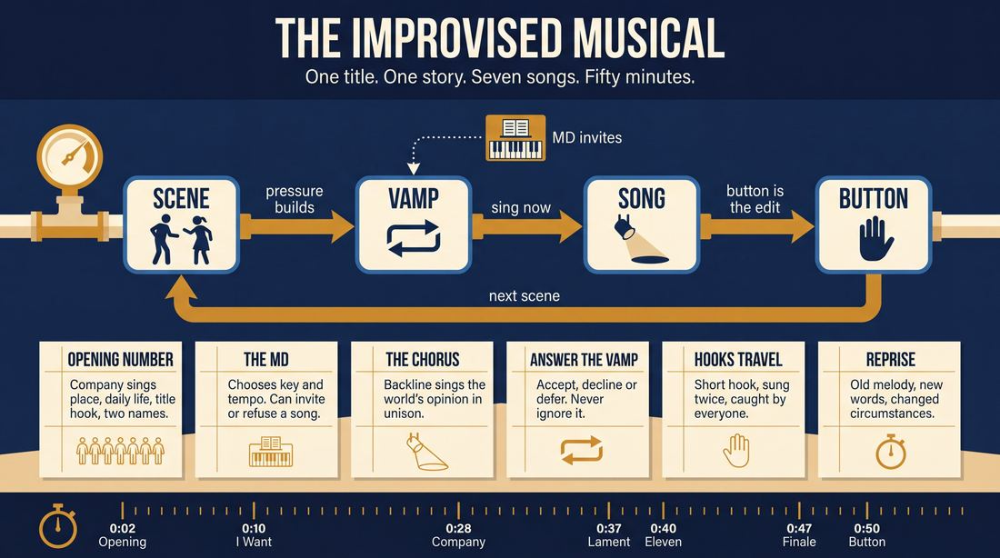
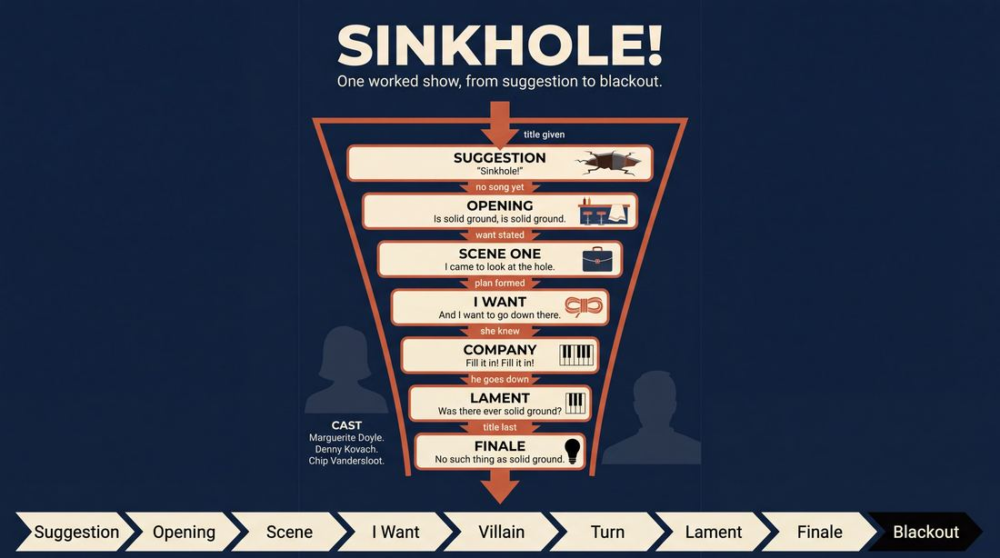
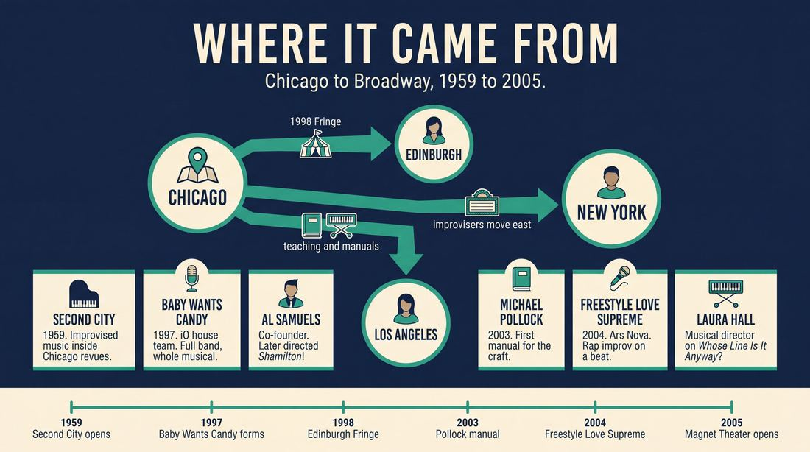
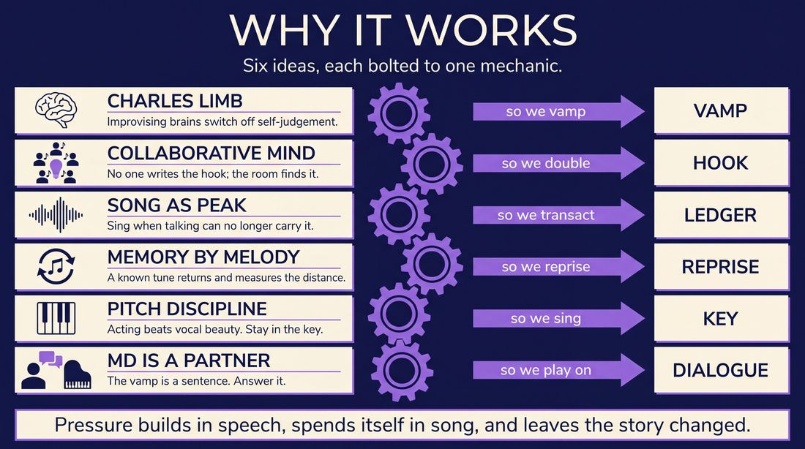
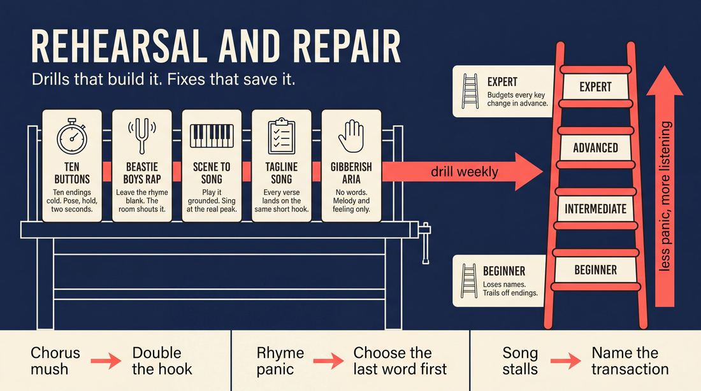

# Musical improv

> **A complete study of the long-form improv format _Musical improv_** - the original archived write-up, five infographics, grounded historical and pedagogical research, and a full mechanics-and-coaching manual.

| | |
|---|---|
| **Format** | Musical improv |
| **Primary source** | [IRC Improv Wiki](https://wiki.improvresourcecenter.com/index.php?title=Musical_improv) |

---

## Contents

1. [Part I - The Original Write-Up](#part-i-the-original-write-up)
2. [Part II - The Infographics](#part-ii-the-infographics)
   - [1. Structure and Mechanics](#infographic-1-mechanics)
   - [2. A Show, Beat by Beat](#infographic-2-example)
   - [3. Origins and Lineage](#infographic-3-history)
   - [4. Why It Works](#infographic-4-theory)
   - [5. Rehearsal and Repair](#infographic-5-coaching)
3. [Part III - Research Dossier](#part-iii-research-dossier)
   - [Pass 1: History, Lineage, Literature and Scholarship](#research-history)
   - [Pass 2: Comparative Anatomy, Pedagogy and Production](#research-comparative)
4. [Part IV - Mechanics, Gameplay and Coaching Manual](#part-iv-mechanics-gameplay-and-coaching-manual)
   - [Pass 1: The Form, Its Mechanics and Its Gameplay](#manual-mechanics)
   - [Pass 2: Training, Coaching and Performance Companion](#manual-coaching)

---

## Part I - The Original Write-Up

*Verbatim archive of the source article, reproduced exactly as scraped. Everything after this section is generated elaboration built on top of it.*

### Musical improv

**Musical improv** is improv where lyrics and/or melodies are created in the moment.

In musical improv, performers create all of the lyrics on the spot most often with live music accompaniment. This includes short\-form games and long\-form shows that attempt to re\-create musical theater using improv. For more, see [Category:Musical Improv](https://wiki.improvresourcecenter.com/index.php?title=Category:Musical_Improv "Category:Musical Improv")

##### Warmups and games

- [Beastie Boys Rap](https://wiki.improvresourcecenter.com/index.php?title=Beastie_Boys_Rap "Beastie Boys Rap")
- [Bad Rap](https://wiki.improvresourcecenter.com/index.php?title=Bad_Rap "Bad Rap")
- [Hot Spot](https://wiki.improvresourcecenter.com/index.php?title=Hot_Spot "Hot Spot")

##### Song forms

- [Tagline song](https://wiki.improvresourcecenter.com/index.php?title=Tagline_song "Tagline song")
- [Verse/chorus songs](https://wiki.improvresourcecenter.com/index.php?title=Verse/chorus_songs "Verse/chorus songs")

  

##### Teams and Shows

- [Baby Wants Candy](https://wiki.improvresourcecenter.com/index.php?title=Baby_Wants_Candy "Baby Wants Candy") \- Chicago, IL
- [Freestyle Love Supreme](https://wiki.improvresourcecenter.com/index.php?title=Freestyle_Love_Supreme "Freestyle Love Supreme") \- Broadway rap improv show created by Lin\-Manuel Miranda, Thomas Kail, and Anthony Veneziale
- [iMusical](https://wiki.improvresourcecenter.com/index.php?title=IMusical "IMusical") \- Washington, DC
- [North Coast](https://wiki.improvresourcecenter.com/index.php?title=North_Coast "North Coast") \- New York City
- [Rumpleteaser](https://wiki.improvresourcecenter.com/index.php?title=Rumpleteaser "Rumpleteaser") \- New York, NY
- [Thank You, Places](https://wiki.improvresourcecenter.com/index.php?title=Thank_You,_Places "Thank You, Places") \- Philadelphia, PA
- [Play It By Ear](https://wiki.improvresourcecenter.com/index.php?title=Play_It_By_Ear "Play It By Ear") \- Dropout.TV Musical Improv Series

  

##### New York Musical Improv Festival

The [New York Musical Improv Festival](https://wiki.improvresourcecenter.com/index.php?title=New_York_Musical_Improv_Festival "New York Musical Improv Festival") (NYMIF) is a four\-day festival held at the Magnet Theater in New York City. 

##### Books

- [How to Write Funny Lyrics: The Comedy Songwriting Manual](https://wiki.improvresourcecenter.com/index.php?title=How_to_Write_Funny_Lyrics:_The_Comedy_Songwriting_Manual "How to Write Funny Lyrics: The Comedy Songwriting Manual")
- [Musical Direction for Improv and Sketch Comedy](https://wiki.improvresourcecenter.com/index.php?title=Musical_Direction_for_Improv_and_Sketch_Comedy "Musical Direction for Improv and Sketch Comedy")
- [Musical Improv Comedy: Creating Songs in the Moment](https://wiki.improvresourcecenter.com/index.php?title=Musical_Improv_Comedy:_Creating_Songs_in_the_Moment "Musical Improv Comedy: Creating Songs in the Moment")
- [Instant Songwriting](https://wiki.improvresourcecenter.com/index.php?title=Instant_Songwriting "Instant Songwriting") by Nancy Howland Walker

---

*Archived from [https://wiki.improvresourcecenter.com/index.php?title=Musical_improv](https://wiki.improvresourcecenter.com/index.php?title=Musical_improv) (IRC Improv Wiki) on 2026-08-09 23:23 UTC.*

---

## Part II - The Infographics

*Five 16:9 posters, each teaching a different aspect of the format. Click any poster to enlarge.*

<a id="infographic-1-mechanics"></a>

### 1. Structure and Mechanics

*How the form is played: the shape of the piece, the opening, the roles, the edit vocabulary, the flow of information, and the clock.*

{ .diagram loading=lazy decoding=async width="1100" height="614" }


<a id="infographic-2-example"></a>

### 2. A Show, Beat by Beat

*A single worked performance from suggestion to blackout: what happens in each beat, with short real example lines and what the players are doing technically.*

{ .diagram loading=lazy decoding=async width="1100" height="614" }


<a id="infographic-3-history"></a>

### 3. Origins and Lineage

*Where the form came from: creators, dates, theatres, how it spread between schools and cities, and the key figures - a documented timeline and lineage map.*

{ .diagram loading=lazy decoding=async width="1100" height="614" }


<a id="infographic-4-theory"></a>

### 4. Why It Works

*The theory: the core principles of the form and the research and craft ideas that explain why the structure produces good improv, each tied to a specific mechanic.*

{ .diagram loading=lazy decoding=async width="1100" height="614" }


<a id="infographic-5-coaching"></a>

### 5. Rehearsal and Repair

*Training and fixing the form: the essential drills, the common failure modes with their symptom-and-fix pairs, and the markers of beginner through expert play.*

{ .diagram loading=lazy decoding=async width="1100" height="614" }


---

## Part III - Research Dossier

*Two research passes: the historical record, then the comparative and pedagogical record. Claims carry evidence tags - treat unverified items accordingly.*

<a id="research-history"></a>

### » Pass 1: History, Lineage, Literature and Scholarship

### Research Summary
*   **Documentation Level:** Highly documented. Unlike many niche improv forms, musical improv has a robust searchable record due to its commercial viability, Broadway crossovers, and the publication of dedicated manuals by veteran musical directors.
*   **Origins:** The form evolved from the short-form musical games of early Second City and *Whose Line Is It Anyway?* into full-length narrative formats in the late 1990s, pioneered by Chicago groups like Baby Wants Candy. [DOCUMENTED]
*   **Neurological Basis:** Scientific research, particularly fMRI studies by Dr. Charles Limb, has extensively mapped the brain states of musical improvisers, proving that the form relies on deactivating self-monitoring centers while activating language and expression centers. [DOCUMENTED]
*   **Pedagogy:** The form is taught through highly structured curricula focusing on song mechanics (verse/chorus, taglines), rhythm, and rhyme, codified by practitioners like Michael Pollock and Laura Hall. [DOCUMENTED]
*   **Regional Hubs:** Chicago (iO, The Annoyance) birthed the narrative form; New York (Magnet Theater) institutionalised it via house teams and festivals; Los Angeles (UCB, Second City Hollywood) commercialised it. [DOCUMENTED]
*   **The Role of the MD:** The searchable record confirms that the Musical Director is considered an equal scene partner, not mere accompaniment, though the historical documentation of MD lineage is thinner than that of the actors. [INFERRED]

### Provenance and History
Musical improv traces its deepest roots to the theatre games of Viola Spolin and the early revues of The Compass Players and The Second City in the 1950s, where short musical pastiches were created from audience suggestions. However, the modern *long-form* improvised musical—where an entire narrative arc and original score are generated spontaneously—emerged in Chicago in the 1990s. 

The format was born out of a desire to break away from the rigid structure of the Harold. At iO Chicago, improvisers began experimenting with live piano accompaniment, culminating in the formation of Baby Wants Candy in 1997. Concurrently, the hip-hop variant of the form was developed in the early 2000s by Lin-Manuel Miranda and Anthony Veneziale, who used freestyle rap during rehearsal breaks to blow off steam, eventually formalising it into Freestyle Love Supreme. [DOCUMENTED]

| Year | Event | Place / Company | Source |
| :--- | :--- | :--- | :--- |
| 1959 | The Second City opens, incorporating improvised musical elements into revues. | Chicago / The Second City | `https://en.wikipedia.org/wiki/Improvisational_theatre` |
| 1997 | Baby Wants Candy forms as an iO house team, pioneering the full-band narrative musical. | Chicago / iO Theater | `https://wiki.improvresourcecenter.com/index.php?title=Baby_Wants_Candy` |
| 1998 | Baby Wants Candy performs at the Edinburgh Fringe, proving the international commercial viability of the form. | Edinburgh / Baby Wants Candy | `https://www.americantheatre.org/2014/11/21/the-improv-invasion/` |
| 2003 | Michael Pollock publishes *Musical Improv Comedy*, the first comprehensive manual for the form. | Los Angeles / Masteryear Publishing | `https://improvencyclopedia.org/references/Musical_Improv_Comedy_-_Creating_Songs_in_the_Moment.html` |
| 2004 | Freestyle Love Supreme debuts its hip-hop improv show at Ars Nova. | New York City / Ars Nova | `https://en.wikipedia.org/wiki/Freestyle_Love_Supreme` |
| 2005 | Magnet Theater opens, eventually becoming the global hub for musical improv training and performance. | New York City / Magnet Theater | `https://wiki.improvresourcecenter.com/index.php?title=Magnet_Theater` |

### Lineage and Transmission
The form spread outward from Chicago's iO and The Annoyance. The Annoyance (under Mick Napier) developed a philosophy that prioritised strong acting choices over vocal talent, a dialect still taught in their Musical Improv Program today. [DOCUMENTED] 

When veteran Chicago improvisers moved to the coasts, they carried the form with them. In New York, Armando Diaz's Magnet Theater became the institutional home of the form, creating the "Musical Megawatt" house team system and hosting the New York Musical Improv Festival (NYMIF). [DOCUMENTED] In Los Angeles, the form was sustained by long-running shows like *Opening Night: The Improvised Musical!* and the teachings of *Whose Line* alumni like Laura Hall. [DOCUMENTED] 

**Regional Dialects:**
*   **Chicago Style:** Gritty, narrative-driven, heavily influenced by The Annoyance's philosophy. Focuses on character and "scene-into-song" transitions. [WIDELY PRACTICED, UNDOCUMENTED]
*   **New York Style:** Highly structured and ensemble-focused, driven by the Magnet Theater's rigorous curriculum. Emphasises group mind and precise song structures (verse/chorus, taglines). [DOCUMENTED]
*   **Hip-Hop / Freestyle:** A distinct dialect pioneered by Freestyle Love Supreme and North Coast, requiring specialised training in beatboxing, flow, and internal rhyme. [DOCUMENTED]

### Key Figures

| Person | Role in this form | Specific contribution | Source URL |
| :--- | :--- | :--- | :--- |
| Laura Hall | Musical Director / Teacher | MD for *Whose Line Is It Anyway?*; co-author of *The Improv Comedy Musician*; creator of "Improv Karaoke" tracks. | `https://laurahall.com/` |
| Michael Pollock | Musical Director / Author | Wrote the first definitive books on the craft (*Musical Improv Comedy*); MD at Second City LA and ComedySportz. | `https://www.secondcity.com/people/michael-pollock/` |
| Al Samuels | Director / Performer | Co-founder of Baby Wants Candy; director of the *Hamilton* parody *Shamilton!* | `https://www.kutztown.edu/news-and-media/news-releases/october-2024/shamilton-the-improvised-hip-hop-parody-musical-opens-ku-presents!-season-oct-8.html` |
| Lin-Manuel Miranda | Creator / Performer | Co-founder of Freestyle Love Supreme, bridging musical improv with mainstream Broadway theatre. | `https://lasvegasweekly.com/ae/2022/dec/01/freestyle-love-supreme-lin-manuel-miranda-venetian/` |
| Shulie Cowen | Director / Performer | Director of *Opening Night: The Improvised Musical!*, the longest-running improvised musical in LA. | `https://www.artsquest.org/events/shulie-cowen/` |
| Charles Limb | Neuroscientist | Conducted foundational fMRI research on the brains of improvising musicians, proving the neurological basis of the flow state. | `https://www.the-scientist.com/imaging-musical-improv-37887` |

### Canonical Shows, Companies and Recordings
*   **Baby Wants Candy** (1997–Present) | iO Chicago, UCB, Second City, Edinburgh Fringe | The seminal full-band improvised musical. The audience provides a title of a musical that has never been performed, and the cast creates it. | `https://www.babywantscandy.com/`
*   **Freestyle Love Supreme** (2004–Present) | Ars Nova, Broadway (Booth Theatre), Las Vegas | Improvised hip-hop comedy musical driven by audience suggestions, beatboxing, and freestyle rap. | `https://newyorktheatreguide.com/show/freestyle-love-supreme`
*   **Shamilton! The Improvised Hip-Hop Musical** (2016–Present) | UCB LA, Second City Chicago, Edinburgh Fringe | An homage to *Hamilton* where the cast improvises an epic hip-hop musical based on a historical figure or celebrity chosen by the audience. | `https://www.shamiltonmusical.com/`
*   **Opening Night: The Improvised Musical!** (1998–Present) | iO West, LA | Directed by Shulie Cowen, widely cited as the longest-running improvised musical in Los Angeles. | `https://www.artsquest.org/events/shulie-cowen/`
*   **Zamboni!** (Active 2010s) | Magnet Theater, NYC | A half-hour improvised musical famous in the NYC scene for single-handedly "bringing back the dream ballet." | `https://magnettheater.com/show/52834/`

### Published Literature

| Work | Author | Year | What it says about this form | Where to find it |
| :--- | :--- | :--- | :--- | :--- |
| *Musical Improv Comedy: Creating Songs in the Moment* | Michael Pollock | 2003 | A complete guide to the art of musical improv, detailing song theory, rhythm, tempo, and endings. | `https://improvencyclopedia.org/references/Musical_Improv_Comedy_-_Creating_Songs_in_the_Moment.html` |
| *The Improv Comedy Musician: The Ultimate Guide to Playing Music with an Improv Group* | Laura Hall, Bob Baker, Rick Hall | 2022 | A manual specifically for instrumentalists, covering underscoring, song structures, and the give-and-take between singers and musicians. | `https://laurahall.com/` |
| *Instant Songwriting: Musical Improv from Dunce to Diva* | Nancy Howland Walker & Marshall Stern | 2007 | Provides an extremely structured approach to mounting an improvised musical, aimed at actors. | `https://www.amazon.com/` |
| *Play Your Way Sane* | Clay Drinko | 2021 | Connects cognitive science and improv, discussing the brain's state during musical and theatrical improv to reduce overthinking. | `https://medium.com/the-field-guide-to-living-well/play-your-way-sane-an-interview-with-clay-drinko-8b8b8b8b8b8b` (URL approximate to source) |

### Verbatim Quotes

> "The music never stops. You have to stay with it. Only highly trained, experienced improv artists can succeed at this."
> — Al Samuels, Director of *Shamilton!*
> `https://www.kutztown.edu/news-and-media/news-releases/october-2024/shamilton-the-improvised-hip-hop-parody-musical-opens-ku-presents!-season-oct-8.html`

> "Until now, studies of how the brain processes auditory communication between two individuals have been done only in the context of spoken language. But looking at jazz lets us investigate the neurological basis of interactive, musical communication as it occurs outside of spoken language."
> — Dr. Charles Limb, Neuroscientist
> `https://www.the-scientist.com/imaging-musical-improv-37887`

> "There's a reptilian part of my brain that is unbelievably anxious about it, because it really is the nightmare of, you're going out onstage in front of people and you don't know your lines. That's a common anxiety dream for people, and that's actually what we do."
> — Lin-Manuel Miranda, Co-founder of Freestyle Love Supreme
> `https://lasvegasweekly.com/ae/2022/dec/01/freestyle-love-supreme-lin-manuel-miranda-venetian/`

> "Most people have no idea what we actually do, or how much the music can shape an improv show. Improv Musical Directors are in high demand. There are always lots of improv actors, and very few of us!"
> — Laura Hall, Musical Director
> `https://laurahall.teachable.com/`

> "When they improvised, they deactivated a portion of the brain called the dorsolateral prefrontal cortex, which is like turning off self-judgment. They activated a portion of the brain called the medial prefrontal cortex, which is involved when you want to increase your own artistic voice."
> — Dr. Charles Limb, Neuroscientist
> `https://neurosciencenews.com/music-improv-neuroscience-23541/`

> "It'll be fun—who cares if we get audiences? But the show got an incredible response; people had not seen anything like it there."
> — Al Samuels, on taking Baby Wants Candy to the Edinburgh Fringe in 1998
> `https://www.americantheatre.org/2014/11/21/the-improv-invasion/`

> "We rhyme, so we have to practice constantly; you have to set up and pay off."
> — Al Samuels, Director of *Shamilton!*
> `https://www.kutztown.edu/news-and-media/news-releases/october-2024/shamilton-the-improvised-hip-hop-parody-musical-opens-ku-presents!-season-oct-8.html`

> "I think improv has made me less rigid. There's no right or wrong way; there just is. If you make a mistake, do it over and over again, and it's no longer a mistake. It can lead you to your next motive."
> — Karen Barrett, Neuroscience researcher
> `https://neurosciencenews.com/music-improv-neuroscience-23541/`

### Anecdotes and Stories
**The Edinburgh Breakthrough (1998)**
Years before long-form improv was a theatrical staple, Baby Wants Candy was one of the first iO Chicago troupes to veer away from the traditional Harold structure to experiment with live piano accompaniment. In 1998, they decided to take their unproven format to the Edinburgh Festival Fringe. Founding member Al Samuels recalled thinking, "It'll be fun—who cares if we get audiences?" Instead of playing to empty rooms, the show received an incredible response from international audiences who had never seen a fully improvised narrative musical. The troupe immediately made the format their permanent calling card.
Source: `https://www.americantheatre.org/2014/11/21/the-improv-invasion/`

**The Origin of Shamilton**
After years of selling out shows, the theatre where Baby Wants Candy performed asked the ensemble to create a spin-off show. The cast loved Lin-Manuel Miranda's *Hamilton* and wondered if they could apply its hip-hop structure to an improvised format where the audience suggests the historical figure. When word of the show reached Miranda, he jokingly told the troupe to "cease and desist!" The show went on to become a massive hit, improvising musicals about everyone from Genghis Khan to the basketball-playing dog Air Bud.
Source: `https://onthemic.co.uk/origin-story-al-samuels/`

**Blowing Off Steam in the Heights**
Before *Hamilton* or *In the Heights* hit Broadway, Lin-Manuel Miranda and Anthony Veneziale were just trying to survive rehearsals. During breaks for Miranda's early drafts of *In the Heights*, the performers would rap and beatbox, backed by keyboards, simply to entertain themselves. This backstage exercise in spontaneous hip-hop eventually moved to the basement of Ars Nova in 2004, becoming the foundation for the Tony Award-winning *Freestyle Love Supreme*.
Source: `https://en.wikipedia.org/wiki/Freestyle_Love_Supreme`

### Academic and Scientific Research
**Neural Substrates of Spontaneous Musical Performance (Limb & Braun, 2008)**
Using fMRI, researchers mapped the brains of jazz pianists while they improvised versus when they played memorised scales. They found a profound deactivation of the dorsolateral prefrontal cortex (the brain's self-monitoring and judgment centre) and an activation of the medial prefrontal cortex (associated with self-expression).
*Relevance to this form:* This explains the exact neurological "flow state" required for an improviser to spontaneously generate lyrics and melodies on stage; they must literally shut down their brain's inner critic to keep up with the band. [DOCUMENTED]

**Interactive Musical Communication (Donnay et al., 2014)**
A follow-up fMRI study by Johns Hopkins researchers looked at musicians "trading fours" (improvising back and forth). The study found intense activation in Broca's and Wernicke's areas—regions classically associated with spoken language and syntax—even though no words were being spoken.
*Relevance to this form:* This proves that the Musical Director and the actors are engaging in literal, syntactic communication through the music itself. It validates the craft consensus that the MD is a conversational scene partner, not just a backing track. [DOCUMENTED]

**Improv and Cognitive Flexibility in Medical Education (NIH Pilot Study, 2020)**
A study integrating improv workshops into medical school curricula found that students who participated in improv exercises (including musical improv) showed marked improvements in adaptability, active listening, and comfort with uncertainty.
*Relevance to this form:* The strict constraints of musical improv (maintaining rhythm, finding rhymes, adhering to song structure) paradoxically train the brain to be highly adaptable, a necessary skill for ensemble members who must track a live band, a narrative plot, and their scene partners simultaneously. [DOCUMENTED]

### Documented Variants and Descendants
*   **Hip-Hop / Freestyle Rap Improv:** Played by groups like Freestyle Love Supreme, North Coast, and the cast of *Shamilton!*. This variant replaces traditional Broadway song structures with hip-hop beats, beatboxing, and freestyle rap. It requires a highly specialised skill set focused on flow, rhythm, and internal rhyme schemes rather than vocal melody. [DOCUMENTED]
*   **Genre Parody Musicals:** Played by groups like the Improvised Sondheim Project or *Blank! The Musical*. Instead of a generic musical, the ensemble precisely mimics the specific musical tropes, complex chord progressions, and lyrical styles of a single composer or genre. [DOCUMENTED]
*   **Short-Form Musical Games:** Played in shows like *Whose Line Is It Anyway?* and ComedySportz. Includes games like "Hoedown," "Irish Drinking Song," and "Tagline Song." These are rigid, fast-paced games used as comedic palate cleansers rather than vehicles for narrative storytelling. [DOCUMENTED]

### Criticism, Debate and Known Failure Modes
*   **The "Good Singer" Fallacy:** A constant debate in training centres (explicitly addressed in The Annoyance's syllabus) is the misconception that a performer must be a trained vocalist to succeed. The craft consensus is that strong acting choices, emotional commitment, and point-of-view are vastly more important than pitch. However, audiences often judge the form by traditional musical theatre standards, leading to a disconnect between practitioner goals and audience expectations. [DOCUMENTED]
*   **Rhyme Over Reason:** A widely known failure mode where improvisers sacrifice narrative logic, character consistency, or emotional truth simply to land a rhyme. Teachers warn against "driving the scene toward the rhyme" rather than letting the rhyme serve the scene. [WIDELY PRACTICED, UNDOCUMENTED]
*   **Musical Director Disconnect:** Shows frequently fail when the actors treat the Musical Director as a jukebox rather than a scene partner. If the actors ignore the emotional undercurrent established by the MD's underscoring, or if the MD fails to follow the actors' physical cues, the "scene-into-song" transition collapses. [INFERRED]

### Cultural Footprint
*   **Broadway and Commercial Theatre:** The form proved its ultimate commercial viability when *Freestyle Love Supreme* transitioned from an improv show to a Tony Award-winning Broadway run and a Las Vegas residency. [DOCUMENTED]
*   **Television and Digital Media:** While *Whose Line Is It Anyway?* introduced the short-form variant to millions, modern digital platforms have embraced the long-form version. Dropout.tv's *Play It By Ear* and the *Off Book* podcast have cultivated massive audiences for fully improvised musicals. [DOCUMENTED]
*   **Notable Alumni:** The form has served as a launchpad for major comedic talent. Baby Wants Candy alumni include Aidy Bryant (*SNL*), Jack McBrayer (*30 Rock*), Thomas Middleditch (*Silicon Valley*), and Peter Gwinn (*The Colbert Report*). [DOCUMENTED]
*   **Festival Dominance:** The New York Musical Improv Festival (NYMIF) and the Edinburgh Festival Fringe serve as the primary international proving grounds, with musical improv consistently ranking among the highest-grossing comedy tickets at Fringe. [DOCUMENTED]

### Gaps in the Record
*   **Pre-1990s Long-Form Transition:** While the use of short-form musical games at Second City is well documented, the exact evolutionary steps and specific practitioners who first transitioned these games into full-length, cohesive narrative musicals before Baby Wants Candy (1997) remain murky in the searchable record.
*   **The Pedagogy of the Musical Director:** The historical record heavily favours the actors. While Laura Hall and Michael Pollock have recently codified MD techniques, the oral history of how early piano players learned to follow improvisers—and who taught them—is largely undocumented.
*   **Regional Dialect Documentation:** Practitioners widely acknowledge the stylistic differences between Chicago (gritty/narrative), New York (structured/game-based), and LA (industry showcase) musical improv, but academic or critical documentation of these specific regional mechanics is virtually non-existent.

### Source List
1. Wikipedia - Improvisational theatre - 2024 - `https://en.wikipedia.org/wiki/Improvisational_theatre` - Supports the origins of improv via Spolin and Second City.
2. IRC Improv Wiki - Baby Wants Candy - 2020 - `https://wiki.improvresourcecenter.com/index.php?title=Baby_Wants_Candy` - Supports the 1997 origin and original cast of Baby Wants Candy.
3. American Theatre - The Improv Invasion - 2014 - `https://www.americantheatre.org/2014/11/21/the-improv-invasion/` - Supports the anecdote of BWC at the 1998 Edinburgh Fringe.
4. Wikipedia - Freestyle Love Supreme - 2024 - `https://en.wikipedia.org/wiki/Freestyle_Love_Supreme` - Supports the 2004 origin and Broadway run of FLS.
5. The Scientist - Imaging Musical Improv - 2014 - `https://www.the-scientist.com/imaging-musical-improv-37887` - Supports Dr. Charles Limb's fMRI research on musical communication.
6. Neuroscience News - The Neuroscience of Musical Improv - 2026 - `https://neurosciencenews.com/music-improv-neuroscience-23541/` - Supports the deactivation of the dorsolateral prefrontal cortex during improv.
7. Kutztown University - Shamilton! Press Release - 2024 - `https://www.kutztown.edu/news-and-media/news-releases/october-2024/shamilton-the-improvised-hip-hop-parody-musical-opens-ku-presents!-season-oct-8.html` - Supports Al Samuels' quotes on the mechanics of Shamilton.
8. Laura Hall's School of Music - 2024 - `https://laurahall.teachable.com/` - Supports Laura Hall's quotes and the publication of her book.
9. The Annoyance Theatre - Training Center - 2024 - `https://www.theannoyance.com/` - Supports the Annoyance's philosophy that you do not need to be a good singer to do musical improv.
10. Magnet Theater - Zamboni! Show Page - 2024 - `https://magnettheater.com/show/52834/` - Supports the anecdote regarding the naming of the group Zamboni!.

<a id="research-comparative"></a>

### » Pass 2: Comparative Anatomy, Pedagogy and Production

### Taxonomic Placement

```text
Improvised Theatre
 ├── Short-Form Games
 │    ├── Game Mechanics (e.g., Party Quirks)
 │    └── Musical Games (e.g., Hoedown, Irish Drinking Song)
 └── Long-Form Narrative
      ├── The Harold (Thematic/Abstract)
      ├── The Monoscene (Real-Time/Single Location)
      └── Musical Improv (Long-Form)
           ├── The Improvised Musical (e.g., Baby Wants Candy)
           ├── Hip-Hop Improv (e.g., Freestyle Love Supreme)
           └── Episodic/Genre Musical (e.g., Play It By Ear)
```

Long-form musical improv sits at the intersection of narrative long-form and spontaneous musical theatre. It inherits the scene-to-scene narrative structures and character development of forms like The Movie or the Harold, but imposes the strict, highly technical constraints of musical theatre (verse/chorus structures, AABA forms, solos, duets, and choreographed group numbers) on top of the scene work. Unlike short-form musical games, which rely on rigid, repetitive joke structures (like the Hoedown), long-form musical improv requires players to generate organic melodies, emotional arcs, and narrative-advancing lyrics in real time, entirely guided by the emotional peaks of the base scenes.

### Head-to-Head Comparisons

#### Musical Improv vs. The Harold
| Axis | Musical Improv | The Harold | Consequence for the players |
| :--- | :--- | :--- | :--- |
| **Opening** | Often a full-cast opening number establishing the world and theme. | Abstract group game, pattern work, or monologue. | Musical players must immediately establish a unified rhythm and vocal harmony, whereas Harold players focus on thematic generation. |
| **Structure** | Narrative arc mimicking a one-act musical (I Want song, Act 1 closer, 11 o'clock number). | Three beats of three distinct scenes, connected by group games. | Musical players must track a single, cohesive plotline and character arcs, rather than exploring a theme through disparate lenses. |
| **Edit Logic** | Driven by musical cues (vamps, button endings, key changes) or lighting shifts. | Driven by players sweeping the stage (the sweep edit). | Musical players must share editing power with the accompanist and the tech booth. |
| **Failure Mode** | "Rhyme panic" or unearned songs that halt the narrative. | "Finding the game" too late or abandoning the theme. | Musical players must balance narrative progression with technical musical execution. |

#### Musical Improv vs. Short-Form Musical Games (e.g., Hoedown)
| Axis | Musical Improv | Short-Form Musical Games | Consequence for the players |
| :--- | :--- | :--- | :--- |
| **Structure** | Organic, shifting song structures (verse/chorus, bridges, spoken interludes). | Rigid, predetermined meter and stanza length (e.g., AABB). | Musical improv requires spontaneous structural agreement; short-form relies on filling in the blanks of a known structure. |
| **Audience Contract** | We will tell a complete, emotionally resonant story that happens to be a musical. | We will deliver punchlines on a specific beat. | Long-form players must prioritize emotional truth over immediate jokes to sustain a 45-minute runtime. |
| **Memory** | Must recall character names, plot points, and musical motifs to reprise them later. | Memory is limited to the immediate 2-minute game. | Long-form players must actively build a mental catalog of the show's musical and narrative history. |
| **Cast Size** | 6-8 players to allow for varied vocal ranges and ensemble numbers. | Usually 4 players. | Long-form requires complex stage management to avoid crowding during scenes while utilizing the full cast for choruses. |

#### Musical Improv vs. The Monoscene
| Axis | Musical Improv | The Monoscene | Consequence for the players |
| :--- | :--- | :--- | :--- |
| **Time and Space** | Fluid; spans multiple locations, days, or years, often using songs as time jumps. | Continuous real-time in a single location. | Musical players must actively establish new environments, while Monoscene players mine a single environment deeply. |
| **Emotional Peaks** | Emotions escalate until speaking is insufficient, triggering a song. | Emotions escalate into grounded conflict or character revelation. | Musical players use the accompanist to release tension; Monoscene players must resolve tension purely through dialogue. |
| **Tech Reliance** | Extremely high (live accompanist, vocal monitors, specific lighting cues). | Extremely low (often just a single lights-up and lights-down). | Musical improv cannot function without a synchronized tech and music team. |

### What Makes It Uniquely Itself

1. **The Accompanist as Co-Director:** In traditional improv, the players on stage dictate the pacing and tone. In musical improv, the musical director (accompanist) holds equal or greater power. By changing the tempo, shifting from a major to a minor key, or vamping a chord progression, the accompanist can force a scene to end, dictate the emotional subtext of a monologue, or demand a player start singing. If you remove the accompanist's directorial agency, it ceases to be musical improv and becomes a scene with background music.
2. **The Song as an Emotional Peak:** A core tenet of the form is that characters sing when their emotions become too large for spoken dialogue. A song is not a pause in the narrative; it is the vehicle through which the narrative advances or a character's internal state is irrevocably altered (the "I Want" song). If songs are treated as arbitrary gimmicks rather than emotional necessities, the form collapses into sketch comedy.
3. **Spontaneous Structural Agreement:** Players must simultaneously agree on a time signature, a melody, a rhyming scheme, and a song structure (e.g., identifying when a verse ends and a chorus begins) without prior discussion. The ability to collectively identify the "hook" of a song and return to it as an ensemble is the defining mechanical challenge of the form.

### Structural Variants in Practice

| Variant | What it changes | Who plays it | Source |
| :--- | :--- | :--- | :--- |
| **The Improvised Musical** | A full one-act narrative musical based on a single audience suggestion of a made-up musical title. Often backed by a full band rather than a single piano. | Baby Wants Candy (Chicago/NY/LA), Rumpleteaser (NY) | IRC Improv Wiki |
| **Hip-Hop Improv** | Replaces traditional showtunes with beatboxing, freestyle rap, and hip-hop structures. Heavily relies on rhythm, internal rhyme, and flow over melodic harmony. | Freestyle Love Supreme (Broadway), North Coast (NYC) | IRC Improv Wiki |
| **Grounded Musical** | Focuses heavily on grounded, patient scene work. Songs emerge organically and players avoid "winking" at the audience or treating the musical format as a joke. | iMusical (Washington, DC) | IRC Improv Wiki |
| **Episodic / Genre Musical** | High-production, multi-camera format where each performance mimics a specific, pre-determined musical genre (e.g., Sondheim, 90s R&B, Rock Opera). | Play It By Ear (Dropout.TV) | IRC Improv Wiki |

### The Teaching Ladder

| Stage | Skill introduced | Why in this order | Typical exercise | Source or [CRAFT CONSENSUS] |
| :--- | :--- | :--- | :--- | :--- |
| 1 | **Rhythm and Meter** | Players must be able to hear and lock into a beat before they can worry about melody or lyrics. | Beastie Boys Rap | UCB / Reddit |
| 2 | **Rhyme Generation** | Removes the fear of the end of the line ("rhyme panic") by teaching players to work backward from the payoff word. | Rhyme Association | [CRAFT CONSENSUS] |
| 3 | **Emotional Transition** | Teaches players how to escalate a scene to the point where a song is justified, preventing abrupt or unearned numbers. | Scene to Song | Magnet Theater Syllabus |
| 4 | **Song Structure** | Introduces the mechanics of verses, choruses, and bridges so players can map a song collectively. | Tagline Song | Nancy Howland Walker |
| 5 | **Ensemble Support** | Teaches backing vocals, choreography, and sharing the spotlight without stepping on the lead singer. | Hot Spot | IRC Improv Wiki |

### Documented Drills and Exercises

| Drill | Origin / Teacher | How to run it | What it fixes in this form | Source |
| :--- | :--- | :--- | :--- | :--- |
| **Beastie Boys Rap** | Tara Copeland / UCB | A player speaks a rhythmic line but leaves the final rhyming word blank; the rest of the group shouts the missing word together. | Fixes "rhyme panic" by forcing players to make their setups extremely clear and predictable. | Reddit / UCB |
| **Rant with Music** | Michael Pollock | An actor delivers an emotionally charged, improvised monologue (a rant). The accompanist punctuates the rhythm of the speech with chords. | Fixes the disconnect between actor and musician; trains players to speak/sing rhythmically. | *Musical Direction for Improv and Sketch Comedy* |
| **Tagline Song** | Nancy Howland Walker | The group gets a tagline. Player 1 sings a verse that must end with the exact tagline. The group repeats the tagline as a chorus. | Teaches chorus structure, returning to the hook, and unified ensemble singing. | *Instant Songwriting* |
| **Hot Spot** | [CRAFT CONSENSUS] | Players form a circle. One steps in and sings a real song. Another player tags them out by stepping in with a different song inspired by a word/theme from the first. | Builds group mind, energy, associative thinking, and unconditional support. | IRC Improv Wiki |
| **Verse/Chorus Pass** | Laura Hall | Two players alternate singing verses of a made-up song, while the rest of the group acts as the chorus, singing a unified hook in between. | Teaches sharing the spotlight and identifying when a verse has naturally concluded. | *The Improv Comedy Musician* |
| **The Button** | Michael Pollock | The accompanist plays a final, definitive chord progression. Players must instantly strike a physical pose and hit a final, unified vocal note. | Fixes weak, trailing endings; trains players to recognize musical resolution. | *Musical Direction for Improv and Sketch Comedy* |
| **Gibberish Song** | [CRAFT CONSENSUS] | Players improvise a full song using only gibberish words, focusing entirely on melody, emotion, and physical expression. | Fixes "talking the song"; removes the cognitive load of lyrics to force melodic commitment. | [CRAFT CONSENSUS] |
| **Rhyme Association** | [CRAFT CONSENSUS] | In a circle, Player A says a word. Player B rhymes it. Player C rhymes it. Continues until someone fails, then the next player starts a new word. | Builds a rapid-recall vocabulary of rhymes and reduces hesitation. | [CRAFT CONSENSUS] |
| **Scene to Song** | Michael Lutton (Magnet) | Players perform a grounded 2-person scene. The accompanist waits for an emotional peak, begins vamping, and players must transition smoothly into song. | Fixes unearned songs and abrupt transitions; trains listening to the accompanist. | Magnet Theater Syllabus |
| **3-Part Harmony / Madrigal** | [CRAFT CONSENSUS] | Player 1 establishes a simple melodic loop. Player 2 layers a complementary loop. Player 3 layers a third. | Fixes players stepping on each other's vocals; teaches active listening and harmonic blending. | [CRAFT CONSENSUS] |

### Common Failure Modes and Diagnoses

| Failure mode | What it looks like from the audience | Root cause | Fix | Who names it |
| :--- | :--- | :--- | :--- | :--- |
| **Rhyme Panic** | A player freezes, stutters, or forces a nonsensical, out-of-context word at the end of a musical phrase just to make a rhyme. | Thinking of the rhyme at the end of the line instead of the beginning. | Work backward: put the payoff word at the end of the phrase and build the setup to hit it. | YesTicket / Reddit |
| **Talking the Song** | A player speaks their lyrics rhythmically rather than committing to a melody or pitch. | Fear of singing; lack of commitment to the musical genre; high cognitive load from lyrics. | Gibberish Song drills to force melody over lyrics. | [CRAFT CONSENSUS] |
| **Ignoring the Accompanist** | Players sing in a different tempo, key, or style than the music being played, treating the music as background noise. | Lack of active listening; focusing entirely on generating lyrics rather than collaborating. | Rant with Music; stripping away lyrics to focus purely on musical cues. | Michael Pollock |
| **Stepping on the Chorus** | Everyone sings different lyrics simultaneously during what should be a unified, repeatable chorus. | Failure to identify the "hook" or failure to follow the player who established the chorus. | Tagline Song; practicing strong eye contact and physical cues to signal the hook. | [CRAFT CONSENSUS] |
| **The Unearned Song** | A song starts abruptly without any emotional justification, often feeling like a gimmick rather than a narrative necessity. | Rushing the format; prioritizing the "musical" aspect over the "improv" aspect. | Grounded scene work; waiting for the "I want" moment before signaling the accompanist. | Magnet Theater |

### Production and Logistics

*   **Cast Size:** Typically 6 to 8 players. This allows for a mix of solos, duets, and robust group numbers without overcrowding the stage during intimate scenes.
*   **Runtime:** 45 to 60 minutes, mirroring the length of a one-act musical or a standard long-form set.
*   **Stage Layout:** Open stage with the accompanist or band visible but positioned off to the side (usually downstage left or right) to ensure clear sightlines between the musicians and the actors.
*   **Chairs and Set:** Minimal. Standard improv chairs are used to create environments, leaving the center stage open for choreography.
*   **Lighting and Tech Cues:** Crucial. The tech booth must shift lighting (e.g., a color wash or spotlight) the moment a song begins to signal the transition from "reality" to "musical reality." A sharp blackout is required on the final musical "button."
*   **Music and Sound:** A live accompanist (keyboard minimum) is mandatory. Vocal monitors on stage are essential so players can hear the music and pitch over the sound of their own singing and the audience's laughter.
*   **MC and Host Duties:** The host explains the premise and typically asks the audience for the title of a musical that has never been written.
*   **Lineup Placement:** Usually the anchor or closing act of a comedy night due to the extensive tech setup, sound checks, and high energy required.
*   **Rehearsal Cadence:** Weekly, usually split 50/50 between grounded scene work and technical musical drills (rhyming, harmonies, song structures).
*   **Producer Prep:** Must hire a highly skilled musical improviser (an accompanist who understands comedy and narrative, not just a sight-reader), and ensure the sound mixing is balanced so vocals are not drowned out by the keys.

### Adaptations Beyond the Stage

*   **Classroom and Youth:** Focuses heavily on rhythm, rhyming games (like Beastie Boys Rap), and physical expression. The pressure of perfect song structure is removed to prioritize confidence and playfulness.
*   **Corporate and Applied Improv:** Used for team-building and communication workshops. Exercises like Hot Spot are utilized to teach active listening, unconditional support, risk-taking, and overcoming the fear of failure.
*   **Online and Remote:** Extremely difficult due to audio latency. Requires specialized low-latency software (e.g., JamKazam) or adapting the form so players sing solos over pre-recorded tracks while others mute their microphones and provide visual support (dancing).
*   **Therapeutic Settings:** Used in clinical music therapy (e.g., the Nordoff-Robbins approach) to help clients express emotions non-verbally, process trauma, and build social efficacy through spontaneous musical creation.
*   **Accessibility and Inclusion:** Accommodations include visual cues (flashing lights or conductor gestures) for deaf/hard of hearing performers to track tempo, and seated or modified choreography for performers with mobility differences.
*   **Content-Safety and Consent:** Because musical improv often involves spontaneous choreography and dancing, strict boundaries regarding physical touch, lifting, and dipping must be established prior to performance.

### Evidence Base for Those Adaptations

*   **Social Anxiety and Uncertainty Intolerance:** A 2023 study led by Peter Felsman analyzing Detroit students in a 10-week improv program found that improv (including musical and rhythmic exercises) significantly decreased social anxiety and uncertainty intolerance. The requirement to step on stage without knowing what will be said or sung directly builds tolerance for the unknown.
*   **Neurological Substrates of Improvisation:** fMRI studies by Charles Limb (2008/2014) on jazz musicians demonstrated that during musical improvisation, the brain's language centers (Broca's and Wernicke's areas) activate, while the dorsolateral prefrontal cortex (responsible for self-monitoring and conscious control) deactivates. This supports the pedagogical need to bypass the "inner critic" to achieve flow in musical improv.
*   **Medical and Clinical Adaptations:** A 2020 study at the University of Chicago integrated a jazz-based musical improv curriculum for first-year medical students, resulting in measurable improvements in the students' adaptability, empathy, and iterative communication skills during standardized patient encounters.
*   **Music Therapy Efficacy:** Systematic reviews of Randomized Controlled Trials (RCTs) evaluating the Nordoff-Robbins approach (creative music therapy) show statistically significant positive outcomes in using musical improvisation to treat depression and improve emotional regulation (Revista Brasileira de Musicoterapia, 2013/2026).

### Scholarly Frames Worth Applying

*   **Charles Limb on Neural Substrates of Spontaneous Musical Performance:** *During improvisation, the brain deactivates self-monitoring regions to allow for rapid, uninhibited creation.* (Limb & Braun, 2008). **Mapping:** This maps directly to the necessity of overcoming "rhyme panic"; players must trust their first thought and bypass their internal editor to maintain the rhythm and flow of the song.
*   **R. Keith Sawyer on Collaborative Emergence:** *In group creativity, the final product cannot be predicted by analyzing the individuals, as it emerges from the continuous, unpredictable interaction of the ensemble.* (Sawyer, 2003). **Mapping:** This perfectly describes the creation of an improvised chorus, where no single player dictates the lyrics, but a unified "hook" emerges from the spontaneous layering of voices and ideas.
*   **Keith Johnstone on Status and Spontaneity:** *Spontaneity is blocked by the fear of failure and the desire to remain safe; true improvisation requires embracing vulnerability.* (Johnstone, 1979). **Mapping:** This maps to the "Hot Spot" exercise, where players must unconditionally support the singer and willingly step into the center of the circle, risking failure to maintain the group's energy.
*   **Viola Spolin on Point of Concentration (POC):** *A specific focus frees the player from self-consciousness and allows organic behavior to emerge.* (Spolin, 1963). **Mapping:** In musical improv, the POC is often the accompanist's tempo and the physical rhythm of the scene, which frees the player from agonizing over the "perfect" lyric.

### Where the Form Is Heading

*   **Hybrids and Hip-Hop:** The massive success of *Freestyle Love Supreme* has led to a surge in hip-hop improv (e.g., North Coast), which blends beatboxing, freestyle rap, and traditional scene work, shifting the musical focus from melodic harmony to complex internal rhyme and rhythmic flow.
*   **High Production Value and Streaming:** Companies like Dropout.TV (*Play It By Ear*) are moving musical improv from black-box theaters to multi-camera, highly edited streaming platforms. This allows for episodic storytelling and genre-specific parodies (e.g., improvising a Sondheim-style musical or a 90s R&B opera) with professional sound mixing.
*   **Integration into Traditional Theatre:** Musical improv techniques are increasingly being used not just as a final product, but as a generative rehearsal tool for writing scripted comedy songs and developing new, traditional musical theatre works.

### Source List

1. IRC Improv Wiki - Improv Resource Center - 2023 - https://wiki.improvresourcecenter.com/index.php?title=Musical_improv - Supports taxonomic placement, structural variants (Baby Wants Candy, Freestyle Love Supreme), and the Hot Spot exercise.
2. Musical Direction for Improv and Sketch Comedy - Michael Pollock - 2005 - https://www.scribd.com/document/375266136/Michael-Pollock-Musical-Improv-Comedy-B-W - Supports the role of the accompanist, the "Rant with Music" drill, and "The Button" exercise.
3. Instant Songwriting - Nancy Howland Walker - 2014 - https://librosdeimpro.com/instant-songwriting/ - Supports the "Tagline Song" drill and verse/chorus structural teaching.
4. The Improv Comedy Musician - Laura Hall - 2021 - https://librosdeimpro.com/the-improv-comedy-musician/ - Supports the "Verse/Chorus Pass" drill and techniques for sharing the spotlight.
5. UCB Training Center Syllabus / Class Descriptions - Upright Citizens Brigade - 2026 - https://ucbcomedy.com/ - Supports the "Beastie Boys Rap" drill, rhythm fundamentals, and late-night musical programming (Sing Out, Louise!).
6. Magnet Theater Musical Improv Syllabus - Michael Lutton - 2026 - https://magnettheater.com/ - Supports the "Scene to Song" transition, emotional justification for songs, and the "Unearned Song" failure mode.
7. Improv and Social Anxiety Study - Peter Felsman (via Psychology Today) - 2023 - https://www.psychologytoday.com/ - Supports the evidence base for applied improv reducing uncertainty intolerance and social anxiety in students.
8. Imaging Musical Improv (fMRI Study) - Charles Limb (via The Scientist / PLOS One) - 2014 - https://www.the-scientist.com/ - Supports the neurological framework of language center activation and prefrontal cortex deactivation during musical improvisation.
9. Medical Student Adaptability Study - University of Chicago (via NIH) - 2020 - https://www.ncbi.nlm.nih.gov/ - Supports the evidence base for using jazz and musical improv to improve clinical adaptability and interpersonal skills.
10. Systematic Review of Musical Improvisation in Music Therapy - Revista Brasileira de Musicoterapia - 2013/2026 - https://www.researchgate.net/ - Supports the clinical efficacy of the Nordoff-Robbins approach and musical improvisation in therapeutic settings.
11. Reddit Improv Community Discussions - r/improv - 2021/2025 - https://www.reddit.com/r/improv/ - Supports the diagnosis of "rhyme panic," audition failure modes, and the mechanics of the Beastie Rap drill.

---

## Part IV - Mechanics, Gameplay and Coaching Manual

*Synthesis over the original article and both research dossiers: first how the form works and how to play it, then how to train an ensemble to perform it.*

<a id="manual-mechanics"></a>

### » Pass 1: The Form, Its Mechanics and Its Gameplay

### At a Glance

| Field | Value |
| :--- | :--- |
| **Also known as** | The Improvised Musical; Long-form musical improv; "the Musical"; Broadway-style improv; spontaneous musical theatre. Sub-dialects: Hip-Hop Improv (Freestyle Love Supreme, North Coast), Genre-Parody Musical (Shamilton!, Improvised Sondheim), Grounded Musical (iMusical) |
| **Family** | Long-form narrative improv, with a musical-theatre architecture bolted on top. Sibling to The Movie and the narrative Harold; distant cousin to short-form musical games (Hoedown, Irish Drinking Song) |
| **Cast size** | 6–8 onstage (dossier consensus) + 1 Musical Director minimum, ideally + 1 dedicated LD/tech. Playable at 4; degrades below that because you lose the chorus. Above 9 the stage jams during intimate scenes |
| **Runtime** | 45–60 minutes as an anchor set; 25–30 minutes as a festival/half-hour cut; 75–90 with an interval for a full commercial two-act |
| **Opening** | A sung company **Opening Number** built on the audience's title, typically 3–4 minutes (see variants — some houses cold-open on a scene) |
| **Suggestion taken** | Canonically: *the title of a musical that has never been written*. Variants: a historical figure or celebrity (Shamilton! model), a genre or composer, an audience interview (FLS model), a single word |
| **Structural rigidity (1–5)** | **3 overall** — but this is a misleading average. Narrative shape: 2 (loose, discoverable). Song architecture: 5 (verse/chorus/button is non-negotiable inside a song). The form is soft at the story level and iron at the bar level |
| **Difficulty (1–5)** | **5.** The only common long form that requires simultaneous competence in narrative tracking, rhyme generation, pitch-matching to a live instrument, and unison ensemble work |
| **Prerequisites** | A musical improviser at the keys (not a sight-reader); vocal monitors or a small room; the ensemble able to hold a hook in unison; a shared vocabulary of MD↔cast signals; players who can name and remember six characters for 50 minutes |
| **Best for** | Ensembles with a permanent MD; anchor slot on a bill; festivals and Fringe runs; teams who want narrative practice with a built-in engine for escalation |
| **Avoid when** | You have no MD, no monitors, and a loud bar; your cast has never rehearsed a chorus in unison; you have 20 minutes and four people (do a montage with songs instead); the room's PA cannot keep vocals above the keys |

---

### The Essence in One Paragraph

The improvised musical is a single-story long form in which an ensemble builds a one-act musical — book scenes plus original songs — from one audience suggestion, usually a fake musical title, with a live accompanist who has genuine directorial authority. Its governing physics is simple and unforgiving: **spoken scenes accumulate emotional pressure; when the pressure exceeds what dialogue can carry, the Musical Director opens a vamp, a character sings, and the song must spend that pressure by transacting something irreversible — a want declared, a secret told, a side switched, a plan launched — before landing on a unified button that also serves as the edit.** Everything the form asks of you follows from that sentence: you must scene well enough to build pressure, listen well enough to hear the invitation, structure fast enough to make a hook the ensemble can steal by bar sixteen, rhyme cleanly enough not to lie about the story to reach a rhyme, and remember well enough to reprise. It is not "improv with songs in it." It is improv in which songs are the only mechanism by which the story is allowed to advance to its next state.

---

### Why This Form Exists

A plain montage — even a good one — has no built-in reason to escalate. It relies entirely on the players' taste to decide when a scene is finished, when a theme has been mined, and when the show should get bigger. The improvised musical solves four specific problems, and each solution is a piece of hardware, not an attitude.

**1. It outsources the escalation clock to an instrument.** In a montage, escalation is a judgement call the cast makes in silence. Here, escalation has a *sound*. When the MD moves from underscore to a two-bar vamp, an audible, physical demand has been placed on the scene: *get bigger or refuse out loud.* No other common long form has an external party who can force a heightening on a timer. Al Samuels of *Shamilton!* put the pressure plainly: "The music never stops. You have to stay with it."

**2. It converts subtext into text without killing the scene.** The great structural problem of grounded scenework is that characters who say exactly what they feel destroy the scene, and characters who never say it bore the audience. Musical theatre solved this in 1927 and the improvised musical inherits the solution wholesale: **the song is a licensed monologue of the interior.** Marguerite can never tell her son she is terrified the town will die with her — but she can sing it, and the audience will accept the confession because the genre pre-authorised it. That is a narrative capability a montage simply does not have.

**3. It gives the ensemble a job that isn't "wait for the edit."** In most long forms the backline is an editing resource. Here the backline is a *chorus* — a standing, singing representation of the world's opinion. When four people step forward and sing "Fill it in! Fill it in!" behind the mayor, the town itself has taken a position. This is a machine for making a two-hander instantly civic, and it is why the form can generate stakes faster than a Harold can.

**4. It hard-codes memory.** A montage remembers itself through callbacks, which are optional. This form remembers itself through *reprise*, which is structural: a returning melody with new lyrics against changed circumstances is the single most reliable emotional payoff available to improvisers, and it is available only because songs leave melodic fingerprints that a montage's dialogue does not. The dossier's framing of Sawyer's collaborative emergence is exactly right about the chorus: no one player writes the hook, and yet by bar twenty everyone is singing it. That emergent artefact then persists as an object the show can point at forty minutes later.

**What it buys you over a montage:** a guaranteed escalation engine, a legal route to interiority, a use for your whole cast at once, a built-in memory device, and — commercially — a form that sells tickets to people who do not otherwise buy improv tickets. Baby Wants Candy took an unproven version of this to the 1998 Edinburgh Fringe expecting nothing and found audiences who had never seen anything like it; the form has been a Fringe and festival staple ever since.

**What it costs you:** density of jokes per minute, the ability to abandon a bad premise (you are married to your protagonist), and roughly 40% of your clock, which goes to songs and therefore cannot go to plot delivered by dialogue.

---

### The Audience Contract

The audience of an improvised musical signs a contract that is materially different from the montage contract. They are not primarily promised jokes. They are promised **a story with a beginning, a middle and an end, told in a form they already know how to read, made in front of them.**

**What is promised, explicitly and implicitly:**

| Promise | How it is made | When it is redeemed |
| :--- | :--- | :--- |
| "The title you shouted is the show" | Host repeats the title; it appears as a lyric in the opening number | Continuously; and definitively in the finale |
| "Nothing was prepared" | Host says so; the title is absurd; the MD visibly reacts to the cast | Every time a player audibly catches a lyric mid-air and lands it |
| "There is one story and it will finish" | The opening number names a place and a problem | The finale resolves the problem stated in song 1 |
| "These songs are songs, not talking" | The first hook returns and is sung in unison | Every chorus, every button |
| "Somebody in this will want something" | The "I Want" number, usually within 12 minutes | The 11 o'clock number, where they get it, lose it, or change what they wanted |
| "We will end cleanly" | Every song lands on a button | The final button + blackout |

**How they know where they are.** The audience of this form navigates by *musical furniture*, not by plot summary. They know a solo in a spotlight early in the show is the protagonist's want. They know a fast company number means an act is closing. They know a minor-key solo late means the low point. They know a returning melody means "compare this to before." You do not have to teach them any of this; musical theatre already did. **Your job is to place the furniture where they expect it, so that the surprises can happen in the content rather than the shape.**

**What breaks the contract:**

1. **A song that changes nothing.** The audience will forgive an ugly melody and a bad rhyme. They will not forgive four minutes in which the plot stands still. This is the form's cardinal sin.
2. **Abandoning the title.** If the audience shouted *Sinkhole!* and by minute thirty the show is about a wedding with no hole in it, they experience it as a bait-and-switch, even if the wedding is good.
3. **Winking.** A player who steps out of the genre to comment on how hard rhyming is has told the audience the story was never real. There is a specific dialect (the "Grounded Musical," per the dossier's account of iMusical) built entirely around refusing to wink; even in broad houses, the wink is a one-per-show budget item.
4. **Chorus incoherence.** Six people singing six different lyrics at what is clearly meant to be a unison hook reads to the audience as *incompetence*, not as improvisation. It's the one failure they cannot re-frame charitably.
5. **Losing names.** In a montage, forgetting a name costs a beat. Here, the audience has been tracking a cast list. Calling Marguerite "Margaret" in the finale is heard as a broken promise.
6. **The trailing ending.** A song that peters out instead of buttoning tells the audience nobody is steering.

A note on the "good singer" question, which the historical dossier flags as a live debate: practitioners (The Annoyance's syllabus is explicit about this) insist that acting choices beat vocal talent. That is true *for the practitioner*. But the audience contract is set by musical theatre, and audiences do partly judge by musical-theatre standards. My judgement: the resolution is **pitch discipline, not vocal beauty.** An untrained voice that stays in the key and lands the button is fully inside the contract. A pretty voice that drifts a semitone flat under the chorus breaks it. Train the first, don't chase the second.

---

### Anatomy: The Full Structural Map

The canonical shape is a compressed one-act musical: roughly **60% book scenes, 40% song by clock time**, with 6–9 songs in a 50-minute show. Below is the architecture, then the beat table, then the diagram.

**The five-layer architecture.** At any instant, five layers are running simultaneously, and a competent player is tracking all of them:

1. **Story layer** — who wants what, who is in the way, what has changed.
2. **Song layer** — are we in a scene, in a transition, or inside a song; and if inside, in which section (verse / pre / chorus / bridge / tag).
3. **Bar layer** — where in the four- or eight-bar phrase we are right now. This is the layer beginners cannot hear and experts never lose.
4. **Motif layer** — which melodies already exist and belong to whom.
5. **Company layer** — who is on stage, who is chorus, who is available for the next scene.

**The song inventory.** A 50-minute show typically uses a subset of these. Only the first, the "I Want," and the finale are near-mandatory.

| Song type | Position | Function | Typical form |
| :--- | :--- | :--- | :--- |
| Opening Number | 0:02 | World, tone, title-hook, cast introduction | Chorus-first, ABAB with company refrain |
| "I Want" Song | 0:10–0:15 | Protagonist states the engine of the plot | Verse → chorus → bigger chorus |
| Charm / Comic Number | 0:18–0:24 | Secondary character defines themselves; comic release | List song or patter |
| Villain / Antagonist Song | 0:20–0:28 | Antagonist states their logic (never their evil) | Patter, tango, minor-key strut |
| Duet | anywhere | Two wants collide or fuse | Alternating verses → shared chorus |
| Mid-show Company Number | 0:28–0:32 | Everyone commits to a course of action; stakes public | Big, fast, key change, false ending |
| Lament / Dark Ballad | 0:36–0:40 | Low point; usually a minor-key reprise | Reprise of an earlier melody |
| 11 O'Clock Number | 0:40–0:45 | Protagonist's irreversible decision; biggest singing of the night | Build from a cappella to full |
| Finale / Full-Company Reprise | 0:47 | New world state; title stated for the last time | Opening melody, changed lyric |
| *(optional)* Dream Ballet | mid-show | Wordless, symbolic; buys the cast a reset and the plot a metaphor | Instrumental, choreographed |

**Beat-by-beat table** (50-minute show; scale times proportionally).

| Unit | Approx. clock | What happens | Who drives it | Success criterion | Common error |
| :--- | :--- | :--- | :--- | :--- | :--- |
| **0. Host & suggestion** | 0:00–0:02 | Host frames the form, asks for the title of a musical that has never been written, repeats it three times, exits | Host | The whole room heard the same words; MD heard them and has chosen a key/groove | Host takes five suggestions and picks; audience feels the choice was rigged |
| **1. Overture / vamp-in** | 0:02–0:02:30 | MD plays 8–16 bars establishing genre and tempo; cast assembles in tableau | MD | Cast enters *on the beat*, not whenever | Cast wanders on out of time; the show starts sloppy |
| **2. Opening Number** | 0:02:30–0:06 | Company establishes place, daily life, the title as hook; 2–3 characters get a named solo line | One designated Opener, then company | By bar 16 the title has been sung and repeated by everyone; two named characters exist | Everyone sings at once from bar 1; no place, no names, no hook |
| **3. Establishing scene (A-plot)** | 0:06–0:10 | Two-hander. Protagonist and their obstacle in ordinary life. No song | The two players; MD underscores only | We learn a name, a relationship, a location, and an unspoken want | Playing "the world" instead of two people; exposition delivered to no one |
| **4. The "I Want"** | 0:10–0:14 | Protagonist alone (or nearly), states the want plainly | Protagonist; MD invites with a vamp | The audience could write the want on a card at the end of it | Want is abstract ("I want more"); or protagonist sings *about* the town instead of themselves |
| **5. Antagonist scene** | 0:14–0:18 | The force of opposition arrives with a face and a name | Two new players | Opposition is a person with a reason, not a weather event | The obstacle is "the government" or "money" — unsingable, unfightable |
| **6. Secondary number** | 0:18–0:22 | Villain patter or comic B-plot charm song | Secondary character | Song is funny AND advances the villain's plan | Pure joke song; nothing changes |
| **7. Complication scenes** | 0:22–0:28 | Two or three short scenes, cross-faded; B-plot braided in; a secret is created | Whole company rotating | A secret now exists that one character has and another lacks | Scenes repeat the same beat; no new information |
| **8. Mid-show company number** | 0:28–0:32 | The town/company commits to a plan. Biggest number so far. Key change | Company; MD escalates | Everyone on stage, unison chorus, false ending, hard button | Chorus lyrics diverge; number is loud but the plan is unclear |
| **9. The turn** | 0:32–0:37 | Plan fails or secret surfaces. Two short, hard scenes. Little or no singing | Two-handers | The protagonist loses something they had at 0:06 | Nobody actually loses; the show gets nicer instead of worse |
| **10. Lament** | 0:37–0:40 | Solo, minor, usually a reprise of the opening or the "I Want" melody | Protagonist or the character who lost most | Audience recognises the melody before recognising why it hurts | A brand-new tune; the reprise opportunity is wasted |
| **11. 11 o'clock number** | 0:40–0:45 | The decision. Starts small (often a cappella), ends enormous | Protagonist → company joins | The character does something they refused to do at 0:14 | The character merely re-states the "I Want" louder |
| **12. Resolution scene** | 0:45–0:47 | Short spoken beat: the new world, the cost paid, the relationship repaired or not | Two players | Spoken, brief, quiet. The one moment of stillness in the last 15 minutes | Resolving in song, so the audience never hears the truth plainly |
| **13. Finale** | 0:47–0:50 | Company reprise of the opening hook with rewritten lyrics; title sung last | Company; MD calls the modulation | The lyric change measures the distance travelled | Singing the original lyric unchanged — the show reports no change |
| **14. Button & blackout** | 0:50 | Unified final chord, unified pose, lights out on the chord's decay | MD + LD | Everyone hits the same beat; nobody moves after | Trailing "…yeah!"; lights lag by two seconds |

**ASCII map of the whole shape:**

```
              SUGGESTION: a musical title that has never existed
                                   │
                                   ▼
     ┌──────────────────────────────────────────────────────────────┐
 0:02│  OVERTURE ▸ OPENING NUMBER  (company)                        │  ██████
     │  place · tone · TITLE-HOOK · two named characters            │
     └──────────────────────────────────────────────────────────────┘
 0:06│  scene A ── protagonist + ordinary life ───────────┐          │  ░░░
     │        (MD: underscore only, no vamp)             │          │
 0:10│  ★ "I WANT" SONG (solo) ◀── vamp invitation ──────┘          │  █████
 0:14│  scene B ── antagonist arrives with a name & a reason         │  ░░░
 0:18│  ♪ SECONDARY NUMBER (villain patter / comic charm)            │  ████
 0:22│  scenes C, D ── braid B-plot, plant the SECRET ──┐            │  ░░░░
     │                                                 │            │
 0:28│  ▓▓ MID-SHOW COMPANY NUMBER — key change ▲ ─────┘            │  ███████
     │      "we all commit to the plan"                             │
 0:32│  scenes E, F ── THE TURN: plan fails / secret out             │  ░░░░
 0:37│  ♪ LAMENT (minor-key REPRISE ⟲ of opening or I-Want)          │  ████
 0:40│  ★★ 11 O'CLOCK NUMBER — a cappella ▸ full company ▲▲          │  ███████
 0:45│  short SPOKEN resolution (the only quiet in the last third)   │  ░
 0:47│  FINALE — REPRISE ⟲ of opening hook, NEW LYRIC, title last    │  ██████
 0:50│  ▮ BUTTON ▮ ── blackout on the decay
     └──────────────────────────────────────────────────────────────┘

     ██ = sung   ░░ = spoken scene   ⟲ = reprise   ▲ = modulation
     Song mass should rise across the show: 3–4 min early, 4–5 min late.
     Scene length should fall: 4 min early, 90 sec by 0:35.
```

---

### The Opening

The opening of this form does more work than the opening of any other long form, because it must simultaneously establish the world, prove the show is improvised, teach the audience the musical vocabulary you'll be using, and give the ensemble a melody they can reprise at minute forty-seven.

#### The default: the Title Opening Number (Baby Wants Candy lineage)

**Procedure, step by step.** Rehearse this until it is mechanical; it should never be discussed on the night.

1. **Host takes exactly one suggestion.** Ask for "the title of a musical that has never been written." Take the first clear one. Repeat it three times, at increasing volume, and thank the person. *Why:* the MD needs the syllable count and the vowel sounds; the audience needs to be certain the show could not have been prepared. Do not collect and curate — that reads as rigging.
2. **The MD chooses key, tempo and genre inside five seconds** and starts an 8-bar intro. The choice is a directorial act: a title like *Sinkhole!* can be a country stomp, a Sondheim-ish waltz, or a dirge, and whichever the MD picks is now the show's world. House rule I recommend: **the MD picks the genre; the cast picks the tone.** No pre-show discussion.
3. **The cast enters on the beat**, in a line or a loose tableau, and finds a company gesture (a repeated physical action of the world — mopping, hauling, praying). This is your visual establishment; it costs no lyrics.
4. **The designated Opener sings the first eight bars alone.** They state the *place*. Not the theme, not the joke — the place. "There's a town in the middle of Ohio…"
5. **Bars 9–16: a second player answers with the daily life.** "…where the coffee's been burnt since 1962."
6. **Bars 17–24: the hook. Somebody sings the title, and immediately sings it again.** Doubling is the mechanism by which a lyric becomes a chorus; one statement is a lyric, two statements is an offer. On the second statement the company joins. (This is the "Two-Line Hook" move, below.)
7. **Company chorus, 8 bars, unison, same words.**
8. **Two solo breakouts of two lines each.** Each player steps forward, states their name and their relationship to the place. This is your cast list. Two, maybe three. Never five.
9. **Final chorus, bigger.** MD may lift a step. Button. Cast clears everyone except the two players for scene 1, who are already in position.

**Timing target: 3:00–4:00.** Under 2:00 and the world is thin; over 4:30 and you have spent the audience's patience before a single character has been established.

**The one thing that must be true when the opening number ends:** the audience can name the place and at least one character, and could hum four notes of the hook. Test it in rehearsal — stop the show after the opening and ask the outside eye to sing the hook back. If they can't, you didn't double it.

#### Documented and practical variants

| Variant | Mechanics | When to use it | Cost |
| :--- | :--- | :--- | :--- |
| **Title Opening Number** (BWC lineage) | As above; title sung as the hook | Default. Best for broad rooms, festivals, unfamiliar audiences | Eats 4 minutes before any character exists |
| **Cold-open scene, song second** (Grounded Musical / iMusical lineage) | Lights up on a two-hander; no music for 3–4 minutes; the first song is the "I Want" | Sophisticated rooms; casts strong at scenework and shaky at unison singing; when you want the first song to *land* rather than to *introduce* | Audience takes longer to trust that this is a musical; the MD's authority is established late |
| **Genre-lock opening** (Shamilton! / Improvised Sondheim lineage) | Suggestion is a person or a composer; opening number is a pastiche that announces the style; a Narrator character often opens | When the parody target is the selling point; when you have a cast that can hold a specific style | Style discipline eats attention that would otherwise go to story |
| **Interview / cypher opening** (Freestyle Love Supreme lineage) | Host interviews audience members for words, jobs, regrets; the cast raps a suggestion-stuffed opener over a beatbox | Hip-hop dialect; late-night; rooms that want to be *in* the show | Doesn't establish a fictional world — it establishes a room. Requires a different second beat to get into story |
| **Overture-and-tableau** | MD plays a full instrumental overture (60–90 sec) while the company builds three frozen tableaux of images from the title | High-tech venues; when the cast needs a moment to sync; excellent for a show with a strong LD | Requires an MD who can actually compose 90 seconds on the spot |
| **Sung prologue by one voice** | A single player narrates the myth of the place, in song, unaccompanied for the first four bars | Dark or epic titles; small casts | Puts enormous load on one performer 30 seconds into the show |

**My recommendation for a new team:** run the Title Opening Number for your first ten shows, without exception, with a pre-assigned Opener rotating each week. Once the number is reliable — hook doubled, two names, button clean — earn the right to cold-open. Teams that start with the cold-open usually never build a reliable unison chorus, because they never had to.

---

### The Engine

This is the section to re-read. Everything else in the chapter is an application of what follows.

#### 1. The three clocks

At every moment three clocks are running, and the form's difficulty is that they tick at different rates.

- **The story clock** (minutes). Where are we in the arc? Is a want stated? Has anything been lost?
- **The song clock** (sections). Are we in a verse, a pre-chorus, a chorus, a bridge? Sections have durations and obligations.
- **The bar clock** (seconds). Where in the current 4- or 8-bar phrase are we? Beginners hear only the story clock, which is why they start singing in bar 3 of an 8-bar intro and are wrong for the entire song.

**Practical consequence:** every player must be able to say, silently, at any moment: *"Bar six of eight; the phrase resolves in two bars; if I want the next section I move now."* Rehearse this by having the MD stop dead mid-song and ask the cast to point at where in the phrase they were.

#### 2. Where material comes from — the five sources

Material in this form does not come from "ideas." It comes from five identifiable taps, and when a show dries up it is because a player is drinking from the wrong one.

| Source | What it yields | How to draw on it |
| :--- | :--- | :--- |
| **The title** | The show's thesis and its master rhyme family | Ask what the title *means metaphorically* as well as literally. *Sinkhole!* gives you: hole, whole, soul, control, toll, roll, goal, coal, patrol. That rhyme family is now a resource you will use nine times tonight |
| **The scene's unspoken want** | The "I Want" song and every subsequent song | Songs are almost never about what the character just said. They're about what the character just refused to say |
| **The MD's harmony** | The emotional truth of the moment, given for free | If the MD goes minor under your line, that is information about your character you did not have to invent. Take it |
| **The ensemble's body** | The world's opinion; new locations; time | Four people forming a wall and swaying is a congregation. Four people crossing behind is a week passing |
| **The existing catalogue** | Reprises, motifs, callbacks | Everything already sung tonight is inventory. By minute 30 you should be building more from inventory than from scratch |

#### 3. The pressure model (the core physics)

This is the mechanism that distinguishes the form from every other long form.

```
   SCENE                        THRESHOLD                  SONG                     NEW STATE
   ─────                        ─────────                  ────                     ─────────
   two characters,      →   pressure exceeds what   →   licensed interior    →   the story is
   ordinary talk,           dialogue can carry;         speech; transaction      irreversibly
   pressure accrues         MD opens the vamp           occurs                   different
        │                        │                          │                          │
   [underscore]            [invitation]              [verse→chorus→button]      [button = edit]
```

Four operational rules fall out of this:

- **Pressure is built by refusal, not by volume.** The scene that most reliably produces a song is one in which a character *almost* says the thing three times and doesn't. Denny says "It's fine," "It's fine," "It's — no, it's fine." The MD hears the third one and vamps.
- **The vamp is an offer with three legal answers.** Accept (start singing within 8 bars). Decline (keep talking with clear intent; MD withdraws inside four bars). Defer (raise the stakes verbally for 15 seconds, *then* sing). What is illegal is to ignore it — to talk on as if nothing has happened, at which point the audience hears a piano fighting a scene.
- **A song must transact.** See §4.
- **The button is the edit.** The moment the button lands, the scene is over as a matter of physics. The form does not need a sweep. This is why the improvised musical can move faster between locations than a montage: the transition is pre-authorised by the music.

#### 4. The transaction ledger

**Every song must change the state of the story in at least one of these six ways.** If you cannot name which one before the second chorus, you are in a stall.

| # | Transaction | Example |
| :--- | :--- | :--- |
| 1 | **A want is declared** for the first time, in public or in private | The "I Want" |
| 2 | **A secret moves** — is revealed, or is deliberately withheld in front of us | The duet where she doesn't tell him |
| 3 | **An allegiance flips** | The deputy joins the developer |
| 4 | **A plan is formed and committed to** | Mid-show company number |
| 5 | **Time or place moves** | The transition number that covers three weeks |
| 6 | **A relationship is redefined** | The lament in which a mother stops being a mother |

A song that only *describes* — the town is nice, I am sad, dentists are strange — is a **stall**, and stalls are what makes a bad improvised musical feel forty minutes longer than it is. My working rule: **the last chorus must be true of a world in which the first chorus is no longer true.** If both choruses could be sung at any time in the show, you stalled.

#### 5. How information travels between scenes — the five channels

Long forms cohere because information leaks from scene to scene. This form has five leak channels, three of which are unavailable to non-musical improv.

1. **Lyric → catchphrase.** A hook, once sung by the company, becomes a phrase that spoken scenes can quote. Chip the developer saying, drily, "*Solid ground,*" in a boardroom is a callback the audience feels in their chest, because they sang it.
2. **Melody → motif** *(musical-only)*. The MD assigns a melodic or harmonic tag to a character or an idea. When Chip enters a spoken scene, the MD plays three notes of his tune underneath. The audience knows who's arrived before he speaks. **This is the single most underused tool in amateur musical improv.**
3. **Harmony → tone** *(musical-only)*. Same scene, different chord quality, different meaning. The MD can retroactively make a joke sad.
4. **Ensemble body → world state.** If the chorus's opening gesture was mopping, and at minute 35 they mop slower, the town is dying. No line required.
5. **Tech state → reality level** *(musical-only in practice)*. A specific light state assigned to song-reality vs. scene-reality tells the audience instantly which mode they're in. A different state for dream/memory buys you a whole grammar of flashback.

#### 6. Rhyme as a prediction engine

Rhyme is not decoration; it is the mechanism by which the audience participates. When the audience hears line one end in "*control*," their ear pre-loads a set: hole, whole, soul, toll, roll. They are now *guessing*, and they are pleasurably invested in the next four seconds. You have three legal moves and one illegal one:

- **Hit the expected rhyme with an unexpected meaning** — the workhorse.
- **Hit an unexpected member of the rhyme family** — the laugh.
- **Refuse the rhyme deliberately and land a hard true line** — the gut-punch, once per show.
- **Illegal: hit the rhyme with a word that lies about the story.** This is "Rhyme Over Reason," the failure mode both dossiers name. The audience notices instantly, because they know you didn't mean it.

**The generative technique that fixes this is backward writing:** decide the payoff word first, then build the setup line so it *must* land there. Al Samuels, on *Shamilton!*: "We rhyme, so we have to practice constantly; you have to set up and pay off." Concretely — you know you want to end on "*whole*." You then sing a first line ending in a word that the family serves ("*I've spent my whole life losing control*") and the second line arrives on "whole" as if fated. The UCB-lineage **Beastie Boys Rap** drill exists precisely to train the setup half of this: you make the blank so obvious that a room of strangers can shout the missing word in unison.

#### 7. Hook contagion: how one voice becomes a company

This is the mechanical heart of the ensemble side of the form, and it is fully teachable.

1. **A hook must be short.** Two to seven syllables. "Fill it in." "There's no solid ground." "Assessed value." Anything longer cannot be caught by four people in real time.
2. **It must be doubled by its author.** Sing it, then immediately sing it again on the same notes. The repeat is the instruction manual.
3. **It must land on a strong beat** — usually beat 1 or the "and" of 4 into beat 1.
4. **The author must make eye contact and open their body on the second statement.** Physically, this is the difference between a lyric and an invitation.
5. **The ensemble enters on the third statement**, in unison, *even if only three of them are sure.* The rule at rehearsal: **if you're not sure of the words, sing the vowel loudly on the right note.** Four people singing "*aaah-ih-IN*" reads as unison; four people mumbling four different lyrics reads as chaos.
6. **The MD supports the entry** with a fuller left hand and a two-bar turnaround before it, so the ensemble hears the door open.

#### 8. Conservation of key (heightening currency)

You have a finite budget of escalation devices. Spend them in order and never twice.

| Device | Effect | Budget per 50-min show |
| :--- | :--- | :--- |
| Add ensemble voices | +1 level | Unlimited, but diminishing |
| Add harmony above the melody | +1 | 2–3 |
| Double the tempo / half-time drop | +2 | 1–2 |
| Stop-time (band cuts, voice alone) | +2 | 1–2 |
| Key change up a step or half-step | +2 | **2–3 maximum** |
| Key change down (rare, devastating) | +2 (dark) | 1 |
| Full a-cappella-to-band build | +3 | 1 (save it for 11 o'clock) |

If you modulate in the opening number, you have spent a third of your budget before anyone has a name. **Do not modulate in the opening number.**

#### 9. Reprise physics

A reprise is the same melody in changed circumstances. Its emotional force is proportional to (a) how well the audience knows the melody and (b) how far the circumstances have travelled. Both are engineerable:

- **(a) is bought early.** The opening hook is heard four to six times in minute three, which is why it can be reprised at minute 47. A melody heard once cannot be reprised; it can only be repeated.
- **(b) is bought by the turn.** The lament at 0:37 only works because the plan failed at 0:34. **Reprise strength = melodic familiarity × narrative distance.** This is why the two most common reprise slots are the lament (maximum distance downward) and the finale (maximum distance resolved).
- **The lyric must change.** Reprising with identical lyrics reports that nothing happened. Change the pronoun, invert the verb, or answer the original question: *"Is there solid ground?" → "There's no such thing as solid ground."*

#### 10. The MD as scene partner (not accompaniment)

The comparative dossier claims the MD holds "equal or greater power" than the players; the historical dossier is more cautious, marking MD directorial agency as inferred. **My judgement: the MD holds veto and invitation power; the cast holds initiation and content power.** The MD can end a scene, demand a song, colour a moment, and refuse a badly-timed song by simply not vamping. The MD cannot decide who anyone is or what happens. That division is stable and worth stating in your team's charter.

The Johns Hopkins "trading fours" study cited in the dossier found language-processing regions activating during purely musical exchange. Whatever one makes of the neuroscience, it validates the craft consensus operationally: treat the vamp as a *sentence spoken to you*, and reply to it. The failure named in the dossier as "Musical Director Disconnect" — treating the MD as a jukebox — is what happens when players hear the piano as weather rather than as dialogue.

---

### Roles and Responsibilities

| Role | Owns | Must do | Must not do | Signal to the others |
| :--- | :--- | :--- | :--- | :--- |
| **Musical Director (keys/band)** | Key, tempo, genre, invitation to sing, song endings, motifs | Choose a key within 5 sec of the suggestion; underscore scenes at low volume; open a vamp at emotional peaks; give a 2-bar turnaround before choruses; drop volume under spoken lines inside songs; assign each major character a motif; play the button hard | Never start a vamp under a scene that has not yet built pressure; never keep vamping when a player has clearly declined; never play so loud that lyrics vanish; never rescue a lyric by singing it yourself (unless that's your house style) | *Vamp* = "sing now." *Single sustained chord + roll* = "big moment, take your time." *Minor turn* = "the truth is sadder than you're playing." *Ritard + big fill* = "we are ending this song." *Two-bar turnaround* = "chorus is coming, ensemble get ready" |
| **The Opener** (rotating, pre-assigned) | The first eight bars of the opening number | Enter first, establish place, sing alone until bar 8 | Sing the joke; sing the theme; wait for someone else | Steps to centre on the intro's bar 5 |
| **Protagonist** (emergent, usually by minute 8) | The spine; the "I Want"; the 11 o'clock | Say their own name early; want something concrete; be present in the finale | Solve the problem before 0:40; hand their 11 o'clock to someone else out of politeness | Takes centre and stillness; the ensemble gives them the stage |
| **Ensemble / chorus (backline)** | Unison hooks, the world's opinion, transitions, environment | Sing the hook on its third statement; sing the vowel if unsure of the word; move as a unit; create locations physically; keep track of who's who | Sing over a solo verse; invent competing lyrics during a chorus; walk on during a two-hander unless entering as the world | Stepping forward in a line = "the chorus is entering." Half-turn upstage = "we are furniture now" |
| **Edit-callers (any player)** | Scene endings that aren't buttons | Cross-fade a scene by walking on with clear new character energy; use a sung transition when the MD is already playing | Sweep across a song; edit during the last eight bars of anything | Full-body cross downstage on the beat |
| **Tech / LD** | Reality level; the button blackout; song washes | Shift state at the *first sung note*, not four bars later; blackout on the decay of the final chord; hold a special for solos | Fade slowly on a button; leave the song wash up during the spoken scene after | Booth confirms with the MD pre-show: "colour on song, white on scene, blackout on button" |
| **Host / MC** | The suggestion and the contract | Take one suggestion; repeat it three times; get off | Curate suggestions; explain the form for two minutes; make jokes about how hard this is | Exits upstage as the MD starts the intro |
| **Dance captain** *(optional but recommended)* | Group choreography | Establish one repeatable 4-count company move in the opening number and re-use it in the finale | Invent new choreography in the finale | Initiates the move on a downbeat; others copy |
| **Sound engineer** | Vocals above keys; monitors | Mix so lyrics are audible over the band and the laughs | Ride the fader reactively during fast handoffs — set it and trust it | — |

**A note on the MD's absence from history.** Both dossiers flag that the oral history of MD pedagogy is thin relative to the actors'. That gap has a practical consequence: most teams have never explicitly negotiated MD authority. **Do it in writing at your first rehearsal.** One page: who can end a song, who can force a song, what the hand signals are, what happens if the MD and a player disagree mid-number (answer: the player wins in the moment, the MD wins over the next eight bars).

---

### The Rules That Actually Bind

#### Hard rules — break these and it is not this form

| # | Rule | Why it is load-bearing | What it looks like when broken |
| :--- | :--- | :--- | :--- |
| H1 | **One story. Names, relationships and locations persist for the whole show.** | The form's payoff is a finale that resolves the opening. A montage of unrelated songs is a musical revue, not an improvised musical | At minute 35 we're in a new town with new people; the audience stops tracking and starts waiting |
| H2 | **Songs must be answerable to the scene that produced them.** | The song is the pressure-release valve; a valve unattached to a vessel is a gimmick | Random song about pancakes; audience laughs, story dies |
| H3 | **Every song ends on a button** — a unified final beat, physical and vocal | The button is both the applause cue and the edit | A song that trails off; four seconds of nobody knowing whether to clap |
| H4 | **The MD's vamp must be answered — accepted, declined or deferred — never ignored.** | The MD is a scene partner; ignoring an offer is denial | Piano vamps for 24 bars while two people talk over it |
| H5 | **A chorus's lyric is fixed at its first full statement and repeats verbatim.** | Unison is the only proof of ensemble; unison requires identical words | Six people, six lyrics; reads as incompetence |
| H6 | **The suggestion is honoured.** In the title dialect, the title is sung in the opening and the finale | The title is the contract's receipt | Audience leaves saying "that wasn't about the sinkhole at all" |
| H7 | **Sing in the key the MD is playing.** | Pitch discipline, not vocal beauty, is the entry requirement | The show sounds broken even when the writing is good |
| H8 | **Songs transact.** Each one changes the state of the story | Otherwise a 50-minute show contains 20 minutes of stationary singing | The dreaded "and now another song about how much I love this town" |

#### Soft conventions — house by house

| Convention | Common variants | Who does what |
| :--- | :--- | :--- |
| Suggestion type | Fake musical title / historical figure / genre / audience interview | BWC-lineage: title. Shamilton-lineage: figure. FLS-lineage: interview |
| Act break | Continuous one-act vs. real interval | Festival shows almost always one-act; commercial runs sometimes two |
| Winking at the form | Zero tolerance vs. one wink allowed | The Grounded Musical dialect (per dossier, iMusical) forbids it; broader houses permit it once |
| Band size | Solo keys / keys + bass + drums / full band | Baby Wants Candy is documented with a full band; most house teams run one keyboard |
| Narrator character | Present / absent | Common in genre-parody dialects; rare in grounded |
| Dream ballet | Yes / no | Magnet's *Zamboni!* is remembered in the NYC scene for reviving it |
| Character names announced in song | Yes / no | Broad houses sing names; grounded houses reveal them in dialogue |
| Who calls the ending | MD / protagonist / director's light | Most reliable: MD, with the cast trained to hear the final-chorus signal |
| Rhyme density | Every line / every other line / free verse allowed | Hip-hop dialect: dense internal rhyme mandatory. Grounded: couplets, and non-rhymed bridges welcome |
| Solo mic technique | Handheld / lavs / no amplification | Room-dependent; monitors are non-negotiable in any amplified room |

#### Myths — things people wrongly believe are rules

| Myth | Why people believe it | Why it's wrong |
| :--- | :--- | :--- |
| "You must be a good singer." | Audiences judge against Broadway | The Annoyance's syllabus explicitly rejects this. What's required is *pitch discipline and commitment*. A character voice, in key, beats a beautiful voice with no point of view every night |
| "Every line must rhyme." | Short-form musical games (Hoedown, Irish Drinking Song) are rigid AABB | Long-form songs use free verse, near-rhyme, assonance and unrhymed bridges constantly. The *chorus* wants rhyme; the verse often doesn't |
| "You need to know music theory." | The MD talks about keys and turnarounds | You need to hear the difference between "the phrase is continuing" and "the phrase resolved." That is an ear skill, trainable in three rehearsals, with no vocabulary required |
| "Songs pause the story." | Bad improvised musicals | Songs are the *only* place several kinds of information can legally arrive. Cut the stalls, not the songs |
| "The MD follows the actors." | The word "accompanist" | The MD is a co-director with veto power. Treating them as a jukebox is a named failure mode |
| "The plot must be clever." | Anxiety about narrative | The plot should be *simple enough to sing*. A sinkhole is eating a town. That's plenty. Complexity dies in lyrics |
| "You have to plan the ending in the huddle." | Fear | You have to plan the *reprise material*, which you built in minute three. The ending writes itself if the opening was doubled |
| "Everyone must sing in every number." | The word "company" | The best shows have two or three genuinely solo moments. Ensemble everywhere is monotony |
| "Harmony means three-part chords." | Choir training | Harmony in this form usually means: one person on the melody, everyone else on a sustained "ooh" on a chord tone. That is enough and it is achievable by anyone |
| "The suggestion is just a springboard." | General improv doctrine | In this form the suggestion is the *title*, and titles are promises. It is far more binding than a montage suggestion |
| "Long songs are impressive." | Ambition | Three minutes is a long song. Four is very long. Most stalls are songs that should have buttoned a chorus earlier |
| "You can save a bad scene with a song." | Hope | A song built on a scene with no pressure is the most exposed thing in improv. Songs magnify; they do not repair |

---

### Edits and Transitions

The improvised musical has more edit types than almost any long form, because it has two independent editing authorities (cast and MD) and a third contributor (tech).

| Edit | How to execute physically | When it is right | When it is wrong | What it costs |
| :--- | :--- | :--- | :--- | :--- |
| **The Button Edit** | Song's final chord + unison note + everyone freezes in a pose; players walk off during the applause | End of any song. The default | Never wrong at the end of a song; wrong if used to end a *scene* with no music | Nothing. This is the form's native edit |
| **Button + Blackout** | As above, plus LD kills lights on the chord's decay | End of the show; end of an act; after a devastating reveal | Overused mid-show — every blackout costs you momentum and 3 seconds of dark | Momentum; use 2–3 per show max |
| **The Playoff** | MD keeps playing after the button; company sweeps across the stage in character as new scene assembles behind | Fast plot movement; mid-show; when you need three locations in 90 seconds | When the previous song's emotion needs air to settle | The audience's applause — they can't clap over it |
| **Cross-fade (walk-on) Edit** | A new player enters downstage in clear new-character physicality while the previous two exit upstage, no light change | Between spoken scenes; the workhorse of the complication section | Mid-song, ever | Nothing, if the new character is physically clear |
| **The Vamp Edit (MD-forced)** | MD stops underscoring and starts a rhythmic vamp; the scene must resolve into song or end | Scene has hit a peak and the cast hasn't noticed; scene is circling | Scene is 40 seconds old; two characters are still establishing | Cast autonomy — use it, but never twice in five minutes |
| **The Kill (MD-forced ending)** | MD plays a definitive ritard + IV–V–I with a big fill; cast must land a button on the next downbeat | Song has stalled, or exceeded 3:30 | Mid-emotional-reveal — the MD must hear when the singer is still transacting | Trust, if used punitively |
| **Sung Transition ("the musical wipe")** | The last singer holds the final note; the ensemble sings 4 bars of the hook while walking a new location into place; new scene starts on the resolution | Time jumps; travel; the "three weeks later" | When the ensemble doesn't know the hook well enough (it becomes mush) | Rehearsal — this one has to be drilled |
| **Reprise Edit** | The MD begins the intro of an earlier song under a scene; a player picks it up | Late show; the lament; the finale | Early show — you have no inventory yet | Nothing; it's the best edit in the form |
| **Ensemble Wall (wipe)** | 3–4 players cross between the audience and the scene in a line, revealing a new scene behind them | Big location changes; scene-to-scene in the mid-show sequence | Two-hander to two-hander in the same room | Bodies — you need four spare players |
| **The Freeze-and-Sing** | A player freezes a scene, steps downstage into a special, and sings direct-address; the frozen scene resumes at the button | Interior monologue; the villain's aside; the "what I really think" | When the scene wasn't about the frozen character | Reality-level clarity — LD must support with a special or the audience gets confused |
| **Tag-out** | A backline player taps out a performer mid-scene; the scene rewinds and re-runs with the new player | Rare here. Works for a fast comic run in the B-plot | In the A-plot, ever. It breaks the single-story contract | Narrative continuity — dangerous |
| **Underscore Fade** | MD reduces underscore to a single sustained note, then silence; the scene continues unaccompanied | To signal "this scene is real; there will be no song here"; before the show's most honest beat | Constantly — silence loses power if it's the default | Nothing. Silence is a colour and it is free |
| **Dance Break Edit** | Music continues instrumentally; the cast moves into stylised movement; scene changes underneath | When lyrics have run dry but the number is not over; the dream ballet | To hide the fact that nobody knows what the song is about | Time; a dance break is a delay, not a transaction |
| **Split-Scene / Counterpoint Edit** | Two scenes occupy opposite sides of the stage, alternating lines; then both sing simultaneously in the last chorus | Advanced. The mid-show number where two plots converge | With an ensemble that can't hold two melodies | Enormous rehearsal cost. Expert-level only |
| **The Hard Out** | Player says a curtain-line, MD lands one chord, blackout, house lights | The end of the show, when the finale would over-explain | Anywhere else | Nothing, if the line is genuinely a curtain-line |

---

### Memory: Callbacks, Patterns and Heightening

The improvised musical remembers itself in five distinct registers. Most amateur shows use only the first.

**1. Lyric memory (the hook ledger).** Every hook you sing tonight is inventory. My rehearsal-mandated discipline: **when a hook is established, the whole cast silently commits to it as a phrase, and it must be spoken (not sung) in a scene at least once before it is reprised.** The spoken quotation is the bridge — it proves the phrase lives in the world, not just in the songs.

> **DEPUTY RAE:** They keep telling us to stand on solid ground.
> **CHIP:** (flat) *Solid ground.* Sure. Show me some.

**2. Melodic memory (motifs).** The MD assigns each of the two or three most important characters a 3–5 note tag. Chip Vandersloot gets a descending chromatic figure. Marguerite gets a rising perfect fourth. These play under their spoken entrances. By minute 30 the audience is being told who's arriving before anyone speaks. **This costs the cast nothing and is the single highest-leverage upgrade an MD can make.** Rehearsal drill: MD plays a motif under a scene; the assigned player must enter within 8 bars.

**3. Structural memory (the reprise).** As established: reprise strength = familiarity × distance. Slot them deliberately:

| Reprise slot | Source melody | Lyric transformation |
| :--- | :--- | :--- |
| Lament (0:37) | Opening hook, minor, slow, solo | Statement → question. "*There's solid ground*" → "*Was there ever solid ground?*" |
| 11 o'clock (0:40) | The "I Want," expanded | Want → cost. "*I want to go down there*" → "*I'm going down there and I'm not coming back up the same*" |
| Finale (0:47) | Opening hook, company, up a step | Question → answered truth. "*There's no such thing as solid ground / and I'm not scared*" |

**4. Physical memory.** The company gesture from the opening number (mopping, hauling, praying) is repeated in the finale, altered. If they mopped in a line at minute three and mop in a circle at minute forty-eight, the town has changed shape. Assign this to the dance captain.

**5. Rhyme-family memory.** Because the title seeded a rhyme family, the family itself becomes a running pattern. When the villain's patter song lands on "*toll*" and the finale lands on "*whole*," the audience's ear registers a rhyme across forty minutes without any conscious recognition. **This is real and it is nearly free.** Have the MD or an offstage player note the title's rhyme family in the huddle. Do not over-use it: three or four times across the show.

#### The heightening staircase

Heightening in this form is *musical* before it is textual. The staircase, in order, across a 50-minute show:

```
 Song 1  Opening        : company, mid-tempo, one key, no harmony            [level 1]
 Song 2  I Want         : solo, sparse, one voice, small dynamic             [level 2 emotionally, 1 sonically]
 Song 3  Villain patter : fast, dense lyrics, comic                          [level 2]
 Song 4  Mid-show       : company + harmony + ONE key change + false ending  [level 4]
 Song 5  Lament         : solo, minor, reprise, band nearly silent           [level 3 — quieter is higher]
 Song 6  11 o'clock     : a cappella → band → company → key change → hold    [level 5]
 Song 7  Finale         : company, reprise, up a step, button                [level 5, resolved]
```

Note the counter-intuitive move at song 5: **the loudest thing is not the highest thing.** The lament is *higher* on the emotional staircase than the mid-show number, and it achieves this by removing instruments. Teams that heighten only by adding voices flatten out by minute thirty.

**Pattern recognition inside a song.** The audience needs about eight bars to detect a pattern and roughly one repetition to expect it. So:

- **Two-item lists are not lists. Three-item lists are patterns. Four-item lists are heightening.** In a list song, items 1 and 2 should be mundane and parallel, item 3 personal, item 4 devastating or absurd.
- **The last chorus should break one thing.** One word changed, one extra bar, one held note. The audience feels the show arriving.

---

### Move-Level Technique Catalogue

| # | Move | Situation | How to do it | Example line | Failure mode |
| :--- | :--- | :--- | :--- | :--- | :--- |
| 1 | **The Title Drop** | Opening number, bar 17 | Sing the audience's exact title on the strongest beat available, then double it | "*There's a hole in the middle of Main Street — sinkhole! Sinkhole!*" | Paraphrasing the title. The audience needs their words back |
| 2 | **Two-Line Hook (Doubling)** | Any time you want a chorus | Sing your best short phrase, then repeat it identically on the same notes, opening your body to the ensemble | "*Fill it in. / Fill it in.*" | Singing it once and getting angry that nobody joined |
| 3 | **The Vamp Accept** | MD opens a vamp under your scene | Take 4 bars of silence, breathe on the downbeat of bar 5, and enter on a low, simple note | (breath) "*I've been sweeping this floor…*" | Coming in on bar 2 and being wrong for the whole song |
| 4 | **The Vamp Decline** | The vamp came too early | Make one clear, loud, *spoken* statement of intent with your body turned to your scene partner. MD hears it and withdraws | "*No. Sit down, Denny. We are going to talk about this like people.*" | Ignoring it and shouting over the piano |
| 5 | **The Vamp Defer** | The vamp is right but you're not ready | Escalate the dialogue for 10–15 seconds *in the vamp's rhythm*, then sing | "*Twenty-two years. / Twenty-two years I've — (sings) twenty-two years I have swept this floor…*" | Deferring for 45 seconds; the vamp dies |
| 6 | **Backward Writing (Setup-Word Reverse)** | Any verse | Choose the payoff word first; construct the previous line to demand it | Target *whole* → "*I spent my whole life keeping it together*" → "*…and I've never once felt whole.*" | Choosing the payoff word after you've sung the setup |
| 7 | **The Assonance Slide** | You can't find a true rhyme in time | Land a vowel-match, sung with total conviction; the audience accepts vowel over consonant | *"control" / "alone"* — sung hard, it passes | Apologising with your face. Conviction is the whole trick |
| 8 | **The Handoff** | Duet; you're out of ideas or the other character must answer | End your line *on a question, on the last beat of a phrase*, and physically turn to your partner | "*So tell me, Denny — what did you find down there?*" | Handing off mid-phrase, so they enter in the wrong bar |
| 9 | **The Ooh Wall** | A soloist is exposed and the song needs lift | Ensemble sings a sustained "ooh" on one held pitch (the root or the fifth) behind the melody | (no words) | Ensemble sings *words* behind a solo verse; the lyric is lost |
| 10 | **Third-Line Turn** | Four-line verse | Lines 1–2 establish; line 3 introduces the new information; line 4 pays it off | "*…and that's when I realised the ground was never there.*" | Putting all the information in line 1 and having nowhere to go |
| 11 | **Name-and-Want** | Opening of the "I Want" | First four bars: your name, your job, your place. Second four: the want, concretely | "*My name is Denny Kovach and I read the ground for a living / and I want to go down there.*" | Abstract wants: "I want to be free" |
| 12 | **The Concrete Object Want** | Any want that's coming out abstract | Attach the want to a physical object the audience can see | "*I want the key to my mother's diner.*" | Wanting a feeling; unactable and unresolvable |
| 13 | **The Button Pose** | Final chord of any song | On the MD's last chord, hit a shape and hold dead still for two full seconds | (silence + shape) | Relaxing on the chord's release; the button reads as a stumble |
| 14 | **Key-Change Lift** | Final chorus of a big number | Signal MD with a raised fist or a scooped note; land the first word of the new key hard | "*(up a tone) FILL IT IN!*" | Modulating twice in one song; the audience stops feeling it |
| 15 | **The Motif Plant** | MD, when a major character first appears | Play a 3–5 note figure at their entrance, and every entrance after | (piano only) | Assigning motifs to five characters; nobody tracks five |
| 16 | **The Reprise Steal** | Late show, a character needs a song and no time to build one | Start singing an earlier melody with new words; the MD will find you inside two bars | *(to the opening tune)* "*There's a town in the middle of Ohio / and it's going in the ground.*" | Reprising a melody the audience only heard once |
| 17 | **List Escalation** | Comic or villain song | Three parallel items, mundane → mundane → personal; a fourth breaks the form | "*I've bought the lumberyard, the bowling alley, and your mother's grave — I got a deal on the grave.*" | Six items of equal size; the pattern flattens |
| 18 | **The Patter Break** | Dense information must be delivered inside a song | Stop singing, speak in rhythm over the vamp, then re-enter singing on the chorus | *(spoken, in time)* "*Assessed value: four hundred. Structural integrity: none.*" | Speaking out of rhythm; the song's floor drops out |
| 19 | **Stop-Time Reveal** | The single most honest line in a song | Signal the MD (flat palm down) — band stops dead; sing one line unaccompanied; band re-enters on the next downbeat | *(a cappella)* "*I knew about the hole in 1998.*" | Using it twice in a show; it's a one-time weapon |
| 20 | **The False Ending** | Big company number | Land a full button, hold two beats, then MD kicks back in for a final tag chorus | "*…in! (beat, beat) — one more time! Fill it in!*" | Doing it on a ballad; false endings are comic/celebratory only |
| 21 | **Tag Chorus Amendment** | Last chorus of any song | Change exactly one word of the established chorus | "*Fill it in*" → "*Fill it in — with me.*" | Changing three words; the ensemble can't follow |
| 22 | **The Group Answer** | Soloist has posed a question | Ensemble answers in unison, in four words, on the next phrase | **MARGUERITE:** "*What do we do?*" → **COMPANY:** "*We fill it in.*" | Ensemble answers with a sentence nobody agreed on |
| 23 | **The Scene Crash** | A duet needs to become an act-closer | Ensemble enters singing the duet's hook, in harmony, from the wings, on a phrase boundary | (company, entering) "*Solid ground! Solid ground!*" | Entering mid-phrase and derailing the duet's structure |
| 24 | **The Emotional Pivot Take** | MD has gone minor under your comic line | Immediately drop the comedy and tell the truth. Treat the chord as a direction | "*…that's — no. That's not funny. I'm scared, Rae.*" | Fighting the chord by getting funnier; the scene splits in two |
| 25 | **Location Sung Into Existence** | New place needed with no set | Sing the place and one sensory detail in the transition; ensemble builds it physically underneath | "*Down the county road at the Pentecostal church, where the paint's still wet…*" | Announcing the place with no sensory detail; nothing to play |
| 26 | **The Narrative Ratchet** | A transition song covering time | Each verse begins with a time marker and states one concrete change | "*Monday, the road closed. / Tuesday, the school. / Wednesday, Chip Vandersloot bought the diner.*" | Verses that describe mood instead of events |
| 27 | **The Villain's Reason** | Antagonist's number | Sing the antagonist's *logic*, never their evil. They must be right about one thing | "*Somebody has to say what this place is worth — nobody else will do it.*" | Singing "I am a bad man"; unplayable and boring |
| 28 | **Dance Break Rescue** | Lyrics have run out mid-number | Signal MD (circling finger), take 8–16 bars instrumental, dance; re-enter on the chorus | (movement) | Using it as a default; the audience feels the void |
| 29 | **The Underscore Confession** | Spoken scene, MD playing softly | Lower your voice to match the underscore's dynamic and tell the truth in speech | *(quietly)* "*I've never left this county. Not once.*" | Raising your volume against the underscore |
| 30 | **The Cut-to-Silence Button** | End of the show, if the finale would be too neat | On the last word, MD cuts dead, no chord; LD blacks out on the word | "*…and that's alright.*" (cut) | Doing it after a big up-tempo finale, where the audience needs the chord to clap on |
| 31 | **The Name Anchor** | Any time you fear the cast will lose a name | Use the full name in a sung line early; full names in melody are remembered far better than in dialogue | "*Marguerite Doyle, Marguerite Doyle, she runs the only diner in town.*" | Assuming everyone caught a name said once in scene |
| 32 | **Refuse the Rhyme** | Once per show, at the most honest moment | Deliberately end the payoff line on the true word even though it doesn't rhyme, and let it sit | Expected: *soul.* Delivered: "*…and I let it happen.*" | Doing this twice; the audience decides you can't rhyme |

---

### Principles

**1. Songs must transact; description is a stall.**
*Why in this form:* You have roughly 20 minutes of singing in a 50-minute show. Every minute spent describing a state is a minute not spent changing one, and unlike a montage you cannot edit out of a song early without cost.
*Followed:* You can name, for each song, which of the six ledger transactions occurred.
*Violated:* The show feels twice its length, the audience's attention goes at minute 25, and the finale has to do all the plot work at once.

**2. The vamp is a sentence spoken to you. Answer it.**
*Why in this form:* No other long form has a fifth scene partner with an instrument and veto power. The dossiers name "Musical Director Disconnect" and "Ignoring the Accompanist" as top failure modes precisely because the offer is easy to miss.
*Followed:* Within four bars of a vamp, something visibly changes — a player sings, or a player plants their feet and refuses out loud.
*Violated:* A piano loops for twenty bars under a conversation. The audience hears two shows happening at once and trusts neither.

**3. Write the last word first.**
*Why in this form:* You are composing at 100 beats per minute with no eraser. The only way to arrive at a rhyme cleanly is to know where you're going before you start the sentence.
*Followed:* Rhymes land as if inevitable; the audience gets the pleasure of prediction fulfilled.
*Violated:* "Rhyme panic" — a stutter, a swallowed line, or a lie about the story to reach a word.

**4. Give the ensemble something to steal by bar sixteen.**
*Why in this form:* Unison is the proof of ensemble, and four people can only join a phrase that is short, doubled, and rhythmically obvious. Sawyer's collaborative emergence describes what happens *after* you double the hook; it does not happen without the doubling.
*Followed:* Choruses arrive full and confident with no visible negotiation.
*Violated:* "Stepping on the Chorus" — everyone singing different words, which the audience reads as failure rather than as improvisation.

**5. Sing what the character has refused to say.**
*Why in this form:* The song is a genre-licensed access route to interiority. If the character has already said it in dialogue, the song has nothing left to reveal and becomes a summary.
*Followed:* The "I Want" lands like a confession; the audience leans in.
*Violated:* The "Unearned Song" — a number that repeats the last two minutes of dialogue with a tune on it.

**6. The melody is a promise; keep it for at least one repetition.**
*Why in this form:* The audience cannot recognise a reprise later if they never learned the melody now. Verse two must reuse verse one's shape, or you have written two songs and finished neither.
*Followed:* By verse two the audience is ahead of you, which is where you want them.
*Violated:* A through-composed wander that no one — including the MD — can reprise at minute 47.

**7. Plot travels in choruses; character travels in verses.**
*Why in this form:* Choruses are shared and repeated, so they carry public, communal facts. Verses are solo and single-pass, so they carry private, specific ones. Misassign and the audience loses either the story or the person.
*Followed:* By the end of any number, the room knows both a new fact about the plot and a new fact about the singer.
*Violated:* Choruses full of private feeling that the company sings implausibly in unison; verses full of exposition nobody remembers.

**8. The button is the edit — and it must be unified.**
*Why in this form:* This form does not need to sweep; the music ends the scene. But a fuzzy button removes the edit entirely and leaves everyone stranded on stage in an unclear reality.
*Followed:* Applause arrives instantly and cleanly, and the next scene begins in the applause.
*Violated:* Three seconds of silence in which four people shuffle and the audience wonders whether to clap. Momentum is spent, and it is not recoverable.

**9. Names are load-bearing and must be sung, not muttered.**
*Why in this form:* The audience is tracking a cast list across 50 minutes and expects a curtain-call-shaped ending. Names delivered in a melody are retained; names delivered in a passing line are not.
*Followed:* At minute 45 the whole company can address each other correctly without hedging.
*Violated:* "Hey… you," pronoun fog, and a finale that cannot land because nobody can say who resolved what.

**10. The MD is a character with no lines; the cast has initiation, the MD has veto.**
*Why in this form:* Both dossiers agree that the MD holds directorial power; they disagree on how much. The workable division is that the MD decides *when and how* a song happens, and the cast decides *who it is about and what it says.*
*Followed:* Songs begin at emotional peaks and end when they're done, with no visible negotiation.
*Violated:* Either a jukebox MD who waits forever (songs never start) or a bulldozer MD who vamps every ninety seconds (nothing is ever earned).

**11. One story. Resist the second show.**
*Why in this form:* Around minute 25 someone always has a brilliant idea for a different, funnier musical. Taking it breaks the contract signed in the opening number and orphans the reprise material you built in minute three.
*Followed:* The finale reprises the opening and the audience feels the shape close.
*Violated:* An enjoyable first half and a second half the audience experiences as a separate, weaker show.

**12. Heighten by texture, not by volume.**
*Why in this form:* You have a strictly limited budget of key changes and a-cappella builds. Volume is the cheapest and least effective; it saturates by minute thirty and leaves you nothing for the 11 o'clock.
*Followed:* The quietest number in the show (the lament) is the emotional summit, and the 11 o'clock still has somewhere to go.
*Violated:* A show that is loud from minute eight and therefore flat from minute eight.

**13. The title is your thesis, not your springboard.**
*Why in this form:* The audience gave you a title, which is a promise about content in a way a one-word montage suggestion is not. It also seeds your master rhyme family, which is a technical asset you will draw on all night.
*Followed:* The title is sung in the opening, quoted in dialogue, and re-sung with new meaning in the finale.
*Violated:* A perfectly nice show that the audience remembers as "not the thing we asked for."

**14. Reprise is the only proof that this was one show.**
*Why in this form:* Improvised narrative is fragile; the audience is looking for evidence of design. A returning melody with a changed lyric is the most compact, most legible evidence available, and it is only available to musical forms.
*Followed:* At the finale the audience recognises the tune before they parse the words, and the recognition does the emotional work for free.
*Violated:* A brand-new finale melody. The show ends competently and is forgotten in the lobby.

**15. Simple melodies survive contact; clever melodies collapse.**
*Why in this form:* Six people must reproduce your tune while inventing choreography and tracking a plot. A stepwise phrase inside an octave with one leap saved for the hook is reproducible. A melody with a tritone and syncopated pickups is not.
*Followed:* Choruses are confident, harmonies find themselves, and the finale reprise is accurate.
*Violated:* Every group vocal is approximate, and the reprise sounds like a different song, which nullifies Principle 14.

---

### Worked Run-Through

**Suggestion taken:** *"SINKHOLE!"*
Cast of seven: **AMARA**, **BEN**, **CLARA**, **DEV**, **ESTHER**, **FRANK**, **GIA**. MD: **JOSS** (keys). LD in booth.

---

**Beat 0 — The suggestion.**

> **HOST:** We need the title of a musical that has never been written and never should be.
> **AUDIENCE MEMBER:** Sinkhole!
> **HOST:** *Sinkhole!* Sinkhole. Ladies and gentlemen — *Sinkhole!*

>  **Mechanic:** One suggestion, repeated three times. The triple repetition is not showmanship — it gives Joss the syllable count and the vowel (long "o"), and it hands the cast a rhyme family (*whole, soul, control, toll, roll, goal, coal*) before a note is played. That family will be drawn on six times tonight.

---

**Beat 1 — Overture and opening number (0:02–0:06).**

Joss plays sixteen bars of mid-tempo Americana in G — banjo-ish left hand, open fifths. On bar 9 the company walks on in a line and finds a repeated gesture: wiping down a counter. On bar 17, Frank steps forward.

> **FRANK:** (sings) *There's a town in the middle of Ohio /*
> *Where the coffee's been burnt since the war —*
> **ESTHER:** (sings) *And the men come in at a quarter past five /*
> *And they don't say much anymore.*
> **CLARA:** (sings) *But this morning there's a hole in the middle of Main Street —*
> **COMPANY:** *Sinkhole!*
> **CLARA:** *A hole where the hardware store used to be —*
> **COMPANY:** *Sinkhole!*
> **CLARA:** *And the only thing holding this whole town down —*
> **COMPANY:** *Is solid ground, is solid ground, is solid ground.*

>  **Mechanic:** Place before joke (Frank), daily life second (Esther), title-hook third and *doubled* by Clara with the company answering. Note that two hooks now exist: the title itself ("Sinkhole!") as a shout, and a *singable* hook ("solid ground") that can be reprised. That is deliberate — titles are often bad melodic material, so the ensemble builds a companion hook out of the title's rhyme family. "Solid ground" is three syllables, ends on a strong beat, and rhymes with *around, down, found, town.*

> **AMARA:** (steps out) *My name's Marguerite Doyle, I run the diner, /*
> *Forty years and I've never closed a day.*
> **BEN:** (steps out) *I'm her son. I left. I came back Tuesday. /*
> *Denny Kovach. I read the ground for a living.*
> **COMPANY:** *Solid ground! Solid ground! / Nothing bad can happen when you're standing on solid ground!*

Button. Company clears; Amara and Ben remain.

>  **Mechanic:** Exactly two named characters, two lines each, name + relationship + job. Ben's "I read the ground for a living" plants the profession that will make him the protagonist, and it took four words. Note the chorus lyric is a *lie* — "nothing bad can happen" — which pre-loads the finale's contradiction. No key change was spent. Total: 3:20.

---

**Beat 2 — Establishing scene (0:06–0:10). Joss underscores at very low volume; no vamp.**

> **MARGUERITE:** You can put your bag in your old room.
> **DENNY:** Mom, I'm not — I've got a motel in Zanesville.
> **MARGUERITE:** There's a hole in the middle of Main Street and you got a motel in Zanesville.
> **DENNY:** I came to look at the hole.
> **MARGUERITE:** People are looking at it fine without you.
> **DENNY:** (beat) It's a subsidence collapse. Which means it isn't one hole. It means there's a — there's a network. Under everything.
> **MARGUERITE:** Don't say that in here.
> **DENNY:** I'm saying it to you.
> **MARGUERITE:** Don't say it to me either. (wipes counter) Coffee?

>  **Mechanic:** Pressure by refusal. Denny nearly says the thing three times; Marguerite closes it down three times. No song, because there is no peak yet — Joss correctly withholds the vamp. Underscore only, single sustained chord, which cues the audience that a song is *possible* here without promising one. Also note: the counter-wiping gesture from the opening number has migrated into the scene. The world is continuous.

---

**Beat 3 — The "I Want" (0:10–0:14).** Marguerite exits. Denny alone. Joss moves from the sustained chord into a 4-bar vamp, minor-ish, slow.

Ben waits a full four bars. Breathes on the downbeat of bar five.

> **DENNY:** (sings, low and simple)
> *Everybody in this town looks up. /*
> *They look at the sky, they look at the steeple, they look at the score. /*
> *And I have spent my whole life looking down /*
> *At the floor.*
>
> *Because there's something under everything. /*
> *There's a room under the room you're standing in. /*
> *And I could tell you it's a comfort but it isn't, it's a fact —*
> *There's something under everything.*
>
> *And I want to go down there. /*
> *Mom, I want to go down there. /*
> *Everybody in this county wants to fill it in and I'm the only man in Ohio /*
> *Who wants to go down there.*

Button — soft, unresolved chord. Lights hold on Ben for a beat, then out.

>  **Mechanic:** Four separate techniques. (1) The Vamp Accept — four bars of silence before entering. (2) Name-and-Want, with a *concrete, physical* want: not "I want to be understood," but "I want to go down there," which is stageable and which the 11 o'clock will have to deliver. (3) Backward writing: "*whole life looking down… at the floor*" was built to land on the short, hard word. (4) The chorus hook "*something under everything*" is six syllables, doubled, and will be reprised — and note it is thematically the inverse of "solid ground." Two hooks now exist in opposition, which is the show's argument in miniature. Joss's button is deliberately *unresolved* — the want is not yet paid.

---

**Beat 4 — Antagonist scene (0:14–0:17).** Dev enters with a briefcase; Gia as Deputy Rae.

> **CHIP:** Deputy. Chip Vandersloot, Vandersloot Reclamation. I'd like to make an offer on the hole.
> **RAE:** You want to buy a hole.
> **CHIP:** I want to buy eleven properties adjacent to a hole. The hole comes free.
> **RAE:** Those are people's houses.
> **CHIP:** Those are people's *houses currently sitting above a void.* Deputy, has anybody in this town told these folks what they're standing on?
> **RAE:** (beat) No.
> **CHIP:** No. Because it's polite here. (opens the briefcase) I'm not from here.

>  **Mechanic:** The antagonist has a name, a company, and — critically — is *correct about one thing.* Chip's leverage is the same truth Denny sang about, which braids the plots at their first contact instead of running them parallel. Joss plants Chip's motif here: a descending chromatic three-note figure under "*I'm not from here.*"

---

**Beat 5 — Villain patter (0:17–0:21).** Joss shifts to a fast, dry two-feel. Dev sings; Clara, Frank, Esther enter as a backing trio of townsfolk in a line behind him.

> **CHIP:** *You have got a lovely little town here, it's a gem, /*
> *It's got a bandstand and a bakery and a sinkhole. /*
> *I have got a form in triplicate and I'll fill it out for them, /*
> *And I'll pay in cash and never mention what it cost your soul.*
>
> *(spoken, in rhythm)* Assessed value: four hundred. Structural integrity: none. Timeline: Thursday.
>
> *I bought the lumberyard in Zanesville. /*
> *I bought the bowling alley out in Coshocton. /*
> *I bought your mother's grave — I got a deal on the grave, /*
> *Because it's sinking.*
> **TRIO:** *It's sinking!*
> **CHIP:** *And everything that's sinking has a price, /*
> *And everything that's priced belongs to me. /*
> *Somebody has to say what this place is worth. /*
> *Nobody else will.*

Hard button.

>  **Mechanic:** Four moves stacked. The Patter Break (spoken in rhythm) delivers dense, unsingable numbers. List Escalation runs lumberyard → bowling alley → *your mother's grave*, mundane-mundane-personal. The Ooh Wall becomes an answering trio rather than a solo backing — one word, "*it's sinking!*", so unison is guaranteed. And the Villain's Reason closes it: Chip's last line is *true*, which makes him a person rather than a weather event. Also: "*soul*" is drawn from the title's rhyme family. Second withdrawal from that account tonight.

---

**Beat 6 — Complication scenes (0:21–0:27). Three short scenes, cross-faded, no songs.**

> **MARGUERITE:** (to Rae) He came in the diner. He put a number on a napkin.
> **RAE:** What was the number?
> **MARGUERITE:** It was a good number, Rae. That's the problem.

*Cross-fade: Frank and Esther as two farmers.*

> **FRANK:** Doyle's selling.
> **ESTHER:** Marguerite Doyle is not selling.
> **FRANK:** Marguerite Doyle has been carrying this town on a diner that seats nineteen.

*Cross-fade: Denny and Rae at the edge of the hole, torches out.*

> **DENNY:** Rae. Come here. Look. That's not bedrock. That's — that's a shaft.
> **RAE:** A mine shaft?
> **DENNY:** They mined under this town in the forties and they didn't tell anybody and it's still down there and it is *all* still down there.
> **RAE:** Who knew?
> **DENNY:** (long beat) My mother's father owned the mine.

>  **Mechanic:** The secret is now created and asymmetrically distributed — Denny and Rae have it, the town doesn't, Marguerite has it and hasn't said. Three scenes, ninety seconds each, cross-faded with walk-ons and no light changes, so the show's pulse quickens without any music being spent. Note Joss plays Chip's motif *briefly* under Frank/Esther's line about selling, telling us who's really in the room.

---

**Beat 7 — Mid-show company number (0:27–0:32).** Town meeting. Everyone on. Joss starts a driving four-on-the-floor in B♭.

> **RAE:** *Alright, everybody, quiet down, the meeting's called to order —*
> **FRANK:** *There's a hole where the hardware store used to be!*
> **ESTHER:** *And a man from out of state is standing at the border /*
> *With a briefcase full of what we'd like to be.*
> **MARGUERITE:** *So we fill it in.*
> **COMPANY:** *We fill it in?*
> **MARGUERITE:** *We fill it in.*
> **COMPANY:** *We fill it in!*
> **MARGUERITE:** *Every truck, every tyre, every bag of gravel in this county —*
> **COMPANY:** *FILL IT IN! FILL IT IN! /*
> *Get a shovel, get a neighbour, get a bucket, get a bin! /*
> *There is nothing wrong with Cottonwood that Cottonwood can't win! /*
> *FILL IT IN!*
> **DENNY:** *(cutting through) It's a mine! It's a mine shaft, you can't fill a —*
> **COMPANY:** *FILL IT IN!*
> **DENNY:** *— you'll bury it, you'll bury it, you won't fix it —*
> **COMPANY:** *(up a tone) FILL IT IN!*

Company button on a big shape. Denny alone, unmoving, in the pose of a man being ignored.

>  **Mechanic:** The transaction is #4 — a plan is formed and committed to — and it is the *wrong* plan, which is what makes it dramatic rather than celebratory. Doubling again: Marguerite states "we fill it in" twice before the company takes it. Group Answer on "*We fill it in?*" The key change is spent here, once, at the last chorus, and it is spent to *drown the protagonist* — modulation as an act of violence against Denny. His refusal to move on the button is the whole story in one image.

---

**Beat 8 — The turn (0:32–0:37). Two hard scenes. No songs.**

> **DENNY:** You knew.
> **MARGUERITE:** Denny —
> **DENNY:** Grandpa's mine. You knew there were seven miles of it and you let them vote to pour gravel on top of it.
> **MARGUERITE:** If I say it out loud, nobody in this town can sell a house ever again. Not one. Not ever.
> **DENNY:** So Chip buys them.
> **MARGUERITE:** So Chip buys them at a good number instead of nothing.
> **DENNY:** That's not protecting them. That's —
> **MARGUERITE:** Don't you dare finish that sentence in my diner.
> **DENNY:** (quietly) It's not your diner. It's on the shaft. Everything in this town is on the shaft.

*Cross-fade. Rae, at the hole, alone. A rumble — Joss plays a low cluster.*

> **RAE:** (calls) Frank? … Frank, where's your truck?

Blackout.

>  **Mechanic:** Loss, precisely engineered: at 0:06 Marguerite had authority and a son; at 0:36 she has neither. The second scene is nine words long and takes a life offstage — a *cost* the plan caused, which is what converts a failed plan into a turn. The MD's low cluster is doing the work a sound cue would do; note it is not a vamp, so no song is being requested. Silence after the blackout: three full seconds. This is the second of only three blackouts in the show.

---

**Beat 9 — The lament (0:37–0:40).** Lights up small on Amara, alone, wiping the counter. Joss plays the opening number's melody — slow, minor, single notes, no left hand.

> **MARGUERITE:** (sings)
> *There's a town in the middle of Ohio /*
> *And a woman who's been wiping down a counter for a war and a half. /*
> *And she knew. She knew. She knew. /*
> *And she wiped down the counter.*
>
> *Was there ever solid ground? /*
> *Was there ever solid ground? /*
> *Or did I just decide to say the word out loud enough and often /*
> *That it held?*
>
> *(a cappella, band cuts)*
> *Frank Boyle drove a truck full of gravel into my father's mine.*

Joss lets the silence sit for four beats, then plays one chord. Lights out slowly.

>  **Mechanic:** Reprise Steal on the opening melody — familiarity is maximal because the audience heard it six times in minute three, and narrative distance is maximal because Frank is dead. The lyric transformation is statement → question: "*There's solid ground*" became "*Was there ever solid ground?*" The Stop-Time Reveal is spent here, once, on the show's hardest fact. Note this is the *quietest* number and the emotional summit — heightening by texture, not volume. Joss removed the left hand entirely, which is a bigger gesture than adding a horn section.

---

**Beat 10 — The 11 o'clock (0:40–0:45).** Denny at the edge of the hole with a rope. Rae with him. No music for the first fifteen seconds.

> **RAE:** Denny. There's no bottom to that.
> **DENNY:** There's always a bottom. That's what a shaft is. (ties off) Somebody has to go and see how far it goes, and then somebody has to come back up and say the number out loud.

Ben begins singing unaccompanied. Joss enters underneath after four bars, one note at a time.

> **DENNY:** (a cappella)
> *There's something under everything. /*
> *There's a room under the room you're standing in.*
>
> *(keys enter)*
> *And I have been afraid of it since I was nine years old, /*
> *And I have made a life of being right about the cold, hard, /*
> *Nothing that is holding up this town — /*
> *And being right is not the same as going down.*
>
> *(band full)*
> *So I'm going down there. /*
> *I'm going down there. /*
> *Not to prove it. Not to win. Not to be the only man in Ohio /*
> *Who was right about the ground —*
> **COMPANY:** *(entering behind, harmony)* *Solid ground, solid ground —*
> **DENNY:** *I'm going down there because my mother can't /*
> *And Frank Boyle can't /*
> *And somebody has to say the number out loud.*
> **COMPANY:** *(up a semitone)* *Solid ground! Solid ground!*
> **DENNY:** *(top note, held)* *I'M GOING DOWN THERE.*

Button. He goes.

>  **Mechanic:** The full a-cappella-to-company build, spent exactly once, at 0:42. The transaction is #6, relationship redefined: at 0:12 he wanted to go down there to be *right*; at 0:43 he goes because others can't. That is the difference between an "I Want" and an 11 o'clock, and the audience can hear it because the melody is the same and the reason has changed. Scene Crash on the company entrance, and — crucially — they enter singing *the other hook*, "solid ground," in counterpoint against "going down there." The two hooks the show has been building for forty minutes are finally sung simultaneously. The last key change is spent here, a semitone, which is the third and final withdrawal from the modulation budget.

---

**Beat 11 — Resolution (0:45–0:47). Spoken. Quiet. Joss plays nothing at all.**

> **MARGUERITE:** How far?
> **DENNY:** Six hundred and forty feet. And then it goes sideways for four miles.
> **MARGUERITE:** (beat) You'll have to say it at the meeting.
> **DENNY:** I know.
> **MARGUERITE:** Nobody will be able to sell.
> **DENNY:** I know.
> **MARGUERITE:** (takes the cloth off her shoulder, sets it on the counter) Then I'll open at five like always and we'll see who comes in.

>  **Mechanic:** The only silence of the last fifteen minutes, and it is where the truth is spoken. Marguerite setting down the cloth is the counter-wiping gesture, retired — a physical callback that costs no words. She does not sing here, deliberately: she has had her song, and speaking after singing reads as sincerity. The cost is paid and named: nobody can sell.

---

**Beat 12 — Finale (0:47–0:50).** Joss plays the opening intro, major, full band. Company assembles — but in a circle around the space where the hole is, not in a line.

> **COMPANY:** *There's a town in the middle of Ohio /*
> *Where the coffee's been burnt since the war —*
> **RAE:** *And the men come in at a quarter past five /*
> **ESTHER:** *And they say a little more than before.*
> **DENNY:** *And there's a hole in the middle of Main Street —*
> **COMPANY:** *Sinkhole!*
> **MARGUERITE:** *And there's four miles of dark underneath —*
> **COMPANY:** *Sinkhole!*
> **MARGUERITE:** *And there's no such thing as solid ground —*
> **COMPANY:** *No such thing as solid ground, /*
> *No such thing as solid ground, /*
> *And the diner opens up at five, /*
> *And there's no such thing as solid ground.*
> **DENNY:** *(spoken, on the last chord) Nineteen seats.*
> **MARGUERITE:** *(spoken) Nineteen seats.*
> **COMPANY:** *(sung, up a step, held) SINKHOLE!*

Button. Blackout on the decay.

>  **Mechanic:** The reprise with rewritten lyric, structurally identical to the opening so the shape closes audibly: same tune, same solo order, one word changed in Esther's line ("*don't say much*" → "*say a little more*"), and the chorus inverted from lie to truth ("*nothing bad can happen*" → "*no such thing as solid ground*"). The title is sung last, which returns the audience's own word to them at the final beat. Note the company formed a circle rather than a line — the opening's physical shape, altered, closing the fifth memory register. Total show: 50 minutes, 7 songs, ~21 minutes of singing.

---

### A Bad Run, Diagnosed

Same suggestion — *Sinkhole!* — same cast, a mediocre Thursday.

---

**Opening number.**

> *(Joss plays 8 bars. Six people walk on out of time, in a clump.)*
> **CLARA:** *(sings)* *Sinkhole, sinkhole, everybody's talking about the sinkhole —*
> **FRANK:** *(simultaneously)* *There's a hole and it's really really deep —*
> **ESTHER:** *(simultaneously)* *Sinkhole, sinkhole, whoa oh —*
> **COMPANY:** *(mush)*

**Where it went off:** Three people initiated in the same four bars, so there is no first voice to establish place, and there is no doubled hook for anyone to catch. The company response is mush because nothing was offered twice.
**Repair:** Pre-assign the Opener in the pre-show huddle. The Opener owns bars 1–8 alone and states the *place*, not the title. Everyone else's job for eight bars is to make a gesture and shut up. Two hooks are one hook too many; the first person to double a phrase wins, and everyone else joins them.

---

> **BEN:** *(sings)* *I'm a guy who knows about holes /*
> *And I've come back to this town with my soul!*

**Where it went off:** No name, and "soul" is a rhyme-driven lie — nothing about a soul has been established, and it will never be referred to again. This is textbook Rhyme Over Reason.
**Repair:** Name-and-Want, and backward writing. He needed the payoff word chosen first: *"I read the ground for a living / and I came back to see what's under this town."* The rhyme family is available — he could have landed on *down, ground, found, around* — but he grabbed the first vowel that fit rather than the first word that was true.

---

**Scene 1, ninety seconds in.** Joss, anxious about the sag, starts vamping.

> **MARGUERITE:** You want your old room?
> **DENNY:** No, I got a motel — *(vamp continues)* — I got a motel — *(louder, over the piano)* — I said I got a motel!
> **MARGUERITE:** *(shouting over)* WELL THAT'S FINE!

**Where it went off:** Two errors at once. Joss vamped at 90 seconds, before any pressure existed — the MD's bulldozer failure. Then the cast committed the worse sin: they ignored it and raised their volume rather than answering it.
**Repair:** MD side — under a scene less than two minutes old with no unspoken want yet visible, play a single sustained chord, not a vamp. Cast side — the Vamp Decline is legal and takes one line: *"Sit down, Denny. We're going to talk about this like people."* Said with planted feet and no melody, Joss withdraws inside four bars and everyone survives.

---

**Minute 14 — the first real song.**

> **DENNY:** *(sings)* *This town is a really nice town, /*
> *With people who care about people. /*
> *There's a church and a bandstand and a bakery and a bank /*
> *And a steeple.*
> *Ohhh, this town, this town, this to-o-own…*
> *(trails off; Joss vamps two extra bars; Ben shrugs; Joss plays a chord)*

**Where it went off:** A stall. Nothing transacts — no want, no secret, no plan, no time jump, no changed relationship. It is a description of a set. And it ends with a trail-off instead of a button, so the audience doesn't know it's over.
**Repair:** Before singing, name the transaction. Denny has just been told not to say something out loud. The song is therefore #1 (a want declared) or #2 (a secret withheld). Sing the thing he was told not to say: *"There's a room under the room you're standing in."* And drill the Button Pose: on the MD's final chord, hit a shape and hold two seconds. Trail-offs are a rehearsal problem, always.

---

**Minute 22 — the second show begins.**

> **DEV:** *(entering as a new character)* Alright, welcome to Space Camp!
> **CLARA:** *(delighted)* Oh my God, I've always wanted to be an astronaut!

**Where it went off:** Minute-22 syndrome: the funniest idea in the room at minute 22 is always a different show. It got a big laugh and cost the ending. The sinkhole is now an anecdote.
**Repair:** Hard rule H1. If a player has a big new-world idea, it must be *inside* the existing world: not Space Camp, but the *county fair on the edge of the hole*, or the *insurance adjuster from Columbus*. My rehearsal formulation: **after minute 20, you may not add a location that could not be driven to from the opening number's town.**

---

**Minute 31 — the company number.**

> **AMARA:** *(sings)* *So we fill it in!*
> **COMPANY:** *(six different lyrics)* *…fill it up! / …we'll fix it! / …fill it in? / …oh yeah! / (someone sings the melody with no words) / (someone harmonises a third above, wrong note)*

**Where it went off:** "Stepping on the Chorus." Amara stated the hook once. One statement is a lyric; the ensemble needs the second statement to know it's an invitation.
**Repair:** Doubling, and the vowel rule. Amara sings "*We fill it in / we fill it in*" with her body opening on the second. Ensemble enters on the third statement, and any player who is unsure of the words **sings the vowel loudly on the right note** — "*ee-ih-IN*" — which reads as unison from row three. Drill this with the Tagline Song exercise until nobody hedges.

---

**Minute 38.** Marguerite gets a solo. Joss plays a brand-new ballad.

> **MARGUERITE:** *(sings a new melody)* *I have been so sad tonight, /*
> *And I don't know what to do…*

**Where it went off:** A new melody at minute 38. The single most valuable slot in the show — maximum narrative distance, an audience primed to recognise something — is spent on material with zero familiarity. All the reprise equity built in minute three is discarded.
**Repair:** MD leads here. Joss should have started playing the opening tune, slow and minor, *without being asked*; Amara's job is then simply to sing new words over a shape she already knows. This is the Reprise Steal, and in a rocky show it is the MD's most reliable rescue.

---

**Minute 47 — the ending.**

> **BEN:** So… I guess we fixed the hole.
> **CLARA:** I guess we did!
> **AMARA:** *(sings)* *Sinkhole, sinkhole, we all love a sinkhole…*
> *(cast joins raggedly; Joss vamps four bars looking for an out; someone shouts "yeah!" a beat after the chord; lights fade in three seconds)*

**Where it went off:** Three failures compounding: the plot resolved in *dialogue* with the word "I guess" (nothing was earned, and it was reported rather than dramatised); the finale used the original lyric unchanged, which tells the audience nothing happened; and the button was ragged with a slow fade, so the applause arrived apologetically.
**Repair:** (1) Someone must *do* something in the last five minutes — the 11 o'clock exists to make a decision visible. (2) Finale lyric must be transformed: change the chorus from claim to admission. (3) Button discipline: MD plays a ritard and a huge final chord, cast hits a shape on the downbeat, LD blacks out on the *decay*, not two seconds later. Rehearse the button ten times in a row with a stopwatch. It is the cheapest quality upgrade available to any musical improv team.

---

### Troubleshooting

| Symptom | Root cause | In-the-moment fix | Rehearsal fix | Prevention |
| :--- | :--- | :--- | :--- | :--- |
| Songs feel unearned | Cast reaching for songs to prove it's a musical; MD vamping on a timer | MD: withhold the vamp for a full 2 minutes. Cast: play one scene with zero singing | Scene to Song drill (Magnet lineage): grounded 2-hander, MD waits for the real peak | House rule: no song before the second refusal |
| Songs stall — nothing changes | No transaction named before singing | Sing the thing the character just refused to say; end the song a chorus earlier | Run "name the transaction" — before each drill song, a player says one of the six ledger items aloud | Post the six-item ledger in the green room |
| Rhyme panic — stutters and swallowed lines | Thinking of the rhyme at the end of the line | Slow the vamp (MD), sing a repeated line to buy four bars, then land it | Beastie Boys Rap; Rhyme Association | Backward writing taught before any song structure |
| Rhymes that lie about the story | Reaching for the vowel over the truth | Refuse the Rhyme once — land the true word unrhymed | Run the same verse three times, each with a different, *true* payoff word | Teach the rhyme family of the title in the huddle |
| Choruses come out as mush | Hook stated once; too long; not on a strong beat | Author re-states the hook, twice, louder, with open body; ensemble sings the vowel | Tagline Song; Verse/Chorus Pass (Hall lineage) | Hook must be ≤7 syllables — enforce with a rehearsal timer |
| Players talk the song instead of singing | Fear of pitch; lyric cognitive load | MD drops to two notes and simplifies the harmony so any note works | Gibberish Song — full song, no words, melody and emotion only | Warm up with 3-Part Harmony before every show |
| Cast drifts off key | No monitors; singing over laughter; nobody anchored | MD plays the melody note loudly in the right hand until the singer finds it | Unison scale-matching; sing a phrase, MD moves the key, cast follows | Monitors are a production requirement, not a luxury |
| The MD is being ignored | No shared signal vocabulary | MD stops playing completely for eight bars. Silence is louder than a vamp | Rant with Music (Pollock lineage): actor rants, MD punctuates; then swap | Written one-page MD charter at the first rehearsal |
| The MD never vamps; no songs happen | MD is deferring; cast is not signalling | A player walks downstage centre, stops, and stands still — that is the universal "I'm ready" | Drill signal-and-response: player takes centre, MD must vamp within 4 bars | Assign the MD explicit authority to force one song per 12 minutes |
| Two shows: the story splits at minute 22 | Somebody chased the funniest new idea | Bring the new idea into the old world within one scene: same town, new room | Run 20-minute versions and score them only on "was it one story?" | Rule: after minute 20, no location outside driving distance |
| Nobody knows who the protagonist is | Everyone is being generous | The player who sang the "I Want" is the protagonist, retroactively; everyone else supports | Run shows where the protagonist is assigned in the huddle, then wean off | The "I Want" slot at 0:10–0:14 decides it, always |
| Names lost by minute 30 | Names delivered once in dialogue | Ensemble sings a full name in the next transition ("*Marguerite Doyle, Marguerite Doyle…*") | Name-recall drill: stop mid-rehearsal, everyone writes down all characters | Name Anchor: sing every major name in the opening number |
| Buttons are ragged | Cast isn't watching the MD's hands; LD is late | MD makes the ending obvious: big ritard, arm lift, hard chord | Ten buttons in a row, cold, no context | Physical pose is *chosen in the last bar*, not invented on the chord |
| Everything is loud from minute 8 | Heightening only by volume | Take one number down to solo voice and single notes | Rehearse the "quiet is higher" number specifically | Publish the modulation budget: max 3 key changes |
| The show sags at minute 30 | Mid-show company number was celebratory, not consequential | The company number's plan must be *wrong*; a protagonist must object during the final chorus | Rehearse only the 25–35 minute window, repeatedly | Design the mid-show number as the moment the protagonist loses the argument |
| The finale doesn't land | No reprise material; or reprise with unchanged lyrics | MD starts the opening tune regardless; a player rewrites one line of the chorus | Reprise drill: sing a hook, then sing it inverted | Double the opening hook so the audience knows it cold by 0:06 |
| Audience doesn't clap after songs | Trail-off endings; slow light fades | Hard button + freeze + two-second hold | Button drill with an outside eye clapping or not clapping | LD cue sheet: blackout on chord decay |
| Ensemble crowds intimate scenes | Backline treating every song as a company number | Backline half-turns upstage and becomes furniture | Rehearse the "who is in this song?" call — MD nods to the two or three | Default: solos are solos unless the ensemble is invited by the hook |
| Runtime overruns to 70 minutes | Songs at 4:30; scenes at 5:00 | MD kills the next song a chorus early; players cut scenes with walk-on edits | Time every song in rehearsal and post the averages | Target: 7 songs × 3 min + 8 scenes × 3 min ≈ 45 |
| Hip-hop dialect: the flow collapses | Trying to rhyme and think of content simultaneously | Repeat the last bar's phrase as a hook while the brain catches up | Beastie Boys Rap at increasing tempos | The beat is the point of concentration; content is secondary to time |

---

### Variations and Dials

| Dial | Settings | What it does to the piece |
| :--- | :--- | :--- |
| **Runtime** | 25 / 45 / 60 / 90 min | 25 min: cut to 4 songs (opening, I Want, one company number, finale), 3 characters, one location. 45–60: the canonical shape above. 90 with interval: you gain a genuine Act One closer, a real second-act opener, and a B-plot that can support its own song — and you need 8+ players and a band |
| **Cast size** | 4 / 6–8 / 10+ | 4: no chorus, so all "company" numbers become quartets; the form leans toward the duet and the split scene. 6–8: canonical. 10+: gorgeous choruses, but you must appoint a traffic manager or scenes get crowded and half the cast never speaks |
| **Band size** | Solo keys / keys + bass + drums / full band | Solo keys is maximally responsive — the MD can stop dead mid-bar. A rhythm section makes the show sound professional and makes it *harder to stop*; you lose the stop-time weapon. Full band (the Baby Wants Candy configuration) is best for large rooms and rock/pop worlds, and demands a bandleader who can cue the players |
| **Structural rigidity** | Free / skeleton / fixed slot-list | Free: MD and cast discover the shape. Skeleton (recommended for teams under two years): the beat table above is posted backstage and the team hits four mandatory slots — opening, I Want, mid-show company, finale. Fixed slot-list (the Shamilton/genre-parody approach): specific song types are pre-named and assigned to specific players before the show. Rigidity buys reliability and costs surprise |
| **Suggestion source** | Fake title / historical figure / genre or composer / audience interview / an object | Title (BWC lineage) yields world + rhyme family. Figure (Shamilton lineage) yields plot and stakes for free, and constrains the ending — history already decided. Composer or genre (Improvised Sondheim lineage) yields musical vocabulary and forces musical precision at the cost of story freedom. Interview (FLS lineage) yields intimacy and specificity but not a fictional world |
| **Tone** | Broad / grounded / dark | Broad: the wink budget is 2–3, characters are types, songs are 70% jokes. Grounded (the iMusical setting per the dossier): wink budget 0, songs are 70% feeling, the audience laughs less and leans in more. Dark: the finale's reprise resolves *sadly*, which is the most underexploited setting in the form and works beautifully if the mid-show number was joyous |
| **Wink budget** | 0 / 1 / 3 | Every wink converts the audience from participants into spectators. My recommendation: 1, and spend it in the first ten minutes when the contract is still forming, never after minute 30 |
| **Musical density** | 4 / 7 / 10 songs | 4 songs in 50 min: essentially a play with music; scenes must be very strong. 7: canonical. 10: nearly sung-through; requires an ensemble with real vocal chops and an MD who can produce distinct grooves on demand. Above 8 songs the plot must be *simpler*, not more complex |
| **Reprise density** | 0 / 2 / 4 | 2 (lament + finale) is the reliable setting. 4 makes the show feel tightly composed and risks monotony of melody. 0 makes it a revue |
| **Dream ballet** | Off / on | On: buys a metaphor, a reset, and a break from lyric-generation; costs 2–3 minutes of plot. Magnet's *Zamboni!* is remembered in the NYC scene for bringing it back. Best placed just before or after the turn |
| **Act break** | None / real interval | An interval forces you to *design* a curtain moment — a genuine Act One closer with a cliffhanger — which is excellent training. It also lets the audience buy drinks, which is why commercial runs use it |
| **Reality level of tech** | Bare lights / song wash / full state design | Bare: everything is on the cast. Song wash (colour on song, white on scene): the audience always knows which mode they're in — the cheapest big upgrade. Full design (specials, character states, memory colour): approaches *Play It By Ear*-style production and demands a rehearsed LD |
| **Dialect** | Broadway / hip-hop / genre-parody / grounded | Hip-hop replaces melody with flow and internal rhyme, demands a beatboxer or a beat, and shifts the ensemble's job from harmony to hype and hook. Genre-parody makes musical accuracy the source of the laugh. Grounded makes emotional accuracy the source of the applause |
| **Character count** | 3 / 5–6 / 8+ | 3 named characters: intense, near-monoscenic, great for 25-min sets. 5–6: canonical (protagonist, antagonist, ally, obstacle-relative, comic pair). 8+: the audience stops tracking around 7; anything above that must be types, not people |

---

### Interfaces With Other Forms

**What nests inside the improvised musical**

| Nested element | How to insert it | What it gives you | Danger |
| :--- | :--- | :--- | :--- |
| **Monoscene act** | Play minutes 22–34 as a single continuous scene in one room (the town meeting, the wake), with songs erupting out of it | Density, real time, and a reason for the whole cast to be onstage | You lose the location variety that makes a musical feel epic |
| **Montage sequence** | A 90-second "narrative ratchet" of five micro-scenes under a transition song | Covers weeks of story cheaply | If the song is doing all the work, cut the scenes and just sing it |
| **Tag run** | A comic B-plot bit tagged three times across the show | Reliable laughs; a pattern the audience tracks | Tag runs are structurally competitive with reprises for the audience's memory; use one or the other |
| **Freestyle cypher** | One number in the show is a rap over a beatboxed groove | Tonal variety; showcases a specific player | Genre whiplash unless the world justifies it |
| **Short-form musical game** | An Irish Drinking Song or Hoedown structure used *as* a diegetic song (the town's drinking song, the county fair number) | Instant, reliable structure when the ensemble is wobbly | Reads as a bailout if it isn't diegetically motivated |
| **Dream ballet** | Wordless movement under an MD instrumental, mid-show | A metaphor, a reset, a break from lyrics | Two minutes with no plot; only one per show |

**What the improvised musical nests inside**

- **A three-act variety night.** Standard placement, per the dossier's logistics note: the anchor slot, because of soundcheck and tech load. Never open a night with it — the room isn't warm and your MD hasn't heard the audience's laugh yet.
- **A "deconstruction" show.** A team plays a full improvised musical, then a second team deconstructs its themes as a Harold. The musical produces unusually strong raw material for this because its hooks are already crystallised phrases.
- **A festival "musical showcase."** Three 25-minute musicals back to back with a shared MD. Note the shared-MD constraint: your third show will sound like your first unless the MD deliberately varies genre.

**Hybrids that work**

| Hybrid | Recipe | Why it works |
| :--- | :--- | :--- |
| **Musical Armando** | A monologist tells a true story; the cast plays scenes from it; every third scene becomes a song | The monologue supplies emotional truth for free, which is the hardest input in the form |
| **The Musical Harold** | Full Harold structure, but each of the three third beats is a song, and the group games are company numbers | Combines thematic depth with musical payoff. Hardest part: three separate hooks to track |
| **Musical La Ronde** | Two-handers linked by a shared character; each handoff is a sung transition | The sung transitions are pre-motivated by the form's structure. Very elegant, very hard |
| **Genre-locked musical** | Lock the composer or genre before the show; suggestion supplies content only | The Improvised Sondheim / Shamilton model. Musical constraint replaces narrative constraint; the audience's pleasure shifts from "what happens" to "can they actually do that style" |
| **Solo musical** | One performer, one MD, 25 minutes, multiple characters | Brutal, and a superb diagnostic: with no ensemble, every weakness in your song architecture is exposed |
| **The Musical Movie** | Cinematic form (cuts, montage, voiceover) with a score and three songs | Lets you cover decades and continents; the songs become the film's "musical sequences" rather than diegetic numbers |

**What does not hybridise well:** the improvised musical and the tag-out-heavy game-first form. Tag-outs rewind and re-run; musicals accumulate and reprise. Running both makes the audience unable to tell whether events are canon.

---

### The Mastery Ladder

| Dimension | Beginner | Intermediate | Advanced | Expert |
| :--- | :--- | :--- | :--- | :--- |
| **Response to the vamp** | Doesn't notice it, or starts singing in bar 2 | Enters on the right downbeat most of the time | Chooses between accept / decline / defer deliberately, and the choice is legible to the audience | Manipulates the MD: builds pressure so precisely that the vamp arrives exactly when they intended |
| **Hook creation** | Sings a good line once and is confused when nobody joins | Doubles the hook; keeps it under seven syllables | Places the hook on the strongest beat and opens the body on the repeat; hooks are also *phrases the story can quote* | Builds two opposing hooks early and sings them in counterpoint at the climax |
| **Rhyme** | Panics; forces a word that lies about the story | Works backward from the payoff word; uses assonance without apology | Chooses which member of the rhyme family lands the laugh vs. the gut-punch; refuses the rhyme once, on purpose | Constructs multi-line rhyme architecture across a whole song; sets up in verse 1 and pays off in the bridge |
| **Song structure** | Sings until the ideas run out; trails off | Verse–chorus–verse–chorus–button, reliably | Uses pre-chorus, bridge, patter break, stop-time and false ending, each once | Builds the shape *of the song* to mirror the shape *of the scene*; the form is the argument |
| **Melody** | Talks the song, or wanders atonally | Repeats verse 1's melody in verse 2; stays in key | Simple, stepwise verse with one leap saved for the hook; melodies are reprisable | Writes melodies that the ensemble can harmonise instinctively, and knows when to hand the tune to someone else |
| **Ensemble** | Sings over solos; invents competing chorus lyrics | Sings the vowel when unsure; enters on the third statement | Half-turns to become furniture; enters as "the world's opinion" with intent; creates locations physically | Manages traffic invisibly — ensures every player has one moment and the stage never crowds |
| **Relationship to the MD** | Treats the piano as background noise | Listens for tempo and key; matches them | Responds to harmonic colour as character direction; signals endings and modulations | Genuine two-way dialogue: leaves musical space for the MD to answer, and takes the MD's answer as new plot |
| **Narrative** | Loses names; starts a second show at minute 22 | Sustains one story and one location cluster; names persist | Engineers a real loss at the turn; makes the mid-show plan the *wrong* plan | Builds the finale's inversion in minute three, without anyone noticing, and lands it |
| **Transaction discipline** | Sings descriptions of the set | Can name the transaction after the fact | Names it before singing; ends the song when the transaction completes | Transacts twice in one number (a secret moves *and* an allegiance flips) without the song feeling crowded |
| **Memory** | Remembers the plot | Reprises the opening hook in the finale | Reprises in the lament with an inverted lyric; quotes hooks in dialogue; physical callbacks | Melodic motifs per character, a rhyme family threaded across 40 minutes, and a physical gesture retired at exactly the right moment |
| **Buttons** | Trails off; late "yeah!" | Clean button, clean pose | Chooses the button's tone — hard, soft, unresolved, cut-to-silence | Uses an unresolved button to make the audience uneasy for the next ten minutes |
| **Heightening** | Gets louder | Adds voices and a key change | Heightens by texture: strips instruments for the emotional summit | Budgets the entire show's escalation devices in advance and spends none of them early |
| **Tone** | Winks constantly | Winks once | Never winks; plays the genre straight and lets the reality of the situation be the joke | Plays it so straight that the audience forgets it's improvised, then reminds them with a single impossible catch |
| **Observable from row three** | "That was fun and I could tell it was made up" | "That was a real musical, roughly" | "I forgot they were making it up for stretches at a time" | "I want the cast album, and I am aware that is impossible" |

<a id="manual-coaching"></a>

### » Pass 2: Training, Coaching and Performance Companion

### Coaching Philosophy for This Form

You are not building a cast of singers. You are building **a single nervous system with seven bodies and a keyboard attached to it**, and then you are teaching that nervous system to tell one story while under a metronome it cannot switch off.

Everything in the mechanics manual — the pressure model, the transaction ledger, hook contagion, reprise physics — describes what the machine does when it works. This companion is about the wiring. And wiring is built by repetition of small, boring, measurable things, not by pep talks about listening.

Three things to protect above all others. If you are out of rehearsal time, protect these and let everything else be mediocre.

**1. Pitch discipline and the unison chorus.** The manual's audience-contract section names chorus incoherence as the one failure an audience cannot re-frame charitably. It is also the one failure that is 100% fixable by drilling. A team that stays in key and lands its hooks in unison will be forgiven a thin plot, a weak villain, and three bad rhymes. A team with a gorgeous story and mushy choruses reads to row three as *amateurs*. So: **unison before cleverness, every week, forever.** I put ensemble unison at Week 3 in the curriculum below, earlier than the traditional ladder (rhythm → rhyme → transition → structure → ensemble), and that reordering is my judgement, not received wisdom. The rationale is audience-facing: the earliest failure the audience punishes is the one you should fix first.

**2. The MD as a person you are talking to.** The named failure mode "Musical Director Disconnect" is not a skill gap, it is a *relationship* gap, and relationship gaps are cured by shared rituals and a written charter, not by notes. The MD must be in every rehearsal from Week 1. A team that rehearses eight weeks with a rehearsal pianist and then meets its show MD at soundcheck has rehearsed a different form. If your MD can only make half your rehearsals, cut your rehearsal count in half rather than run MD-less rehearsals; you will get further.

**3. Emotional truth in the book scenes.** Songs magnify; they do not repair. The single highest-yield thing you can do for a musical improv team is to spend 40% of every rehearsal on **silent, unaccompanied, unmusical two-person scenework** — the kind you'd run for a monoscene team. Teams get worse at this over a season because they get excited about the singing. Protect the scene work like a budget line.

**What you are deliberately *not* building:** vocal beauty, joke density, or plot cleverness. Chasing any of the three actively damages the other work. Note that out loud to your team in Week 1 so nobody thinks you've forgotten about them.

**The coach's own discipline.** In this form you have a second director in the room (the MD) and a third in the booth (the LD). Your job is to be the only person giving notes to actors, and to give the MD their notes *privately and first*, because an MD corrected in front of the cast will start playing safe, and a safe MD kills the form. My rule: **MD notes at the top of rehearsal, one-to-one, five minutes, before anyone else arrives.**

---

### Prerequisites and Readiness Check

This form is a difficulty 5 (see the mechanics manual's At-a-Glance). It sits on top of a competent narrative improv team the way a roof sits on walls. Do not attempt it with an ensemble that cannot already do the following without music in the room.

#### Individual prerequisites

| # | Prerequisite | Why this form needs it | Minimum acceptable standard |
| :--- | :--- | :--- | :--- | 
| P1 | Can sustain a grounded two-person scene for four minutes with no game and no jokes | Songs are built out of pressure, and pressure only accrues in patient scenes | Outside eye can name both characters' wants at the end |
| P2 | Can match a pitch played on a keyboard within a semitone, and hold it for four bars | Pitch discipline is the entry ticket; vocal beauty is not | 8 out of 10 attempts across the player's comfortable range |
| P3 | Can hear the difference between "the phrase is continuing" and "the phrase resolved" | This is the bar clock. Without it, players enter in bar 2 and are wrong all song | Can raise a hand on the last beat of an 8-bar phrase, 8 times running |
| P4 | Can rhyme a supplied word within two seconds, aloud, in front of people | Rhyme panic is a speed problem before it is a vocabulary problem | 10 words in 25 seconds, near-rhymes counted |
| P5 | Remembers other people's character names for 30 minutes | Names are load-bearing in this form in a way they are not in a montage | Passes the Name Recall Freeze (Drill 18) at 30 minutes |
| P6 | Will sing badly in front of the group without apologising | The apology, not the bad note, is what breaks the show | No visible flinch, no "sorry," no laughing at own voice for one full rehearsal |

#### Ensemble prerequisites

| # | Prerequisite | Minimum standard |
| :--- | :--- | :--- |
| E1 | Six to eight committed bodies with attendance above 85% | This form cannot be rehearsed by a rotating pool; the shared vocabulary is the asset |
| E2 | A dedicated MD who is an improviser, not a sight-reader | Can produce four distinct grooves on request within five seconds and can stop dead mid-bar |
| E3 | A written MD charter (one page) | Exists, signed, pinned in the green room |
| E4 | A room with a keyboard, and monitors or a room small enough not to need them | Players must hear the keys over their own voices |
| E5 | Weekly rehearsal of 2.5–3 hours for at least eight weeks before the first show | Below this cadence the bar clock does not stick |

#### The Readiness Test (run it in 45 minutes, score it, keep the sheet)

Run these six stations in order. Score each 0 (fail), 1 (shaky), 2 (pass). **Threshold to book a show: 10 out of 12, with no zeroes on stations 2, 4 or 6.**

| Station | What you run | Time | Pass condition (2 points) |
| :--- | :--- | :--- | :--- |
| 1. Key hold | MD plays a chord; everyone sings the root; MD moves the chord down a third; everyone follows | 5 min | Whole group arrives together within one beat, in tune, three moves running |
| 2. Phrase-end hand raise | MD plays 8-bar phrases in four genres; cast raises a hand on beat 4 of bar 8, silently | 5 min | 7/8 correct, group-wide |
| 3. Hook catch | One player invents and doubles a hook over a vamp; ensemble enters on statement three | 8 min | Three consecutive hooks caught in unison, identical words, no negotiation |
| 4. Cold two-hander | Two players, four minutes, no music, no jokes | 8 min | Outside eye can name a relationship, a location, and an unspoken want |
| 5. Scene to song | Same two players; MD vamps at a peak; a song happens | 10 min | The song transacts something nameable from the ledger, and ends on a button |
| 6. Ten buttons | Cold, out of context, ten times in a row | 9 min | 9/10 unified vocally and physically; nobody moves for two seconds |

**If you score 6–9:** you are eight weeks out. Run the curriculum below. **If you score below 6:** you are not ready for this form; run six weeks of plain narrative two-person scenework with the MD in the room underscoring silently, then re-test. **If you score 11–12 in Week 1:** you have an experienced team; compress the curriculum to Weeks 4–8 and spend the saved time on runs.

---

### Eight-Week Rehearsal Curriculum

Assumes one 3-hour rehearsal per week with the MD present at all of them, plus roughly 45 minutes of individual homework. Each rehearsal follows the same clock: **15 min warm-up · 60 min drills · 60 min running material · 30 min notes · 15 min ritual and reset.** Keep the clock identical every week; the predictability is what lets the difficulty rise.

| Week | Focus | Warm-up | Drills | What to run | Notes to give | Homework |
| :--- | :--- | :--- | :--- | :--- | :--- | :--- |
| **1** | Pitch, bar clock, and the MD relationship | Vowel Siren; Key Match Round | 1 (Bar Six of Eight), 12 (Rant With Chords), 6 (Ten Buttons Cold) | Nothing full. Three 4-min unaccompanied two-handers with silent MD underscore | Only two notes tonight: "you were in key / you weren't" and "you entered on the beat / you didn't". No content notes at all | Sing the root of any chord you hear in a song, 10 min/day. Write the MD charter (two volunteers) |
| **2** | Rhyme mechanics and backward writing | Rhyme Association Ladder; Hot Spot | 2 (Beastie Boys Rap, escalating tempo), 3 (Backward Line), 19 (Title Rhyme Family Mine) | Solo verses only: each player sings one 4-line verse over a supplied vamp, twice | "Where was your payoff word chosen?" Name every lie-for-a-rhyme out loud and make them re-sing the line true | Pick a title a day, write its rhyme family (12 words) in a notebook. No writing songs |
| **3** | Hook contagion and unison chorus | One-Breath Chord; Gesture Loop | 5 (Double It Or Lose It), 4 (The Vowel Wall), 14 (Tagline Song) | Six Tagline Songs, three Verse/Chorus Passes. No scenes | "Statement one is a lyric. Statement two is an invitation. You only made one." Praise vowel-singers loudly | Record yourself doubling a 5-syllable hook 20 times. Bring your worst one |
| **4** | Pressure, the vamp conversation, and honest scenework | Count-Off Eights; Name-and-Want Circle | 7 (Scene to Song, Three Answers), 13 (Ooh Wall / Furniture Switch), 12 (Rant With Chords, reversed) | Eight scene-to-songs, rotating pairs. Force two declines and two defers | "You ignored him." Say it plainly and without heat. Note the MD publicly when a vamp was premature | Watch one filmed musical scene and mark the exact line where dialogue stopped being enough |
| **5** | Transaction discipline and song architecture | Key Match Round; Hot Spot | 8 (Name the Transaction), 9 (Gibberish Aria), 20 (Three-Scene Ratchet) | Two 15-minute mini-musicals: opening number, one scene, one song, finale | "Which of the six? Say it in one word." If they can't, the song stalled. Do not soften this note | Listen to three songs from any musical and name the transaction in each |
| **6** | One story, names, and the turn | Name Recall Freeze; Gesture Loop | 18 (Name Recall Freeze), 21 (No Second Show), 20 (Three-Scene Ratchet, hard version) | Two 25-minute runs, scored only on "was it one story?" and "did the protagonist lose something?" | Ban all notes about jokes this week. Only continuity, loss, and names | Write down all characters from the last run, from memory, before you leave the car park |
| **7** | Reprise, motif, heightening economy | Vowel Siren; One-Breath Chord | 10 (Reprise Steal Ladder), 11 (Motif Tag), 16 (Modulation Bank), 17 (The Whisper Summit) | Two 35-minute runs with a posted modulation budget of three | "The loudest thing is not the highest thing." Note every unearned key change by number: "that was your fourth" | Each player nominates the one melody from last week's run they could reprise cold. Be able to sing it |
| **8** | Full runs under performance conditions | Full pre-show ritual, timed | 6 (Ten Buttons Cold), 22 (Kill Switch), 15 (Two Hooks in Opposition) | Two full 45–50 min runs with lights, monitors, host and a small invited audience | Notes only after run two. Three notes for the team, one note per player, nothing else | Nothing. Rest the voice. Show week |

**Week 1 — what "good" looks like.** By the end of Week 1 the team sounds *worse* than it did in the first hour, and everyone is slightly bored. That is correct. Good is: every player can find and hold the root of a chord within a beat; the whole cast raises a hand together at the end of an eight-bar phrase without looking at each other; ten buttons in a row land clean and nobody adds a "yeah" afterwards. The MD charter exists on paper and someone has read it aloud. You have given no note about a joke, a character, or a story. If anyone asks when they get to do a musical, tell them Week 5.

**Week 2 — what "good" looks like.** Rhyme panic has become visible rather than shameful. Good is: players pause in the *right place* — before the setup line, not before the payoff word. You should hear four-line verses where the last word arrives as if it was always going to. You should also hear at least two deliberately unrhymed true lines, and the room should like them. The tell that Week 2 worked: when a player lands a lie-rhyme, they stop themselves before you do.

**Week 3 — what "good" looks like.** The chorus arrives full. That's the whole test. Six people, identical words, on the third statement, no eye-darting negotiation, and the ones who don't know the words are singing a loud vowel on the right note and are not apologising. Good is also *quieter*: a soloist gets through a whole verse without anyone singing over them, and the backline half-turns upstage without being told. By end of Week 3 an outside eye should be able to sing back four hooks from the evening.

**Week 4 — what "good" looks like.** The vamp becomes a conversation instead of a summons. Good is: at least one memorable *decline* — a player planting their feet and saying "No. Sit down. We're going to talk about this like people" — and the MD withdrawing inside four bars, and the scene being better for it. Good is also the MD visibly *waiting* while a scene builds a third refusal. If your best moment of Week 4 is a song, you've under-rehearsed the scenework. If your best moment is a scene that didn't become a song, you're on track.

**Week 5 — what "good" looks like.** Every song has a name for what it did. Players start saying it in the huddle unprompted: "this is a secret moving." Songs get *shorter* — you should see average song length fall from about 3:40 to about 2:50 — and the show should feel faster even though less happens per minute. Good is a player ending a song a chorus early because the transaction completed. Praise that loudly and by name; it is counter-instinctive and the whole team needs to see it rewarded.

**Week 6 — what "good" looks like.** Two 25-minute runs that are recognisably one story. Nobody starts a second show at minute 22 (the manual's minute-22 syndrome). Everyone can write down every character's full name afterwards. Someone loses something real at the turn and the room goes quiet. Good is also *ugly*: these runs will be under-sung and under-funny because the team is spending attention on continuity. Tell them that in advance so they don't panic.

**Week 7 — what "good" looks like.** The show acquires a shape you can draw. Good is the emotional summit being the quietest number in the run; the MD stripping the left hand and the room leaning in; a reprise that the audience-of-outside-eyes recognises before they parse the words. You should hear no more than three key changes, and the last one should be in the 11 o'clock. If a run has five modulations, stop it mid-flight and say so: "That's four. You have none left and you're at minute thirty."

**Week 8 — what "good" looks like.** Two full runs, and the difference between them is small. That's the real test of readiness — not peak quality, but variance. Good is a clean pre-show ritual done in silence, a host who takes one suggestion and gets off, buttons that the LD hits on the decay, and a cast that can name what they'd do differently before you tell them. If run one is a triumph and run two is a shambles, you are not ready; book the show two weeks later and run Week 7 again.

---

### Drill Library

Twenty-two drills. Every one is runnable with a keyboard, a room, and no props. Durations assume a cast of 6–8.

---

#### Drill 1 — Bar Six of Eight

- **Target skill:** The bar clock (the manual's third clock); phrase-end recognition.
- **Setup:** Cast standing in a loose semicircle facing the MD. No talking.
- **Steps:** (1) MD plays repeated 8-bar phrases in one genre. (2) Cast silently raises a hand on beat 4 of bar 8, drops it on bar 1. (3) Ten phrases. (4) MD switches genre without warning; repeat. (5) MD switches to 6-bar phrases without telling anyone; the drill is now to notice. (6) Final round: MD stops dead at a random point and says "Where were we?" Every player points a number of fingers for the bar. Compare.
- **Duration:** 8–10 minutes.
- **Side-coaching:** "Don't count. Feel where it wants to land." · "Hands together or not at all." · "Bar six. Two bars to go. Where would you breathe?" · "You're counting the melody, not the bar. Feel the left hand."
- **Common mistakes:** Watching another player's hand instead of listening; counting out loud internally and losing it during a fill; treating the vocal melody as the timekeeper rather than the bass.
- **Progress:** Add a distraction — cast walks the room in character while raising hands. Then have the MD add rubato and see who survives. **Regress:** MD counts bars out loud for the first three phrases; cast joins in on bar 8 only.

---

#### Drill 2 — Beastie Boys Rap, Escalating Tempo *(UCB lineage per the pedagogy dossier)*

- **Target skill:** Setup clarity; curing rhyme panic from the setup end.
- **Setup:** Circle. MD plays a simple beat or the cast claps a backbeat.
- **Steps:** (1) One player speaks a rhythmic line but omits the final rhyming word. (2) The whole group shouts the missing word in unison on the correct beat. (3) Rotate immediately, no gap. (4) Round two: tempo up 15%. (5) Round three: tempo up again. (6) Round four: the group must shout the word and the *next* player must open their line with a word rhyming with it.
- **Duration:** 10 minutes.
- **Side-coaching:** "Make it so obvious a stranger could shout it." · "You're being clever. Be predictable." · "If only two people shouted, your setup failed — not their ears." · "Don't rescue it. Leave the hole."
- **Common mistakes:** Setting up a word with five plausible completions; slowing down to think, which kills the beat; the group shouting different words and everyone laughing rather than diagnosing why.
- **Progress:** Force the missing word to be a *name* or a place from an existing story. **Regress:** Let the player choose the missing word first and build the line backwards out loud.

---

#### Drill 3 — Backward Line

- **Target skill:** Backward writing (payoff word chosen first).
- **Setup:** Pairs. MD plays a slow four-bar vamp on loop.
- **Steps:** (1) Player A says one word aloud — this is the payoff word. (2) Player B has eight bars of silence to build, then sings two lines that *must* land on that word, truthfully. (3) Coach asks: "Was that true of the character?" (4) Swap. (5) Round two: payoff word is drawn from the title's rhyme family. (6) Round three: A gives *two* payoff words, and B must land line 2 and line 4 on them.
- **Duration:** 12 minutes.
- **Side-coaching:** "Say the last word to yourself before you sing the first." · "Build the ramp, then jump." · "That rhymed and it wasn't true. Again, same word, tell the truth." · "You have four bars of silence. Use all four. Silence is free."
- **Common mistakes:** Starting to sing before the payoff word is fixed; using the payoff word in line 1 and defusing it; treating the exercise as a rhyming test rather than a truth test.
- **Progress:** Do it inside a live scene: coach whispers the payoff word to the singer mid-scene. **Regress:** Speak the lines rather than sing them.

---

#### Drill 4 — The Vowel Wall

- **Target skill:** Unison under uncertainty; the vowel rule.
- **Setup:** Whole cast. One designated soloist.
- **Steps:** (1) Soloist invents a hook of ≤7 syllables and doubles it. (2) On statement three, everyone joins — but the coach has secretly told three players they may **not** use words, only the vowel sounds on the right notes. (3) Sing four choruses. (4) Ask the room and any outside eye: who was on words, who was on vowels? (5) Swap the secret group. (6) Final round: nobody knows who's on vowels.
- **Duration:** 10 minutes.
- **Side-coaching:** "Loud vowel, right note. Loud vowel beats correct word." · "If you're unsure, get *louder*, not quieter." · "From row three that was one voice. Do it again." · "Nobody in this room can hear that you didn't know the words. Believe me."
- **Common mistakes:** Going quiet when unsure (the single most damaging instinct in the form); guessing at a different word confidently, which is worse than a vowel; mouthing.
- **Progress:** Add movement — the wall sings while executing a company gesture. **Regress:** Coach assigns the hook and writes it on a whiteboard for two rounds.

---

#### Drill 5 — Double It Or Lose It

- **Target skill:** Hook contagion; the physical invitation.
- **Setup:** Cast in a line; MD plays an eight-bar loop.
- **Steps:** (1) A player steps out and sings a hook **once**, then returns to the line. Ensemble is forbidden to join. Everyone sits in the awkwardness for four bars. (2) Same player steps out and sings it **twice**, opening their body and making eye contact on the second. Ensemble joins on three. (3) Rotate. (4) Round two: hooks must be under five syllables. (5) Round three: hook must land on beat 1 or the "and" of 4; coach calls out any hook that lands mid-bar.
- **Duration:** 10 minutes.
- **Side-coaching:** "One statement is a lyric. Two is an offer." · "Turn your body. You're inviting, not performing." · "Too long — that's eleven syllables, nobody can catch it." · "Land it on the one. Feel the door open."
- **Common mistakes:** Doubling with different notes the second time (which is a variation, not an invitation); doubling while facing upstage; ensemble joining on statement two out of politeness, which robs the drill.
- **Progress:** Do it under a live scene, so the hook must also be true. **Regress:** Coach supplies the hook; player only practises the doubling and the body.

---

#### Drill 6 — Ten Buttons Cold *(Pollock lineage: "The Button")*

- **Target skill:** Unified endings; the button as edit.
- **Setup:** Cast on stage, no context. LD in booth if available.
- **Steps:** (1) MD plays a four-bar ritard into a big final chord. (2) On the chord, whole cast hits a physical shape and one unified note, and holds dead still for two full seconds. (3) LD blacks out on the *decay*. (4) Repeat immediately, ten times, no discussion. (5) Rounds 6–10: MD varies the ending — soft, unresolved, cut-to-silence. Cast must match the tone.
- **Duration:** 9 minutes.
- **Side-coaching:** "Choose your shape in the last bar, not on the chord." · "Two seconds. Count them. Nobody breathes." · "That was a soft ending and you hit it like a rock." · "Whoever added the 'yeah' — that's you, and it costs the applause."
- **Common mistakes:** Choosing the pose on the chord; relaxing on the chord's release; a trailing extra note; LD fading over three seconds.
- **Progress:** Do it at the end of an actual improvised song, cold, with no warning that the button is coming. **Regress:** Coach counts "three, two, one, POSE" for the first five.

---

#### Drill 7 — Scene to Song, Three Answers *(extends the Magnet-lineage Scene to Song)*

- **Target skill:** Vamp accept / decline / defer as a deliberate choice.
- **Setup:** Two players, grounded scene, MD underscoring at low volume.
- **Steps:** (1) Play a real two-hander with no jokes. (2) MD waits for pressure and opens a vamp. (3) Coach calls one word before the vamp lands: **"ACCEPT," "DECLINE," or "DEFER."** (4) Player executes it: accept = four bars of silence then sing; decline = one loud spoken statement of intent with planted feet, MD withdraws in four bars; defer = escalate the dialogue *in the vamp's rhythm* for 10–15 seconds, then sing. (5) Reset, new pair, new call. (6) Final round: coach makes no call and the player chooses; afterwards the player names which one they did.
- **Duration:** 15 minutes.
- **Side-coaching:** "Four bars. Don't fill them. Breathe on the downbeat of five." · "Decline with your feet, not your volume." · "You're deferring at 45 seconds — the vamp is dying, land it." · "That vamp came at ninety seconds. MD, hold. There's no pressure yet."
- **Common mistakes:** Ignoring the vamp and getting louder (the cardinal error); declining by shouting; deferring forever; MD vamping on a timer rather than on a peak.
- **Progress:** Coach can call a *second* vamp thirty seconds after a decline, testing whether the scene has actually built. **Regress:** MD announces "vamp coming in eight bars" out loud for the first three.

---

#### Drill 8 — Name the Transaction

- **Target skill:** Transaction discipline (the manual's six-item ledger).
- **Setup:** Ledger posted on the wall, six items, large print.
- **Steps:** (1) Two players play a 90-second scene. (2) Before singing, one of them *points at a ledger item and says the word aloud* — "secret," "allegiance," "plan." (3) They sing a song that does that thing and only that thing. (4) The moment the transaction completes, they button — even if it's after one chorus. (5) Round two: the transaction is chosen by the coach and kept secret from one of the two singers. (6) Round three: nobody names it aloud, but afterwards the outside eye must guess it.
- **Duration:** 15 minutes.
- **Side-coaching:** "Name it before you sing it." · "That's a description. Which of the six?" · "It transacted at bar twelve and you sang for another minute. Button earlier." · "Good — you ended a chorus early. Everyone see that."
- **Common mistakes:** Naming a transaction and then singing a description anyway; two transactions crammed into one song by a beginner; refusing to end early because it feels rude to the MD.
- **Progress:** Two transactions in one number (advanced only). **Regress:** Coach hands the pair a written transaction on a card, with an example line.

---

#### Drill 9 — Gibberish Aria

- **Target skill:** Melodic commitment; curing "talking the song."
- **Setup:** Solo player, MD plays a strong groove.
- **Steps:** (1) Player sings a complete song — verse, chorus, verse, chorus, button — in gibberish. (2) Rule: the chorus gibberish must be *identical* both times. (3) Emotion and physicality must be fully committed. (4) Outside eye reports what the song was about. (5) Round two: the same player immediately sings the same melody with real words about whatever the outside eye guessed.
- **Duration:** 12 minutes.
- **Side-coaching:** "No words means no hiding. Sing the note." · "Your chorus changed. Same sounds both times." · "You just spoke that in gibberish. Find a pitch and stay on it." · "Bigger. Gibberish is not an excuse to be small."
- **Common mistakes:** Doing a funny voice instead of singing; wandering atonally; making the chorus different each time, which proves the player has no melodic memory.
- **Progress:** Gibberish duet with genuine handoffs and a shared chorus. **Regress:** Player sings on one repeated syllable ("la") for the first pass.

---

#### Drill 10 — Reprise Steal Ladder

- **Target skill:** Reprise physics; melodic memory.
- **Setup:** Whole cast. Earlier in the rehearsal, one hook was established. MD has it in their fingers.
- **Steps:** (1) MD plays the established hook's melody, slow and minor, unannounced. (2) A player must begin singing *new words* to it within four bars. (3) Rule: the lyric must transform — statement becomes question, or question becomes answered truth. (4) Repeat with three different players. (5) Round two: MD plays it in a different genre entirely (waltz, march, gospel). (6) Round three: player must reprise it and change exactly one word of the chorus, and the ensemble must catch the change.
- **Duration:** 12 minutes.
- **Side-coaching:** "Same tune, new truth." · "You sang the original lyric. That reports that nothing happened." · "Invert it. If it said 'there is,' say 'was there ever.'" · "MD, don't wait to be asked. In a rocky show, this is your rescue."
- **Common mistakes:** Not recognising the melody (which means it wasn't doubled enough when created); reprising with identical lyrics; reprising a melody the room only heard once.
- **Progress:** Reprise two melodies in counterpoint. **Regress:** Coach tells the player what the transformation is ("make it a question") before they start.

---

#### Drill 11 — Motif Tag

- **Target skill:** MD-to-cast melodic signalling; character motifs.
- **Setup:** Three players are assigned characters with names. MD invents a 3–5 note figure for each, plays each one twice for the room.
- **Steps:** (1) A scene runs between two other players. (2) MD plays a motif. (3) The assigned character must enter within eight bars, in character. (4) Rotate scenes; motifs persist. (5) Round two: MD plays a motif *underneath* a scene in which that character is discussed but does not enter. Cast must acknowledge them verbally. (6) Round three: MD plays a motif in the wrong key or mode; the character enters altered — beaten, drunk, triumphant.
- **Duration:** 12 minutes.
- **Side-coaching:** "That's Chip. Someone bring him in." · "You heard him coming and you ignored him." · "MD, three notes. Not a fanfare." · "He's in a minor key tonight. Play that."
- **Common mistakes:** MD assigning motifs to five characters (nobody tracks five — cap at three); motifs too long to recognise; cast responding to the motif with a look rather than an action.
- **Progress:** MD plays a motif under the *finale* and a player must reference the absent character. **Regress:** MD announces "this is Chip's tune" before each play for the first round.

---

#### Drill 12 — Rant With Chords *(Pollock lineage: "Rant with Music")*

- **Target skill:** Actor–MD synchronisation; speaking rhythmically.
- **Setup:** One player downstage, MD at keys.
- **Steps:** (1) Player delivers a genuinely angry improvised rant on any subject, 60 seconds. (2) MD punctuates the *speech's own rhythm* with chords — hitting the player's stressed syllables. (3) Swap roles conceptually for round two: MD sets a rhythm first and the player must rant *into* it. (4) Round three: MD changes chord quality mid-rant (major to minor); the player must let the emotion turn without stopping. (5) Round four: MD stops dead; the player must finish the thought in silence.
- **Duration:** 12 minutes.
- **Side-coaching:** "Hit his consonants, not the bar lines." · "Let the chord change you. Don't fight it." · "He went minor. Stop being funny." · "Silence just happened. Tell the truth into it."
- **Common mistakes:** Player ignoring the harmony entirely; MD playing continuously rather than punctuating; the rant becoming a bit instead of a rant.
- **Progress:** Two ranters, MD punctuating both, alternating. **Regress:** Player rants on a fixed pitch (monotone chant) so the MD can find them.

---

#### Drill 13 — Ooh Wall / Furniture Switch

- **Target skill:** Ensemble support without stealing focus.
- **Setup:** One soloist, everyone else backline.
- **Steps:** (1) Soloist sings a verse. (2) Coach calls "**OOH**" — backline sings a sustained vowel on one held pitch (root or fifth), no words. (3) Coach calls "**FURNITURE**" — backline half-turns upstage and goes silent and still. (4) Coach calls "**WORLD**" — backline steps forward in a line and takes a position, singing the hook in unison. (5) Rapid alternation, twelve calls in ninety seconds. (6) Final round: no calls; the backline must self-select and must agree without speaking.
- **Duration:** 10 minutes.
- **Side-coaching:** "Furniture. That means still. Not gently swaying." · "You're singing words under a verse. Kill the words." · "As a wall you move as one thing. Pick a leader with your eyes." · "Ooh is one note. Not a harmony adventure."
- **Common mistakes:** Backline harmonising cleverly and burying the lyric; drifting downstage during a solo; "furniture" that fidgets.
- **Progress:** Backline must switch states on musical cues from the MD rather than on the coach's calls. **Regress:** Assign each backline player a permanent state for the whole song.

---

#### Drill 14 — Tagline Song *(Nancy Howland Walker lineage)*

- **Target skill:** Chorus structure; returning to the hook.
- **Setup:** Group gets one tagline (5 words max), chosen by the coach.
- **Steps:** (1) MD sets a groove. (2) Player 1 sings a verse that *must* end on the exact tagline. (3) Whole group sings the tagline back twice as chorus. (4) Player 2 sings a new verse, same melody, same landing. (5) Continue round the circle. (6) Final chorus: change exactly one word of the tagline and see whether the group catches it.
- **Duration:** 12 minutes.
- **Side-coaching:** "Land exactly on the words. Not near them." · "You changed the tagline. It's fixed at first statement." · "Verse two, same tune. You're writing a new song." · "Everyone in on the chorus. There is no opting out of a chorus."
- **Common mistakes:** Paraphrasing the tagline; each verse having a new melody; the group's chorus arriving a beat late because nobody breathed together.
- **Progress:** Two taglines alternating (A/B chorus structure). **Regress:** Coach sings the first verse to demonstrate the landing.

---

#### Drill 15 — Two Hooks in Opposition

- **Target skill:** Advanced counterpoint; building the show's argument into its music.
- **Setup:** Whole cast, split into two halves of the room.
- **Steps:** (1) Group A invents and doubles a hook representing one side of an argument ("fill it in"). (2) Group B invents an opposing hook ("go down there"). (3) Each group sings theirs alone, four times, until solid. (4) MD finds a groove that supports both. (5) On a count, both sing simultaneously. (6) Adjust: the hook that doesn't fit rhythmically must be re-phrased until it does. (7) Final: a soloist sings a verse while one group ooh-walls and the other holds its hook.
- **Duration:** 15 minutes.
- **Side-coaching:** "Both hooks under five syllables or this will never work." · "B, you're on the same beat as A. Move to the offbeat." · "Don't compete. Interlock." · "That's the whole show in eight bars. Remember what that felt like."
- **Common mistakes:** Hooks too long; both landing on beat 1; one group getting louder rather than finding a different rhythmic slot.
- **Progress:** Add a third element — a soloist singing over both. **Regress:** Groups alternate rather than overlap (call and response first).

---

#### Drill 16 — Modulation Bank

- **Target skill:** Heightening economy; conserving key changes.
- **Setup:** Post a sheet on the wall: three tokens drawn as boxes. Any player may "spend" one by raising a fist.
- **Steps:** (1) Run a 25-minute mini-show. (2) Each time a key change happens, a nominated player crosses off a token. (3) When the tokens are gone, the MD is forbidden to modulate for the rest of the run. (4) Debrief: where were they spent, and was the last one available for the 11 o'clock? (5) Second run: two tokens only.
- **Duration:** One run plus 10 minutes of debrief.
- **Side-coaching (mid-run, called out loud):** "That's one." · "That's two, and you're at minute eleven." · "No tokens. Heighten another way." · "You have exactly one left and thirty minutes to go. Guard it."
- **Common mistakes:** Modulating inside the opening number; two modulations inside one song; the MD spending a token to rescue a flagging chorus.
- **Progress:** Extend the bank to *all* escalation devices — stop-time, a cappella build, tempo drop — each with its own budget. **Regress:** Coach announces in advance which songs may modulate.

---

#### Drill 17 — The Whisper Summit

- **Target skill:** Heightening by texture; "quieter is higher."
- **Setup:** One soloist, MD, whole cast watching.
- **Steps:** (1) MD plays a full, loud arrangement. (2) Soloist sings a big emotional line. (3) Coach calls "**STRIP**" — MD removes the left hand. Soloist continues, smaller, more true. (4) "**STRIP**" again — single notes only. (5) "**STRIP**" again — silence; soloist a cappella. (6) "**BUILD**" — MD re-enters one element at a time under the soloist. (7) Debrief: which moment was highest?
- **Duration:** 10 minutes.
- **Side-coaching:** "Don't get smaller emotionally. Only sonically." · "That's the summit. Feel where it was." · "You started pushing when he stopped playing. Trust the silence." · "MD — one note is enough. One."
- **Common mistakes:** Player losing energy as volume drops; MD sneaking back in early; the a cappella line being a joke rather than the truest line available.
- **Progress:** Run it inside a full song without any coach calls; the player signals the MD with a flat palm. **Regress:** Coach tells the player the line to sing a cappella beforehand.

---

#### Drill 18 — Name Recall Freeze

- **Target skill:** Character-name retention.
- **Setup:** Mid-run, unannounced. Pens and paper by the door.
- **Steps:** (1) At minute 18 of a run, coach shouts "**FREEZE**." (2) Everyone, including the MD and any observers, writes down every character name they can recall, plus one fact about each. (3) Compare aloud. (4) Resume the run *from the freeze*, in position. (5) Repeat at minute 32. (6) After the run, the cast must do a mock curtain call naming every character correctly.
- **Duration:** 4 minutes per freeze.
- **Side-coaching:** "Full names. Surnames count double." · "Three of you called her something different. That's a broken promise to the audience." · "You've got a character with no name at minute eighteen. Fix it in the next transition."
- **Common mistakes:** Names said once in dialogue and never sung; nicknames drifting; players naming their own character and nobody else's.
- **Progress:** Freeze at minute 40 and require relationships as well as names. **Regress:** Require only the two leads' names.

---

#### Drill 19 — Title Rhyme Family Mine

- **Target skill:** Pre-loading the master rhyme family from the suggestion.
- **Setup:** Whiteboard. Coach supplies a fake musical title.
- **Steps:** (1) Sixty seconds, group shouts, someone writes: every word rhyming with the title's stressed syllable. (2) Coach circles the four most *usable* (concrete, singable, not archaic). (3) Group splits into pairs; each pair sings a two-line couplet landing on a different circled word. (4) Round two: coach adds the constraint that the couplet must be true of a character. (5) Round three: the family must be used across *three separate songs* in a 15-minute run, no more.
- **Duration:** 12 minutes.
- **Side-coaching:** "Concrete words only. 'Consolation' is not a rhyme, it's an essay." · "You've used 'soul' twice in ninety seconds. Bank it." · "This family is a resource for the whole night. Don't spend it in the opening." · "What does the title mean *metaphorically*? That's your second seam."
- **Common mistakes:** Mining only literal meanings; exhausting the family in the opening number; over-using it until the audience notices the machinery.
- **Progress:** Do it silently and individually in 30 seconds, then compare. **Regress:** Coach supplies six family members to start.

---

#### Drill 20 — Three-Scene Ratchet

- **Target skill:** Engineering the turn; making a real loss.
- **Setup:** Established characters from earlier in rehearsal. Three scenes back to back, cross-faded, no songs.
- **Steps:** (1) Scene 1: a character has something — authority, a relationship, a secret held. Name it aloud beforehand. (2) Scene 2: a plan is enacted. (3) Scene 3: the character no longer has the thing. (4) Rule: the loss must be *caused* by the plan, not by coincidence. (5) Debrief: outside eye states what was lost. (6) Re-run with a different character losing.
- **Duration:** 15 minutes.
- **Side-coaching:** "Name what she has right now, out loud." · "That plan succeeded. Make it succeed in a way that costs her." · "The show just got nicer. It has to get worse here." · "Nine words can take a life offstage. Try it shorter."
- **Common mistakes:** Loss by accident rather than consequence; the loss being a feeling rather than a fact; the scene resolving comfortingly.
- **Progress:** Add a fourth scene in which someone else must live with the loss. **Regress:** Coach dictates what is lost.

---

#### Drill 21 — No Second Show

- **Target skill:** Resisting minute-22 syndrome; one-story discipline.
- **Setup:** A 20-minute run with a bell.
- **Steps:** (1) Establish a town/world in the first five minutes. (2) At minute 12 the coach rings a bell; from that point, any new location must be **drivable from the opening location**. (3) Coach shouts "**OUT OF RANGE**" the instant anyone breaks it, and the initiating player must re-enter with the same energy inside the existing world. (4) Debrief lists every location used. (5) Second run with the rule from minute one.
- **Duration:** 25 minutes.
- **Side-coaching:** "Out of range. Same energy, same county." · "That was the funniest idea in the room and it cost you the ending." · "You don't need a new world. You need a new *room* in this one." · "Great — that's the insurance adjuster from Columbus. Keep him."
- **Common mistakes:** Players hearing the note as "don't be bold"; killing a good initiation rather than relocating it; the coach ringing the bell so often that the run dies.
- **Progress:** Run 45 minutes with the rule and no bell; count violations silently. **Regress:** Pre-agree three locations in the huddle and permit only those.

---

#### Drill 22 — Kill Switch

- **Target skill:** MD-forced endings; trust in both directions.
- **Setup:** Full cast, live songs.
- **Steps:** (1) The MD may, at any moment, play a definitive ritard plus a big fill. (2) The cast must land a unified button on the next downbeat, wherever they are. (3) Do it six times across six songs. (4) Reverse: a player may signal "keep going" by raising an open palm — MD must extend by one chorus. (5) Debrief: was every kill *fair*? Was any kill mid-transaction? (6) MD apologises for and re-runs any unfair kill.
- **Duration:** 15 minutes.
- **Side-coaching:** "He's ending it. Land it. Don't argue in front of the audience." · "MD, she was still transacting. That kill was punitive." · "Palm up means one more chorus, and you'd better use it." · "In the moment the player wins. Over eight bars the MD wins."
- **Common mistakes:** Cast ignoring the kill and singing on; MD using the kill as a note ("that song was bad"); nobody ever using the palm, which means the cast has no agency.
- **Progress:** Kill switch live during a full run, unannounced. **Regress:** MD announces "ending in four" verbally for the first three.

---

### Warm-Ups Tuned to This Form

Fifteen minutes total. Rotate; never do all of them in one night.

| Warm-up | How it runs | Why it earns its place *in this form* |
| :--- | :--- | :--- |
| **Vowel Siren** | Whole cast slides on "ee-ah-oo" from bottom to top of range and back, three times, then holds a unison note the MD gives them | Opens the voice *and* rehearses the vowel rule that saves every mushy chorus |
| **Key Match Round** | MD plays a chord; each player in turn sings the root, then the fifth; MD moves the chord without warning | Pitch discipline is the entry ticket to this form, and it decays overnight — it must be re-tuned weekly |
| **One-Breath Chord** | On one breath, the cast builds a chord one voice at a time, holds it, and cuts on a nod | Trains the Ooh Wall and the unified cut-off, which is the button in embryo |
| **Count-Off Eights** | Cast walks the room; MD plays; everyone claps only on beat 1 of each 8-bar phrase | The bar clock is the layer beginners cannot hear; five minutes a week installs it |
| **Rhyme Association Ladder** | Circle; word, rhyme, rhyme, rhyme until failure; new word; speed increases each lap | Rhyme panic is a latency problem — this is pure latency training with no stakes |
| **Hot Spot** *(craft-consensus standard)* | Circle; one player sings a real song in the middle; another tags them out with an associated song | The only warm-up that rehearses *unconditional support of a singer*, which is what the backline does all night |
| **Gesture Loop** | Cast invents one repeatable 4-count company gesture for an imaginary world and does it for 60 seconds while the MD plays | The opening number's company gesture is the show's fifth memory register; it has to be reflex |
| **Name-and-Want Circle** | Each player sings four bars: name, job, place, and one concrete want, over a shared vamp | Rehearses the exact architecture of the "I Want," and forces concrete wants before anyone is under pressure |
| **Two-Second Freeze** | MD plays a random big chord at intervals; everyone freezes in a shape for two seconds wherever they are | Makes the button pose a body habit rather than a decision |

---

### Annotated Sample Transcripts

Three transcripts. The first two are clean rehearsal work with alternatives marked. The third is a live show going wrong and being repaired without stopping. Suggestion used throughout: ***BRINE!***

---

#### Transcript 1 — Scene to Song (rehearsal, Week 4)

Cast: **NOOR** (Wendy Halloran, 60s, runs a pickling plant), **TOMÁS** (Cal Halloran, her son-in-law, 40s). MD: **PRIYA**. Coach interjections in square brackets.

> **PRIYA:** *(single sustained chord, low, no rhythm)*
> **WENDY:** You're early.
> **CAL:** I brought the numbers.
> **WENDY:** I didn't ask for numbers.
> **CAL:** You didn't ask for numbers in March either.

> **Mechanic:** Underscore, not vamp. Priya is telling the audience "a song is possible here" without promising one. She is correct to hold — there is no pressure yet, just information.

> **Alternative:** Priya could open a vamp here on the word "March," reading it as a callback. It would buy an early song and cost the entire scene — Cal and Wendy have not yet refused anything, so the song would have nothing to reveal. Cost: an unearned song and a scene that never existed.

> **WENDY:** *(wiping a jar)* How's Diane.
> **CAL:** She's fine.
> **WENDY:** How's Diane, Cal.
> **CAL:** She's fine, Wendy. She's — she's fine.
> **WENDY:** Mm.
> **CAL:** The brine tank's failing. That's what the numbers are.
> **WENDY:** The brine tank has been failing since 1991.
> **CAL:** No. It's failed. Past tense. Everything in that tank is —
> **WENDY:** Don't.
> **CAL:** — everything in that tank has to go in the ground, and the ground here is —
> **WENDY:** *Don't.*

> **Mechanic:** Three refusals from Wendy in eleven lines, and Cal's "she's fine" three times. This is pressure by refusal, exactly as the manual's pressure model describes. Priya now has an invitation to make.

> [Coach: **"Priya, now."**]
> **PRIYA:** *(moves from the sustained chord into a four-bar minor vamp)*
> **CAL:** *(does not sing; plants his feet, spoken, loud)* No. Sit down, Wendy. We are going to say the number out loud in this room, today, like people.

> **Mechanic:** A **decline**, and a good one — planted feet, clear intent, spoken not sung. Priya withdraws inside four bars back to a sustained chord.

> **Alternative:** Cal accepts instead — four bars of silence, breath on the downbeat of five, and sings. That buys a strong early number and costs the scene's best moment, because the *refusal itself* is what will make the eventual song land. In performance I'd take the decline here nine times out of ten. A decline early in a show also teaches the audience that songs in this show are earned, which raises the value of every later song.

> **WENDY:** *(sits)* Four hundred thousand gallons.
> **CAL:** Four hundred thousand gallons of brine, and it goes in the field behind the school.
> **WENDY:** It does not go behind the school.
> **CAL:** Where does it go, Wendy.
> **WENDY:** *(long pause)* It goes where it's always gone.

> **Mechanic:** The secret exists now, and it's asymmetrical — Wendy has it, Cal has half of it, the town has none. Note this took no music at all.

> **PRIYA:** *(vamp opens again, same minor figure, one degree faster)*
> **WENDY:** *(four bars of silence; breathes on the downbeat of bar five; sings low and simple)*
> *My father put a tank in the ground in 1961 /*
> *And he told me what was in it and he told me not to tell. /*
> *And I have run this plant for forty years, /*
> *And I have run it well.*
>
> *And there's a thing about a secret /*
> *That nobody ever says: /*
> *It isn't heavy at the start. /*
> *It gets heavy by degrees.*

> **Mechanic:** Vamp accept, done correctly — four bars of silence first. Backward writing is visible: "well" was chosen before "forty years" was sung, and "degrees" before "at the start." The verse is *character*; the hook is coming and will be *plot*.

> **Alternative:** She could have opened the song with the hook rather than the story — "*It gets heavy by degrees*" sung twice, cold, and then built the verse underneath. That buys instant catchability for the ensemble and costs the slow reveal. Choose the hook-first version when your backline is shaky or when the song is a company number; choose the verse-first version when the song is a genuine solo confession.

> **WENDY:** *(the hook, doubled, body opening to the room)*
> *It gets heavy by degrees. /*
> *It gets heavy by degrees.*
> **TOMÁS/CAL:** *(joining on statement three, in unison, same words)*
> *It gets heavy by degrees.*

> **Mechanic:** Hook contagion executed properly: six syllables, doubled, landed on beat 1, body open. Cal joining is dramatically loaded — he is *agreeing with her* in the middle of confronting her.

> **Alternative:** Cal stays silent and lets her sing alone. That buys isolation — she is confessing to nobody — and costs the ensemble's entry point. My judgement for a two-hander at minute twelve: let him join. Loneliness is a Week 7 colour; catchability is a Week 4 necessity.

> **WENDY:** *(final line, a cappella — Priya cuts dead on Wendy's flat palm)*
> *There's a hundred and sixty children in that school.*
> **PRIYA:** *(one chord, unresolved)*
> **BOTH:** *(button pose, held two seconds)*

> **Mechanic:** Stop-time reveal spent once, on the hardest fact, and an unresolved button so the audience stays uneasy. Transaction: **#2, a secret moves.** Song length: 1:50. Short songs that transact beat long songs that describe.

> [Coach, after: **"Name the transaction."** — Noor: "Secret." — **"Right. And it took under two minutes. Everyone note that."**]

---

#### Transcript 2 — Mid-show Company Number (rehearsal, Week 7)

Full cast of six. The plan being formed is the *wrong* plan, which is what makes it dramatic rather than celebratory.

> **PRIYA:** *(driving four-on-the-floor, D major, no modulation yet)*
> **DIANE (RUTH):** *Alright — everybody in the loading bay, everybody quiet!*
> **FRANK (JOAQUÍN):** *There's a man from the state with a clipboard at the gate!*
> **BEV (ALICE):** *And he's counting up our barrels /*
> *And he's writing down the date.*
> **CAL:** *So we move it.*
> **COMPANY:** *We move it?*
> **CAL:** *We move it.*
> **COMPANY:** *We move it!*

> **Mechanic:** Doubling plus the Group Answer. Note the ensemble's question-then-affirmation shape — three words, impossible to get wrong, guarantees unison.

> **Alternative:** Cal could sing a four-line plan instead of a two-word hook. It would be clearer as *information* and unusable as a *chorus*, because nobody can catch four lines in real time. The rule that saves you here is the syllable cap. "We move it" is three syllables.

> **CAL:** *Every barrel, every drum, every gallon in the yard —*
> **COMPANY:** *MOVE IT! MOVE IT! /*
> *Get a forklift, get a cousin, get a tarpaulin and a card! /*
> *There is nothing wrong with Halloran's that Halloran's can't repair! /*
> *MOVE IT!*
> **WENDY:** *(cutting through, not singing — spoken, in rhythm)* Move it where. Move it *where*, Cal.
> **COMPANY:** *MOVE IT!*
> **WENDY:** *There is nowhere in this county that is not downhill from that school —*
> **COMPANY:** *(up a tone)* *MOVE IT!*

> **Mechanic:** The modulation is spent here, once, at the last chorus, and it is spent as an act of violence — the company drowns the protagonist. The patter break lets Wendy deliver dense argument inside the number without singing it. Transaction: **#4, a plan is formed** — and it is the wrong plan, so the mid-show number does dramatic work instead of just being loud.

> **Alternative:** Wendy joins the chorus instead of fighting it. That buys a genuinely joyous act-closer and sets up a darker turn (she was complicit in public). It costs the visual image of one person unmoving in a moving crowd, which is the cheapest and strongest picture available to this form. If you take this alternative, you *must* pay for it: the turn has to hit her harder because she sang along.

> **PRIYA:** *(big button)*
> **COMPANY:** *(shapes, held)* — **WENDY** *(does not move, arms at her sides)*

> **Mechanic:** The button is the edit. No sweep required. Wendy's stillness on the button is the story in one image, and it costs nothing.

> [Coach: **"That's modulation two of three, at minute twenty-nine. Priya, you have one left and it belongs to the eleven o'clock. Everyone else — Alice, you were on words in the second chorus and they weren't our words. Vowel next time."**]

---

#### Transcript 3 — A live show going wrong, repaired in real time

Minute 21 of a 50-minute show. Same world. Nobody stops. Repairs are marked.

> **BEV:** *(entering, big, new energy)* Welcome aboard the *Empress of the Seas*! Cruise director Bev speaking!
> **JOAQUÍN:** *(delighted)* Oh my God, I've always wanted to go on a cruise!

> **Diagnosis:** Minute-22 syndrome, right on schedule. This is the funniest idea in the room and it is a different show. The audience laughed. The ending just got more expensive.

> **Repair, executed by TOMÁS from the backline, within eight seconds:** he walks on in Cal's physicality and speaks over the laugh.
> **CAL:** Bev. Bev. It's the Rotary raffle. You've won the *brochure*. Nobody's going on a cruise, the plant's shut on Thursday and you know it.
> **BEV:** *(taking it instantly, dropping the cruise-director voice)* …I know it. I just wanted to say the words out loud.

> **Mechanic:** The correct repair is not to kill the initiation but to **relocate it inside the existing world**. Bev's cruise is now a raffle prize in the same town, and — better — it has become a *character* beat: a woman who wants to leave. The new material is now inventory instead of a detour. This is the drill 21 muscle firing under fire.

> **Alternative:** Joaquín could have yes-anded the cruise and played three minutes of ship comedy, then edited hard back to the plant. That buys the biggest laugh of the night and costs the audience's belief that this is one story. My judgement: at minute 21 you can *just* afford it; at minute 35 it is fatal. The safer version, if you want the laugh, is to keep the cruise as a *reported* event — someone mentions it in dialogue later — rather than a played location.

> **PRIYA:** *(opens a vamp, sensing an emotional peak)*
> **BEV:** *(sings)* *I've never seen the ocean, and the ocean is a thing that people see, /*
> *And I've worked here since I was seventeen, /*
> *And there's a ocean somewhere out there and it's —*
> *…and it's, uh — free?*

> **Diagnosis:** Rhyme panic, then a lie. "Free" is not true of anything established and rhymes only. Also, "a ocean" — the grammar broke because the payoff word was chosen after the setup.

> **Repair, executed by BEV herself in the next line:**
> **BEV:** *(spoken, in rhythm, over the vamp)* No. That's not it. *(sings, refusing the rhyme)*
> *It isn't free. It costs four hundred dollars and a week I do not have. /*
> *That's the whole song.*
> **PRIYA:** *(soft chord, unresolved)*

> **Mechanic:** This is the **Refuse the Rhyme** move used as a *rescue* rather than as a planned gut-punch, and it works because the correction is *in character* and delivered with total conviction. The audience reads "she caught herself" as honesty, not error. Note that Bev did not apologise, did not laugh, and did not look at the MD. The apology is what would have broken the show; the wrong word was survivable.

> **Alternative:** Priya could have slowed the vamp by 20% at the stutter, buying Bev four extra bars to find a true rhyme in the family (*see, be, three, key, guarantee*). That is the MD-side rescue and it is invisible to the audience. Cost: nothing. This is the better repair if the MD catches it in time; Bev's version is the better repair if she catches it first. Whoever moves first, the other supports.

Minute 33. The company number's chorus.

> **RUTH:** *(sings, once)* *So we tell them!*
> **COMPANY:** *(six different lyrics)* *…we tell them? / …tell 'em all! / …we're telling them / (someone hums) / (someone harmonises a third above, flat)*

> **Diagnosis:** Chorus mush — the failure the audience cannot forgive. Ruth stated the hook once. One statement is a lyric.

> **Repair, executed by RUTH and PRIYA together over the next four bars:** Priya plays a hard two-bar turnaround, unmistakably making room. Ruth steps downstage centre, opens her arms, and sings it **twice**:
> **RUTH:** *We tell them. / We tell them.*
> **COMPANY:** *(third statement, unison, three players on words and two on a loud open vowel)* *WE TELL THEM.*

> **Mechanic:** The turnaround is the MD saying "door opening." The double is the invitation. The vowel rule covers the two players who didn't catch the words in the mush. From row three, that reads as one voice, and the audience's memory of the previous four bars is overwritten by the clean version. **Audiences remember the resolution of a wobble, not the wobble** — provided the resolution arrives within about eight bars.

> **Alternative:** Priya could have killed the song entirely (ritard, big fill, forced button) and let the show move on. That costs the mid-show company number — which is the structural moment when the plan gets committed to — and the show would then arrive at the turn with nothing to turn. Killing is for stalls, not for wobbles. **Kill a song that has nothing to say; rescue a song that has something to say badly.**

Minute 44. The 11 o'clock should be happening. Nobody has started it.

> **WENDY:** *(at the tank, spoken)* …So. Yeah.
> **CAL:** Yeah.
> *(four seconds of nothing)*

> **Diagnosis:** The cast is waiting for the MD; the MD is waiting for the cast. Deadlock at the worst possible moment.

> **Repair, executed by NOOR:** she walks downstage centre, stops, and stands completely still, facing out. That is the universal "I'm ready" signal in this team's charter.
> **PRIYA:** *(counts four, then plays a single note — the opening number's melody, slow, minor)*
> **WENDY:** *(a cappella over it, new words to the known tune)*
> *My father put a tank in the ground in 1961 /*
> *And tomorrow I'm going to stand in the gym and say his name.*

> **Mechanic:** The stillness-downstage signal ends the deadlock in under four seconds. Priya's rescue is the **Reprise Steal** — she does not wait to be asked, and she chooses the melody the audience knows best. Noor then only has to invent words over a shape everyone already owns. In a rocky show this is the most reliable move in the form, and it belongs to the MD.

> **Alternative:** Priya could start a brand-new ballad, giving Noor a blank canvas. It costs all the reprise equity built in minute three and asks the most exhausted performer in the room to invent a melody at minute 44. There is no situation in which this is the better choice. **In trouble, always reprise.**

> [Post-show note to the team, in full: **"Three saves tonight and I want all three named. Tomás relocated the cruise inside the county. Bev refused a rhyme rather than lie. Priya reprised without being asked. The mush at thirty-three was the only thing the audience saw, and it lasted six bars. Ruth — double it first time. That's the note."**]

---

### Feedback and Notes Rubric

Score after every run. Keep the sheets; the value is the trend line, not the number.

| Dimension | What a 1 looks like | What a 3 looks like | What a 5 looks like | Exact note language to use |
| :--- | :--- | :--- | :--- | :--- |
| **Pitch discipline** | Whole numbers drift flat; nobody notices | In key most of the time; drifts under laughter | Everyone in key all night, including under the biggest laugh of the show | "You went flat in the second chorus of the town number. Not a talent thing — a monitor thing and a breath thing. Find the root before you enter." |
| **Bar-clock accuracy** | Entries land wherever; MD constantly reshuffling | Right downbeat most of the time | Entries land on the beat even after a scene interruption | "You came in on bar two. Take the four bars of silence — they're free and they're yours." |
| **Vamp response** | Vamps ignored; two shows happening at once | Accepts reliably; rarely declines | Accept, decline and defer all used, and the audience can tell which | "There was a vamp at eleven minutes and nobody answered it. You can say no. Just say it out loud with your feet." |
| **Hook contagion** | Hooks stated once; choruses are mush | Hooks doubled; unison arrives a beat late | Hooks under seven syllables, doubled, on the beat, caught cleanly every time | "One statement is a lyric, two is an invitation. You made one. Give them the second." |
| **Transaction discipline** | Songs describe the set | Most songs transact; one stall | Every song names a ledger item, and at least one ends a chorus early | "Which of the six was that? …Right — so it happened at bar twelve and you sang for another ninety seconds." |
| **Rhyme integrity** | Rhymes that lie about the story | Backward writing most of the time; some scrambles | Rhymes land as if inevitable; one deliberate refusal | "You reached for the vowel and told a lie. Same line, true word, even if it doesn't rhyme." |
| **Narrative continuity** | A second show starts at minute 22 | One story, wobbly middle | One story; the finale answers the opening | "You made a whole new world at twenty-two. It was funny and it cost you the ending. Same energy, same county." |
| **Names** | Pronoun fog by minute 30 | Leads named; supporting characters vague | Whole company can address each other correctly at minute 45 | "She was Wendy, then Wanda, then 'your mother.' Sing the full name in the next transition and fix it." |
| **Buttons** | Trail-offs, late "yeah"s, slow fades | Clean buttons, generic poses | Buttons chosen for tone — hard, soft, unresolved, cut | "Choose the shape in the last bar. And whoever adds the extra note — it's costing us the applause." |
| **Ensemble traffic** | Backline crowds intimate scenes; singing over solos | Backline half-turns when reminded | Every player gets one moment; the stage is never accidentally full | "Three of you drifted downstage during her verse. Furniture means still." |
| **Heightening economy** | Loud from minute eight | Two or three modulations, roughly placed | Quietest number is the summit; last device spent at the 11 o'clock | "That was your fourth key change and you're at minute thirty. You've got nothing left for the ending." |
| **MD partnership** | MD treated as background noise | Tempo and key followed | Harmonic colour taken as character direction; two-way dialogue | "She went minor under your joke and you got funnier. Take the chord as a note — she was telling you the truth was sadder." |
| **Tone / wink discipline** | Constant commentary on how hard this is | One wink, well placed | No winks; the genre played straight, laughs from the situation | "You told the audience it was made up. They knew. Now they're watching you instead of the story." |
| **Reprise** | New melody at the emotional summit | Opening hook reprised in the finale | Reprise in the lament with inverted lyric, plus a quoted hook in dialogue | "Brand-new tune at minute thirty-eight. All that equity from minute three, unspent. Next time, reprise and change one word." |

#### How to give notes on this form without flattening the players

The specific danger here is that this form is *technical*, and technical notes are easy to give and easy to over-give. A cast that receives fourteen accurate notes will play the next show watching itself, and self-monitoring is precisely the thing the form cannot survive — it is the mechanism the neuroscience literature keeps describing as the thing improvisers must switch off. So:

1. **Three team notes, one personal note each. Hard cap.** Write down the other eleven. Give them one at a time over the following weeks, disguised as drills.
2. **Notes are given as instructions for the *next* run, never as verdicts on the last one.** "Double the hook" not "your hook didn't land."
3. **Give the MD their notes alone, before rehearsal.** An MD corrected publicly plays safe for a month.
4. **Never note vocal quality. Ever.** Note pitch, note volume, note commitment, note breath. Do not note tone, prettiness, or vibrato. The moment a player believes you are assessing their voice, they will stop singing and start performing singing, and you will have manufactured "talking the song" in a player who didn't have it.
5. **Note the save, not just the slip.** In the transcript above, three saves happened and one wobble. If you only name the wobble, the team learns that recovery is invisible. Recovery is 70% of live musical improv.
6. **Separate "that didn't work" from "that was the wrong choice."** A well-made choice that didn't land needs encouragement; a lazy choice that landed needs the note. Say which one you're giving.
7. **The 24-hour rule.** Detailed notes on a show go out the next day in writing, not in the bar at 11:40pm. The only thing said in the bar is what worked.
8. **Give one note per run *to the whole team* that is purely about courage** — who took a risk, who sang a bad note loudly, who declined a vamp. Courage is the fuel; technique is only the plumbing.

---

### Individual Skill Development

| Player type | What they already give the form | The specific way they hurt this form | What to work on | Their drill | The note that lands |
| :--- | :--- | :--- | :--- | :--- | :--- |
| **The strong initiator** | Openers, "I Want" songs, hooks, momentum | Starts three songs in the first ten minutes; states hooks once and resents the room for not catching them; drives to a rhyme because they must finish the line | Doubling; declining vamps; deliberately singing verse two of someone *else's* song | **Drill 5 (Double It Or Lose It)**, run with the ensemble forbidden to join on statement one | "You're right and you're early. Say it twice and wait for them." |
| **The great support** | Ooh walls, harmony, unison, world-building, the reason the choruses work | Never takes a solo, so the show has five supporters and no protagonist; their instinct to support means they will join a hook that shouldn't exist | Taking centre; the "I Want"; being still and alone for sixteen bars | **Drill 17 (The Whisper Summit)** as the soloist, plus one solo musical (25 min, one player, one MD) per month | "You made everyone else's song better tonight. Tomorrow I want the show to be about you and I'm not negotiating." |
| **The shy one** | Truthful scenework; the honest quiet line | Goes quiet in choruses (the single most damaging instinct available); apologises with their face; won't sing a solo note | Loud vowels; pitch confidence; one four-bar solo per rehearsal, non-negotiable | **Drill 4 (The Vowel Wall)** in the secret-vowel group first, then out of it; **Drill 9 (Gibberish Aria)** with the lights low | "You don't have to know the words. You have to be loud. Loud and wrong is unison; quiet and right is a hole." |
| **The scene hog** | Energy, coverage, willingness to fill any gap | Sings over solos; adds words to ooh walls; enters during two-handers; talks in the huddle | Furniture; counting bars of silence; entering *as the world's opinion* rather than as themselves | **Drill 13 (Ooh Wall / Furniture Switch)** with them permanently on furniture for two rounds; then a run where their only job is traffic management | "Your job tonight is that nobody is ever alone by accident and nobody is ever crowded. Nothing else. Report back." |
| **The analyst** | Structure, continuity, ledger discipline, remembering every name | Thinks during the bar instead of on the beat; hesitates for a better rhyme and loses the phrase; explains structure to the cast mid-huddle | Speed over quality; first thought; the bar clock as point of concentration | **Drill 2 (Beastie Boys Rap)** at escalating tempo until they fail publicly and survive it; **Drill 1 (Bar Six of Eight)** as the anchor of their week | "Your second thought is better and it's four bars too late. Give me the first one and let the band be right." |
| **The trained singer** *(bonus, and a real problem)* | Pitch, projection, range, harmony instinct | Performs the song instead of the character; harmonises above a solo verse and buries the lyric; treats a raw hook as something to improve | Ugly, in-key, in-character singing; simple melodies; deliberately singing the melody rather than a part | **Drill 9 (Gibberish Aria)** with the constraint that it must be sung *badly and truthfully*; **Drill 13** on furniture | "That was beautiful and I didn't hear a single word. Character first. Ugly is allowed. Flat is not." |
| **The MD** *(needs development like anyone)* | The whole engine | Vamps on a timer; plays too loud; rescues lyrics; never withdraws; assigns five motifs | Withholding; withdrawing inside four bars; three motifs maximum; the unasked-for reprise | **Drill 22 (Kill Switch)** including the palm-up reversal; **Drill 11 (Motif Tag)** capped at three characters | "You gave them three vamps in six minutes tonight and none of them were earned. Your best move all night was the twenty seconds you didn't play." |

---

### Casting and Ensemble Design

#### Ideal composition

Seven onstage plus MD is my recommended default: it gives you a genuine chorus, allows a two-hander to run while five people prepare the next world, and keeps the stage uncrowded. Cast for **function**, not for voice type.

| Function | How many | What they must be able to do | Nice to have |
| :--- | :--- | :--- | :--- |
| **Protagonist-capable** | At least 3 | Hold stillness; sing a solo "I Want" with a concrete want; carry an 11 o'clock | Emotional availability under pressure |
| **Antagonist-capable** | At least 2 | Sing logic rather than evil; patter; be right about one thing | Comfort being disliked |
| **Chorus anchor** | 1–2 | Loudest reliable pitch in the room; enters the hook first and correctly | Any choral background |
| **Comic engine** | 1–2 | List songs, patter breaks, charm numbers | Rhythmic speech |
| **Dance captain** | 1 (doubles) | Invent one repeatable 4-count company move and reuse it | Any movement training |
| **Traffic manager** | 1 (doubles, and it's a secret job) | Notice who hasn't spoken in ten minutes and quietly hand them a scene | Generosity, low ego |
| **Musical Director** | 1 | Four grooves in five seconds; stop dead mid-bar; underscore at whisper volume; three motifs | Comedy instincts |

Vocal range spread matters less than people think, but you want **at least two voices comfortable below middle C and two comfortable above**, so the MD can pick a key that suits a soloist without stranding the chorus. Ask about ranges once, write them on a card, and give the card to the MD. Never ask again.

#### Odd numbers

- **Seven onstage:** ideal, not a problem. Odd numbers are *good* here because they break the instinct to pair off and force triangular scenes.
- **Five:** workable. You lose the ability to run a two-hander with a full backline; expect the chorus to sound thin, and lean on the Ooh Wall (one note, all voices) rather than harmony.
- **Nine or more:** appoint the traffic manager formally and tell them out loud, in front of everyone, that they have authority. Otherwise half your cast will never speak.
- **Odd number in a pairing drill:** the spare player becomes the **outside ear** — sitting beside the MD, calling out the bar number, or holding the ledger sheet. Never leave them on the sidelines; rotate the spare position every round so it's a job, not a punishment.
- **MD absent for one rehearsal:** run scenework and rhythm drills only. Do not substitute a recording. A backing track cannot decline to vamp, and the entire relationship you are building is with something that can say no.

#### Seeding a new team

A six-week seeding process, running before the eight-week curriculum:

1. **Week A — open workshop, 20 people.** Run Hot Spot, Rhyme Association, Key Match, and cold two-handers. Watch for: who sings loudly while wrong, who apologises, who supports.
2. **Week B — same group, add the MD.** Run Scene to Song. Watch for: who *hears* the vamp. This is the single best predictor of success in this form and it is not correlated with singing ability.
3. **Week C — cut to twelve.** Cut for the apology reflex and for people who cannot be onstage without commenting. Do not cut for pitch yet; pitch is trainable in six weeks and generosity is not.
4. **Week D — Tagline Songs and chorus work.** Cut to eight or nine. Now you may cut for pitch, but only for people who cannot *hear* that they are out — being out of tune is fixable, not knowing you're out is much harder.
5. **Week E — two 20-minute runs.** Watch for the minute-22 problem and for who quietly makes other people better.
6. **Week F — set the cast at 7 + MD, name the roles above, write the MD charter together, and start Week 1 of the curriculum.**

**Composition heuristics I'd defend:** at least two players who have never done musical improv (they are unpolluted by the tropes); at most one trained musical theatre performer (two and the show starts sounding like a showcase); nobody who can't be corrected; and an MD who laughs at the cast's jokes, because an MD who doesn't find them funny will not underscore them generously.

---

### Rehearsal-to-Stage Checklist

#### Pre-show (a fixed 90-minute clock, identical every time)

| Time | Who | What | Failure if skipped |
| :--- | :--- | :--- | :--- |
| **T-90** | Producer / MD | Load in keys, check keyboard power and stand height, position MD so they have sightline to centre stage and to the LD | MD cannot see a stop-time palm; buttons go ragged |
| **T-80** | Sound | Line check keys; set vocal level; **set monitors and do not ride the faders during the show** | Cast can't hear the keys over their own voices; the whole show goes flat |
| **T-70** | LD + MD | Walk the four states out loud: white on scene, colour on song, special for solos, blackout on button decay. Agree the two mid-show blackouts | LD fades over three seconds on the finale and kills the applause |
| **T-60** | Cast | Physical warm-up, vocal warm-up (Vowel Siren, Key Match) in the room, on the stage, at performance volume | Voices are cold; the opening number is a semitone flat |
| **T-45** | Whole team | Ten Buttons Cold, on the actual stage, with the actual lights | Buttons are the cheapest quality upgrade and they degrade in new rooms |
| **T-35** | Whole team | One hook contagion pass: three hooks, doubled, caught | The chorus muscle is cold |
| **T-25** | Cast | Break. Water. Silence encouraged. No new ideas | Pre-show idea-generation is how the second show gets born |
| **T-15** | Host + MD | Host rehearses the suggestion ask *aloud*, once, word for word | Host takes five suggestions and curates; the contract breaks before the show starts |
| **T-8** | Whole team | **The opening ritual** (below) | — |
| **T-2** | Everyone | Positions. Phones off, in a bag, not in a pocket | — |

#### The opening ritual

Eight minutes, unvarying, no exceptions, and it must be **short, physical and non-verbal at the end**. Mine:

1. **Circle, hands on shoulders, thirty seconds of silence.** No speaking at all.
2. **One unison note**, given by the MD, held for eight seconds, cut on a nod. This is a tuning fork for the whole show and a proof of unison.
3. **One round of names.** Every player says their own name and the name of the person to their left. (It sounds childish. It is a direct rehearsal of the thing that fails at minute 30.)
4. **The three reminders, said aloud by a rotating player, in these exact words:** *"Double the hook. Name the transaction. Hit the button."*
5. **One sentence of intent from the coach or captain**, maximum. Not a speech. "Tonight the scenes are patient." Then stop talking.
6. **Break on a single clap.** Nobody says "have fun" and nobody says "good luck." Both are permission to be nervous.

#### In-show discipline

- **The huddle before the show is for the rhyme family and nothing else.** Somebody says the title's four best rhymes out loud. No plot ideas, no assignments beyond the pre-named Opener.
- **The Opener is pre-assigned** and owns bars 1–8 alone. Everyone else makes a gesture and shuts up.
- **Backstage is silent.** No whispered plans in the wings. A plan made backstage by two people is a betrayal of the five onstage.
- **If you're unsure of the chorus words, sing the vowel loudly.** This is a standing order, not a suggestion.
- **Nobody apologises, on or offstage, for the duration.** Not with words, not with a face, not with a laugh at their own bad note.
- **No new locations after minute 20 that couldn't be driven to from the opening.**
- **When in trouble at any point after minute 30: reprise.** The MD may start it unasked; the cast must catch it within four bars.
- **The MD kills a song that has nothing to say; the MD rescues a song that has something to say badly.** Everyone knows this rule in advance so a kill never reads as punishment.
- **One person watches the clock** — usually the MD, occasionally an offstage player at a festival. At minute 38 the MD's job changes from "support" to "steer toward the ending."

#### Post-show debrief

**In the room, within ten minutes, five minutes long, standing up:**

1. One round: each person names **one thing someone else did** that they'll steal. No self-assessment permitted.
2. The coach names the saves. All of them, by name.
3. The coach names **one** thing to fix, in one sentence, framed as next week's drill.
4. Stop. Go to the bar. **No further show talk permitted for the evening**; this is enforced, not encouraged.

**The next day, in writing:** the rubric scores, the transaction list (which of the six each song did — this is the single most useful artefact you can produce), the modulation count and where they were spent, the song timings, and three notes for the team. Nothing personal in writing except praise; personal corrections happen face to face at the next rehearsal.

**Monthly:** watch a recording with the sound off for ten minutes. You will see the traffic problems, the crowding, the moment the backline drifted downstage, and the raggedness of every button, none of which you notice when you can hear the jokes.

---

### Show Design and Production

#### Placement in a lineup

| Slot | Verdict | Reasoning |
| :--- | :--- | :--- |
| **Opening act of the night** | Avoid | The room isn't warm, the MD hasn't heard the audience's laugh, and you have no read on how long to hold a button |
| **Middle of three** | Acceptable | Works if the tech reset is under four minutes; you inherit a warm room and hand off energy |
| **Anchor / closing** | **Default and correct** | Justifies the soundcheck and tech load; the form's finale is a genuine ending to a night, which few improv forms provide |
| **After a heavy dramatic form** | Good | Musical improv can absorb a serious room and lift it |
| **After a high-energy short-form set** | Risky | The audience is calibrated to punchlines-per-minute and will find your first patient scene slow. Mitigate by opening with the Title Opening Number, not the cold-open |

#### Pairing with other forms

| Pair with | Why it works | Watch out for |
| :--- | :--- | :--- |
| A grounded two-person long form | Contrast in texture; the audience's ear is rested for your opening number | Their form may set a truthful register that makes your broad choices look cheap — good problem, lean into grounded |
| A monoscene | Excellent complement: one form mines a room, yours travels | Both are slow starters; don't put them back to back at 10pm |
| A short-form set | Warms the room fast | Sets a joke-density expectation you cannot meet |
| **Another musical team** | Great for a "musical night" | Shared MD means show three sounds like show one. Brief the MD explicitly: "different genre, different tempo, different key centre for each set" |
| A Harold that deconstructs your themes afterwards | Your hooks are already crystallised phrases and make superb source material | Only works if their team watched yours; do not attempt cold |

#### House rules to publish (pin them in the green room)

1. One story. After minute 20, no location outside driving distance of the opening.
2. One suggestion, taken by the host, repeated three times.
3. Hooks ≤7 syllables, always doubled.
4. Unsure of the words? Loud vowel, right note.
5. Every song ends on a button. Every button is held two seconds.
6. Maximum three key changes; the last belongs to the 11 o'clock.
7. Wink budget: one, before minute ten.
8. No backstage plans.
9. The MD may force a song and may end one. Players may decline a vamp out loud.
10. Nobody apologises for anything until the load-out.

#### Tech and lighting

Keep the state list to four. Any more and the LD will be late, and a late light is worse than no light.

| Cue | State | Trigger | Discipline |
| :--- | :--- | :--- | :--- |
| **Q1 — Scene** | Warm general wash, white | Default | Return here after every button unless a song follows |
| **Q2 — Song** | Colour wash (one colour, whole show) | **The first sung note**, not four bars later | If the LD is late twice, drop this cue entirely; inconsistent is worse than absent |
| **Q3 — Solo special** | Centre special, everything else down 40% | The soloist reaching centre and stopping | Only for the "I Want," the lament, and the 11 o'clock. Three uses, no more |
| **Q4 — Button blackout** | Snap blackout | **The decay of the final chord**, not the chord itself, and not two seconds after | Rehearse this ten times at soundcheck. Two mid-show, one final |
| **Q5 — Dream/memory** *(optional)* | Different colour, low angle | Announced pre-show if used | Only if you're running dream ballets; otherwise cut it |

**Sound:** vocals must sit above the keys. Set the mix at soundcheck and **do not ride faders** — reactive mixing during fast handoffs produces a soloist whose first two words vanish, and the first two words of a verse are where the information is. Monitors on stage are a production requirement in any amplified room, not a luxury; without them the cast sings flat under laughter and cannot hear the modulation.

**Music:** solo keys is the most responsive configuration and preserves the stop-time weapon (the MD can stop dead mid-bar). A rhythm section makes the show sound professional and makes it much harder to stop — if you add bass and drums, you must rehearse a visible bandleader cue for the kill and the stop-time, or you lose both. The MD's kit: keyboard with a warm piano patch and one pad, sustain pedal, a music stand for a *single sheet* — the character list and the rhyme family, written down by an offstage player in minute five and slid onto the stand. That sheet is legal, invisible, and worth more than any other production upgrade.

#### Briefing a guest or monologist (the Musical Armando)

If you run the monologue hybrid, brief the guest in five minutes, alone, before the show, in these terms:

- "Tell true stories about your own life. Not anecdotes with punchlines — the ones where you still don't know how you feel."
- "Two to three minutes. We'll cut you off with music and you should let us."
- "You will hear your own words come back as lyrics. That is a compliment and not mockery. If something is off-limits, tell me now and it will never appear."
- "Don't perform for us and don't watch us. Tell it to the audience."
- "You'll speak three or four times. Each time, go **more specific and more recent**, not funnier."
- **Consent, explicitly:** ask what's off-limits (people, illnesses, a named partner) and write it on the MD's sheet. Tell the cast before curtain, in one sentence, no discussion.

For a **guest performer** joining a musical team for one night, brief differently: give them exactly three rules — *double your hooks, sing the vowel if you don't know the words, and hit the button* — assign them a backline buddy who will physically stand next to them in every company number, and do not give them the Opener slot. Guests fail in this form for structural reasons, not talent reasons; the fix is structural.

---

### Common Ensemble-Level Problems

| Problem | Diagnosis | Six-week fix |
| :--- | :--- | :--- |
| **Choruses are consistently mush** | Hooks are stated once, are too long, and half the cast goes quiet when unsure | W1–2: Drill 5 and Drill 4 every rehearsal, 15 min. W3: hooks capped at five syllables with a timer. W4: Tagline Songs only, no scenes. W5–6: full runs where the only note given is about hooks. Expect resolution by W4 |
| **Songs never start; the MD is a jukebox** | MD is deferring for fear of overstepping; cast has no signal | W1: rewrite the MD charter giving the MD explicit authority to force one song per twelve minutes. W2–3: Drill 7 with the coach calling every vamp. W4: install the stillness-downstage signal and drill signal-and-response 30 times. W5–6: runs with a posted minimum of six songs |
| **Songs stall — beautiful, and nothing changes** | No transaction named before singing; players enjoy singing | W1: post the ledger, and after every song someone says the item aloud. W2–3: Drill 8. W4: runs where any song exceeding 3:00 is killed by the MD. W5: reward the first player who buttons a chorus early, loudly and by name. W6: measure average song length; target under 3:00 |
| **The show splits into two shows around minute 22** | Cast is bored of the world and chasing the biggest laugh available | W1–2: Drill 21 with the bell. W3: 20-minute runs scored **only** on "was it one story?" W4: same, no bell, count violations. W5: 35-min runs. W6: 50-min run. Also fix the cause — worlds get boring when the turn is late; move the turn earlier |
| **The show is loud from minute eight and flat from minute nine** | Heightening only by adding voices and volume | W1: Drill 16 (modulation bank) with three tokens. W2: two tokens. W3: Drill 17 every rehearsal. W4: a run where the loudest song is the *second* song and everything after is quieter. W5–6: normal runs, tokens still posted |
| **Nobody wants to be the protagonist** | An over-generous ensemble in which everyone supports | W1–2: protagonist assigned in the huddle, rotating. W3: the person who sings the "I Want" is the protagonist and everyone else's job is to make them the subject. W4: Drill 17 for the three shyest players. W5: unassigned runs. W6: solo musicals, one per player, 15 min each |
| **Buttons are ragged and the audience doesn't clap** | Poses invented on the chord; LD late; someone always adds a note | W1–6: Ten Buttons Cold at the top of *every* rehearsal, 9 minutes, forever. Add the LD from W3. By W4 the trailing note will have a name attached and will stop |
| **The MD and cast are fighting** | No shared signal vocabulary; unspoken authority dispute | W1: charter session — the coach mediates, both sides write the signals down. W2: Drill 12 with roles reversed. W3: Drill 22 including the palm-up reversal, so the cast learns it has agency. W4: MD sits in the audience for one run while a substitute plays, and gives notes from out there. W5–6: normal, with MD notes given privately |
| **Runtime overruns to 70 minutes** | Songs at 4:30, scenes at 5:00, and nobody edits | W1: time everything and post the averages, publicly, without comment. W2: cross-fade edit drilled for 20 minutes. W3: MD kills any song past 3:00. W4: 35-minute runs with a hard bell. W5: 45-minute run. W6: 45-minute run within ±3 minutes |
| **Finales don't land** | No reprise equity, or reprises with unchanged lyrics | W1: enforce hook doubling in every opening number so the audience owns the tune by minute six. W2–3: Drill 10. W4: runs where the MD *must* reprise unasked at minute 38. W5: the finale's chorus lyric must be an inversion of the opening's; rehearse just the last four minutes, ten times. W6: full runs |
| **The team sounds identical every show** | Same MD default genre, same character types, same key centre | W1: MD brings four genres and must draw one blind. W2: the *tone* dial is set in the huddle (broad/grounded/dark) and honoured. W3: a run in which the finale resolves sadly. W4: genre-lock run (all one composer's style). W5–6: MD draws blind again; compare recordings from W1 and W6 |
| **The cast is exhausted and the shows are getting worse** | Over-rehearsal of runs; too many notes; the self-monitoring problem | W1–2: **stop running full shows entirely.** Drills and games only. Cap notes at two per week. W3: one 20-minute run, no notes at all, just applause. W4: 25-min run, three notes. W5: 35-min. W6: full run. Under-rehearsing this form is a real strategy and it works more often than coaches admit |

---

### Glossary

**11 o'clock number** — The protagonist's biggest, most decisive number, late in the show, where an irreversible choice is made.

**A cappella build** — Escalation device: a voice alone, then instruments and voices added. Worth +3; budget one per show.

**Accept / Decline / Defer** — The three legal answers to an MD's vamp. Ignoring it is the fourth and illegal option.

**Backline** — The players not currently in the scene; in this form, a standing chorus rather than an editing resource.

**Backward writing** — Choosing the payoff word before singing the setup line. The primary cure for rhyme panic.

**Bar clock** — Awareness of position within the current 4- or 8-bar phrase. The layer beginners cannot hear.

**Beastie Boys Rap** — Drill (UCB lineage) in which a player leaves the final rhyme blank for the group to shout. Trains setup clarity.

**Button** — The unified final beat of a song: one chord, one note, one physical shape, held. Also functions as the edit.

**Charter (MD charter)** — A one-page written agreement of who can start and end songs, and what the signals are.

**Chorus mush** — Multiple players singing different lyrics where unison is expected. The failure audiences read as incompetence.

**Company gesture** — A repeated physical action established in the opening number, altered in the finale.

**Cross-fade edit** — A new player enters downstage in clear new-character physicality as the previous scene exits upstage.

**Dance captain** — The player responsible for one repeatable group movement and its reuse.

**Defer** — Answering a vamp by escalating dialogue in the vamp's rhythm for 10–15 seconds, then singing.

**Doubling** — Singing a hook twice identically to convert it from a lyric into an invitation.

**Dream ballet** — A wordless, choreographed instrumental sequence; a metaphor and a reset.

**Furniture** — Backline state: half-turned upstage, silent, still.

**Gibberish Aria** — Drill: a complete song sung in nonsense syllables to force melodic commitment.

**Hook** — A short repeatable sung phrase, ideally two to seven syllables, that the ensemble can catch.

**Hook contagion** — The mechanism by which one voice's phrase becomes a company chorus: short, doubled, on a strong beat, with an open body.

**Hot Spot** — Circle warm-up in which players tag each other out by singing associated real songs.

**"I Want" song** — The protagonist's early solo declaring a concrete want; usually decides who the protagonist is.

**Kill** — MD-forced ending: ritard plus a big fill, cast buttons on the next downbeat.

**Lament** — Late minor-key solo, usually a reprise, at the show's low point; typically the emotional summit.

**LD** — Lighting designer / board operator.

**Ledger (transaction ledger)** — The six ways a song may legally change the story's state.

**MD** — Musical Director; the accompanist, holding invitation and veto authority.

**Minute-22 syndrome** — The reliable mid-show temptation to start a funnier, different musical.

**Modulation budget** — The maximum number of key changes permitted in a show; three is my recommended cap.

**Monitor** — Onstage speaker letting singers hear the keys over themselves and the audience.

**Motif** — A three-to-five-note figure the MD assigns to a character and plays at their entrances. Cap at three.

**Ooh Wall** — Ensemble sustaining a single vowel on one pitch behind a soloist.

**Opener** — The pre-assigned player who owns bars 1–8 of the opening number and states the place.

**Outside eye** — A non-performing observer whose reports (can you hum the hook? name the characters?) are the primary rehearsal instrument.

**Patter break** — Speaking in rhythm over a vamp to deliver dense information inside a song.

**Pitch discipline** — Staying in the MD's key. The actual entry requirement, as distinct from vocal beauty.

**Playoff** — The MD continuing to play after a button so the company can sweep and reset without applause.

**Pressure** — Accumulated unspoken need in a scene, built by refusal, that justifies a song.

**Refuse the rhyme** — Deliberately landing the true word instead of the rhyming one. Once per show.

**Reprise** — A known melody returned with changed lyrics in changed circumstances.

**Reprise Steal** — Starting to sing an earlier melody with new words; also the MD's most reliable rescue.

**Rhyme family** — The set of words rhyming with the title's stressed syllable; a resource for the whole show.

**Rhyme panic** — Freezing or forcing a false word at the end of a musical phrase.

**Ritual (opening ritual)** — The fixed eight-minute pre-show sequence, ending non-verbally.

**Side-coaching** — Short instructions called out by the coach while a drill or scene continues.

**Stall** — A song that describes rather than transacts.

**Stop-time** — Band cutting dead for one unaccompanied line. One per show.

**Sung transition** — Four bars of the hook sung by the ensemble while a new location is built.

**Tagline Song** — Drill (Walker lineage): verses that must land exactly on a fixed group-sung tagline.

**Talking the song** — Speaking lyrics rhythmically instead of committing to pitch.

**Traffic manager** — A player secretly charged with ensuring nobody is crowded and nobody is forgotten.

**Turn** — The point, roughly two-thirds in, where the plan fails or the secret surfaces and something is lost.

**Underscore** — Low-volume music beneath a spoken scene; not a vamp and not a request.

**Vamp** — A repeated rhythmic figure from the MD that invites a character to sing.

**Vowel rule** — If unsure of the chorus words, sing the vowel loudly on the correct note.

**Wink** — Stepping out of the genre to comment on the improvisation. Budget: one.

---

### Frequently Asked Questions

**1. Half our team can't sing. Should we recast?**
No. Recast anyone who *apologises* for their voice, and keep anyone who sings badly and loudly and in key. Pitch discipline is trainable in about six weeks of Key Match Rounds; the apology reflex is a much deeper problem. My practical filter: can this person hear when they are out of tune? If yes, keep them. If no, they can still be a superb comic character player, but do not give them a solo.

**2. We don't have an MD. Can we use backing tracks?**
You can run a *different form* — a montage with songs over loops — and it can be good. You cannot run this one. The entire pressure model depends on an entity that can withhold, invite, colour and refuse. A track cannot decline to vamp. If you must, hire an MD for one rehearsal a month and drill scenework the rest of the time; that's a slower but real path.

**3. How long before we should book a first show?**
Eight weeks of the curriculum, plus a passing Readiness Test, plus two full runs whose quality is within about 20% of each other. Consistency is the readiness signal, not peak quality. If your best run is a knockout and your worst is a shambles, you'll get the shambles on the night.

**4. Should we do 25 or 45 minutes for our debut?**
Twenty-five. Four songs — opening, "I Want," one company number, finale — three characters, one location cluster. You'll get a real ending, which is the thing audiences remember, and you won't hit the minute-22 problem because there is no minute 22.

**5. Someone always starts a second, funnier show mid-way. How do we stop it without killing boldness?**
Don't stop the initiation; relocate it. The note is "same energy, same county" — as in Transcript 3, where a cruise ship became a raffle prize in the existing town. Drill 21 installs this. Frame it to the team as an *expansion* of the world rather than a restriction; the constraint reliably produces better material than the free version, which is the whole argument of this form.

**6. Our MD vamps too early and constantly.**
Give the MD their note privately, and give them a countable rule to hold onto: **no vamp before the second refusal.** Then run Drill 7 with the coach calling every vamp, so the MD hears where the peaks actually are from an outside ear. Also check the cause — over-vamping is usually anxiety about a sagging scene, which means your scenework is the real problem.

**7. Our MD never vamps and no songs happen.**
Two fixes, both needed. Give the MD explicit written authority to force one song per twelve minutes. And install a cast-side signal — a player walks downstage centre and stands completely still. Drill the signal-and-response thirty times: player takes centre, MD must vamp within four bars, no exceptions, even when the moment is wrong. Right now you have two people being polite at each other.

**8. How do we stop songs going four and a half minutes?**
Name the transaction before you sing, and button when it completes. Add a hard MD kill on anything past 3:00 for six weeks. Post the average song length after every run without commentary; the number does the coaching for you.

**9. Can we plan anything at all in the huddle?**
The rhyme family and the Opener. That's it. A plot plan made by two people in a huddle is a plan five people will contradict, and a cast that expects a plan stops listening. If you need more scaffolding, use the posted skeleton (four mandatory slots — opening, "I Want," mid-show company, finale) rather than pre-agreed content.

**10. What do we do when a chorus goes to mush live?**
Within eight bars: the hook's author steps downstage, opens their arms, and sings it **twice** more while the MD plays a two-bar turnaround to make room. Everyone else joins on the third statement, on words or on a loud vowel. Audiences remember the resolution of a wobble, not the wobble — but only if the resolution is fast. Do not stop, do not comment, do not look at each other.

**11. Someone forgot a character's name in the finale. Recoverable?**
Yes, if a *different* player fixes it immediately by using the full name in the next line, naturally. Unrecoverable if the player who forgot draws attention to it. Prevention: sing full names in the opening number, and run Drill 18 monthly.

**12. Is it acceptable to reprise the same melody three times?**
Two reprises is the reliable setting (lament plus finale). Three makes the show feel tightly composed and risks monotony; four means you wrote one song. If you go to three, vary the genre of at least one so the ear hears it as a transformation rather than a repeat.

**13. Our shows are technically fine and emotionally dead. What now?**
You have over-noted. Stop running full shows for two weeks, cap notes at two, and spend rehearsals on unaccompanied truthful two-handers with the MD silent. Technique competence with no feeling is nearly always a self-monitoring problem, and self-monitoring is caused by coaching, not cured by it.

**14. Can we mix hip-hop and Broadway in the same show?**
Yes, once, if the world justifies it — a character who raps because that's who they are, not because the cast fancied a change. Genre whiplash without a diegetic reason reads as a wink. If you want hip-hop as your dialect, commit fully; it requires different training (beat as point of concentration, internal rhyme, hype rather than harmony from the ensemble) and half-measures are the worst of both.

**15. How much should the ensemble sing in each number?**
Fewer numbers than instinct suggests. Two or three genuinely solo moments per show is the target; ensemble everywhere is monotony and it also flattens your heightening staircase, because you have nowhere to go when the company *should* arrive. Standing rule: solos are solos unless invited by the hook.

**16. Our finale reprise never lands. Why?**
Almost always because the opening hook wasn't doubled enough for the audience to own it, or because you reprised with the original lyric. Test it in rehearsal: stop the show after the opening number and ask an outside eye to sing the hook. If they can't, no reprise you attempt at minute 47 will work, however well executed.

**17. What's the minimum viable tech?**
A keyboard the cast can hear, and a light state that changes when a song starts. That's it. If you can only add one thing, add monitors before you add a colour wash — a cast that can't hear the keys will sing flat, and flat costs more than dim.

**18. How do we rehearse when a third of the cast is missing?**
Never run a full show short-handed; it teaches the wrong traffic patterns. Run drills that scale down: Bar Six of Eight, Backward Line, Scene to Song, Ten Buttons, Rant With Chords, Gibberish Aria, solo musicals. Save Tagline Songs, Vowel Wall and full runs for full attendance. If attendance is chronically below 85%, address that before you address any craft problem — this form is unrehearsable by a rotating pool.

**19. Should the coach ever perform in the show?**
Prefer not, for the first season. This form needs an outside eye who can score the rubric, watch the traffic, and time the songs. If you must, appoint a rotating outside eye from another team for every third rehearsal.

**20. How do we handle physical contact and lifts in spontaneous choreography?**
Agree it in writing before the first show and re-check whenever the cast changes: who may be lifted, who may be dipped, who may be touched and where. Put it on the MD's sheet. A dance captain who knows the boundaries can invent inside them at speed; a cast improvising contact from scratch will eventually get it wrong in public.

---

### Quick Reference Card

```
────────────────────────────────────────────────────────────────
 THE IMPROVISED MUSICAL — GREEN ROOM CARD
────────────────────────────────────────────────────────────────
 THE SHAPE (50 min)
 0:02 OPENING NUMBER  — place · daily life · TITLE HOOK (doubled) · 2 names
 0:06 SCENE A         — protagonist + ordinary life, no song
 0:10 "I WANT"        — solo, concrete want, name + job + place
 0:14 ANTAGONIST      — a person with a reason, not a weather event
 0:18 SECONDARY SONG  — villain patter or comic charm
 0:22 COMPLICATIONS   — braid B-plot, PLANT THE SECRET
 0:28 COMPANY NUMBER  — the plan is committed to, and it is the WRONG plan
 0:32 THE TURN        — plan fails, something is LOST
 0:37 LAMENT          — minor reprise, quietest number, emotional summit
 0:40 11 O'CLOCK      — a cappella → company, the irreversible decision
 0:45 RESOLUTION      — spoken, quiet, brief
 0:47 FINALE          — reprise, NEW lyric, title sung last
 0:50 BUTTON + BLACKOUT on the decay
────────────────────────────────────────────────────────────────
 ROLES
 MD ........... invitation + veto. Key, tempo, genre, motifs, endings.
 OPENER ....... pre-assigned. Owns bars 1–8 alone. States the PLACE.
 PROTAGONIST .. whoever sings the "I Want." Retroactive and final.
 CHORUS ....... the world's opinion. Unison hooks. Vowel if unsure.
 DANCE CAPTAIN  one 4-count company move, reused in the finale.
 TRAFFIC MGR .. nobody crowded, nobody forgotten.
 LD ........... white=scene · colour=song · special=solo · black=decay.
 HOST ......... one suggestion, said three times, then leave.
────────────────────────────────────────────────────────────────
 THE FIVE RULES
 1. DOUBLE THE HOOK.        ≤7 syllables, twice, on the beat, body open.
 2. NAME THE TRANSACTION.   want · secret · allegiance · plan · time · relationship.
 3. HIT THE BUTTON.         Shape chosen in the last bar. Hold two seconds.
 4. ANSWER THE VAMP.        Accept · Decline · Defer. Never ignore.
 5. ONE STORY.              After min 20, nothing outside driving distance.
────────────────────────────────────────────────────────────────
 THE FIVE MOVES
 • VAMP ACCEPT ...... four bars of silence, breathe on the downbeat of five.
 • BACKWARD WRITING . choose the last word first, build the ramp to it.
 • THE VOWEL WALL ... don't know the words? LOUD vowel, right note.
 • REPRISE STEAL .... in trouble after min 30? Sing an old tune, new words.
 • STOP-TIME ........ flat palm to MD. One line a cappella. Once per show.
────────────────────────────────────────────────────────────────
 THE FIVE WARNINGS
 ! MUSH ......... hook stated once = no chorus. Restate it TWICE, downstage.
 ! STALL ........ a song that describes. Button it a chorus early.
 ! LIE-RHYME .... reaching for the vowel over the truth. Refuse the rhyme.
 ! SECOND SHOW .. min 22, the funniest idea is a different musical. Relocate it.
 ! LOUD EARLY ... 3 key changes maximum, and the last one belongs to 11 o'clock.
────────────────────────────────────────────────────────────────
 SAY IT IN THE CIRCLE, EVERY NIGHT:
        "Double the hook. Name the transaction. Hit the button."
 AND: nobody apologises for anything until the load-out.
────────────────────────────────────────────────────────────────
```

---

<sub>Part I is an archived third-party article, reproduced as scraped. Parts III and IV are generated elaboration: the research passes are search-grounded but should be verified before citation, and the craft analysis is expert-style synthesis, not a primary source.</sub>

---

⬅️ [All long-form formats](index.md)
